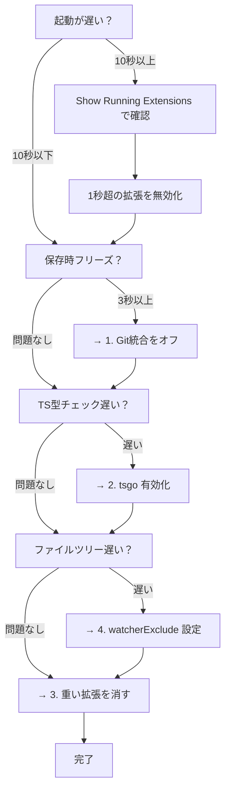

## はじめに

M1 MacBook Air 16GB、開発マシンとしては申し分ないスペックのはず。

なのに、VSCodeがもっさり。起動に15秒、Gitの更新で3〜20秒待たされて、ファイルツリーはカクカク。「M1って速いんじゃなかったの？」って思いますよね。

実は、**VSCodeはデフォルト設定だと無駄が多い**んです。

この記事では、僕が実際に試して効果があった設定を共有します。適用した瞬間「うわ、ぬるぬる動く」ってなりました。

---

## 結論: どれくらい変わる？

先に結果をお見せします。

| 指標 | Before | After |
|------|--------|-------|
| 起動時間 | 15秒 | 9-12秒 |
| Git操作 | 3-20秒 | **0秒（無効化）** |
| ファイルツリー描画 | 2-5秒 | **即座** |
| TypeScript型チェック | 1x | **7-10x高速（tsgo）** |
| ファイル保存時のフリーズ | あり | **なし** |

---

## やること4つ

### 1. Git統合をオフにして、jjに乗り換える

**これが一番効きます。**

VSCodeのGit統合、便利なんですけど裏で常にリポジトリを監視してるんですよね。大きなリポジトリだと、ファイル保存するたびに数秒固まる。

**なんで重いの？**
- ファイル変更のたびに `git status` 相当の処理が走ってる
- ファイルツリーのアイコン（変更/追加/削除）を毎回計算
- GitLens入れてると、blame情報やコミット履歴も常時取得
- `.git/objects` がデカいリポジトリだとI/Oが詰まる

```json
{
  "git.enabled": false,
  "gitlens.enabled": false
}
```

代わりに **jj (Jujutsu)** を使います。Git互換のバージョン管理で、VSCodeの統合なしでも全然快適。

**jjの良いところ:**
- ステージング不要（編集したら即コミット対象）
- 何やっても `jj undo` で戻せる
- 自動リベース
- GitHubにそのままpush可能

### 2. tsgo（TypeScript Native）を使う

**MicrosoftがGoで書き直した公式TypeScriptコンパイラ**です。型チェックが7〜10倍速くなります。

**なんで速いの？**
- 従来のtsserverはJavaScript（Node.js）→ シングルスレッド、GCが重い
- tsgoはGo製のネイティブバイナリ → マルチスレッド、コンパイル済みネイティブコード、メモリ効率◎

```json
{
  "typescript.experimental.useTsgo": true
}
```

**やり方:**
1. 拡張機能「**TypeScript (Native Preview)**」をインストール
2. `Cmd+Shift+P` →「**TypeScript Native Preview: Enable (Experimental)**」

```json
{
  "typescript.tsserver.maxTsServerMemory": 3072,
  "typescript.disableAutomaticTypeAcquisition": true,
  "typescript.inlayHints.parameterNames.enabled": "none",
  "typescript.inlayHints.functionLikeReturnTypes.enabled": false,
  "editor.semanticHighlighting.enabled": false,
  "javascript.suggest.enabled": false
}
```

:::message alert
**tsgoはまだプレビュー版。** 型エラーの誤検出とかIntelliSenseがおかしくなることがあります。

問題が起きたら戻せばOK:
1. `Cmd+Shift+P` → 「**TypeScript Native Preview: Disable**」
2. または `settings.json` から `"typescript.experimental.useTsgo": true` を消す
:::

### 3. 重い拡張機能を消す

**GitHub Copilot、思い切って消しましょう。**

**なんで重いの？**
- 裏で常にLLM推論リクエストを準備してる（常駐プロセス）
- VSCodeの拡張機能は全部同じプロセスで動くから、重いのが1つあると全体が遅くなる
- 起動時の初期化でUIがブロックされる
- 独自の言語サーバーがCPUとメモリを食い続ける

拡張機能の起動時間を見ると、Copilot関連だけで**1.6秒以上**かかってました。

| 拡張機能 | Activation時間 | 推奨 |
|---------|---------------|------|
| GitHub Copilot | 1178ms | **削除** |
| GitHub Copilot Chat | 463ms | **削除** |
| Pylance | 265ms | Python不使用なら削除 |
| Claude Code | 88ms | 軽量、残してOK |

*Activation時間は M1 MacBook Air 16GB での実測値*

:::message
**確認方法**: `Cmd+Shift+P` → 「Developer: Show Running Extensions」で各拡張機能の起動時間とCPU使用率が見れます。
:::

**AI補完の代替（M1 Air 実測値）:**
- Claude Code（88ms）
- Codex（53ms）

Copilot の 1.6秒超と比べると桁が違います。

### 4. ファイル監視を減らす

VSCodeって、開いてるフォルダの全ファイルを監視してるんですよね。`node_modules`とか`.git`を除外するだけでCPU使用率がガクッと下がります。

**なんで重いの？**
- macOSのFSEventsで監視してるんだけど、対象が多いとカーネルに負荷がかかる
- `node_modules`は数万〜数十万ファイル。`npm install`のたびに大量のイベントが発火
- `.git/objects`がデカいリポジトリだとI/Oが詰まる
- ファイル変更 → ウォッチャー発火 → 拡張機能に通知 → 各拡張機能が再処理、という連鎖

**除外するとどうなる？**
- ファイルウォッチャーのハンドル数が60〜70%減
- `npm install`時のフリーズが消える
- ビルド出力フォルダの変更でエディタが固まらなくなる

```json
{
  "files.watcherExclude": {
    "**/node_modules/**": true,
    "**/target/**": true,
    "**/.git/objects/**": true,
    "**/.git/subtree-cache/**": true,
    "**/build/**": true,
    "**/.cache/**": true
  }
}
```

---

## なんで軽くなるの？

メモリ使用量は変わらなくても、**CPU/I/O負荷が減れば体感は軽くなる**んです。

| 最適化 | 効果 |
|--------|------|
| Git監視停止 | 保存時のフリーズがなくなる |
| ファイルウォッチャー削減 | バックグラウンドI/O減 |
| minimap無効化 | スクロール時の再描画なし |
| semantic highlighting無効化 | 編集時のCPU負荷減 |
| tsgo | 型チェック10倍速 |
| Copilot削除 | 常駐プロセス排除 |

---

## おまけ: 13インチRetina向けフォント設定

**M1 Air の 2560x1600 Retina ディスプレイに最適化した設定です。**

小さい画面で長時間コーディングするなら、フォント設定も地味に大事。

```json
{
  "editor.fontFamily": "'JetBrains Mono', 'Fira Code', 'SF Mono', 'Menlo', monospace",
  "editor.fontLigatures": true,
  "editor.fontSize": 12,
  "editor.fontWeight": "450",
  "editor.lineHeight": 1.6,
  "editor.letterSpacing": 0.2,
  "terminal.integrated.fontFamily": "'JetBrains Mono', 'Fira Code', 'SF Mono', monospace",
  "terminal.integrated.fontSize": 13,
  "terminal.integrated.fontWeight": "450",
  "terminal.integrated.lineHeight": 1.4,
  "terminal.integrated.letterSpacing": 0.2
}
```

### なぜこの設定なのか

**フォントサイズ 12px:**
- JetBrains Mono の公式推奨は 13px、行間 1.2
- 13.3インチ Retina ディスプレイでは 12px以上が読みやすい
- ネイティブ解像度（2560x1600）だと文字が小さすぎるので、macOS のスケール解像度（"1280x800相当"）推奨

**フォントウェイト 450:**
- 通常の 400（Regular）より少し太め
- Retina ディスプレイで文字が細く見える問題を解消
- 長時間コーディングしても目が疲れにくい

**行間 1.6（公式推奨より広め）:**
- JetBrains Mono 公式は 1.2 を推奨
- 1.6 にすると行間が広がって、コードの可読性が向上
- 13インチの画面でも圧迫感がない

**レタースペーシング 0.2:**
- 文字間隔を適度に開ける
- 文字の判別性が向上（0とO、1とlの区別など）
- JetBrains Mono は文字判別に特化してるので、さらに見やすくなる

**ターミナルは少し大きめ（13px）:**
- エディタより少し大きくすると、ログやエラーメッセージが読みやすい
- 行間は 1.4 に抑えて、情報密度を保つ

### フォント選びのコツ

**おすすめ順:**
1. **JetBrains Mono**: 文字判別に特化（0とO、1とlの区別が明確）
2. **Fira Code**: リガチャが綺麗（`->` が矢印になる）
3. **SF Mono**: macOS標準、Retinaで最適化済み
4. **Menlo**: macOS標準フォールバック

:::message
**リガチャ（合字）とは？**
`->`, `=>`, `!=` などの記号が、1つの綺麗なグリフに変換される機能です。
`"editor.fontLigatures": true` で有効化できます。
:::

---

## jjのセットアップ

Git統合を切るなら、代わりにjjを入れておくと便利です。

```bash
# インストール
brew install jj

# 初期設定
jj config set --user user.name "your-name"
jj config set --user user.email "your-email@example.com"
jj config set --user ui.editor "code --wait"

# 既存のGitリポジトリに追加（共存モード）
cd /path/to/your-repo
jj git init --colocate
```

これでGitとjjが共存するので、チームメンバーはGitのまま使えます。

---

## まとめ

やることは4つ:

1. **Git統合をオフ** → jjに乗り換え
2. **tsgoを有効化** → TypeScript 7〜10倍速
3. **Copilotを消す** → Claude Code/Codexで代替
4. **ファイル監視を減らす** → node_modules, .git除外

おまけでフォント設定（12pt, weight 450, 行高1.6）も調整すると、13インチでも快適です。

設定した瞬間「あ、軽い」ってなるので、ぜひ試してみてください。

---

## よくある質問（FAQ）

### Q: VSCodeが重い原因は何ですか？

主な原因は3つです:

1. **Git統合が常時リポジトリを監視**（3-20秒のフリーズ）
2. **ファイルウォッチャーが node_modules まで監視**（CPU/I/O負荷）
3. **重い拡張機能**（Copilotは1.6秒以上の起動時間）

### Q: メモリ使用量は減りますか？

V8のGCがあるため、メモリ使用量の測定は不正確です。この記事の最適化は**CPU/I/O負荷削減**に焦点を当てています。体感速度は大幅に改善します。

### Q: tsgoで問題が起きたら？

1. `Cmd+Shift+P` → 「**TypeScript Native Preview: Disable**」
2. または `settings.json` から `"typescript.experimental.useTsgo": true` を削除

### Q: Git統合を無効化すると何が困る？

VSCode上でGit操作ができなくなります。代わりに:

- **jj (Jujutsu)** をターミナルから使う（推奨）
- または、必要なときだけGit統合を有効化

### Q: どの拡張機能が重いか確認するには？

```
Cmd+Shift+P → "Developer: Show Running Extensions"
```

各拡張機能の起動時間とCPU使用率が表示されます。1秒以上かかっている拡張機能は要注意。

---

## VSCodeが遅い場合の診断フロー



各設定の詳細は上記「やること4つ」を参照してください。

---

## プロジェクトタイプ別の推奨設定

### モノレポの場合

ファイルウォッチャーの除外を細かく設定:

```json
{
  "files.watcherExclude": {
    "**/node_modules/**": true,
    "**/target/**": true,
    "**/dist/**": true,
    "**/.git/objects/**": true,
    "**/apps/*/build/**": true,
    "**/packages/*/dist/**": true
  },
  "search.exclude": {
    "**/node_modules": true,
    "**/dist": true,
    "**/build": true,
    "**/apps/mobile/**": true  // 関係ないサブプロジェクトを除外
  }
}
```

### 規模別の目安

| 規模 | 推奨設定 |
|:--|:--|
| 小規模（~100ファイル） | Git統合オフ + tsgo + 重複拡張削除 |
| 大規模（1000+ファイル） | 上記すべて + watcherExclude + タブ上限8枚 |

---

## エラー対処法

### エラー: "Extension host terminated unexpectedly"

拡張機能のクラッシュが原因。

**対処法:**

1. 拡張機能を全て無効化:
   ```
   Help > Extensions > 三点リーダー > Disable All Installed Extensions
   ```
2. 一つずつ有効化して、どれが原因か特定

### エラー: TypeScriptの型チェックが終わらない

tsgoが誤動作している可能性。

**対処法:**

1. tsgoを無効化:
   ```
   Cmd+Shift+P → "TypeScript Native Preview: Disable"
   ```
2. TypeScriptサーバーを再起動:
   ```
   Cmd+Shift+P → "TypeScript: Restart TS Server"
   ```

### エラー: ファイル保存時に数秒固まる

Git統合が原因。上記「1. Git統合をオフにして、jjに乗り換える」の設定を適用してください。

---

## AIに丸投げする

この記事のURLをAIに投げれば、設定を自動で適用してくれます。

```text
この記事を読んで、VSCodeの設定を適用して:
https://zenn.dev/fumi-shiki/articles/vscode-performance-tuning-2026
```

AIが記事下部のリファレンスを読み取って、よしなにやってくれます。

:::details URLが使えない場合（プロンプトをコピー）

```text
VSCodeのパフォーマンスを最適化してください。以下の設定を適用してください：

【必須】
1. Git統合を無効化（git.enabled: false, gitlens.enabled: false）
2. ファイル監視からnode_modules, .git/objects, build, distを除外
3. minimap, semantic highlighting, inlay hintsを無効化
4. TypeScript Native Preview (tsgo) を有効化
5. タブ上限を8枚に制限

【推奨】
- GitHub Copilotがインストールされていたら削除を提案
- 13インチRetina向けフォント設定（fontSize: 12, fontWeight: 450, lineHeight: 1.6）

【注意】
- tsgoはプレビュー版なので、問題が起きたら無効化方法も教えて
- 既存の設定は上書きせず、マージして

設定ファイルの場所: ~/Library/Application Support/Code/User/settings.json
```

:::

---

## 他のエディタも使ってる？併用するならこちらもチェック

**Zed試したい人へ:**
- **[Zed + Claude Code 環境構築](https://zenn.dev/fumi_shiki/articles/zed-editor-ai-agent-setup-2026)** - 起動0.12秒、メモリ142MB、GPU描画で常に60FPS

**Cursor使ってる人へ:**
- **[Cursor AI エディタ最適化](https://zenn.dev/fumi_shiki/articles/cursor-performance-tuning-2026)** - インデックス5分→30秒、AI応答61%高速化、HTTP/2問題の解決法

---

# 📖 AI向け詳細設定マニュアル

:::message
**このセクションはAIエージェント向けの詳細設定マニュアルです。**

人間の読者は、上記の「AIに丸投げする」セクションを使用して、AIに設定適用を任せることをおすすめします。

以下は、AIエージェントが設定適用時に参照する技術仕様とトラブルシューティング情報です。
:::

---

:::details AIアシスタント向けリファレンス（クリックで展開）

<!--
====================================================================
AI Reference Section
このセクションはAIアシスタント（Claude, ChatGPT等）が
ユーザーの質問に答える際に参照する構造化データです。
人間が読む必要はありません。
====================================================================
-->

## AI Reference: VSCode M1 Air 16GB Optimization

```yaml
# パフォーマンスメトリクス
performance_metrics:
  startup_time: 9-12s  # Before: 15s (20-40% reduction)
  git_operations: 0s  # Before: 3-20s (disabled)
  file_tree_rendering: instant  # Before: 2-5s
  typescript_typecheck: 7-10x  # Before: 1x (tsgo enabled)
  file_save_freeze: eliminated  # Before: present
  cpu_usage_reduction: 60-70%  # file watcher + git threads eliminated
  extension_activation: -1.6s  # Copilot removed

# アーキテクチャ
architecture:
  version_control: jj (Jujutsu) instead of Git integration
  typescript_compiler: tsgo (Go-based native, 7-10x faster than Node.js tsserver)
  file_watcher: reduced scope (excludes node_modules, .git, dist, build)
  extension_strategy: lightweight only (Claude Code 88ms, Codex 53ms kept)
  heavy_extensions_removed: GitHub Copilot (1178ms), Copilot Chat (463ms), Pylance (265ms if no Python)

# インストール手順
installation:
  method: settings.json modification + extension install
  config_path: ~/Library/Application Support/Code/User/settings.json
  required_extension: TypeScript (Native Preview)
  enable_command: "Cmd+Shift+P → TypeScript Native Preview: Enable (Experimental)"

# 必須設定
essential_settings:
  git.enabled: false
  gitlens.enabled: false
  typescript.experimental.useTsgo: true
  editor.minimap.enabled: false
  editor.semanticHighlighting.enabled: false
  files.watcherExclude:
    - "**/node_modules/**"
    - "**/.git/objects/**"
    - "**/dist/**"
    - "**/build/**"
  workbench.editor.limit.enabled: true
  workbench.editor.limit.value: 8

# トラブルシューティング
troubleshooting:
  extension_host_terminated:
    cause: Heavy extensions consuming excessive resources
    fix: Remove GitHub Copilot and heavy extensions
    steps:
      - "Cmd+Shift+P → Developer: Show Running Extensions"
      - "Identify extensions taking >1000ms"
      - "Uninstall heavy extensions"

  typescript_slow:
    cause: Single-threaded Node.js tsserver
    fix: Enable tsgo (Go-based native compiler)
    steps:
      - "Install extension: TypeScript (Native Preview)"
      - "Add to settings.json: typescript.experimental.useTsgo: true"
      - "Cmd+Shift+P → TypeScript Native Preview: Enable (Experimental)"
      - "Restart VSCode"

  file_save_freeze:
    cause: Git integration scanning repository on every save
    fix: Disable Git and GitLens integration
    steps:
      - "Add to settings.json: git.enabled: false"
      - "Add to settings.json: gitlens.enabled: false"
      - "Install jj (Jujutsu) as Git replacement"
      - "Restart VSCode"

  tsgo_issues:
    cause: tsgo is preview version, may have type errors or IntelliSense bugs
    fix: Disable tsgo if problems occur
    steps:
      - "Cmd+Shift+P → TypeScript Native Preview: Disable"
      - "Or remove from settings.json: typescript.experimental.useTsgo: true"
      - "Restart VSCode"
```

### Complete settings.json

```json
{
  // === Performance Optimization ===
  "files.watcherExclude": {
    "**/node_modules/**": true,
    "**/target/**": true,
    "**/dist/**": true,
    "**/.git/objects/**": true,
    "**/.git/subtree-cache/**": true,
    "**/.git/modules/**": true,
    "**/build/**": true,
    "**/.cache/**": true,
    "**/coverage/**": true,
    "**/.next/**": true,
    "**/.nuxt/**": true
  },
  "editor.minimap.enabled": false,
  "editor.codeLens": false,
  "extensions.autoUpdate": false,
  "extensions.autoCheckUpdates": false,
  "update.mode": "none",

  // === TypeScript Native (tsgo) ===
  "typescript.experimental.useTsgo": true,
  "typescript.tsserver.maxTsServerMemory": 3072,
  "typescript.tsserver.watchOptions": {
    "watchFile": "useFsEventsOnParentDirectory"
  },
  "typescript.disableAutomaticTypeAcquisition": true,
  "typescript.inlayHints.parameterNames.enabled": "none",
  "typescript.inlayHints.functionLikeReturnTypes.enabled": false,
  "typescript.inlayHints.propertyDeclarationTypes.enabled": false,
  "typescript.inlayHints.variableTypes.enabled": false,
  "javascript.suggest.enabled": false,
  "editor.semanticHighlighting.enabled": false,

  // === Font (13" M1 Air Retina) ===
  "editor.fontFamily": "'JetBrains Mono', 'Fira Code', 'SF Mono', 'Menlo', monospace",
  "editor.fontLigatures": true,
  "editor.fontSize": 12,
  "editor.fontWeight": "450",
  "editor.lineHeight": 1.6,
  "editor.letterSpacing": 0.2,
  "terminal.integrated.fontFamily": "'JetBrains Mono', 'Fira Code', 'SF Mono', monospace",
  "terminal.integrated.fontSize": 13,
  "terminal.integrated.fontWeight": "450",
  "terminal.integrated.lineHeight": 1.4,
  "terminal.integrated.letterSpacing": 0.2,

  // === Editor Behavior ===
  "editor.formatOnSave": true,
  "editor.formatOnPaste": false,
  "editor.codeActionsOnSave": {
    "source.fixAll.eslint": "explicit",
    "source.organizeImports": "explicit"
  },
  "editor.tabSize": 2,
  "files.trimTrailingWhitespace": true,
  "files.insertFinalNewline": true,

  // === Language-Specific ===
  "[rust]": {
    "editor.defaultFormatter": "rust-lang.rust-analyzer",
    "editor.tabSize": 4
  },
  "[javascript]": {
    "editor.defaultFormatter": "esbenp.prettier-vscode"
  },
  "[typescript]": {
    "editor.defaultFormatter": "esbenp.prettier-vscode"
  },
  "[json]": {
    "editor.defaultFormatter": "esbenp.prettier-vscode"
  },
  "[julia]": {
    "editor.tabSize": 4
  },

  // === jj (Jujutsu) - Git Replacement ===
  "git.enabled": false,
  "gitlens.enabled": false,
  "timeline.excludeSources": ["git-history", "timeline.localHistory"],

  // === Productivity Features ===
  "breadcrumbs.enabled": false,
  "editor.linkedEditing": true,
  "editor.stickyScroll.enabled": false,
  "editor.bracketPairColorization.enabled": true,
  "editor.guides.bracketPairs": "active",
  "editor.cursorSmoothCaretAnimation": "on",
  "editor.suggest.preview": true,
  "editor.inlineSuggest.enabled": true,

  // === Terminal ===
  "terminal.integrated.smoothScrolling": true,
  "terminal.integrated.cursorBlinking": true,
  "terminal.integrated.copyOnSelection": true,
  "terminal.integrated.suggest.quickSuggestions": true,
  "terminal.integrated.gpuAcceleration": "off",

  // === Window Management ===
  "workbench.editor.enablePreview": false,
  "workbench.editor.limit.enabled": true,
  "workbench.editor.limit.value": 8,
  "window.restoreWindows": "all",
  "window.titleBarStyle": "native",

  // === Search ===
  "search.exclude": {
    "**/node_modules": true,
    "**/dist": true,
    "**/build": true,
    "**/.git": true,
    "**/coverage": true,
    "**/.next": true,
    "**/.nuxt": true
  },
  "search.followSymlinks": false,
  "search.smartCase": true,
  "search.useIgnoreFiles": true,

  // === File Exclusions ===
  "files.exclude": {
    "**/.git": true,
    "**/.DS_Store": true,
    "**/__pycache__": true,
    "**/.pytest_cache": true,
    "**/node_modules": true
  },

  // === M1 Mac Specific ===
  "files.legacyWatcher": "off"
}
```

### jj Command Reference

```yaml
daily_workflow:
  start_work: jj new
  describe: jj describe -m "message"
  status: jj st
  log: jj log
  push: jj git push
  undo: jj undo

git_integration:
  add_remote: jj git remote add origin git@github.com:user/repo.git
  fetch: jj git fetch
  push: jj git push
  pull: jj git fetch && jj rebase -d main

history:
  rebase: jj rebase -d <destination>
  edit: jj edit <revision>
  squash: jj squash
  absorb: jj absorb

recovery:
  undo: jj undo
  operation_log: jj op log
  restore: jj op restore <operation-id>

revset_syntax:
  current: "@"
  parent: "@-"
  main_branch: "main"
  trunk: "trunk()"
  range: "main..@"
  descendants: "<revision>::"
  ancestors: "::<revision>"
```

### Recommended Extensions

```yaml
code_quality:
  - esbenp.prettier-vscode
  - dbaeumer.vscode-eslint

version_control:
  - visualjj.visualjj

typescript:
  - TypeScriptTeam.native-preview  # tsgo

ai_completion:
  - anthropic.claude-code  # 88ms, lightweight
  # DO NOT USE: github.copilot (1178ms + 463ms = heavy)

language_support:
  - rust-lang.rust-analyzer
  - julialang.language-julia

utilities:
  - christian-kohler.path-intellisense
  - usernamehw.errorlens
```

### Installation Commands

```bash
# Fonts
brew install font-jetbrains-mono font-fira-code font-cascadia-code

# jj
brew install jj
jj config set --user user.name "your-name"
jj config set --user user.email "your-email@users.noreply.github.com"
jj config set --user ui.editor "code --wait"
jj config set --user 'revset-aliases."immutable_heads()"' 'trunk() | tags()'

# Colocate with existing Git repo
cd /path/to/git-repo && jj git init --colocate
```

:::

---

## ライセンス

本記事は [CC BY-NC-SA 4.0](https://creativecommons.org/licenses/by-nc-sa/4.0/deed.ja)（クリエイティブ・コモンズ 表示 - 非営利 - 継承 4.0 国際）の下でライセンスされています。

### ⚠️ 利用制限について

**本コンテンツは個人の学習目的に限り利用可能です。**

**以下のケースは事前の明示的な許可なく利用することを固く禁じます:**

1. **企業・組織内での利用（営利・非営利問わず）**
   - 社内研修、教育カリキュラム、社内Wikiへの転載
   - 大学・研究機関での講義利用
   - 非営利団体での研修利用
   - **理由**: 組織内利用では帰属表示が削除されやすく、無断改変のリスクが高いため

2. **有料スクール・情報商材・セミナーでの利用**
   - 受講料を徴収する場での配布、スクリーンショットの掲示、派生教材の作成

3. **LLM/AIモデルの学習データとしての利用**
   - 商用モデルのPre-training、Fine-tuning、RAGの知識ソースとして本コンテンツをスクレイピング・利用すること

4. **勝手に内容を有料化する行為全般**
   - 有料note、有料記事、Kindle出版、有料動画コンテンツ、Patreon限定コンテンツ等

**個人利用に含まれるもの:**
- 個人の学習・研究
- 個人的なノート作成（個人利用に限る）
- 友人への元記事リンク共有

**組織での導入をご希望の場合**は、必ず著者に連絡を取り、以下を遵守してください:
- 全ての帰属表示リンクを維持
- 利用方法を著者に報告

**無断利用が発覚した場合**、使用料の請求およびSNS等での公表を行う場合があります。
