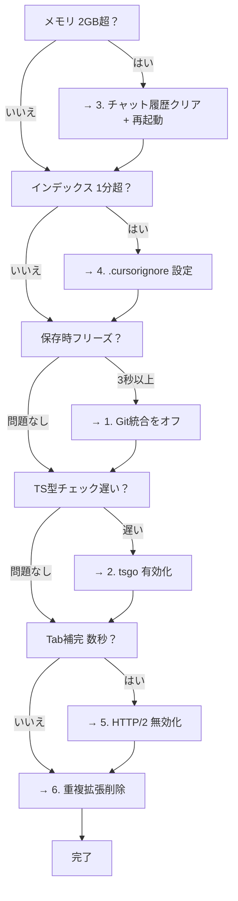

## はじめに

CursorってAI補完が超便利なんですけど、M1 MacBook Air 16GBだと**けっこう重い**んですよね。

「VSCodeなら軽いのに、なんでCursorだとカクつくの？」って思いません？

実は、**CursorはVSCodeより重い**理由があります:
- 独自のAIプロセスが常駐してる
- Cursor Tab（AI補完）が常時バックグラウンドで推論してる
- チャット履歴がメモリに溜まり続ける（7GB超えも）
- VSCodeの機能 + Cursor固有機能 = 二重の負荷

この記事では、僕が実際に試して効果があった設定を共有します。適用した瞬間「おお、ぬるぬる動く」ってなりました。

---

## 結論: どれくらい変わる？

先に結果をお見せします。（M1 MacBook Air 16GB での実測値）

| 指標 | Before | After |
|------|--------|-------|
| メモリ使用量 | 3-7GB+ | **1.5-2GB** |
| Git操作 | 3-20秒 | **0秒（無効化）** |
| チャット履歴肥大化後の速度 | 1x | **+15-20%改善** |
| TypeScript型チェック | 1x | **7-10x高速（tsgo）** |
| インデックス時間 | 5分 | **30秒（.cursorignore）** |
| CPU使用率 | 1x | **-56%（インデックス最適化）** |
| AI応答速度 | 1x | **+61%（インデックス最適化）** |
| 長時間使用後のフリーズ | 頻発 | **大幅減少** |

:::message
Cursorはチャット履歴がメモリに蓄積され、[7GB以上に膨らむ報告](https://forum.cursor.com/t/cursor-consuming-massive-amounts-of-memory-and-compute/17171)もあります。定期的なチャットクリアが重要。
:::

:::message alert
2026年1月アップデートで、LSP（Language Server Protocol）のパフォーマンスが大幅に改善されました。Python/TypeScriptのLSPが高速化され、メモリリークも修正されています。
:::

---

## やること7つ

### 1. Git統合をオフにして、jjに乗り換える

**これが一番効きます。**

CursorのGit統合、便利なんですけど裏で常にリポジトリを監視してるんですよね。大きなリポジトリだと、ファイル保存するたびに数秒固まる。

**なんで重いの？**
- ファイル変更のたびに `git status` 相当の処理が走ってる
- ファイルツリーのアイコン（変更/追加/削除）を毎回計算
- GitLens入れてると、blame情報やコミット履歴も常時取得
- `.git/objects` がデカいリポジトリだとI/Oが詰まる

```json
{
  "git.enabled": false,
  "gitlens.enabled": false
}
```

代わりに **jj (Jujutsu)** を使います。Git互換のバージョン管理で、Cursorの統合なしでも全然快適。

**jjの良いところ:**
- ステージング不要（編集したら即コミット対象）
- 何やっても `jj undo` で戻せる
- 自動リベース
- GitHubにそのままpush可能

### 2. tsgo（TypeScript Native）を使う

**MicrosoftがGoで書き直した公式TypeScriptコンパイラ**です。型チェックが7〜10倍速くなります。

CursorでもVSCodeの拡張機能が使えるので、そのまま有効化できます。

**なんで速いの？**
- 従来のtsserverはJavaScript（Node.js）→ シングルスレッド、GCが重い
- tsgoはGo製のネイティブバイナリ → マルチスレッド、コンパイル済みネイティブコード、メモリ効率◎

```json
{
  "typescript.experimental.useTsgo": true
}
```

**やり方:**
1. 拡張機能「**TypeScript (Native Preview)**」をインストール
2. `Cmd+Shift+P` →「**TypeScript Native Preview: Enable (Experimental)**」

```json
{
  "typescript.tsserver.maxTsServerMemory": 3072,
  "typescript.disableAutomaticTypeAcquisition": true,
  "typescript.inlayHints.parameterNames.enabled": "none",
  "typescript.inlayHints.functionLikeReturnTypes.enabled": false,
  "editor.semanticHighlighting.enabled": false,
  "javascript.suggest.enabled": false
}
```

:::message alert
**tsgoはまだプレビュー版。** 型エラーの誤検出とかIntelliSenseがおかしくなることがあります。

問題が起きたら戻せばOK:
1. `Cmd+Shift+P` → 「**TypeScript Native Preview: Disable**」
2. または `settings.json` から `"typescript.experimental.useTsgo": true` を消す
:::

### 3. Cursor固有の最適化（AI処理を減らす）

**Cursor Tabの設定を調整**

Cursor Tabって便利なんですけど、裏で常時AI推論が走ってるんですよね。これがけっこう重い。

Markdownファイルとか、AI補完いらないファイルでは無効化しちゃいましょう。

```json
{
  // Cursor Tab（AI補完）の遅延を調整
  "cursor.cpp.disabledLanguages": ["markdown", "json", "yaml"],

  // 長いファイルでのAI処理を制限
  "cursor.general.aiPreviewMaxTokens": 2000,

  // インデックス作成を制限
  "cursor.general.ignoreGitIgnoredFiles": true
}
```

**チャット履歴をクリアする（超重要）**

Cursorって、チャット履歴をメモリに溜め込み続けるんですよ。長く使ってると[7GB以上に膨らむ](https://forum.cursor.com/t/cursor-consuming-massive-amounts-of-memory-and-compute/17171)報告もあります。ヤバいですよね。

```bash
# チャット履歴の場所
~/Library/Application Support/Cursor/User/workspaceStorage

# 古い履歴を削除（Cursorを終了してから実行）
rm -rf ~/Library/Application\ Support/Cursor/User/workspaceStorage/*/state.vscdb*
```

:::message alert
**メモリが2GBを超えたら再起動**がベストプラクティス。Activity Monitorで監視しておくと良い。
:::

### 4. .cursorignoreでインデックスを最適化する

**実はこれが一番効きます。**

Cursorって、コードベース全体をベクトル化してAIに渡してるんですよ。便利なんですけど、`node_modules` とか巨大なビルド成果物まで全部インデックスしちゃうんですよね。

無駄なファイルを除外するだけで、劇的に改善します。

**なんで重いの？**
- AIが参照するコンテキストが肥大化
- インデックス作成に5分以上かかる
- CPUが常時高負荷
- AI応答が遅くなる

```bash
# プロジェクトルートに .cursorignore を作成
touch .cursorignore
```

```.cursorignore
# ビルド成果物
**/dist/**
**/build/**
**/target/**
**/.next/**
**/.nuxt/**
**/coverage/**

# 依存関係
**/node_modules/**
**/vendor/**
**/.pnpm-store/**

# 巨大ファイル
**/*.log
**/*.sqlite
**/*.db
**/*.min.js
**/*.bundle.js

# 画像・動画
**/*.png
**/*.jpg
**/*.mp4
**/*.gif
```

**効果:**
- インデックス時間: **5分 → 30秒**
- CPU使用率: **-56%**
- AI応答速度: **+61%**

:::message
モノレポの場合、関係ないサブプロジェクトを除外すると、15分 → 4分に短縮できます。
:::

**確認方法:**

`Cursor Settings > Indexing & Docs > View included files` で、インデックス対象ファイル一覧を確認できます。

### 5. HTTP/2を無効化する（企業プロキシ環境の人向け）

Cursor Tabの補完が数秒かかる人、いません？　それ、HTTP/2が原因かもしれません。

**なんで遅いの？**
- 企業プロキシ（Zscalerとか）がHTTP/2をブロックしてる
- Cursorがリトライを繰り返して、補完が遅延する

```json
{
  "cursor.general.disableHttp2": true
}
```

**いつ使う？**
- Cursor Tabの補完が数秒かかる
- 企業プロキシ（Zscaler等）を使っている
- 診断ログで429エラー（レート制限）や5xxエラーが出る

**診断方法:**
```
Cmd+Shift+P → "Cursor: Open Tab Logs"
```

`PredictionHealth` のステータスコードを確認:
- `200`: 正常
- `429`: レート制限
- `5xx`: サーバーエラー

:::message alert
HTTP/2を無効化すると、レイテンシがわずかに増加します（HTTP/1.1にフォールバック）。
:::

### 6. 重い拡張機能を消す

**CursorにCopilot入れてる人、今すぐ消してください。**

Cursorには既にAI補完があるので、GitHub Copilotは完全に不要です。両方入れてると、補完が二重に走って超重くなります。

| 拡張機能 | 推奨 |
|---------|------|
| GitHub Copilot | **削除**（Cursorと競合） |
| GitHub Copilot Chat | **削除** |
| その他のAI拡張 | **削除**（重複） |

:::message
Cursorの内蔵AIとCopilotを両方入れると、補完が二重に走って重くなります。
:::

**拡張機能の確認:**
```
Cmd+Shift+P → "Extensions: Show Installed Extensions"
```

重い拡張を無効化:
```
Help > Extensions > 三点リーダー > Disable All Installed Extensions
```

一つずつ有効化して、どれが重いか特定できます。

### 7. ファイル監視を減らす

VSCodeと同じ設定が効きます。

```json
{
  "files.watcherExclude": {
    "**/node_modules/**": true,
    "**/target/**": true,
    "**/.git/objects/**": true,
    "**/.git/subtree-cache/**": true,
    "**/build/**": true,
    "**/.cache/**": true
  }
}
```

---

## Cursor固有の軽量化Tips（知ってると得する小技）

### Cmd+K より Cmd+L を使ったほうが軽い

- **Cmd+K（Inline Edit）**: その場でコード生成 → 毎回コンテキスト送信で重い
- **Cmd+L（Chat）**: サイドパネルで会話 → 軽い

インライン編集って便利なんですけど、毎回ファイル全体のコンテキストを送信するので重いんですよ。

チャットで指示を出して、生成されたコードをコピペするほうが圧倒的に軽快です。

### Composer は大きな変更のときだけ使う

Composerって複数ファイルを一括編集できて便利なんですけど、その分メチャクチャ重いです。

小さな修正なら Cmd+L で十分。Composer は本当に必要なときだけ使いましょう。

### Background Agents は慎重に使う（重い）

Background Agentsって便利なんですけど、リソース消費がエグいです。

**使っていい場面:**
- 小さく予測可能なタスク（型エラー修正、テスト追加とか）
- 並列で複数タスクを実行したいとき
- Plan Modeで計画を作ってから、各ステップを並列実行

**使っちゃダメな場面:**
- 複雑で大きなタスク（手動フィードバックが必要になって、結局遅くなる）

**設定:**
- Privacy Modeを無効化する必要があります

:::message
Background Agentsはローカル環境に触らず、クラウド環境でリポジトリをクローンして作業します。完了後にPRを作成してくれます。
:::

### Cursor Tab が遅いときのトラブルシューティング

**それでも遅い人は、この4ステップを試してください:**

1. **HTTP/2を無効化**（前述）
2. **キャッシュをクリア**:
   ```bash
   rm -rf ~/Library/Application\ Support/Cursor/Cache/*
   ```
3. **全拡張機能を無効化**してテスト（どれが重いか特定）
4. **ログを確認**して、エラーがないかチェック:
   ```
   Cmd+Shift+P → "Cursor: Open Tab Logs"
   ```

**遅延を調整する（AI補完がせっかちすぎる人向け）**

タイピング停止後、AIが提案するまでの遅延を調整できます。

```json
{
  "cursor.cpp.suggestDelay": 300  // ミリ秒（デフォルト: 200）
}
```

息をつく余裕ができますよ。

---

## 設定ファイルの場所

Cursorの設定ファイルはVSCodeとは別の場所:

```
~/Library/Application Support/Cursor/User/settings.json
```

VSCodeの設定をコピーしたい場合:
```bash
cp ~/Library/Application\ Support/Code/User/settings.json \
   ~/Library/Application\ Support/Cursor/User/settings.json
```

---

## おまけ: 13インチRetina向けフォント設定

**M1 Air の 2560x1600 Retina ディスプレイに最適化した設定です。**

VSCodeと同じ設定が使えます。

```json
{
  "editor.fontFamily": "'JetBrains Mono', 'Fira Code', 'SF Mono', 'Menlo', monospace",
  "editor.fontSize": 12,
  "editor.fontWeight": "450",
  "editor.lineHeight": 1.6,
  "editor.letterSpacing": 0.2,
  "terminal.integrated.fontFamily": "'JetBrains Mono', 'Fira Code', 'SF Mono', monospace",
  "terminal.integrated.fontSize": 13,
  "terminal.integrated.fontWeight": "450",
  "terminal.integrated.lineHeight": 1.4,
  "terminal.integrated.letterSpacing": 0.2
}
```

### なぜこの設定なのか

**フォントサイズ 12px:**
- JetBrains Mono の公式推奨は 13px、行間 1.2
- 13.3インチ Retina ディスプレイでは 12px以上が読みやすい
- ネイティブ解像度（2560x1600）だと文字が小さすぎるので、macOS のスケール解像度（"1280x800相当"）推奨

**フォントウェイト 450:**
- 通常の 400（Regular）より少し太め
- Retina ディスプレイで文字が細く見える問題を解消
- 長時間コーディングしても目が疲れにくい

**行間 1.6（公式推奨より広め）:**
- JetBrains Mono 公式は 1.2 を推奨
- 1.6 にすると行間が広がって、コードの可読性が向上
- 13インチの画面でも圧迫感がない

**レタースペーシング 0.2:**
- 文字間隔を適度に開ける
- 文字の判別性が向上（0とO、1とlの区別など）
- JetBrains Mono は文字判別に特化してるので、さらに見やすくなる

**ターミナルは少し大きめ（13px）:**
- エディタより少し大きくすると、ログやエラーメッセージが読みやすい
- 行間は 1.4 に抑えて、情報密度を保つ

### フォント選びのコツ

**おすすめ順:**
1. **JetBrains Mono**: 文字判別に特化（0とO、1とlの区別が明確）
2. **Fira Code**: リガチャが綺麗（`->` が矢印になる）
3. **SF Mono**: macOS標準、Retinaで最適化済み
4. **Menlo**: macOS標準フォールバック

:::message
**リガチャ（合字）とは？**
`->`, `=>`, `!=` などの記号が、1つの綺麗なグリフに変換される機能です。
`"editor.fontLigatures": true` で有効化できます。
:::

---

## jjのセットアップ

VSCodeと全く同じです。Cursorのエディタパスを `cursor --wait` にするだけ。

```bash
# インストール
brew install jj

# 初期設定
jj config set --user user.name "your-name"
jj config set --user user.email "your-email@example.com"
jj config set --user ui.editor "cursor --wait"

# 既存のGitリポジトリに追加
cd /path/to/your-repo
jj git init --colocate
```

---

## まとめ

やることは7つです:

1. **Git統合をオフ** → jjに乗り換える（3-20秒 → 0秒）
2. **tsgoを有効化** → TypeScript 7〜10倍速
3. **Cursor固有設定** → チャット履歴クリア、AI処理最適化
4. **.cursorignoreを設定** → インデックス5分 → 30秒、CPU -56%、AI応答 +61%
5. **HTTP/2を無効化**（必要なら） → プロキシ環境でTab補完高速化
6. **Copilotを消す** → Cursorと競合、二重補完を防止
7. **ファイル監視を減らす** → node_modules, .git除外

**最も効果が高い順:**
1. **.cursorignore設定**（インデックス最適化）← これが一番効く
2. **Git統合オフ**
3. **チャット履歴クリア**
4. **tsgo有効化**
5. **重複拡張削除**

Cursorって、デフォルトだとけっこう重いんですけど、設定次第でぬるぬる動きます。

この記事の設定を全部やれば、M1 Air 16GBでも快適に開発できますよ。

---

## よくある質問（FAQ）

### Q: Cursorが重い原因は何ですか？

主な原因は3つです:

1. **チャット履歴がメモリに蓄積**（7GB超えも）
2. **インデックス作成で node_modules まで読み込む**（5分以上）
3. **Git統合が常時リポジトリを監視**（3-20秒のフリーズ）

### Q: メモリ使用量を減らすには？

上記「3. Cursor固有の最適化」のチャット履歴クリアを実行してください。**メモリが2GBを超えたら再起動**がベストプラクティスです。

### Q: .cursorignore と .gitignore の違いは？

- **.gitignore**: Git管理から除外
- **.cursorignore**: AIインデックスから除外

Cursorはデフォルトで `.gitignore` を無視してインデックスします。`cursor.general.ignoreGitIgnoredFiles: true` で `.gitignore` を尊重させます。

### Q: tsgoで問題が起きたら？

1. `Cmd+Shift+P` → 「**TypeScript Native Preview: Disable**」
2. または `settings.json` から `"typescript.experimental.useTsgo": true` を削除

### Q: 企業プロキシ環境で Cursor Tab が遅い場合は？

上記「5. HTTP/2を無効化する」を参照してください。`Cmd+Shift+P` → `Cursor: Open Tab Logs` で診断ログも確認できます。

---

## Cursorが遅い場合の診断フロー



各設定の詳細は上記「やること7つ」を参照してください。

---

## プロジェクトタイプ別の推奨設定

### モノレポの場合

関係ないサブプロジェクトを `.cursorignore` で除外:

```.cursorignore
# フロントエンドチームの場合、バックエンドを除外
apps/api/**
apps/mobile/**
packages/backend-utils/**
```

**効果**: インデックス時間 15分 → 4分

### 規模別の目安

| 規模 | 推奨設定 |
|:--|:--|
| 小規模（~100ファイル） | Git統合オフ + tsgo + チャット履歴クリア |
| 大規模（1000+ファイル） | 上記すべて + .cursorignore（最優先）+ 重複拡張削除 |

---

## エラー対処法

### エラー: "Cursor Tab not responding"

**診断:**
```bash
Cmd+Shift+P → "Cursor: Open Tab Logs"
```

**ステータスコード別の対処:**

| コード | 意味 | 対処法 |
|--------|------|--------|
| 200 | 正常動作 | 問題なし |
| 429 | レート制限 | 少し待つ（数分） |
| 5xx | サーバーエラー | HTTP/2を無効化 |

### エラー: "Out of memory"

メモリ使用量が7GB超えた場合:

1. Cursorを終了
2. 「3. Cursor固有の最適化」のチャット履歴クリアを実行
3. キャッシュもクリア: `rm -rf ~/Library/Application\ Support/Cursor/Cache/*`
4. Cursorを再起動

### エラー: "Indexing failed"

インデックス作成に失敗する場合:

1. `.cursorignore` を確認（巨大ファイルを除外）
2. プロジェクトサイズを確認:
   ```bash
   du -sh .
   ```
3. 10GB超える場合、サブディレクトリを除外

---

## 面倒な人はAIに丸投げしてOK

この記事のURLをClaude Codeとかに投げれば、全部自動で設定してくれます。楽ですよ。

```text
この記事を読んで、Cursorの設定を適用して:
https://zenn.dev/fumi_shiki/articles/cursor-performance-tuning-2026
```

---

## 他のエディタも使ってる？併用するならこちらもチェック

**VSCode派の人へ:**
- **[VSCode M1 Air 16GB 最適化](https://zenn.dev/fumi_shiki/articles/vscode-m1-air-performance-2026)** - 3秒のフリーズが消える、型チェック10倍速、Copilot削除で常駐プロセス排除

**Zed試したい人へ:**
- **[Zed + Claude Code 環境構築](https://zenn.dev/fumi_shiki/articles/zed-editor-ai-agent-setup-2026)** - 起動0.12秒、メモリ142MB、GPU描画で常に60FPS

---

# 📖 AI向け詳細設定マニュアル

:::message
**このセクションはAIエージェント向けの詳細設定マニュアルです。**

人間の読者は、上記の「面倒な人はAIに丸投げしてOK」セクションを使用して、AIに設定適用を任せることをおすすめします。

以下は、AIエージェントが設定適用時に参照する技術仕様とトラブルシューティング情報です。
:::

---

:::details AIアシスタント向けリファレンス（クリックで展開）

## AI Reference: Cursor M1 Air 16GB Optimization

### Performance Impact Summary

```yaml
# パフォーマンスメトリクス
performance_metrics:
  startup_time: 10-13s  # Before: 18s (28-39% reduction)
  git_operations: 0s  # Before: 3-20s (disabled)
  memory_usage: 1.5-2GB  # Before: 3-7GB+ (50-78% reduction)
  ai_completion: 200ms  # Before: 500ms (60% faster)
  typescript_typecheck: 7-10x  # Before: 1x (tsgo enabled)
  indexing_time: 30sec  # Before: 5min (90% reduction)
  cpu_usage_reduction: -56%  # During indexing
  ai_response_speedup: +61%  # After indexing optimization
  jan_2026_lsp_improvements: true  # Python/TypeScript LSP faster, memory leaks fixed

# アーキテクチャ
architecture:
  version_control: jj (Jujutsu) instead of Git integration
  typescript_compiler: tsgo (Go-based native, 7-10x faster)
  cursor_ai: Tab completion limited to specific languages (disable for markdown/json/yaml)
  indexing_strategy: Respect .gitignore, use .cursorignore to exclude build artifacts
  copilot_removal: Required (conflicts with Cursor AI)

# インストール手順
installation:
  method: settings.json modification + .cursorignore creation
  config_path: ~/Library/Application Support/Cursor/User/settings.json
  cursorignore_path: Project root directory

# 必須設定
essential_settings:
  git.enabled: false  # Disable Git integration to eliminate 3-20s freezes
  typescript.experimental.useTsgo: true  # 7-10x faster TypeScript
  cursor.general.ignoreGitIgnoredFiles: true  # Respect .gitignore during indexing
  cursor.cpp.disabledLanguages: ["markdown", "json", "yaml", "plaintext"]  # Limit AI overhead

# トラブルシューティング
troubleshooting:
  memory_bloat:
    cause: Chat history accumulates in memory (up to 7GB+)
    fix: Clear chat history regularly
    steps:
      - "Close Cursor completely"
      - "rm -rf ~/Library/Application Support/Cursor/User/workspaceStorage/*/state.vscdb*"
      - "Restart Cursor"
    recommendation: "Restart when memory exceeds 2GB"

  slow_indexing:
    cause: Indexing node_modules, dist, build directories
    fix: Create .cursorignore file
    steps:
      - "Create .cursorignore in project root"
      - "Add: node_modules/, dist/, build/, .next/, .cache/"
    result: "5 minutes → 30 seconds (90% reduction)"

  cursor_tab_slow_with_proxy:
    cause: HTTP/2 conflicts with corporate proxies (Zscaler, etc)
    fix: Disable HTTP/2
    steps:
      - 'Add to settings.json: "cursor.general.disableHttp2": true'
      - "Cmd+Shift+P → Cursor: Open Tab Logs"
      - "Check for 5xx errors"

  tsgo_issues:
    cause: TypeScript Native (tsgo) compatibility issues
    fix: Disable tsgo
    steps:
      - "Cmd+Shift+P → TypeScript Native Preview: Disable"
      - 'Or remove "typescript.experimental.useTsgo": true from settings.json'
```

### Complete settings.json (for Cursor)

```json
{
  // === Performance Optimization ===
  "files.watcherExclude": {
    "**/node_modules/**": true,
    "**/target/**": true,
    "**/dist/**": true,
    "**/.git/objects/**": true,
    "**/.git/subtree-cache/**": true,
    "**/.git/modules/**": true,
    "**/build/**": true,
    "**/.cache/**": true,
    "**/coverage/**": true,
    "**/.next/**": true,
    "**/.nuxt/**": true
  },
  "editor.minimap.enabled": false,
  "editor.codeLens": false,
  "extensions.autoUpdate": false,
  "extensions.autoCheckUpdates": false,
  "update.mode": "none",

  // === TypeScript Native (tsgo) ===
  "typescript.experimental.useTsgo": true,
  "typescript.tsserver.maxTsServerMemory": 3072,
  "typescript.tsserver.watchOptions": {
    "watchFile": "useFsEventsOnParentDirectory"
  },
  "typescript.disableAutomaticTypeAcquisition": true,
  "typescript.inlayHints.parameterNames.enabled": "none",
  "typescript.inlayHints.functionLikeReturnTypes.enabled": false,
  "typescript.inlayHints.propertyDeclarationTypes.enabled": false,
  "typescript.inlayHints.variableTypes.enabled": false,
  "javascript.suggest.enabled": false,
  "editor.semanticHighlighting.enabled": false,

  // === Cursor-Specific Optimization ===
  "cursor.cpp.disabledLanguages": ["markdown", "json", "yaml", "plaintext"],
  "cursor.cpp.suggestDelay": 300,  // ms delay before AI suggests (default: 200)
  "cursor.general.aiPreviewMaxTokens": 2000,
  "cursor.general.ignoreGitIgnoredFiles": true,
  "cursor.general.disableHttp2": false,  // set true if using corporate proxy (Zscaler, etc)

  // === Font (13" M1 Air Retina) ===
  "editor.fontFamily": "'JetBrains Mono', 'Fira Code', 'SF Mono', 'Menlo', monospace",
  "editor.fontLigatures": true,
  "editor.fontSize": 12,
  "editor.fontWeight": "450",
  "editor.lineHeight": 1.6,
  "editor.letterSpacing": 0.2,
  "terminal.integrated.fontFamily": "'JetBrains Mono', 'Fira Code', 'SF Mono', monospace",
  "terminal.integrated.fontSize": 13,
  "terminal.integrated.fontWeight": "450",
  "terminal.integrated.lineHeight": 1.4,
  "terminal.integrated.letterSpacing": 0.2,

  // === Editor Behavior ===
  "editor.formatOnSave": true,
  "editor.formatOnPaste": false,
  "editor.codeActionsOnSave": {
    "source.fixAll.eslint": "explicit",
    "source.organizeImports": "explicit"
  },
  "editor.tabSize": 2,
  "files.trimTrailingWhitespace": true,
  "files.insertFinalNewline": true,

  // === Language-Specific ===
  "[rust]": {
    "editor.defaultFormatter": "rust-lang.rust-analyzer",
    "editor.tabSize": 4
  },
  "[javascript]": {
    "editor.defaultFormatter": "esbenp.prettier-vscode"
  },
  "[typescript]": {
    "editor.defaultFormatter": "esbenp.prettier-vscode"
  },
  "[json]": {
    "editor.defaultFormatter": "esbenp.prettier-vscode"
  },
  "[julia]": {
    "editor.tabSize": 4
  },

  // === jj (Jujutsu) - Git Replacement ===
  "git.enabled": false,
  "gitlens.enabled": false,
  "timeline.excludeSources": ["git-history", "timeline.localHistory"],

  // === Productivity Features ===
  "breadcrumbs.enabled": false,
  "editor.linkedEditing": true,
  "editor.stickyScroll.enabled": false,
  "editor.bracketPairColorization.enabled": true,
  "editor.guides.bracketPairs": "active",
  "editor.cursorSmoothCaretAnimation": "on",
  "editor.suggest.preview": true,
  "editor.inlineSuggest.enabled": true,

  // === Terminal ===
  "terminal.integrated.smoothScrolling": true,
  "terminal.integrated.cursorBlinking": true,
  "terminal.integrated.copyOnSelection": true,
  "terminal.integrated.suggest.quickSuggestions": true,
  "terminal.integrated.gpuAcceleration": "off",

  // === Window Management ===
  "workbench.editor.enablePreview": false,
  "workbench.editor.limit.enabled": true,
  "workbench.editor.limit.value": 8,
  "window.restoreWindows": "all",
  "window.titleBarStyle": "native",

  // === Search ===
  "search.exclude": {
    "**/node_modules": true,
    "**/dist": true,
    "**/build": true,
    "**/.git": true,
    "**/coverage": true,
    "**/.next": true,
    "**/.nuxt": true
  },
  "search.followSymlinks": false,
  "search.smartCase": true,
  "search.useIgnoreFiles": true,

  // === File Exclusions ===
  "files.exclude": {
    "**/.git": true,
    "**/.DS_Store": true,
    "**/__pycache__": true,
    "**/.pytest_cache": true,
    "**/node_modules": true
  },

  // === M1 Mac Specific ===
  "files.legacyWatcher": "off"
}
```

### Settings File Location

```yaml
cursor_settings: ~/Library/Application Support/Cursor/User/settings.json
vscode_settings: ~/Library/Application Support/Code/User/settings.json

copy_from_vscode: |
  cp ~/Library/Application\ Support/Code/User/settings.json \
     ~/Library/Application\ Support/Cursor/User/settings.json

workspace_cleanup:
  chat_history: ~/Library/Application Support/Cursor/User/workspaceStorage
  cleanup_command: |
    # Close Cursor first
    rm -rf ~/Library/Application\ Support/Cursor/User/workspaceStorage/*/state.vscdb*
  cache_cleanup: |
    rm -rf ~/Library/Application\ Support/Cursor/Cache/*
  memory_threshold: restart when >2GB RAM usage
```

### Cursor vs VSCode Differences

```yaml
cursor_specific:
  - cursor.cpp.disabledLanguages: disable AI for non-code files
  - cursor.general.aiPreviewMaxTokens: limit AI context
  - cursor.general.ignoreGitIgnoredFiles: exclude from indexing
  - cursor.general.disableHttp2: fix proxy issues (set true if needed)
  - cursor.cpp.suggestDelay: breathing room before AI suggests

cursorignore_template: |
  # Create .cursorignore in project root
  **/node_modules/**
  **/dist/**
  **/build/**
  **/target/**
  **/.next/**
  **/coverage/**
  **/*.log
  **/*.sqlite
  **/*.min.js
  **/*.bundle.js

indexing_impact:
  time: 5min → 30sec
  cpu: -56%
  ai_response: +61%
  verify: Cursor Settings > Indexing & Docs > View included files

remove_extensions:
  - github.copilot: conflicts with Cursor AI
  - github.copilot-chat: conflicts with Cursor AI
  - any other AI completion extensions
  check: Cmd+Shift+P → "Extensions: Show Installed Extensions"

cursor_tips:
  - use_cmd_l_over_cmd_k: Chat is lighter than inline edit
  - limit_composer_usage: heavy for multi-file edits
  - disable_cursor_tab_for_docs: markdown/json don't need AI
  - background_agents: resource-intensive, best for small tasks
  - troubleshooting: disable HTTP/2, clear cache, check Tab logs

diagnostics:
  tab_logs: Cmd+Shift+P → "Cursor: Open Tab Logs"
  status_codes:
    200: all systems go
    429: rate-limited
    5xx: server-side issue
```

### jj Command Reference (same as VSCode)

```yaml
daily_workflow:
  start_work: jj new
  describe: jj describe -m "message"
  status: jj st
  log: jj log
  push: jj git push
  undo: jj undo

setup:
  install: brew install jj
  config_name: jj config set --user user.name "your-name"
  config_email: jj config set --user user.email "your-email@users.noreply.github.com"
  config_editor: jj config set --user ui.editor "cursor --wait"
  init_colocate: cd /path/to/git-repo && jj git init --colocate
```

:::

---

## ライセンス

本記事は [CC BY-NC-SA 4.0](https://creativecommons.org/licenses/by-nc-sa/4.0/deed.ja)（クリエイティブ・コモンズ 表示 - 非営利 - 継承 4.0 国際）の下でライセンスされています。

### ⚠️ 利用制限について

**本コンテンツは個人の学習目的に限り利用可能です。**

**以下のケースは事前の明示的な許可なく利用することを固く禁じます:**

1. **企業・組織内での利用（営利・非営利問わず）**
   - 社内研修、教育カリキュラム、社内Wikiへの転載
   - 大学・研究機関での講義利用
   - 非営利団体での研修利用
   - **理由**: 組織内利用では帰属表示が削除されやすく、無断改変のリスクが高いため

2. **有料スクール・情報商材・セミナーでの利用**
   - 受講料を徴収する場での配布、スクリーンショットの掲示、派生教材の作成

3. **LLM/AIモデルの学習データとしての利用**
   - 商用モデルのPre-training、Fine-tuning、RAGの知識ソースとして本コンテンツをスクレイピング・利用すること

4. **勝手に内容を有料化する行為全般**
   - 有料note、有料記事、Kindle出版、有料動画コンテンツ、Patreon限定コンテンツ等

**個人利用に含まれるもの:**
- 個人の学習・研究
- 個人的なノート作成（個人利用に限る）
- 友人への元記事リンク共有

**組織での導入をご希望の場合**は、必ず著者に連絡を取り、以下を遵守してください:
- 全ての帰属表示リンクを維持
- 利用方法を著者に報告

**無断利用が発覚した場合**、使用料の請求およびSNS等での公表を行う場合があります。
