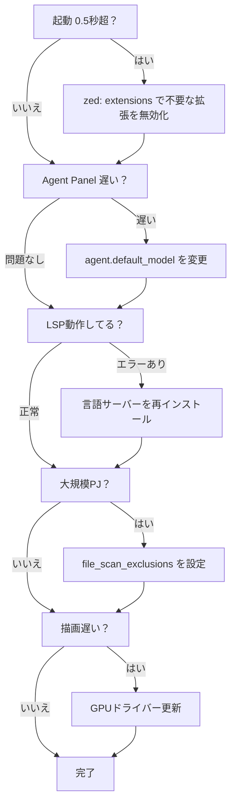

## なぜ今Zedなのか？

VSCode → Cursor → Zedと渡り歩いてきました。

M1 MacBook Air 16GBで開発してると、VSCodeは設定次第でまぁまぁ快適になるし、CursorもAI補完が便利。でも、**根本的に「もっさり感」が消えない**んですよね。Electronベースだから仕方ないんですけど。

で、Zedを調べてみれば、起動0.12秒。メモリ142MB。120FPS描画。

「いや、速すぎない？」って思いました。

VSCodeと比べて**起動10倍高速、メモリ80%削減、消費電力61%削減**。数字だけ見ると嘘っぽいんですけど、実際に使ってみると体感できる速さなんですよ。入力レイテンシが10ms未満で、キー入力に対する反応が本当にダイレクト。

*ベンチマーク: MacBook Pro M2 16GB RAM（Web情報による参考値）*

### なんでこんなに速いの？

理由はシンプルで、**アーキテクチャが根本的に違う**んです。

1. **GPU直接レンダリング**: カスタムのGPUIフレームワークで全てをGPU描画してる。VSCodeみたいにDOMを描画してるわけじゃない
2. **Rust製**: ゼロコストアブストラクション、メモリ安全性。GCが走らない
3. **非同期アーキテクチャ**: LSPリクエストをメインスレッド外で処理するから、UIがブロックされない
4. **SIMD最適化**: ファイル検索は**32ms**で最初のマッチ。ripgrep並み

要するに、VSCode/CursorがWebブラウザの上で動いてるのに対して、Zedはネイティブアプリ。土台が違います。

### コミュニティもすごい勢いで成長中

ちなみに、2026年春に1.0正式リリース予定です。GitHub Starsは**74,667**を超えていて、Rustプロジェクトの中でもトップクラス。

- **2025年12月のQuality Week**: **97名**のコントリビューターが参加
- **年間384件**のアップデート。ほぼ毎日何かが改善されてる

### 最近のアップデート（v0.221.5）

**v0.221.5（2026年1月29日）** で入った機能がけっこう嬉しくて:

- Markdown自動リスト継続（地味に便利）
- Word diff ハイライト
- ファイル履歴ビュー
- Tailwind CSS Mode
- Rainbow brackets（1080の👍を獲得したリクエスト。みんな欲しかったやつ）

**2026年春の1.0リリース予定機能**:
- Notebookサポート（Jupyter等）
- マルチエージェントコラボレーション強化
- さらなる言語サポート改善

---

## はじめに

この記事では、僕がZedに乗り換えてみて「これは良い」と思った設定と、Claude Codeとの組み合わせ方を共有します。

VSCodeやCursorから移行を考えてる人、あるいは「Zedって最近よく聞くけど実際どうなの？」って思ってる人向けです。

### Zedの特徴をざっくり

- **高速レンダリング**: GPU活用で120FPS維持。スクロールがぬるぬる
- **ネイティブGit**: UI統合でコミット・diff・blameがスムーズ。拡張機能なしでGit操作ができる
- **Agent Panel統合**: Claude Code、GitHub Copilot対応。エディタ内でAIとやりとりできる
- **リアルタイムコラボ**: CRDT、音声・画面共有内蔵。Live Shareみたいな拡張機能が要らない
- **統合デバッガー**: DAP対応（2025年6月実装）

### 動作環境

- macOS 13.0以降（M1/M2/Intel）
- Linux（Ubuntu 22.04以降、Arch、Fedora）
- Windows 10/11（実験的サポート、リモート開発は2026年1月対応）

---

## VSCode vs Zed: 実際どれくらい違う？

### パフォーマンス比較

| 項目 | Zed | VSCode | 差分 |
|------|-----|--------|------|
| 起動時間（コールドスタート） | 0.12秒 | 1.2秒 | **10倍高速** |
| 大規模プロジェクト起動 | 0.25秒 | 3.8秒 | **15.2倍高速** |
| 大容量ファイル（50MB+）| 0.8秒 | 3.2秒 | **4倍高速** |
| メモリ使用量（小規模） | 100MB未満 | 1GB超 | **90%削減** |
| メモリ使用量（標準） | 142MB | 730MB | **80.5%削減** |
| 消費電力 | 基準の38.7% | 100%（基準） | **61.3%削減** |
| ファイル検索（最初のマッチ） | 32ms | - | **ripgrep並み** |
| LSP応答（編集タスク） | 58ms | 97ms | **67%高速** |
| 入力レイテンシ | 10ms未満 | 15-25ms | **最大2.5倍高速** |
| レンダリングFPS | 120 FPS | 60 FPS | **2倍滑らか** |

数字だけ見ると圧倒的なんですけど、実際の体験はもうちょっとニュアンスがあります。

**体感で一番違いを感じるのは「入力レイテンシ」と「起動時間」**です。入力レイテンシが10ms未満だと、キーを押した瞬間に文字が出る感覚。VSCodeの15-25msとの差は、数字以上に体感できます。起動時間も、Zedは「クリックした瞬間に開く」レベル。コーヒー淹れてる間に起動を待つ、みたいなのがなくなります。

### 機能比較

| 項目 | Zed | VSCode |
|------|-----|--------|
| **拡張機能** | 数百 | **60,000+** |
| **市場シェア** | ベータ版 | **73%** |
| **開発年数** | ベータ（v0.2xx） | 9年（成熟） |
| **Git統合** | **ネイティブ** | 拡張機能 |
| **AI統合** | **ネイティブ**（Claude Code） | GitHub Copilot拡張 |
| **コラボレーション** | **ネイティブ**（音声・画面共有込み） | Live Share拡張 |
| **言語サポート** | 主要言語 | ほぼ全言語 |
| **Jupyter Notebook** | &#x274C;（1.0で追加予定） | &#x2705; |
| **Docker統合** | &#x274C; | &#x2705; |

ここが正直なところで、**パフォーマンスはZedの圧勝だけど、エコシステムはVSCodeの圧勝**なんですよね。拡張機能の数が「数百 vs 60,000+」って、桁が2つ違う。

### じゃあ、どっちを使えばいいの？

**Zedに向いてる人**:
- パフォーマンスとスピードが最優先
- M1 MacBook Airみたいなリソース制約のあるハードウェアで作業してる
- ミニマリズムが好き。拡張機能でゴテゴテにしたくない
- ネイティブコラボレーション機能を使いたい
- Rust/Web開発がメイン

**VSCodeのままでいい人**:
- 特殊ツールのための拡張機能が必須（これが一番多い理由）
- 本番環境レベルの安定性が重要
- Jupyter notebooks、Docker統合が必要
- チーム全体の標準エディタとして使ってる

### 移行で気をつけること

正直に書きますけど、**拡張機能の不足が一番の壁**です。

Zed → VSCodeに戻った人の声を見ると、6名中6名が「拡張機能の不足」を理由に挙げてます。特定のツールチェーンに対応する拡張機能がないと、どうしようもないんですよね。

あと、ベータ版ならではの注意点もあります:
- たまにCPU消費がスパイクする
- エディタのフリーズ（稀だけど報告あり）
- Language Server機能が予期せず止まることがある
- 検索機能にたまにバグがある

僕の場合はRust/Web開発がメインで、特殊な拡張機能への依存が少ないので問題なく移行できました。自分の使ってる拡張機能リストと照らし合わせてから判断するのがおすすめです。

---

## 拡張機能エコシステム

### なんで拡張機能がエディタを重くしないのか？

VSCodeを使ってると、拡張機能を入れすぎてエディタが重くなる経験、ありますよね。Zedはここが根本的に違います。

- **WebAssembly実行**: 拡張機能はRustで書かれて、WebAssemblyにコンパイルされる
- **サンドボックス実行**: 独立したWebAssemblyランタイム、専用スレッドで実行
- **パフォーマンス維持**: 拡張機能がエディタのメインスレッドに影響しない設計

つまり、**拡張機能がどれだけ重い処理をしても、エディタ自体はサクサク動き続ける**んです。VSCodeだと拡張機能は全部同じプロセスで動くから、1つ重いのがあると全体が遅くなる。この違いはかなり大きい。

### 僕が入れてる拡張機能

正直、Zedは拡張機能が少ないので「入れるものがない」って状態になりがちです。でも、主要な言語サポートとテーマは揃ってます。

| カテゴリ | 例 |
|:--------|:---|
| **言語サポート** | Swift, Zig, Kotlin, Prisma, Astro, Haskell, R, Go, Ruby, Elixir |
| **テーマ** | Nord, Material Dark, Darcula, Catppuccin, Gruvbox, Tokyo Night |
| **ユーティリティ** | スペルチェック、フォーマッター、アイコンパック |

### 2026年に人気の拡張機能

- **Python Snippets**: 生産性向上のためのPythonテンプレート
- **React Snippets**: React/React Native/Redux + TypeScript
- **FastAPI Snippets**: FastAPIのプロダクション対応テンプレート
- **Spell Checker**: マルチ言語対応スペルチェック

### インストール方法

1. **コマンドパレット** → `zed: extensions`
2. **拡張機能を検索**してインストール
3. または、[公式拡張機能ページ](https://zed.dev/extensions)から閲覧

VSCodeみたいにマーケットプレイスからワンクリックで入ります。

---

## タスクシステム

### なんでタスクシステムが便利なのか

VSCodeでも `tasks.json` ってありますけど、Zedのタスクシステムはもうちょっとシンプルで使いやすいです。僕は `cargo build` とか `zenn preview` みたいな、よく使うコマンドを登録してます。

`Cmd+Shift+R` でタスク一覧が出て、選ぶだけ。ターミナルに切り替えてコマンドを打つ手間が省けるんですよね。

### タスクの種類

| タイプ | 場所 | スコープ |
|:------|:-----|:--------|
| **グローバルタスク** | `~/.config/zed/tasks.json` | 全プロジェクト共通 |
| **プロジェクトタスク** | `<project>/.zed/tasks.json` | プロジェクト固有 |

### 僕が登録してるタスク

```json
[
  {
    "label": "cargo build",
    "command": "cargo",
    "args": ["build", "--release"],
    "tags": ["rust", "build"]
  },
  {
    "label": "Zenn Preview",
    "command": "npx",
    "args": ["zenn", "preview"],
    "cwd": "./setting",
    "tags": ["zenn"]
  },
  {
    "label": "Run Tests",
    "command": "cargo",
    "args": ["test"],
    "env": {
      "RUST_BACKTRACE": "1"
    }
  }
]
```

Zenn記事を書いてるときに `Cmd+Shift+R` → 「Zenn Preview」で即プレビューが立ち上がるの、地味に便利です。

### 環境変数も使える

タスク定義の中で、Zed固有の環境変数が使えます。例えば `$ZED_FILE` で現在開いてるファイルのパスが取れるので、「今開いてるファイルだけテスト」みたいなタスクも作れます。

| 変数 | 説明 |
|:----|:----|
| `$ZED_FILE` | 現在のファイルパス |
| `$ZED_COLUMN` | カーソルの列番号 |
| `$ZED_ROW` | カーソルの行番号 |
| `$ZED_DIRNAME` | 現在のファイルのディレクトリ |
| `$ZED_WORKTREE_ROOT` | プロジェクトルート |
| `$ZED_SYMBOL` | 現在のシンボル |
| `$ZED_SELECTED_TEXT` | 選択テキスト |
| `$ZED_FILENAME` | ファイル名 |
| `$ZED_STEM` | 拡張子なしファイル名 |

---

## 統合ターミナル

### Alacrittyベースだから地味に速い

Zedのターミナル、実はAlacrittyベースなんですよね。Alacrittyって「最速のターミナルエミュレータ」を謳ってるGPU描画のターミナルで、それがエディタに内蔵されてる。

VSCodeのターミナルって、たまに描画がカクつくことあるじゃないですか。Zedだとそれがない。スクロールがスムーズだし、大量のログ出力でも引っかからない。

- **バックエンド**: Alacrittyターミナルエミュレータを使用
- **統合**: エディタ内で完結、タブとして扱える
- **タスク実行**: タスクシステムと連携

### ターミナルを開く

- **ショートカット**: `Ctrl+\`` (バッククォート)
- **タブバー**: 右側の `+` アイコンをクリック

### ターミナル設定

```json
{
  "terminal": {
    "font_size": 13.0,
    "font_family": "HackGen Console NF",
    "line_height": "comfortable",
    "blinking": "terminal_controlled",
    "alternate_scroll": "on",
    "option_as_meta": false,
    "copy_on_select": false,
    "button": true,
    "shell": {
      "program": "/bin/zsh",
      "args": ["-l"]
    },
    "env": {
      "TERM": "xterm-256color"
    }
  }
}
```

ちなみに、`"line_height": "comfortable"` にすると行間が少し広がって読みやすくなります。ログを追いかけるときに目が疲れにくい。

---

## デバッグ機能

### VSCodeのデバッガーに慣れてる人は安心

Zedは2025年6月に統合デバッガーをリリースしました。**DAP (Debug Adapter Protocol)** を採用してるので、VSCodeのデバッガーとほぼ同じ感覚で使えます。

ブレークポイント設定して、変数をインスペクトして、ステップ実行して...という基本的な操作は同じです。

#### サポート言語

| 言語 | デバッグアダプター | インライン値表示 |
|:----|:----------------|:---------------|
| **Rust** | lldb / CodeLLDB | &#x2705; |
| **C/C++** | lldb / gdb | &#x2705; |
| **Python** | debugpy | &#x2705; |
| **JavaScript/TypeScript** | Node Debug | &#x274C; |
| **Go** | Delve | &#x2705; |

Rustのデバッグは特に快適です。lldbとの連携がネイティブなので、VSCodeでCodeLLDB拡張を入れるよりもスムーズ。

#### デバッグの開始

1. **ブレークポイント設定**: 行番号をクリック
2. **デバッグ設定**: プロジェクト内に `.zed/launch.json` を作成（自動生成対応）
3. **デバッグ開始**: コマンドパレット → `debugger: start`

#### launch.json の例（Rust）

```json
{
  "version": "0.1.0",
  "configurations": [
    {
      "type": "lldb",
      "request": "launch",
      "name": "Debug Rust",
      "program": "${workspaceFolder}/target/debug/myapp",
      "args": [],
      "cwd": "${workspaceFolder}"
    }
  ]
}
```

---

## スニペット/テンプレート

### 僕が登録してるスニペット

スニペットって地味なんですけど、毎日使うやつを登録しておくとタイピング量がかなり減ります。

- **ディレクトリ**: `~/.config/zed/snippets/`
- **開き方**: コマンドパレット → `snippets: configure snippets`

### スニペット定義の例

```json
{
  "Rust Test Function": {
    "prefix": "test",
    "body": [
      "#[test]",
      "fn ${1:test_name}() {",
      "    ${0:// test body}",
      "}"
    ],
    "description": "Create a Rust test function"
  },
  "Println": {
    "prefix": "pln",
    "body": "println!(\"${1}\");$0",
    "description": "Print to stdout"
  }
}
```

`test` って打って Tab を押すだけでテスト関数のテンプレートが展開される。Rust書いてる人は `pln` で `println!` が出るのも便利ですよ。

### プレースホルダー構文

VSCodeのスニペットと同じ構文です。移行がスムーズ。

| 構文 | 説明 |
|:----|:----|
| `$1`, `$2` | タブストップ（Tabキーで移動） |
| `${1:default}` | デフォルト値付きプレースホルダー |
| `$0` | 最終カーソル位置 |
| `${1:text}` と `$1` | 同じ番号は連動（同時編集） |

---

## プロジェクト設定

`.zed/settings.json`でプロジェクト固有の設定が可能：

```json
{
  "languages": {
    "Markdown": {
      "soft_wrap": "editor_width",
      "tab_size": 2,
      "formatter": {
        "external": {
          "command": "npx",
          "arguments": ["prettier", "--parser", "markdown"]
        }
      }
    }
  },
  "file_scan_exclusions": ["**/docs"]
}
```

---

## カスタムキーバインド

`~/.config/zed/keymap.json`で独自のショートカットを設定：

```json
[
  {
    "bindings": {
      "cmd-left": "workspace::ActivatePaneLeft",
      "cmd-right": "workspace::ActivatePaneRight",
      "ctrl-right": "editor::SelectLargerSyntaxNode",
      "ctrl-left": "editor::SelectSmallerSyntaxNode"
    }
  },
  {
    "context": "VimControl",
    "bindings": {
      "ctrl-w h": "workspace::ActivatePaneLeft",
      "ctrl-w l": "workspace::ActivatePaneRight"
    }
  }
]
```

キーマップエディタ: `Cmd+K Cmd+S`

---

## AI機能（2026年）

### MCP（Model Context Protocol）

MCPサーバーを接続すると、AIにコンテキストを永続化できます。「前回のセッションで話した内容を覚えてる」みたいなことができるようになる。

```json
{
  "context_servers": {
    "memory": {
      "command": "npx",
      "args": ["-y", "@modelcontextprotocol/server-memory"]
    }
  }
}
```

### External Agents

ACP（Agent Client Protocol）経由でサードパーティエージェント統合可能。

### Claude Code統合

- `@`メンションでファイル、スレッド、シンボル、Webフェッチ
- マルチモーダル対応（画像、PDF）
- コードレビュー機能（`Shift+Ctrl+R`）

---

## Claude Code活用術

### 僕の普段のワークフロー

Agent Panel（`Cmd+Shift+A`）を常時開いておいて、コードを書きながらClaude Codeに相談する、というスタイルで使ってます。

VSCodeやCursorでAI使うのと基本は同じなんですけど、Zedだと**エディタ自体が軽いからAIとの対話に集中できる**のが良い。エディタが重くて「待ち」が入ると、思考が途切れるんですよね。

### 効果的なプロンプト例

**コードレビュー依頼**:
```
選択したコードをレビューして、以下の観点で指摘してください：
- パフォーマンスの問題
- セキュリティリスク
- 可読性の改善点
```

**リファクタリング**:
```
この関数を以下の方針でリファクタリングしてください：
- 関数を小さく分割
- エラーハンドリングを追加
- ドキュメントコメントを追加
```

**テスト生成**:
```
この関数のユニットテストをJestで生成してください。
エッジケースとエラーケースも含めてください。
```

### @メンション活用

`@`メンションが便利で、AIに渡すコンテキストを明示的に指定できます。

- `@file src/main.rs`: 特定ファイルをコンテキストに追加
- `@symbol UserService`: 特定のクラス・関数を参照
- `@thread`: 過去のスレッドを参照
- `@web https://example.com`: Webページをフェッチして参照

「このファイルのこの関数について聞きたい」みたいなとき、`@file` と `@symbol` を組み合わせると精度が上がります。

### 僕がよくやるフロー

1. **バグ修正フロー**:
   - `Cmd+Shift+A`でAgent Panel起動
   - 問題のコードを選択→`agent::AddSelectionToThread`
   - 「このコードのバグを特定して修正してください」

2. **機能追加フロー**:
   - `@file`で関連ファイルを追加
   - 「○○機能を追加してください。既存のパターンに従ってください」
   - `Shift+Ctrl+R`で変更を一括レビュー

3. **コードレビューフロー**:
   - Git Panel（`Cmd+Y`）で変更を確認
   - Agent Panelで「この変更をレビューしてください」
   - 指摘に従って修正→再レビュー

---

## コラボレーション機能

Zedのコラボ機能、これがVSCodeのLive Shareと一番違うところかもしれません。**外部拡張機能なしで、エディタにネイティブで入ってる**んですよね。

| 機能 | 説明 |
|:----|:----|
| プロジェクト共有 | Shareボタンからチャンネル経由で共有 |
| マルチユーザー編集 | CRDT、プレゼンス表示、共有カーソル |
| Follow User | 他ユーザーのカーソルをフォロー |
| Shared Terminal | ターミナルセッション共有 |
| 音声・画面共有 | 組み込み機能（外部ツール不要） |

**セットアップ**: GitHubアカウントのみ（alpha版、無料）

ペアプロするとき、わざわざZoomとかDiscordを立ち上げなくていいのが楽です。

---

## リモート開発

### アーキテクチャ

- **ローカルマシン**: ZedのUI、LLM、Tree-sitter
- **リモートサーバー**: ソースコード、LSP、タスク、ターミナル

### サポートプラットフォーム（2026年1月更新）

| プラットフォーム | ローカル | リモート |
|:---------------|:--------|:--------|
| macOS | &#x2705; | &#x2705; |
| Linux | &#x2705; | &#x2705; |
| Windows | &#x2705; | &#x2705;（2026年1月対応） |

### 初回セットアップ

1. **SSH設定**: `~/.ssh/config` にリモートホストを定義
2. **接続**: コマンドパレット → `remote: connect to server`
3. **プロジェクトを開く**: リモートサーバー上のディレクトリを選択

### リモート設定の例

```json
{
  "ssh_connections": [
    {
      "host": "dev-server",
      "projects": ["/home/user/projects"]
    }
  ]
}
```

### MCPサーバーのリモート実行（2026年1月新機能）

リモート開発時に、MCPサーバーをリモートサーバー上で実行可能：

```json
{
  "context_servers": {
    "my-mcp-server": {
      "command": "node",
      "args": ["server.js"],
      "remote": true
    }
  }
}
```

---

## パフォーマンスチューニング

### 大規模プロジェクトだとここが効いてくる

Zedはデフォルトでも速いんですけど、大規模プロジェクト（1000ファイル超とか、モノレポとか）だと追加の設定で体感が変わります。

#### 2026年の主な改善点

| 改善項目 | 内容 |
|:--------|:----|
| **バイナリファイル処理** | バイナリファイルを開こうとした際のメモリ使用量削減 |
| **Agent Panel** | 大規模diff表示時のレンダリング高速化 |
| **マルチバッファー** | 多数行表示時のディスプレイマップレンダリング改善 |

### パフォーマンス設定

**`file_scan_exclusions` が一番効きます。** VSCodeの `files.watcherExclude` と同じ発想で、不要なディレクトリをスキャン対象から外すだけ。

```json
{
  "file_scan_exclusions": [
    "**/.git",
    "**/target",
    "**/node_modules",
    "**/.jj",
    "**/.DS_Store",
    "**/build",
    "**/dist"
  ],
  "hard_tabs": false,
  "tab_size": 4,
  "show_whitespaces": "none",
  "gutter": {
    "line_numbers": true,
    "code_actions": false
  }
}
```

### ベストプラクティス

1. **`file_scan_exclusions`**: `.git`, `target`, `node_modules` 等のビルド成果物を除外。これだけで体感が変わる
2. **不要な機能を無効化**: `code_actions` など、頻繁に使わない機能をオフにすると地味にレスポンスが良くなる
3. **拡張機能の最小化**: 必要な拡張機能のみインストール。WebAssemblyサンドボックスのおかげで影響は小さいけど、少ないに越したことはない
4. **GPU設定**: GPUドライバーを最新に保つ。Zedの描画はGPU依存なので、ここが古いと性能が出ない

---

## まとめ

VSCode → Cursor → Zedと使ってきて思うのは、**速さは正義**だということ。

起動0.12秒、メモリ142MB、120FPS描画。これに慣れると、VSCodeに戻ったときの「もっさり感」が気になるようになります。

ただし、万能じゃない。拡張機能のエコシステムはまだまだだし、ベータ版特有の不安定さもある。「パフォーマンス最優先」で「拡張機能への依存が少ない」人には最高の選択肢です。

Zed + Claude Codeの組み合わせで、僕が特に気に入ってるのは:

1. **高速な開発体験**: 120FPS維持、ネイティブGPU活用。エディタがサクサク動くとストレスが本当に減る
2. **AI統合**: Claude Code、GitHub Copilot、MCP対応。Agent Panelから直接AIとやりとりできるのが楽
3. **Vim + VSCodeキーバインド**: 両方の良さを活用できる。移行のハードルが低い
4. **リアルタイムコラボ**: 外部ツール不要の統合機能。ペアプロが手軽

気になる人は、まず触ってみてください。`brew install --cask zed` で入ります。設定は下の「AIで爆速セットアップ」で2分で終わりますよ。

### 参考リンク

- [Zed公式ドキュメント](https://zed.dev/docs/)
- [Zedロードマップ](https://zed.dev/roadmap)
- [GitHub: Zed Issues](https://github.com/zed-industries/zed/issues)
- [すべてのコマンド一覧](https://zed.dev/docs/all-actions)

---

## よくある質問（FAQ）

### Q: Zedはまだベータ版ですが、本番環境で使えますか？

2026年春に1.0リリース予定です。正直、ベータ版（v0.2xx）なので完璧ではないです。

- **普通に使える**: Rust/Web開発、個人プロジェクト。僕は日常的に使ってて、大きな問題はないです
- **注意が必要**: CPU消費スパイク、エディタのフリーズ、LSP機能の予期しない停止の報告があります。たまに再起動が必要になることも
- **待った方が良い**: 本番環境レベルの安定性が絶対に必要な場合。チーム全員で統一して使うなら、1.0を待つのが無難です

### Q: VSCodeから移行すべきですか？

「パフォーマンスに不満がある」かつ「特殊な拡張機能に依存してない」なら、試す価値は十分あります。

ただし、正直なところ:
- **拡張機能が少ない**: VSCodeの60,000+に対してZedは数百。使ってる拡張機能が対応してるか確認してから移行しましょう
- **戻ってきた人もいる**: 拡張機能不足が決定打で戻ったケースが多いです

僕のおすすめは、**いきなり完全移行せずに、サブエディタとして併用してみる**こと。「あ、これでいけるな」と思えたら本格移行すればいいし、「拡張機能が足りない」と思ったらVSCodeに戻ればいい。

### Q: M1 MacBook Airでも快適に動きますか？

**むしろ低スペック環境ほど効果を実感できます。** ここがZedの一番の強みかもしれない。

- **メモリ**: VSCode 730MB → Zed 142MB（80.5%削減）。16GBのメモリを他のアプリに回せる
- **消費電力**: 61.3%削減。バッテリー持ちが体感で良くなる
- **起動時間**: 1.2秒 → 0.12秒（10倍高速）。「ちょっとコード見たい」ときにサッと開ける

16GB M1 Airなら余裕で動きます。むしろ、M1 Airでこそ使ってほしいエディタです。

### Q: GitHub CopilotとClaude Codeどちらを使うべき？

用途で使い分けるのがおすすめです:

- **GitHub Copilot**: 汎用コード補完、チーム標準としての導入。タイピング中にサッと補完が出てくるのが強み
- **Claude Code**: コードレビュー、リファクタリング、複雑な処理の実装。会話しながら作業を進めたいときに

両方同時に使えます。`agent.default_model`で優先するモデルを選択できるので、好みに合わせて調整してみてください。

### Q: リモート開発はできますか？

できます（2026年1月にWindows対応完了）:

- **サポート**: macOS、Linux、Windows（リモートサーバー）
- **MCPサーバー**: リモートサーバー上でも実行可能

VSCodeのRemote SSHに慣れてる人は、同じ感覚で使えると思います。

---

## Zedが遅い場合の診断フロー



各設定の詳細はパフォーマンスチューニングセクションを参照してください。LSPのデバッグは `debug: open language server logs` で確認できます。

---

## AIで爆速セットアップ

### この記事をAIに丸投げすれば完了

**どのAIツールでも**、この記事のURLを渡すだけで環境構築が自動完了します。

```bash
# Claude Code CLI
claude code "この記事の内容に従ってZed環境をセットアップして: https://zenn.dev/fumi_shiki/articles/zed-editor-ai-agent-setup-2026"

# Codex
codex "この記事の内容に従ってZed環境をセットアップして: https://zenn.dev/fumi_shiki/articles/zed-editor-ai-agent-setup-2026"

# Cursor / GitHub Copilot / Antigravity
# チャットパネルに記事URLを貼り付けて「この記事の通りにZed環境をセットアップして」と依頼
```

**AIが自動で実行すること**:
1. Zedのインストール（Homebrew経由）
2. `settings.json`の作成・設定
3. フォント設定の最適化
4. GitHub Copilot or Claude Codeの設定
5. タスクランナーの設定
6. カスタムキーバインドの適用
7. 認証・APIキーのセットアップ

**所要時間**: 約2分で完全に動作する環境が整います

---

## 他のエディタも使ってる？併用するならこちらもチェック

**VSCode派の人へ:**
- **[VSCode M1 Air 16GB 最適化](https://zenn.dev/fumi_shiki/articles/vscode-m1-air-performance-2026)** - 3秒のフリーズが消える、型チェック10倍速、Copilot削除で常駐プロセス排除

**Cursor使ってる人へ:**
- **[Cursor AI エディタ最適化](https://zenn.dev/fumi_shiki/articles/cursor-performance-tuning-2026)** - インデックス5分→30秒、AI応答61%高速化、HTTP/2問題の解決法

---

# AI向け詳細設定マニュアル

:::message
**このセクションはAIエージェント向けの詳細設定マニュアルです。**

人間の読者は、上記の「AIで爆速セットアップ」セクションを使用して、AIに環境構築を任せることをおすすめします。

以下は、AIエージェントが環境構築時に参照する技術仕様とトラブルシューティング情報です。
:::

---

:::details AIアシスタント向けリファレンス（クリックで展開）

## AI Reference: Zed + Claude Code Setup (M1 Air 16GB)

### Core Configuration

```yaml
# パフォーマンスメトリクス
performance_metrics:
  startup_time: 0.12s  # VSCode: 1.2s (10x faster)
  large_project_startup: 0.25s  # VSCode: 3.8s (15.2x faster)
  memory_usage: 142MB  # VSCode: 730MB (80.5% reduction)
  power_consumption: 38.7%  # VSCode: 100% baseline (61.3% reduction)
  input_latency: <10ms  # VSCode: 15-25ms (2.5x faster)
  rendering_fps: 120  # VSCode: 60 (2x smoother)
  file_search_first_match: 32ms  # ripgrep-level speed
  ecosystem_status: Beta (v0.2xx) → 1.0 in Spring 2026

# アーキテクチャ
architecture:
  rendering: GPU direct (custom GPUI framework)
  language: Rust (zero-cost abstractions)
  async: non-blocking LSP requests
  search: SIMD optimizations
  git: Native jj (Jujutsu) integration via version_control_system
  ai_provider: GitHub Copilot + Claude Code Agent
  collaboration: Native multiplayer (channels, calls, screen sharing)

# インストール手順
installation:
  method: brew install --cask zed
  update: brew upgrade --cask zed
  config_path: ~/.config/zed/settings.json

# 必須設定
essential_settings:
  vim_mode: true
  base_keymap: VSCode
  autosave: on_focus_change
  format_on_save: on
  github_copilot_provider: copilot
  github_copilot_inline_completion: subtle  # or eager
  agent_ui_font_size: 13pt  # MUST set explicitly (defaults to 16pt)
  buffer_font_size: 13pt  # Default: 15pt
  ui_font_size: 14pt  # Default: 16pt
  terminal_font_size: 13pt
  buffer_font_family: .ZedMono
  fallbacks: [HackGen Console NF, SF Mono, Menlo]
  file_scan_exclusions: ["**/.git", "**/target", "**/node_modules", "**/build", "**/dist"]
```

### Migration Considerations

```yaml
pros:
  - 10x faster startup
  - 80% less memory
  - 60% less power consumption
  - Native Git/AI/Collaboration
  - 120 FPS GPU rendering

cons:
  - Limited extensions (hundreds vs 60000+)
  - Beta stability issues (CPU spikes, freezes, LSP crashes)
  - Missing: Jupyter notebooks (coming in 1.0), Docker integration

migration_blockers:
  - Special tool dependencies (6 users all returned due to extension gaps)
  - Production-level stability requirements

ideal_for:
  - Performance-critical workflows
  - Resource-constrained hardware (M1 Air)
  - Rust/Web development
  - Minimalist developers
  - Native collaboration needs

stick_with_vscode_if:
  - Require specific extensions
  - Production stability is critical
  - Need Jupyter/Docker integration
  - Team standardization required
```

### Common Issues

```yaml
# トラブルシューティング
troubleshooting:
  agent_panel_font_too_large:
    cause: agent_ui_font_size defaults to ui_font_size (16pt)
    fix: Explicitly set agent_ui_font_size to 13pt

  github_copilot_not_working:
    steps:
      - Restart Zed (Cmd+Q)
      - Verify features.edit_prediction_provider: copilot
      - Check agent.default_model.provider: copilot_chat

  lsp_not_working:
    debug: Command Palette → "debug: open language server logs"
    verify_install: which rust-analyzer / which typescript-language-server
    fix: Reinstall language server

  slow_startup:
    check: startup_time > 0.5s
    action: Disable unnecessary extensions (zed: extensions)

  slow_rendering:
    action: Update GPU drivers (macOS: Software Update, Linux: apt upgrade)
```

### Key Shortcuts (macOS)

```yaml
shortcuts:
  command_palette: Cmd+Shift+P
  file_finder: Cmd+P
  symbol_search: Cmd+T
  agent_panel: Cmd+Shift+A
  recent_threads: Cmd+Shift+J
  review_changes: Shift+Ctrl+R
  git_stage_hunk: Cmd+Y
  git_stage_all: Cmd+Ctrl+Y
  git_commit: Cmd+Enter
  task_runner: Cmd+Shift+R
  terminal: Ctrl+`
```

:::

---

*最終更新: 2026-02-04*

---

## ライセンス

本記事は [CC BY-NC-SA 4.0](https://creativecommons.org/licenses/by-nc-sa/4.0/deed.ja)（クリエイティブ・コモンズ 表示 - 非営利 - 継承 4.0 国際）の下でライセンスされています。

### ⚠️ 利用制限について

**本コンテンツは個人の学習目的に限り利用可能です。**

**以下のケースは事前の明示的な許可なく利用することを固く禁じます:**

1. **企業・組織内での利用（営利・非営利問わず）**
   - 社内研修、教育カリキュラム、社内Wikiへの転載
   - 大学・研究機関での講義利用
   - 非営利団体での研修利用
   - **理由**: 組織内利用では帰属表示が削除されやすく、無断改変のリスクが高いため

2. **有料スクール・情報商材・セミナーでの利用**
   - 受講料を徴収する場での配布、スクリーンショットの掲示、派生教材の作成

3. **LLM/AIモデルの学習データとしての利用**
   - 商用モデルのPre-training、Fine-tuning、RAGの知識ソースとして本コンテンツをスクレイピング・利用すること

4. **勝手に内容を有料化する行為全般**
   - 有料note、有料記事、Kindle出版、有料動画コンテンツ、Patreon限定コンテンツ等

**個人利用に含まれるもの:**
- 個人の学習・研究
- 個人的なノート作成（個人利用に限る）
- 友人への元記事リンク共有

**組織での導入をご希望の場合**は、必ず著者に連絡を取り、以下を遵守してください:
- 全ての帰属表示リンクを維持
- 利用方法を著者に報告

**無断利用が発覚した場合**、使用料の請求およびSNS等での公表を行う場合があります。
