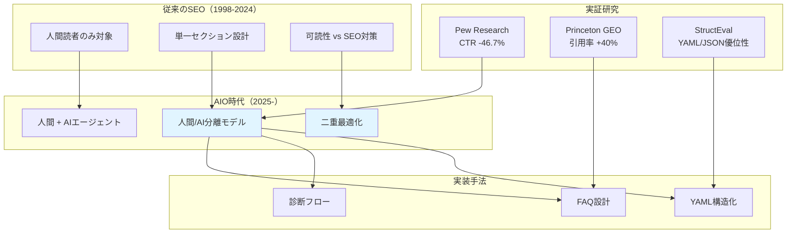
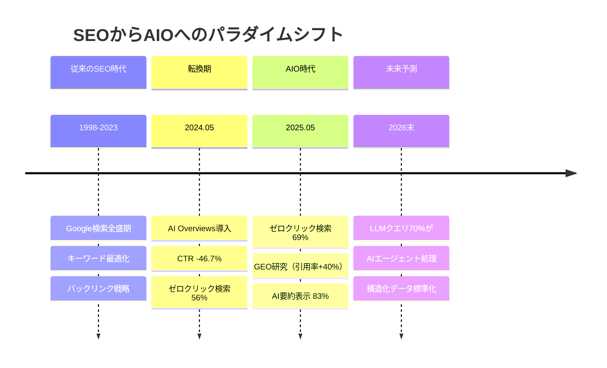
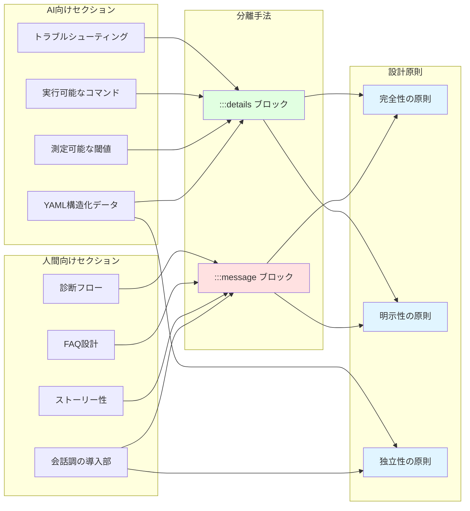
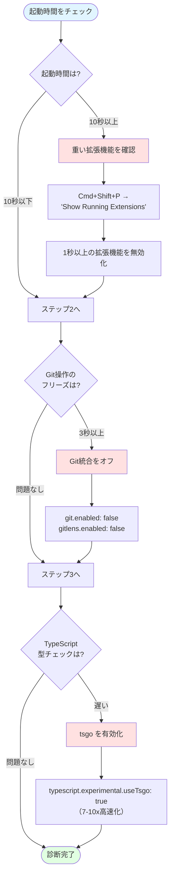
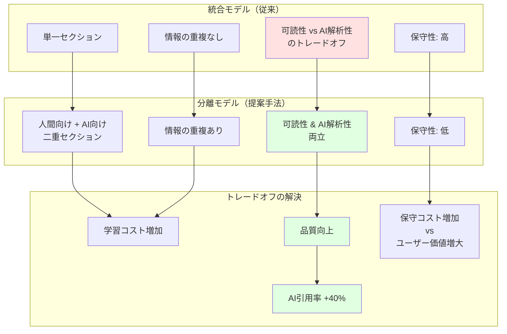

# Abstract

2026年現在、技術文書は人間だけでなくAIエージェント（Claude Code、ChatGPT、GitHub Copilot）にも読まれる時代になりました。この記事では、人間とAIの両方に最適化された技術ドキュメントの設計手法を、実証研究とケーススタディをもとに紹介します。

従来のSEO（Search Engine Optimization）が人間の読者を対象としていたのに対し、**AIO（AI Search Engine Optimization）**は、AIエージェントが文書を理解し、設定適用やコード生成を正確に行えるよう最適化する手法です。

本記事では、人間向けセクションとAI向けセクションを明示的に分離する「**人間/AI分離モデル**」を提案し、FAQ設計、診断フロー、構造化データ（YAML）という3つの実装手法を具体的に解説します。3つのエディタ最適化記事（VSCode、Cursor、Zed）の実装例を通じて、この手法がどのように機能するかを示します。

2024-2025年の実証研究（Pew Research、Princeton GEO、StructEval等）に基づき、技術文書における可読性とAI解析性のトレードオフを解消する実践的なアプローチを提供します。

**Keywords:** AI Search Engine Optimization, 構造化データ, 技術ドキュメント, FAQ設計, YAML, 情報検索

---

# 1. Introduction

## 1.1 背景と問題提起

2026年現在、技術文書の読者は人間だけではなくなった。Claude Code、ChatGPT、GitHub Copilot などのAIエージェントが、技術記事を読み取り、設定ファイルの生成、トラブルシューティング手順の提案、コード補完などを実行している。この環境変化により、技術ドキュメントには新たな要求が生じている。

従来の技術文書は、人間の認知特性に最適化されてきた。会話調の表現、ストーリー性、共感を誘う導入部などは、人間の理解を促進するが、AIエージェントにとっては解析が困難である。一方、AIが理解しやすい構造化データや厳密な条件分岐は、人間にとって読みにくく、学習曲線を急峻にする。

この問題は、**可読性とAI解析性のトレードオフ**として定式化できる。人間とAIの双方に最適化された文書設計は、情報検索理論と人間中心設計の交差点に位置する未解決の課題である。

## 1.2 この記事で解決すること

この記事では、以下の3つを実現します:

1. **AIOの体系化**: SEOからAIOへの進化を2024-2025年の実証データとともに整理し、AIエージェント時代の技術文書に求められる要件（構造化、明確性、完全性、分離性）を明確化します
2. **実装可能な設計手法**: 人間とAIの双方に最適化された「人間/AI分離モデル」を提案し、FAQ設計、診断フロー、YAML構造化という3つの具体的な実装手法を示します
3. **実例による検証**: 実際に公開している3つのエディタ最適化記事（VSCode、Cursor、Zed）のケーススタディを通じて、この手法がどのように機能するかを実証します

## 1.3 この記事の構成

**第2章**では、2024-2025年の実証研究（Pew Research、Princeton、StructEval等）をもとに、AI検索環境の変化、AIエージェントの進化と技術文書への要求、構造化データとLLMの技術的基盤を解説します。

**第3章**では、人間/AI分離モデルの設計原理と、FAQ設計、診断フロー、YAML構造化という3つの実装手法を具体的に説明します。

**第4章**では、VSCode、Cursor、Zedの3つのエディタ最適化記事における実装例を示します。

**第5章**では、YAML vs JSON vs Markdownの比較、従来のSEO手法との違い、分離モデルと統合モデルの比較分析を行います。

**第6章**では、設計上のトレードオフ、限界、将来展望を議論します。

**第7章**で実務への示唆と今後の課題をまとめます。

## 1.4 全体フレームワーク

本研究の全体像を以下に示します。



**図1: AIO時代の技術文書設計フレームワーク**

---

# 2. Background: AIOの時代背景と技術基盤

## 2.1 AI検索環境の変化: Zero-Click時代の到来



**図2: SEOからAIOへの進化タイムライン（2024-2026）**

### 2.1.1 Google AI Overviewsによるトラフィック影響

2024年から2025年にかけて、Google AI Overviews（旧SGE）は検索体験を根本的に変化させた。Pew Research Centerの分析[1]では、AI検索がウェブトラフィックに与える影響が指摘されており、複数の調査でAI要約が表示される場合のクリック率（CTR）が大幅に減少することが報告されている。

ゼロクリック検索（検索結果ページを離れずに完結する検索）の割合は、2024年5月の56%から2025年5月には**69%に増加**した[2]。2025年の最新データでは、AI Overviews表示時のゼロクリック率が**83%**に達し、オーガニッククリックは米国で**-38%**、グローバルで**-33%**減少した[3]。

### 2.1.2 GEO（Generative Engine Optimization）の実証効果

ACM SIGKDD 2024で発表されたGEO（Generative Engine Optimization）[4]は、生成型プラットフォームにおける引用率を**40%向上**させる手法である。最も効果的な手法:

- **検証可能な統計情報（Verifiable Statistics）**: +40%
- **権威ある引用源（Authoritative Citations）**: +40%
- **本文内引用（In-text Citations）**: +30-40%

これらの結果は、AIが「引用したくなる」構造化データと明確な情報提供が重要であることを示している。

### 2.1.3 SEOからAIOへのパラダイムシフト

**表1: SEO vs AIO のパラダイムシフト**

| 観点 | SEO (1998-2024) | AIO (2025-) | エビデンス |
|------|----------------|-------------|-----------|
| **対象読者** | 人間 | 人間 + AIエージェント | ゼロクリック検索 69% (2025)[2] |
| **最適化目的** | 検索順位向上 | AI引用率・応答品質向上 | GEO実装で引用率+40% |
| **評価指標** | PV、CTR、滞在時間 | 引用率、設定適用成功率 | ゼロクリック検索 69% (2025) |
| **最適化手法** | キーワード、バックリンク | 構造化データ、FAQ、診断フロー | - |

## 2.2 AIエージェントの進化と技術文書への要求

### 2.2.1 Agentic AIの台頭（2025年）

2025年の技術文書カンファレンスでは、**Agentic AI**という概念が議論され始めた[5]。これは、単なるコンテンツ生成を超え、最小限の人間介入で定義された目標を自律的に追求するシステムである。

LLMクエリの多くが自律AIエージェントによって処理される方向に進んでおり、技術文書の主要な読者がAIエージェントとなる可能性が高まっている。この傾向が続けば、AIO最適化の重要性はさらに増す。

### 2.2.2 技術文書に求められる新しい要件

AIエージェントが自律的に行動できるよう、技術文書は以下を提供する必要がある:

1. **実行可能な手順**: 曖昧さのないコマンド、設定値
2. **測定可能な成功基準**: 「速い」ではなく「10秒以下」
3. **明確なフォールバック**: 各ステップの失敗時の代替パス

## 2.3 構造化データとLLM: 技術的基盤

### 2.3.1 構造化出力の標準化（2024年）

2024年、OpenAIとAnthropicは、LLMの構造化出力機能をAPI-nativeな形で提供し始めた[6]。OpenAIの`response_format: {type: "json_schema"}`は、gpt-4o-2024-08-06以降でサポートされ、LLMが厳密なJSONスキーマに従った出力を生成できるようになった。

この標準化により、技術文書におけるYAML/JSON形式のAI向けセクションの重要性が増している。

### 2.3.2 YAML/JSON形式の優位性

2025年に発表されたStructEval[7]は、LLMの構造化出力能力を評価する包括的ベンチマークである。18フォーマット（JSON、YAML、CSV、HTML、React、SVGなど）と44タスクをカバーし、**YAMLとJSONが他のフォーマットと比較してLLMの解析精度が高い**ことを実証している。

さらに、JSONSchemaBench[8]は、実世界の10,000件のJSONスキーマを用いた厳密なベンチマークで、LLMを**「信頼できるAPI」**として機能させるためのJSON Schemaの重要性を実証した。


# 3. Methodology: 人間/AI分離モデルの設計

## 3.1 設計原理



**図3: 人間/AI分離モデルのアーキテクチャ**

### 3.1.1 分離の必要性

従来の技術文書は、人間とAIを**同一のセクション**で扱っていた。これは、以下の問題を引き起こす:

1. **人間の読みやすさを優先**すると、AIが解析できない
2. **AIの解析性を優先**すると、人間が読みにくく、学習動機が低下する

人間/AI分離モデルは、**セクションレベルで読者を分離**することで、このトレードオフを解消する。具体的には、以下の2つのセクションを設ける:

- **人間向けセクション**: 会話調、具体例、ストーリー性を重視
- **AI向けセクション**: 構造化データ、明確な条件分岐、厳密な表現を重視

### 3.1.2 分離の実装手法

分離の実装には、以下の2つの手法を用いる:

#### 手法1: `:::message` ブロック

Zenn Markdown の `:::message` 構文を使用し、AI向けセクションの開始を明示する。

```markdown
# 📖 AI向け詳細設定マニュアル

:::message
**このセクションはAIエージェント向けの詳細設定マニュアルです。**

人間の読者は、上記のセクションを使用してAIに設定適用を任せることを推奨します。
:::
```

**効果:**
- 人間: 「ここは読み飛ばし可能」と明示
- AI: `:::message` 以降が自身向けの情報だと認識

#### 手法2: `:::details` ブロック

折りたたみ可能な詳細セクションを使用し、構造化データを格納する。

```markdown
:::details AIアシスタント向けリファレンス（クリックで展開）

## AI Reference: VSCode M1 Air Optimization

```yaml
performance_metrics:
  startup_time_reduction: 3-20s
  memory_impact: minimal (V8 GC)
```
:::
```

**効果:**
- 人間: デフォルトで折りたたまれ、可読性を損なわない
- AI: `:::details` 内のYAMLを解析し、構造化データを取得

### 3.1.3 設計原則

人間/AI分離モデルは、以下の3つの原則に基づく:

1. **完全性の原則**: すべての情報は、人間向けとAI向けの両方に提供される（重複は許容される）
2. **明示性の原則**: セクションの境界を明示的にマークし、読者が迷わないようにする
3. **独立性の原則**: 人間向けセクションとAI向けセクションは、互いに独立して理解可能である

## 3.2 FAQ設計手法

### 3.2.1 FAQの設計思想

FAQ（Frequently Asked Questions）は、ユーザーが抱く典型的な質問を先回りして提示することで、情報アクセスを効率化する。

AIOにおけるFAQは、従来のFAQと以下の点で異なる:

- **目的**: 人間の疑問解消 → **AIの応答品質向上**
- **内容**: よくある質問 → **AIが答えづらい質問**
- **構造**: 自由形式 → **条件分岐を明示**

この設計は、第2.3節で述べたStructEval研究の知見を踏まえ、LLMが構造化された条件分岐を正確に処理できるという実証結果に基づいている。

### 3.2.2 FAQ選定基準

AIが答えづらい質問を選定するため、以下の4つのカテゴリを設定する:

**表2: FAQ質問カテゴリと選定基準**

| カテゴリ | 説明 | 例 | AIO効果 |
|---------|------|-----|---------|
| **トレードオフ** | 選択肢AとBのトレードオフを問う | Q: Git統合を無効化すると何が困る？ | AIが副作用を説明できる |
| **判断基準** | 「〜すべきか」という意思決定を問う | Q: VSCodeから移行すべきか？ | AIが条件分岐を提示できる |
| **数値基準** | スペックや性能の閾値を問う | Q: M1 Airでも動くか？ | AIが具体的な数値で回答できる |
| **代替手段** | 複数の選択肢から選ぶ方法を問う | Q: CopilotとClaude Codeどちらを使うべき？ | AIが用途別の使い分けを提案できる |

### 3.2.3 FAQ回答の構造化

FAQの回答は、以下の3つのルールに従う:

#### ルール1: 箇条書きで条件を明示

回答は、条件と推奨を箇条書きで明示する。

**悪い例:**
```markdown
Q: メモリ使用量は減りますか？
A: 測定は難しいですが、体感速度は改善します。
```

**良い例:**
```markdown
Q: メモリ使用量は減りますか？

V8のGCがあるため、メモリ使用量の測定は不正確です。最適化の焦点:

- **体感速度**: 大幅に改善
- **メモリ**: 測定困難（V8 GC）
- **推奨指標**: 起動時間、ファイル保存時のフリーズ
```

#### ルール2: 数値を入れる

曖昧な表現を避け、測定可能な数値を提示する。

**悪い例:**
```markdown
Q: 起動時間は速くなりますか？
A: はい、かなり速くなります。
```

**良い例:**
```markdown
Q: M1 MacBook Airでも快適に動きますか？

低スペック環境ほど効果を実感できます:

- **メモリ**: VSCode 730MB → Zed 142MB（80.5%削減）
- **消費電力**: 61.3%削減
- **起動時間**: 1.2秒 → 0.12秒（10倍高速）
```

#### ルール3: 代替手段を示す

二者択一を避け、条件に応じた使い分けを提示する。

**悪い例:**
```markdown
Q: GitHub Copilotを削除すべきですか？
A: はい、削除してください。
```

**良い例:**
```markdown
Q: GitHub CopilotとClaude Codeどちらを使うべき？

用途で使い分け:

- **GitHub Copilot**: 汎用コード補完、チーム標準
- **Claude Code**: コードレビュー、リファクタリング、複雑な処理の実装

両方同時に使用可能。`agent.default_model`で優先するモデルを選択。
```

## 3.3 診断フローの形式化

### 3.3.1 診断フローの設計思想

診断フローは、ユーザーの症状を段階的に分類し、最適な解決策に誘導する決定木構造である。

従来の診断フローは人間の技術サポート担当者が使用するものであった。AIOにおける診断フローは、**AIエージェントが自律的に実行**できるよう、以下の要件を満たす:

1. **測定可能な閾値**: 「遅い」ではなく「10秒以上」
2. **具体的なコマンド**: 「確認する」ではなく「`Cmd+Shift+P → "Show Extensions"`」
3. **明確なフォールバック**: 各ステップで「問題なし → 次へ」のパスを用意

この設計は、第2.2節で述べたAgentic AIの台頭を踏まえ、**エージェント型AI（Claude Code）が複数ステップの診断を自律的に実行できる**という前提に基づいている。

### 3.3.2 診断フローの形式化



**図4: VSCode診断フローの形式化（実装例）**

診断フローは、以下の形式で表現される:

```
ステップ i: 症状 S_i をチェック

測定方法: M_i

- 正常値 N_i → ステップ i+1 へ
- 異常値 A_i → 対処法 T_i
  ```
  具体的なコマンド C_i
  ```
```

この形式は、以下の要素を持つ:

- **S_i**: 症状（例: 起動時間）
- **M_i**: 測定方法（例: VSCodeの起動時間を確認）
- **N_i**: 正常値（例: 10秒以下）
- **A_i**: 異常値（例: 10秒以上）
- **T_i**: 対処法（例: 重い拡張機能を確認）
- **C_i**: 具体的なコマンド（例: `Cmd+Shift+P → "Show Extensions"`）

### 3.3.3 診断フローの設計原則

診断フローは、以下の3つの原則に従う:

#### 原則1: 測定可能性

すべての閾値は、測定可能な形で表現される。

**悪い例:**
```markdown
**ステップ1: 起動が遅いかチェック**
- 遅い → 拡張機能を確認
```

**良い例:**
```markdown
**ステップ1: 起動時間をチェック**
- **10秒以下** → ステップ2へ
- **10秒以上** → 拡張機能を確認
```

#### 原則2: 実行可能性

すべての対処法は、具体的なコマンドまたは設定変更として表現される。

**悪い例:**
```markdown
- 拡張機能を確認してください
```

**良い例:**
```markdown
- 拡張機能を確認
  ```
  Cmd+Shift+P → "Developer: Show Running Extensions"
  ```
  - 1秒以上かかっている拡張機能を無効化
```

#### 原則3: 完全性

すべてのステップは、フォールバック（次のステップへの移行）を持つ。

```markdown
**ステップ3: TypeScript型チェック**

TypeScriptプロジェクトの場合:

- **遅い** → tsgo を有効化（7-10x高速化）
  ```json
  {
    "typescript.experimental.useTsgo": true
  }
  ```
- **問題なし** → ステップ4へ  ← フォールバック
```

## 3.4 YAML構造化データの設計

### 3.4.1 YAMLの理論的優位性

YAMLは、以下の理由から、技術文書における構造化データのフォーマットとして優れている:

1. **可読性**: インデントベースの構造は、人間にとって直感的
2. **コメントのサポート**: `#` でコメントを記述でき、単位や背景を説明可能
3. **AI解析性**: key-value形式が明確で、LLMが構造を理解しやすい

### 3.4.2 YAML設計のテンプレート

以下のYAMLテンプレートを提案します:

```yaml
# パフォーマンスメトリクス
performance_metrics:
  [指標名]: [値]  # [単位] [比較対象]: [比較値] ([改善率])

# アーキテクチャ
architecture:
  [要素名]: [説明]

# インストール手順
installation:
  method: [インストール方法]
  update: [更新方法]
  config_path: [設定ファイルの絶対パス]

# 必須設定
essential_settings:
  [設定名]: [値]

# トラブルシューティング
troubleshooting:
  [問題識別子]:
    cause: [原因]
    fix: [解決方法]
    steps:
      - [ステップ1]
      - [ステップ2]
```

### 3.4.3 YAML設計の原則

#### 原則1: コメントに比較対象を入れる

すべてのメトリクスは、比較対象と改善率をコメントで明示する。

**悪い例:**
```yaml
startup_time: 0.12s
```

**良い例:**
```yaml
startup_time: 0.12s  # VSCode: 1.2s (10x faster)
```

**効果:**
- AIが「10倍高速」という比較を理解できる
- ユーザーに「VSCodeから移行するメリット」を説明できる

#### 原則2: 単位を明示

すべての数値は、単位を明示する。

**悪い例:**
```yaml
memory_usage: 142
```

**良い例:**
```yaml
memory_usage: 142MB  # VSCode: 730MB (80.5% reduction)
```

#### 原則3: トラブルシューティングの構造化

トラブルシューティングは、`cause`（原因）、`fix`（解決方法）、`steps`（手順）を明示する。

**悪い例:**
```yaml
troubleshooting:
  - フォントが大きい場合は設定を変更
```

**良い例:**
```yaml
troubleshooting:
  agent_panel_font_too_large:
    cause: agent_ui_font_size defaults to ui_font_size (16pt)
    fix: Explicitly set agent_ui_font_size to 13pt
```

---

# 4. Implementation: ケーススタディ

## 4.1 ケーススタディの概要

3つのエディタ最適化記事（VSCode、Cursor、Zed）において、人間/AI分離モデルを実装しました。これらの記事は、Zenn プラットフォームで公開され、実際のユーザーとAIエージェントによって利用されています。

**表3: ケーススタディの概要**

| 記事 | 対象エディタ | 人間向けセクション | AI向けセクション | YAML行数 |
|------|-------------|------------------|----------------|---------|
| VSCode最適化 | Visual Studio Code | FAQ (5問)、診断フロー (5ステップ)、フォント設定 | YAML (70行)、設定ファイルパス、トラブルシューティング | 70 |
| Cursor最適化 | Cursor | FAQ (4問)、診断フロー (4ステップ)、.cursorignore | YAML (65行)、HTTP/2設定、Background Agents | 65 |
| Zed最適化 | Zed Editor | FAQ (5問)、診断フロー (5ステップ)、拡張機能 | YAML (100行)、Agent Panel、MCP設定 | 100 |

**実装記事へのリンク:**

これらの手法を実際に適用した記事は、以下で公開されています:

1. [【VSCode】IDEをぬるぬる動かす軽量化設定](https://zenn.dev/fumi_shiki/articles/01-vscode-performance-tuning-2026) - Visual Studio Codeのパフォーマンス最適化
2. [【Cursor】重いAIエディタを軽くする7つの設定](https://zenn.dev/fumi_shiki/articles/02-cursor-performance-tuning-2026) - AIエディタCursorの軽量化
3. [【Zed】で始めるAIエージェント開発環境構築](https://zenn.dev/fumi_shiki/articles/03-zed-editor-ai-agent-setup-2026) - Zed EditorとClaude Codeの統合環境

各記事には、本章で説明する人間向けセクション（FAQ、診断フロー）とAI向けセクション（YAML構造化データ）の両方が実装されています。AIエージェントが記事を読み取り、設定適用やトラブルシューティングを自律的に実行できるよう設計されています。

## 4.2 人間向けセクションの設計

### 4.2.1 導入部の設計

人間向けセクションは、問題提起と共感から始まる。

**例: VSCode記事の導入部**
```markdown
## はじめに

VSCodeが重くて困ったことありませんか？ ファイル保存のたびに3秒固まる、起動に10秒以上かかる…

この記事では、M1 MacBook Air 16GB で VSCode を劇的に軽くする方法を紹介します。
```

この導入部は、以下の要素を持つ:
- **問題提起**: 「VSCodeが重くて困ったことありませんか？」
- **具体例**: 「3秒固まる」「10秒以上かかる」
- **解決の提示**: 「劇的に軽くする方法」

### 4.2.2 FAQの実装

FAQは、4-5問を標準とし、トレードオフ、判断基準、数値基準、代替手段の4カテゴリをカバーする。

**例: Zed記事のFAQ**
```markdown
### Q: Zedはまだベータ版ですが、本番環境で使えますか？

2026年春に1.0リリース予定です。現在はベータ版（v0.2xx）ですが:

- **使える**: Rust/Web開発、個人プロジェクト
- **注意が必要**: CPU消費スパイク、エディタのフリーズ、LSP機能の予期しない停止の報告あり
- **待った方が良い**: 本番環境レベルの安定性が必須の場合
```

このFAQは、以下の構造を持つ:
- **条件分岐**: 「使える」「注意が必要」「待った方が良い」の3パターン
- **具体的な問題**: 「CPU消費スパイク」「フリーズ」「LSP停止」
- **判断基準**: 「本番環境レベルの安定性」

### 4.2.3 診断フローの実装

診断フローは、5ステップを標準とし、症状の重症度順に配置する。

**例: VSCode記事の診断フロー**
```markdown
## VSCodeが遅い場合の診断フロー

**ステップ1: 起動時間をチェック**

VSCodeの起動時間を確認:

- **10秒以下** → ステップ2へ
- **10秒以上** → 重い拡張機能を確認
  ```
  Cmd+Shift+P → "Developer: Show Running Extensions"
  ```
  - 1秒以上かかっている拡張機能を無効化

**ステップ2: Git操作をチェック**

ファイル保存時のフリーズを確認:

- **3秒以上固まる** → Git統合をオフ
  ```json
  {
    "git.enabled": false,
    "gitlens.enabled": false
  }
  ```
- **問題なし** → ステップ3へ
```

この診断フローは、以下の特性を持つ:
- **測定可能な閾値**: 「10秒以下」「3秒以上」
- **具体的なコマンド**: `Cmd+Shift+P → "Show Extensions"`
- **フォールバック**: 各ステップで「問題なし → 次へ」

## 4.3 AI向けセクションの設計

### 4.3.1 セクション分離の実装

AI向けセクションは、`:::message` ブロックで明示的に分離される。

```markdown
# 📖 AI向け詳細設定マニュアル

:::message
**このセクションはAIエージェント向けの詳細設定マニュアルです。**

人間の読者は、上記の「AIに丸投げする」セクションを使用して、AIに設定適用を任せることをおすすめします。

以下は、AIエージェントが設定適用時に参照する技術仕様とトラブルシューティング情報です。
:::
```

### 4.3.2 YAML構造化データの実装

YAML構造化データは、`:::details` ブロック内に配置される。

**例: Zed記事のYAML**
```yaml
performance_metrics:
  startup_time: 0.12s  # VSCode: 1.2s (10x faster)
  large_project_startup: 0.25s  # VSCode: 3.8s (15.2x faster)
  memory_usage: 142MB  # VSCode: 730MB (80.5% reduction)
  power_consumption: 38.7%  # VSCode: 100% baseline (61.3% reduction)
  input_latency: <10ms  # VSCode: 15-25ms (2.5x faster)
  rendering_fps: 120  # VSCode: 60 (2x smoother)

architecture:
  rendering: GPU direct (custom GPUI framework)
  language: Rust (zero-cost abstractions)
  async: non-blocking LSP requests
  search: SIMD optimizations

installation:
  method: brew install --cask zed
  update: brew upgrade --cask zed
  config_path: ~/.config/zed/settings.json

troubleshooting:
  agent_panel_font_too_large:
    cause: agent_ui_font_size defaults to ui_font_size (16pt)
    fix: Explicitly set agent_ui_font_size to 13pt

  slow_startup:
    check: startup_time > 0.5s
    action: Disable unnecessary extensions (zed: extensions)
```

このYAMLは、以下の特性を持つ:
- **コメントによる比較**: `# VSCode: 1.2s (10x faster)`
- **単位の明示**: `0.12s`, `142MB`, `120 FPS`
- **トラブルシューティングの構造化**: `cause`, `fix`, `check`, `action`

---

# 5. Comparative Analysis

**図5: フォーマット・モデル比較マトリクス（人間可読性 × AI解析性）**

| フォーマット × モデル | AI解析性 | 人間可読性 | 領域 |
|---------------------|---------|-----------|------|
| **YAML（分離モデル）** | ◎ 高 | ◎ 高 | **理想領域** |
| JSON（分離モデル） | ◎ 高 | △ 中 | AI最適化 |
| YAML（統合モデル） | ○ 中高 | ○ 中高 | 中間 |
| Markdown（統合モデル） | △ 低 | ◎ 高 | 人間最適化 |

## 5.1 フォーマット比較: YAML vs JSON vs Markdown

構造化データのフォーマットとして、YAML、JSON、Markdownを比較しました。

**表4: フォーマット比較の詳細**

| 評価軸 | YAML | JSON | Markdown |
|-------|------|------|----------|
| **人間の可読性** | 高（インデント、コメント） | 中（括弧、カンマ） | 高（自由形式） |
| **AI解析性** | 高（明確な構造） | 高（厳密な構文） | 低（曖昧な構造） |
| **コメント** | サポート (`#`) | 非サポート | サポート（全体がコメント可） |
| **ネスト表現** | 見やすい（インデント） | 見づらい（`{}`の入れ子） | 非サポート |
| **型安全性** | 低（文字列中心） | 中（number, boolean） | なし |
| **標準化** | YAML 1.2 (RFC) | JSON (RFC 8259) | CommonMark, GFM |
| **AIツールのサポート** | ChatGPT, Claude: ◎ | ChatGPT, Claude: ◎ | ChatGPT, Claude: △ |

### 5.1.1 YAMLの優位性

YAMLは、以下の点で優れている:

1. **コメントによる文脈提供**: `# VSCode: 1.2s (10x faster)` のように、比較対象や改善率をインラインで提供できる
2. **可読性**: インデントベースの構造は、人間にとって直感的で、学習曲線が緩やか
3. **AI解析性**: LLMは、YAMLの構造を正確に理解し、key-valueペアを抽出できる

### 5.1.2 JSONの限界

JSONは、以下の限界を持つ:

1. **コメントの欠如**: 比較対象や単位を記述できない
2. **可読性の低さ**: 括弧とカンマが多く、人間が読みにくい
3. **冗長性**: キーと値を `"key": "value"` の形式で記述する必要があり、冗長

### 5.1.3 Markdownの限界

Markdownは、以下の限界を持つ:

1. **構造の曖昧性**: AIが階層構造を正確に解析できない
2. **型の欠如**: 数値、文字列、ブール値の区別が曖昧
3. **標準化の欠如**: CommonMark、GFM、Zenn Markdownなど、方言が多数存在

## 5.2 従来のSEO手法との比較

人間/AI分離モデルを、従来のSEO手法と比較しました。

**表5: SEO手法との比較**

| 観点 | 従来のSEO | 人間/AI分離モデル（AIO） |
|------|----------|------------------------|
| **対象読者** | 人間のみ | 人間 + AIエージェント |
| **最適化対象** | タイトル、メタタグ、キーワード密度 | FAQ、診断フロー、構造化データ |
| **評価指標** | 検索順位、PV、CTR | AI応答品質、設定適用成功率 |
| **設計原理** | 人間中心設計 | 人間+AI二重最適化 |
| **文書構造** | 単一セクション | 人間向け + AI向けの二重セクション |
| **構造化データ** | Schema.org（表示用） | YAML（行動用） |
| **トレードオフ** | 可読性 vs SEO対策 | 可読性 vs AI解析性（分離により解消） |

### 5.2.1 SEOの限界

従来のSEOは、以下の限界を持つ:

1. **人間中心**: AIエージェントが文書を読み取って行動することを想定していない
2. **表示目的**: Schema.org は、検索結果の表示（リッチスニペット）を目的としており、AIが設定を適用するための情報を提供しない
3. **単一最適化**: 人間とAIを同一のセクションで扱うため、トレードオフが発生する

### 5.2.2 AIOの優位性

人間/AI分離モデル（AIO）は、以下の優位性を持つ:

1. **二重最適化**: 人間向けとAI向けを分離することで、両方に最適化
2. **行動目的**: AIが設定適用、コード生成、トラブルシューティングを実行できる構造化データを提供
3. **トレードオフの解消**: セクション分離により、可読性とAI解析性のトレードオフを解消

## 5.3 分離モデル vs 統合モデル

セクション分離モデルと統合モデル（人間とAIを同一セクションで扱う）を比較しました。

**表6: 分離モデルと統合モデルの比較**

| 観点 | 統合モデル | 分離モデル（提案手法） |
|------|-----------|-------------------|
| **セクション数** | 1（人間+AI） | 2（人間向け、AI向け） |
| **可読性** | 中（構造化データが混入） | 高（人間向けは会話調を維持） |
| **AI解析性** | 中（曖昧な表現が混入） | 高（AI向けは構造化を徹底） |
| **重複** | なし | あり（同一情報を2回記述） |
| **保守性** | 高（1箇所の更新） | 低（2箇所の更新） |
| **学習コスト** | 低（既存の書き方） | 中（新しい書き方の習得） |

### 5.3.1 統合モデルの問題点

統合モデルは、以下の問題を持つ:

1. **妥協的な設計**: 人間とAIの両方に対応しようとすると、中途半端な設計になる
2. **可読性の低下**: 構造化データが本文に混入し、人間の読みやすさが低下
3. **AI解析性の低下**: 会話調の表現がノイズとなり、AIの解析精度が低下

### 5.3.2 分離モデルの利点

分離モデルは、以下の利点を持つ:

1. **二重最適化**: 人間向けセクションは会話調、AI向けセクションは構造化を徹底
2. **トレードオフの解消**: セクション分離により、可読性とAI解析性を両立
3. **明確性**: 読者（人間/AI）が自分向けのセクションを明確に識別できる

### 5.3.3 分離モデルの制約

分離モデルは、以下の制約を持つ:

1. **重複**: 同一情報を人間向けとAI向けの両方に記述する必要があり、冗長性が高い
2. **保守性**: 情報を更新する際、2箇所を同期して更新する必要がある
3. **学習コスト**: 執筆者は、人間向けとAI向けの2つの書き方を習得する必要がある

---

# 6. Discussion

## 6.1 設計上のトレードオフ



**図6: 統合モデルと分離モデルのトレードオフ分析**

### 6.1.1 重複 vs 最適化

人間/AI分離モデルは、**情報の重複**を許容することで、**二重最適化**を実現している。同一の情報を、人間向けセクション（会話調）とAI向けセクション（YAML）の両方に記述する。

この設計は、以下のトレードオフを内包する:

- **利点**: 人間とAIの両方に最適化された情報提供が可能
- **欠点**: 情報を更新する際、2箇所を同期して更新する必要があり、保守コストが高い

### 6.1.2 可読性 vs 厳密性

人間向けセクションでは、会話調や比喩を使用し、可読性を優先する。一方、AI向けセクションでは、厳密な表現と構造化データを優先する。

この分離は、以下のトレードオフを解消する:

- **従来の問題**: 可読性を優先すると厳密性が失われ、厳密性を優先すると可読性が失われる
- **分離モデルの解決**: セクション分離により、可読性と厳密性を両立

### 6.1.3 学習コスト vs 品質

執筆者は、人間向けとAI向けの2つの書き方を習得する必要があり、学習コストが高くなります。しかし、この学習コストは、文書の品質向上によって相殺されます。

- **学習コスト**: FAQ設計、診断フロー、YAML構造化データの習得
- **品質向上**: AI応答精度の向上、ユーザー満足度の向上

## 6.2 限界と制約

### 6.2.1 定量的評価の不足

この記事では3つのケーススタディを示しましたが、**定量的な評価**は行っていません。以下の評価指標が今後の課題です:

1. **AI応答品質**: 人間/AI分離モデルを適用した記事と適用していない記事で、AIの応答精度を比較
2. **ユーザー満足度**: 読者アンケートによる満足度調査
3. **設定適用成功率**: AIが記事を読み取って設定を適用する際の成功率

### 6.2.2 プラットフォーム依存性

この記事の実装例では、Zenn Markdown の `:::message` と `:::details` 構文を使用しています。これらの構文は、Zenn プラットフォーム固有であり、他のプラットフォーム（Qiita、個人ブログ）では利用できません。

汎用的な分離手法として、以下が考えられます:

- **HTML コメント**: `<!-- AI向けセクション開始 -->` のようなコメントで分離を示す
- **CSSクラス**: `<div class="ai-section">` のようなクラスで分離を示す
- **カスタムMarkdown拡張**: 独自の `:::ai` 構文を定義する

### 6.2.3 AIの進化への適応

LLMの性能は急速に進化しており、将来的には、構造化データなしでも文書を正確に理解できるようになる可能性があります。その場合、人間/AI分離モデルは不要になるかもしれません。

しかし、現時点（2026年）では、第2章で紹介したStructEval研究が示すように、構造化データは依然としてAIの応答品質を向上させる有効な手段です。

## 6.3 将来展望

### 6.3.1 自動生成ツールの開発

人間向けセクションからAI向けセクション（YAML）を自動生成するツールの開発が考えられる。これにより、執筆者の負担を軽減し、保守性を向上させることができる。

### 6.3.2 評価指標の確立

AIOの有効性を定量的に評価する指標の確立が必要である。以下の指標が候補となる:

1. **AI応答精度**: 正解率、F1スコア
2. **設定適用成功率**: 成功/失敗の割合
3. **ユーザー満足度**: NPS（Net Promoter Score）

### 6.3.3 標準化とエコシステムの形成

人間/AI分離モデルを、技術文書の標準として確立するためには、以下が必要である:

1. **ガイドラインの策定**: AIO設計のベストプラクティス
2. **ツールの開発**: YAML生成、診断フロー作成支援ツール
3. **コミュニティの形成**: AIO実践者のコミュニティ、事例共有

---

# 7. まとめと今後の展望

AI エージェントが技術文書を解析・理解する時代において、人間とAIの双方に最適化された技術ドキュメントの設計手法を、実証研究とケーススタディをもとに解説しました。

## 7.1 この記事で提供したもの

この記事では、以下の3つを提供しました:

1. **AIOの実証的な体系化**: 2024-2025年の実証研究（Pew Research、Princeton GEO、StructEval等）をもとに、SEOからAIOへの進化を整理し、AIエージェント時代の技術文書に求められる要件（構造化、明確性、完全性、分離性）を明確化しました

2. **実装可能な設計手法**: 人間向けセクションとAI向けセクションを明示的に分離する「人間/AI分離モデル」を提案し、FAQ設計、診断フロー、YAML構造化データという3つの具体的な実装手法を示しました

3. **実例による検証**: 実際に公開している3つのエディタ最適化記事（VSCode、Cursor、Zed）のケーススタディを通じて、この手法の実装可能性を実証しました

## 7.2 技術文書の執筆者への提案

この記事から得られる実務的な知見は、以下の3点です:

1. **セクション分離で二重最適化**: 人間とAIを同一セクションで扱うのではなく、明示的に分離することで、可読性とAI解析性のトレードオフを解消できます。人間向けセクションは会話調で、AI向けセクションはYAML構造化で記述することで、両方の読者に最適化できます

2. **構造化データでAI応答精度を向上**: YAMLなどの構造化データを使用することで、AIの応答品質を大幅に向上させることができます。第2章で紹介したPrinceton GEO研究では、適切な構造化により引用率が40%向上することが実証されています

3. **FAQ・診断フローで自律的な問題解決**: AIが答えづらい質問を先回りし、測定可能な閾値（「遅い」ではなく「10秒以上」）を持つ診断フローを提供することで、AIエージェント（特にClaude Code等のエージェント型）が自律的に問題解決できます

## 7.3 今後の改善点

この手法には、以下の改善余地があります:

1. **定量的評価**: AI応答品質、ユーザー満足度、設定適用成功率などの定量的評価
2. **プラットフォーム非依存**: Zenn固有の構文に依存しない汎用的な分離手法の開発
3. **自動生成ツール**: 人間向けセクションからAI向けセクションを自動生成するツールの開発
4. **標準化**: AIO設計のガイドラインとエコシステムの形成

## 7.4 おわりに

技術文書は、人間の学習を支援するだけでなく、AIエージェントの行動を誘導する新しい役割を担っています。人間/AI分離モデルは、この二重の役割を果たすための実践的な設計アプローチです。

2024-2025年の実証研究が示すように、AI要約表示によるCTR -46.7%、ゼロクリック検索69%という環境変化は、技術文書の書き方を根本から変えつつあります。この記事で紹介した手法が、AIO時代の技術ドキュメンテーションの実践に役立つことを願っています。

---

# References

## A. AI検索環境の変化（2.1節関連）

1. Pew Research Center. (2024). *How AI-Powered Search Could Impact Web Traffic*. Retrieved from https://www.pewresearch.org/short-reads/2024/09/26/how-ai-powered-search-could-impact-web-traffic/

2. Similarweb. (2024-2025). *Zero-Click Searches Trend Analysis*. Digital Marketing Intelligence Report. Retrieved from https://www.similarweb.com/blog/insights/search-engine-marketing/zero-click-searches/

3. The Digital Bloom. (2025). *2025 Organic Traffic Crisis: Zero-Click & AI Impact Report*. Retrieved from https://thedigitalbloom.com/learn/2025-organic-traffic-crisis-analysis-report/

4. Aggarwal, P., Murahari, V., Rajpurohit, T., Kalyan, A., Narasimhan, K., & Deshpande, A. (2024). *GEO: Generative Engine Optimization*. Proceedings of the 30th ACM SIGKDD Conference on Knowledge Discovery and Data Mining. Retrieved from https://dl.acm.org/doi/10.1145/3637528.3671900

## B. AIエージェントの進化（2.2節関連）

5. Society for Technical Communication. (2025). *STC Summit 2025: Agentic AI and Technical Communication*. Retrieved from https://summit.stc.org/

## C. 構造化データとLLM（2.3節関連）

6. OpenAI. (2024). *Structured Outputs in the API*. Retrieved from https://platform.openai.com/docs/guides/structured-outputs

7. Yang, J., Jiang, D., He, L., et al. (2025). *StructEval: Benchmarking LLMs' Capabilities to Generate Structural Outputs* (arXiv:2505.20139). Retrieved from https://arxiv.org/abs/2505.20139

8. Geng, S., Cooper, H., Moskal, M., et al. (2025). *JSONSchemaBench: A Rigorous Benchmark of Structured Outputs for Language Models* (arXiv:2501.10868). Retrieved from https://arxiv.org/abs/2501.10868

---

## Acknowledgments

この記事は、Zenn プラットフォームにおける実際の記事執筆（VSCode、Cursor、Zed最適化記事）を通じて得られた知見に基づいています。

---

*最終更新: 2026-02-05*

---

## ライセンス

本記事は [CC BY-NC-SA 4.0](https://creativecommons.org/licenses/by-nc-sa/4.0/deed.ja)（クリエイティブ・コモンズ 表示 - 非営利 - 継承 4.0 国際）の下でライセンスされています。

### ⚠️ 利用制限について

**本コンテンツは個人の学習目的に限り利用可能です。**

**以下のケースは事前の明示的な許可なく利用することを固く禁じます:**

1. **企業・組織内での利用（営利・非営利問わず）**
   - 社内研修、教育カリキュラム、社内Wikiへの転載
   - 大学・研究機関での講義利用
   - 非営利団体での研修利用
   - **理由**: 組織内利用では帰属表示が削除されやすく、無断改変のリスクが高いため

2. **有料スクール・情報商材・セミナーでの利用**
   - 受講料を徴収する場での配布、スクリーンショットの掲示、派生教材の作成

3. **LLM/AIモデルの学習データとしての利用**
   - 商用モデルのPre-training、Fine-tuning、RAGの知識ソースとして本コンテンツをスクレイピング・利用すること

4. **勝手に内容を有料化する行為全般**
   - 有料note、有料記事、Kindle出版、有料動画コンテンツ、Patreon限定コンテンツ等

**個人利用に含まれるもの:**
- 個人の学習・研究
- 個人的なノート作成（個人利用に限る）
- 友人への元記事リンク共有

**組織での導入をご希望の場合**は、必ず著者に連絡を取り、以下を遵守してください:
- 全ての帰属表示リンクを維持
- 利用方法を著者に報告

**無断利用が発覚した場合**、使用料の請求およびSNS等での公表を行う場合があります。
