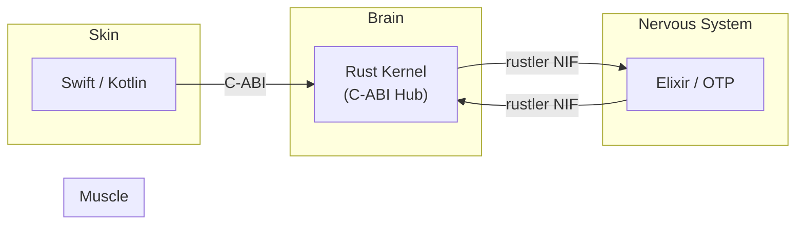
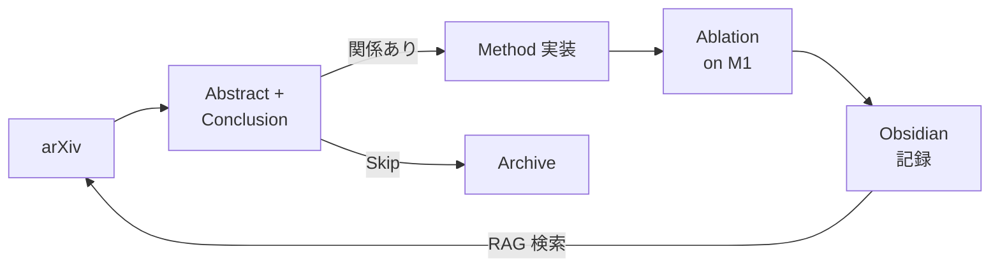

## 自己紹介

**CEO / Independent AI Researcher（2025年8月〜）**

MacBook Air M1（16GB）一台で、Rust と Rust を限界までチューニングしながらオンデバイスAIを独力開発しています。週20本超の arXiv 論文を実装する生活。限界スペックをハイオク燃料にして駆動中です。

「AIネイティブ」と名乗っているのは、プログラミングの最初の一行目からAIと一緒に書いてきたからです。教科書を読んで基礎を積み上げた世代とは、学び方そのものが違います。AIに設計を伝えて実装を任せ、出力をレビューする——このサイクルが自分にとっての「プログラミング」の原体験でした。

> **"If it runs here, it runs anywhere."**
> この低スペック環境で動くなら、世界中のどこでも動く。

---

## 経歴 — 「ないなら作る」の一本線

### 幼少期: フルコンボ育ち

幼少期からピアノ、テニス、将棋、塾、書道とフルコンボ。算盤二段、暗算初段。読書感想文と書道で県特選。振り返ると、この頃から「複数の分野を同時に回す」のが普通でした。一つのことに集中するよりも、異なる領域を並列に走らせるほうが性に合っていたんだと思います。

### 中学〜高校: 独学で全国へ

転機は中学の陸上部でした。顧問が未経験者だったので、既存の練習メニューがまともに機能しません。先輩や書籍、外部練習会から理論を集めて**独自の練習メニューを構築**し、全国大会へ出場しました。「環境がないなら自分で作る」が癖になった瞬間です。

高校ではこれがさらに加速しました。

- 県大会5年連続優勝、800m / 1500m 二連覇
- ブロック大会新記録 & MVP
- **Times**: 800m（1:55.52）/ 1500m（3:54.51）——NCAA Div I レベル

すべて独学です。コーチはいません。論文を読み、データを取り、仮説を立てて検証する。このプロセスは、今のAI研究のやり方と同じです。学校生活も評定平均4.5、無遅刻無欠席。書道で県特選。やれることは全部やりました。

**オチ**: 職員会議にて「成績も実績も完璧だが、こいつを推薦するのは我が校のリスク」と全会一致で拒否されました。協調性がなさすぎたらしいです。先生、僕は陸上選手であって政治家じゃないんですが。

### 浪人: カーネルパニックと再起動

浪人中に鬱病と不眠症を発症。人生のカーネルパニック。

眠れない夜に考えていたのは「なぜ既存のシステムは自分みたいな人間を排除するのか」ということでした。学校も社会も、協調性がない人間には席がない。じゃあ、協調性がなくても生きていけるシステムを自分で作ればいい。それがAIとの出会いにつながりました。

底を打ったおかげで開き直れたんです——既存のシステムがダメなら、**自分のためのシステム（AI）を作ればいい**。

### 起業: 学費という最後の壁

体調が戻らないまま、学費の壁が重なりました。年間約54万円、4年で約240万円——生活費を含めればさらに膨れる。浪人だったので奨学金の選択肢もほぼない。

そして浪人の独学で気づいてしまったんです。大学受験の勉強を通して日本の大学教育の中身が見えた。無駄が多く、時代遅れで、非効率。4年かけてこのカリキュラムを消化するくらいなら、自分で独学して起業したほうが——学問的にも、社会実装的にも——遥かに近道になる。直感でしたが、確信に近かった。

実際、AIとarXiv論文とGitHubのソースコードがあれば、研究も実装も独学できます。研究環境はM1 MacBook一台で始められる。足りないのは学歴であって、学びではない。

起業しました。法人を設立し、オンデバイスAIの研究開発を始めました。起業の仕方も、研究の進め方も、コードの書き方も、全部AIに教わりました。人間の先生は一人もいません。

**「学費が払えないから起業」**——我ながら意味不明な因果関係ですが、壁が全部揃ったおかげで迷う余地がなくなっただけです。

---

## 三言語ドクトリン — なぜこの構成なのか

「ここで動けば、どこでも動く」を実現するために、言語ごとに明確な責務を与えています。
ライブラリの数ではなく、**各言語が何を担い、何を担わないか**の設計が本質です。

一つの言語で全部やろうとすると、必ずどこかで妥協が入ります。Python で推論を書けば遅い。Rust で研究を書けば表現力が足りない。Elixir で計算を書けばそもそも向いていない。それぞれが得意な領域に専念し、FFI で繋ぐ。分業です。



### Brain: Rust — 数学をそのまま書く

Rust を選んだ理由は単純で、**数式がそのままコードになる**からです。

研究段階では、アイデアを数式で書いてそのまま動かせることが最優先になります。Python のように「数式をAPI呼び出しに翻訳する」工程が要りません。ゼロコスト抽象化のおかげで、新しい型を定義すれば既存のアルゴリズムが自動的にその型で動きます—— `if` 分岐を一行も書かずに拡張できるわけです。

たとえば新しい活性化関数を定義したいとき、Rust では関数を一つ書くだけで、既存のすべてのネットワークアーキテクチャがその関数を使えるようになります。Python だと「あのフレームワークでは登録が必要」「このフレームワークでは継承が必要」と、数学以外の作業が増えます。研究のイテレーション速度を考えると、この差は大きい。

Python との最大の違いは速度ではなく型システムです。Python の DL フレームワークは計算グラフと言語の型が分離しているため、テンソルの形状不整合が実行時まで検出できません。Rust なら `@code_warntype` でコンパイル前に洗い出せる。研究で一番時間を食う「動かしてみたらエラー」が消えます。

- **DL**: `Candle` + `Burn`（MLIR/XLA バックエンド）。Lux はパラメータとモデル構造を完全に分離する関数型スタイル——`model(x, params, state)` でカスタム学習ループとの相性が良い。`Candle` + `Zygote.jl` も自動微分の研究で併用
- **微分方程式**: `ode_solvers`。剛性問題、確率微分方程式、遅延微分方程式まで一つのパッケージで統一的に扱えます。微分方程式と深層学習の交差点にいる研究では、これが決定的でした
- **GPU**: `CUDA.jl` で `cu()` 一発のカーネル自動生成。`AcceleratedKernels.jl` で Metal / ROCm / oneAPI にもバックエンド非依存で対応

ただし Rust には GC があります。リアルタイム推論やメモリが厳しい環境では、GC の停止時間が致命的になります。ここで Rust にバトンを渡します。

### Muscle: Rust — ゼロコピーで製品にする

研究で検証したモデルを「製品」にするのが Rust の役割です。所有権システムによるゼロコピーと、`unsafe` なしでの安全性保証。フロントエンド（WASM）からバックエンド、低レベルメモリ管理まで一貫して書ける唯一の選択肢でした。

一人開発でメモリ安全性をコンパイラに強制させたい。GC なしでリアルタイム推論のレイテンシを保証したい。この二点で C/C++ と Go は外れ、Rust が残りました。

もう一つの決め手は **C-ABI ハブとしての役割**です。`extern "C"` をつけるだけで Rust からも Elixir からも Swift からも呼べる。一つのカーネルに複数の顔を持たせつつ、FFI 境界の外側をメモリ安全に保てます。

- **推論**: `Burn`（本番）/ `Candle` + `llama-cpp-rs`（LLM/GGUF）でエッジ推論。バックエンド差し替え可能で、M1 の 16GB でも SLM なら十分回ります
- **Web/Backend**: `axum` + `tokio` + `sqlx` で型安全な非同期API。`sqlx` は SQL をそのまま書きつつコンパイル時に型チェック。`wasm-bindgen` + `wgpu` でブラウザにもデプロイ
- **Data**: `polars` で ETL。`bincode` + `zstd` で高圧縮シリアライズ。内部通信に人間可読性は不要なのでバイナリ一択
- **FFI Hub**: C-ABI を介して Rust / Elixir / Swift / Kotlin すべてと繋がります

こだわりは `kernel.rs`（純粋な計算ロジック）と `ffi.rs`（メモリ管理・外部インタフェース）の完全分離です。計算コードに `unsafe` や `extern` を一切持ち込みません。計算ロジックは数学的に純粋な関数として保ち、メモリの受け渡しは別のレイヤーに閉じ込めます。こうすることで、カーネル単体でのテストとレビューが容易になります。

### Nervous System: Elixir — 死なないインフラ

OTP の「let it crash」哲学です。`Supervisor` が子プロセスを監視し、障害時に自動再起動します。

一人で運用する以上、**深夜3時に落ちても朝には復旧しているシステム**が必須でした。従来のインフラ管理では、障害が起きたら人間が対応します。でもソロ開発者には深夜のオンコール要員がいません。Elixir の OTP は、プロセスが死んだら自動で再起動するという設計思想をランタイムレベルで持っています。これは一人開発にとって最大の武器です。

OTP の Supervisor ツリーは、プロセスが死んだときの再起動戦略を宣言的に定義するだけで耐障害性が手に入ります。しかもプロセス単位——一つの接続、一つのタスクという細かい粒度で障害を隔離できる。ソロ開発者にとっては、この粒度の細かさが夜の安眠に直結します。

- `GenServer` / `Supervisor` で自己修復プロセスツリー
- `Phoenix LiveView` でリアルタイムUI。サーバーサイドで状態管理し、差分だけクライアントに送る。JavaScript をほぼ書かずに済む
- `rustler` で Rust NIF を BEAM 上に展開。重い計算は Rust に逃がしつつ、耐障害性は BEAM が担保

### Skin: Swift / Kotlin — ネイティブ体験

各OSのデザイン言語を尊重します。オンデバイス推論で `Core ML` / `NNAPI` を直接叩くにはネイティブ一択です。

- **iOS**: `SwiftUI` + `Core ML` でオンデバイス推論
- **Android**: `Jetpack Compose` + `NNAPI` で同等の体験

Rust カーネルを C-ABI 経由で呼び出し、推論ロジックを共有する構成です。UIはネイティブ、計算は共有——この棲み分けが重要です。

---

## FFI 設計 — アロケータを越境させない

三言語を繋ぐ FFI には鉄則があります。

:::message alert
**アロケータ越境禁止**: 呼び出し元が確保したメモリは、呼び出し元が解放する。Rust は受け取ったポインタに計算結果を書き込むだけ。状態もアロケーションも持たない純粋関数として振る舞う。これを破ると、メモリリーク・二重解放・未定義動作の三重苦に陥ります。
:::

```
Rust: &[T] ゼロコピースライス → candle Tensor → ゼロコピー返却
Elixir Binary → rustler NIF → *mut T → kernel → BEAM scheduler
```

### Rust → Rust

`rustler` 経由で 1ms 未満のレイテンシです。Rust の GC フレーム規律を守り、スコープを超えてポインタを保持しません。Rust 側で配列を確保し、そのポインタを Rust に渡し、Rust がインプレースで書き込み、Rust 側で結果を読む。アロケーションは Rust の GC が管理し、Rust は一切関与しません。

### Elixir → Rust

`rustler` で NIF 展開します。鉄則は「1ms 以内に返す」。それ以上かかる処理は dirty scheduler に逃がし、BEAM のスケジューラをブロックしません。BEAM の軽量プロセスモデルを壊さないことが最優先です。

### 禁止事項

- `Vec` / `Box` の FFI 越境（アロケータが異なるため解放時にクラッシュ）
- 呼び出し元メモリの `Drop`（所有者でないメモリを解放してはいけません）
- アロケータの混在（Rust の `jemalloc` と Rust の GC を混ぜない）

この設計により、**どの言語から呼んでも同じ Rust カーネルが動きます**。カーネルは純粋関数なので、呼び出し元が誰かを知る必要がありません。

---

## 開発環境 — 制約が設計を研ぐ

弘法筆を選ばず、と言いたいところですが単にお金がありません。

| 機材 | スペック | 備考 |
|------|---------|------|
| MacBook Air M1 | 16GB / 512GB | メイン開発機。重い処理でキーボードがホットプレートになります |
| iPhone X（中古） | 3GB RAM | SLM テスト機。動くもんですね |
| 月額予算 | 0円 | 切実 |

GPU クラスタもなければ、クラウドに課金する余裕もありません。ですがこの制約がゼロコピー設計への執着を生みました。16GB で推論を回すには、一切の無駄なアロケーションを排除する必要があります。

- `Cow<'a, T>`: 読み取り専用のときは借用、書き込みが必要になったときだけクローン
- `SmallVec`: 小さな配列をスタック上に確保し、ヒープアロケーションを回避
- `jemalloc`: デフォルトのアロケータより断片化に強く、長時間動作するサーバーで差が出ます
- スライス（`&[T]`）とイテレータチェーン中心の設計。`Vec` の確保は構築時に一度だけ。ホットパスでのアロケーションは禁止です

M1 の Metal GPU を `metal-rs` 経由で直接叩けば、16GB の統合メモリでも SLM の推論は十分に回ります。M1 の統合メモリアーキテクチャでは CPU と GPU がメモリを物理的に共有しているので、ディスクリート GPU のような PCIe を介したデータ転送が不要です。このオーバーヘッドがゼロという特性は、メモリが限られた環境では決定的な利点になります。

:::message
この「貧弱な環境で動かすための最適化」が、結果的にどんな環境でも軽快に動くソフトウェアを生み出しています。**制約は設計哲学になる。**
:::

---

## ソロ開発エコシステム

資金ゼロ、友達ゼロ。AIエージェントを味方につけて一人で組織を回しています。

### Research

Perplexity + arXiv で論文検索し、週20本以上を実装しています。読むだけではなく、必ず手を動かす。論文の主張が本当かどうかは、実装してみないとわかりません。

知識の蓄積は Obsidian に集約しています。すべてローカルの Markdown ファイルなので、バージョン管理でき、ローカル SLM の RAG 検索にもそのまま読み込めます。

Zotero で論文を管理し、Obsidian にメモを残し、Longform プラグインで長文を書き、Pandoc で出力する。このサイクルを回すことで、半年前に読んだ論文の知見がいつでも引き出せます。自分だけのセカンドブレイン。

### Coding

Claude Code + Cursor を使った Tech Lead スタイルの開発です。自分はコードを書きません——設計、委譲、レビューに集中しています。

要件を自然言語で書き、アーキテクチャを設計し、AIエージェントに実装を委譲します。出力されたコードをレビューし、設計意図とのズレを修正する。このサイクルを高速に回すことで、一人でもチーム開発に近いスループットを出せています。「コードを書く」のではなく「コードを設計する」のが仕事です。

### Infra

Hetzner（CPX11, 月€4.99）+ Cloudflare + Coolify で格安運用しています。月約750円でプロダクションレベルのインフラが組めます。

€4.99 で 2vCPU / 2GB RAM / 40GB NVMe。Cloudflare 無料プランで CDN / DNS / DDoS 対策を被せ、Coolify でデプロイを自動化。ベンダーロックインなしで月約750円です。

監視は `tracing` + OpenTelemetry で分散トレーシング。RED metrics（Rate / Errors / Duration）で異常を自動検知。一人運用だからこそ監視は手を抜けません。

セキュリティは `cargo-deny` + `cargo-audit` で依存クレートの脆弱性を CI で毎回スキャン。`secrecy` クレートでシークレット値をメモリ上からゼロ埋め消去しています。通常の `String` はプロセスクラッシュ時のコアダンプやスワップに平文で残りますが、`secrecy` は `Drop` 時にゼロ化するのでこのリスクを排除できます。STRIDE モデルに基づく脅威分析を設計段階で組み込んでいます。

### Design

Figma でUI設計し、Tailwind + Shadcn/UI ベースで実装しています。Tailwind を選んだのはユーティリティファーストでデザイントークンとの対応が明確だからで、Shadcn/UI を選んだのはコンポーネントのソースコードが手元にコピーされるため、ブラックボックスにならないからです。8px グリッドと WCAG 2.2 準拠がデフォルト。モバイルファーストで設計し、デスクトップに拡張する方向です。

---

## 機械学習 — なぜオンデバイスにこだわるのか

### クラウドAIの限界

今のAIの主流は「クラウドで巨大モデルを動かし、APIで提供する」というアーキテクチャです。ChatGPT も Claude も Gemini もそう。性能は圧倒的ですが、この構造には根本的な問題があります。

**レイテンシ**: API呼び出しのラウンドトリップが最低でも数百ms。リアルタイムの対話体験を目指すなら、この遅延は致命的です。人間が「自然な会話」と感じるレスポンスタイムは200ms以下と言われています。クラウドAPI経由ではこれを安定的に下回れません。

**プライバシー**: ユーザーの会話データがすべてサーバーに送信されます。「AIパートナー」を目指す以上、パートナーとの会話が第三者のサーバーに蓄積される構造は本質的に矛盾しています。

**可用性**: ネットワークが切れたら使えません。飛行機の中、地下鉄の中、山の中。パートナーが最も必要なのは、むしろそういう孤立した瞬間かもしれません。

**コスト**: API 課金は使うほど膨らみます。個人が日常的に使い続けるには、月額の予測が立たない従量課金は厳しい。

だからオンデバイスです。ユーザーの手元で完結するAI。遅延ゼロ、データ漏洩ゼロ、月額ゼロ。代わりにモデルサイズの制約が入りますが、それを技術で解くのが自分の仕事です。

### SLM（Small Language Model）という戦略

巨大モデルの性能を追いかけるつもりはありません。代わりに、**最初から小さく、最初から低精度で学習する**戦略を取っています。

世の中の多くのSLMプロジェクトは、大きなモデルを学習してから INT4 や INT8 に後から量子化します。この「後付け量子化」が嫌いです。学習時に FP32 で最適化された重みを、推論時に FP4 に丸めれば、当然精度が劣化します。特に外れ値（outlier）の多いレイヤーで顕著に崩れる。後から圧縮するのではなく、**最初から FP4 で学習**すれば、モデルは低精度の表現空間に最初から適応します。精度劣化が構造的に小さくなる。

:::message
パラメータ数よりも重要なのはアーキテクチャそのもの。同じパラメータ数でも、構造が違えば性能は桁違いに変わります。本質は「限られたパラメータで何を表現できるか」という設計の問題です。
:::

### 論文の読み方と実装

週20本以上の arXiv 論文を読んでいますが、やり方にはルールがあります。「読書」ではなく「実験」です。



**1. Abstract + Conclusion 先読み**: まず結論から。「何を解決したか」「どのくらい改善したか」だけを確認。自分の研究に関係なければ即スキップ——全部読む時間はありません。週20本を回すには、この「捨てる判断」の速度が生命線です。

**2. Method を実装**: 関係ある論文は Method セクションを読みながら**同時に実装**します。読むだけでは理解が浅い。コードに落とした瞬間、論文に書かれていない前提条件や暗黙のハイパーパラメータが浮き彫りになります。「学習率のスケジュール、論文に書いてないけどこれないと収束しないぞ」「このアーキテクチャ、バッチサイズ 256 前提じゃないか」——再現できない論文に出会うのは日常です。でも、再現できないという事実こそが学びになる。

**3. Ablation を自分の環境で回す**: 論文の Ablation Study を鵜呑みにしません。A100 で最適なハイパーパラメータが M1 16GB でも最適なわけがない。メモリ帯域が違う、バッチサイズが桁違いに小さい、勾配の精度が異なる。自分のハードウェアで再検証して初めて「使える知見」になります。

**4. Obsidian に記録**: 実装結果——うまくいったこと、いかなかったこと、なぜダメだったかの仮説——を Obsidian に残します。半年後の自分が「あの手法、どうだったっけ」と検索したとき、RAG で即座に引き出せる。この蓄積が複利で効いてきます。100本目の論文を読むときの理解速度は、1本目とはまるで違う。

:::message
論文を「読む」のではなく「実装する」。再現できない論文に出会うことも含めて、すべてが研究資産になります。
:::

### アーキテクチャへの執着

自分が本当に興奮するのは、モデルサイズの話ではなくアーキテクチャの話です。

**Attention × Mamba ハイブリッド**: Transformer の Self-Attention は強力ですが、系列長に対して計算量が二乗で増えます。長い文脈を扱うにはコストが重すぎる。一方、Mamba に代表される状態空間モデル（SSM）は系列長に対して線形の計算量で動きます。ただし、SSM は「どの情報を覚えておくか」の選択的な注意が Attention ほど得意ではありません。

じゃあ両方使えばいい。Attention レイヤーで重要なトークン間の関係を捉え、Mamba レイヤーで長い文脈を効率的に圧縮する。Attention の「精密な注意」と SSM の「効率的な記憶」のいいとこ取りです。このハイブリッドアーキテクチャは、オンデバイスの限られたメモリで長い対話を維持するために不可欠だと考えています。パートナーAI が過去の会話を覚えていられるかどうかは、このアーキテクチャ選択にかかっています。

**エネルギーベースモデル（EBM）**: 現在の生成AIは基本的に「次のトークンを確率的に予測する」という自己回帰モデルです。でもこれは本当に「理解」しているのか。人間は文章を一単語ずつ左から右に生成しているわけではありません。

エネルギーベースモデルは発想が違います。入力に対して「エネルギー関数」を定義し、エネルギーが低い状態（=整合性が高い状態）を探索する。物理学の最小作用の原理と同じ考え方です。「次の単語は何か」ではなく「この入力と出力の組み合わせはどれくらい整合的か」をスコアリングする。自己回帰の呪縛から解放されることで、推論のパラレル化が可能になり、オンデバイスでのレイテンシ改善に直結します。

**JEPA（Joint Embedding Predictive Architecture）と世界モデル**: LeCun が提唱した JEPA は、ピクセルやトークンのような低レベル表現を直接予測するのではなく、**抽象的な表現空間で予測する**アーキテクチャです。人間は「次にどのピクセルが来るか」を予測して世界を理解しているわけではありません。もっと抽象的な概念のレベルで「次に何が起こるか」を予測しています。

JEPA はこの直感をモデル化します。入力を埋め込み空間に写像し、その空間の中で将来の状態を予測する。低レベルの詳細（ノイズ、テクスチャ、文体）に惑わされず、意味のレベルで世界を理解できるモデル。これは「パートナーAI」に必要な能力そのものです。相手の言葉の表面ではなく、意図や文脈を理解する能力。JEPA の思想は、自分が目指す AP の技術的基盤として最も自然なものだと感じています。

自動回帰で次のトークンを予測するだけのAIは、どこまでいっても「高度な補完エンジン」です。世界モデルを持ち、抽象的な表現空間で推論できるAI——それが AP への道筋だと信じています。

**文脈の長期保持**: パートナーAI を実現するには、セッションを超えた長期記憶が必要です。RAG（Retrieval-Augmented Generation）をベースに、ローカルでベクトルストアを管理し、過去の会話や嗜好を保持する仕組みを研究しています。クラウドに送らず、ユーザーのデバイス上で完結する長期記憶。これが AP の「文脈の継続性」を支える技術基盤です。

### 研究と製品の溝

論文を読んで実装していると、**研究と製品の間には深い溝がある**ことに気づきます。

論文は A100 / H100 で動かした結果を報告します。でも自分のターゲットは M1 と iPhone X。メモリ帯域が違う、キャッシュ階層が違う、アクセラレータの特性が違う。論文の「SOTA を達成しました」は、自分の環境ではまったく再現しないことがあります。

だから自分の研究は「理論的にエレガントか」よりも「16GB で動くか」が常に最優先の評価軸です。学習だけは `Lambda Labs` / `RunPod` でクラウド GPU を借りますが、推論は必ずオンデバイスに落とします。論文が提案する手法をそのまま使うのではなく、M1 のメモリアーキテクチャに合わせてデータアクセスパターンを最適化し、Metal のコンピュートシェーダーで実行できる形に落とし込む。この「翻訳」作業こそが自分の研究の本質だと思っています。

---

## 哲学 — Artificial Partner

技術は「解決する」だけじゃなく「寄り添う」べきだと思っています。

今のAIは「便利な道具」として設計されています。質問すれば答える。指示すれば実行する。でも、人間が本当に必要としているのは、そういう機能的な関係だけでしょうか。

僕が作りたいのは Artificial Partner（AP）です。トークンを吐き出すだけの道具ではなく、**存在感と対話を育むAI**。速度やスケールを盲目的に追求するのではなく、**静けさ、構造、意味**を設計したい。

具体的に言うと、APには三つの性質が必要だと考えています。

**存在感**: 常にそこにいる感覚。通知やアラートではなく、静かに寄り添っている感じ。オンデバイスで動くことがここで重要になります。クラウドに接続しないと使えないAIは、Wi-Fiが切れた瞬間にパートナーではなくなります。

**文脈の継続性**: 昨日の会話を覚えていること。今朝の気分を察すること。セッションが切れるたびにリセットされるAIは、パートナーとは呼べません。ローカルで文脈を保持し、ユーザーの歴史を理解するAIが必要です。

**対話の質**: 正解を返すことよりも、一緒に考えてくれること。間違ってもいいから、思考のプロセスを共有してくれるAI。正確さは検索エンジンに任せればいい。パートナーに求めるのは、共感と探究です。

「寂しいからAI作る」。

動機は不純かもしれません。ですが、たまにポンコツな僕らを励ましてくれるパートナーがいてもいいじゃないですか。そういうものを世界に送り出します。

仲良くしてください。

---

## Links
- [GitHub](https://github.com/fumishiki)
- [X (Twitter)](https://x.com/fumishiki)

---

## ライセンス

本記事は [CC BY-NC-SA 4.0](https://creativecommons.org/licenses/by-nc-sa/4.0/deed.ja)（クリエイティブ・コモンズ 表示 - 非営利 - 継承 4.0 国際）の下でライセンスされています。

### ⚠️ 利用制限について

**本コンテンツは個人の学習目的に限り利用可能です。**

**以下のケースは事前の明示的な許可なく利用することを固く禁じます:**

1. **企業・組織内での利用（営利・非営利問わず）**
   - 社内研修、教育カリキュラム、社内Wikiへの転載
   - 大学・研究機関での講義利用
   - 非営利団体での研修利用
   - **理由**: 組織内利用では帰属表示が削除されやすく、無断改変のリスクが高いため

2. **有料スクール・情報商材・セミナーでの利用**
   - 受講料を徴収する場での配布、スクリーンショットの掲示、派生教材の作成

3. **LLM/AIモデルの学習データとしての利用**
   - 商用モデルのPre-training、Fine-tuning、RAGの知識ソースとして本コンテンツをスクレイピング・利用すること

4. **勝手に内容を有料化する行為全般**
   - 有料note、有料記事、Kindle出版、有料動画コンテンツ、Patreon限定コンテンツ等

**個人利用に含まれるもの:**
- 個人の学習・研究
- 個人的なノート作成（個人利用に限る）
- 友人への元記事リンク共有

**組織での導入をご希望の場合**は、必ず著者に連絡を取り、以下を遵守してください:
- 全ての帰属表示リンクを維持
- 利用方法を著者に報告

**無断利用が発覚した場合**、使用料の請求およびSNS等での公表を行う場合があります。
