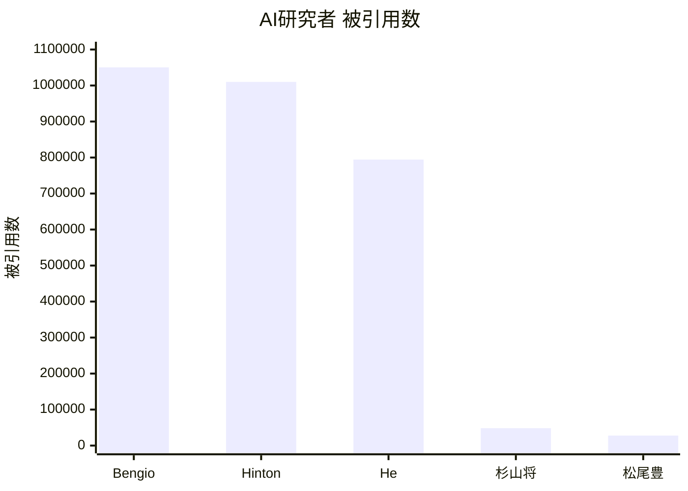
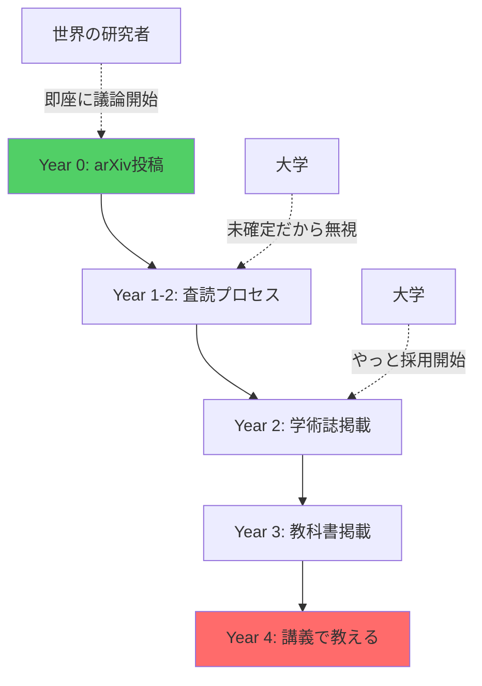

## 導入: なぜこの記事を書くのか

**あなたに関係ある話だ。**

- あなたの税金¥3,873億で、日本が出したAIはGPT-4の足元にも及ばない。中国は$560万（約8億円）でGPT-4級を作った。
- 国立大学の学費は年53万円、4年で212万円。その対価がGAN（2014年）を到達点とする講義。
- あなたの子供が「情報I」で解いているのはどのPCでも動かない疑似言語のマークシート。エストニアの7歳はコードを書いている。
- 政府は「AI人材25万人育成」と言う。その方法はマークシート。

東京大学 松尾・岩澤研究室の「深層生成モデル2026Spring」——日本最高峰の講座だ。それでも**世界の最先端から3年遅れている**。

AIの最先端は大学にはない。arXiv とGitHub にある。査読を通過して学術誌に載る頃には、世界は次の世代に進んでいる。

---

## Part 1: 数字で見る日本の惨状

数字は嘘をつかない。

### 論文数: 世界から埋もれる日本

| 指標 | 世界トップ | 日本 | 差 |
|:-----|:----------|:-----|:---|
| NeurIPS 2025 | 米国 ~2,450本 / 中国 ~2,370本 | ~100-150本 | 1/20 |
| 6大カンファレンス合計 | 19,187本 | RIKEN AIP 121本 | 0.63% |
| AI特許（2024） | 中国 300,510件 / 米国 67,773件 | 26,400件 | 1/11 |
| 生成AI特許 | 米国 6,276件 / 中国 38,210件 | 3,409件 | 1/11 |

6大カンファレンス（NeurIPS、ICLR、ICML、CVPR、AAAI、IJCAI）合計19,187本中、RIKEN AIP が121本（0.63%）。Google 1社で175本以上——旧帝7校+早慶+東工大の10大学合計でも届かない。

### 質: イランに抜かれた日本の論文

| 指標 | 世界 | 日本 |
|:-----|:-----|:-----|
| Best Paper（2020-2025、6カンファ） | MIT, Stanford, Google が常連 | 6年で1件（ICLR 2021） |
| 被引用数1位 | Bengio 1,050,275 | 杉山将 48,327（1/22） |
| 被引用数2位 | Hinton ~1,010,000 | 松尾豊 ~27,700（1/36） |
| **トップ10%被引用論文** | 米中英独が上位 | **13位（イランに抜かれた）** |

量が少ないのではない。**質で負けて、イランにも抜かれた**。「AI立国」を名乗る国の現在地がこれだ。

トップ10%被引用論文数は20年前の4位から2023年に13位——**過去最低**。論文数も2位から4位に転落。東大前総長の五神真はこう警告している。「手を打たないと10年後には世界から日本が見えなくなる」。

### 国際競争力: 1位から35位への転落

IMD世界競争力ランキングで、日本は1989-1992年に1位だった。2023年は**35位（過去最低）**。アジアでもシンガポール（4位）、台湾（6位）、香港（7位）、中国（21位）、韓国（28位）——すべてに負けている。

IMDアンケートで日本は64カ国中:

- 「企業の意思決定の迅速性」**最下位**
- 「管理職の国際経験」**最下位**
- 「起業家精神」**63位**
- 「デジタル人材の利用可能度」**62位**

2024年3月、JSTは緊急シンポジウムを開いた。タイトルは「激論 なぜ、我が国の論文の注目度は下がりつつあるのか、我々は何をすべきか？」。科学技術基本法に基づき5年ごとに施策を講じてきたが、「顕著な効果が表れたとは言い難い」。**政府が自分で認めている。**

### AI投資: 圧倒的な差

| 指標 | 米国 | 中国 | 日本 |
|:-----|:-----|:-----|:-----|
| AI企業数 | 5,509社 | 1,446社 | **41社** |
| 政府AI R&D（2025） | $33億 | 非公開（科技全体$550億） | ¥3,873億 |
| 民間AI投資（2024） | $1,091億 | $93億 | 計測困難 |
| ビッグテック CapEx（2025） | ~$3,200億 | ByteDance+Alibaba $730億 | ¥2兆弱 |
| 生成AI利用率 | 46.3% | 56.3% | **9.1%** |

Microsoft 1社の年間AI投資（**$800億 = ¥12兆**）が、日本の政府予算＋全企業合計を超えている。

DeepSeek V3の訓練費は**$560万**。日本の年間AI予算¥3,873億で**461個**作れる。

**日本は0個**。ベンチマークを公開したGPT-4級モデルは存在しない。

リコーは「GPT-4o同等」、NTTは「GPT-5同等」と主張する。**MMLU・HumanEvalのスコアは？** Rakuten AI 3.0、tsuzumi、PLaMo、OpenCALM、ELYZA、Japanese Stable LM——**全て非公開だ。**

ChatGPT、Claude、Geminiは何を出すか。**MMLU-Pro、SWE-bench、GPQA、AIME、HLE**——2026年の必須ベンチマークを全て公開している。日本は？**1つも出していない。** 主張だけで、数字は出さない。

中国は制裁下でGPT-4級モデルを量産している。**日本は無制裁で何も出せていない。**

---

## Part 2: 大学AI教育の三つの失敗

日本の大学のAI教育は、三つの点で失敗している。

### 失敗1: 最新理論・学術的議論に参加できていない

大学教授の閉じたコミュニティ内で新理論が広まるのに3年かかる。その3年で、世界は次の世代に移る。

松尾研「深層生成モデル」2026年Springの全8回シラバスを見てほしい。

1. 生成モデル概要 → 2. 潜在変数モデル → 3. VAE → 4. GAN → 5. 自己回帰モデルとフローベースモデル → 6. エネルギーベースモデル → 7. スコアベースモデルと拡散モデル → 8. 拡散モデルの発展的内容

到達点は**DDPM/Score-based（2020〜2021年）**。Flow Matching（2023年）、Consistency Models（2023年）、DiT（2023年）——**全てゼロ**。

**これは日本最高峰の松尾研の、2026年の講座だ。** 一般の大学はもっとひどい。

- 筑波大学「機械学習」——到達点がGAN（2014年）。Transformer以降、存在しない。
- 慶應義塾大学「機械学習基礎」（理工学部）——最新がTransformer（2017年）。教科書の出版年が2017年。参考文献にBishop（2006年）。
- 東大「先端機械学習」——全10回で**生成モデルの講義がゼロ**。「先端」を名乗ってGNNと量子MLを教えている。

冒頭で「松尾研は3年遅れている」と書いた。**控えめすぎた。** 松尾研「深層生成モデル」の最終回はDDPM（2020年）。Stability AIがFlow MatchingでStable Diffusion 3を出荷し、OpenAIがConsistency ModelsでDALL·E 3を高速化し、SoraがDiTで動画を生成している2026年に、**6年前の論文が到達点だ。**

のべ55,000人がこの講座を受けた。**55,000人が、産業の現場で使われていない手法を「最新」として学んだ。**

「査読が通っていないから扱わない」——学術的誠実さではなく知的怠慢だ。この傲慢さが、学生を3年以上遅れた世界に閉じ込めている。

### 失敗2: 理論を実装で実証できていない

理論は語るが、コードは動かない。

松尾研の講義資料には数式が並ぶ。だが、その数式がどう動くのか——本番環境で、エッジデバイスで、リアルタイムで——を実装して見せるコードはない。

実装なき理論は空理空論だ。Production-readyなコードで理論を語れない教授は、理論を理解していない。個人開発者が論文を読んで翌週に実装をリリースしている時代に、大学は「理論の講義」で満足している。

実装スピードで、大学は個人開発者に負けている。

もう一つ不都合な真実。 `model.train()` を呪文のように唱えるだけで「実装できる」と言い張る研究者が、企業で「使えない」と言われる。`model.train()` の裏で何が起きているか説明できない。Hugging Face Transformersのスター数は156,000。あなたの最もcitedされた論文のcitation数はその1/1000以下だ。

数式とコードから逃げるな。 数式が読めなければ理論は理解できない。コードが書けなければ理論は検証できない。

### 失敗3: グローバルで後退している（頭脳流出）

日本出身で世界レベルの被引用数を持つ金出武雄（147,000+）はCMU所属。日本にはいない。優秀な研究者は日本から出ていく。日本の大学は育てた人材を輸出して自分は衰退する——**人材の貿易赤字**だ。

「日本のAI研究は世界と戦えている」——この数字の前では通用しない。

---

## Part 3: 病理の根源

日本の病理はGPUでも資本でもない。構造的な3年遅れ、試験偏重の教育、学者の怠慢、そして学生が責任を取る構造だ。

### 病理1: 構造的3年遅れのサイクル

査読至上主義と権威への服従が思考を停止させている。GPT-4、LLaMA、AlphaFold——すべてarXiv投稿の瞬間から世界が議論し、実装し、検証した。査読を待っているから、3年遅れている。

### 病理2: 試験偏重（マークシート vs プロダクト）

試験の点数を取る力と、コードを書いてプロダクトを作る力は全く違う。日本の教育は入試から大学院まで、一貫して前者しか測っていない。マークシートが測っているのは記憶力だ。**AIが最初に奪うのは記憶力の仕事だ。**

共通テスト「情報I」は全問マークシート。実在しない疑似言語「DNCL」で穴埋めをさせ、コードは1行も動かさない。教員の約8割が他教科と兼任。大学に入っても、スライドを見て期末試験で数式を書いてコピペレポートを出す——動くものを作る経験がない。清華大学は情報オリンピックでコードを書いて証明した人間を取る。

| 教育システム | 測っているもの | AI時代の価値 |
|:-----------|:------------|:-----------|
| 日本（マークシート） | 記憶力 | ❌ AIに代替される |
| 海外（プロダクト） | 実装力・創造力 | ✅ AIと協働できる |

カリキュラムも壊れている。VAE、GAN、Diffusion、Transformerをバラバラに教え、理論的つながりを示さない。だが最新手法を無闇に追加することが答えでもない。VAEの潜在空間→VQ-VAE→Diffusionの潜在表現、Score Matching→Flow Matchingの統一——各理論がなぜ生まれ、何を解決し、次にどう繋がるか。この文脈を与えることが教育だ。

### 病理3: 学者の怠慢

大学教授は「知的探究の守り手」を名乗る。だが、その実態は**知的怠慢**だ。

**arXivのTrending論文を毎朝チェックしているか？** していない。「査読が通っていないから扱わない」と言う。世界中の修士1年生が、その教授より先に論文を読んでいる。arXivのcs.LGには毎日100本以上投稿される。**あなたは今週1本も読んでいない。**

**GitHubにコードを公開しているか？** していない。最後のコミットは半年以上前。論文で出したコードを、研究室の外で再現した人はいない。

**カリキュラムを更新しているか？** していない。松尾研の到達点は6年前のDDPM（2020年）。一般の大学は12年前のGAN（2014年）。

知的探究を怠り、権威に縋る。学位と所属で威張り、学生を無給労働力として使い、産業界から断絶し、世界から無視される。

**学者としての信頼は地に落ちた。**

### 病理4: 責任を取るのは学生

大学は「専門性」を語る。その実態は何か。

**松尾研の到達点はDDPM（2020年）。** 2026年に、6年前の手法を「最先端」として教えている。これが日本最高峰だ。一般の大学はもっとひどい。

**あなたが博士課程5年で学ぶのは、世界が6〜11年前に捨てた知識だ。**

博士を取っても正規雇用は**54.8%**。半数は非正規かポスドク。ポスドクの4人に1人は月給**15万円未満**。

**学費は年54万円。5年で270万円。** 自腹を切って、就職困難な学位を取り、手に入るのは社会で使い物にならない古い知識。

欧米の博士課程は月**40万円**の給与が出る。最先端の研究に給料をもらいながらアクセスできる。日本は？ **金を払って、時代遅れを学ぶ。**

同期でスタートアップに行った友人はどうか。就職して実践経験をつみ、大学では学べなかった最先端の知識を会社の同期と磨く。2年目には年収**¥800〜1,200万円**に到達する。

| ルート | 5年後の状態 | 金銭的負担/収入 | 知識の鮮度 |
|:------|:----------|:------------|:---------|
| 博士課程 | 正規雇用54.8% | -270万円 | 6〜11年遅れ |
| スタートアップ | 年収¥800-1,200万 | +5,000万円 | 最新 |

**あなたは5年かけて270万円を払い、古い知識を学び、就職困難。彼は2年で年800〜1,200万を稼ぎ、最新技術を扱い、市場価値を上げる。**

大学の「専門性」は終わった。それは専門性ではなく、**時代遅れの在庫処分**だ。

---

## Part 4: 言い訳は通用しない

### 言い訳1:「最先端は大学の役割じゃない」？被引用数13位で？

「大学の役割は基礎研究だ。最先端を追うのは企業の仕事だ」——そう反論する教授がいるだろう。

では聞こう。**被引用数は？**

日本の**トップ10%論文は世界13位**——過去最低。**イランに抜かれた。** 2000年代半ばは世界トップ5だった。2025年はフランスにも韓国にも抜かれた。

**基礎研究で世界から無視されている。**

**産学連携は？**

大学のライセンス収入は**米国の1/22**。企業から大学への投資は研究費の**2.5%**のみ——ドイツ13%、中国15.5%、日本は**G7最下位**。

**産業貢献もできていない。**

**大学発スタートアップは？**

5,074社が存在する。存続率は**106.8%**——米国17.7%と比べて異常に高い。なぜか。**廃業しづらいゾンビ企業だからだ。** 半数は赤字。ユニコーンは諸外国と比べて圧倒的に少ない。

**では企業の研究は？**

引用特許数トップ3は産総研（国立研究機関）、JST、東大。**大学は3位だ。** 研究者の60%は企業に所属している。大学は40%。

**企業の方が優秀だ。**

### 言い訳2:「予算が足りない」？使い方の問題だ。

Microsoft 1社の年間AI投資（**$800億 = ¥12兆**）が、日本の政府予算＋全企業合計を超えている。

DeepSeek V3の訓練費は**$560万**。日本の年間AI予算¥3,873億で**461個**作れる。

**日本は0個**。ベンチマークを公開したGPT-4級モデルは存在しない。

中国は制裁下でGPT-4級モデルを量産している。**日本は無制裁で何も出せていない。**

### 言い訳3:「公開する義務はない」？恥ずかしいからだろ。

MITはOpenCourseWareで全講義を無料公開している。Stanfordはcs231n、cs224nをYouTubeで世界に配信している。**誰でも、どこからでも、最先端の講義にアクセスできる。**

日本の大学はどうか。講義スライドは学内限定。シラバスはPDFで検索にかからない。録画は非公開。

公開しない理由を考えてみてほしい。**海外から中身を見られたら困るからだ。** GAN（2014年）が到達点の講義をMITの隣に並べられたら、恥ずかしいからだ。

松尾研は「公開講座」を名乗る。だが社会人は**¥33,000**。しかも抽選制で、受講できるかは運次第。国立大学の研究室が、税金で開発した教材を有料・限定で配っている。

| 大学 | 公開方法 | 受講料 | アクセス |
|:-----|:--------|:------|:--------|
| MIT | OpenCourseWare | 無料 | 全世界 |
| Stanford | YouTube | 無料 | 全世界 |
| 東大松尾研 | 抽選制 | ¥33,000 | 運次第 |

MITは無料で全世界に公開。**東大は33,000円で抽選。** これが「日本最高峰」の姿勢だ。

### 言い訳4:「教授は忙しい」？GitHubは墓地だ。

**arXivのTrending論文を毎朝チェックしているか？** していない。「査読が通っていないから扱わない」と言う。世界中の修士1年生が、その教授より先に論文を読んでいる。

**GitHubにコードを公開しているか？** していない。最後のコミットは半年以上前。論文で出したコードを、研究室の外で再現した人はいない。

国際学会の出張費は科研費から出る。ポスター1本貼って「国際連携」と報告書に書く。学生はそれを見ている。

---

## じゃあ何のために存在するんだ？

大学は基礎研究で世界から埋もれ、産業貢献もできず、スタートアップも作れない。

**学生に古い知識を売り、予算を無駄遣いし、言い訳だけは一人前だ。**

Flow Matching（2022年〜）の統一理論をJuliaで実装できない。DiT（2022年）のProduction実装をRustで書けない。Sora（2024）の理論的背景を数学的に厳密に説明できない。

**教える資格はない。**

日本の大学は終わった。

---

## Part 5: 解決策としての本シリーズ

本シリーズ（全50回）は、松尾研の**完全上位互換**として設計されている。

### 三つの差別化軸

| 軸 | 松尾研 | 本シリーズ |
|:---|:------|:----------|
| **理論** | 論文が読める | **論文が書ける**（数学的厳密性 + 統一理論） |
| **実装** | Pythonで実装 | **Julia（プロトタイプ）+ Rust（本番）+ Elixir（分散）**— 理論を実装で実証 |
| **最新** | 2023年までの手法 | **2025-2026 SOTA**（arXiv直結、Flow Matching、FLUX、Sora理論） |

### ローカル完結ポリシー — Colab不要、MacBook M1 16GBで全て動く

すべての実装がローカルマシンのみで完結する。MacBook M1 16GB一台。GPUクラスタなし、クラウド課金なし。

理論を学ぶのにGPUは要らない。ELBOの導出は30万パラメータでも10億パラメータでも同じだ。「GPUがないから学べない」は「規模」と「構造」の混同だ。

### 二つのルート — 「使う側」か「作る側」か

| ルート | 対象 | 回数 | 到達点 |
|:------|:-----|:-----|:------|
| **Route A: 使いこなす** | 非エンジニア | 全8回 | AIツールを業務に導入できる |
| **Route B: 理解して作る** | エンジニア・研究者 | 全50回 | arXiv論文を1週間で実装・デプロイできる |

- [非エンジニア向けスピンオフ（全8回）](https://zenn.dev/fumi_shiki/articles/ml-spinoff-01)
- [AIエンジニア向け本編（全50回）](/articles/ml-lecture-01-part1)

迷ったらRoute Aから。S8で本編に進むか判断できる。

---

## 結論: 個人が大学を超える時代

arXiv とGitHub がある今、個人が大学を超えることは可能だ。本シリーズは、あなたをその個人にするための挑戦状だ。

数字は嘘をつかない。

| 指標 | 世界 | 日本 | 差 |
|:-----|:-----|:-----|:---|
| NeurIPS 2025 | 米国 ~2,450 / 中国 ~2,370 | ~100-150 | 1/20 |
| 6大カンファ合計 | 19,187本 | RIKEN AIP 121本 | 0.63% |
| AI特許 | 中国 300,510件 | 26,400件 | 1/11 |
| Best Paper（6年間） | MIT / Stanford / Google | 1件 | — |
| 被引用数 | Bengio ~1,050,000 | 杉山将 ~48,300 | 1/22 |
| AI企業数 | 米国 5,509社 | 41社 | 1/134 |
| 企業AI投資 | ビッグテック4社 $3,200億 | ¥2兆弱 | 1/24 |
| 国産LLM | DeepSeek V3（$560万） | Fugaku-LLM（GPT-4未満） | — |
| 生成AI利用率 | 中国 56.3% / 米国 46.3% | 9.1% | 1/5 |
| トップ10%論文 | 世界5位 | 13位（イランに抜かれた） | — |
| 博士正規雇用 | 欧米: 給与月40万+学費免除 | 54.8%（半数非正規） | — |

この記事に書かれていることが間違っていると思うなら、数字で反論してほしい。

数字が出せないなら、それが答えだ。

---

## 著者リンク

- Blog: https://fumishiki.dev
- X: https://x.com/fumishiki
- LinkedIn: https://www.linkedin.com/in/fumitakamurakami
- GitHub: https://github.com/fumishiki
- Hugging Face: https://huggingface.co/fumishiki

## ライセンス

本記事は [CC BY-NC-SA 4.0](https://creativecommons.org/licenses/by-nc-sa/4.0/deed.ja)（クリエイティブ・コモンズ 表示 - 非営利 - 継承 4.0 国際）の下でライセンスされています。

### ⚠️ 利用制限について

**本コンテンツは個人の学習目的に限り利用可能です。**

**以下のケースは事前の明示的な許可なく利用することを固く禁じます:**

1. **企業・組織内での利用（営利・非営利問わず）**
   - 社内研修、教育カリキュラム、社内Wikiへの転載
   - 大学・研究機関での講義利用
   - 非営利団体での研修利用
   - **理由**: 組織内利用では帰属表示が削除されやすく、無断改変のリスクが高いため

2. **有料スクール・情報商材・セミナーでの利用**
   - 受講料を徴収する場での配布、スクリーンショットの掲示、派生教材の作成

3. **LLM/AIモデルの学習データとしての利用**
   - 商用モデルのPre-training、Fine-tuning、RAGの知識ソースとして本コンテンツをスクレイピング・利用すること

4. **勝手に内容を有料化する行為全般**
   - 有料note、有料記事、Kindle出版、有料動画コンテンツ、Patreon限定コンテンツ等

**個人利用に含まれるもの:**
- 個人の学習・研究
- 個人的なノート作成（個人利用に限る）
- 友人への元記事リンク共有

**組織での導入をご希望の場合**は、必ず著者に連絡を取り、以下を遵守してください:
- 全ての帰属表示リンクを維持
- 利用方法を著者に報告

**無断利用が発覚した場合**、使用料の請求およびSNS等での公表を行う場合があります。
