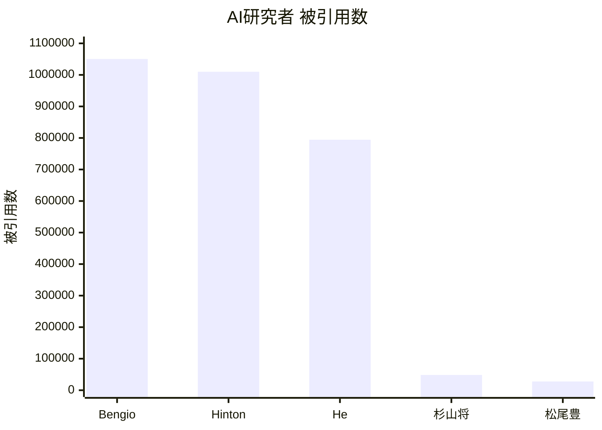
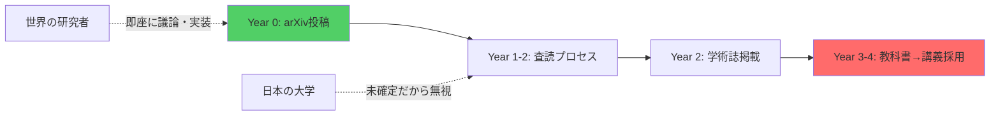

## 導入: なぜこの記事を書くのか

**あなたに関係ある話だ。**

- あなたの税金¥3,873億で、日本が出したAIはGPT-4の足元にも及ばない。中国は$560万（約8億円）でGPT-4級を作った。
- 国立大学の学費は年53万円、4年で212万円。その対価がGAN（2014年）を到達点とする講義。
- 政府は「AI人材25万人育成」と言う。その方法はマークシート。

東京大学 松尾・岩澤研究室の「深層生成モデル2026Spring」——日本最高峰の講座だ。それでも**世界の最先端から3年遅れている**。

AIの最先端は大学にはない。arXivとGitHubにある。査読を通過して学術誌に載る頃には、世界は次の世代に進んでいる。

---

## Part 1: 数字で見る日本の惨状

### 論文数: 世界に埋もれる日本

| 指標 | 世界トップ | 日本 | 差 |
|:-----|:----------|:-----|:---|
| NeurIPS 2025 | 米国 ~2,450本 / 中国 ~2,370本 | ~100-150本 | 1/20 |
| 6大カンファレンス合計 | 19,187本 | RIKEN AIP 121本 | 0.63% |
| AI特許（2024） | 中国 300,510件 / 米国 67,773件 | 26,400件 | 1/11 |

6大カンファレンス（NeurIPS、ICLR、ICML、CVPR、AAAI、IJCAI）合計19,187本中、RIKEN AIPが121本（0.63%）。Google 1社で175本以上——旧帝7校＋早慶＋東工大の10大学合計でも届かない。

### 質: イランに抜かれた日本の論文

| 指標 | 世界 | 日本 |
|:-----|:-----|:-----|
| Best Paper（2020-2025、6カンファ） | MIT, Stanford, Google が常連 | 6年で1件（ICLR 2021） |
| 被引用数1位 | Bengio 1,050,275 | 杉山将 48,327（1/22） |
| トップ10%被引用論文 | 米中英独が上位 | **13位（イランに抜かれた）** |

量が少ないだけではない。**質で負け、イランにも抜かれた。**

トップ10%被引用論文数は20年前の4位から2023年に13位——**過去最低**。東大前総長の五神真の言葉がある。「手を打たないと10年後には世界から日本が見えなくなる」。その10年はもう始まっている。

### 国際競争力: 1位から35位への転落

IMD世界競争力ランキングで、日本は1989-1992年に1位だった。2023年は**35位（過去最低）**。アジアでもシンガポール（4位）、台湾（6位）、香港（7位）、中国（21位）、韓国（28位）——すべてに負けている。

64カ国中:
- 「企業の意思決定の迅速性」**最下位**
- 「デジタル人材の利用可能度」**62位**
- 「起業家精神」**63位**

### AI投資: 圧倒的な差

| 指標 | 米国 | 中国 | 日本 |
|:-----|:-----|:-----|:-----|
| AI企業数 | 5,509社 | 1,446社 | **41社** |
| 政府AI R&D（2025） | $33億 | 非公開（科技全体$550億） | ¥3,873億 |
| 生成AI利用率 | 46.3% | 56.3% | **9.1%** |

Microsoft 1社の年間AI投資（$800億 = ¥12兆）が、日本の政府予算＋全企業合計を超えている。

DeepSeek V3の訓練費は$560万。日本の年間AI予算¥3,873億で461個作れる計算だ。**日本は0個**——ベンチマークを公開したGPT-4級モデルは存在しない。

中国は制裁下でGPT-4級モデルを量産している。日本は無制裁で何も出せていない。

---

## Part 2: 大学AI教育の三つの失敗

### 失敗1: カリキュラムが6年遅れている

松尾研「深層生成モデル」2026年Springのシラバスを見てほしい。

> 1. 生成モデル概要 → 2. 潜在変数モデル → 3. VAE → 4. GAN → 5. 自己回帰・フローベースモデル → 6. エネルギーベースモデル → 7. スコアベース・拡散モデル → 8. 拡散モデルの発展

到達点は**DDPM/Score-based（2020〜2021年）**。Flow Matching（2022年）、Consistency Models（2023年）、DiT（2023年）——**全てゼロ**。Stability AIがFlow MatchingでSD3を出荷し、SoraがDiTで動画を生成している2026年に、6年前の論文が到達点だ。

**これは日本最高峰の、2026年の講座だ。** 控えめに言って3年遅れている、と書いた。控えめすぎた。

のべ55,000人がこの講座を受けた。55,000人が、産業の現場で使われていない手法を「最新」として学んだ。

「査読が通っていないから扱わない」——学術的誠実さではなく知的怠慢だ。

### 失敗2: 理論を実装で実証できていない

理論は語るが、コードは動かない。松尾研の講義資料には数式が並ぶ。だが、その数式が本番環境でどう動くのかを示す実装はない。

`model.train()` を呪文のように唱えて「実装できる」と言い張る研究者が、企業で「使えない」と言われる。`model.train()` の裏で何が起きているか説明できない。個人開発者が論文を読んで翌週に実装をリリースしている時代に、大学は「理論の講義」で満足している。

数式が読めなければ理論は理解できない。コードが書けなければ理論は検証できない。どちらも逃げるな。

### 失敗3: 頭脳流出が止まらない

日本出身で世界レベルの被引用数を持つ金出武雄（147,000+）はCMU所属。優秀な研究者は日本から出ていく。大学は育てた人材を輸出して自分は衰退する——**人材の貿易赤字**だ。

---

## Part 3: 病理の根源

### 構造的3年遅れのサイクル

查読至上主義が思考を停止させている。GPT-4、LLaMA、AlphaFold——すべてarXiv投稿の瞬間から世界が議論し、実装し、検証した。査読を待っているから、構造的に遅れる。

### マークシートが測るのは記憶力だ

共通テスト「情報I」は全問マークシート。実在しない疑似言語「DNCL」で穴埋めをさせ、コードは1行も動かさない。大学に入っても、スライドを見て期末試験で数式を書いてコピペレポートを出す——動くものを作る経験がない。

| 教育システム | 測るもの | AI時代の価値 |
|:-----------|:--------|:-----------|
| 日本（マークシート） | 記憶力 | ❌ AIに代替される |
| 海外（プロダクト） | 実装力・創造力 | ✅ AIと協働できる |

AIが最初に奪うのは記憶力の仕事だ。

### 責任を取るのは学生だ

**松尾研の到達点はDDPM（2020年）。** あなたが博士課程5年で学ぶのは、世界が6〜11年前に捨てた知識だ。

博士を取っても正規雇用は**54.8%**。ポスドクの4人に1人は月給**15万円未満**。学費は年54万円、5年で270万円。欧米の博士課程は月40万円の給与が出る。

| ルート | 5年後 | 金銭 | 知識の鮮度 |
|:------|:------|:-----|:---------|
| 博士課程 | 正規雇用54.8% | −270万円 | 6〜11年遅れ |
| スタートアップ | 年収¥800-1,200万 | +5,000万円 | 最新 |

大学の「専門性」は終わった。それは専門性ではなく、**時代遅れの在庫処分**だ。

---

## Part 4: 言い訳に答える

**「最先端は大学の役割じゃない」**——では基礎研究の成果は？トップ10%論文は13位、産学連携収入は米国の1/22。基礎研究でも産業貢献でも後退している。

**「予算が足りない」**——DeepSeek V3の訓練費は$560万。日本の年間AI予算で461個分だ。問題は量ではなく使い方だ。

**「公開する義務はない」**——MITはOpenCourseWareで全講義を無料公開。Stanfordはcs231n、cs224nをYouTubeで世界に配信。松尾研「公開講座」の受講料は¥33,000、しかも抽選制。国立大学の研究室が税金で開発した教材を有料・限定で配っている。

| 大学 | 受講料 | アクセス |
|:-----|:------|:--------|
| MIT | 無料 | 全世界 |
| Stanford | 無料 | 全世界 |
| 東大松尾研 | ¥33,000 | 抽選制 |

**数字が出せないなら、それが答えだ。**

---

## Part 5: このシリーズで何が手に入るか

本シリーズ（全50回）は、松尾研の**完全上位互換**として設計されている。

### 三つの差別化軸

| 軸 | 松尾研 | 本シリーズ |
|:---|:------|:----------|
| **理論** | 論文が読める | **論文が書ける**（数学的厳密性 + 統一理論） |
| **実装** | Pythonで実装 | **Rust（プロトタイプ）+ Rust（本番）**— 理論を実装で実証 |
| **最新** | DDPM/2020年まで | **2025-2026 SOTA**（Flow Matching、FLUX、DiT、Sora理論） |

### 学習ロードマップ（Course I — 数学基盤）

本シリーズの第1〜8回（Course I）では、生成モデルを理解するための数学的基盤を全て揃える。

| 回 | テーマ | キーワード |
|:---|:------|:---------|
| 第1回 | 概論・数式と論文の読み方 | LaTeX記法、arXiv、Attention |
| 第2回 | 線形代数 I | ベクトル空間、固有値、内積 |
| 第3回 | 線形代数 II | SVD、行列微分、LoRA |
| 第4回 | 確率論・統計学 | ベイズの定理、MLE、指数型分布族 |
| 第5回 | 測度論・確率過程 | Itô積分、SDE、Langevin dynamics |
| 第6回 | 情報理論・最適化 | KLダイバージェンス、Adam、Fisher情報 |
| 第7回 | 最尤推定と統計的推論 | Fisher情報行列、forward/reverse KL |
| 第8回 | 潜在変数モデル・EM算法 | ELBO、GMM、変分推論 |

第9回以降（Course II〜V）では、VAE・GAN・Flow Matching・Diffusion・Consistency Models・DiT・Soraに到達する。

### ローカル完結ポリシー

すべての実装がMacBook M1 16GB一台で完結する。GPUクラスタなし、クラウド課金なし。ELBOの導出は30万パラメータでも10億パラメータでも同じだ。「GPUがないから学べない」は「規模」と「構造」の混同だ。

### 二つのルート

| ルート | 対象 | 回数 | 到達点 |
|:------|:-----|:-----|:------|
| **Route A: 使いこなす** | 非エンジニア | 全8回 | AIツールを業務に導入できる |
| **Route B: 理解して作る** | エンジニア・研究者 | 全50回 | arXiv論文を1週間で実装・デプロイできる |

- [非エンジニア向けスピンオフ（全8回）](https://zenn.dev/fumi_shiki/articles/ml-spinoff-01)
- [AIエンジニア向け本編（全50回）](/articles/ml-lecture-01-part1)

---

## 結論

arXivとGitHubがある今、個人が大学を超えることは可能だ。本シリーズは、あなたをその個人にするための挑戦状だ。

この記事に書かれていることが間違っていると思うなら、数字で反論してほしい。数字が出せないなら、それが答えだ。

## 著者リンク

- Blog: https://fumishiki.dev
- X: https://x.com/fumishiki
- LinkedIn: https://www.linkedin.com/in/fumitakamurakami
- GitHub: https://github.com/fumishiki
- Hugging Face: https://huggingface.co/fumishiki

## ライセンス

本記事は [CC BY-NC-SA 4.0](https://creativecommons.org/licenses/by-nc-sa/4.0/deed.ja)（クリエイティブ・コモンズ 表示 - 非営利 - 継承 4.0 国際）の下でライセンスされています。

### ⚠️ 利用制限について

**本コンテンツは個人の学習目的に限り利用可能です。**

**以下のケースは事前の明示的な許可なく利用することを固く禁じます:**

1. **企業・組織内での利用（営利・非営利問わず）**
   - 社内研修、教育カリキュラム、社内Wikiへの転載
   - 大学・研究機関での講義利用
   - 非営利団体での研修利用
   - **理由**: 組織内利用では帰属表示が削除されやすく、無断改変のリスクが高いため

2. **有料スクール・情報商材・セミナーでの利用**
   - 受講料を徴収する場での配布、スクリーンショットの掲示、派生教材の作成

3. **LLM/AIモデルの学習データとしての利用**
   - 商用モデルのPre-training、Fine-tuning、RAGの知識ソースとして本コンテンツをスクレイピング・利用すること

4. **勝手に内容を有料化する行為全般**
   - 有料note、有料記事、Kindle出版、有料動画コンテンツ、Patreon限定コンテンツ等

**個人利用に含まれるもの:**
- 個人の学習・研究
- 個人的なノート作成（個人利用に限る）
- 友人への元記事リンク共有

**組織での導入をご希望の場合**は、必ず著者に連絡を取り、以下を遵守してください:
- 全ての帰属表示リンクを維持
- 利用方法を著者に報告

**無断利用が発覚した場合**、使用料の請求およびSNS等での公表を行う場合があります。
