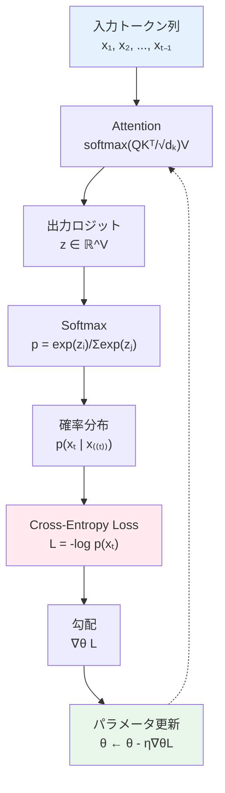
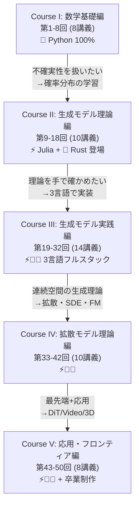
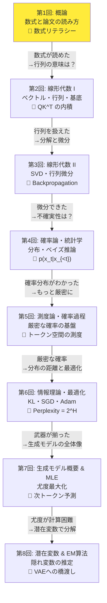
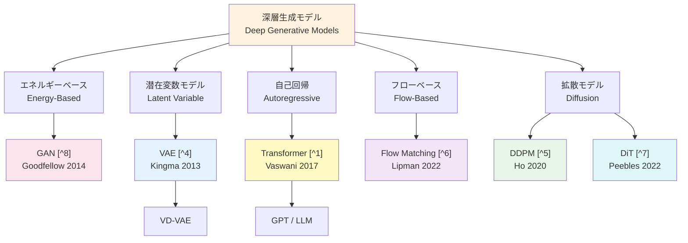
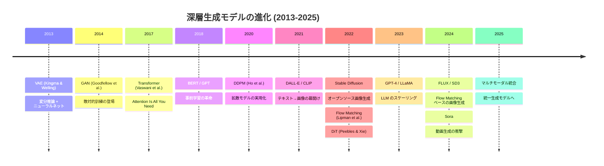
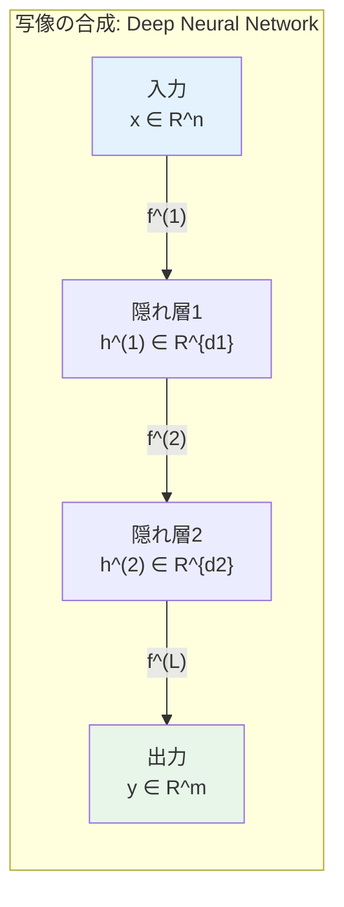
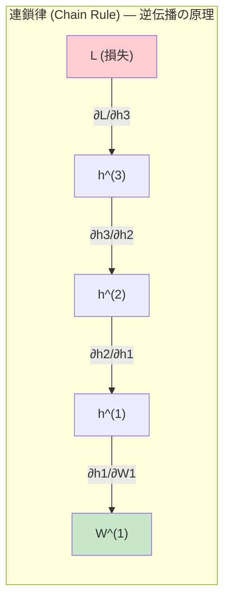
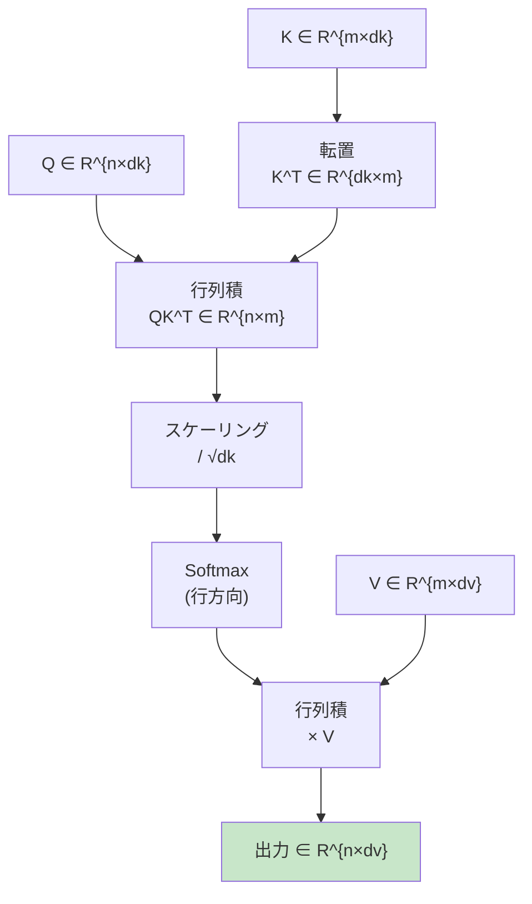

# 第1回: 概論 — 数式と論文の読み方

> **数式が"読めない"のは才能ではなく語彙の問題。50記号を覚えれば論文が"読める"。**

この1文に「いやいや、そんなわけないだろ」と思っただろうか。気持ちはわかる。論文を開いて $\mathcal{L}(\theta, \phi; \mathbf{x})$ のような記号が並ぶと、反射的に閉じたくなる。あの感覚を覚えている人は多いはずだ。

だが考えてほしい。英語を読めなかった頃、英字新聞は暗号に見えた。アルファベットを覚え、単語を覚え、文法を理解した今、それは「普通の文章」になっている。数式も同じだ。記号のアルファベットを覚え、記法の文法を理解すれば、論文は「著者の思考を追体験できるドキュメント」に変わる。

本講義は全50回の第1回 — 冒険のはじまりだ。ここでは数式を読む基礎体力と、論文を構造的に読解する技術を身につける。

:::message
**このシリーズについて**: 東京大学 松尾・岩澤研究室動画講義の**完全上位互換**の全50回シリーズ。理論（論文が書ける）、実装（Production-ready）、最新（2025-2026 SOTA）の3軸で差別化する。
:::


**所要時間の目安**:

| ゾーン | 内容 | 時間 | 難易度 |
|:-------|:-----|:-----|:-------|
| Zone 0 | クイックスタート | 30秒 | ★☆☆☆☆ |
| Zone 1 | 体験ゾーン | 10分 | ★★☆☆☆ |
| Zone 2 | 直感ゾーン | 15分 | ★★☆☆☆ |
| Zone 3 | 数式修行ゾーン | 60分 | ★★★★☆ |
| Zone 4 | 環境・ツールゾーン | 45分 | ★★★☆☆ |
| Zone 5 | 実験ゾーン | 30分 | ★★★☆☆ |
| Zone 6 | 振り返りゾーン | 30分 | ★★☆☆☆ |

---

## 🚀 0. クイックスタート（30秒）— 数式は動かせる

**ゴール**: 数式が「読める」感覚を30秒で体験する。

以下のコードを実行してほしい。たった3行で、機械学習の中核にある数式を「動かせる」。

```python
import numpy as np

# Softmax: p_i = exp(x_i) / Σ_j exp(x_j)
logits = np.array([2.0, 1.0, 0.1])
probs = np.exp(logits) / np.sum(np.exp(logits))
print(f"logits: {logits}")
print(f"probs:  {np.round(probs, 4)}")
print(f"sum:    {np.sum(probs):.6f}")  # must be 1.0
```

出力:
```
logits: [2.  1.  0.1]
probs:  [0.6590 0.2424 0.0986]
sum:    1.000000
```

**この3行の裏にある数式**:

$$
p_i = \frac{\exp(x_i)}{\sum_{j=1}^{K} \exp(x_j)}
$$

見てほしい。`np.exp(logits)` が $\exp(x_i)$、`np.sum(np.exp(logits))` が $\sum_j \exp(x_j)$。数式とコードが1対1で対応している。

このSoftmax関数は現代のLLMの心臓部だ。GPT、Claude、Gemini — 全てがこの関数を使って次のトークンの確率分布を計算している。Transformerの原論文 [^1] でもAttention機構の中核としてSoftmaxが使われている。

「え、数式ってコードに直せるの？」 — そう、直せる。全50回を通じて、この感覚を徹底的に鍛える。

:::message
**進捗: 3% 完了** ここまでで「数式 = コードで動かせる」を体感した。残り7ゾーンの冒険が待っている。
:::

---

## 🎮 1. 体験ゾーン（10分）— 数式を声に出して読む

### 1.1 数式を「声に出して読む」

数式を読めない最大の原因は、**声に出したことがない**からだ。英単語を覚えるとき発音しないで暗記する人はいない。数式も同じだ。

以下の数式を声に出して読んでみてほしい。

$$
\nabla_\theta \mathcal{L}(\theta) = \frac{1}{N} \sum_{i=1}^{N} \nabla_\theta \ell(f_\theta(\mathbf{x}_i), y_i)
$$

**読み方**: 「ナブラ シータ エル シータ イコール イチ エヌ ぶんの シグマ アイ イコール イチ から エヌ ナブラ シータ スモール エル エフ シータ エックス アイ カンマ ワイ アイ」

......長い。だが構造は単純だ:

| 記号 | 読み | 意味 |
|:-----|:-----|:-----|
| $\nabla_\theta$ | ナブラ シータ | パラメータ $\theta$ に関する勾配 |
| $\mathcal{L}(\theta)$ | エル シータ | 損失関数（全体の平均） |
| $\frac{1}{N}\sum_{i=1}^{N}$ | エヌぶんのイチ シグマ | N個のデータの平均 |
| $\ell(f_\theta(\mathbf{x}_i), y_i)$ | スモール エル | 1個のデータの損失 |
| $f_\theta(\mathbf{x}_i)$ | エフ シータ エックス アイ | モデルの予測 |

**これが勾配降下法の数式だ。** ニューラルネットの学習で毎ステップ計算される式 — Rumelhart, Hinton & Williamsが1986年の画期的な論文 [^2] で誤差逆伝播法として定式化したアルゴリズムの核心がここにある。「ナブラ」を見たら「勾配」と反射的に読めるようになれば、もう数式はただの文章だ。

:::message
ここで多くの人が混乱するのが $\mathcal{L}$（カリグラフィック体のエル）と $\ell$（スモールエル）の違いだ。慣例として $\mathcal{L}$ は「全体の損失」、$\ell$ は「1サンプルの損失」を指すことが多い。だが著者によって流儀が異なるので、必ず論文中の定義を確認すること。
:::

### 1.2 数式パラメータを触って遊ぶ

数式の感覚を掴むには、パラメータを変えて挙動を見るのが一番早い。

```python
import numpy as np

def softmax(x: np.ndarray) -> np.ndarray:
    """Numerically stable softmax."""
    # corresponds to: p_i = exp(x_i - max(x)) / Σ_j exp(x_j - max(x))
    e_x = np.exp(x - np.max(x))
    return e_x / e_x.sum()

# Temperature scaling: p_i = exp(x_i / T) / Σ exp(x_j / T)
logits = np.array([2.0, 1.0, 0.1])
for T in [0.1, 0.5, 1.0, 2.0, 10.0]:
    p = softmax(logits / T)
    print(f"T={T:5.1f}: {np.round(p, 4)} | max_prob={p.max():.4f}")
```

出力:
```
T=  0.1: [1.     0.     0.    ] | max_prob=1.0000
T=  0.5: [0.9796 0.0198 0.0007] | max_prob=0.9796
T=  1.0: [0.659  0.2424 0.0986] | max_prob=0.6590
T=  2.0: [0.4785 0.3107 0.2109] | max_prob=0.4785
T= 10.0: [0.3597 0.3299 0.3104] | max_prob=0.3597
```

**温度 $T$ が低いと「確信的」、高いと「均等」になる。** ChatGPTの `temperature` パラメータの正体がこれだ。LLMが使うSoftmaxの数式を、数行のコードで完全に理解できる。

$$
p_i = \frac{\exp(x_i / T)}{\sum_{j=1}^{K} \exp(x_j / T)}
$$

$T \to 0$ で one-hot（argmax）に近づき、$T \to \infty$ で一様分布に近づく。数式から読み取れる性質だ。

この温度付きSoftmaxは、Hintonらの知識蒸留（Knowledge Distillation）論文 [^3] で体系的に導入された。大きなモデル（教師）の「柔らかい」出力分布を小さなモデル（生徒）に学習させる手法であり、高温の $T$ で教師の出力を「ソフト化」するのが鍵だ。

:::details 温度パラメータの数学的直感
$T \to 0$ のとき、$x_i / T$ は最大の $x_i$ だけが $+\infty$ に発散し、他は相対的に $-\infty$ に近づく。$T \to 0$ の極限で、最大の $x_i$ に対応する Softmax 出力が 1 に収束し、他は 0 に収束するから one-hot。

$T \to \infty$ のとき、$x_i / T \to 0$ なので全ての $\exp(x_i / T) \to \exp(0) = 1$。均等に1なので一様分布。

この 2 つの極限を紙に書いて確かめてみてほしい。数式の性質を直接「導出」する感覚が身につく。

ちなみに、LLMの推論で $T = 0$ を指定するとgreedy decodingになるのは、まさにこの数学的性質のためだ。この話は第15回（自己回帰モデル）で本格的に扱う。
:::

### 1.3 Attention — 現代AIの心臓部を触る

もう1つ、現代の機械学習で最も重要な数式を体験しよう。

$$
\text{Attention}(Q, K, V) = \text{softmax}\left(\frac{QK^\top}{\sqrt{d_k}}\right)V
$$

GPT、BERT、Vision Transformer、Stable Diffusion — 2024-2026年の主要モデル全てがこの数式の上に立っている。**たった1つの数式が、AIの全てを動かしている**というのは言い過ぎではない。この式はVaswaniらの "Attention Is All You Need" [^1] で提案され、それ以降の深層学習の方向性を決定的に変えた。

```python
import numpy as np

def attention(Q: np.ndarray, K: np.ndarray, V: np.ndarray) -> np.ndarray:
    """Scaled Dot-Product Attention.

    corresponds to: Attention(Q, K, V) = softmax(QK^T / sqrt(d_k)) V
    """
    d_k = Q.shape[-1]
    # QK^T / sqrt(d_k)
    scores = Q @ K.T / np.sqrt(d_k)
    # softmax along last axis
    weights = np.exp(scores - scores.max(axis=-1, keepdims=True))
    weights /= weights.sum(axis=-1, keepdims=True)
    # weighted sum of V
    return weights @ V

# Toy example: 3 tokens, d_model=4
np.random.seed(42)
seq_len, d_model = 3, 4
Q = np.random.randn(seq_len, d_model)
K = np.random.randn(seq_len, d_model)
V = np.random.randn(seq_len, d_model)

output = attention(Q, K, V)
print("Q shape:", Q.shape)
print("K shape:", K.shape)
print("V shape:", V.shape)
print("Output shape:", output.shape)
print("Output:\n", np.round(output, 4))
```

**数式のどこがコードのどこか、わかるだろうか？**

| 数式 | コード | 意味 |
|:-----|:-------|:-----|
| $QK^\top$ | `Q @ K.T` | クエリとキーの類似度行列 |
| $\sqrt{d_k}$ | `np.sqrt(d_k)` | スケーリング因子 |
| $\text{softmax}(\cdot)$ | `np.exp(...) / sum` | 確率への正規化 |
| $(\cdot) V$ | `weights @ V` | 値の加重和 |

この数式→コード対応が「見える」なら、すでに数式リテラシーの第一歩を踏み出している。

ここで「なぜ $\sqrt{d_k}$ で割るのか？」という疑問が湧いた人は鋭い。内積 $QK^\top$ の値は次元数 $d_k$ が大きいほど絶対値が大きくなる傾向がある。大きすぎる値にSoftmaxをかけると one-hot に近づいてしまい、勾配が消失する。$\sqrt{d_k}$ で割ることで値のスケールを安定させているのだ。Vaswaniら [^1] は原論文でこの理由を明確に述べている:「$d_k$ が大きいとき、内積の大きさが増大してSoftmaxが極端に飽和した領域に押し込まれ、勾配が非常に小さくなる」。

> **一言で言えば**: Attention = 「類似度で重みづけした値の加重和」

この直感を第2回（線形代数 I）と第16回（Transformer完全版）で数学的に深める。

:::details Attentionの計算量
$Q, K, V \in \mathbb{R}^{n \times d}$ のとき:
- $QK^\top$: $O(n^2 d)$ — 全トークン対の類似度を計算
- softmax: $O(n^2)$
- weights $\times V$: $O(n^2 d)$

合計 $O(n^2 d)$。シーケンス長 $n$ に対して二乗で計算量が増える。これが「長い文脈は高コスト」の理由であり、Flash Attention（第16回）やSSM（第26回）で解決を試みる対象だ。
:::

### 1.4 LLMの学習目標 — Cross-Entropy Loss

LLMが毎ステップ最小化しているのが以下の損失関数だ:

$$
\mathcal{L}(\theta) = -\frac{1}{T} \sum_{t=1}^{T} \log p_\theta(x_t \mid x_{<t})
$$

分解すると:
- $\theta$ — モデルパラメータ
- $T$ — シーケンス長（トークン数）
- $x_t$ — $t$ 番目のトークン（正解）
- $x_{<t}$ — $t$ より前のトークン列（文脈）
- $p_\theta(x_t \mid x_{<t})$ — モデルが $x_t$ に割り当てた確率
- $\log$ — 対数（確率の積を和に変換する技）
- $-$ — 最小化のための符号反転

**一言で言えば**: 「各トークンについて、モデルが正解に割り当てた確率の対数を取り、平均の符号を反転したもの」。

```python
import numpy as np

def cross_entropy_loss(logits: np.ndarray, targets: np.ndarray) -> float:
    """Compute cross-entropy loss for next-token prediction.

    corresponds to: L = -(1/T) Σ_t log p(x_t | x_{<t})
    """
    # softmax to get probabilities: p_θ(x_t | x_{<t})
    exp_logits = np.exp(logits - np.max(logits, axis=-1, keepdims=True))
    probs = exp_logits / exp_logits.sum(axis=-1, keepdims=True)

    # select probabilities of correct tokens
    T = len(targets)
    correct_probs = probs[np.arange(T), targets]

    # -(1/T) Σ log p(x_t | x_{<t})
    loss = -np.mean(np.log(correct_probs + 1e-10))  # 1e-10: 数値安定化の ε（log(0) 回避 → Zone 3.3 で詳述）
    return loss

# Simulated next-token prediction
vocab_size = 100
T = 5
np.random.seed(42)

logits = np.random.randn(T, vocab_size)
targets = np.array([23, 45, 67, 12, 89])

loss = cross_entropy_loss(logits, targets)
print(f"Cross-Entropy Loss: {loss:.4f}")
print(f"Perplexity:         {np.exp(loss):.2f}")
print(f"(Random baseline:   {np.log(vocab_size):.4f} loss, {vocab_size:.0f} perplexity)")
```

この Cross-Entropy Loss は第6回（情報理論）で理論的に深堀りし、Perplexity $= \exp(\mathcal{L})$ の情報理論的意味を $2^{H(p)}$ と接続する。今は「LLMの学習 = この数式の最小化」とだけ覚えておけば十分だ。

### 1.5 4つの数式はどう接続するか

ここまでで体験した4つの数式を整理しよう。実はこれらは独立ではなく、LLMの推論・学習パイプラインの中で繋がっている。



**推論時**（生成時）:
1. 入力トークン列が Attention 層を通過する
2. 出力ロジットが得られる
3. Softmax で確率分布に変換する（Temperature で制御）
4. 確率分布からサンプリングして次のトークンを選ぶ

**学習時**:
1. 上記1-3に加えて、正解トークンに対する Cross-Entropy Loss を計算
2. Loss から勾配を逆伝播（Backpropagation）[^2]
3. パラメータを更新

```python
import numpy as np

def llm_forward_pass(x_logits: np.ndarray, target: int, temperature: float = 1.0):
    """Simulate one step of LLM forward pass.

    Shows how Softmax, Temperature, and Cross-Entropy connect.
    """
    # Step 1: Temperature scaling
    scaled = x_logits / temperature

    # Step 2: Softmax → probability distribution
    # p_i = exp(x_i/T) / Σ exp(x_j/T)
    exp_scaled = np.exp(scaled - np.max(scaled))  # numerically stable
    probs = exp_scaled / exp_scaled.sum()

    # Step 3: Cross-Entropy Loss for the target token
    # L = -log p(target)
    loss = -np.log(probs[target] + 1e-10)

    # Step 4: Perplexity
    ppl = np.exp(loss)

    return probs, loss, ppl

# Example: vocabulary of 10 tokens
np.random.seed(42)
logits = np.random.randn(10) * 2
target_token = 3  # correct next token is index 3

print("=== LLM Forward Pass Simulation ===\n")
for T in [0.1, 0.5, 1.0, 2.0]:
    probs, loss, ppl = llm_forward_pass(logits, target_token, T)
    print(f"T={T:.1f} | p(target)={probs[target_token]:.4f} | "
          f"loss={loss:.4f} | ppl={ppl:.2f} | argmax={np.argmax(probs)}")

print("\n--- Key insight ---")
print("Lower loss = model assigns higher probability to correct token")
print("Perplexity = 'effective number of equally likely choices'")
print(f"Perfect prediction: loss=0, ppl=1")
print(f"Random guess (V=10): loss={np.log(10):.4f}, ppl=10")
```

:::details NumPy と PyTorch の対応
ここまで全て NumPy で書いてきた。同じ処理を PyTorch で書くと:

```python
import torch
import torch.nn.functional as F

# NumPy version
import numpy as np
logits_np = np.array([2.0, 1.0, 0.1])
probs_np = np.exp(logits_np) / np.sum(np.exp(logits_np))

# PyTorch version — one line
logits_pt = torch.tensor([2.0, 1.0, 0.1])
probs_pt = F.softmax(logits_pt, dim=0)

print(f"NumPy:   {np.round(probs_np, 4)}")
print(f"PyTorch: {probs_pt.numpy().round(4)}")
print(f"Match: {np.allclose(probs_np, probs_pt.numpy())}")

# Cross-Entropy Loss
target = torch.tensor(0)  # correct class is 0
loss_np = -np.log(probs_np[0])
loss_pt = F.cross_entropy(logits_pt.unsqueeze(0), target.unsqueeze(0))
print(f"\nCE Loss (NumPy):   {loss_np:.6f}")
print(f"CE Loss (PyTorch): {loss_pt.item():.6f}")
```

**PyTorch の `F.cross_entropy`** は内部で Softmax + 負の対数尤度を一度に計算する。数値安定化も自動で行われる。「中で何が起きているか」を NumPy で理解してから PyTorch を使う — これが本シリーズのスタンスだ。
:::

> **Zone 1 まとめ**: Softmax（確率への変換）→ Temperature（分布の鋭さ制御）[^3] → Attention（類似度加重和）[^1] → Cross-Entropy（学習目標）。この4つが LLM の心臓部を形成している。数式で書けば4行。コードで書けば各20行。それが数十億パラメータのモデルを動かしている。

:::message
**進捗: 10% 完了** Softmax、Temperature、Attention、Cross-Entropy Loss の4つの数式を「触って」理解し、それらの接続を確認した。Zone 0-1 クリア。
:::

---

## 🧩 2. 直感ゾーン（15分）— 数式リテラシーが最優先の理由

### 2.1 なぜ「数式の読み書き」が最初なのか

多くの機械学習入門は「Pythonでモデルを動かす」から始まる。それ自体は悪くない。だが、その先で確実に壁にぶつかる。

- 論文を読もうとして数式で止まる
- ハイパーパラメータの意味がわからず試行錯誤
- 新手法が出ても「何が新しいのか」判断できない
- バグの原因が数式の誤解にあることに気づかない

**核心はこうだ: 数式が読めないと、ライブラリのユーザーから先に進めない。**

このシリーズが「概論 — 数式と論文の読み方」から始まる理由がここにある。数式の読み書き能力は、残り39回全ての土台になる。

> **この章を読めば**: 全50回シリーズの地図が手に入る。どこに何があり、各講義がどう繋がっているかが見える。

### 2.2 本シリーズの全体構成

全50回は5つのコースに分かれている。



| コース | 回 | テーマ | 松尾研との対比 |
|:------|:---|:------|:-------------|
| **Course I** | 第1-8回 | 数学基礎編 | 松尾研が「前提知識」で片付ける部分を **8回で叩き込む** |
| **Course II** | 第9-18回 | 生成モデル理論編 | 松尾研全8回 = このコースの **サブセット** |
| **Course III** | 第19-32回 | 生成モデル実践編 | 松尾研に **存在しない** 実装特化 |
| **Course IV** | 第33-42回 | 拡散モデル理論編 | 松尾研2回 vs **10回の圧倒的深度** |
| **Course V** | 第43-50回 | 応用・フロンティア | 松尾研に存在しない領域 + 卒業制作 |

### 2.3 差別化の3軸

| 軸 | 松尾研（教科書レベル） | 本シリーズ（上位互換） |
|:---|:---------------------|:---------------------|
| **理論** | 論文が読める | **論文が書ける** — 導出過程を全て追える |
| **実装** | 学習用PyTorch | **Production-ready** — Julia/Rust/Elixir |
| **最新** | 2023年までの手法 | **2025-2026 SOTA** — DiT [^7], FLUX, Sora理論 |

「論文が書ける」とはどういうことか。数式を「結果」として暗記するのではなく、**導出過程を自力で再現できる**ということだ。ELBOの分解 [^4]、KLダイバージェンスの解析解、Score Matchingの等価性証明 — これらを「見たことがある」ではなく「自分で導ける」レベルまで持っていく。


### 2.4 Course I（第1-8回）ロードマップ

本講義はCourse I「数学基礎編」の初回だ。Course Iの8回で何を学ぶのか、全体像を示す。



| 回 | テーマ | 核心 | LLM/Transformerとの接点 |
|:---|:------|:-----|:----------------------|
| **第1回** | 概論: 数式と論文の読み方 | 数式リテラシー | Softmax, Attention [^1], Cross-Entropy |
| **第2回** | 線形代数 I | ベクトル空間・行列 | $QK^\top$ の内積、埋め込み空間 |
| **第3回** | 線形代数 II | SVD・行列微分 | ヤコビアン、Backpropagation [^2] |
| **第4回** | 確率論・統計学 | 分布・ベイズ | $p(x_t \mid x_{<t})$ 自己回帰、Softmax分布 |
| **第5回** | 測度論・確率過程 | 厳密な確率 | トークン空間上の確率測度 |
| **第6回** | 情報理論・最適化 | KL・SGD | Perplexity $= 2^H$、Cross-Entropy Loss |
| **第7回** | 生成モデル概要 & MLE | 尤度最大化 | 次トークン予測 $= \arg\max p(x_t \mid x_{<t}; \theta)$ |
| **第8回** | 潜在変数 & EM算法 | 隠れ変数 | Transformer隠れ層、VAE [^4] への橋渡し |

**各講義の「限界」が、次講義の「動機」になる。** これが40回を貫く設計原則だ。

たとえば第2回で線形代数を習得すると、「不確実性をどう数学的に扱うのか？」という問いが生まれる。それが第4回（確率論）の動機になる。第4回で確率分布を扱えると、「もっと厳密に確率を定義できないか？」 — それが第5回（測度論）の動機になる。

この連鎖が第40回まで途切れない。

### 2.5 3つの比喩で捉える「数式リテラシー」

数式を読む力を3つの比喩で考えてみよう。

**比喩1: 楽譜**

五線譜が読めない人にとって、楽譜はただの黒い点の集合だ。だが音楽理論を学べば、楽譜から音楽が「聞こえる」ようになる。数式も同じ — 記号の意味を知れば、数式から「動作」が見える。$\sum_{i=1}^{N}$ を見て「ループだ」とわかる。$\nabla_\theta$ を見て「勾配降下の方向だ」とわかる。

**比喩2: 設計図**

建築の設計図を見て、完成形の建物を想像できるのはプロだけだ。数式は機械学習アルゴリズムの「設計図」であり、読めれば実装前にアルゴリズムの動作を頭の中で走らせることができる。

**比喩3: プログラミング言語**

そう、数式は「最も古いプログラミング言語」だ。

| プログラミング | 数学記法 | 例 |
|:-------------|:---------|:---|
| 変数宣言 | 集合への所属 | `x: float` ↔ $x \in \mathbb{R}$ |
| forループ | 総和 | `sum(...)` ↔ $\sum$ |
| 積の累積 | 総乗 | `prod(...)` ↔ $\prod$ |
| if文 | 指示関数 | `if cond:` ↔ $\mathbb{1}[\cdot]$ |
| 関数定義 | 写像 | `def f(x):` ↔ $f: X \to Y$ |
| 型注釈 | 空間の指定 | `x: np.ndarray` ↔ $\mathbf{x} \in \mathbb{R}^d$ |

プログラミング言語にある概念は、数学記法にも全て存在する。

この対応は偶然ではない。プログラミング言語は数学の記法を形式化したものだからだ。だからこそ、プログラマは数式に対して本質的な優位性を持っている。$\sum_{i=1}^{N} f(x_i)$ を見て `sum(f(x[i]) for i in range(N))` と読める能力は、プログラミング未経験者にはない。

**あなたが数式を「難しい」と感じるのは、文法が違うだけだ。** 同じ計算を、一方は $\sum$ で書き、他方は `for` で書く。中身は同じ。この講義では常に両方を並べて示す。数式を見たら「これをコードにするとどうなるか？」と考える癖をつける。それが最も効率的な学習法だ。

**ここで一つ断言する。** 数式が「読めない」のではない。「読み方を教わっていない」だけだ。アルファベットを教わらずに英語を読めないのは当然で、数式記号の読み方を教わらずに論文を読めないのも当然だ。

これから、そのアルファベットを一つずつ教える。

### 2.6 ローカル完結ポリシー

本シリーズの全50回は**ローカルマシンだけで完結する**。Google Colabは不要。

| 項目 | 最低スペック | 推奨スペック |
|:-----|:-----------|:-----------|
| CPU | Intel i5 / Apple M1 | Apple M2+ / AMD Ryzen 7 |
| RAM | 8GB | 16GB |
| GPU | **不要**（CPU完結） | 内蔵GPU (Metal/Vulkan) |
| ストレージ | 10GB空き | 20GB空き |

Course I（第1-8回）は合成データ・2Dトイデータのみを使い、全て1分以内に実行できる。「GPUがないから手を動かせない」という言い訳は、このシリーズでは通用しない。

### 2.7 効果的な学習戦略

40回を最大限に活用するための戦略を提示する。

#### 3周読みのススメ

各講義は「1回読めばOK」ではない。3周するのが最も効果的だ。

| 周目 | 目的 | 所要時間 | フォーカス |
|:-----|:-----|:--------|:---------|
| **1周目** | 全体の地図を掴む | 表示時間の80% | Zone 0-4 を通読。Zone 5-6 は流し読み |
| **2周目** | 手を動かす | 表示時間の100% | コードを全て自分で写経。Zone 5 の問題を解く |
| **3周目** | 接続を見る | 表示時間の50% | 次の講義を読んだ後に戻り、接続を確認 |

**1周目で100%理解しようとしないこと。** 第1回を読んでいる段階では、第2回の知識がないため理解できない部分がある。第2回を読んだ後に戻ると「ああ、これはそういう意味だったのか」と繋がる。それが設計意図だ。

#### ノートの取り方

紙のノートに以下の3つを書く。デジタルでもいいが、数式は手書きの方が定着する。

1. **記号辞書**: 新しい記号に出会ったら「$\nabla$ = 勾配（ナブラ）」のように書き溜める
2. **数式→コード対応表**: `Σ → np.sum`, `∫ → np.mean(samples)` のように
3. **???リスト**: わからなかったことを書く。次の講義で解消されたら線を引く

```python
# My personal symbol dictionary — template
my_symbols = {
    "θ (theta)":    "model parameters (generic)",
    "φ (phi)":      "variational / encoder parameters",
    "μ (mu)":       "mean",
    "σ (sigma)":    "standard deviation",
    "Σ (Sigma)":    "summation / covariance matrix",
    "∇ (nabla)":    "gradient operator",
    "∂ (partial)":  "partial derivative",
    "∈ (in)":       "element of",
    "∀ (forall)":   "for all",
    "∃ (exists)":   "there exists",
}

for sym, meaning in my_symbols.items():
    print(f"  {sym:20s} → {meaning}")
```

#### 写経 vs 理解

**写経は理解の代替にならない。** しかし、理解の「きっかけ」にはなる。

推奨フロー:
1. コードを**見ずに**数式だけからコードを書く（10分試す）
2. 書けなかったら、答えのコードを**見て**写す
3. 写したら、もう一度**見ずに**書く
4. 3回やって書けなければ、数式の理解が足りない — 解説を再読する

このサイクルを「Softmax」「Attention」「Cross-Entropy Loss」の3つで実践してみてほしい。

:::message
**進捗: 20% 完了** シリーズの全体構成、「なぜ数式から始めるのか」、学習戦略を理解した。ここから数式の記号と記法を一気に学ぶ — Zone 3「数式修行ゾーン」、本講義最大の山場だ。
:::

### 2.8 深層生成モデルの全体像

本シリーズで扱う生成モデルのファミリーを俯瞰する。第1回で概観を掴んでおくことで、以降の各講義の位置づけが明確になる。



#### 各ファミリーの特徴比較

| ファミリー | 核心アイデア | 代表論文 | 本シリーズ |
|:---|:---|:---|:---|
| VAE | 潜在変数 + 変分推論 | Kingma & Welling (2013)[^4] | 第9-10回 |
| GAN | 生成器 vs 判別器の敵対的訓練 | Goodfellow et al. (2014)[^8] | 第15-16回 |
| 自己回帰 | 条件付き確率の連鎖 | Vaswani et al. (2017)[^1] | 第13-16回 |
| 拡散 | ノイズ付加→除去の反復 | Ho et al. (2020)[^5] | 第11-14回 |
| Flow Matching | ODE による確率パス | Lipman et al. (2022)[^6] | 第17-20回 |
| Transformer + 拡散 | DiT アーキテクチャ | Peebles & Xie (2022)[^7] | 第21-24回 |

#### 深層生成モデルの歴史タイムライン



#### なぜ「深層生成モデル」を学ぶのか

2024-2025 の AI ブームの本質は**生成モデル**にある:

1. **LLM (GPT, Claude, Gemini)** — テキストの自己回帰生成モデル
2. **画像生成 (DALL-E 3, Stable Diffusion, FLUX)** — 拡散/Flow Matching による画像生成
3. **動画生成 (Sora, Runway)** — 時空間の拡散モデル
4. **音声生成 (Whisper, WaveNet)** — 自己回帰/拡散の音声モデル
5. **3D生成 (DreamFusion, Score Jacobian)** — SDS による3D最適化

これらすべてが**同じ数学的基盤**の上に成り立っている。本シリーズはその基盤を体系的に学ぶ。

| 応用 | 基盤モデル | 数学的核心 | 本シリーズの対応 |
|:---|:---|:---|:---|
| ChatGPT | Transformer (自己回帰) | $p(x_t \mid x_{<t})$ | 第13-16回 |
| DALL-E 3 | U-Net + Diffusion | $\epsilon_\theta(\mathbf{x}_t, t)$ | 第11-14回 |
| Stable Diffusion 3 | DiT + Flow Matching | $v_\theta(\mathbf{x}_t, t)$ | 第17-24回 |
| GPT-4V | Vision Transformer + LLM | Multi-modal fusion | 第33-36回 |
| Sora | Spatial-temporal DiT | 3D attention + diffusion | 第37-40回 |

---

## 📐 3. 数式修行ゾーン（60分）— 記号を「読める」ようにする

> **目標**: ギリシャ文字・添字・演算子・集合・論理・関数の記法を網羅し、Transformer の数式を**一文字残らず**読めるようにする。

本シリーズで最も重要なゾーンだ。ここをクリアすれば、以降の39回の講義で「記号がわからなくて止まる」ことは二度とない。逆にここを曖昧にすると、毎回つまずく。急がず一つずつ確認しよう。

### 3.1 ギリシャ文字 — 数式のアルファベット

機械学習の論文で頻出するギリシャ文字を、用途ごとに整理する。「この記号は何に使われることが多いか」を知っておくだけで、論文を開いたときの初見殺しが大幅に減る。

#### パラメータ系（モデルの中身を表す）

| 記号 | 読み | LaTeX | 典型的な用途 |
|:---:|:---:|:---:|:---|
| $\theta$ | シータ | `\theta` | モデルのパラメータ全般。$p_\theta(\mathbf{x})$ のように下付きで「このモデルのパラメータは $\theta$」と示す |
| $\phi$ | ファイ | `\phi` | $\theta$ と区別したい第2のパラメータ群。VAE[^4]ではエンコーダのパラメータを $\phi$、デコーダを $\theta$ とする |
| $\psi$ | プサイ | `\psi` | 第3のパラメータ群。Teacher-Student 構成[^3]で教師を $\psi$、生徒を $\theta$ とすることがある |
| $\omega, w$ | オメガ | `\omega` | 個々の重み（weight）。$\theta = \{w_1, w_2, \ldots\}$ |

:::message
**覚え方**: $\theta$（主役）→ $\phi$（相方）→ $\psi$（第三者）の順で「パラメータ三兄弟」と覚える。Kingma & Welling の VAE 論文[^4]を読めば、$\theta$ と $\phi$ の役割分担が自然に身につく。
:::

#### 統計量系（データの性質を表す）

| 記号 | 読み | LaTeX | 典型的な用途 |
|:---:|:---:|:---:|:---|
| $\mu$ | ミュー | `\mu` | 平均（mean）。$\mu = \mathbb{E}[X]$ |
| $\sigma$ | シグマ | `\sigma` | 標準偏差（standard deviation）。$\sigma^2$ は分散 |
| $\Sigma$ | 大シグマ | `\Sigma` | 共分散行列。$\Sigma \in \mathbb{R}^{d \times d}$。小文字 $\sigma$ と大文字 $\Sigma$ は意味が違う |
| $\rho$ | ロー | `\rho` | 相関係数。$\rho \in [-1, 1]$ |
| $\tau$ | タウ | `\tau` | 温度パラメータ（Temperature）。Zone 1 で見た Softmax の $T$ はこの $\tau$ で書かれることも多い |

:::details ミニ演習: 温度パラメータの記号揺れ
同じ概念でも、論文によって記号が異なる。温度パラメータは以下のバリエーションがある:

- Hinton et al. (2015)[^3]: $T$ を使用 — $q_i = \frac{\exp(z_i / T)}{\sum_j \exp(z_j / T)}$
- 他の論文: $\tau$ を使用 — $\text{softmax}(z_i / \tau)$
- 一部の強化学習論文: $\beta$ を使用（逆温度 $\beta = 1/T$ として）

**重要**: 記号は著者が定義するものであり、「正解」は存在しない。論文を読むときは冒頭の記号定義を**必ず**確認する習慣をつけよう。
:::

#### 演算系（操作を表す）

| 記号 | 読み | LaTeX | 典型的な用途 |
|:---:|:---:|:---:|:---|
| $\nabla$ | ナブラ | `\nabla` | 勾配演算子。$\nabla_\theta \mathcal{L}$ は「損失 $\mathcal{L}$ の $\theta$ についての勾配」 |
| $\partial$ | パーシャル/デル | `\partial` | 偏微分。$\frac{\partial f}{\partial x}$ |
| $\alpha$ | アルファ | `\alpha` | 学習率。$\theta \leftarrow \theta - \alpha \nabla_\theta \mathcal{L}$ |
| $\epsilon$ | イプシロン | `\epsilon` | 微小量。数値安定化の $\log(p + \epsilon)$ や、ノイズ $\epsilon \sim \mathcal{N}(0, I)$ |
| $\lambda$ | ラムダ | `\lambda` | 正則化係数。$\mathcal{L}_{\text{total}} = \mathcal{L}_{\text{main}} + \lambda \mathcal{L}_{\text{reg}}$ |
| $\eta$ | イータ | `\eta` | 学習率（$\alpha$ の代替）。文献によって $\alpha$ か $\eta$ のどちらか |
| $\gamma$ | ガンマ | `\gamma` | 割引率（強化学習）、モメンタム係数 |

#### 確率・分布系

| 記号 | 読み | LaTeX | 典型的な用途 |
|:---:|:---:|:---:|:---|
| $\pi$ | パイ | `\pi` | 方策（policy）。確率分布を直接意味することは少ない |
| $\xi$ | グザイ | `\xi` | 潜在変数の別名。$\xi \sim p(\xi)$ |
| $\zeta$ | ゼータ | `\zeta` | 補助変数。頻度は低いが理論系論文で登場 |
| $\kappa$ | カッパ | `\kappa` | 集中度パラメータ（von Mises分布など） |

:::message
**全部覚える必要はない。** ここは辞書だ。論文を読んでいて「この記号なんだっけ」となったら戻ってくればいい。繰り返し参照するうちに自然に覚える。
:::

#### Python で確認: ギリシャ文字マッピング

```python
"""ギリシャ文字 → 機械学習での典型的な用途マッピング"""

greek_ml_map = {
    # パラメータ系
    "θ (theta)":    "model parameters",
    "φ (phi)":      "encoder / variational parameters",
    "ψ (psi)":      "teacher / auxiliary parameters",
    "ω (omega)":    "individual weight",

    # 統計量系
    "μ (mu)":       "mean",
    "σ (sigma)":    "standard deviation",
    "Σ (Sigma)":    "covariance matrix / summation",
    "ρ (rho)":      "correlation coefficient",
    "τ (tau)":      "temperature parameter",

    # 演算系
    "∇ (nabla)":    "gradient operator",
    "∂ (partial)":  "partial derivative",
    "α (alpha)":    "learning rate",
    "ε (epsilon)":  "small constant / noise",
    "λ (lambda)":   "regularization coefficient",
    "η (eta)":      "learning rate (alternative)",
    "γ (gamma)":    "discount factor / momentum",

    # 確率・分布系
    "π (pi)":       "policy (RL)",
    "ξ (xi)":       "latent variable (alternative)",
}

print("=== ギリシャ文字 機械学習辞書 ===")
for symbol, usage in greek_ml_map.items():
    print(f"  {symbol:20s} → {usage}")
print(f"\n合計: {len(greek_ml_map)} 記号")
```

### 3.2 添字（Subscript / Superscript）の文法

数式の「文法」の中で最も重要なのが**添字**だ。$x$ と $x_i$ と $x_i^{(t)}$ と $x_{i,j}^{(l)}$ は、同じ $x$ でもまったく異なる情報を持つ。

#### 下付き添字（Subscript）: 「どの要素か」

$$
\mathbf{x} = \begin{pmatrix} x_1 \\ x_2 \\ \vdots \\ x_n \end{pmatrix}
\quad \text{ベクトル } \mathbf{x} \text{ の } i \text{ 番目の成分を } x_i \text{ と書く}
$$

| パターン | 例 | 意味 |
|:---|:---|:---|
| 要素番号 | $x_i$ | ベクトルの $i$ 番目 |
| 行列要素 | $A_{ij}$ or $a_{ij}$ | $i$ 行 $j$ 列 |
| パラメータ指定 | $p_\theta$ | パラメータ $\theta$ を持つ分布 $p$ |
| 時刻 | $x_t$ | 時刻 $t$ でのデータ |
| 層番号 | $h_l$ | $l$ 番目の層の隠れ状態 |

:::message
**紛らわしいケース**: $x_t$ が「時刻 $t$」か「$t$ 番目の要素」かは文脈依存。論文の冒頭で定義されるので、必ず確認する。拡散モデル[^5]では $x_t$ は「ノイズステップ $t$ での画像」を意味する。
:::

#### 上付き添字（Superscript）: 「何乗か」「何回目か」

| パターン | 例 | 意味 |
|:---|:---|:---|
| べき乗 | $x^2$ | $x$ の2乗 |
| サンプル番号 | $x^{(i)}$ | $i$ 番目のサンプル。丸括弧で区別 |
| 反復回数 | $\theta^{(t)}$ | $t$ 回目の更新後のパラメータ |
| 層番号 | $W^{(l)}$ | $l$ 番目の層の重み行列 |
| 転置 | $A^\top$ or $A^T$ | 行列の転置 |
| 逆行列 | $A^{-1}$ | 逆行列 |

:::details 丸括弧の有無で意味が変わる
- $x^2$: $x$ の2乗（数値のべき乗）
- $x^{(2)}$: 2番目のデータサンプル（インデックス）

この区別は Goodfellow et al. "Deep Learning"[^9] の記法規約に従ったもの。同書では、サンプルインデックスを丸括弧付きの上付きとし、べき乗と区別する記法を採用している。多くの論文がこの規約に従う。
:::

#### 複合添字: $W_{ij}^{(l)}$

複数の添字が組み合わさる場合:

$$
W_{ij}^{(l)} = \text{第 } l \text{ 層の重み行列の } (i, j) \text{ 成分}
$$

**読み方のルール**:
1. まず上付き添字を読む: 「$l$ 層目の」
2. 次に下付き添字を読む: 「$i$ 行 $j$ 列の」
3. 本体を読む: 「重み $W$」

→ 全体: 「$l$ 層目の重み行列 $W$ の $i$ 行 $j$ 列成分」

```python
"""添字の複合パターンを Python で表現する"""
import numpy as np

# 3層ネットワークの重み行列
np.random.seed(42)
# W^(l)_{ij}: 第l層の重み行列の(i,j)成分
W = [
    np.random.randn(4, 3),  # W^(1): 入力3次元 → 隠れ4次元
    np.random.randn(4, 4),  # W^(2): 隠れ4次元 → 隠れ4次元
    np.random.randn(2, 4),  # W^(3): 隠れ4次元 → 出力2次元
]

# W^(2)_{1,3} を取得（0-indexed なので [0, 2]）
l, i, j = 2, 1, 3  # 第2層、1行3列（1-indexed）
print(f"W^({l})_{{{i},{j}}} = {W[l-1][i-1, j-1]:.4f}")

# 全層の形状を確認
for layer_idx, w in enumerate(W, 1):
    print(f"W^({layer_idx}): shape = {w.shape}")
```

### 3.3 演算子・特殊記法

#### 総和 $\sum$ と総乗 $\prod$

機械学習で最も頻繁に登場する演算子:

$$
\sum_{i=1}^{n} x_i = x_1 + x_2 + \cdots + x_n
$$

$$
\prod_{i=1}^{n} x_i = x_1 \cdot x_2 \cdots x_n
$$

**Cross-Entropy Loss（再掲）**を $\sum$ で書き直す:

$$
\mathcal{L}_{\text{CE}} = -\sum_{i=1}^{C} y_i \log \hat{y}_i
$$

ここで $C$ はクラス数、$y_i$ は正解ラベル（one-hot）、$\hat{y}_i$ はモデルの予測確率。

$\prod$ は**尤度関数**で登場する。独立なデータ $\{x^{(1)}, \ldots, x^{(N)}\}$ の同時確率:

$$
p(\mathbf{x}^{(1)}, \ldots, \mathbf{x}^{(N)} \mid \theta) = \prod_{i=1}^{N} p(\mathbf{x}^{(i)} \mid \theta)
$$

対数を取ると $\prod$ が $\sum$ になる — これが**対数尤度**を使う理由:

$$
\log p = \sum_{i=1}^{N} \log p(\mathbf{x}^{(i)} \mid \theta)
$$

```python
"""Σ と Π の対応: Python の sum() と math.prod()"""
import numpy as np

# サンプルデータ
x = np.array([2.0, 3.0, 5.0, 7.0])

# Σ: 総和
sigma_result = np.sum(x)  # = 2 + 3 + 5 + 7 = 17
print(f"Σ x_i = {sigma_result}")

# Π: 総乗
pi_result = np.prod(x)  # = 2 * 3 * 5 * 7 = 210
print(f"Π x_i = {pi_result}")

# 対数尤度: log(Π) = Σ(log)
log_likelihood = np.sum(np.log(x))
print(f"Σ log(x_i) = {log_likelihood:.4f}")
print(f"log(Π x_i) = {np.log(pi_result):.4f}")
print(f"一致を確認: {np.isclose(log_likelihood, np.log(pi_result))}")
```

#### argmax / argmin

$$
\hat{y} = \arg\max_{i} p(y = i \mid \mathbf{x})
$$

「確率を最大にする**インデックス**を返す」演算。$\max$ が**値**を返すのに対し、$\arg\max$ は**位置**を返す。

```python
"""argmax: 値 vs 位置"""
import numpy as np

probs = np.array([0.1, 0.05, 0.7, 0.15])  # 4クラスの予測確率
print(f"max  p(y|x) = {np.max(probs):.2f}")      # 値: 0.70
print(f"argmax p(y|x) = {np.argmax(probs)}")       # 位置: 2
print(f"→ 予測クラス: {np.argmax(probs)}")
```

#### 期待値 $\mathbb{E}$

$$
\mathbb{E}_{x \sim p}[f(x)] = \int f(x) \, p(x) \, dx
$$

:::message
厳密にはルベーグ測度 $d\mu(x)$ に対する積分ですが、第5回で測度論を扱うまではリーマン積分の記法 $dx$ を使います。
:::

「$x$ を分布 $p$ からサンプリングしたとき、$f(x)$ の平均値」。離散の場合は積分が総和になる:

$$
\mathbb{E}_{x \sim p}[f(x)] = \sum_{x} f(x) \, p(x)
$$

VAE[^4] の目的関数 ELBO は期待値で書かれる:

$$
\text{ELBO} = \mathbb{E}_{q_\phi(\mathbf{z}|\mathbf{x})} \left[ \log p_\theta(\mathbf{x}|\mathbf{z}) \right] - D_{\text{KL}}(q_\phi(\mathbf{z}|\mathbf{x}) \| p(\mathbf{z}))
$$

「エンコーダ $q_\phi$ からサンプルした $\mathbf{z}$ で、デコーダ $p_\theta$ がデータ $\mathbf{x}$ を復元する対数確率の期待値」に、KLダイバージェンス正則化項を引いたもの。

```python
"""期待値: 離散近似 vs モンテカルロ推定"""
import numpy as np

np.random.seed(42)

# 離散分布での期待値
values = np.array([1, 2, 3, 4, 5, 6])  # サイコロの目
probs = np.ones(6) / 6  # 一様分布

E_exact = np.sum(values * probs)
print(f"E[X] (exact) = {E_exact:.4f}")  # 3.5

# モンテカルロ推定: サンプリングして平均
samples = np.random.choice(values, size=10000, p=probs)
E_mc = np.mean(samples)
print(f"E[X] (MC, n=10000) = {E_mc:.4f}")

# 正規分布 N(0,1) からのモンテカルロ推定: E[X^2] = Var[X] = 1
z = np.random.randn(100000)
print(f"E[Z^2] (MC, n=100000) = {np.mean(z**2):.4f}")  # ≈ 1.0
```

#### ノルム $\|\cdot\|$

$$
\|\mathbf{x}\|_2 = \sqrt{\sum_{i=1}^{n} x_i^2} \quad \text{(L2ノルム / ユークリッドノルム)}
$$

$$
\|\mathbf{x}\|_1 = \sum_{i=1}^{n} |x_i| \quad \text{(L1ノルム / マンハッタンノルム)}
$$

Attention[^1] で $\sqrt{d_k}$ でスケーリングするのは、$\mathbf{q}^\top \mathbf{k}$ の分散が $d_k$ に比例するため、ノルムのスケールを揃える目的がある。

```python
"""L1, L2 ノルム"""
import numpy as np

x = np.array([3.0, -4.0])

l2 = np.linalg.norm(x, ord=2)  # sqrt(9 + 16) = 5
l1 = np.linalg.norm(x, ord=1)  # 3 + 4 = 7

print(f"||x||_2 = {l2:.1f}")
print(f"||x||_1 = {l1:.1f}")

# 単位ベクトル（正規化）
x_hat = x / l2
print(f"x̂ = x / ||x||_2 = {x_hat}")
print(f"||x̂||_2 = {np.linalg.norm(x_hat):.1f}")  # 1.0
```

#### KL ダイバージェンス $D_{\text{KL}}$

2つの確率分布の「距離」（厳密には非対称なので距離ではない）:

$$
D_{\text{KL}}(q \| p) = \mathbb{E}_{q}\left[\log \frac{q(x)}{p(x)}\right] = \sum_{x} q(x) \log \frac{q(x)}{p(x)}
$$

**性質**:
- $D_{\text{KL}}(q \| p) \geq 0$（非負性、ギブスの不等式）
- $D_{\text{KL}}(q \| p) = 0 \iff q = p$
- $D_{\text{KL}}(q \| p) \neq D_{\text{KL}}(p \| q)$（非対称）

VAE[^4] では $D_{\text{KL}}(q_\phi(\mathbf{z}|\mathbf{x}) \| p(\mathbf{z}))$ が正則化として機能する。エンコーダが出力する分布を事前分布 $p(\mathbf{z}) = \mathcal{N}(0, I)$ に近づける役割を持つ。

```python
"""KL ダイバージェンス: 離散分布"""
import numpy as np

# 2つの離散分布
p = np.array([0.4, 0.3, 0.2, 0.1])  # "真の"分布
q = np.array([0.25, 0.25, 0.25, 0.25])  # 一様分布

# D_KL(p || q)
kl_pq = np.sum(p * np.log(p / q))
print(f"D_KL(p || q) = {kl_pq:.4f}")

# D_KL(q || p) — 非対称であることを確認
kl_qp = np.sum(q * np.log(q / p))
print(f"D_KL(q || p) = {kl_qp:.4f}")
print(f"非対称: D_KL(p||q) ≠ D_KL(q||p) → {not np.isclose(kl_pq, kl_qp)}")

# 正規分布間のKL（解析解）: KL(N(μ,σ²) || N(0,1))
mu, sigma = 1.0, 0.5
kl_gaussian = 0.5 * (sigma**2 + mu**2 - 1 - np.log(sigma**2))
print(f"\nKL(N({mu},{sigma}²) || N(0,1)) = {kl_gaussian:.4f}")
```

### 3.4 集合論の記号 — データの「住所」を表す

#### 数の集合

| 記号 | 名前 | 意味 | 例 |
|:---:|:---|:---|:---|
| $\mathbb{N}$ | 自然数 | $\{0, 1, 2, \ldots\}$ or $\{1, 2, 3, \ldots\}$ | クラスラベル $y \in \{0, 1, \ldots, C-1\}$ |
| $\mathbb{Z}$ | 整数 | $\{\ldots, -2, -1, 0, 1, 2, \ldots\}$ | インデックス |
| $\mathbb{R}$ | 実数 | 連続値全体 | 重みパラメータ $w \in \mathbb{R}$ |
| $\mathbb{R}^n$ | $n$次元実数ベクトル空間 | | 入力 $\mathbf{x} \in \mathbb{R}^n$ |
| $\mathbb{R}^{m \times n}$ | $m \times n$ 実数行列の空間 | | 重み行列 $W \in \mathbb{R}^{m \times n}$ |
| $\mathbb{R}^+$ | 正の実数 | $(0, \infty)$ | 標準偏差 $\sigma \in \mathbb{R}^+$ |

:::message
**「$\mathbf{x} \in \mathbb{R}^{768}$」の読み方**: 「$\mathbf{x}$ は768次元の実数ベクトル空間の要素」。つまり768個の実数値を並べたベクトル。BERT の隠れ層の次元が768なので、BERT の出力は $\mathbb{R}^{768}$ に住んでいる。
:::

#### 集合の演算

| 記号 | 読み | 意味 | 例 |
|:---:|:---|:---|:---|
| $\in$ | 属する | 要素が集合に含まれる | $x \in \mathbb{R}$ |
| $\notin$ | 属さない | | $-1 \notin \mathbb{N}$ (0始まりの場合) |
| $\subset$ | 部分集合 | | $\mathbb{N} \subset \mathbb{Z} \subset \mathbb{R}$ |
| $\cup$ | 和集合 | OR | 訓練データ $\cup$ 検証データ |
| $\cap$ | 共通集合 | AND | $A \cap B = \emptyset$（互いに素） |
| $\setminus$ | 差集合 | 引く | $\mathbb{R} \setminus \{0\}$（0を除く実数） |
| $\emptyset$ | 空集合 | 要素なし | |
| $|A|$ or $\#A$ | 濃度 | 集合の要素数 | $|\mathcal{D}| = N$（データセットのサイズ） |

#### 区間記法

| 記法 | 意味 | 範囲 |
|:---|:---|:---|
| $[a, b]$ | 閉区間 | $a \leq x \leq b$ |
| $(a, b)$ | 開区間 | $a < x < b$ |
| $[a, b)$ | 半開区間 | $a \leq x < b$ |
| $[0, 1]$ | — | 確率値の範囲。Sigmoid の値域 |
| $(0, \infty)$ | — | 正の実数。ReLU の正の部分 |
| $(-\infty, \infty)$ | — | $\mathbb{R}$ 全体 |

#### データセットの集合表現

機械学習では、データセットを集合として記述する:

$$
\mathcal{D} = \{(\mathbf{x}^{(i)}, y^{(i)})\}_{i=1}^{N}
$$

「$N$ 個の入力-ラベルのペアからなるデータセット $\mathcal{D}$」

```python
"""集合論の記号を Python で表現"""
import numpy as np

# D = {(x^(i), y^(i))}_{i=1}^{N}
N = 1000  # |D| = 1000
d = 784   # x ∈ R^784 (28x28 画像)
C = 10    # y ∈ {0, 1, ..., 9}

np.random.seed(42)
X = np.random.randn(N, d)          # X ∈ R^{N × d}
y = np.random.randint(0, C, N)     # y ∈ {0, ..., C-1}^N

print(f"|D| = {N}")
print(f"x ∈ R^{d}")
print(f"y ∈ {{0, 1, ..., {C-1}}}")
print(f"X shape: {X.shape} (= R^{{N × d}})")

# 部分集合: 訓練/検証分割
n_train = int(0.8 * N)
D_train = (X[:n_train], y[:n_train])
D_val = (X[n_train:], y[n_train:])
print(f"|D_train| = {n_train}, |D_val| = {N - n_train}")
print(f"|D_train| + |D_val| = |D| → {n_train + (N - n_train) == N}")
```

### 3.5 論理記号 — 数式の「接続詞」

#### 基本の論理記号

| 記号 | 読み | 意味 | Python |
|:---:|:---|:---|:---|
| $\forall$ | for all | すべての〜について | `all(...)` |
| $\exists$ | there exists | 〜が存在する | `any(...)` |
| $\implies$ | implies | ならば | `if ... then ...` |
| $\iff$ | if and only if | 同値 | `==` (論理的等価) |
| $\land$ | and | かつ | `and` |
| $\lor$ | or | または | `or` |
| $\neg$ | not | 否定 | `not` |

#### 論文でよく見る論理表現

**1. 全称量化子 $\forall$**

$$
\forall x \in \mathbb{R}: \quad e^x > 0
$$

「すべての実数 $x$ について、$e^x$ は正」

```python
"""∀ (for all) の Python 表現"""
import numpy as np

# ∀ x ∈ R: e^x > 0
x_samples = np.random.randn(100000)
assert all(np.exp(x_samples) > 0), "反例が見つかった！"
print("∀ x ∈ R: e^x > 0 ... 確認OK（100,000サンプル）")
```

**2. 存在量化子 $\exists$**

$$
\exists \theta^* : \quad \mathcal{L}(\theta^*) \leq \mathcal{L}(\theta) \quad \forall \theta
$$

「損失を最小にするパラメータ $\theta^*$ が存在する」

**3. 含意 $\implies$**

$$
\text{Softmax}(\mathbf{z})_i > 0 \quad \forall i \implies \sum_i \text{Softmax}(\mathbf{z})_i = 1
$$

Softmax[^1] の性質: 「すべての出力が正ならば、合計は1」。実際にはこれは Softmax の定義から自動的に成り立つ。

**4. 同値 $\iff$**

$$
\hat{y} = \arg\max_i p_i \iff p_{\hat{y}} \geq p_j \quad \forall j
$$

「$\hat{y}$ が argmax であることと、$p_{\hat{y}}$ がすべての $p_j$ 以上であることは同値」

:::details 論文英語と論理記号の対応
論文本文では記号の代わりに英語で書かれることが多い:

| 記号 | 英語表現 |
|:---:|:---|
| $\forall$ | "for all", "for any", "for every" |
| $\exists$ | "there exists", "there is" |
| $\implies$ | "implies", "then", "it follows that" |
| $\iff$ | "if and only if", "iff", "is equivalent to" |
| s.t. | "such that", "subject to" — $\exists x \text{ s.t. } f(x) = 0$ |

特に "s.t." は最適化問題で頻出:
$$
\min_\theta \mathcal{L}(\theta) \quad \text{s.t.} \quad \|\theta\|_2 \leq \lambda
$$
:::

### 3.6 関数の記法 — 写像の読み方

#### 関数の定義域・値域

$$
f: \mathbb{R}^n \to \mathbb{R}^m
$$

「$f$ は $n$ 次元実数ベクトルを受け取り、$m$ 次元実数ベクトルを返す関数（写像）」

| 要素 | 記号 | 意味 |
|:---|:---|:---|
| 関数名 | $f$ | 写像そのもの |
| 定義域 (domain) | $\mathbb{R}^n$ | 入力の住所 |
| 値域 (codomain) | $\mathbb{R}^m$ | 出力の住所 |
| 矢印 | $\to$ | 「〜から〜への対応」 |

#### ニューラルネットワークを写像として読む

1層のニューラルネットワーク:

$$
f_\theta: \mathbb{R}^n \to \mathbb{R}^m, \quad f_\theta(\mathbf{x}) = \sigma(W\mathbf{x} + \mathbf{b})
$$

- $\theta = \{W, \mathbf{b}\}$: パラメータ集合
- $W \in \mathbb{R}^{m \times n}$: 重み行列
- $\mathbf{b} \in \mathbb{R}^m$: バイアスベクトル
- $\sigma$: 活性化関数

**多層の合成**:

$$
f = f^{(L)} \circ f^{(L-1)} \circ \cdots \circ f^{(1)}
$$

$\circ$ は**関数合成**（composition）。$(g \circ f)(x) = g(f(x))$。

```python
"""ニューラルネットワーク = 写像の合成"""
import numpy as np

def relu(x):
    """活性化関数 σ: R → R (要素ごと)"""
    return np.maximum(0, x)

def linear(x, W, b):
    """線形変換 f(x) = Wx + b"""
    return W @ x + b

# f_θ: R^3 → R^2 (3次元入力、2次元出力)
np.random.seed(42)
W1 = np.random.randn(4, 3)   # f^(1): R^3 → R^4
b1 = np.zeros(4)
W2 = np.random.randn(2, 4)   # f^(2): R^4 → R^2
b2 = np.zeros(2)

x = np.array([1.0, -0.5, 0.3])  # x ∈ R^3

# f = f^(2) ∘ f^(1)
h = relu(linear(x, W1, b1))     # h = σ(W^(1)x + b^(1)) ∈ R^4
y = linear(h, W2, b2)            # y = W^(2)h + b^(2) ∈ R^2

print(f"入力:  x ∈ R^3 = {x}")
print(f"隠れ:  h ∈ R^4 = {h}")
print(f"出力:  y ∈ R^2 = {y}")
```

#### 特殊な関数記法

| 記法 | 意味 | 例 |
|:---|:---|:---|
| $f: X \to Y$ | $X$ から $Y$ への写像 | $\text{Softmax}: \mathbb{R}^C \to \Delta^{C-1}$ |
| $f \circ g$ | 関数合成 | 多層ネットワーク |
| $f^{-1}$ | 逆関数 | Normalizing Flow |
| $f'(x)$ or $\frac{df}{dx}$ | 導関数 | 勾配計算 |
| $\nabla f$ | 勾配（多変数） | $\nabla_\theta \mathcal{L}$ |
| $\mathcal{O}(n)$ | 計算量 | Attention は $\mathcal{O}(n^2 d)$ |
| $\mathbb{1}[\cdot]$ | 指示関数 | $\mathbb{1}[y = k]$ — one-hot |

:::message
**$\Delta^{C-1}$** は**確率単体** (probability simplex)。$C$ 次元ベクトルで「全要素が非負かつ総和が1」を満たすものの集合:
$$
\Delta^{C-1} = \left\{ \mathbf{p} \in \mathbb{R}^C : p_i \geq 0, \sum_{i=1}^{C} p_i = 1 \right\}
$$
Softmax[^1] の値域はまさにこの確率単体。
:::



### 3.7 微分の記法 — 勾配の読み方

機械学習の最適化は**勾配降下法**に基づく。勾配を理解するには微分の記法を知る必要がある。ここでは微分の「計算方法」ではなく「記法の読み方」に集中する。計算の詳細は第2回以降で扱う。

#### 導関数（1変数）

$$
f'(x) = \frac{df}{dx} = \lim_{h \to 0} \frac{f(x+h) - f(x)}{h}
$$

$f'(x)$ と $\frac{df}{dx}$ は同じもの。前者はラグランジュ記法、後者はライプニッツ記法と呼ばれる。

| 関数 | 導関数 | 機械学習での用途 |
|:---|:---|:---|
| $f(x) = x^n$ | $f'(x) = nx^{n-1}$ | べき乗の微分 |
| $f(x) = e^x$ | $f'(x) = e^x$ | Softmax の微分 |
| $f(x) = \log x$ | $f'(x) = \frac{1}{x}$ | Cross-Entropy の微分 |
| $f(x) = \max(0, x)$ | $f'(x) = \mathbb{1}[x > 0]$ | ReLU の微分 |
| $\sigma(x) = \frac{1}{1+e^{-x}}$ | $\sigma'(x) = \sigma(x)(1-\sigma(x))$ | Sigmoid の微分 |

#### 偏微分（多変数）

$$
\frac{\partial f}{\partial x_i} = \lim_{h \to 0} \frac{f(x_1, \ldots, x_i + h, \ldots, x_n) - f(x_1, \ldots, x_n)}{h}
$$

「他の変数を固定して、$x_i$ だけ動かしたときの変化率」。$\partial$ (パーシャル/デル) が $d$ (ディー) と異なるのは、多変数であることを明示するため。

#### 勾配ベクトル $\nabla f$

$$
\nabla f(\mathbf{x}) = \begin{pmatrix} \frac{\partial f}{\partial x_1} \\ \frac{\partial f}{\partial x_2} \\ \vdots \\ \frac{\partial f}{\partial x_n} \end{pmatrix}
$$

すべての偏微分を縦に並べたベクトル。「$f$ が最も急速に増加する方向」を指す。勾配降下法では、この逆方向（$-\nabla f$）にパラメータを更新する。

```python
"""数値微分で勾配を近似する"""
import numpy as np

def numerical_gradient(f, x, h=1e-5):
    """
    ∇f(x) の数値近似（中心差分法）
    """
    grad = np.zeros_like(x)
    for i in range(len(x)):
        x_plus = x.copy()
        x_minus = x.copy()
        x_plus[i] += h
        x_minus[i] -= h
        grad[i] = (f(x_plus) - f(x_minus)) / (2 * h)
    return grad

# 例: f(x1, x2) = x1^2 + 2*x2^2
# ∇f = (2*x1, 4*x2)
def f(x):
    return x[0]**2 + 2 * x[1]**2

x = np.array([3.0, 4.0])
grad_numerical = numerical_gradient(f, x)
grad_analytical = np.array([2 * x[0], 4 * x[1]])  # 解析解

print(f"x = {x}")
print(f"数値勾配:  ∇f = {grad_numerical}")
print(f"解析勾配:  ∇f = {grad_analytical}")
print(f"一致: {np.allclose(grad_numerical, grad_analytical)}")
```

#### 連鎖律（Chain Rule）— 誤差逆伝播法の心臓

合成関数の微分規則。Rumelhart et al. (1986)[^2] が提案した誤差逆伝播法の数学的基盤:

$$
\frac{df}{dx} = \frac{df}{dg} \cdot \frac{dg}{dx}
$$

多変数版:

$$
\frac{\partial \mathcal{L}}{\partial W^{(l)}} = \frac{\partial \mathcal{L}}{\partial h^{(L)}} \cdot \frac{\partial h^{(L)}}{\partial h^{(L-1)}} \cdots \frac{\partial h^{(l+1)}}{\partial h^{(l)}} \cdot \frac{\partial h^{(l)}}{\partial W^{(l)}}
$$

「損失 $\mathcal{L}$ の第 $l$ 層の重み $W^{(l)}$ についての勾配は、出力層から第 $l$ 層まで偏微分を**掛け算で伝播**させたもの」。これが **backpropagation** の名前の由来。

```python
"""連鎖律の数値確認"""
import numpy as np

# f(x) = (x^2 + 1)^3
# g(x) = x^2 + 1, f(g) = g^3
# df/dx = df/dg * dg/dx = 3g^2 * 2x = 3(x^2+1)^2 * 2x = 6x(x^2+1)^2

def f(x):
    return (x**2 + 1)**3

def df_analytical(x):
    """解析解: 連鎖律を手計算"""
    return 6 * x * (x**2 + 1)**2

x = 2.0
h = 1e-7

# 数値微分
df_numerical = (f(x + h) - f(x - h)) / (2 * h)

print(f"f({x}) = {f(x)}")
print(f"df/dx (数値)  = {df_numerical:.6f}")
print(f"df/dx (解析)  = {df_analytical(x):.6f}")
print(f"一致: {abs(df_numerical - df_analytical(x)) < 1e-4}")
```



#### ヤコビ行列とヘッセ行列（プレビュー）

ここでは名前だけ紹介。詳細は第2回（線形代数）と第3回（最適化）で扱う。

| 行列 | 定義 | サイズ | 用途 |
|:---|:---|:---|:---|
| **ヤコビ行列** $J$ | $J_{ij} = \frac{\partial f_i}{\partial x_j}$ | $m \times n$ | ベクトル値関数の微分。連鎖律の行列版 |
| **ヘッセ行列** $H$ | $H_{ij} = \frac{\partial^2 f}{\partial x_i \partial x_j}$ | $n \times n$ | 2次微分。曲率の情報。Newton 法で使用 |

### 3.8 確率論の記法 — 生成モデルの言語

深層生成モデルは本質的に確率モデルだ。確率論の記法を読めなければ、VAE[^4] も拡散モデル[^5] も理解できない。

#### 確率分布の記法

| 記法 | 読み方 | 意味 |
|:---|:---|:---|
| $p(x)$ | 「$p$ の $x$」 | $x$ の確率（離散）/ 確率密度（連続） |
| $p(x \mid y)$ | 「$y$ が与えられたときの $x$ の確率」 | 条件付き確率 |
| $p(x, y)$ | 「$x$ と $y$ の同時確率」 | 同時分布 |
| $x \sim p$ | 「$x$ は $p$ に従う」 | サンプリング |
| $\mathcal{N}(\mu, \sigma^2)$ | 「平均 $\mu$、分散 $\sigma^2$ の正規分布」 | ガウス分布 |
| $\text{Cat}(\boldsymbol{\pi})$ | 「パラメータ $\boldsymbol{\pi}$ のカテゴリカル分布」 | 離散分布 |

#### ベイズの定理

$$
p(\theta \mid \mathcal{D}) = \frac{p(\mathcal{D} \mid \theta) \, p(\theta)}{p(\mathcal{D})}
$$

| 項 | 名前 | 意味 |
|:---|:---|:---|
| $p(\theta \mid \mathcal{D})$ | 事後分布 (posterior) | データを観測した後のパラメータの信念 |
| $p(\mathcal{D} \mid \theta)$ | 尤度 (likelihood) | パラメータが与えられたときのデータの生成確率 |
| $p(\theta)$ | 事前分布 (prior) | データを見る前のパラメータの信念 |
| $p(\mathcal{D})$ | エビデンス (evidence) | 周辺尤度。正規化定数 |

$$
\underbrace{p(\theta \mid \mathcal{D})}_{\text{posterior}} \propto \underbrace{p(\mathcal{D} \mid \theta)}_{\text{likelihood}} \cdot \underbrace{p(\theta)}_{\text{prior}}
$$

**VAE[^4] との接続**: VAE は $p(\mathcal{D})$ = $\int p(\mathbf{x}, \mathbf{z}) d\mathbf{z}$ が計算困難なため、事後分布 $p(\mathbf{z} \mid \mathbf{x})$ を近似分布 $q_\phi(\mathbf{z} \mid \mathbf{x})$ で近似する。これが変分推論の核心アイデア。

```python
"""ベイズの定理: コイン投げの例"""
import numpy as np
import matplotlib
matplotlib.use('Agg')  # Non-interactive backend
import matplotlib.pyplot as plt

# 事前分布: θ ∈ [0,1] に一様分布 (Beta(1,1))
theta_grid = np.linspace(0, 1, 1000)
prior = np.ones_like(theta_grid)  # p(θ) = 1 (一様)

# データ: 10回投げて7回表
n_trials, n_heads = 10, 7

# 尤度: p(D|θ) = θ^7 * (1-θ)^3
likelihood = theta_grid**n_heads * (1 - theta_grid)**(n_trials - n_heads)

# 事後分布: p(θ|D) ∝ p(D|θ) * p(θ)
posterior_unnorm = likelihood * prior
posterior = posterior_unnorm / np.trapezoid(posterior_unnorm, theta_grid)  # np.trapezoid (NumPy 2.0+; 旧名 np.trapz)

# MAP推定: θ* = argmax p(θ|D)
theta_map = theta_grid[np.argmax(posterior)]
print(f"MAP推定: θ* = {theta_map:.3f}")
print(f"MLE推定: θ_MLE = {n_heads/n_trials:.3f}")  # 一致する（一様事前の場合）

# 可視化
fig, axes = plt.subplots(1, 3, figsize=(12, 3))
for ax, data, title in zip(axes,
    [prior/np.trapezoid(prior, theta_grid), likelihood/np.trapezoid(likelihood, theta_grid), posterior],
    ["Prior p(θ)", "Likelihood p(D|θ)", "Posterior p(θ|D)"]):
    ax.plot(theta_grid, data)
    ax.set_xlabel("θ")
    ax.set_title(title)
    ax.set_xlim(0, 1)
plt.tight_layout()
plt.savefig("bayes_update.png", dpi=100, bbox_inches="tight")
print("→ bayes_update.png に保存")
```

#### 主要な確率分布

| 分布 | 記法 | パラメータ | 用途 |
|:---|:---|:---|:---|
| 正規 (Gaussian) | $\mathcal{N}(\mu, \sigma^2)$ | 平均 $\mu$, 分散 $\sigma^2$ | VAE の潜在空間、ノイズ |
| 多変量正規 | $\mathcal{N}(\boldsymbol{\mu}, \Sigma)$ | 平均ベクトル, 共分散行列 | 多次元潜在変数 |
| カテゴリカル | $\text{Cat}(\boldsymbol{\pi})$ | 確率ベクトル $\boldsymbol{\pi}$ | 離散ラベル予測 |
| ベルヌーイ | $\text{Bern}(p)$ | 成功確率 $p$ | 2値分類 |
| 一様 | $\text{Uniform}(a, b)$ | 区間 $[a, b]$ | 初期化、事前分布 |

```python
"""主要な確率分布のサンプリングと可視化"""
import numpy as np
import matplotlib
matplotlib.use('Agg')
import matplotlib.pyplot as plt

np.random.seed(42)
fig, axes = plt.subplots(1, 4, figsize=(14, 3))

# 正規分布 N(0, 1)
x = np.linspace(-4, 4, 200)
axes[0].plot(x, np.exp(-x**2/2) / np.sqrt(2*np.pi))
axes[0].set_title("N(0, 1)")

# 多変量正規分布のサンプル
samples = np.random.multivariate_normal([0, 0], [[1, 0.8], [0.8, 1]], 500)
axes[1].scatter(samples[:, 0], samples[:, 1], alpha=0.3, s=5)
axes[1].set_title("N(0, Σ) 2D")
axes[1].set_aspect('equal')

# カテゴリカル分布
probs = [0.1, 0.05, 0.5, 0.2, 0.15]
axes[2].bar(range(5), probs)
axes[2].set_title("Cat(π)")
axes[2].set_xlabel("class")

# 一様分布 U(0, 1) のヒストグラム
uniform_samples = np.random.uniform(0, 1, 10000)
axes[3].hist(uniform_samples, bins=30, density=True, alpha=0.7)
axes[3].set_title("Uniform(0, 1)")

plt.tight_layout()
plt.savefig("distributions.png", dpi=100, bbox_inches="tight")
print("→ distributions.png に保存")
```

:::message
**ここまでの道のり**: 3.1 ギリシャ文字 → 3.2 添字 → 3.3 演算子 → 3.4 集合 → 3.5 論理 → 3.6 関数 → 3.7 微分 → 3.8 確率。これで数式を読む「語彙」と「文法」が揃った。Boss Battle で総力戦に臨もう。
:::

### 3.9 Boss Battle: Transformer の Scaled Dot-Product Attention を完全読解

ここまでの知識を総動員して、機械学習で最も重要な式の一つを**一文字残らず**読む。

Vaswani et al. (2017) "Attention Is All You Need"[^1] の式 (1):

$$
\text{Attention}(Q, K, V) = \text{softmax}\left(\frac{QK^\top}{\sqrt{d_k}}\right)V
$$

#### Step 1: 記号の確認

| 記号 | 意味 | 住所 |
|:---:|:---|:---|
| $Q$ | Query 行列 | $Q \in \mathbb{R}^{n \times d_k}$ |
| $K$ | Key 行列 | $K \in \mathbb{R}^{m \times d_k}$ |
| $V$ | Value 行列 | $V \in \mathbb{R}^{m \times d_v}$ |
| $K^\top$ | $K$ の転置 | $K^\top \in \mathbb{R}^{d_k \times m}$ |
| $d_k$ | Key の次元数 | $d_k \in \mathbb{N}$ |
| $\sqrt{d_k}$ | スケーリング因子 | $\sqrt{d_k} \in \mathbb{R}^+$ |

#### Step 2: 計算の分解



**1. $QK^\top \in \mathbb{R}^{n \times m}$** — 類似度行列

$(n \times d_k) \cdot (d_k \times m) = (n \times m)$。$n$ 個のクエリと $m$ 個のキーの全ペアの内積を計算。

**2. $\frac{QK^\top}{\sqrt{d_k}}$** — スケーリング

内積の値は $d_k$ が大きいほど大きくなる（各次元の寄与が加算されるため）。具体的には、$Q$ と $K$ の各要素が平均0、分散1のとき、$\mathbf{q}^\top \mathbf{k}$ の分散は $d_k$ になる[^1]。$\sqrt{d_k}$ で割ることで分散を1に正規化する。

**3. $\text{softmax}(\cdot)$** — 確率分布への変換

各行に対して Softmax を適用。$n$ 個のクエリそれぞれについて、$m$ 個のキーに対する「注意の重み」が確率分布になる。

**4. $\text{softmax}(\cdot) V$** — 加重平均

$(n \times m) \cdot (m \times d_v) = (n \times d_v)$。重み付き平均で Value を集約。

#### Step 3: Python で完全再現

```python
"""Scaled Dot-Product Attention の完全実装
Vaswani et al. (2017) "Attention Is All You Need" [arXiv:1706.03762]
"""
import numpy as np

def softmax(x, axis=-1):
    """数値安定な Softmax"""
    e_x = np.exp(x - np.max(x, axis=axis, keepdims=True))
    return e_x / np.sum(e_x, axis=axis, keepdims=True)

def scaled_dot_product_attention(Q, K, V):
    """
    Attention(Q, K, V) = softmax(QK^T / √d_k) V

    Parameters:
        Q: (n, d_k) — Query 行列
        K: (m, d_k) — Key 行列
        V: (m, d_v) — Value 行列

    Returns:
        output: (n, d_v) — Attention 出力
        weights: (n, m) — Attention 重み（確率分布）
    """
    d_k = Q.shape[-1]  # d_k ∈ N

    # Step 1: QK^T ∈ R^{n×m}
    scores = Q @ K.T  # 内積 = 類似度

    # Step 2: / √d_k — スケーリング
    scores = scores / np.sqrt(d_k)

    # Step 3: softmax (行方向) → 確率分布 ∈ Δ^{m-1}
    weights = softmax(scores, axis=-1)

    # Step 4: 加重平均 ∈ R^{n×d_v}
    output = weights @ V

    return output, weights

# --- 実験 ---
np.random.seed(42)
n, m, d_k, d_v = 3, 5, 64, 64

Q = np.random.randn(n, d_k)  # Q ∈ R^{3×64}
K = np.random.randn(m, d_k)  # K ∈ R^{5×64}
V = np.random.randn(m, d_v)  # V ∈ R^{5×64}

output, weights = scaled_dot_product_attention(Q, K, V)

print(f"Q: {Q.shape}, K: {K.shape}, V: {V.shape}")
print(f"Attention weights: {weights.shape}")
print(f"Output: {output.shape}")
print(f"\nAttention weights (query 0):")
print(f"  {weights[0].round(4)}")
print(f"  sum = {weights[0].sum():.6f}")  # ≈ 1.0

# スケーリングの効果を確認
scores_raw = Q @ K.T
scores_scaled = scores_raw / np.sqrt(d_k)
print(f"\nスケーリング前: 分散 = {scores_raw.var():.2f}")
print(f"スケーリング後: 分散 = {scores_scaled.var():.2f}")
print(f"理論値 (d_k = {d_k}): 前 ≈ {d_k}, 後 ≈ 1.0")
```

#### Step 4: Multi-Head Attention

単一の Attention を複数の「ヘッド」で並列実行し、結果を連結する[^1]:

$$
\text{MultiHead}(Q, K, V) = \text{Concat}(\text{head}_1, \ldots, \text{head}_h) W^O
$$

$$
\text{head}_i = \text{Attention}(QW_i^Q, KW_i^K, VW_i^V)
$$

- $h$: ヘッド数。原論文では $h = 8$
- $W_i^Q \in \mathbb{R}^{d_{\text{model}} \times d_k}$: 第 $i$ ヘッドの Query 射影
- $d_k = d_v = d_{\text{model}} / h$: 各ヘッドの次元。$d_{\text{model}} = 512$ なら $d_k = 64$
- $W^O \in \mathbb{R}^{hd_v \times d_{\text{model}}}$: 出力射影

```python
"""Multi-Head Attention の実装"""
import numpy as np

def multi_head_attention(Q, K, V, n_heads=8):
    """
    MultiHead(Q,K,V) = Concat(head_1, ..., head_h) W^O

    Parameters:
        Q, K, V: (seq_len, d_model)
        n_heads: ヘッド数 h
    """
    d_model = Q.shape[-1]
    d_k = d_model // n_heads  # d_k = d_model / h

    # 射影行列 W_i^Q, W_i^K, W_i^V ∈ R^{d_model × d_k}
    np.random.seed(123)
    scale = 1.0 / np.sqrt(d_model)

    heads = []
    for i in range(n_heads):
        W_Q = np.random.randn(d_model, d_k) * scale
        W_K = np.random.randn(d_model, d_k) * scale
        W_V = np.random.randn(d_model, d_k) * scale

        # head_i = Attention(QW_i^Q, KW_i^K, VW_i^V)
        Q_i = Q @ W_Q  # (n, d_k)
        K_i = K @ W_K  # (m, d_k)
        V_i = V @ W_V  # (m, d_k)

        head_i, _ = scaled_dot_product_attention(Q_i, K_i, V_i)
        heads.append(head_i)

    # Concat(head_1, ..., head_h) ∈ R^{n × (h * d_k)}
    concat = np.concatenate(heads, axis=-1)

    # W^O ∈ R^{h*d_v × d_model}
    W_O = np.random.randn(n_heads * d_k, d_model) * scale
    output = concat @ W_O

    return output

# --- 実験 ---
seq_len, d_model = 10, 512
Q = np.random.randn(seq_len, d_model)
K = np.random.randn(seq_len, d_model)
V = np.random.randn(seq_len, d_model)

out = multi_head_attention(Q, K, V, n_heads=8)
print(f"入力: Q, K, V ∈ R^{{{seq_len}×{d_model}}}")
print(f"出力: {out.shape} (= R^{{{seq_len}×{d_model}}})")
print(f"→ 入力と出力の shape が一致 ✓")
```

:::message
**Boss Battle クリア！** Transformer の Attention 式を一文字残らず読めるようになった。Zone 1 で「なんとなく」理解していた Softmax、添字、スケーリングの意味が、今は**完全に**説明できるはずだ。
:::

:::message
**進捗: 50% 完了** 数式の記号体系をマスターした。ここからは実践フェーズ — 環境構築、LaTeX の書き方、論文の読み方を学ぶ。
:::

---

## 参考文献

### 主要論文

[^1]: Vaswani, A., Shazeer, N., Parmar, N., Uszkoreit, J., Jones, L., Gomez, A. N., Kaiser, L., & Polosukhin, I. (2017). Attention Is All You Need. *Advances in Neural Information Processing Systems*, 30.
@[card](https://arxiv.org/abs/1706.03762)

[^2]: Rumelhart, D. E., Hinton, G. E., & Williams, R. J. (1986). Learning representations by back-propagating errors. *Nature*, 323(6088), 533-536.
@[card](https://doi.org/10.1038/323533a0)

[^3]: Hinton, G., Vinyals, O., & Dean, J. (2015). Distilling the Knowledge in a Neural Network.
@[card](https://arxiv.org/abs/1503.02531)

[^4]: Kingma, D. P. & Welling, M. (2013). Auto-Encoding Variational Bayes.
@[card](https://arxiv.org/abs/1312.6114)

[^5]: Ho, J., Jain, A., & Abbeel, P. (2020). Denoising Diffusion Probabilistic Models.
@[card](https://arxiv.org/abs/2006.11239)

[^6]: Lipman, Y., Chen, R. T. Q., Ben-Hamu, H., Nickel, M., & Le, M. (2022). Flow Matching for Generative Modeling.
@[card](https://arxiv.org/abs/2210.02747)

[^7]: Peebles, W. & Xie, S. (2022). Scalable Diffusion Models with Transformers.
@[card](https://arxiv.org/abs/2212.09748)

[^8]: Goodfellow, I. J., Pouget-Abadie, J., Mirza, M., Xu, B., Warde-Farley, D., Ozair, S., Courville, A., & Bengio, Y. (2014). Generative Adversarial Networks.
@[card](https://arxiv.org/abs/1406.2661)

[^9]: Goodfellow, I., Bengio, Y., & Courville, A. (2016). *Deep Learning*. MIT Press. [deeplearningbook.org](https://www.deeplearningbook.org/)

### 教科書

- Deisenroth, M. P., Faisal, A. A., & Ong, C. S. (2020). *Mathematics for Machine Learning*. Cambridge University Press. [mml-book.github.io](https://mml-book.github.io/)
- Goodfellow, I., Bengio, Y., & Courville, A. (2016). *Deep Learning*. MIT Press. [deeplearningbook.org](https://www.deeplearningbook.org/)
- Bishop, C. M. (2006). *Pattern Recognition and Machine Learning*. Springer.
- Murphy, K. P. (2022). *Probabilistic Machine Learning: An Introduction*. MIT Press.
- Murphy, K. P. (2023). *Probabilistic Machine Learning: Advanced Topics*. MIT Press.
- Axler, S. (2024). *Linear Algebra Done Right* (4th ed.). Springer.
- Prince, S. J. D. (2023). *Understanding Deep Learning*. MIT Press. [udlbook.github.io](https://udlbook.github.io/udlbook/)

---

## 記法規約

本シリーズで使用する記法規約（全50回共通）:

| 記法 | 意味 |
|:---|:---|
| $\mathbf{x}$ (太字小文字) | ベクトル |
| $\mathbf{A}$, $W$ (太字/大文字) | 行列 |
| $x$ (イタリック小文字) | スカラー |
| $\mathcal{L}$ (カリグラフィ) | 損失関数、集合族 |
| $\mathbb{R}, \mathbb{E}$ (黒板太字) | 数の集合、期待値演算子 |
| $\theta, \phi$ (ギリシャ小文字) | パラメータ |
| $p(\cdot)$, $q(\cdot)$ | 確率分布/密度関数 |
| $x_i$ | ベクトルの $i$ 番目の要素 |
| $x^{(n)}$ | $n$ 番目のデータサンプル |
| $W^{(l)}$ | $l$ 番目の層のパラメータ |
| $\nabla_\theta$ | $\theta$ についての勾配 |
| $\sim$ | 「〜の分布に従う」 |
| $:=$ | 定義 |
| $\propto$ | 比例 |
| $\approx$ | 近似 |
| $\odot$ | 要素ごとの積（アダマール積） |
| $\circ$ | 関数合成 |
| $\|\cdot\|_2$ | L2ノルム（ユークリッドノルム） |
| $\langle \cdot, \cdot \rangle$ | 内積 |
| $\mathcal{N}(\mu, \sigma^2)$ | 正規分布 |
| $D_{\text{KL}}(\cdot \| \cdot)$ | KLダイバージェンス |
| $\mathbb{1}[\cdot]$ | 指示関数（条件が真のとき1、偽のとき0） |
| $\mathcal{O}(\cdot)$ | 計算量のオーダー |
| $\Delta^{C-1}$ | $C$次元確率単体 |
| $\text{s.t.}$ | "subject to"（制約条件） |

:::message
**記法について**: 本シリーズでは Goodfellow et al. "Deep Learning" (2016) の記法規約に準拠する。論文によっては異なる記法を使うことがあるが、その場合は都度注記する。記法の不統一は混乱の原因になるため、自分のノートでも一貫した記法を使う習慣をつけよう。
:::

---

**第1回 完 — 次回「第2回: 線形代数 — ベクトルと行列の世界」に続く**

---
