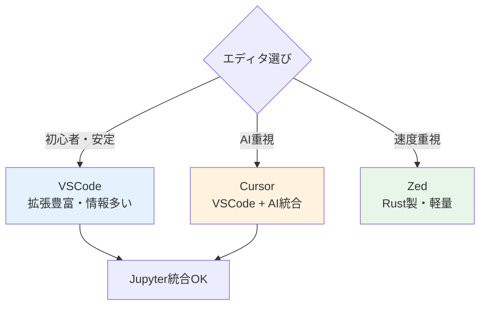
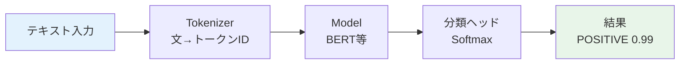
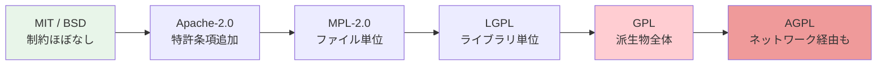
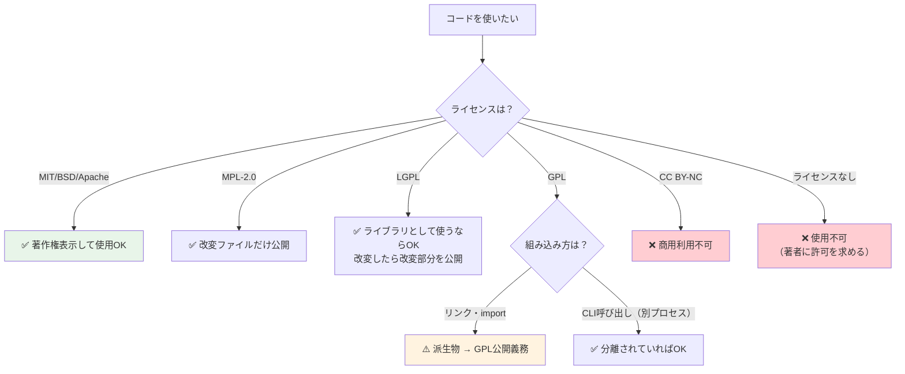
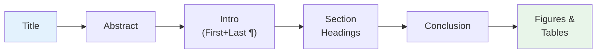
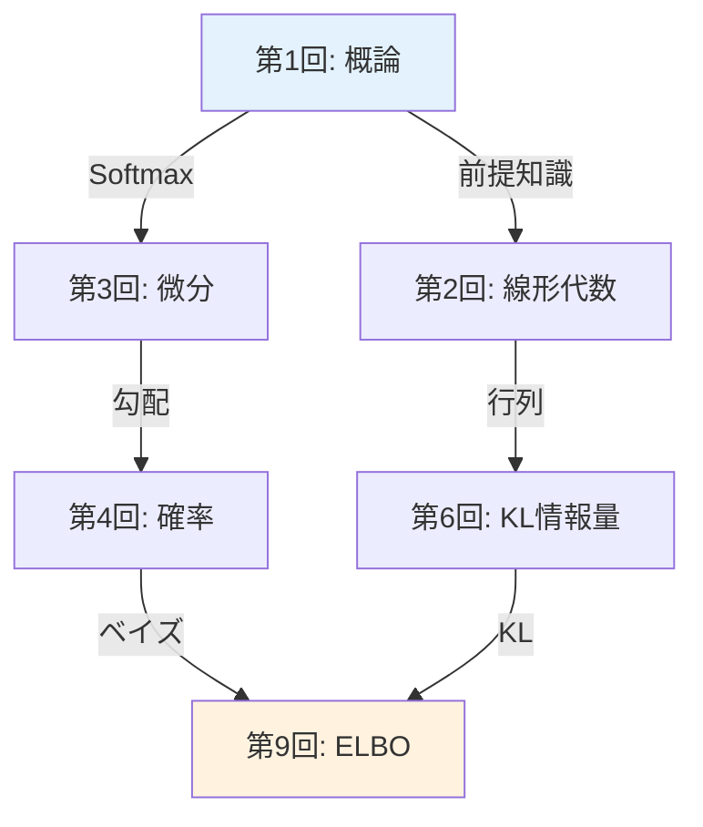
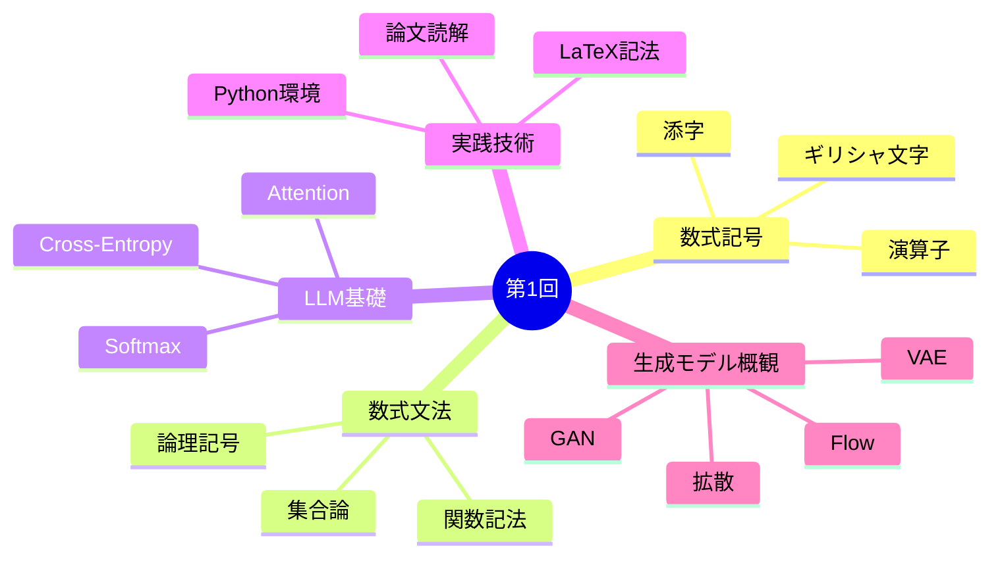

## 🛠️ 4. 環境・ツールゾーン（45分）— 開発環境・LaTeX・論文読解術

> **目標**: Python 環境を整え、LaTeX で数式を書けるようにし、arXiv 論文を構造的に読む技術を身につける。

### 4.1 開発環境セットアップ — Python・IDE・AI CLI

コードを書き、実行し、AI に助けてもらう。この3つの環境を一気に整える。

#### Python 環境構築

本シリーズの Course I（第1回〜第8回）は Python 100% で進める。環境構築はシンプルに保つ。

#### 推奨環境

| 項目 | 推奨 | 理由 |
|:---|:---|:---|
| Python バージョン | 3.11+ | match 文、tomllib、速度改善 |
| パッケージ管理 | `uv` | pip の10倍高速、lockfile対応 |
| 仮想環境 | `uv venv` | プロジェクトごとに分離 |
| エディタ | VSCode + Pylance | 型推論、Jupyter 統合 |
| ノートブック | Jupyter Lab or VSCode | 対話的実験 |

```bash
# uv のインストール（まだの場合）
curl -LsSf https://astral.sh/uv/install.sh | sh

# プロジェクト作成
mkdir -p ~/ml-lectures && cd ~/ml-lectures
uv init
uv add numpy matplotlib jupyter

# 仮想環境の有効化
source .venv/bin/activate
python -c "import numpy; print(f'NumPy {numpy.__version__} ready')"
```

#### 最小限の依存パッケージ

```toml
# pyproject.toml
[project]
name = "ml-lectures"
version = "0.1.0"
requires-python = ">=3.11"
dependencies = [
    "numpy>=1.26",
    "matplotlib>=3.8",
    "jupyter>=1.0",
]

[project.optional-dependencies]
lecture01 = []  # 第1回は追加依存なし
lecture02 = ["scipy>=1.12"]  # 第2回で追加
```

:::message
**本シリーズのルール**: 各講義で必要なパッケージは `[project.optional-dependencies]` で管理する。第1回は NumPy と Matplotlib のみ。PyTorch は第3回から、JAX は Course II から登場する。
:::

#### IDE（統合開発環境）の選び方

Python の環境ができたら、次はコードを読み書きする道具だ。正直、どれを選んでも学習はできる。だが道具の差は長期的に効いてくる。

#### 3大エディタ比較

| | VSCode | Cursor | Zed |
|:---|:---|:---|:---|
| **価格** | 無料 | 無料〜$20/月 | 無料 |
| **特徴** | 拡張機能が豊富 | AI統合エディタ | Rust製・超高速 |
| **AI支援** | Copilot拡張で対応 | ネイティブAI統合 | AI統合あり |
| **起動速度** | 普通 | 普通（VSCode fork） | 非常に高速 |
| **Jupyter** | 統合サポート | 統合サポート | 未対応 |
| **おすすめ対象** | 万人向け | AI活用したい人 | 速度重視の人 |



:::message
**本シリーズの推奨**: 迷ったら **VSCode** で始める。拡張機能・ドキュメント・コミュニティが最も充実しており、困ったとき検索で解決しやすい。
:::

#### 最低限入れるべき拡張機能（VSCode）

| 拡張機能 | 用途 |
|:---|:---|
| Python (ms-python) | Python 言語サポート |
| Pylance | 型推論・補完 |
| Jupyter | ノートブック実行 |
| GitLens | Git 履歴の可視化 |
| Markdown All in One | Markdown プレビュー |

```bash
# コマンドラインから一括インストール
code --install-extension ms-python.python
code --install-extension ms-python.vscode-pylance
code --install-extension ms-toolsai.jupyter
code --install-extension eamodio.gitlens
code --install-extension yzhang.markdown-all-in-one
```

#### ターミナル統合とキーバインド

エディタ内でターミナルを開き、コードの実行と編集を行き来できるのが IDE の強み:

| 操作 | ショートカット（VSCode） |
|:---|:---|
| ターミナル表示/非表示 | `` Ctrl+` `` |
| ファイル検索 | `Ctrl+P` |
| コマンドパレット | `Ctrl+Shift+P` |
| 定義へジャンプ | `F12` |
| 参照を検索 | `Shift+F12` |
| 行コメント | `Ctrl+/` |

:::details Cursor と Zed の補足
**Cursor**: VSCode をフォークしたエディタで、AI チャット・コード補完・コードベース理解が統合されている。VSCode の拡張機能がそのまま使える。月額 $20 の Pro プランで Claude / GPT-4 を使ったコード生成が可能。

**Zed**: Rust で書かれた次世代エディタ。起動とファイル操作が圧倒的に速い。マルチプレイヤー編集（ペアプログラミング）がネイティブ対応。ただし拡張機能エコシステムは VSCode ほど成熟していない。Jupyter 未対応のため、本シリーズの序盤では補助ツールとして使い、メインは VSCode が安全。
:::

#### AI CLI ツール — ターミナルからAIを使う

IDE が整ったら、もう一つの武器を手に入れよう。2025年以降、ターミナルから直接AIに質問・コード生成・デバッグ支援を受けるのが当たり前になった。ブラウザを開かずに、コーディング中のターミナルからそのまま AI を呼べる。

#### ツール比較

| ツール | 価格 | 特徴 | おすすめ度 |
|:---|:---|:---|:---|
| **Gemini CLI** | 無料 | Google製・導入が最も簡単 | ★★★★★ |
| **GitHub Copilot CLI** | $10/月（学生無料） | GitHub統合・安定 | ★★★★☆ |
| **Codex CLI** | API従量課金 | OpenAI製・高精度 | ★★★☆☆ |
| **Claude Code** | API従量課金 | Anthropic製・深い推論 | ★★★☆☆ |

:::message alert
**課金の落とし穴**: Claude Code と Codex CLI は API 従量課金制。1回の質問で $0.01〜$0.50+ かかることがある。$20/月のプランに入っても API 利用分は別途請求されるため、初学者は**無料の Gemini CLI から始める**のが安全。月の請求額が思わぬ金額になった報告は少なくない。
:::

#### Gemini CLI のセットアップ（推奨）

```bash
# インストール
npm install -g @anthropic-ai/gemini-cli
# または
npx @google/gemini-cli

# 認証（Google アカウントでログイン）
gemini auth login

# 基本的な使い方
gemini "Softmax関数をPythonで実装して"
gemini "このエラーの原因を教えて: IndexError: index out of range"
gemini "numpy の einsum の使い方を教えて"
```

#### AI CLI の実践的な使い方

```bash
# コードの説明を求める
gemini "以下のコードが何をしているか説明して:
def attention(Q, K, V):
    d_k = Q.shape[-1]
    scores = Q @ K.T / np.sqrt(d_k)
    weights = softmax(scores)
    return weights @ V"

# デバッグ支援
gemini "np.linalg.norm が nan を返す。原因は？"

# 数式をコードに翻訳
gemini "KLダイバージェンスの式をNumPyで実装して"
```

:::details 課金ツール（Codex / Claude Code）を使う場合の注意
- **利用量のモニタリング**: 毎日の利用額を確認する習慣をつける
- **トークン上限の設定**: 環境変数や設定ファイルで1回あたりの上限を設定
- **簡単な質問は無料ツールで**: Gemini CLI で十分な質問を課金ツールに投げない
- **本当に必要な場面**: 大規模なコードベース理解、複雑なリファクタリング、深い推論が必要なとき

```bash
# Claude Code の場合
claude "複雑な質問をここに"

# Codex CLI の場合
codex "複雑な質問をここに"
```

どちらも高精度だが、日常的な質問には Gemini CLI で十分。課金ツールは「ここぞ」という場面で使うのがコスパ最良。
:::

### 4.2 プラットフォーム活用術 — GitHub・Hugging Face・OSSライセンス

開発環境が整ったら、次は**外の世界**にアクセスする方法を学ぶ。論文実装を読み、事前学習済みモデルを試し、法的リスクを避ける — この3つのプラットフォームスキルがセットで必要になる。

#### GitHub入門 — コードの宝庫を読み解く

論文を読めるようになったら、次は**実装を読む**番だ。世界中の研究者・エンジニアがコードを公開している場所、それが GitHub。

#### リポジトリの読み方

GitHub リポジトリを開いたとき、最初に見るべきファイルは3つ:

| ファイル | 見るべきポイント |
|:---|:---|
| `README.md` | プロジェクト概要・セットアップ手順・使い方 |
| `requirements.txt` / `pyproject.toml` | 依存ライブラリ（PyTorch? JAX? バージョンは?） |
| メインのソースコード（`model.py` 等） | 論文の数式がどこに実装されているか |


#### 論文実装の探し方

**Papers With Code** (paperswithcode.com) が最強のツール。論文タイトルで検索すると、公式・非公式の実装が一覧で出る。

```bash
# GitHub でのコード検索（例: Attention 実装を探す）
# github.com にアクセスし、検索バーで:
# "scaled_dot_product_attention" language:python

# リポジトリのクローン
git clone https://github.com/<user>/<repo>.git
cd <repo>

# 特定のファイルを検索
find . -name "*.py" | head -20

# 特定の関数を検索
grep -r "def attention" --include="*.py"
```

:::message
**Tips**: 論文の実装を読むとき、まず `forward` メソッドを探せ。PyTorch なら `nn.Module` のサブクラスの `forward` が論文の数式に対応している。
:::

#### Git 基本操作

コードを手元にコピーして実験するための最小限の Git:

```bash
# リポジトリをコピー
git clone <url>

# 変更の確認
git status
git diff

# 変更の保存
git add <file>
git commit -m "message"

# 履歴の確認
git log --oneline -10
```

#### jj（Jujutsu）— Git の上位互換 VCS

本シリーズでは **jj**（Jujutsu）を推奨する。Git と互換性を保ちながら、操作性が大幅に改善されている。

| 機能 | Git | jj |
|:---|:---|:---|
| 作業コピー | 手動 add/commit | **自動追跡**（常に記録） |
| undo | `reflog` + `reset --hard`（危険） | **`jj undo`**（何回でも安全） |
| コンフリクト | マージ時に発生・即解決必須 | **記録して後で解決可能** |
| ブランチ | 必須（HEAD管理） | **不要**（匿名コミットが基本） |
| バックエンド | Git 独自形式 | **Git互換**（既存リポジトリにそのまま使える） |

```bash
# jj のインストール
# macOS
brew install jj

# 既存の Git リポジトリで jj を使い始める
cd <git-repo>
jj git init --colocate

# 基本操作
jj status          # 状態確認
jj diff            # 差分表示
jj describe -m "message"  # コミットにメッセージ
jj new             # 新しい変更を開始
jj log             # 履歴をグラフ表示
jj undo            # 直前の操作を取り消し（何回でも）
```

:::details Git vs jj — どちらを学ぶべきか？
結論: **両方の概念を理解し、日常では jj を使う**。

理由:
1. jj は Git バックエンドを使うので、Git の知識は無駄にならない
2. jj の操作体系は Git より直感的（`add/commit` が不要、`undo` が安全）
3. 既存の GitHub リポジトリに対してそのまま `jj` を使える
4. Git を要求する環境（CI/CD、チーム開発）でも jj が裏で Git 操作を行う

初学者は jj から始めて、必要に応じて Git の概念を学ぶのが最短経路だ。
:::

#### Hugging Face入門 — モデルとデータセットのハブ

GitHub がコードの宝庫なら、**Hugging Face** (huggingface.co) は学習済みモデルの宝庫だ。機械学習モデル・データセット・デモの共有プラットフォームとして、論文の実装を「動かす」には、ここを使いこなすのが最短経路。

#### 3つの柱

| サービス | 内容 | URL |
|:---|:---|:---|
| **Models** | 事前学習済みモデル（80万+） | huggingface.co/models |
| **Datasets** | 公開データセット（15万+） | huggingface.co/datasets |
| **Spaces** | インタラクティブなデモ | huggingface.co/spaces |

#### Model Card の読み方

モデルページを開くと、「Model Card」が表示される。これは論文の Abstract に相当する:

| セクション | 確認ポイント |
|:---|:---|
| Model Description | アーキテクチャ・パラメータ数・学習データ |
| Intended Use | 想定用途と制限事項 |
| Training Details | 学習設定（エポック数・バッチサイズ・lr） |
| Evaluation | ベンチマーク結果 |
| Limitations | バイアス・失敗ケース・倫理的考慮 |

:::message
**重要**: Model Card の **Limitations** セクションは必ず読むこと。「このモデルは英語のみ」「有害なコンテンツを生成しうる」等の制約が書かれている。無視して本番投入すると事故になる。
:::

#### transformers ライブラリの基本

```bash
# インストール（本シリーズでは Course II から本格使用）
uv add transformers torch
```

```python
# 感情分析を3行で体験（モデルは自動ダウンロード）
from transformers import pipeline

classifier = pipeline("sentiment-analysis")
result = classifier("I love machine learning!")
print(result)
# [{'label': 'POSITIVE', 'score': 0.9998}]
```

この3行の裏で何が起きているか:



#### モデルのダウンロードと推論

```python
from transformers import AutoTokenizer, AutoModel

# モデル名を指定してダウンロード
model_name = "bert-base-uncased"
tokenizer = AutoTokenizer.from_pretrained(model_name)
model = AutoModel.from_pretrained(model_name)

# テキストをトークン化 → モデルに入力
text = "Attention is all you need"
inputs = tokenizer(text, return_tensors="pt")
outputs = model(**inputs)

print(f"Token IDs: {inputs['input_ids'][0].tolist()}")
print(f"Output shape: {outputs.last_hidden_state.shape}")
# Output shape: torch.Size([1, 7, 768])
# → 7トークン × 768次元の hidden state
```

:::details Hugging Face Hub のキャッシュ管理
モデルは `~/.cache/huggingface/` にダウンロードされる。大きなモデルはディスクを圧迫するので:

```bash
# キャッシュの確認
du -sh ~/.cache/huggingface/

# 特定モデルの削除
huggingface-cli delete-cache

# カスタムキャッシュディレクトリの指定
export HF_HOME=/path/to/large/disk/.cache/huggingface
```

BERT-base で約 440MB、GPT-2 で約 500MB。大型モデル（LLaMA 等）は数十GB単位になるため、ディスク容量に注意。
:::

#### OSSライセンス — 使う前に知るべきこと

GitHub や Hugging Face でコードやモデルを見つけたら、使う前に必ず確認すべきことがある — **ライセンス**だ。「知らなかった」は通用しない。

#### 主要ライセンス一覧

| ライセンス | 商用利用 | 改変 | 再配布条件 | コピーレフト |
|:---|:---|:---|:---|:---|
| **MIT** | OK | OK | 著作権表示のみ | なし |
| **Apache-2.0** | OK | OK | 著作権表示 + 変更点明記 | なし |
| **BSD-2/3** | OK | OK | 著作権表示のみ | なし |
| **MPL-2.0** | OK | OK | 改変ファイルのみ公開 | 弱い |
| **LGPL** | OK | OK | ライブラリ改変部分を公開 | 中程度 |
| **GPL** | OK | OK | **派生物全体を公開** | 強い |
| **CC BY** | OK | OK | クレジット表示 | なし |
| **CC BY-NC** | **不可** | OK | クレジット表示 | なし |

#### コピーレフトの強度スペクトル



**左に行くほど自由、右に行くほど制約が強い。** 自分のコードに GPL ライブラリを組み込むと、自分のコード全体も GPL で公開する義務が生じる（感染性）。

#### 商用利用の判断フローチャート



:::message alert
**ライセンスなし = 使用不可**。GitHub にコードが公開されていても、`LICENSE` ファイルがなければ著作権者の許可なく使用できない。「公開されているから自由に使える」は誤解。
:::

#### ライセンス互換性マトリクス

自分のプロジェクトが MIT ライセンスの場合、どのライセンスのコードを取り込めるか:

| 取り込み元 → | MIT | Apache-2.0 | MPL-2.0 | LGPL | GPL |
|:---|:---|:---|:---|:---|:---|
| **MIT プロジェクト** | OK | OK | 条件付きOK | 条件付きOK | **不可** |
| **Apache-2.0** | OK | OK | 条件付きOK | 条件付きOK | **不可** |
| **GPL プロジェクト** | OK | OK | OK | OK | OK |

:::details ライセンス確認の実践手順
```bash
# リポジトリのライセンスを確認
cat LICENSE
# または
cat LICENSE.md

# GitHub API で確認
gh api repos/<owner>/<repo> --jq '.license.spdx_id'

# Python パッケージのライセンス確認
pip show numpy | grep License
# License: BSD License
```

**本シリーズで使うライブラリのライセンス**:

| ライブラリ | ライセンス | 商用利用 |
|:---|:---|:---|
| NumPy | BSD-3-Clause | OK |
| Matplotlib | PSF (BSD互換) | OK |
| PyTorch | BSD-3-Clause | OK |
| JAX | Apache-2.0 | OK |
| Hugging Face transformers | Apache-2.0 | OK |

全て商用利用可能。安心して使える。
:::

### 4.3 論文との向き合い方 — arXiv・3パスリーディング・知識管理

開発環境とプラットフォームの準備ができた。ここからは**論文を読み、理解し、記憶に残す**ための方法論に入る。arXiv で論文を見つけ、構造的に読み、知識をグラフ化する — この一連のワークフローを身につけよう。

#### arXiv の使い方 — 論文の宝庫

arXiv (https://arxiv.org) は物理学・数学・計算機科学のプレプリントサーバー。機械学習の最新論文はほぼすべてここに投稿される。

#### arXiv ID の読み方

| 形式 | 例 | 意味 |
|:---|:---|:---|
| 新形式 | `2006.11239` | 2020年6月の11239番目 |
| 旧形式 | `1706.03762` | 2017年6月の3762番目 |
| カテゴリ付き | `cs.LG/2006.11239` | cs.LG (Machine Learning) カテゴリ |

**主要カテゴリ**:
- `cs.LG` — Machine Learning
- `cs.CL` — Computation and Language (NLP)
- `cs.CV` — Computer Vision
- `cs.AI` — Artificial Intelligence
- `stat.ML` — Statistics: Machine Learning

#### 効率的な論文の探し方

1. **Semantic Scholar** (semanticscholar.org) — 引用ネットワークで関連論文を探索
2. **Papers With Code** (paperswithcode.com) — 実装付き論文
3. **Connected Papers** (connectedpapers.com) — 引用グラフの可視化
4. **Daily Papers** (huggingface.co/papers) — 日次の注目論文
5. **arXiv Sanity** — フィルタリングされた新着論文

:::message
**本シリーズで引用する論文は、すべて arXiv ID またはDOI付きで記載する。** 「〜と言われている」のような曖昧な引用は一切行わない。これが学術的誠実さの基本であり、読者が原典に当たれる環境を保証する。
:::

#### 3パスリーディング — 論文の構造的読解法

論文は**3回読む**のが基本戦略。S. Keshav の "How to Read a Paper" (2007) に基づく方法論。

#### Pass 1: 鳥瞰（5-10分）

**読む箇所**: タイトル → Abstract → Introduction（最初と最後の段落）→ 各セクション見出し → Conclusion → 図表

**得るもの**: 「この論文は何をしたのか」の1行要約



**Pass 1 チェックリスト**:
- [ ] 何の問題を解いているか？
- [ ] 既存手法の限界は何か？
- [ ] 提案手法の核心アイデアは？
- [ ] 主要な結果（数値）は？
- [ ] 自分の研究/学習に関連するか？

#### Pass 2: 精読（1-2時間）

**読む箇所**: 全文を通読（証明は飛ばしてよい）

**得るもの**: 手法の詳細理解、自分の言葉での説明

重要なのは**図表と数式をセットで読む**こと:
1. 図を見る → 何を表しているか推測
2. 対応する数式を読む → 図の各要素を数式と対応づける
3. 本文の説明を読む → 推測の答え合わせ

:::details Pass 2 での数式の読み方
Zone 3 で学んだ技術をフル活用する:

1. **記号の洗い出し**: 新しい記号が出たら、定義を探す
2. **次元の確認**: 各変数の shape を追跡する
3. **特殊ケースの確認**: $n=1$ や $d=1$ で式を単純化して意味を確認
4. **コードとの対応**: 数式を Python に翻訳してみる

例: VAE[^4] の再パラメータ化トリック
$$
\mathbf{z} = \boldsymbol{\mu} + \boldsymbol{\sigma} \odot \boldsymbol{\epsilon}, \quad \boldsymbol{\epsilon} \sim \mathcal{N}(0, I)
$$

→ Python: `z = mu + sigma * np.random.randn(*mu.shape)`
:::

#### Pass 3: 再現（数時間〜数日）

**やること**: 論文の手法を実装する、あるいは論文の主張を自分のデータで検証する

Pass 3 は全論文で行う必要はない。自分の研究に直結する論文、またはシリーズの講義テーマとなる論文に限定する。

#### 実践: "Attention Is All You Need"[^1] の Pass 1

| 項目 | 内容 |
|:---|:---|
| タイトル | "Attention Is All You Need" — Attention 機構だけで十分 |
| 問題 | 機械翻訳の系列変換モデル。RNN/CNN の逐次処理が並列化を阻害 |
| 提案 | Transformer: Self-Attention のみで構成。再帰なし、畳み込みなし |
| 核心 | Scaled Dot-Product Attention + Multi-Head Attention + Positional Encoding |
| 結果 | WMT 2014 英独翻訳で BLEU 28.4（当時SOTA）。訓練時間は1/10以下 |
| 影響 | BERT, GPT, ViT, DALL-E, ... 現代のほぼ全モデルの基盤 |

```python
"""論文の Pass 1 を構造化するテンプレート"""

pass1_template = {
    "title": "",
    "authors": "",
    "year": 0,
    "arxiv_id": "",
    "problem": "",          # 何の問題を解いているか
    "limitation": "",       # 既存手法の限界
    "proposal": "",         # 提案手法の核心
    "key_equation": "",     # 最も重要な数式（LaTeX）
    "main_result": "",      # 主要な数値結果
    "relevance": "",        # 自分との関連
    "pass2_needed": False,  # 精読すべきか
}

# 記入例: Attention Is All You Need
attention_paper = {
    "title": "Attention Is All You Need",
    "authors": "Vaswani, Shazeer, Parmar, et al.",
    "year": 2017,
    "arxiv_id": "1706.03762",
    "problem": "Sequence transduction (machine translation)",
    "limitation": "RNN/CNN require sequential computation, limiting parallelization",
    "proposal": "Transformer: pure attention-based architecture, no recurrence",
    "key_equation": r"Attention(Q,K,V) = softmax(QK^T/√d_k)V",
    "main_result": "BLEU 28.4 on WMT 2014 En-De (SOTA), 10x less training cost",
    "relevance": "Foundation of all modern LLMs and generative models",
    "pass2_needed": True,
}

for key, val in attention_paper.items():
    print(f"  {key:20s}: {val}")
```

#### 論文・知識管理 — Obsidian で知識をグラフ化する

論文を読む技術を身につけたら、次は読んだ知識を**構造化して残す**仕組みだ。40回の講義を受け、数十本の論文を読み、何百もの数式に触れる。この知識を整理しないと、3ヶ月後には何も覚えていない。

#### 推奨ツール: Obsidian

**Obsidian** (obsidian.md) はローカル完結のMarkdownエディタ。最大の特徴は**双方向リンク**と**ナレッジグラフ**。

| 特徴 | 説明 |
|:---|:---|
| ローカル完結 | データは全てローカルの `.md` ファイル。クラウド依存なし |
| 双方向リンク | `[[ノート名]]` でノート間をリンク。被リンクも自動表示 |
| ナレッジグラフ | リンク構造を視覚化。知識の全体像が見える |
| プラグイン豊富 | コミュニティプラグインで機能拡張 |
| 数式対応 | KaTeX/MathJax で数式レンダリング |



#### ローカル完結スタック

論文管理から執筆まで、全てローカルで完結するツール群:

| ツール | 役割 | 連携 |
|:---|:---|:---|
| **Zotero** | 論文PDF管理・引用 | Obsidian プラグインで連携 |
| **Obsidian** | ノート・知識管理 | Markdown → どこでも使える |
| **Longform** | 長文執筆（Obsidian プラグイン） | チャプター管理 |
| **Pandoc** | 出力変換 | Markdown → PDF / LaTeX / DOCX |

```bash
# Zotero のインストール
# https://www.zotero.org/ からダウンロード

# Pandoc のインストール
brew install pandoc   # macOS
# or: sudo apt install pandoc  # Ubuntu

# Markdown → PDF 変換
pandoc lecture-notes.md -o lecture-notes.pdf --pdf-engine=lualatex
```

#### クラウド共著ツール: Prism

チームで論文を書く場合は **Prism** (withprism.ai) が選択肢に入る。OpenAI が開発したAI支援付き共同執筆ツールで、リアルタイム共同編集 + AI による文章改善提案が統合されている。ただし本シリーズの学習ノートにはオーバースペック — まずは Obsidian で個人の知識管理を固めるのが先決。

#### 講義ノートの取り方 — 実践テンプレート

本シリーズ40回分をObsidianでナレッジグラフ化するテンプレート:

```markdown
---
tags: [ml-lecture, zone3, 線形代数]
lecture: 2
date: 2025-xx-xx
---

# 第2回: 線形代数 I

#### Key Concepts
- [[行列積]] — $C = AB$ where $C_{ij} = \sum_k A_{ik}B_{kj}$
- [[固有値分解]] — $A\mathbf{v} = \lambda\mathbf{v}$

#### Links
- 前提: [[第1回_概論]]
- 次回: [[第3回_微分]]
- 関連: [[Attention]] uses [[行列積]]

#### Questions
- [ ] なぜ固有値分解が重要？→ [[PCA]] で使う（第5回）

#### Code Snippets
<!-- 数式とコードの対応を残す -->
```

:::details Notion / Scrapbox ではダメなのか？
使っても構わないが、Obsidian を推奨する理由:

1. **ローカル完結**: インターネット不要。サービス終了リスクゼロ
2. **Markdown**: 標準形式なので他ツールへの移行が容易
3. **双方向リンク**: 講義間の関係性が自然に構造化される
4. **Git/jj 管理可能**: `.md` ファイルなのでバージョン管理できる
5. **数式**: KaTeX 対応で数式がそのままレンダリングされる

Notion はクラウド依存でエクスポートが面倒。Scrapbox は双方向リンクは優秀だが数式対応が弱い。
:::

### 4.4 LaTeX 入門 — 数式を「書く」力

数式を「読む」だけでなく「書く」力も必要だ。論文を書くときはもちろん、Zenn の記事やノートに数式を残すときにも LaTeX を使う。

#### 基本記法

| 数式 | LaTeX | 出力 |
|:---|:---|:---|
| 分数 | `\frac{a}{b}` | $\frac{a}{b}$ |
| 上付き | `x^{2}` | $x^{2}$ |
| 下付き | `x_{i}` | $x_{i}$ |
| 平方根 | `\sqrt{x}` | $\sqrt{x}$ |
| 総和 | `\sum_{i=1}^{n} x_i` | $\sum_{i=1}^{n} x_i$ |
| 総乗 | `\prod_{i=1}^{n} x_i` | $\prod_{i=1}^{n} x_i$ |
| 積分 | `\int_{a}^{b} f(x) dx` | $\int_{a}^{b} f(x) dx$ |
| 偏微分 | `\frac{\partial f}{\partial x}` | $\frac{\partial f}{\partial x}$ |
| ベクトル | `\mathbf{x}` | $\mathbf{x}$ |
| 行列 | `\mathbf{A}` or `\mathbf{W}` | $\mathbf{A}$ |
| 集合 | `\mathbb{R}^n` | $\mathbb{R}^n$ |
| 損失関数 | `\mathcal{L}` | $\mathcal{L}$ |
| 期待値 | `\mathbb{E}[X]` | $\mathbb{E}[X]$ |

#### Zenn での数式記法

Zenn は KaTeX をサポートしている。インラインは `$...$`、ブロックは `$$...$$`:

```markdown
<!-- インライン数式 -->
Softmax は $\text{softmax}(z_i) = \frac{e^{z_i}}{\sum_j e^{z_j}}$ で定義される。

<!-- ブロック数式 -->
$$
\mathcal{L}_{\text{CE}} = -\sum_{i=1}^{C} y_i \log \hat{y}_i
$$
```

:::details KaTeX で使えない LaTeX コマンド（注意）
KaTeX は LaTeX の完全互換ではない。以下は注意:

| 使えない | 代替 |
|:---|:---|
| `\text{}` 内の日本語 | 数式外に書く |
| `\boldsymbol{}` | `\mathbf{}` |
| `\newcommand` | Zenn では使えない |
| `aligned` 環境 | `\begin{aligned}...\end{aligned}` は使える |

**Tips**: 複雑な数式は Overleaf か HackMD でプレビューしてから Zenn に貼ると安全。
:::

#### 練習: Attention の式を LaTeX で書く

以下の数式を LaTeX で書いてみよう:

$$
\text{Attention}(Q, K, V) = \text{softmax}\left(\frac{QK^\top}{\sqrt{d_k}}\right)V
$$

:::details 解答
```latex
\text{Attention}(Q, K, V) = \text{softmax}\left(\frac{QK^\top}{\sqrt{d_k}}\right)V
```

ポイント:
- `\text{Attention}` — 関数名はローマン体
- `\left(` `\right)` — 括弧のサイズ自動調整
- `K^\top` — 転置。`K^T` でもよいが `\top` が正式
- `\sqrt{d_k}` — 平方根
- `\frac{}{}` — 分数
:::

### 4.5 数式 ↔ コード翻訳 — 7つのパターン

論文の数式をコードに翻訳するとき、頻出するパターンを整理する。これを知っていれば、初見の数式でも迷わない。

#### Pattern 1: $\sum$ → `np.sum()` / `sum()`

$$
\bar{x} = \frac{1}{N} \sum_{i=1}^{N} x_i
$$

```python
x_bar = np.mean(x)  # = np.sum(x) / len(x)
```

#### Pattern 2: $\prod$ → `np.prod()` / 対数和

$$
p(\mathcal{D}) = \prod_{i=1}^{N} p(x^{(i)})
$$

```python
# 直接計算（オーバーフロー注意）
p_data = np.prod(p_xi)

# 対数空間（推奨）
log_p = np.sum(np.log(p_xi))
```

#### Pattern 3: $\arg\max$ → `np.argmax()`

$$
\hat{y} = \arg\max_c p(y = c \mid \mathbf{x})
$$

```python
y_hat = np.argmax(probs)
```

#### Pattern 4: $\mathbb{E}[\cdot]$ → `np.mean()` (モンテカルロ)

$$
\mathbb{E}_{p(x)}[f(x)] \approx \frac{1}{N} \sum_{i=1}^{N} f(x^{(i)}), \quad x^{(i)} \sim p
$$

```python
samples = np.random.normal(0, 1, size=10000)  # x ~ p
E_fx = np.mean(f(samples))
```

#### Pattern 5: 行列積 $AB$ → `A @ B`

$$
\mathbf{h} = W\mathbf{x} + \mathbf{b}
$$

```python
h = W @ x + b
```

#### Pattern 6: 要素ごとの演算 $\odot$ → `*`

$$
\mathbf{z} = \boldsymbol{\mu} + \boldsymbol{\sigma} \odot \boldsymbol{\epsilon}
$$

```python
z = mu + sigma * epsilon  # element-wise
```

#### Pattern 7: $\nabla_\theta \mathcal{L}$ → 自動微分

$$
\theta \leftarrow \theta - \alpha \nabla_\theta \mathcal{L}(\theta)
$$

```python
# NumPy（手動）
grad = compute_gradient(theta, loss_fn)
theta = theta - alpha * grad

# PyTorch（自動微分）— 第3回以降
# loss.backward()
# optimizer.step()
```

:::details 翻訳パターン対応表（まとめ）
| 数式 | Python (NumPy) | 備考 |
|:---|:---|:---|
| $\sum_i x_i$ | `np.sum(x)` | axis 指定で次元制御 |
| $\prod_i x_i$ | `np.prod(x)` | 対数空間推奨 |
| $\arg\max$ | `np.argmax(x)` | |
| $\mathbb{E}[f(x)]$ | `np.mean(f(samples))` | モンテカルロ |
| $AB$ | `A @ B` | 行列積 |
| $A \odot B$ | `A * B` | 要素積 |
| $A^\top$ | `A.T` | 転置 |
| $\|x\|_2$ | `np.linalg.norm(x)` | |
| $\nabla f$ | 手動 or autograd | 第3回以降 |
| $\mathcal{N}(\mu, \sigma^2)$ | `np.random.normal(mu, sigma)` | |
| $\mathbb{1}[c]$ | `(condition).astype(int)` | 指示関数 |
:::

:::message
**進捗: 75% 完了** 開発環境、プラットフォーム活用、論文読解・知識管理、LaTeX、コード翻訳パターンまで一通りカバーした。残りは自己診断テストとまとめ。
:::

---

## 🔬 5. 実験ゾーン（30分）— 自己診断テスト

> **目標**: Zone 3-4 の内容を本当に理解しているか、自分で確認する。「わかったつもり」を排除する。

### 5.1 記号読解テスト（10問）

以下の数式を**日本語で**説明せよ。答えを見る前に、自分で書いてみること。

:::details Q1: $\theta \leftarrow \theta - \alpha \nabla_\theta \mathcal{L}(\theta)$
**A**: パラメータ $\theta$ を、損失関数 $\mathcal{L}$ の $\theta$ についての勾配 $\nabla_\theta \mathcal{L}$ に学習率 $\alpha$ を掛けた分だけ更新する。これが**勾配降下法**（Gradient Descent）の1ステップ。Rumelhart et al. (1986)[^2] が誤差逆伝播法と組み合わせて提案した学習アルゴリズムの基本形。
:::

:::details Q2: $p_\theta(\mathbf{x}) = \int p_\theta(\mathbf{x}, \mathbf{z}) \, d\mathbf{z}$
**A**: パラメータ $\theta$ を持つモデルのデータ $\mathbf{x}$ に対する確率を、潜在変数 $\mathbf{z}$ について周辺化（積分消去）して求める。これが**周辺尤度**（marginal likelihood）。VAE[^4] ではこの積分が解析的に計算できないため、変分下界（ELBO）で近似する。
:::

:::details Q3: $D_{\text{KL}}(q_\phi(\mathbf{z}|\mathbf{x}) \| p(\mathbf{z}))$
**A**: エンコーダ $q_\phi$ が出力する事後分布と、事前分布 $p(\mathbf{z})$（通常 $\mathcal{N}(0, I)$）の間のKLダイバージェンス。VAE[^4] の正則化項として機能し、潜在空間が構造を持つように制約する。
:::

:::details Q4: $\text{softmax}(z_i / \tau)$
**A**: ロジット $z_i$ を温度パラメータ $\tau$ でスケーリングした後に Softmax を適用。$\tau \to 0$ で argmax（最も確率の高いクラスのみ1）、$\tau \to \infty$ で一様分布に近づく。Hinton et al. (2015)[^3] がKnowledge Distillation で使用。
:::

:::details Q5: $\hat{y} = \arg\max_{c \in \{1,\ldots,C\}} p_\theta(y = c \mid \mathbf{x})$
**A**: 入力 $\mathbf{x}$ に対して、$C$ 個のクラスの中で事後確率 $p_\theta(y = c | \mathbf{x})$ が最大となるクラス $c$ を予測ラベル $\hat{y}$ とする。分類問題の推論時の操作。
:::

:::details Q6: $W_{ij}^{(l)} \in \mathbb{R}$
**A**: 第 $l$ 層の重み行列の $(i, j)$ 成分。実数値スカラー。上付きの $(l)$ は層番号、下付きの $ij$ は行列の行・列インデックス。
:::

:::details Q7: $f: \mathbb{R}^n \to \mathbb{R}^m$
**A**: 関数 $f$ は $n$ 次元実数ベクトルを受け取り、$m$ 次元実数ベクトルを返す写像。ニューラルネットワークの各層はこの形の写像。
:::

:::details Q8: $\mathbb{E}_{x \sim p_{\text{data}}}[\log p_\theta(\mathbf{x})]$
**A**: データ分布 $p_{\text{data}}$ からサンプリングした $\mathbf{x}$ について、モデル $p_\theta$ の対数確率の期待値。これを最大化することが**最尤推定**（Maximum Likelihood Estimation）に相当する。
:::

:::details Q9: $\epsilon_t \sim \mathcal{N}(0, I)$
**A**: 時刻（ステップ）$t$ のノイズ $\epsilon_t$ を、平均0、共分散が単位行列 $I$ の多変量正規分布からサンプリングする。拡散モデル[^5]のforward processで各ステップのノイズとして使用される。
:::

:::details Q10: $\|\nabla_\theta \mathcal{L}\|_2$
**A**: 損失関数 $\mathcal{L}$ の $\theta$ についての勾配ベクトルのL2ノルム（ユークリッドノルム）。**勾配ノルム**と呼ばれ、学習の安定性の指標として監視される。これが爆発（exploding）すると学習が破綻し、消失（vanishing）すると学習が停滞する。
:::

### 5.2 LaTeX 書き取りテスト（5問）

以下の数式を **LaTeX で書け**。KaTeX で正しく表示されることを確認せよ。

:::details Q1: Cross-Entropy Loss
**目標**:
$$
\mathcal{L}_{\text{CE}} = -\sum_{i=1}^{C} y_i \log \hat{y}_i
$$

**解答**:
```latex
\mathcal{L}_{\text{CE}} = -\sum_{i=1}^{C} y_i \log \hat{y}_i
```
:::

:::details Q2: Scaled Dot-Product Attention
**目標**:
$$
\text{Attention}(Q, K, V) = \text{softmax}\left(\frac{QK^\top}{\sqrt{d_k}}\right)V
$$

**解答**:
```latex
\text{Attention}(Q, K, V) = \text{softmax}\left(\frac{QK^\top}{\sqrt{d_k}}\right)V
```
:::

:::details Q3: KL ダイバージェンス
**目標**:
$$
D_{\text{KL}}(q \| p) = \sum_{x} q(x) \log \frac{q(x)}{p(x)}
$$

**解答**:
```latex
D_{\text{KL}}(q \| p) = \sum_{x} q(x) \log \frac{q(x)}{p(x)}
```
:::

:::details Q4: 勾配降下法
**目標**:
$$
\theta^{(t+1)} = \theta^{(t)} - \alpha \nabla_\theta \mathcal{L}(\theta^{(t)})
$$

**解答**:
```latex
\theta^{(t+1)} = \theta^{(t)} - \alpha \nabla_\theta \mathcal{L}(\theta^{(t)})
```
:::

:::details Q5: VAE の ELBO
**目標**:
$$
\mathcal{L}_{\text{ELBO}} = \mathbb{E}_{q_\phi(\mathbf{z}|\mathbf{x})} \left[ \log p_\theta(\mathbf{x}|\mathbf{z}) \right] - D_{\text{KL}}(q_\phi(\mathbf{z}|\mathbf{x}) \| p(\mathbf{z}))
$$

**解答**:
```latex
\mathcal{L}_{\text{ELBO}} = \mathbb{E}_{q_\phi(\mathbf{z}|\mathbf{x})} \left[ \log p_\theta(\mathbf{x}|\mathbf{z}) \right] - D_{\text{KL}}(q_\phi(\mathbf{z}|\mathbf{x}) \| p(\mathbf{z}))
```
:::

### 5.3 コード翻訳テスト（5問）

以下の数式を **NumPy で実装せよ**。

:::details Q1: Softmax
$$
\text{softmax}(z_i) = \frac{e^{z_i}}{\sum_{j=1}^{C} e^{z_j}}
$$

```python
def softmax(z):
    """数値安定な Softmax"""
    e_z = np.exp(z - np.max(z))  # オーバーフロー防止
    return e_z / np.sum(e_z)

# テスト
z = np.array([2.0, 1.0, 0.1])
p = softmax(z)
print(f"softmax({z}) = {p.round(4)}")
print(f"sum = {p.sum():.6f}")  # 1.0
```
:::

:::details Q2: Cross-Entropy Loss
$$
\mathcal{L}_{\text{CE}} = -\sum_{i=1}^{C} y_i \log(\hat{y}_i + \epsilon)
$$

```python
def cross_entropy(y_true, y_pred, eps=1e-12):
    """Cross-Entropy Loss"""
    return -np.sum(y_true * np.log(y_pred + eps))

# テスト: 正解がクラス2
y_true = np.array([0, 0, 1, 0])  # one-hot
y_pred = np.array([0.1, 0.05, 0.8, 0.05])  # Softmax 出力

loss = cross_entropy(y_true, y_pred)
print(f"L_CE = {loss:.4f}")  # -log(0.8) ≈ 0.2231
```
:::

:::details Q3: コサイン類似度
$$
\text{cos}(\mathbf{a}, \mathbf{b}) = \frac{\mathbf{a}^\top \mathbf{b}}{\|\mathbf{a}\|_2 \|\mathbf{b}\|_2}
$$

```python
def cosine_similarity(a, b):
    """コサイン類似度"""
    return np.dot(a, b) / (np.linalg.norm(a) * np.linalg.norm(b))

# テスト
a = np.array([1.0, 2.0, 3.0])
b = np.array([1.0, 2.0, 3.0])
c = np.array([-1.0, -2.0, -3.0])

print(f"cos(a, b) = {cosine_similarity(a, b):.4f}")   # 1.0 (同方向)
print(f"cos(a, c) = {cosine_similarity(a, c):.4f}")   # -1.0 (逆方向)
```
:::

:::details Q4: 正規分布の対数確率密度
$$
\log \mathcal{N}(x; \mu, \sigma^2) = -\frac{1}{2}\left(\log(2\pi\sigma^2) + \frac{(x - \mu)^2}{\sigma^2}\right)
$$

```python
def log_normal_pdf(x, mu, sigma):
    """正規分布の対数確率密度"""
    return -0.5 * (np.log(2 * np.pi * sigma**2) + (x - mu)**2 / sigma**2)

# テスト: N(0,1) で x=0 の対数確率密度
print(f"log N(0; 0, 1) = {log_normal_pdf(0, 0, 1):.4f}")  # -0.9189
print(f"理論値: -0.5 * log(2π) = {-0.5 * np.log(2 * np.pi):.4f}")
```
:::

:::details Q5: ミニバッチ勾配降下法
$$
\theta \leftarrow \theta - \frac{\alpha}{|\mathcal{B}|} \sum_{i \in \mathcal{B}} \nabla_\theta \ell(\theta; x^{(i)}, y^{(i)})
$$

```python
def sgd_step(theta, X_batch, y_batch, grad_fn, alpha=0.01):
    """
    ミニバッチ SGD の1ステップ

    Parameters:
        theta: パラメータ
        X_batch: ミニバッチ入力 (batch_size, d)
        y_batch: ミニバッチラベル (batch_size,)
        grad_fn: 勾配を計算する関数
        alpha: 学習率
    """
    batch_size = len(X_batch)
    # Σ ∇θ ℓ(θ; x^(i), y^(i)) / |B|
    grad_sum = np.zeros_like(theta)
    for i in range(batch_size):
        grad_sum += grad_fn(theta, X_batch[i], y_batch[i])
    avg_grad = grad_sum / batch_size

    # θ ← θ - α * avg_grad
    return theta - alpha * avg_grad
```
:::

### 5.4 論文読解テスト

以下の論文情報を読んで、Pass 1 のテンプレートを埋めよ。

**対象**: Ho et al. (2020) "Denoising Diffusion Probabilistic Models"[^5]

:::details ヒント
arXiv ID: 2006.11239。Abstract を読むだけで Pass 1 は完成する。

**キーワード**: diffusion process, denoising, variational inference, progressive lossy decompression
:::

:::details 解答例
| 項目 | 内容 |
|:---|:---|
| タイトル | Denoising Diffusion Probabilistic Models |
| 著者 | Ho, Jain, Abbeel |
| 年 | 2020 |
| arXiv ID | 2006.11239 |
| 問題 | 高品質な画像生成 |
| 既存手法の限界 | GAN[^8]は訓練不安定、VAE[^4]は生成品質に限界 |
| 提案 | 拡散過程（ノイズ付加→除去）による生成モデル |
| 核心数式 | $L_{\text{simple}} = \mathbb{E}_{t, \mathbf{x}_0, \boldsymbol{\epsilon}} \left[ \|\boldsymbol{\epsilon} - \boldsymbol{\epsilon}_\theta(\mathbf{x}_t, t)\|^2 \right]$ |
| 主要結果 | FID 3.17 on CIFAR-10（当時の生成モデルでSOTA品質） |
| 関連度 | 本シリーズ第11-14回で詳解 |
:::

### 5.5 実装チャレンジ: 3つのミニプロジェクト

これまでの知識を統合する3つの実装課題。所要時間は合計1-2時間。

#### Challenge 1: 数式パーサー（記号→説明辞書）

```python
"""
Challenge: 数式の各記号を自動的に解説するパーサーを作る
入力: LaTeX 文字列（の簡易版）
出力: 各記号の日本語説明
"""
import re

# 記号辞書
SYMBOL_DB = {
    r"\theta": ("シータ", "モデルパラメータ"),
    r"\phi": ("ファイ", "エンコーダ/変分パラメータ"),
    r"\mu": ("ミュー", "平均"),
    r"\sigma": ("シグマ", "標準偏差"),
    r"\nabla": ("ナブラ", "勾配演算子"),
    r"\mathcal{L}": ("エル", "損失関数"),
    r"\mathbb{E}": ("イー", "期待値"),
    r"\sum": ("シグマ", "総和"),
    r"\prod": ("パイ", "総乗"),
    r"\partial": ("パーシャル", "偏微分"),
    r"\alpha": ("アルファ", "学習率"),
    r"\epsilon": ("イプシロン", "微小量/ノイズ"),
    r"\lambda": ("ラムダ", "正則化係数"),
    r"\mathbb{R}": ("アール", "実数の集合"),
    r"\in": ("属する", "集合の要素"),
    r"\forall": ("すべての", "全称量化子"),
    r"\exists": ("存在する", "存在量化子"),
    r"\sqrt": ("ルート", "平方根"),
    r"\frac": ("分数", "分子/分母"),
    r"\log": ("ログ", "対数関数"),
    r"\exp": ("エクスプ", "指数関数"),
    r"\top": ("トップ", "転置"),
    r"\text{softmax}": ("ソフトマックス", "確率分布への変換"),
}

def parse_symbols(latex_str):
    """LaTeX 文字列から既知の記号を抽出して解説"""
    found = []
    for symbol, (reading, meaning) in SYMBOL_DB.items():
        if symbol in latex_str:
            found.append((symbol, reading, meaning))
    return found

# テスト
formulas = [
    r"\text{Attention}(Q,K,V) = \text{softmax}\left(\frac{QK^\top}{\sqrt{d_k}}\right)V",
    r"\theta \leftarrow \theta - \alpha \nabla_\theta \mathcal{L}(\theta)",
    r"\mathbb{E}_{q_\phi(\mathbf{z}|\mathbf{x})} \left[ \log p_\theta(\mathbf{x}|\mathbf{z}) \right]",
]

for formula in formulas:
    print(f"\n数式: {formula[:60]}...")
    symbols = parse_symbols(formula)
    for sym, reading, meaning in symbols:
        print(f"  {sym:25s} ({reading}) → {meaning}")
```

#### Challenge 2: Attention の可視化

```python
"""
Challenge: Attention weights をヒートマップで可視化する
"""
import numpy as np
import matplotlib
matplotlib.use('Agg')
import matplotlib.pyplot as plt

def softmax(x, axis=-1):
    e_x = np.exp(x - np.max(x, axis=axis, keepdims=True))
    return e_x / np.sum(e_x, axis=axis, keepdims=True)

def attention_with_viz(Q, K, V, labels_q=None, labels_k=None):
    """Attention を計算して可視化"""
    d_k = Q.shape[-1]
    scores = Q @ K.T / np.sqrt(d_k)
    weights = softmax(scores)
    output = weights @ V

    # ヒートマップ
    fig, axes = plt.subplots(1, 2, figsize=(12, 4))

    # 生のスコア
    im0 = axes[0].imshow(scores, cmap='RdBu_r', aspect='auto')
    axes[0].set_title("Raw scores (QK^T/√dk)")
    axes[0].set_xlabel("Key")
    axes[0].set_ylabel("Query")
    plt.colorbar(im0, ax=axes[0])

    # Attention weights (softmax 後)
    im1 = axes[1].imshow(weights, cmap='Blues', aspect='auto', vmin=0, vmax=1)
    axes[1].set_title("Attention weights (after softmax)")
    axes[1].set_xlabel("Key")
    axes[1].set_ylabel("Query")
    plt.colorbar(im1, ax=axes[1])

    if labels_q:
        for ax in axes:
            ax.set_yticks(range(len(labels_q)))
            ax.set_yticklabels(labels_q)
    if labels_k:
        for ax in axes:
            ax.set_xticks(range(len(labels_k)))
            ax.set_xticklabels(labels_k, rotation=45, ha='right')

    plt.tight_layout()
    plt.savefig("attention_heatmap.png", dpi=100, bbox_inches='tight')
    print("→ attention_heatmap.png に保存")
    return output, weights

# テスト: 単語の埋め込みを模擬
np.random.seed(42)
n_queries, n_keys, d_model = 4, 6, 64

Q = np.random.randn(n_queries, d_model)
K = np.random.randn(n_keys, d_model)
V = np.random.randn(n_keys, d_model)

# 意図的に Q[0] と K[2] を類似させる
K[2] = Q[0] + np.random.randn(d_model) * 0.1

labels_q = ["Query_0", "Query_1", "Query_2", "Query_3"]
labels_k = ["Key_0", "Key_1", "Key_2", "Key_3", "Key_4", "Key_5"]

output, weights = attention_with_viz(Q, K, V, labels_q, labels_k)
print(f"\nQuery_0 の Attention weights:")
for i, w in enumerate(weights[0]):
    bar = "█" * int(w * 50)
    print(f"  Key_{i}: {w:.4f} {bar}")
```

#### Challenge 3: 学習曲線の実装と可視化

```python
"""
Challenge: 簡単な線形回帰を勾配降下法で解いて学習曲線を描く
"""
import numpy as np
import matplotlib
matplotlib.use('Agg')
import matplotlib.pyplot as plt

# --- データ生成 ---
np.random.seed(42)
N = 100
x_true = np.random.uniform(-3, 3, N)
y_true = 2.5 * x_true + 1.0 + np.random.randn(N) * 0.5  # y = 2.5x + 1.0 + noise

# --- モデル: y = wx + b ---
# パラメータ θ = (w, b)
w, b = 0.0, 0.0
alpha = 0.01  # 学習率 α
n_epochs = 200

# --- 勾配降下法 ---
history = {"epoch": [], "loss": [], "w": [], "b": []}

for epoch in range(n_epochs):
    # 予測: ŷ = wx + b
    y_pred = w * x_true + b

    # 損失: L = (1/N) Σ(ŷ - y)²  (MSE)
    loss = np.mean((y_pred - y_true)**2)

    # 勾配: ∂L/∂w = (2/N) Σ(ŷ - y)·x
    #        ∂L/∂b = (2/N) Σ(ŷ - y)
    residual = y_pred - y_true
    grad_w = 2 * np.mean(residual * x_true)
    grad_b = 2 * np.mean(residual)

    # 更新: θ ← θ - α∇L
    w -= alpha * grad_w
    b -= alpha * grad_b

    history["epoch"].append(epoch)
    history["loss"].append(loss)
    history["w"].append(w)
    history["b"].append(b)

print(f"最終パラメータ: w = {w:.4f} (真値 2.5), b = {b:.4f} (真値 1.0)")
print(f"最終損失: L = {history['loss'][-1]:.4f}")

# --- 可視化 ---
fig, axes = plt.subplots(1, 3, figsize=(14, 4))

# 学習曲線
axes[0].plot(history["epoch"], history["loss"])
axes[0].set_xlabel("Epoch")
axes[0].set_ylabel("Loss (MSE)")
axes[0].set_title("Learning Curve")
axes[0].set_yscale('log')

# パラメータの収束
axes[1].plot(history["epoch"], history["w"], label="w (→ 2.5)")
axes[1].plot(history["epoch"], history["b"], label="b (→ 1.0)")
axes[1].axhline(y=2.5, color='C0', linestyle='--', alpha=0.5)
axes[1].axhline(y=1.0, color='C1', linestyle='--', alpha=0.5)
axes[1].set_xlabel("Epoch")
axes[1].set_ylabel("Parameter value")
axes[1].set_title("Parameter Convergence")
axes[1].legend()

# フィッティング結果
axes[2].scatter(x_true, y_true, alpha=0.5, s=10, label="data")
x_line = np.linspace(-3, 3, 100)
axes[2].plot(x_line, w * x_line + b, 'r-', label=f"y = {w:.2f}x + {b:.2f}")
axes[2].plot(x_line, 2.5 * x_line + 1.0, 'g--', alpha=0.5, label="true")
axes[2].set_xlabel("x")
axes[2].set_ylabel("y")
axes[2].set_title("Linear Regression Fit")
axes[2].legend()

plt.tight_layout()
plt.savefig("learning_curve.png", dpi=100, bbox_inches='tight')
print("→ learning_curve.png に保存")
```

:::message
**Challenge クリア基準**: 3つのうち2つ以上を実行して結果を確認できればクリア。コードの意味を説明できること（写経ではなく理解していること）が重要。
:::

### 5.6 総合診断: セルフチェックリスト

以下の全項目に「はい」と答えられれば、Zone 5 クリア:

- [ ] ギリシャ文字 $\theta, \phi, \mu, \sigma, \nabla, \alpha, \epsilon$ の意味を即答できる
- [ ] $W_{ij}^{(l)}$ の添字を「第$l$層の$i$行$j$列」と読める
- [ ] $\sum$、$\prod$、$\arg\max$、$\mathbb{E}$ を Python に翻訳できる
- [ ] $\mathbb{R}^n$、$\in$、$\forall$、$\exists$ の意味がわかる
- [ ] $f: \mathbb{R}^n \to \mathbb{R}^m$ を「$n$次元入力から$m$次元出力への写像」と読める
- [ ] Attention の式 $\text{softmax}(QK^\top / \sqrt{d_k})V$ を一文字残らず説明できる
- [ ] LaTeX で基本的な数式（分数、添字、総和）を書ける
- [ ] arXiv の ID から論文にアクセスできる
- [ ] 論文の Pass 1 を10分以内で実行できる
- [ ] 数式→Python の7つの翻訳パターンを使える

:::message
**進捗: 85% 完了** 自己診断を通じて理解の穴を埋めた。あとは全体のまとめと次回への橋渡し。
:::

---

## 🎓 6. 振り返りゾーン（30分）— まとめと次回予告

### 6.1 用語集（本講義で登場した用語）

:::details 用語集（クリックで展開）
| 用語 | 英語 | 定義 |
|:---|:---|:---|
| 勾配 | gradient | 多変数関数の各偏微分を並べたベクトル。$\nabla f$ |
| 勾配降下法 | gradient descent | 勾配の逆方向にパラメータを更新する最適化手法 |
| 誤差逆伝播法 | backpropagation | 合成関数の連鎖律を用いて勾配を効率的に計算する手法[^2] |
| 損失関数 | loss function | モデルの予測と正解の乖離を測る関数。$\mathcal{L}$ |
| 交差エントロピー | cross-entropy | 2つの確率分布の差異を測る損失関数 |
| ソフトマックス | softmax | 実数ベクトルを確率分布に変換する関数[^1] |
| 温度パラメータ | temperature | Softmax のシャープさを制御するスカラー[^3] |
| アテンション | attention | クエリとキーの類似度で値を重み付け集約する機構[^1] |
| 潜在変数 | latent variable | データの背後にある観測されない変数。$\mathbf{z}$ |
| 変分推論 | variational inference | 事後分布を近似するための最適化ベースの推論手法[^4] |
| ELBO | evidence lower bound | 周辺尤度の下界。VAEの目的関数[^4] |
| KLダイバージェンス | KL divergence | 2つの分布間の非対称な「距離」 |
| 拡散モデル | diffusion model | データにノイズを加え、除去する過程で学習する生成モデル[^5] |
| フローマッチング | flow matching | 確率的なフローでソースからターゲットへの変換を学習[^6] |
| arXiv | arXiv | 物理学・数学・計算機科学のプレプリントサーバー |
| プレプリント | preprint | 査読前の論文 |
| 写像 | mapping / function | 定義域の各要素を値域の要素に対応させる規則 |
| 確率単体 | probability simplex | 非負で総和1のベクトルの集合。$\Delta^{C-1}$ |
:::

### 6.2 第1回の知識マップ



### 6.3 本講義のまとめ

第1回では以下を学んだ:

**1. 数式は「読む」ものであり「恐れる」ものではない**
- ギリシャ文字は「数式のアルファベット」— 覚えれば読める
- 添字・演算子・集合記法は「数式の文法」— ルールを理解すれば構文解析できる
- 論文の数式は著者の思考のスナップショット — 一文字ずつ分解すれば必ず理解できる

**2. Transformer の Attention 式を完全に読解した**
- Vaswani et al. (2017)[^1] の Scaled Dot-Product Attention
- 各記号の意味、次元の追跡、スケーリングの理由を理解した
- Python（NumPy）で完全に再実装した

**3. 論文の読み方を構造化した**
- 3パスリーディング: 鳥瞰 → 精読 → 再現
- arXiv の使い方、論文検索の方法
- 数式↔コード翻訳の7つのパターン

**4. 深層生成モデルの全体像を俯瞰した**
- VAE[^4], GAN[^8], 拡散モデル[^5], Flow Matching[^6], DiT[^7] の位置づけ
- 全50回シリーズの構成を理解した

### 6.4 よくある質問

:::details Q: 数学が苦手でもついていけますか？
**A**: はい。本シリーズは「数学が得意な人向け」ではなく「数学をこれから身につけたい人向け」に設計されている。第1回で記号体系を網羅したのはそのため。以降の講義で新しい記号が出てきたら、Zone 3 に戻れば解決する。ただし、「読み飛ばす」のではなく「わからなかったら戻る」という姿勢は必要。
:::

:::details Q: Python 以外の言語は使いますか？
**A**: Course I（第1-8回）は Python 100%。Course II（第9-16回）で Julia が登場し、Course III 以降で Rust + Julia の多言語構成になる。各言語の導入時に丁寧にセットアップするので心配不要。
:::

:::details Q: 講義の順番通りに進めるべきですか？
**A**: 基本的には順番通りを推奨。特に第1-4回は基礎なので飛ばさないこと。ただし、特定のトピック（例: 拡散モデルだけ知りたい）がある場合は、第1-2回 → 第11回と飛んでも理解できるように設計してある。
:::

:::details Q: 数式をすべて暗記する必要がありますか？
**A**: **暗記は不要。理解が重要。** Softmax の式を暗記していなくても、「実数ベクトルを確率分布に変換する関数で、各要素の指数を全体の指数の和で割る」と説明できれば十分。式は論文を見れば書いてある。意味を理解していれば、式を見た瞬間に読める。
:::

:::details Q: 参考書は買うべきですか？
**A**: 最低限は不要。本シリーズで必要な数学はすべて講義内で解説する。ただし、深掘りしたい場合は Zone 6 の推薦書籍を参照。特に "Mathematics for Machine Learning" (Deisenroth et al.) は無料PDF公開されており、手元に置いておく価値がある。
:::

:::details Q: 機械学習の経験がゼロでも大丈夫ですか？
**A**: 大丈夫。本シリーズは「プログラミングができるが、機械学習は初めて」という読者を想定している。Python の基礎（変数、関数、ループ、リスト）ができれば十分。NumPy も本講義の中で必要な操作を都度解説する。ただし、完全なプログラミング初心者の場合は、先に Python の入門書を1冊読んでおくことを推奨する。
:::

:::details Q: GPU は必要ですか？
**A**: Course I（第1-8回）は GPU 不要。CPU だけで全コードが動く。GPU が必要になるのは第9回以降の訓練実験から。その時点で Google Colab（無料枠）で十分。本格的な訓練実験をしたい場合は、第9回で GPU 環境の構築方法を解説する。
:::

:::details Q: 論文を英語で読む必要がありますか？
**A**: はい。機械学習の一次情報はほぼすべて英語。ただし、本シリーズでは重要論文の核心部分を日本語で解説するので、「論文を完全に読む」必要はない。まずは本講義の Pass 1 テンプレートで Abstract と図表だけ読む練習から始めよう。英語力は繰り返し読むうちに自然に上がる。DeepL/GPT を補助的に使うのは問題ない（ただし数式は自分で読むこと）。
:::

:::details Q: この講義だけで研究できるようになりますか？
**A**: 全50回を修了すれば、最新の深層生成モデルの論文を読み、理解し、実装し、改良するための基礎力が身につく。ただし「研究」には問題設定能力や実験設計力など、本シリーズだけではカバーしきれない能力も必要。本シリーズはあくまで「論文が読め、実装できる」ところまでを保証する。
:::

### 6.5 学習スケジュールの提案

第1回の内容を効率的に消化するための推奨スケジュール:

| 日 | 内容 | 所要時間 |
|:---|:---|:---|
| Day 1 | Zone 0-2: 概要と動機づけ。Softmax, Attention, Cross-Entropy を手で計算 | 1.5h |
| Day 2 | Zone 3 (3.1-3.6): ギリシャ文字、添字、演算子、集合、論理、関数 | 2h |
| Day 3 | Zone 3 (3.7-3.9): 微分、確率、Boss Battle (Attention 完全読解) | 2h |
| Day 4 | Zone 4: 環境構築 + LaTeX 練習 + 論文読解テンプレート作成 | 1.5h |
| Day 5 | Zone 5: 自己診断テスト + 実装チャレンジ | 2h |
| Day 6 | Zone 6-7: 全体像の確認 + 復習 | 1h |
| Day 7 | **復習日**: Zone 3 の苦手箇所を再読、Pass 1 を1本実践 | 1h |

**合計: 約11時間 / 1週間**

:::message
**ペース配分のコツ**: 1日に Zone を2つ以上進めようとしないこと。特に Zone 3 は消化に時間がかかる。「わかったつもり」で先に進むより、1つの Zone を確実に理解してから次に進む方が、結果的に速い。
:::

#### 復習の具体的な方法

1. **フラッシュカード**: Zone 3 のギリシャ文字と記号を Anki に登録。1日5分のレビュー
2. **写経 + 改造**: Zone 5 のコードを写経し、パラメータを変えて実験する
3. **論文 Pass 1**: 週1本の arXiv 論文で Pass 1 テンプレートを埋める練習
4. **数式日記**: 毎日1つ、新しい数式を見つけて「日本語で説明する」練習

```python
"""学習進捗トラッカー"""

progress = {
    "Zone 0: QuickStart": {"status": "done", "confidence": 5},
    "Zone 1: Intuition": {"status": "done", "confidence": 4},
    "Zone 2: Motivation": {"status": "done", "confidence": 5},
    "Zone 3.1: Greek Letters": {"status": "done", "confidence": 3},
    "Zone 3.2: Subscripts": {"status": "done", "confidence": 4},
    "Zone 3.3: Operators": {"status": "done", "confidence": 3},
    "Zone 3.4: Sets": {"status": "done", "confidence": 4},
    "Zone 3.5: Logic": {"status": "done", "confidence": 3},
    "Zone 3.6: Functions": {"status": "done", "confidence": 4},
    "Zone 3.7: Calculus": {"status": "done", "confidence": 3},
    "Zone 3.8: Probability": {"status": "done", "confidence": 3},
    "Zone 3.9: Boss Battle": {"status": "done", "confidence": 4},
    "Zone 4: Practical": {"status": "done", "confidence": 4},
    "Zone 5: Diagnosis": {"status": "done", "confidence": 3},
    "Zone 6: References": {"status": "done", "confidence": 5},
    "Zone 7: Summary": {"status": "done", "confidence": 5},
}

print("=== 第1回 学習進捗 ===\n")
total_conf = 0
n_zones = len(progress)
for zone, info in progress.items():
    bar = "★" * info["confidence"] + "☆" * (5 - info["confidence"])
    print(f"  [{info['status']:4s}] {bar} {zone}")
    total_conf += info["confidence"]

avg_conf = total_conf / n_zones
print(f"\n平均自信度: {avg_conf:.1f}/5.0")
if avg_conf >= 4.0:
    print("→ 第2回に進んでOK！")
elif avg_conf >= 3.0:
    print("→ 自信度3以下の Zone を復習してから第2回へ")
else:
    print("→ Zone 3 を重点的に復習しよう")
```

### 6.6 次回予告

**第2回: 線形代数 — ベクトルと行列の世界**

> ニューラルネットワークの「言語」は線形代数だ。行列の掛け算が世界を変える。

次回のキートピック:
- ベクトル空間、基底、次元
- 行列演算とその幾何学的意味
- 固有値分解と特異値分解（SVD）
- PCA: 次元削減の原理
- **Boss Battle**: Transformer の位置エンコーディングの線形代数的解釈

:::message
**進捗: 100% 完了** おめでとう。第1回「概論: 数式と論文の読み方」を修了した。ここで身につけた「数式を読む力」は、残り39回すべての講義で使い続ける基礎体力だ。次回は線形代数の世界に踏み込む。
:::

### 6.7 パラダイム転換の問い

> **もし「数式」という表現形式が存在しなかったら、人類は深層学習を発明できただろうか？**

数式は「厳密さ」と「汎用性」を両立する唯一の言語だ。「入力 $\mathbf{x}$ を重み $W$ で線形変換し、バイアス $\mathbf{b}$ を加え、非線形関数 $\sigma$ を通す」— この操作を $\sigma(W\mathbf{x} + \mathbf{b})$ という7文字で表現できる。自然言語では同じ情報量に50文字以上かかる。

しかし、別の可能性もある:
- **プログラミング言語で直接定義する世界**: `h = relu(W @ x + b)` — 実際、多くの実務者はコードで考えている
- **図的言語（ダイアグラム）で定義する世界**: カテゴリ理論のstring diagramのように
- **自然言語で大規模言語モデルに生成させる世界**: 2024-2026のAIコーディングが示す方向性

数式は「発見の道具」だったのか、それとも「発見を制約する檻」だったのか。Einstein の「数学は自然の言語」という主張は、数学が自然を記述するのに適しているのか、それとも数学で記述可能な自然しか我々が認識できないのか — この問いに第2回以降、繰り返し立ち戻ることになる。

**考えてみてほしいこと**:

1. **Transformer[^1] は数式から生まれたのか、実験から生まれたのか？** 原論文を読むと、Scaled Dot-Product Attention の $\sqrt{d_k}$ というスケーリング因子は、数学的解析（内積の分散が $d_k$ に比例するという観察）から導かれている。一方で、Multi-Head Attention のヘッド数 $h=8$ という選択は、実験的に最良だった数値であり、数学的な必然性はない。

2. **拡散モデル[^5] のノイズスケジュール**は、物理学の拡散方程式にインスピレーションを得ているが、実際に機能するスケジュール（linear, cosine）は物理的に自然なものではなく、実験的に発見されたものだ。「物理の数式からAIを設計する」という方向は本当に正しいのか、それとも「AIの振る舞いを事後的に物理で解釈する」方が生産的なのか。

3. **Flow Matching[^6]** は最適輸送理論という純粋数学からの直接的な応用だ。一方、GAN[^8] はゲーム理論（これも数学）から着想を得ている。異なる数学的フレームワークが異なるアーキテクチャを生む — 数学の選び方が発明を決定するのだとしたら、まだ試されていない数学的フレームワークの中に、次のブレイクスルーが眠っている可能性がある。

あなたの考えを、次回の講義の前に言語化しておいてほしい。正解は存在しない。考えること自体に価値がある。

:::details 歴史的な視点: 表現形式とブレイクスルーの関係
- **ライプニッツの微積分記法** ($\frac{dy}{dx}$) がニュートンの記法 ($\dot{y}$) より広く普及したのは、連鎖律が機械的に適用できたから。記法が思考を加速した例。
- **アインシュタインの縮約記法** ($a_i b^i = \sum_i a_i b_i$) がテンソル計算を劇的に簡略化し、一般相対性理論の発展を加速した。
- **Dirac のブラケット記法** ($\langle \psi | \phi \rangle$) が量子力学の計算を直感的にした。
- そして今、**PyTorch/JAX の自動微分** が「勾配を手計算で求める」必要をなくし、新しいアーキテクチャの実験コストを劇的に下げた。

表現形式の進化は、新しい発見を可能にする。数式→コード→自然言語（LLMプロンプト）という表現形式の進化は、次にどんな発見を可能にするだろうか。
:::

---

## 参考文献

### 主要論文

[^1]: Vaswani, A., Shazeer, N., Parmar, N., Uszkoreit, J., Jones, L., Gomez, A. N., Kaiser, L., & Polosukhin, I. (2017). Attention Is All You Need. *Advances in Neural Information Processing Systems*, 30.
@[card](https://arxiv.org/abs/1706.03762)

[^2]: Rumelhart, D. E., Hinton, G. E., & Williams, R. J. (1986). Learning representations by back-propagating errors. *Nature*, 323(6088), 533-536.
@[card](https://doi.org/10.1038/323533a0)

[^3]: Hinton, G., Vinyals, O., & Dean, J. (2015). Distilling the Knowledge in a Neural Network.
@[card](https://arxiv.org/abs/1503.02531)

[^4]: Kingma, D. P. & Welling, M. (2013). Auto-Encoding Variational Bayes.
@[card](https://arxiv.org/abs/1312.6114)

[^5]: Ho, J., Jain, A., & Abbeel, P. (2020). Denoising Diffusion Probabilistic Models.
@[card](https://arxiv.org/abs/2006.11239)

[^6]: Lipman, Y., Chen, R. T. Q., Ben-Hamu, H., Nickel, M., & Le, M. (2022). Flow Matching for Generative Modeling.
@[card](https://arxiv.org/abs/2210.02747)

[^7]: Peebles, W. & Xie, S. (2022). Scalable Diffusion Models with Transformers.
@[card](https://arxiv.org/abs/2212.09748)

[^8]: Goodfellow, I. J., Pouget-Abadie, J., Mirza, M., Xu, B., Warde-Farley, D., Ozair, S., Courville, A., & Bengio, Y. (2014). Generative Adversarial Networks.
@[card](https://arxiv.org/abs/1406.2661)

[^9]: Goodfellow, I., Bengio, Y., & Courville, A. (2016). *Deep Learning*. MIT Press. [deeplearningbook.org](https://www.deeplearningbook.org/)

### 教科書

- Deisenroth, M. P., Faisal, A. A., & Ong, C. S. (2020). *Mathematics for Machine Learning*. Cambridge University Press. [mml-book.github.io](https://mml-book.github.io/)
- Goodfellow, I., Bengio, Y., & Courville, A. (2016). *Deep Learning*. MIT Press. [deeplearningbook.org](https://www.deeplearningbook.org/)
- Bishop, C. M. (2006). *Pattern Recognition and Machine Learning*. Springer.
- Murphy, K. P. (2022). *Probabilistic Machine Learning: An Introduction*. MIT Press.
- Murphy, K. P. (2023). *Probabilistic Machine Learning: Advanced Topics*. MIT Press.
- Axler, S. (2024). *Linear Algebra Done Right* (4th ed.). Springer.
- Prince, S. J. D. (2023). *Understanding Deep Learning*. MIT Press. [udlbook.github.io](https://udlbook.github.io/udlbook/)

---

## 記法規約

本シリーズで使用する記法規約（全50回共通）:

| 記法 | 意味 |
|:---|:---|
| $\mathbf{x}$ (太字小文字) | ベクトル |
| $\mathbf{A}$, $W$ (太字/大文字) | 行列 |
| $x$ (イタリック小文字) | スカラー |
| $\mathcal{L}$ (カリグラフィ) | 損失関数、集合族 |
| $\mathbb{R}, \mathbb{E}$ (黒板太字) | 数の集合、期待値演算子 |
| $\theta, \phi$ (ギリシャ小文字) | パラメータ |
| $p(\cdot)$, $q(\cdot)$ | 確率分布/密度関数 |
| $x_i$ | ベクトルの $i$ 番目の要素 |
| $x^{(n)}$ | $n$ 番目のデータサンプル |
| $W^{(l)}$ | $l$ 番目の層のパラメータ |
| $\nabla_\theta$ | $\theta$ についての勾配 |
| $\sim$ | 「〜の分布に従う」 |
| $:=$ | 定義 |
| $\propto$ | 比例 |
| $\approx$ | 近似 |
| $\odot$ | 要素ごとの積（アダマール積） |
| $\circ$ | 関数合成 |
| $\|\cdot\|_2$ | L2ノルム（ユークリッドノルム） |
| $\langle \cdot, \cdot \rangle$ | 内積 |
| $\mathcal{N}(\mu, \sigma^2)$ | 正規分布 |
| $D_{\text{KL}}(\cdot \| \cdot)$ | KLダイバージェンス |
| $\mathbb{1}[\cdot]$ | 指示関数（条件が真のとき1、偽のとき0） |
| $\mathcal{O}(\cdot)$ | 計算量のオーダー |
| $\Delta^{C-1}$ | $C$次元確率単体 |
| $\text{s.t.}$ | "subject to"（制約条件） |

:::message
**記法について**: 本シリーズでは Goodfellow et al. "Deep Learning" (2016) の記法規約に準拠する。論文によっては異なる記法を使うことがあるが、その場合は都度注記する。記法の不統一は混乱の原因になるため、自分のノートでも一貫した記法を使う習慣をつけよう。
:::

---

**第1回 完 — 次回「第2回: 線形代数 — ベクトルと行列の世界」に続く**

---

## ライセンス

本記事は [CC BY-NC-SA 4.0](https://creativecommons.org/licenses/by-nc-sa/4.0/deed.ja)（クリエイティブ・コモンズ 表示 - 非営利 - 継承 4.0 国際）の下でライセンスされています。

### ⚠️ 利用制限について

**本コンテンツは個人の学習目的に限り利用可能です。**

**以下のケースは事前の明示的な許可なく利用することを固く禁じます:**

1. **企業・組織内での利用（営利・非営利問わず）**
   - 社内研修、教育カリキュラム、社内Wikiへの転載
   - 大学・研究機関での講義利用
   - 非営利団体での研修利用
   - **理由**: 組織内利用では帰属表示が削除されやすく、無断改変のリスクが高いため

2. **有料スクール・情報商材・セミナーでの利用**
   - 受講料を徴収する場での配布、スクリーンショットの掲示、派生教材の作成

3. **LLM/AIモデルの学習データとしての利用**
   - 商用モデルのPre-training、Fine-tuning、RAGの知識ソースとして本コンテンツをスクレイピング・利用すること

4. **勝手に内容を有料化する行為全般**
   - 有料note、有料記事、Kindle出版、有料動画コンテンツ、Patreon限定コンテンツ等

**個人利用に含まれるもの:**
- 個人の学習・研究
- 個人的なノート作成（個人利用に限る）
- 友人への元記事リンク共有

**組織での導入をご希望の場合**は、必ず著者に連絡を取り、以下を遵守してください:
- 全ての帰属表示リンクを維持
- 利用方法を著者に報告

**無断利用が発覚した場合**、使用料の請求およびSNS等での公表を行う場合があります。
