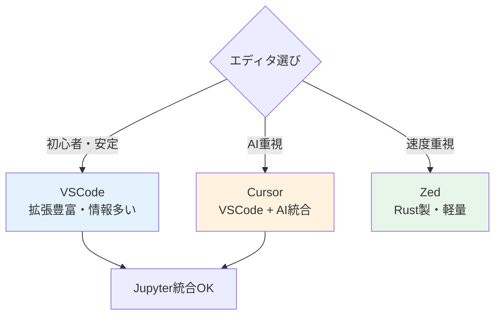
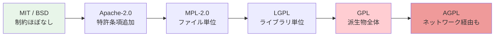
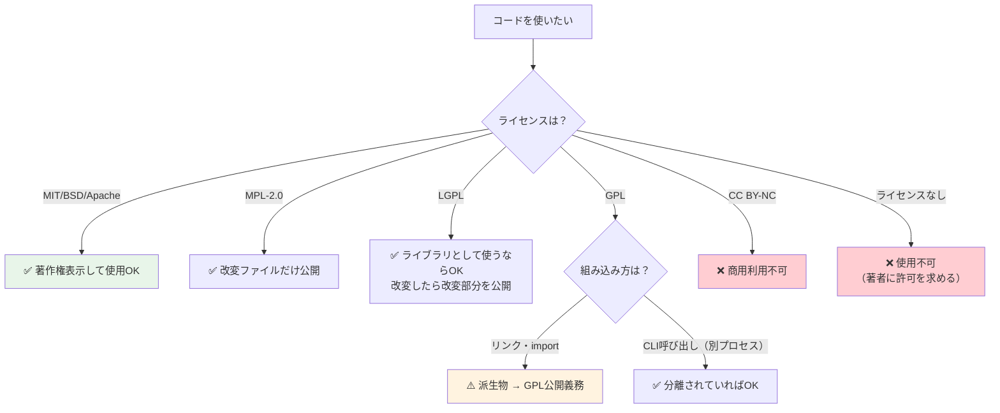
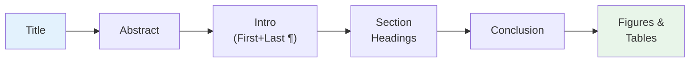
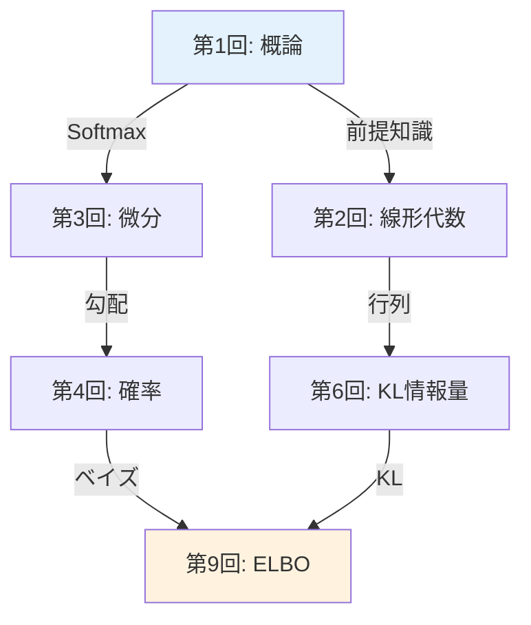
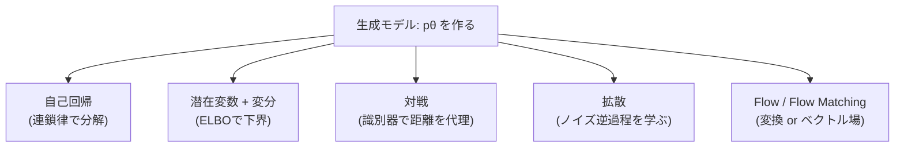
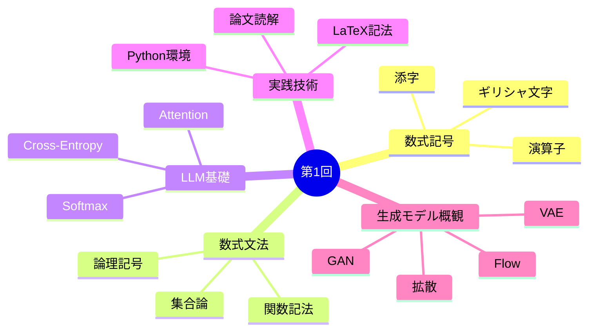

> **📖 この記事は後編（実装編）です**
> 理論編は [【前編】第1回: 概論 — 数式と論文の読み方](/articles/ml-lecture-01-part1) をご覧ください。

## 🗺️ この回の地図（5トピック）

- **Hugging Face**: model card を読み、モデル/データセットを発掘して、まず動かす
- **Git & jj**: 履歴を壊さずに前へ進む（diff/commit/undo の型）
- **Obsidian**: 論文ノートの型を固定して、検索できる知識に変える
- **OSSライセンス**: MIT/Apache/GPL/CC を「雰囲気」ではなく判断する
- **統合ワークフロー**: arXiv → 実装 → 検算 → ノート → 再利用（全部つなぐ）

---

## 🛠️ Z5. 環境・ツールゾーン（45分）— 開発環境・LaTeX・論文読解術

> Python 環境を整え、LaTeX で数式を書き、arXiv 論文を構造的に読むための「道具」を揃える。

### 5.1 開発環境セットアップ — Python・IDE・AI CLI

コードを書き、実行し、AI に助けてもらう。この3つの環境を一気に整える。

#### Python 環境構築

本シリーズの Course I（第1回〜第8回）は Python 100% で進める。環境構築はシンプルに保つ。

#### 推奨環境

| 項目 | 推奨 | 理由 |
|:---|:---|:---|
| Python バージョン | 3.11+ | match 文、tomllib、速度改善 |
| パッケージ管理 | `uv` | pip の10倍高速、lockfile対応 |
| 仮想環境 | `uv venv` | プロジェクトごとに分離 |
| エディタ | VSCode + Pylance | 型推論、Jupyter 統合 |
| ノートブック | Jupyter Lab or VSCode | 対話的実験 |

```bash
# uv のインストール（まだの場合）
curl -LsSf https://astral.sh/uv/install.sh | sh

# プロジェクト作成
mkdir -p ~/ml-lectures && cd ~/ml-lectures
uv init
uv add numpy matplotlib jupyter

# 仮想環境の有効化
source .venv/bin/activate
python -c "import numpy; print(f'NumPy {numpy.__version__} ready')"
```

#### 最小限の依存パッケージ

```toml
# pyproject.toml
[project]
name = "ml-lectures"
version = "0.1.0"
requires-python = ">=3.11"
dependencies = [
    "numpy>=1.26",
    "matplotlib>=3.8",
    "jupyter>=1.0",
]

[project.optional-dependencies]
lecture01 = []  # 第1回は追加依存なし
lecture02 = ["scipy>=1.12"]  # 第2回で追加
```

> **Note:** **本シリーズのルール**: 各講義で必要なパッケージは `[project.optional-dependencies]` で管理する。第1回は NumPy と Matplotlib のみ。PyTorch は第3回から、JAX は Course II から登場する。

#### IDE（統合開発環境）の選び方

Python の環境ができたら、次はコードを読み書きする道具だ。正直、どれを選んでも学習はできる。だが道具の差は長期的に効いてくる。

#### 3大エディタ比較

| | VSCode | Cursor | Zed |
|:---|:---|:---|:---|
| **価格** | 無料 | 無料〜\$20/月 | 無料 |
| **特徴** | 拡張機能が豊富 | AI統合エディタ | Rust製・超高速 |
| **AI支援** | Copilot拡張で対応 | ネイティブAI統合 | AI統合あり |
| **起動速度** | 普通 | 普通（VSCode fork） | 非常に高速 |
| **Jupyter** | 統合サポート | 統合サポート | 未対応 |
| **おすすめ対象** | 万人向け | AI活用したい人 | 速度重視の人 |



> **Note:** **本シリーズの推奨**: 迷ったら **VSCode** で始める。拡張機能・ドキュメント・コミュニティが最も充実しており、困ったとき検索で解決しやすい。

#### 最低限入れるべき拡張機能（VSCode）

| 拡張機能 | 用途 |
|:---|:---|
| Python (ms-python) | Python 言語サポート |
| Pylance | 型推論・補完 |
| Jupyter | ノートブック実行 |
| GitLens | Git 履歴の可視化 |
| Markdown All in One | Markdown プレビュー |

```bash
# コマンドラインから一括インストール
code --install-extension ms-python.python
code --install-extension ms-python.vscode-pylance
code --install-extension ms-toolsai.jupyter
code --install-extension eamodio.gitlens
code --install-extension yzhang.markdown-all-in-one
```

#### ターミナル統合とキーバインド

エディタ内でターミナルを開き、コードの実行と編集を行き来できるのが IDE の強み:

| 操作 | ショートカット（VSCode） |
|:---|:---|
| ターミナル表示/非表示 | `` Ctrl+` `` |
| ファイル検索 | `Ctrl+P` |
| コマンドパレット | `Ctrl+Shift+P` |
| 定義へジャンプ | `F12` |
| 参照を検索 | `Shift+F12` |
| 行コメント | `Ctrl+/` |

<details><summary>Cursor と Zed の補足</summary>
**Cursor**: VSCode をフォークしたエディタで、AI チャット・コード補完・コードベース理解が統合されている。VSCode の拡張機能がそのまま使える。月額 \$20 の Pro プランで Claude / GPT-4 を使ったコード生成が可能。

**Zed**: Rust で書かれた次世代エディタ。起動とファイル操作が圧倒的に速い。マルチプレイヤー編集（ペアプログラミング）がネイティブ対応。ただし拡張機能エコシステムは VSCode ほど成熟していない。Jupyter 未対応のため、本シリーズの序盤では補助ツールとして使い、メインは VSCode が安全。
</details>

#### AI CLI ツール — ターミナルからAIを使う

IDE が整ったら、もう一つの武器を手に入れよう。2025年以降、ターミナルから直接AIに質問・コード生成・デバッグ支援を受けるのが当たり前になった。ブラウザを開かずに、コーディング中のターミナルからそのまま AI を呼べる。

#### ツール比較

| ツール | 形態 | 強み | 向く場面 |
|:---|:---|:---|:---|
| **Gemini CLI** | CLI | 導入が軽い / 雑な調査が速い | 調べ物 / 小さな補助 |
| **GitHub Copilot** | IDE/CLI | コード補完が強い | 実装の加速 |
| **Codex CLI** | CLI | 大きいコードベースの整理 | リファクタ / デバッグ |
| **Claude Code** | CLI | 長い推論と設計の圧縮 | 複雑な原因究明 |

> **⚠️ 注意**: 従量課金のCLIは「呼んだ回数」と「入れた文脈」に比例して増える。上限設定と利用ログ確認は、環境構築と同じくらい大事。

#### AI CLI のセットアップ

```bash
# インストールと認証は、各ツールの公式手順に従う。
# (ツール名/配布形態は更新されやすいので、ここでは固定しない)

# 基本的な使い方
gemini "Softmax関数をPythonで実装して"
gemini "このエラーの原因を教えて: IndexError: index out of range"
gemini "numpy の einsum の使い方を教えて"
```

#### AI CLI の実践的な使い方

```bash
# コードの説明を求める
gemini "以下のコードが何をしているか説明して:
def attention(Q, K, V):
    d_k = Q.shape[-1]
    scores = Q @ K.T / np.sqrt(d_k)
    weights = softmax(scores)
    return weights @ V"

# デバッグ支援
gemini "np.linalg.norm が nan を返す。原因は？"

# 数式をコードに翻訳
gemini "KLダイバージェンスの式をNumPyで実装して"
```

<details><summary>課金ツール（Codex / Claude Code）を使う場合の注意</summary>

- **利用量のモニタリング**: 毎日の利用額を確認する習慣をつける
- **トークン上限の設定**: 環境変数や設定ファイルで1回あたりの上限を設定
- **簡単な質問は無料ツールで**: Gemini CLI で十分な質問を課金ツールに投げない
- **本当に必要な場面**: 大規模なコードベース理解、複雑なリファクタリング、深い推論が必要なとき

```bash
# Claude Code の場合
claude "複雑な質問をここに"

# Codex CLI の場合
codex "複雑な質問をここに"
```

どちらも高精度だが、日常的な質問には Gemini CLI で十分。課金ツールは「ここぞ」という場面で使うのがコスパ最良。
</details>

### 5.2 プラットフォーム活用術 — GitHub・Hugging Face・OSSライセンス

開発環境が整ったら、次は**外の世界**にアクセスする方法を学ぶ。論文実装を読み、事前学習済みモデルを試し、法的リスクを避ける — この3つのプラットフォームスキルがセットで必要になる。

#### GitHub入門 — コードの宝庫を読み解く

論文を読めるようになったら、次は**実装を読む**番だ。世界中の研究者・エンジニアがコードを公開している場所、それが GitHub。

#### リポジトリの読み方

GitHub リポジトリを開いたとき、最初に見るべきファイルは3つ:

| ファイル | 見るべきポイント |
|:---|:---|
| `README.md` | プロジェクト概要・セットアップ手順・使い方 |
| `requirements.txt` / `pyproject.toml` | 依存ライブラリ（PyTorch? JAX? バージョンは?） |
| メインのソースコード（`model.py` 等） | 論文の数式がどこに実装されているか |


#### 論文実装の探し方

**Papers With Code** (paperswithcode.com) が最強のツール。論文タイトルで検索すると、公式・非公式の実装が一覧で出る。

```bash
# GitHub でのコード検索（例: Attention 実装を探す）
# github.com にアクセスし、検索バーで:
# "scaled_dot_product_attention" language:python

# リポジトリのクローン
git clone https://github.com/<user>/<repo>.git
cd <repo>

# 特定のファイルを検索
find . -name "*.py" | head -20

# 特定の関数を検索
grep -r "def attention" --include="*.py"
```

> **Note:** **Tips**: 論文の実装を読むとき、まず `forward` メソッドを探せ。PyTorch なら `nn.Module` のサブクラスの `forward` が論文の数式に対応している。

#### Git 基本操作

コードを手元にコピーして実験するための最小限の Git:

```bash
# リポジトリをコピー
git clone <url>

# 変更の確認
git status
git diff

# 変更の保存
git add <file>
git commit -m "message"

# 履歴の確認
git log --oneline -10
```

#### jj（Jujutsu）— Git の上位互換 VCS

本シリーズでは **jj**（Jujutsu）を推奨する。Git と互換性を保ちながら、操作性が大幅に改善されている。

| 機能 | Git | jj |
|:---|:---|:---|
| 作業コピー | 手動 add/commit | **自動追跡**（常に記録） |
| undo | `reflog` + `reset --hard`（危険） | **`jj undo`**（何回でも安全） |
| コンフリクト | マージ時に発生・即解決必須 | **記録して後で解決可能** |
| ブランチ | 必須（HEAD管理） | **不要**（匿名コミットが基本） |
| バックエンド | Git 独自形式 | **Git互換**（既存リポジトリにそのまま使える） |

```bash
# jj のインストール
# macOS
brew install jj

# 既存の Git リポジトリで jj を使い始める
cd <git-repo>
jj git init --colocate

# 基本操作
jj status          # 状態確認
jj diff            # 差分表示
jj describe -m "message"  # コミットにメッセージ
jj new             # 新しい変更を開始
jj log             # 履歴をグラフ表示
jj undo            # 直前の操作を取り消し（何回でも）
```

<details><summary>Git vs jj — どちらを学ぶべきか？</summary>
結論: **両方の概念を理解し、日常では jj を使う**。

理由:
1. jj は Git バックエンドを使うので、Git の知識は無駄にならない
2. jj の操作体系は Git より直感的（`add/commit` が不要、`undo` が安全）
3. 既存の GitHub リポジトリに対してそのまま `jj` を使える
4. Git を要求する環境（CI/CD、チーム開発）でも jj が裏で Git 操作を行う

初学者は jj から始めて、必要に応じて Git の概念を学ぶのが最短経路だ。
</details>

#### Hugging Face入門 — モデルとデータセットのハブ

GitHub がコードの宝庫なら、**Hugging Face** (huggingface.co) は学習済みモデルの宝庫だ。機械学習モデル・データセット・デモの共有プラットフォームとして、論文の実装を「動かす」には、ここを使いこなすのが最短経路。

#### 3つの柱

| サービス | 内容 | URL |
|:---|:---|:---|
| **Models** | 事前学習済みモデル（80万+） | huggingface.co/models |
| **Datasets** | 公開データセット（15万+） | huggingface.co/datasets |
| **Spaces** | インタラクティブなデモ | huggingface.co/spaces |

#### Model Card の読み方

モデルページを開くと、「Model Card」が表示される。これは論文の Abstract に相当する:

| セクション | 確認ポイント |
|:---|:---|
| Model Description | アーキテクチャ・パラメータ数・学習データ |
| Intended Use | 想定用途と制限事項 |
| Training Details | 学習設定（エポック数・バッチサイズ・lr） |
| Evaluation | ベンチマーク結果 |
| Limitations | バイアス・失敗ケース・倫理的考慮 |

> **⚠️ Warning:** **重要**: Model Card の **Limitations** セクションは必ず読むこと。「このモデルは英語のみ」「有害なコンテンツを生成しうる」等の制約が書かれている。無視して本番投入すると事故になる。

#### transformers ライブラリの基本

```bash
# インストール（本シリーズでは Course II から本格使用）
uv add transformers torch
```

```math
p_\theta(y \mid x) = \mathrm{softmax}(W h_\theta(x) + b)
```


ここでの記号対応を明記する:

- `x`: 入力テキスト
- `h_\theta(x)`: エンコーダが作る表現（BERTなら `[CLS]` などのベクトル）
- `W,b`: 分類ヘッド（線形層）
- `p_\theta(y|x)`: ラベルの確率分布（例: POSITIVE/NEGATIVE）

つまり `pipeline("sentiment-analysis")` は、この式を「設定込みで」実行しているだけだ。

この3行の裏で何が起きているか:


#### モデルのダウンロードと推論

```math
H = \mathrm{Encoder}_\theta(x_{1:T}) \in \mathbb{R}^{T \times d_{\text{model}}}
```


このコードと式の1:1対応:

この `H` は「各トークンの表現ベクトルを縦に積んだ行列」だ。バッチ次元 `B` を含めると実装上は `H \in \mathbb{R}^{B \times T \times d_{\text{model}}}` になる。

| 実装 | 数式 | 意味 |
|:---|:---|:---|
| `text` | `x` | 入力文字列 |
| `inputs['input_ids']` | `x_{1:T}` | トークンID列 |
| `outputs.last_hidden_state` | `H` | トークン表現の列（行列） |
| `T=7` | `T` | トークン数 |
| `768` | `d_model` | 表現の次元 |

<details><summary>Hugging Face Hub のキャッシュ管理</summary>
モデルは `~/.cache/huggingface/` にダウンロードされる。大きなモデルはディスクを圧迫するので:

```bash
# キャッシュの確認
du -sh ~/.cache/huggingface/

# 特定モデルの削除
huggingface-cli delete-cache

# カスタムキャッシュディレクトリの指定
export HF_HOME=/path/to/large/disk/.cache/huggingface
```

BERT-base で約 440MB、GPT-2 で約 500MB。大型モデル（LLaMA 等）は数十GB単位になるため、ディスク容量に注意。
</details>

#### OSSライセンス — 使う前に知るべきこと

GitHub や Hugging Face でコードやモデルを見つけたら、使う前に必ず確認すべきことがある — **ライセンス**だ。「知らなかった」は通用しない。

#### 主要ライセンス一覧

| ライセンス | 商用利用 | 改変 | 再配布条件 | コピーレフト |
|:---|:---|:---|:---|:---|
| **MIT** | OK | OK | 著作権表示のみ | なし |
| **Apache-2.0** | OK | OK | 著作権表示 + 変更点明記 | なし |
| **BSD-2/3** | OK | OK | 著作権表示のみ | なし |
| **MPL-2.0** | OK | OK | 改変ファイルのみ公開 | 弱い |
| **LGPL** | OK | OK | ライブラリ改変部分を公開 | 中程度 |
| **GPL** | OK | OK | **派生物全体を公開** | 強い |
| **CC BY** | OK | OK | クレジット表示 | なし |
| **CC BY-NC** | **不可** | OK | クレジット表示 | なし |

#### コピーレフトの強度スペクトル



**左に行くほど自由、右に行くほど制約が強い。** 自分のコードに GPL ライブラリを組み込むと、自分のコード全体も GPL で公開する義務が生じる（感染性）。

#### 商用利用の判断フローチャート



> **⚠️ Warning:** **ライセンスなし = 使用不可**。GitHub にコードが公開されていても、`LICENSE` ファイルがなければ著作権者の許可なく使用できない。「公開されているから自由に使える」は誤解。

#### ライセンス互換性マトリクス

自分のプロジェクトが MIT ライセンスの場合、どのライセンスのコードを取り込めるか:

| 取り込み元 → | MIT | Apache-2.0 | MPL-2.0 | LGPL | GPL |
|:---|:---|:---|:---|:---|:---|
| **MIT プロジェクト** | OK | OK | 条件付きOK | 条件付きOK | **不可** |
| **Apache-2.0** | OK | OK | 条件付きOK | 条件付きOK | **不可** |
| **GPL プロジェクト** | OK | OK | OK | OK | OK |

<details><summary>ライセンス確認の実践手順</summary>

```bash
# リポジトリのライセンスを確認
cat LICENSE
# または
cat LICENSE.md

# GitHub API で確認
gh api repos/<owner>/<repo> --jq '.license.spdx_id'

# Python パッケージのライセンス確認
pip show numpy | grep License
# License: BSD License
```

**本シリーズで使うライブラリのライセンス**:

| ライブラリ | ライセンス | 商用利用 |
|:---|:---|:---|
| NumPy | BSD-3-Clause | OK |
| Matplotlib | PSF (BSD互換) | OK |
| PyTorch | BSD-3-Clause | OK |
| JAX | Apache-2.0 | OK |
| Hugging Face transformers | Apache-2.0 | OK |

全て商用利用可能。安心して使える。
</details>

### 5.3 論文との向き合い方 — arXiv・3パスリーディング・知識管理

開発環境とプラットフォームの準備ができた。ここからは**論文を読み、理解し、記憶に残す**ための方法論に入る。arXiv で論文を見つけ、構造的に読み、知識をグラフ化する — この一連のワークフローを身につけよう。

#### arXiv の使い方 — 論文の宝庫

arXiv (https://arxiv.org) は物理学・数学・計算機科学のプレプリントサーバー。機械学習の最新論文はほぼすべてここに投稿される。

#### arXiv ID の読み方

| 形式 | 例 | 意味 |
|:---|:---|:---|
| 新形式 | `2006.11239` | 2020年6月の11239番目 |
| 旧形式 | `1706.03762` | 2017年6月の3762番目 |
| カテゴリ付き | `cs.LG/2006.11239` | cs.LG (Machine Learning) カテゴリ |

**主要カテゴリ**:
- `cs.LG` — Machine Learning
- `cs.CL` — Computation and Language (NLP)
- `cs.CV` — Computer Vision
- `cs.AI` — Artificial Intelligence
- `stat.ML` — Statistics: Machine Learning

#### 効率的な論文の探し方

1. **Semantic Scholar** (semanticscholar.org) — 引用ネットワークで関連論文を探索
2. **Papers With Code** (paperswithcode.com) — 実装付き論文
3. **Connected Papers** (connectedpapers.com) — 引用グラフの可視化
4. **Daily Papers** (huggingface.co/papers) — 日次の注目論文
5. **arXiv Sanity** — フィルタリングされた新着論文

> **Note:** **本シリーズで引用する論文は、すべて arXiv ID またはDOI付きで記載する。** 「〜と言われている」のような曖昧な引用は一切行わない。これが学術的誠実さの基本であり、読者が原典に当たれる環境を保証する。

#### 3パスリーディング — 論文の構造的読解法

論文は**3回読む**のが基本戦略。S. Keshav の "How to Read a Paper" (2007) に基づく方法論。

#### Pass 1: 鳥瞰（5-10分）

**読む箇所**: タイトル → Abstract → Introduction（最初と最後の段落）→ 各セクション見出し → Conclusion → 図表

**得るもの**: 「この論文は何をしたのか」の1行要約



**Pass 1 チェックリスト**:
- 何の問題を解いているか？
- 既存手法の限界は何か？
- 提案手法の核心アイデアは？
- 主要な結果（数値）は？
- 自分の研究/学習に関連するか？

#### Pass 2: 精読（1-2時間）

**読む箇所**: 全文を通読（証明は飛ばしてよい）

**得るもの**: 手法の詳細理解、自分の言葉での説明

重要なのは**図表と数式をセットで読む**こと:
1. 図を見る → 何を表しているか推測
2. 対応する数式を読む → 図の各要素を数式と対応づける
3. 本文の説明を読む → 推測の答え合わせ

<details><summary>Pass 2 での数式の読み方</summary>
前編（Zone 4）で学んだ技術をフル活用する:

1. **記号の洗い出し**: 新しい記号が出たら、定義を探す
2. **次元の確認**: 各変数の shape を追跡する
3. **特殊ケースの確認**: `$n=1$` や `$d=1$` で式を単純化して意味を確認
4. **コードとの対応**: 数式を Python に翻訳してみる

例: VAE[^4] の再パラメータ化トリック
```math
\mathbf{z} = \boldsymbol{\mu} + \boldsymbol{\sigma} \odot \boldsymbol{\epsilon}, \quad \boldsymbol{\epsilon} \sim \mathcal{N}(0, I)
```

</details>

#### Pass 3: 再現（数時間〜数日）

**やること**: 論文の手法を実装する、あるいは論文の主張を自分のデータで検証する

Pass 3 は全論文で行う必要はない。自分の研究に直結する論文、またはシリーズの講義テーマとなる論文に限定する。

#### 実践: "Attention Is All You Need"[^1] の Pass 1

| 項目 | 内容 |
|:---|:---|
| タイトル | "Attention Is All You Need" — Attention 機構だけで十分 |
| 問題 | 機械翻訳の系列変換モデル。RNN/CNN の逐次処理が並列化を阻害 |
| 提案 | Transformer: Self-Attention のみで構成。再帰なし、畳み込みなし |
| 核心 | Scaled Dot-Product Attention + Multi-Head Attention + Positional Encoding |
| 結果 | WMT 2014 英独翻訳で BLEU 28.4（当時SOTA）。訓練時間は1/10以下 |
| 影響 | BERT, GPT, ViT, DALL-E, ... 現代のほぼ全モデルの基盤 |

```math
\mathrm{Attention}(Q,K,V) = \mathrm{softmax}\left(\frac{QK^\top}{\sqrt{d_k}}\right)V
```


#### 論文・知識管理 — Obsidian で知識をグラフ化する

論文を読む技術を身につけたら、次は読んだ知識を**構造化して残す**仕組みだ。40回の講義を受け、数十本の論文を読み、何百もの数式に触れる。この知識を整理しないと、3ヶ月後には何も覚えていない。

#### 推奨ツール: Obsidian

**Obsidian** (obsidian.md) はローカル完結のMarkdownエディタ。最大の特徴は**双方向リンク**と**ナレッジグラフ**。

| 特徴 | 説明 |
|:---|:---|
| ローカル完結 | データは全てローカルの `.md` ファイル。クラウド依存なし |
| 双方向リンク | `[[ノート名]]` でノート間をリンク。被リンクも自動表示 |
| ナレッジグラフ | リンク構造を視覚化。知識の全体像が見える |
| プラグイン豊富 | コミュニティプラグインで機能拡張 |
| 数式対応 | KaTeX/MathJax で数式レンダリング |



#### ローカル完結スタック

論文管理から執筆まで、全てローカルで完結するツール群:

| ツール | 役割 | 連携 |
|:---|:---|:---|
| **Zotero** | 論文PDF管理・引用 | Obsidian プラグインで連携 |
| **Obsidian** | ノート・知識管理 | Markdown → どこでも使える |
| **Longform** | 長文執筆（Obsidian プラグイン） | チャプター管理 |
| **Pandoc** | 出力変換 | Markdown → PDF / LaTeX / DOCX |

```bash
# Zotero のインストール
# https://www.zotero.org/ からダウンロード

# Pandoc のインストール
brew install pandoc   # macOS
# or: sudo apt install pandoc  # Ubuntu

# Markdown → PDF 変換
pandoc lecture-notes.md -o lecture-notes.pdf --pdf-engine=lualatex
```

#### 講義ノートの取り方 — 実践テンプレート

本シリーズ40回分を Obsidian でナレッジグラフ化する最小テンプレート（重要: **図 ↔ 数式 ↔ コード**の対応が残る形にする）:

```markdown
---
tags: [ml-lecture]
lecture: 2
---

# 第2回: 線形代数 I

## Key Concepts
- [[行列積]]: `$\mathbf{C}=\mathbf{A}\mathbf{B}$`（shape と添字で読む）
- [[固有値分解]]: `$\mathbf{A}\mathbf{v}=\lambda\mathbf{v}$`（固有ベクトル=方向）

## Questions
- 図のどの矢印が、数式のどの項か？（対応が言えるか）
```

<details><summary>Notion / Scrapbox ではダメなのか？</summary>
使っても構わないが、Obsidian を推奨する理由:

1. **ローカル完結**: インターネット不要。サービス終了リスクゼロ
2. **Markdown**: 標準形式なので他ツールへの移行が容易
3. **双方向リンク**: 講義間の関係性が自然に構造化される
4. **Git/jj 管理可能**: `.md` ファイルなのでバージョン管理できる
5. **数式**: KaTeX 対応で数式がそのままレンダリングされる

Notion はクラウド依存でエクスポートが面倒。Scrapbox は双方向リンクは優秀だが数式対応が弱い。
</details>

### 5.4 LaTeX 入門 — 数式を「書く」力

数式を「読む」だけでなく「書く」力も必要だ。論文を書くときはもちろん、Zenn の記事やノートに数式を残すときにも LaTeX を使う。

#### 基本記法

| 数式 | LaTeX | 出力 |
|:---|:---|:---|
| 分数 | `\frac{a}{b}` | `$\frac{a}{b}$` |
| 上付き | `x^{2}` | `$x^{2}$` |
| 下付き | `x_{i}` | `$x_{i}$` |
| 平方根 | `\sqrt{x}` | `$\sqrt{x}$` |
| 総和 | `\sum_{i=1}^{n} x_i` | `$\sum_{i=1}^{n} x_i$` |
| 総乗 | `\prod_{i=1}^{n} x_i` | `$\prod_{i=1}^{n} x_i$` |
| 積分 | `\int_{a}^{b} f(x) dx` | `$\int_{a}^{b} f(x) dx$` |
| 偏微分 | `\frac{\partial f}{\partial x}` | `$\frac{\partial f}{\partial x}$` |
| ベクトル | `\mathbf{x}` | `$\mathbf{x}$` |
| 行列 | `\mathbf{A}` or `\mathbf{W}` | `$\mathbf{A}$` |
| 集合 | `\mathbb{R}^n` | `$\mathbb{R}^n$` |
| 損失関数 | `\mathcal{L}` | `$\mathcal{L}$` |
| 期待値 | `\mathbb{E}[X]` | `$\mathbb{E}[X]$` |

#### Zenn での数式記法

Zenn は KaTeX をサポートしている。本シリーズでは「読める」ことを優先して、インライン数式は **コードスパンで包んだ `$...$`**、ブロック数式は **```math フェンス**で統一する（前編と同じルール）。

```markdown
<!-- インライン数式 -->
Softmax は `$\text{softmax}(z_i) = \frac{e^{z_i}}{\sum_j e^{z_j}}$` で定義される。

<!-- ブロック数式 -->
```math
\mathcal{L}_{\text{CE}} = -\sum_{i=1}^{C} y_i \log \hat{y}_i
```
```

<details><summary>KaTeX で使えない LaTeX コマンド（注意）</summary>
KaTeX は LaTeX の完全互換ではない。以下は注意:

| 使えない | 代替 |
|:---|:---|
| `\text{}` 内の日本語 | 数式外に書く |
| `\boldsymbol{}` | `\mathbf{}` |
| `\newcommand` | Zenn では使えない |
| `aligned` 環境 | `\begin{aligned}...\end{aligned}` は使える |

**Tips**: 複雑な数式は Overleaf か HackMD でプレビューしてから Zenn に貼ると安全。特に `\left...\right` の括弧と `\frac{}` の入れ子は崩れやすい。
</details>

#### 練習: Attention の式を LaTeX で書く

以下の数式を LaTeX で書いてみよう:

```math
\text{Attention}(Q, K, V) = \text{softmax}\left(\frac{QK^\top}{\sqrt{d_k}}\right)V
```

<details><summary>解答</summary>


ポイント:
- `\text{Attention}` — 関数名はローマン体
- `\left(` `\right)` — 括弧のサイズ自動調整
- `K^\top` — 転置。`K^T` でもよいが `\top` が正式
- `\sqrt{d_k}` — 平方根
- `\frac{}{}` — 分数
</details>

### 5.5 数式 ↔ コード翻訳 — 7つのパターン

論文の数式をコードに翻訳するとき、頻出するパターンを整理する。これを知っていれば、初見の数式でも迷わない。

翻訳の手順（これだけ守れば、ほぼ迷子にならない）:

1. **出力を決める**: その式が最終的に何を返すのか（スカラー/ベクトル/行列）を先に確定
2. **shape を固定する**: 記号に shape を貼る（例: `x∈R^d`, `W∈R^{m×d}`）
3. **演算を3種類に分ける**: 集約（`Σ/Π/E`）| 変換（`AB/⊙/T`）| 非線形（`softmax/log/exp`）
4. **数値の罠を潰す**: `log(0)`、指数のオーバーフロー、割り算のゼロ割りを先に想像する

#### Pattern 1: `$\sum$` → `np.sum()` / `sum()`

```math
\bar{x} = \frac{1}{N} \sum_{i=1}^{N} x_i
```

```python
x_bar = np.mean(x)  # = np.sum(x) / len(x)
```

#### Pattern 2: `$\prod$` → `np.prod()` / 対数和

```math
p(\mathcal{D}) = \prod_{i=1}^{N} p(x^{(i)})
```

```python
import numpy as np

# 尤度のサンプル（各データ点の確率）
log_probs = np.array([-0.5, -1.2, -0.8, -0.3])  # log p(x^(i))
# 積はlog空間で和に変換（数値的安定性のため必須）
log_likelihood = np.sum(log_probs)           # log p(D) = Σ log p(x^(i))
likelihood     = np.exp(log_likelihood)      # p(D) = ∏ p(x^(i))
print(f"log p(D) = {log_likelihood:.4f}")
print(f"p(D)     = {likelihood:.6f}")
# 直接 np.prod を使うと N が大きいとアンダーフローする
```

#### Pattern 3: `$\arg\max$` → `np.argmax()`

```math
\hat{y} = \arg\max_c p(y = c \mid \mathbf{x})
```

```python
# クラス確率ベクトル（Softmax出力）
probs = np.array([0.1, 0.7, 0.15, 0.05])  # shape: (C,)
y_hat = np.argmax(probs)                   # ŷ = argmax_c p(y=c|x)
print(f"予測クラス: {y_hat}")              # → 1
# クラス名と対応する場合
class_names = ["cat", "dog", "bird", "fish"]
print(f"予測ラベル: {class_names[y_hat]}")  # → dog
```

#### Pattern 4: `$\mathbb{E}[\cdot]$` → `np.mean()` (モンテカルロ)

```math
\mathbb{E}_{p(x)}[f(x)] \approx \frac{1}{N} \sum_{i=1}^{N} f(x^{(i)}), \quad x^{(i)} \sim p
```

```python
# E[x^2] for x ~ N(0,1): 理論値 = 1.0
N = 100_000
samples = np.random.randn(N)               # x^(i) ~ N(0,1)
f_samples = samples ** 2                   # f(x) = x^2
E_f = np.mean(f_samples)                  # (1/N) Σ f(x^(i))
print(f"E[x²] ≈ {E_f:.4f}  (理論値: 1.0)")
```

#### Pattern 5: 行列積 `$AB$` → `A @ B`

```math
\mathbf{h} = W\mathbf{x} + \mathbf{b}
```

```python
d_in, d_out = 4, 3
W = np.random.randn(d_out, d_in)   # W ∈ R^{d_out × d_in}
x = np.random.randn(d_in)          # x ∈ R^{d_in}
b = np.zeros(d_out)                 # b ∈ R^{d_out}
h = W @ x + b                      # h = Wx + b ∈ R^{d_out}
print(f"W.shape={W.shape}, x.shape={x.shape} → h.shape={h.shape}")
```

#### Pattern 6: 要素ごとの演算 `$\odot$` → `*`

```math
\mathbf{z} = \boldsymbol{\mu} + \boldsymbol{\sigma} \odot \boldsymbol{\epsilon}
```

```python
# VAE の reparameterization trick: z = μ + σ ⊙ ε, ε ~ N(0,I)
d = 8
mu    = np.zeros(d)                      # μ ∈ R^d（エンコーダ出力）
sigma = np.ones(d) * 0.5                 # σ ∈ R^d（標準偏差）
eps   = np.random.randn(d)               # ε ~ N(0, I)
z     = mu + sigma * eps                 # ⊙ は要素積 → Python では *
print(f"z = {np.round(z, 3)}")
```

#### Pattern 7: `$\nabla_\theta \mathcal{L}$` → 自動微分

```math
\theta \leftarrow \theta - \alpha \nabla_\theta \mathcal{L}(\theta)
```

```python
# 手動SGDステップ（勾配は計算済みとして）
# 実際の勾配計算は第3回（PyTorch autograd）で実装する
theta = np.array([1.0, -2.0, 0.5])       # パラメータ θ
grad  = np.array([0.3, -0.1, 0.8])       # ∇_θ L（例）
alpha = 0.01                              # 学習率 α
theta = theta - alpha * grad              # θ ← θ - α∇L
print(f"更新後 θ = {np.round(theta, 4)}")
```


<details><summary>翻訳パターン対応表（まとめ）</summary>
| 数式 | Python (NumPy) | 備考 |
|:---|:---|:---|
| `$\sum_i x_i$` | `np.sum(x)` | axis 指定で次元制御 |
| `$\prod_i x_i$` | `np.prod(x)` | 対数空間推奨 |
| `$\arg\max$` | `np.argmax(x)` | |
| `$\mathbb{E}[f(x)]$` | `np.mean(f(samples))` | モンテカルロ |
| `$AB$` | `A @ B` | 行列積 |
| `$A \odot B$` | `A * B` | 要素積 |
| `$A^\top$` | `A.T` | 転置 |
| `$\|x\|_2$` | `np.linalg.norm(x)` | |
| `$\nabla f$` | 手動 or autograd | 第3回以降 |
| `$\mathcal{N}(\mu, \sigma^2)$` | `np.random.normal(mu, sigma)` | |
| `$\mathbb{1}[c]$` | `(condition).astype(int)` | 指示関数 |
</details>

> **Checkpoint:** 開発環境、プラットフォーム活用、論文読解・知識管理、LaTeX、コード翻訳パターンまで押さえた。残りは全体地図の統合と次回への接続。

> Progress: 65%

---

## 🌍 Z6. 新たな冒険へ（15-45分）— 生成モデルの全体像を一枚にする

いま手元にあるのは「数式を読む道具」と「論文を追う道具」だ。次に必要なのは、**何を読みに行くか**の地図。

深層生成モデルは、表面上の名称（VAE/GAN/Diffusion/Flow/LLM）で分かれて見える。でも内部は、同じ3つの問いに還元できる。

1. どんな確率分布 `p_\theta(\cdot)` を定義するか
2. 何を最大化（あるいは最小化）するか
3. どこで近似するか（積分、正規化定数、逆変換、サンプリング）

この Z6 は、その3つの問いで全体を整理し、次回以降に出会う式を「同じ棚」に戻せるようにするためのセクションだ。

---

### 6.1 5つの系譜（名前ではなく、最適化対象で分ける）



ここからは「何を最適化しているのか」を一つずつ、式で見える形にする。

---

### 6.2 最小共通語彙（まず記号を揃える）

以降、記号は次のように固定して読む。

| 記号 | 読み | 役割 |
|:---|:---|:---|
| `\mathbf{x}` | データ | 観測変数（画像、文章、音声、ベクトル） |
| `\mathbf{z}` | 潜在 | 観測されない変数（圧縮表現、意味、要因） |
| `\theta` | シータ | 生成モデルのパラメータ（`p_\theta`） |
| `\phi` | ファイ | 推論モデルのパラメータ（`q_\phi`） |
| `p_\theta(\cdot)` | ピー | 「真のモデル」ではなく「自分が定義した分布」 |
| `q_\phi(\cdot)` | キュー | 近似分布（積分の近似、事後の近似） |
| `\mathbb{E}` | 期待値 | 和や積分の言い換え。近似はサンプル平均になる |
| `D_{\mathrm{KL}}(\cdot\|\cdot)` | KL | 分布同士のズレ（非対称） |

そして **shape（次元）** は、長い式ほど「意味」より先に破綻する。

- `\mathbf{x}\in\mathbb{R}^d`（例えば画像をベクトル化したもの）
- `\mathbf{z}\in\mathbb{R}^k`（潜在次元）
- `\theta,\phi` はスカラーではなく「大量のパラメータの集合」

次回（線形代数）で、`d` や `k` を「ただの添字」ではなく「空間の次元」として扱い直す。

---

### 6.3 「尤度最大化」を1行で言い直す

生成モデルがやりたいことは、突き詰めるとこれだ。

```math
\max_\theta \;\; \mathbb{E}_{\mathbf{x}\sim p_{\text{data}}}[\log p_\theta(\mathbf{x})]
```

データ分布 `p_{\text{data}}` は未知なので、現実にはデータセット上の平均で近似する。

```math
\mathbb{E}_{\mathbf{x}\sim p_{\text{data}}}[\log p_\theta(\mathbf{x})]
\approx \frac{1}{N}\sum_{i=1}^{N}\log p_\theta(\mathbf{x}^{(i)})
```

ここで「LLMが最小化している Cross-Entropy」も「画像生成で最大化している log-likelihood」も、棚としては同じ場所にある。

違いは `p_\theta(\mathbf{x})` を **どう定義するか** だけだ。

---

### 6.4 自己回帰（Autoregressive）: 連鎖律に全てを押し込む

自己回帰は、確率の連鎖律だけで `p_\theta(\mathbf{x})` を分解する。

```math
p_\theta(\mathbf{x}) = p_\theta(x_1,\ldots,x_T)
  = \prod_{t=1}^{T} p_\theta(x_t \mid x_{<t})
```

対数を取れば、積が和に落ちる。

```math
\log p_\theta(\mathbf{x})
  = \sum_{t=1}^{T} \log p_\theta(x_t \mid x_{<t})
```

この `p_\theta(x_t \mid x_{<t})` を実装するとき、結局 Softmax に戻ってくる。

```math
p_\theta(x_t=c \mid x_{<t})
  = \mathrm{softmax}(\text{logits}_t)_c
```

この形の美点は「積分がない」こと。弱点は「サンプリングが逐次」になること。

- 学習: 並列化しやすい（全トークン同時に loss を計算できる）
- 生成: 逐次になりがち（1トークンずつ確率を更新する）

次回以降、Transformer の `QK^\top` と Softmax が、この `p_\theta(x_t \mid x_{<t})` の内部へ姿を変えて現れる。

---

### 6.5 VAE（変分）: 積分を ELBO で近似する

潜在変数モデルは、生成を「潜在 `\mathbf{z}` を引いてから `\mathbf{x}` を出す」形で定義する。

```math
p_\theta(\mathbf{x}) = \int p_\theta(\mathbf{x},\mathbf{z})\, d\mathbf{z}
  = \int p_\theta(\mathbf{x}\mid \mathbf{z})p(\mathbf{z})\, d\mathbf{z}
```

ここで詰まる。積分が重い。閉形式で出ないことが多い。

そこで `q_\phi(\mathbf{z}\mid\mathbf{x})` を導入して、次の恒等式から始める。

```math
\log p_\theta(\mathbf{x})
  = \log \int q_\phi(\mathbf{z}\mid\mathbf{x})
      \frac{p_\theta(\mathbf{x},\mathbf{z})}{q_\phi(\mathbf{z}\mid\mathbf{x})}
    d\mathbf{z}
  = \log \mathbb{E}_{\mathbf{z}\sim q_\phi(\cdot\mid\mathbf{x})}
      \left[\frac{p_\theta(\mathbf{x},\mathbf{z})}{q_\phi(\mathbf{z}\mid\mathbf{x})}\right]
```

ここで Jensen の不等式（` \log \mathbb{E}[\cdot] \ge \mathbb{E}[\log(\cdot)] `）を使うと、

```math
\log p_\theta(\mathbf{x})
  \ge \mathbb{E}_{\mathbf{z}\sim q_\phi(\cdot\mid\mathbf{x})}
        \left[\log p_\theta(\mathbf{x},\mathbf{z})-\log q_\phi(\mathbf{z}\mid\mathbf{x})\right]
```

右辺を ELBO（evidence lower bound）と呼ぶ。

```math
\mathcal{L}_{\text{ELBO}}(\theta,\phi;\mathbf{x})
  := \mathbb{E}_{q_\phi(\mathbf{z}\mid\mathbf{x})}\left[\log p_\theta(\mathbf{x}\mid\mathbf{z})\right]
     - D_{\mathrm{KL}}(q_\phi(\mathbf{z}\mid\mathbf{x})\|p(\mathbf{z}))
```

ここまで来ると、**何を最適化しているか** が見える。

- `\log p_\theta(\mathbf{x}\mid\mathbf{z})` を大きくする（再構成が良い）
- `q_\phi(\mathbf{z}\mid\mathbf{x})` を `p(\mathbf{z})` に寄せる（潜在の正則化）

VAE の本質は「積分が無理」を「下界最大化」に落としたことだ。原典は Kingma & Welling（VAE）[^4]。

さらに先で必ず出会うのが再パラメータ化トリックだ。

```math
\mathbf{z} = \boldsymbol{\mu}_\phi(\mathbf{x}) + \boldsymbol{\sigma}_\phi(\mathbf{x})\odot \boldsymbol{\epsilon},
\quad \boldsymbol{\epsilon}\sim \mathcal{N}(0,I)
```

この形にすると、`q_\phi` からのサンプルが「ノイズ `\epsilon` を通じた決定的写像」になり、勾配が通る。

ここで「要素積 `\odot`」「平均 `\mu`」「標準偏差 `\sigma`」「正規分布」の記号が同時に現れる。前編で記号を揃えた意味が、ここで効いてくる。

---

### 6.6 GAN（対戦）: 尤度を避けて、距離を代理させる

GAN は `\log p_\theta(\mathbf{x})` を書かない。書けないのではなく、書かない。

代わりに「本物か偽物か」を当てる識別器 `D` と、偽物を作る生成器 `G` のゲームにする。

```math
\min_G \max_D \;
\mathbb{E}_{\mathbf{x}\sim p_{\text{data}}}[\log D(\mathbf{x})]
 + \mathbb{E}_{\mathbf{z}\sim p(\mathbf{z})}[\log(1-D(G(\mathbf{z})))]
```

この式の読み方は単純だ。

- `D(\mathbf{x})` は本物に 1 を出したい
- `D(G(\mathbf{z}))` は偽物に 0 を出したい
- `G` は `D(G(\mathbf{z}))` を 1 に近づけたい

GAN の原典は Goodfellow ら（GAN）[^8]。

GAN が厄介で面白いのは「最適化が二重」なことだ。

- `D` を強くすると `G` が学べない
- `G` が崩れると `D` が簡単になりすぎる

この「二者のバランス」は、以降の生成モデルの研究でも何度も顔を出す（蒸留、RLHF、DPO など）。

---

### 6.7 Diffusion（拡散）: ノイズ逆過程を学ぶ

拡散モデルは、データにノイズを足して壊す forward process と、それを戻す reverse process を作る。

DDPM の典型的な forward は、次のガウス遷移で書かれる[^5]。

```math
q(\mathbf{x}_t\mid \mathbf{x}_{t-1})
  = \mathcal{N}(\sqrt{1-\beta_t}\mathbf{x}_{t-1}, \beta_t I)
```

この形の重要ポイントは2つ。

1. `q` は自分で定義した過程なので、サンプリングが簡単
2. `t` を進めるほど、` \mathbf{x}_t ` はノイズへ近づく

逆過程は `p_\theta(\mathbf{x}_{t-1}\mid\mathbf{x}_t)` として定義するが、ここが難しい。そこで多くの実装は「平均/分散」を直接出すのではなく、ノイズ `\epsilon` を予測する形に落とす。

```math
\boldsymbol{\epsilon}_\theta(\mathbf{x}_t,t) \approx \boldsymbol{\epsilon}
```

なぜ「ノイズ予測」になるのか。理由は、forward がガウスで閉じているからだ。` \mathbf{x}_t ` が ` \mathbf{x}_0 ` と ` \epsilon ` の線形結合として書ける。

```math
\mathbf{x}_t = \sqrt{\bar{\alpha}_t}\mathbf{x}_0 + \sqrt{1-\bar{\alpha}_t}\boldsymbol{\epsilon},
\quad \boldsymbol{\epsilon}\sim \mathcal{N}(0,I)
```

この「線形結合」は、次回の線形代数で徹底的に扱うテーマそのものだ。

Diffusion の棚はこうなる。

- `p_\theta(\mathbf{x})` を直接書くのではなく、`p_\theta(\mathbf{x}_{t-1}\mid\mathbf{x}_t)` の連鎖として扱う
- 学習は「ノイズ/スコア」の回帰に落ちる
- 生成は多数ステップの反復になる（高速化が研究の主戦場）

---

### 6.8 Flow / Flow Matching: 変換として生成を書く

Flow は「単純な分布から複雑な分布へ」写像で運ぶ。

```math
\mathbf{x} = f_\theta(\mathbf{z}), \quad \mathbf{z}\sim p(\mathbf{z})
```

写像が可逆なら、変数変換公式で尤度が書ける。

```math
\log p_\theta(\mathbf{x})
  = \log p(\mathbf{z}) - \log \left|\det \frac{\partial f_\theta}{\partial \mathbf{z}}\right|
```

この `\det`（行列式）が、計算量と設計の制約を生む。ここでも線形代数が支配する。

Flow Matching は、この棚を「確率の変換」よりも「ベクトル場の一致」に寄せる発想だ（原典の一つが Lipman らの Flow Matching[^6]）。

細部は後でいい。ここで押さえるべきは、棚の違いだ。

- Flow: `\log p_\theta(\mathbf{x})` を（条件付きで）直接評価できるように設計する
- Diffusion: 直接評価より、サンプリング過程の設計に重心がある

---

### 6.9 5系譜の比較表（棚を一枚で持つ）

| 系譜 | 何を学ぶ？ | 何を最大化/最小化？ | 近似の位置 |
|:---|:---|:---|:---|
| 自己回帰 | `p_\theta(x_t\mid x_{<t})` | `-\sum_t \log p_\theta(x_t\mid x_{<t})` | 逐次生成（サンプリング） |
| VAE | `p_\theta(\mathbf{x}\mid\mathbf{z}), q_\phi(\mathbf{z}\mid\mathbf{x})` | `-\mathcal{L}_{\text{ELBO}}` | 事後 `p(\mathbf{z}\mid\mathbf{x})` を `q` で近似 |
| GAN | `G, D` | min-max（ゲーム） | 尤度を避け、距離を代理させる |
| Diffusion | 逆過程 or ノイズ/スコア | 目的関数は回帰に落ちる（実装形は様々） | 反復過程（生成） |
| Flow/FM | `f_\theta` or ベクトル場 | 変換/一致を最適化 | 行列式/ODE など計算制約 |

この比較表は、今後の全講義で更新され続ける「一枚の地図」になる。

---

### 6.10 「読む順序」を工程に落とす（arXiv → PWC → GitHub → ローカル）

ここまでの棚があると、論文の読み方も変わる。結局やることは1つで、**どの棚に置くかを確定する**。

#### Pass 0: 棚の確定（5分）

次の3つだけ拾う。

- 何を `p_\theta` として定義しているか
- 何を最適化しているか（ELBO、NLL、回帰、ゲーム）
- サンプリングは何ステップか（逐次か、反復か、写像か）

#### Pass 1: 1枚目の図だけ読む（10分）

図の読みは「矢印」と「ランダム性」だ。

- 矢印が確率の条件（`p(a\mid b)` の `\mid`）に対応する
- ランダム性（サンプル）が入る場所が、近似の痛点になる

#### Pass 2: 式を2段階で読む（30-120分）

1段階目: 記号辞書を作る（`x,z,\theta,\phi,\epsilon,t` を揃える）  
2段階目: 目的関数を「どの項が何を押しているか」で読む

VAE なら ELBO の2項（再構成と KL）、Diffusion なら forward のガウス遷移とノイズ予測、Flow なら変数変換の `\det`。

#### Pass 3: 実装は「動く最小単位」に落とす（数時間）

Z5 で作った環境がここで効く。Papers With Code で実装を見つけて、GitHub から持ってきて、ローカルで動かす。

ポイントは「動かすこと」ではなく「棚が一致しているか」を確認すること。

- 実装が最適化している loss は、論文の目的関数と一致しているか
- 記号（式）と変数名（コード）は揃っているか
- shape は壊れていないか（`(B,T,D)` など）

---

### 6.11 推薦リソース（まず5本だけ固定する）

この回の終点は「50本読む」ではない。「棚を決めて読める」ことだ。最初の5本だけ固定して、以降は棚ごとに増やす。

- Transformer（Attention の基準点）[^1]
- VAE（変分の基準点）[^4]
- DDPM（拡散の基準点）[^5]
- Flow Matching（連続生成の基準点）[^6]
- GAN（対戦の基準点）[^8]

この5本は、今後「別の手法」を読んだときに、必ず比較対象になる。

---

### 6.12 次回への接続（線形代数へ）

ここから先、式は長くなる。だが中身は「行列」と「内積」と「基底」へ分解できる。

- Attention の `QK^\top` は、内積を並べた行列だ
- `\sqrt{d_k}` は、スケールを揃えるための正規化だ
- Softmax は、指数と正規化（確率への射影）だ
- ガウスの線形結合は、次元と基底の話に落ちる
- `\det` と `\log|\det|` は、体積変化の話に落ちる

次回（第2回）は、ここで出てきた「行列っぽいもの」を、線形代数の言葉で完全に言い直す。

### 6.13 統合ワークフロー（Papers With Code → GitHub → ローカル実行）

Z5 で道具は揃った。ここでは「1本の論文」を起点に、**読む→実装→検算→ノート化**を一気通貫で回す。

この工程の目的は2つだけだ。

- 目的関数（式）と loss（実装）が一致しているかを確かめる
- 記号（式）と変数名（コード）と shape が一致しているかを確かめる

#### Step 0: arXiv ID を固定する

論文はまず ID で管理する。タイトルは揺れるが ID は揺れない。

例:

- Transformer: `1706.03762`（Attention Is All You Need）[^1]
- VAE: `1312.6114`（Auto-Encoding Variational Bayes）[^4]
- DDPM: `2006.11239`（Denoising Diffusion Probabilistic Models）[^5]

#### Step 1: Papers With Code で「実装の相場」を見る

Papers With Code では次の3点だけ拾う。

1. どのタスクで比較されているか（評価の棚）
2. どの実装が参照されているか（コードの棚）
3. どの loss が実装されているか（数式の棚）

#### Step 2: GitHub リポジトリを読む（最初に見るのは 3 ファイル）

- `README.md`（何を再現しているか）
- `requirements.txt` / `pyproject.toml`（依存）
- `LICENSE`（使えるかどうか）

#### Step 3: ローカルに落とす（作業ディレクトリの型）

例えばこんな構造に固定すると、50回分の実験が散らからない。

```text
ml-lectures/
  papers/
    1706.03762-attention/
      upstream/        # clone した元コード（基本は触らない）
      work/            # 自分の改変・実験
      notes/           # Obsidian にも貼れるノート
      runs/            # 実行ログ・スクリーンショット・結果
```

#### Step 4: jj で「試行錯誤」を履歴として残す

Git で「コミットが怖い」状態になると、実験が止まる。jj はその恐怖を消しに来る。

典型の型:

1. `upstream/` は触らない
2. `work/` で小さく改変する
3. うまくいかなければ、戻すのではなく「別ルート」を生やす

ここで重要なのは「履歴を綺麗にする」ことではなく、「探索を止めない」ことだ。

#### Step 5: 実行ログを残す（検算の証拠を残す）

論文再現で最も多い失敗は「やった気」だ。結果と条件が残っていないから、再現できない。

最低限、次の4つだけ残せば良い。

- 使った commit hash（`upstream` と `work` の両方）
- 実行したコマンド
- 主要な出力（loss、評価指標、サンプル）
- 変更点（何を変えたか、なぜ変えたか）

---

### 6.14 ノートテンプレ（論文→実装の翻訳を固定する）

Obsidian に貼れる形で「1枚のノート」を作る。ここで重要なのは、要約ではなく **対応** を残すこと。

```markdown
# Paper: {Title}

- arXiv: {YYMM.NNNNN}
- Code: {GitHub URL}
- Task: {what / dataset / metric}

## One-liner
{この論文を一言で言うと}

## Shelf (この論文はどの棚？)
- Family: {Autoregressive | VAE | GAN | Diffusion | Flow/FM}
- Objective: {何を最適化？}
- Approximation: {どこで近似？}
- Sampling: {逐次/反復/写像}

## Key Equations
```math
{load-bearing equation 1}
```

```math
{load-bearing equation 2}
```

## Symbols (記号辞書)
- `x`: {meaning}, shape: {...}
- `z`: {meaning}, shape: {...}
- `theta`: {meaning}
- `phi`: {meaning}
- `eps`: {meaning}, distribution: {...}

## Math -> Code mapping
| Math | Code | shape |
|:---|:---|:---|
| `{term}` | `{var}` | `{...}` |

## Reproduction log
- Env: {python, packages}
- Cmd: {exact command}
- Output: {numbers / images}

## Pitfalls
- {数値安定性 / shape / dataset leak}

## Questions
- {次に読むべき式 / ここが不明}
```

このテンプレは第2回以降もそのまま使う。ノートが増えるほど「棚の比較」が高速になる。

---

### 6.15 次回までの 3 クエスト（最小で効くやつ）

ここで「大量の宿題」を積むと、勢いが死ぬ。最小で効く3つだけ置く。

#### Quest A: 1本だけ棚に入れる

`[^1]` 〜 `[^8]` のどれか 1本を選び、`6.14` のテンプレを埋める（完璧でなくていい）。

#### Quest B: 記号→shape を 10 個だけ言えるようにする

例:

- `Q,K,V`: `(T,d_k)` や `(B,T,d_k)` を即答できる
- `QK^\top`: `(T,T)` になる理由を説明できる
- `\mu,\sigma,\epsilon`: どれがランダムで、どれがネットワーク出力かを言える

#### Quest C: 3 行で「線形代数へ接続」する

次の 3 行が自然に言えるかを確認する。

1. 内積を並べた行列が `QK^\top`
2. 次元が大きいと内積のスケールが暴れるから `\sqrt{d_k}` で揃える
3. Softmax は「正規化して確率」に落とす射影

> Progress: 85%

---

## 🎓 Z7. 振り返りゾーン（15分）— まとめと次回予告

### 7.1 用語集（本講義で登場した用語）

<details><summary>用語集（クリックで展開）</summary>
| 用語 | 英語 | 定義 |
|:---|:---|:---|
| 勾配 | gradient | 多変数関数の各偏微分を並べたベクトル。`$\nabla f$` |
| 勾配降下法 | gradient descent | 勾配の逆方向にパラメータを更新する最適化手法 |
| 誤差逆伝播法 | backpropagation | 合成関数の連鎖律を用いて勾配を効率的に計算する手法[^2] |
| 損失関数 | loss function | モデルの予測と正解の乖離を測る関数。`$\mathcal{L}$` |
| 交差エントロピー | cross-entropy | 2つの確率分布の差異を測る損失関数 |
| ソフトマックス | softmax | 実数ベクトルを確率分布に変換する関数[^1] |
| 温度パラメータ | temperature | Softmax のシャープさを制御するスカラー[^3] |
| アテンション | attention | クエリとキーの類似度で値を重み付け集約する機構[^1] |
| 潜在変数 | latent variable | データの背後にある観測されない変数。`$\mathbf{z}$` |
| 変分推論 | variational inference | 事後分布を近似するための最適化ベースの推論手法[^4] |
| ELBO | evidence lower bound | 周辺尤度の下界。VAEの目的関数[^4] |
| KLダイバージェンス | KL divergence | 2つの分布間の非対称な「距離」 |
| 拡散モデル | diffusion model | データにノイズを加え、除去する過程で学習する生成モデル[^5] |
| フローマッチング | flow matching | 確率的なフローでソースからターゲットへの変換を学習[^6] |
| arXiv | arXiv | 物理学・数学・計算機科学のプレプリントサーバー |
| プレプリント | preprint | 査読前の論文 |
| 写像 | mapping / function | 定義域の各要素を値域の要素に対応させる規則 |
| 確率単体 | probability simplex | 非負で総和1のベクトルの集合。`$\Delta^{C-1}$` |
</details>

### 7.2 第1回の知識マップ



### 7.3 本講義のまとめ

第1回では以下を学んだ:

**1. 数式は「読む」ものであり「恐れる」ものではない**
- ギリシャ文字は「数式のアルファベット」— 覚えれば読める
- 添字・演算子・集合記法は「数式の文法」— ルールを理解すれば構文解析できる
- 論文の数式は著者の思考のスナップショット — 一文字ずつ分解すれば必ず理解できる

**2. Transformer の Attention 式を完全に読解した**
- Vaswani et al. (2017)[^1] の Scaled Dot-Product Attention
- 各記号の意味、次元の追跡、スケーリングの理由を理解した
- Python（NumPy）で完全に再実装した

**3. 論文の読み方を構造化した**
- 3パスリーディング: 鳥瞰 → 精読 → 再現
- arXiv の使い方、論文検索の方法
- 数式↔コード翻訳の7つのパターン

**4. 深層生成モデルの全体像を俯瞰した**
- VAE[^4], GAN[^8], 拡散モデル[^5], Flow Matching[^6], DiT[^7] の位置づけ
- 全50回シリーズの構成を理解した

### 7.4 よくある質問

<details><summary>Q: 数学が苦手でもついていけますか？</summary>
**A**: はい。本シリーズは「数学が得意な人向け」ではなく「数学をこれから身につけたい人向け」に設計されている。第1回で記号体系を網羅したのはそのため。以降の講義で新しい記号が出てきたら、Zone 3 に戻れば解決する。ただし、「読み飛ばす」のではなく「わからなかったら戻る」という姿勢は必要。
</details>

<details><summary>Q: Python 以外の言語は使いますか？</summary>
**A**: Course I（第1-8回）は Python 100%。Course II（第9-16回）で Julia が登場し、Course III 以降で Rust + Julia の多言語構成になる。各言語の導入時に丁寧にセットアップするので心配不要。
</details>

<details><summary>Q: 講義の順番通りに進めるべきですか？</summary>
**A**: 基本的には順番通りを推奨。特に第1-4回は基礎なので飛ばさないこと。ただし、特定のトピック（例: 拡散モデルだけ知りたい）がある場合は、第1-2回 → 第11回と飛んでも理解できるように設計してある。
</details>

<details><summary>Q: 数式をすべて暗記する必要がありますか？</summary>
**A**: **暗記は不要。理解が重要。** Softmax の式を暗記していなくても、「実数ベクトルを確率分布に変換する関数で、各要素の指数を全体の指数の和で割る」と説明できれば十分。式は論文を見れば書いてある。意味を理解していれば、式を見た瞬間に読める。
</details>

<details><summary>Q: 参考書は買うべきですか？</summary>
**A**: 最低限は不要。本シリーズで必要な数学はすべて講義内で解説する。ただし、深掘りしたい場合は Zone 6 の推薦書籍を参照。特に "Mathematics for Machine Learning" (Deisenroth et al.) は無料PDF公開されており、手元に置いておく価値がある。
</details>

<details><summary>Q: 機械学習の経験がゼロでも大丈夫ですか？</summary>
**A**: 大丈夫。本シリーズは「プログラミングができるが、機械学習は初めて」という読者を想定している。Python の基礎（変数、関数、ループ、リスト）ができれば十分。NumPy も本講義の中で必要な操作を都度解説する。ただし、完全なプログラミング初心者の場合は、先に Python の入門書を1冊読んでおくことを推奨する。
</details>

<details><summary>Q: GPU は必要ですか？</summary>
**A**: Course I（第1-8回）は GPU 不要。CPU だけで全コードが動く。GPU が必要になるのは第9回以降の訓練実験から。その時点で Google Colab（無料枠）で十分。本格的な訓練実験をしたい場合は、第9回で GPU 環境の構築方法を解説する。
</details>

<details><summary>Q: 論文を英語で読む必要がありますか？</summary>
**A**: はい。機械学習の一次情報はほぼすべて英語。ただし、本シリーズでは重要論文の核心部分を日本語で解説するので、「論文を完全に読む」必要はない。まずは本講義の Pass 1 テンプレートで Abstract と図表だけ読む練習から始めよう。英語力は繰り返し読むうちに自然に上がる。DeepL/GPT を補助的に使うのは問題ない（ただし数式は自分で読むこと）。
</details>

<details><summary>Q: この講義だけで研究できるようになりますか？</summary>
**A**: 全50回を修了すれば、最新の深層生成モデルの論文を読み、理解し、実装し、改良するための基礎力が身につく。ただし「研究」には問題設定能力や実験設計力など、本シリーズだけではカバーしきれない能力も必要。本シリーズはあくまで「論文が読め、実装できる」ところまでを保証する。
</details>

### 7.5 学習スケジュールの提案

第1回の内容を効率的に消化するための推奨スケジュール:

| 日 | 内容 | 所要時間 |
|:---|:---|:---|
| Day 1 | Zone 1-3: 概要と動機づけ。Softmax, Attention, Cross-Entropy を手で計算 | 1.5h |
| Day 2 | Zone 4 (3.1-3.6): ギリシャ文字、添字、演算子、集合、論理、関数 | 2h |
| Day 3 | Zone 4 (3.7-3.9): 微分、確率、Boss Battle (Attention 完全読解) | 2h |
| Day 4 | Zone 4: 環境構築 + LaTeX 練習 + 論文読解テンプレート作成 | 1.5h |
| Day 5 | Zone 5: 5ツールを通して統合ワークフローを固める | 2h |
| Day 6 | Zone 6-7: 全体像の確認 + 復習 | 1h |
| Day 7 | **復習日**: Zone 4 の苦手箇所を再読、Pass 1 を1本実践 | 1h |

**合計: 約11時間 / 1週間**

> **Note:** **ペース配分のコツ**: 1日に Zone を2つ以上進めようとしないこと。特に Zone 3 は消化に時間がかかる。「わかったつもり」で先に進むより、1つの Zone を確実に理解してから次に進む方が、結果的に速い。

#### 復習の具体的な方法

1. **フラッシュカード**: Zone 4 のギリシャ文字と記号を Anki に登録。1日5分のレビュー
2. **写経 + 改造**: Zone 5 のコードを写経し、パラメータを変えて実験する
3. **論文 Pass 1**: 週1本の arXiv 論文で Pass 1 テンプレートを埋める練習
4. **数式日記**: 毎日1つ、新しい数式を見つけて「日本語で説明する」練習

### 7.6 次回予告

**第2回: 線形代数 — ベクトルと行列の世界**

> ニューラルネットワークの「言語」は線形代数だ。行列の掛け算が世界を変える。

次回のキートピック:
- ベクトル空間、基底、次元
- 行列演算とその幾何学的意味
- 固有値分解と特異値分解（SVD）
- PCA: 次元削減の原理
- **Boss Battle**: Transformer の位置エンコーディングの線形代数的解釈

> **Checkpoint:** 第1回の道具立ては揃った。次回は線形代数の世界に踏み込む。

> Progress: 100%

### 7.7 パラダイム転換の問い

> **もし「数式」という表現形式が存在しなかったら、人類は深層学習を発明できただろうか？**

数式は「厳密さ」と「汎用性」を両立する唯一の言語だ。「入力 `$\mathbf{x}$` を重み `$W$` で線形変換し、バイアス `$\mathbf{b}$` を加え、非線形関数 `$\sigma$` を通す」— この操作を `$\sigma(W\mathbf{x} + \mathbf{b})$` という7文字で表現できる。自然言語では同じ情報量に50文字以上かかる。

しかし、別の可能性もある:
- **プログラミング言語で直接定義する世界**: `h = relu(W @ x + b)` — 実際、多くの実務者はコードで考えている
- **図的言語（ダイアグラム）で定義する世界**: カテゴリ理論のstring diagramのように
- **自然言語で大規模言語モデルに生成させる世界**: 2024-2026のAIコーディングが示す方向性

数式は「発見の道具」だったのか、それとも「発見を制約する檻」だったのか。Einstein の「数学は自然の言語」という主張は、数学が自然を記述するのに適しているのか、それとも数学で記述可能な自然しか我々が認識できないのか — この問いに第2回以降、繰り返し立ち戻ることになる。

**考えてみてほしいこと**:

1. **Transformer[^1] は数式から生まれたのか、実験から生まれたのか？** 原論文を読むと、Scaled Dot-Product Attention の `$\sqrt{d_k}$` というスケーリング因子は、数学的解析（内積の分散が `$d_k$` に比例するという観察）から導かれている。一方で、Multi-Head Attention のヘッド数 `$h=8$` という選択は、実験的に最良だった数値であり、数学的な必然性はない。

2. **拡散モデル[^5] のノイズスケジュール**は、物理学の拡散方程式にインスピレーションを得ているが、実際に機能するスケジュール（linear, cosine）は物理的に自然なものではなく、実験的に発見されたものだ。「物理の数式からAIを設計する」という方向は本当に正しいのか、それとも「AIの振る舞いを事後的に物理で解釈する」方が生産的なのか。

3. **Flow Matching[^6]** は最適輸送理論という純粋数学からの直接的な応用だ。一方、GAN[^8] はゲーム理論（これも数学）から着想を得ている。異なる数学的フレームワークが異なるアーキテクチャを生む — 数学の選び方が発明を決定するのだとしたら、まだ試されていない数学的フレームワークの中に、次のブレイクスルーが眠っている可能性がある。

あなたの考えを、次回の講義の前に言語化しておいてほしい。正解は存在しない。考えること自体に価値がある。

<details><summary>歴史的な視点: 表現形式とブレイクスルーの関係</summary>

- **ライプニッツの微積分記法** (`$\frac{dy}{dx}$`) がニュートンの記法 (`$\dot{y}$`) より広く普及したのは、連鎖律が機械的に適用できたから。記法が思考を加速した例。
- **アインシュタインの縮約記法** (`$a_i b^i = \sum_i a_i b_i$`) がテンソル計算を劇的に簡略化し、一般相対性理論の発展を加速した。
- **Dirac のブラケット記法** (`$\langle \psi | \phi \rangle$`) が量子力学の計算を直感的にした。
- そして今、**PyTorch/JAX の自動微分** が「勾配を手計算で求める」必要をなくし、新しいアーキテクチャの実験コストを劇的に下げた。

表現形式の進化は、新しい発見を可能にする。数式→コード→自然言語（LLMプロンプト）という表現形式の進化は、次にどんな発見を可能にするだろうか。
</details>

---

> **📖 前編もあわせてご覧ください**
> [【前編】第1回: 概論 — 数式と論文の読み方](/articles/ml-lecture-01-part1) では、数式記法・LaTeX・Attention完全読解を学びました。

---
## 参考文献

### 主要論文

[^1]: Vaswani, A., Shazeer, N., Parmar, N., Uszkoreit, J., Jones, L., Gomez, A. N., Kaiser, L., & Polosukhin, I. (2017). Attention Is All You Need. *Advances in Neural Information Processing Systems*, 30.
<https://arxiv.org/abs/1706.03762>
[^2]: Baydin, A. G., Pearlmutter, B. A., Radul, A. A., & Siskind, J. M. (2015). Automatic Differentiation in Machine Learning: a Survey.
<https://arxiv.org/abs/1502.05767>
[^3]: Hinton, G., Vinyals, O., & Dean, J. (2015). Distilling the Knowledge in a Neural Network.
<https://arxiv.org/abs/1503.02531>
[^4]: Kingma, D. P. & Welling, M. (2013). Auto-Encoding Variational Bayes.
<https://arxiv.org/abs/1312.6114>
[^5]: Ho, J., Jain, A., & Abbeel, P. (2020). Denoising Diffusion Probabilistic Models.
<https://arxiv.org/abs/2006.11239>
[^6]: Lipman, Y., Chen, R. T. Q., Ben-Hamu, H., Nickel, M., & Le, M. (2022). Flow Matching for Generative Modeling.
<https://arxiv.org/abs/2210.02747>
[^7]: Peebles, W. & Xie, S. (2022). Scalable Diffusion Models with Transformers.
<https://arxiv.org/abs/2212.09748>
[^8]: Goodfellow, I. J., Pouget-Abadie, J., Mirza, M., Xu, B., Warde-Farley, D., Ozair, S., Courville, A., & Bengio, Y. (2014). Generative Adversarial Networks.
<https://arxiv.org/abs/1406.2661>
---

**第1回 完 — 次回「第2回: 線形代数 — ベクトルと行列の世界」に続く**

---

## 著者リンク

- Blog: https://fumishiki.dev
- X: https://x.com/fumishiki
- LinkedIn: https://www.linkedin.com/in/fumitakamurakami
- GitHub: https://github.com/fumishiki
- Hugging Face: https://huggingface.co/fumishiki

---

## ライセンス

本記事は [CC BY-NC-SA 4.0](https://creativecommons.org/licenses/by-nc-sa/4.0/deed.ja)（クリエイティブ・コモンズ 表示 - 非営利 - 継承 4.0 国際）の下でライセンスされています。

### ⚠️ 利用制限について

**本コンテンツは個人の学習目的に限り利用可能です。**

**以下のケースは事前の明示的な許可なく利用することを固く禁じます:**

1. **企業・組織内での利用（営利・非営利問わず）**
   - 社内研修、教育カリキュラム、社内Wikiへの転載
   - 大学・研究機関での講義利用
   - 非営利団体での研修利用
   - **理由**: 組織内利用では帰属表示が削除されやすく、無断改変のリスクが高いため

2. **有料スクール・情報商材・セミナーでの利用**
   - 受講料を徴収する場での配布、スクリーンショットの掲示、派生教材の作成

3. **LLM/AIモデルの学習データとしての利用**
   - 商用モデルのPre-training、Fine-tuning、RAGの知識ソースとして本コンテンツをスクレイピング・利用すること

4. **勝手に内容を有料化する行為全般**
   - 有料note、有料記事、Kindle出版、有料動画コンテンツ、Patreon限定コンテンツ等

**個人利用に含まれるもの:**
- 個人の学習・研究
- 個人的なノート作成（個人利用に限る）
- 友人への元記事リンク共有

**組織での導入をご希望の場合**は、必ず著者に連絡を取り、以下を遵守してください:
- 全ての帰属表示リンクを維持
- 利用方法を著者に報告

**無断利用が発覚した場合**、使用料の請求およびSNS等での公表を行う場合があります。
