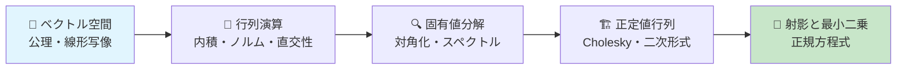
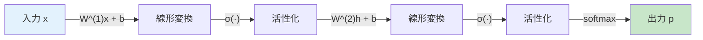
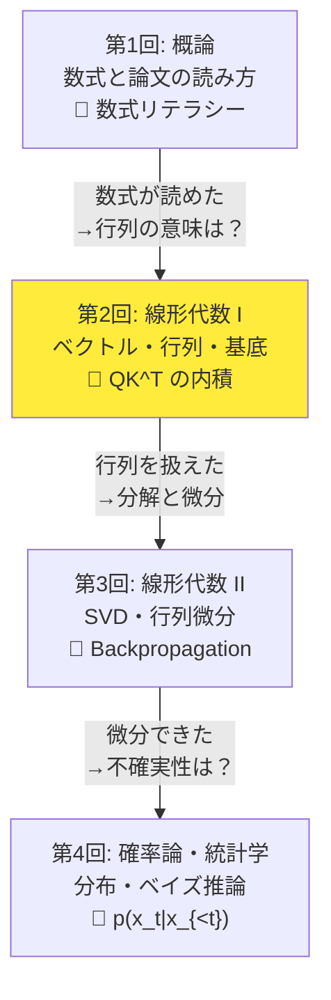
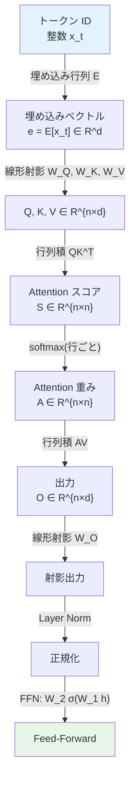
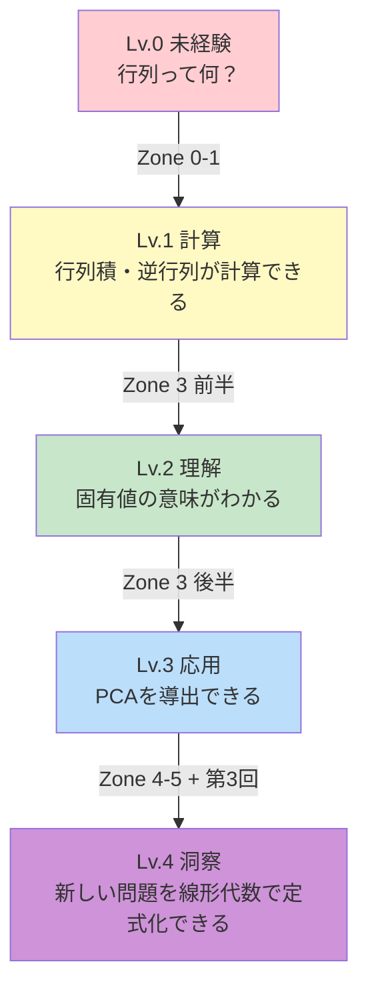
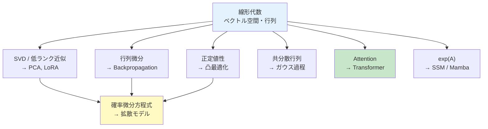
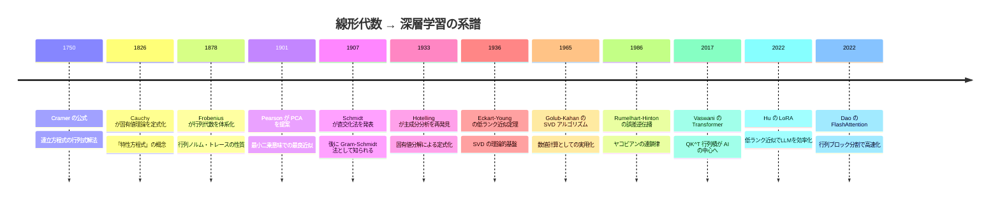
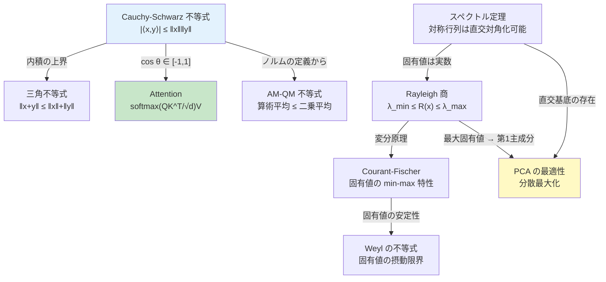
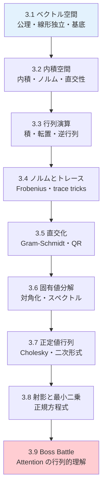

# 第2回: 線形代数 I — ベクトル・行列・基底

> **GPUは行列演算マシンだ。線形代数を"制する者"がAIを制する。**

> **📖 この記事は前編（理論編）です**
> 実装編は [【後編】第2回: 線形代数 I — NumPy完全実装](/articles/ml-lecture-02-part2) をご覧ください。

---

この言い方は大げさに聞こえるかもしれない。だが、事実だ。

LLMが次のトークンを予測するとき、Attention機構[^1]の中では `$QK^\top$` という行列積が走る。画像認識モデルが特徴を抽出するとき、畳み込みは行列積に帰着する。推薦システムがユーザーの好みを予測するとき、SVD（特異値分解）が使われる。勾配降下法でパラメータを更新するとき、勾配ベクトルはヤコビ行列から計算される。

**機械学習のほぼ全ての計算は、線形代数の言葉で書かれている。**

第1回で「数式は言語だ」と言った。ならば線形代数は、その言語の**文法書**にあたる。文法を知らずに小説は書けない。同様に、線形代数を知らずに機械学習の論文は書けない。

本講義では、ベクトル空間の公理から始めて、行列演算、固有値分解、正定値行列、射影まで — AI理論の基盤となる線形代数を一気に駆け抜ける。第3回（線形代数 II）でSVD・行列微分・テンソルに進むための準備を、ここで完了させる。

> **Note:** **このシリーズについて**: 東京大学 松尾・岩澤研究室動画講義の**完全上位互換**の全50回シリーズ。理論（論文が書ける）、実装（Production-ready）、最新（2025-2026 SOTA）の3軸で差別化する。



**所要時間の目安**:

| ゾーン | 内容 | 時間 | 難易度 |
|:-------|:-----|:-----|:-------|
| Z1 | クイックスタート | 30秒 | ★☆☆☆☆ |
| Z2 | 体験ゾーン | 10分 | ★★☆☆☆ |
| Z3 | 直感ゾーン | 15分 | ★★☆☆☆ |
| Z4 | 数式修行ゾーン | 60分 | ★★★★☆ |

---

## 🚀 Z1. クイックスタート（30秒）— 行列積が動かすAI

**ゴール**: 行列積がAIの心臓部であることを30秒で体感する。

3行で、Transformerの中核であるAttention[^1]の行列積を「動かす」。

```python
import numpy as np

# Attention: scores = QK^T / sqrt(d_k)
Q = np.array([[1.0, 0.5], [0.3, 0.8]])  # Query: 2 tokens × 2 dims
K = np.array([[0.9, 0.1], [0.2, 0.7]])  # Key:   2 tokens × 2 dims
scores = Q @ K.T / np.sqrt(2)            # QK^T / √d_k
print(f"Attention scores:\n{np.round(scores, 4)}")
```

出力:
```
Attention scores:
[[0.6718 0.3889]
 [0.2475 0.4384]]
```

**この3行の裏にある数式**:

```math
S_{ij} = \frac{\sum_{k=1}^{d} Q_{ik} K_{jk}}{\sqrt{d}}
```

`Q @ K.T` が `$QK^\top$`。各要素は**内積**（ベクトルの類似度）だ。行列積とは、内積を一括計算する操作に他ならない。

```math
(AB)_{ij} = \sum_{k=1}^{n} A_{ik} B_{kj} = \mathbf{a}_i^\top \mathbf{b}_j
```

**行列積 = 内積のバッチ処理。** これがGPUで高速に実行できる理由であり、Transformerが大規模データを処理できる理由だ。

> Progress: 5%

---

## 🎮 Z2. 体験ゾーン（10分）— 行列を「触って」理解する

### 1.1 ベクトルの内積 — 類似度の数学

Attention[^1]の核心は「2つのベクトルがどれだけ似ているか」を測ることだ。その道具が**内積**（inner product / dot product）。

```math
\langle \mathbf{a}, \mathbf{b} \rangle = \mathbf{a}^\top \mathbf{b} = \sum_{i=1}^{n} a_i b_i = \|\mathbf{a}\| \|\mathbf{b}\| \cos\theta
```

右辺の `$\cos\theta$` に注目してほしい。内積は「2つのベクトルの角度」を測っている。

3次元の単純な埋め込み例で確認しよう（3次元は説明のため; 実際のLLMは数百〜数千次元）:

| ペア | ベクトル（例） | 内積 `$\mathbf{a}^\top\mathbf{b}$` | コサイン類似度 |
|:---|:---|:---:|:---:|
| king ↔ queen | `$(0.9,0.8,0.1)$` vs `$(0.8,0.9,0.1)$` | 1.450 | 0.993 |
| king ↔ apple | `$(0.9,0.8,0.1)$` vs `$(0.1,0.2,0.9)$` | 0.340 | 0.303 |
| queen ↔ apple | `$(0.8,0.9,0.1)$` vs `$(0.1,0.2,0.9)$` | 0.350 | 0.312 |

king と queen の内積（1.45）は apple との内積（0.34）の4倍以上。意味的に近い単語は「同じ方向を向いた」ベクトルとして表現される。これが**単語埋め込み**の核心だ。

**一言で言えば**: 内積が大きい = 方向が近い = 意味が似ている。Attention[^1]はこの内積を使って「どのトークンに注目すべきか」を決めている。

> **Note:** ここで多くの人が混乱するのが、**内積**と**コサイン類似度**の違いだ。内積 `$\mathbf{a}^\top\mathbf{b}$` はベクトルの長さ（ノルム）に依存する。コサイン類似度 `$\cos\theta$` はノルムで正規化するため `$[-1, 1]$` に収まる。Attentionでは内積を使い、`$\sqrt{d_k}$` でスケーリングする[^1]。検索システムではコサイン類似度を使うことが多い。

### 1.2 行列積の3つの見方

行列積 `$C = AB$` には3つの見方がある。これを使い分けられると、論文の数式が格段に読みやすくなる。

`$A \in \mathbb{R}^{m \times n}$`, `$B \in \mathbb{R}^{n \times p}$` のとき `$C = AB \in \mathbb{R}^{m \times p}$`。

| 見方 | 定義 | 直感 |
|:-----|:-----|:-----|
| **要素ごと** | `$C_{ij} = \sum_k A_{ik} B_{kj}$` | `$C$` の各要素は内積 |
| **列ごと** | `$C_{\cdot j} = A \mathbf{b}_j$` | `$C$` の各列は `$A$` による `$\mathbf{b}_j$` の線形変換 |
| **行ごと** | `$C_{i \cdot} = \mathbf{a}_i^\top B$` | `$C$` の各行は `$\mathbf{a}_i$` と `$B$` の行の内積 |


<details><summary>外積としての行列積（4つ目の見方）</summary>
行列積にはもう一つ重要な見方がある。**ランク1行列の和**としての分解:

```math
AB = \sum_{k=1}^{n} \mathbf{a}_k \mathbf{b}_k^\top
```

ここで `$\mathbf{a}_k$` は `$A$` の第 `$k$` 列、`$\mathbf{b}_k^\top$` は `$B$` の第 `$k$` 行。各 `$\mathbf{a}_k \mathbf{b}_k^\top$` はランク1の行列（外積）で、その和が `$AB$` になる。

これは**SVD**（第3回）の理解に直結する。SVDは行列をランク1行列の「重みつき」の和に分解する:

```math
A = \sum_{i=1}^{r} \sigma_i \mathbf{u}_i \mathbf{v}_i^\top
```

</details>

### 1.3 行列による線形変換 — 回転・スケーリング・射影

行列は「空間を変形する操作」だ。`$\mathbf{y} = A\mathbf{x}$` は、ベクトル `$\mathbf{x}$` を行列 `$A$` で変換して `$\mathbf{y}$` を得る。


ニューラルネットワークの各層がやっているのは、まさにこの線形変換に非線形活性化を挟む操作だ:

```math
\mathbf{h}^{(l)} = \sigma\left(W^{(l)} \mathbf{h}^{(l-1)} + \mathbf{b}^{(l)}\right)
```

`$W^{(l)}$` による線形変換（回転+スケーリング）に `$\mathbf{b}^{(l)}$` で平行移動し、`$\sigma$` で「曲げる」。



### 1.4 固有値を「見る」— 行列の本質を1行で暴く

行列 `$A$` には「固有の方向」がある。その方向のベクトルは、`$A$` をかけても方向が変わらず、スケールだけ変わる:

```math
A\mathbf{v} = \lambda\mathbf{v}
```

`$\mathbf{v}$` が**固有ベクトル**、`$\lambda$` が**固有値**。


**trace = 固有値の和、det = 固有値の積。** この2つの恒等式は第3回以降で繰り返し登場する。覚えておいてほしい。

固有値分解の機械学習での直結的な応用が**PCA**（主成分分析）だ。データの共分散行列の固有ベクトルが、分散が最大の方向（= 情報が最も豊富な方向）を指す。Pearsonが1901年に原型を提示し[^6]、Hotellingが1933年に「主成分」という用語で体系化した[^7]。

### 1.5 埋め込みベクトル — 行列が作る「意味の空間」

LLMは最初に、各トークン（単語の断片）を高次元ベクトルに変換する。これが**埋め込み**（embedding）だ。

```math
\mathbf{e}_{x_t} = E[x_t, :] \in \mathbb{R}^d
```

`$E \in \mathbb{R}^{V \times d}$` が埋め込み行列。`$V$` は語彙サイズ（GPT-2なら50,257）、`$d$` は埋め込み次元（GPT-2なら768）。


**埋め込みの学習**は、この行列 `$E$` の各行を勾配降下法で更新して、「意味的に近い単語が近いベクトルになる」ように最適化する。有名な word2vec の「king - man + woman ≈ queen」は、埋め込み空間でのベクトル演算が意味的な類推に対応するという発見だ。

この埋め込みベクトルが第2回の線形代数の全てに直結する:
- ベクトルの加法と内積 → 意味の合成と類似度
- 行列積 `$QK^\top$` → 全トークン対の類似度の一括計算
- 固有値分解/PCA → 埋め込み空間の構造の分析と可視化

> **一言で言えば**: 固有値分解 = 行列の「X線写真」。内部構造を一目で暴く。

> Progress: 25%

### 🎯 Quick Check — Z2

理解度を確認しましょう:

1. **内積 `$\mathbf{a}^\top\mathbf{b}$` とコサイン類似度の違いは？**
   <details><summary>解答</summary>
   内積はベクトルのノルム（長さ）に依存する。コサイン類似度 `$\cos\theta = \frac{\mathbf{a}^\top\mathbf{b}}{\|\mathbf{a}\|\|\mathbf{b}\|}$` はノルムで正規化するため `$[-1, 1]$` に収まる。Attention は内積を `$\sqrt{d_k}$` でスケーリングする。
   </details>

2. **行列積の「3つの見方」を答えよ。**
   <details><summary>解答</summary>
   (1) 要素ごと: `$C_{ij} = \sum_k A_{ik}B_{kj}$`（内積）。(2) 列ごと: `$C_{\cdot j} = A\mathbf{b}_j$`（Aによるbjの線形変換）。(3) 行ごと: `$C_{i\cdot} = \mathbf{a}_i^\top B$`（aiとBの行との内積）。
   </details>

---

## 🧩 Z3. 直感ゾーン（15分）— なぜ線形代数が全ての土台なのか

### 2.1 線形代数の「地図」

第1回で「数式は言語だ」と言った。ならば線形代数は**言語の文法**であり、その文法なしに機械学習の論文は1ページも読めない。

なぜか。機械学習の3つの基本操作 — **表現・変換・最適化** — は全て線形代数で記述されるからだ。

| 操作 | 線形代数の道具 | 具体例 |
|:-----|:-------------|:------|
| **表現** | ベクトル空間、基底 | 単語埋め込み `$\mathbf{x} \in \mathbb{R}^{768}$` |
| **変換** | 行列積、線形写像 | Attention: `$QK^\top$`[^1] |
| **最適化** | 勾配、固有値、正定値性 | ヘシアンの正定値性 → 凸性 |

> **この章を読めば**: 線形代数が機械学習のどこで使われるかの全体像が手に入る。

### 2.2 Course I の中での位置づけ

本講義はCourse I（数学基礎編）の第2回。前回で数式を「読む力」を身につけた。今回と次回で、数式を「操る力」を身につける。



| 回 | テーマ | LLM/Transformerとの接点 |
|:---|:------|:----------------------|
| 第1回 | 概論: 数式と論文の読み方 | Softmax, Attention, Cross-Entropy |
| **第2回** | **線形代数 I** | **`$QK^\top$` の内積、固有値→PCA→埋め込み** |
| 第3回 | 線形代数 II | ヤコビアン→Flow Model、勾配→Backpropagation |
| 第4回 | 確率論・統計学 | `$p(x_t \mid x_{<t})$` 自己回帰、Softmax分布 |

**限界→動機の連鎖**: 本講義で線形空間と行列を扱えるようになると、「行列を分解して構造を見抜くには？」「行列の関数を微分するには？」という問いが自然に湧く。それが第3回（SVD・行列微分・テンソル）の動機だ。

### 2.3 松尾研との差別化

松尾・岩澤研の講義は線形代数を「前提知識」として飛ばす。結果として受講者は以下の壁にぶつかる:

| 松尾研の前提 | 実際の壁 | 本講義の対策 |
|:------------|:--------|:-----------|
| 「内積は知ってるよね」 | Attention[^1]の`$QK^\top$`が読めない | Zone 1 で体験 → Zone 3 で定義と証明 |
| 「固有値分解は既知」 | 共分散行列の意味がわからない | 固有値→PCA→埋め込みの導出を全て行う |
| 「正定値行列くらいは」 | ヘシアンの正定値性と凸性の関係が？ | 二次形式の幾何学まで踏み込む |

**このシリーズでは「前提知識」を「到達知識」として扱う。** 松尾研が飛ばす部分にこそ、論文を書く力の土台がある。

### 2.4 LLMの中の線形代数

LLMの推論パイプラインを線形代数の視点で見ると、全てがベクトル・行列操作に帰着する。



| LLM の操作 | 線形代数 | 本講義の対応セクション |
|:-----------|:--------|:-------------------|
| 埋め込み検索 | 行列の行選択 | 3.1 ベクトル空間 |
| `$QK^\top$` 計算 | 行列積 | 1.2 行列積の3つの見方 |
| Softmax | ベクトル→確率単体 | 第1回で導入済み |
| LayerNorm | 平均・分散の計算 | 3.4 ノルムと内積 |
| FFN | 2層の線形変換 | 1.3 線形変換 |
| Weight tying | 行列の転置 | 3.3 転置の性質 |

**全てが線形代数だ。** Softmax以外の全操作は行列積かベクトル演算。Softmaxも指数関数を挟んだ後にベクトルの正規化（L1ノルム割り）をしているだけだ。

### 2.5 3つの比喩で捉える「線形代数の本質」

**比喩1: 線形代数は「座標系の学問」**

地図を北を上にして読むか、進行方向を上にして読むかで見え方が変わる。線形代数は「座標系を自在に切り替えて、一番見やすい角度からデータを見る技術」だ。PCA[^6][^7]は「データの分散が最大になる座標軸を見つける」操作。

**比喩2: 行列は「変形マシン」**

粘土を伸ばしたり回したり潰したりする道具。ニューラルネットの各層は、データという粘土を変形して、最終的に分類しやすい形にする。固有値は「どの方向にどれだけ伸ばすか」を決める。

**比喩3: 固有値分解は「周波数分析」**

音を周波数成分に分解するフーリエ変換と本質的に同じ発想。行列を固有値と固有ベクトルに分解することで、行列の「基本振動モード」が見える。低い固有値の成分を捨てれば情報を圧縮できる — これがPCAであり、第3回で学ぶSVDの低ランク近似だ。

### 2.6 線形代数の「レベルアップ」マップ

線形代数の習得には明確な段階がある。自分が今どのレベルにいるかを把握することが、効率的な学習の鍵だ。



| レベル | 到達条件 | 機械学習での実力 |
|:------|:--------|:--------------|
| Lv.0 | — | 論文が読めない |
| Lv.1 | 行列積・内積を正しく計算できる | コードは動かせるが数式が読めない |
| Lv.2 | 固有値分解・スペクトル定理を説明できる | 論文のAppendixが部分的に読める |
| Lv.3 | PCA・最小二乗法を白紙から導出できる | 論文のMethodセクションが読める |
| Lv.4 | 未知の問題を線形代数で定式化できる | 論文が書ける |

**本講義の目標はLv.3への到達**。Lv.4は第3回以降の内容（SVD・行列微分）を加えることで到達する。

### 2.7 学習戦略

この講義は量が多い。効率的に進めるためのアドバイス:

1. **Zone 3（数式修行）が最重要**。ここに60分かける価値がある
2. **手を動かす**: コードを写経するだけでなく、パラメータを変えて実行する
3. **紙に書く**: 固有値分解は手計算で1回やると理解が段違いに深まる
4. **わからなくても進む**: 第3回を読んだ後に戻ると繋がることが多い
5. **定義→定理→例→コード**の4点セットを意識する: 数学の学習は定義から始まる。定理がその帰結。例が具体化。コードが検証

<details><summary>挫折パターンと対策</summary>
| よくある挫折パターン | 原因 | 対策 |
|:------------------|:-----|:-----|
| Zone 3 で諦める | 一度に全部理解しようとする | セクション単位で区切る。3.1→3.2→...と1つずつ |
| 証明が追えない | 前提知識が足りない | その証明で使っている定義に戻る。定義を曖昧にしたまま先に進まない |
| コードは動くが数式が読めない | 数式をコードに「翻訳」する練習が不足 | Zone 5 のコード翻訳テストを先にやる |
| 固有値分解の意味がわからない | 幾何学的直感が足りない | 2×2行列で手計算する。Zone 1.4 の可視化を再実行 |
| PCA の導出ができない | Rayleigh商→制約付き最適化の流れが見えない | Zone 3.8 を2回読む。1回目は流れだけ、2回目は式を追う |
</details>

> Progress: 45%

### 🎯 Quick Check — Z3

理解度を確認しましょう:

1. **機械学習の「表現・変換・最適化」それぞれに対応する線形代数の道具は？**
   <details><summary>解答</summary>
   表現 → ベクトル空間・基底（単語埋め込み `$\mathbf{x} \in \mathbb{R}^{768}$`）。変換 → 行列積・線形写像（Attention `$QK^\top$`）。最適化 → 勾配・固有値・正定値性（ヘシアンの正定値性 → 凸性）。
   </details>

2. **`$\text{tr}(AB) = \text{tr}(BA)$` が成立するのはなぜか？（Trace trickの核心）**
   <details><summary>解答</summary>
   `$\text{tr}(AB) = \sum_i (AB)_{ii} = \sum_i \sum_k A_{ik}B_{ki} = \sum_k \sum_i B_{ki}A_{ik} = \sum_k (BA)_{kk} = \text{tr}(BA)$`。この巡回不変性により、行列積の順序を入れ替えてトレースを計算できる（損失関数の勾配計算で多用）。
   </details>

---

### 2.8 線形代数の機械学習における位置づけ



| 線形代数の道具 | 機械学習での応用 | 講義 |
|:-------------|:--------------|:-----|
| SVD / 低ランク近似 | PCA, LoRA[^10], 推薦システム | 第3回 |
| 行列微分 | Backpropagation[^2], 自動微分 | 第3回 |
| 正定値行列 | 凸最適化, Fisher情報量行列 | 第6回 |
| 固有値分解 | グラフラプラシアン, スペクトルクラスタリング | 第6回 |
| 行列指数 | SSM (Mamba), Neural ODE | 第25-26回 |
| テンソル分解 | Tensor Train, Tucker分解 | 第3回 |
| ランダム行列 | 初期化理論, 表現理論 | 第7回 |

### 2.9 線形代数の歴史と深層学習の系譜

線形代数は「古い数学」ではない。その発展史を知ることで、なぜ今のAIがこの数学を必要としているかが見える。



この年表が示すのは、**250年以上の数学的蓄積がTransformerの1行に凝縮されている**という事実だ。

#### 知っておくべき不等式・定理の相関図

線形代数には多くの不等式・定理が存在するが、それらは孤立しているのではなく、相互に関連している。



| 不等式・定理 | 数式 | 機械学習での意味 |
|:-----------|:-----|:--------------|
| Cauchy-Schwarz | `$\|\langle \mathbf{x}, \mathbf{y} \rangle\| \leq \|\mathbf{x}\| \|\mathbf{y}\|$` | コサイン類似度が `$[-1, 1]$` に収まる保証 |
| 三角不等式 | `$\|\mathbf{x} + \mathbf{y}\| \leq \|\mathbf{x}\| + \|\mathbf{y}\|$` | ノルムが距離の公理を満たす保証 |
| Rayleigh商の上下界 | `$\lambda_{\min} \leq R(\mathbf{x}) \leq \lambda_{\max}$` | PCA第1主成分 = 最大固有値方向 |
| Weylの不等式 | `$\|\lambda_i(A+E) - \lambda_i(A)\| \leq \|E\|_2$` | 行列の摂動が固有値に与える影響の限界 |
| Eckart-Young | `$\min_{\text{rank}(B)=k} \|A-B\|_F = \sqrt{\sum_{i>k} \sigma_i^2}$` | SVD低ランク近似の最適性（第3回） |
| Courant-Fischer | `$\lambda_k = \min_{\dim S=k} \max_{\mathbf{x} \in S} R(\mathbf{x})$` | 固有値の変分特性 → PCAの理論的裏付け |

<details><summary>補足: Weylの不等式が重要な理由</summary>
学習中のニューラルネットワークでは、パラメータが微小に変化する（= 行列に摂動が加わる）。Weylの不等式は、**摂動に対して固有値がどの程度安定か**を保証する。

具体的には、共分散行列 `$\Sigma$` に小さなノイズ `$E$` が加わったとき:

```math
|\lambda_i(\Sigma + E) - \lambda_i(\Sigma)| \leq \|E\|_2
```

これは「ノイズのスペクトルノルム以上に固有値は動かない」ことを意味する。PCAやスペクトルクラスタリングの数値的安定性の理論的根拠だ。
</details>

#### 線形代数のソフトウェアスタック

実用的な視点も重要だ。現代の線形代数ソフトウェアは階層的に構成されている。

| 層 | ソフトウェア | 役割 |
|:---|:-----------|:-----|
| ユーザー層 | NumPy, PyTorch, JAX | 高レベルAPI |
| 中間層 | LAPACK | 固有値分解、SVD、連立方程式 |
| カーネル層 | BLAS (Level 1/2/3) | ベクトル・行列演算の最適化カーネル |
| ハードウェア層 | CPU (AVX-512), GPU (Tensor Core), Apple AMX | 行列積のハードウェア支援 |


知っておくべきは、`A @ B` という1行のPythonコードが、最終的にはCPUの特殊命令（AVX-512, AMX）やGPUのTensor Coreを叩いているということだ。**線形代数は理論とハードウェアの接点**でもある。

---

## 📐 Z4. 数式修行ゾーン（60分）— ベクトル空間から固有値分解まで

> **目標**: ベクトル空間の公理を出発点として、行列演算・固有値分解・正定値行列・射影を導出し、Attention[^1]の`$QK^\top$`を数学的に完全理解する。

本シリーズで最も重要なゾーンだ。ここで扱う概念は、第40回まで繰り返し登場する。急がず、1つずつ導出していこう。



### 3.1 ベクトル空間の公理 — 全ての出発点

ベクトル空間とは「足し算とスカラー倍ができる集合」だ。厳密には以下の8つの公理を満たす集合 `$V$` と体 `$\mathbb{F}$`（通常は `$\mathbb{R}$` か `$\mathbb{C}$`）の組 `$(V, \mathbb{F})$`。

| # | 公理 | 数式 | 直感 |
|:--|:-----|:-----|:-----|
| 1 | 加法の閉包 | `$\mathbf{u} + \mathbf{v} \in V$` | 足しても空間から出ない |
| 2 | 加法の結合法則 | `$(\mathbf{u}+\mathbf{v})+\mathbf{w} = \mathbf{u}+(\mathbf{v}+\mathbf{w})$` | 括弧の位置は無関係 |
| 3 | 加法の交換法則 | `$\mathbf{u}+\mathbf{v} = \mathbf{v}+\mathbf{u}$` | 足す順序は無関係 |
| 4 | 零元の存在 | `$\exists\,\mathbf{0}: \mathbf{v}+\mathbf{0} = \mathbf{v}$` | ゼロベクトルがある |
| 5 | 逆元の存在 | `$\exists\,{-\mathbf{v}}: \mathbf{v}+(-\mathbf{v}) = \mathbf{0}$` | 引き算ができる |
| 6 | スカラー倍の閉包 | `$c\mathbf{v} \in V$` | 拡大縮小しても出ない |
| 7 | スカラー倍の分配法則 | `$c(\mathbf{u}+\mathbf{v}) = c\mathbf{u}+c\mathbf{v}$` | |
| 8 | スカラー倍の結合法則 | `$(cd)\mathbf{v} = c(d\mathbf{v})$` | |

**なぜ公理を知る必要があるのか。** 「`$\mathbb{R}^n$` でベクトルを足してスカラー倍する — 当たり前じゃないか」と思うかもしれない。だが、公理を知ると**ベクトル空間は `$\mathbb{R}^n$` だけではない**ことがわかる。

| ベクトル空間 | 要素 | 機械学習での用途 |
|:------------|:-----|:---------------|
| `$\mathbb{R}^n$` | `$n$`次元実数ベクトル | 入力データ、埋め込み |
| `$\mathbb{R}^{m \times n}$` | 行列 | 重み行列、共分散行列 |
| `$\mathcal{P}_n$` | `$n$`次以下の多項式 | カーネル法の特徴写像 |
| `$L^2(\Omega)$` | 二乗可積分関数 | 関数空間（第5回 測度論） |
| 確率分布の空間 | 確率密度関数 | 生成モデル（第7回以降） |

行列も多項式も関数も、公理を満たすのでベクトル空間だ。この抽象性が、線形代数を「あらゆる場所で使える」道具にしている。

#### 線形独立・基底・次元

ベクトル `$\mathbf{v}_1, \ldots, \mathbf{v}_k$` が**線形独立**であるとは:

```math
c_1 \mathbf{v}_1 + c_2 \mathbf{v}_2 + \cdots + c_k \mathbf{v}_k = \mathbf{0} \implies c_1 = c_2 = \cdots = c_k = 0
```

つまり、どのベクトルも他のベクトルの線形結合では表せないということ。

`$V$` の**基底** `$\{\mathbf{e}_1, \ldots, \mathbf{e}_n\}$` は、線形独立で `$V$` を張る（span）ベクトルの組。`$V$` の任意のベクトルは基底の線形結合で一意に表せる:

```math
\mathbf{v} = \sum_{i=1}^{n} v_i \mathbf{e}_i
```

基底に含まれるベクトルの数 `$n$` が**次元** `$\dim V$`。


> **Note:** ここで多くの人が混乱するのが**ランク**（rank）と**次元**（dimension）の違いだ。次元はベクトル空間の固有の性質（`$\mathbb{R}^3$` の次元は3）。ランクは行列の性質で、列ベクトルが張る空間の次元。`$m \times n$` 行列のランクは `$\min(m, n)$` 以下。ランクが `$\min(m, n)$` に等しいとき**フルランク**と呼ぶ。

#### 線形写像

ベクトル空間 `$V$` から `$W$` への**線形写像** `$T: V \to W$` は、以下を満たす写像:

```math
T(\alpha \mathbf{u} + \beta \mathbf{v}) = \alpha T(\mathbf{u}) + \beta T(\mathbf{v})
```

**行列 `$A \in \mathbb{R}^{m \times n}$` は線形写像 `$T: \mathbb{R}^n \to \mathbb{R}^m$` の表現**だ。基底を選ぶと線形写像は行列で表せる。基底を変えると行列も変わるが、線形写像自体は同じ。

ニューラルネットワークの各層 `$\mathbf{h} \mapsto W\mathbf{h} + \mathbf{b}$` は**アフィン写像**（線形写像 + 平行移動）。活性化関数 `$\sigma$` を挟むことで非線形になり、任意の連続関数を近似できるようになる（万能近似定理）。

#### Rank-Nullity定理

線形写像 `$T: V \to W$` に対して:

```math
\dim V = \text{rank}(T) + \text{nullity}(T)
```

`$\text{rank}(T)$` は像空間 `$\text{Im}(T)$` の次元、`$\text{nullity}(T)$` は核 `$\ker(T) = \{\mathbf{v} : T(\mathbf{v}) = \mathbf{0}\}$` の次元。

行列 `$A \in \mathbb{R}^{m \times n}$` で言えば: `$n = \text{rank}(A) + \dim(\text{null}(A))$`


### 3.2 内積空間 — 長さと角度の定義

ベクトル空間に**内積**を入れると、長さ（ノルム）と角度が定義できる。

**内積の公理**: `$\langle \cdot, \cdot \rangle: V \times V \to \mathbb{R}$` が内積であるとは:

| 公理 | 数式 | 意味 |
|:-----|:-----|:-----|
| 対称性 | `$\langle \mathbf{u}, \mathbf{v} \rangle = \langle \mathbf{v}, \mathbf{u} \rangle$` | 順序を入れ替えても同じ |
| 線形性 | `$\langle \alpha\mathbf{u}+\beta\mathbf{v}, \mathbf{w} \rangle = \alpha\langle \mathbf{u}, \mathbf{w} \rangle + \beta\langle \mathbf{v}, \mathbf{w} \rangle$` | 第1引数で線形 |
| 正定値性 | `$\langle \mathbf{v}, \mathbf{v} \rangle \geq 0$`, 等号 `$\iff \mathbf{v} = \mathbf{0}$` | 自分との内積は非負 |

`$\mathbb{R}^n$` の標準内積は `$\langle \mathbf{u}, \mathbf{v} \rangle = \mathbf{u}^\top \mathbf{v} = \sum_i u_i v_i$`。

内積から**ノルム**（長さ）が定義される:

```math
\|\mathbf{v}\| = \sqrt{\langle \mathbf{v}, \mathbf{v} \rangle}
```

そしてノルムから**距離**が定義される:

```math
d(\mathbf{u}, \mathbf{v}) = \|\mathbf{u} - \mathbf{v}\|
```

#### Cauchy-Schwarz不等式

内積空間で最も基本的で最も重要な不等式:

```math
|\langle \mathbf{u}, \mathbf{v} \rangle| \leq \|\mathbf{u}\| \cdot \|\mathbf{v}\|
```

等号は `$\mathbf{u} = c\mathbf{v}$`（平行）のとき成立。

<details><summary>Cauchy-Schwarz不等式の証明</summary>
`$\mathbf{v} = \mathbf{0}$` のとき自明。`$\mathbf{v} \neq \mathbf{0}$` として、任意の `$t \in \mathbb{R}$` に対し:

```math
0 \leq \|\mathbf{u} - t\mathbf{v}\|^2 = \langle \mathbf{u} - t\mathbf{v}, \mathbf{u} - t\mathbf{v} \rangle = \|\mathbf{u}\|^2 - 2t\langle \mathbf{u}, \mathbf{v} \rangle + t^2\|\mathbf{v}\|^2
```

これは `$t$` の2次関数で、常に `$\geq 0$`。判別式が `$\leq 0$` であることから:

```math
4\langle \mathbf{u}, \mathbf{v} \rangle^2 - 4\|\mathbf{u}\|^2\|\mathbf{v}\|^2 \leq 0 \implies \langle \mathbf{u}, \mathbf{v} \rangle^2 \leq \|\mathbf{u}\|^2\|\mathbf{v}\|^2
```

両辺の平方根を取れば完了。 ∎
</details>

**機械学習との接続**: コサイン類似度 `$\cos\theta = \frac{\langle \mathbf{u}, \mathbf{v} \rangle}{\|\mathbf{u}\|\|\mathbf{v}\|}$` が `$[-1, 1]$` に収まることは、Cauchy-Schwarz不等式から直ちに従う。


#### 直交性

2つのベクトルが**直交**するとは `$\langle \mathbf{u}, \mathbf{v} \rangle = 0$`。直交ベクトルの集合 `$\{\mathbf{e}_1, \ldots, \mathbf{e}_n\}$` で各ベクトルのノルムが1のとき**正規直交基底**（orthonormal basis）と呼ぶ:

```math
\langle \mathbf{e}_i, \mathbf{e}_j \rangle = \delta_{ij} = \begin{cases} 1 & (i = j) \\ 0 & (i \neq j) \end{cases}
```

`$\delta_{ij}$` は**クロネッカーのデルタ**。

正規直交基底の利点は、座標の計算が内積だけでできること:

```math
\mathbf{v} = \sum_{i=1}^{n} \langle \mathbf{v}, \mathbf{e}_i \rangle \mathbf{e}_i
```

#### ノルムの体系 — L1・L2・L∞・Lp

内積から導かれる `$\|\mathbf{v}\|_2$` は「ユークリッドノルム」だが、機械学習では**内積を使わない**ノルムも頻出する。`$p$`-ノルムの統一定義:

```math
\|\mathbf{v}\|_p = \left(\sum_{i=1}^{n} |v_i|^p\right)^{1/p}, \quad p \geq 1
```

| ノルム | 定義 | 直感 | 機械学習での用途 |
|:-------|:-----|:-----|:---------------|
| `$\|\mathbf{v}\|_1$` (L1) | `$\sum_i |v_i|$` | タクシー距離 | Lasso正則化・スパース推定 |
| `$\|\mathbf{v}\|_2$` (L2) | `$\sqrt{\sum_i v_i^2}$` | ユークリッド距離 | Ridge正則化・内積から導出 |
| `$\|\mathbf{v}\|_\infty$` (L∞) | `$\max_i |v_i|$` | チェビシェフ距離 | ロバスト推定・ゲーム理論 |
| `$\|\mathbf{v}\|_0$` (L0) | `$|\{i : v_i \neq 0\}|$` | 非零要素数 | スパース信号処理（`$p \to 0$`の極限） |

L∞ノルムは `$p \to \infty$` の極限として正確に得られる:

```math
\lim_{p \to \infty} \|\mathbf{v}\|_p = \max_i |v_i|
```

**L1 vs L2 の核心的な違い**: 正則化項として使ったとき、L1は「**スパース解**（多くの成分がゼロ）」を、L2は「**全成分を均等に小さくする**」解を生む。なぜか。

L1球（`$\|\mathbf{w}\|_1 \leq C$`）は`$\mathbb{R}^2$`で**ひし形**、L2球は**円**。損失関数の等高線がひし形の角（軸上の点 = スパース解）に接触しやすいのがL1。

```math
\text{Ridge: } \min_{\mathbf{w}} L(\mathbf{w}) + \lambda\|\mathbf{w}\|_2^2 \quad \Rightarrow \quad \hat{\mathbf{w}}_i = \frac{\hat{\mathbf{w}}_i^{\text{OLS}}}{1 + 2\lambda}
```

```math
\text{Lasso: } \min_{\mathbf{w}} L(\mathbf{w}) + \lambda\|\mathbf{w}\|_1 \quad \Rightarrow \quad \hat{w}_i = \text{sign}(\hat{w}_i^{\text{OLS}}) \cdot \max(|\hat{w}_i^{\text{OLS}}| - \lambda, 0)
```

ここで `$\text{sign}(\cdot) \cdot \max(\cdot - \lambda, 0)$` は**Soft-thresholding演算子**。`$|\hat{w}_i^{\text{OLS}}| \leq \lambda$` のとき `$\hat{w}_i = 0$`（スパース化）。

**Hölder不等式**: L1とL∞（より一般にLpとLq）の間には重要な不等式がある:

```math
|\langle \mathbf{u}, \mathbf{v} \rangle| \leq \|\mathbf{u}\|_p \cdot \|\mathbf{v}\|_q, \quad \frac{1}{p} + \frac{1}{q} = 1
```

`$p = q = 2$` のとき Cauchy-Schwarz 不等式に帰着する。`$p=1, q=\infty$` では `$|\langle \mathbf{u}, \mathbf{v} \rangle| \leq \|\mathbf{u}\|_1 \cdot \|\mathbf{v}\|_\infty$`。

> **Note:** ノルムの等価性: 有限次元空間では全てのノルムは「等価」（一方が収束すれば他方も収束）。ただし定数が次元に依存するため、**高次元**では定数の大きさが本質的になる。`$\|\mathbf{v}\|_2 \leq \|\mathbf{v}\|_1 \leq \sqrt{d}\|\mathbf{v}\|_2$` — この `$\sqrt{d}$` ファクターが高次元の呪いと直結する。

ここでは行列の基本演算を体系的に整理する。第1回で「添字の文法」を学んだ。ここではその文法を使って行列の演算規則を導出する。

#### 転置

```math
(A^\top)_{ij} = A_{ji}
```

主要な性質:

| 性質 | 数式 |
|:-----|:-----|
| 二重転置 | `$(A^\top)^\top = A$` |
| 和の転置 | `$(A + B)^\top = A^\top + B^\top$` |
| 積の転置 | `$(AB)^\top = B^\top A^\top$` |
| スカラー | `$(cA)^\top = c A^\top$` |

**積の転置で順序が逆になる**ことは非常に重要だ。Attention[^1]の `$QK^\top$` は、`$Q$` の各行と `$K$` の各行の内積を計算していることが、転置の性質から読み取れる:

```math
(QK^\top)_{ij} = \sum_k Q_{ik} (K^\top)_{kj} = \sum_k Q_{ik} K_{jk} = \mathbf{q}_i^\top \mathbf{k}_j
```

#### 逆行列

`$n \times n$` の正方行列 `$A$` に対して、`$AB = BA = I$` を満たす `$B$` が存在するとき `$B = A^{-1}$` と書く。

**存在条件**: `$\det(A) \neq 0 \iff \text{rank}(A) = n \iff A$` の全ての固有値が非零。

主要な性質:

| 性質 | 数式 |
|:-----|:-----|
| 積の逆 | `$(AB)^{-1} = B^{-1}A^{-1}$` |
| 転置の逆 | `$(A^\top)^{-1} = (A^{-1})^\top$` |
| 逆の逆 | `$(A^{-1})^{-1} = A$` |


> **⚠️ Warning:** **逆行列を直接計算するのは避ける。** `$A^{-1}\mathbf{b}$` が必要なとき、`np.linalg.solve(A, b)` を使う。逆行列の計算は `$O(n^3)$` で、数値的にも不安定。`solve` はLU分解を使い、より高速かつ安定だ。Golub & Van Loanの "Matrix Computations"[^8]がこの点を詳しく論じている。

#### 対称行列と直交行列

**対称行列**: `$A = A^\top$`。共分散行列は対称行列の代表例:

```math
\Sigma = \frac{1}{N-1}\sum_{i=1}^{N}(\mathbf{x}^{(i)} - \bar{\mathbf{x}})(\mathbf{x}^{(i)} - \bar{\mathbf{x}})^\top
```

**直交行列**: `$Q^\top Q = QQ^\top = I$`、つまり `$Q^{-1} = Q^\top$`。列ベクトルが正規直交基底を構成する行列。回転行列は直交行列の代表例。

直交行列による変換はノルムを保存する: `$\|Q\mathbf{x}\| = \|\mathbf{x}\|$`。

**証明**: `$\|Q\mathbf{x}\|^2 = (Q\mathbf{x})^\top(Q\mathbf{x}) = \mathbf{x}^\top Q^\top Q \mathbf{x} = \mathbf{x}^\top I \mathbf{x} = \|\mathbf{x}\|^2$`。∎

#### 行列式

行列式 `$\det(A)$` は行列が空間を「何倍に拡大/縮小するか」を表す。符号は「向き」（右手系/左手系）の反転を示す。

```math
\det(A) = \prod_{i=1}^{n} \lambda_i \quad \text{（固有値の積）}
```

| 性質 | 数式 | 意味 |
|:-----|:-----|:-----|
| 積の行列式 | `$\det(AB) = \det(A)\det(B)$` | 面積の拡大率は掛け算 |
| 逆行列 | `$\det(A^{-1}) = 1/\det(A)$` | |
| 転置 | `$\det(A^\top) = \det(A)$` | |
| スカラー倍 | `$\det(cA) = c^n \det(A)$` | `$n \times n$` 行列 |
| 直交行列 | `$\det(Q) = \pm 1$` | ノルム保存 |

**機械学習での行列式の重要性**:

- **ガウス分布の正規化定数**: `$\mathcal{N}(\mathbf{x} \mid \boldsymbol{\mu}, \Sigma) = \frac{1}{(2\pi)^{d/2} |\Sigma|^{1/2}} \exp\left(-\frac{1}{2}(\mathbf{x}-\boldsymbol{\mu})^\top \Sigma^{-1} (\mathbf{x}-\boldsymbol{\mu})\right)$`
- **Normalizing Flows（第25回）**: 変数変換の公式 `$p_Y(\mathbf{y}) = p_X(f^{-1}(\mathbf{y})) \left|\det\left(\frac{\partial f^{-1}}{\partial \mathbf{y}}\right)\right|$`
- **体積要素の変換**: 座標変換によって確率密度が変わる量を行列式が決定する


> **⚠️ Warning:** **`np.linalg.det` は大きな行列で数値的に不安定。** 固有値が非常に小さい/大きいとオーバーフロー/アンダーフローする。代わりに `np.linalg.slogdet` を使って対数行列式を計算する。ガウス分布の対数尤度計算では常に対数行列式を使う。

#### ブロック行列

大きな行列をブロック（部分行列）に分割して計算する技法。Transformerの Multi-Head Attention[^1] は、QKVをヘッド数 `$h$` 個のブロックに分割する:

```math
\text{MultiHead}(Q, K, V) = \text{Concat}(\text{head}_1, \ldots, \text{head}_h) W^O
```

```math
\text{head}_i = \text{Attention}(QW_i^Q, KW_i^K, VW_i^V)
```

ブロック行列の逆行列には**Schur complement（シューア補行列）**が使われる:

```math
\begin{pmatrix} A & B \\ C & D \end{pmatrix}^{-1} = \begin{pmatrix} (A - BD^{-1}C)^{-1} & \cdots \\ \cdots & \cdots \end{pmatrix}
```

`$A - BD^{-1}C$` がSchur complement。多変量正規分布の条件付き分布の導出（第4回）で登場する。


### 3.4 行列ノルムとトレース

#### 行列ノルムの定義

ベクトルにノルムがあるように、行列にもノルムがある。

| ノルム | 定義 | NumPy |
|:-------|:-----|:------|
| **Frobenius** | `$\|A\|_F = \sqrt{\sum_{i,j} A_{ij}^2} = \sqrt{\text{tr}(A^\top A)}$` | `np.linalg.norm(A, 'fro')` |
| **Spectral** (L2) | `$\|A\|_2 = \sigma_{\max}(A)$` | `np.linalg.norm(A, 2)` |
| **Nuclear** | `$\|A\|_* = \sum_i \sigma_i(A)$` | `np.linalg.norm(A, 'nuc')` |

Frobenius ノルムは行列を「縦に並べたベクトル」と見なしたときのL2ノルム。最も計算が簡単で、多くの場面で使われる。

#### トレースとその性質

`$\text{tr}(A) = \sum_{i=1}^{n} A_{ii}$`（対角成分の和）。

**主要な恒等式**（何度も使う）:

| 恒等式 | 数式 | 用途 |
|:-------|:-----|:-----|
| 巡回性 | `$\text{tr}(ABC) = \text{tr}(CAB) = \text{tr}(BCA)$` | 行列微分で頻出 |
| 内積表現 | `$\text{tr}(A^\top B) = \sum_{ij} A_{ij} B_{ij}$` | Frobenius内積 |
| 固有値の和 | `$\text{tr}(A) = \sum_i \lambda_i$` | スペクトル解析 |
| 転置 | `$\text{tr}(A^\top) = \text{tr}(A)$` | |
| スカラー | `$\text{tr}(cA) = c\,\text{tr}(A)$` | |
| ベクトルの内積 | `$\mathbf{a}^\top\mathbf{b} = \text{tr}(\mathbf{a}\mathbf{b}^\top) = \text{tr}(\mathbf{b}^\top\mathbf{a})$` | |

巡回性の証明は簡単だ:

```math
\text{tr}(AB) = \sum_i (AB)_{ii} = \sum_i \sum_k A_{ik} B_{ki} = \sum_k \sum_i B_{ki} A_{ik} = \sum_k (BA)_{kk} = \text{tr}(BA)
```


<details><summary>trace tricks が活躍する場面</summary>
第3回（行列微分）で以下のような式の微分が登場する:

```math
\frac{\partial}{\partial W} \text{tr}(W^\top A W B) = AWB + A^\top W B^\top
```

> **⚠️ Warning:** この公式は `$A, B$` が対称行列の場合の簡略形です。一般の場合は Matrix Cookbook [^9] を参照してください。

</details>

Matrix Cookbook[^9] にこの種の公式が網羅されている。今は「trace tricks」という道具があることを覚えておけば十分。

### 3.5 行列方程式と連立方程式

線形方程式系 `$A\mathbf{x} = \mathbf{b}$` の解法を整理する。ニューラルネットワークのパラメータ更新は最終的にこの形に帰着することが多い。

#### Gauss消去法とLU分解

`$A\mathbf{x} = \mathbf{b}$` を解く際に、Gauss消去法とLU分解が等価であることを確認しよう。

`$A = LU$` (`$L$`: 下三角、`$U$`: 上三角)とすると、`$A\mathbf{x} = \mathbf{b}$` は2段階で解ける:

```math
L\mathbf{y} = \mathbf{b} \quad \text{（前進代入: } O(n^2) \text{）}, \qquad U\mathbf{x} = \mathbf{y} \quad \text{（後退代入: } O(n^2) \text{）}
```

前進代入の公式（`$L$` の対角成分を1とすると）:

```math
y_i = b_i - \sum_{j=1}^{i-1} L_{ij} y_j, \quad i = 1, 2, \ldots, n
```

後退代入の公式:

```math
x_i = \frac{1}{U_{ii}}\left(y_i - \sum_{j=i+1}^{n} U_{ij} x_j\right), \quad i = n, n-1, \ldots, 1
```

LU分解のコスト（分解 `$O(\frac{2}{3}n^3)$` + 代入 `$O(n^2)$`）: 同じ行列 `$A$` に対して複数の右辺 `$\mathbf{b}_1, \mathbf{b}_2, \ldots$` を解くとき、LU分解を1回やっておけば各右辺は `$O(n^2)$` で解ける — これがGauss消去法を1回ずつやるより効率的な理由。

**ピボット付きLU分解**: `$PA = LU$`（`$P$` は置換行列）。各ステップで絶対値が最大の要素をピボットに選ぶ部分ピボット選択で数値安定性を確保する。

**結論**: 実用では `np.linalg.solve(A, b)` を使う。内部ではピボット付きLU分解が呼ばれ、`$O(\frac{2}{3}n^3)$` で解ける。

> **⚠️ Warning:** `np.linalg.inv(A) @ b` は `np.linalg.solve(A, b)` より遅く数値的に不安定。「逆行列をかける = `solve` と同じ」と思いがちだが、`solve` は逆行列を明示的に計算せずにLU分解を利用する。

<details><summary>📖 Gauss消去法のLU分解への変換（発展）</summary>

行 `$i$` を消去する操作は「下三角行列 `$E_i$` を左からかける」ことに対応する:

```math
E_k A = \begin{pmatrix} 1 & & & \\ & \ddots & & \\ & -m_{k1} & \ddots & \\ & -m_{k2} & & 1 \end{pmatrix} A, \quad m_{kj} = \frac{A_{kj}}{A_{jj}}
```

全消去ステップを合わせると `$E_{n-1} \cdots E_1 A = U$`、つまり `$A = E_1^{-1} \cdots E_{n-1}^{-1} U = LU$`。
`$L = E_1^{-1} \cdots E_{n-1}^{-1}$` は下三角行列で、対角成分が1、下三角成分が `$m_{kj}$` の値を持つ。
</details>

#### 条件数と数値安定性

```math
\kappa(A) = \|A\| \cdot \|A^{-1}\| = \frac{\sigma_{\max}(A)}{\sigma_{\min}(A)}
```

`$\kappa(A) \approx 1$`: 良条件（安定）
`$\kappa(A) \gg 1$`: 悪条件（不安定）


### 3.6 Gram-Schmidt 直交化と QR分解

任意の線形独立なベクトルの組から正規直交基底を作る手続きが**Gram-Schmidt直交化**で、これを行列形式で書くと **QR分解** `$A = QR$` になる。`$Q$` は直交列、`$R$` は上三角行列。SVD（後述）の前提となる重要な分解だ。

**Gram-Schmidtの核心**: 各ベクトルを「既に作った正規直交ベクトルへの射影」から引き算して直交成分だけを残す:

```math
\tilde{\mathbf{q}}_k = \mathbf{a}_k - \sum_{j=1}^{k-1} \underbrace{\langle \mathbf{a}_k, \mathbf{q}_j \rangle}_{\text{射影係数} = R_{jk}} \mathbf{q}_j, \qquad \mathbf{q}_k = \frac{\tilde{\mathbf{q}}_k}{\|\tilde{\mathbf{q}}_k\|}
```

括弧内の射影係数が `$R$`（上三角行列）の `$(j, k)$` 成分を構成する。このため `$A = QR$` が成立する。

3つのベクトル `$\mathbf{a}_1, \mathbf{a}_2, \mathbf{a}_3$` の場合:

```math
R = \begin{pmatrix}
\|\tilde{\mathbf{q}}_1\| & \langle \mathbf{a}_2, \mathbf{q}_1 \rangle & \langle \mathbf{a}_3, \mathbf{q}_1 \rangle \\
0 & \|\tilde{\mathbf{q}}_2\| & \langle \mathbf{a}_3, \mathbf{q}_2 \rangle \\
0 & 0 & \|\tilde{\mathbf{q}}_3\|
\end{pmatrix}
```

対角成分は `$R_{kk} = \|\tilde{\mathbf{q}}_k\| > 0$`（線形独立性から正）。

**QR分解と最小二乗法**: `$A\mathbf{x} \approx \mathbf{b}$` を最小化するとき、`$A = QR$` を代入:

```math
\|A\mathbf{x} - \mathbf{b}\|^2 = \|QR\mathbf{x} - \mathbf{b}\|^2 = \|R\mathbf{x} - Q^\top\mathbf{b}\|^2
```

`$Q^\top Q = I$` を使った（ノルム保存）。`$R$` は上三角行列なので後退代入で `$O(n^2)$` で解ける — 正規方程式 `$(A^\top A)\hat{\mathbf{x}} = A^\top\mathbf{b}$` より安定。

**QRアルゴリズム（固有値計算の標準手法）**: 行列 `$A_0 = A$` から始め:

```math
A_k = Q_k R_k \quad \text{(QR分解)}, \qquad A_{k+1} = R_k Q_k
```

この反復が収束すると `$A_k$` は上三角行列に近づき、対角成分が固有値に収束する。`np.linalg.eig` はこのアルゴリズムの最適化版を使っている。

**結論**: 実用では `np.linalg.qr` を使う。内部でHouseholder変換を用いるため、古典的Gram-Schmidtより数値安定[^8]。

QR分解の応用: **最小二乗法**（`$R\mathbf{x} = Q^\top\mathbf{b}$` で安定計算）、**固有値計算**（QRアルゴリズム）、**直交基底**の構成。

<details><summary>📖 数値安定性: 古典的Gram-Schmidt vs 修正Gram-Schmidt vs Householder（発展）</summary>

古典的Gram-Schmidtは`$n$`が大きくなると丸め誤差で直交性が失われる。原因は「全射影を一度に引き算する」ことで誤差が蓄積するから。

**修正Gram-Schmidt**は「1つ引いてから次を引く」逐次的な処理で誤差を抑える:

```math
\mathbf{a}_k^{(j+1)} = \mathbf{a}_k^{(j)} - \langle \mathbf{a}_k^{(j)}, \mathbf{q}_j \rangle \mathbf{q}_j
```

さらに安定なのが**Householder変換**（鏡映変換）: `$H = I - 2\mathbf{v}\mathbf{v}^\top/\|\mathbf{v}\|^2$` を連続して適用して `$A$` を上三角化する。`np.linalg.qr` はこれを使っている。Golub & Van Loan[^8]の第5章が詳しい。
</details>

### 3.7 固有値分解 — 行列の「DNA」を読む

固有値問題は線形代数の中心テーマの一つだ。行列の「本質的な振る舞い」を明らかにする。

#### 定義と特性方程式

`$A \in \mathbb{R}^{n \times n}$` に対して:

```math
A\mathbf{v} = \lambda\mathbf{v}, \quad \mathbf{v} \neq \mathbf{0}
```

を満たす `$\lambda$` が**固有値**、`$\mathbf{v}$` が**固有ベクトル**。

`$(A - \lambda I)\mathbf{v} = \mathbf{0}$` が非自明解を持つ条件は:

```math
\det(A - \lambda I) = 0 \quad \text{（特性方程式）}
```

これは `$\lambda$` の `$n$` 次方程式で、重複を含めて `$n$` 個の根（固有値）を持つ（代数学の基本定理）。


#### 対角化

`$A$` が `$n$` 個の線形独立な固有ベクトル `$\mathbf{v}_1, \ldots, \mathbf{v}_n$` を持つとき:

```math
A = V \Lambda V^{-1}
```

ここで `$V = [\mathbf{v}_1 \mid \cdots \mid \mathbf{v}_n]$`（固有ベクトルを列に並べた行列）、`$\Lambda = \text{diag}(\lambda_1, \ldots, \lambda_n)$`（固有値を対角に並べた行列）。

**対角化の威力**: `$A^k = V \Lambda^k V^{-1}$`。べき乗が対角行列のべき乗（各成分の `$k$` 乗）に帰着する。

#### スペクトル定理（対称行列の場合）

**実対称行列** `$A = A^\top$` に対して:

1. 全ての固有値は**実数**
2. 異なる固有値に属する固有ベクトルは**直交**
3. `$A = Q\Lambda Q^\top$` と分解できる（`$Q$` は直交行列: `$Q^{-1} = Q^\top$`）

スペクトル定理は機械学習で繰り返し使われる。共分散行列は対称行列なので、固有ベクトルが直交し、固有値が実数 — だからPCA[^6][^7]が安定して動作する。

**主張1の証明（固有値が実数）**: `$A\mathbf{v} = \lambda\mathbf{v}$` で複素数 `$\lambda$` を仮定し、`$\bar{\mathbf{v}}^\top$` を両辺に左から掛ける:

```math
\bar{\mathbf{v}}^\top A \mathbf{v} = \lambda \bar{\mathbf{v}}^\top \mathbf{v} = \lambda \|\mathbf{v}\|^2
```

一方、`$A = A^\top$` から `$(\bar{\mathbf{v}}^\top A \mathbf{v})^* = \bar{\mathbf{v}}^\top A^\top \mathbf{v} = \bar{\mathbf{v}}^\top A \mathbf{v}$`（実数）。

また `$A\bar{\mathbf{v}} = \bar{\lambda}\bar{\mathbf{v}}$`（共役をとる）なので `$\mathbf{v}^\top A \bar{\mathbf{v}} = \bar{\lambda}\|\mathbf{v}\|^2$`。

`$\bar{\mathbf{v}}^\top A \mathbf{v}$` は実数なので `$\lambda = \bar{\lambda}$`、つまり `$\lambda \in \mathbb{R}$`。∎

**主張2の証明（異なる固有値の固有ベクトルが直交）**: `$A\mathbf{v}_1 = \lambda_1 \mathbf{v}_1$`、`$A\mathbf{v}_2 = \lambda_2 \mathbf{v}_2$`、`$\lambda_1 \neq \lambda_2$` とする:

```math
\lambda_1 \langle \mathbf{v}_1, \mathbf{v}_2 \rangle = \langle A\mathbf{v}_1, \mathbf{v}_2 \rangle = \langle \mathbf{v}_1, A^\top \mathbf{v}_2 \rangle = \langle \mathbf{v}_1, A\mathbf{v}_2 \rangle = \lambda_2 \langle \mathbf{v}_1, \mathbf{v}_2 \rangle
```

`$A = A^\top$` を使った。`$(\lambda_1 - \lambda_2)\langle \mathbf{v}_1, \mathbf{v}_2 \rangle = 0$`、`$\lambda_1 \neq \lambda_2$` より `$\langle \mathbf{v}_1, \mathbf{v}_2 \rangle = 0$`。∎

主張3（直交対角化の存在）は数学的帰納法と摂動論で示せるが証明は省略。Golub & Van Loan[^8]の第8章に詳しい。


> **Note:** **`np.linalg.eig` vs `np.linalg.eigh`**: 対称行列には必ず `eigh` を使う。`eig` は一般行列用で遅く、固有ベクトルの直交性も保証しない。`eigh` は対称性を活用して `$O(n^3)$` で全固有値・固有ベクトルを安定に計算する。

#### Gershgorinの円板定理 — 固有値の所在を一瞬で見積もる

行列全体の固有値分解をする前に「固有値がどのあたりにあるか」を素早く把握する方法がある。それが**Gershgorinの円板定理**（Gershgorin Circle Theorem）だ。

`$A \in \mathbb{C}^{n \times n}$` の固有値は全て、次の円板の和集合に含まれる:

```math
\bigcup_{i=1}^{n} D_i, \quad D_i = \left\{ z \in \mathbb{C} : |z - A_{ii}| \leq R_i \right\}, \quad R_i = \sum_{j \neq i} |A_{ij}|
```

`$D_i$` は複素平面上で、中心 `$A_{ii}$`（対角成分）、半径 `$R_i$`（その行の非対角成分の絶対値の和）の円板。

**数値例**: 3×3行列

```math
A = \begin{pmatrix} 5 & 1 & 0.5 \\ 1 & 4 & 0.5 \\ 0.5 & 0.5 & 3 \end{pmatrix}
```

| 行 | 中心 | 半径 | Gershgorin円板 |
|:---|:-----|:-----|:--------------|
| `$i=1$` | 5 | `$|1| + |0.5| = 1.5$` | `$[3.5, 6.5]$` |
| `$i=2$` | 4 | `$|1| + |0.5| = 1.5$` | `$[2.5, 5.5]$` |
| `$i=3$` | 3 | `$|0.5| + |0.5| = 1.0$` | `$[2.0, 4.0]$` |

和集合は `$[2.0, 6.5]$`。実際の固有値は全てこの区間内に収まる。

**機械学習での応用**:
- ニューラルネットワークの重み行列が「対角優勢」（`$|A_{ii}| > R_i$`）なら、行列は正則で固有値が全て正（または全て負）と即座にわかる
- ヘシアンの正定値性（=最適化問題が凸）を確認する早見法
- Batch Normalization が「各層の出力のスケールを揃える」のは、条件数を改善して Gershgorin 円板を「集約する」効果がある


対称行列 `$A$` に対して:

```math
R(\mathbf{x}) = \frac{\mathbf{x}^\top A \mathbf{x}}{\mathbf{x}^\top \mathbf{x}}
```

Rayleigh商の最大値は最大固有値 `$\lambda_{\max}$`、最小値は最小固有値 `$\lambda_{\min}$`:

```math
\lambda_{\min} \leq R(\mathbf{x}) \leq \lambda_{\max}
```

**証明**: スペクトル定理から `$A = Q\Lambda Q^\top$`。`$\mathbf{y} = Q^\top\mathbf{x}$`（正規直交変換で `$\|\mathbf{y}\| = \|\mathbf{x}\|$`）とおくと:

```math
R(\mathbf{x}) = \frac{\mathbf{x}^\top Q\Lambda Q^\top \mathbf{x}}{\mathbf{x}^\top \mathbf{x}} = \frac{\mathbf{y}^\top \Lambda \mathbf{y}}{\|\mathbf{y}\|^2} = \frac{\sum_i \lambda_i y_i^2}{\sum_i y_i^2}
```

これは `$\lambda_i$` の重み付き平均（重み `$y_i^2/\|\mathbf{y}\|^2 \geq 0$`、和 `$= 1$`）。重み付き平均は最小値と最大値の間に収まるので不等式が従う。等号は `$\mathbf{x} = \mathbf{q}_{\min}$` または `$\mathbf{x} = \mathbf{q}_{\max}$` のとき成立。∎

**Courant-Fischer定理**: `$k$` 番目の固有値（`$\lambda_1 \leq \cdots \leq \lambda_n$`）は次の**ミニマックス**で特徴づけられる:

```math
\lambda_k = \min_{\substack{S \subseteq \mathbb{R}^n \\ \dim S = k}} \max_{\mathbf{x} \in S,\, \mathbf{x} \neq \mathbf{0}} R(\mathbf{x}) = \max_{\substack{S \subseteq \mathbb{R}^n \\ \dim S = n-k+1}} \min_{\mathbf{x} \in S,\, \mathbf{x} \neq \mathbf{0}} R(\mathbf{x})
```

この定理は「上位 `$k$` 個の主成分が最大分散の部分空間を張る」という PCA の最適性の数学的根拠だ。

PCA[^6][^7]は共分散行列のRayleigh商を最大化する方向を見つけている:

```math
\mathbf{v}_1 = \arg\max_{\|\mathbf{x}\|=1} \mathbf{x}^\top \Sigma \mathbf{x}
```

`$k$` 番目の主成分は先の `$k-1$` 個に直交する制約下でRayleigh商を最大化:

```math
\mathbf{v}_k = \arg\max_{\|\mathbf{x}\|=1,\, \mathbf{x} \perp \mathbf{v}_1, \ldots, \mathbf{v}_{k-1}} \mathbf{x}^\top \Sigma \mathbf{x}
```

Courant-Fischer定理が、この逐次的な最大化が固有ベクトルを与えることを保証している。


### 3.8 正定値行列 — 機械学習の「安全装置」

#### 定義と判定

対称行列 `$A$` が**正定値**（positive definite）であるとは:

```math
\mathbf{x}^\top A \mathbf{x} > 0 \quad \forall \mathbf{x} \neq \mathbf{0}
```

**半正定値**（positive semi-definite, PSD）は `$\geq 0$`。

| 判定条件 | 正定値 | 半正定値 |
|:---------|:------|:---------|
| 固有値 | 全て `$> 0$` | 全て `$\geq 0$` |
| Cholesky分解 | 存在する | 存在する |
| 部分行列式（Sylvester） | 全ての主座小行列式 `$> 0$` | — |

**Sylvesterの基準**: `$n \times n$` 対称行列 `$A$` が正定値 `$\iff$` 全ての **主座小行列式**（leading principal minor）が正。

```math
\Delta_k = \det(A_{1:k, 1:k}) > 0, \quad k = 1, 2, \ldots, n
```

具体的に `$3 \times 3$` の場合:

```math
\Delta_1 = A_{11}, \quad \Delta_2 = \det\begin{pmatrix}A_{11}&A_{12}\\A_{21}&A_{22}\end{pmatrix}, \quad \Delta_3 = \det(A)
```

全て正 `$\iff$` `$A$` は正定値。

**使い方**: 固有値計算せずに正定値チェックできる。ただし大きな行列では数値安定性の問題があるので、実用ではCholesky分解の成否で判断するのが一般的。

**機械学習での役割**:
- **共分散行列**は常に半正定値。データが十分にある（正則な場合）は正定値
- **ヘシアン** `$H$` が正定値 → 関数は局所的に**凸** → 勾配降下法が安定に収束
- **カーネル行列** `$K_{ij} = k(\mathbf{x}_i, \mathbf{x}_j)$` は正定値カーネルなら半正定値

**凸関数との接続**: `$f: \mathbb{R}^n \to \mathbb{R}$` が2回微分可能なとき:

```math
f \text{ が凸} \iff \nabla^2 f(\mathbf{x}) \succeq 0 \quad \forall \mathbf{x}
```

`$\nabla^2 f(\mathbf{x})$` はヘシアン行列（`$H_{ij} = \partial^2 f / \partial x_i \partial x_j$`）。ヘシアンが至る所で半正定値 → 凸関数。凸関数の局所最小値は大域最小値だから、勾配降下法が大域解に収束する。

ニューラルネットワークの損失はヘシアンが一般に不定（正でも負でもない固有値を持つ）。だから局所最適に陥る可能性があり、SGDの確率的ノイズが「鞍点から脱出」する助けをする。


#### Cholesky分解

正定値対称行列 `$A$` は:

```math
A = LL^\top
```

と分解できる。`$L$` は下三角行列。これが**Cholesky分解**。

Cholesky分解は逆行列やLU分解の約半分の計算量で済む。正定値行列の連立方程式を解く最も効率的な方法だ。

| 手法 | 計算量 | 用途 |
|:-----|:------|:-----|
| LU分解 | `$\frac{2}{3}n^3$` | 一般行列 |
| **Cholesky** | `$\frac{1}{3}n^3$` | **正定値行列** |
| QR分解 | `$\frac{4}{3}n^3$` | 最小二乗問題 |

**構成アルゴリズム**: `$L$` の各要素を左上から順に決定する。`$A = LL^\top$` を成分で書くと:

```math
A_{ij} = \sum_{k=1}^{\min(i,j)} L_{ik} L_{jk}
```

対角成分 `$(i = j)$` と下三角成分 `$(i > j)$` を分けて解く:

```math
L_{jj} = \sqrt{A_{jj} - \sum_{k=1}^{j-1} L_{jk}^2} \quad (対角成分)
```

```math
L_{ij} = \frac{1}{L_{jj}}\left(A_{ij} - \sum_{k=1}^{j-1} L_{ik} L_{jk}\right), \quad i > j \quad (下三角成分)
```

具体例として `$3 \times 3$` で確認する:

```math
A = \begin{pmatrix} 4 & 2 & -2 \\ 2 & 5 & 4 \\ -2 & 4 & 14 \end{pmatrix}
```

**Step 1** (`$j=1$`):
- `$L_{11} = \sqrt{A_{11}} = \sqrt{4} = 2$`
- `$L_{21} = A_{21}/L_{11} = 2/2 = 1$`
- `$L_{31} = A_{31}/L_{11} = -2/2 = -1$`

**Step 2** (`$j=2$`):
- `$L_{22} = \sqrt{A_{22} - L_{21}^2} = \sqrt{5 - 1} = 2$`
- `$L_{32} = (A_{32} - L_{31}L_{21})/L_{22} = (4 - (-1)(1))/2 = 5/2$`

**Step 3** (`$j=3$`):
- `$L_{33} = \sqrt{A_{33} - L_{31}^2 - L_{32}^2} = \sqrt{14 - 1 - 25/4} = \sqrt{33/4} = \sqrt{33}/2$`

結果:

```math
L = \begin{pmatrix} 2 & 0 & 0 \\ 1 & 2 & 0 \\ -1 & 5/2 & \sqrt{33}/2 \end{pmatrix}
```

`$LL^\top$` が `$A$` に等しいことは直接計算で確認できる。

> **⚠️ Warning:** `$L_{jj}$` の平方根の中が負になるのは `$A$` が正定値でない証拠。`np.linalg.cholesky` は非正定値行列に対して `LinAlgError` を出す。実用上は `A + ε I`（`$\epsilon > 0$`）を加えて正定値化してから Cholesky を呼ぶことがある（**Jitter法**）。

**応用**: ガウス分布 `$\mathcal{N}(\boldsymbol{\mu}, \Sigma)$` からのサンプリング。`$\Sigma = LL^\top$` とCholesky分解すれば:

```math
\mathbf{x} = \boldsymbol{\mu} + L\mathbf{z}, \quad \mathbf{z} \sim \mathcal{N}(\mathbf{0}, I)
```

これは第10回（VAE）で登場する**再パラメータ化トリック**の基盤だ。`$\mathbf{z}$` が標準正規分布、`$L$` が学習可能なパラメータとなったとき、`$\partial \mathbf{x} / \partial L$` が自動微分で計算できる。


#### 二次形式の幾何学

二次形式 `$f(\mathbf{x}) = \mathbf{x}^\top A \mathbf{x}$` の等高線は:

- `$A$` が正定値 → **楕円**
- `$A$` が不定 → **双曲線**
- `$A$` が半正定値 → **退化した楕円**（ある方向に無限に伸びる）

楕円の軸の方向が固有ベクトル、軸の長さが固有値の平方根。


### 3.9 射影と最小二乗法

#### 直交射影

ベクトル `$\mathbf{b}$` を部分空間（`$A$` の列空間 `$\text{Col}(A)$`）に射影した点 `$\hat{\mathbf{b}}$` は、`$\mathbf{b}$` に最も近い `$\text{Col}(A)$` 上の点。残差 `$\mathbf{b} - \hat{\mathbf{b}}$` は `$\text{Col}(A)$` と直交する。

```math
A^\top(\mathbf{b} - A\hat{\mathbf{x}}) = \mathbf{0}
```

これを展開すると**正規方程式**が得られる:

```math
A^\top A \hat{\mathbf{x}} = A^\top \mathbf{b}
```

`$A^\top A$` が正則（`$A$` がフルランク列）なら:

```math
\hat{\mathbf{x}} = (A^\top A)^{-1} A^\top \mathbf{b}
```

射影行列は:

```math
P = A(A^\top A)^{-1} A^\top
```

`$P$` は冪等（`$P^2 = P$`）かつ対称（`$P^\top = P$`）。

**冪等性の証明**:

```math
P^2 = A(A^\top A)^{-1} A^\top \cdot A(A^\top A)^{-1} A^\top = A \underbrace{(A^\top A)^{-1} (A^\top A)}_{I} (A^\top A)^{-1} A^\top = A(A^\top A)^{-1} A^\top = P \quad \checkmark
```

**余射影**: `$P^\perp = I - P$` も冪等かつ対称で、`$\text{Col}(A)$` の直交補空間 `$\text{Col}(A)^\perp$` への射影。

```math
\mathbf{b} = P\mathbf{b} + P^\perp\mathbf{b} = \hat{\mathbf{b}} + (\mathbf{b} - \hat{\mathbf{b}})
```

これは `$\mathbb{R}^m = \text{Col}(A) \oplus \text{Col}(A)^\perp$` という**直交分解**だ。

#### Moore-Penrose疑似逆行列

`$A$` がフルランクでない（`$A^\top A$` が非正則）場合、最小二乗解は一意ではない。その中で**ノルム最小の解**を与えるのが**Moore-Penrose疑似逆行列** `$A^+$`:

```math
\hat{\mathbf{x}} = A^+ \mathbf{b}, \quad A^+ = \lim_{\epsilon \to 0^+} (A^\top A + \epsilon I)^{-1} A^\top
```

疑似逆行列はSVD `$A = U\Sigma V^\top$` から直接計算できる:

```math
A^+ = V \Sigma^+ U^\top, \quad \Sigma^+_{ii} = \begin{cases} 1/\sigma_i & (\sigma_i > 0) \\ 0 & (\sigma_i = 0) \end{cases}
```

`$A^+$` は4つのPenrose条件を満たす（`$AA^+A = A$`、`$A^+AA^+ = A^+$`、`$(AA^+)^\top = AA^+$`、`$(A^+A)^\top = A^+A$`）。

`np.linalg.lstsq` は内部でSVD → 疑似逆行列を計算して最小二乗最小ノルム解を返す。

> **Note:** 正規方程式 `$(A^\top A)\hat{\mathbf{x}} = A^\top\mathbf{b}$` を `np.linalg.solve` で解くのは、`$A$` がランク落ちのとき破綻する。`np.linalg.lstsq(A, b)` が実用上の正解。


#### PCA — 固有値分解の最も重要な応用

PCA（Principal Component Analysis）[^6][^7]は、データの分散が最大となる方向を見つける手法。

1. データの中心化: `$\tilde{X} = X - \bar{\mathbf{x}}^\top \mathbf{1}^\top$`
2. 共分散行列: `$\Sigma = \frac{1}{N-1}\tilde{X}^\top\tilde{X}$`
3. 固有値分解: `$\Sigma = Q\Lambda Q^\top$`（`$\lambda_1 \geq \lambda_2 \geq \cdots \geq \lambda_d$`）
4. 上位 `$k$` 個の固有ベクトルで次元削減: `$Z = \tilde{X}Q_k$`

**最適性の証明**: 「第1主成分 `$\mathbf{v}_1$` はデータの分散を最大化する」

`$\|\mathbf{v}\|=1$` の方向への射影分散は:

```math
\text{Var}(\tilde{X}\mathbf{v}) = \mathbf{v}^\top \underbrace{\frac{1}{N-1}\tilde{X}^\top\tilde{X}}_{\Sigma} \mathbf{v} = \mathbf{v}^\top \Sigma \mathbf{v} = R_\Sigma(\mathbf{v})
```

これはまさに `$\Sigma$` のRayleigh商。Rayleigh商の最大値は最大固有値で達成されるから:

```math
\mathbf{v}_1 = \mathbf{q}_1 = \arg\max_{\|\mathbf{v}\|=1} \mathbf{v}^\top \Sigma \mathbf{v}, \quad \text{最大分散} = \lambda_1
```

第 `$k$` 主成分の寄与率（explained variance ratio）:

```math
r_k = \frac{\lambda_k}{\sum_{i=1}^{d}\lambda_i}
```

寄与率の累積が80〜90%になる `$k$` を選ぶのが実用的指針。

**再構成誤差**: `$k$` 主成分による再構成 `$\hat{X} = ZQ_k^\top + \bar{\mathbf{x}}^\top \mathbf{1}^\top$` の誤差は:

```math
\|X - \hat{X}\|_F^2 = (N-1)\sum_{i=k+1}^{d} \lambda_i
```

捨てた固有値の和（= 捨てた分散の和）が再構成誤差になる。Eckart-Young定理より、これはランク `$k$` 近似の中で Frobenius ノルム誤差を最小化している。


> **Note:** **PCA → 埋め込みへの接続**: Word2Vec や BERT の埋め込みベクトルにPCAを適用すると、意味的に類似した単語が近くに配置されていることが可視化できる。`$\mathbb{R}^{768}$` の埋め込みを `$\mathbb{R}^2$` に射影して可視化する — これがt-SNEやUMAPが内部でやっていることの出発点だ。第11回（VAE発展）で潜在空間の可視化として再登場する。

### 3.10 Boss Battle: Attention の `$QK^\top$` を行列的に完全理解する

Zone 3 の総まとめとして、Transformer[^1]のScaled Dot-Product Attentionを線形代数の視点から完全に分解する。

```math
\text{Attention}(Q, K, V) = \text{softmax}\left(\frac{QK^\top}{\sqrt{d_k}}\right)V
```

#### Step 1: `$QK^\top$` の構造

`$Q, K \in \mathbb{R}^{n \times d}$`（`$n$`: シーケンス長、`$d$`: 次元数）のとき:

```math
QK^\top \in \mathbb{R}^{n \times n}
```

`$(QK^\top)_{ij} = \mathbf{q}_i^\top \mathbf{k}_j$`: 第 `$i$` トークンのクエリと第 `$j$` トークンのキーの**内積**。

Section 3.2 で学んだCauchy-Schwarz不等式から:

```math
|\mathbf{q}_i^\top \mathbf{k}_j| \leq \|\mathbf{q}_i\| \cdot \|\mathbf{k}_j\|
```

`$\mathbf{q}_i$` と `$\mathbf{k}_j$` の成分が `$\mathcal{N}(0, 1)$` から独立に生成されると仮定すると:

```math
\mathbb{E}[\mathbf{q}_i^\top \mathbf{k}_j] = 0, \quad \text{Var}(\mathbf{q}_i^\top \mathbf{k}_j) = d
```

分散が `$d$` に比例するので、`$\sqrt{d}$` で割ってスケールを `$O(1)$` に揃える — Vaswaniら[^1]が原論文で述べた `$\sqrt{d_k}$` スケーリングの理由がこれだ。


#### Step 2: Softmax の行列的解釈

Softmax は各**行**に独立に適用される:

```math
A_{ij} = \frac{\exp(S_{ij})}{\sum_{j'=1}^{n} \exp(S_{ij'})}
```

各行が確率分布（非負で和が1）になる。`$A \in \mathbb{R}^{n \times n}$` は**確率遷移行列**（各行の和が1の非負行列）と似た構造を持つ。

#### Step 3: `$AV$` の意味

`$A \in \mathbb{R}^{n \times n}$`, `$V \in \mathbb{R}^{n \times d}$` のとき:

```math
(AV)_{i\cdot} = \sum_{j=1}^{n} A_{ij} \mathbf{v}_j^\top
```

第 `$i$` トークンの出力は、**全トークンの Value の加重平均**。重みは Attention 行列 `$A$` の第 `$i$` 行。

これは Section 3.8 の**射影**の一般化だ。Value ベクトルの凸結合（重みが非負で和が1）を取っている。

#### Step 4: 投影行列の線形代数 — `$W^Q, W^K, W^V$` の役割

実際のTransformerでは、QKVは入力 `$X \in \mathbb{R}^{n \times d_{\text{model}}}$` から線形変換で作られる:

```math
Q = X W^Q, \quad K = X W^K, \quad V = X W^V
```

ここで `$W^Q, W^K \in \mathbb{R}^{d_{\text{model}} \times d_k}$`、`$W^V \in \mathbb{R}^{d_{\text{model}} \times d_v}$`。

線形代数的に見ると、`$W^Q, W^K$` は**入力空間を「クエリ空間」「キー空間」へ射影**する行列だ。`$d_k < d_{\text{model}}$` のとき、これはランク `$d_k$` の射影（次元削減）になる。

**Multi-Head Attention のランク**: 1ヘッドのAttentionで `$W^O \in \mathbb{R}^{d_v \times d_{\text{model}}}$` をかけた出力の行列ランクは `$\leq d_v$`。`$h$` ヘッドの結合は最大ランク `$\min(hd_v, d_{\text{model}})$` を達成できる。Vaswaniら[^1]では `$h = 8$`, `$d_k = d_v = 64$`, `$d_{\text{model}} = 512$` — これは `$hd_v = 512 = d_{\text{model}}$` で最大ランクを保つ設計だ。

#### Step 5: Causal Mask の行列表現

デコーダのSelf-Attentionでは、未来トークンを見ないよう**下三角マスク**を使う:

```math
S'_{ij} = \begin{cases} S_{ij} & (i \geq j) \\ -\infty & (i < j) \end{cases}
```

`$\exp(-\infty) = 0$` なので、Softmax後のAttention行列は**下三角行列**（対角含む）になる。

```math
A = \text{softmax}(S' / \sqrt{d_k}), \quad A \in \mathbb{R}^{n \times n} \text{ は下三角}
```

このマスクは `$A_{ij} = 0\,(i < j)$` を保証し、第 `$i$` トークンの出力が `$i$` 以前のトークンのみに依存することを線形代数的に保証する。

> **Boss Battle クリア!** Attention = 内積（Section 3.2）→ スケーリング（Cauchy-Schwarz）→ 確率分布化（Softmax）→ 加重平均（射影の一般化）→ 線形射影による空間変換（3.9）→ 下三角マスクで因果律を実現。全てが線形代数の道具で説明できる。

> Progress: 100%


### 🎯 Quick Check — Z4

理解度を確認しましょう:

1. **ベクトル空間の8公理のうち「零元の存在」と「逆元の存在」を数式で書け。**
   <details><summary>解答</summary>
   零元: `$\exists\,\mathbf{0} \in V: \mathbf{v}+\mathbf{0}=\mathbf{v}$`。逆元: `$\forall\,\mathbf{v} \in V, \exists\,(-\mathbf{v}): \mathbf{v}+(-\mathbf{v})=\mathbf{0}$`。
   </details>

2. **対称行列 `$A = A^\top$` の固有ベクトルが直交する理由を一言で説明せよ。（スペクトル定理）**
   <details><summary>解答</summary>
   異なる固有値 `$\lambda_i \neq \lambda_j$` に対し、`$\lambda_i \langle \mathbf{v}_i, \mathbf{v}_j \rangle = \langle A\mathbf{v}_i, \mathbf{v}_j \rangle = \langle \mathbf{v}_i, A\mathbf{v}_j \rangle = \lambda_j \langle \mathbf{v}_i, \mathbf{v}_j \rangle$`。`$\lambda_i \neq \lambda_j$` より `$\langle \mathbf{v}_i, \mathbf{v}_j \rangle = 0$`。
   </details>

3. **Attention における `$\sqrt{d_k}$` スケーリングの理由を内積の分散から説明せよ。**
   <details><summary>解答</summary>
   各成分が `$\mathcal{N}(0,1)$` のとき、`$d_k$` 次元ベクトルの内積の分散は `$d_k$`。標準偏差 `$\sqrt{d_k}$` で割ることで分散を1に揃え、Softmaxの勾配消失を防ぐ（Vaswani et al. 2017）。
   </details>

---

> **📖 続きは後編へ**
> [【後編】第2回: 線形代数 I — NumPy完全実装](/articles/ml-lecture-02-part2) では、行列演算・固有値分解・射影を完全実装します。

---
## 参考文献

### 主要論文

[^1]: Vaswani, A., Shazeer, N., Parmar, N., Uszkoreit, J., Jones, L., Gomez, A. N., Kaiser, Ł., & Polosukhin, I. (2017). Attention Is All You Need. *NeurIPS 2017*.
<https://arxiv.org/abs/1706.03762>
[^2]: Baydin, A. G., Pearlmutter, B. A., Radul, A. A., & Siskind, J. M. (2018). Automatic differentiation in machine learning: a survey.
<https://arxiv.org/abs/1502.05767>
[^6]: Shlens, J. (2014). A Tutorial on Principal Component Analysis.
<https://arxiv.org/abs/1404.1100>
[^7]: Halko, N., Martinsson, P. G., & Tropp, J. A. (2011). Finding structure with randomness: Probabilistic algorithms for constructing approximate matrix decompositions.
<https://arxiv.org/abs/0909.4061>
[^10]: Hu, E. J., Shen, Y., Wallis, P., Allen-Zhu, Z., Li, Y., Wang, S., Wang, L., & Chen, W. (2022). LoRA: Low-Rank Adaptation of Large Language Models. *ICLR 2022*.
<https://arxiv.org/abs/2106.09685>
[^12]: Dao, T., Fu, D. Y., Ermon, S., Rudra, A., & Ré, C. (2022). FlashAttention: Fast and Memory-Efficient Exact Attention with IO-Awareness. *NeurIPS 2022*.
<https://arxiv.org/abs/2205.14135>
---

## 著者リンク

- Blog: https://fumishiki.dev
- X: https://x.com/fumishiki
- LinkedIn: https://www.linkedin.com/in/fumitakamurakami
- GitHub: https://github.com/fumishiki
- Hugging Face: https://huggingface.co/fumishiki

---

## ライセンス

本記事は [CC BY-NC-SA 4.0](https://creativecommons.org/licenses/by-nc-sa/4.0/deed.ja)（クリエイティブ・コモンズ 表示 - 非営利 - 継承 4.0 国際）の下でライセンスされています。

### ⚠️ 利用制限について

**本コンテンツは個人の学習目的に限り利用可能です。**

**以下のケースは事前の明示的な許可なく利用することを固く禁じます:**

1. **企業・組織内での利用（営利・非営利問わず）**
   - 社内研修、教育カリキュラム、社内Wikiへの転載
   - 大学・研究機関での講義利用
   - 非営利団体での研修利用
   - **理由**: 組織内利用では帰属表示が削除されやすく、無断改変のリスクが高いため

2. **有料スクール・情報商材・セミナーでの利用**
   - 受講料を徴収する場での配布、スクリーンショットの掲示、派生教材の作成

3. **LLM/AIモデルの学習データとしての利用**
   - 商用モデルのPre-training、Fine-tuning、RAGの知識ソースとして本コンテンツをスクレイピング・利用すること

4. **勝手に内容を有料化する行為全般**
   - 有料note、有料記事、Kindle出版、有料動画コンテンツ、Patreon限定コンテンツ等

**個人利用に含まれるもの:**
- 個人の学習・研究
- 個人的なノート作成（個人利用に限る）
- 友人への元記事リンク共有

**組織での導入をご希望の場合**は、必ず著者に連絡を取り、以下を遵守してください:
- 全ての帰属表示リンクを維持
- 利用方法を著者に報告

**無断利用が発覚した場合**、使用料の請求およびSNS等での公表を行う場合があります。
