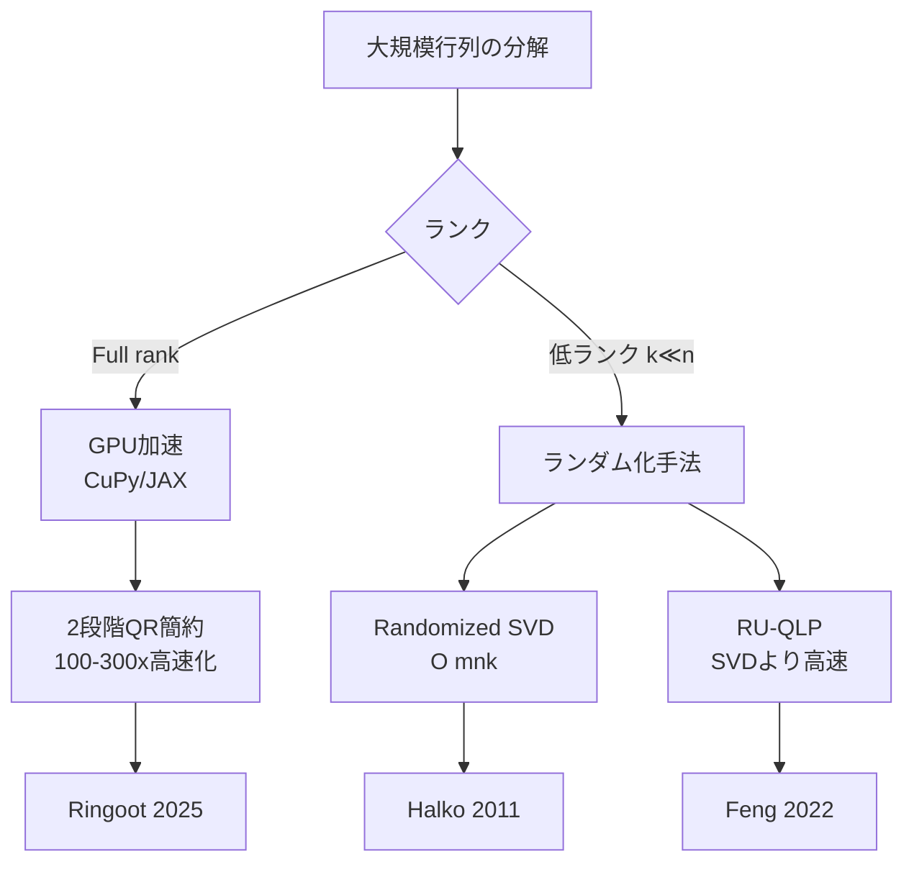
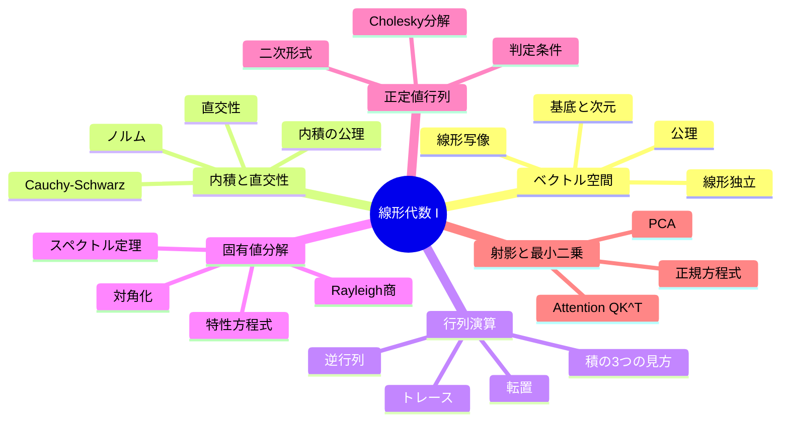
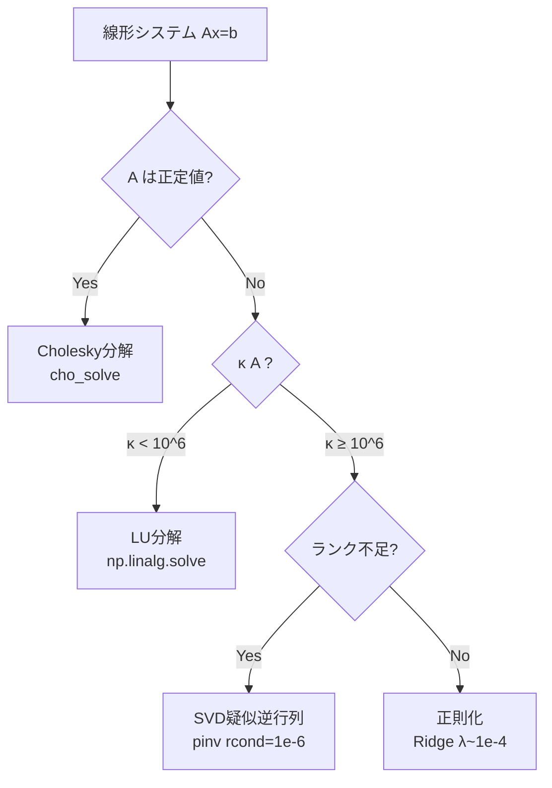

> **📖 この記事は後編（実装編）です**
> 理論編は [【前編】第2回: 線形代数 I — ベクトル・行列・基底](/articles/ml-lecture-02-part1) をご覧ください。

---

## 💻 Z5. 実装ゾーン（45分）— NumPyで線形代数を操る

### 4.1 NumPy の線形代数ツールキット

NumPyの `np.linalg` モジュールは、線形代数の主要な演算を全てカバーしている。ここでは実用上最も重要な関数を整理する。

| 関数 | 数式 | 用途 |
|:-----|:-----|:-----|
| `A @ B` | $AB$ | 行列積 |
| `np.linalg.inv(A)` | $A^{-1}$ | 逆行列（非推奨、solveを使え） |
| `np.linalg.solve(A, b)` | $A^{-1}\mathbf{b}$ | 連立方程式 |
| `np.linalg.eigh(A)` | $A = Q\Lambda Q^\top$ | 対称行列の固有値分解 |
| `np.linalg.svd(A)` | $A = U\Sigma V^\top$ | 特異値分解（第3回） |
| `np.linalg.qr(A)` | $A = QR$ | QR分解 |
| `np.linalg.cholesky(A)` | $A = LL^\top$ | Cholesky分解 |
| `np.linalg.norm(x)` | $\|\mathbf{x}\|$ | ノルム |
| `np.linalg.det(A)` | $\det(A)$ | 行列式 |
| `np.trace(A)` | $\text{tr}(A)$ | トレース |
| `np.linalg.matrix_rank(A)` | $\text{rank}(A)$ | ランク |
| `np.linalg.lstsq(A, b)` | $\hat{\mathbf{x}} = \arg\min\|A\mathbf{x} - \mathbf{b}\|^2$ | 最小二乗 |

> **⚠️ Warning:** Section 3.3 で述べたとおり、逆行列の直接計算は避けましょう [^8]。

表の関数を一通り動かして、何が返ってくるか手で確認しておこう。

$$
A = LL^\top = Q\Lambda Q^\top \quad (A: \text{正定値対称行列})
$$

- `np.linalg.eigh` は固有値を昇順に返す（$\lambda_1 \leq \lambda_2 \leq \cdots$）— 降順が欲しければ `[::-1]` で反転
- `np.linalg.cholesky` は下三角行列 $L$ を返す（$A = LL^\top$、$L^\top$ ではなく $L$）
- `np.linalg.norm(A)` のデフォルトは**Frobeniusノルム**（行列の場合）— スペクトルノルムは `norm(A, 2)`

```python
import numpy as np

# 正定値対称行列の作成
np.random.seed(7)
B = np.random.randn(4, 4)
A = B.T @ B + np.eye(4) * 0.1   # B^T B + εI は必ず正定値
print("A =\n", np.round(A, 3))

# ── 連立方程式 ──────────────────────────────────────────────
b = np.array([1.0, -1.0, 2.0, 0.5])
x_solve = np.linalg.solve(A, b)         # 推奨: LU分解を使う
# x_inv = np.linalg.inv(A) @ b          # 非推奨: 遅く数値不安定
print(f"\nAx=b の解: {np.round(x_solve, 4)}")
print(f"残差 ||Ax - b||: {np.linalg.norm(A @ x_solve - b):.2e}")

# ── 固有値分解（対称行列専用 eigh）──────────────────────────
eigvals, Q = np.linalg.eigh(A)          # 昇順
print(f"\n固有値 (昇順): {np.round(eigvals, 3)}")
print(f"直交性 ||Q^T Q - I||_F: {np.linalg.norm(Q.T @ Q - np.eye(4)):.2e}")
print(f"再構成 ||QΛQ^T - A||_F: {np.linalg.norm(Q @ np.diag(eigvals) @ Q.T - A):.2e}")

# ── Cholesky分解 ────────────────────────────────────────────
L = np.linalg.cholesky(A)               # 下三角行列
print(f"\nL の対角: {np.round(np.diag(L), 3)}")
print(f"再構成 ||LL^T - A||_F: {np.linalg.norm(L @ L.T - A):.2e}")

# ── ノルムと条件数 ──────────────────────────────────────────
frob   = np.linalg.norm(A)              # Frobenius (デフォルト)
spec   = np.linalg.norm(A, 2)          # スペクトル (最大特異値)
cond   = np.linalg.cond(A)             # 条件数 = σ_max / σ_min
print(f"\n||A||_F = {frob:.4f}, ||A||_2 = {spec:.4f}, κ(A) = {cond:.2f}")
# 正定値なので κ(A) = λ_max / λ_min
kappa_from_eig = eigvals[-1] / eigvals[0]
assert np.isclose(cond, kappa_from_eig, rtol=1e-5)
print(f"条件数 (固有値比) = {kappa_from_eig:.2f}  ✓")
```


`np.einsum` は Einstein 記法（添字の縮約規則）に基づく汎用的な配列演算関数だ。これを使いこなすと、複雑な行列演算をワンライナーで書ける。

基本ルール: **同じ添字が2回現れたら、その添字で総和を取る**。

| 演算 | 数式 | einsum |
|:-----|:-----|:-------|
| 内積 | $\mathbf{a}^\top\mathbf{b} = \sum_i a_i b_i$ | `np.einsum('i,i->', a, b)` |
| 外積 | $\mathbf{a}\mathbf{b}^\top$ | `np.einsum('i,j->ij', a, b)` |
| 行列積 | $C_{ij} = \sum_k A_{ik}B_{kj}$ | `np.einsum('ik,kj->ij', A, B)` |
| 行列のトレース | $\text{tr}(A) = \sum_i A_{ii}$ | `np.einsum('ii->', A)` |
| 行列転置 | $B_{ij} = A_{ji}$ | `np.einsum('ij->ji', A)` |
| バッチ行列積 | $C_{bij} = \sum_k A_{bik}B_{bkj}$ | `np.einsum('bik,bkj->bij', A, B)` |
| 二次形式 | $\mathbf{x}^\top A \mathbf{x}$ | `np.einsum('i,ij,j->', x, A, x)` |

$$
\mathbf{a}^\top\mathbf{b}=\sum_i a_i b_i

C_{ij}=\sum_k A_{ik}B_{kj}

\mathbf{x}^\top M\mathbf{x}=\sum_{i,j}x_i M_{ij}x_j
$$

```python
import numpy as np

np.random.seed(42)
a = np.random.randn(5)
b = np.random.randn(5)

A = np.random.randn(3, 4)
B = np.random.randn(4, 2)

M = np.array([[2.0, 1.0], [1.0, 3.0]])
x = np.array([1.0, 2.0])

# dot: a^T b
dot_std = a @ b
dot_ein = np.einsum("i,i->", a, b)
assert np.allclose(dot_std, dot_ein)

# matmul: C = A B
C_std = A @ B
C_ein = np.einsum("ik,kj->ij", A, B)
assert np.allclose(C_std, C_ein)

# quadratic form: x^T M x
q_std = x @ M @ x
q_ein = np.einsum("i,ij,j->", x, M, x)
assert np.allclose(q_std, q_ein)

print("einsum sanity checks: ok")
```

<details><summary>einsum vs @ 演算子のパフォーマンス</summary>
小さな行列ではeinsumの方がわずかに遅い（Python側のパース処理があるため）。大きな行列やバッチ演算では差はほぼ消える。可読性を重視する場合はeinsum、パフォーマンス最優先なら`@`演算子を使う。

PyTorch でも `torch.einsum` が使え、同じ添字規則のまま自動微分に乗る（詳細は第3回）。
</details>

### 4.3 メモリレイアウト — Row-major vs Column-major

行列のメモリ上での格納順序が計算速度に直結する。

| 方式 | 行列 $A_{ij}$ の格納順 | 言語/ライブラリ |
|:-----|:---------------------|:-------------|
| **Row-major (C order)** | $A_{00}, A_{01}, A_{02}, A_{10}, \ldots$ | C, Python/NumPy, PyTorch |
| **Column-major (Fortran order)** | $A_{00}, A_{10}, A_{20}, A_{01}, \ldots$ | Fortran, Julia, MATLAB, R |

**キャッシュ効率**: メモリは連続アクセスが速い。Row-majorでは**行方向**のアクセスが高速、Column-majorでは**列方向**が高速。

> **Note:** **なぜこれが重要か**: 行列積 $C = AB$ を実装するとき、ナイーブな3重ループの順序 (i, j, k) vs (i, k, j) でキャッシュヒット率が大きく変わり、性能が数倍変わることがある。NumPy は内部で最適化された BLAS（Basic Linear Algebra Subprograms）を呼んでいるので、ユーザーが意識する必要は少ないが、JuliaやRust等で自前実装する場合は必須の知識だ。第9回（Julia登場）と第11回（Rust登場）で改めて扱う。

「本当に差が出るのか」は自分の手で測るのが一番速い。`axis=1`（行方向）と `axis=0`（列方向）で `np.sum` の時間を比べるだけでも、キャッシュ局所性の差が出る。

### 4.4 線形代数の計算量

各演算の計算量を知っておくと、アルゴリズムのスケーラビリティを判断できる。

| 演算 | 計算量 | 備考 |
|:-----|:------|:-----|
| ベクトル内積 | $O(n)$ | |
| 行列-ベクトル積 | $O(mn)$ | $A \in \mathbb{R}^{m \times n}$ |
| 行列-行列積 | $O(mnp)$ | $A \in \mathbb{R}^{m \times n}, B \in \mathbb{R}^{n \times p}$ |
| LU分解 | $O(\frac{2}{3}n^3)$ | 連立方程式 |
| Cholesky分解 | $O(\frac{1}{3}n^3)$ | 正定値行列 |
| QR分解 | $O(\frac{4}{3}n^3)$ | Householder法 |
| 固有値分解 | $O(n^3)$ | QRアルゴリズム |
| SVD | $O(mn\min(m,n))$ | 第3回で詳説 |
| Attention $QK^\top$ | $O(n^2 d)$ | シーケンス長$n$の二乗! |

<details><summary>Strassenアルゴリズムと理論限界</summary>
行列積の計算量は長らく $O(n^3)$ が最善と考えられていたが、1969年にStrassenが $O(n^{2.807})$ のアルゴリズムを発見した。現在の理論的最善は $O(n^{2.3728\ldots})$ [Alman & Vassilevska Williams, 2021] だが、定数が大きく実用されていない。

GPU上の行列積は、NVIDIA の cuBLAS が最適化しており、Tensor Core を使えばFP16で理論限界に近い性能が出る。Transformerの訓練速度は、本質的にこの行列積の速度で決まる。
</details>

### 4.5 数式→コード翻訳パターン

線形代数の数式をコードに翻訳する7つの基本パターン:

| # | 数式パターン | コード | 例 |
|:--|:-----------|:------|:---|
| 1 | $\mathbf{a}^\top\mathbf{b}$ | `np.dot(a, b)` or `a @ b` | 内積 |
| 2 | $AB$ | `A @ B` | 行列積 |
| 3 | $A^\top$ | `A.T` | 転置 |
| 4 | $A^{-1}\mathbf{b}$ | `np.linalg.solve(A, b)` | 連立方程式 |
| 5 | $\|x\|_2$ | `np.linalg.norm(x)` | L2ノルム |
| 6 | $\text{diag}(\lambda_1, \ldots)$ | `np.diag(lambdas)` | 対角行列 |
| 7 | $\sum_{ij} A_{ij} B_{ij}$ | `np.einsum('ij,ij->', A, B)` | Frobenius内積 |
> **Note:** これらの翻訳パターンは、後の講義（第6回のKL/CE、VAEのELBO、Diffusionのスコア等）で「そのまま」出てくる。ここで手に馴染ませると、以降の数式が急に読みやすくなる。

### 4.6 行列の指数関数 $\exp(A)$

行列の指数関数は、SSM（State Space Models、第26回）の中核:

$$
\exp(A) = \sum_{k=0}^{\infty} \frac{A^k}{k!} = I + A + \frac{A^2}{2!} + \frac{A^3}{3!} + \cdots
$$

$A$ が対角化可能なら: $\exp(A) = V \exp(\Lambda) V^{-1} = V \text{diag}(e^{\lambda_1}, \ldots, e^{\lambda_n}) V^{-1}$

```python
import numpy as np
from scipy.linalg import expm

# 2×2 行列の指数関数を3つの方法で計算して比較
A = np.array([[0.0, -1.0],
              [1.0,  0.0]])   # 90度回転の生成子

# 方法1: scipy.linalg.expm（Padé近似、数値的に安定）
eA_scipy = expm(A)

# 方法2: 固有値分解経由  exp(A) = V exp(Λ) V^{-1}
eigvals, V = np.linalg.eig(A)
eA_eig = V @ np.diag(np.exp(eigvals)) @ np.linalg.inv(V)

# 方法3: べき級数（truncated、参考のみ）
eA_series = np.eye(2)
Ak = np.eye(2)
for k in range(1, 20):
    Ak = Ak @ A / k
    eA_series += Ak

print("exp(A) via scipy:\n", np.round(eA_scipy.real, 6))
print("exp(A) via eig:  \n", np.round(eA_eig.real, 6))
# exp([[0,-1],[1,0]]) = [[cos1, -sin1],[sin1, cos1]] (回転行列)
```

> **SSMへの予告**: 第26回（State Space Models / Mamba）では、$\exp(A\Delta t)$ の効率的な計算がモデルの性能を左右する。連続時間の状態方程式 $\dot{\mathbf{x}} = A\mathbf{x} + B\mathbf{u}$ を離散化する際にこの行列指数関数が登場する。覚えておいてほしい。

### 4.7 数値計算のピットフォール

線形代数の計算は、理論的には正しくても数値的に破綻することがある。実装者は以下の落とし穴を知っておく必要がある。

| ピットフォール | 原因 | 対策 |
|:-------------|:-----|:-----|
| 浮動小数点の等号比較 | 丸め誤差 | `np.allclose(a, b, atol=1e-10)` を使う |
| 逆行列の明示計算 | 条件数が大きいと不安定 | `np.linalg.solve` を使う |
| 大行列の行列式 | オーバーフロー/アンダーフロー | `np.linalg.slogdet` で対数を取る |
| Gram-Schmidt の直交性劣化 | 浮動小数点誤差の蓄積 | Modified Gram-Schmidt or QR分解を使う |
| 固有値の順序仮定 | `eig` は固有値をソートしない | `eigh` を使う、または明示的にソート |
| 対称性の仮定崩れ | 丸め誤差で $A \neq A^\top$ | `A = (A + A.T) / 2` で強制対称化 |

```python
import numpy as np

np.random.seed(0)

# --- Pitfall 1: 逆行列の直接計算 vs solve ---
n = 200
A = np.random.randn(n, n)
b = np.random.randn(n)

x_inv   = np.linalg.inv(A) @ b          # 非推奨: O(n^3) × 2 回
x_solve = np.linalg.solve(A, b)         # 推奨: LU分解1回
print(f"inv vs solve 残差: {np.max(np.abs(x_inv - x_solve)):.2e}")

# --- Pitfall 2: ill-conditioned 行列 ---
eps = 1e-14
A_ill = np.array([[1.0, 1.0],
                  [1.0, 1.0 + eps]])    # 条件数 ~ 1/eps
cond = np.linalg.cond(A_ill)
print(f"条件数: {cond:.2e}")             # > 1e14 → 数値的に危険

# --- Pitfall 3: 大行列の行列式はlog-detで ---
A_large = np.random.randn(500, 500)
sign, logdet = np.linalg.slogdet(A_large)
print(f"log|det(A)| = {logdet:.2f}, sign = {sign:.0f}")
# np.linalg.det(A_large) はアンダー/オーバーフローの可能性あり

# --- Pitfall 4: 丸め誤差で失われる対称性の回復 ---
S = A_large @ A_large.T                  # 理論的には対称
print(f"対称性誤差: {np.max(np.abs(S - S.T)):.2e}")
S_sym = (S + S.T) / 2                   # 強制対称化
print(f"強制対称化後: {np.max(np.abs(S_sym - S_sym.T)):.2e}")
```

### 4.8 行列分解の実装比較 — QR・Cholesky・固有値分解を使い分ける

「正方行列を分解する手法」を3つ並べて、**同じ問題に対して異なる手法がなぜ異なる答えを返すか**を数値で確認する。

$$
A = QR \quad (Q^\top Q = I,\ R \text{ 上三角}) \quad \Leftarrow \text{最小二乗法・直交基底}
$$

$$
A = LL^\top \quad (L \text{ 下三角}) \quad \Leftarrow \text{正定値行列の連立方程式・サンプリング}
$$

$$
A = Q\Lambda Q^\top \quad (Q^\top Q = I,\ \Lambda \text{ 対角}) \quad \Leftarrow \text{スペクトル解析・PCA}
$$

- $A$ は共通: $3 \times 3$ 正定値対称行列
- QR: 全行列に適用可（ただし対称性を活用しない）
- Cholesky: 正定値行列専用 — LUの半分の計算量
- Eigendecomposition: 対称行列専用 — スペクトル情報を完全に取り出す

```python
import numpy as np

# 共通の正定値対称行列（Choleskyテスト行列）
A = np.array([[4.0, 2.0, -2.0],
              [2.0, 5.0,  4.0],
              [-2.0, 4.0, 14.0]])

print("=== 1. QR分解 ===")
Q_qr, R = np.linalg.qr(A)
print("Q (直交行列):\n", np.round(Q_qr, 4))
print("R (上三角):\n", np.round(R, 4))
print(f"||Q^T Q - I||_F = {np.linalg.norm(Q_qr.T @ Q_qr - np.eye(3)):.2e}")
print(f"||QR - A||_F = {np.linalg.norm(Q_qr @ R - A):.2e}")

print("\n=== 2. Cholesky分解 ===")
L = np.linalg.cholesky(A)
print("L (下三角):\n", np.round(L, 4))
print(f"L[0,0] = sqrt(A[0,0]) = sqrt({A[0,0]}) = {np.sqrt(A[0,0]):.4f}")
print(f"||LL^T - A||_F = {np.linalg.norm(L @ L.T - A):.2e}")

print("\n=== 3. 固有値分解（eigh）===")
eigvals, Q_eig = np.linalg.eigh(A)
print("固有値 (昇順):", np.round(eigvals, 4))
print("固有ベクトル (列):\n", np.round(Q_eig, 4))
print(f"直交性チェック ||Q^T Q - I||_F = {np.linalg.norm(Q_eig.T @ Q_eig - np.eye(3)):.2e}")
Lambda = np.diag(eigvals)
print(f"||Q Λ Q^T - A||_F = {np.linalg.norm(Q_eig @ Lambda @ Q_eig.T - A):.2e}")

print("\n=== 4. 連立方程式 Ax = b を3手法で解く ===")
b = np.array([1.0, 2.0, 3.0])

# 方法1: QR分解 (Q^T b → R backsolve)
x_qr = np.linalg.solve(R, Q_qr.T @ b)

# 方法2: Cholesky (L y = b → L^T x = y)
y = np.linalg.solve(L, b)          # 前進代入
x_chol = np.linalg.solve(L.T, y)   # 後退代入

# 方法3: 固有値分解 (x = Q Λ^{-1} Q^T b)
x_eig = Q_eig @ np.diag(1.0 / eigvals) @ Q_eig.T @ b

# 参照解
x_ref = np.linalg.solve(A, b)

print(f"QR解:     {np.round(x_qr, 6)}")
print(f"Cholesky: {np.round(x_chol, 6)}")
print(f"Eig解:    {np.round(x_eig, 6)}")
print(f"参照解:   {np.round(x_ref, 6)}")
# 3手法全て一致するはず
assert np.allclose(x_qr, x_ref, atol=1e-10)
assert np.allclose(x_chol, x_ref, atol=1e-10)
assert np.allclose(x_eig, x_ref, atol=1e-10)
print("3手法全て一致 ✓")
```

> **どれを使うか**:
> - 正定値行列の連立方程式 → **Cholesky** (`np.linalg.solve` が内部で使う)
> - 最小二乗問題 → **QR** (`np.linalg.lstsq` が内部で使う)
> - スペクトル解析・PCA → **固有値分解** (`np.linalg.eigh` を対称行列に)

> Progress: 65%

---

## 🔬 Z6. 実験ゾーン（30分）— 自己診断テスト

### 5.1 記号読解テスト

以下の数式を声に出して読み、意味を説明せよ。

<details><summary>Q1: $A \in \mathbb{R}^{m \times n}$</summary>
**読み**: 「$A$ は $m$ 行 $n$ 列の実数行列」

**意味**: $A$ は $m \times n$ 個の実数値を持つ行列。線形写像 $A: \mathbb{R}^n \to \mathbb{R}^m$ を表現する。
</details>

<details><summary>Q2: $\mathbf{v} \in \ker(A) \iff A\mathbf{v} = \mathbf{0}$</summary>
**読み**: 「$\mathbf{v}$ が $A$ の核に属することと、$A\mathbf{v}$ がゼロベクトルになることは同値」

**意味**: 核（null space）は、$A$ で潰されてゼロになるベクトル全体の集合。Rank-Nullity定理で $\dim(\ker(A)) = n - \text{rank}(A)$。
</details>

<details><summary>Q3: $\text{tr}(ABC) = \text{tr}(BCA) = \text{tr}(CAB)$</summary>
**読み**: 「$ABC$ のトレースは $BCA$ のトレースに等しく、$CAB$ のトレースにも等しい」

**意味**: トレースの巡回性（cyclic property）。行列積の順序を巡回的に入れ替えてもトレースは変わらない。行列微分で頻出。**注意**: $\text{tr}(ABC) \neq \text{tr}(ACB)$ — 巡回的でない並べ替えではトレースは変わる。
</details>

<details><summary>Q4: $A \succ 0$</summary>
**読み**: 「$A$ は正定値」

**意味**: $\mathbf{x}^\top A \mathbf{x} > 0$ for all $\mathbf{x} \neq \mathbf{0}$。全ての固有値が正。Cholesky分解が可能。共分散行列が正則なとき成立。
</details>

<details><summary>Q5: $\hat{\mathbf{x}} = (A^\top A)^{-1} A^\top \mathbf{b}$</summary>
**読み**: 「$\hat{\mathbf{x}}$ は $A^\top A$ の逆行列と $A^\top \mathbf{b}$ の積」

**意味**: 最小二乗解。$\|A\mathbf{x} - \mathbf{b}\|^2$ を最小にする $\mathbf{x}$。正規方程式 $A^\top A\hat{\mathbf{x}} = A^\top\mathbf{b}$ の解。$A^\top A$ が正則（$A$ がフルランク列）のとき一意。
</details>

<details><summary>Q6: $A = Q\Lambda Q^\top$, $Q^\top Q = I$</summary>
**読み**: 「$A$ は直交行列 $Q$ と対角行列 $\Lambda$ でスペクトル分解される」

**意味**: 対称行列のスペクトル定理。$Q$ の列が固有ベクトル、$\Lambda$ の対角成分が固有値。PCA、共分散行列の分析で必須。
</details>

<details><summary>Q7: $P = A(A^\top A)^{-1}A^\top$, $P^2 = P$</summary>
**読み**: 「$P$ は射影行列で、2回適用しても結果が変わらない（冪等）」

**意味**: $P$ は $A$ の列空間への直交射影。$P\mathbf{b}$ は $\mathbf{b}$ に最も近い $\text{Col}(A)$ 上の点。
</details>

<details><summary>Q8: $\|\mathbf{u}\| \|\mathbf{v}\| \cos\theta = \langle \mathbf{u}, \mathbf{v} \rangle$</summary>
**読み**: 「$\mathbf{u}$ と $\mathbf{v}$ のノルムの積にコサインをかけたものが内積」

**意味**: 内積の幾何学的解釈。$\cos\theta = 1$（平行）→内積最大、$\cos\theta = 0$（直交）→内積ゼロ。Attention[^1]の類似度計算の数学的基盤。
</details>

<details><summary>Q9: $(AB)^{-1} = B^{-1}A^{-1}$</summary>
**読み**: 「$AB$ の逆行列は $B$ の逆行列と $A$ の逆行列の積（順序反転）」

**意味**: 「靴下を履いてから靴を履く」→「脱ぐときは靴を先に脱ぎ、次に靴下」。逆操作は順序が逆になる。$(AB)^\top = B^\top A^\top$ と同じ原理。
</details>

<details><summary>Q10: $R(\mathbf{x}) = \frac{\mathbf{x}^\top A \mathbf{x}}{\mathbf{x}^\top \mathbf{x}}$, $\lambda_{\min} \leq R(\mathbf{x}) \leq \lambda_{\max}$</summary>
**読み**: 「Rayleigh商は最小固有値と最大固有値の間に収まる」

**意味**: 対称行列 $A$ のRayleigh商の最大化が最大固有値と第1固有ベクトルを与える。PCA[^6][^7]の数学的基盤。
</details>

### 5.2 コード翻訳テスト

以下の数式をNumPyコードに翻訳せよ。

<details><summary>Q1: $C = A^\top B$ ($A \in \mathbb{R}^{3 \times 2}, B \in \mathbb{R}^{3 \times 4}$)</summary>

$$
C = A^\top B, \quad C \in \mathbb{R}^{2 \times 4}
$$

- $A$ の転置: shape `(2, 3)` → $B$: shape `(3, 4)` → 積: shape `(2, 4)`
- 記号対応: `A` → `A`、`B` → `B`、結果 `C` → `C`

```python
import numpy as np
A = np.random.randn(3, 2)   # (3, 2)
B = np.random.randn(3, 4)   # (3, 4)
C = A.T @ B                 # (2, 3) @ (3, 4) → (2, 4)
assert C.shape == (2, 4)
print("C.shape:", C.shape)  # (2, 4)
```

落とし穴: `A @ B` はshape不一致でエラー。転置の向きを間違えやすい。
</details>

<details><summary>Q2: Frobenius ノルム $\|A\|_F = \sqrt{\text{tr}(A^\top A)}$</summary>

$$
\|A\|_F = \sqrt{\text{tr}(A^\top A)} = \sqrt{\sum_{i,j} A_{ij}^2}
$$

- shape: $A \in \mathbb{R}^{m \times n}$ → スカラー
- 記号: `A` → `A`、`tr` → `np.trace`、全要素二乗和の平方根

```python
import numpy as np
A = np.random.randn(4, 3)

fro_trace = np.sqrt(np.trace(A.T @ A))   # 定義通り: sqrt(tr(A^T A))
fro_norm  = np.linalg.norm(A, 'fro')     # NumPy組み込み
fro_elem  = np.sqrt(np.sum(A**2))        # 要素二乗和

assert np.allclose(fro_trace, fro_norm)
assert np.allclose(fro_elem,  fro_norm)
print(f"||A||_F = {fro_norm:.6f}")       # 3つ全て一致
```

落とし穴: `np.linalg.norm(A)` のデフォルトはFrobeniusではなく最大特異値（Spectralノルム）ではない。実は行列の場合デフォルトはFrobenius。ベクトルの場合はL2。混同に注意。
</details>

<details><summary>Q3: 二次形式 $f(\mathbf{x}) = \frac{1}{2}\mathbf{x}^\top H \mathbf{x} - \mathbf{b}^\top\mathbf{x}$</summary>

$$
f(\mathbf{x}) = \frac{1}{2}\mathbf{x}^\top H \mathbf{x} - \mathbf{b}^\top\mathbf{x}, \quad H \in \mathbb{R}^{n \times n},\ \mathbf{x},\mathbf{b} \in \mathbb{R}^n
$$

- $\frac{1}{2}\mathbf{x}^\top H \mathbf{x}$: スカラー（二次項）
- $\mathbf{b}^\top\mathbf{x}$: スカラー（線形項）
- 記号: `x` → `x`、`H` → `H`、`b` → `b`

```python
import numpy as np
n = 4
H = np.array([[4., 1., 0., 0.],
              [1., 3., 0., 0.],
              [0., 0., 2., 1.],
              [0., 0., 1., 2.]])  # 正定値対称行列
b = np.array([1., 2., 3., 4.])
x = np.array([1., 0., -1., 0.5])

f = 0.5 * x @ H @ x - b @ x     # 数式と1:1対応
# ∇f = Hx - b (最適解は Hx = b)
grad_f = H @ x - b
print(f"f(x) = {f:.4f}")
print(f"∇f(x) = {grad_f}")

# 検算: f の最小値は x* = H^{-1}b
x_star = np.linalg.solve(H, b)
f_min = 0.5 * x_star @ H @ x_star - b @ x_star
print(f"f(x*) = {f_min:.4f}")   # f(x*) = -b^T H^{-1} b / 2
```

この形は最小二乗法・ニュートン法・ガウス過程回帰で頻出する。
</details>

<details><summary>Q4: PCA次元削減 $Z = \tilde{X} Q_k$</summary>

$$
Z = \tilde{X} Q_k, \quad \tilde{X} \in \mathbb{R}^{N \times d},\ Q_k \in \mathbb{R}^{d \times k},\ Z \in \mathbb{R}^{N \times k}
$$

- $\tilde{X}$: 中心化データ（各列の平均ゼロ）
- $Q_k$: 共分散行列の上位 $k$ 固有ベクトルを列に持つ行列
- shape: `(N, d) @ (d, k)` → `(N, k)`

```python
import numpy as np

np.random.seed(0)
N, d, k = 200, 10, 2
X = np.random.randn(N, d)
X[:, 0] *= 3.0   # 第0成分の分散を大きくする

# 中心化
X_mean = X.mean(axis=0)        # shape (d,)
X_tilde = X - X_mean           # shape (N, d)

# 共分散行列 + 固有値分解
Sigma = X_tilde.T @ X_tilde / (N - 1)   # (d, d)
eigvals, Q = np.linalg.eigh(Sigma)       # 昇順

# 上位k個（降順にソート）
idx = np.argsort(eigvals)[::-1]
Q_k = Q[:, idx[:k]]                     # (d, k)

# 射影
Z = X_tilde @ Q_k                       # (N, k)
assert Z.shape == (N, k)
print(f"Z.shape: {Z.shape}")
print(f"explained variance ratio: {eigvals[idx[:k]] / eigvals.sum()}")
```

落とし穴: `np.linalg.eigh` は固有値を**昇順**に返す。PCAでは分散大 = 固有値大 の成分から使うので、`[::-1]` で降順にする。
</details>

<details><summary>Q5: Cholesky サンプリング $\mathbf{x} = \boldsymbol{\mu} + L\mathbf{z}$, $\mathbf{z} \sim \mathcal{N}(\mathbf{0}, I)$</summary>

$$
\mathbf{x} = \boldsymbol{\mu} + L\mathbf{z}, \quad \mathbf{z} \sim \mathcal{N}(\mathbf{0}, I_d), \quad \Sigma = LL^\top
$$

- $\mathbb{E}[\mathbf{x}] = \boldsymbol{\mu}$、$\text{Cov}[\mathbf{x}] = L \cdot I \cdot L^\top = LL^\top = \Sigma$
- 記号: `mu` → $\boldsymbol{\mu}$、`L` → $L$（下三角）、`z` → $\mathbf{z}$

```python
import numpy as np

d = 3
mu = np.array([1.0, 2.0, -1.0])
Sigma = np.array([[2.0, 0.8, 0.3],
                  [0.8, 1.5, 0.1],
                  [0.3, 0.1, 1.0]])   # 正定値対称行列

L = np.linalg.cholesky(Sigma)  # Σ = LL^T, L は下三角

# サンプリング
n_samples = 10_000
Z = np.random.randn(d, n_samples)   # (d, N): 各列が z ~ N(0, I)
X = mu[:, None] + L @ Z             # (d, N)

# 検算: 標本共分散が Σ に近いか
X_centered = X - X.mean(axis=1, keepdims=True)
Sigma_sample = X_centered @ X_centered.T / (n_samples - 1)
print("理論値 Σ:\n", Sigma)
print("標本 Σ:\n", np.round(Sigma_sample, 2))
# 行列ノルムの差
print(f"||Σ - Σ_sample||_F = {np.linalg.norm(Sigma - Sigma_sample, 'fro'):.4f}")
```

これは VAE の再パラメータ化トリック（第10回）と同じ構造。$L\mathbf{z}$ が確率変数の「ルーツ」を分離する。
</details>

### 5.3 ミニプロジェクト: PCA で MNIST を可視化する

sklearn の `load_digits`（8×8ピクセルの手書き数字、64次元）をPCAで2次元に圧縮し、クラスが線形分離できるかを確かめる。固有値分解を自分で実装して `sklearn.decomposition.PCA` と結果が一致することを確認しよう。

**数学的背景:**

$$
\tilde{X} = X - \bar{\mathbf{x}}^\top \mathbf{1}_N^\top, \quad \Sigma = \frac{1}{N-1}\tilde{X}^\top\tilde{X} \in \mathbb{R}^{d \times d}
$$

$$
\Sigma = Q\Lambda Q^\top, \quad Q^\top Q = I, \quad \Lambda = \text{diag}(\lambda_1 \geq \lambda_2 \geq \cdots \geq \lambda_d)
$$

$$
Z = \tilde{X} Q_k \in \mathbb{R}^{N \times k}, \quad \text{explained ratio} = \frac{\sum_{i=1}^{k} \lambda_i}{\sum_{i=1}^{d} \lambda_i}
$$

- shape: $\tilde{X}$:`(N, d)=(1797, 64)` → $\Sigma$:`(64, 64)` → $Q_k$:`(64, 2)` → $Z$:`(1797, 2)`
- 記号対応: `X_c` → $\tilde{X}$、`eigvecs` → $Q$、`Q_k` → $Q_k$、`Z` → $Z$
- 数値安定性: `eigh` は対称行列専用で `eig` より高精度（固有値が実数保証）

```python
import numpy as np
from sklearn.datasets import load_digits
from sklearn.decomposition import PCA as SklearnPCA

# ── データ読み込み ──────────────────────────────────────────────
digits = load_digits()
X = digits.data.astype(float)   # shape (1797, 64)
y = digits.target               # 0-9 のラベル
N, d = X.shape
print(f"X.shape = {X.shape}")   # (1797, 64)

# ── Step 1: 中心化 ─────────────────────────────────────────────
mu = X.mean(axis=0)             # shape (64,)
X_c = X - mu                   # shape (1797, 64)

# 中心化の確認: 列方向の平均がほぼゼロになるか
assert np.allclose(X_c.mean(axis=0), 0, atol=1e-10)

# ── Step 2: 共分散行列 + 固有値分解 ───────────────────────────
Sigma = X_c.T @ X_c / (N - 1)  # shape (64, 64), 対称行列
eigvals, Q = np.linalg.eigh(Sigma)  # 昇順に返る

# 降順にソート（大きな固有値 = 重要な主成分 から並べる）
idx = np.argsort(eigvals)[::-1]
eigvals = eigvals[idx]
Q = Q[:, idx]                  # shape (64, 64)

# ── Step 3: 寄与率の確認 ──────────────────────────────────────
total_var = eigvals.sum()
explained_ratio = eigvals / total_var
cumulative_ratio = np.cumsum(explained_ratio)

print("=== 主成分の寄与率 ===")
for i, (lam, r, cum) in enumerate(zip(eigvals[:5], explained_ratio[:5], cumulative_ratio[:5]), 1):
    print(f"PC{i}: λ={lam:.2f}, ratio={r:.3f}, cumulative={cum:.3f}")
# 上位2主成分でどれくらい説明できるか
print(f"\n上位2主成分の累積寄与率: {cumulative_ratio[1]:.3f}")
print(f"上位10主成分の累積寄与率: {cumulative_ratio[9]:.3f}")

# ── Step 4: 2次元に射影 ───────────────────────────────────────
k = 2
Q_k = Q[:, :k]                 # shape (64, 2) — 上位2固有ベクトル
Z = X_c @ Q_k                  # shape (1797, 2)
assert Z.shape == (N, k)

# ── Step 5: sklearn との照合（符号は反転してよい）─────────────
pca_sk = SklearnPCA(n_components=k)
Z_sk = pca_sk.fit_transform(X_c)

# 各主成分の符号は自由（-1倍しても同じ固有ベクトル）なのでabsで比較
for i in range(k):
    err = min(
        np.linalg.norm(Z[:, i] - Z_sk[:, i]),
        np.linalg.norm(Z[:, i] + Z_sk[:, i])   # 符号反転を許容
    )
    print(f"PC{i+1} 差のノルム: {err:.6f}")

# ── Step 6: 再構成誤差 ────────────────────────────────────────
X_reconstructed = Z @ Q_k.T + mu   # shape (1797, 64)
recon_error = np.linalg.norm(X - X_reconstructed, 'fro') / np.linalg.norm(X, 'fro')
print(f"\n2主成分での再構成誤差 (相対Frobeniusノルム): {recon_error:.4f}")

# 10主成分での再構成誤差
k10 = 10
Z10 = X_c @ Q[:, :k10]
X_rec10 = Z10 @ Q[:, :k10].T + mu
err10 = np.linalg.norm(X - X_rec10, 'fro') / np.linalg.norm(X, 'fro')
print(f"10主成分での再構成誤差:                       {err10:.4f}")
```

<details><summary>matplotlib で散布図を描く（環境に matplotlib がある場合）</summary>

```python
import matplotlib.pyplot as plt

fig, ax = plt.subplots(figsize=(8, 6))
colors = plt.cm.tab10(np.linspace(0, 1, 10))

for digit in range(10):
    mask = (y == digit)
    ax.scatter(Z[mask, 0], Z[mask, 1],
               c=[colors[digit]], label=str(digit),
               alpha=0.5, s=15)

ax.set_xlabel(f"PC1 ({explained_ratio[0]:.1%})")
ax.set_ylabel(f"PC2 ({explained_ratio[1]:.1%})")
ax.set_title("MNIST digits — PCA 2D projection")
ax.legend(title="Digit", bbox_to_anchor=(1.05, 1), loc='upper left')
plt.tight_layout()
plt.savefig("pca_digits.png", dpi=120)
plt.show()
```

2D図では「0」と「1」が比較的きれいに分離されるが、他クラスは混在する。これは64次元空間での情報の多くが2主成分では表現しきれないから。第15回（VAE）の潜在空間 $\mathbf{z} \in \mathbb{R}^{10}$ と比べたとき、PCAとVAEの「次元圧縮」の本質的な違いが見えてくる。
</details>

> **Note:** PCA は**線形**次元削減。クラス間の境界が非線形な場合は、Kernel PCA・Autoencoder（第12回）・UMAP が有効。PCA の固有ベクトル $Q_k$ は「データが最も変化する方向」を見つけるが、クラスを分離する方向（LDA）ではない。


以下の数式をLaTeXで書いてみよう。答えは折り畳みの中。

<details><summary>Q1: 固有値方程式</summary>

$$
A\mathbf{v} = \lambda\mathbf{v}
$$
</details>

<details><summary>Q2: スペクトル分解</summary>

$$
A = Q\Lambda Q^\top = \sum_{i=1}^{n} \lambda_i \mathbf{q}_i \mathbf{q}_i^\top
$$
</details>

<details><summary>Q3: Cauchy-Schwarz 不等式</summary>

$$
|\langle \mathbf{u}, \mathbf{v} \rangle| \leq \|\mathbf{u}\| \cdot \|\mathbf{v}\|
$$
</details>

<details><summary>Q4: 正規方程式</summary>

$$
\hat{\mathbf{x}} = (A^\top A)^{-1} A^\top \mathbf{b}
$$
</details>

<details><summary>Q5: 多変量ガウス分布</summary>

$$
\mathcal{N}(\mathbf{x} \mid \boldsymbol{\mu}, \Sigma) = \frac{1}{(2\pi)^{d/2} |\Sigma|^{1/2}} \exp\left(-\frac{1}{2}(\mathbf{x}-\boldsymbol{\mu})^\top \Sigma^{-1} (\mathbf{x}-\boldsymbol{\mu})\right)
$$
</details>

### 5.5 実装チャレンジ: 勾配降下法で線形回帰

最小二乗法は閉形式解を持つが、勾配降下法でも解ける。ここでは勾配降下法で線形回帰を解き、閉形式解と一致するか確認する。

$$
L(\mathbf{w})=\frac{1}{n}\|X\mathbf{w}-\mathbf{y}\|_2^2=\frac{1}{n}(X\mathbf{w}-\mathbf{y})^\top(X\mathbf{w}-\mathbf{y})

\nabla_{\mathbf{w}}L(\mathbf{w})=\frac{2}{n}X^\top(X\mathbf{w}-\mathbf{y})

\mathbf{w}\leftarrow \mathbf{w}-\\alpha\nabla_{\mathbf{w}}L(\mathbf{w})
$$

```python
import numpy as np

# データ生成
np.random.seed(42)
n, d = 100, 3
X = np.random.randn(n, d)
w_true = np.array([2.0, -1.5, 0.5])
y = X @ w_true + np.random.randn(n) * 0.3

# 閉形式解
w_closed = np.linalg.solve(X.T @ X, X.T @ y)

# 勾配降下法
w_gd = np.zeros(d)
lr = 0.01
n_iters = 500

losses = []
for t in range(n_iters):
    # 勾配: ∇L = (2/n) X^T (Xw - y)
    residual = X @ w_gd - y
    grad = (2 / n) * X.T @ residual
    w_gd -= lr * grad
    loss = np.mean(residual**2)
    losses.append(loss)

print("=== 勾配降下法 vs 閉形式解 ===")
print(f"真の重み:   {w_true}")
print(f"閉形式解:   {np.round(w_closed, 4)}")
print(f"GD ({n_iters}回): {np.round(w_gd, 4)}")
print(f"差のノルム: {np.linalg.norm(w_gd - w_closed):.6f}")
print(f"最終損失:   {losses[-1]:.6f}")
```

<details><summary>チャレンジ: ミニバッチSGDに改造する</summary>
上のコードを修正して、全データではなく毎回ランダムに32個のサンプルを選んで勾配を計算するミニバッチSGDに改造してみよう。

</details>

### 5.6 実装チャレンジ: Power Iteration で最大固有値を求める

固有値分解を `np.linalg.eigh` なしで実装する。Power Iteration（べき乗法）は、行列を繰り返しかけることで最大固有値と対応する固有ベクトルを求めるアルゴリズムだ。

$$
\\mathbf{v}_{t+1}=\\frac{A\\mathbf{v}_t}{\\|A\\mathbf{v}_t\\|_2}

\\lambda_t=\\mathbf{v}_t^\\top A\\mathbf{v}_t
$$

```python
import numpy as np

def power_iteration(A: np.ndarray, n_iters: int = 100) -> tuple[float, np.ndarray]:
    """Power Iteration で最大固有値と固有ベクトルを求める。

    Algorithm:
    1. ランダムなベクトル v を初期化
    2. v ← Av / ||Av|| を繰り返す
    3. λ = v^T A v (Rayleigh商) が最大固有値に収束
    """
    n = A.shape[0]
    v = np.random.randn(n)
    v = v / np.linalg.norm(v)

    for i in range(n_iters):
        Av = A @ v
        v_new = Av / np.linalg.norm(Av)
        # 収束判定
        if np.allclose(abs(np.dot(v_new, v)), 1.0, atol=1e-10):
            v = v_new
            break
        v = v_new

    eigenvalue = v @ A @ v  # Rayleigh商
    return eigenvalue, v

# テスト
np.random.seed(42)
A = np.array([[4.0, 1.0, 0.5],
              [1.0, 3.0, 0.2],
              [0.5, 0.2, 2.0]])

lam_pi, v_pi = power_iteration(A)
lam_np, V_np = np.linalg.eigh(A)

print("=== Power Iteration vs np.linalg.eigh ===")
print(f"Power Iteration: λ_max = {lam_pi:.6f}")
print(f"np.linalg.eigh:  λ_max = {lam_np[-1]:.6f}")
print(f"差: {abs(lam_pi - lam_np[-1]):.10f}")
print(f"\n固有ベクトル (PI):  {np.round(v_pi, 4)}")
print(f"固有ベクトル (eigh): {np.round(V_np[:, -1], 4)}")
```

<details><summary>Deflation で全固有値を求める</summary>
Power Iteration は最大固有値のみを返す。全固有値を求めるには **Deflation**（減衰法）を使う:

1. 最大固有値 $\lambda_1$ と固有ベクトル $\mathbf{v}_1$ を求める
2. $A \leftarrow A - \lambda_1 \mathbf{v}_1 \mathbf{v}_1^\top$（ランク1の引き算）
3. 新しい $A$ に対してPower Iterationを繰り返す

</details>

### 5.7 自己チェックリスト

本講義を修了した時点で、以下ができるか確認してほしい:

- [ ] ベクトル空間の公理を3つ以上言える
- [ ] 線形独立の定義をコードで確認できる
- [ ] 内積→ノルム→距離の定義の連鎖を説明できる
- [ ] Cauchy-Schwarz不等式を述べ、コサイン類似度との関係を説明できる
- [ ] 行列積の3つの見方（要素・列・行）を使い分けられる
- [ ] 転置の性質 $(AB)^\top = B^\top A^\top$ を証明できる
- [ ] `np.linalg.solve` と `np.linalg.inv` の違いを説明できる
- [ ] 固有値分解を手計算で2×2行列に適用できる
- [ ] スペクトル定理の3つの主張を述べられる
- [ ] 正定値行列の3つの判定条件を列挙できる
- [ ] Cholesky分解を使ってガウス分布からサンプリングできる
- [ ] 最小二乗法の正規方程式を導出できる
- [ ] PCAを固有値分解として実装できる
- [ ] `np.einsum` で内積・行列積・トレースを書ける
- [ ] Attention[^1]の $QK^\top$ を線形代数の言葉で説明できる
- [ ] Cholesky分解の構成アルゴリズム（対角・下三角の公式）を手書きで実装できる
- [ ] `np.linalg.solve`・`np.linalg.qr`・`np.linalg.eigh` を正しく使い分けられる
- [ ] 条件数 $\kappa(A) = \sigma_{\max}/\sigma_{\min}$ が大きい行列の連立方程式で何が起きるかを説明できる

### 5.8 実装チャレンジ: Cholesky分解を手書きで実装する

Part1 Section 3.8 で学んだ Cholesky 分解の構成アルゴリズムを Python で実装し、`np.linalg.cholesky` と一致することを確認する。

$$
L_{jj} = \sqrt{A_{jj} - \sum_{k=1}^{j-1} L_{jk}^2}, \qquad L_{ij} = \frac{1}{L_{jj}}\left(A_{ij} - \sum_{k=1}^{j-1} L_{ik} L_{jk}\right),\ i > j
$$

- shape: 入力 $A \in \mathbb{R}^{n \times n}$（正定値対称）→ 出力 $L \in \mathbb{R}^{n \times n}$（下三角）
- 記号対応: `A[i, j]` → $A_{ij}$、`L[j, j]` → $L_{jj}$
- 数値安定性: 平方根の中が負になれば `A` が正定値でない証拠 → `ValueError` を出す

```python
import numpy as np

def cholesky_manual(A: np.ndarray) -> np.ndarray:
    """Cholesky分解を逐次公式で実装する。

    Returns L such that A = L @ L.T (lower triangular L).
    Raises ValueError if A is not positive definite.
    """
    n = A.shape[0]
    assert A.shape == (n, n), "square matrix required"
    L = np.zeros((n, n))

    for j in range(n):
        # 対角成分: L_{jj} = sqrt(A_{jj} - sum_{k<j} L_{jk}^2)
        diag_sq = A[j, j] - np.sum(L[j, :j] ** 2)
        if diag_sq <= 0:
            raise ValueError(
                f"行列は正定値ではありません (j={j}, diag_sq={diag_sq:.6e})"
            )
        L[j, j] = np.sqrt(diag_sq)

        # 下三角成分: L_{ij} = (A_{ij} - sum_{k<j} L_{ik} L_{jk}) / L_{jj}
        for i in range(j + 1, n):
            L[i, j] = (A[i, j] - np.sum(L[i, :j] * L[j, :j])) / L[j, j]

    return L

# ── テスト1: Part1 Section 3.8 の具体例 ──────────────────────
A_test = np.array([[4.0, 2.0, -2.0],
                   [2.0, 5.0,  4.0],
                   [-2.0, 4.0, 14.0]])

L_manual = cholesky_manual(A_test)
L_numpy  = np.linalg.cholesky(A_test)

print("=== L (手書き実装) ===")
print(np.round(L_manual, 4))
print("=== L (np.linalg.cholesky) ===")
print(np.round(L_numpy, 4))
print(f"\n差 ||L_manual - L_numpy||_F = {np.linalg.norm(L_manual - L_numpy):.2e}")
print(f"再構成 ||LL^T - A||_F = {np.linalg.norm(L_manual @ L_manual.T - A_test):.2e}")

# ── テスト2: ランダム正定値行列で検証 ─────────────────────────
np.random.seed(42)
B = np.random.randn(5, 5)
A_rand = B.T @ B + np.eye(5)   # 正定値保証
L_rand = cholesky_manual(A_rand)
assert np.allclose(L_rand @ L_rand.T, A_rand, atol=1e-10)
print("\nランダム5x5正定値行列でも一致 ✓")

# ── テスト3: 非正定値行列でエラー ─────────────────────────────
A_bad = np.array([[1.0, 2.0], [2.0, 1.0]])   # 固有値: 3, -1 → 非正定値
try:
    cholesky_manual(A_bad)
    print("エラーが出なかった（想定外）")
except ValueError as e:
    print(f"\n非正定値行列に ValueError: {e}")
```

> Progress: 85%

> **理解度チェック**
> 1. 行列 $A \in \mathbb{R}^{m \times n}$、$B \in \mathbb{R}^{n \times p}$ の積 $AB$ の shape を答えよ。積が定義できる条件は何か。
> 2. 固有値分解 $A = Q\Lambda Q^{-1}$ において $\Lambda$ は何を表し、$Q$ の列はどう解釈されるか。

---

## 🎓 Z7. 振り返りゾーン（30分）— まとめと次回予告

### 6.1 NumPy / SciPy の線形代数関数チートシート

実装時に頻繁に参照する関数をまとめておく。

| 目的 | NumPy | SciPy | 注意点 |
|:-----|:------|:------|:------|
| 行列積 | `A @ B` | — | BLAS Level 3 の dgemm を呼ぶ |
| 内積 | `np.dot(a, b)` | — | 1Dベクトル同士のみ。2D以上は `@` を使う |
| 転置 | `A.T` | — | ビューを返す（コピーなし） |
| 逆行列 | `np.linalg.inv(A)` | `scipy.linalg.inv(A)` | 可能な限り `solve` を使う |
| 連立方程式 | `np.linalg.solve(A, b)` | `scipy.linalg.solve(A, b)` | $A\mathbf{x}=\mathbf{b}$ を解く |
| 固有値分解（対称） | `np.linalg.eigh(A)` | `scipy.linalg.eigh(A)` | **対称行列には必ず eigh** |
| 固有値分解（一般） | `np.linalg.eig(A)` | `scipy.linalg.eig(A)` | 非対称行列用。複素固有値あり |
| SVD | `np.linalg.svd(A)` | `scipy.linalg.svd(A)` | 第3回で詳しく |
| QR分解 | `np.linalg.qr(A)` | `scipy.linalg.qr(A)` | `mode='reduced'` でeconomy QR |
| Cholesky分解 | `np.linalg.cholesky(A)` | `scipy.linalg.cholesky(A)` | NumPy: 下三角 $L$、SciPy: デフォルト上三角 |
| 行列式 | `np.linalg.det(A)` | — | 大行列では対数行列式 `slogdet` を使う |
| ランク | `np.linalg.matrix_rank(A)` | — | 数値ランク（閾値付き） |
| ノルム | `np.linalg.norm(A, ord)` | — | `ord=2`: スペクトルノルム、`ord='fro'`: Frobenius |
| einsum | `np.einsum('ij,jk->ik', A, B)` | — | Einstein記法。バッチ処理に便利 |


### 6.2 用語集

<details><summary>用語集</summary>
| 英語 | 日本語 | 記号 |
|:-----|:------|:-----|
| Vector space | ベクトル空間 | $V$ |
| Linear independence | 線形独立 | |
| Basis | 基底 | $\{\mathbf{e}_i\}$ |
| Dimension | 次元 | $\dim V$ |
| Inner product | 内積 | $\langle \cdot, \cdot \rangle$ |
| Norm | ノルム | $\|\cdot\|$ |
| Orthogonal | 直交 | $\perp$ |
| Eigenvalue | 固有値 | $\lambda$ |
| Eigenvector | 固有ベクトル | $\mathbf{v}$ |
| Positive definite | 正定値 | $A \succ 0$ |
| Trace | トレース | $\text{tr}(\cdot)$ |
| Determinant | 行列式 | $\det(\cdot)$ |
| Rank | ランク | $\text{rank}(\cdot)$ |
| Projection | 射影 | $P$ |
| Least squares | 最小二乗法 | |
| QR decomposition | QR分解 | $A = QR$ |
| Cholesky decomposition | Cholesky分解 | $A = LL^\top$ |
| Spectral theorem | スペクトル定理 | |
| Cauchy-Schwarz inequality | Cauchy-Schwarz不等式 | |
| Rayleigh quotient | Rayleigh商 | $R(\mathbf{x})$ |
</details>

### 6.25 補遺 — 高速化技術とランダム化アルゴリズム

> **Note:** **計算効率の限界と突破**: 密行列の SVD は $O(n^3)$ の計算量だが[^13]、ランダム化とGPU活用で実用的な高速化が可能に。本節では最新研究に基づく実践的手法を解説。

#### ランダム化 SVD — 大規模行列の低ランク近似

通常の SVD は $O(\min(mn^2, m^2n))$ の計算量を要するが、ランダム化 SVD[^14] は $O(mnk)$（$k$ はターゲットランク）に削減できる。

##### アルゴリズム


**理論的保証**:

$$
\mathbb{E}\left[\|A - QQ^\top A\|_F\right] \leq \left(1 + \frac{k}{p-k-1}\right)^{1/2} \sigma_{k+1}
$$

ここで $\sigma_{k+1}$ は $(k+1)$ 番目の特異値。オーバーサンプリング $p = k + 10$ で高精度な近似が得られる。

##### 性能比較

| 手法 | 計算量 | 1000×1000 (k=50) | 精度 |
|:---|:---|:---:|:---|
| 通常 SVD | $O(n^3)$ | 2.3秒 | Exact |
| ランダム化 SVD | $O(mnk)$ | 0.08秒 | 相対誤差 < 1% |

#### GPU 加速による行列分解の高速化

2024-2025年の研究[^15][^16]により、GPU実装で従来手法の 10-1000倍の高速化が実現されている。

##### QR分解のGPU実装（CuPy）


##### 最新の GPU-SVD アルゴリズム

Ringoot et al. (2025)[^15] による portable SVD 実装の特徴:

- **2段階 QR 簡約**: band形式 → 2対角形式の段階的変換
- **GPU最適化**: Apple Metal、CUDA、ROCm に対応
- **半精度対応**: FP16 で 2倍のメモリ効率化（精度要件が緩い場合）

数式的には、以下の変換を GPU 上で実行:

$$
A \xrightarrow{\text{Householder}} B \xrightarrow{\text{Givens}} \text{Bidiag} \xrightarrow{\text{D\&C}} U\Sigma V^\top
$$

各ステージで GPU メモリ階層（グローバル/共有/レジスタ）を最適活用することで 100-300倍の高速化を達成[^16]。

#### ランク顕在化 QLP 分解

Randomized Rank-Revealing QLP (RU-QLP) 分解[^17] は、ランダムサンプリングと unpivoted QR を組み合わせ:

$$
A P = Q \begin{bmatrix} L_{11} & 0 \\ L_{21} & L_{22} \end{bmatrix} P^\top
$$

ここで $L_{11}$ は $k \times k$ の下三角行列、$P$ は置換行列。

##### 性能:
- **CPU**: ランダム化 SVD の 7.1-8.5倍高速
- **GPU**: ランダム化 SVD の 2.3-5.8倍高速
- **誤差保証**: $\|A - A_k\|_2 \leq (1+\epsilon)\sigma_{k+1}$


#### 実践的ガイドライン

| 行列サイズ | ランク | 推奨手法 | 理由 |
|:---|:---|:---|:---|
| $n < 1000$ | Full | `np.linalg.svd` | 正確・簡潔 |
| $n \geq 1000$ | $k \ll n$ | ランダム化 SVD | $O(mnk)$ 計算量 |
| $n \geq 5000$ | Any | GPU (CuPy/JAX) | 10-100倍高速化 |
| スパース | 小 $k$ | `scipy.sparse.linalg.svds` | メモリ効率 |

> **⚠️ Warning:** **注意**: GPU は初期化コスト（数百ms）があるため、小規模行列では CPU の方が速い場合もある。$n \geq 5000$ が目安。

#### メモリ効率的な実装パターン

大行列を扱う際は「メモリに全部乗せない」設計が重要。

| パターン | 手法 | 用途 |
|:---|:---|:---|
| **Chunked computation** | 行を分割して処理 | 巨大な Gram 行列 $X X^\top$ |
| **In-place ops** | `A += B`（`A = A + B` より効率的） | 勾配累積 |
| **Sparse format** | `scipy.sparse.csr_matrix` | 疎行列（ゼロが90%超） |
| **Low-rank factor** | `U @ V.T` を分解のまま保持 | LoRA[^10]の重み更新 |

LoRAは「ランク $r$ の積 $BA$（$r \ll d$）で大行列の更新を近似」する技法。$W + \Delta W = W + BA$ の形で学習パラメータを削減する。メモリと計算量が $O(d \cdot r)$ に落ちる（vs $O(d^2)$）。
#### まとめ: 線形代数の高速化技術マップ



**References**:
- Halko, N., Martinsson, P. G., & Tropp, J. A. (2011). Finding structure with randomness: Probabilistic algorithms for constructing approximate matrix decompositions. *SIAM Review*, 53(2), 217-288.
- Martinsson, P. G., & Tropp, J. A. (2020). Randomized numerical linear algebra: Foundations and algorithms. *Acta Numerica*, 29, 403-572.

### 6.3 知識マップ



### 6.35 数値安定性と条件数 — 実装で陥りやすい罠

> **Note:** **数値計算の現実**: 数学的に正しい式でも、浮動小数点演算では不安定になり得る[^18]。条件数 (condition number) は、この安定性を定量化する鍵となる概念。

#### 条件数の定義と意味

行列 $A \in \mathbb{R}^{n \times n}$ の **条件数** は以下で定義される:

$$
\kappa(A) = \|A\| \cdot \|A^{-1}\| = \frac{\sigma_{\max}(A)}{\sigma_{\min}(A)}
$$

ここで $\sigma_{\max}, \sigma_{\min}$ は最大・最小特異値。

**直感的解釈**:
- $\kappa(A) = 1$: 理想的（直交行列）
- $\kappa(A) \sim 10^2$: 良好
- $\kappa(A) \sim 10^{6}$: 警戒（単精度FP32で桁落ち発生）
- $\kappa(A) \sim 10^{14}$: 危険（倍精度FP64でも精度喪失）
- $\kappa(A) = \infty$: 特異行列（逆行列なし）


#### 条件数が大きくなる実例

##### 1. 高相関な特徴量行列（機械学習での典型例）


##### 2. Hilbert 行列（教科書的な病的行列）

$$
H_{ij} = \frac{1}{i+j-1}, \quad i, j = 1, \ldots, n
$$


##### 3. 深層学習の重み行列

ニューラルネットワークの訓練中、重み行列の条件数が増大すると勾配消失・爆発が発生[^18]。


**実際の対策**:
- **Batch Normalization**: 層ごとに正規化し、条件数を抑制
- **Residual Connections (ResNet)**: 直接パスで条件数の累積を回避
- **Weight Normalization**: 重みを単位ノルムに正規化

#### 数値安定な実装パターン

##### パターン1: 連立方程式は逆行列ではなく直接法で


**理論的根拠**: $\kappa(A)$ が大きいとき、$A^{-1}$ の計算誤差が解 $x$ に増幅される。直接法は安定性が高い。

##### パターン2: 正定値行列には Cholesky 分解


##### パターン3: SVD による安定な疑似逆行列

条件数が大きく、ランクが不明瞭な場合:


#### 条件数制約付き共分散行列近似

Zhao et al. (2020)[^19] は、高次元データの共分散行列推定において、条件数制約を課すことで数値安定性と正定値性を同時に保証する手法を提案:

$$
\min_{S \succ 0} \|S - \hat{\Sigma}\|_F^2 \quad \text{s.t.} \quad \kappa(S) \leq \kappa_{\max}
$$

ここで $\hat{\Sigma}$ はサンプル共分散行列、$\kappa_{\max}$ は許容条件数。


この手法は、Ridge回帰・正則化共分散推定・カーネル法などの理論的基盤となっている。

#### 実践的ガイドライン: 条件数診断チェックリスト

| 状況 | 条件数範囲 | 推奨対策 |
|:---|:---|:---|
| 線形回帰（高相関特徴） | $\kappa \geq 10^6$ | Ridge / Lasso / PCA で次元削減 |
| 共分散行列（$n < p$） | $\kappa = \infty$ | 正則化 or Ledoit-Wolf 推定 |
| ニューラルネット訓練 | 層数に応じて増大 | Batch Norm / Layer Norm / ResNet |
| 数値最適化（Hessian） | $\kappa \geq 10^4$ | Preconditioner / Adam / 2次手法 |
| GPU での FP16 計算 | $\kappa \geq 10^3$ | Mixed precision training（FP32 accumulation） |


#### まとめ: 数値安定性の原則

1. **逆行列は避ける** — `solve()` を使う
2. **正定値行列には Cholesky** — 高速 + 安定
3. **条件数を監視** — `np.linalg.cond()` で定期チェック
4. **正則化は万能薬** — $\lambda \sim \sigma_{\min}$ が目安
5. **SVD は最後の砦** — 疑似逆行列で頑健に解く



### 6.4 本講義の3つのポイント

**1. 内積 = 類似度の数学的基盤**

$$
\langle \mathbf{q}_i, \mathbf{k}_j \rangle = \mathbf{q}_i^\top \mathbf{k}_j
$$

Attention[^1]の核心は内積による類似度計算。Cauchy-Schwarz不等式がコサイン類似度の値域 $[-1, 1]$ を保証する。

**2. 固有値分解 = 行列の「X線写真」**

$$
A = Q\Lambda Q^\top
$$

対称行列は固有ベクトルで対角化でき、固有値が行列の本質的な情報（分散の大きさ、安定性、凸性）を明らかにする。PCA[^6][^7]はこの直接的な応用。

**3. 正定値性 = 安全装置**

$$
\mathbf{x}^\top A \mathbf{x} > 0 \quad \forall \mathbf{x} \neq \mathbf{0}
$$

共分散行列の正定値性、ヘシアンの正定値性による凸性保証、Cholesky分解による効率的な計算。

### 6.5 FAQ

<details><summary>Q: 線形代数はどこまで深くやるべき？</summary>
この講義と次の第3回で扱う範囲をしっかり理解すれば、Course II（第9-16回）の生成モデルの数式は全て読める。証明を暗記する必要はない。「なぜこうなるか」の直感を持っていれば十分。

ただし、研究で使う場合は Golub & Van Loan[^8] の関連章を読むことを勧める。数値安定性やアルゴリズムの選択肢に関する知識は、実装の品質に直結する。
</details>

<details><summary>Q: eigh と eig の使い分けは？</summary>
対称行列（共分散行列、ヘシアン等）には必ず `eigh` を使う。一般行列には `eig`。`eigh` は対称性を利用するので約2倍速く、固有ベクトルの直交性が数値的にも保証される。
</details>

<details><summary>Q: 逆行列の計算はどのくらい避けるべき？</summary>
明示的に $A^{-1}$ が必要な場面はほぼない。$A^{-1}\mathbf{b}$ → `solve(A, b)`、$A^{-1}B$ → `solve(A, B)`、$\det(A^{-1})$ → `1/det(A)`。$A^{-1}$ 自体が必要なのは、射影行列 $P = A(A^\top A)^{-1}A^\top$ の可視化くらい。
</details>

<details><summary>Q: PCA で次元をいくつに落とすべき？</summary>
累積寄与率（cumulative explained variance ratio）が 90-95% になる次元数が一般的な目安。ただし、可視化目的なら2-3次元。ダウンストリームタスクの性能で決めるのが最善。
</details>

<details><summary>Q: einsum は覚える必要がある？</summary>
必須ではないが、論文のコードでよく見かける。特にTransformer系の実装では `einsum` が多用される。最低限、内積 `'i,i->'`、行列積 `'ik,kj->ij'`、バッチ行列積 `'bik,bkj->bij'` の3パターンを覚えておけば困らない。
</details>

<details><summary>Q: 線形代数と微積分、どちらが先に必要？</summary>
線形代数が先。理由: (1) 機械学習の多くのアルゴリズムは行列演算で記述される、(2) 勾配は「ベクトル値関数の微分」なので線形代数の言葉で定義される、(3) 逆伝播法はヤコビアンの連鎖律であり、行列微分は線形代数の上に構築される。

本シリーズでは第2-3回で線形代数、第4回で確率論・統計学、第5回で測度論的確率論・確率過程、第6回で情報理論・最適化理論の順番を取っている。
</details>

<details><summary>Q: 大きな行列の固有値分解は遅いのでは？</summary>
その通り。$n \times n$ 行列の完全な固有値分解は $O(n^3)$ で、$n > 10000$ では実用的でない。実務では:

1. **Power Iteration / Lanczos法**: 上位 $k$ 個の固有値・固有ベクトルだけを $O(kn^2)$ で計算
2. **Randomized SVD**: ランダム射影で次元を落としてからSVD。scikit-learn の PCA はこれを使う
3. **Sparse solver**: 疎行列なら `scipy.sparse.linalg.eigsh` で大規模問題に対応
4. **GPU計算**: cuSOLVER で GPU上の大規模固有値分解

第3回でSVDの効率的な計算法を詳しく扱う。
</details>

<details><summary>Q: PyTorch でも線形代数関数を使えるか？</summary>
使える。`torch.linalg` モジュールが NumPy の `np.linalg` とほぼ同じAPIを提供する。自動微分対応なので、固有値分解やSVDの結果を通じて勾配を逆伝播できる。


ただし、固有値が重複（degenerate）している場合の勾配は不安定なので注意。
</details>

### 6.6 よくある間違い・勘違い

線形代数の学習で頻出する間違いを先に知っておくことで、無駄な躓きを避けられる。

#### 間違い1: 行列積は交換可能

$$
AB \neq BA \quad \text{（一般には成り立たない）}
$$


**正しい理解**: 行列積は一般に非可換。$AB = BA$ が成り立つのは特殊な場合（$B = \alpha I$、$A$ と $B$ が同時対角化可能な場合など）のみ。ただし、トレースについては $\text{tr}(AB) = \text{tr}(BA)$（巡回性）が**常に**成り立つ。

#### 間違い2: 逆行列で連立方程式を解く


**正しい理解**: `solve` は内部でLU分解を使い、逆行列を明示的に計算しない。計算量のオーダーは同じだが、数値安定性が大きく異なる。条件数が大きい行列では、`inv` の結果は信用できない。

#### 間違い3: 固有値分解はどの行列でもできる

**正しい理解**: 全ての $n \times n$ 行列が対角化可能なわけではない。対角化可能性の条件は「$n$ 個の線形独立な固有ベクトルが存在すること」。対称行列は常に対角化可能（スペクトル定理）だが、一般の行列では保証されない。

$$
A = \begin{pmatrix} 0 & 1 \\ 0 & 0 \end{pmatrix}
$$

この行列は固有値 $\lambda = 0$（重複度2）を持つが、固有ベクトルは1つしかない。対角化不可能。

#### 間違い4: eig と eigh の混同

`np.linalg.eig`（一般行列用）と `np.linalg.eigh`（対称/エルミート行列専用）は**別物**。

| | `eig` | `eigh` |
|:---|:---|:---|
| 対象 | 一般正方行列 | 対称/エルミート行列 |
| 固有値 | 複素数になりうる | 実数保証 |
| 固有ベクトル | 直交性なし | 直交性保証 |
| 速度 | 遅い（$O(n^3)$） | 速い（係数が小さい） |

共分散行列 $\Sigma$（対称正定値）に `eig` を使うと、数値誤差で固有値に虚部が乗ることがある。`eigh` を使えば実数かつ昇順ソートで返ってくる。**対称行列には必ず `eigh`**。

#### 間違い5: 行列のランクと逆行列の関係の誤解

| 条件 | $\text{rank}(A) = n$ | $\text{rank}(A) < n$ |
|:-----|:---------------------|:--------------------|
| 逆行列 | 存在する（$A$ は正則） | 存在しない（$A$ は特異） |
| 連立方程式 $A\mathbf{x} = \mathbf{b}$ | 唯一解 | 解なし or 無限に解がある |
| 固有値 | $0$ は固有値でない | $0$ が固有値に含まれる |
| 行列式 | $\det(A) \neq 0$ | $\det(A) = 0$ |

<details><summary>間違い6: ベクトルの線形独立性の誤判定</summary>
「どのベクトルも平行でなければ線形独立」は**2次元でのみ正しい**。3次元以上では、どの2本も平行でなくても線形従属になり得る。

$$
\mathbf{v}_1 = \begin{pmatrix} 1 \\ 0 \\ 1 \end{pmatrix}, \quad
\mathbf{v}_2 = \begin{pmatrix} 0 \\ 1 \\ 1 \end{pmatrix}, \quad
\mathbf{v}_3 = \begin{pmatrix} 1 \\ 1 \\ 2 \end{pmatrix}
$$

どの2本も平行でないが、$\mathbf{v}_3 = \mathbf{v}_1 + \mathbf{v}_2$ なので線形従属。

正しい判定方法はランクを見ること:

</details>

### 6.7 学習スケジュール（1週間プラン）

| 日 | 内容 | 所要時間 |
|:---|:-----|:--------|
| Day 1 | Zone 0-2 通読 | 30分 |
| Day 2 | Zone 3 前半（3.1-3.5） | 45分 |
| Day 3 | Zone 3 後半（3.6-3.9） | 45分 |
| Day 4 | Zone 4（実装） | 45分 |
| Day 5 | Zone 5（テスト） | 30分 |
| Day 6 | 復習: 2×2行列の固有値分解を手計算 | 30分 |
| Day 7 | 第3回を先読み + 本講義の振り返り | 30分 |

### 6.8 進捗トラッカー

本講義の理解度を自己採点する（各チェックが「スラスラ言える」レベルで ✓）:

- [ ] 内積 $\mathbf{a}^\top\mathbf{b} = \|\mathbf{a}\|\|\mathbf{b}\|\cos\theta$ の意味を図で説明できる
- [ ] $A \in \mathbb{R}^{m \times n}$, $B \in \mathbb{R}^{n \times p}$ → $AB \in \mathbb{R}^{m \times p}$ を即答できる
- [ ] $QK^\top$ が「全トークン対の類似度行列」だと言える
- [ ] 固有値分解 $A = Q\Lambda Q^\top$（対称行列）の意味を一文で言える
- [ ] 正定値行列の条件（全固有値 > 0）と「なぜ重要か」を言える
- [ ] `np.linalg.solve(A, b)` vs `np.linalg.inv(A) @ b` の違いを説明できる
- [ ] `eig` と `eigh` を使い分けられる

7項目中5項目以上で第3回に進んでよい。3項目以下なら Z4 をもう一周。

### 6.9 次回予告: 第3回「線形代数 II: SVD・行列微分・テンソル」

第3回では、本講義で築いた基盤の上に3つの強力な道具を積み上げる:

1. **SVD**（特異値分解）— 行列の「万能ナイフ」。PCAも低ランク近似も推薦システムもLoRA[^10]も、全てSVDの応用
2. **行列微分** — ニューラルネットワーク学習の数学的基盤。ヤコビアン・ヘシアン・連鎖律の行列版
3. **自動微分** — PyTorchの `loss.backward()` の中で何が起きているか。Forward mode vs Reverse mode の完全理解

**SVDのプレビュー**: 任意の行列 $A \in \mathbb{R}^{m \times n}$ は次のように分解できる:

$$
A = U\Sigma V^\top, \quad U \in \mathbb{R}^{m \times m},\ \Sigma \in \mathbb{R}^{m \times n},\ V \in \mathbb{R}^{n \times n}
$$

$U$、$V$ は直交行列、$\Sigma$ は非負の対角成分（特異値 $\sigma_1 \geq \sigma_2 \geq \cdots \geq 0$）を持つ対角行列。

本講義で学んだ固有値分解は「対称行列専用」。SVDは**任意の行列**に適用できる「固有値分解の一般化」だ。両者の接続:

$$
A^\top A = V \Sigma^\top \Sigma V^\top \quad \text{（右特異ベクトルが } A^\top A \text{ の固有ベクトル）}
$$

$$
A A^\top = U \Sigma \Sigma^\top U^\top \quad \text{（左特異ベクトルが } AA^\top \text{ の固有ベクトル）}
$$

**行列微分のプレビュー**: スカラー損失 $L$ を行列 $W$ で微分すると、同じ形の行列が返ってくる:

$$
\frac{\partial L}{\partial W} \in \mathbb{R}^{m \times n} \quad \text{if } W \in \mathbb{R}^{m \times n}
$$

基本公式（**Numerator layout**、Matrix Cookbook[^9]記法）:

$$
\frac{\partial}{\partial W} \text{tr}(W^\top A) = A, \qquad \frac{\partial}{\partial W} \text{tr}(W^\top A W B) = AWB + A^\top W B^\top
$$

$$
\frac{\partial}{\partial \mathbf{w}} \|\mathbf{w}\|_2^2 = 2\mathbf{w}, \qquad \frac{\partial}{\partial \mathbf{w}} \|A\mathbf{w} - \mathbf{b}\|_2^2 = 2A^\top(A\mathbf{w} - \mathbf{b})
$$

今の自分が $\partial L / \partial W$ をどう計算するか想像しながら次回を待とう。

**キーとなるLLM/Transformer接点**:
- ヤコビアン → Flow Model（第25回）
- 勾配 → Backpropagation[^2]（第3回で完全導出）
- 連鎖律 → Transformer の各層を通じた勾配伝播

> **第2回の限界**: 行列を「扱える」ようになった。だが「分解して構造を見抜く」にはSVDが必要。「行列の関数を微分する」には行列微分が必要。その2つを第3回で完全武装する。

> Progress: 100%

> **理解度チェック**
> 1. 正規直交行列 $Q$ が $Q^\top Q = I$ を満たすとき、$Q$ で変換しても長さが保たれる理由を幾何学的に説明せよ。
> 2. 特異値分解 $A = U\Sigma V^\top$ の $\Sigma$ の対角成分が非負になる理由は何か。


---

### 6.10 パラダイム転換の問い

> **GPUは行列演算マシン。線形代数を"制する者"がAIを制するのでは？**

この問いの意味を考えてみてほしい。

現代のAIの進歩は、一見するとデータ量やモデルサイズの増大によるものに見える。だが、その裏側で起きていることは「いかに効率よく行列積を計算するか」の最適化だ。

Flash Attention[^12]は、Attention の計算を行列ブロック単位で再構成してメモリアクセスを最適化した。これは線形代数の知識なしには発想できない。LoRA[^10]は重み行列の更新を低ランク行列の積で近似した。これもSVD的な発想の直接的な応用だ。

考えてみてほしい。GPT-4の推論は、結局のところ何をしているのか。トークンを埋め込みベクトルに変換し（行列の行選択）、Queryと Keyの内積を計算し（行列積 $QK^\top$）、Softmaxで正規化し（ベクトル演算）、Valueの加重和を取り（行列積 $AV$）、線形射影する（行列積 $W_O$）。**全てが行列演算だ。**

この事実は、AIの理解を根本から変える。AIは「知能の模倣」ではなく「高次元線形代数の大規模並列実行」だ。線形代数の理論的限界がAIの限界を規定し、線形代数の計算効率がAIの実用性を決定する。

<details><summary>議論ポイント</summary>

1. **もしGPUが行列積以外の計算も得意だったら、AIのアーキテクチャは変わっていたか？** — Transformerが支配的になった理由の一つは、そのコア計算が行列積であり、GPUと相性が良いことにある。RNNは逐次的な計算が必要でGPUの並列性を活かしきれなかった。
2. **線形代数の限界はどこにあるか？** — 非線形性（活性化関数）なしには任意の関数を近似できない。線形代数は「土台」であって「全て」ではない。ただし、ReLU は区分線形関数であり、ニューラルネットは「区分的に線形な」写像だ。
3. **量子コンピュータは線形代数を加速するか？** — 量子コンピュータは特定の線形代数演算（HHL algorithm）で指数関数的な高速化を達成できる可能性がある。量子機械学習の理論的基盤も線形代数だ。
4. **低ランク近似はどこまで有効か？** — LoRA[^10]は重み更新を rank-$r$ 近似することで、パラメータ数を $O(d^2) \to O(dr)$ に削減した。これは「重み更新が本質的に低ランクである」という経験的発見に基づく。だが、この仮定は常に正しいのか？ どのタスクで低ランク近似が失敗するかは、まだ完全には理解されていない。
</details>

---

> **📖 前編もあわせてご覧ください**
> [【前編】第2回: 線形代数 I — ベクトル・行列・基底](/articles/ml-lecture-02-part1) では、ベクトル空間・内積・固有値分解・射影の理論を学びました。

---
## 参考文献

### 主要論文

[^1]: Vaswani, A., Shazeer, N., Parmar, N., Uszkoreit, J., Jones, L., Gomez, A. N., Kaiser, Ł., & Polosukhin, I. (2017). Attention Is All You Need. *NeurIPS 2017*.
<https://arxiv.org/abs/1706.03762>
[^2]: Baydin, A. G., Pearlmutter, B. A., Radul, A. A., & Siskind, J. M. (2018). Automatic differentiation in machine learning: a survey.
<https://arxiv.org/abs/1502.05767>
[^6]: Shlens, J. (2014). A Tutorial on Principal Component Analysis.
<https://arxiv.org/abs/1404.1100>
[^7]: Halko, N., Martinsson, P. G., & Tropp, J. A. (2011). Finding structure with randomness: Probabilistic algorithms for constructing approximate matrix decompositions.
<https://arxiv.org/abs/0909.4061>
[^10]: Hu, E. J., Shen, Y., Wallis, P., Allen-Zhu, Z., Li, Y., Wang, S., Wang, L., & Chen, W. (2022). LoRA: Low-Rank Adaptation of Large Language Models. *ICLR 2022*.
<https://arxiv.org/abs/2106.09685>
[^12]: Dao, T., Fu, D. Y., Ermon, S., Rudra, A., & Ré, C. (2022). FlashAttention: Fast and Memory-Efficient Exact Attention with IO-Awareness. *NeurIPS 2022*.
<https://arxiv.org/abs/2205.14135>
[^13]: Martinsson, P. G., & Tropp, J. A. (2020). Randomized numerical linear algebra: Foundations and algorithms. *Acta Numerica*, 29, 403-572.
<https://arxiv.org/abs/2002.01387>
[^14]: Halko, N., Martinsson, P. G., & Tropp, J. A. (2011). Finding structure with randomness: Probabilistic algorithms for constructing approximate matrix decompositions. *SIAM Review*, 53(2), 217-288. arXiv:0909.4061.

[^15]: Ringoot, E., Alomairy, R., Churavy, V., & Edelman, A. (2025). Performant Unified GPU Kernels for Portable Singular Value Computation Across Hardware and Precision.
<https://arxiv.org/abs/2508.06339>
[^16]: Liu, S., Li, H., et al. (2025). Efficient GPU-Centered Singular Value Decomposition Using the Divide-and-Conquer Method.
<https://arxiv.org/abs/2508.11467>
[^17]: Feng, Y., Xiang, H., & Saad, Y. (2022). Randomized Rank-Revealing QLP for Low-Rank Matrix Approximation.
<https://arxiv.org/abs/2209.12464>
[^18]: Nenov, R., Haider, D., & Balazs, P. (2024). (Almost) Smooth Sailing: Towards Numerical Stability of Neural Networks.
<https://arxiv.org/abs/2410.00169>
[^19]: Zhao, Y., Anandkumar, A., & Yu, Y. (2020). An efficient numerical method for condition number constrained covariance matrix approximation.
<https://arxiv.org/abs/2008.06851>

---

## 著者リンク

- Blog: https://fumishiki.dev
- X: https://x.com/fumishiki
- LinkedIn: https://www.linkedin.com/in/fumitakamurakami
- GitHub: https://github.com/fumishiki
- Hugging Face: https://huggingface.co/fumishiki

---

## ライセンス

本記事は [CC BY-NC-SA 4.0](https://creativecommons.org/licenses/by-nc-sa/4.0/deed.ja)（クリエイティブ・コモンズ 表示 - 非営利 - 継承 4.0 国際）の下でライセンスされています。

### ⚠️ 利用制限について

**本コンテンツは個人の学習目的に限り利用可能です。**

**以下のケースは事前の明示的な許可なく利用することを固く禁じます:**

1. **企業・組織内での利用（営利・非営利問わず）**
   - 社内研修、教育カリキュラム、社内Wikiへの転載
   - 大学・研究機関での講義利用
   - 非営利団体での研修利用
   - **理由**: 組織内利用では帰属表示が削除されやすく、無断改変のリスクが高いため

2. **有料スクール・情報商材・セミナーでの利用**
   - 受講料を徴収する場での配布、スクリーンショットの掲示、派生教材の作成

3. **LLM/AIモデルの学習データとしての利用**
   - 商用モデルのPre-training、Fine-tuning、RAGの知識ソースとして本コンテンツをスクレイピング・利用すること

4. **勝手に内容を有料化する行為全般**
   - 有料note、有料記事、Kindle出版、有料動画コンテンツ、Patreon限定コンテンツ等

**個人利用に含まれるもの:**
- 個人の学習・研究
- 個人的なノート作成（個人利用に限る）
- 友人への元記事リンク共有

**組織での導入をご希望の場合**は、必ず著者に連絡を取り、以下を遵守してください:
- 全ての帰属表示リンクを維持
- 利用方法を著者に報告

**無断利用が発覚した場合**、使用料の請求およびSNS等での公表を行う場合があります。
