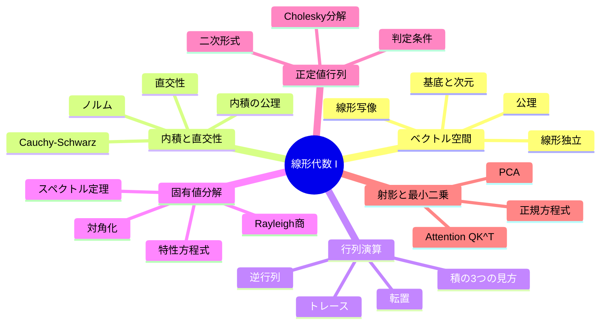

## 💻 4. 実装ゾーン（45分）— NumPyで線形代数を操る

### 4.1 NumPy の線形代数ツールキット

NumPyの `np.linalg` モジュールは、線形代数の主要な演算を全てカバーしている。ここでは実用上最も重要な関数を整理する。

| 関数 | 数式 | 用途 |
|:-----|:-----|:-----|
| `A @ B` | $AB$ | 行列積 |
| `np.linalg.inv(A)` | $A^{-1}$ | 逆行列（非推奨、solveを使え） |
| `np.linalg.solve(A, b)` | $A^{-1}\mathbf{b}$ | 連立方程式 |
| `np.linalg.eigh(A)` | $A = Q\Lambda Q^\top$ | 対称行列の固有値分解 |
| `np.linalg.svd(A)` | $A = U\Sigma V^\top$ | 特異値分解（第3回） |
| `np.linalg.qr(A)` | $A = QR$ | QR分解 |
| `np.linalg.cholesky(A)` | $A = LL^\top$ | Cholesky分解 |
| `np.linalg.norm(x)` | $\|\mathbf{x}\|$ | ノルム |
| `np.linalg.det(A)` | $\det(A)$ | 行列式 |
| `np.trace(A)` | $\text{tr}(A)$ | トレース |
| `np.linalg.matrix_rank(A)` | $\text{rank}(A)$ | ランク |
| `np.linalg.lstsq(A, b)` | $\hat{\mathbf{x}} = \arg\min\|A\mathbf{x} - \mathbf{b}\|^2$ | 最小二乗 |

:::message alert
Section 3.3 で述べたとおり、逆行列の直接計算は避けましょう [^8]。
:::

### 4.2 einsum — Einstein記法で行列演算をスマートに書く

`np.einsum` は Einstein 記法（添字の縮約規則）に基づく汎用的な配列演算関数だ。これを使いこなすと、複雑な行列演算をワンライナーで書ける。

基本ルール: **同じ添字が2回現れたら、その添字で総和を取る**。

| 演算 | 数式 | einsum |
|:-----|:-----|:-------|
| 内積 | $\mathbf{a}^\top\mathbf{b} = \sum_i a_i b_i$ | `np.einsum('i,i->', a, b)` |
| 外積 | $\mathbf{a}\mathbf{b}^\top$ | `np.einsum('i,j->ij', a, b)` |
| 行列積 | $C_{ij} = \sum_k A_{ik}B_{kj}$ | `np.einsum('ik,kj->ij', A, B)` |
| 行列のトレース | $\text{tr}(A) = \sum_i A_{ii}$ | `np.einsum('ii->', A)` |
| 行列転置 | $B_{ij} = A_{ji}$ | `np.einsum('ij->ji', A)` |
| バッチ行列積 | $C_{bij} = \sum_k A_{bik}B_{bkj}$ | `np.einsum('bik,bkj->bij', A, B)` |
| 二次形式 | $\mathbf{x}^\top A \mathbf{x}$ | `np.einsum('i,ij,j->', x, A, x)` |

```python
import numpy as np

np.random.seed(42)
A = np.random.randn(3, 4)
B = np.random.randn(4, 5)
x = np.random.randn(3)
y = np.random.randn(3)

# 内積: a^T b
dot_std = np.dot(x, y)
dot_ein = np.einsum('i,i->', x, y)
print(f"内積 — dot: {dot_std:.4f}, einsum: {dot_ein:.4f}")

# 行列積: AB
matmul_std = A @ B
matmul_ein = np.einsum('ik,kj->ij', A, B)
print(f"行列積 — 一致: {np.allclose(matmul_std, matmul_ein)}")

# トレース
S = np.random.randn(3, 3)
tr_std = np.trace(S)
tr_ein = np.einsum('ii->', S)
print(f"トレース — trace: {tr_std:.4f}, einsum: {tr_ein:.4f}")

# バッチ行列積（Transformerでヘッド並列に使う）
batch = 8
A_batch = np.random.randn(batch, 3, 4)
B_batch = np.random.randn(batch, 4, 5)
C_batch = np.einsum('bik,bkj->bij', A_batch, B_batch)
print(f"バッチ行列積 shape: {C_batch.shape}")

# 二次形式: x^T A x
M = np.array([[2, 1], [1, 3]])
v = np.array([1.0, 2.0])
qf_std = v @ M @ v
qf_ein = np.einsum('i,ij,j->', v, M, v)
print(f"二次形式 — @: {qf_std:.4f}, einsum: {qf_ein:.4f}")
```

:::details einsum vs @ 演算子のパフォーマンス
小さな行列ではeinsumの方がわずかに遅い（Python側のパース処理があるため）。大きな行列やバッチ演算では差はほぼ消える。可読性を重視する場合はeinsum、パフォーマンス最優先なら`@`演算子を使う。

PyTorch でも `torch.einsum` が使え、同じ記法で自動微分も可能:
```python
import torch

# PyTorch版 — 自動微分付き
A = torch.randn(3, 4, requires_grad=True)
B = torch.randn(4, 5)
C = torch.einsum('ik,kj->ij', A, B)
loss = C.sum()
loss.backward()
print(f"∂loss/∂A shape: {A.grad.shape}")
```
:::

### 4.3 メモリレイアウト — Row-major vs Column-major

行列のメモリ上での格納順序が計算速度に直結する。

| 方式 | 行列 $A_{ij}$ の格納順 | 言語/ライブラリ |
|:-----|:---------------------|:-------------|
| **Row-major (C order)** | $A_{00}, A_{01}, A_{02}, A_{10}, \ldots$ | C, Python/NumPy, PyTorch |
| **Column-major (Fortran order)** | $A_{00}, A_{10}, A_{20}, A_{01}, \ldots$ | Fortran, Julia, MATLAB, R |

**キャッシュ効率**: メモリは連続アクセスが速い。Row-majorでは**行方向**のアクセスが高速、Column-majorでは**列方向**が高速。

```python
import numpy as np
import time

n = 2000
A = np.random.randn(n, n)

# 行方向のアクセス（Row-majorでは高速）
start = time.perf_counter()
row_sums = np.sum(A, axis=1)  # 各行の和
t_row = time.perf_counter() - start

# 列方向のアクセス
start = time.perf_counter()
col_sums = np.sum(A, axis=0)  # 各列の和
t_col = time.perf_counter() - start

print(f"行方向の和: {t_row*1000:.2f} ms")
print(f"列方向の和: {t_col*1000:.2f} ms")
print(f"NumPy のメモリオーダー: {'C (Row-major)' if A.flags['C_CONTIGUOUS'] else 'F (Column-major)'}")
```

:::message
**なぜこれが重要か**: 行列積 $C = AB$ を実装するとき、ナイーブな3重ループの順序 (i, j, k) vs (i, k, j) でキャッシュヒット率が大きく変わり、性能が数倍変わることがある。NumPy は内部で最適化された BLAS（Basic Linear Algebra Subprograms）を呼んでいるので、ユーザーが意識する必要は少ないが、JuliaやRust等で自前実装する場合は必須の知識だ。第9回（Julia登場）と第11回（Rust登場）で改めて扱う。
:::

### 4.4 線形代数の計算量

各演算の計算量を知っておくと、アルゴリズムのスケーラビリティを判断できる。

| 演算 | 計算量 | 備考 |
|:-----|:------|:-----|
| ベクトル内積 | $O(n)$ | |
| 行列-ベクトル積 | $O(mn)$ | $A \in \mathbb{R}^{m \times n}$ |
| 行列-行列積 | $O(mnp)$ | $A \in \mathbb{R}^{m \times n}, B \in \mathbb{R}^{n \times p}$ |
| LU分解 | $O(\frac{2}{3}n^3)$ | 連立方程式 |
| Cholesky分解 | $O(\frac{1}{3}n^3)$ | 正定値行列 |
| QR分解 | $O(\frac{4}{3}n^3)$ | Householder法 |
| 固有値分解 | $O(n^3)$ | QRアルゴリズム |
| SVD | $O(mn\min(m,n))$ | 第3回で詳説 |
| Attention $QK^\top$ | $O(n^2 d)$ | シーケンス長$n$の二乗! |

```python
import numpy as np
import time

print("=== 行列積の計算時間スケーリング ===")
for n in [100, 500, 1000, 2000]:
    A = np.random.randn(n, n)
    B = np.random.randn(n, n)

    start = time.perf_counter()
    C = A @ B
    elapsed = time.perf_counter() - start

    gflops = 2 * n**3 / elapsed / 1e9
    print(f"n={n:4d}: {elapsed*1000:8.2f} ms  ({gflops:.1f} GFLOPS)")
```

:::details Strassenアルゴリズムと理論限界
行列積の計算量は長らく $O(n^3)$ が最善と考えられていたが、1969年にStrassenが $O(n^{2.807})$ のアルゴリズムを発見した。現在の理論的最善は $O(n^{2.3728\ldots})$ [Alman & Vassilevska Williams, 2021] だが、定数が大きく実用されていない。

GPU上の行列積は、NVIDIA の cuBLAS が最適化しており、Tensor Core を使えばFP16で理論限界に近い性能が出る。Transformerの訓練速度は、本質的にこの行列積の速度で決まる。
:::

### 4.5 数式→コード翻訳パターン

線形代数の数式をコードに翻訳する7つの基本パターン:

| # | 数式パターン | コード | 例 |
|:--|:-----------|:------|:---|
| 1 | $\mathbf{a}^\top\mathbf{b}$ | `np.dot(a, b)` or `a @ b` | 内積 |
| 2 | $AB$ | `A @ B` | 行列積 |
| 3 | $A^\top$ | `A.T` | 転置 |
| 4 | $A^{-1}\mathbf{b}$ | `np.linalg.solve(A, b)` | 連立方程式 |
| 5 | $\|x\|_2$ | `np.linalg.norm(x)` | L2ノルム |
| 6 | $\text{diag}(\lambda_1, \ldots)$ | `np.diag(lambdas)` | 対角行列 |
| 7 | $\sum_{ij} A_{ij} B_{ij}$ | `np.einsum('ij,ij->', A, B)` | Frobenius内積 |

```python
import numpy as np

# パターン実演: ガウス分布のKL divergence
# D_KL(N(μ₁,Σ₁) || N(μ₂,Σ₂))
# = 1/2 [tr(Σ₂⁻¹Σ₁) + (μ₂-μ₁)^T Σ₂⁻¹(μ₂-μ₁) - d + ln(det(Σ₂)/det(Σ₁))]

d = 3
mu1 = np.array([1.0, 2.0, 3.0])
mu2 = np.array([0.0, 0.0, 0.0])
Sigma1 = np.array([[2, 0.5, 0], [0.5, 1, 0.3], [0, 0.3, 1.5]])
Sigma2 = np.eye(d)

# 各項を数式→コード翻訳
# パターン4: Σ₂⁻¹Σ₁ → solve(Σ₂, Σ₁)
Sigma2_inv_Sigma1 = np.linalg.solve(Sigma2, Sigma1)

# パターン1: tr(·)
term1 = np.trace(Sigma2_inv_Sigma1)

# パターン4+1: (μ₂-μ₁)^T Σ₂⁻¹ (μ₂-μ₁)
diff = mu2 - mu1
term2 = diff @ np.linalg.solve(Sigma2, diff)

# スカラー
term3 = -d

# det → slogdet for numerical stability
sign1, logdet1 = np.linalg.slogdet(Sigma1)
sign2, logdet2 = np.linalg.slogdet(Sigma2)
term4 = logdet2 - logdet1

kl = 0.5 * (term1 + term2 + term3 + term4)
print(f"D_KL(N(μ₁,Σ₁) || N(μ₂,Σ₂)) = {kl:.4f}")
print(f"  tr(Σ₂⁻¹Σ₁) = {term1:.4f}")
print(f"  (μ₂-μ₁)^T Σ₂⁻¹(μ₂-μ₁) = {term2:.4f}")
print(f"  -d = {term3}")
print(f"  ln(det(Σ₂)/det(Σ₁)) = {term4:.4f}")
```

### 4.6 行列の指数関数 $\exp(A)$

行列の指数関数は、SSM（State Space Models、第26回）の中核:

$$
\exp(A) = \sum_{k=0}^{\infty} \frac{A^k}{k!} = I + A + \frac{A^2}{2!} + \frac{A^3}{3!} + \cdots
$$

$A$ が対角化可能なら: $\exp(A) = V \exp(\Lambda) V^{-1} = V \text{diag}(e^{\lambda_1}, \ldots, e^{\lambda_n}) V^{-1}$

```python
import numpy as np
from scipy.linalg import expm

# 行列指数関数
A = np.array([[-1, 0.5],
              [0.5, -2]])

# scipy の expm（Padé近似）
exp_A = expm(A)
print("exp(A) =")
print(np.round(exp_A, 4))

# 固有値分解による計算
eigenvalues, V = np.linalg.eig(A)
exp_A_eig = V @ np.diag(np.exp(eigenvalues)) @ np.linalg.inv(V)
print("\nexp(A) via eigendecomposition =")
print(np.round(exp_A_eig.real, 4))
print(f"一致: {np.allclose(exp_A, exp_A_eig.real)}")

# SSMの離散化: x[k+1] = exp(AΔt) x[k] + B u[k]
dt = 0.1
A_discrete = expm(A * dt)
print(f"\nexp(AΔt) (Δt={dt}):")
print(np.round(A_discrete, 4))
```

:::message
**SSMへの予告**: 第26回（State Space Models / Mamba）では、$\exp(A\Delta t)$ の効率的な計算がモデルの性能を左右する。連続時間の状態方程式 $\dot{\mathbf{x}} = A\mathbf{x} + B\mathbf{u}$ を離散化する際にこの行列指数関数が登場する。覚えておいてほしい。
:::

### 4.7 数値計算のピットフォール

線形代数の計算は、理論的には正しくても数値的に破綻することがある。実装者は以下の落とし穴を知っておく必要がある。

| ピットフォール | 原因 | 対策 |
|:-------------|:-----|:-----|
| 浮動小数点の等号比較 | 丸め誤差 | `np.allclose(a, b, atol=1e-10)` を使う |
| 逆行列の明示計算 | 条件数が大きいと不安定 | `np.linalg.solve` を使う |
| 大行列の行列式 | オーバーフロー/アンダーフロー | `np.linalg.slogdet` で対数を取る |
| Gram-Schmidt の直交性劣化 | 浮動小数点誤差の蓄積 | Modified Gram-Schmidt or QR分解を使う |
| 固有値の順序仮定 | `eig` は固有値をソートしない | `eigh` を使う、または明示的にソート |
| 対称性の仮定崩れ | 丸め誤差で $A \neq A^\top$ | `A = (A + A.T) / 2` で強制対称化 |

```python
import numpy as np

# ピットフォール1: 浮動小数点の等号比較
a = 0.1 + 0.2
print(f"0.1 + 0.2 == 0.3? {a == 0.3}")           # False!
print(f"np.isclose? {np.isclose(a, 0.3)}")          # True

# ピットフォール2: 大行列の行列式
A_large = np.random.randn(500, 500) * 0.01
det_direct = np.linalg.det(A_large)
print(f"det(A) = {det_direct}")  # Often 0.0 or inf (overflow/underflow)

sign, logdet = np.linalg.slogdet(A_large)
print(f"sign={sign}, log|det| = {logdet:.4f}")  # Numerically stable

# ピットフォール3: 対称性の強制
B = np.random.randn(3, 3)
S = B.T @ B  # theoretically symmetric
print(f"S == S.T? {np.allclose(S, S.T)}")  # usually True, but not guaranteed
S = (S + S.T) / 2  # force symmetry — safe practice
```

:::message
**進捗: 70% 完了** NumPyの線形代数ツールキット、einsum記法、メモリレイアウト、計算量、数式→コード翻訳パターン、数値計算のピットフォールを習得した。
:::

---

## 🔬 5. 実験ゾーン（30分）— 自己診断テスト

### 5.1 記号読解テスト

以下の数式を声に出して読み、意味を説明せよ。

:::details Q1: $A \in \mathbb{R}^{m \times n}$
**読み**: 「$A$ は $m$ 行 $n$ 列の実数行列」

**意味**: $A$ は $m \times n$ 個の実数値を持つ行列。線形写像 $A: \mathbb{R}^n \to \mathbb{R}^m$ を表現する。
:::

:::details Q2: $\mathbf{v} \in \ker(A) \iff A\mathbf{v} = \mathbf{0}$
**読み**: 「$\mathbf{v}$ が $A$ の核に属することと、$A\mathbf{v}$ がゼロベクトルになることは同値」

**意味**: 核（null space）は、$A$ で潰されてゼロになるベクトル全体の集合。Rank-Nullity定理で $\dim(\ker(A)) = n - \text{rank}(A)$。
:::

:::details Q3: $\text{tr}(ABC) = \text{tr}(BCA) = \text{tr}(CAB)$
**読み**: 「$ABC$ のトレースは $BCA$ のトレースに等しく、$CAB$ のトレースにも等しい」

**意味**: トレースの巡回性（cyclic property）。行列積の順序を巡回的に入れ替えてもトレースは変わらない。行列微分で頻出。**注意**: $\text{tr}(ABC) \neq \text{tr}(ACB)$ — 巡回的でない並べ替えではトレースは変わる。
:::

:::details Q4: $A \succ 0$
**読み**: 「$A$ は正定値」

**意味**: $\mathbf{x}^\top A \mathbf{x} > 0$ for all $\mathbf{x} \neq \mathbf{0}$。全ての固有値が正。Cholesky分解が可能。共分散行列が正則なとき成立。
:::

:::details Q5: $\hat{\mathbf{x}} = (A^\top A)^{-1} A^\top \mathbf{b}$
**読み**: 「$\hat{\mathbf{x}}$ は $A^\top A$ の逆行列と $A^\top \mathbf{b}$ の積」

**意味**: 最小二乗解。$\|A\mathbf{x} - \mathbf{b}\|^2$ を最小にする $\mathbf{x}$。正規方程式 $A^\top A\hat{\mathbf{x}} = A^\top\mathbf{b}$ の解。$A^\top A$ が正則（$A$ がフルランク列）のとき一意。
:::

:::details Q6: $A = Q\Lambda Q^\top$, $Q^\top Q = I$
**読み**: 「$A$ は直交行列 $Q$ と対角行列 $\Lambda$ でスペクトル分解される」

**意味**: 対称行列のスペクトル定理。$Q$ の列が固有ベクトル、$\Lambda$ の対角成分が固有値。PCA、共分散行列の分析で必須。
:::

:::details Q7: $P = A(A^\top A)^{-1}A^\top$, $P^2 = P$
**読み**: 「$P$ は射影行列で、2回適用しても結果が変わらない（冪等）」

**意味**: $P$ は $A$ の列空間への直交射影。$P\mathbf{b}$ は $\mathbf{b}$ に最も近い $\text{Col}(A)$ 上の点。
:::

:::details Q8: $\|\mathbf{u}\| \|\mathbf{v}\| \cos\theta = \langle \mathbf{u}, \mathbf{v} \rangle$
**読み**: 「$\mathbf{u}$ と $\mathbf{v}$ のノルムの積にコサインをかけたものが内積」

**意味**: 内積の幾何学的解釈。$\cos\theta = 1$（平行）→内積最大、$\cos\theta = 0$（直交）→内積ゼロ。Attention[^1]の類似度計算の数学的基盤。
:::

:::details Q9: $(AB)^{-1} = B^{-1}A^{-1}$
**読み**: 「$AB$ の逆行列は $B$ の逆行列と $A$ の逆行列の積（順序反転）」

**意味**: 「靴下を履いてから靴を履く」→「脱ぐときは靴を先に脱ぎ、次に靴下」。逆操作は順序が逆になる。$(AB)^\top = B^\top A^\top$ と同じ原理。
:::

:::details Q10: $R(\mathbf{x}) = \frac{\mathbf{x}^\top A \mathbf{x}}{\mathbf{x}^\top \mathbf{x}}$, $\lambda_{\min} \leq R(\mathbf{x}) \leq \lambda_{\max}$
**読み**: 「Rayleigh商は最小固有値と最大固有値の間に収まる」

**意味**: 対称行列 $A$ のRayleigh商の最大化が最大固有値と第1固有ベクトルを与える。PCA[^6][^7]の数学的基盤。
:::

### 5.2 コード翻訳テスト

以下の数式をNumPyコードに翻訳せよ。

:::details Q1: $C = A^\top B$ ($A \in \mathbb{R}^{3 \times 2}, B \in \mathbb{R}^{3 \times 4}$)
```python
C = A.T @ B  # shape: (2, 4)
```
:::

:::details Q2: Frobenius ノルム $\|A\|_F = \sqrt{\text{tr}(A^\top A)}$
```python
# 方法1: 直接
fro = np.linalg.norm(A, 'fro')

# 方法2: トレースから
fro = np.sqrt(np.trace(A.T @ A))

# 方法3: einsum
fro = np.sqrt(np.einsum('ij,ij->', A, A))
```
:::

:::details Q3: 二次形式 $f(\mathbf{x}) = \frac{1}{2}\mathbf{x}^\top H \mathbf{x} - \mathbf{b}^\top\mathbf{x}$
```python
f = 0.5 * x @ H @ x - b @ x

# einsum版
f = 0.5 * np.einsum('i,ij,j->', x, H, x) - np.einsum('i,i->', b, x)
```
:::

:::details Q4: PCA次元削減 $Z = \tilde{X} Q_k$
```python
# X: (n_samples, d), k: 目標次元
X_centered = X - X.mean(axis=0)
Sigma = np.cov(X_centered, rowvar=False)
eigenvalues, Q = np.linalg.eigh(Sigma)
# 降順にソート
idx = np.argsort(eigenvalues)[::-1]
Q_k = Q[:, idx[:k]]
Z = X_centered @ Q_k  # shape: (n_samples, k)
```
:::

:::details Q5: Cholesky サンプリング $\mathbf{x} = \boldsymbol{\mu} + L\mathbf{z}$, $\mathbf{z} \sim \mathcal{N}(\mathbf{0}, I)$
```python
L = np.linalg.cholesky(Sigma)
z = np.random.randn(d)
x = mu + L @ z
```
:::

### 5.3 ミニプロジェクト: PCA で MNIST を可視化する

```python
import numpy as np

# MNIST風の合成データ（実際のMNISTの代わり）
np.random.seed(42)
n_samples = 1000
n_features = 784  # 28x28

# 3クラスのデータを生成（各クラスは異なる方向に広がる）
n_per_class = n_samples // 3
centers = np.random.randn(3, n_features) * 5
X = np.vstack([
    centers[i] + np.random.randn(n_per_class, n_features) * 0.5
    for i in range(3)
])
y = np.repeat([0, 1, 2], n_per_class)

# PCA 実装
X_centered = X - X.mean(axis=0)
# 計算量削減: Σ = X^T X / (N-1) の代わりに SVD を使う（第3回で詳説）
# ここでは共分散行列の直接計算
Sigma = X_centered.T @ X_centered / (n_samples - 1)

# 上位2主成分
# eigh は大きな行列では遅いので、実用では SVD を使う（第3回）
# ここでは教育目的で eigh
eigenvalues, eigenvectors = np.linalg.eigh(Sigma)
idx = np.argsort(eigenvalues)[::-1]
eigenvalues = eigenvalues[idx]
eigenvectors = eigenvectors[:, idx]

# 次元削減
Z = X_centered @ eigenvectors[:, :2]

print("=== PCA on synthetic MNIST ===")
print(f"元の次元: {n_features}")
print(f"削減後の次元: 2")
print(f"寄与率 (PC1): {eigenvalues[0] / eigenvalues.sum():.4f}")
print(f"寄与率 (PC1+PC2): {eigenvalues[:2].sum() / eigenvalues.sum():.4f}")
print(f"Z shape: {Z.shape}")
for c in range(3):
    mask = y == c
    print(f"  クラス {c}: 中心 = ({Z[mask, 0].mean():.2f}, {Z[mask, 1].mean():.2f})")
```

### 5.4 LaTeX 記述テスト

以下の数式をLaTeXで書いてみよう。答えは折り畳みの中。

:::details Q1: 固有値方程式
```latex
A\mathbf{v} = \lambda\mathbf{v}
```
$$A\mathbf{v} = \lambda\mathbf{v}$$
:::

:::details Q2: スペクトル分解
```latex
A = Q\Lambda Q^\top = \sum_{i=1}^{n} \lambda_i \mathbf{q}_i \mathbf{q}_i^\top
```
$$A = Q\Lambda Q^\top = \sum_{i=1}^{n} \lambda_i \mathbf{q}_i \mathbf{q}_i^\top$$
:::

:::details Q3: Cauchy-Schwarz 不等式
```latex
|\langle \mathbf{u}, \mathbf{v} \rangle| \leq \|\mathbf{u}\| \cdot \|\mathbf{v}\|
```
$$|\langle \mathbf{u}, \mathbf{v} \rangle| \leq \|\mathbf{u}\| \cdot \|\mathbf{v}\|$$
:::

:::details Q4: 正規方程式
```latex
\hat{\mathbf{x}} = (A^\top A)^{-1} A^\top \mathbf{b}
```
$$\hat{\mathbf{x}} = (A^\top A)^{-1} A^\top \mathbf{b}$$
:::

:::details Q5: 多変量ガウス分布
```latex
\mathcal{N}(\mathbf{x} \mid \boldsymbol{\mu}, \Sigma) = \frac{1}{(2\pi)^{d/2} |\Sigma|^{1/2}} \exp\left(-\frac{1}{2}(\mathbf{x}-\boldsymbol{\mu})^\top \Sigma^{-1} (\mathbf{x}-\boldsymbol{\mu})\right)
```
$$\mathcal{N}(\mathbf{x} \mid \boldsymbol{\mu}, \Sigma) = \frac{1}{(2\pi)^{d/2} |\Sigma|^{1/2}} \exp\left(-\frac{1}{2}(\mathbf{x}-\boldsymbol{\mu})^\top \Sigma^{-1} (\mathbf{x}-\boldsymbol{\mu})\right)$$
:::

### 5.5 実装チャレンジ: 勾配降下法で線形回帰

最小二乗法は閉形式解を持つが、勾配降下法でも解ける。ここでは勾配降下法で線形回帰を解き、閉形式解と一致するか確認する。

```python
import numpy as np

# データ生成
np.random.seed(42)
n, d = 100, 3
X = np.random.randn(n, d)
w_true = np.array([2.0, -1.5, 0.5])
y = X @ w_true + np.random.randn(n) * 0.3

# 閉形式解
w_closed = np.linalg.solve(X.T @ X, X.T @ y)

# 勾配降下法
w_gd = np.zeros(d)
lr = 0.01
n_iters = 500

losses = []
for t in range(n_iters):
    # 勾配: ∇L = (2/n) X^T (Xw - y)
    residual = X @ w_gd - y
    grad = (2 / n) * X.T @ residual
    w_gd -= lr * grad
    loss = np.mean(residual**2)
    losses.append(loss)

print("=== 勾配降下法 vs 閉形式解 ===")
print(f"真の重み:   {w_true}")
print(f"閉形式解:   {np.round(w_closed, 4)}")
print(f"GD ({n_iters}回): {np.round(w_gd, 4)}")
print(f"差のノルム: {np.linalg.norm(w_gd - w_closed):.6f}")
print(f"最終損失:   {losses[-1]:.6f}")
```

:::details チャレンジ: ミニバッチSGDに改造する
上のコードを修正して、全データではなく毎回ランダムに32個のサンプルを選んで勾配を計算するミニバッチSGDに改造してみよう。

```python
import numpy as np

np.random.seed(42)
n, d = 100, 3
X = np.random.randn(n, d)
w_true = np.array([2.0, -1.5, 0.5])
y = X @ w_true + np.random.randn(n) * 0.3

w_sgd = np.zeros(d)
lr = 0.01
batch_size = 32
n_iters = 500

for t in range(n_iters):
    # ミニバッチサンプリング
    idx = np.random.choice(n, batch_size, replace=False)
    X_batch = X[idx]
    y_batch = y[idx]

    # ミニバッチ勾配
    residual = X_batch @ w_sgd - y_batch
    grad = (2 / batch_size) * X_batch.T @ residual
    w_sgd -= lr * grad

print(f"SGD結果: {np.round(w_sgd, 4)}")
```
:::

### 5.6 実装チャレンジ: Power Iteration で最大固有値を求める

固有値分解を `np.linalg.eigh` なしで実装する。Power Iteration（べき乗法）は、行列を繰り返しかけることで最大固有値と対応する固有ベクトルを求めるアルゴリズムだ。

```python
import numpy as np

def power_iteration(A: np.ndarray, n_iters: int = 100) -> tuple:
    """Power Iteration で最大固有値と固有ベクトルを求める。

    Algorithm:
    1. ランダムなベクトル v を初期化
    2. v ← Av / ||Av|| を繰り返す
    3. λ = v^T A v (Rayleigh商) が最大固有値に収束
    """
    n = A.shape[0]
    v = np.random.randn(n)
    v = v / np.linalg.norm(v)

    for i in range(n_iters):
        Av = A @ v
        v_new = Av / np.linalg.norm(Av)
        # 収束判定
        if np.allclose(abs(np.dot(v_new, v)), 1.0, atol=1e-10):
            v = v_new
            break
        v = v_new

    eigenvalue = v @ A @ v  # Rayleigh商
    return eigenvalue, v

# テスト
np.random.seed(42)
A = np.array([[4.0, 1.0, 0.5],
              [1.0, 3.0, 0.2],
              [0.5, 0.2, 2.0]])

lam_pi, v_pi = power_iteration(A)
lam_np, V_np = np.linalg.eigh(A)

print("=== Power Iteration vs np.linalg.eigh ===")
print(f"Power Iteration: λ_max = {lam_pi:.6f}")
print(f"np.linalg.eigh:  λ_max = {lam_np[-1]:.6f}")
print(f"差: {abs(lam_pi - lam_np[-1]):.10f}")
print(f"\n固有ベクトル (PI):  {np.round(v_pi, 4)}")
print(f"固有ベクトル (eigh): {np.round(V_np[:, -1], 4)}")
```

:::details Deflation で全固有値を求める
Power Iteration は最大固有値のみを返す。全固有値を求めるには **Deflation**（減衰法）を使う:

1. 最大固有値 $\lambda_1$ と固有ベクトル $\mathbf{v}_1$ を求める
2. $A \leftarrow A - \lambda_1 \mathbf{v}_1 \mathbf{v}_1^\top$（ランク1の引き算）
3. 新しい $A$ に対してPower Iterationを繰り返す

```python
import numpy as np

def all_eigenvalues_by_deflation(A, n_eig=None):
    """Deflation で全固有値を求める。"""
    if n_eig is None:
        n_eig = A.shape[0]

    A_deflated = A.copy()
    eigenvalues = []
    eigenvectors = []

    for _ in range(n_eig):
        lam, v = power_iteration(A_deflated)
        eigenvalues.append(lam)
        eigenvectors.append(v)
        # Deflation: ランク1を引く
        A_deflated = A_deflated - lam * np.outer(v, v)

    return np.array(eigenvalues), np.column_stack(eigenvectors)

A = np.array([[4.0, 1.0, 0.5],
              [1.0, 3.0, 0.2],
              [0.5, 0.2, 2.0]])

lams_def, _ = all_eigenvalues_by_deflation(A)
lams_np = np.sort(np.linalg.eigvalsh(A))[::-1]

print("Deflation:", np.round(lams_def, 4))
print("eigh:     ", np.round(lams_np, 4))
```
:::

### 5.7 自己チェックリスト

本講義を修了した時点で、以下ができるか確認してほしい:

- [ ] ベクトル空間の公理を3つ以上言える
- [ ] 線形独立の定義をコードで確認できる
- [ ] 内積→ノルム→距離の定義の連鎖を説明できる
- [ ] Cauchy-Schwarz不等式を述べ、コサイン類似度との関係を説明できる
- [ ] 行列積の3つの見方（要素・列・行）を使い分けられる
- [ ] 転置の性質 $(AB)^\top = B^\top A^\top$ を証明できる
- [ ] `np.linalg.solve` と `np.linalg.inv` の違いを説明できる
- [ ] 固有値分解を手計算で2×2行列に適用できる
- [ ] スペクトル定理の3つの主張を述べられる
- [ ] 正定値行列の3つの判定条件を列挙できる
- [ ] Cholesky分解を使ってガウス分布からサンプリングできる
- [ ] 最小二乗法の正規方程式を導出できる
- [ ] PCAを固有値分解として実装できる
- [ ] `np.einsum` で内積・行列積・トレースを書ける
- [ ] Attention[^1]の $QK^\top$ を線形代数の言葉で説明できる

:::message
**進捗: 85% 完了** 自己診断テスト、コード翻訳テスト、ミニプロジェクトを通じて理解度を確認した。
:::

---

## 🎓 6. 振り返りゾーン（30分）— まとめと次回予告

### 6.1 NumPy / SciPy の線形代数関数チートシート

実装時に頻繁に参照する関数をまとめておく。

| 目的 | NumPy | SciPy | 注意点 |
|:-----|:------|:------|:------|
| 行列積 | `A @ B` | — | BLAS Level 3 の dgemm を呼ぶ |
| 内積 | `np.dot(a, b)` | — | 1Dベクトル同士のみ。2D以上は `@` を使う |
| 転置 | `A.T` | — | ビューを返す（コピーなし） |
| 逆行列 | `np.linalg.inv(A)` | `scipy.linalg.inv(A)` | 可能な限り `solve` を使う |
| 連立方程式 | `np.linalg.solve(A, b)` | `scipy.linalg.solve(A, b)` | $A\mathbf{x}=\mathbf{b}$ を解く |
| 固有値分解（対称） | `np.linalg.eigh(A)` | `scipy.linalg.eigh(A)` | **対称行列には必ず eigh** |
| 固有値分解（一般） | `np.linalg.eig(A)` | `scipy.linalg.eig(A)` | 非対称行列用。複素固有値あり |
| SVD | `np.linalg.svd(A)` | `scipy.linalg.svd(A)` | 第3回で詳しく |
| QR分解 | `np.linalg.qr(A)` | `scipy.linalg.qr(A)` | `mode='reduced'` でeconomy QR |
| Cholesky分解 | `np.linalg.cholesky(A)` | `scipy.linalg.cholesky(A)` | NumPy: 下三角 $L$、SciPy: デフォルト上三角 |
| 行列式 | `np.linalg.det(A)` | — | 大行列では対数行列式 `slogdet` を使う |
| ランク | `np.linalg.matrix_rank(A)` | — | 数値ランク（閾値付き） |
| ノルム | `np.linalg.norm(A, ord)` | — | `ord=2`: スペクトルノルム、`ord='fro'`: Frobenius |
| einsum | `np.einsum('ij,jk->ik', A, B)` | — | Einstein記法。バッチ処理に便利 |

```python
# 実務でよく使うパターン集
import numpy as np
from scipy import linalg

A = np.random.randn(100, 100)
A = A.T @ A + np.eye(100)  # positive definite matrix

# Pattern 1: Cholesky で solve（正定値行列の場合最速）
b = np.random.randn(100)
L = linalg.cholesky(A, lower=True)
x = linalg.cho_solve((L, True), b)

# Pattern 2: 対数行列式（大行列でオーバーフロー回避）
sign, logdet = np.linalg.slogdet(A)
print(f"log|det(A)| = {logdet:.4f}")

# Pattern 3: 低ランク近似のメモリ効率的な SVD
U, s, Vt = np.linalg.svd(A, full_matrices=False)  # economy SVD
k = 10
A_approx = U[:, :k] @ np.diag(s[:k]) @ Vt[:k, :]
print(f"Rank-{k} approximation error: {np.linalg.norm(A - A_approx, 'fro'):.4f}")
```

### 6.2 用語集

:::details 用語集
| 英語 | 日本語 | 記号 |
|:-----|:------|:-----|
| Vector space | ベクトル空間 | $V$ |
| Linear independence | 線形独立 | |
| Basis | 基底 | $\{\mathbf{e}_i\}$ |
| Dimension | 次元 | $\dim V$ |
| Inner product | 内積 | $\langle \cdot, \cdot \rangle$ |
| Norm | ノルム | $\|\cdot\|$ |
| Orthogonal | 直交 | $\perp$ |
| Eigenvalue | 固有値 | $\lambda$ |
| Eigenvector | 固有ベクトル | $\mathbf{v}$ |
| Positive definite | 正定値 | $A \succ 0$ |
| Trace | トレース | $\text{tr}(\cdot)$ |
| Determinant | 行列式 | $\det(\cdot)$ |
| Rank | ランク | $\text{rank}(\cdot)$ |
| Projection | 射影 | $P$ |
| Least squares | 最小二乗法 | |
| QR decomposition | QR分解 | $A = QR$ |
| Cholesky decomposition | Cholesky分解 | $A = LL^\top$ |
| Spectral theorem | スペクトル定理 | |
| Cauchy-Schwarz inequality | Cauchy-Schwarz不等式 | |
| Rayleigh quotient | Rayleigh商 | $R(\mathbf{x})$ |
:::

### 6.3 知識マップ



### 6.4 本講義の3つのポイント

**1. 内積 = 類似度の数学的基盤**

$$
\langle \mathbf{q}_i, \mathbf{k}_j \rangle = \mathbf{q}_i^\top \mathbf{k}_j
$$

Attention[^1]の核心は内積による類似度計算。Cauchy-Schwarz不等式がコサイン類似度の値域 $[-1, 1]$ を保証する。

**2. 固有値分解 = 行列の「X線写真」**

$$
A = Q\Lambda Q^\top
$$

対称行列は固有ベクトルで対角化でき、固有値が行列の本質的な情報（分散の大きさ、安定性、凸性）を明らかにする。PCA[^6][^7]はこの直接的な応用。

**3. 正定値性 = 安全装置**

$$
\mathbf{x}^\top A \mathbf{x} > 0 \quad \forall \mathbf{x} \neq \mathbf{0}
$$

共分散行列の正定値性、ヘシアンの正定値性による凸性保証、Cholesky分解による効率的な計算。

### 6.5 FAQ

:::details Q: 線形代数はどこまで深くやるべき？
この講義と次の第3回で扱う範囲をしっかり理解すれば、Course II（第9-16回）の生成モデルの数式は全て読める。証明を暗記する必要はない。「なぜこうなるか」の直感を持っていれば十分。

ただし、研究で使う場合は Golub & Van Loan[^8] の関連章を読むことを勧める。数値安定性やアルゴリズムの選択肢に関する知識は、実装の品質に直結する。
:::

:::details Q: eigh と eig の使い分けは？
対称行列（共分散行列、ヘシアン等）には必ず `eigh` を使う。一般行列には `eig`。`eigh` は対称性を利用するので約2倍速く、固有ベクトルの直交性が数値的にも保証される。
:::

:::details Q: 逆行列の計算はどのくらい避けるべき？
明示的に $A^{-1}$ が必要な場面はほぼない。$A^{-1}\mathbf{b}$ → `solve(A, b)`、$A^{-1}B$ → `solve(A, B)`、$\det(A^{-1})$ → `1/det(A)`。$A^{-1}$ 自体が必要なのは、射影行列 $P = A(A^\top A)^{-1}A^\top$ の可視化くらい。
:::

:::details Q: PCA で次元をいくつに落とすべき？
累積寄与率（cumulative explained variance ratio）が 90-95% になる次元数が一般的な目安。ただし、可視化目的なら2-3次元。ダウンストリームタスクの性能で決めるのが最善。
:::

:::details Q: einsum は覚える必要がある？
必須ではないが、論文のコードでよく見かける。特にTransformer系の実装では `einsum` が多用される。最低限、内積 `'i,i->'`、行列積 `'ik,kj->ij'`、バッチ行列積 `'bik,bkj->bij'` の3パターンを覚えておけば困らない。
:::

:::details Q: 線形代数と微積分、どちらが先に必要？
線形代数が先。理由: (1) 機械学習の多くのアルゴリズムは行列演算で記述される、(2) 勾配は「ベクトル値関数の微分」なので線形代数の言葉で定義される、(3) 逆伝播法はヤコビアンの連鎖律であり、行列微分は線形代数の上に構築される。

本シリーズでは第2-3回で線形代数、第4回で確率論・統計学、第5回で測度論的確率論・確率過程、第6回で情報理論・最適化理論の順番を取っている。
:::

:::details Q: 大きな行列の固有値分解は遅いのでは？
その通り。$n \times n$ 行列の完全な固有値分解は $O(n^3)$ で、$n > 10000$ では実用的でない。実務では:

1. **Power Iteration / Lanczos法**: 上位 $k$ 個の固有値・固有ベクトルだけを $O(kn^2)$ で計算
2. **Randomized SVD**: ランダム射影で次元を落としてからSVD。scikit-learn の PCA はこれを使う
3. **Sparse solver**: 疎行列なら `scipy.sparse.linalg.eigsh` で大規模問題に対応
4. **GPU計算**: cuSOLVER で GPU上の大規模固有値分解

第3回でSVDの効率的な計算法を詳しく扱う。
:::

:::details Q: PyTorch でも線形代数関数を使えるか？
使える。`torch.linalg` モジュールが NumPy の `np.linalg` とほぼ同じAPIを提供する。自動微分対応なので、固有値分解やSVDの結果を通じて勾配を逆伝播できる。

```python
import torch

A = torch.randn(3, 3)
A = A.T @ A  # positive definite
A.requires_grad_(True)

vals, vecs = torch.linalg.eigh(A)
loss = vals.sum()
loss.backward()  # A.grad に固有値の A に対する勾配が入る
```

ただし、固有値が重複（degenerate）している場合の勾配は不安定なので注意。
:::

### 6.6 よくある間違い・勘違い

線形代数の学習で頻出する間違いを先に知っておくことで、無駄な躓きを避けられる。

#### 間違い1: 行列積は交換可能

$$
AB \neq BA \quad \text{（一般には成り立たない）}
$$

```python
import numpy as np

A = np.array([[1, 2], [3, 4]])
B = np.array([[5, 6], [7, 8]])
print("AB =\n", A @ B)
print("BA =\n", B @ A)
print("AB == BA?", np.allclose(A @ B, B @ A))  # False
```

**正しい理解**: 行列積は一般に非可換。$AB = BA$ が成り立つのは特殊な場合（$B = \alpha I$、$A$ と $B$ が同時対角化可能な場合など）のみ。ただし、トレースについては $\text{tr}(AB) = \text{tr}(BA)$（巡回性）が**常に**成り立つ。

#### 間違い2: 逆行列で連立方程式を解く

```python
# BAD: 逆行列を明示的に計算
x_bad = np.linalg.inv(A) @ b  # O(n^3) + 数値不安定

# GOOD: solve を使う
x_good = np.linalg.solve(A, b)  # O(n^3) だが数値安定
```

**正しい理解**: `solve` は内部でLU分解を使い、逆行列を明示的に計算しない。計算量のオーダーは同じだが、数値安定性が大きく異なる。条件数が大きい行列では、`inv` の結果は信用できない。

#### 間違い3: 固有値分解はどの行列でもできる

**正しい理解**: 全ての $n \times n$ 行列が対角化可能なわけではない。対角化可能性の条件は「$n$ 個の線形独立な固有ベクトルが存在すること」。対称行列は常に対角化可能（スペクトル定理）だが、一般の行列では保証されない。

$$
A = \begin{pmatrix} 0 & 1 \\ 0 & 0 \end{pmatrix}
$$

この行列は固有値 $\lambda = 0$（重複度2）を持つが、固有ベクトルは1つしかない。対角化不可能。

#### 間違い4: eig と eigh の混同

```python
# 対称行列には eigh を使う
S = np.array([[2.0, 1.0], [1.0, 3.0]])
vals_eig, vecs_eig = np.linalg.eig(S)    # 一般固有値分解
vals_eigh, vecs_eigh = np.linalg.eigh(S)  # 対称行列専用

# eigh の利点:
# 1. 固有値がソートされて返る（eig はソートされない）
# 2. 固有ベクトルの直交性が数値的に保証される
# 3. 約2倍速い
# 4. 固有値は常に実数（eig は複素数を返す可能性）
```

#### 間違い5: 行列のランクと逆行列の関係の誤解

| 条件 | $\text{rank}(A) = n$ | $\text{rank}(A) < n$ |
|:-----|:---------------------|:--------------------|
| 逆行列 | 存在する（$A$ は正則） | 存在しない（$A$ は特異） |
| 連立方程式 $A\mathbf{x} = \mathbf{b}$ | 唯一解 | 解なし or 無限に解がある |
| 固有値 | $0$ は固有値でない | $0$ が固有値に含まれる |
| 行列式 | $\det(A) \neq 0$ | $\det(A) = 0$ |

:::details 間違い6: ベクトルの線形独立性の誤判定
「どのベクトルも平行でなければ線形独立」は**2次元でのみ正しい**。3次元以上では、どの2本も平行でなくても線形従属になり得る。

$$
\mathbf{v}_1 = \begin{pmatrix} 1 \\ 0 \\ 1 \end{pmatrix}, \quad
\mathbf{v}_2 = \begin{pmatrix} 0 \\ 1 \\ 1 \end{pmatrix}, \quad
\mathbf{v}_3 = \begin{pmatrix} 1 \\ 1 \\ 2 \end{pmatrix}
$$

どの2本も平行でないが、$\mathbf{v}_3 = \mathbf{v}_1 + \mathbf{v}_2$ なので線形従属。

正しい判定方法はランクを見ること:

```python
V = np.array([[1, 0, 1], [0, 1, 1], [1, 1, 2]]).T
print("rank =", np.linalg.matrix_rank(V))  # 2 (< 3 → 線形従属)
```
:::

### 6.7 学習スケジュール（1週間プラン）

| 日 | 内容 | 所要時間 |
|:---|:-----|:--------|
| Day 1 | Zone 0-2 通読 | 30分 |
| Day 2 | Zone 3 前半（3.1-3.5） | 45分 |
| Day 3 | Zone 3 後半（3.6-3.9） | 45分 |
| Day 4 | Zone 4（実装） | 45分 |
| Day 5 | Zone 5（テスト） | 30分 |
| Day 6 | 復習: 2×2行列の固有値分解を手計算 | 30分 |
| Day 7 | 第3回を先読み + 本講義の振り返り | 30分 |

### 6.8 進捗トラッカー

```python
"""第2回 線形代数 I の学習進捗チェッカー"""

topics = {
    "ベクトル空間の公理": False,
    "線形独立・基底・次元": False,
    "内積とCauchy-Schwarz": False,
    "行列積の3つの見方": False,
    "転置と逆行列の性質": False,
    "トレースの巡回性": False,
    "Gram-Schmidt / QR": False,
    "固有値分解": False,
    "スペクトル定理": False,
    "正定値行列 / Cholesky": False,
    "最小二乗法 / 正規方程式": False,
    "PCA": False,
    "einsum": False,
    "Attention QK^T": False,
}

# True に変更して実行してください
completed = sum(topics.values())
total = len(topics)
print(f"=== 第2回 進捗: {completed}/{total} ({100*completed/total:.0f}%) ===")
for topic, done in topics.items():
    mark = "✓" if done else " "
    print(f"  [{mark}] {topic}")

if completed == total:
    print("\n第2回 完全クリア！ 第3回（SVD・行列微分・テンソル）へ進もう。")
elif completed >= total * 0.7:
    print("\nよくできた。残りは第3回を読んだ後に戻って確認しよう。")
else:
    print("\nZone 3 を中心にもう一度復習することをお勧めする。")
```

### 6.9 次回予告: 第3回「線形代数 II: SVD・行列微分・テンソル」

第3回では、本講義で築いた基盤の上に3つの強力な道具を積み上げる:

1. **SVD**（特異値分解）— 行列の「万能ナイフ」。PCAも低ランク近似も推薦システムもLoRA[^10]も、全てSVDの応用
2. **行列微分** — ニューラルネットワーク学習の数学的基盤。ヤコビアン・ヘシアン・連鎖律の行列版
3. **自動微分** — PyTorchの `loss.backward()` の中で何が起きているか。Forward mode vs Reverse mode の完全理解

**キーとなるLLM/Transformer接点**:
- ヤコビアン → Flow Model（第25回）
- 勾配 → Backpropagation[^2]（第3回で完全導出）
- 連鎖律 → Transformer の各層を通じた勾配伝播

> **第2回の限界**: 行列を「扱える」ようになった。だが「分解して構造を見抜く」にはSVDが必要。「行列の関数を微分する」には行列微分が必要。その2つを第3回で完全武装する。

:::message
**進捗: 100% 完了!** 第2回「線形代数 I: ベクトル・行列・基底」を完走した。ベクトル空間の公理から始まり、内積・固有値分解・正定値行列・射影を経て、AttentionのQK^Tを行列的に完全理解した。お疲れさまでした。
:::

---

### 6.10 パラダイム転換の問い

> **GPUは行列演算マシン。線形代数を"制する者"がAIを制するのでは？**

この問いの意味を考えてみてほしい。

現代のAIの進歩は、一見するとデータ量やモデルサイズの増大によるものに見える。だが、その裏側で起きていることは「いかに効率よく行列積を計算するか」の最適化だ。

Flash Attention[^12]は、Attention の計算を行列ブロック単位で再構成してメモリアクセスを最適化した。これは線形代数の知識なしには発想できない。LoRA[^10]は重み行列の更新を低ランク行列の積で近似した。これもSVD的な発想の直接的な応用だ。

考えてみてほしい。GPT-4の推論は、結局のところ何をしているのか。トークンを埋め込みベクトルに変換し（行列の行選択）、Queryと Keyの内積を計算し（行列積 $QK^\top$）、Softmaxで正規化し（ベクトル演算）、Valueの加重和を取り（行列積 $AV$）、線形射影する（行列積 $W_O$）。**全てが行列演算だ。**

この事実は、AIの理解を根本から変える。AIは「知能の模倣」ではなく「高次元線形代数の大規模並列実行」だ。線形代数の理論的限界がAIの限界を規定し、線形代数の計算効率がAIの実用性を決定する。

:::details 議論ポイント
1. **もしGPUが行列積以外の計算も得意だったら、AIのアーキテクチャは変わっていたか？** — Transformerが支配的になった理由の一つは、そのコア計算が行列積であり、GPUと相性が良いことにある。RNNは逐次的な計算が必要でGPUの並列性を活かしきれなかった。
2. **線形代数の限界はどこにあるか？** — 非線形性（活性化関数）なしには任意の関数を近似できない。線形代数は「土台」であって「全て」ではない。ただし、ReLU は区分線形関数であり、ニューラルネットは「区分的に線形な」写像だ。
3. **量子コンピュータは線形代数を加速するか？** — 量子コンピュータは特定の線形代数演算（HHL algorithm）で指数関数的な高速化を達成できる可能性がある。量子機械学習の理論的基盤も線形代数だ。
4. **低ランク近似はどこまで有効か？** — LoRA[^10]は重み更新を rank-$r$ 近似することで、パラメータ数を $O(d^2) \to O(dr)$ に削減した。これは「重み更新が本質的に低ランクである」という経験的発見に基づく。だが、この仮定は常に正しいのか？ どのタスクで低ランク近似が失敗するかは、まだ完全には理解されていない。
:::

---

## 参考文献

### 主要論文

[^1]: Vaswani, A., Shazeer, N., Parmar, N., Uszkoreit, J., Jones, L., Gomez, A. N., Kaiser, Ł., & Polosukhin, I. (2017). Attention Is All You Need. *NeurIPS 2017*.
@[card](https://arxiv.org/abs/1706.03762)

[^2]: Rumelhart, D. E., Hinton, G. E., & Williams, R. J. (1986). Learning representations by back-propagating errors. *Nature*, 323, 533-536.
@[card](https://doi.org/10.1038/323533a0)

[^6]: Pearson, K. (1901). On Lines and Planes of Closest Fit to Systems of Points in Space. *Philosophical Magazine*, 2(11), 559-572.
@[card](https://doi.org/10.1080/14786440109462720)

[^7]: Hotelling, H. (1933). Analysis of a complex of statistical variables into principal components. *Journal of Educational Psychology*, 24(6), 417-441.
@[card](https://doi.org/10.1037/h0071325)

[^10]: Hu, E. J., Shen, Y., Wallis, P., Allen-Zhu, Z., Li, Y., Wang, S., Wang, L., & Chen, W. (2022). LoRA: Low-Rank Adaptation of Large Language Models. *ICLR 2022*.
@[card](https://arxiv.org/abs/2106.09685)

[^12]: Dao, T., Fu, D. Y., Ermon, S., Rudra, A., & Ré, C. (2022). FlashAttention: Fast and Memory-Efficient Exact Attention with IO-Awareness. *NeurIPS 2022*.
@[card](https://arxiv.org/abs/2205.14135)

### 教科書

[^8]: Golub, G. H. & Van Loan, C. F. (2013). *Matrix Computations* (4th ed.). Johns Hopkins University Press.

[^9]: Petersen, K. B. & Pedersen, M. S. (2012). *The Matrix Cookbook*. Technical Report, DTU. [matrixcookbook.com](https://matrixcookbook.com)

---

## 記法規約

| 記号 | 意味 | 初出 |
|:-----|:-----|:-----|
| $\mathbf{x}, \mathbf{v}$ | ベクトル（太字小文字） | 3.1 |
| $A, B, W$ | 行列（大文字） | 3.3 |
| $\mathbb{R}^n$ | $n$次元実数ベクトル空間 | 3.1 |
| $\mathbb{R}^{m \times n}$ | $m \times n$ 実数行列の空間 | 3.1 |
| $\langle \cdot, \cdot \rangle$ | 内積 | 3.2 |
| $\|\cdot\|$ | ノルム | 3.2 |
| $A^\top$ | 転置 | 3.3 |
| $A^{-1}$ | 逆行列 | 3.3 |
| $\text{tr}(A)$ | トレース | 3.4 |
| $\det(A)$ | 行列式 | 3.3 |
| $\text{rank}(A)$ | ランク | 3.1 |
| $\lambda_i$ | 固有値 | 3.6 |
| $\mathbf{v}_i$ | 固有ベクトル | 3.6 |
| $\Lambda$ | 固有値の対角行列 | 3.6 |
| $Q$ | 直交行列 | 3.5, 3.6 |
| $R$ | 上三角行列（QR分解） | 3.5 |
| $L$ | 下三角行列（Cholesky） | 3.7 |
| $P$ | 射影行列 | 3.8 |
| $\delta_{ij}$ | クロネッカーのデルタ | 3.2 |
| $\Sigma$ | 共分散行列 | 3.3 |
| $A \succ 0$ | $A$ は正定値 | 3.7 |
| $A \succeq 0$ | $A$ は半正定値 | 3.7 |

---

## ライセンス

本記事は [CC BY-NC-SA 4.0](https://creativecommons.org/licenses/by-nc-sa/4.0/deed.ja)（クリエイティブ・コモンズ 表示 - 非営利 - 継承 4.0 国際）の下でライセンスされています。

### ⚠️ 利用制限について

**本コンテンツは個人の学習目的に限り利用可能です。**

**以下のケースは事前の明示的な許可なく利用することを固く禁じます:**

1. **企業・組織内での利用（営利・非営利問わず）**
   - 社内研修、教育カリキュラム、社内Wikiへの転載
   - 大学・研究機関での講義利用
   - 非営利団体での研修利用
   - **理由**: 組織内利用では帰属表示が削除されやすく、無断改変のリスクが高いため

2. **有料スクール・情報商材・セミナーでの利用**
   - 受講料を徴収する場での配布、スクリーンショットの掲示、派生教材の作成

3. **LLM/AIモデルの学習データとしての利用**
   - 商用モデルのPre-training、Fine-tuning、RAGの知識ソースとして本コンテンツをスクレイピング・利用すること

4. **勝手に内容を有料化する行為全般**
   - 有料note、有料記事、Kindle出版、有料動画コンテンツ、Patreon限定コンテンツ等

**個人利用に含まれるもの:**
- 個人の学習・研究
- 個人的なノート作成（個人利用に限る）
- 友人への元記事リンク共有

**組織での導入をご希望の場合**は、必ず著者に連絡を取り、以下を遵守してください:
- 全ての帰属表示リンクを維持
- 利用方法を著者に報告

**無断利用が発覚した場合**、使用料の請求およびSNS等での公表を行う場合があります。
