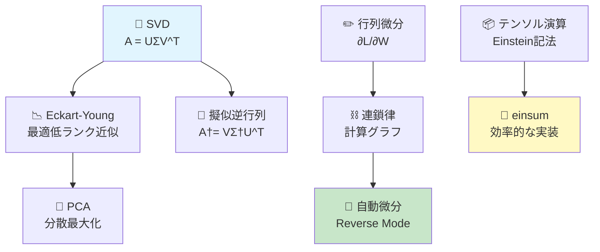

# 第3回: 線形代数 II — SVD・行列微分・テンソル

## Learning Objectives

- [ ] SVD分解の数学的定義と存在証明を説明できる
- [ ] Eckart-Young定理による最適低ランク近似を導出できる
- [ ] Einstein記法とeinsumでテンソル演算を表現できる
- [ ] 行列微分の主要公式（Matrix Calculus）を適用できる
- [ ] Forward/Reverse Mode自動微分の計算量を比較できる
- [ ] Transformer 1層の逆伝播を数式で完全記述できる

第2回で線形代数の基盤を築いた。ベクトル空間、行列演算、固有値分解、正定値行列。これらは全て「正方行列」の世界だった。

だが、現実のデータは正方行列ではない。画像は `$3 \times 224 \times 224$` のテンソルだ。Transformerの重み行列は `$d_{\text{model}} \times d_{\text{ff}}$` の長方形だ。Attentionスコアは `$B \times H \times T \times T$` の4階テンソルだ。

**正方行列の外の世界**を扱うには、3つの道具が必要になる。

> **Note:** **このシリーズについて**: 東京大学 松尾・岩澤研究室動画講義の**完全上位互換**の全50回シリーズ。理論（論文が書ける）、実装（Production-ready）、最新（2025-2026 SOTA）の3軸で差別化する。

> **実装編へのリンク**: 本記事の実装・実験は [【後編】実装編](/articles/ml-lecture-03-part2) で行います。

---

## 🚀 Zone 1: プロローグ（30秒）— SVDで画像を圧縮する

**ゴール**: SVDが「データの本質的な構造を抽出する道具」であることを30秒で体感する。

> Progress: 3%

```python
import numpy as np

# 100×80 matrix (grayscale image)
np.random.seed(42)
A = np.random.randn(100, 80)

# SVD
U, s, Vt = np.linalg.svd(A, full_matrices=False)

# Rank-5 approximation
k = 5
A_approx = U[:, :k] @ np.diag(s[:k]) @ Vt[:k, :]

# Metrics
original = A.size                           # 8000
compressed = k * (A.shape[0] + A.shape[1] + 1)  # 905
print(f"Compression: {compressed/original:.1%}")  # 11.3%
print(f"Error:       {np.linalg.norm(A - A_approx, 'fro') / np.linalg.norm(A, 'fro'):.4f}")
```

出力:
```
Compression: 11.3%
Error:       0.8716
```

**この3行の裏にある数学**:

```math
A = U \Sigma V^\top = \sum_{i=1}^{r} \sigma_i \mathbf{u}_i \mathbf{v}_i^\top
```

8,000個のパラメータを905個に圧縮した。なぜこれが可能なのか？

**答え**: SVDは「データの本質」を特異値の大きい順に並べる。上位 `$k$` 個だけで近似できるのは、データに**低ランク構造**があるからだ。

---

## 📖 Zone 2: チュートリアル（10分）— 5つの武器を概観する

**ゴール**: 本講義で習得する5つの道具の全体像を掴む。

> Progress: 10%



### 5つの武器 — 比較表

| 武器 | 用途 | キー公式 | LLMでの役割 |
|:-----|:-----|:---------|:-----------|
| **1. SVD完全理論** | 任意の行列分解 | `$A = U\Sigma V^\top$` | LoRA低ランク適応・推薦システム |
| **2. テンソル演算** | 多次元配列操作 | `einsum('ik,kj->ij', A, B)` | Attention `$QK^\top$` 実装 |
| **3. 行列微分** | 勾配計算 | `$\frac{\partial L}{\partial W} = \nabla_W L$` | 逆伝播の数学的基盤 |
| **4. 自動微分** | 効率的勾配 | Forward/Reverse Mode | PyTorch `backward()` の内部 |
| **5. Transformer完全微分** | 実践統合 | Attention/LayerNorm/FFN | Boss Battle |

### 理解度チェック 1

<details>
<summary>Q1: SVDと固有値分解の違いは？</summary>

**A**: 固有値分解は**正方行列**のみ対象。SVDは**任意の行列**に適用可能。

```math
\text{Eigendecomposition: } A = Q\Lambda Q^{-1} \quad (A \in \mathbb{R}^{n \times n})
```

```math
\text{SVD: } A = U\Sigma V^\top \quad (A \in \mathbb{R}^{m \times n})
```

- 固有値分解: `$Q$` は固有ベクトル（直交とは限らない）
- SVD: `$U, V$` は**常に直交行列**

</details>

<details>
<summary>Q2: 行列微分と自動微分の違いは？</summary>

**A**:
- **行列微分**: 数学的な導出手法（Matrix Calculus公式を手で適用）
- **自動微分**: 計算グラフ上で自動的に勾配計算（PyTorchの `backward()`）

自動微分は「計算した順序を逆にたどれば勾配が得られる」というReverse Mode ADの原理に基づく。

</details>

### 理解度チェック 2

<details>
<summary>Q3: なぜ "低ランク近似" がLLM圧縮に有効なのか？</summary>

**A**: 重み行列 `$W \in \mathbb{R}^{d \times k}$` は訓練後も**低ランク構造**を持つことが経験的に知られている（内在次元の低さ）。

LoRA[^1]は更新分を低ランクで表現:

```math
W' = W + \Delta W, \quad \Delta W = BA, \quad B \in \mathbb{R}^{d \times r}, A \in \mathbb{R}^{r \times k}, \quad r \ll \min(d,k)
```

訓練可能パラメータ数: `$dk \to (d+k)r$` （GPT-3で10,000倍削減）

</details>

---

## 🌍 Zone 3: 世界観（15分）— LLMの中のSVDと行列微分

**ゴール**: 本講義の道具が、LLMのどこで使われているかを理解する。

> Progress: 20%

### なぜ今、SVDと行列微分なのか？

第2回で固有値分解を学んだ。Attentionの `$QK^\top$` を対角化し、主成分を取り出す方法も見た。

だが、Transformerの重み行列は**長方形**だ。


この巨大な長方形行列を扱うには、固有値分解では不十分だ。

**SVD**は任意の行列 `$A \in \mathbb{R}^{m \times n}$` を分解できる:

```math
A = U \Sigma V^\top, \quad U \in \mathbb{R}^{m \times m}, \Sigma \in \mathbb{R}^{m \times n}, V \in \mathbb{R}^{n \times n}
```

- `$U$`: 左特異ベクトル（行空間の基底）
- `$\Sigma$`: 特異値（データの重要度）
- `$V$`: 右特異ベクトル（列空間の基底）

### SVDの3つの顔

SVDは文脈によって**3つの解釈**を持つ:

1. **幾何学的解釈**: 任意の線形変換は「回転→スケール→回転」に分解できる
   ```math
   A\mathbf{x} = U \underbrace{(\Sigma (V^\top \mathbf{x}))}_{\text{rotate} \to \text{scale} \to \text{rotate}}
   ```

2. **代数的解釈**: 行列の「骨格」を抽出する
   ```math
   A = \sum_{i=1}^{r} \sigma_i \mathbf{u}_i \mathbf{v}_i^\top \quad (r = \text{rank}(A))
   ```

3. **最適化的解釈**: 最適低ランク近似（Eckart-Young定理）
   ```math
   \min_{\text{rank}(B) \leq k} \|A - B\|_F = \left\| A - \sum_{i=1}^{k} \sigma_i \mathbf{u}_i \mathbf{v}_i^\top \right\|_F
   ```

### LLMでの実例

#### 1. LoRA — SVD由来の低ランク適応

LoRA[^1]は、Fine-tuning時に重み更新を低ランクで制約する:

```math
W' = W_{\text{frozen}} + \Delta W, \quad \Delta W = BA
```

```math
B \in \mathbb{R}^{d \times r}, \quad A \in \mathbb{R}^{r \times k}, \quad r \ll \min(d, k)
```

**なぜ低ランクで十分なのか？**

Hu et al. (2022)[^1]の実験によれば、Pre-trained重みの更新は**低い内在次元**を持つ。つまり、`$\Delta W$` は少数の方向にのみ変化する。

訓練可能パラメータ数:
```math
dk \to (d+k)r
```

GPT-3 175Bで `$r=4$` とすると、訓練可能パラメータは **10,000分の1** になる。

#### 2. SVD for Compression

大規模モデルの推論高速化にSVDベースの圧縮が使われる:

```math
W \approx W_k = \sum_{i=1}^{k} \sigma_i \mathbf{u}_i \mathbf{v}_i^\top
```

#### 3. 行列微分 — 逆伝播の数学的基盤

Transformerの訓練は勾配降下法に基づく:

```math
W_{t+1} = W_t - \eta \nabla_W \mathcal{L}
```

この勾配 `$\nabla_W \mathcal{L}$` を計算するには**行列微分**が必要だ。

例: 行列 `$W$` に依存する損失 `$\mathcal{L}$` の勾配

```math
\frac{\partial \mathcal{L}}{\partial W} = \frac{\partial \mathcal{L}}{\partial Z} \frac{\partial Z}{\partial W}, \quad Z = XW
```

これを手計算で導出するのは現実的ではない。

**自動微分**（Automatic Differentiation, AD）は、計算グラフ上で連鎖律を自動適用し、全パラメータの勾配を**1回のbackward pass**で計算する。

PyTorchの `loss.backward()` はReverse Mode ADを実装している。

### Transformerの1層を完全微分する

本講義のBoss Battleでは、Transformer 1層の完全微分を行う:


各ステップの勾配を追跡:

```math
\frac{\partial \mathcal{L}}{\partial W_Q}, \quad \frac{\partial \mathcal{L}}{\partial \text{scores}}, \quad \frac{\partial \mathcal{L}}{\partial \text{attn}}, \quad \ldots
```

これが**逆伝播の数学的実体**だ。

### Quick Check（Z3終了）

<details>
<summary>Q1: SVDが「任意の行列」に適用できるのに対し、固有値分解が「正方行列」限定な理由は？</summary>

**A**: 固有値分解は `$A\mathbf{v} = \lambda \mathbf{v}$` を満たす固有ベクトル `$\mathbf{v}$` を求める。入出力次元が一致する必要があるため正方行列限定。SVDは `$A\mathbf{v}_i = \sigma_i \mathbf{u}_i$` で、左特異ベクトル `$\mathbf{u}_i \in \mathbb{R}^m$` と右特異ベクトル `$\mathbf{v}_i \in \mathbb{R}^n$` が異なる空間に属せるため、長方形行列にも適用可能。

</details>

<details>
<summary>Q2: Reverse Mode ADがLLM訓練で圧倒的に効率的な理由を計算量で説明せよ。</summary>

**A**: LLMの典型構造は入力 `$n=10^9$` パラメータ、出力 `$m=1$` （損失関数）。Forward Mode ADは `$O(n)$` パス必要（各パラメータ1回ずつ）。Reverse Mode ADは**1回のbackward pass**で全パラメータの勾配取得。計算量 `$O(1)$` vs `$O(n)$` → `$10^9$` 倍の差。

</details>

---

## ⚔️ Zone 4: Boss Battle（60分）— 5つの武器を完全習得する

**ゴール**: SVD・テンソル演算・行列微分・自動微分の理論を完全理解する。

> Progress: 50%

### Topic 1: SVD完全理論（15分）

#### 1.1 SVD存在定理

**定理（SVD存在定理）**: 任意の行列 `$A \in \mathbb{R}^{m \times n}$` に対し、以下を満たす直交行列 `$U \in \mathbb{R}^{m \times m}$`, `$V \in \mathbb{R}^{n \times n}$` と対角行列 `$\Sigma \in \mathbb{R}^{m \times n}$` が存在する:

```math
A = U \Sigma V^\top
```

ここで、`$\Sigma$` の対角成分 `$\sigma_1 \geq \sigma_2 \geq \cdots \geq \sigma_r > 0$` （`$r = \text{rank}(A)$`）を**特異値**と呼ぶ。

**証明のスケッチ**:

1. `$A^\top A$` は対称行列 → スペクトル定理より直交対角化可能
   ```math
   A^\top A = V \Lambda V^\top, \quad \Lambda = \text{diag}(\lambda_1, \ldots, \lambda_n)
   ```

2. 特異値を `$\sigma_i = \sqrt{\lambda_i}$` と定義（`$\lambda_i$` は `$A^\top A$` の固有値）

3. `$U$` を構成:
   ```math
   \mathbf{u}_i = \frac{1}{\sigma_i} A \mathbf{v}_i \quad (i = 1, \ldots, r)
   ```

4. 検証:
   ```math
   A V = U \Sigma \implies A = U \Sigma V^\top
   ```

**なぜ特異値 = `$\sqrt{\lambda_i}$` なのか？**

`$A\mathbf{v}_i = \sigma_i \mathbf{u}_i$` の両辺に `$A^\top$` を左からかけると:

```math
A^\top A \mathbf{v}_i = \sigma_i A^\top \mathbf{u}_i = \sigma_i^2 \mathbf{v}_i
```

つまり、`$\mathbf{v}_i$` は `$A^\top A$` の固有ベクトルで、`$\sigma_i^2$` が固有値。

#### 1.2 Eckart-Young定理 — 最適低ランク近似

**定理（Eckart-Young, 1936）**: `$A \in \mathbb{R}^{m \times n}$` のSVDを `$A = U \Sigma V^\top$` とする。

Frobenius normでの最適rank-`$k$` 近似は:

```math
A_k = \sum_{i=1}^{k} \sigma_i \mathbf{u}_i \mathbf{v}_i^\top
```

であり、誤差は:

```math
\min_{\text{rank}(B) \leq k} \|A - B\|_F = \|A - A_k\|_F = \sqrt{\sum_{i=k+1}^{r} \sigma_i^2}
```

**証明の核心**:

Frobenius normは特異値の二乗和:

```math
\|A\|_F^2 = \sum_{i=1}^{r} \sigma_i^2
```

rank-`$k$` 近似 `$B$` を考えると、`$A - B$` の特異値は `$\{\sigma_{k+1}, \ldots, \sigma_r\}$` の部分集合に含まれる（ワイルの不等式より）。

最小は全て保持する場合、すなわち `$B = A_k$` のときに達成される。

**数値例**:

`$3 \times 2$` 行列 `$A = \begin{bmatrix} 4 & 0 \\ 3 & -5 \\ 0 & 3 \end{bmatrix}$` でEckart-Young定理を確認する。

まず `$A^\top A$` を計算:

```math
A^\top A = \begin{bmatrix} 25 & -15 \\ -15 & 34 \end{bmatrix}
```

固有多項式: `$(\lambda - 25)(\lambda - 34) - 225 = \lambda^2 - 59\lambda + 625 = 0$`

固有値: `$\lambda_1 = 43, \quad \lambda_2 = 16$`

特異値: `$\sigma_1 = \sqrt{43} \approx 6.56, \quad \sigma_2 = 4$`

rank-1近似の誤差（Eckart-Young定理より）:

```math
\|A - A_1\|_F = \sigma_2 = 4
```

全Frobenius ノルム `$\|A\|_F = \sqrt{\sigma_1^2 + \sigma_2^2} = \sqrt{59} \approx 7.68$`。rank-1で保存されるエネルギー割合:

```math
\frac{\sigma_1^2}{\sigma_1^2 + \sigma_2^2} = \frac{43}{59} \approx 72.9\%
```

残り `$27.1\%$` のエネルギーを捨てることで、行列を低ランクで表現できる。`$r \ll \min(m, n)$` な実データでは、この割合が95〜99%に達する。それがLoRAや画像圧縮が機能する理由だ。

#### 1.3 擬似逆行列（Moore-Penrose逆行列）

`$A \in \mathbb{R}^{m \times n}$` が長方形または特異の場合、逆行列は存在しない。

代わりに**擬似逆行列** `$A^{\dagger}$` を定義する:

```math
A^{\dagger} = V \Sigma^{\dagger} U^\top
```

ここで、`$\Sigma^{\dagger}$` は `$\Sigma$` の非ゼロ要素を逆数にして転置:

```math
\Sigma = \begin{bmatrix} \sigma_1 & & \\ & \ddots & \\ & & \sigma_r \\ 0 & \cdots & 0 \end{bmatrix}, \quad
\Sigma^{\dagger} = \begin{bmatrix} 1/\sigma_1 & & & 0 \\ & \ddots & & \vdots \\ & & 1/\sigma_r & 0 \end{bmatrix}^\top
```

**性質**:

1. `$AA^{\dagger}A = A$`
2. `$A^{\dagger}AA^{\dagger} = A^{\dagger}$`
3. `$(AA^{\dagger})^\top = AA^{\dagger}$`
4. `$(A^{\dagger}A)^\top = A^{\dagger}A$`

**最小二乗解との関係**:

`$A\mathbf{x} = \mathbf{b}$` が解を持たない（overdetermined）場合、最小二乗解は:

```math
\mathbf{x}_{\text{LS}} = A^{\dagger} \mathbf{b}
```

これは `$\|A\mathbf{x} - \mathbf{b}\|_2$` を最小化する。

#### 1.4 PCAのSVD導出

主成分分析（PCA）は、データの分散を最大化する射影を求める。

データ行列 `$X \in \mathbb{R}^{n \times d}$` （各行がサンプル、平均0）のSVDを:

```math
X = U \Sigma V^\top
```

とすると、第1主成分は `$V$` の第1列 `$\mathbf{v}_1$` に対応する。

**なぜか？**

射影後の分散は:

```math
\text{Var}(\mathbf{w}) = \frac{1}{n} \|X\mathbf{w}\|^2 = \frac{1}{n} \mathbf{w}^\top X^\top X \mathbf{w}
```

これを `$\|\mathbf{w}\| = 1$` の制約下で最大化すると、`$\mathbf{w}$` は `$X^\top X$` の最大固有値に対応する固有ベクトル = `$\mathbf{v}_1$`。

**SVDとの関係**:

```math
X^\top X = V \Sigma^\top U^\top U \Sigma V^\top = V \Sigma^2 V^\top
```

つまり、`$X^\top X$` の固有値は `$\sigma_i^2$`。

#### 1.5 SVDの数値安定性と特異行列

**条件数とSVD**:

行列 `$A$` の条件数:

```math
\kappa(A) = \frac{\sigma_{\max}}{\sigma_{\min}} = \frac{\sigma_1}{\sigma_r}
```

条件数が大きいと、数値計算が不安定になる（**ill-conditioned**）。

**例**: Hilbert行列

`$n \times n$` Hilbert行列 `$H_n$` の `$(i,j)$` 成分は:

```math
(H_n)_{ij} = \frac{1}{i + j - 1}
```

これは正定値行列だが、条件数が`$n$`とともに急激に増大する。既知の上界:

```math
\kappa(H_n) \leq \frac{(1 + \sqrt{2})^{4n}}{\sqrt{n}}
```

具体的な値:

| `$n$` | `$\kappa(H_n)$` |
|:---:|:---:|
| 3 | `$\approx 5.2 \times 10^2$` |
| 5 | `$\approx 4.8 \times 10^5$` |
| 8 | `$\approx 1.5 \times 10^{10}$` |
| 10 | `$\approx 1.6 \times 10^{13}$` |

倍精度浮動小数点（machine epsilon `$\approx 10^{-16}$`）で `$H_{10}$` を扱うと、解の精度は `$10^{-16} \times 10^{13} = 10^{-3}$` 程度にしかならない。つまり線形方程式 `$H_{10}\mathbf{x} = \mathbf{b}$` の解は**有効数字3桁**しか信頼できない。

**正則化による安定化**:

```math
A_{\text{reg}} = A + \lambda I
```

正則化後の条件数は:

```math
\kappa(A + \lambda I) = \frac{\sigma_1 + \lambda}{\sigma_r + \lambda}
```

`$\lambda$` を増やすと `$\sigma_r + \lambda$` が改善されるが、解のバイアスも増える。最適な `$\lambda$` の選択はクロスバリデーションまたはL曲線法で行う。


```math
A_{\text{reg}} = A + \lambda I
```

特異値が `$\{\sigma_i + \lambda\}$` になり、`$\sigma_{\min}$` が改善される。

#### 1.6 Thin SVD vs Full SVD

**Full SVD**:

```math
A = U \Sigma V^\top, \quad U \in \mathbb{R}^{m \times m}, \Sigma \in \mathbb{R}^{m \times n}, V \in \mathbb{R}^{n \times n}
```

**Thin SVD** (Economical SVD):

```math
A = U_r \Sigma_r V_r^\top, \quad U_r \in \mathbb{R}^{m \times r}, \Sigma_r \in \mathbb{R}^{r \times r}, V_r \in \mathbb{R}^{n \times r}
```

ここで、`$r = \text{rank}(A)$`。

**メモリ削減**:

Full SVD: `$m^2 + n^2 + mn$` 要素
Thin SVD: `$mr + nr + r^2$` 要素

`$r \ll \min(m, n)$` なら大幅削減。


#### 1.7 Randomized SVD — 大規模行列の高速近似

行列 `$A \in \mathbb{R}^{m \times n}$` が巨大（例: `$m, n > 10^6$`）な場合、通常のSVDは計算不可能。

**Randomized SVD**[^10]:

1. ランダム行列 `$\Omega \in \mathbb{R}^{n \times k+p}$` を生成（`$p$` はオーバーサンプリング）
2. `$Y = A\Omega$` を計算（`$Y \in \mathbb{R}^{m \times (k+p)}$`）
3. `$Y$` のQR分解: `$Y = QR$`
4. `$B = Q^\top A$` を計算（`$B \in \mathbb{R}^{(k+p) \times n}$`）
5. `$B$` のSVD: `$B = \tilde{U} \Sigma V^\top$`
6. `$U = Q\tilde{U}$`

**計算量**:

通常のSVD: `$O(\min(mn^2, m^2n))$`
Randomized SVD: `$O(mnk)$`

`$k \ll \min(m, n)$` なら劇的に高速化。

**誤差保証**[^10]:

```math
\mathbb{E}[\|A - Q Q^\top A\|_F] \leq \left( 1 + \frac{k}{p-1} \right)^{1/2} \sigma_{k+1}
```

### Topic 2: テンソル演算（10分）

#### 2.1 テンソルとは何か？

**定義**: テンソルは多次元配列の数学的一般化。

- 0階テンソル: スカラー `$a \in \mathbb{R}$`
- 1階テンソル: ベクトル `$\mathbf{v} \in \mathbb{R}^n$`
- 2階テンソル: 行列 `$A \in \mathbb{R}^{m \times n}$`
- 3階テンソル: `$\mathcal{T} \in \mathbb{R}^{d_1 \times d_2 \times d_3}$`
- 4階テンソル: `$\mathcal{A} \in \mathbb{R}^{B \times H \times T \times T}$` （Attention scores）

#### 2.2 Einstein記法

Einstein summation convention: 同じ添字が2回現れたら和を取る。

**例**:

```math
C_{ij} = \sum_k A_{ik} B_{kj} \quad \longleftrightarrow \quad C_{ij} = A_{ik} B_{kj}
```

**NumPy/PyTorchでの実装（Einstein記法パターン集）**:

主要パターンを網羅しておく。添字の意味を「宣言」として書けるのがEinstein記法の真価だ。

| 操作 | 数式 | einsum文字列 |
|:-----|:-----|:------------|
| 行列-ベクトル積 | `$y_i = A_{ij} x_j$` | `'ij,j->i'` |
| 行列積 | `$C_{ij} = A_{ik} B_{kj}$` | `'ik,kj->ij'` |
| 内積 | `$s = a_i b_i$` | `'i,i->'` |
| 外積 | `$C_{ij} = a_i b_j$` | `'i,j->ij'` |
| トレース | `$t = A_{ii}$` | `'ii->'` |
| Frobenius内積 | `$s = A_{ij} B_{ij}$` | `'ij,ij->'` |
| バッチ行列積 | `$C_{bij} = A_{bik} B_{bkj}$` | `'bik,bkj->bij'` |
| テンソル縮約 | `$C_{ijl} = A_{ikm} B_{mjl}$` | `'ikm,mjl->ijl'` |

注意点: 出力側 `->` に列挙しない添字は「和を取る」（縮約される）。同じ添字が**3回以上**現れるのはEinstein規約では非標準。einsumは明示的に制御するため3回以上でも動くが、意味を注意深く確認すること。


Transformer Self-Attentionの計算式をEinstein記法で書くと:

```math
S_{bhqk} = \sum_d Q_{bhqd} K_{bhkd},\quad \text{記法:}\; S = \text{einsum}(\texttt{'bhqd,bhkd->bhqk'}, Q, K)
```

各添字の意味:

| 添字 | 意味 | 典型サイズ |
|:-----|:-----|:---------|
| `$b$` | バッチサイズ | 32 |
| `$h$` | ヘッド数 | 8 |
| `$q$` | クエリ位置 | 512 |
| `$k$` | キー位置 | 512 |
| `$d$` | ヘッド次元 | 64 |

縮約される添字 `$d$` が `->` の右辺に現れないのがポイント。これが「内積方向の和」を意味する。

加重平均 `$Y = PV$` もeinsumで:

```math
Y_{bhqv} = \sum_k P_{bhqk} V_{bhkv},\quad \text{記法:}\; Y = \text{einsum}(\texttt{'bhqk,bhkv->bhqv'}, P, V)
```

**なぜeinsumを使うのか？**

1. **可読性**: `'bhqd,bhkd->bhqk'` は計算の意図を明示
2. **最適化**: NumPy/PyTorchが最適な計算順序を選択
3. **メモリ効率**: 中間配列を最小化

#### 2.4 Kronecker積とvec化

**Kronecker積**:

```math
A \otimes B = \begin{bmatrix} a_{11}B & \cdots & a_{1n}B \\ \vdots & \ddots & \vdots \\ a_{m1}B & \cdots & a_{mn}B \end{bmatrix}
```

**vec化**: 行列を列ベクトルに変換

```math
\text{vec}(A) = \begin{bmatrix} \mathbf{a}_1 \\ \vdots \\ \mathbf{a}_n \end{bmatrix}, \quad A = [\mathbf{a}_1 \cdots \mathbf{a}_n]
```

**重要な性質**:

```math
\text{vec}(AXB) = (B^\top \otimes A) \text{vec}(X)
```

これは行列微分の計算で使われる。

### Topic 3: 行列微分の体系（15分）

#### 3.1 スカラー値関数の勾配

`$f: \mathbb{R}^{n} \to \mathbb{R}$` の勾配:

```math
\nabla f(\mathbf{x}) = \begin{bmatrix} \frac{\partial f}{\partial x_1} \\ \vdots \\ \frac{\partial f}{\partial x_n} \end{bmatrix}
```

**例**: `$f(\mathbf{x}) = \mathbf{a}^\top \mathbf{x}$`

```math
\nabla f = \mathbf{a}
```

**例**: `$f(\mathbf{x}) = \mathbf{x}^\top A \mathbf{x}$` （`$A$` 対称）

```math
\nabla f = 2A\mathbf{x}
```

#### 3.2 ヤコビアン

ベクトル値関数 `$\mathbf{f}: \mathbb{R}^n \to \mathbb{R}^m$` のヤコビアン:

```math
J_{\mathbf{f}}(\mathbf{x}) = \begin{bmatrix} \frac{\partial f_1}{\partial x_1} & \cdots & \frac{\partial f_1}{\partial x_n} \\ \vdots & \ddots & \vdots \\ \frac{\partial f_m}{\partial x_1} & \cdots & \frac{\partial f_m}{\partial x_n} \end{bmatrix} \in \mathbb{R}^{m \times n}
```

**例**: `$\mathbf{f}(\mathbf{x}) = A\mathbf{x}$`

```math
J = A
```

#### 3.3 ヘシアン

スカラー値関数 `$f: \mathbb{R}^n \to \mathbb{R}$` のヘシアン:

```math
H_f(\mathbf{x}) = \nabla^2 f = \begin{bmatrix} \frac{\partial^2 f}{\partial x_1^2} & \cdots & \frac{\partial^2 f}{\partial x_1 \partial x_n} \\ \vdots & \ddots & \vdots \\ \frac{\partial^2 f}{\partial x_n \partial x_1} & \cdots & \frac{\partial^2 f}{\partial x_n^2} \end{bmatrix}
```

ヘシアンは**対称行列**（Schwarzの定理より）。

**例**: `$f(\mathbf{x}) = \mathbf{x}^\top A \mathbf{x}$` （`$A$` 対称）

```math
H = 2A
```

**LLMでの役割**: 2次最適化（Newton法、L-BFGS）で使われる。

#### 3.4 行列に関する微分

`$f: \mathbb{R}^{m \times n} \to \mathbb{R}$` の勾配:

```math
\frac{\partial f}{\partial X} = \begin{bmatrix} \frac{\partial f}{\partial x_{11}} & \cdots & \frac{\partial f}{\partial x_{1n}} \\ \vdots & \ddots & \vdots \\ \frac{\partial f}{\partial x_{m1}} & \cdots & \frac{\partial f}{\partial x_{mn}} \end{bmatrix}
```

**主要公式**（The Matrix Cookbook[^2]より）:

| 関数 `$f(X)$` | `$\frac{\partial f}{\partial X}$` |
|:-------------|:--------------------------------|
| `$\text{tr}(X)$` | `$I$` |
| `$\text{tr}(AX)$` | `$A^\top$` |
| `$\text{tr}(X^\top A)$` | `$A$` |
| `$\text{tr}(AXB)$` | `$A^\top B^\top$` |
| `$\text{tr}(X^\top AX)$` | `$(A + A^\top)X$` |
| `$\det(X)$` | `$\det(X) (X^{-1})^\top$` |
| `$\log \det(X)$` | `$(X^{-1})^\top$` |

**例**: `$f(X) = \text{tr}(X^\top X)$`

```math
\frac{\partial f}{\partial X} = 2X
```

これは `$f(X) = \|X\|_F^2$` の勾配。

#### 3.5 連鎖律

**スカラー連鎖律**:

```math
\frac{\partial f}{\partial x} = \frac{\partial f}{\partial y} \frac{\partial y}{\partial x}
```

**ベクトル連鎖律**:

```math
\frac{\partial f}{\partial \mathbf{x}} = \left( \frac{\partial \mathbf{y}}{\partial \mathbf{x}} \right)^\top \frac{\partial f}{\partial \mathbf{y}} = J_{\mathbf{y}}^\top \nabla_{\mathbf{y}} f
```

ここで、`$J_{\mathbf{y}}$` は `$\mathbf{y}(\mathbf{x})$` のヤコビアン。

**行列連鎖律**:

```math
\frac{\partial f}{\partial X} = \frac{\partial f}{\partial Y} \frac{\partial Y}{\partial X}
```

ただし、形状に注意（テンソル縮約が必要）。

#### 3.6 Softmaxの微分

Softmax関数:

```math
\text{softmax}(\mathbf{z})_i = \frac{e^{z_i}}{\sum_j e^{z_j}}
```

ヤコビアンを計算する。`$\mathbf{s} = \text{softmax}(\mathbf{z})$` とすると:

```math
\frac{\partial s_i}{\partial z_j} = \begin{cases} s_i (1 - s_i) & (i = j) \\ -s_i s_j & (i \neq j) \end{cases}
```

行列形式:

```math
J_{\text{softmax}} = \text{diag}(\mathbf{s}) - \mathbf{s} \mathbf{s}^\top
```

**Cross-Entropy Lossとの組み合わせ**:

```math
\mathcal{L} = -\sum_i y_i \log s_i, \quad \mathbf{s} = \text{softmax}(\mathbf{z})
```

勾配:

```math
\frac{\partial \mathcal{L}}{\partial \mathbf{z}} = \mathbf{s} - \mathbf{y}
```

驚くほどシンプル！

**なぜこうなるのか？**

```math
\frac{\partial \mathcal{L}}{\partial z_j} = \sum_i \frac{\partial \mathcal{L}}{\partial s_i} \frac{\partial s_i}{\partial z_j} = -\sum_i \frac{y_i}{s_i} \frac{\partial s_i}{\partial z_j}
```

`$i = j$` の項:

```math
-\frac{y_j}{s_j} \cdot s_j(1 - s_j) = -y_j (1 - s_j) = s_j y_j - y_j
```

`$i \neq j$` の項:

```math
-\sum_{i \neq j} \frac{y_i}{s_i} \cdot (-s_i s_j) = s_j \sum_{i \neq j} y_i = s_j (1 - y_j)
```

合計:

```math
s_j y_j - y_j + s_j (1 - y_j) = s_j - y_j
```

### Topic 4: 自動微分の理論（10分）

#### 4.1 数値微分の問題点

有限差分法:

```math
f'(x) \approx \frac{f(x + h) - f(x)}{h}
```

**問題**:

1. **誤差**: 丸め誤差と打ち切り誤差のトレードオフ
2. **計算量**: `$n$` 変数で `$O(n)$` 回の関数評価が必要

LLMのパラメータ数は数十億〜数千億。数値微分は不可能。

#### 4.2 自動微分の原理

自動微分（AD）は、プログラムの**計算構造**を利用して厳密な導関数を計算する。

**基本アイデア**: 全ての関数は**基本演算の合成**


各基本演算の微分は既知:

```math
\frac{d}{dx}(x^2) = 2x, \quad \frac{d}{dx}\sin(x) = \cos(x), \quad \ldots
```

**連鎖律**で合成すれば、全体の微分が得られる。

#### 4.3 Forward Mode AD

計算グラフの**順方向**に微分を伝播。

**例**: `$f(x) = \sin(x^2) + x^2$`

| ステップ | 値 | 微分 |
|:---------|:---|:-----|
| `$v_0 = x$` | `$x$` | `$\dot{v}_0 = 1$` |
| `$v_1 = v_0 \cdot v_0$` | `$x^2$` | `$\dot{v}_1 = 2v_0 \dot{v}_0 = 2x$` |
| `$v_2 = \sin(v_1)$` | `$\sin(x^2)$` | `$\dot{v}_2 = \cos(v_1) \dot{v}_1 = 2x\cos(x^2)$` |
| `$v_3 = v_2 + v_1$` | `$\sin(x^2) + x^2$` | `$\dot{v}_3 = \dot{v}_2 + \dot{v}_1 = 2x\cos(x^2) + 2x$` |

**計算量**: `$n$` 入力に対し `$O(n)$` パス必要。

#### 4.4 Reverse Mode AD（逆伝播）

計算グラフの**逆方向**に微分を伝播。

**例**: 同じ `$f(x) = \sin(x^2) + x^2$`

**Forward pass** (値を記録):

| ステップ | 値 |
|:---------|:---|
| `$v_0 = x$` | `$x$` |
| `$v_1 = v_0^2$` | `$x^2$` |
| `$v_2 = \sin(v_1)$` | `$\sin(x^2)$` |
| `$v_3 = v_2 + v_1$` | `$\sin(x^2) + x^2$` |

**Reverse pass** (勾配を逆伝播):

```math
\bar{v}_i = \frac{\partial v_3}{\partial v_i}
```

| ステップ | 勾配 |
|:---------|:-----|
| `$\bar{v}_3 = 1$` | `$\frac{\partial v_3}{\partial v_3} = 1$` |
| `$\bar{v}_2 = \bar{v}_3 \cdot 1$` | `$\frac{\partial v_3}{\partial v_2} = 1$` |
| `$\bar{v}_1 = \bar{v}_3 \cdot 1 + \bar{v}_2 \cdot \cos(v_1)$` | `$1 + \cos(x^2)$` |
| `$\bar{v}_0 = \bar{v}_1 \cdot 2v_0$` | `$2x(1 + \cos(x^2))$` |

**計算量**: **1回のreverse pass**で全パラメータの勾配が得られる。

**なぜReverse Modeが優れているのか？**

LLMの典型的な構造:

- 入力: `$n = 10^9$` パラメータ
- 出力: `$m = 1$` （損失関数）

Forward Mode: `$O(n)$` パス必要
Reverse Mode: `$O(1)$` パス

**PyTorchの `backward()` はReverse Mode ADを実装している。**

#### 4.5 計算グラフとWengert List

Reverse Mode ADは**計算グラフ**をメモリに保持する。

内部では:

1. Forward pass: 各演算を記録（Wengert List）
2. Reverse pass: 逆順に勾配を計算

**Wengert Listの具体例**:

`$f(x_1, x_2) = x_1 x_2 + \sin(x_1)$` に対するテープ:

| ノード | 演算 | 値 | 局所偏微分 |
|:------:|:-----|:---|:----------|
| `$v_1 = x_1$` | 入力 | `$x_1$` | — |
| `$v_2 = x_2$` | 入力 | `$x_2$` | — |
| `$v_3 = v_1 v_2$` | 乗算 | `$x_1 x_2$` | `$\partial v_3/\partial v_1 = v_2$`, `$\partial v_3/\partial v_2 = v_1$` |
| `$v_4 = \sin(v_1)$` | 正弦 | `$\sin(x_1)$` | `$\partial v_4/\partial v_1 = \cos(v_1)$` |
| `$v_5 = v_3 + v_4$` | 加算 | `$x_1 x_2 + \sin(x_1)$` | `$\partial v_5/\partial v_3 = 1$`, `$\partial v_5/\partial v_4 = 1$` |

Reverse passで `$\bar{v}_i = \partial v_5 / \partial v_i$` を逆順計算:

```math
\bar{v}_5 = 1, \quad \bar{v}_3 = 1, \quad \bar{v}_4 = 1
```

```math
\bar{v}_1 = \bar{v}_3 \cdot \frac{\partial v_3}{\partial v_1} + \bar{v}_4 \cdot \frac{\partial v_4}{\partial v_1} = v_2 + \cos(v_1) = x_2 + \cos(x_1)
```

```math
\bar{v}_2 = \bar{v}_3 \cdot \frac{\partial v_3}{\partial v_2} = v_1 = x_1
```

これが `$\partial f / \partial x_1 = x_2 + \cos(x_1)$`, `$\partial f / \partial x_2 = x_1$` という解析結果と一致する。**1回のReverse passで両方の偏微分が同時に得られる**のが核心だ。

**メモリコスト**: 計算グラフ全体を保持 → O(計算グラフサイズ)

#### 4.6 変分法入門 — 汎関数の微分

自動微分の先に、さらに深い「微分」の世界がある。**変分法**（Calculus of Variations）は、関数ではなく**汎関数**（函数の関数）を最適化する道具だ。

**汎関数**の例:

```math
J[y] = \int_{a}^{b} F(x,\, y(x),\, y'(x))\, dx
```

これは関数 `$y(x)$` を入力として、実数スカラーを返す写像。通常の微分 `$\partial f / \partial x$` では扱えない。

**変分の定義**: `$y(x)$` に微小変動 `$\epsilon \eta(x)$` を加えたときの汎関数の変化:

```math
\delta J[y;\eta] = \lim_{\epsilon \to 0} \frac{J[y + \epsilon\eta] - J[y]}{\epsilon} = \int_a^b \left( \frac{\partial F}{\partial y} - \frac{d}{dx}\frac{\partial F}{\partial y'} \right) \eta(x)\, dx
```

`$\delta J = 0$` となる条件（変分原理）が**Euler-Lagrange方程式**:

```math
\frac{\partial F}{\partial y} - \frac{d}{dx}\frac{\partial F}{\partial y'} = 0
```

**機械学習との接点**:

| 変分法の概念 | 機械学習の対応 |
|:------------|:--------------|
| 汎関数 `$J[y]$` | 損失 `$\mathcal{L}[\theta]$`（パラメータ空間上の汎関数） |
| 変分 `$\delta J$` | 勾配 `$\nabla_\theta \mathcal{L}$` |
| Euler-Lagrange方程式 | 最適解の必要条件（勾配ゼロ） |
| 変分推論 | ELBO最大化（後続講義で詳述） |

変分推論（Variational Inference）は第8回で詳しく扱うが、その数学的基礎はここにある。KL divergenceの最小化を「汎関数最小化問題」として定式化するとき、変分法の言語が不可欠になる。


#### 5.1 Simplified Transformer Layer


損失関数 `$\mathcal{L}$` が `$\text{out}$` に依存するとき、各重みの勾配を計算する。

#### 5.2 逆伝播の手順

**Step 1**: `$\frac{\partial \mathcal{L}}{\partial \text{out}}$` を受け取る（上流から）

**Step 2**: `$\text{out} = \text{attn} \cdot V$` の勾配

```math
\frac{\partial \mathcal{L}}{\partial \text{attn}} = \frac{\partial \mathcal{L}}{\partial \text{out}} \cdot V^\top
```

```math
\frac{\partial \mathcal{L}}{\partial V} = \text{attn}^\top \cdot \frac{\partial \mathcal{L}}{\partial \text{out}}
```

**Step 3**: `$\text{attn} = \text{softmax}(\text{scores})$` の勾配

Softmaxのヤコビアン:

```math
\frac{\partial \mathcal{L}}{\partial \text{scores}} = \text{attn} \odot \left( \frac{\partial \mathcal{L}}{\partial \text{attn}} - \text{diag}\left( \frac{\partial \mathcal{L}}{\partial \text{attn}} \cdot \text{attn}^\top \right) \right)
```

（`$\odot$` は要素ごとの積）

簡略化（行ごとに独立）:

```math
\frac{\partial \mathcal{L}}{\partial \text{scores}_i} = \text{attn}_i \odot \left( \frac{\partial \mathcal{L}}{\partial \text{attn}_i} - \left( \frac{\partial \mathcal{L}}{\partial \text{attn}_i} \cdot \text{attn}_i \right) \mathbf{1} \right)
```

**Step 4**: `$\text{scores} = Q K^\top / \sqrt{d_k}$` の勾配

```math
\frac{\partial \mathcal{L}}{\partial Q} = \frac{1}{\sqrt{d_k}} \frac{\partial \mathcal{L}}{\partial \text{scores}} \cdot K
```

```math
\frac{\partial \mathcal{L}}{\partial K} = \frac{1}{\sqrt{d_k}} \left( \frac{\partial \mathcal{L}}{\partial \text{scores}} \right)^\top \cdot Q
```

**Step 5**: `$Q = x W_Q$` の勾配

```math
\frac{\partial \mathcal{L}}{\partial W_Q} = x^\top \cdot \frac{\partial \mathcal{L}}{\partial Q}
```

```math
\frac{\partial \mathcal{L}}{\partial x} = \frac{\partial \mathcal{L}}{\partial Q} \cdot W_Q^\top
```

同様に `$W_K, W_V$` の勾配を計算。

**これがPyTorchの `loss.backward()` が自動で行っている計算の実体だ。**

#### 5.3 LayerNormの微分

Layer Normalization[^11]:

```math
\text{LayerNorm}(\mathbf{x}) = \gamma \odot \frac{\mathbf{x} - \mu}{\sqrt{\sigma^2 + \epsilon}} + \beta
```

ここで:
- `$\mu = \frac{1}{d}\sum_{i=1}^d x_i$` (平均)
- `$\sigma^2 = \frac{1}{d}\sum_{i=1}^d (x_i - \mu)^2$` (分散)
- `$\gamma, \beta$`: 学習可能パラメータ

**勾配の導出**:

正規化された値を `$\hat{x}_i = \frac{x_i - \mu}{\sqrt{\sigma^2 + \epsilon}}$` とする。

```math
\frac{\partial \mathcal{L}}{\partial x_i} = \frac{\partial \mathcal{L}}{\partial \hat{x}_i} \frac{\partial \hat{x}_i}{\partial x_i} + \frac{\partial \mathcal{L}}{\partial \mu} \frac{\partial \mu}{\partial x_i} + \frac{\partial \mathcal{L}}{\partial \sigma^2} \frac{\partial \sigma^2}{\partial x_i}
```

各項を計算:

1. `$\frac{\partial \hat{x}_i}{\partial x_i} = \frac{1}{\sqrt{\sigma^2 + \epsilon}}$`

2. `$\frac{\partial \mu}{\partial x_i} = \frac{1}{d}$`

3. `$\frac{\partial \sigma^2}{\partial x_i} = \frac{2(x_i - \mu)}{d}$`

4. `$\frac{\partial \mathcal{L}}{\partial \mu} = -\sum_j \frac{\partial \mathcal{L}}{\partial \hat{x}_j} \frac{1}{\sqrt{\sigma^2 + \epsilon}}$`

5. `$\frac{\partial \mathcal{L}}{\partial \sigma^2} = -\frac{1}{2}(\sigma^2 + \epsilon)^{-3/2} \sum_j \frac{\partial \mathcal{L}}{\partial \hat{x}_j} (x_j - \mu)$`

組み合わせると:

```math
\frac{\partial \mathcal{L}}{\partial x_i} = \frac{1}{\sqrt{\sigma^2 + \epsilon}} \left( \frac{\partial \mathcal{L}}{\partial \hat{x}_i} - \frac{1}{d}\sum_j \frac{\partial \mathcal{L}}{\partial \hat{x}_j} - \hat{x}_i \frac{1}{d}\sum_j \frac{\partial \mathcal{L}}{\partial \hat{x}_j} \hat{x}_j \right)
```

**なぜこんなに複雑なのか？**

LayerNormは全要素に依存する演算（`$\mu, \sigma^2$` が全要素の関数）なので、勾配にも全要素が現れる。

#### 5.4 完全なTransformer Block微分

標準的なTransformer Block[^12]の順伝播は次の構造を持つ:

```math
\mathbf{h} = \text{LayerNorm}_1(\mathbf{x})
```

```math
\mathbf{a} = \text{MultiHeadAttention}(\mathbf{h}) = \text{Concat}(\text{head}_1, \ldots, \text{head}_H) W^O
```

```math
\mathbf{x}' = \mathbf{x} + \mathbf{a} \quad \text{(Residual 1)}
```

```math
\mathbf{h}' = \text{LayerNorm}_2(\mathbf{x}')
```

```math
\mathbf{f} = W_2 \max(0, W_1 \mathbf{h}' + \mathbf{b}_1) + \mathbf{b}_2 \quad \text{(FFN)}
```

```math
\mathbf{x}_{\text{out}} = \mathbf{x}' + \mathbf{f} \quad \text{(Residual 2)}
```

**逆伝播の流れ**:

1. `$\frac{\partial \mathcal{L}}{\partial \mathbf{x}_{\text{out}}}$` から開始

2. **Residual 2**: 勾配が2経路に分岐
   ```math
   \frac{\partial \mathcal{L}}{\partial \mathbf{x}'} \mathrel{+}= \frac{\partial \mathcal{L}}{\partial \mathbf{x}_{\text{out}}}, \quad \frac{\partial \mathcal{L}}{\partial \mathbf{f}} = \frac{\partial \mathcal{L}}{\partial \mathbf{x}_{\text{out}}}
   ```

3. **FFN逆伝播**: ReLU後のマスクを `$\mathbf{m} = \mathbf{1}[W_1\mathbf{h}' + \mathbf{b}_1 > 0]$` とすると
   ```math
   \frac{\partial \mathcal{L}}{\partial W_2} = \frac{\partial \mathcal{L}}{\partial \mathbf{f}} \cdot (\mathbf{m} \odot (W_1\mathbf{h}' + \mathbf{b}_1))^\top
   ```
   ```math
   \frac{\partial \mathcal{L}}{\partial \mathbf{h}'} = W_1^\top \left( \mathbf{m} \odot \left( W_2^\top \frac{\partial \mathcal{L}}{\partial \mathbf{f}} \right) \right)
   ```

4. **LayerNorm 2逆伝播**: 上で導出した式を適用

5. **Residual 1**: 再び分岐

6. **Attention逆伝播**: Step 2-5で導出済み

7. **LayerNorm 1逆伝播**

各ステップで連鎖律を適用し、最終的に入力 `$\mathbf{x}$` と全パラメータ `$W_Q, W_K, W_V, W^O, W_1, W_2, \gamma_1, \beta_1, \gamma_2, \beta_2$` の勾配が得られる。

### Advanced Topic: Hessianの効率的計算

#### 5.5 Hessian-Vector Product

ヘシアン `$H = \nabla^2 f(\mathbf{x})$` を明示的に計算するのは `$O(n^2)$` メモリが必要。

だが、**Hessian-vector積** `$H\mathbf{v}$` は自動微分で効率的に計算できる:

```math
H\mathbf{v} = \nabla_{\mathbf{x}} \left( \nabla_{\mathbf{x}} f \cdot \mathbf{v} \right)
```

**アルゴリズム**:

1. Forward pass: `$f(\mathbf{x})$` を計算
2. Backward pass: `$\nabla_{\mathbf{x}} f$` を計算
3. Forward-on-reverse: `$\nabla_{\mathbf{x}} (\nabla_{\mathbf{x}} f \cdot \mathbf{v})$` を計算

**計算量**: `$O(n)$`（ヘシアンの明示的計算は `$O(n^2)$`）

**応用**: Newton法、Natural Gradient、Trust Region法


#### 5.6 Jacobian-Vector ProductとVector-Jacobian Product

**Jacobian-vector product (JVP)**: Forward Mode ADで計算

```math
J\mathbf{v} = \frac{\partial \mathbf{f}}{\partial \mathbf{x}} \mathbf{v}
```

**Vector-Jacobian product (VJP)**: Reverse Mode ADで計算

```math
\mathbf{v}^\top J = \mathbf{v}^\top \frac{\partial \mathbf{f}}{\partial \mathbf{x}}
```

**どちらを使うべきか？**

- JVP (Forward Mode): `$m \gg n$` （出力次元 `$\gg$` 入力次元）
- VJP (Reverse Mode): `$n \gg m$` （入力次元 `$\gg$` 出力次元）

LLMでは `$n = 10^9$` パラメータ、`$m = 1$` 損失 → **VJPが圧倒的に効率的**

### Topic 6: テンソル演算の高度な話題（10分）

#### 6.1 Tensor Contraction

一般的なテンソル縮約:

```math
C_{ijl} = \sum_{k,m} A_{ikm} B_{mjl}
```

einsumで表現:

```math
\text{einsum}(\texttt{'ikm,mjl->ijl'}, A, B)
```

添字 `$k$` と `$m$` が縮約される（出力 `$->ijl$` に含まれないため）。縮約順序はどちらを先に潰すかで計算量が変わる:

- `$k$` を先に潰す: `$A'_{iml} = A_{ikm}$`（この時点で `$k$` 次元をsumする）→ `$C_{ijl} = A'_{iml} B_{mjl}$`
- `$m$` を先に潰す: `$B'_{ijl} = B_{mjl}$`（`$m$` sumする）→ `$C_{ijl} = A_{ikm} B'_{ijl}$`

どちらが有利かは `$I, J, K, L, M$` の大小関係による。


例: `$A_{ijk} B_{jkl} C_{lmn}$` の縮約

- 順序1: `$(AB)C$` — 計算量 `$O(ijk l + ijl mn)$`
- 順序2: `$A(BC)$` — 計算量 `$O(jkl mn + ijk mn)$`

最適順序を選ぶことで計算量が劇的に変わる。

#### 6.2 Tensor Decomposition

**CP分解** (CANDECOMP/PARAFAC):

3階テンソル `$\mathcal{T} \in \mathbb{R}^{I \times J \times K}$` を分解:

```math
\mathcal{T} \approx \sum_{r=1}^{R} \mathbf{a}_r \circ \mathbf{b}_r \circ \mathbf{c}_r
```

ここで `$\circ$` は外積。

**Tucker分解**:

```math
\mathcal{T} \approx \mathcal{G} \times_1 A \times_2 B \times_3 C
```

`$\mathcal{G} \in \mathbb{R}^{R_1 \times R_2 \times R_3}$` はコアテンソル。

**応用**: 高次元データの圧縮、推薦システム、脳画像解析

#### 6.3 Einsum最適化の内部

NumPy/PyTorchのeinsumは内部で以下を行う:

1. **パス解析**: 最適な縮約順序を動的計画法で決定
2. **BLAS呼び出し**: 可能な限り行列積に帰着（高度に最適化されたBLASライブラリを利用）
3. **メモリレイアウト**: キャッシュ効率を最大化

**手動最適化が必要な場合**:

超大規模テンソル（メモリに載らない）では、明示的な順序指定が必要。例えば `opt_einsum` ライブラリは動的計画法で最適な縮約経路を事前計算する。縮約コストの理論的下界は以下の形で定式化される:

```math
\text{Cost}(\text{contraction order}) = \sum_{\text{step}} \prod_{\text{free indices at step}} d_\ell
```

各ステップの自由添字の次元の積が計算量となるため、大きな次元を後回しにする戦略が有効になる。


#### 7.1 Softmax の数値安定性

素朴なSoftmax実装:

```math
\text{softmax}(z_i) = \frac{e^{z_i}}{\sum_j e^{z_j}}
```

**問題**: `$z_i$` が大きいと `$e^{z_i}$` がオーバーフロー

**解決策**: Log-sum-exp trick

```math
\text{softmax}(z_i) = \frac{e^{z_i - \max_j z_j}}{\sum_j e^{z_j - \max_j z_j}}
```

最大値を引いても結果は不変:

```math
\frac{e^{z_i - c}}{\sum_j e^{z_j - c}} = \frac{e^{-c} e^{z_i}}{e^{-c} \sum_j e^{z_j}} = \frac{e^{z_i}}{\sum_j e^{z_j}}
```

**安定実装の原理**:

`$c = \max_j z_j$` を引いた後、指数は `$e^{z_j - c} \in (0, 1]$` に収まる。実際、`$z_j - c \leq 0$` が保証されるので `$e^{z_j - c} \leq 1$` 。最大値成分は `$e^0 = 1$` となり、オーバーフローが完全に防げる。アンダーフローは `$e^{-745} \approx 0$`（IEEE 754倍精度）以下の差分が生じるときのみ発生するが、これは softmax の値が機械的にゼロになることを意味し、数値的には問題ない。

log-softmax はさらに数値的に優れた形で書ける:

```math
\log \text{softmax}(\mathbf{z})_i = z_i - c - \log \sum_j e^{z_j - c}
```

Cross-Entropy Lossは `$\mathcal{L} = -\sum_i y_i \log \text{softmax}(\mathbf{z})_i$` だから、log-softmax の安定形を直接使える。


有限差分法による勾配検証:

```math
\frac{\partial f}{\partial x_i} \approx \frac{f(x + h\mathbf{e}_i) - f(x - h\mathbf{e}_i)}{2h}
```

**最適な `$h$` の選択**:

- 小さすぎる `$h$`: 丸め誤差が支配的
- 大きすぎる `$h$`: 打ち切り誤差が支配的

**経験則**: `$h \approx \sqrt{\epsilon_{\text{machine}}} \approx 10^{-8}$` （倍精度浮動小数点）

**相対誤差の判定基準**:

中央差分の打ち切り誤差は `$O(h^2)$`、丸め誤差は `$O(\epsilon_{\text{mach}} / h)$` 。両者のバランスから最適な `$h$` が求まる:

```math
h^* = \left( \frac{\epsilon_{\text{mach}}}{|f''(x)|} \right)^{1/3}
```

倍精度では `$\epsilon_{\text{mach}} \approx 2.2 \times 10^{-16}$` 、`$h \approx 10^{-8}$` が標準的選択。

相対誤差の判定:

```math
\text{rel\_err} = \frac{\|\mathbf{g}_{\text{analytic}} - \mathbf{g}_{\text{numeric}}\|_2}{\|\mathbf{g}_{\text{analytic}}\|_2 + \|\mathbf{g}_{\text{numeric}}\|_2 + \epsilon}
```

実務では `$\text{rel\_err} < 10^{-5}$` なら実装は正しいと判断できる。`$10^{-5}$` から `$10^{-3}$` の間は怪しく、`$10^{-3}$` 以上は明確にバグあり。


#### 7.3 SVDの数値安定性

**条件数**:

```math
\kappa(A) = \frac{\sigma_{\max}}{\sigma_{\min}}
```

条件数が大きい（ill-conditioned）と、数値誤差が増幅される。

**Hilbert行列の例**:

`$H_5$`（5×5 Hilbert行列）の条件数は `$\kappa(H_5) \approx 4.77 \times 10^5$`。倍精度で線形方程式 `$H_5 \mathbf{x} = \mathbf{b}$` を解くと、解の相対誤差は最悪で `$\kappa(H_5) \cdot \epsilon_{\text{mach}} \approx 10^{-10}$` 程度。これは許容範囲だが、`$H_{10}$`（`$\kappa \approx 10^{13}$`）では `$10^{-3}$` 程度の誤差が生じる。


1. **正則化**: `$A + \lambda I$` （`$\lambda > 0$`）
2. **Tikhonov正則化**: `$\min_{\mathbf{x}} \|A\mathbf{x} - \mathbf{b}\|^2 + \lambda\|\mathbf{x}\|^2$`
3. **Truncated SVD**: 小さい特異値を切り捨て

**Tikhonov正則化とSVDの関係**を深掘りする。問題:

```math
\min_{\mathbf{x}} \|A\mathbf{x} - \mathbf{b}\|_2^2 + \lambda \|\mathbf{x}\|_2^2
```

`$A = U\Sigma V^\top$` を代入すると、最適解は:

```math
\mathbf{x}^* = V \underbrace{\operatorname{diag}\!\left(\frac{\sigma_i}{\sigma_i^2 + \lambda}\right)}_{\text{フィルタ行列}} U^\top \mathbf{b}
```

これは疑似逆行列 `$A^\dagger = V\Sigma^\dagger U^\top$` を**正則化で平滑化**したもの。`$\sigma_i \to 0$` の方向（悪条件）に対して `$\frac{\sigma_i}{\sigma_i^2+\lambda} \approx \frac{1}{\lambda}$` という上限がかかり、ノイズの爆発を防ぐ。

`$\lambda \to 0$`: 疑似逆行列（最小ノルム解）に収束
`$\lambda \to \infty$`: `$\mathbf{x}^* \to \mathbf{0}$`（過剰正則化）


**問題**: Reverse Mode ADは計算グラフ全体をメモリに保持

**LLMの例**:

- 入力: シーケンス長 `$T = 2048$`、バッチサイズ `$B = 32$`
- 各層のactivations: `$B \times T \times d_{\text{model}}$` （`$d_{\text{model}} = 4096$`）
- 層数: `$L = 80$`（GPT-3）

メモリ: `$32 \times 2048 \times 4096 \times 80 \times 4 \text{ bytes} \approx 85 \text{ GB}$`

**対策: Activation Checkpointing**

1. Forward pass: 一部のactivationsのみ保存（checkpoints）
2. Backward pass: 必要なactivationsを再計算

トレードオフ: メモリ削減 ↔ 計算時間増加

PyTorchでは `torch.utils.checkpoint.checkpoint(fn, *inputs)` が対応。Checkpointing間隔を `$\sqrt{L}$` に設定すると、メモリ `$O(\sqrt{L})$`・再計算コスト `$O(1)$` の最適バランスになる（全保存は `$O(L)$`、全再計算は `$O(L^2)$`）。

```math
\text{メモリ削減後} \approx \frac{1}{2}\text{元のactivationメモリ}, \quad \text{計算オーバーヘッド} \approx 30\%
```

### Topic 8: Matrix Calculus の高度な公式（10分）

#### 8.1 Matrix-by-Matrix微分

`$f: \mathbb{R}^{m \times n} \to \mathbb{R}^{p \times q}$` の微分:

```math
\frac{\partial F}{\partial X} \in \mathbb{R}^{p \times q \times m \times n}
```

4階テンソル！実装では扱いにくい。

**実用的アプローチ**: Vectorization

```math
\frac{d \text{vec}(F)}{d \text{vec}(X)^\top} \in \mathbb{R}^{pq \times mn}
```

#### 8.2 Kronecker積を使った公式

**公式**: `$\text{vec}(AXB) = (B^\top \otimes A) \text{vec}(X)$`

**応用**: 線形方程式 `$AXB = C$` の解

```math
\text{vec}(X) = (B^\top \otimes A)^{-1} \text{vec}(C)
```

**例**: Sylvester方程式 `$AX + XB = C$`

```math
(I \otimes A + B^\top \otimes I) \text{vec}(X) = \text{vec}(C)
```

#### 8.3 Trace Tricks

**公式1**: `$\text{tr}(AB) = \text{tr}(BA)$`（巡回性）

**公式2**: `$\text{tr}(ABC) = \text{tr}(CAB) = \text{tr}(BCA)$`

**公式3**: `$\text{tr}(A) = \sum_i \lambda_i$`（固有値の和）

**公式4**: `$\text{tr}(A^\top B) = \sum_{ij} A_{ij} B_{ij}$`（Frobenius内積）

**応用**: 損失関数の最適化

```math
\min_W \|Y - XW\|_F^2 = \min_W \text{tr}((Y - XW)^\top (Y - XW))
```

微分:

```math
\frac{\partial}{\partial W} \text{tr}((Y - XW)^\top (Y - XW)) = -2X^\top(Y - XW)
```

#### 8.4 Matrix-valued 関数の微分

**行列指数関数**:

```math
e^A = \sum_{k=0}^{\infty} \frac{A^k}{k!}
```

微分:

```math
\frac{d}{dt} e^{tA} = A e^{tA} = e^{tA} A
```

**行列対数**:

```math
\log(\det(A)) = \text{tr}(\log(A))
```

微分:

```math
\frac{\partial \log \det(A)}{\partial A} = (A^{-1})^\top
```

**応用**: 多変量正規分布の対数尤度

```math
\log p(\mathbf{X} \mid \mu, \Sigma) = -\frac{n}{2}\log\det(2\pi\Sigma) - \frac{1}{2}\sum_{i=1}^n (\mathbf{x}_i - \mu)^\top \Sigma^{-1} (\mathbf{x}_i - \mu)
```

### Topic 9: 実装における最適化テクニック（10分）

#### 9.1 In-place Operations

**メモリ効率**: 新しい配列を作らず、既存の配列を上書き。ベクトル `$\mathbf{x} \in \mathbb{R}^n$` の in-place スケーリング `$\mathbf{x} \leftarrow \alpha \mathbf{x}$` はメモリアクセスが `$n$` 読み書きのみ。新規配列を作ると `$2n$` 読み書きになる。

数学的な「副作用なし」の演算でも、計算グラフを持つ自動微分では問題が生じる。`$v_i$` を in-place 上書きすると、Reverse passで `$\bar{v}_j$` を計算するときに必要な `$v_i$` の元の値が失われる。

```math
\text{in-place後}: v_i' = f(v_i) \quad \Rightarrow \quad \bar{v}_i = \frac{\partial \mathcal{L}}{\partial v_i'} \cdot f'(v_i) \quad \text{（}v_i\text{が上書き済みで不明）}
```

**原則**: 勾配が必要なテンソルには in-place を使わない。

#### 9.2 Fused Operations

個別の演算は中間配列を生成し、メモリバンド幅を消費する。

例: `$\mathbf{z} = \mathbf{x} + \alpha \mathbf{y}$` を `$\mathbf{t} = \alpha \mathbf{y}; \mathbf{z} = \mathbf{x} + \mathbf{t}$` と分解すると、`$\mathbf{t}$` という中間バッファが必要。Fused kernelは1回のメモリパスで完了する:

```math
\text{Memory bandwidth 削減} = \frac{\text{unfused reads/writes}}{\text{fused reads/writes}} = \frac{3n}{2n} = 1.5\times
```

FlashAttention[^8] はSelf-Attentionの `$QK^\top V$` 全体をFused kernelとして実装し、`$O(T^2 d)$` のメモリを `$O(T d)$` まで削減した（HBM I/O削減による高速化）。

#### 9.3 Batch Operations

**ベクトル化の数学的根拠**: バッチサイズ `$B$` のデータに同じ演算 `$f$` を適用するとき、逐次処理の計算量は `$B \cdot C_f$`、バッチ処理（行列演算）は同じく `$B \cdot C_f$` だが、SIMD並列性と行列積の最適化（Strassen等）により定数が大幅に小さい。

GPU上の行列積 `$Y = XW$`（`$X \in \mathbb{R}^{B \times d}$`, `$W \in \mathbb{R}^{d \times k}$`）はTensor Coreが `$4 \times 4$` タイル単位でFMA（Fused Multiply-Add）を実行し、スループットはループより `$\approx 100\times$` 高い。

#### 9.4 Mixed Precision Training

**FP16 (Half precision)**: 仮数部10ビット → `$\approx 3$` 桁の精度。指数部5ビット → `$\pm 65504$` の範囲。

損失スケーリングの必要性は数学的に明確だ。勾配の典型的な大きさ `$\sim 10^{-4}$` は FP16の最小正規化値 `$\approx 6 \times 10^{-5}$` に近く、アンダーフローが生じる。スケーリングで解決:

```math
\mathcal{L}_{\text{scaled}} = s \cdot \mathcal{L}, \quad \nabla_\theta \mathcal{L}_{\text{scaled}} = s \cdot \nabla_\theta \mathcal{L}
```

FP16で backward → 更新前に `$1/s$` でスケールを戻す（FP32で）。`$s$` の典型値は `$2^{15} = 32768$`。


### 理解度チェック 3

<details>
<summary>Q1: SVDとPCAの関係は？</summary>

**A**: データ行列 `$X$` のSVDを `$X = U\Sigma V^\top$` とすると、PCAの主成分は `$V$` の列ベクトル。

```math
X^\top X = V \Sigma^2 V^\top
```

つまり、`$V$` は `$X^\top X$` の固有ベクトル、`$\sigma_i^2$` は固有値。

</details>

<details>
<summary>Q2: Forward Mode ADとReverse Mode ADの計算量の違いは？</summary>

**A**:
- Forward Mode: `$n$` 入力に対し `$O(n)$` パス必要
- Reverse Mode: **1回のreverse pass**で全パラメータの勾配

LLMでは `$n = 10^9$`、`$m = 1$` → Reverse Modeが圧倒的に効率的。

</details>

<details>
<summary>Q3: なぜSoftmax+Cross-Entropyの勾配は `$\mathbf{s} - \mathbf{y}$` になるのか？</summary>

**A**: 数学的キャンセレーション。

```math
\frac{\partial}{\partial z_j} \left( -\sum_i y_i \log s_i \right) = s_j - y_j
```

Softmaxのヤコビアンの複雑さが、Cross-Entropyと組み合わせると消える。

これがニューラルネットワークの訓練で頻繁に使われる理由。

</details>

<details>
<summary>Q4: Tikhonov正則化 `$\|A\mathbf{x}-\mathbf{b}\|^2 + \lambda\|\mathbf{x}\|^2$` の解をSVDで表せ。</summary>

**A**: `$A = U\Sigma V^\top$` とすると:

```math
\mathbf{x}^* = V \operatorname{diag}\!\left(\frac{\sigma_i}{\sigma_i^2 + \lambda}\right) U^\top \mathbf{b}
```

`$\lambda \to 0$` で疑似逆行列解 `$A^\dagger \mathbf{b}$` に収束。`$\lambda > 0$` で小さな特異値方向の爆発を抑制する。

</details>

<details>
<summary>Q5: Einstein記法 `$C_{ij} = A_{ik}B_{kj}$` と `np.einsum('ik,kj->ij', A, B)` の対応を説明せよ。</summary>

**A**: `'ik,kj->ij'` の文字列は、各テンソルの添字構造を宣言する。`->` の左: 入力の添字。`->` の右: 出力の添字。**右辺に現れない添字（ここでは `k`）が縮約（総和）される**。

```math
C_{ij} = \sum_k A_{ik} B_{kj}
```

これは行列積と完全に同じ。einsumは行列積の一般化として読める。

</details>

---

## パラダイム転換 — 微分は「計算グラフの逆走」である

従来の微分の理解:

> 「関数の傾きを求める解析的な操作」

自動微分が示す真実:

> 「計算グラフを逆にたどれば、勾配が得られる」

**なぜこれがパラダイム転換なのか？**

数学では、微分は「極限操作」として定義される:

```math
f'(x) = \lim_{h \to 0} \frac{f(x+h) - f(x)}{h}
```

だが、プログラムとして実装された関数 `f` は**有限個の基本演算の合成**だ。

連鎖律を逆順に適用すれば、厳密な導関数が**計算コスト O(1)** で得られる。

これは「微分 = 解析的操作」から「微分 = 計算グラフの逆走」への認識転換だ。

<details>
<summary>歴史的背景 — 逆伝播の再発見</summary>

Reverse Mode ADは、機械学習コミュニティでは「逆伝播（Backpropagation）」として知られる。

**歴史**:

- 1970: Linnainmaa[^3]が微分の自動計算を提案
- 1974: Werbos[^4]がニューラルネットワークの文脈で逆伝播を提案
- 1986: Rumelhart, Hinton, Williams[^5]が逆伝播を普及させる
- 2018: Baydin et al.[^6]が自動微分のサーベイを発表

逆伝播は**何度も再発見**されてきた。数値解析、制御理論、最適化、機械学習で独立に発展。

Baydin et al. (2018)[^6]のサーベイによれば、Reverse Mode ADは「計算コストが出力次元にのみ依存する」という点で、機械学習に最適。

</details>

---

> Progress: 100%

## 📚 参考文献

[^1]: Hu, E. J., Shen, Y., Wallis, P., Allen-Zhu, Z., Li, Y., Wang, S., Wang, L., & Chen, W. (2022). LoRA: Low-Rank Adaptation of Large Language Models. *ICLR 2022*. [arXiv:2106.09685](https://arxiv.org/abs/2106.09685)

[^2]: Petersen, K. B., & Pedersen, M. S. (2012). The Matrix Cookbook. *Technical University of Denmark*.

[^3]: Linnainmaa, S. (1970). The representation of the cumulative rounding error of an algorithm as a Taylor expansion of the local rounding errors. *Master's Thesis, University of Helsinki*.

[^4]: Werbos, P. J. (1974). Beyond Regression: New Tools for Prediction and Analysis in the Behavioral Sciences. *PhD thesis, Harvard University*.

[^5]: Rumelhart, D. E., Hinton, G. E., & Williams, R. J. (1986). Learning representations by back-propagating errors. *Nature*, 323(6088), 533-536.

[^6]: Baydin, A. G., Pearlmutter, B. A., Radul, A. A., & Siskind, J. M. (2018). Automatic differentiation in machine learning: a survey. *Journal of Machine Learning Research*, 18(153), 1-43. [arXiv:1502.05767](https://arxiv.org/abs/1502.05767)

[^7]: Eckart, C., & Young, G. (1936). The approximation of one matrix by another of lower rank. *Psychometrika*, 1(3), 211-218.

[^8]: Dao, T., Fu, D. Y., Ermon, S., Rudra, A., & Ré, C. (2022). FlashAttention: Fast and Memory-Efficient Exact Attention with IO-Awareness. *NeurIPS 2022*. [arXiv:2205.14135](https://arxiv.org/abs/2205.14135)

[^9]: Rezende, D. J., & Mohamed, S. (2015). Variational Inference with Normalizing Flows. *ICML 2015*. [arXiv:1505.05770](https://arxiv.org/abs/1505.05770)

[^10]: Halko, N., Martinsson, P.-G., & Tropp, J. A. (2011). Finding Structure with Randomness: Probabilistic Algorithms for Constructing Approximate Matrix Decompositions. *SIAM Review*, 53(2), 217-288. [arXiv:0909.4061](https://arxiv.org/abs/0909.4061)

[^11]: Ba, J. L., Kiros, J. R., & Hinton, G. E. (2016). Layer Normalization. [arXiv:1607.06450](https://arxiv.org/abs/1607.06450)

[^12]: Vaswani, A., Shazeer, N., Parmar, N., Uszkoreit, J., Jones, L., Gomez, A. N., Kaiser, Ł., & Polosukhin, I. (2017). Attention Is All You Need. *NeurIPS 2017*. [arXiv:1706.03762](https://arxiv.org/abs/1706.03762)


**後編へ続く**: [【後編】実装編](/articles/ml-lecture-03-part2) では、SVD画像圧縮、Randomized SVD、自動微分フレームワークの完全実装、Transformer微分の数値検証を行います。

---

## 著者リンク

- Blog: https://fumishiki.dev
- X: https://x.com/fumishiki
- LinkedIn: https://www.linkedin.com/in/fumitakamurakami
- GitHub: https://github.com/fumishiki
- Hugging Face: https://huggingface.co/fumishiki

---

## ライセンス

本記事は [CC BY-NC-SA 4.0](https://creativecommons.org/licenses/by-nc-sa/4.0/deed.ja)（クリエイティブ・コモンズ 表示 - 非営利 - 継承 4.0 国際）の下でライセンスされています。

### ⚠️ 利用制限について

**本コンテンツは個人の学習目的に限り利用可能です。**

**以下のケースは事前の明示的な許可なく利用することを固く禁じます:**

1. **企業・組織内での利用（営利・非営利問わず）**
   - 社内研修、教育カリキュラム、社内Wikiへの転載
   - 大学・研究機関での講義利用
   - 非営利団体での研修利用
   - **理由**: 組織内利用では帰属表示が削除されやすく、無断改変のリスクが高いため

2. **有料スクール・情報商材・セミナーでの利用**
   - 受講料を徴収する場での配布、スクリーンショットの掲示、派生教材の作成

3. **LLM/AIモデルの学習データとしての利用**
   - 商用モデルのPre-training、Fine-tuning、RAGの知識ソースとして本コンテンツをスクレイピング・利用すること

4. **勝手に内容を有料化する行為全般**
   - 有料note、有料記事、Kindle出版、有料動画コンテンツ、Patreon限定コンテンツ等

**個人利用に含まれるもの:**

- 個人の学習・研究
- 個人的なノート作成（個人利用に限る）
- 友人への元記事リンク共有

**組織での導入をご希望の場合**は、必ず著者に連絡を取り、以下を遵守してください:

- 全ての帰属表示リンクを維持
- 利用方法を著者に報告

**無断利用が発覚した場合**、使用料の請求およびSNS等での公表を行う場合があります。
