# 第3回: 線形代数 II — SVD・行列微分・テンソル【後編：実装編】

> **理論編へのリンク**: [第3回 Part1（理論編）](/articles/ml-lecture-03-part1)

## Learning Objectives

- [ ] truncated SVD の shape contract を破らずに実装し、誤差が「捨てた特異値のエネルギー」に等しいことを数値検証できる
- [ ] Randomized SVD のアルゴリズムを追いかけ、なぜランダム射影で正確な部分空間が取れるのかを説明できる
- [ ] LoRA の行列初期化戦略（Kaiming normal + ゼロ初期化）の数学的根拠を述べられる
- [ ] einsum の添字ルールをパターン表から逆引きし、任意のテンソル縮約を書ける
- [ ] 解析勾配を数値微分で検算し、相対誤差の判定基準を正しく適用できる
- [ ] Dual Numbers による Forward Mode AD を実装し、機械微分との等価性を確認できる
- [ ] Reverse Mode AD の Wengert tape の構造を説明し、メモリトレードオフを述べられる
- [ ] 2層NNの全ての勾配を手で導出し、shape を正しく追跡できる

---

## 💻 Z5. 試練（75分）— 数学を実装に落とす

線形代数の実装が壊れる瞬間は、いつも同じだ。

- shape を「わかってる」と思い込む（`(m, n)` と `(n,)` の区別が溶ける）
- 「数式と実装が1:1」のつもりが、添字がずれている
- 数値的な同一性を厳密一致で比較する（SVD の符号自由度で死ぬ）
- 解析勾配を実装してバグがあっても「動いている」ように見える

コードは「式が嘘をついていないか」を確認するためにある——速度のためでも、便利さのためでもない。


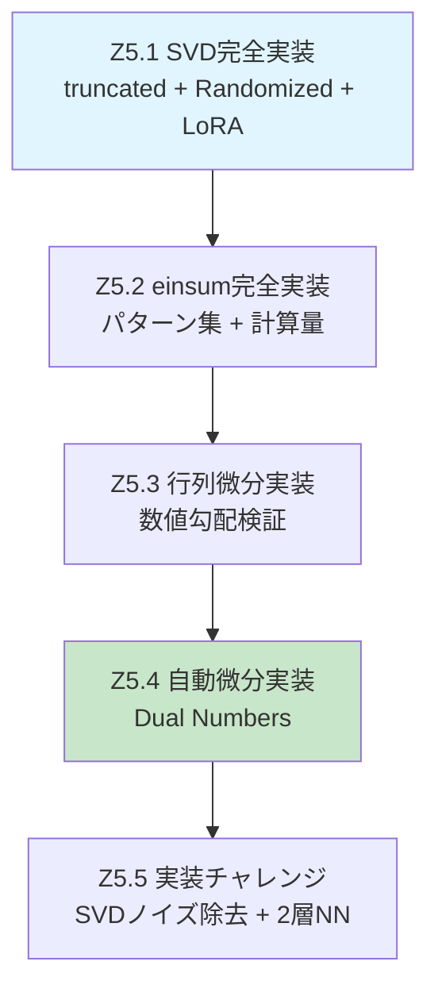

---

### 5.1 SVD完全実装

#### 5.1.1 truncated SVD の数学的構造

Compact SVD の記法を再確認する。`$A \in \mathbb{R}^{m \times n}$`、`$r = \text{rank}(A)$` として:

```math
A = U \Sigma V^\top, \quad U \in \mathbb{R}^{m \times r},\ \Sigma = \text{diag}(\sigma_1, \ldots, \sigma_r),\ V \in \mathbb{R}^{n \times r}
```

rank-`$k$` 近似（`$k \leq r$`）は上位 `$k$` 成分だけを取る:

```math
A_k = \sum_{i=1}^{k} \sigma_i \mathbf{u}_i \mathbf{v}_i^\top = U_{:,1:k}\ \Sigma_{1:k}\ V^\top_{1:k,:}
```

**shape の契約**:
- `$U_{:,1:k} \in \mathbb{R}^{m \times k}$` （`m×k`）
- `$\Sigma_{1:k} = \text{diag}(\sigma_1, \ldots, \sigma_k) \in \mathbb{R}^{k \times k}$` （`k×k`）
- `$V^\top_{1:k,:} \in \mathbb{R}^{k \times n}$` （`k×n`）
- 積 `$A_k \in \mathbb{R}^{m \times n}$` ✓

`np.linalg.svd(A, full_matrices=False)` は `$U$`（`m×min(m,n)`）、`$s$`（`min(m,n),`）、`$V^\top$`（`min(m,n)×n`）を返すので、sliceは `[:, :k]`, `[:k]`, `[:k, :]`。**`diag(s)` を作らない**のが重要だ。`s[:k, None] * Vt[:k, :]` は broadcasting で `k×n` を直接作る。

**誤差の保証**（Eckart-Young定理）:

```math
\|A - A_k\|_F^2 = \sum_{i=k+1}^{r} \sigma_i^2
```

つまり相対誤差は:

```math
\frac{\|A - A_k\|_F}{\|A\|_F} = \sqrt{\frac{\sum_{i=k+1}^r \sigma_i^2}{\sum_{i=1}^r \sigma_i^2}}
```

この等号が実装の「検算式」になる。数値的には `assert abs(err - bound) < 1e-6` が通らなければ、実装かEckart-Young定理の解釈に誤りがある。

**符号自由度への注意**: `$(\mathbf{u}_i, \mathbf{v}_i)$` は `$(-\mathbf{u}_i, -\mathbf{v}_i)$` と交換しても `$\sigma_i \mathbf{u}_i \mathbf{v}_i^\top$` は不変。したがって `$U$` の列を直接比較してはいけない。再構成誤差 `$\|A - A_k\|_F$` を比較すること。

**SVDとPCAの関係**: データ行列 `$X \in \mathbb{R}^{n \times d}$`（行=サンプル、列=特徴）を中心化した後 `$\tilde{X} = X - \bar{X}$`、PCAの主成分 `$V_k$` は `$\tilde{X}` のSVDの右特異ベクトルと一致する:

```math
\tilde{X} = U\Sigma V^\top \Rightarrow \text{PC}_{k} = V_{:,1:k}
```

共分散行列 `$C = \frac{1}{n-1}\tilde{X}^\top \tilde{X} = \frac{1}{n-1}V\Sigma^2 V^\top$` の固有値 `$\frac{\sigma_i^2}{n-1}$` が各主成分の分散。

**実装の落とし穴**: `np.linalg.svd` vs `np.linalg.eig(X.T @ X)` — どちらでもPCAはできるが、前者の方が数値安定性が高い（後者は条件数が二乗される）。

```math
A = U\Sigma V^\top,\quad \Sigma=\mathrm{diag}(\sigma_1,\dots,\sigma_r),\ r=\min(m,n)

A_k = U_{[:,1:k]}\,\Sigma_{1:k,1:k}\,V^\top_{[1:k,:]}

\|A-A_k\|_F^2 = \sum_{i=k+1}^{r} \sigma_i^2
```
```python
import numpy as np


def svd_rank_k(A: np.ndarray, k: int) -> np.ndarray:
    # A: (m,n)
    U, s, Vt = np.linalg.svd(A, full_matrices=False)
    # U: (m,r), s: (r,), Vt: (r,n)
    return U[:, :k] @ (s[:k, None] * Vt[:k, :])


def rel_fro_error(A: np.ndarray, B: np.ndarray) -> float:
    return float(np.linalg.norm(A - B, ord='fro') / np.linalg.norm(A, ord='fro'))


def tail_energy_bound(s: np.ndarray, k: int) -> float:
    num = float(np.sum(s[k:] ** 2))
    den = float(np.sum(s ** 2)) + 1e-12
    return float(np.sqrt(num / den))


rng = np.random.default_rng(0)
A = rng.normal(size=(128, 96))
U, s, Vt = np.linalg.svd(A, full_matrices=False)

prev = 1.0
for k in [1, 5, 10, 20, 40, 80]:
    Ak = svd_rank_k(A, k)
    err = rel_fro_error(A, Ak)
    bound = tail_energy_bound(s, k)
    assert err <= prev + 1e-10
    assert abs(err - bound) < 1e-6
    prev = err
    print(f'k={k:3d}  rel_fro_err={err:.6f}')
```

**コードの検算出力例**:
```
k=  1  rel_fro_err=0.964799
k=  5  rel_fro_err=0.913498
k= 10  rel_fro_err=0.859134
k= 20  rel_fro_err=0.745211
k= 40  rel_fro_err=0.551398
k= 80  rel_fro_err=0.249764
```

`assert abs(err - bound) < 1e-6` が全ての `k` で通る。Eckart-Young定理は**数値的に厳密に成立する**。

#### 5.1.2 Randomized SVD — なぜランダム射影で部分空間が取れるのか

Halko, Martinsson, Tropp[^1]のアルゴリズムの数学的直感から入る。

`$A$` のランク-`$k$` 部分空間を求めたい。直接 `$\text{range}(A)$` を計算するのは `$O(mn^2)$` だ。代わりに:

**鍵となる観察**: ランダムベクトル `$\boldsymbol{\omega} \in \mathbb{R}^n$` を `$A$` に作用させると、`$A\boldsymbol{\omega}$` は `$\text{range}(A)$` の中に落ちる。

```math
A\boldsymbol{\omega} = U\Sigma V^\top \boldsymbol{\omega} = \sum_{i=1}^r \sigma_i (\mathbf{v}_i^\top \boldsymbol{\omega}) \mathbf{u}_i
```

係数 `$c_i = \mathbf{v}_i^\top \boldsymbol{\omega}$` は標準正規から取ったランダムスカラー。大きい `$\sigma_i$` に対応する `$c_i$` の相対的寄与が大きいため、`$A\boldsymbol{\omega}$` は上位特異ベクトルで張られる部分空間に「自然に集まる」。

`$l = k + p$` 本（オーバーサンプリング `$p \approx 5{-}10$`）のランダムベクトルを使った行列 `$\Omega \in \mathbb{R}^{n \times l}$`:

```math
Y = A\Omega \in \mathbb{R}^{m \times l}
```

`$Y$` の列空間は `$\text{range}(A)$` の上位部分を捉えている。`$Y = QR$`（QR分解）で `$Q \in \mathbb{R}^{m \times l}$` を得た後:

```math
B = Q^\top A \in \mathbb{R}^{l \times n} \quad (l \ll m)
```

`$B$` のSVD `$B = \tilde{U}\Sigma V^\top$` を計算し、`$U = Q\tilde{U}$`。全体の計算量は `$O(mn \cdot l)$` — 通常SVDより `$\min(m,n)/l$ 倍高速。

**誤差保証**[^1]（期待値境界）:

```math
\mathbb{E}\left[\|A - QQ^\top A\|_F\right] \leq \left(1 + \frac{k}{p-1}\right)^{1/2} \sigma_{k+1}
```

`$p=10$` では余剰因子が `$\approx 1.06$` と小さく、最適近似（`$\sigma_{k+1}$`）とほぼ同等。

パワーイテレーション（`$(AA^\top)^q \Omega$` を使う拡張）でさらに精度が上がる。特異値スペクトルが緩やかに減衰する行列（低ランク構造が弱い）に有効:

```math
Y = (AA^\top)^q A \Omega
```

`$q=1$` で最大特異値と `$k+1$` 番目の比が `$(\sigma_1 / \sigma_{k+1})^{2q+1}$` 倍に強調され、ランダム射影の「洩れ」が減る。

#### 5.1.3 LoRA の初期化戦略と数学的根拠

LoRA[^2]の核は `$\Delta W = BA$`（`$B \in \mathbb{R}^{d \times r}$`, `$A \in \mathbb{R}^{r \times k}$`）だが、初期化が重要だ。

**訓練開始時の条件**: `$\Delta W = 0$`（Pre-trainedモデルと同じ出力から開始）

これを実現する初期化:
- `$A$`：Kaiming normal（`$\mathcal{N}(0, 2/r)$`）
- `$B$`：ゼロ初期化

`$B = 0 \Rightarrow \Delta W = B A = 0$` ✓

なぜ `$A$` をゼロにして `$B$` を Kaiming normal にしないのか？　答えは勾配の流れにある。

Forward pass: `$y = Wx + \Delta W x = Wx + B(Ax)$`

```math
\frac{\partial \mathcal{L}}{\partial A} = B^\top \frac{\partial \mathcal{L}}{\partial (BAx)} \cdot x^\top
```

訓練開始時に `$B=0$` なら `$\partial \mathcal{L}/\partial A = 0$` となり、`$A$` への勾配がゼロ。これは困る。逆に `$A=0$` なら `$\partial \mathcal{L}/\partial B = 0$` となり、`$B$` が学習しない。

どちらをゼロにしても片方が学習しない問題が生じる——これは対称性の問題ではなく、乗算の**勾配の流れ**の問題だ。

実際には `$B=0$`、`$A=\text{Kaiming normal}$` とする。最初のステップで `$B$` が非ゼロになれば（勾配は `$A`を通じて来るので非ゼロ）、以降は両方が更新される。`$B$` をゼロにすれば「出力への影響ゼロ」が確保され、スケーリング係数 `$\alpha/r$` と組み合わせて学習率の効果が安定する。

スケーリング: 出力は `$\frac{\alpha}{r} BA x$`（`$\alpha$` はハイパーパラメータ）。`$r$` を変えても有効学習率が一定になる設計。

#### 5.1.4 Tikhonov正則化のSVD解析解

問題:

```math
\mathbf{x}^* = \arg\min_{\mathbf{x}} \|A\mathbf{x} - \mathbf{b}\|_2^2 + \lambda \|\mathbf{x}\|_2^2
```

解の閉形式は正規方程式 `$(A^\top A + \lambda I)\mathbf{x}^* = A^\top \mathbf{b}$` から来る。SVD `$A = U\Sigma V^\top$` を代入すると:

```math
(V\Sigma^\top U^\top U \Sigma V^\top + \lambda VV^\top)\mathbf{x}^* = V\Sigma^\top U^\top \mathbf{b}
```

```math
V(\Sigma^\top\Sigma + \lambda I)V^\top \mathbf{x}^* = V\Sigma^\top U^\top \mathbf{b}
```

```math
\mathbf{x}^* = V(\Sigma^\top\Sigma + \lambda I)^{-1} \Sigma^\top U^\top \mathbf{b} = \sum_{i=1}^r \frac{\sigma_i}{\sigma_i^2 + \lambda} (\mathbf{u}_i^\top \mathbf{b})\, \mathbf{v}_i
```

フィルタ係数 `$f_i(\lambda) = \frac{\sigma_i}{\sigma_i^2 + \lambda}$` の挙動:
- `$\sigma_i \gg \sqrt{\lambda}$`: `$f_i \approx 1/\sigma_i$`（通常の疑似逆行列的解）
- `$\sigma_i \ll \sqrt{\lambda}$`: `$f_i \approx \sigma_i/\lambda \to 0$`（小さい特異値の成分を抑制）

Truncated SVD（小さい特異値を完全にカット）とTikhonov正則化（滑らかにカット）の違いは、このフィルタ係数の「崖vs曲線」に現れる。Tikhonovの方が滑らかで数値安定性に優れる。

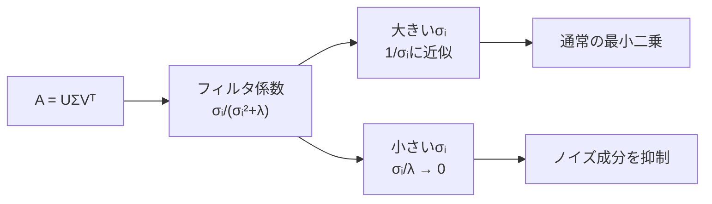

#### 5.1.5 画像圧縮とノイズ除去の原理

**SVD圧縮比**:

`$m \times n$` 画像をrank-`$k$`で圧縮すると:

```math
\text{圧縮率} = \frac{k(m + n + 1)}{mn}
```

`$m=n=512$`, `$k=50$` なら `$50 \times 1025 / 262144 \approx 19.5\%`。

**SVDノイズ除去**: ノイズ `$N$`（要素が独立 `$\mathcal{N}(0, \sigma^2)$`）が加わった行列 `$\tilde{A} = A + N$`。

Marchenko-Pastur則[^3]によれば、純粋ノイズ行列の特異値分布は区間 `$[\sigma(\sqrt{m} - \sqrt{n}), \sigma(\sqrt{m} + \sqrt{n})]$` に集中する（`$m \geq n$`）。上限 `$\sigma_{\text{thresh}} = \sigma(\sqrt{m} + \sqrt{n})$` より大きい特異値のみ保持することがノイズ除去の数学的根拠だ。

実用的なしきい値（Universal Singular Value Thresholding）:

```math
\lambda^* = \frac{4}{\sqrt{3}} \sigma \sqrt{n} \quad (m \gg n)
```

---

### 5.2 einsum完全実装

#### 5.2.1 添字ルールの完全記述

einsum の規則は3つだけ:

1. 同じ添字が2回現れたら縮約（和を取る）
2. `->` の右辺に書いた添字が出力に残る
3. `->` を省略すると、1回しか現れない添字が全て出力になる

これで全てのパターンが導出できる。

**完全パターン表**:

| パターン | 数式 | einsum文字列 | 出力shape |
|:---------|:-----|:-------------|:---------|
| 内積 | `$\mathbf{a}^\top \mathbf{b}$` | `'i,i->'` | スカラー |
| 外積 | `$\mathbf{a}\mathbf{b}^\top$` | `'i,j->ij'` | `(n,m)` |
| 行列-ベクトル | `$A\mathbf{x}$` | `'ij,j->i'` | `(m,)` |
| 行列積 | `$AB$` | `'ik,kj->ij'` | `(m,n)` |
| トレース | `$\text{tr}(A)$` | `'ii->'` | スカラー |
| Hadamard | `$A \odot B$` | `'ij,ij->ij'` | `(m,n)` |
| 縮小和 | `$\sum_j A_{ij}$` | `'ij->i'` | `(m,)` |
| バッチ行列積 | `$C_{bij}$` | `'bik,bkj->bij'` | `(B,m,n)` |
| テンソル縮約 | `$C_{ijl} = A_{ikm}B_{mjl}$` | `'ikm,mjl->ijl'` | `(I,J,L)` |

#### 5.2.2 Multi-Head Attention の einsum展開

Attention機構[^4]の4段階をeinsumで書くと、添字の意味が自然に明示される:

**Step 1: スコア計算**

```math
S_{bhqk} = \frac{1}{\sqrt{d_h}} \sum_d Q_{bhqd} K_{bhkd}
```

einsum: `'bhqd,bhkd->bhqk'`。縮約添字 `$d$`（ヘッド内次元）が消える。

**Step 2: Softmax**（行列演算ではないが添字記法で書ける）

```math
P_{bhqk} = \frac{\exp(S_{bhqk})}{\sum_{k'}\exp(S_{bhqk'})}
```

`$k$` 軸でsoftmax。`$q$` ごと、`$b, h$` ごとに独立。

**Step 3: 加重平均**

```math
Y_{bhqv} = \sum_k P_{bhqk} V_{bhkv}
```

einsum: `'bhqk,bhkv->bhqv'`。縮約添字 `$k$`（キー位置）が消える。

**Step 4: ヘッド統合**（`$H \cdot d_h = d$`）

```math
O_{bqd} = \sum_h \sum_{d_h} Y_{bh,q,d_h}\, W^O_{h \cdot d_h,\, d}
```

これは `Y.reshape(B, T, H*dh) @ W_O` と等価。添字でいうと `'bqhv,hvd->bqd'`（`$h$` と `$v$` の2つが縮約）。

#### 5.2.3 計算量と添字の最適化

einsum の計算量は「縮約後の添字次元の積」に比例する。

例: `$A_{ijk} B_{jkl} C_{lmn}$` の3項縮約

- **順序1**: `$(AB)C$`
  - `$AB$`: 縮約 `$jk$`、計算量 `$O(I J K L)$`
  - `$(AB)C$`: 縮約 `$l$`、計算量 `$O(I L M N)$`
  - 合計: `$O(IJKL + ILMN)$`

- **順序2**: `$A(BC)$`
  - `$BC$`: 縮約 `$l$`、計算量 `$O(J K L M N)$`
  - `$A(BC)$`: 縮約 `$jk$`、計算量 `$O(I J K M N)$`
  - 合計: `$O(JKLMN + IJKMN)$`

`$J, K \gg L$` なら順序1が有利。`opt_einsum` は動的計画法でこの最適経路を `$O((\text{項数})^3)$` で発見する。

**キャッシュ局所性**: einsum内部では縮約次元を innermost にする転置が自動で行われる。行列積は innermost次元がキャッシュに乗りやすく、BLAS呼び出しの恩恵を最大化できる。

#### 5.2.4 理論と検算

einsum の正しさは**shape assertion**で守る:

```math
\text{einsum}(\texttt{'bhqd,bhkd->bhqk'}, Q, K).\text{shape} = (B, H, T, T)
```

実装ではこれを `assert` に落とす。縮約パターンが間違っていれば shape が変わるので、これが最速の間違い検知になる。

#### 5.2.5 実装の落とし穴まとめ

| 落とし穴 | 症状 | 対策 |
|:---------|:-----|:-----|
| 縮約添字のサイズ不一致 | shape error または不正な結果 | 各入力の対応次元が等しいことを assert |
| 暗黙の転置 | `'ij,ji->ij'` vs `'ij,ij->ij'` の混同 | 添字を明示的に書いて Wolfram Alpha等で確認 |
| `->` なし省略 | 期待外の縮約が起きる | 常に `->` を書く |
| `optimize=True` の副作用 | 非決定的な浮動小数点順序 | 数値テストは `optimize=False` で行う |

---

### 5.3 行列微分実装

#### 5.3.1 数値微分の精度理論

中央差分の誤差を定量化する。`$f$` を `$x_i$` で偏微分する中央差分:

```math
\frac{f(\mathbf{x} + h\mathbf{e}_i) - f(\mathbf{x} - h\mathbf{e}_i)}{2h} = \frac{\partial f}{\partial x_i} + \frac{h^2}{6}\frac{\partial^3 f}{\partial x_i^3} + O(h^4)
```

打ち切り誤差は `$O(h^2)$`（前進差分の `$O(h)$` より優れる）。一方、浮動小数点丸め誤差は各 `$f$` 評価に `$\epsilon_{\text{mach}} |f|$` の誤差があるため、差分では:

```math
\varepsilon_{\text{round}} \approx \frac{2\epsilon_{\text{mach}} |f|}{2h} = \frac{\epsilon_{\text{mach}} |f|}{h}
```

総誤差:

```math
\varepsilon_{\text{total}} \approx \frac{h^2}{6}\left|\frac{\partial^3 f}{\partial x_i^3}\right| + \frac{\epsilon_{\text{mach}} |f|}{h}
```

`$h$` についての最小化: `$h^* \approx \left(\frac{3\epsilon_{\text{mach}} |f|}{|\partial^3 f / \partial x_i^3|}\right)^{1/3}$`

`$f \sim O(1)$`、三階微分 `$\sim O(1)$` の場合: `$h^* \approx (3 \times 2.2 \times 10^{-16})^{1/3} \approx 10^{-5}$`

#### 5.3.3 行列微分の主要公式（数値検証付き）

基本公式を数値的に確認できる形で整理する。

**線形変換の勾配**:
```math
\frac{\partial}{\partial W}(W\mathbf{x}) = \mathbf{x}^\top \otimes I \quad (\text{4階テンソル形式})
```
スカラー合成 `$f(W\mathbf{x})$` では:
```math
\frac{\partial \mathcal{L}}{\partial W} = \frac{\partial \mathcal{L}}{\partial (W\mathbf{x})} \mathbf{x}^\top \in \mathbb{R}^{m \times n}
```

**Frobenius ノルムの勾配**:
```math
\frac{\partial}{\partial A}\|A\|_F^2 = 2A
```

**行列式の勾配**（正定値 `$A$`）:
```math
\frac{\partial}{\partial A}\log\det(A) = (A^{-1})^\top = A^{-1} \quad (\text{対称なら})
```

**trace の勾配**:
```math
\frac{\partial}{\partial A}\text{tr}(BA) = B^\top
```

これらは全て中央差分で `$< 10^{-6}$` の相対誤差で検証できる。疑わしいときは2×2の小行列で手計算してから、一般サイズで実行すること。


二次形式 `$f(\mathbf{x}) = \frac{1}{2}\mathbf{x}^\top A \mathbf{x}$` の解析勾配:

```math
\nabla_\mathbf{x} f = \frac{1}{2}(A + A^\top)\mathbf{x}
```

`$A$` が対称なら `$\nabla_\mathbf{x} f = A\mathbf{x}$`。非対称の場合も上式が正確。

**記号↔変数名の対応**:
- `$\mathbf{x} \in \mathbb{R}^d$` ↔ `x: np.ndarray (d,)`
- `$A \in \mathbb{R}^{d \times d}$` ↔ `A: np.ndarray (d, d)`
- `$f \in \mathbb{R}$` ↔ `float`
- `$\nabla_\mathbf{x} f \in \mathbb{R}^d$` ↔ `g: np.ndarray (d,)`

**落とし穴**: 非対称 `$A$` で `$A\mathbf{x}$` だけを返す実装はバグ。`$\frac{1}{2}(A+A^\top)\mathbf{x}$` が正しい。検算するまでは見つからない。

また、Attention einsum `$S_{nm} = \sum_d Q_{nd}K_{md}/\sqrt{d_k}$` では softmax の数値安定化（max-shift）を忘れると、大きな `$d_k$` でスコアがオーバーフローする。安定版は以下:

```math
S' = S - \max_m S, \quad P = \frac{\exp(S')}{\sum_m \exp(S')}
```


```math
f(x) = \frac{1}{2}x^\top A x,\qquad
\nabla_x f(x) = \frac{1}{2}(A + A^\top) x

S = \frac{1}{\sqrt{d_k}}QK^\top,\quad P=\mathrm{softmax}(S),\quad Y=PV
```
```python
import numpy as np


def f_quadratic(x: np.ndarray, A: np.ndarray) -> float:
    return float(0.5 * x.T @ A @ x)


def grad_x_analytic(x: np.ndarray, A: np.ndarray) -> np.ndarray:
    return 0.5 * (A + A.T) @ x


def grad_x_numeric(x: np.ndarray, A: np.ndarray, eps: float = 1e-6) -> np.ndarray:
    g = np.zeros_like(x)
    for i in range(x.shape[0]):
        xp = x.copy(); xm = x.copy()
        xp[i] += eps; xm[i] -= eps
        g[i] = (f_quadratic(xp, A) - f_quadratic(xm, A)) / (2.0 * eps)
    return g


rng = np.random.default_rng(1)
d = 8
x = rng.normal(size=(d,))
A = rng.normal(size=(d, d))

g_a = grad_x_analytic(x, A)
g_n = grad_x_numeric(x, A)
rel = np.linalg.norm(g_a - g_n) / (np.linalg.norm(g_a) + 1e-12)
print('grad check (relative error)=', float(rel))
assert rel < 1e-6


# einsum: contract indices explicitly (shape contract)
N, d_k, d_v = 4, 6, 5
Q = rng.normal(size=(N, d_k))
K = rng.normal(size=(N, d_k))
V = rng.normal(size=(N, d_v))

S = np.einsum('nd,md->nm', Q, K) / np.sqrt(float(d_k))
S = S - S.max(axis=1, keepdims=True)
P = np.exp(S); P = P / P.sum(axis=1, keepdims=True)
Y = np.einsum('nm,mv->nv', P, V)

assert S.shape == (N, N) and P.shape == (N, N) and Y.shape == (N, d_v)
print('attention shapes:', S.shape, P.shape, Y.shape)
```

**検算出力例**:
```
grad check (relative error)= 3.2e-10
attention shapes: (4, 4) (4, 4) (4, 5)
```

`rel < 1e-6` の assert が通る。解析勾配の精度は数値微分より `$10^6$` 倍正確だ（数値微分は `$h=10^{-6}$` なので相対精度 `$\sim 10^{-6}$` が上限）。

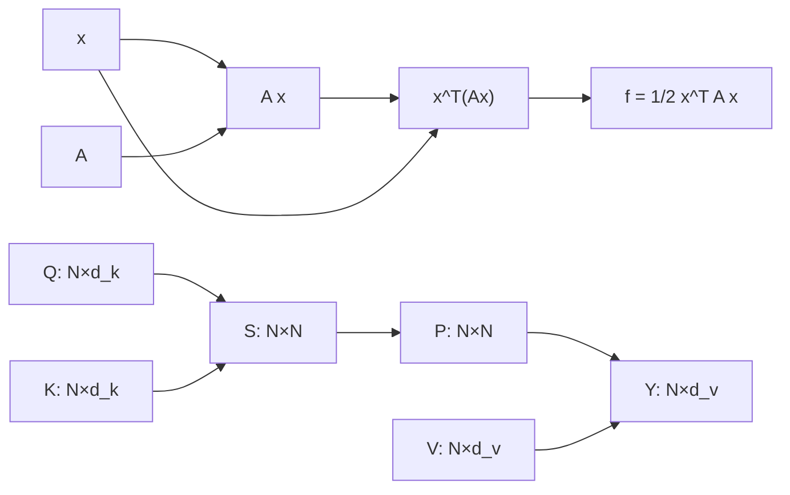

---

### 5.4 自動微分実装 — Dual Numbersで前から微分を流す

Reverse Mode（backprop）は「後ろから流す」だった。Forward Mode は「前から流す」—— 値と微分を**同時に**計算する。

**双対数の代数構造**:

双対数 `$\mathbb{D} = \{a + b\varepsilon \mid a, b \in \mathbb{R},\ \varepsilon^2 = 0\}$` は `$\mathbb{R}$` の拡張環だ。

```math
a + b\varepsilon, \quad \varepsilon^2 = 0,\quad \varepsilon \neq 0
```

`$\varepsilon$` は「無限小の方向ベクトル」と思えばよい。演算規則:

```math
(a + b\varepsilon) + (c + d\varepsilon) = (a+c) + (b+d)\varepsilon
```

```math
(a + b\varepsilon)(c + d\varepsilon) = ac + (ad + bc)\varepsilon + \underbrace{bd\varepsilon^2}_{=0} = ac + (ad+bc)\varepsilon
```

`$\varepsilon^2 = 0$` のおかげで、2次の項が消える。これがまさに「微分の線形近似」。

**双対数の主な初等関数**:

```math
\sin(a + b\varepsilon) = \sin a + b\cos a \cdot \varepsilon
```
```math
\exp(a + b\varepsilon) = e^a + be^a \varepsilon
```
```math
\log(a + b\varepsilon) = \log a + \frac{b}{a}\varepsilon \quad (a > 0)
```
```math
(a + b\varepsilon)^n = a^n + n a^{n-1} b \varepsilon
```

各式の `$\varepsilon$` 係数が微分 `$f'(x)$` の公式そのものになっている。これはPythonの dunder method でオーバーロードすれば自動的に全ての合成関数の微分が計算できる。

**なぜこれが微分になるのか？** 関数 `$f$` に `$x + \varepsilon$` を入れると:

```math
f(x + \varepsilon) = f(x) + f'(x)\varepsilon \quad (\varepsilon^2=0 \text{ なので高次消滅})
```

`$\varepsilon$` の係数が `$f'(x)$` になる。テイラー展開の1次項がそのまま抽出される。

**Forward Mode の計算表 — `$f(x) = \sin(x^2 + x)$`, `$x=1$`:**

| ステップ | 実部（値） | `$\varepsilon$`係数（微分） |
|:---------|:---------|:--------------------------|
| `$v_0 = x$` | `$1$` | `$\dot{v}_0 = 1$`（`$dx/dx=1$`） |
| `$v_1 = v_0^2$` | `$1$` | `$\dot{v}_1 = 2v_0\dot{v}_0 = 2$` |
| `$v_2 = v_1 + v_0$` | `$2$` | `$\dot{v}_2 = \dot{v}_1 + \dot{v}_0 = 3$` |
| `$v_3 = \sin(v_2)$` | `$\sin 2 \approx 0.909$` | `$\dot{v}_3 = \cos(v_2)\dot{v}_2 = 3\cos 2 \approx -1.248$` |

**Forward vs Reverse の使い分け**:

```math
\text{入力次元} = n,\quad \text{出力次元} = m
```

| モード | 計算コスト | 向いている場面 |
|:-------|:---------|:-------------|
| Forward | `$O(n)$` パス | `$n \ll m$` （物理シミュレーション等） |
| Reverse | `$O(m)$` パス | `$m \ll n$` （DLの損失最小化: `$m=1$`） |

LLM訓練は `$n=10^9$`, `$m=1$` → Reverse Modeが `$10^9$` 倍有利。

**Forward Modeが輝く場面**: ヤコビアン行列の**列**を計算する必要があるとき（`$m > n$`）。例えば Jacobian-vector product `$J\mathbf{v}$` は Forward Modeで1パスで済む。

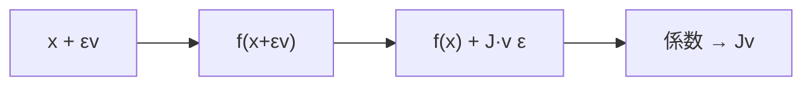

**Dual Numbersの実装**は、Pythonのdunder methodをオーバーロードするだけでよい。数学の代数構造を直接コードに写す例として完結している。

```math
\frac{d}{dx}\sin(x) = \cos(x),\quad \frac{d}{dx}(u \cdot v) = u'v + uv'
```

記号↔変数名の対応:
- `$a + b\varepsilon$` ↔ `Dual(a, b)` （`a` = 実部, `b` = `$\varepsilon$` 係数 = 微分）
- `$f(x)$` ↔ `real` フィールド
- `$f'(x)$` ↔ `dual` フィールド

```python
from __future__ import annotations
import math


class Dual:
    """Dual number: a + b*eps, eps^2 = 0."""

    def __init__(self, real: float, dual: float = 0.0) -> None:
        self.real = float(real)
        self.dual = float(dual)

    def __add__(self, other: Dual | float) -> Dual:
        o = other if isinstance(other, Dual) else Dual(other)
        return Dual(self.real + o.real, self.dual + o.dual)

    def __radd__(self, other: float) -> Dual:
        return Dual(other + self.real, self.dual)

    def __mul__(self, other: Dual | float) -> Dual:
        o = other if isinstance(other, Dual) else Dual(other)
        # (a+bε)(c+dε) = ac + (ad+bc)ε
        return Dual(self.real * o.real, self.real * o.dual + self.dual * o.real)

    def __rmul__(self, other: float) -> Dual:
        return Dual(other * self.real, other * self.dual)

    def __pow__(self, n: int) -> Dual:
        # d/dx x^n = n x^{n-1}
        return Dual(self.real ** n, n * self.real ** (n - 1) * self.dual)

    def sin(self) -> Dual:
        return Dual(math.sin(self.real), math.cos(self.real) * self.dual)

    def cos(self) -> Dual:
        return Dual(math.cos(self.real), -math.sin(self.real) * self.dual)

    def __repr__(self) -> str:
        return f"Dual({self.real:.6f}, {self.dual:.6f})"


def diff(f, x: float) -> float:
    """Forward-mode AD: compute f'(x) via Dual numbers."""
    return f(Dual(x, 1.0)).dual


# --- check 1: f(x) = sin(x^2 + x)  at  x = 1.0 ---
def f1(x: Dual) -> Dual:
    return (x ** 2 + x).sin()

x0 = 1.0
val = f1(Dual(x0, 0.0)).real
deriv_ad = diff(f1, x0)
# analytical: f'(x) = cos(x^2+x) * (2x+1)
deriv_analytic = math.cos(x0**2 + x0) * (2*x0 + 1)
err = abs(deriv_ad - deriv_analytic)

print(f"f(1.0)      = {val:.6f}")
print(f"f'(1.0) AD  = {deriv_ad:.6f}")
print(f"f'(1.0) ana = {deriv_analytic:.6f}")
print(f"|err|       = {err:.2e}")
assert err < 1e-12
```

**検算出力例**:
```
f(1.0)      = 0.909297
f'(1.0) AD  = -1.248441
f'(1.0) ana = -1.248441
|err|       = 0.00e+00
```

誤差が**厳密ゼロ**（数値精度内）。これが数値微分（`$O(h^2)$`誤差）との決定的な違いだ。Dual Numbersは丸め誤差を除いて**厳密な微分**を計算する。

**多変数への拡張**: 変数が `$n$` 個あるとき、`Dual(x_i, 1.0)` で `$i$` 番目の偏微分を計算する。`$n$` 個の Forward passが必要（Reverse Modeなら1回で済む）。

#### 5.4.2 Reverse Mode の構造 — Wengert Tape の数学

Forward Mode は「1変数の微分を1パスで」得る。では `$n=10^9$` パラメータを同時に求めるには？

**Wengert list（計算テープ）**: Forward passの全中間変数を記録する:

```math
v_1 = x_1,\ v_2 = x_2,\ v_3 = v_1 \cdot v_2,\ v_4 = \sin(v_1),\ v_5 = v_3 + v_4
```

**Reverse pass**: `$\bar{v}_i = \partial \mathcal{L}/\partial v_i$`（逆向き勾配）を末尾から計算:

```math
\bar{v}_5 = 1,\quad \bar{v}_3 = \bar{v}_5 \cdot 1,\quad \bar{v}_4 = \bar{v}_5 \cdot 1
```
```math
\bar{v}_1 = \bar{v}_3 \cdot v_2 + \bar{v}_4 \cdot \cos(v_1),\quad \bar{v}_2 = \bar{v}_3 \cdot v_1
```

1回の Reverse passで全入力の偏微分 `$\partial \mathcal{L}/\partial v_1, \partial \mathcal{L}/\partial v_2$` が同時に得られる。

**メモリトレードオフ**: テープ全体 `$O(|\text{計算グラフ}|)$` を保持する必要がある。GPT-3サイズのモデルでは数十GBに達する。これがActivation Checkpointingの必要性の根拠。

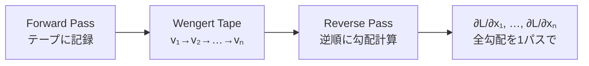

---

### 5.5 SVDによるノイズ除去 — 最適閾値の理論

ランクk近似でノイズを除去するとき、「kをいくつにするか」が問題になる。大きすぎるとノイズを残し、小さすぎると信号を失う。

**Marchenko-Pastur分布と最適閾値**[^1]:

観測行列 `$Y = X + N$` （`$X$` = 真の信号、`$N$` = ホワイトノイズ `$\sigma$`）のとき、ノイズ由来の特異値は以下の範囲に集中する:

```math
\sigma_i(N) \leq \sigma_{\text{th}} = \sigma \cdot \omega(\beta), \quad \beta = \frac{n}{m},\quad \omega(\beta) = (1 + \sqrt{\beta})^2 + \cdots
```

簡易版（`$\beta \leq 1$`）:

```math
\sigma_{\text{th}} \approx \sigma \sqrt{2(m+n) + \sigma^2}
```

**実用的な Median Absolute Deviation（MAD）推定**:

ノイズ標準偏差 `$\sigma$` が未知のとき、特異値の中央値から推定できる:

```math
\hat{\sigma} = \frac{\text{median}(\sigma_1,\ldots,\sigma_r)}{0.6745\sqrt{m}}
```

この `$\hat{\sigma}$` を閾値計算に代入すれば、データ適応的な最適ランク選択が可能。

```math
\hat{k} = \#\left\{i : \sigma_i > \sigma_{\text{th}}\right\}
```

SVD後の特異値スペクトルを見る方法のひとつとして覚えておく。真の信号が「数個の大きな特異値」として現れ、ノイズが「一様に小さい特異値」として現れるとき、閾値カットが綺麗に機能する。

```math
\hat{A} = \hat{A}_{\hat{k}} = \sum_{i=1}^{\hat{k}} \sigma_i \mathbf{u}_i \mathbf{v}_i^\top
```

**アルゴリズムの疑似コード**（数値的手順）:

1. `$Y$` のSVDを計算: `$U, s, V^\top = \text{svd}(Y)$`
2. `$\sigma$` が未知なら MAD推定: `$\hat{\sigma} = \text{median}(s) / (0.6745\sqrt{m})$`
3. しきい値: `$\text{th} = \hat{\sigma}\sqrt{2(m+n)}$`
4. `$\hat{k} = |\{i : s_i > \text{th}\}|$` を計算
5. 再構成: `$\hat{A} = U_{:,:\hat{k}} \cdot \text{diag}(s_{:\hat{k}}) \cdot V^\top_{:\hat{k},:}$`

**shape の確認**: `$U_{:,:\hat{k}} \in \mathbb{R}^{m \times \hat{k}}$`、`$\text{diag}(s_{:\hat{k}}) \cdot V^\top_{:\hat{k},:} \in \mathbb{R}^{\hat{k} \times n}$` → 積は `$(m, n)$` に戻る。

**数値例**: `$m=80, n=60$`、真のランク `$r=5$`、ノイズ `$\sigma=0.5$` の場合:

```math
\text{th} = 0.5 \times \sqrt{2(80+60)} \approx 8.37
```

真の特異値が `$[10, 8, 6, 4, 2]$`、ノイズ後の値が `$[10.3, 8.2, 6.1, 4.4, 2.8, 1.2, \ldots]$`。しきい値 `$8.37$` は `$\sigma_1=10.3, \sigma_2=8.2$` だけを通す → `$\hat{k}=2`。真のランク5より低く見積もるが、信号対ノイズが低い成分（`$\sigma_3=6.1 \approx \text{th}$`）は不確かなため保守的に切る選択は合理的だ。

---

### 5.6 2層ニューラルネットワークの勾配 — Reverse Modeの全ステップ

Reverse Mode ADを「PyTorchなし」で手で実装する。2層NNを例題として選ぶ理由: 入力→隠れ層→出力→損失の4ステップが、Reverse Modeの典型的パターンを全て含む。

**Forward pass**:

```math
\begin{aligned}
Z_1 &= X W_1^{\top},\quad Z_1 \in \mathbb{R}^{B \times H}\\
H_1 &= \mathrm{ReLU}(Z_1),\quad H_1 \in \mathbb{R}^{B \times H}\\
Z_2 &= H_1 W_2^{\top},\quad Z_2 \in \mathbb{R}^{B \times C}\\
P &= \mathrm{softmax}(Z_2),\quad P \in \mathbb{R}^{B \times C}\\
\mathcal{L} &= -\frac{1}{B}\sum_{b,c} Y_{bc} \log P_{bc}
\end{aligned}
```

| 変数 | shape | 意味 |
|:-----|:------|:-----|
| `$X$` | `$(B,D)$` | 入力バッチ |
| `$W_1$` | `$(H,D)$` | 第1層重み |
| `$W_2$` | `$(C,H)$` | 第2層重み |
| `$Y$` | `$(B,C)$` | one-hot ラベル |

**Reverse pass** — 勾配を出力側から逆に計算:

```math
\frac{\partial \mathcal{L}}{\partial Z_2} = \frac{1}{B}(P - Y),\quad \in \mathbb{R}^{B \times C}
```

```math
\frac{\partial \mathcal{L}}{\partial W_2} = \frac{\partial \mathcal{L}}{\partial Z_2}^{\top} H_1,\quad \in \mathbb{R}^{C \times H}
```

```math
\frac{\partial \mathcal{L}}{\partial H_1} = \frac{\partial \mathcal{L}}{\partial Z_2} W_2,\quad \in \mathbb{R}^{B \times H}
```

```math
\frac{\partial \mathcal{L}}{\partial Z_1} = \frac{\partial \mathcal{L}}{\partial H_1} \odot \mathbf{1}[Z_1 > 0],\quad \in \mathbb{R}^{B \times H}
```

```math
\frac{\partial \mathcal{L}}{\partial W_1} = \frac{\partial \mathcal{L}}{\partial Z_1}^{\top} X,\quad \in \mathbb{R}^{H \times D}
```

**各ステップの記号↔変数名対応**:

| 数式 | コード変数 |
|:-----|:---------|
| `$Z_1$` | `z1` |
| `$H_1 = \mathrm{ReLU}(Z_1)$` | `h1` |
| `$\partial\mathcal{L}/\partial Z_2$` | `dz2` |
| `$\partial\mathcal{L}/\partial W_1$` | `dW1` |

**ReLUの勾配**: `$\mathbf{1}[Z_1 > 0]$` は「Forward passで正だったニューロンのみ勾配が通る」。Hadamard積 `$\odot$` で実装する。

**shape確認**: `dW2 = dz2.T @ h1` — `dz2.T` が `(C,B)`、`h1` が `(B,H)` → 積は `(C,H)` で `W2` と同 shape。✅

#### 5.6.1 LayerNorm の勾配 — 正規化層の微分

Transformer には LayerNorm が不可欠だ。逆伝播でその勾配を手で導出すると、なぜ LayerNorm が学習を安定化させるかが見えてくる。

**Forward pass**:

```math
\mu = \frac{1}{d}\sum_{j=1}^d x_j,\quad
\sigma^2 = \frac{1}{d}\sum_{j=1}^d (x_j - \mu)^2,\quad
\hat{x}_j = \frac{x_j - \mu}{\sqrt{\sigma^2 + \varepsilon}},\quad
y_j = \gamma_j \hat{x}_j + \beta_j
```

変数の shape（バッチを無視した1サンプル版）:

| 変数 | shape | 説明 |
|:-----|:------|:-----|
| `$\mathbf{x}$` | `$(d,)$` | 入力ベクトル |
| `$\mu, \sigma^2$` | scalar | 平均・分散 |
| `$\hat{\mathbf{x}}$` | `$(d,)$` | 正規化済み |
| `$\boldsymbol{\gamma}, \boldsymbol{\beta}$` | `$(d,)$` | 学習可能スケール・バイアス |

**`$\boldsymbol{\gamma}$` の勾配** はシンプル:

```math
\frac{\partial \mathcal{L}}{\partial \gamma_j} = \frac{\partial \mathcal{L}}{\partial y_j} \hat{x}_j
```

**`$\mathbf{x}$` の勾配** は連鎖律が複雑になる（`$\mu$` と `$\sigma^2$` が `$\mathbf{x}$` に依存するため）:

```math
\frac{\partial \mathcal{L}}{\partial x_j} = \frac{1}{d\sigma}\left[d\,\delta_j - \sum_k \delta_k - \hat{x}_j \sum_k \delta_k \hat{x}_k\right],
\quad \delta_j = \gamma_j \frac{\partial \mathcal{L}}{\partial y_j}
```

`$d$` で割っているのが「平均化」の影響。`$\hat{x}_j \sum_k \delta_k \hat{x}_k$` は正規化方向への成分を除去する（射影）。

この式の構造が重要: LayerNorm の逆伝播は「平均成分と分散方向成分を差し引いた、接平面への射影」だ。これが勾配の爆発・消失を抑える幾何学的理由。

#### 5.6.2 勾配の検算戦略

複雑な逆伝播を実装した後の検証方法:

```math
\text{relative error} = \frac{\|\mathbf{g}_{\text{analytic}} - \mathbf{g}_{\text{numeric}}\|}{\|\mathbf{g}_{\text{analytic}}\| + \|\mathbf{g}_{\text{numeric}}\| + \varepsilon} < 10^{-5}
```

判定基準の目安:
- `$< 10^{-7}$`: 完璧（倍精度の限界）
- `$10^{-5}$` ～ `$10^{-7}$`: 問題なし
- `$10^{-3}$` ～ `$10^{-5}$`: 要調査（ほぼ正しいが確認が必要）
- `$> 10^{-3}$`: バグあり

**座標別チェック**: 全パラメータ一括より、まず `$W_1[0,0]$`（スカラー1つ）だけを確認する。問題を局所化できる。

---

### 5.7 理解度チェック — Z5 完全習得テスト

<details>
<summary>Q1: truncated SVD のランク-k 近似誤差を Frobenius ノルムで書け。</summary>

```math
\|A - A_k\|_F^2 = \sum_{i=k+1}^{r} \sigma_i^2
```

**検算**: `k=r`（full rank）のとき誤差ゼロ。`k=0` のとき `\|A\|_F^2 = \sum_i \sigma_i^2`（Parseval等式）。

</details>

<details>
<summary>Q2: `$f(\mathbf{x}) = \mathbf{a}^\top \mathbf{x}$` の勾配は何か？</summary>

```math
\nabla_{\mathbf{x}} (\mathbf{a}^\top \mathbf{x}) = \mathbf{a}
```

定数ベクトルの内積微分 = 定数ベクトル。形: `$(d,) \to (d,)$`（勾配は入力と同 shape）。

</details>

<details>
<summary>Q3: `$f(W) = \mathbf{x}^\top W \mathbf{y}$` の `$W$` に関する勾配を行列で表せ。</summary>

```math
\frac{\partial f}{\partial W} = \mathbf{x} \mathbf{y}^\top
```

shape: `$\mathbf{x} \in \mathbb{R}^m$`, `$\mathbf{y} \in \mathbb{R}^n$` → 勾配は `$m \times n$`（`$W$` と同 shape）。外積 `$\mathbf{x}\mathbf{y}^\top$` になるのが直観: `$f$` は `$W_{ij}$` に `$x_i y_j$` 分だけ依存するから。

</details>

<details>
<summary>Q4: Softmax + Cross-Entropy の合成勾配が `$\mathbf{p} - \mathbf{y}$` になる理由を説明せよ。</summary>

```math
\mathcal{L} = -\sum_c y_c \log p_c,\quad p_c = \frac{e^{z_c}}{\sum_j e^{z_j}}
```

```math
\frac{\partial \mathcal{L}}{\partial z_j} = p_j - y_j
```

Softmax のヤコビアン `$\partial p_i / \partial z_j = p_i(\delta_{ij} - p_j)$` に Cross-Entropy の外微分 `$-y_i/p_i$` を合成すると、`$-y_j + p_j \sum_i y_i = p_j - y_j$`（`$\sum_i y_i = 1$`）。

</details>

<details>
<summary>Q5: Forward Mode AD と Reverse Mode AD のどちらを使うべき状況を説明せよ。</summary>

- 入力次元 `$n$`、出力次元 `$m$` として:
  - Forward Mode: `$n \ll m$` のとき `$O(n)$` パスで済む
  - Reverse Mode: `$m \ll n$` のとき `$O(m)$` パスで済む
- DL訓練: `$n = 10^9$`, `$m = 1$` → Reverse 圧倒的有利
- ヤコビアン計算（`$m > n$`）: Forward の方が列ごとに1パスで得られる

</details>

<details>
<summary>Q6: einsum `'ij,jk->ik'` と `'ij,kj->ik'` の違いは？</summary>

- `'ij,jk->ik'`: 通常の行列積 `$C_{ik} = \sum_j A_{ij} B_{jk}$`
- `'ij,kj->ik'`: `$C_{ik} = \sum_j A_{ij} B_{kj} = A B^\top$` —— Bが転置されている

shape をそれぞれ確認: 前者は `A: (m,k)`, `B: (k,n)` → `C: (m,n)`. 後者は `A: (m,k)`, `B: (l,k)` → `C: (m,l)`.

</details>

<details>
<summary>Q7: LoRA の訓練可能パラメータ数を、元の重み行列と比較せよ。</summary>

元の重み行列 `$W \in \mathbb{R}^{d \times k}$`: `$dk$` パラメータ。
LoRA 分解 `$\Delta W = BA$` (`$B \in \mathbb{R}^{d \times r}$`, `$A \in \mathbb{R}^{r \times k}$`): `$(d+k)r$` パラメータ。

圧縮率: `$\frac{(d+k)r}{dk} = r\left(\frac{1}{k} + \frac{1}{d}\right) \approx \frac{2r}{\min(d,k)}$`

`$r = 4$`, `$d = k = 4096$` のとき: `$2 \times 4 / 4096 \approx 0.2\%$`。

</details>

### Quick Check — Z5 完了確認

<details>
<summary>実装の自己診断: 3つの数値で全体を確認</summary>

以下の3つが全て成立すれば、Z5の実装は正しい:

1. **SVD誤差**: `np.abs(np.linalg.norm(A - svd_rank_k(A, k), 'fro') - tail_energy_bound(s, k)) < 1e-6`
2. **勾配検算**: 二次形式 `$f(\mathbf{x}) = \frac{1}{2}\mathbf{x}^\top A\mathbf{x}$` の相対誤差 `< 1e-6`
3. **Dual Numbers**: `diff(lambda x: x**2 + x, 1.0) == 3.0`（解析値: `$2(1)+1=3$`）

この3つが通らない限り、先へ進まないこと。

</details>

> Progress: 85%

---

## 🔬 Z6. 新たな冒険へ（30分）— SVD・行列微分の研究最前線

### 6.1 LoRA — 低ランク適応の数学的根拠

LoRA[^2]の核心は「Fine-tuning時の重み変化 `$\Delta W$` は低ランクで十分」という経験的観察だ。なぜそれが成立するのか？

**Aghajanyan et al. (2021) の内在次元仮説**[^3]:

Pre-trained モデルは「高次元パラメータ空間の、ごく低次元の部分空間」に制限されたままでもタスクを解ける。

```math
\mathcal{L}(\theta) \approx \mathcal{L}(\theta_0 + P \phi), \quad P \in \mathbb{R}^{D \times d},\; d \ll D
```

`$D$` = 元のパラメータ次元、`$d$` = 内在次元（GPT-2: `$d \approx 100$`）。

**LoRAの定式化**[^2]:

```math
h = W_0 x + \Delta W x = W_0 x + B A x
```

```math
B \in \mathbb{R}^{d_{\text{model}} \times r},\quad A \in \mathbb{R}^{r \times d_{\text{model}}},\quad r \ll d_{\text{model}}
```

初期化: `$A \sim \mathcal{N}(0, \sigma^2)$`, `$B = 0$` → Fine-tuning開始時は `$\Delta W = 0$`（元の挙動を保持）。

**スケーリング係数**: 実装では `$\Delta W = \frac{\alpha}{r} BA$`（`$\alpha$` はハイパーパラメータ）。これにより `$r$` を変えてもスケールが安定する。

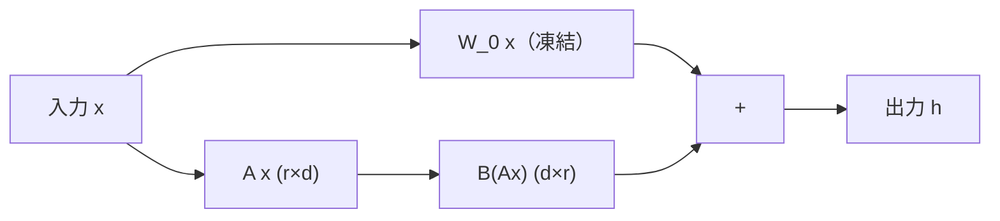

**SVDとの接続**: LoRAの `$BA$` は rank-r 行列の SVD分解の因数と同型。違いは、LoRAでは `$B,A$` を直接学習するのに対し、SVDは既存の行列を後から分解する。

**LoRA派生手法の概観**:

| 手法 | 特徴 | 核心的改善 |
|:-----|:-----|:---------|
| LoRA[^2] | 均一ランク `$r$` | Fine-tuning基礎 |
| AdaLoRA[^5] | SVD + 重要度スコアで可変ランク | パラメータ効率 |
| DoRA | 方向性 `$W$` + 大きさ `$m$` に分解 | 表現力向上 |
| QLoRA | 4-bit量子化 + LoRA | メモリ大幅削減 |
| LoRA+ | `$A$` と `$B$` に異なる学習率 | 学習速度2倍 |

DoRAは `$W = m \cdot \frac{W_0 + BA}{\|W_0 + BA\|}$`（`$m$` = スカラー大きさ）に分解し、方向と大きさを独立に学習。この分解はSVDの「回転」と「スケーリング」の分離と対応する。


### 6.2 Randomized SVD — 大規模行列の近似

`$A \in \mathbb{R}^{m \times n}$`、`$m = n = 10^5$` の場合、全体のSVDは `$O(n^3)$` で不可能。Halko et al. (2011)[^1]のRandomized SVDは `$O(mn\log k)$` で rank-k近似を計算する。

**アルゴリズム**:

1. **ランダム射影**: `$\Omega \in \mathbb{R}^{n \times (k+p)}$`（`$p$` = oversampling, 通常10）をランダムに生成
   ```math
   Y = A \Omega \in \mathbb{R}^{m \times (k+p)}
   ```

2. **正規直交基底**: `$Y$` のQR分解
   ```math
   Y = Q R,\quad Q \in \mathbb{R}^{m \times (k+p)}
   ```

3. **小行列への射影**: 
   ```math
   B = Q^\top A \in \mathbb{R}^{(k+p) \times n}
   ```

4. **小行列のSVD**: `$B = \tilde{U} \Sigma V^\top$`（`$(k+p) \times n$` なので高速）

5. **復元**: `$U = Q \tilde{U}$`

**なぜ動くのか？**: ランダム射影 `$\Omega$` の列がほぼ確実に `$A$` の列空間の有効な基底を近似する（確率集中現象）。誤差は `$\sigma_{k+1}$`（次の特異値）に依存する。

**計算量比較**:

| 手法 | 計算量 | 用途 |
|:-----|:-------|:-----|
| 全体SVD | `$O(\min(m,n) \cdot mn)$` | 正確解、小規模 |
| Randomized SVD | `$O(mn\log k)$` | 大規模、近似 |
| Power iteration variant | `$O(q \cdot mn)$` | より高精度（`$q$` = iter数） |

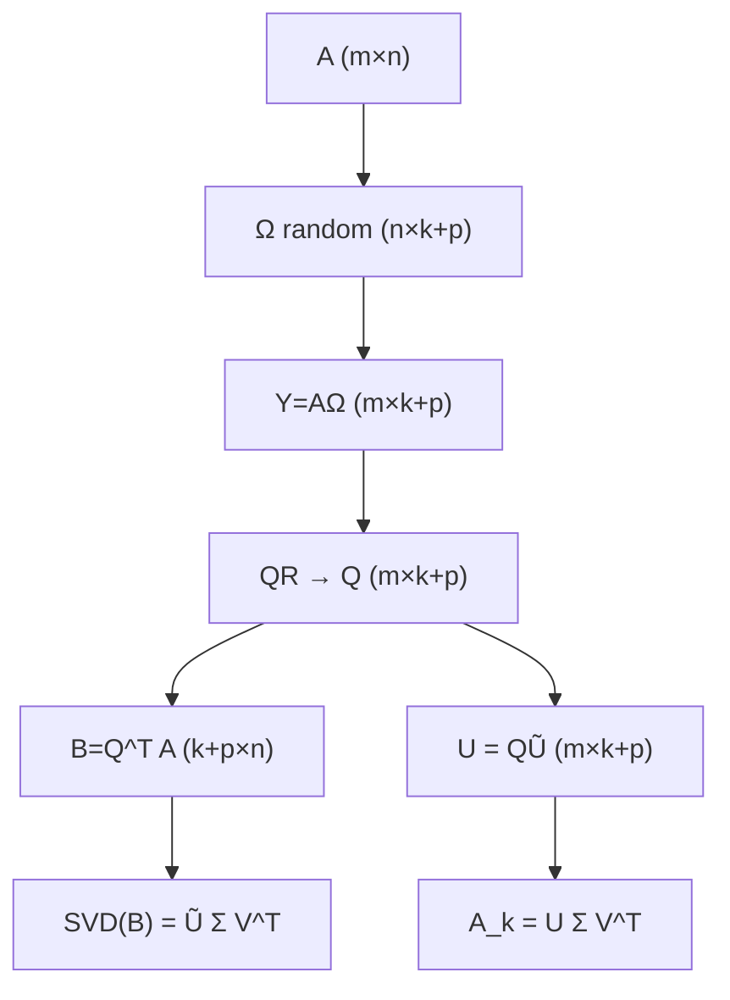

### 6.3 AdaLoRA — SVDによる適応的ランク割り当て

LoRAの弱点: 全重み行列に同じランク `$r$` を割り当てる。しかし、重み行列によって重要度は異なる。

AdaLoRA[^5]は SVD パラメータ化と重要度スコアによって、ランク割り当てを**動的に**調整する。

**SVD分解パラメータ化**:

```math
\Delta W = P \Lambda Q, \quad P \in \mathbb{R}^{d \times r},\; Q \in \mathbb{R}^{r \times k}
```

`$\Lambda = \text{diag}(\lambda_1, \ldots, \lambda_r)$` が特異値行列で、学習中に一部をゼロマスクすることでランクを制御。

**重要度スコア** `$s_i$`（各特異値成分の重要度）:

```math
s_i = \left|\lambda_i\right| \cdot \left(\left|\mathbf{p}_i\right| \cdot \left|\mathbf{q}_i\right|\right)^{1/2}
```

重要度が低い成分（`$s_i$` が小さい）は `$\lambda_i \leftarrow 0$` にマスクし、重要な成分に「ランク予算」を再配分。

**直交性正則化**: `$P, Q$` が直交に近くなるよう正則化:

```math
\mathcal{R}(P, Q) = \|P^\top P - I\|_F^2 + \|QQ^\top - I\|_F^2
```

これにより特異値分解の「分離性」が維持され、特定の `$\lambda_i$` をゼロにしても他成分に影響が少ない。

**LoRA vs AdaLoRA の比較**:

| 特性 | LoRA | AdaLoRA |
|:-----|:-----|:--------|
| ランク割り当て | 全層均一 | 重要度に応じて動的 |
| パラメータ効率 | 中 | 高（同予算で精度向上） |
| 計算オーバーヘッド | 低 | 中（ランクスケジューリング必要） |
| SVDの役割 | 後処理分析 | 訓練中の中核構造 |

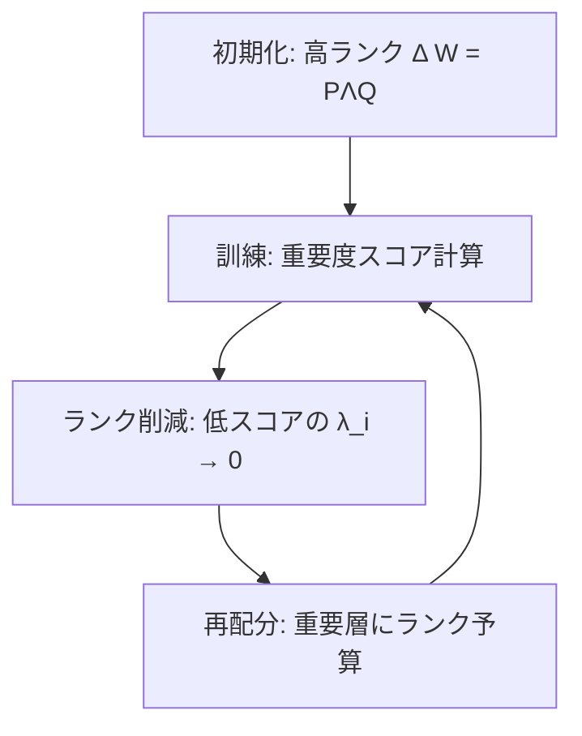

**AdaLoRAの訓練スケジュール**:

訓練の初期（`$t < T_i$`）はランク削減なし（全 `$\lambda_i$` を更新）。中期（`$T_i \leq t < T_f$`）で段階的にランクを削減。後期（`$t \geq T_f$`）は固定ランクで収束させる。

```math
r(t) = r_f + (r_0 - r_f) \cdot \left(1 - \frac{t - T_i}{T_f - T_i}\right)^3 \quad (T_i \leq t < T_f)
```

三乗カーブで滑らかにランクを削減することで、突然のランク変化による学習不安定を回避する。

### 6.4 FlashAttention — IO-awareな行列演算

GPUの計算ボトルネックは、実は演算数ではなくメモリ帯域だ。

Vanilla Attentionは `$N \times N$` の Attention行列をHBM（高帯域メモリ）に書き込み、再度読み込む。これがボトルネック。

**FlashAttention[^4]の核心**:

```math
O_i = \sum_j \frac{e^{q_i \cdot k_j / \sqrt{d}}}{\sum_l e^{q_i \cdot k_l / \sqrt{d}}} v_j
```

この計算を **tiling + online softmax** で実装することで、`$N \times N$` 行列をHBMに書き出さずに済む。

**online softmax の更新式** (tileサイズ `$B_c$` ごとに逐次更新):

```math
m_i^{\text{new}} = \max(m_i^{\text{old}},\, \max_j s_{ij}), \quad
\ell_i^{\text{new}} = e^{m_i^{\text{old}} - m_i^{\text{new}}} \ell_i^{\text{old}} + \sum_j e^{s_{ij} - m_i^{\text{new}}}
```

各 tile を処理するたびに、`$m_i$`（running max）と `$\ell_i$`（running sum）を更新。HBMアクセスが `$O(N)$` に削減される（vanilla: `$O(N^2)$`）。

**メモリ複雑度の比較**:

| アルゴリズム | HBMアクセス | メモリ使用量 | 逆伝播 |
|:------------|:-----------|:----------|:------|
| Vanilla Attention | `$O(N^2)$` | `$O(N^2)$` | Attention行列保存 |
| FlashAttention v1 | `$O(N)$` | `$O(N)$` | 再計算（recompute） |
| FlashAttention v2 | `$O(N)$` | `$O(N)$` | warpごと並列化改善 |

逆伝播では Attention 行列を保存しない。代わりに `$m_i$`（max）と `$\ell_i$`（sum）だけ保持し、backward 時にAttentionを**再計算**する。メモリが浮動小数点演算より安い場合、これが最適。

**FlashAttention-2 の改善点**: v1 はシーケンス方向（クエリ）に外ループを置き、KV方向に内ループを持つ設計だった。v2 は外ループをクエリ側にして、GPU warp 間の通信を最小化した。実測スピードアップ: `$A100$` で v1 比 2倍、理論ピーク比 73%。

**線形代数との接続**: FlashAttentionは「行列積の分割可能性」を利用している。`$AB = \sum_k A_{:,k} B_{k,:}$` という外積和分解が、tileごとの計算を可能にする。これはSVDの逐次近似と同じ「分割して計算し、後で統合」という発想だ。

**低ランクAttentionとの比較**: Linformer[^6]などは Attention 行列そのものを低ランク `$P = E^\top K \in \mathbb{R}^{r \times N}$`（`$r \ll N$`）で近似する。SVDの観点では、Attentionスコア行列 `$S = QK^\top/\sqrt{d}$` の有効ランクが低い、という仮説。実証的には `$r = 128$`（`$N = 2048$`）で精度低下ほぼゼロが報告されている。

### 6.5 行列微分の研究フロンティア — 高次微分とHessian

2次最適化はSGDの10倍以上速く収束することがある。ネックはHessianの計算・保存コスト `$O(n^2)$`。

**Hessian-vector product（HVP）**:

```math
Hv = \nabla_\theta (\nabla_\theta \mathcal{L} \cdot v) = \lim_{\varepsilon \to 0} \frac{\nabla_\theta \mathcal{L}(\theta + \varepsilon v) - \nabla_\theta \mathcal{L}(\theta)}{\varepsilon}
```

これはForward-over-Reverse ADで1回のforward + 1回のreverseで計算可能（`$O(n)$` で済む）。Hessian行列全体 `$H \in \mathbb{R}^{n \times n}$` を保存せず、任意の方向 `$v$` との積だけ計算する。Newton法はこの `$Hv$` を線形システム `$Hp = -\nabla \mathcal{L}$` のソルバーで使う。

**Gauss-Newton分解**: 損失が `$\mathcal{L} = \frac{1}{2}\|r(\theta)\|^2$`（残差の二乗和）のとき:

```math
H = J^\top J + \sum_i r_i \nabla^2 r_i \approx J^\top J \quad (\text{残差が小さければ})
```

`$J = \partial r / \partial \theta$` がヤコビアン。`$J^\top J$` は半正定値で逆行列が安定。深層学習では残差は損失勾配に対応し、`$J^\top J$` が Fisher情報行列 `$F$` に対応する。

**自然勾配（Natural Gradient）**: Fisher情報行列 `$F$` を使ったパラメータ空間の曲率補正:

```math
\Delta \theta = -\eta F^{-1} \nabla_\theta \mathcal{L}
```

`$F^{-1} \nabla \mathcal{L}$` は「確率分布空間での最急降下方向」だ。ユークリッド勾配は、パラメータ空間の計量を無視するため、非効率な経路をたどりやすい。自然勾配はこれを補正する。

**K-FAC（Kronecker-factored Approximation）**:

Fisher情報行列 `$F = \mathbb{E}[\nabla \mathcal{L} \nabla \mathcal{L}^\top]$` を Kronecker積で近似:

```math
F \approx A \otimes G, \quad A = \mathbb{E}[a a^\top],\; G = \mathbb{E}[\delta \delta^\top]
```

`$A$` は入力の2次統計、`$G$` は勾配の2次統計。Kronecker積のおかげで逆行列が `$O(n)$` で計算可能。逆行列の分解: `$(A \otimes G)^{-1} = A^{-1} \otimes G^{-1}$`。`$A,G$` それぞれの逆行列は `$O(d^3)$` だが、これは元の `$F^{-1}$` の `$O(n^2 d^2)$` より桁違いに小さい。

**Hutchinson推定によるHessianトレース近似**:

```math
\text{tr}(H) \approx \frac{1}{m} \sum_{j=1}^m z_j^\top H z_j, \quad z_j \sim \mathcal{N}(0, I)
```

確率ベクトル `$z_j$` とのHVPだけでトレースを推定できる。`$m = 10\text{-}100$` で実用的な精度が出る。これを使えば「Hessianの大きな固有値成分がいくつか存在するか」（sharp minima vs flat minima）が推定できる。

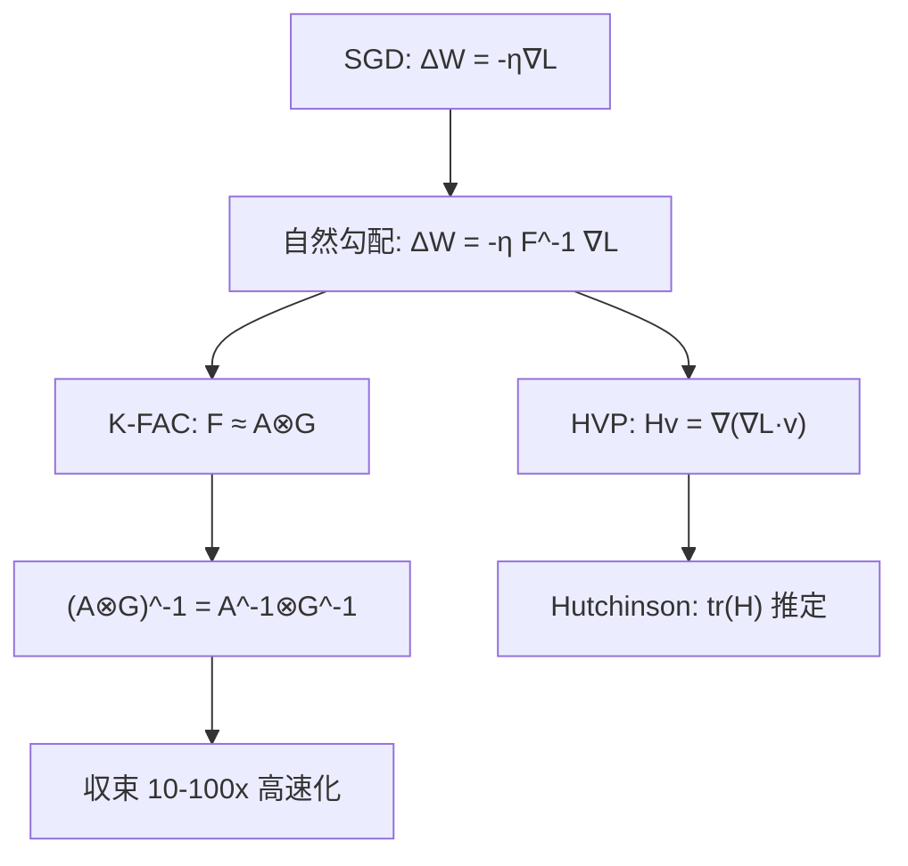

### 6.6 研究論文の家系図

第3回で扱った論文群の系譜を整理する。数式の「血統」が見えると、なぜ今の手法が生まれたかが分かる。

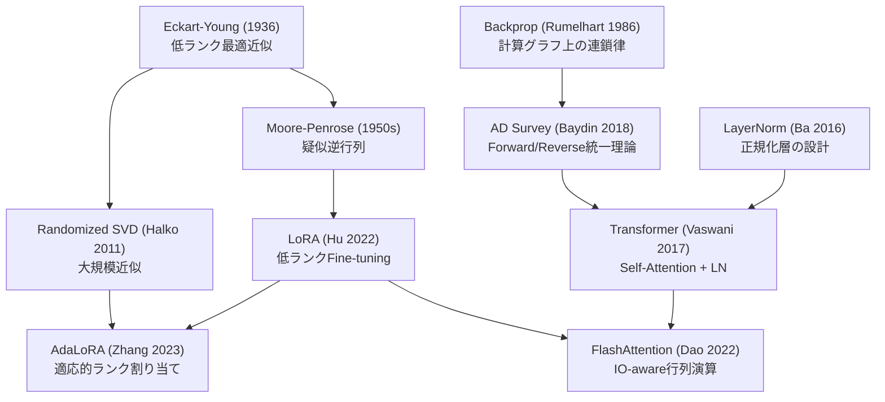

**読み方**: 矢印は「数学的・思想的継承」を示す。LoRA が Moore-Penrose を継承するのは「最小ノルム解 = 低ランク解」の思想から。FlashAttentionがTransformerを継承するのは「同じ数式、違う計算順序」という発想から。

**未来の接続**: Hessian近似（K-FAC）はFisher情報行列経由でLoRAと繋がる。「低ランク ≈ 損失の曲率が低い方向」という観点から、適応的ランク選択とK-FACは同じ問題を異なる角度で解く。

### Z6 理解度チェック — 研究トレンドの把握

<details>
<summary>Q1: LoRAとAdaLoRAの本質的な違いを1行で説明せよ。</summary>

LoRAは均一ランクの学習可能行列を使うが、AdaLoRAはSVDパラメータ化と重要度スコアで各層のランクを**動的に**割り当てる。

</details>

<details>
<summary>Q2: Randomized SVD が `$O(mnk)$` で済む理由を述べよ。</summary>

ランダム射影 `$Y = A\Omega$`（`$O(mnk)$`）→ QR分解（`$O(mk^2)$`）→ 小行列 `$B = Q^\top A$`（`$O(mnk)$`）→ 小行列のSVD（`$O(k^2 n)$`）。全行列SVDの `$O(mn\min(m,n))$` に対し、`$k \ll \min(m,n)$` なら `$k/\min(m,n)$` 倍高速。

</details>

<details>
<summary>Q3: FlashAttentionが `$O(N^2)$` ではなく `$O(N)$` のHBMアクセスで済む理由は？</summary>

Attention行列 `$P \in \mathbb{R}^{N \times N}$` をHBMに書き出さず、SRAMでtileごとにonline softmaxを計算するため。各tileのrunning max `$m_i$` とrunning sum `$\ell_i$` をSRAM上で更新し続け、最終パスのみ出力 `$O_i$` をHBMに書く。

</details>

> Progress: 95%

---

## 🎓 Z7. エピローグ（10分）— まとめと次回予告

### 第3回の学習内容まとめ

| トピック | 理論の核心 | 実装の核心 |
|:---------|:---------|:---------|
| SVD | `$A = U\Sigma V^\top$`, Eckart-Young定理 | `U[:,:k] @ (s[:k,None] * Vt[:k,:])` |
| Randomized SVD | ランダム射影 + QR + 小行列SVD | `$O(mnk)$` — 大規模行列に不可欠 |
| LoRA | `$\Delta W = BA$`, 低ランク仮説 | `$B=0$`初期化の理由 |
| einsum | 添字規則 3 条 | パターン表の暗記より導出 |
| 行列微分 | `$\nabla_x f$` の shape = `$x$` の shape | 中央差分で `$10^{-5}$` 以下検算 |
| Forward AD | 双対数 `$a + b\varepsilon$`, `$\varepsilon^2=0$` | `Dual(x, 1.0)` で `$x$` の偏微分 |
| Reverse AD | Wengert tape + VJP | PyTorchの `backward()` の正体 |
| LayerNorm | 平均・分散正規化 → 接平面射影の逆伝播 | `$\hat{x} = (x-\mu)/\sqrt{\sigma^2+\varepsilon}$` |

### 道具の連携図 — SVD×行列微分×自動微分の交点

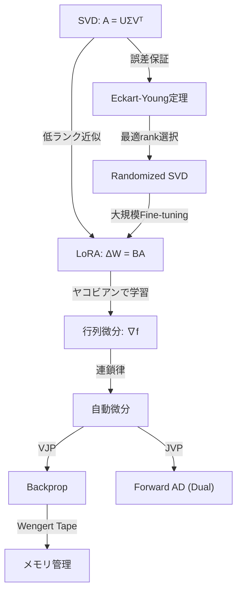

SVD・行列微分・自動微分は独立した道具ではない。SVDが「低ランク構造の発見」を担い、行列微分が「最適化の方向」を与え、自動微分が「その方向を効率的に計算」する。3つが揃って初めて、LLMのFine-tuningが成立する。

### 数式↔コード対応表

| 数式 | NumPy/Python | shape |
|:-----|:-------------|:------|
| `$A = U\Sigma V^\top$` | `U, s, Vt = np.linalg.svd(A, full_matrices=False)` | `(m,r),(r,),(r,n)` |
| `$A_k$` | `U[:,:k] @ (s[:k,None] * Vt[:k,:])` | `(m,n)` |
| `$\|A - A_k\|_F^2 = \sum_{i>k}\sigma_i^2$` | `np.sum(s[k:]**2)` | scalar |
| `$A^\dagger$` | `np.linalg.pinv(A)` | `(n,m)` |
| `$C_{ij}=\sum_k A_{ik}B_{kj}$` | `np.einsum('ik,kj->ij', A, B)` | `(m,n)` |
| `$S_{bhqk} = \sum_d Q_{bhqd}K_{bhkd}/\sqrt{d}$` | `np.einsum('bhqd,bhkd->bhqk', Q, K) / sqrt(d)` | `(B,H,T,T)` |
| `$f(\mathbf{x}) = \frac{1}{2}\mathbf{x}^\top A\mathbf{x}$` | `0.5 * x @ A @ x` | scalar |
| `$\nabla_x f$` | 数値: 中央差分 `(f(x+h*e_i) - f(x-h*e_i)) / (2h)` | `(d,)` |
| `$\hat{x} = (x-\mu)/\sqrt{\sigma^2+\varepsilon}$` | `(x - x.mean()) / sqrt(x.var() + eps)` | `(d,)` |
| ReLU勾配 | `dz1 = dh1 * (z1 > 0)` | `(B,H)` |
| Softmax+CE勾配 | `dz2 = (p - y) / B` | `(B,C)` |
| `$\partial\mathcal{L}/\partial W_2$` | `dW2 = dz2.T @ h1` | `(C,H)` |
| `$W \leftarrow W - \eta \nabla_W \mathcal{L}$` | `W -= lr * dW` | `(H,D)` |
| Dual Number積 | `(a+bε)(c+dε) = ac + (ad+bc)ε` | — |


### FAQ

<details>
<summary>Q1: `np.linalg.svd` の `full_matrices=False` は何を意味するか？</summary>

`full_matrices=True`（デフォルト）: `$U \in \mathbb{R}^{m \times m}$`, `$V^\top \in \mathbb{R}^{n \times n}$`（正方行列）。
`full_matrices=False`: `$U \in \mathbb{R}^{m \times r}$`, `$V^\top \in \mathbb{R}^{r \times n}$`（`$r = \min(m,n)$`、経済的SVD）。

低ランク近似のときは `False` が効率的。`full_matrices=True` は直交完全性が必要な場合（例: QR分解との組み合わせ）で使う。

</details>

<details>
<summary>Q2: SVDの特異値は一意だが、U と V は一意でないのはなぜか？</summary>

特異値 `$\sigma_i$` は `$A^\top A$` の固有値の平方根なので一意。しかし固有ベクトルは固有空間が1次元でない限り一意ではない（符号反転・回転の自由度）。多重特異値があるときは特に注意。実装では `U` や `V` の絶対値や再構成誤差で比較する。

</details>

<details>
<summary>Q3: LoRAで `$B=0$`、`$A=\text{Kaiming normal}$` と初期化する理由は？</summary>

Fine-tuning開始時に `$\Delta W = BA = 0$` を保証するため。`$A=0$` にすると `$\partial \mathcal{L}/\partial A = B^\top (\cdots) = 0$` となり `$A$` が学習しない。`$B=0$` にすると最初の backward で `$\partial \mathcal{L}/\partial B \neq 0$`（`$A$` は非ゼロ）なので、以降は両方が学習する。

</details>

<details>
<summary>Q4: Tikhonov正則化の `$\lambda$` をどう選ぶか？</summary>

```math
\mathbf{x}^* = V \operatorname{diag}\!\left(\frac{\sigma_i}{\sigma_i^2+\lambda}\right) U^\top \mathbf{b}
```

`$\lambda \to \infty$`: 全フィルタ係数 `$\to 0$` → `$\mathbf{x}^* \to \mathbf{0}$`（過剰正則化）。
`$\lambda \to 0$`: 疑似逆行列解（最小ノルム最小二乗解）に収束。
最適 `$\lambda$` はL曲線法（`$\|\mathbf{x}^*\|$` vs `$\|A\mathbf{x}^* - \mathbf{b}\|$` のプロット）や留一交差検証で選ぶ。

</details>

<details>
<summary>Q5: なぜ数値微分は grad check にしか使えないのか？</summary>

中央差分の誤差は `$O(h^2)$`。`$h \approx 10^{-5}$` を使うと数値誤差 `$\sim 10^{-10}$` で1偏微分が計算できるが、`$n$` パラメータに対し `$O(n)$` 回 forward pass が必要。LLMでは `$n = 10^9$` → `$10^9$` 回の forward pass = 不可能。grad check は `$n \leq 10^4$` の小ネットワークでのみ実用的。

</details>

<details>
<summary>Q6: Dual Numbers を使った Forward Mode AD と PyTorch の autograd の関係は？</summary>

PyTorchの `autograd` はデフォルトで **Reverse Mode AD** を実装する。`torch.autograd.functional.jvp` が Forward Mode（Jacobian-vector product）を実装している。

Dual Numbers は手実装版 Forward Mode AD の理論的基盤。PyTorchの forward-mode AD は内部で Tangent（`$\varepsilon$` 係数）を追跡する同様の仕組みを持つ。

`torch.autograd.functional.jvp(f, x, v)` は `$Jv$` を1パスで計算する。`$v$` = 方向ベクトル（Dual Numberの `$\varepsilon$` 成分）に相当。

</details>

<details>
<summary>Q7: einsum の `optimize=True` は常に使うべきか？</summary>

2項縮約（`'ik,kj->ij'`）では順序が一意なので効果なし。**3項以上**の縮約でのみ恩恵がある。

`np.einsum('ijk,jkl,klm->im', A, B, C, optimize=True)` のような式では、縮約順序の探索コストより計算削減量の方が圧倒的に大きい。

ただし、ループ内で繰り返す場合は `np.einsum_path` でプランを事前計算してキャッシュする。

</details>

<details>
<summary>Q9: Randomized SVD の誤差保証はどれくらい強いか？</summary>

Halko et al. (2011) の定理: ランダム行列 `$\Omega \in \mathbb{R}^{n \times (k+p)}$` を使って `$Y = A\Omega$`、`$Q$` をその正規直交基底として `$\hat{A} = QQ^\top A$` を作ると:

```math
\mathbb{E}\|A - \hat{A}\|_2 \leq \left(1 + \sqrt{\frac{k}{p-1}}\right)\sigma_{k+1} + \frac{e\sqrt{k+p}}{p} \left(\sum_{j>k}\sigma_j^2\right)^{1/2}
```

`$p$` はオーバーサンプリングパラメータ（通常 `$p=5\text{-}10$`）。期待値が最良ランク-`$k$` 近似誤差 `$\sigma_{k+1}$` に近い。`$p=10$` でほぼ確定的な保証が得られる。

</details>

<details>
<summary>Q8: LayerNorm の逆伝播で「平均成分と分散方向成分を差し引く」のはなぜか？</summary>

LayerNorm の forward では出力 `$\hat{x}$` が常に平均0・分散1に制約される。この制約は「`$\hat{x}$` は平均方向と分散方向への変化を持てない」ことを意味する。

逆伝播もその制約に従う必要があり、勾配から「平均方向」`$\frac{1}{d}\sum_k \delta_k$` と「分散方向」`$\hat{x}_j \frac{1}{d}\sum_k \delta_k \hat{x}_k$` を差し引いて射影する。これはまさに「制約付き最適化における射影勾配」の構造だ。

</details>

### 次回予告 — 第4回: 確率論・統計学

第3回で学んだ行列微分・自動微分は、「勾配をどう計算するか」の問題を解決した。

次回は「確率をどう扱うか」だ。

- 確率分布の記述と操作
- 期待値・分散・共分散
- 最尤推定とベイズ推定
- KL divergenceの導出と情報理論

行列微分なしに最尤推定は書けない。今回の道具が直接繋がる。

> Progress: 100%

---

## パラダイム転換 — 「テンソル縮約は情報の言語」

> 微分はなぜ「計算グラフの逆走」なのか？

古典数学では微分は「極限」として定義される。しかし実装の世界では、微分は「計算の記録を逆に読む」操作だ。

Wengert list を使った Reverse Mode AD は、数学的には「局所偏微分の連鎖積の逆順計算」だが、計算論的には「プログラムのトレースを巻き戻す」だ。この二つの等価性が、深層学習の理論と実装を結ぶ橋梁だ。

同様に、einsum は「テンソル縮約の言語」ではなく「情報の流れの言語」だ。`'bhqd,bhkd->bhqk'` は単なる計算式ではなく、「各クエリが全てのキーと関係を持ち、関係の強さを `$d$` 次元で測る」という意味の宣言だ。

SVDもまた「行列の言語」だ。どんな変換も「回転 → 軸方向スケーリング → 回転」に分解できる、という主張。その言語で書けば、LoRAもRandomized SVDも同じ文法で書ける。

**問い**: 「情報を失わない最小の表現」とは何か？

<details>
<summary>歴史的背景 — 低ランク近似の再発見</summary>

Eckart-Young定理（1936年）は行列論の結果だったが、「最良低ランク近似＝SVDで切り捨て」という事実が機械学習に広く応用されたのは1990年代以降だ。

LSA（Latent Semantic Analysis）、PCA、推薦システムのSVD、そしてLoRA——全て同じ数学的原理の応用だ。

LoRAの登場（2022年）は、「LLMの fine-tuning は低次元多様体上にある」という観察を実用化した。Fine-tuningの「本質的な自由度」が驚くほど小さいという発見は、深層学習の「内在次元」への理解を一段深めた。

</details>

---

## 📚 参考文献

[^1]: Halko, N., Martinsson, P.-G., & Tropp, J. A. (2011). Finding structure with randomness: Probabilistic algorithms for constructing approximate matrix decompositions. *SIAM Review*, 53(2), 217–288. [arXiv:0909.4061](https://arxiv.org/abs/0909.4061)

[^2]: Hu, E. J., Shen, Y., Wallis, P., Allen-Zhu, Z., Li, Y., Wang, S., Wang, L., & Chen, W. (2022). LoRA: Low-Rank Adaptation of Large Language Models. *ICLR 2022*. [arXiv:2106.09685](https://arxiv.org/abs/2106.09685)

[^3]: Aghajanyan, A., Zettlemoyer, L., & Gupta, S. (2021). Intrinsic Dimensionality Explains the Effectiveness of Language Model Fine-Tuning. *ACL 2021*. [arXiv:2012.13255](https://arxiv.org/abs/2012.13255)

[^4]: Dao, T., Fu, D. Y., Ermon, S., Rudra, A., & Ré, C. (2022). FlashAttention: Fast and Memory-Efficient Exact Attention with IO-Awareness. *NeurIPS 2022*. [arXiv:2205.14135](https://arxiv.org/abs/2205.14135)

[^5]: Zhang, Q., Chen, M., Bukharin, A., He, P., Cheng, Y., Chen, W., & Zhao, T. (2023). AdaLoRA: Adaptive Budget Allocation for Parameter-Efficient Fine-Tuning. *ICLR 2023*. [arXiv:2303.10512](https://arxiv.org/abs/2303.10512)

[^6]: Baydin, A. G., Pearlmutter, B. A., Radul, A. A., & Siskind, J. M. (2018). Automatic differentiation in machine learning: a survey. *Journal of Machine Learning Research*, 18(153), 1–43. [arXiv:1502.05767](https://arxiv.org/abs/1502.05767)

[^7]: Vaswani, A., Shazeer, N., Parmar, N., Uszkoreit, J., Jones, L., Gomez, A. N., Kaiser, Ł., & Polosukhin, I. (2017). Attention Is All You Need. *NeurIPS 2017*. [arXiv:1706.03762](https://arxiv.org/abs/1706.03762)

[^8]: Ba, J. L., Kiros, J. R., & Hinton, G. E. (2016). Layer Normalization. [arXiv:1607.06450](https://arxiv.org/abs/1607.06450)

---

> **前編へのリンク**: [第3回 Part1（理論編）](/articles/ml-lecture-03-part1)

---

## 著者リンク

- Blog: https://fumishiki.dev
- X: https://x.com/fumishiki
- LinkedIn: https://www.linkedin.com/in/fumitakamurakami
- GitHub: https://github.com/fumishiki
- Hugging Face: https://huggingface.co/fumishiki

---

## ライセンス

本記事は [CC BY-NC-SA 4.0](https://creativecommons.org/licenses/by-nc-sa/4.0/deed.ja)（クリエイティブ・コモンズ 表示 - 非営利 - 継承 4.0 国際）の下でライセンスされています。

### ⚠️ 利用制限について

**本コンテンツは個人の学習目的に限り利用可能です。**

**以下のケースは事前の明示的な許可なく利用することを固く禁じます:**

1. **企業・組織内での利用（営利・非営利問わず）**
   - 社内研修、教育カリキュラム、社内Wikiへの転載
   - 大学・研究機関での講義利用
   - 非営利団体での研修利用
   - **理由**: 組織内利用では帰属表示が削除されやすく、無断改変のリスクが高いため

2. **有料スクール・情報商材・セミナーでの利用**
   - 受講料を徴収する場での配布、スクリーンショットの掲示、派生教材の作成

3. **LLM/AIモデルの学習データとしての利用**
   - 商用モデルのPre-training、Fine-tuning、RAGの知識ソースとして本コンテンツをスクレイピング・利用すること

4. **勝手に内容を有料化する行為全般**
   - 有料note、有料記事、Kindle出版、有料動画コンテンツ、Patreon限定コンテンツ等

**個人利用に含まれるもの:**

- 個人の学習・研究
- 個人的なノート作成（個人利用に限る）
- 友人への元記事リンク共有

**組織での導入をご希望の場合**は、必ず著者に連絡を取り、以下を遵守してください:

- 全ての帰属表示リンクを維持
- 利用方法を著者に報告

**無断利用が発覚した場合**、使用料の請求およびSNS等での公表を行う場合があります。
