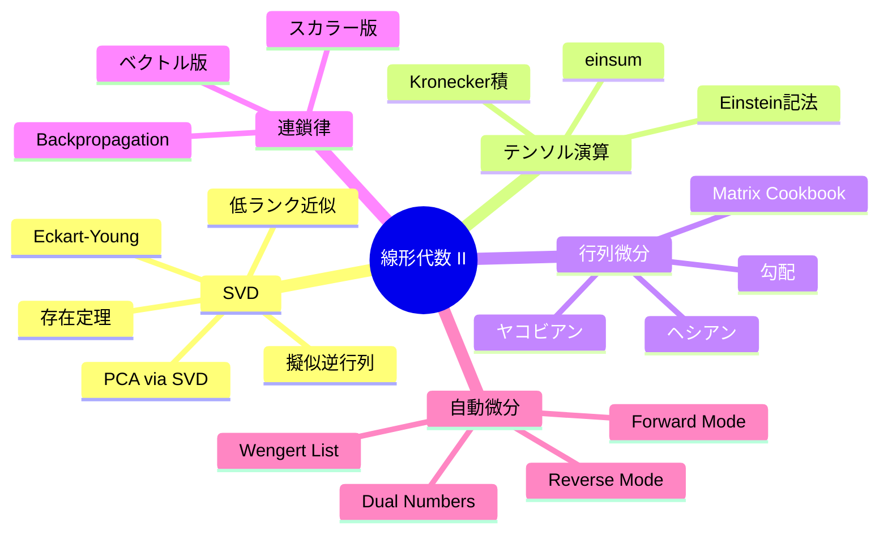

## 💻 4. 実装ゾーン（45分）— SVDと自動微分をコードで操る

### 4.1 SVD画像圧縮の完全実装

```python
import numpy as np

def svd_compress(A, k):
    """Compress matrix A to rank-k using SVD"""
    U, s, Vt = np.linalg.svd(A, full_matrices=False)
    return U[:, :k] @ np.diag(s[:k]) @ Vt[:k, :], s

def compression_stats(m, n, k):
    """Calculate compression statistics"""
    original = m * n
    compressed = k * (m + n + 1)
    return compressed / original

# Demo with synthetic image
np.random.seed(42)
m, n = 256, 192
# Create structured image: smooth gradients + edges
x = np.linspace(0, 8*np.pi, m)
y = np.linspace(0, 6*np.pi, n)
X, Y = np.meshgrid(y, x)
image = (np.sin(X) * np.cos(Y) + 0.3 * np.sin(3*X + 2*Y) +
         0.5 * np.sign(np.sin(X/2)))
image += 0.05 * np.random.randn(m, n)  # small noise

_, s = np.linalg.svd(image, full_matrices=False)

print("SVD Image Compression Results:")
print(f"Image size: {m}x{n} = {m*n:,} values")
print(f"{'rank':>6} {'ratio':>10} {'error':>10} {'PSNR(dB)':>10}")
print("-" * 42)

for k in [1, 5, 10, 20, 50, 100]:
    A_k, _ = svd_compress(image, k)
    ratio = compression_stats(m, n, k)
    mse = np.mean((image - A_k)**2)
    max_val = np.max(np.abs(image))
    psnr = 10 * np.log10(max_val**2 / mse) if mse > 0 else float('inf')
    rel_error = np.linalg.norm(image - A_k, 'fro') / np.linalg.norm(image, 'fro')
    print(f"{k:6d} {ratio:9.1%} {rel_error:10.6f} {psnr:10.2f}")
```

### 4.2 Randomized SVD — 大規模行列の効率的なSVD

通常のSVDは $O(\min(mn^2, m^2n))$。数万×数万の行列には遅すぎる。**Randomized SVD** はランダム射影で次元を落としてからSVDを計算する。

```python
import numpy as np

def randomized_svd(A, k, n_oversamples=10, n_iter=2):
    """
    Randomized SVD (Halko, Martinsson, Tropp 2011)

    Parameters:
        A: (m, n) matrix
        k: target rank
        n_oversamples: oversampling parameter (default 10)
        n_iter: power iterations for accuracy (default 2)

    Returns:
        U, s, Vt: truncated SVD components
    """
    m, n = A.shape
    p = k + n_oversamples

    # Step 1: Random projection
    Omega = np.random.randn(n, p)
    Y = A @ Omega  # (m, p)

    # Step 2: Power iteration (improves accuracy for slow singular value decay)
    for _ in range(n_iter):
        Y = A @ (A.T @ Y)

    # Step 3: QR factorization of Y
    Q, _ = np.linalg.qr(Y)  # (m, p) orthonormal

    # Step 4: Form small matrix and compute its SVD
    B = Q.T @ A  # (p, n) — much smaller!
    U_hat, s, Vt = np.linalg.svd(B, full_matrices=False)

    # Step 5: Recover left singular vectors
    U = Q @ U_hat

    return U[:, :k], s[:k], Vt[:k, :]

# Benchmark
np.random.seed(42)
m, n, true_rank = 5000, 3000, 20
U_true = np.linalg.qr(np.random.randn(m, true_rank))[0]
V_true = np.linalg.qr(np.random.randn(n, true_rank))[0]
s_true = np.logspace(1, -1, true_rank)
A = U_true @ np.diag(s_true) @ V_true.T + 0.01 * np.random.randn(m, n)

import time

# Full SVD
t0 = time.time()
U_f, s_f, Vt_f = np.linalg.svd(A, full_matrices=False)
t_full = time.time() - t0

# Randomized SVD
k = 20
t0 = time.time()
U_r, s_r, Vt_r = randomized_svd(A, k)
t_rand = time.time() - t0

A_full = U_f[:, :k] @ np.diag(s_f[:k]) @ Vt_f[:k, :]
A_rand = U_r @ np.diag(s_r) @ Vt_r

print(f"Matrix size: {m}x{n}")
print(f"Full SVD:       {t_full:.3f}s, error = {np.linalg.norm(A - A_full, 'fro'):.6f}")
print(f"Randomized SVD: {t_rand:.3f}s, error = {np.linalg.norm(A - A_rand, 'fro'):.6f}")
print(f"Speedup: {t_full/t_rand:.1f}x")
```

### 4.3 Reverse Mode 自動微分の完全実装

Zone 1.5 で簡易版を示した。ここではより本格的な実装を示す。

```python
import numpy as np

class Value:
    """Scalar autograd engine (Reverse Mode AD)"""
    def __init__(self, data, _children=(), _op='', label=''):
        self.data = float(data)
        self.grad = 0.0
        self._backward = lambda: None
        self._prev = set(_children)
        self._op = _op
        self.label = label

    def __repr__(self):
        return f"Value({self.data:.4f}, grad={self.grad:.4f})"

    def __add__(self, other):
        other = other if isinstance(other, Value) else Value(other)
        out = Value(self.data + other.data, (self, other), '+')
        def _backward():
            self.grad += out.grad
            other.grad += out.grad
        out._backward = _backward
        return out

    def __mul__(self, other):
        other = other if isinstance(other, Value) else Value(other)
        out = Value(self.data * other.data, (self, other), '*')
        def _backward():
            self.grad += other.data * out.grad
            other.grad += self.data * out.grad
        out._backward = _backward
        return out

    def __pow__(self, other):
        assert isinstance(other, (int, float))
        out = Value(self.data ** other, (self,), f'**{other}')
        def _backward():
            self.grad += other * (self.data ** (other - 1)) * out.grad
        out._backward = _backward
        return out

    def __neg__(self):
        return self * -1

    def __sub__(self, other):
        return self + (-other)

    def __truediv__(self, other):
        return self * other**-1

    def __radd__(self, other):
        return self + other

    def __rmul__(self, other):
        return self * other

    def exp(self):
        out = Value(np.exp(self.data), (self,), 'exp')
        def _backward():
            self.grad += out.data * out.grad
        out._backward = _backward
        return out

    def log(self):
        out = Value(np.log(self.data), (self,), 'log')
        def _backward():
            self.grad += (1.0 / self.data) * out.grad
        out._backward = _backward
        return out

    def tanh(self):
        t = np.tanh(self.data)
        out = Value(t, (self,), 'tanh')
        def _backward():
            self.grad += (1 - t**2) * out.grad
        out._backward = _backward
        return out

    def backward(self):
        topo = []
        visited = set()
        def build_topo(v):
            if v not in visited:
                visited.add(v)
                for child in v._prev:
                    build_topo(child)
                topo.append(v)
        build_topo(self)
        self.grad = 1.0
        for node in reversed(topo):
            node._backward()

# Demo: simple neural network loss
x1 = Value(2.0, label='x1')
x2 = Value(0.0, label='x2')
w1 = Value(-3.0, label='w1')
w2 = Value(1.0, label='w2')
b = Value(6.8813735870195432, label='b')

# Forward: neuron
n = x1*w1 + x2*w2 + b
o = n.tanh()

# Backward
o.backward()

print("Forward:  o =", o)
print("Gradients:")
print(f"  do/dx1 = {x1.grad:.4f}")
print(f"  do/dx2 = {x2.grad:.4f}")
print(f"  do/dw1 = {w1.grad:.4f}")
print(f"  do/dw2 = {w2.grad:.4f}")
print(f"  do/db  = {b.grad:.4f}")
```

### 4.4 条件数と数値安定性

#### IEEE 754 浮動小数点

| 型 | ビット数 | 仮数部 | 指数部 | 有効桁 | 範囲 |
|:---|:--------|:------|:------|:------|:-----|
| float16 (half) | 16 | 10 | 5 | ~3.3桁 | $\pm 6.5 \times 10^4$ |
| bfloat16 | 16 | 7 | 8 | ~2.4桁 | $\pm 3.4 \times 10^{38}$ |
| float32 (single) | 32 | 23 | 8 | ~7.2桁 | $\pm 3.4 \times 10^{38}$ |
| float64 (double) | 64 | 52 | 11 | ~15.9桁 | $\pm 1.8 \times 10^{308}$ |

**機械学習での使い分け**: 推論=float16/bfloat16、学習=float32(マスターウェイト)+bfloat16(forward/backward)、精密計算=float64。

#### Log-Sum-Exp trick

Softmaxの計算で必須の数値安定化技法:

$$
\log \sum_i e^{x_i} = c + \log \sum_i e^{x_i - c}, \quad c = \max_i x_i
$$

```python
import numpy as np

# Naive vs numerically stable log-sum-exp
x = np.array([1000.0, 1001.0, 1002.0])

# Naive: overflow!
try:
    naive = np.log(np.sum(np.exp(x)))
    print(f"Naive: {naive}")
except:
    print("Naive: OVERFLOW")

# Stable: subtract max
c = np.max(x)
stable = c + np.log(np.sum(np.exp(x - c)))
print(f"Stable: {stable:.4f}")
print(f"Expected: {1002 + np.log(np.exp(-2) + np.exp(-1) + 1):.4f}")
```

### 4.5 スパース行列とGPU上の行列演算

#### スパース行列

大規模な行列の多くはスパース（ほとんどの要素が0）。SciPyの疎行列表現を使うとメモリと計算量を大幅に削減できる。

```python
import numpy as np
from scipy import sparse
from scipy.sparse.linalg import svds

# Dense vs Sparse comparison
n = 10000
density = 0.001  # 0.1% non-zero

# Create sparse matrix
A_sparse = sparse.random(n, n, density=density, format='csr')
print(f"Matrix size: {n}x{n} = {n**2:,} elements")
print(f"Non-zero: {A_sparse.nnz:,} ({density:.1%})")
print(f"Dense memory: {n**2 * 8 / 1e6:.1f} MB")
print(f"Sparse memory: {(A_sparse.data.nbytes + A_sparse.indices.nbytes + A_sparse.indptr.nbytes) / 1e6:.1f} MB")

# Sparse SVD (top-k singular values only)
import time
k = 10
t0 = time.time()
U, s, Vt = svds(A_sparse, k=k)
t_sparse = time.time() - t0
print(f"\nSparse SVD (top-{k}): {t_sparse:.3f}s")
print(f"Top singular values: {np.round(s[::-1][:5], 4)}")
```

| 形式 | 説明 | 長所 | 用途 |
|:-----|:-----|:-----|:-----|
| CSR (Compressed Sparse Row) | 行ごとに非ゼロ要素を格納 | 行スライスが高速 | 行列×ベクトル |
| CSC (Compressed Sparse Column) | 列ごとに非ゼロ要素を格納 | 列スライスが高速 | 転置操作 |
| COO (Coordinate) | (行, 列, 値) のトリプレット | 構築が簡単 | 初期構築 |

#### GPU上の行列演算

| ライブラリ | 用途 | 特徴 |
|:----------|:-----|:-----|
| cuBLAS | 密行列演算 | NVIDIA GPU上のBLAS |
| cuSPARSE | 疎行列演算 | GPU上のスパース行列積 |
| cuSOLVER | 固有値分解・SVD | GPU上のLAPACK |
| Tensor Core | 混合精度行列積 | FP16/BF16で高速化 |

```python
# PyTorch GPU example (conceptual)
# import torch
#
# A = torch.randn(4096, 4096, device='cuda', dtype=torch.float16)
# B = torch.randn(4096, 4096, device='cuda', dtype=torch.float16)
#
# # Tensor Core accelerated matrix multiply
# C = torch.mm(A, B)  # uses Tensor Core if available
#
# # GPU SVD
# U, s, Vt = torch.linalg.svd(A.float())
```

### 4.6 行列微分の数値検証パターン

行列微分を手で導出したら、必ず数値微分で検証する。これは研究でも実務でも不可欠なデバッグ手法。

```python
import numpy as np

def numerical_gradient_matrix(f, X, eps=1e-7):
    """Compute numerical gradient df/dX for scalar-valued f"""
    grad = np.zeros_like(X)
    m, n = X.shape
    for i in range(m):
        for j in range(n):
            X_plus = X.copy(); X_plus[i, j] += eps
            X_minus = X.copy(); X_minus[i, j] -= eps
            grad[i, j] = (f(X_plus) - f(X_minus)) / (2 * eps)
    return grad

# Example: verify d/dX tr(AXB) = A^T B^T
A = np.random.randn(3, 4)
B = np.random.randn(5, 3)
X = np.random.randn(4, 5)

def f_trace(X_):
    return np.trace(A @ X_ @ B)

grad_analytical = A.T @ B.T
grad_numerical = numerical_gradient_matrix(f_trace, X)

print(f"d/dX tr(AXB) = A^T B^T")
print(f"Match: {np.allclose(grad_analytical, grad_numerical)}")
print(f"Max error: {np.max(np.abs(grad_analytical - grad_numerical)):.2e}")

# Example: verify d/dX ||X||_F^2 = 2X
def f_frob(X_):
    return np.sum(X_**2)

grad_analytical_2 = 2 * X
grad_numerical_2 = numerical_gradient_matrix(f_frob, X)
print(f"\nd/dX ||X||_F^2 = 2X")
print(f"Match: {np.allclose(grad_analytical_2, grad_numerical_2)}")

# Example: verify d/dX ln det(X) = X^{-T}
X_sq = np.random.randn(4, 4)
X_sq = X_sq @ X_sq.T + 2 * np.eye(4)  # positive definite

def f_logdet(X_):
    return np.log(np.linalg.det(X_))

grad_analytical_3 = np.linalg.inv(X_sq).T
grad_numerical_3 = numerical_gradient_matrix(f_logdet, X_sq)
print(f"\nd/dX ln det(X) = X^{{-T}}")
print(f"Match: {np.allclose(grad_analytical_3, grad_numerical_3)}")
```

:::message
**実践のルール**: 行列微分を導出したら、**必ず** `numerical_gradient_matrix` で検証する。一致しなければ導出に間違いがある。この習慣が、Backpropの実装バグを防ぐ。
:::

:::message
**進捗: 85% 完了** SVD画像圧縮、Randomized SVD、Reverse Mode AD の完全実装、条件数と数値安定性、スパース行列、行列微分の数値検証を習得した。
:::

---

## 🔬 5. 実験ゾーン（30分）— 自己診断テスト

### 5.1 記号読解テスト

以下の数式を声に出して読み、意味を説明せよ。

:::details Q1: $A = U \Sigma V^\top$
**読み**: 「$A$ イコール $U$ シグマ $V$ トランスポーズ」

**意味**: 行列 $A$ の特異値分解。$U$ と $V$ は直交行列、$\Sigma$ は特異値を対角に持つ行列。任意の長方形行列に適用可能。
:::

:::details Q2: $A_k = \sum_{i=1}^{k} \sigma_i \mathbf{u}_i \mathbf{v}_i^\top$
**読み**: 「$A$ サブ $k$ は、$i$ イコール 1 から $k$ まで、シグマ $i$ ユー $i$ ブイ $i$ トランスポーズの和」

**意味**: rank-$k$ の截断SVD。上位 $k$ 個の特異値成分の和。Eckart-Young定理により、これはFrobeniusノルムで最適な rank-$k$ 近似。
:::

:::details Q3: $J = \frac{\partial \mathbf{f}}{\partial \mathbf{x}} \in \mathbb{R}^{m \times n}$
**読み**: 「$J$ イコール パーシャル $\mathbf{f}$ パーシャル $\mathbf{x}$、$m$ かける $n$ の実数行列」

**意味**: ベクトル関数 $\mathbf{f}: \mathbb{R}^n \to \mathbb{R}^m$ のヤコビアン。$J_{ij} = \partial f_i / \partial x_j$。入力の微小変化が出力にどう影響するかを線形近似する行列。
:::

:::details Q4: $\boldsymbol{\delta}_l = (W_{l+1}^\top \boldsymbol{\delta}_{l+1}) \odot \sigma'(\mathbf{z}_l)$
**読み**: 「デルタ $l$ イコール、$W$ $l$プラス1 トランスポーズ デルタ $l$プラス1、ハダマード積 シグマプライム $\mathbf{z}_l$」

**意味**: Backpropagationの再帰式。第 $l$ 層の誤差信号は、第 $l+1$ 層の誤差を重み行列で逆伝播し、活性化関数の微分と要素ごとに掛ける。
:::

:::details Q5: $A^+ = V \Sigma^+ U^\top$
**読み**: 「$A$ プラス イコール $V$ シグマプラス $U$ トランスポーズ」

**意味**: Moore-Penrose擬似逆行列のSVDによる構成。$\Sigma^+$ は非ゼロ特異値の逆数を対角に持つ。正則でない行列や長方形行列に対する「逆行列」の一般化。
:::

### 5.2 コード翻訳テスト

以下の数式をNumPyコードに翻訳せよ。

:::details Q1: $\hat{\mathbf{x}} = V \Sigma^+ U^\top \mathbf{b}$（擬似逆行列による最小二乗解）
```python
U, s, Vt = np.linalg.svd(A, full_matrices=False)
S_pinv = np.diag(1.0 / s)  # assumes all singular values > 0
x_hat = Vt.T @ S_pinv @ U.T @ b
# or simply: x_hat = np.linalg.pinv(A) @ b
```
:::

:::details Q2: $\text{tr}(A^\top B) = \sum_{ij} A_{ij} B_{ij}$（Frobenius内積）
```python
# Method 1: trace
result1 = np.trace(A.T @ B)
# Method 2: element-wise (faster, no matrix multiply)
result2 = np.sum(A * B)
# Method 3: einsum
result3 = np.einsum('ij,ij->', A, B)
```
:::

:::details Q3: $S_{bhij} = \frac{1}{\sqrt{d_k}} \sum_k Q_{bhik} K_{bhjk}$（Multi-Head Attention スコア）
```python
scores = np.einsum('bhik,bhjk->bhij', Q, K) / np.sqrt(dk)
# or: scores = Q @ K.transpose(0, 1, 3, 2) / np.sqrt(dk)
```
:::

### 5.3 ミニプロジェクト: SVDで画像のノイズ除去

```python
import numpy as np

# Create image with noise
np.random.seed(42)
m, n = 128, 128
x = np.linspace(0, 4*np.pi, m)
y = np.linspace(0, 4*np.pi, n)
X, Y = np.meshgrid(y, x)
clean = np.sin(X) * np.cos(Y) + 0.5 * np.sin(2*X + Y)

# Add noise
noise_level = 0.5
noisy = clean + noise_level * np.random.randn(m, n)

# SVD denoising: try different ranks
U, s, Vt = np.linalg.svd(noisy, full_matrices=False)

print(f"Original signal energy: {np.linalg.norm(clean, 'fro'):.4f}")
print(f"Noise energy: {noise_level * np.sqrt(m * n):.4f}")
print(f"{'rank':>6} {'error_vs_clean':>15} {'error_vs_noisy':>15} {'SNR(dB)':>10}")

best_k, best_error = 0, float('inf')
for k in [1, 3, 5, 10, 20, 50, 100]:
    denoised = U[:, :k] @ np.diag(s[:k]) @ Vt[:k, :]
    err_clean = np.linalg.norm(denoised - clean, 'fro') / np.linalg.norm(clean, 'fro')
    err_noisy = np.linalg.norm(denoised - noisy, 'fro') / np.linalg.norm(noisy, 'fro')
    signal_power = np.mean(denoised**2)
    noise_power = np.mean((denoised - clean)**2)
    snr = 10 * np.log10(signal_power / noise_power) if noise_power > 0 else float('inf')
    print(f"{k:6d} {err_clean:15.6f} {err_noisy:15.6f} {snr:10.2f}")
    if err_clean < best_error:
        best_error = err_clean
        best_k = k

print(f"\nBest rank for denoising: {best_k} (error = {best_error:.6f})")
```

### 5.4 実装チャレンジ: Forward Mode AD with Dual Numbers

```python
import numpy as np

class Dual:
    """Dual number for Forward Mode AD"""
    def __init__(self, val, deriv=0.0):
        self.val = float(val)
        self.deriv = float(deriv)

    def __repr__(self):
        return f"Dual({self.val:.6f}, d={self.deriv:.6f})"

    def __add__(self, other):
        o = other if isinstance(other, Dual) else Dual(other)
        return Dual(self.val + o.val, self.deriv + o.deriv)

    def __radd__(self, other):
        return self + other

    def __sub__(self, other):
        o = other if isinstance(other, Dual) else Dual(other)
        return Dual(self.val - o.val, self.deriv - o.deriv)

    def __rsub__(self, other):
        return Dual(other) - self

    def __mul__(self, other):
        o = other if isinstance(other, Dual) else Dual(other)
        return Dual(self.val * o.val, self.val * o.deriv + self.deriv * o.val)

    def __rmul__(self, other):
        return self * other

    def __truediv__(self, other):
        o = other if isinstance(other, Dual) else Dual(other)
        return Dual(self.val / o.val,
                    (self.deriv * o.val - self.val * o.deriv) / o.val**2)

    def __pow__(self, n):
        return Dual(self.val**n, n * self.val**(n-1) * self.deriv)

def sin_d(x):
    return Dual(np.sin(x.val), np.cos(x.val) * x.deriv)

def cos_d(x):
    return Dual(np.cos(x.val), -np.sin(x.val) * x.deriv)

def exp_d(x):
    e = np.exp(x.val)
    return Dual(e, e * x.deriv)

def log_d(x):
    return Dual(np.log(x.val), x.deriv / x.val)

# Test: f(x) = sin(x^2) * exp(-x) + log(x)
def f(x):
    return sin_d(x**2) * exp_d(-1 * x) + log_d(x)

# Compute derivative at x = 1.5
x = Dual(1.5, 1.0)  # seed: dx/dx = 1
result = f(x)
print(f"f(1.5)  = {result.val:.8f}")
print(f"f'(1.5) = {result.deriv:.8f}")

# Numerical verification
h = 1e-8
def f_float(x):
    return np.sin(x**2) * np.exp(-x) + np.log(x)
numerical = (f_float(1.5 + h) - f_float(1.5 - h)) / (2 * h)
print(f"Numerical: {numerical:.8f}")
print(f"Match: {abs(result.deriv - numerical) < 1e-6}")
```

### 5.5 実装チャレンジ: 2層ニューラルネットの学習

Backpropagation を使って、2層ニューラルネットワークをゼロから学習させる。

```python
import numpy as np

def sigmoid(x):
    return 1 / (1 + np.exp(-np.clip(x, -500, 500)))

def sigmoid_deriv(x):
    s = sigmoid(x)
    return s * (1 - s)

# XOR problem
X = np.array([[0, 0], [0, 1], [1, 0], [1, 1]], dtype=float)
y = np.array([[0], [1], [1], [0]], dtype=float)

# Initialize weights
np.random.seed(42)
W1 = np.random.randn(2, 8) * 0.5  # 2 inputs -> 8 hidden
b1 = np.zeros((1, 8))
W2 = np.random.randn(8, 1) * 0.5  # 8 hidden -> 1 output
b2 = np.zeros((1, 1))

lr = 1.0
losses = []

for epoch in range(5000):
    # Forward pass
    z1 = X @ W1 + b1
    h1 = sigmoid(z1)
    z2 = h1 @ W2 + b2
    h2 = sigmoid(z2)

    # Loss (MSE)
    loss = np.mean((h2 - y)**2)
    losses.append(loss)

    # Backward pass
    dL_dh2 = 2 * (h2 - y) / len(X)
    delta2 = dL_dh2 * sigmoid_deriv(z2)

    dL_dW2 = h1.T @ delta2
    dL_db2 = np.sum(delta2, axis=0, keepdims=True)

    delta1 = (delta2 @ W2.T) * sigmoid_deriv(z1)
    dL_dW1 = X.T @ delta1
    dL_db1 = np.sum(delta1, axis=0, keepdims=True)

    # Update
    W2 -= lr * dL_dW2
    b2 -= lr * dL_db2
    W1 -= lr * dL_dW1
    b1 -= lr * dL_db1

    if epoch % 1000 == 0:
        print(f"Epoch {epoch:5d}: loss = {loss:.6f}")

# Final predictions
z1 = X @ W1 + b1
h1 = sigmoid(z1)
z2 = h1 @ W2 + b2
predictions = sigmoid(z2)

print(f"\nFinal predictions:")
for i in range(len(X)):
    print(f"  {X[i]} -> {predictions[i, 0]:.4f} (target: {y[i, 0]:.0f})")
print(f"\nLoss: {losses[0]:.6f} -> {losses[-1]:.6f}")
```

### 5.6 実装チャレンジ: 行列微分の導出と検証

以下の行列微分を手で導出し、数値検証せよ。

:::details Challenge 1: $\frac{\partial}{\partial W} \|XW - Y\|_F^2$
**導出**:

$$
L = \text{tr}((XW-Y)^\top(XW-Y)) = \text{tr}(W^\top X^\top XW - 2Y^\top XW + Y^\top Y)
$$

$$
\frac{\partial L}{\partial W} = 2X^\top XW - 2X^\top Y = 2X^\top(XW - Y)
$$

**検証**:
```python
import numpy as np

X = np.random.randn(10, 5)
W = np.random.randn(5, 3)
Y = np.random.randn(10, 3)

# Analytical
grad_analytical = 2 * X.T @ (X @ W - Y)

# Numerical
eps = 1e-7
grad_numerical = np.zeros_like(W)
for i in range(W.shape[0]):
    for j in range(W.shape[1]):
        W_plus = W.copy(); W_plus[i, j] += eps
        W_minus = W.copy(); W_minus[i, j] -= eps
        f_plus = np.sum((X @ W_plus - Y)**2)
        f_minus = np.sum((X @ W_minus - Y)**2)
        grad_numerical[i, j] = (f_plus - f_minus) / (2 * eps)

print(f"Match: {np.allclose(grad_analytical, grad_numerical)}")
```
:::

:::details Challenge 2: $\frac{\partial}{\partial \mathbf{x}} \text{softmax}(\mathbf{x})^\top \mathbf{a}$
**導出**:

$L = \mathbf{s}^\top \mathbf{a} = \sum_i s_i a_i$ とする。

$$
\frac{\partial L}{\partial x_j} = \sum_i a_i \frac{\partial s_i}{\partial x_j} = \sum_i a_i s_i(\delta_{ij} - s_j) = a_j s_j - s_j \sum_i a_i s_i
$$

$$
\frac{\partial L}{\partial \mathbf{x}} = \mathbf{s} \odot \mathbf{a} - (\mathbf{s}^\top \mathbf{a}) \mathbf{s} = \mathbf{s} \odot (\mathbf{a} - (\mathbf{s}^\top \mathbf{a}) \mathbf{1})
$$

**検証**:
```python
import numpy as np

def softmax(z):
    e = np.exp(z - np.max(z))
    return e / np.sum(e)

x = np.array([1.0, 2.0, 0.5])
a = np.array([3.0, 1.0, 2.0])
s = softmax(x)

# Analytical
grad_analytical = s * (a - np.dot(s, a))

# Numerical
eps = 1e-7
grad_numerical = np.zeros(len(x))
for j in range(len(x)):
    x_plus = x.copy(); x_plus[j] += eps
    x_minus = x.copy(); x_minus[j] -= eps
    grad_numerical[j] = (softmax(x_plus) @ a - softmax(x_minus) @ a) / (2 * eps)

print(f"Analytical: {np.round(grad_analytical, 6)}")
print(f"Numerical:  {np.round(grad_numerical, 6)}")
print(f"Match: {np.allclose(grad_analytical, grad_numerical)}")
```
:::

### 5.7 LaTeX 記述テスト

以下の数式をLaTeX で記述せよ。

:::details Q1: SVDの定義
```latex
A = U \Sigma V^\top = \sum_{i=1}^{r} \sigma_i \mathbf{u}_i \mathbf{v}_i^\top
```
:::

:::details Q2: Backpropagation の再帰式
```latex
\boldsymbol{\delta}_l = (W_{l+1}^\top \boldsymbol{\delta}_{l+1}) \odot \sigma'(\mathbf{z}_l)
```
:::

:::details Q3: Eckart-Young 定理
```latex
\min_{\text{rank}(B) \leq k} \|A - B\|_F = \sqrt{\sum_{i=k+1}^{r} \sigma_i^2}
```
:::

:::details Q4: Normalizing Flow の変数変換公式
```latex
p_Y(\mathbf{y}) = p_X(\mathbf{f}^{-1}(\mathbf{y})) \cdot |\det(J_{\mathbf{f}^{-1}}(\mathbf{y}))|
```
:::

:::details Q5: Cross-Entropy + Softmax の勾配
```latex
\frac{\partial}{\partial \mathbf{z}} \left[ -\sum_i y_i \log \text{softmax}(\mathbf{z})_i \right] = \text{softmax}(\mathbf{z}) - \mathbf{y}
```
:::

### 5.8 自己チェックリスト

| # | チェック項目 | 達成 |
|:--|:-----------|:-----|
| 1 | SVDの定義（$A = U\Sigma V^\top$）を白紙に書ける | [ ] |
| 2 | 固有値分解との関係を説明できる | [ ] |
| 3 | Eckart-Young定理の意味を説明できる | [ ] |
| 4 | 擬似逆行列のSVDによる構成を書ける | [ ] |
| 5 | PCA をSVDで導出できる | [ ] |
| 6 | Kronecker積の性質を3つ挙げられる | [ ] |
| 7 | einsum で行列積・バッチ行列積を書ける | [ ] |
| 8 | ヤコビアンの定義と幾何学的意味を説明できる | [ ] |
| 9 | ヘシアンの正定値性と最適化の関係を説明できる | [ ] |
| 10 | Matrix Cookbook の主要公式を5つ書ける | [ ] |
| 11 | 連鎖律のベクトル版を書ける | [ ] |
| 12 | Backpropの再帰式 $\boldsymbol{\delta}_l$ を導出できる | [ ] |
| 13 | Forward vs Reverse Mode AD の計算量の違いを説明できる | [ ] |
| 14 | Log-Sum-Exp trick の必要性を説明できる | [ ] |

:::message
**進捗: 90% 完了** 記号読解テスト、コード翻訳テスト、SVDノイズ除去、Forward Mode AD実装、自己チェックを完了した。
:::

---

## 🚀 6. 振り返りゾーン（30分）— まとめと次回予告

### 6.1 NumPy / SciPy の SVD・微分関連チートシート

| 目的 | 関数 | 注意点 |
|:-----|:-----|:------|
| SVD (full) | `np.linalg.svd(A, full_matrices=True)` | $U: m \times m$ |
| SVD (economy) | `np.linalg.svd(A, full_matrices=False)` | $U: m \times \min(m,n)$ |
| 擬似逆行列 | `np.linalg.pinv(A)` | 内部でSVD使用 |
| Truncated SVD | `scipy.sparse.linalg.svds(A, k)` | 疎行列向け。上位$k$個 |
| 数値勾配 | `scipy.optimize.approx_fprime(x, f, eps)` | デバッグ用。本番では使わない |
| Kronecker積 | `np.kron(A, B)` | 結果は大行列 |
| einsum | `np.einsum(subscripts, *operands)` | `optimize=True` 推奨 |

:::details 用語集
| 英語 | 日本語 | 記号 |
|:-----|:------|:-----|
| Singular Value Decomposition | 特異値分解 | $A = U\Sigma V^\top$ |
| Singular value | 特異値 | $\sigma_i$ |
| Left/Right singular vector | 左/右特異ベクトル | $\mathbf{u}_i, \mathbf{v}_i$ |
| Low-rank approximation | 低ランク近似 | $A_k$ |
| Pseudoinverse | 擬似逆行列 | $A^+$ |
| Jacobian | ヤコビアン | $J$ |
| Hessian | ヘシアン | $H$ |
| Gradient | 勾配 | $\nabla f$ |
| Chain rule | 連鎖律 | |
| Automatic differentiation | 自動微分 | AD |
| Forward mode | 前進モード | tangent propagation |
| Reverse mode | 逆伝播モード | adjoint propagation |
| Backpropagation | 誤差逆伝播法 | BP |
| Dual number | 双対数 | $a + b\epsilon$ |
| Wengert list | Wengert リスト | 計算トレース |
| Kronecker product | クロネッカー積 | $A \otimes B$ |
| Einstein notation | アインシュタイン記法 | 添字の暗黙的縮約 |
| Tikhonov regularization | チホノフ正則化 | Ridge回帰 |
| Condition number | 条件数 | $\kappa(A)$ |
:::



:::message
**進捗: 95% 完了** SVD・行列微分・自動微分の研究最前線、フレームワークの進化、推薦リソースを確認した。
:::

### 6.2 本講義の3つのポイント

**1. SVDは行列の万能ナイフ**

$$
A = U \Sigma V^\top = \sum_{i=1}^{r} \sigma_i \mathbf{u}_i \mathbf{v}_i^\top
$$

任意の行列を分解でき、低ランク近似の最適性（Eckart-Young定理[^3]）が保証される。PCA、推薦システム、LoRA[^10]、画像圧縮 — 全てSVDの応用。

**2. 行列微分 + 連鎖律 = Backpropagation**

$$
\frac{\partial L}{\partial W_l} = \boldsymbol{\delta}_l \mathbf{h}_{l-1}^\top, \quad \boldsymbol{\delta}_l = (W_{l+1}^\top \boldsymbol{\delta}_{l+1}) \odot \sigma'(\mathbf{z}_l)
$$

ヤコビアンの積として連鎖律を書き、逆順に伝播することで全パラメータの勾配を1回のbackward passで計算[^2]。

**3. 自動微分はReverse Modeが機械学習の標準**

$$
\text{Forward: } O(n) \text{ passes for } n \text{ inputs} \quad \text{vs} \quad \text{Reverse: } O(1) \text{ pass for scalar output}
$$

損失関数はスカラー（$m = 1$）、パラメータは膨大（$n \sim 10^9$）。Reverse mode[^7][^8]が唯一の現実的な選択肢。

### 6.3 FAQ

:::details Q: SVDと固有値分解はどう使い分ける？
- **正方対称行列** → 固有値分解（`eigh`）が効率的
- **長方形行列** → SVD一択（固有値分解は使えない）
- **正方非対称行列** → SVD推奨（固有値が複素数になり得る）
- **PCA** → どちらでもよいが、SVDの方が数値安定

実務ではSVDを使っておけば間違いない。固有値分解はSVDの特殊ケース。
:::

:::details Q: Backpropagation の勾配は常に正確か？
自動微分の勾配は**機械精度**（$\sim 10^{-16}$ for float64）まで正確。数値微分（$\sim 10^{-8}$）よりはるかに精度が高い。

ただし、以下の場合に数値的問題が生じる:
1. **勾配消失**: sigmoid/tanhの飽和領域で勾配がほぼ0 → ReLU系活性化関数で解決
2. **勾配爆発**: 深いネットワークでヤコビアンの積がオーバーフロー → 勾配クリッピングで解決
3. **非微分点**: ReLUの $x = 0$ → sub-gradient で代用（実用上は問題にならない）
:::

:::details Q: einsum と @ はどちらを使うべき？
- **2Dの単純な行列積** → `@`（読みやすい）
- **バッチ処理、複雑な縮約** → `einsum`（表現力が高い）
- **パフォーマンス**: ほぼ同等。`einsum` は `optimize=True` で最適な縮約順序を選択

Transformer実装では `einsum` がよく使われる（特にMulti-Head Attentionの $B \times H \times T \times d$ テンソル操作）。
:::

:::details Q: LoRAはなぜ低ランク近似で動くのか？
経験的に、ファインチューニング時の重み更新 $\Delta W$ が低ランク構造を持つことが知られている。つまり、$\Delta W$ のSVDを取ると、上位数個の特異値が支配的で、残りはほぼ0。

理論的な説明は完全ではないが、一つの仮説は: ファインチューニングは「事前学習で獲得した表現空間の中の、タスク固有の低次元部分空間を調整する操作」であり、その部分空間の次元が $r \ll d$ であるということ。
:::

:::details Q: JAXのgradとPyTorchのbackwardの違いは？
**PyTorch**: テープベース。計算を実行するたびにグラフを記録し、`.backward()` で逆伝播。

**JAX**: トレースベース。関数を一度トレースして計算グラフを構築し、`jax.grad(f)` で勾配関数を返す。

主な違い:
1. JAXの `grad` は**関数**を返す（高階関数）。PyTorchの `.backward()` は**副作用**で勾配を蓄積
2. JAXは `jit` で XLA コンパイル可能。PyTorchは `torch.compile` で同等のことが可能
3. JAXの `vmap` でバッチ処理を自動化。PyTorchは `torch.vmap` で同等
:::

:::details Q: Truncated SVD の k はどう選ぶべきか？
目的によって異なる:

1. **データ圧縮・ノイズ除去**: 累積エネルギー（$\sum_{i=1}^k \sigma_i^2 / \sum_{i=1}^r \sigma_i^2$）が 90-99% になる $k$
2. **PCA / 可視化**: $k = 2$ or $3$（人間が見られる次元）
3. **LoRA**: 経験的に $r = 4, 8, 16, 64$ 程度。タスクと元のモデルサイズに依存
4. **推薦システム**: Cross-validation で最適な $k$ を選択

特異値のscree plot（特異値を降順にプロットしたグラフ）で「肘」（急激に減衰が緩やかになる点）を見つけるのが一般的な経験則。
:::

:::details Q: ヘシアンを計算するのは実用的か？
$n$ パラメータのヘシアンは $n \times n$ 行列。LLMでは $n \sim 10^9$ なので、$10^{18}$ 要素のヘシアンは格納不可能。

実用的なアプローチ:
1. **ヘシアン-ベクトル積**: $H\mathbf{v}$ だけなら $O(n)$ で計算可能（Forward-over-Reverse AD）
2. **対角近似**: $H$ の対角要素だけ計算。AdaGrad, Adam が使う
3. **低ランク近似**: L-BFGS が $H^{-1}$ を低ランク近似
4. **Fisher情報行列**: 期待値ヘシアンの近似。Natural Gradient で使用

ヘシアン自体を陽に計算するのは、パラメータ数が数千以下の場合のみ。
:::

### 6.4 よくある間違い

| 間違い | 正しい理解 |
|:------|:---------|
| SVDは正方行列にしか使えない | **任意の** $m \times n$ 行列に使える |
| 特異値は固有値と同じ | 特異値は $A^\top A$ の固有値の**平方根** |
| Backpropは近似的な勾配計算 | Reverse Mode AD であり、**機械精度で厳密** |
| Forward Mode が常に遅い | $n \ll m$ なら Forward Mode の方が効率的 |
| `pinv` は `inv` の代わりに使える | `pinv` は最小二乗解を返す。正則行列なら `solve` を使う |
| 勾配は常に勾配降下の方向を示す | 勾配は最急**上昇**方向。$-\nabla f$ が降下方向 |
| Softmaxの勾配は複雑 | Cross-Entropyと組み合わせると $\mathbf{s} - \mathbf{y}$ とシンプルに |

### 6.5 学習スケジュール（1週間プラン）

| 日 | 内容 | 所要時間 |
|:---|:-----|:--------|
| Day 1 | Zone 0-2 通読 | 30分 |
| Day 2 | Zone 3 前半（3.1-3.5: SVD） | 45分 |
| Day 3 | Zone 3 中盤（3.6-3.8: テンソル・行列微分） | 45分 |
| Day 4 | Zone 3 後半（3.9-3.12: 連鎖律・自動微分・Boss Battle） | 60分 |
| Day 5 | Zone 4（実装） | 45分 |
| Day 6 | Zone 5（テスト） | 30分 |
| Day 7 | 復習: 2×2行列のSVDを手計算 + 自己チェック | 30分 |

### 6.6 進捗トラッカー

```python
"""第3回 線形代数 II の学習進捗チェッカー"""

topics = {
    "SVDの定義と存在定理": False,
    "Eckart-Young定理": False,
    "低ランク近似の応用": False,
    "擬似逆行列 (Moore-Penrose)": False,
    "PCA の SVD による導出": False,
    "Kronecker積": False,
    "Einstein記法 / einsum": False,
    "勾配・ヤコビアン・ヘシアン": False,
    "Matrix Cookbook 主要公式": False,
    "連鎖律 (ベクトル版)": False,
    "Backpropagation 完全導出": False,
    "Forward Mode AD (Dual Numbers)": False,
    "Reverse Mode AD": False,
    "Transformer 1層の完全微分": False,
    "数値安定性 / Log-Sum-Exp": False,
}

completed = sum(topics.values())
total = len(topics)
print(f"=== 第3回 進捗: {completed}/{total} ({100*completed/total:.0f}%) ===")
for topic, done in topics.items():
    mark = "✓" if done else " "
    print(f"  [{mark}] {topic}")

if completed == total:
    print("\n第3回 完全クリア！ 第4回（確率論・統計学）へ進もう。")
elif completed >= total * 0.7:
    print("\nよくできた。残りは第4回を読んだ後に戻って確認しよう。")
else:
    print("\nZone 3 を中心にもう一度復習することをお勧めする。")
```

### 6.7 次回予告: 第4回「確率論・統計学」

第4回では、確率分布の記述・操作・推定を完全に習得する:

1. **確率空間の定義** — Kolmogorovの公理から確率分布まで
2. **ベイズの定理** — 事前分布 × 尤度 → 事後分布
3. **指数型分布族** — 正規分布もポアソンもBernoulliも統一的に理解
4. **最尤推定（MLE）** — 次トークン予測 = カテゴリカル分布のMLE

**キーとなるLLM/Transformer接点**:
- 条件付き確率 → 自己回帰 $p(x_t \mid x_{<t})$
- Softmax → カテゴリカル分布
- Cross-Entropy → 対数尤度の負

> **第3回の限界**: 行列を「分解」し「微分」できるようになった。だが、データの「不確実性」を扱うには確率論が必要。「この予測はどのくらい確からしいのか」を数学的に記述する道具が、第4回で手に入る。

:::message
**進捗: 100% 完了!** 第3回「線形代数 II: SVD・行列微分・テンソル」を完走した。SVDの存在定理・Eckart-Young定理から始まり、テンソル演算・Einstein記法、行列微分、連鎖律、Backpropagation、自動微分を経て、Transformer 1層の完全微分を導出した。お疲れさまでした。
:::

### 6.8 💀 パラダイム転換の問い

> **SVDは万能ナイフ。画像圧縮もPCAも推薦もLoRAも、全て「同じ計算」に帰着するのでは？**

この問いの意味を考えてみてほしい。

一見すると全く異なる問題 — 画像を圧縮する、データの次元を削減する、ユーザーの好みを予測する、LLMを効率的にファインチューニングする — が、全て「行列を低ランク近似する」という同一の数学的操作に帰着する。

これは偶然ではない。**実世界のデータの多くは本質的に低次元**だからだ。100万画素の画像も、数百の特異値で十分に表現できる。10億パラメータのLLMの重み更新も、rank-16程度で十分な場合が多い。

Eckart-Young定理は、この低次元構造を「最適に」抽出する方法を保証する。SVDは、データの本質的な次元を見抜く**普遍的な道具**だ。

:::details 議論ポイント
1. **SVDの限界はどこにあるか？** — SVDは線形部分空間を見つける。データが非線形多様体上にある場合（例: 手書き数字の画像）、カーネルPCAやオートエンコーダーなど非線形手法が必要。
2. **自動微分は"知能"の一部か？** — 学習とは勾配に従ってパラメータを更新すること。自動微分がなければ深層学習は存在しない。計算の「巻き戻し」が学習を可能にするという事実は、知能の本質に何を示唆するか。
3. **行列微分の計算量はAIのスケーリングの限界を決めるか？** — Transformerの学習はAttentionの微分が支配的。FlashAttention[^12]はこの計算を再構成して高速化した。行列微分の効率化が、次世代AIのスケーリングを決定する。
:::

---

## 参考文献

### 主要論文

[^1]: Vaswani, A., Shazeer, N., Parmar, N., Uszkoreit, J., Jones, L., Gomez, A. N., Kaiser, Ł., & Polosukhin, I. (2017). Attention Is All You Need. *NeurIPS 2017*.
@[card](https://arxiv.org/abs/1706.03762)

[^2]: Rumelhart, D. E., Hinton, G. E., & Williams, R. J. (1986). Learning representations by back-propagating errors. *Nature*, 323, 533-536.
@[card](https://doi.org/10.1038/323533a0)

[^3]: Eckart, C. & Young, G. (1936). The Approximation of One Matrix by Another of Lower Rank. *Psychometrika*, 1, 211-218.
@[card](https://doi.org/10.1007/BF02288367)

[^5]: Pearson, K. (1901). On Lines and Planes of Closest Fit to Systems of Points in Space. *Philosophical Magazine*, 2(11), 559-572.
@[card](https://doi.org/10.1080/14786440109462720)

[^6]: Hotelling, H. (1933). Analysis of a complex of statistical variables into principal components. *Journal of Educational Psychology*, 24(6), 417-441.
@[card](https://doi.org/10.1037/h0071325)

[^7]: Baydin, A. G., Pearlmutter, B. A., Radul, A. A., & Siskind, J. M. (2018). Automatic Differentiation in Machine Learning: a Survey. *JMLR*, 18(153), 1-43.
@[card](https://arxiv.org/abs/1502.05767)

[^10]: Hu, E. J., Shen, Y., Wallis, P., Allen-Zhu, Z., Li, Y., Wang, S., Wang, L., & Chen, W. (2022). LoRA: Low-Rank Adaptation of Large Language Models. *ICLR 2022*.
@[card](https://arxiv.org/abs/2106.09685)

[^12]: Dao, T., Fu, D. Y., Ermon, S., Rudra, A., & Ré, C. (2022). FlashAttention: Fast and Memory-Efficient Exact Attention with IO-Awareness. *NeurIPS 2022*.
@[card](https://arxiv.org/abs/2205.14135)

[^13]: Rezende, D. J. & Mohamed, S. (2015). Variational Inference with Normalizing Flows. *ICML 2015*.
@[card](https://arxiv.org/abs/1505.05770)

### 教科書

[^8]: Griewank, A. & Walther, A. (2008). *Evaluating Derivatives: Principles and Techniques of Algorithmic Differentiation* (2nd ed.). SIAM.

[^9]: Petersen, K. B. & Pedersen, M. S. (2012). *The Matrix Cookbook*. Technical Report, DTU.

---

## 記法規約

| 記号 | 意味 | 初出 |
|:-----|:-----|:-----|
| $A, B, W$ | 行列（大文字） | 3.1 |
| $\mathbf{x}, \mathbf{v}$ | ベクトル（太字小文字） | 3.7 |
| $\sigma_i$ | 特異値 | 3.1 |
| $\mathbf{u}_i, \mathbf{v}_i$ | 左/右特異ベクトル | 3.1 |
| $U, \Sigma, V$ | SVDの構成行列 | 3.1 |
| $A^+$ | Moore-Penrose擬似逆行列 | 3.4 |
| $A_k$ | rank-$k$ 截断SVD | 3.2 |
| $\nabla f$ | 勾配 | 3.7 |
| $J$ | ヤコビアン | 3.7 |
| $H$ | ヘシアン | 3.7 |
| $\boldsymbol{\delta}_l$ | 第$l$層の誤差信号 | 3.9 |
| $\otimes$ | Kronecker積 | 3.6 |
| $\odot$ | Hadamard積（要素ごとの積） | 3.9 |
| $\text{vec}(A)$ | 行列のベクトル化 | 3.6 |
| $\kappa(A)$ | 条件数 | 4.4 |

---

## ライセンス

本記事は [CC BY-NC-SA 4.0](https://creativecommons.org/licenses/by-nc-sa/4.0/deed.ja)（クリエイティブ・コモンズ 表示 - 非営利 - 継承 4.0 国際）の下でライセンスされています。

### ⚠️ 利用制限について

**本コンテンツは個人の学習目的に限り利用可能です。**

**以下のケースは事前の明示的な許可なく利用することを固く禁じます:**

1. **企業・組織内での利用（営利・非営利問わず）**
   - 社内研修、教育カリキュラム、社内Wikiへの転載
   - 大学・研究機関での講義利用
   - 非営利団体での研修利用
   - **理由**: 組織内利用では帰属表示が削除されやすく、無断改変のリスクが高いため

2. **有料スクール・情報商材・セミナーでの利用**
   - 受講料を徴収する場での配布、スクリーンショットの掲示、派生教材の作成

3. **LLM/AIモデルの学習データとしての利用**
   - 商用モデルのPre-training、Fine-tuning、RAGの知識ソースとして本コンテンツをスクレイピング・利用すること

4. **勝手に内容を有料化する行為全般**
   - 有料note、有料記事、Kindle出版、有料動画コンテンツ、Patreon限定コンテンツ等

**個人利用に含まれるもの:**
- 個人の学習・研究
- 個人的なノート作成（個人利用に限る）
- 友人への元記事リンク共有

**組織での導入をご希望の場合**は、必ず著者に連絡を取り、以下を遵守してください:
- 全ての帰属表示リンクを維持
- 利用方法を著者に報告

**無断利用が発覚した場合**、使用料の請求およびSNS等での公表を行う場合があります。
