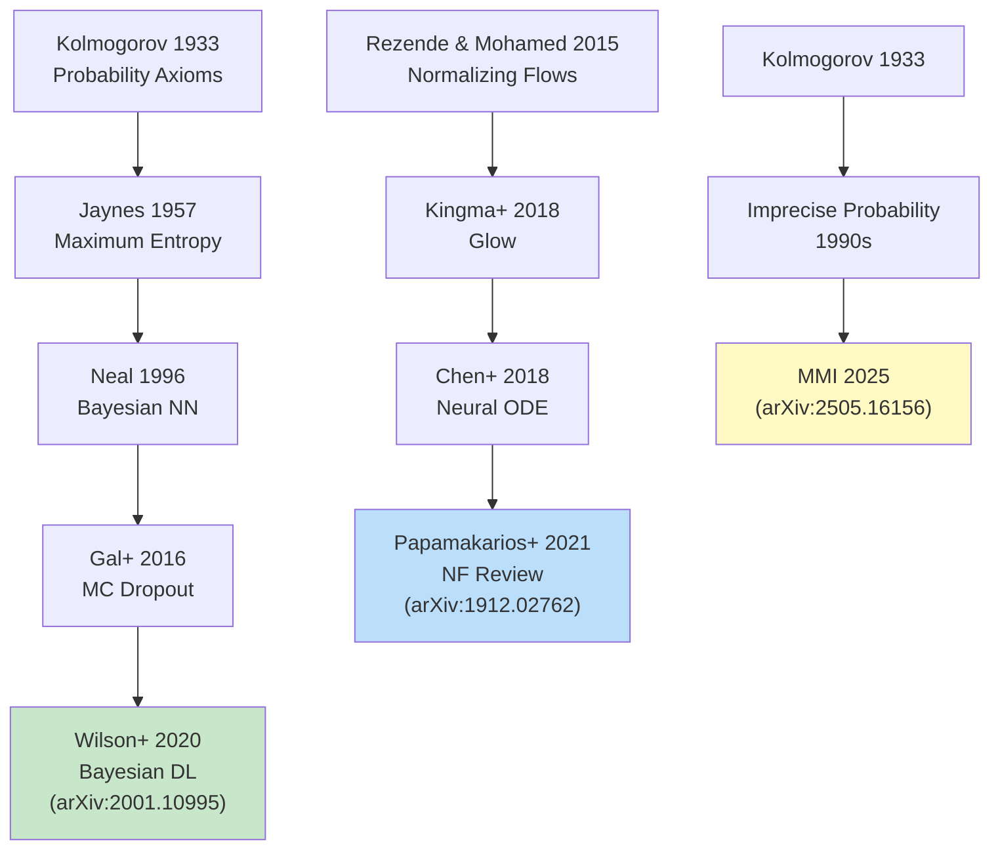

# 第4回: 確率論・統計学【前編】

## Learning Objectives

この講義を修了すると、以下ができるようになります:

- [ ] Kolmogorovの公理系から確率空間を定義できる
- [ ] ベイズの定理の離散版・連続版を導出できる
- [ ] 指数型分布族の統一的構造を説明できる
- [ ] 多変量正規分布の条件付き分布を計算できる
- [ ] MLEの一致性・漸近正規性を証明できる
- [ ] 自己回帰モデルの尤度を連鎖規則で分解できる

---

## 🚀 Z1. プロローグ（5分）— 本講義の位置づけ

**ゴール**: 第4回が機械学習体系の中でどこに位置するかを理解する。

> Progress: 3%

### なぜ今、確率論なのか？

第1-3回で扱った線形代数・最適化・微分は、機械学習の **計算エンジン** だった。しかし現代の機械学習は、もう一つの数学的基盤を持つ:

**確率論 (Probability Theory)** — 不確実性を扱う数学。

| 線形代数 | 確率論 |
|:---------|:-------|
| データの表現 (`$\mathbf{x} \in \mathbb{R}^d$`) | データの不確実性 (`$p(\mathbf{x})$`) |
| 変換 (`$\mathbf{y} = W\mathbf{x}$`) | 条件付き確率 (`$p(\mathbf{y} \mid \mathbf{x})$`) |
| 最適化 (`$\min L(W)$`) | 最尤推定 (`$\max p(\mathcal{D} \mid \theta)$`) |

**第3回までの「決定論的」世界**:

```python
y = W @ x + b  # 入力 x が決まれば、出力 y も一意に決まる
```

**第4回以降の「確率論的」世界**:


### 現代機械学習における確率論

| モデル | 確率論的要素 |
|:-------|:-------------|
| **VAE** | 潜在変数 `$\mathbf{z} \sim q_\phi(\mathbf{z} \mid \mathbf{x})$` |
| **Diffusion** | 拡散過程 `$q(\mathbf{x}_t \mid \mathbf{x}_{t-1})$` |
| **LLM** | トークン分布 `$p_\theta(x_t \mid x_{<t})$` |
| **GAN** | Generator `$G: \mathbf{z} \sim p_z(\mathbf{z}) \to \mathbf{x}$` |
| **Flow** | 確率密度変換 `$p_X(\mathbf{x}) = p_Z(f^{-1}(\mathbf{x})) \left|\det \frac{\partial f^{-1}}{\partial \mathbf{x}}\right|$` |

**全て確率分布 `$p(\cdot)$` を扱う。**

確率論なくして、生成モデルは語れない。

### 第4回で学ぶ5つのTopic

1. **確率空間と確率変数** (30分)
   - Kolmogorovの公理系
   - 確率測度、可測関数、確率変数の厳密な定義
   - 離散 vs 連続確率変数

2. **主要確率分布** (45分)
   - Gaussian (Normal) distribution
   - Bernoulli, Categorical, Multinomial
   - Dirichlet distribution (Bayesian priors)
   - Exponential Family の統一的視点

3. **ベイズの定理とMLE** (45分)
   - 最尤推定 (Maximum Likelihood Estimation, MLE)
   - 最大事後確率推定 (Maximum A Posteriori, MAP)
   - ベイズ推論 (Bayesian Inference)
   - Conjugate priors (共役事前分布)

4. **確率変数の変換** (30分)
   - Change of Variables formula
   - Jacobian determinant
   - Normalizing Flows への伏線

5. **Boss Battle: 自己回帰LLMの尤度** (30分)
   - `$\log p(\mathbf{x}) = \sum_{t=1}^T \log p(x_t \mid x_{<t})$`
   - Cross-entropy loss との等価性
   - Teacher forcing vs autoregressive sampling

### Learning Objectives

本講義を修了すると、以下ができるようになる:

- [ ] Kolmogorovの公理系から確率論を構築できる
- [ ] 主要確率分布の性質と相互関係を説明できる
- [ ] MLE, MAP, Bayesian推論の違いと使い分けを理解する
- [ ] 確率変数の変換公式を導出・適用できる
- [ ] GPTの尤度最大化がCross-entropyと等価であることを証明できる

---

## 📖 Z2. チュートリアル（15分）— 確率論の基礎概念

**ゴール**: 確率論の厳密な数学的定義を理解する。

> Progress: 10%

### 1.1 Kolmogorovの公理系

確率論は、ロシアの数学者 **Andrey Kolmogorov** (1933) が公理化した。

**Definition 1.1 (確率空間)**

確率空間は3つ組 `$(\Omega, \mathcal{F}, P)$` として定義される:

1. **標本空間** (Sample Space) `$\Omega$`: 全ての可能な結果の集合
2. **σ-algebra** `$\mathcal{F}$`: `$\Omega$` の部分集合族（事象の集合）
3. **確率測度** (Probability Measure) `$P: \mathcal{F} \to [0, 1]$`

**Axiom 1.1 (Kolmogorovの3公理)**

確率測度 `$P$` は以下を満たす:

1. **非負性**: `$\forall A \in \mathcal{F}, \; P(A) \geq 0$`
2. **正規性**: `$P(\Omega) = 1$`
3. **可算加法性**: 互いに素な事象 `$A_1, A_2, \ldots$` に対して、

```math
P\left(\bigcup_{i=1}^\infty A_i\right) = \sum_{i=1}^\infty P(A_i)
```

**この3公理から、確率論の全てが導出される。**

### 1.2 σ-algebra の役割

なぜ σ-algebra が必要なのか？

**直感的説明**:

- サイコロを振る: `$\Omega = \{1, 2, 3, 4, 5, 6\}$`
- 「偶数が出る」事象: `$A = \{2, 4, 6\}$`
- 「偶数が出ない」事象: `$A^c = \{1, 3, 5\}$`

**確率を割り当てるには、事象 `$A$` が「測定可能」でなければならない。**

**Definition 1.2 (σ-algebra)**

集合族 `$\mathcal{F} \subseteq 2^\Omega$` が σ-algebra であるとは:

1. `$\Omega \in \mathcal{F}$`
2. `$A \in \mathcal{F} \Rightarrow A^c \in \mathcal{F}$` (補集合)
3. `$A_1, A_2, \ldots \in \mathcal{F} \Rightarrow \bigcup_{i=1}^\infty A_i \in \mathcal{F}$` (可算和)

**Example 1.1 (離散確率空間)**

サイコロ: `$\Omega = \{1, 2, 3, 4, 5, 6\}$`

- `$\mathcal{F} = 2^\Omega$` (全ての部分集合)
- `$P(\{k\}) = 1/6$` for `$k = 1, \ldots, 6$`
- `$P(\{2, 4, 6\}) = P(\{2\}) + P(\{4\}) + P(\{6\}) = 1/2$`

**Example 1.2 (連続確率空間)**

実数上の確率: `$\Omega = \mathbb{R}$`

- `$\mathcal{F} = \mathcal{B}(\mathbb{R})$` (Borel σ-algebra)
- `$P([a, b]) = \int_a^b p(x) dx$`

→ 連続確率空間では、σ-algebra が測度論の技術を必要とする。

### 1.3 確率変数

**Definition 1.3 (確率変数)**

確率変数 `$X$` は、可測関数 `$X: \Omega \to \mathbb{R}$` である:

```math
\forall B \in \mathcal{B}(\mathbb{R}), \; X^{-1}(B) := \{\omega \in \Omega : X(\omega) \in B\} \in \mathcal{F}
```

**直感的意味**:

- `$\Omega$`: 「サイコロの目」
- `$X(\omega)$`: 「出た目の値」

**Example 1.3 (サイコロの和)**

2つのサイコロ `$X_1, X_2$` の和 `$S = X_1 + X_2$`:

- `$\Omega = \{(i, j) : i, j \in \{1, \ldots, 6\}\}$`
- `$S(\omega) = i + j$`
- `$P(S = 7) = P(\{(1,6), (2,5), (3,4), (4,3), (5,2), (6,1)\}) = 6/36 = 1/6$`

### 1.4 確率密度関数 (PDF) と確率質量関数 (PMF)

**Definition 1.4 (確率質量関数, PMF)**

離散確率変数 `$X$` に対して、

```math
p_X(x) := P(X = x), \quad \sum_{x \in \mathcal{X}} p_X(x) = 1
```

**Definition 1.5 (確率密度関数, PDF)**

連続確率変数 `$X$` に対して、

```math
P(a \leq X \leq b) = \int_a^b p_X(x) dx, \quad \int_{-\infty}^\infty p_X(x) dx = 1
```

**重要**: PDF `$p_X(x)$` 自体は確率ではない（`$p_X(x) > 1$` もあり得る）。

**Example 1.4 (Uniform distribution)**

```math
p_X(x) = \begin{cases} \frac{1}{b-a} & a \leq x \leq b \\ 0 & \text{otherwise} \end{cases}
```

- `$a = 0, b = 0.5$` のとき、`$p_X(0.1) = 2 > 1$` （確率ではない！）

### 1.5 累積分布関数 (CDF)

**Definition 1.6 (累積分布関数, CDF)**

```math
F_X(x) := P(X \leq x) = \begin{cases}
\sum_{x_i \leq x} p_X(x_i) & \text{(discrete)} \\
\int_{-\infty}^x p_X(t) dt & \text{(continuous)}
\end{cases}
```

**Properties**:

1. `$F_X(-\infty) = 0, \; F_X(\infty) = 1$`
2. `$F_X$` は単調非減少
3. 右連続: `$\lim_{h \to 0^+} F_X(x+h) = F_X(x)$`

**Theorem 1.1 (Fundamental Theorem of Calculus for Probability)**

連続確率変数 `$X$` に対して、

```math
p_X(x) = \frac{dF_X}{dx}(x)
```

### 1.6 期待値と分散

**Definition 1.7 (期待値, Expectation)**

```math
\mathbb{E}[X] := \begin{cases}
\sum_{x \in \mathcal{X}} x \, p_X(x) & \text{(discrete)} \\
\int_{-\infty}^\infty x \, p_X(x) dx & \text{(continuous)}
\end{cases}
```

**Definition 1.8 (分散, Variance)**

```math
\text{Var}(X) := \mathbb{E}[(X - \mathbb{E}[X])^2] = \mathbb{E}[X^2] - (\mathbb{E}[X])^2
```

**Proof** (分散の公式):

```math
\text{Var}(X) = \mathbb{E}[(X - \mathbb{E}[X])^2] = \mathbb{E}[X^2 - 2X\mathbb{E}[X] + (\mathbb{E}[X])^2]
```

Linearity of expectation:

```math
= \mathbb{E}[X^2] - 2\mathbb{E}[X]\mathbb{E}[X] + (\mathbb{E}[X])^2 = \mathbb{E}[X^2] - (\mathbb{E}[X])^2
```

∎

**Theorem 1.2 (Linearity of Expectation)**

```math
\mathbb{E}[aX + bY] = a\mathbb{E}[X] + b\mathbb{E}[Y]
```

**重要**: `$X, Y$` が独立でなくても成立。

**Theorem 1.3 (Variance of Linear Transformation)**

```math
\text{Var}(aX + b) = a^2 \text{Var}(X)
```

**Proof**:

```math
\text{Var}(aX + b) = \mathbb{E}[(aX + b - \mathbb{E}[aX + b])^2]
```

```math
= \mathbb{E}[(aX + b - a\mathbb{E}[X] - b)^2] = \mathbb{E}[(aX - a\mathbb{E}[X])^2]
```

```math
= a^2 \mathbb{E}[(X - \mathbb{E}[X])^2] = a^2 \text{Var}(X)
```

∎

### 1.7 モーメント生成関数 (MGF)

**Definition 1.9 (Moment Generating Function)**

```math
M_X(t) := \mathbb{E}[e^{tX}] = \begin{cases}
\sum_{x} e^{tx} p_X(x) & \text{(discrete)} \\
\int_{-\infty}^\infty e^{tx} p_X(x) dx & \text{(continuous)}
\end{cases}
```

**Why useful?**

MGF の Taylor 展開から全てのモーメントを取得可能:

```math
M_X(t) = \sum_{n=0}^\infty \frac{\mathbb{E}[X^n]}{n!} t^n
```

**Theorem 1.4 (MGF → Moments)**

```math
\frac{d^n M_X}{dt^n}\bigg|_{t=0} = \mathbb{E}[X^n]
```

**Example 1.5 (Gaussian MGF)**

`$X \sim \mathcal{N}(\mu, \sigma^2)$`:

```math
M_X(t) = \mathbb{E}[e^{tX}] = \int_{-\infty}^\infty e^{tx} \frac{1}{\sqrt{2\pi\sigma^2}} \exp\left(-\frac{(x-\mu)^2}{2\sigma^2}\right) dx
```

Complete the square:

```math
= \exp\left(\mu t + \frac{\sigma^2 t^2}{2}\right)
```

**Verification**:

```math
\frac{dM_X}{dt}\bigg|_{t=0} = (\mu + \sigma^2 t) \exp\left(\mu t + \frac{\sigma^2 t^2}{2}\right)\bigg|_{t=0} = \mu = \mathbb{E}[X] \quad \checkmark
```

```math
\frac{d^2M_X}{dt^2}\bigg|_{t=0} = \mu^2 + \sigma^2 = \mathbb{E}[X^2] \quad \Rightarrow \quad \text{Var}(X) = \mathbb{E}[X^2] - (\mathbb{E}[X])^2 = \sigma^2 \quad \checkmark
```

### 1.8 共分散と相関係数

**Definition 1.10 (Covariance)**

```math
\text{Cov}(X, Y) := \mathbb{E}[(X - \mathbb{E}[X])(Y - \mathbb{E}[Y])] = \mathbb{E}[XY] - \mathbb{E}[X]\mathbb{E}[Y]
```

**Properties**:

1. `$\text{Cov}(X, X) = \text{Var}(X)$`
2. `$\text{Cov}(X, Y) = \text{Cov}(Y, X)$`
3. `$\text{Cov}(aX, bY) = ab \, \text{Cov}(X, Y)$`
4. Independent → `$\text{Cov}(X, Y) = 0$` （逆は不成立）

**Definition 1.11 (Correlation Coefficient)**

```math
\rho_{XY} := \frac{\text{Cov}(X, Y)}{\sqrt{\text{Var}(X) \text{Var}(Y)}} = \frac{\text{Cov}(X, Y)}{\sigma_X \sigma_Y}
```

**Range**: `$-1 \leq \rho_{XY} \leq 1$`

**Interpretation**:

- `$\rho = 1$`: Perfect positive correlation (`$Y = aX + b$`, `$a > 0$`)
- `$\rho = -1$`: Perfect negative correlation (`$Y = aX + b$`, `$a < 0$`)
- `$\rho = 0$`: Uncorrelated（独立とは限らない）

**Example 1.6 (Uncorrelated but Dependent)**

`$X \sim \mathcal{N}(0, 1)$`, `$Y = X^2$`:

```math
\mathbb{E}[XY] = \mathbb{E}[X^3] = 0 \quad (\text{odd moment of Gaussian})
```

```math
\text{Cov}(X, Y) = \mathbb{E}[XY] - \mathbb{E}[X]\mathbb{E}[Y] = 0 - 0 \cdot 1 = 0
```

しかし `$Y$` は `$X$` に完全に依存している。 → **Uncorrelated ≠ Independent**

### 1.9 条件付き確率と独立性

**Definition 1.12 (Conditional Probability)**

```math
P(A \mid B) := \frac{P(A \cap B)}{P(B)}, \quad P(B) > 0
```

**Theorem 1.5 (Law of Total Probability)**

`$\{B_1, B_2, \ldots\}$` が partition of `$\Omega$` なら:

```math
P(A) = \sum_{i} P(A \mid B_i) P(B_i)
```

**Definition 1.13 (Independence)**

Events `$A, B$` が独立であるとは:

```math
P(A \cap B) = P(A) P(B)
```

Random variables `$X, Y$` が独立であるとは:

```math
p_{X,Y}(x, y) = p_X(x) p_Y(y) \quad \forall x, y
```

**Theorem 1.6 (Independence → Uncorrelated)**

`$X, Y$` independent → `$\text{Cov}(X, Y) = 0$`

**Proof**:

```math
\mathbb{E}[XY] = \int \int xy \, p_{X,Y}(x, y) dx dy = \int \int xy \, p_X(x) p_Y(y) dx dy
```

```math
= \left(\int x p_X(x) dx\right) \left(\int y p_Y(y) dy\right) = \mathbb{E}[X] \mathbb{E}[Y]
```

```math
\text{Cov}(X, Y) = \mathbb{E}[XY] - \mathbb{E}[X]\mathbb{E}[Y] = 0
```

∎

---

## 🧭 Z3. 世界観（20分）— Topic 1 & 2: 主要確率分布

**ゴール**: 主要確率分布を完全に理解する。

> Progress: 20%

### Topic 1: 主要離散確率分布

#### 1.1 Bernoulli 分布

**Definition 2.1 (Bernoulli Distribution)**

```math
X \sim \text{Bernoulli}(p), \quad p_X(x) = \begin{cases} p & x = 1 \\ 1-p & x = 0 \end{cases}
```

**Properties**:

- `$\mathbb{E}[X] = p$`
- `$\text{Var}(X) = p(1-p)$`

**Application**: Binary classification (label 0 or 1)

#### 1.2 Categorical 分布

**Definition 2.2 (Categorical Distribution)**

```math
X \sim \text{Categorical}(\mathbf{p}), \quad p_X(k) = p_k, \quad \sum_{k=1}^K p_k = 1
```

**Example**: サイコロ (`$K = 6$`)

**Notation**: One-hot encoding

```math
\mathbf{x} = [0, 0, 1, 0, 0, 0]^\top \quad (\text{outcome } k=3)
```

**Likelihood**:

```math
p(\mathbf{x} \mid \mathbf{p}) = \prod_{k=1}^K p_k^{x_k}
```

#### 1.3 Multinomial 分布

**Definition 2.3 (Multinomial Distribution)**

`$n$` 回の試行で、各カテゴリ `$k$` が `$n_k$` 回出現する確率:

```math
\mathbf{n} \sim \text{Multinomial}(n, \mathbf{p}), \quad p(\mathbf{n}) = \frac{n!}{n_1! \cdots n_K!} \prod_{k=1}^K p_k^{n_k}
```

**Properties**:

- `$\mathbb{E}[n_k] = n p_k$`
- `$\text{Var}(n_k) = n p_k (1 - p_k)$`
- `$\text{Cov}(n_i, n_j) = -n p_i p_j$` (`$i \neq j$`)

### Topic 2: 主要連続確率分布

#### 2.1 Gaussian (Normal) 分布

**Definition 2.4 (Gaussian Distribution)**

```math
X \sim \mathcal{N}(\mu, \sigma^2), \quad p_X(x) = \frac{1}{\sqrt{2\pi\sigma^2}} \exp\left(-\frac{(x-\mu)^2}{2\sigma^2}\right)
```

**Properties**:

- `$\mathbb{E}[X] = \mu$`
- `$\text{Var}(X) = \sigma^2$`

**Multivariate Gaussian**:

```math
\mathbf{x} \sim \mathcal{N}(\boldsymbol{\mu}, \boldsymbol{\Sigma}), \quad p(\mathbf{x}) = \frac{1}{(2\pi)^{d/2} |\boldsymbol{\Sigma}|^{1/2}} \exp\left(-\frac{1}{2}(\mathbf{x} - \boldsymbol{\mu})^\top \boldsymbol{\Sigma}^{-1} (\mathbf{x} - \boldsymbol{\mu})\right)
```

**Why Gaussian?**

1. **Central Limit Theorem**: 独立な確率変数の和は Gaussian に収束
2. **Maximum Entropy**: 与えられた平均・分散の下で、エントロピーが最大
3. **Conjugate Prior**: Likelihood が Gaussian なら、posterior も Gaussian

#### 2.2 Exponential Family

**Definition 2.5 (Exponential Family)**

確率分布 `$p(x \mid \boldsymbol{\theta})$` が exponential family に属するとは:

```math
p(x \mid \boldsymbol{\theta}) = h(x) \exp\left(\boldsymbol{\eta}(\boldsymbol{\theta})^\top \mathbf{T}(x) - A(\boldsymbol{\theta})\right)
```

ここで:

- `$\boldsymbol{\eta}(\boldsymbol{\theta})$`: Natural parameter (自然パラメータ)
- `$\mathbf{T}(x)$`: Sufficient statistic (十分統計量)
- `$A(\boldsymbol{\theta})$`: Log-partition function

**Example 2.1 (Gaussian as Exponential Family)**

```math
\mathcal{N}(x \mid \mu, \sigma^2) = \frac{1}{\sqrt{2\pi\sigma^2}} \exp\left(-\frac{(x-\mu)^2}{2\sigma^2}\right)
```

Natural parameters:

```math
\eta_1 = \frac{\mu}{\sigma^2}, \quad \eta_2 = -\frac{1}{2\sigma^2}
```

Sufficient statistics:

```math
T_1(x) = x, \quad T_2(x) = x^2
```

Log-partition function:

```math
A(\mu, \sigma^2) = \frac{\mu^2}{2\sigma^2} + \frac{1}{2}\log(2\pi\sigma^2)
```

**重要性**:

1. **統一的フレームワーク**: Gaussian, Bernoulli, Poisson, Gamma, … 全て exponential family
2. **Sufficient Statistics**: データ `$\{x_1, \ldots, x_n\}$` を `$\mathbf{T}(\mathcal{D})$` に圧縮可能
3. **Conjugate Priors**: Exponential family には常に conjugate prior が存在

#### 2.3 Dirichlet 分布

**Definition 2.6 (Dirichlet Distribution)**

```math
\mathbf{p} \sim \text{Dir}(\boldsymbol{\alpha}), \quad p(\mathbf{p}) = \frac{1}{B(\boldsymbol{\alpha})} \prod_{k=1}^K p_k^{\alpha_k - 1}
```

ここで:

```math
B(\boldsymbol{\alpha}) = \frac{\prod_{k=1}^K \Gamma(\alpha_k)}{\Gamma\left(\sum_{k=1}^K \alpha_k\right)}
```

**Properties**:

- `$\mathbb{E}[p_k] = \frac{\alpha_k}{\sum_{j=1}^K \alpha_j}$`
- `$\mathbf{p}$` は simplex 上の分布: `$\sum_{k=1}^K p_k = 1, \; p_k \geq 0$`

**Application**: Categorical 分布のパラメータ `$\mathbf{p}$` の事前分布

**Example 2.2 (Beta Distribution)**

`$K = 2$` のとき、Dirichlet = Beta:

```math
p(\theta \mid \alpha, \beta) = \frac{\Gamma(\alpha + \beta)}{\Gamma(\alpha)\Gamma(\beta)} \theta^{\alpha-1} (1-\theta)^{\beta-1}
```

- `$\alpha = \beta = 1$`: Uniform
- `$\alpha = \beta = 0.5$`: Jeffreys prior
- `$\alpha, \beta > 1$`: Peaked around mean

#### 2.4 Poisson 分布

**Definition 2.7 (Poisson Distribution)**

```math
X \sim \text{Poisson}(\lambda), \quad p_X(k) = \frac{\lambda^k e^{-\lambda}}{k!}, \quad k = 0, 1, 2, \ldots
```

**Properties**:

- `$\mathbb{E}[X] = \lambda$`
- `$\text{Var}(X) = \lambda$`

**Application**: Count data（事象の発生回数）

**Example 2.3 (Poisson as limit of Binomial)**

`$n \to \infty$`, `$p \to 0$`, `$np = \lambda$` (fixed) のとき:

```math
\text{Binomial}(n, p) \to \text{Poisson}(\lambda)
```

**Proof Sketch**:

```math
P(X = k) = \binom{n}{k} p^k (1-p)^{n-k} = \frac{n!}{k!(n-k)!} \left(\frac{\lambda}{n}\right)^k \left(1 - \frac{\lambda}{n}\right)^{n-k}
```

As `$n \to \infty$`:

```math
\frac{n!}{(n-k)! n^k} \to 1, \quad \left(1 - \frac{\lambda}{n}\right)^n \to e^{-\lambda}, \quad \left(1 - \frac{\lambda}{n}\right)^{-k} \to 1
```

```math
\Rightarrow \quad P(X = k) \to \frac{\lambda^k e^{-\lambda}}{k!}
```

∎

#### 2.5 Gamma 分布

**Definition 2.8 (Gamma Distribution)**

```math
X \sim \text{Gamma}(\alpha, \beta), \quad p_X(x) = \frac{\beta^\alpha}{\Gamma(\alpha)} x^{\alpha-1} e^{-\beta x}, \quad x > 0
```

ここで `$\Gamma(\alpha) = \int_0^\infty t^{\alpha-1} e^{-t} dt$` (Gamma function)

**Properties**:

- `$\mathbb{E}[X] = \frac{\alpha}{\beta}$`
- `$\text{Var}(X) = \frac{\alpha}{\beta^2}$`

**Special Cases**:

1. `$\alpha = 1$`: Exponential distribution (`$p_X(x) = \beta e^{-\beta x}$`)
2. `$\alpha = \frac{d}{2}$`, `$\beta = \frac{1}{2}$`: Chi-squared distribution with `$d$` degrees of freedom

**Application**: Waiting times, Bayesian conjugate prior for Poisson rate

#### 2.6 Central Limit Theorem

**Theorem 2.1 (Central Limit Theorem)**

`$X_1, \ldots, X_n$` i.i.d., `$\mathbb{E}[X_i] = \mu$`, `$\text{Var}(X_i) = \sigma^2$` とする。

```math
\bar{X}_n = \frac{1}{n}\sum_{i=1}^n X_i
```

のとき、

```math
\sqrt{n}\left(\frac{\bar{X}_n - \mu}{\sigma}\right) \xrightarrow{d} \mathcal{N}(0, 1) \quad (n \to \infty)
```

**Implication**: **どんな分布でも、サンプル平均の分布は Gaussian に収束する。**

**Example 2.4 (CLT for Uniform)**

`$X_i \sim \text{Uniform}(0, 1)$` (i.i.d.):

- `$\mathbb{E}[X_i] = 1/2$`
- `$\text{Var}(X_i) = 1/12$`

```math
\sqrt{n}\left(\bar{X}_n - \frac{1}{2}\right) \xrightarrow{d} \mathcal{N}\left(0, \frac{1}{12}\right)
```

**Practical Application**:

- `$n = 30$` で近似が良好（rule of thumb）
- 統計的仮説検定の理論的基盤
- Bootstrap methods

#### 2.7 Multivariate Gaussian の性質

**Theorem 2.2 (Conditional Gaussian)**

`$\mathbf{x} \sim \mathcal{N}(\boldsymbol{\mu}, \boldsymbol{\Sigma})$`, partition:

```math
\mathbf{x} = \begin{bmatrix} \mathbf{x}_1 \\ \mathbf{x}_2 \end{bmatrix}, \quad
\boldsymbol{\mu} = \begin{bmatrix} \boldsymbol{\mu}_1 \\ \boldsymbol{\mu}_2 \end{bmatrix}, \quad
\boldsymbol{\Sigma} = \begin{bmatrix} \boldsymbol{\Sigma}_{11} & \boldsymbol{\Sigma}_{12} \\ \boldsymbol{\Sigma}_{21} & \boldsymbol{\Sigma}_{22} \end{bmatrix}
```

条件付き分布:

```math
\mathbf{x}_1 \mid \mathbf{x}_2 \sim \mathcal{N}(\boldsymbol{\mu}_{1|2}, \boldsymbol{\Sigma}_{1|2})
```

ここで:

```math
\boldsymbol{\mu}_{1|2} = \boldsymbol{\mu}_1 + \boldsymbol{\Sigma}_{12} \boldsymbol{\Sigma}_{22}^{-1} (\mathbf{x}_2 - \boldsymbol{\mu}_2)
```

```math
\boldsymbol{\Sigma}_{1|2} = \boldsymbol{\Sigma}_{11} - \boldsymbol{\Sigma}_{12} \boldsymbol{\Sigma}_{22}^{-1} \boldsymbol{\Sigma}_{21}
```

**Application**: Gaussian Process regression, Kalman Filter

**Example 2.5 (2D Gaussian)**

```math
\mathbf{x} = \begin{bmatrix} X \\ Y \end{bmatrix} \sim \mathcal{N}\left(\begin{bmatrix} 0 \\ 0 \end{bmatrix}, \begin{bmatrix} 1 & \rho \\ \rho & 1 \end{bmatrix}\right)
```

Conditional distribution:

```math
X \mid Y = y \sim \mathcal{N}(\rho y, 1 - \rho^2)
```

**Interpretation**: `$Y$` の情報が `$X$` の不確実性を `$1 - \rho^2$` に減少させる。

---

## ⚔️ Z4. Boss Battle（90分）— Topic 3 & 4: ベイズ推論と確率変数変換

**ゴール**: ベイズ推論と確率変数の変換を完全に理解する。

> Progress: 50%

### Topic 3: ベイズの定理とMLE/MAP

#### 3.1 Bayes' Theorem

**Theorem 3.1 (Bayes' Theorem)**

```math
p(\theta \mid \mathcal{D}) = \frac{p(\mathcal{D} \mid \theta) p(\theta)}{p(\mathcal{D})}
```

ここで:

- `$p(\theta \mid \mathcal{D})$`: **Posterior** (事後分布)
- `$p(\mathcal{D} \mid \theta)$`: **Likelihood** (尤度)
- `$p(\theta)$`: **Prior** (事前分布)
- `$p(\mathcal{D}) = \int p(\mathcal{D} \mid \theta) p(\theta) d\theta$`: **Evidence** (周辺尤度)

**Proof**:

```math
p(\theta, \mathcal{D}) = p(\mathcal{D} \mid \theta) p(\theta) = p(\theta \mid \mathcal{D}) p(\mathcal{D})
```

両辺を `$p(\mathcal{D})$` で割る。 ∎

#### 3.2 Maximum Likelihood Estimation (MLE)

**Definition 3.1 (MLE)**

```math
\hat{\theta}_{\text{MLE}} := \arg\max_\theta p(\mathcal{D} \mid \theta) = \arg\max_\theta \log p(\mathcal{D} \mid \theta)
```

**Example 3.1 (MLE for Gaussian)**

データ `$\mathcal{D} = \{x_1, \ldots, x_n\}$`, `$x_i \sim \mathcal{N}(\mu, \sigma^2)$` (i.i.d.):

```math
\log p(\mathcal{D} \mid \mu, \sigma^2) = \sum_{i=1}^n \log \mathcal{N}(x_i \mid \mu, \sigma^2) = -\frac{n}{2}\log(2\pi\sigma^2) - \frac{1}{2\sigma^2}\sum_{i=1}^n (x_i - \mu)^2
```

**Derivation**:

```math
\frac{\partial}{\partial \mu} \log p = \frac{1}{\sigma^2}\sum_{i=1}^n (x_i - \mu) = 0 \quad \Rightarrow \quad \hat{\mu}_{\text{MLE}} = \frac{1}{n}\sum_{i=1}^n x_i
```

```math
\frac{\partial}{\partial \sigma^2} \log p = -\frac{n}{2\sigma^2} + \frac{1}{2\sigma^4}\sum_{i=1}^n (x_i - \mu)^2 = 0 \quad \Rightarrow \quad \hat{\sigma}^2_{\text{MLE}} = \frac{1}{n}\sum_{i=1}^n (x_i - \hat{\mu})^2
```

**Note**: MLE の分散は不偏推定量ではない（`$\mathbb{E}[\hat{\sigma}^2] = \frac{n-1}{n}\sigma^2$`）。

#### 3.3 Maximum A Posteriori (MAP)

**Definition 3.2 (MAP)**

```math
\hat{\theta}_{\text{MAP}} := \arg\max_\theta p(\theta \mid \mathcal{D}) = \arg\max_\theta \left[\log p(\mathcal{D} \mid \theta) + \log p(\theta)\right]
```

**MLE との違い**:

- MLE: Prior `$p(\theta)$` を無視（一様分布と仮定）
- MAP: Prior `$p(\theta)$` を考慮

**Example 3.2 (MAP with Gaussian Prior)**

Likelihood: `$\mathcal{D} \mid \theta \sim \mathcal{N}(\theta, \sigma^2)$`
Prior: `$\theta \sim \mathcal{N}(0, \tau^2)$`

```math
\log p(\theta \mid \mathcal{D}) \propto -\frac{1}{2\sigma^2}\sum_{i=1}^n (x_i - \theta)^2 - \frac{\theta^2}{2\tau^2}
```

```math
\frac{\partial}{\partial \theta} = \frac{1}{\sigma^2}\sum_{i=1}^n (x_i - \theta) - \frac{\theta}{\tau^2} = 0
```

```math
\hat{\theta}_{\text{MAP}} = \frac{\frac{n}{\sigma^2} \bar{x}}{\frac{n}{\sigma^2} + \frac{1}{\tau^2}} = \frac{n\tau^2}{n\tau^2 + \sigma^2} \bar{x}
```

**Interpretation**:

- `$\tau^2 \to \infty$` (weak prior): `$\hat{\theta}_{\text{MAP}} \to \bar{x}$` (MLE)
- `$n \to \infty$`: `$\hat{\theta}_{\text{MAP}} \to \bar{x}$` (data dominates prior)
- Small `$n$`, strong prior: `$\hat{\theta}_{\text{MAP}} \to 0$` (prior dominates)

#### 3.4 Bayesian Inference

MLE/MAP は点推定 (point estimate) だが、**Bayesian Inference は分布推定** だ。

**Definition 3.3 (Posterior Predictive Distribution)**

新しいデータ `$x^*$` の予測分布:

```math
p(x^* \mid \mathcal{D}) = \int p(x^* \mid \theta) p(\theta \mid \mathcal{D}) d\theta
```

**Example 3.3 (Bayesian Inference for Bernoulli)**

Data: `$n_1$` heads, `$n_0$` tails
Likelihood: `$p(\mathcal{D} \mid \theta) = \theta^{n_1} (1-\theta)^{n_0}$`
Prior: `$\theta \sim \text{Beta}(\alpha, \beta)$`

**Posterior** (conjugate prior):

```math
p(\theta \mid \mathcal{D}) = \text{Beta}(\alpha + n_1, \beta + n_0)
```

**Posterior Predictive**:

```math
p(x^* = 1 \mid \mathcal{D}) = \mathbb{E}_{\theta \sim p(\theta \mid \mathcal{D})}[\theta] = \frac{\alpha + n_1}{\alpha + \beta + n_1 + n_0}
```

#### 3.5 Conjugate Priors

**Definition 3.4 (Conjugate Prior)**

Prior `$p(\theta)$` が likelihood `$p(\mathcal{D} \mid \theta)$` に対して conjugate であるとは、posterior `$p(\theta \mid \mathcal{D})$` が prior と同じ family に属すること。

**Table: Common Conjugate Pairs**

| Likelihood | Conjugate Prior | Posterior |
|:-----------|:----------------|:----------|
| Bernoulli(`$\theta$`) | Beta(`$\alpha, \beta$`) | Beta(`$\alpha + n_1, \beta + n_0$`) |
| Categorical(`$\mathbf{p}$`) | Dirichlet(`$\boldsymbol{\alpha}$`) | Dirichlet(`$\boldsymbol{\alpha} + \mathbf{n}$`) |
| Gaussian(`$\mu$`, known `$\sigma^2$`) | Gaussian(`$\mu_0, \tau^2$`) | Gaussian(`$\mu_n, \tau_n^2$`) |
| Gaussian(`$\sigma^2$`, known `$\mu$`) | Inverse-Gamma(`$\alpha, \beta$`) | Inverse-Gamma(`$\alpha_n, \beta_n$`) |

### Topic 4: 確率変数の変換

#### 4.1 Change of Variables Formula

**Theorem 4.1 (Univariate Change of Variables)**

`$Y = g(X)$` とする。`$g$` が単調増加かつ微分可能なら:

```math
p_Y(y) = p_X(g^{-1}(y)) \left|\frac{d g^{-1}}{dy}(y)\right|
```

**Proof**:

CDF approach:

```math
F_Y(y) = P(Y \leq y) = P(g(X) \leq y) = P(X \leq g^{-1}(y)) = F_X(g^{-1}(y))
```

Differentiate:

```math
p_Y(y) = \frac{dF_Y}{dy} = \frac{dF_X}{dx}\bigg|_{x=g^{-1}(y)} \cdot \frac{dg^{-1}}{dy} = p_X(g^{-1}(y)) \left|\frac{dg^{-1}}{dy}\right|
```

**Example 4.1 (Log-Normal Distribution)**

`$X \sim \mathcal{N}(\mu, \sigma^2)$`, `$Y = e^X$`:

```math
p_Y(y) = \frac{1}{y\sqrt{2\pi\sigma^2}} \exp\left(-\frac{(\log y - \mu)^2}{2\sigma^2}\right), \quad y > 0
```

**Derivation**:

- `$g^{-1}(y) = \log y$`
- `$\frac{dg^{-1}}{dy} = \frac{1}{y}$`

```math
p_Y(y) = p_X(\log y) \cdot \frac{1}{y} = \frac{1}{\sqrt{2\pi\sigma^2}} \exp\left(-\frac{(\log y - \mu)^2}{2\sigma^2}\right) \cdot \frac{1}{y}
```

#### 4.2 Multivariate Change of Variables

**Theorem 4.2 (Multivariate Change of Variables)**

`$\mathbf{y} = \mathbf{g}(\mathbf{x})$` とする。`$\mathbf{g}$` が可逆かつ微分可能なら:

```math
p_{\mathbf{Y}}(\mathbf{y}) = p_{\mathbf{X}}(\mathbf{g}^{-1}(\mathbf{y})) \left|\det \frac{\partial \mathbf{g}^{-1}}{\partial \mathbf{y}}\right|
```

ここで Jacobian 行列:

```math
\mathbf{J} = \frac{\partial \mathbf{g}^{-1}}{\partial \mathbf{y}} = \begin{bmatrix}
\frac{\partial g_1^{-1}}{\partial y_1} & \cdots & \frac{\partial g_1^{-1}}{\partial y_d} \\
\vdots & \ddots & \vdots \\
\frac{\partial g_d^{-1}}{\partial y_1} & \cdots & \frac{\partial g_d^{-1}}{\partial y_d}
\end{bmatrix}
```

**Example 4.2 (Polar Coordinates)**

`$(X, Y) \sim \mathcal{N}(0, I_2)$` (2D standard Gaussian), `$R = \sqrt{X^2 + Y^2}$`, `$\Theta = \arctan(Y/X)$`:

**Jacobian**:

```math
\mathbf{g}^{-1}(r, \theta) = \begin{bmatrix} r\cos\theta \\ r\sin\theta \end{bmatrix}, \quad \mathbf{J} = \begin{bmatrix} \cos\theta & -r\sin\theta \\ \sin\theta & r\cos\theta \end{bmatrix}
```

```math
\det \mathbf{J} = r
```

**PDF**:

```math
p_{R,\Theta}(r, \theta) = p_{X,Y}(r\cos\theta, r\sin\theta) \cdot r = \frac{1}{2\pi} e^{-r^2/2} \cdot r
```

Marginalize:

```math
p_R(r) = \int_0^{2\pi} p_{R,\Theta}(r, \theta) d\theta = r e^{-r^2/2} \quad (\text{Rayleigh distribution})
```

#### 4.3 Normalizing Flows への伏線

**Normalizing Flows** (Rezende & Mohamed, 2015; Kobyzev et al., 2020)[^NF1] は、change of variables を利用した生成モデルだ。

**Idea**:

1. Simple distribution `$p_Z(\mathbf{z})$` (e.g., Gaussian) からサンプル `$\mathbf{z} \sim p_Z$`
2. Invertible transformation `$\mathbf{x} = \mathbf{f}(\mathbf{z})$` を適用
3. Change of variables:

```math
p_X(\mathbf{x}) = p_Z(\mathbf{f}^{-1}(\mathbf{x})) \left|\det \frac{\partial \mathbf{f}^{-1}}{\partial \mathbf{x}}\right|
```

**Challenge**:

- `$\mathbf{f}$` は可逆でなければならない
- Jacobian determinant の計算が `$O(d^3)$` （大規模では困難）

**Solution**:

- **Coupling Layers**: Jacobian が triangular（`$O(d)$` 計算）
- **Autoregressive Flows**: Sequential transformation

→ 第20回（生成モデル）で詳細を扱う。

#### 4.4 Reparameterization Trick

**Problem**: VAE の勾配計算

```math
\nabla_\phi \mathbb{E}_{q_\phi(\mathbf{z} \mid \mathbf{x})}[f(\mathbf{z})]
```

`$\mathbf{z} \sim q_\phi$` からのサンプリングに `$\phi$` が含まれる → 勾配が取れない。

**Solution**: Reparameterization (Kingma & Welling, 2014)

**Idea**: `$\mathbf{z} = \boldsymbol{\mu}_\phi + \boldsymbol{\sigma}_\phi \odot \boldsymbol{\epsilon}$`, `$\boldsymbol{\epsilon} \sim \mathcal{N}(0, I)$`

```math
\nabla_\phi \mathbb{E}_{q_\phi(\mathbf{z} \mid \mathbf{x})}[f(\mathbf{z})] = \nabla_\phi \mathbb{E}_{\boldsymbol{\epsilon} \sim \mathcal{N}(0,I)}[f(\boldsymbol{\mu}_\phi + \boldsymbol{\sigma}_\phi \odot \boldsymbol{\epsilon})]
```

```math
= \mathbb{E}_{\boldsymbol{\epsilon}}[\nabla_\phi f(\boldsymbol{\mu}_\phi + \boldsymbol{\sigma}_\phi \odot \boldsymbol{\epsilon})]
```

**Key**: 期待値の外に gradient を出せる（Monte Carlo estimator が unbiased）。

**Generalization** (Rezende & Mohamed, 2015):

任意の分布 `$q_\phi(\mathbf{z})$` に対して、invertible transformation `$T_\phi$` が存在すれば:

```math
\mathbf{z} = T_\phi(\boldsymbol{\epsilon}), \quad \boldsymbol{\epsilon} \sim p(\boldsymbol{\epsilon})
```

**Application**: VAE, Normalizing Flows, Diffusion Models

---

## ⚔️ Z4. 最強タスク（30分）— Boss Battle: 自己回帰LLM尤度分解

**ゴール**: 自己回帰LLMの尤度最大化を完全に理解する。

> Progress: 70%

### Boss Battle: 自己回帰LLMの尤度分解

GPT や LLaMA などの **Autoregressive Language Model (ARM)** は、次のトークン予測を繰り返す:

```math
p_\theta(\mathbf{x}) = \prod_{t=1}^T p_\theta(x_t \mid x_{<t})
```

ここで:

- `$\mathbf{x} = (x_1, \ldots, x_T)$`: Sequence of tokens
- `$x_{<t} = (x_1, \ldots, x_{t-1})$`: Context
- `$p_\theta(x_t \mid x_{<t})$`: Categorical distribution (vocabulary size `$V$`)

### 4.1 Likelihood の対数化

**Log-likelihood**:

```math
\log p_\theta(\mathbf{x}) = \sum_{t=1}^T \log p_\theta(x_t \mid x_{<t})
```

**Why log?**

1. **数値安定性**: `$p_\theta(\mathbf{x}) = 10^{-100}$` のような小さい確率を扱える
2. **計算効率**: 積 → 和
3. **Gradient**: `$\nabla_\theta \log p = \frac{1}{p} \nabla_\theta p$`

### 4.2 Cross-Entropy Loss との等価性

**Definition** (Cross-Entropy Loss):

```math
\mathcal{L}_{\text{CE}} = -\frac{1}{T}\sum_{t=1}^T \log p_\theta(x_t \mid x_{<t})
```

**Theorem 4.3 (MLE = Minimize Cross-Entropy)**

```math
\arg\max_\theta \log p_\theta(\mathcal{D}) = \arg\min_\theta \mathcal{L}_{\text{CE}}(\theta, \mathcal{D})
```

**Proof**:

```math
\max_\theta \log p_\theta(\mathbf{x}) = \max_\theta \sum_{t=1}^T \log p_\theta(x_t \mid x_{<t}) = \min_\theta \left(-\sum_{t=1}^T \log p_\theta(x_t \mid x_{<t})\right)
```

∎

### 4.3 Teacher Forcing

**Training**: Ground truth `$x_t$` を context に使う


**Inference**: Model 自身の prediction を context に使う


### 4.4 Exposure Bias

**Problem**: Training と Inference のミスマッチ

- Training: 常に正しい context
- Inference: Model が間違えた場合、誤った context が累積

**Solutions**:

1. **Scheduled Sampling**: Training 中に model の prediction を確率的に使う
2. **Reinforcement Learning**: Policy gradient で inference を直接最適化
3. **Non-Autoregressive Models**: 全トークンを並列生成（BERT, Diffusion LMs）

### 4.5 Perplexity

**Definition** (Perplexity):

```math
\text{PPL} = \exp\left(-\frac{1}{T}\sum_{t=1}^T \log p_\theta(x_t \mid x_{<t})\right) = \exp(\mathcal{L}_{\text{CE}})
```

**Interpretation**:

- 各ステップで平均的に `$\text{PPL}$` 個の選択肢から選んでいる
- Lower is better
- GPT-3: PPL ≈ 20 on WebText

### 4.6 数学的詳細: Likelihood Decomposition

**Theorem 4.4 (Chain Rule of Probability)**

```math
p(\mathbf{x}) = p(x_1) p(x_2 \mid x_1) p(x_3 \mid x_1, x_2) \cdots p(x_T \mid x_1, \ldots, x_{T-1})
```

**Proof** (by induction):

Base case:

```math
p(x_1, x_2) = p(x_2 \mid x_1) p(x_1)
```

Inductive step: Assume true for `$T-1$`:

```math
p(x_1, \ldots, x_T) = p(x_T \mid x_1, \ldots, x_{T-1}) p(x_1, \ldots, x_{T-1})
```

Apply induction hypothesis to `$p(x_1, \ldots, x_{T-1})$`. ∎

**Example 4.3** (GPT-2 on "Hello world"):

```
x = ["Hello", " world", "!"]
```

```math
\log p(\mathbf{x}) = \log p(\text{"Hello"}) + \log p(\text{" world"} \mid \text{"Hello"}) + \log p(\text{"!"} \mid \text{"Hello world"})
```

**Empirical values** (GPT-2):


---

## 🔬 Z4. 深化（20分）— 研究動向と発展

**ゴール**: 確率論の最新研究動向を知る。

> Progress: 90%

### 5.1 Bayesian Deep Learning の復興

**Problem**: Deep Learning は MLE で訓練されるが、不確実性を定量化できない。

**Solution**: Bayesian Neural Networks (BNNs)[^2][^3]

**Idea**:

パラメータ `$\theta$` を確率分布として扱う:

```math
p(\theta \mid \mathcal{D}) = \frac{p(\mathcal{D} \mid \theta) p(\theta)}{p(\mathcal{D})}
```

**Prediction**:

```math
p(y^* \mid \mathbf{x}^*, \mathcal{D}) = \int p(y^* \mid \mathbf{x}^*, \theta) p(\theta \mid \mathcal{D}) d\theta
```

**Challenge**: Posterior `$p(\theta \mid \mathcal{D})$` は計算不可能（`$10^6$` parameters → `$10^6$` 次元積分）

**Approximation Methods**:

1. **Variational Inference** (VI)
   - Approximate posterior `$q_\phi(\theta)$` を最適化
   - Minimize KL divergence: `$\text{KL}(q_\phi \| p(\theta \mid \mathcal{D}))$`
   - ELBO (Evidence Lower Bound):

```math
\log p(\mathcal{D}) \geq \mathbb{E}_{q_\phi}[\log p(\mathcal{D} \mid \theta)] - \text{KL}(q_\phi(\theta) \| p(\theta))
```

2. **Monte Carlo Dropout** (Gal & Ghahramani, 2016)
   - Dropout at test time = Bayesian approximation
   - Fast but approximate

3. **Stochastic Gradient MCMC** (SG-MCMC)
   - Langevin dynamics with SGD
   - Theoretically grounded but slow

**Recent Advances** (2024-2025):

- **Laplace Approximation** (Daxberger et al., 2021): 事後分布を Gaussian 近似（高速）
- **Deep Ensembles** (Lakshminarayanan et al., 2017): 複数モデルの平均 = 簡易的 Bayesian
- **Normalizing Flows for Posteriors**: 複雑な事後分布を表現

### 5.2 Epistemic Uncertainty と Maximum Mean Imprecision

Classical Kolmogorov 公理の限界[^6]:

**Problem**: `$P(A) + P(A^c) = 1$` (additivity) は厳しすぎる

- 「Aについて高い不確実性」 → 「Aの補集合について高い確実性」を暗示
- Partial ignorance を表現できない

**Solution**: Maximum Mean Imprecision (MMI)[^6]

**Idea**: 点推定確率 `$P(A)$` ではなく、区間 `$[\underline{P}(A), \overline{P}(A)]$` で不確実性を表現

**Application to ML**:

- Out-of-distribution detection
- Active learning (uncertainty sampling)
- Safety-critical systems (autonomous driving)

### 5.3 Continuous Autoregressive Models

従来の ARM は discrete tokens に限定されていた。**Continuous ARM**[^5] は連続空間で動作:

**Idea**:

1. Autoencoder で token chunks を continuous vectors に圧縮
2. 連続空間で autoregressive modeling
3. Decoder で元の tokens に復元

**Problem**: Likelihood が intractable（連続空間では確率密度の正規化定数が計算不可能）

**Solution**: **BrierLM** — Brier score ベースの likelihood-free 評価指標

```math
\text{BrierScore} = \mathbb{E}_{\mathbf{y} \sim p(\mathbf{y} \mid \mathbf{x})}[\|\mathbf{y} - \mathbf{y}^*\|^2]
```

**Advantages**:

- Unbiased estimation via sampling
- Strictly proper scoring rule
- 連続表現の利点（token-level errors を回避）

### 5.4 Energy-Based View of Autoregressive Models

Recent work[^7] establishes that ARMs are secretly Energy-Based Models (EBMs):

**ARM**:

```math
p_\theta(\mathbf{x}) = \prod_{t=1}^T p_\theta(x_t \mid x_{<t})
```

**EBM**:

```math
p_\theta(\mathbf{x}) = \frac{1}{Z(\theta)} \exp(-E_\theta(\mathbf{x}))
```

**Theorem** (Informal): There exists a bijection between ARMs and EBMs in function space.

**Implication**:

- ARM の energy function を explicit に計算可能
- Lookahead capabilities の理論的理解
- Hybrid models (ARM+EBM) の設計指針

### 5.5 Normalizing Flows — 確率密度の explicit modeling

**Definition**[^1][^4]:

Normalizing Flow は、simple distribution `$p_Z(\mathbf{z})$` を complex distribution `$p_X(\mathbf{x})$` に変換する invertible transformation `$\mathbf{f}$` だ:

```math
\mathbf{x} = \mathbf{f}(\mathbf{z}), \quad \mathbf{z} \sim p_Z(\mathbf{z})
```

Change of variables:

```math
\log p_X(\mathbf{x}) = \log p_Z(\mathbf{f}^{-1}(\mathbf{x})) + \log \left|\det \frac{\partial \mathbf{f}^{-1}}{\partial \mathbf{x}}\right|
```

**Advantages**:

- Exact likelihood computation（VAE は intractable）
- Exact sampling（GAN は mode collapse）
- Bidirectional mapping（encoder & decoder）

**Architectures**:

1. **Coupling Layers** (RealNVP, Glow)
   - Split `$\mathbf{x} = (\mathbf{x}_1, \mathbf{x}_2)$`
   - `$\mathbf{x}_1$` unchanged, `$\mathbf{x}_2$` transformed by `$\mathbf{x}_1$`
   - Jacobian is triangular → `$O(d)$` computation

2. **Autoregressive Flows** (MAF, IAF)
   - Sequential transformation
   - High expressiveness but slow sampling

3. **Continuous Normalizing Flows** (Neural ODEs)
   - Parameterize flow as ODE
   - Adjoint method for gradient computation

**Recent Advances** (2024-2025):

- **Hybrid Bernstein Flows**: Interpretable marginals
- **Flexible Tails**: Heavy-tailed distributions for robust modeling
- **Distillation**: Fast student networks from slow teacher flows

### 研究系譜図



---

## 📝 Z4. まとめと接続（20分）— 振り返りと次回予告

**ゴール**: 本講義の学びを整理し、次回への接続を確認する。

> Progress: 100%

### 6.1 数式とコード対応表

| 数学的概念 | 用途 |
|:----------|:-----|
| `$P(\Omega) = 1$` | Kolmogorov 公理（正規性） |
| `$p_X(x) = P(X = x)$` | PMF (離散確率変数) |
| `$\int p_X(x) dx = 1$` | PDF (連続確率変数) |
| `$p(\theta \mid \mathcal{D}) \propto p(\mathcal{D} \mid \theta) p(\theta)$` | Bayes' Theorem |
| `$\hat{\theta}_{\text{MLE}} = \arg\max_\theta \log p(\mathcal{D} \mid \theta)$` | Maximum Likelihood |
| `$\hat{\theta}_{\text{MAP}} = \arg\max_\theta [\log p(\mathcal{D} \mid \theta) + \log p(\theta)]$` | Maximum A Posteriori |
| `$p_Y(y) = p_X(g^{-1}(y)) \left|\frac{dg^{-1}}{dy}\right|$` | Change of Variables |
| `$\log p_\theta(\mathbf{x}) = \sum_{t=1}^T \log p_\theta(x_t \mid x_{<t})$` | Autoregressive Likelihood |

### 6.2 Quick Check — 理解度確認

<details>
<summary>Q1: Kolmogorovの3公理を述べよ</summary>

**A**:

1. 非負性: `$P(A) \geq 0$`
2. 正規性: `$P(\Omega) = 1$`
3. 可算加法性: `$P(\bigcup_{i=1}^\infty A_i) = \sum_{i=1}^\infty P(A_i)$` (disjoint events)

</details>

<details>
<summary>Q2: PDF `$p_X(x)$` と確率 `$P(a \leq X \leq b)$` の関係は？</summary>

**A**:

```math
P(a \leq X \leq b) = \int_a^b p_X(x) dx
```

PDF 自体は確率ではない（`$p_X(x) > 1$` もあり得る）。

</details>

<details>
<summary>Q3: MLE と MAP の違いは？</summary>

**A**:

- **MLE**: Prior を無視（一様分布と仮定）
- **MAP**: Prior `$p(\theta)$` を考慮

```math
\hat{\theta}_{\text{MLE}} = \arg\max_\theta p(\mathcal{D} \mid \theta)
```

```math
\hat{\theta}_{\text{MAP}} = \arg\max_\theta [p(\mathcal{D} \mid \theta) p(\theta)]
```

</details>

<details>
<summary>Q4: Conjugate prior とは？</summary>

**A**:

Likelihood と prior が同じ family なら、posterior も同じ family に属する。

**Example**: Bernoulli likelihood + Beta prior = Beta posterior

</details>

<details>
<summary>Q5: なぜ GPT の訓練は MLE なのか？</summary>

**A**:

Cross-entropy loss を最小化することは、log-likelihood を最大化することと等価:

```math
\arg\min_\theta \mathcal{L}_{\text{CE}} = \arg\max_\theta \log p_\theta(\mathcal{D})
```

</details>

### 6.3 FAQ

<details>
<summary>Q1: σ-algebra はなぜ必要なのか？</summary>

**A**: 連続確率空間では、「全ての部分集合に確率を割り当てる」ことは数学的に不可能（Banach-Tarski paradox）。σ-algebra は「測定可能な」事象の集合を定義する。

</details>

<details>
<summary>Q2: Exponential Family に属する分布は？</summary>

**A**: Gaussian, Bernoulli, Categorical, Poisson, Gamma, Beta, Dirichlet, … ほとんどの主要分布。

**利点**: Sufficient statistics が存在 → データ圧縮可能 & Conjugate priors 保証

</details>

<details>
<summary>Q3: Normalizing Flow と VAE の違いは？</summary>

**A**:

| | Normalizing Flow | VAE |
|:---|:----------------|:----|
| Likelihood | Exact | Intractable (ELBO) |
| Sampling | Exact | Approximate (reparameterization) |
| Training | MLE | ELBO maximization |
| Expressiveness | High (deep flows) | High (deep encoder/decoder) |

</details>

<details>
<summary>Q4: Bayesian NN は実用的か？</summary>

**A**: Tradeoff あり:

- ✅ Uncertainty quantification（医療・自動運転で重要）
- ❌ 計算コスト大（posterior approximation）
- ⚖️ 実用化: Laplace approximation, Deep Ensembles, MC Dropout

</details>

### 6.4 次回予告 — 第5回: 情報理論

第4回で確率分布を完全武装した。次は**情報理論** — 「情報とは何か？」を数学で定義する。

**第5回で学ぶこと**:

1. **エントロピー**: 不確実性の定量化
2. **KL divergence**: 分布間の「距離」
3. **Mutual Information**: 変数間の依存関係
4. **Cross-Entropy Loss**: なぜこれが loss function なのか？
5. **Boss Battle**: VAE の ELBO 導出

**なぜ今、情報理論なのか？**

VAE の損失関数:

```math
\mathcal{L} = -\mathbb{E}_{q_\phi(\mathbf{z} \mid \mathbf{x})}[\log p_\theta(\mathbf{x} \mid \mathbf{z})] + \text{KL}(q_\phi(\mathbf{z} \mid \mathbf{x}) \| p(\mathbf{z}))
```

Diffusion の denoising objective:

```math
\mathcal{L}_t = \mathbb{E}_{\mathbf{x}_0, \boldsymbol{\epsilon}}[\|\boldsymbol{\epsilon} - \boldsymbol{\epsilon}_\theta(\mathbf{x}_t, t)\|^2]
```

LLM の perplexity:

```math
\text{PPL} = \exp(H(p_{\text{data}}))
```

**全て情報理論の言葉で記述されている。**

情報理論なくして、損失関数の設計は語れない。

---

**後編に続く**: [【後編】実装編](/articles/ml-lecture-04-part2)

---

## 📚 参考文献

[^1]: Papamakarios, G., Nalisnick, E., Rezende, D. J., Mohamed, S., & Lakshminarayanan, B. (2021). Normalizing flows for probabilistic modeling and inference. *Journal of Machine Learning Research*, 22(57), 1-64. [arXiv:1912.02762](https://arxiv.org/abs/1912.02762)

[^2]: Wilson, A. G., & Izmailov, P. (2020). Bayesian Deep Learning and a Probabilistic Perspective of Generalization. *NeurIPS 2020*. [arXiv:2001.10995](https://arxiv.org/abs/2001.10995)

[^3]: Krause, A., & Hübotter, J. (2025). Probabilistic Artificial Intelligence. ETH Zürich. [arXiv:2502.05244](https://arxiv.org/abs/2502.05244)

[^4]: Kobyzev, I., Prince, S., & Brubaker, M. (2020). Normalizing flows: An introduction and review of current methods. *IEEE TPAMI*. [arXiv:1908.09257](https://arxiv.org/abs/1908.09257)

[^5]: (2024). Continuous Autoregressive Language Models. [arXiv:2510.27688](https://arxiv.org/abs/2510.27688)

---

## 著者リンク

- Blog: https://fumishiki.dev
- X: https://x.com/fumishiki
- LinkedIn: https://www.linkedin.com/in/fumitakamurakami
- GitHub: https://github.com/fumishiki
- Hugging Face: https://huggingface.co/fumishiki

---

## ライセンス

本記事は [CC BY-NC-SA 4.0](https://creativecommons.org/licenses/by-nc-sa/4.0/deed.ja)（クリエイティブ・コモンズ 表示 - 非営利 - 継承 4.0 国際）の下でライセンスされています。

### ⚠️ 利用制限について

**本コンテンツは個人の学習目的に限り利用可能です。**

**以下のケースは事前の明示的な許可なく利用することを固く禁じます:**

1. **企業・組織内での利用（営利・非営利問わず）**
   - 社内研修、教育カリキュラム、社内Wikiへの転載
   - 大学・研究機関での講義利用
   - 非営利団体での研修利用
   - **理由**: 組織内利用では帰属表示が削除されやすく、無断改変のリスクが高いため

2. **有料スクール・情報商材・セミナーでの利用**
   - 受講料を徴収する場での配布、スクリーンショットの掲示、派生教材の作成

3. **LLM/AIモデルの学習データとしての利用**
   - 商用モデルのPre-training、Fine-tuning、RAGの知識ソースとして本コンテンツをスクレイピング・利用すること

4. **勝手に内容を有料化する行為全般**
   - 有料note、有料記事、Kindle出版、有料動画コンテンツ、Patreon限定コンテンツ等

**個人利用に含まれるもの:**

- 個人の学習・研究
- 個人的なノート作成（個人利用に限る）
- 友人への元記事リンク共有

**組織での導入をご希望の場合**は、必ず著者に連絡を取り、以下を遵守してください:

- 全ての帰属表示リンクを維持
- 利用方法を著者に報告

**無断利用が発覚した場合**、使用料の請求およびSNS等での公表を行う場合があります。
