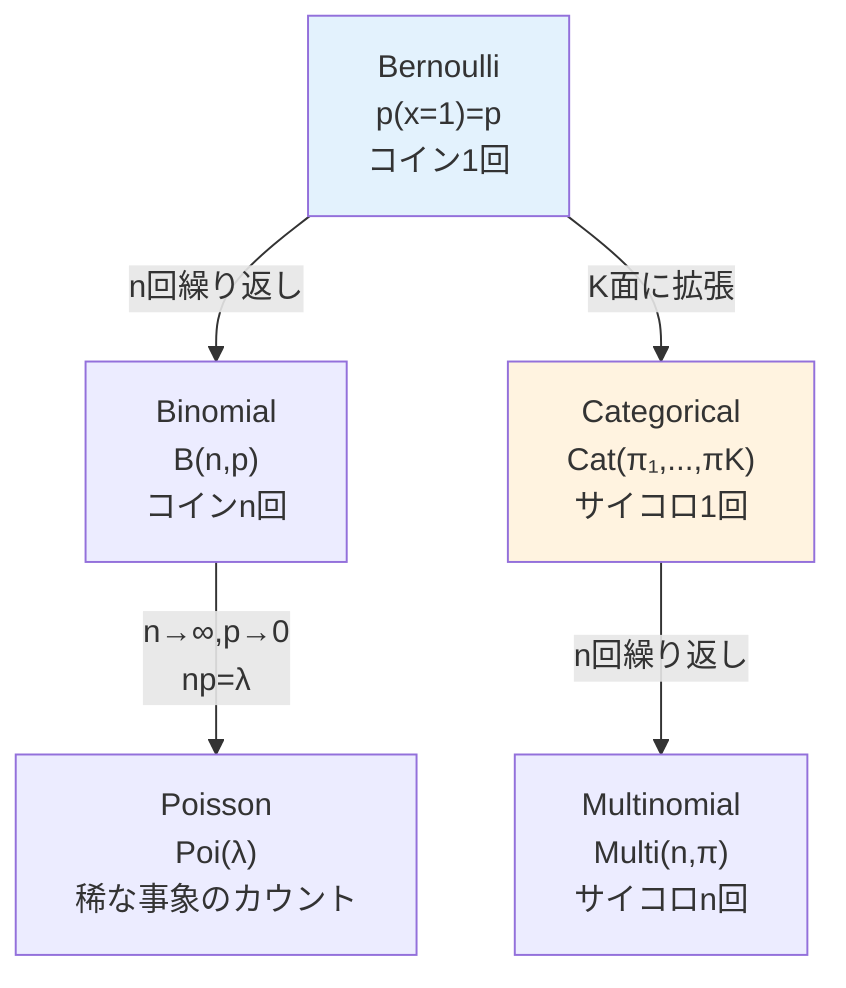
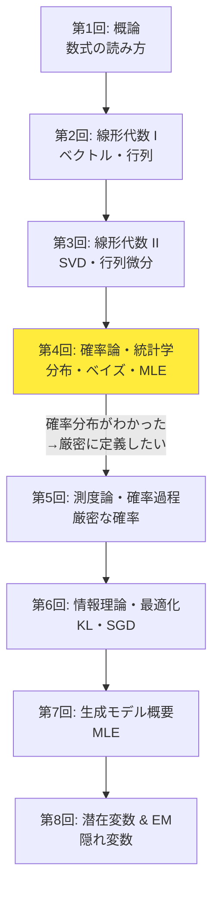
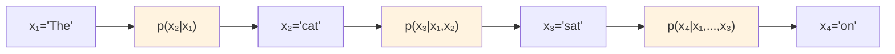
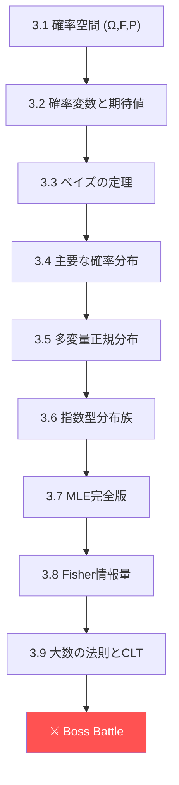
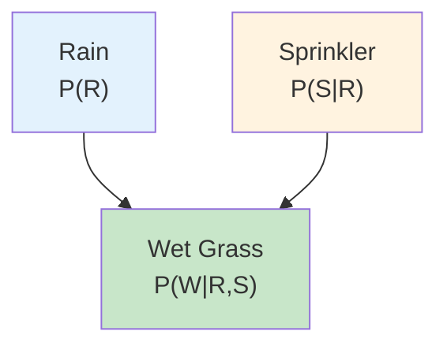
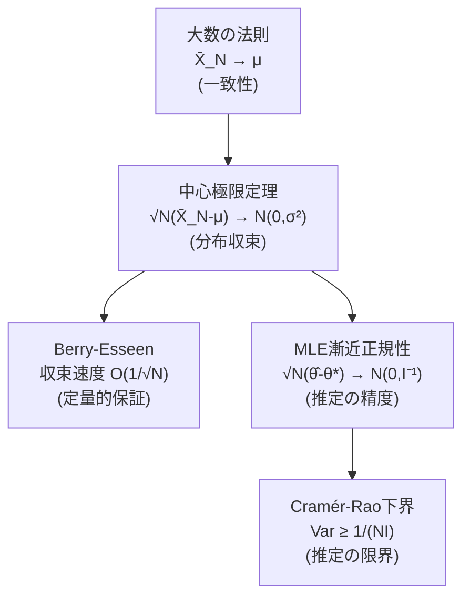

# 第4回: 確率論・統計学 — 不確実性を数学で飼いならす

> **確率とは「わからなさ」の言語だ。この言語を操れる者だけが、生成モデルの本質に触れられる。**

第3回で行列の分解と微分を手に入れた。SVDで空間を分解し、ヤコビアンで変換の局所的振る舞いを捉え、自動微分でBackpropagationの数学的基盤を理解した。だが、ここで根本的な問いが立ちはだかる — **データには「ノイズ」がある。不確実性をどう扱うのか？**

線形代数は「確定した量」の数学だ。行列 $A$ をかければ、ベクトル $\mathbf{x}$ は確定的に $A\mathbf{x}$ に変換される。だが現実のデータは違う。同じ入力に対して出力がばらつく。同じ文脈に対してLLMが毎回違うトークンを生成する。この「ばらつき」を記述する数学が確率論だ。

本講義では、確率空間の厳密な定義から始めて、確率分布の記述・操作・推定を完全に習得する。そしてこれが単なる数学の演習ではないことを、LLMの自己回帰生成 $p(x_t \mid x_{<t})$ — まさに条件付き確率そのもの — を通じて体感する。

:::message
**このシリーズについて**: 東京大学 松尾・岩澤研究室動画講義の**完全上位互換**の全50回シリーズ。理論（論文が書ける）、実装（Production-ready）、最新（2025-2026 SOTA）の3軸で差別化する。
:::


**所要時間の目安**:

| ゾーン | 内容 | 時間 | 難易度 |
|:-------|:-----|:-----|:-------|
| Zone 0 | クイックスタート | 30秒 | ★☆☆☆☆ |
| Zone 1 | 体験ゾーン | 10分 | ★★☆☆☆ |
| Zone 2 | 直感ゾーン | 15分 | ★★☆☆☆ |
| Zone 3 | 数式修行ゾーン | 60分 | ★★★★☆ |
| Zone 4 | 実装ゾーン | 45分 | ★★★☆☆ |
| Zone 5 | 実験ゾーン | 30分 | ★★★☆☆ |
| Zone 6 | 振り返りゾーン | 30分 | ★★★★☆ |

---

## 🚀 0. クイックスタート（30秒）— ベイズの定理を3行で動かす

**ゴール**: 確率の核心を30秒で体験する。

```python
import numpy as np

# Bayes' theorem: P(A|B) = P(B|A) * P(A) / P(B)
prior = 0.01            # P(disease) = 1%
sensitivity = 0.95      # P(positive | disease) = 95%
false_positive = 0.05   # P(positive | healthy) = 5%
p_positive = sensitivity * prior + false_positive * (1 - prior)
posterior = sensitivity * prior / p_positive
print(f"Prior:     {prior:.2%}")
print(f"Posterior: {posterior:.2%}")   # 16.1% — not 95%!
```

出力:
```
Prior:     1.00%
Posterior: 16.10%
```

**この3行の裏にある数式**:

$$
P(\text{disease} \mid \text{positive}) = \frac{P(\text{positive} \mid \text{disease}) \cdot P(\text{disease})}{P(\text{positive})}
$$

検査の感度が95%でも、事前確率が1%なら、陽性と出ても実際に病気である確率は**たった16%**。直感に反する。だが数式は嘘をつかない。これがベイズの定理 [^1] の力だ。

この「事前の信念を新しい証拠で更新する」構造は、生成モデルの根幹に現れる。VAEの事後分布 $q_\phi(\mathbf{z} \mid \mathbf{x})$ [^2] も、ベイズの定理の変分近似に他ならない。

:::message
**進捗: 3% 完了** ベイズの定理を「動かして」体験した。直感と数学のギャップ — これが確率論を学ぶ理由だ。
:::

---

## 🎮 1. 体験ゾーン（10分）— 確率分布を触って遊ぶ

### 1.1 離散分布 — Categorical分布とSoftmax

LLMが次のトークンを選ぶとき、語彙全体の確率分布を計算する。これは**Categorical分布**そのものだ。

$$
p(x = k) = \pi_k, \quad \sum_{k=1}^{K} \pi_k = 1, \quad \pi_k \geq 0
$$

Softmaxが返す確率ベクトルは、まさにCategorical分布のパラメータ $\boldsymbol{\pi} = (\pi_1, \ldots, \pi_K)$ だ。

```python
import numpy as np

def categorical_sample(logits: np.ndarray, temperature: float = 1.0, n_samples: int = 10000) -> np.ndarray:
    """Sample from categorical distribution via softmax.

    corresponds to: p(x=k) = exp(z_k/T) / Σ_j exp(z_j/T)
    """
    scaled = logits / temperature
    probs = np.exp(scaled - np.max(scaled))
    probs /= probs.sum()
    return np.random.choice(len(logits), size=n_samples, p=probs)

# Simulate LLM next-token prediction
vocab = ["the", "a", "cat", "dog", "sat", "on", "mat", "ran"]
logits = np.array([2.5, 1.0, 3.0, 0.5, 2.0, 1.5, 0.8, 0.3])

print("=== LLM Next-Token Sampling Simulation ===\n")
print(f"{'Token':<8} {'Logit':>6} | {'T=0.5':>8} {'T=1.0':>8} {'T=2.0':>8}")
print("-" * 50)

for T in [0.5, 1.0, 2.0]:
    samples = categorical_sample(logits, T)
    unique, counts = np.unique(samples, return_counts=True)
    freq = np.zeros(len(vocab))
    for u, c in zip(unique, counts):
        freq[u] = c / len(samples)
    if T == 0.5:
        all_freqs = [freq]
    else:
        all_freqs.append(freq)

for i, word in enumerate(vocab):
    row = f"{word:<8} {logits[i]:>6.1f} |"
    for freq in all_freqs:
        row += f" {freq[i]:>7.1%}"
    print(row)
```

| 温度 $T$ | 効果 | LLMでの用途 |
|:---------|:-----|:-----------|
| $T \to 0$ | 最大確率のトークンのみ選択（greedy） | 翻訳・要約（正確さ重視） |
| $T = 1.0$ | モデルの学習通りの分布 | デフォルト |
| $T > 1.0$ | 分布が平坦化（多様性UP） | 創作・ブレスト |

Hintonらの知識蒸留論文 [^3] で体系化されたこの温度パラメータは、第1回で体験したSoftmaxの拡張だ。ここで重要なのは、**温度を変えてもCategorical分布であること自体は変わらない**という点。分布のパラメータ $\boldsymbol{\pi}$ が変わるだけだ。

:::message
ここで多くの人が混乱するのが「logitとは何か」だ。logitはSoftmax適用**前**の生のスコア。確率ではない。Softmaxを通して初めてCategorical分布のパラメータ $\pi_k$ になる。
:::

### 1.2 連続分布 — ガウス分布の万能性

機械学習で最も頻繁に現れる連続分布 — ガウス分布（正規分布）。

$$
\mathcal{N}(x \mid \mu, \sigma^2) = \frac{1}{\sqrt{2\pi\sigma^2}} \exp\left(-\frac{(x - \mu)^2}{2\sigma^2}\right)
$$

```python
import numpy as np

def gaussian_pdf(x: np.ndarray, mu: float, sigma: float) -> np.ndarray:
    """Gaussian probability density function.

    corresponds to: N(x|μ,σ²) = (2πσ²)^{-1/2} exp(-(x-μ)²/(2σ²))
    """
    return (1 / np.sqrt(2 * np.pi * sigma**2)) * np.exp(-((x - mu)**2) / (2 * sigma**2))

x = np.linspace(-6, 6, 1000)
configs = [(0, 1, "μ=0,σ=1 (標準正規)"), (0, 0.5, "μ=0,σ=0.5 (鋭い)"),
           (2, 1, "μ=2,σ=1 (右シフト)"), (0, 2, "μ=0,σ=2 (広い)")]

print(f"{'Config':<25} {'Peak':>8} {'P(|x|<1)':>10} {'P(|x|<2)':>10}")
print("-" * 55)
for mu, sigma, name in configs:
    pdf = gaussian_pdf(x, mu, sigma)
    peak = gaussian_pdf(np.array([mu]), mu, sigma)[0]
    dx = x[1] - x[0]
    p1 = np.sum(pdf[np.abs(x - mu) < 1]) * dx
    p2 = np.sum(pdf[np.abs(x - mu) < 2]) * dx
    print(f"{name:<25} {peak:>8.4f} {p1:>9.1%} {p2:>9.1%}")
```

出力:
```
Config                       Peak   P(|x|<1)   P(|x|<2)
-------------------------------------------------------
μ=0,σ=1 (標準正規)         0.3989     68.3%     95.4%
μ=0,σ=0.5 (鋭い)           0.7979     95.4%    100.0%
μ=2,σ=1 (右シフト)         0.3989     68.3%     95.4%
μ=0,σ=2 (広い)             0.1995     38.3%     68.3%
```

**68-95-99.7ルール**: 標準正規分布では、$\pm 1\sigma$ に68.3%、$\pm 2\sigma$ に95.4%、$\pm 3\sigma$ に99.7%のデータが含まれる。

なぜガウス分布がこれほど重要か？ 中心極限定理（CLT）がその答えだ — **独立な確率変数の和は、元の分布が何であれ、正規分布に近づく**。これは後のZone 3で厳密に導出する。

:::details ガウス分布とLLM — 隠れた接続
LLMの学習では、パラメータの初期化にガウス分布を使う。Heの初期化 $\mathcal{N}(0, 2/n)$ やXavierの初期化 $\mathcal{N}(0, 2/(n_{in}+n_{out}))$ は、勾配の分散を制御するために分散を精密に設定している。

VAE [^2] のエンコーダは、潜在変数の分布をガウス分布 $q_\phi(\mathbf{z} \mid \mathbf{x}) = \mathcal{N}(\boldsymbol{\mu}, \text{diag}(\boldsymbol{\sigma}^2))$ で近似する。「なぜガウスなのか」は、指数型分布族の性質と計算の都合による — これも本講義で扱う。

拡散モデル [^4] の前方過程は、ガウスノイズを段階的に加えていく操作だ。$q(\mathbf{x}_t \mid \mathbf{x}_{t-1}) = \mathcal{N}(\sqrt{1-\beta_t}\mathbf{x}_{t-1}, \beta_t \mathbf{I})$ — ここでもガウス分布が主役を演じる。
:::

### 1.3 ベルヌーイ分布からMultinomialへ — 離散分布の系譜

確率分布は孤立して存在するのではなく、**族（ファミリー）**を形成する。



```python
import numpy as np

# Bernoulli: coin flip
p_heads = 0.7
flips = np.random.binomial(1, p_heads, size=10000)
print(f"Bernoulli(p={p_heads}): mean={flips.mean():.3f} (theory={p_heads})")

# Binomial: n coin flips
n, p = 20, 0.3
binom_samples = np.random.binomial(n, p, size=10000)
print(f"Binomial(n={n},p={p}): mean={binom_samples.mean():.2f} (theory={n*p}), var={binom_samples.var():.2f} (theory={n*p*(1-p):.2f})")

# Categorical: dice roll (LLM token selection)
probs = np.array([0.1, 0.3, 0.05, 0.4, 0.15])
labels = ["A", "B", "C", "D", "E"]
cat_samples = np.random.choice(len(probs), size=10000, p=probs)
print(f"\nCategorical samples (10000 draws):")
for i, label in enumerate(labels):
    freq = (cat_samples == i).mean()
    print(f"  {label}: freq={freq:.3f} (theory={probs[i]:.3f})")

# Poisson: rare event counting
lam = 3.0
pois_samples = np.random.poisson(lam, size=10000)
print(f"\nPoisson(λ={lam}): mean={pois_samples.mean():.2f} (theory={lam}), var={pois_samples.var():.2f} (theory={lam})")
```

| 分布 | パラメータ | 平均 | 分散 | ML応用 |
|:-----|:----------|:-----|:-----|:-------|
| Bernoulli($p$) | $p \in [0,1]$ | $p$ | $p(1-p)$ | 二値分類 |
| Binomial($n, p$) | $n \in \mathbb{N}, p \in [0,1]$ | $np$ | $np(1-p)$ | カウントデータ |
| Categorical($\boldsymbol{\pi}$) | $\pi_k \geq 0, \sum \pi_k = 1$ | — | — | **LLM次トークン選択** |
| Poisson($\lambda$) | $\lambda > 0$ | $\lambda$ | $\lambda$ | 稀な事象 |
| Gaussian($\mu, \sigma^2$) | $\mu \in \mathbb{R}, \sigma^2 > 0$ | $\mu$ | $\sigma^2$ | **VAE潜在空間** |

### 1.4 Dirichlet分布 — Categorical分布のベイズ事前分布

LLMの出力がCategorical分布なら、そのベイズ事前分布は何か？ 答えは**Dirichlet分布**だ。

$$
\text{Dir}(\boldsymbol{\pi} \mid \boldsymbol{\alpha}) = \frac{\Gamma(\sum_k \alpha_k)}{\prod_k \Gamma(\alpha_k)} \prod_{k=1}^{K} \pi_k^{\alpha_k - 1}
$$

Dirichlet分布は「確率ベクトル $\boldsymbol{\pi}$ の上の確率分布」だ。$\boldsymbol{\alpha}$ が集中度パラメータで、$\alpha_k$ が大きいほど $\pi_k$ に質量が集中する。

```python
import numpy as np

def dirichlet_samples(alpha: np.ndarray, n_samples: int = 5) -> np.ndarray:
    """Sample probability vectors from Dirichlet(α).

    corresponds to: π ~ Dir(α), Σπ_k = 1, π_k ≥ 0
    """
    samples = np.random.dirichlet(alpha, size=n_samples)
    return samples

# Explore Dirichlet with different concentration parameters
K = 5  # 5-class categorical (like a tiny vocabulary)
print("=== Dirichlet Distribution — Prior for Categorical ===\n")

configs = [
    (np.ones(K) * 0.1, "α=0.1 (sparse — few classes dominate)"),
    (np.ones(K) * 1.0, "α=1.0 (uniform — any π equally likely)"),
    (np.ones(K) * 10.0, "α=10 (concentrated — all π_k ≈ 1/K)"),
    (np.array([10, 1, 1, 1, 1]), "α=[10,1,1,1,1] (class 0 dominant)"),
]

for alpha, name in configs:
    samples = dirichlet_samples(alpha, n_samples=3)
    print(f"{name}")
    for s in samples:
        print(f"  π = [{', '.join(f'{p:.3f}' for p in s)}]")
    mean = alpha / alpha.sum()
    print(f"  E[π] = [{', '.join(f'{m:.3f}' for m in mean)}]")
    entropy = -np.mean([np.sum(s * np.log(s + 1e-10)) for s in dirichlet_samples(alpha, 10000)])
    print(f"  E[H(π)] = {entropy:.3f} (average entropy of sampled distributions)")
    print()
```

| $\alpha$ | 直感 | LLM文脈 |
|:---------|:-----|:--------|
| $\alpha_k \ll 1$ | スパース — 少数のトークンに集中 | 決定的な出力 |
| $\alpha_k = 1$ | 一様 — あらゆる分布が等確率 | 無情報事前分布 |
| $\alpha_k \gg 1$ | 集中 — 一様分布に近い | 不確実性が高い出力 |

**ベイズ更新**: Categorical尤度 + Dirichlet事前 → Dirichlet事後（共役ペア）。

$$
\boldsymbol{\pi} \sim \text{Dir}(\boldsymbol{\alpha}) \quad \to \quad \boldsymbol{\pi} \mid \text{data} \sim \text{Dir}(\boldsymbol{\alpha} + \text{counts})
$$

これはLLMのファインチューニングにおける「出力分布の事前知識」の数学的表現だ。

### 1.5 同時分布・周辺分布・条件付き分布

確率の3つの顔を、コードで体感する。

```python
import numpy as np

# Joint distribution P(X, Y) as a 2D table
# X = weather (0=sunny, 1=rainy), Y = umbrella (0=no, 1=yes)
joint = np.array([
    [0.40, 0.10],  # sunny: no umbrella, umbrella
    [0.05, 0.45],  # rainy: no umbrella, umbrella
])

print("=== Joint Distribution P(X, Y) ===")
print(f"           No Umbrella  Umbrella")
print(f"Sunny:     {joint[0,0]:.2f}         {joint[0,1]:.2f}")
print(f"Rainy:     {joint[1,0]:.2f}         {joint[1,1]:.2f}")

# Marginal: P(X) = Σ_y P(X, y)
p_x = joint.sum(axis=1)
print(f"\n=== Marginal P(X) ===")
print(f"P(Sunny) = {p_x[0]:.2f}, P(Rainy) = {p_x[1]:.2f}")

# Marginal: P(Y) = Σ_x P(x, Y)
p_y = joint.sum(axis=0)
print(f"\n=== Marginal P(Y) ===")
print(f"P(No Umbrella) = {p_y[0]:.2f}, P(Umbrella) = {p_y[1]:.2f}")

# Conditional: P(Y|X) = P(X,Y) / P(X)
p_y_given_x = joint / p_x[:, np.newaxis]
print(f"\n=== Conditional P(Y|X) ===")
print(f"P(No Umbrella | Sunny) = {p_y_given_x[0,0]:.3f}")
print(f"P(Umbrella | Sunny)    = {p_y_given_x[0,1]:.3f}")
print(f"P(No Umbrella | Rainy) = {p_y_given_x[1,0]:.3f}")
print(f"P(Umbrella | Rainy)    = {p_y_given_x[1,1]:.3f}")

# Verify: each row sums to 1
print(f"\nRow sums (must be 1.0): {p_y_given_x.sum(axis=1)}")
```

| 概念 | 数式 | コード | 直感 |
|:-----|:-----|:-------|:-----|
| 同時分布 | $P(X, Y)$ | `joint` | 2つの変数の全組み合わせ |
| 周辺分布 | $P(X) = \sum_y P(X, y)$ | `joint.sum(axis=1)` | 片方を足し上げる |
| 条件付き分布 | $P(Y \mid X) = \frac{P(X,Y)}{P(X)}$ | `joint / p_x[:, None]` | 知っている情報で絞る |

**LLMとの接続**: LLMの自己回帰生成は条件付き分布の連鎖だ。

$$
p(\mathbf{x}) = p(x_1) \cdot p(x_2 \mid x_1) \cdot p(x_3 \mid x_1, x_2) \cdots = \prod_{t=1}^{T} p(x_t \mid x_{<t})
$$

「The cat sat on the」の次に来るトークンの確率 $p(x_7 \mid x_1, \ldots, x_6)$ — これは条件付き分布以外の何物でもない。Malach (2023) [^5] は、このような自己回帰次トークン予測器が任意のチューリングマシン計算可能な関数を近似できる「普遍学習器」であることを理論的に示した。

> **Zone 1 まとめ**: Categorical分布（LLMのSoftmax出力）→ Gaussian分布（VAEの潜在空間）→ 条件付き分布（自己回帰生成 $\prod_t p(x_t \mid x_{<t})$）。確率分布は生成モデルの「言語」だ。

:::message
**進捗: 10% 完了** 離散分布・連続分布・同時/周辺/条件付き分布を「触って」理解した。Zone 0-1 クリア。
:::

---

## 🧩 2. 直感ゾーン（15分）— なぜ確率論がAIの心臓なのか

### 2.1 確率を学ぶ「本当の理由」

多くのML入門は「ライブラリを叩けば動く」から始まる。だが論文を読もうとした瞬間、確率の壁にぶつかる。

- VAEの損失関数 $\mathcal{L} = \mathbb{E}_{q_\phi(\mathbf{z}|\mathbf{x})}[\log p_\theta(\mathbf{x}|\mathbf{z})] - D_{KL}[q_\phi(\mathbf{z}|\mathbf{x}) \| p(\mathbf{z})]$ — 期待値、条件付き分布、KLダイバージェンスの塊
- Diffusionの前方過程 $q(\mathbf{x}_t \mid \mathbf{x}_{t-1}) = \mathcal{N}(\sqrt{1-\beta_t}\mathbf{x}_{t-1}, \beta_t \mathbf{I})$ — 条件付きガウス分布のマルコフ連鎖
- GANの目的関数 $\min_G \max_D \mathbb{E}_{\mathbf{x} \sim p_\text{data}}[\log D(\mathbf{x})] + \mathbb{E}_{\mathbf{z} \sim p(\mathbf{z})}[\log(1 - D(G(\mathbf{z})))]$ — 期待値と確率分布からのサンプリング

**確率論なしに、これらの式は1文字も読めない。**

> この章を読めば: 確率論が残り36回の全講義でどう使われるか、全体像が見える。

### 2.2 Course I（数学基礎編）での位置づけ



第4回は**Course Iの折り返し地点**だ。第1-3回で鍛えた線形代数の上に、不確実性の数学を積む。そして第5回（測度論）で確率論を厳密に再定義し、第6回（情報理論）でKLダイバージェンスという「分布間の距離」を手に入れる。

| 回 | テーマ | 第4回との接続 |
|:---|:------|:-------------|
| 第2回 | 線形代数 I | 共分散行列は**対称正定値行列** — 固有値分解の対象 |
| 第3回 | 線形代数 II | ヤコビアンが**確率変数の変換**に必要（第25回 NF） |
| **第4回** | **確率論・統計学** | **本講義** |
| 第5回 | 測度論 | 確率密度関数の**厳密な定義**（Radon-Nikodym） |
| 第6回 | 情報理論 | KLダイバージェンス = **分布間の非対称距離** |
| 第8回 | EM算法 | **潜在変数の周辺化** = 本講義の直接的拡張 |

### 2.3 松尾研との差別化

| 観点 | 松尾・岩澤研 | 本シリーズ |
|:-----|:------------|:----------|
| 確率論の扱い | 「前提知識」として省略 | **8時間かけて完全習得** |
| ベイズ推論 | 数式の結果だけ | **事前→尤度→事後の全ステップ導出** |
| MLE | 定義のみ | **正則条件・漸近正規性・Fisher情報量まで** |
| 指数型分布族 | 言及なし | **統一的理解 → VAE/EBMの理論基盤** |
| 実装 | なし | **NumPyで全分布をスクラッチ実装** |

「前提知識で片付ける」とは、つまり「わからなくても先に進め」ということだ。本シリーズはそれを許さない。確率論の土台が脆いと、第9回（変分推論）以降で必ず崩壊する。

### 2.4 3つの学習メタファ — 確率論を「体で覚える」

確率論は抽象度が高い。3つのメタファで直感を掴もう。

**メタファ1: 確率空間 = RPGの世界設定**

$(\Omega, \mathcal{F}, P)$ はゲームの世界設定だ。$\Omega$ は全ての可能なイベント（マップ）、$\mathcal{F}$ は「観測可能なイベントの集合」（クエスト一覧）、$P$ は各イベントの発生確率（レアドロップ率）。確率変数 $X$ は「ダンジョンの報酬」— 同じダンジョンでも毎回違う報酬（確率的）。

**メタファ2: ベイズ更新 = 探偵の推理**

殺人事件。容疑者が3人。最初は全員等しく疑わしい（事前分布: 一様）。凶器にAの指紋が見つかった（データ: 尤度が高い）。Aの事後確率が上がる。だがAには鉄壁のアリバイが出てきた（新たなデータ）。事後分布がまた更新される。**ベイズ推論 = 証拠を積み重ねて信念を更新する過程**。

**メタファ3: MLE = 犯人当てゲームの最適戦略**

箱の中にコインがある。表の出る確率 $p$ は不明。10回投げて8回表が出た。$p$ はいくつだと「最もありそう」か？ $p = 0.8$ が尤度を最大化する — これがMLE。「データが最も起こりやすかったパラメータ」を選ぶ。

### 2.5 LLMグラウンディング — 条件付き確率と自己回帰

第4回のLLM接続は**条件付き確率**と**自己回帰モデル** $p(x_t \mid x_{<t})$ だ。

LLMのテキスト生成は、以下の確率の連鎖規則（chain rule）に支配される:

$$
p(x_1, x_2, \ldots, x_T) = \prod_{t=1}^{T} p(x_t \mid x_1, \ldots, x_{t-1})
$$

これは確率の公理から導かれる恒等式だ。何の仮定も近似も入っていない。LLMはこの各条件付き確率 $p(x_t \mid x_{<t})$ をTransformerで近似し、Softmax出力でCategorical分布のパラメータを生成している。



**覚えておいてほしい**: この自己回帰構造は第15回（自己回帰モデル）で本格的に扱う。今は「LLMのテキスト生成 = 条件付き確率の連鎖」という接続を把握しておけば十分だ。

:::details トロイの木馬 — Pythonの終わりの始まり
本講義はPython 100%だ。NumPyで全ての分布をスクラッチ実装する。「Pythonは便利だ」と安心してほしい。

......ただし、第5回から `%timeit` が登場する。Monte Carlo積分の計算コストを測り始めると、Pythonの「遅さ」が少しずつ見えてくる。第9回でJuliaが初登場したとき、ELBO計算が50倍速くなる衝撃が待っている。

今はPythonを信じて、確率論に集中しよう。
:::

:::message
**進捗: 20% 完了** 確率論がシリーズ全体でどう使われるか、全体像を把握した。Zone 2 クリア。いよいよ数式修行の本番に入る。
:::

---

## 📐 3. 数式修行ゾーン（60分）— 確率論の全武装

ここからが本番だ。確率空間の厳密な定義から、ベイズの定理、指数型分布族、MLE、Fisher情報量まで — 確率論の武器庫を一気に埋める。



### 3.1 確率空間の定義 — (Ω, F, P)

全ての確率の議論は、3つ組 $(\Omega, \mathcal{F}, P)$ から始まる。Kolmogorov [^6] が1933年に確立したこの公理系が、確率論の土台だ。

**定義（確率空間）**: 確率空間とは三つ組 $(\Omega, \mathcal{F}, P)$ であり:

1. **標本空間** $\Omega$ — 起こりうる全ての結果の集合
2. **事象のσ-加法族** $\mathcal{F}$ — $\Omega$ の部分集合の族で、以下を満たす:
   - $\Omega \in \mathcal{F}$
   - $A \in \mathcal{F} \Rightarrow A^c \in \mathcal{F}$（補集合で閉じる）
   - $A_1, A_2, \ldots \in \mathcal{F} \Rightarrow \bigcup_{n=1}^{\infty} A_n \in \mathcal{F}$（可算合併で閉じる）
3. **確率測度** $P: \mathcal{F} \to [0,1]$ — 以下を満たす関数:
   - $P(\Omega) = 1$（正規化）
   - 互いに素な $A_1, A_2, \ldots \in \mathcal{F}$ に対して $P\left(\bigcup_{n=1}^{\infty} A_n\right) = \sum_{n=1}^{\infty} P(A_n)$（σ-加法性）

:::message
ここで多くの人が混乱するのが「なぜσ-加法族が必要なのか」だ。Ω のあらゆる部分集合に確率を割り当てようとすると、数学的に矛盾が生じる（Vitaliの非可測集合）。σ-加法族は「確率を定義できる部分集合」を制限する — 第5回（測度論）で詳しく扱う。今は「確率を割り当てる対象を制限する仕組み」と理解すれば十分だ。
:::

```python
import numpy as np

# Example: probability space for a fair die
# Ω = {1, 2, 3, 4, 5, 6}
omega = {1, 2, 3, 4, 5, 6}

# F = power set of Ω (all subsets) — 2^6 = 64 events
# P: uniform probability
def P(event: set) -> float:
    """Probability measure for a fair die.

    corresponds to: P(A) = |A| / |Ω| for uniform distribution
    """
    return len(event) / len(omega)

# Verify axioms
print("=== Kolmogorov Axioms Verification ===")
print(f"1. P(Ω) = {P(omega)} (must be 1)")
print(f"2. P(∅) = {P(set())} (must be 0)")

A = {1, 3, 5}  # odd numbers
B = {2, 4, 6}  # even numbers
print(f"3. P(odd) = {P(A):.4f}")
print(f"   P(even) = {P(B):.4f}")
print(f"   P(odd ∪ even) = {P(A | B):.4f}")
print(f"   P(odd) + P(even) = {P(A) + P(B):.4f} (σ-additivity)")

# Non-trivial example: conditional probability
C = {1, 2, 3}  # ≤ 3
D = {2, 4, 6}  # even
# P(D|C) = P(D∩C) / P(C)
p_d_given_c = P(D & C) / P(C)
print(f"\nP(even | ≤3) = P({{2}}) / P({{1,2,3}}) = {P(D & C):.4f} / {P(C):.4f} = {p_d_given_c:.4f}")
```

**σ-加法族が「なぜ」必要かの直感**: サイコロの6面なら、全部分集合（冪集合）に確率を定義できる。だが $\Omega = \mathbb{R}$（連続空間）では、冪集合のすべてに「長さ」を定義することが不可能であることがBanach-Tarskiのパラドックスから帰結される。σ-加法族はこの問題を回避するための数学的装置だ。第5回でLebesgue測度とBorel集合として厳密に扱う。

### 3.2 確率変数と期待値・分散

**定義（確率変数）**: 確率空間 $(\Omega, \mathcal{F}, P)$ 上の確率変数 $X$ とは、可測関数 $X: \Omega \to \mathbb{R}$ である。

「可測」とは、任意のBorel集合 $B \subseteq \mathbb{R}$ に対して $X^{-1}(B) = \{\omega \in \Omega : X(\omega) \in B\} \in \mathcal{F}$ が成り立つこと。直感的には「$X$ の値に関する任意の問い（$X \leq a$ など）に確率を割り当てられる」ということだ。

**期待値**（離散の場合）:

$$
\mathbb{E}[X] = \sum_{x} x \cdot P(X = x)
$$

**期待値**（連続の場合）:

$$
\mathbb{E}[X] = \int_{-\infty}^{\infty} x \cdot f_X(x) \, dx
$$

ここで $f_X(x)$ は確率密度関数（PDF）。

**分散**:

$$
\text{Var}(X) = \mathbb{E}[(X - \mathbb{E}[X])^2] = \mathbb{E}[X^2] - (\mathbb{E}[X])^2
$$

**共分散**:

$$
\text{Cov}(X, Y) = \mathbb{E}[(X - \mathbb{E}[X])(Y - \mathbb{E}[Y])] = \mathbb{E}[XY] - \mathbb{E}[X]\mathbb{E}[Y]
$$

```python
import numpy as np

# Expectation, Variance, Covariance from first principles
np.random.seed(42)
n = 100000

# Discrete: roll two dice
X = np.random.randint(1, 7, size=n)  # die 1
Y = np.random.randint(1, 7, size=n)  # die 2
Z = X + Y  # sum

print("=== Expectation & Variance ===")
print(f"E[X] = {X.mean():.4f} (theory = 3.5)")
print(f"E[Y] = {Y.mean():.4f} (theory = 3.5)")
print(f"E[Z] = E[X+Y] = {Z.mean():.4f} (theory = 7.0)")
print(f"Var(X) = {X.var():.4f} (theory = {(6**2-1)/12:.4f})")
print(f"Var(Z) = {Z.var():.4f} (theory = {2*(6**2-1)/12:.4f})")

# Linearity of expectation: E[aX+b] = aE[X]+b
a, b = 3, -2
print(f"\nE[{a}X+({b})] = {(a*X+b).mean():.4f} (theory = {a*3.5+b:.4f})")
print(f"Var({a}X+({b})) = {(a*X+b).var():.4f} (theory = {a**2*(6**2-1)/12:.4f})")

# Covariance and independence
print(f"\nCov(X, Y) = {np.cov(X, Y, ddof=0)[0,1]:.4f} (theory ≈ 0, independent)")
print(f"Cov(X, Z) = {np.cov(X, Z, ddof=0)[0,1]:.4f} (theory = Var(X) = {(6**2-1)/12:.4f})")
```

| 性質 | 数式 | 名前 |
|:-----|:-----|:-----|
| 線形性 | $\mathbb{E}[aX + b] = a\mathbb{E}[X] + b$ | 期待値の線形性 |
| 独立なら | $\mathbb{E}[XY] = \mathbb{E}[X]\mathbb{E}[Y]$ | 独立の帰結 |
| 分散の変換 | $\text{Var}(aX+b) = a^2 \text{Var}(X)$ | 分散のスケーリング |
| 独立の和 | $\text{Var}(X+Y) = \text{Var}(X) + \text{Var}(Y)$ | 独立なら分散も加法的 |

**独立性の定義**: 確率変数 $X, Y$ が独立 $\iff$ $P(X \in A, Y \in B) = P(X \in A) \cdot P(Y \in B)$ が全ての事象 $A, B$ で成立。

独立性は機械学習で頻繁に仮定される。データが**独立同分布（i.i.d.）**であるという仮定 — $\mathbf{x}_1, \ldots, \mathbf{x}_N \overset{\text{i.i.d.}}{\sim} p(\mathbf{x}; \theta)$ — はMLE（3.7節）の出発点だ。

### 3.3 ベイズの定理 — 事後推論の出発点

**定理（ベイズの定理）**: 事象 $A, B$ に対して $P(B) > 0$ のとき:

$$
P(A \mid B) = \frac{P(B \mid A) \cdot P(A)}{P(B)}
$$

**証明**: 条件付き確率の定義 $P(A \mid B) = P(A \cap B) / P(B)$ と $P(B \mid A) = P(A \cap B) / P(A)$ から、$P(A \cap B) = P(B \mid A) P(A)$ を代入すれば直ちに得られる。$\square$

連続確率変数の場合、パラメータ $\theta$ のベイズ推論は:

$$
\underbrace{p(\theta \mid \mathcal{D})}_{\text{事後分布}} = \frac{\overbrace{p(\mathcal{D} \mid \theta)}^{\text{尤度}} \cdot \overbrace{p(\theta)}^{\text{事前分布}}}{\underbrace{p(\mathcal{D})}_{\text{エビデンス}}}
$$

ここで $\mathcal{D} = \{x_1, \ldots, x_N\}$ はデータ、$p(\mathcal{D}) = \int p(\mathcal{D} \mid \theta) p(\theta) d\theta$ はエビデンス（周辺尤度）。

```python
import numpy as np

def bayesian_coin_update(prior_a: float, prior_b: float, heads: int, tails: int):
    """Bayesian updating with Beta-Bernoulli conjugate pair.

    Prior:     Beta(a, b)
    Likelihood: Bernoulli(θ)
    Posterior:  Beta(a + heads, b + tails)

    corresponds to: p(θ|D) ∝ θ^(a+h-1) (1-θ)^(b+t-1)
    """
    post_a = prior_a + heads
    post_b = prior_b + tails
    post_mean = post_a / (post_a + post_b)
    post_var = (post_a * post_b) / ((post_a + post_b)**2 * (post_a + post_b + 1))
    return post_a, post_b, post_mean, post_var

# Start with uniform prior Beta(1,1) = Uniform(0,1)
a, b = 1.0, 1.0
print("=== Sequential Bayesian Updating ===")
print(f"Prior: Beta({a:.0f},{b:.0f}), E[θ]={a/(a+b):.3f}\n")

# Observe coins sequentially
observations = [1, 1, 0, 1, 1, 1, 0, 1, 1, 1,  # 8H, 2T
                1, 1, 0, 1, 1, 1, 0, 1, 1, 1]  # 8H, 2T total: 16H, 4T
for i, obs in enumerate(observations, 1):
    a, b, mean, var = bayesian_coin_update(a, b, obs, 1 - obs)
    if i in [1, 5, 10, 20]:
        print(f"After {i:2d} obs: Beta({a:.0f},{b:.0f}), E[θ]={mean:.3f}, Std={np.sqrt(var):.3f}")

print(f"\nTrue θ: 0.800")
print(f"MLE:    {16/20:.3f}")
print(f"Bayes:  {a/(a+b):.3f} (Beta posterior mean)")
```

:::message
ここが最初のつまずきポイントだ — **エビデンス $p(\mathcal{D})$ の計算が困難**。これは $\theta$ に関する積分 $\int p(\mathcal{D} \mid \theta) p(\theta) d\theta$ であり、多くの場合解析的に計算できない。この困難が第8回（EM算法）と第9回（変分推論）の動機になる。VAEはこのエビデンスの下界（ELBO）を最大化する手法だ。
:::

**共役事前分布**: 事前分布と事後分布が同じ分布族に属するとき、その事前分布を**共役事前分布**という。

| 尤度 | 共役事前分布 | 事後分布 |
|:-----|:-----------|:---------|
| Bernoulli($\theta$) | Beta($a, b$) | Beta($a + h, b + t$) |
| Gaussian($\mu$, 既知$\sigma^2$) | Gaussian($\mu_0, \sigma_0^2$) | Gaussian($\mu_N, \sigma_N^2$) |
| Poisson($\lambda$) | Gamma($\alpha, \beta$) | Gamma($\alpha + \sum x_i, \beta + N$) |
| Categorical($\boldsymbol{\pi}$) | Dirichlet($\boldsymbol{\alpha}$) | Dirichlet($\boldsymbol{\alpha} + \text{counts}$) |

ここで、Gaussian行の事後パラメータは:

$$
\sigma_N^2 = \left(\frac{1}{\sigma_0^2} + \frac{N}{\sigma^2}\right)^{-1}, \quad \mu_N = \sigma_N^2 \left(\frac{\mu_0}{\sigma_0^2} + \frac{N \bar{x}}{\sigma^2}\right)
$$

共役事前分布が便利な理由は、事後分布の計算が**閉じた形**で得られることだ。指数型分布族（3.6節）との深い関係がある。

:::details Jeffreys事前分布 — 客観ベイズの試み
事前分布をどう選ぶかは主観的な判断だ。Harold Jeffreysは、パラメータの変換に対して不変な「客観的」事前分布を提案した:

$$
p_J(\theta) \propto \sqrt{\det I(\theta)}
$$

ここで $I(\theta)$ はFisher情報行列（3.8節）。Bernoulli尤度に対するJeffreys事前分布は $\text{Beta}(1/2, 1/2)$ — U字型の分布で、0と1の近くに質量を集中させる。

Jeffreys事前分布は低次元では有用だが、高次元では「拡散しすぎるか集中しすぎる」問題が知られている。実用上は、弱情報事前分布（weakly informative prior）を推奨する声が多い。
:::

### 3.4 主要な確率分布 — 離散と連続

#### 3.4.1 離散分布の詳細

**Bernoulli分布**: $X \sim \text{Bernoulli}(p)$

$$
P(X = x) = p^x (1-p)^{1-x}, \quad x \in \{0, 1\}
$$

$$
\mathbb{E}[X] = p, \quad \text{Var}(X) = p(1-p)
$$

**Binomial分布**: $X \sim \text{Binomial}(n, p)$ — $n$ 回の独立なBernoulli試行の成功回数

$$
P(X = k) = \binom{n}{k} p^k (1-p)^{n-k}, \quad k \in \{0, 1, \ldots, n\}
$$

$$
\mathbb{E}[X] = np, \quad \text{Var}(X) = np(1-p)
$$

**Poisson分布**: $X \sim \text{Poisson}(\lambda)$ — 単位時間あたりの事象発生回数

$$
P(X = k) = \frac{\lambda^k e^{-\lambda}}{k!}, \quad k \in \{0, 1, 2, \ldots\}
$$

$$
\mathbb{E}[X] = \lambda, \quad \text{Var}(X) = \lambda
$$

Poisson分布はBinomial分布の極限として得られる: $n \to \infty$, $p \to 0$, $np = \lambda$ のとき $\text{Binomial}(n,p) \to \text{Poisson}(\lambda)$。

```python
import numpy as np
from math import comb, factorial

def binomial_pmf(k: int, n: int, p: float) -> float:
    """P(X=k) = C(n,k) p^k (1-p)^(n-k)"""
    return comb(n, k) * p**k * (1 - p)**(n - k)

def poisson_pmf(k: int, lam: float) -> float:
    """P(X=k) = λ^k e^{-λ} / k!"""
    return lam**k * np.exp(-lam) / factorial(k)

# Poisson as limit of Binomial
lam = 5.0
print(f"Poisson limit theorem: Binomial(n, λ/n) → Poisson(λ={lam})")
print(f"{'k':<4} {'Poisson':>10} {'Bin(10)':>10} {'Bin(100)':>10} {'Bin(1000)':>10}")
print("-" * 48)
for k in range(11):
    pois = poisson_pmf(k, lam)
    b10 = binomial_pmf(k, 10, lam/10)
    b100 = binomial_pmf(k, 100, lam/100)
    b1000 = binomial_pmf(k, 1000, lam/1000)
    print(f"{k:<4} {pois:>10.6f} {b10:>10.6f} {b100:>10.6f} {b1000:>10.6f}")
```

#### 3.4.2 連続分布の詳細

**Gaussian分布** (1.2節で導入済み): $X \sim \mathcal{N}(\mu, \sigma^2)$

$$
f(x) = \frac{1}{\sqrt{2\pi\sigma^2}} \exp\left(-\frac{(x-\mu)^2}{2\sigma^2}\right)
$$

**Gamma分布**: $X \sim \text{Gamma}(\alpha, \beta)$（shape $\alpha$, rate $\beta$）

$$
f(x) = \frac{\beta^\alpha}{\Gamma(\alpha)} x^{\alpha-1} e^{-\beta x}, \quad x > 0
$$

$$
\mathbb{E}[X] = \frac{\alpha}{\beta}, \quad \text{Var}(X) = \frac{\alpha}{\beta^2}
$$

**Beta分布**: $X \sim \text{Beta}(\alpha, \beta)$

$$
f(x) = \frac{\Gamma(\alpha + \beta)}{\Gamma(\alpha)\Gamma(\beta)} x^{\alpha-1} (1-x)^{\beta-1}, \quad x \in (0, 1)
$$

$$
\mathbb{E}[X] = \frac{\alpha}{\alpha+\beta}, \quad \text{Var}(X) = \frac{\alpha\beta}{(\alpha+\beta)^2(\alpha+\beta+1)}
$$

Beta分布はBernoulli/Binomialの共役事前分布。$\alpha = \beta = 1$ で一様分布に一致する。

```python
import numpy as np

def gamma_pdf(x: np.ndarray, alpha: float, beta: float) -> np.ndarray:
    """Gamma PDF: f(x) = β^α / Γ(α) x^{α-1} exp(-βx)"""
    from math import gamma as gamma_fn
    return (beta**alpha / gamma_fn(alpha)) * x**(alpha - 1) * np.exp(-beta * x)

def beta_pdf(x: np.ndarray, a: float, b: float) -> np.ndarray:
    """Beta PDF: f(x) = Γ(a+b)/(Γ(a)Γ(b)) x^{a-1} (1-x)^{b-1}"""
    from math import gamma as gamma_fn
    B = gamma_fn(a) * gamma_fn(b) / gamma_fn(a + b)
    return x**(a - 1) * (1 - x)**(b - 1) / B

# Gamma distribution properties
x_gamma = np.linspace(0.01, 15, 1000)
for alpha, beta in [(1, 1), (2, 1), (3, 0.5), (5, 1)]:
    pdf = gamma_pdf(x_gamma, alpha, beta)
    mean_theory = alpha / beta
    var_theory = alpha / beta**2
    # Numerical verification via trapezoidal rule
    dx = x_gamma[1] - x_gamma[0]
    mean_num = np.sum(x_gamma * pdf) * dx
    var_num = np.sum((x_gamma - mean_num)**2 * pdf) * dx
    print(f"Gamma(α={alpha},β={beta}): E[X]={mean_theory:.2f} (num:{mean_num:.2f}), "
          f"Var={var_theory:.2f} (num:{var_num:.2f})")

print()
# Beta distribution — conjugate prior for Bernoulli
x_beta = np.linspace(0.001, 0.999, 1000)
for a, b in [(1, 1), (2, 5), (5, 2), (0.5, 0.5)]:
    pdf = beta_pdf(x_beta, a, b)
    mean_theory = a / (a + b)
    name = "Uniform" if (a == 1 and b == 1) else f"Beta({a},{b})"
    if a == 0.5 and b == 0.5:
        name = "Jeffreys"
    dx = x_beta[1] - x_beta[0]
    mode_x = x_beta[np.argmax(pdf)]
    print(f"{name:>12}: E[θ]={mean_theory:.3f}, mode≈{mode_x:.3f}")
```

### 3.5 多変量正規分布 — 生成モデルの基礎言語

$d$ 次元の多変量正規分布は:

$$
\mathcal{N}(\mathbf{x} \mid \boldsymbol{\mu}, \boldsymbol{\Sigma}) = \frac{1}{(2\pi)^{d/2} |\boldsymbol{\Sigma}|^{1/2}} \exp\left(-\frac{1}{2}(\mathbf{x} - \boldsymbol{\mu})^\top \boldsymbol{\Sigma}^{-1} (\mathbf{x} - \boldsymbol{\mu})\right)
$$

ここで $\boldsymbol{\mu} \in \mathbb{R}^d$ は平均ベクトル、$\boldsymbol{\Sigma} \in \mathbb{R}^{d \times d}$ は共分散行列（対称正定値）。

**精度行列**: $\boldsymbol{\Lambda} = \boldsymbol{\Sigma}^{-1}$ を精度行列と呼ぶ。密度関数は精度行列を使うと:

$$
\mathcal{N}(\mathbf{x} \mid \boldsymbol{\mu}, \boldsymbol{\Lambda}^{-1}) \propto \exp\left(-\frac{1}{2}(\mathbf{x} - \boldsymbol{\mu})^\top \boldsymbol{\Lambda} (\mathbf{x} - \boldsymbol{\mu})\right)
$$

精度行列の $(i,j)$ 成分が0であることは、$X_i$ と $X_j$ が他の変数を条件付けたとき条件付き独立であることを意味する。これがガウスグラフィカルモデル（Gaussian Graphical Model）の基盤だ。

**条件付き分布と周辺分布**:

$\mathbf{x} = (\mathbf{x}_1, \mathbf{x}_2)^\top$ と分割し、対応する平均と共分散も分割する:

$$
\boldsymbol{\mu} = \begin{pmatrix} \boldsymbol{\mu}_1 \\ \boldsymbol{\mu}_2 \end{pmatrix}, \quad \boldsymbol{\Sigma} = \begin{pmatrix} \boldsymbol{\Sigma}_{11} & \boldsymbol{\Sigma}_{12} \\ \boldsymbol{\Sigma}_{21} & \boldsymbol{\Sigma}_{22} \end{pmatrix}
$$

このとき:

**周辺分布**: $\mathbf{x}_1 \sim \mathcal{N}(\boldsymbol{\mu}_1, \boldsymbol{\Sigma}_{11})$ — 単に対応する部分を抜き出すだけ

**条件付き分布**:

$$
\mathbf{x}_1 \mid \mathbf{x}_2 \sim \mathcal{N}\left(\boldsymbol{\mu}_1 + \boldsymbol{\Sigma}_{12}\boldsymbol{\Sigma}_{22}^{-1}(\mathbf{x}_2 - \boldsymbol{\mu}_2), \; \boldsymbol{\Sigma}_{11} - \boldsymbol{\Sigma}_{12}\boldsymbol{\Sigma}_{22}^{-1}\boldsymbol{\Sigma}_{21}\right)
$$

条件付き共分散 $\boldsymbol{\Sigma}_{11} - \boldsymbol{\Sigma}_{12}\boldsymbol{\Sigma}_{22}^{-1}\boldsymbol{\Sigma}_{21}$ は線形代数の**Schur補行列**そのもの。第2回で学んだ道具がここで再登場する。

```python
import numpy as np

# 2D Gaussian: conditional and marginal
mu = np.array([1.0, 2.0])
Sigma = np.array([[1.0, 0.8],
                   [0.8, 1.5]])

# Marginal of x1
print(f"Marginal x₁: N({mu[0]}, {Sigma[0,0]})")
print(f"Marginal x₂: N({mu[1]}, {Sigma[1,1]})")

# Conditional x1 | x2 = 3.0
x2_obs = 3.0
# μ_{1|2} = μ₁ + Σ₁₂ Σ₂₂⁻¹ (x₂ - μ₂)
mu_cond = mu[0] + Sigma[0, 1] / Sigma[1, 1] * (x2_obs - mu[1])
# Σ_{1|2} = Σ₁₁ - Σ₁₂ Σ₂₂⁻¹ Σ₂₁  (Schur complement)
sigma_cond = Sigma[0, 0] - Sigma[0, 1]**2 / Sigma[1, 1]
print(f"\nConditional x₁ | x₂={x2_obs}:")
print(f"  μ_{'{1|2}'} = {mu[0]} + {Sigma[0,1]}/{Sigma[1,1]} × ({x2_obs} - {mu[1]}) = {mu_cond:.4f}")
print(f"  σ²_{'{1|2}'} = {Sigma[0,0]} - {Sigma[0,1]}²/{Sigma[1,1]} = {sigma_cond:.4f}")

# Verify by sampling
samples = np.random.multivariate_normal(mu, Sigma, size=100000)
mask = np.abs(samples[:, 1] - x2_obs) < 0.1
cond_samples = samples[mask, 0]
print(f"\nNumerical verification (samples near x₂={x2_obs}):")
print(f"  Mean: {cond_samples.mean():.4f} (theory: {mu_cond:.4f})")
print(f"  Var:  {cond_samples.var():.4f} (theory: {sigma_cond:.4f})")
```

**Mahalanobis距離**: 多変量正規分布の指数部に現れる $(\mathbf{x} - \boldsymbol{\mu})^\top \boldsymbol{\Sigma}^{-1}(\mathbf{x} - \boldsymbol{\mu})$ はMahalanobis距離の二乗だ。ユークリッド距離と異なり、共分散構造を考慮した「形に合った距離」を測る。等Mahalanobis距離の曲面は楕円体を形成し、その主軸は共分散行列の固有ベクトル、軸の長さは固有値の平方根に比例する。

:::details VAEの潜在空間 — 多変量正規分布の直接応用
VAE [^2] のエンコーダは入力 $\mathbf{x}$ に対して:

$$
q_\phi(\mathbf{z} \mid \mathbf{x}) = \mathcal{N}(\mathbf{z} \mid \boldsymbol{\mu}_\phi(\mathbf{x}), \text{diag}(\boldsymbol{\sigma}_\phi^2(\mathbf{x})))
$$

を出力する。ニューラルネットワークが $\boldsymbol{\mu}$ と $\boldsymbol{\sigma}^2$ を予測し、潜在変数 $\mathbf{z}$ を多変量正規分布からサンプリングする。対角共分散を仮定するのは計算効率のため — 第10回（VAE基礎）で、この仮定の帰結と改善策を詳しく議論する。
:::

### 3.6 指数型分布族 — 統一的理解

多くの重要な分布は、**指数型分布族**（Exponential Family）という1つの枠組みで統一的に記述できる。

**定義**: 確率分布が以下の形で書けるとき、指数型分布族に属する:

$$
p(\mathbf{x} \mid \boldsymbol{\eta}) = h(\mathbf{x}) \exp\left(\boldsymbol{\eta}^\top \mathbf{T}(\mathbf{x}) - A(\boldsymbol{\eta})\right)
$$

| 要素 | 記号 | 意味 |
|:-----|:-----|:-----|
| 自然パラメータ | $\boldsymbol{\eta}$ | 分布を指定するパラメータ |
| 十分統計量 | $\mathbf{T}(\mathbf{x})$ | データから抽出する統計量 |
| 対数正規化定数 | $A(\boldsymbol{\eta})$ | $\int h(\mathbf{x}) \exp(\boldsymbol{\eta}^\top \mathbf{T}(\mathbf{x})) d\mathbf{x} = \exp(A(\boldsymbol{\eta}))$ |
| 基底測度 | $h(\mathbf{x})$ | $\boldsymbol{\eta}$ に依存しない因子 |

**指数型分布族の驚くべき性質**:

1. $\nabla_{\boldsymbol{\eta}} A(\boldsymbol{\eta}) = \mathbb{E}[\mathbf{T}(\mathbf{x})]$ — 対数正規化定数の勾配が十分統計量の期待値
2. $\nabla_{\boldsymbol{\eta}}^2 A(\boldsymbol{\eta}) = \text{Cov}[\mathbf{T}(\mathbf{x})]$ — ヘシアンが共分散
3. $A(\boldsymbol{\eta})$ は凸関数 — 最適化に都合がよい
4. MLEは $\mathbb{E}[\mathbf{T}(\mathbf{x})] = \frac{1}{N}\sum_{i=1}^{N} \mathbf{T}(\mathbf{x}_i)$ で閉じた形

```python
import numpy as np

# Gaussian as exponential family
# N(x|μ,σ²) = (2πσ²)^{-1/2} exp(-(x-μ)²/(2σ²))
# = (2π)^{-1/2} exp(μx/σ² - x²/(2σ²) - μ²/(2σ²) - log σ)
# η = (μ/σ², -1/(2σ²))
# T(x) = (x, x²)
# A(η) = -η₁²/(4η₂) - 1/2 log(-2η₂) + 1/2 log(2π)?
# Simpler: verify E[T(x)] = ∇A(η)

mu, sigma = 2.0, 1.5

# Natural parameters
eta1 = mu / sigma**2
eta2 = -1 / (2 * sigma**2)
print(f"Gaussian N({mu}, {sigma**2})")
print(f"Natural parameters: η₁ = μ/σ² = {eta1:.4f}, η₂ = -1/(2σ²) = {eta2:.4f}")

# Sufficient statistics
samples = np.random.normal(mu, sigma, size=100000)
T1 = samples.mean()       # E[T₁(x)] = E[x] = μ
T2 = (samples**2).mean()  # E[T₂(x)] = E[x²] = μ² + σ²
print(f"\nSufficient statistics (empirical):")
print(f"  E[T₁(x)] = E[x] = {T1:.4f} (theory: {mu})")
print(f"  E[T₂(x)] = E[x²] = {T2:.4f} (theory: {mu**2 + sigma**2:.4f})")

# Show major distributions as exponential family
print("\n=== Distributions as Exponential Family ===")
print(f"{'Distribution':<20} {'η (natural param)':<25} {'T(x) (suff. stat.)':<20}")
print("-" * 65)
print(f"{'Bernoulli(p)':<20} {'log(p/(1-p))':<25} {'x':<20}")
print(f"{'Poisson(λ)':<20} {'log(λ)':<25} {'x':<20}")
print(f"{'Gaussian(μ,σ²)':<20} {'(μ/σ², -1/(2σ²))':<25} {'(x, x²)':<20}")
print(f"{'Gamma(α,β)':<20} {'(α-1, -β)':<25} {'(log x, x)':<20}")
print(f"{'Beta(α,β)':<20} {'(α-1, β-1)':<25} {'(log x, log(1-x))':<20}")
```

**数値検証 — 指数型分布族の性質 $\nabla A = \mathbb{E}[T(x)]$**:

```python
import numpy as np

# Verify: ∂A/∂η = E[T(x)] for Bernoulli
# Bernoulli as exp family: p(x|η) = exp(ηx - log(1+exp(η)))
# η = log(p/(1-p)), A(η) = log(1+exp(η)), T(x) = x

def bernoulli_A(eta: float) -> float:
    """Log-normalizer A(η) = log(1 + exp(η))"""
    return np.log(1 + np.exp(eta))

def bernoulli_dA(eta: float, dt: float = 1e-6) -> float:
    """Numerical derivative of A"""
    return (bernoulli_A(eta + dt) - bernoulli_A(eta - dt)) / (2 * dt)

def bernoulli_d2A(eta: float, dt: float = 1e-5) -> float:
    """Numerical second derivative of A"""
    return (bernoulli_A(eta + dt) - 2 * bernoulli_A(eta) + bernoulli_A(eta - dt)) / dt**2

print("=== Exponential Family Property Verification ===\n")
print(f"{'p':>6} {'η':>8} {'∂A/∂η':>10} {'E[T(x)]':>10} {'∂²A/∂η²':>10} {'Var[T(x)]':>10}")
print("-" * 58)

for p in [0.1, 0.3, 0.5, 0.7, 0.9]:
    eta = np.log(p / (1 - p))  # natural parameter
    dA = bernoulli_dA(eta)      # should equal E[x] = p
    d2A = bernoulli_d2A(eta)    # should equal Var[x] = p(1-p)

    # Verify by sampling
    samples = np.random.binomial(1, p, 100000).astype(float)
    E_T = samples.mean()
    V_T = samples.var()

    print(f"{p:>6.1f} {eta:>8.4f} {dA:>10.6f} {E_T:>10.6f} {d2A:>10.6f} {V_T:>10.6f}")

print("\n→ ∂A/∂η = E[T(x)] and ∂²A/∂η² = Var[T(x)] confirmed!")
print("→ This is WHY exponential families are mathematically elegant.")
```

**Softmax関数は指数型分布族の正規化**: Categorical分布を指数型分布族として書くと $p(x=k \mid \boldsymbol{\eta}) = \exp(\eta_k - A(\boldsymbol{\eta}))$ で、$A(\boldsymbol{\eta}) = \log \sum_k \exp(\eta_k)$ — これはまさにlog-sum-exp、つまりSoftmaxの正規化定数だ。LLMの出力層は指数型分布族の自然パラメータを計算している。

:::message
指数型分布族が重要な理由は3つある:

1. **共役事前分布が自動的に存在する** — ベイズ推論が簡潔
2. **MLEが十分統計量のモーメントマッチングに帰着** — 効率的な推定
3. **Fisher情報量が対数正規化定数のヘシアンに一致** — 推定の最適性理論に直結

EBM（エネルギーベースモデル）[^7] の $p(\mathbf{x}) = \frac{1}{Z(\theta)} \exp(-E_\theta(\mathbf{x}))$ は指数型分布族の一般化であり、第27回で詳しく扱う。
:::

### 3.7 最尤推定（MLE）完全版

**問題設定**: データ $\mathcal{D} = \{\mathbf{x}_1, \ldots, \mathbf{x}_N\} \overset{\text{i.i.d.}}{\sim} p(\mathbf{x}; \theta)$ が与えられたとき、パラメータ $\theta$ を推定したい。

**定義（最尤推定量）**:

$$
\hat{\theta}_{\text{MLE}} = \arg\max_\theta \prod_{i=1}^{N} p(\mathbf{x}_i; \theta) = \arg\max_\theta \sum_{i=1}^{N} \log p(\mathbf{x}_i; \theta)
$$

積を対数で和に変換するのは、数値的安定性と微分の容易さのため。

**尤度方程式**: $\hat{\theta}_{\text{MLE}}$ は以下を満たす:

$$
\frac{\partial}{\partial \theta} \sum_{i=1}^{N} \log p(\mathbf{x}_i; \theta) = \mathbf{0}
$$

**例: ガウス分布のMLE**

$x_1, \ldots, x_N \overset{\text{i.i.d.}}{\sim} \mathcal{N}(\mu, \sigma^2)$ のとき:

$$
\ell(\mu, \sigma^2) = \sum_{i=1}^{N} \log \mathcal{N}(x_i \mid \mu, \sigma^2) = -\frac{N}{2}\log(2\pi\sigma^2) - \frac{1}{2\sigma^2}\sum_{i=1}^{N}(x_i - \mu)^2
$$

$\mu$ で偏微分して0とおく:

$$
\frac{\partial \ell}{\partial \mu} = \frac{1}{\sigma^2}\sum_{i=1}^{N}(x_i - \mu) = 0 \implies \hat{\mu}_{\text{MLE}} = \frac{1}{N}\sum_{i=1}^{N}x_i = \bar{x}
$$

$\sigma^2$ で偏微分して0とおく:

$$
\frac{\partial \ell}{\partial \sigma^2} = -\frac{N}{2\sigma^2} + \frac{1}{2(\sigma^2)^2}\sum_{i=1}^{N}(x_i - \bar{x})^2 = 0 \implies \hat{\sigma}^2_{\text{MLE}} = \frac{1}{N}\sum_{i=1}^{N}(x_i - \bar{x})^2
$$

分母が $N$ であって $N-1$ ではないことに注意。MLEの分散推定量は**バイアスがある**（過小評価する）。不偏推定量は $N-1$ で割る。

```python
import numpy as np

def gaussian_mle(data: np.ndarray):
    """MLE for Gaussian parameters.

    corresponds to: μ_MLE = (1/N)Σxᵢ, σ²_MLE = (1/N)Σ(xᵢ-μ)²
    """
    mu_mle = data.mean()
    sigma2_mle = ((data - mu_mle)**2).mean()  # biased
    sigma2_unbiased = ((data - mu_mle)**2).sum() / (len(data) - 1)  # unbiased
    return mu_mle, sigma2_mle, sigma2_unbiased

# Ground truth
true_mu, true_sigma = 3.0, 2.0
np.random.seed(42)

print(f"True parameters: μ={true_mu}, σ²={true_sigma**2}")
print(f"\n{'N':>6} {'μ_MLE':>8} {'σ²_MLE':>10} {'σ²_unbiased':>12} {'|μ-μ̂|':>8}")
print("-" * 50)
for N in [5, 10, 50, 100, 1000, 10000]:
    data = np.random.normal(true_mu, true_sigma, size=N)
    mu_hat, s2_mle, s2_unb = gaussian_mle(data)
    print(f"{N:>6} {mu_hat:>8.4f} {s2_mle:>10.4f} {s2_unb:>12.4f} {abs(mu_hat-true_mu):>8.4f}")
```

**MLEの漸近的性質**（正則条件の下で）:

1. **一致性**: $\hat{\theta}_{\text{MLE}} \xrightarrow{P} \theta^*$（$N \to \infty$ で真の値に確率収束）
2. **漸近正規性**: $\sqrt{N}(\hat{\theta}_{\text{MLE}} - \theta^*) \xrightarrow{d} \mathcal{N}(0, I(\theta^*)^{-1})$
3. **漸近有効性**: 漸近分散がCramér-Rao下界に到達

ここで $I(\theta^*)$ はFisher情報量（次節）。MLEが「最も効率的な推定量」である理由がここにある。

:::message alert
MLEの正則条件（暗黙の仮定）:
- パラメータ空間がコンパクトであるか、尤度が有界
- 真のパラメータ $\theta^*$ が内点
- $p(\mathbf{x}; \theta)$ が $\theta$ について3回微分可能
- Fisher情報量 $I(\theta)$ が正定値

これらが破れると、MLEは一致性すら保証されない。混合モデルの特異性（第8回EM）はその典型例だ。
:::

**例: Bernoulli分布のMLE**

$x_1, \ldots, x_N \overset{\text{i.i.d.}}{\sim} \text{Bernoulli}(p)$ のとき:

$$
\ell(p) = \sum_{i=1}^{N} [x_i \log p + (1 - x_i) \log(1-p)] = h \log p + (N - h) \log(1-p)
$$

ここで $h = \sum_{i=1}^{N} x_i$ は成功回数。微分して0とおく:

$$
\frac{\partial \ell}{\partial p} = \frac{h}{p} - \frac{N - h}{1 - p} = 0 \implies \hat{p}_{\text{MLE}} = \frac{h}{N}
$$

直感通り「成功回数 / 試行回数」がMLE。

**例: Poisson分布のMLE**

$x_1, \ldots, x_N \overset{\text{i.i.d.}}{\sim} \text{Poisson}(\lambda)$ のとき:

$$
\ell(\lambda) = \sum_{i=1}^{N} [x_i \log \lambda - \lambda - \log(x_i!)]
$$

$$
\frac{\partial \ell}{\partial \lambda} = \frac{\sum x_i}{\lambda} - N = 0 \implies \hat{\lambda}_{\text{MLE}} = \bar{x}
$$

標本平均がMLEになる。指数型分布族では、MLEは常に十分統計量のモーメントマッチングに帰着する。

```python
import numpy as np

# MLE comparison across distributions
np.random.seed(42)
N = 1000

# Bernoulli MLE
p_true = 0.65
bern_data = np.random.binomial(1, p_true, N)
p_mle = bern_data.mean()
print(f"Bernoulli(p={p_true}): p̂_MLE = {p_mle:.4f}")

# Poisson MLE
lam_true = 4.2
pois_data = np.random.poisson(lam_true, N)
lam_mle = pois_data.mean()
print(f"Poisson(λ={lam_true}): λ̂_MLE = {lam_mle:.4f}")

# Exponential MLE: λ̂ = 1/x̄
rate_true = 2.5
exp_data = np.random.exponential(1/rate_true, N)
rate_mle = 1 / exp_data.mean()
print(f"Exponential(λ={rate_true}): λ̂_MLE = {rate_mle:.4f}")

# Categorical MLE: π̂_k = (count of k) / N
probs_true = np.array([0.1, 0.3, 0.15, 0.35, 0.1])
cat_data = np.random.choice(5, N, p=probs_true)
probs_mle = np.bincount(cat_data, minlength=5) / N
print(f"\nCategorical MLE:")
print(f"  True:  {probs_true}")
print(f"  MLE:   {probs_mle}")
print(f"  |diff|: {np.abs(probs_true - probs_mle).max():.4f}")
```

**MAP推定**: MLE + 事前分布 = MAP（Maximum A Posteriori）:

$$
\hat{\theta}_{\text{MAP}} = \arg\max_\theta \left[\sum_{i=1}^{N} \log p(\mathbf{x}_i; \theta) + \log p(\theta)\right]
$$

ガウス事前分布 $p(\theta) = \mathcal{N}(0, \tau^2)$ をかけると、$\log p(\theta) = -\theta^2/(2\tau^2) + \text{const}$ なので、MLEに**L2正則化**が加わる。つまりRidge回帰のベイズ的解釈はMAP推定だ。

**正則化とベイズの対応**:

| 正則化 | 事前分布 | MAP推定 |
|:-------|:--------|:-------|
| L2（Ridge） | $\mathcal{N}(0, \tau^2)$ | $\hat{\theta}_{\text{MAP}} = \arg\max [\ell(\theta) - \frac{\lambda}{2}\|\theta\|_2^2]$ |
| L1（Lasso） | Laplace$(0, b)$ | $\hat{\theta}_{\text{MAP}} = \arg\max [\ell(\theta) - \lambda\|\theta\|_1]$ |
| Dropout | Spike-and-slab | 各パラメータが確率的に0になる事前分布 |

```python
import numpy as np

def map_vs_mle_bernoulli(data: np.ndarray, prior_a: float = 1, prior_b: float = 1):
    """Compare MLE and MAP for Bernoulli with Beta prior.

    MLE: p̂ = h/N
    MAP: p̂ = (h + a - 1) / (N + a + b - 2) for a,b > 1
    """
    N = len(data)
    h = data.sum()
    t = N - h

    mle = h / N if N > 0 else 0.5
    # MAP for Beta prior: mode of Beta(a+h, b+t)
    post_a = prior_a + h
    post_b = prior_b + t
    if post_a > 1 and post_b > 1:
        map_est = (post_a - 1) / (post_a + post_b - 2)
    else:
        map_est = float('nan')
    bayes_mean = post_a / (post_a + post_b)

    return mle, map_est, bayes_mean

# Edge case: N=0 (no data)
np.random.seed(42)
print("=== MLE vs MAP vs Bayes Mean ===\n")
print(f"{'N':>4} {'h':>3} {'MLE':>8} {'MAP':>8} {'Bayes':>8}")
print("-" * 35)

for N in [0, 1, 3, 10, 100]:
    if N == 0:
        data = np.array([])
    else:
        data = np.random.binomial(1, 0.7, N)
    h = data.sum() if N > 0 else 0
    mle, map_est, bayes = map_vs_mle_bernoulli(data, 2, 2)
    mle_str = f"{h/N:.4f}" if N > 0 else "undef"
    print(f"{N:>4} {int(h):>3} {mle_str:>8} {map_est:>8.4f} {bayes:>8.4f}")

print("\nKey: With Beta(2,2) prior, MAP/Bayes shrink toward 0.5 when data is scarce")
print("As N→∞, all three converge to the true parameter")
```

この「MLEとMAPの関係」は、LLMのファインチューニングでも重要だ。事前学習済みモデルのパラメータを「事前分布」と見なし、ファインチューニングデータの尤度でMAP更新する — これがLoRA [^12] やadapter手法の確率論的解釈だ。

### 3.8 Fisher情報量とCramér-Rao下界

**定義（Fisher情報量）**: パラメータ $\theta$ に関するスコア関数を $s(\mathbf{x}; \theta) = \nabla_\theta \log p(\mathbf{x}; \theta)$ とするとき:

$$
I(\theta) = \mathbb{E}\left[s(\mathbf{x}; \theta) s(\mathbf{x}; \theta)^\top\right] = -\mathbb{E}\left[\nabla_\theta^2 \log p(\mathbf{x}; \theta)\right]
$$

2つ目の等号は正則条件の下で成り立つ。直感的には、Fisher情報量は「対数尤度の曲率」を測っている。曲率が大きいほど、データがパラメータについて多くの情報を持つ。

**定理（Cramér-Rao下界）**: 不偏推定量 $\hat{\theta}$ の分散は以下で下から押さえられる [^8]:

$$
\text{Var}(\hat{\theta}) \geq \frac{1}{N \cdot I(\theta)}
$$

**この下界に到達する推定量を有効推定量と呼ぶ。** MLEは漸近的に有効である。

```python
import numpy as np

def fisher_information_bernoulli(p: float) -> float:
    """Fisher information for Bernoulli(p).

    I(p) = 1/(p(1-p))

    Derivation:
    log P(x|p) = x log p + (1-x) log(1-p)
    d/dp log P = x/p - (1-x)/(1-p)
    d²/dp² log P = -x/p² - (1-x)/(1-p)²
    E[-d²/dp²] = 1/p + 0/(1-p)? No:
    E[-d²/dp²] = p/p² + (1-p)/(1-p)² = 1/p + 1/(1-p) = 1/(p(1-p))
    """
    return 1 / (p * (1 - p))

def fisher_information_gaussian(sigma: float) -> np.ndarray:
    """Fisher information matrix for N(μ, σ²).

    I(μ,σ²) = diag(1/σ², 1/(2σ⁴))
    """
    return np.diag([1/sigma**2, 1/(2*sigma**4)])

# Cramér-Rao bound for Bernoulli
print("=== Cramér-Rao Bound: Bernoulli(p) ===\n")
for p in [0.1, 0.3, 0.5, 0.7, 0.9]:
    I_p = fisher_information_bernoulli(p)
    for N in [10, 100, 1000]:
        cr_bound = 1 / (N * I_p)
        # MLE estimator: p̂ = (# heads)/N, Var(p̂) = p(1-p)/N
        mle_var = p * (1 - p) / N
        print(f"p={p}, N={N:4d}: CR bound={cr_bound:.6f}, Var(p̂_MLE)={mle_var:.6f}, "
              f"efficient={'YES' if np.isclose(cr_bound, mle_var) else 'NO'}")
    print()

# Fisher information for Gaussian
print("=== Fisher Information: Gaussian ===")
sigma = 2.0
I_gauss = fisher_information_gaussian(sigma)
print(f"N(μ, σ²={sigma**2}):")
print(f"  I(μ,σ²) = diag({I_gauss[0,0]:.4f}, {I_gauss[1,1]:.6f})")
print(f"  CR bound on Var(μ̂) = σ²/N = {sigma**2:.4f}/N")
print(f"  CR bound on Var(σ̂²) = 2σ⁴/N = {2*sigma**4:.4f}/N")
```

**スコア関数とFisher情報量の深い意味**: スコア関数 $s(\mathbf{x}; \theta) = \nabla_\theta \log p(\mathbf{x}; \theta)$ の「スコア」という名前は、データ $\mathbf{x}$ がパラメータ $\theta$ をどの方向に「押す」かを示すことに由来する。Fisher情報量はこの「押す力」の分散 — つまりデータがパラメータについてどれだけ「情報を持っているか」を定量化する。

:::details Score Matchingとの接続 — 第28回への伏線
Score Matchingは確率分布 $p(\mathbf{x})$ のスコア $\nabla_\mathbf{x} \log p(\mathbf{x})$ を学習する手法で、Hyvärinen (2005) [^9] が提案した。

注意: ここで「スコア」は**データ空間**での勾配。Fisher情報量のスコア関数は**パラメータ空間**での勾配。名前は同じだが対象が違う。

- Fisher score: $\nabla_\theta \log p(\mathbf{x}; \theta)$ — パラメータの推定に使う
- Stein score: $\nabla_\mathbf{x} \log p(\mathbf{x})$ — サンプリング・生成に使う

後者が拡散モデル [^4] の理論的基盤であり、Song & Ermon (2020) [^10] がSDE枠組みで統一した。第28回で本格的に扱う。
:::

### 3.9 確率変数の変換 — Change of Variables

確率変数 $X$ に関数 $g$ を適用して $Y = g(X)$ を得るとき、$Y$ の分布はどうなるか。

**離散の場合**: $P(Y = y) = \sum_{\{x : g(x) = y\}} P(X = x)$（逆像の確率を足す）

**連続の場合（1次元、$g$ が単調）**:

$$
f_Y(y) = f_X(g^{-1}(y)) \cdot \left|\frac{dg^{-1}}{dy}\right|
$$

**多次元（ヤコビアン）**: $\mathbf{Y} = g(\mathbf{X})$ のとき:

$$
f_\mathbf{Y}(\mathbf{y}) = f_\mathbf{X}(g^{-1}(\mathbf{y})) \cdot \left|\det \frac{\partial g^{-1}}{\partial \mathbf{y}}\right|
$$

第3回で学んだヤコビアンがここに登場する。この変換公式は第25回（Normalizing Flows）の核心だ。Flowモデルは可逆変換 $g$ を繰り返し適用し、単純な分布（ガウス）を複雑なデータ分布に変換する。

```python
import numpy as np

# Example: log-normal distribution via change of variables
# If X ~ N(μ, σ²), then Y = exp(X) ~ LogNormal(μ, σ²)
np.random.seed(42)
mu, sigma = 1.0, 0.5
N = 100000

X = np.random.normal(mu, sigma, N)
Y = np.exp(X)  # change of variables: g(x) = exp(x)

# Theory: E[Y] = exp(μ + σ²/2), Var(Y) = (exp(σ²)-1)exp(2μ+σ²)
E_Y_theory = np.exp(mu + sigma**2 / 2)
V_Y_theory = (np.exp(sigma**2) - 1) * np.exp(2 * mu + sigma**2)

print("=== Change of Variables: X~N(μ,σ²) → Y=exp(X)~LogNormal ===")
print(f"E[Y] empirical: {Y.mean():.4f}, theory: {E_Y_theory:.4f}")
print(f"Var(Y) empirical: {Y.var():.4f}, theory: {V_Y_theory:.4f}")

# Verify density via change of variables formula
# f_Y(y) = f_X(log(y)) * |d(log y)/dy| = f_X(log(y)) * 1/y
y_grid = np.linspace(0.01, 15, 1000)
f_Y_formula = (1 / (y_grid * sigma * np.sqrt(2 * np.pi))) * np.exp(-(np.log(y_grid) - mu)**2 / (2 * sigma**2))
print(f"\nDensity check: ∫f_Y(y)dy ≈ {np.trapz(f_Y_formula, y_grid):.6f} (should be 1.0)")
```

:::message
変換公式のヤコビアン $|\det J|$ は「体積の伸縮率」だ。変換 $g$ が空間を引き伸ばせば確率密度は薄くなり、圧縮すれば濃くなる。Normalizing Flow [^11] はこの性質を利用して、複雑な分布の正確な尤度を計算する。第25回で詳しく扱う。
:::

### 3.10 確率的グラフィカルモデル入門

確率変数間の依存関係をグラフで表現する枠組み。

**ベイジアンネットワーク**（有向グラフ）:



同時分布がグラフの構造に沿って因数分解される:

$$
P(R, S, W) = P(R) \cdot P(S \mid R) \cdot P(W \mid R, S)
$$

**d-separation**: グラフの構造から条件付き独立性を読み取れる。上の例で、$R$ が観測されると $S$ と $W$ は条件付き独立ではない（explaining away）。

**マルコフ確率場（MRF）**（無向グラフ）:

$$
P(\mathbf{x}) = \frac{1}{Z} \prod_{c \in \mathcal{C}} \psi_c(\mathbf{x}_c)
$$

ここで $\psi_c$ はクリークポテンシャル、$Z$ は分配関数。EBM [^7] はMRFの一般化と見なせる。

```python
import numpy as np

# Simple Bayesian Network: Rain → Sprinkler, Rain → WetGrass, Sprinkler → WetGrass
# P(R), P(S|R), P(W|R,S)
P_R = np.array([0.8, 0.2])  # [no rain, rain]
P_S_given_R = np.array([[0.6, 0.4],   # S|no rain
                          [0.01, 0.99]]) # S|rain  (sprinkler OFF when raining)
P_W_given_RS = np.array([
    [[0.99, 0.01],  # W|no rain, no sprinkler
     [0.1, 0.9]],   # W|no rain, sprinkler ON
    [[0.2, 0.8],    # W|rain, no sprinkler
     [0.01, 0.99]]  # W|rain, sprinkler ON
])

# Compute joint P(R, S, W)
joint = np.zeros((2, 2, 2))
for r in range(2):
    for s in range(2):
        for w in range(2):
            joint[r, s, w] = P_R[r] * P_S_given_R[r, s] * P_W_given_RS[r, s, w]

print(f"Sum of joint (must be 1.0): {joint.sum():.6f}")

# Query: P(Rain | WetGrass=1) via Bayes
p_w1 = joint[:, :, 1].sum()  # P(W=1)
p_r_given_w1 = joint[:, :, 1].sum(axis=1) / p_w1  # P(R|W=1)
print(f"\nP(Rain | Wet Grass) = {p_r_given_w1[1]:.4f}")
print(f"P(No Rain | Wet Grass) = {p_r_given_w1[0]:.4f}")

# Explaining away: P(Rain | WetGrass=1, Sprinkler=1) vs P(Rain | WetGrass=1, Sprinkler=0)
p_r_given_w1_s1 = joint[:, 1, 1] / joint[:, 1, 1].sum()
p_r_given_w1_s0 = joint[:, 0, 1] / joint[:, 0, 1].sum()
print(f"\nExplaining away:")
print(f"P(Rain | Wet, Sprinkler ON)  = {p_r_given_w1_s1[1]:.4f}")
print(f"P(Rain | Wet, Sprinkler OFF) = {p_r_given_w1_s0[1]:.4f}")
print("→ If sprinkler explains wet grass, rain becomes less likely (explaining away)")
```

確率的グラフィカルモデルは、VAEの生成過程 ($\mathbf{z} \to \mathbf{x}$) やHMM、Diffusionのマルコフ連鎖を統一的に記述するフレームワークだ。第8回（EM算法）でGMMの潜在変数を扱うとき、この枠組みが活きてくる。

### 3.11 大数の法則と中心極限定理

#### 大数の法則（LLN）

**定理（弱大数の法則）**: i.i.d.確率変数 $X_1, X_2, \ldots$ が $\mathbb{E}[|X_1|] < \infty$ を満たすとき:

$$
\bar{X}_N = \frac{1}{N}\sum_{i=1}^{N} X_i \xrightarrow{P} \mathbb{E}[X_1] \quad (N \to \infty)
$$

**定理（強大数の法則）**: 同じ条件の下で:

$$
\bar{X}_N \xrightarrow{\text{a.s.}} \mathbb{E}[X_1] \quad (N \to \infty)
$$

「a.s.」は「概収束（almost surely）」— 確率1で収束する。第5回で測度論的に厳密化する。

#### 中心極限定理（CLT）

**定理（中心極限定理）**: i.i.d.確率変数 $X_1, X_2, \ldots$ が $\mathbb{E}[X_1] = \mu$, $\text{Var}(X_1) = \sigma^2 < \infty$ を満たすとき:

$$
\frac{\bar{X}_N - \mu}{\sigma / \sqrt{N}} \xrightarrow{d} \mathcal{N}(0, 1) \quad (N \to \infty)
$$

等価的に書くと: $\sqrt{N}(\bar{X}_N - \mu) \xrightarrow{d} \mathcal{N}(0, \sigma^2)$。収束速度は $O(1/\sqrt{N})$ — 実用上、$N \geq 30$ で近似が十分に効く（Berry-Esseen限界による定量的保証）。

:::details 📖 Berry-Esseen限界の詳細（発展）
CLTの収束速度を定量化するBerry-Esseen不等式:

$$
\sup_x \left|P\left(\frac{\bar{X}_N - \mu}{\sigma/\sqrt{N}} \leq x\right) - \Phi(x)\right| \leq \frac{C \rho}{\sigma^3 \sqrt{N}}
$$

ここで $\rho = \mathbb{E}[|X - \mu|^3]$ は3次絶対モーメント、$C$ は絶対定数（$C \leq 0.4748$）。CLTが「収束する」としか言わないのに対し、Berry-Esseen限界は「どれだけ速く収束するか」を $O(1/\sqrt{N})$ で定量化する。本シリーズではCLTの結論で十分だが、収束の速さを議論する場面で参照されたい。
:::

```python
import numpy as np

def demonstrate_clt(dist_name: str, sampler, true_mean: float, true_var: float, N_values: list):
    """Demonstrate CLT for various distributions."""
    print(f"\n=== CLT for {dist_name} ===")
    print(f"True mean={true_mean:.2f}, True var={true_var:.2f}")
    print(f"{'N':>8} {'Sample mean':>12} {'Std of mean':>12} {'σ/√N (theory)':>14} {'Normalized':>10}")
    print("-" * 60)

    n_experiments = 10000
    for N in N_values:
        means = np.array([sampler(N).mean() for _ in range(n_experiments)])
        sample_std = means.std()
        theory_std = np.sqrt(true_var / N)
        # Test normality of standardized means
        standardized = (means - true_mean) / theory_std
        print(f"{N:>8} {means.mean():>12.4f} {sample_std:>12.4f} {theory_std:>14.4f} "
              f"std={standardized.std():>5.3f}")

# Uniform[0,1]: μ=0.5, σ²=1/12
demonstrate_clt("Uniform[0,1]",
                lambda n: np.random.uniform(0, 1, n),
                0.5, 1/12, [1, 5, 30, 100, 1000])

# Exponential(λ=2): μ=0.5, σ²=0.25
demonstrate_clt("Exponential(λ=2)",
                lambda n: np.random.exponential(0.5, n),
                0.5, 0.25, [1, 5, 30, 100, 1000])

# Bernoulli(p=0.3): μ=0.3, σ²=0.21
demonstrate_clt("Bernoulli(p=0.3)",
                lambda n: np.random.binomial(1, 0.3, n).astype(float),
                0.3, 0.21, [1, 5, 30, 100, 1000])
```

**CLTが重要な理由**:

1. **MLEの漸近正規性の根拠**: MLE推定量は十分統計量の平均 → CLTにより正規分布に近づく
2. **ガウス分布が頻出する理由**: 多数の小さな効果の和 → CLTにより近似的にガウス
3. **信頼区間の構成**: $\bar{X}_N \pm z_{\alpha/2} \cdot \sigma/\sqrt{N}$ — CLTが正当化



### 3.12 ⚔️ Boss Battle — 自己回帰モデルの尤度を完全分解せよ

準備はいいか。ここまでの全武器を使って、LLMの学習目標を確率論の言葉で完全に記述する。

**問題**: テキスト $\mathbf{x} = (x_1, x_2, \ldots, x_T)$ に対して、自己回帰モデルの対数尤度を導出し、各ステップがCategorical分布のMLEに帰着することを示せ。

**解答**:

**Step 1**: 確率の連鎖規則（chain rule）により:

$$
p_\theta(\mathbf{x}) = \prod_{t=1}^{T} p_\theta(x_t \mid x_{<t})
$$

これは何の近似も仮定もない恒等式（確率の公理から導出可能）。

**Step 2**: 対数を取ると:

$$
\log p_\theta(\mathbf{x}) = \sum_{t=1}^{T} \log p_\theta(x_t \mid x_{<t})
$$

**Step 3**: 各ステップでモデルはSoftmax出力 $\hat{\boldsymbol{\pi}}_t = \text{softmax}(f_\theta(x_{<t}))$ を計算。$f_\theta$ はTransformerネットワーク。これはCategorical分布:

$$
p_\theta(x_t = k \mid x_{<t}) = [\hat{\boldsymbol{\pi}}_t]_k = \frac{\exp([f_\theta(x_{<t})]_k)}{\sum_{j=1}^{V} \exp([f_\theta(x_{<t})]_j)}
$$

ここで $V$ は語彙サイズ。

**Step 4**: データセット $\mathcal{D} = \{\mathbf{x}^{(1)}, \ldots, \mathbf{x}^{(N)}\}$ に対する対数尤度:

$$
\mathcal{L}(\theta) = \frac{1}{N}\sum_{n=1}^{N} \sum_{t=1}^{T_n} \log p_\theta(x_t^{(n)} \mid x_{<t}^{(n)})
$$

**Step 5**: $-\mathcal{L}(\theta)$ を最小化するのがCross-Entropy Loss（第1回で体験した式）。

$$
\text{Cross-Entropy Loss} = -\frac{1}{N}\sum_{n=1}^{N} \frac{1}{T_n}\sum_{t=1}^{T_n} \log p_\theta(x_t^{(n)} \mid x_{<t}^{(n)})
$$

**これはまさに、各時刻 $t$ でのCategorical分布に対するMLEの負の対数尤度に他ならない。**

```python
import numpy as np

def autoregressive_nll(logits_sequence: list, targets: list) -> float:
    """Compute negative log-likelihood for autoregressive model.

    corresponds to: -L(θ) = -(1/T) Σ_t log p_θ(x_t | x_{<t})

    Each logits_sequence[t] is a vector of size V (vocabulary)
    Each targets[t] is the true token index
    """
    total_nll = 0.0
    T = len(targets)
    for t in range(T):
        logits = logits_sequence[t]
        # softmax → Categorical distribution
        exp_logits = np.exp(logits - np.max(logits))
        probs = exp_logits / exp_logits.sum()
        # negative log probability of correct token
        total_nll -= np.log(probs[targets[t]] + 1e-10)
    return total_nll / T

# Simulate a tiny autoregressive model
np.random.seed(42)
V = 10  # vocabulary size
T = 5   # sequence length

# Random logits (simulating Transformer output at each step)
logits_seq = [np.random.randn(V) for _ in range(T)]
targets = [3, 7, 1, 5, 2]

nll = autoregressive_nll(logits_seq, targets)
perplexity = np.exp(nll)
print(f"Autoregressive NLL: {nll:.4f}")
print(f"Perplexity:         {perplexity:.2f}")
print(f"Random baseline:    NLL={np.log(V):.4f}, PPL={V}")
print(f"\nInterpretation: The model is choosing from ~{perplexity:.0f} equally likely tokens")
print(f"(perfect model: PPL=1, random guess: PPL={V})")
```

> **Boss Battle 攻略完了**: 自己回帰LLMの損失関数は、条件付き確率の連鎖規則 + 各ステップのCategorical分布のMLE + 対数変換 — 全て本講義で学んだ道具だけで構成されている。

:::message
**進捗: 50% 完了** 確率空間の公理から始まり、ベイズの定理、主要分布、多変量正規、指数型分布族、MLE、Fisher情報量、CLTまで一気に駆け抜けた。Boss Battleでは自己回帰モデルの尤度を完全に分解した。Zone 3 クリア。
:::

---

## 参考文献

### 主要論文

[^1]: Bayes, T., Price, R. (1763). "An Essay towards solving a Problem in the Doctrine of Chances." *Philosophical Transactions of the Royal Society of London*, 53, 370-418.
@[card](https://doi.org/10.1098/rstl.1763.0053)

[^2]: Kingma, D.P., Welling, M. (2013). "Auto-Encoding Variational Bayes." *arXiv preprint*.
@[card](https://arxiv.org/abs/1312.6114)

[^3]: Hinton, G., Vinyals, O., Dean, J. (2015). "Distilling the Knowledge in a Neural Network." *arXiv preprint*.
@[card](https://arxiv.org/abs/1503.02531)

[^4]: Ho, J., Jain, A., Abbeel, P. (2020). "Denoising Diffusion Probabilistic Models." *NeurIPS*.
@[card](https://arxiv.org/abs/2006.11239)

[^5]: Malach, E. (2023). "Auto-Regressive Next-Token Predictors are Universal Learners." *arXiv preprint*.
@[card](https://arxiv.org/abs/2309.06979)

[^6]: Kolmogorov, A.N. (1933). *Grundbegriffe der Wahrscheinlichkeitsrechnung*. Springer. English translation: *Foundations of the Theory of Probability* (1956).
@[card](https://www.york.ac.uk/depts/maths/histstat/kolmogorov_foundations.pdf)
※外部大学PDFのためリンク切れの可能性あり（ミラー: [Internet Archive](https://archive.org/details/kolmogorov_202112) も参照）

[^7]: LeCun, Y., Chopra, S., Hadsell, R., Ranzato, M., Huang, F.J. (2006). "A Tutorial on Energy-Based Learning." *Predicting Structured Data*, MIT Press.

[^8]: Cramér, H. (1946). *Mathematical Methods of Statistics*. Princeton University Press. Rao, C.R. (1945). "Information and the Accuracy Attainable in the Estimation of Statistical Parameters." *Bulletin of the Calcutta Mathematical Society*, 37, 81-91.

[^9]: Hyvärinen, A. (2005). "Estimation of Non-Normalized Statistical Models by Score Matching." *Journal of Machine Learning Research*, 6, 695-709.

[^10]: Song, Y., Sohl-Dickstein, J., Kingma, D.P., Kumar, A., Ermon, S., Poole, B. (2020). "Score-Based Generative Modeling through Stochastic Differential Equations." *ICLR 2021 (Oral)*.
@[card](https://arxiv.org/abs/2011.13456)

[^11]: Rezende, D.J., Mohamed, S. (2015). "Variational Inference with Normalizing Flows." *ICML 2015*.
@[card](https://arxiv.org/abs/1505.05770)

[^12]: Hu, E.J., Shen, Y., Wallis, P., Allen-Zhu, Z., Li, Y., Wang, S., Wang, L., Chen, W. (2021). "LoRA: Low-Rank Adaptation of Large Language Models." *ICLR 2022*.
@[card](https://arxiv.org/abs/2106.09685)

[^27]: Wang, J., & Ramdas, A. (2024). False Discovery Control in Multiple Testing: A Brief Overview of Theories and Methodologies.
@[card](https://arxiv.org/abs/2411.10647)

[^28]: Xu, Z., & Ramdas, A. (2024). Online multiple testing with e-values. *JMLR*, 25(238), 1-40.

[^29]: Bates, S., Angelopoulos, A. N., Lei, L., Malik, J., & Jordan, M. I. (2023). Max-Rank: Efficient Multiple Testing for Conformal Prediction.
@[card](https://arxiv.org/abs/2311.10900)

### 補遺 — 現代の多重検定補正手法 (2023-2024)

:::message
**深層学習時代の統計的検定**: 数万のパラメータを同時テストする状況（例: 遺伝子発現解析、ニューラルネットの重み検定）では、従来のBonferroni補正では保守的すぎる。FDR (False Discovery Rate) 制御[^27]とe-values[^28]による最新手法を紹介。
:::

#### False Discovery Rate (FDR) 制御の原理

**定義**: 棄却した帰無仮説のうち、真に正しい（Type I error）ものの期待割合:

$$
\text{FDR} = \mathbb{E}\left[\frac{V}{R}\right], \quad V = \text{誤検出数}, \quad R = \text{棄却数}
$$

**Benjamini-Hochberg (BH) 手順** (1995):

1. $m$ 個の検定の p 値を昇順に並べ替え: $p_{(1)} \leq p_{(2)} \leq \cdots \leq p_{(m)}$
2. 最大の $k$ を見つける: $p_{(k)} \leq \frac{k}{m} \alpha$
3. 帰無仮説 $H_{(1)}, \ldots, H_{(k)}$ を棄却

**理論保証**: 独立または正の依存性の下で、$\text{FDR} \leq \alpha$。

#### 最新の発展 (2024)

##### 1. e-values による FDR 制御[^28]

**e-value** $E$: 帰無仮説の下で $\mathbb{E}[E] \leq 1$ を満たす非負確率変数。p-value の代替。

**e-BH 手順**:

$$
k^* = \max \left\{ k : \frac{1}{k} \sum_{i=1}^k E_{(i)} \geq \frac{m}{k \alpha} \right\}
$$

ここで $E_{(1)} \geq E_{(2)} \geq \cdots \geq E_{(m)}$ は e-values の降順。

**利点**:
- 任意の依存性に対して FDR 制御
- オンライン検定（逐次的仮説検定）に対応
- 複数の独立な研究結果の統合が容易（e-values は積で結合可能）

##### 2. Conformal Prediction における多重検定[^29]

深層学習モデルの不確実性定量化で、複数の予測区間を同時構築する場合:

$$
\mathcal{C}(\mathbf{x}) = \left\{ y : s(\mathbf{x}, y) \leq q_{1-\alpha} \right\}
$$

ここで $s$ はスコア関数、$q_{1-\alpha}$ は $(1-\alpha)$ 分位点。

**Max-Rank 補正**: $m$ 個の予測区間を構築する際、分位点を調整:

$$
q_{1-\alpha'} \quad \text{where} \quad \alpha' = \frac{\alpha}{m \cdot \text{rank}(s_{\text{new}})}
$$

**効果**: 通常のBonferroni補正 ($\alpha/m$) より power が高い（特に依存性が強い場合）。

#### 実装例

```python
import numpy as np
from scipy.stats import norm

def benjamini_hochberg_fdr(p_values: np.ndarray, alpha: float = 0.05) -> np.ndarray:
    """BH手順によるFDR制御"""
    m = len(p_values)
    # p-valueを昇順にソート
    sorted_idx = np.argsort(p_values)
    sorted_p = p_values[sorted_idx]

    # BH閾値: k/m * alpha
    bh_threshold = np.arange(1, m + 1) / m * alpha

    # 最大のkを見つける
    reject_idx = np.where(sorted_p <= bh_threshold)[0]

    if len(reject_idx) == 0:
        return np.zeros(m, dtype=bool)

    k_max = reject_idx[-1]

    # 棄却する仮説のマスク
    reject_mask = np.zeros(m, dtype=bool)
    reject_mask[sorted_idx[:k_max + 1]] = True

    return reject_mask

# 使用例: 1000個の検定
m = 1000
# 真の帰無仮説900個、対立仮説100個をシミュレート
p_null = np.random.uniform(0, 1, 900)  # H0が真
p_alt = np.random.beta(0.5, 5, 100)    # H1が真（小さいp値）
p_values = np.concatenate([p_null, p_alt])

# Bonferroni補正
reject_bonf = p_values < 0.05 / m
print(f"Bonferroni: {reject_bonf.sum()}個棄却")  # ~5個

# BH-FDR
reject_bh = benjamini_hochberg_fdr(p_values, alpha=0.05)
print(f"BH-FDR: {reject_bh.sum()}個棄却")  # ~80個
```

#### オンライン検定: LORD++ アルゴリズム

時系列的に仮説が到着する場合（例: A/Bテストの逐次判定）:

$$
\alpha_t = \gamma \alpha_{t-1} + (1 - \gamma) \frac{\alpha}{t}
$$

ここで $\gamma \in (0, 1)$ は減衰パラメータ。

**手順**:
1. $t$ 番目の仮説に対し、$p_t \leq \alpha_t$ なら棄却
2. 棄却した場合、次の閾値を更新

**保証**: $\text{FDR} \leq \alpha$ を時間全体で保持。

### 教科書

- Bishop, C.M. (2006). *Pattern Recognition and Machine Learning*. Springer. [PDF available from Microsoft Research]
- Murphy, K.P. (2022). *Probabilistic Machine Learning: An Introduction*. MIT Press. [Free online]
- Wasserman, L. (2004). *All of Statistics*. Springer.
- Casella, G., Berger, R.L. (2002). *Statistical Inference*. 2nd ed. Duxbury/Thomson.

---

## 記法規約

| 記号 | 意味 | 初出 |
|:-----|:-----|:-----|
| $\Omega$ | 標本空間 | 3.1 |
| $\mathcal{F}$ | σ-加法族 | 3.1 |
| $P$ | 確率測度 | 3.1 |
| $X, Y, Z$ | 確率変数 | 3.2 |
| $\mathbb{E}[\cdot]$ | 期待値 | 3.2 |
| $\text{Var}(\cdot)$ | 分散 | 3.2 |
| $\text{Cov}(\cdot, \cdot)$ | 共分散 | 3.2 |
| $\boldsymbol{\mu}$ | 平均ベクトル | 3.5 |
| $\boldsymbol{\Sigma}$ | 共分散行列 | 3.5 |
| $\boldsymbol{\Lambda}$ | 精度行列 $= \boldsymbol{\Sigma}^{-1}$ | 3.5 |
| $\boldsymbol{\eta}$ | 自然パラメータ | 3.6 |
| $\mathbf{T}(\mathbf{x})$ | 十分統計量 | 3.6 |
| $A(\boldsymbol{\eta})$ | 対数正規化定数 | 3.6 |
| $\theta$ | パラメータ | 3.7 |
| $\hat{\theta}$ | 推定量 | 3.7 |
| $I(\theta)$ | Fisher情報量 | 3.8 |
| $\mathcal{D}$ | データセット | 3.3 |
| $\sim$ | 「にしたがう」 | 全般 |
| $\propto$ | 比例する | 3.3 |
| $\xrightarrow{P}$ | 確率収束 | 3.11 |
| $\xrightarrow{d}$ | 分布収束 | 3.11 |
| $\xrightarrow{\text{a.s.}}$ | 概収束 | 3.11 |
| $\overset{\text{i.i.d.}}{\sim}$ | 独立同分布 | 3.2 |
| $\bar{X}_N$ | 標本平均 $\frac{1}{N}\sum X_i$ | 3.11 |
| $\ell(\theta)$ | 対数尤度 | 3.7 |
| $s(\mathbf{x}; \theta)$ | スコア関数 $\nabla_\theta \log p$ | 3.8 |
| $h(\mathbf{x})$ | 基底測度 | 3.6 |
| $\boldsymbol{\pi}$ | Categorical/Dirichletのパラメータ | 1.1 |
| $\Gamma(\cdot)$ | ガンマ関数 | 3.4 |
| $\binom{n}{k}$ | 二項係数 | 3.4 |
| $|\boldsymbol{\Sigma}|$ | 行列式 | 3.5 |
| $\delta(\cdot)$ | ディラックのデルタ関数 | 4.5 |

---

---

## ライセンス

本記事は [CC BY-NC-SA 4.0](https://creativecommons.org/licenses/by-nc-sa/4.0/deed.ja)（クリエイティブ・コモンズ 表示 - 非営利 - 継承 4.0 国際）の下でライセンスされています。

### ⚠️ 利用制限について

**本コンテンツは個人の学習目的に限り利用可能です。**

**以下のケースは事前の明示的な許可なく利用することを固く禁じます:**

1. **企業・組織内での利用（営利・非営利問わず）**
   - 社内研修、教育カリキュラム、社内Wikiへの転載
   - 大学・研究機関での講義利用
   - 非営利団体での研修利用
   - **理由**: 組織内利用では帰属表示が削除されやすく、無断改変のリスクが高いため

2. **有料スクール・情報商材・セミナーでの利用**
   - 受講料を徴収する場での配布、スクリーンショットの掲示、派生教材の作成

3. **LLM/AIモデルの学習データとしての利用**
   - 商用モデルのPre-training、Fine-tuning、RAGの知識ソースとして本コンテンツをスクレイピング・利用すること

4. **勝手に内容を有料化する行為全般**
   - 有料note、有料記事、Kindle出版、有料動画コンテンツ、Patreon限定コンテンツ等

**個人利用に含まれるもの:**
- 個人の学習・研究
- 個人的なノート作成（個人利用に限る）
- 友人への元記事リンク共有

**組織での導入をご希望の場合**は、必ず著者に連絡を取り、以下を遵守してください:
- 全ての帰属表示リンクを維持
- 利用方法を著者に報告

**無断利用が発覚した場合**、使用料の請求およびSNS等での公表を行う場合があります。
