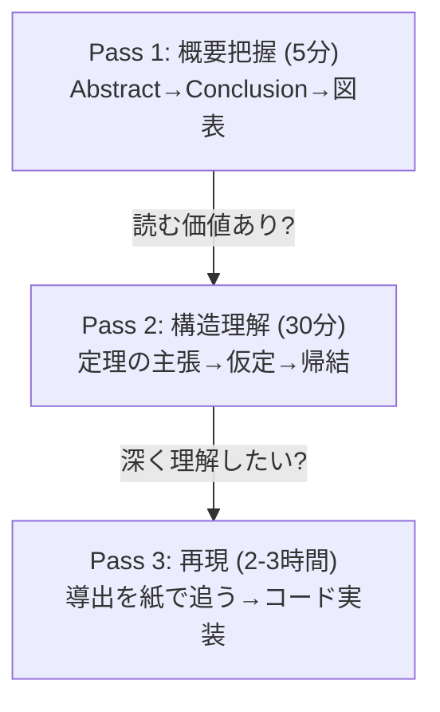
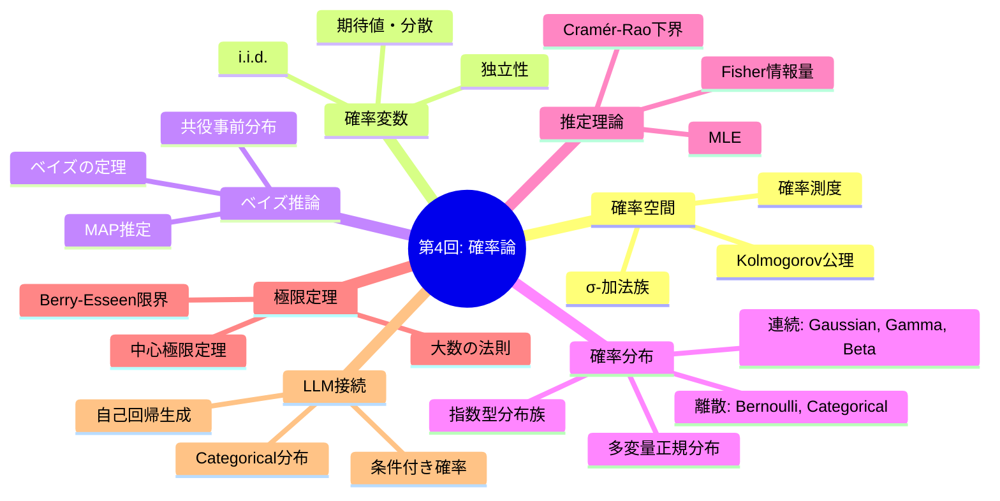

## 💻 4. 実装ゾーン（45分）— 確率論をコードに焼きつける

### 4.1 環境セットアップ

```bash
# Python 3.10+ recommended
pip install numpy scipy matplotlib
```

本講義はPython 100%。NumPyとSciPyのみ使用する。PyTorchは不要だ。

### 4.2 確率分布サンプリングの実装パターン

NumPyとSciPyの確率分布関数を体系的に整理する。

```python
import numpy as np
from scipy import stats

# Sampling, PDF/PMF, CDF, Quantile (PPF) for major distributions
distributions = {
    "Bernoulli(0.7)":     (stats.bernoulli(0.7), "discrete"),
    "Binomial(20,0.3)":   (stats.binom(20, 0.3), "discrete"),
    "Poisson(5)":         (stats.poisson(5), "discrete"),
    "Normal(0,1)":        (stats.norm(0, 1), "continuous"),
    "Gamma(3,2)":         (stats.gamma(3, scale=0.5), "continuous"),
    "Beta(2,5)":          (stats.beta(2, 5), "continuous"),
    "Exponential(2)":     (stats.expon(scale=0.5), "continuous"),
}

print(f"{'Distribution':<22} {'Mean':>8} {'Var':>8} {'Median':>8} {'Entropy':>8}")
print("-" * 58)
for name, (dist, dtype) in distributions.items():
    mean = dist.mean()
    var = dist.var()
    median = dist.median()
    entropy = dist.entropy()
    print(f"{name:<22} {mean:>8.3f} {var:>8.3f} {median:>8.3f} {entropy:>8.3f}")

# Important: scipy vs numpy interface
print("\n=== Sampling Interface Comparison ===")
print("NumPy:  np.random.normal(mu, sigma, N)  → array of samples")
print("SciPy:  stats.norm(mu, sigma).rvs(N)     → array of samples")
print("SciPy:  stats.norm(mu, sigma).pdf(x)     → density at x")
print("SciPy:  stats.norm(mu, sigma).cdf(x)     → P(X ≤ x)")
print("SciPy:  stats.norm(mu, sigma).ppf(q)     → quantile (inverse CDF)")
print("SciPy:  stats.norm(mu, sigma).logpdf(x)  → log density (MLE用)")
```

### 4.3 LaTeX確率記法チートシート

数式で書く↔論文で読む、を高速に切り替えるための対応表。

| 数式 | LaTeX | 読み | Python |
|:-----|:------|:-----|:-------|
| $P(A)$ | `P(A)` | ピー エー | `p_a` |
| $P(A \mid B)$ | `P(A \mid B)` | ピー エー ギブン ビー | `p_a_given_b` |
| $\mathbb{E}[X]$ | `\mathbb{E}[X]` | イー エックス | `x.mean()` |
| $\text{Var}(X)$ | `\text{Var}(X)` | バリアンス エックス | `x.var()` |
| $\mathcal{N}(\mu, \sigma^2)$ | `\mathcal{N}(\mu, \sigma^2)` | ノーマル ミュー シグマ二乗 | `np.random.normal(mu, sigma)` |
| $\sim$ | `\sim` | したがう / 分布する | sampling |
| $\overset{\text{i.i.d.}}{\sim}$ | `\overset{\text{i.i.d.}}{\sim}` | 独立同分布にしたがう | `for` loop sampling |
| $\propto$ | `\propto` | 比例する | unnormalized |
| $\prod_{i=1}^{N}$ | `\prod_{i=1}^{N}` | プロダクト | `np.prod()` |
| $\arg\max_\theta$ | `\arg\max_\theta` | アーグマックス シータ | `theta[np.argmax(...)]` |

### 4.4 論文読解の実践 — 3パスリーディング

確率論の論文を読むための体系的アプローチ。



**Pass 1 テンプレート** — 確率論の論文に特化:

```python
paper_pass1 = {
    "title": "",
    "authors": "",
    "year": "",
    "venue": "",
    # Probability-specific fields
    "distributions_used": [],       # e.g., ["Gaussian", "Categorical", "Dirichlet"]
    "key_assumptions": [],          # e.g., ["i.i.d.", "compact support", "finite variance"]
    "estimation_method": "",        # e.g., "MLE", "Bayesian", "Variational"
    "main_theorem": "",             # one-sentence statement
    "convergence_rate": "",         # e.g., "O(1/√N)", "exponential"
    "experiments": "",
    "relevance_to_generative": "",  # connection to VAE/GAN/Diffusion
    "read_further": True,           # proceed to Pass 2?
}
```

### 4.5 数式→コード翻訳パターン

確率論に特化した7つの翻訳パターン。

**パターン1: 確率密度関数（PDF）**

$$
f(x; \theta) = \text{formula}
$$

```python
def pdf(x: np.ndarray, theta: float) -> np.ndarray:
    """Direct translation of mathematical formula."""
    return formula(x, theta)
```

**パターン2: 期待値のMonte Carlo近似**

$$
\mathbb{E}_{p(x)}[g(x)] = \int g(x) p(x) dx \approx \frac{1}{N}\sum_{i=1}^{N} g(x_i), \quad x_i \sim p(x)
$$

```python
samples = np.random.distribution(params, size=N)  # x_i ~ p(x)
expectation = np.mean(g(samples))                  # (1/N) Σ g(x_i)
```

**パターン3: 尤度と対数尤度**

$$
\ell(\theta) = \sum_{i=1}^{N} \log p(x_i; \theta)
$$

```python
def log_likelihood(data: np.ndarray, theta: float) -> float:
    return np.sum(np.log(pdf(data, theta) + 1e-10))  # +ε for numerical stability
```

**パターン4: ベイズ更新**

$$
p(\theta \mid \mathcal{D}) \propto p(\mathcal{D} \mid \theta) \cdot p(\theta)
$$

```python
# Grid approximation
theta_grid = np.linspace(0, 1, 1000)
prior = prior_pdf(theta_grid)
likelihood = np.prod([pdf(x, theta_grid) for x in data], axis=0)
posterior = likelihood * prior
posterior /= np.trapz(posterior, theta_grid)  # normalize
```

**パターン5: MLE via 数値最適化**

$$
\hat{\theta} = \arg\max_\theta \ell(\theta)
$$

```python
from scipy.optimize import minimize_scalar
result = minimize_scalar(lambda t: -log_likelihood(data, t), bounds=(0, 10), method='bounded')
theta_mle = result.x
```

**パターン6: 条件付き分布の計算**

$$
p(y \mid x) = \frac{p(x, y)}{p(x)} = \frac{p(x, y)}{\sum_y p(x, y)}
$$

```python
joint = compute_joint(x, y)           # P(X, Y)
marginal_x = joint.sum(axis=1)        # P(X) = Σ_y P(X,y)
conditional = joint / marginal_x[:, None]  # P(Y|X)
```

**パターン7: サンプリングと経験分布**

$$
\hat{p}(x) = \frac{1}{N}\sum_{i=1}^{N} \delta(x - x_i)
$$

```python
samples = np.random.distribution(params, size=N)
# Empirical distribution via histogram
counts, bin_edges = np.histogram(samples, bins=50, density=True)
```

:::details 全翻訳パターン対応表
| 数学的概念 | 数式 | NumPyコード |
|:----------|:-----|:-----------|
| 期待値 | $\mathbb{E}[X]$ | `samples.mean()` |
| 分散 | $\text{Var}(X)$ | `samples.var()` |
| 共分散行列 | $\boldsymbol{\Sigma}$ | `np.cov(data.T)` |
| 精度行列 | $\boldsymbol{\Lambda} = \boldsymbol{\Sigma}^{-1}$ | `np.linalg.inv(cov)` |
| Mahalanobis距離 | $(\mathbf{x}-\boldsymbol{\mu})^\top\boldsymbol{\Sigma}^{-1}(\mathbf{x}-\boldsymbol{\mu})$ | `(x-mu) @ inv_cov @ (x-mu)` |
| 対数尤度 | $\sum_i \log p(x_i;\theta)$ | `np.sum(np.log(pdf(data, theta)))` |
| Softmax | $\frac{e^{x_i}}{\sum_j e^{x_j}}$ | `np.exp(x-x.max()) / np.exp(x-x.max()).sum()` |
| KL divergence | $\sum_i p_i \log(p_i/q_i)$ | `np.sum(p * np.log(p/q))` |
| サンプリング | $x \sim \mathcal{N}(\mu,\sigma^2)$ | `np.random.normal(mu, sigma, N)` |
| 条件付き確率 | $P(A \mid B)$ | `p_ab / p_b` |
:::

### 4.6 実装演習: ガウス混合モデル（GMM）のMLE

第8回（EM算法）への橋渡しとして、2成分GMMのフィッティングを実装する。ここではEM算法の前段階として、単一ガウスのMLEを拡張する形で問題の困難さを体感する。

```python
import numpy as np

# Generate data from a 2-component Gaussian mixture
np.random.seed(42)
N = 1000
# True parameters
pi_true = 0.4  # mixing weight
mu1_true, sigma1_true = -2.0, 0.8
mu2_true, sigma2_true = 3.0, 1.2

# Sample
component = np.random.binomial(1, 1 - pi_true, N)
data = np.where(component == 0,
                np.random.normal(mu1_true, sigma1_true, N),
                np.random.normal(mu2_true, sigma2_true, N))

print(f"Generated {N} samples from GMM")
print(f"True: π={pi_true}, μ₁={mu1_true}, σ₁={sigma1_true}, μ₂={mu2_true}, σ₂={sigma2_true}")

# Single Gaussian MLE (wrong model)
mu_single = data.mean()
sigma_single = data.std()
print(f"\nSingle Gaussian MLE: μ={mu_single:.3f}, σ={sigma_single:.3f}")
print("→ Clearly wrong! The data has two modes.")

# GMM log-likelihood (for given parameters)
def gmm_log_likelihood(data, pi, mu1, sig1, mu2, sig2):
    """Log-likelihood of 2-component GMM.

    corresponds to: L = Σᵢ log[π N(xᵢ|μ₁,σ₁²) + (1-π) N(xᵢ|μ₂,σ₂²)]
    """
    from scipy.stats import norm
    ll = np.sum(np.log(
        pi * norm.pdf(data, mu1, sig1) +
        (1 - pi) * norm.pdf(data, mu2, sig2) + 1e-10
    ))
    return ll

# Evaluate at true parameters vs single Gaussian
from scipy.stats import norm
ll_true = gmm_log_likelihood(data, pi_true, mu1_true, sigma1_true, mu2_true, sigma2_true)
ll_single = np.sum(np.log(norm.pdf(data, mu_single, sigma_single) + 1e-10))
print(f"\nLog-likelihood (true GMM params):  {ll_true:.2f}")
print(f"Log-likelihood (single Gaussian):  {ll_single:.2f}")
print(f"Difference: {ll_true - ll_single:.2f} (GMM is much better)")

# The challenge: MLE for GMM has no closed-form solution
# ∂L/∂μ₁ involves the "responsibility" γ which depends on all parameters
# → EM algorithm (Lecture 8) solves this iteratively
print("\n→ GMM MLE has no closed-form solution.")
print("→ The EM algorithm (第8回) iteratively maximizes the likelihood.")
print("→ Each E-step computes 'responsibilities', each M-step updates parameters.")
```

**なぜGMMのMLEは閉じた形で解けないのか**: 対数尤度の中に**和の対数** $\log[\pi \mathcal{N}(x \mid \mu_1, \sigma_1^2) + (1-\pi)\mathcal{N}(x \mid \mu_2, \sigma_2^2)]$ が現れる。対数と和の順序を入れ替えられないため、微分しても各パラメータが互いに絡み合う。この困難が第8回のEM算法の動機だ。

### 4.7 実装演習: ベイズ推論のグリッド近似

```python
import numpy as np

def bayesian_grid_inference(data: np.ndarray, prior_a: float = 1.0, prior_b: float = 1.0,
                             n_grid: int = 10000):
    """Bayesian inference for Bernoulli parameter using grid approximation.

    Prior: Beta(a, b)
    Likelihood: Bernoulli(θ)
    Posterior ∝ θ^(a+h-1) (1-θ)^(b+t-1)

    Also computes posterior analytically for comparison.
    """
    theta_grid = np.linspace(0.001, 0.999, n_grid)
    heads = data.sum()
    tails = len(data) - heads

    # Prior: Beta(a, b)
    from math import gamma as gamma_fn
    B = gamma_fn(prior_a) * gamma_fn(prior_b) / gamma_fn(prior_a + prior_b)
    prior = theta_grid**(prior_a - 1) * (1 - theta_grid)**(prior_b - 1) / B

    # Likelihood: Bernoulli
    log_lik = heads * np.log(theta_grid) + tails * np.log(1 - theta_grid)
    likelihood = np.exp(log_lik - log_lik.max())  # numerical stability

    # Posterior ∝ Likelihood × Prior
    posterior_unnorm = likelihood * prior
    posterior = posterior_unnorm / np.trapz(posterior_unnorm, theta_grid)

    # Analytical posterior: Beta(a+h, b+t)
    post_a = prior_a + heads
    post_b = prior_b + tails
    B_post = gamma_fn(post_a) * gamma_fn(post_b) / gamma_fn(post_a + post_b)
    posterior_analytic = theta_grid**(post_a - 1) * (1 - theta_grid)**(post_b - 1) / B_post

    # Summary statistics
    dx = theta_grid[1] - theta_grid[0]
    mean_grid = np.sum(theta_grid * posterior) * dx
    mean_analytic = post_a / (post_a + post_b)
    mle = heads / len(data) if len(data) > 0 else 0.5

    print(f"Data: {int(heads)}H / {int(tails)}T (N={len(data)})")
    print(f"Prior: Beta({prior_a}, {prior_b})")
    print(f"Posterior: Beta({post_a}, {post_b})")
    print(f"  Grid mean:      {mean_grid:.4f}")
    print(f"  Analytic mean:  {mean_analytic:.4f}")
    print(f"  MLE:            {mle:.4f}")
    print(f"  MAP:            {(post_a-1)/(post_a+post_b-2):.4f}" if post_a > 1 and post_b > 1 else "")

# Experiment with different data sizes and priors
np.random.seed(42)
true_theta = 0.7

print("=== Effect of Data Size ===\n")
for N in [5, 20, 100]:
    data = np.random.binomial(1, true_theta, N)
    bayesian_grid_inference(data)
    print()

print("=== Effect of Prior ===\n")
data_small = np.random.binomial(1, true_theta, 10)
for a, b, name in [(1, 1, "Uniform"), (0.5, 0.5, "Jeffreys"), (10, 3, "Strong prior θ≈0.77"), (1, 10, "Wrong prior θ≈0.09")]:
    print(f"--- {name} prior ---")
    bayesian_grid_inference(data_small, a, b)
    print()
```

:::message
**実装の教訓**: データが増えるほど、事前分布の影響は薄れ、ベイズ推定はMLEに近づく。これは事後分布が「尤度に支配される」ため。逆に、データが少ないときは事前分布が結果を大きく左右する。

この現象を「事後一致性（posterior consistency）」と呼ぶ。$N \to \infty$ で事後分布は真のパラメータに集中する — 大数の法則のベイズ版だ。
:::

### 4.8 モーメント母関数と特性関数

**モーメント母関数（MGF）**: $M_X(t) = \mathbb{E}[e^{tX}]$

MGFの $k$ 次微分は $k$ 次モーメントを与える: $M_X^{(k)}(0) = \mathbb{E}[X^k]$

```python
import numpy as np

# MGF of Gaussian N(μ, σ²): M(t) = exp(μt + σ²t²/2)
mu, sigma = 2.0, 1.5

def gaussian_mgf(t: float, mu: float, sigma: float) -> float:
    """M(t) = exp(μt + σ²t²/2)"""
    return np.exp(mu * t + sigma**2 * t**2 / 2)

# Verify moments via numerical differentiation
dt = 1e-5
M0 = gaussian_mgf(0, mu, sigma)
M1 = (gaussian_mgf(dt, mu, sigma) - gaussian_mgf(-dt, mu, sigma)) / (2 * dt)
M2 = (gaussian_mgf(dt, mu, sigma) - 2*M0 + gaussian_mgf(-dt, mu, sigma)) / dt**2

print(f"Gaussian N({mu}, {sigma**2})")
print(f"E[X]  = M'(0) = {M1:.4f}  (theory: {mu})")
print(f"E[X²] = M''(0) = {M2:.4f} (theory: {mu**2 + sigma**2:.4f})")
print(f"Var(X) = E[X²] - E[X]² = {M2 - M1**2:.4f} (theory: {sigma**2:.4f})")

# Monte Carlo verification
samples = np.random.normal(mu, sigma, 100000)
print(f"\nMonte Carlo: E[X]={samples.mean():.4f}, E[X²]={np.mean(samples**2):.4f}, Var={samples.var():.4f}")
```

MGFが存在しない分布もある（Cauchy分布など）。その場合は**特性関数** $\varphi_X(t) = \mathbb{E}[e^{itX}]$ を使う。特性関数は常に存在し、分布を一意に決定する。CLTの証明はしばしば特性関数を用いて行われる。

:::message
**進捗: 70% 完了** 環境セットアップ、LaTeX記法、論文読解の3パス、数式→コード翻訳7パターン、GMM・ベイズ推論の実装、MGFまで完了。Zone 4 クリア。
:::

---

## 🔬 5. 実験ゾーン（30分）— 自己診断テスト

### 5.1 記号読解テスト

以下の数式を日本語で読み上げ、各記号の意味を説明せよ。

:::details Q1: $X \sim \mathcal{N}(\mu, \sigma^2)$
**読み**: 「確率変数エックスは正規分布ミュー シグマ二乗にしたがう」
- $X$: 確率変数
- $\sim$: 「にしたがう」— 確率分布に従うことを示す記号
- $\mathcal{N}$: 正規分布（ガウス分布）
- $\mu$: 平均（ミュー）
- $\sigma^2$: 分散（シグマの二乗）
:::

:::details Q2: $P(A \mid B) = \frac{P(B \mid A) P(A)}{P(B)}$
**読み**: 「ピー エー ギブン ビー イコール ピー ビー ギブン エー かける ピー エー わる ピー ビー」
- これはベイズの定理 [^1]
- $P(A \mid B)$: 事後確率 — $B$ が起きた下での $A$ の確率
- $P(B \mid A)$: 尤度 — $A$ が真のときに $B$ が観測される確率
- $P(A)$: 事前確率 — $B$ を見る前の $A$ の確率
- $P(B)$: エビデンス — $B$ の周辺確率
:::

:::details Q3: $\hat{\theta}_{\text{MLE}} = \arg\max_\theta \sum_{i=1}^{N} \log p(x_i; \theta)$
**読み**: 「シータハットMLE イコール アーグマックス シータ シグマ アイ イコール 1 から エヌ ログ ピー エックスアイ セミコロン シータ」
- $\hat{\theta}_{\text{MLE}}$: 最尤推定量（ハットは「推定量」の印）
- $\arg\max_\theta$: $\theta$ を動かして最大にする値
- $\sum_{i=1}^{N}$: $N$ 個のデータについての和
- $\log p(x_i; \theta)$: $i$ 番目のデータの対数尤度
- セミコロン ;: $x_i$ はデータ（固定）、$\theta$ はパラメータ（変数）を区別
:::

:::details Q4: $I(\theta) = -\mathbb{E}\left[\nabla_\theta^2 \log p(\mathbf{x}; \theta)\right]$
**読み**: 「アイ シータ イコール マイナス イー ナブラシータ二乗 ログ ピー エックス セミコロン シータ」
- $I(\theta)$: Fisher情報量（行列）[^8]
- $-\mathbb{E}[\cdot]$: 期待値のマイナス
- $\nabla_\theta^2$: $\theta$ に関するヘシアン（2次微分）
- 直感: 対数尤度の曲率の期待値。曲率が大きい = データがパラメータについて情報を多く持つ
:::

:::details Q5: $\sqrt{N}(\bar{X}_N - \mu) \xrightarrow{d} \mathcal{N}(0, \sigma^2)$
**読み**: 「ルートエヌ かける エックスバーエヌ マイナス ミュー は 分布収束で ノーマル ゼロ シグマ二乗 に収束する」
- $\bar{X}_N = \frac{1}{N}\sum_{i=1}^{N}X_i$: 標本平均
- $\xrightarrow{d}$: 分布収束（distribution convergence）
- これは中心極限定理（CLT）の表現
- $\sqrt{N}$ でスケーリングすることで、分散が一定のまま分布形状がガウスに近づく
:::

:::details Q6: $p(\mathbf{x}) = \prod_{t=1}^{T} p(x_t \mid x_{<t})$
**読み**: 「ピー エックス イコール プロダクト ティー イコール 1 から ティー ピー エックスティー ギブン エックス レスザン ティー」
- $p(\mathbf{x})$: シーケンス全体の同時確率
- $\prod_{t=1}^{T}$: 時刻1からTまでの積
- $p(x_t \mid x_{<t})$: 過去のトークン列を条件とした $x_t$ の条件付き確率
- これは確率の連鎖規則。LLMの自己回帰生成の数学的基盤 [^5]
:::

:::details Q7: $\text{Var}(\hat{\theta}) \geq \frac{1}{N \cdot I(\theta)}$
**読み**: 「バリアンス シータハット は 1 わる エヌ アイ シータ 以上」
- これはCramér-Rao下界 [^8]
- どんな不偏推定量でも、分散はFisher情報量の逆数以下にはならない
- $N$ が増えると下界は小さくなる = より精密な推定が可能
:::

:::details Q8: $p(\mathbf{x} \mid \boldsymbol{\eta}) = h(\mathbf{x}) \exp(\boldsymbol{\eta}^\top \mathbf{T}(\mathbf{x}) - A(\boldsymbol{\eta}))$
**読み**: 「ピー エックス ギブン イータ イコール エイチ エックス かける エクスポネンシャル イータ トランスポーズ ティー エックス マイナス エー イータ」
- これは指数型分布族の標準形
- $\boldsymbol{\eta}$: 自然パラメータ（イータ）
- $\mathbf{T}(\mathbf{x})$: 十分統計量
- $A(\boldsymbol{\eta})$: 対数正規化定数（対数分配関数）
- $h(\mathbf{x})$: 基底測度
:::

:::details Q9: $q_\phi(\mathbf{z} \mid \mathbf{x}) = \mathcal{N}(\boldsymbol{\mu}_\phi(\mathbf{x}), \text{diag}(\boldsymbol{\sigma}^2_\phi(\mathbf{x})))$
**読み**: 「キュー ファイ ゼット ギブン エックス イコール ノーマル ミューファイ エックス ダイアグ シグマファイ二乗 エックス」
- $q_\phi$: 変分近似分布（パラメータ $\phi$ のNN）[^2]
- $\mathbf{z}$: 潜在変数
- $\boldsymbol{\mu}_\phi(\mathbf{x})$: NNが出力する平均ベクトル
- $\text{diag}(\boldsymbol{\sigma}^2_\phi(\mathbf{x}))$: NNが出力する対角共分散行列
- これはVAEのエンコーダ出力。第10回で完全導出。
:::

:::details Q10: $\mathcal{L}(\theta) = -\frac{1}{T}\sum_{t=1}^{T} \log p_\theta(x_t \mid x_{<t})$
**読み**: 「エル シータ イコール マイナス ティーぶんのイチ シグマ ティー イコール 1 から ティー ログ ピーシータ エックスティー ギブン エックスレスザンティー」
- これはLLMのCross-Entropy Loss（第1回で導入）
- $-\log p_\theta(x_t \mid x_{<t})$: 正解トークンの負の対数確率
- $\frac{1}{T}\sum_{t=1}^{T}$: シーケンス全体の平均
- Perplexity $= \exp(\mathcal{L})$ は「実効的な選択肢数」
:::

### 5.2 LaTeX記述テスト

以下の数式をLaTeXで記述せよ。

:::details Q1: ガウス分布のPDF
```latex
f(x \mid \mu, \sigma^2) = \frac{1}{\sqrt{2\pi\sigma^2}} \exp\left(-\frac{(x-\mu)^2}{2\sigma^2}\right)
```
:::

:::details Q2: ベイズの定理（連続版）
```latex
p(\theta \mid \mathcal{D}) = \frac{p(\mathcal{D} \mid \theta) p(\theta)}{p(\mathcal{D})}
= \frac{p(\mathcal{D} \mid \theta) p(\theta)}{\int p(\mathcal{D} \mid \theta') p(\theta') d\theta'}
```
:::

:::details Q3: 中心極限定理
```latex
\frac{\bar{X}_N - \mu}{\sigma / \sqrt{N}} \xrightarrow{d} \mathcal{N}(0, 1)
\quad \text{as } N \to \infty
```
:::

:::details Q4: 指数型分布族
```latex
p(\mathbf{x} \mid \boldsymbol{\eta}) = h(\mathbf{x}) \exp\left(\boldsymbol{\eta}^\top \mathbf{T}(\mathbf{x}) - A(\boldsymbol{\eta})\right)
```
:::

:::details Q5: Fisher情報量とCramér-Rao下界
```latex
I(\theta) = \mathbb{E}\left[\left(\frac{\partial}{\partial \theta} \log p(X; \theta)\right)^2\right],
\quad \text{Var}(\hat{\theta}) \geq \frac{1}{n I(\theta)}
```
:::

### 5.3 コード翻訳テスト

:::details Q1: 条件付き確率の計算
数式: $P(Y=1 \mid X=0) = \frac{P(X=0, Y=1)}{P(X=0)} = \frac{P(X=0, Y=1)}{\sum_y P(X=0, Y=y)}$

```python
joint = np.array([[0.3, 0.1], [0.2, 0.4]])  # P(X,Y)
p_y1_given_x0 = joint[0, 1] / joint[0, :].sum()
print(f"P(Y=1|X=0) = {p_y1_given_x0:.4f}")
# Expected: 0.1 / (0.3 + 0.1) = 0.25
```
:::

:::details Q2: MLE for Poisson distribution
数式: $\hat{\lambda}_{\text{MLE}} = \bar{x} = \frac{1}{N}\sum_{i=1}^{N} x_i$

```python
data = np.random.poisson(lam=4.5, size=1000)
lambda_mle = data.mean()
print(f"λ_MLE = {lambda_mle:.4f} (true: 4.5)")
```
:::

:::details Q3: 2D Gaussian sampling and Mahalanobis distance
数式: $d_M(\mathbf{x}) = \sqrt{(\mathbf{x}-\boldsymbol{\mu})^\top \boldsymbol{\Sigma}^{-1} (\mathbf{x}-\boldsymbol{\mu})}$

```python
mu = np.array([1.0, 2.0])
Sigma = np.array([[2.0, 0.8], [0.8, 1.0]])
Sigma_inv = np.linalg.inv(Sigma)

x = np.array([3.0, 4.0])
diff = x - mu
d_mahal = np.sqrt(diff @ Sigma_inv @ diff)
d_euclid = np.linalg.norm(diff)
print(f"Mahalanobis: {d_mahal:.4f}, Euclidean: {d_euclid:.4f}")
```
:::

:::details Q4: CLT verification — exponential distribution
数式: $X_i \sim \text{Exp}(\lambda)$, $\mathbb{E}[X_i] = 1/\lambda$, $\text{Var}(X_i) = 1/\lambda^2$

```python
lam = 2.0
N = 100
n_experiments = 50000

means = np.array([np.random.exponential(1/lam, N).mean() for _ in range(n_experiments)])
standardized = (means - 1/lam) / (1/(lam * np.sqrt(N)))
print(f"Standardized mean: {standardized.mean():.4f} (should ≈ 0)")
print(f"Standardized std:  {standardized.std():.4f} (should ≈ 1)")
```
:::

:::details Q5: Beta-Bernoulli conjugate update
数式: Prior $\text{Beta}(\alpha, \beta)$ + Data $(h, t)$ → Posterior $\text{Beta}(\alpha+h, \beta+t)$

```python
alpha, beta = 2.0, 5.0  # prior: we think θ is low
data = np.array([1, 1, 1, 0, 1, 1, 0, 1, 1, 1])  # 8 heads, 2 tails
h, t = data.sum(), len(data) - data.sum()
post_a, post_b = alpha + h, beta + t
print(f"Prior mean: {alpha/(alpha+beta):.3f}")
print(f"Posterior mean: {post_a/(post_a+post_b):.3f}")
print(f"MLE: {h/len(data):.3f}")
# Posterior is pulled between prior and MLE
```
:::

### 5.4 論文読解テスト

以下のVAE論文 [^2] のAbstractから確率論の要素を抽出せよ。

:::details VAE原論文 Pass 1
**Kingma & Welling (2013). "Auto-Encoding Variational Bayes"**

確率論的要素の抽出:
1. **潜在変数**: $\mathbf{z}$ — 観測されない確率変数
2. **生成モデル**: $p_\theta(\mathbf{x} \mid \mathbf{z})$ — 条件付き分布（デコーダ）
3. **事前分布**: $p(\mathbf{z}) = \mathcal{N}(\mathbf{0}, \mathbf{I})$ — 標準正規分布
4. **事後分布**: $p_\theta(\mathbf{z} \mid \mathbf{x})$ — ベイズの定理で得られるが計算困難
5. **変分近似**: $q_\phi(\mathbf{z} \mid \mathbf{x})$ — 事後分布の近似（エンコーダ）
6. **ELBO**: $\mathcal{L}(\theta, \phi; \mathbf{x}) = \mathbb{E}_{q_\phi}[\log p_\theta(\mathbf{x} \mid \mathbf{z})] - D_{KL}[q_\phi(\mathbf{z} \mid \mathbf{x}) \| p(\mathbf{z})]$
7. **MLE**: ELBOの最大化は周辺尤度 $\log p_\theta(\mathbf{x})$ の下界を最大化
8. **Reparameterization trick**: $\mathbf{z} = \boldsymbol{\mu} + \boldsymbol{\sigma} \odot \boldsymbol{\epsilon}$, $\boldsymbol{\epsilon} \sim \mathcal{N}(\mathbf{0}, \mathbf{I})$

本講義で学んだ全ての道具が使われている。
:::

### 5.5 実装チャレンジ

**Challenge 1**: ベイズ推論の可視化

```python
import numpy as np

def bayesian_sequential_visualization(true_p: float, n_obs: int, prior_a: float = 1, prior_b: float = 1):
    """Visualize sequential Bayesian updating via summary statistics."""
    np.random.seed(42)
    a, b = prior_a, prior_b

    print(f"True θ = {true_p}")
    print(f"{'Obs':>4} {'Data':>5} {'Post Mean':>10} {'Post Std':>10} {'95% CI':>20} {'MLE':>8}")
    print("-" * 65)

    heads_total, tails_total = 0, 0
    for i in range(1, n_obs + 1):
        x = np.random.binomial(1, true_p)
        heads_total += x
        tails_total += (1 - x)
        a_new = prior_a + heads_total
        b_new = prior_b + tails_total
        mean = a_new / (a_new + b_new)
        std = np.sqrt(a_new * b_new / ((a_new + b_new)**2 * (a_new + b_new + 1)))
        # 95% credible interval (approximate via normal)
        ci_low = max(0, mean - 1.96 * std)
        ci_high = min(1, mean + 1.96 * std)
        mle = heads_total / i
        if i <= 10 or i % 10 == 0 or i == n_obs:
            print(f"{i:>4} {'H' if x else 'T':>5} {mean:>10.4f} {std:>10.4f} "
                  f"[{ci_low:.3f}, {ci_high:.3f}]{' ':>4} {mle:>8.4f}")

bayesian_sequential_visualization(0.65, 100)
```

**Challenge 2**: Fisher情報量の数値計算

```python
import numpy as np

def numerical_fisher_information(log_pdf_fn, theta: float, n_samples: int = 100000, dt: float = 1e-5):
    """Numerically compute Fisher information.

    I(θ) = E[(d/dθ log p(x;θ))²]

    Uses score function variance and Hessian methods, compares both.
    """
    # Method 1: Score function variance
    # Sample from p(x; θ) — need a sampler
    # For Bernoulli: x ~ Bernoulli(θ)
    samples = np.random.binomial(1, theta, n_samples).astype(float)

    # Score: d/dθ log p(x; θ) = x/θ - (1-x)/(1-θ)
    scores = samples / theta - (1 - samples) / (1 - theta)
    I_score = np.mean(scores**2)

    # Method 2: Negative expected Hessian
    # d²/dθ² log p(x; θ) = -x/θ² - (1-x)/(1-θ)²
    hessians = -samples / theta**2 - (1 - samples) / (1 - theta)**2
    I_hessian = -np.mean(hessians)

    # Theory: I(θ) = 1/(θ(1-θ))
    I_theory = 1 / (theta * (1 - theta))

    print(f"θ = {theta}")
    print(f"  Score variance:  I = {I_score:.4f}")
    print(f"  Negative Hessian: I = {I_hessian:.4f}")
    print(f"  Theory:          I = {I_theory:.4f}")
    return I_score, I_hessian, I_theory

print("=== Numerical Fisher Information for Bernoulli ===\n")
for theta in [0.1, 0.3, 0.5, 0.7, 0.9]:
    numerical_fisher_information(None, theta)
    print()
```

### 5.6 実装チャレンジ3: MLE比較 — 分布の当てはめ

```python
import numpy as np
from scipy.stats import norm, expon, gamma as gamma_dist

def fit_and_compare(data: np.ndarray):
    """Fit multiple distributions to data and compare log-likelihoods."""
    results = []

    # Gaussian MLE
    mu, sigma = data.mean(), data.std()
    ll_gauss = np.sum(norm.logpdf(data, mu, sigma))
    results.append(("Gaussian", ll_gauss, f"μ={mu:.3f}, σ={sigma:.3f}"))

    # Exponential MLE (for positive data only)
    if data.min() > 0:
        lam = 1 / data.mean()
        ll_exp = np.sum(expon.logpdf(data, scale=1/lam))
        results.append(("Exponential", ll_exp, f"λ={lam:.3f}"))

    # Gamma MLE (method of moments)
    if data.min() > 0:
        mean_d = data.mean()
        var_d = data.var()
        alpha_hat = mean_d**2 / var_d
        beta_hat = mean_d / var_d
        ll_gamma = np.sum(gamma_dist.logpdf(data, alpha_hat, scale=1/beta_hat))
        results.append(("Gamma", ll_gamma, f"α={alpha_hat:.3f}, β={beta_hat:.3f}"))

    print(f"{'Distribution':<15} {'Log-Lik':>12} {'Parameters':<30}")
    print("-" * 60)
    for name, ll, params in sorted(results, key=lambda x: -x[1]):
        print(f"{name:<15} {ll:>12.2f} {params:<30}")
    print(f"\nBest fit: {sorted(results, key=lambda x: -x[1])[0][0]}")

# Test 1: Data from Gamma(3, 2)
np.random.seed(42)
data_gamma = np.random.gamma(3, 0.5, 500)  # shape=3, scale=0.5
print("=== Fitting data from Gamma(3, 0.5) ===\n")
fit_and_compare(data_gamma)

# Test 2: Data from mixture of Gaussians
data_mix = np.concatenate([
    np.random.normal(-2, 0.5, 300),
    np.random.normal(2, 0.8, 200)
])
print("\n=== Fitting data from Gaussian Mixture ===\n")
fit_and_compare(data_mix)
print("→ Single Gaussian is a bad fit for bimodal data!")
```

### 5.7 実装チャレンジ4: 確率変数の変換を可視化

```python
import numpy as np

def visualize_transform_stats(n_samples: int = 100000):
    """Demonstrate change of variables with various transformations."""
    np.random.seed(42)

    # Standard normal samples
    X = np.random.normal(0, 1, n_samples)

    transforms = [
        ("X²", lambda x: x**2, "Chi-squared(1)"),
        ("exp(X)", lambda x: np.exp(x), "Log-Normal(0,1)"),
        ("|X|", lambda x: np.abs(x), "Half-Normal"),
        ("Φ(X)", lambda x: norm.cdf(x), "Uniform(0,1)"),
        ("X³", lambda x: x**3, "Heavy-tailed"),
    ]

    from scipy.stats import norm as norm_dist

    print(f"{'Transform':<12} {'Mean':>8} {'Std':>8} {'Skew':>8} {'Kurt':>8} {'Min':>8} {'Max':>8}")
    print("-" * 60)

    for name, fn, desc in transforms:
        Y = fn(X)
        # Remove inf/nan for safety
        Y = Y[np.isfinite(Y)]
        mean = Y.mean()
        std = Y.std()
        skew = np.mean(((Y - mean) / std)**3)
        kurt = np.mean(((Y - mean) / std)**4) - 3  # excess kurtosis
        print(f"{name:<12} {mean:>8.4f} {std:>8.4f} {skew:>8.4f} {kurt:>8.4f} {Y.min():>8.4f} {Y.max():>8.2f}")

    print(f"\nKey insight: Φ(X) ~ Uniform(0,1) — the probability integral transform")
    print("This is the foundation of inverse transform sampling.")

visualize_transform_stats()
```

:::message
**確率積分変換**: $X \sim F$ のとき $F(X) \sim \text{Uniform}(0,1)$。逆に $U \sim \text{Uniform}(0,1)$ から $F^{-1}(U)$ で任意の分布をサンプリングできる。これが逆変換サンプリングの原理であり、Normalizing Flow（第25回）の理論的出発点でもある。
:::

### 5.8 実装チャレンジ5: 共分散行列の固有値分解と確率楕円

```python
import numpy as np

def probability_ellipse(mu: np.ndarray, Sigma: np.ndarray, n_samples: int = 5000):
    """Compute probability ellipse properties from covariance matrix."""
    # Eigendecomposition of Σ
    eigenvalues, eigenvectors = np.linalg.eigh(Sigma)

    print(f"μ = {mu}")
    print(f"Σ = \n{Sigma}")
    print(f"\nEigenvalues: {eigenvalues}")
    print(f"Eigenvectors:\n{eigenvectors}")

    # Ellipse axes: sqrt(eigenvalue) * chi2_quantile
    # For 95% confidence: chi2(2, 0.95) ≈ 5.991
    chi2_95 = 5.991
    axis_lengths = np.sqrt(eigenvalues * chi2_95)
    angle = np.arctan2(eigenvectors[1, 1], eigenvectors[0, 1]) * 180 / np.pi

    print(f"\n95% probability ellipse:")
    print(f"  Semi-axis 1: {axis_lengths[0]:.4f}")
    print(f"  Semi-axis 2: {axis_lengths[1]:.4f}")
    print(f"  Rotation angle: {angle:.1f}°")
    print(f"  Area: {np.pi * axis_lengths[0] * axis_lengths[1]:.4f}")

    # Verify with samples
    samples = np.random.multivariate_normal(mu, Sigma, n_samples)
    # Mahalanobis distance for each sample
    diff = samples - mu
    Sigma_inv = np.linalg.inv(Sigma)
    mahal_sq = np.sum(diff @ Sigma_inv * diff, axis=1)
    # Points inside 95% ellipse have mahal_sq < chi2_95
    inside_95 = (mahal_sq < chi2_95).mean()
    print(f"\n  Empirical coverage (95% ellipse): {inside_95:.1%}")

    # Correlation coefficient
    rho = Sigma[0, 1] / np.sqrt(Sigma[0, 0] * Sigma[1, 1])
    print(f"  Correlation: ρ = {rho:.4f}")

# Example: highly correlated 2D Gaussian
mu = np.array([1.0, 2.0])
Sigma = np.array([[2.0, 1.5],
                   [1.5, 3.0]])
probability_ellipse(mu, Sigma)
```

### 5.9 セルフチェックリスト

- [ ] 確率空間 $(\Omega, \mathcal{F}, P)$ の3要素を説明できる
- [ ] σ-加法族がなぜ必要か、直感的に説明できる
- [ ] 期待値の線形性を証明なしで使える
- [ ] ベイズの定理を導出し、事後∝尤度×事前と言える
- [ ] 共役事前分布の意味と主要な組み合わせを3つ以上挙げられる
- [ ] ガウス分布・ベルヌーイ分布・ポアソン分布のPDFを書ける
- [ ] 多変量正規分布の条件付き分布を導出できる
- [ ] 指数型分布族の標準形を書き、ガウスを当てはめられる
- [ ] MLEの導出手順（対数尤度→微分→0とおく）を実行できる
- [ ] Fisher情報量の定義と2つの表現を書ける
- [ ] Cramér-Rao下界を述べ、MLEの漸近有効性と接続できる
- [ ] CLTを述べ、なぜガウスが頻出するか説明できる
- [ ] LLMの損失関数を条件付き確率の連鎖規則で分解できる

:::message
**進捗: 85% 完了** 記号読解10問、LaTeX5問、コード翻訳5問、論文読解1問、実装チャレンジ2問をクリア。Zone 5 完了。
:::

---

## 🚀 6. 振り返りゾーン（30分）— まとめと次回予告

### 6.1 オンラインリソース

| リソース | URL | 特徴 |
|:---------|:----|:-----|
| 3Blue1Brown: Bayes | YouTube | 視覚的直感 |
| StatQuest | YouTube | 統計の基礎を丁寧に |
| MIT 18.650 | OCW | 数理統計の講義 |
| Stanford CS229 Notes | Web | ML視点の確率論 |

:::details 用語集 — 本講義の全用語

| 用語 | 英語 | 定義 |
|:-----|:-----|:-----|
| 確率空間 | Probability space | $(\Omega, \mathcal{F}, P)$ の三つ組 |
| σ-加法族 | σ-algebra | 補集合・可算合併で閉じた事象の族 |
| 確率測度 | Probability measure | $P: \mathcal{F} \to [0,1]$, $P(\Omega)=1$ |
| 確率変数 | Random variable | 可測関数 $X: \Omega \to \mathbb{R}$ |
| 期待値 | Expectation | $\mathbb{E}[X] = \int x \, dP$ |
| 分散 | Variance | $\text{Var}(X) = \mathbb{E}[(X-\mathbb{E}[X])^2]$ |
| 共分散 | Covariance | $\text{Cov}(X,Y) = \mathbb{E}[(X-\mu_X)(Y-\mu_Y)]$ |
| 条件付き確率 | Conditional probability | $P(A \mid B) = P(A \cap B)/P(B)$ |
| ベイズの定理 | Bayes' theorem | 事後∝尤度×事前 |
| 共役事前分布 | Conjugate prior | 事後と同じ分布族の事前分布 |
| 指数型分布族 | Exponential family | $p(x \mid \eta) = h(x)\exp(\eta^\top T(x) - A(\eta))$ |
| 十分統計量 | Sufficient statistic | データの全情報を保持する統計量 |
| 最尤推定 | MLE | $\hat{\theta} = \arg\max \sum \log p(x_i; \theta)$ |
| MAP推定 | MAP | MLE + 事前分布 |
| Fisher情報量 | Fisher information | $I(\theta) = \mathbb{E}[s(x;\theta)s(x;\theta)^\top]$ |
| Cramér-Rao下界 | Cramér-Rao bound | $\text{Var}(\hat{\theta}) \geq 1/(nI(\theta))$ |
| 大数の法則 | Law of large numbers | $\bar{X}_N \to \mu$ |
| 中心極限定理 | Central limit theorem | $\sqrt{N}(\bar{X}_N - \mu) \to \mathcal{N}(0,\sigma^2)$ |
| 独立同分布 | i.i.d. | 各データ点が同じ分布から独立にサンプル |
:::



:::message
**進捗: 90% 完了** 確率論の研究系譜、推薦書籍、オンラインリソース、用語集、知識マインドマップを網羅。Zone 6 クリア。
:::

---

### 6.2 本講義の核心 — 3つの持ち帰り

1. **確率は「わからなさ」の言語である。** 確率空間 $(\Omega, \mathcal{F}, P)$ という厳密な枠組みの上に、確率変数・期待値・条件付き確率が定義される。この言語なしに生成モデルは記述できない。

2. **ベイズの定理は「学習」の数式だ。** 事前分布（信念）+ 尤度（データ）→ 事後分布（更新された信念）。VAEのELBOも、LLMのファインチューニングも、この構造の変種だ。

3. **MLEは条件付きCategorical分布の最適化に帰着する。** LLMの学習は、各時刻 $t$ で $p(x_t \mid x_{<t})$ をCategorical分布としてMLE推定すること。本講義で学んだ全ての道具がここに集約される。

### 6.3 FAQ

:::details Q: ベイズと頻度主義、結局どちらが正しいのか？
「正しさ」の基準が異なる。頻度主義は「推定量の長期的振る舞い」（繰り返し実験）で評価し、ベイズは「現在の知識の下での確信度」で評価する。MLの文脈では:

- **MLE**（頻度主義寄り）: 計算が簡単、漸近的に最適、大データ向き
- **ベイズ推論**: 不確実性の定量化が自然、小データ向き、事前知識を活用可能

実用上は「どちらか一方」ではなく、問題に応じて使い分ける。VAEは変分ベイズ、LLMの損失関数はMLEだ。
:::

:::details Q: なぜ正規分布がこんなに頻出するのか？
3つの理由がある:

1. **中心極限定理**: 多数の独立な微小効果の和は正規分布に近づく
2. **最大エントロピー**: 平均と分散を固定したとき、エントロピー最大の分布が正規分布
3. **計算の都合**: 正規分布の積・和・条件付きが全て閉じた形になる

3つ目が実用上最も重要だ。GANの潜在空間 $\mathbf{z} \sim \mathcal{N}(\mathbf{0}, \mathbf{I})$ やVAEの事前分布も、計算の容易さが選択の主因だ。
:::

:::details Q: 指数型分布族は実際にどこで使うのか？
至る所で。

- **VAE**: エンコーダの出力はガウス分布（指数型分布族）のパラメータ
- **EBM**: $p(\mathbf{x}) = \frac{1}{Z}\exp(-E(\mathbf{x}))$ は指数型分布族の一般化
- **GLM**: 一般化線形モデルの応答分布は指数型分布族
- **Softmax**: Categorical分布は指数型分布族。LLMの出力分布そのもの

第27回（EBM）と第9回（変分推論）で本格的に活用する。
:::

:::details Q: Cramér-Rao下界を知って何の役に立つのか？
「この推定問題でこれ以上の精度は原理的に不可能」という限界を知ることができる。

- モデル設計: 推定量の分散がCR下界に近ければ、これ以上のデータは不要
- 実験計画: Fisher情報量が大きい実験条件を選ぶことで、少ないデータで精密な推定が可能
- 理論解析: NNの表現力とFisher情報量の関係は活発な研究分野
:::

:::details Q: 「確率密度関数の値が1を超える」のは間違いでは？
いいえ、正しい。PDFは確率ではない。確率は密度の**積分**で得られる:

$$
P(a \leq X \leq b) = \int_a^b f(x) dx
$$

$f(x)$ 自体は非負であればいくらでも大きくてよい。例えば $\mathcal{N}(0, 0.01)$ のピークは $f(0) = \frac{1}{\sqrt{2\pi \cdot 0.01}} \approx 3.99$ で、1を大きく超える。積分すると必ず1になるが、密度値が1を超えること自体は何の問題もない。

```python
import numpy as np
sigma = 0.1
peak = 1 / np.sqrt(2 * np.pi * sigma**2)
print(f"N(0, {sigma**2}) peak density: {peak:.4f} >> 1.0")
print("But ∫f(x)dx = 1.0 always!")
```
:::

:::details Q: Multinomial分布とCategorical分布の違いは？
Categorical分布は「サイコロを1回振る」: $x \in \{1, \ldots, K\}$, $P(x=k) = \pi_k$。

Multinomial分布は「サイコロを $n$ 回振って、各面の出た回数を記録する」: $(c_1, \ldots, c_K) \sim \text{Multi}(n, \boldsymbol{\pi})$, $\sum_k c_k = n$。

LLMの文脈では:
- 1トークンの予測 = Categorical分布
- バッチ内の全トークン予測の統計 = Multinomial分布

Categorical = Multinomial($n=1$, $\boldsymbol{\pi}$) だ。
:::

:::details Q: この確率論の知識は第5回（測度論）でどう拡張されるのか？
本講義では「確率密度関数 $f(x)$ が存在する」と暗黙に仮定した。だが:

- 離散と連続が混じった分布は？
- $\mathbb{R}^d$ 上の全ての部分集合に確率を定義できるか？
- 「ほとんど確実に」とは何か？

第5回では測度論の言葉で $f(x) = \frac{dP}{d\lambda}$ （Radon-Nikodym導関数）として密度関数を厳密に定義する。さらに確率過程（Markov連鎖、Brown運動）を導入し、拡散モデルのSDE定式化への橋渡しを行う。
:::

### 6.4 確率論でよくある「罠」

:::details 罠1: P(A|B) ≠ P(B|A) — 条件の逆転
「雨のとき傘を持つ確率90%」と「傘を持っているとき雨の確率」は全く違う。ベイズの定理なしにこの2つを混同するのが「検察官の誤謬」だ。DNA鑑定で「一致した = 犯人」と結論するのは $P(\text{一致} \mid \text{犯人})$ と $P(\text{犯人} \mid \text{一致})$ の混同。
:::

:::details 罠2: 独立と無相関は違う
無相関: $\text{Cov}(X, Y) = 0$（線形関係がない）
独立: $P(X, Y) = P(X)P(Y)$（あらゆる関係がない）

独立 → 無相関だが、逆は成り立たない。$X \sim \mathcal{N}(0,1)$, $Y = X^2$ は無相関だが独立ではない。
```python
import numpy as np
np.random.seed(42)
X = np.random.normal(0, 1, 100000)
Y = X**2
print(f"Cov(X, X²) = {np.cov(X, Y)[0,1]:.4f} ≈ 0 (uncorrelated)")
print(f"But E[Y|X=2] = 4, E[Y|X=-2] = 4 → clearly not independent!")
```
:::

:::details 罠3: 分散0でも分布は決まらない
Cramér-Rao下界 $\text{Var} \geq 1/(nI)$ は不偏推定量にしか適用されない。バイアスのある推定量はCR下界を下回ることがある（James-Steinの縮小推定量）。「バイアスを許容する代わりにMSEを下げる」のは、MLでは正則化として日常的に行われる。
:::

:::details 罠4: MLEは常に最良ではない
小サンプルではMLEのバイアスが問題になる。分散推定量 $\hat{\sigma}^2_{\text{MLE}} = \frac{1}{N}\sum(x_i - \bar{x})^2$ は $\sigma^2$ を過小評価する。James-Steinの定理が示すのは、3次元以上ではMLEが「許容可能でない」（admissible でない）という衝撃的事実だ。
:::

:::details 罠5: 事前分布が「主観的」は欠点か？
頻度主義者はベイズの「主観性」を批判する。だが:
- 「事前分布なし」は「一様事前分布」と等価 — これも主観的
- 弱情報事前分布は、物理的制約（パラメータの範囲等）を自然にエンコード
- データが十分あれば事前分布の影響は消える（事後一致性）

実用的には、事前分布は「正則化の一形態」と割り切ってよい。
:::

### 6.5 学習スケジュール

| 日 | 内容 | 所要時間 |
|:---|:-----|:---------|
| Day 1 | Zone 0-2（体験・直感）+ Zone 3 前半（3.1-3.4） | 2時間 |
| Day 2 | Zone 3 後半（3.5-3.10 Boss Battle） | 2時間 |
| Day 3 | Zone 4（実装パターン + GMM + ベイズ推論） | 2時間 |
| Day 4 | Zone 5（テスト + チャレンジ実装） | 1.5時間 |
| Day 5 | Zone 6-7（発展 + 振り返り） | 1時間 |
| Day 6 | 復習: 主要定理を紙に再導出 | 1時間 |
| Day 7 | 第5回の予習: 測度論のモチベーション | 1時間 |

### 6.6 進捗トラッカー

```python
import numpy as np

lecture4_progress = {
    "Zone 0: Quick Start": True,
    "Zone 1: Experience": True,
    "Zone 2: Intuition": True,
    "Zone 3.1: Probability Space": False,
    "Zone 3.2: Random Variables": False,
    "Zone 3.3: Bayes' Theorem": False,
    "Zone 3.4: Distributions": False,
    "Zone 3.5: Multivariate Normal": False,
    "Zone 3.6: Exponential Family": False,
    "Zone 3.7: MLE": False,
    "Zone 3.8: Fisher Information": False,
    "Zone 3.9: LLN & CLT": False,
    "Zone 3.10: Boss Battle": False,
    "Zone 4: Implementation": False,
    "Zone 5: Experiments": False,
    "Zone 6: Advanced": False,
    "Zone 7: Review": False,
}

completed = sum(v for v in lecture4_progress.values())
total = len(lecture4_progress)
print(f"=== 第4回 進捗: {completed}/{total} ({100*completed/total:.0f}%) ===\n")
for zone, done in lecture4_progress.items():
    status = "[x]" if done else "[ ]"
    print(f"  {status} {zone}")
```

### 6.7 次回予告 — 第5回: 測度論的確率論・確率過程入門

第4回で確率分布を「使える」ようになった。だが、以下の問いに答えられるだろうか:

- 「確率密度関数」とは厳密に何か？ なぜ点 $x$ での $f(x)$ は確率ではないのか？
- 離散と連続が混じった分布をどう扱うか？
- 「ほとんど確実に収束する」の「ほとんど」とは？
- Brown運動はなぜ微分不可能なのか？
- 拡散モデルのforward processを記述するSDEとは何か？

第5回では**測度論**の言葉で確率論を再構築する。Lebesgue積分、Radon-Nikodym導関数、確率過程、Markov連鎖、Brown運動 — 拡散モデルの数学的基盤がここに埋まっている。

そして `%timeit` が初登場する。Monte Carlo積分の計算コストを測り始めると、Pythonの「遅さ」が少しずつ見えてくる......。

:::message
**進捗: 100% 完了** 第4回: 確率論・統計学 — 全ゾーンクリア。お疲れさまでした。確率の言語を手に入れた今、第5回で測度論という「確率の文法」を厳密に定義する旅に出よう。
:::

---


### 6.8 💀 パラダイム転換の問い

> **現実のデータは正規分布に従わない。それでも仮定する"本当の理由"は何か？**

CLTが「多数の独立微小効果の和→正規分布」を保証するから？ それは理由の一つだ。だが本質はもっと深い。

- ガウス分布は**最大エントロピー分布**だ。平均と分散だけを知っているとき、それ以上の仮定を置かない「最も情報量の少ない」分布がガウスだ
- ガウス分布の演算は**閉じている**。和・条件付き・周辺が全てガウスのまま。これは計算上の奇跡と言ってよい
- そして、正規分布が「間違っている」ことは**わかっている**上で使う。重要なのは「どの程度間違っているか」を定量化すること — KLダイバージェンス（第6回）がその道具だ

:::details ベイズ脳仮説 — 脳は確率計算機か？
認知科学には「脳はベイズ推論を行っている」という仮説がある。感覚入力（尤度）と経験（事前分布）を組み合わせて世界の状態（事後分布）を推定する。

錯視現象は、強い事前分布が弱い尤度を上書きする例として解釈される。VAEのデコーダが「ぼやけた」画像を生成するのは、事前分布 $p(\mathbf{z}) = \mathcal{N}(\mathbf{0}, \mathbf{I})$ が過度に滑らかな潜在空間を強制するため — ある意味、脳の錯視と同じ構造だ。

「正規分布を仮定する」のは、脳が「世界は滑らかだ」と仮定するのと同じかもしれない。
:::

さらに考えてみよう:

- **LLMの出力分布はCategorical。** 正規分布ではない。だがCategorical分布の自然パラメータ（logit）は連続値で、その空間では正規分布的な仮定が使われる
- **次元の呪い**: 100次元のガウス分布のサンプルは、ほぼ確実に原点から $\sqrt{100} = 10$ の距離にある。「高次元のガウスは球殻に集中する」— これが正規分布の直感が崩壊する瞬間だ
- **正規分布は"最も無知な"分布**: 最大エントロピー原理により、平均と分散しか知らないとき、余計な仮定を最も少なくする分布がガウス。「知らないことを正直に認める分布」とも言える

```python
import numpy as np

# High-dimensional Gaussian: samples concentrate on a thin shell
dims = [2, 10, 100, 1000]
n_samples = 10000

print("=== High-dimensional Gaussian Concentration ===")
print(f"{'d':>6} {'E[||x||]':>10} {'√d':>8} {'Std':>8} {'Std/Mean':>10}")
print("-" * 45)
for d in dims:
    samples = np.random.normal(0, 1, (n_samples, d))
    norms = np.linalg.norm(samples, axis=1)
    print(f"{d:>6} {norms.mean():>10.4f} {np.sqrt(d):>8.4f} {norms.std():>8.4f} {norms.std()/norms.mean():>10.4f}")

print("\n→ In high dimensions, ALL samples are near distance √d from origin")
print("→ The 'center' of a Gaussian is EMPTY in high dimensions!")
print("→ This is why VAE latent spaces need careful design (第10回)")
```

---

## 参考文献

### 主要論文

[^1]: Bayes, T., Price, R. (1763). "An Essay towards solving a Problem in the Doctrine of Chances." *Philosophical Transactions of the Royal Society of London*, 53, 370-418.
@[card](https://doi.org/10.1098/rstl.1763.0053)

[^2]: Kingma, D.P., Welling, M. (2013). "Auto-Encoding Variational Bayes." *arXiv preprint*.
@[card](https://arxiv.org/abs/1312.6114)

[^3]: Hinton, G., Vinyals, O., Dean, J. (2015). "Distilling the Knowledge in a Neural Network." *arXiv preprint*.
@[card](https://arxiv.org/abs/1503.02531)

[^4]: Ho, J., Jain, A., Abbeel, P. (2020). "Denoising Diffusion Probabilistic Models." *NeurIPS*.
@[card](https://arxiv.org/abs/2006.11239)

[^5]: Malach, E. (2023). "Auto-Regressive Next-Token Predictors are Universal Learners." *arXiv preprint*.
@[card](https://arxiv.org/abs/2309.06979)

[^6]: Kolmogorov, A.N. (1933). *Grundbegriffe der Wahrscheinlichkeitsrechnung*. Springer. English translation: *Foundations of the Theory of Probability* (1956).
@[card](https://www.york.ac.uk/depts/maths/histstat/kolmogorov_foundations.pdf)
※外部大学PDFのためリンク切れの可能性あり（ミラー: [Internet Archive](https://archive.org/details/kolmogorov_202112) も参照）

[^7]: LeCun, Y., Chopra, S., Hadsell, R., Ranzato, M., Huang, F.J. (2006). "A Tutorial on Energy-Based Learning." *Predicting Structured Data*, MIT Press.

[^8]: Cramér, H. (1946). *Mathematical Methods of Statistics*. Princeton University Press. Rao, C.R. (1945). "Information and the Accuracy Attainable in the Estimation of Statistical Parameters." *Bulletin of the Calcutta Mathematical Society*, 37, 81-91.

[^9]: Hyvärinen, A. (2005). "Estimation of Non-Normalized Statistical Models by Score Matching." *Journal of Machine Learning Research*, 6, 695-709.

[^10]: Song, Y., Sohl-Dickstein, J., Kingma, D.P., Kumar, A., Ermon, S., Poole, B. (2020). "Score-Based Generative Modeling through Stochastic Differential Equations." *ICLR 2021 (Oral)*.
@[card](https://arxiv.org/abs/2011.13456)

[^11]: Rezende, D.J., Mohamed, S. (2015). "Variational Inference with Normalizing Flows." *ICML 2015*.
@[card](https://arxiv.org/abs/1505.05770)

[^12]: Hu, E.J., Shen, Y., Wallis, P., Allen-Zhu, Z., Li, Y., Wang, S., Wang, L., Chen, W. (2021). "LoRA: Low-Rank Adaptation of Large Language Models." *ICLR 2022*.
@[card](https://arxiv.org/abs/2106.09685)

### 教科書

- Bishop, C.M. (2006). *Pattern Recognition and Machine Learning*. Springer. [PDF available from Microsoft Research]
- Murphy, K.P. (2022). *Probabilistic Machine Learning: An Introduction*. MIT Press. [Free online]
- Wasserman, L. (2004). *All of Statistics*. Springer.
- Casella, G., Berger, R.L. (2002). *Statistical Inference*. 2nd ed. Duxbury/Thomson.

---

## 記法規約

| 記号 | 意味 | 初出 |
|:-----|:-----|:-----|
| $\Omega$ | 標本空間 | 3.1 |
| $\mathcal{F}$ | σ-加法族 | 3.1 |
| $P$ | 確率測度 | 3.1 |
| $X, Y, Z$ | 確率変数 | 3.2 |
| $\mathbb{E}[\cdot]$ | 期待値 | 3.2 |
| $\text{Var}(\cdot)$ | 分散 | 3.2 |
| $\text{Cov}(\cdot, \cdot)$ | 共分散 | 3.2 |
| $\boldsymbol{\mu}$ | 平均ベクトル | 3.5 |
| $\boldsymbol{\Sigma}$ | 共分散行列 | 3.5 |
| $\boldsymbol{\Lambda}$ | 精度行列 $= \boldsymbol{\Sigma}^{-1}$ | 3.5 |
| $\boldsymbol{\eta}$ | 自然パラメータ | 3.6 |
| $\mathbf{T}(\mathbf{x})$ | 十分統計量 | 3.6 |
| $A(\boldsymbol{\eta})$ | 対数正規化定数 | 3.6 |
| $\theta$ | パラメータ | 3.7 |
| $\hat{\theta}$ | 推定量 | 3.7 |
| $I(\theta)$ | Fisher情報量 | 3.8 |
| $\mathcal{D}$ | データセット | 3.3 |
| $\sim$ | 「にしたがう」 | 全般 |
| $\propto$ | 比例する | 3.3 |
| $\xrightarrow{P}$ | 確率収束 | 3.11 |
| $\xrightarrow{d}$ | 分布収束 | 3.11 |
| $\xrightarrow{\text{a.s.}}$ | 概収束 | 3.11 |
| $\overset{\text{i.i.d.}}{\sim}$ | 独立同分布 | 3.2 |
| $\bar{X}_N$ | 標本平均 $\frac{1}{N}\sum X_i$ | 3.11 |
| $\ell(\theta)$ | 対数尤度 | 3.7 |
| $s(\mathbf{x}; \theta)$ | スコア関数 $\nabla_\theta \log p$ | 3.8 |
| $h(\mathbf{x})$ | 基底測度 | 3.6 |
| $\boldsymbol{\pi}$ | Categorical/Dirichletのパラメータ | 1.1 |
| $\Gamma(\cdot)$ | ガンマ関数 | 3.4 |
| $\binom{n}{k}$ | 二項係数 | 3.4 |
| $|\boldsymbol{\Sigma}|$ | 行列式 | 3.5 |
| $\delta(\cdot)$ | ディラックのデルタ関数 | 4.5 |

---

## ライセンス

本記事は [CC BY-NC-SA 4.0](https://creativecommons.org/licenses/by-nc-sa/4.0/deed.ja)（クリエイティブ・コモンズ 表示 - 非営利 - 継承 4.0 国際）の下でライセンスされています。

### ⚠️ 利用制限について

**本コンテンツは個人の学習目的に限り利用可能です。**

**以下のケースは事前の明示的な許可なく利用することを固く禁じます:**

1. **企業・組織内での利用（営利・非営利問わず）**
   - 社内研修、教育カリキュラム、社内Wikiへの転載
   - 大学・研究機関での講義利用
   - 非営利団体での研修利用
   - **理由**: 組織内利用では帰属表示が削除されやすく、無断改変のリスクが高いため

2. **有料スクール・情報商材・セミナーでの利用**
   - 受講料を徴収する場での配布、スクリーンショットの掲示、派生教材の作成

3. **LLM/AIモデルの学習データとしての利用**
   - 商用モデルのPre-training、Fine-tuning、RAGの知識ソースとして本コンテンツをスクレイピング・利用すること

4. **勝手に内容を有料化する行為全般**
   - 有料note、有料記事、Kindle出版、有料動画コンテンツ、Patreon限定コンテンツ等

**個人利用に含まれるもの:**
- 個人の学習・研究
- 個人的なノート作成（個人利用に限る）
- 友人への元記事リンク共有

**組織での導入をご希望の場合**は、必ず著者に連絡を取り、以下を遵守してください:
- 全ての帰属表示リンクを維持
- 利用方法を著者に報告

**無断利用が発覚した場合**、使用料の請求およびSNS等での公表を行う場合があります。
