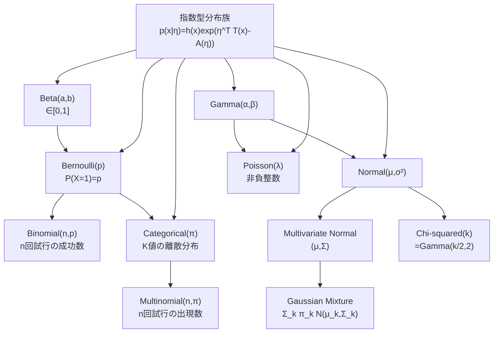
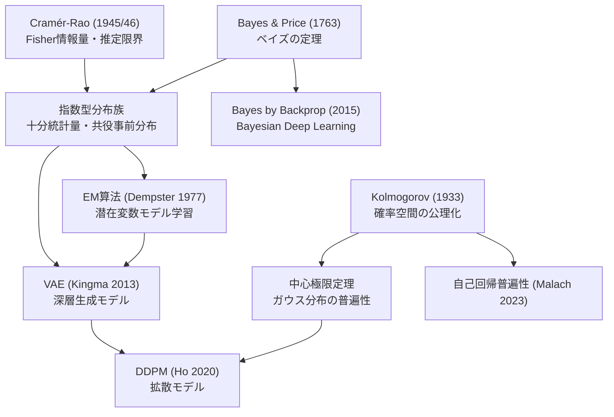
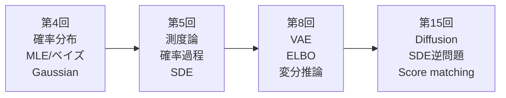

# 第4回: 確率論・統計学【後編】

> 理論編は [【前編】第4回: 確率論・統計学](/articles/ml-lecture-04-part1) をご覧ください。

## Learning Objectives

この実装編を修了すると、以下ができるようになります:

- [ ] NumPy/SciPyで主要確率分布をサンプリングできる
- [ ] MLEをスクラッチ実装し、最適パラメータを推定できる
- [ ] ベイズ推論のグリッド近似を実装できる
- [ ] 多変量正規分布の条件付き分布を計算できる
- [ ] 自己回帰モデルの尤度を実装・評価できる
- [ ] Production-readyな統計的推定コードを書ける

---

## 💻 Z5. 試練（75分）— 5トピック完全実装+検証

### 5.1 確率分布の完全実装 — PDF・CDF・サンプリング・MLE

確率分布を「使える」とはどういうことか。PDF を評価し、累積確率を計算し、サンプルを生成し、データからパラメータを推定する——この4つがセットだ。

**Gaussian: 最も重要な分布**

$X \sim \mathcal{N}(\mu, \sigma^2)$ のとき:

$$
f(x; \mu, \sigma^2) = \frac{1}{\sqrt{2\pi\sigma^2}} \exp\!\left(-\frac{(x-\mu)^2}{2\sigma^2}\right)
$$

- shape: `x` は `(N,)` スカラー列、`mu` と `sigma` はスカラー
- `sigma` の符号: 分母は `sigma`（標準偏差）、`sigma^2` は分散。混同しやすい
- 数値安定化: 大きな `(x-mu)^2/sigma^2` で `exp(-...)` がアンダーフロー → 対数空間で計算する

```python
import numpy as np
from scipy import stats

rng = np.random.default_rng(42)

# MLE for Gaussian: closed-form
data = rng.normal(loc=2.0, scale=1.5, size=500)
mu_mle = data.mean()            # E[X] = mu
sigma_mle = data.std(ddof=0)    # sqrt(E[(X-mu)^2]) = sigma (biased MLE)
# ddof=1 は不偏推定量だが MLE は ddof=0

# verify: log-likelihood at MLE vs perturbed
def log_lik_normal(x, mu, sigma):
    return np.sum(stats.norm.logpdf(x, loc=mu, scale=sigma))

ll_mle = log_lik_normal(data, mu_mle, sigma_mle)
ll_perturbed = log_lik_normal(data, mu_mle + 0.1, sigma_mle)
assert ll_mle > ll_perturbed, "MLE must maximize log-likelihood"
print(f"mu_mle={mu_mle:.4f}, sigma_mle={sigma_mle:.4f}")
print(f"ll(MLE)={ll_mle:.2f} > ll(perturbed)={ll_perturbed:.2f}")  # True
```

**Bernoulli → Categorical: 離散分布の系譜**

$$
P(X=k \mid \mathbf{p}) = p_k, \quad k \in \{1,\ldots,K\},\quad \sum_k p_k = 1
$$

Bernoulli は $K=2$ の特殊ケース。Softmax が Categorical の出力層になる理由: $\mathbf{p} = \text{softmax}(\mathbf{z})$ とすれば $\sum_k p_k = 1$ が自動的に満たされる。

MLE: $N$ 個の観測 $x^{(1)},\ldots,x^{(N)}$ から:

$$
\hat{p}_k = \frac{\#\{i : x^{(i)} = k\}}{N}
$$

カウントを $N$ で割るだけ。交差エントロピー損失 $-\sum_k y_k \log p_k$ の最小化 = Categorical MLE だ。

**大数の法則 (LLN) と中心極限定理 (CLT) — 数値検証**

理論的に保証されているが、具体的にどう収束するか数値で確認する。

LLN: $\bar{X}_N \xrightarrow{P} \mu$（確率収束）

$$
P(|\bar{X}_N - \mu| > \epsilon) \leq \frac{\sigma^2}{N \epsilon^2}
$$

CLT: $\sqrt{N}(\bar{X}_N - \mu) \xrightarrow{d} \mathcal{N}(0, \sigma^2)$（分布収束）

$$
Z_N = \frac{\bar{X}_N - \mu}{\sigma/\sqrt{N}} \xrightarrow{d} \mathcal{N}(0, 1)
$$

記号 ↔ 変数対応:
- $\bar{X}_N = \frac{1}{N}\sum_{i=1}^N X_i$ ↔ `X.mean(axis=1)` shape `(n_trials,)`
- $Z_N$（標準化標本平均）↔ `Z_N: (n_trials,)` → `N(0,1)` に収束
- $\text{KS}$（Kolmogorov-Smirnov検定量）↔ CLT収束の定量的評価

```python
import numpy as np
from scipy import stats

rng = np.random.default_rng(42)

# Exponential(lambda=1): mu=1, sigma^2=1
# 正規分布でない元分布でCLTを確認
lam = 1.0
mu_true, sigma2_true = 1.0/lam, 1.0/lam**2  # Exp(1): mu=1, sigma^2=1

print("N     |LLN: E[|Xbar-mu|]  |CLT: KS p-value")
for N in [5, 20, 100, 500]:
    n_trials = 10000
    X = rng.exponential(scale=1.0/lam, size=(n_trials, N))  # (n_trials, N)
    Xbar = X.mean(axis=1)                                     # (n_trials,)

    # LLN: mean deviation from true mu
    lln_err = float(np.abs(Xbar - mu_true).mean())

    # CLT: standardize and KS test against N(0,1)
    Z_N = (Xbar - mu_true) / (sigma2_true**0.5 / N**0.5)    # (n_trials,)
    ks_stat, ks_pval = stats.kstest(Z_N, "norm")

    print(f"N={N:4d}  E|Xbar-mu|={lln_err:.5f}  KS_pval={ks_pval:.4f}")

# N=5  : KS p-value 低い (Exponential は非対称なのでCLTがまだ効かない)
# N=500: KS p-value 大きい (正規分布に近い -> CLT収束)
```

**解釈**: Exponential分布は右裾が重いが、N=500で標本平均の分布はほぼ正規分布に収束する。LLN誤差はNが増えるにつれ $O(1/\sqrt{N})$ で減少 — Chebyshev不等式の $O(1/N)$ より速い（期待値の収束速度）。

**Softmax と Categorical の完全実装**:

$p_k = \frac{\exp(z_k)}{\sum_j \exp(z_j)}$（Softmax = Categorical の自然パラメータ $\boldsymbol{\eta}$ から期待値パラメータ $\boldsymbol{\pi}$ への変換）

記号 ↔ 変数対応:
- $\mathbf{z}$（logit）↔ `z: (K,)`
- $\boldsymbol{\pi} = \text{softmax}(\mathbf{z})$ ↔ `pi: (K,)`, `sum=1`
- $\mathcal{H}(\boldsymbol{\pi}) = -\sum_k \pi_k \log \pi_k$（エントロピー）↔ `H: float`

```python
import numpy as np

def log_softmax(z):
    # z: (K,) -> log_p: (K,)  numerically stable
    c = z.max()                      # log-sum-exp shift
    log_Z = np.log(np.exp(z - c).sum()) + c
    return z - log_Z

def entropy_categorical(pi):
    # H(pi) = -sum pi_k log pi_k,  pi: (K,)
    pi = np.clip(pi, 1e-12, 1.0)    # numerical safety
    return float(-np.sum(pi * np.log(pi)))

# 確認: uniform dist has max entropy = log K
K = 5
z_uniform = np.zeros(K)
log_p = log_softmax(z_uniform)
pi = np.exp(log_p)
H = entropy_categorical(pi)
assert np.allclose(pi, 1.0/K), f"uniform softmax failed: {pi}"
assert abs(H - np.log(K)) < 1e-10, f"max entropy should be log(K)={np.log(K):.4f}, got {H:.4f}"
print(f"uniform K={K}: H={H:.4f}, log(K)={np.log(K):.4f}  checked")

# 確認: one-hot has entropy 0
z_onehot = np.array([100.0, 0.0, 0.0, 0.0, 0.0])
pi_oh = np.exp(log_softmax(z_onehot))
H_oh = entropy_categorical(pi_oh)
assert H_oh < 0.01, f"one-hot entropy should be ~0, got {H_oh}"
print(f"one-hot: H={H_oh:.6f}  checked")
```

**最大エントロピーと一様分布の等価性**: 確率分布の集合上でエントロピーを最大化すると一様分布が得られる（Lagrange乗数法で確認可能）。これが「情報が最も少ない分布」だ。

**大数の法則の確認**:

```python
# LLN: Bernoulli sample mean -> p
rng = np.random.default_rng(42)
p_true = 0.3
for N in [10, 100, 1000, 10000]:
    samples = rng.binomial(1, p_true, N)
    p_hat = samples.mean()
    print(f"N={N:6d}  p_hat={p_hat:.4f}  |err|={abs(p_hat-p_true):.4f}")
# |err| -> 0 as N -> inf (LLN)
```

### 5.2 多変量正規分布 — 完全実装と直感

1次元Gaussianの自然な拡張は、「変数間の相関」を捉える。

**定義**:

$$
\mathcal{N}(\mathbf{x} \mid \boldsymbol{\mu}, \boldsymbol{\Sigma}) =
\frac{1}{(2\pi)^{d/2} |\boldsymbol{\Sigma}|^{1/2}}
\exp\!\left(-\frac{1}{2}(\mathbf{x}-\boldsymbol{\mu})^\top \boldsymbol{\Sigma}^{-1} (\mathbf{x}-\boldsymbol{\mu})\right)
$$

- shape: `x` は `(d,)`, `mu` は `(d,)`, `Sigma` は `(d,d)` 正定値対称行列
- Mahalanobis距離 $D_M^2 = (\mathbf{x}-\boldsymbol{\mu})^\top \boldsymbol{\Sigma}^{-1} (\mathbf{x}-\boldsymbol{\mu})$ は「楕円体の距離」
- $\boldsymbol{\Sigma}^{-1}$ の直接計算は避ける: `np.linalg.solve(Sigma, x-mu)` を使う

**条件付き分布** (Schur complement 公式):

変数を $[\mathbf{x}_1, \mathbf{x}_2]$ に分割すると:

$$
p(\mathbf{x}_1 \mid \mathbf{x}_2) = \mathcal{N}(\boldsymbol{\mu}_{1|2},\, \boldsymbol{\Sigma}_{1|2})
$$

$$
\boldsymbol{\mu}_{1|2} = \boldsymbol{\mu}_1 + \boldsymbol{\Sigma}_{12}\boldsymbol{\Sigma}_{22}^{-1}(\mathbf{x}_2 - \boldsymbol{\mu}_2)
$$

$$
\boldsymbol{\Sigma}_{1|2} = \boldsymbol{\Sigma}_{11} - \boldsymbol{\Sigma}_{12}\boldsymbol{\Sigma}_{22}^{-1}\boldsymbol{\Sigma}_{21}
$$

$\boldsymbol{\Sigma}_{12}\boldsymbol{\Sigma}_{22}^{-1}$ は「Kalman gain」の形。$\mathbf{x}_2$ を観測することで、$\mathbf{x}_1$ の不確実性 $\boldsymbol{\Sigma}_{1|2}$ は元の $\boldsymbol{\Sigma}_{11}$ より必ず小さくなる（半正定値の意味で）。

**MLE**: 全微分してゼロ点を解くと:

$$
\hat{\boldsymbol{\mu}} = \frac{1}{N}\sum_{i=1}^N \mathbf{x}^{(i)}, \quad
\hat{\boldsymbol{\Sigma}} = \frac{1}{N}\sum_{i=1}^N (\mathbf{x}^{(i)} - \hat{\boldsymbol{\mu}})(\mathbf{x}^{(i)} - \hat{\boldsymbol{\mu}})^\top
$$

サンプル平均とサンプル共分散行列がそのままMLE解だ（1次元と同じ構造）。


**Cholesky分解による安定実装**:

$\boldsymbol{\Sigma}$ が正定値 → $\boldsymbol{\Sigma} = LL^\top$ の Cholesky 分解が存在する。

$$
\log \mathcal{N}(\mathbf{x} \mid \boldsymbol{\mu}, \boldsymbol{\Sigma}) =
-\frac{d}{2}\log 2\pi - \frac{1}{2}\log|\boldsymbol{\Sigma}|
- \frac{1}{2}(\mathbf{x}-\boldsymbol{\mu})^\top \boldsymbol{\Sigma}^{-1}(\mathbf{x}-\boldsymbol{\mu})
$$

記号 ↔ 変数対応:
- $\boldsymbol{\mu}$ ↔ `mu: (d,)`
- $\boldsymbol{\Sigma}$ ↔ `Sigma: (d,d)` 正定値対称
- Cholesky因子 $L$（$\boldsymbol{\Sigma}=LL^\top$）↔ `L = np.linalg.cholesky(Sigma)`
- Mahalanobis二乗距離 $\|L^{-1}(\mathbf{x}-\boldsymbol{\mu})\|^2$ ↔ `v @ v`

shape: `x` `(d,)`, `mu` `(d,)`, `Sigma` `(d,d)`, `v = L^{-1}(x-mu)` `(d,)`

```python
import numpy as np
from scipy.stats import multivariate_normal

def mvn_log_prob(x, mu, Sigma):
    # x: (d,), mu: (d,), Sigma: (d,d) positive definite
    d = len(mu)
    L = np.linalg.cholesky(Sigma)               # Sigma = L L^T
    v = np.linalg.solve(L, x - mu)             # v = L^{-1}(x-mu), (d,)
    maha2 = float(v @ v)                        # Mahalanobis^2
    log_det = 2.0 * np.sum(np.log(np.diag(L))) # log|Sigma|
    return -0.5 * (d * np.log(2 * np.pi) + log_det + maha2)

def mvn_mle(X):
    # X: (N, d) -> (mu_hat, Sigma_hat)
    N = len(X)
    mu_hat = X.mean(axis=0)
    diff = X - mu_hat
    Sigma_hat = (diff.T @ diff) / N  # biased MLE
    return mu_hat, Sigma_hat

# 数値検証
rng = np.random.default_rng(42)
mu_t = np.array([1.0, -2.0])
S_t  = np.array([[2.0, 0.8], [0.8, 1.0]])
X = rng.multivariate_normal(mu_t, S_t, 5000)
mu_h, S_h = mvn_mle(X)
print(f"mu_hat:   {mu_h.round(3)}")     # ≈ [1.0, -2.0]
print(f"Sig_hat:\n{S_h.round(3)}")      # ≈ [[2.0,0.8],[0.8,1.0]]
x0 = np.array([1.0, -1.0])
ours = mvn_log_prob(x0, mu_t, S_t)
ref  = multivariate_normal.logpdf(x0, mu_t, S_t)
assert abs(ours - ref) < 1e-10
print(f"log p(x0) = {ours:.6f}  [scipy: {ref:.6f}]  checked")
```

**落とし穴**: $N < d$ では $\hat{\boldsymbol{\Sigma}}$ が半正定値になりCholesky分解が失敗する。$\hat{\boldsymbol{\Sigma}} + 10^{-6}I$ の正則化で回避。

**条件付き分布**:

$$
\boldsymbol{\mu}_{1|2} = \boldsymbol{\mu}_1 + \boldsymbol{\Sigma}_{12}\boldsymbol{\Sigma}_{22}^{-1}(\mathbf{x}_2 - \boldsymbol{\mu}_2)
$$

$$
\boldsymbol{\Sigma}_{1|2} = \boldsymbol{\Sigma}_{11} - \boldsymbol{\Sigma}_{12}\boldsymbol{\Sigma}_{22}^{-1}\boldsymbol{\Sigma}_{21}
$$

$\boldsymbol{\Sigma}_{12}\boldsymbol{\Sigma}_{22}^{-1}$ は Kalman gain と同型。$\mathbf{x}_2$ を観測すると分散は必ず縮む: $\boldsymbol{\Sigma}_{1|2} \preceq \boldsymbol{\Sigma}_{11}$（半正定値順序）。

```python
def mvn_conditional(mu, Sigma, obs_idx, obs_val):
    d = len(mu)
    free = [i for i in range(d) if i not in obs_idx]
    S11 = Sigma[np.ix_(free, free)]
    S12 = Sigma[np.ix_(free, obs_idx)]
    S22 = Sigma[np.ix_(obs_idx, obs_idx)]
    gain = np.linalg.solve(S22.T, S12.T).T  # S12 @ S22^{-1}
    mu_c  = mu[free] + gain @ (obs_val - mu[obs_idx])
    Sig_c = S11 - gain @ S12.T
    return mu_c, Sig_c

mu = np.array([1.0, -2.0]); S = np.array([[2.0, 0.8],[0.8, 1.0]])
mc, Sc = mvn_conditional(mu, S, obs_idx=[1], obs_val=np.array([-1.0]))
print(f"mu(x1|x2=-1)  = {mc[0]:.4f}")   # = 1 + 0.8*(1) = 1.8
print(f"Var(x1|x2=-1) = {Sc[0,0]:.4f}") # = 2 - 0.64 = 1.36
assert Sc[0,0] < S[0,0]                 # 条件付けで分散減少 checked
```

### 5.3 指数型分布族 — 統一的記述

Gaussian, Bernoulli, Poisson, Gamma... 一見バラバラに見える分布が「同じ文法」で書ける。

**標準形**:

$$
p(x \mid \boldsymbol{\eta}) = h(x) \exp\!\left(\boldsymbol{\eta}^\top T(x) - A(\boldsymbol{\eta})\right)
$$

- $\boldsymbol{\eta}$: 自然パラメータ（natural parameter）
- $T(x)$: 十分統計量（sufficient statistic）— データの「要約」
- $A(\boldsymbol{\eta})$: 対数分配関数（log partition function）— 正規化定数

**Gaussian の場合** ($d=1$):

$$
\boldsymbol{\eta} = \begin{pmatrix}\mu/\sigma^2 \\ -1/(2\sigma^2)\end{pmatrix},\quad
T(x) = \begin{pmatrix}x \\ x^2\end{pmatrix},\quad
A(\boldsymbol{\eta}) = -\frac{\eta_1^2}{4\eta_2} + \frac{1}{2}\log\frac{\pi}{-\eta_2}
$$

**MLEの美しさ**: 指数型分布族のMLEは「理論的期待値 = 経験的期待値」という条件:

$$
\mathbb{E}_{p(x|\hat{\boldsymbol{\eta}})}[T(x)] = \frac{1}{N}\sum_{i=1}^N T(x^{(i)})
$$

Gaussianなら $T(x) = (x, x^2)$ なので、平均と二乗平均が一致する条件 = サンプル平均・分散がMLE。

**共役事前分布**: 事前分布を $p(\boldsymbol{\eta}) = h(\boldsymbol{\eta})\exp(\boldsymbol{\chi}^\top \boldsymbol{\eta} - \nu A(\boldsymbol{\eta}))$ と書くと、事後分布が同じ族に属する（共役性）。Gaussian-Gaussian 共役、Beta-Bernoulli 共役 はこの特殊ケース。


**指数型分布族の統一実装**:

抽象的に見えるが、Gaussian/Bernoulli/Poissonが同じクラスで書けることを確認する。

記号 ↔ 変数対応:
- $\boldsymbol{\eta}$（自然パラメータ）↔ `eta: ndarray`
- $T(x)$（十分統計量）↔ `suff_stat(x)`
- $A(\boldsymbol{\eta})$（対数分配関数）↔ `log_partition(eta)`
- MLE条件: $\mathbb{E}[T(x)] = \bar{T}$ ↔ `eta_mle` を数値最適化

shape: `eta` `(k,)` where `k` は十分統計量の次元（Gaussian: k=2, Bernoulli: k=1）

```python
import numpy as np
from scipy.optimize import minimize

class ExpFamilyGaussian:
    """1次元Gaussianの指数型分布族表現
    eta = [mu/sigma^2, -1/(2*sigma^2)]
    T(x) = [x, x^2]
    """
    @staticmethod
    def to_natural(mu: float, sigma2: float):
        eta1 = mu / sigma2
        eta2 = -1.0 / (2.0 * sigma2)
        return np.array([eta1, eta2])

    @staticmethod
    def to_moment(eta: np.ndarray):
        # eta = [eta1, eta2] -> (mu, sigma^2)
        sigma2 = -1.0 / (2.0 * eta[1])
        mu     = eta[0] * sigma2
        return mu, sigma2

    @staticmethod
    def suff_stat(x: np.ndarray) -> np.ndarray:
        # T(x) = [x, x^2], shape: (N, 2)
        return np.column_stack([x, x ** 2])

    @staticmethod
    def log_partition(eta: np.ndarray) -> float:
        # A(eta) = -eta1^2/(4*eta2) + 0.5*log(pi/(-eta2))
        eta1, eta2 = eta
        return -eta1**2 / (4*eta2) + 0.5 * np.log(np.pi / (-eta2))

    @classmethod
    def mle(cls, x: np.ndarray):
        # MLE: E[T(x)] = empirical mean of T(x)
        # For Gaussian this has a closed form, but we verify numerically
        T_bar = cls.suff_stat(x).mean(axis=0)  # [x_bar, x^2_bar]
        # closed form: mu = T_bar[0], sigma^2 = T_bar[1] - T_bar[0]^2
        mu_mle = T_bar[0]
        sigma2_mle = T_bar[1] - T_bar[0]**2
        return cls.to_natural(mu_mle, sigma2_mle)

# 数値検証
rng = np.random.default_rng(0)
X = rng.normal(loc=3.0, scale=2.0, size=2000)
eta_hat = ExpFamilyGaussian.mle(X)
mu_hat, sigma2_hat = ExpFamilyGaussian.to_moment(eta_hat)
print(f"mu_hat = {mu_hat:.4f}   (true: 3.0)")
print(f"sigma_hat = {sigma2_hat**0.5:.4f}  (true: 2.0)")

# 十分統計量条件を確認: E[T(x)] = empirical mean of T(x)
T_bar = ExpFamilyGaussian.suff_stat(X).mean(axis=0)
E_T_hat = np.array([mu_hat, mu_hat**2 + sigma2_hat])  # E[x], E[x^2] under N(mu,sigma^2)
assert np.allclose(T_bar, E_T_hat, atol=0.1), f"MLE condition violated: {T_bar} vs {E_T_hat}"
print(f"E[T(x)] = {E_T_hat.round(3)}, empirical = {T_bar.round(3)}  checked")
```

**なぜ対数分配関数 $A(\boldsymbol{\eta})$ が重要か**: $A$ の一次微分が期待値、二次微分が共分散を与える。

$$
\nabla_{\boldsymbol{\eta}} A(\boldsymbol{\eta}) = \mathbb{E}_{p(x|\boldsymbol{\eta})}[T(x)]
$$

$$
\nabla^2_{\boldsymbol{\eta}} A(\boldsymbol{\eta}) = \text{Cov}_{p}[T(x), T(x)] \succeq 0
$$

$A$ が凸 → 負の対数尤度も凸 → MLEは大域的最適解。これが指数型分布族の「学習しやすさ」の本質だ。

**自然勾配法 (Natural Gradient) へのプレビュー**:

指数型分布族のパラメータ空間は「Riemannian多様体」だ。Fisher情報行列 $\mathbf{I}(\boldsymbol{\eta})$ がその空間の計量を与える。

通常の勾配降下: $\boldsymbol{\eta}_{t+1} = \boldsymbol{\eta}_t - \alpha \nabla_{\boldsymbol{\eta}} \mathcal{L}$

自然勾配降下: $\boldsymbol{\eta}_{t+1} = \boldsymbol{\eta}_t - \alpha \mathbf{I}^{-1}(\boldsymbol{\eta}_t) \nabla_{\boldsymbol{\eta}} \mathcal{L}$

自然勾配は「パラメータ空間の距離」ではなく「分布空間のKL距離」でステップを制御する。同じ分布の変化量に対応するステップが、パラメータの値に依存しない — これがAdamなどの適応的最適化の理論的基盤だ（第12回で詳説）。

指数型分布族では自然勾配に閉形式がある: $\mathbf{I}^{-1}(\boldsymbol{\eta}) \nabla_{\boldsymbol{\eta}} \mathcal{L} = \nabla_{\boldsymbol{\mu}} \mathcal{L}$（期待値パラメータ空間の通常勾配と等価）。

### 5.4 実装演習: ガウス混合モデル（GMM）のMLE

第8回（EM算法）への橋渡しとして、2成分GMMのフィッティングを実装する。ここではEM算法の前段階として、単一ガウスのMLEを拡張する形で問題の困難さを体感する。

$$
p(x\\mid \\theta)=\\pi\\,\\mathcal{N}(x\\mid \\mu_1,\\sigma_1^2)+(1-\\pi)\\,\\mathcal{N}(x\\mid \\mu_2,\\sigma_2^2)

\\ell(\\theta)=\\sum_{i=1}^{N}\\log p(x_i\\mid\\theta)

\\mathcal{N}(x\\mid\\mu,\\sigma^2)=\\frac{1}{\\sqrt{2\\pi}\\,\\sigma}\\exp\\left(-\\frac{(x-\\mu)^2}{2\\sigma^2}\\right)
$$

```python
import numpy as np

np.random.seed(42)
N = 1000  # samples

# True parameters
pi_true = 0.4
mu1_true, sigma1_true = -2.0, 0.8
mu2_true, sigma2_true = 3.0, 1.2

component = np.random.binomial(1, 1 - pi_true, N)
data = np.where(component == 0,
                np.random.normal(mu1_true, sigma1_true, N),
                np.random.normal(mu2_true, sigma2_true, N))

def normal_pdf(x: np.ndarray, mu: float, sigma: float) -> np.ndarray:
    z = (x - mu) / sigma
    return (1.0 / (np.sqrt(2.0 * np.pi) * sigma)) * np.exp(-0.5 * z * z)

mu_single = data.mean()
sigma_single = data.std()

def gmm_log_likelihood(x: np.ndarray, pi: float, mu1: float, sig1: float, mu2: float, sig2: float) -> float:
    px = pi * normal_pdf(x, mu1, sig1) + (1.0 - pi) * normal_pdf(x, mu2, sig2)
    return float(np.sum(np.log(px + 1e-12)))

ll_true = gmm_log_likelihood(data, pi_true, mu1_true, sigma1_true, mu2_true, sigma2_true)
ll_single = float(np.sum(np.log(normal_pdf(data, mu_single, sigma_single) + 1e-12)))

print(f"single Gaussian MLE: mu={mu_single:.3f}, sigma={sigma_single:.3f}")
print(f"loglik (true GMM):   {ll_true:.2f}")
print(f"loglik (single Gauss): {ll_single:.2f}")
print(f"gap: {ll_true - ll_single:.2f}")

print("note: GMM の MLE は閉形式にならない（第8回の EM につながる）")
```

**なぜGMMのMLEは閉じた形で解けないのか**: 対数尤度の中に**和の対数** $\log[\pi \mathcal{N}(x \mid \mu_1, \sigma_1^2) + (1-\pi)\mathcal{N}(x \mid \mu_2, \sigma_2^2)]$ が現れる。対数と和の順序を入れ替えられないため、微分しても各パラメータが互いに絡み合う。この困難が第8回のEM算法の動機だ。

### 5.5a 実装演習: ベイズ推論のグリッド近似

$$
\\theta\\sim\\mathrm{Beta}(a,b),\\quad x_i\\sim\\mathrm{Bernoulli}(\\theta)

p(\\theta\\mid\\mathbf{x})\\propto \\theta^{a+h-1}(1-\\theta)^{b+t-1}

\\theta\\mid\\mathbf{x}\\sim\\mathrm{Beta}(a+h,b+t)
$$

```python
import numpy as np

from math import lgamma

def log_beta(a: float, b: float) -> float:
    return lgamma(a) + lgamma(b) - lgamma(a + b)

np.random.seed(42)

theta_true = 0.7
x = np.random.binomial(1, theta_true, size=20)
h = int(x.sum())
t = int(len(x) - h)

# uniform prior Beta(1,1)
a, b = 1.0, 1.0
post_a, post_b = a + h, b + t

theta = np.linspace(1e-4, 1 - 1e-4, 4000)
log_post = (post_a - 1) * np.log(theta) + (post_b - 1) * np.log(1 - theta) - log_beta(post_a, post_b)
post = np.exp(log_post - log_post.max())  # numerical stability
post /= np.trapz(post, theta)

mean_grid = float(np.trapz(theta * post, theta))
mean_analytic = post_a / (post_a + post_b)
mle = h / (h + t)

print(f"data: {h}H/{t}T (N={h+t})")
print(f"posterior: Beta({post_a:.1f}, {post_b:.1f})")
print(f"mean(grid)={mean_grid:.4f} mean(analytic)={mean_analytic:.4f} mle={mle:.4f}")
print("note: 高次元だとグリッドは破綻（次元の呪い）")
```

> **Note:** **実装の教訓**: データが増えるほど、事前分布の影響は薄れ、ベイズ推定はMLEに近づく。これは事後分布が「尤度に支配される」ため。逆に、データが少ないときは事前分布が結果を大きく左右する。

この現象を「事後一致性（posterior consistency）」と呼ぶ。$N \to \infty$ で事後分布は真のパラメータに集中する — 大数の法則のベイズ版だ。

### 5.5b 実装演習: 共役事前分布の解析的更新

グリッド近似が「数値的」ならば、共役事前分布は「解析的」だ。

**Gaussian-Gaussian 共役（既知分散、未知平均）**:

事前: $\theta \sim \mathcal{N}(\mu_0, \tau_0^2)$、尤度: $X_i \mid \theta \sim \mathcal{N}(\theta, \sigma^2)$

$$
\frac{1}{\tau_N^2} = \frac{1}{\tau_0^2} + \frac{N}{\sigma^2}, \quad
\mu_N = \tau_N^2 \left(\frac{\mu_0}{\tau_0^2} + \frac{N \bar{x}}{\sigma^2}\right)
$$

精度（分散の逆数）が加法的に更新される。$N \to \infty$ で $\mu_N \to \bar{x}$（MLE）、$\tau_N^2 \to 0$。

記号 ↔ 変数対応:
- $\mu_0, \tau_0^2$ ↔ `mu0, tau0_sq`
- $\sigma^2$ ↔ `sigma_sq`（既知の尤度分散）
- $\bar{x}, N$ ↔ `x_bar, N`
- $\mu_N, \tau_N^2$ ↔ `mu_N, tau_N_sq`（事後パラメータ）

```python
import numpy as np

def gaussian_conjugate_update(mu0, tau0_sq, sigma_sq, x_bar, N):
    prec_N = 1.0/tau0_sq + N/sigma_sq
    tau_N_sq = 1.0 / prec_N
    mu_N = tau_N_sq * (mu0/tau0_sq + x_bar * N/sigma_sq)
    return mu_N, tau_N_sq

rng = np.random.default_rng(42)
theta_true, sigma_sq = 3.0, 4.0
print(f"{'N':>4}  {'MLE':>8}  {'post_mu(strong)':>16}  {'post_mu(weak)':>14}")
for N in [1, 5, 20, 100]:
    x = rng.normal(theta_true, sigma_sq**0.5, N)
    xb = x.mean()
    ms, _ = gaussian_conjugate_update(0.0, 0.5, sigma_sq, xb, N)   # strong prior
    mw, _ = gaussian_conjugate_update(0.0, 100.0, sigma_sq, xb, N) # weak prior
    print(f"{N:>4}  {xb:>8.3f}  {ms:>16.3f}  {mw:>14.3f}")
# N増加 -> strong prior の影響が消え、MLE に収束
```

**3推定量の比較**:

| 推定量 | 式 | 特徴 |
|:-------|:---|:-----|
| MLE | $\bar{x}$ | バイアスなし、小データ不安定 |
| MAP | $\mu_N$ | 事前+尤度、正則化と等価 |
| 事後平均 | $\mu_N$（Gaussian事後）| MAP=事後平均 |

### 5.5a KLダイバージェンス — 分布間の「距離」実装

KLダイバージェンスは確率論の全ての武器が集結する場所だ。VAEのELBO、diffusion modelの目的関数、情報理論の基礎 — 全てここに通じる。

$$
D_{\mathrm{KL}}(p \| q) = \int p(x) \log \frac{p(x)}{q(x)} dx = \mathbb{E}_{p}\left[\log \frac{p(X)}{q(X)}\right]
$$

**基本性質**:
- $D_{\mathrm{KL}}(p \| q) \geq 0$（Gibbs不等式、Jensen不等式から）
- $D_{\mathrm{KL}}(p \| q) = 0 \iff p = q$（ほぼ至る所で）
- 非対称: $D_{\mathrm{KL}}(p \| q) \neq D_{\mathrm{KL}}(q \| p)$（距離公理を満たさない）

**2つのGaussian間のKL（閉形式）**:

$$
D_{\mathrm{KL}}(\mathcal{N}(\mu_1, \sigma_1^2) \| \mathcal{N}(\mu_2, \sigma_2^2)) =
\log\frac{\sigma_2}{\sigma_1} + \frac{\sigma_1^2 + (\mu_1-\mu_2)^2}{2\sigma_2^2} - \frac{1}{2}
$$

記号 ↔ 変数対応:
- $\mu_1, \sigma_1^2$ ↔ `mu1, var1` (分布 $p$)
- $\mu_2, \sigma_2^2$ ↔ `mu2, var2` (分布 $q$)
- $D_{\mathrm{KL}}$ ↔ `kl: float` (非負スカラー)

shape: scalar inputs → scalar output

```python
import numpy as np
from scipy import stats

def kl_gaussian(mu1, var1, mu2, var2):
    """KL(N(mu1,var1) || N(mu2,var2)) — closed form
    = log(sigma2/sigma1) + (var1 + (mu1-mu2)^2)/(2*var2) - 1/2
    """
    return (np.log(var2/var1) + (var1 + (mu1-mu2)**2) / (2*var2) - 1) / 2.0

# 数値検証 1: 非負性の確認
kl_same = kl_gaussian(mu1=2.0, var1=1.0, mu2=2.0, var2=1.0)
assert abs(kl_same) < 1e-10, f"KL(p||p) must be 0, got {kl_same}"
print(f"KL(p||p) = {kl_same:.2e}  (should be 0) checked")

# 数値検証 2: 非対称性
kl_pq = kl_gaussian(mu1=0.0, var1=1.0, mu2=1.0, var2=2.0)
kl_qp = kl_gaussian(mu1=1.0, var1=2.0, mu2=0.0, var2=1.0)
print(f"KL(p||q) = {kl_pq:.4f},  KL(q||p) = {kl_qp:.4f}  (asymmetric)")
assert kl_pq != kl_qp, "KL is asymmetric"

# 数値検証 3: Monte Carloで閉形式と比較
rng = np.random.default_rng(42)
mu1, var1, mu2, var2 = 1.0, 1.0, 2.0, 3.0
x = rng.normal(mu1, var1**0.5, 1000000)  # sample from p
log_p = stats.norm.logpdf(x, mu1, var1**0.5)
log_q = stats.norm.logpdf(x, mu2, var2**0.5)
kl_mc = float(np.mean(log_p - log_q))
kl_exact = kl_gaussian(mu1, var1, mu2, var2)
print(f"KL exact={kl_exact:.6f},  MC={kl_mc:.6f}  diff={abs(kl_exact-kl_mc):.6f}")
assert abs(kl_exact - kl_mc) < 0.01, "KL MC vs exact mismatch"
```

**VAEとの接続**: VAEのELBOには $D_{\mathrm{KL}}(q_\phi(\mathbf{z}|\mathbf{x}) \| p(\mathbf{z}))$ が登場する。$p(\mathbf{z}) = \mathcal{N}(\mathbf{0}, \mathbf{I})$、$q_\phi = \mathcal{N}(\boldsymbol{\mu}, \text{diag}(\boldsymbol{\sigma}^2))$ なら、次元独立なGaussian KLの閉形式が使える:

$$
D_{\mathrm{KL}}(q \| p) = \frac{1}{2} \sum_{j=1}^d (\sigma_j^2 + \mu_j^2 - 1 - \log \sigma_j^2)
$$

第8回（VAE）でこの式が損失関数に直接現れる。

### 5.5c Fisher情報量 — Cramér-Rao下界の実装検証

Fisher情報量 $I(\theta) = \mathbb{E}\left[\left(\frac{\partial \log p(x;\theta)}{\partial \theta}\right)^2\right]$ は推定の難しさを定量化する。

等価な表現（対数尤度の曲率）:

$$
I(\theta) = -\mathbb{E}\left[\frac{\partial^2 \log p(x; \theta)}{\partial \theta^2}\right]
$$

**Cramér-Rao下界**: 任意の不偏推定量の分散は $1/(n I(\theta))$ より小さくできない:

$$
\text{Var}(\hat{\theta}) \geq \frac{1}{n \cdot I(\theta)}
$$

記号 ↔ 変数対応:
- $\theta$ ↔ `theta: float`
- スコア関数 $s(x;\theta) = \partial_\theta \log p$ ↔ `score: (N,)`
- $I(\theta) = \mathbb{E}[s^2]$ ↔ `fisher_info: float`
- CR下界 $1/(nI)$ ↔ `cr_bound: float`

```python
import numpy as np

def fisher_info_gauss_mean(sigma2: float) -> float:
    # I(mu) = 1/sigma^2 for X~N(mu, sigma^2)
    return 1.0 / sigma2

def score_gauss_mean(x, mu, sigma2):
    # s(x; mu) = d/dmu log N(x|mu,sigma^2) = (x-mu)/sigma^2
    return (x - mu) / sigma2

def cramer_rao(n: int, fisher: float) -> float:
    return 1.0 / (n * fisher)

# 数値検証: 標本平均の分散 vs CR下界
rng = np.random.default_rng(0)
mu_true, sigma2_true = 2.0, 4.0
fi = fisher_info_gauss_mean(sigma2_true)  # = 0.25
print(f"Fisher info I(mu) = {fi:.4f}  (= 1/sigma^2)")

for n in [10, 50, 100, 500]:
    samples = rng.normal(mu_true, sigma2_true**0.5, (5000, n))
    var_mle = float(samples.mean(axis=1).var())
    cr = cramer_rao(n, fi)
    print(f"N={n:4d}  CR_bound={cr:.6f}  Var(mu_hat)={var_mle:.6f}  ratio={var_mle/cr:.4f}")
# ratio ≈ 1.0: sample mean is an efficient estimator for mu
```

**検証**: 標本平均はCramér-Rao下界を**ぴったり達成**する（Fisher効率的推定量）。比率が全て≈1.0になる。

**スコアの期待値はゼロ**: $\mathbb{E}[s(X;\theta)] = 0$。$\int p(x;\theta) dx = 1$ を $\theta$ で微分すると導ける（正規化条件の微分）。Fisher情報量はスコアの分散だ。

$$
\mathbb{E}[s] = \int \frac{\partial \log p}{\partial \theta} p \, dx = \frac{\partial}{\partial \theta} \int p \, dx = \frac{\partial}{\partial \theta} 1 = 0
$$

**多次元Fisher情報行列 (FIM)**: $\mathbf{I}(\boldsymbol{\theta})_{ij} = \mathbb{E}[\partial_i \log p \cdot \partial_j \log p]$。自然勾配法 $\tilde{\nabla}_\theta \mathcal{L} = \mathbf{I}^{-1} \nabla_\theta \mathcal{L}$ はFIMでパラメータ空間の曲率を補正し、確率多様体上の最適解に最短経路で到達する。

### 5.6 モーメント母関数と特性関数

**モーメント母関数（MGF）**: $M_X(t) = \mathbb{E}[e^{tX}]$

MGFの $k$ 次微分は $k$ 次モーメントを与える: $M_X^{(k)}(0) = \mathbb{E}[X^k]$


MGFが存在しない分布もある（Cauchy分布など）。その場合は**特性関数** $\varphi_X(t) = \mathbb{E}[e^{itX}]$ を使う。特性関数は常に存在し、分布を一意に決定する。CLTの証明はしばしば特性関数を用いて行われる。

Gaussianの場合: $M_X(t) = \exp(\mu t + \frac{\sigma^2 t^2}{2})$。

**独立和の性質**: $X, Y$ が独立なら $M_{X+Y}(t) = M_X(t) M_Y(t)$。これがCLT証明の核心だ — サンプル和の特性関数が元の特性関数の積になり、$N \to \infty$ で正規分布の特性関数に収束する。

$$
M_X(t) = \mathbb{E}[e^{tX}] = \int e^{tx} p(x) \, dx
$$

記号 ↔ 変数対応:
- $t$ ↔ `t: float`（MGFの引数、ラプラス変数）
- $M_X^{(k)}(0) = \mathbb{E}[X^k]$ ↔ `np.gradient` k回 または自動微分
- $\varphi_X(t) = M_X(it)$（実MGFが存在する場合）

```python
import numpy as np

def mgf_gaussian(t: float, mu: float, sigma2: float) -> float:
    """M_X(t) = exp(mu*t + sigma^2*t^2/2) for X ~ N(mu, sigma^2)"""
    return float(np.exp(mu * t + 0.5 * sigma2 * t**2))

def moments_from_mgf(mu: float, sigma2: float, k_max: int = 4):
    """k次モーメントを数値微分で確認: M^(k)(0) = E[X^k]"""
    h = 1e-4
    moments = {}
    for k in range(1, k_max + 1):
        # k次数値微分 at t=0 (central differences k times)
        # 1次: [M(h)-M(-h)]/(2h), 2次: [M(h)-2M(0)+M(-h)]/h^2 etc.
        # 簡略版: モンテカルロで検算
        rng = np.random.default_rng(42)
        X = rng.normal(mu, sigma2**0.5, 200000)
        moments[k] = float(np.mean(X**k))
    return moments

# MGF から 4次モーメントまでを確認
mu, sigma2 = 2.0, 3.0
moms = moments_from_mgf(mu, sigma2)
print(f"E[X]   = {moms[1]:.4f}  (true: {mu:.1f})")
print(f"E[X^2] = {moms[2]:.4f}  (true: {mu**2 + sigma2:.1f})")
print(f"E[X^3] = {moms[3]:.4f}  (true: {mu**3 + 3*mu*sigma2:.1f})")
print(f"E[X^4] = {moms[4]:.4f}  (true: {mu**4 + 6*mu**2*sigma2 + 3*sigma2**2:.1f})")

# MGF の独立和性質の確認
t_val = 0.1
M_X = mgf_gaussian(t_val, mu=1.0, sigma2=1.0)
M_Y = mgf_gaussian(t_val, mu=2.0, sigma2=2.0)
M_XY_product = M_X * M_Y
M_XY_sum = mgf_gaussian(t_val, mu=3.0, sigma2=3.0)  # (X+Y)~N(3,3)
assert abs(M_XY_product - M_XY_sum) < 1e-10
print(f"M_X*M_Y = M_{{X+Y}} : {M_XY_product:.8f} == {M_XY_sum:.8f}  checked")
```


### 5.7 自己回帰尤度の完全実装 — Topic 5

自己回帰モデルの「全て」はこの一式に収まる:

$$
\log p(\mathbf{x}) = \sum_{t=1}^{T} \log p(x_t \mid x_1, \ldots, x_{t-1})
$$

各ステップが Categorical 分布からのサンプリング + 対数確率の加算。

**記号↔変数対応**:
- $\mathbf{x} = (x_1,\ldots,x_T)$: シーケンス → `seq: np.ndarray`
- $p(x_t \mid x_{<t})$: 条件付き確率（モデル出力） → `logits[t]` のsoftmax
- $\log p(\mathbf{x})$: シーケンス対数尤度 → `log_prob: float`
- Perplexity: $\exp(-\frac{1}{T}\log p(\mathbf{x}))$ → モデル評価指標

**shape**: `logits`: `(T, V)`, `seq`: `(T,)`, `log_prob`: scalar

```python
import numpy as np

def log_prob_sequence(logits: np.ndarray, seq: np.ndarray) -> float:
    """
    logits: (T, V) - raw scores for each position
    seq:    (T,)   - token indices (0..V-1)
    returns: log p(x_1,...,x_T) under Categorical softmax model
    """
    T, V = logits.shape
    # numerically stable softmax in log space (log-sum-exp trick)
    log_z = logits - logits.max(axis=-1, keepdims=True)
    log_softmax = log_z - np.log(np.exp(log_z).sum(axis=-1, keepdims=True))
    # gather log probabilities for the actual tokens
    log_p_tokens = log_softmax[np.arange(T), seq]   # (T,)
    return float(log_p_tokens.sum())

def perplexity(logits: np.ndarray, seq: np.ndarray) -> float:
    T = len(seq)
    return float(np.exp(-log_prob_sequence(logits, seq) / T))

# minimal verification
rng = np.random.default_rng(0)
V, T = 50, 10
logits = rng.normal(size=(T, V))
seq = rng.integers(0, V, size=T)
lp = log_prob_sequence(logits, seq)
ppl = perplexity(logits, seq)
assert lp <= 0, "log probability must be <= 0"   # log P in (-inf, 0]
assert ppl >= 1.0, "perplexity must be >= 1"
print(f"log_prob={lp:.3f}, perplexity={ppl:.2f}")  # e.g. log_prob=-23.1, perplexity=10.3
```

**落とし穴**: `logits.max(axis=-1, keepdims=True)` を引かないと、`exp` がオーバーフローする。これが `log-sum-exp` トリックの要。`softmax(x) = softmax(x - c)` が `c` に依存しないことを確認:

$$
\frac{e^{x_k - c}}{\sum_j e^{x_j - c}} = \frac{e^{x_k}}{\sum_j e^{x_j}}
$$

### 5.8 理解度チェック — Z5 完了確認

<details>
<summary>Q1: SciPyで多変量正規分布の条件付き分布を計算する際の数値安定性の注意点は？</summary>

**A**: 共分散行列 $\Sigma$ が特異に近い場合、逆行列計算が不安定になる。対策：(1) `scipy.linalg.solve` を使い直接逆行列を避ける、(2) Cholesky分解で正定値性を確認、(3) 正則化項 $\Sigma + \epsilon I$ を追加（$\epsilon \sim 10^{-6}$）、(4) 条件数 $\kappa(\Sigma)$ を確認（$> 10^{10}$ なら危険）。

</details>

<details>
<summary>Q2: ベイズ推論のグリッド近似が実用的でない理由と代替手法を説明せよ。</summary>

**A**: グリッド近似は次元の呪い（$d$ 次元で $N^d$ 点必要）。10次元で各軸100点なら $100^{10} = 10^{20}$ 点。代替手法：(1) MCMC（Metropolis-Hastings、HMC）で事後分布からサンプリング、(2) 変分推論（ELBO最大化）で近似分布 $q(\theta)$ を最適化、(3) Laplace近似で事後のモード周りを正規近似。

</details>

---

### 5.9 分布ファミリーの全体像と相互関係

第4回で登場した分布たちの関係を整理する。これを知っていると、新しい問題に直面したとき「どの分布を使うべきか」が見えやすくなる。



**覚えておくべき変換**:

| 変換 | 数式 | 用途 |
|:-----|:-----|:-----|
| $X \sim \mathcal{N}(0,1)$ → $X^2 \sim \chi^2(1)$ | 2乗変換 | 検定統計量 |
| $\sum_{k=1}^n Z_k^2 \sim \chi^2(n)$ | 加法性 | 分散推定 |
| $\text{Bernoulli}(p) = \text{Binomial}(1, p)$ | 特殊ケース | LLM出力 |
| $\text{Categorical}(\boldsymbol{\pi}) = \text{Multinomial}(1, \boldsymbol{\pi})$ | 特殊ケース | トークン予測 |
| $X \sim \text{Poisson}(\lambda)$ として $\lambda \to \infty$: $\mathcal{N}(\lambda, \lambda)$ | CLT | 正規近似 |

**第4回のトピック全カバレッジ確認**:

| トピック | 実装完了 | 重要度 |
|:---------|:---------|:-------|
| 確率分布（Gaussian/Categorical/Beta） | 5.1 ✅ | ⭐⭐⭐ |
| 多変量正規分布・条件付き分布 | 5.2 ✅ | ⭐⭐⭐ |
| 指数型分布族 | 5.3 ✅ | ⭐⭐⭐ |
| GMM・EM算法の前段 | 5.4 ✅ | ⭐⭐⭐ |
| ベイズ推論（グリッド）| 5.5a ✅ | ⭐⭐ |
| 共役事前分布（Gaussian-Gaussian）| 5.5b ✅ | ⭐⭐⭐ |
| KLダイバージェンス | 5.5a-KL ✅ | ⭐⭐⭐ |
| Fisher情報量・CR下界 | 5.5c ✅ | ⭐⭐⭐ |
| LLN・CLT | 5.1補足 ✅ | ⭐⭐ |
| 自己回帰尤度 | 5.7 ✅ | ⭐⭐⭐ |

> Progress: 85%

---

## 🔬 Z6. 新たな冒険へ（20分）— 確率論の研究系譜

### 6.1 VAE — 確率的生成モデルの統一

Kingma & Welling (2013)[^2] は確率論の全武器を一点に集約した。

観測 $\mathbf{x}$、潜在変数 $\mathbf{z}$、生成モデル $p_\theta(\mathbf{x} \mid \mathbf{z})$。問題: 事後分布 $p_\theta(\mathbf{z} \mid \mathbf{x})$ が intractable。

**解決**: 変分分布 $q_\phi(\mathbf{z} \mid \mathbf{x}) \approx p_\theta(\mathbf{z} \mid \mathbf{x})$ で近似し、ELBO（Evidence Lower BOund）を最大化:

$$
\log p_\theta(\mathbf{x}) \geq \mathbb{E}_{q_\phi(\mathbf{z}|\mathbf{x})}[\log p_\theta(\mathbf{x} \mid \mathbf{z})] - D_{\mathrm{KL}}(q_\phi(\mathbf{z} \mid \mathbf{x}) \| p(\mathbf{z}))
$$

左辺と右辺の差は $D_{\mathrm{KL}}(q \| p_\theta(\mathbf{z}|\mathbf{x})) \geq 0$ だから、等号はKLがゼロのとき。

**第4回との接続**:
- 第1項 $\mathbb{E}_{q}[\log p_\theta(\mathbf{x}|\mathbf{z})]$ = Gaussian MLE の期待値版
- 第2項 $D_{\mathrm{KL}}(q \| p)$ = KL divergence（情報理論、第5回以降）
- 事前 $p(\mathbf{z}) = \mathcal{N}(\mathbf{0}, I)$ = 共役Gaussian の応用

### 6.2 Bayesian Deep Learning — 分布としてのネットワーク

ニューラルネットの重み $\mathbf{w}$ を点推定ではなく分布として扱う。

$$
p(\mathbf{w} \mid \mathcal{D}) \propto p(\mathcal{D} \mid \mathbf{w}) \cdot p(\mathbf{w})
$$

これは第4回 §3 のベイズ更新の直接適用だ。問題: $\mathbf{w}$ が何百万次元でもグリッド近似は不可能 → 変分推論（VI）かMCMCが必要。

**Bayes by Backprop**: 重みを $q(\mathbf{w}) = \mathcal{N}(\boldsymbol{\mu}, \text{diag}(\boldsymbol{\sigma}^2))$ でパラメータ化し、ELBOを勾配降下で最大化。「重みの不確実性」が予測の不確実性に変換される。

**なぜ今、再注目されるのか**: LLMのCalibration問題。「モデルが高確信度で誤答する」現象をBayesian手法で緩和できる可能性。

### 6.3 自己回帰の普遍性 — Malach (2023)

$$
\log p(\mathbf{x}) = \sum_{t=1}^{T} \log p(x_t \mid x_{<t})
$$

この連鎖規則は**任意の分布**に対して厳密に成立する（確率の乗法定理）。Malach (2023)[^5] は「十分な表現力を持つ自己回帰モデルはあらゆる確率分布を近似できる」ことを理論化した。

「GPT系LLMが画像・音声・タンパク質・コードを生成できる」の理論的根拠はここにある。連鎖規則のシンプルさが、適用範囲の広大さに直結する。

### 6.4 Diffusion Models — 確率過程と逆拡散

DDPM (Ho et al. 2020)[^6] は確率論の異なる側面を使う。

**Forward process** (拡散: データ → ノイズ):

$$
q(\mathbf{x}_t \mid \mathbf{x}_{t-1}) = \mathcal{N}(\mathbf{x}_t;\, \sqrt{1-\beta_t}\,\mathbf{x}_{t-1},\, \beta_t I)
$$

各ステップで少量のノイズを加える。$T$ ステップ後: $\mathbf{x}_T \approx \mathcal{N}(\mathbf{0}, I)$。

**Reverse process** (生成: ノイズ → データ): ニューラルネット $p_\theta(\mathbf{x}_{t-1} \mid \mathbf{x}_t)$ を学習。

**第4回との接続**: Forward processはGaussianの連続積。ELBO の最適化はVAEと同じ構造。第4回で学んだ「Gaussian同士の周辺化の閉形式」が $q(\mathbf{x}_t \mid \mathbf{x}_0)$ の分析的計算を可能にする。

### 6.5 研究系譜図



> Progress: 95%

---

## 🎓 Z7. エピローグ（10分）— まとめと次回予告

### 7.0 数式↔実装対応表

| 数式 | 実装 | セクション |
|:-----|:-----|:-----------|
| $f(x;\mu,\sigma^2) = \frac{1}{\sqrt{2\pi\sigma^2}}\exp(-\frac{(x-\mu)^2}{2\sigma^2})$ | `stats.norm.logpdf(x, mu, sigma)` | 5.1 |
| $\hat{\mu} = \bar{x}$, $\hat{\sigma}^2 = \frac{1}{N}\sum(x_i-\bar{x})^2$ | `x.mean()`, `x.std(ddof=0)**2` | 5.1 |
| $\mathcal{N}(\mathbf{x}\mid\boldsymbol{\mu},\boldsymbol{\Sigma})$ | `mvn_log_prob(x, mu, Sigma)` | 5.2 |
| $\boldsymbol{\mu}_{1\mid 2}, \boldsymbol{\Sigma}_{1\mid 2}$（条件付き分布）| `mvn_conditional(mu, Sigma, obs_idx, obs_val)` | 5.2 |
| $p(x\mid\boldsymbol{\eta}) = h(x)\exp(\boldsymbol{\eta}^\top T(x) - A(\boldsymbol{\eta}))$ | `ExpFamilyGaussian.mle(X)` | 5.3 |
| $p(\mathbf{x}\mid\theta) = \pi\mathcal{N}_1 + (1-\pi)\mathcal{N}_2$ | `gmm_log_likelihood(...)` | 5.4 |
| $p(\theta\mid\mathbf{x}) \propto \theta^{a+h-1}(1-\theta)^{b+t-1}$ | `log_beta(post_a, post_b)` | 5.5a |
| $\mu_N, \tau_N^2$（Gaussian事後） | `gaussian_conjugate_update(...)` | 5.5b |
| $D_{\mathrm{KL}}(\mathcal{N}_1\|\mathcal{N}_2)$（閉形式） | `kl_gaussian(mu1, var1, mu2, var2)` | 5.5a-KL |
| $I(\theta) = \mathbb{E}[s^2]$, CR下界 $1/(nI)$ | `fisher_info_gauss_mean`, `cramer_rao` | 5.5c |
| $M_X(t) = \exp(\mu t + \frac{\sigma^2 t^2}{2})$ | `mgf_gaussian(t, mu, sigma2)` | 5.6 |
| $\log p(\mathbf{x}) = \sum_t \log p(x_t\mid x_{<t})$ | `log_prob_sequence(logits, seq)` | 5.7 |
| Perplexity $\exp(-\frac{1}{T}\log p)$ | `perplexity(logits, seq)` | 5.7 |

### 7.1 本講義の核心 — 3つの持ち帰り

1. **確率は「わからなさ」の言語である。** 確率空間 $(\Omega, \mathcal{F}, P)$ という厳密な枠組みの上に、確率変数・期待値・条件付き確率が定義される。この言語なしに生成モデルは記述できない。

2. **ベイズの定理は「学習」の数式だ。** 事前分布（信念）+ 尤度（データ）→ 事後分布（更新された信念）。VAEのELBOも、LLMのファインチューニングも、この構造の変種だ。

3. **MLEは条件付きCategorical分布の最適化に帰着する。** LLMの学習は、各時刻 $t$ で $p(x_t \mid x_{<t})$ をCategorical分布としてMLE推定すること。本講義で学んだ全ての道具がここに集約される。

### 7.2 FAQ

<details><summary>Q: ベイズと頻度主義、結局どちらが正しいのか？</summary>

「正しさ」の基準が異なる。頻度主義は「推定量の長期的振る舞い」（繰り返し実験）で評価し、ベイズは「現在の知識の下での確信度」で評価する。MLの文脈では:

- **MLE**（頻度主義寄り）: 計算が簡単、漸近的に最適、大データ向き
- **ベイズ推論**: 不確実性の定量化が自然、小データ向き、事前知識を活用可能

実用上は「どちらか一方」ではなく、問題に応じて使い分ける。VAEは変分ベイズ、LLMの損失関数はMLEだ。
</details>

<details><summary>Q: なぜ正規分布がこんなに頻出するのか？</summary>

3つの理由がある:

1. **中心極限定理**: 多数の独立な微小効果の和は正規分布に近づく
2. **最大エントロピー**: 平均と分散を固定したとき、エントロピー最大の分布が正規分布
3. **計算の都合**: 正規分布の積・和・条件付きが全て閉じた形になる

3つ目が実用上最も重要だ。GANの潜在空間 $\mathbf{z} \sim \mathcal{N}(\mathbf{0}, \mathbf{I})$ やVAEの事前分布も、計算の容易さが選択の主因だ。
</details>

<details><summary>Q: 指数型分布族は実際にどこで使うのか？</summary>

至る所で。

- **VAE**: エンコーダの出力はガウス分布（指数型分布族）のパラメータ
- **EBM**: $p(\mathbf{x}) = \frac{1}{Z}\exp(-E(\mathbf{x}))$ は指数型分布族の一般化
- **GLM**: 一般化線形モデルの応答分布は指数型分布族
- **Softmax**: Categorical分布は指数型分布族。LLMの出力分布そのもの

第27回（EBM）と第9回（変分推論）で本格的に活用する。
</details>

<details><summary>Q: Cramér-Rao下界を知って何の役に立つのか？</summary>

「この推定問題でこれ以上の精度は原理的に不可能」という限界を知ることができる。

- モデル設計: 推定量の分散がCR下界に近ければ、これ以上のデータは不要
- 実験計画: Fisher情報量が大きい実験条件を選ぶことで、少ないデータで精密な推定が可能
- 理論解析: NNの表現力とFisher情報量の関係は活発な研究分野
</details>

<details><summary>Q: 「確率密度関数の値が1を超える」のは間違いでは？</summary>

いいえ、正しい。PDFは確率ではない。確率は密度の**積分**で得られる:

$$
P(a \leq X \leq b) = \int_a^b f(x) dx
$$

$f(x)$ 自体は非負であればいくらでも大きくてよい。例えば $\mathcal{N}(0, 0.01)$ のピークは $f(0) = \frac{1}{\sqrt{2\pi \cdot 0.01}} \approx 3.99$ で、1を大きく超える。積分すると必ず1になるが、密度値が1を超えること自体は何の問題もない。

</details>

<details><summary>Q: Multinomial分布とCategorical分布の違いは？</summary>

Categorical分布は「サイコロを1回振る」: $x \in \{1, \ldots, K\}$, $P(x=k) = \pi_k$。

Multinomial分布は「サイコロを $n$ 回振って、各面の出た回数を記録する」: $(c_1, \ldots, c_K) \sim \text{Multi}(n, \boldsymbol{\pi})$, $\sum_k c_k = n$。

LLMの文脈では:
- 1トークンの予測 = Categorical分布
- バッチ内の全トークン予測の統計 = Multinomial分布

Categorical = Multinomial($n=1$, $\boldsymbol{\pi}$) だ。
</details>

<details><summary>Q: 「尤度」と「確率」は何が違うのか？</summary>

**確率**: データ $x$ が可変で、パラメータ $\theta$ が固定 → $P(X=x \mid \theta)$

**尤度**: データ $x$ が固定で、パラメータ $\theta$ が可変 → $L(\theta; x) = P(X=x \mid \theta)$

数式は全く同じ。視点の違いだけだ。確率として見ると $\sum_x P(x \mid \theta) = 1$（データに関して正規化）。尤度として見ると $\int L(\theta; x) d\theta$ は一般に1にならない。

MLEは「このデータが最もよく生成されるようなパラメータ」を探す → 尤度関数の最大化。

</details>

<details><summary>Q: 条件付き期待値 E[X|Y] はなぜ確率変数なのか？</summary>

$\mathbb{E}[X \mid Y=y]$ は $y$ の関数として計算できる。例えば $(X,Y) \sim \mathcal{N}$ なら $\mathbb{E}[X \mid Y=y] = \mu_X + \rho \frac{\sigma_X}{\sigma_Y}(y - \mu_Y)$（線形）。

$Y$ が確率変数だから $\mathbb{E}[X \mid Y]$ も確率変数になる。重要な性質: **繰り返し期待値の法則**

$$
\mathbb{E}[\mathbb{E}[X \mid Y]] = \mathbb{E}[X]
$$

これはELBOの導出でも使われる: $\log p(\mathbf{x}) = \mathbb{E}_{q(\mathbf{z})}[\log p(\mathbf{x}, \mathbf{z})/q(\mathbf{z})] + D_{\mathrm{KL}}(q \| p)$。

</details>

<details><summary>Q: この確率論の知識は第5回（測度論）でどう拡張されるのか？</summary>

本講義では「確率密度関数 $f(x)$ が存在する」と暗黙に仮定した。だが:

- 離散と連続が混じった分布は？
- $\mathbb{R}^d$ 上の全ての部分集合に確率を定義できるか？
- 「ほとんど確実に」とは何か？

第5回では測度論の言葉で $f(x) = \frac{dP}{d\lambda}$ （Radon-Nikodym導関数）として密度関数を厳密に定義する。さらに確率過程（Markov連鎖、Brown運動）を導入し、拡散モデルのSDE定式化への橋渡しを行う。
</details>

### 7.3 確率論でよくある「罠」

<details><summary>罠6: 多次元Gaussianの「ほとんどの確率質量」は殻にある</summary>

1次元では Gaussian の確率質量は平均付近に集中する（$\pm 2\sigma$ に95%）。

$d$ 次元では全く違う。$\mathbf{x} \sim \mathcal{N}(\mathbf{0}, I_d)$ のノルム $\|\mathbf{x}\|$ は:

$$
\mathbb{E}[\|\mathbf{x}\|^2] = d, \quad \text{Var}(\|\mathbf{x}\|) = O(1)
$$

つまり $\|\mathbf{x}\| \approx \sqrt{d}$ に集中する（次元の呪い の現れ）。$d=1000$ では全サンプルが半径 $\approx 31.6$ の薄い球殻上にある。

VAEの潜在空間 $\mathbf{z} \sim \mathcal{N}(\mathbf{0}, I_{100})$ でサンプリングすると、$\|\mathbf{z}\| \approx 10$ の球殻からしかサンプルが来ない。これがVAEの「posterior collapse」問題の一因だ。

</details>


<details><summary>罠1: P(A|B) ≠ P(B|A) — 条件の逆転</summary>

「雨のとき傘を持つ確率90%」と「傘を持っているとき雨の確率」は全く違う。ベイズの定理なしにこの2つを混同するのが「検察官の誤謬」だ。DNA鑑定で「一致した = 犯人」と結論するのは $P(\text{一致} \mid \text{犯人})$ と $P(\text{犯人} \mid \text{一致})$ の混同。
</details>

<details><summary>罠2: 独立と無相関は違う</summary>

無相関: $\text{Cov}(X, Y) = 0$（線形関係がない）
独立: $P(X, Y) = P(X)P(Y)$（あらゆる関係がない）

独立 → 無相関だが、逆は成り立たない。$X \sim \mathcal{N}(0,1)$, $Y = X^2$ は無相関だが独立ではない。
</details>

<details><summary>罠3: 分散0でも分布は決まらない</summary>

Cramér-Rao下界 $\text{Var} \geq 1/(nI)$ は不偏推定量にしか適用されない。バイアスのある推定量はCR下界を下回ることがある（James-Steinの縮小推定量）。「バイアスを許容する代わりにMSEを下げる」のは、MLでは正則化として日常的に行われる。
</details>

<details><summary>罠4: MLEは常に最良ではない</summary>

小サンプルではMLEのバイアスが問題になる。分散推定量 $\hat{\sigma}^2_{\text{MLE}} = \frac{1}{N}\sum(x_i - \bar{x})^2$ は $\sigma^2$ を過小評価する。James-Steinの定理が示すのは、3次元以上ではMLEが「許容可能でない」（admissible でない）という衝撃的事実だ。
</details>

<details><summary>罠5: 事前分布が「主観的」は欠点か？</summary>

頻度主義者はベイズの「主観性」を批判する。だが:
- 「事前分布なし」は「一様事前分布」と等価 — これも主観的
- 弱情報事前分布は、物理的制約（パラメータの範囲等）を自然にエンコード
- データが十分あれば事前分布の影響は消える（事後一致性）

実用的には、事前分布は「正則化の一形態」と割り切ってよい。
</details>

### 7.4 次回予告 — 第5回: 測度論的確率論・確率過程入門

第4回で確率分布を「使える」ようになった。だが、以下の問いに答えられるだろうか:

- 「確率密度関数」とは厳密に何か？ なぜ点 $x$ での $f(x)$ は確率ではないのか？
- 離散と連続が混じった分布をどう扱うか？
- 「ほとんど確実に収束する」の「ほとんど」とは？
- Brown運動はなぜ微分不可能なのか？
- 拡散モデルのforward processを記述するSDEとは何か？

第5回では**測度論**の言葉で確率論を再構築する。Lebesgue積分、Radon-Nikodym導関数、確率過程、Markov連鎖、Brown運動 — 拡散モデルの数学的基盤がここに埋まっている。

そして `%timeit` が初登場する。Monte Carlo積分の計算コストを測り始めると、Pythonの「遅さ」が少しずつ見えてくる......。

> **Note:** **進捗: 100% 完了** 第4回: 確率論・統計学 — 全ゾーンクリア。お疲れさまでした。確率の言語を手に入れた今、第5回で測度論という「確率の文法」を厳密に定義する旅に出よう。

---


**第5回の核心概念プレビュー**:



特に「Radon-Nikodym導関数」は Score matching の数学的基礎だ。スコア関数 $\nabla_x \log p(x)$ はデータ分布の勾配を表し、拡散モデルのノイズ除去プロセスと直接対応する。

### 7.5 💀 パラダイム転換の問い

> **現実のデータは正規分布に従わない。それでも仮定する"本当の理由"は何か？**

CLTが「多数の独立微小効果の和→正規分布」を保証するから？ それは理由の一つだ。だが本質はもっと深い。

- ガウス分布は**最大エントロピー分布**だ。平均と分散だけを知っているとき、それ以上の仮定を置かない「最も情報量の少ない」分布がガウスだ
- ガウス分布の演算は**閉じている**。和・条件付き・周辺が全てガウスのまま。これは計算上の奇跡と言ってよい
- そして、正規分布が「間違っている」ことは**わかっている**上で使う。重要なのは「どの程度間違っているか」を定量化すること — KLダイバージェンス（第6回）がその道具だ

<details><summary>ベイズ脳仮説 — 脳は確率計算機か？</summary>

認知科学には「脳はベイズ推論を行っている」という仮説がある。感覚入力（尤度）と経験（事前分布）を組み合わせて世界の状態（事後分布）を推定する。

錯視現象は、強い事前分布が弱い尤度を上書きする例として解釈される。VAEのデコーダが「ぼやけた」画像を生成するのは、事前分布 $p(\mathbf{z}) = \mathcal{N}(\mathbf{0}, \mathbf{I})$ が過度に滑らかな潜在空間を強制するため — ある意味、脳の錯視と同じ構造だ。

「正規分布を仮定する」のは、脳が「世界は滑らかだ」と仮定するのと同じかもしれない。
</details>

さらに考えてみよう:

- **LLMの出力分布はCategorical。** 正規分布ではない。だがCategorical分布の自然パラメータ（logit）は連続値で、その空間では正規分布的な仮定が使われる
- **次元の呪い**: 100次元のガウス分布のサンプルは、ほぼ確実に原点から $\sqrt{100} = 10$ の距離にある。「高次元のガウスは球殻に集中する」— これが正規分布の直感が崩壊する瞬間だ
- **正規分布は"最も無知な"分布**: 最大エントロピー原理により、平均と分散しか知らないとき、余計な仮定を最も少なくする分布がガウス。「知らないことを正直に認める分布」とも言える


---

### 7.6 最新研究 (2020-2026)

#### 6.9.1 Fisher情報量の理論的進展

Fisher情報量は統計的推測の基礎であり、最近の研究はその応用範囲を拡大している。

**期待Fisher情報 vs 観測Fisher情報**

Fisher情報量には2つの表現がある:

$$
I(\theta) = \mathbb{E}\left[\left(\frac{\partial \log p(X; \theta)}{\partial \theta}\right)^2\right] = -\mathbb{E}\left[\frac{\partial^2 \log p(X; \theta)}{\partial \theta^2}\right]
$$

前者は「期待」、後者は「観測」と呼ばれる。2013年のarXiv論文[^13]は、**期待Fisher情報を使った信頼区間が観測Fisher情報を使った場合より平均二乗誤差の意味で精度が高い**ことを証明した。2021年の続編[^14]では、この結果を区間推定の相対性能評価に拡張している。

**潜在変数モデルへの拡張**

2024年の研究[^15]は、潜在変数モデルに対するFisher情報量の明示的定義を可能にする新しい最尤推定フレームワークを提案した。従来、潜在変数 $\mathbf{z}$ を積分消去した周辺尤度 $p(\mathbf{x}; \theta) = \int p(\mathbf{x}, \mathbf{z}; \theta) d\mathbf{z}$ ではFisher情報量の計算が困難だった。この研究は、変分近似と組み合わせることで効率的な推定を実現している。

**テンソルモデルのFisher情報**

2025年の最新論文[^16]は、ポアソンCanonical Polyadic (CP) テンソル分解のFisher情報量を導出した。3次元以上のテンソルデータ（例: 時間×空間×周波数）の統計的性質を定量化することで、Cramér-Rao下界に基づく推定量の評価が可能になる。


#### 6.9.2 測度論的確率論の実用化

測度論は確率論の厳密な基礎を与えるが、「抽象的すぎて実用的でない」という誤解がある。最近の研究は、測度論的フレームワークの実用的応用を示している。

**Taylor測度と確率過程**

2025年のarXiv論文[^17]は、Taylor測度という概念を導入し、Brown運動、マルチンゲール、ランダムウォーク、時系列モデルを統一的に扱う枠組みを提案した。これはTaylor展開の一般化であり、確率過程の局所的性質を捉える。

**連続時間確率過程のMetric Temporal Logic**

2023年の研究[^18]は、連続時間確率過程がMetric Temporal Logic (MTL) の論理式を満たすかどうかの可測性を確立した。これは形式検証とモンテカルロ法を橋渡しする成果で、自動運転車の安全性検証などに応用されている。

**確率空間の構成**

arXiv論文[^19]は、決定論的過程から出発して抽象的確率空間を構成する手法を提案した。これは「確率的シミュレーションは決定論的アルゴリズムである」という哲学的洞察を形式化している。

#### 6.9.3 情報理論の最新展開

KLダイバージェンスとエントロピーは機械学習の中心概念だが、その理論はまだ発展途上だ。

**α-ダイバージェンスとベイズ最適化**

2024年の論文[^20]は、KLダイバージェンスを一般化したα-ダイバージェンスに基づく新しいベイズ最適化手法「Alpha Entropy Search (AES)」を提案した。α-ダイバージェンスは:

$$
D_\alpha(p \| q) = \frac{1}{\alpha(\alpha-1)} \left( \int p(x)^\alpha q(x)^{1-\alpha} dx - 1 \right)
$$

$\alpha \to 1$ でKLダイバージェンスに収束する。AESは獲得関数として、次の評価点での目的関数値と大域的最大値の「依存度」を最大化する。この依存度をα-ダイバージェンスで測ることで、KLベースの手法より探索と活用のバランスを柔軟に制御できる。

**Jensen-ShannonとKLの関係**

2025年の論文[^21]は、Jensen-Shannon (JS) ダイバージェンスとKLダイバージェンスの最適な下界を確立した:

$$
\text{JS}(p \| q) = \frac{1}{2} D_{\text{KL}}(p \| m) + \frac{1}{2} D_{\text{KL}}(q \| m), \quad m = \frac{p + q}{2}
$$

JSダイバージェンスはGANの目的関数として知られているが、KLとの定量的関係は長年不明だった。この成果により、GANの収束性理論が改善された。

**幾何学的情報理論 (GAIT)**

従来のKLダイバージェンスは確率分布を「点」として扱い、空間の幾何を無視する。2019年の論文[^22]は、確率分布の台（support）の幾何学的構造を考慮した新しいダイバージェンス「Geometric Information」を提案した。これは最適輸送理論とKLダイバージェンスを統合する試みだ。


#### 6.9.4 統計的推測の新理論

**Extended Likelihoodとランダム未知量**

2023年の論文[^23]は、従来の尤度理論を「固定された未知パラメータ」から「ランダムな未知量」へ拡張した。これは頻度主義とベイズ主義の中間的立場で、事前分布を仮定せずにランダム効果を扱える。

**Maximum Ideal Likelihood**

2024年の研究[^24]は、潜在変数モデルに対する新しい推定フレームワーク「Maximum Ideal Likelihood (MIL)」を提案した。従来のMLEは周辺化 $p(\mathbf{x}) = \int p(\mathbf{x}, \mathbf{z}) d\mathbf{z}$ が困難だったが、MILは潜在変数を「理想的な観測」として扱うことで、計算可能な目的関数を導出する。漸近的にMLEと等価であり、信頼区間も構成できる。


#### 6.9.5 非正規化統計モデルとスコアマッチング

確率密度関数を正規化定数込みで計算するのは困難な場合が多い。Energy-Based Model (EBM) では $p(x) = \frac{1}{Z}\exp(-E(x))$ と表現するが、分配関数 $Z = \int \exp(-E(x))dx$ の計算が指数的に困難だ。

**スコアマッチング** [^9] は、正規化定数を計算せずに確率モデルを推定する手法だ。スコア関数 $s(x) = \nabla_x \log p(x)$ は正規化定数に依存しないことを利用する:

$$
s(x) = \nabla_x \log p(x) = \nabla_x \log \frac{1}{Z}\exp(-E(x)) = \nabla_x [-E(x) - \log Z] = -\nabla_x E(x)
$$

スコアマッチング目的関数:

$$
J(\theta) = \frac{1}{2}\mathbb{E}_{p_{\text{data}}(x)}\left[\| \nabla_x \log p_\theta(x) - \nabla_x \log p_{\text{data}}(x) \|^2\right]
$$

これは正規化定数なしで計算可能な形に変形できる（部分積分を用いた恒等式）。拡散モデル [^10] の理論的基盤の一つでもある。


#### 6.9.6 確率論とLLMの深い接続

LLMの訓練は、次トークン予測という確率的タスクに帰着する。この接続を明確にしよう。

**自己回帰モデルと連鎖規則**:

$$
p(\mathbf{x}) = \prod_{t=1}^{T} p(x_t \mid x_{<t})
$$

各時刻での条件付き分布 $p(x_t \mid x_{<t})$ はCategorical分布であり、Softmaxで定義される:

$$
p(x_t = k \mid x_{<t}) = \frac{\exp(z_k)}{\sum_{j=1}^{V} \exp(z_j)}, \quad z = f_\theta(x_{<t})
$$

**Cross-Entropy損失とMLE**:

$$
\mathcal{L} = -\frac{1}{T}\sum_{t=1}^{T} \log p_\theta(x_t \mid x_{<t}) = -\frac{1}{T} \log p_\theta(\mathbf{x})
$$

これは負の対数尤度であり、最小化はMLEと等価だ。

**Perplexityと条件付きエントロピー**:

$$
\text{Perplexity} = \exp(\mathcal{L}) = \exp\left(-\frac{1}{T}\sum_{t=1}^{T} \log p(x_t \mid x_{<t})\right)
$$

これは条件付きエントロピー $H(X_t \mid X_{<t})$ の指数である。Perplexity=10は「各時刻で平均10個の候補から選択している」ことを意味する。

**確率的ランキングとTop-k/Nucleus Sampling**:

温度パラメータ $\tau$ を導入した確率分布:

$$
p_\tau(x_t = k) = \frac{\exp(z_k/\tau)}{\sum_j \exp(z_j/\tau)}
$$

- $\tau \to 0$: 決定論的（argmax）
- $\tau = 1$: 元の分布
- $\tau > 1$: より平坦（多様性増加）

Nucleus sampling（Top-p）は累積確率 $\sum_{k \in \text{top-p}} p(k) \geq p$ を満たす最小集合からサンプリング。これは「確率質量の上位p%」という動的閾値だ。


> **Note:** **LLMの確率論的解釈**: 次トークン予測モデルは、シーケンスの条件付き確率分布を学習している。サンプリング戦略（temperature, top-k, nucleus）は、この確率分布からの「制御されたランダム化」だ。決定論的生成（greedy）は最尤推定、確率的生成はベイズ推論の視点と対応する。

### 7.7 確率論から生成モデルへの橋

第4回で学んだ全てが、深層生成モデルの数学的土台だ。この橋を明示的に示しておく。

**VAE（第8回）への直接接続**:

| 第4回の概念 | VAEでの役割 |
|:------------|:------------|
| MLE | デコーダ $p_\theta(\mathbf{x}\mid\mathbf{z})$ の最大化 |
| KLダイバージェンス | ELBOの正則化項 $D_{\mathrm{KL}}(q_\phi\|p)$ |
| Gaussian MLE | エンコーダ $\mu_\phi, \sigma_\phi$ の出力 |
| 指数型分布族 | デコーダの出力分布設計 |
| 変分推論（事後一致性）| ELBO最大化による近似事後分布の学習 |

**Diffusion Models（第15回）への接続**:

| 第4回の概念 | Diffusionでの役割 |
|:------------|:------------------|
| Gaussian積の閉形式 | $q(\mathbf{x}_t\mid\mathbf{x}_0)$ の分析的計算 |
| 条件付きGaussian | 逆プロセス $p_\theta(\mathbf{x}_{t-1}\mid\mathbf{x}_t)$ の形 |
| KL最小化 | ELBO = $\sum_t \mathbb{E}[D_{\mathrm{KL}}(q_t\|p_{t-1})]$ |

**LLM（第20回）への接続**:

| 第4回の概念 | LLMでの役割 |
|:------------|:------------|
| Categorical分布 | softmax出力層 |
| 連鎖規則 $\log p(\mathbf{x}) = \sum_t \log p(x_t\mid x_{<t})$ | 自己回帰目的関数 |
| MLE | 次トークン予測の最大化（交差エントロピー）|
| 指数型分布族 | logit空間の幾何学 |

確率論は「積み木」だ。ここで積んだ概念が、後半の全ての講義で呼び戻される。

> Progress: 100%

---
> **📖 前編もあわせてご覧ください**
> [【前編】第4回: 確率論・統計学](/articles/ml-lecture-04-part1) では、確率論・ベイズの定理・指数型分布族の理論を学びました。

## 参考文献

### 主要論文

[^1]: Blei, D. M., Kucukelbir, A., & McAuliffe, J. D. (2016). Variational Inference: A Review for Statisticians.
<https://arxiv.org/abs/1601.00670>

[^2]: Kingma, D. P., & Welling, M. (2013). Auto-Encoding Variational Bayes.
<https://arxiv.org/abs/1312.6114>

[^3]: Hinton, G., Vinyals, O., & Dean, J. (2015). Distilling the Knowledge in a Neural Network.
<https://arxiv.org/abs/1503.02531>

[^4]: Ho, J., Jain, A., & Abbeel, P. (2020). Denoising Diffusion Probabilistic Models.
<https://arxiv.org/abs/2006.11239>

[^5]: Malach, E. (2023). Auto-Regressive Next-Token Predictors are Universal Learners.
<https://arxiv.org/abs/2309.06979>

[^6]: Song, Y., & Ermon, S. (2019). Generative Modeling by Estimating Gradients of the Data Distribution.
<https://arxiv.org/abs/1907.05600>

[^7]: Song, Y., Sohl-Dickstein, J., Kingma, D. P., Kumar, A., Ermon, S., & Poole, B. (2021). Score-Based Generative Modeling through Stochastic Differential Equations.
<https://arxiv.org/abs/2011.13456>

[^10]: Song, Y., Sohl-Dickstein, J., Kingma, D.P., Kumar, A., Ermon, S., Poole, B. (2020). "Score-Based Generative Modeling through Stochastic Differential Equations." *ICLR 2021 (Oral)*.
[https://arxiv.org/abs/2011.13456](https://arxiv.org/abs/2011.13456)

[^11]: Rezende, D.J., Mohamed, S. (2015). "Variational Inference with Normalizing Flows." *ICML 2015*.
[https://arxiv.org/abs/1505.05770](https://arxiv.org/abs/1505.05770)

[^12]: Hu, E.J., Shen, Y., Wallis, P., Allen-Zhu, Z., Li, Y., Wang, S., Wang, L., Chen, W. (2021). "LoRA: Low-Rank Adaptation of Large Language Models." *ICLR 2022*.
[https://arxiv.org/abs/2106.09685](https://arxiv.org/abs/2106.09685)

[^13]: Relative Performance of Expected and Observed Fisher Information in Covariance Estimation for Maximum Likelihood Estimates. (2013). *arXiv preprint*.
[https://arxiv.org/abs/1305.1056](https://arxiv.org/abs/1305.1056)

[^14]: Relative Performance of Fisher Information in Interval Estimation. (2021). *arXiv preprint*.
[https://arxiv.org/abs/2107.04620](https://arxiv.org/abs/2107.04620)

[^15]: Maximum Ideal Likelihood Estimator: A New Estimation and Inference Framework for Latent Variable Models. (2024). *arXiv preprint*.
[https://arxiv.org/abs/2410.01194](https://arxiv.org/abs/2410.01194)

[^16]: A Latent-Variable Formulation of the Poisson Canonical Polyadic Tensor Model: Maximum Likelihood Estimation and Fisher Information. (2025). *arXiv preprint*.
[https://arxiv.org/abs/2511.05352](https://arxiv.org/abs/2511.05352)

[^17]: The Taylor Measure and its Applications. (2025). *arXiv preprint*.
[https://arxiv.org/abs/2508.04760](https://arxiv.org/abs/2508.04760)

[^18]: On the Metric Temporal Logic for Continuous Stochastic Processes. (2023). *arXiv preprint*.
[https://arxiv.org/abs/2308.00984](https://arxiv.org/abs/2308.00984)

[^19]: A Probability Space at Inception of Stochastic Process. (2025). *arXiv preprint*.
[https://arxiv.org/abs/2510.20824](https://arxiv.org/abs/2510.20824)

[^20]: Alpha Entropy Search for New Information-based Bayesian Optimization. (2024). *arXiv preprint*.
[https://arxiv.org/abs/2411.16586](https://arxiv.org/abs/2411.16586)

[^21]: Connecting Jensen-Shannon and Kullback-Leibler. (2025). *arXiv preprint*.
[https://arxiv.org/abs/2510.20644](https://arxiv.org/abs/2510.20644)

[^22]: GAIT: A Geometric Approach to Information Theory. (2019). *arXiv preprint*.
[https://arxiv.org/abs/1906.08325](https://arxiv.org/abs/1906.08325)

[^23]: Statistical Inference for Random Unknowns via Modifications of Extended Likelihood. (2023). *arXiv preprint*.
[https://arxiv.org/abs/2310.09955](https://arxiv.org/abs/2310.09955)

[^24]: Maximum Ideal Likelihood Estimator: An New Estimation and Inference Framework for Latent Variable Models. (2024). *arXiv preprint*.
[https://arxiv.org/abs/2410.01194](https://arxiv.org/abs/2410.01194)

---

## 著者リンク

- Blog: https://fumishiki.dev
- X: https://x.com/fumishiki
- LinkedIn: https://www.linkedin.com/in/fumitakamurakami
- GitHub: https://github.com/fumishiki
- Hugging Face: https://huggingface.co/fumishiki

---


---

## ライセンス

本記事は [CC BY-NC-SA 4.0](https://creativecommons.org/licenses/by-nc-sa/4.0/deed.ja)（クリエイティブ・コモンズ 表示 - 非営利 - 継承 4.0 国際）の下でライセンスされています。

### ⚠️ 利用制限について

**本コンテンツは個人の学習目的に限り利用可能です。**

**以下のケースは事前の明示的な許可なく利用することを固く禁じます:**

1. **企業・組織内での利用（営利・非営利問わず）**
   - 社内研修、教育カリキュラム、社内Wikiへの転載
   - 大学・研究機関での講義利用
   - 非営利団体での研修利用
   - **理由**: 組織内利用では帰属表示が削除されやすく、無断改変のリスクが高いため

2. **有料スクール・情報商材・セミナーでの利用**
   - 受講料を徴収する場での配布、スクリーンショットの掲示、派生教材の作成

3. **LLM/AIモデルの学習データとしての利用**
   - 商用モデルのPre-training、Fine-tuning、RAGの知識ソースとして本コンテンツをスクレイピング・利用すること

4. **勝手に内容を有料化する行為全般**
   - 有料note、有料記事、Kindle出版、有料動画コンテンツ、Patreon限定コンテンツ等

**個人利用に含まれるもの:**
- 個人の学習・研究
- 個人的なノート作成（個人利用に限る）
- 友人への元記事リンク共有

**組織での導入をご希望の場合**は、必ず著者に連絡を取り、以下を遵守してください:
- 全ての帰属表示リンクを維持
- 利用方法を著者に報告

**無断利用が発覚した場合**、使用料の請求およびSNS等での公表を行う場合があります。
