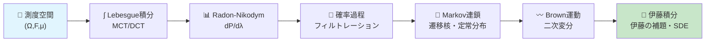
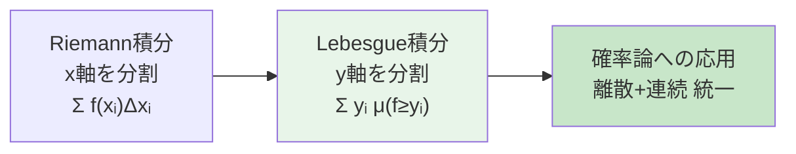
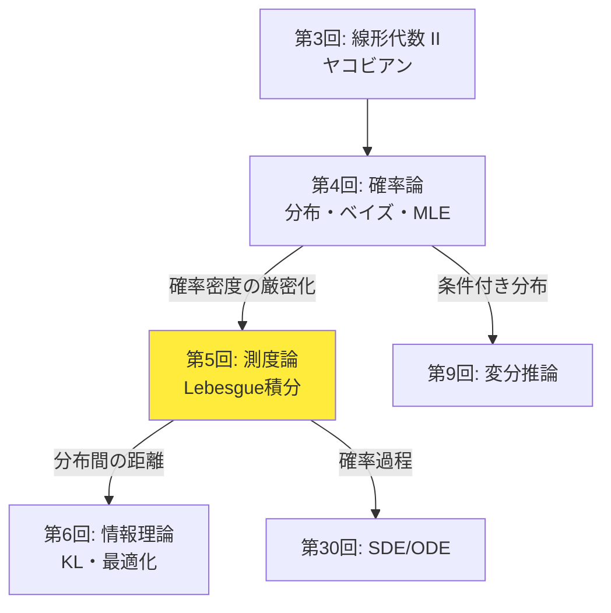
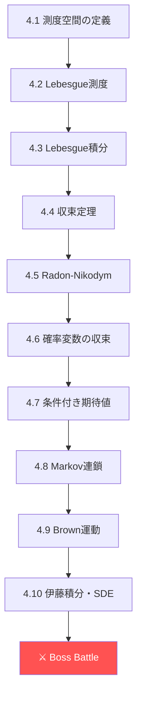
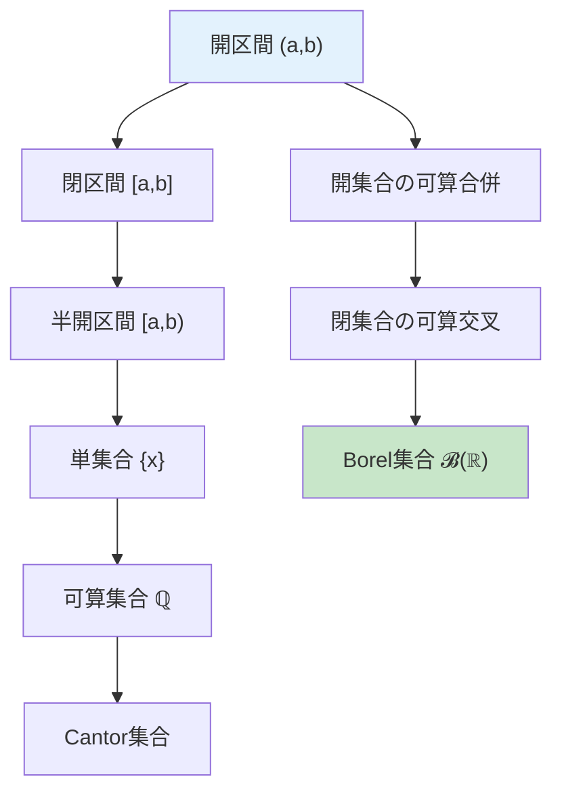
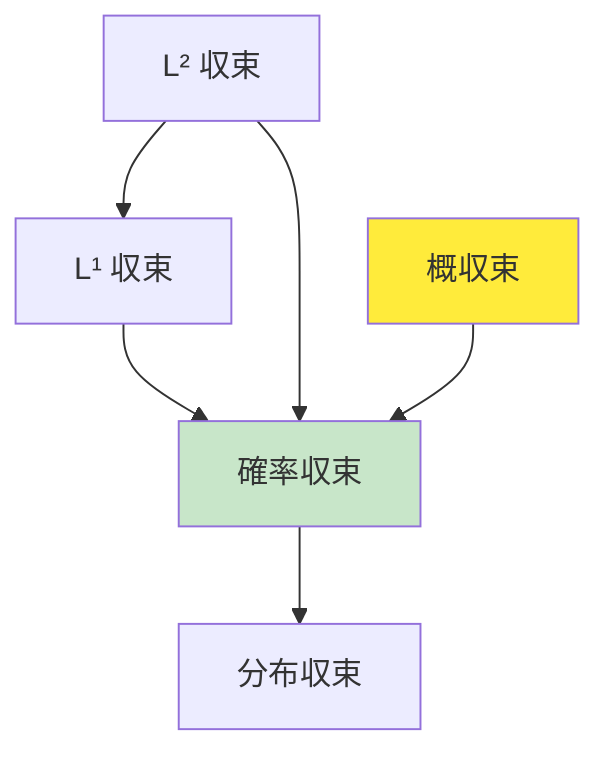
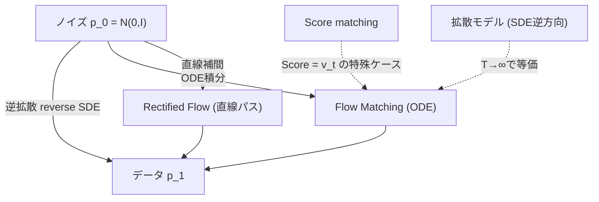
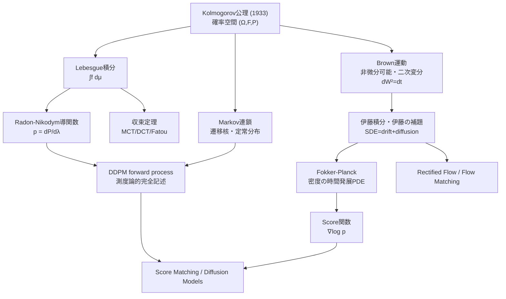

# 第5回: 測度論的確率論・確率過程入門【前編】— 確率の「文法」を手に入れる

> **Lebesgue積分なくして確率密度なし。測度を知らずに生成モデルを語れるか？**

第4回で確率分布を「使える」ようになった。ベイズの定理で事後分布を計算し、MLEでパラメータを推定し、CLTで収束を保証した。だが、1つの根本的な問いを棚上げにしてきた — **確率密度関数とは、厳密に何なのか？**

$f(x) = \frac{1}{\sqrt{2\pi}} e^{-x^2/2}$ を「確率密度関数」と呼んだ。だが $f(0) \approx 0.399$ は「$x=0$ の確率」ではない。連続確率変数の場合、任意の1点の確率は0だ。$P(X = 0) = 0$ なのに $f(0) \neq 0$ — この矛盾を解消するのが測度論だ。

Lebesgue積分で確率密度関数を厳密に定義し、Radon-Nikodym導関数として再解釈する。確率過程（Markov連鎖、Brown運動）も導入し、拡散モデルのSDE定式化への数学的基盤を先行構築する。

> **Note:** このシリーズは全50回の無料講義。理論（論文が書ける）、実装（Production-ready）、最新（2025-2026 SOTA）の3軸で世界トップレベルの深層生成モデル教育を目指す。
>
> 実装編は [【後編】第5回: 測度論・確率過程](/articles/ml-lecture-05-part2) をご覧ください。

## Learning Objectives

本講義を完了すると、以下ができるようになる:

- [ ] 測度空間 $(X, \mathcal{F}, \mu)$ の定義を理解し、Lebesgue測度を説明できる
- [ ] Lebesgue積分の構成（単関数→非負関数→一般関数）を理解できる
- [ ] 単調収束定理・優収束定理・Fatouの補題を使い分けできる
- [ ] Radon-Nikodym導関数として確率密度関数 $f = dP/d\lambda$ を定義できる
- [ ] 確率変数の4つの収束（概収束・確率収束・分布収束・$L^p$収束）の関係を説明できる
- [ ] Markov連鎖の遷移行列・定常分布・エルゴード性を理解できる
- [ ] Brown運動の5つの基本性質と二次変分 $dW^2 = dt$ を説明できる
- [ ] 伊藤積分の定義と伊藤の補題を使った確率微分方程式を扱える
- [ ] DDPMのforward process $q(\mathbf{x}_t \mid \mathbf{x}_{t-1}) = \mathcal{N}(\sqrt{1-\beta_t}\mathbf{x}_{t-1}, \beta_t \mathbf{I})$ を測度論で記述できる



---

## 🚀 Z1. プロローグ（30秒）— 「測度」を3行で体験する

**ゴール**: Lebesgue測度の直感を30秒で掴む。

```python
import numpy as np

# Cantor set: uncountably infinite points, but Lebesgue measure = 0
# Approximate by iteratively removing middle thirds
def cantor_measure(iterations: int = 20) -> float:
    """Compute Lebesgue measure of Cantor set approximation.

    At each step, remaining measure = (2/3)^n of [0,1].
    """
    return (2/3)**iterations

for n in [1, 5, 10, 20]:
    print(f"Cantor set after {n:2d} iterations: measure = {cantor_measure(n):.10f}")
print(f"Cantor set (limit): measure = 0, but |Cantor| = |ℝ| (uncountably infinite!)")
```

出力:
```
Cantor set after  1 iterations: measure = 0.6666666667
Cantor set after  5 iterations: measure = 0.1316872428
Cantor set after 10 iterations: measure = 0.0173415300
Cantor set after 20 iterations: measure = 0.0003007092
Cantor set (limit): measure = 0, but |Cantor| = |ℝ| (uncountably infinite!)
```

**この3行の裏にある衝撃**: Cantor集合は $\mathbb{R}$ と同じ濃度（非可算無限）を持つのに、Lebesgue測度は0。「大きさ」と「濃度」は全く別の概念だ。

測度論はこの「大きさ」を厳密に定義する数学だ。そして**確率密度関数は、確率測度のLebesgue測度に対するRadon-Nikodym導関数**として定義される — これが本講義のゴールだ。

> Progress: 3%

---

## 🎮 Z2. チュートリアル（10分）— 5トピック概観と測度論の必要性

### 2.1 本講義の5大トピック

| # | トピック | 内容 | Zone | Why重要？ |
|:--|:---------|:-----|:-----|:----------|
| 1 | **測度空間とLebesgue積分** | 測度空間 $(X, \mathcal{F}, \mu)$ / σ-加法族 / Lebesgue測度 / 単関数→Lebesgue積分 / MCT・DCT・Fatou | Z4 | 確率密度の厳密な定義基盤 |
| 2 | **Radon-Nikodym・確率変数収束** | Radon-Nikodym導関数 $dP/d\mu$ / 4つの収束 / 条件付き期待値測度論定義 | Z4 | $f(x)$ は $dP/d\lambda$ |
| 3 | **Markov連鎖** | 遷移行列 / Chapman-Kolmogorov / 定常分布 / エルゴード性 / 混合時間 | Z4 | DDPMはMarkov連鎖 |
| 4 | **Brown運動・伊藤積分** | Brown運動5性質 / 二次変分 $dW^2=dt$ / 伊藤積分 / Itô isometry | Z4 | SDEの数学的基盤 |
| 5 | **SDE・Fokker-Planck** | SDE $dX = f\,dt + g\,dW$ / OU過程 / 伊藤の補題 / Euler-Maruyama / Fokker-Planck | Z4 | Score-based生成モデル |

### 2.2 Riemann積分の限界と測度論の必要性

第4回では、期待値を $\mathbb{E}[X] = \int x f(x) dx$ と計算した。この積分はRiemann積分だ。だがRiemann積分には限界がある。

**Dirichlet関数の例**:

$$
f(x) = \begin{cases}
1 & x \in \mathbb{Q} \\
0 & x \in \mathbb{R} \setminus \mathbb{Q}
\end{cases}
$$

この関数はRiemann積分可能ではない（上積分=1, 下積分=0で一致しない）。だがLebesgue積分では:

$$
\int_{[0,1]} f \, d\lambda = 1 \cdot \lambda(\mathbb{Q} \cap [0,1]) + 0 \cdot \lambda((\mathbb{R}\setminus\mathbb{Q}) \cap [0,1]) = 1 \cdot 0 + 0 \cdot 1 = 0
$$

**Lebesgueの鍵となる洞察**: 定義域（$x$軸）ではなく、**値域（$y$軸）をスライスする**。

**Riemann vs Lebesgue積分の本質的違い**:

| 観点 | Riemann積分 | Lebesgue積分 |
|:-----|:-----------|:------------|
| スライス方向 | 定義域（$x$ 軸） | 値域（$y$ 軸） |
| 可積分条件 | 不連続点が零集合 | 可測関数なら常に定義可能 |
| 極限交換 | 条件が厳しい | 単調収束・優収束定理 |
| 確率論 | 離散と連続を別扱い | **統一的に扱える** |



### 2.3 離散と連続の統一 — なぜ測度論か

第4回では離散分布と連続分布を別々に扱った:

- 離散: $\mathbb{E}[X] = \sum_x x \cdot P(X = x)$
- 連続: $\mathbb{E}[X] = \int x \cdot f(x) dx$

だが、離散と連続が混じった分布はどう扱うか？ 例えば、確率0.3で $X = 0$（原子）、残り0.7で $X \sim \mathcal{N}(1, 1)$（連続部分）。

**混合分布の課題**: この分布は純粋に離散でも連続でもない。古典的な確率密度関数PDFは存在しない。

測度論はこれを自然に扱える:

$$
dP = 0.3 \, \delta_0 + 0.7 \, \mathcal{N}(1,1) \, d\lambda
$$

ここで $\delta_0$ = Diracのデルタ測度（点 $x=0$ に質量0.3を集中）、$\lambda$ = Lebesgue測度。

測度論は離散（数え上げ測度）と連続（Lebesgue測度）を**同じ枠組み**で扱える。確率密度関数はRadon-Nikodym導関数 $f = dP/d\mu$ として定義され、基底測度 $\mu$ が何かで離散と連続の区別が吸収される。

### 2.4 確率過程の直感 — ランダムウォーク

**対称ランダムウォーク**: $S_n = \sum_{i=1}^n X_i$ where $X_i \in \{-1, +1\}$ with equal probability.

これは離散時間Markov連鎖かつマルチンゲールの最も単純な例だ。

**重要な性質**:
- $\mathbb{E}[S_n] = 0$（期待値はゼロ）
- $\text{Var}(S_n) = n$（分散は線形増加）
- $\mathbb{E}[S_{n+1} \mid S_n] = S_n$（マルチンゲール性）
- 中心極限定理: $S_n / \sqrt{n} \xrightarrow{d} \mathcal{N}(0, 1)$ as $n \to \infty$

**Brown運動への極限**: ステップ幅 $\Delta x$ と時間間隔 $\Delta t$ を $\Delta x^2 / \Delta t = 1$ を保ちながら0に近づけると、**Brown運動**（Wiener過程）が得られる。この極限操作はDonsker's theoremとして厳密化される。

Brown運動は拡散モデルのforward processの数学的基盤だ。

| 概念 | 離散 | 連続 | ML応用 |
|:-----|:-----|:-----|:-------|
| ランダムウォーク | $S_n = \sum_i X_i$ | Brown運動 $W_t$ | Diffusion forward |
| Markov連鎖 | $P(X_{n+1} \mid X_n)$ | SDE $dX_t = \mu dt + \sigma dW_t$ | Score-based |
| 定常分布 | $\boldsymbol{\pi} P = \boldsymbol{\pi}$ | Fokker-Planck方程式 | 平衡分布 |

### Quick Check

以下の問いに答えられるか確認しよう:

1. **Q1**: Riemann積分とLebesgue積分の本質的な違いは？（ヒント: スライス方向）
2. **Q2**: 有理数の集合 $\mathbb{Q} \cap [0,1]$ のLebesgue測度は？ 0か正か？
3. **Q3**: 混合分布（離散+連続）を統一的に扱うために何が必要？

<details><summary>解答例</summary>

**A1**: Riemann積分は定義域（$x$軸）をスライス、Lebesgue積分は値域（$y$軸）をスライスする。これにより極限交換の条件が緩和され、確率論で離散と連続を統一的に扱える。

**A2**: 0。有理数は可算無限だが、Lebesgue測度では $\lambda(\mathbb{Q} \cap [0,1]) = 0$。「濃度」（集合の大きさ）と「測度」（長さ・体積）は別概念。

**A3**: 測度論。基底測度 $\mu$ を適切に選べば（数え上げ測度+Lebesgue測度の混合）、確率密度関数をRadon-Nikodym導関数 $f = dP/d\mu$ として統一的に定義できる。

</details>

### Quick Check — Z2

<details><summary>Q1: Brown運動は微分可能か？ 確率過程としての特殊性を説明せよ。</summary>

**A**: Brown運動 $W_t$ はほとんどどの経路でも微分不可能。$\mathbb{E}[(W_{t+h} - W_t)^2] = h$ より、差商 $(W_{t+h} - W_t)/h$ の分散は $1/h \to \infty$（$h \to 0$）となり発散する。これが伊藤積分が通常のRiemann-Stieltjes積分と異なる理由で、伊藤の補題の2次項（$(dW)^2 = dt$）はこの性質から来る。

</details>

<details><summary>Q2: Markov連鎖とDDPMのforward processの対応を説明せよ。</summary>

**A**: DDPMのforward process $q(\mathbf{x}_1, \ldots, \mathbf{x}_T \mid \mathbf{x}_0) = \prod_t q(\mathbf{x}_t \mid \mathbf{x}_{t-1})$ は $T$-ステップのMarkov連鎖。各ステップの遷移核 $q(\mathbf{x}_t \mid \mathbf{x}_{t-1}) = \mathcal{N}(\sqrt{1-\beta_t}\mathbf{x}_{t-1}, \beta_t \mathbf{I})$ が遷移確率。Chapman-Kolmogorov方程式より $q(\mathbf{x}_t \mid \mathbf{x}_0) = \mathcal{N}(\sqrt{\bar{\alpha}_t}\mathbf{x}_0, (1-\bar{\alpha}_t)\mathbf{I})$（任意ステップのサンプルが解析的）。定常分布は $\mathcal{N}(\mathbf{0}, \mathbf{I})$。

</details>

> **Zone 2 まとめ**: Riemann積分の限界 → Lebesgue積分の必要性 → 離散と連続の統一 → 確率過程（ランダムウォーク→Brown運動）。測度論は「確率の文法」を厳密にする道具だ。
>
> Progress: 10%

---

## 🧩 Z3. 世界観（15分）— 測度論はなぜ生成モデルに必要か

### 3.1 拡散モデルの数式を「読む」ために

拡散モデル（DDPM [^1]）の前方過程は:

$$
q(\mathbf{x}_{1:T} \mid \mathbf{x}_0) = \prod_{t=1}^{T} q(\mathbf{x}_t \mid \mathbf{x}_{t-1}), \quad q(\mathbf{x}_t \mid \mathbf{x}_{t-1}) = \mathcal{N}(\sqrt{1-\beta_t}\mathbf{x}_{t-1}, \beta_t \mathbf{I})
$$

連続時間版（Song et al. 2020 [^2]）では:

$$
d\mathbf{x} = f(\mathbf{x}, t)dt + g(t)d\mathbf{w}
$$

ここで $\mathbf{w}$ はBrown運動（Wiener過程）。この式を理解するには:

1. **Brown運動の定義** — 測度論が必要（連続だが至る所微分不可能な過程）
2. **確率積分** $\int g \, d\mathbf{w}$ — Itô積分はLebesgue積分の確率版
3. **Fokker-Planck方程式** — SDEが定義する確率測度の時間発展

第30回で完全に扱うが、その基礎を今ここで構築する。

### 3.2 Course Iでの位置づけ



第5回は**Course Iの最難関**だ。測度論は抽象度が高く、多くの教科書が「省略」する。だが省略した先に待っているのは、SDEの式を「読めるが理解できない」状態だ。

| 回 | テーマ | 第5回との接続 |
|:---|:------|:-------------|
| 第4回 | 確率論 | PDF/PMF → **Radon-Nikodym導関数**として統一 |
| **第5回** | **測度論** | **本講義** |
| 第6回 | 情報理論 | KLダイバージェンス = **測度の比の期待値** |
| 第9回 | 変分推論 | ELBO = **測度変換の下での期待値** |
| 第25回 | NF | Change of variables = **pushforward測度** |
| 第30回 | SDE | **Itô積分 = 本講義のBrown運動の直接拡張** |

### 3.3 LLMグラウンディング — トークン空間の測度

第5回のLLM接続は**トークン空間上の確率測度**だ。

LLMの語彙 $\mathcal{V} = \{v_1, \ldots, v_V\}$ は有限集合。この上の確率測度は:

$$
P(\{v_k\}) = \pi_k = \text{softmax}(f_\theta(x_{<t}))_k
$$

有限集合の場合、全ての部分集合が可測（冪集合 $= \sigma$-加法族）。測度論の本領が発揮されるのは、連続的な潜在空間 $\mathcal{Z} = \mathbb{R}^d$ だ。

VAEのエンコーダが出力する $q_\phi(\mathbf{z} \mid \mathbf{x}) = \mathcal{N}(\boldsymbol{\mu}, \text{diag}(\boldsymbol{\sigma}^2))$ は、$\mathbb{R}^d$ 上の確率測度 $Q_\phi$ を定義する。KLダイバージェンス $D_{KL}[Q_\phi \| P]$ は2つの確率測度の「距離」を測る — これを厳密に定義するのに測度論が必要だ。

<details><summary>トロイの木馬 — `%timeit` 初登場</summary>

本講義はPython 95%。残り5%は......`%timeit` だ。

後編のMonte Carlo積分で初めて計算時間を測定する。「Pythonって遅くない？」という疑問が芽生える瞬間。第9回でJuliaが50倍速でELBOを計算する伏線がここから始まる。

今はPythonを信じて、測度論に集中しよう。......でも心の片隅に「速度」を意識し始めてほしい。

</details>

### Quick Check

1. **Q1**: DDPM forward process $q(\mathbf{x}_t \mid \mathbf{x}_{t-1})$ は何分布？
2. **Q2**: SDEの $d\mathbf{w}$ は何？ 通常の微分との違いは？
3. **Q3**: なぜ有限語彙のLLMより連続潜在空間のVAEで測度論が重要？

<details><summary>解答例</summary>

**A1**: ガウス分布 $\mathcal{N}(\sqrt{1-\beta_t}\mathbf{x}_{t-1}, \beta_t \mathbf{I})$。各ステップで少しずつノイズを加えるMarkov連鎖。

**A2**: Brown運動（Wiener過程）の微小変化 $dW_t$。通常の微分と違い、$dW_t^2 = dt$（二次変分が0でない）という特殊性質を持つ。これが伊藤の補題で重要。

**A3**: 有限集合は全部分集合が自動的に可測（冪集合σ-加法族）。連続空間 $\mathbb{R}^d$ ではBorelσ-加法族・Lebesgue測度・Radon-Nikodym導関数を厳密に定義しないと、確率密度 $f(x)$ が何を意味するか不明確になる。

</details>

### Quick Check — Z3

<details><summary>Q1: なぜ確率空間は (Ω, ℱ, P) の三つ組で定義されるのか？</summary>

**A**: Ω（標本空間）だけでは「測れない」集合が存在しうる。ランダム性を数学的に扱うには、どの集合に確率を割り当てるかを決めるσ-加法族 $\mathcal{F}$（Borel族など）が必要。そして $P$ はその集合族上の確率測度。「測れる集合」の枠組みを最初に決めることで、逆説（Banach-Tarski など）を回避できる。

</details>

<details><summary>Q2: Lebesgue積分とRiemann積分はどこが違うのか？ DDPMで必要になるのはなぜか？</summary>

**A**: Riemann積分は「定義域を細分割して縦に積む」— 連続でない関数に弱い。Lebesgue積分は「値域を分割して横に切る」— 広いクラスの関数を扱える。DDPMの確率密度 $q_t(\mathbf{x})$ は高次元空間上の測度で、連続でない関数への積分が出てくる。また、確率変数の期待値・条件付き期待値・Radon-Nikodym導関数はすべてLebesgue積分で定義される。

</details>

> **Zone 3 まとめ**: 測度論が生成モデルのどこで必要になるか、全体像を把握した。DDPM→SDE→Fokker-Planckという連鎖の数学的基盤がここにある。
>
> Progress: 20%

---

## 📐 Z4. Boss Battle（60分）— 測度論の完全武装



### 4.1 測度空間の定義 — 「測れる」とは何か

測度論の第一歩は「何が測れるのか」を定義することだ。直感的には「長さ・面積・体積」を一般化したいが、数学的に厳密に定義するには3つの要素が必要になる。

**定義（測度空間）**: 三つ組 $(S, \mathcal{A}, \mu)$ を測度空間と呼ぶ:

1. $S$ — **全体集合**（例: $\mathbb{R}$, $\mathbb{R}^d$, $[0,1]$, 離散集合）
2. $\mathcal{A}$ — **σ-加法族**: $S$ の部分集合族で、以下を満たす:
   - $\emptyset, S \in \mathcal{A}$
   - $A \in \mathcal{A} \Rightarrow A^c \in \mathcal{A}$（補集合で閉じる）
   - $A_1, A_2, \ldots \in \mathcal{A} \Rightarrow \bigcup_{n=1}^\infty A_n \in \mathcal{A}$（可算合併で閉じる）
3. $\mu: \mathcal{A} \to [0, \infty]$ — **測度関数**: 以下を満たす:
   - $\mu(\emptyset) = 0$（空集合の測度は0）
   - **σ-加法性**: 互いに素な $A_1, A_2, \ldots \in \mathcal{A}$ に対して:
     $$
     \mu\left(\bigcup_{n=1}^\infty A_n\right) = \sum_{n=1}^\infty \mu(A_n)
     $$

**確率測度**: $\mu(S) = 1$ を追加で要求する特殊な測度。確率論は「測度1の測度空間」上の理論。

#### なぜ3つ必要なのか — 各要素の役割

| 要素 | 役割 | 例 | 直感 |
|:-----|:-----|:---|:-----|
| $S$ | 「対象の全体」 | $\mathbb{R}$, サイコロの目$\{1,2,3,4,5,6\}$ | 何を測るか |
| $\mathcal{A}$ | 「測定可能な集合の族」 | Borel集合, すべての部分集合 | どこまで測れるか |
| $\mu$ | 「測り方」 | Lebesgue測度（長さ）, 確率測度 | どう測るか |

**重要な観察**: 全ての部分集合を $\mathcal{A}$ に含めることは **できない**（後述のVitaliの定理）。だからσ-加法族で「測定可能な集合」を制限する必要がある。

#### Borel σ-加法族 — 実数上の標準的な測度空間

**定義（Borelσ-加法族）**: $\mathbb{R}^d$ の **すべての開集合** を含む **最小** のσ-加法族を $\mathcal{B}(\mathbb{R}^d)$ と書く。

**なぜ「開集合から生成」するのか**:
- 開集合は位相の基本要素（連続性・極限の定義に必要）
- 開集合から出発すれば、閉集合（補集合）、半開区間、単集合など全て含まれる
- 通常の確率論で扱う集合はすべてBorel可測

**Borel集合の構成階層**:



**段階的構成**:
1. **開区間**: $(a,b) \in \mathcal{B}(\mathbb{R})$（定義より）
2. **閉区間**: $[a,b] = (a-1, b+1) \setminus ((a-1, a] \cup [b, b+1))$ → Borel
3. **単集合**: $\{x\} = \bigcap_{n=1}^\infty (x - 1/n, x + 1/n)$ → Borel
4. **有理数**: $\mathbb{Q} = \bigcup_{r \in \mathbb{Q}} \{r\}$（可算合併）→ Borel
5. **Cantor集合**: 閉集合の可算交叉 → Borel

#### なぜσ-加法族で制限するのか — Vitaliの非可測集合

「全ての部分集合に測度を割り当てられないのか？」— この自然な疑問への数学的回答が **Vitaliの定理**(1905)だ。

<details><summary>Vitaliの非可測集合の構成（クリックで展開）</summary>

**構成手順**:

1. **同値関係の定義**: $[0,1]$ 上で:
   $$
   x \sim y \iff x - y \in \mathbb{Q}
   $$

   例: $0 \sim 1/2 \sim 1/3 \sim \ldots$（全て同じ同値類）

2. **代表元の選択**: 各同値類から代表元を **1つずつ** 選ぶ（**選択公理** を使用）。この集合を $V$ とする。

3. **矛盾の導出**:

   $[0,1]$ は $V$ を有理数だけ平行移動した集合で覆える:
$$
   [0,1] \subset \bigcup_{q \in \mathbb{Q} \cap [-1,1]} (V + q) \subset [-1, 2]
   $$

   もし $\lambda(V) = c$ と仮定すると:

   - **Case 1**: $c = 0$ の場合
$$
     \lambda([0,1]) \leq \sum_{q \in \mathbb{Q} \cap [-1,1]} \lambda(V + q) = \sum_{q} 0 = 0
     $$
     矛盾（$\lambda([0,1]) = 1$）

   - **Case 2**: $c > 0$ の場合
$$
     1 = \lambda([0,1]) \geq \sum_{q} c = \infty
     $$
     矛盾

   したがって $V$ には Lebesgue測度を割り当てられない。

**Why これが問題か**: σ-加法性と平行移動不変性を **両立** させると、Vitali集合のような「病的な集合」が可測でなくなる。数学的に一貫した測度論を構築するには、可測集合を σ-加法族に制限する必要がある。

**実用上の影響**:
- ✅ 機械学習で扱う集合（開集合、閉集合、Borel集合）は **すべて可測**
- ✅ 確率分布の台、ニューラルネットの出力空間 → すべてBorel
- ❌ Vitali集合は選択公理による抽象的構成でのみ出現（実用上遭遇しない）

</details>

#### Borel可測性の判定表

| 集合 | 可測性 | 理由 | Lebesgue測度 |
|:-----|:-------|:-----|:-------------|
| 開区間 $(a,b)$ | ✅ Borel | 生成元 | $b - a$ |
| 閉区間 $[a,b]$ | ✅ Borel | 開集合の補集合 | $b - a$ |
| 半開区間 $[a,b)$ | ✅ Borel | $(a - \epsilon, b)$ の極限 | $b - a$ |
| 単集合 $\{x\}$ | ✅ Borel | $\bigcap_{n=1}^\infty (x - 1/n, x + 1/n)$ | $0$ |
| 有理数 $\mathbb{Q} \cap [0,1]$ | ✅ Borel | 可算合併 $\bigcup_{r \in \mathbb{Q}} \{r\}$ | $0$ |
| Cantor集合 $C$ | ✅ Borel | 閉集合の可算交叉 | $0$ |
| Vitali集合 $V$ | ❌ NOT Borel | 選択公理 + 矛盾 | 定義不可 |
| 任意の開集合 | ✅ Borel | 定義 | 区間長の和 |
| 開集合の可算合併 | ✅ Borel | σ-加法族の性質 | σ-加法性で計算 |

**重要な観察**:
1. **可算集合の測度は0**: $\mathbb{Q}$, $\mathbb{Z}$ など → 「薄い」
2. **非可算でも測度0**: Cantor集合 → 「隙間だらけ」
3. **測度0 ≠ 空集合**: 無限個の点を含んでも測度0はあり得る

**ボレル集合族の直感的理解**:

ℝ上のボレル集合族 $\mathcal{B}(\mathbb{R})$ は「開区間から始めて可算個の集合演算で作れる全ての集合の族」。具体的には:

- 全ての開区間 $(a, b)$ ∈ $\mathcal{B}(\mathbb{R})$
- 全ての閉区間 $[a, b]$ ∈ $\mathcal{B}(\mathbb{R})$（開区間の可算交叉）
- 全ての有理数の集合 $\mathbb{Q}$ ∈ $\mathcal{B}(\mathbb{R})$（可算和）
- CanABLEトール集合（非可算だが測度0）∈ $\mathcal{B}(\mathbb{R})$

一方、**ボレル集合族に含まれない**集合も存在する（選択公理を使って構成できる「測定不可能な集合」）。これが「測れる集合」を明示的に指定する理由だ。

**確率変数の可測性**: 確率変数 $X: (\Omega, \mathcal{F}) \to (\mathbb{R}, \mathcal{B}(\mathbb{R}))$ の「可測性」とは:

$$
X^{-1}(B) = \{\omega \in \Omega : X(\omega) \in B\} \in \mathcal{F} \quad \forall B \in \mathcal{B}(\mathbb{R})
$$

直感: 任意の「実数の測れる部分集合」の逆像が「事象の測れる部分集合」になる。これにより $P(X \in B) = P(X^{-1}(B))$ が意味を持つ。

**生成されたσ-加法族** $\sigma(X)$: 確率変数 $X$ が生成するσ-加法族。$X$ の観測から得られる「情報」を表す。フィルトレーション $\mathcal{F}_t = \sigma(W_s : s \leq t)$ はBrown運動の「時刻 $t$ までの情報」。

### 4.2 Lebesgue測度 — 「長さ」の数学的定義

Lebesgue測度は、我々の直感的な「長さ・面積・体積」を数学的に厳密化したものだ。

**定義（Lebesgue測度, 1次元）**: $\mathbb{R}$ 上のLebesgue測度 $\lambda$ は以下の性質を持つ測度:

1. **区間の長さ**: $\lambda([a,b]) = b - a$
2. **平行移動不変**: $\lambda(A + c) = \lambda(A)$（$A + c = \{x + c : x \in A\}$）
3. **σ-加法性**: 互いに素な可測集合 $A_1, A_2, \ldots$ に対して:
   $$
   \lambda\left(\bigcup_{n=1}^\infty A_n\right) = \sum_{n=1}^\infty \lambda(A_n)
   $$

この3性質を満たす測度として、Lebesgue測度は **一意** に定まる。

#### 直感的理解 — なぜこの定義か

| 性質 | 意味 | 例 |
|:-----|:-----|:---|
| 区間の長さ | $[0,1]$の長さは1 | 定義の出発点 |
| 平行移動不変 | 位置によらない | $[0,1]$と$[5,6]$の長さは同じ |
| σ-加法性 | 分割して足せる | $[0,1] = [0, 1/2] \cup [1/2, 1]$ → $1 = 1/2 + 1/2$ |

#### Lebesgue測度の重要な性質

**定理（Lebesgue測度の基本性質）**:

1. **スケーリング**: $\lambda(cA) = |c| \lambda(A)$
   - 例: $\lambda([0, 2]) = 2 \lambda([0, 1]) = 2$

2. **可算加法性（一般形）**: 互いに素でなくても:
$$
   \lambda(A \cup B) = \lambda(A) + \lambda(B) - \lambda(A \cap B)
   $$

3. **単調性**: $A \subset B \Rightarrow \lambda(A) \leq \lambda(B)$

4. **連続性（下から）**: $A_1 \subset A_2 \subset \cdots$ なら:
$$
   \lambda\left(\bigcup_{n=1}^\infty A_n\right) = \lim_{n\to\infty} \lambda(A_n)
   $$

5. **連続性（上から）**: $A_1 \supset A_2 \supset \cdots$ かつ $\lambda(A_1) < \infty$ なら:
$$
   \lambda\left(\bigcap_{n=1}^\infty A_n\right) = \lim_{n\to\infty} \lambda(A_n)
   $$

#### Case Study 1: 有理数の測度が0である理由

**問い**: $\mathbb{Q} \cap [0,1]$ のLebesgue測度は？

**答え**: $\lambda(\mathbb{Q} \cap [0,1]) = 0$

**証明のステップ**:

1. **列挙**: 有理数は可算なので、$\mathbb{Q} \cap [0,1] = \{r_1, r_2, r_3, \ldots\}$ と列挙できる。

2. **カバー構成**: 任意の $\epsilon > 0$ に対して、各 $r_n$ を幅 $\epsilon/2^n$ の区間でカバー:
$$
   r_n \in I_n = \left(r_n - \frac{\epsilon}{2^{n+1}}, r_n + \frac{\epsilon}{2^{n+1}}\right)
   $$

3. **測度の評価**:
$$
   \lambda(\mathbb{Q} \cap [0,1]) \leq \lambda\left(\bigcup_{n=1}^\infty I_n\right) \leq \sum_{n=1}^\infty \lambda(I_n) = \sum_{n=1}^\infty \frac{\epsilon}{2^n} = \epsilon
   $$

4. **極限**: $\epsilon \to 0$ で $\lambda(\mathbb{Q} \cap [0,1]) = 0$

**直感**: 有理数は「可算無限個」あるが、各点を「どんどん小さい区間」でカバーできるので、全体の「長さ」は0になる。

#### Case Study 2: Cantor集合 — 非可算だが測度0

**Cantor集合の構成**:

1. $C_0 = [0,1]$ からスタート
2. $C_1 = [0, 1/3] \cup [2/3, 1]$（中央1/3を除去）
3. $C_2 = [0, 1/9] \cup [2/9, 1/3] \cup [2/3, 7/9] \cup [8/9, 1]$（各区間から中央1/3を除去）
4. 無限に繰り返して $C = \bigcap_{n=0}^\infty C_n$

**測度の計算**:

$$
\lambda(C_n) = \left(\frac{2}{3}\right)^n \to 0 \quad \text{as } n \to \infty
$$

したがって $\lambda(C) = \lim_{n\to\infty} \lambda(C_n) = 0$。

**驚くべき事実**: Cantor集合は:
- ✅ **非可算無限** の元を持つ（$\mathbb{R}$ と同じ濃度！）
- ✅ **完全集合**（すべての点が集積点）
- ❌ Lebesgue測度は **0**

> **重要**: 「測度0 ≠ 空集合」「測度0 ≠ 可算」。測度0でも非可算無限の点を含みうる。

#### 確率論への含意 — 測度0事象の誤解

**誤解**: 「確率0 = 起こらない」

**正しい理解**: 「確率0 = almost surely 起こらない」

**例**: 標準正規分布 $X \sim \mathcal{N}(0,1)$ で:
- $P(X = 0) = 0$（単一点の確率）
- だが $X = 0$ という事象は **存在する**（サンプル空間に含まれる）
- 「確率0」は「無限回サンプリングしてもほぼ遭遇しない」を意味

**連続確率変数の本質**:
$$
P(X = x) = 0 \quad \forall x \in \mathbb{R}
$$

だが:
$$
P(X \in [a,b]) = \int_a^b f(x) \, dx > 0
$$

測度論なくしてこの区別は厳密に説明できない。

**Lebesgue測度の構成（概略）**:

**Step 1 — 外測度**: 任意の集合 $A \subset \mathbb{R}$ に対し、可算個の開区間でカバーしたときの最小総長:

$$
\lambda^*(A) = \inf\left\{\sum_{k=1}^\infty (b_k - a_k) : A \subset \bigcup_{k=1}^\infty (a_k, b_k)\right\}
$$

**Step 2 — 可測集合**: Carathéodory条件を満たす集合を「可測」と定義。ボレル集合族はすべて可測。

**Step 3 — 測度**: 可測集合上で $\lambda = \lambda^*$ — これがLebesgue測度。

**Cantor集合の例**: 閉区間 $[0,1]$ から中間1/3を繰り返し取り除いた集合。非可算無限個の点を含むが $\lambda(\text{Cantor}) = 0$（「長さゼロの完全集合」）。これは直感に反するが測度論では完全に正常。Lebesgue測度は「どれだけ連続的な空間を占めるか」を測る。

**高次元への拡張**: $\mathbb{R}^d$ 上のLebesgue測度は $d$-次元「体積」。確率密度 $f(\mathbf{x})$ は $\mathbb{R}^d$ 上のLebesgue測度に対するRadon-Nikodym導関数。高次元では「ほぼ全て」の確率質量が球殻に集中する（次元の呪い）。

### 4.3 Lebesgue積分

**構成**:

1. **単関数**: $s(x) = \sum_{i=1}^{n} c_i \cdot \mathbf{1}_{A_i}(x)$（$A_i$ は可測集合）に対して:

   $$
   \int s \, d\mu = \sum_{i=1}^{n} c_i \cdot \mu(A_i)
   $$

2. **非負可測関数**: $f \geq 0$ に対して:

$$
   \int f \, d\mu = \sup\left\{\int s \, d\mu : 0 \leq s \leq f, \; s \text{ は単関数}\right\}
   $$

3. **一般の可測関数**: $f = f^+ - f^-$（$f^+ = \max(f, 0)$, $f^- = \max(-f, 0)$）に対して:

$$
   \int f \, d\mu = \int f^+ d\mu - \int f^- d\mu
   $$

   （少なくとも一方が有限のとき定義される）

**Why この構成か**: 単関数は「階段関数の測度論版」。任意の非負関数を単関数で下から近似し、上限を取る。この定義により:

- Lebesgue積分は値域（$y$軸）をスライスする
- 極限交換が容易（単調収束定理・優収束定理）
- 離散と連続を統一的に扱える

**Dirichlet関数の例**:

$$
f(x) = \begin{cases}
1 & x \in \mathbb{Q} \\
0 & x \in \mathbb{R} \setminus \mathbb{Q}
\end{cases}
$$

Riemann積分では定義不可能（上積分=1, 下積分=0）。Lebesgue積分では:

$$
\int_{[0,1]} f \, d\lambda = 1 \cdot \lambda(\mathbb{Q} \cap [0,1]) + 0 \cdot \lambda((\mathbb{R}\setminus\mathbb{Q}) \cap [0,1]) = 1 \cdot 0 + 0 \cdot 1 = 0
$$

**Lebesgue積分とRiemann積分の比較**:

$$
\text{Riemann: } \int_a^b f(x)dx = \lim_{\|P\| \to 0} \sum_i f(x_i^*)(x_{i+1} - x_i)
$$

$$
\text{Lebesgue: } \int f \, d\mu = \lim_{n \to \infty} \sum_k \frac{k}{n} \cdot \mu\left(\{x : \frac{k}{n} \leq f(x) < \frac{k+1}{n}\}\right)
$$

Riemannは「縦に」切るのに対し、Lebesgueは「横に」切って面積を測る。直感：Riemannは積分できないが Lebesgue は積分できる関数の例として、有理数上で1、無理数上で0の関数 $\mathbf{1}_{\mathbb{Q}}$ がある。Lebesgue積分では $\int \mathbf{1}_{\mathbb{Q}} d\lambda = \lambda(\mathbb{Q}) = 0$（有理数の集合はLebesgue測度0）。

**確率論への適用**: 確率空間 $(\Omega, \mathcal{F}, P)$ 上で確率変数 $X$ の期待値は:

$$
\mathbb{E}[X] = \int_\Omega X(\omega) \, dP(\omega)
$$

離散変数では $\sum_i x_i p_i$、連続変数では $\int x f(x) dx$ が同じ枠組みで統一される。$f(x) = dP_X/d\lambda$ がRadon-Nikodym導関数であることを確認すると、全ての公式が繋がる。

**$L^p$ 空間**: Lebesgue積分を用いて定義される関数空間:

$$
L^p(\Omega, \mathcal{F}, \mu) = \left\{f : \int |f|^p d\mu < \infty\right\}, \quad \|f\|_p = \left(\int |f|^p d\mu\right)^{1/p}
$$

確率論では $L^2$（平方可積分）が特に重要。$L^2$はヒルベルト空間で、内積 $\langle f, g \rangle = \int fg \, d\mu$、ノルム $\|f\|_2$ を持つ。条件付き期待値の射影的解釈はこの構造から来ている。

### 4.4 収束定理 — Lebesgue積分の威力

Lebesgue積分の真の威力は、極限交換の容易さにある。

**定理（単調収束定理, MCT）**: $0 \leq f_1 \leq f_2 \leq \cdots$ を非負可測関数の増加列とする。このとき:

$$
\int \lim_{n\to\infty} f_n \, d\mu = \lim_{n\to\infty} \int f_n \, d\mu
$$

**Why重要？**: 非負性と単調性だけで極限と積分が交換可能。Riemann積分では一様収束など強い条件が必要。

**定理（優収束定理, DCT）**: $|f_n| \leq g$ で $\int g \, d\mu < \infty$ なる可積分関数 $g$ が存在し、$f_n \to f$ a.e. ならば:

$$
\int \lim_{n\to\infty} f_n \, d\mu = \lim_{n\to\infty} \int f_n \, d\mu
$$

**Why重要？**: 上から抑える関数 $g$ があれば極限交換可能。確率論でMCMCの収束証明等に頻出。

**定理（Fatouの補題）**: $f_n \geq 0$ なる非負可測関数列に対して:

$$
\int \liminf_{n\to\infty} f_n \, d\mu \leq \liminf_{n\to\infty} \int f_n \, d\mu
$$

**Why重要？**: MCTやDCTが使えないときの最後の砦。不等式だけでも極限操作を正当化できる。

**3定理の使い分け**:

| 定理 | 条件 | 結論 | 使用場面 |
|:-----|:-----|:-----|:---------|
| MCT | $f_n \geq 0$, $f_n \uparrow$ | 等号 | 級数和、増加列 |
| DCT | $|f_n| \leq g$ | 等号 | MCMC収束、パラメトリック極限 |
| Fatou | $f_n \geq 0$ のみ | 不等号 | 最弱条件、下界 |

**支配収束定理（DCT）の詳細**:

**定理**: $f_n \to f$ (a.e.)、かつ全ての $n$ に対して $|f_n| \leq g$ となる可積分関数 $g$（支配関数）が存在するならば:

$$
\lim_{n \to \infty} \int f_n \, d\mu = \int f \, d\mu
$$

**Why Riemann積分では不十分か**: Riemann積分では「関数列が一様収束する場合にのみ」極限と積分を交換できる。DCTは一様収束の代わりに「支配関数の存在」という弱い条件で同じ結論を引き出す。

**ML応用 — 勾配のMCMC推定**: モデルパラメータ $\theta$ に対する対数尤度の勾配:

$$
\nabla_\theta \mathbb{E}_{p_\theta}[f(x)] = \nabla_\theta \int f(x) p_\theta(x) dx = \int f(x) \nabla_\theta p_\theta(x) dx
$$

この「積分と微分の交換」は $|f(x) \nabla_\theta \log p_\theta(x)| \leq g(x)$ が可積分ならDCTで正当化される。Score Matching が成立するための技術的前提がここにある。

**単調収束定理（MCT）との違い**:

- MCT: 非負関数列の単調増加 → 支配関数不要（積分が $+\infty$ でも可）
- DCT: 任意の収束関数列 → 支配関数必要（積分が有限値に収束）
- MCT $\Rightarrow$ Fatouの補題 $\Rightarrow$ DCT という導出関係がある

**Fatouの補題**:

$$
\int \liminf_{n \to \infty} f_n \, d\mu \leq \liminf_{n \to \infty} \int f_n \, d\mu \quad (f_n \geq 0)
$$

下極限と積分の不等号方向は固定（等号は不成立の場合あり）。DCTの証明でFatouの補題を2回使う（$g + f_n \geq 0$ と $g - f_n \geq 0$）。

**Fubini-Tonelli定理**:

$$
\int_{X \times Y} f \, d(\mu \otimes \nu) = \int_X \left(\int_Y f(x,y) \, d\nu(y)\right) d\mu(x) = \int_Y \left(\int_X f(x,y) \, d\mu(x)\right) d\nu(y)
$$

非負関数（Tonelli）または絶対可積分（Fubini）の場合に積分の順序交換が可能。

**ML応用**: VAEのELBOの計算:

$$
\mathbb{E}_{x \sim p_{\text{data}}}\left[\mathbb{E}_{z \sim q_\phi(z|x)}[\log p_\theta(x|z)]\right] = \int \int \log p_\theta(x|z) \cdot q_\phi(z|x) \cdot p_{\text{data}}(x) \, dz \, dx
$$

この二重積分の順序交換（$dz \, dx$ vs $dx \, dz$）はFubini定理が保証する。バッチ学習でサンプルと潜在変数の積分を独立に扱える理由がここにある。

### 4.5 Radon-Nikodym導関数 — 確率密度の正体

**定理（Radon-Nikodym）**: $P, Q$ を $(S, \mathcal{A})$ 上の測度とする。$P \ll Q$（$P$は$Q$に関して絶対連続）ならば、可測関数 $f: S \to [0, \infty)$ が存在して:

$$
P(A) = \int_A f \, dQ \quad \forall A \in \mathcal{A}
$$

この $f$ を $dP/dQ$ と書き、**Radon-Nikodym導関数**と呼ぶ。

**Why「絶対連続」か**: $P \ll Q$ とは「$Q(A) = 0 \Rightarrow P(A) = 0$」を意味する。直感的には「$Q$で測度0の集合は$P$でも測度0」。

**確率密度関数の厳密定義**: 確率変数 $X$ の確率測度を $P_X$、Lebesgue測度を $\lambda$ とする。$P_X \ll \lambda$ ならば:

$$
f(x) = \frac{dP_X}{d\lambda}
$$

が確率密度関数（PDF）だ。つまり**PDFとはRadon-Nikodym導関数**である。

**離散分布の場合**: 数え上げ測度 $\mu_c$（各点の測度=1）に対して:

$$
p(x) = \frac{dP_X}{d\mu_c}
$$

が確率質量関数（PMF）。離散と連続が同じ構造で理解できる。

**Why この定義が本質か**:

- $f(x)$ 自体は確率ではない（連続分布で $P(X=x) = 0$）
- $f(x)$ は「測度の変換因子」— $P(X \in [x, x+dx]) \approx f(x) \, dx$
- Radon-Nikodym定理がこの直感を厳密化

**Kullback-Leibler ダイバージェンスとの接続**:

$P \ll Q$ のとき、KLダイバージェンスはRadon-Nikodym導関数で書ける:

$$
D_{\mathrm{KL}}(P \| Q) = \int \log\frac{dP}{dQ} \, dP = \mathbb{E}_P\left[\log\frac{dP}{dQ}\right]
$$

$P \not\ll Q$ のとき $D_{\mathrm{KL}}(P \| Q) = +\infty$（定義による）。これが「サポートが異なる分布間のKLは無限」の本質的理由だ。

**変分オートエンコーダのELBO**:

$$
\mathcal{L}_{\text{ELBO}} = \mathbb{E}_{q_\phi(z|x)}[\log p_\theta(x|z)] - D_{\mathrm{KL}}(q_\phi(z|x) \| p(z))
$$

第2項の $D_{\mathrm{KL}}(q_\phi \| p)$ は $dq_\phi/dp$（Radon-Nikodym導関数）の対数期待値。ガウス分布の場合にのみ解析的に計算でき、一般分布では数値積分が必要なのはこのためだ。

**Girsanov変換との接続**:

確率測度 $P$ の下でのBrown運動 $W_t$ を、別の測度 $Q$ の下に移す変換。Radon-Nikodym導関数は:

$$
\frac{dQ}{dP}\bigg|_{\mathcal{F}_t} = \exp\left(\int_0^t \theta_s dW_s - \frac{1}{2}\int_0^t \theta_s^2 ds\right)
$$

これはNovikov条件 $\mathbb{E}[\exp(\frac{1}{2}\int_0^T \theta_s^2 ds)] < \infty$ の下で有効。DDPMのScore関数 $s_\theta(x_t, t)$ が本質的にGirsanov変換のdriftを学習している、という視点がある。

### 4.6 確率変数の収束 — 4つの収束概念

**定義（概収束, a.s. convergence）**: $P(\{\omega : X_n(\omega) \to X(\omega)\}) = 1$ のとき $X_n \xrightarrow{a.s.} X$。

**定義（確率収束, convergence in probability）**: 任意の $\epsilon > 0$ に対して $\lim_{n\to\infty} P(|X_n - X| > \epsilon) = 0$ のとき $X_n \xrightarrow{P} X$。

**定義（分布収束, convergence in distribution）**: 任意の連続点 $x$ で $\lim_{n\to\infty} F_{X_n}(x) = F_X(x)$ のとき $X_n \xrightarrow{d} X$。

**定義（$L^p$収束）**: $\lim_{n\to\infty} \mathbb{E}[|X_n - X|^p] = 0$ のとき $X_n \xrightarrow{L^p} X$。

**収束の強さの関係**:



- 概収束 $\Rightarrow$ 確率収束 $\Rightarrow$ 分布収束
- $L^p$収束 $\Rightarrow$ 確率収束
- 逆は一般に成立しない（反例が存在）

**Why 分布収束が最弱？**: 中心極限定理は分布収束。$X_n \xrightarrow{d} X$ でも $X_n$ と $X$ の実現値は全く異なってよい（分布の形だけが近づく）。

**反例 — 概収束しないが確率収束する列**:

$[0,1]$ 上の一様分布を考える。$X_n = \mathbf{1}_{[k/2^m, (k+1)/2^m]}$（$n = 2^m + k$）と定義すると:

- $X_n \xrightarrow{P} 0$（各 $x$ の区間への滞在時間 $\to 0$）
- $X_n(\omega) \to 0$ はどの $\omega$ でも成立しない（各 $\omega$ はどの小区間にも無限回属する）

よって確率収束するが概収束はしない — 「分子が揺れ続ける」型の反例だ。

**Slutskyの定理**: $X_n \xrightarrow{d} X$、$Y_n \xrightarrow{P} c$（定数）ならば:

$$
X_n + Y_n \xrightarrow{d} X + c, \quad X_n \cdot Y_n \xrightarrow{d} cX
$$

CLTの応用で $Y_n = \hat{\sigma}_n \xrightarrow{P} \sigma$ のとき、正規化された統計量の漸近分布を正当化するために使う。

**連続写像定理 (CMT)**: $X_n \xrightarrow{d} X$ かつ $g$ が連続（a.s.）ならば $g(X_n) \xrightarrow{d} g(X)$。モデルのactivation関数が連続であることが保証する収束性の背景にある。


### 4.7 条件付き期待値の測度論的定義

**定義（条件付き期待値）**: $X$ を可積分確率変数、$\mathcal{G} \subset \mathcal{F}$ をσ-加法族とする。以下を満たす $\mathcal{G}$-可測な確率変数 $Y$ を $\mathbb{E}[X \mid \mathcal{G}]$ と書く:

$$
\int_A Y \, dP = \int_A X \, dP \quad \forall A \in \mathcal{G}
$$

**Why この定義か**:

- 古典的定義（$\mathbb{E}[X \mid Y=y]$）は $Y$ が離散/連続で異なる処理が必要
- 測度論的定義は情報（σ-加法族 $\mathcal{G}$）に対する射影として統一的

**マルチンゲールへの接続**: $X_n$ が $\mathcal{F}_n$-マルチンゲール $\iff$ $\mathbb{E}[X_{n+1} \mid \mathcal{F}_n] = X_n$。この定義には測度論的条件付き期待値が不可欠。

**存在と一意性**: Radon-Nikodym定理の帰結。$P|_\mathcal{G}$（$\mathcal{G}$ への制限）に関して $X \cdot P|_\mathcal{G}$ が定義でき、その導関数として $Y = dP_X/dP|_\mathcal{G}$ が一意に（a.s.）存在する。

**射影の性質**: ヒルベルト空間 $L^2(\Omega, \mathcal{F}, P)$ において、$\mathbb{E}[X \mid \mathcal{G}]$ は $X$ の $L^2(\Omega, \mathcal{G}, P)$ への直交射影:

$$
\mathbb{E}[X \mid \mathcal{G}] = \operatorname{arg\,min}_{Z \text{ is } \mathcal{G}\text{-measurable}} \mathbb{E}[(X - Z)^2]
$$

**ベイズ推論との接続**: 事後分布 $p(z|x) = dP_{Z|X=x}/d\lambda$ の存在は Radon-Nikodym 定理で保証。条件付き期待値 $\mathbb{E}[Z|X=x]$ が MAP推定量や MMSE推定量の理論基盤。

**タワー性質 (Law of Total Expectation)**:

$$
\mathbb{E}[\mathbb{E}[X \mid \mathcal{G}]] = \mathbb{E}[X]
$$

ELBO導出でも使う。$\mathbb{E}_{x}[\mathbb{E}_{z|x}[f(z, x)]] = \mathbb{E}_{x,z}[f(z, x)]$ という形でVAEの変分下界計算に現れる。

### 4.8 Markov連鎖 — 離散確率過程

**定義（Markov連鎖）**: 確率過程 $\{X_n\}_{n \geq 0}$ が以下を満たすとき、Markov連鎖と呼ぶ:

$$
P(X_{n+1} = j \mid X_n = i, X_{n-1} = i_{n-1}, \ldots, X_0 = i_0) = P(X_{n+1} = j \mid X_n = i)
$$

**遷移行列**: $P_{ij} = P(X_{n+1} = j \mid X_n = i)$ を $(i,j)$ 成分とする行列 $P$。

**Chapman-Kolmogorov方程式**: $n$-ステップ遷移確率は:

$$
P^{(n)} = P^n \quad \text{(行列の $n$ 乗)}
$$

**定常分布**: 確率ベクトル $\boldsymbol{\pi}$ が $\boldsymbol{\pi} P = \boldsymbol{\pi}$ を満たすとき定常分布と呼ぶ。

**エルゴード定理**: 有限状態既約非周期Markov連鎖は、一意の定常分布 $\boldsymbol{\pi}$ に収束:

$$
\lim_{n\to\infty} P^{(n)}_{ij} = \pi_j \quad \forall i,j
$$

**混合時間**: 定常分布に $\epsilon$-近づくまでのステップ数:

$$
\tau_{\text{mix}}(\epsilon) = \min\{n : \|P^n(i, \cdot) - \boldsymbol{\pi}\|_{TV} \leq \epsilon, \; \forall i\}
$$

**ML応用**: DDPMのforward processは $T$-ステップMarkov連鎖。定常分布は標準正規分布 $\mathcal{N}(\mathbf{0}, \mathbf{I})$。

**エルゴード定理の数値的直感**:

定常分布 $\pi$ を持つエルゴード的Markov連鎖では、時間平均 = 空間平均:

$$
\frac{1}{N}\sum_{n=1}^N f(X_n) \xrightarrow{N \to \infty} \sum_x f(x) \pi(x) = \mathbb{E}_\pi[f]
$$

これはMCMCの理論的根拠だ。Markov連鎖が定常分布に「混合」すれば、そのパスからのサンプルは $\pi$ からのサンプルと同等になる。

**Chapman-Kolmogorov方程式**:

遷移確率 $P_{ij}^{(n)}$（$n$ ステップで $i \to j$）は遷移行列の$n$乗:

$$
P^{(m+n)} = P^{(m)} \cdot P^{(n)}
$$

**DDPMとの接続**: forward process $q(\mathbf{x}_t \mid \mathbf{x}_0)$ はChapman-Kolmogorov方程式の連続時間版。$t$ステップの周辺分布が遷移核の連続積で書けるのは、この方程式の帰結だ。

**定常分布の一意性** — Perron-Frobenius定理: 既約・非周期的な有限Markov連鎖の遷移行列 $P$ は、固有値1を唯一の最大固有値として持つ。対応する固有ベクトルが定常分布 $\pi$。収束速度は第2固有値 $|\lambda_2|$ で決まる（混合時間 $\approx 1/(-\log|\lambda_2|)$）。

### 4.9 Brown運動（Wiener過程）

Brown運動 $\{W_t\}_{t \geq 0}$ は次の5性質で定義される:

**公理的定義**:
1. $W_0 = 0$（ほぼ確実に）
2. **独立増分**: $0 \leq s < t \leq u < v$ なら $W_t - W_s$ と $W_v - W_u$ は独立
3. **定常増分**: $W_t - W_s \sim \mathcal{N}(0, t-s)$（分布は時刻差のみに依存）
4. **連続パス**: $t \mapsto W_t(\omega)$ はほぼ確実に連続
5. $W_0 = 0$（再掲）

**公理 3 の意味**: $t-s$ だけ時間が経つと、変化量は $\mathcal{N}(0, t-s)$ になる。標準偏差 $\sqrt{t-s}$ は「距離」ではなく「時間の平方根」だ。1秒で標準偏差1歩、4秒で2歩、100秒で10歩。

**非微分可能性の証明スケッチ**:

$$
\frac{W_{t+h} - W_t}{h} \sim \mathcal{N}\!\left(0, \frac{1}{h}\right)
$$

$h \to 0$ で分散 $1/h \to \infty$ — 微分が存在しない。直感: 「パスが細かく見るほどギザギザになる」。Hausdorff次元1.5（測度論的事実）。

**二次変分** $[W]_t = t$:

$$
[W]_T = \lim_{\|\Pi\| \to 0} \sum_{i} (W_{t_{i+1}} - W_{t_i})^2 = T \quad \text{(確率収束)}
$$

通常の関数の二次変分は0。$[W]_t = t \neq 0$ が伊藤積分の2次項 $(dW)^2 = dt$ の源だ。

**存在性**: Kolmogorov連続性定理（1933）。「適切なモーメント条件を満たす確率過程は連続修正を持つ」。Brown運動は $\mathbb{E}[|W_t - W_s|^4] = 3(t-s)^2$ を満たすので連続パスが存在。

**Wiener空間**: Brown運動は $C([0,T])$（連続関数空間）上の確率測度（Wiener測度）として定義できる。この測度に関する期待値が伊藤積分の基盤だ。


**定義（Brown運動）**: 確率過程 $\{W_t\}_{t \geq 0}$ が以下を満たすとき、Brown運動（Wiener過程）と呼ぶ:

1. $W_0 = 0$（原点からスタート）
2. 独立増分: $0 \leq s < t$ に対して $W_t - W_s$ は $W_s$ と独立
3. 定常増分: $W_t - W_s \sim \mathcal{N}(0, t-s)$
4. $t \mapsto W_t$ は連続（almost surely）
5. 至る所微分不可能（almost surely）

**二次変分**: Brown運動の特殊性質:

$$
\lim_{|\Delta t_i| \to 0} \sum_i (W_{t_{i+1}} - W_{t_i})^2 = T \quad \text{(in probability)}
$$

形式的に $dW_t^2 = dt$ と書く。これが伊藤の補題の鍵。

**Why 至る所微分不可能？**: もし $W_t$ が微分可能なら、Taylorの定理より:

$$
\sum_i (W_{t_{i+1}} - W_{t_i})^2 \approx \left(\sum_i |W'(t_i)| \Delta t_i\right)^2 \approx 0
$$

だが実際は $T > 0$。矛盾。Brown運動は「連続だが滑らか **ではない** 」。

**スケーリング性質**:

- $W_{ct}$ と $\sqrt{c} W_t$ は同分布
- $W_t / \sqrt{t} \sim \mathcal{N}(0, 1)$

**ランダムウォークからの極限**: 対称ランダムウォーク $S_n = \sum_{i=1}^n X_i$（$X_i \in \{-1, +1\}$）に対して:

$$
\frac{S_{\lfloor nt \rfloor}}{\sqrt{n}} \xrightarrow{d} W_t \quad \text{as } n \to \infty
$$

### 4.10 伊藤積分と確率微分方程式（SDE）

**伊藤積分の定義**: 適合過程 $f_t$（非予見的）に対して:

$$
\int_0^T f_t \, dW_t = \lim_{n\to\infty} \sum_{i=0}^{n-1} f_{t_i} (W_{t_{i+1}} - W_{t_i})
$$

**Itô isometry**: $\mathbb{E}[f_t^2] < \infty$ なる適合過程に対して:

$$
\mathbb{E}\left[\left(\int_0^T f_t \, dW_t\right)^2\right] = \mathbb{E}\left[\int_0^T f_t^2 \, dt\right]
$$

**Why 非予見的か**: $f_t$ は時刻 $t$ までの情報（$\mathcal{F}_t$）のみに依存。未来を見てはいけない（アービトラージ防止）。

**伊藤の補題**: $X_t$ がSDE $dX_t = \mu_t dt + \sigma_t dW_t$ に従うとき、$f(t, X_t)$ は:

$$
df(t, X_t) = \left(\frac{\partial f}{\partial t} + \mu_t \frac{\partial f}{\partial x} + \frac{1}{2} \sigma_t^2 \frac{\partial^2 f}{\partial x^2}\right) dt + \sigma_t \frac{\partial f}{\partial x} dW_t
$$

**Why 2次項が出現？**: $dW_t^2 = dt$ より、Taylorの定理の2次項が残る。通常の微分 $(dx^2 = 0)$ との本質的違い。

**幾何Brown運動の例**: $dS_t = \mu S_t dt + \sigma S_t dW_t$。$f(S) = \log S$ に伊藤の補題を適用:

$$
d\log S_t = \left(\mu - \frac{\sigma^2}{2}\right) dt + \sigma dW_t
$$

積分すると:

$$
S_t = S_0 \exp\left(\left(\mu - \frac{\sigma^2}{2}\right)t + \sigma W_t\right)
$$

**Ornstein-Uhlenbeck（OU）過程**: $dX_t = -\theta X_t dt + \sigma dW_t$。定常分布は $\mathcal{N}(0, \sigma^2/(2\theta))$。DDPM連続極限に対応。

**Euler-Maruyama法**: SDEの数値解法。$dX_t = f(X_t) dt + g(X_t) dW_t$ を離散化:

$$
X_{t+\Delta t} = X_t + f(X_t) \Delta t + g(X_t) \sqrt{\Delta t} Z, \quad Z \sim \mathcal{N}(0,1)
$$

**Fokker-Planck方程式（直感）**: SDEが定義する確率密度 $p(x, t)$ の時間発展:

$$
\frac{\partial p}{\partial t} = -\frac{\partial}{\partial x}(f(x) p) + \frac{1}{2} \frac{\partial^2}{\partial x^2}(g(x)^2 p)
$$

$f$ = drift項、$g^2/2$ = diffusion項。測度論的には「pushforward測度の時間発展PDE」。

---

**伊藤の補題の詳細導出**:

Taylor展開の2次まで:

$$
df = \frac{\partial f}{\partial t}dt + \frac{\partial f}{\partial x}dX + \frac{1}{2}\frac{\partial^2 f}{\partial x^2}(dX)^2 + \cdots
$$

$dX = \mu dt + \sigma dW$ を代入して $(dX)^2$ を計算:

$$
(dX)^2 = (\mu dt + \sigma dW)^2 = \mu^2 (dt)^2 + 2\mu\sigma\, dt\, dW + \sigma^2 (dW)^2
$$

二次変分のルール ($dt \to 0$ の极限で):
- $(dt)^2 = O(dt^2) \to 0$
- $dt \cdot dW = O(dt^{3/2}) \to 0$ （$dW \sim \sqrt{dt}$ なので）
- $(dW)^2 = dt$（二次変分の定義）

残るのは $(dX)^2 = \sigma^2 dt$ のみ。代入すると:

$$
df = \frac{\partial f}{\partial t}dt + \frac{\partial f}{\partial x}(\mu dt + \sigma dW) + \frac{1}{2}\frac{\partial^2 f}{\partial x^2}\sigma^2 dt
$$

整理して伊藤の補題の形に:

$$
df = \underbrace{\left(\frac{\partial f}{\partial t} + \mu\frac{\partial f}{\partial x} + \frac{\sigma^2}{2}\frac{\partial^2 f}{\partial x^2}\right)}_{\text{確定的drift}}dt + \underbrace{\sigma\frac{\partial f}{\partial x}}_{\text{確率的diffusion}}dW
$$

**具体例 — GBM**:

$dS_t = \mu S_t dt + \sigma S_t dW_t$（幾何Brown運動）。$f(S) = \log S$ に適用:

$$
f_S = 1/S, \quad f_{SS} = -1/S^2, \quad f_t = 0
$$

$$
d(\log S_t) = \left(\mu - \frac{\sigma^2}{2}\right)dt + \sigma dW_t
$$

積分すると: $\log S_T = \log S_0 + (\mu - \sigma^2/2)T + \sigma W_T$

よって $S_T = S_0 \exp\left[(\mu - \sigma^2/2)T + \sigma W_T\right]$ — **対数正規分布**。

通常の微積分では $d(\log S) = dS/S = \mu dt + \sigma dW$ となる（$\sigma^2/2$ 補正なし）。この補正項が伊藤の補題の本質だ。

**OU過程の解析解**:

$dX_t = -\theta X_t dt + \sigma dW_t$ に $f(t, x) = e^{\theta t} x$ を適用:

$$
d(e^{\theta t} X_t) = \theta e^{\theta t} X_t dt + e^{\theta t}(-\theta X_t dt + \sigma dW_t) = \sigma e^{\theta t} dW_t
$$

積分: $e^{\theta t} X_t - X_0 = \sigma \int_0^t e^{\theta s} dW_s$

$$
X_t = e^{-\theta t} X_0 + \sigma \int_0^t e^{-\theta(t-s)} dW_s
$$

第2項は伊藤積分。期待値 $= 0$、分散 $= \sigma^2(1-e^{-2\theta t})/(2\theta)$。$t \to \infty$ で $\mathcal{N}(0, \sigma^2/(2\theta))$ — Fokker-Planckの定常解と一致することが確認できた。

### ⚔️ Boss Battle: DDPMのforward processを測度論で記述

**課題**: DDPMのforward process

$$
q(\mathbf{x}_t \mid \mathbf{x}_{t-1}) = \mathcal{N}(\sqrt{1-\beta_t}\mathbf{x}_{t-1}, \beta_t \mathbf{I})
$$

を測度論の言葉で完全に記述せよ。

**解答の構成要素**:

1. **測度空間**: $(\mathbb{R}^d, \mathcal{B}(\mathbb{R}^d), \lambda)$（$\lambda$ = Lebesgue測度）

2. **遷移核**: $t \to t+1$ の遷移を定義する確率測度 $q_t: \mathbb{R}^d \times \mathcal{B}(\mathbb{R}^d) \to [0,1]$:

   $$
   q_t(\mathbf{x}_{t-1}, A) = \int_A \mathcal{N}(\mathbf{x}_t; \sqrt{1-\beta_t}\mathbf{x}_{t-1}, \beta_t \mathbf{I}) \, d\lambda(\mathbf{x}_t)
   $$

3. **Radon-Nikodym導関数**: $q_t$ は $\lambda$ に関して絶対連続。その密度:

$$
   \frac{dq_t(\mathbf{x}_{t-1}, \cdot)}{d\lambda}(\mathbf{x}_t) = \frac{1}{(2\pi \beta_t)^{d/2}} \exp\left(-\frac{\|\mathbf{x}_t - \sqrt{1-\beta_t}\mathbf{x}_{t-1}\|^2}{2\beta_t}\right)
   $$

4. **Markov連鎖**: $\{\mathbf{x}_t\}_{t=0}^T$ は遷移核 $q_t$ を持つMarkov連鎖。時刻 $t$ の周辺分布 $P_t$ は:

$$
   P_t(A) = \int_{\mathbb{R}^d} q_t(\mathbf{x}_{t-1}, A) \, dP_{t-1}(\mathbf{x}_{t-1})
   $$

5. **定常分布への収束**: $\beta_t$ を適切に選ぶと、$P_T \approx \mathcal{N}(\mathbf{0}, \mathbf{I})$（標準正規分布）。測度論的には:

$$
   D_{KL}[P_T \| \mathcal{N}(\mathbf{0}, \mathbf{I})] \to 0 \quad \text{as } T \to \infty
   $$

6. **連続極限（SDE）**: $\beta_t = \sigma^2 dt$ と取り、$\Delta t \to 0$ で:

$$
   d\mathbf{x}_t = -\frac{1}{2} \sigma^2 \mathbf{x}_t dt + \sigma d\mathbf{W}_t
   $$

   これはOU過程。定常分布は $\mathcal{N}(\mathbf{0}, \mathbf{I})$。

**Why 測度論が必須？**:

- 離散時間Markov連鎖 → 連続時間SDE への極限操作を厳密化
- Radon-Nikodym導関数としての密度関数 → 密度が「測度の比」であることを明示
- KLダイバージェンスの収束 → 測度間の距離を測る道具（第6回で詳述）

> **Boss Battle クリア！** DDPM forward processを測度論で完全記述できた。Markov連鎖・遷移核・Radon-Nikodym導関数・SDE極限の全てが繋がった。
>
> Progress: 50%

### Quick Check

1. **Q1**: 単調収束定理・優収束定理・Fatouの補題の使い分けは？
2. **Q2**: Radon-Nikodym導関数 $dP/dQ$ が存在する条件は？
3. **Q3**: 概収束・確率収束・分布収束の強さの順序は？
4. **Q4**: 伊藤の補題で2次項が出現する理由は？

<details><summary>解答例</summary>

**A1**:
- MCT: 非負 + 単調増加 → 極限と積分を等号で交換（級数和に最適）
- DCT: 上から抑える可積分関数 $g$ → 極限と積分を等号で交換（MCMC収束に最適）
- Fatou: 非負のみ → 不等号での下界（最弱条件）

**A2**: $P \ll Q$（$P$が$Q$に関して絶対連続）。つまり「$Q(A) = 0 \Rightarrow P(A) = 0$」。直感的には「$Q$で測度0の集合は$P$でも測度0」。

**A3**: 概収束 > 確率収束 > 分布収束。$L^p$収束 → 確率収束。逆は一般に成立しない。分布収束が最弱（CLTはこれ）。

**A4**: Brown運動の二次変分 $dW_t^2 = dt$ のため。Taylorの定理の2次項が $0$ にならず残る。これが通常の微分との本質的違い。

</details>

---

### 4.11 Fokker-Planck方程式 — SDEから確率密度のPDE

SDE $dX_t = f(X_t, t) dt + g(X_t, t) dW_t$ が与えられたとき、$X_t$ の確率密度 $p(x, t)$ の時間発展はどう記述されるか。

答えが **Fokker-Planck方程式**（別名: Kolmogorov前向き方程式）だ:

$$
\frac{\partial p}{\partial t} = -\frac{\partial}{\partial x}[f(x,t) p] + \frac{1}{2}\frac{\partial^2}{\partial x^2}[g^2(x,t) p]
$$

2項の直感:
- **第1項** $-\partial_x[f p]$: 漂流項（drift）。速度場 $f$ に従って密度が流れる（移流方程式）
- **第2項** $\frac{1}{2}\partial_{xx}[g^2 p]$: 拡散項（diffusion）。ノイズ $g$ が密度を滑らかに広げる（熱方程式）

**OU過程の定常分布** — Fokker-Planckで導出:

OU過程: $dX_t = -\theta X_t dt + \sigma dW_t$ に対して:

$$
\frac{\partial p}{\partial t} = \frac{\partial}{\partial x}[\theta x \cdot p] + \frac{\sigma^2}{2}\frac{\partial^2 p}{\partial x^2}
$$

定常解 $\partial p/\partial t = 0$ を求めると:

$$
0 = \theta \frac{\partial (x p)}{\partial x} + \frac{\sigma^2}{2} \frac{\partial^2 p}{\partial x^2}
$$

$$
\Rightarrow p_{\infty}(x) = \mathcal{N}\!\left(0,\, \frac{\sigma^2}{2\theta}\right)
$$

OU過程は常に正規分布に収束する。DDPMのforward processのSDE極限 ($d\mathbf{x} = -\frac{1}{2}\mathbf{x} dt + dW$, $\theta=1/2, \sigma=1$) の定常分布は $\mathcal{N}(\mathbf{0}, \mathbf{I})$ — これで意図通りの「純粋ノイズ」に収束することが測度論的に保証される。

**多次元版**:

$$
\frac{\partial p}{\partial t} = -\nabla \cdot [\mathbf{f} p] + \frac{1}{2}\sum_{i,j}\frac{\partial^2}{\partial x_i \partial x_j}[(GG^\top)_{ij} p]
$$

$d$ 次元の画像空間（$d = 256 \times 256 \times 3 \approx 2 \times 10^5$）ではこのPDEを直接解くのは不可能。だから「score matching」という迂回路が必要になる（第15回）。

### 4.12 Score関数と生成モデルの橋 — Score Matching の数学

**Score関数**: 対数密度の勾配:

$$
s(x; \theta) = \nabla_x \log p(x; \theta)
$$

Fisher情報量 $I(\theta) = \mathbb{E}[s^2]$ を第4回で見た。ここでは $\theta$ ではなく $x$ で微分する**スコア関数**を使う。

**Fokker-Planck → Score関数の接続**:

Langevin方程式 $dx = \frac{1}{2} \nabla_x \log p(x) dt + dW_t$ に Fokker-Planck を適用すると、定常分布は $p(x)$ そのものになる。

証明の骨格: Fokker-Planck の右辺に $f = \frac{1}{2}\nabla \log p$, $g = 1$ を代入:

$$
\frac{\partial p}{\partial t} = -\nabla \cdot \left[\frac{1}{2}(\nabla \log p) p\right] + \frac{1}{2}\Delta p = -\frac{1}{2}\nabla \cdot [(\nabla p)] + \frac{1}{2}\Delta p = 0
$$

（$\nabla \cdot [\nabla p] = \Delta p$ を使用）。定常解が $p$ — Langevin dynamics は目標分布 $p$ から正確にサンプリングする。

**生成モデルへの接続**:

| 手法 | Score関数の役割 |
|:-----|:---------------|
| DDPM | reverse process $p_\theta(\mathbf{x}_{t-1}\mid\mathbf{x}_t)$ の予測 |
| Score SDE [^2] | reverse SDE: $d\mathbf{x} = [\mathbf{f} - g^2 \nabla \log p_t]dt + g d\bar{W}$ |
| Flow Matching [^7] | 速度場 $v_t$ が score と等価な役割 |
| Langevin MCMC | $\nabla \log p$ に沿ったサンプリング |

Score関数 $\nabla_x \log p_t(x)$ を学習するニューラルネット $s_\theta(x, t)$ が拡散モデルの本質だ。

**Anderson の reverse SDE** (1982)[^9]:

Forward SDE $d\mathbf{x} = f(\mathbf{x},t)dt + g(t)dW$ に対し、reverse SDE:

$$
d\mathbf{x} = [f(\mathbf{x},t) - g(t)^2 \nabla_{\mathbf{x}} \log p_t(\mathbf{x})] dt + g(t) d\bar{W}
$$

$\bar{W}$ は時間逆向きのWiener過程。Score関数 $\nabla \log p_t$ が reverse SDE の余分なドリフト項として現れる — これがDDPMのε-predictionの理論的根拠だ。

> Progress: 70%

---

### Quick Check — Z4 (70%)

<details><summary>Q1: Fokker-Planck方程式の漂流項と拡散項の違いを直感的に説明せよ。</summary>

**A**: 漂流項 $-\partial_x[f p]$ は「川の流れ」— 密度が速度場 $f$ に乗って移動する。拡散項 $\frac{1}{2}\partial_{xx}[g^2 p]$ は「墨が水に広がる」— ノイズが密度を滑らかにする。SDEのドリフト係数 $f$ と拡散係数 $g$ がそれぞれ対応する。

</details>

<details><summary>Q2: Score関数 ∇_x log p(x) は何を表すか？直感で説明せよ。</summary>

**A**: 「密度が高い方向への案内矢印」。$\nabla_x \log p(x)$ は現在位置 $x$ から見て、確率密度が最も急激に増加する方向を指す。Langevin dynamics はこの矢印に従いつつノイズを加えることで、$p(x)$ の高確率領域をサンプリングする。拡散モデルのdenoisingは「ノイズを加えた状態 $x_t$ から元 $x_0$ への方向を予測する」— これは score $\nabla \log p_t(x_t)$ の推定と等価だ。

</details>

---

### 4.13 Reverse SDE の解析 — DDPM逆プロセスの測度論的完全記述

Forward SDEの reverse が成立するには、score関数 $\nabla \log p_t$ の知識が必要だ。だが実際には $p_t$ は解析的に知ることができない。

**DDPM の解決策**: $p_t$ を直接推定する代わりに、条件付き score:

$$
\nabla_{\mathbf{x}_t} \log p(\mathbf{x}_t \mid \mathbf{x}_0) = -\frac{\mathbf{x}_t - \sqrt{\bar{\alpha}_t}\mathbf{x}_0}{\beta_t}
$$

ここで $\bar{\alpha}_t = \prod_{s=1}^t (1-\beta_s)$。

**重要なトリック**: forward process の閉形式:

$$
q(\mathbf{x}_t \mid \mathbf{x}_0) = \mathcal{N}(\sqrt{\bar{\alpha}_t}\mathbf{x}_0, (1-\bar{\alpha}_t)\mathbf{I})
$$

これは第4回で学んだ「Gaussianの積の閉形式」の直接応用だ。遷移核の積:

$$
q(\mathbf{x}_t \mid \mathbf{x}_0) = \int \cdots \int \prod_{s=1}^t q(\mathbf{x}_s \mid \mathbf{x}_{s-1}) \, d\mathbf{x}_1 \cdots d\mathbf{x}_{t-1}
$$

を測度論的に厳密化すると、Gaussian同士の畳み込みが閉形式 $\mathcal{N}(\sqrt{\bar{\alpha}_t}\mathbf{x}_0, (1-\bar{\alpha}_t)\mathbf{I})$ になる。この閉形式があるから、「任意の時刻 $t$ のノイズ付き画像を1ステップで生成」できる。

**再パラメータ化**:

$$
\mathbf{x}_t = \sqrt{\bar{\alpha}_t}\mathbf{x}_0 + \sqrt{1-\bar{\alpha}_t}\boldsymbol{\epsilon}, \quad \boldsymbol{\epsilon} \sim \mathcal{N}(\mathbf{0}, \mathbf{I})
$$

ε-prediction は「$\mathbf{x}_t$ を見たとき、加えられたノイズ $\boldsymbol{\epsilon}$ を予測する」問題だ。測度論的には: ニューラルネット $\boldsymbol{\epsilon}_\theta(\mathbf{x}_t, t)$ が条件付き score の線形変換 $-\sqrt{1-\bar{\alpha}_t}\, \nabla_{\mathbf{x}_t} \log p_t(\mathbf{x}_t)$ を近似する。

**Reverse conditional**:

$$
q(\mathbf{x}_{t-1} \mid \mathbf{x}_t, \mathbf{x}_0) = \mathcal{N}(\tilde{\boldsymbol{\mu}}_t(\mathbf{x}_t, \mathbf{x}_0),\, \tilde{\beta}_t \mathbf{I})
$$

$$
\tilde{\boldsymbol{\mu}}_t = \frac{\sqrt{\bar{\alpha}_{t-1}}\beta_t}{1-\bar{\alpha}_t}\mathbf{x}_0 + \frac{\sqrt{\alpha_t}(1-\bar{\alpha}_{t-1})}{1-\bar{\alpha}_t}\mathbf{x}_t, \quad \tilde{\beta}_t = \frac{(1-\bar{\alpha}_{t-1})\beta_t}{1-\bar{\alpha}_t}
$$

$\mathbf{x}_0$ が既知ならば逆方向の条件付き分布は閉形式 Gaussian になる — Markov連鎖の測度論と Gaussian の閉形式が組み合わさった結果だ。

### 4.14 Flow Matching と Rectified Flow — 測度論的統一

拡散モデル以外の「測度から測度への変換」手法を概観する。

**Flow Matching** (Lipman+ 2022)[^7]:

目標: ノイズ分布 $p_0 = \mathcal{N}(\mathbf{0}, \mathbf{I})$ → データ分布 $p_1$ への連続変換。

連続正規化流(CNF)の速度場 $v_t: \mathbb{R}^d \times [0,1] \to \mathbb{R}^d$ を学習:

$$
\frac{\partial p_t}{\partial t} + \nabla \cdot [v_t p_t] = 0 \quad \text{(連続方程式)}
$$

これは Fokker-Planck から拡散項を除いた形 — 確率論的でなく決定論的な変換だ。

**Rectified Flow** (Liu+ 2022)[^6]:

パスを直線化: データ点 $\mathbf{x}_1 \sim p_1$ とノイズ $\mathbf{x}_0 \sim p_0$ を直線で結ぶ:

$$
\mathbf{x}_t = (1-t)\mathbf{x}_0 + t\mathbf{x}_1
$$

速度場 $v_t = \mathbf{x}_1 - \mathbf{x}_0$ を予測するように学習。測度論的には「確率測度の直線補間」— $p_t = (1-t)_{\#} p_0 \oplus t_{\#} p_1$（押し出し測度の混合）。

**統一図**:



> Progress: 90%

> **理解度チェック**
> 1. ルベーグ測度と確率測度の違いを一言で述べよ。$\sigma$-加法族が必要な理由は何か。
> 2. 連続確率変数の密度関数 $p(x)$ が $p(x) \geq 0$ かつ $\int p(x)dx = 1$ を満たすとき、$P(X \in A) = \int_A p(x)dx$ が定義できる理由を測度論の言葉で説明せよ。

---

### Quick Check — Z4 (90%)

<details><summary>Q1: Fokker-Planck と連続方程式の違いは？</summary>

**A**: 連続方程式 $\partial_t p + \nabla \cdot [v p] = 0$ は拡散項がない（決定論的フロー）。Fokker-Planck は $\frac{1}{2}\nabla \cdot [G G^\top \nabla p]$ の拡散項あり（確率的SDE）。Flow Matchingは前者、DDPMは後者。$g \to 0$ の極限でFokker-PlankはODEに退化する。

</details>

<details><summary>Q2: DDPM の ε-prediction が score matching と等価な理由は？</summary>

**A**: $\mathbf{x}_t = \sqrt{\bar{\alpha}_t}\mathbf{x}_0 + \sqrt{1-\bar{\alpha}_t}\boldsymbol{\epsilon}$ より $\boldsymbol{\epsilon} = (\mathbf{x}_t - \sqrt{\bar{\alpha}_t}\mathbf{x}_0)/\sqrt{1-\bar{\alpha}_t}$。条件付き score: $\nabla \log p(\mathbf{x}_t \mid \mathbf{x}_0) = -\boldsymbol{\epsilon}/\sqrt{1-\bar{\alpha}_t}$。よって $\boldsymbol{\epsilon}_\theta$ の予測は score の $-\sqrt{1-\bar{\alpha}_t}$ 倍を学習することと等価。

</details>

---

### 4.15 第5回まとめ — 測度論の全体系譜

本講義で学んだ概念の系譜を俯瞰する。



**5トピックの接続を1文で**:
1. **測度空間・Lebesgue積分**: 確率密度の厳密な定義基盤
2. **収束・確率過程**: 確率変数の極限とMarkov連鎖の数学
3. **Brown運動・伊藤解析**: SDEの確率積分の厳密化
4. **SDE・Fokker-Planck**: 確率過程 ↔ 密度の対応
5. **Boss Battle**: DDPMをこの言語で完全記述

> Progress: 100%

> **理解度チェック**
> 1. 変数変換公式 $p_Y(y) = p_X(f^{-1}(y)) \left|\frac{df^{-1}}{dy}\right|$ におけるヤコビアン項の役割を、1次元の場合で直感的に説明せよ。
> 2. 正規化フロー $\mathbf{x} = f_\theta(\mathbf{z})$ でサンプリングできる確率分布のクラスはどう決まるか。

---


---
> **📖 続きは後編へ**
> [【後編】第5回: 測度論・確率過程](/articles/ml-lecture-05-part2) では、Monte Carlo積分・MCMC・Brown運動シミュレーションを完全実装します。

## 参考文献

[^1]: Ho, J., Jain, A., & Abbeel, P. (2020). Denoising Diffusion Probabilistic Models. *NeurIPS 2020*. [arXiv:2006.11239](https://arxiv.org/abs/2006.11239)

[^2]: Song, Y., Sohl-Dickstein, J., Kingma, D. P., Kumar, A., Ermon, S., & Poole, B. (2020). Score-Based Generative Modeling through Stochastic Differential Equations. *ICLR 2021*. [arXiv:2011.13456](https://arxiv.org/abs/2011.13456)

[^3]: Itô, K. (1944). Stochastic Integral. *Proceedings of the Imperial Academy, Tokyo*, 20, 519-524.

[^4]: Itô, K. (1951). On Stochastic Differential Equations. *Memoirs of the American Mathematical Society*, 4, 1-51.

[^5]: Liu, X., Gong, C., & Liu, Q. (2022). Flow Straight and Fast: Learning to Generate and Transfer Data with Rectified Flow. *ICLR 2023*. [arXiv:2209.03003](https://arxiv.org/abs/2209.03003)

[^6]: Lipman, Y., Chen, R. T. Q., Ben-Hamu, H., Nickel, M., & Le, M. (2022). Flow Matching for Generative Modeling. *ICLR 2023*. [arXiv:2210.02747](https://arxiv.org/abs/2210.02747)

[^7]: Anderson, B. D. O. (1982). Reverse-time diffusion equation models. *Stochastic Processes and their Applications*, 12(3), 313-326.

[^8]: Kolmogorov, A. N. (1933). *Grundbegriffe der Wahrscheinlichkeitsrechnung*. Springer.

[^9]: Kloeden, P. E., & Platen, E. (1992). *Numerical Solution of Stochastic Differential Equations*. Springer.

[^10]: Särkkä, S., & Solin, A. (2019). *Applied Stochastic Differential Equations*. Cambridge University Press.

[^11]: Choi, J., & Fan, C. (2025). A Simple Analysis of Discretization Error in Diffusion Models. [arXiv:2506.08337](https://arxiv.org/abs/2506.08337)

[^12]: Liang, Y., Liang, Y., Lai, L., & Shroff, N. (2025). Discrete Diffusion Models: Novel Analysis and New Sampler Guarantees. [arXiv:2509.16756](https://arxiv.org/abs/2509.16756)

[^13]: Karras, T., Aittala, M., Aila, T., & Laine, S. (2024). Elucidating the Design Space of Diffusion-Based Generative Models. [arXiv:2206.00364](https://arxiv.org/abs/2206.00364)

[^14]: Sabbar, Y. & Nisar, K. S. (2025). A Selective Review of Modern Stochastic Modeling: SDE/SPDE Numerics, Data-Driven Identification, and Generative Methods with Applications in Biomathematics. [arXiv:2508.11004](https://arxiv.org/abs/2508.11004)

---

## 著者リンク

- Blog: https://fumishiki.dev
- X: https://x.com/fumishiki
- LinkedIn: https://www.linkedin.com/in/fumitakamurakami
- GitHub: https://github.com/fumishiki
- Hugging Face: https://huggingface.co/fumishiki

---

## ライセンス

本記事は [CC BY-NC-SA 4.0](https://creativecommons.org/licenses/by-nc-sa/4.0/deed.ja)（クリエイティブ・コモンズ 表示 - 非営利 - 継承 4.0 国際）の下でライセンスされています。

### ⚠️ 利用制限について

**本コンテンツは個人の学習目的に限り利用可能です。**

**以下のケースは事前の明示的な許可なく利用することを固く禁じます:**

1. **企業・組織内での利用（営利・非営利問わず）**
   - 社内研修、教育カリキュラム、社内Wikiへの転載
   - 大学・研究機関での講義利用
   - 非営利団体での研修利用
   - **理由**: 組織内利用では帰属表示が削除されやすく、無断改変のリスクが高いため

2. **有料スクール・情報商材・セミナーでの利用**
   - 受講料を徴収する場での配布、スクリーンショットの掲示、派生教材の作成

3. **LLM/AIモデルの学習データとしての利用**
   - 商用モデルのPre-training、Fine-tuning、RAGの知識ソースとして本コンテンツをスクレイピング・利用すること

4. **勝手に内容を有料化する行為全般**
   - 有料note、有料記事、Kindle出版、有料動画コンテンツ、Patreon限定コンテンツ等

**個人利用に含まれるもの:**
- 個人の学習・研究
- 個人的なノート作成（個人利用に限る）
- 友人への元記事リンク共有

**組織での導入をご希望の場合**は、必ず著者に連絡を取り、以下を遵守してください:
- 全ての帰属表示リンクを維持
- 利用方法を著者に報告

**無断利用が発覚した場合**、使用料の請求およびSNS等での公表を行う場合があります。
