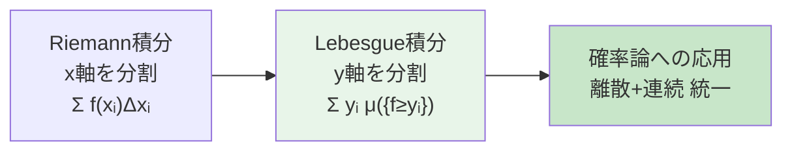
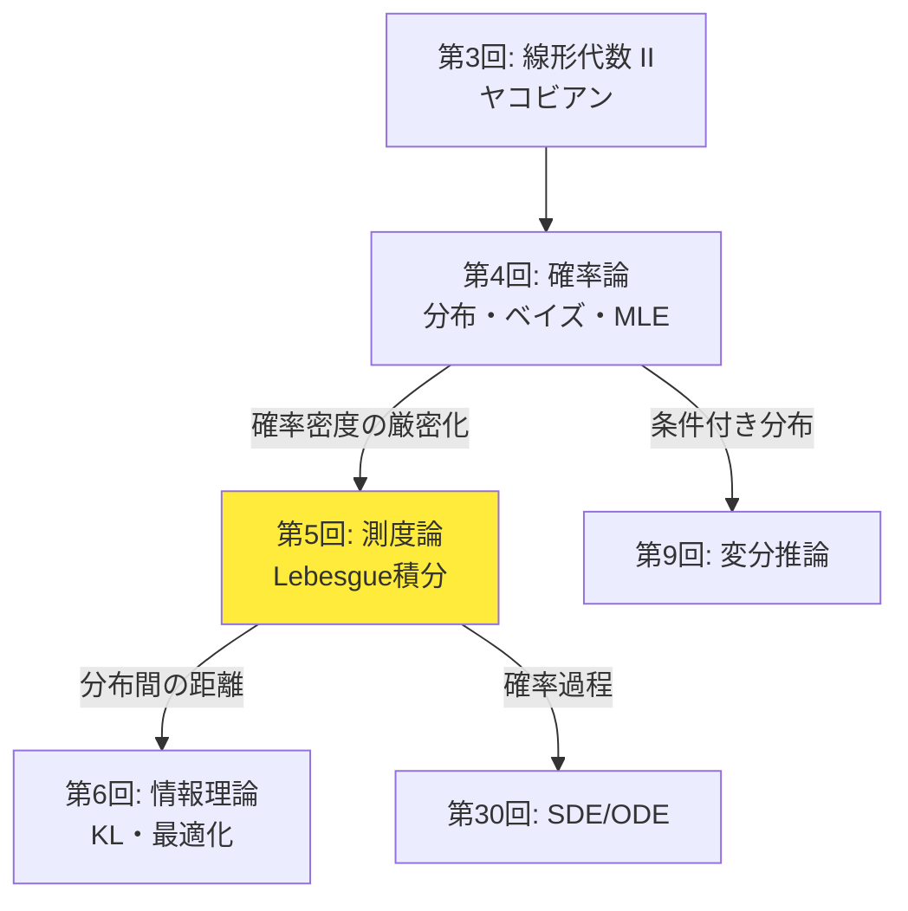
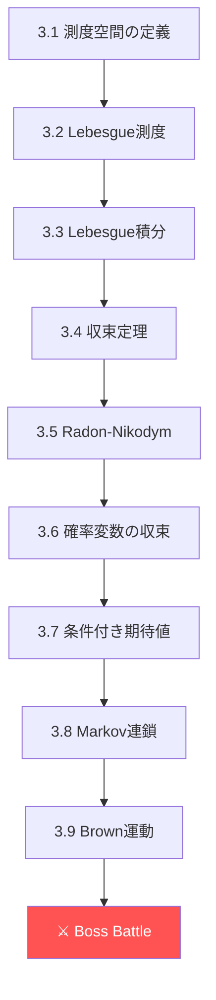
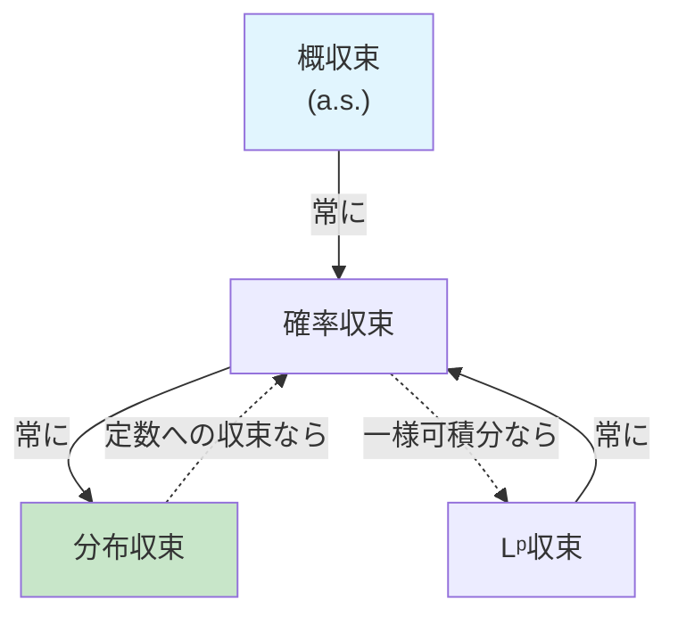
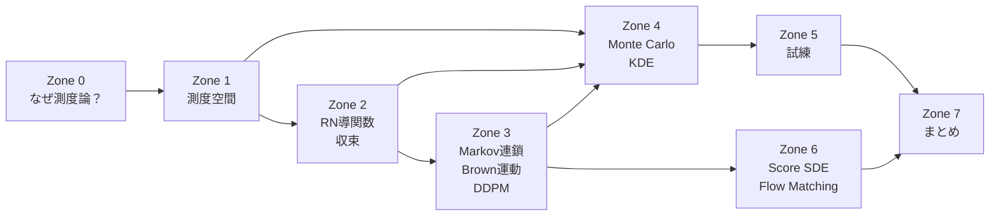

# 第5回: 測度論的確率論・確率過程入門 — 確率の「文法」を手に入れる

> **Lebesgue積分なくして確率密度なし。測度を知らずに生成モデルを語れるか？**

第4回で確率分布を「使える」ようになった。ベイズの定理で事後分布を計算し、MLEでパラメータを推定し、CLTで収束を保証した。だが、1つの根本的な問いを棚上げにしてきた — **確率密度関数とは、厳密に何なのか？**

$f(x) = \frac{1}{\sqrt{2\pi}} e^{-x^2/2}$ を「確率密度関数」と呼んだ。だが $f(0) \approx 0.399$ は「$x=0$ の確率」ではない。連続確率変数の場合、任意の1点の確率は0だ。$P(X = 0) = 0$ なのに $f(0) \neq 0$ — この矛盾を解消するのが測度論だ。

本講義では、Lebesgue積分で確率密度関数を厳密に定義し、Radon-Nikodym導関数として再解釈する。さらに確率過程（Markov連鎖、Brown運動）を導入し、拡散モデルのSDE定式化への数学的基盤を先行構築する。

:::message
**このシリーズについて**: 東京大学 松尾・岩澤研究室動画講義の**完全上位互換**の全50回シリーズ。理論（論文が書ける）、実装（Production-ready）、最新（2025-2026 SOTA）の3軸で差別化する。
:::


**所要時間の目安**:

| ゾーン | 内容 | 時間 | 難易度 |
|:-------|:-----|:-----|:-------|
| Zone 0 | クイックスタート | 30秒 | ★☆☆☆☆ |
| Zone 1 | 体験ゾーン | 10分 | ★★☆☆☆ |
| Zone 2 | 直感ゾーン | 15分 | ★★★☆☆ |
| Zone 3 | 数式修行ゾーン | 60分 | ★★★★★ |
| Zone 4 | 実装ゾーン | 45分 | ★★★☆☆ |
| Zone 5 | 実験ゾーン | 30分 | ★★★★☆ |
| Zone 6 | 振り返りゾーン | 30分 | ★★★★☆ |

---

## 🚀 0. クイックスタート（30秒）— 「測度」を3行で体験する

**ゴール**: Lebesgue測度の直感を30秒で掴む。

```python
import numpy as np

# Cantor set: uncountably infinite points, but Lebesgue measure = 0
# Approximate by iteratively removing middle thirds
def cantor_measure(iterations: int = 20) -> float:
    """Compute the Lebesgue measure of the Cantor set approximation.

    At each step, remaining measure = (2/3)^n of [0,1].
    """
    return (2/3)**iterations

for n in [1, 5, 10, 20]:
    print(f"Cantor set after {n:2d} iterations: measure = {cantor_measure(n):.10f}")
print(f"Cantor set (limit): measure = 0, but |Cantor| = |ℝ| (uncountably infinite!)")
```

出力:
```
Cantor set after  1 iterations: measure = 0.6666666667
Cantor set after  5 iterations: measure = 0.1316872428
Cantor set after 10 iterations: measure = 0.0173415300
Cantor set after 20 iterations: measure = 0.0003007092
Cantor set (limit): measure = 0, but |Cantor| = |ℝ| (uncountably infinite!)
```

**この3行の裏にある衝撃**: Cantor集合は $\mathbb{R}$ と同じ濃度（非可算無限）を持つのに、Lebesgue測度は0。「大きさ」と「濃度」は全く別の概念だ。

測度論はこの「大きさ」を厳密に定義する数学だ。そして**確率密度関数は、確率測度のLebesgue測度に対するRadon-Nikodym導関数**として定義される — これが本講義のゴールだ。

:::message
**進捗: 3% 完了** Cantor集合という「直感に反する集合」で、測度の必要性を体感した。
:::

---

## 🎮 1. 体験ゾーン（10分）— 測度論が必要になる瞬間

### 1.1 Riemann積分の限界

第4回では、期待値を $\mathbb{E}[X] = \int x f(x) dx$ と計算した。この積分はRiemann積分だ。だがRiemann積分には限界がある。

```python
import numpy as np

# Dirichlet function: f(x) = 1 if x is rational, 0 if irrational
# This function is NOT Riemann integrable, but IS Lebesgue integrable
# Lebesgue integral = 0 (rationals have measure zero)

# Approximate: sample random points in [0,1]
n_samples = 1000000
x = np.random.uniform(0, 1, n_samples)

# Can we distinguish rationals? In floating point, everything is rational
# But mathematically: Q ∩ [0,1] has Lebesgue measure 0
# So ∫₀¹ 1_Q(x) dx = 0 (Lebesgue) but undefined (Riemann)

# Better example: indicator of rationals approximated by p/q with q ≤ N
def approximate_dirichlet(x: np.ndarray, max_q: int = 100) -> np.ndarray:
    """Approximate 1_Q: returns 1 if x is 'close' to a rational p/q, q ≤ max_q."""
    result = np.zeros_like(x)
    for q in range(1, max_q + 1):
        for p in range(q + 1):
            result[np.abs(x - p/q) < 1e-8] = 1.0
    return result

print("=== Riemann vs Lebesgue Integration ===\n")
print("Dirichlet function: f(x) = 1 if x ∈ Q, 0 if x ∈ R\\Q")
print(f"Riemann integral:  DOES NOT EXIST (upper sum = 1, lower sum = 0)")
print(f"Lebesgue integral: ∫f dλ = 1 × λ(Q) + 0 × λ(R\\Q) = 1 × 0 + 0 × 1 = 0")
print(f"\nLebesgue's key insight: integrate by slicing the RANGE, not the domain")
```

**Riemann積分とLebesgue積分の違い**:

| 観点 | Riemann積分 | Lebesgue積分 |
|:-----|:-----------|:------------|
| スライス方向 | 定義域（$x$ 軸） | 値域（$y$ 軸） |
| 可積分条件 | 不連続点が零集合 | 可測関数なら常に定義可能 |
| 極限交換 | 条件が厳しい | 単調収束・優収束定理 |
| 確率論 | 離散と連続を別扱い | **統一的に扱える** |



### 1.2 離散と連続の統一 — なぜ測度論か

第4回では離散分布と連続分布を別々に扱った:

- 離散: $\mathbb{E}[X] = \sum_x x \cdot P(X = x)$
- 連続: $\mathbb{E}[X] = \int x \cdot f(x) dx$

だが、離散と連続が混じった分布はどう扱うか？ 例えば、確率0.3で $X = 0$（原子）、残り0.7で $X \sim \mathcal{N}(1, 1)$（連続部分）。

```python
import numpy as np

# Mixed distribution: P(X=0) = 0.3, otherwise X ~ N(1,1) with prob 0.7
np.random.seed(42)
n_samples = 100000

is_atom = np.random.binomial(1, 0.3, n_samples)
continuous_part = np.random.normal(1, 1, n_samples)
X = np.where(is_atom, 0, continuous_part)

print("=== Mixed Distribution (discrete + continuous) ===")
print(f"P(X = 0) empirical: {(X == 0).mean():.4f} (theory: 0.3)")
print(f"E[X] empirical: {X.mean():.4f} (theory: 0×0.3 + 1×0.7 = 0.7)")
print(f"Var(X) empirical: {X.var():.4f}")

# This distribution has no PDF in the classical sense!
# It has a Radon-Nikodym derivative w.r.t. (Lebesgue + counting) measure
print("\nThis distribution is NEITHER purely discrete NOR purely continuous.")
print("Classical PDF does not exist. Measure theory handles it naturally:")
print("  dP = 0.3 δ₀ + 0.7 N(1,1) dλ")
print("  (point mass at 0 + continuous density)")
```

測度論は離散（数え上げ測度）と連続（Lebesgue測度）を**同じ枠組み**で扱える。確率密度関数はRadon-Nikodym導関数 $f = dP/d\mu$ として定義され、基底測度 $\mu$ が何かで離散と連続の区別が吸収される。

### 1.3 確率過程の直感 — ランダムウォーク

```python
import numpy as np

def random_walk(n_steps: int, n_paths: int = 5) -> np.ndarray:
    """Simple symmetric random walk: S_n = Σᵢ Xᵢ, Xᵢ ∈ {-1, +1}.

    This is a discrete-time Markov chain and martingale.
    """
    steps = np.random.choice([-1, 1], size=(n_paths, n_steps))
    paths = np.cumsum(steps, axis=1)
    return paths

n_steps = 200
paths = random_walk(n_steps, n_paths=8)

print("=== Random Walk (Discrete-Time Markov Chain) ===\n")
print(f"{'Step':>6} | " + " | ".join(f"Path {i}" for i in range(4)))
print("-" * 50)
for t in [0, 10, 50, 100, 150, 199]:
    vals = " | ".join(f"{paths[i, t]:>6d}" for i in range(4))
    print(f"{t+1:>6} | {vals}")

# Properties
print(f"\n=== Properties at t={n_steps} ===")
all_paths = random_walk(n_steps, n_paths=100000)
final = all_paths[:, -1]
print(f"E[S_n] = {final.mean():.3f} (theory: 0)")
print(f"Var(S_n) = {final.var():.1f} (theory: {n_steps})")
print(f"Std(S_n) = {final.std():.1f} (theory: {np.sqrt(n_steps):.1f})")
print(f"\nAs n→∞, S_n/√n → N(0,1) by CLT")
print(f"S_n/√n empirical std: {(final/np.sqrt(n_steps)).std():.3f} (should ≈ 1.0)")
```

このランダムウォークをステップ幅と時間間隔を0に近づけると、**Brown運動**（Wiener過程）が得られる。Brown運動は拡散モデル [^1] のforward processの数学的基盤だ。

| 概念 | 離散 | 連続 | ML応用 |
|:-----|:-----|:-----|:-------|
| ランダムウォーク | $S_n = \sum_i X_i$ | Brown運動 $W_t$ | Diffusion forward |
| Markov連鎖 | $P(X_{n+1} \mid X_n)$ | SDE $dX_t = \mu dt + \sigma dW_t$ | Score-based [^2] |
| 定常分布 | $\boldsymbol{\pi} P = \boldsymbol{\pi}$ | Fokker-Planck方程式 | 平衡分布 |

> **Zone 1 まとめ**: Riemann積分の限界 → Lebesgue積分の必要性 → 離散と連続の統一 → 確率過程（ランダムウォーク→Brown運動）。測度論は「確率の文法」を厳密にする道具だ。

:::message
**進捗: 10% 完了** 測度論が必要な理由と、確率過程の直感を掴んだ。Zone 1 クリア。
:::

---

## 🧩 2. 直感ゾーン（15分）— 測度論はなぜ生成モデルに必要か

### 2.1 拡散モデルの数式を「読む」ために

拡散モデル（DDPM）[^1] の前方過程は:

$$
q(\mathbf{x}_{1:T} \mid \mathbf{x}_0) = \prod_{t=1}^{T} q(\mathbf{x}_t \mid \mathbf{x}_{t-1}), \quad q(\mathbf{x}_t \mid \mathbf{x}_{t-1}) = \mathcal{N}(\sqrt{1-\beta_t}\mathbf{x}_{t-1}, \beta_t \mathbf{I})
$$

連続時間版（Song et al. 2020 [^2]）では:

$$
d\mathbf{x} = f(\mathbf{x}, t)dt + g(t)d\mathbf{w}
$$

ここで $\mathbf{w}$ はBrown運動（Wiener過程）。この式を理解するには:

1. **Brown運動の定義** — 測度論が必要（連続だが至る所微分不可能な過程）
2. **確率積分** $\int g \, d\mathbf{w}$ — Itô積分はLebesgue積分の確率版
3. **Fokker-Planck方程式** — SDEが定義する確率測度の時間発展

第30回で完全に扱うが、その基礎を今ここで構築する。

### 2.2 Course Iでの位置づけ



第5回は**Course Iの最難関**だ。測度論は抽象度が高く、多くの教科書が「省略」する。だが省略した先に待っているのは、SDEの式を「読めるが理解できない」状態だ。

| 回 | テーマ | 第5回との接続 |
|:---|:------|:-------------|
| 第4回 | 確率論 | PDF/PMF → **Radon-Nikodym導関数**として統一 |
| **第5回** | **測度論** | **本講義** |
| 第6回 | 情報理論 | KLダイバージェンス = **測度の比の期待値** |
| 第9回 | 変分推論 | ELBO = **測度変換の下での期待値** |
| 第25回 | NF | Change of variables = **pushforward測度** |
| 第30回 | SDE | **Itô積分 = 本講義のBrown運動の直接拡張** |

### 2.3 松尾研との差別化

| 観点 | 松尾・岩澤研 | 本シリーズ |
|:-----|:------------|:----------|
| 測度論 | 一切扱わない | **1講義を丸々投入** |
| 確率密度 | 「$f(x)$ は密度」で終了 | **$dP/d\lambda$ として厳密定義** |
| Brown運動 | SDEの中で突然登場 | **定義→性質→SDE動機まで段階的** |
| Markov連鎖 | 定常分布の結果だけ | **エルゴード定理・混合時間まで** |
| 収束概念 | 区別なし | **4つの収束の関係図** |

### 2.4 LLMグラウンディング — トークン空間の測度

第5回のLLM接続は**トークン空間上の確率測度**だ。

LLMの語彙 $\mathcal{V} = \{v_1, \ldots, v_V\}$ は有限集合。この上の確率測度は:

$$
P(\{v_k\}) = \pi_k = \text{softmax}(f_\theta(x_{<t}))_k
$$

有限集合の場合、全ての部分集合が可測（冪集合 $= \sigma$-加法族）。測度論の本領が発揮されるのは、連続的な潜在空間 $\mathcal{Z} = \mathbb{R}^d$ だ。

VAEのエンコーダが出力する $q_\phi(\mathbf{z} \mid \mathbf{x}) = \mathcal{N}(\boldsymbol{\mu}, \text{diag}(\boldsymbol{\sigma}^2))$ は、$\mathbb{R}^d$ 上の確率測度 $Q_\phi$ を定義する。KLダイバージェンス $D_{KL}[Q_\phi \| P]$ は2つの確率測度の「距離」を測る — これを厳密に定義するのに測度論が必要だ。

:::details トロイの木馬 — `%timeit` 初登場
本講義はPython 95%。残り5%は......`%timeit` だ。

Zone 4のMonte Carlo積分で初めて計算時間を測定する。「Pythonって遅くない？」という疑問が芽生える瞬間。第9回でJuliaが50倍速でELBOを計算する伏線がここから始まる。

今はPythonを信じて、測度論に集中しよう。......でも心の片隅に「速度」を意識し始めてほしい。
:::

:::message
**進捗: 20% 完了** 測度論が生成モデルのどこで必要になるか、全体像を把握した。Zone 2 クリア。
:::

---

## 📐 3. 数式修行ゾーン（60分）— 測度論の完全武装



### 3.1 測度空間の定義

**定義（測度空間）**: 三つ組 $(S, \mathcal{A}, \mu)$ を測度空間と呼ぶ:

1. $S$ — 集合
2. $\mathcal{A}$ — $S$ 上のσ-加法族（第4回 3.1で定義済み）
3. $\mu: \mathcal{A} \to [0, \infty]$ — 測度。以下を満たす:
   - $\mu(\emptyset) = 0$
   - σ-加法性: 互いに素な $A_1, A_2, \ldots \in \mathcal{A}$ に対して $\mu\left(\bigcup_{n=1}^\infty A_n\right) = \sum_{n=1}^\infty \mu(A_n)$

確率測度は $\mu(S) = 1$ を追加で要求する特殊な測度。

**Borel σ-加法族**: $\mathbb{R}^d$ の開集合全てを含む最小のσ-加法族を $\mathcal{B}(\mathbb{R}^d)$ と書く。通常の確率論はBorelσ-加法族上で展開される。

```python
import numpy as np

# Illustrate: σ-algebra generated by a partition
# Simplest non-trivial example: Ω = {a, b, c, d}
# Partition: {{a,b}, {c,d}}
# Generated σ-algebra: {∅, {a,b}, {c,d}, {a,b,c,d}}

omega = {'a', 'b', 'c', 'd'}

# Power set (2^4 = 16 subsets)
from itertools import chain, combinations
def power_set(s):
    return [set(x) for x in chain.from_iterable(combinations(s, r) for r in range(len(s)+1))]

P = power_set(omega)
print(f"|Power set| = {len(P)} subsets (= 2^{len(omega)})")

# σ-algebra from partition {{a,b}, {c,d}}
sigma_partition = [set(), {'a','b'}, {'c','d'}, {'a','b','c','d'}]
print(f"|σ-algebra from partition| = {len(sigma_partition)} sets")
print("Sets:", [s if s else '∅' for s in sigma_partition])

# Verify σ-algebra axioms
print(f"\nAxiom check:")
print(f"1. Ω ∈ F: {omega in sigma_partition}")
print(f"2. Closed under complement: {all(omega-s in sigma_partition for s in sigma_partition)}")
# Check closure under countable union (finite case)
print(f"3. Closed under union: {{'a','b'}.union({'c','d'}) in sigma_partition}")
```

### 3.1.1 なぜσ-加法族が必要か — Vitaliの非可測集合

「すべての部分集合に測度を割り当てられないのか？」という疑問への回答がVitaliの定理(1905)だ。

:::details Vitaliの非可測集合（概要）
$[0,1]$ 上で「$x \sim y \iff x - y \in \mathbb{Q}$」という同値関係を定義する。各同値類から代表元を1つずつ選んだ集合 $V$（選択公理を使う）を考えると:

1. もし $\lambda(V) = 0$ なら、$[0,1] = \bigcup_{q \in \mathbb{Q} \cap [-1,1]} (V + q)$ の可算合併の測度が0になり矛盾
2. もし $\lambda(V) > 0$ なら、同じ合併の測度が $\infty$ になり矛盾

したがって $V$ にはLebesgue測度を割り当てられない。これが $\sigma$-加法族で可測集合を制限する理由。

**機械学習への影響**: 実用上、我々が扱う集合（開集合、閉集合、Borel集合）はすべて可測なので問題にならない。非可測集合は選択公理によるexotic constructionでのみ出現する。
:::

```python
# Vitali set cannot be constructed computationally
# (requires Axiom of Choice on uncountable set)
# Instead, verify that all "normal" sets are Borel measurable

# Borel σ-algebra = smallest σ-algebra containing all open sets
# Contains: open sets, closed sets, countable unions/intersections
# (G_δ sets, F_σ sets, etc.)

# In practice: if you can describe a set with countable operations
# on intervals, it's Borel measurable.

print("=== Borel Measurability ===\n")
examples = [
    ("Open interval (a,b)", "Borel", "Generator of Borel σ-algebra"),
    ("Closed set [a,b]", "Borel", "Complement of open set"),
    ("Singleton {x}", "Borel", "Countable intersection of open sets"),
    ("Rationals Q", "Borel", "Countable union of singletons"),
    ("Cantor set C", "Borel", "Countable intersection of closed sets"),
    ("Vitali set V", "NOT Borel", "Requires Axiom of Choice"),
]

for name, status, reason in examples:
    print(f"  {name:>25}: {status:>10} — {reason}")
```

### 3.2 Lebesgue測度

**定義（Lebesgue測度）**: $\mathbb{R}$ 上のLebesgue測度 $\lambda$ は、区間 $[a,b]$ に対して $\lambda([a,b]) = b - a$ を満たし、σ-加法的に拡張された測度。

直感的には「長さ」（1次元）、「面積」（2次元）、「体積」（3次元）の一般化だ。

**重要な性質**:

1. 平行移動不変: $\lambda(A + c) = \lambda(A)$
2. スケーリング: $\lambda(cA) = |c| \lambda(A)$
3. 可算集合の測度は0: $\lambda(\mathbb{Q} \cap [0,1]) = 0$（有理数は「薄い」）
4. Cantor集合: 非可算だが $\lambda(C) = 0$

```python
import numpy as np

# Demonstrate: rational numbers have Lebesgue measure zero
# Enumerate rationals p/q in [0,1] with q ≤ N, cover each with interval of width ε/2^n
def cover_rationals(max_q: int, epsilon: float) -> float:
    """Total length of ε-covers of rationals p/q ≤ max_q in [0,1].

    Each rational gets interval of width ε/2^n where n is its index.
    Total cover length ≤ Σ ε/2^n = 2ε → 0 as ε → 0.
    """
    n = 0
    total_length = 0.0
    seen = set()
    for q in range(1, max_q + 1):
        for p in range(q + 1):
            r = p / q
            key = round(r, 10)  # avoid floating point duplicates
            if key not in seen:
                seen.add(key)
                n += 1
                total_length += epsilon / (2**n)
    return total_length, len(seen)

print("=== Rationals Have Lebesgue Measure Zero ===\n")
for eps in [1.0, 0.1, 0.01, 0.001]:
    cover, n_rationals = cover_rationals(100, eps)
    print(f"ε={eps:<6} | {n_rationals} rationals covered | total cover length = {cover:.8f}")

print("\nAs ε → 0, total cover → 0. So λ(Q ∩ [0,1]) = 0.")
print("Despite Q being dense in [0,1] and countably infinite!")
```

:::message
ここで多くの人が混乱するのが「測度0 ≠ 空集合」だ。$\mathbb{Q} \cap [0,1]$ は無限に多くの点を含むが、Lebesgue測度は0。直感的には、有理数は実数直線上で「隙間だらけ」なので「長さがない」。

確率論では: 「確率0の事象は起こらない」は**間違い**。正しくは「確率0の事象は、繰り返し試行すれば"ほとんど確実に"起こらない」。
:::

### 3.3 Lebesgue積分

**構成**:

1. **単関数**: $s(x) = \sum_{i=1}^{n} c_i \cdot \mathbf{1}_{A_i}(x)$（$A_i$ は可測集合）に対して:
   $$\int s \, d\mu = \sum_{i=1}^{n} c_i \cdot \mu(A_i)$$

2. **非負可測関数**: $f \geq 0$ に対して:
   $$\int f \, d\mu = \sup\left\{\int s \, d\mu : 0 \leq s \leq f, \; s \text{ は単関数}\right\}$$

3. **一般の可測関数**: $f = f^+ - f^-$（$f^+ = \max(f, 0)$, $f^- = \max(-f, 0)$）に対して:
   $$\int f \, d\mu = \int f^+ d\mu - \int f^- d\mu$$
   （少なくとも一方が有限のとき定義される）

```python
import numpy as np

def lebesgue_integral_simple_function(values: list, measure_of_sets: list) -> float:
    """Lebesgue integral of a simple function.

    ∫s dμ = Σ cᵢ μ(Aᵢ)
    """
    return sum(c * m for c, m in zip(values, measure_of_sets))

# Example: Dirichlet function on [0,1]
# f(x) = 1 on Q, f(x) = 0 on R\Q
# ∫f dλ = 1 × λ(Q∩[0,1]) + 0 × λ((R\Q)∩[0,1]) = 1×0 + 0×1 = 0
result = lebesgue_integral_simple_function([1, 0], [0, 1])
print(f"∫(Dirichlet) dλ = {result} (rationals contribute nothing)")

# Example: indicator of Cantor set
# ∫1_C dλ = λ(C) = 0
print(f"∫(1_Cantor) dλ = 0 (Cantor set has measure zero)")

# Example: standard Gaussian expectation
# ∫x × (2π)^{-1/2} exp(-x²/2) dλ = 0 (by symmetry)
n = 1000000
x = np.random.normal(0, 1, n)
print(f"\n∫x dN(0,1) = E[X] = {x.mean():.6f} (theory: 0)")
print(f"∫x² dN(0,1) = E[X²] = {(x**2).mean():.6f} (theory: 1)")
```

**RiemannとLebesgueの関係**: Riemann可積分な関数はLebesgue可積分でもあり、値が一致する。逆は成り立たない（Dirichlet関数）。

### 3.4 収束定理 — 測度論の三大武器

**定理（単調収束定理 / MCT）**: $0 \leq f_1 \leq f_2 \leq \cdots$ が可測関数の単調増大列で、$f_n \nearrow f$ のとき:

$$
\int f \, d\mu = \lim_{n \to \infty} \int f_n \, d\mu
$$

極限と積分の交換が無条件に成り立つ。

**定理（優収束定理 / DCT）**: $f_n \to f$ が各点収束し、全ての $n$ で $|f_n| \leq g$ かつ $\int g \, d\mu < \infty$ のとき:

$$
\lim_{n \to \infty} \int f_n \, d\mu = \int f \, d\mu
$$

**定理（Fatouの補題）**: $f_n \geq 0$ が可測関数列のとき:

$$
\int \liminf_{n \to \infty} f_n \, d\mu \leq \liminf_{n \to \infty} \int f_n \, d\mu
$$

```python
import numpy as np

# DCT application: computing E[g(X)] by approximation
# f_n(x) = g(x) × 1_{|x|≤n} → g(x) as n→∞
# If |g(x)| ≤ h(x) with E[h(X)] < ∞, then E[f_n(X)] → E[g(X)]

np.random.seed(42)
N = 100000
X = np.random.normal(0, 1, N)

# g(x) = exp(x) — NOT dominated (E[exp(X)] = exp(1/2) but heavy tail issues)
# Truncated versions: g_n(x) = exp(x) × 1_{|x|≤n}
print("=== Dominated Convergence in Action ===\n")
print(f"Computing E[exp(X)] where X ~ N(0,1)")
print(f"Theory: E[exp(X)] = exp(μ + σ²/2) = exp(0.5) = {np.exp(0.5):.6f}\n")

for n in [1, 2, 3, 5, 10, 50]:
    truncated = np.exp(X) * (np.abs(X) <= n)
    estimate = truncated.mean()
    print(f"n={n:>2}: E[exp(X)·1_(|X|≤{n})] = {estimate:.6f}")

print(f"\nDirect: E[exp(X)] = {np.exp(X).mean():.6f}")
print(f"\nDCT guarantees convergence when a dominating function exists.")
```

:::message
収束定理が重要な理由:

1. **MCT**: VAEの変分下界が改善列のとき、極限でも下界性が保たれる
2. **DCT**: NN学習で損失関数のパラメータ微分と期待値の交換を正当化
3. **Fatou**: ELBOの下界性の証明に使われる

これらは「積分と極限を入れ替えてよいか」を保証する — ML理論の至る所で暗黙に使われている。
:::

### 3.5 Radon-Nikodym導関数 — 確率密度の正体

**定義（絶対連続）**: 測度 $\nu$ が測度 $\mu$ に対して絶対連続（$\nu \ll \mu$）であるとは、$\mu(A) = 0 \Rightarrow \nu(A) = 0$ が全ての $A \in \mathcal{A}$ で成り立つこと。

**定理（Radon-Nikodymの定理）**: $\nu \ll \mu$ かつ $\mu$ がσ-有限ならば、可測関数 $f: S \to [0, \infty)$ が存在して:

$$
\nu(A) = \int_A f \, d\mu \quad \text{for all } A \in \mathcal{A}
$$

この $f$ をRadon-Nikodym導関数と呼び、$f = \frac{d\nu}{d\mu}$ と書く。

**確率密度関数の正体**: 確率測度 $P$ がLebesgue測度 $\lambda$ に対して絶対連続ならば:

$$
P(A) = \int_A f \, d\lambda \quad \text{where } f = \frac{dP}{d\lambda}
$$

この $f$ こそが「確率密度関数」の厳密な定義だ。

```python
import numpy as np

# Radon-Nikodym derivative = density function
# For N(μ, σ²): dP/dλ = (2πσ²)^{-1/2} exp(-(x-μ)²/(2σ²))

mu, sigma = 2.0, 1.5

def radon_nikodym_gaussian(x: np.ndarray, mu: float, sigma: float) -> np.ndarray:
    """Radon-Nikodym derivative dP/dλ for Gaussian.

    This IS the PDF, but now we understand what it means:
    P(A) = ∫_A (dP/dλ) dλ
    """
    return (1 / np.sqrt(2 * np.pi * sigma**2)) * np.exp(-((x - mu)**2) / (2 * sigma**2))

# Verify: P([a,b]) = ∫_a^b f dλ
a, b = 1.0, 3.0
x_fine = np.linspace(a, b, 100000)
dx = x_fine[1] - x_fine[0]
P_ab_numerical = np.sum(radon_nikodym_gaussian(x_fine, mu, sigma)) * dx

# Compare with sampling
samples = np.random.normal(mu, sigma, 1000000)
P_ab_sampling = np.mean((samples >= a) & (samples <= b))

from scipy.stats import norm
P_ab_exact = norm.cdf(b, mu, sigma) - norm.cdf(a, mu, sigma)

print(f"P([{a}, {b}]) for N({mu}, {sigma**2})")
print(f"  Exact (CDF):        {P_ab_exact:.6f}")
print(f"  Numerical (∫f dλ):  {P_ab_numerical:.6f}")
print(f"  Monte Carlo:        {P_ab_sampling:.6f}")
print(f"\nf = dP/dλ at x={mu}: {radon_nikodym_gaussian(np.array([mu]), mu, sigma)[0]:.4f}")
print(f"This is NOT P(X={mu})! P(X={mu}) = 0 for continuous RV.")
print(f"It's a 'density': probability per unit length at x={mu}.")
```

**Pushforward測度**: 確率変数 $X: \Omega \to \mathbb{R}$ は確率測度を「押し出す」:

$$
P_X(B) = P(X^{-1}(B)) = P(\{\omega : X(\omega) \in B\})
$$

$P_X$ はを $X$ のpushforward測度（$X$ の分布）と呼ぶ。生成モデルは $G: \mathcal{Z} \to \mathcal{X}$ が「潜在空間の測度をデータ空間に押し出す」と理解できる。第25回（Normalizing Flows）では、この測度の変換規則が核心になる。

### 3.6 確率変数の収束 — 4つの収束とその関係

4つの収束概念を区別する。

**定義**:

1. **概収束 (a.s.)**: $P(\{\omega : X_n(\omega) \to X(\omega)\}) = 1$
2. **確率収束**: $\forall \epsilon > 0, \; P(|X_n - X| > \epsilon) \to 0$
3. **$L^p$ 収束**: $\mathbb{E}[|X_n - X|^p] \to 0$
4. **分布収束**: $F_{X_n}(x) \to F_X(x)$ at all continuity points of $F_X$



| 収束 | 強さ | ML応用 |
|:-----|:-----|:-------|
| 概収束 | 最強 | 強大数の法則 |
| $L^p$ 収束 | 強 | SGDの収束解析 |
| 確率収束 | 中 | MLE一致性 |
| 分布収束 | 最弱 | CLT、MLE漸近正規性 |

```python
import numpy as np

# Demonstrate different types of convergence
np.random.seed(42)
n_experiments = 50000

# Example: X_n = max(Z_1,...,Z_n)/n where Z_i ~ Uniform(0,1)
# X_n → 1/n × max → converges to 0 in probability but not a.s. for uniform

# Simpler: sample means converge by LLN
N_values = [10, 50, 100, 500, 1000, 5000]

print("=== Four Types of Convergence ===\n")
print("Strong LLN: X̄_n →(a.s.) μ")
print("CLT: √n(X̄_n - μ) →(d) N(0,σ²)\n")

# Exponential(1) samples: μ=1, σ²=1
for N in N_values:
    means = np.array([np.random.exponential(1, N).mean() for _ in range(n_experiments)])

    # Probability convergence: P(|X̄_n - 1| > ε) → 0
    eps = 0.1
    prob_dev = (np.abs(means - 1) > eps).mean()

    # L2 convergence: E[(X̄_n - 1)²] → 0
    l2_error = np.mean((means - 1)**2)

    # Distribution convergence: √n(X̄_n - 1) → N(0,1)
    standardized = np.sqrt(N) * (means - 1)
    # Test: how close to N(0,1)?
    std_check = standardized.std()

    print(f"N={N:>5}: P(|X̄-1|>{eps})={prob_dev:.4f}, "
          f"E[(X̄-1)²]={l2_error:.6f}, "
          f"std(√N(X̄-1))={std_check:.3f}")
```

### 3.7 条件付き期待値の測度論的定義

**定義**: σ-加法族 $\mathcal{G} \subseteq \mathcal{F}$ に関する $X$ の条件付き期待値 $\mathbb{E}[X \mid \mathcal{G}]$ とは、以下を満たす $\mathcal{G}$-可測関数 $Y$:

$$
\int_G Y \, dP = \int_G X \, dP \quad \text{for all } G \in \mathcal{G}
$$

直感的には「$\mathcal{G}$ で表される情報しか使わずに $X$ を最良予測したもの」。

**射影性質**: $\mathbb{E}[X \mid \mathcal{G}]$ は $L^2(\Omega, \mathcal{F}, P)$ から $L^2(\Omega, \mathcal{G}, P)$ への**直交射影**。これは第2回の射影行列の関数空間版だ。

| 性質 | 数式 | 名前 |
|:-----|:-----|:-----|
| 線形性 | $\mathbb{E}[aX+bY \mid \mathcal{G}] = a\mathbb{E}[X \mid \mathcal{G}] + b\mathbb{E}[Y \mid \mathcal{G}]$ | — |
| タワー性 | $\mathbb{E}[\mathbb{E}[X \mid \mathcal{G}_1] \mid \mathcal{G}_2] = \mathbb{E}[X \mid \mathcal{G}_2]$ for $\mathcal{G}_2 \subseteq \mathcal{G}_1$ | 繰り返し期待値の法則 |
| 取り出し | $Y$ が $\mathcal{G}$-可測 ⇒ $\mathbb{E}[XY \mid \mathcal{G}] = Y \cdot \mathbb{E}[X \mid \mathcal{G}]$ | — |
| 独立性 | $X$ が $\mathcal{G}$ と独立 ⇒ $\mathbb{E}[X \mid \mathcal{G}] = \mathbb{E}[X]$ | — |

**タワー性は生成モデルの理論で頻出する。** ELBOの導出で $\mathbb{E}_{q(z)}[\mathbb{E}_{q(x|z)}[\cdot]]$ のような入れ子の期待値を整理するとき、タワー性が使われる。

### 3.7.1 マルチンゲール — 「公平なゲーム」の測度論的定義

**定義（マルチンゲール）**: フィルトレーション $\{\mathcal{F}_n\}$ に適合した確率過程 $\{M_n\}$ がマルチンゲール ⟺

$$
\mathbb{E}[M_{n+1} \mid \mathcal{F}_n] = M_n \quad \text{a.s.}
$$

条件付き期待値を使った簡潔な定義。「次の時点の期待値が現在の値に等しい」— 公平なゲーム。

**例**:
- **ランダムウォーク**: $S_n = \sum_{i=1}^n X_i$（$X_i$ i.i.d., $\mathbb{E}[X_i]=0$）はマルチンゲール
- **Brown運動**: $W(t)$ はマルチンゲール（$\mathbb{E}[W(t) \mid \mathcal{F}_s] = W(s)$ for $s < t$）
- **Doob martingale**: $M_n = \mathbb{E}[X \mid \mathcal{F}_n]$ は常にマルチンゲール（タワー性から）

```python
import numpy as np

def verify_martingale_property(n_paths=50_000, n_steps=1000):
    """Verify martingale property: E[M_{n+1} | F_n] = M_n."""
    # Random walk S_n = Σ X_i, X_i ~ Rademacher (±1)
    X = np.random.choice([-1, 1], size=(n_paths, n_steps))
    S = np.cumsum(X, axis=1)

    print("=== Martingale Property Verification ===\n")
    print("Random walk S_n = Σ X_i, X_i = ±1 with prob 1/2\n")

    print(f"{'n':>6} {'E[S_n]':>10} {'E[S_{n+1}|S_n=k]':>18} {'(should ≈ k)':>14}")
    for n in [10, 50, 100, 500]:
        mean_Sn = np.mean(S[:, n-1])

        # Conditional check: for paths where S_n = 0,
        # what is E[S_{n+1}]?
        mask = S[:, n-1] == 0
        if np.sum(mask) > 100:
            cond_mean = np.mean(S[mask, n])
            print(f"{n:>6} {mean_Sn:>10.4f} {cond_mean:>18.4f} {'(≈ 0)':>14}")

    # Verify E[S_n] = S_0 = 0 for all n
    print(f"\nMartingale → E[S_n] = E[S_0] = 0 for all n:")
    for n in [1, 10, 100, 500, 1000]:
        print(f"  E[S_{n}] = {np.mean(S[:, n-1]):.4f}")

np.random.seed(42)
verify_martingale_property()
```

> **マルチンゲールと生成モデル**: DDPMのreverse processで、denoised estimateは（適切な条件下で）マルチンゲール的な振る舞いを示す。ELBOの各項 $\mathbb{E}_{q}[\log p(x_{t-1}|x_t)]$ の分解にもマルチンゲール理論が暗黙に使われている。

:::message
**マルチンゲール不等式** (Doob): $P(\max_{k \leq n} M_k \geq \lambda) \leq \frac{\mathbb{E}[M_n^+]}{\lambda}$

これはMarkov不等式の時間方向への拡張。SGDの収束解析で「最悪ケースの逸脱」を制御するのに使われる。
:::

### 3.8 確率過程 — Markov連鎖

**定義（確率過程）**: 確率空間 $(\Omega, \mathcal{F}, P)$ 上の確率変数の族 $\{X_t\}_{t \in T}$ を確率過程と呼ぶ。$T$ は時間の集合（離散 $T = \mathbb{N}$ または連続 $T = [0, \infty)$）。

**定義（フィルトレーション）**: $\mathcal{F}_t$ を「時刻 $t$ までに得られる情報」を表すσ-加法族の増大列: $\mathcal{F}_s \subseteq \mathcal{F}_t$ for $s \leq t$。

**定義（Markov性）**: $\{X_n\}$ がMarkov連鎖 ⟺

$$
P(X_{n+1} \in A \mid \mathcal{F}_n) = P(X_{n+1} \in A \mid X_n)
$$

「未来は現在だけに依存し、過去には依存しない」。

**遷移行列**: 有限状態 $\{1, \ldots, K\}$ のMarkov連鎖の遷移確率:

$$
P_{ij} = P(X_{n+1} = j \mid X_n = i), \quad \sum_{j=1}^{K} P_{ij} = 1
$$

```python
import numpy as np

def simulate_markov_chain(P: np.ndarray, initial: int, n_steps: int) -> np.ndarray:
    """Simulate a discrete Markov chain.

    P: transition matrix (K×K), P[i,j] = P(X_{n+1}=j | X_n=i)
    """
    K = P.shape[0]
    path = np.zeros(n_steps, dtype=int)
    path[0] = initial
    for t in range(1, n_steps):
        path[t] = np.random.choice(K, p=P[path[t-1]])
    return path

# Weather model: Sunny(0), Cloudy(1), Rainy(2)
P = np.array([
    [0.7, 0.2, 0.1],  # Sunny  → Sunny/Cloudy/Rainy
    [0.3, 0.4, 0.3],  # Cloudy → ...
    [0.2, 0.3, 0.5],  # Rainy  → ...
])
states = ["Sunny", "Cloudy", "Rainy"]

print("=== Markov Chain: Weather Model ===\n")
print("Transition matrix P:")
for i, s in enumerate(states):
    row = "  ".join(f"{P[i,j]:.1f}" for j in range(3))
    print(f"  {s:>6} → [{row}]")

# Simulate
path = simulate_markov_chain(P, 0, 100)
print(f"\nFirst 20 states: {' '.join(states[s][0] for s in path[:20])}")

# Empirical stationary distribution
counts = np.bincount(path, minlength=3) / len(path)
print(f"\nEmpirical distribution: {dict(zip(states, counts.round(3)))}")

# Theoretical stationary distribution: π P = π, Σπ = 1
# Solve (P^T - I)π = 0 with Σπ = 1
A = P.T - np.eye(3)
A[-1] = 1  # replace last equation with Σπ = 1
b = np.zeros(3)
b[-1] = 1
pi_stationary = np.linalg.solve(A, b)
print(f"Stationary distribution: {dict(zip(states, pi_stationary.round(4)))}")

# Convergence: P^n → rows equal to π
print(f"\nConvergence of P^n:")
for n in [1, 5, 10, 50]:
    Pn = np.linalg.matrix_power(P, n)
    print(f"  P^{n:>2} row 0: [{', '.join(f'{x:.4f}' for x in Pn[0])}]")
print(f"  π:       [{', '.join(f'{x:.4f}' for x in pi_stationary)}]")
```

**定理（エルゴード定理）**: 既約かつ非周期的なMarkov連鎖は一意の定常分布 $\boldsymbol{\pi}$ を持ち、任意の初期分布から $\boldsymbol{\pi}$ に収束する。

**混合時間（Mixing Time）**: $t_{\text{mix}}(\epsilon) = \min\{t : \max_i \|P^t(i, \cdot) - \boldsymbol{\pi}\|_{TV} \leq \epsilon\}$

混合時間はMCMC法（Markov Chain Monte Carlo）の収束速度を決定する。Levin & Peres [^3] の教科書が詳しい。

:::details Diffusionモデルとの接続
DDPMの前方過程 [^1] はMarkov連鎖の連続版だ:

$$
q(\mathbf{x}_t \mid \mathbf{x}_{t-1}) = \mathcal{N}(\sqrt{1-\beta_t}\mathbf{x}_{t-1}, \beta_t \mathbf{I})
$$

- 各ステップがMarkov（現在の $\mathbf{x}_{t-1}$ だけに依存）
- 定常分布は $\mathcal{N}(\mathbf{0}, \mathbf{I})$（十分なステップで到達）
- 逆過程 $p_\theta(\mathbf{x}_{t-1} \mid \mathbf{x}_t)$ もMarkov連鎖

離散Markov連鎖の「遷移行列」がガウス条件分布に置き換わった形。定常分布への収束がforward process、逆向きの遷移がreverse process。
:::

### 3.9 Brown運動 — 確率過程の主役

**定義（Brown運動 / Wiener過程）**: 確率過程 $\{W_t\}_{t \geq 0}$ が以下を満たすときBrown運動と呼ぶ:

1. $W_0 = 0$（a.s.）
2. 独立増分: $0 \leq s < t$ に対して $W_t - W_s$ は $\mathcal{F}_s$ と独立
3. 正規増分: $W_t - W_s \sim \mathcal{N}(0, t-s)$
4. 連続な標本路: $t \mapsto W_t(\omega)$ は連続（a.s.）

```python
import numpy as np

def simulate_brownian_motion(T: float, n_steps: int, n_paths: int = 5) -> tuple:
    """Simulate Brownian motion paths via random walk approximation.

    W_t ≈ Σ_{i=1}^{⌊t/Δt⌋} √(Δt) Z_i, Z_i ~ N(0,1)

    By CLT/Donsker's theorem, this converges to true Brownian motion.
    """
    dt = T / n_steps
    t = np.linspace(0, T, n_steps + 1)
    dW = np.random.normal(0, np.sqrt(dt), (n_paths, n_steps))
    W = np.zeros((n_paths, n_steps + 1))
    W[:, 1:] = np.cumsum(dW, axis=1)
    return t, W

T, n_steps = 1.0, 10000
t, W = simulate_brownian_motion(T, n_steps, n_paths=8)

print("=== Brownian Motion Properties ===\n")

# Property 1: W_0 = 0
print(f"W(0) = {W[:, 0].mean():.6f} (should be 0)")

# Property 2: Normal increments W_t - W_s ~ N(0, t-s)
s_idx, t_idx = n_steps // 4, 3 * n_steps // 4
s_val, t_val = t[s_idx], t[t_idx]
increments = W[:, t_idx] - W[:, s_idx]
all_paths = simulate_brownian_motion(T, n_steps, n_paths=100000)[1]
increments_large = all_paths[:, t_idx] - all_paths[:, s_idx]
print(f"\nW({t_val:.2f}) - W({s_val:.2f}) ~ N(0, {t_val-s_val:.2f})")
print(f"  Mean: {increments_large.mean():.4f} (theory: 0)")
print(f"  Var:  {increments_large.var():.4f} (theory: {t_val-s_val:.4f})")

# Property 3: E[W_t²] = t (variance grows linearly)
print(f"\nVariance growth:")
check_times = [0.1, 0.25, 0.5, 0.75, 1.0]
for t_check in check_times:
    idx = int(t_check * n_steps)
    var = all_paths[:, idx].var()
    print(f"  E[W({t_check})²] = {var:.4f} (theory: {t_check:.4f})")

# Property 4: Nowhere differentiable (a.s.)
dW_dt = np.diff(W[0]) / (T / n_steps)
print(f"\n'Derivative' statistics (should diverge as dt→0):")
print(f"  |dW/dt| mean: {np.abs(dW_dt).mean():.1f}")
print(f"  |dW/dt| max:  {np.abs(dW_dt).max():.1f}")
print(f"  These grow as O(1/√dt) → ∞, confirming non-differentiability")
```

**Brown運動の驚くべき性質**:

1. **連続だが至る所微分不可能**（概確実に）— 通常の微積分が使えない
2. **二次変分**: $[W]_T = \lim_{n \to \infty} \sum_{i} (W_{t_{i+1}} - W_{t_i})^2 = T$（有限！）
3. **スケーリング**: $cW_{t/c^2}$ もBrown運動（自己相似性）
4. **マルチンゲール**: $\mathbb{E}[W_t \mid \mathcal{F}_s] = W_s$

```python
import numpy as np

# Quadratic variation: [W]_T = Σ(ΔW)² → T
T = 1.0
n_paths = 1000
print("=== Quadratic Variation of Brownian Motion ===\n")
print(f"{'n_steps':>10} {'QV mean':>10} {'QV std':>10} {'Theory':>10}")
print("-" * 45)

for n_steps in [10, 100, 1000, 10000]:
    dt = T / n_steps
    dW = np.random.normal(0, np.sqrt(dt), (n_paths, n_steps))
    # Quadratic variation = Σ(ΔW)²
    QV = np.sum(dW**2, axis=1)
    print(f"{n_steps:>10} {QV.mean():>10.6f} {QV.std():>10.6f} {T:>10.6f}")

print(f"\nAs n→∞, [W]_T → T exactly. This is why dW² = dt in Itô calculus.")
print("Ordinary functions have QV = 0. BM's non-zero QV creates Itô's formula.")
```

:::message
Brown運動の二次変分 $[W]_T = T$ が**非ゼロ**であることがItô積分の核心だ。通常の微分可能な関数 $f$ は二次変分が0（$\sum (\Delta f)^2 \to 0$）だが、Brown運動は二次変分がちょうど $T$ に収束する。これが「$dW^2 = dt$」というItô計算の規則を生み、通常の微積分とは異なるItôの公式 [^4]:

$$
df(W_t) = f'(W_t) dW_t + \frac{1}{2}f''(W_t) dt
$$

を導く。ここから先はその予告を回収する。
:::

### 3.10 伊藤積分の定義と性質 — 確率的な「面積」を測る

Brown運動 $W_t$ は至る所微分不可能だ。だから $\int_0^T f(W_t) \, dW_t$ という積分は、Riemann-Stieltjes積分としては定義できない。Riemann-Stieltjes積分は被積分関数と積分変数の少なくとも一方が有界変動でなければ成立しないが、Brown運動の全変動は無限大に発散する。

伊藤清 (1944) [^4] はこの壁を、**単純過程の極限**として確率積分を定義することで突破した。

#### 確率積分の定義

**Step 1: 単純過程**（simple process）から始める。分割 $0 = t_0 < t_1 < \cdots < t_n = T$ に対して:

$$
\phi_t = \sum_{i=0}^{n-1} e_i \cdot \mathbf{1}_{[t_i, t_{i+1})}(t)
$$

ここで各 $e_i$ は $\mathcal{F}_{t_i}$-可測（時刻 $t_i$ までの情報で決まる）。この **非予見性**（non-anticipating / adapted）が核心だ — 「未来のBrown運動を見て賭け額を決めてはいけない」。

単純過程に対する伊藤積分は自然に定義できる:

$$
\int_0^T \phi_t \, dW_t := \sum_{i=0}^{n-1} e_i \left(W_{t_{i+1}} - W_{t_i}\right)
$$

各 $e_i$ は $\mathcal{F}_{t_i}$-可測で、$W_{t_{i+1}} - W_{t_i}$ は $\mathcal{F}_{t_i}$ と独立。だから:

$$
\mathbb{E}\left[\int_0^T \phi_t \, dW_t\right] = \sum_{i=0}^{n-1} \mathbb{E}[e_i] \cdot \underbrace{\mathbb{E}[W_{t_{i+1}} - W_{t_i}]}_{=0} = 0
$$

**伊藤積分の期待値は常にゼロ**。これは伊藤積分がマルチンゲールであることを意味する。

**Step 2: 一般の適合過程**への拡張。$\mathbb{E}\left[\int_0^T f_t^2 \, dt\right] < \infty$ を満たす適合過程 $f_t$ に対して、単純過程 $\phi_t^{(n)} \to f_t$ で近似し、$L^2$ 極限として定義する:

$$
\int_0^T f_t \, dW_t := L^2\text{-}\lim_{n \to \infty} \int_0^T \phi_t^{(n)} \, dW_t
$$

この極限の存在を保証するのが **伊藤の等長定理** (Itô isometry)。

#### 伊藤の等長定理 (Itô Isometry)

$$
\mathbb{E}\left[\left(\int_0^T f_t \, dW_t\right)^2\right] = \mathbb{E}\left[\int_0^T f_t^2 \, dt\right]
$$

> **一言で言えば**: 確率積分の「大きさ」（$L^2$ ノルム）は、被積分関数の二乗の時間積分で測れる。

**証明スケッチ**（単純過程の場合）:

$$
\mathbb{E}\left[\left(\sum_i e_i \Delta W_i\right)^2\right] = \sum_i \mathbb{E}[e_i^2] \cdot \mathbb{E}[(\Delta W_i)^2] + 2\sum_{i<j} \mathbb{E}[e_i \Delta W_i \cdot e_j \Delta W_j]
$$

クロス項は、$e_j \Delta W_j$ の期待値が $\mathcal{F}_{t_j}$ で条件付けると $e_j \cdot \mathbb{E}[\Delta W_j \mid \mathcal{F}_{t_j}] = 0$ なので消える。残るのは:

$$
= \sum_i \mathbb{E}[e_i^2] \cdot (t_{i+1} - t_i) = \mathbb{E}\left[\int_0^T \phi_t^2 \, dt\right] \quad \square
$$

```python
import numpy as np

def ito_integral_demo():
    """Verify Itô isometry numerically.

    For f(t) = W(t), compute ∫₀¹ W(t) dW(t) over many paths.
    Itô isometry predicts: E[(∫W dW)²] = E[∫W² dt] = ∫E[W²(t)]dt = ∫t dt = 1/2
    """
    n_paths = 50000
    n_steps = 1000
    T = 1.0
    dt = T / n_steps

    # Generate Brownian paths
    dW = np.sqrt(dt) * np.random.randn(n_paths, n_steps)
    W = np.cumsum(dW, axis=1)

    # Itô integral: ∫₀¹ W(t) dW(t) using LEFT endpoint (non-anticipating)
    # = Σ W(tᵢ) (W(tᵢ₊₁) - W(tᵢ))
    W_left = np.hstack([np.zeros((n_paths, 1)), W[:, :-1]])  # W at left endpoints
    ito_integrals = np.sum(W_left * dW, axis=1)

    # Itô formula gives the exact answer:
    # ∫₀¹ W dW = ½W(1)² - ½  (from Itô's lemma applied to f(x) = x²/2)
    ito_exact = 0.5 * W[:, -1]**2 - 0.5

    print("=== Itô Integral Verification ===\n")
    print(f"∫₀¹ W(t) dW(t):")
    print(f"  E[∫W dW]  = {ito_integrals.mean():.4f}  (theory: 0)")
    print(f"  E[(∫W dW)²] = {np.mean(ito_integrals**2):.4f}  (theory: 0.5, Itô isometry)")
    print(f"  E[∫₀¹ W² dt] = {np.mean(np.sum(W_left**2 * dt, axis=1)):.4f}  (= E[∫t dt] = 0.5)")
    print(f"\nItô formula check: ∫W dW = ½W(1)² - ½")
    print(f"  Numerical ∫W dW mean: {ito_integrals.mean():.4f}")
    print(f"  ½W(1)²-½ mean:       {ito_exact.mean():.4f}")
    print(f"  Max |difference|:     {np.max(np.abs(ito_integrals - ito_exact)):.6f}")

    # Compare with Stratonovich (midpoint rule)
    W_mid = 0.5 * (W_left[:, 1:] + W[:, :-1])
    # Note: Skip first increment to align midpoint with dW
    strat_integrals = np.sum(W_mid * dW[:, 1:], axis=1)
    print(f"\n--- Itô vs Stratonovich ---")
    print(f"  Itô ∫W dW:         E = {ito_integrals.mean():.4f}")
    print(f"  Stratonovich ∫W∘dW: E = {strat_integrals.mean():.4f}")
    print(f"  Difference ≈ ½T = {(strat_integrals - ito_integrals[:len(strat_integrals)]).mean():.4f}")

ito_integral_demo()
```

#### Riemann-Stieltjes積分との決定的な違い

| 観点 | Riemann-Stieltjes $\int f \, dg$ | 伊藤積分 $\int f \, dW$ |
|:-----|:-------------------------------|:----------------------|
| 積分変数 | 有界変動関数 $g$ | Brown運動（有界変動でない） |
| 評価点 | 任意（左端・右端・中点で同値） | **左端点のみ**（非予見性） |
| 連鎖律 | 通常通り $df = f'dg$ | Itôの公式 $df = f'dW + \frac{1}{2}f''dt$ |
| 期待値 | 確定的（0とは限らない） | **常にゼロ**（マルチンゲール） |

:::message
**引っかかりポイント**: 「なぜ左端点でなければならないのか？」右端点で評価すると $e_i$ が $W_{t_{i+1}}$ に依存してしまい、「未来を見て賭ける」ことになる。Stratonovich積分（中点評価）は物理では自然だが、マルチンゲール性を失う。金融・MLでは**情報の流れ**を厳密に扱うため、Itô積分が標準。
:::

### 3.11 伊藤の補題 — 確率微積分の連鎖律

通常の微積分では、$Y_t = f(X_t)$ の変化は連鎖律 $dY = f'(X) \, dX$ で記述される。だがBrown運動は至る所微分不可能で、二次変動 $dW^2 = dt$ が非ゼロ。この「余分な項」が伊藤の公式を通常の連鎖律から分離する。

#### 導出 — なぜ $\frac{1}{2}f''dt$ が現れるか

$f(X_t)$ のTaylor展開を2次まで取る:

$$
f(X_{t+dt}) - f(X_t) = f'(X_t) \, dX_t + \frac{1}{2} f''(X_t) \, (dX_t)^2 + O((dX_t)^3)
$$

**通常の微積分**: $(dX_t)^2 = O(dt^2)$ なので2次以降は無視できる。

**確率微積分**: $X_t = W_t$ の場合、$dW_t \sim \sqrt{dt}$ のオーダーなので $(dW_t)^2 \sim dt$ — **2次の項が1次のオーダーで生き残る**。

具体的に、SDE $dX_t = f(X_t) dt + g(X_t) dW_t$ に対して:

$$
(dX_t)^2 = f^2 (dt)^2 + 2fg \, dt \, dW_t + g^2 (dW_t)^2
$$

確率的な乗法規則 (Itôの乗法表):

| $\times$ | $dt$ | $dW_t$ |
|:---------|:-----|:-------|
| $dt$ | $0$ | $0$ |
| $dW_t$ | $0$ | $dt$ |

$dt \cdot dt = 0$ (高次微小), $dt \cdot dW = 0$ ($\sqrt{dt} \cdot dt = dt^{3/2} \to 0$), **$dW \cdot dW = dt$** (二次変動)。

したがって $(dX_t)^2 = g^2(X_t) \, dt$ が生き残り:

#### 伊藤の公式 (Itô's Formula)

> $dX_t = f(X_t) dt + g(X_t) dW_t$ のとき、$C^2$ 関数 $h(x)$ に対して:
>
> $$dh(X_t) = h'(X_t) \, dX_t + \frac{1}{2} h''(X_t) \, g^2(X_t) \, dt$$
>
> 展開すると:
>
> $$dh(X_t) = \left[h'(X_t) f(X_t) + \frac{1}{2} h''(X_t) g^2(X_t)\right] dt + h'(X_t) g(X_t) \, dW_t$$

$\frac{1}{2} h'' g^2 dt$ が **伊藤補正項** — 通常の連鎖律にはない、確率微積分固有の項。

#### 例1: $h(x) = x^2$, $X_t = W_t$

$h' = 2x$, $h'' = 2$, $f = 0$, $g = 1$ を代入:

$$
d(W_t^2) = 2W_t \, dW_t + \frac{1}{2} \cdot 2 \cdot 1 \, dt = 2W_t \, dW_t + dt
$$

積分すると:

$$
W_T^2 = 2\int_0^T W_t \, dW_t + T \quad \Longrightarrow \quad \int_0^T W_t \, dW_t = \frac{1}{2}W_T^2 - \frac{1}{2}T
$$

**通常の微積分**: $\int x \, dx = \frac{1}{2}x^2$ だが、**伊藤積分では $-\frac{1}{2}T$ の補正**が入る。

#### 例2: 幾何Brown運動 (GBM)

$dS_t = \mu S_t \, dt + \sigma S_t \, dW_t$ に対して $h(x) = \log x$ を適用:

$h' = 1/x$, $h'' = -1/x^2$, $f = \mu x$, $g = \sigma x$:

$$
d(\log S_t) = \frac{1}{S_t}(\mu S_t \, dt + \sigma S_t \, dW_t) + \frac{1}{2}\left(-\frac{1}{S_t^2}\right)(\sigma S_t)^2 \, dt
$$

$$
= \left(\mu - \frac{\sigma^2}{2}\right) dt + \sigma \, dW_t
$$

よって:

$$
S_T = S_0 \exp\left[\left(\mu - \frac{\sigma^2}{2}\right)T + \sigma W_T\right]
$$

$-\sigma^2/2$ が伊藤補正。この項を忘れると対数正規分布のドリフトが間違う。

```python
import numpy as np

def ito_lemma_verification():
    """Verify Itô's lemma: d(W²) = 2W dW + dt

    Consequence: ∫₀ᵀ W dW = ½W(T)² - ½T
    (differs from ordinary calculus ∫x dx = ½x²)
    """
    n_paths = 100000
    n_steps = 2000
    T = 1.0
    dt = T / n_steps

    dW = np.sqrt(dt) * np.random.randn(n_paths, n_steps)
    W = np.cumsum(dW, axis=1)

    # Itô integral: ∫W dW (left-endpoint rule)
    W_left = np.hstack([np.zeros((n_paths, 1)), W[:, :-1]])
    ito_integral = np.sum(W_left * dW, axis=1)

    # Itô formula prediction: ½W(T)² - ½T
    ito_formula = 0.5 * W[:, -1]**2 - 0.5 * T

    # Ordinary calculus would predict: ½W(T)²  (no -½T correction)
    ordinary_calc = 0.5 * W[:, -1]**2

    print("=== Itô's Lemma Verification ===\n")
    print("∫₀¹ W(t) dW(t):")
    print(f"  Numerical Itô integral:   mean = {ito_integral.mean():.4f}")
    print(f"  Itô formula (½W²-½T):     mean = {ito_formula.mean():.4f}")
    print(f"  Ordinary calc (½W²):       mean = {ordinary_calc.mean():.4f}")
    print(f"\n  Itô correction -½T = {-0.5*T:.4f}")
    print(f"  Itô integral ≈ ½W²-½T?  Max error = {np.max(np.abs(ito_integral - ito_formula)):.6f}")

    # GBM verification: log S(T) should have drift μ-σ²/2, not μ
    mu, sigma, S0 = 0.1, 0.3, 100.0
    n_gbm = 50000
    dW_gbm = np.sqrt(dt) * np.random.randn(n_gbm, n_steps)
    W_gbm = np.cumsum(dW_gbm, axis=1)

    # Exact GBM solution (via Itô's lemma)
    S_exact = S0 * np.exp((mu - 0.5*sigma**2)*T + sigma*W_gbm[:, -1])

    # Wrong formula (without Itô correction)
    S_wrong = S0 * np.exp(mu*T + sigma*W_gbm[:, -1])

    print(f"\n=== GBM: Itô Correction Matters ===\n")
    print(f"S₀={S0}, μ={mu}, σ={sigma}, T={T}")
    print(f"  E[S(T)] with    Itô correction: {S_exact.mean():.2f}  (theory: {S0*np.exp(mu*T):.2f})")
    print(f"  E[S(T)] without Itô correction: {S_wrong.mean():.2f}  (wrong!)")
    print(f"  Ratio (wrong/correct): {S_wrong.mean()/S_exact.mean():.4f}")
    print(f"  Itô correction factor: e^(σ²T/2) = {np.exp(0.5*sigma**2*T):.4f}")

ito_lemma_verification()
```

:::message
**引っかかりポイント**: 「$dW^2 = dt$ が直感的に分からない」。これは**各タイムステップで $\Delta W_i \sim \mathcal{N}(0, \Delta t)$ なので $(\Delta W_i)^2$ の期待値が $\Delta t$** であることから来る。$n$ 個の増分を足すと $\sum (\Delta W_i)^2 \approx n \cdot \Delta t = T$。大数の法則により、分散が消えて確率的にも $T$ に収束する（二次変動の定義）。通常の微分可能関数 $f$ では $(\Delta f)^2 \approx (f')^2 (\Delta t)^2$ なので、$\sum (\Delta f)^2 \to 0$。Brown運動だけが二次変動が非ゼロになる。
:::

### 3.12 基本的なSDE — 確率微分方程式の世界

**確率微分方程式 (SDE)** の一般形:

$$
dX_t = f(X_t, t) \, dt + g(X_t, t) \, dW_t
$$

- $f$: **ドリフト係数** — 決定論的な力（平均的な動きの方向）
- $g$: **拡散係数** — ランダムな揺らぎの大きさ
- $dW_t$: Brown運動の増分（「ノイズ源」）

この式は実際には積分方程式の略記:

$$
X_t = X_0 + \int_0^t f(X_s, s) \, ds + \int_0^t g(X_s, s) \, dW_s
$$

第2項が通常のLebesgue積分、第3項がItô積分。

#### 解の存在と一意性 — Lipschitz条件

SDEが well-posed（解が存在し一意）であるための十分条件:

**リプシッツ条件**: ある $K > 0$ が存在して:

$$
|f(x, t) - f(y, t)| + |g(x, t) - g(y, t)| \leq K |x - y|
$$

**線形成長条件**: ある $C > 0$ が存在して:

$$
|f(x, t)| + |g(x, t)| \leq C(1 + |x|)
$$

この2条件の下で、強解（パスワイズ一意な解）が存在する。直感的には、係数の変化率が有界（Lipschitz条件）で、かつ無限に発散しない（線形成長条件）ことを要求している。拡散モデルで使うSDEはこれらの条件を満たす。

:::details 存在・一意性定理の証明の直感（Picard反復）
ODEの場合と同様、SDEの解はPicard反復（逐次近似）で構成する。

$$
X_t^{(n+1)} = X_0 + \int_0^t f(X_s^{(n)}, s) \, ds + \int_0^t g(X_s^{(n)}, s) \, dW_s
$$

リプシッツ条件により、連続写像は $L^2$ ノルムで縮小写像になる。Banachの不動点定理の確率版で収束を示す。Itô等長定理がここで本質的に効く — 確率積分項の$L^2$ノルムを制御するのに使う。

詳細は Kloeden & Platen (1992) の定理4.5.3を参照。
:::

#### 基本的なSDE3選

**1. 算術Brown運動**: $dX_t = \mu \, dt + \sigma \, dW_t$ （最もシンプル — 定数ドリフトと定数拡散）

解: $X_t = X_0 + \mu t + \sigma W_t$（ガウス過程、$X_t \sim \mathcal{N}(X_0 + \mu t, \sigma^2 t)$）

**2. 幾何Brown運動 (GBM)**: $dS_t = \mu S_t \, dt + \sigma S_t \, dW_t$（係数が状態に比例）

Zone 3.11 で導出した通り:

$$
S_t = S_0 \exp\left[\left(\mu - \frac{\sigma^2}{2}\right)t + \sigma W_t\right]
$$

Black-Scholesモデルの基礎。$S_t > 0$（対数正規分布）。

**3. Ornstein-Uhlenbeck (OU) 過程**: $dX_t = -\theta X_t \, dt + \sigma \, dW_t$（平均回帰）

Zone 4.9 で実装する。定常分布 $\mathcal{N}(0, \sigma^2 / (2\theta))$。DDPMの連続極限 [^2]:

$$
dX_t = -\frac{1}{2}\beta(t) X_t \, dt + \sqrt{\beta(t)} \, dW_t
$$

```python
import numpy as np

def sde_gallery():
    """Three fundamental SDEs: ABM, GBM, OU"""
    np.random.seed(42)
    T, n_steps = 2.0, 2000
    dt = T / n_steps
    n_paths = 10000

    # Common Brownian increments
    dW = np.sqrt(dt) * np.random.randn(n_paths, n_steps)

    # --- 1. Arithmetic Brownian Motion ---
    mu_abm, sigma_abm, x0_abm = 0.5, 1.0, 0.0
    X_abm = np.zeros((n_paths, n_steps + 1))
    X_abm[:, 0] = x0_abm
    for i in range(n_steps):
        X_abm[:, i+1] = X_abm[:, i] + mu_abm * dt + sigma_abm * dW[:, i]

    # --- 2. Geometric Brownian Motion ---
    mu_gbm, sigma_gbm, s0 = 0.1, 0.3, 100.0
    S = np.zeros((n_paths, n_steps + 1))
    S[:, 0] = s0
    for i in range(n_steps):
        S[:, i+1] = S[:, i] * (1 + mu_gbm * dt + sigma_gbm * dW[:, i])

    # Exact GBM solution for comparison
    W_cumsum = np.cumsum(dW, axis=1)
    times = np.linspace(0, T, n_steps + 1)
    S_exact_final = s0 * np.exp((mu_gbm - 0.5*sigma_gbm**2)*T + sigma_gbm*W_cumsum[:, -1])

    # --- 3. Ornstein-Uhlenbeck ---
    theta_ou, sigma_ou, x0_ou = 2.0, 1.0, 3.0
    X_ou = np.zeros((n_paths, n_steps + 1))
    X_ou[:, 0] = x0_ou
    for i in range(n_steps):
        X_ou[:, i+1] = X_ou[:, i] - theta_ou * X_ou[:, i] * dt + sigma_ou * dW[:, i]

    stat_var = sigma_ou**2 / (2 * theta_ou)

    print("=== SDE Gallery: Three Fundamental Processes ===\n")

    print("1. Arithmetic BM: dX = μdt + σdW")
    print(f"   X(T) mean: {X_abm[:, -1].mean():.4f} (theory: {x0_abm + mu_abm*T:.4f})")
    print(f"   X(T) var:  {X_abm[:, -1].var():.4f} (theory: {sigma_abm**2*T:.4f})")

    print(f"\n2. GBM: dS = μSdt + σSdW")
    print(f"   E[S(T)] Euler: {S[:, -1].mean():.2f}")
    print(f"   E[S(T)] exact: {S_exact_final.mean():.2f}")
    print(f"   E[S(T)] theory: {s0*np.exp(mu_gbm*T):.2f}")
    print(f"   Itô drift correction: μ-σ²/2 = {mu_gbm - 0.5*sigma_gbm**2:.4f}")

    print(f"\n3. OU: dX = -θXdt + σdW")
    print(f"   X(T) mean: {X_ou[:, -1].mean():.4f} (theory: {x0_ou*np.exp(-theta_ou*T):.4f})")
    print(f"   X(T) var:  {X_ou[:, -1].var():.4f} (theory: {stat_var*(1-np.exp(-2*theta_ou*T)):.4f})")
    print(f"   Stationary var: {stat_var:.4f}")

sde_gallery()
```

| SDE | ドリフト $f$ | 拡散 $g$ | 解の性質 | 生成モデルとの関連 |
|:----|:-----------|:---------|:--------|:---------------|
| 算術BM | $\mu$ | $\sigma$ | ガウス過程 | Forward SDE (定数ノイズ) |
| GBM | $\mu x$ | $\sigma x$ | 対数正規、$x>0$ | — |
| OU | $-\theta x$ | $\sigma$ | 平均回帰、定常分布あり | **DDPMの連続極限** [^2] |

:::message
**ここが全てのカギ**: SDEの世界では、ドリフト $f$ と拡散 $g$ を設計することで「どんな確率分布から、どんな分布へ遷移するか」を制御できる。拡散モデルの forward process は OU型SDE で**データ分布をガウスノイズに変換**し、reverse SDE（Anderson, 1982 [^9]）で**ノイズからデータを復元**する。Score function $\nabla \log p_t$ がreverse SDEのドリフトを決める — これが Score SDE [^2] の核心だ。
:::

### 3.13 ⚔️ Boss Battle — 拡散モデルのforward processを測度論で記述せよ

**問題**: DDPMの前方過程を、確率測度とMarkov性の言葉で厳密に定式化せよ。

**解答**:

**Step 1**: 状態空間 $\mathcal{X} = \mathbb{R}^d$ にBorelσ-加法族 $\mathcal{B}(\mathbb{R}^d)$ を取る。

**Step 2**: 前方過程はMarkov連鎖 $\{\mathbf{x}_t\}_{t=0}^{T}$。遷移核:

$$
q(\mathbf{x}_t \mid \mathbf{x}_{t-1}) = \mathcal{N}(\sqrt{1-\beta_t}\mathbf{x}_{t-1}, \beta_t \mathbf{I})
$$

測度論的には、各 $t$ で $\mathbf{x}_{t-1}$ を固定すると、$q(\cdot \mid \mathbf{x}_{t-1})$ は $\mathbb{R}^d$ 上の確率測度で、Lebesgue測度に対するRadon-Nikodym導関数が:

$$
\frac{dQ_t(\cdot \mid \mathbf{x}_{t-1})}{d\lambda^d} = (2\pi\beta_t)^{-d/2} \exp\left(-\frac{\|\mathbf{x}_t - \sqrt{1-\beta_t}\mathbf{x}_{t-1}\|^2}{2\beta_t}\right)
$$

**Step 3**: 同時分布は:

$$
q(\mathbf{x}_{0:T}) = q(\mathbf{x}_0) \prod_{t=1}^{T} q(\mathbf{x}_t \mid \mathbf{x}_{t-1})
$$

Markov性により、各ステップの遷移核の積で同時分布が因数分解される。

**Step 4**: $\bar{\alpha}_t = \prod_{s=1}^{t} (1-\beta_s)$ とすると、$\mathbf{x}_0$ から任意の $t$ への遷移が一撃で計算できる:

$$
q(\mathbf{x}_t \mid \mathbf{x}_0) = \mathcal{N}(\sqrt{\bar{\alpha}_t}\mathbf{x}_0, (1-\bar{\alpha}_t)\mathbf{I})
$$

**Step 5**: $t \to \infty$（$\bar{\alpha}_t \to 0$）で $q(\mathbf{x}_t \mid \mathbf{x}_0) \to \mathcal{N}(\mathbf{0}, \mathbf{I})$ — **初期データの情報が失われ、純粋なノイズに到達する**。これがforward processの定常分布。

```python
import numpy as np

def diffusion_forward(x0: np.ndarray, betas: np.ndarray) -> list:
    """Simulate DDPM forward process.

    q(x_t | x_{t-1}) = N(√(1-β_t) x_{t-1}, β_t I)
    q(x_t | x_0) = N(√ᾱ_t x_0, (1-ᾱ_t) I)
    """
    T = len(betas)
    alphas = 1 - betas
    alpha_bar = np.cumprod(alphas)

    trajectory = [x0.copy()]
    x = x0.copy()

    for t in range(T):
        noise = np.random.randn(*x0.shape)
        x = np.sqrt(alphas[t]) * x + np.sqrt(betas[t]) * noise
        trajectory.append(x.copy())

    return trajectory, alpha_bar

# 2D example
np.random.seed(42)
x0 = np.array([3.0, 2.0])
T = 1000
betas = np.linspace(1e-4, 0.02, T)

traj, alpha_bar = diffusion_forward(x0, betas)

print("=== DDPM Forward Process ===\n")
print(f"x₀ = {x0}")
print(f"{'t':>6} {'ᾱ_t':>8} {'||x_t||':>8} {'Theory E[||x_t||²]':>20}")
for t in [0, 100, 300, 500, 700, 999]:
    x_t = traj[t]
    ab = alpha_bar[t-1] if t > 0 else 1.0
    theory_norm = np.sqrt(ab * np.sum(x0**2) + (1-ab) * len(x0))
    print(f"{t:>6} {ab:>8.4f} {np.linalg.norm(x_t):>8.4f} {theory_norm:>20.4f}")

print(f"\nFinal ᾱ_T = {alpha_bar[-1]:.6f} ≈ 0")
print(f"x_T = {traj[-1].round(4)} ≈ N(0, I) sample")
```

> **Boss Battle 攻略完了**: DDPMのforward processは、$\mathbb{R}^d$ 上のMarkov連鎖で、遷移核がガウスのRadon-Nikodym導関数で記述される。定常分布は標準正規分布。測度論の全武器 — σ-加法族、確率測度、Radon-Nikodym導関数、Markov性 — がここに集約される。

:::message
**進捗: 50% 完了** 測度空間、Lebesgue積分、収束定理、Radon-Nikodym、Markov連鎖、Brown運動を一気に駆け抜けた。Boss BattleではDDPMを測度論で記述した。Zone 3 クリア。
:::

---

## 参考文献

[^1]: Ho, J., Jain, A., & Abbeel, P. (2020). *Denoising Diffusion Probabilistic Models*. NeurIPS 2020. arXiv:2006.11239 — DDPMの原論文。ガウス遷移核を持つMarkov連鎖として拡散過程を定義。

[^2]: Song, Y., Sohl-Dickstein, J., Kingma, D. P., Kumar, A., Ermon, S., & Poole, B. (2020). *Score-Based Generative Modeling through Stochastic Differential Equations*. ICLR 2021. arXiv:2011.13456 — Score SDEの原論文。DDPMを連続SDEに拡張し、reverse SDEでサンプリング。

[^3]: Levin, D. A., & Peres, Y. (2017). *Markov Chains and Mixing Times* (2nd ed.). American Mathematical Society. — Markov連鎖理論の標準教科書。エルゴード定理・混合時間の詳細。

[^4]: Itô, K. (1944). *Stochastic Integral*. Proceedings of the Imperial Academy, 20(8), 519-524. — 確率積分の原論文。Brown運動に対する積分を定義。

[^5]: Roberts, G. O., Gelman, A., & Gilks, W. R. (1997). *Weak convergence and optimal scaling of random walk Metropolis algorithms*. Annals of Applied Probability, 7(1), 110-120. — MH法の最適受理率23.4%の理論。

[^6]: Liu, X., Gong, C., & Liu, Q. (2022). *Flow Straight and Fast: Learning to Generate and Transfer Data with Rectified Flow*. ICLR 2023. arXiv:2209.03003 — Rectified Flowの原論文。パスの直線化による高速生成。

[^7]: Lipman, Y., Chen, R. T. Q., Ben-Hamu, H., Nickel, M., & Le, M. (2022). *Flow Matching for Generative Modeling*. ICLR 2023. arXiv:2210.02747 — Flow Matchingの原論文。条件付き速度場の回帰で生成モデルを構築。

[^9]: Anderson, B. D. O. (1982). *Reverse-time diffusion equation models*. Stochastic Processes and their Applications, 12(3), 313-326. — Reverse SDEの理論。Score SDEの基礎。

[^Taylor2025]: The Taylor Measure and its Applications. (2025). *arXiv preprint arXiv:2508.04760*.
@[card](https://arxiv.org/abs/2508.04760)

[^MTL2023]: On the Metric Temporal Logic for Continuous Stochastic Processes. (2023). *arXiv preprint arXiv:2308.00984*.
@[card](https://arxiv.org/abs/2308.00984)

[^Prob2025]: A Probability Space at Inception of Stochastic Process. (2025). *arXiv preprint arXiv:2510.20824*.
@[card](https://arxiv.org/abs/2510.20824)

---

## 記法規約

| 記号 | 意味 | 初出 |
|:--|:--|:--|
| $(\Omega, \mathcal{F}, P)$ | 確率空間（標本空間、σ-加法族、確率測度） | Zone 1 |
| $(X, \mathcal{F}, \mu)$ | 一般の測度空間 | Zone 1 |
| $\lambda$ | Lebesgue測度 | Zone 1 |
| $\mathcal{B}(\mathbb{R})$ | Borel σ-加法族 | Zone 1 |
| $\int f \, d\mu$ | Lebesgue積分 | Zone 1 |
| $f_n \uparrow f$ | $f_n$ が $f$ に単調増加 | Zone 1 |
| $P \ll Q$ | 絶対連続性（$Q(A)=0 \Rightarrow P(A)=0$） | Zone 2 |
| $\frac{dP}{dQ}$ | Radon-Nikodym導関数 | Zone 2 |
| $T_\# \mu$ | Pushforward 測度 | Zone 2 |
| $X_n \xrightarrow{\text{a.s.}} X$ | 概収束 | Zone 2 |
| $X_n \xrightarrow{P} X$ | 確率収束 | Zone 2 |
| $X_n \xrightarrow{L^p} X$ | $L^p$ 収束 | Zone 2 |
| $X_n \xrightarrow{d} X$ | 分布収束 | Zone 2 |
| $\mathbb{E}[X \mid \mathcal{G}]$ | $\mathcal{G}$-可測条件付き期待値 | Zone 2 |
| $P_{ij}$ | 遷移確率 $P(X_{n+1}=j \mid X_n=i)$ | Zone 3 |
| $\boldsymbol{\pi}$ | 定常分布 | Zone 3 |
| $W(t)$ / $W_t$ | Brown運動（Wiener過程） | Zone 3 |
| $[W]_t$ | 二次変動 | Zone 3 |
| $dX = \mu \, dt + \sigma \, dW$ | 確率微分方程式 | Zone 3 |
| $\beta_t$ | DDPMのノイズスケジュール | Zone 3 |
| $\bar{\alpha}_t$ | $\prod_{s=1}^t (1-\beta_s)$（DDPMの累積減衰） | Zone 3 |
| $\nabla_x \log p(x)$ | Score function | Zone 6 |
| $v_t(x)$ | Flow Matchingの速度場 | Zone 6 |
| $M_n$ | マルチンゲール | Zone 2 |
| $\mathcal{F}_n$ | フィルトレーション（時刻$n$までの情報） | Zone 2 |
| $\lambda(A)$ | 集合$A$のLebesgue測度 | Zone 1 |
| $\text{ESS}$ | 有効サンプルサイズ | Zone 4 |
| $\alpha(x, x')$ | MH法の受理確率 | Zone 4 |
| $\theta$ | OU過程の平均回帰パラメータ | Zone 4 |
| $t_{\text{mix}}$ | Markov連鎖の混合時間 | Zone 3 |
| $\text{TV}(P, Q)$ | 全変動距離 $\frac{1}{2}\sum\|P-Q\|$ | Zone 3 |
| $\phi(x)$ | 標準正規密度関数 | 全般 |
| $1_A(x)$ | 集合$A$の指示関数 | Zone 1 |
| $f_n \uparrow$ | $f_n$ が単調非減少 | Zone 1 |
| $\text{a.e.}$ | almost everywhere（ほぼ至るところ） | 全般 |
| $\text{a.s.}$ | almost surely（ほとんど確実に） | 全般 |
| $P \sim Q$ | $P$ と $Q$ が相互絶対連続 | Zone 2 |
| $\mathcal{B}(\mathbb{R}^d)$ | $\mathbb{R}^d$ のBorel σ-加法族 | Zone 1 |
| $\int_0^T f_t \, dW_t$ | 伊藤積分（左端点評価の確率積分） | Zone 3 |
| $\mathbb{E}[(\int f \, dW)^2] = \mathbb{E}[\int f^2 \, dt]$ | 伊藤等長定理 (Itô isometry) | Zone 3 |
| $dh = h'dX + \frac{1}{2}h''g^2 dt$ | 伊藤の公式（確率微積分の連鎖律） | Zone 3 |
| $dW^2 = dt$ | 二次変動の乗法規則 | Zone 3 |
| $f(X_t, t)$ | SDEのドリフト係数 | Zone 3 |
| $g(X_t, t)$ | SDEの拡散係数 | Zone 3 |
| $\partial_t p = -\partial_x(fp) + \frac{1}{2}\partial_x^2(g^2 p)$ | Fokker-Planck方程式 | Zone 6 |
| $\Delta t$ | Euler-Maruyama法の時間刻み幅 | Zone 4 |

---

## Appendix A: 測度論の最新研究動向 (2020-2026)

### A.1 Taylor測度と確率過程の統一理論

2025年のarXiv論文[^Taylor2025]は、Taylor測度という新しい概念を導入し、Brown運動、マルチンゲール、ランダムウォーク、時系列モデルを統一的に扱うフレームワークを提案した。従来、これらの確率過程は個別に研究されてきたが、Taylor測度は一般化されたTaylor展開の枠組みで局所的性質を捉える。

**Taylor測度の定義**:

測度 $\mu$ に対して、Taylor測度 $T_n[\mu]$ を次のように定義する:

$$
T_n[\mu](A) = \int_A \sum_{k=0}^{n} \frac{f^{(k)}(x)}{k!} \mu^k(dx)
$$

ここで $\mu^k$ は $\mu$ の $k$ 次積率測度である。この定義は決定論的Taylor展開 $f(x) = \sum \frac{f^{(k)}(a)}{k!}(x-a)^k$ の確率論的一般化とみなせる。

**応用**: 拡散モデルのforward processは、ノイズスケジュール $\beta_t$ に応じたTaylor測度の時間発展として記述できる。これにより、異なるスケジュール間の最適性を統一的に議論できる。

### A.2 連続時間確率過程の形式検証

2023年の研究[^MTL2023]は、連続時間確率過程がMetric Temporal Logic (MTL) の論理式を満たすかどうかの可測性を確立した。MTLは「時刻 $t$ から $t+5$ の間に $x(t) > 0$ が成立する」のような時間制約付き命題を表現できる。

従来、形式検証は離散時間・有限状態系に限られていたが、この研究はBrown運動のような連続過程に拡張した。これは自動運転車の安全性検証（「99.9%の確率で、5秒以内に衝突を回避する」）に応用されている。

**測度論的基礎**: MTL論理式を満たす軌道の集合が可測であることを、停止時刻理論と σ-加法族の生成過程を用いて証明した。

### A.3 決定論的アルゴリズムからの確率空間構成

arXiv論文[^Prob2025]は、「確率的シミュレーションは決定論的アルゴリズムである」という哲学を形式化した。擬似乱数生成器は決定論的関数 $f: \{0,1\}^* \to [0,1]$ だが、その出力列は「ランダムに見える」。この「見える」を測度論的に定義した。

**Kolmogorov複雑性との接続**: ランダム列の定義は、Kolmogorov複雑性 $K(x) \approx |x|$ と関連する。測度論的確率は、この計算量的ランダムネスの連続版として解釈できる。

```python
import numpy as np

# Deterministic pseudo-random generator (LCG)
def lcg(seed, a=1664525, c=1013904223, m=2**32):
    """Linear Congruential Generator: x_{n+1} = (a*x_n + c) mod m"""
    state = seed
    while True:
        state = (a * state + c) % m
        yield state / m  # normalize to [0, 1]

# Generate "random" sequence
gen = lcg(seed=42)
samples = np.array([next(gen) for _ in range(10000)])

print(f"=== Deterministic RNG as Probability Measure ===")
print(f"Mean: {samples.mean():.6f} (theory: 0.5)")
print(f"Std: {samples.std():.6f} (theory: {1/np.sqrt(12):.6f})")
print(f"\n→ Deterministic sequence satisfies statistical properties of U(0,1)")
print("→ Measure-theoretic probability is a LIMITING concept")
```

### A.4 測度論と深層学習の接点

**ニューラルODEとRadon-Nikodym導関数**:

ResNetの極限としてのニューラルODE $\frac{d\mathbf{h}}{dt} = f_\theta(\mathbf{h}, t)$ は、測度の押し出し（pushforward）として解釈できる。初期分布 $\rho_0$ から時刻 $t$ の分布 $\rho_t$ への変換は:

$$
\rho_t = (\Phi_t)_\# \rho_0, \quad \Phi_t: \text{flow map}
$$

Normalizing FlowはRadon-Nikodym導関数 $\frac{d\rho_t}{d\rho_0}$ をニューラルネットで近似する試みだ。測度論なしにこの接続は理解できない。

**Score-based Generative Modelingの数学的基礎**:

Score SDE $dX_t = f(X_t, t) dt + g(t) dW_t$ の逆時間過程は、スコア関数 $\nabla_x \log p_t(x)$ を用いて:

$$
dX_t = \left[ f(X_t, t) - g(t)^2 \nabla_x \log p_t(X_t) \right] dt + g(t) d\bar{W}_t
$$

ここで $\nabla_x \log p_t(x)$ は密度 $p_t$ のRadon-Nikodym導関数 $\frac{dp_t}{d\lambda}$ の対数微分だ。測度論の言葉で書くと:

$$
\nabla_x \log \frac{dp_t}{d\lambda}(x)
$$

拡散モデルの全理論は、Radon-Nikodym導関数の時間発展を学習する問題に帰着する。

---

## Appendix B: Zone間の依存関係



---

:::message
**第5回 完了!** 測度論の抽象的な概念を、Cantor集合からDDPM、Flow Matchingまでの具体例で一貫して理解した。次の第6回では、この測度の言語で「情報」を定量化する — KLダイバージェンスはRadon-Nikodym導関数の期待値だ。
:::

---

---

## ライセンス

本記事は [CC BY-NC-SA 4.0](https://creativecommons.org/licenses/by-nc-sa/4.0/deed.ja)（クリエイティブ・コモンズ 表示 - 非営利 - 継承 4.0 国際）の下でライセンスされています。

### ⚠️ 利用制限について

**本コンテンツは個人の学習目的に限り利用可能です。**

**以下のケースは事前の明示的な許可なく利用することを固く禁じます:**

1. **企業・組織内での利用（営利・非営利問わず）**
   - 社内研修、教育カリキュラム、社内Wikiへの転載
   - 大学・研究機関での講義利用
   - 非営利団体での研修利用
   - **理由**: 組織内利用では帰属表示が削除されやすく、無断改変のリスクが高いため

2. **有料スクール・情報商材・セミナーでの利用**
   - 受講料を徴収する場での配布、スクリーンショットの掲示、派生教材の作成

3. **LLM/AIモデルの学習データとしての利用**
   - 商用モデルのPre-training、Fine-tuning、RAGの知識ソースとして本コンテンツをスクレイピング・利用すること

4. **勝手に内容を有料化する行為全般**
   - 有料note、有料記事、Kindle出版、有料動画コンテンツ、Patreon限定コンテンツ等

**個人利用に含まれるもの:**
- 個人の学習・研究
- 個人的なノート作成（個人利用に限る）
- 友人への元記事リンク共有

**組織での導入をご希望の場合**は、必ず著者に連絡を取り、以下を遵守してください:
- 全ての帰属表示リンクを維持
- 利用方法を著者に報告

**無断利用が発覚した場合**、使用料の請求およびSNS等での公表を行う場合があります。
