## 💻 4. 実装ゾーン（45分）— 測度論を Python に翻訳する

> **Zone 4 目標**: 測度論の抽象概念を具体的なコードに落とし込む。Monte Carlo積分、KDE、Markov連鎖シミュレーション、Brown運動パス生成を実装する。

### 4.1 Monte Carlo 積分 — Lebesgue積分の近似

理論では $\int f \, d\mu$ と書くが、実務ではMonte Carlo法で近似する。

$$
\int f(x) \, p(x) \, dx \approx \frac{1}{N} \sum_{i=1}^{N} f(X_i), \quad X_i \sim p
$$

大数の法則が収束を保証する。

```python
import numpy as np
import time

def monte_carlo_integrate(f, sampler, n_samples: int, n_trials: int = 10):
    """Monte Carlo integration with timing.

    E[f(X)] ≈ (1/N) Σ f(X_i)
    Variance: Var[estimate] = Var[f(X)] / N
    """
    estimates = []
    for _ in range(n_trials):
        samples = sampler(n_samples)
        estimates.append(np.mean(f(samples)))
    return np.mean(estimates), np.std(estimates)

# Example 1: E[X^2] where X ~ N(0,1) — should be 1.0
f = lambda x: x**2
sampler = lambda n: np.random.randn(n)

print("=== Monte Carlo Integration ===\n")
print(f"Target: E[X²] for X ~ N(0,1) = 1.0\n")
print(f"{'N':>10} {'Estimate':>10} {'Std':>10} {'Error':>10}")
for n in [100, 1_000, 10_000, 100_000, 1_000_000]:
    est, std = monte_carlo_integrate(f, sampler, n)
    print(f"{n:>10} {est:>10.4f} {std:>10.4f} {abs(est-1.0):>10.4f}")
```

> **観察**: $N$ が10倍になるとStdが $\sqrt{10} \approx 3.16$ 倍小さくなる — Monte Carloの $O(1/\sqrt{N})$ 収束レート。

### 4.2 `%timeit` デビュー — パフォーマンス計測

第5回から `%timeit` を使い始める。計算コストの感覚を養おう。

```python
import time

def benchmark(func, *args, n_runs=100, label=""):
    """Simple benchmark — %timeit equivalent for scripts."""
    times = []
    for _ in range(n_runs):
        start = time.perf_counter()
        func(*args)
        times.append(time.perf_counter() - start)
    mean_ms = np.mean(times) * 1000
    std_ms = np.std(times) * 1000
    print(f"{label:>30}: {mean_ms:.3f} ± {std_ms:.3f} ms")
    return mean_ms

# Naive loop vs vectorized Monte Carlo
def mc_loop(n):
    """Naive loop implementation."""
    total = 0.0
    for _ in range(n):
        x = np.random.randn()
        total += x**2
    return total / n

def mc_vectorized(n):
    """Vectorized implementation."""
    x = np.random.randn(n)
    return np.mean(x**2)

N = 10_000
print("=== Benchmarking Monte Carlo ===\n")
benchmark(mc_loop, N, n_runs=50, label="Naive loop (N=10000)")
benchmark(mc_vectorized, N, n_runs=50, label="Vectorized (N=10000)")
benchmark(mc_vectorized, 100_000, n_runs=50, label="Vectorized (N=100000)")
```

> **教訓**: ベクトル化は通常 **50-100倍** 高速。測度論の理論ではsummation orderは無関係だが、実装では**メモリアクセスパターン**が支配的。

### 4.2.1 分散低減法 — Monte Carloを賢くする

Monte Carloの $O(1/\sqrt{N})$ 収束は変えられないが、**分散の定数因子**を減らせる。

```python
import numpy as np

def variance_reduction_comparison(n_samples=100_000):
    """Compare variance reduction techniques for E[e^X], X ~ U[0,1].

    Exact value: e - 1 ≈ 1.71828
    """
    exact = np.e - 1

    # 1. Naive Monte Carlo
    x = np.random.uniform(0, 1, n_samples)
    naive = np.exp(x)

    # 2. Antithetic variates: use (X, 1-X) pairs
    x_half = np.random.uniform(0, 1, n_samples // 2)
    anti = np.concatenate([np.exp(x_half), np.exp(1 - x_half)])

    # 3. Control variate: use X as control (E[X] = 0.5 known)
    x_cv = np.random.uniform(0, 1, n_samples)
    f_cv = np.exp(x_cv)
    c_star = -np.cov(f_cv, x_cv)[0, 1] / np.var(x_cv)  # optimal c
    control = f_cv + c_star * (x_cv - 0.5)

    # 4. Stratified sampling: divide [0,1] into K strata
    K = 100
    n_per_stratum = n_samples // K
    strat_samples = []
    for k in range(K):
        u = np.random.uniform(k/K, (k+1)/K, n_per_stratum)
        strat_samples.extend(np.exp(u))
    stratified = np.array(strat_samples)

    print("=== Variance Reduction Comparison ===\n")
    print(f"Target: E[e^X] = e - 1 = {exact:.5f}\n")
    print(f"{'Method':>20} {'Mean':>10} {'Var':>12} {'Var ratio':>10}")
    naive_var = np.var(naive)
    for name, vals in [("Naive MC", naive),
                       ("Antithetic", anti),
                       ("Control Variate", control),
                       ("Stratified", stratified)]:
        v = np.var(vals)
        print(f"{name:>20} {np.mean(vals):>10.5f} {v:>12.6f} {v/naive_var:>10.3f}")

np.random.seed(42)
variance_reduction_comparison()
```


### 4.3 重点サンプリング (Importance Sampling) — 測度の変換

Radon-Nikodym導関数の実用版。$p$ からサンプリングが難しい場合、別の分布 $q$ を使う:

$$
\mathbb{E}_p[f(X)] = \mathbb{E}_q\left[f(X) \frac{p(X)}{q(X)}\right] = \mathbb{E}_q\left[f(X) \frac{dP}{dQ}(X)\right]
$$

$\frac{p(x)}{q(x)}$ がまさに **Radon-Nikodym導関数** $\frac{dP}{dQ}(x)$ である。

```python
from scipy import stats

def importance_sampling(f, target_pdf, proposal, n_samples):
    """Importance sampling: E_p[f(X)] = E_q[f(X) * w(X)]

    w(X) = p(X) / q(X) = dP/dQ(X)  (Radon-Nikodym derivative)
    """
    samples = proposal.rvs(n_samples)
    weights = target_pdf(samples) / proposal.pdf(samples)

    # Normalize weights for stability
    weights_normalized = weights / np.sum(weights)
    estimate = np.sum(f(samples) * weights_normalized)

    # Effective sample size
    ess = 1.0 / np.sum(weights_normalized**2)

    return estimate, ess

# Target: E[X^2] where X ~ N(3, 0.5^2)
# But sample from proposal q = N(0, 2^2)
target = stats.norm(loc=3, scale=0.5)
proposal = stats.norm(loc=0, scale=2)

print("=== Importance Sampling ===\n")
print("Target: E[X²] for X ~ N(3, 0.5²) =", 3**2 + 0.5**2, "= 9.25\n")

print(f"{'N':>8} {'Estimate':>10} {'ESS':>8} {'ESS%':>8}")
for n in [100, 1_000, 10_000, 100_000]:
    est, ess = importance_sampling(
        f=lambda x: x**2,
        target_pdf=target.pdf,
        proposal=proposal,
        n_samples=n
    )
    print(f"{n:>8} {est:>10.4f} {ess:>8.1f} {ess/n*100:>7.1f}%")
```


### 4.4 カーネル密度推定 (KDE) — Radon-Nikodym導関数の推定

データから確率密度関数（= Lebesgue測度に関するRadon-Nikodym導関数）を推定する。

$$
\hat{f}_h(x) = \frac{1}{nh} \sum_{i=1}^{n} K\left(\frac{x - X_i}{h}\right)
$$

バンド幅 $h$ は「測度の解像度」を決める。

```python
def kde_estimate(data, x_grid, bandwidth):
    """Kernel density estimation with Gaussian kernel.

    K(u) = (1/√(2π)) exp(-u²/2)
    f̂_h(x) = (1/nh) Σ K((x - X_i) / h)

    This estimates dP/dλ — the Radon-Nikodym derivative
    of the empirical measure w.r.t. Lebesgue measure.
    """
    n = len(data)
    # Vectorized: (n_grid, n_data)
    u = (x_grid[:, None] - data[None, :]) / bandwidth
    kernel_vals = np.exp(-0.5 * u**2) / np.sqrt(2 * np.pi)
    return np.mean(kernel_vals, axis=1) / bandwidth

# Generate mixture data
np.random.seed(42)
data = np.concatenate([
    np.random.normal(-2, 0.5, 300),
    np.random.normal(1, 0.8, 500),
    np.random.normal(4, 0.3, 200),
])
x_grid = np.linspace(-5, 7, 500)

print("=== Kernel Density Estimation ===\n")
print(f"Data: {len(data)} samples from 3-component GMM\n")
print(f"{'Bandwidth':>10} {'∫f̂dx':>8} {'max(f̂)':>8}")
for h in [0.1, 0.3, 0.5, 1.0, 2.0]:
    density = kde_estimate(data, x_grid, h)
    integral = np.trapz(density, x_grid)
    print(f"{h:>10.1f} {integral:>8.4f} {np.max(density):>8.4f}")
```


### 4.5 Markov連鎖シミュレーション — 定常分布への収束

定常分布 $\boldsymbol{\pi}$ への収束を可視化する。

```python
def simulate_markov_chain(P, initial_state, n_steps):
    """Simulate discrete Markov chain.

    P[i,j] = Pr(X_{n+1} = j | X_n = i)
    Stationary: π P = π
    """
    n_states = P.shape[0]
    states = [initial_state]
    state = initial_state

    # Track empirical distribution
    counts = np.zeros(n_states)
    counts[initial_state] = 1
    empirical_history = [counts.copy() / 1]

    for step in range(1, n_steps):
        state = np.random.choice(n_states, p=P[state])
        states.append(state)
        counts[state] += 1
        empirical_history.append(counts.copy() / (step + 1))

    return np.array(states), np.array(empirical_history)

# Ehrenfest model: gas molecules between two containers
# State = number of molecules in container A (0 to N)
N_molecules = 10

def ehrenfest_transition(N):
    """Ehrenfest diffusion model.

    State i → i-1 with prob i/N (molecule leaves A)
    State i → i+1 with prob (N-i)/N (molecule enters A)
    """
    P = np.zeros((N+1, N+1))
    for i in range(N+1):
        if i > 0:
            P[i, i-1] = i / N
        if i < N:
            P[i, i+1] = (N - i) / N
    return P

P_ehr = ehrenfest_transition(N_molecules)

# Compute stationary distribution analytically: Binomial(N, 1/2)
from scipy.special import comb
pi_exact = np.array([comb(N_molecules, k) / 2**N_molecules
                     for k in range(N_molecules+1)])

# Simulate from extreme initial state
states, emp_hist = simulate_markov_chain(P_ehr, initial_state=0, n_steps=10_000)

print("=== Ehrenfest Diffusion Model ===\n")
print(f"N molecules = {N_molecules}")
print(f"Stationary distribution: Binomial({N_molecules}, 1/2)\n")

print(f"{'Step':>6} ", end="")
for s in range(N_molecules+1):
    print(f"{'π('+str(s)+')':>7}", end="")
print()

for t in [10, 100, 1000, 5000, 10000]:
    print(f"{t:>6} ", end="")
    for s in range(N_molecules+1):
        print(f"{emp_hist[t-1, s]:>7.3f}", end="")
    print()

print(f"{'Exact':>6} ", end="")
for s in range(N_molecules+1):
    print(f"{pi_exact[s]:>7.3f}", end="")
print()

# Total variation distance
for t in [10, 100, 1000, 5000, 10000]:
    tv = 0.5 * np.sum(np.abs(emp_hist[t-1] - pi_exact))
    print(f"\nTV distance at step {t}: {tv:.4f}")
```


### 4.6 Metropolis-Hastings — MCMC の基礎

詳細釣り合い条件を使って、任意の目標分布からサンプリングする。

$$
\alpha(x, x') = \min\left(1, \frac{\pi(x') q(x \mid x')}{\pi(x) q(x' \mid x)}\right)
$$

$\pi$ の正規化定数を知らなくてもサンプリングできる — これがベイズ推論で重要。

```python
def metropolis_hastings(log_target, proposal_std, x0, n_samples, burnin=1000):
    """Metropolis-Hastings MCMC sampler.

    Detailed balance: π(x) P(x→x') = π(x') P(x'→x)
    Acceptance: α = min(1, π(x')q(x|x') / π(x)q(x'|x))
    For symmetric proposal: α = min(1, π(x')/π(x))
    """
    x = x0
    samples = []
    accepted = 0

    for i in range(n_samples + burnin):
        # Symmetric proposal: q(x'|x) = N(x, σ²)
        x_proposed = x + proposal_std * np.random.randn()

        # Log acceptance ratio (symmetric → simplifies)
        log_alpha = log_target(x_proposed) - log_target(x)

        if np.log(np.random.rand()) < log_alpha:
            x = x_proposed
            if i >= burnin:
                accepted += 1

        if i >= burnin:
            samples.append(x)

    acceptance_rate = accepted / n_samples
    return np.array(samples), acceptance_rate

# Target: mixture of Gaussians (unnormalized)
def log_target_mixture(x):
    """Log of unnormalized mixture density."""
    return np.logaddexp(
        -0.5 * (x + 2)**2 / 0.5**2,
        -0.5 * (x - 3)**2 / 1.0**2
    )

np.random.seed(42)
print("=== Metropolis-Hastings MCMC ===\n")
print(f"{'σ_proposal':>12} {'Accept%':>10} {'Mean':>8} {'Std':>8}")
for sigma in [0.1, 0.5, 1.0, 3.0, 10.0]:
    samples, rate = metropolis_hastings(
        log_target_mixture, sigma, x0=0.0, n_samples=50_000
    )
    print(f"{sigma:>12.1f} {rate*100:>9.1f}% {np.mean(samples):>8.3f} {np.std(samples):>8.3f}")
```


### 4.7 Brown運動パス生成 — 離散近似

$W(t_{k+1}) = W(t_k) + \sqrt{\Delta t} \cdot Z_k, \quad Z_k \sim \mathcal{N}(0,1)$

```python
def simulate_brownian_paths(T, n_steps, n_paths):
    """Generate Brownian motion paths.

    W(0) = 0
    W(t+Δt) - W(t) ~ N(0, Δt)  (independent increments)
    """
    dt = T / n_steps
    increments = np.sqrt(dt) * np.random.randn(n_paths, n_steps)
    paths = np.zeros((n_paths, n_steps + 1))
    paths[:, 1:] = np.cumsum(increments, axis=1)
    return paths, np.linspace(0, T, n_steps + 1)

def verify_brownian_properties(paths, times):
    """Verify 5 defining properties of Brownian motion."""
    dt = times[1] - times[0]
    n_paths = paths.shape[0]
    n_steps = paths.shape[1] - 1

    print("=== Brownian Motion Properties Verification ===\n")

    # Property 1: W(0) = 0
    print(f"1. W(0) = 0: max|W(0)| = {np.max(np.abs(paths[:, 0])):.6f}")

    # Property 2: Independent increments
    inc1 = paths[:, n_steps//4] - paths[:, 0]
    inc2 = paths[:, n_steps//2] - paths[:, n_steps//4]
    corr = np.corrcoef(inc1, inc2)[0, 1]
    print(f"2. Independent increments: corr = {corr:.4f} (should ≈ 0)")

    # Property 3: W(t) ~ N(0, t)
    for frac, label in [(0.25, "T/4"), (0.5, "T/2"), (1.0, "T")]:
        idx = int(frac * n_steps)
        t = times[idx]
        vals = paths[:, idx]
        print(f"3. W({label}): mean={np.mean(vals):.4f} (→0), "
              f"var={np.var(vals):.4f} (→{t:.2f})")

    # Property 4: E[W(t)²] = t
    t_mid = times[n_steps // 2]
    emp_var = np.mean(paths[:, n_steps//2]**2)
    print(f"4. E[W(T/2)²] = {emp_var:.4f} (theory: {t_mid:.4f})")

    # Property 5: Quadratic variation
    increments = np.diff(paths, axis=1)
    qv = np.sum(increments**2, axis=1)  # per path
    print(f"5. Quadratic variation [W]_T: mean={np.mean(qv):.4f} "
          f"(theory: {times[-1]:.4f}), std={np.std(qv):.4f}")

np.random.seed(42)
paths, times = simulate_brownian_paths(T=1.0, n_steps=10_000, n_paths=5000)
verify_brownian_properties(paths, times)
```


### 4.8 幾何Brown運動 (GBM) — Itôの公式の実践

株価モデルの古典:

$$
dS = \mu S \, dt + \sigma S \, dW
$$

Itôの公式により解析解が得られる:

$$
S(t) = S(0) \exp\left(\left(\mu - \frac{\sigma^2}{2}\right)t + \sigma W(t)\right)
$$

$-\frac{\sigma^2}{2}$ の **Itô補正項** に注意 — これが伊藤積分の非直感的な部分。

```python
def geometric_brownian_motion(S0, mu, sigma, T, n_steps, n_paths):
    """Simulate Geometric Brownian Motion.

    dS = μS dt + σS dW
    Exact solution (Itô's formula):
    S(t) = S₀ exp((μ - σ²/2)t + σW(t))

    The -σ²/2 is the Itô correction term.
    """
    dt = T / n_steps
    times = np.linspace(0, T, n_steps + 1)

    # Method 1: Exact solution using Brownian motion
    W = np.zeros((n_paths, n_steps + 1))
    W[:, 1:] = np.cumsum(np.sqrt(dt) * np.random.randn(n_paths, n_steps), axis=1)
    S_exact = S0 * np.exp((mu - 0.5 * sigma**2) * times[None, :] + sigma * W)

    # Method 2: Euler-Maruyama discretization
    S_euler = np.zeros((n_paths, n_steps + 1))
    S_euler[:, 0] = S0
    for i in range(n_steps):
        dW = W[:, i+1] - W[:, i]
        S_euler[:, i+1] = S_euler[:, i] * (1 + mu * dt + sigma * dW)

    return S_exact, S_euler, times

np.random.seed(42)
S0 = 100.0
mu = 0.1    # drift
sigma = 0.3  # volatility
T = 1.0
n_steps = 1000
n_paths = 10_000

S_exact, S_euler, times = geometric_brownian_motion(S0, mu, sigma, T, n_steps, n_paths)

print("=== Geometric Brownian Motion ===\n")
print(f"S₀ = {S0}, μ = {mu}, σ = {sigma}\n")

# Theory: E[S(T)] = S₀ exp(μT)
E_theory = S0 * np.exp(mu * T)
print(f"Theory E[S(T)] = S₀ exp(μT) = {E_theory:.2f}")
print(f"Exact  E[S(T)] = {np.mean(S_exact[:, -1]):.2f}")
print(f"Euler  E[S(T)] = {np.mean(S_euler[:, -1]):.2f}")

# Theory: Var[S(T)] = S₀² exp(2μT) (exp(σ²T) - 1)
Var_theory = S0**2 * np.exp(2*mu*T) * (np.exp(sigma**2 * T) - 1)
print(f"\nTheory Var[S(T)] = {Var_theory:.2f}")
print(f"Exact  Var[S(T)] = {np.var(S_exact[:, -1]):.2f}")
print(f"Euler  Var[S(T)] = {np.var(S_euler[:, -1]):.2f}")

# Itô correction demonstration
print(f"\nItô correction: -σ²/2 = {-sigma**2/2:.4f}")
print(f"Without correction: E[S(T)] would be {S0 * np.exp((mu)*T):.2f} (wrong!)")
print(f"With correction: drift = μ - σ²/2 = {mu - sigma**2/2:.4f}")
```

### 4.9 Ornstein-Uhlenbeck過程 — DDPMの連続極限

Diffusion modelの連続極限はOrnstein-Uhlenbeck (OU) 過程:

$$
dX_t = -\theta X_t \, dt + \sigma \, dW_t
$$

平均回帰性（mean-reverting）を持ち、定常分布は $\mathcal{N}(0, \sigma^2/(2\theta))$。

```python
def ornstein_uhlenbeck(theta, sigma, x0, T, n_steps, n_paths):
    """Simulate Ornstein-Uhlenbeck process.

    dX = -θX dt + σ dW
    Solution: X(t) = x₀ e^{-θt} + σ ∫₀ᵗ e^{-θ(t-s)} dW(s)
    Stationary distribution: N(0, σ²/(2θ))
    """
    dt = T / n_steps
    times = np.linspace(0, T, n_steps + 1)
    X = np.zeros((n_paths, n_steps + 1))
    X[:, 0] = x0

    for i in range(n_steps):
        dW = np.sqrt(dt) * np.random.randn(n_paths)
        X[:, i+1] = X[:, i] - theta * X[:, i] * dt + sigma * dW

    return X, times

np.random.seed(42)
theta = 2.0
sigma = 1.0
stat_var = sigma**2 / (2 * theta)  # = 0.25

print("=== Ornstein-Uhlenbeck Process ===\n")
print(f"θ = {theta}, σ = {sigma}")
print(f"Stationary distribution: N(0, {stat_var:.4f})\n")

# Start from x0 = 5.0 (far from stationary mean 0)
X, times = ornstein_uhlenbeck(theta, sigma, x0=5.0, T=5.0, n_steps=5000, n_paths=5000)

print(f"{'t':>6} {'E[X(t)]':>10} {'Var[X(t)]':>10} {'Theory E':>10} {'Theory V':>10}")
for t_idx in [0, 500, 1000, 2000, 5000]:
    t = times[t_idx]
    emp_mean = np.mean(X[:, t_idx])
    emp_var = np.var(X[:, t_idx])
    theory_mean = 5.0 * np.exp(-theta * t)
    theory_var = stat_var * (1 - np.exp(-2 * theta * t))
    print(f"{t:>6.2f} {emp_mean:>10.4f} {emp_var:>10.4f} "
          f"{theory_mean:>10.4f} {theory_var:>10.4f}")
```


### 4.10 Langevin Dynamics — Score関数でサンプリング

Score function $\nabla_x \log p(x)$ を使って目標分布からサンプリングするLangevin Monte Carlo法:

$$
X_{k+1} = X_k + \frac{\epsilon}{2} \nabla_x \log p(X_k) + \sqrt{\epsilon} \, Z_k, \quad Z_k \sim \mathcal{N}(0, I)
$$

$\epsilon \to 0$、$K \to \infty$ で $X_K \sim p$ に収束する[^2]。

```python
import numpy as np

def langevin_mcmc(score_fn, x0, epsilon, n_steps, burnin=1000):
    """Unadjusted Langevin Algorithm (ULA).

    x_{k+1} = x_k + (ε/2) ∇log p(x_k) + √ε z_k
    Stationary distribution: p(x) (as ε→0)
    """
    x = np.array(x0, dtype=float)
    samples = []

    for k in range(n_steps + burnin):
        grad = score_fn(x)
        noise = np.random.randn(*x.shape)
        x = x + 0.5 * epsilon * grad + np.sqrt(epsilon) * noise

        if k >= burnin:
            samples.append(x.copy())

    return np.array(samples)

# Target: Gaussian mixture
def gmm_score(x):
    """Score of 0.3 N(-2, 0.5²) + 0.7 N(2, 0.8²)."""
    w1, mu1, s1 = 0.3, -2.0, 0.5
    w2, mu2, s2 = 0.7, 2.0, 0.8

    phi1 = np.exp(-0.5*((x-mu1)/s1)**2) / (s1*np.sqrt(2*np.pi))
    phi2 = np.exp(-0.5*((x-mu2)/s2)**2) / (s2*np.sqrt(2*np.pi))

    dphi1 = phi1 * (-(x-mu1)/s1**2)
    dphi2 = phi2 * (-(x-mu2)/s2**2)

    p = w1*phi1 + w2*phi2 + 1e-10
    return (w1*dphi1 + w2*dphi2) / p

np.random.seed(42)
print("=== Langevin MCMC ===\n")
print(f"{'ε':>8} {'Mean':>8} {'Std':>8} {'Mode1 frac':>12}")
for eps in [0.001, 0.01, 0.1, 0.5, 1.0]:
    samples = langevin_mcmc(gmm_score, x0=0.0, epsilon=eps, n_steps=50_000)
    mode1_frac = np.mean(samples < 0)
    print(f"{eps:>8.3f} {np.mean(samples):>8.3f} {np.std(samples):>8.3f} "
          f"{mode1_frac:>12.3f}")

print(f"\nTheory mode1 fraction: 0.3")
print(f"Theory mean: 0.3×(-2) + 0.7×2 = {0.3*(-2)+0.7*2:.1f}")
```


### 4.11 Euler-Maruyama法 — SDEの数値解法

SDEの厳密解が得られるケース（GBM、OU過程）は少数派だ。一般のSDEでは**数値解法**が必要になる。最も基本的な手法がEuler-Maruyama法 — ODE のEuler法をSDEに拡張したもの。

#### 離散化スキーム

SDE $dX_t = f(X_t) \, dt + g(X_t) \, dW_t$ を時間幅 $\Delta t$ で離散化する:

$$
X_{n+1} = X_n + f(X_n) \Delta t + g(X_n) \sqrt{\Delta t} \, Z_n, \quad Z_n \sim \mathcal{N}(0, 1)
$$

$\sqrt{\Delta t} \, Z_n$ が Brown運動増分 $\Delta W_n = W_{t_{n+1}} - W_{t_n} \sim \mathcal{N}(0, \Delta t)$ に対応。

これは python-hpc-report.md の Pattern 12 そのもの:

```python
import numpy as np
import time

def euler_maruyama(f, g, x0, T, n_steps, n_paths=1):
    """Euler-Maruyama method for SDE: dX = f(X)dt + g(X)dW

    Discretization: X_{n+1} = X_n + f(X_n)*dt + g(X_n)*√dt*Z_n
    Strong convergence: O(√dt)
    Weak convergence:   O(dt)
    """
    dt = T / n_steps
    sqrt_dt = np.sqrt(dt)
    X = np.zeros((n_paths, n_steps + 1))
    X[:, 0] = x0

    for n in range(n_steps):
        Z = np.random.randn(n_paths)
        X[:, n+1] = X[:, n] + f(X[:, n]) * dt + g(X[:, n]) * sqrt_dt * Z

    return X, np.linspace(0, T, n_steps + 1)
```

#### 強収束と弱収束

| 収束の種類 | 定義 | Euler-Maruyama | 意味 |
|:---------|:----|:-------------|:-----|
| 強収束 | $\mathbb{E}[\|X_N - X(T)\|] \leq C \Delta t^{1/2}$ | $O(\sqrt{\Delta t})$ | パスが近い |
| 弱収束 | $\|\mathbb{E}[h(X_N)] - \mathbb{E}[h(X(T))]\| \leq C \Delta t$ | $O(\Delta t)$ | 統計量が近い |

- **強収束**: 個々のパスが真の解に近い（シミュレーション・可視化に重要）
- **弱収束**: 期待値や分布の性質が正しい（統計量の推定に十分）

拡散モデルでは多くの場合、**弱収束で十分**（生成画像の分布が正しければよい）。DDPM の離散ステップ数 $T = 1000$ は弱収束の精度を確保するため。

```python
import numpy as np
import time

def convergence_analysis():
    """Demonstrate strong and weak convergence of Euler-Maruyama.

    Test SDE: dX = -X dt + dW  (OU process)
    Exact solution: X(t) = x₀ e^{-t} + ∫₀ᵗ e^{-(t-s)} dW(s)
    E[X(T)] = x₀ e^{-T},  Var[X(T)] = (1-e^{-2T})/2
    """
    T = 1.0
    x0 = 1.0
    n_paths = 50000

    # OU process parameters
    theta = 1.0
    sigma = 1.0

    # Exact statistics at T
    exact_mean = x0 * np.exp(-theta * T)
    exact_var = sigma**2 / (2 * theta) * (1 - np.exp(-2 * theta * T))

    f = lambda x: -theta * x
    g = lambda x: sigma * np.ones_like(x)

    step_sizes = [10, 50, 100, 500, 1000, 5000]

    print("=== Euler-Maruyama Convergence Analysis ===\n")
    print(f"SDE: dX = -{theta}X dt + {sigma} dW,  x₀ = {x0},  T = {T}")
    print(f"Exact: E[X(T)] = {exact_mean:.6f},  Var[X(T)] = {exact_var:.6f}\n")

    print(f"{'N steps':>8} {'dt':>10} {'|E err|':>10} {'|Var err|':>10} "
          f"{'Weak O(dt)':>12} {'Time (ms)':>10}")
    print("-" * 65)

    prev_weak_err = None
    for n_steps in step_sizes:
        dt = T / n_steps
        np.random.seed(42)

        t_start = time.perf_counter()
        X, _ = euler_maruyama(f, g, x0, T, n_steps, n_paths)
        elapsed = (time.perf_counter() - t_start) * 1000

        em_mean = X[:, -1].mean()
        em_var = X[:, -1].var()
        weak_err = abs(em_mean - exact_mean)
        var_err = abs(em_var - exact_var)

        ratio = f"{prev_weak_err / weak_err:.2f}x" if prev_weak_err and weak_err > 1e-8 else "---"
        prev_weak_err = weak_err

        print(f"{n_steps:>8} {dt:>10.5f} {weak_err:>10.6f} {var_err:>10.6f} "
              f"{ratio:>12} {elapsed:>10.1f}")

    print(f"\nWeak convergence: error ~ O(dt). Doubling N should halve error.")
    print(f"Strong convergence: error ~ O(√dt). Doubling N reduces by √2.")

    # Numba speedup demo
    try:
        import numba

        @numba.jit(nopython=True)
        def em_numba(x0, theta, sigma, T, n_steps, n_paths):
            """Numba-accelerated Euler-Maruyama."""
            dt = T / n_steps
            sqrt_dt = np.sqrt(dt)
            X_final = np.empty(n_paths)
            for p in range(n_paths):
                x = x0
                for n in range(n_steps):
                    x = x - theta * x * dt + sigma * sqrt_dt * np.random.randn()
                X_final[p] = x
            return X_final

        # Warmup
        _ = em_numba(x0, theta, sigma, T, 100, 10)

        n_bench = 5000
        n_paths_bench = 10000

        # Pure Python (via our function)
        np.random.seed(0)
        t0 = time.perf_counter()
        X_py, _ = euler_maruyama(f, g, x0, T, n_bench, n_paths_bench)
        t_python = time.perf_counter() - t0

        # Numba
        np.random.seed(0)
        t0 = time.perf_counter()
        X_nb = em_numba(x0, theta, sigma, T, n_bench, n_paths_bench)
        t_numba = time.perf_counter() - t0

        print(f"\n=== Euler-Maruyama: NumPy vs Numba ===")
        print(f"  {n_paths_bench} paths × {n_bench} steps:")
        print(f"  NumPy vectorized: {t_python*1000:.1f} ms")
        print(f"  Numba JIT:        {t_numba*1000:.1f} ms  ({t_python/t_numba:.1f}x speedup)")
        print(f"  (Sequential SDE = FOR loop → Numba shines here)")
    except ImportError:
        print("\n  [Numba not installed — skipping benchmark]")

convergence_analysis()
```


### 4.12 収束定理の数値検証 — MCT vs DCT vs Fatou

3つの収束定理を同時に検証する。

```python
import numpy as np

def convergence_theorems_verification():
    """Numerically verify MCT, DCT, and Fatou's lemma."""
    x = np.linspace(0.001, 10, 10_000)
    dx = x[1] - x[0]

    print("=== Convergence Theorems Verification ===\n")

    # MCT: f_n(x) = x^n * e^{-x} * 1_{[0,n]}
    # 0 ≤ f_1 ≤ f_2 ≤ ... ↑ x^∞ stuff... let's use simpler
    # f_n(x) = min(f(x), n) for f(x) = 1/√x
    print("--- Monotone Convergence Theorem ---")
    print("f_n(x) = min(1/√x, n), f(x) = 1/√x on [0.001, 10]\n")
    f_limit = 1.0 / np.sqrt(x)
    int_limit = np.trapz(f_limit, x)

    print(f"{'n':>6} {'∫f_n dx':>12} {'∫f dx':>12}")
    for n in [1, 2, 5, 10, 50, 100]:
        fn = np.minimum(f_limit, n)
        int_fn = np.trapz(fn, x)
        print(f"{n:>6} {int_fn:>12.4f} {int_limit:>12.4f}")
    print(f"MCT: ∫f_n ↑ ∫f ✓\n")

    # DCT: f_n(x) = sin(nx)/(nx) → 0 pointwise, |f_n| ≤ 1/|nx| ...
    # Better: f_n(x) = (1 + x/n)^{-n} → e^{-x}, |f_n| ≤ 1
    print("--- Dominated Convergence Theorem ---")
    print("f_n(x) = (1 + x/n)^{-n} → e^{-x}, |f_n| ≤ 1\n")

    f_target = np.exp(-x)
    int_target = np.trapz(f_target, x)

    print(f"{'n':>6} {'∫f_n dx':>12} {'∫e^(-x) dx':>12} {'|diff|':>10}")
    for n in [1, 2, 5, 10, 50, 100, 1000]:
        fn = (1 + x/n)**(-n)
        int_fn = np.trapz(fn, x)
        print(f"{n:>6} {int_fn:>12.6f} {int_target:>12.6f} "
              f"{abs(int_fn - int_target):>10.6f}")
    print(f"DCT: ∫f_n → ∫(lim f_n) ✓\n")

    # Fatou's lemma: lim inf ∫f_n ≥ ∫(lim inf f_n)
    print("--- Fatou's Lemma ---")
    print("f_n(x) = n * x * exp(-nx²): ∫f_n = 1/2 for all n\n")

    print(f"{'n':>6} {'∫f_n dx':>12} {'∫(lim f_n)dx':>14}")
    for n in [1, 5, 10, 50, 100]:
        fn = n * x * np.exp(-n * x**2)
        int_fn = np.trapz(fn, x)
        print(f"{n:>6} {int_fn:>12.4f} {'0.0000':>14}")

    print(f"\nlim inf ∫f_n = 0.5000 ≥ ∫(lim inf f_n) = 0.0000 ✓")
    print(f"Fatou inequality is STRICT here (not equality)")

convergence_theorems_verification()
```


### 4.13 数式→コード翻訳パターン集

| 数式 | Python | 注意点 |
|:--|:--|:--|
| $\int f \, d\mu$ | `np.mean(f(samples))` | Monte Carlo近似 |
| $\frac{dP}{dQ}(x)$ | `p.pdf(x) / q.pdf(x)` | Importance weight |
| $\hat{f}_h(x)$ | `kde_estimate(data, x, h)` | バンド幅選択が重要 |
| $P^n$ | `np.linalg.matrix_power(P, n)` | 定常分布へ収束 |
| $W(t)$ | `np.cumsum(np.sqrt(dt)*Z)` | $Z \sim \mathcal{N}(0,1)$ |
| $\sum (\Delta W)^2$ | `np.sum(np.diff(W)**2)` | $\to T$（二次変動） |
| $dX = a \, dt + b \, dW$ | `X[i+1] = X[i] + a*dt + b*dW` | Euler-Maruyama |
| $e^{-\theta t}$ | `np.exp(-theta*t)` | OU過程の平均回帰 |
| $\frac{1}{nh}\sum K(\cdot)$ | `np.mean(kernel) / h` | KDE |
| $\boldsymbol{\pi} P = \boldsymbol{\pi}$ | `eig(P.T)` で固有値1の固有ベクトル | 左固有ベクトル |

### 4.14 LaTeX チートシート — 測度論記法

```latex
% Measure spaces
\sigma\text{-algebra} \quad (X, \mathcal{F}, \mu) \quad \mu(A)

% Lebesgue integral
\int_A f \, d\mu \quad \int_{\mathbb{R}} f \, d\lambda

% Radon-Nikodym
\frac{dP}{dQ} \quad P \ll Q \quad (absolute continuity)

% Convergence
X_n \xrightarrow{\text{a.s.}} X \quad
X_n \xrightarrow{P} X \quad
X_n \xrightarrow{L^p} X \quad
X_n \xrightarrow{d} X

% Stochastic processes
W(t) \quad dW_t \quad [W]_t = t

% SDEs
dX_t = \mu(X_t) \, dt + \sigma(X_t) \, dW_t

% Itô's formula
df = f'(X) \, dX + \frac{1}{2} f''(X) \, (dX)^2

% Markov chains
P(X_{n+1} = j \mid X_n = i) = P_{ij}
\boldsymbol{\pi} P = \boldsymbol{\pi}

% Conditional expectation
\mathbb{E}[X \mid \mathcal{G}]
```


---

## 🔬 5. 実験ゾーン（30分）— 理解度チェック

> **Zone 5 目標**: Zone 0-4 の理解を自己診断する。読み・書き・実装の3軸で確認。

### 5.1 シンボルリーディング — 測度論記号を読む

以下を声に出して読み、意味を説明せよ。

:::details 答え合わせ（クリックで開く）

| # | 記号 | 読み | 意味 |
|:--:|:--|:--|:--|
| 1 | $(\Omega, \mathcal{F}, P)$ | 「確率空間オメガ、エフ、ピー」 | 標本空間・σ-加法族・確率測度の三つ組 |
| 2 | $\mu(A) = \int_A d\mu$ | 「ミューのAは、A上でdミューを積分」 | 集合Aの測度 |
| 3 | $P \ll Q$ | 「PはQに関して絶対連続」 | $Q(A)=0 \Rightarrow P(A)=0$ |
| 4 | $\frac{dP}{dQ}$ | 「PのQに関するラドン・ニコディム導関数」 | 測度の比（密度比） |
| 5 | $X_n \xrightarrow{\text{a.s.}} X$ | 「Xnがほとんど確実にXに収束」 | $P(\lim X_n = X) = 1$ |
| 6 | $X_n \xrightarrow{d} X$ | 「Xnが分布収束する」 | CDFの各連続点で収束 |
| 7 | $[W]_t = t$ | 「Wのtまでの二次変動はt」 | Brown運動の特徴的性質 |
| 8 | $dX_t = \mu \, dt + \sigma \, dW_t$ | 「dXtはミューdtプラスシグマdWt」 | 確率微分方程式 |
| 9 | $\mathbb{E}[X \mid \mathcal{G}]$ | 「Xの𝒢に関する条件付き期待値」 | σ-加法族𝒢可測な最良予測 |
| 10 | $\boldsymbol{\pi} P = \boldsymbol{\pi}$ | 「パイPイコールパイ」 | 定常分布の固有方程式 |

:::

### 5.2 LaTeX 筆記試験

以下を正確にLaTeXで再現せよ。

| # | 問題 | 期待出力 |
|:--:|:--|:--|
| 1 | Lebesgue積分の定義 | $\int_\Omega f \, d\mu = \sup\left\{\int \phi \, d\mu : \phi \leq f, \phi \text{ simple}\right\}$ |
| 2 | Radon-Nikodym定理 | $P(A) = \int_A \frac{dP}{dQ} \, dQ$ |
| 3 | 単調収束定理 | $0 \leq f_n \uparrow f \Rightarrow \int f_n \, d\mu \uparrow \int f \, d\mu$ |
| 4 | Itôの公式（1次元） | $df = f'(X) \, dX + \frac{1}{2}f''(X) \, (dX)^2$ |
| 5 | DDPMの遷移核 | $q(\mathbf{x}_t \mid \mathbf{x}_{t-1}) = \mathcal{N}\left(\sqrt{1-\beta_t}\mathbf{x}_{t-1}, \beta_t \mathbf{I}\right)$ |

### 5.3 コード翻訳テスト

数式をPythonに翻訳せよ。

**問題 1**: Monte Carlo積分 $\int_0^1 e^{-x^2} dx$ を $N=100000$ サンプルで近似

:::details 解答
```python
import numpy as np
np.random.seed(42)
N = 100_000
x = np.random.uniform(0, 1, N)  # U[0,1] samples
estimate = np.mean(np.exp(-x**2))
# Exact: ≈ 0.7468 (error function related)
print(f"Monte Carlo estimate: {estimate:.4f}")
```
:::

**問題 2**: 遷移行列 $P$ の定常分布を固有値分解で求める

:::details 解答
```python
import numpy as np

P = np.array([
    [0.7, 0.2, 0.1],
    [0.3, 0.4, 0.3],
    [0.1, 0.3, 0.6]
])

# Stationary: π P = π ↔ P^T π^T = π^T
eigenvalues, eigenvectors = np.linalg.eig(P.T)

# Find eigenvector for eigenvalue ≈ 1
idx = np.argmin(np.abs(eigenvalues - 1.0))
pi = np.real(eigenvectors[:, idx])
pi = pi / pi.sum()  # normalize

print(f"Stationary distribution: {pi}")
print(f"Check π P = π: {pi @ P}")
print(f"Max error: {np.max(np.abs(pi @ P - pi)):.2e}")
```
:::

**問題 3**: OU過程 $dX = -2X \, dt + dW$ の定常分散を数値的に推定

:::details 解答
```python
import numpy as np
np.random.seed(42)

theta, sigma = 2.0, 1.0
dt = 0.001
T = 50.0  # long enough for stationarity
n_steps = int(T / dt)
n_paths = 10_000

X = np.zeros(n_paths)
# Run until stationary
for _ in range(n_steps):
    dW = np.sqrt(dt) * np.random.randn(n_paths)
    X = X - theta * X * dt + sigma * dW

print(f"Theory stationary variance: σ²/(2θ) = {sigma**2/(2*theta):.4f}")
print(f"Empirical variance: {np.var(X):.4f}")
```
:::

**問題 4**: KDEでバンド幅を変えたときの$\int \hat{f}(x) dx$を確認（常に≈1になるべき）

:::details 解答
```python
import numpy as np

def kde(data, x_grid, h):
    u = (x_grid[:, None] - data[None, :]) / h
    K = np.exp(-0.5 * u**2) / np.sqrt(2 * np.pi)
    return np.mean(K, axis=1) / h

np.random.seed(42)
data = np.random.randn(500)
x_grid = np.linspace(-5, 5, 1000)

for h in [0.1, 0.3, 0.5, 1.0, 2.0]:
    density = kde(data, x_grid, h)
    integral = np.trapz(density, x_grid)
    print(f"h = {h:.1f}: ∫f̂dx = {integral:.4f}")
```
:::

**問題 5**: 重点サンプリングで $\mathbb{E}_{p}[X]$ を計算（$p = \mathcal{N}(5, 1)$, 提案 $q = \mathcal{N}(0, 3)$）

:::details 解答
```python
import numpy as np
from scipy import stats

np.random.seed(42)
p = stats.norm(5, 1)
q = stats.norm(0, 3)

N = 100_000
x = q.rvs(N)
w = p.pdf(x) / q.pdf(x)
w_normalized = w / w.sum()

estimate = np.sum(x * w_normalized)
ess = 1.0 / np.sum(w_normalized**2)

print(f"E_p[X] estimate: {estimate:.4f} (exact: 5.0)")
print(f"ESS: {ess:.0f} / {N} = {ess/N*100:.1f}%")
```
:::

### 5.4 実装チャレンジ

#### Challenge 5.4.1: Metropolis-Hastings for 2D Gaussian

2次元ガウス分布 $\mathcal{N}\left(\begin{pmatrix}1\\2\end{pmatrix}, \begin{pmatrix}1 & 0.8 \\ 0.8 & 1\end{pmatrix}\right)$ からMH法でサンプリングし、理論値と比較せよ。

:::details 解答
```python
import numpy as np

def mh_2d(log_target, proposal_cov, x0, n_samples, burnin=5000):
    """2D Metropolis-Hastings with multivariate Gaussian proposal."""
    x = np.array(x0, dtype=float)
    L = np.linalg.cholesky(proposal_cov)
    samples = []
    accepted = 0

    for i in range(n_samples + burnin):
        x_prop = x + L @ np.random.randn(2)
        log_alpha = log_target(x_prop) - log_target(x)

        if np.log(np.random.rand()) < log_alpha:
            x = x_prop
            if i >= burnin:
                accepted += 1
        if i >= burnin:
            samples.append(x.copy())

    return np.array(samples), accepted / n_samples

# Target: N([1, 2], [[1, 0.8], [0.8, 1]])
mu = np.array([1.0, 2.0])
Sigma = np.array([[1.0, 0.8], [0.8, 1.0]])
Sigma_inv = np.linalg.inv(Sigma)

def log_target(x):
    d = x - mu
    return -0.5 * d @ Sigma_inv @ d

np.random.seed(42)
samples, rate = mh_2d(
    log_target,
    proposal_cov=0.5 * np.eye(2),
    x0=[0.0, 0.0],
    n_samples=50_000
)

print("=== MH for 2D Gaussian ===\n")
print(f"Acceptance rate: {rate*100:.1f}%")
print(f"Mean: {np.mean(samples, axis=0)} (theory: {mu})")
print(f"Cov:\n{np.cov(samples.T).round(3)}")
print(f"Theory:\n{Sigma}")
```
:::

#### Challenge 5.4.2: Convergence Speed Comparison

$X_n = \frac{1}{n}\sum_{i=1}^{n} Z_i^2$（$Z_i \sim \mathcal{N}(0,1)$）について、4つの収束モードの収束速度を比較せよ。

:::details 解答
```python
import numpy as np

np.random.seed(42)
n_paths = 10_000
N_max = 10_000

# Generate Z_i ~ N(0,1) for all paths
Z = np.random.randn(n_paths, N_max)
Z_sq = Z**2

print("=== Convergence Speed Comparison ===\n")
print("X_n = (1/n) Σ Z_i² → 1 (by LLN)\n")

print(f"{'n':>8} {'|E[Xn]-1|':>12} {'P(|Xn-1|>ε)':>14} {'E[|Xn-1|²]':>14}")

eps = 0.1
for n in [10, 100, 1000, 10000]:
    Xn = np.cumsum(Z_sq[:, :n], axis=1)[:, -1] / n

    # Convergence in mean: |E[Xn] - 1|
    mean_err = abs(np.mean(Xn) - 1)

    # Convergence in probability: P(|Xn - 1| > ε)
    prob_err = np.mean(np.abs(Xn - 1) > eps)

    # Convergence in L²: E[|Xn - 1|²]
    l2_err = np.mean((Xn - 1)**2)

    print(f"{n:>8} {mean_err:>12.6f} {prob_err:>14.4f} {l2_err:>14.6f}")

print(f"\nTheory: Var[Xn] = Var[Z²]/n = 2/n")
for n in [10, 100, 1000, 10000]:
    print(f"  n={n}: theory Var = {2/n:.6f}")
```
:::

#### Challenge 5.4.3: Mixing Time of Random Walk on Cycle

$n$-頂点サイクルグラフ上のランダムウォークのmixing timeを推定せよ。理論値 $t_{\text{mix}} = \Theta(n^2)$ と比較。

:::details 解答
```python
import numpy as np

def random_walk_cycle_mixing(n_vertices, n_steps, n_walks):
    """Random walk on cycle graph C_n.

    Uniform stationary distribution: π(i) = 1/n
    Mixing time: Θ(n²)
    """
    positions = np.zeros(n_walks, dtype=int)

    # Track TV distance over time
    tv_distances = []
    uniform = np.ones(n_vertices) / n_vertices

    for step in range(n_steps):
        moves = np.random.choice([-1, 1], size=n_walks)
        positions = (positions + moves) % n_vertices

        # Empirical distribution
        counts = np.bincount(positions, minlength=n_vertices)
        empirical = counts / n_walks
        tv = 0.5 * np.sum(np.abs(empirical - uniform))
        tv_distances.append(tv)

    return tv_distances

print("=== Mixing Time on Cycle Graph ===\n")
print(f"{'n':>6} {'t_mix(emp)':>12} {'n²':>8} {'ratio':>8}")

for n in [10, 20, 50, 100]:
    tv = random_walk_cycle_mixing(n, n_steps=n**2 * 3, n_walks=100_000)

    # Find first time TV < 1/(4) (standard mixing time threshold)
    t_mix = next((t for t, d in enumerate(tv) if d < 0.25), len(tv))

    print(f"{n:>6} {t_mix:>12} {n**2:>8} {t_mix/n**2:>8.2f}")
```
:::

#### Challenge 5.4.4: SDE Solver — Strong vs Weak Convergence

Euler-Maruyama法の強収束（パスワイズ）と弱収束（分布の性質）を比較せよ。

:::details 解答
```python
import numpy as np

def sde_strong_weak_convergence(n_paths=10_000):
    """Compare strong and weak convergence of Euler-Maruyama.

    SDE: dX = -X dt + dW, X(0) = 1
    Exact: X(t) = e^{-t} + ∫₀ᵗ e^{-(t-s)} dW(s)
    E[X(T)] = e^{-T}
    Var[X(T)] = (1 - e^{-2T})/2
    """
    T = 1.0
    x0 = 1.0
    theta = 1.0
    sigma = 1.0

    # Fine grid (reference solution)
    n_fine = 2**14
    dt_fine = T / n_fine
    dW_fine = np.sqrt(dt_fine) * np.random.randn(n_paths, n_fine)

    # Exact solution via fine Euler-Maruyama
    X_ref = np.full(n_paths, x0)
    for i in range(n_fine):
        X_ref = X_ref - theta * X_ref * dt_fine + sigma * dW_fine[:, i]

    print("=== SDE Convergence Analysis ===\n")
    print(f"{'dt':>10} {'Strong err':>12} {'Weak err':>12} {'Strong O':>10} {'Weak O':>10}")

    prev_strong = None
    prev_weak = None

    for power in [6, 8, 10, 12]:
        n_steps = 2**power
        dt = T / n_steps
        ratio = n_fine // n_steps

        X = np.full(n_paths, x0)
        for i in range(n_steps):
            # Sum fine increments to match coarse step
            dW = np.sum(dW_fine[:, i*ratio:(i+1)*ratio], axis=1)
            X = X - theta * X * dt + sigma * dW

        strong_err = np.mean(np.abs(X - X_ref))
        weak_err = abs(np.mean(X) - np.mean(X_ref))

        s_order = ""
        w_order = ""
        if prev_strong is not None:
            s_order = f"{np.log2(prev_strong/strong_err):.2f}"
            w_order = f"{np.log2(prev_weak/max(weak_err, 1e-15)):.2f}"

        print(f"{dt:>10.6f} {strong_err:>12.6f} {weak_err:>12.6f} "
              f"{s_order:>10} {w_order:>10}")

        prev_strong = strong_err
        prev_weak = weak_err

    # Theory
    E_theory = x0 * np.exp(-theta * T)
    V_theory = sigma**2 / (2*theta) * (1 - np.exp(-2*theta*T))
    print(f"\nE[X(T)] theory: {E_theory:.4f}, empirical: {np.mean(X_ref):.4f}")
    print(f"Var[X(T)] theory: {V_theory:.4f}, empirical: {np.var(X_ref):.4f}")

np.random.seed(42)
sde_strong_weak_convergence()
```
:::

> **収束次数**: Euler-Maruyamaは強収束 $O(\sqrt{\Delta t})$、弱収束 $O(\Delta t)$。弱収束が速い — 分布の性質（平均・分散）だけが必要なら粗い刻みで十分。

#### Challenge 5.4.5: Langevin Dynamics vs MH — サンプリング精度比較

同じ目標分布（2次元バナナ分布）に対して、Langevin DynamicsとMetropolis-Hastingsの効率を比較せよ。

:::details 解答
```python
import numpy as np

def banana_log_density(x, b=0.1):
    """Log density of banana-shaped distribution.

    log p(x1, x2) = -0.5 * (x1² + (x2 - b*x1²)²)
    """
    return -0.5 * (x[0]**2 + (x[1] - b * x[0]**2)**2)

def banana_score(x, b=0.1):
    """Score ∇log p(x) of banana distribution."""
    grad = np.zeros(2)
    grad[0] = -x[0] + 2*b*x[0]*(x[1] - b*x[0]**2)
    grad[1] = -(x[1] - b*x[0]**2)
    return grad

def langevin_2d(score_fn, x0, eps, n_samples, burnin=5000):
    x = np.array(x0, dtype=float)
    samples = []
    for k in range(n_samples + burnin):
        x = x + 0.5*eps*score_fn(x) + np.sqrt(eps)*np.random.randn(2)
        if k >= burnin:
            samples.append(x.copy())
    return np.array(samples)

def mh_2d_generic(log_target, proposal_std, x0, n_samples, burnin=5000):
    x = np.array(x0, dtype=float)
    samples = []
    accepted = 0
    for k in range(n_samples + burnin):
        x_prop = x + proposal_std * np.random.randn(2)
        if np.log(np.random.rand()) < log_target(x_prop) - log_target(x):
            x = x_prop
            if k >= burnin:
                accepted += 1
        if k >= burnin:
            samples.append(x.copy())
    return np.array(samples), accepted / n_samples

np.random.seed(42)
N = 50_000

# Langevin
lang_samples = langevin_2d(banana_score, [0,0], eps=0.05, n_samples=N)

# MH
mh_samples, mh_rate = mh_2d_generic(banana_log_density, 1.0, [0,0], n_samples=N)

print("=== Banana Distribution Sampling ===\n")
print(f"{'Method':>15} {'E[x1]':>8} {'E[x2]':>8} {'Var[x1]':>8} {'Var[x2]':>8}")
print(f"{'Langevin':>15} {np.mean(lang_samples[:,0]):>8.3f} "
      f"{np.mean(lang_samples[:,1]):>8.3f} "
      f"{np.var(lang_samples[:,0]):>8.3f} "
      f"{np.var(lang_samples[:,1]):>8.3f}")
print(f"{'MH':>15} {np.mean(mh_samples[:,0]):>8.3f} "
      f"{np.mean(mh_samples[:,1]):>8.3f} "
      f"{np.var(mh_samples[:,0]):>8.3f} "
      f"{np.var(mh_samples[:,1]):>8.3f}")
print(f"\nMH acceptance rate: {mh_rate*100:.1f}%")
```
:::

#### Challenge 5.4.6: Pushforward Measure の検証

変換 $Y = X^2$ について、$X \sim \mathcal{N}(0,1)$ のとき $Y$ が $\chi^2(1)$ 分布に従うことを数値的・解析的に検証せよ。

:::details 解答
```python
import numpy as np
from scipy import stats

np.random.seed(42)
N = 500_000

# Pushforward: Y = T(X) = X², X ~ N(0,1)
X = np.random.randn(N)
Y = X**2  # Y ~ χ²(1) by pushforward

# Compare with scipy chi-squared
chi2_theoretical = stats.chi2(df=1)

print("=== Pushforward Measure: Y = X² ===\n")
print("X ~ N(0,1), T(x) = x², T#P should be χ²(1)\n")

# Moments comparison
print(f"{'Moment':>10} {'Empirical':>12} {'Theory χ²(1)':>14}")
print(f"{'E[Y]':>10} {np.mean(Y):>12.4f} {chi2_theoretical.mean():>14.4f}")
print(f"{'Var[Y]':>10} {np.var(Y):>12.4f} {chi2_theoretical.var():>14.4f}")
print(f"{'E[Y²]':>10} {np.mean(Y**2):>12.4f} "
      f"{chi2_theoretical.moment(2):>14.4f}")

# KS test
ks_stat, ks_pval = stats.kstest(Y, 'chi2', args=(1,))
print(f"\nKS test: statistic={ks_stat:.4f}, p-value={ks_pval:.4f}")
print(f"p > 0.05 → cannot reject H₀ (Y ~ χ²(1)) ✓")

# Change of variables formula verification
# p_Y(y) = p_X(√y) / (2√y) + p_X(-√y) / (2√y) for y > 0
y_grid = np.linspace(0.01, 8, 200)
pdf_theory = chi2_theoretical.pdf(y_grid)

# From change of variables
pdf_cov = (stats.norm.pdf(np.sqrt(y_grid)) + stats.norm.pdf(-np.sqrt(y_grid))) / (2 * np.sqrt(y_grid))

print(f"\nChange of variables formula max error: "
      f"{np.max(np.abs(pdf_theory - pdf_cov)):.2e}")
```
:::

#### Challenge 5.4.7: DCT (Dominated Convergence) の数値検証

$f_n(x) = n \cdot x \cdot e^{-nx^2}$ は $f_n \to 0$ (pointwise) だが $\int f_n = 1/2$ (定数)。これはDCTの仮定が満たされないケース。一方、$g_n(x) = (1+x/n)^{-n}$ は $g_n \to e^{-x}$ でDCTが成立する。両方を検証せよ。

:::details 解答
```python
import numpy as np

def dct_verification():
    """Verify Dominated Convergence Theorem numerically.

    f_n(x) = n * x * exp(-n * x²)
    lim f_n(x) = 0 for all x
    ∫ f_n dx should → ∫ 0 dx = 0

    Dominating function: g(x) = |x| * exp(-x²) / (2e)
    (since max_n n*exp(-nx²) = 1/(ex²) for x≠0, bounded)
    """
    x = np.linspace(-5, 5, 10_000)
    dx = x[1] - x[0]

    print("=== Dominated Convergence Theorem ===\n")
    print(f"f_n(x) = n · x · exp(-n x²)\n")
    print(f"{'n':>6} {'∫f_n dx':>12} {'max|f_n|':>12} {'∫|f_n| dx':>12}")

    for n in [1, 5, 10, 50, 100, 500, 1000]:
        fn = n * x * np.exp(-n * x**2)
        integral = np.trapz(fn, x)
        max_abs = np.max(np.abs(fn))
        abs_integral = np.trapz(np.abs(fn), x)
        print(f"{n:>6} {integral:>12.6f} {max_abs:>12.4f} {abs_integral:>12.6f}")

    print(f"\nlim ∫f_n dx = 0 (by DCT)")
    print(f"∫(lim f_n) dx = ∫ 0 dx = 0 ✓")

    # Verify domination
    print(f"\nDominating function verification:")
    g = 1.0 / (np.sqrt(2 * np.e) * (np.abs(x) + 0.01))  # avoid /0
    for n in [1, 10, 100]:
        fn_abs = np.abs(n * x * np.exp(-n * x**2))
        dominated = np.all(fn_abs <= g + 1e-10)
        print(f"  n={n}: |f_n| ≤ g everywhere? {dominated}")

dct_verification()
```
:::

### 5.5 セルフチェックリスト

以下の質問に「はい」と答えられるか確認しよう。

- [ ] 測度空間 $(X, \mathcal{F}, \mu)$ の三つ組の各要素の役割を説明できる
- [ ] Riemann積分が失敗してLebesgue積分が成功する例を挙げられる
- [ ] Radon-Nikodym導関数が「確率密度関数の厳密な定義」である理由を説明できる
- [ ] 4つの収束モード（a.s., probability, $L^p$, distribution）の包含関係を描ける
- [ ] 条件付き期待値が「$\sigma$-加法族$\mathcal{G}$可測な関数」であることの意味がわかる
- [ ] Markov連鎖のエルゴード定理を述べ、数値的に確認できる
- [ ] Brown運動の5つの定義条件をコードで検証できる
- [ ] 二次変動 $[W]_T = T$ が伊藤積分の特殊性を生む理由を説明できる
- [ ] Itôの公式の $\frac{1}{2}f''(X)(dX)^2$ 項がなぜ消えないかわかる
- [ ] DDPMのforward processをMarkov連鎖 + 遷移核 + Radon-Nikodym導関数で記述できる
- [ ] Monte Carlo積分の収束レート $O(1/\sqrt{N})$ を実験で確認できる
- [ ] 重点サンプリングが「Radon-Nikodym導関数による測度変換」であることを理解している
- [ ] Metropolis-Hastingsの詳細釣り合い条件の意味がわかる
- [ ] OU過程がDDPMの連続極限であることを説明できる
- [ ] Euler-Maruyamaの強収束と弱収束の違いを説明できる

:::message
**進捗: 85% 完了** シンボルリーディング10問、LaTeX 5問、コード翻訳5問、実装チャレンジ5問を完了。Zone 5 クリア。
:::

---

## 🚀 6. 振り返りゾーン（30分）— まとめと次回予告

### 6.1 Fokker-Planck方程式の直感 — SDEから確率密度のPDEへ

SDEは**個々のパス**（サンプル軌道）を記述する。だが生成モデルの本質的な問いは「確率密度 $p(x, t)$ が時間とともにどう変化するか」だ。Fokker-Planck方程式（Kolmogorov前向き方程式）は、SDEをパスの集団（確率密度）の言葉に翻訳する。

#### SDEからFokker-Planckへの対応

SDE:
$$
dX_t = f(X_t) \, dt + g(X_t) \, dW_t
$$

に対応するFokker-Planck方程式 (FPE):

$$
\frac{\partial p}{\partial t}(x, t) = -\frac{\partial}{\partial x}\big[f(x) \, p(x, t)\big] + \frac{1}{2}\frac{\partial^2}{\partial x^2}\big[g^2(x) \, p(x, t)\big]
$$

- 第1項: $-\partial_x(fp)$ — **ドリフト項**（確率の流れ）
- 第2項: $\frac{1}{2}\partial_x^2(g^2 p)$ — **拡散項**（確率の広がり）

> **一言で言えば**: SDEが「1つの粒子がどう動くか」を記述するのに対し、Fokker-Planck方程式は「粒子の雲（確率密度）がどう変形するか」を記述する。

#### 導出の直感（多次元は第30回）

確率の保存則（連続の方程式）から出発する。$J(x, t)$ を確率フラックス（確率の流れ）とすると:

$$
\frac{\partial p}{\partial t} = -\frac{\partial J}{\partial x}
$$

Itôの公式から、フラックスは:

$$
J(x, t) = f(x) p(x, t) - \frac{1}{2}\frac{\partial}{\partial x}\big[g^2(x) p(x, t)\big]
$$

ドリフトによる流れ $fp$ と、拡散による広がり $-\frac{1}{2}\partial_x(g^2 p)$ の和。これを連続の方程式に代入するとFPEが得られる。

#### OU過程の場合

$dX_t = -\theta X_t \, dt + \sigma \, dW_t$ のFPE:

$$
\frac{\partial p}{\partial t} = \theta \frac{\partial}{\partial x}(x \, p) + \frac{\sigma^2}{2}\frac{\partial^2 p}{\partial x^2}
$$

定常解 $\partial p / \partial t = 0$ を求めると:

$$
p_\infty(x) = \mathcal{N}\left(0, \frac{\sigma^2}{2\theta}\right)
$$

Zone 4.9 で数値的に確認したOU過程の定常分布が、FPEの定常解として厳密に導かれる。

```python
import numpy as np

def fokker_planck_demo():
    """Compare SDE histogram evolution with Fokker-Planck solution.

    OU process: dX = -θX dt + σ dW
    FPE solution at time t:
      p(x,t) = N(x₀ e^{-θt}, σ²(1-e^{-2θt})/(2θ))
    """
    theta, sigma, x0 = 2.0, 1.0, 3.0
    T = 2.0
    n_steps = 2000
    n_paths = 100000
    dt = T / n_steps

    # Simulate SDE (Euler-Maruyama)
    X = np.full(n_paths, x0)
    check_times = [0.1, 0.5, 1.0, 2.0]
    snapshots = {}

    step = 0
    for i in range(n_steps):
        t = (i + 1) * dt
        dW = np.sqrt(dt) * np.random.randn(n_paths)
        X = X - theta * X * dt + sigma * dW
        if any(abs(t - tc) < dt/2 for tc in check_times):
            snapshots[round(t, 1)] = X.copy()

    # Compare with FPE analytical solution
    print("=== Fokker-Planck vs SDE Simulation ===\n")
    print(f"OU process: dX = -{theta}X dt + {sigma} dW,  x₀ = {x0}\n")
    print(f"{'t':>5} {'SDE mean':>10} {'FPE mean':>10} {'SDE var':>10} {'FPE var':>10}")
    print("-" * 50)

    for t in check_times:
        if t not in snapshots:
            continue
        sde_data = snapshots[t]
        fpe_mean = x0 * np.exp(-theta * t)
        fpe_var = sigma**2 / (2 * theta) * (1 - np.exp(-2 * theta * t))
        print(f"{t:>5.1f} {sde_data.mean():>10.4f} {fpe_mean:>10.4f} "
              f"{sde_data.var():>10.4f} {fpe_var:>10.4f}")

    stat_var = sigma**2 / (2 * theta)
    print(f"\nStationary: N(0, {stat_var:.4f})")
    print(f"SDE at T={T}: mean={snapshots[2.0].mean():.4f}, var={snapshots[2.0].var():.4f}")

    # Connection to diffusion models
    print(f"\n=== Diffusion Model Connection ===")
    print(f"Forward SDE:  dX = -½β(t)X dt + √β(t) dW")
    print(f"Fokker-Planck: ∂p/∂t = ½β(t)∂(xp)/∂x + ½β(t)∂²p/∂x²")
    print(f"→ Density evolves from p_data to N(0,I)")
    print(f"")
    print(f"Reverse SDE (Anderson 1982 [^9]):")
    print(f"  dX = [-½β(t)X - β(t)∇log p_t(X)] dt + √β(t) dW̄")
    print(f"→ Score ∇log p_t connects FPE solution to reverse dynamics")
    print(f"→ 第30回で Fokker-Planck の完全導出と reverse SDE を扱う")

fokker_planck_demo()
```

#### SDE ↔ Fokker-Planck ↔ Score SDE の三角関係

```mermaid
graph TD
    SDE["SDE<br/>dX = f dt + g dW<br/>パスの記述"] -->|Itô's formula| FPE["Fokker-Planck<br/>∂p/∂t = -∂(fp) + ½∂²(g²p)<br/>密度の時間発展"]
    FPE -->|定常解 ∂p/∂t=0| STAT["定常分布<br/>p∞(x)"]
    SDE -->|Anderson 1982| REV["Reverse SDE<br/>dX = [f - g²∇log p]dt + g dW̄"]
    FPE -->|∇log p_t| SCORE["Score function<br/>∇ log p_t(x)"]
    SCORE --> REV
    REV -->|generative model| GEN["Score SDE<br/>Song+ 2020"]

    style SDE fill:#e3f2fd
    style FPE fill:#fff9c4
    style GEN fill:#c8e6c9
```



| 視点 | 記述対象 | 数学的対象 | 生成モデルでの役割 |
|:-----|:--------|:---------|:---------------|
| SDE | 1つのパス | $X_t(\omega)$ | Forward/Reverse process |
| Fokker-Planck | 確率密度の時間発展 | $p(x, t)$ | ノイズスケジュール設計 |
| Score function | 密度の勾配 | $\nabla \log p_t$ | NN で学習する対象 |

:::message
**第30回への予告**: ここでは1次元・OU過程の場合のFokker-Planckを味見した。第30回「Diffusion Models II」では、多次元FPE の完全導出、reverse SDE の厳密証明（Girsanov変換）、そしてFPEからScore SDEの学習目的関数（denoising score matching）を導く。Fokker-Planckは拡散モデル理論の「裏ボス」だ。
:::

### 6.2 生成モデルの測度論的統一

```mermaid
graph TD
    A["測度輸送<br/>T#p₀ = p₁"] --> B["Normalizing Flows<br/>可逆変換 T"]
    A --> C["VAE<br/>潜在空間の測度"]
    A --> D["Diffusion<br/>SDE forward/reverse"]
    A --> E["Flow Matching<br/>確率パス p_t"]

    D --> F["Score SDE<br/>∇log p_t"]
    E --> G["Rectified Flow<br/>直線化パス"]
    E --> H["Stochastic Interpolants<br/>一般化補間"]

    I["Radon-Nikodym<br/>dP/dQ"] -.-> D
    I -.-> F
    J["Pushforward<br/>T#μ"] -.-> B
    J -.-> E
    K["Markov Chain<br/>遷移核"] -.-> D
```



> すべての生成モデルは、**ソース測度 $p_0$（通常はガウスノイズ）をターゲット測度 $p_1$（データ分布）に輸送する写像**として統一的に理解できる。測度論はこの統一的視点を与える言語である。

### 6.3 推薦文献

| レベル | タイトル | 著者 | なぜ読むべきか |
|:--:|:--|:--|:--|
| ★★☆ | Probability and Measure | Billingsley | 測度論的確率論の定番教科書 |
| ★★☆ | Markov Chains and Mixing Times | Levin & Peres [^3] | Markov連鎖の理論と応用 |
| ★★★ | Stochastic Differential Equations | Øksendal | Itô積分・SDEの標準教科書 |
| ★★☆ | An Introduction to MCMC | Brooks et al. | MCMC法の包括的レビュー |
| ★★★ | Score-Based Generative Modeling | Song et al. [^2] | SDEによる生成モデルの統一理論 |
| ★★☆ | Flow Matching | Lipman et al. [^7] | 最新のFlow Matching理論 |
| ★★☆ | Rectified Flow | Liu et al. [^6] | 直線化パスによる高速生成 |
| ★☆☆ | Pattern Recognition and ML | Bishop | ベイズ推論とグラフィカルモデル |

### 6.4 用語集 (Glossary)

| 英語 | 日本語 | 定義 |
|:--|:--|:--|
| Measure space | 測度空間 | $(X, \mathcal{F}, \mu)$ — 集合・σ-加法族・測度の三つ組 |
| σ-algebra | σ-加法族 | 補集合と可算合併で閉じた集合族 |
| Lebesgue measure | Lebesgue測度 | $\mathbb{R}^n$ 上の「体積」の一般化 |
| Lebesgue integral | Lebesgue積分 | 値域側から分割する積分 |
| Radon-Nikodym derivative | Radon-Nikodym導関数 | 測度の比 $dP/dQ$ — PDFの厳密な定義 |
| Absolute continuity | 絶対連続性 | $P \ll Q$: $Q(A)=0 \Rightarrow P(A)=0$ |
| Pushforward measure | 押し出し測度 | $T_\# \mu(A) = \mu(T^{-1}(A))$ |
| Convergence a.s. | 概収束 | $P(\lim X_n = X) = 1$ |
| Convergence in probability | 確率収束 | $P(\|X_n - X\| > \epsilon) \to 0$ |
| Convergence in distribution | 分布収束 | CDFの各連続点で収束 |
| Conditional expectation | 条件付き期待値 | $\sigma$-加法族可測な最良近似 |
| Markov chain | Markov連鎖 | 次状態が現状態のみに依存する確率過程 |
| Stationary distribution | 定常分布 | $\boldsymbol{\pi} P = \boldsymbol{\pi}$ を満たす分布 |
| Ergodic theorem | エルゴード定理 | 時間平均 = 空間平均 |
| Mixing time | 混合時間 | 定常分布への収束に必要なステップ数 |
| Brownian motion | Brown運動 | 連続パス・独立増分・ガウス増分の確率過程 |
| Quadratic variation | 二次変動 | $[W]_T = T$ — Brown運動の荒さの測度 |
| Itô's formula | 伊藤の公式 | 確率過程の連鎖律（$\frac{1}{2}f''(dX)^2$ 項を含む） |
| SDE | 確率微分方程式 | $dX = \mu \, dt + \sigma \, dW$ |
| Euler-Maruyama | Euler-Maruyama法 | SDEの基本的数値解法 |
| Score function | スコア関数 | $\nabla_x \log p(x)$ — 対数密度の勾配 |
| Importance sampling | 重点サンプリング | 提案分布からサンプリングし重みで補正 |
| MCMC | マルコフ連鎖モンテカルロ法 | Markov連鎖で目標分布からサンプリング |
| Detailed balance | 詳細釣り合い条件 | $\pi(x)P(x \to y) = \pi(y)P(y \to x)$ |
| Flow Matching | フローマッチング | 確率パスに沿う速度場を学習 |
| Rectified Flow | Rectified Flow | パスの直線化による高速生成 |

### 6.5 マインドマップ

```mermaid
mindmap
  root((第5回<br/>測度論 &<br/>確率過程))
    測度空間
      σ-加法族
      Lebesgue測度
      確率測度
    Lebesgue積分
      単関数近似
      MCT
      DCT
      Fatouの補題
    Radon-Nikodym
      絶対連続性
      PDF = dP/dλ
      密度比 = dP/dQ
      重点サンプリング
    収束理論
      概収束
      確率収束
      Lp収束
      分布収束
      CLT
    条件付き期待値
      σ-加法族可測
      最良予測
      ベイズ推論
    Markov連鎖
      遷移行列
      定常分布
      エルゴード定理
      混合時間
      MCMC
    Brown運動
      連続パス
      独立増分
      二次変動
      Itô積分
      SDE
    生成モデル
      DDPM
      Score SDE
      Flow Matching
      Rectified Flow
      測度輸送
```




---

### 6.6 今回の冒険の収穫

| Zone | 何を学んだか | キーワード |
|:--:|:--|:--|
| 0 | なぜ測度論が必要か | Cantor集合、Riemann積分の限界、混合分布 |
| 1 | 測度空間と積分 | $\sigma$-加法族、Lebesgue積分、MCT/DCT |
| 2 | 測度の比較と変換 | Radon-Nikodym、pushforward、4つの収束 |
| 3 | 確率過程と伊藤解析 | Markov連鎖、Brown運動、伊藤積分、伊藤の補題、SDE、DDPM |
| 4 | 実装 | Monte Carlo、IS、KDE、MH法、GBM、OU過程、Euler-Maruyama |
| 5 | 自己診断 | シンボル読み、LaTeX、コード翻訳、チャレンジ |
| 6 | 先端研究 | Score SDE、Flow Matching、Rectified Flow、Fokker-Planck |

### 6.7 最重要テイクアウェイ

:::message alert
**3つの核心メッセージ**

1. **測度論は「積分できる対象」を最大限に広げる言語** — Riemann積分では扱えない関数（Dirichlet関数、混合分布）をLebesgue積分が処理する。確率論はこの上に構築される。

2. **Radon-Nikodym導関数は測度の「比較」を可能にする** — PDFは $dP/d\lambda$、尤度比は $dP/dQ$、importance weightも $dP/dQ$。生成モデルのlossは常に測度間の「距離」を最小化している。

3. **確率過程は「時間的に繋がった測度の族」** — Markov連鎖は離散時間、Brown運動は連続時間。DDPMは離散Markov連鎖、Score SDEは連続SDE。測度論が両者を統一する。
:::

### 6.8 FAQ

:::details Q1: 測度論を学ばなくても深層生成モデルの論文は読めますか？
**A**: 実装レベルでは可能。しかしScore SDE [^2]、Flow Matching [^7]、Rectified Flow [^6] のような理論的に深い論文は、測度論なしでは「なぜこの式が正しいか」が理解できない。特にRadon-Nikodym導関数とpushforward measureは必須の概念。
:::

:::details Q2: Itô積分とStratonovich積分の違いは？
**A**: Itô積分は左端点で評価（$\int f(X_{t_i}) dW$）、Stratonovich積分は中点（$\int f(\frac{X_{t_i}+X_{t_{i+1}}}{2}) \circ dW$）。Itôは「未来を知らない」（適合過程）という自然な条件を満たすが、通常の連鎖律が成り立たない（Itô補正 $-\sigma^2/2$ が必要）。Stratonovichは連鎖律が通常通り成り立つが、マルチンゲール性を失う。物理ではStratonovich、金融・ML ではItôが標準。
:::

:::details Q3: DDPMのforward processをなぜMarkov連鎖で定式化するのですか？
**A**: Markov性により：(1) 同時分布が遷移核の積に分解でき計算が tractable、(2) 各ステップのノイズ量を独立に設計できる、(3) reverse processもMarkov連鎖になることがBayes則から導ける。もしMarkov性がなければ、全ステップの同時最適化が必要で計算が爆発する。
:::


:::details Q7: 絶対連続 $P \ll Q$ と相互絶対連続 $P \sim Q$ の違いは？
**A**: $P \ll Q$ は一方向 — $Q$ がゼロの集合で $P$ もゼロ。$P \sim Q$（$P \ll Q$ かつ $Q \ll P$）は双方向 — 同じ集合にゼロ質量を置く。$P \sim Q$ のとき $dP/dQ > 0$ a.e. 生成モデルでは、モデル分布 $p_\theta$ とデータ分布 $p_{\text{data}}$ が相互絶対連続でない場合（サポートが異なる場合）、KLダイバージェンスが $+\infty$ になり学習が不安定化する。GANのmode collapseの一因。
:::


### 6.9.1 よくある罠 (Common Traps)

:::message alert
**Trap 1: 「測度ゼロ = 空集合」と思い込む**

$\mathbb{Q}$ はLebesgue測度ゼロだが、稠密（どの実数の近くにも有理数がある）。Cantor集合も測度ゼロだが非可算無限。測度ゼロ ≠ 「無い」。

**Trap 2: Riemann積分とLebesgue積分を混同する**

Riemann積分可能な関数はLebesgue積分可能で値は一致する。しかし逆は成り立たない。Dirichlet関数 $1_\mathbb{Q}$ はLebesgue積分 $= 0$ だがRiemann積分は存在しない。

**Trap 3: 確率収束と概収束を混同する**

確率収束: $P(|X_n - X| > \epsilon) \to 0$ — 「大きなずれ」の確率が減る
概収束: $P(\lim X_n = X) = 1$ — パスワイズで収束

概収束 ⇒ 確率収束 だが、逆は一般に成り立たない。反例: typewriter sequence。

**Trap 4: 二次変動を無視してItôの公式を間違える**

$d(W^2) = 2W \, dW + dt$。最後の $+dt$ は二次変動 $(dW)^2 = dt$ から来る。通常の微積分の感覚で $d(W^2) = 2W \, dW$ とすると間違い。GBMのItô補正 $-\sigma^2/2$ も同じメカニズム。

**Trap 5: ESSを無視して重点サンプリングを使う**

$p$ と $q$ のサポートが大きく異なると、ほとんどの重みがゼロに近く、少数のサンプルが巨大な重みを持つ。ESS < 10% なら結果は信頼できない。
:::


### 6.14 次回予告 — 第6回: 情報理論・最適化理論

次の第6回では **情報理論と最適化理論** に進む。KLダイバージェンスとSGDで武装する回だ。

:::message
**第6回のハイライト**
- Shannon Entropy: $H(X) = -\sum p(x) \log p(x)$
- KL Divergence: $D_{\text{KL}}(p \| q) = \int p \log \frac{p}{q} \, d\mu$ — Radon-Nikodym導関数再び!
- Mutual Information: $I(X;Y)$ — 依存の測度
- f-Divergence: KLの統一的一般化
- 勾配降下法: SGD・Adam — パラメータ最適化の決定版
- 損失関数設計: Cross-Entropy = KL最小化の等価性
:::

> **第4回** の確率分布 → **第5回** の測度論的基礎 → **第6回** の情報理論・最適化理論。3つの講義で確率論の「三角形」が完成する。

---


### 6.15 💀 パラダイム転換の問い

:::message alert
**PB Question**: Lebesgue積分なくして確率密度なし。測度を知らずに生成モデルを語れるか？

Riemann積分の世界では、$\mathbb{Q}$ 上の一様分布のような「病的な」分布を扱えない。Lebesgue積分はこの制限を取り払い、Radon-Nikodym導関数として確率密度関数を厳密に定義する。

DDPMのforward processは、ガウスの遷移核を持つMarkov連鎖であり、その分布の変化は pushforward measure の系列として記述される。Score SDE は、この離散過程を連続のSDEに拡張し、Brown運動のItô積分を使って定式化する。Flow Matching は、測度輸送の最適化問題として生成モデルを再定式化する。

**すべての道は測度論に通じる。**

測度論を学ぶことは、個々の手法の背後にある統一的な構造を見ることである。それは単なる数学的厳密性のためではなく、**新しい生成モデルを設計するための言語**を手に入れることを意味する。

次の第6回では、この測度の言語の上に「情報」の概念を構築する。KLダイバージェンスは $\frac{dP}{dQ}$ の対数の期待値 — まさにRadon-Nikodym導関数が主役だ。
:::

---

## 参考文献

[^1]: Ho, J., Jain, A., & Abbeel, P. (2020). *Denoising Diffusion Probabilistic Models*. NeurIPS 2020. arXiv:2006.11239 — DDPMの原論文。ガウス遷移核を持つMarkov連鎖として拡散過程を定義。

[^2]: Song, Y., Sohl-Dickstein, J., Kingma, D. P., Kumar, A., Ermon, S., & Poole, B. (2020). *Score-Based Generative Modeling through Stochastic Differential Equations*. ICLR 2021. arXiv:2011.13456 — Score SDEの原論文。DDPMを連続SDEに拡張し、reverse SDEでサンプリング。

[^3]: Levin, D. A., & Peres, Y. (2017). *Markov Chains and Mixing Times* (2nd ed.). American Mathematical Society. — Markov連鎖理論の標準教科書。エルゴード定理・混合時間の詳細。

[^4]: Itô, K. (1944). *Stochastic Integral*. Proceedings of the Imperial Academy, 20(8), 519-524. — 確率積分の原論文。Brown運動に対する積分を定義。

[^5]: Roberts, G. O., Gelman, A., & Gilks, W. R. (1997). *Weak convergence and optimal scaling of random walk Metropolis algorithms*. Annals of Applied Probability, 7(1), 110-120. — MH法の最適受理率23.4%の理論。

[^6]: Liu, X., Gong, C., & Liu, Q. (2022). *Flow Straight and Fast: Learning to Generate and Transfer Data with Rectified Flow*. ICLR 2023. arXiv:2209.03003 — Rectified Flowの原論文。パスの直線化による高速生成。

[^7]: Lipman, Y., Chen, R. T. Q., Ben-Hamu, H., Nickel, M., & Le, M. (2022). *Flow Matching for Generative Modeling*. ICLR 2023. arXiv:2210.02747 — Flow Matchingの原論文。条件付き速度場の回帰で生成モデルを構築。

[^9]: Anderson, B. D. O. (1982). *Reverse-time diffusion equation models*. Stochastic Processes and their Applications, 12(3), 313-326. — Reverse SDEの理論。Score SDEの基礎。

---

## 記法規約

| 記号 | 意味 | 初出 |
|:--|:--|:--|
| $(\Omega, \mathcal{F}, P)$ | 確率空間（標本空間、σ-加法族、確率測度） | Zone 1 |
| $(X, \mathcal{F}, \mu)$ | 一般の測度空間 | Zone 1 |
| $\lambda$ | Lebesgue測度 | Zone 1 |
| $\mathcal{B}(\mathbb{R})$ | Borel σ-加法族 | Zone 1 |
| $\int f \, d\mu$ | Lebesgue積分 | Zone 1 |
| $f_n \uparrow f$ | $f_n$ が $f$ に単調増加 | Zone 1 |
| $P \ll Q$ | 絶対連続性（$Q(A)=0 \Rightarrow P(A)=0$） | Zone 2 |
| $\frac{dP}{dQ}$ | Radon-Nikodym導関数 | Zone 2 |
| $T_\# \mu$ | Pushforward 測度 | Zone 2 |
| $X_n \xrightarrow{\text{a.s.}} X$ | 概収束 | Zone 2 |
| $X_n \xrightarrow{P} X$ | 確率収束 | Zone 2 |
| $X_n \xrightarrow{L^p} X$ | $L^p$ 収束 | Zone 2 |
| $X_n \xrightarrow{d} X$ | 分布収束 | Zone 2 |
| $\mathbb{E}[X \mid \mathcal{G}]$ | $\mathcal{G}$-可測条件付き期待値 | Zone 2 |
| $P_{ij}$ | 遷移確率 $P(X_{n+1}=j \mid X_n=i)$ | Zone 3 |
| $\boldsymbol{\pi}$ | 定常分布 | Zone 3 |
| $W(t)$ / $W_t$ | Brown運動（Wiener過程） | Zone 3 |
| $[W]_t$ | 二次変動 | Zone 3 |
| $dX = \mu \, dt + \sigma \, dW$ | 確率微分方程式 | Zone 3 |
| $\beta_t$ | DDPMのノイズスケジュール | Zone 3 |
| $\bar{\alpha}_t$ | $\prod_{s=1}^t (1-\beta_s)$（DDPMの累積減衰） | Zone 3 |
| $\nabla_x \log p(x)$ | Score function | Zone 6 |
| $v_t(x)$ | Flow Matchingの速度場 | Zone 6 |
| $M_n$ | マルチンゲール | Zone 2 |
| $\mathcal{F}_n$ | フィルトレーション（時刻$n$までの情報） | Zone 2 |
| $\lambda(A)$ | 集合$A$のLebesgue測度 | Zone 1 |
| $\text{ESS}$ | 有効サンプルサイズ | Zone 4 |
| $\alpha(x, x')$ | MH法の受理確率 | Zone 4 |
| $\theta$ | OU過程の平均回帰パラメータ | Zone 4 |
| $t_{\text{mix}}$ | Markov連鎖の混合時間 | Zone 3 |
| $\text{TV}(P, Q)$ | 全変動距離 $\frac{1}{2}\sum\|P-Q\|$ | Zone 3 |
| $\phi(x)$ | 標準正規密度関数 | 全般 |
| $1_A(x)$ | 集合$A$の指示関数 | Zone 1 |
| $f_n \uparrow$ | $f_n$ が単調非減少 | Zone 1 |
| $\text{a.e.}$ | almost everywhere（ほぼ至るところ） | 全般 |
| $\text{a.s.}$ | almost surely（ほとんど確実に） | 全般 |
| $P \sim Q$ | $P$ と $Q$ が相互絶対連続 | Zone 2 |
| $\mathcal{B}(\mathbb{R}^d)$ | $\mathbb{R}^d$ のBorel σ-加法族 | Zone 1 |
| $\int_0^T f_t \, dW_t$ | 伊藤積分（左端点評価の確率積分） | Zone 3 |
| $\mathbb{E}[(\int f \, dW)^2] = \mathbb{E}[\int f^2 \, dt]$ | 伊藤等長定理 (Itô isometry) | Zone 3 |
| $dh = h'dX + \frac{1}{2}h''g^2 dt$ | 伊藤の公式（確率微積分の連鎖律） | Zone 3 |
| $dW^2 = dt$ | 二次変動の乗法規則 | Zone 3 |
| $f(X_t, t)$ | SDEのドリフト係数 | Zone 3 |
| $g(X_t, t)$ | SDEの拡散係数 | Zone 3 |
| $\partial_t p = -\partial_x(fp) + \frac{1}{2}\partial_x^2(g^2 p)$ | Fokker-Planck方程式 | Zone 6 |
| $\Delta t$ | Euler-Maruyama法の時間刻み幅 | Zone 4 |

---

## Appendix: Zone間の依存関係

```mermaid
graph LR
    Z0["Zone 0<br/>なぜ測度論？"] --> Z1["Zone 1<br/>測度空間"]
    Z1 --> Z2["Zone 2<br/>RN導関数<br/>収束"]
    Z2 --> Z3["Zone 3<br/>Markov連鎖<br/>Brown運動<br/>DDPM"]
    Z1 --> Z4["Zone 4<br/>Monte Carlo<br/>KDE"]
    Z2 --> Z4
    Z3 --> Z4
    Z4 --> Z5["Zone 5<br/>試練"]
    Z3 --> Z6["Zone 6<br/>Score SDE<br/>Flow Matching"]
    Z5 --> Z7["Zone 7<br/>まとめ"]
    Z6 --> Z7
```



---

:::message
**第5回 完了!** 測度論の抽象的な概念を、Cantor集合からDDPM、Flow Matchingまでの具体例で一貫して理解した。次の第6回では、この測度の言語で「情報」を定量化する — KLダイバージェンスはRadon-Nikodym導関数の期待値だ。
:::

---

## ライセンス

本記事は [CC BY-NC-SA 4.0](https://creativecommons.org/licenses/by-nc-sa/4.0/deed.ja)（クリエイティブ・コモンズ 表示 - 非営利 - 継承 4.0 国際）の下でライセンスされています。

### ⚠️ 利用制限について

**本コンテンツは個人の学習目的に限り利用可能です。**

**以下のケースは事前の明示的な許可なく利用することを固く禁じます:**

1. **企業・組織内での利用（営利・非営利問わず）**
   - 社内研修、教育カリキュラム、社内Wikiへの転載
   - 大学・研究機関での講義利用
   - 非営利団体での研修利用
   - **理由**: 組織内利用では帰属表示が削除されやすく、無断改変のリスクが高いため

2. **有料スクール・情報商材・セミナーでの利用**
   - 受講料を徴収する場での配布、スクリーンショットの掲示、派生教材の作成

3. **LLM/AIモデルの学習データとしての利用**
   - 商用モデルのPre-training、Fine-tuning、RAGの知識ソースとして本コンテンツをスクレイピング・利用すること

4. **勝手に内容を有料化する行為全般**
   - 有料note、有料記事、Kindle出版、有料動画コンテンツ、Patreon限定コンテンツ等

**個人利用に含まれるもの:**
- 個人の学習・研究
- 個人的なノート作成（個人利用に限る）
- 友人への元記事リンク共有

**組織での導入をご希望の場合**は、必ず著者に連絡を取り、以下を遵守してください:
- 全ての帰属表示リンクを維持
- 利用方法を著者に報告

**無断利用が発覚した場合**、使用料の請求およびSNS等での公表を行う場合があります。
