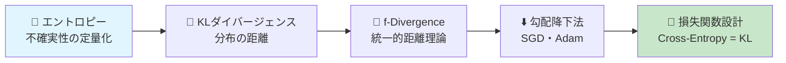
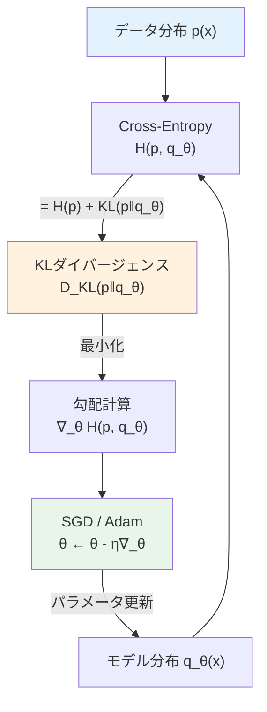
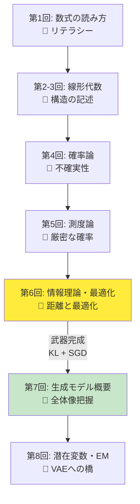
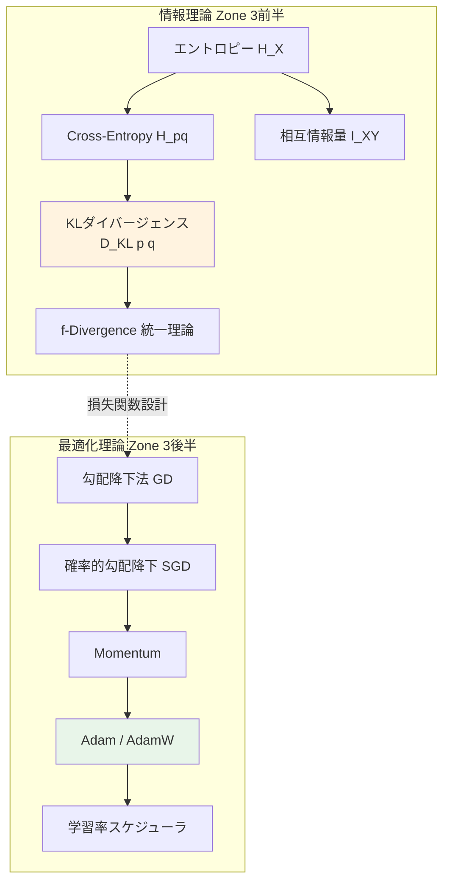
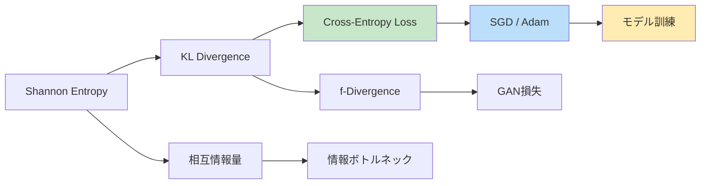
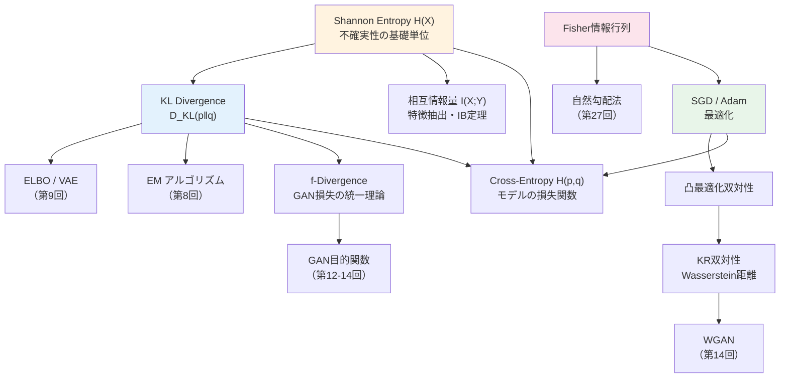
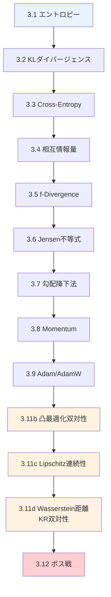
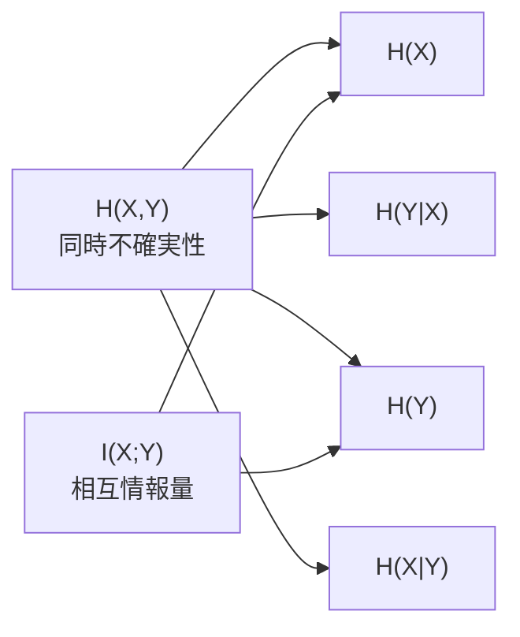

# 第6回: 情報理論・最適化理論 — KLダイバージェンスとSGDで武装する

> **分布の"距離"を測り、パラメータの"谷"を下る。この2つの武器なしに、生成モデルの戦場には立てない。**

第5回で測度論的確率論の基盤を整えた。確率空間 $(\Omega, \mathcal{F}, P)$ の上で確率密度関数が定義され、期待値が Lebesgue 積分として厳密に意味を持つことを学んだ。だが、ここで素朴な疑問が浮かぶ。「2つの確率分布がどれだけ"違う"かを、どう測ればいい？」そして「パラメータをどう動かせば、モデルの分布をデータの分布に近づけられる？」

この2つの問いに答えるのが、情報理論と最適化理論だ。

Shannon が1948年に打ち立てた情報理論 [^1] は不確実性を数値化し、Kullback-Leibler の KL ダイバージェンス [^2] は分布間の非対称距離を測る。Robbins-Monro の確率的近似法 [^3] から Adam [^4] へ至る最適化理論が、現代深層学習の訓練を支える。

本講義は Course I 第6回 — 数学的武装の総仕上げ。KL は損失関数設計に、SGD/Adam はパラメータ学習に直結する。

> **Note:** **このシリーズについて**: 東京大学 松尾・岩澤研究室動画講義の**完全上位互換**の全50回シリーズ。理論（論文が書ける）、実装（Production-ready）、最新（2025-2026 SOTA）の3軸で差別化する。
>
> 実装編は [【後編】第6回: 情報理論・最適化理論](/articles/ml-lecture-06-part2) をご覧ください。



**所要時間の目安**:

| ゾーン | 内容 | 時間 | 難易度 |
|:-------|:-----|:-----|:-------|
| Zone 0 | クイックスタート | 30秒 | ★☆☆☆☆ |
| Zone 1 | 体験ゾーン | 10分 | ★★☆☆☆ |
| Zone 2 | 直感ゾーン | 15分 | ★★☆☆☆ |
| Zone 3 | 数式修行ゾーン | 60分 | ★★★★★ |
| Zone 4 | 実装ゾーン | 45分 | ★★★☆☆ |
| Zone 5 | 実験ゾーン | 30分 | ★★★☆☆ |
| Zone 6 | 振り返りゾーン | 30分 | ★★★★☆ |

---

## 🚀 Z1. プロローグ（30秒）— Perplexity の正体

**ゴール**: LLM の評価指標 Perplexity が「エントロピーの指数」であることを30秒で体験する。

```python
import numpy as np

# LLM が各トークンに割り当てた確率（模擬）
# H(p) = -Σ p(x) log2 p(x)  ... Shannon entropy
probs = np.array([0.7, 0.15, 0.1, 0.05])  # vocabulary of 4 tokens
entropy = -np.sum(probs * np.log2(probs))
perplexity = 2 ** entropy

print(f"Entropy H     = {entropy:.4f} bits")
print(f"Perplexity 2^H = {perplexity:.2f}")
print(f"(Uniform: H={np.log2(4):.2f}, PPL={4})")
```

出力:
```
Entropy H     = 1.3555 bits
Perplexity 2^H = 2.56
(Uniform: H=2.00, PPL=4)
```

**この3行の裏にある数式**:

$$
H(X) = -\sum_{x \in \mathcal{X}} p(x) \log_2 p(x), \quad \text{Perplexity} = 2^{H(X)}
$$

> Progress: 3%

Perplexity = 2.56 は「モデルが平均2.56個の選択肢に迷っている」という意味。完全予測なら 1、一様分布（4トークン）なら 4。GPT-4 の Perplexity が低いのは、エントロピーが低い = 不確実性が小さい = よく予測できている。

Shannon が1948年に定義したエントロピー [^1] が、2026年の LLM 評価でそのまま使われている。

> **Note:** **進捗: 3% 完了** Perplexity $= 2^{H}$ の正体を体感した。残り7ゾーンで、この背後にある情報理論と最適化理論を完全に装備する。

---

## 🎮 Z2. チュートリアル（10分）— エントロピーと KL を手で触る

### 1.1 エントロピー — 不確実性を数値にする

Shannon エントロピーの直感は単純だ。「結果が予測しにくいほど、情報量が大きい」。公平なコインは1 bit、偏ったコインはそれ以下。


出力:
```
Fair coin:    H = 1.0000 bits
Biased(0.9):  H = 0.4690 bits
Certain:      H = 0.0000 bits
```

| 分布 | エントロピー | 直感 |
|:-----|:------------|:-----|
| 公平なコイン | 1.0 bit | 最大の不確実性 |
| 偏ったコイン (0.9/0.1) | 0.469 bits | ほぼ予測可能 |
| 確定的 (1.0/0.0) | 0.0 bits | 驚きゼロ |

この「不確実性の定量化」こそ Shannon の天才的発想だ。彼は通信路の効率を考える中で、**情報の単位**を数学的に定義した [^1]。

### 1.2 KL ダイバージェンス — 分布の"距離"を測る

2つの確率分布 $p$ と $q$ がどれだけ異なるかを測る道具が KL ダイバージェンス（Kullback-Leibler divergence）だ [^2]。

$$
D_\text{KL}(p \| q) = \sum_{x} p(x) \log \frac{p(x)}{q(x)}
$$


出力:
```
KL(p || q_close)   = 0.005765 nats
KL(p || q_uniform) = 0.120068 nats
KL(p || q_far)     = 1.041822 nats

KL(p || q_far)     = 1.041822
KL(q_far || p)     = 0.726801
Non-symmetric! KL is NOT a distance metric.
```

ここで重要な事実が見える: **KL ダイバージェンスは非対称だ**。$D_\text{KL}(p \| q) \neq D_\text{KL}(q \| p)$。これは距離（metric）の条件を満たさない。にもかかわらず、機械学習で最も頻繁に使われる分布間の"距離"がこれだ。なぜか？ — この疑問は Zone 3 で数学的に解決する。

### 1.3 Cross-Entropy と KL の関係 — LLM の損失関数の正体

LLM の訓練で最小化する Cross-Entropy Loss の正体は、実は KL ダイバージェンス + 定数だ。

$$
H(p, q) = -\sum_{x} p(x) \log q(x) = H(p) + D_\text{KL}(p \| q)
$$


出力:
```
Entropy H(p)        = 1.279854 nats
KL(p || q)          = 0.120068 nats
H(p) + KL(p || q)   = 1.399922 nats
Cross-Entropy H(p,q) = 1.399922 nats
Match: True
```

**ここが本質だ**: $p$（真の分布）は学習中に変化しないから $H(p)$ は定数。したがって **Cross-Entropy を最小化することは KL ダイバージェンスを最小化することと等価**。LLM が Cross-Entropy Loss を最小化しているとき、実はモデルの分布 $q_\theta$ と真のトークン分布 $p$ の KL ダイバージェンスを最小化しているのだ。

### 1.4 SGD — パラメータの谷を下る

KL で「どれだけ遠いか」がわかった。次は「どう近づくか」だ。


Robbins と Monro が1951年に確率的近似法を提案したとき [^3]、まさかこのアイデアが70年後に数十億パラメータのモデルを訓練する基盤になるとは想像しなかっただろう。SGD（確率的勾配降下法）の更新則はこう書ける:

$$
\theta_{t+1} = \theta_t - \eta \nabla_\theta \mathcal{L}(\theta_t)
$$

$\eta$ は学習率、$\nabla_\theta \mathcal{L}$ は損失関数の勾配。これが Attention [^5] も Cross-Entropy も含む巨大な計算グラフの勾配を逆伝播で計算し、パラメータを更新する。

### 1.5 4つの概念の接続 — LLM 訓練パイプライン

ここまでの4つの概念がどう繋がるか整理しよう。



| 概念 | 役割 | LLM での使われ方 |
|:-----|:-----|:----------------|
| エントロピー $H(p)$ | 不確実性の定量化 | Perplexity $= 2^H$ で評価 |
| KL ダイバージェンス | 分布間の距離 | 損失関数の本体 |
| Cross-Entropy | KL + 定数 | 訓練時の損失関数 |
| SGD / Adam | 勾配による最適化 | パラメータ更新 |

> **一言で言えば**: 情報理論が「何を最小化すべきか」を定義し、最適化理論が「どう最小化するか」を実行する。この2つが揃って初めてモデルが学習する。

> **Note:** **進捗: 10% 完了** エントロピー、KL ダイバージェンス、Cross-Entropy、SGD の4概念を体験し、LLM 訓練パイプラインでの接続を確認した。Zone 0-1 クリア。

---

### Z2 Quick Check

**チェック 1**: Shannon エントロピー $H(X) = -\sum_x p(x) \log p(x)$ が最大になるのはどんな分布か？

<details><summary>答え</summary>

一様分布 $p(x) = 1/n$ のとき $H(X) = \log n$ で最大（上に凸の関数の最大化 + Jensen不等式から）。直感: 最も不確かな状態 = 最大エントロピー。これは Shannon の公理 (2) に対応。
</details>

**チェック 2**: $D_{\text{KL}}(p \| q) = 0$ となるのはいつか？

<details><summary>答え</summary>

$p = q$ のとき（ほぼ確実に）。証明: Jensen不等式から $-D_{\text{KL}}(p \| q) = \mathbb{E}_p[\log(q/p)] \leq \log \mathbb{E}_p[q/p] = \log 1 = 0$。等号成立条件: $q(x)/p(x)$ が定数 = $p=q$。
</details>

> Progress: 10%

## 🧩 Z3. 世界観（20分）— なぜ情報理論と最適化が"武器"なのか

### 2.1 この講義の位置づけ — Course I 最後の数学的武装

第1-5回で数式・線形代数・確率論・測度論を装備した。本講義は総仕上げ — **情報理論と最適化理論**を手に入れる。

生成モデルの訓練にはあと2つ必要だ。

1. **損失関数**: モデルの悪さを数値化 → 情報理論（KL ダイバージェンス）
2. **最適化**: モデル改善の手順 → 最適化理論（SGD / Adam）



### 2.2 松尾研との比較 — なぜ8回かけて数学を叩き込むか

| 観点 | 松尾・岩澤研 | 本シリーズ |
|:-----|:-----------|:---------|
| 情報理論 | 「KL divergence は...」と紹介して終了 | Shannon エントロピーから f-Divergence 統一理論まで導出 |
| 最適化 | 「Adam を使います」 | SGD → Momentum → Adam → AdamW を収束性スケッチ付きで導出 |
| 実装 | `torch.optim.Adam(...)` で終了 | Adam をスクラッチ実装 + `%timeit` で Python の限界を体感 |
| 前提知識 | 「知ってるものとします」 | **8回かけて全て導出する** |

松尾研は8回で VAE から Diffusion まで駆け抜ける。本シリーズは Course I の8回で数学基盤を完全に固め、Course II 以降で理論と実装を回す。**急がば回れ**。

### 2.3 情報理論の3つのメタファー

情報理論の中核概念を直感的に理解するための3つのメタファーを紹介する。

**メタファー1: エントロピー = 驚きの平均**
「明日、太陽が東から昇る」→驚かない（情報量ゼロ）。「西から昇る」→驚く（情報量大）。エントロピーはイベント群から得られる驚きの平均値。

**メタファー2: KL ダイバージェンス = 翻訳コスト**
$D_\text{KL}(p \| q)$ は「$p$ で生成されたデータを $q$ で符号化したときの余分なビット数」。$p = q$ なら余分なコストはゼロ。

**メタファー3: 勾配降下 = 霧の中の下山**
パラメータ空間の谷底（最適解）に向かって、足元の傾き（勾配）だけを頼りに1歩ずつ下る。学習率は歩幅 — 大きすぎると谷を飛び越え、小さすぎると日が暮れる。

### 2.4 本講義の全体マップ



| ブロック | 核心 | 所要時間 | LLM との接点 |
|:---------|:-----|:---------|:-----------|
| エントロピー | 不確実性の数値化 | 15分 | Perplexity $= 2^H$ |
| KL / Cross-Entropy | 分布間距離 | 15分 | 訓練損失関数の正体 |
| 相互情報量 | 依存関係の数値化 | 10分 | 表現学習・潜在変数 |
| f-Divergence | 距離の統一理論 | 10分 | GAN / VAE の損失設計 |
| SGD → Adam | パラメータ最適化 | 20分 | 訓練アルゴリズム |

> **一言で言えば**: 情報理論が「何を最小化すべきか」を定義し、最適化理論が「どう最小化するか」を実行する。この2つが揃って初めてモデルが学習する。

**5トピック間の依存関係**:



各トピックは孤立していない — Shannon Entropy なしに KL は定義できず、KL なしに Cross-Entropy の意味は分からず、Cross-Entropy なしに Adam を使う理由が分からない。**5トピックは1本の論理の糸で繋がっている。**

### 2.5 学習戦略 — 覚えるな、導出しろ

20以上の数式が登場する。全暗記は無駄。戦略:

1. **定義を覚える**: エントロピー、KL、Cross-Entropy の定義式
2. **関係を導出**: $H(p, q) = H(p) + D_\text{KL}(p \| q)$ は定義から導出
3. **コードで確認**: Python 実装で数値検証
4. **紙に書く**: KL の非負性証明は手書き

<details><summary>トロイの木馬 — Python の遅さ</summary>
`%timeit` で最適化ループを測ると「遅くない？」という違和感が生まれる。この違和感は第8回で爆発し、第9回で Julia が50倍高速化を見せる。
</details>

### 2.6 情報理論のトポロジー — 全体像を1枚で理解する

本講義の5トピックが相互にどう接続するかを見ておく。点と点を結ぶのではなく、**情報理論という1枚の地図**に全てを配置すると:



この地図の見方: Shannon エントロピーが根っこ、KL が幹、f-Divergence と Wasserstein が枝。最適化は KL の最小化を実行するエンジン。Fisher 情報行列は最適化を確率分布空間に持ち込むインターフェース。

**情報ボトルネック (IB) 理論 — 深層学習の説明原理**:

$$
\text{IB} = \max \left[ I(Y; Z) - \beta I(X; Z) \right]
$$

入力 $X$ の表現 $Z$ を最適化: ラベル $Y$ との相互情報量を最大化しつつ、$X$ の情報量を圧縮する。$\beta$ でトレードオフを制御。Tishby & Schwartz-Ziv (2017) は「深層ニューラルネットが自動的に IB を解いている」と主張（論争中）。相互情報量 (3.5) が深層学習の理論的基盤につながる重要な橋頭堡だ。

> **Note:** **進捗: 20% 完了** 情報理論と最適化理論が生成モデルの「武器」である理由を理解し、本講義の全体マップを把握した。Zone 0-2 クリア。次は数式修行ゾーンへ。覚悟はいいか。

---

### Z3 Quick Check

**チェック 1**: $H(p, q) = H(p) + D_{\text{KL}}(p \| q)$ を証明せよ。

<details><summary>証明</summary>

$$
H(p, q) = -\sum_x p(x) \log q(x)
= -\sum_x p(x) \log p(x) + \sum_x p(x) \log \frac{p(x)}{q(x)}
= H(p) + D_{\text{KL}}(p \| q)
$$

$\log q(x) = \log p(x) - \log(p(x)/q(x))$ を代入しただけ。LLM の Cross-Entropy 最小化が KL 最小化と等価なのはここから。
</details>

**チェック 2**: Cross-Entropy Loss を最小化するとき、なぜ $H(p)$（真の分布のエントロピー）は無視してよいか？

<details><summary>答え</summary>

学習中に最適化するパラメータ $\theta$ は $q_\theta$ に入っている。真の分布 $p_{\text{data}}$ は固定されているため、$H(p) = -\mathbb{E}_{x \sim p}[\log p(x)]$ は $\theta$ に依存しない定数。よって $\arg\min_\theta H(p, q_\theta) = \arg\min_\theta D_{\text{KL}}(p \| q_\theta)$。
</details>

> Progress: 20%

## 📐 Z4. ボスバトル（60分）— 情報理論と最適化の完全導出

情報理論と最適化理論を数式で導出する。紙とペンを用意。



### 3.1 Shannon エントロピー — 不確実性の公理的定義

**定義 3.1** (Shannon エントロピー [^1]). 離散確率変数 $X$ が確率質量関数 $p(x)$ を持つとき、Shannon エントロピーは

$$
H(X) = -\sum_{x \in \mathcal{X}} p(x) \log p(x)
$$

で定義される。慣例として $0 \log 0 = 0$ とする（$\lim_{t \to 0^+} t \log t = 0$ による）。

| 記号 | 読み方 | 意味 |
|:-----|:-------|:-----|
| $H(X)$ | エイチ エックス | 確率変数 $X$ のエントロピー |
| $\mathcal{X}$ | カリグラフィック エックス | $X$ の値域（標本空間） |
| $p(x)$ | ピー エックス | $x$ が起きる確率 |
| $\log$ | ログ | 対数（底 $2$ なら bit、$e$ なら nat） |

Shannon はなぜこの形を選んだのか。彼は1948年の論文 [^1] で、「情報の尺度」が満たすべき3つの公理を示した:

1. $H$ は $p_1, \ldots, p_n$ の連続関数である
2. 全ての事象が等確率（$p_i = 1/n$）のとき、$H$ は $n$ の単調増加関数である
3. $H$ は分解可能（chain rule）: 選択を分割しても合計の不確実性は変わらない

**定理 3.1** (Shannon の一意性定理 [^1]). 上記3公理を満たす関数は定数倍を除いて

$$
H = -K \sum_{i=1}^{n} p_i \log p_i
$$

のみである（$K > 0$ は単位を決める定数）。

> **Note:** ここが本質だ。Shannon エントロピーは「こう定義しよう」と決めたものではなく、合理的な公理から**一意に導かれる**唯一の情報量尺度だ。他に選択肢がなかった。

**性質**: 離散確率変数 $X$ が $n$ 個の値を取るとき、

- $H(X) \geq 0$（非負性）
- $H(X) = 0 \iff X$ が確定的（$p(x_0) = 1$ for some $x_0$）
- $H(X) \leq \log n$（等号は一様分布のとき）


**LLM との接続**: Perplexity $= 2^{H}$ は「モデルが各ステップで平均何個の選択肢に迷っているか」を意味する。GPT-4 の Perplexity が低いのは、次トークンの予測分布のエントロピーが低い = 自信を持って予測できている、ということだ。これは第1回で体験した Perplexity の数式の正体を完全に解明している。

**Shannon エントロピーの最大性証明**: $H(X) \leq \log n$（等号: 一様分布）の証明:

$$
\log n - H(X) = \log n + \sum_x p(x)\log p(x) = \sum_x p(x) \log (np(x)) = D_{\text{KL}}\!\left(p \,\|\, \frac{1}{n}\mathbf{1}\right) \geq 0
$$

$D_{\text{KL}} \geq 0$（後述）を使う。等号条件 $p(x) = 1/n$ も KL の等号条件から即座に得られる。

**Huffman 符号との接続**: Source Coding Theorem は $H(X) \leq \bar{L} < H(X) + 1$（$\bar{L}$ = 平均符号長）を保証する。Huffman 符号はこの下限を達成する最適な可変長符号。高確率トークンほど短い符号語を割り当てる — これが LLM のトークナイザー設計の理論的根拠だ。

**エントロピーと情報幾何学**: エントロピー $H(p)$ は確率simplex $\Delta_n = \{p : \sum p_i = 1, p_i \geq 0\}$ 上の関数として見ると、Bregman Divergence の生成関数になる（後述 3.7 節）。これは情報幾何学（第29回）の入口だ。

**漸近的等分割性 (AEP) — LLM が長文生成できる理由**:

大数の法則を確率変数の列に適用すると、Shannon の**漸近的等分割性 (Asymptotic Equipartition Property)** が得られる:

$$
-\frac{1}{n} \log p(X_1, X_2, \ldots, X_n) \xrightarrow{P} H(X) \quad (n \to \infty)
$$

i.i.d. 列の場合、長いシーケンスはほぼ全て「典型的な確率 $\approx 2^{-nH}$」を持つ集合（**典型集合** $A_\epsilon^{(n)}$）に属する。典型集合の性質:

- **確率 1 に収束**: $P(A_\epsilon^{(n)}) \geq 1 - \epsilon$（十分大きな $n$ で）
- **サイズ**: $|A_\epsilon^{(n)}| \approx 2^{nH(X)}$（$2^n$ 通りの中で $2^{nH}$ 個だけが典型的）
- **各元の確率**: $\approx 2^{-nH(X)}$ — だからこそ「等分割」

LLM が $T$ トークンの文章を生成するとき、実際に現れる文章は $2^{TH}$ 個の典型的なシーケンス空間上に集中する。Perplexity $= 2^H$ は「1ステップあたりの典型的な選択肢数」であり、AEP の本質と直結する。

### 3.2 連続エントロピー（微分エントロピー）

連続確率変数に対するエントロピーの自然な拡張を定義する。

**定義 3.2** (微分エントロピー). 確率密度関数 $p(x)$ を持つ連続確率変数 $X$ の微分エントロピーは

$$
h(X) = -\int_{\mathcal{X}} p(x) \log p(x) \, dx
$$

> **⚠️ Warning:** 注意: 微分エントロピーは離散エントロピーと異なり**負になりうる**。例えば $X \sim \text{Uniform}(0, 1/2)$ のとき $h(X) = -\log 2 = -1$ bit。これは「情報量が負」なのではなく、連続分布と離散分布の差異から生じる。

**ガウス分布の微分エントロピー**:

$$
X \sim \mathcal{N}(\mu, \sigma^2) \implies h(X) = \frac{1}{2} \log(2\pi e \sigma^2)
$$

**導出**:

$$
\begin{aligned}
h(X) &= -\int p(x) \log p(x) \, dx \\
&= -\int p(x) \left[ -\frac{1}{2}\log(2\pi\sigma^2) - \frac{(x-\mu)^2}{2\sigma^2} \right] dx \\
&= \frac{1}{2}\log(2\pi\sigma^2) \underbrace{\int p(x) \, dx}_{=1} + \frac{1}{2\sigma^2} \underbrace{\int p(x)(x-\mu)^2 \, dx}_{=\sigma^2} \\
&= \frac{1}{2}\log(2\pi\sigma^2) + \frac{1}{2} \\
&= \frac{1}{2}\log(2\pi e \sigma^2)
\end{aligned}
$$


**重要な定理**: 分散が $\sigma^2$ の全ての連続分布の中で、ガウス分布が微分エントロピーを最大化する。これは「分散が同じなら、ガウス分布が最も不確実」という意味だ。この性質が VAE でガウス事前分布を選ぶ理論的根拠の1つになる（第10回で詳述）。

**証明スケッチ**: 任意の分布 $p$ と同じ平均・分散を持つガウス分布 $g = \mathcal{N}(\mu, \sigma^2)$ を考える。KL の非負性:

$$
0 \leq D_{KL}(p \| g) = -h(p) + \int p(x)\log\frac{1}{g(x)}dx = -h(p) + h(g)
$$

最後の等号は $\int p(x)\log(1/g(x))dx = \frac{1}{2}\log(2\pi e\sigma^2)$（ガウス分布の性質、$p$ と $g$ が同じ平均・分散を持つことから）。よって $h(p) \leq h(g)$。等号 $\iff$ $p = g$（KL の等号条件）。

**微分エントロピーの落とし穴**:
- $h(X) < 0$ は可能（例: $X \sim \text{Uniform}(0, 0.1)$ → $h = \log 0.1 < 0$）
- スケール依存: $h(aX) = h(X) + \log |a|$（$a \neq 0$）
- 不可逆変換で変化: 非線形変換 $Y = f(X)$ では $h(Y) = h(X) + \mathbb{E}[\log|f'(X)|]$（flow models の変数変換公式 — 第10回）

これらの落とし穴は連続変数の生成モデル（VAE, Flow, Diffusion）で常に意識が必要だ。

### 3.3 KL ダイバージェンス — 分布間の非対称距離

**定義 3.3** (KL ダイバージェンス [^2]). 確率分布 $p$ と $q$ に対して、

$$
D_\text{KL}(p \| q) = \sum_{x} p(x) \log \frac{p(x)}{q(x)} = \mathbb{E}_{x \sim p}\left[\log \frac{p(x)}{q(x)}\right]
$$

連続版は $\sum$ を $\int$ に、$p(x)$ を確率密度に置き換える。

| 記号 | 読み方 | 意味 |
|:-----|:-------|:-----|
| $D_\text{KL}(p \| q)$ | ケーエル ピー パラレル キュー | $p$ から見た $q$ との乖離 |
| $\log \frac{p(x)}{q(x)}$ | ログ ピー オーバー キュー | 対数尤度比 |
| $\mathbb{E}_{x \sim p}[\cdot]$ | イー エックス サンプル ピー | $p$ に関する期待値 |

**定理 3.2** (Gibbs の不等式 / KL の非負性). 任意の確率分布 $p, q$ に対して

$$
D_\text{KL}(p \| q) \geq 0
$$

等号は $p = q$ のときのみ成立。

**証明**: Jensen の不等式を使う。$\log$ は凹関数だから、

$$
\begin{aligned}
-D_\text{KL}(p \| q) &= \sum_x p(x) \log \frac{q(x)}{p(x)} \\
&\leq \log \sum_x p(x) \cdot \frac{q(x)}{p(x)} \quad \text{(Jensen)} \\
&= \log \sum_x q(x) = \log 1 = 0
\end{aligned}
$$

したがって $D_\text{KL}(p \| q) \geq 0$。等号条件: $\frac{q(x)}{p(x)}$ が定数、すなわち $p = q$。$\blacksquare$

> **Note:** この証明は短いが、ここで使われる Jensen の不等式は情報理論の至るところに現れる。ELBO の導出（第9回）でも、EM 算法の収束証明（第8回）でも、同じ不等式が鍵になる。今ここで完全に理解しておくこと。

**Pinsker の不等式**: KL と Total Variation の間に成立する基本的な不等式:

$$
D_{\text{TV}}(p, q) \triangleq \frac{1}{2}\sum_x |p(x) - q(x)| \leq \sqrt{\frac{1}{2} D_{\text{KL}}(p \| q)}
$$

KL が小さければ TV も小さい（KL は TV より強い）。生成モデルの収束証明でよく使われる — DDPM の誤差解析もここを経由する。

**ガウス分布間のKL閉形式**: 連続KLで最もよく使う公式。$p = \mathcal{N}(\mu_1, \sigma_1^2)$、$q = \mathcal{N}(\mu_2, \sigma_2^2)$ のとき:

$$
D_{\text{KL}}(p \| q) = \log\frac{\sigma_2}{\sigma_1} + \frac{\sigma_1^2 + (\mu_1-\mu_2)^2}{2\sigma_2^2} - \frac{1}{2}
$$

**導出**: $\log(q/p) = \log(\sigma_1/\sigma_2) - (x-\mu_2)^2/(2\sigma_2^2) + (x-\mu_1)^2/(2\sigma_1^2)$ を $p$ の下で積分。$\mathbb{E}_p[(x-\mu_2)^2] = \sigma_1^2 + (\mu_1-\mu_2)^2$（分散の公式）を使う。VAE の KL 正則化項 $D_{\text{KL}}(\mathcal{N}(\mu_\phi, \sigma_\phi^2) \| \mathcal{N}(0,1))$ はこの公式の $\mu_2=0, \sigma_2=1$ 特殊ケース:

$$
D_{\text{KL}}(\mathcal{N}(\mu, \sigma^2) \| \mathcal{N}(0,1)) = \frac{\mu^2 + \sigma^2 - 1 - \log \sigma^2}{2}
$$

**前向き KL vs 逆向き KL**: 生成モデルの設計で決定的に重要な区別がある。

| | 前向き KL: $D_\text{KL}(p_\text{data} \| q_\theta)$ | 逆向き KL: $D_\text{KL}(q_\theta \| p_\text{data})$ |
|:---|:---|:---|
| **最小化の意味** | $q_\theta$ が $p$ のサポート全体を覆う | $q_\theta$ が自信のある領域に集中 |
| **mode-covering/seeking** | Mode-covering（全モードをカバー） | Mode-seeking（1つのモードに集中） |
| **使用例** | VAE、MLE | GAN、変分推論 |
| **結果** | ぼやけた画像 | 鮮明だがモード崩壊のリスク |


> **一言で言えば**: 前向き KL は「見逃しを嫌う」、逆向き KL は「間違いを嫌う」。VAE がぼやけるのは前向き KL を使うから。GAN が鮮明なのは暗黙的に逆向き KL を最小化しているから。

**KL 非対称性の数値例**: 2峰分布 $p = 0.5\mathcal{N}(-2, 0.5) + 0.5\mathcal{N}(2, 0.5)$ に対し、単峰近似 $q_\theta = \mathcal{N}(\mu, 1)$ を当てはめる場合:

- **前向き KL 最小化** ($\min_\theta D_{KL}(p\|q_\theta)$): $q_\theta$ は2つのモードの中間 $\mu \approx 0$ に収束 → 両峰の中間を覆う「ぼやけた」解
- **逆向き KL 最小化** ($\min_\theta D_{KL}(q_\theta\|p)$): $q_\theta$ は $\mu \approx -2$ または $\mu \approx 2$ の一方に収束 → 一方の峰のみに集中する「鮮明だが不完全な」解

この「2峰分布にどう近似するか」問題は、VAE が「平均的な顔」を生成し GAN が「リアルな顔」を生成する理由の直接の説明だ（第9-14回で実験）。

**Pinsker 不等式 — KL と全変動距離の関係**:

KL ダイバージェンスと全変動距離 $d_{TV}(p, q) = \frac{1}{2}\sum_x |p(x) - q(x)|$ の間には基本的な不等式がある:

$$
d_{TV}(p, q) \leq \sqrt{\frac{1}{2} D_{KL}(p \| q)}
$$

KL が小さければ、全変動距離も小さい — つまり KL を最小化すると分布は本当に近くなる。逆は成り立たない: TV が小さくても KL は大きいことがある（裾の重い分布で典型的）。

### 3.4 Cross-Entropy と KL の関係

**定義 3.4** (Cross-Entropy).

$$
H(p, q) = -\sum_x p(x) \log q(x) = -\mathbb{E}_{x \sim p}[\log q(x)]
$$

**定理 3.3** (分解定理).

$$
H(p, q) = H(p) + D_\text{KL}(p \| q)
$$

**証明**:

$$
\begin{aligned}
H(p, q) &= -\sum_x p(x) \log q(x) \\
&= -\sum_x p(x) \log \frac{q(x) \cdot p(x)}{p(x)} \\
&= -\sum_x p(x) \left[\log p(x) + \log \frac{q(x)}{p(x)}\right] \\
&= \underbrace{-\sum_x p(x) \log p(x)}_{H(p)} + \underbrace{\sum_x p(x) \log \frac{p(x)}{q(x)}}_{D_\text{KL}(p \| q)} \quad \blacksquare
\end{aligned}
$$

**LLM への直接的帰結**: LLM の訓練で最小化する Cross-Entropy Loss は

$$
\mathcal{L}(\theta) = -\frac{1}{T}\sum_{t=1}^T \log q_\theta(x_t \mid x_{<t})
$$

ここで $q_\theta$ はモデルの条件付き分布、$x_t$ は正解トークン。これは経験分布 $\hat{p}$ に関する Cross-Entropy $H(\hat{p}, q_\theta)$ であり、$H(\hat{p})$ は定数だから、**Cross-Entropy の最小化 = KL ダイバージェンスの最小化**。

第1回で体験した Cross-Entropy Loss の「なぜこの形なのか」に、ついに完全な答えが出た。

### 3.5 条件付きエントロピーと相互情報量

**定義 3.5** (条件付きエントロピー).

$$
H(Y \mid X) = -\sum_{x,y} p(x,y) \log p(y \mid x) = \mathbb{E}_{x,y}[-\log p(y \mid x)]
$$

直感: 「$X$ を知った上での $Y$ の残りの不確実性」。

**定義 3.6** (相互情報量 [^1]).

$$
I(X; Y) = H(Y) - H(Y \mid X) = D_\text{KL}(p(x,y) \| p(x)p(y))
$$

相互情報量は「$X$ を知ることで $Y$ の不確実性がどれだけ減るか」を測る。あるいは等価に「$X$ と $Y$ の同時分布が独立分布からどれだけ離れているか」を KL で測る。

**Chain Rule for Entropy**:

$$
H(X, Y) = H(X) + H(Y \mid X) = H(Y) + H(X \mid Y)
$$




**相互情報量の重要な恒等式**:

$$
I(X; Y) = H(X) - H(X|Y) = H(Y) - H(Y|X) = H(X) + H(Y) - H(X,Y)
$$

これら4つの等価な表現は同じ量を異なる角度から見ている。特に最後の表現 $H(X) + H(Y) - H(X,Y)$ は「同時情報量が独立の場合の和より少ない分」= 「共有情報量」というインタープリテーションを与える。独立なら $H(X,Y) = H(X) + H(Y)$ なので $I = 0$。

**連続版（微分エントロピーによる相互情報量）**:

$$
I(X; Y) = \int\int p(x,y) \log \frac{p(x,y)}{p(x)p(y)} dx\, dy = D_{KL}(p(x,y) \| p(x)p(y))
$$

微分エントロピーは負になりうるが、相互情報量 $I(X;Y) \geq 0$ は連続版でも非負（KL の非負性から）。

**数値例**: 2変量ガウスの相互情報量（相関係数 $\rho$）:

$$
I(X; Y) = -\frac{1}{2} \log(1 - \rho^2)
$$

$\rho = 0$（独立）: $I = 0$. $|\rho| \to 1$（完全相関）: $I \to \infty$。Transformer の attention は各 head が入出力の相互情報量を高める特定の「依存関係パターン」を学習していると解釈できる。

**LLM との接続**: 相互情報量 $I(X; Y)$ は表現学習で中心的な役割を果たす。Transformer の隠れ層は入力と出力の相互情報量を最大化するように学習されている、という見方ができる。VAE の損失関数にも $I(z; x)$（潜在変数と観測データの相互情報量）が暗黙的に現れる（第9回で詳述）。

### 3.5b データ処理不等式・Fano の不等式・Source Coding 定理

情報理論の3つの限界定理を概観する。いずれも「情報には超えられない壁がある」という根本原理を異なる角度から表現している。

**定理 3.5** (データ処理不等式). マルコフ連鎖 $X \to Y \to Z$ に対し $I(X; Z) \leq I(X; Y)$。処理で情報は増えない。

**深層学習への帰結**: NN の各層 $X \to h_1 \to \cdots \to \hat{Y}$ で $I(X; \hat{Y}) \leq I(X; h_1) \leq H(X)$。Information Bottleneck（Tishby+ 2000）はここから「良い表現 = $I(h;Y)$ 最大かつ $I(h;X)$ 最小」と定義する。

**Fano の不等式**: 推定誤差率 $P_e = P(\hat{X} \neq X)$ に対し $H(X \mid \hat{X}) \leq H_b(P_e) + P_e \log(|\mathcal{X}| - 1)$。推定精度の理論的下限を与える。

**Source Coding 定理** (Shannon, 1948 [^1]): 平均符号長 $L \geq H(X)$。エントロピーがデータ圧縮の理論限界。LLM の Perplexity 低下 = 言語の効率的符号化の学習と等価だ。

**Channel Coding 定理（Shannon の第二基本定理）**: チャネル容量 $C = \max_{p(x)} I(X; Y)$ を超えない通信レートでは、誤り率をゼロに近づける符号が存在する。$C$ は入力分布 $p(x)$ の最適化で決まる。これは3.5 節の相互情報量が「チャネルが運べる最大情報量」を与えることを意味する。深層学習モデルをチャネルと見なすと、モデルの「容量」は中間層の相互情報量 $I(X; Z)$ で定量化できる — Information Bottleneck の理論的基盤。


### 3.5c 情報量の Chain Rule — 情報の分解と合成

情報理論の Chain Rule は確率の Chain Rule の情報版だ。

**エントロピーの Chain Rule**:

$$
H(X_1, X_2, \ldots, X_n) = \sum_{i=1}^{n} H(X_i \mid X_1, \ldots, X_{i-1})
$$

**相互情報量の Chain Rule**:

$$
I(X_1, X_2, \ldots, X_n; Y) = \sum_{i=1}^{n} I(X_i; Y \mid X_1, \ldots, X_{i-1})
$$

**KL の Chain Rule（連鎖律）**:

$$
D_\text{KL}(p(x, y) \| q(x, y)) = D_\text{KL}(p(x) \| q(x)) + \mathbb{E}_{p(x)}[D_\text{KL}(p(y|x) \| q(y|x))]
$$

この KL の Chain Rule は自己回帰モデルの損失関数を理解する上で本質的だ。LLM は $p(x_1, \ldots, x_T)$ をモデル化するが、実際の損失は各トークンの条件付き分布 $p(x_t | x_{<t})$ の KL の和として分解される。

**EM アルゴリズムとの接続**: KL の Chain Rule は EM の収束証明を支える。E ステップ（期待値計算）で KL の下界 ELBO を構成し、M ステップ（最大化）でその下界を最大化する。詳細は第8回で完全導出するが、KL の Chain Rule:

$$
D_{KL}(p(z|x,\theta^{\text{old}}) \| p(z|x,\theta)) = \underbrace{\log p(x;\theta) - \text{ELBO}(\theta, q)}_{\geq 0}
$$

が EM の各ステップで尤度を単調増加させる理由だ。$D_{KL} \geq 0$ であることが $\log p(x;\theta) \geq \text{ELBO}$ の直接の原因である。

**Rate-Distortion 理論 — 圧縮と品質のトレードオフ**:

Information Bottleneck の大元にある理論が **Rate-Distortion**。信号 $X$ を $R$ ビットで圧縮したとき、最小の歪み $D$ はいくらか？

$$
R(D) = \min_{p(\hat{x}|x): \mathbb{E}[d(X,\hat{X})] \leq D} I(X; \hat{X})
$$

$d(x, \hat{x})$ は歪み関数（例: 二乗誤差）。最小相互情報量 = 許容歪み $D$ での最小ビットレート。

**ガウス源の Rate-Distortion 関数**（$d = \text{MSE}$、$X \sim \mathcal{N}(0, \sigma^2)$）:

$$
R(D) = \max\left(0, \frac{1}{2} \log \frac{\sigma^2}{D}\right)
$$

歪み $D \to 0$（完全再現）なら $R \to \infty$、$D = \sigma^2$（零情報）なら $R = 0$。

**深層生成モデルへの接続**: VAE はまさに Rate-Distortion のトレードオフを学習している。$\beta$-VAE:

$$
\mathcal{L}_{\beta\text{-VAE}} = -\mathbb{E}_{q_\phi(z|x)}[\log p_\theta(x|z)] + \beta \cdot D_{KL}(q_\phi(z|x) \| p(z))
$$

$\beta$ は Rate（潜在変数が持てる情報量 = 圧縮率）と Distortion（再構成誤差）のトレードオフを制御する。$\beta > 1$ で潜在表現が disentangle することが知られている（第9回）。


### 3.6 f-Divergence — KL を含む統一理論

KL ダイバージェンスは分布間距離の1つに過ぎない。Csiszar が1967年に導入した f-Divergence [^6] は、幅広い距離族を統一的に扱うフレームワークだ。

**定義 3.7** (f-Divergence [^6]). $f: \mathbb{R}_{>0} \to \mathbb{R}$ を $f(1) = 0$ かつ凸な関数とする。2つの確率分布 $p, q$ に対して、

$$
D_f(p \| q) = \sum_x q(x) f\left(\frac{p(x)}{q(x)}\right)
$$

| $f(t)$ の選択 | 名前 | 用途 |
|:-------------|:-----|:-----|
| $t \log t$ | KL ダイバージェンス | VAE, MLE |
| $-\log t$ | 逆 KL | 変分推論 |
| $(t - 1)^2$ | $\chi^2$ ダイバージェンス | 仮説検定 |
| $(\sqrt{t} - 1)^2$ | Hellinger 距離 | ロバスト推定 |
| $\frac{1}{2}|t - 1|$ | 全変動距離 (TV) | 統計的検定 |
| $\frac{1}{2}(t \log t - (t+1)\log\frac{t+1}{2})$ | Jensen-Shannon | GAN [^9] |

**性質**: 全ての f-Divergence は $f$ の凸性から $D_f(p \| q) \geq 0$ を満たし、$p = q$ のとき $D_f = 0$。

<details><summary>f-Divergence の変分表現 (Fenchel 共役)</summary>
Nguyen, Wainwright & Jordan [^7] による変分表現は、f-Divergence を最適化問題として書ける:

$$
D_f(p \| q) = \sup_{T: \mathcal{X} \to \mathbb{R}} \left[\mathbb{E}_{x \sim p}[T(x)] - \mathbb{E}_{x \sim q}[f^*(T(x))]\right]
$$

ここで $f^*$ は $f$ の Fenchel 共役（convex conjugate）。この表現は GAN の理論的基盤を与える。$T$ を判別器（discriminator）と解釈すれば、GAN は f-Divergence の変分推定を行っていることになる。詳細は第12回（GAN 基礎）で導出する。
</details>


ここが本質だ — **生成モデルの損失関数は全て f-Divergence のファミリーに属する**。VAE は KL、GAN は JS / Wasserstein、f-GAN は任意の f-Divergence を最小化する。この統一的視点を持つことで、第12-14回の GAN 理論が格段にクリアになる。

#### GAN 目的関数と f-Divergence の接続

Goodfellow ら [^9] の **vanilla GAN** は Jensen-Shannon Divergence を最小化している。これを f-Divergence の枠組みで導出しよう。

GAN の判別器損失（最適化後の判別器を $D^*$ で表す）:

$$
\max_D \mathbb{E}_{x \sim p_{\text{data}}}[\log D(x)] + \mathbb{E}_{z \sim p_z}[\log(1 - D(G(z)))]
$$

データ $x$ に対して最適な判別器は $D^*(x) = \frac{p_{\text{data}}(x)}{p_{\text{data}}(x) + p_g(x)}$。これを代入して生成器の損失を整理すると:

$$
\mathcal{L}_G = 2 \, \text{JSD}(p_{\text{data}} \| p_g) - 2\log 2
$$

これは **JSD の最小化**に等価。f-Divergence の枠組みでは $f(t) = \frac{1}{2}(t\log t - (t+1)\log\frac{t+1}{2})$ に対応する。

**f-GAN の一般化**: Nowozin ら (2016) は任意の f-Divergence を GAN で最小化できることを示した。変分表現 $D_f(p \| q) = \sup_T [\mathbb{E}_p[T] - \mathbb{E}_q[f^*(T)]]$ を直接最適化すると判別器 $T$ が f-Divergence の変分推定量になる:

| GAN の種類 | 対応する divergence | 問題点 | 解決 |
|:-----------|:------------|:-----|:-----|
| Vanilla GAN | JSD | 勾配消失（サポート非重複）| WGAN |
| LSGAN | $\chi^2$ | 勾配飽和なし | 安定 |
| WGAN | Wasserstein | 計算重 | Spectral Norm |
| f-GAN (KL) | Forward KL | Mode-covering | ぼやけ |
| f-GAN (逆KL) | Reverse KL | Mode-seeking | 多様性低 |

> **Note:** どの f-Divergence を選ぶかは生成モデルの「哲学」を決める。Mode-covering（$D_{KL}(p\|q)$）は全モードをカバーしようとしてぼやけた画像を生成し、Mode-seeking（$D_{KL}(q\|p)$）は鮮明だが多様性が低い。Wasserstein は両者の良いバランス — 第12-14回で体験する。

### 3.7 Jensen の不等式と凸性 — 情報理論の裏ボス

KL の非負性の証明で使った Jensen の不等式は、情報理論の至るところに現れる。ここで改めて厳密に述べる。

**定理 3.4** (Jensen の不等式). $f$ が凸関数のとき、

$$
f(\mathbb{E}[X]) \leq \mathbb{E}[f(X)]
$$

$f$ が凹関数なら不等号が逆転する。

**証明スケッチ（凸関数の支持超平面）**: 凸関数 $f$ の任意の点 $x_0$ において、$f$ のグラフの下に接線（支持超平面）が存在する: $f(x) \geq f(x_0) + f'(x_0)(x - x_0)$。$x_0 = \mathbb{E}[X]$ として両辺の期待値を取ると、

$$
\mathbb{E}[f(X)] \geq f(\mathbb{E}[X]) + f'(\mathbb{E}[X]) \underbrace{(\mathbb{E}[X] - \mathbb{E}[X])}_{= 0} = f(\mathbb{E}[X]) \quad \blacksquare
$$

**Jensen 不等式の登場場面**:

| 場面 | 使い方 | 講義 |
|:-----|:-------|:-----|
| KL の非負性 | $\log$ は凹 → $\mathbb{E}[\log] \leq \log \mathbb{E}$ | 本講義 3.3 |
| ELBO の導出 | $\log p(x) \geq \text{ELBO}$ | 第9回 |
| EM 算法の収束 | $\log$-likelihood の下界 | 第8回 |
| エントロピー最大 | 一様分布の最適性 | 本講義 3.1 |

<details><summary>Bregman Divergence — KL の一般化</summary>

KL ダイバージェンスは Bregman Divergence の特殊ケースとして理解できる:

$$
D_F(p \| q) = F(p) - F(q) - \langle \nabla F(q), p - q \rangle
$$

$F(p) = \sum_x p(x) \log p(x)$（負のエントロピー）とすると $D_F = D_\text{KL}$。Bregman Divergence は凸関数 $F$ から作られる距離族で、EM 算法の収束性を幾何学的に理解するための鍵になる（第8回・第27回）。
</details>

> Progress: 50%

### 3.8 勾配降下法 — 最適化の基本原理

情報理論で「何を最小化すべきか」が定まった。次は「どう最小化するか」。

**定義 3.8** (勾配降下法). 微分可能な目的関数 $\mathcal{L}(\theta)$ に対して、

$$
\theta_{t+1} = \theta_t - \eta \nabla_\theta \mathcal{L}(\theta_t)
$$

ここで $\eta > 0$ は学習率（ステップサイズ）。

**確率的勾配降下法 (SGD)** [^3]: 全データの勾配 $\nabla \mathcal{L}$ の代わりにミニバッチの勾配 $\nabla \mathcal{L}_B$ を使う。

$$
\theta_{t+1} = \theta_t - \eta \nabla_\theta \mathcal{L}_B(\theta_t), \quad \mathbb{E}[\nabla \mathcal{L}_B] = \nabla \mathcal{L}
$$

ミニバッチ勾配は真の勾配の不偏推定量だが、分散が大きい。この「ノイジーな勾配」が実は正則化効果を持ち、汎化性能を向上させることが知られている。

**収束性（凸・滑らかな場合のスケッチ）**: $\mathcal{L}$ が $L$-滑らか（$\|\nabla^2 \mathcal{L}\| \leq L$）かつ凸のとき、学習率 $\eta \leq 1/L$ で勾配降下法は

$$
\mathcal{L}(\theta_T) - \mathcal{L}(\theta^*) \leq \frac{\|\theta_0 - \theta^*\|^2}{2\eta T} = O\left(\frac{1}{T}\right)
$$

の収束レートを達成する。$T$ 回の反復で誤差が $O(1/T)$ で減少する。

**凸関数 vs 非凸関数での収束**:

| 状況 | 収束レート | 保証の意味 |
|:-----|:---------|:----------|
| 凸・滑らか ($L$-smooth) | $O(1/T)$ | Global minimum に収束 |
| 強凸 ($\mu$-strongly convex) | $O((1-\mu/L)^T)$ | 線形収束（指数的）|
| 非凸・滑らか | $O(1/\sqrt{T})$ | 定常点（$\|\nabla \mathcal{L}\|^2 \leq \epsilon$）に収束 |
| SGD (非凸) | $O(1/\sqrt{T})$ | 定常点、$\sigma^2$ はノイズ分散 |

深層学習の損失関数は非凸だが、実験的には良い最小値に収束する。「なぜ非凸でも学習できるか」は未解決の研究問題 — Lottery Ticket Hypothesis や Loss Landscape の研究 (Li+ 2018) が進行中。

**Robbins-Monro 条件** [^3]: SGD が確率的近似法として収束するための学習率スケジュールの必要十分条件（i.i.d. サンプル、凸関数の仮定下）:

$$
\sum_{t=1}^\infty \eta_t = \infty \quad \text{（学習率が消えない）}, \qquad \sum_{t=1}^\infty \eta_t^2 < \infty \quad \text{（ノイズが消える）}
$$

典型例: $\eta_t = C / t$ または $\eta_t = C / \sqrt{t}$。前者は強凸で最適、後者は一般凸で広く使われる。実際の深層学習では定数学習率 + Warmup + Cosine Annealing が多く使われ、Robbins-Monro 条件を厳密には満たさないが経験的に良く動く。

**学習率の影響**:
- $\eta$ 大きすぎ → 発散（$\mathcal{L}$ 増加）
- $\eta = 1/L$ → 最適（L-滑らか凸の場合）
- $\eta$ 小さすぎ → 収束が遅い
- Warmup + Cosine schedule → 初期の大きなステップを安定化し、後半で細かく調整


### 3.9 Momentum — 慣性で加速する

バニラ SGD は谷を横切る方向に振動しやすい。Polyak が1964年に提案した Momentum [^8] はこの問題を解決する。

**定義 3.9** (Momentum SGD [^8]).

$$
\begin{aligned}
v_{t+1} &= \beta v_t + \nabla_\theta \mathcal{L}(\theta_t) \\
\theta_{t+1} &= \theta_t - \eta v_{t+1}
\end{aligned}
$$

$\beta \in [0, 1)$ は運動量係数（典型値 0.9）。物理的に言えば、$v_t$ は速度、$\beta$ は摩擦、勾配は力。ボールが坂を転がり落ちるように、勾配の一貫した方向には加速し、振動する方向は打ち消し合う。

**Nesterov の加速勾配法**: Nesterov は1983年に、「今の速度で進んだ先」の勾配を使うという改良を提案した:

$$
\begin{aligned}
v_{t+1} &= \beta v_t + \nabla_\theta \mathcal{L}(\theta_t - \eta \beta v_t) \\
\theta_{t+1} &= \theta_t - \eta v_{t+1}
\end{aligned}
$$

これにより収束レートが $O(1/T)$ から $O(1/T^2)$ に改善される。この加速は「look-ahead」の効果によるもので、**滑らかな凸関数**に対する一次法の最適レート（Nesterov, 1983）であることが証明されている。

**Nesterov の加速は非凸では非自明**: 凸関数では $O(1/T^2)$ が最適。しかし非凸深層学習では Nesterov が常に速いわけではない。PyTorch の `SGD(nesterov=True)` は有効だが、Adam の代替にはならない。

**Adam 後の最適化器発展（2020-2025）**:

| 手法 | 年 | 改良点 | 採用 |
|:-----|:---|:-------|:-----|
| AdamW | 2017 | L2 vs 重み減衰の分離 | GPT-4, LLaMA |
| Adafactor | 2018 | 省メモリ（モーメント行列分解）| T5, PaLM |
| LAMB | 2019 | 大バッチ分散訓練最適化 | BERT大規模訓練 |
| Sophia | 2023 | Hessian 対角近似（自然勾配に近い）| LLM |
| Lion | 2023 | 符号ベース更新（EvoLved SGD）| ImageNet SOTA |
| Muon | 2024 | Nesterov + Gram-Schmidt 直交化 | 言語モデル |

Lion (Chen+ 2023) は興味深い: 更新方向を**符号**（$\pm 1$）に制限する。更新式: $\theta \leftarrow \theta - \eta \text{sign}(\beta_1 m_{t-1} + (1-\beta_1)g_t)$。Adam より省メモリ（モーメント $v_t$ を保持しない）で、一部のベンチマークで Adam を上回る。


### 3.10 Adam — 適応的学習率の王者

Kingma & Ba が2014年に提案した Adam [^4] は、Momentum と適応的学習率を組み合わせたアルゴリズムだ。

**定義 3.10** (Adam [^4]).

$$
\begin{aligned}
m_t &= \beta_1 m_{t-1} + (1 - \beta_1) g_t & \text{(1次モーメント推定)} \\
v_t &= \beta_2 v_{t-1} + (1 - \beta_2) g_t^2 & \text{(2次モーメント推定)} \\
\hat{m}_t &= \frac{m_t}{1 - \beta_1^t} & \text{(バイアス補正)} \\
\hat{v}_t &= \frac{v_t}{1 - \beta_2^t} & \text{(バイアス補正)} \\
\theta_t &= \theta_{t-1} - \eta \frac{\hat{m}_t}{\sqrt{\hat{v}_t} + \epsilon} & \text{(パラメータ更新)}
\end{aligned}
$$

| 記号 | デフォルト値 | 意味 |
|:-----|:-----------|:-----|
| $\beta_1$ | 0.9 | 1次モーメントの指数減衰率 |
| $\beta_2$ | 0.999 | 2次モーメントの指数減衰率 |
| $\epsilon$ | $10^{-8}$ | 数値安定化項 |
| $\eta$ | 0.001 | 学習率 |

**なぜ Adam が強いのか**: 各パラメータに独立した学習率を持つ。勾配が大きいパラメータは学習率が小さく、勾配が小さいパラメータは学習率が大きくなる。$\hat{m}_t / \sqrt{\hat{v}_t}$ は「標準化された勾配」に近く、勾配のスケールに依存しない更新を実現する。

**Adam の理論的解釈**: $\hat{v}_t \approx \mathbb{E}[g^2]$（2次モーメント）は Fisher 情報行列の対角近似と見なせる。自然勾配法 $F^{-1}g$ の $F \approx \text{diag}(\hat{v})$ 近似が Adam の更新式。これが「Adam は SGD より原理的に正しい最適化」という主張の根拠。ただし非対角成分（パラメータ間の相関）は無視しているため、厳密な自然勾配ではない。

**ハイパーパラメータ感度**:
- $\beta_2 = 0.999$ の根拠: 2次モーメントの変化は緩やかであるべき → 過去1000ステップの平均に相当
- $\epsilon$ が大きすぎ: SGD に近づく（適応性が失われる）
- $\epsilon$ が小さすぎ: 勾配がゼロに近いパラメータで数値的不安定
- $\beta_1 = 0$: Adagrad（モーメントなし、過去の全ステップの累積）相当
- $\beta_2 = 0$, $\beta_1 = 0$: RMSprop（指数移動平均で分散のみ）相当

**バイアス補正の必要性**: $m_0 = v_0 = 0$ で初期化するため、学習初期では $m_t, v_t$ がゼロ方向にバイアスされる。$1 - \beta^t$ で割ることでこれを補正する。$t$ が大きくなると $\beta^t \to 0$ なので補正量は減少する。

**AdamW — 重み減衰の正しい実装** [^10]: Loshchilov & Hutter (2017) は、Adam における L2 正則化と重み減衰が等価でないことを指摘した。

| | Adam + L2 | AdamW (decoupled) |
|:---|:---|:---|
| 更新式 | $\theta - \eta \frac{\hat{m}}{\sqrt{\hat{v}} + \epsilon}$ where $g = \nabla \mathcal{L} + \lambda \theta$ | $\theta - \eta \frac{\hat{m}}{\sqrt{\hat{v}} + \epsilon} - \eta \lambda \theta$ |
| 問題 | L2 項が適応的学習率でスケーリングされる | 重み減衰が学習率と独立 |
| 結果 | 重み減衰の効果がパラメータごとに異なる | 一貫した正則化 |


### 3.11 学習率スケジューラ — 旅の速度を調整する

学習率を固定すると最適ではない。訓練初期は大きな学習率で速く進み、後半は小さな学習率で精度を上げるのが理想だ。

**Warmup**: 学習率をゼロから徐々に上げる。大きなバッチサイズの訓練で不安定性を回避する。

**Cosine Annealing**:

$$
\eta_t = \eta_\text{min} + \frac{1}{2}(\eta_\text{max} - \eta_\text{min})\left(1 + \cos\left(\frac{t}{T}\pi\right)\right)
$$


**WSD (Warmup-Stable-Decay)**: 最近の大規模 LLM 訓練で主流になりつつある3段階スケジュール。Warmup で安定化 → 一定学習率で本訓練 → Cosine Decay で収束させる。

**スケジューラの比較表**:

| スケジューラ | 数式 | 用途 | 特徴 |
|:-----------|:-----|:-----|:-----|
| 定数 | $\eta_t = \eta_0$ | プロトタイピング | 簡単・最終収束不安定 |
| Step Decay | $\eta_t = \eta_0 \gamma^{\lfloor t/k \rfloor}$ | CNN | 段階的・急な変化 |
| Cosine Annealing | 上記 | Transformer | 滑らか・PyTorch標準 |
| Linear Warmup + Cosine | Warmup後 Cosine | BERT, GPT | 初期安定化 |
| WSD | 3段階 | LLaMA, GPT-4 | 大バッチ・長訓練 |
| OneCycleLR | Warmup + Anneal | fastai | 短い訓練でSoTA |

**Warmup の理論的根拠**: Adam の初期ステップでは $\hat{v}_t \approx 0$（分母が小さい）のため、更新量が大きくなりすぎる危険がある。$t$ が小さい間は $\eta_t$ を小さくすることで、この不安定性を抑制する。Ma & Yarats (2019) は Warmup が Adam の収束条件を満たすための実質的な要件であることを示した。


> Progress: 70%

### 3.11b 凸最適化双対性 — 制約付き最適化の理論的基盤

ここまでの SGD/Adam は**無制約**最適化だった。だが現実の問題には制約がある — 確率分布は $\sum p_i = 1, p_i \geq 0$、ニューラルネットの重みにノルム制約を課すこともある。制約付き最適化の理論的基盤が**凸最適化双対性**だ。Boyd & Vandenberghe (2004) [^11] の教科書的内容を、生成モデルへの接続を意識して導出する。

#### 凸集合と凸関数

**定義 3.6** (凸集合). 集合 $\mathcal{C} \subseteq \mathbb{R}^n$ が凸 $\iff$ 任意の $x, y \in \mathcal{C}$, $\lambda \in [0, 1]$ に対し $\lambda x + (1 - \lambda) y \in \mathcal{C}$。

直感: 集合内の任意の2点を結ぶ線分が集合に含まれる。超球、超立方体、半空間、多面体は凸。

**定義 3.7** (凸関数). $f: \mathcal{C} \to \mathbb{R}$ が凸 $\iff$ 任意の $x, y \in \mathcal{C}$, $\lambda \in [0, 1]$ に対し

$$
f(\lambda x + (1 - \lambda) y) \leq \lambda f(x) + (1 - \lambda) f(y)
$$

二階微分可能なら $\nabla^2 f(x) \succeq 0$（ヘシアンが半正定値）と等価。Zone 3.7 の Jensen 不等式は凸関数の定義そのものだ。

**定義 3.8** (強凸性). $f$ が $m$-強凸 $\iff$ $f(x) - \frac{m}{2}\|x\|^2$ が凸。これは $\nabla^2 f(x) \succeq mI$ と等価で、**唯一の大域最適解**の存在を保証する。

| 性質 | 凸関数 | 強凸関数 |
|:-----|:-------|:---------|
| 局所最適解 = 大域最適解 | Yes | Yes |
| 最適解の一意性 | No（平坦な底あり） | Yes |
| 収束レート (GD) | $O(1/T)$ | $O(\exp(-mT/L))$ |
| 例 | $\|x\|_1$, ReLU | $\frac{1}{2}\|x\|^2$, $L_2$ 正則化付き損失 |


#### KKT 条件 — 制約付き最適化の必要十分条件

一般的な制約付き最適化問題を考える:

$$
\min_x f(x) \quad \text{s.t.} \quad g_i(x) \leq 0 \; (i=1,\ldots,m), \quad h_j(x) = 0 \; (j=1,\ldots,p)
$$

**ラグランジアン**を定義する:

$$
L(x, \lambda, \nu) = f(x) + \sum_{i=1}^m \lambda_i g_i(x) + \sum_{j=1}^p \nu_j h_j(x)
$$

ここで $\lambda_i \geq 0$ はラグランジュ乗数（不等式制約）、$\nu_j$ はラグランジュ乗数（等式制約）。

**定理 3.9** (KKT 条件). $f, g_i$ が凸、$h_j$ がアフィンで、制約想定（constraint qualification）が成り立つとき、$x^\star$ が最適解であるための**必要十分条件**は、$\lambda^\star, \nu^\star$ が存在して:

1. **Stationarity**: $\nabla_x L(x^\star, \lambda^\star, \nu^\star) = 0$
2. **Primal feasibility**: $g_i(x^\star) \leq 0$, $h_j(x^\star) = 0$
3. **Dual feasibility**: $\lambda_i^\star \geq 0$
4. **Complementary slackness**: $\lambda_i^\star g_i(x^\star) = 0$

> **Note:** ここで多くの人が引っかかるのが、4番目の相補性条件だ。これは「制約がアクティブでないなら対応する乗数はゼロ」という意味。制約が余裕をもって満たされている（$g_i(x^\star) < 0$）なら、その制約は最適解に影響していない（$\lambda_i^\star = 0$）。

**KKT の応用例 — エントロピー最大化問題**:

「制約付きエントロピー最大化」を KKT で解く。これは「与えられた平均・分散の下で最も不確実な分布は何か」という問いに答える:

$$
\max_{p(x)} H(p) = -\int p(x)\log p(x)dx \quad \text{s.t.} \quad \int p(x)dx = 1, \; \int x\, p(x)dx = \mu, \; \int x^2 p(x)dx = \mu^2 + \sigma^2
$$

Lagrangian: $L = -\int p\log p - \lambda_0(\int p - 1) - \lambda_1(\int xp - \mu) - \lambda_2(\int x^2 p - (\mu^2+\sigma^2))$

KKT の Stationarity 条件 $\delta L / \delta p(x) = 0$:

$$
-\log p(x) - 1 - \lambda_0 - \lambda_1 x - \lambda_2 x^2 = 0
\implies p(x) = \exp(-1 - \lambda_0 - \lambda_1 x - \lambda_2 x^2)
$$

これはガウス分布の形 $\mathcal{N}(\mu, \sigma^2)$ に他ならない。**ガウス分布は与えられた平均・分散の下で最大エントロピー分布**であることが KKT から厳密に証明できる。これが「情報が少ない状況でガウス分布を仮定することが合理的」という Jaynes の Maximum Entropy 原理の数学的根拠だ。


#### ラグランジュ双対問題 — 弱双対性と強双対性

**双対関数**を定義する:

$$
g(\lambda, \nu) = \inf_x L(x, \lambda, \nu)
$$

双対関数は（$f$ が凸でなくても）常に凹関数。これから**双対問題**を構成する:

$$
\max_{\lambda, \nu} g(\lambda, \nu) \quad \text{s.t.} \quad \lambda \succeq 0
$$

**定理 3.10** (弱双対性). 常に成立する: $g(\lambda^\star, \nu^\star) \leq f(x^\star)$（双対最適値 $\leq$ 主問題最適値）。差 $f(x^\star) - g(\lambda^\star, \nu^\star) \geq 0$ を**双対ギャップ**と呼ぶ。

**定理 3.11** (強双対性 / Slater 条件). $f, g_i$ が凸で、あるフィージブルな点 $\tilde{x}$ で $g_i(\tilde{x}) < 0$（厳密なフィージビリティ）が成り立つなら、双対ギャップ = 0: $g(\lambda^\star, \nu^\star) = f(x^\star)$。Slater条件は不等式制約 $g_i(\tilde{x}) < 0$ のみに適用され、等式制約 $h_j(x) = 0$ は引き続き厳密に満たす必要がある。

これは深い結果だ — 主問題を解く代わりに双対問題を解いてもよい。**Wasserstein 距離の Kantorovich-Rubinstein 双対性**（3.11d で導出）はまさにこの強双対性の応用だ。


> **Note:** 凸最適化双対性は「道具箱の道具」として覚えるのではなく、**変分推論（第9回 ELBO 導出）と最適輸送（第13回）の前提知識**として装備してほしい。SVM のカーネルトリックも双対問題から自然に導出される。

<details><summary>凸最適化と深層学習の接続</summary>

深層学習の損失関数は一般に非凸だ。では凸最適化を学ぶ意味はあるか？ある。

1. **局所的な凸近似**: Adam の adaptive learning rate は、損失関数を局所的に二次関数（凸）で近似している
2. **正則化**: L2 正則化 $\|w\|^2$ は強凸項の追加。これにより損失ランドスケープが「より凸に近くなる」
3. **変分推論**: ELBO の最大化は多くの場合、凸最適化問題に帰着する（$q$ の族が指数型分布族のとき）
4. **最適輸送**: Wasserstein 距離の計算はLPに帰着し、その双対が KR 双対性

Boyd & Vandenberghe (2004) [^11] のテキストは無料 PDF が公開されており、凸最適化の決定版として強く推薦する。
</details>

### 3.11c Lipschitz 連続性 — 関数の「急さ」に上限を課す

凸性は関数の「形」を制約した。次は関数の「変化の速さ」を制約する概念 — **Lipschitz 連続性**だ。

**定義 3.9** (Lipschitz 連続). 関数 $f: \mathbb{R}^n \to \mathbb{R}^m$ が $L$-Lipschitz $\iff$

$$
\|f(x) - f(y)\| \leq L \|x - y\| \quad \forall x, y
$$

最小の $L$ を **Lipschitz 定数**と呼ぶ。直感: $f$ のグラフの傾きが $L$ を超えない。

ここが面白い — 微分可能な場合、$L$-Lipschitz $\iff$ $\|\nabla f(x)\| \leq L$ $\forall x$（$C^1$ 級関数の場合。Lipschitz関数はほとんど至る所微分可能 — Rademacherの定理）。勾配のノルムに上限がある。

**例: ReLU は 1-Lipschitz**

$$
\text{ReLU}(x) = \max(0, x), \quad |\text{ReLU}(x) - \text{ReLU}(y)| \leq |x - y|
$$

ReLU の勾配は 0 か 1 なので $L = 1$。Sigmoid も 1/4-Lipschitz（$\max |\sigma'(x)| = 1/4$）。

**ニューラルネットの Lipschitz 定数**: 層の合成 $f = f_L \circ \cdots \circ f_1$ に対し

$$
\text{Lip}(f) \leq \prod_{\ell=1}^L \text{Lip}(f_\ell)
$$

線形層 $f_\ell(x) = W_\ell x$ の Lipschitz 定数は**スペクトルノルム** $\sigma_\max(W_\ell)$（最大特異値）。つまり

$$
\text{Lip}(\text{NN}) \leq \prod_{\ell=1}^L \sigma_\max(W_\ell)
$$


#### Spectral Normalization — GAN 安定化の鍵

Miyato+ (2018) [^12] の **Spectral Normalization** は、判別器の各層の重み行列を

$$
\bar{W} = \frac{W}{\sigma_\max(W)}
$$

で正規化する。これにより各層が 1-Lipschitz になり、ネットワーク全体も 1-Lipschitz が保証される。

GAN 訓練の不安定性の根本原因は、判別器の勾配が爆発すること。Lipschitz 制約はこれを防ぐ。WGAN（3.11d）の 1-Lipschitz 制約は weight clipping で実現したが、Spectral Normalization の方がエレガントで性能も良い。

#### Lipschitz 連続性の3つの応用領域

| 応用 | Lipschitz の役割 | 講義 |
|:-----|:----------------|:-----|
| GAN 安定化 | 判別器を 1-Lipschitz に制約 → 勾配爆発防止 | 第12-14回 |
| SDE の解の存在・一意性 | ドリフト/拡散係数の Lipschitz 性 → Picard の逐次近似法 | 第5回 |
| 最適化の収束レート | $L$-smooth ($\nabla f$ が $L$-Lipschitz) → GD で $O(1/T)$ 収束 | 本講義 3.8 |

> **Note:** ここで繋がる。3.8 で「勾配降下法の収束には学習率 $\eta < 2/L$ が必要」と述べたが、この $L$ こそ**勾配の Lipschitz 定数**（= $L$-smoothness）だ。Lipschitz 連続性は最適化理論と深層学習理論の両方で中心的な役割を果たす。

### 3.11d Wasserstein 距離と Kantorovich-Rubinstein 双対性 — 最適輸送への入口

KL ダイバージェンスの非対称性が問題になる場面では、対称な距離が欲しくなる。ここでは JSD を復習した後、**Wasserstein 距離**の定義から **Kantorovich-Rubinstein (KR) 双対性**を導出する。これは3.11b の凸最適化双対性の直接的な応用だ。

#### Jensen-Shannon Divergence (JSD)

$$
\text{JSD}(p \| q) = \frac{1}{2} D_\text{KL}\left(p \| \frac{p+q}{2}\right) + \frac{1}{2} D_\text{KL}\left(q \| \frac{p+q}{2}\right)
$$

JSD は KL を対称化した距離で $0 \leq \text{JSD} \leq \log 2$ に有界。Goodfellow ら [^9] は生成器損失が JSD 最小化に帰着することを示した。

致命的弱点: $p$ と $q$ のサポートが重ならないとき、JSD は $\log 2$ に飽和して勾配消失。画像分布では頻発。

#### Wasserstein 距離（Earth Mover's Distance）の定義

**定義 3.10** (Wasserstein-1 距離). 2つの確率分布 $\mu, \nu$ に対し

$$
W_1(\mu, \nu) = \inf_{\gamma \in \Pi(\mu, \nu)} \mathbb{E}_{(x,y) \sim \gamma}[\|x - y\|]
$$

$\Pi(\mu, \nu)$ はカップリングの集合。直感: $\mu$ の砂山を $\nu$ に変形する最小輸送コスト。LP であり 3.11b の双対性が適用可能。

#### Kantorovich-Rubinstein 双対性の導出

Wasserstein 距離の主問題を双対化する。強双対性（Slater 条件を満たす）により:

$$
W_1(\mu, \nu) = \sup_{\|f\|_\text{Lip} \leq 1} \left[\mathbb{E}_{x \sim \mu}[f(x)] - \mathbb{E}_{y \sim \nu}[f(y)]\right]
$$

ここで $\|f\|_\text{Lip} \leq 1$ は $f$ が 1-Lipschitz であること（3.11c の Lipschitz 連続性だ！）。

> **Note:** **凸最適化双対性**（3.11b）を**最適輸送 LP**に適用すると、双対変数が **1-Lipschitz 関数**（3.11c）に対応。WGAN [^13] はこの KR 双対性を直接利用。

**導出スケッチ**:

1. 主問題: $\min_\gamma \int \|x-y\| d\gamma(x,y)$ s.t. $\gamma$ のマージナル = $\mu, \nu$
2. ラグランジアン: $L(\gamma, f, g) = \int \|x-y\| d\gamma - \int f(x)(d\gamma_X - d\mu) - \int g(y)(d\gamma_Y - d\nu)$
3. $\gamma$ で最小化: $\|x-y\| - f(x) - g(y) \geq 0$ が必要 → $f(x) - f(y) \leq \|x-y\|$
4. $g = -f$ を代入すると 1-Lipschitz 条件に帰着

$$
W_1(\mu, \nu) = \sup_{f: \text{1-Lip}} \left[\int f \, d\mu - \int f \, d\nu\right]
$$


| 距離 | 対称性 | 有界性 | サポート重複不要 | 勾配の質 | 主な用途 |
|:-----|:-------|:-------|:---------------|:---------|:---------|
| KL | No | 無限大可 | 必要（$p > 0 \Rightarrow q > 0$） | 滑らか（サポート内） | VAE, MLE |
| JSD | Yes | $[0, \log 2]$ | 不要 | 飽和で消失 | GAN (原版) |
| Wasserstein | Yes | 無限大可 | 不要 | 常に意味あり | WGAN |
| TV | Yes | $[0, 1]$ | 不要 | 不連続 | 理論解析 |

#### WGAN: KR 双対性の直接実装

WGAN [^13] は KR 双対性を直接実装:

$$
\min_G \max_{f: \text{1-Lip}} \left[\mathbb{E}_{x \sim p_\text{data}}[f(x)] - \mathbb{E}_{z \sim p_z}[f(G(z))]\right]
$$

1-Lipschitz 制約: weight clipping（原論文）→ 勾配ペナルティ（WGAN-GP）→ Spectral Normalization（最エレガント、3.11c）。

> 最適輸送の完全理論は第13回。ここでは KR 双対性が凸双対性の応用であること、Lipschitz 制約と結びつくことを把握。

> **Note:** KL は滑らか but サポート非重複で $\infty$。JSD は有界 but 勾配消失。Wasserstein は常に勾配あり but 計算重。距離選択でモデル挙動が根本的に変わる（第12-14回 GAN で体験）。

> Progress: 90%

### 3.12 ボス戦 — Cross-Entropy Loss の完全分解

ボス戦。Cross-Entropy Loss を情報理論の全道具で完全分解する。

**ボスの数式**:

$$
\mathcal{L}(\theta) = -\frac{1}{T}\sum_{t=1}^T \log p_\theta(x_t \mid x_{<t}) = H(\hat{p}, p_\theta) = H(\hat{p}) + D_\text{KL}(\hat{p} \| p_\theta)
$$

**完全分解**:

| 項 | 数式 | 意味 | コントロール可能か |
|:---|:-----|:-----|:----------------|
| $H(\hat{p})$ | $-\frac{1}{T}\sum_t \log \hat{p}(x_t \mid x_{<t})$ | データ自体の不確実性 | No（データ依存） |
| $D_\text{KL}(\hat{p} \| p_\theta)$ | $\frac{1}{T}\sum_t \log \frac{\hat{p}(x_t \mid x_{<t})}{p_\theta(x_t \mid x_{<t})}$ | モデルの不完全性 | Yes（$\theta$ で最小化） |
| $\text{Perplexity}$ | $2^{\mathcal{L}(\theta)}$ | 「迷いの選択肢数」 | Yes（$\mathcal{L}$ 経由） |

**数値例 — Perplexity の意味を計算で確認**:

4語のボキャブラリ $\{A, B, C, D\}$ で、テキスト $A, B, A, C$ に対しモデルが各トークンに以下の確率を割り当てたとする:

| ステップ | 真のトークン | モデルの確率 $p_\theta$ | $\log p_\theta$ |
|:---------|:------------|:-------------------------|:------------------|
| 1 | A | 0.5 | -1 bit |
| 2 | B | 0.25 | -2 bit |
| 3 | A | 0.4 | -1.32 bit |
| 4 | C | 0.1 | -3.32 bit |

Cross-Entropy $= (1 + 2 + 1.32 + 3.32)/4 = 1.91$ bit。
Perplexity $= 2^{1.91} \approx 3.74$。意味: 「平均4択から3.74択に迷っている」。最大は $\log_2 4 = 2$ bit（一様分布）、最小は $H(\hat{p})$（データエントロピー）。

**理論的必然性**:

1. **MLE 等価**: Cross-Entropy 最小化 = 最尤推定（第7回で証明）
2. **KL 最小化等価**: $H(\hat{p})$ 定数 → Cross-Entropy $\downarrow$ $\iff$ KL $\downarrow$
3. **Source Coding Theorem** [^1]: $H(\hat{p})$ = 圧縮限界
4. **最大エントロピー原理**: 制約なしの最適分布 = ガウス（KKT 3.11bで導出済）

**Softmax と最大エントロピーの接続**: Softmax 出力 $p_i = \exp(z_i) / \sum_j \exp(z_j)$ は、ロジット $z_i$ を平均として **Boltzmann 分布**（物理の統計力学）と同型。情報理論的には、ロジット $z_i = \mathbb{E}[\text{score}_i]$ という期待値制約の下で最大エントロピーを達成する分布が Softmax 分布であることを KKT（3.11b）で証明できる。**Softmax は最大エントロピー原理から必然的に導かれる** — これが「なぜ Softmax が分類の標準関数か」の情報理論的答えだ。

**Temperature Scaling**: $p_i = \exp(z_i/T) / \sum_j \exp(z_j/T)$。$T \to 0$（低温）: 最確率クラスに集中（決定的）、$T \to \infty$（高温）: 一様分布（最大エントロピー）。LLM のサンプリングの `temperature` パラメータはまさにこの $T$ だ。


**相互情報量の視点での再解釈**: Cross-Entropy Loss は相互情報量と深く結びついている:

$$
\mathcal{L}(\theta) = H(\hat{p}) + D_\text{KL}(\hat{p} \| p_\theta) = H(X) + H(X \mid \hat{X}) - I(X; \hat{X})
$$

ここで $X$ = 真のトークン、$\hat{X}$ = 予測トークン。損失の最小化は **$I(X; \hat{X})$（予測精度）の最大化**と等価。言語モデルは文脈から次トークンの相互情報量を最大化しようとしている。

**Fisher 情報量の視点**: パラメータ空間に Fisher 計量を入れると、Cross-Entropy 損失の勾配は**自然勾配**として解釈できる。通常の勾配 $\nabla_\theta \mathcal{L}$ を Fisher 行列で補正した自然勾配 $F(\theta)^{-1} \nabla_\theta \mathcal{L}$ は、**確率分布空間の最急降下方向**だ。Adam の適応的学習率は対角 Fisher の近似 — だから Adam が「理論的に正しい最適化」に近い。

> **Note:** ボス撃破。Cross-Entropy Loss の完全な情報理論的意味が明らかになった。「データの不確実性（$H(\hat{p})$）」+「モデルの不完全性（$D_\text{KL}$）」= 「観測される損失（$H(\hat{p}, p_\theta)$）」。この分解を知っていれば、「損失がこれ以上下がらない」理由が理論的に説明できる — それはデータエントロピーという下限に達しているのだ。

### 3.13 Fisher 情報量 — パラメータ空間の曲率

Cross-Entropy 最小化の次に知っておくべき情報量が **Fisher 情報行列**だ。これは後の変分推論（第9回）と自然勾配法（第27回）に直結する。

**定義 3.11** (Fisher 情報量). パラメータ $\theta$ に依存する分布 $p_\theta(x)$ に対し、Fisher 情報行列は:

$$
F_{ij}(\theta) = \mathbb{E}_{x \sim p_\theta}\left[\frac{\partial \log p_\theta(x)}{\partial \theta_i} \frac{\partial \log p_\theta(x)}{\partial \theta_j}\right]
$$

等価な表現（正則性条件下）: $F(\theta) = -\mathbb{E}_{x \sim p_\theta}\left[\nabla_\theta^2 \log p_\theta(x)\right]$（負の平均ヘシアン）。

**情報理論との接続**: Fisher 情報量と KL の関係:

$$
D_\text{KL}(p_\theta \| p_{\theta + \epsilon}) = \frac{1}{2} \epsilon^T F(\theta) \epsilon + O(\|\epsilon\|^3)
$$

KL ダイバージェンスの**2次近似**は Fisher 情報行列で決まる。これは $\theta$ 空間の局所的な「曲率」が Fisher 行列で記述されることを意味する。

**自然勾配法**: パラメータ空間を Fisher 行列でリーマン計量した空間と見なし、最急降下方向を変える:

$$
\tilde{\nabla}_\theta \mathcal{L} = F(\theta)^{-1} \nabla_\theta \mathcal{L}
$$

通常の勾配 $\nabla_\theta \mathcal{L}$ は Euclidean 空間の急降下方向。自然勾配 $\tilde{\nabla}$ は確率分布空間の急降下方向。**確率分布の空間には Fisher 情報行列によって定まるリーマン計量がある**（情報幾何学 — 第27回で完全導出）。

| 手法 | 計量 | 更新式 | 計算コスト |
|:-----|:-----|:-------|:----------|
| 勾配降下法 | Euclidean ($I$) | $\theta \leftarrow \theta - \eta g$ | $O(d)$ |
| 自然勾配法 | Fisher ($F$) | $\theta \leftarrow \theta - \eta F^{-1} g$ | $O(d^2)$ ～ $O(d^3)$ |
| K-FAC | 近似 Fisher | ブロック対角近似 | $O(d)$ ～ $O(d^2)$ |

**Fisher 情報量と指数型分布族**: ガウス分布、ベルヌーイ分布、ポアソン分布などの**指数型分布族** $p(x; \eta) = h(x)\exp(\eta^T T(x) - A(\eta))$ では、Fisher 行列が対数分配関数 $A(\eta)$ のヘシアンとして計算できる:

$$
F(\eta) = \nabla_\eta^2 A(\eta) = \text{Cov}_{p(\cdot;\eta)}[T(X)]
$$

深層学習の出力層（Softmax、ガウス出力）は指数型分布族。これにより自然勾配法の計算が大幅に簡単になる — Fisher 行列はモーメントの共分散行列で計算可能（Amari, 1998 [^15]）。

Adam は $\text{diag}(F)^{-1/2}$ の近似として解釈できる — $v_t \approx \mathbb{E}[g^2]$ が Fisher 行列の対角近似。Adam が「自然勾配法の近似」である深い理由がここにある。

### Z4 Quick Check

**チェック 1**: Adam のバイアス補正項 $1/(1-\beta_1^t)$ が必要な理由を説明せよ。

<details><summary>答え</summary>

モーメント $m_t = \beta_1 m_{t-1} + (1-\beta_1) g_t$ は $m_0 = 0$ で初期化される。展開すると $m_t = (1-\beta_1)\sum_{i=1}^t \beta_1^{t-i} g_i$。この期待値は $\mathbb{E}[m_t] = (1-\beta_1^t) \mathbb{E}[g]$（等比数列の和）。したがって $\hat{m}_t = m_t / (1-\beta_1^t)$ で $\mathbb{E}[\hat{m}_t] = \mathbb{E}[g]$ — つまり **初期のゼロ初期化バイアスを補正**している。学習初期（$t$ 小さい）ほど補正が大きい。
</details>

**チェック 2**: KL ダイバージェンスが「距離」でないことを示せ。また、なぜ機械学習では距離でなくてもよいか？

<details><summary>答え</summary>

非対称性: $D_{\text{KL}}(p \| q) \neq D_{\text{KL}}(q \| p)$ （一般に）。例: $p = \text{Bernoulli}(0.1)$、$q = \text{Bernoulli}(0.9)$ とすると両方向で異なる値。

距離公理（対称性・三角不等式）を満たさないが、機械学習では「$q$ を $p$ に近づける方向性」だけが必要。非対称性は Mode-Seeking（$D_{\text{KL}}(q\|p)$）vs Mode-Covering（$D_{\text{KL}}(p\|q)$）という異なる挙動を生み出し、VAE とサンプリング型モデルの違いの理論的根拠になる。
</details>

**チェック 3**: Wasserstein 距離が JSD に比べて GAN 学習に有利な理由を、情報理論の観点から説明せよ。

<details><summary>答え</summary>

JSD は2分布のサポートが交わらない場合（画像分布で頻発）$\log 2$ に飽和し、勾配が消失する。これは生成器への勾配信号がゼロになることを意味し、学習が止まる。

Wasserstein-1 距離は KR 双対性より $W_1(\mu, \nu) = \sup_{f: \text{1-Lip}} [\mathbb{E}_\mu[f] - \mathbb{E}_\nu[f]]$ と表現でき、サポートが離れていても連続的な距離値を返す（例: 1次元で $\mu = \delta_0, \nu = \delta_\epsilon$ なら $W_1 = \epsilon$, $\text{JSD} = \log 2$）。これにより生成器への意味ある勾配が常に伝播する（WGAN [^13]）。

</details>

---

> Progress: 100%
> **📖 続きは後編へ**
> [【後編】第6回: 情報理論・最適化理論](/articles/ml-lecture-06-part2) では、エントロピー・KL・Adam・SGDを完全実装します。

## 参考文献

### 主要論文

[^1]: Shannon, C. E. (1948). "A Mathematical Theory of Communication." *Bell System Technical Journal*, 27(3), 379-423.

[^2]: Kullback, S. & Leibler, R. A. (1951). "On Information and Sufficiency." *Annals of Mathematical Statistics*, 22(1), 79-86.

[^3]: Robbins, H. & Monro, S. (1951). "A Stochastic Approximation Method." *Annals of Mathematical Statistics*, 22(3), 400-407.

[^4]: Kingma, D. P. & Ba, J. (2014). "Adam: A Method for Stochastic Optimization." *ICLR 2015*.
<https://arxiv.org/abs/1412.6980>
[^5]: Vaswani, A., Shazeer, N., Parmar, N., et al. (2017). "Attention Is All You Need." *NeurIPS 2017*.
<https://arxiv.org/abs/1706.03762>
[^6]: Csiszar, I. (1967). "Information-Type Measures of Difference of Probability Distributions and Indirect Observations." *Studia Scientiarum Mathematicarum Hungarica*, 2, 299-318.

[^7]: Nguyen, X., Wainwright, M. J. & Jordan, M. I. (2010). "Estimating Divergence Functionals and the Likelihood Ratio by Convex Risk Minimization." *IEEE Transactions on Information Theory*, 56(11), 5847-5861.
<https://arxiv.org/abs/0809.0853>
[^8]: Polyak, B. T. (1964). "Some Methods of Speeding up the Convergence of Iteration Methods." *USSR Computational Mathematics and Mathematical Physics*, 4(5), 1-17.

[^15]: Amari, S. (1998). "Natural Gradient Works Efficiently in Learning." *Neural Computation*, 10(2), 251-276.

[^14]: Nowozin, S., Cseke, B. & Tomioka, R. (2016). "f-GAN: Training Generative Neural Samplers using Variational Divergence Minimization." *NeurIPS 2016*.
<https://arxiv.org/abs/1606.00709>

[^9]: Goodfellow, I. J., Pouget-Abadie, J., Mirza, M., et al. (2014). "Generative Adversarial Networks." *NeurIPS 2014*.
<https://arxiv.org/abs/1406.2661>
[^11]: Boyd, S. & Vandenberghe, L. (2004). *Convex Optimization*. Cambridge University Press.

[^12]: Miyato, T., Kataoka, T., Koyama, M. & Yoshida, Y. (2018). "Spectral Normalization for Generative Adversarial Networks." *ICLR 2018*.
<https://arxiv.org/abs/1802.05957>
[^13]: Arjovsky, M., Chintala, S. & Bottou, L. (2017). "Wasserstein Generative Adversarial Networks." *ICML 2017*.
<https://arxiv.org/abs/1701.07875>

---

## 著者リンク

- Blog: https://fumishiki.dev
- X: https://x.com/fumishiki
- LinkedIn: https://www.linkedin.com/in/fumitakamurakami
- GitHub: https://github.com/fumishiki
- Hugging Face: https://huggingface.co/fumishiki

---

## ライセンス

本記事は [CC BY-NC-SA 4.0](https://creativecommons.org/licenses/by-nc-sa/4.0/deed.ja)（クリエイティブ・コモンズ 表示 - 非営利 - 継承 4.0 国際）の下でライセンスされています。

### ⚠️ 利用制限について

**本コンテンツは個人の学習目的に限り利用可能です。**

**以下のケースは事前の明示的な許可なく利用することを固く禁じます:**

1. **企業・組織内での利用（営利・非営利問わず）**
   - 社内研修、教育カリキュラム、社内Wikiへの転載
   - 大学・研究機関での講義利用
   - 非営利団体での研修利用
   - **理由**: 組織内利用では帰属表示が削除されやすく、無断改変のリスクが高いため

2. **有料スクール・情報商材・セミナーでの利用**
   - 受講料を徴収する場での配布、スクリーンショットの掲示、派生教材の作成

3. **LLM/AIモデルの学習データとしての利用**
   - 商用モデルのPre-training、Fine-tuning、RAGの知識ソースとして本コンテンツをスクレイピング・利用すること

4. **勝手に内容を有料化する行為全般**
   - 有料note、有料記事、Kindle出版、有料動画コンテンツ、Patreon限定コンテンツ等

**個人利用に含まれるもの:**
- 個人の学習・研究
- 個人的なノート作成（個人利用に限る）
- 友人への元記事リンク共有

**組織での導入をご希望の場合**は、必ず著者に連絡を取り、以下を遵守してください:
- 全ての帰属表示リンクを維持
- 利用方法を著者に報告

**無断利用が発覚した場合**、使用料の請求およびSNS等での公表を行う場合があります。
