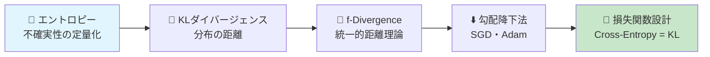
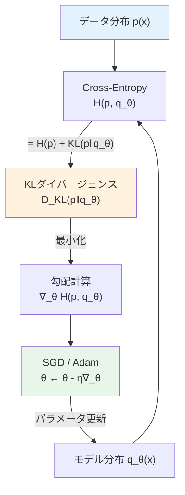
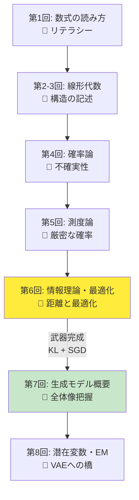
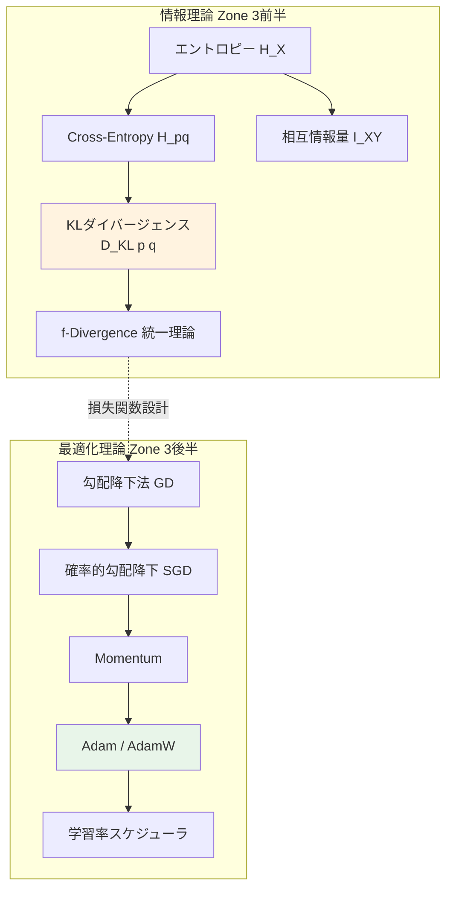
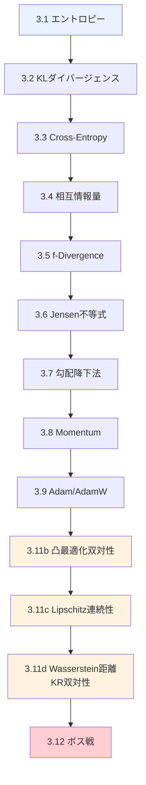
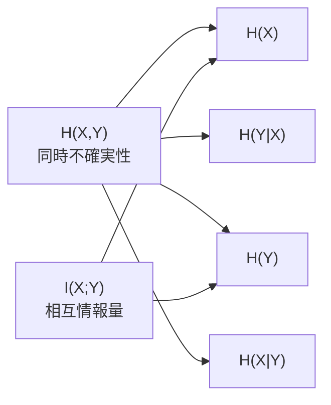

# 第6回: 情報理論・最適化理論 — KLダイバージェンスとSGDで武装する

> **分布の"距離"を測り、パラメータの"谷"を下る。この2つの武器なしに、生成モデルの戦場には立てない。**

第5回で測度論的確率論の基盤を整えた。確率空間 $(\Omega, \mathcal{F}, P)$ の上で確率密度関数が定義され、期待値が Lebesgue 積分として厳密に意味を持つことを学んだ。だが、ここで素朴な疑問が浮かぶ。「2つの確率分布がどれだけ"違う"かを、どう測ればいい？」そして「パラメータをどう動かせば、モデルの分布をデータの分布に近づけられる？」

この2つの問いに答えるのが、情報理論と最適化理論だ。

Shannon が1948年に打ち立てた情報理論 [^1] は不確実性を数値化し、Kullback-Leibler の KL ダイバージェンス [^2] は分布間の非対称距離を測る。Robbins-Monro の確率的近似法 [^3] から Adam [^4] へ至る最適化理論が、現代深層学習の訓練を支える。

本講義は Course I 第6回 — 数学的武装の総仕上げ。KL は損失関数設計に、SGD/Adam はパラメータ学習に直結する。

:::message
**このシリーズについて**: 東京大学 松尾・岩澤研究室動画講義の**完全上位互換**の全50回シリーズ。理論（論文が書ける）、実装（Production-ready）、最新（2025-2026 SOTA）の3軸で差別化する。
:::



**所要時間の目安**:

| ゾーン | 内容 | 時間 | 難易度 |
|:-------|:-----|:-----|:-------|
| Zone 0 | クイックスタート | 30秒 | ★☆☆☆☆ |
| Zone 1 | 体験ゾーン | 10分 | ★★☆☆☆ |
| Zone 2 | 直感ゾーン | 15分 | ★★☆☆☆ |
| Zone 3 | 数式修行ゾーン | 60分 | ★★★★★ |
| Zone 4 | 実装ゾーン | 45分 | ★★★☆☆ |
| Zone 5 | 実験ゾーン | 30分 | ★★★☆☆ |
| Zone 6 | 振り返りゾーン | 30分 | ★★★★☆ |

---

## 🚀 0. クイックスタート（30秒）— Perplexity の正体

**ゴール**: LLM の評価指標 Perplexity が「エントロピーの指数」であることを30秒で体験する。

```python
import numpy as np

# LLM が各トークンに割り当てた確率（模擬）
# H(p) = -Σ p(x) log2 p(x)  ... Shannon entropy
probs = np.array([0.7, 0.15, 0.1, 0.05])  # vocabulary of 4 tokens
entropy = -np.sum(probs * np.log2(probs))
perplexity = 2 ** entropy

print(f"Entropy H     = {entropy:.4f} bits")
print(f"Perplexity 2^H = {perplexity:.2f}")
print(f"(Uniform: H={np.log2(4):.2f}, PPL={4})")
```

出力:
```
Entropy H     = 1.3555 bits
Perplexity 2^H = 2.56
(Uniform: H=2.00, PPL=4)
```

**この3行の裏にある数式**:

$$
H(X) = -\sum_{x \in \mathcal{X}} p(x) \log_2 p(x), \quad \text{Perplexity} = 2^{H(X)}
$$

Perplexity = 2.56 は「モデルが平均2.56個の選択肢に迷っている」という意味。完全予測なら 1、一様分布（4トークン）なら 4。GPT-4 の Perplexity が低いのは、エントロピーが低い = 不確実性が小さい = よく予測できている。

Shannon が1948年に定義したエントロピー [^1] が、2026年の LLM 評価でそのまま使われている。

:::message
**進捗: 3% 完了** Perplexity $= 2^{H}$ の正体を体感した。残り7ゾーンで、この背後にある情報理論と最適化理論を完全に装備する。
:::

---

## 🎮 1. 体験ゾーン（10分）— エントロピーと KL を手で触る

### 1.1 エントロピー — 不確実性を数値にする

Shannon エントロピーの直感は単純だ。「結果が予測しにくいほど、情報量が大きい」。公平なコインは1 bit、偏ったコインはそれ以下。

```python
import numpy as np

def entropy(p: np.ndarray, base: float = 2.0) -> float:
    """Shannon entropy: H(X) = -Σ p(x) log p(x)"""
    # filter out zero probabilities to avoid log(0)
    p = p[p > 0]
    return -np.sum(p * np.log(p)) / np.log(base)

# fair coin vs biased coin
fair = np.array([0.5, 0.5])
biased = np.array([0.9, 0.1])
certain = np.array([1.0, 0.0])

print(f"Fair coin:    H = {entropy(fair):.4f} bits")
print(f"Biased(0.9):  H = {entropy(biased):.4f} bits")
print(f"Certain:      H = {entropy(certain):.4f} bits")
```

出力:
```
Fair coin:    H = 1.0000 bits
Biased(0.9):  H = 0.4690 bits
Certain:      H = 0.0000 bits
```

| 分布 | エントロピー | 直感 |
|:-----|:------------|:-----|
| 公平なコイン | 1.0 bit | 最大の不確実性 |
| 偏ったコイン (0.9/0.1) | 0.469 bits | ほぼ予測可能 |
| 確定的 (1.0/0.0) | 0.0 bits | 驚きゼロ |

この「不確実性の定量化」こそ Shannon の天才的発想だ。彼は通信路の効率を考える中で、**情報の単位**を数学的に定義した [^1]。

### 1.2 KL ダイバージェンス — 分布の"距離"を測る

2つの確率分布 $p$ と $q$ がどれだけ異なるかを測る道具が KL ダイバージェンス（Kullback-Leibler divergence）だ [^2]。

$$
D_\text{KL}(p \| q) = \sum_{x} p(x) \log \frac{p(x)}{q(x)}
$$

```python
import numpy as np

def kl_divergence(p: np.ndarray, q: np.ndarray) -> float:
    """KL divergence: D_KL(p || q) = Σ p(x) log(p(x)/q(x))"""
    # avoid log(0) and 0*log(0)
    mask = p > 0
    return np.sum(p[mask] * np.log(p[mask] / q[mask]))

# True distribution p vs model q
p = np.array([0.4, 0.3, 0.2, 0.1])
q1 = np.array([0.35, 0.3, 0.2, 0.15])  # close to p
q2 = np.array([0.25, 0.25, 0.25, 0.25])  # uniform
q3 = np.array([0.1, 0.1, 0.1, 0.7])  # very different

print(f"KL(p || q_close)   = {kl_divergence(p, q1):.6f} nats")
print(f"KL(p || q_uniform) = {kl_divergence(p, q2):.6f} nats")
print(f"KL(p || q_far)     = {kl_divergence(p, q3):.6f} nats")
print()
# Non-symmetry!
print(f"KL(p || q_far)     = {kl_divergence(p, q3):.6f}")
print(f"KL(q_far || p)     = {kl_divergence(q3, p):.6f}")
print("Non-symmetric! KL is NOT a distance metric.")
```

出力:
```
KL(p || q_close)   = 0.005765 nats
KL(p || q_uniform) = 0.120068 nats
KL(p || q_far)     = 1.041822 nats

KL(p || q_far)     = 1.041822
KL(q_far || p)     = 0.726801
Non-symmetric! KL is NOT a distance metric.
```

ここで重要な事実が見える: **KL ダイバージェンスは非対称だ**。$D_\text{KL}(p \| q) \neq D_\text{KL}(q \| p)$。これは距離（metric）の条件を満たさない。にもかかわらず、機械学習で最も頻繁に使われる分布間の"距離"がこれだ。なぜか？ — この疑問は Zone 3 で数学的に解決する。

### 1.3 Cross-Entropy と KL の関係 — LLM の損失関数の正体

LLM の訓練で最小化する Cross-Entropy Loss の正体は、実は KL ダイバージェンス + 定数だ。

$$
H(p, q) = -\sum_{x} p(x) \log q(x) = H(p) + D_\text{KL}(p \| q)
$$

```python
import numpy as np

def cross_entropy(p: np.ndarray, q: np.ndarray) -> float:
    """Cross-entropy: H(p, q) = -Σ p(x) log q(x)"""
    mask = p > 0
    return -np.sum(p[mask] * np.log(q[mask]))

p = np.array([0.4, 0.3, 0.2, 0.1])
q = np.array([0.25, 0.25, 0.25, 0.25])

H_p = entropy(p, base=np.e)  # natural log for nats
KL = kl_divergence(p, q)
CE = cross_entropy(p, q)

print(f"Entropy H(p)        = {H_p:.6f} nats")
print(f"KL(p || q)          = {KL:.6f} nats")
print(f"H(p) + KL(p || q)   = {H_p + KL:.6f} nats")
print(f"Cross-Entropy H(p,q) = {CE:.6f} nats")
print(f"Match: {np.isclose(H_p + KL, CE)}")
```

出力:
```
Entropy H(p)        = 1.279854 nats
KL(p || q)          = 0.120068 nats
H(p) + KL(p || q)   = 1.399922 nats
Cross-Entropy H(p,q) = 1.399922 nats
Match: True
```

**ここが本質だ**: $p$（真の分布）は学習中に変化しないから $H(p)$ は定数。したがって **Cross-Entropy を最小化することは KL ダイバージェンスを最小化することと等価**。LLM が Cross-Entropy Loss を最小化しているとき、実はモデルの分布 $q_\theta$ と真のトークン分布 $p$ の KL ダイバージェンスを最小化しているのだ。

### 1.4 SGD — パラメータの谷を下る

KL で「どれだけ遠いか」がわかった。次は「どう近づくか」だ。

```python
import numpy as np

def f(x: np.ndarray) -> float:
    """Rosenbrock function: f(x,y) = (1-x)^2 + 100(y-x^2)^2"""
    return (1 - x[0])**2 + 100 * (x[1] - x[0]**2)**2

def grad_f(x: np.ndarray) -> np.ndarray:
    """Gradient of Rosenbrock function."""
    dx = -2*(1 - x[0]) + 100 * 2*(x[1] - x[0]**2) * (-2*x[0])
    dy = 100 * 2*(x[1] - x[0]**2)
    return np.array([dx, dy])

# Vanilla SGD
x = np.array([-1.0, 1.0])
lr = 0.001
history = [x.copy()]

for step in range(5000):
    g = grad_f(x)
    x = x - lr * g
    if step % 1000 == 0:
        print(f"Step {step:5d}: x={x[0]:+.4f}, y={x[1]:.4f}, f={f(x):.6f}")
    history.append(x.copy())

print(f"\nFinal: x={x[0]:.6f}, y={x[1]:.6f}, f={f(x):.10f}")
print(f"Optimal: x=1.0, y=1.0, f=0.0")
```

Robbins と Monro が1951年に確率的近似法を提案したとき [^3]、まさかこのアイデアが70年後に数十億パラメータのモデルを訓練する基盤になるとは想像しなかっただろう。SGD（確率的勾配降下法）の更新則はこう書ける:

$$
\theta_{t+1} = \theta_t - \eta \nabla_\theta \mathcal{L}(\theta_t)
$$

$\eta$ は学習率、$\nabla_\theta \mathcal{L}$ は損失関数の勾配。これが Attention [^5] も Cross-Entropy も含む巨大な計算グラフの勾配を逆伝播で計算し、パラメータを更新する。

### 1.5 4つの概念の接続 — LLM 訓練パイプライン

ここまでの4つの概念がどう繋がるか整理しよう。



| 概念 | 役割 | LLM での使われ方 |
|:-----|:-----|:----------------|
| エントロピー $H(p)$ | 不確実性の定量化 | Perplexity $= 2^H$ で評価 |
| KL ダイバージェンス | 分布間の距離 | 損失関数の本体 |
| Cross-Entropy | KL + 定数 | 訓練時の損失関数 |
| SGD / Adam | 勾配による最適化 | パラメータ更新 |

> **一言で言えば**: 情報理論が「何を最小化すべきか」を定義し、最適化理論が「どう最小化するか」を実行する。この2つが揃って初めてモデルが学習する。

:::message
**進捗: 10% 完了** エントロピー、KL ダイバージェンス、Cross-Entropy、SGD の4概念を体験し、LLM 訓練パイプラインでの接続を確認した。Zone 0-1 クリア。
:::

---

## 🧩 2. 直感ゾーン（15分）— なぜ情報理論と最適化が"武器"なのか

### 2.1 この講義の位置づけ — Course I 最後の数学的武装

第1-5回で数式・線形代数・確率論・測度論を装備した。本講義は総仕上げ — **情報理論と最適化理論**を手に入れる。

生成モデルの訓練にはあと2つ必要だ。

1. **損失関数**: モデルの悪さを数値化 → 情報理論（KL ダイバージェンス）
2. **最適化**: モデル改善の手順 → 最適化理論（SGD / Adam）



### 2.2 松尾研との比較 — なぜ8回かけて数学を叩き込むか

| 観点 | 松尾・岩澤研 | 本シリーズ |
|:-----|:-----------|:---------|
| 情報理論 | 「KL divergence は...」と紹介して終了 | Shannon エントロピーから f-Divergence 統一理論まで導出 |
| 最適化 | 「Adam を使います」 | SGD → Momentum → Adam → AdamW を収束性スケッチ付きで導出 |
| 実装 | `torch.optim.Adam(...)` で終了 | Adam をスクラッチ実装 + `%timeit` で Python の限界を体感 |
| 前提知識 | 「知ってるものとします」 | **8回かけて全て導出する** |

松尾研は8回で VAE から Diffusion まで駆け抜ける。本シリーズは Course I の8回で数学基盤を完全に固め、Course II 以降で理論と実装を回す。**急がば回れ**。

### 2.3 情報理論の3つのメタファー

情報理論の中核概念を直感的に理解するための3つのメタファーを紹介する。

**メタファー1: エントロピー = 驚きの平均**
「明日、太陽が東から昇る」→驚かない（情報量ゼロ）。「西から昇る」→驚く（情報量大）。エントロピーはイベント群から得られる驚きの平均値。

**メタファー2: KL ダイバージェンス = 翻訳コスト**
$D_\text{KL}(p \| q)$ は「$p$ で生成されたデータを $q$ で符号化したときの余分なビット数」。$p = q$ なら余分なコストはゼロ。

**メタファー3: 勾配降下 = 霧の中の下山**
パラメータ空間の谷底（最適解）に向かって、足元の傾き（勾配）だけを頼りに1歩ずつ下る。学習率は歩幅 — 大きすぎると谷を飛び越え、小さすぎると日が暮れる。

### 2.4 本講義の全体マップ



| ブロック | 核心 | 所要時間 | LLM との接点 |
|:---------|:-----|:---------|:-----------|
| エントロピー | 不確実性の数値化 | 15分 | Perplexity $= 2^H$ |
| KL / Cross-Entropy | 分布間距離 | 15分 | 訓練損失関数の正体 |
| 相互情報量 | 依存関係の数値化 | 10分 | 表現学習・潜在変数 |
| f-Divergence | 距離の統一理論 | 10分 | GAN / VAE の損失設計 |
| SGD → Adam | パラメータ最適化 | 20分 | 訓練アルゴリズム |

> **一言で言えば**: 情報理論が「何を最小化すべきか」を定義し、最適化理論が「どう最小化するか」を実行する。この2つが揃って初めてモデルが学習する。

### 2.5 学習戦略 — 覚えるな、導出しろ

20以上の数式が登場する。全暗記は無駄。戦略:

1. **定義を覚える**: エントロピー、KL、Cross-Entropy の定義式
2. **関係を導出**: $H(p, q) = H(p) + D_\text{KL}(p \| q)$ は定義から導出
3. **コードで確認**: Python 実装で数値検証
4. **紙に書く**: KL の非負性証明は手書き

:::details トロイの木馬 — Python の遅さ
`%timeit` で最適化ループを測ると「遅くない？」という違和感が生まれる。この違和感は第8回で爆発し、第9回で Julia が50倍高速化を見せる。
:::

:::message
**進捗: 20% 完了** 情報理論と最適化理論が生成モデルの「武器」である理由を理解し、本講義の全体マップを把握した。Zone 0-2 クリア。次は数式修行ゾーンへ。覚悟はいいか。
:::

---

## 📐 3. 数式修行ゾーン（60分）— 情報理論と最適化の完全導出

情報理論と最適化理論を数式で導出する。紙とペンを用意。



### 3.1 Shannon エントロピー — 不確実性の公理的定義

**定義 3.1** (Shannon エントロピー [^1]). 離散確率変数 $X$ が確率質量関数 $p(x)$ を持つとき、Shannon エントロピーは

$$
H(X) = -\sum_{x \in \mathcal{X}} p(x) \log p(x)
$$

で定義される。慣例として $0 \log 0 = 0$ とする（$\lim_{t \to 0^+} t \log t = 0$ による）。

| 記号 | 読み方 | 意味 |
|:-----|:-------|:-----|
| $H(X)$ | エイチ エックス | 確率変数 $X$ のエントロピー |
| $\mathcal{X}$ | カリグラフィック エックス | $X$ の値域（標本空間） |
| $p(x)$ | ピー エックス | $x$ が起きる確率 |
| $\log$ | ログ | 対数（底 $2$ なら bit、$e$ なら nat） |

Shannon はなぜこの形を選んだのか。彼は1948年の論文 [^1] で、「情報の尺度」が満たすべき3つの公理を示した:

1. $H$ は $p_1, \ldots, p_n$ の連続関数である
2. 全ての事象が等確率（$p_i = 1/n$）のとき、$H$ は $n$ の単調増加関数である
3. $H$ は分解可能（chain rule）: 選択を分割しても合計の不確実性は変わらない

**定理 3.1** (Shannon の一意性定理 [^1]). 上記3公理を満たす関数は定数倍を除いて

$$
H = -K \sum_{i=1}^{n} p_i \log p_i
$$

のみである（$K > 0$ は単位を決める定数）。

:::message
ここが本質だ。Shannon エントロピーは「こう定義しよう」と決めたものではなく、合理的な公理から**一意に導かれる**唯一の情報量尺度だ。他に選択肢がなかった。
:::

**性質**: 離散確率変数 $X$ が $n$ 個の値を取るとき、

- $H(X) \geq 0$（非負性）
- $H(X) = 0 \iff X$ が確定的（$p(x_0) = 1$ for some $x_0$）
- $H(X) \leq \log n$（等号は一様分布のとき）

```python
import numpy as np

def entropy_detailed(p: np.ndarray) -> dict:
    """Compute entropy with breakdown of each term."""
    p = p[p > 0]
    individual = -p * np.log2(p)
    return {
        "terms": individual,
        "H": individual.sum(),
        "max_H": np.log2(len(p)),
        "efficiency": individual.sum() / np.log2(len(p)) if len(p) > 1 else 1.0,
    }

# Example: LLM token distribution
# After seeing "The cat sat on the", next token probabilities:
token_probs = np.array([
    0.35,  # "mat"
    0.20,  # "floor"
    0.15,  # "chair"
    0.10,  # "bed"
    0.08,  # "table"
    0.05,  # "roof"
    0.04,  # "ground"
    0.03,  # others
])
result = entropy_detailed(token_probs)
print(f"Token entropy: H = {result['H']:.4f} bits")
print(f"Max entropy:       {result['max_H']:.4f} bits")
print(f"Efficiency:        {result['efficiency']:.2%}")
print(f"Perplexity:        {2**result['H']:.2f} tokens")
print(f"\nPer-token contributions:")
tokens = ["mat", "floor", "chair", "bed", "table", "roof", "ground", "other"]
for tok, h in zip(tokens, result['terms']):
    bar = "█" * int(h * 20)
    print(f"  {tok:8s}: {h:.4f} bits {bar}")
```

**LLM との接続**: Perplexity $= 2^{H}$ は「モデルが各ステップで平均何個の選択肢に迷っているか」を意味する。GPT-4 の Perplexity が低いのは、次トークンの予測分布のエントロピーが低い = 自信を持って予測できている、ということだ。これは第1回で体験した Perplexity の数式の正体を完全に解明している。

### 3.2 連続エントロピー（微分エントロピー）

連続確率変数に対するエントロピーの自然な拡張を定義する。

**定義 3.2** (微分エントロピー). 確率密度関数 $p(x)$ を持つ連続確率変数 $X$ の微分エントロピーは

$$
h(X) = -\int_{\mathcal{X}} p(x) \log p(x) \, dx
$$

:::message alert
注意: 微分エントロピーは離散エントロピーと異なり**負になりうる**。例えば $X \sim \text{Uniform}(0, 1/2)$ のとき $h(X) = -\log 2 = -1$ bit。これは「情報量が負」なのではなく、連続分布と離散分布の差異から生じる。
:::

**ガウス分布の微分エントロピー**:

$$
X \sim \mathcal{N}(\mu, \sigma^2) \implies h(X) = \frac{1}{2} \log(2\pi e \sigma^2)
$$

**導出**:

$$
\begin{aligned}
h(X) &= -\int p(x) \log p(x) \, dx \\
&= -\int p(x) \left[ -\frac{1}{2}\log(2\pi\sigma^2) - \frac{(x-\mu)^2}{2\sigma^2} \right] dx \\
&= \frac{1}{2}\log(2\pi\sigma^2) \underbrace{\int p(x) \, dx}_{=1} + \frac{1}{2\sigma^2} \underbrace{\int p(x)(x-\mu)^2 \, dx}_{=\sigma^2} \\
&= \frac{1}{2}\log(2\pi\sigma^2) + \frac{1}{2} \\
&= \frac{1}{2}\log(2\pi e \sigma^2)
\end{aligned}
$$

```python
import numpy as np

def gaussian_differential_entropy(sigma: float) -> float:
    """h(X) = 0.5 * log(2*pi*e*sigma^2) for X ~ N(mu, sigma^2)"""
    return 0.5 * np.log(2 * np.pi * np.e * sigma**2)

for sigma in [0.1, 0.5, 1.0, 2.0, 5.0]:
    h = gaussian_differential_entropy(sigma)
    print(f"sigma={sigma:.1f}: h(X) = {h:.4f} nats = {h/np.log(2):.4f} bits")
```

**重要な定理**: 分散が $\sigma^2$ の全ての連続分布の中で、ガウス分布が微分エントロピーを最大化する。これは「分散が同じなら、ガウス分布が最も不確実」という意味だ。この性質が VAE でガウス事前分布を選ぶ理論的根拠の1つになる（第10回で詳述）。

### 3.3 KL ダイバージェンス — 分布間の非対称距離

**定義 3.3** (KL ダイバージェンス [^2]). 確率分布 $p$ と $q$ に対して、

$$
D_\text{KL}(p \| q) = \sum_{x} p(x) \log \frac{p(x)}{q(x)} = \mathbb{E}_{x \sim p}\left[\log \frac{p(x)}{q(x)}\right]
$$

連続版は $\sum$ を $\int$ に、$p(x)$ を確率密度に置き換える。

| 記号 | 読み方 | 意味 |
|:-----|:-------|:-----|
| $D_\text{KL}(p \| q)$ | ケーエル ピー パラレル キュー | $p$ から見た $q$ との乖離 |
| $\log \frac{p(x)}{q(x)}$ | ログ ピー オーバー キュー | 対数尤度比 |
| $\mathbb{E}_{x \sim p}[\cdot]$ | イー エックス サンプル ピー | $p$ に関する期待値 |

**定理 3.2** (Gibbs の不等式 / KL の非負性). 任意の確率分布 $p, q$ に対して

$$
D_\text{KL}(p \| q) \geq 0
$$

等号は $p = q$ のときのみ成立。

**証明**: Jensen の不等式を使う。$\log$ は凹関数だから、

$$
\begin{aligned}
-D_\text{KL}(p \| q) &= \sum_x p(x) \log \frac{q(x)}{p(x)} \\
&\leq \log \sum_x p(x) \cdot \frac{q(x)}{p(x)} \quad \text{(Jensen)} \\
&= \log \sum_x q(x) = \log 1 = 0
\end{aligned}
$$

したがって $D_\text{KL}(p \| q) \geq 0$。等号条件: $\frac{q(x)}{p(x)}$ が定数、すなわち $p = q$。$\blacksquare$

:::message
この証明は短いが、ここで使われる Jensen の不等式は情報理論の至るところに現れる。ELBO の導出（第9回）でも、EM 算法の収束証明（第8回）でも、同じ不等式が鍵になる。今ここで完全に理解しておくこと。
:::

**前向き KL vs 逆向き KL**: 生成モデルの設計で決定的に重要な区別がある。

| | 前向き KL: $D_\text{KL}(p_\text{data} \| q_\theta)$ | 逆向き KL: $D_\text{KL}(q_\theta \| p_\text{data})$ |
|:---|:---|:---|
| **最小化の意味** | $q_\theta$ が $p$ のサポート全体を覆う | $q_\theta$ が自信のある領域に集中 |
| **mode-covering/seeking** | Mode-covering（全モードをカバー） | Mode-seeking（1つのモードに集中） |
| **使用例** | VAE、MLE | GAN、変分推論 |
| **結果** | ぼやけた画像 | 鮮明だがモード崩壊のリスク |

```python
import numpy as np

def kl_div(p: np.ndarray, q: np.ndarray) -> float:
    """KL(p || q)"""
    mask = (p > 0) & (q > 0)
    return np.sum(p[mask] * np.log(p[mask] / q[mask]))

# Bimodal true distribution
p = np.array([0.3, 0.3, 0.05, 0.05, 0.15, 0.15])

# Mode-covering (forward KL minimizer): spread out
q_cover = np.array([0.2, 0.2, 0.1, 0.1, 0.2, 0.2])

# Mode-seeking (reverse KL minimizer): concentrate on one mode
q_seek = np.array([0.48, 0.48, 0.01, 0.01, 0.01, 0.01])

print("Forward KL (mode-covering behavior):")
print(f"  KL(p || q_cover) = {kl_div(p, q_cover):.4f}")
print(f"  KL(p || q_seek)  = {kl_div(p, q_seek):.4f}")
print(f"  → q_cover wins (lower forward KL)")
print()
print("Reverse KL (mode-seeking behavior):")
print(f"  KL(q_cover || p) = {kl_div(q_cover, p):.4f}")
print(f"  KL(q_seek || p)  = {kl_div(q_seek, p):.4f}")
print(f"  → q_seek wins (lower reverse KL)")
```

> **一言で言えば**: 前向き KL は「見逃しを嫌う」、逆向き KL は「間違いを嫌う」。VAE がぼやけるのは前向き KL を使うから。GAN が鮮明なのは暗黙的に逆向き KL を最小化しているから。

### 3.4 Cross-Entropy と KL の関係

**定義 3.4** (Cross-Entropy).

$$
H(p, q) = -\sum_x p(x) \log q(x) = -\mathbb{E}_{x \sim p}[\log q(x)]
$$

**定理 3.3** (分解定理).

$$
H(p, q) = H(p) + D_\text{KL}(p \| q)
$$

**証明**:

$$
\begin{aligned}
H(p, q) &= -\sum_x p(x) \log q(x) \\
&= -\sum_x p(x) \log \frac{q(x) \cdot p(x)}{p(x)} \\
&= -\sum_x p(x) \left[\log p(x) + \log \frac{q(x)}{p(x)}\right] \\
&= \underbrace{-\sum_x p(x) \log p(x)}_{H(p)} + \underbrace{\sum_x p(x) \log \frac{p(x)}{q(x)}}_{D_\text{KL}(p \| q)} \quad \blacksquare
\end{aligned}
$$

**LLM への直接的帰結**: LLM の訓練で最小化する Cross-Entropy Loss は

$$
\mathcal{L}(\theta) = -\frac{1}{T}\sum_{t=1}^T \log q_\theta(x_t \mid x_{<t})
$$

ここで $q_\theta$ はモデルの条件付き分布、$x_t$ は正解トークン。これは経験分布 $\hat{p}$ に関する Cross-Entropy $H(\hat{p}, q_\theta)$ であり、$H(\hat{p})$ は定数だから、**Cross-Entropy の最小化 = KL ダイバージェンスの最小化**。

第1回で体験した Cross-Entropy Loss の「なぜこの形なのか」に、ついに完全な答えが出た。

### 3.5 条件付きエントロピーと相互情報量

**定義 3.5** (条件付きエントロピー).

$$
H(Y \mid X) = -\sum_{x,y} p(x,y) \log p(y \mid x) = \mathbb{E}_{x,y}[-\log p(y \mid x)]
$$

直感: 「$X$ を知った上での $Y$ の残りの不確実性」。

**定義 3.6** (相互情報量 [^1]).

$$
I(X; Y) = H(Y) - H(Y \mid X) = D_\text{KL}(p(x,y) \| p(x)p(y))
$$

相互情報量は「$X$ を知ることで $Y$ の不確実性がどれだけ減るか」を測る。あるいは等価に「$X$ と $Y$ の同時分布が独立分布からどれだけ離れているか」を KL で測る。

**Chain Rule for Entropy**:

$$
H(X, Y) = H(X) + H(Y \mid X) = H(Y) + H(X \mid Y)
$$



```python
import numpy as np

def joint_entropy(pxy: np.ndarray) -> float:
    """H(X,Y) = -Σ p(x,y) log p(x,y)"""
    pxy_flat = pxy[pxy > 0]
    return -np.sum(pxy_flat * np.log2(pxy_flat))

def mutual_information(pxy: np.ndarray) -> float:
    """I(X;Y) = H(X) + H(Y) - H(X,Y)"""
    px = pxy.sum(axis=1)
    py = pxy.sum(axis=0)
    h_x = -np.sum(px[px > 0] * np.log2(px[px > 0]))
    h_y = -np.sum(py[py > 0] * np.log2(py[py > 0]))
    h_xy = joint_entropy(pxy)
    return h_x + h_y - h_xy

# Example: input token X → hidden representation → output token Y
# Strong dependency
pxy_dep = np.array([
    [0.3, 0.05, 0.05],
    [0.05, 0.25, 0.05],
    [0.05, 0.05, 0.15],
])
# Weak dependency (closer to independent)
pxy_ind = np.array([
    [0.12, 0.11, 0.10],
    [0.11, 0.12, 0.11],
    [0.10, 0.12, 0.11],
])

print(f"Strong dependency: I(X;Y) = {mutual_information(pxy_dep):.4f} bits")
print(f"Weak dependency:   I(X;Y) = {mutual_information(pxy_ind):.4f} bits")
```

**LLM との接続**: 相互情報量 $I(X; Y)$ は表現学習で中心的な役割を果たす。Transformer の隠れ層は入力と出力の相互情報量を最大化するように学習されている、という見方ができる。VAE の損失関数にも $I(z; x)$（潜在変数と観測データの相互情報量）が暗黙的に現れる（第9回で詳述）。

### 3.5b データ処理不等式・Fano の不等式・Source Coding 定理

情報理論の3つの限界定理を概観する。いずれも「情報には超えられない壁がある」という根本原理を異なる角度から表現している。

**定理 3.5** (データ処理不等式). マルコフ連鎖 $X \to Y \to Z$ に対し $I(X; Z) \leq I(X; Y)$。処理で情報は増えない。

**深層学習への帰結**: NN の各層 $X \to h_1 \to \cdots \to \hat{Y}$ で $I(X; \hat{Y}) \leq I(X; h_1) \leq H(X)$。Information Bottleneck（Tishby+ 2000）はここから「良い表現 = $I(h;Y)$ 最大かつ $I(h;X)$ 最小」と定義する。

**Fano の不等式**: 推定誤差率 $P_e = P(\hat{X} \neq X)$ に対し $H(X \mid \hat{X}) \leq H_b(P_e) + P_e \log(|\mathcal{X}| - 1)$。推定精度の理論的下限を与える。

**Source Coding 定理** (Shannon, 1948 [^1]): 平均符号長 $L \geq H(X)$。エントロピーがデータ圧縮の理論限界。LLM の Perplexity 低下 = 言語の効率的符号化の学習と等価だ。

:::details DPI の証明スケッチと数値検証

**証明**: Chain rule $I(X; Y, Z) = I(X; Z) + I(X; Y \mid Z) = I(X; Y) + I(X; Z \mid Y)$ にマルコフ性 $I(X; Z \mid Y) = 0$ を代入:

$$
I(X; Z) = I(X; Y) - I(X; Y \mid Z) \leq I(X; Y) \quad \blacksquare
$$

```python
import numpy as np

def verify_data_processing_inequality():
    """Verify DPI: X → Y → Z implies I(X;Z) <= I(X;Y)"""
    p_y_given_x = np.array([[0.7, 0.2, 0.1], [0.1, 0.7, 0.2], [0.2, 0.1, 0.7]])
    p_z_given_y = np.array([[0.6, 0.3, 0.1], [0.1, 0.6, 0.3], [0.3, 0.1, 0.6]])
    p_x = np.array([1/3, 1/3, 1/3])
    p_xy = np.outer(p_x, np.ones(3)) * p_y_given_x
    p_xz = np.zeros((3, 3))
    for y in range(3):
        p_xz += np.outer(p_xy[:, y], p_z_given_y[y, :])

    def mi(pjoint):
        px, py = pjoint.sum(axis=1), pjoint.sum(axis=0)
        indep = np.outer(px, py)
        mask = (pjoint > 0) & (indep > 0)
        return np.sum(pjoint[mask] * np.log2(pjoint[mask] / indep[mask]))

    i_xy, i_xz = mi(p_xy), mi(p_xz)
    print(f"I(X;Y) = {i_xy:.4f}, I(X;Z) = {i_xz:.4f}, DPI holds: {i_xz <= i_xy + 1e-10}")

verify_data_processing_inequality()
```
:::

### 3.5c 情報量の Chain Rule — 情報の分解と合成

情報理論の Chain Rule は確率の Chain Rule の情報版だ。

**エントロピーの Chain Rule**:

$$
H(X_1, X_2, \ldots, X_n) = \sum_{i=1}^{n} H(X_i \mid X_1, \ldots, X_{i-1})
$$

**相互情報量の Chain Rule**:

$$
I(X_1, X_2, \ldots, X_n; Y) = \sum_{i=1}^{n} I(X_i; Y \mid X_1, \ldots, X_{i-1})
$$

**KL の Chain Rule（連鎖律）**:

$$
D_\text{KL}(p(x, y) \| q(x, y)) = D_\text{KL}(p(x) \| q(x)) + \mathbb{E}_{p(x)}[D_\text{KL}(p(y|x) \| q(y|x))]
$$

この KL の Chain Rule は自己回帰モデルの損失関数を理解する上で本質的だ。LLM は $p(x_1, \ldots, x_T)$ をモデル化するが、実際の損失は各トークンの条件付き分布 $p(x_t | x_{<t})$ の KL の和として分解される。

```python
import numpy as np

def entropy_chain_rule_demo():
    """Demonstrate entropy chain rule: H(X,Y) = H(X) + H(Y|X)"""
    # Joint distribution P(X, Y)
    pxy = np.array([
        [0.15, 0.10, 0.05],
        [0.05, 0.20, 0.10],
        [0.05, 0.10, 0.20],
    ])

    # H(X, Y) directly
    h_xy = -np.sum(pxy[pxy > 0] * np.log2(pxy[pxy > 0]))

    # H(X)
    px = pxy.sum(axis=1)
    h_x = -np.sum(px[px > 0] * np.log2(px[px > 0]))

    # H(Y|X) = Σ_x p(x) H(Y|X=x)
    h_y_given_x = 0
    for i in range(pxy.shape[0]):
        if px[i] > 0:
            p_y_given_xi = pxy[i] / px[i]
            h_y_given_x -= px[i] * np.sum(
                p_y_given_xi[p_y_given_xi > 0] * np.log2(p_y_given_xi[p_y_given_xi > 0])
            )

    print(f"H(X,Y) direct = {h_xy:.6f} bits")
    print(f"H(X) + H(Y|X) = {h_x + h_y_given_x:.6f} bits")
    print(f"Chain rule holds: {np.isclose(h_xy, h_x + h_y_given_x)}")

entropy_chain_rule_demo()
```

:::message
ここで多くの人が混乱するのが、「条件付きエントロピー $H(Y|X)$ と $H(Y|X=x)$ の違い」だ。$H(Y|X)$ は $X$ 全体にわたる平均、$H(Y|X=x)$ は特定の $X=x$ での値。$H(Y|X) = \sum_x p(x) H(Y|X=x)$ という関係を常に意識すること。
:::

### 3.6 f-Divergence — KL を含む統一理論

KL ダイバージェンスは分布間距離の1つに過ぎない。Csiszar が1967年に導入した f-Divergence [^6] は、幅広い距離族を統一的に扱うフレームワークだ。

**定義 3.7** (f-Divergence [^6]). $f: \mathbb{R}_{>0} \to \mathbb{R}$ を $f(1) = 0$ かつ凸な関数とする。2つの確率分布 $p, q$ に対して、

$$
D_f(p \| q) = \sum_x q(x) f\left(\frac{p(x)}{q(x)}\right)
$$

| $f(t)$ の選択 | 名前 | 用途 |
|:-------------|:-----|:-----|
| $t \log t$ | KL ダイバージェンス | VAE, MLE |
| $-\log t$ | 逆 KL | 変分推論 |
| $(t - 1)^2$ | $\chi^2$ ダイバージェンス | 仮説検定 |
| $(\sqrt{t} - 1)^2$ | Hellinger 距離 | ロバスト推定 |
| $\frac{1}{2}|t - 1|$ | 全変動距離 (TV) | 統計的検定 |
| $\frac{1}{2}(t \log t - (t+1)\log\frac{t+1}{2})$ | Jensen-Shannon | GAN [^9] |

**性質**: 全ての f-Divergence は $f$ の凸性から $D_f(p \| q) \geq 0$ を満たし、$p = q$ のとき $D_f = 0$。

:::details f-Divergence の変分表現 (Fenchel 共役)
Nguyen, Wainwright & Jordan [^7] による変分表現は、f-Divergence を最適化問題として書ける:

$$
D_f(p \| q) = \sup_{T: \mathcal{X} \to \mathbb{R}} \left[\mathbb{E}_{x \sim p}[T(x)] - \mathbb{E}_{x \sim q}[f^*(T(x))]\right]
$$

ここで $f^*$ は $f$ の Fenchel 共役（convex conjugate）。この表現は GAN の理論的基盤を与える。$T$ を判別器（discriminator）と解釈すれば、GAN は f-Divergence の変分推定を行っていることになる。詳細は第12回（GAN 基礎）で導出する。
:::

```python
import numpy as np

def f_divergence(p: np.ndarray, q: np.ndarray, f) -> float:
    """General f-divergence: D_f(p||q) = Σ q(x) f(p(x)/q(x))"""
    mask = q > 0
    ratio = p[mask] / q[mask]
    return np.sum(q[mask] * f(ratio))

# Define f functions
f_kl = lambda t: t * np.log(t) if np.isscalar(t) else np.where(t > 0, t * np.log(np.maximum(t, 1e-10)), 0)
f_reverse_kl = lambda t: -np.log(np.maximum(t, 1e-10))
f_chi2 = lambda t: (t - 1)**2
f_hellinger = lambda t: (np.sqrt(t) - 1)**2
f_tv = lambda t: 0.5 * np.abs(t - 1)
f_js = lambda t: 0.5 * (t * np.log(np.maximum(t, 1e-10)) - (t + 1) * np.log(np.maximum((t + 1) / 2, 1e-10)))

p = np.array([0.4, 0.3, 0.2, 0.1])
q = np.array([0.25, 0.25, 0.25, 0.25])

divergences = {
    "KL":          f_divergence(p, q, f_kl),
    "Reverse KL":  f_divergence(p, q, f_reverse_kl),
    "Chi-squared":  f_divergence(p, q, f_chi2),
    "Hellinger":    f_divergence(p, q, f_hellinger),
    "TV":           f_divergence(p, q, f_tv),
    "JS":           f_divergence(p, q, f_js),
}

print("f-Divergences between p=[0.4,0.3,0.2,0.1] and q=uniform:")
for name, val in divergences.items():
    bar = "█" * int(val * 30)
    print(f"  {name:15s}: {val:.6f} {bar}")
```

ここが本質だ — **生成モデルの損失関数は全て f-Divergence のファミリーに属する**。VAE は KL、GAN は JS / Wasserstein、f-GAN は任意の f-Divergence を最小化する。この統一的視点を持つことで、第12-14回の GAN 理論が格段にクリアになる。

### 3.7 Jensen の不等式と凸性 — 情報理論の裏ボス

KL の非負性の証明で使った Jensen の不等式は、情報理論の至るところに現れる。ここで改めて厳密に述べる。

**定理 3.4** (Jensen の不等式). $f$ が凸関数のとき、

$$
f(\mathbb{E}[X]) \leq \mathbb{E}[f(X)]
$$

$f$ が凹関数なら不等号が逆転する。

**証明スケッチ（凸関数の支持超平面）**: 凸関数 $f$ の任意の点 $x_0$ において、$f$ のグラフの下に接線（支持超平面）が存在する: $f(x) \geq f(x_0) + f'(x_0)(x - x_0)$。$x_0 = \mathbb{E}[X]$ として両辺の期待値を取ると、

$$
\mathbb{E}[f(X)] \geq f(\mathbb{E}[X]) + f'(\mathbb{E}[X]) \underbrace{(\mathbb{E}[X] - \mathbb{E}[X])}_{= 0} = f(\mathbb{E}[X]) \quad \blacksquare
$$

**Jensen 不等式の登場場面**:

| 場面 | 使い方 | 講義 |
|:-----|:-------|:-----|
| KL の非負性 | $\log$ は凹 → $\mathbb{E}[\log] \leq \log \mathbb{E}$ | 本講義 3.3 |
| ELBO の導出 | $\log p(x) \geq \text{ELBO}$ | 第9回 |
| EM 算法の収束 | $\log$-likelihood の下界 | 第8回 |
| エントロピー最大 | 一様分布の最適性 | 本講義 3.1 |

:::details Bregman Divergence — KL の一般化

KL ダイバージェンスは Bregman Divergence の特殊ケースとして理解できる:

$$
D_F(p \| q) = F(p) - F(q) - \langle \nabla F(q), p - q \rangle
$$

$F(p) = \sum_x p(x) \log p(x)$（負のエントロピー）とすると $D_F = D_\text{KL}$。Bregman Divergence は凸関数 $F$ から作られる距離族で、EM 算法の収束性を幾何学的に理解するための鍵になる（第8回・第27回）。
:::

### 3.8 勾配降下法 — 最適化の基本原理

情報理論で「何を最小化すべきか」が定まった。次は「どう最小化するか」。

**定義 3.8** (勾配降下法). 微分可能な目的関数 $\mathcal{L}(\theta)$ に対して、

$$
\theta_{t+1} = \theta_t - \eta \nabla_\theta \mathcal{L}(\theta_t)
$$

ここで $\eta > 0$ は学習率（ステップサイズ）。

**確率的勾配降下法 (SGD)** [^3]: 全データの勾配 $\nabla \mathcal{L}$ の代わりにミニバッチの勾配 $\nabla \mathcal{L}_B$ を使う。

$$
\theta_{t+1} = \theta_t - \eta \nabla_\theta \mathcal{L}_B(\theta_t), \quad \mathbb{E}[\nabla \mathcal{L}_B] = \nabla \mathcal{L}
$$

ミニバッチ勾配は真の勾配の不偏推定量だが、分散が大きい。この「ノイジーな勾配」が実は正則化効果を持ち、汎化性能を向上させることが知られている。

**収束性（凸・滑らかな場合のスケッチ）**: $\mathcal{L}$ が $L$-滑らか（$\|\nabla^2 \mathcal{L}\| \leq L$）かつ凸のとき、学習率 $\eta \leq 1/L$ で勾配降下法は

$$
\mathcal{L}(\theta_T) - \mathcal{L}(\theta^*) \leq \frac{\|\theta_0 - \theta^*\|^2}{2\eta T} = O\left(\frac{1}{T}\right)
$$

の収束レートを達成する。$T$ 回の反復で誤差が $O(1/T)$ で減少する。

```python
import numpy as np
import time

def sgd_optimize(grad_fn, x0, lr, n_steps, batch_size=32):
    """SGD with mini-batch gradient."""
    x = x0.copy()
    losses = []
    for t in range(n_steps):
        g = grad_fn(x, batch_size)
        x = x - lr * g
        losses.append(np.sum(x**2))  # for tracking
    return x, losses

# Minimize f(x) = 0.5 * x^T A x where A = diag(eigenvalues)
# This is a quadratic bowl
np.random.seed(42)
d = 100  # dimension
eigenvalues = np.linspace(0.1, 10.0, d)  # condition number = 100

def noisy_quadratic_grad(x, batch_size):
    """Gradient of 0.5 * x^T diag(eig) x + noise"""
    true_grad = eigenvalues * x
    noise = np.random.randn(d) * 0.1
    return true_grad + noise

x0 = np.random.randn(d)
start = time.perf_counter()
x_final, losses = sgd_optimize(noisy_quadratic_grad, x0, lr=0.01, n_steps=1000)
elapsed = time.perf_counter() - start

print(f"SGD: {1000} steps in {elapsed:.3f}s")
print(f"Initial loss: {losses[0]:.4f}")
print(f"Final loss:   {losses[-1]:.6f}")
print(f"Convergence:  {losses[0]/losses[-1]:.0f}x reduction")
```

### 3.9 Momentum — 慣性で加速する

バニラ SGD は谷を横切る方向に振動しやすい。Polyak が1964年に提案した Momentum [^8] はこの問題を解決する。

**定義 3.9** (Momentum SGD [^8]).

$$
\begin{aligned}
v_{t+1} &= \beta v_t + \nabla_\theta \mathcal{L}(\theta_t) \\
\theta_{t+1} &= \theta_t - \eta v_{t+1}
\end{aligned}
$$

$\beta \in [0, 1)$ は運動量係数（典型値 0.9）。物理的に言えば、$v_t$ は速度、$\beta$ は摩擦、勾配は力。ボールが坂を転がり落ちるように、勾配の一貫した方向には加速し、振動する方向は打ち消し合う。

**Nesterov の加速勾配法**: Nesterov は1983年に、「今の速度で進んだ先」の勾配を使うという改良を提案した:

$$
\begin{aligned}
v_{t+1} &= \beta v_t + \nabla_\theta \mathcal{L}(\theta_t - \eta \beta v_t) \\
\theta_{t+1} &= \theta_t - \eta v_{t+1}
\end{aligned}
$$

これにより収束レートが $O(1/T)$ から $O(1/T^2)$ に改善される。この加速は「look-ahead」の効果によるもので、**滑らかな凸関数**に対する一次法の最適レート（Nesterov, 1983）であることが証明されている。

```python
import numpy as np

def sgd_momentum(grad_fn, x0, lr, beta, n_steps):
    """SGD with momentum."""
    x = x0.copy()
    v = np.zeros_like(x)
    losses = []
    for t in range(n_steps):
        g = grad_fn(x)
        v = beta * v + g
        x = x - lr * v
        losses.append(np.sum(x**2))
    return x, losses

def nesterov(grad_fn, x0, lr, beta, n_steps):
    """Nesterov accelerated gradient."""
    x = x0.copy()
    v = np.zeros_like(x)
    losses = []
    for t in range(n_steps):
        g = grad_fn(x - lr * beta * v)  # look-ahead
        v = beta * v + g
        x = x - lr * v
        losses.append(np.sum(x**2))
    return x, losses

d = 50
eigenvalues = np.linspace(0.1, 10.0, d)
grad_fn = lambda x: eigenvalues * x
x0 = np.random.randn(d) * 3

_, losses_sgd = sgd_optimize(lambda x, _: eigenvalues * x, x0, lr=0.01, n_steps=500)
_, losses_mom = sgd_momentum(grad_fn, x0, lr=0.01, beta=0.9, n_steps=500)
_, losses_nes = nesterov(grad_fn, x0, lr=0.01, beta=0.9, n_steps=500)

print(f"After 500 steps:")
print(f"  Vanilla SGD: loss = {losses_sgd[-1]:.6f}")
print(f"  Momentum:    loss = {losses_mom[-1]:.6f}")
print(f"  Nesterov:    loss = {losses_nes[-1]:.6f}")
```

### 3.10 Adam — 適応的学習率の王者

Kingma & Ba が2014年に提案した Adam [^4] は、Momentum と適応的学習率を組み合わせたアルゴリズムだ。

**定義 3.10** (Adam [^4]).

$$
\begin{aligned}
m_t &= \beta_1 m_{t-1} + (1 - \beta_1) g_t & \text{(1次モーメント推定)} \\
v_t &= \beta_2 v_{t-1} + (1 - \beta_2) g_t^2 & \text{(2次モーメント推定)} \\
\hat{m}_t &= \frac{m_t}{1 - \beta_1^t} & \text{(バイアス補正)} \\
\hat{v}_t &= \frac{v_t}{1 - \beta_2^t} & \text{(バイアス補正)} \\
\theta_t &= \theta_{t-1} - \eta \frac{\hat{m}_t}{\sqrt{\hat{v}_t} + \epsilon} & \text{(パラメータ更新)}
\end{aligned}
$$

| 記号 | デフォルト値 | 意味 |
|:-----|:-----------|:-----|
| $\beta_1$ | 0.9 | 1次モーメントの指数減衰率 |
| $\beta_2$ | 0.999 | 2次モーメントの指数減衰率 |
| $\epsilon$ | $10^{-8}$ | 数値安定化項 |
| $\eta$ | 0.001 | 学習率 |

**なぜ Adam が強いのか**: 各パラメータに独立した学習率を持つ。勾配が大きいパラメータは学習率が小さく、勾配が小さいパラメータは学習率が大きくなる。$\hat{m}_t / \sqrt{\hat{v}_t}$ は「標準化された勾配」に近く、勾配のスケールに依存しない更新を実現する。

**バイアス補正の必要性**: $m_0 = v_0 = 0$ で初期化するため、学習初期では $m_t, v_t$ がゼロ方向にバイアスされる。$1 - \beta^t$ で割ることでこれを補正する。$t$ が大きくなると $\beta^t \to 0$ なので補正量は減少する。

**AdamW — 重み減衰の正しい実装** [^10]: Loshchilov & Hutter (2017) は、Adam における L2 正則化と重み減衰が等価でないことを指摘した。

| | Adam + L2 | AdamW (decoupled) |
|:---|:---|:---|
| 更新式 | $\theta - \eta \frac{\hat{m}}{\sqrt{\hat{v}} + \epsilon}$ where $g = \nabla \mathcal{L} + \lambda \theta$ | $\theta - \eta \frac{\hat{m}}{\sqrt{\hat{v}} + \epsilon} - \eta \lambda \theta$ |
| 問題 | L2 項が適応的学習率でスケーリングされる | 重み減衰が学習率と独立 |
| 結果 | 重み減衰の効果がパラメータごとに異なる | 一貫した正則化 |

```python
import numpy as np

class Adam:
    """Adam optimizer from scratch (Kingma & Ba, 2014)."""

    def __init__(self, params_shape, lr=0.001, beta1=0.9, beta2=0.999, eps=1e-8):
        self.lr = lr
        self.beta1 = beta1
        self.beta2 = beta2
        self.eps = eps
        self.m = np.zeros(params_shape)
        self.v = np.zeros(params_shape)
        self.t = 0

    def step(self, params: np.ndarray, grads: np.ndarray) -> np.ndarray:
        self.t += 1
        # Update biased first moment estimate
        self.m = self.beta1 * self.m + (1 - self.beta1) * grads
        # Update biased second raw moment estimate
        self.v = self.beta2 * self.v + (1 - self.beta2) * grads**2
        # Bias correction
        m_hat = self.m / (1 - self.beta1**self.t)
        v_hat = self.v / (1 - self.beta2**self.t)
        # Update parameters
        return params - self.lr * m_hat / (np.sqrt(v_hat) + self.eps)

class AdamW(Adam):
    """AdamW: Adam with decoupled weight decay."""

    def __init__(self, params_shape, lr=0.001, beta1=0.9, beta2=0.999,
                 eps=1e-8, weight_decay=0.01):
        super().__init__(params_shape, lr, beta1, beta2, eps)
        self.wd = weight_decay

    def step(self, params: np.ndarray, grads: np.ndarray) -> np.ndarray:
        # Decoupled weight decay BEFORE momentum update
        params = params - self.lr * self.wd * params
        return super().step(params, grads)

# Compare SGD, Adam, AdamW on ill-conditioned quadratic
d = 50
eigenvalues = np.logspace(-1, 2, d)  # condition number = 1000
grad_fn = lambda x: eigenvalues * x
x0 = np.random.randn(d) * 5

# Adam
opt_adam = Adam(x0.shape, lr=0.01)
x_adam = x0.copy()
losses_adam = []
for t in range(500):
    g = grad_fn(x_adam)
    x_adam = opt_adam.step(x_adam, g)
    losses_adam.append(np.sum(x_adam**2))

# AdamW
opt_adamw = AdamW(x0.shape, lr=0.01, weight_decay=0.01)
x_adamw = x0.copy()
losses_adamw = []
for t in range(500):
    g = grad_fn(x_adamw)
    x_adamw = opt_adamw.step(x_adamw, g)
    losses_adamw.append(np.sum(x_adamw**2))

print(f"After 500 steps (condition number = 1000):")
print(f"  Adam:  loss = {losses_adam[-1]:.8f}")
print(f"  AdamW: loss = {losses_adamw[-1]:.8f}")
```

### 3.11 学習率スケジューラ — 旅の速度を調整する

学習率を固定すると最適ではない。訓練初期は大きな学習率で速く進み、後半は小さな学習率で精度を上げるのが理想だ。

**Warmup**: 学習率をゼロから徐々に上げる。大きなバッチサイズの訓練で不安定性を回避する。

**Cosine Annealing**:

$$
\eta_t = \eta_\text{min} + \frac{1}{2}(\eta_\text{max} - \eta_\text{min})\left(1 + \cos\left(\frac{t}{T}\pi\right)\right)
$$

```python
import numpy as np

def cosine_schedule(t, T, eta_max=0.001, eta_min=1e-6):
    """Cosine annealing learning rate schedule."""
    return eta_min + 0.5 * (eta_max - eta_min) * (1 + np.cos(np.pi * t / T))

def warmup_cosine(t, T, warmup_steps, eta_max=0.001, eta_min=1e-6):
    """Linear warmup + cosine decay."""
    if t < warmup_steps:
        return eta_max * t / warmup_steps
    return cosine_schedule(t - warmup_steps, T - warmup_steps, eta_max, eta_min)

# Visualize schedule
T = 1000
warmup = 100
for step in [0, 50, 100, 250, 500, 750, 999]:
    lr = warmup_cosine(step, T, warmup)
    bar = "█" * int(lr * 50000)
    print(f"Step {step:4d}: lr = {lr:.6f} {bar}")
```

**WSD (Warmup-Stable-Decay)**: 最近の大規模 LLM 訓練で主流になりつつある3段階スケジュール。Warmup で安定化 → 一定学習率で本訓練 → Cosine Decay で収束させる。

```python
import numpy as np

def wsd_schedule(step, total_steps, warmup_frac=0.1, stable_frac=0.6,
                 lr_max=0.001, lr_min=1e-6):
    """Warmup-Stable-Decay (WSD) schedule.

    Used in modern LLM training (Llama 3, etc.)
    """
    warmup_steps = int(total_steps * warmup_frac)
    stable_steps = int(total_steps * stable_frac)
    decay_steps = total_steps - warmup_steps - stable_steps

    if step < warmup_steps:
        # Linear warmup
        return lr_max * step / warmup_steps
    elif step < warmup_steps + stable_steps:
        # Stable phase
        return lr_max
    else:
        # Cosine decay
        t = step - warmup_steps - stable_steps
        return lr_min + 0.5 * (lr_max - lr_min) * (1 + np.cos(np.pi * t / decay_steps))

total = 1000
print("WSD Schedule (Warmup 10%, Stable 60%, Decay 30%):")
for s in [0, 50, 100, 200, 400, 700, 800, 900, 999]:
    lr = wsd_schedule(s, total)
    bar = "█" * int(lr * 50000)
    phase = "warmup" if s < 100 else ("stable" if s < 700 else "decay")
    print(f"  Step {s:4d} [{phase:7s}]: lr = {lr:.6f} {bar}")
```

### 3.11b 凸最適化双対性 — 制約付き最適化の理論的基盤

ここまでの SGD/Adam は**無制約**最適化だった。だが現実の問題には制約がある — 確率分布は $\sum p_i = 1, p_i \geq 0$、ニューラルネットの重みにノルム制約を課すこともある。制約付き最適化の理論的基盤が**凸最適化双対性**だ。Boyd & Vandenberghe (2004) [^11] の教科書的内容を、生成モデルへの接続を意識して導出する。

#### 凸集合と凸関数

**定義 3.6** (凸集合). 集合 $\mathcal{C} \subseteq \mathbb{R}^n$ が凸 $\iff$ 任意の $x, y \in \mathcal{C}$, $\lambda \in [0, 1]$ に対し $\lambda x + (1 - \lambda) y \in \mathcal{C}$。

直感: 集合内の任意の2点を結ぶ線分が集合に含まれる。超球、超立方体、半空間、多面体は凸。

**定義 3.7** (凸関数). $f: \mathcal{C} \to \mathbb{R}$ が凸 $\iff$ 任意の $x, y \in \mathcal{C}$, $\lambda \in [0, 1]$ に対し

$$
f(\lambda x + (1 - \lambda) y) \leq \lambda f(x) + (1 - \lambda) f(y)
$$

二階微分可能なら $\nabla^2 f(x) \succeq 0$（ヘシアンが半正定値）と等価。Zone 3.7 の Jensen 不等式は凸関数の定義そのものだ。

**定義 3.8** (強凸性). $f$ が $m$-強凸 $\iff$ $f(x) - \frac{m}{2}\|x\|^2$ が凸。これは $\nabla^2 f(x) \succeq mI$ と等価で、**唯一の大域最適解**の存在を保証する。

| 性質 | 凸関数 | 強凸関数 |
|:-----|:-------|:---------|
| 局所最適解 = 大域最適解 | Yes | Yes |
| 最適解の一意性 | No（平坦な底あり） | Yes |
| 収束レート (GD) | $O(1/T)$ | $O(\exp(-mT/L))$ |
| 例 | $\|x\|_1$, ReLU | $\frac{1}{2}\|x\|^2$, $L_2$ 正則化付き損失 |

```python
import numpy as np

def verify_convexity(f, grad_f, x1, x2, n_points=100):
    """Verify convexity: f(λx + (1-λ)y) <= λf(x) + (1-λ)f(y)"""
    lambdas = np.linspace(0, 1, n_points)
    violations = 0
    for lam in lambdas:
        midpoint = lam * x1 + (1 - lam) * x2
        lhs = f(midpoint)           # f(λx + (1-λ)y)
        rhs = lam * f(x1) + (1 - lam) * f(x2)  # λf(x) + (1-λ)f(y)
        if lhs > rhs + 1e-10:
            violations += 1
    return violations == 0

# Test: f(x) = x^2 (convex), g(x) = -x^2 (concave)
f_convex = lambda x: np.sum(x**2)
f_concave = lambda x: -np.sum(x**2)

x1, x2 = np.array([1.0, 2.0]), np.array([-1.0, 3.0])
print(f"x^2 is convex: {verify_convexity(f_convex, None, x1, x2)}")
print(f"-x^2 is convex: {verify_convexity(f_concave, None, x1, x2)}")

# Strong convexity: f(x) - m/2 ||x||^2 is still convex
m = 2.0  # strong convexity parameter
f_strong = lambda x: np.sum(x**2)  # m=2 strongly convex
f_residual = lambda x: f_strong(x) - m/2 * np.sum(x**2)
print(f"x^2 - (m/2)||x||^2 is convex (m=2): {verify_convexity(f_residual, None, x1, x2)}")
```

#### KKT 条件 — 制約付き最適化の必要十分条件

一般的な制約付き最適化問題を考える:

$$
\min_x f(x) \quad \text{s.t.} \quad g_i(x) \leq 0 \; (i=1,\ldots,m), \quad h_j(x) = 0 \; (j=1,\ldots,p)
$$

**ラグランジアン**を定義する:

$$
L(x, \lambda, \nu) = f(x) + \sum_{i=1}^m \lambda_i g_i(x) + \sum_{j=1}^p \nu_j h_j(x)
$$

ここで $\lambda_i \geq 0$ はラグランジュ乗数（不等式制約）、$\nu_j$ はラグランジュ乗数（等式制約）。

**定理 3.9** (KKT 条件). $f, g_i$ が凸、$h_j$ がアフィンで、制約想定（constraint qualification）が成り立つとき、$x^\star$ が最適解であるための**必要十分条件**は、$\lambda^\star, \nu^\star$ が存在して:

1. **Stationarity**: $\nabla_x L(x^\star, \lambda^\star, \nu^\star) = 0$
2. **Primal feasibility**: $g_i(x^\star) \leq 0$, $h_j(x^\star) = 0$
3. **Dual feasibility**: $\lambda_i^\star \geq 0$
4. **Complementary slackness**: $\lambda_i^\star g_i(x^\star) = 0$

:::message
ここで多くの人が引っかかるのが、4番目の相補性条件だ。これは「制約がアクティブでないなら対応する乗数はゼロ」という意味。制約が余裕をもって満たされている（$g_i(x^\star) < 0$）なら、その制約は最適解に影響していない（$\lambda_i^\star = 0$）。
:::

```python
import numpy as np
from scipy.optimize import minimize

# Example: minimize f(x) = x1^2 + x2^2  subject to  x1 + x2 >= 1
# Rewrite: g(x) = 1 - x1 - x2 <= 0
# KKT: ∇f = λ∇g → (2x1, 2x2) = λ(-1, -1) → x1 = x2 = -λ/2
# Complementary slackness: λ(1 - x1 - x2) = 0
# If constraint active: x1 + x2 = 1, x1 = x2 = 0.5, λ = -2(0.5) / (-1) = 1

def objective(x):
    return x[0]**2 + x[1]**2  # f(x) = ||x||^2

constraint = {'type': 'ineq', 'fun': lambda x: x[0] + x[1] - 1}  # x1 + x2 >= 1

result = minimize(objective, x0=[0.0, 0.0], method='SLSQP', constraints=constraint)
print(f"Optimal x = [{result.x[0]:.4f}, {result.x[1]:.4f}]")
print(f"f(x*) = {result.fun:.4f}")
print(f"Constraint g(x*) = {1 - result.x[0] - result.x[1]:.6f} (should be ~0, active)")

# Verify KKT: ∇f(x*) = [2*0.5, 2*0.5] = [1, 1]
# ∇g(x*) = [-1, -1], so λ = 1 satisfies ∇f + λ∇g = 0
grad_f = 2 * result.x
print(f"∇f(x*) = [{grad_f[0]:.4f}, {grad_f[1]:.4f}]")
print(f"KKT λ = {grad_f[0]:.4f} (both components equal → consistent)")
```

#### ラグランジュ双対問題 — 弱双対性と強双対性

**双対関数**を定義する:

$$
g(\lambda, \nu) = \inf_x L(x, \lambda, \nu)
$$

双対関数は（$f$ が凸でなくても）常に凹関数。これから**双対問題**を構成する:

$$
\max_{\lambda, \nu} g(\lambda, \nu) \quad \text{s.t.} \quad \lambda \succeq 0
$$

**定理 3.10** (弱双対性). 常に成立する: $g(\lambda^\star, \nu^\star) \leq f(x^\star)$（双対最適値 $\leq$ 主問題最適値）。差 $f(x^\star) - g(\lambda^\star, \nu^\star) \geq 0$ を**双対ギャップ**と呼ぶ。

**定理 3.11** (強双対性 / Slater 条件). $f, g_i$ が凸で、あるフィージブルな点 $\tilde{x}$ で $g_i(\tilde{x}) < 0$（厳密なフィージビリティ）が成り立つなら、双対ギャップ = 0: $g(\lambda^\star, \nu^\star) = f(x^\star)$。Slater条件は不等式制約 $g_i(\tilde{x}) < 0$ のみに適用され、等式制約 $h_j(x) = 0$ は引き続き厳密に満たす必要がある。

これは深い結果だ — 主問題を解く代わりに双対問題を解いてもよい。**Wasserstein 距離の Kantorovich-Rubinstein 双対性**（3.11d で導出）はまさにこの強双対性の応用だ。

```python
import numpy as np
from scipy.optimize import minimize, linprog

# LP example: min c^T x  s.t. Ax <= b, x >= 0
# Primal: min 3x1 + 5x2  s.t.  x1 <= 4, x2 <= 6, x1+x2 <= 8, x1,x2 >= 0
# Dual:   max 4λ1 + 6λ2 + 8λ3  s.t.  λ1+λ3 <= 3, λ2+λ3 <= 5, λ >= 0

c = [3, 5]
A_ub = [[1, 0], [0, 1], [1, 1]]
b_ub = [4, 6, 8]

# Primal
res_primal = linprog(c, A_ub=A_ub, b_ub=b_ub, bounds=[(0, None), (0, None)])
print(f"Primal optimal: x* = [{res_primal.x[0]:.2f}, {res_primal.x[1]:.2f}], f(x*) = {res_primal.fun:.2f}")

# Dual (maximize = negate and minimize)
c_dual = [-4, -6, -8]
A_ub_dual = [[1, 0, 1], [0, 1, 1]]
b_ub_dual = [3, 5]
res_dual = linprog(c_dual, A_ub=A_ub_dual, b_ub=b_ub_dual, bounds=[(0, None)]*3)
print(f"Dual optimal: λ* = [{-res_dual.x[0]:.2f}, {-res_dual.x[1]:.2f}, {-res_dual.x[2]:.2f}], g(λ*) = {-res_dual.fun:.2f}")
print(f"Strong duality: f(x*) = g(λ*) = {res_primal.fun:.2f}? {abs(res_primal.fun + res_dual.fun) < 1e-6}")
```

:::message
凸最適化双対性は「道具箱の道具」として覚えるのではなく、**変分推論（第9回 ELBO 導出）と最適輸送（第13回）の前提知識**として装備してほしい。SVM のカーネルトリックも双対問題から自然に導出される。
:::

:::details 凸最適化と深層学習の接続

深層学習の損失関数は一般に非凸だ。では凸最適化を学ぶ意味はあるか？ある。

1. **局所的な凸近似**: Adam の adaptive learning rate は、損失関数を局所的に二次関数（凸）で近似している
2. **正則化**: L2 正則化 $\|w\|^2$ は強凸項の追加。これにより損失ランドスケープが「より凸に近くなる」
3. **変分推論**: ELBO の最大化は多くの場合、凸最適化問題に帰着する（$q$ の族が指数型分布族のとき）
4. **最適輸送**: Wasserstein 距離の計算はLPに帰着し、その双対が KR 双対性

Boyd & Vandenberghe (2004) [^11] のテキストは無料 PDF が公開されており、凸最適化の決定版として強く推薦する。
:::

### 3.11c Lipschitz 連続性 — 関数の「急さ」に上限を課す

凸性は関数の「形」を制約した。次は関数の「変化の速さ」を制約する概念 — **Lipschitz 連続性**だ。

**定義 3.9** (Lipschitz 連続). 関数 $f: \mathbb{R}^n \to \mathbb{R}^m$ が $L$-Lipschitz $\iff$

$$
\|f(x) - f(y)\| \leq L \|x - y\| \quad \forall x, y
$$

最小の $L$ を **Lipschitz 定数**と呼ぶ。直感: $f$ のグラフの傾きが $L$ を超えない。

ここが面白い — 微分可能な場合、$L$-Lipschitz $\iff$ $\|\nabla f(x)\| \leq L$ $\forall x$（$C^1$ 級関数の場合。Lipschitz関数はほとんど至る所微分可能 — Rademacherの定理）。勾配のノルムに上限がある。

**例: ReLU は 1-Lipschitz**

$$
\text{ReLU}(x) = \max(0, x), \quad |\text{ReLU}(x) - \text{ReLU}(y)| \leq |x - y|
$$

ReLU の勾配は 0 か 1 なので $L = 1$。Sigmoid も 1/4-Lipschitz（$\max |\sigma'(x)| = 1/4$）。

**ニューラルネットの Lipschitz 定数**: 層の合成 $f = f_L \circ \cdots \circ f_1$ に対し

$$
\text{Lip}(f) \leq \prod_{\ell=1}^L \text{Lip}(f_\ell)
$$

線形層 $f_\ell(x) = W_\ell x$ の Lipschitz 定数は**スペクトルノルム** $\sigma_\max(W_\ell)$（最大特異値）。つまり

$$
\text{Lip}(\text{NN}) \leq \prod_{\ell=1}^L \sigma_\max(W_\ell)
$$

```python
import numpy as np

def estimate_lipschitz(f, dim, n_pairs=10000, radius=10.0):
    """Estimate Lipschitz constant by sampling random pairs."""
    x = np.random.uniform(-radius, radius, (n_pairs, dim))
    y = np.random.uniform(-radius, radius, (n_pairs, dim))

    fx = np.array([f(xi) for xi in x])
    fy = np.array([f(yi) for yi in y])

    # ||f(x) - f(y)|| / ||x - y||
    diffs_f = np.abs(fx - fy)
    diffs_x = np.linalg.norm(x - y, axis=1)
    mask = diffs_x > 1e-10
    ratios = diffs_f[mask] / diffs_x[mask]

    return np.max(ratios)

relu = lambda x: np.maximum(0, x.sum())  # scalar output for simplicity
sigmoid = lambda x: 1 / (1 + np.exp(-x.sum()))

print(f"ReLU estimated Lipschitz:    {estimate_lipschitz(relu, 1):.4f}  (true: 1.0)")
print(f"Sigmoid estimated Lipschitz: {estimate_lipschitz(sigmoid, 1):.4f}  (true: 0.25)")

# NN Lipschitz constant = product of spectral norms
np.random.seed(42)
W1 = np.random.randn(10, 5)
W2 = np.random.randn(3, 10)
lip_W1 = np.linalg.svd(W1, compute_uv=False)[0]  # spectral norm
lip_W2 = np.linalg.svd(W2, compute_uv=False)[0]
print(f"\nNN Lipschitz upper bound: σ_max(W1) × σ_max(W2) = {lip_W1:.4f} × {lip_W2:.4f} = {lip_W1 * lip_W2:.4f}")
```

#### Spectral Normalization — GAN 安定化の鍵

Miyato+ (2018) [^12] の **Spectral Normalization** は、判別器の各層の重み行列を

$$
\bar{W} = \frac{W}{\sigma_\max(W)}
$$

で正規化する。これにより各層が 1-Lipschitz になり、ネットワーク全体も 1-Lipschitz が保証される。

GAN 訓練の不安定性の根本原因は、判別器の勾配が爆発すること。Lipschitz 制約はこれを防ぐ。WGAN（3.11d）の 1-Lipschitz 制約は weight clipping で実現したが、Spectral Normalization の方がエレガントで性能も良い。

```python
import numpy as np

def spectral_normalize(W, n_power_iterations=1):
    """Spectral normalization: W_bar = W / sigma_max(W).

    Power iteration to approximate sigma_max (avoid full SVD).
    Miyato+ (2018): O(mn) per step instead of O(min(m,n)*mn) for SVD.
    """
    u = np.random.randn(W.shape[0])
    u = u / np.linalg.norm(u)
    for _ in range(n_power_iterations):
        v = W.T @ u
        v = v / np.linalg.norm(v)
        u = W @ v
        u = u / np.linalg.norm(u)
    sigma_max = u @ W @ v
    return W / sigma_max, sigma_max

np.random.seed(42)
W = np.random.randn(5, 3) * 3  # large weights
W_norm, sigma = spectral_normalize(W, n_power_iterations=10)
sigma_true = np.linalg.svd(W, compute_uv=False)[0]
sigma_after = np.linalg.svd(W_norm, compute_uv=False)[0]

print(f"Before: σ_max = {sigma_true:.4f}")
print(f"After:  σ_max = {sigma_after:.4f} (should be ~1.0)")
print(f"Power iteration estimate: {sigma:.4f} (true: {sigma_true:.4f})")
```

#### Lipschitz 連続性の3つの応用領域

| 応用 | Lipschitz の役割 | 講義 |
|:-----|:----------------|:-----|
| GAN 安定化 | 判別器を 1-Lipschitz に制約 → 勾配爆発防止 | 第12-14回 |
| SDE の解の存在・一意性 | ドリフト/拡散係数の Lipschitz 性 → Picard の逐次近似法 | 第5回 |
| 最適化の収束レート | $L$-smooth ($\nabla f$ が $L$-Lipschitz) → GD で $O(1/T)$ 収束 | 本講義 3.8 |

:::message
ここで繋がる。3.8 で「勾配降下法の収束には学習率 $\eta < 2/L$ が必要」と述べたが、この $L$ こそ**勾配の Lipschitz 定数**（= $L$-smoothness）だ。Lipschitz 連続性は最適化理論と深層学習理論の両方で中心的な役割を果たす。
:::

### 3.11d Wasserstein 距離と Kantorovich-Rubinstein 双対性 — 最適輸送への入口

KL ダイバージェンスの非対称性が問題になる場面では、対称な距離が欲しくなる。ここでは JSD を復習した後、**Wasserstein 距離**の定義から **Kantorovich-Rubinstein (KR) 双対性**を導出する。これは3.11b の凸最適化双対性の直接的な応用だ。

#### Jensen-Shannon Divergence (JSD)

$$
\text{JSD}(p \| q) = \frac{1}{2} D_\text{KL}\left(p \| \frac{p+q}{2}\right) + \frac{1}{2} D_\text{KL}\left(q \| \frac{p+q}{2}\right)
$$

JSD は KL を対称化した距離で $0 \leq \text{JSD} \leq \log 2$ に有界。Goodfellow ら [^9] は生成器損失が JSD 最小化に帰着することを示した。

致命的弱点: $p$ と $q$ のサポートが重ならないとき、JSD は $\log 2$ に飽和して勾配消失。画像分布では頻発。

#### Wasserstein 距離（Earth Mover's Distance）の定義

**定義 3.10** (Wasserstein-1 距離). 2つの確率分布 $\mu, \nu$ に対し

$$
W_1(\mu, \nu) = \inf_{\gamma \in \Pi(\mu, \nu)} \mathbb{E}_{(x,y) \sim \gamma}[\|x - y\|]
$$

$\Pi(\mu, \nu)$ はカップリングの集合。直感: $\mu$ の砂山を $\nu$ に変形する最小輸送コスト。LP であり 3.11b の双対性が適用可能。

#### Kantorovich-Rubinstein 双対性の導出

Wasserstein 距離の主問題を双対化する。強双対性（Slater 条件を満たす）により:

$$
W_1(\mu, \nu) = \sup_{\|f\|_\text{Lip} \leq 1} \left[\mathbb{E}_{x \sim \mu}[f(x)] - \mathbb{E}_{y \sim \nu}[f(y)]\right]
$$

ここで $\|f\|_\text{Lip} \leq 1$ は $f$ が 1-Lipschitz であること（3.11c の Lipschitz 連続性だ！）。

:::message
**凸最適化双対性**（3.11b）を**最適輸送 LP**に適用すると、双対変数が **1-Lipschitz 関数**（3.11c）に対応。WGAN [^13] はこの KR 双対性を直接利用。
:::

**導出スケッチ**:

1. 主問題: $\min_\gamma \int \|x-y\| d\gamma(x,y)$ s.t. $\gamma$ のマージナル = $\mu, \nu$
2. ラグランジアン: $L(\gamma, f, g) = \int \|x-y\| d\gamma - \int f(x)(d\gamma_X - d\mu) - \int g(y)(d\gamma_Y - d\nu)$
3. $\gamma$ で最小化: $\|x-y\| - f(x) - g(y) \geq 0$ が必要 → $f(x) - f(y) \leq \|x-y\|$
4. $g = -f$ を代入すると 1-Lipschitz 条件に帰着

$$
W_1(\mu, \nu) = \sup_{f: \text{1-Lip}} \left[\int f \, d\mu - \int f \, d\nu\right]
$$

```python
import numpy as np
from scipy.stats import wasserstein_distance

def kr_dual_1d(p_samples, q_samples):
    """Estimate W1 via KR duality."""
    n = min(len(p_samples), len(q_samples))
    p_sorted = np.sort(p_samples[:n])
    q_sorted = np.sort(q_samples[:n])
    w1_primal = np.mean(np.abs(p_sorted - q_sorted))
    w1_scipy = wasserstein_distance(p_samples, q_samples)
    return w1_primal, w1_scipy

# Comparison: KL vs JSD vs Wasserstein as distributions shift
np.random.seed(42)
p_samples = np.random.normal(0, 1, 10000)

print("Distance comparison as q shifts away from p ~ N(0,1):")
print(f"{'Shift':>6s} {'KL':>10s} {'JSD':>10s} {'W1(primal)':>12s} {'W1(scipy)':>12s}")
print("-" * 56)
for shift in [0.0, 0.5, 1.0, 2.0, 5.0]:
    q_samples = np.random.normal(shift, 1, 10000)

    kl = 0.5 * shift**2
    bins = np.linspace(-10, 15, 200)
    p_hist, _ = np.histogram(p_samples, bins=bins, density=True)
    q_hist, _ = np.histogram(q_samples, bins=bins, density=True)
    p_hist, q_hist = p_hist / p_hist.sum() + 1e-10, q_hist / q_hist.sum() + 1e-10
    m = 0.5 * (p_hist + q_hist)
    jsd = 0.5 * np.sum(p_hist * np.log(p_hist / m) + q_hist * np.log(q_hist / m))
    w1_p, w1_s = kr_dual_1d(p_samples, q_samples)

    print(f"{shift:6.1f} {kl:10.4f} {jsd:10.4f} {w1_p:12.4f} {w1_s:12.4f}")

print("\n  KL: quadratic growth | JSD: saturates at log(2) | W1: linear, always meaningful gradient")
```

| 距離 | 対称性 | 有界性 | サポート重複不要 | 勾配の質 | 主な用途 |
|:-----|:-------|:-------|:---------------|:---------|:---------|
| KL | No | 無限大可 | 必要（$p > 0 \Rightarrow q > 0$） | 滑らか（サポート内） | VAE, MLE |
| JSD | Yes | $[0, \log 2]$ | 不要 | 飽和で消失 | GAN (原版) |
| Wasserstein | Yes | 無限大可 | 不要 | 常に意味あり | WGAN |
| TV | Yes | $[0, 1]$ | 不要 | 不連続 | 理論解析 |

#### WGAN: KR 双対性の直接実装

WGAN [^13] は KR 双対性を直接実装:

$$
\min_G \max_{f: \text{1-Lip}} \left[\mathbb{E}_{x \sim p_\text{data}}[f(x)] - \mathbb{E}_{z \sim p_z}[f(G(z))]\right]
$$

1-Lipschitz 制約: weight clipping（原論文）→ 勾配ペナルティ（WGAN-GP）→ Spectral Normalization（最エレガント、3.11c）。

> 最適輸送の完全理論は第13回。ここでは KR 双対性が凸双対性の応用であること、Lipschitz 制約と結びつくことを把握。

:::message
KL は滑らか but サポート非重複で $\infty$。JSD は有界 but 勾配消失。Wasserstein は常に勾配あり but 計算重。距離選択でモデル挙動が根本的に変わる（第12-14回 GAN で体験）。
:::

### 3.12 ボス戦 — Cross-Entropy Loss の完全分解

ボス戦。Cross-Entropy Loss を情報理論の全道具で完全分解する。

**ボスの数式**:

$$
\mathcal{L}(\theta) = -\frac{1}{T}\sum_{t=1}^T \log p_\theta(x_t \mid x_{<t}) = H(\hat{p}, p_\theta) = H(\hat{p}) + D_\text{KL}(\hat{p} \| p_\theta)
$$

**完全分解**:

| 項 | 数式 | 意味 | コントロール可能か |
|:---|:-----|:-----|:----------------|
| $H(\hat{p})$ | $-\frac{1}{T}\sum_t \log \hat{p}(x_t \mid x_{<t})$ | データ自体の不確実性 | No（データ依存） |
| $D_\text{KL}(\hat{p} \| p_\theta)$ | $\frac{1}{T}\sum_t \log \frac{\hat{p}(x_t \mid x_{<t})}{p_\theta(x_t \mid x_{<t})}$ | モデルの不完全性 | Yes（$\theta$ で最小化） |
| $\text{Perplexity}$ | $2^{\mathcal{L}(\theta)}$ | 「迷いの選択肢数」 | Yes（$\mathcal{L}$ 経由） |

**理論的必然性**:

1. **MLE 等価**: Cross-Entropy 最小化 = 最尤推定（第7回で証明）
2. **KL 最小化等価**: $H(\hat{p})$ 定数 → Cross-Entropy $\downarrow$ $\iff$ KL $\downarrow$
3. **Source Coding Theorem** [^1]: $H(\hat{p})$ = 圧縮限界

```python
import numpy as np

def boss_battle_decomposition(true_probs, model_probs, targets, T):
    """Complete decomposition of Cross-Entropy Loss."""
    # Cross-Entropy: -1/T Σ log p_θ(x_t | x_{<t})
    ce_loss = -np.mean(np.log(model_probs[np.arange(T), targets] + 1e-10))

    # Data entropy (approximation with true conditional probs)
    data_entropy = -np.mean(np.log(true_probs[np.arange(T), targets] + 1e-10))

    # KL divergence = CE - H(p_data)
    kl = ce_loss - data_entropy

    # Perplexity
    ppl = np.exp(ce_loss)

    return {
        "cross_entropy": ce_loss,
        "data_entropy": data_entropy,
        "kl_divergence": kl,
        "perplexity": ppl,
    }

# Simulation: 10 tokens, vocabulary size 100
T, V = 10, 100
np.random.seed(42)

# True next-token distribution (sharp)
true_logits = np.random.randn(T, V) * 3
true_probs = np.exp(true_logits) / np.exp(true_logits).sum(axis=1, keepdims=True)
targets = np.array([np.random.choice(V, p=true_probs[t]) for t in range(T)])

# Good model (close to true)
good_logits = true_logits + np.random.randn(T, V) * 0.5
good_probs = np.exp(good_logits) / np.exp(good_logits).sum(axis=1, keepdims=True)

# Bad model (nearly uniform)
bad_probs = np.ones((T, V)) / V + np.random.randn(T, V) * 0.001
bad_probs = np.abs(bad_probs)
bad_probs /= bad_probs.sum(axis=1, keepdims=True)

print("=== Boss Battle: Cross-Entropy Decomposition ===\n")
for name, probs in [("Good model", good_probs), ("Bad model", bad_probs)]:
    result = boss_battle_decomposition(true_probs, probs, targets, T)
    print(f"[{name}]")
    print(f"  Cross-Entropy  H(p,q) = {result['cross_entropy']:.4f} nats")
    print(f"  Data Entropy   H(p)   = {result['data_entropy']:.4f} nats")
    print(f"  KL Divergence  KL     = {result['kl_divergence']:.4f} nats")
    print(f"  Perplexity     PPL    = {result['perplexity']:.2f}")
    print()

print("Key insight: Cross-Entropy = Data Entropy + KL Divergence")
print("Training minimizes KL (the controllable part).")
print("Data entropy is the irreducible floor.")
```

:::message
ボス撃破。Cross-Entropy Loss の完全な情報理論的意味が明らかになった。「データの不確実性（$H(\hat{p})$）」+「モデルの不完全性（$D_\text{KL}$）」= 「観測される損失（$H(\hat{p}, p_\theta)$）」。この分解を知っていれば、「損失がこれ以上下がらない」理由が理論的に説明できる — それはデータエントロピーという下限に達しているのだ。
:::

:::message
**進捗: 50% 完了** 情報理論（エントロピー → KL → f-Divergence）と最適化理論（SGD → Momentum → Adam）の全数式を導出し、Cross-Entropy Loss を完全分解した。数式修行ゾーン完了。
:::

---

## 参考文献

### 主要論文

[^1]: Shannon, C. E. (1948). "A Mathematical Theory of Communication." *Bell System Technical Journal*, 27(3), 379-423.

[^2]: Kullback, S. & Leibler, R. A. (1951). "On Information and Sufficiency." *Annals of Mathematical Statistics*, 22(1), 79-86.

[^3]: Robbins, H. & Monro, S. (1951). "A Stochastic Approximation Method." *Annals of Mathematical Statistics*, 22(3), 400-407.

[^4]: Kingma, D. P. & Ba, J. (2014). "Adam: A Method for Stochastic Optimization." *ICLR 2015*.
@[card](https://arxiv.org/abs/1412.6980)

[^5]: Vaswani, A., Shazeer, N., Parmar, N., et al. (2017). "Attention Is All You Need." *NeurIPS 2017*.
@[card](https://arxiv.org/abs/1706.03762)

[^6]: Csiszar, I. (1967). "Information-Type Measures of Difference of Probability Distributions and Indirect Observations." *Studia Scientiarum Mathematicarum Hungarica*, 2, 299-318.

[^7]: Nguyen, X., Wainwright, M. J. & Jordan, M. I. (2010). "Estimating Divergence Functionals and the Likelihood Ratio by Convex Risk Minimization." *IEEE Transactions on Information Theory*, 56(11), 5847-5861.
@[card](https://arxiv.org/abs/0809.0853)

[^8]: Polyak, B. T. (1964). "Some Methods of Speeding up the Convergence of Iteration Methods." *USSR Computational Mathematics and Mathematical Physics*, 4(5), 1-17.

[^9]: Goodfellow, I. J., Pouget-Abadie, J., Mirza, M., et al. (2014). "Generative Adversarial Networks." *NeurIPS 2014*.
@[card](https://arxiv.org/abs/1406.2661)

[^11]: Boyd, S. & Vandenberghe, L. (2004). *Convex Optimization*. Cambridge University Press.

[^12]: Miyato, T., Kataoka, T., Koyama, M. & Yoshida, Y. (2018). "Spectral Normalization for Generative Adversarial Networks." *ICLR 2018*.
@[card](https://arxiv.org/abs/1802.05957)

[^13]: Arjovsky, M., Chintala, S. & Bottou, L. (2017). "Wasserstein Generative Adversarial Networks." *ICML 2017*.
@[card](https://arxiv.org/abs/1701.07875)

### 教科書

- Cover, T. M. & Thomas, J. A. (2006). *Elements of Information Theory*. 2nd ed. Wiley.
- Boyd, S. & Vandenberghe, L. (2004). *Convex Optimization*. Cambridge University Press. [Free PDF: stanford.edu/~boyd/cvxbook/]
- Villani, C. (2008). *Optimal Transport: Old and New*. Springer. [Fields Medal 受賞者による決定版。第13回で本格使用]
- MacKay, D. J. C. (2003). *Information Theory, Inference, and Learning Algorithms*. Cambridge University Press. [Free PDF: inference.org.uk/mackay/itila/]

---

## 記法規約

| 記号 | 読み方 | 意味 | 初出 |
|:-----|:-------|:-----|:-----|
| $H(X)$ | エイチ エックス | Shannon エントロピー | 定義 3.1 |
| $h(X)$ | スモール エイチ | 微分エントロピー | 定義 3.2 |
| $D_\text{KL}(p \| q)$ | ケーエル ピー パラレル キュー | KL ダイバージェンス | 定義 3.3 |
| $H(p, q)$ | エイチ ピー キュー | Cross-Entropy | 定義 3.4 |
| $H(Y \mid X)$ | エイチ ワイ バー エックス | 条件付きエントロピー | 定義 3.5 |
| $I(X; Y)$ | アイ エックス ワイ | 相互情報量 | 定義 3.6 |
| $D_f(p \| q)$ | ディー エフ | f-Divergence | 定義 3.7 |
| $\eta$ | イータ | 学習率 | 定義 3.8 |
| $\nabla_\theta$ | ナブラ シータ | $\theta$ に関する勾配 | 定義 3.8 |
| $\beta_1, \beta_2$ | ベータ | Adam のモーメント減衰率 | 定義 3.10 |
| $m_t, v_t$ | エム, ブイ | 1次/2次モーメント推定 | 定義 3.10 |
| $\hat{m}_t, \hat{v}_t$ | エムハット, ブイハット | バイアス補正済み推定 | 定義 3.10 |
| $\epsilon$ | イプシロン | 数値安定化項 | 定義 3.10 |
| $\text{PPL}$ | パープレキシティ | $2^{H}$ | Zone 0 |
| $D_\text{JS}(p \| q)$ | ジェーエス | Jensen-Shannon ダイバージェンス | 3.11d |
| $W_1(p, q)$ | ダブリュー ワン | Wasserstein-1 距離 | 3.11d |
| $\Pi(\mu, \nu)$ | パイ | カップリングの集合 | 3.11d |
| $\text{Lip}(f)$ | リプシッツ | Lipschitz 定数 | 3.11c |
| $\sigma_\max(W)$ | シグマ マックス | スペクトルノルム（最大特異値） | 3.11c |
| $\nabla^2 f$ | ナブラ ニジョウ | ヘシアン行列 | 3.11b |
| $D_f(p \| q)$ | ディーエフ | f-Divergence の一般形 | 定義 3.7 |
| $f^*$ | エフスター | 凸共役（Fenchel 共役） | 3.6 |
| $\lambda$ | ラムダ | ラグランジュ乗数 / 重み減衰係数 | 4.8 |
| $\kappa(A)$ | カッパ | 条件数 | 5.10 |
| $\mathcal{F}(p)$ | フィッシャー | Fisher 情報量 | 6.3 |
| $g_\text{ij}$ | ジーアイジェー | Fisher 情報行列の $(i,j)$ 成分 | 6.3 |
| $R(D)$ | アール ディー | Rate-Distortion 関数 | 6.2 |
| $T$ | ティー | Temperature（サンプリング温度） | Q8 |

---

## 実践チートシート

:::details 情報理論の計算チートシート（印刷用）

**基本公式**

$$H(X) = -\sum_x p(x) \log_2 p(x)$$

$$D_\text{KL}(p \| q) = \sum_x p(x) \log \frac{p(x)}{q(x)} \geq 0$$

$$H(p, q) = H(p) + D_\text{KL}(p \| q)$$

$$I(X; Y) = H(X) + H(Y) - H(X, Y) = H(X) - H(X|Y)$$

**特殊ケース（覚えるべき値）**

| 分布 | エントロピー |
|:-----|:------------|
| 公平なコイン | $H = 1$ bit |
| 公平な6面ダイス | $H = \log_2 6 \approx 2.585$ bits |
| 確定的（$p=1$） | $H = 0$ bits |
| $n$ 個の等確率 | $H = \log_2 n$ bits |
| ガウス $\mathcal{N}(\mu, \sigma^2)$ | $h = \frac{1}{2}\log_2(2\pi e \sigma^2)$ bits |

**最適化アルゴリズム早見表**

| アルゴリズム | 更新則（簡略） | メモリ | 推奨場面 |
|:------------|:--------------|:-------|:---------|
| SGD | $\theta \leftarrow \theta - \eta g$ | $O(d)$ | 凸問題、理論解析 |
| Momentum | $v \leftarrow \beta v + g$; $\theta \leftarrow \theta - \eta v$ | $O(2d)$ | 画像分類（SGD+M） |
| Adam | $m, v$ の指数移動平均 + バイアス補正 | $O(3d)$ | 汎用、LLM 訓練 |
| AdamW | Adam + 分離型重み減衰 | $O(3d)$ | **LLM 訓練の標準** |

**KL の方向：覚え方**

```
前向き KL: D_KL(p_data || q_model) → mode-covering（安全だが曖昧）
逆向き KL: D_KL(q_model || p_data) → mode-seeking（鮮明だが偏り）

VAE = 前向き KL → ぼやけるが全モードをカバー
GAN = 逆向き KL → 鮮明だがモード崩壊のリスク
```

**Python ワンライナー集**

```python
# エントロピー
H = -np.sum(p * np.log2(p + 1e-12))

# KL ダイバージェンス
KL = np.sum(p * np.log(p / (q + 1e-12) + 1e-12))

# Cross-Entropy
CE = -np.sum(p * np.log2(q + 1e-12))

# 相互情報量（離散）
MI = np.sum(pxy * np.log(pxy / (px[:, None] * py[None, :]) + 1e-12))

# Perplexity
PPL = 2 ** H
```
:::

---
