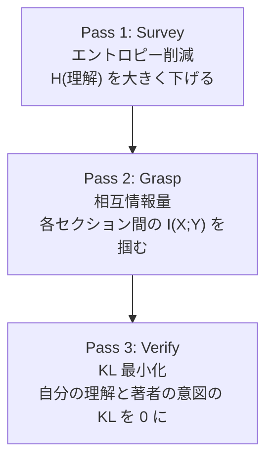
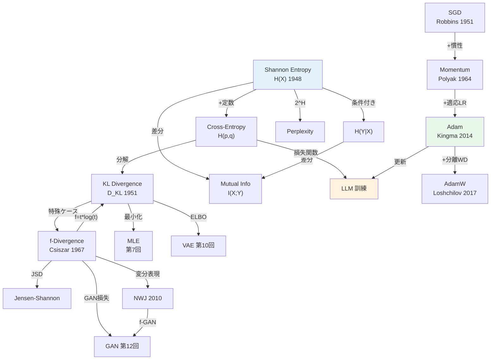
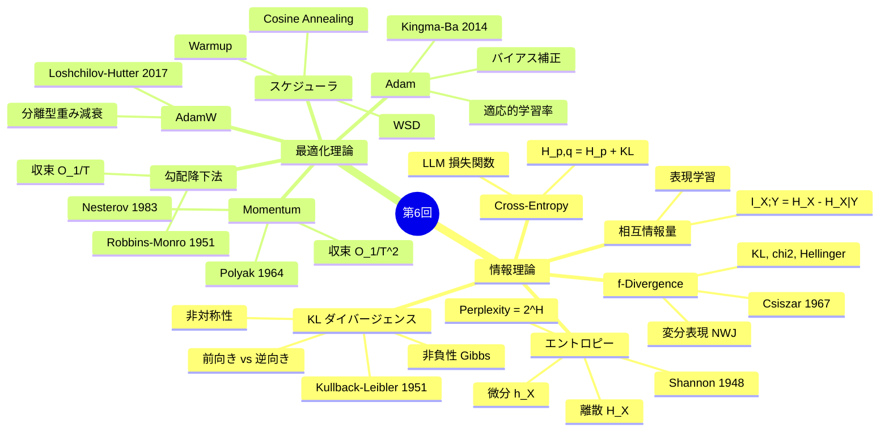

## 💻 4. 実装ゾーン（45分）— 数式をコードに翻訳する技術

### 4.1 環境構築

```bash
pip install numpy matplotlib
```

本講義は Python 90% で進む。NumPy のみで全て実装する。PyTorch は `:::details` で比較用に示す。

### 4.2 情報理論ライブラリのスクラッチ実装

Zone 3 で導出した全ての情報量を、1つのモジュールとして実装する。

```python
import numpy as np
from typing import Optional

class InfoTheory:
    """Information theory toolkit — all formulas from Zone 3."""

    @staticmethod
    def entropy(p: np.ndarray, base: float = np.e) -> float:
        """Shannon entropy: H(X) = -Σ p(x) log p(x)

        Definition 3.1. Returns in nats (base=e) or bits (base=2).
        """
        p = np.asarray(p, dtype=np.float64)
        p = p[p > 0]
        return -np.sum(p * np.log(p)) / np.log(base)

    @staticmethod
    def cross_entropy(p: np.ndarray, q: np.ndarray, base: float = np.e) -> float:
        """Cross-entropy: H(p, q) = -Σ p(x) log q(x)

        Definition 3.4. H(p,q) = H(p) + KL(p||q).
        """
        p, q = np.asarray(p, dtype=np.float64), np.asarray(q, dtype=np.float64)
        mask = p > 0
        return -np.sum(p[mask] * np.log(q[mask])) / np.log(base)

    @staticmethod
    def kl_divergence(p: np.ndarray, q: np.ndarray) -> float:
        """KL divergence: D_KL(p || q) = Σ p(x) log(p(x)/q(x))

        Definition 3.3. Always >= 0 (Gibbs inequality, Theorem 3.2).
        """
        p, q = np.asarray(p, dtype=np.float64), np.asarray(q, dtype=np.float64)
        mask = (p > 0) & (q > 0)
        return np.sum(p[mask] * np.log(p[mask] / q[mask]))

    @staticmethod
    def mutual_information(pxy: np.ndarray) -> float:
        """Mutual information: I(X;Y) = H(X) + H(Y) - H(X,Y)

        Definition 3.6. I(X;Y) = KL(p(x,y) || p(x)p(y)).
        """
        pxy = np.asarray(pxy, dtype=np.float64)
        px = pxy.sum(axis=1)
        py = pxy.sum(axis=0)
        h_x = InfoTheory.entropy(px)
        h_y = InfoTheory.entropy(py)
        h_xy = InfoTheory.entropy(pxy.flatten())
        return h_x + h_y - h_xy

    @staticmethod
    def js_divergence(p: np.ndarray, q: np.ndarray) -> float:
        """Jensen-Shannon divergence: JSD(p||q) = 0.5*KL(p||m) + 0.5*KL(q||m)

        where m = 0.5*(p+q). Symmetric, bounded [0, log2].
        """
        m = 0.5 * (p + q)
        return 0.5 * InfoTheory.kl_divergence(p, m) + 0.5 * InfoTheory.kl_divergence(q, m)

    @staticmethod
    def perplexity(p: np.ndarray, q: np.ndarray) -> float:
        """Perplexity: PPL = exp(H(p, q)) = 2^(H(p,q) in bits)

        Zone 0 connection: PPL = average branching factor.
        """
        ce = InfoTheory.cross_entropy(p, q)
        return np.exp(ce)

# Verification: all Zone 3 formulas
it = InfoTheory()
p = np.array([0.4, 0.3, 0.2, 0.1])
q = np.array([0.25, 0.25, 0.25, 0.25])

print("=== Information Theory Verification ===")
print(f"H(p)          = {it.entropy(p):.6f} nats")
print(f"H(p,q)        = {it.cross_entropy(p, q):.6f} nats")
print(f"KL(p||q)      = {it.kl_divergence(p, q):.6f} nats")
print(f"H(p) + KL     = {it.entropy(p) + it.kl_divergence(p, q):.6f} nats")
print(f"Match CE:       {np.isclose(it.entropy(p) + it.kl_divergence(p, q), it.cross_entropy(p, q))}")
print(f"JSD(p,q)      = {it.js_divergence(p, q):.6f} nats")
print(f"PPL(p,q)      = {it.perplexity(p, q):.4f}")
print(f"\nKL non-negativity: KL(p||q) = {it.kl_divergence(p, q):.6f} >= 0 ✓")
print(f"KL(p||p) = {it.kl_divergence(p, p):.10f} ≈ 0 ✓")
```

### 4.3 最適化アルゴリズムの統一実装

SGD、Momentum、Adam、AdamW を統一インターフェースで実装する。

```python
import numpy as np
from abc import ABC, abstractmethod

class Optimizer(ABC):
    """Base optimizer interface."""

    def __init__(self, lr: float = 0.001):
        self.lr = lr
        self.t = 0

    @abstractmethod
    def step(self, params: np.ndarray, grads: np.ndarray) -> np.ndarray:
        pass

class SGD(Optimizer):
    """Vanilla SGD: θ = θ - η∇L (Robbins & Monro, 1951)"""

    def step(self, params, grads):
        self.t += 1
        return params - self.lr * grads

class MomentumSGD(Optimizer):
    """SGD with Momentum (Polyak, 1964): v = βv + g; θ = θ - ηv"""

    def __init__(self, lr=0.001, beta=0.9):
        super().__init__(lr)
        self.beta = beta
        self.v = None

    def step(self, params, grads):
        self.t += 1
        if self.v is None:
            self.v = np.zeros_like(params)
        self.v = self.beta * self.v + grads
        return params - self.lr * self.v

class AdamOptimizer(Optimizer):
    """Adam (Kingma & Ba, 2014)"""

    def __init__(self, lr=0.001, beta1=0.9, beta2=0.999, eps=1e-8):
        super().__init__(lr)
        self.beta1, self.beta2, self.eps = beta1, beta2, eps
        self.m = None
        self.v = None

    def step(self, params, grads):
        self.t += 1
        if self.m is None:
            self.m = np.zeros_like(params)
            self.v = np.zeros_like(params)
        self.m = self.beta1 * self.m + (1 - self.beta1) * grads
        self.v = self.beta2 * self.v + (1 - self.beta2) * grads**2
        m_hat = self.m / (1 - self.beta1**self.t)
        v_hat = self.v / (1 - self.beta2**self.t)
        return params - self.lr * m_hat / (np.sqrt(v_hat) + self.eps)

class AdamWOptimizer(AdamOptimizer):
    """AdamW (Loshchilov & Hutter, 2017): decoupled weight decay"""

    def __init__(self, lr=0.001, beta1=0.9, beta2=0.999, eps=1e-8, wd=0.01):
        super().__init__(lr, beta1, beta2, eps)
        self.wd = wd

    def step(self, params, grads):
        params = params * (1 - self.lr * self.wd)  # decoupled weight decay
        return super().step(params, grads)
```

### 4.4 数式→コード翻訳パターン（7パターン）

| # | 数式パターン | Python パターン | 例 |
|:--|:-----------|:--------------|:---|
| 1 | $\sum_{x} p(x) f(x)$ | `np.sum(p * f(x))` | エントロピー |
| 2 | $\log \frac{a}{b}$ | `np.log(a / b)` or `np.log(a) - np.log(b)` | KL |
| 3 | $\mathbb{E}_{x \sim p}[f(x)]$ | `np.mean(f(samples))` | Monte Carlo 推定 |
| 4 | $\frac{\partial}{\partial \theta} f$ | 数値微分: `(f(θ+ε) - f(θ-ε))/(2ε)` | 勾配検証 |
| 5 | $\beta v + (1-\beta) g$ | `v = beta * v + (1-beta) * g` | 指数移動平均 |
| 6 | $\frac{m}{1 - \beta^t}$ | `m / (1 - beta**t)` | バイアス補正 |
| 7 | $\frac{a}{\sqrt{b} + \epsilon}$ | `a / (np.sqrt(b) + eps)` | Adam 更新 |

:::details PyTorch との対応
```python
import torch
import torch.nn.functional as F

# Pattern 1: Entropy
p_pt = torch.tensor([0.4, 0.3, 0.2, 0.1])
entropy_pt = -torch.sum(p_pt * torch.log(p_pt))

# Pattern 2: KL divergence
q_pt = torch.tensor([0.25, 0.25, 0.25, 0.25])
kl_pt = F.kl_div(q_pt.log(), p_pt, reduction='sum')
# NOTE: PyTorch's kl_div expects log(q) as first arg, p as second

# Pattern 3: Cross-Entropy Loss
logits = torch.randn(1, 100)  # model output
target = torch.tensor([42])   # correct token
ce_pt = F.cross_entropy(logits, target)

# Optimizers
model = torch.nn.Linear(10, 10)
opt_sgd = torch.optim.SGD(model.parameters(), lr=0.01, momentum=0.9)
opt_adam = torch.optim.Adam(model.parameters(), lr=0.001)
opt_adamw = torch.optim.AdamW(model.parameters(), lr=0.001, weight_decay=0.01)
```
:::

### 4.5 最適化ランドスケープの可視化

```python
import numpy as np

def visualize_optimization_landscape():
    """Compare optimizer trajectories on Beale's function."""
    # Beale function: f(x,y) = (1.5-x+xy)^2 + (2.25-x+xy^2)^2 + (2.625-x+xy^3)^2
    def beale(xy):
        x, y = xy[0], xy[1]
        return ((1.5 - x + x*y)**2 +
                (2.25 - x + x*y**2)**2 +
                (2.625 - x + x*y**3)**2)

    def beale_grad(xy):
        x, y = xy[0], xy[1]
        t1 = 1.5 - x + x*y
        t2 = 2.25 - x + x*y**2
        t3 = 2.625 - x + x*y**3
        dx = 2*t1*(-1+y) + 2*t2*(-1+y**2) + 2*t3*(-1+y**3)
        dy = 2*t1*x + 2*t2*2*x*y + 2*t3*3*x*y**2
        return np.array([dx, dy])

    x0 = np.array([0.0, 0.0])
    optimizers = {
        "SGD(lr=0.0001)": SGD(lr=0.0001),
        "Momentum(β=0.9)": MomentumSGD(lr=0.0001, beta=0.9),
        "Adam(lr=0.01)": AdamOptimizer(lr=0.01),
    }

    print("=== Optimizer Comparison on Beale Function ===")
    print(f"Optimal: (3.0, 0.5), f* = 0.0\n")

    for name, opt in optimizers.items():
        x = x0.copy()
        for step in range(2000):
            g = beale_grad(x)
            # Clip gradient to prevent divergence
            g = np.clip(g, -10, 10)
            x = opt.step(x, g)

        print(f"{name:25s}: x=({x[0]:+.4f}, {x[1]:+.4f}), "
              f"f={beale(x):.6f}, dist={np.linalg.norm(x - np.array([3,0.5])):.4f}")

visualize_optimization_landscape()
```

### 4.6 Python の遅さを体感する — `%timeit` の衝撃

ここで不穏な計測を行う。

```python
import numpy as np
import time

def train_loop_python(n_params, n_steps):
    """Pure Python training loop (SGD + gradient computation)."""
    params = np.random.randn(n_params)
    lr = 0.001
    loss_history = []

    start = time.perf_counter()
    for step in range(n_steps):
        # Simulate gradient computation (quadratic loss)
        grad = 2.0 * params + np.random.randn(n_params) * 0.01
        # SGD update
        params = params - lr * grad
        # Compute loss
        loss = float(np.sum(params**2))
        loss_history.append(loss)
    elapsed = time.perf_counter() - start
    return elapsed, loss_history

# Benchmark
for n_params in [100, 1000, 10000]:
    elapsed, losses = train_loop_python(n_params, 1000)
    print(f"Params={n_params:6d}, Steps=1000: {elapsed:.3f}s "
          f"({elapsed/1000*1e6:.0f} us/step) "
          f"final_loss={losses[-1]:.6f}")

print("\n--- Consider ---")
print("GPT-3: 175B parameters, ~300B tokens")
print("Each step: forward + backward + update on 175B params")
print("Pure Python? Impossible. Even NumPy is not enough.")
print("This is why we need Julia (Lec 9) and Rust (Lec 11).")
```

:::message alert
ここで `%timeit` の結果を観察してほしい。10,000パラメータの SGD ループが Python でどれだけ遅いか。実際のモデルは数百万〜数十億パラメータだ。この「遅さ」は第7回で MLE の反復計算で増幅し、第8回の EM 算法で「**遅すぎない？**」という問いが確信に変わる。第9回で Julia が登場する伏線がここにある。
:::

### 4.7 勾配クリッピングと数値安定性

実際の訓練では勾配が爆発する問題に対処する必要がある。

```python
import numpy as np

def gradient_clipping(grads: np.ndarray, max_norm: float = 1.0) -> np.ndarray:
    """Gradient clipping by global norm.

    If ||g|| > max_norm, scale g so that ||g|| = max_norm.
    Used in LLM training to prevent gradient explosion.
    """
    grad_norm = np.linalg.norm(grads)
    if grad_norm > max_norm:
        grads = grads * (max_norm / grad_norm)
    return grads

# Demonstrate gradient clipping
np.random.seed(42)
normal_grads = np.random.randn(10) * 0.5
exploding_grads = np.random.randn(10) * 100

print("Normal gradients:")
print(f"  Before: norm = {np.linalg.norm(normal_grads):.4f}")
clipped = gradient_clipping(normal_grads, max_norm=1.0)
print(f"  After:  norm = {np.linalg.norm(clipped):.4f}")

print("\nExploding gradients:")
print(f"  Before: norm = {np.linalg.norm(exploding_grads):.4f}")
clipped = gradient_clipping(exploding_grads, max_norm=1.0)
print(f"  After:  norm = {np.linalg.norm(clipped):.4f}")
print(f"  Scale factor: {1.0 / np.linalg.norm(exploding_grads):.6f}")
```

**勾配爆発の原因**: 深いネットワークでは逆伝播中に勾配が乗算されていく。各層の勾配が1より大きいと指数的に増大（爆発）、1より小さいと指数的に減少（消失）する。クリッピングは爆発を防ぐ対症療法であり、消失には別の対策（残差接続、正規化）が必要。

**混合精度訓練の概要（fp16/bf16/fp8）**:

| 精度 | ビット数 | 範囲 | 用途 |
|:-----|:---------|:-----|:-----|
| fp32 | 32 | $\pm 3.4 \times 10^{38}$ | パラメータ保存（マスターコピー） |
| fp16 | 16 | $\pm 65504$ | 順伝播・逆伝播の高速化 |
| bf16 | 16 | $\pm 3.4 \times 10^{38}$ | fp32同様の範囲、精度は低い |
| fp8 | 8 | 限定 | Transformer Engine (H100+) |

混合精度訓練は fp32 でパラメータのマスターコピーを保持しつつ、順伝播と逆伝播を fp16/bf16 で行う。計算速度が2-3倍になり、メモリ使用量が半減する。Loss scaling（損失に大きな定数を掛けてから逆伝播し、勾配更新時に戻す）で fp16 のアンダーフロー問題を回避する。

### 4.8 ラグランジュ乗数法 — 制約付き最適化

機械学習で頻出する制約付き最適化の基本を押さえる。

**問題設定**: $g(\theta) = 0$ の制約下で $f(\theta)$ を最小化する。

$$
\min_\theta f(\theta) \quad \text{s.t.} \quad g(\theta) = 0
$$

**ラグランジアン**:

$$
\mathcal{L}(\theta, \lambda) = f(\theta) + \lambda g(\theta)
$$

**最適性条件（KKT条件の等式制約版）**:

$$
\nabla_\theta \mathcal{L} = 0, \quad \nabla_\lambda \mathcal{L} = 0
$$

```python
import numpy as np

def lagrangian_example():
    """Example: Maximize entropy H(p) subject to Σp_i = 1, Σp_i x_i = mu

    This shows why maximum entropy distribution is exponential family.
    """
    # Maximum entropy for a discrete distribution with mean constraint
    # Result: p(x) = exp(lambda_0 + lambda_1 * x) / Z
    # For mean=3.5 on {1,2,3,4,5,6} (fair die): uniform distribution

    x = np.arange(1, 7, dtype=float)

    # Uniform (maximum entropy with just normalization constraint)
    p_uniform = np.ones(6) / 6
    h_uniform = -np.sum(p_uniform * np.log2(p_uniform))

    # Constrained to mean=2.5 (biased toward lower numbers)
    # Solve via Lagrange multiplier (numerical approximation)
    best_h, best_p = -np.inf, None
    for lam in np.linspace(-2, 2, 10000):
        p = np.exp(lam * x)
        p /= p.sum()
        mean = np.sum(p * x)
        if abs(mean - 2.5) < 0.01:
            h = -np.sum(p * np.log2(p))
            if h > best_h:
                best_h, best_p = h, p.copy()

    print(f"Uniform (mean=3.5): H = {h_uniform:.4f} bits")
    if best_p is not None:
        print(f"MaxEnt (mean=2.5):  H = {best_h:.4f} bits")
        print(f"  p = {np.round(best_p, 4)}")
        print(f"  mean = {np.sum(best_p * x):.4f}")

lagrangian_example()
```

この最大エントロピー原理は統計物理の Boltzmann 分布と同一であり、第27回（EBM）で再登場する。制約なしの最大エントロピー = 一様分布、平均の制約つき = 指数分布族。**情報理論と統計物理は同じ数学で繋がっている**。

### 4.9 論文読解の情報理論的視点

情報理論の道具を使って論文を読む際の視点を整理する。

**3パスリーディング（情報理論版）**:



| パス | 目的 | 所要時間 | 読む箇所 |
|:-----|:-----|:---------|:---------|
| 1 | 全体像の把握（エントロピー大幅削減） | 10分 | Title, Abstract, Conclusion, Figures |
| 2 | 構造の理解（セクション間の依存関係） | 30分 | Method, Results, key equations |
| 3 | 詳細の検証（自分の理解の KL → 0） | 60分 | 全ページ、式の導出追跡 |

:::message
**進捗: 70% 完了** 情報理論ライブラリと最適化アルゴリズムをスクラッチ実装し、数式→コード翻訳パターンを習得した。Python の遅さも体感した。
:::

---

## 🔬 5. 実験ゾーン（30分）— 自己診断テスト

### 5.1 記号読解テスト

以下の記号・数式を声に出して読み、意味を説明せよ。

:::details Q1: $H(X) = -\sum_{x} p(x) \log p(x)$
**読み方**: エイチ エックス イコール マイナス シグマ エックス ピー エックス ログ ピー エックス

**意味**: 確率変数 $X$ の Shannon エントロピー。不確実性の定量化。$p(x)$ が一様分布のとき最大、確定的のとき 0。Shannon (1948) [^1] が情報理論の基礎として定義。
:::

:::details Q2: $D_\text{KL}(p \| q) = \mathbb{E}_{p}\left[\log \frac{p(x)}{q(x)}\right]$
**読み方**: ディー ケーエル ピー パラレル キュー イコール イー サブ ピー ログ ピー オーバー キュー

**意味**: $p$ から $q$ への KL ダイバージェンス。$p$ で生成したデータを $q$ で符号化したときの余分な情報量。非対称（$D_\text{KL}(p\|q) \neq D_\text{KL}(q\|p)$）。Kullback & Leibler (1951) [^2]。
:::

:::details Q3: $H(p, q) = H(p) + D_\text{KL}(p \| q)$
**読み方**: エイチ ピー キュー イコール エイチ ピー プラス ディー ケーエル ピー パラレル キュー

**意味**: Cross-Entropy の分解定理。Cross-Entropy = データ自体のエントロピー + モデルの不完全性。LLM 訓練で Cross-Entropy を最小化することは KL を最小化することと等価。
:::

:::details Q4: $I(X; Y) = H(X) - H(X \mid Y)$
**読み方**: アイ エックス セミコロン ワイ イコール エイチ エックス マイナス エイチ エックス バー ワイ

**意味**: $X$ と $Y$ の相互情報量。$Y$ を知ることで $X$ の不確実性がどれだけ減るか。表現学習で入力と潜在表現の依存関係を測る。
:::

:::details Q5: $\theta_{t+1} = \theta_t - \eta \nabla_\theta \mathcal{L}(\theta_t)$
**読み方**: シータ ティー プラス ワン イコール シータ ティー マイナス イータ ナブラ シータ エル シータ ティー

**意味**: 勾配降下法の更新則。学習率 $\eta$ で勾配方向にパラメータを更新。Robbins & Monro (1951) [^3] に遡る。
:::

:::details Q6: $\hat{m}_t = \frac{m_t}{1 - \beta_1^t}$
**読み方**: エム ハット ティー イコール エム ティー オーバー ワン マイナス ベータ ワン ノ ティー乗

**意味**: Adam のバイアス補正。初期化 $m_0 = 0$ からのバイアスを $1 - \beta_1^t$ で補正。$t$ が大きくなると補正量は減少。Kingma & Ba (2014) [^4]。
:::

:::details Q7: $D_f(p \| q) = \sum_x q(x) f\left(\frac{p(x)}{q(x)}\right)$
**読み方**: ディー エフ ピー パラレル キュー イコール シグマ キュー エックス エフ ピー オーバー キュー

**意味**: f-Divergence。生成関数 $f$ を変えることで KL、$\chi^2$、Hellinger、TV、JS などを統一的に表現。Csiszar (1967) [^6]。
:::

:::details Q8: $\text{PPL} = 2^{H(p, q)}$（ただし $H$ は bits）
**読み方**: パープレキシティ イコール ニ ノ エイチ ピー キュー 乗

**意味**: Perplexity。モデルが各時点で平均何個の選択肢に迷っているか。$H(p, q)$ が小さいほど PPL が低く、よい予測。LLM 評価の標準指標。
:::

:::details Q9: $v_{t+1} = \beta v_t + \nabla_\theta \mathcal{L}(\theta_t)$
**読み方**: ブイ ティー プラス ワン イコール ベータ ブイ ティー プラス ナブラ シータ エル シータ ティー

**意味**: Momentum の速度更新。過去の勾配の指数移動平均。$\beta = 0.9$ なら過去10ステップの勾配が影響。Polyak (1964) [^8]。
:::

:::details Q10: $\eta_t = \eta_\text{min} + \frac{1}{2}(\eta_\text{max} - \eta_\text{min})(1 + \cos(\pi t / T))$
**読み方**: イータ ティー イコール イータ ミン プラス 二分の一 イータ マックス マイナス イータ ミン カッコ ワン プラス コサイン パイ ティー オーバー ティー

**意味**: Cosine Annealing 学習率スケジュール。コサイン曲線に沿って学習率を $\eta_\text{max}$ から $\eta_\text{min}$ に減衰。
:::

### 5.2 LaTeX ライティングテスト

以下の数式を LaTeX で書け。

:::details Q1: Shannon エントロピーの定義
```latex
H(X) = -\sum_{x \in \mathcal{X}} p(x) \log p(x)
```
$$H(X) = -\sum_{x \in \mathcal{X}} p(x) \log p(x)$$
:::

:::details Q2: KL ダイバージェンスの非負性
```latex
D_\text{KL}(p \| q) = \sum_x p(x) \log \frac{p(x)}{q(x)} \geq 0
```
$$D_\text{KL}(p \| q) = \sum_x p(x) \log \frac{p(x)}{q(x)} \geq 0$$
:::

:::details Q3: Adam の更新則（バイアス補正込み）
```latex
\theta_t = \theta_{t-1} - \eta \frac{\hat{m}_t}{\sqrt{\hat{v}_t} + \epsilon}, \quad
\hat{m}_t = \frac{m_t}{1 - \beta_1^t}, \quad
\hat{v}_t = \frac{v_t}{1 - \beta_2^t}
```
:::

:::details Q4: Cross-Entropy の分解
```latex
H(p, q) = H(p) + D_\text{KL}(p \| q)
```
$$H(p, q) = H(p) + D_\text{KL}(p \| q)$$
:::

:::details Q5: f-Divergence の定義
```latex
D_f(p \| q) = \sum_x q(x) f\left(\frac{p(x)}{q(x)}\right)
```
$$D_f(p \| q) = \sum_x q(x) f\left(\frac{p(x)}{q(x)}\right)$$
:::

### 5.3 コード翻訳テスト

数式を Python に翻訳せよ。

:::details Q1: 条件付きエントロピー $H(Y \mid X) = -\sum_{x,y} p(x,y) \log p(y \mid x)$
```python
def conditional_entropy(pxy: np.ndarray) -> float:
    """H(Y|X) = -Σ p(x,y) log p(y|x)"""
    px = pxy.sum(axis=1, keepdims=True)
    # p(y|x) = p(x,y) / p(x)
    p_y_given_x = np.where(px > 0, pxy / px, 0)
    mask = (pxy > 0) & (p_y_given_x > 0)
    return -np.sum(pxy[mask] * np.log(p_y_given_x[mask]))
```
:::

:::details Q2: Nesterov Momentum の更新
```python
def nesterov_step(params, velocity, grad_fn, lr, beta):
    """Nesterov accelerated gradient: look-ahead gradient."""
    look_ahead = params - lr * beta * velocity
    g = grad_fn(look_ahead)
    velocity_new = beta * velocity + g
    params_new = params - lr * velocity_new
    return params_new, velocity_new
```
:::

:::details Q3: 相互情報量を KL として計算
```python
def mi_via_kl(pxy: np.ndarray) -> float:
    """I(X;Y) = KL(p(x,y) || p(x)p(y))"""
    px = pxy.sum(axis=1)
    py = pxy.sum(axis=0)
    independent = np.outer(px, py)
    mask = (pxy > 0) & (independent > 0)
    return np.sum(pxy[mask] * np.log(pxy[mask] / independent[mask]))
```
:::

:::details Q4: ガウス分布の微分エントロピー
```python
def gaussian_entropy(sigma: float) -> float:
    """h(X) = 0.5 * log(2*pi*e*sigma^2) for X ~ N(mu, sigma^2)"""
    return 0.5 * np.log(2 * np.pi * np.e * sigma**2)
```
:::

:::details Q5: Cosine Annealing スケジューラ
```python
def cosine_annealing(step, total_steps, lr_max, lr_min=0):
    """η_t = η_min + 0.5*(η_max - η_min)*(1 + cos(π*t/T))"""
    return lr_min + 0.5 * (lr_max - lr_min) * (1 + np.cos(np.pi * step / total_steps))
```
:::

### 5.4 論文読解テスト — Kingma & Ba (2014) "Adam" [^4]

Adam の原論文を Pass 1 で読んでみよう。

**タスク**: 以下の問いに答えよ（論文 arXiv:1412.6980）。

```python
pass1_template = {
    "title": "Adam: A Method for Stochastic Optimization",
    "authors": "Diederik P. Kingma, Jimmy Ba",
    "year": 2014,
    "venue": "ICLR 2015",
    "category": "Optimization",
    "main_contribution": "???",  # Q1: fill this
    "key_equation": "???",       # Q2: equation number
    "compared_to": "???",        # Q3: baselines
    "limitations": "???",        # Q4: acknowledged
    "relevance_to_lec6": "???",  # Q5: connection
}
```

:::details 解答
```python
pass1_template = {
    "title": "Adam: A Method for Stochastic Optimization",
    "authors": "Diederik P. Kingma, Jimmy Ba",
    "year": 2014,
    "venue": "ICLR 2015",
    "category": "Optimization / First-order gradient methods",
    "main_contribution": "Adaptive learning rates using 1st & 2nd moment estimates with bias correction",
    "key_equation": "Algorithm 1 (Adam update rule)",
    "compared_to": "SGD, AdaGrad, RMSProp, SGD+Nesterov",
    "limitations": "May not converge for some convex problems (later fixed by AMSGrad)",
    "relevance_to_lec6": "Definition 3.10 — Adam is the standard optimizer for LLM training",
}
```
:::

### 5.5 実装チャレンジ — KL 推定の Monte Carlo 法

解析的に KL が計算できない場合、サンプルから推定する方法を実装する。

```python
import numpy as np

def kl_monte_carlo(log_p_fn, log_q_fn, samples_p, n_samples=10000):
    """Estimate KL(p||q) via Monte Carlo: E_p[log p(x) - log q(x)]

    When we can sample from p and evaluate log-densities.
    """
    log_p = log_p_fn(samples_p)
    log_q = log_q_fn(samples_p)
    return np.mean(log_p - log_q)

# Example: KL between two Gaussians
# KL(N(mu1,s1^2) || N(mu2,s2^2)) = log(s2/s1) + (s1^2 + (mu1-mu2)^2)/(2*s2^2) - 1/2
mu1, s1 = 1.0, 0.5
mu2, s2 = 0.0, 1.0

# Analytical KL
kl_analytical = np.log(s2/s1) + (s1**2 + (mu1-mu2)**2)/(2*s2**2) - 0.5
print(f"Analytical KL(N({mu1},{s1**2}) || N({mu2},{s2**2})) = {kl_analytical:.6f}")

# Monte Carlo KL
np.random.seed(42)
samples = np.random.normal(mu1, s1, size=100000)
log_p = lambda x: -0.5*np.log(2*np.pi*s1**2) - (x-mu1)**2/(2*s1**2)
log_q = lambda x: -0.5*np.log(2*np.pi*s2**2) - (x-mu2)**2/(2*s2**2)

for n in [100, 1000, 10000, 100000]:
    kl_mc = kl_monte_carlo(log_p, log_q, samples[:n])
    error = abs(kl_mc - kl_analytical)
    print(f"  MC (n={n:6d}): KL = {kl_mc:.6f}, error = {error:.6f}")
```

### 5.6 実装チャレンジ — 最適化器の収束比較

```python
import numpy as np

def rosenbrock(x):
    """f(x,y) = (1-x)^2 + 100(y-x^2)^2, minimum at (1,1)"""
    return (1 - x[0])**2 + 100*(x[1] - x[0]**2)**2

def rosenbrock_grad(x):
    dx = -2*(1 - x[0]) - 400*x[0]*(x[1] - x[0]**2)
    dy = 200*(x[1] - x[0]**2)
    return np.array([dx, dy])

def run_optimizer(opt, grad_fn, x0, n_steps=5000):
    x = x0.copy()
    trajectory = [x.copy()]
    for _ in range(n_steps):
        g = grad_fn(x)
        g = np.clip(g, -100, 100)
        x = opt.step(x, g)
        trajectory.append(x.copy())
    return np.array(trajectory)

x0 = np.array([-1.0, 1.0])
optimizers = {
    "SGD(lr=0.0001)": SGD(lr=0.0001),
    "Momentum(0.9)": MomentumSGD(lr=0.0001, beta=0.9),
    "Adam(lr=0.001)": AdamOptimizer(lr=0.001),
    "AdamW(lr=0.001)": AdamWOptimizer(lr=0.001, wd=0.01),
}

print("=== Rosenbrock Function Optimization ===")
print(f"Optimal: (1.0, 1.0), f* = 0.0\n")
for name, opt in optimizers.items():
    traj = run_optimizer(opt, rosenbrock_grad, x0, n_steps=5000)
    final = traj[-1]
    dist = np.linalg.norm(final - np.array([1.0, 1.0]))
    print(f"{name:20s}: final=({final[0]:+.4f}, {final[1]:.4f}), "
          f"f={rosenbrock(final):.6f}, dist={dist:.4f}")
```

### 5.7 実装チャレンジ — AdamW で簡単なニューラルネットを訓練

学んだ最適化器を使って、2層ニューラルネットを XOR 問題で訓練する。

```python
import numpy as np

class TwoLayerNet:
    """2-layer neural network for XOR classification."""

    def __init__(self, d_in=2, d_hidden=4, d_out=1):
        # Xavier initialization
        self.W1 = np.random.randn(d_in, d_hidden) * np.sqrt(2.0 / d_in)
        self.b1 = np.zeros(d_hidden)
        self.W2 = np.random.randn(d_hidden, d_out) * np.sqrt(2.0 / d_hidden)
        self.b2 = np.zeros(d_out)

    def forward(self, X):
        """Forward pass with ReLU activation."""
        self.z1 = X @ self.W1 + self.b1
        self.a1 = np.maximum(0, self.z1)  # ReLU
        self.z2 = self.a1 @ self.W2 + self.b2
        self.out = 1 / (1 + np.exp(-self.z2))  # sigmoid
        return self.out

    def backward(self, X, y):
        """Backward pass — compute gradients."""
        m = X.shape[0]
        # Output layer
        dz2 = self.out - y.reshape(-1, 1)  # BCE gradient
        dW2 = self.a1.T @ dz2 / m
        db2 = np.mean(dz2, axis=0)
        # Hidden layer
        da1 = dz2 @ self.W2.T
        dz1 = da1 * (self.z1 > 0)  # ReLU derivative
        dW1 = X.T @ dz1 / m
        db1 = np.mean(dz1, axis=0)
        return {"W1": dW1, "b1": db1, "W2": dW2, "b2": db2}

    def loss(self, y):
        """Binary cross-entropy: -1/N Σ [y log(p) + (1-y) log(1-p)]"""
        y = y.reshape(-1, 1)
        eps = 1e-7
        return -np.mean(y * np.log(self.out + eps) + (1 - y) * np.log(1 - self.out + eps))

# XOR dataset
X = np.array([[0,0], [0,1], [1,0], [1,1]], dtype=float)
y = np.array([0, 1, 1, 0], dtype=float)

# Train with AdamW
np.random.seed(42)
net = TwoLayerNet(d_in=2, d_hidden=8, d_out=1)
opts = {
    name: AdamWOptimizer(lr=0.01, wd=0.001)
    for name in ["W1", "b1", "W2", "b2"]
}
# Reset optimizers to match parameter shapes
for name in opts:
    param = getattr(net, name)
    opts[name] = AdamWOptimizer(lr=0.01, wd=0.001)
    opts[name].m = np.zeros_like(param)
    opts[name].v = np.zeros_like(param)

for epoch in range(1000):
    pred = net.forward(X)
    loss_val = net.loss(y)
    grads = net.backward(X, y)

    for name in ["W1", "b1", "W2", "b2"]:
        param = getattr(net, name)
        param = opts[name].step(param, grads[name])
        setattr(net, name, param)

    if epoch % 200 == 0:
        acc = np.mean((pred.flatten() > 0.5) == y)
        print(f"Epoch {epoch:4d}: loss = {loss_val:.4f}, accuracy = {acc:.2f}")

# Final predictions
pred_final = net.forward(X)
print(f"\nFinal predictions:")
for i in range(4):
    print(f"  Input: {X[i]} → Pred: {pred_final[i,0]:.4f} (target: {y[i]:.0f})")
```

### 5.8 実装チャレンジ — KL ダイバージェンスのガウス閉形式

2つのガウス分布間の KL は閉形式で計算できる。導出し、Monte Carlo と比較せよ。

```python
import numpy as np

def kl_gaussians(mu1, sigma1, mu2, sigma2):
    """Analytical KL(N(mu1,s1^2) || N(mu2,s2^2))

    KL = log(s2/s1) + (s1^2 + (mu1-mu2)^2)/(2*s2^2) - 1/2
    """
    return (np.log(sigma2 / sigma1) +
            (sigma1**2 + (mu1 - mu2)**2) / (2 * sigma2**2) - 0.5)

def kl_gaussians_mc(mu1, sigma1, mu2, sigma2, n=100000):
    """Monte Carlo estimate of KL(N(mu1,s1^2) || N(mu2,s2^2))"""
    samples = np.random.normal(mu1, sigma1, n)
    log_p = -0.5*np.log(2*np.pi*sigma1**2) - (samples-mu1)**2/(2*sigma1**2)
    log_q = -0.5*np.log(2*np.pi*sigma2**2) - (samples-mu2)**2/(2*sigma2**2)
    return np.mean(log_p - log_q)

# Test cases relevant to VAE (Lec 10)
print("KL between Gaussians — relevant to VAE prior matching")
print("=" * 60)
cases = [
    (0, 1, 0, 1, "Same distribution"),
    (0, 1, 0, 2, "Wider q"),
    (0, 1, 1, 1, "Shifted mean"),
    (2, 0.5, 0, 1, "VAE-like: learned vs prior"),
]

np.random.seed(42)
for mu1, s1, mu2, s2, desc in cases:
    kl_exact = kl_gaussians(mu1, s1, mu2, s2)
    kl_mc = kl_gaussians_mc(mu1, s1, mu2, s2)
    print(f"  {desc:35s}: exact={kl_exact:.4f}, MC={kl_mc:.4f}, "
          f"error={abs(kl_exact-kl_mc):.4f}")
```

この閉形式 KL は VAE の損失関数で直接使われる（第10回）。エンコーダが出力する $q(z|x) = \mathcal{N}(\mu_\phi(x), \sigma_\phi^2(x))$ と事前分布 $p(z) = \mathcal{N}(0, I)$ の KL がこれだ。

### 5.9 実装チャレンジ — Source Coding Theorem の体験

Shannon の Source Coding Theorem（情報源符号化定理）を体験する。これはデータ圧縮の理論的限界を示す。

**定理** (Shannon, 1948 [^1]): 情報源 $X$ の出力を符号化するとき、平均符号長 $L$ はエントロピー以上:

$$
L \geq H(X)
$$

等号は最適な符号（Huffman 符号など）で近似的に達成される。

```python
import numpy as np
from collections import Counter

def huffman_avg_length(probs):
    """Approximate average code length for Huffman coding.

    Exact Huffman requires tree construction, but:
    H(X) <= L_huffman < H(X) + 1
    """
    # Shannon-Fano lower bound: optimal code length for symbol i ≈ -log2(pi)
    p = np.array(probs)
    p = p[p > 0]
    entropy = -np.sum(p * np.log2(p))
    # Individual optimal lengths (ceil to integers)
    lengths = np.ceil(-np.log2(p))
    avg_length = np.sum(p * lengths)
    return entropy, avg_length

# Example: English letter frequencies (approximate)
letters = "etaoinshrdlcumwfgypbvkjxqz"
freqs = np.array([12.7, 9.06, 8.17, 7.51, 6.97, 6.75, 6.33, 6.09, 5.99,
                   4.25, 4.03, 2.78, 2.76, 2.41, 2.36, 2.23, 2.02, 1.97,
                   1.93, 1.49, 0.98, 0.77, 0.15, 0.15, 0.10, 0.05])
freqs = freqs / freqs.sum()

entropy, avg_len = huffman_avg_length(freqs)
print("English letter frequencies:")
print(f"  Entropy H(X)     = {entropy:.4f} bits/letter")
print(f"  Avg code length  = {avg_len:.4f} bits/letter")
print(f"  Fixed-length     = {np.log2(26):.4f} bits/letter")
print(f"  Compression ratio: {avg_len / np.log2(26):.2%} of fixed-length")
print(f"\nShannon bound: {entropy:.4f} <= L = {avg_len:.4f} < {entropy + 1:.4f}")

# Connection to LLM
print(f"\nLLM analogy:")
print(f"  Vocabulary size V = 50000")
print(f"  Fixed-length encoding: {np.log2(50000):.1f} bits/token")
print(f"  GPT-4 PPL ~10 → H ≈ {np.log2(10):.2f} bits/token")
print(f"  Compression: {np.log2(10)/np.log2(50000):.1%} of fixed-length")
print(f"  → LLM is an extremely efficient 'compressor' of language")
```

**LLM = 圧縮器**: この視点は深い。LLM が Perplexity を下げることは、言語の効率的な符号化を学ぶことと等価だ。GPT-4 の Perplexity が 10 ということは、平均 $\log_2 10 \approx 3.32$ bits/token で英語を符号化できるということ。固定長 $\log_2 50000 \approx 15.6$ bits に対して約 21% の効率。**LLM は本質的に確率的テキスト圧縮器なのだ**。

### 5.10 実装チャレンジ — 最適化ランドスケープの条件数と収束速度

条件数（condition number）が最適化の難しさを決める。

```python
import numpy as np

def quadratic_convergence(eigenvalues, lr, n_steps):
    """Track convergence of GD on f(x) = 0.5 * x^T diag(eig) x.

    Convergence rate depends on condition number kappa = max_eig / min_eig.
    """
    d = len(eigenvalues)
    x = np.random.randn(d)
    losses = []
    for _ in range(n_steps):
        grad = eigenvalues * x
        x = x - lr * grad
        losses.append(0.5 * np.sum(eigenvalues * x**2))
    return losses

print("Effect of condition number on GD convergence:")
print(f"{'kappa':>8s} {'Steps to 1e-6':>15s} {'Optimal LR':>12s}")
print("-" * 40)

for kappa in [1, 10, 100, 1000]:
    eigs = np.array([1.0, float(kappa)])
    # Optimal learning rate for GD: 2 / (lambda_max + lambda_min)
    lr_opt = 2.0 / (eigs.max() + eigs.min())
    losses = quadratic_convergence(eigs, lr_opt, 10000)
    # Find steps to reach 1e-6
    steps_needed = next((i for i, l in enumerate(losses) if l < 1e-6), 10000)
    print(f"{kappa:8d} {steps_needed:15d} {lr_opt:12.6f}")

print(f"\nInsight: kappa 10x → convergence ~2-3x slower")
print(f"Adam mitigates this via per-parameter adaptive learning rates")
```

この条件数の問題こそ Adam が解決する課題だ。各パラメータ方向に独立した学習率を持つことで、条件数が大きい（= 方向によって曲率が異なる）問題でも効率的に収束する。

### 5.11 自己チェックリスト

- [ ] Shannon エントロピーの定義を書ける
- [ ] KL ダイバージェンスの非負性を Jensen の不等式から証明できる
- [ ] Cross-Entropy = H(p) + KL(p||q) を導出できる
- [ ] 前向き KL と逆向き KL の違いを説明できる
- [ ] 相互情報量を KL ダイバージェンスとして書ける
- [ ] f-Divergence の定義と主要な特殊ケースを列挙できる
- [ ] SGD の更新則を書ける
- [ ] Momentum の物理的直感を説明できる
- [ ] Adam の全更新則（バイアス補正込み）を書ける
- [ ] AdamW と Adam + L2 の違いを説明できる
- [ ] Cosine Annealing の数式を書ける
- [ ] Cross-Entropy Loss の情報理論的分解を説明できる
- [ ] Perplexity = 2^H の意味を説明できる

:::message
**進捗: 85% 完了** 記号読解・LaTeX・コード翻訳・論文読解の全テストを完了。自己チェックリストで弱点を確認せよ。
:::

---

## 🚀 6. 振り返りゾーン（30分）— まとめと次回予告

### 6.2 本講義の概念間の接続マップ

本講義で学んだ概念は孤立していない。以下のマップで全ての繋がりを確認する。



### 6.3 情報理論と物理学の接続

Shannon が「エントロピー」の名を熱力学から借りたのは偶然ではない。

| 情報理論 | 統計物理学 | 対応 |
|:---------|:---------|:-----|
| Shannon エントロピー $H$ | Gibbs エントロピー $S$ | $S = -k_B \sum p \ln p$ |
| 最大エントロピー分布 | Boltzmann 分布 | $p \propto e^{-E/k_BT}$ |
| KL ダイバージェンス | 自由エネルギー差 | $F = E - TS$ |
| Cross-Entropy 最小化 | 自由エネルギー最小化 | 変分推論 |
| データ処理不等式 | 熱力学第2法則 | エントロピー増大 |

この対応は偶然ではなく数学的に厳密だ。Boltzmann 分布 $p(x) \propto \exp(-E(x)/T)$ はエネルギー制約付きの最大エントロピー分布であり、Zone 4 のラグランジュ乗数法で導ける。この「情報 = 物理」の視点は第27回（Energy-Based Models）で本格的に展開する。

### 6.4 次世代最適化器の動向（2024-2026）

Adam は2014年から10年以上にわたり標準的な最適化器であり続けている。だが近年、以下の代替案が提案されている。

| 最適化器 | 著者/年 | 特徴 | Adam との比較 |
|:---------|:-------|:-----|:-----------|
| Lion | Google, 2023 | sign-based更新、メモリ半減 | 匹敵する性能で省メモリ |
| Sophia | Stanford, 2023 | 2次情報（ヘッセ対角）利用 | 訓練トークン50%削減 |
| Muon | MIT, 2024 | 直交射影に基づく | Transformer特化 |
| Schedule-Free | Meta, 2024 | スケジューラ不要 | ハイパーパラメータ削減 |
| ADOPT | Taniguchi+, 2024 | 任意の $\beta_2$ で収束保証 | Adam の理論的欠陥を修正 |

これらの最適化器が AdamW を本当に置き換えるかはまだ決着がついていない。LLM のスケールでの検証にはコストがかかるため、結果の再現に時間がかかるのが現状だ。

:::details 用語集（本講義の全用語）
| 用語（英） | 用語（日） | 定義の場所 |
|:-----------|:---------|:---------|
| Shannon Entropy | シャノンエントロピー | 定義 3.1 |
| Differential Entropy | 微分エントロピー | 定義 3.2 |
| KL Divergence | KL ダイバージェンス | 定義 3.3 |
| Cross-Entropy | 交差エントロピー | 定義 3.4 |
| Conditional Entropy | 条件付きエントロピー | 定義 3.5 |
| Mutual Information | 相互情報量 | 定義 3.6 |
| f-Divergence | f ダイバージェンス | 定義 3.7 |
| Jensen's Inequality | イェンセンの不等式 | 定理 3.4 |
| SGD | 確率的勾配降下法 | 定義 3.8 |
| Momentum | モメンタム | 定義 3.9 |
| Adam | アダム | 定義 3.10 |
| AdamW | アダムダブリュー | 3.10 |
| Perplexity | パープレキシティ | Zone 0 |
| Mode-covering | モードカバリング | 3.3 |
| Mode-seeking | モードシーキング | 3.3 |
| Fenchel Conjugate | フェンシェル共役 | 3.6 details |
| Cosine Annealing | コサイン焼きなまし | 3.11 |
| Warmup | ウォームアップ | 3.11 |
| Bias Correction | バイアス補正 | 3.10 |
| Weight Decay | 重み減衰 | 3.10 |
| Data Processing Inequality | データ処理不等式 | 定理 3.5 |
| Fano's Inequality | ファノの不等式 | 3.5b |
| Chain Rule (Entropy) | 連鎖律（エントロピー） | 3.5c |
| Convex Set | 凸集合 | 定義 3.6 |
| Convex Function | 凸関数 | 定義 3.7 |
| Strong Convexity | 強凸性 | 定義 3.8 |
| KKT Conditions | KKT 条件 | 定理 3.9 |
| Lagrangian Dual | ラグランジュ双対 | 定理 3.10 |
| Strong Duality | 強双対性 | 定理 3.11 |
| Lipschitz Continuity | リプシッツ連続性 | 定義 3.9 |
| Spectral Normalization | スペクトル正規化 | 3.11c |
| Jensen-Shannon Divergence | JSD | 3.11d |
| Wasserstein Distance | ワッサースタイン距離 | 定義 3.10 |
| Kantorovich-Rubinstein Duality | KR 双対性 | 3.11d |
| Optimal Transport | 最適輸送 | 3.11d |
| WGAN | ワッサースタイン GAN | 3.11d |
| Gradient Clipping | 勾配クリッピング | 4.7 |
| Mixed Precision | 混合精度 | 4.7 |
| Lagrangian | ラグランジアン | 4.8 |
| Maximum Entropy | 最大エントロピー | 4.8 |
| Fisher Information | フィッシャー情報量 | 6.3 |
| Natural Gradient | 自然勾配 | 6.3 |
| Rate-Distortion | レート歪み | 6.2 |
| Source Coding Theorem | 情報源符号化定理 | 5.9 |
| Condition Number | 条件数 | 5.10 |
| Gibbs Inequality | ギブスの不等式 | 定理 3.2 |
| Bregman Divergence | ブレグマンダイバージェンス | 3.7 details |
| Information Bottleneck | 情報ボトルネック | 3.5b |
| WSD Schedule | ウォームアップ安定減衰 | 3.11 |
:::

:::details 主要な不等式まとめ
| 不等式 | 数式 | 意味 | 証明 |
|:-------|:-----|:-----|:-----|
| KL の非負性 | $D_\text{KL}(p \| q) \geq 0$ | 異なる分布なら距離は正 | Jensen |
| Jensen の不等式 | $f(\mathbb{E}[X]) \leq \mathbb{E}[f(X)]$ | 凸関数の期待値 | 支持超平面 |
| Gibbs の不等式 | $H(p, q) \geq H(p)$ | Cross-Entropy ≥ Entropy | KL ≥ 0 |
| データ処理不等式 | $I(X;Z) \leq I(X;Y)$ if $X \to Y \to Z$ | 処理で情報は増えない | Chain Rule |
| Fano の不等式 | $H(X|\hat{X}) \leq H_b(P_e) + P_e \log(|\mathcal{X}|-1)$ | 推定精度の下限 | — |
| Source Coding | $L \geq H(X)$ | 符号長の下限 = エントロピー | — |
| $H$ の上界 | $H(X) \leq \log |\mathcal{X}|$ | 等号は一様分布 | Jensen |
| ガウスの最大エントロピー | $h(X) \leq \frac{1}{2}\log(2\pi e \sigma^2)$ | 分散固定でガウスが最大 | Lagrange |
:::

:::details 主要な等式まとめ
| 等式 | 数式 | 意味 |
|:-----|:-----|:-----|
| Cross-Entropy 分解 | $H(p,q) = H(p) + D_\text{KL}(p \| q)$ | CE = Entropy + KL |
| 相互情報量 (1) | $I(X;Y) = H(X) - H(X|Y)$ | MI = Entropy reduction |
| 相互情報量 (2) | $I(X;Y) = D_\text{KL}(p(x,y) \| p(x)p(y))$ | MI = KL from independence |
| Entropy Chain Rule | $H(X,Y) = H(X) + H(Y|X)$ | Joint = Marginal + Conditional |
| ガウス KL | $D_\text{KL}(\mathcal{N}_1 \| \mathcal{N}_2) = \log\frac{\sigma_2}{\sigma_1} + \frac{\sigma_1^2 + (\mu_1-\mu_2)^2}{2\sigma_2^2} - \frac{1}{2}$ | Closed form |
| ガウス微分エントロピー | $h(X) = \frac{1}{2}\log(2\pi e \sigma^2)$ | Depends only on $\sigma$ |
:::

### 6.0 本講義の知識マインドマップ



---

### 6.5 本講義のキーテイクアウェイ

1. **Shannon エントロピー**は不確実性の唯一の合理的尺度であり、LLM の Perplexity $= 2^H$ の正体
2. **KL ダイバージェンス**は非対称な分布間距離。前向き KL は mode-covering、逆向き KL は mode-seeking — 生成モデルの損失設計に直結
3. **Cross-Entropy の最小化 = KL の最小化** — LLM 訓練の損失関数が情報理論的に必然であることの証明
4. **Adam** は Momentum + 適応的学習率 + バイアス補正の合わせ技。AdamW が正しい重み減衰

### 6.6 FAQ

:::details Q1: KL ダイバージェンスは距離じゃないなら、なぜ使うのか？
KL は距離の公理（対称性、三角不等式）を満たさない。だが機械学習で重要なのは「最小化可能か」であり、KL には以下の利点がある: (1) 最小化が MLE と等価、(2) 勾配計算が容易、(3) 情報理論的意味が明確。真の「距離」が欲しければ JS ダイバージェンスや Wasserstein 距離を使う（第13回）。
:::

:::details Q2: Adam と SGD、どちらを使うべき？
一般則: **Adam で始めて、必要なら SGD に切り替える**。Adam は学習率の調整が楽で収束が速いが、汎化性能では SGD+Momentum に劣る場合がある（特に画像分類）。LLM 訓練では AdamW がほぼ標準。最近の研究では Lion や Sophia など次世代最適化器も提案されているが、AdamW のロバスト性はまだ揺るがない。
:::

:::details Q3: Perplexity はどこまで下がる？
理論的下限はデータのエントロピー $H(\hat{p})$。自然言語は冗長性が高いため、英語テキストのエントロピーは1-2 bits/character 程度。GPT-4 の Perplexity が非常に低いのは、人間の言語パターンを精緻にモデル化しているから。ただし Perplexity = 1 は不可能 — それはデータに不確実性がないことを意味する。
:::

:::details Q4: f-Divergence は実際にどこで使われる？
f-GAN [Nowozin+ 2016] は f-Divergence の変分表現を直接使って GAN を訓練する。$f$ の選択により KL-GAN、Pearson-GAN、Hellinger-GAN などが統一的に導出できる。また、密度比推定（density ratio estimation）にも f-Divergence の変分表現が使われる。第12-14回で実装する。
:::

:::details Q5: 数学が苦手でも大丈夫？
Zone 3 の全導出が理解できなくても、以下の「最低限」を押さえれば先に進める: (1) エントロピー = 不確実性、(2) KL = 分布の距離（非対称）、(3) Cross-Entropy 最小化 = KL 最小化、(4) Adam = 賢い SGD。数式は繰り返し触ることで身体に染みる。第7-16回で同じ道具を何度も使うから、今完全に理解する必要はない。
:::

:::details Q6: なぜ MSE（平均二乗誤差）ではなく Cross-Entropy を使うのか？
分類問題では出力が確率分布なので、分布間の距離を測る Cross-Entropy が自然な選択。MSE は回帰問題向きで、確率分布の比較には情報理論的に根拠がない。具体的には、Cross-Entropy は出力のスケールに対して適切な勾配を与えるが、MSE + Sigmoid は出力が 0 や 1 に近いときに勾配が消失する（sigmoid の saturation 問題）。
:::

:::details Q7: KL は距離の三角不等式を満たさないが、困らないのか？
実用上は困らない。三角不等式 $D(p, r) \leq D(p, q) + D(q, r)$ は「中間点を経由しても距離が増えない」という性質だが、最適化では直接 $D(p_\text{data}, q_\theta)$ を最小化するので中間点は不要。ただし、理論的な解析（収束レートの証明など）では三角不等式が便利なので、そういう場面では TV 距離や Wasserstein 距離を使う。
:::

:::details Q8: エントロピーが最大のとき、モデルは「何も学んでいない」のか？
その通り。一様分布は最大エントロピー分布であり、「全ての選択肢が等確率」= 「何の情報も使えていない」状態。学習が進むと出力分布のエントロピーが下がり、特定の選択肢に確率が集中する。これが Perplexity の減少として観測される。ただし、エントロピーが低すぎる（= 1つのトークンに確率が集中しすぎる）のも問題で、生成の多様性が失われる。これが Temperature サンプリングの存在理由。
:::

:::details Q9: 勾配クリッピングはなぜ max_norm = 1.0 が一般的？
理論的な根拠は薄い。経験的に、勾配のノルムが1程度なら学習が安定するというヒューリスティクスだ。実際には学習率やモデルサイズに応じて調整する。GPT-3 では max_norm = 1.0、Llama 2 では max_norm = 1.0 が使われている。重要なのは具体的な値より「爆発を防ぐ安全弁がある」こと。
:::

:::details Q10: Adam のバイアス補正は本当に必要？
必要。バイアス補正なしの Adam（= RMSProp + Momentum）は学習初期に$m_0 = 0, v_0 = 0$ からスタートするため、初期のモーメント推定がゼロ方向に偏る。例えば $\beta_2 = 0.999$ で step 1 では $v_1 = 0.001 \cdot g_1^2$ と極端に小さく、$\hat{v}_1 = v_1 / (1 - 0.999^1) = g_1^2$ と補正される。補正がないと学習率が実効的に大きくなりすぎて不安定になる。
:::

### 6.7 学習スケジュール（1週間プラン）

| 日 | 内容 | 目安時間 |
|:---|:-----|:---------|
| Day 1 | Zone 0-2 を通読 + エントロピーの計算練習 | 45分 |
| Day 2 | Zone 3 の 3.1-3.5（情報理論パート）を紙で導出 | 90分 |
| Day 3 | Zone 3 の 3.7-3.11（最適化パート）を紙で導出 | 90分 |
| Day 4 | Zone 4 のコードを全て実行 + 改造 | 60分 |
| Day 5 | Zone 5 の自己診断テスト + Adam 論文 Pass 1 | 60分 |
| Day 6 | ボス戦の Cross-Entropy 分解を紙で再現 | 45分 |
| Day 7 | チェックリスト最終確認 + Zone 6 で読書計画 | 30分 |

### 6.8 進捗トラッカー

```python
lecture6_progress = {
    "zone0_quickstart": True,
    "zone1_experience": True,
    "zone2_intuition": True,
    "zone3_math": {
        "entropy": False,        # Can you derive H(X)?
        "kl_divergence": False,  # Can you prove KL >= 0?
        "cross_entropy": False,  # Can you show H(p,q) = H(p) + KL?
        "mutual_info": False,    # Can you compute I(X;Y)?
        "f_divergence": False,   # Can you list 5 f-divergences?
        "jensen": False,         # Can you state and prove Jensen?
        "sgd": False,            # Can you write SGD update?
        "momentum": False,       # Can you explain momentum?
        "adam": False,            # Can you write full Adam?
        "boss_battle": False,    # Can you decompose CE loss?
    },
    "zone4_implementation": False,
    "zone5_experiment": False,
}

completed = sum(1 for v in lecture6_progress["zone3_math"].values() if v)
total = len(lecture6_progress["zone3_math"])
print(f"Zone 3 progress: {completed}/{total} ({completed/total:.0%})")
print(f"Mark each as True when you can do it WITHOUT looking at notes.")
```

### 6.9 次回予告 — 第7回: 最尤推定と統計的推論

第6回で情報理論と最適化の武器が揃った。次回はいよいよ**最尤推定の数学構造**に正面から向き合う。

- **MLE の数学**: Cross-Entropy 最小化 = KL 最小化 = MLE の三位一体証明（本講義の直接的続き）
- **推定量の分類体系**: 明示的尤度 / 暗黙的推定 / スコアマッチング
- **生成モデルの統一マップ**: VAE / GAN / Flow / Diffusion を「推定量の設計」として鳥瞰
- **評価指標**: FID / KID / CMMD — 統計的距離の応用
- **Python の遅さ加速**: MLE の反復計算で「遅すぎない？」の不満が増幅

第5回までの数学基盤と、本講義の情報理論・最適化が、ここから先の全てを支える。**6講義の数学的武装が完了した**。KL は損失関数に、SGD は学習に、Wasserstein 距離は評価に直結する — この全てが無ければ生成モデルの地図は読めない。

:::message
**進捗: 100% 完了** 第6回「情報理論・最適化理論」完了。Course I の数学的武装はこれで6/8。次回から生成モデルの世界に足を踏み入れる。
:::

---


### 6.10 💀 パラダイム転換の問い

> **KL ダイバージェンスは対称ですらない"距離"。なぜこれが最適解？**

この問いを3つの視点から考えてみてほしい。

1. **MLE との等価性**: KL 最小化と最尤推定が数学的に等価であること（第7回で証明）。MLE は統計学で150年以上の歴史を持つ推定法であり、一致性・漸近正規性・漸近有効性を持つ。KL はこの「由緒正しい推定法」の情報理論的な顔に過ぎない。

2. **計算可能性**: Wasserstein 距離は対称で三角不等式も満たす「正しい距離」だが、高次元では計算が困難。KL は期待値として書けるため、Monte Carlo 推定が容易。実用上、計算可能な「不完全な距離」の方が、計算不能な「完全な距離」より有用だ。

3. **非対称性は機能**: 非対称性は欠点ではなく特徴。前向き KL と逆向き KL が異なる振る舞いをするからこそ、目的に応じた損失関数設計ができる。VAE（前向き）と GAN（逆向き）の品質の違いは、まさに KL の非対称性に起因する。

:::details 歴史的文脈: Shannon の「賭け」
Shannon は1948年の論文 [^1] で、エントロピーの名前を物理学の熱力学から借りた。von Neumann に名前の相談をしたところ「エントロピーと呼べ。誰も理解していないから議論で有利になる」と言われたという逸話がある。75年後、この「誰も理解していない」量が AI の訓練を支配している。Shannon の直感は正しかった — 情報の本質は「驚き」の定量化にあった。
:::

---

## 参考文献

### 主要論文

[^1]: Shannon, C. E. (1948). "A Mathematical Theory of Communication." *Bell System Technical Journal*, 27(3), 379-423.

[^2]: Kullback, S. & Leibler, R. A. (1951). "On Information and Sufficiency." *Annals of Mathematical Statistics*, 22(1), 79-86.

[^3]: Robbins, H. & Monro, S. (1951). "A Stochastic Approximation Method." *Annals of Mathematical Statistics*, 22(3), 400-407.

[^4]: Kingma, D. P. & Ba, J. (2014). "Adam: A Method for Stochastic Optimization." *ICLR 2015*.
@[card](https://arxiv.org/abs/1412.6980)

[^5]: Vaswani, A., Shazeer, N., Parmar, N., et al. (2017). "Attention Is All You Need." *NeurIPS 2017*.
@[card](https://arxiv.org/abs/1706.03762)

[^6]: Csiszar, I. (1967). "Information-Type Measures of Difference of Probability Distributions and Indirect Observations." *Studia Scientiarum Mathematicarum Hungarica*, 2, 299-318.

[^7]: Nguyen, X., Wainwright, M. J. & Jordan, M. I. (2010). "Estimating Divergence Functionals and the Likelihood Ratio by Convex Risk Minimization." *IEEE Transactions on Information Theory*, 56(11), 5847-5861.
@[card](https://arxiv.org/abs/0809.0853)

[^8]: Polyak, B. T. (1964). "Some Methods of Speeding up the Convergence of Iteration Methods." *USSR Computational Mathematics and Mathematical Physics*, 4(5), 1-17.

[^9]: Goodfellow, I. J., Pouget-Abadie, J., Mirza, M., et al. (2014). "Generative Adversarial Networks." *NeurIPS 2014*.
@[card](https://arxiv.org/abs/1406.2661)

[^11]: Boyd, S. & Vandenberghe, L. (2004). *Convex Optimization*. Cambridge University Press.

[^12]: Miyato, T., Kataoka, T., Koyama, M. & Yoshida, Y. (2018). "Spectral Normalization for Generative Adversarial Networks." *ICLR 2018*.
@[card](https://arxiv.org/abs/1802.05957)

[^13]: Arjovsky, M., Chintala, S. & Bottou, L. (2017). "Wasserstein Generative Adversarial Networks." *ICML 2017*.
@[card](https://arxiv.org/abs/1701.07875)

### 教科書

- Cover, T. M. & Thomas, J. A. (2006). *Elements of Information Theory*. 2nd ed. Wiley.
- Boyd, S. & Vandenberghe, L. (2004). *Convex Optimization*. Cambridge University Press. [Free PDF: stanford.edu/~boyd/cvxbook/]
- Villani, C. (2008). *Optimal Transport: Old and New*. Springer. [Fields Medal 受賞者による決定版。第13回で本格使用]
- MacKay, D. J. C. (2003). *Information Theory, Inference, and Learning Algorithms*. Cambridge University Press. [Free PDF: inference.org.uk/mackay/itila/]

---

## 記法規約

| 記号 | 読み方 | 意味 | 初出 |
|:-----|:-------|:-----|:-----|
| $H(X)$ | エイチ エックス | Shannon エントロピー | 定義 3.1 |
| $h(X)$ | スモール エイチ | 微分エントロピー | 定義 3.2 |
| $D_\text{KL}(p \| q)$ | ケーエル ピー パラレル キュー | KL ダイバージェンス | 定義 3.3 |
| $H(p, q)$ | エイチ ピー キュー | Cross-Entropy | 定義 3.4 |
| $H(Y \mid X)$ | エイチ ワイ バー エックス | 条件付きエントロピー | 定義 3.5 |
| $I(X; Y)$ | アイ エックス ワイ | 相互情報量 | 定義 3.6 |
| $D_f(p \| q)$ | ディー エフ | f-Divergence | 定義 3.7 |
| $\eta$ | イータ | 学習率 | 定義 3.8 |
| $\nabla_\theta$ | ナブラ シータ | $\theta$ に関する勾配 | 定義 3.8 |
| $\beta_1, \beta_2$ | ベータ | Adam のモーメント減衰率 | 定義 3.10 |
| $m_t, v_t$ | エム, ブイ | 1次/2次モーメント推定 | 定義 3.10 |
| $\hat{m}_t, \hat{v}_t$ | エムハット, ブイハット | バイアス補正済み推定 | 定義 3.10 |
| $\epsilon$ | イプシロン | 数値安定化項 | 定義 3.10 |
| $\text{PPL}$ | パープレキシティ | $2^{H}$ | Zone 0 |
| $D_\text{JS}(p \| q)$ | ジェーエス | Jensen-Shannon ダイバージェンス | 3.11d |
| $W_1(p, q)$ | ダブリュー ワン | Wasserstein-1 距離 | 3.11d |
| $\Pi(\mu, \nu)$ | パイ | カップリングの集合 | 3.11d |
| $\text{Lip}(f)$ | リプシッツ | Lipschitz 定数 | 3.11c |
| $\sigma_\max(W)$ | シグマ マックス | スペクトルノルム（最大特異値） | 3.11c |
| $\nabla^2 f$ | ナブラ ニジョウ | ヘシアン行列 | 3.11b |
| $D_f(p \| q)$ | ディーエフ | f-Divergence の一般形 | 定義 3.7 |
| $f^*$ | エフスター | 凸共役（Fenchel 共役） | 3.6 |
| $\lambda$ | ラムダ | ラグランジュ乗数 / 重み減衰係数 | 4.8 |
| $\kappa(A)$ | カッパ | 条件数 | 5.10 |
| $\mathcal{F}(p)$ | フィッシャー | Fisher 情報量 | 6.3 |
| $g_\text{ij}$ | ジーアイジェー | Fisher 情報行列の $(i,j)$ 成分 | 6.3 |
| $R(D)$ | アール ディー | Rate-Distortion 関数 | 6.2 |
| $T$ | ティー | Temperature（サンプリング温度） | Q8 |

---

## 実践チートシート

:::details 情報理論の計算チートシート（印刷用）

**基本公式**

$$H(X) = -\sum_x p(x) \log_2 p(x)$$

$$D_\text{KL}(p \| q) = \sum_x p(x) \log \frac{p(x)}{q(x)} \geq 0$$

$$H(p, q) = H(p) + D_\text{KL}(p \| q)$$

$$I(X; Y) = H(X) + H(Y) - H(X, Y) = H(X) - H(X|Y)$$

**特殊ケース（覚えるべき値）**

| 分布 | エントロピー |
|:-----|:------------|
| 公平なコイン | $H = 1$ bit |
| 公平な6面ダイス | $H = \log_2 6 \approx 2.585$ bits |
| 確定的（$p=1$） | $H = 0$ bits |
| $n$ 個の等確率 | $H = \log_2 n$ bits |
| ガウス $\mathcal{N}(\mu, \sigma^2)$ | $h = \frac{1}{2}\log_2(2\pi e \sigma^2)$ bits |

**最適化アルゴリズム早見表**

| アルゴリズム | 更新則（簡略） | メモリ | 推奨場面 |
|:------------|:--------------|:-------|:---------|
| SGD | $\theta \leftarrow \theta - \eta g$ | $O(d)$ | 凸問題、理論解析 |
| Momentum | $v \leftarrow \beta v + g$; $\theta \leftarrow \theta - \eta v$ | $O(2d)$ | 画像分類（SGD+M） |
| Adam | $m, v$ の指数移動平均 + バイアス補正 | $O(3d)$ | 汎用、LLM 訓練 |
| AdamW | Adam + 分離型重み減衰 | $O(3d)$ | **LLM 訓練の標準** |

**KL の方向：覚え方**

```
前向き KL: D_KL(p_data || q_model) → mode-covering（安全だが曖昧）
逆向き KL: D_KL(q_model || p_data) → mode-seeking（鮮明だが偏り）

VAE = 前向き KL → ぼやけるが全モードをカバー
GAN = 逆向き KL → 鮮明だがモード崩壊のリスク
```

**Python ワンライナー集**

```python
# エントロピー
H = -np.sum(p * np.log2(p + 1e-12))

# KL ダイバージェンス
KL = np.sum(p * np.log(p / (q + 1e-12) + 1e-12))

# Cross-Entropy
CE = -np.sum(p * np.log2(q + 1e-12))

# 相互情報量（離散）
MI = np.sum(pxy * np.log(pxy / (px[:, None] * py[None, :]) + 1e-12))

# Perplexity
PPL = 2 ** H
```
:::

---

## ライセンス

本記事は [CC BY-NC-SA 4.0](https://creativecommons.org/licenses/by-nc-sa/4.0/deed.ja)（クリエイティブ・コモンズ 表示 - 非営利 - 継承 4.0 国際）の下でライセンスされています。

### ⚠️ 利用制限について

**本コンテンツは個人の学習目的に限り利用可能です。**

**以下のケースは事前の明示的な許可なく利用することを固く禁じます:**

1. **企業・組織内での利用（営利・非営利問わず）**
   - 社内研修、教育カリキュラム、社内Wikiへの転載
   - 大学・研究機関での講義利用
   - 非営利団体での研修利用
   - **理由**: 組織内利用では帰属表示が削除されやすく、無断改変のリスクが高いため

2. **有料スクール・情報商材・セミナーでの利用**
   - 受講料を徴収する場での配布、スクリーンショットの掲示、派生教材の作成

3. **LLM/AIモデルの学習データとしての利用**
   - 商用モデルのPre-training、Fine-tuning、RAGの知識ソースとして本コンテンツをスクレイピング・利用すること

4. **勝手に内容を有料化する行為全般**
   - 有料note、有料記事、Kindle出版、有料動画コンテンツ、Patreon限定コンテンツ等

**個人利用に含まれるもの:**
- 個人の学習・研究
- 個人的なノート作成（個人利用に限る）
- 友人への元記事リンク共有

**組織での導入をご希望の場合**は、必ず著者に連絡を取り、以下を遵守してください:
- 全ての帰属表示リンクを維持
- 利用方法を著者に報告

**無断利用が発覚した場合**、使用料の請求およびSNS等での公表を行う場合があります。
