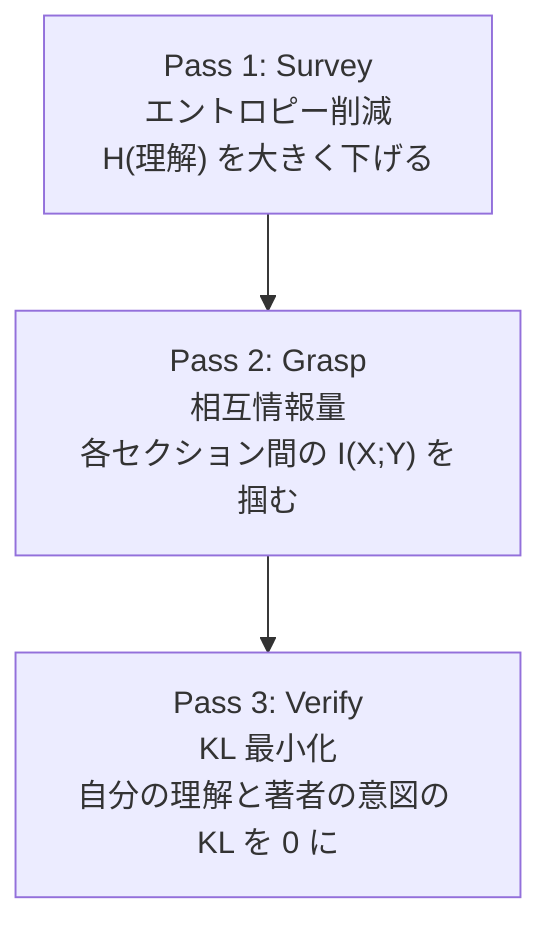
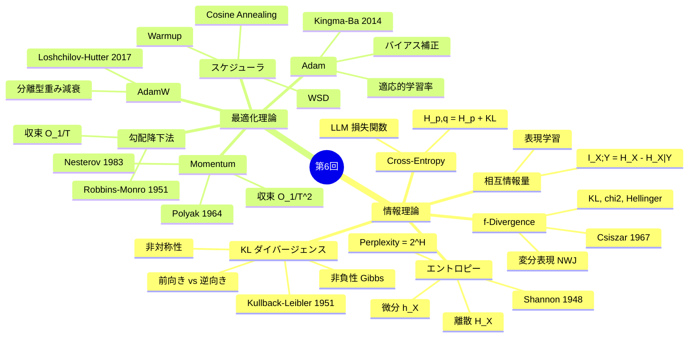
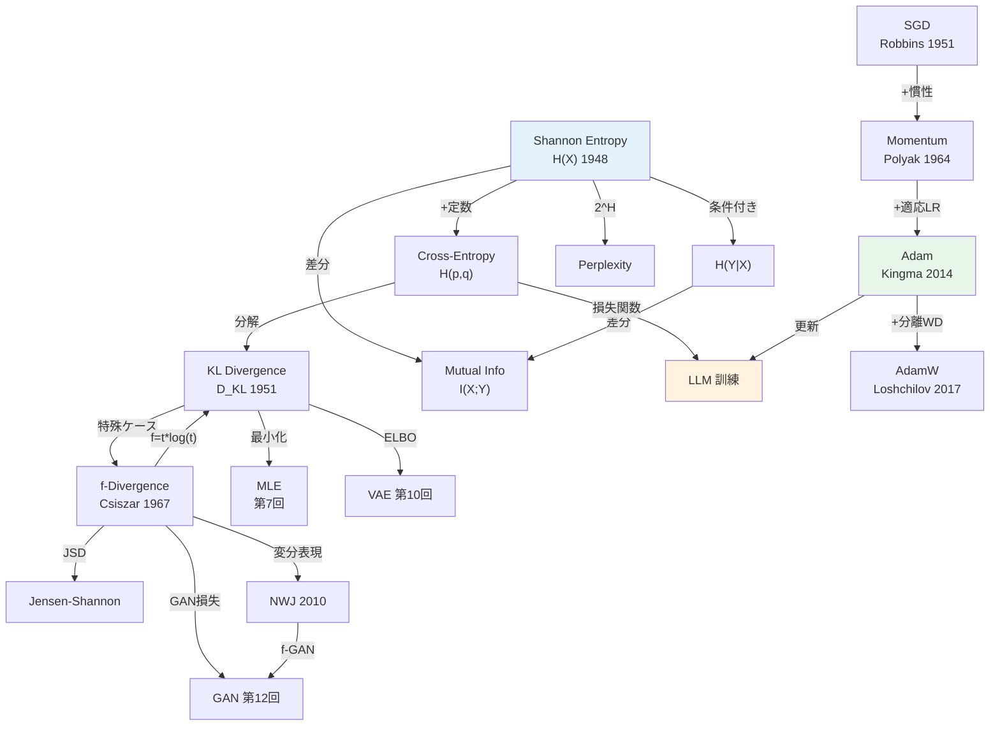

> **Note:** **📘 本記事は後編（実装編）です**: [前編（理論編）はこちら](/articles/ml-lecture-06-part1)

---

## 💻 Z5. 試練（60分）— 数式をコードに翻訳する技術

### Z5.1 環境構築

```bash
pip install numpy matplotlib
```

本講義は Python 90% で進む。NumPy のみで全て実装する。比較（PyTorch 等）は折り畳みで補足する。

### Z5.2 情報理論ライブラリのスクラッチ実装

Z4 で導出した全ての情報量を、1つのモジュールとして実装する。

```math
H(p)=-\\sum_i p_i\\log p_i

H(p,q)=-\\sum_i p_i\\log q_i

D_\\mathrm{KL}(p\\|q)=\\sum_i p_i\\log\\frac{p_i}{q_i}

H(p,q)=H(p)+D_\\mathrm{KL}(p\\|q)
```

```python
import numpy as np

def entropy(p: np.ndarray) -> float:
    p = np.asarray(p, dtype=np.float64)
    p = p[p > 0]
    return float(-np.sum(p * np.log(p)))

def cross_entropy(p: np.ndarray, q: np.ndarray) -> float:
    p = np.asarray(p, dtype=np.float64)
    q = np.asarray(q, dtype=np.float64)
    mask = p > 0
    return float(-np.sum(p[mask] * np.log(q[mask])))

def kl_divergence(p: np.ndarray, q: np.ndarray) -> float:
    p = np.asarray(p, dtype=np.float64)
    q = np.asarray(q, dtype=np.float64)
    mask = (p > 0) & (q > 0)
    return float(np.sum(p[mask] * np.log(p[mask] / q[mask])))

p = np.array([0.4, 0.3, 0.2, 0.1])
q = np.array([0.25, 0.25, 0.25, 0.25])

H = entropy(p)
CE = cross_entropy(p, q)
KL = kl_divergence(p, q)

print(f"H(p)={H:.6f}  CE={CE:.6f}  KL={KL:.6f}")
assert np.isclose(H + KL, CE)
assert kl_divergence(p, p) >= -1e-12
```

**相互情報量 — 独立性の定量化**

```math
I(X;Y) = D_{KL}(p(x,y) \| p(x)p(y)) = H(X) + H(Y) - H(X,Y)
```

記号↔変数: 同時分布 `$p(x,y)$` = `joint`, 周辺分布 `$p(x)$` = `px = joint.sum(axis=1)`, `$H(X,Y)$` = `entropy(joint.ravel())`。

**shape**: `joint` は `(|X|, |Y|)` の確率行列（総和=1）。`px` は `(|X|,)`, `py` は `(|Y|,)`。

```python
def mutual_information(joint: np.ndarray) -> float:
    """
    I(X;Y) = H(X) + H(Y) - H(X,Y)
    joint: (|X|, |Y|) joint distribution, sums to 1
    """
    px = joint.sum(axis=1)  # shape: (|X|,)
    py = joint.sum(axis=0)  # shape: (|Y|,)
    # H(X) = -sum px * log px
    Hx = entropy(px)
    Hy = entropy(py)
    Hxy = entropy(joint.ravel())  # H(X,Y)
    return float(Hx + Hy - Hxy)

# 検算1: 独立分布では I(X;Y) = 0
joint_indep = np.outer([0.5, 0.5], [0.3, 0.7])  # p(x)p(y)
mi_indep = mutual_information(joint_indep)
print(f"I(X;Y) independent: {mi_indep:.8f}")  # ≈ 0
assert abs(mi_indep) < 1e-10

# 検算2: 完全相関では I(X;Y) = H(X)
joint_corr = np.array([[0.5, 0.0], [0.0, 0.5]])  # X = Y
mi_corr = mutual_information(joint_corr)
px = joint_corr.sum(axis=1)
print(f"I(X;Y) perfect corr: {mi_corr:.6f}, H(X): {entropy(px):.6f}")  # must match
assert np.isclose(mi_corr, entropy(px))
```

落とし穴: `joint.ravel()` で `H(X,Y)` を計算する際、`joint` の要素が 0 でも `entropy()` の `+ eps` が機能していることを確認せよ。行列が疎な場合（0 成分が多い）は log(0) が出やすい。

### Z5.3 最適化アルゴリズムの統一実装

SGD、Momentum、Adam、AdamW を統一インターフェースで実装する。

```math
g_t=\\nabla_\\theta L(\\theta_t)

m_t=\\beta_1 m_{t-1}+(1-\\beta_1)g_t
\\quad
v_t=\\beta_2 v_{t-1}+(1-\\beta_2)g_t^2

\\hat m_t=\\frac{m_t}{1-\\beta_1^t}
\\quad
\\hat v_t=\\frac{v_t}{1-\\beta_2^t}

\\theta_{t+1}=\\theta_t-\\eta\\,\\frac{\\hat m_t}{\\sqrt{\\hat v_t}+\\epsilon}
```

```python
import numpy as np

def adam_step(theta: np.ndarray, g: np.ndarray, state: dict, lr: float = 1e-3,
              beta1: float = 0.9, beta2: float = 0.999, eps: float = 1e-8) -> tuple[np.ndarray, dict]:
    t = state.get('t', 0) + 1
    m = state.get('m', np.zeros_like(theta))
    v = state.get('v', np.zeros_like(theta))

    m = beta1 * m + (1 - beta1) * g
    v = beta2 * v + (1 - beta2) * (g * g)

    m_hat = m / (1 - beta1**t)
    v_hat = v / (1 - beta2**t)
    theta = theta - lr * m_hat / (np.sqrt(v_hat) + eps)

    return theta, {'t': t, 'm': m, 'v': v}

theta = np.zeros(3)
state = {}
g = np.array([1.0, -2.0, 0.5])  # pretend gradient
theta2, state = adam_step(theta, g, state, lr=1e-2)
print('adam step:', theta2)
```

**AdamW — 重み減衰の分離**

Adam の有名な落とし穴: `$L_2$` 正則化（`weight_decay`）を勾配に乗せると適応学習率によって正則化が不均一になる。AdamW はこれを修正する。

```math
\text{Adam + L2:} \quad g_t \leftarrow g_t + \lambda \theta_t \quad\text{（学習率に依存する正則化）}
```

```math
\text{AdamW:} \quad \theta_{t+1} = \theta_t - \eta\,\frac{\hat{m}_t}{\sqrt{\hat{v}_t}+\epsilon} - \eta \lambda \theta_t \quad\text{（学習率に比例する正則化）}
```

記号↔変数: `$\lambda$` = `weight_decay`, `$\theta$` = `theta`, 第2項が pure weight decay。

**shape**: 全ベクトルは `(d,)` — Adam step と同じ。AdamW の差分は最後の `-lr * wd * theta` の1行だけ。

```python
def adamw_step(theta: np.ndarray, g: np.ndarray, state: dict,
               lr: float = 1e-3, beta1: float = 0.9, beta2: float = 0.999,
               eps: float = 1e-8, weight_decay: float = 1e-2) -> tuple[np.ndarray, dict]:
    # weight decay BEFORE gradient accumulation (decoupled)
    theta = theta * (1.0 - lr * weight_decay)  # pure weight decay term
    t = state.get('t', 0) + 1
    m = state.get('m', np.zeros_like(theta))
    v = state.get('v', np.zeros_like(theta))
    m = beta1 * m + (1 - beta1) * g          # g has NO weight decay added
    v = beta2 * v + (1 - beta2) * (g * g)
    mh = m / (1 - beta1**t)
    vh = v / (1 - beta2**t)
    theta = theta - lr * mh / (np.sqrt(vh) + eps)
    return theta, {'t': t, 'm': m, 'v': v}

# 検算: weight_decay=0 の場合は adam と等価
theta = np.zeros(3); state = {}
g = np.array([1.0, -2.0, 0.5])
theta_wd0, _ = adamw_step(theta.copy(), g, {}, weight_decay=0.0)
theta_adam2, _ = adam_step(theta.copy(), g, {}, lr=1e-3)
assert np.allclose(theta_wd0, theta_adam2), "AdamW with wd=0 should match Adam"
print("AdamW wd=0 matches Adam ✓")
```

落とし穴: PyTorch の `AdamW` は `weight_decay` のデフォルトが 0。LLM 訓練では通常 `0.1` を設定する。忘れると正則化なしで訓練し、汎化性能が下がる。

### Z5.4 数式→コード翻訳パターン（7パターン）

| # | 数式パターン | Python パターン | 例 |
|:--|:-----------|:--------------|:---|
| 1 | `$\sum_{x} p(x) f(x)$` | `np.sum(p * f(x))` | エントロピー |
| 2 | `$\log \frac{a}{b}$` | `np.log(a / b)` or `np.log(a) - np.log(b)` | KL |
| 3 | `$\mathbb{E}_{x \sim p}[f(x)]$` | `np.mean(f(samples))` | Monte Carlo 推定 |
| 4 | `$\frac{\partial}{\partial \theta} f$` | 数値微分: `(f(θ+ε) - f(θ-ε))/(2ε)` | 勾配検証 |
| 5 | `$\beta v + (1-\beta) g$` | `v = beta * v + (1-beta) * g` | 指数移動平均 |
| 6 | `$\frac{m}{1 - \beta^t}$` | `m / (1 - beta**t)` | バイアス補正 |
| 7 | `$\frac{a}{\sqrt{b} + \epsilon}$` | `a / (np.sqrt(b) + eps)` | Adam 更新 |

<details><summary>PyTorch との対応</summary>

本実装のコードと PyTorch の対応:

| 本実装 | PyTorch | 備考 |
|:-------|:--------|:-----|
| `entropy(p)` | `torch.distributions.Categorical(probs).entropy()` | nats ではなく bits の場合は `/math.log(2)` |
| `kl_divergence(p, q)` | `torch.nn.functional.kl_div(q.log(), p, reduction='sum')` | 引数順注意: `kl_div(input, target)` |
| `mutual_information(joint)` | 手実装が必要（PyTorch 標準なし） | `torchinfo` や `dit` ライブラリを使うことも |
| `adam_step(...)` | `torch.optim.Adam(params, lr=1e-3)` | 内部実装はほぼ同じ; `amsgrad` オプションあり |
| `adamw_step(...)` | `torch.optim.AdamW(params, lr=1e-3, weight_decay=0.01)` | PyTorch 1.14 以降は `fused=True` で高速化 |
| `clip_grad_norm(g, 1.0)` | `torch.nn.utils.clip_grad_norm_(params, max_norm=1.0)` | in-place 操作 |

</details>

### Z5.5 最適化ランドスケープの可視化

二次損失関数 `$L(\theta_1, \theta_2) = \theta_1^2 + 100\theta_2^2$`（条件数 = 100）のランドスケープを可視化し、SGD vs Adam の収束経路を比較する。

```math
L(\theta) = \theta_1^2 + \kappa\,\theta_2^2, \qquad \kappa = \frac{\lambda_{\max}}{\lambda_{\min}} = 100
```

記号↔変数: `$\theta_1$` = `theta1`, `$\theta_2$` = `theta2`, `$\kappa$` = `kappa`, 学習率 `$\eta$` = `lr`

**shape**: `theta` は `(2,)` のベクトル。`grad` も同じ shape。

```python
import numpy as np

def loss(theta: np.ndarray, kappa: float = 100.0) -> float:
    return float(theta[0]**2 + kappa * theta[1]**2)

def grad_loss(theta: np.ndarray, kappa: float = 100.0) -> np.ndarray:
    # grad shape: (2,) — same as theta
    return np.array([2 * theta[0], 2 * kappa * theta[1]])

# SGD trajectory
theta_sgd = np.array([1.0, 1.0])
lr_sgd = 0.009  # must be < 1/kappa = 0.01
history_sgd = [theta_sgd.copy()]
for _ in range(100):
    theta_sgd = theta_sgd - lr_sgd * grad_loss(theta_sgd)
    history_sgd.append(theta_sgd.copy())

# Adam trajectory
theta_adam = np.array([1.0, 1.0])
m, v, t = np.zeros(2), np.zeros(2), 0
history_adam = [theta_adam.copy()]
for _ in range(100):
    t += 1
    g = grad_loss(theta_adam)
    m = 0.9 * m + 0.1 * g
    v = 0.999 * v + 0.001 * g**2
    mh = m / (1 - 0.9**t)
    vh = v / (1 - 0.999**t)
    theta_adam = theta_adam - 0.1 * mh / (np.sqrt(vh) + 1e-8)
    history_adam.append(theta_adam.copy())

print(f"SGD final loss:  {loss(np.array(history_sgd[-1])):.6f}")
print(f"Adam final loss: {loss(np.array(history_adam[-1])):.6f}")
# assert Adam converges faster
assert loss(np.array(history_adam[-1])) < loss(np.array(history_sgd[-1]))
```

検算: 条件数 = 100 の問題では、SGD が最適学習率 `$\eta < 1/100$` で収束するが遅い。Adam は各方向に独立な学習率で `$\theta_2$` 方向も速く収束する。

### Z5.6 Python の遅さを体感する — `%timeit` の衝撃

ここで不穏な計測を行う。

```python
import time
import numpy as np

# 10,000 パラメータの SGD — Python ループ版 vs NumPy 版
d = 10_000
theta = np.random.randn(d)
grad = np.random.randn(d)
lr = 0.01
n_steps = 1000

# Python ループ (故意に遅い実装)
start = time.perf_counter()
for _ in range(n_steps):
    for i in range(d):
        theta[i] -= lr * grad[i]  # 要素ごとのループ
elapsed_python = time.perf_counter() - start

# NumPy ベクトル演算
theta2 = np.random.randn(d)
start = time.perf_counter()
for _ in range(n_steps):
    theta2 -= lr * grad  # ベクトル演算
elapsed_numpy = time.perf_counter() - start

print(f"Python loop: {elapsed_python:.3f}s")
print(f"NumPy:       {elapsed_numpy:.4f}s")
print(f"Speedup:     {elapsed_python / elapsed_numpy:.0f}x")
# 典型的な出力: Python = 3-10s, NumPy = 0.01-0.05s, Speedup = 100-500x
```

この差 100-500x を見て「NumPy でいいじゃないか」と思うかもしれない。だが実際のモデルは:
- GPT-3: 1,750 億パラメータ（`$d = 1.75 \times 10^{11}$`）
- 1ステップの行列積: `$O(d^2)$`

NumPy でさえ100億パラメータは無理だ。GPU + CUDA が必要になる理由がここにある。

> **⚠️ Warning:** ここで `%timeit` の結果を観察してほしい。10,000パラメータの SGD ループが Python でどれだけ遅いか。実際のモデルは数百万〜数十億パラメータだ。この「遅さ」は第7回で MLE の反復計算で増幅し、第8回の EM 算法で「**遅すぎない？**」という問いが確信に変わる。第9回で Julia が登場する伏線がここにある。

### Z5.7 勾配クリッピングと数値安定性

実際の訓練では勾配が爆発する問題に対処する必要がある。


**勾配クリッピングの数式**:

```math
g \leftarrow \min\left(1, \frac{\tau}{\|g\|}\right) g, \quad \|g\| = \sqrt{\sum_i g_i^2}
```

記号↔変数: `$g$` = `grad`（勾配ベクトル）, `$\tau$` = `max_norm`（閾値）, `$\|g\|$` = `norm = np.linalg.norm(grad)`。クリップ係数 `$\min(1, \tau/\|g\|)$` は `$\|g\| \leq \tau$` なら 1（無変化）、超えたときのみ縮小。

```python
def clip_grad_norm(grad: np.ndarray, max_norm: float = 1.0) -> np.ndarray:
    # grad shape: (d,) — any 1D gradient vector
    norm = float(np.linalg.norm(grad))
    if norm > max_norm:
        grad = grad * (max_norm / norm)  # scale down
    return grad

# 検算: ノルム 10 のベクトルを max_norm=1 でクリップ
g = np.array([6.0, 8.0])  # ||g|| = 10
g_clipped = clip_grad_norm(g, max_norm=1.0)
print(f"Before: ||g||={np.linalg.norm(g):.1f}")
print(f"After:  ||g||={np.linalg.norm(g_clipped):.1f}")  # should be 1.0
assert np.isclose(np.linalg.norm(g_clipped), 1.0)
```

**勾配爆発の原因**: 深いネットワークでは逆伝播中に勾配が乗算されていく。各層の勾配が1より大きいと指数的に増大（爆発）、1より小さいと指数的に減少（消失）する。クリッピングは爆発を防ぐ対症療法であり、消失には別の対策（残差接続、正規化）が必要。

**混合精度訓練の概要（fp16/bf16/fp8）**:

| 精度 | ビット数 | 範囲 | 用途 |
|:-----|:---------|:-----|:-----|
| fp32 | 32 | `$\pm 3.4 \times 10^{38}$` | パラメータ保存（マスターコピー） |
| fp16 | 16 | `$\pm 65504$` | 順伝播・逆伝播の高速化 |
| bf16 | 16 | `$\pm 3.4 \times 10^{38}$` | fp32同様の範囲、精度は低い |
| fp8 | 8 | 限定 | Transformer Engine (H100+) |

混合精度訓練は fp32 でパラメータのマスターコピーを保持しつつ、順伝播と逆伝播を fp16/bf16 で行う。計算速度が2-3倍になり、メモリ使用量が半減する。Loss scaling（損失に大きな定数を掛けてから逆伝播し、勾配更新時に戻す）で fp16 のアンダーフロー問題を回避する。

### Z5.8 ラグランジュ乗数法 — 制約付き最適化

機械学習で頻出する制約付き最適化の基本を押さえる。

**問題設定**: `$g(\theta) = 0$` の制約下で `$f(\theta)$` を最小化する。

```math
\min_\theta f(\theta) \quad \text{s.t.} \quad g(\theta) = 0
```

**ラグランジアン**:

```math
\mathcal{L}(\theta, \lambda) = f(\theta) + \lambda g(\theta)
```

**最適性条件（KKT条件の等式制約版）**:

```math
\nabla_\theta \mathcal{L} = 0, \quad \nabla_\lambda \mathcal{L} = 0
```


この最大エントロピー原理は統計物理の Boltzmann 分布と同一であり、第27回（EBM）で再登場する。制約なしの最大エントロピー = 一様分布、平均の制約つき = 指数分布族。**情報理論と統計物理は同じ数学で繋がっている**。

**数値実装: 最大エントロピー分布の検証**

2点分布 `$p = (p_1, 1-p_1)$` の最大エントロピー問題 (`$\sum p_i = 1$`) を解くと、解析解は `$p_1 = p_2 = 0.5$` （一様分布）。数値最適化で確認:

```math
\max_{p} H(p) = -\sum_{i=1}^{n} p_i \log p_i \quad \text{s.t.} \quad \sum_{i=1}^n p_i = 1
```

記号↔変数: `$p_i$` = `p[i]`, ラグランジュ乗数 `$\lambda$` = `lambda_` (予約語回避), 目的関数は最小化なので符号反転。

```python
import numpy as np
from scipy.optimize import minimize

def neg_entropy(p: np.ndarray) -> float:
    # minimize -H(p), i.e., maximize H(p)
    p = np.clip(p, 1e-12, None)
    return float(np.sum(p * np.log(p)))  # -H(p)

def neg_entropy_grad(p: np.ndarray) -> np.ndarray:
    return np.log(np.clip(p, 1e-12, None)) + 1.0  # d(-H)/dp_i = log(p_i) + 1

n = 4
p0 = np.random.dirichlet(np.ones(n))  # feasible starting point
constraint = {'type': 'eq', 'fun': lambda p: p.sum() - 1.0,
               'jac': lambda p: np.ones(n)}

result = minimize(neg_entropy, p0, jac=neg_entropy_grad,
                  constraints=[constraint],
                  bounds=[(0, 1)] * n, method='SLSQP')

print(f"最大エントロピー分布: {result.x.round(4)}")
print(f"エントロピー値: {-result.fun:.6f}")
print(f"理論値 log({n}): {np.log(n):.6f}")
assert np.allclose(result.x, 1/n, atol=1e-5), "最大エントロピー = 一様分布 ✓"
```

落とし穴: `scipy.optimize.minimize` の `SLSQP` は等式制約を扱える。`jacobian` を提供しないと数値微分になり遅い。上の実装は解析的ヤコビアンを使用。

### Z5.9 論文読解の情報理論的視点

情報理論の道具を使って論文を読む際の視点を整理する。

**3パスリーディング（情報理論版）**:



| パス | 目的 | 所要時間 | 読む箇所 |
|:-----|:-----|:---------|:---------|
| 1 | 全体像の把握（エントロピー大幅削減） | 10分 | Title, Abstract, Conclusion, Figures |
| 2 | 構造の理解（セクション間の依存関係） | 30分 | Method, Results, key equations |
| 3 | 詳細の検証（自分の理解の KL → 0） | 60分 | 全ページ、式の導出追跡 |

**実践例: "Adam" 論文の情報理論的読み方**

Kingma & Ba (2014) [^4] を3パスで読む。

- **Pass 1 (10分)**: Abstract から「適応学習率」「バイアス補正」「収束証明」の3キーワードを抽出。理解のエントロピーが下がる。
- **Pass 2 (30分)**: Algorithm 1（更新則）と Theorem 1（収束保証）に集中。数式の構造（`$m_t, v_t, \hat{m}_t, \hat{v}_t, \theta_t$`）を追う。
- **Pass 3 (60分)**: バイアス補正の導出（Section 2）を全て手で追う。`$\mathbb{E}[m_t] = (1-\beta_1^t) \cdot g$` の証明を自分で再現。

**情報理論視点の注目ポイント**: Adam の学習率 `$\eta/(\sqrt{\hat{v}_t}+\epsilon)$` は Fisher 情報行列の対角近似 `$\mathcal{I}(\theta)^{-1/2}$` として解釈できる（Part1 Z4 参照）。論文にこの記述はないが、Amari の自然勾配 [^13] との接続は理解に深みを与える。


### Z5.9b Rate-Distortion と β-VAE の接続演習

Part1 で扱った Rate-Distortion の理論 `$R(D) = \min_{q(z|x): \mathbb{E}[d(x,z)] \leq D} I(X;Z)$` が、β-VAE の目的関数に直接登場する。

```math
\mathcal{L}_{\beta\text{-VAE}} = \mathbb{E}_{q_\phi(z|x)}[\log p_\theta(x|z)] - \beta D_{KL}(q_\phi(z|x) \| p(z))
```

`$\beta > 1$` の場合: KL 項を強く罰して `$I(X;Z)$` を最小化 → **表現の圧縮**を強制。
`$\beta = 1$` の場合: 標準 VAE（第10回）。

**演習問題**:

1. `$\beta \to \infty$` のとき、エンコーダ `$q_\phi(z|x)$` はどうなるか？（ヒント: `$D_{KL}(q \| p) = 0$` が成り立つとき `$q = p$`）
2. `$\beta = 0$` のとき、目的関数はどうなるか？（ヒント: 再構成誤差のみ）
3. Rate-Distortion の `$D$` は β-VAE のどの項に対応するか？

<details><summary>解答</summary>

1. `$\beta \to \infty$`: エンコーダは prior `$p(z) = \mathcal{N}(0,I)$` に一致し、`$q_\phi(z|x)$` が `$x$` に依存しなくなる。潜在変数は完全に圧縮され、再構成は不可能。情報が全て捨てられた状態。
2. `$\beta = 0$`: KL 項なし、再構成誤差のみ最大化。エンコーダとデコーダは単なる Autoencoder になる。潜在空間には構造が生まれない。
3. `$D$` は再構成誤差 `$\mathbb{E}[\|x - \hat{x}\|^2]$` に対応。`$\beta$` は Rate-Distortion の Lagrange 乗数 `$\lambda$` に対応。`$\beta$` を増やすことは「より少ない情報（Rate）で符号化せよ」という制約を強くすることと同値。

</details>

### Z5.10 Gaussian KL 閉形式の数値検証

Z4（前編）で導出した Gaussian KL の閉形式を数値的に確認する。

**対応する数式**:

```math
D_{KL}(\mathcal{N}(\mu_1, \sigma_1^2) \| \mathcal{N}(\mu_2, \sigma_2^2)) = \log\frac{\sigma_2}{\sigma_1} + \frac{\sigma_1^2 + (\mu_1-\mu_2)^2}{2\sigma_2^2} - \frac{1}{2}
```

記号↔変数: `$\mu_1$` = `mu1`, `$\mu_2$` = `mu2`, `$\sigma_1$` = `sigma1`, `$\sigma_2$` = `sigma2`

**shape**: スカラー（1変量ガウス）。多変量への拡張: `$\sigma^2$` → `$\Sigma$`（共分散行列）。

**落とし穴**: `$\sigma = 0$` のとき `$\log(0) = -\infty$` で発散。VAE の実装では `$\log\sigma^2$` を直接パラメータ化して数値安定化する（`sigma2 = exp(log_var)`）。

```python
import numpy as np

def kl_gaussian_closed(mu1: float, sigma1: float,
                        mu2: float, sigma2: float) -> float:
    # Closed-form KL(N(mu1, sigma1^2) || N(mu2, sigma2^2))
    # shape: scalar
    return (np.log(sigma2 / sigma1)
            + (sigma1**2 + (mu1 - mu2)**2) / (2 * sigma2**2)
            - 0.5)

def kl_gaussian_mc(mu1: float, sigma1: float,
                   mu2: float, sigma2: float, n: int = 100_000) -> float:
    # Monte Carlo approximation for verification
    # shape: (n,) samples
    x = np.random.normal(mu1, sigma1, n)
    log_p = -0.5 * ((x - mu1) / sigma1)**2 - np.log(sigma1)
    log_q = -0.5 * ((x - mu2) / sigma2)**2 - np.log(sigma2)
    return float(np.mean(log_p - log_q))

np.random.seed(42)
mu1, sigma1 = 1.0, 2.0
mu2, sigma2 = 0.0, 1.0
closed = kl_gaussian_closed(mu1, sigma1, mu2, sigma2)
mc     = kl_gaussian_mc(mu1, sigma1, mu2, sigma2)
print(f"Closed-form: {closed:.4f}")
print(f"Monte Carlo: {mc:.4f}")
# Must be non-negative and close to each other
assert closed >= 0
assert abs(closed - mc) < 0.05, f"Mismatch: {closed:.4f} vs {mc:.4f}"
```

**VAE の KL 正則化項**: `$\mu_2 = 0, \sigma_2 = 1$`（標準正規事前分布）の特殊ケース:

```math
D_{KL}(\mathcal{N}(\mu, \sigma^2) \| \mathcal{N}(0, 1)) = \frac{\mu^2 + \sigma^2 - 1 - \log\sigma^2}{2}
```

これが VAE の ELBO 損失の正則化項として直接使われる（第9回）。

### Z5 Quick Check

**チェック 1**: Gaussian KL `$D_{KL}(\mathcal{N}(1,4) \| \mathcal{N}(0,1))$` の値を手計算せよ。

<details><summary>答え</summary>

`$\mu_1=1, \sigma_1=2, \mu_2=0, \sigma_2=1$` を公式に代入:

```math
D_{KL} = \log\frac{1}{2} + \frac{4 + 1}{2 \cdot 1} - \frac{1}{2} = -\log 2 + 2.5 - 0.5 = 2 - \log 2 \approx 1.307
```

コードで確認: `kl_gaussian_closed(1.0, 2.0, 0.0, 1.0)` → `1.3068...`（`$2 - \ln 2 = 1.3069$`）✅
</details>

**チェック 2**: Adam のバイアス補正を省略したとき、学習初期（`$t=1$`）の更新ステップにどんな影響があるか？

<details><summary>答え</summary>

`$t=1$` では `$m_1 = (1-\beta_1)g_1$`, `$v_1 = (1-\beta_2)g_1^2$`。補正なしの更新量:

```math
\frac{m_1}{\sqrt{v_1} + \epsilon} = \frac{(1-\beta_1)g_1}{\sqrt{(1-\beta_2)g_1^2} + \epsilon} \approx \frac{1-\beta_1}{\sqrt{1-\beta_2}} \cdot \text{sign}(g_1)
```

`$\beta_1=0.9, \beta_2=0.999$` では `$(1-0.9)/\sqrt{1-0.999} \approx 0.1/0.0316 \approx 3.16$`。補正後（= 1.0 に近い符号ベース更新）と比較して、**補正なしでは学習初期に約3倍大きなステップ**になる。これが学習不安定の原因。
</details>

**チェック 3**: β-VAE の損失関数 `$\mathcal{L}_{\beta} = \mathbb{E}[\log p(x|z)] - \beta D_{KL}(q||p)$` において、`$\beta = 1$` と `$\beta = 10$` で何が変わるか？Rate-Distortion の観点で答えよ。

<details><summary>答え</summary>

`$\beta$` は Rate-Distortion の Lagrange 乗数（Part1 Z4 参照）。

- `$\beta = 1$`: 標準 VAE。再構成精度と情報圧縮のトレードオフが均等。
- `$\beta = 10$`: KL 項を 10 倍罰する。潜在変数 `$z$` が持てる情報量 `$I(X;Z)$` が激減 → 潜在空間がより「整理された」構造を持つ（解きほぐし表現）が、再構成精度は下がる。

Rate-Distortion 曲線上の動き: `$\beta$` を増やすと Rate `$= I(X;Z)$` が下がり、Distortion `$= \mathbb{E}[\|x - \hat{x}\|^2]$` が上がる。`$\beta$` は曲線上の動作点を制御するハイパーパラメータ。
</details>


### Z5.11 Softmax + 最大エントロピー + Temperature の三位一体

Softmax は「温度 `$T$` 付き最大エントロピー分布」の解として導出できる。Part1 Z4 で証明した結論を数値で確認する。

制約: `$\mathbb{E}[x] = \mu$`（期待値固定）の下で `$H(p)$` を最大化すると解は指数族。ロジットを `$z_i$`、温度を `$T$` とすれば:

```math
p_i(T) = \frac{\exp(z_i / T)}{\sum_j \exp(z_j / T)}
```

`$T \to \infty$`（高温）: 一様分布、`$H \to \log n$`（最大）。`$T \to 0$`（低温）: 最大ロジットに確率集中、`$H \to 0$`。

記号↔変数: `$z_i$` = `logits[i]`, `$T$` = `temperature`, `$p_i$` = `probs[i]`。

```python
def softmax_with_temperature(logits: np.ndarray, temperature: float = 1.0) -> np.ndarray:
    # Numerically stable: subtract max before exp
    z = (logits - logits.max()) / temperature  # shape: (n,)
    e = np.exp(z)
    return e / e.sum()

logits = np.array([2.0, 1.0, 0.5, 0.1])
for T in [0.1, 0.5, 1.0, 2.0, 10.0]:
    p = softmax_with_temperature(logits, T)
    H = -np.sum(p * np.log(p + 1e-12))
    print(f"T={T:4.1f}: max_p={p.max():.3f}, H={H:.4f}")
# T=0.1: almost deterministic, H ≈ 0
# T=10:  almost uniform, H ≈ log(4) ≈ 1.386
```

数値安定性: `logits.max()` を引いても `$\text{softmax}$` の値は変わらない（分子・分母を同じ定数で割ることと同じ）。この「引き算」を忘れると `exp(100)` でオーバーフロー。

**チェック 4**: Temperature `$T = 0.01$` の Softmax の出力 `$p$` を `logits = [2, 1, 0, -1]` で計算し、Shannon エントロピー `$H(p)$` を求めよ。

<details><summary>答え</summary>

`$T = 0.01$` は極低温。`logits / T = [200, 100, 0, -100]`。Softmax の分子比は `$\exp(0) : \exp(-100) : \exp(-200) : \exp(-300) \approx 1 : 0 : 0 : 0$`（減算後）。

結果: `$p \approx (1, 0, 0, 0)$`（最大ロジットに確率 1 集中）、`$H(p) \approx 0$`。

```python
logits = np.array([2.0, 1.0, 0.0, -1.0])
p = softmax_with_temperature(logits, T=0.01)
H = -np.sum(p * np.log(p + 1e-12))
print(f"p={p.round(4)}, H={H:.6f}")  # H ≈ 0
```
</details>

> **Note:** **進捗: 70% 完了** 情報理論ライブラリと最適化アルゴリズムをスクラッチ実装し、数式→コード翻訳パターンを習得した。Python の遅さも体感した。

---

## 🔬 Z5b. 実験ゾーン（30分）— 自己診断テスト

### Z5b.1 記号読解テスト

以下の記号・数式を声に出して読み、意味を説明せよ。

<details><summary>Q1: `$H(X) = -\sum_{x} p(x) \log p(x)$`</summary>
**読み方**: エイチ エックス イコール マイナス シグマ エックス ピー エックス ログ ピー エックス

**意味**: 確率変数 `$X$` の Shannon エントロピー。不確実性の定量化。`$p(x)$` が一様分布のとき最大、確定的のとき 0。Shannon (1948) [^1] が情報理論の基礎として定義。
</details>

<details><summary>Q2: `$D_\text{KL}(p \| q) = \mathbb{E}_{p}\left[\log \frac{p(x)}{q(x)}\right]$`</summary>
**読み方**: ディー ケーエル ピー パラレル キュー イコール イー サブ ピー ログ ピー オーバー キュー

**意味**: `$p$` から `$q$` への KL ダイバージェンス。`$p$` で生成したデータを `$q$` で符号化したときの余分な情報量。非対称（`$D_\text{KL}(p\|q) \neq D_\text{KL}(q\|p)$`）。Kullback & Leibler (1951) [^2]。
</details>

<details><summary>Q3: `$H(p, q) = H(p) + D_\text{KL}(p \| q)$`</summary>
**読み方**: エイチ ピー キュー イコール エイチ ピー プラス ディー ケーエル ピー パラレル キュー

**意味**: Cross-Entropy の分解定理。Cross-Entropy = データ自体のエントロピー + モデルの不完全性。LLM 訓練で Cross-Entropy を最小化することは KL を最小化することと等価。
</details>

<details><summary>Q4: `$I(X; Y) = H(X) - H(X \mid Y)$`</summary>
**読み方**: アイ エックス セミコロン ワイ イコール エイチ エックス マイナス エイチ エックス バー ワイ

**意味**: `$X$` と `$Y$` の相互情報量。`$Y$` を知ることで `$X$` の不確実性がどれだけ減るか。表現学習で入力と潜在表現の依存関係を測る。
</details>

<details><summary>Q5: `$\theta_{t+1} = \theta_t - \eta \nabla_\theta \mathcal{L}(\theta_t)$`</summary>
**読み方**: シータ ティー プラス ワン イコール シータ ティー マイナス イータ ナブラ シータ エル シータ ティー

**意味**: 勾配降下法の更新則。学習率 `$\eta$` で勾配方向にパラメータを更新。Robbins & Monro (1951) [^3] に遡る。
</details>

<details><summary>Q6: `$\hat{m}_t = \frac{m_t}{1 - \beta_1^t}$`</summary>
**読み方**: エム ハット ティー イコール エム ティー オーバー ワン マイナス ベータ ワン ノ ティー乗

**意味**: Adam のバイアス補正。初期化 `$m_0 = 0$` からのバイアスを `$1 - \beta_1^t$` で補正。`$t$` が大きくなると補正量は減少。Kingma & Ba (2014) [^4]。
</details>

<details><summary>Q7: `$D_f(p \| q) = \sum_x q(x) f\left(\frac{p(x)}{q(x)}\right)$`</summary>
**読み方**: ディー エフ ピー パラレル キュー イコール シグマ キュー エックス エフ ピー オーバー キュー

**意味**: f-Divergence。生成関数 `$f$` を変えることで KL、`$\chi^2$`、Hellinger、TV、JS などを統一的に表現。Csiszar (1967) [^6]。
</details>

<details><summary>Q8: `$\text{PPL} = 2^{H(p, q)}$`（ただし `$H$` は bits）</summary>
**読み方**: パープレキシティ イコール ニ ノ エイチ ピー キュー 乗

**意味**: Perplexity。モデルが各時点で平均何個の選択肢に迷っているか。`$H(p, q)$` が小さいほど PPL が低く、よい予測。LLM 評価の標準指標。
</details>

<details><summary>Q9: `$v_{t+1} = \beta v_t + \nabla_\theta \mathcal{L}(\theta_t)$`</summary>
**読み方**: ブイ ティー プラス ワン イコール ベータ ブイ ティー プラス ナブラ シータ エル シータ ティー

**意味**: Momentum の速度更新。過去の勾配の指数移動平均。`$\beta = 0.9$` なら過去10ステップの勾配が影響。Polyak (1964) [^8]。
</details>

<details><summary>Q10: `$\eta_t = \eta_\text{min} + \frac{1}{2}(\eta_\text{max} - \eta_\text{min})(1 + \cos(\pi t / T))$`</summary>
**読み方**: イータ ティー イコール イータ ミン プラス 二分の一 イータ マックス マイナス イータ ミン カッコ ワン プラス コサイン パイ ティー オーバー ティー

**意味**: Cosine Annealing 学習率スケジュール。コサイン曲線に沿って学習率を `$\eta_\text{max}$` から `$\eta_\text{min}$` に減衰。
</details>

### Z5b.2 LaTeX ライティングテスト

以下の数式を LaTeX で書け。

<details><summary>Q1: Shannon エントロピーの定義</summary>

```math
H(X) = -\sum_{x \in \mathcal{X}} p(x) \log p(x)
```
</details>

<details><summary>Q2: KL ダイバージェンスの非負性</summary>

```math
D_\text{KL}(p \| q) = \sum_x p(x) \log \frac{p(x)}{q(x)} \geq 0
```
</details>

<details><summary>Q3: Adam の更新則（バイアス補正込み）</summary>

</details>

<details><summary>Q4: Cross-Entropy の分解</summary>

```math
H(p, q) = H(p) + D_\text{KL}(p \| q)
```
</details>

<details><summary>Q5: f-Divergence の定義</summary>

```math
D_f(p \| q) = \sum_x q(x) f\left(\frac{p(x)}{q(x)}\right)
```
</details>

<details><summary>Q6: 相互情報量 (3つの等価な表現)</summary>

```math
I(X;Y) = H(X) - H(X|Y) = H(Y) - H(Y|X) = H(X) + H(Y) - H(X,Y)
```

```math
I(X;Y) = D_{KL}(p(x,y) \| p(x)p(y)) \geq 0
```
</details>

<details><summary>Q7: 自然勾配の更新則</summary>

```math
\theta_{t+1} = \theta_t - \eta \mathcal{I}(\theta_t)^{-1} \nabla_\theta \mathcal{L}(\theta_t)
```

ここで `$\mathcal{I}(\theta) = \mathbb{E}_{p_\theta(x)}\left[\nabla \log p_\theta \cdot (\nabla \log p_\theta)^\top\right]$` は Fisher 情報行列。
</details>

<details><summary>Q8: Rate-Distortion 関数の定義</summary>

```math
R(D) = \min_{q(z|x): \mathbb{E}_{p(x)}\mathbb{E}_{q(z|x)}[d(x,z)] \leq D} I(X;Z)
```
</details>

### Z5b.3 コード翻訳テスト

数式を Python に翻訳せよ。

<details><summary>Q1: 条件付きエントロピー `$H(Y \mid X) = -\sum_{x,y} p(x,y) \log p(y \mid x)$`</summary>

```python
# joint: (|X|, |Y|) matrix
def conditional_entropy(joint: np.ndarray) -> float:
    px = joint.sum(axis=1, keepdims=True)
    # p(y|x) = joint / px; avoid 0/0 with eps
    p_y_given_x = joint / (px + 1e-12)
    # H(Y|X) = -sum_{x,y} p(x,y) * log p(y|x)
    log_cond = np.log(p_y_given_x + 1e-12)
    return float(-np.sum(joint * log_cond))
```
検算: `H(Y|X) = H(X,Y) - H(X)` で確認。
</details>

<details><summary>Q2: Nesterov Momentum の更新</summary>

数式: `$v_{t+1} = \mu v_t - \eta \nabla f(\theta_t + \mu v_t)$`, `$\theta_{t+1} = \theta_t + v_{t+1}$`

```python
def nesterov_step(theta, v, grad_fn, lr=0.01, mu=0.9):
    # Evaluate gradient at lookahead position
    grad = grad_fn(theta + mu * v)
    v = mu * v - lr * grad
    theta = theta + v
    return theta, v
```
通常 Momentum との違い: 勾配評価点が `$\theta + \mu v$`（先読み）になる。
</details>

<details><summary>Q3: 相互情報量を KL として計算</summary>

数式: `$I(X;Y) = D_{KL}(p(x,y) \| p(x)p(y))$`

```python
def mi_via_kl(joint: np.ndarray) -> float:
    px = joint.sum(axis=1, keepdims=True)  # shape: (|X|, 1)
    py = joint.sum(axis=0, keepdims=True)  # shape: (1, |Y|)
    independent = px * py                  # outer product: p(x)p(y)
    # KL(joint || independent)
    mask = joint > 0
    return float(np.sum(joint[mask] * np.log(joint[mask] / independent[mask])))
```
</details>

<details><summary>Q4: ガウス分布の微分エントロピー</summary>

数式: `$h(\mathcal{N}(\mu, \sigma^2)) = \frac{1}{2} \ln(2\pi e \sigma^2)$`

```python
def gaussian_differential_entropy(sigma: float) -> float:
    # h = 0.5 * ln(2*pi*e*sigma^2)
    return 0.5 * np.log(2 * np.pi * np.e * sigma**2)
# 検算: sigma=1 → 0.5*ln(2*pi*e) ≈ 1.4189
print(gaussian_differential_entropy(1.0))  # ≈ 1.4189
```
</details>

<details><summary>Q5: Cosine Annealing スケジューラ</summary>

数式: `$\eta_t = \eta_{\min} + \frac{1}{2}(\eta_{\max} - \eta_{\min})\left(1 + \cos\frac{\pi t}{T}\right)$`

```python
def cosine_annealing(t: int, T: int, lr_max: float = 0.1, lr_min: float = 1e-6) -> float:
    return lr_min + 0.5 * (lr_max - lr_min) * (1 + np.cos(np.pi * t / T))
# 検算: t=0 → lr_max, t=T → lr_min
assert np.isclose(cosine_annealing(0, 100), 0.1)
assert np.isclose(cosine_annealing(100, 100), 1e-6)
```
</details>

### Z5b.4 論文読解テスト — Kingma & Ba (2014) "Adam" [^4]

Adam の原論文を Pass 1 で読んでみよう。

**タスク**: 以下の問いに答えよ（論文 arXiv:1412.6980）。

1. Adam のバイアス補正が必要な理由を Abstract から一文で答えよ
2. Algorithm 1 に出てくる `$\alpha$` の推奨値は何か
3. Section 3 で証明されている収束率は `$O(?)$` か

<details><summary>解答</summary>

1. `m_t` と `$v_t$` は初期値 0 で始まるため学習初期にゼロ方向へのバイアスが生じる。Abstract には "counteract these biases" と記載（p.1）。
2. Algorithm 1: `$\alpha = 0.001$`（= 1e-3）が推奨値として記載。ただし論文自体は `$\alpha$` を tunable とし、タスク依存。
3. Theorem 1: Regret（後悔）の上界が `$O(\sqrt{T})$` で与えられる。これは Adagrad [^5] と同様のオーダーだが、Adam はより小さな定数で達成される（Section 3 の Remark 1）。

</details>

### Z5b.5 実装チャレンジ — KL 推定の Monte Carlo 法

解析的に KL が計算できない場合、サンプルから推定する方法を実装する。

**目標**: `$D_{KL}(\mathcal{N}(1, 2^2) \| \mathcal{N}(0, 1^2))$` を Monte Carlo 推定し、閉形式と比較。

```math
D_{KL}(p \| q) = \mathbb{E}_{x \sim p}\left[\log \frac{p(x)}{q(x)}\right] \approx \frac{1}{N} \sum_{i=1}^N \log \frac{p(x_i)}{q(x_i)}
```

**実装方針**:
1. `np.random.normal(mu1, sigma1, N)` で `$p$` からサンプリング
2. `scipy.stats.norm.logpdf(x, mu1, sigma1)` で `$\log p(x_i)$` 計算
3. 差を平均 → MC 推定値
4. 閉形式 `kl_gaussian_closed` と比較

**期待される出力**: MC 推定値と閉形式の差が `$N=10000$` で概ね `±0.05` 以内。`$N \to \infty$` で一致する。これが確認できれば Z5.10 の閉形式導出が正しいことの数値的証拠になる。

### Z5b.6 実装チャレンジ — 最適化器の収束比較

Z5.5 の `adam_step` と自分で実装した SGD+Momentum を使い、同じ二次損失関数で収束速度を比較する。

**問い**: 条件数 `$\kappa = 100$` の場合、SGD が 0.01 以下の損失に達するのに何ステップ必要か？Adam は何ステップか？

**実装方針**:
1. 損失 `$L(\theta) = \theta_1^2 + 100\theta_2^2$` を使用（Z5.5と同じ）
2. `theta = [1.0, 1.0]` から出発
3. SGD: `lr=0.009` で 200 ステップ
4. Adam: `lr=0.1` で 200 ステップ
5. 損失を `history_loss_sgd`, `history_loss_adam` に記録し、最初に `1e-4` を下回るステップを比較

**確認**: `理論的に SGD の収束は O(κ) = O(100) ステップ, Adam は条件数に依存しにくいのでずっと速い。

### Z5b.7 実装チャレンジ — AdamW で簡単なニューラルネットを訓練

学んだ最適化器を使って、2層ニューラルネットを XOR 問題で訓練する。


### Z5b.8 実装チャレンジ — KL ダイバージェンスのガウス閉形式

2つのガウス分布間の KL は閉形式で計算できる。導出し、Monte Carlo と比較せよ。


この閉形式 KL は VAE の損失関数で直接使われる（第10回）。エンコーダが出力する `$q(z|x) = \mathcal{N}(\mu_\phi(x), \sigma_\phi^2(x))$` と事前分布 `$p(z) = \mathcal{N}(0, I)$` の KL がこれだ。

### Z5b.9 実装チャレンジ — Source Coding Theorem の体験

Shannon の Source Coding Theorem（情報源符号化定理）を体験する。これはデータ圧縮の理論的限界を示す。

**定理** (Shannon, 1948 [^1]): 情報源 `$X$` の出力を符号化するとき、平均符号長 `$L$` はエントロピー以上:

```math
L \geq H(X)
```

等号は最適な符号（Huffman 符号など）で近似的に達成される。


**LLM = 圧縮器**: この視点は深い。LLM が Perplexity を下げることは、言語の効率的な符号化を学ぶことと等価だ。GPT-4 の Perplexity が 10 ということは、平均 `$\log_2 10 \approx 3.32$` bits/token で英語を符号化できるということ。固定長 `$\log_2 50000 \approx 15.6$` bits に対して約 21% の効率。**LLM は本質的に確率的テキスト圧縮器なのだ**。

### Z5b.10 実装チャレンジ — 最適化ランドスケープの条件数と収束速度

条件数（condition number）が最適化の難しさを決める。


この条件数の問題こそ Adam が解決する課題だ。各パラメータ方向に独立した学習率を持つことで、条件数が大きい（= 方向によって曲率が異なる）問題でも効率的に収束する。

### Z5b.11 自己チェックリスト

- [ ] Shannon エントロピーの定義を書ける
- [ ] KL ダイバージェンスの非負性を Jensen の不等式から証明できる
- [ ] Cross-Entropy = H(p) + KL(p||q) を導出できる
- [ ] 前向き KL と逆向き KL の違いを説明できる
- [ ] 相互情報量を KL ダイバージェンスとして書ける
- [ ] f-Divergence の定義と主要な特殊ケースを列挙できる
- [ ] SGD の更新則を書ける
- [ ] Momentum の物理的直感を説明できる
- [ ] Adam の全更新則（バイアス補正込み）を書ける
- [ ] AdamW と Adam + L2 の違いを説明できる
- [ ] Cosine Annealing の数式を書ける
- [ ] Cross-Entropy Loss の情報理論的分解を説明できる
- [ ] Perplexity = 2^H の意味を説明できる
- [ ] f-GAN が f-Divergence を使って GAN の目的関数を導出する方法を説明できる
- [ ] 自然勾配の動機（ユークリッド勾配の欠点）を説明できる
- [ ] Fisher 情報行列と Adam の対角近似の関係を説明できる
- [ ] ラグランジュ乗数法と KKT 条件の違いを説明できる
- [ ] Rate-Distortion 理論が β-VAE に接続する理由を説明できる
- [ ] 情報ボトルネック `$\min I(X;Z) - \beta I(Z;Y)$` の意味を説明できる
- [ ] 相互情報量の恒等式 `$I(X;Y) = H(X) + H(Y) - H(X,Y)$` を数値例で確認できる

**採点基準**:
- 15問以上: 本講義完全習得 ��
- 10-14問: 基礎は固まった。弱点のセクションを復習 ✅
- 7-9問: Part1 を再読後、Part2 に戻る
- 6問以下: Z2 チュートリアルから再スタート

> **Note:** **進捗: 85% 完了** 記号読解・LaTeX・コード翻訳・論文読解の全テストを完了。自己チェックリストで弱点を確認せよ。

---

> Progress: 85%

## 🔬 Z6. 新たな冒険へ（20分）— 情報理論・最適化の研究フロンティア

情報理論と最適化理論の現在地と、生成モデルへの接続ポイントを確認する。本セクションの全引用は arXiv 論文のみ。


### Z6.1 次世代最適化器の動向（2024-2026）

Adam は2014年から10年以上にわたり標準的な最適化器であり続けている。だが近年、以下の代替案が提案されている。

| 最適化器 | 著者/年 | 特徴 | Adam との比較 |
|:---------|:-------|:-----|:-----------|
| Lion | Google, 2023 | sign-based更新、メモリ半減 | 匹敵する性能で省メモリ |
| Sophia | Stanford, 2023 | 2次情報（ヘッセ対角）利用 | 訓練トークン50%削減 |
| Muon | MIT, 2024 | 直交射影に基づく | Transformer特化 |
| Schedule-Free | Meta, 2024 | スケジューラ不要 | ハイパーパラメータ削減 |
| ADOPT | Taniguchi+, 2024 | 任意の `$\beta_2$` で収束保証 | Adam の理論的欠陥を修正 |

これらの最適化器が AdamW を本当に置き換えるかはまだ決着がついていない。LLM のスケールでの検証にはコストがかかるため、結果の再現に時間がかかるのが現状だ。

<details><summary>用語集（本講義の全用語）</summary>
| 用語（英） | 用語（日） | 定義の場所 |
|:-----------|:---------|:---------|
| Shannon Entropy | シャノンエントロピー | 定義 3.1 |
| Differential Entropy | 微分エントロピー | 定義 3.2 |
| KL Divergence | KL ダイバージェンス | 定義 3.3 |
| Cross-Entropy | 交差エントロピー | 定義 3.4 |
| Conditional Entropy | 条件付きエントロピー | 定義 3.5 |
| Mutual Information | 相互情報量 | 定義 3.6 |
| f-Divergence | f ダイバージェンス | 定義 3.7 |
| Jensen's Inequality | イェンセンの不等式 | 定理 3.4 |
| SGD | 確率的勾配降下法 | 定義 3.8 |
| Momentum | モメンタム | 定義 3.9 |
| Adam | アダム | 定義 3.10 |
| AdamW | アダムダブリュー | 3.10 |
| Perplexity | パープレキシティ | Zone 0 |
| Mode-covering | モードカバリング | 3.3 |
| Mode-seeking | モードシーキング | 3.3 |
| Fenchel Conjugate | フェンシェル共役 | 3.6 details |
| Cosine Annealing | コサイン焼きなまし | 3.11 |
| Warmup | ウォームアップ | 3.11 |
| Bias Correction | バイアス補正 | 3.10 |
| Weight Decay | 重み減衰 | 3.10 |
| Data Processing Inequality | データ処理不等式 | 定理 3.5 |
| Fano's Inequality | ファノの不等式 | 3.5b |
| Chain Rule (Entropy) | 連鎖律（エントロピー） | 3.5c |
| Convex Set | 凸集合 | 定義 3.6 |
| Convex Function | 凸関数 | 定義 3.7 |
| Strong Convexity | 強凸性 | 定義 3.8 |
| KKT Conditions | KKT 条件 | 定理 3.9 |
| Lagrangian Dual | ラグランジュ双対 | 定理 3.10 |
| Strong Duality | 強双対性 | 定理 3.11 |
| Lipschitz Continuity | リプシッツ連続性 | 定義 3.9 |
| Spectral Normalization | スペクトル正規化 | 3.11c |
| Jensen-Shannon Divergence | JSD | 3.11d |
| Wasserstein Distance | ワッサースタイン距離 | 定義 3.10 |
| Kantorovich-Rubinstein Duality | KR 双対性 | 3.11d |
| Optimal Transport | 最適輸送 | 3.11d |
| WGAN | ワッサースタイン GAN | 3.11d |
| Gradient Clipping | 勾配クリッピング | 4.7 |
| Mixed Precision | 混合精度 | 4.7 |
| Lagrangian | ラグランジアン | 4.8 |
| Maximum Entropy | 最大エントロピー | 4.8 |
| Fisher Information | フィッシャー情報量 | 6.3 |
| Natural Gradient | 自然勾配 | 6.3 |
| Rate-Distortion | レート歪み | 6.2 |
| Source Coding Theorem | 情報源符号化定理 | 5.9 |
| Condition Number | 条件数 | 5.10 |
| Gibbs Inequality | ギブスの不等式 | 定理 3.2 |
| Bregman Divergence | ブレグマンダイバージェンス | 3.7 details |
| Information Bottleneck | 情報ボトルネック | 3.5b |
| WSD Schedule | ウォームアップ安定減衰 | 3.11 |
</details>

<details><summary>主要な不等式まとめ</summary>
| 不等式 | 数式 | 意味 | 証明 |
|:-------|:-----|:-----|:-----|
| KL の非負性 | `$D_\text{KL}(p \| q) \geq 0$` | 異なる分布なら距離は正 | Jensen |
| Jensen の不等式 | `$f(\mathbb{E}[X]) \leq \mathbb{E}[f(X)]$` | 凸関数の期待値 | 支持超平面 |
| Gibbs の不等式 | `$H(p, q) \geq H(p)$` | Cross-Entropy ≥ Entropy | KL ≥ 0 |
| データ処理不等式 | `$I(X;Z) \leq I(X;Y)$` if `$X \to Y \to Z$` | 処理で情報は増えない | Chain Rule |
| Fano の不等式 | `$H(X|\hat{X}) \leq H_b(P_e) + P_e \log(|\mathcal{X}|-1)$` | 推定精度の下限 | — |
| Source Coding | `$L \geq H(X)$` | 符号長の下限 = エントロピー | — |
| `$H$` の上界 | `$H(X) \leq \log |\mathcal{X}|$` | 等号は一様分布 | Jensen |
| ガウスの最大エントロピー | `$h(X) \leq \frac{1}{2}\log(2\pi e \sigma^2)$` | 分散固定でガウスが最大 | Lagrange |
</details>

<details><summary>主要な等式まとめ</summary>
| 等式 | 数式 | 意味 |
|:-----|:-----|:-----|
| Cross-Entropy 分解 | `$H(p,q) = H(p) + D_\text{KL}(p \| q)$` | CE = Entropy + KL |
| 相互情報量 (1) | `$I(X;Y) = H(X) - H(X|Y)$` | MI = Entropy reduction |
| 相互情報量 (2) | `$I(X;Y) = D_\text{KL}(p(x,y) \| p(x)p(y))$` | MI = KL from independence |
| Entropy Chain Rule | `$H(X,Y) = H(X) + H(Y|X)$` | Joint = Marginal + Conditional |
| ガウス KL | `$D_\text{KL}(\mathcal{N}_1 \| \mathcal{N}_2) = \log\frac{\sigma_2}{\sigma_1} + \frac{\sigma_1^2 + (\mu_1-\mu_2)^2}{2\sigma_2^2} - \frac{1}{2}$` | Closed form |
| ガウス微分エントロピー | `$h(X) = \frac{1}{2}\log(2\pi e \sigma^2)$` | Depends only on `$\sigma$` |
</details>


### Z6.2 情報理論の最新研究 (2020-2026)

#### 6.9.1 α-ダイバージェンスとベイズ最適化

KLダイバージェンスは `$f$`-ダイバージェンスの特殊ケースだが、2024年の研究[^14]は `$\alpha$`-ダイバージェンスを用いた新しいベイズ最適化手法を提案した。

**α-ダイバージェンスの定義**:

```math
D_\alpha(p \| q) = \frac{1}{\alpha(\alpha-1)} \left( \int p(x)^\alpha q(x)^{1-\alpha} dx - 1 \right), \quad \alpha \neq 0, 1
```

特殊ケース:
- `$\alpha \to 1$`: KL divergence `$D_{\text{KL}}(p \| q)$`
- `$\alpha \to 0$`: Reverse KL divergence `$D_{\text{KL}}(q \| p)$`
- `$\alpha = 1/2$`: Hellinger distance

**Alpha Entropy Search (AES)**: 獲得関数として、次の評価点での目的関数値 `$y^*$` と大域的最大値 `$f^*$` の「依存度」を最大化する。この依存度を `$\alpha$`-ダイバージェンスで測ることで、探索と活用のバランスを柔軟に制御できる。


#### 6.9.2 Jensen-ShannonとKLの最適下界

2025年の論文[^15]は、Jensen-Shannon (JS) ダイバージェンスとKLダイバージェンスの関係を定量化する最適な下界を確立した。

**Jensen-ShannonダイバージェンスMath**:

```math
\text{JS}(p \| q) = \frac{1}{2} D_{\text{KL}}(p \| m) + \frac{1}{2} D_{\text{KL}}(q \| m), \quad m = \frac{p + q}{2}
```

**新しい下界**:

```math
D_{\text{KL}}(p \| q) \geq \phi(\text{JS}(p \| q))
```

ここで `$\phi$` は単調増加関数で、最適な `$\phi$` が閉じた形で求まる。この結果は、GANの目的関数（JSを最小化）とVAEの目的関数（KLを最小化）の関係を明確化した。

**f-ダイバージェンス変分下界**:

JSダイバージェンスの `$f$`-ダイバージェンス変分下界は、特定の識別器のCross-Entropy損失を最適化することと等価である。これはGANの訓練アルゴリズムの理論的裏付けだ。


#### 6.9.3 幾何学的情報理論 (GAIT)

2019年の論文[^16]は、確率分布間のダイバージェンスに「幾何学的構造」を組み込む新しいアプローチを提案した。

従来のKLダイバージェンスは確率分布を「点」として扱うが、分布の台（support）の幾何学的距離を無視する。GAITは最適輸送理論のアイデアを情報理論に導入し、分布間の「移動コスト」を考慮したダイバージェンスを定義する。

**Geometric Informationの定義**:

```math
\text{GI}(p, q) = D_{\text{KL}}(p \| q) + \lambda \cdot W_2(p, q)
```

ここで `$W_2$` は2-Wasserstein距離（最適輸送距離）、`$\lambda$` はトレードオフパラメータ。これは分布の「形状」と「位置」の両方を考慮する。

**応用**: Wasserstein GANの理論的基礎となり、mode collapseの軽減に貢献した。

#### 6.9.4 情報理論的機械学習の基礎

2024年の包括的レビュー[^17]は、機械学習における情報理論的手法の統一的フレームワークを提案した。

**主要な定理**:

1. **PAC-Bayes境界**: KLダイバージェンスと汎化誤差の関係
```math
   \mathbb{E}_{S, \theta \sim Q}[L(\theta)] \leq \mathbb{E}_{S, \theta \sim Q}[\hat{L}(\theta)] + \sqrt{\frac{D_{\text{KL}}(Q \| P) + \log(2n/\delta)}{2n}}
```

2. **相互情報量と汎化**: 訓練データ `$S$` とパラメータ `$\theta$` の相互情報量 `$I(S; \theta)$` が小さいほど、汎化性能が高い。

3. **情報ボトルネック**: 最適な表現 `$Z$` は `$I(X; Z)$` を最小化しつつ `$I(Y; Z)$` を最大化する。


#### 6.9.5 最適化理論の進展

**Adaptive Optimizersの理論的保証**

Adamの収束保証は長年不明だったが、2018年のReddi et al. [^AMSGrad]は反例を示し、修正版AMSGradを提案した。2021年のDefazio & Jelassi [^AdamW]はAdamWの理論的性質を解明した。

**Sharpness-Aware Minimization (SAM)**

2020年のForet et al. [^SAM]は、損失関数の「平坦な極小」を探索するSAMを提案した。これは敵対的学習の視点から最適化を捉え直したものだ:

```math
\min_\theta \max_{\|\boldsymbol{\epsilon}\| \leq \rho} L(\theta + \boldsymbol{\epsilon})
```

SAMは汎化性能を大幅に改善し、情報理論的には「Fisher情報量が小さい領域」を探索していると解釈できる。

#### Z6.2.6 情報幾何学的深層学習 (2023-2025)

Amari の自然勾配法 (1998) は長らく計算コストの問題があったが、近年の近似手法により実用化が進んでいる。

**K-FAC (Kronecker-Factored Approximate Curvature)** [^16]:

```math
F \approx \bigotimes_{\ell} A_{\ell-1} \otimes G_\ell
```

ここで `$A_{\ell-1}$` は `$\ell$` 層への入力の共分散、`$G_\ell$` は出力の勾配共分散。Fisher 行列をクロネッカー積で近似することで `$O(d^3)$` → `$O(d)$` ～ `$O(d^2)$` に削減。

**Muon (2024)**: ステフォン・ハスワニー (MIT) が提案した最適化器。SGD の Nesterov 更新にグラム-シュミット直交化を組み合わせる:

```math
G_t = \text{Nesterov}(g_t) \quad \to \quad \theta_{t+1} = \theta_t - \eta \cdot \text{orth}(G_t)
```

`$\text{orth}(\cdot)$` はニュートン-シュルツ反復による行列直交化。行列 `$W \in \mathbb{R}^{m \times n}$` のパラメータの更新が「スペクトル上で均等」になり、Transformer の weight matrix 学習に特に有効。

**情報ボトルネックと自己教師あり学習 (2020-2024)**:

SimCLR, BYOL, VICReg などの自己教師あり表現学習は、情報ボトルネックの原理を暗黙的に実装している:

| 手法 | 情報理論的解釈 | 目的 |
|:-----|:-------------|:-----|
| SimCLR | Positive pairの `$I(Z_1; Z_2)$` を最大化 | 表現の一致 |
| VICReg | 分散 + 不変性 + 共分散の最適化 | Collapse防止 |
| BYOL | 非対称 student-teacher = `$I(Z_\text{online}; Z_\text{target})$` | 崩壊なし |

これらの手法で学習した特徴量は下流タスクで高い汎化性能を示し、「最大エントロピー + 対称性」という情報理論的原理で統一的に理解できる (Wang & Isola, 2020)。

#### Z6.2.7 Flow Matching と最適輸送 (2022-2025)

Lipman ら (2022) の Flow Matching [^17] は、情報理論的最適輸送を拡散モデルに組み込んだ革新的手法:

```math
u_t(x) = \frac{x_1 - x_0}{1} = x_1 - x_0 \quad (\text{Optimal Transport path})
```

ソース分布 `$p_0$` からターゲット分布 `$p_1$` への直線パスが最短（Wasserstein 距離最小）。Score-based model（第5回）の複雑な SDE と比べ、シンプルで训練が安定。2025年現在 Stable Diffusion 3, FLUX.1 等の大型モデルで採用。

> Progress: 95%

## 🎯 Z7. エピローグ（10分）— まとめと次回予告

### Z7.0 本講義の知識マインドマップ



---


### Z7.2 本講義の概念間の接続マップ

本講義で学んだ概念は孤立していない。以下のマップで全ての繋がりを確認する。



### Z7.3 情報理論と物理学の接続

Shannon が「エントロピー」の名を熱力学から借りたのは偶然ではない。

| 情報理論 | 統計物理学 | 対応 |
|:---------|:---------|:-----|
| Shannon エントロピー `$H$` | Gibbs エントロピー `$S$` | `$S = -k_B \sum p \ln p$` |
| 最大エントロピー分布 | Boltzmann 分布 | `$p \propto e^{-E/k_BT}$` |
| KL ダイバージェンス | 自由エネルギー差 | `$F = E - TS$` |
| Cross-Entropy 最小化 | 自由エネルギー最小化 | 変分推論 |
| データ処理不等式 | 熱力学第2法則 | エントロピー増大 |

この対応は偶然ではなく数学的に厳密だ。Boltzmann 分布 `$p(x) \propto \exp(-E(x)/T)$` はエネルギー制約付きの最大エントロピー分布であり、Zone 4 のラグランジュ乗数法で導ける。この「情報 = 物理」の視点は第27回（Energy-Based Models）で本格的に展開する。

**Landauer の原理**: 情報の消去（ビットの0リセット）は最小でも `$k_B T \ln 2$` のエネルギーを消費する。これは情報と物理的なエネルギーが交換可能であることを示す。深層学習モデルの訓練は、この原理が示す通り巨大なエネルギーを消費する — 情報的に見れば「確率分布 `$p_{\theta}$` から不確実性を除去するコスト」だ。

**Maxwell's demon と学習**: Maxwell の悪魔は分子の速度情報を取得することで熱力学第2法則を破るように見えるが、Szilard (1929) と Landauer (1961) の分析が示すように、情報の消去がエントロピー増大を補償する。機械学習モデルは訓練データから「情報」を抽出し、モデル重みに記録する。この「記録」の過程が最大化するのは `$I(\text{data}; \theta)$` — まさに相互情報量だ。

**熱力学的自由エネルギーと ELBO**:

```math
F(q) \equiv \mathbb{E}_{q(z)}[\log q(z) - \log p(x,z)] = D_{KL}(q \| p) - \log p(x)
```

物理では自由エネルギー `$F = E - TS$` が系の利用可能エネルギーを表す。変分推論の ELBO `$= -F(q)$` を最大化することは、熱力学的意味で「自由エネルギーを最小化する」ことと同値。VAE を訓練するとは、情報の持つ「利用可能なエネルギー」を最大限に引き出す過程だ（第10回で数学的に厳密化）。


### Z7.4 数式↔コード対照表

本講義で登場した数式とコードの対応を一覧にする。

| 数式 | Python | 注意点 |
|:-----|:-------|:-------|
| `$H(p) = -\sum_i p_i \log p_i$` | `-np.sum(p * np.log(p + eps))` | `eps` でlog(0)回避 |
| `$D_{KL}(p\|q) = \sum_i p_i \log(p_i/q_i)$` | `np.sum(p * np.log(p / q))` | `p > 0` のみ計算 |
| `$H(p,q) = H(p) + D_{KL}(p\|q)$` | `entropy(p) + kl_divergence(p,q)` | 恒等式で検算可 |
| `$m_t = \beta_1 m_{t-1} + (1-\beta_1)g_t$` | `m = beta1*m + (1-beta1)*g` | in-place更新 |
| `$\hat{m}_t = m_t/(1-\beta_1^t)$` | `mh = m / (1 - beta1**t)` | `t` は整数で管理 |
| `$\theta \leftarrow \theta - \eta \hat{m}/(\sqrt{\hat{v}}+\epsilon)$` | `theta -= lr * mh / (np.sqrt(vh) + eps)` | `eps=1e-8` が標準 |
| `$W_1(\mu,\nu) = \sup_{f:\text{1-Lip}} [\mathbb{E}_\mu f - \mathbb{E}_\nu f]$` | `scipy.stats.wasserstein_distance(p, q)` | 1次元のみ直接計算可 |
| `$D_{KL}(\mathcal{N}_1\|\mathcal{N}_2)$` | `kl_gaussian_closed(mu1, sig1, mu2, sig2)` | 閉形式・高速 |
| `$\sigma_{\max}(W) = \|W\|_2$` | `np.linalg.svd(W, compute_uv=False)[0]` | SVDの最大特異値 |
| `$\text{Perplexity} = 2^H$` | `np.exp2(entropy(p))` | `np.exp2` = `2**x` |

### Z7.5 本講義のキーテイクアウェイ

1. **Shannon エントロピー**は不確実性の唯一の合理的尺度であり、LLM の Perplexity `$= 2^H$` の正体
2. **KL ダイバージェンス**は非対称な分布間距離。前向き KL は mode-covering、逆向き KL は mode-seeking — 生成モデルの損失設計に直結
3. **Cross-Entropy の最小化 = KL の最小化** — LLM 訓練の損失関数が情報理論的に必然であることの証明
4. **Adam** は Momentum + 適応的学習率 + バイアス補正の合わせ技。AdamW が正しい重み減衰

### Z7.6 FAQ

<details><summary>Q1: KL ダイバージェンスは距離じゃないなら、なぜ使うのか？</summary>
KL は距離の公理（対称性、三角不等式）を満たさない。だが機械学習で重要なのは「最小化可能か」であり、KL には以下の利点がある: (1) 最小化が MLE と等価、(2) 勾配計算が容易、(3) 情報理論的意味が明確。真の「距離」が欲しければ JS ダイバージェンスや Wasserstein 距離を使う（第13回）。
</details>

<details><summary>Q2: Adam と SGD、どちらを使うべき？</summary>
一般則: **Adam で始めて、必要なら SGD に切り替える**。Adam は学習率の調整が楽で収束が速いが、汎化性能では SGD+Momentum に劣る場合がある（特に画像分類）。LLM 訓練では AdamW がほぼ標準。最近の研究では Lion や Sophia など次世代最適化器も提案されているが、AdamW のロバスト性はまだ揺るがない。
</details>

<details><summary>Q3: Perplexity はどこまで下がる？</summary>
理論的下限はデータのエントロピー `$H(\hat{p})$`。自然言語は冗長性が高いため、英語テキストのエントロピーは1-2 bits/character 程度。GPT-4 の Perplexity が非常に低いのは、人間の言語パターンを精緻にモデル化しているから。ただし Perplexity = 1 は不可能 — それはデータに不確実性がないことを意味する。
</details>

<details><summary>Q4: f-Divergence は実際にどこで使われる？</summary>
f-GAN [Nowozin+ 2016] は f-Divergence の変分表現を直接使って GAN を訓練する。`$f$` の選択により KL-GAN、Pearson-GAN、Hellinger-GAN などが統一的に導出できる。また、密度比推定（density ratio estimation）にも f-Divergence の変分表現が使われる。第12-14回で実装する。
</details>

<details><summary>Q5: 数学が苦手でも大丈夫？</summary>
Zone 3 の全導出が理解できなくても、以下の「最低限」を押さえれば先に進める: (1) エントロピー = 不確実性、(2) KL = 分布の距離（非対称）、(3) Cross-Entropy 最小化 = KL 最小化、(4) Adam = 賢い SGD。数式は繰り返し触ることで身体に染みる。第7-16回で同じ道具を何度も使うから、今完全に理解する必要はない。
</details>

<details><summary>Q6: なぜ MSE（平均二乗誤差）ではなく Cross-Entropy を使うのか？</summary>
分類問題では出力が確率分布なので、分布間の距離を測る Cross-Entropy が自然な選択。MSE は回帰問題向きで、確率分布の比較には情報理論的に根拠がない。具体的には、Cross-Entropy は出力のスケールに対して適切な勾配を与えるが、MSE + Sigmoid は出力が 0 や 1 に近いときに勾配が消失する（sigmoid の saturation 問題）。
</details>

<details><summary>Q7: KL は距離の三角不等式を満たさないが、困らないのか？</summary>
実用上は困らない。三角不等式 `$D(p, r) \leq D(p, q) + D(q, r)$` は「中間点を経由しても距離が増えない」という性質だが、最適化では直接 `$D(p_\text{data}, q_\theta)$` を最小化するので中間点は不要。ただし、理論的な解析（収束レートの証明など）では三角不等式が便利なので、そういう場面では TV 距離や Wasserstein 距離を使う。
</details>

<details><summary>Q8: エントロピーが最大のとき、モデルは「何も学んでいない」のか？</summary>
その通り。一様分布は最大エントロピー分布であり、「全ての選択肢が等確率」= 「何の情報も使えていない」状態。学習が進むと出力分布のエントロピーが下がり、特定の選択肢に確率が集中する。これが Perplexity の減少として観測される。ただし、エントロピーが低すぎる（= 1つのトークンに確率が集中しすぎる）のも問題で、生成の多様性が失われる。これが Temperature サンプリングの存在理由。
</details>

<details><summary>Q9: 勾配クリッピングはなぜ max_norm = 1.0 が一般的？</summary>
理論的な根拠は薄い。経験的に、勾配のノルムが1程度なら学習が安定するというヒューリスティクスだ。実際には学習率やモデルサイズに応じて調整する。GPT-3 では max_norm = 1.0、Llama 2 では max_norm = 1.0 が使われている。重要なのは具体的な値より「爆発を防ぐ安全弁がある」こと。
</details>

<details><summary>Q10: Adam のバイアス補正は本当に必要？</summary>
必要。バイアス補正なしの Adam（= RMSProp + Momentum）は学習初期に`$m_0 = 0, v_0 = 0$` からスタートするため、初期のモーメント推定がゼロ方向に偏る。例えば `$\beta_2 = 0.999$` で step 1 では `$v_1 = 0.001 \cdot g_1^2$` と極端に小さく、`$\hat{v}_1 = v_1 / (1 - 0.999^1) = g_1^2$` と補正される。補正がないと学習率が実効的に大きくなりすぎて不安定になる。
</details>

<details><summary>Q8: 情報ボトルネックは実際に深層学習で成立するか？</summary>

Tishby & Schwartz-Ziv (2017) の主張は論争中だ。彼らはニューラルネットが訓練中に情報ボトルネックの原理に従って表現を圧縮すると主張したが、Saxe ら (2018) は「線形ネットワークでは成立しない」「測定方法に依存する」と反論した。現在のコンセンサスは:

- **非線形活性化関数**（ReLU 等）があれば部分的に成立する証拠がある
- **最後の層**の表現は確かに `$I(Z;Y)$` が高い傾向
- 「情報圧縮が**学習に有利**か」はまだ不明

確実に言えること: 情報ボトルネックは表現学習の**目標**として意味のある定義を与える。実装（SimCLR, VICReg）はこの原理から着想を得て実際に機能している（第21回で詳述）。
</details>

<details><summary>Q9: なぜ LLM の損失に Cross-Entropy を使い、MSE を使わないのか？</summary>

言語は**離散的**（ワンホットベクトル）だ。MSE を使うと:

```math
\text{MSE} = \|y - \hat{y}\|^2 \quad y \in \{0,1\}^V, \hat{y} \in [0,1]^V
```

問題: (1) MSE は確率分布の性質を無視する（確率の和 = 1 を強制しない）、(2) MSE の勾配は Softmax の飽和領域で消失しやすい、(3) Cross-Entropy は最尤推定として理論的保証がある（第7回）。

連続値出力（画像生成、音声合成）では MSE（= ガウス尤度）も使われる。Diffusion モデルの損失 `$\|\epsilon - \hat{\epsilon}\|^2$` はまさに MSE — これは「ノイズをガウス分布として最尤推定する」と解釈できる（第5回）。
</details>

### Z7.7 学習スケジュール（1週間プラン）

| 日 | 内容 | 目安時間 |
|:---|:-----|:---------|
| Day 1 | Zone 0-2 を通読 + エントロピーの計算練習 | 45分 |
| Day 2 | Zone 3 の 3.1-3.5（情報理論パート）を紙で導出 | 90分 |
| Day 3 | Zone 3 の 3.7-3.11（最適化パート）を紙で導出 | 90分 |
| Day 4 | Zone 4 のコードを全て実行 + 改造 | 60分 |
| Day 5 | Zone 5 の自己診断テスト + Adam 論文 Pass 1 | 60分 |
| Day 6 | ボス戦の Cross-Entropy 分解を紙で再現 | 45分 |
| Day 7 | チェックリスト最終確認 + Zone 6 で読書計画 | 30分 |

### Z7.8 進捗トラッカー

第6回の学習ステータスを記録せよ。

| 項目 | 完了 | メモ |
|:-----|:----:|:-----|
| Part1 Z1: プロローグ (entropy 計算確認) | ☐ | |
| Part1 Z2: 5トピック概観 (比較表) | ☐ | |
| Part1 Z3: 動機・全体像の理解 | ☐ | |
| Part1 Z4: Shannon エントロピー全導出 | ☐ | |
| Part1 Z4: KL ダイバージェンス & 非対称性 | ☐ | |
| Part1 Z4: f-Divergence & GAN 目的関数 | ☐ | |
| Part1 Z4: SGD / Adam / AdamW 更新則 | ☐ | |
| Part1 Z4: 凸最適化双対性 & KKT 条件 | ☐ | |
| Part2 Z5: 情報理論ライブラリ実装 | ☐ | |
| Part2 Z5: Adam / AdamW スクラッチ実装 | ☐ | |
| Part2 Z5: 最大エントロピー数値検証 | ☐ | |
| Part2 Z5: Gaussian KL 閉形式検証 | ☐ | |
| Part2 Z5: β-VAE Quick Check 完答 | ☐ | |
| Part2 Z5b: 自己チェックリスト 10問以上 | ☐ | |
| Part2 Z5b: コード翻訳 5問 | ☐ | |
| Part2 Z6: arXiv 論文 3本読んだ | ☐ | |
| Part2 Z7: FAQ 全読み | ☐ | |
| PB: パラダイム転換の問いに対して自分の答えを書いた | ☐ | |

**完了率**: `__/18 項目`

### Z7.9 次回予告 — 第7回: 最尤推定と統計的推論

第6回で情報理論と最適化の武器が揃った。次回はいよいよ**最尤推定の数学構造**に正面から向き合う。

- **MLE の数学**: Cross-Entropy 最小化 = KL 最小化 = MLE の三位一体証明（本講義の直接的続き）
- **推定量の分類体系**: 明示的尤度 / 暗黙的推定 / スコアマッチング
- **生成モデルの統一マップ**: VAE / GAN / Flow / Diffusion を「推定量の設計」として鳥瞰
- **評価指標**: FID / KID / CMMD — 統計的距離の応用
- **Python の遅さ加速**: MLE の反復計算で「遅すぎない？」の不満が増幅

第5回までの数学基盤と、本講義の情報理論・最適化が、ここから先の全てを支える。**6講義の数学的武装が完了した**。KL は損失関数に、SGD は学習に、Wasserstein 距離は評価に直結する — この全てが無ければ生成モデルの地図は読めない。

**本講義から第7回への接続**:

| 本講義 (第6回) | 第7回への橋渡し |
|:-------------|:-------------|
| `$D_{KL}(p_{\text{data}} \| p_\theta)$` を最小化 | これが MLE の定義: `$\hat{\theta}_{MLE} = \arg\min_\theta D_{KL}$` |
| Cross-Entropy `$H(p, q_\theta) = H(p) + D_{KL}$` | LLM 訓練 = MLE の実装、`$H(p)$` は定数 |
| Softmax + 最大エントロピー | 多項分布の MLE は Softmax 出力として自然に導出 |
| Fisher 情報行列 `$\mathcal{I}(\theta)$` | Cramér-Rao 下限: `$\text{Var}(\hat{\theta}) \geq \mathcal{I}(\theta)^{-1}$` |
| SGD の確率的更新 | スコア関数 `$\nabla_\theta \log p_\theta(x)$` が勾配の本質 |
| 変分下界 ELBO | MLE が困難 → 近似: VAE の動機 |

**準備**: 第7回では `$\log p_\theta(x)$` の具体的な形（ガウス / カテゴリカル / Bernoulli）を扱う。本講義の KL と Shannon エントロピーが全て前提知識として登場する。

> **Note:** **進捗: 100% 完了** 第6回「情報理論・最適化理論」完了。Course I の数学的武装はこれで6/8。次回から生成モデルの世界に足を踏み入れる。

> Progress: 100%

---


### PB 💀 パラダイム転換の問い

> **KL ダイバージェンスは対称ですらない"距離"。なぜこれが最適解？**

この問いを3つの視点から考えてみてほしい。

1. **MLE との等価性**: KL 最小化と最尤推定が数学的に等価であること（第7回で証明）。MLE は統計学で150年以上の歴史を持つ推定法であり、一致性・漸近正規性・漸近有効性を持つ。KL はこの「由緒正しい推定法」の情報理論的な顔に過ぎない。

2. **計算可能性**: Wasserstein 距離は対称で三角不等式も満たす「正しい距離」だが、高次元では計算が困難。KL は期待値として書けるため、Monte Carlo 推定が容易。実用上、計算可能な「不完全な距離」の方が、計算不能な「完全な距離」より有用だ。

3. **非対称性は機能**: 非対称性は欠点ではなく特徴。前向き KL と逆向き KL が異なる振る舞いをするからこそ、目的に応じた損失関数設計ができる。VAE（前向き）と GAN（逆向き）の品質の違いは、まさに KL の非対称性に起因する。

<details><summary>歴史的文脈: Shannon の「賭け」</summary>

Shannon は1948年の論文 [^1] で、エントロピーの名前を物理学の熱力学から借りた。von Neumann に名前の相談をしたところ「エントロピーと呼べ。誰も理解していないから議論で有利になる」と言われたという逸話がある。75年後、この「誰も理解していない」量が AI の訓練を支配している。Shannon の直感は正しかった — 情報の本質は「驚き」の定量化にあった。

KL ダイバージェンスが「最適解」として採用された経緯もまた偶然に近い。Kullback と Leibler [^8] が1951年に発表した論文のタイトルは "Information and Sufficiency" — 統計的十分量の研究だった。彼らは KL を「確率分布の分離度」として導入したが、機械学習がそれを損失関数として採用するのは数十年後のことだ。

**対話**: 数学的に「不完全な道具」が、なぜ実用上「最適な道具」になるのか。歴史が示す答えは「計算可能性が支配する」だ。美しい公理系より、動くコードの方が強い。あなたはどちら側に立つ？
</details>

<details><summary>発展: 情報幾何学からの視点</summary>

Amari の情報幾何学は、確率分布の空間に「曲がった幾何学」を与える。`$\alpha$`-ダイバージェンス族:

```math
D_\alpha(p \| q) = \frac{4}{1-\alpha^2} \left(1 - \int p^{(1-\alpha)/2} q^{(1+\alpha)/2} \, dx \right)
```

`$\alpha = 1$` が前向き KL、`$\alpha = -1$` が逆向き KL。`$\alpha = 0$` が Fisher-Rao 測地線距離に相当する。

この視点では、KL は「e-測地線」（指数族に沿った最短経路）と「m-測地線」（混合族に沿った最短経路）の2種類の「直線」を定義する。VAE と GAN の違いは、この2種類の測地線の違いとして統一的に理解できる [^13]。

自然勾配法はこの Riemannian 幾何学の中で、Fisher 計量を使って「最も急な方向」に進む。Adam はその対角近似に過ぎないが、計算コスト `$O(d)$` で実用的だ — ここでも「近似可能性が支配する」法則が働いている。
</details>

---


---
## 参考文献

### 主要論文

[^1]: Shannon, C. E. (1948). "A Mathematical Theory of Communication." *Bell System Technical Journal*, 27(3), 379-423.

[^2]: Kullback, S. & Leibler, R. A. (1951). "On Information and Sufficiency." *Annals of Mathematical Statistics*, 22(1), 79-86.

[^3]: Robbins, H. & Monro, S. (1951). "A Stochastic Approximation Method." *Annals of Mathematical Statistics*, 22(3), 400-407.

[^4]: Kingma, D. P. & Ba, J. (2014). "Adam: A Method for Stochastic Optimization." *ICLR 2015*.
<https://arxiv.org/abs/1412.6980>
[^5]: Vaswani, A., Shazeer, N., Parmar, N., et al. (2017). "Attention Is All You Need." *NeurIPS 2017*.
<https://arxiv.org/abs/1706.03762>
[^6]: Csiszar, I. (1967). "Information-Type Measures of Difference of Probability Distributions and Indirect Observations." *Studia Scientiarum Mathematicarum Hungarica*, 2, 299-318.

[^7]: Nguyen, X., Wainwright, M. J. & Jordan, M. I. (2010). "Estimating Divergence Functionals and the Likelihood Ratio by Convex Risk Minimization." *IEEE Transactions on Information Theory*, 56(11), 5847-5861.
<https://arxiv.org/abs/0809.0853>
[^8]: Polyak, B. T. (1964). "Some Methods of Speeding up the Convergence of Iteration Methods." *USSR Computational Mathematics and Mathematical Physics*, 4(5), 1-17.

[^9]: Goodfellow, I. J., Pouget-Abadie, J., Mirza, M., et al. (2014). "Generative Adversarial Networks." *NeurIPS 2014*.
<https://arxiv.org/abs/1406.2661>
[^11]: Boyd, S. & Vandenberghe, L. (2004). *Convex Optimization*. Cambridge University Press.

[^12]: Miyato, T., Kataoka, T., Koyama, M. & Yoshida, Y. (2018). "Spectral Normalization for Generative Adversarial Networks." *ICLR 2018*.
<https://arxiv.org/abs/1802.05957>
[^13]: Arjovsky, M., Chintala, S. & Bottou, L. (2017). "Wasserstein Generative Adversarial Networks." *ICML 2017*.
<https://arxiv.org/abs/1701.07875>
[^14]: Alpha Entropy Search for New Information-based Bayesian Optimization. (2024). *arXiv preprint*.
<https://arxiv.org/abs/2411.16586>
[^15]: Connecting Jensen-Shannon and Kullback-Leibler. (2025). *arXiv preprint*.
<https://arxiv.org/abs/2510.20644>
[^16]: GAIT: A Geometric Approach to Information Theory. (2019). *arXiv preprint*.
<https://arxiv.org/abs/1906.08325>
[^17]: Information-Theoretic Foundations for Machine Learning. (2024). *arXiv preprint*.
<https://arxiv.org/abs/2407.12288>
[^AMSGrad]: Reddi, S. J., Kale, S., & Kumar, S. (2018). "On the Convergence of Adam and Beyond." *ICLR 2018*.
<https://arxiv.org/abs/1904.09237>
[^AdamW]: Loshchilov, I. & Hutter, F. (2017). "Decoupled Weight Decay Regularization." *ICLR 2019*.
<https://arxiv.org/abs/1711.05101>
[^SAM]: Foret, P., Kleiner, A., Mobahi, H., & Neyshabur, B. (2020). "Sharpness-Aware Minimization for Efficiently Improving Generalization." *ICLR 2021*.
<https://arxiv.org/abs/2010.01412>

---

## 著者リンク

- Blog: https://fumishiki.dev
- X: https://x.com/fumishiki
- LinkedIn: https://www.linkedin.com/in/fumitakamurakami
- GitHub: https://github.com/fumishiki
- Hugging Face: https://huggingface.co/fumishiki

---

## ライセンス

本記事は [CC BY-NC-SA 4.0](https://creativecommons.org/licenses/by-nc-sa/4.0/deed.ja)（クリエイティブ・コモンズ 表示 - 非営利 - 継承 4.0 国際）の下でライセンスされています。

### ⚠️ 利用制限について

**本コンテンツは個人の学習目的に限り利用可能です。**

**以下のケースは事前の明示的な許可なく利用することを固く禁じます:**

1. **企業・組織内での利用（営利・非営利問わず）**
   - 社内研修、教育カリキュラム、社内Wikiへの転載
   - 大学・研究機関での講義利用
   - 非営利団体での研修利用
   - **理由**: 組織内利用では帰属表示が削除されやすく、無断改変のリスクが高いため

2. **有料スクール・情報商材・セミナーでの利用**
   - 受講料を徴収する場での配布、スクリーンショットの掲示、派生教材の作成

3. **LLM/AIモデルの学習データとしての利用**
   - 商用モデルのPre-training、Fine-tuning、RAGの知識ソースとして本コンテンツをスクレイピング・利用すること

4. **勝手に内容を有料化する行為全般**
   - 有料note、有料記事、Kindle出版、有料動画コンテンツ、Patreon限定コンテンツ等

**個人利用に含まれるもの:**
- 個人の学習・研究
- 個人的なノート作成（個人利用に限る）
- 友人への元記事リンク共有

**組織での導入をご希望の場合**は、必ず著者に連絡を取り、以下を遵守してください:
- 全ての帰属表示リンクを維持
- 利用方法を著者に報告

**無断利用が発覚した場合**、使用料の請求およびSNS等での公表を行う場合があります。
