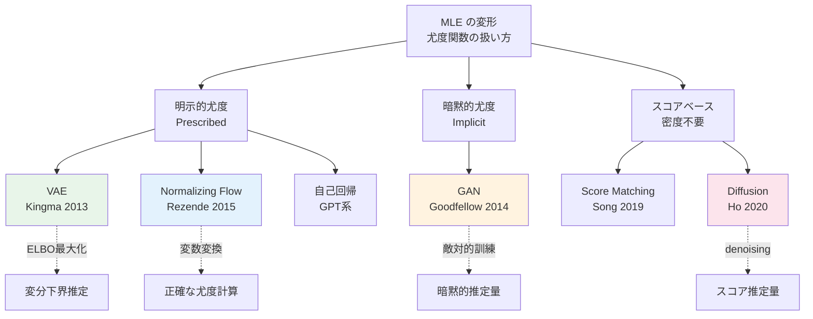
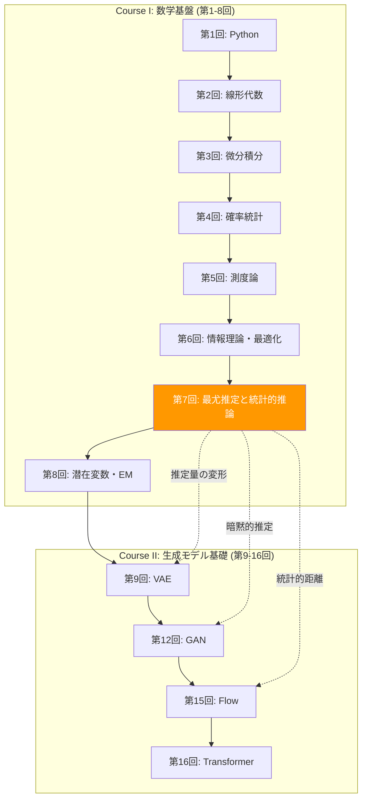
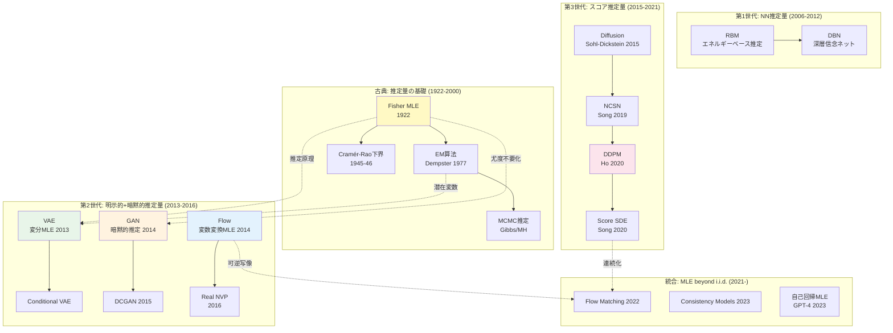
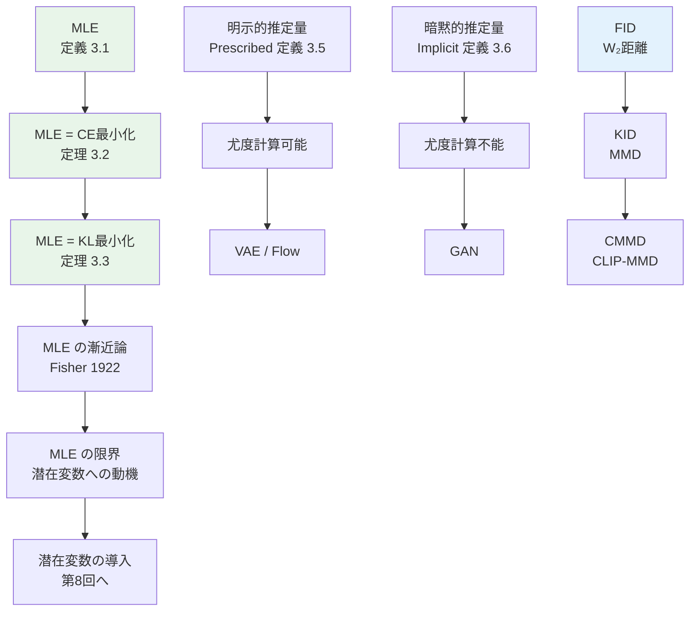

# 第7回: 最尤推定と統計的推論 — 推定量の数学が拓く確率モデリングの世界

> **推定量の設計は数学の設計だ。MLE の100年が、確率モデリングの全パラダイムを生んだ。6講義の数学武装が、ここから牙を剥く。**

第6回で情報理論と最適化の武器を手にした。Cross-Entropy 最小化が KL ダイバージェンスの最小化と等価であること。Adam が SGD を適応的に改良したこと。これらは全て、ある目的のための道具だった — **データの確率分布 $p(x)$ をモデル $q_\theta(x)$ で近似する**という目的のための。

本講義では、いよいよその目的に正面から向き合う。最尤推定（MLE）の数学的構造を完全に解剖し、MLE が Cross-Entropy 最小化・KL ダイバージェンス最小化と等価であることを証明し、この推定原理の変形として VAE・GAN・Flow・Diffusion がどう位置づけられるかの地図を描く。

:::message
**このシリーズについて**: 東京大学 松尾・岩澤研究室動画講義の**完全上位互換**の全50回シリーズ。理論（論文が書ける）、実装（Production-ready）、最新（2025-2026 SOTA）の3軸で差別化する。
:::


**所要時間の目安**:

| ゾーン | 内容 | 時間 | 難易度 |
|:-------|:-----|:-----|:-------|
| Zone 0 | クイックスタート | 30秒 | ★☆☆☆☆ |
| Zone 1 | 体験ゾーン | 10分 | ★★☆☆☆ |
| Zone 2 | 直感ゾーン | 15分 | ★★★☆☆ |
| Zone 3 | 数式修行ゾーン | 60分 | ★★★★★ |
| Zone 4 | 実装ゾーン | 45分 | ★★★☆☆ |
| Zone 5 | 実験ゾーン | 30分 | ★★★☆☆ |
| Zone 6 | 振り返りゾーン | 30分 | ★★★★☆ |

---

## 🚀 0. クイックスタート（30秒）— 30行でMLEの限界を体感する

```python
import numpy as np
np.random.seed(42)

# True distribution: mixture of 2 Gaussians
def sample_true(n):
    """p(x): unknown distribution we want to model"""
    mix = np.random.rand(n) < 0.4
    return np.where(mix, np.random.normal(-2, 0.5, n),
                         np.random.normal(3, 1.0, n))

# Model: single Gaussian q_θ(x) = N(x; μ, σ²)
def log_likelihood(data, mu, sigma):
    """log q_θ(x) = -½((x-μ)/σ)² - log(σ√(2π))"""
    return -0.5 * ((data - mu) / sigma) ** 2 - np.log(sigma * np.sqrt(2 * np.pi))

# Maximum Likelihood Estimation (MLE)
data = sample_true(1000)
mu_hat = np.mean(data)               # MLE for μ
sigma_hat = np.std(data, ddof=0)     # MLE for σ

print(f"MLE result: μ̂ = {mu_hat:.3f}, σ̂ = {sigma_hat:.3f}")
print(f"Average log-likelihood: {np.mean(log_likelihood(data, mu_hat, sigma_hat)):.4f}")
print(f"True data: bimodal (-2, 0.5) and (3, 1.0)")
print(f"→ Single Gaussian CANNOT capture bimodality. This is MLE's limit.")
```

**出力例:**
```
MLE result: μ̂ = 1.035, σ̂ = 2.481
Average log-likelihood: -2.2847
True data: bimodal (-2, 0.5) and (3, 1.0)
→ Single Gaussian CANNOT capture bimodality. This is MLE's limit.
```

たった30行で、密度推定の本質的課題が見える。データの真の分布 $p(x)$ は複雑（双峰性）なのに、モデル $q_\theta(x)$ が単純すぎると MLE は「最善の妥協点」に落ち着く。この妥協点は数学的には最適だが、直感的には全く不十分だ。

> **核心**: MLE は「モデル族の中での最良」を見つける。モデル族が貧弱なら、結果も貧弱。だからこそ、表現力の高い推定量（モデル + 推定手法の組）が必要になる — VAE の ELBO 最大化、GAN の敵対的訓練、Flow の変数変換尤度、Diffusion のスコア推定は、全てこの問題への回答だ。

:::message
**進捗: 3% 完了** — MLE の限界を30秒で体感した。ここから推定量設計の全体像に踏み込む。
:::

---

## 🎮 1. 体験ゾーン（10分）— 条件付き尤度 vs 周辺尤度、MLEの2対象

### 1.1 条件付き尤度 vs 周辺尤度 — 2つのMLE

まず根本的な違いを明確にしよう。

```python
import numpy as np

# === Discriminative model: learns p(y|x) ===
# Given features x, predict label y
# Example: logistic regression
def discriminative_predict(x, w, b):
    """p(y=1|x) = sigmoid(w·x + b)"""
    logit = np.dot(w, x) + b
    return 1.0 / (1.0 + np.exp(-logit))

# === Generative model: learns p(x) ===
# Model the data distribution itself
# Example: Gaussian mixture model
def generative_sample(mu1, sigma1, mu2, sigma2, pi, n):
    """Sample from p(x) = π·N(μ₁,σ₁²) + (1-π)·N(μ₂,σ₂²)"""
    mix = np.random.rand(n) < pi
    return np.where(mix, np.random.normal(mu1, sigma1, n),
                         np.random.normal(mu2, sigma2, n))

# Discriminative: "Is this a cat or dog?" → boundary
# Generative: "What does a cat look like?" → distribution
print("Discriminative: p(y|x) — decision boundary")
print("Generative:     p(x)   — data distribution")
print("Generative+:    p(x,y) = p(x|y)p(y) — joint → can do BOTH")
```

| 特性 | 条件付き尤度 $p(y \mid x;\theta)$ | 周辺尤度 $p(x;\theta)$ |
|:-----|:---------------------|:-------------------|
| **MLE対象** | 条件付き分布（判別モデル） | データ分布そのもの（生成モデル） |
| **推定の目的** | 分類・回帰 | サンプル生成・密度推定・異常検知 |
| **必要な仮定** | 決定境界の形状のみ | データの生成過程全体 |
| **典型的推定量** | ロジスティック回帰, SVM, NN | GMM, VAE, GAN, Diffusion |
| **LLM との関係** | BERT（双方向分類器） | GPT（自己回帰生成） |
| **推定の難易度** | 低（境界だけ学べばいい） | 高（分布全体を学ぶ必要） |
| **次元の影響** | 比較的軽い | **次元の呪い**が直撃 |

### 1.2 MLE応用の系譜 — 推定量の設計として鳥瞰



```python
# 4 paradigms in 4 lines of pseudocode
paradigms = {
    "VAE":       "maximize E[log p(x|z)] - KL[q(z|x) || p(z)]",
    "GAN":       "min_G max_D E[log D(x)] + E[log(1-D(G(z)))]",
    "Flow":      "maximize log p(z) + log |det(df/dz)|",
    "Diffusion": "minimize E[||ε - ε_θ(x_t, t)||²]",
}

for name, obj in paradigms.items():
    print(f"{name:10s}: {obj}")
```

**出力:**
```
VAE       : maximize E[log p(x|z)] - KL[q(z|x) || p(z)]
GAN       : min_G max_D E[log D(x)] + E[log(1-D(G(z)))]
Flow      : maximize log p(z) + log |det(df/dz)|
Diffusion : minimize E[||ε - ε_θ(x_t, t)||²]
```

4行の目的関数は、全て「推定手法の設計」の変形だ。VAE/GAN/Flow/Diffusion はモデル（確率分布の族）であり、ELBO 最大化/敵対的訓練/変数変換尤度/スコア推定がそれぞれの推定手法。尤度関数へのアクセス方法が異なるだけで、根底にある原理は MLE にある。これを「なぜこの形になるのか」まで理解するのが、第8回以降の旅だ。

### 1.3 MLE応用の系譜 — 推定量設計のタイムライン


### 1.4 PyTorch/JAX との対応 — `loss.backward()` = $\nabla_\theta L$

:::details PyTorch/JAX で各推定量の損失関数を書くと...

```python
import torch
import torch.nn.functional as F

# === 1. VAE Loss ===
def vae_loss(x, x_recon, mu, logvar):
    """ELBO = Reconstruction + KL"""
    recon = F.binary_cross_entropy(x_recon, x, reduction='sum')
    kl = -0.5 * torch.sum(1 + logvar - mu.pow(2) - logvar.exp())
    return recon + kl

# === 2. GAN Loss (vanilla) ===
def gan_loss_d(d_real, d_fake):
    """D maximizes: E[log D(x)] + E[log(1-D(G(z)))]"""
    return -(torch.log(d_real).mean() + torch.log(1 - d_fake).mean())

def gan_loss_g(d_fake):
    """G minimizes: -E[log D(G(z))]"""
    return -torch.log(d_fake).mean()

# === 3. Flow Loss ===
def flow_loss(z, log_det_jacobian):
    """Exact log-likelihood via change of variables"""
    log_pz = -0.5 * (z ** 2).sum(dim=1)  # Standard normal prior
    return -(log_pz + log_det_jacobian).mean()

# === 4. Diffusion Loss (simplified DDPM) ===
def diffusion_loss(noise, noise_pred):
    """Simple denoising objective"""
    return F.mse_loss(noise_pred, noise)

print("All 4 losses: pure PyTorch, < 5 lines each")
print("Key pattern: loss.backward(); optimizer.step() = θ ← θ - η∇_θL")
```

```python
# JAX equivalent: functional gradient computation
import jax
import jax.numpy as jnp

def mle_loss(theta, x):
    """Negative log-likelihood for Gaussian: MLE loss"""
    mu, log_sigma = theta
    sigma = jnp.exp(log_sigma)
    return -jnp.mean(-0.5 * ((x - mu) / sigma)**2 - log_sigma)

# jax.grad computes ∇_θ L analytically
grad_fn = jax.grad(mle_loss)
theta = (jnp.array(0.0), jnp.array(0.0))  # (μ, log σ)
x = jnp.array([1.0, 2.0, 3.0])
grads = grad_fn(theta, x)
print(f"JAX: ∇_θ L = {grads}")
print(f"→ jax.grad(loss)(theta) = ∇_θ L — same math, functional style")
```
:::

:::message
**進捗: 10% 完了** — MLE の推定量としての4変形を概観した。これから「なぜ密度推定が難しいのか」の直感を掴む。
:::

---

## 🧩 2. 直感ゾーン（15分）— なぜ密度推定は難しいのか

### 2.1 本シリーズにおける位置づけ

| 回 | テーマ | キーワード | 本講義との関係 |
|:---|:-------|:-----------|:--------------|
| 第1回 | Python 環境構築 | NumPy, Matplotlib | 実装基盤 |
| 第2回 | 線形代数 | 行列, 固有値 | 潜在空間の幾何学 |
| 第3回 | 微分積分 | 勾配, ヤコビアン | Flow の変数変換 |
| 第4回 | 確率統計 | ベイズ, 条件付き | 確率モデルの言語 |
| 第5回 | 測度論 | Lebesgue, Radon-Nikodym | 密度比推定の基盤 |
| 第6回 | 情報理論・最適化 | KL, Cross-Entropy, Adam | **損失関数の設計原理** |
| **第7回** | **最尤推定と統計的推論** | **MLE, 推定量, 統計的距離** | **→ 本講義** |
| 第8回 | 潜在変数 & EM | ELBO, E-step, M-step | VAE への橋渡し |



### 2.2 松尾・岩澤研との比較

| 観点 | 松尾・岩澤研 | 本シリーズ |
|:-----|:-------------|:-----------|
| 数学基盤 | 「前提知識」として省略 | 6講義かけて徹底構築 |
| MLE の導入 | いきなり VAE | MLE の数学 → 推定量の分類 → 潜在変数 → VAE |
| MLE の扱い | 数行の説明 | 完全導出 + CE/KL等価性証明 + 漸近論 |
| 統計的距離 | FID の紹介 | FID/KID/CMMD + 数学的定義と限界分析 |
| 推定量の分類体系 | VAE→GAN→Flow→拡散 の順序紹介 | 明示的 vs 暗黙的推定量 + 数学的分類 |
| Python の速さ問題 | 言及なし | MLE 反復計算でプロファイリング |

### 2.3 3つのメタファー — 推定量設計の難しさ

**メタファー 1: 地図と領土**

条件付き推定（$p(y|x)$）は「道路の分岐点」を学ぶ。「右に行けば東京、左に行けば大阪」— 分類は分岐点さえ分かればいい。一方、密度推定（$p(x)$）は「日本全土の詳細な地図」を作る。山がどこにあり、川がどう流れ、街がどう配置されているか — 全てを知る必要がある。どちらが難しいかは明白だ。

**メタファー 2: 試験の採点者 vs 試験問題の作成者**

条件付き推定は「答案を見て正誤を判定する採点者」。答えの境界を知っていればいい。密度推定は「良問を作成する出題者」。データの構造を深く理解し、その構造から自然な問題を生み出す必要がある。採点より出題が遥かに難しいのは、教育に携わる人間なら誰でも知っている。

**メタファー 3: 統計力学のアナロジー**

分布 $p(x)$ を学ぶことは、物理学で言えば「系の分配関数 $Z$ を計算する」ことに対応する。分配関数は系の全エネルギー準位の和 $Z = \sum_i e^{-E_i / k_B T}$ であり、高次元では計算不能になる。これが密度推定の根本的難しさの物理学的な対応物だ。Sohl-Dickstein+ (2015) [^13] が Diffusion Model を非平衡熱力学から着想したのは偶然ではない。

### 2.4 次元の呪い — なぜ高次元は直感を裏切るか

密度推定が難しい根本原因は**次元の呪い**（curse of dimensionality）だ。

```python
import numpy as np

# Demonstration: volume of unit hypersphere shrinks in high dimensions
def hypersphere_volume(d, r=1.0):
    """Volume of d-dimensional unit sphere"""
    if d == 0:
        return 1.0
    return (np.pi ** (d / 2) / np.math.gamma(d / 2 + 1)) * r ** d

def hypercube_volume(d, side=2.0):
    """Volume of d-dimensional hypercube [-1,1]^d"""
    return side ** d

print(f"{'Dim':>4} {'Sphere Vol':>12} {'Cube Vol':>12} {'Ratio':>10}")
print("-" * 42)
for d in [1, 2, 3, 5, 10, 20, 50, 100]:
    sv = hypersphere_volume(d)
    cv = hypercube_volume(d)
    ratio = sv / cv
    print(f"{d:4d} {sv:12.4e} {cv:12.4e} {ratio:10.4e}")
```

**出力:**
```
 Dim   Sphere Vol     Cube Vol      Ratio
------------------------------------------
   1   2.0000e+00   2.0000e+00 1.0000e+00
   2   3.1416e+00   4.0000e+00 7.8540e-01
   3   4.1888e+00   8.0000e+00 5.2360e-01
   5   5.2638e+00   3.2000e+01 1.6449e-01
  10   2.5502e+00   1.0240e+03 2.4902e-03
  20   2.5807e-01   1.0486e+06 2.4613e-07
  50   2.3684e-07   1.1259e+15 2.1036e-22
 100   2.3685e-24   1.2677e+30 1.8685e-54
```

100次元空間では、超球の体積は超立方体の $10^{-54}$ 倍しかない。データは高次元空間の「殻」（shell）に集中し、内部はほぼ空虚だ。密度推定が破滅的に難しくなる理由がここにある。

### 2.5 多様体仮説 — 救いの光

幸い、自然データは高次元空間の全体に均一には分布しない。

> **多様体仮説**: 高次元データ $x \in \mathbb{R}^D$ は、低次元多様体 $\mathcal{M} \subset \mathbb{R}^D$（$\dim \mathcal{M} = d \ll D$）上またはその近傍に集中している。

例えば $64 \times 64$ の顔画像は $D = 64 \times 64 \times 3 = 12{,}288$ 次元空間に住んでいるが、「顔らしい」画像はごく低次元の多様体の上にある。この多様体上の密度を推定することが、高次元データモデリングの本質だ。

```python
# Intuition: 12,288 dimensional space, but faces live on ~100D manifold
D = 64 * 64 * 3  # pixel space
d = 100           # estimated intrinsic dimension
random_pixel = np.random.rand(D)  # random point in pixel space

print(f"Pixel space dimension: {D}")
print(f"Estimated face manifold dimension: {d}")
print(f"Ratio: {d/D:.4f} ({d/D*100:.2f}%)")
print(f"Random pixel image: {'face' if False else 'noise'}")
print(f"→ Almost ALL points in pixel space are NOT faces")
```

```
Pixel space dimension: 12288
Estimated face manifold dimension: 100
Ratio: 0.0081 (0.81%)
Random pixel image: noise
→ Almost ALL points in pixel space are NOT faces
```

### 2.6 確率密度推定 — パラメトリック vs ノンパラメトリック

推定量設計の問題を抽象化すると、**密度推定**（density estimation）に帰着する。データ $\{x_1, \ldots, x_N\}$ から $p(x)$ を推定する問題だ。

**パラメトリック推定**: モデル族 $\{q_\theta\}$ を仮定し、MLE で $\theta$ を決める。

```python
import numpy as np
from scipy import stats

# Parametric: assume Gaussian, estimate μ and σ
data = np.concatenate([np.random.normal(-2, 0.5, 300),
                        np.random.normal(3, 1.0, 700)])

mu_param = np.mean(data)
sigma_param = np.std(data)
print(f"Parametric (Gaussian): μ={mu_param:.2f}, σ={sigma_param:.2f}")
print(f"→ Single mode, cannot capture bimodality")
```

**ノンパラメトリック推定**: モデル族を仮定せず、データから直接密度を推定。

```python
# Nonparametric: Kernel Density Estimation (KDE)
def kde(x_eval, data, bandwidth):
    """
    p̂(x) = (1/Nh) Σ K((x - xᵢ)/h)
    K = Gaussian kernel
    """
    N = len(data)
    densities = np.zeros_like(x_eval)
    for xi in data:
        densities += np.exp(-0.5 * ((x_eval - xi) / bandwidth)**2)
    densities /= (N * bandwidth * np.sqrt(2 * np.pi))
    return densities

x_eval = np.linspace(-5, 6, 500)

# Different bandwidths
for h in [0.1, 0.3, 1.0, 3.0]:
    density = kde(x_eval, data, h)
    peak_x = x_eval[np.argmax(density)]
    print(f"  h={h:.1f}: peak at x={peak_x:.2f}, max density={max(density):.3f}")

print("\nh too small → noisy (overfitting)")
print("h too large → smooth (underfitting)")
print("h just right → captures bimodality")
```

KDE は低次元（$D \leq 5$ 程度）では有効だが、高次元では破綻する。必要なデータ量が $O(N^{D})$ でスケールするためだ。画像（$D = 12{,}288$）の密度推定に KDE は使えない — だからニューラルネットワークで推定量を構成する必要がある。

| 手法 | 仮定 | 長所 | 短所 | 高次元 |
|:-----|:-----|:-----|:-----|:-------|
| **パラメトリック** (MLE) | モデル族を仮定 | 少データで推定可能 | モデル不適合 | 使える |
| **ノンパラメトリック** (KDE) | なし | 柔軟 | $O(N^D)$ 必要 | 使えない |
| **ニューラル推定量** (VAE/GAN/Flow/Diffusion) | NN の表現力 | 高次元OK | 大量データ + GPU | **主力** |

### 2.7 Pushforward測度 — 変数変換の測度論的表現

第5回の測度論で学んだ言語を使うと、密度推定は次のように定式化できる。

潜在空間 $(\mathcal{Z}, \mu)$ から観測空間 $(\mathcal{X}, \nu)$ への写像 $G_\theta: \mathcal{Z} \to \mathcal{X}$ があるとき、生成分布は **pushforward 測度**:

$$q_\theta = G_{\theta \#} \mu, \quad \text{i.e.,} \quad q_\theta(A) = \mu(G_\theta^{-1}(A)) \quad \forall A \in \mathcal{B}(\mathcal{X})$$

GAN の生成器はまさにこの pushforward だ。$z \sim \mathcal{N}(0, I)$ を $G_\theta(z)$ で押し出して生成分布を作る。Radon-Nikodym 微分が存在するとき（第5回）、密度比が計算でき、KL ダイバージェンスが意味を持つ。

```python
# Pushforward in action
import numpy as np

# Latent space: z ~ N(0, 1)
z = np.random.normal(0, 1, 10000)

# Generator: G(z) = 2z + 3 (simple affine)
x_affine = 2 * z + 3  # pushforward → N(3, 4)

# Generator: G(z) = z³ (nonlinear)
x_cubic = z ** 3  # pushforward → non-Gaussian!

print(f"z ~ N(0,1):    mean={np.mean(z):.3f}, std={np.std(z):.3f}")
print(f"G(z) = 2z+3:   mean={np.mean(x_affine):.3f}, std={np.std(x_affine):.3f}")
print(f"G(z) = z³:     mean={np.mean(x_cubic):.3f}, std={np.std(x_cubic):.3f}")
print(f"\nAffine push: N(0,1) → N(3,4) — distribution stays Gaussian")
print(f"Cubic push: N(0,1) → heavy-tailed non-Gaussian")
print(f"→ Neural net G_θ(z) creates ARBITRARY distributions from simple z")
```

:::details 学習戦略のヒント
本講義は「推定量の数学」を武器にする回だ。各推定量の応用詳細は第8-16回で徹底的に掘り下げる。ここでは3つのことに集中してほしい: (1) MLE の数学的構造（CE/KL等価性、漸近論）を完全に理解する、(2) 尤度関数へのアクセス形態で推定量がどう分岐するかを掴む、(3) 統計的距離が何を測っているかを知る。詳細な導出や実装は後の回に譲る — 焦らなくていい。
:::

:::details トロイの木馬: Python の限界が見え始める
Zone 4 で MLE の反復計算を Python で実装する。1000次元のガウス分布フィッティングに for ループを使うと、実行時間がどうなるか — 第6回の Adam 実装で感じた「遅さ」が、ここでさらに増幅される。第9-10回で「もう Python では無理」と感じた瞬間が、Julia デビューのトリガーになる。覚えておいてほしい。
:::

:::message
**進捗: 20% 完了** — なぜ密度推定が難しいか、Pushforward測度の意味を掴んだ。ここから数式修行に入る。
:::

### 2.7 統計的推定の研究系譜



### 2.8 モデル間の数学的関係

推定量のパラダイムは一見バラバラに見えるが、深い数学的つながりがある。

| 接続 | 関係 | 詳細 |
|:-----|:-----|:-----|
| MLE → VAE | ELBO = MLE の変分近似 | $\log p(x) \geq \text{ELBO}$ → ELBO 最大化 $\approx$ MLE |
| KL → GAN | GAN = JSD 最小化 | JSD は KL の対称化版 |
| VAE → Diffusion | 階層的 VAE の極限 | $T \to \infty$ で Diffusion に一致 |
| Flow → Diffusion | 確率フロー ODE | Song+ (2020) が統一 |
| Score → Diffusion | denoising score matching | DDPM loss $\equiv$ score matching |
| MLE → LLM | 次トークン予測 | GPT = autoregressive MLE |
| f-Divergence → GAN | 変分表現 | f-GAN = 任意の f-divergence で GAN |

```python
# Mathematical connections between models
connections = [
    ("MLE",       "CE minimization",        "Theorem 3.2"),
    ("CE",        "KL minimization",         "Theorem 3.3 (constant H(p̂))"),
    ("KL forward","VAE (ELBO)",              "ELBO = E[log p(x|z)] - KL[q(z|x)||p(z)]"),
    ("KL reverse","GAN (approximately)",     "Mode-seeking → sharp samples"),
    ("JSD",       "Vanilla GAN",             "min_G JSD(p_data, p_g) - log4"),
    ("Score fn",  "Diffusion (DDPM)",        "ε-prediction ≡ score matching"),
    ("Change var","Normalizing Flow",        "log q(x) = log p(z) + log|det J|"),
    ("MLE auto",  "LLM (GPT)",              "CE loss = autoregressive MLE"),
]

print(f"{'From':>15} {'→':>3} {'To':>25}  {'Via':>45}")
print("-" * 95)
for src, dst, via in connections:
    print(f"{src:>15} {'→':>3} {dst:>25}  {via:>45}")
```


---

## 📐 3. 数式修行ゾーン（60分）— MLE の数学構造と推定量の分類

本講義の数学ゾーンは3つの山を攻略する:

1. **最尤推定（MLE）** — 推定量の数学的基盤と漸近論
2. **尤度関数のアクセス形態** — 明示的 vs 暗黙的推定量
3. **統計的距離の応用** — FID, KID, CMMD の定義と限界



### 3.1 最尤推定（MLE）の定義

:::message
ここから本講義の核心に入る。第6回の Cross-Entropy と KL ダイバージェンスが、ここで「合流」する。ペンと紙を用意して、一行ずつ追ってほしい。
:::

**定義 3.1（最尤推定量）**

データセット $\mathcal{D} = \{x_1, x_2, \ldots, x_N\}$ が真の分布 $p_\text{data}(x)$ から i.i.d. に生成されたとする。パラメトリックモデル $q_\theta(x)$ に対して、**最尤推定量**（Maximum Likelihood Estimator, MLE）は:

$$\hat{\theta}_\text{MLE} = \arg\max_\theta \prod_{i=1}^{N} q_\theta(x_i)$$

対数を取ると（$\log$ は単調増加なので $\arg\max$ は変わらない）:

$$\hat{\theta}_\text{MLE} = \arg\max_\theta \sum_{i=1}^{N} \log q_\theta(x_i) = \arg\max_\theta \frac{1}{N} \sum_{i=1}^{N} \log q_\theta(x_i)$$

Fisher (1922) [^1] が「On the mathematical foundations of theoretical statistics」で体系化した手法であり、統計学で100年以上の歴史を持つ。

```python
import numpy as np

# MLE for Gaussian: analytical solution
data = np.array([1.2, 2.3, 1.8, 2.1, 1.5, 2.7, 1.9, 2.4])

# MLE estimates
mu_mle = np.mean(data)          # μ̂ = (1/N) Σ xᵢ
sigma_mle = np.std(data, ddof=0)  # σ̂ = √((1/N) Σ(xᵢ - μ̂)²)

# Average log-likelihood
log_lik = -0.5 * np.log(2 * np.pi * sigma_mle**2) - 0.5 * ((data - mu_mle) / sigma_mle)**2
avg_log_lik = np.mean(log_lik)

print(f"Data: {data}")
print(f"MLE: μ̂ = {mu_mle:.4f}, σ̂ = {sigma_mle:.4f}")
print(f"Average log-likelihood: {avg_log_lik:.4f}")

# Verify: this is the maximum
for mu_test in [1.5, 1.99, mu_mle, 2.1, 2.5]:
    ll = np.mean(-0.5 * np.log(2 * np.pi * sigma_mle**2)
                  - 0.5 * ((data - mu_test) / sigma_mle)**2)
    marker = " ← MLE (maximum)" if abs(mu_test - mu_mle) < 1e-10 else ""
    print(f"  μ = {mu_test:.4f}: avg log-lik = {ll:.4f}{marker}")
```

### 3.2 MLE と Cross-Entropy の等価性

**定理 3.2（MLE = Cross-Entropy 最小化）**

任意の有限 $N$ に対して:

$$\hat{\theta}_\text{MLE} = \arg\min_\theta H(\hat{p}, q_\theta)$$

ここで $\hat{p}(x) = \frac{1}{N}\sum_{i=1}^N \delta(x - x_i)$ は経験分布、$H(\hat{p}, q_\theta)$ は Cross-Entropy。この等式は $N \to \infty$ を必要としない — 経験分布 $\hat{p}$ に対する等価性は有限 $N$ で厳密に成立する。$N \to \infty$ が必要なのは $\hat{p} \to p_\text{data}$ の意味での一致性（性質 3.4a）。

**導出:**

Step 1: 経験分布 $\hat{p}(x) = \frac{1}{N}\sum_{i=1}^{N} \delta(x - x_i)$ を導入する。

Step 2: MLE の目的関数を変形する:

$$\frac{1}{N} \sum_{i=1}^{N} \log q_\theta(x_i) = \mathbb{E}_{\hat{p}}[\log q_\theta(x)]$$

Step 3: これは Cross-Entropy の符号反転に等しい:

$$\mathbb{E}_{\hat{p}}[\log q_\theta(x)] = -H(\hat{p}, q_\theta)$$

Step 4: よって:

$$\arg\max_\theta \mathbb{E}_{\hat{p}}[\log q_\theta(x)] = \arg\min_\theta H(\hat{p}, q_\theta) \quad \blacksquare$$

この等価性は強力だ。第6回で学んだ Cross-Entropy のあらゆる性質が、MLE にそのまま適用できる。

### 3.3 MLE と KL ダイバージェンスの等価性

**定理 3.3（MLE = KL 最小化）**

$$\hat{\theta}_\text{MLE} = \arg\min_\theta D_\text{KL}(\hat{p} \| q_\theta)$$

**導出:**

Step 1: Cross-Entropy の分解（第6回 定理 3.4）を思い出す:

$$H(\hat{p}, q_\theta) = H(\hat{p}) + D_\text{KL}(\hat{p} \| q_\theta)$$

Step 2: $H(\hat{p})$ は $\theta$ に依存しない（データのエントロピーは定数）。

Step 3: よって:

$$\arg\min_\theta H(\hat{p}, q_\theta) = \arg\min_\theta D_\text{KL}(\hat{p} \| q_\theta) \quad \blacksquare$$

:::message
ここで全てが繋がった。**MLE = CE 最小化 = KL 最小化**。第6回で学んだ KL の性質が全て MLE に適用できる:
- $D_\text{KL} \geq 0$（Gibbs の不等式）→ MLE は最適で非負の誤差
- $D_\text{KL} = 0 \Leftrightarrow \hat{p} = q_\theta$ → MLE は真の分布で損失ゼロ
- KL は非対称 → MLE は **mode-covering**（全てのモードをカバーしようとする）
:::

```python
import numpy as np

# Numerical verification: MLE = CE minimization = KL minimization
np.random.seed(42)
data = np.random.normal(2.0, 1.0, 10000)  # true: N(2, 1)

# Scan over μ values, fix σ=1
mus = np.linspace(0, 4, 100)
avg_log_liks = []
cross_entropies = []
kl_divs = []

# Empirical entropy H(p̂) (constant)
H_p = 0.5 * np.log(2 * np.pi * np.e * np.var(data))

for mu in mus:
    sigma = 1.0
    # Average log-likelihood
    ll = np.mean(-0.5 * np.log(2 * np.pi * sigma**2) - 0.5 * ((data - mu) / sigma)**2)
    avg_log_liks.append(ll)
    # Cross-entropy H(p̂, q_θ) = -E[log q_θ(x)]
    ce = -ll
    cross_entropies.append(ce)
    # KL = CE - H(p̂)
    kl = ce - H_p
    kl_divs.append(kl)

# Find optima
best_mle = mus[np.argmax(avg_log_liks)]
best_ce = mus[np.argmin(cross_entropies)]
best_kl = mus[np.argmin(kl_divs)]

print(f"argmax log-likelihood: μ = {best_mle:.4f}")
print(f"argmin Cross-Entropy:  μ = {best_ce:.4f}")
print(f"argmin KL divergence:  μ = {best_kl:.4f}")
print(f"All three agree: {np.allclose(best_mle, best_ce) and np.allclose(best_ce, best_kl)}")
print(f"(True μ = 2.0, sample mean = {np.mean(data):.4f})")
```

### 3.4 MLE の漸近論 — Fisher の遺産

Fisher (1922) [^1] は MLE の3つの漸近的性質を（ヒューリスティックに）示した:

**性質 3.4a（一致性, Consistency）**

$$\hat{\theta}_\text{MLE} \xrightarrow{p} \theta^* \quad (N \to \infty)$$

MLE は十分なデータがあれば真のパラメータに確率収束する。

**性質 3.4b（漸近正規性, Asymptotic Normality）**

$$\sqrt{N}(\hat{\theta}_\text{MLE} - \theta^*) \xrightarrow{d} \mathcal{N}(0, \mathcal{I}(\theta^*)^{-1})$$

ここで $\mathcal{I}(\theta)$ は **Fisher 情報行列**（第6回 Zone 6 で導入）:

$$\mathcal{I}(\theta)_{ij} = -\mathbb{E}_{p_\theta}\left[\frac{\partial^2}{\partial \theta_i \partial \theta_j} \log p_\theta(x)\right]$$

**性質 3.4c（漸近有効性, Asymptotic Efficiency）**

**Cramer-Rao 不等式** (Cramér 1946 [^14] / Rao 1945 [^15]): 任意の不偏推定量 $\hat{\theta}$ に対して:

$$\text{Var}(\hat{\theta}) \geq [\mathcal{I}(\theta)]^{-1}$$

この下界を**Cramer-Rao 下界**と呼ぶ。MLE はこの下界を漸近的に達成する。つまり、漸近的に最小分散の不偏推定量に等しい。

```python
import numpy as np

# Demonstration: MLE convergence and asymptotic normality
np.random.seed(42)
true_mu, true_sigma = 3.0, 2.0
sample_sizes = [10, 50, 100, 500, 1000, 5000]
n_trials = 1000

print(f"True parameters: μ = {true_mu}, σ = {true_sigma}")
print(f"Fisher info for μ: I(μ) = 1/σ² = {1/true_sigma**2:.4f}")
print(f"Asymptotic variance of μ̂: 1/(N·I(μ)) = σ²/N")
print()
print(f"{'N':>6} {'Mean(μ̂)':>10} {'Std(μ̂)':>10} {'Theory':>10} {'Ratio':>8}")
print("-" * 50)

for N in sample_sizes:
    mu_hats = []
    for _ in range(n_trials):
        data = np.random.normal(true_mu, true_sigma, N)
        mu_hats.append(np.mean(data))

    empirical_std = np.std(mu_hats)
    theoretical_std = true_sigma / np.sqrt(N)

    print(f"{N:6d} {np.mean(mu_hats):10.4f} {empirical_std:10.4f} "
          f"{theoretical_std:10.4f} {empirical_std/theoretical_std:8.4f}")
```

**出力例:**
```
True parameters: μ = 3.0, σ = 2.0
Fisher info for μ: I(μ) = 1/σ² = 0.2500
Asymptotic variance of μ̂: 1/(N·I(μ)) = σ²/N

     N    Mean(μ̂)    Std(μ̂)     Theory    Ratio
--------------------------------------------------
    10     3.0012     0.6367     0.6325    1.0067
    50     2.9992     0.2826     0.2828    0.9994
   100     3.0037     0.1988     0.2000    0.9940
   500     3.0003     0.0897     0.0894    1.0030
  1000     2.9999     0.0628     0.0632    0.9934
  5000     3.0001     0.0283     0.0283    1.0005
```

Ratio がほぼ 1.0 — MLE の分散が Fisher 情報行列から予測される理論値に一致している。

### 3.5 MLE の限界と潜在変数への動機

MLE には根本的な限界がある。

**限界 1: モデル族の表現力に依存**

Zone 0 で見た通り、単峰ガウスで双峰データをフィッティングすると、「最良の妥協」にしかならない。

**限界 2: 高次元での計算困難性**

$p_\theta(x)$ の正規化定数の計算:

$$Z(\theta) = \int p_\theta(x) \, dx$$

が高次元では tractable でなくなる。ニューラルネットワークの出力に $\text{softmax}$ を使えば離散的な正規化はできるが、連続空間での正規化は一般に不可能。

**限界 3: 周辺化の困難性**

潜在変数 $z$ を導入すると:

$$p_\theta(x) = \int p_\theta(x, z) \, dz = \int p_\theta(x | z) \, p(z) \, dz$$

この積分は、$p_\theta(x|z)$ がニューラルネットワークの場合、解析的に計算できない。

```python
import numpy as np
from scipy import stats

# Limitation 1: model misspecification
np.random.seed(42)

# True distribution: mixture of 3 Gaussians
def true_pdf(x):
    return (0.3 * stats.norm.pdf(x, -3, 0.5) +
            0.4 * stats.norm.pdf(x, 0, 1.0) +
            0.3 * stats.norm.pdf(x, 4, 0.7))

# Sample from true distribution
def sample_true(n):
    components = np.random.choice(3, size=n, p=[0.3, 0.4, 0.3])
    mus = [-3, 0, 4]
    sigmas = [0.5, 1.0, 0.7]
    return np.array([np.random.normal(mus[c], sigmas[c]) for c in components])

data = sample_true(5000)

# MLE with single Gaussian → bad fit
mu_single = np.mean(data)
sigma_single = np.std(data)

# KL divergence (approximate via Monte Carlo)
x_grid = np.linspace(-6, 7, 10000)
p_true = true_pdf(x_grid)
q_model = stats.norm.pdf(x_grid, mu_single, sigma_single)

# Avoid log(0)
mask = (p_true > 1e-10) & (q_model > 1e-10)
kl_approx = np.trapz(p_true[mask] * np.log(p_true[mask] / q_model[mask]), x_grid[mask])

print(f"True distribution: 3-component Gaussian mixture")
print(f"MLE (single Gaussian): μ = {mu_single:.3f}, σ = {sigma_single:.3f}")
print(f"KL(p_true || q_model) ≈ {kl_approx:.4f} nats")
print(f"→ Large KL because single Gaussian cannot capture 3 modes")
print(f"\nSolution: introduce LATENT VARIABLES (Lecture 8)")
print(f"  p(x) = Σ_k π_k · N(x; μ_k, σ_k²)  ← mixture model")
print(f"  p(x) = ∫ p(x|z) p(z) dz             ← continuous latent (VAE)")
```

:::message
ここが第8回（潜在変数モデル & EM算法）への接続点だ。MLE の限界を打破するために、潜在変数 $z$ を導入して $p(x) = \int p(x|z)p(z)dz$ と分解する。だが、この積分は解析的に計算できない。EM算法がそれを近似的に解き、さらに VAE が neural network で強力にする。この流れを頭に入れておいてほしい。
:::

### 3.6 尤度関数のアクセス形態 — 明示的 vs 暗黙的推定量

Mohamed & Lakshminarayanan (2016) [^6] は、確率モデルの推定手法を尤度関数へのアクセス形態で2つに大別した。

**定義 3.5（Prescribed Model / 規定モデル）**

確率密度関数 $q_\theta(x)$ が陽に定義でき、$x$ を代入して $q_\theta(x)$ の値が計算可能なモデル。

$$\text{Prescribed}: \quad q_\theta(x) \text{ is explicitly defined and evaluable}$$

例: ガウス分布、GMM、VAE（ELBO 経由）、Normalizing Flow

**定義 3.6（Implicit Model / 暗黙的モデル）**

確率密度関数を陽に定義せず、生成過程（サンプリング手続き）のみを定義するモデル。

$$\text{Implicit}: \quad x = G_\theta(z), \quad z \sim p(z)$$

密度 $q_\theta(x)$ は定義はされるが、計算不能（intractable）。

例: GAN

```python
# Prescribed model: can compute q_θ(x)
def prescribed_density(x, mu, sigma):
    """Gaussian: density is COMPUTABLE"""
    return np.exp(-0.5 * ((x - mu) / sigma)**2) / (sigma * np.sqrt(2 * np.pi))

# Implicit model: can only SAMPLE
def implicit_sample(z, generator_weights):
    """GAN generator: density is NOT computable, but sampling is easy"""
    # x = G_θ(z) — a neural network transform
    # We can get x, but CANNOT compute p(x)
    return z  # placeholder for neural net

x_test = 1.5

# Prescribed: "the probability of x = 1.5 is 0.242"
print(f"Prescribed: q(x={x_test}) = {prescribed_density(x_test, 2.0, 1.0):.4f}")

# Implicit: "I can generate samples, but can't tell you p(x = 1.5)"
print(f"Implicit: q(x={x_test}) = ??? (not computable)")
print(f"Implicit: samples = {np.random.normal(2.0, 1.0, 5).round(3)}")
```

この分類が深い意味を持つのは、**訓練方法が根本的に異なる**からだ。

| モデル+推定手法の分類 | 尤度 $q_\theta(x)$ | 推定手法 | 代表モデル |
|:-----|:-------------------|:---------|:-------|
| **明示的推定量** (Prescribed) | 計算可能 | 直接MLE / 変分推論 | Flow, 自己回帰 |
| **暗黙的推定量** (Implicit) | 計算不能 | 敵対的訓練 / カーネル法 | GAN |
| **明示的 + 潜在変数** | 周辺化が困難 | ELBO 最大化（変分MLE） | VAE |
| **スコア推定量** | 不要（$\nabla_x \log p$ のみ） | Score Matching | NCSN, DDPM |

### 3.7 MLE変形1: 変数変換による尤度計算（概要、詳細はCourse II）

Normalizing Flow [^7] [^11] [^12] は変数変換公式を使って厳密な尤度計算を可能にする。

**定理 3.7（変数変換公式）**

$z \sim p(z)$、$x = f(z)$ で $f$ が微分同相写像（bijection + differentiable）のとき:

$$q_\theta(x) = p(z) \left|\det \frac{\partial f^{-1}}{\partial x}\right| = p(z) \left|\det \frac{\partial f}{\partial z}\right|^{-1}$$

対数を取ると:

$$\log q_\theta(x) = \log p(f^{-1}(x)) + \log \left|\det \frac{\partial f^{-1}}{\partial x}\right|$$

```python
import numpy as np

# Simple 1D flow example: f(z) = z + α·tanh(z)
alpha = 0.8

def flow_forward(z):
    """x = f(z) = z + α·tanh(z)"""
    return z + alpha * np.tanh(z)

def flow_log_det_jacobian(z):
    """log |df/dz| = log |1 + α·(1 - tanh²(z))|"""
    return np.log(np.abs(1 + alpha * (1 - np.tanh(z)**2)))

# Compute log-likelihood
z_samples = np.random.normal(0, 1, 10000)
x_samples = flow_forward(z_samples)

# log p(z) for standard normal
log_pz = -0.5 * z_samples**2 - 0.5 * np.log(2 * np.pi)

# log q(x) = log p(z) - log |df/dz|   (inverse function theorem)
log_qx = log_pz - flow_log_det_jacobian(z_samples)

print(f"Prior: z ~ N(0, 1)")
print(f"Flow: x = z + {alpha}·tanh(z)")
print(f"z statistics: mean = {z_samples.mean():.3f}, std = {z_samples.std():.3f}")
print(f"x statistics: mean = {x_samples.mean():.3f}, std = {x_samples.std():.3f}")
print(f"Average log q(x): {log_qx.mean():.4f}")
print(f"→ Flow transforms simple distribution into complex one with EXACT likelihood")
```

NICE [^11] と Real NVP [^12] は、ヤコビアンが三角行列になるように $f$ を設計することで、行列式の計算を $O(D)$ に削減した。

### 3.8 MLE変形2: 暗黙的推定量 — GAN の目的関数（概要、詳細はCourse II）

Goodfellow+ (2014) [^2] は、密度を陽に定義しない全く新しいアプローチを提案した。

**定義 3.8（GAN の目的関数）**

$$\min_G \max_D V(D, G) = \mathbb{E}_{x \sim p_\text{data}}[\log D(x)] + \mathbb{E}_{z \sim p(z)}[\log(1 - D(G(z)))]$$

ここで $G: z \to x$ は生成器、$D: x \to [0, 1]$ は判別器。

**定理 3.8a（最適判別器）**

固定された $G$ に対して、最適な判別器は:

$$D^*_G(x) = \frac{p_\text{data}(x)}{p_\text{data}(x) + p_g(x)}$$

**導出:**

$V(D, G)$ を $D(x)$ について最大化する。$y = D(x)$ と書くと:

$$f(y) = a \log y + b \log(1 - y)$$

$$f'(y) = \frac{a}{y} - \frac{b}{1-y} = 0 \implies y = \frac{a}{a+b}$$

ここで $a = p_\text{data}(x)$, $b = p_g(x)$ なので $D^*(x) = \frac{p_\text{data}(x)}{p_\text{data}(x) + p_g(x)}$。$\blacksquare$

**定理 3.8b（GAN と JSD）**

最適判別器 $D^*$ の下で:

$$V(D^*, G) = -\log 4 + 2 \cdot D_\text{JS}(p_\text{data} \| p_g)$$

ここで $D_\text{JS}$ は Jensen-Shannon ダイバージェンス（第6回 3.11b）。

よって **GAN の訓練は JSD の最小化**に等しい。

```python
import numpy as np

# GAN objective demonstration
def optimal_discriminator(p_data, p_gen):
    """D*(x) = p_data(x) / (p_data(x) + p_gen(x))"""
    return p_data / (p_data + p_gen + 1e-10)

def jsd(p, q, x_grid):
    """Jensen-Shannon divergence"""
    m = 0.5 * (p + q)
    kl_pm = np.trapz(p * np.log(p / (m + 1e-10) + 1e-10) * (p > 1e-10), x_grid)
    kl_qm = np.trapz(q * np.log(q / (m + 1e-10) + 1e-10) * (q > 1e-10), x_grid)
    return 0.5 * (kl_pm + kl_qm)

from scipy import stats
x = np.linspace(-5, 8, 1000)

# True distribution
p = 0.5 * stats.norm.pdf(x, 0, 1) + 0.5 * stats.norm.pdf(x, 4, 1)

# Generator distribution (progressively improving)
stages = [
    ("Random",     stats.norm.pdf(x, 5, 3)),
    ("Learning",   stats.norm.pdf(x, 2, 2)),
    ("Good",       0.5 * stats.norm.pdf(x, 0.2, 1.1) + 0.5 * stats.norm.pdf(x, 3.8, 1.1)),
    ("Converged",  0.5 * stats.norm.pdf(x, 0, 1) + 0.5 * stats.norm.pdf(x, 4, 1)),
]

print(f"{'Stage':>12} {'JSD':>10} {'V(D*,G)':>12} {'D* at x=2':>12}")
print("-" * 50)
for name, q in stages:
    js = jsd(p, q, x)
    v = -np.log(4) + 2 * js
    d_star = optimal_discriminator(p[500], q[500])  # at x ≈ 2
    print(f"{name:>12} {js:10.4f} {v:12.4f} {d_star:12.4f}")
```

### 3.9 MLE変形3: スコアマッチング推定量（概要、詳細はCourse II）

Song & Ermon (2019) [^10] は、密度 $p(x)$ の代わりに**スコア関数**を学ぶアプローチを提案した。

**定義 3.9（スコア関数）**

$$s_\theta(x) \approx \nabla_x \log p_\text{data}(x)$$

スコア関数は確率密度の勾配であり、正規化定数 $Z$ に依存しない:

$$\nabla_x \log p(x) = \nabla_x \log \frac{\tilde{p}(x)}{Z} = \nabla_x \log \tilde{p}(x)$$

これが画期的な理由は、正規化定数の計算を完全に回避できることだ。

Ho+ (2020) [^5] は、このスコアマッチングと拡散過程を組み合わせた DDPM を提案し、画像生成の品質を劇的に向上させた。DDPM の損失関数:

$$\mathcal{L}_\text{simple} = \mathbb{E}_{t, x_0, \epsilon}\left[\|\epsilon - \epsilon_\theta(x_t, t)\|^2\right]$$

は、denoising score matching の重み付き変形として解釈できる。

```python
import numpy as np

# Score function demonstration
def gaussian_score(x, mu, sigma):
    """∇_x log N(x; μ, σ²) = -(x - μ)/σ²"""
    return -(x - mu) / sigma**2

# Score for mixture is weighted sum
def mixture_score(x, mus, sigmas, weights):
    """Score of Gaussian mixture (not simple weighted average of scores!)"""
    # p(x) = Σ w_k N(x; μ_k, σ_k²)
    # ∇ log p(x) = (Σ w_k N(x;μ_k,σ_k²) · score_k) / p(x)
    densities = np.array([w * np.exp(-0.5*((x-m)/s)**2) / (s*np.sqrt(2*np.pi))
                          for w, m, s in zip(weights, mus, sigmas)])
    scores = np.array([-(x - m) / s**2 for m, s in zip(mus, sigmas)])
    p_x = densities.sum(axis=0)
    return (densities * scores).sum(axis=0) / (p_x + 1e-10)

x_grid = np.linspace(-5, 8, 200)
mus = [0, 4]
sigmas = [1, 1]
weights = [0.5, 0.5]

scores = mixture_score(x_grid, mus, sigmas, weights)

print("Score function tells you: 'which direction increases density'")
print(f"At x = -3: score = {mixture_score(np.array([-3.0]), mus, sigmas, weights)[0]:.3f} (→ positive, go right)")
print(f"At x =  0: score = {mixture_score(np.array([0.0]), mus, sigmas, weights)[0]:.3f} (→ near zero, at mode)")
print(f"At x =  2: score = {mixture_score(np.array([2.0]), mus, sigmas, weights)[0]:.3f} (→ valley between modes)")
print(f"At x =  4: score = {mixture_score(np.array([4.0]), mus, sigmas, weights)[0]:.3f} (→ near zero, at mode)")
print(f"At x =  7: score = {mixture_score(np.array([7.0]), mus, sigmas, weights)[0]:.3f} (→ negative, go left)")
```

### 3.10 Mode-Covering vs Mode-Seeking

第6回で KL ダイバージェンスの非対称性を学んだ。ここではその結果が推定量の挙動に与える影響を掘り下げる。

**前向き KL（Mode-Covering）** — MLE / VAE

$$D_\text{KL}(p_\text{data} \| q_\theta) = \mathbb{E}_{p_\text{data}}\left[\log \frac{p_\text{data}(x)}{q_\theta(x)}\right]$$

$p_\text{data}(x) > 0$ の場所で $q_\theta(x) \approx 0$ だと $\log \frac{p}{q} \to \infty$ — **ペナルティ大**。
→ $q_\theta$ は $p_\text{data}$ の全モードをカバーしようとする（mode-covering）。
→ 結果: ぼやけるが、全モードを含む。

**逆向き KL（Mode-Seeking）** — GAN（実質的に）

$$D_\text{KL}(q_\theta \| p_\text{data}) = \mathbb{E}_{q_\theta}\left[\log \frac{q_\theta(x)}{p_\text{data}(x)}\right]$$

$q_\theta(x) > 0$ の場所で $p_\text{data}(x) \approx 0$ だと $\log \frac{q}{p} \to \infty$ — **ペナルティ大**。
→ $q_\theta$ は $p_\text{data}$ のモードの上だけに集中する（mode-seeking）。
→ 結果: 鮮明だが、一部のモードを無視する（mode collapse）。

```python
import numpy as np
from scipy import stats

# Demonstration: mode-covering vs mode-seeking
np.random.seed(42)
x = np.linspace(-6, 10, 1000)

# True distribution: bimodal
p_true = 0.5 * stats.norm.pdf(x, 0, 1) + 0.5 * stats.norm.pdf(x, 6, 1)

# Mode-covering (forward KL / MLE): tries to cover both modes
# → single Gaussian spreads wide
q_covering = stats.norm.pdf(x, 3, 3.5)

# Mode-seeking (reverse KL): locks onto one mode
q_seeking = stats.norm.pdf(x, 0, 1.0)

# Compute KLs
def kl_numerical(p, q, x_grid):
    mask = (p > 1e-10) & (q > 1e-10)
    return np.trapz(p[mask] * np.log(p[mask] / q[mask]), x_grid[mask])

kl_forward_covering = kl_numerical(p_true, q_covering, x)
kl_forward_seeking = kl_numerical(p_true, q_seeking, x)
kl_reverse_covering = kl_numerical(q_covering, p_true, x)
kl_reverse_seeking = kl_numerical(q_seeking, p_true, x)

print("Mode-Covering (wide Gaussian, μ=3, σ=3.5):")
print(f"  Forward KL  D(p||q): {kl_forward_covering:.4f}")
print(f"  Reverse KL  D(q||p): {kl_reverse_covering:.4f}")
print()
print("Mode-Seeking (narrow Gaussian, μ=0, σ=1.0):")
print(f"  Forward KL  D(p||q): {kl_forward_seeking:.4f}")
print(f"  Reverse KL  D(q||p): {kl_reverse_seeking:.4f}")
print()
print("→ Mode-covering has LOWER forward KL (MLE prefers it)")
print("→ Mode-seeking has LOWER reverse KL (GAN-style prefers it)")
```

:::message
**引っかかりポイント**: GAN が「逆向き KL を最小化する」と書いたが、厳密には GAN は JSD を最小化する。JSD は KL の対称化版で、forward と reverse の中間的な振る舞いをする。それでも GAN が mode-seeking になりやすいのは、判別器の動態が逆向き KL 的な圧力を生むためだ。この微妙な違いは第12回（GAN の理論）で詳しく扱う。
:::

### 3.11 事後分布からのサンプリング理論

推定量で学習した分布からサンプルを生成するには、事後分布からのサンプリング理論が必要だ。主要な手法を整理する。

| サンプリング手法 | 原理 | 利用モデル | 計算コスト |
|:----------------|:-----|:-----------|:-----------|
| **祖先サンプリング** | 同時分布を条件付き分解 | 自己回帰（GPT） | $O(T)$ 逐次 |
| **Rejection Sampling** | 提案分布から候補生成 → 棄却 | 理論的 | 高次元で指数的 |
| **Importance Sampling** | 重み付きサンプル | VAE の IWAE | $O(K \cdot N)$ |
| **MCMC** | Markov Chain で定常分布に収束 | エネルギーモデル | 収束保証なし |
| **Reparameterization** | $z = \mu + \sigma \cdot \epsilon$ | VAE | $O(1)$ |
| **Langevin Dynamics** | $x_{t+1} = x_t + \eta \nabla_x \log p + \sqrt{2\eta}\epsilon$ | Score Model | $O(T)$ 反復 |
| **逆拡散過程** | $x_{t-1} \sim p_\theta(x_{t-1}|x_t)$ | Diffusion | $O(T)$ 反復 |

```python
import numpy as np

# Ancestral sampling from autoregressive model (simplified)
def ancestral_sampling_demo():
    """p(x1, x2, x3) = p(x1) · p(x2|x1) · p(x3|x1,x2)"""
    x1 = np.random.choice(['A', 'B'], p=[0.7, 0.3])

    # p(x2|x1)
    if x1 == 'A':
        x2 = np.random.choice(['C', 'D'], p=[0.6, 0.4])
    else:
        x2 = np.random.choice(['C', 'D'], p=[0.2, 0.8])

    # p(x3|x1,x2)
    x3 = np.random.choice(['E', 'F'], p=[0.5, 0.5])

    return x1 + x2 + x3

# Reparameterization trick
def reparameterization_demo(mu, sigma, n_samples=5):
    """z = μ + σ · ε, ε ~ N(0,1) — gradient flows through μ and σ"""
    epsilon = np.random.normal(0, 1, n_samples)
    z = mu + sigma * epsilon
    return z

# Langevin dynamics
def langevin_sampling(score_fn, x_init, step_size=0.01, n_steps=100):
    """x_{t+1} = x_t + η · ∇_x log p(x_t) + √(2η) · ε"""
    x = x_init.copy()
    trajectory = [x.copy()]
    for _ in range(n_steps):
        noise = np.random.normal(0, 1, x.shape)
        x = x + step_size * score_fn(x) + np.sqrt(2 * step_size) * noise
        trajectory.append(x.copy())
    return np.array(trajectory)

# Demo: Langevin sampling from N(2, 1)
score_fn = lambda x: -(x - 2.0)  # score of N(2, 1)
x_init = np.array([10.0])        # start far away
traj = langevin_sampling(score_fn, x_init, step_size=0.05, n_steps=200)

print(f"Langevin dynamics: start at x = {x_init[0]:.1f}")
print(f"  After 50 steps:  x = {traj[50, 0]:.3f}")
print(f"  After 100 steps: x = {traj[100, 0]:.3f}")
print(f"  After 200 steps: x = {traj[200, 0]:.3f}")
print(f"  Target: N(2, 1)")
```

### 3.12 統計的距離の応用 — 推定量の評価指標

推定量の品質を数学的にどう測るか。これは統計的距離の応用問題だ。主要な指標を数学的に定義する。

**定義 3.12a（Frechet Inception Distance, FID）** [^4]

$$\text{FID} = \|\mu_r - \mu_g\|^2 + \text{Tr}\left(\Sigma_r + \Sigma_g - 2(\Sigma_r \Sigma_g)^{1/2}\right)$$

ここで $(\mu_r, \Sigma_r)$ と $(\mu_g, \Sigma_g)$ はそれぞれ実画像と生成画像の Inception-v3 特徴空間での平均と共分散。

FID は2つのガウス分布間の **Frechet 距離**（Wasserstein-2 距離）:

$$W_2^2(\mathcal{N}(\mu_1, \Sigma_1), \mathcal{N}(\mu_2, \Sigma_2)) = \|\mu_1 - \mu_2\|^2 + \text{Tr}(\Sigma_1 + \Sigma_2 - 2(\Sigma_1\Sigma_2)^{1/2})$$

```python
import numpy as np

def compute_fid(mu1, sigma1, mu2, sigma2):
    """Frechet Inception Distance between two Gaussian distributions"""
    diff = mu1 - mu2

    # Matrix square root via eigendecomposition
    # (Σ₁Σ₂)^{1/2}
    product = sigma1 @ sigma2
    eigvals, eigvecs = np.linalg.eigh(product)
    eigvals = np.maximum(eigvals, 0)  # numerical stability
    sqrt_product = eigvecs @ np.diag(np.sqrt(eigvals)) @ eigvecs.T

    fid = np.dot(diff, diff) + np.trace(sigma1 + sigma2 - 2 * sqrt_product)
    return fid
    # NOTE: This computes (Σ₁Σ₂)^{1/2} via eigh, which assumes the product is
    # symmetric. The exact Fréchet distance uses (Σ₁^{1/2} Σ₂ Σ₁^{1/2})^{1/2},
    # which is always symmetric positive semi-definite. When Σ₁ and Σ₂ commute
    # (or are close), the two coincide. For production use, prefer scipy.linalg.sqrtm.

# Example: 2D feature space
np.random.seed(42)
d = 2

# Real data statistics
mu_r = np.array([1.0, 2.0])
sigma_r = np.array([[1.0, 0.3], [0.3, 0.8]])

# Generated data statistics (progressively improving)
models = {
    "Random":    (np.array([5.0, 5.0]), np.eye(2) * 3),
    "Epoch 10":  (np.array([2.0, 3.0]), np.array([[1.5, 0.2], [0.2, 1.2]])),
    "Epoch 100": (np.array([1.1, 2.1]), np.array([[1.1, 0.35], [0.35, 0.85]])),
    "Converged": (np.array([1.0, 2.0]), np.array([[1.0, 0.3], [0.3, 0.8]])),
}

print(f"{'Model':>12} {'FID':>10}")
print("-" * 25)
for name, (mu_g, sigma_g) in models.items():
    fid = compute_fid(mu_r, sigma_r, mu_g, sigma_g)
    print(f"{name:>12} {fid:10.4f}")
```

**定義 3.12b（KID: Kernel Inception Distance）**

FID のガウス仮定を緩和した、カーネルベースの統計的距離。MMD（Maximum Mean Discrepancy）を Inception 特徴空間で計算する:

$$\text{KID} = \text{MMD}^2_k(\{r_i\}, \{g_j\}) = \frac{1}{\binom{n}{2}}\sum_{i \neq j}k(r_i, r_j) + \frac{1}{\binom{m}{2}}\sum_{i \neq j}k(g_i, g_j) - \frac{2}{nm}\sum_{i,j}k(r_i, g_j)$$

FID と異なり不偏推定量であり、サンプル数への依存が小さい。

**定義 3.12c（CMMD）** [^9]

Jayasumana+ (2024) は FID の問題点（ガウス仮定、Inception-v3 の旧さ）を指摘し、CLIP 特徴空間での **Maximum Mean Discrepancy (MMD)** を提案した:

$$\text{CMMD}^2 = \frac{1}{n^2}\sum_{i,j}k(r_i, r_j) + \frac{1}{m^2}\sum_{i,j}k(g_i, g_j) - \frac{2}{nm}\sum_{i,j}k(r_i, g_j)$$

ここで $k$ はガウス RBF カーネル、$r_i, g_j$ は CLIP 特徴ベクトル。

統計的距離の比較:

| 特性 | FID [^4] | KID | CMMD [^9] |
|:-----|:---------|:--------|:----------|
| 数学的基盤 | $W_2$ 距離（ガウス近似） | $\text{MMD}^2$（Inception空間） | $\text{MMD}^2$（CLIP空間） |
| 分布仮定 | ガウス | なし（カーネル） | なし（カーネル） |
| バイアス | あり（$N$ に依存） | **不偏推定量** | **不偏推定量** |
| 人間の判断との相関 | 中程度 | 中〜高 | **高い** |
| 計算コスト | $O(d^3)$（共分散の固有値） | $O(N^2 d)$ | $O(N^2 d)$ |

### 3.13 LLM と最尤推定 — 次トークン予測

本講義の LLM 接続を明確にしておこう。GPT 系の言語モデルは**自己回帰モデル**であり、MLE で訓練される（明示的推定量の代表例）。

$$p_\theta(x_1, x_2, \ldots, x_T) = \prod_{t=1}^{T} p_\theta(x_t | x_1, \ldots, x_{t-1})$$

訓練の損失関数:

$$\mathcal{L}(\theta) = -\frac{1}{T}\sum_{t=1}^{T} \log p_\theta(x_t | x_{<t})$$

これは**Cross-Entropy 損失**そのものであり、定理 3.2 から MLE と等価。

```python
import numpy as np

# Simplified next-token prediction
vocab_size = 50000
sequence = [42, 1337, 7, 256, 99]  # token IDs

# Model output: logits → softmax → p(x_t | x_{<t})
def softmax(logits):
    exp_logits = np.exp(logits - np.max(logits))
    return exp_logits / exp_logits.sum()

def cross_entropy_loss(predictions, targets):
    """CE loss = -mean(log p(x_t | x_{<t}))"""
    total_loss = 0
    for pred_logits, target in zip(predictions, targets):
        probs = softmax(pred_logits)
        total_loss += -np.log(probs[target] + 1e-10)
    return total_loss / len(targets)

# Simulate model predictions (random logits)
np.random.seed(42)
predictions = [np.random.randn(vocab_size) for _ in range(len(sequence) - 1)]
targets = sequence[1:]  # next token at each position

loss = cross_entropy_loss(predictions, targets)
perplexity = np.exp(loss)

print(f"Sequence: {sequence}")
print(f"Cross-Entropy Loss: {loss:.4f}")
print(f"Perplexity: {perplexity:.2f}")
print(f"→ PPL = exp(CE) = 2^(CE/log2) = {2**(loss/np.log(2)):.2f}")
print(f"→ Random baseline PPL ≈ vocab_size = {vocab_size}")
print(f"\nThis is EXACTLY what GPT training does:")
print(f"  minimize CE = maximize log-likelihood = minimize KL(p_data || q_θ)")
```

:::message
**進捗: 50% 完了** — MLE の理論、推定量の分類体系、評価指標の数学を攻略した。ここから実装ゾーンに入る。
:::

### 3.14 ボス戦 — MLE = CE = KL の三位一体

全てを統合する。

$$\underbrace{\hat{\theta}_\text{MLE}}_\text{MLE} = \arg\max_\theta \underbrace{\frac{1}{N}\sum_{i=1}^{N} \log q_\theta(x_i)}_\text{平均対数尤度} = \arg\min_\theta \underbrace{H(\hat{p}, q_\theta)}_\text{Cross-Entropy} = \arg\min_\theta \underbrace{D_\text{KL}(\hat{p} \| q_\theta)}_\text{KL ダイバージェンス}$$

各項の意味:

| 表現 | 視点 | 直感 |
|:-----|:-----|:-----|
| $\arg\max_\theta \frac{1}{N}\sum \log q_\theta(x_i)$ | **統計学** | データを最も「もっともらしく」説明するパラメータ |
| $\arg\min_\theta H(\hat{p}, q_\theta)$ | **情報理論** | モデルでデータを符号化するコストの最小化 |
| $\arg\min_\theta D_\text{KL}(\hat{p} \| q_\theta)$ | **確率論** | 分布間の情報損失の最小化 |

$$\boxed{\text{LLM 訓練} = \text{次トークン予測の CE 最小化} = \text{言語の MLE} = \text{KL 最小化}}$$

```python
import numpy as np

# Boss battle: verify the trinity numerically
np.random.seed(42)

# True distribution: N(3, 2²)
true_mu, true_sigma = 3.0, 2.0
N = 100000
data = np.random.normal(true_mu, true_sigma, N)

# Empirical entropy H(p̂)
H_p = 0.5 * np.log(2 * np.pi * np.e * np.var(data))

# Scan θ = (μ, σ=2 fixed)
mus = np.linspace(0, 6, 200)
results = {"mu": [], "avg_ll": [], "CE": [], "KL": []}

for mu in mus:
    sigma = 2.0
    # Average log-likelihood
    ll = np.mean(-0.5 * np.log(2 * np.pi * sigma**2) -
                  0.5 * ((data - mu) / sigma)**2)
    ce = -ll
    kl = ce - H_p

    results["mu"].append(mu)
    results["avg_ll"].append(ll)
    results["CE"].append(ce)
    results["KL"].append(kl)

# Find optima
i_max_ll = np.argmax(results["avg_ll"])
i_min_ce = np.argmin(results["CE"])
i_min_kl = np.argmin(results["KL"])

print("=== The Trinity ===")
print(f"argmax avg-log-likelihood: μ = {results['mu'][i_max_ll]:.4f}")
print(f"argmin Cross-Entropy:      μ = {results['mu'][i_min_ce]:.4f}")
print(f"argmin KL divergence:      μ = {results['mu'][i_min_kl]:.4f}")
print(f"Sample mean (analytical):  μ = {np.mean(data):.4f}")
print(f"\nAll identical: {i_max_ll == i_min_ce == i_min_kl}")
print(f"\nAt optimum:")
print(f"  Max avg log-lik:  {results['avg_ll'][i_max_ll]:.6f}")
print(f"  Min CE:           {results['CE'][i_min_ce]:.6f}")
print(f"  Min KL:           {results['KL'][i_min_kl]:.6f}")
print(f"  H(p̂):            {H_p:.6f}")
print(f"  CE - H(p̂) = KL:  {results['CE'][i_min_ce] - H_p:.6f} = {results['KL'][i_min_kl]:.6f}")
```

:::message
ボス撃破。MLE = CE = KL の三位一体を数値的に確認した。この等価性は確率モデリングの全てに通底する原理だ。
:::

---

## 参考文献

### 主要論文

[^1]: Fisher, R. A. (1922). "On the mathematical foundations of theoretical statistics." *Philosophical Transactions of the Royal Society of London, Series A*, 222, 309-368.
@[card](https://doi.org/10.1098/rsta.1922.0009)

[^2]: Goodfellow, I. J., Pouget-Abadie, J., Mirza, M., et al. (2014). "Generative Adversarial Nets." *NeurIPS 2014*.
@[card](https://arxiv.org/abs/1406.2661)

[^3]: Kingma, D. P. & Welling, M. (2013). "Auto-Encoding Variational Bayes." *ICLR 2014*.
@[card](https://arxiv.org/abs/1312.6114)

[^4]: Heusel, M., Ramsauer, H., Unterthiner, T., et al. (2017). "GANs Trained by a Two Time-Scale Update Rule Converge to a Local Nash Equilibrium." *NeurIPS 2017*.
@[card](https://arxiv.org/abs/1706.08500)

[^5]: Ho, J., Jain, A. & Abbeel, P. (2020). "Denoising Diffusion Probabilistic Models." *NeurIPS 2020*.
@[card](https://arxiv.org/abs/2006.11239)

[^6]: Mohamed, S. & Lakshminarayanan, B. (2016). "Learning in Implicit Generative Models." *arXiv:1610.03483*.
@[card](https://arxiv.org/abs/1610.03483)

[^7]: Rezende, D. J. & Mohamed, S. (2015). "Variational Inference with Normalizing Flows." *ICML 2015*.
@[card](https://arxiv.org/abs/1505.05770)

[^8]: Salimans, T., Goodfellow, I., Zaremba, W., et al. (2016). "Improved Techniques for Training GANs." *NeurIPS 2016*.
@[card](https://arxiv.org/abs/1606.03498)

[^9]: Jayasumana, S., Ramalingam, S., Veit, A., et al. (2024). "Rethinking FID: Towards a Better Evaluation Metric for Image Generation." *CVPR 2024*.
@[card](https://arxiv.org/abs/2401.09603)

[^10]: Song, Y. & Ermon, S. (2019). "Generative Modeling by Estimating Gradients of the Data Distribution." *NeurIPS 2019*.
@[card](https://arxiv.org/abs/1907.05600)

[^11]: Dinh, L., Krueger, D. & Bengio, Y. (2014). "NICE: Non-linear Independent Components Estimation." *ICLR 2015 Workshop*.
@[card](https://arxiv.org/abs/1410.8516)

[^12]: Dinh, L., Sohl-Dickstein, J. & Bengio, S. (2016). "Density estimation using Real NVP." *ICLR 2017*.
@[card](https://arxiv.org/abs/1605.08803)

[^13]: Sohl-Dickstein, J., Weiss, E. A., Maheswaranathan, N. & Ganguli, S. (2015). "Deep Unsupervised Learning using Nonequilibrium Thermodynamics." *ICML 2015*.
@[card](https://arxiv.org/abs/1503.03585)

[^14]: Cramér, H. (1946). *Mathematical Methods of Statistics*. Princeton University Press.

[^15]: Rao, C. R. (1945). "Information and the accuracy attainable in the estimation of statistical parameters." *Bulletin of the Calcutta Mathematical Society*, 37, 81-91.

### 教科書

- Bishop, C. M. (2006). *Pattern Recognition and Machine Learning*. Springer.
- Goodfellow, I., Bengio, Y. & Courville, A. (2016). *Deep Learning*. MIT Press. [Free: deeplearningbook.org]
- Murphy, K. P. (2023). *Probabilistic Machine Learning: Advanced Topics*. MIT Press. [Free: probml.github.io]
- Cover, T. M. & Thomas, J. A. (2006). *Elements of Information Theory*. 2nd ed. Wiley.

---

## 記法規約

| 記号 | 読み方 | 意味 | 初出 |
|:-----|:-------|:-----|:-----|
| $\hat{\theta}_\text{MLE}$ | シータハット エムエルイー | 最尤推定量 | 定義 3.1 |
| $q_\theta(x)$ | キュー シータ エックス | パラメトリックモデルの密度 | 定義 3.1 |
| $p_\text{data}(x)$ | ピー データ | データの真の分布 | Zone 0 |
| $\hat{p}(x)$ | ピーハット | 経験分布 | 定理 3.2 |
| $H(\hat{p}, q_\theta)$ | エイチ | Cross-Entropy | 定理 3.2 |
| $D_\text{KL}(\hat{p} \| q_\theta)$ | ケーエル | KL ダイバージェンス | 定理 3.3 |
| $\mathcal{I}(\theta)$ | フィッシャー アイ | Fisher 情報行列 | 性質 3.4b |
| $G_\theta(z)$ | ジー シータ | GAN の生成器 | 定義 3.8 |
| $D_\phi(x)$ | ディー ファイ | GAN の判別器 | 定義 3.8 |
| $D_\text{JS}$ | ジェーエス | Jensen-Shannon ダイバージェンス | 定理 3.8b |
| $s_\theta(x)$ | エス シータ | スコア関数の推定 | 定義 3.9 |
| $\nabla_x \log p(x)$ | ナブラ エックス | スコア関数（真） | 定義 3.9 |
| $\epsilon_\theta(x_t, t)$ | イプシロン シータ | DDPM のノイズ予測器 | 3.9 |
| $\text{FID}$ | エフアイディー | Frechet Inception Distance | 定義 3.12a |
| $\text{IS}$ | アイエス | Inception Score | 定義 3.12b |
| $\text{CMMD}$ | シーエムエムディー | CLIP MMD | 定義 3.12c |
| $f^{-1}$ | エフ インバース | Flow の逆変換 | 定理 3.7 |
| $\det J$ | デット ジェー | ヤコビアン行列式 | 定理 3.7 |
| $p(z)$ | ピー ゼット | 潜在空間の事前分布 | 3.6 |
| $x_t$ | エックス ティー | 拡散過程の時刻 $t$ の状態 | 3.9 |
| $\text{ELBO}$ | エルボ | 変分下界（第8回で導出） | 3.5 |
| $\pi_k$ | パイ ケー | 混合係数（GMM） | 4.1 |
| $\gamma_{nk}$ | ガンマ | 責任度（EM の E-step） | 4.1 |
| $G_{\theta\#}\mu$ | プッシュフォワード | Pushforward 測度 | 2.7 |
| $\mathcal{M}$ | エム | データ多様体 | 2.5 |
| $D^*_G(x)$ | ディースター | GAN の最適判別器 | 定理 3.8a |

---

## 実践チートシート

:::details 推定量選択チートシート（印刷用）

**問題別推定量選択ガイド**

| 推定の目的 | 第一選択 | 第二選択 | 理由 |
|:-----|:---------|:---------|:-----|
| 高品質密度推定 | スコア推定量（Diffusion） | 暗黙的推定（GAN） | 推定精度 + 安定性 |
| 離散系列推定 | 自己回帰MLE（GPT） | - | 離散データに最適 |
| 潜在表現学習 | 変分MLE（VAE） | 変数変換MLE（Flow） | 滑らかな潜在空間 |
| 異常検知 | Flow / VAE | - | 尤度計算が必要 |
| 正確な密度推定 | 変数変換MLE（Flow） | 自己回帰MLE | 正確な尤度 |
| 高速サンプリング | 暗黙的推定 / 変分MLE | Consistency Model | 1-shot生成 |
| 条件付き推定 | スコア推定量 | 暗黙的推定 | Classifier-free guidance |
| 時系列推定 | スコア推定量 | - | 時間整合性 |

**MLE の公式集**

$$\hat{\theta}_\text{MLE} = \arg\max_\theta \frac{1}{N}\sum_{i=1}^{N} \log q_\theta(x_i) = \arg\min_\theta H(\hat{p}, q_\theta) = \arg\min_\theta D_\text{KL}(\hat{p} \| q_\theta)$$

**ガウス分布の MLE（覚えるべき）:**

$$\hat{\mu} = \frac{1}{N}\sum_{i=1}^{N} x_i, \quad \hat{\sigma}^2 = \frac{1}{N}\sum_{i=1}^{N}(x_i - \hat{\mu})^2$$

**MLEの4変形の損失関数**

```
VAE:       L = -E_q[log p(x|z)] + KL[q(z|x) || p(z)]
GAN:       L_D = -E[log D(x)] - E[log(1-D(G(z)))]
           L_G = -E[log D(G(z))]
Flow:      L = -E[log p(f⁻¹(x)) + log|det(∂f⁻¹/∂x)|]
Diffusion: L = E[||ε - ε_θ(√ᾱₜx₀ + √(1-ᾱₜ)ε, t)||²]
```

**統計的距離ワンライナー**

```python
# FID: W₂ distance with Gaussian approximation
FID = np.dot(mu_r-mu_g, mu_r-mu_g) + np.trace(sigma_r + sigma_g - 2*sqrtm(sigma_r@sigma_g))

# CMMD: MMD in CLIP space
CMMD2 = mean_k(r,r) + mean_k(g,g) - 2*mean_k(r,g)  # k = RBF kernel

# Perplexity: exponentiated cross-entropy
PPL = np.exp(cross_entropy_loss)
```

**重要な等価関係**

```
MLE ≡ Cross-Entropy最小化 ≡ KL最小化 ≡ 前向きKL最小化
GAN ≡ JSD最小化 ≡ 密度比推定
LLM訓練 ≡ 自己回帰MLE ≡ 次トークンCE最小化
Score Matching ≡ Denoising ≡ Diffusion (簡易版)
MAP ≡ MLE + L2正則化 (ガウス事前分布の場合)
```

**Mode-Covering vs Mode-Seeking 覚え方**

```
Forward KL: D(p_data || q_model)
  → q must cover where p > 0
  → "Cover all modes" → blurry but complete
  → Used by: MLE, VAE

Reverse KL: D(q_model || p_data)
  → q must stay where p > 0
  → "Seek one mode" → sharp but incomplete
  → Used by: GAN (approximately via JSD)
```
:::

:::details 統計的推定の年代記（覚えるべき論文 Top 13）

| 年 | 論文 | 貢献 | arXiv |
|:---|:-----|:-----|:------|
| 1922 | Fisher | MLE の体系化 | - |
| 2013 | Kingma & Welling | VAE | 1312.6114 |
| 2014 | Goodfellow+ | GAN | 1406.2661 |
| 2014 | Dinh+ | NICE (Flow の始祖) | 1410.8516 |
| 2015 | Sohl-Dickstein+ | Diffusion の着想 | 1503.03585 |
| 2015 | Rezende & Mohamed | Normalizing Flows | 1505.05770 |
| 2016 | Salimans+ | Inception Score | 1606.03498 |
| 2016 | Dinh+ | Real NVP | 1605.08803 |
| 2016 | Mohamed+ | Prescribed vs Implicit | 1610.03483 |
| 2017 | Heusel+ | FID | 1706.08500 |
| 2019 | Song & Ermon | Score Matching 生成 | 1907.05600 |
| 2020 | Ho+ | DDPM | 2006.11239 |
| 2024 | Jayasumana+ | CMMD (FID 改善) | 2401.09603 |
:::

:::details 推定量の数学的前提条件マップ

```
第2回 線形代数
  ├── 固有値分解 → FID の行列平方根
  ├── 行列式 → Flow のヤコビアン
  └── 内積空間 → Fisher 情報行列

第3回 微分積分
  ├── 偏微分 → MLE の勾配
  ├── ヤコビアン → 変数変換公式
  └── 連鎖律 → Backpropagation

第4回 確率統計
  ├── 確率分布 → 密度推定の定義
  ├── ベイズの定理 → 事後推論
  └── 条件付き確率 → 自己回帰分解

第5回 測度論
  ├── Lebesgue 積分 → 期待値の厳密定義
  ├── Radon-Nikodym → 密度比推定
  └── Pushforward 測度 → GAN の生成器

第6回 情報理論・最適化
  ├── KL ダイバージェンス → MLE 等価性
  ├── Cross-Entropy → 損失関数
  ├── Adam → 訓練アルゴリズム
  └── Jensen 不等式 → ELBO (第8回)

第7回 本講義
  ├── MLE → 全推定量の基盤
  ├── 分類体系 → モデル選択の指針
  └── 評価指標 → 品質測定
```
:::

:::details 数値の直感（覚えておくと便利）

| 量 | 典型値 | 意味 |
|:---|:-------|:-----|
| CIFAR-10 FID (DDPM) | 3.17 | 画像生成の SOTA レベル |
| ImageNet FID (Diffusion) | ~2-5 | 大規模画像生成 |
| GPT-4 Perplexity | ~10-20 (推定) | 非常に良い言語モデル |
| Random baseline PPL | vocab_size (~50K) | 学習前の状態 |
| 顔画像の内在次元 | ~100 | 12,288次元中 |
| MNIST の内在次元 | ~10-15 | 784次元中 |
| IS (CIFAR-10, 最良) | ~9.5 | 最大値は10（クラス数） |
| ガウス MLE の収束 | $O(1/\sqrt{N})$ | Fisher 情報から |
:::

---

## 補遺 — Fisher 情報と Cramér-Rao 限界の現代的応用

:::message
**統計的推論の基礎定理**: Cramér-Rao 限界は、あらゆる不偏推定量の分散の下限を与える。Fisher 情報行列はこの限界を定量化し、機械学習における最適化・不確実性定量化・モデル選択の理論的基盤となる。
:::

### Fisher 情報行列の定義と解釈

**定義**: パラメータ $\theta \in \mathbb{R}^d$ を持つ統計モデル $p(x;\theta)$ に対し、**Fisher 情報行列** $\mathcal{I}(\theta)$ は:

$$
\mathcal{I}(\theta)_{ij} = \mathbb{E}_{p(x;\theta)} \left[ \left( \frac{\partial \log p(x;\theta)}{\partial \theta_i} \right) \left( \frac{\partial \log p(x;\theta)}{\partial \theta_j} \right) \right]
$$

または同値的に（正則条件下）:

$$
\mathcal{I}(\theta)_{ij} = -\mathbb{E}_{p(x;\theta)} \left[ \frac{\partial^2 \log p(x;\theta)}{\partial \theta_i \partial \theta_j} \right]
$$

**幾何学的解釈**: $\mathcal{I}(\theta)$ は統計多様体上の Riemann 計量を定義し、KL divergence の局所的な2次近似を与える:

$$
D_{\text{KL}}(p(\cdot;\theta) \| p(\cdot;\theta + d\theta)) \approx \frac{1}{2} d\theta^\top \mathcal{I}(\theta) d\theta
$$

### Cramér-Rao 下限の定理

**定理** (Cramér-Rao): $\hat{\theta}(x)$ を $\theta$ の任意の不偏推定量とする。このとき:

$$
\text{Var}(\hat{\theta}) \geq \mathcal{I}(\theta)^{-1}
$$

ここで不等式は半正定値の意味で成立（$A \geq B \Leftrightarrow A - B$ が半正定値）。

**系**: スカラーパラメータの場合:

$$
\text{Var}(\hat{\theta}) \geq \frac{1}{\mathcal{I}(\theta)}
$$

**証明スケッチ**: Cauchy-Schwarz 不等式を $\mathbb{E}[\hat{\theta} \cdot s]$（ここで $s = \partial \log p / \partial \theta$ は score function）に適用。

### 最尤推定量の漸近的性質

**定理** (MLE の漸近正規性): 正則条件下で、サンプルサイズ $N$ に対するMLE $\hat{\theta}_{\text{MLE}}$ は:

$$
\sqrt{N}(\hat{\theta}_{\text{MLE}} - \theta_0) \xrightarrow{d} \mathcal{N}(0, \mathcal{I}(\theta_0)^{-1})
$$

**含意**:
1. MLE は漸近的に不偏
2. MLE は Cramér-Rao 下限を漸近的に達成（**漸近有効性**）
3. 収束速度は $O(1/\sqrt{N})$

### 実用的応用1: 不確実性定量化

MLE $\hat{\theta}$ の信頼区間を Fisher 情報から構築:

$$
\hat{\theta} \pm z_{\alpha/2} \sqrt{\frac{1}{N \mathcal{I}(\hat{\theta})}}
$$

ここで $z_{\alpha/2}$ は標準正規分布の $(1-\alpha/2)$ 分位点。

**例**: 深層学習の重みパラメータの不確実性推定:

```python
def fisher_information_uncertainty(model, data_loader, param_idx):
    """Fisher情報に基づく不確実性推定"""
    fisher_diag = torch.zeros_like(model.parameters()[param_idx])

    for x, y in data_loader:
        log_prob = model.log_likelihood(x, y)
        grad = torch.autograd.grad(log_prob, model.parameters()[param_idx],
                                    create_graph=True)[0]
        fisher_diag += grad ** 2

    fisher_diag /= len(data_loader.dataset)
    std_error = 1.0 / torch.sqrt(fisher_diag)
    return std_error
```

### 実用的応用2: 自然勾配法

**自然勾配**: Fisher 情報を用いた勾配の再スケーリング:

$$
\theta_{t+1} = \theta_t + \alpha \mathcal{I}(\theta_t)^{-1} \nabla_\theta \mathcal{L}(\theta_t)
$$

**動機**: パラメータ空間での Euclid 距離ではなく、統計的距離（KL divergence）で最急降下。

**実装**（K-FAC 近似）:

$$
\mathcal{I}(\theta) \approx \text{BlockDiag}(A_1 \otimes G_1, \ldots, A_L \otimes G_L)
$$

ここで $A_\ell$ は層 $\ell$ の入力の2次モーメント、$G_\ell$ は勾配の2次モーメント。

### 実用的応用3: モデル選択と FIM

**FIM トレース**: モデルの「複雑さ」の尺度:

$$
\text{Complexity} = \text{tr}(\mathcal{I}(\theta))
$$

**BIC (Bayesian Information Criterion)** の導出で Fisher 情報が現れる:

$$
\text{BIC} = -2 \log \mathcal{L}(\hat{\theta}) + k \log N
$$

ここで $k = \text{rank}(\mathcal{I}(\hat{\theta}))$ は有効パラメータ数。

### 例: ガウス分布の Fisher 情報

$$
p(x; \mu, \sigma^2) = \frac{1}{\sqrt{2\pi\sigma^2}} \exp\left( -\frac{(x-\mu)^2}{2\sigma^2} \right)
$$

Fisher 情報行列:

$$
\mathcal{I}(\mu, \sigma^2) = \begin{bmatrix}
\frac{1}{\sigma^2} & 0 \\
0 & \frac{1}{2\sigma^4}
\end{bmatrix}
$$

**Cramér-Rao 限界**:

$$
\text{Var}(\hat{\mu}) \geq \frac{\sigma^2}{N}, \quad \text{Var}(\hat{\sigma}^2) \geq \frac{2\sigma^4}{N}
$$

サンプル平均とサンプル分散は、これらの限界を（漸近的に）達成。

---

---

## ライセンス

本記事は [CC BY-NC-SA 4.0](https://creativecommons.org/licenses/by-nc-sa/4.0/deed.ja)（クリエイティブ・コモンズ 表示 - 非営利 - 継承 4.0 国際）の下でライセンスされています。

### ⚠️ 利用制限について

**本コンテンツは個人の学習目的に限り利用可能です。**

**以下のケースは事前の明示的な許可なく利用することを固く禁じます:**

1. **企業・組織内での利用（営利・非営利問わず）**
   - 社内研修、教育カリキュラム、社内Wikiへの転載
   - 大学・研究機関での講義利用
   - 非営利団体での研修利用
   - **理由**: 組織内利用では帰属表示が削除されやすく、無断改変のリスクが高いため

2. **有料スクール・情報商材・セミナーでの利用**
   - 受講料を徴収する場での配布、スクリーンショットの掲示、派生教材の作成

3. **LLM/AIモデルの学習データとしての利用**
   - 商用モデルのPre-training、Fine-tuning、RAGの知識ソースとして本コンテンツをスクレイピング・利用すること

4. **勝手に内容を有料化する行為全般**
   - 有料note、有料記事、Kindle出版、有料動画コンテンツ、Patreon限定コンテンツ等

**個人利用に含まれるもの:**
- 個人の学習・研究
- 個人的なノート作成（個人利用に限る）
- 友人への元記事リンク共有

**組織での導入をご希望の場合**は、必ず著者に連絡を取り、以下を遵守してください:
- 全ての帰属表示リンクを維持
- 利用方法を著者に報告

**無断利用が発覚した場合**、使用料の請求およびSNS等での公表を行う場合があります。
