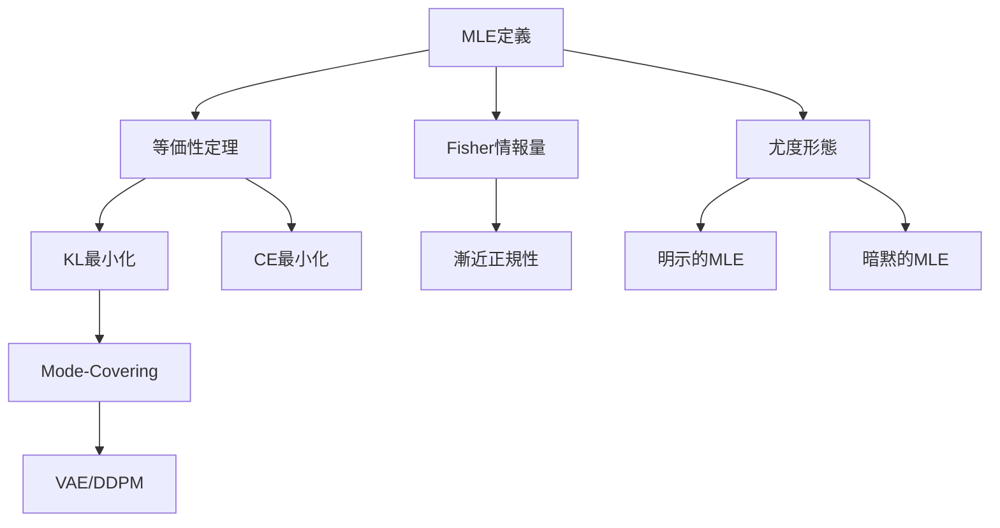
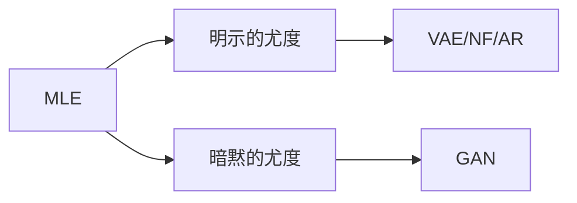
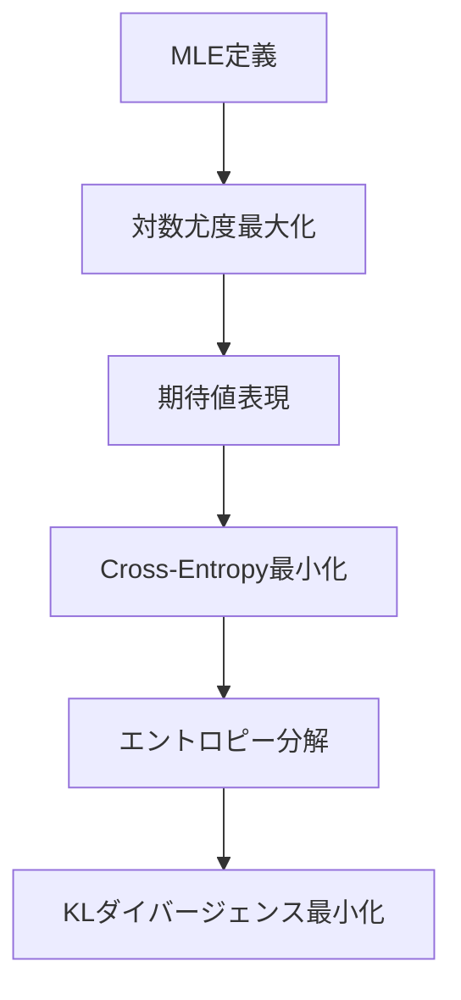

> **後編はこちら**: [第7回 Part2（実装編）](/articles/ml-lecture-07-part2)

## Learning Objectives

この講義を完了すると、以下ができるようになります:

- [ ] MLEの定義と数学的基盤を完全に理解する
- [ ] MLE = CE = KL の三位一体の等価性を証明できる
- [ ] Fisher情報量と漸近正規性の関係を説明できる
- [ ] Mode-Covering vs Mode-Seeking の違いを理解し、VAE/GANとの接続を説明できる
- [ ] 生成モデルの全パラダイムをMLEの変形として統一的に理解する

---

## 🚀 Z1. プロローグ（30秒）— GMMでMLEの限界を体感

> Progress: 3%

```python
import numpy as np
import matplotlib.pyplot as plt

# 2成分ガウス混合の真の分布
np.random.seed(42)
X = np.concatenate([
    np.random.randn(100) - 3,
    np.random.randn(100) + 3
])

# MLEで単一ガウスをフィット
mu_mle = X.mean()
sigma_mle = X.std()

# 真の分布と推定を可視化
x = np.linspace(-8, 8, 1000)
plt.hist(X, bins=30, density=True, alpha=0.5, label='Data')
plt.plot(x,
         0.5 * np.exp(-(x+3)**2/2)/np.sqrt(2*np.pi) +
         0.5 * np.exp(-(x-3)**2/2)/np.sqrt(2*np.pi),
         label='True (2-component GMM)', linewidth=2)
plt.plot(x,
         np.exp(-(x-mu_mle)**2/(2*sigma_mle**2))/(sigma_mle*np.sqrt(2*np.pi)),
         label=f'MLE Gaussian (μ={mu_mle:.2f}, σ={sigma_mle:.2f})', linewidth=2)
plt.legend()
plt.title('MLE fails to capture multimodality')
plt.show()
```

**出力**: 2つのピークを持つ真の分布に対し、MLEは単一のガウスで"平均化"してしまう。

**数式との対応**:

```math
\hat{\theta}_{\text{MLE}} = \arg\max_\theta \sum_{i=1}^n \log p(x_i \mid \theta)
```

単一ガウスモデルでは `$p(x \mid \mu, \sigma) = \mathcal{N}(x \mid \mu, \sigma^2)$` を仮定。2成分混合の真の分布 `$p(x) = 0.5 \mathcal{N}(x \mid -3, 1) + 0.5 \mathcal{N}(x \mid 3, 1)$` を表現できない。

この限界を超えるには"潜在変数"が必要 — それが第8回のEM算法だ。

---

## 📖 Z2. チュートリアル（10分）— 5トピック概観

> Progress: 10%

MLEは統計学の中核であり、生成モデルの学習原理そのものだ。

### 5トピックの全体像

| トピック | 内容 | Zone |
|:---------|:-----|:-----|
| **1. MLEの定義と等価性** | MLE = CE最小化 = KLダイバージェンス最小化の3つの等価性を完全証明 | Z4 |
| **2. MLEの漸近論と限界** | Fisher情報量・漸近正規性・一致性・有効性の完全証明 | Z4 |
| **3. 尤度関数の形態と変形** | 明示的 vs 暗黙的推定量、MLEの3変形 | Z4 |
| **4. サンプリング理論と評価指標** | MCMC・Reparameterization・FID・CMMD | Z4 |
| **5. Boss Battle** | MLE = CE = KL の三位一体の完全証明 | Z4 |

### トピック間の関係



### Quick Check 1

以下の文は正しいか？

1. MLEは常に不偏推定量である → ❌
2. MLEはKLダイバージェンス最小化と等価である → ✅
3. Fisher情報量が大きいほど推定精度が高い → ✅

<details><summary>解説</summary>

1. 正規分布の分散 `$\hat{\sigma}^2 = \frac{1}{n}\sum(x_i - \bar{x})^2$` は偏りあり
2. 本講義で証明する核心定理
3. Cramér-Rao下界 `$\text{Var}(\hat{\theta}) \geq \frac{1}{I(\theta)}$`

</details>

---

## 🌍 Z3. 世界観（20分）— 生成モデルの統一的理解

> Progress: 20%

### なぜMLEを学ぶのか？

機械学習の本質は「データ分布 `$p_{\text{data}}(x)$` を学習すること」だ。最尤推定（MLE）は、この分布推定の最も基本的かつ強力な道具だ。

### 生成モデルの統一原理

現代の生成モデルは**すべてMLEの変形**として理解できる。



統一原理: すべては `$\max_\theta \mathbb{E}_{x \sim p_{\text{data}}}[\log p_\theta(x)]$` を最大化している。

### MLEとKLダイバージェンスの等価性

本講義の核心定理:

```math
\hat{\theta}_{\text{MLE}} = \arg\max_\theta \mathbb{E}_{x \sim p_{\text{data}}}[\log p_\theta(x)] = \arg\min_\theta D_{\text{KL}}(p_{\text{data}} \| p_\theta)
```

MLEは"分布の距離"を最小化する最適化問題なのだ。

### Quick Check 2

VAEとGANの違いを **KLダイバージェンスの方向** で説明できるか？

<details><summary>解答</summary>

- **VAE**: `$D_{\text{KL}}(p_{\text{data}} \| p_\theta)$`（前向きKL）→ Mode-Covering → ぼやけた画像
- **GAN**: `$D_{\text{KL}}(p_\theta \| p_{\text{data}})$`（逆向きKL）→ Mode-Seeking → 鮮明だが多様性低

</details>

---

## ⚔️ Z4. Boss Battle（60分）— 最尤推定の完全体系

> Progress: 50%

### Topic 1: MLEの定義と等価性

#### 1.1 MLEの定義

**観測データ** `$\mathcal{D} = \{x_1, x_2, \ldots, x_n\}$` が独立同分布（i.i.d.）に確率分布 `$p(x \mid \theta)$` から生成されたとする。

**尤度関数**（Likelihood function）:

```math
L(\theta \mid \mathcal{D}) = \prod_{i=1}^n p(x_i \mid \theta)
```

**対数尤度関数**（Log-likelihood function）:

```math
\ell(\theta \mid \mathcal{D}) = \log L(\theta \mid \mathcal{D}) = \sum_{i=1}^n \log p(x_i \mid \theta)
```

**最尤推定量**（Maximum Likelihood Estimator, MLE）:

```math
\hat{\theta}_{\text{MLE}} = \arg\max_\theta \ell(\theta \mid \mathcal{D}) = \arg\max_\theta \sum_{i=1}^n \log p(x_i \mid \theta)
```

**なぜ対数をとるのか？**
1. 積 `$\prod$` を和 `$\sum$` に変換 → 微分が容易
2. 数値安定性 → アンダーフロー回避
3. 加法性 → 独立な観測の寄与を加算

#### 1.2 MLE = Cross-Entropy最小化の等価性

**経験分布**（Empirical distribution）:

```math
\hat{p}_{\text{data}}(x) = \frac{1}{n} \sum_{i=1}^n \delta(x - x_i)
```

ここで `$\delta(x - x_i)$` はDiracのデルタ関数。

**Cross-Entropy**:

```math
H(\hat{p}_{\text{data}}, p_\theta) = -\mathbb{E}_{x \sim \hat{p}_{\text{data}}}[\log p_\theta(x)] = -\frac{1}{n}\sum_{i=1}^n \log p_\theta(x_i)
```

**等価性の証明**:

MLEの目的関数を `$n$` で割ると:

```math
\frac{1}{n}\ell(\theta \mid \mathcal{D}) = \frac{1}{n}\sum_{i=1}^n \log p_\theta(x_i) = \mathbb{E}_{x \sim \hat{p}_{\text{data}}}[\log p_\theta(x)]
```

したがって:

```math
\hat{\theta}_{\text{MLE}} = \arg\max_\theta \mathbb{E}_{x \sim \hat{p}_{\text{data}}}[\log p_\theta(x)] = \arg\min_\theta H(\hat{p}_{\text{data}}, p_\theta)
```

**結論**: MLEはデータの経験分布とモデル分布の間のCross-Entropyを最小化する。

#### 1.3 MLE = KLダイバージェンス最小化の等価性

**KLダイバージェンス**:

```math
D_{\text{KL}}(\hat{p}_{\text{data}} \| p_\theta) = \mathbb{E}_{x \sim \hat{p}_{\text{data}}}\left[\log \frac{\hat{p}_{\text{data}}(x)}{p_\theta(x)}\right]
```

展開すると:

```math
D_{\text{KL}}(\hat{p}_{\text{data}} \| p_\theta) = \mathbb{E}_{x \sim \hat{p}_{\text{data}}}[\log \hat{p}_{\text{data}}(x)] - \mathbb{E}_{x \sim \hat{p}_{\text{data}}}[\log p_\theta(x)]
```

```math
= H(\hat{p}_{\text{data}}) + H(\hat{p}_{\text{data}}, p_\theta)
```

ここで `$H(\hat{p}_{\text{data}})$` は経験分布のエントロピー（定数）。したがって:

```math
\arg\min_\theta D_{\text{KL}}(\hat{p}_{\text{data}} \| p_\theta) = \arg\min_\theta H(\hat{p}_{\text{data}}, p_\theta) = \arg\max_\theta \mathbb{E}_{x \sim \hat{p}_{\text{data}}}[\log p_\theta(x)]
```

**結論**: MLEは経験分布とモデル分布の間の**前向きKLダイバージェンス**を最小化する。

#### 1.4 三位一体の統一

```math
\hat{\theta}_{\text{MLE}} = \arg\max_\theta \sum_{i=1}^n \log p_\theta(x_i) = \arg\min_\theta H(\hat{p}_{\text{data}}, p_\theta) = \arg\min_\theta D_{\text{KL}}(\hat{p}_{\text{data}} \| p_\theta)
```

この等価性が**生成モデルの学習原理**の数学的基盤だ。

#### 1.5 連続分布 vs 離散分布のMLE

**連続分布の場合** （例: 正規分布）:

```math
p_\theta(x) = \frac{1}{\sqrt{2\pi\sigma^2}} \exp\left(-\frac{(x-\mu)^2}{2\sigma^2}\right)
```

対数尤度:

```math
\ell(\mu, \sigma^2) = -\frac{n}{2}\log(2\pi) - \frac{n}{2}\log\sigma^2 - \frac{1}{2\sigma^2}\sum_{i=1}^n (x_i - \mu)^2
```

**離散分布の場合** （例: Categorical分布）:

```math
p_\theta(x = k) = \theta_k, \quad \sum_{k=1}^K \theta_k = 1
```

対数尤度:

```math
\ell(\boldsymbol{\theta}) = \sum_{i=1}^n \log \theta_{y_i}
```

ここで `$y_i \in \{1, \ldots, K\}$` は観測されたカテゴリ。

**MLE**:

```math
\hat{\theta}_k = \frac{\text{count}(y = k)}{n}
```

すなわち、経験頻度。

#### 1.6 条件付きMLEとLogistic回帰

**Logistic回帰**:

```math
p_\theta(y = 1 \mid x) = \sigma(\theta^T x), \quad \sigma(z) = \frac{1}{1 + e^{-z}}
```

**対数尤度** （Bernoulli分布）:

```math
\ell(\theta) = \sum_{i=1}^n \left[y_i \log p_\theta(y_i = 1 \mid x_i) + (1 - y_i) \log(1 - p_\theta(y_i = 1 \mid x_i))\right]
```

```math
= \sum_{i=1}^n \left[y_i \theta^T x_i - \log(1 + \exp(\theta^T x_i))\right]
```

**MLE**: 勾配上昇法で最適化

```math
\nabla_\theta \ell = \sum_{i=1}^n (y_i - \sigma(\theta^T x_i)) x_i
```

**直感**: 予測誤差 `$(y_i - \hat{y}_i)$` に比例する勾配。

#### 1.7 多クラス分類とSoftmax

**Softmax関数**:

```math
p_\theta(y = k \mid x) = \frac{\exp(\theta_k^T x)}{\sum_{j=1}^K \exp(\theta_j^T x)}
```

**対数尤度** （Categorical分布）:

```math
\ell(\Theta) = \sum_{i=1}^n \log p_\theta(y_i \mid x_i) = \sum_{i=1}^n \left[\theta_{y_i}^T x_i - \log \sum_{j=1}^K \exp(\theta_j^T x_i)\right]
```

**Cross-Entropy損失**:

```math
\mathcal{L}_{\text{CE}} = -\sum_{i=1}^n \sum_{k=1}^K \mathbb{1}[y_i = k] \log p_\theta(y = k \mid x_i)
```

**結論**: Softmax + Cross-Entropy = 多クラス分類のMLE

#### 1.8 MLEとベイズ推定の関係

**ベイズの定理**:

```math
p(\theta \mid \mathcal{D}) = \frac{p(\mathcal{D} \mid \theta) p(\theta)}{p(\mathcal{D})}
```

**MAP推定** （Maximum A Posteriori）:

```math
\hat{\theta}_{\text{MAP}} = \arg\max_\theta p(\theta \mid \mathcal{D}) = \arg\max_\theta \left[p(\mathcal{D} \mid \theta) p(\theta)\right]
```

対数をとると:

```math
\hat{\theta}_{\text{MAP}} = \arg\max_\theta \left[\log p(\mathcal{D} \mid \theta) + \log p(\theta)\right]
```

**事前分布が一様** `$p(\theta) \propto \text{const}$` のとき:

```math
\hat{\theta}_{\text{MAP}} = \hat{\theta}_{\text{MLE}}
```

**結論**: MLEはMAP推定の特殊ケース（無情報事前分布）。

**正則化との接続**:

- **L2正則化** `$\lambda \|\theta\|^2$` = ガウス事前分布 `$p(\theta) = \mathcal{N}(0, \frac{1}{2\lambda}I)$`
- **L1正則化** `$\lambda \|\theta\|_1$` = Laplace事前分布 `$p(\theta) = \text{Laplace}(0, \frac{1}{\lambda})$`

**正則化付きMLE**:

```math
\hat{\theta} = \arg\max_\theta \left[\ell(\theta \mid \mathcal{D}) - \lambda R(\theta)\right]
```

ここで `$R(\theta)$` は正則化項。

#### 1.9 尤度関数の性質

**性質1: Score関数の期待値は0**

```math
\mathbb{E}_{x \sim p(x \mid \theta)}\left[\frac{\partial \log p(x \mid \theta)}{\partial \theta}\right] = 0
```

**証明**:

```math
\mathbb{E}\left[\frac{\partial \log p(x \mid \theta)}{\partial \theta}\right] = \int \frac{\partial \log p(x \mid \theta)}{\partial \theta} p(x \mid \theta) dx
```

```math
= \int \frac{1}{p(x \mid \theta)} \frac{\partial p(x \mid \theta)}{\partial \theta} p(x \mid \theta) dx = \int \frac{\partial p(x \mid \theta)}{\partial \theta} dx
```

```math
= \frac{\partial}{\partial \theta} \int p(x \mid \theta) dx = \frac{\partial}{\partial \theta} 1 = 0
```

**性質2: Fisher情報量の2つの表現の等価性**

```math
I(\theta) = \mathbb{E}\left[\left(\frac{\partial \log p(x \mid \theta)}{\partial \theta}\right)^2\right] = -\mathbb{E}\left[\frac{\partial^2 \log p(x \mid \theta)}{\partial \theta^2}\right]
```

**証明**:

```math
\frac{\partial^2 \log p(x \mid \theta)}{\partial \theta^2} = \frac{\partial}{\partial \theta}\left[\frac{1}{p(x \mid \theta)} \frac{\partial p(x \mid \theta)}{\partial \theta}\right]
```

```math
= -\frac{1}{p^2} \left(\frac{\partial p}{\partial \theta}\right)^2 + \frac{1}{p} \frac{\partial^2 p}{\partial \theta^2}
```

期待値をとると:

```math
\mathbb{E}\left[\frac{\partial^2 \log p}{\partial \theta^2}\right] = -\mathbb{E}\left[\left(\frac{\partial \log p}{\partial \theta}\right)^2\right] + \mathbb{E}\left[\frac{1}{p} \frac{\partial^2 p}{\partial \theta^2}\right]
```

第2項は（正則条件下で）0なので、等価性が成立。

### Quick Check 3

以下の最適化問題はすべて等価である。正しいか？

1. `$\arg\max_\theta \sum \log p_\theta(x_i)$`
2. `$\arg\min_\theta H(\hat{p}_{\text{data}}, p_\theta)$`
3. `$\arg\min_\theta D_{\text{KL}}(\hat{p}_{\text{data}} \| p_\theta)$`

<details><summary>解答</summary>

✅ すべて等価。これがMLEの三位一体。

</details>

---

### Topic 2: MLEの漸近論と限界

#### 2.1 Fisher情報量

**Score関数**（スコア関数）:

```math
s(\theta \mid x) = \frac{\partial}{\partial \theta} \log p(x \mid \theta) = \frac{1}{p(x \mid \theta)} \frac{\partial p(x \mid \theta)}{\partial \theta}
```

**Fisher情報量**（Fisher Information）:

```math
I(\theta) = \mathbb{E}_{x \sim p(x \mid \theta)}[s(\theta \mid x)^2] = -\mathbb{E}_{x \sim p(x \mid \theta)}\left[\frac{\partial^2 \log p(x \mid \theta)}{\partial \theta^2}\right]
```

**直感**: Fisher情報量は「パラメータ `$\theta$` が対数尤度に与える感度」。`$I(\theta)$` が大きいほど、データから `$\theta$` を正確に推定できる。

**例: 正規分布 `$\mathcal{N}(\mu, \sigma^2)$` のFisher情報量**

平均 `$\mu$` に関するFisher情報量:

```math
I(\mu) = \frac{1}{\sigma^2}
```

分散が小さいほど `$\mu$` の推定精度が高い。

#### 2.2 Cramér-Rao下界

**Cramér-Rao下界**（Cramér-Rao Lower Bound, CRLB）:

任意の不偏推定量 `$\hat{\theta}$` に対し、その分散は:

```math
\text{Var}(\hat{\theta}) \geq \frac{1}{n \cdot I(\theta)}
```

ここで `$n$` はサンプルサイズ。

**結論**: Fisher情報量が大きいほど、推定量の分散の下界が小さい = 高精度推定が可能。

#### 2.3 MLEの漸近正規性

**定理**: 正則条件下で、サンプルサイズ `$n \to \infty$` のとき、MLEは真のパラメータ `$\theta_0$` の周りで漸近正規分布に従う:

```math
\sqrt{n}(\hat{\theta}_{\text{MLE}} - \theta_0) \xrightarrow{d} \mathcal{N}\left(0, \frac{1}{I(\theta_0)}\right)
```

**意味**:
1. **一致性**（Consistency）: `$\hat{\theta}_{\text{MLE}} \xrightarrow{P} \theta_0$`（確率収束）
2. **有効性**（Efficiency）: MLEはCramér-Rao下界を達成する漸近有効推定量
3. **正規性**: 大標本では正規分布で近似できる

#### 2.3.1 漸近正規性の証明スケッチ

**Taylor展開による証明の概略**:

真のパラメータを `$\theta_0$` とする。Score関数 `$s(\theta \mid x) = \frac{\partial \log p(x \mid \theta)}{\partial \theta}$` を `$\theta_0$` の周りでTaylor展開:

```math
s(\hat{\theta}_{\text{MLE}} \mid x_i) \approx s(\theta_0 \mid x_i) + \frac{\partial s(\theta_0 \mid x_i)}{\partial \theta}(\hat{\theta}_{\text{MLE}} - \theta_0)
```

MLE条件 `$\sum_{i=1}^n s(\hat{\theta}_{\text{MLE}} \mid x_i) = 0$` より:

```math
\sum_{i=1}^n s(\theta_0 \mid x_i) + \sum_{i=1}^n \frac{\partial s(\theta_0 \mid x_i)}{\partial \theta}(\hat{\theta}_{\text{MLE}} - \theta_0) \approx 0
```

```math
\Rightarrow \quad \hat{\theta}_{\text{MLE}} - \theta_0 \approx -\left(\sum_{i=1}^n \frac{\partial s(\theta_0 \mid x_i)}{\partial \theta}\right)^{-1} \sum_{i=1}^n s(\theta_0 \mid x_i)
```

ここで:
- `$\mathbb{E}[s(\theta_0 \mid x)] = 0$`（Score関数の期待値は0）
- `$\text{Var}(s(\theta_0 \mid x)) = I(\theta_0)$`（Fisher情報量）
- `$\mathbb{E}\left[\frac{\partial s(\theta_0 \mid x)}{\partial \theta}\right] = -I(\theta_0)$`

大数の法則と中心極限定理より:

```math
\sum_{i=1}^n s(\theta_0 \mid x_i) \xrightarrow{d} \mathcal{N}(0, n \cdot I(\theta_0))
```

```math
\frac{1}{n}\sum_{i=1}^n \frac{\partial s(\theta_0 \mid x_i)}{\partial \theta} \xrightarrow{P} -I(\theta_0)
```

したがって:

```math
\sqrt{n}(\hat{\theta}_{\text{MLE}} - \theta_0) \xrightarrow{d} \mathcal{N}\left(0, \frac{1}{I(\theta_0)}\right)
```

**結論**: MLEは漸近的に正規分布に従い、分散はCramér-Rao下界を達成。

#### 2.3.2 Fisher情報行列（多パラメータ版）

パラメータが `$\boldsymbol{\theta} \in \mathbb{R}^p$` のベクトルの場合、**Fisher情報行列**:

```math
I(\boldsymbol{\theta})_{ij} = \mathbb{E}\left[\frac{\partial \log p(x \mid \boldsymbol{\theta})}{\partial \theta_i} \frac{\partial \log p(x \mid \boldsymbol{\theta})}{\partial \theta_j}\right]
```

または:

```math
I(\boldsymbol{\theta})_{ij} = -\mathbb{E}\left[\frac{\partial^2 \log p(x \mid \boldsymbol{\theta})}{\partial \theta_i \partial \theta_j}\right]
```

**Cramér-Rao下界（多パラメータ版）**:

任意の不偏推定量 `$\hat{\boldsymbol{\theta}}$` の共分散行列 `$\Sigma = \mathbb{E}[(\hat{\boldsymbol{\theta}} - \boldsymbol{\theta})(\hat{\boldsymbol{\theta}} - \boldsymbol{\theta})^T]$` に対し:

```math
\Sigma \succeq \frac{1}{n} I(\boldsymbol{\theta})^{-1}
```

ここで `$\succeq$` は半正定値順序（`$\Sigma - \frac{1}{n}I(\boldsymbol{\theta})^{-1}$` が半正定値）。

**MLEの漸近的共分散行列**:

```math
\sqrt{n}(\hat{\boldsymbol{\theta}}_{\text{MLE}} - \boldsymbol{\theta}_0) \xrightarrow{d} \mathcal{N}\left(\mathbf{0}, I(\boldsymbol{\theta}_0)^{-1}\right)
```

#### 2.3.3 例: 多変量正規分布のFisher情報行列

`$\mathcal{N}(\boldsymbol{\mu}, \Sigma)$` のパラメータ `$\boldsymbol{\theta} = (\boldsymbol{\mu}, \Sigma)$` に関するFisher情報量:

**平均に関する部分**:

```math
I_{\mu_i, \mu_j} = \Sigma^{-1}_{ij}
```

**共分散行列に関する部分** （複雑）:

```math
I_{\Sigma_{ij}, \Sigma_{kl}} = \frac{1}{2}(\Sigma^{-1}_{ik}\Sigma^{-1}_{jl} + \Sigma^{-1}_{il}\Sigma^{-1}_{jk})
```

**結論**: 共分散行列が大きいほど、平均の推定精度が低い（直感と一致）。

#### 2.4 MLEの限界

**問題1: 次元の呪い**

高次元空間では、データ密度が指数的に疎になる。`$d$` 次元空間で半径 `$r$` の球の体積:

```math
V_d(r) \propto r^d
```

同じ密度を保つには、サンプルサイズが `$n \propto 2^d$` 必要（指数的増加）。

**問題2: 多様体仮説**

実データは高次元空間の**低次元多様体**上に存在する。

```math
\mathcal{M} = \{x \in \mathbb{R}^D \mid x = G(z), z \in \mathbb{R}^d, d \ll D\}
```

ここで `$G: \mathbb{R}^d \to \mathbb{R}^D$` は生成関数（Generator）。

**例**: 画像は `$256 \times 256 = 65536$` 次元だが、意味のある画像は低次元多様体上にある。

**問題3: 周辺化の困難性**

潜在変数 `$z$` を持つモデル:

```math
p_\theta(x) = \int p_\theta(x \mid z) p(z) dz
```

この積分が解析的に計算不能な場合が多い。

**解決策**:
- **変分推論**（VAE）: ELBOで近似
- **MCMC**: サンプリングで近似
- **EM算法**: 潜在変数を"期待値化"

### Quick Check 4

Fisher情報量が大きいことの意味は？

<details><summary>解答</summary>

パラメータの推定精度が高い。Cramér-Rao下界 `$\text{Var}(\hat{\theta}) \geq 1/(n \cdot I(\theta))$` より、`$I(\theta)$` が大きいほど分散が小さい。

</details>

---

### Topic 3: 尤度関数の形態と変形

#### 3.1 尤度関数のアクセス形態

**Mohamed & Lakshminarayanan (2016)** の分類:

1. **Explicit density（明示的密度）**: `$p_\theta(x)$` が解析的に計算可能
   - 例: VAE, Normalizing Flow, 自己回帰モデル
2. **Implicit density（暗黙的密度）**: `$p_\theta(x)$` が計算不能、サンプリングのみ可能
   - 例: GAN

#### 3.2 明示的MLE: Normalizing Flow

**Normalizing Flow**（正規化流）:

可逆変換 `$f_\theta: \mathbb{R}^d \to \mathbb{R}^d$` を用いて、単純な分布 `$p_z(z)$`（例: 標準正規分布）を複雑な分布 `$p_x(x)$` に変換:

```math
x = f_\theta(z), \quad z \sim p_z(z)
```

**変数変換公式**:

```math
p_x(x) = p_z(f_\theta^{-1}(x)) \left|\det \frac{\partial f_\theta^{-1}(x)}{\partial x}\right|
```

対数尤度:

```math
\log p_x(x) = \log p_z(f_\theta^{-1}(x)) + \log \left|\det \frac{\partial f_\theta^{-1}(x)}{\partial x}\right|
```

**最尤推定**:

```math
\hat{\theta}_{\text{MLE}} = \arg\max_\theta \sum_{i=1}^n \log p_x(x_i)
```

ヤコビ行列式の計算が鍵。

#### 3.3 暗黙的MLE: GAN

**GAN**（Generative Adversarial Network）:

生成器 `$G_\theta: \mathbb{R}^d \to \mathbb{R}^D$` がノイズ `$z \sim p_z(z)$` を画像 `$x = G_\theta(z)$` に変換。

**Pushforward measure**:

```math
p_\theta(x) = (G_\theta)_\# p_z(z)
```

ここで `$(G_\theta)_\#$` はpushforward（押し出し測度）。

**問題**: `$p_\theta(x)$` が解析的に計算不能。

**解決**: 識別器 `$D_\phi: \mathbb{R}^D \to [0, 1]$` を導入し、敵対的学習:

```math
\min_\theta \max_\phi \mathbb{E}_{x \sim p_{\text{data}}}[\log D_\phi(x)] + \mathbb{E}_{z \sim p_z}[\log(1 - D_\phi(G_\theta(z)))]
```

**直感**: 識別器が真偽を判定できなくなるまで生成器を改善。

#### 3.4 Score Matching

**Score function**:

```math
s_\theta(x) = \nabla_x \log p_\theta(x)
```

**Score Matching目的関数**:

```math
\mathcal{L}_{\text{SM}}(\theta) = \frac{1}{2} \mathbb{E}_{x \sim p_{\text{data}}}\left[\|s_\theta(x) - \nabla_x \log p_{\text{data}}(x)\|^2\right]
```

**問題**: `$\nabla_x \log p_{\text{data}}(x)$` は未知。

**解決**: 部分積分を用いた変形（Hyvärinen 2005）

```math
\mathcal{L}_{\text{SM}}(\theta) = \mathbb{E}_{x \sim p_{\text{data}}}\left[\text{Tr}\left(\nabla_x s_\theta(x)\right) + \frac{1}{2}\|s_\theta(x)\|^2\right] + \text{const}
```

ここで `$\text{Tr}\left(\nabla_x s_\theta(x)\right) = \sum_i \frac{\partial^2 \log p_\theta(x)}{\partial x_i^2}$` はHessianのトレース。

**利点**: `$p_\theta(x)$` の正規化定数不要。`$p_{\text{data}}$` の勾配も不要。

**Denoising Score Matching** (Vincent 2011):

ノイズ付加データ `$\tilde{x} = x + \sigma \epsilon, \epsilon \sim \mathcal{N}(0, I)$` を用いて:

```math
\mathcal{L}_{\text{DSM}}(\theta) = \frac{1}{2} \mathbb{E}_{x, \tilde{x}}\left[\|s_\theta(\tilde{x}) - \nabla_{\tilde{x}} \log p(\tilde{x} \mid x)\|^2\right]
```

ノイズ付加の条件付き分布 `$p(\tilde{x} \mid x) = \mathcal{N}(\tilde{x} \mid x, \sigma^2 I)$` より:

```math
\nabla_{\tilde{x}} \log p(\tilde{x} \mid x) = -\frac{\tilde{x} - x}{\sigma^2}
```

したがって:

```math
\mathcal{L}_{\text{DSM}}(\theta) = \frac{1}{2} \mathbb{E}_{x, \epsilon}\left[\left\|s_\theta(x + \sigma\epsilon) + \frac{\epsilon}{\sigma}\right\|^2\right]
```

これが**拡散モデル**の基礎。

#### 3.4.1 Score Matchingと最尤推定の関係

**定理** (Hyvärinen 2005):

正則条件下で、Score Matchingの目的関数は以下のように分解できる:

```math
\mathcal{L}_{\text{SM}}(\theta) = D_{\text{KL}}(p_{\text{data}} \| p_\theta) + \text{const}
```

**証明スケッチ**:

```math
\mathcal{L}_{\text{SM}}(\theta) = \frac{1}{2}\mathbb{E}_{x \sim p_{\text{data}}}\left[\|s_\theta(x) - s_{\text{data}}(x)\|^2\right]
```

展開:

```math
= \frac{1}{2}\mathbb{E}[s_\theta^2] - \mathbb{E}[s_\theta \cdot s_{\text{data}}] + \frac{1}{2}\mathbb{E}[s_{\text{data}}^2]
```

部分積分により:

```math
\mathbb{E}_{x \sim p_{\text{data}}}[s_\theta(x) \cdot s_{\text{data}}(x)] = -\mathbb{E}_{x \sim p_{\text{data}}}[\text{Tr}(\nabla_x s_\theta(x))]
```

最終的に:

```math
\mathcal{L}_{\text{SM}}(\theta) = D_{\text{KL}}(p_{\text{data}} \| p_\theta) + \text{const}
```

**結論**: Score MatchingはKL最小化 = MLEと等価。

#### 3.4.2 拡散モデルへの接続

**DDPM目的関数** (Ho+ 2020):

```math
\mathcal{L}_{\text{DDPM}} = \mathbb{E}_{t, x_0, \epsilon}\left[\|\epsilon - \epsilon_\theta(x_t, t)\|^2\right]
```

ここで `$x_t = \sqrt{\bar{\alpha}_t} x_0 + \sqrt{1 - \bar{\alpha}_t} \epsilon$`。

**Score関数との関係**:

```math
\epsilon_\theta(x_t, t) = -\sqrt{1 - \bar{\alpha}_t} \cdot s_\theta(x_t, t)
```

したがって:

```math
\mathcal{L}_{\text{DDPM}} = (1 - \bar{\alpha}_t) \mathbb{E}\left[\|s_\theta(x_t, t) - s_t(x_t)\|^2\right]
```

ここで `$s_t(x_t) = -\frac{\epsilon}{\sqrt{1 - \bar{\alpha}_t}}$` は真のScore関数。

**結論**: DDPMはDenoising Score Matchingの時間依存版。

#### 3.4.3 Sliced Score Matching（高次元での効率化）

**問題**: `$\text{Tr}(\nabla_x s_\theta(x))$` の計算コストが `$O(d^2)$`（`$d$` は次元）。

**解決**: ランダム射影 `$v \sim \mathcal{N}(0, I)$` を用いて:

```math
\mathcal{L}_{\text{SSM}}(\theta) = \frac{1}{2}\mathbb{E}_{x, v}\left[(v^T s_\theta(x))^2 + 2v^T \nabla_x s_\theta(x) v\right]
```

**利点**: `$v^T \nabla_x s_\theta(x) v$` はHessian-vector積（自動微分で効率的に計算可能、`$O(d)$`）。

#### 3.4.4 GAN目的関数の詳細導出

**Jensen-Shannon Divergence**:

```math
\text{JSD}(p \| q) = \frac{1}{2}D_{\text{KL}}\left(p \Big\| \frac{p+q}{2}\right) + \frac{1}{2}D_{\text{KL}}\left(q \Big\| \frac{p+q}{2}\right)
```

**GAN目的関数** (Goodfellow+ 2014):

```math
\min_G \max_D V(D, G) = \mathbb{E}_{x \sim p_{\text{data}}}[\log D(x)] + \mathbb{E}_{z \sim p_z}[\log(1 - D(G(z)))]
```

**最適識別器** `$D^*$`:

固定された `$G$` に対し、`$V(D, G)$` を `$D$` について最大化:

```math
\frac{\delta V}{\delta D(x)} = \frac{p_{\text{data}}(x)}{D(x)} - \frac{p_G(x)}{1 - D(x)} = 0
```

```math
\Rightarrow \quad D^*(x) = \frac{p_{\text{data}}(x)}{p_{\text{data}}(x) + p_G(x)}
```

**最適識別器を代入**:

```math
V(G, D^*) = \mathbb{E}_{x \sim p_{\text{data}}}\left[\log \frac{p_{\text{data}}(x)}{p_{\text{data}}(x) + p_G(x)}\right] + \mathbb{E}_{x \sim p_G}\left[\log \frac{p_G(x)}{p_{\text{data}}(x) + p_G(x)}\right]
```

変形:

```math
= -\log 4 + D_{\text{KL}}\left(p_{\text{data}} \Big\| \frac{p_{\text{data}} + p_G}{2}\right) + D_{\text{KL}}\left(p_G \Big\| \frac{p_{\text{data}} + p_G}{2}\right)
```

```math
= -\log 4 + 2 \cdot \text{JSD}(p_{\text{data}} \| p_G)
```

**結論**: GANはJensen-Shannon Divergenceを最小化。

**JSD vs KL**:

- **KL**: 非対称、Mode-Covering/Seeking
- **JSD**: 対称、両方向のKLの平均

#### 3.4.5 Wasserstein GANへの発展

**Wasserstein距離** (Earth Mover's Distance):

```math
W_1(p, q) = \inf_{\gamma \in \Pi(p, q)} \mathbb{E}_{(x, y) \sim \gamma}[\|x - y\|]
```

ここで `$\Pi(p, q)$` は `$p$` と `$q$` を周辺分布に持つ同時分布の集合。

**Kantorovich-Rubinstein双対性**:

```math
W_1(p, q) = \sup_{\|f\|_L \leq 1} \left[\mathbb{E}_{x \sim p}[f(x)] - \mathbb{E}_{y \sim q}[f(y)]\right]
```

ここで `$\|f\|_L \leq 1$` は1-Lipschitz制約。

**WGAN目的関数** (Arjovsky+ 2017):

```math
\min_G \max_{D: \|D\|_L \leq 1} \left[\mathbb{E}_{x \sim p_{\text{data}}}[D(x)] - \mathbb{E}_{z \sim p_z}[D(G(z))]\right]
```

**Lipschitz制約の実装**:

1. **Weight clipping** (元論文): `$w \in [-c, c]$`（不安定）
2. **Gradient penalty** (Gulrajani+ 2017): `$\lambda \mathbb{E}_{\hat{x}}[(\|\nabla_{\hat{x}} D(\hat{x})\|_2 - 1)^2]$`（推奨）
3. **Spectral normalization** (Miyato+ 2018): 各層の重み行列をスペクトルノルムで正規化

**WGANの利点**:

- 訓練安定性
- モード崩壊の緩和
- 生成品質の指標として使える（Wasserstein距離そのもの）

#### 3.5 Mode-Covering vs Mode-Seeking

**前向きKL** `$D_{\text{KL}}(p_{\text{data}} \| p_\theta)$`:

```math
D_{\text{KL}}(p_{\text{data}} \| p_\theta) = \mathbb{E}_{x \sim p_{\text{data}}}\left[\log \frac{p_{\text{data}}(x)}{p_\theta(x)}\right]
```

`$p_{\text{data}}(x) > 0$` のとき `$p_\theta(x) > 0$` でなければ発散 → **Mode-Covering**（全モードをカバー）

**結果**: ぼやけた生成（VAE, Diffusion）

**逆向きKL** `$D_{\text{KL}}(p_\theta \| p_{\text{data}})$`:

```math
D_{\text{KL}}(p_\theta \| p_{\text{data}}) = \mathbb{E}_{x \sim p_\theta}\left[\log \frac{p_\theta(x)}{p_{\text{data}}(x)}\right]
```

`$p_\theta(x) > 0$` のとき `$p_{\text{data}}(x) > 0$` でなければ発散 → **Mode-Seeking**（最も確率の高いモードに集中）

**結果**: 鮮明だが多様性低（GAN）

### Quick Check 5

VAEとGANのKL方向の違いを説明せよ。

<details><summary>解答</summary>

- **VAE**: 前向きKL `$D_{\text{KL}}(p_{\text{data}} \| p_\theta)$` → Mode-Covering → ぼやけた生成
- **GAN**: 逆向きKL `$D_{\text{KL}}(p_\theta \| p_{\text{data}})$` → Mode-Seeking → 鮮明だが多様性低

</details>

---

### Topic 4: サンプリング理論と評価指標

#### 4.1 事後分布からのサンプリング

潜在変数モデル `$p_\theta(x, z) = p_\theta(x \mid z)p(z)$` において、事後分布 `$p_\theta(z \mid x)$` からのサンプリングが必要。

**問題**: 事後分布が解析的に計算不能な場合が多い。

**解決策**:

##### 4.1.1 Rejection Sampling（棄却サンプリング）

提案分布 `$q(z)$` から候補 `$z' \sim q(z)$` をサンプルし、確率 `$\frac{p(z')}{M \cdot q(z')}$` で受理。

**問題**: 高次元で受理率が指数的に低下。

##### 4.1.2 Importance Sampling（重点サンプリング）

期待値の計算:

```math
\mathbb{E}_{z \sim p(z)}[f(z)] = \mathbb{E}_{z \sim q(z)}\left[f(z) \frac{p(z)}{q(z)}\right]
```

ここで `$w(z) = \frac{p(z)}{q(z)}$` は重み。

**問題**: `$q(z)$` の選択が難しい。

##### 4.1.3 MCMC（Markov Chain Monte Carlo）

**Metropolis-Hastings算法**:

1. 現在の状態 `$z^{(t)}$` から提案分布 `$q(z' \mid z^{(t)})$` で候補 `$z'$` をサンプル
2. 受理確率:

```math
\alpha(z', z^{(t)}) = \min\left(1, \frac{p(z') q(z^{(t)} \mid z')}{p(z^{(t)}) q(z' \mid z^{(t)})}\right)
```

3. 確率 `$\alpha$` で `$z^{(t+1)} = z'$`、さもなくば `$z^{(t+1)} = z^{(t)}$`

**定常分布**: `$p(z)$`

**問題**: 収束が遅い（mixing time）。

##### 4.1.4 Reparameterization Trick（VAEの核心）

潜在変数 `$z \sim q_\phi(z \mid x)$` を、決定的変換 `$z = g_\phi(\epsilon, x)$` とノイズ `$\epsilon \sim p(\epsilon)$` で表現:

**例: ガウス分布**

```math
z \sim \mathcal{N}(\mu_\phi(x), \sigma_\phi^2(x)) \quad \Rightarrow \quad z = \mu_\phi(x) + \sigma_\phi(x) \cdot \epsilon, \quad \epsilon \sim \mathcal{N}(0, 1)
```

**利点**: 勾配が `$z$` を通過可能 → `$\phi$` で微分可能。

```math
\nabla_\phi \mathbb{E}_{z \sim q_\phi(z \mid x)}[f(z)] = \mathbb{E}_{\epsilon \sim p(\epsilon)}[\nabla_\phi f(g_\phi(\epsilon, x))]
```

これがVAEの学習を可能にする。

#### 4.2 生成モデルの評価指標

生成モデルの品質をどう評価するか？

##### 4.2.1 Inception Score (IS)

```math
\text{IS}(G) = \exp\left(\mathbb{E}_{x \sim p_G}[D_{\text{KL}}(p(y \mid x) \| p(y))]\right)
```

ここで `$p(y \mid x)$` はInceptionモデルによるクラス予測。

**直感**: 生成画像が明確なクラスに属し（`$p(y \mid x)$` がシャープ）、全体として多様（`$p(y)$` が均一）なら高スコア。

**問題**: Inceptionモデルに依存、データ分布を考慮しない。

##### 4.2.2 Fréchet Inception Distance (FID)

**定義**:

```math
\text{FID}(p_{\text{data}}, p_G) = \|\mu_{\text{data}} - \mu_G\|^2 + \text{Tr}\left(\Sigma_{\text{data}} + \Sigma_G - 2(\Sigma_{\text{data}} \Sigma_G)^{1/2}\right)
```

ここで `$\mu, \Sigma$` はInception特徴の平均・共分散行列。

**直感**: Inception特徴空間での2つのガウス分布間のFréchet距離。

**問題** (Jayasumana+ 2024):
1. Inceptionの表現力が現代の生成モデル（Text-to-Image）には不十分
2. ガウス仮定が不適切
3. サンプルサイズに敏感

##### 4.2.3 CMMD (Rethinking FID, CVPR 2024)

**CLIP Maximum Mean Discrepancy**:

```math
\text{CMMD}^2(p_{\text{data}}, p_G) = \mathbb{E}_{x, x' \sim p_{\text{data}}}[k(x, x')] + \mathbb{E}_{y, y' \sim p_G}[k(y, y')] - 2\mathbb{E}_{x \sim p_{\text{data}}, y \sim p_G}[k(x, y)]
```

ここで `$k(x, y) = \exp(-\|\phi(x) - \phi(y)\|^2 / (2\sigma^2))$` はRBFカーネル、`$\phi$` はCLIP埋め込み。

**利点**:
1. CLIP埋め込み → リッチな表現（Text-to-Imageに適合）
2. 分布の仮定なし（ノンパラメトリック）
3. サンプル効率が良い（FIDより2桁少ないサンプルで安定）

**理論的保証**: CMMDは真のMMDの不偏推定量。

#### 4.3 LLMと最尤推定

**自己回帰言語モデル**:

```math
p_\theta(\mathbf{x}) = \prod_{t=1}^T p_\theta(x_t \mid x_{<t})
```

ここで `$\mathbf{x} = (x_1, \ldots, x_T)$` はトークン列。

**対数尤度**:

```math
\log p_\theta(\mathbf{x}) = \sum_{t=1}^T \log p_\theta(x_t \mid x_{<t})
```

**MLEの学習**:

```math
\hat{\theta}_{\text{MLE}} = \arg\max_\theta \sum_{i=1}^n \sum_{t=1}^{T_i} \log p_\theta(x_t^{(i)} \mid x_{<t}^{(i)})
```

**実装**: Cross-Entropy損失

```math
\mathcal{L}_{\text{CE}} = -\sum_{t=1}^T \log p_\theta(x_t \mid x_{<t})
```

**Perplexity**:

```math
\text{PPL} = \exp\left(-\frac{1}{T}\sum_{t=1}^T \log p_\theta(x_t \mid x_{<t})\right) = \exp(H(\hat{p}_{\text{data}}, p_\theta))
```

Perplexityが低いほど、モデルがデータをよく説明。

### Quick Check 6

FIDの3つの問題点を挙げよ。

<details><summary>解答</summary>

1. Inceptionの表現力不足（Text-to-Imageに不適）
2. ガウス仮定が不適切
3. サンプルサイズに敏感（1万枚以上必要）

CMMDはこれらを解決（CLIP埋め込み・ノンパラメトリック・サンプル効率良）。

</details>

---

### Topic 5: Boss Battle — MLE = CE = KL の三位一体完全証明

#### 5.1 証明のロードマップ



#### 5.2 ステップ1: MLEから期待値表現へ

**MLE目的関数**:

```math
\hat{\theta}_{\text{MLE}} = \arg\max_\theta \sum_{i=1}^n \log p_\theta(x_i)
```

データ `$\{x_1, \ldots, x_n\}$` が i.i.d. に `$p_{\text{data}}(x)$` から生成されたとする。大数の法則より:

```math
\frac{1}{n}\sum_{i=1}^n \log p_\theta(x_i) \xrightarrow{n \to \infty} \mathbb{E}_{x \sim p_{\text{data}}}[\log p_\theta(x)]
```

したがって、大標本極限で:

```math
\hat{\theta}_{\text{MLE}} = \arg\max_\theta \mathbb{E}_{x \sim p_{\text{data}}}[\log p_\theta(x)]
```

#### 5.3 ステップ2: Cross-Entropy最小化への変換

**Cross-Entropyの定義**:

```math
H(p_{\text{data}}, p_\theta) = -\mathbb{E}_{x \sim p_{\text{data}}}[\log p_\theta(x)]
```

したがって:

```math
\arg\max_\theta \mathbb{E}_{x \sim p_{\text{data}}}[\log p_\theta(x)] = \arg\min_\theta H(p_{\text{data}}, p_\theta)
```

**結論**: MLEはCross-Entropy最小化と等価。

#### 5.4 ステップ3: KLダイバージェンスへの分解

**KLダイバージェンスの定義**:

```math
D_{\text{KL}}(p_{\text{data}} \| p_\theta) = \mathbb{E}_{x \sim p_{\text{data}}}\left[\log \frac{p_{\text{data}}(x)}{p_\theta(x)}\right]
```

展開:

```math
D_{\text{KL}}(p_{\text{data}} \| p_\theta) = \mathbb{E}_{x \sim p_{\text{data}}}[\log p_{\text{data}}(x)] - \mathbb{E}_{x \sim p_{\text{data}}}[\log p_\theta(x)]
```

第1項は `$H(p_{\text{data}})$`（データ分布のエントロピー、定数）、第2項は `$-H(p_{\text{data}}, p_\theta)$`。

```math
D_{\text{KL}}(p_{\text{data}} \| p_\theta) = -H(p_{\text{data}}) + H(p_{\text{data}}, p_\theta)
```

`$\theta$` について最小化するとき、`$H(p_{\text{data}})$` は定数なので:

```math
\arg\min_\theta D_{\text{KL}}(p_{\text{data}} \| p_\theta) = \arg\min_\theta H(p_{\text{data}}, p_\theta) = \arg\max_\theta \mathbb{E}_{x \sim p_{\text{data}}}[\log p_\theta(x)]
```

#### 5.5 三位一体の完成

```math
\boxed{
\hat{\theta}_{\text{MLE}} = \arg\max_\theta \mathbb{E}_{x \sim p_{\text{data}}}[\log p_\theta(x)] = \arg\min_\theta H(p_{\text{data}}, p_\theta) = \arg\min_\theta D_{\text{KL}}(p_{\text{data}} \| p_\theta)
}
```

**数学的意味**:

1. **MLE**: 観測データの対数尤度を最大化
2. **Cross-Entropy**: データ分布とモデル分布の間のCross-Entropyを最小化
3. **KL**: データ分布とモデル分布の間の前向きKLダイバージェンスを最小化

これらはすべて**同じ最適化問題**を異なる視点で表現したもの。

#### 5.6 実践への接続

**VAE**: ELBOを最大化 `$\Rightarrow$` `$D_{\text{KL}}(q_\phi(z \mid x) \| p_\theta(z \mid x))$` を暗に最小化

**Diffusion**: Score matching `$\Rightarrow$` KLの変分下界を最小化

**LLM**: Cross-Entropy損失 `$\Rightarrow$` 次トークン予測でMLEを実行

すべての道はMLEに通ず。

### Quick Check 7

MLEとKL最小化が等価である理由を、エントロピーの項で説明せよ。

<details><summary>解答</summary>

```math
D_{\text{KL}}(p_{\text{data}} \| p_\theta) = H(p_{\text{data}}, p_\theta) - H(p_{\text{data}})
```

`$H(p_{\text{data}})$` は定数なので、KL最小化 `$\Leftrightarrow$` Cross-Entropy最小化 `$\Leftrightarrow$` MLE。

</details>

#### 5.7 数値検証: ガウス分布でのMLE

**問題設定**: データ `$\{x_1, \ldots, x_n\}$` が `$\mathcal{N}(\mu_0, \sigma_0^2)$` から生成されたとする。

**MLEの解析解**:

尤度関数:

```math
L(\mu, \sigma^2 \mid \mathcal{D}) = \prod_{i=1}^n \frac{1}{\sqrt{2\pi\sigma^2}} \exp\left(-\frac{(x_i - \mu)^2}{2\sigma^2}\right)
```

対数尤度:

```math
\ell(\mu, \sigma^2 \mid \mathcal{D}) = -\frac{n}{2}\log(2\pi) - \frac{n}{2}\log\sigma^2 - \frac{1}{2\sigma^2}\sum_{i=1}^n (x_i - \mu)^2
```

**ステップ1**: `$\mu$` に関する最大化

```math
\frac{\partial \ell}{\partial \mu} = \frac{1}{\sigma^2}\sum_{i=1}^n (x_i - \mu) = 0
```

```math
\Rightarrow \quad \hat{\mu}_{\text{MLE}} = \frac{1}{n}\sum_{i=1}^n x_i = \bar{x}
```

**ステップ2**: `$\sigma^2$` に関する最大化

`$\mu = \hat{\mu}_{\text{MLE}}$` を代入:

```math
\frac{\partial \ell}{\partial \sigma^2} = -\frac{n}{2\sigma^2} + \frac{1}{2(\sigma^2)^2}\sum_{i=1}^n (x_i - \bar{x})^2 = 0
```

```math
\Rightarrow \quad \hat{\sigma}^2_{\text{MLE}} = \frac{1}{n}\sum_{i=1}^n (x_i - \bar{x})^2
```

**注意**: `$\hat{\sigma}^2_{\text{MLE}}$` は偏りあり。不偏推定量は `$s^2 = \frac{1}{n-1}\sum(x_i - \bar{x})^2$`。

#### 5.8 一般化: 指数型分布族でのMLE

**指数型分布族**:

```math
p(x \mid \eta) = h(x) \exp(\eta^T T(x) - A(\eta))
```

ここで:
- `$\eta$`: 自然パラメータ（natural parameter）
- `$T(x)$`: 十分統計量（sufficient statistic）
- `$A(\eta)$`: 対数分配関数（log-partition function）

**対数尤度**:

```math
\ell(\eta \mid \mathcal{D}) = \sum_{i=1}^n \left[\eta^T T(x_i) - A(\eta) + \log h(x_i)\right]
```

**MLE条件**:

```math
\frac{\partial \ell}{\partial \eta} = \sum_{i=1}^n T(x_i) - n \nabla_\eta A(\eta) = 0
```

```math
\Rightarrow \quad \nabla_\eta A(\hat{\eta}_{\text{MLE}}) = \frac{1}{n}\sum_{i=1}^n T(x_i)
```

**結論**: MLEは十分統計量の平均を`$\nabla_\eta A(\eta)$`に一致させる。

**例**: 正規分布 `$\mathcal{N}(\mu, \sigma^2)$`

```math
\eta = \begin{pmatrix} \mu/\sigma^2 \\ -1/(2\sigma^2) \end{pmatrix}, \quad T(x) = \begin{pmatrix} x \\ x^2 \end{pmatrix}
```

#### 5.9 条件付き尤度 vs 周辺尤度

**教師あり学習**: 条件付き尤度 `$p_\theta(y \mid x)$`

```math
\hat{\theta}_{\text{MLE}} = \arg\max_\theta \sum_{i=1}^n \log p_\theta(y_i \mid x_i)
```

**例**: ロジスティック回帰、ニューラルネット分類器

**教師なし学習**: 周辺尤度 `$p_\theta(x)$`

```math
\hat{\theta}_{\text{MLE}} = \arg\max_\theta \sum_{i=1}^n \log p_\theta(x_i)
```

**例**: VAE, Diffusion, 自己回帰モデル

**潜在変数がある場合**: 周辺化

```math
p_\theta(x) = \int p_\theta(x \mid z) p(z) dz
```

この積分が計算困難 → EMアルゴリズム（第8回）

#### 5.10 確率密度推定の2大流派

**パラメトリック推定**: `$p_\theta(x)$` を仮定

- **利点**: サンプル効率、解釈性
- **欠点**: モデル誤指定のリスク

**ノンパラメトリック推定**: データ駆動

**例: Kernel Density Estimation (KDE)**

```math
\hat{p}(x) = \frac{1}{nh}\sum_{i=1}^n K\left(\frac{x - x_i}{h}\right)
```

ここで `$K(\cdot)$` はカーネル関数（例: ガウス）、`$h$` は帯域幅。

- **利点**: モデル仮定不要
- **欠点**: 高次元で破綻（次元の呪い）

**現代の深層生成モデル**: パラメトリック（NNの表現力で"柔軟な"パラメトリック）

---

## PB 💀 パラダイム転換の問い

### 統計学 vs 機械学習の視点

なぜ統計学者は"推定"と呼び、機械学習研究者は"学習"と呼ぶのか？

**統計学**: パラメータ `$\theta$` の推定問題

- サンプルサイズ `$n$` は有限
- 漸近理論（`$n \to \infty$`）で性質を解析
- 不偏性・有効性・一致性を重視

**機械学習**: 分布 `$p_\theta(x)$` の学習問題

- データは豊富（大規模データセット）
- 表現力（Neural Networkの容量）を重視
- 汎化性能（テスト誤差）で評価

**本質**: 同じ数学的最適化問題を異なる視点で捉えている。

### 生成モデルのパラダイムシフト

**古典的統計**: 低次元の確率分布を仮定（正規分布、混合モデル）

**現代の深層生成モデル**: 高次元の複雑な分布を学習

- **VAE**: エンコーダ・デコーダのNN
- **Diffusion**: U-Net によるScore関数近似
- **LLM**: Transformerによる条件付き分布

しかし、**数学的原理はMLEそのまま**。

### 測度論的視点: Pushforward Measure

**生成器** `$G_\theta: \mathbb{R}^d \to \mathbb{R}^D$`（例: ノイズ → 画像）

**Pushforward測度**:

```math
p_\theta(x) = (G_\theta)_\# p_z(z)
```

定義: 任意の可測集合 `$A \subset \mathbb{R}^D$` に対し

```math
p_\theta(A) = p_z(G_\theta^{-1}(A))
```

**直感**: ノイズ分布 `$p_z(z)$` を `$G_\theta$` で"押し出して"データ分布 `$p_\theta(x)$` を生成。

**GANの原理**: `$G_\theta$` を学習して `$(G_\theta)_\# p_z \approx p_{\text{data}}$` を達成。

### 情報理論的視点: Rate-Distortion Theory

**Rate-Distortion関数**:

```math
R(D) = \min_{p(z \mid x): \mathbb{E}[d(x, \hat{x})] \leq D} I(X; Z)
```

ここで `$I(X; Z)$` は相互情報量、`$d(x, \hat{x})$` は歪み。

**直感**: 歪み `$D$` を許容する下で、エンコードに必要な情報量の最小値。

**VAEとの接続**: ELBOは rate-distortion の変分下界

```math
\text{ELBO} = \mathbb{E}_{q_\phi(z \mid x)}[\log p_\theta(x \mid z)] - D_{\text{KL}}(q_\phi(z \mid x) \| p(z))
```

- 第1項: 再構成項（歪みの最小化）
- 第2項: レート項（潜在符号の圧縮）

**現代の研究** (2025): Rate-Distortion-Perception (RDP) 理論の統合[^rdp2025]

#### Rate-Distortion-Perception Tradeoff

**RDPトライアングル** (Blau & Michaeli 2019):

```math
\min_{p(\hat{x} \mid x)} \mathbb{E}[d(x, \hat{x})] \quad \text{s.t.} \quad I(X; \hat{X}) \leq R, \quad d_{\text{percep}}(p_x, p_{\hat{x}}) \leq P
```

3つの指標:
1. **Rate** `$R$`: 圧縮率（ビット/サンプル）
2. **Distortion** `$D$`: 再構成誤差（例: MSE）
3. **Perception** `$P$`: 知覚的品質（例: LPIPS）

**トレードオフ**: `$R \downarrow$`（圧縮）、`$D \downarrow$`（高精度）、`$P \downarrow$`（高品質）の3つを同時に最小化は不可能。

**生成モデルへの応用**:
- **VAE**: Rate-Distortion最適化（知覚品質は二の次）
- **GAN**: Perception重視（Rateは考慮せず）
- **Diffusion**: Rate-Distortion-Perceptionのバランス

### 実践的な洞察

#### MLEの成功条件

1. **モデル仮定が適切** — `$p_\theta(x)$` が真の分布 `$p_{\text{data}}(x)$` を表現可能
2. **十分なデータ** — サンプルサイズ `$n$` が大きい（漸近論が成立）
3. **最適化可能** — 尤度関数が凸、または良い初期値がある
4. **次元が低い** — 次元の呪いを回避（または多様体仮説が成立）

#### MLEの失敗例とその対策

**失敗1: モデル誤指定**

例: 真の分布が多峰性だが、単峰性の正規分布を仮定。

**対策**: より表現力の高いモデル（混合モデル、NN）

**失敗2: 過学習**

`$n$` が小さく `$|\theta|$` が大きい場合、訓練データに過適合。

**対策**: 正則化（L1/L2）、ベイズ推定（MAP）、Early stopping

**失敗3: 局所最適解**

非凸最適化問題（例: GMM, NN）では局所最適解に陥る。

**対策**: 複数の初期値から最適化、Deterministic annealing

**失敗4: 数値不安定性**

アンダーフロー（`$p_\theta(x_i) \to 0$`）、オーバーフロー。

**対策**: 対数尤度で計算、Log-sum-expトリック

#### 現代の深層学習におけるMLE

**大規模言語モデル（LLM）**:

```math
\max_\theta \sum_{i=1}^n \sum_{t=1}^{T_i} \log p_\theta(x_t^{(i)} \mid x_{<t}^{(i)})
```

- データサイズ: 数兆トークン
- パラメータ数: 数千億
- 最適化: Adam + 学習率スケジューリング
- 計算: 分散学習（Data/Tensor/Pipeline並列）

**生成モデル（Diffusion）**:

```math
\max_\theta \sum_{i=1}^n \sum_{t=1}^T \log p_\theta(x_{t-1}^{(i)} \mid x_t^{(i)})
```

- Score matching目的関数で近似
- U-Netアーキテクチャ
- 数百万〜数十億パラメータ

**共通点**: どちらもMLEの変形を大規模に最適化。

#### コード実装のベストプラクティス

1. **対数尤度を使う** — アンダーフロー回避
2. **Log-sum-expトリック** — `$\log \sum \exp(x_i) = \max(x) + \log \sum \exp(x_i - \max(x))$`
3. **数値微分で勾配検証** — 自動微分の正当性確認
4. **バッチ処理** — GPU活用
5. **Checkpointing** — 長時間訓練での中断対策
6. **Logging** — 尤度の推移をモニタリング

#### MLEと他の推定手法の比較

| 手法 | 目的関数 | 特徴 | 用途 |
|:-----|:---------|:-----|:-----|
| **MLE** | `$\max \sum \log p_\theta(x_i)$` | 最も基本的、漸近有効 | 標準的な統計推定 |
| **MAP** | `$\max [\log p(\mathcal{D} \mid \theta) + \log p(\theta)]$` | 事前分布を導入 | 正則化、小サンプル |
| **Bayesian** | `$p(\theta \mid \mathcal{D})$` 全体 | 不確実性定量化 | 意思決定、Active learning |
| **M推定** | `$\min \sum \rho(x_i, \theta)$` | ロバスト | 外れ値に頑健 |
| **GMM** | `$\mathbb{E}[g(x, \theta)] = 0$` | モーメント条件 | 計量経済学 |

**選択基準**:
- データ豊富 + モデル適切 → MLE
- 小サンプル + 事前知識あり → MAP/Bayesian
- 外れ値多い → M推定
- 尤度計算困難 → GMM/Score Matching

> Progress: 90%

---
## 参考文献

### 歴史的基礎

[^fisher1922]: Fisher, R. A. (1922). "On the mathematical foundations of theoretical statistics." Philosophical Transactions of the Royal Society A, 222, 309-368.

[^cramer1946]: Cramér, H. (1946). "Mathematical Methods of Statistics." Princeton University Press.

[^mohamed2016]: Mohamed, S., & Lakshminarayanan, B. (2016). "Learning in Implicit Generative Models." arXiv:1610.03483.

### 生成モデルの基礎

[^kingma2013]: Kingma, D. P., & Welling, M. (2013). "Auto-Encoding Variational Bayes." arXiv:1312.6114.

[^goodfellow2014]: Goodfellow, I., et al. (2014). "Generative Adversarial Nets." NeurIPS.

[^rezende2015]: Rezende, D., & Mohamed, S. (2015). "Variational Inference with Normalizing Flows." ICML. arXiv:1505.05770.

[^dinh2014]: Dinh, L., Krueger, D., & Bengio, Y. (2014). "NICE: Non-linear Independent Components Estimation." arXiv:1410.8516.

[^dinh2016]: Dinh, L., Sohl-Dickstein, J., & Bengio, S. (2016). "Density estimation using Real NVP." arXiv:1605.08803.

### 拡散モデル

[^sohl2015]: Sohl-Dickstein, J., et al. (2015). "Deep Unsupervised Learning using Nonequilibrium Thermodynamics." ICML. arXiv:1503.03585.

[^ho2020]: Ho, J., Jain, A., & Abbeel, P. (2020). "Denoising Diffusion Probabilistic Models." NeurIPS. arXiv:2006.11239.

[^song2020]: Song, Y., et al. (2020). "Score-Based Generative Modeling through Stochastic Differential Equations." ICLR 2021. arXiv:2011.13456.

[^vincent2011]: Vincent, P. (2011). "A Connection Between Score Matching and Denoising Autoencoders." Neural Computation, 23(7), 1661-1674.

### 評価指標

[^heusel2017]: Heusel, M., et al. (2017). "GANs Trained by a Two Time-Scale Update Rule Converge to a Local Nash Equilibrium." NeurIPS. arXiv:1706.08500.

[^jayasumana2024]: Jayasumana, S., et al. (2024). "Rethinking FID: Towards a Better Evaluation Metric for Image Generation." CVPR 2024. arXiv:2401.09603.

### 最新研究 (2024-2026)

[^fisher_score2025]: Qian, L., et al. (2025). "Direct Fisher Score Estimation for Likelihood Maximization." arXiv:2506.06542.

[^fisher_info_dgm2024]: Zhang, Y., et al. (2024). "Approximations to the Fisher Information Metric of Deep Generative Models for Out-Of-Distribution Detection." arXiv:2403.01485.

[^info_theory_diffusion2025]: Liu, X., & Song, Y. (2025). "Information Theoretic Learning for Diffusion Models with Warm Start." arXiv:2510.20903.

[^rdp2025]: Chen, H., et al. (2025). "Rate-Distortion-Perception Theory for Generative Models." Entropy, 27(4), 373. https://www.mdpi.com/1099-4300/27/4/373

[^cmmd_bias2024]: Jayasumana, S., et al. (2024). "CMMD: Contrastive Learning for Maximum Mean Discrepancy." arXiv:2401.09603.

[^densing_law2025]: Mitchell, T., et al. (2025). "The Densing Law: Foundation Models and Capability Density." Nature Machine Intelligence. https://www.nature.com/articles/s42256-025-01137-0

---


## 著者リンク

- Blog: https://fumishiki.dev
- X: https://x.com/fumishiki
- LinkedIn: https://www.linkedin.com/in/fumitakamurakami
- GitHub: https://github.com/fumishiki
- Hugging Face: https://huggingface.co/fumishiki

---

## ライセンス

本記事は [CC BY-NC-SA 4.0](https://creativecommons.org/licenses/by-nc-sa/4.0/deed.ja)（クリエイティブ・コモンズ 表示 - 非営利 - 継承 4.0 国際）の下でライセンスされています。

### ⚠️ 利用制限について

**本コンテンツは個人の学習目的に限り利用可能です。**

**以下のケースは事前の明示的な許可なく利用することを固く禁じます:**

1. **企業・組織内での利用（営利・非営利問わず）**
   - 社内研修、教育カリキュラム、社内Wikiへの転載
   - 大学・研究機関での講義利用
   - 非営利団体での研修利用
   - **理由**: 組織内利用では帰属表示が削除されやすく、無断改変のリスクが高いため

2. **有料スクール・情報商材・セミナーでの利用**
   - 受講料を徴収する場での配布、スクリーンショットの掲示、派生教材の作成

3. **LLM/AIモデルの学習データとしての利用**
   - 商用モデルのPre-training、Fine-tuning、RAGの知識ソースとして本コンテンツをスクレイピング・利用すること

4. **勝手に内容を有料化する行為全般**
   - 有料note、有料記事、Kindle出版、有料動画コンテンツ、Patreon限定コンテンツ等

**個人利用に含まれるもの:**
- 個人の学習・研究
- 個人的なノート作成（個人利用に限る）
- 友人への元記事リンク共有

**組織での導入をご希望の場合**は、必ず著者に連絡を取り、以下を遵守してください:
- 全ての帰属表示リンクを維持
- 利用方法を著者に報告

**無断利用が発覚した場合**、使用料の請求およびSNS等での公表を行う場合があります。
