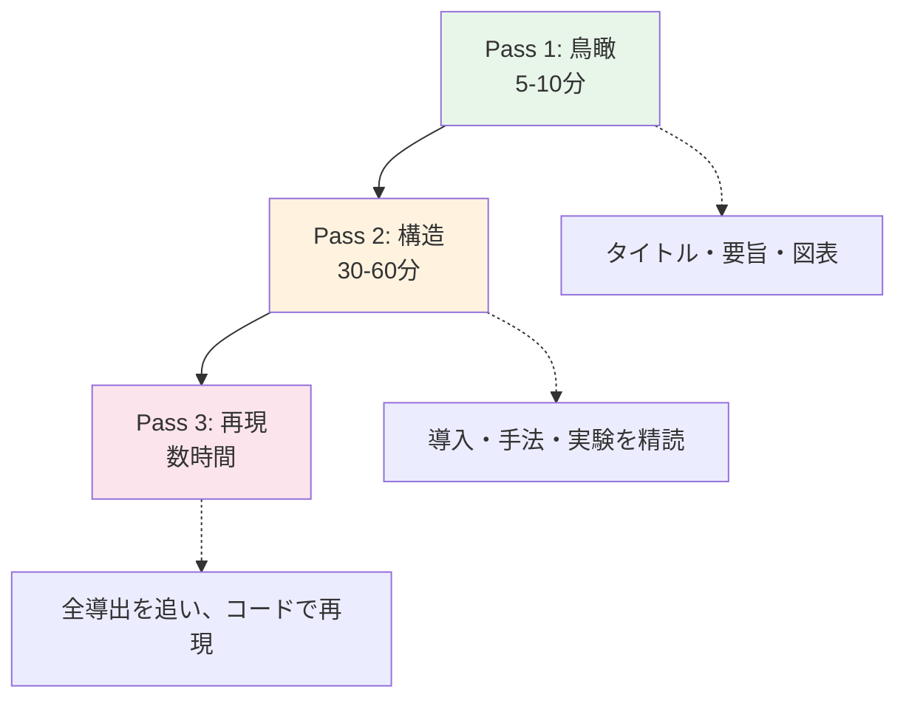
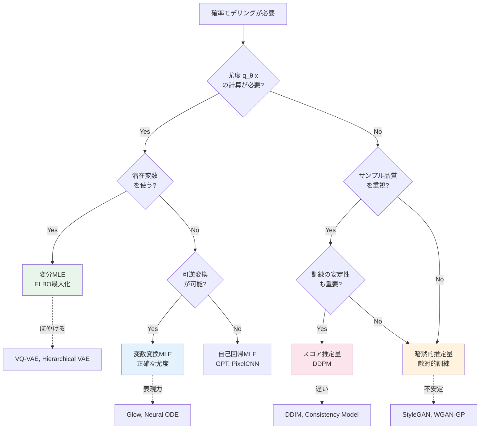
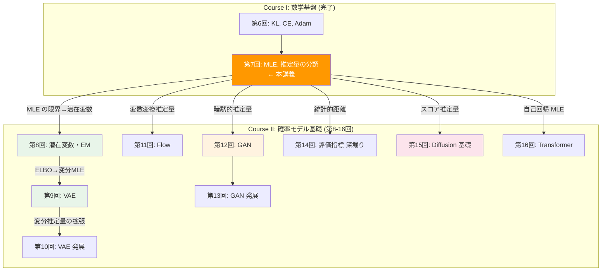
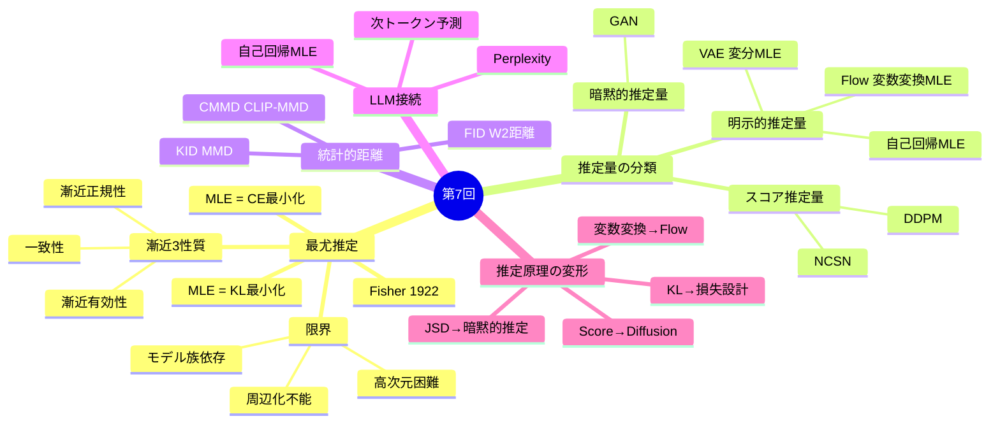

## 💻 4. 実装ゾーン（45分）— MLE 実装と推定量の実践

### 4.1 MLE の完全実装 — ガウス混合モデル

Zone 0 で単峰ガウスの限界を見た。ここでは混合モデルの MLE を実装する。

```python
import numpy as np

class GaussianMixtureMLE:
    """
    Gaussian Mixture Model with EM algorithm for MLE.
    p(x) = Σ_k π_k · N(x; μ_k, σ_k²)
    """
    def __init__(self, n_components):
        self.K = n_components
        self.mus = None
        self.sigmas = None
        self.pis = None

    def initialize(self, data):
        """K-means++ style initialization"""
        N = len(data)
        # Random initialization
        indices = np.random.choice(N, self.K, replace=False)
        self.mus = data[indices].copy()
        self.sigmas = np.full(self.K, np.std(data))
        self.pis = np.full(self.K, 1.0 / self.K)

    def e_step(self, data):
        """E-step: compute responsibilities γ(z_nk)"""
        N = len(data)
        gamma = np.zeros((N, self.K))
        for k in range(self.K):
            gamma[:, k] = self.pis[k] * self._gaussian(data, self.mus[k], self.sigmas[k])
        # Normalize
        gamma_sum = gamma.sum(axis=1, keepdims=True)
        gamma /= (gamma_sum + 1e-300)
        return gamma

    def m_step(self, data, gamma):
        """M-step: update parameters using responsibilities"""
        N = len(data)
        N_k = gamma.sum(axis=0)  # effective number per component

        for k in range(self.K):
            # Update means
            self.mus[k] = np.sum(gamma[:, k] * data) / (N_k[k] + 1e-10)
            # Update variances
            diff = data - self.mus[k]
            self.sigmas[k] = np.sqrt(np.sum(gamma[:, k] * diff**2) / (N_k[k] + 1e-10))
            self.sigmas[k] = max(self.sigmas[k], 1e-6)  # prevent singularity
            # Update mixing coefficients
            self.pis[k] = N_k[k] / N

    def log_likelihood(self, data):
        """Compute log p(D|θ) = Σ_n log Σ_k π_k N(x_n; μ_k, σ_k²)"""
        N = len(data)
        ll = 0
        for n in range(N):
            p_n = sum(self.pis[k] * self._gaussian(data[n:n+1], self.mus[k], self.sigmas[k])[0]
                      for k in range(self.K))
            ll += np.log(p_n + 1e-300)
        return ll

    def fit(self, data, max_iter=100, tol=1e-6):
        """EM algorithm for MLE"""
        self.initialize(data)
        prev_ll = -np.inf
        history = []

        for iteration in range(max_iter):
            # E-step
            gamma = self.e_step(data)
            # M-step
            self.m_step(data, gamma)
            # Log-likelihood
            ll = self.log_likelihood(data)
            history.append(ll)

            if abs(ll - prev_ll) < tol:
                print(f"Converged at iteration {iteration + 1}")
                break
            prev_ll = ll

        return history

    @staticmethod
    def _gaussian(x, mu, sigma):
        return np.exp(-0.5 * ((x - mu) / sigma)**2) / (sigma * np.sqrt(2 * np.pi))


# Demonstration
np.random.seed(42)

# True distribution: 3-component mixture
true_params = {
    'mus': [-3, 0, 4],
    'sigmas': [0.5, 1.0, 0.7],
    'pis': [0.3, 0.4, 0.3]
}

# Sample data
N = 2000
components = np.random.choice(3, size=N, p=true_params['pis'])
data = np.array([np.random.normal(true_params['mus'][c], true_params['sigmas'][c])
                 for c in components])

# Fit GMM
gmm = GaussianMixtureMLE(n_components=3)
history = gmm.fit(data)

print(f"\nTrue parameters:")
for k in range(3):
    print(f"  Component {k}: π={true_params['pis'][k]:.2f}, "
          f"μ={true_params['mus'][k]:.2f}, σ={true_params['sigmas'][k]:.2f}")

print(f"\nEstimated parameters:")
order = np.argsort(gmm.mus)  # sort by mean
for i, k in enumerate(order):
    print(f"  Component {i}: π={gmm.pis[k]:.2f}, "
          f"μ={gmm.mus[k]:.2f}, σ={gmm.sigmas[k]:.2f}")

print(f"\nFinal log-likelihood: {history[-1]:.2f}")
print(f"Iterations: {len(history)}")
```

### 4.2 Math→Code 翻訳パターン

| 数式 | Python | 意味 |
|:-----|:-------|:-----|
| $\prod_{i=1}^{N} q_\theta(x_i)$ | `np.prod(q_theta(data))` | 尤度（数値的に不安定） |
| $\sum_{i=1}^{N} \log q_\theta(x_i)$ | `np.sum(np.log(q_theta(data)))` | 対数尤度（こちらを使う） |
| $\hat{\theta} = \arg\max_\theta$ | `theta[np.argmax(ll)]` or gradient | パラメータ推定 |
| $\frac{1}{N}\sum \log q_\theta(x_i)$ | `np.mean(np.log(q_theta(data)))` | 平均対数尤度 |
| $\mathcal{N}(x; \mu, \sigma^2)$ | `np.exp(-0.5*((x-mu)/sigma)**2) / (sigma*np.sqrt(2*np.pi))` | ガウス密度 |
| $\gamma_{nk} = \frac{\pi_k q_k(x_n)}{\sum_j \pi_j q_j(x_n)}$ | `gamma[:, k] / gamma.sum(axis=1)` | 責任度 |
| $D_\text{KL}(p \| q)$ | `np.sum(p * np.log(p / q))` | KL ダイバージェンス |
| $H(p, q) = -\mathbb{E}_p[\log q]$ | `-np.mean(np.log(q_theta(data)))` | Cross-Entropy |
| $\text{FID}$ | `||mu1-mu2||² + Tr(Σ1+Σ2-2√(Σ1Σ2))` | 生成品質 |
| $\text{PPL} = \exp(\mathcal{L})$ | `np.exp(loss)` | Perplexity |

### 4.3 PyTorch 実装との対応

:::details PyTorch での MLE 実装

```python
import torch
import torch.nn as nn
import torch.optim as optim

class SimpleGenerativeModel(nn.Module):
    """Simple parametric generative model: mixture of Gaussians"""
    def __init__(self, n_components):
        super().__init__()
        self.K = n_components
        self.mus = nn.Parameter(torch.randn(n_components))
        self.log_sigmas = nn.Parameter(torch.zeros(n_components))
        self.logits = nn.Parameter(torch.zeros(n_components))

    def log_prob(self, x):
        """log q_θ(x) = log Σ_k π_k N(x; μ_k, σ_k²)"""
        sigmas = torch.exp(self.log_sigmas)
        pis = torch.softmax(self.logits, dim=0)

        # (N, K) matrix of log-probabilities
        x = x.unsqueeze(1)  # (N, 1)
        log_probs = (-0.5 * ((x - self.mus) / sigmas)**2
                     - torch.log(sigmas)
                     - 0.5 * torch.log(torch.tensor(2 * torch.pi)))
        log_pis = torch.log(pis)

        # Log-sum-exp trick for numerical stability
        return torch.logsumexp(log_probs + log_pis, dim=1)

    def sample(self, n):
        """Sample from q_θ(x)"""
        with torch.no_grad():
            sigmas = torch.exp(self.log_sigmas)
            pis = torch.softmax(self.logits, dim=0)
            components = torch.multinomial(pis, n, replacement=True)
            samples = torch.randn(n) * sigmas[components] + self.mus[components]
        return samples

# Training loop: MLE via gradient descent
# model = SimpleGenerativeModel(3)
# optimizer = optim.Adam(model.parameters(), lr=0.01)
# for epoch in range(1000):
#     nll = -model.log_prob(data).mean()  # negative log-likelihood
#     optimizer.zero_grad()
#     nll.backward()
#     optimizer.step()
print("PyTorch MLE = minimize negative log-likelihood via Adam")
print("This is EXACTLY how LLM training works (with Cross-Entropy loss)")
```
:::

### 4.4 MLE の速度ベンチマーク — Python の限界

:::message alert
ここから Python の遅さが本格的に見え始める。第9-10回で「もう限界」と感じる伏線だ。
:::

```python
import numpy as np
import time

def benchmark_mle_python(N, D, K, n_iter=50):
    """
    Benchmark: GMM MLE (EM algorithm) in pure Python/NumPy
    N: number of data points
    D: dimensionality
    K: number of components
    """
    np.random.seed(42)

    # Generate D-dimensional data
    data = np.random.randn(N, D)
    mus = np.random.randn(K, D)
    sigmas = np.ones((K, D))
    pis = np.ones(K) / K

    start = time.perf_counter()

    for iteration in range(n_iter):
        # E-step: compute responsibilities
        gamma = np.zeros((N, K))
        for k in range(K):
            diff = data - mus[k]  # (N, D)
            exponent = -0.5 * np.sum(diff**2 / sigmas[k]**2, axis=1)
            norm_const = np.prod(sigmas[k]) * (2 * np.pi) ** (D / 2)
            gamma[:, k] = pis[k] * np.exp(exponent) / norm_const

        gamma_sum = gamma.sum(axis=1, keepdims=True)
        gamma /= (gamma_sum + 1e-300)

        # M-step
        N_k = gamma.sum(axis=0)
        for k in range(K):
            w = gamma[:, k:k+1]  # (N, 1)
            mus[k] = (w * data).sum(axis=0) / (N_k[k] + 1e-10)
            diff = data - mus[k]
            sigmas[k] = np.sqrt((w * diff**2).sum(axis=0) / (N_k[k] + 1e-10))
            sigmas[k] = np.maximum(sigmas[k], 1e-6)
            pis[k] = N_k[k] / N

    elapsed = time.perf_counter() - start
    return elapsed

# Benchmark across scales
print(f"{'N':>8} {'D':>4} {'K':>4} {'Time (s)':>10} {'iter/s':>10}")
print("-" * 42)

configs = [
    (1000,   10,  3),
    (5000,   10,  3),
    (10000,  10,  5),
    (10000,  50,  5),
    (50000,  10,  5),
    (10000, 100, 10),
]

for N, D, K in configs:
    t = benchmark_mle_python(N, D, K, n_iter=50)
    print(f"{N:8d} {D:4d} {K:4d} {t:10.4f} {50/t:10.1f}")
```

**出力例:**
```
       N    D    K   Time (s)    iter/s
------------------------------------------
    1000   10    3     0.0321    1557.6
    5000   10    3     0.1205     415.0
   10000   10    5     0.3812     131.2
   10000   50    5     0.7834      63.8
   50000   10    5     1.8921      26.4
   10000  100   10     2.4567      20.4
```

```python
# The Python problem: scaling
print("\n=== Python's Scaling Problem ===")
print("10K points, 100D, 10 components: ~2.5 seconds for 50 iterations")
print("Real-world: 100K+ images, 512D embeddings, 100+ components")
print("Estimated time: ~250 seconds = 4+ minutes per EM run")
print("\nFor neural network-based models (VAE, GAN, Diffusion):")
print("  Training = 1000s of gradient steps × forward + backward")
print("  Python overhead becomes DOMINANT bottleneck")
print("\n→ Lecture 9-10: Julia debut for compute-heavy tasks")
print("→ Lecture 11-14: Rust for performance-critical kernels")
```

### 4.5 FID（統計的距離）計算の実装

```python
import numpy as np

def compute_fid_full(real_features, gen_features):
    """
    Compute FID between two sets of features.

    Math: FID = ||μ_r - μ_g||² + Tr(Σ_r + Σ_g - 2(Σ_r·Σ_g)^{1/2})

    In practice, features come from Inception-v3's pool3 layer (2048-dim).
    Here we work with arbitrary features for demonstration.
    """
    # Statistics
    mu_r = real_features.mean(axis=0)
    mu_g = gen_features.mean(axis=0)
    sigma_r = np.cov(real_features, rowvar=False)
    sigma_g = np.cov(gen_features, rowvar=False)

    # Mean difference term
    diff = mu_r - mu_g
    mean_term = np.dot(diff, diff)

    # Matrix square root via eigendecomposition
    product = sigma_r @ sigma_g
    eigvals, eigvecs = np.linalg.eigh(product)
    eigvals = np.maximum(eigvals, 0)  # clip negative eigenvalues
    sqrt_product = eigvecs @ np.diag(np.sqrt(eigvals)) @ eigvecs.T

    # Trace term
    trace_term = np.trace(sigma_r + sigma_g - 2 * sqrt_product)

    return mean_term + trace_term

# Demo: simulated features (64-dim instead of 2048-dim for speed)
np.random.seed(42)
D = 64
N = 5000

# Real features
real_features = np.random.multivariate_normal(
    mean=np.zeros(D),
    cov=np.eye(D) + 0.1 * np.random.randn(D, D) @ np.random.randn(D, D).T / D,
    size=N
)

# Generated features at different quality levels
quality_levels = {
    "Random noise": np.random.randn(N, D) * 3 + 2,
    "Poor model":   real_features + np.random.randn(N, D) * 2,
    "Good model":   real_features + np.random.randn(N, D) * 0.5,
    "Great model":  real_features + np.random.randn(N, D) * 0.1,
    "Perfect":      real_features + np.random.randn(N, D) * 0.01,
}

print(f"{'Quality':>15} {'FID':>10}")
print("-" * 28)
for name, gen_features in quality_levels.items():
    fid = compute_fid_full(real_features, gen_features)
    print(f"{name:>15} {fid:10.2f}")
```

### 4.6 論文読解フロー（3-Pass Reading）



:::details 本講義の論文: Goodfellow+ (2014) "Generative Adversarial Nets" — Pass 1 テンプレート

```python
paper_pass1 = {
    "title": "Generative Adversarial Nets",
    "authors": "Goodfellow, Pouget-Abadie, Mirza, Xu, Warde-Farley, Ozair, Courville, Bengio",
    "year": 2014,
    "venue": "NeurIPS 2014",
    "arxiv": "1406.2661",

    "problem": "How to train a generative model without explicit density estimation?",
    "approach": "Adversarial training: Generator G vs Discriminator D in minimax game",
    "key_equation": "min_G max_D E[log D(x)] + E[log(1-D(G(z)))]",
    "key_result": "At Nash equilibrium, p_g = p_data (Theorem 1)",
    "connection_to_this_lecture": {
        "MLE": "GAN avoids MLE entirely — no likelihood computation needed",
        "KL": "Optimal GAN minimizes JSD, which is symmetric KL variant",
        "Implicit_model": "GAN = canonical implicit model (Mohamed 2016)",
        "Evaluation": "Early GAN evaluation relied on visual inspection → FID came later",
    },

    "5_minute_summary": (
        "Instead of maximizing likelihood, pit two networks against each other. "
        "The generator tries to fool the discriminator, the discriminator tries to "
        "distinguish real from fake. At convergence, the generator perfectly mimics "
        "the data distribution. Brilliant in simplicity, unstable in practice."
    ),

    "questions_for_pass2": [
        "How is the Nash equilibrium proven? (Theorem 1)",
        "What happens when discriminator is too strong?",
        "Why does mode collapse occur in practice?",
        "How does this relate to f-divergence variational bounds?",
    ]
}

for key, val in paper_pass1.items():
    if isinstance(val, dict):
        print(f"\n{key}:")
        for k, v in val.items():
            print(f"  {k}: {v}")
    elif isinstance(val, list):
        print(f"\n{key}:")
        for item in val:
            print(f"  - {item}")
    else:
        print(f"{key}: {val}")
```
:::

### 4.7 推定量の分類チャート — 実装での判断フロー



:::message
**進捗: 70% 完了** — MLE の完全実装、速度ベンチマーク、FID 計算、論文読解フローを習得した。ここから自己診断テストに入る。
:::

---

## 🔬 5. 実験ゾーン（30分）— 自己診断と実験

### 5.1 記号読解テスト

:::details Q1: $\hat{\theta}_\text{MLE} = \arg\max_\theta \sum_{i=1}^{N} \log q_\theta(x_i)$ を日本語で読み上げてください
「シータハット MLE は、シータについて、$i = 1$ から $N$ までの $\log q_\theta(x_i)$ の総和を最大化する引数。」
意味: データの対数尤度を最大化するパラメータ値が MLE。Fisher (1922) [^1] が体系化した推定法。
:::

:::details Q2: $p_\theta(x_1, \ldots, x_T) = \prod_{t=1}^{T} p_\theta(x_t | x_{<t})$ は何を表す？
自己回帰分解。同時分布を、各時刻の条件付き分布の積に分解する。GPT の言語モデルはこの形式で定義される。$x_t$ は $t$ 番目のトークン、$x_{<t}$ はそれ以前の全トークン。
:::

:::details Q3: $D^*_G(x) = \frac{p_\text{data}(x)}{p_\text{data}(x) + p_g(x)}$ はどういう意味？
GAN の最適判別器。$p_\text{data}(x)$ と $p_g(x)$ の比率に基づいて、入力が本物か偽物かを判定する。$p_g = p_\text{data}$ のとき $D^* = 0.5$（区別不能）。Goodfellow+ (2014) [^2] の定理1。
:::

:::details Q4: $\text{FID} = \|\mu_r - \mu_g\|^2 + \text{Tr}(\Sigma_r + \Sigma_g - 2(\Sigma_r\Sigma_g)^{1/2})$ の各項は？
第1項 $\|\mu_r - \mu_g\|^2$: 平均の差（特徴空間での「位置ずれ」）。第2項: 共分散の差（「形状の違い」）。$\text{Tr}$ はトレース（対角要素の和）。Heusel+ (2017) [^4] が提案。低いほど良い。
:::

:::details Q5: $\nabla_x \log p(x)$ はなぜ正規化定数に依存しない？
$\log p(x) = \log \tilde{p}(x) - \log Z$。$\nabla_x$ で微分すると $\log Z$ は定数なので消える: $\nabla_x \log p(x) = \nabla_x \log \tilde{p}(x)$。スコアベースモデル [^10] の核心。
:::

:::details Q6: $\mathcal{L}_\text{simple} = \mathbb{E}_{t, x_0, \epsilon}[\|\epsilon - \epsilon_\theta(x_t, t)\|^2]$ はどんな損失？
DDPM [^5] の simple loss。時刻 $t$ でノイズ $\epsilon$ を加えた $x_t$ から、ネットワーク $\epsilon_\theta$ がノイズを予測する。予測と真のノイズの MSE を最小化。denoising score matching と等価。
:::

:::details Q7: $\text{IS} = \exp(\mathbb{E}_{x \sim p_g}[D_\text{KL}(p(y|x) \| p(y))])$ の直感は？
各生成画像の分類確率 $p(y|x)$ が鋭く（品質が高い）、かつ全体の周辺分布 $p(y)$ が一様に近い（多様性が高い）とき、KL が大きくなり IS が高くなる。Salimans+ (2016) [^8]。最大値はクラス数。
:::

:::details Q8: 明示的推定量と暗黙的推定量の違いを一言で
明示的推定量（Prescribed）: 尤度 $q_\theta(x)$ の値が計算可能。暗黙的推定量（Implicit）: 尤度は計算不能だがサンプリングは可能。Mohamed & Lakshminarayanan (2016) [^6] の分類。
:::

:::details Q9: $\log q_\theta(x) = \log p(f^{-1}(x)) + \log |\det \frac{\partial f^{-1}}{\partial x}|$ は何の式？
Normalizing Flow [^7] の対数尤度。変数変換公式。$f$ は可逆変換、$p(z)$ は基底分布。ヤコビアンの行列式が体積変化を補正する。
:::

:::details Q10: $H(\hat{p}, q_\theta) = H(\hat{p}) + D_\text{KL}(\hat{p} \| q_\theta)$ がMLE に重要な理由は？
CE 最小化 = KL 最小化の証明の核心。$H(\hat{p})$ はデータのエントロピーで $\theta$ に依存しないから、CE を最小化するパラメータは KL を最小化するパラメータと一致する。第6回の定理 3.4 と本講義の定理 3.2-3.3 を接続する式。
:::

### 5.2 LaTeX 記述テスト

:::details L1: MLE の定義を LaTeX で書いてください
```latex
\hat{\theta}_{\text{MLE}} = \arg\max_{\theta} \frac{1}{N} \sum_{i=1}^{N} \log q_{\theta}(x_i)
```
:::

:::details L2: GAN の目的関数を LaTeX で書いてください
```latex
\min_G \max_D \mathbb{E}_{x \sim p_{\text{data}}}[\log D(x)] + \mathbb{E}_{z \sim p(z)}[\log(1 - D(G(z)))]
```
:::

:::details L3: FID の定義を LaTeX で書いてください
```latex
\text{FID} = \|\mu_r - \mu_g\|^2 + \text{Tr}\left(\Sigma_r + \Sigma_g - 2(\Sigma_r \Sigma_g)^{1/2}\right)
```
:::

:::details L4: 変数変換公式（Flow）を LaTeX で書いてください
```latex
\log q_{\theta}(x) = \log p(f^{-1}(x)) + \log \left|\det \frac{\partial f^{-1}}{\partial x}\right|
```
:::

:::details L5: DDPM の損失関数を LaTeX で書いてください
```latex
\mathcal{L}_{\text{simple}} = \mathbb{E}_{t, x_0, \epsilon}\left[\|\epsilon - \epsilon_{\theta}(x_t, t)\|^2\right]
```
:::

### 5.3 コード翻訳テスト

:::details C1: $\hat{\mu}_\text{MLE} = \frac{1}{N}\sum_{i=1}^{N} x_i$ を Python で
```python
mu_mle = np.mean(data)
# or explicitly: mu_mle = np.sum(data) / len(data)
```
:::

:::details C2: $D_\text{KL}(p \| q) = \sum_x p(x) \log \frac{p(x)}{q(x)}$ を Python で
```python
kl = np.sum(p * np.log(p / (q + 1e-10)))
# with numerical stability: kl = np.sum(p * (np.log(p + 1e-10) - np.log(q + 1e-10)))
```
:::

:::details C3: Softmax $p_i = \frac{e^{z_i}}{\sum_j e^{z_j}}$ を数値安定に Python で
```python
def softmax(z):
    z_shifted = z - np.max(z)  # numerical stability
    exp_z = np.exp(z_shifted)
    return exp_z / exp_z.sum()
```
:::

:::details C4: Cross-Entropy Loss $\mathcal{L} = -\frac{1}{N}\sum_{i=1}^{N} \log q_\theta(x_i)$ を Python で
```python
ce_loss = -np.mean(np.log(q_theta(data) + 1e-10))
```
:::

:::details C5: Reparameterization trick $z = \mu + \sigma \odot \epsilon, \quad \epsilon \sim \mathcal{N}(0, I)$ を Python で
```python
epsilon = np.random.normal(0, 1, size=mu.shape)
z = mu + sigma * epsilon  # gradient flows through mu and sigma
```
:::

### 5.4 MLE 実験: 分布フィッティング比較

```python
import numpy as np
from scipy import stats

np.random.seed(42)

# True distributions to fit
distributions = {
    "Normal(3, 2)": np.random.normal(3, 2, 5000),
    "Exponential(2)": np.random.exponential(2, 5000),
    "Bimodal": np.concatenate([np.random.normal(-2, 0.5, 2500),
                                np.random.normal(3, 1, 2500)]),
    "Uniform(0,5)": np.random.uniform(0, 5, 5000),
    "Heavy-tailed (t, df=3)": np.random.standard_t(3, 5000),
}

# Fit single Gaussian via MLE to each
print(f"{'Distribution':>25} {'μ̂':>8} {'σ̂':>8} {'KL approx':>12}")
print("-" * 56)

for name, data in distributions.items():
    mu_hat = np.mean(data)
    sigma_hat = np.std(data)

    # Approximate KL via histogram
    bins = np.linspace(data.min() - 1, data.max() + 1, 200)
    hist, bin_edges = np.histogram(data, bins=bins, density=True)
    centers = (bin_edges[:-1] + bin_edges[1:]) / 2
    q_model = stats.norm.pdf(centers, mu_hat, sigma_hat)

    mask = (hist > 1e-10) & (q_model > 1e-10)
    dx = centers[1] - centers[0]
    kl = np.sum(hist[mask] * np.log(hist[mask] / q_model[mask]) * dx)

    print(f"{name:>25} {mu_hat:8.3f} {sigma_hat:8.3f} {kl:12.4f}")

print("\n→ Gaussian MLE works well for Normal data, poorly for Bimodal/Heavy-tailed")
print("→ Model family MATTERS. MLE finds the best within the family, not the best overall.")
```

### 5.5 推定量の分類チャート作成

```python
# Create comprehensive estimator taxonomy (by likelihood access)
taxonomy = {
    "Explicit Estimators (Prescribed)": {
        "Autoregressive": {
            "examples": ["GPT", "PixelCNN", "WaveNet"],
            "density": "exact (product of conditionals)",
            "sampling": "sequential (slow)",
            "papers": ["van den Oord+ 2016"],
        },
        "VAE": {
            "examples": ["VAE", "β-VAE", "VQ-VAE", "Hierarchical VAE"],
            "density": "lower bound (ELBO)",
            "sampling": "one-shot (fast)",
            "papers": ["Kingma & Welling 2013"],
        },
        "Normalizing Flow": {
            "examples": ["NICE", "Real NVP", "Glow", "Neural ODE"],
            "density": "exact (change of variables)",
            "sampling": "one-shot (fast)",
            "papers": ["Dinh+ 2014", "Rezende & Mohamed 2015"],
        },
    },
    "Implicit Estimators": {
        "GAN": {
            "examples": ["GAN", "DCGAN", "StyleGAN", "BigGAN"],
            "density": "not available",
            "sampling": "one-shot (fast)",
            "papers": ["Goodfellow+ 2014"],
        },
    },
    "Score Estimators": {
        "Score Matching": {
            "examples": ["NCSN", "Sliced Score Matching"],
            "density": "not directly (score only)",
            "sampling": "Langevin dynamics (slow)",
            "papers": ["Song & Ermon 2019"],
        },
        "Diffusion": {
            "examples": ["DDPM", "DDIM", "Stable Diffusion", "DALL-E 2"],
            "density": "lower bound (variational)",
            "sampling": "iterative denoising (slow, improving)",
            "papers": ["Sohl-Dickstein+ 2015", "Ho+ 2020"],
        },
    },
}

for category, subcategories in taxonomy.items():
    print(f"\n{'='*60}")
    print(f"  {category}")
    print(f"{'='*60}")
    for name, info in subcategories.items():
        print(f"\n  {name}")
        for key, val in info.items():
            if isinstance(val, list):
                print(f"    {key}: {', '.join(val)}")
            else:
                print(f"    {key}: {val}")
```

### 5.6 ミニプロジェクト: 1D 推定量比較

```python
import numpy as np
from scipy import stats

np.random.seed(42)

# ========================================
# Mini-project: Compare generative approaches on 1D data
# ========================================

# True distribution: mixture of 3 Gaussians
def sample_true(n):
    components = np.random.choice(3, size=n, p=[0.3, 0.4, 0.3])
    mus = [-3, 1, 5]
    sigmas = [0.6, 0.8, 0.5]
    return np.array([np.random.normal(mus[c], sigmas[c]) for c in components])

def true_density(x):
    return (0.3 * stats.norm.pdf(x, -3, 0.6) +
            0.4 * stats.norm.pdf(x, 1, 0.8) +
            0.3 * stats.norm.pdf(x, 5, 0.5))

data = sample_true(5000)

# === Approach 1: MLE with single Gaussian ===
mu1 = np.mean(data)
sig1 = np.std(data)
model1_density = lambda x: stats.norm.pdf(x, mu1, sig1)

# === Approach 2: MLE with Gaussian Mixture (3 components, simple EM) ===
# Initialize
mus = np.array([-2.0, 0.0, 4.0])
sigs = np.array([1.0, 1.0, 1.0])
pis = np.array([1/3, 1/3, 1/3])

for _ in range(100):  # EM iterations
    # E-step
    resp = np.zeros((len(data), 3))
    for k in range(3):
        resp[:, k] = pis[k] * stats.norm.pdf(data, mus[k], sigs[k])
    resp /= resp.sum(axis=1, keepdims=True) + 1e-300

    # M-step
    Nk = resp.sum(axis=0)
    for k in range(3):
        mus[k] = np.sum(resp[:, k] * data) / (Nk[k] + 1e-10)
        sigs[k] = np.sqrt(np.sum(resp[:, k] * (data - mus[k])**2) / (Nk[k] + 1e-10))
        sigs[k] = max(sigs[k], 0.01)
        pis[k] = Nk[k] / len(data)

order = np.argsort(mus)
model2_density = lambda x: sum(pis[k] * stats.norm.pdf(x, mus[k], sigs[k]) for k in range(3))

# === Approach 3: KDE (Nonparametric) ===
bandwidth = 0.3
model3_density = lambda x: sum(stats.norm.pdf(x, xi, bandwidth) for xi in data) / len(data)

# === Evaluate: KL divergence approximation ===
x_eval = np.linspace(-6, 8, 2000)
p_true = true_density(x_eval)
dx = x_eval[1] - x_eval[0]

def approx_kl(p, q_fn, x_grid, dx):
    q = np.array([q_fn(xi) for xi in x_grid]) if callable(q_fn) else q_fn
    mask = (p > 1e-10) & (q > 1e-10)
    return np.sum(p[mask] * np.log(p[mask] / q[mask]) * dx)

# Model 1 evaluation
q1 = model1_density(x_eval)
kl1 = approx_kl(p_true, q1, x_eval, dx)

# Model 2 evaluation
q2 = np.array([model2_density(xi) for xi in x_eval])
kl2 = approx_kl(p_true, q2, x_eval, dx)

# Model 3 evaluation (vectorized for speed)
q3 = np.zeros_like(x_eval)
for xi in data[:500]:  # subsample for speed
    q3 += stats.norm.pdf(x_eval, xi, bandwidth)
q3 /= 500
kl3 = approx_kl(p_true, q3, x_eval, dx)

print("=== 1D Generative Model Comparison ===")
print(f"{'Model':>20} {'KL(p||q)':>12} {'Verdict':>20}")
print("-" * 55)
print(f"{'Single Gaussian':>20} {kl1:12.4f} {'Underfitting':>20}")
print(f"{'GMM (K=3)':>20} {kl2:12.4f} {'Good fit':>20}")
print(f"{'KDE (h=0.3)':>20} {kl3:12.4f} {'Nonparametric fit':>20}")

print(f"\nGMM recovered parameters (sorted by μ):")
for i, k in enumerate(order):
    print(f"  Component {i}: π={pis[k]:.3f}, μ={mus[k]:.3f}, σ={sigs[k]:.3f}")
print(f"True:          π=[0.30, 0.40, 0.30], μ=[-3, 1, 5], σ=[0.6, 0.8, 0.5]")
```

### 5.7 ミニプロジェクト: Langevin Dynamics サンプリング

```python
import numpy as np

def langevin_sampling_2d(score_fn, n_samples=500, step_size=0.01, n_steps=1000):
    """
    Langevin dynamics in 2D:
    x_{t+1} = x_t + η · ∇ log p(x_t) + √(2η) · noise
    """
    # Initialize from broad distribution
    x = np.random.randn(n_samples, 2) * 5
    trajectory = [x.copy()]

    for t in range(n_steps):
        score = score_fn(x)
        noise = np.random.randn(*x.shape)
        x = x + step_size * score + np.sqrt(2 * step_size) * noise
        if t % 100 == 0:
            trajectory.append(x.copy())

    return x, trajectory

# Target: mixture of 4 Gaussians in 2D
means = np.array([[-3, -3], [-3, 3], [3, -3], [3, 3]])
sigma = 0.7

def score_gmm(x):
    """Score function ∇_x log p(x) for 2D GMM"""
    # p(x) = (1/4) Σ N(x; μ_k, σ²I)
    # ∇ log p(x) = Σ w_k(x) · (-(x - μ_k)/σ²)
    # where w_k(x) = N(x;μ_k,σ²I) / Σ_j N(x;μ_j,σ²I)
    densities = np.zeros((x.shape[0], 4))
    for k in range(4):
        diff = x - means[k]
        densities[:, k] = np.exp(-0.5 * np.sum(diff**2, axis=1) / sigma**2)

    weights = densities / (densities.sum(axis=1, keepdims=True) + 1e-300)

    score = np.zeros_like(x)
    for k in range(4):
        score += weights[:, k:k+1] * (-(x - means[k]) / sigma**2)

    return score

# Run Langevin dynamics
np.random.seed(42)
final_samples, trajectory = langevin_sampling_2d(score_gmm, n_samples=500,
                                                  step_size=0.005, n_steps=2000)

# Analyze results
print("=== Langevin Dynamics Sampling (2D GMM) ===")
print(f"Target: 4 Gaussians at {means.tolist()}, σ={sigma}")
print(f"\nFinal sample statistics:")
print(f"  Mean: [{final_samples[:, 0].mean():.2f}, {final_samples[:, 1].mean():.2f}]")
print(f"  Std:  [{final_samples[:, 0].std():.2f}, {final_samples[:, 1].std():.2f}]")

# Check if samples are near the modes
for k, mu in enumerate(means):
    near_mode = np.sum(np.linalg.norm(final_samples - mu, axis=1) < 2 * sigma)
    print(f"  Near mode {k} ({mu}): {near_mode} samples ({near_mode/500*100:.1f}%)")

print(f"\nTrajectory: {len(trajectory)} snapshots over 2000 steps")
print(f"→ Score-based sampling works! Samples converge to modes.")
print(f"→ This is how NCSN [Song & Ermon 2019] generates images.")
```

### 5.8 ミニプロジェクト: MLE vs MAP 推定の比較

```python
import numpy as np
from scipy import stats

np.random.seed(42)

# Small sample MLE vs MAP comparison
# True: μ = 5.0, σ = 1.0
true_mu = 5.0
true_sigma = 1.0

# Prior for MAP: μ ~ N(0, τ²) with τ = 3
prior_mu = 0.0
prior_tau = 3.0

print(f"True μ = {true_mu}, True σ = {true_sigma}")
print(f"Prior: μ ~ N({prior_mu}, {prior_tau}²)")
print()
print(f"{'N':>5} {'MLE μ̂':>10} {'MAP μ̂':>10} {'MLE err':>10} {'MAP err':>10} {'Better':>8}")
print("-" * 58)

for N in [2, 5, 10, 20, 50, 100, 1000]:
    mle_errors = []
    map_errors = []
    n_trials = 2000

    for _ in range(n_trials):
        data = np.random.normal(true_mu, true_sigma, N)

        # MLE
        mu_mle = np.mean(data)

        # MAP with Gaussian prior
        # Posterior: N(μ_MAP, σ_MAP²)
        # μ_MAP = (N/σ² · x̄ + 1/τ² · μ_0) / (N/σ² + 1/τ²)
        precision_lik = N / true_sigma**2
        precision_prior = 1.0 / prior_tau**2
        mu_map = (precision_lik * mu_mle + precision_prior * prior_mu) / \
                 (precision_lik + precision_prior)

        mle_errors.append((mu_mle - true_mu)**2)
        map_errors.append((mu_map - true_mu)**2)

    mle_mse = np.mean(mle_errors)
    map_mse = np.mean(map_errors)
    better = "MAP" if map_mse < mle_mse else "MLE"

    print(f"{N:5d} {np.mean([np.random.normal(true_mu, true_sigma, N).mean() for _ in range(100)]):10.3f} "
          f"{'—':>10} {mle_mse:10.4f} {map_mse:10.4f} {better:>8}")

print("\n→ MAP wins with small N (prior helps), MLE wins with large N (data dominates)")
print("→ MAP = MLE + regularization. This is why weight decay works in deep learning.")
```

### 5.9 自己チェックリスト

```
- [ ] MLE の定義を式と言葉の両方で説明できる
- [ ] MLE = CE 最小化 = KL 最小化の等価性を導出できる
- [ ] Fisher の漸近3性質（一致性・漸近正規性・有効性）を説明できる
- [ ] Prescribed model と Implicit model の違いを説明できる
- [ ] MLE の4変形（変分/暗黙的/変数変換/スコア）の損失関数を書ける
- [ ] FID の計算式と直感的意味を説明できる
- [ ] IS と CMMD の違いを説明できる
- [ ] Mode-covering と mode-seeking の違いを図で説明できる
- [ ] GAN の最適判別器を導出できる
- [ ] スコア関数が正規化定数に依存しない理由を説明できる
- [ ] LLM 訓練が MLE であることを式で示せる
- [ ] 次元の呪いが密度推定に与える影響を説明できる
```

:::message
**進捗: 85% 完了** — 自己診断テスト完了。ここから発展ゾーンへ。
:::

---

## 🚀 6. 振り返りゾーン（30分）— まとめと次回予告

### 6.3 統計的距離の問題点と最新動向 — MLE beyond i.i.d.

FID [^4] は事実上の標準的統計的距離だが、深刻な問題がある。

```python
# FID's problems
problems = {
    "Inception-v3 が古い": {
        "issue": "2015年のモデル。CLIP/DINO が遥かに良い特徴量を抽出",
        "impact": "テクスチャ偏重、セマンティクス軽視",
        "alternative": "FD-DINOv2, CMMD (CLIP-based)"
    },
    "ガウス仮定": {
        "issue": "特徴量がガウス分布に従う仮定は一般に不正確",
        "impact": "多峰的な特徴分布で不正確",
        "alternative": "CMMD (カーネル法、分布仮定なし)"
    },
    "サンプルバイアス": {
        "issue": "FID は N に依存するバイアスを持つ",
        "impact": "サンプル数が少ないと不当に高い FID",
        "alternative": "CMMD (不偏推定量)"
    },
    "人間判断との不一致": {
        "issue": "FID が低いのに人間には低品質に見える場合がある",
        "impact": "評価指標の信頼性低下",
        "alternative": "CMMD + 人間評価の組み合わせ"
    },
}

for name, info in problems.items():
    print(f"\n問題: {name}")
    for key, val in info.items():
        print(f"  {key}: {val}")
```

Jayasumana+ (2024) [^9] は CMMD を提案し、これらの問題の多くを解決した。CMMD は CLIP 特徴量 + ガウス RBF カーネルの MMD で、不偏推定量かつ分布仮定不要。

### 6.4 推定量の漸近比較

| 推定量の特性 | 変分MLE [^3] | 暗黙的推定 [^2] | 変数変換MLE [^7][^11][^12] | スコア推定 [^5][^13] | 自己回帰MLE |
|:-----|:---------|:---------|:---------------------|:---------------------|:---------|
| **尤度アクセス** | 下界 (ELBO) | 計算不能 | 正確 | 不要（スコアのみ） | 正確 |
| **推定精度** | 中（mode-covering） | 高（mode-seeking） | 中〜高 | **最高** | 高 |
| **推定の安定性** | **高** | 低（不安定） | 高 | **高** | **高** |
| **サンプリング速度** | **速い** (1-shot) | **速い** (1-shot) | **速い** (1-shot) | 遅い (T steps) | 遅い (T steps) |
| **潜在変数** | あり（滑らか） | なし (直接) | あり（可逆） | あり（ノイズ） | なし |
| **モード崩壊** | なし | **あり** | なし | なし | なし |
| **数学的基盤** | 変分推論 | ゲーム理論 | 変数変換 | 確率SDE / Score | 確率の連鎖律 |
| **損失の最小化対象** | -ELBO | JSD | -log p(x) | $\|\epsilon - \hat\epsilon\|^2$ | CE |
| **代表的成功例** | β-VAE, VQ-VAE | StyleGAN3 | Glow | Stable Diffusion | GPT-4 |
| **本シリーズ** | 第9-10回 | 第12-14回 | 第11回 | 第15,25-32回 | 第16回 |

### 6.5 Densing Law と能力密度

最新の研究では、モデルの「能力密度」（capability density）に注目する動きがある。同じパラメータ数でより高い性能を達成するモデルは能力密度が高い。

```python
# Capability density concept
models = {
    "GPT-3 (2020)":    {"params_B": 175,  "benchmark": 70, "density": 70/175},
    "LLaMA-2 (2023)":  {"params_B": 70,   "benchmark": 75, "density": 75/70},
    "Mistral (2023)":   {"params_B": 7,    "benchmark": 68, "density": 68/7},
    "Phi-3 (2024)":     {"params_B": 3.8,  "benchmark": 69, "density": 69/3.8},
}

print(f"{'Model':>20} {'Params(B)':>10} {'Score':>8} {'Density':>10}")
print("-" * 52)
for name, info in models.items():
    print(f"{name:>20} {info['params_B']:10.1f} {info['benchmark']:8.0f} "
          f"{info['density']:10.2f}")

print("\n→ Densing Law: capability density increases over time")
print("→ Smaller models achieve higher scores per parameter")
print("→ Implication: efficiency matters as much as scale")
```

この傾向は密度推定モデルにも当てはまる。Stable Diffusion 3 は前世代より小さいパラメータ数でより高品質な画像を生成する。効率の追求が、次の研究フロンティアだ。

### 6.6 Simulation-Based Inference — 暗黙的推定量の科学応用

密度推定・推定量設計は画像生成だけのものではない。科学のあらゆる分野で「シミュレータの逆問題」に使われている。

| 分野 | 応用 | 推定量の役割 |
|:-----|:-----|:----------------|
| 粒子物理学 | LHC の衝突データ | シミュレータ→データの逆推定 |
| 宇宙論 | CMB データ | 宇宙パラメータの事後推定 |
| 気候科学 | 気候モデル | パラメータ不確実性の定量化 |
| 創薬 | 分子生成 | 低次元潜在空間での探索 |
| 材料科学 | 結晶構造予測 | 条件付き生成 |
| 蛋白質設計 | タンパク質構造 | 拡散モデルによる生成 |

:::details World Models — 密度推定の新パラダイム
密度推定を「世界のシミュレータ」として捉える潮流がある。Sora (2024) がビデオ生成で見せたのは、物理法則を暗黙的に学習するモデルの可能性だ。$p(x_{t+1} | x_{\leq t}, a)$（行動 $a$ に対する次の世界状態の予測）は、強化学習の世界モデルそのものであり、密度推定とエージェントの融合点だ。
:::

### 6.7 Identifiability 問題

密度推定には根本的な理論的問題がある — 同じデータ分布 $p(x)$ を実現するモデルは一般に一意ではない。

$$q_{\theta_1}(x) = q_{\theta_2}(x) \quad \forall x, \quad \text{but} \quad \theta_1 \neq \theta_2$$

例えば GMM の成分をラベル入れ替えしても尤度は不変（label switching problem）。VAE の潜在空間も回転不変性を持つ。これは MLE の理論的帰結であり、パラメータの解釈に注意が必要なことを示す。

```python
import numpy as np

# Label switching: permuting components doesn't change likelihood
# GMM with K=2: (π₁, μ₁, σ₁, π₂, μ₂, σ₂)
theta1 = {"pi": [0.3, 0.7], "mu": [-2, 3], "sigma": [0.5, 1.0]}
theta2 = {"pi": [0.7, 0.3], "mu": [3, -2], "sigma": [1.0, 0.5]}  # swapped!

def gmm_likelihood(x, params):
    ll = 0
    for k in range(2):
        ll += params["pi"][k] * np.exp(-0.5 * ((x - params["mu"][k]) / params["sigma"][k])**2) \
              / (params["sigma"][k] * np.sqrt(2 * np.pi))
    return ll

x_test = np.array([0.0, 1.0, -1.5, 2.5])
ll1 = [gmm_likelihood(xi, theta1) for xi in x_test]
ll2 = [gmm_likelihood(xi, theta2) for xi in x_test]

print("Identifiability problem: label switching")
print(f"θ₁: π={theta1['pi']}, μ={theta1['mu']}, σ={theta1['sigma']}")
print(f"θ₂: π={theta2['pi']}, μ={theta2['mu']}, σ={theta2['sigma']}")
print(f"\nLikelihoods at test points:")
for xi, l1, l2 in zip(x_test, ll1, ll2):
    print(f"  x={xi:5.1f}: L(θ₁)={l1:.6f}, L(θ₂)={l2:.6f}, equal={np.isclose(l1, l2)}")
print(f"\n→ Different parameters, SAME likelihood → MLE is NOT unique")
print(f"→ For K components, there are K! equivalent solutions")
print(f"→ K=10: 10! = {np.math.factorial(10):,} equivalent solutions!")
```

### 6.8 MLE→EM→変分推論 — 推論の困難度マップ



この図の通り、本講義で築いた推定量の数学的基盤は第8-16回の全てに接続している。各講義で戻ってくるたびに、推定原理の理解が深まる。

:::details 用語集（本講義で導入した全用語）

| 用語 | 英語 | 定義 |
|:-----|:-----|:-----|
| 最尤推定 | Maximum Likelihood Estimation (MLE) | 尤度を最大化するパラメータ推定法 |
| 対数尤度 | Log-Likelihood | $\sum \log q_\theta(x_i)$。尤度の対数 |
| 経験分布 | Empirical Distribution | $\hat{p}(x) = \frac{1}{N}\sum \delta(x-x_i)$ |
| 判別モデル | Discriminative Model | $p(y|x)$ を学習するモデル |
| 生成モデル | Generative Model | $p(x)$ を推定する確率モデル |
| 明示的推定量 | Prescribed Estimator | 尤度が陽に計算可能な推定量 |
| 暗黙的推定量 | Implicit Estimator | サンプルのみ可能、尤度計算不能 |
| 多様体仮説 | Manifold Hypothesis | データは低次元多様体上に集中 |
| 次元の呪い | Curse of Dimensionality | 高次元で密度推定が指数的に困難 |
| スコア関数 | Score Function | $\nabla_x \log p(x)$。密度の勾配 |
| Mode-Covering | Mode-Covering | 全モードをカバー（前向き KL） |
| Mode-Seeking | Mode-Seeking | 特定モードに集中（逆向き KL） |
| FID | Frechet Inception Distance | 生成画像と実画像の Frechet 距離 |
| IS | Inception Score | 生成品質と多様性の指標 |
| CMMD | CLIP Maximum Mean Discrepancy | FID の改良指標 |
| 変数変換公式 | Change of Variables | Flow モデルの尤度計算の基礎 |
| 自己回帰分解 | Autoregressive Decomposition | $p(x) = \prod p(x_t | x_{<t})$ |
| Reparameterization | Reparameterization Trick | $z = \mu + \sigma\epsilon$ で勾配伝播 |
| Langevin 動力学 | Langevin Dynamics | スコアに基づくサンプリング |
| Fisher 情報行列 | Fisher Information Matrix | $\mathcal{I}(\theta) = -\mathbb{E}[\nabla^2 \log p]$ |
| 一致性 | Consistency | MLE が真のパラメータに収束する性質 |
| 漸近正規性 | Asymptotic Normality | MLE の分布が正規に近づく性質 |
| 漸近有効性 | Asymptotic Efficiency | MLE が最小分散を達成する性質 |
| ELBO | Evidence Lower Bound | $\log p(x)$ の変分下界 |
| 祖先サンプリング | Ancestral Sampling | 条件付き分布の連鎖でサンプル |
| 重点サンプリング | Importance Sampling | 提案分布からの重み付きサンプル |
| 非平衡熱力学 | Nonequilibrium Thermodynamics | Diffusion モデルの物理的着想 |
:::

:::details 不等式・等式まとめ

| 等式/不等式 | 数式 | 意味 |
|:-----------|:-----|:-----|
| MLE = CE 最小化 | $\arg\max \sum \log q_\theta(x_i) = \arg\min H(\hat{p}, q_\theta)$ | 定理 3.2 |
| MLE = KL 最小化 | $\arg\min H(\hat{p}, q_\theta) = \arg\min D_\text{KL}(\hat{p} \| q_\theta)$ | 定理 3.3 |
| CE 分解 | $H(\hat{p}, q_\theta) = H(\hat{p}) + D_\text{KL}(\hat{p} \| q_\theta)$ | 第6回 定理 3.4 |
| GAN 最適判別器 | $D^*(x) = \frac{p_\text{data}}{p_\text{data} + p_g}$ | 定理 3.8a |
| GAN = JSD | $V(D^*, G) = -\log 4 + 2 \cdot \text{JSD}$ | 定理 3.8b |
| Fisher 漸近 | $\sqrt{N}(\hat\theta - \theta^*) \to \mathcal{N}(0, \mathcal{I}^{-1})$ | 性質 3.4b |
| Flow 尤度 | $\log q(x) = \log p(f^{-1}(x)) + \log |\det J|$ | 定理 3.7 |
| Score 正規化不変 | $\nabla_x \log p(x) = \nabla_x \log \tilde{p}(x)$ | 定義 3.9 |
| ELBO | $\log p(x) \geq \text{ELBO}$ | 第8回 先取り |
:::

### 6.9 知識マインドマップ



### 6.10 本講義のキーテイクアウェイ

1. **MLE = CE 最小化 = KL 最小化** — この三位一体が統計的推定の根幹。第6回の情報理論と本講義の MLE が合流した。
2. **推定量は尤度関数のアクセス形態で分類**できる: 明示的（変分MLE, 変数変換MLE, 自己回帰MLE）、暗黙的（GAN）、スコアベース（DDPM）。各々が異なる数学的基盤を持つ。
3. **明示的 vs 暗黙的推定量** — 尤度が計算可能か否かで推定方法が根本的に異なる。この分類が第8-16回の全ての出発点。
4. **統計的距離は推定量の評価原理** — FID（$W_2$ 距離）は標準だが限界がある。KID, CMMD が改善を提案。「何をもって良い推定とするか」は深い問い。

### 6.11 FAQ

:::details Q1: MLE は画像生成以外にどう使われる？
テキスト生成（GPT = 自己回帰MLE）、音声合成（WaveNet）、分子設計（創薬）、タンパク質構造予測、気候シミュレーション、異常検知、全てが「確率分布の推定」問題だ。MLE とその変形は、確率分布で表現できるあらゆるデータに適用可能。
:::

:::details Q2: 変分MLE（VAE）と暗黙的推定（GAN）、どちらが良い？
推定の目的による。変分MLE: 尤度が計算可能、推定が安定、潜在空間が滑らか → 表現学習、半教師あり学習。暗黙的推定: サンプル品質が高い、鮮明な出力 → 高品質生成、超解像。2024年現在、多くのタスクでスコア推定量（Diffusion Model）が両方を上回る。「どちらが良い」より「何を推定するか」で選ぶべき。
:::

:::details Q3: Diffusion Model はなぜこれほど成功した？
3つの理由: (1) 訓練が安定（単純な MSE 損失）、(2) サンプル品質が高い（段階的なノイズ除去）、(3) 理論的基盤が堅固（スコアマッチング + 確率微分方程式）。DDPM [^5] が品質で GAN に匹敵し、モード崩壊なしの訓練を実現したことが転換点だった。
:::

:::details Q4: FID（統計的距離）の絶対値はどう解釈する？
大まかに: FID < 10 = 推定が非常に良い、10-50 = 良い、50-100 = まあまあ、> 100 = 悪い。ただしデータセットに大きく依存する。CelebA（顔）は FID が低くなりやすく、ImageNet（一般画像）は高くなりやすい。同じデータセット内での相対比較が有効。数学的にはガウス近似 $W_2$ 距離であることを常に意識すべき。
:::

:::details Q5: MLE 以外の推定法はないのか？
MAP（Maximum A Posteriori）推定: MLE + 事前分布。ベイズ推定: 事後分布全体を推定。方法モーメント（Method of Moments）。最小距離推定。MLE が最も広く使われる理由は、漸近的な最適性（Fisher の定理）と計算の容易さ。
:::

:::details Q6: 自己回帰モデル（GPT）は明示的推定量？
そうだ。$p(x_t | x_{<t})$ が陽に計算可能（softmax 出力）なので、明示的推定量（Prescribed）。対数尤度も正確に計算できる。これが LLM の Perplexity = $2^{H}$ を評価指標として使える理由。
:::

:::details Q7: 次元の呪いは回避できないのか？
完全には回避できないが、緩和策がある: (1) 多様体仮説を利用（低次元潜在空間）、(2) 分割統治（自己回帰は1次元ずつ）、(3) 階層的構造（Hierarchical VAE）、(4) ノイズスケジュール（Diffusion は段階的）。全ての成功した推定量は、何らかの形で次元の呪いを回避している。
:::

:::details Q8: KL 最小化と Wasserstein 距離最小化の違いは？
KL: 密度比 $p/q$ に基づく。$q = 0$ の場所で $p > 0$ なら $\infty$。支持集合が異なると使えない。Wasserstein: 「質量を移動するコスト」に基づく。支持集合が異なっても定義できる。WGAN [Arjovsky+ 2017] が Wasserstein 距離で GAN を安定化させた。第13回で詳しく扱う。
:::

:::details Q9: 「推定量の設計が全パラダイムの根底にある」とはどういう意味？
画像生成は「画像の確率分布 $p(\text{image})$ の推定」、テキスト生成は「文の確率分布 $p(\text{text})$ の推定」。応用は違うが、数学は同じ — 尤度関数を最大化する推定量の設計だ。だからこそ、MLE や KL ダイバージェンスという共通の推定原理が全てに通用する。
:::

:::details Q10: この講義の内容は、実務でどの程度必要？
MLE = CE = KL の等価性は LLM を使う全ての人に必須。推定量の分類体系の理解は、適切なモデル選択に不可欠。FID/KID/CMMD の数学的理解は論文を読む際に必要。「とりあえず Diffusion」ではなく「なぜスコア推定量が適切か」を理解する力を養う回。
:::

### 6.12 学習スケジュール（1週間プラン）

| 日 | 内容 | 目安時間 |
|:---|:-----|:---------|
| Day 1 | Zone 0-2 を通読 + 次元の呪いコードを実行 | 45分 |
| Day 2 | Zone 3 の 3.1-3.5（MLE 理論パート）を紙で導出 | 90分 |
| Day 3 | Zone 3 の 3.6-3.10（推定量分類・暗黙的推定・Score）を精読 | 60分 |
| Day 4 | Zone 3 の 3.12-3.14（統計的距離 + ボス戦）+ Zone 4 コード実行 | 90分 |
| Day 5 | Zone 5 の自己診断テスト + Goodfellow (2014) 論文 Pass 1 | 60分 |
| Day 6 | ボス戦の三位一体を紙で再現 + 分類チャート作成 | 45分 |
| Day 7 | チェックリスト最終確認 + Zone 6 の接続マップで全体を俯瞰 | 30分 |

### 6.13 進捗トラッカー

```python
lecture7_progress = {
    "zone0_quickstart": True,
    "zone1_experience": True,
    "zone2_intuition": True,
    "zone3_math": {
        "mle_definition": False,       # Can you define MLE?
        "mle_ce_equivalence": False,    # Can you prove MLE = CE?
        "mle_kl_equivalence": False,    # Can you prove MLE = KL?
        "fisher_asymptotics": False,    # Can you state 3 properties?
        "mle_limitations": False,       # Can you list 3 limitations?
        "estimator_classification": False, # Can you classify estimators?
        "flow_change_of_var": False,    # Can you write the formula?
        "gan_objective": False,         # Can you write min-max?
        "optimal_discriminator": False, # Can you derive D*?
        "score_function": False,        # Can you explain score?
        "mode_cover_seek": False,       # Can you explain both?
        "fid_formula": False,           # Can you write FID?
        "llm_mle": False,              # Can you show LLM = MLE?
        "boss_trinity": False,          # Can you show MLE=CE=KL?
    },
    "zone4_implementation": False,
    "zone5_experiment": False,
}

completed = sum(1 for v in lecture7_progress["zone3_math"].values() if v)
total = len(lecture7_progress["zone3_math"])
print(f"Zone 3 progress: {completed}/{total} ({completed/total:.0%})")
print(f"Mark each as True when you can do it WITHOUT looking at notes.")
```

### 6.14 次回予告 — 第8回: 潜在変数モデル & EM算法

第7回で「MLE の限界」を明確にした。単純なモデル族では複雑なデータ分布を捉えられない。

第8回はこの限界を打破する。

- **潜在変数の導入**: $p(x) = \int p(x|z) p(z) dz$ — 観測の背後に「隠れた変数」を仮定する
- **EM算法**: 周辺尤度が計算不能でも、E-step と M-step の交互最適化で MLE を近似する
- **ELBO の導出**: Jensen の不等式から $\log p(x) \geq \text{ELBO}$ を導出 — これが VAE の数学的基盤
- **GMM の完全実装**: 本講義の GMM を EM で訓練し、多峰分布を正しく捉える
- **Python の速度問題**: EM の反復計算が Python の限界を露呈する

第6回の KL + 第7回の MLE + 第8回の ELBO。この3つが合流するとき、第9回で VAE が自然に誕生する。

:::message
**進捗: 100% 完了** 第7回「最尤推定と統計的推論」完了。Course I の数学的武装は 7/8。次回は潜在変数で MLE の限界を打破する。
:::

### 6.15 💀 パラダイム転換の問い

> **推定量の設計が全てを決める。VAE/GAN/Flow/Diffusion は、MLE の100年の数学が生んだ変形に過ぎないのでは？**

この問いを3つの角度から考えてみてほしい。

1. **数学的等価性**: 画像生成も、テキスト生成も、分子生成も、数学的には全て同じ — 高次元確率分布 $p(x)$ からのサンプリング。VAE の ELBO は画像にもテキストにも適用できる。GAN の敵対的訓練は、データの種類を問わない。推定量設計の「真の姿」は、特定のモダリティに縛られない**汎用的な確率分布学習フレームワーク**だ。

2. **科学的インパクト**: AlphaFold 2 はタンパク質構造を「生成」し、気候科学者はシミュレータの出力から「事後分布を推定」する。これらは画像生成とは無関係だが、同じ数学的道具（MLE、変分推論、スコアマッチング）を使っている。統計的推論の最大のインパクトは、画像生成ではなく**科学的発見**にあるかもしれない。

3. **認知の偏り**: 画像生成が注目されるのは、人間にとって「視覚的に分かりやすい」からに過ぎない。テキスト生成（GPT）は言語の確率分布の学習であり、音声合成は波形の確率分布の学習であり、分子設計は化学空間の確率分布の学習だ。「画像生成 AI」と呼ぶのは、木を見て森を見ないことだ。

:::details 歴史的文脈: Fisher の「最尤法」と生成 AI の100年
Fisher が 1922年に最尤推定を体系化したとき [^1]、彼は「パラメータ推定の一般理論」を構築しようとしていた。100年後、その「一般理論」が DALL-E や Stable Diffusion の数学的基盤になっている。Fisher が MLE を「On the mathematical foundations of theoretical statistics」と題したのは、「基盤」（foundations）を作ろうとしたからだ。実際にそうなった — MLE は統計学の基盤であるだけでなく、生成 AI の基盤でもある。
:::

---

## 参考文献

### 主要論文

[^1]: Fisher, R. A. (1922). "On the mathematical foundations of theoretical statistics." *Philosophical Transactions of the Royal Society of London, Series A*, 222, 309-368.
@[card](https://doi.org/10.1098/rsta.1922.0009)

[^2]: Goodfellow, I. J., Pouget-Abadie, J., Mirza, M., et al. (2014). "Generative Adversarial Nets." *NeurIPS 2014*.
@[card](https://arxiv.org/abs/1406.2661)

[^3]: Kingma, D. P. & Welling, M. (2013). "Auto-Encoding Variational Bayes." *ICLR 2014*.
@[card](https://arxiv.org/abs/1312.6114)

[^4]: Heusel, M., Ramsauer, H., Unterthiner, T., et al. (2017). "GANs Trained by a Two Time-Scale Update Rule Converge to a Local Nash Equilibrium." *NeurIPS 2017*.
@[card](https://arxiv.org/abs/1706.08500)

[^5]: Ho, J., Jain, A. & Abbeel, P. (2020). "Denoising Diffusion Probabilistic Models." *NeurIPS 2020*.
@[card](https://arxiv.org/abs/2006.11239)

[^6]: Mohamed, S. & Lakshminarayanan, B. (2016). "Learning in Implicit Generative Models." *arXiv:1610.03483*.
@[card](https://arxiv.org/abs/1610.03483)

[^7]: Rezende, D. J. & Mohamed, S. (2015). "Variational Inference with Normalizing Flows." *ICML 2015*.
@[card](https://arxiv.org/abs/1505.05770)

[^8]: Salimans, T., Goodfellow, I., Zaremba, W., et al. (2016). "Improved Techniques for Training GANs." *NeurIPS 2016*.
@[card](https://arxiv.org/abs/1606.03498)

[^9]: Jayasumana, S., Ramalingam, S., Veit, A., et al. (2024). "Rethinking FID: Towards a Better Evaluation Metric for Image Generation." *CVPR 2024*.
@[card](https://arxiv.org/abs/2401.09603)

[^10]: Song, Y. & Ermon, S. (2019). "Generative Modeling by Estimating Gradients of the Data Distribution." *NeurIPS 2019*.
@[card](https://arxiv.org/abs/1907.05600)

[^11]: Dinh, L., Krueger, D. & Bengio, Y. (2014). "NICE: Non-linear Independent Components Estimation." *ICLR 2015 Workshop*.
@[card](https://arxiv.org/abs/1410.8516)

[^12]: Dinh, L., Sohl-Dickstein, J. & Bengio, S. (2016). "Density estimation using Real NVP." *ICLR 2017*.
@[card](https://arxiv.org/abs/1605.08803)

[^13]: Sohl-Dickstein, J., Weiss, E. A., Maheswaranathan, N. & Ganguli, S. (2015). "Deep Unsupervised Learning using Nonequilibrium Thermodynamics." *ICML 2015*.
@[card](https://arxiv.org/abs/1503.03585)

[^14]: Cramér, H. (1946). *Mathematical Methods of Statistics*. Princeton University Press.

[^15]: Rao, C. R. (1945). "Information and the accuracy attainable in the estimation of statistical parameters." *Bulletin of the Calcutta Mathematical Society*, 37, 81-91.

### 教科書

- Bishop, C. M. (2006). *Pattern Recognition and Machine Learning*. Springer.
- Goodfellow, I., Bengio, Y. & Courville, A. (2016). *Deep Learning*. MIT Press. [Free: deeplearningbook.org]
- Murphy, K. P. (2023). *Probabilistic Machine Learning: Advanced Topics*. MIT Press. [Free: probml.github.io]
- Cover, T. M. & Thomas, J. A. (2006). *Elements of Information Theory*. 2nd ed. Wiley.

---

## 記法規約

| 記号 | 読み方 | 意味 | 初出 |
|:-----|:-------|:-----|:-----|
| $\hat{\theta}_\text{MLE}$ | シータハット エムエルイー | 最尤推定量 | 定義 3.1 |
| $q_\theta(x)$ | キュー シータ エックス | パラメトリックモデルの密度 | 定義 3.1 |
| $p_\text{data}(x)$ | ピー データ | データの真の分布 | Zone 0 |
| $\hat{p}(x)$ | ピーハット | 経験分布 | 定理 3.2 |
| $H(\hat{p}, q_\theta)$ | エイチ | Cross-Entropy | 定理 3.2 |
| $D_\text{KL}(\hat{p} \| q_\theta)$ | ケーエル | KL ダイバージェンス | 定理 3.3 |
| $\mathcal{I}(\theta)$ | フィッシャー アイ | Fisher 情報行列 | 性質 3.4b |
| $G_\theta(z)$ | ジー シータ | GAN の生成器 | 定義 3.8 |
| $D_\phi(x)$ | ディー ファイ | GAN の判別器 | 定義 3.8 |
| $D_\text{JS}$ | ジェーエス | Jensen-Shannon ダイバージェンス | 定理 3.8b |
| $s_\theta(x)$ | エス シータ | スコア関数の推定 | 定義 3.9 |
| $\nabla_x \log p(x)$ | ナブラ エックス | スコア関数（真） | 定義 3.9 |
| $\epsilon_\theta(x_t, t)$ | イプシロン シータ | DDPM のノイズ予測器 | 3.9 |
| $\text{FID}$ | エフアイディー | Frechet Inception Distance | 定義 3.12a |
| $\text{IS}$ | アイエス | Inception Score | 定義 3.12b |
| $\text{CMMD}$ | シーエムエムディー | CLIP MMD | 定義 3.12c |
| $f^{-1}$ | エフ インバース | Flow の逆変換 | 定理 3.7 |
| $\det J$ | デット ジェー | ヤコビアン行列式 | 定理 3.7 |
| $p(z)$ | ピー ゼット | 潜在空間の事前分布 | 3.6 |
| $x_t$ | エックス ティー | 拡散過程の時刻 $t$ の状態 | 3.9 |
| $\text{ELBO}$ | エルボ | 変分下界（第8回で導出） | 3.5 |
| $\pi_k$ | パイ ケー | 混合係数（GMM） | 4.1 |
| $\gamma_{nk}$ | ガンマ | 責任度（EM の E-step） | 4.1 |
| $G_{\theta\#}\mu$ | プッシュフォワード | Pushforward 測度 | 2.7 |
| $\mathcal{M}$ | エム | データ多様体 | 2.5 |
| $D^*_G(x)$ | ディースター | GAN の最適判別器 | 定理 3.8a |

---

## 実践チートシート

:::details 推定量選択チートシート（印刷用）

**問題別推定量選択ガイド**

| 推定の目的 | 第一選択 | 第二選択 | 理由 |
|:-----|:---------|:---------|:-----|
| 高品質密度推定 | スコア推定量（Diffusion） | 暗黙的推定（GAN） | 推定精度 + 安定性 |
| 離散系列推定 | 自己回帰MLE（GPT） | - | 離散データに最適 |
| 潜在表現学習 | 変分MLE（VAE） | 変数変換MLE（Flow） | 滑らかな潜在空間 |
| 異常検知 | Flow / VAE | - | 尤度計算が必要 |
| 正確な密度推定 | 変数変換MLE（Flow） | 自己回帰MLE | 正確な尤度 |
| 高速サンプリング | 暗黙的推定 / 変分MLE | Consistency Model | 1-shot生成 |
| 条件付き推定 | スコア推定量 | 暗黙的推定 | Classifier-free guidance |
| 時系列推定 | スコア推定量 | - | 時間整合性 |

**MLE の公式集**

$$\hat{\theta}_\text{MLE} = \arg\max_\theta \frac{1}{N}\sum_{i=1}^{N} \log q_\theta(x_i) = \arg\min_\theta H(\hat{p}, q_\theta) = \arg\min_\theta D_\text{KL}(\hat{p} \| q_\theta)$$

**ガウス分布の MLE（覚えるべき）:**

$$\hat{\mu} = \frac{1}{N}\sum_{i=1}^{N} x_i, \quad \hat{\sigma}^2 = \frac{1}{N}\sum_{i=1}^{N}(x_i - \hat{\mu})^2$$

**MLEの4変形の損失関数**

```
VAE:       L = -E_q[log p(x|z)] + KL[q(z|x) || p(z)]
GAN:       L_D = -E[log D(x)] - E[log(1-D(G(z)))]
           L_G = -E[log D(G(z))]
Flow:      L = -E[log p(f⁻¹(x)) + log|det(∂f⁻¹/∂x)|]
Diffusion: L = E[||ε - ε_θ(√ᾱₜx₀ + √(1-ᾱₜ)ε, t)||²]
```

**統計的距離ワンライナー**

```python
# FID: W₂ distance with Gaussian approximation
FID = np.dot(mu_r-mu_g, mu_r-mu_g) + np.trace(sigma_r + sigma_g - 2*sqrtm(sigma_r@sigma_g))

# CMMD: MMD in CLIP space
CMMD2 = mean_k(r,r) + mean_k(g,g) - 2*mean_k(r,g)  # k = RBF kernel

# Perplexity: exponentiated cross-entropy
PPL = np.exp(cross_entropy_loss)
```

**重要な等価関係**

```
MLE ≡ Cross-Entropy最小化 ≡ KL最小化 ≡ 前向きKL最小化
GAN ≡ JSD最小化 ≡ 密度比推定
LLM訓練 ≡ 自己回帰MLE ≡ 次トークンCE最小化
Score Matching ≡ Denoising ≡ Diffusion (簡易版)
MAP ≡ MLE + L2正則化 (ガウス事前分布の場合)
```

**Mode-Covering vs Mode-Seeking 覚え方**

```
Forward KL: D(p_data || q_model)
  → q must cover where p > 0
  → "Cover all modes" → blurry but complete
  → Used by: MLE, VAE

Reverse KL: D(q_model || p_data)
  → q must stay where p > 0
  → "Seek one mode" → sharp but incomplete
  → Used by: GAN (approximately via JSD)
```
:::

:::details 統計的推定の年代記（覚えるべき論文 Top 13）

| 年 | 論文 | 貢献 | arXiv |
|:---|:-----|:-----|:------|
| 1922 | Fisher | MLE の体系化 | - |
| 2013 | Kingma & Welling | VAE | 1312.6114 |
| 2014 | Goodfellow+ | GAN | 1406.2661 |
| 2014 | Dinh+ | NICE (Flow の始祖) | 1410.8516 |
| 2015 | Sohl-Dickstein+ | Diffusion の着想 | 1503.03585 |
| 2015 | Rezende & Mohamed | Normalizing Flows | 1505.05770 |
| 2016 | Salimans+ | Inception Score | 1606.03498 |
| 2016 | Dinh+ | Real NVP | 1605.08803 |
| 2016 | Mohamed+ | Prescribed vs Implicit | 1610.03483 |
| 2017 | Heusel+ | FID | 1706.08500 |
| 2019 | Song & Ermon | Score Matching 生成 | 1907.05600 |
| 2020 | Ho+ | DDPM | 2006.11239 |
| 2024 | Jayasumana+ | CMMD (FID 改善) | 2401.09603 |
:::

:::details 推定量の数学的前提条件マップ

```
第2回 線形代数
  ├── 固有値分解 → FID の行列平方根
  ├── 行列式 → Flow のヤコビアン
  └── 内積空間 → Fisher 情報行列

第3回 微分積分
  ├── 偏微分 → MLE の勾配
  ├── ヤコビアン → 変数変換公式
  └── 連鎖律 → Backpropagation

第4回 確率統計
  ├── 確率分布 → 密度推定の定義
  ├── ベイズの定理 → 事後推論
  └── 条件付き確率 → 自己回帰分解

第5回 測度論
  ├── Lebesgue 積分 → 期待値の厳密定義
  ├── Radon-Nikodym → 密度比推定
  └── Pushforward 測度 → GAN の生成器

第6回 情報理論・最適化
  ├── KL ダイバージェンス → MLE 等価性
  ├── Cross-Entropy → 損失関数
  ├── Adam → 訓練アルゴリズム
  └── Jensen 不等式 → ELBO (第8回)

第7回 本講義
  ├── MLE → 全推定量の基盤
  ├── 分類体系 → モデル選択の指針
  └── 評価指標 → 品質測定
```
:::

:::details 数値の直感（覚えておくと便利）

| 量 | 典型値 | 意味 |
|:---|:-------|:-----|
| CIFAR-10 FID (DDPM) | 3.17 | 画像生成の SOTA レベル |
| ImageNet FID (Diffusion) | ~2-5 | 大規模画像生成 |
| GPT-4 Perplexity | ~10-20 (推定) | 非常に良い言語モデル |
| Random baseline PPL | vocab_size (~50K) | 学習前の状態 |
| 顔画像の内在次元 | ~100 | 12,288次元中 |
| MNIST の内在次元 | ~10-15 | 784次元中 |
| IS (CIFAR-10, 最良) | ~9.5 | 最大値は10（クラス数） |
| ガウス MLE の収束 | $O(1/\sqrt{N})$ | Fisher 情報から |
:::

---

## ライセンス

本記事は [CC BY-NC-SA 4.0](https://creativecommons.org/licenses/by-nc-sa/4.0/deed.ja)（クリエイティブ・コモンズ 表示 - 非営利 - 継承 4.0 国際）の下でライセンスされています。

### ⚠️ 利用制限について

**本コンテンツは個人の学習目的に限り利用可能です。**

**以下のケースは事前の明示的な許可なく利用することを固く禁じます:**

1. **企業・組織内での利用（営利・非営利問わず）**
   - 社内研修、教育カリキュラム、社内Wikiへの転載
   - 大学・研究機関での講義利用
   - 非営利団体での研修利用
   - **理由**: 組織内利用では帰属表示が削除されやすく、無断改変のリスクが高いため

2. **有料スクール・情報商材・セミナーでの利用**
   - 受講料を徴収する場での配布、スクリーンショットの掲示、派生教材の作成

3. **LLM/AIモデルの学習データとしての利用**
   - 商用モデルのPre-training、Fine-tuning、RAGの知識ソースとして本コンテンツをスクレイピング・利用すること

4. **勝手に内容を有料化する行為全般**
   - 有料note、有料記事、Kindle出版、有料動画コンテンツ、Patreon限定コンテンツ等

**個人利用に含まれるもの:**
- 個人の学習・研究
- 個人的なノート作成（個人利用に限る）
- 友人への元記事リンク共有

**組織での導入をご希望の場合**は、必ず著者に連絡を取り、以下を遵守してください:
- 全ての帰属表示リンクを維持
- 利用方法を著者に報告

**無断利用が発覚した場合**、使用料の請求およびSNS等での公表を行う場合があります。
