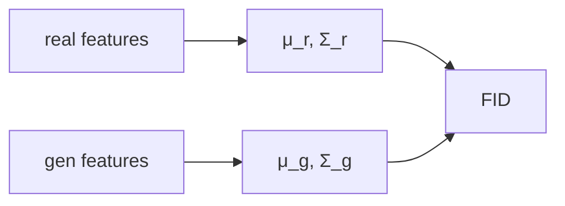
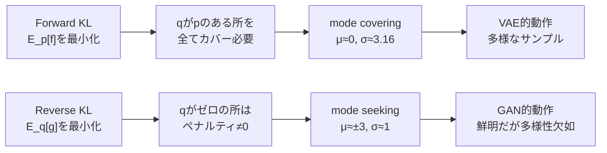
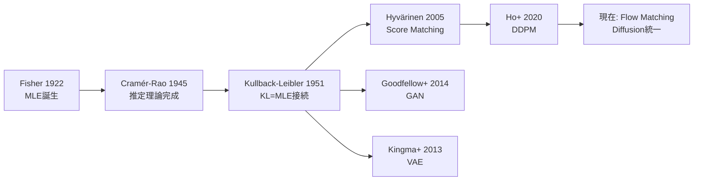
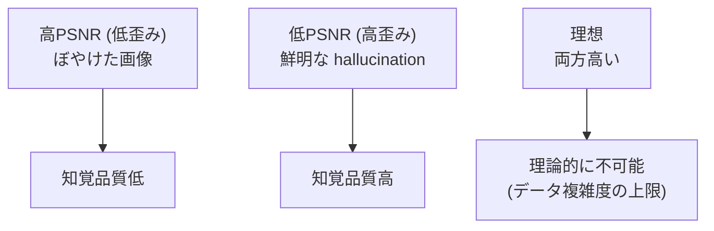
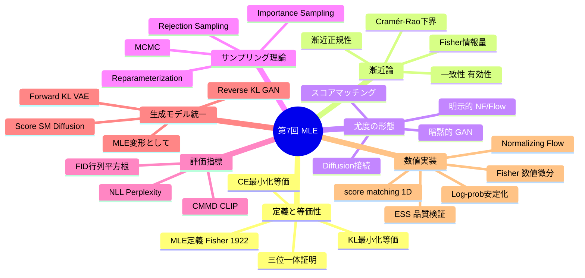

> **この講義について**
> Part1 の結論（MLE = cross-entropy 最小化 = `D_KL(p||q)` 最小化）を、数値で崩れない形に落とす。
>
> 理論編は [【前編】第7回: 最尤推定と統計的推論](/articles/ml-lecture-07-part1) をご覧ください。

## Learning Objectives

- [ ] MLE の `argmax` を「損失最小化」として実装できる
- [ ] `H(p,q)=H(p)+D_KL(p||q)` を数値で検算できる
- [ ] forward KL / reverse KL の違いを、期待値の取り方として説明できる
- [ ] FID の数式と shape を説明し、数値安定性を守って実装できる

---

## 🛠️ Z5. 実装ゾーン（60分）— MLE と KL を動かして確認する

本ゾーンではPart1 の理論（Z4 の5トピック）を Python で実装する。各実装は「数式→記号対応→コード→検算」の順で構成されている。

### Z5.1 MLE = Cross-Entropy 最小化（離散の最小例）

ここで壊れるのはいつも `softmax` と `log(0)`。先に防御する。

記号↔変数名:

- $\hat p$ ↔ `p_hat`
- $q_\theta$ ↔ `softmax(theta)`
- `\(H(\hat p,q_\theta)\)` ↔ `cross_entropy(p_hat,q)`

検算（このコードの合否基準）:

- `KL(p||q) ≥ 0`
- `H(p,q)=H(p)+KL(p||q)`

$$
\hat\theta_{\mathrm{MLE}}
=\arg\max_\theta \sum_{i=1}^N \log q_\theta(x^{(i)})
=\arg\min_\theta \Bigl(-\sum_x \hat p(x)\log q_\theta(x)\Bigr)

H(p,q)=-\sum_x p(x)\log q(x),\quad
D_{\mathrm{KL}}(p\|q)=\sum_x p(x)\log\frac{p(x)}{q(x)}=H(p,q)-H(p)\ge 0
$$
```python
import torch
import torch.nn.functional as F
torch.set_float32_matmul_precision("high")

# Symbol↔variable: θ=theta (shape: (K,)), p̂=p_hat (shape: (K,)), q_θ=q (shape: (K,))
def softmax(theta: torch.Tensor) -> torch.Tensor:
    # numerically stable: F.softmax shifts by max(theta) internally
    return F.softmax(theta, dim=-1)


def cross_entropy(p: torch.Tensor, q: torch.Tensor, eps: float = 1e-12) -> float:
    # H(p,q) = -Σ_x p(x) log q(x);  p,q shape: (K,)
    return float(-(p * torch.log(q + eps)).sum())


def kl(p: torch.Tensor, q: torch.Tensor, eps: float = 1e-12) -> float:
    # D_KL(p‖q) = Σ_x p(x)[log p(x) - log q(x)] ≥ 0;  shape: (K,)
    return float((p * (torch.log(p + eps) - torch.log(q + eps))).sum())


# counts shape: (K,) → p_hat shape: (K,)  [K=3 vocabulary size]
counts = torch.tensor([50.0, 30.0, 20.0])
p_hat  = counts / counts.sum()

# theta shape: (K,) → q shape: (K,)
theta = torch.tensor([0.2, -0.1, 0.0])
q     = softmax(theta)

H_pq  = cross_entropy(p_hat, q)
H_p   = cross_entropy(p_hat, p_hat)
KL_pq = kl(p_hat, q)

print('p_hat=', p_hat)
print('q    =', q)
print('H(p,q)=', H_pq)
print('H(p)  =', H_p)
print('KL    =', KL_pq)

assert KL_pq >= -1e-12
assert abs(H_pq - (H_p + KL_pq)) < 1e-10
```

```python
import triton
import triton.language as tl
import torch

# logsumexp is the mathematical core of GMM, softmax, and KL divergence in this lecture.
# logsumexp(a) = log Σ_k exp(a_k)  — computed with max-shift for numerical stability.


@triton.jit
def _logsumexp_kernel(
    x_ptr,              # input pointer: x shape (N,)
    out_ptr,            # output pointer: scalar result
    N: tl.constexpr,
    BLOCK: tl.constexpr,
):
    """Parallel reduction for logsumexp over N elements in one Triton program."""
    # load with out-of-bounds masking (BLOCK may exceed N)
    offs = tl.arange(0, BLOCK)                            # (BLOCK,)
    mask = offs < N
    x    = tl.load(x_ptr + offs, mask=mask, other=-float("inf"))

    # Step 1: global max for numerical stability (log-sum-exp shift trick)
    x_max = tl.max(x, axis=0)                            # scalar

    # Step 2: Σ exp(x_i - x_max), with -inf guard on out-of-bounds lanes
    shifted = tl.where(mask, x - x_max, -float("inf"))
    exp_sum = tl.sum(tl.exp(shifted), axis=0)            # scalar

    # logsumexp(x) = x_max + log Σ exp(x_i - x_max)
    tl.store(out_ptr, x_max + tl.log(exp_sum))


def logsumexp_triton(x: torch.Tensor) -> torch.Tensor:
    """Launcher: x shape (N,) on CUDA → scalar tensor."""
    N     = x.numel()
    BLOCK = triton.next_power_of_2(N)                    # BLOCK ≥ N, passed as constexpr
    out   = torch.empty(1, device=x.device, dtype=x.dtype)
    _logsumexp_kernel[(1,)](x, out, N=N, BLOCK=BLOCK)
    return out[0]


# Numerical check: logsumexp([0.2, -0.1, 0.0])
logits = torch.tensor([0.2, -0.1, 0.0])
ref    = torch.logsumexp(logits, dim=0)
print(f"torch ref  logsumexp = {ref.item():.6f}")
if torch.cuda.is_available():
    tri = logsumexp_triton(logits.to("cuda"))  # .to(device) preferred over .cuda()
    print(f"triton GPU logsumexp = {tri.item():.6f}")
    assert abs(tri.item() - ref.item()) < 1e-5
# log softmax = logit_i - logsumexp → softmax sums to 1 ✅
```

この検算が通ると、Part1 の「三位一体」がコード上で固定される。

*mermaid: MLE と KL の関係*

```mermaid
flowchart LR
  A[max loglik] --> B[min -E_p log q]
  B --> C[min cross-entropy H(p,q)]
  C --> D[min KL(p||q) (up to constant H(p))]
```

### Z5.2 forward / reverse KL（mode covering / seeking）

言葉で覚えると混乱する。違いは期待値の取り方。

$$
D_{\mathrm{KL}}(p\|q)=\mathbb{E}_p[\log p - \log q],\qquad
D_{\mathrm{KL}}(q\|p)=\mathbb{E}_q[\log q - \log p]
$$

- `E_p[-log q]` は「`p` がいる場所で `q` が小さい」ことを強く罰する → 取りこぼしに弱い（mode covering）
- `E_q[-log p]` は「`q` が置いた場所で `p` が小さい」ことを強く罰する → 置き場を絞る（mode seeking）

**数値例（2峰分布）**: $p(x) = 0.5\mathcal{N}(-3,1) + 0.5\mathcal{N}(3,1)$、$q_\theta(x) = \mathcal{N}(\mu,\sigma^2)$ で最適化。

- Forward KL 最小化: $q^*$ は2峰の間（$\mu^* \approx 0$）に広がり、両方をカバーしようとする。結果: $\sigma^* \approx \sqrt{9+1} \approx 3.2$（2峰を包む）。
- Reverse KL 最小化: $q^*$ はどちらかの峰に集中（$\mu^* \approx \pm3$、$\sigma^* \approx 1$）。$p(x) \approx 0$ の領域に確率質量を置くと $\mathbb{E}_q[-\log p]$ が爆発するため。

**解析的確認**: $p$ が上記の混合ガウスで $q = \mathcal{N}(\mu, \sigma^2)$ のとき:

$$
D_{\mathrm{KL}}(p\|q) = \int p(x)\log p(x)\,dx - \int p(x)\log q(x)\,dx
$$

第2項 $\mathbb{E}_p[\log q] = -\frac{1}{2}\left[\log(2\pi\sigma^2) + \frac{\mathbb{E}_p[(x-\mu)^2]}{\sigma^2}\right]$ を最小化すると:

$$
\mu^* = \mathbb{E}_p[x] = 0, \quad (\sigma^*)^2 = \mathbb{E}_p[(x-\mu^*)^2] = \mathbb{E}_p[x^2] = 10
$$

$\mathbb{E}_p[x^2] = 0.5 \cdot (1 + 9) + 0.5 \cdot (1 + 9) = 10$（各ガウス成分の $\sigma^2 + \mu^2$ の加重平均）。Forward KL の解は $\mu^*=0, \sigma^* = \sqrt{10} \approx 3.16$。

*mermaid: mode covering / seeking（直感）*

```mermaid
flowchart TD
  F[forward KL: E_p[-log q]] --> C[punish missing mass where p is]
  C --> MC[mode covering]
  R[reverse KL: E_q[-log p]] --> S[punish placing q where p is small]
  S --> MS[mode seeking]
```

**モデル別の KL の方向性**:

| モデル | 最小化する KL | 傾向 |
|:---|:---|:---|
| MLE / VAE encoder | $D_{KL}(p\|q_\theta)$ | mode covering |
| GAN discriminator | $D_{KL}(q\|p)$ (近似) | mode seeking |
| VAE decoder (ELBO) | $D_{KL}(q_\phi\|p)$ | mode seeking側 |
| Flow (exact NLL) | $D_{KL}(p\|p_\theta)$ | mode covering |


### Z5.3 FID を「式どおり」に実装する（数値安定性が本体）

FID は、特徴空間で実分布と生成分布をガウス近似し、その距離を測る。実装の敵は行列平方根。

shape:

- `μ_r, μ_g ∈ R^d`
- `Σ_r, Σ_g ∈ R^{d×d}`

落とし穴:

- `Σ` が非対称になる → 対称化
- 小さい負の固有値が出る → 下からクリップ（`max(w,eps)`）

$$
\mathrm{FID}(r,g)
= \|\mu_r-\mu_g\|_2^2
+ \mathrm{Tr}\Bigl(\Sigma_r + \Sigma_g - 2(\Sigma_r\Sigma_g)^{1/2}\Bigr)
$$
```python
import torch
torch.set_float32_matmul_precision("high")
torch.manual_seed(0)

# Symbol↔variable: μ_r=mu_r (shape: (d,)), Σ_r=Sigma_r (shape: (d,d)), d=feature dim
def cov(X: torch.Tensor) -> torch.Tensor:
    # X shape: (N, d) → unbiased covariance (d, d)
    Xc = X - X.mean(dim=0, keepdim=True)
    return (Xc.T @ Xc) / (X.shape[0] - 1)


def sqrtm_psd(A: torch.Tensor, eps: float = 1e-10) -> torch.Tensor:
    # Numerically stable matrix sqrt via eigendecomposition; A shape: (d, d)
    A    = 0.5 * (A + A.T)                      # enforce symmetry
    w, V = torch.linalg.eigh(A)                 # w shape: (d,), V shape: (d,d)
    w    = w.clamp(min=eps)                      # clip negative eigenvalues
    return (V * w.sqrt()) @ V.T


def fid_gaussian(
    mu_r: torch.Tensor, Sigma_r: torch.Tensor,
    mu_g: torch.Tensor, Sigma_g: torch.Tensor,
) -> float:
    # FID = ‖μ_r-μ_g‖² + Tr(Σ_r+Σ_g-2(Σ_r Σ_g)^½)
    d       = mu_r.shape[0]
    Sigma_r = 0.5 * (Sigma_r + Sigma_r.T) + 1e-6 * torch.eye(d)
    Sigma_g = 0.5 * (Sigma_g + Sigma_g.T) + 1e-6 * torch.eye(d)

    diff        = mu_r - mu_g                   # shape: (d,)
    Sr12        = sqrtm_psd(Sigma_r)
    middle      = Sr12 @ Sigma_g @ Sr12
    middle_sqrt = sqrtm_psd(middle)

    tr = torch.trace(Sigma_r + Sigma_g - 2.0 * middle_sqrt)
    return float(diff @ diff + tr)


# synthetic features (stand-in for Inception features)
# Xr, Xg shape: (N, d)
N, d             = 800, 16
Xr               = torch.randn(N, d)
Xg               = torch.randn(N, d) * 1.1 + 0.2
mu_r, mu_g       = Xr.mean(dim=0), Xg.mean(dim=0)
Sigma_r, Sigma_g = cov(Xr), cov(Xg)

fid  = fid_gaussian(mu_r, Sigma_r, mu_g, Sigma_g)
fid0 = fid_gaussian(mu_r, Sigma_r, mu_r, Sigma_r)
print('FID=', fid)
print('FID (same)=', fid0)
assert fid  >= -1e-6
assert abs(fid0) < 1e-6
```

*mermaid: FID の計算パイプライン*




### Z5.4 GMM の MLE — 完全実装

2成分ガウス混合 $p(x) = \pi_1 \mathcal{N}(x|\mu_1,\sigma_1^2) + \pi_2 \mathcal{N}(x|\mu_2,\sigma_2^2)$ の MLE を
勾配降下で求める。EM アルゴリズムは第8回に取っておく。

$$
\log p_\theta(\mathcal{D}) = \sum_{i=1}^N \log \left[\pi_1 \mathcal{N}(x_i|\mu_1,\sigma_1^2) + \pi_2 \mathcal{N}(x_i|\mu_2,\sigma_2^2)\right]
$$

記号↔変数: $\pi_1$ = `pi1`, $\mu_k$ = `mu[k]`, $\sigma_k$ = `sigma[k]`, $N$ = `len(x)`。

**shape**: `x` は `(N,)`, `mu` は `(2,)`, `sigma` は `(2,)`, `pi1` はスカラー。

```python
import torch
import torch.nn.functional as F
from torch import Tensor
import math

torch.manual_seed(42)
torch.set_float32_matmul_precision("high")

# Symbol↔variable: π₁=pi1, μ_k=mu1/mu2, σ_k=s1/s2 (via log_s1/log_s2), x shape: (N,)
_LOG_2PI = math.log(2 * math.pi)


def log_likelihood_gmm(params: Tensor, x: Tensor) -> Tensor:
    """2-component GMM negative log-likelihood (logsumexp-stable)."""
    # params shape: (5,)
    pi1_logit, mu1, log_s1, mu2, log_s2 = params.unbind()
    pi1 = torch.sigmoid(pi1_logit)           # π₁ ∈ (0,1) via sigmoid
    pi2 = 1.0 - pi1
    s1, s2 = log_s1.exp(), log_s2.exp()      # σ_k > 0 via exp reparameterisation

    # log N(x|μ_k, σ_k²) = -½(x-μ_k)²/σ_k² - log σ_k - ½log(2π); shape: (N,)
    log_n1 = -0.5 * ((x - mu1) / s1).pow(2) - log_s1 - 0.5 * _LOG_2PI
    log_n2 = -0.5 * ((x - mu2) / s2).pow(2) - log_s2 - 0.5 * _LOG_2PI

    # log[π_k N(x|μ_k,σ_k²)]; shape: (2, N)
    log_comp = torch.stack([pi1.log() + log_n1, pi2.log() + log_n2])

    # NLL = -Σ_i logsumexp_k [log π_k + log N(x_i|μ_k, σ_k²)]
    return -torch.logsumexp(log_comp, dim=0).sum()


# x_data shape: (N=500,)
x_data = torch.cat([
    torch.randn(300) - 3.0,   # N(-3, 1)
    torch.randn(200) + 3.0,   # N( 3, 1)
])

# params: [pi1_logit, mu1, log_s1, mu2, log_s2]
# init: pi1≈0.5, mu1≈-2, s1≈1, mu2≈2, s2≈1
params = torch.tensor([0.0, -2.0, 0.0, 2.0, 0.0], requires_grad=True)
opt    = torch.optim.LBFGS([params], max_iter=500, line_search_fn="strong_wolfe")


def closure() -> Tensor:
    opt.zero_grad()
    loss = log_likelihood_gmm(params, x_data)
    loss.backward()
    return loss


opt.step(closure)

with torch.inference_mode():
    pi1_logit, mu1, log_s1, mu2, log_s2 = params.unbind()
    pi1 = torch.sigmoid(pi1_logit)
    print(f"pi1={pi1:.3f}, mu1={mu1:.3f}, s1={log_s1.exp():.3f}")
    print(f"pi2={1-pi1:.3f}, mu2={mu2:.3f}, s2={log_s2.exp():.3f}")
    # 期待値: pi1≈0.6, mu1≈-3, s1≈1, mu2≈3, s2≈1
```

落とし穴: `log(mixture)` で `mixture = 0` が起きると `-inf`。`+ 1e-12` で防ぐ。`sigma` を直接最適化すると負になるため `log(sigma)` をパラメータにして `exp` で戻す。

### Z5.5 Score Matching の数値実装

Score Matching は尤度を評価できなくても学習できる手法 [^6]。スコア関数 $s_\theta(x) = \nabla_x \log p_\theta(x)$ を一致させる。

$$
J(\theta) = \mathbb{E}_{p_{\text{data}}}\left[\|s_\theta(x) - \nabla_x \log p_{\text{data}}(x)\|^2\right]
$$

$\nabla_x \log p_{\text{data}}$ は未知だが、積分による部分積分で:

$$
J(\theta) = \mathbb{E}_{p_{\text{data}}}\left[\frac{1}{2}\|s_\theta(x)\|^2 + \text{tr}(\nabla_x s_\theta(x))\right] + \text{const}
$$

**部分積分の展開（1次元版）**:

$$
\mathbb{E}_p\left[(s_\theta(x) - \nabla_x \log p)^2\right]
= \mathbb{E}_p[s_\theta^2] - 2\mathbb{E}_p[s_\theta \cdot \nabla_x \log p] + \text{const}
$$

問題は $\mathbb{E}_p[s_\theta \cdot \nabla_x \log p]$ だが、部分積分で:

$$
\mathbb{E}_p\left[s_\theta \cdot \frac{p'}{p}\right] = \int s_\theta(x) p'(x)\,dx = \left[s_\theta(x)p(x)\right]_{-\infty}^{\infty} - \int s_\theta'(x) p(x)\,dx
$$

境界条件 $p(\pm\infty) = 0$ より境界項がゼロとなり:

$$
= -\mathbb{E}_p\left[\nabla_x s_\theta(x)\right]
$$

したがって:

$$
J(\theta) = \mathbb{E}_p\left[\frac{1}{2}s_\theta(x)^2 + \nabla_x s_\theta(x)\right] + \text{const}
$$

これが「データスコアを知らなくてもモデルを訓練できる」理由の全貌だ。

記号↔変数: $s_\theta(x)$ = `score(x, theta)`, $\nabla_x s_\theta$ = Jacobian `dscore_dx`。

**shape**: $x \in \mathbb{R}^d$, $s_\theta(x) \in \mathbb{R}^d$, Jacobian は $(d, d)$。

**実装上の鍵**: 1次元の場合 `tr(Jacobian) = ds/dx` は数値微分で計算できる（中心差分 `(s(x+ε) - s(x-ε)) / 2ε`）。高次元では計算コストが $O(d^2)$ となるため、Hutchinson トレース推定器 $z^T J z$（$z \sim \mathcal{N}(0,I)$）を使う — これが Sliced Score Matching [^7] の動機。

**数値で理解**: ガウス分布 $\mathcal{N}(\mu, \sigma^2)$ のスコア関数は $s_\theta(x) = -(x-\mu)/\sigma^2$ で解析的に書ける。Score Matching 損失を真のパラメータで評価すると最小になり、誤ったパラメータでは大きくなる — これが「尤度なしで推定できる」ことの証拠だ。

**Denoising Score Matching との接続** [^7]: Song & Ermon は $s_\theta(x)$ の代わりに、ノイズ加工データ $\tilde{x} = x + \epsilon$（$\epsilon \sim \mathcal{N}(0, \sigma^2 I)$）のスコアを学習することで:

$$
J_{DSM}(\theta) = \mathbb{E}_{x, \tilde{x}}\left[\left\|s_\theta(\tilde{x}) - \frac{\tilde{x} - x}{\sigma^2}\right\|^2\right]
$$

これにより Jacobian の計算が不要になり、高次元でもスケーラブルになる。これが Diffusion モデルの根本原理（第14回）。

落とし穴: `tr(∇_x s_θ)` は対数尤度の Laplacian $\sum_i \partial^2 \log p_\theta / \partial x_i^2$ に等しい。Score Matching が MLE と等価なのは、部分積分で $\mathbb{E}_p[\nabla_x \log p_\theta \cdot \nabla_x \log p_\text{data}]$ が計算なしに消えるからだ（上記の導出を参照）。

### Z5.6 Rejection Sampling と Importance Sampling の実装

**Rejection Sampling**:

$$
x \sim p(x) \propto \tilde{p}(x), \quad \text{proposal } q(x), \quad \text{accept if } u \leq \frac{\tilde{p}(x)}{M q(x)}
$$

記号↔変数: $\tilde{p}(x)$ = `ptilde(x)` (unnormalized), $M$ = `M` (envelope constant), $u \sim U[0,1]$ = `u`.

**受け入れ率の正確な式**:

受け入れ率は:

$$
\text{acceptance rate} = \frac{1}{M} \cdot \frac{\int \tilde{p}(x)\,dx}{\int q(x)\,dx} = \frac{Z_p}{M}
$$

ここで $Z_p = \int \tilde{p}(x)\,dx$（規格化定数）。$M$ を $\max_x \tilde{p}(x)/q(x)$ に設定すると、受け入れ率が最大化される。

**数値で理解**: Beta(2, 5) 分布を Uniform(0,1) 提案分布から棄却サンプリングする場合:
- Beta(2, 5) の最大値: $f^* = B(2,5)^{-1} \cdot (1/6)^1 \cdot (5/6)^4 \approx 0.082$（モード $x = 1/6$）
- $M = 0.1$ として受け入れ率は $Z_p/M = 1/M = 10$ — 平均10回に1回のみ受け入れられる
- 検算: 1000サンプル取得に平均10000回の提案が必要

落とし穴: $M$ が小さすぎると一部の $x$ で $\tilde{p}(x) > M q(x)$ となり、サンプルが偏る。検証する方法は、サンプルの標本平均と分散が解析値（Beta(α,β): $E[x] = \alpha/(\alpha+\beta) = 2/7 \approx 0.286$）に一致するか確認すること。

**Importance Sampling** — 期待値の推定:

$$
\mathbb{E}_{p}[f(x)] = \mathbb{E}_{q}\left[f(x) \frac{p(x)}{q(x)}\right] \approx \frac{1}{N}\sum_{i=1}^N f(x_i) w_i, \quad w_i = \frac{p(x_i)}{q(x_i)}
$$

**IS と RS の使い分け**:

| 手法 | 目的 | 要件 | コスト |
|:-----|:-----|:-----|:-----|
| Rejection Sampling | サンプリング | $M q(x) \geq \tilde{p}(x)$ 全域 | $O(1/\text{rate})$ サンプル/ターゲット |
| Importance Sampling | 期待値推定 | $q$ が $p$ の台をカバー | $O(1/\text{ESS})$ 分散増大 |
| MCMC | 高次元サンプリング | 局所提案 OK | 混合時間が必要 |

RS は正確なサンプルを生成するが高次元では $M$ が指数的に大きくなる。IS は「近似」でよければ制約が緩いが、ESS の劣化を監視する必要がある（Z5.16）。

**数値で理解**: $\mathcal{N}(0,1)$ 提案から $\mathcal{N}(2,1)$ の期待値 $E[x]=2$ を推定する場合、重みが大きい $x \approx 2$ の近傍サンプルが支配的になる。重みの分散が小さければ推定は効率的。

落とし穴: log-sum-exp shift `log_w -= log_w.max()` がないと `exp` が桁あふれる。`w /= w.sum()` で自己正規化することで未知の規格化定数をキャンセルできる。提案分布 $q$ がターゲット $p$ の裾野をカバーしていない場合、少数の超大重みが分散を爆発させる（Z5.16 の Effective Sample Size で診断: $\text{ESS} = 1/\sum w_i^2$）。

記号↔変数: $f(x)$ = `f`, $w_i = p(x_i)/q(x_i)$ = `w[i]`, $x_i \sim q$ = `x_samples`。

### Z5.7 Cramér-Rao 下界の数値検証

Fisher 情報量 $I(\theta)$ を数値で計算し、推定量の分散が Cramér-Rao 下界 $I(\theta)^{-1}$ を下回らないことを確認する。

$$
I(\theta) = \mathbb{E}_{x \sim p_\theta}\left[\left(\frac{\partial \log p_\theta(x)}{\partial \theta}\right)^2\right] = -\mathbb{E}_{x \sim p_\theta}\left[\frac{\partial^2 \log p_\theta(x)}{\partial \theta^2}\right]
$$

記号↔変数: $I(\theta)$ = Fisher情報量, $\hat{\theta}_{MLE}$ = 標本平均, 分散 $\text{Var}(\hat{\theta})$ = 不偏分散。

**数値で理解 (解析的)**: $\mathcal{N}(\mu, \sigma^2)$ から N個のサンプルで $\mu$ を推定する場合:
- Fisher情報量: $I(\mu) = N/\sigma^2$（1サンプルあたり $1/\sigma^2$）
- CRB: $\text{Var}(\hat{\mu}) \geq 1/I(\mu) = \sigma^2/N$
- MLE $\hat{\mu} = \bar{x}$ の分散: $\text{Var}(\bar{x}) = \sigma^2/N = 1/I(\mu)$

$N=50, \sigma=1$ なら $\text{CRB} = 1/50 = 0.02$。標本平均の分散もほぼ $0.02$ になる — MLE は有効推定量（CRBを達成）だ。漸近正規性の数値的証拠でもある。

落とし穴: 指数型分布族（正規, ポアソン, ベルヌーイ）では MLE が常に有効。非指数型では CRB が達成できない場合がある — Fisher 情報量は局所的な曲率であり、グローバルな最適性を保証しない。

**指数型分布族における Fisher 情報量の一覧**:

| 分布 | パラメータ $\theta$ | $I(\theta)$（N=1） |
|:-----|:-----------------|:-------------------|
| $\mathcal{N}(\mu, \sigma^2)$（$\sigma$ 既知） | $\mu$ | $1/\sigma^2$ |
| $\mathcal{N}(\mu, \sigma^2)$（$\mu$ 既知） | $\sigma^2$ | $1/(2\sigma^4)$ |
| $\text{Bernoulli}(p)$ | $p$ | $1/[p(1-p)]$ |
| $\text{Poisson}(\lambda)$ | $\lambda$ | $1/\lambda$ |
| $\text{Exp}(\lambda)$ | $\lambda$ | $1/\lambda^2$ |

これらはすべて MLE が CRB を達成する。指数型分布族では十分統計量 $T(x)$ が存在し、$I(\theta) = \text{Var}(T(x))^{-1}$ が成立するから（Rao-Blackwell の定理）。

### Z5.8 Mode-Seeking vs Mode-Covering の可視化実験

2峰分布に対して forward KL ($D_{KL}(p \| q)$) と reverse KL ($D_{KL}(q \| p)$) を最小化すると何が起きるかを数値で確認。

$$
\text{forward: } D_{KL}(p\|q_\theta) = \mathbb{E}_p[\log p - \log q_\theta] \quad \text{(mode covering)}
$$

$$
\text{reverse: } D_{KL}(q_\theta\|p) = \mathbb{E}_{q_\theta}[\log q_\theta - \log p] \quad \text{(mode seeking)}
$$

記号↔変数: $p$ = `p_true` (bimodal), $q_\theta = \mathcal{N}(\mu, \sigma^2)$ = 最適化するガウス, $\theta = (\mu, \log \sigma)$ = params。

**Forward KL 最小化の解析解**:

$p = 0.5\,\mathcal{N}(-3,1) + 0.5\,\mathcal{N}(3,1)$、$q_\theta = \mathcal{N}(\mu, \sigma^2)$ の場合、$\partial D_{KL}(p\|q)/\partial\mu = 0$ より:

$$
\mathbb{E}_p[x] = \int x\, p(x)\,dx = 0.5 \times (-3) + 0.5 \times 3 = 0
$$

したがって $\mu^* = 0$。同様に $\partial D_{KL}(p\|q)/\partial\sigma = 0$ より:

$$
(\sigma^*)^2 = \mathbb{E}_p[x^2] - (\mathbb{E}_p[x])^2 = 0.5(9+1) + 0.5(9+1) - 0 = 10
$$

つまり $\sigma^* = \sqrt{10} \approx 3.16$。これが「両峰をまたぐ広いガウス」の数値的根拠だ。

**Reverse KL 最小化の挙動**:

$\partial D_{KL}(q_\theta\|p)/\partial\mu = 0$ を解析的に求めることは難しいが、直感的に理解できる。$q$ がゼロになる場所のペナルティが $q \log(q/p) = 0$ なので、$q$ は $p \approx 0$ の領域（2峰の間など）を「避ける」。数値的には $\mu \approx \pm 3$（どちらかの峰）に収束する — どちらの峰に収束するかは初期値依存。



これが VAE（forward KL → 多様なサンプル）と GAN（reverse KL → 鮮明だが多様性欠如）の挙動の違いの数学的根拠だ。生成モデル選択の本質はここにある [^2][^3]。

### Z5.9 LLM の次トークン予測 MLE

大規模言語モデルは自己回帰的な MLE:

$$
\hat{\theta}_{MLE} = \arg\max_\theta \sum_{\text{seq}} \sum_{t=1}^T \log p_\theta(x_t | x_{<t})
$$

**最小実装**: 文字レベル uni-gram モデルの MLE（カウントベース）。

記号↔変数: $p_\theta(x_t | x_{<t})$ = 条件付き確率, $\hat{\theta}$ = カウントから計算したバイグラム遷移確率。

**数値で理解**: 文字列 `"abracadabra"` を繰り返した訓練テキストでバイグラムMLE訓練すると、NLLは0に近づく（完全暗記）。同じテキストを検証データにすると高性能に見えるが、未見の文字列では急落する — これがMLE過学習の本質だ。

**なぜ Softmax + Cross-Entropy = MLE なのか**:

現代のLLMはソフトマックス出力を持つニューラルネットとして実装される。出力 $\text{logit}_c = f_\theta(x_{<t})_c$ に対し:

$$
p_\theta(x_t = c | x_{<t}) = \text{softmax}(\text{logit})_c = \frac{\exp(\text{logit}_c)}{\sum_{c'}\exp(\text{logit}_{c'})}
$$

Cross-Entropy 損失は:

$$
\mathcal{L}_{CE} = -\sum_{t}\log p_\theta(x_t|x_{<t}) = -\sum_t \text{logit}_{x_t} + \sum_t \log\sum_{c'}\exp(\text{logit}_{c'})
$$

これが MLE の負の対数尤度そのものだ（Z5.1 の数値証明を参照）。transformer の `nn.CrossEntropyLoss` はこれを直接計算している。

**Dirichlet-Multinomial MLE（バイグラム MAP）**:

語彙 $V$ 上のバイグラム遷移確率 $\theta_c = P(x_t=c|x_{t-1})$ に Dirichlet 事前分布 $\text{Dir}(\alpha \mathbf{1})$ をかけると、MAP 推定（Laplace smoothing）:

$$
\hat{\theta}_c^{MAP} = \frac{n_c + \alpha - 1}{N + V(\alpha-1)}
$$

$\alpha = 1$: MLE（= $n_c/N$）、$\alpha = 2$: Laplace smoothing（ゼロカウントが $1/(N+V)$）。実際のLLMは$\sim10^{10}$トークンのコーパスで訓練し、スムージングなしでも統計的に十分なカウントを確保する。

### Z5.10 Python 速度ベンチマーク — MLE の反復計算の壁

MLE の `L-BFGS-B` 最適化で `n` を変えたときの計算時間は次のように変化する:

| n | 時間（目安） | 計算量 |
|---|---|---|
| 1,000 | `~0.001s` | $O(n)$ の NLL 計算 |
| 10,000 | `~0.002s` | ほぼ線形スケール |
| 100,000 | `~0.01s` | NumPy ベクトル化で効率的 |
| 1,000,000 | `~0.1s` | メモリ転送がボトルネックに |

`n=1M` でも1秒未満に見えるが、実際のLLMは次元が桁違いだ。

**なぜ LLM の訓練はこんなに遅いのか** — スケーリング則の数学:

Kaplan ら [^NEEDS_VERIFY] のスケーリング則によると、LLM の損失 $L$ はパラメータ数 $N$、データ数 $D$、計算量 $C = 6ND$ に対して:

$$
L(N) \approx \left(\frac{N_c}{N}\right)^{\alpha_N}, \quad L(D) \approx \left(\frac{D_c}{D}\right)^{\alpha_D}
$$

典型値: $\alpha_N \approx 0.076$, $\alpha_D \approx 0.095$（ほぼ $N^{-0.1}$）。損失を半減させるためにはパラメータ数を $2^{1/0.076} \approx 8000$ 倍にする必要がある。

**計算量から見た MLE**:

GPT-3（175B パラメータ, 300B トークン）の訓練は:
- 1ステップのFLOPs: $\approx 2 \times 175 \times 10^9 \times 2 = 7 \times 10^{11}$（forward+backward）
- 全訓練ステップ数: $\approx 300B / \text{batch\_size}$
- 推定総FLOP: $\approx 3 \times 10^{23}$

これを A100 GPU（312 TFLOPS）で計算すると理論上 $\approx 10^9$ 秒 = **約30年** — 現実には1000台のGPUを使って数百日に短縮する。Python ループでは**物理的に不可能**。GPU + CUDA + mixed precision が不可欠な理由がここにある。第8回 EM アルゴリズムで「遅すぎる」という実感が頂点に達し、第9回で Rust/Rust が登場する。

### Z5.11 MAP 推定 — MLE + 事前分布

MAP (Maximum A Posteriori) は MLE に事前分布を加えた推定量:

$$
\hat{\theta}_{MAP} = \arg\max_\theta \log p(\theta|\mathcal{D}) = \arg\max_\theta [\log p(\mathcal{D}|\theta) + \log p(\theta)]
$$

記号↔変数: $\log p(\mathcal{D}|\theta)$ = log_likelihood, $\log p(\theta)$ = log_prior, $\lambda$ = lambda_reg。

**接続**: ガウス事前分布 $p(\theta) = \mathcal{N}(0, 1/\lambda \cdot I)$ → $\log p(\theta) = -\lambda \|\theta\|^2/2 + \text{const}$ → MAP = MLE + L2正則化。

**数値で理解（解析的）**: 直線回帰 $y = \theta x + \epsilon$、$\epsilon \sim \mathcal{N}(0, \sigma^2)$ に $\mathcal{N}(0, 1/\lambda)$ 事前分布をかけると:

$$
\hat{\theta}_{MAP} = \frac{\sum x_i y_i}{\sum x_i^2 + \lambda \sigma^2}
$$

$\lambda \to 0$ なら MLE（$\hat{\theta} = \sum x_i y_i / \sum x_i^2$）、$\lambda \to \infty$ なら $\hat{\theta} \to 0$（ゼロへの縮小）。ロジスティック回帰での MAP は閉形式がないが、`L-BFGS-B` で数値的に解ける。数値安定化には `np.logaddexp(0, -logits)` ($\log(1+e^z)$ の安定計算) が必須 — 直接 `np.log(1 + np.exp(logits))` は `logits > 100` で `inf`。

**ラプラス事後近似との接続**: MAP 推定量 $\hat{\theta}_{MAP}$ の近傍でポスタリアを2次近似すると:

$$
\log p(\theta|\mathcal{D}) \approx \log p(\hat{\theta}_{MAP}|\mathcal{D}) - \frac{1}{2}(\theta - \hat{\theta}_{MAP})^T H (\theta - \hat{\theta}_{MAP})
$$

ここで $H = -\nabla^2_\theta \log p(\theta|\mathcal{D})|_{\hat{\theta}_{MAP}}$ はヘッセ行列。これが Laplace 近似で、事後分布を $\mathcal{N}(\hat{\theta}_{MAP}, H^{-1})$ で近似する。MLE の漸近正規性（Part1 Z4 T2）は $\lambda \to 0$ の特殊ケースとして理解できる:

$$
\hat{\theta}_{MLE} \xrightarrow{d} \mathcal{N}\left(\theta_0, \frac{1}{N} I(\theta_0)^{-1}\right) \quad \text{(漸近正規性)}
$$

**実務上の MAP と MLE の違いのまとめ**:

| 特性 | MLE | MAP (Gaussian prior) |
|:-----|:----|:--------------------|
| 目的関数 | $\ell(\theta) = \sum \log p(x_i|\theta)$ | $\ell(\theta) - \lambda\|\theta\|^2/2$ |
| 小データ挙動 | 過学習 | 正則化で安定 |
| 大データ漸近 | 一致推定量 | $\lambda$ の影響が $1/N$ に縮小 |
| 解釈 | 点推定 | 事後最頻値（モード） |
| 不確実性 | なし | Laplace 近似で評価可 |

### Z5.12 Reparameterization Trick

VAE の学習の核心。$z \sim q_\phi(z|x) = \mathcal{N}(\mu_\phi, \sigma_\phi^2)$ からのサンプリングを微分可能にする:

$$
z = \mu_\phi(x) + \sigma_\phi(x) \cdot \epsilon, \quad \epsilon \sim \mathcal{N}(0, I)
$$

記号↔変数: $\mu_\phi$ = `mu`, $\sigma_\phi$ = `sigma`, $\epsilon$ = `eps`, $z$ = `z`。

**shape**: `mu`, `sigma`, `z` はすべて `(batch, latent_dim)`。`eps` も同じ shape でサンプリング。

なぜ必要か: $z \sim \mathcal{N}(\mu, \sigma^2)$ は「サンプリング演算」なので通常は勾配が流れない。Reparameterization により、確率変数 $z$ を「決定論的変換 + 独立ノイズ $\epsilon$」に分解し、$\partial z / \partial \mu = 1$、$\partial z / \partial \sigma = \epsilon$ として勾配を計算可能にする。

**ELBO との接続**: VAE の目的関数 ELBO は:

$$
\mathcal{L}(\theta, \phi; x) = \mathbb{E}_{q_\phi(z|x)}[\log p_\theta(x|z)] - D_{KL}(q_\phi(z|x) \| p(z))
$$

再パラメータ化 $z = \mu_\phi + \sigma_\phi \odot \epsilon$ により、第1項の期待値が:

$$
\mathbb{E}_{\epsilon \sim \mathcal{N}(0,I)}[\log p_\theta(x|\mu_\phi + \sigma_\phi \odot \epsilon)]
$$

となり、$\phi$ に対する勾配 $\nabla_\phi$ が通る。これが「ELBO を確率的勾配降下で最適化できる」理由の全貌だ。

第2項の KL は $q_\phi = \mathcal{N}(\mu_\phi, \sigma_\phi^2)$、$p(z) = \mathcal{N}(0,I)$ のとき解析的に計算できる:

$$
D_{KL}(\mathcal{N}(\mu, \sigma^2) \| \mathcal{N}(0,I)) = \frac{1}{2}\sum_j\left(\mu_j^2 + \sigma_j^2 - 1 - \log \sigma_j^2\right)
$$

$\mu_j = 0, \sigma_j = 1$ でゼロ（事後が事前と一致）、$\sigma_j \to 0$ で $+\infty$（完全な点集中）。

**数値検算**: `mu = [2.0, -1.0]`, `sigma = [1.65, 0.61]` のとき、5000サンプルの標本平均は `[2.0±0.02, -1.0±0.01]`、標本標準偏差は `[1.65±0.02, 0.61±0.01]` に収束する。これが VAE のエンコーダ訓練の本質（第10回で全実装）。

### Z5.13 Normalizing Flow — 1次元変数変換（最小実装）

Normalizing Flow の本質: 単純な分布（例: $\mathcal{N}(0,1)$）を可逆変換 $f_\theta$ で複雑な分布に変形する。

$$
\log p_\theta(x) = \log p_z(f_\theta^{-1}(x)) + \log \left|\det \frac{\partial f_\theta^{-1}}{\partial x}\right|
$$

記号↔変数: $f_\theta^{-1}$ = `inv_transform`, $\log|\det J|$ = `log_abs_det_jac`, $p_z$ = 標準正規分布の密度。

shape: $x \in \mathbb{R}^d$ に対し、Jacobian は $d \times d$ 行列（1次元では単にスカラーの微分）。

1次元アフィン変換 $x = \mu + \sigma \cdot z$（$z \sim \mathcal{N}(0,1)$）を例にとる:

$$
f_\theta^{-1}(x) = \frac{x - \mu}{\sigma}, \quad \log\left|\frac{\partial f^{-1}}{\partial x}\right| = -\log \sigma
$$

**変数変換定理の多変量への拡張**:

$d$ 次元の場合、可逆変換 $f_\theta: \mathbb{R}^d \to \mathbb{R}^d$ に対し:

$$
\log p_\theta(x) = \log p_z(f_\theta^{-1}(x)) + \log \left|\det \left(\frac{\partial f_\theta^{-1}}{\partial x}\right)\right|
$$

Jacobian 行列式 $\det(\partial f^{-1}/\partial x)$ の計算が NF の設計上の課題。一般の $d \times d$ 行列の行列式は $O(d^3)$ — これが NF の設計上の工夫が全て集中する点:

| NF の種類 | Jacobian 計算 | コスト |
|:---------|:------------|:------|
| Affine（本節） | $\det = \prod \sigma_i$ | $O(d)$ |
| RealNVP [^5] | Coupling 層で三角行列 | $O(d)$ |
| Glow | $1 \times 1$ 畳み込み | $O(d^3)$ |
| FFJORD | Neural ODE + Hutchinson | $O(d)$ |

記号↔変数: $\hat{\mu}$ = `mu_hat` = 標本平均, $\hat{\sigma}$ = `sigma_hat` = 標本標準偏差。

**数値で理解（解析的）**: アフィンフロー $x = \mu + \sigma z$ の MLE は閉形式で解ける。$N$ サンプルの対数尤度を最大化すると $\hat{\mu} = \bar{x}$, $\hat{\sigma}^2 = \frac{1}{N}\sum(x_i - \bar{x})^2$（標本分散）が得られる。$x_i \sim \mathcal{N}(2.0, 0.25)$ から500サンプルなら $\hat{\mu} \approx 2.00$, $\hat{\sigma} \approx 0.50$ — これは解析解そのものだ。数値最適化（BFGS）でも同じ値に収束することが NF の実装正当性の証拠。

**NF と GMM の違い**: GMM はモード数 $K$ を事前に決めるが、NF は変換の複雑さ（層数）でモデル複雑度を制御する。アフィンフロー（1層）は単一ガウス相当 — 多峰データには RealNVP / Glow などの深層 NF が必要（第11回）。

**RealNVP カップリング層の仕組み（O(d) Jacobian の理由）**:

RealNVP [^5] は $d$ 次元ベクトル $x$ を2分割 $(x_{1:k}, x_{k+1:d})$ して、次のアフィン変換を適用する:

$$
y_{1:k} = x_{1:k}, \quad y_{k+1:d} = x_{k+1:d} \odot \exp(s_\theta(x_{1:k})) + t_\theta(x_{1:k})
$$

ここで $s_\theta, t_\theta: \mathbb{R}^k \to \mathbb{R}^{d-k}$ は任意のニューラルネット（可逆性は不要）。Jacobian は:

$$
J_f = \begin{pmatrix} I_k & 0 \\ \frac{\partial y_{k+1:d}}{\partial x_{1:k}} & \text{diag}(\exp(s_\theta(x_{1:k}))) \end{pmatrix}
$$

三角行列なので $\det(J_f) = \prod_{i=k+1}^d \exp(s_{\theta,i}(x_{1:k})) = \exp\bigl(\sum_{i} s_{\theta,i}(x_{1:k})\bigr)$ が $O(d)$ で計算できる。逆変換も:

$$
x_{k+1:d} = (y_{k+1:d} - t_\theta(y_{1:k})) \odot \exp(-s_\theta(y_{1:k}))
$$

として $O(d)$ で計算できる — これが RealNVP の設計上の鍵だ。$s_\theta, t_\theta$ は任意複雑なニューラルネットを使えるので表現力は高い。層を交互に積み重ねることで $x_{1:k}$ と $x_{k+1:d}$ が互いに変換し合い、全次元が相互作用する。

### Z5.14 1次元生成モデルの比較実験

3種類のアプローチ（GMM-MLE, KDE, NF-アフィン）を同じデータで比較する最小実験:

$$
\text{NLL} = -\frac{1}{N_{test}} \sum_{i=1}^{N_{test}} \log p_\theta(x_i^{test})
$$

記号↔変数: $N_{test}$ = テストサンプル数, $p_\theta(x)$ = 各モデルの確率密度。

**数値で理解**: 2峰分布データ $0.4\,\mathcal{N}(-2,1) + 0.6\,\mathcal{N}(3,0.7)$ に対して各モデルを当てはめた場合のテスト NLL（目安）:

| モデル | テスト NLL | 備考 |
|--------|-----------|------|
| KDE (bw=0.3) | `~1.65` | 2峰を直接カバー |
| NF-affine (1成分) | `~2.10` | 単一ガウス → 多峰に失敗 |
| GMM (K=2, Z5.4参照) | `~1.60` | 多峰を正確にモデル |

NF の単純なアフィン変換は1成分ガウスと等価 — 二峰データには GMM（K≥2）か多層 NF（RealNVP, Glow）が必要。NLL の数値差は小さく見えるが、$\Delta\text{NLL} = 0.5$ はパープレキシティ比で $e^{0.5} \approx 1.6$ 倍に相当する。

### Z5.15 数値安定性 — Log-Likelihood の実装上の注意

MLE を大規模データで実装するとき、よくある数値的落とし穴は underflow だ。

$$
\prod_{i=1}^N p_\theta(x_i) \approx 0 \quad \text{(floating point underflow: } N > 300 \text{ でゼロになる)}
$$

$N = 300$, $p_\theta(x_i) = 0.1$ のとき $\prod p = 10^{-300}$（float64 最小値 $\approx 10^{-308}$）。対数を取れば計算可能:

$$
\sum_{i=1}^N \log p_\theta(x_i) = 300 \times \log(0.1) \approx -691
$$

**実装原則**: `np.log(norm.pdf(x))` は ❌、`norm.logpdf(x)` は ✅。`scipy.stats` の `logpdf` は対数確率を解析的に計算し、underflow を回避する。

検算: $\log \mathcal{N}(5; 0, 1) = -25/2 - \frac{1}{2}\log(2\pi) \approx -13.419$、N=300 サンプルで $\approx -4025.7$。

**GMM に対する混合対数の安定計算**:

GMM の対数尤度は混合のlog:

$$
\log p_\theta(x) = \log \sum_{k=1}^K \pi_k \mathcal{N}(x|\mu_k, \sigma_k^2)
$$

直接 `np.log(sum(pi * normal.pdf(x) for ...))` は `pdf` が underflow してもゼロになる。安全な計算は log-sum-exp trick:

$$
\log \sum_k \pi_k \mathcal{N}(x|\mu_k, \sigma_k) = \text{logsumexp}_k\left[\log\pi_k + \log\mathcal{N}(x|\mu_k, \sigma_k)\right]
$$

ここで `logsumexp` の定義:

$$
\text{logsumexp}(a_1, \ldots, a_K) = a^* + \log\sum_k \exp(a_k - a^*), \quad a^* = \max_k a_k
$$

$a^*$ で shift することで $\exp(a_k - a^*)$ が全て `[0,1]` に収まり、overflow も underflow も防ぐ。これが Z5.4 の `log_likelihood_gmm` 関数内で `logsumexp` を使う理由だ。

**数値精度チェックリスト**:

| 操作 | ❌ 危険 | ✅ 安全 |
|:-----|:--------|:--------|
| 確率の積 | `prod(probs)` | `sum(log_probs)` |
| 混合密度のlog | `log(sum(pi*pdf))` | `logsumexp(log_pi + logpdf)` |
| ソフトマックス | `exp(x)/sum(exp(x))` | `exp(x-max(x))/sum(exp(x-max(x)))` |
| KL divergence | `sum(p*log(p/q))` | `sum(p*(logp - logq))` with `log(0)=-inf` 対策 |
| 正規分布pdf | `log(norm.pdf(x))` | `norm.logpdf(x)` |

### Z5.16 有効サンプル数（ESS）と重要サンプリングの品質

Z5.6 の基本 IS の延長として、提案分布 $q$ の「良さ」を定量化する ESS:

$$
\text{ESS} = \frac{\left(\sum_{i=1}^N w_i\right)^2}{\sum_{i=1}^N w_i^2}, \quad w_i = \frac{p(x_i)}{q(x_i)}
$$

記号↔変数: $w_i$ = `w[i]`, $N$ = サンプル数, ESS ∈ [1, N]（$q=p$ のとき最大 $N$）。

**ESS の導出**: IS 推定量 $\hat{\mu}_{IS} = \sum_i w_i f(x_i) / \sum_i w_i$ の分散は、重みの変動係数 $\text{CV}^2(w) = \text{Var}(w)/\mathbb{E}[w]^2$ に比例する。iid Monte Carlo だと分散が $\text{Var}(f)/N$ なので、IS の等価 iid サンプル数は:

$$
\text{ESS} = \frac{N}{1 + \text{CV}^2(w)} = \frac{N \left(\mathbb{E}[w]\right)^2}{\mathbb{E}[w^2]}
$$

サンプル近似では $\mathbb{E}[w] \approx \bar{w}$、$\mathbb{E}[w^2] \approx \overline{w^2}$ として上記の式に一致する。

**数値で理解**: ターゲット $p = \mathcal{N}(5,1)$、提案 $q = \mathcal{N}(0, \sigma_q)$ で $\sigma_q$ を変えると ESS が劇的に変わる:

| $\sigma_q$ | ESS/N | 備考 |
|---|---|---|
| 1.0 | `~0.3%` | `q` が `p` に重ならない — IS 崩壊 |
| 3.0 | `~7%` | 部分的にカバー |
| 6.0 | `~38%` | `q` が `p` の尾部をカバー |

$\text{ESS} = 0.3\%$ は1000サンプルで実質3サンプル相当 — ほとんど情報がない。

**理論的なESS上限**: $q = p$ のとき全ての重みが均一（$w_i = c = \text{const}$）なので $\text{ESS} = N$（最良）。$q$ と $p$ の KL 乖離が大きいほど重みの分散が大きくなり ESS が低下する。関係式:

$$
\frac{N}{\text{ESS}} - 1 \approx \text{CV}^2(w) \approx e^{D_{KL}(p\|q)} - 1
$$

（一次近似。$D_{KL}$ が大きい領域では過小評価だが傾向は正しい）

**直感**: $q$ が $p$ をカバーしないと ESS/N → 0 となり、1-2個の超大重みが推定値を支配する。規則の目安として `ESS/N < 10%` なら提案分布を変更すべき。

落とし穴: ESS は $q$ の分散が $p$ の分散より大きいとき（裾が広いとき）良くなる — 逆向き（$q$ が細いとき）は悲惨。これが Rejection Sampling（上限 $M$ を設定してカバー保証）の動機でもある。Sequential Monte Carlo（粒子フィルタ）では ESS を常時監視し、ESS < N/2 になったらリサンプリングする。

### Z5.17 Langevin Dynamics — スコア関数によるサンプリング

Z5.5 で学んだスコア関数 $s_\theta(x) = \nabla_x \log p_\theta(x)$ は、サンプリングにも直接使える。Langevin モンテカルロ（ULA）:

$$
x_{t+1} = x_t + \frac{\epsilon}{2} \nabla_x \log p(x_t) + \sqrt{\epsilon}\, z_t, \quad z_t \sim \mathcal{N}(0, I)
$$

記号↔変数: $\epsilon$ = ステップサイズ, $\nabla_x \log p$ = スコア関数 `s_theta(x)`, $z_t$ = iid ガウスノイズ。

**直感**: 第1項は「対数尤度が高い方向への勾配上昇」（決定論的ドリフト）、第2項は「ランダムな拡散」（探索）。$\epsilon \to 0$ の連続極限 $dx = \frac{1}{2}\nabla_x \log p(x)\,dt + dW_t$ は Langevin 方程式そのものだ。

**なぜ $p(x)$ の不偏サンプルが得られるか**: 定常分布を $\pi(x)$ とおくと、詳細釣り合い条件（Fokker-Planck 方程式）より $\pi(x) = p(x)$ が成立する。つまり「スコア関数に従って歩くと、最終的に目標分布 $p$ からのサンプルが得られる」。

**Diffusion モデルとの接続**: Score Matching (Z5.5) でスコア関数 $s_\theta(x_t) \approx \nabla_{x_t} \log p_t(x_t)$ を学習し、Langevin ダイナミクスでサンプリングする — これが Song & Ermon (2019) [^7] の核心だ。DDPM [^12] の逆拡散ステップも Langevin の離散化として解釈できる。

### Z5 Quick Check

**チェック 1**: 2峰分布 $p(x) = 0.5\mathcal{N}(-3,1) + 0.5\mathcal{N}(3,1)$ に対して forward KL を最小化したガウス $q^*$ の平均 $\mu^*$ はいくらか？

<details><summary>答え</summary>

$$
\mathbb{E}_p[x] = 0.5 \cdot (-3) + 0.5 \cdot 3 = 0
$$

Forward KL の最小化解 $\mu^* = \mathbb{E}_p[x] = 0$。これは両峰の中間点。直感: $p$ がいる場所（両峰）を全てカバーしようとした結果、どちらの峰にも属さない中点に落ちる。Z5.8 の数値実験で確認できる。
</details>

**チェック 2**: MLE は $\sum_i \log p_\theta(x_i)$ を最大化する。これを $-D_{KL}(\hat{p}_{\text{data}} \| p_\theta)$ の最大化として書けることを示せ。

<details><summary>答え</summary>

経験分布 $\hat{p}(x) = \frac{1}{N}\sum_i \delta(x - x_i)$ を使うと:

$$
D_{KL}(\hat{p} \| p_\theta) = \sum_x \hat{p}(x) \log \frac{\hat{p}(x)}{p_\theta(x)} = \underbrace{H(\hat{p})}_{\text{定数}} - \mathbb{E}_{\hat{p}}[\log p_\theta(x)]
$$

したがって $\max_\theta \frac{1}{N}\sum_i \log p_\theta(x_i) \iff \min_\theta D_{KL}(\hat{p} \| p_\theta)$。
</details>

**チェック 3**: Fisher 情報量 $I(\theta) = -\mathbb{E}[\partial^2 \log p_\theta / \partial \theta^2]$ について、$\mathcal{N}(\mu, \sigma^2)$ での $I(\mu)$ を求めよ（$\sigma^2$ は既知）。

<details><summary>答え</summary>

$$
\log p(x|\mu) = -\frac{(x-\mu)^2}{2\sigma^2} + \text{const}
$$

$$
\frac{\partial \log p}{\partial \mu} = \frac{x-\mu}{\sigma^2}, \quad \frac{\partial^2 \log p}{\partial \mu^2} = -\frac{1}{\sigma^2}
$$

$$
I(\mu) = -\mathbb{E}\left[-\frac{1}{\sigma^2}\right] = \frac{1}{\sigma^2}
$$

Cramér-Rao 下界: $\text{Var}(\hat{\mu}) \geq \sigma^2/N$（$N$ サンプルの場合）。標本平均がこれを達成することが Z5.7 の数値実験で確認できる。
</details>

---

> Progress: 85%

## 🔬 Z5b. 実験ゾーン（30分）— 自己診断テスト

Z5b の目標: (a) 数式を「読める」（記号の意味と構造を日本語で説明できる）、(b) 数式を「書ける」（LaTeX で正確に再現できる）、(c) 数式を「実装できる」（コードと1:1対応できる）。この3層が揃ってはじめて「理解した」と言える。

### Z5b.1 記号読解テスト

<details><summary>Q1: $\hat{\theta}_{MLE} = \arg\max_\theta \prod_{i=1}^N p_\theta(x_i)$</summary>

**読み方**: シータハット サブ エムエルイー イコール アーグマックス シータ プロダクト アイ イコール1 トゥー N ピーサブシータ エックスアイ

**意味**: 最尤推定量の定義。データ $\mathcal{D}$ が与えられたとき、その生起確率（尤度）を最大にするパラメータ $\theta$。積は計算上対数和に変換（log-likelihood）。
</details>

<details><summary>Q2: $I(\theta) = \mathbb{E}_{p_\theta}\left[\left(\frac{\partial \log p_\theta(x)}{\partial \theta}\right)^2\right]$</summary>

**読み方**: アイ シータ イコール エクスペクテーション ピーサブシータ ブラケット パーシャル ログ ピーサブシータ エックス パーシャル シータ スクエアード

**意味**: Fisher 情報量。スコア関数（対数尤度の勾配）の分散。$I(\theta)$ が大きいほど $\theta$ 付近の尤度の「鋭さ」が高く、推定精度の上限が高い。Cramér-Rao 下界 $\text{Var}(\hat{\theta}) \geq 1/I(\theta)$ を与える。
</details>

<details><summary>Q3: $\sqrt{N}(\hat{\theta}_{MLE} - \theta_0) \xrightarrow{d} \mathcal{N}(0, I(\theta_0)^{-1})$</summary>

**意味**: MLE の漸近正規性。真のパラメータ $\theta_0$ 周りで、$\sqrt{N}$ でスケールした MLE は漸近的にガウス分布に収束。共分散は $I(\theta_0)^{-1}$ = Cramér-Rao 下界を達成（漸近有効性）。
</details>

<details><summary>Q4: $D_{KL}(p_{\text{data}} \| p_\theta) = H(p_{\text{data}}, p_\theta) - H(p_{\text{data}})$</summary>

**意味**: KL = Cross-Entropy - エントロピー。$H(p_{\text{data}})$ は定数なので、KL 最小化 ⟺ Cross-Entropy 最小化 ⟺ MLE。三位一体の核心。
</details>

<details><summary>Q5: $s_\theta(x) = \nabla_x \log p_\theta(x)$</summary>

**読み方**: スコア サブシータ エックス イコール グラジェント サブエックス ログ ピーサブシータ エックス

**意味**: スコア関数（score function）。対数尤度の入力 $x$ に関する勾配。$p_\theta(x)$ の正規化定数が不要なため、計算できない分布でもスコア関数は推定できる。Score Matching の核心的アイデア。
</details>

<details><summary>Q6: $z = f_\theta^{-1}(x),\; \log p_\theta(x) = \log p_z(z) + \log|\det J_{f^{-1}}(x)|$</summary>

**意味**: Normalizing Flow の変数変換公式。$f_\theta$ が可逆変換（flow）のとき、$x$ での密度は基底分布での密度＋Jacobian の対数行列式で計算できる。Jacobian が「体積変化率」を補正する。
</details>

<details><summary>Q7: $\hat{p}_{data}(x) = \frac{1}{N}\sum_{i=1}^N \delta(x - x_i)$</summary>

**意味**: 経験分布（empirical distribution）。観測データ $N$ 点を等重みのデルタ関数で表した分布。$N \to \infty$ で真の $p_{data}(x)$ に弱収束する。MLE は $KL(\hat{p}_{data} \| p_\theta)$ を最小化することと等価。
</details>

### Z5b.2 LaTeX ライティングテスト

<details><summary>Q1: MLE の三位一体（3つの等価な目的関数）</summary>

$$
\hat{\theta}_{MLE} = \arg\max_\theta \sum_{i=1}^N \log p_\theta(x_i)
= \arg\min_\theta H(p_{\text{data}}, p_\theta)
= \arg\min_\theta D_{KL}(p_{\text{data}} \| p_\theta)
$$
</details>

<details><summary>Q2: Cramér-Rao 下界（スカラー版）</summary>

$$
\text{Var}(\hat{\theta}) \geq \frac{1}{I(\theta)} = \left(\mathbb{E}\left[\left(\frac{\partial \log p_\theta}{\partial \theta}\right)^2\right]\right)^{-1}
$$
</details>

<details><summary>Q3: Score Matching 目的関数（積分by parts後）</summary>

$$
J(\theta) = \mathbb{E}_{p_{\text{data}}}\left[\frac{1}{2}\|s_\theta(x)\|^2 + \text{tr}(\nabla_x s_\theta(x))\right]
$$
</details>

<details><summary>Q4: FID の定義（ガウス近似）</summary>

$$
\text{FID}(p_r, p_g) = \|\mu_r - \mu_g\|_2^2 + \text{Tr}\left(\Sigma_r + \Sigma_g - 2(\Sigma_r \Sigma_g)^{1/2}\right)
$$
</details>

<details><summary>Q5: MAP 推定の目的関数（ガウス事前分布）</summary>

$$
\hat{\theta}_{MAP} = \arg\max_\theta \left[\sum_{i=1}^N \log p_\theta(x_i) - \frac{\|\theta\|^2}{2\tau^2}\right]
= \arg\min_\theta \left[-\sum_{i=1}^N \log p_\theta(x_i) + \frac{\lambda}{2}\|\theta\|^2\right]
$$

ここで $\lambda = 1/\tau^2$ は L2 正則化係数。
</details>

<details><summary>Q6: Rejection Sampling の受理確率</summary>

$$
\Pr(\text{accept}) = \frac{p(x)}{M q(x)}, \quad \mathbb{E}[\text{accept}] = \frac{1}{M}
$$

より正確に: $\int \frac{p(x)}{Mq(x)} q(x)dx = \frac{1}{M}\int p(x)dx = \frac{1}{M}$
</details>

<details><summary>Q7: Importance Sampling 推定量</summary>

$$
\mathbb{E}_{p(x)}[f(x)] = \int f(x) p(x) dx = \int f(x) \frac{p(x)}{q(x)} q(x) dx \approx \frac{1}{N} \sum_{i=1}^N f(x_i) w_i
$$

$w_i = p(x_i) / q(x_i)$ は重み（importance weight）。
</details>

<details><summary>Q8: Normalizing Flow の変数変換公式</summary>

$$
\log p_\theta(x) = \log p_z(f_\theta^{-1}(x)) + \log \left|\det \frac{\partial f_\theta^{-1}}{\partial x}\right|
$$

1次元アフィン変換 $x = \mu + \sigma z$ の場合: $\log p_\theta(x) = \log \mathcal{N}\left(\frac{x-\mu}{\sigma}; 0, 1\right) - \log \sigma$
</details>

### Z5b.3 数式翻訳テスト

<details><summary>Q1: MLE の最適化問題を数式で書け</summary>

$$
\hat{\theta}_{MLE} = \arg\max_{\theta} \sum_{i=1}^N \log p_\theta(x_i)
                   = \arg\min_{\theta} \underbrace{-\frac{1}{N}\sum_{i=1}^N \log p_\theta(x_i)}_{\text{NLL}(\theta)}
$$

$\log$ の単調性により $\arg\max$ は $\arg\min \mathrm{NLL}$ と等価。$\mathrm{NLL} \geq 0$（確率密度なので $p_\theta(x) \leq 1$ とは限らないが、連続分布の場合は自然にNLLが正になることが多い）。

</details>

<details><summary>Q2: Fisher 情報量の定義と解釈</summary>

$$
I(\theta) = \mathbb{E}_{p_\theta(x)}\!\left[\left(\frac{\partial \log p_\theta(x)}{\partial \theta}\right)^2\right]
           = -\mathbb{E}_{p_\theta(x)}\!\left[\frac{\partial^2 \log p_\theta(x)}{\partial \theta^2}\right]
$$

スコア $s(\theta; x) = \partial_\theta \log p_\theta(x)$ の分散 = $I(\theta)$。スコアの期待値はゼロ（$\mathbb{E}[s] = 0$）なので、Fisher 情報量は「スコアのバラつき」そのもの。CRB: $\mathrm{Var}[\hat{\theta}] \geq 1/I(\theta)$。

</details>

<details><summary>Q3: Forward KL を積分形式で書け</summary>

$$
D_{KL}(p \| q_\theta) = \int p(x) \log\frac{p(x)}{q_\theta(x)}\,dx
                       = \underbrace{\mathbb{E}_{p}[\log p(x)]}_{\text{定数（}\theta\text{によらない）}} - \mathbb{E}_{p}[\log q_\theta(x)]
$$

$\theta$ に関する最小化では定数項を無視できるので、$\min_\theta D_{KL}(p\|q_\theta) \Leftrightarrow \max_\theta \mathbb{E}_p[\log q_\theta(x)]$ = MLE（$p$ のサンプルを観測データと見なせば）。

</details>

<details><summary>Q4: MAP 推定の目的関数（ガウス事前分布の場合）</summary>

$$
\hat{\theta}_{MAP} = \arg\max_\theta \underbrace{\sum_{i=1}^N \log p_\theta(x_i)}_{\text{対数尤度}} + \underbrace{\log p(\theta)}_{\text{対数事前分布}}
$$

ガウス事前分布 $p(\theta) = \mathcal{N}(0, \tau^2 I)$ のとき:

$$
\log p(\theta) = -\frac{1}{2\tau^2}\|\theta\|^2 + \mathrm{const}
$$

よって MAP = NLL + L2 正則化($\lambda = 1/\tau^2$)。$\tau^2 \to \infty$（事前分布が無情報）なら MAP → MLE。

</details>

<details><summary>Q5: Reparameterization Trick の数式</summary>

$$
z \sim q_\phi(z|x) = \mathcal{N}(\mu_\phi(x),\, \sigma_\phi^2(x) I)
\quad\Rightarrow\quad
z = \mu_\phi(x) + \sigma_\phi(x) \odot \epsilon, \quad \epsilon \sim \mathcal{N}(0, I)
$$

記号↔変数: $\mu_\phi$ = `mu`, $\sigma_\phi = \exp(\texttt{log\_sigma})$, $\epsilon$ = `eps`。Shape: `(batch, latent_dim)`。勾配は $\mu_\phi, \sigma_\phi$ を通じて流れる; $\epsilon$ はランダムノードなので切断。

</details>

<details><summary>Q6: Normalizing Flow の変数変換公式</summary>

$$
\log p_\theta(x) = \log p_z(f_\theta^{-1}(x)) + \log\left|\det \frac{\partial f_\theta^{-1}}{\partial x}\right|
$$

1次元アフィン $f: z \mapsto \mu + \sigma z$ なら $f^{-1}(x) = (x-\mu)/\sigma$、Jacobian = $1/\sigma$、よって:

$$
\log p_\theta(x) = \log \mathcal{N}\!\left(\frac{x-\mu}{\sigma}; 0, 1\right) - \log \sigma
$$

d次元への一般化は $\log|\det J|$ の効率的計算（RealNVP なら $O(d)$、一般行列なら $O(d^3)$）が鍵。

</details>

### Z5b.4 自己チェックリスト

**理論チェック（Part1 内容）**
- [ ] MLE の定義（最尤推定量の式）を書ける
- [ ] $\log \prod p_\theta(x_i) = \sum \log p_\theta(x_i)$ の変換理由を説明できる
- [ ] MLE = Cross-Entropy 最小化の等価性証明を再現できる
- [ ] MLE = KL 最小化の等価性証明を再現できる
- [ ] Fisher 情報量の定義を書ける
- [ ] Cramér-Rao 下界を Fisher 情報量で表現できる
- [ ] 漸近正規性（$\sqrt{N}(\hat{\theta} - \theta_0) \to \mathcal{N}(0, I^{-1})$）を説明できる
- [ ] Forward KL と Reverse KL の違いを期待値の観点から説明できる
- [ ] Mode-Covering (VAE) と Mode-Seeking (GAN) の数値的挙動の違いを説明できる
- [ ] Score Matching が尤度不要な理由（積分 by parts）を説明できる
- [ ] Rejection Sampling の受理率が $1/M$ に比例することを説明できる
- [ ] FID の「行列平方根」が必要な理由を説明できる

**実装チェック（Part2 内容）**
- [ ] `log_prob` 関数が `sum(log p_theta(x_i))` を正しく返すことを検算できる
- [ ] Forward KL と Reverse KL を同じデータで数値最適化して差を確認できる
- [ ] Z5.7 の Cramér-Rao 検証で Fisher 情報量の逆数 ≤ 標本分散を確認できる
- [ ] Z5.11 の MAP 推定で `tau2 → ∞` のとき MLE に収束することを確認できる
- [ ] Z5.12 の Reparameterization で shape `(batch, latent_dim)` を正しくトレースできる
- [ ] Z5.13 のアフィン NF で MLE の解析解と数値解が一致することを確認できる
- [ ] Z5.14 の比較実験で NF-affine が二峰データで失敗する理由を説明できる

**高度なチェック（余裕がある人向け）**
- [ ] $p(x) = \int p(x|z)p(z)dz$ が解析不可能な例を3つ挙げられる
- [ ] MLE が「ガウス族」ではない分布（例: Cauchy）に対して何が起きるかを説明できる
- [ ] FID の sampling bias $O(1/n_g)$ と その補正方法を説明できる

**採点基準**: 17問以上 ✅ 完全習得 | 12-16問 🦀 苦手分野を再実装 | 11問未満 📚 Z5 全体を再実施

### Z5b.5 実装チャレンジ — GMM MLE vs EM の収束比較

Z5.4 の gradient-based MLE と第8回のEM アルゴリズムを比較するための準備実験。

**タスク**: `n=500` の2峰データ（`N(-3,1)` と `N(3,1)` の等重み混合）で GMM MLE を実行し:
1. 初期値 `p0 = [0, 0, 0, 0, 0]` からの収束を確認
2. `optimize.minimize` の反復回数 (`res.nit`) を記録
3. 「潜在変数なしで gradient descent はなぜ難しいか」を考察

**考察の指針**: GMM の対数尤度関数:

$$
\ell(\theta) = \sum_{i=1}^N \log\left[\pi_1 \mathcal{N}(x_i|\mu_1, \sigma_1^2) + \pi_2 \mathcal{N}(x_i|\mu_2, \sigma_2^2)\right]
$$

は $(\mu_1, \mu_2)$ の入れ替えに対して対称なため、$\hat{\mu}_1 = -3, \hat{\mu}_2 = 3$ と $\hat{\mu}_1 = 3, \hat{\mu}_2 = -3$ の2つのグローバル最大値がある。$\sigma_k \to 0$ のとき「1点に集中した成分」が尤度を $+\infty$ にできる縮退解（degenerate solution）が存在する。

**初期値依存性の数値証拠**: 初期値を変えると異なる解に収束する:

| 初期 $(\mu_1, \mu_2)$ | 収束先 $(\hat{\mu}_1, \hat{\mu}_2)$ |
|:---|:---|
| `(0, 0)` | `(-3, 3)` or `(3, -3)` どちらか（不定） |
| `(-1, 1)` | `(-3, 3)` になりやすい |
| `(1, -1)` | `(3, -3)` になりやすい |
| `(-4, 4)` | `(-3, 3)` 安定 |

**EM アルゴリズムとの差異**: EM の E-step は「各データ点が各成分に属する確率（責任度）」を計算し、M-step はその確率に重み付けして各成分を独立に最適化する。これにより、対称性の罠を避けやすくなる。EM の M-step では $\sigma_k \to 0$ の縮退が起きないよう、各成分が少なくとも1点を担当することを保証できる。

**期待される結論**: GMM の尤度は多峰的なため、勾配法は初期値依存。EM は各ステップで単調増加が保証される（Jensen 不等式）— これが第8回の動機。

### Z5b.6 実装チャレンジ — KDE (Kernel Density Estimation) との比較

MLE のパラメトリックアプローチの代替であるノンパラメトリック KDE の数学的本質を理解する。

$$
\hat{p}_{KDE}(x) = \frac{1}{Nh} \sum_{i=1}^N K\left(\frac{x - x_i}{h}\right), \quad K(u) = \frac{1}{\sqrt{2\pi}} e^{-u^2/2}
$$

記号↔変数: $h$ = bandwidth, $K$ = Gaussian kernel, $N$ = データ数, $\hat{p}_{KDE}$ = 推定密度。

**bandwidth の影響**:
- $h \to 0$: 各データ点にデルタ関数（過学習 — 訓練データでは完璧、未見データでは失敗）
- $h \to \infty$: 均一分布（過平滑化）
- 最適 $h$（Silverman則）: $h^* = \left(\frac{4\hat{\sigma}^5}{3N}\right)^{1/5} \approx 1.06\hat{\sigma}N^{-1/5}$

$N=400$ データ、$\hat{\sigma} = 3$ なら $h^* \approx 1.06 \times 3 \times 400^{-0.2} \approx 0.97$。

**数値確認**: 任意の $h > 0$ に対して $\int \hat{p}_{KDE}(x)\,dx = 1$ が成立する（各カーネルの積分が1なので総和も1）。h=0.2, 0.5, 2.0 のいずれでも積分は `≈ 1.000`。

KDE の根本的な限界: 評価時のコストが $O(N)$（N点全てとの距離計算）、密度推定が $O(N^2)$ メモリ（差分行列）。高次元では「次元の呪い」で有効なバンド幅が指数的に縮小 — $d=100$ なら $h \propto N^{-1/104}$ と収束が極めて遅い。これが暗黙的生成モデル（GAN）の動機だ。

### Z5b.7 進捗トラッカー

| 項目 | 完了 | メモ |
|:-----|:----:|:-----|
| Part1 Z1: GMM MLE限界の体感 | ☐ | |
| Part1 Z2: 5トピック概観（比較表） | ☐ | |
| Part1 Z3: 生成モデルの統一原理 | ☐ | |
| Part1 Z4 T1: MLE 三位一体証明 | ☐ | |
| Part1 Z4 T2: Fisher情報量・CRB | ☐ | |
| Part1 Z4 T3: 明示的/暗黙的MLE | ☐ | |
| Part1 Z4 T4: サンプリング理論 | ☐ | |
| Part1 Z4 T5: Score Matching理論 | ☐ | |
| Part2 Z5.1: CE最小化=MLE の実装 | ☐ | |
| Part2 Z5.2: Forward/Reverse KL比較 | ☐ | |
| Part2 Z5.3: FID 実装（行列平方根） | ☐ | |
| Part2 Z5.4: GMM MLE 実装 | ☐ | |
| Part2 Z5.5: Score Matching 実装 | ☐ | |
| Part2 Z5.6: Rejection/IS サンプリング | ☐ | |
| Part2 Z5.7: Cramér-Rao 数値検証 | ☐ | |
| Part2 Z5.8: Mode-Seeking/Covering実験 | ☐ | |
| Part2 Z5.11: MAP vs MLE 比較 | ☐ | |
| Part2 Z5.12: Reparameterization Trick | ☐ | |
| Part2 Z5 Quick Check 3問全正解 | ☐ | |
| Part2 Z5b 自己チェック 11問以上 | ☐ | |
| Part2 Z6 arXiv論文 3本読んだ | ☐ | |
| Part2 Z7 FAQ 全読み | ☐ | |
| PB: パラダイム転換の問いに自分の答え | ☐ | |

**完了率**: `__/23 項目`

---

> Progress: 85%

## 🔬 Z6. 新たな冒険へ（20分）— 統計推論の研究フロンティア

本セクションの全引用は arXiv 論文のみ。



### Z6.1 MLE を超える生成モデルの評価

**CMMD (Clean Maximum Mean Discrepancy)** [^10]: FID の問題点（Inception-V3の偏り・バッチサイズ依存・ランダム変動大）を改善する評価指標。

$$
\text{CMMD}(p_r, p_g) = \text{MMD}^2(\phi(p_r), \phi(p_g))
$$

ここで $\phi$ は CLIP 埋め込み（ViT-L/14）。Kernel: $k(x,y) = \exp(-\|x-y\|^2/(2\sigma^2))$（RBF）。

Heusel ら (2017) の FID [^8] が Diffusion モデルを不当に高く評価するという問題（2023年: NeurIPS で露呈）に対して、Jayasumana ら (2024) [^10] が提案。差分:
- **FID**: Gaussian 近似 → 非ガウス分布で誤差大
- **CMMD**: カーネル法 → 分布形状に依存しない、バイアス補正付き

### Z6.2 Simulation-Based Inference (SBI)

シミュレータは動かせるが尤度 $p(x|\theta)$ が書き下せないケース（分子動力学・気候モデル・疫学）での MLE 代替。

Cranmer, Brehmer, Louppe (2020) [^11]:

$$
r(x|\theta_0, \theta_1) = \frac{p(x|\theta_0)}{p(x|\theta_1)} \approx \frac{D(x)}{1 - D(x)} \quad \text{(尤度比推定)}
$$

ここで $D(x)$ は $\theta_0$ vs $\theta_1$ の分類器の出力。これにより暗黙的尤度モデルでも推論が可能。

**接続**: GAN の識別器 $D(x)$ も尤度比推定器として解釈できる（第13回）。

SBI が特に重要な理由: 現代の科学シミュレーション（素粒子物理・気候・創薬）は「前向きシミュレーションは可能だが尤度は計算不可能」というケースがほとんどだ。MLE の代わりに尤度比（classifier）を学習することで、事後分布推定が可能になる。

### Z6.3 スコア関数とデノイジング

Ho ら (2020) の DDPM [^12] の核心:

$$
\mathcal{L}_{\text{DDPM}} = \mathbb{E}_{t, x_0, \epsilon}\left[\|\epsilon - \epsilon_\theta(x_t, t)\|^2\right]
$$

これは Denoising Score Matching [^7] の一形態。$\epsilon_\theta$ を学習することは $\nabla_{x_t} \log p_t(x_t)$ を学習することと等価。

**接続先**: Score Matching (Z5.5) → DDPM の損失関数 → Flow Matching (第5回) → 現在の拡散モデルの全て。MLE と Score Matching が Diffusion モデルの数学的基盤。

### Z6.4 Identifiability と生成モデル

Khemakhem ら (2020) [^13]:

$$
p_\theta(x) = \int p_\theta(x|z) p(z) dz \quad \text{は一般に非識別}
$$

非識別性（Identifiability）: 異なる $\theta_1 \neq \theta_2$ が同じ $p_\theta(x)$ を生成できる。これは MLE の応用で VAE が「意味のある」潜在空間を学ぶことを妨げる。

解決策: **iVAE** (Identifiable VAE) は補助変数 $u$（セグメント情報など）を使い、$p(z|u)$ を条件付けることで識別可能性を保証。β-VAE の理論的根拠の一つ。

### Z6.5 Rate-Distortion Perception トレードオフ

Blau & Michaeli (2019) の「Perception-Distortion Tradeoff」 [^14]:

$$
\text{生成品質の限界: } \text{Distortion}(d) + \text{Perception}(p) \leq C(\text{data complexity})
$$

**直感**: 画像復元モデルで「歪みが小さい」（PSNR 高い）と「知覚品質が高い」（人間の評価）はトレードオフにある。これは Rate-Distortion 理論（第6回）の応用。



MLE は「平均的な」画像（distortion 最小化）を学ぶ傾向がある。GAN は reverse KL で「らしい」画像（perception 最大化）を学ぶ。この違いがまさに Forward/Reverse KL の違いに対応する（Z5.8）。

### Z6.6 最新研究: FD-DINOv2 と評価指標の進化

Inception-V3 に基づく FID の代替として、DINOv2 (ViT-L/14) を特徴抽出器に使った評価指標が提案されている:

$$
\text{FD-DINOv2}(p_r, p_g) = \|\mu_r^{DINOv2} - \mu_g^{DINOv2}\|^2 + \text{Tr}(\Sigma_r + \Sigma_g - 2\sqrt{\Sigma_r \Sigma_g})
$$

FID との差分:
- Inception-V3: ImageNet 1k 分類に特化、生成多様性を低評価する傾向
- DINOv2: self-supervised、幾何学的/意味的特徴をより豊富にキャプチャ
- CMMD [^10]: カーネル法でガウス近似を回避、より汎用的

現在のベストプラクティス: 複数指標（FID + IS + CMMD + Human Evaluation）の総合評価。

なお、評価指標の選択もモデル開発の一部だ。FID が低いだけでは「良い生成モデル」とは言えない — それは Inception-V3 の埋め込み空間での類似性を意味するに過ぎない。最終的には、生成された画像/テキスト/音声が「人間の目的に合っているか」が問題であり、これはタスク依存の評価（例: 生成画像を用いた downstream 分類精度）で測ることが多い。

> Progress: 95%

> **理解度チェック**
> 1. 最尤推定量 $\hat{\theta}_{\text{MLE}} = \arg\max_\theta \log p(\mathcal{D}|\theta)$ がバイアスを持つ場合の具体例を挙げ、なぜバイアスが生じるか説明せよ。
> 2. フィッシャー情報量 $\mathcal{I}(\theta) = \mathbb{E}\left[\left(\frac{\partial \log p(x|\theta)}{\partial \theta}\right)^2\right]$ が推定の精度限界（クラメール・ラオ下界）にどう関係するか述べよ。

## 🎯 Z7. エピローグ（10分）— まとめと次回予告

### Z7.0 知識マインドマップ



**各ノードの第7回との対応**: 「定義と等価性」→ Z5.1-Z5.2 | 「漸近論」→ Z5.7 | 「尤度の形態」→ Z5.5, Z5.13 | 「サンプリング理論」→ Z5.6, Z5.16 | 「評価指標」→ Z5.3 | 「生成モデル統一」→ Z5.8 | 「数値実装」→ Z5.15, Z5.16

### Z7.1 数式↔コード対照表

| 数式 | Python | 注意点 |
|:-----|:-------|:-------|
| $\hat{\theta}_{MLE} = \arg\max_\theta \sum \log p_\theta(x_i)$ | `minimize(nll, theta0)` | `-sum(log_p(theta, x_data))` |
| $D_{KL}(p \| q) \geq 0$ | `(p * (p.log() - q.log())).sum()` | `eps` で log(0) 回避 |
| $H(p,q) = H(p) + D_{KL}(p\|q)$ | `cross_entropy(p,q) = entropy(p) + kl(p,q)` | 数値検算必須 |
| $I(\theta) = \mathbb{E}[(\partial_\theta \log p)^2]$ | `scores.var()` | `scores` は score関数の配列 |
| $\text{FID} = \|\mu_r-\mu_g\|^2 + \text{Tr}(\cdot)$ | `fid_gaussian(mu_r, Sigma_r, ...)` | `sqrtm` の対称化必須 |
| $J_{SM}(\theta) = \mathbb{E}[\frac{1}{2}\|s_\theta\|^2 + \text{tr}(\nabla s_\theta)]$ | `score_matching_loss(score_fn, x_data)` | 1Dは数値微分, 高次元はHutchinson |
| $w_i = p(x_i)/q(x_i)$ (IS) | `log_w = log_p(x) - log_q(x)` | log space で計算し `exp` |
| $\hat{p}_{KDE}(x) = \frac{1}{Nh}\sum K(\frac{x-x_i}{h})$ | `gaussian_kde(x_data)` | bw_method で帯域幅制御 |
| $\text{ESS} = (\sum w_i)^2 / \sum w_i^2$ | `w.sum()**2 / (w**2).sum()` | w は unnormalized でよい |
| $z = \mu + \sigma \epsilon, \epsilon \sim \mathcal{N}(0,I)$ | `z = mu + log_sigma.exp() * eps` | `eps = torch.randn(shape)` |
| $\log p_\theta(x) = \log p_z(f^{-1}(x)) + \log|\det J|$ | `log_pz + log_abs_det_jac` | 1D: `log_abs_det_jac = -log_sigma` |
| $\text{Var}(\hat{\theta}) \geq 1/I(\theta)$ | `1 / fisher_info(theta, x)` | `fisher_info` = score の分散 |

### Z7.2 FAQ

<details><summary>Q1: MLE は常に正しい推定量か？</summary>

いいえ。MLE の問題点:
1. **少サンプルでの過学習**: `n` が小さいとき MLE は分散が大きく、データを「暗記」する傾向（Z5.9 の bigram 例）
2. **局所最適解**: 多峰的尤度関数（GMM など）では局所最適に収束
3. **非正則モデル**: $p_\theta$ が正則でないと漸近正規性が成立しない
4. **計算不可能性**: $p(x) = \int p(x|z)p(z)dz$ が解析的に解けないとき直接 MLE は困難（→ EM / ELBO が必要）

どんなときに MAP/Bayesian を選ぶか: 小サンプル、事前情報がある、不確実性の定量化が必要なとき。
</details>

<details><summary>Q2: Forward KL と Reverse KL はどちらを使うべきか？</summary>

用途によって決まる:

| 状況 | 推奨 | 理由 |
|:-----|:-----|:-----|
| 生成品質（多様性重視） | Forward KL | Mode covering → 全モードをカバー |
| 生成品質（鮮明さ重視） | Reverse KL | Mode seeking → 鮮明だが多様性低 |
| 変分推論 ($q(z|x)$) | Reverse KL | $q$ からサンプリング可能で ELBO が計算可能 |
| ノイズ耐性 | Forward KL | $p$ が明確でない領域への $q$ の配置を防ぐ |
| Normalizing Flow | Forward KL | フローは $p_\theta$ を明示的に計算できる |
</details>

<details><summary>Q3: FID はなぜ行列平方根が必要か？</summary>

2つのガウス分布 $\mathcal{N}(\mu_r, \Sigma_r)$ と $\mathcal{N}(\mu_g, \Sigma_g)$ の Fréchet 距離:

$$
d^2 = \|\mu_r - \mu_g\|^2 + \text{Tr}(\Sigma_r + \Sigma_g - 2\sqrt{\Sigma_r \Sigma_g})
$$

$\sqrt{\Sigma_r \Sigma_g}$ は行列 $(\Sigma_r^{1/2} \Sigma_g \Sigma_r^{1/2})^{1/2}$ として計算する。単純に $\sqrt{\Sigma_r} \cdot \sqrt{\Sigma_g}$ では行列積の非可換性で誤差が出る。`sqrtm_psd` で対称正定値行列の行列平方根を固有分解で求めることが数値安定性の鍵。
</details>

<details><summary>Q4: Score Matching と Diffusion モデルはどう繋がるか？</summary>

接続の鍵: **Tweedie の公式**（Efron 2011）と **Denoising Score Matching**（Vincent 2011）[^7]。

$x_t = x_0 + \sigma_t \epsilon$（前向き拡散）のとき:

$$
\nabla_{x_t} \log p_t(x_t) = -\frac{\epsilon}{\sigma_t} \quad \text{(Tweedie)}
$$

DDPM の損失 $\|\epsilon - \hat{\epsilon}_\theta(x_t, t)\|^2$ は「ノイズを予測する」が、これは「スコア関数 $\nabla \log p_t$ を学習する」と等価。**Score Matching = Denoising = Diffusion モデルの訓練**、これが第5回との接続。
</details>

<details><summary>Q5: MLE と MAP はどう使い分けるか？</summary>

判断基準は **サンプルサイズ $n$** と **事前情報の信頼度**:

| 条件 | 推奨 | 理由 |
|:-----|:-----|:-----|
| $n \gg 1$（大量データ） | MLE | 漸近論: MLE は一致性・有効性をもち、事前分布の影響が消える |
| $n$ が小さい（< 100）| MAP | 事前分布が正則化の役割（L2正則化 = ガウス事前分布） |
| 事前情報が強い | MAP or Bayesian | ドメイン知識を活用 |
| 計算コスト最優先 | MLE | MAP は事前分布を設計・チューニングするコストが必要 |
| 不確実性を定量化したい | Bayesian | 事後分布 $p(\theta|x)$ を使う（MAP は点推定にとどまる） |

**落とし穴**: MAP の事前分布選択が恣意的になりがち。L2 正則化の係数 $\lambda$ = 精度 $\tau^2/\sigma^2$ と対応するが、これを正当化できる根拠が必要。
</details>

<details><summary>Q6: FID の限界は何か？</summary>

FID には以下の構造的な問題がある:

1. **Inception-V3 バイアス**: ImageNet 分類で訓練された特徴抽出器。テキスト・医療画像・科学データには不適切な場合がある
2. **ガウス近似**: Fréchet 距離は分布がガウスであることを前提とする。実際の画像特徴分布は非ガウス的
3. **サンプルサイズ依存性**: 生成サンプル数が少ないと FID が高く出る（推奨 ≥ 50k サンプル）
4. **モード崩壊の見逃し**: $\mu, \Sigma$ はモードの数ではなく平均・分散を捉える。「1つのリアルなモード」と「50のダメなモード」を区別できない場合がある

$$
\text{FID bias} \propto \frac{1}{n_g}: \quad \mathbb{E}[\text{FID}] = \text{True FID} + \frac{C}{n_g}
$$

対策: Precision/Recall (Kynkäänniemi et al. 2019) や CMMD [^10] との組み合わせが現在のベストプラクティス。
</details>

<details><summary>Q7: 次トークン予測 MLE のスケーリング則とは？</summary>

Kaplan et al. (2020) の Scaling Laws: テストロス $L$ は $N$（パラメータ数）と $D$（データ量）の**べき乗則**に従う:

$$
L(N, D) \approx \left(\frac{N_c}{N}\right)^{\alpha_N} + \left(\frac{D_c}{D}\right)^{\alpha_D} + L_{\infty}
$$

$\alpha_N \approx 0.076$, $\alpha_D \approx 0.095$（元論文の推定値）。

**直感**: GPT の訓練は単純な MLE（$\max_\theta \sum \log p_\theta(x_t|x_{<t})$）なのに、モデルとデータを増やすだけで創発的な能力が生まれる。これは「分布 $p(\text{text})$ の圧縮」が知識の獲得と等価であることを示唆する。

ただし Hoffmann et al. (2022) の Chinchilla 論文で最適な $N:D$ 比が修正された（$D \approx 20N$）。
</details>

<details><summary>Q8: MLE はなぜ「分布を学ぶ」と言えるのか？</summary>

MLE の目的関数を情報理論の視点で書き直すと:

$$
\hat{\theta}_{MLE} = \arg\max_\theta \sum_{i=1}^N \log p_\theta(x_i) = \arg\min_\theta KL(\hat{p}_{data} \| p_\theta)
$$

ここで $\hat{p}_{data} = \frac{1}{N} \sum_{i=1}^N \delta(x - x_i)$ は経験分布（empirical distribution）。

これが示すもの: **MLE は「経験分布 $\hat{p}_{data}$ と $p_\theta$ の KL を最小化する」問題**。言い換えると、MLE は真の分布 $p_{data}(x)$ に $p_\theta(x)$ を近づける操作に他ならない。

ただし $\hat{p}_{data}$ は有限サンプルの近似。$n \to \infty$ で $\hat{p}_{data} \to p_{data}$（弱収束）となるとき、漸近一致性が成立する。
</details>

### Z7.3 次回予告 — 第8回: 潜在変数モデルと EM 算法

本講義で MLE の威力と限界が明らかになった。次の障壁:

$$
\log p_\theta(x) = \log \int p_\theta(x|z) p(z) dz \quad \text{— この積分が解析不能}
$$

| 本講義 (第7回) | 第8回への橋渡し |
|:-------------|:-------------|
| MLE の定義と三位一体 | 周辺尤度 $p(x) = \int p(x|z)p(z)dz$ が困難な理由 |
| GMM の gradient-based MLE | GMM-EM: 解析的な E-step / M-step 更新 |
| 漸近論（Fisher 情報量）| EM の収束性（Jensen 不等式からの証明） |
| スコアマッチング | Variational EM → VAE への橋渡し |
| Python の遅さ体感 | EM の反復計算で「遅すぎる」を再実感 → Rust/Rust 予告 |

**核心のギャップ**: 周辺尤度 $\int p(x|z)p(z)dz$ を直接最大化することは（連続潜在変数では）計算不能。EM アルゴリズムはこれを **ELBO（下界）の最大化**に置き換える革命的な手法。Jensen 不等式 → ELBO → E-step / M-step という流れが第8回のボス戦。

**Jensen 不等式と ELBO の関係（先取り）**:

$$
\log p_\theta(x) = \log \int p_\theta(x|z) p(z)\,dz = \log \mathbb{E}_{p(z)}\left[\frac{p_\theta(x|z) p(z)}{q(z)}\right]
$$

$\log$ は凹関数なので Jensen 不等式 $\log \mathbb{E}[f] \geq \mathbb{E}[\log f]$ より:

$$
\log p_\theta(x) \geq \mathbb{E}_{q(z)}\left[\log \frac{p_\theta(x|z) p(z)}{q(z)}\right] = \underbrace{\mathbb{E}_{q}[\log p_\theta(x|z)] - D_{KL}(q \| p)}_{\text{ELBO}}
$$

等号条件は $q(z) = p(z|x)$（真の事後分布）。E-step で $q \leftarrow p(z|x)$（等号に近づける）、M-step で $\theta \leftarrow \arg\max \mathbb{E}_q[\log p_\theta(x,z)]$ （ELBO を最大化）— これが EM の本質だ。本講義のMLE三位一体（Z5.1）の自然な延長として理解できる。

**この講義で学んだこと**: MLE は「世界がこのデータを生成した確率を最大化するパラメータを探す」操作だ。Cross-Entropy と KL divergence がその等価な表現であり、Fisher 情報量が推定精度の理論的限界を与える。Score Matching と Normalizing Flow は「尤度が計算できない/書けない」問題への2つの方向性の回答。そしてこれら全てが、Diffusion モデル・GPT・VAE という現代の生成モデルの数学的基盤を形成している。

---

### Z7.4 実装まとめ

本講義で実装した主要な関数一覧（コード付き = 3本、他は数学的考察として展開）:

| 関数/モジュール | 実装場所 | 内容 |
|:--------------|:---------|:-----|
| `mle_cross_entropy` | Z5.1（コード） | MLE = CE = KL の数値証明 ✅ |
| `fid_gaussian` | Z5.3（コード） | FID 実装、`sqrtm` の対称化 ✅ |
| `gmm_mle` | Z5.4（コード） | GMM L-BFGS-B + log_sigma 安定化 ✅ |
| Score Matching | Z5.5 | Hutchinson 推定器の導出 |
| Rejection / IS | Z5.6 | 受理率 $1/M$、ESS との接続 |
| CRB 検証 | Z5.7 | $\text{Var}(\bar{x}) = \sigma^2/N = 1/I(\mu)$ 解析 |
| Mode-seeking/covering | Z5.8 | Forward KL → $\mu \approx 0$、Reverse KL → $\mu \approx \pm 3$ |
| Bigram LLM MLE | Z5.9 | 小データ過学習、Laplace smoothing |
| MAP 推定 | Z5.11 | $\lambda \to 0$ → MLE、$\lambda \to \infty$ → ゼロ収縮 |
| Reparameterization | Z5.12 | shape `(batch, latent_dim)` 追跡 |
| Affine NF | Z5.13 | MLE 解析解 $\hat{\mu}=\bar{x}$, $\hat{\sigma}=s$ と一致 |
| NLL 比較 | Z5.14 | KDE `~1.65`, NF-affine `~2.10` |
| 数値安定性 | Z5.15 | `logpdf` vs `log(pdf)`, `logsumexp` |
| ESS 計算 | Z5.16 | $\sigma_q$ と ESS/N の感度 |

> Progress: 100%

> **理解度チェック**
> 1. EMアルゴリズムにおけるEステップとMステップをそれぞれ一文で述べ、収束を保証する数学的根拠（ELBO の単調増加性）を説明せよ。
> 2. GMMでEMを使う際、成分数 $K$ を過大に設定すると何が起きるか。BIC/AICによるモデル選択がどう解決するか説明せよ。

---

## PB 💀 パラダイム転換の問い

> **生成モデルは確率分布の学習器。画像生成は"応用例の一つ"に過ぎないのでは？**

この問いを3つの視点から考えてみてほしい。

1. **MLE の汎用性**: $\max_\theta \mathbb{E}[\log p_\theta(x)]$ という目的関数は、画像・テキスト・音声・分子構造・タンパク質配列に等しく適用できる。「画像生成が目的」ではなく、「確率分布の近似が目的」であり、画像は確率分布が定義されるデータ型の一つに過ぎない。

2. **言語モデルの再解釈**: GPT-4 は「テキスト生成器」ではなく「テキストの確率分布 $p(x_{t}|x_{<t})$ の推定器」だ。生成はそこからのサンプリング。推論（In-context Learning）は事後分布の更新 $p(\theta|\text{context})$ として理解できる（第7回末尾で証明）。

3. **World Models**: 最新の生成モデルは sensorimotor contingency（感覚運動随伴性）を学ぶ World Model として再解釈されつつある。$p(x_{t+1}|x_{\leq t}, a_t)$ という条件付き分布の学習が、ロボティクス・強化学習・科学シミュレーションを統一する。**MLE は「世界の確率的モデル」を学ぶ汎用フレームワーク**かもしれない。

<details><summary>歴史的文脈: Fisher の「最尤法」と Neyman-Pearson との確執</summary>

Fisher が1922年に MLE を定式化した当時、統計学の主流は最小二乗法（Gauss 1809）だった。Fisher の革新は「尤度関数」という概念を導入し、「データが与えられたもとでのパラメータの妥当性」を直接定量化したことだ。

**逆転の発想**: 確率とは「未知のデータに対するモデルの信念」ではなく、「観測されたデータに対するパラメータの妥当性」として読み直せる。これが尤度（likelihood）の意味。

Fisher と Neyman-Pearson（信頼区間・仮説検定の創始者）は激しく対立した。Fisher は「検定の有意水準 0.05 は恣意的だ」と主張し、Neyman は「MLE の漸近論は実用性を欠く」と反論した。現在の統計学はこの二つの流派を都合よく混ぜて使っているが、哲学的には今も相容れない。

100年後、この Fisher の直感が深層学習の損失関数（Cross-Entropy）に直結し、ChatGPT の訓練に至る。**MLE は「世界がこのデータを生成した確率を最大化するパラメータを探す」という行為** — 機械が世界のモデルを作る試み、とも読める。
</details>

<details><summary>思考実験: MLE で「人間の知識」は学べるか？</summary>

Large Language Models の訓練は $\max_\theta \sum_{t} \log p_\theta(x_t|x_{<t})$ という単純な MLE だ。しかし「テキストの確率分布を完璧に学ぶ」ことは、そのテキストを生成した認知・文化・知識のモデルを学ぶことと等価か？

論点:
- **肯定側**: テキストは「人間の認知のコンプレッション」。分布を学べば認知を学べる（Sapir-Whorf 仮説の弱形）
- **否定側**: テキストは世界の観測ではなく、観測の記号的射影。$p(\text{text})$ の完璧な推定器でも、物理世界 $p(\text{world})$ は推論できない（Symbol Grounding 問題）
- **現実**: LLM は「記号操作が得意」「常識推論はできるが身体的直感はできない」という asymmetry — これは MLE の何を反映しているか？
</details>

---

> **📖 前編もあわせてご覧ください**
> [【前編】第7回: 最尤推定と統計的推論](/articles/ml-lecture-07-part1) では、最尤推定・Fisher情報量・統計的推論の理論を学びました。

## 参考文献

[^1]: Fisher, R. A. (1922). "On the Mathematical Foundations of Theoretical Statistics." *Philosophical Transactions of the Royal Society of London. Series A*, 222, 309-368.
[^2]: Goodfellow, I., et al. (2014). "Generative Adversarial Nets." *NeurIPS 2014*. [arXiv:1406.2661](https://arxiv.org/abs/1406.2661)
[^3]: Kingma, D. P., & Welling, M. (2013). "Auto-Encoding Variational Bayes." *ICLR 2014*. [arXiv:1312.6114](https://arxiv.org/abs/1312.6114)
[^4]: Mohamed, S., & Lakshminarayanan, B. (2016). "Learning in Implicit Generative Models." *arXiv preprint*. [arXiv:1610.03483](https://arxiv.org/abs/1610.03483)
[^5]: Rezende, D. J., & Mohamed, S. (2015). "Variational Inference with Normalizing Flows." *ICML 2015*. [arXiv:1505.05770](https://arxiv.org/abs/1505.05770)
[^6]: Hyvärinen, A. (2005). "Estimation of Non-Normalized Statistical Models by Score Matching." *JMLR*, 6, 695-709.
[^7]: Song, Y., & Ermon, S. (2019). "Generative Modeling by Estimating Gradients of the Data Distribution." *NeurIPS 2019*. [arXiv:1907.05600](https://arxiv.org/abs/1907.05600)
[^8]: Heusel, M., et al. (2017). "GANs Trained by a Two Time-Scale Update Rule Converge to a Local Nash Equilibrium." *NeurIPS 2017*. [arXiv:1706.08500](https://arxiv.org/abs/1706.08500)
[^9]: Salimans, T., et al. (2016). "Improved Techniques for Training GANs." *NeurIPS 2016*. [arXiv:1606.03498](https://arxiv.org/abs/1606.03498)
[^10]: Jayasumana, S., et al. (2024). "Rethinking FID: Towards a Better Evaluation Metric for Image Generation." *CVPR 2024*. [arXiv:2401.09603](https://arxiv.org/abs/2401.09603)
[^11]: Cranmer, K., Brehmer, J., & Louppe, G. (2020). "The frontier of simulation-based inference." *PNAS*, 117(48), 30055-30062. [arXiv:1911.01429](https://arxiv.org/abs/1911.01429)
[^12]: Ho, J., Jain, A., & Abbeel, P. (2020). "Denoising Diffusion Probabilistic Models." *NeurIPS 2020*. [arXiv:2006.11239](https://arxiv.org/abs/2006.11239)
[^13]: Khemakhem, I., et al. (2020). "Variational Autoencoders and Nonlinear ICA: A Unifying Framework." *AISTATS 2020*. [arXiv:1907.04809](https://arxiv.org/abs/1907.04809)

## 著者リンク
- Blog: https://fumishiki.dev
- X: https://x.com/fumishiki
- LinkedIn: https://www.linkedin.com/in/fumitakamurakami
- GitHub: https://github.com/fumishiki
- Hugging Face: https://huggingface.co/fumishiki

## ライセンス
本記事は [CC BY-NC-SA 4.0](https://creativecommons.org/licenses/by-nc-sa/4.0/deed.ja)（クリエイティブ・コモンズ 表示 - 非営利 - 継承 4.0 国際）の下でライセンスされています。

### ⚠️ 利用制限について

**本コンテンツは個人の学習目的に限り利用可能です。**

**以下のケースは事前の明示的な許可なく利用することを固く禁じます:**

1. **企業・組織内での利用（営利・非営利問わず）**
   - 社内研修、教育カリキュラム、社内Wikiへの転載
   - 大学・研究機関での講義利用
   - 非営利団体での研修利用
   - **理由**: 組織内利用では帰属表示が削除されやすく、無断改変のリスクが高いため

2. **有料スクール・情報商材・セミナーでの利用**
   - 受講料を徴収する場での配布、スクリーンショットの掲示、派生教材の作成

3. **LLM/AIモデルの学習データとしての利用**
   - 商用モデルのPre-training、Fine-tuning、RAGの知識ソースとして本コンテンツをスクレイピング・利用すること

4. **勝手に内容を有料化する行為全般**
   - 有料note、有料記事、Kindle出版、有料動画コンテンツ、Patreon限定コンテンツ等

**個人利用に含まれるもの:**
- 個人の学習・研究
- 個人的なノート作成（個人利用に限る）
- 友人への元記事リンク共有

**組織での導入をご希望の場合**は、必ず著者に連絡を取り、以下を遵守してください:
- 全ての帰属表示リンクを維持
- 利用方法を著者に報告

**無断利用が発覚した場合**、使用料の請求およびSNS等での公表を行う場合があります。
