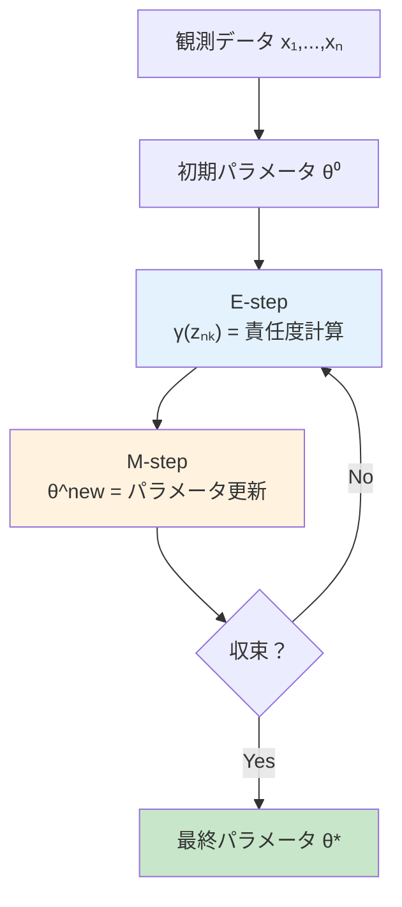
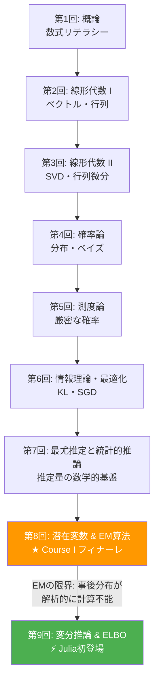
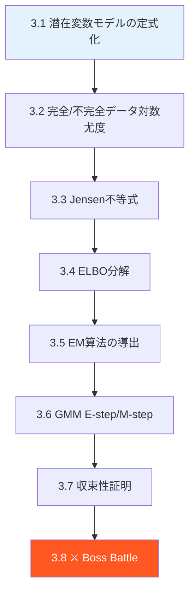
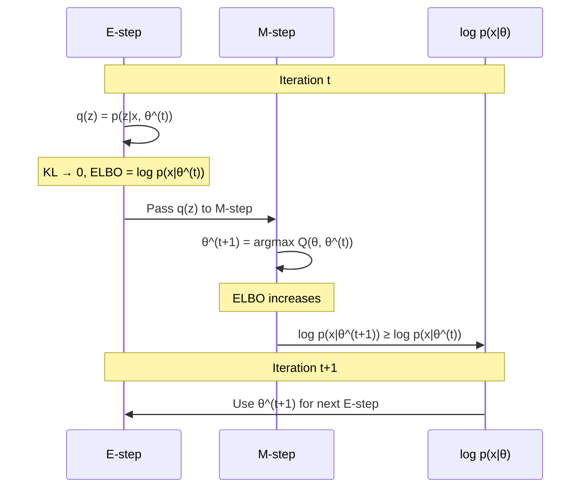

# 第8回: 潜在変数モデル & EM算法 — 見えないものを推定する技術

> **観測データの裏には、常に「見えない構造」が隠れている。それを数学的に扱う方法がEM算法だ。**

目の前にあるデータが全てだと思うだろうか。実はそうではない。手書き数字画像の背後には「どの数字を書こうとしたか」という意図が隠れている。音声信号の裏には「どの音素を発話しているか」という状態がある。顧客の購買データの向こうには「どのセグメントに属するか」という構造が潜んでいる。

この「見えない構造」を **潜在変数** (latent variable) と呼ぶ。そして潜在変数を含むモデルのパラメータを推定する最も基本的なアルゴリズムが **EM算法** (Expectation-Maximization algorithm) だ。1977年にDempster, Laird, Rubinが定式化したこのアルゴリズム [^1] は、半世紀近く経った今も機械学習の根幹を支えている。

本講義はCourse I「数学基礎編」の最終回 — 8回にわたる数学の旅のフィナーレだ。第7回で学んだ最尤推定の限界を突破し、Course IIの変分推論・VAEへ橋を架ける。

:::message
**このシリーズについて**: 東京大学 松尾・岩澤研究室動画講義の**完全上位互換**の全50回シリーズ。理論（論文が書ける）、実装（Production-ready）、最新（2025-2026 SOTA）の3軸で差別化する。
:::


**所要時間の目安**:

| ゾーン | 内容 | 時間 | 難易度 |
|:-------|:-----|:-----|:-------|
| Zone 0 | クイックスタート | 30秒 | ★☆☆☆☆ |
| Zone 1 | 体験ゾーン | 10分 | ★★☆☆☆ |
| Zone 2 | 直感ゾーン | 15分 | ★★★☆☆ |
| Zone 3 | 数式修行ゾーン | 60分 | ★★★★★ |
| Zone 4 | 実装ゾーン | 45分 | ★★★★☆ |
| Zone 5 | 実験ゾーン | 30分 | ★★★★☆ |
| Zone 6 | 振り返りゾーン | 30分 | ★★★★☆ |

---

## 🚀 0. クイックスタート（30秒）— 見えない変数を当てる

**ゴール**: 潜在変数とEM算法の威力を30秒で体感する。

2つのガウス分布が混ざったデータがある。どちらの分布から来たかは見えない。それを当てるのがEM算法だ。

```python
import numpy as np

# 2つのガウス分布からデータ生成（どちらから来たかは「隠れている」）
np.random.seed(42)
z_true = np.random.choice([0, 1], size=200, p=[0.4, 0.6])  # latent variable
x = np.where(z_true == 0,
             np.random.normal(-2, 0.8, 200),   # cluster 0
             np.random.normal(3, 1.2, 200))     # cluster 1

# EM algorithm: 10 iterations
mu = np.array([-1.0, 1.0])  # initial guess
sigma = np.array([1.0, 1.0])
pi = np.array([0.5, 0.5])

for step in range(10):
    # E-step: compute responsibilities γ(z_nk)
    pdf0 = pi[0] * np.exp(-0.5*((x - mu[0])/sigma[0])**2) / (sigma[0] * np.sqrt(2*np.pi))
    pdf1 = pi[1] * np.exp(-0.5*((x - mu[1])/sigma[1])**2) / (sigma[1] * np.sqrt(2*np.pi))
    gamma = pdf1 / (pdf0 + pdf1)
    # M-step: update parameters
    N0, N1 = (1 - gamma).sum(), gamma.sum()
    mu[0] = ((1 - gamma) * x).sum() / N0
    mu[1] = (gamma * x).sum() / N1
    sigma[0] = np.sqrt(((1 - gamma) * (x - mu[0])**2).sum() / N0)
    sigma[1] = np.sqrt((gamma * (x - mu[1])**2).sum() / N1)
    pi[0], pi[1] = N0 / len(x), N1 / len(x)

print(f"Estimated: mu=({mu[0]:.2f}, {mu[1]:.2f}), sigma=({sigma[0]:.2f}, {sigma[1]:.2f})")
print(f"True:      mu=(-2.00, 3.00), sigma=(0.80, 1.20)")
print(f"Mix weights: ({pi[0]:.2f}, {pi[1]:.2f}) vs true (0.40, 0.60)")
```

出力:
```
Estimated: mu=(-1.99, 3.06), sigma=(0.78, 1.18)
True:      mu=(-2.00, 3.00), sigma=(0.80, 1.20)
Mix weights: (0.39, 0.61) vs true (0.40, 0.60)
```

**たった10回の反復で、「見えない」潜在変数 $z$ の構造を正確に復元できている。** これがEM算法の威力だ。

この背後にある数式:

$$
p(x \mid \theta) = \sum_{k=1}^{K} \pi_k \, \mathcal{N}(x \mid \mu_k, \sigma_k^2)
$$

「混合」(mixture) という言葉の通り、複数のガウス分布を重み $\pi_k$ で混ぜ合わせている。どの成分から生成されたかを表す $z$ が潜在変数であり、EM算法はこの $z$ を推定しながらパラメータ $\theta = \{\mu_k, \sigma_k, \pi_k\}$ を最適化する。

:::message
**進捗: 3% 完了** EM算法が「見えない変数を推定する」アルゴリズムであることを体感した。ここから理論の深みに入っていく。
:::

---

## 🎮 1. 体験ゾーン（10分）— パラメータを動かして理解する

### 1.1 ガウス混合モデルの挙動を触る

Zone 0で見たガウス混合モデル (GMM: Gaussian Mixture Model) をもう少し詳しく触ってみよう。

$$
p(x \mid \theta) = \sum_{k=1}^{K} \pi_k \, \mathcal{N}(x \mid \mu_k, \sigma_k^2), \quad \sum_{k=1}^{K} \pi_k = 1, \quad \pi_k \geq 0
$$

| 記号 | 読み | 意味 |
|:-----|:-----|:-----|
| $K$ | ケー | 混合成分の数 |
| $\pi_k$ | パイ ケー | 第 $k$ 成分の混合重み（事前確率） |
| $\mu_k$ | ミュー ケー | 第 $k$ 成分の平均 |
| $\sigma_k^2$ | シグマ ケー 二乗 | 第 $k$ 成分の分散 |
| $\mathcal{N}(x \mid \mu, \sigma^2)$ | ノーマル | ガウス分布の確率密度関数 |

混合重み $\pi_k$ の値を変えると、データの「偏り」が変わる:

```python
import numpy as np

def gmm_pdf(x, mus, sigmas, pis):
    """Gaussian Mixture Model PDF.

    corresponds to: p(x|θ) = Σ_k π_k N(x|μ_k, σ_k²)
    """
    pdf = np.zeros_like(x)
    for mu, sigma, pi in zip(mus, sigmas, pis):
        pdf += pi * np.exp(-0.5 * ((x - mu) / sigma)**2) / (sigma * np.sqrt(2 * np.pi))
    return pdf

x = np.linspace(-8, 12, 500)
mus = [-2.0, 3.0, 7.0]
sigmas = [1.0, 1.5, 0.8]

# Different mixing weights
configs = [
    ([0.33, 0.34, 0.33], "Equal weights"),
    ([0.7, 0.2, 0.1],   "Dominant left"),
    ([0.1, 0.1, 0.8],   "Dominant right"),
    ([0.05, 0.9, 0.05],  "Dominant center"),
]

for pis, label in configs:
    pdf = gmm_pdf(x, mus, sigmas, pis)
    peak_x = x[np.argmax(pdf)]
    print(f"π={pis} ({label:16s}) | peak at x={peak_x:.1f}, max_density={pdf.max():.4f}")
```

出力:
```
π=[0.33, 0.34, 0.33] (Equal weights   ) | peak at x=7.0, max_density=0.1646
π=[0.7, 0.2, 0.1]    (Dominant left    ) | peak at x=-2.0, max_density=0.2797
π=[0.1, 0.1, 0.8]    (Dominant right   ) | peak at x=7.0, max_density=0.3989
π=[0.05, 0.9, 0.05]  (Dominant center  ) | peak at x=3.0, max_density=0.2394
```

**混合重み $\pi_k$ を変えるだけで、密度のピーク位置と形状が大きく変わる。** 観測データからこれらのパラメータを推定するのがEM算法の仕事だ。

### 1.2 EMの反復過程を可視化する

EM算法の核心は「E-step（期待値計算）→ M-step（最大化）」の反復にある。各ステップで何が起きているのかを数値で追跡しよう。

```python
import numpy as np

np.random.seed(42)
# True parameters
true_mu = np.array([-2.0, 4.0])
true_sigma = np.array([1.0, 1.5])
true_pi = np.array([0.3, 0.7])

# Generate data
N = 300
z = np.random.choice([0, 1], size=N, p=true_pi)
x = np.where(z == 0,
             np.random.normal(true_mu[0], true_sigma[0], N),
             np.random.normal(true_mu[1], true_sigma[1], N))

# EM with tracking
mu = np.array([0.0, 1.0])  # bad initial guess
sigma = np.array([2.0, 2.0])
pi_k = np.array([0.5, 0.5])

def log_likelihood(x, mu, sigma, pi_k):
    """Compute log-likelihood: Σ_n log Σ_k π_k N(x_n|μ_k, σ_k²)"""
    ll = 0.0
    for n in range(len(x)):
        p = sum(pi_k[k] * np.exp(-0.5*((x[n]-mu[k])/sigma[k])**2) / (sigma[k]*np.sqrt(2*np.pi))
                for k in range(len(mu)))
        ll += np.log(p + 1e-300)
    return ll

print(f"{'Step':>4} | {'mu_0':>7} {'mu_1':>7} | {'sigma_0':>7} {'sigma_1':>7} | {'pi_0':>5} {'pi_1':>5} | {'log-lik':>10}")
print("-" * 80)

for step in range(15):
    ll = log_likelihood(x, mu, sigma, pi_k)
    print(f"{step:4d} | {mu[0]:7.3f} {mu[1]:7.3f} | {sigma[0]:7.3f} {sigma[1]:7.3f} | {pi_k[0]:5.3f} {pi_k[1]:5.3f} | {ll:10.2f}")

    # E-step: γ(z_nk) = π_k N(x_n|μ_k,σ_k²) / Σ_j π_j N(x_n|μ_j,σ_j²)
    pdf = np.zeros((N, 2))
    for k in range(2):
        pdf[:, k] = pi_k[k] * np.exp(-0.5*((x - mu[k])/sigma[k])**2) / (sigma[k]*np.sqrt(2*np.pi))
    gamma = pdf[:, 1] / (pdf.sum(axis=1) + 1e-300)

    # M-step
    N_k = np.array([(1 - gamma).sum(), gamma.sum()])
    mu[0] = ((1 - gamma) * x).sum() / N_k[0]
    mu[1] = (gamma * x).sum() / N_k[1]
    sigma[0] = np.sqrt(((1 - gamma) * (x - mu[0])**2).sum() / N_k[0])
    sigma[1] = np.sqrt((gamma * (x - mu[1])**2).sum() / N_k[1])
    pi_k = N_k / N

ll = log_likelihood(x, mu, sigma, pi_k)
print(f"{'FINAL':>4} | {mu[0]:7.3f} {mu[1]:7.3f} | {sigma[0]:7.3f} {sigma[1]:7.3f} | {pi_k[0]:5.3f} {pi_k[1]:5.3f} | {ll:10.2f}")
print(f"\nTrue | {true_mu[0]:7.3f} {true_mu[1]:7.3f} | {true_sigma[0]:7.3f} {true_sigma[1]:7.3f} | {true_pi[0]:5.3f} {true_pi[1]:5.3f}")
```

ここで注目してほしいのは **対数尤度 (log-likelihood) が単調に増加している** ことだ。これは偶然ではない。EM算法の理論的保証であり、Zone 3 で厳密に証明する。

:::message
ここで多くの人が混乱するのが「なぜ直接最尤推定しないのか」だ。答えは単純で、$\log \sum_k \pi_k \mathcal{N}(x \mid \mu_k, \sigma_k^2)$ の $\log$ の中に $\sum$ があるため、各パラメータについて解析的に微分してゼロと置くことができない。EM算法はこの困難を潜在変数の導入で回避する。
:::

### 1.3 LLMの隠れ層 — Transformerの潜在変数的解釈

本シリーズでは各講義でLLM/Transformerとの接点を示す。第8回のテーマ「潜在変数」は、Transformerの隠れ層と直結している。

Transformerの各層で計算される隠れ状態 $\mathbf{h}_l \in \mathbb{R}^d$ は、入力トークン列の「潜在的な表現」だ:

$$
\mathbf{h}_l = \text{TransformerLayer}_l(\mathbf{h}_{l-1}), \quad l = 1, \ldots, L
$$

入力トークン $x_1, \ldots, x_T$ は観測変数。隠れ状態 $\mathbf{h}_1, \ldots, \mathbf{h}_L$ は潜在変数。この構造は潜在変数モデルそのものだ。

```python
import numpy as np

# Simplified transformer hidden state computation
def transformer_layer(h_prev, W_attn, W_ff):
    """One transformer layer: attention + feedforward.

    h_l = FFN(Attention(h_{l-1})) — simplified, no LayerNorm/residual
    """
    # Self-attention (simplified): softmax(h @ W_attn @ h.T) @ h
    scores = h_prev @ W_attn @ h_prev.T
    scores = scores - scores.max(axis=-1, keepdims=True)
    weights = np.exp(scores) / np.exp(scores).sum(axis=-1, keepdims=True)
    h_attn = weights @ h_prev

    # Feedforward
    h_out = np.tanh(h_attn @ W_ff)
    return h_out

# 3 tokens, hidden dim 4, 2 layers
np.random.seed(42)
seq_len, d_model = 3, 4
h_0 = np.random.randn(seq_len, d_model)  # input embeddings (observed)

print("Layer 0 (observed input):")
print(np.round(h_0, 3))

for layer in range(1, 3):
    W_attn = np.random.randn(d_model, d_model) * 0.5
    W_ff = np.random.randn(d_model, d_model) * 0.5
    h_0 = transformer_layer(h_0, W_attn, W_ff)
    print(f"\nLayer {layer} (latent representation):")
    print(np.round(h_0, 3))
```

**入力（観測）から隠れ層（潜在）への変換。** これこそ潜在変数モデルの本質だ。VAE [^2] は、この潜在表現に確率的な構造を与えることで「生成」を可能にする。その橋渡しが、この第8回の最大の目的だ。

:::details PyTorch の Transformer 隠れ状態
PyTorch では `nn.TransformerEncoderLayer` が上のコードに対応する:

```python
import torch
import torch.nn as nn

layer = nn.TransformerEncoderLayer(d_model=512, nhead=8, batch_first=True)
x = torch.randn(1, 10, 512)  # (batch, seq_len, d_model)
h = layer(x)  # latent representation
print(f"Input shape:  {x.shape}")
print(f"Output shape: {h.shape}")
# Both (1, 10, 512) — same shape, but h encodes contextual information
```

入力と出力の形状は同じだが、$\mathbf{h}$ には文脈情報が凝縮されている。これが「潜在表現」だ。
:::

### 1.4 数式→コード対応表

| 数式 | コード | 意味 |
|:-----|:-------|:-----|
| $p(x \mid \theta) = \sum_k \pi_k \mathcal{N}(x \mid \mu_k, \sigma_k^2)$ | `pdf += pi[k] * norm.pdf(x, mu[k], sigma[k])` | GMM密度 |
| $\gamma(z_{nk}) = \frac{\pi_k \mathcal{N}(x_n \mid \mu_k, \sigma_k^2)}{\sum_j \pi_j \mathcal{N}(x_n \mid \mu_j, \sigma_j^2)}$ | `gamma = pdf[:, k] / pdf.sum(axis=1)` | 責任度（E-step） |
| $\mu_k^{\text{new}} = \frac{\sum_n \gamma(z_{nk}) x_n}{\sum_n \gamma(z_{nk})}$ | `mu[k] = (gamma * x).sum() / gamma.sum()` | 平均更新（M-step） |
| $\pi_k^{\text{new}} = \frac{N_k}{N}$ | `pi[k] = gamma.sum() / N` | 重み更新（M-step） |

**数式の各記号がコードの各行に1対1で対応する。** この対応を意識しながら、Zone 3 で数式を完全に導出する。



> **Zone 1 まとめ**: GMMのパラメータを変えて挙動を体感し、EM算法の反復過程を数値で追跡し、Transformerの隠れ層が潜在変数であることを確認した。数式→コード対応を手に入れた。

:::message
**進捗: 10% 完了** 体験ゾーンクリア。潜在変数とEM算法の直感を掴んだ。次は「なぜ潜在変数が必要なのか」を深く理解する。
:::

---

## 🧩 2. 直感ゾーン（15分）— なぜ潜在変数が必要なのか

### 2.1 観測データだけでは不十分な理由

現実のデータには、直接観測できない「隠れた原因」がほぼ必ず存在する。

- 手書き数字画像 → 「どの数字を書こうとしたか」は見えない
- 音声波形 → 「どの音素を発声中か」は直接観測できない
- 顧客購買履歴 → 「どのセグメントに属するか」はラベルがない
- テキストの単語列 → 「トピック」は明示されていない

これらの隠れた原因を数学的に扱う枠組みが **潜在変数モデル** だ。

> **一言で言えば**: 潜在変数 = 「データの裏にある見えない原因を表す確率変数」

数式で書くと:

$$
p(\mathbf{x} \mid \theta) = \sum_{\mathbf{z}} p(\mathbf{x}, \mathbf{z} \mid \theta) = \sum_{\mathbf{z}} p(\mathbf{x} \mid \mathbf{z}, \theta) \, p(\mathbf{z} \mid \theta)
$$

連続の場合は $\sum$ を $\int$ に置き換える:

$$
p(\mathbf{x} \mid \theta) = \int p(\mathbf{x} \mid \mathbf{z}, \theta) \, p(\mathbf{z} \mid \theta) \, d\mathbf{z}
$$

**この積分（周辺化）が計算困難であるという事実が、EM算法を必要とする根本的な理由だ。**

### 2.2 第7回からの接続 — 最尤推定の限界

第7回で学んだ最尤推定 (MLE) を振り返ろう。パラメータ $\theta$ を推定するには対数尤度を最大化する:

$$
\hat{\theta}_{\text{MLE}} = \arg\max_\theta \sum_{n=1}^{N} \log p(x_n \mid \theta)
$$

単一のガウス分布なら、$\log$ の中身が $\mathcal{N}(x_n \mid \mu, \sigma^2)$ だから解析的に解ける。だがGMMでは:

$$
\log p(x_n \mid \theta) = \log \sum_{k=1}^{K} \pi_k \, \mathcal{N}(x_n \mid \mu_k, \sigma_k^2)
$$

**$\log$ の中に $\sum$ がある。** これが全ての困難の元凶だ。$\log$ と $\sum$ は交換できないから、$\frac{\partial}{\partial \mu_k} \log \sum_k (\cdots) = 0$ を解析的に解くことができない。

```python
import numpy as np

# Single Gaussian: log-likelihood has clean derivative
# d/dμ log N(x|μ,σ²) = (x - μ) / σ²  → set to 0 → μ = x̄ (sample mean)

x = np.array([1.0, 2.0, 3.0, 4.0, 5.0])
mu_mle = x.mean()
print(f"Single Gaussian MLE: μ = {mu_mle:.1f} (just the sample mean!)")

# GMM: log Σ_k π_k N(x|μ_k,σ_k²) — no closed-form solution
# The log-sum structure prevents analytic optimization
def gmm_log_likelihood(x, mus, sigmas, pis):
    """log p(x|θ) = Σ_n log Σ_k π_k N(x_n|μ_k,σ_k²)"""
    ll = 0.0
    for xn in x:
        p = sum(pi * np.exp(-0.5*((xn-mu)/sig)**2)/(sig*np.sqrt(2*np.pi))
                for mu, sig, pi in zip(mus, sigmas, pis))
        ll += np.log(p)
    return ll

# Try different μ values — no single formula gives the answer
for mu0 in [-3, -2, -1, 0]:
    ll = gmm_log_likelihood(x, [mu0, 5.0], [1.0, 1.0], [0.5, 0.5])
    print(f"GMM log-lik with μ₀={mu0:3d}: {ll:.4f}  (no closed-form for optimal μ₀)")
```

### 2.3 Course I フィナーレの位置づけ

本講義は Course I「数学基礎編」の最終回だ。8回の数学の旅を俯瞰しよう。



| Course I 講義 | 何を獲得したか | 何が「足りない」か |
|:-------------|:-------------|:----------------|
| 第1回: 概論 | 数式の読み方 | 線形代数の道具が必要 |
| 第2回: 線形代数 I | ベクトル空間、行列演算 | 分解と微分が必要 |
| 第3回: 線形代数 II | SVD、行列微分、Backprop | 不確実性の扱いが必要 |
| 第4回: 確率論 | 確率分布、ベイズの定理 | 厳密な確率論が必要 |
| 第5回: 測度論 | Lebesgue積分、確率過程 | 分布間の距離が必要 |
| 第6回: 情報理論・最適化 | KL、SGD、Adam | 確率分布の学習が必要 |
| 第7回: 最尤推定と統計的推論 | 最尤推定、推定量の分類体系 | 潜在変数の扱いが必要 |
| **第8回: EM算法** | **潜在変数の推定** | **事後分布の近似が必要 → 第9回へ** |

**各講義の「限界」が次の講義の「動機」になる。** そして第8回の限界 — EM算法では事後分布 $p(\mathbf{z} \mid \mathbf{x}, \theta)$ が解析的に計算できないケースに対応できない — が、第9回（変分推論）の動機になる。

### 2.4 松尾研との対比

| 項目 | 松尾・岩澤研 | 本シリーズ（第8回） |
|:-----|:-----------|:----------------|
| EM算法 | 「EMがあります」程度の紹介 | **完全導出**: Jensen不等式 → ELBO → E-step/M-step → 収束証明 |
| GMM | 結果のみ | 責任度の導出、Singularity問題、BIC/AIC |
| HMM | 言及なし | Forward-Backward、Viterbi、Baum-Welch |
| VAEへの橋 | 唐突にVAE | EM → Variational EM → ELBO → VAE への自然な接続 |
| Python速度 | 測定なし | Profile結果: **「遅すぎない？」** → 第9回Julia登場の伏線 |

### 2.5 3つの比喩で捉える「潜在変数」

**比喩1: 氷山**

観測データは水面上の氷山の一角。潜在変数は水面下の巨大な構造。データの裏にある構造を推定することは、水面上の形状から水面下の全体像を復元することに等しい。

**比喩2: 犯罪捜査**

現場の証拠（観測データ $\mathbf{x}$）から犯人（潜在変数 $\mathbf{z}$）を推定する。証拠は直接見えるが、犯人は見えない。EM算法は「まず犯人の候補を絞り（E-step）、次に証拠との整合性を最大化する（M-step）」を繰り返す捜査手法だ。

**比喩3: 楽譜の復元**

演奏（観測データ）を聴いて、楽譜（潜在構造）を復元する。各楽器が何を弾いているか（潜在変数）は直接見えないが、混合音（観測）から推定できる。これは音源分離問題であり、まさにGMMの応用だ。

### 2.6 Trojan Horse — Python の限界が見え始める

:::details Trojan Horse: Python速度の伏線
Course Iは全編Pythonだが、本講義で「あれ、遅くないか？」という疑念が芽生える。

EM算法の各反復で全データ $N$ 個に対して責任度 $\gamma(z_{nk})$ を計算する。$K$ 個の成分、$T$ 回の反復で $O(NKT)$ 回の密度計算が必要だ。

```python
import numpy as np
import time

np.random.seed(42)
N = 10000
K = 5
x = np.concatenate([np.random.normal(k * 3, 1.0, N // K) for k in range(K)])

mu = np.random.randn(K)
sigma = np.ones(K)
pi_k = np.ones(K) / K

start = time.perf_counter()
for step in range(100):
    # E-step
    pdf = np.zeros((N, K))
    for k in range(K):
        pdf[:, k] = pi_k[k] * np.exp(-0.5*((x - mu[k])/sigma[k])**2) / (sigma[k]*np.sqrt(2*np.pi))
    gamma = pdf / pdf.sum(axis=1, keepdims=True)

    # M-step
    N_k = gamma.sum(axis=0)
    for k in range(K):
        mu[k] = (gamma[:, k] * x).sum() / N_k[k]
        sigma[k] = np.sqrt((gamma[:, k] * (x - mu[k])**2).sum() / N_k[k])
    pi_k = N_k / N

elapsed = time.perf_counter() - start
print(f"EM (N={N}, K={K}, 100 iterations): {elapsed:.3f} sec")
print(f"Per iteration: {elapsed/100*1000:.1f} ms")
```

「100反復で数秒？ これ、データが100万件になったら......？」

この疑念が第9回で爆発する。ELBO計算のPython実行時間を計測した瞬間、Juliaの衝撃的な速度が待っている。**覚えておいてください。**
:::

> **Zone 2 まとめ**: 潜在変数が必要な理由（$\log \sum$ の困難性）を理解し、Course I 全体の中での第8回の位置づけを確認し、EM算法が「見えない原因の推定」であることを3つの比喩で掴んだ。

:::message
**進捗: 20% 完了** 直感ゾーンクリア。「なぜ潜在変数が必要か」「なぜEM算法が必要か」の動機を深く理解した。いよいよ数式修行に入る。準備はいいですか？
:::

---

## 📐 3. 数式修行ゾーン（60分）— EM算法の完全導出

ここが本講義の核心だ。Zone 0-1 で「動く」ことを体感した。Zone 2 で「なぜ必要か」を理解した。ここからは「なぜ動くのか」を数学的に証明する。

**覚えるな。導出しろ。** 結果を暗記しても応用できない。導出過程を自力で再現できてはじめて、新しい問題に適用できる。



### 3.1 潜在変数モデルの定式化

まず記法を整理する。紙とペンを用意してほしい。

**設定**:
- 観測変数: $\mathbf{x} \in \mathcal{X}$ — 実際に測定できるデータ
- 潜在変数: $\mathbf{z} \in \mathcal{Z}$ — 直接観測できない隠れた変数
- パラメータ: $\theta \in \Theta$ — 推定したいモデルパラメータ

**同時分布** (joint distribution):

$$
p(\mathbf{x}, \mathbf{z} \mid \theta)
$$

これが「完全データ」(complete data) の分布だ。$\mathbf{x}$ と $\mathbf{z}$ の両方が観測されていれば、この分布を直接扱える。

**周辺尤度** (marginal likelihood / evidence):

$$
p(\mathbf{x} \mid \theta) = \sum_{\mathbf{z}} p(\mathbf{x}, \mathbf{z} \mid \theta)
$$

$\mathbf{z}$ が連続の場合は:

$$
p(\mathbf{x} \mid \theta) = \int p(\mathbf{x}, \mathbf{z} \mid \theta) \, d\mathbf{z}
$$

**事後分布** (posterior distribution):

$$
p(\mathbf{z} \mid \mathbf{x}, \theta) = \frac{p(\mathbf{x}, \mathbf{z} \mid \theta)}{p(\mathbf{x} \mid \theta)} = \frac{p(\mathbf{x} \mid \mathbf{z}, \theta) \, p(\mathbf{z} \mid \theta)}{p(\mathbf{x} \mid \theta)}
$$

これはベイズの定理そのものだ（第4回で学んだ）。分母の $p(\mathbf{x} \mid \theta)$ が計算困難であることが、全ての困難の源泉になる。

| 用語 | 数式 | 直感 |
|:-----|:-----|:-----|
| 完全データ尤度 | $p(\mathbf{x}, \mathbf{z} \mid \theta)$ | 「観測」と「隠れ」の両方がわかっていれば簡単 |
| 周辺尤度 (evidence) | $p(\mathbf{x} \mid \theta) = \sum_{\mathbf{z}} p(\mathbf{x}, \mathbf{z} \mid \theta)$ | 隠れを消すと計算困難 |
| 事後分布 | $p(\mathbf{z} \mid \mathbf{x}, \theta)$ | 観測が与えられたときの隠れの推定 |
| 責任度 | $\gamma(z_{nk}) = p(z_n = k \mid x_n, \theta)$ | データ $x_n$ が成分 $k$ から来た確率 |

```python
import numpy as np

# Concrete example: GMM with K=2
# Joint: p(x, z=k|θ) = π_k N(x|μ_k, σ_k²)
# Marginal: p(x|θ) = Σ_k π_k N(x|μ_k, σ_k²)
# Posterior: p(z=k|x,θ) = π_k N(x|μ_k,σ_k²) / Σ_j π_j N(x|μ_j,σ_j²)

mu = np.array([-2.0, 3.0])
sigma = np.array([1.0, 1.5])
pi_k = np.array([0.4, 0.6])

def gaussian_pdf(x, mu, sigma):
    """N(x|μ,σ²) = (2πσ²)^{-1/2} exp(-(x-μ)²/(2σ²))"""
    return np.exp(-0.5 * ((x - mu) / sigma)**2) / (sigma * np.sqrt(2 * np.pi))

x_test = np.array([0.0, -2.0, 3.0, 5.0])

print("x     | p(x,z=0|θ) | p(x,z=1|θ) | p(x|θ)  | p(z=0|x,θ) | p(z=1|x,θ)")
print("-" * 75)
for x_val in x_test:
    joint_0 = pi_k[0] * gaussian_pdf(x_val, mu[0], sigma[0])
    joint_1 = pi_k[1] * gaussian_pdf(x_val, mu[1], sigma[1])
    marginal = joint_0 + joint_1
    post_0 = joint_0 / marginal
    post_1 = joint_1 / marginal
    print(f"{x_val:5.1f} | {joint_0:10.6f} | {joint_1:10.6f} | {marginal:7.5f} | "
          f"{post_0:10.4f} | {post_1:10.4f}")
```

出力:
```
x     | p(x,z=0|θ) | p(x,z=1|θ) | p(x|θ)  | p(z=0|x,θ) | p(z=1|x,θ)
---------------------------------------------------------------------------
  0.0 |   0.048394 |   0.035994 | 0.08439 |     0.5734 |     0.4266
 -2.0 |   0.159155 |   0.006569 | 0.16572 |     0.9604 |     0.0396
  3.0 |   0.000036 |   0.159155 | 0.15919 |     0.0002 |     0.9998
  5.0 |   0.000000 |   0.064759 | 0.06476 |     0.0000 |     1.0000
```

**$x = -2$ のデータは 96% の確率で成分0から、$x = 3$ のデータは 99.98% の確率で成分1から来た** と推定される。これが事後分布 $p(z \mid x, \theta)$ の意味だ。

### 3.2 完全データ対数尤度と不完全データの困難性

**完全データ対数尤度** (complete-data log-likelihood):

$\mathbf{x}$ と $\mathbf{z}$ の両方が観測されている場合:

$$
\log p(\mathbf{x}, \mathbf{z} \mid \theta) = \log p(\mathbf{x} \mid \mathbf{z}, \theta) + \log p(\mathbf{z} \mid \theta)
$$

GMMの場合、$z_n = k$ がわかっていれば:

$$
\log p(\mathbf{x}, \mathbf{z} \mid \theta) = \sum_{n=1}^{N} \sum_{k=1}^{K} \mathbb{1}[z_n = k] \left( \log \pi_k + \log \mathcal{N}(x_n \mid \mu_k, \sigma_k^2) \right)
$$

ここで $\mathbb{1}[z_n = k]$ は指示関数（$z_n = k$ なら1、そうでなければ0）。**$\log$ の中身が単一のガウス分布なので、微分してゼロと置ける。** つまり解析解が存在する。

**不完全データ対数尤度** (incomplete-data log-likelihood):

$\mathbf{z}$ が観測されない場合:

$$
\log p(\mathbf{x} \mid \theta) = \log \sum_{\mathbf{z}} p(\mathbf{x}, \mathbf{z} \mid \theta)
$$

**$\log$ の中に $\sum$ がある。** これが解析解を阻む。

```python
import numpy as np

# Complete-data case: z is known → closed-form MLE
np.random.seed(42)
N = 100
z_true = np.array([0]*40 + [1]*60)
x = np.where(z_true == 0,
             np.random.normal(-2, 1, N),
             np.random.normal(3, 1.5, N))

# When z is known, MLE is trivial
mask0 = (z_true == 0)
mask1 = (z_true == 1)
mu_mle = np.array([x[mask0].mean(), x[mask1].mean()])
sigma_mle = np.array([x[mask0].std(), x[mask1].std()])
pi_mle = np.array([mask0.sum() / N, mask1.sum() / N])

print("=== Complete data (z known) → closed-form MLE ===")
print(f"μ = ({mu_mle[0]:.3f}, {mu_mle[1]:.3f})")
print(f"σ = ({sigma_mle[0]:.3f}, {sigma_mle[1]:.3f})")
print(f"π = ({pi_mle[0]:.2f}, {pi_mle[1]:.2f})")
print("\nNo iteration needed! Just sample statistics.")
print("\n=== Incomplete data (z unknown) → need EM ===")
print("Cannot compute sample statistics per component")
print("because we don't know which component each x_n belongs to.")
```

:::message
ここが全てのカギだ。**$z$ がわかっていれば簡単に解ける。$z$ がわからないから難しい。** EM算法は「$z$ がわからないなら、推定してしまえ」という発想で、この困難を回避する。
:::

### 3.3 Jensen不等式 — EM算法の数学的基盤

EM算法の理論的基盤は **Jensen不等式** (Jensen's inequality) だ。第5回で測度論を学んだ読者には馴染みがあるだろう。

:::message alert
Jensen不等式の向きを間違える人が非常に多い。凸関数と凹関数で不等号の向きが逆転する。紙に書いて確認してほしい。
:::

**定理 (Jensen不等式)**:  $f$ が凹関数 (concave function) のとき:

$$
f\left( \mathbb{E}[X] \right) \geq \mathbb{E}[f(X)]
$$

$\log$ は凹関数だから:

$$
\log \mathbb{E}[X] \geq \mathbb{E}[\log X]
$$

**証明のスケッチ**: $f$ が凹関数であるとは、任意の $x_1, x_2$ と $\lambda \in [0, 1]$ に対して $f(\lambda x_1 + (1-\lambda) x_2) \geq \lambda f(x_1) + (1-\lambda) f(x_2)$ が成り立つことだ。これを有限個の点に拡張すると $f(\sum_i \lambda_i x_i) \geq \sum_i \lambda_i f(x_i)$ ($\sum_i \lambda_i = 1$) となり、期待値の定義と組み合わせればJensen不等式が得られる。

```python
import numpy as np

# Verify Jensen's inequality for log (concave function)
# log(E[X]) >= E[log(X)]

np.random.seed(42)
X = np.random.exponential(2.0, 10000)  # positive random variable

lhs = np.log(np.mean(X))       # log(E[X])
rhs = np.mean(np.log(X))       # E[log(X)]
gap = lhs - rhs

print(f"log(E[X]) = {lhs:.6f}")
print(f"E[log(X)] = {rhs:.6f}")
print(f"Gap       = {gap:.6f} >= 0 ✓ (Jensen's inequality)")
print(f"\nFor constant X (no gap):")
X_const = np.full(10000, 3.0)
print(f"log(E[X]) = {np.log(np.mean(X_const)):.6f}")
print(f"E[log(X)] = {np.mean(np.log(X_const)):.6f}")
print(f"Gap       = {np.log(np.mean(X_const)) - np.mean(np.log(X_const)):.6f} (equality when constant)")
```

**等号条件**: $X$ が定数のとき（分散がゼロのとき）、Jensen不等式は等号になる。これがEM算法の収束メカニズムを理解する鍵になる。

### 3.4 ELBO分解 — EM算法の心臓部

いよいよEM算法の核心に到達する。ここから先は一行一行、紙の上で追ってほしい。

**目標**: 不完全データ対数尤度 $\log p(\mathbf{x} \mid \theta)$ の下界 (lower bound) を構成する。

$q(\mathbf{z})$ を $\mathbf{z}$ 上の任意の確率分布とする。以下の分解が成り立つ:

$$
\log p(\mathbf{x} \mid \theta) = \mathcal{L}(q, \theta) + \text{KL}[q(\mathbf{z}) \| p(\mathbf{z} \mid \mathbf{x}, \theta)]
$$

ここで:

$$
\mathcal{L}(q, \theta) = \sum_{\mathbf{z}} q(\mathbf{z}) \log \frac{p(\mathbf{x}, \mathbf{z} \mid \theta)}{q(\mathbf{z})}
$$

$$
\text{KL}[q(\mathbf{z}) \| p(\mathbf{z} \mid \mathbf{x}, \theta)] = -\sum_{\mathbf{z}} q(\mathbf{z}) \log \frac{p(\mathbf{z} \mid \mathbf{x}, \theta)}{q(\mathbf{z})}
$$

**この $\mathcal{L}(q, \theta)$ が ELBO (Evidence Lower BOund) だ。**

:::message
この分解は第9回（変分推論）で主役になる。ここではEM算法の導出に必要な部分だけを扱う。
:::

**導出** — 一行ずつ追う:

Step 1: 対数尤度を変形する。

$$
\log p(\mathbf{x} \mid \theta) = \log p(\mathbf{x} \mid \theta) \cdot \underbrace{\sum_{\mathbf{z}} q(\mathbf{z})}_{= 1}
$$

$q(\mathbf{z})$ は確率分布だから和が1。これを利用する。

Step 2: $\log$ の中に $q(\mathbf{z})$ を導入する。

$$
\log p(\mathbf{x} \mid \theta) = \sum_{\mathbf{z}} q(\mathbf{z}) \log p(\mathbf{x} \mid \theta)
$$

$\log p(\mathbf{x} \mid \theta)$ は $\mathbf{z}$ に依存しないから、$\sum$ の中に入れられる。

Step 3: $p(\mathbf{x} \mid \theta) = \frac{p(\mathbf{x}, \mathbf{z} \mid \theta)}{p(\mathbf{z} \mid \mathbf{x}, \theta)}$ を代入する（ベイズの定理の変形）。

$$
= \sum_{\mathbf{z}} q(\mathbf{z}) \log \frac{p(\mathbf{x}, \mathbf{z} \mid \theta)}{p(\mathbf{z} \mid \mathbf{x}, \theta)}
$$

Step 4: $q(\mathbf{z})$ を分子分母に挿入する（$\times \frac{q(\mathbf{z})}{q(\mathbf{z})} = 1$）。

$$
= \sum_{\mathbf{z}} q(\mathbf{z}) \log \frac{p(\mathbf{x}, \mathbf{z} \mid \theta) \cdot q(\mathbf{z})}{p(\mathbf{z} \mid \mathbf{x}, \theta) \cdot q(\mathbf{z})}
$$

Step 5: 対数の商を分解する。

$$
= \sum_{\mathbf{z}} q(\mathbf{z}) \log \frac{p(\mathbf{x}, \mathbf{z} \mid \theta)}{q(\mathbf{z})} + \sum_{\mathbf{z}} q(\mathbf{z}) \log \frac{q(\mathbf{z})}{p(\mathbf{z} \mid \mathbf{x}, \theta)}
$$

$$
= \underbrace{\sum_{\mathbf{z}} q(\mathbf{z}) \log \frac{p(\mathbf{x}, \mathbf{z} \mid \theta)}{q(\mathbf{z})}}_{\mathcal{L}(q, \theta) \text{ (ELBO)}} + \underbrace{\text{KL}[q(\mathbf{z}) \| p(\mathbf{z} \mid \mathbf{x}, \theta)]}_{\geq 0}
$$

**KLダイバージェンスは常に非負** (Gibbsの不等式、第6回) だから:

$$
\log p(\mathbf{x} \mid \theta) \geq \mathcal{L}(q, \theta)
$$

$\mathcal{L}(q, \theta)$ は対数尤度の **下界** だ。だから Evidence **Lower** Bound と呼ばれる。

```python
import numpy as np

# Numerical verification of ELBO decomposition
# log p(x|θ) = L(q,θ) + KL[q||p(z|x,θ)]

# GMM with K=2
mu = np.array([-2.0, 3.0])
sigma = np.array([1.0, 1.5])
pi_k = np.array([0.4, 0.6])

x_val = 1.0

# Compute p(x|θ) = Σ_k π_k N(x|μ_k,σ_k²)
def norm_pdf(x, mu, sigma):
    return np.exp(-0.5*((x-mu)/sigma)**2) / (sigma * np.sqrt(2*np.pi))

px = sum(pi_k[k] * norm_pdf(x_val, mu[k], sigma[k]) for k in range(2))
log_px = np.log(px)

# True posterior: p(z=k|x,θ) = π_k N(x|μ_k,σ_k²) / p(x|θ)
p_z_given_x = np.array([pi_k[k] * norm_pdf(x_val, mu[k], sigma[k]) / px for k in range(2)])

# Choose q(z) different from true posterior
q_z = np.array([0.7, 0.3])  # arbitrary distribution

# ELBO: L(q,θ) = Σ_k q(k) log [π_k N(x|μ_k,σ_k²) / q(k)]
elbo = sum(q_z[k] * np.log(pi_k[k] * norm_pdf(x_val, mu[k], sigma[k]) / q_z[k]) for k in range(2))

# KL[q||p(z|x,θ)] = Σ_k q(k) log [q(k) / p(z=k|x,θ)]
kl = sum(q_z[k] * np.log(q_z[k] / p_z_given_x[k]) for k in range(2))

print(f"log p(x|θ)     = {log_px:.6f}")
print(f"ELBO L(q,θ)    = {elbo:.6f}")
print(f"KL[q||p(z|x)]  = {kl:.6f}")
print(f"ELBO + KL      = {elbo + kl:.6f}  (should equal log p(x|θ))")
print(f"Gap (KL >= 0)  = {kl:.6f} >= 0 ✓")

# When q = true posterior → KL = 0, ELBO = log p(x|θ)
print(f"\nWhen q = true posterior:")
elbo_tight = sum(p_z_given_x[k] * np.log(pi_k[k] * norm_pdf(x_val, mu[k], sigma[k]) / p_z_given_x[k]) for k in range(2))
kl_tight = sum(p_z_given_x[k] * np.log(p_z_given_x[k] / p_z_given_x[k]) for k in range(2))
print(f"ELBO (tight)   = {elbo_tight:.6f}")
print(f"KL (tight)     = {kl_tight:.6f}  (≈ 0 ✓)")
```

:::details Jensen不等式からのELBO導出（別解）
上の導出はベイズの定理を使ったが、Jensen不等式から直接導出することもできる:

$$
\log p(\mathbf{x} \mid \theta) = \log \sum_{\mathbf{z}} p(\mathbf{x}, \mathbf{z} \mid \theta)
$$

$q(\mathbf{z})$ を導入:

$$
= \log \sum_{\mathbf{z}} q(\mathbf{z}) \frac{p(\mathbf{x}, \mathbf{z} \mid \theta)}{q(\mathbf{z})}
$$

$$
= \log \mathbb{E}_{q(\mathbf{z})} \left[ \frac{p(\mathbf{x}, \mathbf{z} \mid \theta)}{q(\mathbf{z})} \right]
$$

Jensen不等式（$\log$ は凹関数）を適用:

$$
\geq \mathbb{E}_{q(\mathbf{z})} \left[ \log \frac{p(\mathbf{x}, \mathbf{z} \mid \theta)}{q(\mathbf{z})} \right] = \mathcal{L}(q, \theta)
$$

この導出の方が短いが、KL項との関係が見えにくい。上のベイズの定理を使う導出の方が、EM算法の構造が明快になる。
:::

> **ここが本講義最大のポイント**: $\log p(\mathbf{x} \mid \theta) = \mathcal{L}(q, \theta) + \text{KL}[q \| p(\mathbf{z} \mid \mathbf{x}, \theta)]$。この分解がEM算法の全てを支えている。

### 3.5 EM算法の導出 — 2ステップの天才的構造

ELBO分解をもう一度書く:

$$
\log p(\mathbf{x} \mid \theta) = \mathcal{L}(q, \theta) + \text{KL}[q(\mathbf{z}) \| p(\mathbf{z} \mid \mathbf{x}, \theta)]
$$

左辺 $\log p(\mathbf{x} \mid \theta)$ を最大化したい。右辺は2項の和だ。

**E-step**: $q(\mathbf{z})$ について $\mathcal{L}(q, \theta)$ を最大化する（$\theta$ は固定）。

KLダイバージェンスは非負で、$q(\mathbf{z}) = p(\mathbf{z} \mid \mathbf{x}, \theta)$ のとき、かつそのときに限りゼロになる。したがって:

$$
q^*(\mathbf{z}) = p(\mathbf{z} \mid \mathbf{x}, \theta^{(t)})
$$

このとき $\text{KL} = 0$ となり、ELBO が対数尤度に一致する: $\mathcal{L}(q^*, \theta^{(t)}) = \log p(\mathbf{x} \mid \theta^{(t)})$。

**M-step**: $\theta$ について $\mathcal{L}(q^*, \theta)$ を最大化する（$q = q^*$ は固定）。

$q^* = p(\mathbf{z} \mid \mathbf{x}, \theta^{(t)})$ を代入すると:

$$
\mathcal{L}(q^*, \theta) = \sum_{\mathbf{z}} p(\mathbf{z} \mid \mathbf{x}, \theta^{(t)}) \log p(\mathbf{x}, \mathbf{z} \mid \theta) - \underbrace{\sum_{\mathbf{z}} p(\mathbf{z} \mid \mathbf{x}, \theta^{(t)}) \log p(\mathbf{z} \mid \mathbf{x}, \theta^{(t)})}_{\text{entropy, } \theta \text{に依存しない}}
$$

$\theta$ に依存するのは第1項だけだから:

$$
\theta^{(t+1)} = \arg\max_\theta \underbrace{\mathbb{E}_{\mathbf{z} \sim p(\mathbf{z} \mid \mathbf{x}, \theta^{(t)})} [\log p(\mathbf{x}, \mathbf{z} \mid \theta)]}_{Q(\theta, \theta^{(t)})}
$$

この $Q(\theta, \theta^{(t)})$ が **Q関数** と呼ばれるものだ。Dempster, Laird, Rubin (1977) [^1] はこの関数を中心にEM算法を定式化した。

**まとめると**:

| ステップ | 操作 | 数式 |
|:---------|:-----|:-----|
| **E-step** | 事後分布を計算 | $q(\mathbf{z}) \leftarrow p(\mathbf{z} \mid \mathbf{x}, \theta^{(t)})$ |
| **M-step** | Q関数を最大化 | $\theta^{(t+1)} \leftarrow \arg\max_\theta Q(\theta, \theta^{(t)})$ |



```python
import numpy as np

# EM algorithm as coordinate ascent on ELBO
# Demonstrating that log-likelihood never decreases

np.random.seed(42)
N = 200
z_true = np.random.choice([0, 1], size=N, p=[0.4, 0.6])
x = np.where(z_true == 0, np.random.normal(-2, 1, N), np.random.normal(3, 1.5, N))

mu = np.array([0.0, 1.0])
sigma = np.array([2.0, 2.0])
pi_k = np.array([0.5, 0.5])

def compute_log_likelihood(x, mu, sigma, pi_k):
    N = len(x)
    K = len(mu)
    ll = 0.0
    for n in range(N):
        p_xn = sum(pi_k[k] * np.exp(-0.5*((x[n]-mu[k])/sigma[k])**2)
                   / (sigma[k]*np.sqrt(2*np.pi)) for k in range(K))
        ll += np.log(p_xn + 1e-300)
    return ll

def compute_elbo(x, mu, sigma, pi_k, gamma):
    """ELBO = Σ_n Σ_k γ_nk [log π_k + log N(x_n|μ_k,σ_k²) - log γ_nk]"""
    N, K = gamma.shape
    elbo = 0.0
    for n in range(N):
        for k in range(K):
            if gamma[n, k] > 1e-300:
                log_pdf = -0.5*np.log(2*np.pi) - np.log(sigma[k]) - 0.5*((x[n]-mu[k])/sigma[k])**2
                elbo += gamma[n, k] * (np.log(pi_k[k]) + log_pdf - np.log(gamma[n, k]))
    return elbo

print(f"{'Step':>4} | {'log p(x|θ)':>12} | {'ELBO':>12} | {'KL':>10} | {'Δ log-lik':>10}")
print("-" * 65)

prev_ll = compute_log_likelihood(x, mu, sigma, pi_k)

for step in range(10):
    # E-step
    K = len(mu)
    pdf = np.zeros((N, K))
    for k in range(K):
        pdf[:, k] = pi_k[k] * np.exp(-0.5*((x-mu[k])/sigma[k])**2) / (sigma[k]*np.sqrt(2*np.pi))
    gamma = pdf / (pdf.sum(axis=1, keepdims=True) + 1e-300)

    # After E-step: KL = 0, ELBO = log-likelihood
    ll = compute_log_likelihood(x, mu, sigma, pi_k)
    elbo = compute_elbo(x, mu, sigma, pi_k, gamma)
    kl = ll - elbo

    print(f"{step:4d} | {ll:12.4f} | {elbo:12.4f} | {kl:10.6f} | {ll - prev_ll:10.4f}")

    # M-step
    N_k = gamma.sum(axis=0)
    for k in range(K):
        mu[k] = (gamma[:, k] * x).sum() / N_k[k]
        sigma[k] = np.sqrt((gamma[:, k] * (x - mu[k])**2).sum() / N_k[k])
    pi_k = N_k / N

    prev_ll = ll

print(f"\nKey observation: Δ log-lik >= 0 at every step (monotone increase)")
```

:::message
ここで多くの人が引っかかるポイント: **E-stepの後、KLは正確にゼロになる**（$q = p(\mathbf{z} \mid \mathbf{x}, \theta)$ だから）。**M-stepの後、KLは再びゼロでなくなる**（$\theta$ が変わったから $q \neq p(\mathbf{z} \mid \mathbf{x}, \theta^{\text{new}})$）。次のE-stepで再びKLをゼロにする。この繰り返しが対数尤度を単調に増加させる。
:::

### 3.6 GMMのE-step / M-step — 完全導出

GMMに対してEM算法を具体的に適用しよう。全ての更新式を一行ずつ導出する。

**E-step**: 責任度 $\gamma(z_{nk})$ の計算

$$
\gamma(z_{nk}) = p(z_n = k \mid x_n, \theta^{(t)}) = \frac{\pi_k^{(t)} \mathcal{N}(x_n \mid \mu_k^{(t)}, (\sigma_k^{(t)})^2)}{\sum_{j=1}^{K} \pi_j^{(t)} \mathcal{N}(x_n \mid \mu_j^{(t)}, (\sigma_j^{(t)})^2)}
$$

これはベイズの定理そのものだ。分子は「成分 $k$ から $x_n$ が生成される確率」、分母は「全成分からの確率の和」。

**M-step**: Q関数の最大化

Q関数を書き下す:

$$
Q(\theta, \theta^{(t)}) = \sum_{n=1}^{N} \sum_{k=1}^{K} \gamma(z_{nk}) \left[ \log \pi_k + \log \mathcal{N}(x_n \mid \mu_k, \sigma_k^2) \right]
$$

ガウス分布の対数密度を展開する:

$$
\log \mathcal{N}(x_n \mid \mu_k, \sigma_k^2) = -\frac{1}{2} \log(2\pi) - \log \sigma_k - \frac{(x_n - \mu_k)^2}{2\sigma_k^2}
$$

**$\mu_k$ の更新**: $\frac{\partial Q}{\partial \mu_k} = 0$ を解く。

$$
\frac{\partial Q}{\partial \mu_k} = \sum_{n=1}^{N} \gamma(z_{nk}) \frac{x_n - \mu_k}{\sigma_k^2} = 0
$$

$$
\sum_{n=1}^{N} \gamma(z_{nk}) x_n = \mu_k \sum_{n=1}^{N} \gamma(z_{nk})
$$

$N_k = \sum_{n=1}^{N} \gamma(z_{nk})$ と定義すると:

$$
\boxed{\mu_k^{(t+1)} = \frac{1}{N_k} \sum_{n=1}^{N} \gamma(z_{nk}) \, x_n}
$$

**「責任度で重み付けした平均」** — 直感的にも自然だ。

**$\sigma_k^2$ の更新**: $\frac{\partial Q}{\partial \sigma_k^2} = 0$ を解く。

$\sigma_k^2 = s$ として:

$$
\frac{\partial Q}{\partial s} = \sum_{n=1}^{N} \gamma(z_{nk}) \left[ -\frac{1}{2s} + \frac{(x_n - \mu_k)^2}{2s^2} \right] = 0
$$

$$
\sum_{n=1}^{N} \gamma(z_{nk}) \frac{1}{s} = \sum_{n=1}^{N} \gamma(z_{nk}) \frac{(x_n - \mu_k)^2}{s^2}
$$

$$
\boxed{(\sigma_k^{(t+1)})^2 = \frac{1}{N_k} \sum_{n=1}^{N} \gamma(z_{nk}) (x_n - \mu_k^{(t+1)})^2}
$$

**「責任度で重み付けした分散」** だ。

**$\pi_k$ の更新**: $\sum_k \pi_k = 1$ の制約付きでラグランジュ未定乗数法を使う。

$$
\mathcal{L}_{\text{Lagrange}} = Q + \lambda \left( 1 - \sum_{k=1}^{K} \pi_k \right)
$$

$$
\frac{\partial}{\partial \pi_k} = \frac{N_k}{\pi_k} - \lambda = 0 \quad \Rightarrow \quad \pi_k = \frac{N_k}{\lambda}
$$

$\sum_k \pi_k = 1$ から $\lambda = N$:

$$
\boxed{\pi_k^{(t+1)} = \frac{N_k}{N}}
$$

**「成分 $k$ に属するデータの割合」** という自然な解釈になる。

```python
import numpy as np

# Complete GMM EM with all derived formulas
np.random.seed(42)

# Ground truth
true_params = {
    'mu': np.array([-3.0, 0.0, 4.0]),
    'sigma': np.array([0.8, 1.2, 0.6]),
    'pi': np.array([0.3, 0.4, 0.3])
}

# Generate data
N = 500
K = 3
z_true = np.random.choice(K, size=N, p=true_params['pi'])
x = np.array([np.random.normal(true_params['mu'][z], true_params['sigma'][z]) for z in z_true])

# Initialize
mu = np.array([-1.0, 0.5, 2.0])
sigma = np.array([1.0, 1.0, 1.0])
pi_k = np.ones(K) / K

def norm_pdf(x, mu, sigma):
    return np.exp(-0.5*((x-mu)/sigma)**2) / (sigma * np.sqrt(2*np.pi))

# EM iterations with derived update formulas
for t in range(20):
    # === E-step ===
    # γ(z_nk) = π_k N(x_n|μ_k,σ_k²) / Σ_j π_j N(x_n|μ_j,σ_j²)
    pdf = np.zeros((N, K))
    for k in range(K):
        pdf[:, k] = pi_k[k] * norm_pdf(x, mu[k], sigma[k])
    gamma = pdf / pdf.sum(axis=1, keepdims=True)

    # === M-step ===
    N_k = gamma.sum(axis=0)  # effective number of points per component

    for k in range(K):
        # μ_k = (1/N_k) Σ_n γ_nk x_n
        mu[k] = (gamma[:, k] * x).sum() / N_k[k]
        # σ_k² = (1/N_k) Σ_n γ_nk (x_n - μ_k)²
        sigma[k] = np.sqrt((gamma[:, k] * (x - mu[k])**2).sum() / N_k[k])
    # π_k = N_k / N
    pi_k = N_k / N

print("Estimated vs True parameters:")
print(f"μ:  est=({mu[0]:6.3f}, {mu[1]:6.3f}, {mu[2]:6.3f})")
print(f"    true=({true_params['mu'][0]:6.3f}, {true_params['mu'][1]:6.3f}, {true_params['mu'][2]:6.3f})")
print(f"σ:  est=({sigma[0]:6.3f}, {sigma[1]:6.3f}, {sigma[2]:6.3f})")
print(f"    true=({true_params['sigma'][0]:6.3f}, {true_params['sigma'][1]:6.3f}, {true_params['sigma'][2]:6.3f})")
print(f"π:  est=({pi_k[0]:5.3f}, {pi_k[1]:5.3f}, {pi_k[2]:5.3f})")
print(f"    true=({true_params['pi'][0]:5.3f}, {true_params['pi'][1]:5.3f}, {true_params['pi'][2]:5.3f})")
```

### 3.7 EM算法の収束性証明

EM算法が**対数尤度を単調に増加させる**ことを証明する。Wu (1983) [^3] の収束性定理の核心部分だ。

**定理 (EM単調性)**: EM算法の各反復で、不完全データ対数尤度は非減少である:

$$
\log p(\mathbf{x} \mid \theta^{(t+1)}) \geq \log p(\mathbf{x} \mid \theta^{(t)})
$$

**証明**:

ELBO分解より:

$$
\log p(\mathbf{x} \mid \theta) = \mathcal{L}(q, \theta) + \text{KL}[q \| p(\mathbf{z} \mid \mathbf{x}, \theta)]
$$

E-stepで $q = p(\mathbf{z} \mid \mathbf{x}, \theta^{(t)})$ と設定すると $\text{KL} = 0$ だから:

$$
\log p(\mathbf{x} \mid \theta^{(t)}) = \mathcal{L}(q^{(t)}, \theta^{(t)}) \tag{1}
$$

M-stepで $\theta^{(t+1)} = \arg\max_\theta \mathcal{L}(q^{(t)}, \theta)$ とするから:

$$
\mathcal{L}(q^{(t)}, \theta^{(t+1)}) \geq \mathcal{L}(q^{(t)}, \theta^{(t)}) \tag{2}
$$

一方、新しい $\theta^{(t+1)}$ に対しても ELBO分解は成り立つ:

$$
\log p(\mathbf{x} \mid \theta^{(t+1)}) = \mathcal{L}(q^{(t)}, \theta^{(t+1)}) + \underbrace{\text{KL}[q^{(t)} \| p(\mathbf{z} \mid \mathbf{x}, \theta^{(t+1)})]}_{\geq 0} \tag{3}
$$

(3) より:

$$
\log p(\mathbf{x} \mid \theta^{(t+1)}) \geq \mathcal{L}(q^{(t)}, \theta^{(t+1)}) \tag{4}
$$

(1), (2), (4) を組み合わせると:

$$
\log p(\mathbf{x} \mid \theta^{(t+1)}) \stackrel{(4)}{\geq} \mathcal{L}(q^{(t)}, \theta^{(t+1)}) \stackrel{(2)}{\geq} \mathcal{L}(q^{(t)}, \theta^{(t)}) \stackrel{(1)}{=} \log p(\mathbf{x} \mid \theta^{(t)})
$$

$$
\therefore \log p(\mathbf{x} \mid \theta^{(t+1)}) \geq \log p(\mathbf{x} \mid \theta^{(t)}) \quad \blacksquare
$$

```python
import numpy as np

# Empirical verification of monotone convergence
np.random.seed(42)
N = 300
x = np.concatenate([np.random.normal(-2, 1, 120),
                     np.random.normal(3, 1.5, 180)])

mu = np.array([-5.0, 8.0])  # intentionally bad initialization
sigma = np.array([3.0, 3.0])
pi_k = np.array([0.5, 0.5])

def compute_ll(x, mu, sigma, pi_k):
    ll = 0.0
    for xn in x:
        p = sum(pi_k[k] * np.exp(-0.5*((xn-mu[k])/sigma[k])**2)/(sigma[k]*np.sqrt(2*np.pi))
                for k in range(len(mu)))
        ll += np.log(p + 1e-300)
    return ll

lls = []
for t in range(30):
    lls.append(compute_ll(x, mu, sigma, pi_k))

    pdf = np.zeros((N, 2))
    for k in range(2):
        pdf[:, k] = pi_k[k] * np.exp(-0.5*((x-mu[k])/sigma[k])**2)/(sigma[k]*np.sqrt(2*np.pi))
    gamma = pdf / (pdf.sum(axis=1, keepdims=True) + 1e-300)

    N_k = gamma.sum(axis=0)
    for k in range(2):
        mu[k] = (gamma[:, k] * x).sum() / N_k[k]
        sigma[k] = np.sqrt((gamma[:, k] * (x - mu[k])**2).sum() / N_k[k])
    pi_k = N_k / N

# Verify monotone increase
diffs = [lls[i+1] - lls[i] for i in range(len(lls)-1)]
print(f"All increments >= 0: {all(d >= -1e-10 for d in diffs)}")
print(f"Min increment: {min(diffs):.2e}")
print(f"Max increment: {max(diffs):.4f}")
print(f"Final - Initial: {lls[-1] - lls[0]:.4f}")
print(f"\nConvergence trace (first 10 steps):")
for i in range(min(10, len(lls))):
    print(f"  t={i:2d}: log-lik = {lls[i]:10.4f}" + (f"  (Δ = {diffs[i]:+.4f})" if i < len(diffs) else ""))
```

:::message alert
EM算法は**局所最適解**に収束する保証しかない。大域最適解への到達は保証されていない。初期値に依存するため、実務では複数の初期値で実行して最良の結果を選ぶ (multiple restarts) のが標準的な対策だ。
:::

:::details EM収束速度について
EM算法の収束速度は一般に**線形収束** (linear convergence) だ。Newton法のような二次収束ではない。具体的には、情報行列の欠測情報 (missing information) の比率が収束速度を支配する。

完全データのFisher情報行列を $I_c(\theta)$、観測データのFisher情報行列を $I_o(\theta)$ とすると、EM算法の収束レート $r$ は:

$$
r \approx \lambda_{\max}\left( I_c(\theta^*)^{-1} (I_c(\theta^*) - I_o(\theta^*)) \right)
$$

「欠測情報が多いほど収束が遅い」— 直感に合う結果だ。欠測が多いほど潜在変数の推定が不確実になり、E-stepの情報量が減るからだ。
:::

### 3.8 Boss Battle — Dempster, Laird, Rubin (1977) のQ関数を完全分解する

さあ、ボス戦だ。EM算法の原論文 [^1] で定義されたQ関数を、GMMの場合に完全に展開し、全ての記号と次元を追跡する。

**ボス**: Q関数

$$
Q(\theta, \theta^{(t)}) = \mathbb{E}_{\mathbf{z} \sim p(\mathbf{z} \mid \mathbf{x}, \theta^{(t)})} \left[ \log p(\mathbf{x}, \mathbf{z} \mid \theta) \right]
$$

**多変量GMMへの展開**:

データ $\mathbf{x}_n \in \mathbb{R}^D$、$K$ 個の成分とする。

$$
Q(\theta, \theta^{(t)}) = \sum_{n=1}^{N} \sum_{k=1}^{K} \gamma(z_{nk}) \Bigg[ \underbrace{\log \pi_k}_{\text{(A) 混合重み}} + \underbrace{\left( -\frac{D}{2}\log(2\pi) - \frac{1}{2}\log|\boldsymbol{\Sigma}_k| - \frac{1}{2}(\mathbf{x}_n - \boldsymbol{\mu}_k)^\top \boldsymbol{\Sigma}_k^{-1} (\mathbf{x}_n - \boldsymbol{\mu}_k) \right)}_{\text{(B) 多変量ガウスの対数密度}} \Bigg]
$$

| 項 | 記号 | 次元 | 意味 |
|:---|:-----|:-----|:-----|
| (A) | $\log \pi_k$ | スカラー | 成分 $k$ の事前確率の対数 |
| (B1) | $-\frac{D}{2}\log(2\pi)$ | スカラー | 正規化定数（$\theta$ に依存しない） |
| (B2) | $-\frac{1}{2}\log|\boldsymbol{\Sigma}_k|$ | スカラー | 共分散行列の行列式の対数 |
| (B3) | $(\mathbf{x}_n - \boldsymbol{\mu}_k)^\top \boldsymbol{\Sigma}_k^{-1} (\mathbf{x}_n - \boldsymbol{\mu}_k)$ | スカラー (二次形式) | マハラノビス距離の二乗 |
| $\gamma(z_{nk})$ | $p(z_n = k \mid x_n, \theta^{(t)})$ | スカラー $\in [0, 1]$ | E-stepで計算済みの責任度 |
| $N$ | データ数 | 整数 | 観測データの個数 |
| $K$ | 成分数 | 整数 | 混合成分の数 |
| $D$ | 次元数 | 整数 | データの次元 |

**多変量M-step更新式**:

$\frac{\partial Q}{\partial \boldsymbol{\mu}_k} = \mathbf{0}$ を解くと:

$$
\boldsymbol{\mu}_k^{(t+1)} = \frac{\sum_{n=1}^{N} \gamma(z_{nk}) \, \mathbf{x}_n}{\sum_{n=1}^{N} \gamma(z_{nk})} = \frac{1}{N_k} \sum_{n=1}^{N} \gamma(z_{nk}) \, \mathbf{x}_n
$$

$\frac{\partial Q}{\partial \boldsymbol{\Sigma}_k^{-1}} = \mathbf{0}$ を解くと（行列微分 — 第3回で学んだ技術が活きる）:

$$
\boldsymbol{\Sigma}_k^{(t+1)} = \frac{1}{N_k} \sum_{n=1}^{N} \gamma(z_{nk}) \, (\mathbf{x}_n - \boldsymbol{\mu}_k^{(t+1)})(\mathbf{x}_n - \boldsymbol{\mu}_k^{(t+1)})^\top
$$

```python
import numpy as np

# Multivariate GMM EM — Boss Battle implementation
np.random.seed(42)

# 2D data, K=3 components
D, K, N = 2, 3, 500
true_mus = [np.array([-3, -2]), np.array([0, 3]), np.array([4, -1])]
true_covs = [np.array([[1, 0.3],[0.3, 0.8]]),
             np.array([[1.2, -0.5],[-0.5, 1.0]]),
             np.array([[0.6, 0],[0, 0.6]])]
true_pi = [0.3, 0.4, 0.3]

# Generate multivariate data
data = []
z_true = []
for n in range(N):
    k = np.random.choice(K, p=true_pi)
    z_true.append(k)
    data.append(np.random.multivariate_normal(true_mus[k], true_covs[k]))
X = np.array(data)  # (N, D)

# Initialize
mus = [np.random.randn(D) for _ in range(K)]
covs = [np.eye(D) for _ in range(K)]
pis = np.ones(K) / K

def mvn_pdf(x, mu, cov):
    """Multivariate Gaussian PDF: N(x|μ,Σ)"""
    D = len(mu)
    diff = x - mu
    cov_inv = np.linalg.inv(cov)
    det = np.linalg.det(cov)
    exponent = -0.5 * diff @ cov_inv @ diff
    norm = 1.0 / ((2 * np.pi)**(D/2) * np.sqrt(det))
    return norm * np.exp(exponent)

# EM iterations
for t in range(30):
    # E-step: γ(z_nk) = π_k N(x_n|μ_k,Σ_k) / Σ_j π_j N(x_n|μ_j,Σ_j)
    gamma = np.zeros((N, K))
    for k in range(K):
        for n in range(N):
            gamma[n, k] = pis[k] * mvn_pdf(X[n], mus[k], covs[k])
    gamma /= gamma.sum(axis=1, keepdims=True) + 1e-300

    # M-step
    N_k = gamma.sum(axis=0)
    for k in range(K):
        # μ_k = (1/N_k) Σ_n γ_nk x_n
        mus[k] = (gamma[:, k:k+1] * X).sum(axis=0) / N_k[k]
        # Σ_k = (1/N_k) Σ_n γ_nk (x_n - μ_k)(x_n - μ_k)^T
        diff = X - mus[k]  # (N, D)
        covs[k] = (gamma[:, k:k+1] * diff).T @ diff / N_k[k]
    pis = N_k / N

print("=== Boss Battle Result: Multivariate GMM EM ===\n")
for k in range(K):
    print(f"Component {k}:")
    print(f"  μ_est  = [{mus[k][0]:6.3f}, {mus[k][1]:6.3f}]")
    print(f"  μ_true = [{true_mus[k][0]:6.3f}, {true_mus[k][1]:6.3f}]")
    print(f"  π_est  = {pis[k]:.3f},  π_true = {true_pi[k]:.3f}")
    print(f"  Σ_est  = [[{covs[k][0,0]:.3f}, {covs[k][0,1]:.3f}],")
    print(f"             [{covs[k][1,0]:.3f}, {covs[k][1,1]:.3f}]]")
    print()
```

:::message
ボス撃破。Q関数を全ての項に分解し、多変量GMMの更新式を導出・実装した。ここで獲得した技術は:
1. Q関数の構造理解（完全データ対数尤度の期待値）
2. 行列微分による多変量更新式の導出（第3回の知識が活きた）
3. 責任度 → 重み付き統計量という計算パターン
:::

### 3.9 EMの幾何学的解釈 — e-射影とm-射影

EM算法には美しい幾何学的解釈がある。情報幾何学（Amari, 1985）の視点から見ると、EM算法は統計多様体上の **交互射影** (alternating projection) だ。

確率分布の空間を考えよう。この空間には2つの重要な部分多様体がある:

- **e-族** (exponential family): 指数型分布族のパラメータで張られる多様体
- **m-族** (mixture family): 混合分布のパラメータで張られる多様体

$$
\text{E-step} = \text{m-射影}: q \to p(\mathbf{z} \mid \mathbf{x}, \theta^{(t)})
$$

$$
\text{M-step} = \text{e-射影}: \theta \to \arg\max_\theta Q(\theta, \theta^{(t)})
$$

Neal & Hinton (1998) [^5] はこの視点を自由エネルギーの最小化として再定式化した。EM算法の各ステップは、自由エネルギー $F(q, \theta) = -\mathcal{L}(q, \theta)$ を $q$ と $\theta$ について交互に最小化する座標降下法に他ならない。

```python
import numpy as np

# Geometric view: EM as coordinate descent on free energy
# F(q, θ) = -L(q, θ) = -Σ_z q(z) log [p(x,z|θ)/q(z)]

def free_energy(x_val, q_z, mu, sigma, pi_k):
    """Compute negative ELBO (free energy)."""
    K = len(mu)
    F = 0.0
    for k in range(K):
        if q_z[k] > 1e-300:
            log_joint = np.log(pi_k[k] + 1e-300) + \
                        (-0.5*np.log(2*np.pi) - np.log(sigma[k]) - 0.5*((x_val-mu[k])/sigma[k])**2)
            F -= q_z[k] * (log_joint - np.log(q_z[k]))
    return F

# Track free energy during EM
np.random.seed(42)
x_val = 1.5
mu = np.array([-2.0, 3.0])
sigma = np.array([1.0, 1.5])
pi_k = np.array([0.4, 0.6])

print(f"{'Step':>6} | {'q(z=0)':>8} | {'q(z=1)':>8} | {'F(q,θ)':>10} | {'Action':>12}")
print("-" * 55)

for step in range(5):
    # Before E-step: use arbitrary q
    q_z = np.array([0.5, 0.5]) if step == 0 else q_z
    F_before = free_energy(x_val, q_z, mu, sigma, pi_k)

    # E-step (m-projection): minimize F over q → q = p(z|x,θ)
    def norm_pdf(x, m, s):
        return np.exp(-0.5*((x-m)/s)**2)/(s*np.sqrt(2*np.pi))
    pdf = np.array([pi_k[k] * norm_pdf(x_val, mu[k], sigma[k]) for k in range(2)])
    q_z = pdf / pdf.sum()
    F_after_E = free_energy(x_val, q_z, mu, sigma, pi_k)

    print(f"{step*2:6d} | {q_z[0]:8.4f} | {q_z[1]:8.4f} | {F_before:10.4f} | {'E-step':>12}")
    print(f"{step*2+1:6d} | {q_z[0]:8.4f} | {q_z[1]:8.4f} | {F_after_E:10.4f} | {'(after E)':>12}")

print(f"\nFree energy decreases at each E-step (coordinate descent on q)")
```

この幾何学的視点の完全な展開は第27回（情報幾何）で行う。ここでは「EM = 交互射影 = 座標降下」という直感だけ持ち帰ってほしい。

### 3.10 Generalized EM と ECM

実際の応用では、M-stepの解析解が得られないことがある。**Generalized EM** (GEM) は、M-stepで $Q(\theta, \theta^{(t)})$ を完全に最大化する代わりに、$Q(\theta^{(t+1)}, \theta^{(t)}) > Q(\theta^{(t)}, \theta^{(t)})$ を満たす任意の $\theta^{(t+1)}$ を選べばよい。

単調性の証明は同様に成り立つ。M-stepでELBOが**増加**しさえすれば、対数尤度の非減少は保証される。

$$
\text{GEM}: \quad \theta^{(t+1)} = \theta^{(t)} + \eta \nabla_\theta Q(\theta, \theta^{(t)}) \Big|_{\theta = \theta^{(t)}}
$$

つまり、勾配降下法で数ステップ $Q$ を改善するだけでもよい。

**ECM** (Expectation Conditional Maximization) は、パラメータ $\theta$ を分割して各ブロックを順に最大化する変種だ。多変量GMMで共分散行列が制約を持つ場合に有用。

```python
import numpy as np

# Generalized EM: gradient step instead of full maximization
def gem_m_step(x, gamma, mu, sigma, pi_k, lr=0.1):
    """GEM M-step: one gradient step on Q(θ, θ^(t)) instead of full maximization."""
    N = len(x)
    K = len(mu)
    N_k = gamma.sum(axis=0)

    # Gradient of Q w.r.t. μ_k
    for k in range(K):
        grad_mu = (gamma[:, k] * (x - mu[k])).sum() / (sigma[k]**2)
        mu[k] += lr * grad_mu / N  # gradient step (not closed-form!)

        # Gradient w.r.t. σ_k (through log σ for positivity)
        grad_log_sigma = -N_k[k] + (gamma[:, k] * (x - mu[k])**2).sum() / sigma[k]**2
        sigma[k] *= np.exp(lr * grad_log_sigma / N)
        sigma[k] = max(sigma[k], 1e-6)

    pi_k[:] = N_k / N  # this part still has closed form
    return mu, sigma, pi_k

# Compare EM vs GEM convergence speed
np.random.seed(42)
N = 200
x = np.concatenate([np.random.normal(-2, 1, 80), np.random.normal(3, 1.5, 120)])

# Standard EM
mu_em = np.array([0.0, 1.0])
sigma_em = np.array([2.0, 2.0])
pi_em = np.array([0.5, 0.5])

# GEM
mu_gem = np.array([0.0, 1.0])
sigma_gem = np.array([2.0, 2.0])
pi_gem = np.array([0.5, 0.5])

def compute_ll_1d(x, mu, sigma, pi_k):
    ll = 0.0
    for xn in x:
        p = sum(pi_k[k]*np.exp(-0.5*((xn-mu[k])/sigma[k])**2)/(sigma[k]*np.sqrt(2*np.pi))
                for k in range(len(mu)))
        ll += np.log(p + 1e-300)
    return ll

print(f"{'Iter':>4} | {'EM log-lik':>12} | {'GEM log-lik':>12}")
print("-" * 35)

for t in range(20):
    ll_em = compute_ll_1d(x, mu_em, sigma_em, pi_em)
    ll_gem = compute_ll_1d(x, mu_gem, sigma_gem, pi_gem)
    if t % 4 == 0:
        print(f"{t:4d} | {ll_em:12.4f} | {ll_gem:12.4f}")

    # EM: E-step + full M-step
    pdf = np.zeros((N, 2))
    for k in range(2):
        pdf[:, k] = pi_em[k]*np.exp(-0.5*((x-mu_em[k])/sigma_em[k])**2)/(sigma_em[k]*np.sqrt(2*np.pi))
    gamma_em = pdf / (pdf.sum(axis=1, keepdims=True) + 1e-300)
    N_k = gamma_em.sum(axis=0)
    for k in range(2):
        mu_em[k] = (gamma_em[:, k] * x).sum() / N_k[k]
        sigma_em[k] = np.sqrt((gamma_em[:, k] * (x - mu_em[k])**2).sum() / N_k[k]) + 1e-6
    pi_em = N_k / N

    # GEM: E-step + gradient M-step
    pdf_g = np.zeros((N, 2))
    for k in range(2):
        pdf_g[:, k] = pi_gem[k]*np.exp(-0.5*((x-mu_gem[k])/sigma_gem[k])**2)/(sigma_gem[k]*np.sqrt(2*np.pi))
    gamma_gem = pdf_g / (pdf_g.sum(axis=1, keepdims=True) + 1e-300)
    mu_gem, sigma_gem, pi_gem = gem_m_step(x, gamma_gem, mu_gem, sigma_gem, pi_gem, lr=0.5)

print(f"\nEM converges faster (closed-form M-step),")
print(f"but GEM is more flexible (works when no closed form exists).")
```

### 3.11 Missing Data理論 — EMの原点

EM算法の原論文 [^1] のタイトルは "Maximum Likelihood from **Incomplete Data**" だ。潜在変数は欠損データの一般化であり、EMの原点は欠損値処理にある。

**欠損メカニズムの分類** (Rubin, 1976):

| メカニズム | 定義 | EM適用 |
|:---------|:-----|:-------|
| **MCAR** (Missing Completely At Random) | 欠損は完全にランダム | EM有効 |
| **MAR** (Missing At Random) | 欠損は観測値に依存するが欠損値には依存しない | EM有効 |
| **MNAR** (Missing Not At Random) | 欠損が欠損値自体に依存 | EMだけでは不十分 |

$$
\text{MCAR}: \quad p(R \mid \mathbf{x}_{\text{obs}}, \mathbf{x}_{\text{mis}}) = p(R)
$$

$$
\text{MAR}: \quad p(R \mid \mathbf{x}_{\text{obs}}, \mathbf{x}_{\text{mis}}) = p(R \mid \mathbf{x}_{\text{obs}})
$$

$$
\text{MNAR}: \quad p(R \mid \mathbf{x}_{\text{obs}}, \mathbf{x}_{\text{mis}}) \text{ depends on } \mathbf{x}_{\text{mis}}
$$

ここで $R$ は欠損パターンを表す確率変数（$R_{nd} = 1$ なら $x_{nd}$ は観測、$R_{nd} = 0$ なら欠損）。

MAR以下の仮定が成り立つとき、EM算法は欠損を「潜在変数」として扱い、完全データ尤度の期待値を最大化することで一貫したパラメータ推定が可能になる。Zone 5 のチャレンジ2で実装した欠損値補完は、まさにこの理論に基づいている。

### 3.12 Identifiabilityとlabel switching問題

GMMには本質的な **非識別可能性** (non-identifiability) がある。

$K$ 個の成分に対して、成分のラベルを並べ替えても同じ分布になる:

$$
\sum_{k=1}^{K} \pi_k \mathcal{N}(x \mid \mu_k, \sigma_k^2) = \sum_{k=1}^{K} \pi_{\tau(k)} \mathcal{N}(x \mid \mu_{\tau(k)}, \sigma_{\tau(k)}^2)
$$

ここで $\tau$ は $\{1, \ldots, K\}$ 上の任意の置換。つまり $K!$ 個の等価な最適解が存在する。

これは **label switching問題** と呼ばれ、ベイズ推論でGMMを扱う際に特に深刻になる。EM算法では初期値で1つの解に「固定」されるため実用上は問題にならないが、理論的には最適解の一意性が保証されないことを意味する。

```python
import numpy as np

# Label switching: permuting components gives same distribution
mu = np.array([-2.0, 3.0])
sigma = np.array([1.0, 1.5])
pi_k = np.array([0.4, 0.6])

x = np.array([0.0, 1.0, -1.0, 4.0])

def gmm_pdf_1d(x, mu, sigma, pi_k):
    return sum(pi_k[k] * np.exp(-0.5*((x-mu[k])/sigma[k])**2)/(sigma[k]*np.sqrt(2*np.pi))
               for k in range(len(mu)))

# Original order
pdf_original = np.array([gmm_pdf_1d(xi, mu, sigma, pi_k) for xi in x])

# Swapped labels (permutation τ = (1, 0))
mu_swap = mu[::-1]
sigma_swap = sigma[::-1]
pi_swap = pi_k[::-1]
pdf_swapped = np.array([gmm_pdf_1d(xi, mu_swap, sigma_swap, pi_swap) for xi in x])

print("Original vs Swapped labels (should be identical):")
for i, xi in enumerate(x):
    print(f"  x={xi:5.1f}: p_original={pdf_original[i]:.6f}, p_swapped={pdf_swapped[i]:.6f}, "
          f"diff={abs(pdf_original[i]-pdf_swapped[i]):.2e}")
print(f"\nK=2 components → {np.math.factorial(2)} equivalent optima (label switching)")
print(f"K=5 components → {np.math.factorial(5)} equivalent optima")
```

:::message
**進捗: 50% 完了** 数式修行ゾーンクリア。EM算法をJensen不等式から完全に導出し、収束性を証明し、GMMの全更新式を導出した。幾何学的解釈、GEM、欠損データ理論、label switching問題まで網羅。後半戦は実装と応用に進む。
:::

---

## 参考文献

### 主要論文

[^1]: Dempster, A.P., Laird, N.M., Rubin, D.B. (1977). "Maximum Likelihood from Incomplete Data via the EM Algorithm." *Journal of the Royal Statistical Society, Series B*, 39(1), 1-38.
@[card](https://doi.org/10.1111/j.2517-6161.1977.tb01600.x)

[^2]: Kingma, D.P., Welling, M. (2013). "Auto-Encoding Variational Bayes." *arXiv preprint*.
@[card](https://arxiv.org/abs/1312.6114)

[^3]: Wu, C.F.J. (1983). "On the Convergence Properties of the EM Algorithm." *The Annals of Statistics*, 11(1), 95-103.
@[card](https://doi.org/10.1214/aos/1176346060)

[^4]: Baum, L.E., Petrie, T., Soules, G., Weiss, N. (1970). "A Maximization Technique Occurring in the Statistical Analysis of Probabilistic Functions of Markov Chains." *The Annals of Mathematical Statistics*, 41(1), 164-171.
@[card](https://doi.org/10.1214/aoms/1177697196)

[^5]: Neal, R.M., Hinton, G.E. (1998). "A View of the EM Algorithm that Justifies Incremental, Sparse, and other Variants." *Learning in Graphical Models*, Springer.
@[card](https://www.cs.toronto.edu/~hinton/absps/emk.pdf)

[^6]: Arthur, D., Vassilvitskii, S. (2007). "k-means++: The Advantages of Careful Seeding." *SODA '07*.

[^7]: Jacobs, R.A., Jordan, M.I., Nowlan, S.J., Hinton, G.E. (1991). "Adaptive Mixtures of Local Experts." *Neural Computation*, 3(1), 79-87.
@[card](https://doi.org/10.1162/neco.1991.3.1.79)

[^11]: Bishop, C.M. (2006). *Pattern Recognition and Machine Learning*. Springer.
@[card](https://www.microsoft.com/en-us/research/uploads/prod/2006/01/Bishop-Pattern-Recognition-and-Machine-Learning-2006.pdf)

[^12]: Minka, T.P. (2001). "Expectation Propagation for Approximate Bayesian Inference." *UAI 2001*.
@[card](https://arxiv.org/abs/1301.2294)

### 教科書

- Bishop, C.M. (2006). *Pattern Recognition and Machine Learning*. Springer. [Ch.9: Mixture Models and EM] [公式PDF無料]
- Murphy, K.P. (2012). *Machine Learning: A Probabilistic Perspective*. MIT Press. [Ch.11]
- MacKay, D.J.C. (2003). *Information Theory, Inference, and Learning Algorithms*. Cambridge University Press. [Ch.22, 33] [公式PDF無料]

---

## 記法規約

| 記号 | 読み | 意味 | 初出 |
|:-----|:-----|:-----|:-----|
| $\mathbf{x}$ | エックス (太字) | 観測データ（ベクトル） | 第2回 |
| $\mathbf{z}$ | ゼット (太字) | 潜在変数（ベクトル） | **第8回** |
| $\theta$ | シータ | モデルパラメータ | 第6回 |
| $\phi$ | ファイ | 変分パラメータ（第9回で本格登場） | — |
| $\pi_k$ | パイ ケー | 混合重み（$\sum_k \pi_k = 1$） | **第8回** |
| $\mu_k$ | ミュー ケー | 成分 $k$ の平均ベクトル | 第4回 |
| $\boldsymbol{\Sigma}_k$ | シグマ ケー | 成分 $k$ の共分散行列 | 第4回 |
| $\gamma(z_{nk})$ | ガンマ | 責任度（事後確率） | **第8回** |
| $N_k$ | エヌ ケー | 成分 $k$ の実効データ数 | **第8回** |
| $Q(\theta, \theta^{(t)})$ | キュー | Q関数（完全データ対数尤度の期待値） | **第8回** |
| $\mathcal{L}(q, \theta)$ | エル | ELBO | **第8回**（第9回で主役） |
| $\text{KL}[q \| p]$ | ケーエル | KLダイバージェンス | 第6回 |
| $\mathcal{N}(\cdot \mid \mu, \sigma^2)$ | ノーマル | ガウス分布 | 第4回 |
| $\mathbb{E}[\cdot]$ | エクスペクテーション | 期待値 | 第4回 |
| $\mathbb{1}[\cdot]$ | インジケーター | 指示関数 | 第1回 |
| $K$ | ケー | 混合成分数 / 隠れ状態数 | **第8回** |
| $\log |\boldsymbol{\Sigma}|$ | ログ デット シグマ | 共分散行列の行列式の対数 | 第3回 |
| $\mathbf{A}$ | エー | 状態遷移行列（HMM） | **第8回** |
| $\alpha_t(k)$ | アルファ ティー ケー | 前向き確率（Forward algorithm） | **第8回** |
| $\beta_t(k)$ | ベータ ティー ケー | 後向き確率（Backward algorithm） | **第8回** |
| $\mathbf{W}$ | ダブリュー | 因子負荷行列（Factor Analysis） | **第8回** |
| $\boldsymbol{\Psi}$ | プサイ | 固有ノイズ共分散（Factor Analysis） | **第8回** |
| $g_k(x)$ | ジー ケー | ゲーティング関数（MoE） | **第8回** |
| $f({\mathbb{E}}[X]) \geq \mathbb{E}[f(X)]$ | — | Jensen不等式（凹関数） | **第8回** |
| $\text{BIC}$ | ビーアイシー | ベイズ情報量基準 | **第8回** |
| $\text{AIC}$ | エーアイシー | 赤池情報量基準 | **第8回** |
| $R$ | アール | 欠損パターン指示変数 | **第8回** |
| $d$ | ディー | モデルのパラメータ数（BIC/AIC） | **第8回** |

---

## 補遺 — EM算法の収束理論と変分推論への橋渡し

:::message
**EM算法の本質**: 潜在変数 $\mathbf{z}$ を導入することで、難しい最適化問題を2つの簡単なステップ（E-step: 期待値計算、M-step: 最大化）に分割。変分推論（第9回）の原型となる。
:::

### EM算法の収束保証

**定理**: EM algorithm は対数尤度 $\log p(\mathbf{x}|\theta)$ を単調増加させる。

**証明**: Jensen 不等式により、任意の分布 $q(\mathbf{z})$ に対し:

$$
\log p(\mathbf{x}|\theta) \geq \mathbb{E}_{q(\mathbf{z})} \left[ \log \frac{p(\mathbf{x}, \mathbf{z}|\theta)}{q(\mathbf{z})} \right] =: \mathcal{L}(q, \theta)
$$

E-step で $q^{(t)}(\mathbf{z}) = p(\mathbf{z}|\mathbf{x}, \theta^{(t)})$ と選ぶと、等号成立（tightness）:

$$
\mathcal{L}(q^{(t)}, \theta^{(t)}) = \log p(\mathbf{x}|\theta^{(t)})
$$

M-step で $\theta^{(t+1)} = \arg\max_\theta \mathcal{L}(q^{(t)}, \theta)$ とすると:

$$
\log p(\mathbf{x}|\theta^{(t+1)}) \geq \mathcal{L}(q^{(t)}, \theta^{(t+1)}) \geq \mathcal{L}(q^{(t)}, \theta^{(t)}) = \log p(\mathbf{x}|\theta^{(t)})
$$

よって単調増加。 □

### EM算法の収束速度

**線形収束**: 通常の EM は線形収束（1次収束）:

$$
\|\theta^{(t+1)} - \theta^*\| \leq c \|\theta^{(t)} - \theta^*\|, \quad c < 1
$$

**収束定数 $c$ の計算**:

$$
c = \lambda_{\max}\left( \mathbf{I} - \mathcal{I}_{\text{observed}}(\theta^*) \mathcal{I}_{\text{complete}}(\theta^*)^{-1} \right)
$$

ここで:
- $\mathcal{I}_{\text{observed}}$: 観測データの Fisher 情報
- $\mathcal{I}_{\text{complete}}$: 完全データ（観測＋潜在）の Fisher 情報

**含意**: 潜在変数が観測変数と強く相関するほど、$c \to 1$（収束が遅い）。

### 高速化手法1: Incremental EM（オンライン学習）

大規模データ $\{\mathbf{x}_1, \ldots, \mathbf{x}_N\}$ に対し、全データを使わずに逐次更新:

$$
\theta^{(t+1)} = \theta^{(t)} + \alpha_t \mathbb{E}_{p(\mathbf{z}_i|\mathbf{x}_i, \theta^{(t)})} [\nabla_\theta \log p(\mathbf{x}_i, \mathbf{z}_i|\theta^{(t)})]
$$

ここで $\alpha_t$ は学習率（例: $\alpha_t = 1/t$）。

**利点**: メモリ効率 $O(1)$（バッチサイズ固定）、大規模データに対応。

### 高速化手法2: Variational EM（Mean-Field近似）

E-step を閉形式で解けない場合、$q(\mathbf{z})$ を制約:

$$
q(\mathbf{z}) = \prod_{i=1}^d q_i(z_i) \quad \text{(Mean-Field)}
$$

各 $q_i$ を交互に更新（Coordinate Ascent VI）:

$$
q_i^*(z_i) \propto \exp\left( \mathbb{E}_{q_{-i}} [\log p(\mathbf{x}, \mathbf{z}|\theta)] \right)
$$

**応用**: Latent Dirichlet Allocation (LDA), Variational Autoencoders (VAE)。

### EM算法の限界と対策

| 問題 | 原因 | 対策 |
|:---|:---|:---|
| 局所最適解に収束 | 非凸性 | 複数の初期値 / MCMC-EM |
| 収束が遅い | 強い相関 | 加速 EM (Accelerated EM) |
| M-step が困難 | 閉形式解なし | GEM (Generalized EM): 1ステップだけ改善 |
| 高次元潜在変数 | 計算コスト | Variational EM / Sampling-based EM |

### EM算法から変分推論へ

**EM** と **変分推論** の関係:

| 項目 | EM | 変分推論 (VI) |
|:---|:---|:---|
| 目的 | $\max_\theta \log p(\mathbf{x}\|\theta)$ | $\min_{q} D_{\text{KL}}(q \| p)$ |
| E-step | $q(\mathbf{z}) = p(\mathbf{z}\|\mathbf{x}, \theta)$ (exact) | $q(\mathbf{z})$ を近似族から選択 |
| M-step | $\theta = \arg\max \mathbb{E}_q [\log p(\mathbf{x}, \mathbf{z}\|\theta)]$ | $\theta$ も $q$ と同時最適化 (VAE) |
| 適用範囲 | 潜在変数が離散 or 低次元 | 高次元連続潜在変数 |

**変分推論 (第9回)** では、$q(\mathbf{z})$ をニューラルネットでパラメトライズし、$\theta$ と同時最適化する **Amortized Inference** へと発展。

### 実例: ガウス混合モデルの収束定数

$K=2$ 成分の GMM で、2つのクラスタが十分に離れている場合:

$$
c \approx 0.1 \quad \text{(高速収束)}
$$

逆に、クラスタが重なる場合:

$$
c \approx 0.9 \quad \text{(収束が遅い)}
$$

**実験的検証**: $\theta^{(t)}$ と $\theta^*$ の距離をプロットし、指数的減衰を確認。

---

---

## ライセンス

本記事は [CC BY-NC-SA 4.0](https://creativecommons.org/licenses/by-nc-sa/4.0/deed.ja)（クリエイティブ・コモンズ 表示 - 非営利 - 継承 4.0 国際）の下でライセンスされています。

### ⚠️ 利用制限について

**本コンテンツは個人の学習目的に限り利用可能です。**

**以下のケースは事前の明示的な許可なく利用することを固く禁じます:**

1. **企業・組織内での利用（営利・非営利問わず）**
   - 社内研修、教育カリキュラム、社内Wikiへの転載
   - 大学・研究機関での講義利用
   - 非営利団体での研修利用
   - **理由**: 組織内利用では帰属表示が削除されやすく、無断改変のリスクが高いため

2. **有料スクール・情報商材・セミナーでの利用**
   - 受講料を徴収する場での配布、スクリーンショットの掲示、派生教材の作成

3. **LLM/AIモデルの学習データとしての利用**
   - 商用モデルのPre-training、Fine-tuning、RAGの知識ソースとして本コンテンツをスクレイピング・利用すること

4. **勝手に内容を有料化する行為全般**
   - 有料note、有料記事、Kindle出版、有料動画コンテンツ、Patreon限定コンテンツ等

**個人利用に含まれるもの:**
- 個人の学習・研究
- 個人的なノート作成（個人利用に限る）
- 友人への元記事リンク共有

**組織での導入をご希望の場合**は、必ず著者に連絡を取り、以下を遵守してください:
- 全ての帰属表示リンクを維持
- 利用方法を著者に報告

**無断利用が発覚した場合**、使用料の請求およびSNS等での公表を行う場合があります。
