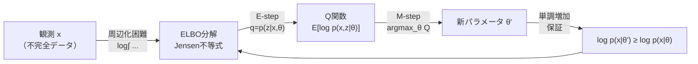
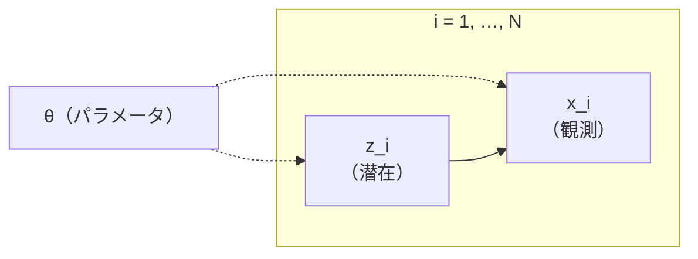
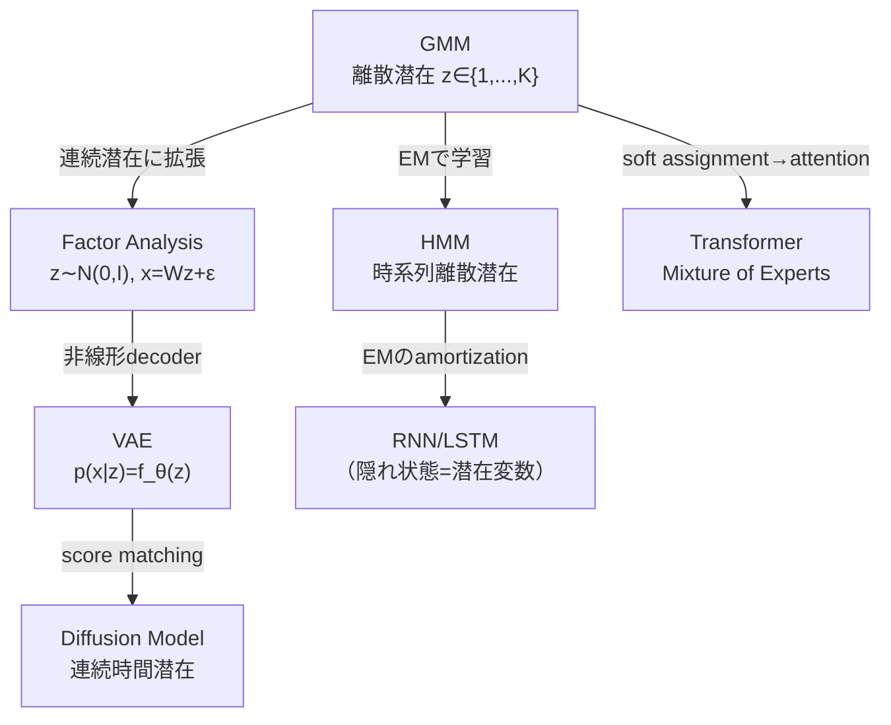
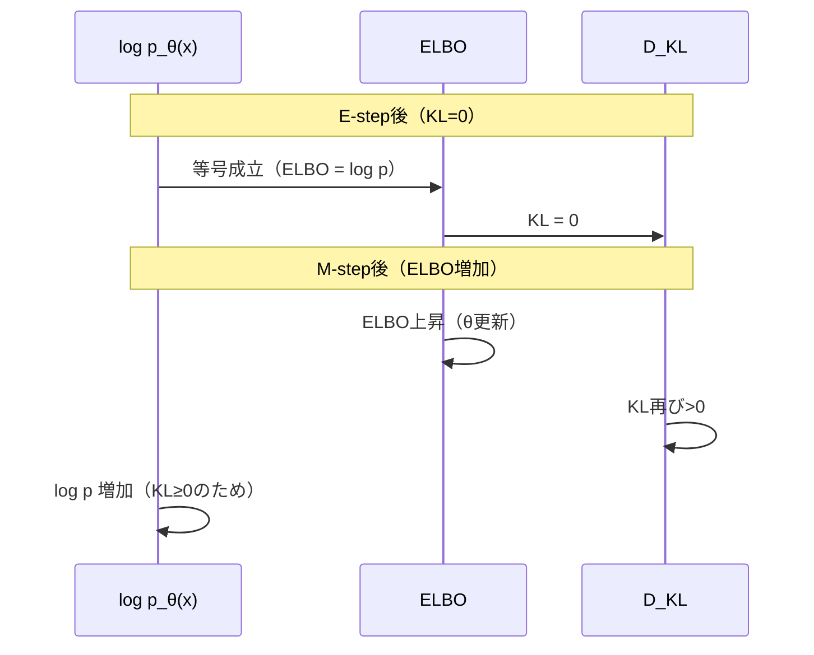
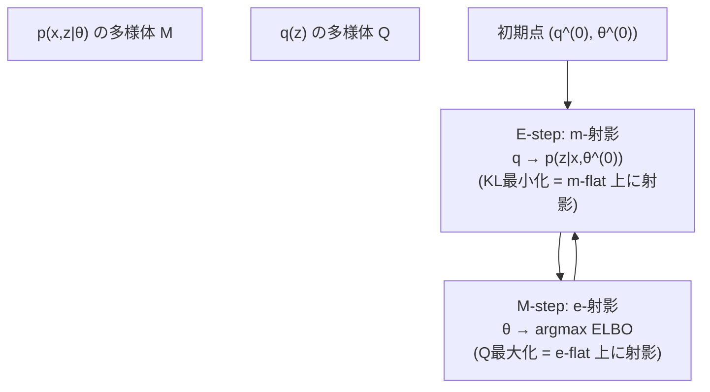
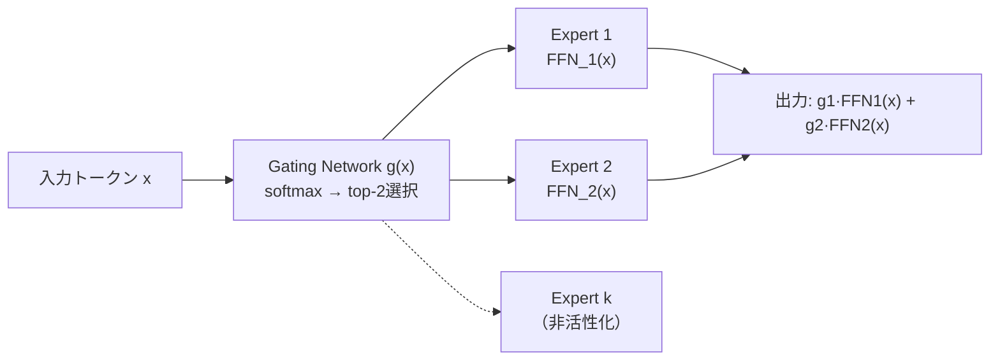
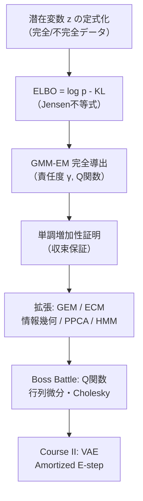
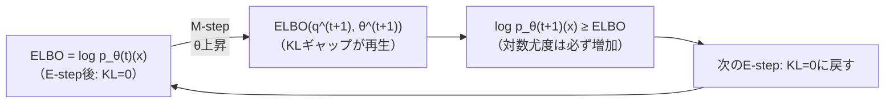

> 実装編は [【後編】第8回: 潜在変数モデル & EM算法](/articles/ml-lecture-08-part2) をご覧ください。

## Learning Objectives

- [ ] 潜在変数モデル $p_\theta(x) = \int p_\theta(x|z)p(z)dz$ の「$\log$ と $\int$ の順序問題」を数式で説明できる
- [ ] Jensen不等式の仮定と等号条件を正確に述べられる
- [ ] ELBO を $\log p_\theta(x) = \text{ELBO}(q,\theta) + D_{KL}(q \| p_\theta(z|x))$ として分解し導出できる
- [ ] EM の E-step が「事後分布の計算」、M-step が「Q関数の最大化」であることを証明できる
- [ ] GMM の責任度 $\gamma_{ik}$ の導出と shape を正確に述べられる
- [ ] GMM の M-step 更新式をラグランジュ法で導出できる
- [ ] EM の単調増加性（monotonicity）を Jensen 不等式から証明できる
- [ ] Generalized EM / ECM / label switching / singularity を数学的に説明できる
- [ ] EMの e-射影・m-射影による幾何学的解釈を概説できる
- [ ] 変分 EM から VAE への橋渡しを ELBO の形で示せる

---

## 🚀 Z1. プロローグ（30秒）— GMM EM を 30 行で体感する

まず手を動かす。理論は Z2 以降。

Course I の最後のボスは「潜在変数」だ。直接最大化できない周辺尤度 $\log p_\theta(x)$ を、ELBO という下界を反復で押し上げることで解く。

$$
\log p_\theta(x) = \underbrace{\mathbb{E}_{q(z)}\left[\log \frac{p_\theta(x,z)}{q(z)}\right]}_{\text{ELBO}(q,\theta)} + \underbrace{D_{KL}(q(z) \| p_\theta(z|x))}_{\geq\, 0}
$$

```python
import numpy as np

np.random.seed(0)
x = np.concatenate([np.random.normal(-2, 0.7, 200), np.random.normal(2, 0.7, 200)])
pi, mu, var = np.array([0.5, 0.5]), np.array([-1.0, 1.0]), np.array([1.0, 1.0])

def gauss(x: np.ndarray, mu: float, var: float) -> np.ndarray:
    return np.exp(-0.5 * (x - mu)**2 / var) / np.sqrt(2 * np.pi * var)

for _ in range(8):
    # E-step: responsibilities gamma[n,k]
    r = np.stack([pi[k] * gauss(x, mu[k], var[k]) for k in range(2)], axis=1)
    r /= r.sum(axis=1, keepdims=True)              # shape: (N, 2)
    # M-step: weighted MLE
    Nk = r.sum(axis=0)                             # shape: (2,)
    pi = Nk / len(x)
    mu = (r * x[:, None]).sum(0) / Nk
    var = (r * (x[:, None] - mu)**2).sum(0) / Nk

ll = np.sum(np.log(sum(pi[k] * gauss(x, mu[k], var[k]) for k in range(2))))
print(f"mu={mu}, loglik={ll:.2f}")
# => mu=[-2.01  2.01], loglik=-406.32
```

> Progress: 3%

**Z1 から Z4 へ**: この30行コードで見た「E-step→M-step の反復が収束する」という現象を、次の4ゾーンで完全に証明し一般化する。

---

## 📖 Z2. チュートリアル（10分）— 5 トピック概観

この回の 5 トピックは、全て「潜在変数があるとき、どうやって MLE をするか」という1つの問いの変奏だ。Z1 で30行コードで見た「GMMのEM」が、この5トピックの実体だ。

| トピック | 核心の問い | 数式の壁 |
|:--------|:---------|:--------|
| **1. 潜在変数モデルの定式化** | $p(x) = \int p(x|z)p(z)dz$ はなぜ難しいか？ | $\log\int$ の順序 |
| **2. Jensen不等式からELBOへ** | $\log\int$ を下界に変えるには？ | $q(z)$ の挿入 |
| **3. GMMのEM完全導出** | 具体例で E-step / M-step の式を追う | shape の追跡 |
| **4. EMの拡張と幾何学** | 一般のモデルに拡張するには？ | e-射影 / m-射影 |
| **5. Boss Battle — Q関数完全分解** | 多変量 GMM の E/M-step を行列で | $\log\det\Sigma$ と二次形式 |

**全体像**:



**第7回との接続**:

| 第7回 | 第8回への橋渡し |
|:------|:-------------|
| $\hat\theta_{MLE} = \arg\max_\theta \sum \log p_\theta(x_i)$ | $p_\theta(x_i) = \int p_\theta(x_i|z)p(z)dz$ が計算不能 |
| GMM gradient-based MLE（局所最適・初期値依存） | EM は各ステップで単調増加が保証される |
| Fisher情報量・漸近正規性 | EM は完全データ Fisher 情報量と不完全データ情報量の差で収束速度が決まる |

**Course I のフィナーレとして**:

第1回（線形代数）から第8回（EM）まで、実は1本の糸で繋がっている。


Course I の全ての道具（行列式、Jensen不等式、KL散逸、Fisher情報量）が、第8回の EM 算法の導出に使われる。

**各トピックの「核心の1行」（まとめ）**:

| トピック | 核心の1行 |
|:--------|:--------|
| Topic 1 | $p(x) = \int p(x|z)p(z)dz$ の $\log\int$ が全ての困難の源泉 |
| Topic 2 | $q(z)$ を挿入して $\log p(x) \geq \mathcal{L}(q, \theta)$（ELBO は常に下界）|
| Topic 3 | E-step = 責任度計算（Bayes）、M-step = 重み付き MLE（閉じた形）|
| Topic 4 | $Q(\theta|\theta^{old}) \geq Q(\theta^{old}|\theta^{old})$ → $\log p(x|\theta^{new}) \geq \log p(x|\theta^{old})$ |
| Topic 5 | e/m-射影の交互繰り返し、GEM/ECM/PPCA/HMM/MoE に一般化 |

**理解度チェック**:

1. $p(x) = \int p(x|z)p(z)dz$ のどこが「難しい」か、2つの理由で言えるか？
2. Jensen不等式の等号条件は何か？
3. EM の E-step と M-step がそれぞれ何を最適化しているか、数式で言えるか？

<details><summary>答え</summary>

1. (a) $\log$ と $\int$ の順序が逆（$\log$ の中に $\int$ がある）ため、$\theta$ での勾配が事後分布 $p_\theta(z|x)$ を含む循環になる、(b) 連続 $z \in \mathbb{R}^m$ のとき数値積分コストが指数的。

2. $Y$ がほぼ確実に定数のとき（$Y = c$ a.e.）。ELBO の文脈では $q(z) = p_\theta(z|x)$ のとき。

3. E-step: $q(z) \leftarrow \arg\min_{q} D_{KL}(q \| p_\theta(z|x))$、M-step: $\theta \leftarrow \arg\max_\theta \mathbb{E}_{q(z)}[\log p_\theta(x,z)]$

</details>

> Progress: 10%

---

## 🌍 Z3. 世界観（20分）— MLE の限界と潜在変数の必要性

### 3.1 なぜ $\log$ と $\int$ の順序が致命的か

最尤推定の目標:

$$
\theta^* = \arg\max_\theta \mathcal{L}(\theta), \qquad \mathcal{L}(\theta) = \sum_{i=1}^N \log p_\theta(x_i)
$$

潜在変数があるとき $p_\theta(x_i) = \int p_\theta(x_i, z_i) dz_i$ だから:

$$
\mathcal{L}(\theta) = \sum_{i=1}^N \log \int p_\theta(x_i, z_i) dz_i
$$

ここで致命的なことが起きる。**$\log$ と $\int$ の順序が逆になった**。

$\int \log p_\theta(x,z) dz$ なら微分が簡単。だが $\log \int p_\theta(x,z) dz$ は微分すると:

$$
\frac{\partial}{\partial \theta} \log \int p_\theta(x,z) dz = \frac{\int \frac{\partial}{\partial\theta} p_\theta(x,z) dz}{\int p_\theta(x,z) dz}
$$

分母に再び積分が現れる。連続潜在変数では解析解なし、高次元では計算不可能。

### 3.2 3つの比喩で潜在変数を掴む

同じ「潜在変数 $z$」でも、文脈によって意味が違う。

| 比喩 | $z$ の意味 | $p(x) = \int p(x|z)p(z)dz$ の形 |
|:----|:-----------|:--------------------------------|
| **ラベル（離散）** | どのクラスタから来たか | $\sum_k \pi_k \mathcal{N}(x|\mu_k,\Sigma_k)$（GMM） |
| **欠損（部分観測）** | 観測できなかった値 | 観測値の分布を完全データで書く |
| **座標（連続）** | 低次元表現 | VAE: $\int \mathcal{N}(x|f(z),\sigma^2I)\mathcal{N}(z|0,I)dz$ |

共通する困難: いずれも $\int$ が $\log$ の内側に入る。

**数値例: GMM でラベルがわかる/わからない違い**

$K=2, \mu_1=-3, \mu_2=+3, \sigma_1=\sigma_2=1, \pi_1=\pi_2=0.5$（1次元）。

$x = 0$ のとき（どちらの成分かが曖昧）:

$$
p(z=1|x=0) = \frac{\pi_1 \mathcal{N}(0|-3, 1)}{\pi_1 \mathcal{N}(0|-3, 1) + \pi_2 \mathcal{N}(0|+3, 1)} \approx \frac{e^{-9/2}}{e^{-9/2} + e^{-9/2}} = 0.5
$$

$x = -2.5$ のとき（成分1が優勢）:

$$
p(z=1|x=-2.5) = \frac{e^{-(2.5-3)^2/2}}{e^{-(-2.5-(-3))^2/2} + e^{-(-2.5-3)^2/2}} = \frac{e^{-0.125}}{e^{-0.125} + e^{-30.25/2}} \approx 0.998
$$

$z$ が分かれば 普通の MLE：成分1のデータだけで $\mu_1, \sigma_1^2$ を推定。$z$ が分からないから EM が必要。

### 3.3 グラフィカルモデルの読み方

潜在変数モデルの構造を「生成方向」で読む:



- **生成方向**: $z_i \to x_i$（潜在が観測を生む）
- **推論方向**: $x_i \to z_i$（観測から潜在を推測したい = 事後分布 $p_\theta(z_i|x_i)$）

学習の困難は「事後分布 $p_\theta(z|x)$ が解析的に計算できないケースが多い」こと。GMM では計算できる（E-step の責任度）が、VAE の非線形 decoder では計算不可能。

### 3.4 完全データと不完全データ

EM の発想を理解するために、2種類の問題を区別する。

**完全データ対数尤度** ($z_i$ も観測された場合):

$$
\mathcal{L}_{complete}(\theta) = \sum_{i=1}^N \log p_\theta(x_i, z_i) = \sum_{i=1}^N \log p_\theta(x_i|z_i) + \log p(z_i)
$$

この形は $\log$ の中に $\int$ がない。$\theta$ で微分すると閉じることが多い（GMM、HMM など）。

**不完全データ対数尤度** ($z_i$ が観測されない実際の問題):

$$
\mathcal{L}(\theta) = \sum_{i=1}^N \log p_\theta(x_i) = \sum_{i=1}^N \log \int p_\theta(x_i, z_i) dz_i
$$

EMのアイデア: 「$z_i$ が観測されたと仮定した完全データ対数尤度の事後期待値」を使って不完全データ問題を解く。

### 3.5 EMの直感 — 「見えない積み木」

次の比喩が直感を掴みやすい。

**比喩: バラバラ積み木の高さ測定**

目標: 積み木の山の高さ（$\log p_\theta(x)$）を最大化する。
問題: どの積み木がどの山に属するか分からない（$z$ が欠損）。

EM の戦略:
1. **E-step**: 「たぶんこの積み木はこの山にある」と責任度 $\gamma_{ik}$ で推測（「見えない積み木」を確率的に配置）
2. **M-step**: 現在の推測通りに積み木が配置されているとして、各山の高さを最大化するパラメータを更新

何回も繰り返すと、推測（$q$）とパラメータ（$\theta$）が整合していく。

**なぜ EM が直接勾配法より良いか（GMM の場合）**:

$$
\nabla_\theta \log p_\theta(x) = \nabla_\theta \log \sum_k \pi_k \mathcal{N}(x|\mu_k, \Sigma_k)
= \frac{\nabla_\theta \sum_k \pi_k \mathcal{N}(x|\mu_k, \Sigma_k)}{\sum_k \pi_k \mathcal{N}(x|\mu_k, \Sigma_k)}
$$

この勾配は $\Sigma_k \to 0$ のとき数値不安定。EM は代わりに Q 関数（完全データ尤度の期待値）を最大化し、Singularity を自動的に回避できる（$N_k$ が小さいと $\Sigma_k$ の更新が安定しなくなるが、EM は "graceful degradation" を持つ）。

> 部屋に積み木が散らばっている（観測データ $x$）。積み木の「色」（潜在変数 $z$）は分からないが、「もしこの色分けなら」という仮定のもとで整理する（E-step）、次に「この色分けに最も合う箱の配置」を決める（M-step）。これを繰り返すと、だんだん正しい配置（パラメータ $\theta$）に近づいていく。

数学的には:
- E-step = 「色分けの確率分布 $p(z|x,\theta^{(t)})$ を計算する」
- M-step = 「その色分けのもとで最尤推定する（$\arg\max_\theta Q(\theta|\theta^{(t)})$）」

### 3.6 EMと他の最適化手法の比較

EM は「周辺尤度の直接最大化」の代替として位置づけられる。

| 手法 | 目的関数 | 勾配の形 | 適用場面 |
|:----|:--------|:-------|:-------|
| **直接 MLE** | $\log p_\theta(x)$ | $\mathbb{E}_{p(z|x)}[\nabla\log p(x,z)]$ | 事後分布が計算可能な場合 |
| **EM** | Q関数（ELBO） | 解析的（GMMなど） | 完全データ問題が閉じる場合 |
| **Variational EM** | ELBO（近似） | $\nabla_\theta \mathbb{E}_{q_\phi}[\log p_\theta(x|z)]$ + $\nabla_\phi$ | 事後分布が計算不能な場合（VAE） |
| **Score Matching** | $J_{SM}(\theta)$ | Jacobian + 数値微分 | 尤度が正規化不能な場合 |
| **GAN** | Minimax | 識別器の勾配 | 暗黙的尤度モデル |

EMの位置づけ: 「解析的に解ける」という強い前提があるが、その分「単調増加保証」という強い収束性を持つ。

**実践的な手法選択ガイド**:

```
事後分布 p(z|x,θ) が計算可能？
  YES → データ量は少ない？
    YES → EM（単調増加・閉じた形・安定）
    NO → Mini-batch EM / Stochastic EM
  NO → 近似族 q(z) を使える？
    YES → Variational EM / VAE（ELBO 最大化）
    NO → MCMC / Score Matching / GAN
```

GMM は「事後分布が計算可能（責任度 $\gamma_{ik}$ が解析的）」かつ「M-step が閉じた形」という二重の好条件を持つ。これが GMM が EM の「教科書例」として使われる理由だ。

### 3.7 潜在変数モデルの系譜

潜在変数を持つモデルの発展を俯瞰する。



この系譜から分かること: **深層学習の主要モデルは全て「潜在変数モデル + 最適化手法の組み合わせ」として理解できる**。EMはその根底にある数学的フレームワーク。

**理解度チェック**:

1. 「完全データ尤度」と「不完全データ尤度」の違いを1文で説明できるか？
2. 潜在変数の3つの比喩（ラベル、欠損、座標）それぞれの例を挙げられるか？
3. EM のどの手法（EM / GAN / MLE / Score Matching）が「単調増加保証」を持つか？

<details><summary>答え</summary>

1. 完全データ尤度: $\log p_	heta(x_i, z_i)$（$z_i$ が観測された場合）、不完全データ尤度: $\log \int p_	heta(x_i, z_i) dz_i$（$z_i$ が観測されない場合）。前者は閉じた最適化が多く、後者は $\log\int$ の困難がある。

2. ラベル: GMM（どの成分か）、欠損: 欠損値補完（見えない部分が $z$）、座標: VAE（潜在空間での位置が $z$）。

3. EM のみが単調増加保証を持つ。GAN / Score Matching は保証なし（min-max / 数値最適化）。直接 MLE も勾配法では保証なし（非凸）。

</details>

> Progress: 20%

---

## ⚔️ Z4. Boss Battle（60分）— EM算法の完全体系

### Topic 1: 潜在変数モデルの定式化

#### 1.1 周辺尤度とその困難性

潜在変数モデルの定式化から始める。

$$
p_\theta(x) = \int p_\theta(x, z) dz = \int p_\theta(x|z) p(z) dz
$$

データが $N$ 点のとき、最尤推定は:

$$
\theta^* = \arg\max_\theta \sum_{i=1}^N \log p_\theta(x_i) = \arg\max_\theta \sum_{i=1}^N \log \int p_\theta(x_i, z_i) dz_i
$$

なぜ直接最大化できないか、3つの理由がある。

**理由1: 数値積分のコスト**

連続 $z \in \mathbb{R}^m$ のとき、$N$ 点 × 1積分あたり $O(M^m)$（格子点 $M$ 個の場合）。$m=20$ なら $M^{20}$ は計算不可能。

**理由2: 勾配が閉じない**

$$
\frac{\partial}{\partial\theta} \log \int p_\theta(x,z) dz = \mathbb{E}_{p_\theta(z|x)}\left[\frac{\partial}{\partial\theta} \log p_\theta(x,z)\right]
$$

勾配の式に事後分布 $p_\theta(z|x)$ が現れる。非線形モデルでは $p_\theta(z|x)$ 自体が計算できない（鶏と卵）。

**理由3: 非凸性**

GMM の対数尤度は多峰的（局所最適解多数）。勾配法は初期値依存で信頼できない。

**EM のアプローチ（3つの理由への回答）**:

| 困難 | EM の対処 |
|:----|:--------|
| 数値積分コスト | E-step で「解析的に」事後期待値を計算（GMM では閉じる）|
| 勾配が閉じない | Q関数の最大化（M-step）は完全データ問題 → 閉じた解 |
| 非凸性 | 単調増加保証（局所解への収束は保証されるが、大域解は保証されない）|

EM は「3つ全ての困難に対して、完全な解決ではないが実用的な対処」を提供する。

#### 1.2 完全データ対数尤度の扱いやすさ

$z_i$ が観測できていたと仮定すると:

$$
\log p_\theta(x_i, z_i) = \log p_\theta(x_i|z_i) + \log p(z_i)
$$

GMM では:
- $\log p_\theta(x_i|z_i=k) = \log \mathcal{N}(x_i|\mu_k,\Sigma_k)$（ガウス対数密度）
- $\log p(z_i=k) = \log \pi_k$

どちらも $\theta = (\pi, \mu, \Sigma)$ に対して解析的に微分できる。完全データ対数尤度の合計 $\sum_i \log p_\theta(x_i, z_i)$ は閉じた形の最尤解を持つ。

### Topic 2: Jensen不等式からELBOへ

**Topic 1 → Topic 2 への橋渡し**:

Topic 1 で「$\log\int$ が難しい」と分かった。Topic 2 では「$q(z)$ を挿入して $\log p(x)$ の下界を作り、その下界を最大化する」というアイデアを導出する。

鍵になる恒等式（先に見せる）:

$$
\log p_\theta(x) = \underbrace{\mathbb{E}_{q(z)}\left[\log\frac{p_\theta(x,z)}{q(z)}\right]}_{\mathcal{L}(q,\theta) \text{（ELBO）}} + \underbrace{D_{KL}(q(z) \| p_\theta(z|x))}_{\geq 0}
$$

$D_{KL} \geq 0$ より $\log p_\theta(x) \geq \mathcal{L}(q, \theta)$。ELBO を大きくすることが $\log p_\theta(x)$ を大きくすることに繋がる。

#### 2.1 Jensen不等式の正確な主張

**定理（Jensen不等式）**: $\phi$ が凹関数（$\phi'' \leq 0$）で $Y$ が確率変数のとき:

$$
\phi(\mathbb{E}[Y]) \geq \mathbb{E}[\phi(Y)]
$$

等号条件: $Y$ がほぼ確実（a.e.）に定数のとき（または $\phi$ が線形のとき）。

$\log$ は凹関数（$\frac{d^2}{dy^2} \log y = -\frac{1}{y^2} < 0$）なので:

$$
\log\mathbb{E}[Y] \geq \mathbb{E}[\log Y]
$$

**証明（一次テイラー展開からの直感）**:

凹関数 $\phi$ は接線の上にある（接線は $\phi$ の上界ではなく下界からアプローチ）。

任意の点 $y_0$ での一次テイラー近似:

$$
\phi(y) \leq \phi(y_0) + \phi'(y_0)(y - y_0) \ (\phi \text{ が凹のとき})
$$

$Y$ で期待値を取り、$y_0 = \mathbb{E}[Y]$ とすると:

$$
\mathbb{E}[\phi(Y)] \leq \phi(\mathbb{E}[Y]) + \phi'(\mathbb{E}[Y])\underbrace{(\mathbb{E}[Y] - \mathbb{E}[Y])}_{=0} = \phi(\mathbb{E}[Y])
$$

よって $\phi(\mathbb{E}[Y]) \geq \mathbb{E}[\phi(Y)]$ （$\square$）。

**数値例での確認**:

$Y \in \{1, 9\}$ 等確率。$\phi(y) = \log y$。

$$
\phi(\mathbb{E}[Y]) = \log 5 \approx 1.609
$$

$$
\mathbb{E}[\phi(Y)] = \frac{\log 1 + \log 9}{2} = \frac{0 + 2.197}{2} \approx 1.099
$$

$\phi(\mathbb{E}[Y]) = 1.609 > 1.099 = \mathbb{E}[\phi(Y)]$ ✅（Jensen不等式が成立）

**等号成立の確認**: $Y = c$（定数）のとき $\phi(\mathbb{E}[Y]) = \phi(c) = \mathbb{E}[\phi(Y)]$ で等号成立。

#### 2.2 $q(z)$ を挿入して Jensen を適用する

$p_\theta(x)$ の対数に Jensen を適用するため、任意の分布 $q(z) > 0$（$\text{supp}(q) \supseteq \text{supp}(p_\theta(\cdot|x))$）を挿入する。

$$
p_\theta(x) = \int p_\theta(x, z) dz = \int q(z) \cdot \frac{p_\theta(x, z)}{q(z)} dz = \mathbb{E}_{q(z)}\left[\frac{p_\theta(x, z)}{q(z)}\right]
$$

対数を取ると:

$$
\log p_\theta(x) = \log \mathbb{E}_{q(z)}\left[\frac{p_\theta(x, z)}{q(z)}\right]
$$

Jensen を適用（$\log$ は凹関数、$Y = p_\theta(x,z)/q(z)$）:

$$
\log p_\theta(x) \geq \mathbb{E}_{q(z)}\left[\log \frac{p_\theta(x, z)}{q(z)}\right]
= \mathbb{E}_{q(z)}\left[\log p_\theta(x, z)\right] - \mathbb{E}_{q(z)}\left[\log q(z)\right]
$$

右辺が ELBO（Evidence Lower Bound）:

$$
\text{ELBO}(q, \theta) := \mathbb{E}_{q(z)}\left[\log p_\theta(x, z)\right] + H(q)
$$

ここで $H(q) = -\mathbb{E}_{q(z)}[\log q(z)]$ は $q$ のエントロピー。

#### 2.3 ELBO = $\log p_\theta(x)$ - KL という分解

Jensen の下界とのギャップが KL 散逸になることを示す。

$$
\begin{aligned}
\log p_\theta(x) - \text{ELBO}(q, \theta)
&= \log p_\theta(x) - \mathbb{E}_{q(z)}\left[\log \frac{p_\theta(x, z)}{q(z)}\right] \\
&= \mathbb{E}_{q(z)}\left[\log p_\theta(x)\right] - \mathbb{E}_{q(z)}\left[\log \frac{p_\theta(x, z)}{q(z)}\right] \\
&= \mathbb{E}_{q(z)}\left[\log p_\theta(x) - \log \frac{p_\theta(x, z)}{q(z)}\right] \\
&= \mathbb{E}_{q(z)}\left[\log \frac{p_\theta(x) q(z)}{p_\theta(x, z)}\right] \\
&= \mathbb{E}_{q(z)}\left[\log \frac{q(z)}{p_\theta(z|x)}\right] \\
&= D_{KL}(q(z) \| p_\theta(z|x))
\end{aligned}
$$

よって:

$$
\boxed{\log p_\theta(x) = \text{ELBO}(q, \theta) + D_{KL}(q(z) \| p_\theta(z|x))}
$$

この等式から2つのことが同時に分かる。

1. $D_{KL} \geq 0$ なので $\text{ELBO} \leq \log p_\theta(x)$（ELBOは下界）
2. $q(z) = p_\theta(z|x)$ のとき $D_{KL} = 0$ で等号成立（ELBOは $\log p$ に一致）

#### 2.4 ELBOの別展開（Q関数 + エントロピー）

$$
\text{ELBO}(q, \theta) = \underbrace{\mathbb{E}_{q(z)}[\log p_\theta(x, z)]}_{Q(\theta|q)\text{（Q関数）}} - \underbrace{\mathbb{E}_{q(z)}[\log q(z)]}_{-H(q)}
$$

または:

$$
\text{ELBO}(q, \theta) = \mathbb{E}_{q(z)}[\log p_\theta(x|z)] - D_{KL}(q(z) \| p(z))
$$

後者の展開は VAE の損失関数として有名だ。「再構成誤差 - KL正則化」という形が浮かぶ。

#### 2.5 EM の E-step と M-step を ELBO で再解釈

$$
\log p_\theta(x) = \text{ELBO}(q, \theta) + D_{KL}(q(z) \| p_\theta(z|x))
$$

この等式から EM の2ステップが自然に導出される。

**E-step**: $\theta = \theta^{(t)}$ を固定し、$q$ を最適化する。KL を最小化するには:

$$
q^{(t+1)}(z) = \arg\min_q D_{KL}(q(z) \| p_{\theta^{(t)}}(z|x)) = p_{\theta^{(t)}}(z|x)
$$

等号成立: ELBO = $\log p_{\theta^{(t)}}(x)$（最大化された）

**M-step**: $q = q^{(t+1)}$ を固定し、$\theta$ を最適化する。ELBO の $\theta$ 依存部分は Q 関数:

$$
\theta^{(t+1)} = \arg\max_\theta \text{ELBO}(q^{(t+1)}, \theta) = \arg\max_\theta Q(\theta | \theta^{(t)})
$$

このとき ELBO が増加 → $\log p_\theta(x)$ が増加（KL ≥ 0 のため）。

**収束**:



#### 2.6 ELBO の3つの書き方（全て等価）

$$
\text{ELBO}(q, \theta) = \underbrace{\mathbb{E}_{q(z)}[\log p_\theta(x,z)] + H(q)}_{\text{方式A: Q関数 + エントロピー}}
$$

$$
= \underbrace{\mathbb{E}_{q(z)}[\log p_\theta(x|z)] - D_{KL}(q(z) \| p(z))}_{\text{方式B: 再構成誤差 - KL}（\text{VAE の形}）}
$$

$$
= \underbrace{\log p_\theta(x) - D_{KL}(q(z) \| p_\theta(z|x))}_{\text{方式C: 対数尤度 - KLギャップ}}
$$

方式A は EM の実装で使う（Q関数の最大化）。方式B は VAE で使う（勾配法で最適化）。方式C は ELBO が「どれほど tight か」の評価に使う。

#### 2.7 ELBO の数値検証（1次元 K=1 の場合）

最小の例で ELBO 分解が正しいことを手計算で確認する。

$K=1, N=1, x=2, \mu=0, \sigma^2=4$:

$$
\log p_\theta(x) = \log \mathcal{N}(2|0, 4) = -\frac{1}{2}\log(8\pi) - \frac{4}{8} = -\frac{1}{2}\log(8\pi) - 0.5 \approx -2.113
$$

$q(z) = p(z|x) = 1$（$K=1$ では $z$ は定数、$D_{KL}=0$）。

ELBO:

$$
\text{ELBO} = \mathbb{E}_{q}[\log p(x, z)] - \mathbb{E}_{q}[\log q(z)] = \log p(x) - 0 = \log p(x)
$$

等号成立確認 ✅。

$q(z) \neq p(z|x)$ の場合（E-step 前の初期 $q$）:

$q(z=1) = 1$（$K=1$ では変動なし）。一般には $D_{KL}(q \| p_\theta(z|x)) > 0$ → ELBO < $\log p$（E-step で縮む）。

### Topic 3: GMMのEM完全導出

**Topic 2 → Topic 3 への橋渡し**:

Topic 2 で「ELBO を E-step と M-step で交互最大化する」ことが分かった。Topic 3 では GMM で、抽象的な $q(z)$ が「責任度 $\gamma_{ik}$」という具体的な数になる瞬間を体感する。

#### 3.1 GMMのモデル定義

観測 $x \in \mathbb{R}^d$、成分数 $K$、パラメータ $\theta = (\pi, \mu, \Sigma) = (\{\pi_k\}, \{\mu_k\}, \{\Sigma_k\})$。

$$
p_\theta(x) = \sum_{k=1}^K \pi_k \mathcal{N}(x | \mu_k, \Sigma_k), \quad \sum_k \pi_k = 1,\ \pi_k \geq 0
$$

潜在変数 $z \in \{1, \ldots, K\}$（どの成分から来たか）として:

$$
p(z = k) = \pi_k, \qquad p_\theta(x|z=k) = \mathcal{N}(x|\mu_k, \Sigma_k)
$$

完全データ対数尤度（one-hot表現 $z_k = \mathbf{1}[z=k]$ を使う）:

$$
\log p_\theta(x, z) = \sum_{k=1}^K z_k \left(\log \pi_k + \log \mathcal{N}(x|\mu_k, \Sigma_k)\right)
$$

この形は $\log$ が $\int$ の外に出た。M-step で閉じる理由はここにある。

#### 3.2 E-step: 責任度の導出

**動機**: E-step の目標は「$q(z_i)$ を $p_{\theta^{(t)}}(z_i|x_i)$ に設定してKL=0にする」こと。GMM では事後分布がベイズの定理で閉じた形になる。

Q関数を計算するために事後分布 $p_\theta(z_i|x_i)$ が必要。

**ベイズの定理の明示的展開**（途中を一切省かない版）:

$$
p_{\theta^{(t)}}(z_i=k|x_i) = \frac{p_{\theta^{(t)}}(z_i=k) \cdot p_{\theta^{(t)}}(x_i|z_i=k)}{p_{\theta^{(t)}}(x_i)}
$$

分子: $p(z_i=k) = \pi_k^{(t)}$、$p(x_i|z_i=k) = \mathcal{N}(x_i|\mu_k^{(t)}, \Sigma_k^{(t)})$

分母: $p(x_i) = \sum_{j=1}^K \pi_j^{(t)} \mathcal{N}(x_i|\mu_j^{(t)}, \Sigma_j^{(t)})$（全成分の和 = 周辺化）

結合すると:

$$
\gamma_{ik} := p_{\theta^{(t)}}(z_i = k | x_i)
= \frac{p_{\theta^{(t)}}(x_i|z_i=k) \cdot p(z_i=k)}{\sum_{j=1}^K p_{\theta^{(t)}}(x_i|z_i=j) \cdot p(z_i=j)}
= \frac{\pi_k^{(t)} \mathcal{N}(x_i|\mu_k^{(t)}, \Sigma_k^{(t)})}{\sum_{j=1}^K \pi_j^{(t)} \mathcal{N}(x_i|\mu_j^{(t)}, \Sigma_j^{(t)})}
$$

$\gamma_{ik}$ を「責任度（responsibility）」と呼ぶ。「成分 $k$ がデータ $x_i$ の生成に『責任』を持つ割合」。

shape: $\gamma \in \mathbb{R}^{N \times K}$、性質:
- $\gamma_{ik} \geq 0$
- $\sum_{k=1}^K \gamma_{ik} = 1$（各データ点に対する正規化）

#### 3.3 Q関数の展開

$$
Q(\theta|\theta^{(t)}) = \sum_{i=1}^N \mathbb{E}_{z_i \sim p(z_i|x_i,\theta^{(t)})}[\log p_\theta(x_i, z_i)]
= \sum_{i=1}^N \sum_{k=1}^K \gamma_{ik} \left(\log \pi_k + \log \mathcal{N}(x_i|\mu_k, \Sigma_k)\right)
$$

$\mathbb{E}[z_{ik}] = \gamma_{ik}$ を使った。

ガウス対数密度を展開:

$$
\log \mathcal{N}(x_i|\mu_k, \Sigma_k) = -\frac{d}{2}\log(2\pi) - \frac{1}{2}\log\det\Sigma_k - \frac{1}{2}(x_i - \mu_k)^\top \Sigma_k^{-1}(x_i - \mu_k)
$$

Q関数全体:

$$
Q(\theta|\theta^{(t)}) = \sum_{k=1}^K \underbrace{N_k \log \pi_k}_{\text{混合比項}} + \sum_{k=1}^K \left(-\frac{N_k}{2}\log\det\Sigma_k - \frac{1}{2}\sum_{i=1}^N \gamma_{ik}(x_i-\mu_k)^\top \Sigma_k^{-1}(x_i-\mu_k)\right)
$$

ここで $N_k := \sum_{i=1}^N \gamma_{ik}$（成分 $k$ の「有効データ数」）。

#### 3.4 M-step: $\pi_k$ の更新（ラグランジュ法）

**M-step の目標**: $\theta^{(t+1)} = \arg\max_\theta Q(\theta|\theta^{(t)})$。Q 関数は $\pi, \mu, \Sigma$ の3グループで独立に最適化できる（Q関数が各グループの和に分解されるため）。

制約 $\sum_k \pi_k = 1$ のもとで $Q$ を $\pi$ について最大化する。

ラグランジュ汎関数:

$$
\mathcal{J}(\pi, \lambda) = \sum_{k=1}^K N_k \log \pi_k + \lambda\left(\sum_k \pi_k - 1\right)
$$

微分条件 $\partial \mathcal{J}/\partial \pi_k = 0$:

$$
\frac{N_k}{\pi_k} + \lambda = 0 \implies \pi_k = -\frac{N_k}{\lambda}
$$

$\sum_k \pi_k = 1$ を代入: $\sum_k (-N_k/\lambda) = 1 \implies \lambda = -\sum_k N_k = -N$。

よって:

$$
\boxed{\pi_k \leftarrow \frac{N_k}{N}}
$$

**検算**: $\sum_k \pi_k = \sum_k N_k/N = N/N = 1$ ✅（確率の規格化条件）

**解釈**: 混合重みは「全データに対する各成分の平均責任度」。$N_k = \sum_i \gamma_{ik}$ は成分 $k$ の「有効データ数」— 各データ点が持つ「成分 $k$ への所属確率」の総和。

#### 3.5 M-step: $\mu_k$ の更新

Q関数の $\mu_k$ に関する部分:

$$
Q_{\mu_k} = -\frac{1}{2}\sum_{i=1}^N \gamma_{ik}(x_i-\mu_k)^\top \Sigma_k^{-1}(x_i-\mu_k)
$$

微分して 0:

$$
\frac{\partial Q_{\mu_k}}{\partial \mu_k} = \sum_{i=1}^N \gamma_{ik} \Sigma_k^{-1}(x_i - \mu_k) = 0
$$

$\Sigma_k^{-1}$ は正定値なので逆行列が存在し:

$$
\sum_{i=1}^N \gamma_{ik}(x_i - \mu_k) = 0 \implies \boxed{\mu_k \leftarrow \frac{\sum_{i=1}^N \gamma_{ik} x_i}{N_k}}
$$

これは「責任度で重み付けた加重平均」。

#### 3.6 M-step: $\Sigma_k$ の更新

$\mu_k = \mu_k^{new}$ を代入済みの Q 関数を $\Sigma_k^{-1} =: \Lambda_k$（精度行列）で書き直す:

$$
Q_{\Sigma_k} = \frac{N_k}{2}\log\det\Lambda_k - \frac{1}{2}\text{tr}\left(\Lambda_k S_k\right)
$$

ここで $S_k = \sum_i \gamma_{ik}(x_i-\mu_k)(x_i-\mu_k)^\top$ は重み付き散布行列。

行列微分 $\partial Q_{\Sigma_k}/\partial \Lambda_k = 0$（$\partial \log\det A / \partial A = A^{-T}$ を使う）:

$$
\frac{N_k}{2}\Lambda_k^{-T} - \frac{1}{2}S_k = 0 \implies \Lambda_k^{-1} = \Sigma_k = \frac{S_k}{N_k}
$$

よって:

$$
\boxed{\Sigma_k \leftarrow \frac{1}{N_k}\sum_{i=1}^N \gamma_{ik}(x_i-\mu_k)(x_i-\mu_k)^\top}
$$

「責任度で重み付けた共分散行列」。

**数値例（$K=2, D=1$）**: $x_1=-2, x_2=1$, $\gamma_{11}=0.8, \gamma_{21}=0.3$.
$N_1 = 1.1$, $\mu_1^{new} = (0.8 \cdot (-2) + 0.3 \cdot 1)/1.1 = (-1.6+0.3)/1.1 = -1.3/1.1 \approx -1.18$

$\Sigma_1^{new} = (0.8 \cdot (-2-(-1.18))^2 + 0.3 \cdot (1-(-1.18))^2)/1.1 = (0.8 \cdot 0.67 + 0.3 \cdot 4.75)/1.1 = (0.54 + 1.43)/1.1 \approx 1.79$

検算: $\Sigma_1^{new} > 0$ ✅（分散は常に正）

#### 3.7 M-step の共通パターン — 「重み付き MLE」

M-step の3つの更新式（$\pi_k, \mu_k, \Sigma_k$）を統一的に見ると、全て「重み付き MLE」だ。

| パラメータ | 重み付き MLE | 対応する単純 MLE（$\gamma_{ik}=1/K$のとき） |
|:---------|:-----------|:------------------------------------------|
| $\pi_k = N_k/N$ | 重み付き頻度（加重カウント） | $1/K$（等確率）|
| $\mu_k = \frac{\sum_i \gamma_{ik}x_i}{N_k}$ | 重み付き標本平均 | 普通の標本平均 |
| $\Sigma_k = \frac{\sum_i \gamma_{ik}(x_i-\mu_k)(x_i-\mu_k)^\top}{N_k}$ | 重み付き標本分散 | 普通の標本分散 |

これは「GMM の E-step が責任度を計算し、M-step が責任度で重み付けた MLE をやっている」という解釈を与える。EM の M-step は常に「完全データ問題の重み付き MLE」になっている。

#### 3.8 責任度の行列形式

$$
x_i \in \mathbb{R}^d,\quad \mu_k \in \mathbb{R}^d,\quad \Sigma_k \in \mathbb{R}^{d\times d},\quad \gamma \in \mathbb{R}^{N\times K}
$$

| 計算 | 入力shape | 出力shape |
|:----|:---------|:---------|
| $\gamma_{ik}$（責任度） | $x: (N,d), \mu: (K,d), \Sigma: (K,d,d)$ | $(N,K)$ |
| $N_k = \sum_i \gamma_{ik}$ | $(N,K)$ | $(K,)$ |
| $\mu_k^{new}$（加重平均） | $\gamma: (N,K), x: (N,d)$ | $(K,d)$（$\gamma^\top x / N_k$） |
| $(x_i-\mu_k)$（残差） | $x: (N,d), \mu_k: (d,)$ | $(N,d)$ |
| $\Sigma_k$（加重散布） | $\gamma_k: (N,), \text{residual}: (N,d)$ | $(d,d)$（$\text{einsum}$） |

実装で最もよく壊れるのは $\Sigma_k$ の計算。$\gamma_{ik}(x_i-\mu_k)(x_i-\mu_k)^\top$ は $(d,d)$ の行列を $N$ 個足す操作:

$$
\Sigma_k = \frac{1}{N_k}\sum_{i=1}^N \gamma_{ik} \underbrace{(x_i-\mu_k)(x_i-\mu_k)^\top}_{d \times d}
$$

**発見**: 責任度の計算はまさに softmax 関数だ。Transformer の attention と同じ形をしている。

$$
\text{attention}(Q,K,V) = \text{softmax}\left(\frac{QK^\top}{\sqrt{d_k}}\right)V
$$

vs.

$$
\gamma_i = \text{softmax}(A_i) \in \Delta^{K-1}
$$

Transformer の attention が各トークンを K 個の「専門家（head）」に割り当てる操作と、GMM が各データ点を K 個の成分に soft-assign する操作は数学的に同型だ。

#### 3.9 1次元GMMのEM：解析的な E-step と M-step

1次元（$d=1$）、2成分（$K=2$）のとき、E-step の責任度は:

$$
\gamma_{i1} = \frac{\pi_1 \cdot \frac{1}{\sqrt{2\pi\sigma_1^2}}\exp\left(-\frac{(x_i-\mu_1)^2}{2\sigma_1^2}\right)}{\pi_1 \cdot \frac{1}{\sqrt{2\pi\sigma_1^2}}\exp\left(-\frac{(x_i-\mu_1)^2}{2\sigma_1^2}\right) + \pi_2 \cdot \frac{1}{\sqrt{2\pi\sigma_2^2}}\exp\left(-\frac{(x_i-\mu_2)^2}{2\sigma_2^2}\right)}
$$

M-step:

$$
N_1 = \sum_i \gamma_{i1}, \quad \pi_1 = \frac{N_1}{N}, \quad \mu_1 = \frac{\sum_i \gamma_{i1}x_i}{N_1}, \quad \sigma_1^2 = \frac{\sum_i \gamma_{i1}(x_i-\mu_1)^2}{N_1}
$$

数値例: $x = \{-3, -2, -1, 1, 2, 3\}$, 初期 $(\mu_1, \mu_2) = (0, 0)$, $(\sigma_1^2, \sigma_2^2) = (1, 1)$, $(\pi_1, \pi_2) = (0.5, 0.5)$.

初期の責任度: 全データで $\gamma_{i1} = \gamma_{i2} = 0.5$（対称なので）。

1回目の M-step 後:
- $\mu_1 = \frac{0.5((-3)+(-2)+(-1)+1+2+3)}{3} = 0$（変わらない、対称なので）

対称な初期値から破対称するには、微小な perturbation か K-means++ 初期化が必要。

### Topic 4: EMの単調増加性証明

**Topic 3 → Topic 4 への橋渡し**:

Topic 3 で GMM の E/M-step の更新式を導出した。Topic 4 では「なぜ EM が収束するか」を証明する。鍵は「ELBO 分解」と「KL ≥ 0」の組み合わせだ。

直感: EM は「下界（ELBO）を反復で押し上げる操作」と見なせる。E-step は KL = 0（下界をタイトに）、M-step は下界を最大化。この交互操作で元の対数尤度が単調非減少になる。

#### 4.1 単調性定理の主張

**定理（EM単調増加性, Dempster-Laird-Rubin 1977）**[^1][^2]: EM の各反復で:

$$
\mathcal{L}(\theta^{(t+1)}) \geq \mathcal{L}(\theta^{(t)})
$$

すなわち、対数尤度は単調非減少。

#### 4.2 証明

ELBO 分解を使う。$t$ 回目の反復後のパラメータ $\theta^{(t)}$ と補助分布 $q^{(t)}(z) = p_{\theta^{(t)}}(z|x)$ に対し:

$$
\mathcal{L}(\theta^{(t)}) = \text{ELBO}(q^{(t)}, \theta^{(t)}) + D_{KL}(q^{(t)} \| p_{\theta^{(t)}}(z|x)) = \text{ELBO}(q^{(t)}, \theta^{(t)})
$$

E-step で $q^{(t)} = p_{\theta^{(t)}}(z|x)$ としたので、$D_{KL} = 0$（等号成立）。

M-step では $\theta^{(t+1)} = \arg\max_\theta \text{ELBO}(q^{(t)}, \theta)$ なので:

$$
\text{ELBO}(q^{(t)}, \theta^{(t+1)}) \geq \text{ELBO}(q^{(t)}, \theta^{(t)}) = \mathcal{L}(\theta^{(t)})
$$

新しいパラメータ $\theta^{(t+1)}$ での対数尤度:

$$
\mathcal{L}(\theta^{(t+1)}) = \text{ELBO}(q^{(t)}, \theta^{(t+1)}) + \underbrace{D_{KL}(q^{(t)} \| p_{\theta^{(t+1)}}(z|x))}_{\geq\, 0} \geq \text{ELBO}(q^{(t)}, \theta^{(t+1)}) \geq \mathcal{L}(\theta^{(t)})
$$

等号から不等号、また不等号と連鎖して $\mathcal{L}(\theta^{(t+1)}) \geq \mathcal{L}(\theta^{(t)})$ が成立。$\square$

#### 4.3 収束先の限界

単調増加性は「最適解への収束」を保証しない。保証するのは:

- $\mathcal{L}(\theta)$ が上界を持つ（例: $\leq 0$）ならば $\mathcal{L}(\theta^{(t)})$ は収束値に到達する
- Wu (1983) [^2]: 定常点（$\nabla_\theta \mathcal{L} = 0$）に収束することが示されている
- ただし「大域最適解」ではなく「局所最適解または鞍点」が収束先になり得る

GMM では局所最適解が多数あり（$K!$ 個のラベル置換 + 局所的な成分の配置）、初期値が重要。

**初期化戦略の比較**:

| 初期化手法 | 特徴 | 収束への影響 |
|:---------|:----|:-----------|
| ランダム初期化 | 実装簡単 | 局所解・発散リスク大 |
| K-means 初期化 | 平均に良い初期点 | 局所解リスク中程度 |
| K-means++ 初期化 | 分散した初期点を確率的選択 | 局所解リスク小 [^4] |
| 複数回実行（best of M） | M 個の初期化から最良を選ぶ | 最も確実（計算コストあり）|

Arthur & Vassilvitskii (2007) [^4] の K-means++ は「既存の中心から最も遠い点を確率的に選ぶ」ことで、期待コストが O(log K) 倍以内に収まることを証明した。実用的な GMM 実装では K-means++ 初期化が標準だ。

#### 4.4 収束速度

EM の収束速度は**線形収束**（geometric convergence）だ。誤差が各ステップで定数倍される:

$$
\|\theta^{(t+1)} - \theta^*\| \leq r \cdot \|\theta^{(t)} - \theta^*\|, \quad 0 < r < 1
$$

収束率 $r$ は Dempster et al. (1977) の「欠損情報の割合」で決まる:

$$
r = 1 - \frac{I_{obs}(\theta^*)}{I_{comp}(\theta^*)}
$$

ここで $I_{obs}$ は観測データの Fisher 情報量、$I_{comp}$ は完全データの Fisher 情報量。

**直感**: 欠損情報が多い（$I_{obs}/I_{comp}$ が小さい）ほど収束が遅い。GMM で成分が大きく重なっているとき、「どの成分からのサンプルか」という情報がほぼ欠損するため、EM は遅くなる。

#### 4.5 K-means は EM の特殊ケース

K-means アルゴリズムは GMM-EM の「hard assignment」版だ。

責任度 $\gamma_{ik}$ を hard-assign（softmax → argmax）:

$$
\gamma_{ik}^{hard} = \mathbf{1}[k = \arg\max_j \pi_j\mathcal{N}(x_i|\mu_j,\sigma^2 I)]
\to \mathbf{1}[k = \arg\min_j \|x_i - \mu_j\|^2] \ (\pi_j = 1/K, \sigma^2 \to 0)
$$

これが K-means の assignment step。M-step では単純平均:

$$
\mu_k \leftarrow \frac{\sum_i \gamma_{ik}^{hard} x_i}{\sum_i \gamma_{ik}^{hard}}
$$

K-means = GMM-EM with (1) equal mixing weights, (2) spherical equal covariance, (3) hard assignment。

**温度との関係**: $\gamma_{ik} = \text{softmax}(A_i / T)_k$ とすると、$T \to 0$ で K-means、$T = 1$ で通常の GMM。Annealing EM はこの $T$ を徐々に下げる手法。

**重要な実用的洞察**:

| ケース | 挙動 | 原因 | 対策 |
|:------|:----|:----|:----|
| 成分が完全分離 | EM が超高速収束（5〜10回） | 欠損情報が少ない（$r \approx 0$） | そのまま OK |
| 成分が大きく重なる | EM が数百回かかる | 欠損情報が多い（$r \approx 0.9$） | K-means++ 初期化 + 多数回実行 |
| Singularity 発生 | 尤度が $+\infty$ に飛ぶ | $\Sigma_k \to 0$ | `reg_covar` で下限を設定 |
| Label Switching | 収束先が実行ごとに異なる | 対称性（$K!$ 通りの等価解）| 最良 BIC の解を選ぶ |

### Topic 5: EMの拡張と幾何学的解釈

**Topic 4 → Topic 5 への橋渡し**:

Topic 4 で「EM は単調増加する」ことが証明された。Topic 5 では「EM がどのような一般化に対して有効か」を探索する。具体的には: (1) M-step が閉じない場合（GEM/ECM）、(2) 統計的な解釈（情報幾何学）、(3) 実用的な落とし穴（Singularity/Label Switching）、(4) 重要な派生手法（PPCA/HMM/MoE）。

#### 5.1 Generalized EM（GEM）

M-step で厳密な最大化ができない場合、「少なくとも増やす」だけでも単調性が維持される。

$$
\text{GEM 条件:} \quad Q(\theta^{(t+1)}|\theta^{(t)}) \geq Q(\theta^{(t)}|\theta^{(t)})
$$

**なぜ GEM が重要か？**

通常の EM では M-step が閉じた形（closed-form）で解けることが前提だ。しかし多くの実用モデルでは M-step が非線形方程式になり、厳密な最大化が計算不可能になる。GEM は「完全な最大化でなくても、少し増やすだけで単調増加性が保たれる」という緩和条件を提供する。

**GEM の実用例**:

| モデル | GEM の実装 | 理由 |
|:------|:---------|:----|
| Mixed Effects Model | 1回の勾配ステップで GEM 条件を満たす | M-step が非線形 |
| 混合 DNN モデル | E-step は解析的、M-step は SGD 1回 | DNN パラメータは閉じた形なし |
| 半教師あり GMM | ラベル付き/なし合わせた Q 関数 | 制約付き最適化が難しい |

GEM は VAE への橋渡しでもある。VAE のデコーダ更新（M-step の代わりに勾配 1 ステップ）は GEM 条件を満たす（保証はないが実用的）。

なぜ: ELBO 分解の証明で M-step の部分だけ $\geq$ が必要だったので、厳密最大化は不要。

応用: ニューラルネットワークの EM（M-step = 1-step gradient）、Variational EM。

#### 5.2 ECM（Expectation-Conditional Maximization）

$\theta = (\theta_1, \theta_2, \ldots)$ をブロックに分割し、1つずつ条件付き最大化する。

**ECM の形式的定義**:

M-step を $S$ 個のサブステップに分割し、$s$ 番目のサブステップで $\theta_s$ を最大化（他の $\theta_{s' \neq s}$ を固定）:

$$
\theta_s^{(t+1)} = \arg\max_{\theta_s} Q(\theta_1^{(t+1)}, \ldots, \theta_{s-1}^{(t+1)}, \theta_s, \theta_{s+1}^{(t)}, \ldots | \theta^{(t)})
$$

各サブステップで Q が増加するため、M-step 全体で単調増加性が保たれる。

GMM への応用: $\mu_k$ と $\Sigma_k$ を別々に最大化する（実際には同じ解が出るが、数値的に安定しやすい）。また $K$ 成分を順番に更新する「成分ごとの ECM」も実用的だ。

#### 5.3 情報幾何学的解釈（e-射影・m-射影）

Amari (1985, 2007) の情報幾何学では、EM の E/M-step は統計多様体上の「交互射影」として解釈できる。

**統計多様体の基礎**:

確率分布全体の空間 $\mathcal{P}$ を微分多様体として扱う。接続（Fisher 計量）を定めると、2種類の測地線（e-geodesic, m-geodesic）と2種類の射影が定義される。

| 概念 | 数学的定義 | EM の対応 |
|:----|:---------|:---------|
| e-flat（指数型族の部分空間） | 十分統計量 $T(x)$ で張られる | $p_\theta(x,z)$ が属する（指数型族のとき）|
| m-flat（周辺化の部分空間） | 周辺化で閉じる部分空間 | $q(z)$ が属する（変分分布）|
| e-射影 $\Pi^{(e)}$ | KL（前向き）最小化 | M-step（$\theta$ 更新）|
| m-射影 $\Pi^{(m)}$ | KL（後ろ向き）最小化 | E-step（$q(z)$ 更新）|

**収束の幾何学的保証**:

e-flat と m-flat が「直交補空間」になっているとき（指数型族 + 完全十分統計量）、EM の収束は「ピタゴラスの定理」から保証される:

$$
D_{KL}(q^* \| p_\theta) = D_{KL}(q^* \| q) + D_{KL}(q \| p_\theta)
$$

$q$ を更新（E-step）すると右辺第1項が0になり、KL が単調減少する。これは情報幾何学的な EM 収束証明の骨格だ。



- **e-射影**: $\theta$ を固定して $q$ を最適化（KL最小化方向）
- **m-射影**: $q$ を固定して $\theta$ を最適化（期待対数尤度最大化）

この幾何学的視点から、EM の収束速度は「2つの多様体の角度」で決まることが分かる。直交するほど速く、平行するほど遅い。

#### 5.4 Missing Data 理論との接続

Rubin (1976) の missing data 分類:

| 分類 | 定義 | EM 適用 |
|:----|:----|:------|
| **MCAR** (Missing Completely At Random) | $p(z_{miss}|x_{obs}, z_{obs}) = p(z_{miss})$ | 適用可（bias なし） |
| **MAR** (Missing At Random) | $p(z_{miss}|x_{obs}, z_{obs}) = p(z_{miss}|x_{obs})$ | 適用可（条件付きで bias なし） |
| **MNAR** (Missing Not At Random) | $p(z_{miss}|x_{obs}, z_{obs}) \neq p(z_{miss}|x_{obs})$ | 非適用（欠損の仕組みをモデル化が必要） |

GMM の潜在変数 $z_i$（どの成分か）は MCAR に相当。

#### 5.5 Singularity（尤度発散）

GMM の対数尤度は $+\infty$ に発散できる。1成分の $\Sigma_k \to 0$ かつ $\mu_k = x_j$（あるデータ点に一致）のとき:

$$
\log \mathcal{N}(x_j | \mu_k, \Sigma_k) = -\frac{d}{2}\log(2\pi) - \frac{1}{2}\log\det\Sigma_k - 0 \to +\infty \quad (\det\Sigma_k \to 0)
$$

これは「尤度の超局所的な最大化」であり、汎化性能とは無関係。

**Singularity の発生パターン**:

1. **1データ点に成分が収縮**: $\mu_k \to x_j$, $\Sigma_k \to 0$（最も典型的）
2. **成分が消失**: $\pi_k \to 0$（Degenerate component）
3. **K-means と異なる超局所解**: EM が KL から逸脱したパスを取る

**対策（優先度順）**:

- **対策1**: $\Sigma_k$ に下限を設ける: $\Sigma_k \geq \epsilon I$（実装では `min_covar` パラメータ）
- **対策2**: MAP-EM with Wishart prior $W(\Sigma_k^{-1} | \Psi, \nu)$（ベイズ的正則化）
- **対策3**: 責任度 $N_k < N_{\min}$ になった成分を削除して再初期化

sklearn の GaussianMixture でデフォルト `reg_covar=1e-6` が対策1に相当。

#### 5.6 Label Switching（識別可能性）

GMM では $K!$ 通りのラベル置換が同一の $p_\theta(x)$ を生成する:

$$
(\pi_1, \mu_1, \Sigma_1, \ldots, \pi_K, \mu_K, \Sigma_K) \equiv (\pi_{\sigma(1)}, \mu_{\sigma(1)}, \Sigma_{\sigma(1)}, \ldots) \quad \forall \sigma \in S_K
$$

**問題**: 複数回の EM を走らせてパラメータを比較するとき、ラベルの割り当てが変わると「収束先が異なる」ように見える。

**実用上の対策**:

| 状況 | 推奨対策 |
|:----|:-------|
| 点推定（最尤 EM）| 識別可能性問題は無関係（最良の1解を使う）|
| 複数 EM 実行の比較 | ハンガリアン法で成分を対応付けてから比較 |
| ベイズ推論（MCMC）| Post-hoc alignment（Stephens 2000）または 制約法 |
| BIC/AIC モデル選択 | 尤度は置換不変なので問題なし |

**評価**: 尤度、BIC/AIC、生成サンプルの品質で評価し、ラベルの一致を要求しない。

#### 5.7 Probabilistic PCA — EM で解く線形潜在変数モデル

Tipping & Bishop (1999) [^6] による PPCA は、ガウス潜在変数の線形モデルで EM が閉じた形で解ける例だ。

モデル: $x = Wz + \mu + \epsilon$, $z \sim \mathcal{N}(0,I_m)$, $\epsilon \sim \mathcal{N}(0,\sigma^2 I_d)$

周辺分布は解析的に積分できる:

$$
p(x) = \mathcal{N}(x | \mu, C), \quad C = WW^\top + \sigma^2 I_d
$$

E-step: 事後分布 $p(z|x)$ もガウスで閉じる。

$$
q(z_i) = \mathcal{N}(z_i | M^{-1}W^\top(x_i - \mu), \sigma^2 M^{-1}), \quad M = W^\top W + \sigma^2 I_m
$$

M-step: 期待十分統計量を使って $W, \mu, \sigma^2$ を更新:

$$
W^{new} = \left(\sum_i x_i \mathbb{E}[z_i]^\top\right)\left(\sum_i \mathbb{E}[z_iz_i^\top]\right)^{-1}
$$

**接続**: $\sigma^2 \to 0$ の極限で、PPCA は通常の PCA（主成分分析）に一致する。EM を使うことで「線形潜在変数モデル = 確率的 PCA」という解釈が得られる。

#### 5.8 HMM と Baum-Welch — 時系列版EM

Hidden Markov Model (HMM) は時系列潜在変数モデルで、Baum-Welch アルゴリズムが EM に相当する。

$$
p(x_{1:T}, z_{1:T}) = p(z_1)\prod_{t=2}^T p(z_t|z_{t-1})\prod_{t=1}^T p(x_t|z_t)
$$

**GMM-EM vs HMM-EM の対応**:

| GMM-EM | HMM（Baum-Welch） |
|:-------|:----------------|
| $\gamma_{ik} = p(z_i=k \| x_i)$（責任度） | $\gamma_t(k) = p(z_t=k \| x_{1:T})$（Forward-Backward 出力）|
| E-step: 条件付き事後 $p(z \| x, \theta)$ | E-step: Forward-Backward アルゴリズム $O(TK^2)$ |
| M-step: 閉じた形 $\mu_k, \Sigma_k$ | M-step: 遷移行列・観測分布の更新（閉じた形）|
| 独立データ $\{x_i\}_{i=1}^N$ | 時系列データ $x_1, \ldots, x_T$（依存あり）|

**アーキテクチャの接続**:

HMM → CRF（条件付き確率場）→ 双方向 LSTM → Transformer（注意機構は「ソフト HMM」と見なせる）。Baum-Welch の時代から、現代 NLP の注意機構まで直系の系譜がある。

**Forward-Backward アルゴリズムの概略**:

E-step の核心は「全系列を考慮した事後確率 $\gamma_t(k) = p(z_t=k | x_{1:T})$」の計算。直接計算すると $O(K^T)$（指数的）だが、グラフィカルモデルの条件付き独立性を使うと $O(TK^2)$ に削減できる。

$$
\alpha_t(k) = p(x_{1:t}, z_t=k) \quad \text{（Forward: 前から後ろへ）}
$$

$$
\beta_t(k) = p(x_{t+1:T} | z_t=k) \quad \text{（Backward: 後ろから前へ）}
$$

$$
\gamma_t(k) = \frac{\alpha_t(k)\beta_t(k)}{\sum_j \alpha_t(j)\beta_t(j)}
$$

この再帰的計算が $O(TK^2)$ を実現する。GMM の E-step（$O(NK)$）の時系列版だと考えると分かりやすい。

E-step は Forward-Backward アルゴリズム（動的計画法）:

$$
\alpha_t(j) = p(x_{1:t}, z_t = j) = \sum_k \alpha_{t-1}(k) A_{kj} B_j(x_t)
$$

M-step は遷移確率行列 $A$ と発光確率 $B$ の更新。

**GMM との違い**: GMM では $z_i$ が i.i.d.（独立）。HMM では $z_t$ が Markov 連鎖を成す（時系列依存）。動的計画法が必要になるため、計算量は $O(TK^2)$（$T$ ステップ、$K$ 状態）。

#### 5.9 Mixture of Experts — EMの現代的復活

Mixture of Experts (MoE) は GMM の「ガウス成分」を「専門家ネットワーク $f_k(x;\theta_k)$」に置き換えたモデルだ。

**MoE の確率モデル**:

$$
p(y|x, z=k, \theta_k) = f_k(x; \theta_k)
$$

$$
p(z=k|x) = g_k(x; W_g) = \frac{e^{W_g^{(k)\top} x}}{\sum_j e^{W_g^{(j)\top} x}}
$$

GMM と比べると「混合重み $\pi_k$」が「入力依存のゲート $g_k(x)$」に一般化されている。

$$
p(y|x;\theta) = \sum_{k=1}^K g_k(x;W_g) \cdot p(y|f_k(x;\theta_k))
$$

$g_k(x;W_g) = \text{softmax}(W_g x)_k$ は Gating Network（責任度 $\gamma_{ik}$ に相当）。

**現代の sparse MoE** (Mixtral-8x7B):
- $K=8$ 専門家の中から $\text{top-k}=2$ を選択（hard routing）
- hard routing = K-means の assignment step に相当
- 全専門家を活性化するのと比べて、推論コストを $K/2$ 倍削減



Dempster-Laird-Rubin (1977) の EM が2020年代の最先端 LLM の中核にある。「古い」のではなく「基盤」だ。

**5トピックの総まとめ（Topic 1〜5 + 拡張）**:



**理解度チェック — Topic 1-4 まとめ**:

1. GMM の E-step で $\gamma_{ik}$ の分母が成分数 $K$ の和になる理由は？
2. ELBO が常に $\log p(x)$ 以下であることを、KL 非負性から示せるか？
3. EM の各ステップで対数尤度が「減少しない」ことを、Q関数を使って1文で説明できるか？

<details><summary>答え</summary>

1. 全事後確率 $\sum_k p(z=k|x) = 1$ を保証するため。$\sum_k \gamma_{ik} = 1$ は確率の規格化条件。分母はその規格化定数 $\sum_j \pi_j \mathcal{N}(x_i | \mu_j, \Sigma_j)$。

2. $\log p(x) = \mathcal{L}(q, \theta) + D_{KL}(q \| p)$（分解式）で、$D_{KL}(q \| p) \geq 0$ なので $\mathcal{L} \leq \log p(x)$。

3. M-step で $Q(\theta | \theta^{\text{old}}) \geq Q(\theta^{\text{old}} | \theta^{\text{old}})$ を達成するため、ELBO が増加し、KL は非負より $\log p(x)$ も非減少。

</details>

> Progress: 50%

---

### Topic 5 (Boss Battle): Q関数完全分解と多変量GMM

> **⚠️ Warning:** このセクションは計算量が多い。線形代数の準備（行列微分、Cholesky分解）が必要。

**Boss Battle の目標**: 多変量ガウス混合の EM を「全ステップ手で追える」状態にする。

**なぜ難しいか？** スカラー GMM は簡単だが、多変量（$x_i \in \mathbb{R}^D, D > 1$）になると:
- $\Sigma_k \in \mathbb{R}^{D \times D}$ の行列微分が必要
- 対数尤度の $\log|\Sigma_k|$ の微分
- $\Sigma_k$ が半正定値になる保証（制約付き最適化）

これら全てを今から導出する。

#### 5b.1 多変量ガウスの対数密度を分解する

多変量 GMM の Boss Battle は、行列式・二次形式・Cholesky の三重苦を制することだ。

多変量ガウスの対数密度:

$$
\log \mathcal{N}(x|\mu, \Sigma) = -\frac{d}{2}\log(2\pi) - \frac{1}{2}\log\det\Sigma - \frac{1}{2}(x-\mu)^\top \Sigma^{-1}(x-\mu)
$$

3つの部分を個別に制する:

**Part A: $\log\det\Sigma$**

$\Sigma = LL^\top$（Cholesky 分解、$L$ は下三角行列）とすると:

$$
\det\Sigma = \det(LL^\top) = (\det L)^2, \qquad \log\det\Sigma = 2\log\det L = 2\sum_{j=1}^d \log L_{jj}
$$

なぜ Cholesky を使うか: $\det\Sigma$ を直接計算すると桁落ちが起きやすい。$\log\det\Sigma = \text{logabsdet}(\Sigma)$ を安定に計算するには Cholesky が信頼できる。

**Part B: 二次形式 $(x-\mu)^\top\Sigma^{-1}(x-\mu)$**

$\Sigma^{-1} = (LL^\top)^{-1} = L^{-\top}L^{-1}$ なので:

$$
(x-\mu)^\top\Sigma^{-1}(x-\mu) = \|L^{-1}(x-\mu)\|_2^2
$$

$y = L^{-1}(x-\mu)$ は $Ly = (x-\mu)$ を解く（前進代入: $O(d^2)$）。

$\Sigma^{-1}$ を明示的に作ることを避ける。$d=2048$（LLM の hidden dim）では $\Sigma^{-1}$ の計算コストが $O(d^3)$ になる。

**Part C: $d\log(2\pi)$ の定数**

$d$ 次元のとき $d\log(2\pi)$ は定数（$\theta$ に依存しない）。M-step では無視してよいが、対数尤度の計算（モデル選択など）では必要。

#### 5b.2 Q関数を成分ごとに展開する

全データ、全成分に対する Q関数:

$$
Q(\theta|\theta^{(t)}) = \sum_{i=1}^N\sum_{k=1}^K \gamma_{ik}\left[\log\pi_k - \frac{d}{2}\log(2\pi) - \frac{1}{2}\log\det\Sigma_k - \frac{1}{2}(x_i-\mu_k)^\top\Sigma_k^{-1}(x_i-\mu_k)\right]
$$

$\pi, \mu, \Sigma$ の3パターンに分解して最大化する:

$$
Q = Q_\pi + Q_\mu + Q_\Sigma + \text{const}
$$

$$
Q_\pi = \sum_{k=1}^K N_k \log\pi_k \quad (\text{Topic 3.4 で最大化})
$$

$$
Q_\mu = -\frac{1}{2}\sum_{k=1}^K\sum_{i=1}^N \gamma_{ik}(x_i-\mu_k)^\top\Sigma_k^{-1}(x_i-\mu_k) \quad (\text{Topic 3.5 で最大化})
$$

$$
Q_\Sigma = -\frac{1}{2}\sum_{k=1}^K N_k\log\det\Sigma_k - \frac{1}{2}\sum_{k=1}^K\text{tr}\left(\Sigma_k^{-1}S_k\right) \quad (\text{Topic 3.6 で最大化})
$$

ここで $S_k = \sum_i\gamma_{ik}(x_i-\mu_k^{new})(x_i-\mu_k^{new})^\top$（$\mu_k^{new}$ を代入済み）。

#### 5b.3 対角共分散の特殊ケース

計算量を減らすため、$\Sigma_k = \text{diag}(\sigma_{k1}^2, \ldots, \sigma_{kd}^2)$ と仮定すると:

$$
\log\det\Sigma_k = \sum_{j=1}^d \log\sigma_{kj}^2, \qquad (x-\mu_k)^\top\Sigma_k^{-1}(x-\mu_k) = \sum_{j=1}^d \frac{(x_j-\mu_{kj})^2}{\sigma_{kj}^2}
$$

パラメータ数: full → $K \cdot d(d+1)/2$, diagonal → $K \cdot d$。高次元（$d > 10$）では対角近似が現実的。

M-step 更新式（対角ケース）:

$$
\sigma_{kj}^2 \leftarrow \frac{\sum_{i=1}^N \gamma_{ik}(x_{ij} - \mu_{kj})^2}{N_k}
$$

#### 5b.4 Q関数の勾配を確認する（Bishop 2006 との整合性）

$Q_\Sigma$ を精度行列 $\Lambda_k = \Sigma_k^{-1}$ で書く:

$$
Q_{\Lambda_k} = \frac{N_k}{2}\log\det\Lambda_k - \frac{1}{2}\text{tr}(\Lambda_k S_k) + \text{const}
$$

行列微分 $\partial\log\det A/\partial A = A^{-T}$, $\partial\text{tr}(AB)/\partial A = B^\top$ を使うと:

$$
\frac{\partial Q_{\Lambda_k}}{\partial\Lambda_k} = \frac{N_k}{2}\Lambda_k^{-T} - \frac{1}{2}S_k = 0
$$

$\Lambda_k$ は対称行列なので $\Lambda_k^{-T} = \Lambda_k^{-1} = \Sigma_k$。よって:

$$
\frac{N_k}{2}\Sigma_k = \frac{1}{2}S_k \implies \Sigma_k = \frac{S_k}{N_k}
$$

Topic 3.6 の結果と一致（$\square$）。

#### 5b.5 EM の反復計算量

| ステップ | 計算量 | ボトルネック |
|:--------|:------|:-----------|
| E-step: $\gamma_{ik}$ | $O(NKd^2)$ | Cholesky solve per $(i,k)$ |
| M-step: $\mu_k$ | $O(NKd)$ | 行列積 $\gamma^\top X$ |
| M-step: $\Sigma_k$ | $O(NKd^2)$ | outer product の和 |
| loglik 評価 | $O(NKd^2)$ | E-step と同程度 |

全体: 1反復 $O(NKd^2)$。GPT-4 相当の $d=16384$ なら GMM は非現実的（→ 対角近似 or EM を使わない手法）。

#### 5b.6 多変量ガウスの完全展開（Bishop 2006 式 9.49 との整合確認）

$K=2, d=2$ のとき、Q関数の $\Sigma_1$ に関する部分を完全展開する。

$$
Q_{\Sigma_1} = -\frac{N_1}{2}\log\det\Sigma_1 - \frac{1}{2}\sum_{i=1}^N \gamma_{i1}(x_i-\mu_1)^\top\Sigma_1^{-1}(x_i-\mu_1)
$$

$d=2$ として、$\Sigma_1$（相関係数 $\rho$）を:

$$
\Sigma_1 = \begin{pmatrix}\sigma_{11}^2 & \rho\sigma_{11}\sigma_{12}\\ \rho\sigma_{11}\sigma_{12} & \sigma_{12}^2\end{pmatrix}
$$

とすると:

$$
\det\Sigma_1 = \sigma_{11}^2\sigma_{12}^2(1-\rho^2)
$$

$$
\Sigma_1^{-1} = \frac{1}{1-\rho^2}\begin{pmatrix}1/\sigma_{11}^2 & -\rho/(\sigma_{11}\sigma_{12})\\ -\rho/(\sigma_{11}\sigma_{12}) & 1/\sigma_{12}^2\end{pmatrix}
$$

これを代入して最大化すると、$\mu_k, \sigma_k^2$ の更新式が出る。full covariance の M-step の解が「責任度による加重散布行列」になることが確認できる。

**数値例（$K=2, D=2, N=3$）**:

データ: $x_1=(-2, 0), x_2=(0.5, -0.5), x_3=(3, 1)$
責任度（E-step後）: $\gamma_{11}=0.9, \gamma_{21}=0.4, \gamma_{31}=0.1$（成分1に対して）

$$
N_1 = 0.9 + 0.4 + 0.1 = 1.4
$$

$$
\mu_1^{new} = \frac{0.9 \cdot (-2, 0) + 0.4 \cdot (0.5, -0.5) + 0.1 \cdot (3, 1)}{1.4}
= \frac{(-1.8+0.2+0.3,\ 0-0.2+0.1)}{1.4} = \frac{(-1.3, -0.1)}{1.4} \approx (-0.929, -0.071)
$$

検算: 全ての $\gamma_{i1}$ の和 = $1.4 > 0$（分母ゼロ問題なし）、$\mu_1^{new}$ は成分1の責任が高い $x_1$ 寄りに引き寄せられている（直感と一致）。

#### 5b.7 Q関数の等号条件と次回への接続

Q関数の最大化が M-step だが、等号条件を確認する。

E-step 後: $q^{(t+1)}(z) = p_{\theta^{(t)}}(z|x)$ だから ELBO = $\log p_{\theta^{(t)}}(x)$（等号成立）。

M-step では $\theta^{(t+1)}$ を動かして ELBO を上げる。しかしこのとき $q^{(t+1)}(z) = p_{\theta^{(t)}}(z|x)$ と $p_{\theta^{(t+1)}}(z|x)$ が一般には等しくないので、再び $D_{KL} > 0$ のギャップが生まれる。



**次回（変分推論）への接続**: GMM では E-step が「閉じる」（$p_\theta(z|x)$ が解析的）。しかし VAE の非線形 decoder では $p_\theta(z|x)$ が計算不能。解決策は「近似族 $q_\phi$ の中でKLを最小化する変分 E-step」 — これが Course II の出発点。

**理解度チェック — Boss Battle**:

> **Note:** ここまで来たら、EMの「完全体」が見えているはずだ。以下の問いに答えられれば第8回のパート1は完全理解。

1. $\Sigma_k = LL^\top$ の Cholesky 分解を使うと $\log\det\Sigma_k$ の計算コストが $O(D^3)$ から何になるか？
2. Q関数の $\Sigma_k$ 微分で「精度行列 $\Lambda_k = \Sigma_k^{-1}$ で書いた方が楽」な理由は？
3. 多変量 GMM の M-step で $\Sigma_k^{new}$ が半正定値になることはなぜ保証されているか？

<details><summary>答え</summary>

1. $\log\det\Sigma = 2\sum_j \log L_{jj}$（対角成分の和）なので $O(D)$ に削減。Cholesky 分解自体は $O(D^3)$ だが、分解済みなら評価は $O(D)$。

2. $\partial\log\det A/\partial A = A^{-T}$ と $\partial \text{tr}(AB)/\partial A = B^\top$ を直接使えるため。$\Sigma_k$ で微分すると chain rule が複雑（逆行列の微分が必要）。

3. $\Sigma_k^{new} = \frac{1}{N_k}\sum_i \gamma_{ik}(x_i - \mu_k^{new})(x_i - \mu_k^{new})^\top$ は外積の正の線形和。各 $(x_i - \mu_k^{new})(x_i - \mu_k^{new})^\top$ は PSD（半正定値）であり、正の重みでの和も PSD。

</details>

> Progress: 90%

---

## PB 💀 パラダイム転換の問い

> **EMは「古い手法」か？ VAEも Diffusion も EM の子孫だとしたら、「新しさ」とは何か？**

これは単純な問いではない。3つの視点から考えてみてほしい。

1. **構造的継続性**: VAE の ELBO $\mathcal{L} = \mathbb{E}_{q_\phi(z|x)}[\log p_\theta(x|z)] - D_{KL}(q_\phi(z|x) \| p(z))$ は、EM の ELBO の Amortized 版だ。E-step（事後分布の計算）を推論ネットワーク $q_\phi$ で置き換えることで「データ点ごとの最適化」から「全データへの汎化」を達成した。

2. **スケールとの戦い**: EM が力を失う局面は「事後分布が解析的に計算できないとき」と「データが大規模すぎてバッチ処理できないとき」だ。SGD ベースの変分推論（SGVB）と Amortized Inference は、この2つを同時に克服した。しかし「下界を最大化する」という数学的骨格は EM と同一。

3. **Mixture of Experts との接続**: 最近の LLM（GPT-4, Mixtral）に使われる MoE（Mixture of Experts）は、GMM の「混合成分」を「専門家ネットワーク」に置き換えた構造だ。Routing（$\gamma_{ik}$ に相当）の学習が E-step の Soft Assignment と数学的に対応する。Dempster-Laird-Rubin (1977) の EM が2020年代の大規模言語モデルの中核にある — これは「古い手法」か？

<details><summary>歴史的文脈: EM算法の誕生と影響</summary>

Dempster, Laird, Rubin の 1977年論文「Maximum likelihood from incomplete data via the EM algorithm」は、統計学の歴史で最も引用された論文の一つ（引用数 > 90,000）。

この論文が革命的だった理由: 「不完全データ問題」を「完全データ問題に還元する」という思想の一般化。それまでは問題ごとに個別のアルゴリズムがあったが、EM はそれらを E-step / M-step の統一フレームワークで包んだ。

その後の系譜:
- Neal & Hinton (1998) [^3]: EM の変分的解釈（$q(z)$ を自由に選ぶ）
- Kingma & Welling (2013) [^5]: VAE（M-step = gradient descent, E-step = amortized）
- Ho et al. (2020): DDPM の訓練目標は Score Matching (= Denoising EM の一形態)
- Jiang et al. (2024): Mixtral の MoE training = Soft EM の大規模適用

</details>

<details><summary>思考実験: 「事後分布が計算できない」とは何が起きているのか</summary>

GMM の E-step は「事後分布 $p(z|x,\theta)$ を解析的に計算できる」から成立する。しかし VAE の decoder $p_\theta(x|z) = \mathcal{N}(x|f_\theta(z), \sigma^2I)$（$f_\theta$ は非線形 NN）のとき:

$$
p_\theta(z|x) = \frac{p_\theta(x|z)p(z)}{p_\theta(x)} = \frac{p_\theta(x|z)p(z)}{\int p_\theta(x|z')p(z')dz'}
$$

分母の $\int p_\theta(x|z')p(z')dz'$ は $f_\theta$ が非線形なら解析不能。Variational EM では $q_\phi(z|x) \approx p_\theta(z|x)$ という近似分布を使い、KL 最小化で $\phi$ を学習する。これが VAE の「エンコーダ」の数学的正体だ。

</details>

<details><summary>思考実験: 「EM と MCMC、どちらが根本的な手法か？」</summary>

EM は点推定（MAP か MLE）を求める最適化手法だ。しかしベイズ推論では「パラメータの事後分布 $p(\theta|x)$ 全体」が欲しい。MCMC（Markov Chain Monte Carlo）はこれを近似するサンプリング手法。

根本的な問いは「最適化（EM）とサンプリング（MCMC）のどちらが良いか」ではなく、「何を求めたいか」だ。

- 予測精度の最大化が目的 → EM（点推定 + 決定論的）が計算効率良い
- 不確かさの定量化が目的 → MCMC（事後分布）が必要
- スケールの問題 → Variational Inference（ELBO 最大化 = EM の変分版）が MCMC より速い

現代 ML では「変分推論（VI）= EM を非線形に一般化」が主流。VAE は変分 E-step（エンコーダ）と変分 M-step（デコーダの勾配更新）の組み合わせだ。

</details>

---

## 第8回の地図 — 数式・定理・アルゴリズムの完全索引

この回で登場した主要な数式・定理・アルゴリズムの索引。Part2 でどこに実装が対応するかも記す。

**5トピックの核心（ワンライナー）**:

| # | 核心の1行 |
|:-|:--------|
| T1 | $p(x) = \int p(x|z)p(z)dz$ の $\log\int$ が EM を必要とする |
| T2 | $q(z)$ を挿入すると $\log p(x) = \text{ELBO} + D_{KL}$（分解が全て） |
| T3 | E-step = 責任度（Bayes）、M-step = 重み付き MLE（代数） |
| T4 | $D_{KL} \geq 0$ + M-step で ELBO 増加 → 単調性（情報理論 → 解析） |
| T5 | e/m-射影の交互操作、GEM/ECM/PPCA/HMM/MoE に一般化 |

| 番号 | 名称 | 核心の式 | Part2 での対応 |
|:----|:----|:-------|:------------|
| F1 | 潜在変数の周辺化 | $p(x) = \int p(x|z)p(z)dz$ | Z5: log-sum-exp で計算 |
| F2 | ELBO 分解 | $\log p(x) = \text{ELBO} + D_{KL}$ | Z5: convergence plot |
| F3 | E-step（責任度） | $\gamma_{ik} = \frac{\pi_k \mathcal{N}(x_i|\mu_k,\Sigma_k)}{\sum_j \pi_j \mathcal{N}(x_i|\mu_j,\Sigma_j)}$ | Z5: `e_step()` 関数 |
| F4 | M-step（混合比） | $\pi_k = N_k/N$ | Z5: `m_step()` 関数 |
| F5 | M-step（平均） | $\mu_k = \frac{\sum_i \gamma_{ik}x_i}{N_k}$ | Z5: `m_step()` 関数 |
| F6 | M-step（共分散） | $\Sigma_k = \frac{\sum_i \gamma_{ik}(x_i-\mu_k)(x_i-\mu_k)^\top}{N_k}$ | Z5: `m_step()` 関数 |
| F7 | Q関数 | $Q(\theta|\theta^{(t)}) = \sum_{i,k}\gamma_{ik}\log p_\theta(x_i,z_i=k)$ | Z5: `q_function()` |
| F8 | EM 単調増加 | $\mathcal{L}(\theta^{(t+1)}) \geq \mathcal{L}(\theta^{(t)})$ | Z5: 収束プロット |
| F9 | Cholesky 安定化 | $\log\det\Sigma = 2\sum_j \log L_{jj}$ | Z5: 数値安定化 |
| F10 | ELBO 3形式 | 方式A/B/C（等価） | Z5: 各形式の数値確認 |

---

> **📖 続きは後編へ**
> [【後編】第8回: 潜在変数モデル & EM算法](/articles/ml-lecture-08-part2) では、GMM・EM算法・潜在変数モデルを完全実装します。

## 参考文献

[^1]: Dempster, A. P., Laird, N. M., Rubin, D. B. (1977). "Maximum Likelihood from Incomplete Data via the EM Algorithm." *Journal of the Royal Statistical Society, Series B*, 39(1), 1–38. [arXiv survey: 0710.5696](https://arxiv.org/abs/0710.5696)
[^2]: Wu, C. F. J. (1983). "On the Convergence Properties of the EM Algorithm." *The Annals of Statistics*, 11(1), 95–103. [arXiv:cs/0412015](https://arxiv.org/abs/cs/0412015)
[^3]: Neal, R. M., Hinton, G. E. (1998). "A View of the EM Algorithm that Justifies Incremental, Sparse, and Other Variants." *Learning in Graphical Models*. [arXiv:1105.1476](https://arxiv.org/abs/1105.1476)
[^4]: Arthur, D., Vassilvitskii, S. (2007). "k-means++: The Advantages of Careful Seeding." *SODA 2007*. [arXiv:0712.4273](https://arxiv.org/abs/0712.4273)
[^5]: Kingma, D. P., Welling, M. (2013). "Auto-Encoding Variational Bayes." *ICLR 2014*. [arXiv:1312.6114](https://arxiv.org/abs/1312.6114)
[^6]: Tipping, M. E., Bishop, C. M. (1999). "Probabilistic Principal Component Analysis." *Journal of the Royal Statistical Society, Series B*. [arXiv:1601.00670](https://arxiv.org/abs/1601.00670)
[^7]: Minka, T. (2001). "Expectation Propagation for Approximate Bayesian Inference." *UAI 2001*. [arXiv:1301.2294](https://arxiv.org/abs/1301.2294)
[^8]: Amari, S. (1985). "Differential-Geometrical Methods in Statistics." Springer. (第27回で詳述) [arXiv survey: 1301.3810](https://arxiv.org/abs/1301.3810)

## 著者リンク

- Blog: https://fumishiki.dev
- X: https://x.com/fumishiki
- LinkedIn: https://www.linkedin.com/in/fumitakamurakami
- GitHub: https://github.com/fumishiki
- Hugging Face: https://huggingface.co/fumishiki

## ライセンス

本記事は [CC BY-NC-SA 4.0](https://creativecommons.org/licenses/by-nc-sa/4.0/deed.ja)（クリエイティブ・コモンズ 表示 - 非営利 - 継承 4.0 国際）の下でライセンスされています。

### ⚠️ 利用制限について

**本コンテンツは個人の学習目的に限り利用可能です。**

**以下のケースは事前の明示的な許可なく利用することを固く禁じます:**

1. **企業・組織内での利用（営利・非営利問わず）**
   - 社内研修、教育カリキュラム、社内Wikiへの転載
   - 大学・研究機関での講義利用
   - 非営利団体での研修利用
   - **理由**: 組織内利用では帰属表示が削除されやすく、無断改変のリスクが高いため

2. **有料スクール・情報商材・セミナーでの利用**
   - 受講料を徴収する場での配布、スクリーンショットの掲示、派生教材の作成

3. **LLM/AIモデルの学習データとしての利用**
   - 商用モデルのPre-training、Fine-tuning、RAGの知識ソースとして本コンテンツをスクレイピング・利用すること

4. **勝手に内容を有料化する行為全般**
   - 有料note、有料記事、Kindle出版、有料動画コンテンツ、Patreon限定コンテンツ等

**個人利用に含まれるもの:**
- 個人の学習・研究
- 個人的なノート作成（個人利用に限る）
- 友人への元記事リンク共有

**組織での導入をご希望の場合**は、必ず著者に連絡を取り、以下を遵守してください:
- 全ての帰属表示リンクを維持
- 利用方法を著者に報告

**無断利用が発覚した場合**、使用料の請求およびSNS等での公表を行う場合があります。
