## 💻 4. 実装ゾーン（45分）— EMの実践的スキル

### 4.1 実装の全体設計

Zone 3で導出した数式を、実践的なコードに落とし込む。まず全体のアーキテクチャを確認しよう。

```mermaid
graph LR
    A["データ X<br/>(N, D)"] --> B["初期化<br/>K-means++"]
    B --> C["E-step<br/>責任度γ計算"]
    C --> D["M-step<br/>μ, Σ, π更新"]
    D --> E{"収束判定<br/>|Δlog-lik| < ε?"}
    E -->|No| C
    E -->|Yes| F["結果<br/>θ*, γ*"]
    F --> G["モデル選択<br/>BIC/AIC"]

    style B fill:#e3f2fd
    style E fill:#fff3e0
    style G fill:#c8e6c9
```



### 4.2 数値安定性 — log-sum-exp トリック

GMMの実装で最も危険なのは **数値アンダーフロー** だ。ガウス分布の指数関数 $\exp(-\frac{1}{2}(\mathbf{x} - \boldsymbol{\mu})^\top \boldsymbol{\Sigma}^{-1}(\mathbf{x} - \boldsymbol{\mu}))$ は、マハラノビス距離が大きいと容易に $10^{-300}$ 以下になる。

**解決策: log-sum-exp トリック**

$$
\log \sum_k \exp(a_k) = \max_k a_k + \log \sum_k \exp(a_k - \max_k a_k)
$$

```python
import numpy as np

def log_sum_exp(log_vals):
    """Numerically stable log-sum-exp.

    log Σ_k exp(a_k) = max(a) + log Σ_k exp(a_k - max(a))
    """
    max_val = np.max(log_vals, axis=-1, keepdims=True)
    return max_val.squeeze(-1) + np.log(np.sum(np.exp(log_vals - max_val), axis=-1))

# Without log-sum-exp: underflow
large_negative = np.array([-800, -810, -820])
print(f"Naive sum of exp: {np.sum(np.exp(large_negative))}")  # 0.0 (underflow!)

# With log-sum-exp: correct
result = log_sum_exp(large_negative)
print(f"Log-sum-exp:      {result:.4f}")  # correct value
print(f"Verification:     {np.log(np.exp(-800)*(1 + np.exp(-10) + np.exp(-20))):.4f}")  # same

# Application to GMM responsibilities
def e_step_stable(X, mus, covs, pis):
    """Numerically stable E-step using log-sum-exp.

    γ(z_nk) = exp(log π_k + log N(x_n|μ_k,Σ_k) - log Σ_j exp(log π_j + log N(x_n|μ_j,Σ_j)))
    """
    N, D = X.shape
    K = len(mus)
    log_resp = np.zeros((N, K))

    for k in range(K):
        diff = X - mus[k]  # (N, D)
        cov_inv = np.linalg.inv(covs[k])
        log_det = np.log(np.linalg.det(covs[k]) + 1e-300)

        # log N(x_n|μ_k,Σ_k) = -D/2 log(2π) - 1/2 log|Σ_k| - 1/2 (x-μ)^T Σ^{-1} (x-μ)
        mahal = np.sum(diff @ cov_inv * diff, axis=1)  # (N,)
        log_resp[:, k] = np.log(pis[k] + 1e-300) - 0.5 * D * np.log(2*np.pi) - 0.5 * log_det - 0.5 * mahal

    # Stable softmax over components
    log_sum = log_sum_exp(log_resp)  # (N,)
    log_gamma = log_resp - log_sum[:, np.newaxis]
    gamma = np.exp(log_gamma)

    return gamma, log_sum.sum()  # responsibilities and log-likelihood

# Test
np.random.seed(42)
X = np.random.randn(100, 2) * 3
mus = [np.array([0, 0]), np.array([5, 5])]
covs = [np.eye(2), np.eye(2)*2]
pis = np.array([0.5, 0.5])

gamma, ll = e_step_stable(X, mus, covs, pis)
print(f"\nStable E-step: log-lik = {ll:.4f}")
print(f"γ sum per row (should be 1): {gamma.sum(axis=1)[:5].round(6)}")
```

### 4.3 K-means++ 初期化

EM算法は初期値に依存する。悪い初期値は収束の遅延や局所最適解への収束を引き起こす。K-means++ [^6] は初期値選択の標準手法だ。

```python
import numpy as np

def kmeans_plus_plus_init(X, K, seed=42):
    """K-means++ initialization for GMM.

    1. Choose first center uniformly at random
    2. For each subsequent center:
       - Compute D(x) = distance to nearest existing center
       - Choose next center with probability proportional to D(x)²
    """
    rng = np.random.RandomState(seed)
    N, D = X.shape
    centers = []

    # First center: uniform random
    idx = rng.randint(N)
    centers.append(X[idx].copy())

    for _ in range(1, K):
        # Distance to nearest center
        dists = np.array([np.min([np.sum((x - c)**2) for c in centers]) for x in X])
        # Probability proportional to D(x)²
        probs = dists / dists.sum()
        idx = rng.choice(N, p=probs)
        centers.append(X[idx].copy())

    return np.array(centers)

# Demonstrate K-means++ vs random init
np.random.seed(42)
N = 300
X = np.vstack([np.random.randn(100, 2) + [-5, -5],
               np.random.randn(100, 2) + [0, 5],
               np.random.randn(100, 2) + [5, -3]])

centers_kpp = kmeans_plus_plus_init(X, 3)
centers_random = X[np.random.choice(N, 3, replace=False)]

print("K-means++ centers:")
for i, c in enumerate(centers_kpp):
    print(f"  Center {i}: ({c[0]:6.2f}, {c[1]:6.2f})")

print("\nRandom centers:")
for i, c in enumerate(centers_random):
    print(f"  Center {i}: ({c[0]:6.2f}, {c[1]:6.2f})")

print("\nTrue centers: (-5,-5), (0,5), (5,-3)")
print("K-means++ typically provides much better coverage.")
```

### 4.4 モデル選択 — BIC と AIC

成分数 $K$ をどう決めるか？データを最もよく説明する $K$ を選びたいが、$K$ を増やせば尤度は常に上がる（過学習）。**BIC** (Bayesian Information Criterion) と **AIC** (Akaike Information Criterion) がこのバランスを取る。

$$
\text{BIC} = -2 \log p(\mathbf{x} \mid \hat{\theta}) + d \log N
$$

$$
\text{AIC} = -2 \log p(\mathbf{x} \mid \hat{\theta}) + 2d
$$

ここで $d$ はパラメータ数。GMMの場合 $d = K(D + D(D+1)/2 + 1) - 1$（平均 + 共分散 + 混合重みで、制約を引く）。1次元なら $d = 3K - 1$。

| 基準 | ペナルティ | 傾向 |
|:-----|:---------|:-----|
| BIC | $d \log N$ (データ数に依存) | より少ない $K$ を選びやすい（保守的） |
| AIC | $2d$ (データ数に依存しない) | BICより大きい $K$ を選びやすい |

```python
import numpy as np

def run_em_gmm_1d(x, K, max_iter=100, tol=1e-6, seed=42):
    """Run EM for 1D GMM with K components. Return log-likelihood and params."""
    rng = np.random.RandomState(seed)
    N = len(x)

    # K-means++ init
    mu = np.sort(rng.choice(x, K, replace=False))
    sigma = np.ones(K) * x.std()
    pi_k = np.ones(K) / K

    prev_ll = -np.inf
    for _ in range(max_iter):
        # E-step
        pdf = np.zeros((N, K))
        for k in range(K):
            pdf[:, k] = pi_k[k] * np.exp(-0.5*((x-mu[k])/sigma[k])**2) / (sigma[k]*np.sqrt(2*np.pi))
        total = pdf.sum(axis=1, keepdims=True)
        gamma = pdf / (total + 1e-300)

        ll = np.sum(np.log(total.squeeze() + 1e-300))
        if abs(ll - prev_ll) < tol:
            break
        prev_ll = ll

        # M-step
        N_k = gamma.sum(axis=0)
        for k in range(K):
            mu[k] = (gamma[:, k] * x).sum() / (N_k[k] + 1e-300)
            sigma[k] = np.sqrt((gamma[:, k] * (x - mu[k])**2).sum() / (N_k[k] + 1e-300)) + 1e-6
        pi_k = N_k / N

    return ll, mu, sigma, pi_k

# Generate data from K=3 components
np.random.seed(42)
x = np.concatenate([np.random.normal(-3, 0.8, 100),
                     np.random.normal(0, 1.0, 150),
                     np.random.normal(4, 0.6, 100)])
N = len(x)

print(f"{'K':>3} | {'log-lik':>10} | {'d (params)':>10} | {'BIC':>10} | {'AIC':>10}")
print("-" * 55)

bic_values = []
for K in range(1, 8):
    ll, mu, sigma, pi_k = run_em_gmm_1d(x, K)
    d = 3 * K - 1  # parameters: K means + K variances + (K-1) weights
    bic = -2 * ll + d * np.log(N)
    aic = -2 * ll + 2 * d
    bic_values.append(bic)
    marker = " ← best" if K == np.argmin(bic_values) + 1 and K > 1 else ""
    print(f"{K:3d} | {ll:10.2f} | {d:10d} | {bic:10.2f} | {aic:10.2f}{marker}")

best_K = np.argmin(bic_values) + 1
print(f"\nBIC selects K = {best_K} (true K = 3)")
```

### 4.5 Singularity問題と対策

GMMの重大な落とし穴: ある成分がデータ1点に「崩壊」すると $\sigma_k \to 0$、尤度が $\to \infty$ に発散する。

```python
import numpy as np

# Singularity demonstration
# If μ_k = x_n for some n, and σ_k → 0:
# N(x_n|μ_k,σ_k²) = 1/(σ_k√2π) → ∞

print("Singularity problem: when σ → 0 for one component")
for sigma in [1.0, 0.1, 0.01, 0.001, 1e-6, 1e-10]:
    pdf = 1.0 / (sigma * np.sqrt(2 * np.pi))
    print(f"  σ = {sigma:.1e}  →  N(0|0,σ²) = {pdf:.6e}")
print("\nAs σ → 0, the density → ∞ (singularity!)")

# Standard fixes
print("\n=== Countermeasures ===")
print("1. Floor on variance: σ_k² ≥ ε (e.g., ε = 1e-6)")
print("2. Regularization: Σ_k → Σ_k + λI")
print("3. MAP estimation: Wishart prior on Σ_k")
print("4. Drop degenerate components: if N_k < threshold, remove component k")

# Implementation of variance floor
def m_step_with_floor(x, gamma, eps=1e-6):
    """M-step with variance floor to prevent singularity."""
    N_k = gamma.sum(axis=0)
    K = gamma.shape[1]
    mu = np.zeros(K)
    sigma = np.zeros(K)

    for k in range(K):
        mu[k] = (gamma[:, k] * x).sum() / (N_k[k] + 1e-300)
        var_k = (gamma[:, k] * (x - mu[k])**2).sum() / (N_k[k] + 1e-300)
        sigma[k] = np.sqrt(max(var_k, eps))  # Floor!

    pi_k = N_k / len(x)
    return mu, sigma, pi_k

print("\nVariance floor prevents σ → 0 and keeps log-likelihood finite.")
```

### 4.6 数式→コード翻訳パターン

| パターン | 数式 | Python | 説明 |
|:---------|:-----|:-------|:-----|
| 責任度 | $\gamma_{nk} = \frac{\pi_k f_k}{\sum_j \pi_j f_j}$ | `gamma = pdf / pdf.sum(axis=1, keepdims=True)` | 行ごとの正規化 |
| 重み付き平均 | $\frac{\sum_n w_n x_n}{\sum_n w_n}$ | `(w * x).sum() / w.sum()` | ベクトル化 |
| 対数ガウス | $-\frac{D}{2}\log 2\pi - \frac{1}{2}\log|\Sigma|$ | `-0.5*D*np.log(2*np.pi) - 0.5*np.linalg.slogdet(cov)[1]` | slogdet で安定 |
| マハラノビス | $(\mathbf{x}-\boldsymbol{\mu})^\top \Sigma^{-1} (\mathbf{x}-\boldsymbol{\mu})$ | `diff @ np.linalg.solve(cov, diff)` | solve > inv |
| log-sum-exp | $\log \sum_k e^{a_k}$ | `max(a) + np.log(np.sum(np.exp(a - max(a))))` | オーバーフロー防止 |
| 行列式対数 | $\log |\Sigma|$ | `np.linalg.slogdet(cov)[1]` | 直接計算でオーバーフロー回避 |
| 対角共分散 | $\text{diag}(\sigma_1^2, \ldots, \sigma_D^2)$ | `np.diag(sigma**2)` | パラメータ数削減 |

:::details 論文読解ガイド — Dempster, Laird, Rubin (1977) を読む
EM算法の原論文 [^1] は50ページ近い大作だが、構造を知っていれば読める。

**3パスリーディング**:

**Pass 1** (10分): Abstract → Section 1 (Introduction) → Section 2 の定理文 → Section 8 (Examples) の GMM 部分
```python
pass1_notes = {
    "title": "Maximum Likelihood from Incomplete Data via the EM Algorithm",
    "year": 1977,
    "venue": "JRSS-B",
    "key_contribution": "General framework for MLE with missing/latent data",
    "method": "E-step (compute expected sufficient statistics) + M-step (maximize)",
    "theoretical_guarantee": "Log-likelihood monotonically non-decreasing",
    "examples_covered": "GMM, Factor Analysis, Missing data, Variance components",
}
```

**Pass 2** (30分): Theorem 1 (convergence) の証明を追う。Section 3 の Q関数定義が核心。

**Pass 3** (60分): Section 4 の収束速度、Section 5 の指数型分布族での簡略化。
:::

### 4.7 Pythonの限界 — Profile結果

ここでCourse I の伏線を回収する。EM算法のPython実装を本格的にProfile してみよう。

```python
import numpy as np
import time

def em_gmm_full(X, K, max_iter=100, tol=1e-6, seed=42):
    """Full GMM EM with profiling."""
    rng = np.random.RandomState(seed)
    N, D = X.shape

    # Init
    idx = rng.choice(N, K, replace=False)
    mus = X[idx].copy()
    covs = [np.eye(D) * X.var() for _ in range(K)]
    pis = np.ones(K) / K

    times = {'e_step': 0.0, 'm_step': 0.0}

    for iteration in range(max_iter):
        # E-step
        t0 = time.perf_counter()
        log_resp = np.zeros((N, K))
        for k in range(K):
            diff = X - mus[k]
            cov_inv = np.linalg.inv(covs[k])
            log_det = np.log(np.linalg.det(covs[k]) + 1e-300)
            mahal = np.sum(diff @ cov_inv * diff, axis=1)
            log_resp[:, k] = np.log(pis[k]+1e-300) - 0.5*D*np.log(2*np.pi) - 0.5*log_det - 0.5*mahal

        log_max = log_resp.max(axis=1, keepdims=True)
        gamma = np.exp(log_resp - log_max)
        gamma /= gamma.sum(axis=1, keepdims=True)
        times['e_step'] += time.perf_counter() - t0

        # M-step
        t0 = time.perf_counter()
        N_k = gamma.sum(axis=0)
        for k in range(K):
            mus[k] = (gamma[:, k:k+1] * X).sum(axis=0) / N_k[k]
            diff = X - mus[k]
            covs[k] = (gamma[:, k:k+1] * diff).T @ diff / N_k[k] + 1e-6 * np.eye(D)
        pis = N_k / N
        times['m_step'] += time.perf_counter() - t0

    return times, iteration + 1

# Benchmark with increasing data size
print(f"{'N':>8} | {'K':>3} | {'D':>3} | {'E-step (ms)':>12} | {'M-step (ms)':>12} | {'Total (ms)':>12} | {'Per iter':>10}")
print("-" * 80)

for N in [1000, 5000, 10000, 50000]:
    D, K = 10, 5
    np.random.seed(42)
    X = np.random.randn(N, D)

    times, n_iter = em_gmm_full(X, K, max_iter=50)
    total = (times['e_step'] + times['m_step']) * 1000
    print(f"{N:8d} | {K:3d} | {D:3d} | {times['e_step']*1000:12.1f} | {times['m_step']*1000:12.1f} | "
          f"{total:12.1f} | {total/n_iter:10.1f} ms")

print(f"\n{'='*60}")
print("N=50000 で既に数秒かかる。")
print("N=1000000 になったら？ D=100 になったら？")
print("......「遅すぎない？」")
print(f"{'='*60}")
print("\nこの疑問への回答は第9回で。")
print("Julia の ELBO 計算は Python の 50倍速い。覚えておいてください。")
```

:::message alert
**遅すぎない？** — N=50,000, K=5, D=10 で既に数秒。現実のデータ（N=100万、D=100）では分単位になる。この Python の限界が、第9回の Julia 導入の伏線だ。
:::

> **Zone 4 まとめ**: 数値安定なEM実装（log-sum-exp）、K-means++ 初期化、BIC/AICによるモデル選択、Singularity対策、数式→コード翻訳パターンを習得した。そしてPythonの速度限界を体感した。

:::message
**進捗: 70% 完了** 実装ゾーンクリア。理論を実装に落とし込む技術を獲得した。次は実験で理解を確認する。
:::

---

## 🔬 5. 実験ゾーン（30分）— 自己診断テスト

### 5.1 記号読解テスト

以下の数式を声に出して読み、意味を説明できるか確認しよう。

:::details Q1: $p(\mathbf{x} \mid \theta) = \sum_{\mathbf{z}} p(\mathbf{x}, \mathbf{z} \mid \theta)$
**読み**: 「ピー エックス コンディショナル シータ イコール シグマ ゼット ピー エックス ゼット コンディショナル シータ」

**意味**: パラメータ $\theta$ の下での観測データ $\mathbf{x}$ の周辺尤度。潜在変数 $\mathbf{z}$ を全て足し合わせて（周辺化して）得られる。これが「evidence」とも呼ばれる。[^1]
:::

:::details Q2: $\gamma(z_{nk}) = \frac{\pi_k \mathcal{N}(x_n \mid \mu_k, \sigma_k^2)}{\sum_{j=1}^{K} \pi_j \mathcal{N}(x_n \mid \mu_j, \sigma_j^2)}$
**読み**: 「ガンマ ゼット エヌ ケー イコール パイケー エヌ エックスエヌ ミューケー シグマケー二乗 ぶんの...」

**意味**: データ点 $x_n$ が混合成分 $k$ から生成された事後確率（責任度）。E-stepで計算する。ベイズの定理そのものだ。
:::

:::details Q3: $Q(\theta, \theta^{(t)}) = \mathbb{E}_{\mathbf{z} \sim p(\mathbf{z} \mid \mathbf{x}, \theta^{(t)})} [\log p(\mathbf{x}, \mathbf{z} \mid \theta)]$
**読み**: 「キュー シータ シータ ティー イコール エクスペクテーション ゼット ティルデ ピー ゼット コンディショナル エックス シータティー ログ ピー エックス ゼット コンディショナル シータ」

**意味**: Q関数。現在のパラメータ $\theta^{(t)}$ での事後分布の下で、完全データ対数尤度の期待値を取ったもの。M-stepではこれを $\theta$ について最大化する。[^1]
:::

:::details Q4: $\log p(\mathbf{x} \mid \theta) = \mathcal{L}(q, \theta) + \text{KL}[q \| p(\mathbf{z} \mid \mathbf{x}, \theta)]$
**読み**: 「ログ ピー エックス コンディショナル シータ イコール エル キュー シータ プラス ケーエル キュー パラレル ピー ゼット コンディショナル エックス シータ」

**意味**: ELBO分解。対数尤度はELBO（下界）とKLダイバージェンスの和に分解される。KL $\geq 0$ だからELBOは対数尤度の下界。E-stepで KL = 0 にし、M-stepでELBOを最大化する。
:::

:::details Q5: $\boldsymbol{\mu}_k^{(t+1)} = \frac{1}{N_k} \sum_{n=1}^{N} \gamma(z_{nk}) \, \mathbf{x}_n$
**読み**: 「ミュー ケー ティープラスワン イコール エヌケー ぶんのイチ シグマ エヌ イコール イチ カラ エヌ ガンマ ゼットエヌケー エックスエヌ」

**意味**: GMM M-stepの平均更新式。責任度 $\gamma(z_{nk})$ で重み付けしたデータの加重平均。$N_k = \sum_n \gamma(z_{nk})$ は成分 $k$ の「実効データ数」。
:::

:::details Q6: $\text{BIC} = -2 \log p(\mathbf{x} \mid \hat{\theta}) + d \log N$
**読み**: 「ビーアイシー イコール マイナスニ ログ ピー エックス コンディショナル シータハット プラス ディー ログ エヌ」

**意味**: ベイズ情報量基準。第1項は尤度（フィットの良さ）、第2項はモデル複雑度のペナルティ。パラメータ数 $d$ が多いほどペナルティが大きく、過学習を防ぐ。
:::

:::details Q7: $\boldsymbol{\Sigma}_k^{(t+1)} = \frac{1}{N_k} \sum_{n=1}^{N} \gamma(z_{nk}) (\mathbf{x}_n - \boldsymbol{\mu}_k)(\mathbf{x}_n - \boldsymbol{\mu}_k)^\top$
**読み**: 「シグマ ケー ティープラスワン イコール エヌケー ぶんの シグマ ガンマ ゼットエヌケー エックスエヌ マイナス ミューケー エックスエヌ マイナス ミューケー トランスポーズ」

**意味**: GMM M-stepの共分散行列更新式。責任度で重み付けした外積の平均。$D \times D$ 行列が得られる。
:::

:::details Q8: $p(\mathbf{x}, \mathbf{z} \mid \theta) = p(\mathbf{x} \mid \mathbf{z}, \theta) \, p(\mathbf{z} \mid \theta)$
**読み**: 「ピー エックス ゼット コンディショナル シータ イコール ピー エックス コンディショナル ゼット シータ ピー ゼット コンディショナル シータ」

**意味**: 同時分布の分解。$p(\mathbf{z} \mid \theta)$ は潜在変数の事前分布（GMMでは混合重み $\pi_k$）、$p(\mathbf{x} \mid \mathbf{z}, \theta)$ は条件付き尤度（GMMでは各ガウス成分）。
:::

:::details Q9: $\log p(\mathbf{x} \mid \theta^{(t+1)}) \geq \log p(\mathbf{x} \mid \theta^{(t)})$
**読み**: 「ログ ピー エックス コンディショナル シータ ティープラスワン イコールオアグレーター ログ ピー エックス コンディショナル シータ ティー」

**意味**: EM算法の単調性。各反復で対数尤度は減少しない。これはEM算法の理論的保証であり、Wu (1983) [^3] で厳密に証明された。
:::

:::details Q10: $\pi_k^{(t+1)} = \frac{N_k}{N}$, where $N_k = \sum_{n=1}^{N} \gamma(z_{nk})$
**読み**: 「パイ ケー ティープラスワン イコール エヌケー ぶんのエヌ」

**意味**: 混合重みの更新式。$N_k$ は成分 $k$ に帰属するデータの「実効的な数」であり、全データ数 $N$ で割ることで確率（比率）になる。ラグランジュ未定乗数法から導出される。
:::

### 5.2 LaTeX記述テスト

:::details LQ1: GMMの周辺尤度を書け
```latex
p(\mathbf{x} \mid \theta) = \sum_{k=1}^{K} \pi_k \, \mathcal{N}(\mathbf{x} \mid \boldsymbol{\mu}_k, \boldsymbol{\Sigma}_k)
```
$$p(\mathbf{x} \mid \theta) = \sum_{k=1}^{K} \pi_k \, \mathcal{N}(\mathbf{x} \mid \boldsymbol{\mu}_k, \boldsymbol{\Sigma}_k)$$
:::

:::details LQ2: ELBO分解を書け
```latex
\log p(\mathbf{x} \mid \theta) = \mathcal{L}(q, \theta) + \text{KL}[q(\mathbf{z}) \| p(\mathbf{z} \mid \mathbf{x}, \theta)]
```
$$\log p(\mathbf{x} \mid \theta) = \mathcal{L}(q, \theta) + \text{KL}[q(\mathbf{z}) \| p(\mathbf{z} \mid \mathbf{x}, \theta)]$$
:::

:::details LQ3: Jensen不等式（凹関数版）を書け
```latex
f\left( \mathbb{E}[X] \right) \geq \mathbb{E}[f(X)] \quad (\text{for concave } f)
```
$$f\left( \mathbb{E}[X] \right) \geq \mathbb{E}[f(X)] \quad (\text{for concave } f)$$
:::

:::details LQ4: Q関数を書け
```latex
Q(\theta, \theta^{(t)}) = \mathbb{E}_{\mathbf{z} \sim p(\mathbf{z} \mid \mathbf{x}, \theta^{(t)})} \left[ \log p(\mathbf{x}, \mathbf{z} \mid \theta) \right]
```
$$Q(\theta, \theta^{(t)}) = \mathbb{E}_{\mathbf{z} \sim p(\mathbf{z} \mid \mathbf{x}, \theta^{(t)})} \left[ \log p(\mathbf{x}, \mathbf{z} \mid \theta) \right]$$
:::

:::details LQ5: 多変量ガウス分布のKL divergenceを書け
```latex
\text{KL}[\mathcal{N}_0 \| \mathcal{N}_1] = \frac{1}{2} \left[ \text{tr}(\boldsymbol{\Sigma}_1^{-1} \boldsymbol{\Sigma}_0) + (\boldsymbol{\mu}_1 - \boldsymbol{\mu}_0)^\top \boldsymbol{\Sigma}_1^{-1} (\boldsymbol{\mu}_1 - \boldsymbol{\mu}_0) - D + \log \frac{|\boldsymbol{\Sigma}_1|}{|\boldsymbol{\Sigma}_0|} \right]
```
$$\text{KL}[\mathcal{N}_0 \| \mathcal{N}_1] = \frac{1}{2} \left[ \text{tr}(\boldsymbol{\Sigma}_1^{-1} \boldsymbol{\Sigma}_0) + (\boldsymbol{\mu}_1 - \boldsymbol{\mu}_0)^\top \boldsymbol{\Sigma}_1^{-1} (\boldsymbol{\mu}_1 - \boldsymbol{\mu}_0) - D + \log \frac{|\boldsymbol{\Sigma}_1|}{|\boldsymbol{\Sigma}_0|} \right]$$
この公式は第9回（変分推論）と第10回（VAE）で頻出する。今のうちに書けるようにしておこう。
:::

### 5.3 コード翻訳テスト

:::details CQ1: 責任度の計算をNumPyで書け
```python
# γ(z_nk) = π_k N(x_n|μ_k,σ_k²) / Σ_j π_j N(x_n|μ_j,σ_j²)
def compute_responsibilities(X, mus, sigmas, pis):
    N = len(X)
    K = len(mus)
    pdf = np.zeros((N, K))
    for k in range(K):
        pdf[:, k] = pis[k] * np.exp(-0.5*((X - mus[k])/sigmas[k])**2) / (sigmas[k]*np.sqrt(2*np.pi))
    gamma = pdf / pdf.sum(axis=1, keepdims=True)
    return gamma
```
:::

:::details CQ2: M-step更新（多変量）をNumPyで書け
```python
# μ_k = (1/N_k) Σ_n γ_nk x_n
# Σ_k = (1/N_k) Σ_n γ_nk (x_n - μ_k)(x_n - μ_k)^T
def m_step_multivariate(X, gamma):
    N, D = X.shape
    K = gamma.shape[1]
    N_k = gamma.sum(axis=0)
    mus = np.zeros((K, D))
    covs = [np.zeros((D, D)) for _ in range(K)]
    for k in range(K):
        mus[k] = (gamma[:, k:k+1] * X).sum(axis=0) / N_k[k]
        diff = X - mus[k]
        covs[k] = (gamma[:, k:k+1] * diff).T @ diff / N_k[k]
    pis = N_k / N
    return mus, covs, pis
```
:::

:::details CQ3: BIC計算をNumPyで書け
```python
# BIC = -2 log p(x|θ̂) + d log N
def compute_bic(log_likelihood, n_params, n_data):
    return -2 * log_likelihood + n_params * np.log(n_data)

# For 1D GMM with K components: d = 3K - 1
# (K means + K variances + K-1 free mixing weights)
```
:::

:::details CQ4: log-sum-exp を実装せよ
```python
def log_sum_exp(a):
    """log Σ_k exp(a_k) = max(a) + log Σ_k exp(a_k - max(a))"""
    a_max = np.max(a, axis=-1, keepdims=True)
    return a_max.squeeze(-1) + np.log(np.sum(np.exp(a - a_max), axis=-1))
```
:::

:::details CQ5: 完全な1D GMM EMアルゴリズムを50行以内で書け
```python
import numpy as np

def gmm_em_1d(x, K, n_iter=50, seed=42):
    rng = np.random.RandomState(seed)
    N = len(x)
    # Init
    mu = np.sort(rng.choice(x, K, replace=False).astype(float))
    sigma = np.full(K, x.std())
    pi = np.full(K, 1.0 / K)

    for _ in range(n_iter):
        # E-step: γ_nk = π_k N(x_n|μ_k,σ_k) / Σ_j π_j N(x_n|μ_j,σ_j)
        pdf = np.column_stack([
            pi[k] * np.exp(-0.5*((x-mu[k])/sigma[k])**2) / (sigma[k]*np.sqrt(2*np.pi))
            for k in range(K)])
        gamma = pdf / (pdf.sum(axis=1, keepdims=True) + 1e-300)

        # M-step
        Nk = gamma.sum(axis=0)
        for k in range(K):
            mu[k] = (gamma[:,k] * x).sum() / Nk[k]
            sigma[k] = np.sqrt((gamma[:,k] * (x-mu[k])**2).sum() / Nk[k]) + 1e-6
        pi = Nk / N

    ll = np.sum(np.log(pdf.sum(axis=1) + 1e-300))
    return mu, sigma, pi, ll
```
:::

### 5.4 論文読解テスト — Dempster, Laird, Rubin (1977) Pass 1

:::details 論文 Pass 1 テンプレートを埋めよ
```python
paper_pass1 = {
    "title": "Maximum Likelihood from Incomplete Data via the EM Algorithm",
    "authors": "A.P. Dempster, N.M. Laird, D.B. Rubin",
    "year": 1977,
    "venue": "Journal of the Royal Statistical Society, Series B",
    "category": "Theory / Algorithm",

    # What problem does it solve?
    "problem": "MLE when data has missing/latent components (incomplete data)",

    # What is the key idea?
    "key_idea": "Alternate between E-step (compute expected sufficient statistics "
                "using current parameters) and M-step (maximize expected "
                "complete-data log-likelihood)",

    # What is the main result?
    "main_result": "Log-likelihood is monotonically non-decreasing under EM iterations. "
                   "Convergence to stationary point guaranteed under mild conditions.",

    # What experiments/examples?
    "examples": "GMM, Factor Analysis, variance components, missing data, "
                "grouped/censored data",

    # What are the limitations?
    "limitations": "Only local convergence guaranteed. Linear convergence rate. "
                   "Convergence speed depends on fraction of missing information.",

    # Relevance to this lecture?
    "relevance": "Foundational paper. All EM-based methods (VAE, HMM, Factor Analysis) "
                 "trace back to this formulation.",
}
```
:::

### 5.5 実装チャレンジ

**チャレンジ 1: EMの収束可視化**

```python
import numpy as np

def em_convergence_study(n_restarts=5, K=3, N=300, max_iter=50):
    """Run EM from multiple random initializations and track convergence."""
    np.random.seed(42)
    x = np.concatenate([np.random.normal(-3, 0.8, 100),
                         np.random.normal(1, 1.0, 100),
                         np.random.normal(5, 0.6, 100)])

    results = []
    for restart in range(n_restarts):
        mu = np.random.uniform(x.min(), x.max(), K)
        sigma = np.ones(K) * x.std()
        pi_k = np.ones(K) / K
        lls = []

        for t in range(max_iter):
            pdf = np.zeros((N, K))
            for k in range(K):
                pdf[:, k] = pi_k[k] * np.exp(-0.5*((x-mu[k])/sigma[k])**2)/(sigma[k]*np.sqrt(2*np.pi))
            total = pdf.sum(axis=1)
            lls.append(np.sum(np.log(total + 1e-300)))
            gamma = pdf / (total[:, np.newaxis] + 1e-300)

            N_k = gamma.sum(axis=0)
            for k in range(K):
                mu[k] = (gamma[:, k] * x).sum() / (N_k[k] + 1e-300)
                sigma[k] = np.sqrt((gamma[:, k] * (x - mu[k])**2).sum() / (N_k[k] + 1e-300)) + 1e-6
            pi_k = N_k / N

        results.append({'final_ll': lls[-1], 'lls': lls, 'mu': mu.copy()})

    print("=== EM Convergence Study ===")
    print(f"{'Restart':>7} | {'Final log-lik':>14} | {'Converged μ':>30}")
    print("-" * 60)
    for i, r in enumerate(results):
        mu_str = ", ".join(f"{m:.2f}" for m in sorted(r['mu']))
        best = " ← best" if r['final_ll'] == max(rr['final_ll'] for rr in results) else ""
        print(f"{i:7d} | {r['final_ll']:14.4f} | ({mu_str}){best}")

    best_idx = np.argmax([r['final_ll'] for r in results])
    print(f"\nBest restart: {best_idx} (log-lik = {results[best_idx]['final_ll']:.4f})")
    return results

results = em_convergence_study()
```

**チャレンジ 2: Missing Data Imputation via EM**

```python
import numpy as np

def em_missing_data(X_obs, mask, max_iter=30):
    """EM for missing data imputation (single Gaussian model).

    X_obs: (N, D) data with missing values set to 0
    mask: (N, D) boolean, True = observed, False = missing
    """
    N, D = X_obs.shape

    # Init: mean and covariance from observed entries
    mu = np.zeros(D)
    for d in range(D):
        obs_d = X_obs[mask[:, d], d]
        mu[d] = obs_d.mean() if len(obs_d) > 0 else 0.0
    cov = np.eye(D)

    for t in range(max_iter):
        # E-step: impute missing values using conditional distribution
        X_filled = X_obs.copy()
        for n in range(N):
            obs_idx = np.where(mask[n])[0]
            mis_idx = np.where(~mask[n])[0]
            if len(mis_idx) == 0:
                continue
            if len(obs_idx) == 0:
                X_filled[n, mis_idx] = mu[mis_idx]
                continue

            # Conditional: p(x_mis | x_obs) = N(μ_cond, Σ_cond)
            cov_oo = cov[np.ix_(obs_idx, obs_idx)]
            cov_mo = cov[np.ix_(mis_idx, obs_idx)]
            cov_oo_inv = np.linalg.inv(cov_oo + 1e-6 * np.eye(len(obs_idx)))
            mu_cond = mu[mis_idx] + cov_mo @ cov_oo_inv @ (X_obs[n, obs_idx] - mu[obs_idx])
            X_filled[n, mis_idx] = mu_cond

        # M-step: update μ and Σ from filled data
        mu = X_filled.mean(axis=0)
        diff = X_filled - mu
        cov = diff.T @ diff / N

    return X_filled, mu, cov

# Test with 20% missing data
np.random.seed(42)
N, D = 200, 3
true_mu = np.array([1.0, -2.0, 3.0])
true_cov = np.array([[1.0, 0.5, 0.2], [0.5, 2.0, -0.3], [0.2, -0.3, 1.5]])
X_true = np.random.multivariate_normal(true_mu, true_cov, N)

# Create missing data (MCAR - Missing Completely At Random)
mask = np.random.random((N, D)) > 0.2  # 20% missing
X_obs = X_true * mask  # zero out missing entries

X_filled, est_mu, est_cov = em_missing_data(X_obs, mask)

print("=== Missing Data Imputation via EM ===")
print(f"Missing rate: {(~mask).mean():.1%}")
print(f"\nTrue μ:      {true_mu}")
print(f"Estimated μ: {est_mu.round(3)}")
print(f"\nMSE (imputed vs true): {np.mean((X_filled[~mask] - X_true[~mask])**2):.4f}")
print(f"MSE (naive zero fill):  {np.mean((0 - X_true[~mask])**2):.4f}")
```

### 5.6 セルフチェックリスト

- [ ] 潜在変数モデルの同時分布 $p(\mathbf{x}, \mathbf{z} \mid \theta)$ を書き下せる
- [ ] 周辺化 $p(\mathbf{x} \mid \theta) = \sum_{\mathbf{z}} p(\mathbf{x}, \mathbf{z} \mid \theta)$ の意味がわかる
- [ ] 「$\log \sum$ が解析解を阻む」理由を説明できる
- [ ] Jensen不等式を凹関数/凸関数両方で書ける
- [ ] ELBO分解を導出できる（2通り: ベイズ分解 / Jensen不等式）
- [ ] E-stepが「KL = 0にする」操作であることを説明できる
- [ ] M-stepが「ELBOを最大化する」操作であることを説明できる
- [ ] GMMの責任度 $\gamma(z_{nk})$ を導出できる
- [ ] GMMの $\mu_k$, $\sigma_k^2$, $\pi_k$ の更新式を導出できる
- [ ] EM算法の単調性を証明できる
- [ ] log-sum-expトリックを実装できる
- [ ] BIC/AICの使い方を説明できる
- [ ] Singularity問題と対策を説明できる

:::message
**進捗: 85% 完了** 実験ゾーンクリア。記号読解、LaTeX記述、コード翻訳、論文読解の全方位テストを完了した。
:::

---

## 🚀 6. 振り返りゾーン（30分）— まとめと次回予告

### 6.1 Mixture of Experts (MoE) — Transformer時代の復活

Jacobs, Jordan, Nowlan, Hinton (1991) [^7] が提案したMixture of Experts (MoE) は、EM的な構造を持つモデルだ。

$$
p(y \mid x) = \sum_{k=1}^{K} \underbrace{g_k(x)}_{\text{ゲーティング}} \cdot \underbrace{f_k(x; \theta_k)}_{\text{専門家}}
$$

ゲーティング関数 $g_k(x)$ は Softmax で実装される。各専門家 $f_k$ は入力空間の一部を担当する。

この構造はTransformerのMoE層として復活している。GPT-4やMixtral 8x7Bは、このMoEアーキテクチャを使って計算効率を劇的に改善した。詳細は第16回（Transformer完全版）で扱う。

### 6.2 Expectation Propagation — EMの代替

Minka (2001) [^12] が提案した **Expectation Propagation** (EP) は、EM算法の代替となる近似推論手法だ。

EMが事後分布全体を計算するのに対し、EPは事後分布の **モーメント**（平均と分散）だけを保持し、反復的に更新する。

| 手法 | 近似分布 | KL方向 | 特徴 |
|:-----|:---------|:-------|:-----|
| Variational EM | $q(\mathbf{z})$ が $p$ を近似 | $\min \text{KL}[q \| p]$ | mode-seeking（モード追跡） |
| EP | 各因子を個別に近似 | $\min \text{KL}[p \| q]$ | moment-matching（モーメント一致） |

KLの方向が逆であることに注目してほしい。$\text{KL}[q \| p]$ の最小化は $q$ が $p$ のモードの1つに集中する傾向があるが、$\text{KL}[p \| q]$ の最小化は $q$ が $p$ の全てのモードをカバーしようとする。

```python
import numpy as np

# Conceptual comparison: EM vs EP
# EM minimizes KL[q||p] → mode-seeking
# EP minimizes KL[p||q] → moment-matching

# Bimodal target distribution (mixture of 2 Gaussians)
def bimodal_pdf(x, mu1=-2, mu2=3, sigma=0.8):
    return 0.5 * np.exp(-0.5*((x-mu1)/sigma)**2)/(sigma*np.sqrt(2*np.pi)) + \
           0.5 * np.exp(-0.5*((x-mu2)/sigma)**2)/(sigma*np.sqrt(2*np.pi))

# KL[q||p] minimization → q picks ONE mode
# Best Gaussian approximation (mode-seeking):
x_grid = np.linspace(-6, 8, 10000)
p = bimodal_pdf(x_grid)

# Mode-seeking: q centers on higher mode
q_mode_seeking_mu = -2.0  # or 3.0 — picks one mode
q_mode_seeking_sigma = 0.8

# KL[p||q] minimization → q covers BOTH modes
# Moment-matching: mean and variance of p
p_normalized = p / (p.sum() * (x_grid[1] - x_grid[0]))
ep_mu = np.sum(x_grid * p_normalized * (x_grid[1] - x_grid[0]))
ep_var = np.sum((x_grid - ep_mu)**2 * p_normalized * (x_grid[1] - x_grid[0]))

print("=== EM vs EP approximation of bimodal distribution ===")
print(f"Target: mixture of N(-2, 0.8²) and N(3, 0.8²)")
print(f"\nEM (mode-seeking):     μ = {q_mode_seeking_mu:.1f}, σ = {q_mode_seeking_sigma:.1f}")
print(f"                       → concentrates on ONE mode")
print(f"\nEP (moment-matching):  μ = {ep_mu:.2f}, σ = {np.sqrt(ep_var):.2f}")
print(f"                       → covers BOTH modes (broader Gaussian)")
print(f"\nNeither is 'correct' — they make different tradeoffs.")
print(f"EM/VI is standard for VAE. EP is useful for Bayesian inference.")
```

EPの詳細は本シリーズのスコープ外だが、EM的な反復推論の「別の味」として知っておくと、近似推論の全体像が見えやすくなる。

### 6.3 最新研究動向 (2024-2026)

EM算法と潜在変数モデルは、現在も活発に研究されている。

| 研究テーマ | 概要 | EMとの関係 |
|:---------|:-----|:---------|
| Latent Thoughts EM | LLMの思考プロセスを潜在変数として扱い、EM的に訓練 | EM原理のLLM訓練への適用 |
| MoLAE (Mixture of Latent Experts) | 低次元潜在空間への共有射影でMoE効率化 | MoE + 潜在変数の統合 |
| Amortized EM | 大規模データでのEM高速化（推論ネットワーク利用） | EMのスケーラビリティ改善 |
| Neural EM | E-stepをニューラルネットで置換 | EM構造の深層学習化 |

**EM算法は「古い」手法ではなく、形を変えて最先端に生き続けている。** 第9回以降でその現代的な姿を詳しく見ていく。

### 6.4 推薦書籍・リソース

| 書籍 | 著者 | EM関連章 | レベル |
|:-----|:-----|:--------|:------|
| *Pattern Recognition and Machine Learning* | Bishop (2006) [^11] | Ch. 9 Mixture Models and EM | ★★★★☆ |
| *Machine Learning: A Probabilistic Perspective* | Murphy (2012) | Ch. 11 Mixture Models and EM | ★★★★☆ |
| *Probabilistic Graphical Models* | Koller & Friedman (2009) | Ch. 19 Learning with Incomplete Data | ★★★★★ |
| *Information Theory, Inference, and Learning* | MacKay (2003) | Ch. 22 EM Algorithm | ★★★☆☆ |

| オンラインリソース | URL | 特徴 |
|:-----------------|:----|:-----|
| Bishop PRML Ch.9 | 公式PDF無料公開 | GMMとEMの教科書的解説 |
| Stanford CS229 EM | YouTube | Andrew Ng の直感的な講義 |
| Lil'Log EM Algorithm | lilianweng.github.io | 理論と実装のバランスが良い |

:::details 用語集
| 用語 | 英語 | 定義 |
|:-----|:-----|:-----|
| 潜在変数 | latent variable | 直接観測できない確率変数 |
| 周辺尤度 | marginal likelihood / evidence | 潜在変数を周辺化した尤度 |
| 責任度 | responsibility | データ点が各成分から生成された事後確率 |
| Q関数 | Q-function | 完全データ対数尤度の事後期待値 |
| ELBO | Evidence Lower Bound | 対数周辺尤度の下界 |
| ガウス混合モデル | Gaussian Mixture Model (GMM) | ガウス分布の重み付き和で表す密度モデル |
| 指示関数 | indicator function | 条件が真なら1、偽なら0を返す関数 |
| マハラノビス距離 | Mahalanobis distance | 共分散を考慮した距離 |
| Singularity問題 | singularity problem | 分散→0で尤度→∞に発散する問題 |
| 局所最適解 | local optimum | 近傍では最適だが大域的には最適でない解 |
| 単調収束 | monotone convergence | 各反復で目的関数が非減少であること |
| Forward-Backward | forward-backward algorithm | HMMの効率的な事後確率計算法 |
| Baum-Welch | Baum-Welch algorithm | HMMに対するEM算法 |
| 変分推論 | variational inference | 事後分布を最適化問題として近似する手法 |
| Amortized推論 | amortized inference | 推論をニューラルネットで汎化する手法 |
:::

```mermaid
mindmap
  root((第8回<br/>潜在変数 & EM))
    潜在変数
      観測変数 x
      隠れ変数 z
      周辺化 p(x) = Σ_z p(x,z)
      事後分布 p(z|x)
    EM算法
      Jensen不等式
      ELBO分解
      E-step: q = p(z|x,θ)
      M-step: max Q(θ,θ_t)
      単調収束
    GMM
      責任度 γ
      μ更新
      σ更新
      π更新
      BIC/AIC
    拡張
      HMM / Baum-Welch
      Factor Analysis
      PPCA
      Variational EM
      MoE
    → Course II
      変分推論(第9回)
      VAE(第10回)
      Julia登場(第9回)
```

> **Zone 6 まとめ**: EM算法の研究系譜（HMM、FA、PPCA、MoE）を俯瞰し、Variational EM → VAE への橋渡しを理解した。第8回の知識が第9回以降でどう活きるかが明確になった。

---

### 6.5 本講義の3つの核心

**1. 潜在変数モデル** — データの裏に「見えない原因」を仮定し、$p(\mathbf{x} \mid \theta) = \sum_{\mathbf{z}} p(\mathbf{x}, \mathbf{z} \mid \theta)$ と分解する。この周辺化が計算困難であることが、EM算法を必要とする根本的理由。

**2. EM算法の構造** — ELBO分解 $\log p(\mathbf{x} \mid \theta) = \mathcal{L}(q, \theta) + \text{KL}[q \| p(\mathbf{z} \mid \mathbf{x}, \theta)]$ に基づく。E-stepでKL=0にし（ELBOを引き上げ）、M-stepでELBOを最大化する。対数尤度の単調増加が保証される。

**3. VAEへの橋** — EM算法の限界（解析的事後分布が必要）を Variational EM が緩和し、ニューラルネットによる推論（Amortized Inference）がVAEに繋がる。

### 6.6 FAQ

:::details Q1: EM算法は必ず大域最適解に収束しますか？
いいえ。EM算法は**局所最適解**（正確には不動点）への収束しか保証しません。大域最適解への到達は保証されていません。実務では複数のランダム初期値から実行し（multiple restarts）、最も高い対数尤度を達成した結果を採用するのが標準的です。
:::

:::details Q2: K-meansとGMM-EMの関係は？
K-meansはGMM-EMの**特殊ケース**です。全成分の分散が等しく（$\sigma_k^2 = \sigma^2$）、$\sigma^2 \to 0$ の極限を取ると、soft assignment（責任度 $\gamma_{nk} \in [0, 1]$）がhard assignment（$\gamma_{nk} \in \{0, 1\}$）になり、K-meansの更新式と一致します。
:::

:::details Q3: EM算法はニューラルネットの学習にも使えますか？
直接的には使いにくいです。ニューラルネットのパラメータに対するM-stepの閉形式解が存在しないためです。代わりにVariational EMの枠組みで、勾配降下法によるM-stepを使います。VAE（第10回）はまさにこの構造です。
:::

:::details Q4: GMMの成分数Kはどう決めればいいですか？
BIC（ベイズ情報量基準）が最も一般的な選択基準です。$K = 1, 2, 3, \ldots$ で各々EMを実行し、BICが最小の$K$を選びます。AICはBICより大きい$K$を選ぶ傾向があり、データが大量にある場合はBICの方が保守的で安全です。ノンパラメトリックベイズ（Dirichlet Process GMM）を使えば$K$自体も推定できますが、計算コストが高いです。
:::

:::details Q5: EMが遅いのですが、高速化する方法は？
いくつかの方法があります:
1. **ミニバッチEM**: 全データでなくサブセットでE-stepを計算
2. **Incremental EM** (Neal & Hinton, 1998 [^5]): 1データ点ずつ更新
3. **言語の変更**: Python → Julia で50倍速（第9回で実演）
4. **scikit-learnの利用**: 最適化されたC実装を内部で使用
5. **GPUの活用**: E-stepの行列演算をGPUに載せる
:::

:::details Q6: EM算法と勾配降下法の違いは何ですか？
EM算法は座標上昇法（coordinate ascent）の一種で、$q$と$\theta$を交互に最適化します。勾配降下法はパラメータ空間を直接探索します。EMの利点は各ステップで解析解が使えること（GMMなど）。欠点は微分可能でないモデルには適用しにくいこと。実は勾配降下法でELBOを直接最大化することもでき、それがVAEの学習に繋がります。
:::

:::details Q7: 本講義の数式が難しすぎます。どこから復習すべきですか？
以下の順序で復習してください:
1. 第4回（確率論）: ベイズの定理、条件付き確率
2. 第5回（測度論）: 期待値の定義、Jensen不等式
3. 第6回（情報理論）: KLダイバージェンス
4. 第7回（最尤推定と統計的推論）: 最尤推定、対数尤度

特に第6回のKLダイバージェンスが重要です。ELBO分解の導出で不可欠になります。
:::

:::details Q8: EMとMCMCの違いは？
EMは**最適化手法**（最尤推定値を求める）であり、MCMCは**サンプリング手法**（事後分布からサンプルを生成する）です。EMは点推定（$\hat{\theta}_{\text{MLE}}$）を返し、MCMCはパラメータの事後分布全体を近似します。

EMの利点: 高速、収束判定が容易、決定論的
MCMCの利点: 事後分布の不確実性を完全に表現、大域最適解に近づきやすい
選択基準: 点推定で十分ならEM、不確実性の定量化が必要ならMCMC
:::

:::details Q9: 深層学習時代にEMを学ぶ意味はありますか？
あります。3つの理由から:

1. **VAEの損失関数はELBO** — EMの核心概念そのものです。EM無しにVAEの数式は理解できません。
2. **Diffusion Modelsの学習もELBOベース** — DDPMの損失関数は各タイムステップでの変分下界です。
3. **EM的な思考法は汎用的** — 「観測できない変数を仮定し、期待値を取って最適化する」というパターンは、深層学習の至るところに現れます。

「EMを飛ばしてVAEに行く」のは「微積分を飛ばして物理に行く」のと同じです。形式的にはできますが、本質的な理解には到達しません。
:::

### 6.7 学習スケジュール

| 日 | 内容 | 目標 |
|:---|:-----|:-----|
| Day 1 | Zone 0-2 再読 + Zone 3 前半（3.1-3.4） | ELBO分解を紙に書ける |
| Day 2 | Zone 3 後半（3.5-3.8）を紙で導出 | E/M-step更新式を導出できる |
| Day 3 | Zone 4 のコードを全て手で打って実行 | 数値安定EMを実装できる |
| Day 4 | Zone 5 のテスト（記号・LaTeX・コード） | 全問正答 |
| Day 5 | Zone 6 のHMM/FA/PPCA概念整理 | 拡張の位置づけを理解 |
| Day 6 | Dempster+ (1977) [^1] Pass 1 読解 | 原論文の構造を把握 |
| Day 7 | 自前GMM実装 + BICでモデル選択 | 統合演習 |

### 6.8 Progress Tracker

```python
# Self-assessment for Lecture 08
skills = {
    "Latent variable model formulation": None,  # True/False
    "Complete vs incomplete data log-lik": None,
    "Jensen's inequality (concave)": None,
    "ELBO decomposition (two derivations)": None,
    "E-step derivation (KL=0)": None,
    "M-step derivation (Q-function max)": None,
    "GMM responsibility (Bayes rule)": None,
    "GMM μ update (weighted mean)": None,
    "GMM σ² update (weighted variance)": None,
    "GMM π update (Lagrange)": None,
    "Monotone convergence proof": None,
    "Log-sum-exp implementation": None,
    "BIC/AIC model selection": None,
    "Singularity problem & fix": None,
    "HMM Forward-Backward concept": None,
    "Variational EM → VAE bridge": None,
}

# Fill in True/False and count
# completed = sum(1 for v in skills.values() if v is True)
# total = len(skills)
# print(f"Mastery: {completed}/{total} ({100*completed/total:.0f}%)")
# if completed >= 14: print("Ready for Lecture 09!")
# elif completed >= 10: print("Review weak areas, then proceed.")
# else: print("Re-read Zones 3-4 before proceeding.")
```

### 6.9 次回予告 — 第9回: 変分推論 & ELBO

第8回で見つけた限界を思い出してほしい。EM算法は E-step で $p(\mathbf{z} \mid \mathbf{x}, \theta)$ を**解析的に**計算する必要がある。GMMなら可能だが、ニューラルネットデコーダでは不可能だ。

第9回では:
- 変分推論の一般理論を学ぶ
- ELBOの3通りの導出を完全に理解する
- **Julia初登場**: ELBO計算で Python 45秒 → Julia 0.8秒 の衝撃

**あのPythonの遅さ、覚えていますか？** 第9回で解決します。

:::message
**進捗: 100% 完了** Course I「数学基礎編」全8回クリア。数式リテラシー（第1回）から始まり、線形代数・確率論・測度論・情報理論・最適化・生成モデル・MLE を経て、潜在変数モデルとEM算法に到達した。Course II「生成モデル基礎編」への準備は完了だ。
:::

---

## 🏆 Course I 読了 — 数学基礎編コンプリート

> **8回の旅を終えたあなたは、もう「数式が読めない人」ではない。**

ここまで辿り着いた。第1回で Softmax の3行コードを前に「え、数式ってコードに直せるの？」と目を丸くしたあの日から、8回分の数式修行を経て、Jensen不等式から ELBO を導出し、EM算法のQ関数を多変量GMMで完全展開できるところまで来た。

少し立ち止まって、この旅を振り返ろう。

### 8回の冒険を振り返る

:::message
📊 **Course I 進捗: 8/8 完了（100%）**
数学基礎編の全8回を走破。全50回シリーズの最初の山脈を越えた。
:::



```mermaid
graph TD
    L1["🧭 第1回: 概論<br/>数式と論文の読み方"]
    L2["📐 第2回: 線形代数 I<br/>ベクトル・行列・基底"]
    L3["🔬 第3回: 線形代数 II<br/>SVD・行列微分・テンソル"]
    L4["🎲 第4回: 確率論・統計学<br/>分布・ベイズ・MLE"]
    L5["📏 第5回: 測度論・確率過程<br/>Lebesgue・伊藤・SDE"]
    L6["📡 第6回: 情報理論・最適化<br/>KL・SGD・Adam"]
    L7["🗺️ 第7回: 最尤推定と統計的推論<br/>MLE = CE = KL"]
    L8["🔍 第8回: 潜在変数 & EM算法<br/>Jensen→ELBO→E/M-step"]

    L1 -->|"数式が読めた"| L2
    L2 -->|"行列を扱えた"| L3
    L3 -->|"微分できた"| L4
    L4 -->|"確率分布がわかった"| L5
    L5 -->|"厳密な確率"| L6
    L6 -->|"武器が揃った"| L7
    L7 -->|"尤度が計算困難"| L8

    L8 -->|"Course II へ"| CII["🚀 第9回: 変分推論 & ELBO<br/>⚡ Julia 初登場"]

    style L1 fill:#e8f5e9
    style L2 fill:#e8f5e9
    style L3 fill:#e8f5e9
    style L4 fill:#e8f5e9
    style L5 fill:#e8f5e9
    style L6 fill:#e8f5e9
    style L7 fill:#e8f5e9
    style L8 fill:#e8f5e9
    style CII fill:#fff3e0
```

各回のハイライトを振り返ってみよう。

:::details 第1回〜第8回 — 各回の詳細振り返り

**第1回: 概論 — 数式と論文の読み方** 🧭

冒険の始まりだった。「数式が"読めない"のは才能ではなく語彙の問題」 — この一文から全てが始まった。ギリシャ文字50個を覚え、集合論・論理記号・関数の記法を身につけ、$\nabla_\theta \mathcal{L}$ を「ナブラ シータ エル」と声に出して読めるようになった。Boss Battle では Transformer の Scaled Dot-Product Attention 式 $\text{Attention}(Q, K, V) = \text{softmax}(QK^\top / \sqrt{d_k})V$ を一文字残らず読解した。あの時の達成感を覚えているだろうか。

**第2回: 線形代数 I — ベクトル・行列・基底** 📐

「GPUは行列演算マシンだ」。ベクトル空間の8つの公理から始めて、内積・ノルム・直交性を定義し、固有値分解・正定値行列・射影まで一気に駆け抜けた。行列積の3つの見方（要素ごと・列ごと・行ごと）を学び、Boss Battle では Attention の $QK^\top$ を内積→スケーリング→Softmax→加重平均として行列的に完全理解した。「行列積 = 内積のバッチ処理」 — この一言で GPU の存在理由が見えた。

**第3回: 線形代数 II — SVD・行列微分・テンソル** 🔬

「SVDは万能ナイフだ」。任意の行列を $U\Sigma V^\top$ に分解し、Eckart-Young定理で低ランク近似の最適性を証明した。ヤコビアン、ヘシアン、連鎖律を導出し、Forward/Reverse Mode 自動微分を手動実装した。Boss Battle は Transformer 1層の完全微分 — Forward pass の各ステップの勾配を追跡し、Backpropagation の数学的基盤を白紙から構築した。50行の自動微分コードが PyTorch の `backward()` の本質だと知ったときの衝撃は、忘れられないはずだ。

**第4回: 確率論・統計学** 🎲

「確率とは"わからなさ"の言語だ」。Kolmogorov の公理系 $(\Omega, \mathcal{F}, P)$ から出発し、ベイズの定理、主要な確率分布（Bernoulli→Categorical→Gaussian→指数型分布族）、MLE、Fisher情報量、中心極限定理まで完全武装した。事前確率1%の病気の陽性検査が16%にしかならないベイズの直感崩壊。Boss Battle では自己回帰モデルの尤度 $\log p(\mathbf{x}) = \sum_t \log p(x_t \mid x_{<t})$ を完全分解し、LLM のテキスト生成が条件付き確率の連鎖に他ならないことを証明した。

**第5回: 測度論的確率論・確率過程入門** 📏

Course I の最難関。「Lebesgue積分なくして確率密度なし」。Cantor集合（非可算無限なのに測度0）で測度の必要性を体感し、$\sigma$-加法族、Lebesgue測度、Lebesgue積分、収束定理（MCT/DCT/Fatou）、Radon-Nikodym導関数を順に構築した。確率変数の5つの収束概念、マルチンゲール、Markov連鎖、Brown運動、そして伊藤積分と伊藤の補題。Boss Battle では DDPM の forward process $q(\mathbf{x}_t \mid \mathbf{x}_{t-1}) = \mathcal{N}(\sqrt{1-\beta_t}\mathbf{x}_{t-1}, \beta_t \mathbf{I})$ を測度論で完全記述した。確率密度関数の「正体」が Radon-Nikodym 導関数だと知ったとき、第4回で棚上げにした疑問がすべて解消されたはずだ。

**第6回: 情報理論・最適化理論** 📡

「分布の"距離"を測り、パラメータの"谷"を下る」。Shannon エントロピーから始めて、KL ダイバージェンス、Cross-Entropy、f-Divergence統一理論（Fenchel共役まで）、Jensen不等式と凸性を装備。最適化では SGD → Momentum → Adam → AdamW、学習率スケジューラ、凸最適化双対性（KKT条件・ラグランジュ双対）まで踏み込んだ。Boss Battle は Cross-Entropy Loss $\mathcal{L} = -\sum_t \log q_\theta(x_t \mid x_{<t})$ の完全分解 — 情報理論の全道具を動員して、LLM学習の損失関数を原子レベルまで解剖した。

**第7回: 最尤推定と統計的推論** 🗺️

「推定量の設計は数学の設計だ」。MLE の定義（Fisher 1922）から始めて、MLE = Cross-Entropy最小化 = KLダイバージェンス最小化の三位一体を完全証明した。尤度関数のアクセス形態（明示的 vs 暗黙的）、MLE の3変形（変数変換尤度・暗黙的MLE・スコアマッチング）、Mode-Covering vs Mode-Seeking。Boss Battle はまさに MLE = CE = KL の三位一体の完全証明 — $\hat{\theta}_\text{MLE} = \arg\min_\theta D_\text{KL}(p_\text{data} \| q_\theta) = \arg\min_\theta H(p_\text{data}, q_\theta)$。この等式が見えた瞬間、6回分の数学が一本の線で繋がった。

**第8回: 潜在変数モデル & EM算法** 🔍

Course I のフィナーレ。「観測データの裏には、常に"見えない構造"が隠れている」。潜在変数モデルの定式化、Jensen不等式によるELBO分解、EM算法のE-step/M-step導出、GMMの完全パラメータ更新式、収束性証明。Boss Battle は Dempster, Laird, Rubin (1977) のQ関数 $Q(\theta \mid \theta^{(t)}) = \mathbb{E}_{z \sim p(z|x,\theta^{(t)})}[\log p(x,z \mid \theta)]$ を多変量GMMで完全展開 — 半世紀前の原論文の数式を、自分の手で解きほぐした。

:::

### 獲得した武器一覧マップ

8回の旅で手に入れた数学的武器を、依存関係とともに可視化する。

```mermaid
graph TD
    subgraph "第1回: 数式リテラシー"
        A1["ギリシャ文字・記法"]
        A2["集合論・論理記号"]
        A3["関数の記法"]
    end

    subgraph "第2-3回: 線形代数"
        B1["ベクトル空間・基底"]
        B2["行列演算・固有値分解"]
        B3["SVD・低ランク近似"]
        B4["行列微分・連鎖律"]
        B5["自動微分 (Forward/Reverse)"]
    end

    subgraph "第4-5回: 確率論"
        C1["確率空間 (Ω,F,P)"]
        C2["ベイズの定理・MLE"]
        C3["指数型分布族"]
        C4["測度・Lebesgue積分"]
        C5["Radon-Nikodym導関数"]
        C6["Markov連鎖・Brown運動"]
        C7["伊藤積分・SDE"]
    end

    subgraph "第6回: 情報理論・最適化"
        D1["エントロピー・KLダイバージェンス"]
        D2["f-Divergence・Jensen不等式"]
        D3["SGD・Adam・凸最適化双対性"]
    end

    subgraph "第7-8回: 統計的推論"
        E1["MLE = CE = KL"]
        E2["Fisher情報量・漸近論"]
        E3["潜在変数モデル"]
        E4["ELBO分解"]
        E5["EM算法 (E-step/M-step)"]
    end

    A1 --> B1
    A2 --> C1
    A3 --> B4
    B1 --> B2 --> B3
    B2 --> B4 --> B5
    C1 --> C2 --> C3
    C1 --> C4 --> C5
    C4 --> C6 --> C7
    C2 --> D1
    C5 --> D1
    D1 --> D2
    B5 --> D3
    D2 --> E1
    D3 --> E1
    C2 --> E2
    E1 --> E3
    D2 --> E4
    E3 --> E4 --> E5

    style E5 fill:#ffeb3b
```



| 武器カテゴリ | 具体的な武器 | 獲得回 | Course II での用途 |
|:-----------|:-----------|:------|:----------------|
| **記法** | ギリシャ文字・添字・演算子 | 第1回 | 全講義の基盤 |
| **線形代数** | 内積・固有値分解・SVD・行列微分 | 第2-3回 | 潜在空間の操作、勾配計算 |
| **自動微分** | Forward/Reverse Mode AD | 第3回 | 全モデルの学習 |
| **確率論** | ベイズの定理・条件付き分布・MLE | 第4回 | 事後分布の近似、尤度計算 |
| **測度論** | Lebesgue積分・Radon-Nikodym | 第5回 | 確率密度の厳密な定義 |
| **確率過程** | Markov連鎖・Brown運動・伊藤の補題 | 第5回 | 拡散モデルのSDE |
| **情報理論** | エントロピー・KL・f-Divergence | 第6回 | 損失関数の設計と評価 |
| **最適化** | SGD・Adam・凸最適化双対性 | 第6回 | パラメータ学習 |
| **統計的推論** | MLE = CE = KL の三位一体 | 第7回 | 生成モデルの学習原理 |
| **潜在変数** | ELBO・EM算法 | 第8回 | VAE・Diffusion の核心 |

### ビフォーアフター — あなたの変化を測る

第1回の冒頭を思い出してほしい。

> **数式が"読めない"のは才能ではなく語彙の問題。50記号を覚えれば論文が"読める"。**

あの時、この一文に「いやいや、そんなわけないだろ」と思ったはずだ。

では今、以下の数式を見てほしい。第1回の Boss Battle で挑んだ Attention 式だ。

$$
\text{Attention}(Q, K, V) = \text{softmax}\left(\frac{QK^\top}{\sqrt{d_k}}\right)V
$$

第1回では、この式を「一文字残らず読解する」ことが Boss Battle だった。$Q, K, V$ が何か、$\sqrt{d_k}$ で割る理由、softmax の意味 — 一つひとつ解きほぐすのに60分かかった。

**今のあなたはどうだろう？**

- $QK^\top$ — 行列積。クエリとキーの全ペアの内積を一括計算（第2回）
- $\sqrt{d_k}$ — 内積の分散が $d_k$ に比例するので、スケーリングで安定化（第2回）
- softmax — 確率分布への正規化。Categorical分布のパラメータ生成（第4回）
- 全体 — 類似度加重和。$d$次元空間上の条件付き期待値の離散近似（第4-5回）
- 学習 — この出力と正解の Cross-Entropy = KL 最小化（第6-7回）

呼吸するように読めないだろうか。

これだけではない。今のあなたは、もっと高度な数式も読める。

$$
\log p(\mathbf{x} \mid \theta) = \underbrace{\mathbb{E}_{q(\mathbf{z}|\mathbf{x})}[\log p(\mathbf{x}, \mathbf{z} \mid \theta) - \log q(\mathbf{z} \mid \mathbf{x})]}_{\text{ELBO}:\, \mathcal{L}(q, \theta)} + \underbrace{D_\text{KL}[q(\mathbf{z} \mid \mathbf{x}) \| p(\mathbf{z} \mid \mathbf{x}, \theta)]}_{\geq 0}
$$

第1回の時点では、この式は完全に暗号だっただろう。今は違う。

- $\log p(\mathbf{x} \mid \theta)$ — 対数周辺尤度。潜在変数 $\mathbf{z}$ を周辺化した尤度（第7-8回）
- $\mathbb{E}_{q(\mathbf{z}|\mathbf{x})}[\cdot]$ — 変分分布 $q$ に関する期待値（第4-5回）
- $\log p(\mathbf{x}, \mathbf{z} \mid \theta) - \log q(\mathbf{z} \mid \mathbf{x})$ — 完全データ対数尤度と変分分布の対数比（第8回）
- $D_\text{KL}[\cdot \| \cdot]$ — KLダイバージェンス。非負。E-step で 0 にする（第6回、第8回）
- 全体 — ELBO分解。EM算法の心臓部であり、VAEの損失関数の原型（第8回）

**8回前のあなたと、今のあなたは、別人だ。**

論文を開いて数式セクションに遭遇したとき、反射的に閉じる必要はもうない。記号を一つずつ読み、定義を確認し、導出の流れを追える。完全には理解できなくても、「何がわからないか」を特定できる。それは第1回の時点では不可能だったことだ。

### Course II 予告 — この数学が生成モデルを動かす

Course I の8回で鍛えた数学は、Course II 以降で牙を剥く。以下は、Course I の武器が Course II でどう使われるかのプレビューだ。

```mermaid
graph TD
    subgraph "Course I の武器"
        W1["KLダイバージェンス<br/>(第6回)"]
        W2["Jensen不等式<br/>(第6回)"]
        W3["期待値 E_q[·]<br/>(第4-5回)"]
        W4["ガウスKL閉形式<br/>(第4回)"]
        W5["変数変換<br/>(第4回)"]
        W6["ゲーム理論<br/>(第6回)"]
        W7["JSD / f-Div<br/>(第6回)"]
        W8["Wasserstein距離<br/>(第6回)"]
        W9["双対性<br/>(第6回)"]
        W10["測度論<br/>(第5回)"]
        W11["連鎖律<br/>(第4回)"]
        W12["MLE<br/>(第7回)"]
        W13["Attention式<br/>(第1-2回)"]
        W14["ELBO<br/>(第8回)"]
    end

    subgraph "Course II の生成モデル"
        M1["第9回: 変分推論<br/>ELBO の3通りの導出"]
        M2["第10回: VAE<br/>Reparameterization"]
        M3["第11回: 最適輸送理論<br/>Wasserstein距離"]
        M4["第12回: GAN<br/>Minimax ゲーム"]
        M5["第13回: 自己回帰<br/>連鎖律 + MLE"]
        M6["第14回: Attention<br/>化石からの脱却"]
        M7["第15回: Attention効率化<br/>Flash/Sparse/MoE"]
        M8["第16回: SSM & Mamba<br/>O(N)の世界"]
        M9["第17回: Mamba発展<br/>Attention=SSM双対性"]
        M10["第18回: ハイブリッド<br/>最強の組み合わせ"]
    end

    W1 --> M1
    W2 --> M1
    W3 --> M1
    W14 --> M1
    M1 --> M2
    W4 --> M2
    W5 --> M2
    M2 --> M3
    W8 --> M3
    W9 --> M3
    W10 --> M3
    M3 --> M4
    W6 --> M4
    W7 --> M4
    M4 --> M5
    W11 --> M5
    W12 --> M5
    M5 --> M6
    W13 --> M6
    M6 --> M7
    M7 --> M8
    M8 --> M9
    M9 --> M10

    style M1 fill:#e3f2fd
    style M2 fill:#e3f2fd
    style M3 fill:#e3f2fd
    style M4 fill:#e3f2fd
    style M5 fill:#e3f2fd
    style M6 fill:#e3f2fd
    style M7 fill:#e3f2fd
    style M8 fill:#e3f2fd
    style M9 fill:#e3f2fd
    style M10 fill:#e3f2fd
```



具体的に見てみよう。

| Course II 講義 | Course I から持ち込む武器 | 使い方 |
|:-------------|:---------------------|:------|
| **第9回: 変分推論 & ELBO** | KL (第6回) + Jensen (第6回) + 期待値 (第4回) + ELBO (第8回) | 3通りのELBO導出 — 全てが第8回の延長 |
| **第10回: VAE** | ELBO (第8-9回) + ガウスKL閉形式 (第4回) + Reparameterization | エンコーダ $q_\phi(\mathbf{z} \mid \mathbf{x}) = \mathcal{N}(\mu_\phi, \sigma_\phi^2)$ のKL項を閉形式で計算 |
| **第12回: GAN** | Minimax (第6回) + JSD (第6回) + 最適化 (第6回) | $\min_G \max_D$ の目的関数がJSDの変分表現であることを証明 |
| **第13回: 最適輸送** | Wasserstein距離 (第6回) + 双対性 (第6回) + 測度 (第5回) | Kantorovich-Rubinstein 双対性の完全導出 |
| **第15回: 自己回帰** | 連鎖律 (第4回) + MLE (第7回) + Categorical分布 (第4回) | $p(\mathbf{x}) = \prod_t p(x_t \mid x_{<t})$ をMLE最大化 |
| **第16回: Transformer** | Attention (第1-2回) + Scaling Laws + KV-Cache | Attention式をフルスタック実装 — 第1回の Boss Battle が出発点 |

第8回で学んだ ELBO 分解は、第9回で変分推論の一般理論として再登場し、第10回の VAE の損失関数に直結する。第6回の KL ダイバージェンスは、VAE の正則化項、GAN の目的関数、最適輸送の双対表現 — あらゆる場面で武器になる。

**Course I の数学なしに、これらの生成モデルの数式は1行も導出できない。** 逆に言えば、Course I を走破したあなたには、Course II の全ての数式を「自力で導出する」ための武器が既に揃っている。

### 読者へ — ここまで来たあなたへ

正直に言おう。Course I は楽ではなかった。

第5回の測度論で「もう無理だ」と思った人は少なくないだろう。Lebesgue積分や Radon-Nikodym 導関数は、大学院レベルの数学だ。第6回のf-Divergence統一理論、第8回のEM収束性証明 — どれも一筋縄ではいかなかった。

だが、あなたはここにいる。

8回分の Boss Battle を倒し、8回分の数式修行ゾーンを踏破し、紙とペンで導出を追い、コードで数値検証を行い、一歩一歩ここまで来た。

**ここまで来たあなたは、もう初心者ではない。**

論文を開いて数式に出会ったとき、逃げずに立ち向かえる。わからない記号に出会っても、第1回のギリシャ文字表に戻れる。導出が追えないとき、どの回のどの定理が足りないかを特定できる。それは数学的成熟の証だ。

Course II では、ここまでの数学が具体的な生成モデルへと結実する。ELBO が VAE の損失関数になる瞬間。KL ダイバージェンスが GAN の目的関数に化ける瞬間。伊藤の補題が拡散モデルの逆過程を導く瞬間。8回かけて磨いた武器が、一斉に輝き出す。

そして、第9回では Julia が初登場する。Python で45秒かかった ELBO 計算が0.8秒になる衝撃が待っている。数学だけでなく、実装の次元も変わる。

**準備はできている。Course II で会おう。**

---


### 6.10 💀 パラダイム転換の問い

> **VAEもDiffusionもEMの子孫。「古い」のではなく「基盤」では？**

EM算法は1977年に提案された。半世紀近く前のアルゴリズムだ。VAE (2013) [^2]、Diffusion Models (2020) — これらは「新しい」手法に見える。だが本質を見てほしい。

- VAEの損失関数はELBO。ELBOはEM算法の核心そのものだ。
- Diffusion Modelsの学習目標もELBOの変形版だ。
- Score Matching すらEM的な構造（データ分布とモデル分布の間の最適化）を持つ。

**EM算法を「古いアルゴリズム」と切り捨てる人は、現代の深層生成モデルの数学的基盤を理解していない。** Jensen不等式 → ELBO → 変分推論 → VAE/Diffusion という流れは一本の線で繋がっている。

:::details 歴史的文脈
EM算法の歴史は1977年の Dempster-Laird-Rubin より前に遡る。1970年の Baum-Welch算法 [^4] は HMM に対するEM算法であり、EM の一般的定式化より7年早い。さらに遡ると、1950年代の missing data 問題における反復推定法がEMの原型だとされる。

「古いからダメ」は科学においてまったく成り立たない。むしろ「半世紀を経ても形を変えて使われ続ける」ことこそ、EM算法の数学的基盤の強固さの証明だ。

具体的に考えてみよう:
1. VAEの学習 = ELBO最大化 = Variational EM のニューラルネット版
2. Diffusion の損失 = 加重ELBO = 各タイムステップでのEM的分解
3. Flow Matching = 連続版のVEM（第31回で詳述）

「新しい手法を理解するために古い理論を学ぶ」のではない。**同じ理論の現代的な姿を見ている**のだ。
:::

---

## 参考文献

### 主要論文

[^1]: Dempster, A.P., Laird, N.M., Rubin, D.B. (1977). "Maximum Likelihood from Incomplete Data via the EM Algorithm." *Journal of the Royal Statistical Society, Series B*, 39(1), 1-38.
@[card](https://doi.org/10.1111/j.2517-6161.1977.tb01600.x)

[^2]: Kingma, D.P., Welling, M. (2013). "Auto-Encoding Variational Bayes." *arXiv preprint*.
@[card](https://arxiv.org/abs/1312.6114)

[^3]: Wu, C.F.J. (1983). "On the Convergence Properties of the EM Algorithm." *The Annals of Statistics*, 11(1), 95-103.
@[card](https://doi.org/10.1214/aos/1176346060)

[^4]: Baum, L.E., Petrie, T., Soules, G., Weiss, N. (1970). "A Maximization Technique Occurring in the Statistical Analysis of Probabilistic Functions of Markov Chains." *The Annals of Mathematical Statistics*, 41(1), 164-171.
@[card](https://doi.org/10.1214/aoms/1177697196)

[^5]: Neal, R.M., Hinton, G.E. (1998). "A View of the EM Algorithm that Justifies Incremental, Sparse, and other Variants." *Learning in Graphical Models*, Springer.
@[card](https://www.cs.toronto.edu/~hinton/absps/emk.pdf)

[^6]: Arthur, D., Vassilvitskii, S. (2007). "k-means++: The Advantages of Careful Seeding." *SODA '07*.

[^7]: Jacobs, R.A., Jordan, M.I., Nowlan, S.J., Hinton, G.E. (1991). "Adaptive Mixtures of Local Experts." *Neural Computation*, 3(1), 79-87.
@[card](https://doi.org/10.1162/neco.1991.3.1.79)

[^11]: Bishop, C.M. (2006). *Pattern Recognition and Machine Learning*. Springer.
@[card](https://www.microsoft.com/en-us/research/uploads/prod/2006/01/Bishop-Pattern-Recognition-and-Machine-Learning-2006.pdf)

[^12]: Minka, T.P. (2001). "Expectation Propagation for Approximate Bayesian Inference." *UAI 2001*.
@[card](https://arxiv.org/abs/1301.2294)

### 教科書

- Bishop, C.M. (2006). *Pattern Recognition and Machine Learning*. Springer. [Ch.9: Mixture Models and EM] [公式PDF無料]
- Murphy, K.P. (2012). *Machine Learning: A Probabilistic Perspective*. MIT Press. [Ch.11]
- MacKay, D.J.C. (2003). *Information Theory, Inference, and Learning Algorithms*. Cambridge University Press. [Ch.22, 33] [公式PDF無料]

---

## 記法規約

| 記号 | 読み | 意味 | 初出 |
|:-----|:-----|:-----|:-----|
| $\mathbf{x}$ | エックス (太字) | 観測データ（ベクトル） | 第2回 |
| $\mathbf{z}$ | ゼット (太字) | 潜在変数（ベクトル） | **第8回** |
| $\theta$ | シータ | モデルパラメータ | 第6回 |
| $\phi$ | ファイ | 変分パラメータ（第9回で本格登場） | — |
| $\pi_k$ | パイ ケー | 混合重み（$\sum_k \pi_k = 1$） | **第8回** |
| $\mu_k$ | ミュー ケー | 成分 $k$ の平均ベクトル | 第4回 |
| $\boldsymbol{\Sigma}_k$ | シグマ ケー | 成分 $k$ の共分散行列 | 第4回 |
| $\gamma(z_{nk})$ | ガンマ | 責任度（事後確率） | **第8回** |
| $N_k$ | エヌ ケー | 成分 $k$ の実効データ数 | **第8回** |
| $Q(\theta, \theta^{(t)})$ | キュー | Q関数（完全データ対数尤度の期待値） | **第8回** |
| $\mathcal{L}(q, \theta)$ | エル | ELBO | **第8回**（第9回で主役） |
| $\text{KL}[q \| p]$ | ケーエル | KLダイバージェンス | 第6回 |
| $\mathcal{N}(\cdot \mid \mu, \sigma^2)$ | ノーマル | ガウス分布 | 第4回 |
| $\mathbb{E}[\cdot]$ | エクスペクテーション | 期待値 | 第4回 |
| $\mathbb{1}[\cdot]$ | インジケーター | 指示関数 | 第1回 |
| $K$ | ケー | 混合成分数 / 隠れ状態数 | **第8回** |
| $\log |\boldsymbol{\Sigma}|$ | ログ デット シグマ | 共分散行列の行列式の対数 | 第3回 |
| $\mathbf{A}$ | エー | 状態遷移行列（HMM） | **第8回** |
| $\alpha_t(k)$ | アルファ ティー ケー | 前向き確率（Forward algorithm） | **第8回** |
| $\beta_t(k)$ | ベータ ティー ケー | 後向き確率（Backward algorithm） | **第8回** |
| $\mathbf{W}$ | ダブリュー | 因子負荷行列（Factor Analysis） | **第8回** |
| $\boldsymbol{\Psi}$ | プサイ | 固有ノイズ共分散（Factor Analysis） | **第8回** |
| $g_k(x)$ | ジー ケー | ゲーティング関数（MoE） | **第8回** |
| $f({\mathbb{E}}[X]) \geq \mathbb{E}[f(X)]$ | — | Jensen不等式（凹関数） | **第8回** |
| $\text{BIC}$ | ビーアイシー | ベイズ情報量基準 | **第8回** |
| $\text{AIC}$ | エーアイシー | 赤池情報量基準 | **第8回** |
| $R$ | アール | 欠損パターン指示変数 | **第8回** |
| $d$ | ディー | モデルのパラメータ数（BIC/AIC） | **第8回** |

---

## ライセンス

本記事は [CC BY-NC-SA 4.0](https://creativecommons.org/licenses/by-nc-sa/4.0/deed.ja)（クリエイティブ・コモンズ 表示 - 非営利 - 継承 4.0 国際）の下でライセンスされています。

### ⚠️ 利用制限について

**本コンテンツは個人の学習目的に限り利用可能です。**

**以下のケースは事前の明示的な許可なく利用することを固く禁じます:**

1. **企業・組織内での利用（営利・非営利問わず）**
   - 社内研修、教育カリキュラム、社内Wikiへの転載
   - 大学・研究機関での講義利用
   - 非営利団体での研修利用
   - **理由**: 組織内利用では帰属表示が削除されやすく、無断改変のリスクが高いため

2. **有料スクール・情報商材・セミナーでの利用**
   - 受講料を徴収する場での配布、スクリーンショットの掲示、派生教材の作成

3. **LLM/AIモデルの学習データとしての利用**
   - 商用モデルのPre-training、Fine-tuning、RAGの知識ソースとして本コンテンツをスクレイピング・利用すること

4. **勝手に内容を有料化する行為全般**
   - 有料note、有料記事、Kindle出版、有料動画コンテンツ、Patreon限定コンテンツ等

**個人利用に含まれるもの:**
- 個人の学習・研究
- 個人的なノート作成（個人利用に限る）
- 友人への元記事リンク共有

**組織での導入をご希望の場合**は、必ず著者に連絡を取り、以下を遵守してください:
- 全ての帰属表示リンクを維持
- 利用方法を著者に報告

**無断利用が発覚した場合**、使用料の請求およびSNS等での公表を行う場合があります。
