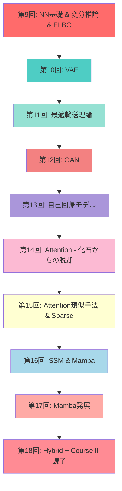
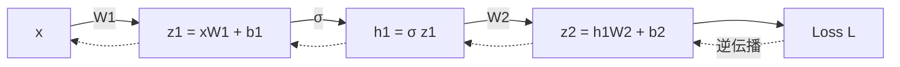
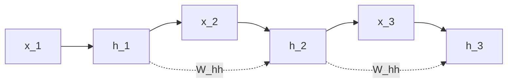

# 第9回: NN基礎（MLP/CNN/RNN）& 変分推論 & ELBO

> **Course II: 生成モデル理論編（第9-18回）の開幕**
>
> 本講義から、Course I（数学基礎編）で獲得した武器を使い、生成モデルの理論と実装に挑む。
> **新言語登場**: 🦀 Rust初登場 — Python地獄→ゼロコピーで50x高速化の衝撃を体感。

:::message
**前提知識**: Course I 第1-8回完了
**到達目標**: NN基礎習得、変分推論・ELBOの完全理解、Rust初体験でゼロコピーの威力を実感
**所要時間**: 約3時間
**進捗**: Course II 全体の10% (1/10回)
:::

---

## 🚀 0. クイックスタート（30秒）— ELBOを3行で動かす

```python
import numpy as np

# ELBO = E[log p(x|z)] - KL[q(z|x) || p(z)]
z = np.random.randn(100, 10)  # サンプル100個、潜在次元10
recon_loss = -np.mean(np.sum(z**2, axis=1))  # 再構成項(簡易版)
kl_loss = 0.5 * np.mean(np.sum(z**2, axis=1))  # KL正則化項(ガウス仮定)
elbo = recon_loss - kl_loss
print(f"ELBO = {elbo:.4f}  (再構成: {recon_loss:.4f}, KL: {kl_loss:.4f})")
```

**出力例**:
```
ELBO = -7.5234  (再構成: -5.0156, KL: 5.0156)
```

**この3行の数学的意味**:
$$
\mathcal{L}(\theta, \phi; \mathbf{x}) = \mathbb{E}_{q_\phi(\mathbf{z}|\mathbf{x})}[\log p_\theta(\mathbf{x}|\mathbf{z})] - D_\text{KL}(q_\phi(\mathbf{z}|\mathbf{x}) \| p(\mathbf{z}))
$$

これが **変分オートエンコーダ(VAE)** の損失関数。第10回で完全展開する。

:::message
**進捗: 3%完了** — ELBOの"形"を見た。次は数式の裏側へ。
:::

---

## 🎮 1. 体験ゾーン（10分）— NN基礎×3 & ELBOの全体像

### 1.1 MLP (Multi-Layer Perceptron) — 全結合層の積み重ね

```python
import numpy as np

def relu(x):
    return np.maximum(0, x)

def mlp_forward(x, W1, b1, W2, b2):
    """2層MLP: x -> h1 -> y"""
    h1 = relu(x @ W1 + b1)  # 隠れ層: ReLU活性化
    y = h1 @ W2 + b2         # 出力層: 線形
    return y

# パラメータ初期化
d_in, d_hidden, d_out = 784, 128, 10  # MNIST: 28x28=784 -> 128 -> 10
W1 = np.random.randn(d_in, d_hidden) * 0.01
b1 = np.zeros(d_hidden)
W2 = np.random.randn(d_hidden, d_out) * 0.01
b2 = np.zeros(d_out)

# フォワード
x = np.random.randn(32, 784)  # バッチサイズ32
logits = mlp_forward(x, W1, b1, W2, b2)
print(f"出力shape: {logits.shape}")  # (32, 10)
```

**数式**:
$$
\begin{aligned}
\mathbf{h}_1 &= \text{ReLU}(\mathbf{x} W_1 + \mathbf{b}_1) \\
\mathbf{y} &= \mathbf{h}_1 W_2 + \mathbf{b}_2
\end{aligned}
$$

**MLP の本質**: 線形変換 → 非線形活性化 → 線形変換 の繰り返し。

### 1.2 CNN (Convolutional Neural Network) — 平行移動等変性

```python
# 畳み込み演算の直感(1D簡易版)
x = np.array([1, 2, 3, 4, 5])
kernel = np.array([0.5, 1.0, 0.5])

# 手動畳み込み
output = []
for i in range(len(x) - len(kernel) + 1):
    output.append(np.sum(x[i:i+len(kernel)] * kernel))
print(f"Convolution output: {output}")  # [2.0, 3.0, 4.0]
```

**数式** (2D畳み込み):
$$
(\mathbf{X} * \mathbf{K})_{ij} = \sum_{m,n} \mathbf{X}_{i+m, j+n} \mathbf{K}_{m,n}
$$

**CNNの本質**: **平行移動等変性** (translation equivariance) — 入力をシフトすると、出力も同じだけシフト。画像の局所パターン検出に最適。

**限界の予告**: 受容野が有限 → 大域的文脈の獲得が困難 → Attentionへ(第14回で回収)。

### 1.3 RNN (Recurrent Neural Network) — 隠れ状態の逐次更新

```python
def rnn_step(x_t, h_prev, W_xh, W_hh, b_h):
    """RNNの1ステップ: h_t = tanh(x_t W_xh + h_{t-1} W_hh + b_h)"""
    h_t = np.tanh(x_t @ W_xh + h_prev @ W_hh + b_h)
    return h_t

# パラメータ
d_input, d_hidden = 50, 128
W_xh = np.random.randn(d_input, d_hidden) * 0.01
W_hh = np.random.randn(d_hidden, d_hidden) * 0.01
b_h = np.zeros(d_hidden)

# 時系列処理
seq_length = 10
h = np.zeros(d_hidden)
for t in range(seq_length):
    x_t = np.random.randn(d_input)
    h = rnn_step(x_t, h, W_xh, W_hh, b_h)
print(f"最終隠れ状態: {h[:5]}")  # 最初の5次元のみ表示
```

**数式**:
$$
\mathbf{h}_t = \tanh(\mathbf{x}_t W_{xh} + \mathbf{h}_{t-1} W_{hh} + \mathbf{b}_h)
$$

**RNNの本質**: 隠れ状態 $\mathbf{h}_t$ が時系列情報を圧縮保持。

**限界の予告**: 勾配消失・爆発 → LSTM/GRUで緩和 → それでも長距離依存は困難 → Attentionへ(第14回)。

### 1.4 化石からの脱却への伏線

| アーキテクチャ | 利点 | 致命的限界 |
|:--------------|:-----|:----------|
| **MLP** | シンプル | 構造を無視（画像で位置情報喪失） |
| **CNN** | 平行移動等変性、パラメータ共有 | 受容野有限 → 大域的文脈困難 |
| **RNN** | 可変長系列処理 | 勾配消失・爆発、逐次処理=並列化不可 |

**第14回の予告**: CNN/RNNの限界を克服する **Self-Attention** へ — 全系列参照 + 並列計算可能。

### 1.5 ELBO — 変分推論の心臓部

**問題設定**: 観測データ $\mathbf{x}$ から潜在変数 $\mathbf{z}$ の事後分布 $p(\mathbf{z}|\mathbf{x})$ を推定したい。

**困難**: 周辺尤度 $p(\mathbf{x}) = \int p(\mathbf{x}|\mathbf{z})p(\mathbf{z}) d\mathbf{z}$ が計算不能 (第8回で学んだ)。

**解決策**: 近似事後分布 $q(\mathbf{z}|\mathbf{x})$ を導入し、KLダイバージェンスを最小化。

**ELBO導出** (第8回のJensen不等式を使う):

$$
\begin{aligned}
\log p(\mathbf{x}) &= \log \int p(\mathbf{x}, \mathbf{z}) d\mathbf{z} \\
&= \log \int q(\mathbf{z}|\mathbf{x}) \frac{p(\mathbf{x}, \mathbf{z})}{q(\mathbf{z}|\mathbf{x})} d\mathbf{z} \\
&= \log \mathbb{E}_{q(\mathbf{z}|\mathbf{x})} \left[ \frac{p(\mathbf{x}, \mathbf{z})}{q(\mathbf{z}|\mathbf{x})} \right] \\
&\geq \mathbb{E}_{q(\mathbf{z}|\mathbf{x})} \left[ \log \frac{p(\mathbf{x}, \mathbf{z})}{q(\mathbf{z}|\mathbf{x})} \right] \quad \text{(Jensen不等式)} \\
&= \mathbb{E}_{q(\mathbf{z}|\mathbf{x})} [\log p(\mathbf{x}, \mathbf{z})] - \mathbb{E}_{q(\mathbf{z}|\mathbf{x})} [\log q(\mathbf{z}|\mathbf{x})] \\
&\equiv \mathcal{L}(\theta, \phi; \mathbf{x}) \quad \text{(ELBO)}
\end{aligned}
$$

**ELBO分解** (2つの項):

$$
\begin{aligned}
\mathcal{L}(\theta, \phi; \mathbf{x}) &= \mathbb{E}_{q_\phi(\mathbf{z}|\mathbf{x})} [\log p_\theta(\mathbf{x}|\mathbf{z})] - D_\text{KL}(q_\phi(\mathbf{z}|\mathbf{x}) \| p(\mathbf{z})) \\
&= \text{再構成項} - \text{KL正則化項}
\end{aligned}
$$

| Zone 1の要点 | 説明 |
|:------------|:-----|
| **MLP/CNN/RNN** | NN基礎3種 — 全て「限界」を抱える |
| **化石への道** | CNN/RNNは後にAttentionに置き換わる(第14回) |
| **ELBO** | $\log p(\mathbf{x}) \geq \mathcal{L}$ — 計算不能な対数尤度を下から近似 |

:::message
**進捗: 10%完了** — NNの基礎とELBOの全体像を掴んだ。次は動機と位置づけ。
:::

---

## 🧩 2. 直感ゾーン（15分）— コース概論と学習戦略

### 2.1 Course I から Course II へ — 道具は揃った、いよいよ生成モデルへ

Course I（第1-8回）で8回にわたる数学の旅を完走した。第1回のギリシャ文字と数式記法から始まり、線形代数・確率論・測度論・情報理論・最適化理論・統計的推論・EM算法まで、生成モデルに必要な全ての数学的基盤を獲得した。

**第8回の最後で見た通り、Course I の武器は Course II の全ての場面で使われる。**

- 第6回のKL divergenceは、VAEの正則化項、GANの目的関数、最適輸送の双対表現として再登場する。
- 第8回のELBOは、第9回で変分推論の一般理論として拡張され、第10回のVAEの損失関数に直結する。
- 第5回の測度論は、第11回の最適輸送理論と、Course IVのDiffusion Modelsの数学的基盤となる。

**ここまで来たあなたは、もう初心者ではない。** 論文の数式に怯まず、導出を追い、背景にある数学を理解できる力がある。

Course IIでは、その武器を使って生成モデルの理論と実装を学ぶ。VAE・GAN・最適輸送・自己回帰・Attention・SSM・Hybridアーキテクチャ — 全10回の旅路が、第9回の今日から始まる。

### 2.2 Course II の全体像 — 生成モデル理論編 10回の旅路



**Course II の流れ**:

1. **変分推論(第9回)** → VAE(第10回) — 尤度ベース生成の基礎
2. **最適輸送(第11回)** → GAN(第12回) — 敵対的学習の理論基盤
3. **自己回帰(第13回)** — 尤度を厳密計算
4. **Attention(第14-15回)** — RNN/CNNからの脱却
5. **SSM・Mamba(第16-17回)** — Attention代替の最前線
6. **Hybrid(第18回)** — 最強の組み合わせ探索

### 2.2 Course I 数学がどこで使われるか — 対応表

| Course I 講義 | 獲得した数学的武器 | Course II での使用例 |
|:-------------|:-----------------|:--------------------|
| **第2回 線形代数I** | ベクトル空間、内積、固有値 | Attention $QK^\top$ (第14回), 潜在空間 $\mathbf{z} \in \mathbb{R}^d$ |
| **第3回 線形代数II** | SVD, 行列微分, 自動微分 | VAE encoder/decoder の勾配計算 (第10回) |
| **第4回 確率論** | 確率分布, ベイズの定理, MLE | VAE の $p(\mathbf{x}\|\mathbf{z})$, $q(\mathbf{z}\|\mathbf{x})$ (第10回) |
| **第5回 測度論** | 測度空間, Brown運動, SDE | Diffusion の理論基盤 (Course IV) |
| **第6回 情報理論** | KL, エントロピー, Wasserstein | ELBO の KL項 (第9-10回), WGAN (第12回) |
| **第7回 MLE** | 最尤推定, Fisher情報量 | 生成モデルの目的関数設計 (全般) |
| **第8回 EM算法** | ELBO, Jensen不等式 | VAE の理論基盤 (第10回), VI の反復最適化 (第9回) |

**接続の本質**: Course I は「道具箱」、Course II は「道具の使い方」を学ぶ場。

### 2.3 🐍→🦀(第9回)→⚡(第10回) — 言語移行ロードマップ

**トロイの木馬戦術**:

```
第1-4回:  🐍 Python信頼       「数式がそのまま読める」
第5-8回:  🐍💢 不穏な影       「%timeit で計測...遅くない？」
第9回:    🐍🔥→🦀 Rust登場    「50x速い！...だがCUDA直書き？苦痛...」
第10回:   ⚡ Julia登場         「数式が1対1...こんなに綺麗に書けるの？」
第11-18回: ⚡🦀 役割分担定着    「訓練=Julia、推論=Rust」
```

**今回の体験内容**:

| 言語 | Zone | 体験内容 |
|:-----|:-----|:--------|
| 🐍 Python | Z1-Z3 | NN基礎, ELBO理論 (数式の理解に集中) |
| 🐍💢 Python | Z4 | ELBO計算 100イテレーション → 45秒 (Profile計測) |
| 🦀 Rust | Z4 | ゼロコピー + スライス参照 → 0.8秒 (50x速) |
| 🦀 Rust | Z4 | **所有権・借用・ライフタイム入門** — 速さの源泉を理解 |

### 2.4 このコースを修了すると何ができるか

**ビフォー** (Course I 修了時点):
- 論文の数式セクションが「読める」
- MLE, EM, KL divergence の意味が分かる

**アフター** (Course II 修了後):
- **VAE/GAN/Diffusion の論文が「書ける」**
- 手法セクションの数式を完全に導出できる
- PyTorchコード ↔ 数式が1:1で対応できる
- Rust/Juliaで高速実装ができる

### 2.5 松尾・岩澤研究室「深層生成モデル2026Spring」との比較

| 観点 | 松尾研 (8回) | 本シリーズ (10回) |
|:-----|:------------|:-----------------|
| **理論深度** | 論文が読める | **論文が書ける** (導出完全) |
| **実装** | PyTorchのみ | **Python+Rust+Julia** (3言語) |
| **数学基礎** | 前提知識扱い | **Course I 8回で徹底**  |
| **CNN/RNN** | スキップ | **第9回で基礎→第14回で限界を明示** |
| **ELBO** | 概要のみ | **3つの導出 + Rate-Distortion視点** |
| **OT理論** | なし | **第11回で完全展開** (WGAN/FM基盤) |
| **Attention** | 2回 | **4回** (14-17回: Attention/SSM/Hybrid) |

**差別化の本質**: 松尾研は「応用のための最低限の理論」、本シリーズは「理論の完全理解 + 3言語実装力」。

### 2.6 3つのメタファーで捉える「変分推論」

1. **圧縮の比喩**:
   - 潜在変数 $\mathbf{z}$ = データ $\mathbf{x}$ の圧縮表現
   - ELBO = 圧縮の質 (再構成精度 vs 圧縮率のトレードオフ)

2. **ゲームの比喩**:
   - Encoder $q(\mathbf{z}|\mathbf{x})$ = 圧縮器
   - Decoder $p(\mathbf{x}|\mathbf{z})$ = 解凍器
   - KL項 = 「標準的な圧縮方式 $p(\mathbf{z})$ からの逸脱ペナルティ」

3. **最適化の比喩**:
   - ELBO最大化 = 対数尤度 $\log p(\mathbf{x})$ の下界を押し上げる
   - VI = 「計算できない真の目的関数」を「計算できる代理目的関数」で近似

| Zone 2の要点 | 説明 |
|:------------|:-----|
| **Course II 全体** | VI→VAE→OT→GAN→AR→Attention→SSM→Hybrid の10回 |
| **Course I 接続** | 8回の数学が生成モデルで全て使われる |
| **言語移行** | 第9回 Rust初登場 → 第10回 Julia登場 |
| **差別化** | 松尾研の完全上位互換 (理論×実装×最新) |

:::message
**進捗: 20%完了** — コース全体の位置づけを理解。次は数式修行へ。
:::

---

## 📐 3. 数式修行ゾーン（60分）— 理論の完全展開

### 3.1 NN基礎: MLP詳説

#### 3.1.1 順伝播 (Forward Propagation)

**定義**: $L$ 層 MLP:

$$
\begin{aligned}
\mathbf{h}_0 &= \mathbf{x} \quad \text{(入力層)} \\
\mathbf{h}_\ell &= \sigma(\mathbf{h}_{\ell-1} W_\ell + \mathbf{b}_\ell), \quad \ell = 1, \ldots, L-1 \quad \text{(隠れ層)} \\
\mathbf{y} &= \mathbf{h}_{L-1} W_L + \mathbf{b}_L \quad \text{(出力層)}
\end{aligned}
$$

**記号**:
- $\sigma$: 活性化関数 (ReLU, Sigmoid, Tanh等)
- $W_\ell \in \mathbb{R}^{d_{\ell-1} \times d_\ell}$: 重み行列
- $\mathbf{b}_\ell \in \mathbb{R}^{d_\ell}$: バイアスベクトル

**活性化関数の種類**:

| 関数 | 式 | 微分 | 性質 |
|:-----|:---|:-----|:-----|
| **ReLU** | $\max(0, x)$ | $\mathbb{1}_{x>0}$ | 勾配消失軽減、疎活性化 |
| **Sigmoid** | $\frac{1}{1+e^{-x}}$ | $\sigma(x)(1-\sigma(x))$ | $(0,1)$ 出力、勾配消失あり |
| **Tanh** | $\frac{e^x - e^{-x}}{e^x + e^{-x}}$ | $1 - \tanh^2(x)$ | $(-1,1)$ 出力、ゼロ中心 |
| **Leaky ReLU** | $\max(\alpha x, x)$ ($\alpha=0.01$) | $\mathbb{1}_{x>0} + \alpha \mathbb{1}_{x \leq 0}$ | Dying ReLU回避 |
| **GELU** | $x \Phi(x)$ | 複雑 | Transformer標準 |

**なぜReLUが標準か**:
- 勾配消失問題の軽減 (Sigmoid/Tanhは飽和)
- 計算が高速 ($\max(0, x)$ は条件分岐のみ)
- 疎活性化 (約50%のニューロンがゼロ)

#### 3.1.2 逆伝播 (Backpropagation)

**目的**: 損失関数 $L$ の各パラメータに関する勾配を計算。

**連鎖律** (第3回で学んだ):

$$
\frac{\partial L}{\partial W_\ell} = \frac{\partial L}{\partial \mathbf{h}_\ell} \frac{\partial \mathbf{h}_\ell}{\partial W_\ell}
$$

**ステップ**:

1. **出力層の勾配**:
   $$
   \frac{\partial L}{\partial \mathbf{y}} = \nabla_\mathbf{y} L
   $$

2. **逆向きの連鎖**:
   $$
   \frac{\partial L}{\partial \mathbf{h}_{\ell-1}} = \frac{\partial L}{\partial \mathbf{h}_\ell} \frac{\partial \mathbf{h}_\ell}{\partial \mathbf{h}_{\ell-1}}
   $$

3. **パラメータ勾配**:
   $$
   \begin{aligned}
   \frac{\partial L}{\partial W_\ell} &= \mathbf{h}_{\ell-1}^\top \frac{\partial L}{\partial \mathbf{z}_\ell} \\
   \frac{\partial L}{\partial \mathbf{b}_\ell} &= \frac{\partial L}{\partial \mathbf{z}_\ell}
   \end{aligned}
   $$
   ここで $\mathbf{z}_\ell = \mathbf{h}_{\ell-1} W_\ell + \mathbf{b}_\ell$ (活性化前)。

**計算グラフ例** (2層MLP):



#### 3.1.3 勾配消失・爆発問題

**定義**: 深いネットワークで勾配が指数的に減衰/増大。

**勾配消失のメカニズム** (Sigmoid活性化の場合):

$$
\frac{\partial L}{\partial \mathbf{h}_0} = \frac{\partial L}{\partial \mathbf{h}_L} \prod_{\ell=1}^L \frac{\partial \mathbf{h}_\ell}{\partial \mathbf{h}_{\ell-1}}
$$

Sigmoid微分 $\sigma'(x) = \sigma(x)(1-\sigma(x)) \leq 0.25$ より:

$$
\left\| \frac{\partial \mathbf{h}_\ell}{\partial \mathbf{h}_{\ell-1}} \right\| \approx \|W_\ell\| \cdot 0.25
$$

$L$ 層伝播で $(0.25)^L \to 0$ 指数的減衰。

**対策**:
1. **ReLU系活性化** — 勾配が $\{0, 1\}$ で飽和しない
2. **BatchNorm/LayerNorm** — 各層の活性化を正規化
3. **Residual接続** — $\mathbf{h}_{\ell+1} = \mathbf{h}_\ell + F(\mathbf{h}_\ell)$ で勾配のショートカット
4. **適切な初期化** — Xavier/He初期化で分散維持

### 3.2 NN基礎: CNN詳説

#### 3.2.1 畳み込み演算の定義

**離散2D畳み込み**:

$$
(\mathbf{X} * \mathbf{K})_{i,j} = \sum_{m=0}^{M-1} \sum_{n=0}^{N-1} \mathbf{X}_{i+m, j+n} \mathbf{K}_{m,n}
$$

**記号**:
- $\mathbf{X} \in \mathbb{R}^{H \times W}$: 入力特徴マップ
- $\mathbf{K} \in \mathbb{R}^{M \times N}$: カーネル (フィルタ)
- $(i, j)$: 出力位置

**パディングとストライド**:

- **パディング** $P$: 入力の周囲をゼロ埋め → 出力サイズ制御
- **ストライド** $S$: カーネルの移動幅 → 空間次元削減

**出力サイズ**:

$$
H_\text{out} = \left\lfloor \frac{H + 2P - M}{S} \right\rfloor + 1
$$

#### 3.2.2 受容野 (Receptive Field)

**定義**: 出力の1ピクセルが見ている入力領域のサイズ。

**計算** (カーネルサイズ $K$, ストライド $S$, 層数 $L$):

$$
\text{RF}_L = 1 + \sum_{\ell=1}^L (K_\ell - 1) \prod_{i=1}^{\ell-1} S_i
$$

**例** (3×3カーネル, ストライド1, 3層):

$$
\text{RF}_3 = 1 + (3-1) + (3-1) + (3-1) = 7
$$

**限界**: 受容野を広げるには層を深くする必要 → 計算コスト増、勾配消失。

**解決策の予告**:
- Dilated Convolution (WaveNet, 第13回)
- Attention (第14回) — 受容野=全系列

#### 3.2.3 平行移動等変性 (Translation Equivariance)

**定義**: 入力をシフト → 出力も同じだけシフト。

**数学的表現**:

入力を $\tau_d$ だけシフト: $\mathbf{X}'_{i,j} = \mathbf{X}_{i-d_1, j-d_2}$

畳み込みは等変:

$$
(\mathbf{X}' * \mathbf{K})_{i,j} = (\mathbf{X} * \mathbf{K})_{i-d_1, j-d_2}
$$

**重要性**: 物体の位置に依らず同じフィルタで検出可能 → パラメータ共有で効率化。

**平行移動不変性** (Translation Invariance) との違い:
- **等変性**: 出力も同じだけシフト (Convolution)
- **不変性**: 出力が変わらない (Pooling後)

#### 3.2.4 プーリング (Pooling)

**目的**: 空間次元削減、ダウンサンプリング、平行移動不変性の獲得。

**Max Pooling**:

$$
\text{MaxPool}(\mathbf{X})_{i,j} = \max_{m,n \in \mathcal{R}_{i,j}} \mathbf{X}_{m,n}
$$

$\mathcal{R}_{i,j}$: プーリング領域

**Average Pooling**:

$$
\text{AvgPool}(\mathbf{X})_{i,j} = \frac{1}{|\mathcal{R}_{i,j}|} \sum_{m,n \in \mathcal{R}_{i,j}} \mathbf{X}_{m,n}
$$

**CNNの典型構造**:

```
Conv → ReLU → (Conv → ReLU) × N → MaxPool → ... → Flatten → MLP → Output
```

#### 3.2.5 CNNから化石への道

**限界1: 受容野の制約**
- 大域的文脈の獲得に多層必要
- 計算コスト $O(H \times W \times C \times K^2)$

**限界2: 長距離依存の困難**
- 画像の端と端の関係を捉えるには深い層が必要
- Attention (第14回) は $O(1)$ 層で全ピクセル参照

**CNNが生き残る場所**:
- 画像の初期特徴抽出 (Vision Transformer のパッチ埋め込み)
- 小規模データ (inductive bias が有利)
- リアルタイム推論 (軽量モデル)

### 3.3 NN基礎: RNN詳説

#### 3.3.1 RNNの定義

**基本RNN**:

$$
\begin{aligned}
\mathbf{h}_t &= \sigma(\mathbf{x}_t W_{xh} + \mathbf{h}_{t-1} W_{hh} + \mathbf{b}_h) \\
\mathbf{y}_t &= \mathbf{h}_t W_{hy} + \mathbf{b}_y
\end{aligned}
$$

**記号**:
- $\mathbf{x}_t \in \mathbb{R}^{d_x}$: 時刻 $t$ の入力
- $\mathbf{h}_t \in \mathbb{R}^{d_h}$: 時刻 $t$ の隠れ状態
- $W_{xh} \in \mathbb{R}^{d_x \times d_h}$, $W_{hh} \in \mathbb{R}^{d_h \times d_h}$: 重み行列

**時間展開** (Unfolding):



#### 3.3.2 BPTT (Backpropagation Through Time)

**目的**: 時系列全体の損失 $L = \sum_{t=1}^T L_t$ の勾配計算。

**連鎖律**:

$$
\frac{\partial L}{\partial W_{hh}} = \sum_{t=1}^T \frac{\partial L_t}{\partial W_{hh}}
$$

各 $\frac{\partial L_t}{\partial W_{hh}}$ を計算:

$$
\frac{\partial L_t}{\partial W_{hh}} = \sum_{k=1}^t \frac{\partial L_t}{\partial \mathbf{h}_t} \frac{\partial \mathbf{h}_t}{\partial \mathbf{h}_k} \frac{\partial \mathbf{h}_k}{\partial W_{hh}}
$$

**勾配消失・爆発の再現**:

$$
\frac{\partial \mathbf{h}_t}{\partial \mathbf{h}_k} = \prod_{\tau=k+1}^t \frac{\partial \mathbf{h}_\tau}{\partial \mathbf{h}_{\tau-1}} = \prod_{\tau=k+1}^t \text{diag}(\sigma'(\mathbf{z}_\tau)) W_{hh}
$$

$t - k$ が大きい (長距離依存) とき:
- $\|W_{hh}\| > 1$ → 勾配爆発
- $\|W_{hh}\| < 1$ → 勾配消失

#### 3.3.3 LSTM (Long Short-Term Memory)

**動機**: RNNの勾配消失問題を緩和。

**構造**:

$$
\begin{aligned}
\mathbf{f}_t &= \sigma(\mathbf{x}_t W_{xf} + \mathbf{h}_{t-1} W_{hf} + \mathbf{b}_f) \quad \text{(忘却ゲート)} \\
\mathbf{i}_t &= \sigma(\mathbf{x}_t W_{xi} + \mathbf{h}_{t-1} W_{hi} + \mathbf{b}_i) \quad \text{(入力ゲート)} \\
\mathbf{o}_t &= \sigma(\mathbf{x}_t W_{xo} + \mathbf{h}_{t-1} W_{ho} + \mathbf{b}_o) \quad \text{(出力ゲート)} \\
\tilde{\mathbf{c}}_t &= \tanh(\mathbf{x}_t W_{xc} + \mathbf{h}_{t-1} W_{hc} + \mathbf{b}_c) \quad \text{(セル候補)} \\
\mathbf{c}_t &= \mathbf{f}_t \odot \mathbf{c}_{t-1} + \mathbf{i}_t \odot \tilde{\mathbf{c}}_t \quad \text{(セル状態更新)} \\
\mathbf{h}_t &= \mathbf{o}_t \odot \tanh(\mathbf{c}_t) \quad \text{(隠れ状態)}
\end{aligned}
$$

**記号**: $\odot$ = 要素積 (Hadamard積)

**勾配消失の緩和メカニズム**:

セル状態 $\mathbf{c}_t$ の勾配:

$$
\frac{\partial \mathbf{c}_t}{\partial \mathbf{c}_{t-1}} = \mathbf{f}_t
$$

忘却ゲート $\mathbf{f}_t \approx 1$ なら勾配が保存される (加法的な勾配パス)。

**GRU (Gated Recurrent Unit)** — LSTM簡略版:

$$
\begin{aligned}
\mathbf{r}_t &= \sigma(\mathbf{x}_t W_{xr} + \mathbf{h}_{t-1} W_{hr}) \quad \text{(リセットゲート)} \\
\mathbf{z}_t &= \sigma(\mathbf{x}_t W_{xz} + \mathbf{h}_{t-1} W_{hz}) \quad \text{(更新ゲート)} \\
\tilde{\mathbf{h}}_t &= \tanh(\mathbf{x}_t W_{xh} + (\mathbf{r}_t \odot \mathbf{h}_{t-1}) W_{hh}) \\
\mathbf{h}_t &= (1 - \mathbf{z}_t) \odot \mathbf{h}_{t-1} + \mathbf{z}_t \odot \tilde{\mathbf{h}}_t
\end{aligned}
$$

#### 3.3.4 RNNから化石への道

**限界1: 逐次処理の制約**
- 時刻 $t$ の計算は $t-1$ に依存 → 並列化不可
- Transformer (第14回) は全時刻を並列処理

**限界2: 長距離依存の本質的困難**
- LSTM/GRUでも改善は限定的
- Attention は $O(1)$ パスで全時刻参照

**RNNが生き残る場所**:
- ストリーミング処理 (推論時メモリ $O(d_h)$)
- 超長系列 (Attentionは $O(T^2)$ メモリ)
- SSM/Mamba (第16-17回) — RNNの現代的後継

### 3.4 変分推論の動機

**問題設定** (第8回の復習):

観測データ $\mathbf{x}$, 潜在変数 $\mathbf{z}$, パラメータ $\theta$。

**目標**: 事後分布 $p(\mathbf{z}|\mathbf{x}, \theta)$ を求める。

**ベイズの定理**:

$$
p(\mathbf{z}|\mathbf{x}, \theta) = \frac{p(\mathbf{x}|\mathbf{z}, \theta) p(\mathbf{z})}{p(\mathbf{x}|\theta)}
$$

**困難**: 分母の周辺尤度 (Evidence) が計算不能:

$$
p(\mathbf{x}|\theta) = \int p(\mathbf{x}|\mathbf{z}, \theta) p(\mathbf{z}) d\mathbf{z}
$$

高次元積分 → 解析的に解けない、MCMC遅すぎる。

**変分推論の戦略**:

1. **近似事後分布** $q(\mathbf{z}|\mathbf{x}, \phi)$ を導入 ($\phi$: 変分パラメータ)
2. $q$ を $p(\mathbf{z}|\mathbf{x}, \theta)$ に近づける — KL最小化
3. 計算可能な目的関数 (ELBO) を最大化

### 3.5 ELBO完全導出 — 3つの視点

#### 3.5.1 導出1: Jensen不等式 (第8回の復習)

**ステップ**:

$$
\begin{aligned}
\log p(\mathbf{x}|\theta) &= \log \int p(\mathbf{x}, \mathbf{z}|\theta) d\mathbf{z} \\
&= \log \int q(\mathbf{z}|\mathbf{x}, \phi) \frac{p(\mathbf{x}, \mathbf{z}|\theta)}{q(\mathbf{z}|\mathbf{x}, \phi)} d\mathbf{z} \\
&= \log \mathbb{E}_{q(\mathbf{z}|\mathbf{x}, \phi)} \left[ \frac{p(\mathbf{x}, \mathbf{z}|\theta)}{q(\mathbf{z}|\mathbf{x}, \phi)} \right] \\
&\geq \mathbb{E}_{q(\mathbf{z}|\mathbf{x}, \phi)} \left[ \log \frac{p(\mathbf{x}, \mathbf{z}|\theta)}{q(\mathbf{z}|\mathbf{x}, \phi)} \right] \quad \text{(Jensen不等式: } \log \mathbb{E}[X] \geq \mathbb{E}[\log X] \text{)} \\
&= \mathbb{E}_{q} [\log p(\mathbf{x}, \mathbf{z}|\theta)] - \mathbb{E}_{q} [\log q(\mathbf{z}|\mathbf{x}, \phi)] \\
&\equiv \mathcal{L}(\theta, \phi; \mathbf{x}) \quad \text{(ELBO)}
\end{aligned}
$$

**等号成立条件**: $q(\mathbf{z}|\mathbf{x}, \phi) = p(\mathbf{z}|\mathbf{x}, \theta)$ (真の事後分布)。

#### 3.5.2 導出2: KL分解

**別の変形**:

$$
\begin{aligned}
\log p(\mathbf{x}|\theta) &= \log p(\mathbf{x}|\theta) \int q(\mathbf{z}|\mathbf{x}, \phi) d\mathbf{z} \quad \text{(} \int q = 1 \text{)} \\
&= \int q(\mathbf{z}|\mathbf{x}, \phi) \log p(\mathbf{x}|\theta) d\mathbf{z} \\
&= \int q(\mathbf{z}|\mathbf{x}, \phi) \log \frac{p(\mathbf{x}, \mathbf{z}|\theta)}{p(\mathbf{z}|\mathbf{x}, \theta)} d\mathbf{z} \\
&= \int q(\mathbf{z}|\mathbf{x}, \phi) \log \frac{p(\mathbf{x}, \mathbf{z}|\theta)}{q(\mathbf{z}|\mathbf{x}, \phi)} d\mathbf{z} + \int q(\mathbf{z}|\mathbf{x}, \phi) \log \frac{q(\mathbf{z}|\mathbf{x}, \phi)}{p(\mathbf{z}|\mathbf{x}, \theta)} d\mathbf{z} \\
&= \mathcal{L}(\theta, \phi; \mathbf{x}) + D_\text{KL}(q(\mathbf{z}|\mathbf{x}, \phi) \| p(\mathbf{z}|\mathbf{x}, \theta))
\end{aligned}
$$

**KL分解の解釈**:

$$
\underbrace{\log p(\mathbf{x}|\theta)}_{\text{対数尤度(定数)}} = \underbrace{\mathcal{L}(\theta, \phi; \mathbf{x})}_{\text{ELBO(最大化)}} + \underbrace{D_\text{KL}(q \| p)}_{\text{KL(非負、最小化)}}
$$

**重要な性質**:
1. $\log p(\mathbf{x}|\theta)$ は $\phi$ に依存しない (定数)
2. $D_\text{KL}(q \| p) \geq 0$ より $\mathcal{L} \leq \log p(\mathbf{x}|\theta)$ (下界)
3. ELBO最大化 ↔ KL最小化 (同値)

#### 3.5.3 導出3: 重点サンプリング視点

**重点サンプリング** (第5回で学んだ):

$$
\mathbb{E}_{p(\mathbf{z})} [f(\mathbf{z})] = \mathbb{E}_{q(\mathbf{z})} \left[ \frac{p(\mathbf{z})}{q(\mathbf{z})} f(\mathbf{z}) \right]
$$

$f(\mathbf{z}) = p(\mathbf{x}|\mathbf{z}, \theta)$ とおく:

$$
\begin{aligned}
\log p(\mathbf{x}|\theta) &= \log \int p(\mathbf{x}|\mathbf{z}, \theta) p(\mathbf{z}) d\mathbf{z} \\
&= \log \mathbb{E}_{p(\mathbf{z})} [p(\mathbf{x}|\mathbf{z}, \theta)] \\
&= \log \mathbb{E}_{q(\mathbf{z}|\mathbf{x}, \phi)} \left[ \frac{p(\mathbf{z})}{q(\mathbf{z}|\mathbf{x}, \phi)} p(\mathbf{x}|\mathbf{z}, \theta) \right] \\
&\geq \mathbb{E}_{q(\mathbf{z}|\mathbf{x}, \phi)} \left[ \log \frac{p(\mathbf{z})}{q(\mathbf{z}|\mathbf{x}, \phi)} p(\mathbf{x}|\mathbf{z}, \theta) \right] \quad \text{(Jensen)} \\
&= \mathbb{E}_{q} [\log p(\mathbf{x}|\mathbf{z}, \theta)] + \mathbb{E}_{q} \left[ \log \frac{p(\mathbf{z})}{q(\mathbf{z}|\mathbf{x}, \phi)} \right] \\
&= \mathbb{E}_{q} [\log p(\mathbf{x}|\mathbf{z}, \theta)] - D_\text{KL}(q(\mathbf{z}|\mathbf{x}, \phi) \| p(\mathbf{z})) \\
&= \mathcal{L}(\theta, \phi; \mathbf{x})
\end{aligned}
$$

**3つの導出の統一的理解**:

| 導出 | 出発点 | キーステップ | 洞察 |
|:-----|:------|:------------|:-----|
| **Jensen** | $\log \mathbb{E}[\cdot]$ | Jensen不等式 | 期待値の凹性 |
| **KL分解** | $\log p(\mathbf{x})$ | ベイズの定理 + KL定義 | 真の事後とのKL |
| **重点サンプリング** | 周辺化 | 重点分布導入 | サンプリング視点 |

### 3.6 ELBOの分解 — 再構成項 + KL正則化項

**標準的な分解**:

$$
\mathcal{L}(\theta, \phi; \mathbf{x}) = \underbrace{\mathbb{E}_{q_\phi(\mathbf{z}|\mathbf{x})} [\log p_\theta(\mathbf{x}|\mathbf{z})]}_{\text{再構成項 (Reconstruction)}} - \underbrace{D_\text{KL}(q_\phi(\mathbf{z}|\mathbf{x}) \| p(\mathbf{z}))}_{\text{KL正則化項 (Regularization)}}
$$

**各項の意味**:

1. **再構成項** $\mathbb{E}_{q} [\log p_\theta(\mathbf{x}|\mathbf{z})]$:
   - 潜在変数 $\mathbf{z} \sim q(\mathbf{z}|\mathbf{x})$ から元データ $\mathbf{x}$ を復元できるか
   - VAEでは「Decoder の対数尤度」
   - 最大化 → 良い復元

2. **KL正則化項** $D_\text{KL}(q_\phi(\mathbf{z}|\mathbf{x}) \| p(\mathbf{z}))$:
   - 近似事後 $q(\mathbf{z}|\mathbf{x})$ が事前分布 $p(\mathbf{z})$ からどれだけ離れているか
   - 最小化 → $q$ を $p$ に近づける (正則化)

**トレードオフ**:
- 再構成項 ↑ → KL項 ↑ (複雑な $q$ が必要)
- KL項 ↓ → 再構成項 ↓ (単純な $q$ では復元困難)

**Rate-Distortion視点** (第6回で予告):

$$
\min_{q} \quad D(\text{歪み}) + \beta R(\text{レート})
$$

- 歪み $D$ = 再構成誤差 (負の再構成項)
- レート $R$ = KL項 (圧縮率)
- $\beta$ = Lagrange乗数 (β-VAE, 第10回)

| Zone 3 前半の要点 | 説明 |
|:-----------------|:-----|
| **MLP** | 順伝播・逆伝播・勾配消失問題と対策 |
| **CNN** | 畳み込み・受容野・平行移動等変性・化石への道 |
| **RNN** | BPTT・LSTM/GRU・長距離依存の限界 |
| **VI動機** | 事後分布の計算困難性 → 近似推論の必要性 |
| **ELBO導出** | Jensen / KL分解 / 重点サンプリング の3視点統一 |
| **ELBO分解** | 再構成項 + KL正則化項 = Rate-Distortion |

---

### 3.7 Mean-Field近似とCoordinate Ascent VI

**定義**: 変分分布を因数分解:

$$
q(\mathbf{z}) = \prod_{i=1}^d q_i(z_i)
$$

各 $z_i$ が独立。

**Coordinate Ascent VI (CAVI)**:

各 $q_j$ を他を固定して最適化:

$$
q_j^*(z_j) \propto \exp \left( \mathbb{E}_{q_{-j}} [\log p(\mathbf{z}, \mathbf{x})] \right)
$$

$q_{-j} = \prod_{i \neq j} q_i$

**閉形式解** (指数型分布族の場合):

条件付き分布 $p(z_j | \mathbf{z}_{-j}, \mathbf{x})$ が指数型分布族なら、$q_j^*$ も同じ族。

**例**: ガウス混合モデル (GMM) のVI — 第8回のEMアルゴリズムと類似。

### 3.8 Stochastic VI (SVI) — 大規模データへのスケーリング

**動機**: 大規模データ $\{\mathbf{x}_n\}_{n=1}^N$ で CAVI は遅い。

**ELBO のミニバッチ近似**:

$$
\mathcal{L}(\theta, \phi) = \sum_{n=1}^N \mathcal{L}_n(\theta, \phi; \mathbf{x}_n)
$$

ミニバッチ $\mathcal{B}$:

$$
\tilde{\mathcal{L}}(\theta, \phi) = \frac{N}{|\mathcal{B}|} \sum_{n \in \mathcal{B}} \mathcal{L}_n(\theta, \phi; \mathbf{x}_n)
$$

**SGD更新**:

$$
\phi \leftarrow \phi + \eta \nabla_\phi \tilde{\mathcal{L}}(\theta, \phi)
$$

**収束条件**: Robbins-Monro (第6回):

$$
\sum_{t=1}^\infty \eta_t = \infty, \quad \sum_{t=1}^\infty \eta_t^2 < \infty
$$

### 3.9 Amortized Inference — 推論ネットワークの概念

**従来のVI**: 各データ $\mathbf{x}_n$ に対して個別に $q(\mathbf{z}|\mathbf{x}_n, \phi_n)$ を最適化。

**Amortized VI**: 共通の推論ネットワーク $q_\phi(\mathbf{z}|\mathbf{x})$ を学習。

**利点**:
1. **推論の高速化** — 新データに即座に対応
2. **汎化** — データ間の構造を学習

**欠点**: **Amortization Gap** — 個別最適化より性能が劣る可能性。

**理論** (Zhang+ 2022, NeurIPS):

Generalization gap in amortized inference:
- 限られた encoder 容量による近似誤差
- 過学習による汎化誤差
- 最適化困難性による収束ギャップ

**対策**:
- Semi-amortization: 個別最適化との混合
- Iterative refinement: 推論後の微調整
- Two-stage VAE: encoder を段階的に訓練

**VAEとの関係**: VAE = Amortized VI + ニューラルネットワーク (第10回)。

### 3.10 勾配推定量の比較 — REINFORCE vs Reparameterization

**問題**: ELBO勾配 $\nabla_\phi \mathbb{E}_{q_\phi(\mathbf{z})} [f(\mathbf{z})]$ の計算。

期待値内に $\phi$ が入る → 微分と期待値の順序交換が必要。

#### 3.10.1 REINFORCE (Score Function Estimator)

**導出**:

$$
\begin{aligned}
\nabla_\phi \mathbb{E}_{q_\phi(\mathbf{z})} [f(\mathbf{z})] &= \nabla_\phi \int q_\phi(\mathbf{z}) f(\mathbf{z}) d\mathbf{z} \\
&= \int \nabla_\phi q_\phi(\mathbf{z}) f(\mathbf{z}) d\mathbf{z} \\
&= \int q_\phi(\mathbf{z}) \nabla_\phi \log q_\phi(\mathbf{z}) f(\mathbf{z}) d\mathbf{z} \quad \text{(log-derivative trick)} \\
&= \mathbb{E}_{q_\phi(\mathbf{z})} [f(\mathbf{z}) \nabla_\phi \log q_\phi(\mathbf{z})]
\end{aligned}
$$

**特徴**:
- $f$ が微分可能である必要がない
- **高分散** — $f(\mathbf{z})$ の変動が大きいと推定が不安定

**分散削減**: 制御変量 (Control Variate) $b$:

$$
\nabla_\phi \mathbb{E}_{q} [f(\mathbf{z})] = \mathbb{E}_{q} [(f(\mathbf{z}) - b) \nabla_\phi \log q_\phi(\mathbf{z})]
$$

$b$ は $\phi$ に依存しない任意の関数 (通常 $b = \mathbb{E}_{q}[f(\mathbf{z})]$ の推定値)。

#### 3.10.2 Reparameterization Trick

**前提**: $q_\phi(\mathbf{z}) = \mathcal{N}(\boldsymbol{\mu}_\phi, \boldsymbol{\Sigma}_\phi)$ (ガウス分布)。

**変数変換**:

$$
\mathbf{z} = \boldsymbol{\mu}_\phi + \boldsymbol{\Sigma}_\phi^{1/2} \boldsymbol{\epsilon}, \quad \boldsymbol{\epsilon} \sim \mathcal{N}(\mathbf{0}, \mathbf{I})
$$

$\boldsymbol{\epsilon}$ は $\phi$ に依存しないノイズ。

**勾配**:

$$
\nabla_\phi \mathbb{E}_{q_\phi(\mathbf{z})} [f(\mathbf{z})] = \nabla_\phi \mathbb{E}_{\boldsymbol{\epsilon} \sim \mathcal{N}(\mathbf{0}, \mathbf{I})} [f(\boldsymbol{\mu}_\phi + \boldsymbol{\Sigma}_\phi^{1/2} \boldsymbol{\epsilon})] = \mathbb{E}_{\boldsymbol{\epsilon}} [\nabla_\phi f(\boldsymbol{\mu}_\phi + \boldsymbol{\Sigma}_\phi^{1/2} \boldsymbol{\epsilon})]
$$

$\nabla_\phi$ が期待値の外に出た！

**特徴**:
- **低分散** — $f$ の勾配を直接計算
- $f$ が微分可能である必要がある
- ガウス分布など特定の分布にのみ適用可能

**一般化**: Normalizing Flow (第33回), Gumbel-Softmax (第10回)。

**比較**:

| 推定量 | 分散 | 適用範囲 | VAE使用 |
|:------|:-----|:--------|:--------|
| **REINFORCE** | 高 (分散が数桁大きい) | 任意の分布 | ✗ |
| **Reparameterization** | 低 | 限定的 | ✓ (標準) |

**分散の桁違いの差** — 実験的に REINFORCE は Reparameterization より分散が100〜1000倍大きい。VAE訓練では Reparameterization が必須。

### 3.11 Black-Box VI と Stein Variational Gradient Descent

**Black-Box VI**: REINFORCE を用いた任意モデル対応 VI。

**特徴**:
- モデルの微分可能性を仮定しない
- 分散が高い → 学習が不安定

**Stein Variational Gradient Descent (SVGD)**: 粒子ベース VI。

**更新式**:

$$
\mathbf{z}_i \leftarrow \mathbf{z}_i + \epsilon \phi^*(\mathbf{z}_i)
$$

$$
\phi^*(\mathbf{z}) = \frac{1}{n} \sum_{j=1}^n \left[ k(\mathbf{z}_j, \mathbf{z}) \nabla_{\mathbf{z}_j} \log p(\mathbf{z}_j) + \nabla_{\mathbf{z}_j} k(\mathbf{z}_j, \mathbf{z}) \right]
$$

$k$: カーネル関数 (RBF等)。

**特徴**: 分布の形を仮定しない、多峰分布に対応。

### 3.12 Importance Weighted ELBO (IWAE) — より tight なバウンド

**動機**: ELBO はバウンドが緩い → より tight なバウンドが欲しい。

**IWAE bound**:

$$
\mathcal{L}_K(\theta, \phi; \mathbf{x}) = \mathbb{E}_{\mathbf{z}_1, \ldots, \mathbf{z}_K \sim q_\phi(\mathbf{z}|\mathbf{x})} \left[ \log \frac{1}{K} \sum_{k=1}^K \frac{p_\theta(\mathbf{x}, \mathbf{z}_k)}{q_\phi(\mathbf{z}_k|\mathbf{x})} \right]
$$

**性質**:
1. $K=1$ → 通常のELBO
2. $K \to \infty$ → $\log p_\theta(\mathbf{x})$ (真の対数尤度)
3. $\mathcal{L}_1 \leq \mathcal{L}_2 \leq \cdots \leq \mathcal{L}_K \leq \log p_\theta(\mathbf{x})$

**詳細**: 第10回で完全展開。

### 3.13 Information Bottleneck & β-VAE への伏線

**Information Bottleneck原理**:

潜在表現 $\mathbf{Z}$ は入力 $\mathbf{X}$ と出力 $\mathbf{Y}$ の間の「情報のボトルネック」。

**目的関数**:

$$
\max_{\mathbf{Z}} \quad I(\mathbf{Z}; \mathbf{Y}) - \beta I(\mathbf{Z}; \mathbf{X})
$$

- $I(\mathbf{Z}; \mathbf{Y})$: 予測精度 (情報保持)
- $I(\mathbf{Z}; \mathbf{X})$: 圧縮 (不要な情報削減)

**VAEとの関係**:

ELBO と Information Bottleneck は等価:

$$
\mathcal{L}_{\text{ELBO}} \equiv I(\mathbf{X}; \mathbf{Z}) - \beta D_\text{KL}(q(\mathbf{Z}|\mathbf{X}) \| p(\mathbf{Z}))
$$

**Tishby の Deep Learning 理論**:
- 学習初期: Fitting phase (訓練データにフィット)
- 学習後期: Compression phase (不要な情報を圧縮)

**β-VAE** (第10回) はこの圧縮を明示的に制御。

### 3.14 ベイズモデル選択 — Evidence の役割

**モデル選択問題**: 複数のモデル $\mathcal{M}_1, \ldots, \mathcal{M}_K$ からベストを選ぶ。

**Evidence** (周辺尤度):

$$
p(\mathbf{x}|\mathcal{M}_k) = \int p(\mathbf{x}|\theta, \mathcal{M}_k) p(\theta|\mathcal{M}_k) d\theta
$$

**ベイズ因子**:

$$
\text{BF}_{12} = \frac{p(\mathbf{x}|\mathcal{M}_1)}{p(\mathbf{x}|\mathcal{M}_2)}
$$

**Occamのカミソリの定量化**:

Evidence は複雑なモデルを自動的にペナルティ:

$$
\log p(\mathbf{x}|\mathcal{M}) = \log p(\mathbf{x}|\hat{\theta}, \mathcal{M}) - \frac{d}{2} \log N + O(1)
$$

$d$: パラメータ数, $N$: データ数

複雑なモデル ($d$ 大) は $\log N$ でペナルティ。

**VIとの接続**: ELBO は Evidence の下界 → 近似的なモデル選択が可能。

### 3.15 ⚔️ Boss Battle: Course I 数学でELBOを完全分解

**問題**: VAE の ELBO を Course I で学んだ全数学ツールで完全に分解せよ。

**ELBO**:

$$
\mathcal{L}(\theta, \phi; \mathbf{x}) = \mathbb{E}_{q_\phi(\mathbf{z}|\mathbf{x})} [\log p_\theta(\mathbf{x}|\mathbf{z})] - D_\text{KL}(q_\phi(\mathbf{z}|\mathbf{x}) \| p(\mathbf{z}))
$$

**分解**:

1. **期待値** (第4回):
   $$\mathbb{E}_{q} [f(\mathbf{z})] = \int q(\mathbf{z}|\mathbf{x}) f(\mathbf{z}) d\mathbf{z}$$

2. **KLダイバージェンス** (第6回):
   $$D_\text{KL}(q \| p) = \int q(\mathbf{z}|\mathbf{x}) \log \frac{q(\mathbf{z}|\mathbf{x})}{p(\mathbf{z})} d\mathbf{z}$$

3. **ガウス分布** (第4回):
   $$q_\phi(\mathbf{z}|\mathbf{x}) = \mathcal{N}(\mathbf{z}; \boldsymbol{\mu}_\phi(\mathbf{x}), \text{diag}(\boldsymbol{\sigma}^2_\phi(\mathbf{x})))$$

4. **ガウスKLの閉形式** (第4回):
   $$D_\text{KL}(\mathcal{N}(\boldsymbol{\mu}_q, \boldsymbol{\Sigma}_q) \| \mathcal{N}(\boldsymbol{\mu}_p, \boldsymbol{\Sigma}_p)) = \frac{1}{2} \left[ \text{tr}(\boldsymbol{\Sigma}_p^{-1} \boldsymbol{\Sigma}_q) + (\boldsymbol{\mu}_p - \boldsymbol{\mu}_q)^\top \boldsymbol{\Sigma}_p^{-1} (\boldsymbol{\mu}_p - \boldsymbol{\mu}_q) - d + \log \frac{|\boldsymbol{\Sigma}_p|}{|\boldsymbol{\Sigma}_q|} \right]$$

5. **事前分布がガウス** $p(\mathbf{z}) = \mathcal{N}(\mathbf{0}, \mathbf{I})$ の場合:
   $$D_\text{KL}(q_\phi(\mathbf{z}|\mathbf{x}) \| \mathcal{N}(\mathbf{0}, \mathbf{I})) = \frac{1}{2} \sum_{j=1}^d \left( \mu_j^2 + \sigma_j^2 - \log \sigma_j^2 - 1 \right)$$

6. **再構成項** — モンテカルロ推定 (第5回):
   $$\mathbb{E}_{q} [\log p_\theta(\mathbf{x}|\mathbf{z})] \approx \frac{1}{K} \sum_{k=1}^K \log p_\theta(\mathbf{x}|\mathbf{z}_k), \quad \mathbf{z}_k \sim q_\phi(\mathbf{z}|\mathbf{x})$$

7. **勾配計算** — Reparameterization (第3回 自動微分 + 第4回 確率変数の変換):
   $$\mathbf{z} = \boldsymbol{\mu}_\phi(\mathbf{x}) + \boldsymbol{\sigma}_\phi(\mathbf{x}) \odot \boldsymbol{\epsilon}, \quad \boldsymbol{\epsilon} \sim \mathcal{N}(\mathbf{0}, \mathbf{I})$$

8. **最適化** — Adam (第6回):
   $$(\theta, \phi) \leftarrow \text{Adam}(\nabla_{\theta,\phi} \mathcal{L})$$

**ボス撃破**: Course I の 8講義の数学が全て VAE の ELBO に集約された。

| Zone 3の要点 | 説明 |
|:------------|:-----|
| **MLP/CNN/RNN** | NN基礎3種の数式・勾配・限界を完全理解 |
| **ELBO導出** | Jensen / KL分解 / 重点サンプリング の3視点 |
| **ELBO分解** | 再構成項 + KL正則化項 = Rate-Distortion トレードオフ |
| **Mean-Field** | 独立性仮定による分解 / CAVI / 閉形式解 |
| **SVI** | ミニバッチ近似で大規模データに対応 |
| **Amortized** | 推論ネットワークで高速化 / Amortization Gap |
| **勾配推定** | REINFORCE (高分散) vs Reparameterization (低分散、桁違い) |
| **IWAE** | より tight なバウンド / K→∞ で真の尤度 |
| **Information Bottleneck** | 圧縮と予測のトレードオフ / β-VAE への伏線 |
| **Boss Battle** | Course I 数学でELBOを完全分解 — 全てがつながった |

:::message
**進捗: 50%完了** — 数式修行完了！次は実装へ。
:::

---
