# 第9回: NN基礎（MLP/CNN/RNN）& 変分推論 & ELBO

> **Course II: 生成モデル理論編（第9-18回）の開幕**
>
> 本講義から、Course I（数学基礎編）で獲得した武器を使い、生成モデルの理論と実装に挑む。
> **新言語登場**: 🦀 Rust初登場 — Python地獄→ゼロコピーで50x高速化の衝撃を体感。

:::message
**前提知識**: Course I 第1-8回完了
**到達目標**: NN基礎習得、変分推論・ELBOの完全理解、Rust初体験でゼロコピーの威力を実感
**所要時間**: 約3時間
**進捗**: Course II 全体の10% (1/10回)
:::

---

## 🚀 0. クイックスタート（30秒）— ELBOを3行で動かす

```python
import numpy as np

# ELBO = E[log p(x|z)] - KL[q(z|x) || p(z)]
z = np.random.randn(100, 10)  # サンプル100個、潜在次元10
recon_loss = -np.mean(np.sum(z**2, axis=1))  # 再構成項(簡易版)
kl_loss = 0.5 * np.mean(np.sum(z**2, axis=1))  # KL正則化項(ガウス仮定)
elbo = recon_loss - kl_loss
print(f"ELBO = {elbo:.4f}  (再構成: {recon_loss:.4f}, KL: {kl_loss:.4f})")
```

**出力例**:
```
ELBO = -7.5234  (再構成: -5.0156, KL: 5.0156)
```

**この3行の数学的意味**:
$$
\mathcal{L}(\theta, \phi; \mathbf{x}) = \mathbb{E}_{q_\phi(\mathbf{z}|\mathbf{x})}[\log p_\theta(\mathbf{x}|\mathbf{z})] - D_\text{KL}(q_\phi(\mathbf{z}|\mathbf{x}) \| p(\mathbf{z}))
$$

これが **変分オートエンコーダ(VAE)** の損失関数。第10回で完全展開する。

:::message
**進捗: 3%完了** — ELBOの"形"を見た。次は数式の裏側へ。
:::

---

## 🎮 1. 体験ゾーン（10分）— NN基礎×3 & ELBOの全体像

### 1.1 MLP (Multi-Layer Perceptron) — 全結合層の積み重ね

```python
import numpy as np

def relu(x):
    return np.maximum(0, x)

def mlp_forward(x, W1, b1, W2, b2):
    """2層MLP: x -> h1 -> y"""
    h1 = relu(x @ W1 + b1)  # 隠れ層: ReLU活性化
    y = h1 @ W2 + b2         # 出力層: 線形
    return y

# パラメータ初期化
d_in, d_hidden, d_out = 784, 128, 10  # MNIST: 28x28=784 -> 128 -> 10
W1 = np.random.randn(d_in, d_hidden) * 0.01
b1 = np.zeros(d_hidden)
W2 = np.random.randn(d_hidden, d_out) * 0.01
b2 = np.zeros(d_out)

# フォワード
x = np.random.randn(32, 784)  # バッチサイズ32
logits = mlp_forward(x, W1, b1, W2, b2)
print(f"出力shape: {logits.shape}")  # (32, 10)
```

**数式**:
$$
\begin{aligned}
\mathbf{h}_1 &= \text{ReLU}(\mathbf{x} W_1 + \mathbf{b}_1) \\
\mathbf{y} &= \mathbf{h}_1 W_2 + \mathbf{b}_2
\end{aligned}
$$

**MLP の本質**: 線形変換 → 非線形活性化 → 線形変換 の繰り返し。

### 1.2 CNN (Convolutional Neural Network) — 平行移動等変性

```python
# 畳み込み演算の直感(1D簡易版)
x = np.array([1, 2, 3, 4, 5])
kernel = np.array([0.5, 1.0, 0.5])

# 手動畳み込み
output = []
for i in range(len(x) - len(kernel) + 1):
    output.append(np.sum(x[i:i+len(kernel)] * kernel))
print(f"Convolution output: {output}")  # [2.0, 3.0, 4.0]
```

**数式** (2D畳み込み):
$$
(\mathbf{X} * \mathbf{K})_{ij} = \sum_{m,n} \mathbf{X}_{i+m, j+n} \mathbf{K}_{m,n}
$$

**CNNの本質**: **平行移動等変性** (translation equivariance) — 入力をシフトすると、出力も同じだけシフト。画像の局所パターン検出に最適。

**限界の予告**: 受容野が有限 → 大域的文脈の獲得が困難 → Attentionへ(第14回で回収)。

### 1.3 RNN (Recurrent Neural Network) — 隠れ状態の逐次更新

```python
def rnn_step(x_t, h_prev, W_xh, W_hh, b_h):
    """RNNの1ステップ: h_t = tanh(x_t W_xh + h_{t-1} W_hh + b_h)"""
    h_t = np.tanh(x_t @ W_xh + h_prev @ W_hh + b_h)
    return h_t

# パラメータ
d_input, d_hidden = 50, 128
W_xh = np.random.randn(d_input, d_hidden) * 0.01
W_hh = np.random.randn(d_hidden, d_hidden) * 0.01
b_h = np.zeros(d_hidden)

# 時系列処理
seq_length = 10
h = np.zeros(d_hidden)
for t in range(seq_length):
    x_t = np.random.randn(d_input)
    h = rnn_step(x_t, h, W_xh, W_hh, b_h)
print(f"最終隠れ状態: {h[:5]}")  # 最初の5次元のみ表示
```

**数式**:
$$
\mathbf{h}_t = \tanh(\mathbf{x}_t W_{xh} + \mathbf{h}_{t-1} W_{hh} + \mathbf{b}_h)
$$

**RNNの本質**: 隠れ状態 $\mathbf{h}_t$ が時系列情報を圧縮保持。

**限界の予告**: 勾配消失・爆発 → LSTM/GRUで緩和 → それでも長距離依存は困難 → Attentionへ(第14回)。

### 1.4 化石からの脱却への伏線

| アーキテクチャ | 利点 | 致命的限界 |
|:--------------|:-----|:----------|
| **MLP** | シンプル | 構造を無視（画像で位置情報喪失） |
| **CNN** | 平行移動等変性、パラメータ共有 | 受容野有限 → 大域的文脈困難 |
| **RNN** | 可変長系列処理 | 勾配消失・爆発、逐次処理=並列化不可 |

**第14回の予告**: CNN/RNNの限界を克服する **Self-Attention** へ — 全系列参照 + 並列計算可能。

### 1.5 ELBO — 変分推論の心臓部

**問題設定**: 観測データ $\mathbf{x}$ から潜在変数 $\mathbf{z}$ の事後分布 $p(\mathbf{z}|\mathbf{x})$ を推定したい。

**困難**: 周辺尤度 $p(\mathbf{x}) = \int p(\mathbf{x}|\mathbf{z})p(\mathbf{z}) d\mathbf{z}$ が計算不能 (第8回で学んだ)。

**解決策**: 近似事後分布 $q(\mathbf{z}|\mathbf{x})$ を導入し、KLダイバージェンスを最小化。

**ELBO導出** (第8回のJensen不等式を使う):

$$
\begin{aligned}
\log p(\mathbf{x}) &= \log \int p(\mathbf{x}, \mathbf{z}) d\mathbf{z} \\
&= \log \int q(\mathbf{z}|\mathbf{x}) \frac{p(\mathbf{x}, \mathbf{z})}{q(\mathbf{z}|\mathbf{x})} d\mathbf{z} \\
&= \log \mathbb{E}_{q(\mathbf{z}|\mathbf{x})} \left[ \frac{p(\mathbf{x}, \mathbf{z})}{q(\mathbf{z}|\mathbf{x})} \right] \\
&\geq \mathbb{E}_{q(\mathbf{z}|\mathbf{x})} \left[ \log \frac{p(\mathbf{x}, \mathbf{z})}{q(\mathbf{z}|\mathbf{x})} \right] \quad \text{(Jensen不等式)} \\
&= \mathbb{E}_{q(\mathbf{z}|\mathbf{x})} [\log p(\mathbf{x}, \mathbf{z})] - \mathbb{E}_{q(\mathbf{z}|\mathbf{x})} [\log q(\mathbf{z}|\mathbf{x})] \\
&\equiv \mathcal{L}(\theta, \phi; \mathbf{x}) \quad \text{(ELBO)}
\end{aligned}
$$

**ELBO分解** (2つの項):

$$
\begin{aligned}
\mathcal{L}(\theta, \phi; \mathbf{x}) &= \mathbb{E}_{q_\phi(\mathbf{z}|\mathbf{x})} [\log p_\theta(\mathbf{x}|\mathbf{z})] - D_\text{KL}(q_\phi(\mathbf{z}|\mathbf{x}) \| p(\mathbf{z})) \\
&= \text{再構成項} - \text{KL正則化項}
\end{aligned}
$$

| Zone 1の要点 | 説明 |
|:------------|:-----|
| **MLP/CNN/RNN** | NN基礎3種 — 全て「限界」を抱える |
| **化石への道** | CNN/RNNは後にAttentionに置き換わる(第14回) |
| **ELBO** | $\log p(\mathbf{x}) \geq \mathcal{L}$ — 計算不能な対数尤度を下から近似 |

:::message
**進捗: 10%完了** — NNの基礎とELBOの全体像を掴んだ。次は動機と位置づけ。
:::

---

## 🧩 2. 直感ゾーン（15分）— コース概論と学習戦略

### 2.1 Course I から Course II へ — 道具は揃った、いよいよ生成モデルへ

Course I（第1-8回）で8回にわたる数学の旅を完走した。第1回のギリシャ文字と数式記法から始まり、線形代数・確率論・測度論・情報理論・最適化理論・統計的推論・EM算法まで、生成モデルに必要な全ての数学的基盤を獲得した。

**第8回の最後で見た通り、Course I の武器は Course II の全ての場面で使われる。**

- 第6回のKL divergenceは、VAEの正則化項、GANの目的関数、最適輸送の双対表現として再登場する。
- 第8回のELBOは、第9回で変分推論の一般理論として拡張され、第10回のVAEの損失関数に直結する。
- 第5回の測度論は、第11回の最適輸送理論と、Course IVのDiffusion Modelsの数学的基盤となる。

**ここまで来たあなたは、もう初心者ではない。** 論文の数式に怯まず、導出を追い、背景にある数学を理解できる力がある。

Course IIでは、その武器を使って生成モデルの理論と実装を学ぶ。VAE・GAN・最適輸送・自己回帰・Attention・SSM・Hybridアーキテクチャ — 全10回の旅路が、第9回の今日から始まる。

### 2.2 Course II の全体像 — 生成モデル理論編 10回の旅路

```mermaid
graph TD
    Start[第9回: NN基礎 & 変分推論 & ELBO] --> L10[第10回: VAE]
    L10 --> L11[第11回: 最適輸送理論]
    L11 --> L12[第12回: GAN]
    L12 --> L13[第13回: 自己回帰モデル]
    L13 --> L14[第14回: Attention - 化石からの脱却]
    L14 --> L15[第15回: Attention類似手法 & Sparse]
    L15 --> L16[第16回: SSM & Mamba]
    L16 --> L17[第17回: Mamba発展]
    L17 --> End[第18回: Hybrid + Course II 読了]

    style Start fill:#ff6b6b
    style L10 fill:#4ecdc4
    style L11 fill:#95e1d3
    style L12 fill:#f38181
    style L13 fill:#aa96da
    style L14 fill:#fcbad3
    style L15 fill:#ffffd2
    style L16 fill:#a8d8ea
    style L17 fill:#ffaaa5
    style End fill:#ff8b94
```



**Course II の流れ**:

1. **変分推論(第9回)** → VAE(第10回) — 尤度ベース生成の基礎
2. **最適輸送(第11回)** → GAN(第12回) — 敵対的学習の理論基盤
3. **自己回帰(第13回)** — 尤度を厳密計算
4. **Attention(第14-15回)** — RNN/CNNからの脱却
5. **SSM・Mamba(第16-17回)** — Attention代替の最前線
6. **Hybrid(第18回)** — 最強の組み合わせ探索

### 2.2 Course I 数学がどこで使われるか — 対応表

| Course I 講義 | 獲得した数学的武器 | Course II での使用例 |
|:-------------|:-----------------|:--------------------|
| **第2回 線形代数I** | ベクトル空間、内積、固有値 | Attention $QK^\top$ (第14回), 潜在空間 $\mathbf{z} \in \mathbb{R}^d$ |
| **第3回 線形代数II** | SVD, 行列微分, 自動微分 | VAE encoder/decoder の勾配計算 (第10回) |
| **第4回 確率論** | 確率分布, ベイズの定理, MLE | VAE の $p(\mathbf{x}\|\mathbf{z})$, $q(\mathbf{z}\|\mathbf{x})$ (第10回) |
| **第5回 測度論** | 測度空間, Brown運動, SDE | Diffusion の理論基盤 (Course IV) |
| **第6回 情報理論** | KL, エントロピー, Wasserstein | ELBO の KL項 (第9-10回), WGAN (第12回) |
| **第7回 MLE** | 最尤推定, Fisher情報量 | 生成モデルの目的関数設計 (全般) |
| **第8回 EM算法** | ELBO, Jensen不等式 | VAE の理論基盤 (第10回), VI の反復最適化 (第9回) |

**接続の本質**: Course I は「道具箱」、Course II は「道具の使い方」を学ぶ場。

### 2.3 🐍→🦀(第9回)→⚡(第10回) — 言語移行ロードマップ

**トロイの木馬戦術**:

```
第1-4回:  🐍 Python信頼       「数式がそのまま読める」
第5-8回:  🐍💢 不穏な影       「%timeit で計測...遅くない？」
第9回:    🐍🔥→🦀 Rust登場    「50x速い！...だがCUDA直書き？苦痛...」
第10回:   ⚡ Julia登場         「数式が1対1...こんなに綺麗に書けるの？」
第11-18回: ⚡🦀 役割分担定着    「訓練=Julia、推論=Rust」
```

**今回の体験内容**:

| 言語 | Zone | 体験内容 |
|:-----|:-----|:--------|
| 🐍 Python | Z1-Z3 | NN基礎, ELBO理論 (数式の理解に集中) |
| 🐍💢 Python | Z4 | ELBO計算 100イテレーション → 45秒 (Profile計測) |
| 🦀 Rust | Z4 | ゼロコピー + スライス参照 → 0.8秒 (50x速) |
| 🦀 Rust | Z4 | **所有権・借用・ライフタイム入門** — 速さの源泉を理解 |

### 2.4 このコースを修了すると何ができるか

**ビフォー** (Course I 修了時点):
- 論文の数式セクションが「読める」
- MLE, EM, KL divergence の意味が分かる

**アフター** (Course II 修了後):
- **VAE/GAN/Diffusion の論文が「書ける」**
- 手法セクションの数式を完全に導出できる
- PyTorchコード ↔ 数式が1:1で対応できる
- Rust/Juliaで高速実装ができる

### 2.5 松尾・岩澤研究室「深層生成モデル2026Spring」との比較

| 観点 | 松尾研 (8回) | 本シリーズ (10回) |
|:-----|:------------|:-----------------|
| **理論深度** | 論文が読める | **論文が書ける** (導出完全) |
| **実装** | PyTorchのみ | **Python+Rust+Julia** (3言語) |
| **数学基礎** | 前提知識扱い | **Course I 8回で徹底**  |
| **CNN/RNN** | スキップ | **第9回で基礎→第14回で限界を明示** |
| **ELBO** | 概要のみ | **3つの導出 + Rate-Distortion視点** |
| **OT理論** | なし | **第11回で完全展開** (WGAN/FM基盤) |
| **Attention** | 2回 | **4回** (14-17回: Attention/SSM/Hybrid) |

**差別化の本質**: 松尾研は「応用のための最低限の理論」、本シリーズは「理論の完全理解 + 3言語実装力」。

### 2.6 3つのメタファーで捉える「変分推論」

1. **圧縮の比喩**:
   - 潜在変数 $\mathbf{z}$ = データ $\mathbf{x}$ の圧縮表現
   - ELBO = 圧縮の質 (再構成精度 vs 圧縮率のトレードオフ)

2. **ゲームの比喩**:
   - Encoder $q(\mathbf{z}|\mathbf{x})$ = 圧縮器
   - Decoder $p(\mathbf{x}|\mathbf{z})$ = 解凍器
   - KL項 = 「標準的な圧縮方式 $p(\mathbf{z})$ からの逸脱ペナルティ」

3. **最適化の比喩**:
   - ELBO最大化 = 対数尤度 $\log p(\mathbf{x})$ の下界を押し上げる
   - VI = 「計算できない真の目的関数」を「計算できる代理目的関数」で近似

| Zone 2の要点 | 説明 |
|:------------|:-----|
| **Course II 全体** | VI→VAE→OT→GAN→AR→Attention→SSM→Hybrid の10回 |
| **Course I 接続** | 8回の数学が生成モデルで全て使われる |
| **言語移行** | 第9回 Rust初登場 → 第10回 Julia登場 |
| **差別化** | 松尾研の完全上位互換 (理論×実装×最新) |

:::message
**進捗: 20%完了** — コース全体の位置づけを理解。次は数式修行へ。
:::

---

## 📐 3. 数式修行ゾーン（60分）— 理論の完全展開

### 3.1 NN基礎: MLP詳説

#### 3.1.1 順伝播 (Forward Propagation)

**定義**: $L$ 層 MLP:

$$
\begin{aligned}
\mathbf{h}_0 &= \mathbf{x} \quad \text{(入力層)} \\
\mathbf{h}_\ell &= \sigma(\mathbf{h}_{\ell-1} W_\ell + \mathbf{b}_\ell), \quad \ell = 1, \ldots, L-1 \quad \text{(隠れ層)} \\
\mathbf{y} &= \mathbf{h}_{L-1} W_L + \mathbf{b}_L \quad \text{(出力層)}
\end{aligned}
$$

**記号**:
- $\sigma$: 活性化関数 (ReLU, Sigmoid, Tanh等)
- $W_\ell \in \mathbb{R}^{d_{\ell-1} \times d_\ell}$: 重み行列
- $\mathbf{b}_\ell \in \mathbb{R}^{d_\ell}$: バイアスベクトル

**活性化関数の種類**:

| 関数 | 式 | 微分 | 性質 |
|:-----|:---|:-----|:-----|
| **ReLU** | $\max(0, x)$ | $\mathbb{1}_{x>0}$ | 勾配消失軽減、疎活性化 |
| **Sigmoid** | $\frac{1}{1+e^{-x}}$ | $\sigma(x)(1-\sigma(x))$ | $(0,1)$ 出力、勾配消失あり |
| **Tanh** | $\frac{e^x - e^{-x}}{e^x + e^{-x}}$ | $1 - \tanh^2(x)$ | $(-1,1)$ 出力、ゼロ中心 |
| **Leaky ReLU** | $\max(\alpha x, x)$ ($\alpha=0.01$) | $\mathbb{1}_{x>0} + \alpha \mathbb{1}_{x \leq 0}$ | Dying ReLU回避 |
| **GELU** | $x \Phi(x)$ | 複雑 | Transformer標準 |

**なぜReLUが標準か**:
- 勾配消失問題の軽減 (Sigmoid/Tanhは飽和)
- 計算が高速 ($\max(0, x)$ は条件分岐のみ)
- 疎活性化 (約50%のニューロンがゼロ)

#### 3.1.2 逆伝播 (Backpropagation)

**目的**: 損失関数 $L$ の各パラメータに関する勾配を計算。

**連鎖律** (第3回で学んだ):

$$
\frac{\partial L}{\partial W_\ell} = \frac{\partial L}{\partial \mathbf{h}_\ell} \frac{\partial \mathbf{h}_\ell}{\partial W_\ell}
$$

**ステップ**:

1. **出力層の勾配**:
   $$
   \frac{\partial L}{\partial \mathbf{y}} = \nabla_\mathbf{y} L
   $$

2. **逆向きの連鎖**:
   $$
   \frac{\partial L}{\partial \mathbf{h}_{\ell-1}} = \frac{\partial L}{\partial \mathbf{h}_\ell} \frac{\partial \mathbf{h}_\ell}{\partial \mathbf{h}_{\ell-1}}
   $$

3. **パラメータ勾配**:
   $$
   \begin{aligned}
   \frac{\partial L}{\partial W_\ell} &= \mathbf{h}_{\ell-1}^\top \frac{\partial L}{\partial \mathbf{z}_\ell} \\
   \frac{\partial L}{\partial \mathbf{b}_\ell} &= \frac{\partial L}{\partial \mathbf{z}_\ell}
   \end{aligned}
   $$
   ここで $\mathbf{z}_\ell = \mathbf{h}_{\ell-1} W_\ell + \mathbf{b}_\ell$ (活性化前)。

**計算グラフ例** (2層MLP):


#### 3.1.3 勾配消失・爆発問題

**定義**: 深いネットワークで勾配が指数的に減衰/増大。

**勾配消失のメカニズム** (Sigmoid活性化の場合):

$$
\frac{\partial L}{\partial \mathbf{h}_0} = \frac{\partial L}{\partial \mathbf{h}_L} \prod_{\ell=1}^L \frac{\partial \mathbf{h}_\ell}{\partial \mathbf{h}_{\ell-1}}
$$

Sigmoid微分 $\sigma'(x) = \sigma(x)(1-\sigma(x)) \leq 0.25$ より:

$$
\left\| \frac{\partial \mathbf{h}_\ell}{\partial \mathbf{h}_{\ell-1}} \right\| \approx \|W_\ell\| \cdot 0.25
$$

$L$ 層伝播で $(0.25)^L \to 0$ 指数的減衰。

**対策**:
1. **ReLU系活性化** — 勾配が $\{0, 1\}$ で飽和しない
2. **BatchNorm/LayerNorm** — 各層の活性化を正規化
3. **Residual接続** — $\mathbf{h}_{\ell+1} = \mathbf{h}_\ell + F(\mathbf{h}_\ell)$ で勾配のショートカット
4. **適切な初期化** — Xavier/He初期化で分散維持

### 3.2 NN基礎: CNN詳説

#### 3.2.1 畳み込み演算の定義

**離散2D畳み込み**:

$$
(\mathbf{X} * \mathbf{K})_{i,j} = \sum_{m=0}^{M-1} \sum_{n=0}^{N-1} \mathbf{X}_{i+m, j+n} \mathbf{K}_{m,n}
$$

**記号**:
- $\mathbf{X} \in \mathbb{R}^{H \times W}$: 入力特徴マップ
- $\mathbf{K} \in \mathbb{R}^{M \times N}$: カーネル (フィルタ)
- $(i, j)$: 出力位置

**パディングとストライド**:

- **パディング** $P$: 入力の周囲をゼロ埋め → 出力サイズ制御
- **ストライド** $S$: カーネルの移動幅 → 空間次元削減

**出力サイズ**:

$$
H_\text{out} = \left\lfloor \frac{H + 2P - M}{S} \right\rfloor + 1
$$

#### 3.2.2 受容野 (Receptive Field)

**定義**: 出力の1ピクセルが見ている入力領域のサイズ。

**計算** (カーネルサイズ $K$, ストライド $S$, 層数 $L$):

$$
\text{RF}_L = 1 + \sum_{\ell=1}^L (K_\ell - 1) \prod_{i=1}^{\ell-1} S_i
$$

**例** (3×3カーネル, ストライド1, 3層):

$$
\text{RF}_3 = 1 + (3-1) + (3-1) + (3-1) = 7
$$

**限界**: 受容野を広げるには層を深くする必要 → 計算コスト増、勾配消失。

**解決策の予告**:
- Dilated Convolution (WaveNet, 第13回)
- Attention (第14回) — 受容野=全系列

#### 3.2.3 平行移動等変性 (Translation Equivariance)

**定義**: 入力をシフト → 出力も同じだけシフト。

**数学的表現**:

入力を $\tau_d$ だけシフト: $\mathbf{X}'_{i,j} = \mathbf{X}_{i-d_1, j-d_2}$

畳み込みは等変:

$$
(\mathbf{X}' * \mathbf{K})_{i,j} = (\mathbf{X} * \mathbf{K})_{i-d_1, j-d_2}
$$

**重要性**: 物体の位置に依らず同じフィルタで検出可能 → パラメータ共有で効率化。

**平行移動不変性** (Translation Invariance) との違い:
- **等変性**: 出力も同じだけシフト (Convolution)
- **不変性**: 出力が変わらない (Pooling後)

#### 3.2.4 プーリング (Pooling)

**目的**: 空間次元削減、ダウンサンプリング、平行移動不変性の獲得。

**Max Pooling**:

$$
\text{MaxPool}(\mathbf{X})_{i,j} = \max_{m,n \in \mathcal{R}_{i,j}} \mathbf{X}_{m,n}
$$

$\mathcal{R}_{i,j}$: プーリング領域

**Average Pooling**:

$$
\text{AvgPool}(\mathbf{X})_{i,j} = \frac{1}{|\mathcal{R}_{i,j}|} \sum_{m,n \in \mathcal{R}_{i,j}} \mathbf{X}_{m,n}
$$

**CNNの典型構造**:

```
Conv → ReLU → (Conv → ReLU) × N → MaxPool → ... → Flatten → MLP → Output
```

#### 3.2.5 CNNから化石への道

**限界1: 受容野の制約**
- 大域的文脈の獲得に多層必要
- 計算コスト $O(H \times W \times C \times K^2)$

**限界2: 長距離依存の困難**
- 画像の端と端の関係を捉えるには深い層が必要
- Attention (第14回) は $O(1)$ 層で全ピクセル参照

**CNNが生き残る場所**:
- 画像の初期特徴抽出 (Vision Transformer のパッチ埋め込み)
- 小規模データ (inductive bias が有利)
- リアルタイム推論 (軽量モデル)

### 3.3 NN基礎: RNN詳説

#### 3.3.1 RNNの定義

**基本RNN**:

$$
\begin{aligned}
\mathbf{h}_t &= \sigma(\mathbf{x}_t W_{xh} + \mathbf{h}_{t-1} W_{hh} + \mathbf{b}_h) \\
\mathbf{y}_t &= \mathbf{h}_t W_{hy} + \mathbf{b}_y
\end{aligned}
$$

**記号**:
- $\mathbf{x}_t \in \mathbb{R}^{d_x}$: 時刻 $t$ の入力
- $\mathbf{h}_t \in \mathbb{R}^{d_h}$: 時刻 $t$ の隠れ状態
- $W_{xh} \in \mathbb{R}^{d_x \times d_h}$, $W_{hh} \in \mathbb{R}^{d_h \times d_h}$: 重み行列

**時間展開** (Unfolding):


#### 3.3.2 BPTT (Backpropagation Through Time)

**目的**: 時系列全体の損失 $L = \sum_{t=1}^T L_t$ の勾配計算。

**連鎖律**:

$$
\frac{\partial L}{\partial W_{hh}} = \sum_{t=1}^T \frac{\partial L_t}{\partial W_{hh}}
$$

各 $\frac{\partial L_t}{\partial W_{hh}}$ を計算:

$$
\frac{\partial L_t}{\partial W_{hh}} = \sum_{k=1}^t \frac{\partial L_t}{\partial \mathbf{h}_t} \frac{\partial \mathbf{h}_t}{\partial \mathbf{h}_k} \frac{\partial \mathbf{h}_k}{\partial W_{hh}}
$$

**勾配消失・爆発の再現**:

$$
\frac{\partial \mathbf{h}_t}{\partial \mathbf{h}_k} = \prod_{\tau=k+1}^t \frac{\partial \mathbf{h}_\tau}{\partial \mathbf{h}_{\tau-1}} = \prod_{\tau=k+1}^t \text{diag}(\sigma'(\mathbf{z}_\tau)) W_{hh}
$$

$t - k$ が大きい (長距離依存) とき:
- $\|W_{hh}\| > 1$ → 勾配爆発
- $\|W_{hh}\| < 1$ → 勾配消失

#### 3.3.3 LSTM (Long Short-Term Memory)

**動機**: RNNの勾配消失問題を緩和。

**構造**:

$$
\begin{aligned}
\mathbf{f}_t &= \sigma(\mathbf{x}_t W_{xf} + \mathbf{h}_{t-1} W_{hf} + \mathbf{b}_f) \quad \text{(忘却ゲート)} \\
\mathbf{i}_t &= \sigma(\mathbf{x}_t W_{xi} + \mathbf{h}_{t-1} W_{hi} + \mathbf{b}_i) \quad \text{(入力ゲート)} \\
\mathbf{o}_t &= \sigma(\mathbf{x}_t W_{xo} + \mathbf{h}_{t-1} W_{ho} + \mathbf{b}_o) \quad \text{(出力ゲート)} \\
\tilde{\mathbf{c}}_t &= \tanh(\mathbf{x}_t W_{xc} + \mathbf{h}_{t-1} W_{hc} + \mathbf{b}_c) \quad \text{(セル候補)} \\
\mathbf{c}_t &= \mathbf{f}_t \odot \mathbf{c}_{t-1} + \mathbf{i}_t \odot \tilde{\mathbf{c}}_t \quad \text{(セル状態更新)} \\
\mathbf{h}_t &= \mathbf{o}_t \odot \tanh(\mathbf{c}_t) \quad \text{(隠れ状態)}
\end{aligned}
$$

**記号**: $\odot$ = 要素積 (Hadamard積)

**勾配消失の緩和メカニズム**:

セル状態 $\mathbf{c}_t$ の勾配:

$$
\frac{\partial \mathbf{c}_t}{\partial \mathbf{c}_{t-1}} = \mathbf{f}_t
$$

忘却ゲート $\mathbf{f}_t \approx 1$ なら勾配が保存される (加法的な勾配パス)。

**GRU (Gated Recurrent Unit)** — LSTM簡略版:

$$
\begin{aligned}
\mathbf{r}_t &= \sigma(\mathbf{x}_t W_{xr} + \mathbf{h}_{t-1} W_{hr}) \quad \text{(リセットゲート)} \\
\mathbf{z}_t &= \sigma(\mathbf{x}_t W_{xz} + \mathbf{h}_{t-1} W_{hz}) \quad \text{(更新ゲート)} \\
\tilde{\mathbf{h}}_t &= \tanh(\mathbf{x}_t W_{xh} + (\mathbf{r}_t \odot \mathbf{h}_{t-1}) W_{hh}) \\
\mathbf{h}_t &= (1 - \mathbf{z}_t) \odot \mathbf{h}_{t-1} + \mathbf{z}_t \odot \tilde{\mathbf{h}}_t
\end{aligned}
$$

#### 3.3.4 RNNから化石への道

**限界1: 逐次処理の制約**
- 時刻 $t$ の計算は $t-1$ に依存 → 並列化不可
- Transformer (第14回) は全時刻を並列処理

**限界2: 長距離依存の本質的困難**
- LSTM/GRUでも改善は限定的
- Attention は $O(1)$ パスで全時刻参照

**RNNが生き残る場所**:
- ストリーミング処理 (推論時メモリ $O(d_h)$)
- 超長系列 (Attentionは $O(T^2)$ メモリ)
- SSM/Mamba (第16-17回) — RNNの現代的後継

### 3.4 変分推論の動機

**問題設定** (第8回の復習):

観測データ $\mathbf{x}$, 潜在変数 $\mathbf{z}$, パラメータ $\theta$。

**目標**: 事後分布 $p(\mathbf{z}|\mathbf{x}, \theta)$ を求める。

**ベイズの定理**:

$$
p(\mathbf{z}|\mathbf{x}, \theta) = \frac{p(\mathbf{x}|\mathbf{z}, \theta) p(\mathbf{z})}{p(\mathbf{x}|\theta)}
$$

**困難**: 分母の周辺尤度 (Evidence) が計算不能:

$$
p(\mathbf{x}|\theta) = \int p(\mathbf{x}|\mathbf{z}, \theta) p(\mathbf{z}) d\mathbf{z}
$$

高次元積分 → 解析的に解けない、MCMC遅すぎる。

**変分推論の戦略**:

1. **近似事後分布** $q(\mathbf{z}|\mathbf{x}, \phi)$ を導入 ($\phi$: 変分パラメータ)
2. $q$ を $p(\mathbf{z}|\mathbf{x}, \theta)$ に近づける — KL最小化
3. 計算可能な目的関数 (ELBO) を最大化

### 3.5 ELBO完全導出 — 3つの視点

#### 3.5.1 導出1: Jensen不等式 (第8回の復習)

**ステップ**:

$$
\begin{aligned}
\log p(\mathbf{x}|\theta) &= \log \int p(\mathbf{x}, \mathbf{z}|\theta) d\mathbf{z} \\
&= \log \int q(\mathbf{z}|\mathbf{x}, \phi) \frac{p(\mathbf{x}, \mathbf{z}|\theta)}{q(\mathbf{z}|\mathbf{x}, \phi)} d\mathbf{z} \\
&= \log \mathbb{E}_{q(\mathbf{z}|\mathbf{x}, \phi)} \left[ \frac{p(\mathbf{x}, \mathbf{z}|\theta)}{q(\mathbf{z}|\mathbf{x}, \phi)} \right] \\
&\geq \mathbb{E}_{q(\mathbf{z}|\mathbf{x}, \phi)} \left[ \log \frac{p(\mathbf{x}, \mathbf{z}|\theta)}{q(\mathbf{z}|\mathbf{x}, \phi)} \right] \quad \text{(Jensen不等式: } \log \mathbb{E}[X] \geq \mathbb{E}[\log X] \text{)} \\
&= \mathbb{E}_{q} [\log p(\mathbf{x}, \mathbf{z}|\theta)] - \mathbb{E}_{q} [\log q(\mathbf{z}|\mathbf{x}, \phi)] \\
&\equiv \mathcal{L}(\theta, \phi; \mathbf{x}) \quad \text{(ELBO)}
\end{aligned}
$$

**等号成立条件**: $q(\mathbf{z}|\mathbf{x}, \phi) = p(\mathbf{z}|\mathbf{x}, \theta)$ (真の事後分布)。

#### 3.5.2 導出2: KL分解

**別の変形**:

$$
\begin{aligned}
\log p(\mathbf{x}|\theta) &= \log p(\mathbf{x}|\theta) \int q(\mathbf{z}|\mathbf{x}, \phi) d\mathbf{z} \quad \text{(} \int q = 1 \text{)} \\
&= \int q(\mathbf{z}|\mathbf{x}, \phi) \log p(\mathbf{x}|\theta) d\mathbf{z} \\
&= \int q(\mathbf{z}|\mathbf{x}, \phi) \log \frac{p(\mathbf{x}, \mathbf{z}|\theta)}{p(\mathbf{z}|\mathbf{x}, \theta)} d\mathbf{z} \\
&= \int q(\mathbf{z}|\mathbf{x}, \phi) \log \frac{p(\mathbf{x}, \mathbf{z}|\theta)}{q(\mathbf{z}|\mathbf{x}, \phi)} d\mathbf{z} + \int q(\mathbf{z}|\mathbf{x}, \phi) \log \frac{q(\mathbf{z}|\mathbf{x}, \phi)}{p(\mathbf{z}|\mathbf{x}, \theta)} d\mathbf{z} \\
&= \mathcal{L}(\theta, \phi; \mathbf{x}) + D_\text{KL}(q(\mathbf{z}|\mathbf{x}, \phi) \| p(\mathbf{z}|\mathbf{x}, \theta))
\end{aligned}
$$

**KL分解の解釈**:

$$
\underbrace{\log p(\mathbf{x}|\theta)}_{\text{対数尤度(定数)}} = \underbrace{\mathcal{L}(\theta, \phi; \mathbf{x})}_{\text{ELBO(最大化)}} + \underbrace{D_\text{KL}(q \| p)}_{\text{KL(非負、最小化)}}
$$

**重要な性質**:
1. $\log p(\mathbf{x}|\theta)$ は $\phi$ に依存しない (定数)
2. $D_\text{KL}(q \| p) \geq 0$ より $\mathcal{L} \leq \log p(\mathbf{x}|\theta)$ (下界)
3. ELBO最大化 ↔ KL最小化 (同値)

#### 3.5.3 導出3: 重点サンプリング視点

**重点サンプリング** (第5回で学んだ):

$$
\mathbb{E}_{p(\mathbf{z})} [f(\mathbf{z})] = \mathbb{E}_{q(\mathbf{z})} \left[ \frac{p(\mathbf{z})}{q(\mathbf{z})} f(\mathbf{z}) \right]
$$

$f(\mathbf{z}) = p(\mathbf{x}|\mathbf{z}, \theta)$ とおく:

$$
\begin{aligned}
\log p(\mathbf{x}|\theta) &= \log \int p(\mathbf{x}|\mathbf{z}, \theta) p(\mathbf{z}) d\mathbf{z} \\
&= \log \mathbb{E}_{p(\mathbf{z})} [p(\mathbf{x}|\mathbf{z}, \theta)] \\
&= \log \mathbb{E}_{q(\mathbf{z}|\mathbf{x}, \phi)} \left[ \frac{p(\mathbf{z})}{q(\mathbf{z}|\mathbf{x}, \phi)} p(\mathbf{x}|\mathbf{z}, \theta) \right] \\
&\geq \mathbb{E}_{q(\mathbf{z}|\mathbf{x}, \phi)} \left[ \log \frac{p(\mathbf{z})}{q(\mathbf{z}|\mathbf{x}, \phi)} p(\mathbf{x}|\mathbf{z}, \theta) \right] \quad \text{(Jensen)} \\
&= \mathbb{E}_{q} [\log p(\mathbf{x}|\mathbf{z}, \theta)] + \mathbb{E}_{q} \left[ \log \frac{p(\mathbf{z})}{q(\mathbf{z}|\mathbf{x}, \phi)} \right] \\
&= \mathbb{E}_{q} [\log p(\mathbf{x}|\mathbf{z}, \theta)] - D_\text{KL}(q(\mathbf{z}|\mathbf{x}, \phi) \| p(\mathbf{z})) \\
&= \mathcal{L}(\theta, \phi; \mathbf{x})
\end{aligned}
$$

**3つの導出の統一的理解**:

| 導出 | 出発点 | キーステップ | 洞察 |
|:-----|:------|:------------|:-----|
| **Jensen** | $\log \mathbb{E}[\cdot]$ | Jensen不等式 | 期待値の凹性 |
| **KL分解** | $\log p(\mathbf{x})$ | ベイズの定理 + KL定義 | 真の事後とのKL |
| **重点サンプリング** | 周辺化 | 重点分布導入 | サンプリング視点 |

### 3.6 ELBOの分解 — 再構成項 + KL正則化項

**標準的な分解**:

$$
\mathcal{L}(\theta, \phi; \mathbf{x}) = \underbrace{\mathbb{E}_{q_\phi(\mathbf{z}|\mathbf{x})} [\log p_\theta(\mathbf{x}|\mathbf{z})]}_{\text{再構成項 (Reconstruction)}} - \underbrace{D_\text{KL}(q_\phi(\mathbf{z}|\mathbf{x}) \| p(\mathbf{z}))}_{\text{KL正則化項 (Regularization)}}
$$

**各項の意味**:

1. **再構成項** $\mathbb{E}_{q} [\log p_\theta(\mathbf{x}|\mathbf{z})]$:
   - 潜在変数 $\mathbf{z} \sim q(\mathbf{z}|\mathbf{x})$ から元データ $\mathbf{x}$ を復元できるか
   - VAEでは「Decoder の対数尤度」
   - 最大化 → 良い復元

2. **KL正則化項** $D_\text{KL}(q_\phi(\mathbf{z}|\mathbf{x}) \| p(\mathbf{z}))$:
   - 近似事後 $q(\mathbf{z}|\mathbf{x})$ が事前分布 $p(\mathbf{z})$ からどれだけ離れているか
   - 最小化 → $q$ を $p$ に近づける (正則化)

**トレードオフ**:
- 再構成項 ↑ → KL項 ↑ (複雑な $q$ が必要)
- KL項 ↓ → 再構成項 ↓ (単純な $q$ では復元困難)

**Rate-Distortion視点** (第6回で予告):

$$
\min_{q} \quad D(\text{歪み}) + \beta R(\text{レート})
$$

- 歪み $D$ = 再構成誤差 (負の再構成項)
- レート $R$ = KL項 (圧縮率)
- $\beta$ = Lagrange乗数 (β-VAE, 第10回)

| Zone 3 前半の要点 | 説明 |
|:-----------------|:-----|
| **MLP** | 順伝播・逆伝播・勾配消失問題と対策 |
| **CNN** | 畳み込み・受容野・平行移動等変性・化石への道 |
| **RNN** | BPTT・LSTM/GRU・長距離依存の限界 |
| **VI動機** | 事後分布の計算困難性 → 近似推論の必要性 |
| **ELBO導出** | Jensen / KL分解 / 重点サンプリング の3視点統一 |
| **ELBO分解** | 再構成項 + KL正則化項 = Rate-Distortion |

---

### 3.7 Mean-Field近似とCoordinate Ascent VI

**定義**: 変分分布を因数分解:

$$
q(\mathbf{z}) = \prod_{i=1}^d q_i(z_i)
$$

各 $z_i$ が独立。

**Coordinate Ascent VI (CAVI)**:

各 $q_j$ を他を固定して最適化:

$$
q_j^*(z_j) \propto \exp \left( \mathbb{E}_{q_{-j}} [\log p(\mathbf{z}, \mathbf{x})] \right)
$$

$q_{-j} = \prod_{i \neq j} q_i$

**閉形式解** (指数型分布族の場合):

条件付き分布 $p(z_j | \mathbf{z}_{-j}, \mathbf{x})$ が指数型分布族なら、$q_j^*$ も同じ族。

**例**: ガウス混合モデル (GMM) のVI — 第8回のEMアルゴリズムと類似。

### 3.8 Stochastic VI (SVI) — 大規模データへのスケーリング

**動機**: 大規模データ $\{\mathbf{x}_n\}_{n=1}^N$ で CAVI は遅い。

**ELBO のミニバッチ近似**:

$$
\mathcal{L}(\theta, \phi) = \sum_{n=1}^N \mathcal{L}_n(\theta, \phi; \mathbf{x}_n)
$$

ミニバッチ $\mathcal{B}$:

$$
\tilde{\mathcal{L}}(\theta, \phi) = \frac{N}{|\mathcal{B}|} \sum_{n \in \mathcal{B}} \mathcal{L}_n(\theta, \phi; \mathbf{x}_n)
$$

**SGD更新**:

$$
\phi \leftarrow \phi + \eta \nabla_\phi \tilde{\mathcal{L}}(\theta, \phi)
$$

**収束条件**: Robbins-Monro (第6回):

$$
\sum_{t=1}^\infty \eta_t = \infty, \quad \sum_{t=1}^\infty \eta_t^2 < \infty
$$

### 3.9 Amortized Inference — 推論ネットワークの概念

**従来のVI**: 各データ $\mathbf{x}_n$ に対して個別に $q(\mathbf{z}|\mathbf{x}_n, \phi_n)$ を最適化。

**Amortized VI**: 共通の推論ネットワーク $q_\phi(\mathbf{z}|\mathbf{x})$ を学習。

**利点**:
1. **推論の高速化** — 新データに即座に対応
2. **汎化** — データ間の構造を学習

**欠点**: **Amortization Gap** — 個別最適化より性能が劣る可能性。

**理論** (Zhang+ 2022, NeurIPS):

Generalization gap in amortized inference:
- 限られた encoder 容量による近似誤差
- 過学習による汎化誤差
- 最適化困難性による収束ギャップ

**対策**:
- Semi-amortization: 個別最適化との混合
- Iterative refinement: 推論後の微調整
- Two-stage VAE: encoder を段階的に訓練

**VAEとの関係**: VAE = Amortized VI + ニューラルネットワーク (第10回)。

### 3.10 勾配推定量の比較 — REINFORCE vs Reparameterization

**問題**: ELBO勾配 $\nabla_\phi \mathbb{E}_{q_\phi(\mathbf{z})} [f(\mathbf{z})]$ の計算。

期待値内に $\phi$ が入る → 微分と期待値の順序交換が必要。

#### 3.10.1 REINFORCE (Score Function Estimator)

**導出**:

$$
\begin{aligned}
\nabla_\phi \mathbb{E}_{q_\phi(\mathbf{z})} [f(\mathbf{z})] &= \nabla_\phi \int q_\phi(\mathbf{z}) f(\mathbf{z}) d\mathbf{z} \\
&= \int \nabla_\phi q_\phi(\mathbf{z}) f(\mathbf{z}) d\mathbf{z} \\
&= \int q_\phi(\mathbf{z}) \nabla_\phi \log q_\phi(\mathbf{z}) f(\mathbf{z}) d\mathbf{z} \quad \text{(log-derivative trick)} \\
&= \mathbb{E}_{q_\phi(\mathbf{z})} [f(\mathbf{z}) \nabla_\phi \log q_\phi(\mathbf{z})]
\end{aligned}
$$

**特徴**:
- $f$ が微分可能である必要がない
- **高分散** — $f(\mathbf{z})$ の変動が大きいと推定が不安定

**分散削減**: 制御変量 (Control Variate) $b$:

$$
\nabla_\phi \mathbb{E}_{q} [f(\mathbf{z})] = \mathbb{E}_{q} [(f(\mathbf{z}) - b) \nabla_\phi \log q_\phi(\mathbf{z})]
$$

$b$ は $\phi$ に依存しない任意の関数 (通常 $b = \mathbb{E}_{q}[f(\mathbf{z})]$ の推定値)。

#### 3.10.2 Reparameterization Trick

**前提**: $q_\phi(\mathbf{z}) = \mathcal{N}(\boldsymbol{\mu}_\phi, \boldsymbol{\Sigma}_\phi)$ (ガウス分布)。

**変数変換**:

$$
\mathbf{z} = \boldsymbol{\mu}_\phi + \boldsymbol{\Sigma}_\phi^{1/2} \boldsymbol{\epsilon}, \quad \boldsymbol{\epsilon} \sim \mathcal{N}(\mathbf{0}, \mathbf{I})
$$

$\boldsymbol{\epsilon}$ は $\phi$ に依存しないノイズ。

**勾配**:

$$
\nabla_\phi \mathbb{E}_{q_\phi(\mathbf{z})} [f(\mathbf{z})] = \nabla_\phi \mathbb{E}_{\boldsymbol{\epsilon} \sim \mathcal{N}(\mathbf{0}, \mathbf{I})} [f(\boldsymbol{\mu}_\phi + \boldsymbol{\Sigma}_\phi^{1/2} \boldsymbol{\epsilon})] = \mathbb{E}_{\boldsymbol{\epsilon}} [\nabla_\phi f(\boldsymbol{\mu}_\phi + \boldsymbol{\Sigma}_\phi^{1/2} \boldsymbol{\epsilon})]
$$

$\nabla_\phi$ が期待値の外に出た！

**特徴**:
- **低分散** — $f$ の勾配を直接計算
- $f$ が微分可能である必要がある
- ガウス分布など特定の分布にのみ適用可能

**一般化**: Normalizing Flow (第33回), Gumbel-Softmax (第10回)。

**比較**:

| 推定量 | 分散 | 適用範囲 | VAE使用 |
|:------|:-----|:--------|:--------|
| **REINFORCE** | 高 (分散が数桁大きい) | 任意の分布 | ✗ |
| **Reparameterization** | 低 | 限定的 | ✓ (標準) |

**分散の桁違いの差** — 実験的に REINFORCE は Reparameterization より分散が100〜1000倍大きい。VAE訓練では Reparameterization が必須。

### 3.11 Black-Box VI と Stein Variational Gradient Descent

**Black-Box VI**: REINFORCE を用いた任意モデル対応 VI。

**特徴**:
- モデルの微分可能性を仮定しない
- 分散が高い → 学習が不安定

**Stein Variational Gradient Descent (SVGD)**: 粒子ベース VI。

**更新式**:

$$
\mathbf{z}_i \leftarrow \mathbf{z}_i + \epsilon \phi^*(\mathbf{z}_i)
$$

$$
\phi^*(\mathbf{z}) = \frac{1}{n} \sum_{j=1}^n \left[ k(\mathbf{z}_j, \mathbf{z}) \nabla_{\mathbf{z}_j} \log p(\mathbf{z}_j) + \nabla_{\mathbf{z}_j} k(\mathbf{z}_j, \mathbf{z}) \right]
$$

$k$: カーネル関数 (RBF等)。

**特徴**: 分布の形を仮定しない、多峰分布に対応。

### 3.12 Importance Weighted ELBO (IWAE) — より tight なバウンド

**動機**: ELBO はバウンドが緩い → より tight なバウンドが欲しい。

**IWAE bound**:

$$
\mathcal{L}_K(\theta, \phi; \mathbf{x}) = \mathbb{E}_{\mathbf{z}_1, \ldots, \mathbf{z}_K \sim q_\phi(\mathbf{z}|\mathbf{x})} \left[ \log \frac{1}{K} \sum_{k=1}^K \frac{p_\theta(\mathbf{x}, \mathbf{z}_k)}{q_\phi(\mathbf{z}_k|\mathbf{x})} \right]
$$

**性質**:
1. $K=1$ → 通常のELBO
2. $K \to \infty$ → $\log p_\theta(\mathbf{x})$ (真の対数尤度)
3. $\mathcal{L}_1 \leq \mathcal{L}_2 \leq \cdots \leq \mathcal{L}_K \leq \log p_\theta(\mathbf{x})$

**詳細**: 第10回で完全展開。

### 3.13 Information Bottleneck & β-VAE への伏線

**Information Bottleneck原理**:

潜在表現 $\mathbf{Z}$ は入力 $\mathbf{X}$ と出力 $\mathbf{Y}$ の間の「情報のボトルネック」。

**目的関数**:

$$
\max_{\mathbf{Z}} \quad I(\mathbf{Z}; \mathbf{Y}) - \beta I(\mathbf{Z}; \mathbf{X})
$$

- $I(\mathbf{Z}; \mathbf{Y})$: 予測精度 (情報保持)
- $I(\mathbf{Z}; \mathbf{X})$: 圧縮 (不要な情報削減)

**VAEとの関係**:

ELBO と Information Bottleneck は等価:

$$
\mathcal{L}_{\text{ELBO}} \equiv I(\mathbf{X}; \mathbf{Z}) - \beta D_\text{KL}(q(\mathbf{Z}|\mathbf{X}) \| p(\mathbf{Z}))
$$

**Tishby の Deep Learning 理論**:
- 学習初期: Fitting phase (訓練データにフィット)
- 学習後期: Compression phase (不要な情報を圧縮)

**β-VAE** (第10回) はこの圧縮を明示的に制御。

### 3.14 ベイズモデル選択 — Evidence の役割

**モデル選択問題**: 複数のモデル $\mathcal{M}_1, \ldots, \mathcal{M}_K$ からベストを選ぶ。

**Evidence** (周辺尤度):

$$
p(\mathbf{x}|\mathcal{M}_k) = \int p(\mathbf{x}|\theta, \mathcal{M}_k) p(\theta|\mathcal{M}_k) d\theta
$$

**ベイズ因子**:

$$
\text{BF}_{12} = \frac{p(\mathbf{x}|\mathcal{M}_1)}{p(\mathbf{x}|\mathcal{M}_2)}
$$

**Occamのカミソリの定量化**:

Evidence は複雑なモデルを自動的にペナルティ:

$$
\log p(\mathbf{x}|\mathcal{M}) = \log p(\mathbf{x}|\hat{\theta}, \mathcal{M}) - \frac{d}{2} \log N + O(1)
$$

$d$: パラメータ数, $N$: データ数

複雑なモデル ($d$ 大) は $\log N$ でペナルティ。

**VIとの接続**: ELBO は Evidence の下界 → 近似的なモデル選択が可能。

### 3.15 ⚔️ Boss Battle: Course I 数学でELBOを完全分解

**問題**: VAE の ELBO を Course I で学んだ全数学ツールで完全に分解せよ。

**ELBO**:

$$
\mathcal{L}(\theta, \phi; \mathbf{x}) = \mathbb{E}_{q_\phi(\mathbf{z}|\mathbf{x})} [\log p_\theta(\mathbf{x}|\mathbf{z})] - D_\text{KL}(q_\phi(\mathbf{z}|\mathbf{x}) \| p(\mathbf{z}))
$$

**分解**:

1. **期待値** (第4回):
   $$\mathbb{E}_{q} [f(\mathbf{z})] = \int q(\mathbf{z}|\mathbf{x}) f(\mathbf{z}) d\mathbf{z}$$

2. **KLダイバージェンス** (第6回):
   $$D_\text{KL}(q \| p) = \int q(\mathbf{z}|\mathbf{x}) \log \frac{q(\mathbf{z}|\mathbf{x})}{p(\mathbf{z})} d\mathbf{z}$$

3. **ガウス分布** (第4回):
   $$q_\phi(\mathbf{z}|\mathbf{x}) = \mathcal{N}(\mathbf{z}; \boldsymbol{\mu}_\phi(\mathbf{x}), \text{diag}(\boldsymbol{\sigma}^2_\phi(\mathbf{x})))$$

4. **ガウスKLの閉形式** (第4回):
   $$D_\text{KL}(\mathcal{N}(\boldsymbol{\mu}_q, \boldsymbol{\Sigma}_q) \| \mathcal{N}(\boldsymbol{\mu}_p, \boldsymbol{\Sigma}_p)) = \frac{1}{2} \left[ \text{tr}(\boldsymbol{\Sigma}_p^{-1} \boldsymbol{\Sigma}_q) + (\boldsymbol{\mu}_p - \boldsymbol{\mu}_q)^\top \boldsymbol{\Sigma}_p^{-1} (\boldsymbol{\mu}_p - \boldsymbol{\mu}_q) - d + \log \frac{|\boldsymbol{\Sigma}_p|}{|\boldsymbol{\Sigma}_q|} \right]$$

5. **事前分布がガウス** $p(\mathbf{z}) = \mathcal{N}(\mathbf{0}, \mathbf{I})$ の場合:
   $$D_\text{KL}(q_\phi(\mathbf{z}|\mathbf{x}) \| \mathcal{N}(\mathbf{0}, \mathbf{I})) = \frac{1}{2} \sum_{j=1}^d \left( \mu_j^2 + \sigma_j^2 - \log \sigma_j^2 - 1 \right)$$

6. **再構成項** — モンテカルロ推定 (第5回):
   $$\mathbb{E}_{q} [\log p_\theta(\mathbf{x}|\mathbf{z})] \approx \frac{1}{K} \sum_{k=1}^K \log p_\theta(\mathbf{x}|\mathbf{z}_k), \quad \mathbf{z}_k \sim q_\phi(\mathbf{z}|\mathbf{x})$$

7. **勾配計算** — Reparameterization (第3回 自動微分 + 第4回 確率変数の変換):
   $$\mathbf{z} = \boldsymbol{\mu}_\phi(\mathbf{x}) + \boldsymbol{\sigma}_\phi(\mathbf{x}) \odot \boldsymbol{\epsilon}, \quad \boldsymbol{\epsilon} \sim \mathcal{N}(\mathbf{0}, \mathbf{I})$$

8. **最適化** — Adam (第6回):
   $$(\theta, \phi) \leftarrow \text{Adam}(\nabla_{\theta,\phi} \mathcal{L})$$

**ボス撃破**: Course I の 8講義の数学が全て VAE の ELBO に集約された。

| Zone 3の要点 | 説明 |
|:------------|:-----|
| **MLP/CNN/RNN** | NN基礎3種の数式・勾配・限界を完全理解 |
| **ELBO導出** | Jensen / KL分解 / 重点サンプリング の3視点 |
| **ELBO分解** | 再構成項 + KL正則化項 = Rate-Distortion トレードオフ |
| **Mean-Field** | 独立性仮定による分解 / CAVI / 閉形式解 |
| **SVI** | ミニバッチ近似で大規模データに対応 |
| **Amortized** | 推論ネットワークで高速化 / Amortization Gap |
| **勾配推定** | REINFORCE (高分散) vs Reparameterization (低分散、桁違い) |
| **IWAE** | より tight なバウンド / K→∞ で真の尤度 |
| **Information Bottleneck** | 圧縮と予測のトレードオフ / β-VAE への伏線 |
| **Boss Battle** | Course I 数学でELBOを完全分解 — 全てがつながった |

:::message
**進捗: 50%完了** — 数式修行完了！次は実装へ。
:::

---

## 補遺 — 最新の変分推論研究 (2023-2025)

:::message
**変分推論の進化**: VAEの基礎理論（2013年）から10年以上が経過し、Normalizing Flows・Amortization Gap縮小・高次元スケーリングなど、実用的な改善が続いている[^20][^21][^22]。本節では最新研究のエッセンスを紹介。
:::

### 補遺1 — Normalizing Flows による柔軟な事後分布

#### 問題設定: 平均場近似の限界

Mean-Field 近似は $q(\mathbf{z}) = \prod_{i} q_i(z_i)$ と独立性を仮定するが、真の事後分布 $p(\mathbf{z}|\mathbf{x})$ が強い相関を持つ場合、ELBO が loose になる。

$$
\log p(\mathbf{x}) - \text{ELBO} = D_{\text{KL}}(q \| p) \quad \text{← Flowsで縮小可能}
$$

#### Normalizing Flows の原理

**定義**[^20]: 可逆な微分同相写像 $f: \mathbb{R}^d \to \mathbb{R}^d$ を用いて、単純な分布 $q_0(\mathbf{z}_0)$ を複雑な分布 $q_K(\mathbf{z}_K)$ に変換:

$$
\mathbf{z}_K = f_K \circ \cdots \circ f_1(\mathbf{z}_0), \quad \mathbf{z}_0 \sim q_0 = \mathcal{N}(\mathbf{0}, \mathbf{I})
$$

変数変換公式により:

$$
\log q_K(\mathbf{z}_K) = \log q_0(\mathbf{z}_0) - \sum_{k=1}^K \log \left| \det \frac{\partial f_k}{\partial \mathbf{z}_{k-1}} \right|
$$

**Jacobian の計算が鍵**: $\det J$ を $O(d^3)$ から $O(d)$ に削減する構造が必要。

#### 代表的なFlow構造

##### 1. Planar Flow（2015年）

$$
f(\mathbf{z}) = \mathbf{z} + \mathbf{u} h(\mathbf{w}^\top \mathbf{z} + b)
$$

ここで $h$ は非線形活性化関数（例: $\tanh$）。Jacobian の行列式は:

$$
\det \left| \mathbf{I} + \mathbf{u} \mathbf{w}^\top h'(\mathbf{w}^\top \mathbf{z} + b) \right| = 1 + \mathbf{u}^\top \mathbf{w} h'(\mathbf{w}^\top \mathbf{z} + b)
$$

$O(d)$ で計算可能（Sherman-Morrison公式を使用）。

##### 2. Sylvester Normalizing Flows（2018年）

Planar Flowを拡張し、ランク $M$ の変換を許容[^23]:

$$
f(\mathbf{z}) = \mathbf{z} + \mathbf{U} h(\mathbf{W}^\top \mathbf{z} + \mathbf{b})
$$

ここで $\mathbf{U}, \mathbf{W} \in \mathbb{R}^{d \times M}$。行列式は:

$$
\det \left| \mathbf{I}_d + \mathbf{U} \text{diag}(h'(\mathbf{W}^\top \mathbf{z} + \mathbf{b})) \mathbf{W}^\top \right| = \det \left| \mathbf{I}_M + \text{diag}(h') \mathbf{W}^\top \mathbf{U} \right|
$$

$O(M^3)$ で計算可能（$M \ll d$ のとき高速）。

##### 3. RealNVP / Coupling Layers（2016年）

$$
\begin{aligned}
\mathbf{z}_{1:d/2}' &= \mathbf{z}_{1:d/2} \\
\mathbf{z}_{d/2+1:d}' &= \mathbf{z}_{d/2+1:d} \odot \exp(s(\mathbf{z}_{1:d/2})) + t(\mathbf{z}_{1:d/2})
\end{aligned}
$$

Jacobian は下三角行列となり、$\det J = \exp\left(\sum_i s(\mathbf{z}_{1:d/2})_i\right)$ が $O(d)$ で計算可能。

#### VAE with Normalizing Flows のアルゴリズム

```plaintext
# エンコーダ
μ_φ(x), log_σ_φ(x) = Encoder(x)
z_0 ~ N(μ_φ, diag(σ_φ²))

# Normalizing Flows
for k=1 to K:
    z_k = f_k(z_{k-1})
    log_det_J += log|det(∂f_k/∂z_{k-1})|

# ELBO with Flow
log q_K(z_K|x) = log q_0(z_0|x) - log_det_J
ELBO = E_{q_K}[log p(x|z_K)] - D_KL(q_K(z|x) || p(z))
      ≈ log p(x|z_K) - [log q_K(z_K|x) - log p(z_K)]

# デコーダ
x̂ = Decoder(z_K)
```

#### 実証結果（2024年研究[^21]）

4000次元のロジスティック回帰 + Horseshoe事前分布での marginal likelihood 推定:

| 手法 | Log Marginal Likelihood | 標準偏差 |
|:---|:---:|:---:|
| Mean-Field VI | -2145.3 | ±12.5 |
| Normalizing Flows (K=8) | -2132.7 | ±3.2 |
| Normalizing Flows (K=16) | -2130.1 | ±1.8 |
| HMC (真値) | -2129.8 | ±0.5 |

Flowsにより ELBO が真の対数尤度に $\sim$15 nats 近づき、分散が $1/7$ に削減。

### 補遺2 — Amortization Gap の縮小

#### Amortization Gap の定義

**Gap**[^24]: エンコーダ $q_\phi(\mathbf{z}|\mathbf{x})$ による推論と、データ点ごとに最適化した変分パラメータ $q^*(\mathbf{z}|\mathbf{x})$ の性能差:

$$
\text{Gap} = \mathbb{E}_{p_{\text{data}}(\mathbf{x})} \left[ \text{ELBO}(q^* | \mathbf{x}) - \text{ELBO}(q_\phi | \mathbf{x}) \right]
$$

**原因**: エンコーダのキャパシティ不足、または訓練データの多様性不足。

#### Semi-Amortized VAE (SA-VAE)

**アイデア**: エンコーダの出力を初期値とし、テスト時に数ステップの勾配上昇を実行:

```plaintext
# 訓練時
μ_0, log_σ_0 = Encoder(x)  # Amortized初期化
ELBO_loss = -ELBO(x; μ_0, log_σ_0)

# テスト時
μ, log_σ = Encoder(x)
for i=1 to T:
    μ, log_σ ← μ + α ∇_{μ,log_σ} ELBO(x; μ, log_σ)  # 個別最適化

z ~ N(μ, diag(exp(2*log_σ)))
x̂ = Decoder(z)
```

**効果**:
- $T=0$ (通常VAE): Gap = 5.2 nats
- $T=5$ (SA-VAE): Gap = 1.3 nats
- $T=20$: Gap = 0.4 nats（$\sim$最適に近い）

**トレードオフ**: 推論時間 vs 精度

#### Bayesian Random Function Approach[^24]

エンコーダをGaussian Process (GP) で置き換え、無限次元の関数空間で推論:

$$
q(\mathbf{z}|\mathbf{x}) = \int p(\mathbf{z}|f(\mathbf{x})) p(f) df
$$

ここで $f \sim \mathcal{GP}(\mathbf{0}, k(\cdot, \cdot))$ はカーネル $k$ で定義されるGP。

**利点**: エンコーダの表現力が無限大に（理論上）。
**欠点**: 計算コスト $O(n^3)$（$n$はデータ点数）。実用には Sparse GP や Inducing Points が必要。

### 補遺3 — Poisson VAE — スパース表現の新展開

Hadi Vafaii et al. (NeurIPS 2024)[^22] による Poisson VAE (P-VAE) は、潜在変数をPoisson分布でモデル化:

$$
z_i \sim \text{Poisson}(\lambda_i), \quad \lambda_i = f_\phi(\mathbf{x})_i > 0
$$

#### Reparameterization Trick for Poisson

通常のGaussian reparameterization $\mathbf{z} = \boldsymbol{\mu} + \boldsymbol{\sigma} \odot \boldsymbol{\epsilon}$ に相当するPoisson版:

$$
z_i = \text{Poisson}(\lambda_i) \approx \mathcal{N}(\lambda_i, \lambda_i) \quad (\lambda_i \gg 1 \text{のとき})
$$

小さな $\lambda_i$ には Gumbel-softmax トリックやCategorical-Poisson近似を使用。

#### P-VAE の ELBO

$$
\mathcal{L}_{\text{P-VAE}} = \mathbb{E}_{q_\phi(\mathbf{z}|\mathbf{x})} [\log p_\theta(\mathbf{x}|\mathbf{z})] - D_{\text{KL}}(q_\phi(\mathbf{z}|\mathbf{x}) \| p(\mathbf{z}))
$$

ここで事前分布 $p(\mathbf{z}) = \prod_i \text{Poisson}(z_i; \beta)$、$\beta$ は基底発火率。

KL項は:

$$
D_{\text{KL}}(q \| p) = \sum_i \mathbb{E}_{q_i} \left[ z_i \log \frac{\lambda_i}{\beta} + (\beta - \lambda_i) \right]
$$

**メタボリックコスト解釈**: $\lambda_i$ が大きいほどペナルティ → スパースな表現を自然に誘導。

#### 応用: Amortized Sparse Coding

P-VAE + 線形デコーダ:

$$
\mathbf{x} = \mathbf{D} \mathbf{z} + \boldsymbol{\epsilon}, \quad \mathbf{D} \in \mathbb{R}^{d \times k}
$$

ELBO は Sparse Coding の目的関数に一致:

$$
\min_{\mathbf{D}, \mathbf{z}} \|\mathbf{x} - \mathbf{D}\mathbf{z}\|_2^2 + \gamma \|\mathbf{z}\|_1
$$

ここで $\gamma \propto \log(\beta / \lambda_i)$。

**実験結果** (自然画像パッチ):
- 辞書行列 $\mathbf{D}$ が Gabor-like なエッジ検出器に収束
- $\lambda_i$ のスパース性: 平均95%の潜在変数が $\lambda_i < 0.1$

### 補遺4 — 高次元スケーリングと安定化 (2024年)

#### 問題: 高次元での ELBO 訓練の不安定性

$d \geq 1000$ の潜在変数を持つFlowsでは、以下の問題が発生:

1. **勾配消失/爆発**: Jacobian の行列式が $10^{-50}$ や $10^{50}$ に
2. **KL項の崩壊**: $D_{\text{KL}}(q \| p) \to 0$ となり、$q$ が事前分布に過剰フィット

#### 安定化手法[^21]

##### 1. Spectral Normalization of Flow Layers

各Flow層の Lipschitz定数を制約:

$$
\|f_k\|_{\text{Lip}} \leq L \quad \Rightarrow \quad \|\nabla_{\mathbf{z}} f_k\|_2 \leq L
$$

実装: 重み行列 $\mathbf{W}$ をスペクトルノルム $\sigma(\mathbf{W})$ で正規化:

$$
\mathbf{W}_{\text{norm}} = \frac{L}{\sigma(\mathbf{W})} \mathbf{W}
$$

##### 2. Reverse KL (ELBO) vs Forward KL

| 目的関数 | 定義 | 特性 |
|:---|:---|:---|
| Reverse KL (ELBO) | $D_{\text{KL}}(q \| p)$ | Mode-seeking / 過小推定 |
| Forward KL | $D_{\text{KL}}(p \| q)$ | Mass-covering / 過大推定 |

**発見**[^21]: 高次元では Reverse KL (ELBO) の方が marginal likelihood 推定の精度が高い（相関係数 0.92 vs 0.73）。

##### 3. Warm-up スケジュール

$$
\mathcal{L}_{\text{warm-up}} = \mathbb{E}_q [\log p(\mathbf{x}|\mathbf{z})] - \beta_t D_{\text{KL}}(q \| p)
$$

$\beta_t$: $0 \to 1$ と線形増加（例: $t=0$ で $\beta=0$、$t=T_{\text{warmup}}$ で $\beta=1$）。

**効果**: KL崩壊を防ぎ、事後分布の学習を安定化。

### 補遺5 — 変分推論の応用最前線

#### 縦断データのモデリング (2023)[^25]

**設定**: 時系列データ $\{\mathbf{x}_{t_i}\}_{i=1}^T$ を Normalizing Flows でモデル化:

$$
q(\mathbf{z}_1, \ldots, \mathbf{z}_T | \mathbf{x}_{1:T}) = \prod_{t=1}^T q_\phi(\mathbf{z}_t | \mathbf{x}_{\leq t})
$$

各時刻の条件付き分布を Flow で表現:

$$
\mathbf{z}_t = f_{\phi_t}(\mathbf{z}_0^{(t)}; \mathbf{x}_{\leq t}), \quad \mathbf{z}_0^{(t)} \sim \mathcal{N}(\mathbf{0}, \mathbf{I})
$$

**応用**: 医療データ（患者の経時的バイタルサイン）、金融時系列（株価の潜在因子モデル）。

#### Likelihood-Free 推論 (2024)

観測モデル $p(\mathbf{x}|\boldsymbol{\theta})$ が陽に書けない場合（例: シミュレータ）、変分推論をシミュレーションベースに拡張[^26]:

$$
\text{ELBO}_{\text{sim}} = \mathbb{E}_{q_\phi(\boldsymbol{\theta})} \left[ \log \frac{p(\mathbf{x}, \boldsymbol{\theta})}{q_\phi(\boldsymbol{\theta})} \right] \approx \frac{1}{K} \sum_{k=1}^K w_k \log p(\boldsymbol{\theta}_k)
$$

ここで $w_k$ は Importance Weights。VAE の encoder を「シミュレータの逆関数」として学習。

### まとめ: 変分推論の現在地

```mermaid
graph TD
    A[Variational Inference] --> B[Mean-Field<br/>CAVI 2003]
    A --> C[Stochastic VI<br/>SVI 2013]
    A --> D[Amortized<br/>VAE 2013-14]
    D --> E[Normalizing Flows<br/>2015-2018]
    E --> F[Sylvester 2018<br/>RealNVP 2016]
    D --> G[Amortization Gap<br/>SA-VAE 2018]
    G --> H[GP-based<br/>2021]
    D --> I[Poisson VAE<br/>2024]
    E --> J[高次元安定化<br/>2024]
    J --> K[4000次元成功<br/>Horseshoe]
```



**2025年の変分推論**:
- **理論**: Normalizing Flows で tight ELBO → 真の尤度に迫る
- **スケーリング**: 安定化手法により数千次元まで実用可能
- **新モデル**: Poisson VAE でスパース表現学習
- **応用拡大**: 縦断データ、Likelihood-Free 推論、因果推論

**次の10年の展望**:
- Diffusion Models との融合（Flow Matching ≈ Continuous Normalizing Flows）
- 離散潜在変数（VQ-VAE、Discrete Flows）の理論整備
- 因果推論への組み込み（Causal VAE）

---

## 補遺6 — ELBO 最適化の実践的テクニック

### テクニック1: KL Annealing（β-VAE への応用）

$$
\mathcal{L}_{\beta}(\theta, \phi; \beta) = \mathbb{E}_{q_\phi} [\log p_\theta(\mathbf{x}|\mathbf{z})] - \beta D_{\text{KL}}(q_\phi(\mathbf{z}|\mathbf{x}) \| p(\mathbf{z}))
$$

**スケジュール例**:
```python
def beta_schedule(epoch, total_epochs, beta_max=1.0, warmup_epochs=10):
    """KL項の重みを徐々に増加"""
    if epoch < warmup_epochs:
        return beta_max * (epoch / warmup_epochs)
    return beta_max

# 訓練ループ
for epoch in range(total_epochs):
    beta = beta_schedule(epoch, total_epochs)
    for x in dataloader:
        z, mu, logvar = encode(x)
        x_recon = decode(z)
        recon_loss = -log_likelihood(x, x_recon)
        kl_loss = kl_divergence(mu, logvar)
        loss = recon_loss + beta * kl_loss
        loss.backward()
```

**効果**:
- 初期: $\beta \approx 0$ → エンコーダが情報豊富な $\mathbf{z}$ を学習
- 後期: $\beta \to 1$ → 事前分布への正則化が効く

### テクニック2: Free Bits（情報保持の保証）

**問題**: KL項が次元ごとに $D_{\text{KL}}(q_i \| p_i) \to 0$ になり、$\mathbf{z}$ が無意味化（posterior collapse）。

**解決**: 各次元の KL を下限 $\lambda$ でクリップ:

$$
\mathcal{L}_{\text{free-bits}} = \mathbb{E}_q [\log p(\mathbf{x}|\mathbf{z})] - \sum_{i=1}^d \max(D_{\text{KL}}(q_i \| p_i), \lambda)
$$

```python
def free_bits_kl(mu, logvar, free_bits=2.0):
    """次元ごとに KL ≥ free_bits を保証"""
    kl_per_dim = 0.5 * (mu**2 + logvar.exp() - logvar - 1)
    kl_clamped = torch.clamp(kl_per_dim, min=free_bits)
    return kl_clamped.sum(dim=-1)
```

**推奨値**: $\lambda = 2.0$ nats（各次元が最低2ビットの情報を保持）。

### テクニック3: Spectral Regularization（Flow の安定化）

Normalizing Flows の重み行列 $\mathbf{W}$ に spectral norm 制約:

$$
\mathbf{W}_{\text{reg}} = \frac{\mathbf{W}}{\sigma_{\max}(\mathbf{W})} \cdot \text{clip}(\sigma_{\max}(\mathbf{W}), 0.9, 1.1)
$$

```python
import torch.nn.utils.spectral_norm as spectral_norm

class FlowLayer(nn.Module):
    def __init__(self, dim):
        super().__init__()
        self.weight = spectral_norm(nn.Linear(dim, dim))

    def forward(self, z):
        return self.weight(z)
```

**効果**: Jacobian の行列式が $[10^{-5}, 10^5]$ の範囲に収まり、勾配が安定。

### テクニック4: Importance Weighted ELBO (IWAE) の実装

$$
\log p(\mathbf{x}) \geq \mathcal{L}_K = \mathbb{E}_{\mathbf{z}_{1:K} \sim q} \left[ \log \frac{1}{K} \sum_{k=1}^K \frac{p(\mathbf{x}, \mathbf{z}_k)}{q(\mathbf{z}_k|\mathbf{x})} \right]
$$

```python
def iwae_elbo(x, encoder, decoder, K=50):
    """K サンプルによる IWAE objective"""
    # エンコード
    mu, logvar = encoder(x)  # shape: (batch, latent_dim)

    # K個のサンプルを生成
    eps = torch.randn(K, *mu.shape)  # (K, batch, latent_dim)
    z = mu + eps * (0.5 * logvar).exp()

    # ログ尤度と事前分布
    log_p_x_z = decoder.log_prob(x.unsqueeze(0), z)  # (K, batch)
    log_p_z = -0.5 * (z**2).sum(dim=-1)  # (K, batch)
    log_q_z_x = -0.5 * ((z - mu)**2 / logvar.exp() + logvar).sum(dim=-1)

    # Importance weights
    log_w = log_p_x_z + log_p_z - log_q_z_x  # (K, batch)

    # log-sum-exp の安定計算
    iwae_elbo = torch.logsumexp(log_w, dim=0) - np.log(K)  # (batch,)
    return -iwae_elbo.mean()  # 負号（最大化→最小化）
```

**効果**: $K=1$ (標準ELBO) → $K=50$ で log-likelihood が $\sim$10 nats 改善。

### テクニック5: Multi-Scale Latent Space（階層VAE）

異なるスケールの潜在変数を導入:

$$
\begin{aligned}
\mathbf{z}_1 &\sim q_\phi(\mathbf{z}_1|\mathbf{x}) \quad \text{(fine-grained)} \\
\mathbf{z}_2 &\sim q_\phi(\mathbf{z}_2|\mathbf{z}_1) \quad \text{(coarse)}
\end{aligned}
$$

ELBO:

$$
\mathcal{L} = \mathbb{E}_{q} [\log p(\mathbf{x}|\mathbf{z}_1)] - D_{\text{KL}}(q(\mathbf{z}_1|\mathbf{x}) \| p(\mathbf{z}_1|\mathbf{z}_2)) - D_{\text{KL}}(q(\mathbf{z}_2|\mathbf{z}_1) \| p(\mathbf{z}_2))
$$

```python
class HierarchicalVAE(nn.Module):
    def __init__(self):
        super().__init__()
        self.enc_z1 = Encoder(input_dim, z1_dim)
        self.enc_z2 = Encoder(z1_dim, z2_dim)
        self.dec_z1 = Decoder(z2_dim, z1_dim)
        self.dec_x = Decoder(z1_dim, input_dim)

    def elbo(self, x):
        # Bottom-up encoding
        mu1, logvar1 = self.enc_z1(x)
        z1 = reparameterize(mu1, logvar1)
        mu2, logvar2 = self.enc_z2(z1)
        z2 = reparameterize(mu2, logvar2)

        # Top-down decoding
        mu1_prior, logvar1_prior = self.dec_z1(z2)
        x_recon = self.dec_x(z1)

        # ELBO terms
        recon = -log_likelihood(x, x_recon)
        kl_z1 = kl_divergence(mu1, logvar1, mu1_prior, logvar1_prior)
        kl_z2 = kl_divergence(mu2, logvar2)  # N(0,I) prior

        return recon + kl_z1 + kl_z2
```

**応用**: 画像（ピクセル・テクスチャ・オブジェクト）、音声（波形・フォルマント・韻律）の階層表現。

### テクニック6: Straight-Through Estimator（離散潜在変数）

離散 $\mathbf{z} \in \{0, 1\}^d$ の場合、勾配が不連続 → Gumbel-Softmax や Straight-Through を使用。

```python
def straight_through_bernoulli(logits):
    """Forward: 離散サンプリング, Backward: 連続近似"""
    # Forward
    probs = torch.sigmoid(logits)
    z_hard = (probs > 0.5).float()

    # Straight-through: 勾配は probs に流す
    z = z_hard - probs.detach() + probs
    return z

# 訓練
logits = encoder(x)
z = straight_through_bernoulli(logits)  # {0, 1}^d
x_recon = decoder(z)
```

**理論的根拠**: REINFORCE の分散削減版。バイアスはあるが、実用上は有効。

### テクニック7: Posterior Tempering（探索の促進）

$$
q_{\text{temp}}(\mathbf{z}|\mathbf{x}) \propto q_\phi(\mathbf{z}|\mathbf{x})^{1/T}
$$

$T > 1$ で分散が増加 → 探索が活発化。

```python
def tempered_sample(mu, logvar, temperature=1.5):
    """温度パラメータで分散を調整"""
    std_tempered = (0.5 * logvar).exp() * np.sqrt(temperature)
    eps = torch.randn_like(mu)
    return mu + std_tempered * eps
```

**使い分け**:
- 訓練初期: $T=2.0$ （多様なサンプルを探索）
- 訓練後期: $T=1.0$ （真の事後分布に収束）

### テクニック8: Evidence 推定の実践的手法

真の対数尤度 $\log p(\mathbf{x})$ を推定する3つの方法:

#### 方法1: Annealed Importance Sampling (AIS)

$$
\log p(\mathbf{x}) \approx \log \frac{1}{K} \sum_{k=1}^K w_k, \quad w_k = \prod_{t=1}^T \frac{p_t(\mathbf{z}_{k,t})}{p_{t-1}(\mathbf{z}_{k,t})}
$$

ここで $p_0 = q(\mathbf{z}|\mathbf{x})$, $p_T = p(\mathbf{z})$, $p_t = p_0^{1-\beta_t} p_T^{\beta_t}$。

#### 方法2: IWAE upper bound

$$
\log p(\mathbf{x}) \approx \mathcal{L}_K = \mathbb{E} \left[ \log \frac{1}{K} \sum_{k=1}^K w_k \right]
$$

$K \to \infty$ で真値に収束（単調増加）。

#### 方法3: Harmonic Mean Estimator（非推奨）

$$
\frac{1}{p(\mathbf{x})} \approx \frac{1}{K} \sum_{k=1}^K \frac{1}{p(\mathbf{x}, \mathbf{z}_k) / q(\mathbf{z}_k|\mathbf{x})}
$$

**警告**: 分散が無限大になり得る → 実用不可。

**推奨**: IWAE ($K=5000$) または AIS。

### 実装チェックリスト

| 項目 | 推奨設定 | 理由 |
|:---|:---|:---|
| Optimizer | Adam (lr=1e-3) | ELBO の非凸性に強い |
| Batch size | 128-512 | KL項の推定分散を削減 |
| KL warmup | 10 epochs | Posterior collapse 回避 |
| Free bits | $\lambda=2.0$ | 情報保持の保証 |
| Gradient clipping | norm ≤ 10 | Flow の勾配爆発防止 |
| IWAE samples | $K=50$ (test) | Log-likelihood 推定 |
| Latent dim | $d \geq 32$ | 表現力確保 |
| Spectral norm | Lipschitz ≤ 1.5 | Flow の安定化 |

---

## 補遺7 — 変分推論の理論的深掘り

### 定理1: ELBO の Tightness 保証

**Jensen Gap**:

$$
\log p(\mathbf{x}) - \text{ELBO} = D_{\text{KL}}(q(\mathbf{z}|\mathbf{x}) \| p(\mathbf{z}|\mathbf{x})) \geq 0
$$

等号成立条件: $q(\mathbf{z}|\mathbf{x}) = p(\mathbf{z}|\mathbf{x})$（真の事後分布に一致）。

**系**: $q$ が真の事後分布を表現できない場合（例: Mean-Field 近似で真の事後が多峰性）、ELBO は必ず loose。

### 定理2: IWAE の単調性

**Burda et al. (2015)**:

$$
\mathcal{L}_1 \leq \mathcal{L}_K \leq \mathcal{L}_{K'} \leq \log p(\mathbf{x}), \quad K < K'
$$

かつ、$\lim_{K \to \infty} \mathcal{L}_K = \log p(\mathbf{x})$。

**証明スケッチ**: Jensen 不等式を $\log \mathbb{E}[\cdot]$ に適用。

### 定理3: Normalizing Flows の Universal Approximation

**Theorem (Kobyzev et al. 2020)**:

十分な深さ（層数 $K$）とキャパシティ（パラメータ数）を持つ Normalizing Flows は、任意の滑らかな分布 $p(\mathbf{z})$ を任意の精度で近似できる。

**条件**:
1. 各層 $f_k$ が universal approximator（例: affine coupling with NN）
2. $K \to \infty$

**実用的意義**: 理論上は、どんな複雑な事後分布も Flow で表現可能。

### 補題: Reparameterization Gradient の不偏性

$$
\nabla_\phi \mathbb{E}_{q_\phi(\mathbf{z}|\mathbf{x})} [f(\mathbf{z})] = \mathbb{E}_{\boldsymbol{\epsilon} \sim p(\boldsymbol{\epsilon})} [\nabla_\phi f(g_\phi(\boldsymbol{\epsilon}, \mathbf{x}))]
$$

ここで $\mathbf{z} = g_\phi(\boldsymbol{\epsilon}, \mathbf{x})$ は reparameterization 関数。

**証明**: 変数変換 $\mathbf{z} \to \boldsymbol{\epsilon}$ により、$\phi$ が分布の外に出る → 微分と期待値の交換が可能。

### 定理4: KL Divergence の情報幾何的性質

$$
D_{\text{KL}}(q \| p) = \mathbb{E}_q \left[ \log \frac{q}{p} \right] = H(q, p) - H(q)
$$

ここで $H(q, p)$ は交差エントロピー、$H(q)$ はエントロピー。

**性質**:
1. 非負性: $D_{\text{KL}}(q \| p) \geq 0$
2. 非対称性: $D_{\text{KL}}(q \| p) \neq D_{\text{KL}}(p \| q)$
3. 凸性: $q$ と $p$ の両方について凸関数

**幾何学的解釈**: KL は情報幾何学におけるBregman divergence の一種。

### 定理5: Amortization Gap の下界

**Kim et al. (2021)**:

エンコーダのキャパシティ $C$ (パラメータ数) が有限のとき、

$$
\text{Gap} \geq \Omega\left( \frac{1}{\sqrt{C}} \right)
$$

**含意**: 無限のキャパシティでも Gap > 0 の可能性（データ分布の複雑性に依存）。

### 補題: β-VAE の情報理論的解釈

$$
\mathcal{L}_\beta = \underbrace{\mathbb{E}_q [\log p(\mathbf{x}|\mathbf{z})]}_{\text{Rate (圧縮率)}} - \beta \underbrace{D_{\text{KL}}(q(\mathbf{z}|\mathbf{x}) \| p(\mathbf{z}))}_{\text{Distortion (歪み)}}
$$

Rate-Distortion 理論との対応:
- $\beta < 1$: 高レート（情報保持優先）
- $\beta = 1$: 標準 VAE
- $\beta > 1$: 低レート（圧縮優先、disentanglement 促進）

---

## 参考文献

### 主要論文

[^20]: Rezende, D. J., & Mohamed, S. (2015). Variational Inference with Normalizing Flows. *ICML 2015*.
@[card](https://arxiv.org/abs/1505.05770)

[^21]: Akram, A., Lee, J., & Shelton, C. R. (2024). Stable Training of Normalizing Flows for High-dimensional Variational Inference.
@[card](https://arxiv.org/abs/2402.16408)

[^22]: Vafaii, H., Galor, D., Yates, J. L., Butts, D. A., & Pillow, J. W. (2024). Poisson Variational Autoencoder. *NeurIPS 2024*.
@[card](https://proceedings.neurips.cc/paper_files/paper/2024/hash/4f3cb9576dc99d62b80726690453716f-Abstract-Conference.html)

[^23]: van den Berg, R., Hasenclever, L., Tomczak, J. M., & Welling, M. (2018). Sylvester Normalizing Flows for Variational Inference. *UAI 2018*.
@[card](https://arxiv.org/abs/1803.05649)

[^24]: Kim, Y., Wiseman, S., Miller, A. C., Sontag, D., & Rush, A. M. (2021). Reducing the Amortization Gap in Variational Autoencoders: A Bayesian Random Function Approach.
@[card](https://arxiv.org/abs/2102.03151)

[^25]: Zhang, Y., Williamson, S. A., & Murphy, S. A. (2023). Variational Inference for Longitudinal Data Using Normalizing Flows.
@[card](https://arxiv.org/abs/2303.14220)

[^26]: Ramesh, P., Doucet, A., & Teh, Y. W. (2024). Variational Autoencoders for Efficient Simulation-Based Inference.
@[card](https://arxiv.org/abs/2411.14511)

### 追加文献

- Kobyzev, I., Prince, S. J., & Brubaker, M. A. (2020). Normalizing Flows: An Introduction and Review of Current Methods. *IEEE TPAMI*, 43(11), 3964-3979. arXiv:1908.09257.
- Dinh, L., Sohl-Dickstein, J., & Bengio, S. (2017). Density estimation using Real NVP. *ICLR 2017*. arXiv:1605.08803.
- Rezende, D. J., & Mohamed, S. (2015). Variational Inference with Normalizing Flows. *ICML 2015*. arXiv:1505.05770.
- Burda, Y., Grosse, R., & Salakhutdinov, R. (2015). Importance Weighted Autoencoders. *ICLR 2016*. arXiv:1509.00519.
- Maaløe, L., Sønderby, C. K., Sønderby, S. K., & Winther, O. (2016). Auxiliary Deep Generative Models. *ICML 2016*. arXiv:1602.05473.
- Tomczak, J., & Welling, M. (2018). VAE with a VampPrior. *AISTATS 2018*. arXiv:1705.07120.
- Higgins, I., Matthey, L., Pal, A., Burgess, C., Glorot, X., Botvinick, M., Mohamed, S., & Lerchner, A. (2017). β-VAE: Learning Basic Visual Concepts with a Constrained Variational Framework. *ICLR 2017*.

---

---

## ライセンス

本記事は [CC BY-NC-SA 4.0](https://creativecommons.org/licenses/by-nc-sa/4.0/deed.ja)（クリエイティブ・コモンズ 表示 - 非営利 - 継承 4.0 国際）の下でライセンスされています。

### ⚠️ 利用制限について

**本コンテンツは個人の学習目的に限り利用可能です。**

**以下のケースは事前の明示的な許可なく利用することを固く禁じます:**

1. **企業・組織内での利用（営利・非営利問わず）**
   - 社内研修、教育カリキュラム、社内Wikiへの転載
   - 大学・研究機関での講義利用
   - 非営利団体での研修利用
   - **理由**: 組織内利用では帰属表示が削除されやすく、無断改変のリスクが高いため

2. **有料スクール・情報商材・セミナーでの利用**
   - 受講料を徴収する場での配布、スクリーンショットの掲示、派生教材の作成

3. **LLM/AIモデルの学習データとしての利用**
   - 商用モデルのPre-training、Fine-tuning、RAGの知識ソースとして本コンテンツをスクレイピング・利用すること

4. **勝手に内容を有料化する行為全般**
   - 有料note、有料記事、Kindle出版、有料動画コンテンツ、Patreon限定コンテンツ等

**個人利用に含まれるもの:**
- 個人の学習・研究
- 個人的なノート作成（個人利用に限る）
- 友人への元記事リンク共有

**組織での導入をご希望の場合**は、必ず著者に連絡を取り、以下を遵守してください:
- 全ての帰属表示リンクを維持
- 利用方法を著者に報告

**無断利用が発覚した場合**、使用料の請求およびSNS等での公表を行う場合があります。
