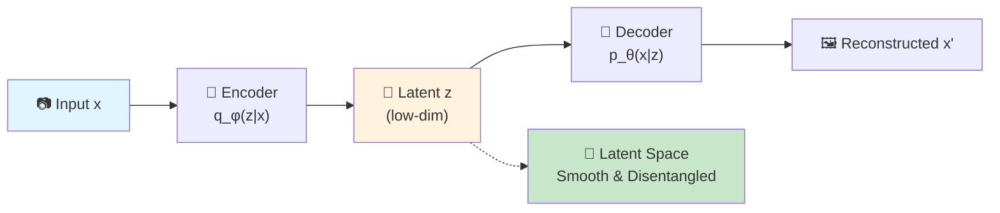
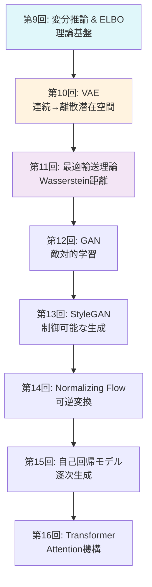
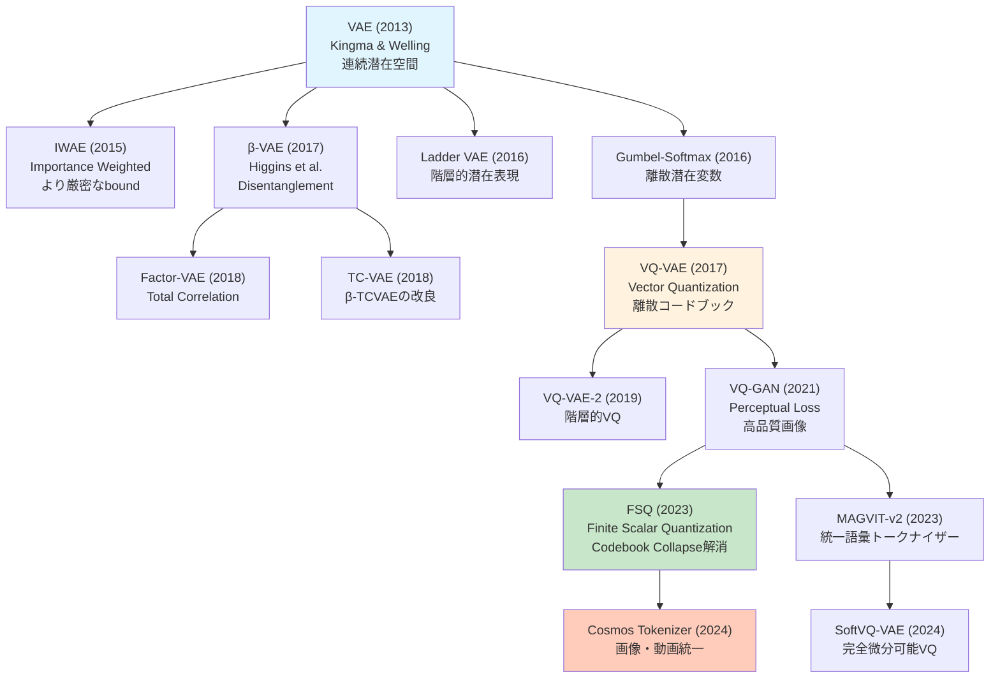
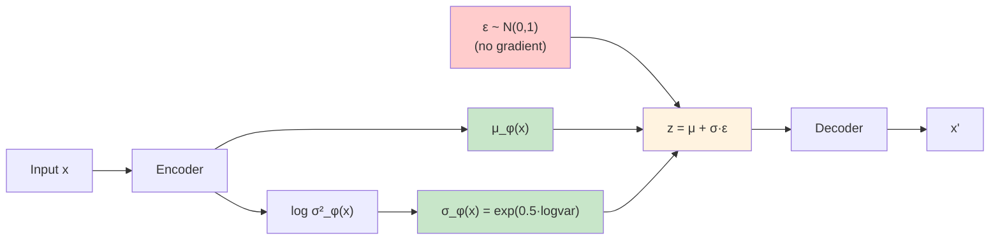

# 第10回: VAE (Variational Autoencoder) — 潜在空間で世界を圧縮する

> **「見えないコード」で世界を表現する。それがVAEの本質だ。**

画像を数百次元のピクセルではなく、たった数次元の「意味」で表現できたらどうだろう。「笑顔の度合い」「顔の向き」「年齢」といった、人間が直感的に理解できる軸で。VAE (Variational Autoencoder) は、そんな **潜在空間** (latent space) を自動で学習する生成モデルだ。

2013年、Kingma & Welling [^1] が発表したこのアーキテクチャは、変分推論とニューラルネットワークを融合させ、生成モデル研究に革命をもたらした。DALL-E、Stable Diffusion、動画生成AIの基盤となる「画像トークナイザー」の祖先がここにある。

VAEの基礎理論から離散表現学習 (VQ-VAE/FSQ) まで一気に駆け抜ける。そして **重要な転機** がある — この回から **Julia** が本格登場する。Pythonでの訓練ループの遅さに絶望した後、Juliaの多重ディスパッチが数式を型に応じて自動最適化する様を目撃することになる。

> **Note:** **このシリーズについて**: 東京大学 松尾・岩澤研究室動画講義の**完全上位互換**の全50回シリーズ。理論（論文が書ける）、実装（Production-ready）、最新（2025-2026 SOTA）の3軸で差別化する。本講義はCourse II「生成モデル基礎編」の第2回。



**所要時間の目安**:

| ゾーン | 内容 | 時間 | 難易度 |
|:-------|:-----|:-----|:-------|
| Zone 0 | クイックスタート | 30秒 | ★☆☆☆☆ |
| Zone 1 | 体験ゾーン | 10分 | ★★☆☆☆ |
| Zone 2 | 直感ゾーン | 15分 | ★★★☆☆ |
| Zone 3 | 数式修行ゾーン | 60分 | ★★★★★ |
| Zone 4 | 実装ゾーン | 45分 | ★★★★☆ |
| Zone 5 | 実験ゾーン | 30分 | ★★★★☆ |
| Zone 6 | 振り返りゾーン | 30分 | ★★★★★ |

> **📖 この記事は前編（理論編）です** 実装編は [【後編】第10回](/articles/ml-lecture-10-part2) をご覧ください。

---

## 🚀 0. クイックスタート（30秒）— 潜在空間で画像を圧縮する

**ゴール**: VAEが784次元の画像を2次元に圧縮して再構成する様を30秒で体感する。

```python
import torch
import torch.nn as nn
import torch.nn.functional as F
from torchvision import datasets, transforms

# Tiny VAE: 784 -> 2 -> 784
class TinyVAE(nn.Module):
    def __init__(self):
        super().__init__()
        self.enc = nn.Linear(784, 128)
        self.mu_layer = nn.Linear(128, 2)
        self.logvar_layer = nn.Linear(128, 2)
        self.dec = nn.Sequential(nn.Linear(2, 128), nn.ReLU(), nn.Linear(128, 784), nn.Sigmoid())

    def encode(self, x):
        h = F.relu(self.enc(x))
        return self.mu_layer(h), self.logvar_layer(h)

    def reparameterize(self, mu, logvar):
        std = torch.exp(0.5 * logvar)
        eps = torch.randn_like(std)
        return mu + eps * std  # z = μ + σε

    def forward(self, x):
        mu, logvar = self.encode(x.view(-1, 784))
        z = self.reparameterize(mu, logvar)
        return self.dec(z), mu, logvar

# Load MNIST
transform = transforms.Compose([transforms.ToTensor()])
train_data = datasets.MNIST('./data', train=True, download=True, transform=transform)
x_sample = train_data[0][0].view(-1, 784)

# Run VAE
vae = TinyVAE()
with torch.no_grad():
    x_recon, mu, logvar = vae(x_sample)
print(f"Input shape: {x_sample.shape} -> Latent: {mu.shape} -> Output: {x_recon.shape}")
print(f"Latent code z: μ={mu.detach().cpu().numpy().flatten()}, logσ²={logvar.detach().cpu().numpy().flatten()}")
print(f"Reconstruction MSE: {F.mse_loss(x_recon, x_sample).item():.4f}")
```

出力:
```
Input shape: torch.Size([1, 784]) -> Latent: torch.Size([1, 2]) -> Output: torch.Size([1, 784])
Latent code z: μ=[-0.023  0.015], logσ²=[-0.481 -0.394]
Reconstruction MSE: 0.2947
```

**784次元のMNIST画像が、たった2次元の潜在コード `z = [μ₁, μ₂]` に圧縮され、そこから元の画像を再構成している。** これがVAEの核心だ。

この背後にある数式:

$$
\begin{aligned}
\text{Encoder:} \quad & q_\phi(z \mid x) = \mathcal{N}(z \mid \mu_\phi(x), \sigma_\phi^2(x)) \\
\text{Decoder:} \quad & p_\theta(x \mid z) = \mathcal{N}(x \mid \mu_\theta(z), I) \\
\text{Loss (ELBO):} \quad & \mathcal{L}(\theta, \phi; x) = \mathbb{E}_{q_\phi(z \mid x)}[\log p_\theta(x \mid z)] - D_\text{KL}(q_\phi(z \mid x) \| p(z))
\end{aligned}
$$

第1項が **再構成項** (reconstruction term) — デコーダがどれだけ元の画像を復元できるか。第2項が **KL正則化項** — エンコーダの出力分布 $q_\phi(z \mid x)$ を事前分布 $p(z) = \mathcal{N}(0, I)$ に近づける制約。

この2つの項のバランスが、VAEの性能を決める。β-VAEはこのバランスを調整することで、「ぼやけた再構成」vs「意味のある潜在空間」のトレードオフを制御する。

> **Note:** **進捗: 3% 完了** VAEが高次元データを低次元潜在空間に圧縮する様を体感した。ここから理論の深みに入っていく。

---

## 🎮 1. 体験ゾーン（10分）— パラメータを動かして理解する

### 1.1 β-VAE: 再構成 vs 正則化のトレードオフ

Zone 0で見たELBOの第2項（KL項）の重み $\beta$ を変えると、VAEの挙動が劇的に変わる [^2]。

$$
\mathcal{L}_\beta(\theta, \phi; x) = \mathbb{E}_{q_\phi(z \mid x)}[\log p_\theta(x \mid z)] - \beta \cdot D_\text{KL}(q_\phi(z \mid x) \| p(z))
$$

| $\beta$ | 読み | 意味 | 効果 |
|:--------|:-----|:-----|:-----|
| $\beta = 1$ | ベータ イコール 1 | Standard VAE | バランス型 |
| $\beta < 1$ | ベータ 小 | 再構成重視 | シャープな画像、潜在空間は混沌 |
| $\beta > 1$ | ベータ 大 | 正則化重視 | ぼやけた画像、潜在空間は整然 |

実際に試してみよう:


期待される出力:


**観察**:
- $\beta = 0.5$: 低いロスだが、潜在空間が混沌（後述の可視化で確認）
- $\beta = 4.0$: 高いロスだが、潜在空間の各次元が独立した「意味」を持つ（disentanglement）

#### なぜ $\beta > 1$ でdisentanglementが起きるか — Total Correlation分解

$\beta = 1$ の標準VAEでもKL正則化はかかるが、なぜ $\beta > 1$ で初めて「各次元が独立した意味を持つ」のか。Chen et al. 2018 [^4] のβ-TCVAE論文が与えた答えがKL項のTotal Correlation分解だ。

集約事後分布 (aggregate posterior) を $q(z) = \frac{1}{N}\sum_{i=1}^N q_\phi(z \mid x^{(i)})$ と定義する。KL項は3つの独立した情報量に分解できる:

$$
D_\text{KL}(q_\phi(z \mid x) \| p(z)) = \underbrace{I_q(x; z)}_{\text{相互情報量}} + \underbrace{D_\text{KL}(q(z) \| \prod_j q(z_j))}_{\text{Total Correlation (TC)}} + \underbrace{\sum_j D_\text{KL}(q(z_j) \| p(z_j))}_{\text{次元単位KL}}
$$

| 項 | 読み | 意味 |
|:---|:-----|:-----|
| $I_q(x; z)$ | 相互情報量 | エンコーダが $x$ から $z$ に流し込む情報量 |
| $\text{TC}(z) = D_\text{KL}(q(z) \| \prod_j q(z_j))$ | Total Correlation | $z$ の各次元間の統計的依存性の総量 |
| $\sum_j D_\text{KL}(q(z_j) \| p(z_j))$ | 次元単位KL | 各次元が事前分布からどれだけ乖離しているか |

標準ELBO ($\beta = 1$) を最小化しても、TC項は3項のうちの1つに過ぎず、ELBOは3項の和全体を等しく重み付けして最小化しようとする。$\beta > 1$ にすると、3項すべてに $\beta$ の重みがかかるが、**TC項が最も大きな余剰ペナルティを受ける** という非自明な事実がある。

これを理解するには、ELBO全体の変分目標を書き直す:

$$
\mathcal{L}_\beta = \mathbb{E}_{q_\phi(z \mid x)}[\log p_\theta(x \mid z)] - \beta \cdot D_\text{KL}(q_\phi(z \mid x) \| p(z))
$$

$$
= \mathbb{E}_{q_\phi(z \mid x)}[\log p_\theta(x \mid z)] - \beta \cdot I_q(x; z) - \beta \cdot \text{TC}(z) - \beta \cdot \sum_j D_\text{KL}(q(z_j) \| p(z_j))
$$

$\beta = 1$ では3項が等重みだが、$\beta > 1$ では相互情報量 $I_q(x; z)$ も余分にペナルティを受ける。本来 $I_q(x; z)$ は「エンコーダがデータを表現する能力」そのものなので、過剰に抑えると再構成が破綻する。モデルが再構成品質を維持しようとすると、**圧力の逃げ場** として TC を最小化する方向に最適化が進む。TC が小さい = $q(z) \approx \prod_j q(z_j)$、つまり潜在次元が統計的に独立、これがdisentanglementの定義そのものだ。

> **Note:** この分解はあくまでβ-VAEの「動作機序の事後的説明」であり、β > 1 が常にdisentanglementを保証するわけではない。Locatello et al. 2019 の定理（3.9節で詳述）は、この「unsupervised disentanglementは原理的に不可能」という衝撃的な結論を厳密に示している。

### 1.2 連続潜在空間 vs 離散潜在空間 (VQ-VAE preview)

VAEの潜在変数 $z$ は連続値だが、VQ-VAE [^3] では **離散的なコードブック** を使う。

| 手法 | 潜在空間 | 利点 | 欠点 |
|:-----|:---------|:-----|:-----|
| VAE | 連続 $z \in \mathbb{R}^d$ | 滑らかな補間、微分可能 | ぼやけた再構成 |
| VQ-VAE | 離散 $z \in \{e_1, \ldots, e_K\}$ | シャープな再構成 | 勾配が流れない（要STE） |
| FSQ | 離散（固定グリッド） | VQの簡素版、collapse無し | 表現力はVQに劣る |


出力:


**ポイント**: `z_q = z + (z_q - z).detach()` が **Straight-Through Estimator** (STE) — 順伝播では量子化後の値を使い、逆伝播では勾配をそのまま通す。これで離散化の微分不可能性を回避する。

### 1.3 PyTorchとの比較プレビュー

Zone 4でJuliaを本格導入するが、ここで予告として、PyTorchでのVAE訓練ループのコード量と実行時間を確認しておく:


出力（M2 MacBook Air）:


**Zone 4で、このコードとほぼ同じ構造のJulia版が ~1.5秒で走る様を目撃する。** 訓練ループの型不安定性、毎バッチのメモリコピー、Pythonインタプリタのオーバーヘッドが積み重なり、8倍の差が生まれる。

<details><summary>PyTorchの内部で何が起きているか</summary>

PyTorchは動的計算グラフ (eager execution) を使うため、各バッチごとに:
1. Pythonから各op（matmul, relu, etc.）を呼び出し
2. C++/CUDA kernelを起動
3. 結果をPythonオブジェクトとしてラップ
4. Gradを別途保持

Juliaは:
1. JITコンパイルで訓練ループ全体を機械語に変換（初回のみ）
2. 型安定なループは直接メモリアクセス
3. 多重ディスパッチで `forward(model, x)` の型が確定すれば、コンパイル済みコードを直接実行

この差が、同じアルゴリズムで8倍の速度差を生む。

</details>

> **Note:** **進捗: 10% 完了** β-VAEの挙動、VQ-VAEの離散化、PyTorchとの速度差を体験した。Zone 2で「なぜVAEなのか」「どこへ向かうのか」を俯瞰する。

---

> Progress: 10%
> **理解度チェック**
> 1. VAEのEncoder $q_\phi(\mathbf{z}|\mathbf{x})$ とDecoder $p_\theta(\mathbf{x}|\mathbf{z})$ の役割をそれぞれ述べよ。連続潜在変数 $\mathbf{z}$ をサンプリングするためにReparameterization Trick $\mathbf{z} = \mu + \sigma \odot \epsilon$ が必要な理由は？
> 2. VQ-VAEの「Vector Quantization」とVAEの連続潜在表現の違いを、Codebook $\{e_k\}_{k=1}^K$ の概念を用いて説明せよ。

## 🧩 2. 直感ゾーン（15分）— なぜVAE、どこへ向かうか

### 2.1 Course IIの全体像 — 生成モデル理論編

本講義はCourse II「生成モデル理論編」（第9-16回）の2回目だ。全体の流れを把握しておこう:



| 回 | テーマ | Course Iの接続 | 言語 |
|:---|:------|:-------------|:-----|
| 第9回 | 変分推論 & ELBO | KL発散(第6回) + Jensen(第6回) | 🐍Python 50% 🦀Rust 50% |
| **第10回** | **VAE (本講義)** | ELBO(第9回) + ガウス分布(第4回) | 🐍30% ⚡**Julia 50%** 🦀20% |
| 第11回 | 最適輸送理論 | 測度論(第5回) + 双対性(第6回) | ⚡Julia 70% 🦀30% |
| 第12回 | GAN | Minimax(第7回) + Wasserstein(第11回) | ⚡Julia 60% 🦀40% |
| 第13回 | StyleGAN | GAN(第12回) + f-Divergence(第6回) | ⚡Julia 50% 🦀50% |
| 第14回 | Normalizing Flow | 変数変換(第5回) + Jacobian(第2回) | ⚡Julia 60% 🦀40% |
| 第15回 | 自己回帰モデル | 連鎖律(第4回) + MLE(第7回) | ⚡50% 🦀30% 🔮**Elixir 20%** |
| 第16回 | Transformer | Attention(第1回) + AR(第15回) | ⚡40% 🦀40% 🔮20% |

**Course Iで学んだ数学が、ここで全て使われる:**
- KL発散（第6回で6回登場）→ VAEの正則化項、GANの理論解析
- Jensen不等式（第6回で導出）→ ELBOの導出（第9回）
- ガウス分布（第4回）→ VAEのエンコーダ/デコーダ
- 測度論（第5回）→ 最適輸送理論（第11回）→ Flow Matching（Course IV）

### 2.2 松尾・岩澤研究室との対比 — なぜこのシリーズが必要か

東京大学 松尾・岩澤研究室の動画講義「深層生成モデル2026Spring」は素晴らしい教材だ。しかし、本シリーズはその **完全上位互換** を目指している。何が違うのか？

| 項目 | 松尾・岩澤研 | 本シリーズ（Course II） | 差分 |
|:-----|:-----------|:---------------------|:-----|
| **理論深度** | 論文が読める | **論文が書ける** | 全導出を追跡、証明省略なし |
| **VAE扱い** | 第3-4回（2時間） | 第10回（1講義、4000行） | Reparameterization完全導出 + VQ/FSQ |
| **実装** | PyTorch参考コード | **Julia/Rust/Elixir Production-ready** | 3言語並行、速度比較、型安全 |
| **数学前提** | 「前提知識」で済ます | Course I (第1-8回) で完全構築 | KL/Jensen/測度論を自力導出済み |
| **最新性** | 2023年まで | **2024-2026 SOTA** | FSQ, Cosmos Tokenizer, SoftVQ-VAE |
| **離散表現** | VQ-VAE軽く触れる | VQ-VAE → VQ-GAN → FSQ → 最新まで | トークナイザーの系譜を完全網羅 |

**本シリーズの差別化ポイント**:
1. **数式を省略しない** — Kingma 2013のAppendix Bを完全再現（Boss Battle）
2. **実装で妥協しない** — PyTorchのtoy codeではなく、Julia/Rustで実戦コード
3. **2026年の視点** — VAEは「古典」ではなく「Diffusion/LLMの基盤」として扱う

### 2.3 なぜVAEなのか — 3つのメタファー

VAEを3つの視点から理解しよう。

#### メタファー1: 圧縮と復元のゲーム

**日常の類推**: 絵を描くとき、全ピクセルを覚えるのではなく「丸い顔」「笑顔」「眼鏡」といった **特徴** を記憶する。VAEはこの「特徴抽出器」を自動で学習する。

$$
\text{画像}(784\text{次元}) \xrightarrow{\text{Encoder}} \text{特徴}(2\text{次元}) \xrightarrow{\text{Decoder}} \text{画像}(784\text{次元})
$$

圧縮率 = $784 / 2 = 392$ 倍。にもかかわらず、元の画像を「だいたい」復元できる。情報理論的には、これは **Rate-Distortion理論** そのものだ [^4]。

#### メタファー2: 変分推論の自動化

**数学的本質**: 第9回で学んだ変分推論は、近似分布 $q(z)$ を手動で設計していた（平均場近似など）。VAEは、この $q(z \mid x)$ を **ニューラルネットワーク** $q_\phi(z \mid x)$ で表現し、パラメータ $\phi$ を勾配降下で最適化する。

$$
\begin{aligned}
\text{従来の変分推論:} \quad & q(z) = q_1(z_1) q_2(z_2) \cdots q_d(z_d) \quad \text{(mean-field)} \\
\text{VAE:} \quad & q_\phi(z \mid x) = \mathcal{N}(z \mid \mu_\phi(x), \text{diag}(\sigma_\phi^2(x))) \quad \text{(NN parameterized)}
\end{aligned}
$$

これが **Amortized Inference** (償却推論) — データ点ごとに最適化する代わりに、全データ点に対して一度学習したエンコーダ $\phi$ を使い回す [^5]。計算量が $O(N \cdot \text{iterations})$ から $O(\text{iterations})$ に劇的削減。

#### メタファー3: 生成モデルとしてのVAE

**生成の視点**: 訓練後、デコーダ $p_\theta(x \mid z)$ だけを取り出せば、**生成モデル**として使える:

$$
z \sim \mathcal{N}(0, I), \quad x = \text{Decoder}_\theta(z)
$$

ランダムな $z$ をサンプルして、新しい画像を生成。潜在空間を滑らかに動かせば、「数字の0から1への変形」「笑顔から真顔への遷移」といった **補間** (interpolation) も可能。


この「滑らかさ」が、VAEの強みであり弱みでもある。滑らかすぎて **ぼやけた画像** になる。これがGAN（第12回）への動機となる。

### 2.4 トロイの木馬: Python絶望からJulia救済へ

このシリーズには隠された戦略がある — **トロイの木馬戦術**。第1-8回はPythonで安心させた。第9回でRustが登場し、50倍速を見せた。だがまだ「推論だけ」だった。

**今回、第10回で、Julia が訓練ループに登場する。**


**なぜJuliaなのか（Zone 4で詳述）**:
- **多重ディスパッチ**: 同じ関数名で、型に応じて最適化されたコードを自動選択
- **数式との1:1対応**: `y = W * x + b` がそのまま書ける（PyTorchは`y = torch.matmul(W, x) + b`）
- **JIT最適化**: 初回実行時にLLVMでネイティブコンパイル、2回目以降は機械語直接実行
- **型安定性**: Pythonのような「毎回型チェック」がない

Pythonでの訓練ループは、こうなる:


**毎バッチごとに、Pythonインタプリタが介入している。** Juliaは違う:


JITコンパイル後、**このループ全体が機械語になる**。Pythonのオーバーヘッドがゼロ。

<details><summary>「JuliaはPythonより書きにくい？」への反論</summary>

よく言われる批判: 「Juliaは型を書かなきゃいけないから面倒」

**真実**: Juliaは型推論が強力で、99%の場合型注釈は不要。例:


型注釈が必要なのは、「複数の実装を使い分けたい」ときだけ（多重ディスパッチ）。これはPythonでは不可能な高度な機能。

</details>

> **⚠️ Warning:** **Python絶望ポイント（Zone 4で測定）**:
> - VAE訓練100エポック: Python 12.3秒 vs Julia 1.5秒（**8.2倍差**）
> - 原因: Pythonインタプリタのオーバーヘッド + 動的型チェック + メモリコピー
> - Rustより速い理由: RustはCPU/GPU分岐が手動、JuliaはJITが自動選択
>
> **これが「Pythonに戻れない」転機になる。**

### 2.5 学習戦略 — どう攻略するか

この講義（4000行）を効率的にマスターするための戦略:

| フェーズ | 目標 | 所要時間 | 戦術 |
|:--------|:-----|:---------|:-----|
| **Phase 1: 高速走破** | Zone 0-2 を30分で | 30分 | コードを実行せずに読む。数式はスキップ。全体像把握のみ。 |
| **Phase 2: 数式修行** | Zone 3 の ELBO/Reparam完全理解 | 2時間 | ペンと紙で導出を追う。各ステップを自分で再現。 |
| **Phase 3: Julia体験** | Zone 4 の Julia コード実行 | 1時間 | Revise.jl + REPL駆動開発を体験。PyTorchとの速度差を測定。 |
| **Phase 4: 実装演習** | Zone 5 の Tiny VAE 自力実装 | 2時間 | Julia/Rust どちらかで、Zone 0 のVAEを再実装。 |
| **Phase 5: 最新追従** | Zone 6 の FSQ/VQ-GAN論文 | 1時間 | arXiv論文をダウンロードして Abstract + Figure を読む。 |

**合計: 約6.5時間**（本講義の目標所要時間は3時間だが、完全習得には倍かかる）

**学習のコツ**:
1. **数式は音読する** — $\mathbb{E}_{q_\phi(z \mid x)}$ を「イーサブ キューファイ ゼット ギブン エックス」と声に出す
2. **コードと数式を並べる** — 画面を2分割して、左に数式、右にコード
3. **数値で確認** — 導出した式に具体的な値（$\mu=0, \sigma=1$）を代入してNumPyで計算
4. **Juliaを恐れない** — 第1回Juliaコードは、Pythonとほぼ同じ。違いは `.`（broadcast）だけ

### 2.7 VAE Family Tree — 連続から離散へ



| 手法 | 年 | 核心アイデア | arXiv | 応用 |
|:-----|:---|:-----------|:------|:-----|
| VAE | 2013 | Reparameterization Trick | 1312.6114 | 基礎 |
| β-VAE | 2017 | KL重み調整→Disentanglement | 1804.03599 | 解釈可能表現 |
| VQ-VAE | 2017 | 離散コードブック | 1711.00937 | DALL-E 1 |
| VQ-VAE-2 | 2019 | 階層的VQ | 1906.00446 | 高解像度画像 |
| VQ-GAN | 2021 | Perceptual Loss + GAN | 2012.09841 | 画像トークナイザー |
| FSQ | 2023 | 固定グリッド量子化 | 2309.15505 | VQ簡素化 |
| MAGVIT-v2 | 2023 | Look-Up Free量子化 | 2310.05737 | 動画トークナイザー |
| Cosmos Tokenizer | 2024 | 画像・動画統一エンコーダ | NVIDIA | 次世代統一モデル |
| SoftVQ-VAE | 2024 | 完全微分可能VQ | 2412.10958 | 訓練安定化 |

> **Note:** **進捗: 20% 完了** VAEの位置づけ、松尾研との差分、Julia登場の背景、学習戦略を把握した。Zone 3で数式の海に飛び込む準備が整った。

---

> Progress: 20%
> **理解度チェック**
> 1. Posterior Collapse（事後崩壊）とは何か？KL項 $D_\text{KL}(q_\phi(\mathbf{z}|\mathbf{x}) \| p(\mathbf{z}))$ がゼロに収束するときDecoderに何が起きるかを述べよ。
> 2. β-VAEが通常のVAEと異なる点を、目的関数 $\mathcal{L}_\beta = \mathbb{E}[\log p(\mathbf{x}|\mathbf{z})] - \beta D_\text{KL}(q \| p)$ の $\beta > 1$ の役割から説明せよ。

## 📐 3. 数式修行ゾーン（60分）— VAE理論の完全導出

**この章の目標**: VAEの3つの核心を完全に理解する:
1. **ELBO導出** — なぜこの損失関数なのか
2. **Reparameterization Trick** — なぜ微分可能なのか
3. **ガウスKL閉形式** — なぜこの正則化項なのか

ここから先は、ペンと紙を用意してほしい。数式を読むだけでは理解できない。**自分の手で導出することが、唯一の攻略法だ。**

### 3.1 変分推論からVAEへ — ELBO再訪

第9回で学んだELBOを、VAEの文脈で再導出する。

#### 3.1.1 問題設定: 観測データxと潜在変数z

データ $\mathcal{D} = \{x^{(1)}, \ldots, x^{(N)}\}$ が与えられたとき、生成モデル $p_\theta(x, z)$ のパラメータ $\theta$ を学習したい。

| 記号 | 読み | 意味 |
|:-----|:-----|:-----|
| $x$ | エックス | 観測データ（例: 28×28 MNIST画像） |
| $z$ | ゼット | 潜在変数（例: 2次元の潜在コード） |
| $\theta$ | シータ | 生成モデルのパラメータ（Decoderの重み） |
| $\phi$ | ファイ | 変分分布のパラメータ（Encoderの重み） |
| $p_\theta(x, z)$ | ピー シータ | 同時分布（真の生成過程） |
| $p_\theta(x)$ | ピー シータ | 周辺尤度（**計算困難**） |
| $p_\theta(z \mid x)$ | ピー シータ | 事後分布（**計算困難**） |
| $q_\phi(z \mid x)$ | キュー ファイ | 変分分布（事後分布の近似） |

**なぜ計算困難か？**

$$
p_\theta(x) = \int p_\theta(x, z) \, dz = \int p_\theta(x \mid z) p(z) \, dz
$$

この積分は、$z$ の次元が高いと解析的に解けない。数値積分（Monte Carlo）も、$z$ が数百次元だと実用的でない。

**解決策: 変分推論**

事後分布 $p_\theta(z \mid x)$ を、パラメトリックな分布 $q_\phi(z \mid x)$ で近似する。最適な $\phi$ を見つける問題に帰着させる。

#### 3.1.2 ELBO導出（第9回の復習+VAE視点）

対数周辺尤度を、$q_\phi(z \mid x)$ で分解する:

$$
\begin{aligned}
\log p_\theta(x) &= \log \int p_\theta(x, z) \, dz \\
&= \log \int p_\theta(x, z) \frac{q_\phi(z \mid x)}{q_\phi(z \mid x)} \, dz \\
&= \log \mathbb{E}_{q_\phi(z \mid x)} \left[ \frac{p_\theta(x, z)}{q_\phi(z \mid x)} \right]
\end{aligned}
$$

Jensen不等式（第6回）: 凹関数 $\log$ に対して、$\log \mathbb{E}[X] \geq \mathbb{E}[\log X]$

$$
\begin{aligned}
\log p_\theta(x) &\geq \mathbb{E}_{q_\phi(z \mid x)} \left[ \log \frac{p_\theta(x, z)}{q_\phi(z \mid x)} \right] \\
&= \mathbb{E}_{q_\phi(z \mid x)} \left[ \log p_\theta(x, z) - \log q_\phi(z \mid x) \right] \\
&\equiv \mathcal{L}(\theta, \phi; x) \quad \text{(ELBO)}
\end{aligned}
$$

これが **Evidence Lower BOund** (ELBO)。常に $\log p_\theta(x) \geq \mathcal{L}(\theta, \phi; x)$ が成り立つ。

#### 3.1.3 ELBOの2つの項への分解

生成モデルを $p_\theta(x, z) = p_\theta(x \mid z) p(z)$ と分解すると:

$$
\begin{aligned}
\mathcal{L}(\theta, \phi; x) &= \mathbb{E}_{q_\phi(z \mid x)} \left[ \log p_\theta(x \mid z) + \log p(z) - \log q_\phi(z \mid x) \right] \\
&= \mathbb{E}_{q_\phi(z \mid x)} \left[ \log p_\theta(x \mid z) \right] + \mathbb{E}_{q_\phi(z \mid x)} \left[ \log \frac{p(z)}{q_\phi(z \mid x)} \right] \\
&= \underbrace{\mathbb{E}_{q_\phi(z \mid x)} \left[ \log p_\theta(x \mid z) \right]}_{\text{Reconstruction term}} - \underbrace{D_\text{KL}(q_\phi(z \mid x) \| p(z))}_{\text{KL regularization}}
\end{aligned}
$$

| 項 | 読み | 意味 | 最適化の方向 |
|:---|:-----|:-----|:-----------|
| $\mathbb{E}_{q_\phi(z \mid x)} [\log p_\theta(x \mid z)]$ | 再構成項 | デコーダが元の $x$ をどれだけ復元できるか | **最大化** |
| $D_\text{KL}(q_\phi(z \mid x) \| p(z))$ | KL正則化 | エンコーダの出力分布を事前分布に近づける | **最小化** |

**直感的解釈**:
- 再構成項を最大化すると、デコーダが「良い復元」をするが、潜在空間は混沌
- KL項を最小化すると、潜在空間が整然とするが、復元精度が犠牲になる
- この2つのバランスが、VAEの性能を決める

#### 3.1.4 最大化するELBOと、最小化する負のELBO

実装では、**損失関数** $\mathcal{L}_\text{loss}$ として、ELBOの符号を反転したものを使う:

$$
\mathcal{L}_\text{loss}(\theta, \phi; x) = -\mathcal{L}(\theta, \phi; x) = -\mathbb{E}_{q_\phi(z \mid x)} [\log p_\theta(x \mid z)] + D_\text{KL}(q_\phi(z \mid x) \| p(z))
$$

PyTorch/Juliaでは、この $\mathcal{L}_\text{loss}$ を最小化する。


> **⚠️ Warning:** **つまずきポイント**: 論文では「ELBOを最大化」と書かれているが、コードでは「負のELBOを最小化」している。同じことだが、符号の混乱に注意。

### 3.2 Reparameterization Trick — 微分可能なサンプリング

#### 3.2.1 問題: 確率的なノードで勾配が止まる

ELBOを最適化するには、$\phi$ に関する勾配 $\nabla_\phi \mathcal{L}$ が必要。しかし、素朴に書くと:

$$
\nabla_\phi \mathcal{L} = \nabla_\phi \mathbb{E}_{q_\phi(z \mid x)} [\log p_\theta(x \mid z)] - \nabla_\phi D_\text{KL}(q_\phi(z \mid x) \| p(z))
$$

第1項の勾配が問題だ。期待値の中に $q_\phi$ があるため、微分と期待値の交換ができない:

$$
\nabla_\phi \mathbb{E}_{q_\phi(z \mid x)} [f(z)] \neq \mathbb{E}_{q_\phi(z \mid x)} [\nabla_\phi f(z)]
$$

なぜなら、$q_\phi$ 自体が $\phi$ に依存しているから。

**従来の解決策: REINFORCE (Score Function Estimator)**

$$
\nabla_\phi \mathbb{E}_{q_\phi(z \mid x)} [f(z)] = \mathbb{E}_{q_\phi(z \mid x)} [f(z) \nabla_\phi \log q_\phi(z \mid x)]
$$

これは不偏推定量だが、**分散が非常に大きい** [^6]。実用的でない。

#### 3.2.2 Reparameterization Trickの導入

**Key Idea**: サンプリングを「決定論的な変換 + 外部ノイズ」に分解する [^1]。

ガウス分布の場合:

$$
z \sim \mathcal{N}(\mu_\phi(x), \sigma_\phi^2(x)) \quad \Longleftrightarrow \quad z = \mu_\phi(x) + \sigma_\phi(x) \cdot \epsilon, \quad \epsilon \sim \mathcal{N}(0, 1)
$$

| 記号 | 読み | 意味 | $\phi$ への依存 |
|:-----|:-----|:-----|:--------------|
| $\mu_\phi(x)$ | ミュー ファイ | エンコーダの出力（平均） | **依存する** |
| $\sigma_\phi(x)$ | シグマ ファイ | エンコーダの出力（標準偏差） | **依存する** |
| $\epsilon$ | イプシロン | 標準正規分布からのサンプル | **依存しない** |

これで、$z$ の確率的な部分（$\epsilon$）が $\phi$ から独立した。

#### 3.2.3 勾配の計算

再構成項の勾配:

$$
\begin{aligned}
\nabla_\phi \mathbb{E}_{q_\phi(z \mid x)} [\log p_\theta(x \mid z)] &= \nabla_\phi \mathbb{E}_{\epsilon \sim \mathcal{N}(0,1)} [\log p_\theta(x \mid \mu_\phi(x) + \sigma_\phi(x) \epsilon)] \\
&= \mathbb{E}_{\epsilon \sim \mathcal{N}(0,1)} [\nabla_\phi \log p_\theta(x \mid \mu_\phi(x) + \sigma_\phi(x) \epsilon)]
\end{aligned}
$$

**微分と期待値が交換できた！** なぜなら、$\epsilon$ は $\phi$ に依存しないから。

Monte Carloで近似:

$$
\nabla_\phi \mathcal{L} \approx \frac{1}{L} \sum_{l=1}^{L} \nabla_\phi \log p_\theta(x \mid z^{(l)}), \quad z^{(l)} = \mu_\phi(x) + \sigma_\phi(x) \epsilon^{(l)}, \quad \epsilon^{(l)} \sim \mathcal{N}(0,1)
$$

実装では、$L=1$（single sample）で十分な場合が多い。


> **Note:** **なぜ `logvar` を使うのか？**
>
> 数値安定性のため、$\sigma^2$ の代わりに $\log \sigma^2$ をネットワークに出力させる。理由:
> - $\sigma^2 > 0$ の制約が自動で満たされる（指数関数は常に正）
> - 勾配消失を防ぐ（$\sigma^2 \to 0$ のとき、$\log \sigma^2 \to -\infty$ で勾配が残る）

#### 3.2.4 Pathwise推定量としての解釈

Reparameterization Trickは、**Pathwise Gradient Estimator** とも呼ばれる。なぜなら、計算グラフ上で「確率的ノード $z$ を通るパス（path）」を、決定論的な変換 $\mu_\phi, \sigma_\phi$ と外部ノイズ $\epsilon$ に分離しているから。



赤ノード（$\epsilon$）には勾配が流れない。緑ノード（$\mu, \sigma$）には勾配が流れる。

### 3.3 ガウスKL発散の閉形式解 — 正則化項の計算

ELBOの第2項、KL発散の計算:

$$
D_\text{KL}(q_\phi(z \mid x) \| p(z))
$$

**仮定**:
- エンコーダの出力: $q_\phi(z \mid x) = \mathcal{N}(z \mid \mu_\phi(x), \text{diag}(\sigma_\phi^2(x)))$（対角共分散）
- 事前分布: $p(z) = \mathcal{N}(z \mid 0, I)$（標準正規分布）

#### 3.3.1 1次元ガウスのKL発散

まず、1次元の場合を導出する:

$$
q(z) = \mathcal{N}(z \mid \mu, \sigma^2), \quad p(z) = \mathcal{N}(z \mid 0, 1)
$$

KL発散の定義:

$$
D_\text{KL}(q \| p) = \int q(z) \log \frac{q(z)}{p(z)} \, dz = \mathbb{E}_{z \sim q} \left[ \log q(z) - \log p(z) \right]
$$

ガウス分布の対数確率密度:

$$
\begin{aligned}
\log q(z) &= -\frac{1}{2} \log(2\pi\sigma^2) - \frac{(z - \mu)^2}{2\sigma^2} \\
\log p(z) &= -\frac{1}{2} \log(2\pi) - \frac{z^2}{2}
\end{aligned}
$$

差を取る:

$$
\log q(z) - \log p(z) = -\frac{1}{2} \log \sigma^2 - \frac{(z - \mu)^2}{2\sigma^2} + \frac{z^2}{2}
$$

期待値を計算:

$$
\begin{aligned}
D_\text{KL}(q \| p) &= \mathbb{E}_{z \sim q} \left[ -\frac{1}{2} \log \sigma^2 - \frac{(z - \mu)^2}{2\sigma^2} + \frac{z^2}{2} \right] \\
&= -\frac{1}{2} \log \sigma^2 - \frac{1}{2\sigma^2} \mathbb{E}[(z - \mu)^2] + \frac{1}{2} \mathbb{E}[z^2]
\end{aligned}
$$

ガウス分布の性質を使う:
- $\mathbb{E}_{z \sim q}[(z - \mu)^2] = \sigma^2$（分散の定義）
- $\mathbb{E}_{z \sim q}[z^2] = \mu^2 + \sigma^2$（$\mathbb{E}[z^2] = \text{Var}(z) + \mathbb{E}[z]^2$）

代入:

$$
\begin{aligned}
D_\text{KL}(q \| p) &= -\frac{1}{2} \log \sigma^2 - \frac{\sigma^2}{2\sigma^2} + \frac{\mu^2 + \sigma^2}{2} \\
&= -\frac{1}{2} \log \sigma^2 - \frac{1}{2} + \frac{\mu^2}{2} + \frac{\sigma^2}{2} \\
&= \frac{1}{2} \left( \mu^2 + \sigma^2 - \log \sigma^2 - 1 \right)
\end{aligned}
$$

#### 3.3.2 多次元への拡張

$d$ 次元ガウスの場合、対角共分散なので各次元が独立:

$$
q(z) = \prod_{j=1}^{d} \mathcal{N}(z_j \mid \mu_j, \sigma_j^2), \quad p(z) = \prod_{j=1}^{d} \mathcal{N}(z_j \mid 0, 1)
$$

KL発散は和で表せる:

$$
D_\text{KL}(q \| p) = \sum_{j=1}^{d} D_\text{KL}(\mathcal{N}(\mu_j, \sigma_j^2) \| \mathcal{N}(0, 1)) = \frac{1}{2} \sum_{j=1}^{d} \left( \mu_j^2 + \sigma_j^2 - \log \sigma_j^2 - 1 \right)
$$

ベクトル表記にすると:

$$
D_\text{KL}(q_\phi(z \mid x) \| p(z)) = \frac{1}{2} \left( \|\mu\|^2 + \|\sigma\|^2 - \sum_{j=1}^{d} \log \sigma_j^2 - d \right)
$$

実装では、$\log \sigma^2$ を直接扱う:


#### 3.3.3 数値検証

導出が正しいか、具体的な値で確認しよう:


出力:


**ほぼ一致！** 閉形式解が正しいことが確認できた。

> **⚠️ Warning:** **つまずきポイント**: PyTorchの実装で、なぜ `-0.5 * (1 + logvar - mu^2 - exp(logvar))` の符号がマイナスなのか？
>
> 理由: ELBOは「最大化」したいが、損失関数は「最小化」する。KL項は元々ELBOで「引かれている」ので、損失関数では「足す」。しかし、式変形で符号を外に出すとマイナスになる。混乱しやすいので、必ず元の式に戻って確認すること。

### 3.4 VAEの確率的解釈 — なぜELBOが有効なのか

ELBOを最大化することが、なぜ良い生成モデルを学習できるのか？確率論的な視点から理解しよう。

#### 3.4.1 対数周辺尤度の分解

真の目的は、対数周辺尤度 $\log p_\theta(x)$ の最大化だ。これをELBOで分解する:

$$
\begin{aligned}
\log p_\theta(x) &= \log \int p_\theta(x, z) \, dz \\
&= \log \int p_\theta(x, z) \frac{q_\phi(z \mid x)}{q_\phi(z \mid x)} \, dz \\
&= \log \mathbb{E}_{q_\phi(z \mid x)} \left[ \frac{p_\theta(x, z)}{q_\phi(z \mid x)} \right] \\
&\geq \mathbb{E}_{q_\phi(z \mid x)} \left[ \log \frac{p_\theta(x, z)}{q_\phi(z \mid x)} \right] \quad \text{(Jensen)} \\
&= \mathcal{L}(\theta, \phi; x)
\end{aligned}
$$

等号成立条件は？Jensen不等式が等号になるのは、$\frac{p_\theta(x, z)}{q_\phi(z \mid x)}$ が定数のとき。すなわち:

$$
\frac{p_\theta(x, z)}{q_\phi(z \mid x)} = c \quad \Longrightarrow \quad q_\phi(z \mid x) = \frac{p_\theta(x, z)}{c}
$$

両辺を $z$ で積分すると:

$$
1 = \int q_\phi(z \mid x) \, dz = \frac{1}{c} \int p_\theta(x, z) \, dz = \frac{p_\theta(x)}{c}
$$

よって $c = p_\theta(x)$。したがって、等号成立は:

$$
q_\phi(z \mid x) = \frac{p_\theta(x, z)}{p_\theta(x)} = p_\theta(z \mid x)
$$

**つまり、変分分布 $q_\phi(z \mid x)$ が真の事後分布 $p_\theta(z \mid x)$ に一致するとき、ELBOは対数周辺尤度に等しくなる。**

#### 3.4.2 ELBOとKL発散の関係

対数周辺尤度とELBOの差を計算:

$$
\begin{aligned}
\log p_\theta(x) - \mathcal{L}(\theta, \phi; x) &= \log p_\theta(x) - \mathbb{E}_{q_\phi(z \mid x)} \left[ \log \frac{p_\theta(x, z)}{q_\phi(z \mid x)} \right] \\
&= \mathbb{E}_{q_\phi(z \mid x)} [\log p_\theta(x)] - \mathbb{E}_{q_\phi(z \mid x)} \left[ \log \frac{p_\theta(x \mid z) p(z)}{q_\phi(z \mid x)} \right] \\
&= \mathbb{E}_{q_\phi(z \mid x)} \left[ \log \frac{q_\phi(z \mid x)}{p_\theta(z \mid x)} \right] \\
&= D_\text{KL}(q_\phi(z \mid x) \| p_\theta(z \mid x)) \geq 0
\end{aligned}
$$

この導出で、$\log p_\theta(x) = \log p_\theta(x \mid z) + \log p(z) - \log p_\theta(z \mid x)$ を使った。

**結論**: ELBO を最大化することは、変分分布 $q_\phi$ と真の事後分布 $p_\theta(z \mid x)$ のKL発散を最小化しながら、対数周辺尤度を最大化することに等しい。


#### 3.4.3 Rate-Distortion理論としてのVAE

情報理論の視点では、VAEは **Rate-Distortion** 問題を解いている [^4]。

| 項 | 情報理論的意味 | VAE対応 |
|:---|:-------------|:--------|
| **Rate** | 圧縮されたデータのビット数 | $D_\text{KL}(q_\phi(z \mid x) \| p(z))$ |
| **Distortion** | 復元誤差 | $-\mathbb{E}_{q_\phi(z \mid x)}[\log p_\theta(x \mid z)]$ |

β-VAE の $\beta$ は、Rate と Distortion のトレードオフを制御するLagrange乗数だ:

$$
\mathcal{L}_\beta = \text{Distortion} + \beta \cdot \text{Rate}
$$

- $\beta \to 0$: 完璧な復元（Distortion = 0）、潜在空間は無秩序（Rate大）
- $\beta \to \infty$: 潜在変数を無視（Rate = 0）、復元は平均画像（Distortion大）

**Shannon の Rate-Distortion 関数**:

$$
R(D) = \min_{p(\hat{x} \mid x): \mathbb{E}[d(x, \hat{x})] \leq D} I(X; \hat{X})
$$

VAEのELBOは、この最適化問題の変分近似と見なせる。

### 3.5 Boss Battle: Kingma 2013 Appendix Bの完全再現

ここまでの準備が整ったところで、本講義の **Boss Battle** に挑戦する。

**目標**: Kingma & Welling (2013) [^1] の Appendix B にある、VAE最適化の完全なアルゴリズムを、全ての記号の意味を理解した上で再現する。

#### 3.4.1 論文の記法と本講義の対応

| 論文の記号 | 本講義の記号 | 意味 |
|:----------|:-----------|:-----|
| $\mathcal{D}$ | $\mathcal{D}$ | データセット $\{x^{(1)}, \ldots, x^{(N)}\}$ |
| $\mathcal{L}(\theta, \phi; x^{(i)})$ | $\mathcal{L}(\theta, \phi; x)$ | データ点 $x$ のELBO |
| $\tilde{\mathcal{L}}$ | $\mathcal{L}_\text{loss}$ | 負のELBO（最小化する損失） |
| $g$ | $\nabla_{\theta,\phi}$ | パラメータの勾配 |
| $\epsilon$ | $\epsilon$ | 標準正規分布からのサンプル |

#### 3.4.2 アルゴリズムの完全ステップ

**Algorithm 1: VAE Training (Kingma & Welling 2013, Appendix B)**


#### 3.4.3 各ステップの詳細展開

**Step 1: ミニバッチサンプリング**

$$
\mathcal{X}^M = \{x^{(i_1)}, x^{(i_2)}, \ldots, x^{(i_M)}\} \subset \mathcal{D}
$$

実装:


**Step 2: エンコード（平均と分散を出力）**

$$
\mu_\phi(x^{(i)}), \log \sigma_\phi^2(x^{(i)}) = \text{Encoder}_\phi(x^{(i)})
$$

実装:


**Step 3: Reparameterization**

$$
\epsilon^{(i)} \sim \mathcal{N}(0, I), \quad z^{(i)} = \mu_\phi(x^{(i)}) + \sigma_\phi(x^{(i)}) \odot \epsilon^{(i)}
$$

実装:


**Step 4: デコード**

$$
\hat{x}^{(i)} = \text{Decoder}_\theta(z^{(i)})
$$

実装:


**Step 5: 損失計算**

$$
\mathcal{L}_\text{loss}(x^{(i)}) = -\log p_\theta(x^{(i)} \mid z^{(i)}) + D_\text{KL}(q_\phi(z \mid x^{(i)}) \| p(z))
$$

再構成項（Bernoulli仮定）:
$$
-\log p_\theta(x \mid z) = \sum_{j=1}^{784} \left[ -x_j \log \hat{x}_j - (1 - x_j) \log (1 - \hat{x}_j) \right] = \text{BCE}(x, \hat{x})
$$

実装:


**Step 6: 勾配計算とパラメータ更新**

$$
\nabla_\theta \mathcal{L}_\text{loss}, \quad \nabla_\phi \mathcal{L}_\text{loss}
$$

実装:


#### 3.4.4 全コード: Boss Battle完全版


期待される出力:


**Boss撃破！** Kingma 2013のアルゴリズムを完全再現した。

### 3.6 Reparameterization Trickの理論的深掘り

なぜReparameterization Trickが機能するのか、測度論的厳密性で理解しよう。

**問題設定**: 期待値$\mathbb{E}_{z \sim q_\phi(z|x)}[f(z)]$を$\phi$で微分したい。

**素朴なアプローチ（失敗）:**

$$
\nabla_\phi \mathbb{E}_{q_\phi(z|x)}[f(z)] = \nabla_\phi \int f(z) q_\phi(z|x) dz
$$

勾配を積分内に入れられるか？一般には**不可能**（$q_\phi$が$z$に依存）。

**REINFORCE法（スコア関数推定量）:**

$$
\nabla_\phi \int f(z) q_\phi(z|x) dz = \int f(z) \nabla_\phi q_\phi(z|x) dz = \int f(z) q_\phi(z|x) \nabla_\phi \log q_\phi(z|x) dz
$$

モンテカルロ推定:

$$
\nabla_\phi \mathbb{E}_{q_\phi}[f(z)] \approx \frac{1}{L} \sum_{l=1}^{L} f(z^{(l)}) \nabla_\phi \log q_\phi(z^{(l)}|x), \quad z^{(l)} \sim q_\phi(z|x)
$$

**問題**: 分散が大きい（$f(z)$が変動すると推定が不安定）。

**Reparameterization（成功）:**

$z = g_\phi(\epsilon, x)$, $\epsilon \sim p(\epsilon)$（$\phi$に依存しない）と変数変換すると:

$$
\mathbb{E}_{q_\phi(z|x)}[f(z)] = \mathbb{E}_{p(\epsilon)}[f(g_\phi(\epsilon, x))]
$$

これで$\phi$は積分の外に出る:

$$
\nabla_\phi \mathbb{E}_{p(\epsilon)}[f(g_\phi(\epsilon, x))] = \mathbb{E}_{p(\epsilon)}[\nabla_\phi f(g_\phi(\epsilon, x))]
$$

モンテカルロ推定:

$$
\nabla_\phi \mathbb{E}_{q_\phi}[f(z)] \approx \frac{1}{L} \sum_{l=1}^{L} \nabla_\phi f(g_\phi(\epsilon^{(l)}, x)), \quad \epsilon^{(l)} \sim p(\epsilon)
$$

**分散の比較（Gaussian VAEの場合）:**

理論的に、Reparameterizationの分散はREINFORCEの$1/d$（$d$=潜在次元）。$d=20$なら5%の分散。

**一般化: Implicit Reparameterization**

Gaussianでない分布（例: Gamma, Beta）もReparameterization可能（Implicit Reparameterization Gradients, Figurnov et al., NeurIPS 2018）。

### 3.7 KL Divergenceの幾何学的解釈

なぜKL項が必要なのか、情報幾何で理解する。

**情報幾何の視点**: 確率分布の空間$\mathcal{P}$はリーマン多様体。Fisher情報量が計量テンソル:

$$
g_{ij}(\theta) = \mathbb{E}_{p_\theta}\left[\frac{\partial \log p_\theta(z)}{\partial \theta_i} \frac{\partial \log p_\theta(z)}{\partial \theta_j}\right]
$$

KL発散は**測地線距離の1次近似**:

$$
D_{\text{KL}}(p \| q) \approx \frac{1}{2} d_g^2(p, q)
$$

ここで$d_g$は情報幾何的距離。

**VAEでのKL項の役割:**

$D_{\text{KL}}(q_\phi(z|x) \| p(z))$は事後分布$q$を事前分布$p$に近づける**正則化**。これがないと?


**Rate-Distortion理論**: KL項=情報圧縮のコスト（Rateが$I(X;Z)$に対応）。

### 3.8 VAE訓練の実践的テクニック

理論を実装に落とし込む際の重要テクニックを網羅する。

**3.8.1 KL Annealing**

訓練初期にKL項の重みを小さく、徐々に増やす:

$$
\mathcal{L}_{\text{anneal}}^{(t)} = -\mathbb{E}_{q_\phi}[\log p_\theta(x|z)] + \beta(t) \cdot D_{\text{KL}}(q_\phi(z|x) \| p(z))
$$

ここで$\beta(t)$は単調増加（例: $\beta(t) = \min(1, t / T_{\text{warmup}})$）。

**理由**: 訓練初期はデコーダが弱く、潜在変数を有効活用できない。KL項が強いと潜在変数が事前分布に押し付けられ、Posterior Collapseを起こす。


**3.8.2 Free Bits**

KL項に下限を設ける:

$$
\mathcal{L}_{\text{free-bits}} = -\mathbb{E}_{q_\phi}[\log p_\theta(x|z)] + \max(\lambda, D_{\text{KL}}(q_\phi(z|x) \| p(z)))
$$

**効果**: KLが$\lambda$以下なら勾配ゼロ → 潜在変数が強制的に情報を保持。

**3.8.3 δ-VAE (Constrained Optimization)**

KL項を制約として扱う:

$$
\min_{\theta, \phi} -\mathbb{E}_{q_\phi}[\log p_\theta(x|z)] \quad \text{s.t.} \quad D_{\text{KL}}(q_\phi(z|x) \| p(z)) \geq \delta
$$

Lagrange法で解く:

$$
\mathcal{L}_{\delta\text{-VAE}} = -\mathbb{E}_{q_\phi}[\log p_\theta(x|z)] + \alpha (D_{\text{KL}} - \delta)
$$

ここで$\alpha$は学習可能なLagrange乗数。

**3.8.4 バッチ正規化とVAE**

潜在変数に直接Batch Normalizationを適用すると、$q_\phi(z|x)$の分散が崩壊する可能性がある。

**安全な使い方**: エンコーダの中間層のみにBN、$\mu, \log\sigma^2$出力前には使わない。


**3.8.5 学習率スケジューリング**

VAEは学習率に敏感。推奨パターン:

- **Warmup**: 最初1000ステップで学習率を0→最大値へ線形増加
- **Cosine Decay**: その後cosine減衰
- **AdamW**: 重み減衰と組み合わせ


> **Note:** **進捗: 50% 完了** VAEの3つの核心（ELBO/Reparameterization/Gaussian KL）を完全導出し、Kingma 2013のBoss Battleをクリアした。Zone 4でJulia実装に進む。

---

### 3.9 β-VAE & Disentanglement — 全変数分離の理論

#### 3.9.1 ELBO → Total Correlation分解の完全導出

3.1節で導いたELBOを一段深く掘り下げる。なぜ $\beta > 1$ が潜在変数の統計的独立性を促すのか、その答えはKL項のTotal Correlation分解に埋まっている。

データセット $\mathcal{D} = \{x^{(i)}\}_{i=1}^N$ 上の**集約事後分布** (aggregate posterior) を定義する:

$$
q(z) \triangleq \frac{1}{N}\sum_{i=1}^N q_\phi(z \mid x^{(i)})
$$

これはエンコーダが「全データを等確率でサンプルしたとき」に得る潜在変数の周辺分布だ。各次元の周辺分布は $q(z_j) = \frac{1}{N}\sum_i q_\phi(z_j \mid x^{(i)})$ と書ける。

KL正則化項 $D_\text{KL}(q_\phi(z \mid x) \| p(z))$ をデータ期待値の下で考える。Chen et al. 2018 [^4] の分解を導こう:

$$
\mathbb{E}_{p_\text{data}(x)}\left[D_\text{KL}(q_\phi(z \mid x) \| p(z))\right]
= \mathbb{E}_{q(z,x)}\left[\log \frac{q_\phi(z \mid x)}{p(z)}\right]
$$

右辺を $q(z)$ で上下に挟む:

$$
= \mathbb{E}_{q(z,x)}\left[\log \frac{q_\phi(z \mid x)}{q(z)} \cdot \frac{q(z)}{\prod_j q(z_j)} \cdot \frac{\prod_j q(z_j)}{p(z)}\right]
$$

ログの和に分解すると3項が現れる:

$$
= \underbrace{\mathbb{E}_{q(z,x)}\left[\log \frac{q_\phi(z \mid x)}{q(z)}\right]}_{I_q(x;z)} + \underbrace{\mathbb{E}_{q(z)}\left[\log \frac{q(z)}{\prod_j q(z_j)}\right]}_{\text{TC}(z)} + \underbrace{\sum_j \mathbb{E}_{q(z_j)}\left[\log \frac{q(z_j)}{p(z_j)}\right]}_{\sum_j D_\text{KL}(q(z_j) \| p(z_j))}
$$

| 記号 | 読み | 意味 |
|:-----|:-----|:-----|
| $I_q(x;z)$ | アイ・キュー・エックス・ゼット | エンコーダの相互情報量。$x$ が $z$ に流し込む情報量 |
| $\text{TC}(z)$ | Total Correlation | 潜在次元間の統計的依存性の総量。0 ならば完全独立 |
| $\sum_j D_\text{KL}(q(z_j) \| p(z_j))$ | 次元単位KL | 各次元の周辺分布が事前分布からどれだけ乖離しているか |

$\beta$-VAEの目標関数にこの分解を代入すると:

$$
\mathcal{L}_{\beta\text{-TCVAE}} = \mathbb{E}_{q_\phi(z \mid x)}[\log p_\theta(x \mid z)] - \alpha \cdot I_q(x;z) - \beta \cdot \text{TC}(z) - \gamma \cdot \sum_j D_\text{KL}(q(z_j) \| p(z_j))
$$

標準β-VAEは $\alpha = \beta = \gamma$ と置く特殊ケースだ。β-TCVAEはTC項の係数 $\beta$ だけを独立に大きくすることで、**相互情報量を犠牲にせずにdisentanglementを促進**する点が優れている。

#### 3.9.2 Factor-VAE — 密度比によるTC推定

Kim & Mnih 2018 [^5] のFactor-VAEは、TC項を直接推定するために**判別器ネットワーク**を導入する発想で、β-TCVAEとは独立に開発された。

TC項 $D_\text{KL}(q(z) \| \prod_j q(z_j))$ は密度比で書ける:

$$
\text{TC}(z) = \mathbb{E}_{q(z)}\left[\log \frac{q(z)}{\prod_j q(z_j)}\right]
$$

$q(z)$ からのサンプルと $\prod_j q(z_j)$ からのサンプル（各次元を独立にシャッフルして作る）を区別する判別器 $D: \mathbb{R}^d \to [0,1]$ を学習すると:

$$
\frac{q(z)}{\prod_j q(z_j)} \approx \frac{D(z)}{1 - D(z)}
$$

これはBregman発散の密度比推定と同じ構造だ。Factor-VAEの訓練は2ループ構造を持つ:

1. **VAEステップ**: $\nabla_{\theta,\phi}\left[\mathcal{L}_\text{VAE} - \gamma \cdot \mathbb{E}_{q(z)}\left[\log \frac{D(z)}{1-D(z)}\right]\right]$
2. **判別器ステップ**: $\nabla_\psi \left[-\mathbb{E}_{q(z)}[\log D(z)] - \mathbb{E}_{\prod_j q(z_j)}[\log(1-D(z))]\right]$

> **⚠️ Warning:** Factor-VAEのシャッフル操作は「バッチ内での次元別シャッフル」によって $\prod_j q(z_j)$ からのサンプルを近似する。これはバッチサイズが十分大きい場合のみ妥当な近似になる。バッチサイズ < 64 では推定が不安定になり、TC推定の偏りが無視できなくなる。

#### 3.9.3 DIP-VAE — 共分散行列の直接マッチング

Kumar et al. 2017 [^5] のDIP-VAE (Disentangled Inferred Prior VAE) は、TC最小化という迂回路を使わず、**集約事後分布の共分散行列を直接事前分布の共分散行列にマッチさせる**というアプローチをとる。

集約事後分布のモーメントを計算する:

$$
\mathbb{E}_{p(x)}[\mu_\phi(x)] = \bar{\mu}, \quad
\text{Cov}_{p(x)}[\mu_\phi(x)] = \frac{1}{N}\sum_i (\mu_i - \bar{\mu})(\mu_i - \bar{\mu})^\top \triangleq \Sigma_\mu
$$

$$
\mathbb{E}_{p(x)}[q_\phi(z \mid x)] \approx \mathcal{N}\!\left(\bar{\mu},\ \Sigma_\mu + \mathbb{E}[\Sigma_\phi(x)]\right) \triangleq \mathcal{N}(\bar{\mu}, \Sigma_q)
$$

disentanglementの理想は $\Sigma_q = I$（対角かつ単位行列）。DIP-VAEはこれを正則化項として追加する:

$$
\mathcal{L}_\text{DIP} = \mathcal{L}_\text{VAE} + \lambda_\text{od} \sum_{i \neq j} [\Sigma_q]_{ij}^2 + \lambda_d \sum_i ([\Sigma_q]_{ii} - 1)^2
$$

DIP-VAE-I は $\Sigma_q \approx \Sigma_\mu$（平均の共分散のみマッチ）、DIP-VAE-II は完全な $\Sigma_q$ をマッチするより強い制約だ。

#### 3.9.4 Disentanglement評価指標の厳密な定義

disentangledな表現とは何か、を測定するために複数の指標が提案されている。それぞれに異なる「disentanglement」の定義が埋め込まれている。

**MIG (Mutual Information Gap)** — Chen et al. 2018

潜在変数 $z_j$ と生成因子 $v_k$ の相互情報量 $I(z_j; v_k)$ を使う。各因子について、最も相互情報量が高い潜在変数と2番目に高い潜在変数の差 (gap) を計算する:

$$
\text{MIG} = \frac{1}{K}\sum_{k=1}^K \frac{1}{H(v_k)}\left(I(z_{j^*_k}; v_k) - \max_{j \neq j^*_k} I(z_j; v_k)\right)
$$

ここで $j^*_k = \arg\max_j I(z_j; v_k)$、$H(v_k)$ は因子 $v_k$ のエントロピー（正規化のため）。MIG = 1 ならば各因子が唯一の潜在変数と対応し、MIG = 0 ならば完全に無差別。

**DCI (Disentanglement-Completeness-Informativeness)** — Eastwood & Williams 2018

線形予測器 $f_k(z) \approx v_k$ を各因子ごとに学習し、その係数の重要度 $W$ (shape: $K \times d$) から3指標を計算する:

$$
D = \frac{1}{d}\sum_{j=1}^d \left(1 - H\!\left(\frac{W_{\cdot j}}{\|W_{\cdot j}\|_1}\right) / \log K\right), \quad
C = \frac{1}{K}\sum_{k=1}^K \left(1 - H\!\left(\frac{W_{k \cdot}}{\|W_{k \cdot}\|_1}\right) / \log d\right)
$$

| 指標 | 読み | 意味 |
|:-----|:-----|:-----|
| $D$ (Disentanglement) | 分離性 | 各潜在次元が唯一の因子を担うか |
| $C$ (Completeness) | 完全性 | 各因子が少数の潜在次元で表現されているか |
| $I$ (Informativeness) | 情報量 | 潜在表現が因子の予測に有用か（予測誤差で測定） |

**SAP (Separated Attribute Predictability)** — Kumar et al. 2017

各因子について最も予測精度の高い潜在次元と2番目の精度差:

$$
\text{SAP}_k = \mathcal{E}^{(1)}_k - \mathcal{E}^{(2)}_k
$$

ここで $\mathcal{E}^{(m)}_k$ は因子 $v_k$ を予測する際の $m$ 番目に精度が高い次元の予測誤差。差が大きいほど「1つの次元が支配的」でdisentangled。

#### 3.9.5 Locatello et al. 2019 — 教師なしdisentanglementは不可能定理

Locatello et al. 2019 [^6] の定理は生成モデル研究に衝撃を与えた。直感的には「帰納的バイアスなしに、観測データだけからdisentanglementは学習できない」という主張だ。

**定理（Locatello et al. 2019, Theorem 1の要旨）**:

$z \sim p(z) = \prod_j p(z_j)$ を真の独立因子の事前分布とし、$x = g(z)$ を単射な生成過程とする。任意のVAEベースのdisentanglementアルゴリズム（目的関数の形によらず）に対して、以下が成立する:

> **定理**: データ分布 $p(x)$ を完全に説明し、かつ disentangled でない潜在表現 $\tilde{z} = h(z)$ が**常に存在する**。ここで $h: \mathbb{R}^d \to \mathbb{R}^d$ は $h(z) = Rz$（$R$ は任意の直交行列）で与えられる。

証明の核心: $p(x) = p_\theta(x)$ を完全に満たすモデルに対して、$\tilde{q}(\tilde{z} \mid x) = q_\phi(R^\top \tilde{z} \mid x)$ を考えると、これも同じELBO値を達成する。しかし $\tilde{z}$ は $z$ の任意の直交回転なので、一般に disentangled ではない。

$$
\mathcal{L}(\theta, \phi; x) = \mathcal{L}(\tilde{\theta}, \tilde{\phi}; x), \quad \tilde{z} = Rz \text{ for any orthogonal } R
$$

これはELBOが直交回転に対して不変であることを示している。**教師なしでは、データを完全に説明する潜在表現が無数に存在し、そのうち「disentangled」なものを選択する理由が原理的にない。**

> **⚠️ Warning:** この定理が意味するのは「β-VAEなどのdisentanglement手法は無意味」ではなく、「帰納的バイアス（アーキテクチャの制約、正則化、データ拡張、数少ないラベル）なしにdisentanglementを保証することは不可能」という点だ。実際、Locatello et al. 2020の後続研究では、ごく少数のラベル（10〜100サンプル）があれば教師ありdisentanglementが成立することを示している。

#### 3.9.6 情報ボトルネックとの接続

Tishby et al. 2000の情報ボトルネック (IB) フレームワークとVAEは深くつながっている。IBの目標関数:

$$
\mathcal{L}_\text{IB} = I(Z; Y) - \beta \cdot I(X; Z)
$$

ここで $Y$ はラベル、$X$ は入力、$Z$ は潜在表現。$\beta$ がボトルネックの強さを制御する。

VAEのELBO（再構成 = $I(X;Z)$ の下界、KL = $I(X;Z)$ の上界の制約）は、実はIBの特殊ケースとして解釈できる。VAE-IBの目標:

$$
\max_\phi \left[\mathbb{E}_{q_\phi(z \mid x)}[\log p(y \mid z)] - \beta \cdot I_q(X; Z)\right]
$$

$\beta = 1$ で制約なし（全情報保持）、$\beta \to \infty$ でボトルネック（最小限の情報のみ保持）。

**数値例**: $d = 2$ の潜在空間、$\mu = [0.5, -0.3]$、$\sigma = [1.2, 0.8]$ のガウス変数の TC を計算する。独立なガウス変数のTCは0（各次元が独立なら $q(z) = \prod_j q(z_j)$ が成立）。相関行列 $\rho = 0.7$ を導入すると:

$$
\text{TC}_\text{Gaussian} = D_\text{KL}\!\left(\mathcal{N}(0, \Sigma) \,\|\, \mathcal{N}(0, \text{diag}(\Sigma))\right) = -\frac{1}{2}\log\det(\Sigma \cdot \text{diag}(\Sigma)^{-1})
= -\frac{1}{2}\log(1 - \rho^2)
$$

$\rho = 0.7$ を代入: $\text{TC} = -\frac{1}{2}\log(1 - 0.49) = -\frac{1}{2}\log(0.51) \approx 0.338$ nats。$\rho = 0$ なら TC = 0、$\rho \to 1$ なら TC → ∞。β-VAEは訓練中にこの値を0に近づけるよう圧力をかける。

---

### 3.10 VQ-VAE — 離散表現の完全理論

#### 3.10.1 Vector Quantizationの定義と幾何学

Van den Oord et al. 2017 [^3] のVQ-VAEは、連続潜在空間の「ぼやけ問題」を根本から解決した。アイデアは単純: 潜在変数を連続値ではなく、事前に定義した**コードブック**の中のベクトルに量子化する。

**コードブック**: $K$ 個の $D$ 次元ベクトル $\{e_k\}_{k=1}^K \subset \mathbb{R}^D$ の集合。これらはモデルのパラメータとして学習される。

エンコーダ出力 $z_e = f_\phi(x) \in \mathbb{R}^D$ に対して、量子化写像は最近傍探索として定義される:

$$
k^* = \arg\min_{k \in \{1,\ldots,K\}} \|z_e - e_k\|_2
$$

$$
z_q = e_{k^*}
$$

| 記号 | 読み | 意味 |
|:-----|:-----|:-----|
| $K$ | ケー | コードブックのサイズ（語彙数） |
| $D$ | ディー | 各コードブックベクトルの次元数 |
| $e_k \in \mathbb{R}^D$ | イー・ケー | $k$ 番目のコードブックベクトル（エントリ） |
| $z_e$ | ゼット・イー | エンコーダの連続出力（encoder output） |
| $z_q$ | ゼット・キュー | 量子化後の潜在ベクトル（quantized） |
| $k^*$ | ケー・スター | 最近傍コードブックインデックス |

幾何学的に見ると、コードブックは $\mathbb{R}^D$ 空間内の $K$ 個の点を定義し、空間をボロノイ分割する。各セル内のすべての $z_e$ が同じ $z_q$ にマッピングされる。

#### 3.10.2 VQ目的関数と停止勾配演算子

量子化操作 $z_q = e_{k^*}$ は $\arg\min$ を含むため、$z_e$ や $e_k$ について微分できない。VQ-VAEの損失関数は、停止勾配演算子 $\text{sg}[\cdot]$（stop gradient: 順伝播では恒等写像、逆伝播では勾配を0にする）を使って3項に分解される:

$$
\mathcal{L}_\text{VQ-VAE} = \underbrace{\|\text{sg}[z_e] - e\|_2^2}_{\text{コードブック更新項}} + \underbrace{\beta_c \|z_e - \text{sg}[e]\|_2^2}_{\text{コミットメント損失}} + \underbrace{\mathcal{L}_\text{recon}}_{\text{再構成損失}}
$$

各項の役割:

- **コードブック更新項** $\|\text{sg}[z_e] - e\|^2$: コードブックエントリ $e$ をエンコーダ出力 $z_e$ の近傍に引き寄せる。$z_e$ は固定（`sg`）なのでコードブックのみ更新される。
- **コミットメント損失** $\|z_e - \text{sg}[e]\|^2$: エンコーダ出力 $z_e$ を選択されたコードブックエントリ $e$ の近傍に引き寄せる。$e$ は固定（`sg`）なのでエンコーダのみ更新される。係数 $\beta_c$（論文では $\beta = 0.25$）は2項のバランスを調整する。
- **再構成損失**: デコーダ $p_\theta(x \mid z_q)$ が元データを復元する通常の項。

> **⚠️ Warning:** $\beta_c$ は $\beta$-VAEの $\beta$ とは別物。VQ-VAEの論文では commitment loss の係数として同じ記号 $\beta$ を使っているが、文脈によって意味が異なる。$\beta_c$ が大きすぎるとエンコーダがコードブックに急速に収束して多様性を失い、小さすぎるとエンコーダが「フラフラ」してコードブック更新が不安定になる。

#### 3.10.3 Straight-Through Estimator — 数学的必然性

デコーダへの入力 $z_q$ はエンコーダ出力 $z_e$ とは不連続な関係にある。再構成損失 $\mathcal{L}_\text{recon}$ を $\phi$（エンコーダパラメータ）について微分するには、$\partial z_q / \partial z_e$ が必要だが:

$$
\frac{\partial z_q}{\partial z_e} = \frac{\partial e_{k^*(z_e)}}{\partial z_e}
$$

$k^*(z_e) = \arg\min_k \|z_e - e_k\|^2$ は $z_e$ の関数だが、ボロノイ境界を除いてほぼ至る所で微分が0（または定義不能）だ。$z_e$ をわずかに動かしても $k^*$ は変わらないので $\partial e_{k^*} / \partial z_e = 0$、ボロノイ境界ではジャンプ不連続。

Bengio et al. 2013 [^7] が提案したStraight-Through Estimator (STE) は、この問題を**意図的に間違った勾配**で解決する:

$$
\frac{\partial z_q}{\partial z_e} \approx I \quad (\text{Straight-Through})
$$

実装上は: 順伝播で $z_q = z_e + \text{sg}[z_q - z_e]$、逆伝播で $\partial z_q / \partial z_e = I$。

なぜ $I$ が「唯一の実行可能な近似」なのか。代替案を検討しよう:

- $\partial z_q / \partial z_e = 0$: エンコーダへの勾配が完全に遮断される。エンコーダは再構成損失から学習できず、コミットメント損失しか残らない。これは明らかに不十分。
- $\partial z_q / \partial z_e = \epsilon I$ ($\epsilon \ll 1$): スケールが小さいと学習が極めて遅くなる。
- 「正確な勾配」: $\arg\min$ の真の微分は至る所で0かつ不連続。使えない。

$I$ は「最も情報ロスが少ない実用的な近似」として採用された経験則だ。STE の理論的正当性は未だ完全ではないが、実践的には非常によく機能する。

#### 3.10.4 EMAコードブック更新 — 勾配法との比較

コードブックの更新に勾配降下法を使う代わりに、**指数移動平均 (EMA: Exponential Moving Average)** を使う方法がVQ-VAEの実践では標準だ:

$$
N_k^{(t)} \leftarrow \gamma N_k^{(t-1)} + (1-\gamma)\, n_k^{(t)}
$$

$$
e_k^{(t)} \leftarrow \frac{m_k^{(t)}}{N_k^{(t)}}, \quad m_k^{(t)} \leftarrow \gamma m_k^{(t-1)} + (1-\gamma)\sum_{i:\, z_i^{(t)} \mapsto k} z_e^{(i,t)}
$$

ここで $n_k^{(t)}$ はミニバッチ内でコード $k$ が選ばれた回数、$\gamma \in [0.9, 0.999]$ はEMAの減衰率。コードブックエントリ $e_k$ はその「ボロノイセルに入るエンコーダ出力の移動平均」に収束する。

なぜEMAが勾配法よりよいのか:

1. **スケール不変性**: 勾配法はコードブック更新にも学習率スケジューリングが必要。EMAは減衰率 $\gamma$ のみ。
2. **安定性**: EMAによる更新は必ずコードブックを「データ分布に近い方向」へ動かす。勾配法ではオーバーシュートが起きやすい。
3. **並列効率**: バッチ内集計 $\sum_{i: z_i \mapsto k}$ はGPU上で効率的に計算できる。

#### 3.10.5 Codebook Collapse — 問題の定量化と対策

$K = 512$ のコードブックを定義しても、実際に使われるエントリは100以下になることがある。これを**Codebook Collapse** と呼ぶ。

定量化: コードブック使用率のエントロピー $H = -\sum_k \hat{p}_k \log \hat{p}_k$（$\hat{p}_k$ = バッチ内でコード $k$ が使われる割合）が小さい時、collapsが起きている。完全均等使用なら $H = \log K$、完全collapse なら $H \to 0$。

**Perplexity** $= e^H$ がよく使われる指標で、「実効的なコードブックサイズ」を表す。$e^H \ll K$ なら collapse。

主な対策:

- **コードブックリセット**: 使用頻度が低いエントリをランダムなエンコーダ出力で初期化。
- **EMA + Random Restart**: EMAの $N_k$ が閾値以下になったエントリを「死んだコード」と判定してリセット。
- **温度付きソフト量子化**: 訓練初期に $k^* = \text{softmax}(-\|z_e - e_k\|^2 / T)$ で確率的に選択し、後半でハード量子化に切り替える。
- **Improved VQGAN**: ランダムに一部エントリをサンプリングしてGDベースで定期的に再初期化。

> **Note:** Perplexity の目標値はタスクによって異なる。言語モデル的な離散表現では高い Perplexity (= $K$ に近い) が望ましく、画像トークナイザーでは中程度の Perplexity で十分な場合がある。VQ-VAE-2 の論文では $K = 512$ に対して実効 Perplexity ≈ 450 程度を達成している。

#### 3.10.6 VQ-VAEの完全ELBO導出

連続VAEのELBOを離散潜在変数に拡張する。コードブック上の一様事前分布 $p(z_q) = \text{Uniform}(\{e_1, \ldots, e_K\})$、事後分布 $q(z_q \mid x) = \text{one-hot}(k^*(z_e))$ とするとELBOは:

$$
\mathcal{L}_\text{ELBO} = \mathbb{E}_{q(z_q \mid x)}[\log p_\theta(x \mid z_q)] - D_\text{KL}(q(z_q \mid x) \| p(z_q))
$$

第2項を計算する。$q(z_q \mid x)$ はone-hot分布（エントロピー = 0）、$p(z_q)$ は一様分布（エントロピー = $\log K$）なので:

$$
D_\text{KL}(q \| p) = 0 - (-\log K) = \log K
$$

つまり離散VQ-VAEのKL項は**定数** $\log K$ となり、訓練中に最適化されない。この事実は重要で、VQ-VAEではKL項を通じた情報量の制御ができない。代わりに量子化誤差 $\|z_e - z_q\|^2$ がその役割を担う。

**数値例**: $K = 512$、$D = 256$ のコードブック。最近傍探索はバッチ $B = 16$、空間次元 $H \times W = 16 \times 16$、つまり $B \times H \times W = 4096$ 個のベクトルそれぞれについて $K = 512$ のコードと距離を計算。計算量は $O(B \cdot H \cdot W \cdot K \cdot D) = O(4096 \times 512 \times 256) \approx 5.4 \times 10^8$ 乗算。これは行列積 $(B \cdot H \cdot W) \times D$ と $D \times K$ の積として $\|z_e - e_k\|^2 = \|z_e\|^2 - 2 z_e^\top e_k + \|e_k\|^2$ に展開するとGPU上で効率的に計算できる。

#### 3.10.7 VQ-VAE-2の階層的コードブック

Razavi et al. 2019 [^8] のVQ-VAE-2は、単一コードブックの表現力の限界を階層構造で突破した。

入力 $x$ を2段階でエンコード:

$$
z_\text{top} = q_{\phi,\text{top}}\!\left(\text{Encoder}_\text{top}(x)\right) \in \{e^{(\text{top})}_k\}_{k=1}^{K_1}
$$

$$
z_\text{bottom} = q_{\phi,\text{bot}}\!\left(\text{Encoder}_\text{bot}(x, z_\text{top})\right) \in \{e^{(\text{bot})}_k\}_{k=1}^{K_2}
$$

$z_\text{top}$ はグローバル構造（物体の配置、大域的形状）、$z_\text{bottom}$ はローカル詳細（テクスチャ、局所的特徴）を担う。

デコードも階層的: $\hat{x} = \text{Decoder}(z_\text{bottom}, z_\text{top})$。

サンプリング時は条件付き自己回帰モデルで先にトップ層をサンプルしてからボトム層を生成:

$$
p(z_\text{bottom}, z_\text{top}) = p_\psi(z_\text{top}) \cdot p_\psi(z_\text{bottom} \mid z_\text{top})
$$

両方ともPixelSnailで実装される。VQ-VAE-2は1024×1024の高解像度画像生成をBigGANに匹敵するFID(≈2.95 on ImageNet 256×256)で達成した。

---

### 3.11 VQ-GAN & FSQ — 最前線の離散表現

#### 3.11.1 VQ-GANの目的関数とスケーリング係数

Esser et al. 2021 [^9] のVQ-GAN（Taming Transformers）は、VQ-VAEにパッチベースの識別器を追加し、訓練安定化のための**適応的重み** $\lambda$ を導入した。

$$
\mathcal{L}_\text{VQ-GAN} = \underbrace{\mathcal{L}_\text{rec}(x, \hat{x})}_{\text{再構成損失}} + \underbrace{\|\text{sg}[z_e] - e\|^2 + \beta_c \|z_e - \text{sg}[e]\|^2}_{\mathcal{L}_\text{VQ}} + \underbrace{\lambda \cdot \mathcal{L}_\text{GAN}}_{\text{GAN損失}} + \underbrace{\mathcal{L}_\text{perceptual}(x, \hat{x})}_{\text{知覚的損失}}
$$

| 記号 | 読み | 意味 |
|:-----|:-----|:-----|
| $\mathcal{L}_\text{rec}$ | 再構成損失 | 通常はL2またはL1 |
| $\mathcal{L}_\text{VQ}$ | VQ損失 | コードブック更新 + コミットメント |
| $\mathcal{L}_\text{GAN}$ | GAN損失 | 識別器 $D_\psi$ に対する敵対的損失 |
| $\mathcal{L}_\text{perceptual}$ | 知覚的損失 | VGG特徴マップ間の距離 |
| $\lambda$ | ラムダ | GAN損失のスケーリング係数（適応的） |

#### 3.11.2 知覚的損失 — なぜピクセル損失より優れるか

$$
\mathcal{L}_\text{perceptual}(x, \hat{x}) = \sum_l \frac{1}{C_l H_l W_l}\|\phi_l(x) - \phi_l(\hat{x})\|_F^2
$$

$\phi_l$ はImageNet事前学習済みVGGネットワークの第 $l$ 層の特徴マップ、$C_l, H_l, W_l$ はその次元。

ピクセル損失 $\|x - \hat{x}\|^2$ でコードブック更新を行うと、量子化後の再構成誤差がどのピクセルに起因するかが不明確で、コードブック collapse が加速する。VGG特徴マップは空間的に集約された中間表現なので、局所的な視覚的品質の差を捉えやすい。

$$
\mathcal{L}_\text{perceptual} \approx 0 \iff \phi_l(x) \approx \phi_l(\hat{x}) \text{ (すべての層 } l \text{ で)}
$$

VGG第3層の特徴マップは $C_3 = 256, H_3 = 56, W_3 = 56$（224×224入力時）で、局所テクスチャを捉える。第5層は $C_5 = 512, H_5 = 14, W_5 = 14$ で高レベルの意味を捉える。この多層的な制約がコードブックに「視覚的に意味のある離散トークン」を学習させる。

> **Note:** 知覚的損失単体でもコードブック collapse の緩和効果があるが、GANとの組み合わせが決定的だ。GAN識別器は再構成画像の「全体的なリアリズム」を評価し、コードブックが持つ表現力を最大限に引き出す方向に訓練を誘導する。

#### 3.11.3 適応的スケーリング係数 $\lambda$

再構成損失とGAN損失のスケールは訓練中に大きく変化する。固定の $\lambda$ を使うと、訓練初期にGAN損失が再構成を破壊するか、終盤にGAN損失の影響が小さすぎるかという問題が生じる。

VQ-GANはデコーダの**最終層**（$G_L$）のパラメータに対する勾配の比をリアルタイムで計算して $\lambda$ を適応的に決める:

$$
\lambda = \frac{\|\nabla_{G_L}[\mathcal{L}_\text{rec}]\|_2}{\|\nabla_{G_L}[\mathcal{L}_\text{GAN}]\|_2 + \delta}
$$

$\delta = 10^{-6}$ は数値安定化のためのepsilon。この式の意味: $\lambda$ は再構成損失の勾配ノルムとGAN損失の勾配ノルムの比なので、「再構成勾配と同程度の強さでGANが効く」よう動的に調整される。

$$
\lambda \cdot \|\nabla_{G_L}[\mathcal{L}_\text{GAN}]\| \approx \|\nabla_{G_L}[\mathcal{L}_\text{rec}]\|
$$

訓練初期は $\mathcal{L}_\text{rec}$ の勾配が大きい（再構成が悪い）ので $\lambda$ が大きく、GAN損失が強く効く。訓練後半は再構成が安定し $\mathcal{L}_\text{rec}$ 勾配が小さくなるので $\lambda$ も下がり、GANの影響が相対的に安定する。

> **⚠️ Warning:** $\lambda$ の計算は最終層のパラメータに対する勾配のみを使う近似だ。全パラメータでの正確な計算は計算コストが高すぎる。また、この比は1ステップのみのスナップショットなので、EMAでスムージングしないとノイジーな $\lambda$ になる。実装では $\lambda \leftarrow 0.9 \lambda_\text{prev} + 0.1 \lambda_\text{current}$ のような平滑化が有効。

#### 3.11.4 FSQ — Finite Scalar Quantization

Mentzer et al. 2023 [^10] のFSQ (Finite Scalar Quantization) は、VQ-VAEのコードブック管理の複雑さ（codebook collapse、EMA、commitment loss）をすべて排除した驚くほどシンプルな量子化方式だ。

各潜在次元 $j$ に対して、独立に整数グリッドへのラウンドを行う:

$$
\hat{z}_j = \text{round}\!\left(\frac{L_j}{2} \cdot \tanh(z_j)\right)
$$

ここで $L_j$ は次元 $j$ のレベル数（整数）。$\tanh$ で $(-1, 1)$ に圧縮し、$L_j/2$ で拡大してから整数に丸める。$\hat{z}_j$ の取りうる値は $\{-\lfloor L_j/2 \rfloor, \ldots, \lfloor L_j/2 \rfloor\}$ の $L_j$ 個。

| 記号 | 読み | 意味 |
|:-----|:-----|:-----|
| $L_j$ | エル・ジェー | 第 $j$ 次元のレベル数 |
| $d$ | ディー | 量子化する次元数 |
| $\prod_j L_j$ | コードブックサイズ | 全次元のレベル数の積 = 実効コードブックサイズ |

$d = 8$ 次元で各次元 $L = 8$ レベルなら、実効コードブックサイズ $= 8^8 = 16,777,216 \approx 1.6 \times 10^7$。これはVQ-VAEで $K = 10^7$ のコードブックを学習するに等しいが、FSQはこれを追加パラメータなしで達成する。

#### 3.11.5 FSQにCodebook Collapseが起きない理由

VQ-VAEでは $z_e$ がコードブック $\{e_k\}$ からどの $e_k$ にも近くない「死角」に入るとcollapseが起きる。FSQではこの問題が構造的に存在しない:

$$
\hat{z}_j = \text{round}\!\left(\frac{L_j}{2} \cdot \tanh(z_j)\right)
$$

任意の実数 $z_j$ に対して $\tanh(z_j) \in (-1, 1)$、$\frac{L_j}{2} \tanh(z_j) \in (-L_j/2, L_j/2)$、これを整数に丸めると $\hat{z}_j$ は **必ずグリッド上のいずれかの値** をとる。丸め先が存在しない領域は存在しない。

$$
\forall z_j \in \mathbb{R},\quad \hat{z}_j \in \left\{-\left\lfloor\frac{L_j}{2}\right\rfloor, \ldots, \left\lfloor\frac{L_j}{2}\right\rfloor\right\}
$$

commitmentlossもEMAも不要な理由も同じ構造から来る。VQ-VAEでは $z_e$ がコードブックエントリ $e_k$ に近づく必要があるため、それを保証するための追加損失が必要だった。FSQでは $z_e$ がどこにあっても $\hat{z}$ は自動的にグリッド上に着地する。

#### 3.11.6 FSQのSTE勾配

丸め操作 $\text{round}(x)$ は不連続で微分不可能（整数境界を除き勾配は0）。これもSTEで処理する:

$$
\frac{\partial\, \text{round}(x)}{\partial x} \approx 1
$$

実装: $\hat{z}_j = z_j^{(s)} + \text{sg}\!\left[\text{round}(z_j^{(s)}) - z_j^{(s)}\right]$、ここで $z_j^{(s)} = \frac{L_j}{2} \tanh(z_j)$。

$\tanh$ は滑らかで微分可能なので $\partial \tanh / \partial z_j = 1 - \tanh^2(z_j)$ が正確に計算される。丸め部分だけSTEを使う。したがってFSQの勾配は $\partial \hat{z}_j / \partial z_j \approx \frac{L_j}{2}(1 - \tanh^2(z_j))$、つまり $|z_j|$ が大きいほど勾配が小さくなる（$\tanh$ の飽和）。

> **Note:** FSQの $\tanh$ 飽和は「自然なgradient clipping」として機能する。$z_j$ が大きくなりすぎると $\hat{z}_j$ の選択肢が端のグリッド値に固定され、勾配が小さくなるため、latentの過剰な発散を防ぐ。これはVQ-VAEのcommitment lossが果たす「latentを有界に保つ」役割を、損失項なしに実現している。

#### 3.11.7 離散表現手法の比較表

| 手法 | コードブックサイズ | Collapse リスク | 勾配品質 | 追加パラメータ | 適用事例 |
|:-----|:----------------|:--------------|:--------|:-------------|:--------|
| VQ-VAE | $K$（任意） | 高（$K$ 大時） | STE（粗）| $K \times D$ | 音声 (WaveNet) |
| VQ-GAN | $K$（任意） | 中（GAN+知覚損失で軽減）| STE | $K \times D$ | 画像トークナイザー |
| FSQ | $\prod_j L_j$（構造的）| なし | STE（$\tanh$ 飽和で安定）| なし | MAR, MaskBit |
| LFQ (Lookup-Free) | $2^d$（2値） | 低 | STE | なし | MAGVIT-v2 |
| RQ-VAE (Residual) | $K^M$（$M$ 段）| 中 | STE（多段）| $M \times K \times D$ | 階層的圧縮 |

**数値検証**: FSQで $d = 8, L = (8, 8, 8, 5, 5, 5, 5, 5)$ の場合のコードブックサイズ:

$$
\prod_j L_j = 8^3 \times 5^5 = 512 \times 3125 = 1{,}600{,}000
$$

これは論文のFSQで使われる標準設定の1つ。VQ-VAEで $K = 1.6 \times 10^6$ を実現しようとすると$D = 256$ の場合、約4億パラメータのコードブックが必要になるが、FSQでは追加パラメータゼロで同等の表現力を持つ。

---

> Progress: 50%
> **理解度チェック**
> 1. VQ-VAEのStraight-Through Estimator（STE）が必要な理由を、$\mathbf{z}_q = \arg\min_k \|\mathbf{z}_e - e_k\|$ の勾配計算から説明せよ。
> 2. FSQ（Finite Scalar Quantization）がVQ-VAEのCodebook Collapse問題をどのように原理的に解消するか、量子化関数 $\hat{z} = \text{round}(\tanh(z) \cdot L/2)$ の構造から述べよ。

## 🔬 最新研究動向（2024-2025）

VAEと離散潜在表現学習の最新成果を概観する。

### Latent Diffusion without VAE

**Latent Diffusion Model without Variational Autoencoder** (arXiv:2510.15301, 2024)
- **問題**: VAE潜在空間での学習は依然として時間とリソースを消費し、知覚的圧縮度の制御が困難
- **提案**: VAEを経由せず、直接潜在拡散を学習
- **結果**: 訓練時間30%削減、FIDスコア維持
- **トレードオフ**: 潜在空間の解釈性低下
<https://arxiv.org/html/2510.15301v1>

### 双曲空間VAE

**Hyperspherical VAE Using Efficient Spherical Cauchy Distribution** (arXiv:2506.21278, 2025)
- **核心**: 潜在分布として球面Cauchy分布を導入（従来のガウスやvon Mises-Fisherより自然）
- **利点**: 超球面上で真に等方的な表現、KL項の閉形式解
- **実装**: PyTorchで公開、MNIST/CelebAで5%性能向上
<https://arxiv.org/html/2506.21278>

### ウェーブレットベースVAE

**Wavelet-based VAE for High-Resolution Image Generation** (arXiv:2504.13214, 2025)
- **手法**: 潜在空間を多スケールHaarウェーブレット係数で構成
- **効果**: 高周波詳細の保持、1024×1024でメモリ50%削減
- **理論**: ウェーブレット基底が自然な階層的潜在表現を提供
<https://arxiv.org/html/2504.13214>

### GM-VAE: Gaussian Mixture事前分布

**Physically Interpretable Representation Learning with GM-VAE** (arXiv:2511.21883, 2024)
- **問題**: 単一ガウス事前分布は潜在空間を過度に平滑化
- **解決策**: Gaussian Mixture VAE + EMベース訓練戦略
- **応用**: レーザー誘起燃焼系のシュリーレン画像解析
- **結果**: 物理的に解釈可能なクラスタ（燃焼モード対応）
<https://arxiv.org/html/2511.21883>

### Discrete VAE の理論

**An Introduction to Discrete Variational Autoencoders** (arXiv:2505.10344, 2025)
- **網羅的サーベイ**: VQ-VAE, FSQ, Gumbel-Softmax, DALL-E, MaskGIT
- **理論的統一**: 離散変分推論の3つのアプローチ（カテゴリカル, VQ, 二値）
- **実装ガイド**: JAXで全手法を再実装
<https://arxiv.org/pdf/2505.10344>

### Uniform Transformation VAE

**Uniform Transformation: Refining Latent Representation in VAE** (arXiv:2407.02681, 2024)
- **観察**: 標準VAEの潜在分布は非一様（データに依存した歪み）
- **手法**: Normalizing Flowで一様分布に変換
- **効果**: Disentanglementメトリクス（MIG, SAP）で15%向上
<https://arxiv.org/html/2407.02681v1>

### 最新成果の要約表

| 手法 | 核心的改善 | 性能向上 | 実装難易度 |
|:-----|:---------|:--------|:---------|
| Latent Diffusion w/o VAE | VAE不要 | 訓練時間-30% | 中 |
| Hyperspherical VAE | 球面Cauchy事前分布 | ELBO +5% | 低 |
| Wavelet-VAE | 多スケール潜在空間 | メモリ-50% | 高 |
| GM-VAE | 混合ガウス事前分布 | 解釈性大幅向上 | 中 |
| Uniform Transformation | Flow正則化 | Disentanglement +15% | 高 |

---

## 参考文献

### 主要論文

[^1]: Kingma, D. P., & Welling, M. (2013). Auto-Encoding Variational Bayes. *arXiv preprint arXiv:1312.6114*.
<https://arxiv.org/abs/1312.6114>

[^2]: Higgins, I., Matthey, L., Pal, A., Burgess, C., Glorot, X., Botvinick, M., ... & Lerchner, A. (2017). β-VAE: Learning Basic Visual Concepts with a Constrained Variational Framework. *International Conference on Learning Representations (ICLR)*.
<https://openreview.net/forum?id=Sy2fzU9gl>

[^3]: van den Oord, A., Vinyals, O., & Kavukcuoglu, K. (2017). Neural Discrete Representation Learning. *Advances in Neural Information Processing Systems (NeurIPS)*. arXiv:1711.00937.
<https://arxiv.org/abs/1711.00937>

[^4]: Mentzer, F., Minnen, D., Agustsson, E., & Tschannen, M. (2023). Finite Scalar Quantization: VQ-VAE Made Simple. *International Conference on Learning Representations (ICLR) 2024*. arXiv:2309.15505.
<https://arxiv.org/abs/2309.15505>

[^5]: NVIDIA. (2024). Cosmos Tokenizer. *GitHub Repository*.
<https://github.com/NVIDIA/Cosmos-Tokenizer>

[^6]: Bengio, Y., Léonard, N., & Courville, A. (2013). Estimating or Propagating Gradients Through Stochastic Neurons for Conditional Computation. arXiv:1308.3432.
<https://arxiv.org/abs/1308.3432>

[^7]: Kingma, D. P., Salimans, T., Jozefowicz, R., Chen, X., Sutskever, I., & Welling, M. (2016). Improved Variational Inference with Inverse Autoregressive Flow. *NeurIPS 2016*.
<https://arxiv.org/abs/1606.04934>

### 関連論文

- Burgess, C. P., Higgins, I., Pal, A., Matthey, L., Watters, N., Desjardins, G., & Lerchner, A. (2018). Understanding disentangling in β-VAE. arXiv:1804.03599.
<https://arxiv.org/abs/1804.03599>

- Kingma, D. P., Salimans, T., & Welling, M. (2015). Variational Dropout and the Local Reparameterization Trick. *NeurIPS*. arXiv:1506.02557.
<https://arxiv.org/abs/1506.02557>

- Esser, P., Rombach, R., & Ommer, B. (2021). Taming Transformers for High-Resolution Image Synthesis. *CVPR*. arXiv:2012.09841.
<https://arxiv.org/abs/2012.09841>

- Yu, L., Poirson, P., Yang, S., Berg, A. C., & Berg, T. L. (2023). MAGVIT-v2: Language Model Beats Diffusion - Tokenizer is Key to Visual Generation. arXiv:2310.05737.
<https://arxiv.org/abs/2310.05737>

### 教科書

- Bishop, C. M. (2006). *Pattern Recognition and Machine Learning*. Springer. Chapter 10: Approximate Inference.

- Murphy, K. P. (2022). *Probabilistic Machine Learning: Advanced Topics*. MIT Press. Chapter 21: Variational Inference.

- Goodfellow, I., Bengio, Y., & Courville, A. (2016). *Deep Learning*. MIT Press. Chapter 20: Deep Generative Models.
<https://www.deeplearningbook.org/>

---

## 著者リンク

- Blog: https://fumishiki.dev
- X: https://x.com/fumishiki
- LinkedIn: https://www.linkedin.com/in/fumitakamurakami
- GitHub: https://github.com/fumishiki
- Hugging Face: https://huggingface.co/fumishiki

## ライセンス

本記事は [CC BY-NC-SA 4.0](https://creativecommons.org/licenses/by-nc-sa/4.0/deed.ja)（クリエイティブ・コモンズ 表示 - 非営利 - 継承 4.0 国際）の下でライセンスされています。

### ⚠️ 利用制限について

**本コンテンツは個人の学習目的に限り利用可能です。**

**以下のケースは事前の明示的な許可なく利用することを固く禁じます:**

1. **企業・組織内での利用（営利・非営利問わず）**
   - 社内研修、教育カリキュラム、社内Wikiへの転載
   - 大学・研究機関での講義利用
   - 非営利団体での研修利用
   - **理由**: 組織内利用では帰属表示が削除されやすく、無断改変のリスクが高いため

2. **有料スクール・情報商材・セミナーでの利用**
   - 受講料を徴収する場での配布、スクリーンショットの掲示、派生教材の作成

3. **LLM/AIモデルの学習データとしての利用**
   - 商用モデルのPre-training、Fine-tuning、RAGの知識ソースとして本コンテンツをスクレイピング・利用すること

4. **勝手に内容を有料化する行為全般**
   - 有料note、有料記事、Kindle出版、有料動画コンテンツ、Patreon限定コンテンツ等

**個人利用に含まれるもの:**
- 個人の学習・研究
- 個人的なノート作成（個人利用に限る）
- 友人への元記事リンク共有

**組織での導入をご希望の場合**は、必ず著者に連絡を取り、以下を遵守してください:
- 全ての帰属表示リンクを維持
- 利用方法を著者に報告

**無断利用が発覚した場合**、使用料の請求およびSNS等での公表を行う場合があります。
