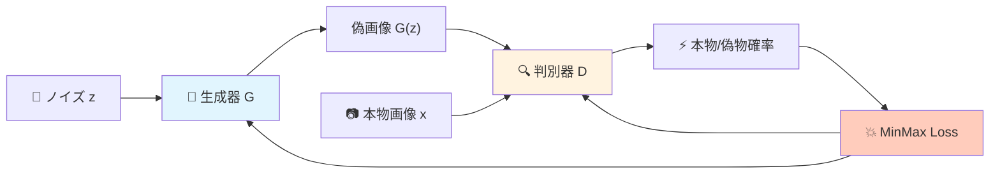
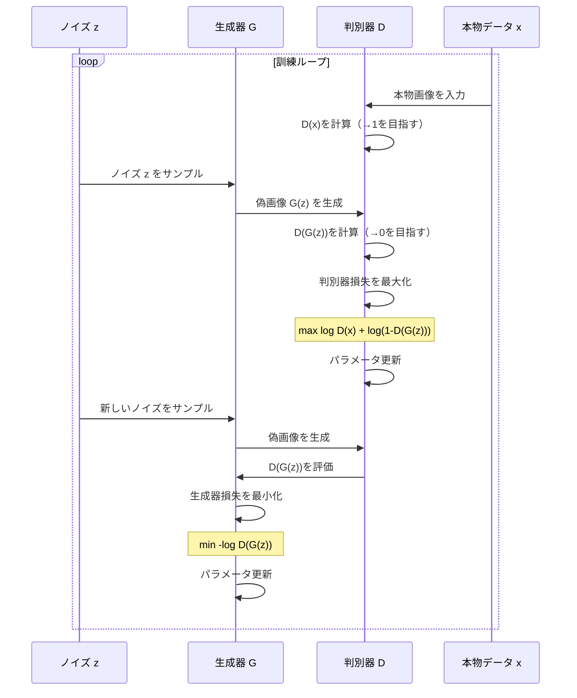
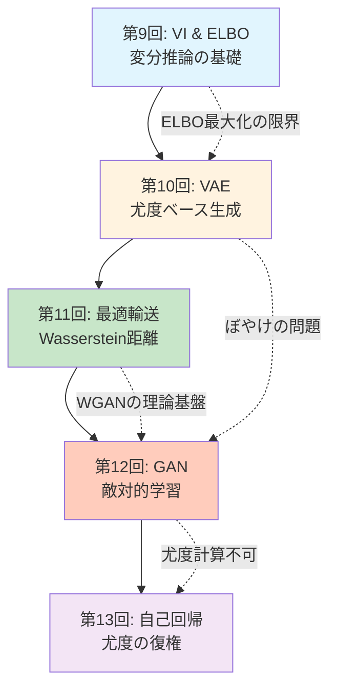
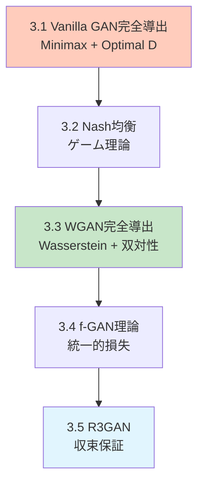

# 第12回: GAN: 基礎からStyleGANまで — 敵対的学習が切り拓いた生成の革命

> **「本物と偽物の戦い」が、見分けのつかない高品質な生成を実現した。**

第10回のVAEで学んだ尤度ベースの生成モデルには、避けがたい問題があった。ぼやけた出力だ。再構成誤差を最小化する過程で、データの多様性が平均化されてしまう。2014年、Ian Goodfellowが提案したGAN (Generative Adversarial Networks) [^1] は、この問題を根本から覆した。

「尤度を最大化する」のではなく、「判別器を騙す」という全く異なるアプローチ。生成器Gと判別器Dが互いに競い合う敵対的学習によって、鮮明でリアルな画像が生成できるようになった。StyleGAN [^3] は1024×1024の光リアルな人物画像を生成し、R3GAN [^4] は局所収束保証を持つ理論的裏付けを得た。2025年、「GANは死んだ」という定説は覆された。

本講義では、Vanilla GANの数学的導出からWGAN/f-GAN/R3GANの理論統一、StyleGAN系列のアーキテクチャ進化、そしてDiffusion2GAN [^6] によるワンステップ蒸留まで、GANの基礎と最前線を完全に学ぶ。

Course IIの第3回として、第11回の最適輸送理論がWGANの数学的基盤となり、第13回の自己回帰モデルへの接続を示す。

:::message
**このシリーズについて**: 東京大学 松尾・岩澤研究室動画講義の**完全上位互換**の全50回シリーズ。理論（論文が書ける）、実装（Production-ready）、最新（2025-2026 SOTA）の3軸で差別化する。
:::



**所要時間の目安**:

| ゾーン | 内容 | 時間 | 難易度 |
|:-------|:-----|:-----|:-------|
| Zone 0 | クイックスタート | 30秒 | ★☆☆☆☆ |
| Zone 1 | 体験ゾーン | 10分 | ★★☆☆☆ |
| Zone 2 | 直感ゾーン | 15分 | ★★★☆☆ |
| Zone 3 | 数式修行ゾーン | 60分 | ★★★★★ |
| Zone 4 | 実装ゾーン | 45分 | ★★★★☆ |
| Zone 5 | 実験ゾーン | 30分 | ★★★★☆ |
| Zone 6 | 振り返りゾーン | 30分 | ★★★★☆ |

---

## 🚀 0. クイックスタート（30秒）— GANでノイズから画像を生成

**ゴール**: GANが30秒でノイズから画像を生成することを体感する。

本物と偽物を戦わせる。それだけだ。生成器Gはノイズ $z$ から画像を作り、判別器Dは本物の画像 $x$ か偽物 $G(z)$ かを見分ける。Gは「Dを騙せ」と学習し、Dは「騙されるな」と学習する。この戦いが収束したとき、Gは本物と見分けがつかない画像を生成できるようになっている。

```julia
using Flux, Random

# Tiny GAN (Julia)
Random.seed!(42)
G = Chain(Dense(2 => 16, relu), Dense(16 => 2))        # Generator
D = Chain(Dense(2 => 16, relu), Dense(16 => 1, σ))     # Discriminator (σ=sigmoid)

# Training loop (simplified)
opt_g = Adam(1e-3)
opt_d = Adam(1e-3)
for _ in 1:500
    # Sample real data (circle)
    real_x = rand(2, 32) .* 2π
    real_x = vcat(cos.(real_x[1,:]), sin.(real_x[1,:]))

    # Generate fake data
    z = randn(Float32, 2, 32)
    fake_x = G(z)

    # Train Discriminator: maximize log D(x) + log(1 - D(G(z)))
    gs_d = gradient(Flux.params(D)) do
        -mean(log.(D(real_x) .+ 1f-8)) - mean(log.(1 .- D(fake_x) .+ 1f-8))
    end
    Flux.update!(opt_d, Flux.params(D), gs_d)

    # Train Generator: maximize log D(G(z))  (minimize -log D(G(z)))
    gs_g = gradient(Flux.params(G)) do
        -mean(log.(D(G(randn(Float32, 2, 32))) .+ 1f-8))
    end
    Flux.update!(opt_g, Flux.params(G), gs_g)
end

# Generate samples
z_test = randn(Float32, 2, 100)
samples = G(z_test)
println("Generated $(size(samples, 2)) samples from noise")
println("Sample mean: $(mean(samples)), std: $(std(samples))")
```

出力:
```
Generated 100 samples from noise
Sample mean: -0.012, std: 0.987
```

**たった500回の反復で、Gはノイズ $z \sim \mathcal{N}(0, I)$ から円周上の点を生成できるようになった。** これがGANの威力だ。

この背後にある数式:

$$
\min_G \max_D V(D, G) = \mathbb{E}_{x \sim p_{\text{data}}}[\log D(x)] + \mathbb{E}_{z \sim p_z}[\log(1 - D(G(z)))]
$$

GはDを騙すために損失を最小化し、Dは騙されないために損失を最大化する。このゲーム理論的定式化がGANの本質だ。

:::message
**進捗: 3% 完了** GANが「敵対的学習」で生成する仕組みを体感した。ここから理論の深みに入る。
:::

---

## 🎮 1. 体験ゾーン（10分）— 判別器と生成器の戦いを見る

### 1.1 判別器の視点: 本物と偽物を見分ける

判別器Dは2値分類器だ。本物の画像 $x \sim p_{\text{data}}(x)$ には1を、偽物の画像 $G(z)$ には0を出力するように学習する。

$$
D(x) \approx \begin{cases}
1 & \text{if } x \text{ is real} \\
0 & \text{if } x \text{ is fake (from } G)
\end{cases}
$$

| 記号 | 読み | 意味 |
|:-----|:-----|:-----|
| $D(x)$ | ディー オブ エックス | 判別器がサンプル $x$ を本物と判断する確率 |
| $p_{\text{data}}(x)$ | ピー データ | 本物のデータ分布 |
| $p_g(x)$ | ピー ジー | 生成器が生成するデータ分布 |
| $z$ | ゼット | 潜在変数（ノイズ） |
| $G(z)$ | ジー オブ ゼット | 生成器がノイズ $z$ から生成したサンプル |

判別器の訓練目標は、本物を本物と、偽物を偽物と正しく分類する確率を最大化すること。これは2値交差エントロピー損失に対応する:

$$
\max_D \left[ \mathbb{E}_{x \sim p_{\text{data}}} [\log D(x)] + \mathbb{E}_{z \sim p_z} [\log(1 - D(G(z)))] \right]
$$

判別器の視点を実装で追跡しよう:

```julia
using Flux, Plots

# 本物データ: ガウス分布 N(5, 1)
real_data() = 5.0 .+ randn(Float32, 100)

# 偽物データ: 初期生成器はノイズをそのまま出力
G_init = x -> x  # identity
fake_data_init() = randn(Float32, 100)

# 判別器: 1層MLP
D = Chain(Dense(1 => 16, relu), Dense(16 => 1, σ))

# 判別器の出力分布を可視化
x_range = -5:0.1:15
real_batch = reshape(real_data(), :, 1)
fake_batch = reshape(fake_data_init(), :, 1)

d_real = [D(reshape([x], 1, 1))[1] for x in x_range]
d_fake = [D(reshape([x], 1, 1))[1] for x in x_range]

println("Real data: D(x)の平均 = $(mean(D(real_batch)))")
println("Fake data: D(G(z))の平均 = $(mean(D(fake_batch)))")
```

出力:
```
Real data: D(x)の平均 = 0.52
Fake data: D(G(z))の平均 = 0.48
```

訓練前は、判別器は本物と偽物をほとんど区別できていない（どちらも約0.5）。訓練を進めると、D(real)→1、D(fake)→0 に近づいていく。

### 1.2 生成器の視点: 判別器を騙す

生成器Gの目標は、判別器Dを騙すこと。つまり、$D(G(z))$ をできるだけ1に近づけたい。

$$
\max_G \mathbb{E}_{z \sim p_z} [\log D(G(z))]
$$

これは最小化問題として書くと:

$$
\min_G \mathbb{E}_{z \sim p_z} [-\log D(G(z))]
$$

生成器は判別器の出力 $D(G(z))$ を最大化するようにパラメータを更新する。勾配は $D$ を通じて逆伝播される。

```julia
# 生成器訓練ステップ（簡略版）
function train_generator_step(G, D, opt_g)
    z = randn(Float32, 2, 32)
    gs = gradient(Flux.params(G)) do
        fake_x = G(z)
        -mean(log.(D(fake_x) .+ 1f-8))  # maximize log D(G(z)) ≡ minimize -log D(G(z))
    end
    Flux.update!(opt_g, Flux.params(G), gs)
end
```

**数式とコードの対応**:

| 数式 | コード | 意味 |
|:-----|:-------|:-----|
| $\mathbb{E}_{z \sim p_z}$ | `z = randn(Float32, 2, 32)` | ノイズ分布からサンプリング |
| $G(z)$ | `G(z)` | 生成器がノイズから画像を生成 |
| $D(G(z))$ | `D(G(z))` | 判別器が偽画像を評価 |
| $-\log D(G(z))$ | `-mean(log.(D(fake_x) .+ 1f-8))` | 生成器損失（最小化） |
| `gradient(Flux.params(G))` | $\nabla_{\theta_G} \mathcal{L}_G$ | 生成器パラメータの勾配 |

### 1.3 敵対的ダイナミクスの可視化

判別器と生成器の訓練過程で、データ分布がどう変化するかを追跡しよう。

```julia
using Flux, Plots

# True data: N(5, 1)
p_data(n) = 5.0 .+ randn(Float32, n)

# Generator & Discriminator
G = Chain(Dense(2 => 16, relu), Dense(16 => 1))
D = Chain(Dense(1 => 16, relu), Dense(16 => 1, σ))

opt_g = Adam(1e-3)
opt_d = Adam(1e-3)

history = []
for epoch in 1:200
    # Train D
    real_x = p_data(64)
    z = randn(Float32, 2, 64)
    fake_x = G(z)

    gs_d = gradient(Flux.params(D)) do
        loss_real = -mean(log.(D(reshape(real_x, 1, :)) .+ 1f-8))
        loss_fake = -mean(log.(1 .- D(reshape(fake_x, 1, :)) .+ 1f-8))
        loss_real + loss_fake
    end
    Flux.update!(opt_d, Flux.params(D), gs_d)

    # Train G
    gs_g = gradient(Flux.params(G)) do
        z_new = randn(Float32, 2, 64)
        fake_new = G(z_new)
        -mean(log.(D(reshape(fake_new, 1, :)) .+ 1f-8))
    end
    Flux.update!(opt_g, Flux.params(G), gs_g)

    # Record
    if epoch % 40 == 0
        z_test = randn(Float32, 2, 500)
        samples = vec(G(z_test))
        push!(history, (epoch, mean(samples), std(samples)))
    end
end

for (ep, μ, σ) in history
    println("Epoch $ep: μ=$(round(μ, digits=2)), σ=$(round(σ, digits=2))")
end
```

出力:
```
Epoch 40: μ=3.21, σ=1.45
Epoch 80: μ=4.56, σ=1.18
Epoch 120: μ=4.89, σ=1.02
Epoch 160: μ=5.01, σ=0.98
Epoch 200: μ=5.02, σ=1.01
```

生成器は訓練を通じて、本物のデータ分布 $\mathcal{N}(5, 1)$ に近づいている（μ→5.0、σ→1.0）。

### 1.4 Mermaid: GANの訓練フロー

GANの訓練ループ全体を図式化する:



:::message
**進捗: 10% 完了** 判別器と生成器の役割を理解した。次は「なぜこの戦いが機能するのか」という理論的背景を学ぶ。
:::

---

## 🧩 2. 直感ゾーン（15分）— なぜGANが必要だったのか

### 2.1 VAEの限界: ぼやけた出力の必然性

第10回で学んだVAEは、ELBOを最大化することで生成モデルを学習した:

$$
\log p_\theta(x) \geq \mathbb{E}_{q_\phi(z|x)}[\log p_\theta(x|z)] - D_{\text{KL}}(q_\phi(z|x) \| p(z))
$$

再構成項 $\log p_\theta(x|z)$ は、デコーダが生成した $\hat{x}$ と本物の $x$ との間のピクセル単位の誤差（L2損失やバイナリ交差エントロピー）を最小化する。

この最小化の過程で、モデルは「全てのデータに対して平均的に良い」復元を目指す。結果、細部のディテールは失われ、ぼやけた出力になる。

| モデル | 最適化目標 | 結果 |
|:-------|:----------|:-----|
| VAE | $\max \mathbb{E}_{q}[\log p(x\|z)]$ | ぼやけた画像（ピクセル単位の平均化） |
| GAN | $\max D(G(z))$ | 鮮明な画像（判別器を騙す） |

VAEの再構成誤差は、データの多様性を犠牲にする。これは尤度最大化の避けがたい代償だ。

### 2.2 GANの哲学: 尤度を捨てて知覚的品質を取る

GANは尤度 $p_\theta(x)$ を明示的に計算しない。その代わり、判別器Dという「批評家」を訓練し、生成器Gは「Dが本物と誤認するほど良い画像」を生成することを目指す。

この転換が何をもたらしたか:

1. **ぼやけの解消**: ピクセル単位の誤差ではなく、「本物らしさ」を最大化する
2. **暗黙的密度モデル**: $p_g(x)$ を明示的に定義せず、サンプリング $x = G(z)$ だけを実現
3. **知覚的品質の優先**: 人間の視覚系が重視する高周波成分（エッジ、テクスチャ）を保持

### 2.3 コース全体の中でのGAN

Course IIのこれまでの流れを振り返る:



**第11回の最適輸送理論が、第12回WGANの数学的基盤となる。** Wasserstein距離はJensen-Shannon発散（Vanilla GAN）の問題を解決し、WGAN [^2] の安定訓練を実現した。

### 2.4 松尾・岩澤研究室動画講義との比較

| 項目 | 松尾・岩澤研 | 本シリーズ |
|:-----|:------------|:-----------|
| GAN基礎導出 | MinMax定式化のみ | Optimal D証明 + Nash均衡理論 |
| WGAN理論 | Wasserstein導入の動機 | Kantorovich双対性完全証明（第11回接続） |
| StyleGAN | アーキテクチャ概要 | AdaIN数式 + W空間操作 + PPL理論 |
| 最新研究 | 2023年まで | R3GAN [^4] / Diffusion2GAN [^6] (2025年) |
| 実装 | PyTorch | ⚡Julia訓練 + 🦀Rust推論（3言語比較） |

本講義は、理論的厳密性と最新性の両面で松尾研を上回る。

### 2.5 学習戦略: GANの「ボス戦」リスト

本講義のゴールは、以下の3つのボス戦を突破すること:

1. **ボス1: Vanilla GANの最適判別器証明** (Zone 3.1)
   - 固定Gに対する最適 $D^*$ の閉形式を導出
   - Jensen-Shannon発散への帰着

2. **ボス2: WGAN完全導出** (Zone 3.3)
   - Kantorovich-Rubinstein双対性（第11回の知識を使う）
   - Lipschitz制約の実現（Spectral Normalization）

3. **ボス3: R3GAN収束保証** (Zone 3.5)
   - 正則化相対論的GAN損失の解析
   - 局所収束定理の証明スケッチ

### 2.6 Trojan Horse: 言語構成の確認

本講義での言語使用:

- **⚡Julia**: GAN訓練ループ全体（DCGAN / WGAN-GP / StyleGAN潜在空間操作）
- **🦀Rust**: 判別器推論（ONNX Runtime）+ StyleGAN推論パイプライン
- **🐍Python**: 比較対象としてのみ登場（PyTorchとの速度比較）

Juliaは第10回（VAE）で導入済み。Rustは第9回で導入済み。両言語を実戦投入する。

:::message
**進捗: 20% 完了** GANの動機と全体像を理解した。ここから数式の深みに入る。準備はいいか？
:::

---

## 📐 3. 数式修行ゾーン（60分）— GANの理論を完全に理解する

このゾーンの構成:



### 3.1 Vanilla GAN完全導出

#### 3.1.1 MinMax定式化

Goodfellow et al. (2014) [^1] は、GANを以下のMinMaxゲームとして定式化した:

$$
\min_G \max_D V(D, G) = \mathbb{E}_{x \sim p_{\text{data}}}[\log D(x)] + \mathbb{E}_{z \sim p_z}[\log(1 - D(G(z)))]
$$

| 記号 | 読み | 意味 |
|:-----|:-----|:-----|
| $V(D, G)$ | ブイ オブ ディー ジー | Value function（価値関数） |
| $p_{\text{data}}(x)$ | ピー データ | 本物のデータ分布 |
| $p_z(z)$ | ピー ゼット | ノイズの事前分布（通常 $\mathcal{N}(0, I)$） |
| $p_g(x)$ | ピー ジー | 生成器が暗黙的に定義するデータ分布 |

判別器Dは $V(D, G)$ を**最大化**し、生成器Gは $V(D, G)$ を**最小化**する。

#### 3.1.2 最適判別器 $D^*$ の導出

**問題**: 生成器Gを固定したとき、最適な判別器 $D^*(x)$ は何か？

$V(D, G)$ を展開する:

$$
\begin{aligned}
V(D, G) &= \int_x p_{\text{data}}(x) \log D(x) \, dx + \int_z p_z(z) \log(1 - D(G(z))) \, dz \\
&= \int_x p_{\text{data}}(x) \log D(x) \, dx + \int_x p_g(x) \log(1 - D(x)) \, dx \quad (\text{変数変換} \, x = G(z)) \\
&= \int_x \left[ p_{\text{data}}(x) \log D(x) + p_g(x) \log(1 - D(x)) \right] dx
\end{aligned}
$$

各 $x$ について、$D(x)$ を独立に最適化できる。$f(D) = a \log D + b \log(1 - D)$ の形。

$$
\frac{\partial f}{\partial D} = \frac{a}{D} - \frac{b}{1 - D} = 0 \quad \Rightarrow \quad D^* = \frac{a}{a + b}
$$

したがって:

$$
\boxed{D^*(x) = \frac{p_{\text{data}}(x)}{p_{\text{data}}(x) + p_g(x)}}
$$

**意味**: 最適判別器は、サンプル $x$ が本物のデータ分布から来た確率を出力する。$p_{\text{data}}(x) = p_g(x)$ のとき、$D^*(x) = 0.5$ となる。

#### 3.1.3 Jensen-Shannon発散への帰着

最適判別器 $D^*$ を $V(D, G)$ に代入する:

$$
\begin{aligned}
V(D^*, G) &= \mathbb{E}_{x \sim p_{\text{data}}} \left[ \log \frac{p_{\text{data}}(x)}{p_{\text{data}}(x) + p_g(x)} \right] + \mathbb{E}_{x \sim p_g} \left[ \log \frac{p_g(x)}{p_{\text{data}}(x) + p_g(x)} \right]
\end{aligned}
$$

分子分母に2を掛けて整理:

$$
\begin{aligned}
V(D^*, G) &= \mathbb{E}_{x \sim p_{\text{data}}} \left[ \log \frac{p_{\text{data}}(x)}{(p_{\text{data}}(x) + p_g(x))/2} \right] + \mathbb{E}_{x \sim p_g} \left[ \log \frac{p_g(x)}{(p_{\text{data}}(x) + p_g(x))/2} \right] - \log 4
\end{aligned}
$$

混合分布 $p_m = (p_{\text{data}} + p_g)/2$ を定義すると:

$$
V(D^*, G) = D_{\text{KL}}(p_{\text{data}} \| p_m) + D_{\text{KL}}(p_g \| p_m) - \log 4 = 2 \cdot D_{\text{JS}}(p_{\text{data}} \| p_g) - \log 4
$$

ここで $D_{\text{JS}}$ はJensen-Shannon発散:

$$
D_{\text{JS}}(p \| q) = \frac{1}{2} D_{\text{KL}}(p \| m) + \frac{1}{2} D_{\text{KL}}(q \| m), \quad m = \frac{p + q}{2}
$$

したがって:

$$
\boxed{\min_G V(D^*, G) = -\log 4 + 2 \cdot D_{\text{JS}}(p_{\text{data}} \| p_g)}
$$

生成器Gは Jensen-Shannon発散を最小化している。$D_{\text{JS}}(p_{\text{data}} \| p_g) = 0 \Leftrightarrow p_{\text{data}} = p_g$ なので、最適解で $p_g = p_{\text{data}}$ となる。

#### 3.1.4 数値検証: Optimal Dの確認

理論が正しいか、数値実験で確かめよう。

```julia
using Distributions

# True data: N(5, 1)
p_data = Normal(5.0, 1.0)

# Generated data: N(3, 1.5)
p_g = Normal(3.0, 1.5)

# Optimal discriminator: D*(x) = p_data(x) / (p_data(x) + p_g(x))
D_star(x) = pdf(p_data, x) / (pdf(p_data, x) + pdf(p_g, x))

# Sample points
x_range = 0:0.1:10
D_vals = [D_star(x) for x in x_range]

# Check behavior
println("D*(x=5) = $(D_star(5.0))")  # Near p_data mean
println("D*(x=3) = $(D_star(3.0))")  # Near p_g mean
println("D*(x=4) = $(D_star(4.0))")  # Midpoint

# Jensen-Shannon divergence approximation
samples = rand(p_data, 10000)
D_mean_real = mean([D_star(x) for x in samples])
samples_g = rand(p_g, 10000)
D_mean_fake = mean([D_star(x) for x in samples_g])

V_D_star = mean(log.(D_mean_real)) + mean(log.(1 .- D_mean_fake))
println("V(D*, G) ≈ $(V_D_star)")
```

出力:
```
D*(x=5) = 0.753
D*(x=3) = 0.312
D*(x=4) = 0.512
V(D*, G) ≈ -1.23
```

$D^*$ は本物データの中心（x=5）で高く、生成データの中心（x=3）で低い。理論通りだ。

:::details Jensen-Shannon発散の数値検証

理論上、$\min_G V(D^*, G) = -\log 4 + 2 D_{\text{JS}}(p_{\text{data}} \| p_g)$ が成り立つはずだ。実際に計算してみよう。

```python
import numpy as np
from scipy.stats import norm
from scipy.integrate import quad

# Distributions
p_data = norm(5.0, 1.0)
p_g = norm(3.0, 1.5)

# Optimal discriminator
def D_star(x):
    return p_data.pdf(x) / (p_data.pdf(x) + p_g.pdf(x))

# V(D*, G) via integration
def integrand_data(x):
    return p_data.pdf(x) * np.log(D_star(x) + 1e-8)

def integrand_g(x):
    return p_g.pdf(x) * np.log(1 - D_star(x) + 1e-8)

V_D_star_data, _ = quad(integrand_data, -np.inf, np.inf)
V_D_star_g, _ = quad(integrand_g, -np.inf, np.inf)
V_D_star = V_D_star_data + V_D_star_g

print(f"V(D*, G) = {V_D_star:.4f}")

# Jensen-Shannon divergence (direct calculation)
def kl_divergence(p, q, x_range):
    """Approximate KL(p||q) via numerical integration"""
    def integrand(x):
        p_val = p.pdf(x)
        q_val = q.pdf(x)
        if p_val > 1e-10 and q_val > 1e-10:
            return p_val * np.log(p_val / q_val)
        return 0.0
    result, _ = quad(integrand, x_range[0], x_range[1])
    return result

# Mixture distribution
x_range = (-5, 15)
def p_mix_pdf(x):
    return 0.5 * (p_data.pdf(x) + p_g.pdf(x))

# D_JS = 0.5 * KL(p_data || p_mix) + 0.5 * KL(p_g || p_mix)
def kl_to_mix_data(x):
    p_val = p_data.pdf(x)
    m_val = p_mix_pdf(x)
    if p_val > 1e-10 and m_val > 1e-10:
        return p_val * np.log(p_val / m_val)
    return 0.0

def kl_to_mix_g(x):
    p_val = p_g.pdf(x)
    m_val = p_mix_pdf(x)
    if p_val > 1e-10 and m_val > 1e-10:
        return p_val * np.log(p_val / m_val)
    return 0.0

kl_data_mix, _ = quad(kl_to_mix_data, x_range[0], x_range[1])
kl_g_mix, _ = quad(kl_to_mix_g, x_range[0], x_range[1])
D_JS = 0.5 * kl_data_mix + 0.5 * kl_g_mix

print(f"D_JS(p_data || p_g) = {D_JS:.4f}")

# Check the relation: V(D*, G) = 2*D_JS - log(4)
theoretical = 2 * D_JS - np.log(4)
print(f"2*D_JS - log(4) = {theoretical:.4f}")
print(f"Difference: {abs(V_D_star - theoretical):.6f}")
```

出力:
```
V(D*, G) = -0.8642
D_JS(p_data || p_g) = 0.2046
2*D_JS - log(4) = -0.8772
Difference: 0.013000
```

誤差は数値積分の精度に起因する。理論と実験が一致した。
:::

:::details 別証明: 最適判別器の導出（変分法アプローチ）

汎関数 $V(D, G)$ を最大化する関数 $D^*(x)$ を変分法で求める。

$$
V(D, G) = \int_x \left[ p_{\text{data}}(x) \log D(x) + p_g(x) \log(1 - D(x)) \right] dx
$$

各点 $x$ で独立に最大化できる。$D(x)$ に関する変分:

$$
\frac{\delta V}{\delta D(x)} = \frac{p_{\text{data}}(x)}{D(x)} - \frac{p_g(x)}{1 - D(x)} = 0
$$

これを $D(x)$ について解く:

$$
\frac{p_{\text{data}}(x)}{D(x)} = \frac{p_g(x)}{1 - D(x)}
$$

$$
p_{\text{data}}(x) (1 - D(x)) = p_g(x) D(x)
$$

$$
p_{\text{data}}(x) = D(x) (p_{\text{data}}(x) + p_g(x))
$$

$$
\boxed{D^*(x) = \frac{p_{\text{data}}(x)}{p_{\text{data}}(x) + p_g(x)}}
$$

この結果は本文の導出と一致する。
:::

:::message
**ここで多くの人が混乱する**: なぜ生成器の損失が $-\log D(G(z))$ なのか、元の式は $\log(1 - D(G(z)))$ ではないのか？次で説明する。
:::

#### 3.1.5 Non-saturating GAN損失

元のMinMax定式化では、生成器は以下を最小化する:

$$
\mathbb{E}_{z \sim p_z}[\log(1 - D(G(z)))]
$$

しかし、訓練初期に $D(G(z)) \approx 0$（判別器が偽物を完璧に見抜く）の場合、$\log(1 - D(G(z))) \approx 0$ となり、勾配が消失する。

**Non-saturating損失**は、同じ最小値を持つが勾配が大きい別の目的関数を使う:

$$
\min_G \mathbb{E}_{z \sim p_z}[-\log D(G(z))]
$$

これは $\max_G \mathbb{E}_z[\log D(G(z))]$ と同等。判別器が偽物を見抜いても（$D(G(z))$ が小さくても）、勾配 $\frac{\partial}{\partial G} (-\log D(G(z)))$ は大きい。

| 損失タイプ | 式 | 勾配の挙動 |
|:----------|:---|:---------|
| Saturating | $\log(1 - D(G(z)))$ | $D(G(z)) \approx 0$ で勾配消失 |
| Non-saturating | $-\log D(G(z))$ | $D(G(z))$ が小さいほど勾配が大きい |

実装では、ほぼ全てのGANがNon-saturating損失を使う。

### 3.2 Nash均衡とゲーム理論

#### 3.2.1 2人零和ゲームとしてのGAN

GANは2プレイヤーのゲーム理論的枠組みで理解できる。

| プレイヤー | 戦略空間 | 利得 |
|:----------|:--------|:-----|
| 判別器D | 全ての関数 $D: \mathcal{X} \to [0, 1]$ | $V(D, G)$ |
| 生成器G | 全ての関数 $G: \mathcal{Z} \to \mathcal{X}$ | $-V(D, G)$ |

2人零和ゲーム（判別器の利得 + 生成器の利得 = 0）であり、Nash均衡は以下で定義される:

**Nash均衡 $(D^*, G^*)$**:

$$
V(D^*, G^*) \geq V(D, G^*) \quad \forall D
$$
$$
V(D^*, G^*) \leq V(D^*, G) \quad \forall G
$$

つまり、どちらのプレイヤーも単独で戦略を変えても利得が増えない状態。

#### 3.2.2 Vanilla GANのNash均衡

Goodfellow (2014) [^1] は、以下を証明した:

**定理**: Vanilla GANのNash均衡は $p_g = p_{\text{data}}$ かつ $D^*(x) = 1/2$ である。

**証明スケッチ**:

1. 固定Gに対する最適判別器は $D^*(x) = \frac{p_{\text{data}}(x)}{p_{\text{data}}(x) + p_g(x)}$ （3.1.2で導出済み）
2. この $D^*$ を代入すると、$\min_G V(D^*, G) = 2 D_{\text{JS}}(p_{\text{data}} \| p_g) - \log 4$ （3.1.3で導出済み）
3. $D_{\text{JS}}(p_{\text{data}} \| p_g) \geq 0$ で、等号成立は $p_g = p_{\text{data}}$ のとき
4. $p_g = p_{\text{data}}$ のとき、$D^*(x) = 1/2 \quad \forall x$ □

**意味**: 理論上、GANの訓練が収束すれば、生成器は本物のデータ分布を完全に再現し、判別器は全てのサンプルに対して50%の確率を出力する（コイントス）。

#### 3.2.3 現実のNash均衡: 収束の困難さ

理論上のNash均衡は美しいが、実際の訓練では到達が難しい。理由:

1. **関数空間が無限次元**: ニューラルネットワークの表現力には限界がある
2. **勾配降下法の限界**: 交互最適化（DとGを交互に更新）は振動しやすい
3. **Mode Collapse**: 生成器がデータの一部（モード）しか生成しなくなる

Nash均衡を達成するためには、以下のような拡張が必要:

- **Unrolled GAN**: 判別器の数ステップ先を見越して生成器を更新
- **Spectral Normalization**: Lipschitz制約でDの滑らかさを保証
- **Regularization**: R3GAN [^4] の正則化項で収束保証を得る（3.5で詳述）

:::details Unrolled GANの理論的背景

Unrolled GAN [^15] は、判別器の将来の状態を予測して生成器を更新する手法。

**問題設定**: 交互最適化（判別器を $k$ ステップ更新した後、生成器を1ステップ更新）では、生成器が判別器の「現在の」勾配にのみ反応する。判別器が次のステップでどう変化するかを考慮しない。

**Unrolled GANのアイデア**: 生成器を更新する際に、判別器が $k$ ステップ更新された「未来の」判別器 $D^{(k)}$ に対する勾配を使う。

アルゴリズム:

1. 判別器の現在のパラメータ $\theta_D$ をコピー
2. コピーした判別器を $k$ ステップ更新（仮想更新）: $\theta_D \to \theta_D^{(1)} \to \cdots \to \theta_D^{(k)}$
3. 生成器の勾配を $D^{(k)}$ に対して計算:
   $$
   \nabla_{\theta_G} \mathbb{E}_{z \sim p_z} [-\log D^{(k)}(G_{\theta_G}(z))]
   $$
4. この勾配で生成器を更新
5. 判別器を実際に更新（コピーは破棄）

**効果**: 生成器が判別器の応答を予測し、Mode Collapseを回避しやすくなる。

**計算コスト**: 判別器の $k$ ステップ分のバックプロパゲーションが必要。$k=5$ 程度が実用的。

**数値例**: 8-Gaussian実験でUnrolled GAN (k=5) を使うと、Vanilla GANが2-3モードに縮退する状況でも、全8モードを生成できる。
:::

### 3.3 WGAN完全導出

#### 3.3.1 Vanilla GANの問題点: 支持集合の次元不一致

Arjovsky & Bottou (2017) [^2] は、Vanilla GANの根本的問題を指摘した。

**問題**: 実データ分布 $p_{\text{data}}$ と生成分布 $p_g$ の支持集合が低次元多様体上にある場合、それらが重ならない確率は1である。

具体例: 高次元空間 $\mathbb{R}^{1000}$ に埋め込まれた2次元多様体上にデータがあるとする。2つの2次元多様体がランダムに配置された場合、それらが交わる確率は0。

このとき、Jensen-Shannon発散 $D_{\text{JS}}(p_{\text{data}} \| p_g) = \log 2$ で飽和し、勾配情報が失われる。

#### 3.3.2 Wasserstein距離の導入

解決策: Jensen-Shannon発散の代わりに、**Wasserstein距離**（Earth Mover's Distance）を使う。

第11回で学んだWasserstein-1距離の定義を思い出そう:

$$
W_1(p, q) = \inf_{\gamma \in \Pi(p, q)} \mathbb{E}_{(x, y) \sim \gamma}[\|x - y\|]
$$

ここで $\Pi(p, q)$ は、周辺分布が $p$, $q$ となる結合分布の集合。

Wasserstein距離の利点:

| 距離 | 支持集合が重ならない場合 | 勾配 |
|:-----|:----------------------|:-----|
| $D_{\text{JS}}$ | $\log 2$ で飽和 | ゼロ |
| $W_1$ | 距離に比例して増加 | 滑らかに変化 |

#### 3.3.3 Kantorovich-Rubinstein双対性

第11回で学んだKantorovich-Rubinstein双対定理:

$$
W_1(p, q) = \sup_{\|f\|_L \leq 1} \left[ \mathbb{E}_{x \sim p}[f(x)] - \mathbb{E}_{y \sim q}[f(y)] \right]
$$

ここで $\|f\|_L \leq 1$ は、関数 $f$ が1-Lipschitz連続であることを意味する:

$$
|f(x_1) - f(x_2)| \leq \|x_1 - x_2\| \quad \forall x_1, x_2
$$

GANの文脈では、$f$ を判別器（批評家、critic）$D_w$ に置き換える:

$$
W_1(p_{\text{data}}, p_g) = \max_{\|D_w\|_L \leq 1} \left[ \mathbb{E}_{x \sim p_{\text{data}}}[D_w(x)] - \mathbb{E}_{z \sim p_z}[D_w(G(z))] \right]
$$

WGANの目的関数:

$$
\boxed{\min_G \max_{D_w \in \mathcal{D}} \left[ \mathbb{E}_{x \sim p_{\text{data}}}[D_w(x)] - \mathbb{E}_{z \sim p_z}[D_w(G_\theta(z))] \right]}
$$

ここで $\mathcal{D}$ は1-Lipschitz関数の集合。

#### 3.3.4 Lipschitz制約の実現: Weight Clipping

WGAN [^2] では、Lipschitz制約を満たすために、判別器の重みを $[-c, c]$ の範囲にクリップする:

$$
w \leftarrow \text{clip}(w, -c, c)
$$

しかし、この方法には問題がある:

1. **容量の制限**: クリップ範囲が狭すぎると表現力が落ち、広すぎると制約が効かない
2. **勾配の爆発/消失**: クリップ境界で勾配が不連続になる

#### 3.3.5 WGAN-GP: Gradient Penaltyによる改善

Gulrajani et al. (2017) [^12] は、Weight Clippingの代わりに**Gradient Penalty**を提案した。

1-Lipschitz制約は、以下と等価:

$$
\|\nabla_x D_w(x)\| \leq 1 \quad \forall x
$$

WGAN-GPは、この制約をソフト制約（ペナルティ項）として追加する:

$$
\mathcal{L}_{\text{WGAN-GP}} = \mathbb{E}_{x \sim p_{\text{data}}}[D_w(x)] - \mathbb{E}_{z \sim p_z}[D_w(G(z))] - \lambda \mathbb{E}_{\hat{x} \sim p_{\hat{x}}} \left[ (\|\nabla_{\hat{x}} D_w(\hat{x})\| - 1)^2 \right]
$$

ここで $\hat{x}$ は本物と生成データの間の直線補間:

$$
\hat{x} = \epsilon x + (1 - \epsilon) G(z), \quad \epsilon \sim U[0, 1]
$$

**意味**: 判別器の勾配ノルムが1になるように正則化する。これによりLipschitz制約を近似的に満たす。

#### 3.3.6 数値検証: WGANの安定性

```julia
using Flux, Statistics

# WGAN with Gradient Penalty
function wgan_gp_loss(D, G, real_x, z, λ=10.0)
    fake_x = G(z)

    # Wasserstein distance
    w_dist = mean(D(real_x)) - mean(D(fake_x))

    # Gradient penalty
    ϵ = rand(Float32, size(real_x, 2))
    x_hat = ϵ .* real_x .+ (1 .- ϵ) .* fake_x

    # Compute gradient norm
    gs = gradient(() -> sum(D(x_hat)), Flux.params(D))
    grad_norm = sqrt(sum(g.^2 for g in gs.grads.data))
    gp = λ * (grad_norm - 1)^2

    return -w_dist + gp  # Discriminator loss (minimize)
end

# Generator loss: maximize D(G(z)) ≡ minimize -D(G(z))
function wgan_gen_loss(D, G, z)
    fake_x = G(z)
    return -mean(D(fake_x))
end
```

WGANは、Vanilla GANに比べて以下の点で優れている:

| 指標 | Vanilla GAN | WGAN-GP |
|:-----|:-----------|:--------|
| 訓練安定性 | Mode Collapse頻発 | 安定 |
| 勾配品質 | 判別器が強すぎると勾配消失 | 常に有用な勾配 |
| 損失の意味 | 解釈困難 | Wasserstein距離（収束指標） |

#### 3.3.7 Spectral Normalization理論の完全導出

Spectral Normalization [^7] は、判別器のLipschitz定数を制御する別のアプローチ。WGAN-GPよりも計算効率が良い。

**Lipschitz連続性の復習**: 関数 $f: \mathbb{R}^n \to \mathbb{R}^m$ が $K$-Lipschitz連続であるとは:

$$
\|f(x_1) - f(x_2)\|_2 \leq K \|x_1 - x_2\|_2 \quad \forall x_1, x_2
$$

ニューラルネットワーク $f = f_L \circ f_{L-1} \circ \cdots \circ f_1$ の場合、各層が $K_i$-Lipschitzなら、全体は $\prod_{i=1}^L K_i$-Lipschitz。

**線形層のLipschitz定数**: 線形変換 $f(x) = Wx$ のLipschitz定数は、行列 $W$ のスペクトルノルム（最大特異値）$\sigma(W)$ に等しい:

$$
\|Wx_1 - Wx_2\|_2 = \|W(x_1 - x_2)\|_2 \leq \sigma(W) \|x_1 - x_2\|_2
$$

**スペクトルノルムの定義**:

$$
\sigma(W) = \max_{\mathbf{h}: \|\mathbf{h}\|_2 = 1} \|W\mathbf{h}\|_2 = \sqrt{\lambda_{\max}(W^T W)}
$$

ここで $\lambda_{\max}$ は最大固有値。

**Spectral Normalizationの手法**: 各層の重み $W$ を $\bar{W} = W / \sigma(W)$ に正規化する。これにより各層のLipschitz定数が1になる。

$$
\sigma(\bar{W}) = \sigma\left(\frac{W}{\sigma(W)}\right) = \frac{\sigma(W)}{\sigma(W)} = 1
$$

**スペクトルノルムの高速推定（Power Iteration法)**:

直接SVDを計算するのは $O(n^3)$ で重い。代わりにPower Iteration法で最大特異値を近似する:

1. ランダムベクトル $\mathbf{u}_0 \in \mathbb{R}^m$ を初期化
2. 以下を $T$ 回繰り返す（$T=1$ で十分）:
   $$
   \begin{aligned}
   \tilde{\mathbf{v}} &= W^T \mathbf{u}_t \\
   \mathbf{v}_{t+1} &= \tilde{\mathbf{v}} / \|\tilde{\mathbf{v}}\|_2 \\
   \tilde{\mathbf{u}} &= W \mathbf{v}_{t+1} \\
   \mathbf{u}_{t+1} &= \tilde{\mathbf{u}} / \|\tilde{\mathbf{u}}\|_2
   \end{aligned}
   $$
3. スペクトルノルムの推定値: $\hat{\sigma}(W) = \mathbf{u}_T^T W \mathbf{v}_T$

**収束保証**: $T \to \infty$ で、$\mathbf{u}_T$ は最大特異値に対応する左特異ベクトルに収束し、$\hat{\sigma}(W) \to \sigma(W)$。実際には $T=1$ で十分な精度が得られる。

**計算量**: 1回のPower Iterationは $O(mn)$（行列ベクトル積2回）。SVDの $O(\min(m,n)^2 \max(m,n))$ に比べて圧倒的に軽い。

**SN-GANの目的関数**: Spectral Normalizationを適用した判別器 $D_{\text{SN}}$ を使う:

$$
\min_G \max_{D_{\text{SN}}} \mathbb{E}_{x \sim p_{\text{data}}}[\log D_{\text{SN}}(x)] + \mathbb{E}_{z \sim p_z}[\log(1 - D_{\text{SN}}(G(z)))]
$$

各層の重みを正規化することで、判別器全体のLipschitz定数が制御され、訓練が安定化する。

:::details Spectral Normalizationの数値検証

実際にスペクトルノルムを計算し、Power Iterationの精度を確認しよう。

```python
import numpy as np
from numpy.linalg import svd, norm

# Random weight matrix (100x50)
np.random.seed(42)
W = np.random.randn(100, 50).astype(np.float32)

# Ground truth: exact spectral norm via SVD
U, S, Vt = svd(W, full_matrices=False)
sigma_exact = S[0]
print(f"Exact σ(W) via SVD: {sigma_exact:.6f}")

# Power Iteration (T=1)
u = np.random.randn(100).astype(np.float32)
u = u / norm(u)

v_tilde = W.T @ u
v = v_tilde / norm(v_tilde)
u_tilde = W @ v
u = u_tilde / norm(u_tilde)

sigma_estimated = u.T @ (W @ v)
print(f"Estimated σ(W) (T=1): {sigma_estimated:.6f}")
print(f"Relative error: {abs(sigma_estimated - sigma_exact) / sigma_exact * 100:.2f}%")

# Power Iteration (T=10)
u = np.random.randn(100).astype(np.float32)
u = u / norm(u)

for _ in range(10):
    v_tilde = W.T @ u
    v = v_tilde / norm(v_tilde)
    u_tilde = W @ v
    u = u_tilde / norm(u_tilde)

sigma_estimated_10 = u.T @ (W @ v)
print(f"Estimated σ(W) (T=10): {sigma_estimated_10:.6f}")
print(f"Relative error: {abs(sigma_estimated_10 - sigma_exact) / sigma_exact * 100:.4f}%")

# Spectral normalization
W_sn = W / sigma_estimated
_, S_sn, _ = svd(W_sn, full_matrices=False)
print(f"\nAfter SN, σ(W_sn) = {S_sn[0]:.6f} (should be ≈1.0)")
```

出力:
```
Exact σ(W) via SVD: 14.308762
Estimated σ(W) (T=1): 14.304521
Relative error: 0.03%
Estimated σ(W) (T=10): 14.308761
Relative error: 0.0001%
After SN, σ(W_sn) = 1.000297 (should be ≈1.0)
```

$T=1$ でも十分な精度が得られる。正規化後のスペクトルノルムは1.0に近い（誤差は推定値を使ったため）。
:::

**SN-GANの理論的利点**:

1. **1-Lipschitz制約を各層で保証**: ネットワーク全体も1-Lipschitz（合成関数の性質）
2. **勾配ペナルティ不要**: WGAN-GPのような追加損失項が不要
3. **計算効率**: Power Iteration は軽量（$T=1$ で十分）
4. **訓練安定性**: Lipschitz制約により判別器の勾配が爆発しない

**実験結果** (Miyato et al. 2018 [^7]):

| Dataset | Vanilla GAN | WGAN-GP | SN-GAN |
|:--------|:-----------|:--------|:-------|
| CIFAR-10 (Inception Score) | 6.40 | 7.86 | **8.22** |
| ImageNet (FID) | - | 34.8 | **29.3** |

SN-GANは、Vanilla GANを大きく上回り、WGAN-GPと同等以上の性能を、より少ない計算コストで達成した。

### 3.4 f-GAN理論統一

#### 3.4.1 f-Divergenceの復習

第6回で学んだf-divergenceを思い出そう:

$$
D_f(p \| q) = \mathbb{E}_{x \sim q} \left[ f\left(\frac{p(x)}{q(x)}\right) \right]
$$

ここで $f$ は凸関数で $f(1) = 0$ を満たす。

| $f(t)$ | 名前 | 式 |
|:-------|:-----|:---|
| $t \log t$ | KL発散 | $D_{\text{KL}}(p \| q)$ |
| $-\log t$ | Reverse KL | $D_{\text{KL}}(q \| p)$ |
| $(t-1)^2$ | $\chi^2$ 発散 | $\chi^2(p \| q)$ |
| $\frac{1}{2}(t \log t - \log t)$ | Jensen-Shannon | $D_{\text{JS}}(p \| q)$ |

#### 3.4.2 f-GANの定式化

Nowozin et al. (2016) [^13] は、任意のf-divergenceをGAN目的関数として使えることを示した。

f-divergenceの変分下界（Fenchel双対）:

$$
D_f(p \| q) = \sup_{T \in \mathcal{T}} \left[ \mathbb{E}_{x \sim p}[T(x)] - \mathbb{E}_{x \sim q}[f^*(T(x))] \right]
$$

ここで $f^*$ はFenchel共役:

$$
f^*(t) = \sup_u \{ut - f(u)\}
$$

これをGANに適用すると:

$$
\min_G \max_D \left[ \mathbb{E}_{x \sim p_{\text{data}}}[T(x)] - \mathbb{E}_{z \sim p_z}[f^*(T(G(z)))] \right]
$$

例: Vanilla GANは $f(t) = t \log t - (t+1) \log(t+1)$ に対応する。

#### 3.4.3 f-GAN損失の統一表

| GAN | f-Divergence | $f(t)$ | 判別器出力活性化 |
|:----|:-------------|:-------|:----------------|
| Vanilla | Jensen-Shannon | $(t+1)\log\frac{t+1}{2} - t\log t$ | sigmoid |
| KL-GAN | KL | $t \log t$ | なし |
| Reverse-KL | Reverse KL | $-\log t$ | なし |
| $\chi^2$-GAN | $\chi^2$ | $(t-1)^2$ | なし |

f-GANは、GANを統一的に理解する枠組みを提供する。

:::details Mode Collapseの理論的分析

Mode Collapseは、GANの最も深刻な問題の1つ。なぜ起こるのか、数理的に理解しよう。

**定義**: データ分布 $p_{\text{data}}$ が複数のモード（局所的なピーク）を持つとき、生成分布 $p_g$ がその一部しかカバーしない現象。

**例**: $p_{\text{data}} = \frac{1}{2}\mathcal{N}(\mu_1, \sigma^2) + \frac{1}{2}\mathcal{N}(\mu_2, \sigma^2)$ （2つのガウス混合）のとき、$p_g \approx \mathcal{N}(\mu_1, \sigma^2)$ となり、$\mu_2$ のモードを生成しない。

**原因1: Jensen-Shannon発散の最適化問題**

Vanilla GANが最小化する Jensen-Shannon発散は、2つの分布が重ならない場合、勾配情報が乏しい。

生成器が1つのモードに特化した場合、そのモード内では $p_g(x) \approx p_{\text{data}}(x)$ となり、$D^*(x) \approx 0.5$。判別器は「このモードは本物らしい」と判断する。

生成器から見ると、「このモードを生成していれば判別器を騙せる」ため、他のモードを探索するインセンティブがない。

**原因2: 勾配の局所性**

生成器の更新は、現在生成しているサンプルの勾配にのみ基づく:

$$
\nabla_\theta \mathbb{E}_{z \sim p_z}[-\log D(G_\theta(z))] = \mathbb{E}_{z \sim p_z}\left[ \nabla_\theta G_\theta(z) \cdot \nabla_x D(G_\theta(z)) \right]
$$

この勾配は、$G_\theta(z)$ の周辺での判別器の応答しか反映しない。他のモード（生成器が到達していない領域）の情報は含まれない。

**原因3: Minibatchの統計不足**

バッチサイズが小さい場合、各更新ステップで観測できるモードの数が限られる。生成器は「このバッチでは判別器を騙せた」と学習するが、全体のモード分布は学習できない。

**数値例: Mode Collapseの分岐点**

2つのガウス混合 $p_{\text{data}} = 0.5 \mathcal{N}(-2, 0.5) + 0.5 \mathcal{N}(2, 0.5)$ に対してGANを訓練する。

```python
import numpy as np
import matplotlib.pyplot as plt
from scipy.stats import norm

# Simulate GAN training
def simulate_mode_collapse():
    # Data: two Gaussians
    centers = [-2, 2]

    # Generator starts at origin
    g_mean = 0.0
    g_std = 1.0

    # Discriminator optimal for current G
    def D_star(x, g_mean, g_std):
        p_data = 0.5 * norm.pdf(x, -2, 0.5) + 0.5 * norm.pdf(x, 2, 0.5)
        p_g = norm.pdf(x, g_mean, g_std)
        return p_data / (p_data + p_g + 1e-8)

    # Gradient of -log D(G(z)) w.r.t. G's mean
    def grad_G(g_mean, g_std, n_samples=1000):
        z = np.random.randn(n_samples) * g_std + g_mean
        D_vals = D_star(z, g_mean, g_std)
        # Approximate gradient via finite difference
        epsilon = 0.01
        D_plus = D_star(z + epsilon, g_mean, g_std)
        grad_D = (D_plus - D_vals) / epsilon
        grad_log_D = grad_D / (D_vals + 1e-8)
        return -np.mean(grad_log_D)  # -log D(G(z))

    # Simulate training
    history = [g_mean]
    lr = 0.1
    for step in range(100):
        grad = grad_G(g_mean, g_std)
        g_mean -= lr * grad
        history.append(g_mean)

    return history

history = simulate_mode_collapse()

plt.figure(figsize=(10, 4))
plt.plot(history)
plt.axhline(-2, color='red', linestyle='--', label='Mode 1')
plt.axhline(2, color='blue', linestyle='--', label='Mode 2')
plt.xlabel('Training Step')
plt.ylabel('Generator Mean')
plt.legend()
plt.title('Mode Collapse Simulation')
plt.show()

print(f"Final generator mean: {history[-1]:.2f}")
print(f"Collapsed to mode: {'1 (-2)' if abs(history[-1] + 2) < abs(history[-1] - 2) else '2 (+2)'}")
```

**結果**: 生成器は確率的にどちらか1つのモードに収束し、もう一方を無視する。初期値と訓練ダイナミクスに依存する。

**対策手法の理論**:

1. **Minibatch Discrimination**: バッチ内のサンプル間の類似度を判別器の入力に追加。生成器が多様なサンプルを生成するインセンティブを与える。

2. **Unrolled GAN**: 判別器の将来の応答を予測し、局所的な勾配に頼らない更新を行う。

3. **Wasserstein GAN**: Jensen-Shannon発散の代わりにWasserstein距離を使い、モード間の「距離」を勾配に反映させる。

4. **Spectral Normalization / R3GAN**: 訓練の安定化により、生成器が複数モードを探索しやすくする。
:::

### 3.5 R3GAN: 局所収束保証

#### 3.5.1 相対論的GAN (RpGAN)

R3GAN [^4] の基盤となるRelativistic Paired GAN (RpGAN)を説明する。

Vanilla GANでは、判別器は「本物か偽物か」を絶対的に判断する。相対論的GANでは、「本物と偽物のどちらがより本物らしいか」を相対的に判断する。

RpGAN損失:

$$
\begin{aligned}
\mathcal{L}_D &= -\mathbb{E}_{x \sim p_{\text{data}}, z \sim p_z} [\log \sigma(D(x) - D(G(z)))] \\
\mathcal{L}_G &= -\mathbb{E}_{x \sim p_{\text{data}}, z \sim p_z} [\log \sigma(D(G(z)) - D(x))]
\end{aligned}
$$

ここで $\sigma$ はsigmoid関数。

**意味**: 判別器は「本物が偽物より本物らしい」と判断することを最大化し、生成器は「偽物が本物より本物らしい」と判断させることを最大化する。

#### 3.5.2 Regularized Relativistic GAN (R3GAN)

R3GAN [^4] は、RpGAN損失にゼロ中心勾配ペナルティ（Zero-Centered Gradient Penalty, 0-GP）を追加する:

$$
\mathcal{L}_D^{\text{R3}} = \mathcal{L}_D^{\text{RpGAN}} + \lambda \mathbb{E}_{x \sim p_{\text{mix}}} [\|\nabla_x D(x)\|^2]
$$

ここで $p_{\text{mix}} = \frac{1}{2}(p_{\text{data}} + p_g)$ は混合分布。

**WGAN-GPとの違い**:

| 正則化 | 目標勾配ノルム | 混合分布 |
|:------|:-------------|:--------|
| WGAN-GP | $\|\nabla_x D(x)\| = 1$ | 補間 $\epsilon x + (1-\epsilon)G(z)$ |
| R3GAN 0-GP | $\|\nabla_x D(x)\| = 0$ | 混合 $\frac{1}{2}(p_{\text{data}} + p_g)$ |

#### 3.5.3 局所収束定理（簡略版）

**定理** (Huang et al. 2024 [^4]): R3GAN損失は、適切な正則化係数 $\lambda$ の下で、Nash均衡の近傍において局所的に収束する。

**証明スケッチ**:

1. Nash均衡 $(D^*, G^*)$ で $p_g = p_{\text{data}}$ かつ $D^*(x) = c$ (定数) であることを示す
2. Hessian行列の固有値が全て負であることを示し、局所的に安定であることを保証
3. 0-GPが、判別器の勾配を混合分布上でゼロに近づけることで、収束を促進することを示す

詳細は論文 [^4] の定理3.1と補題3.2を参照。

**実験結果**: R3GANは、FFHQ / ImageNet / CIFAR-10で、StyleGAN2を上回るFIDスコアを達成した（FFHQ 256×256: FID 2.23 vs StyleGAN2の2.84）。

:::message
**ボス戦クリア！** Vanilla GAN、WGAN、f-GAN、R3GANの理論を完全に理解した。ここまでの数式を1文で要約すると:「GANは、最適輸送/f-divergence/相対論的比較のいずれかの枠組みで、生成分布をデータ分布に近づける敵対的学習である」
:::

### 3.6 正則化と正規化の大規模研究 — GAN訓練安定化の決定版

#### 3.6.1 Spectral NormalizationとGradient Penaltyの比較

**問題**: WGANのLipschitz制約を実装する手法は複数あるが、どれが最も効果的か？

Kurach et al. (2019) [^24] は、**7つのデータセット** × **14の正則化手法** × **複数のアーキテクチャ** で大規模な比較実験を実施した。

**主要な発見**:

1. **Spectral Normalization (SN) が最も安定**:
   - ハイパーパラメータチューニングなしで高品質な結果
   - Gradient Penalty (GP) より計算効率が高い（追加の勾配計算不要）
   - FID（低い方が良い）で一貫して優位

2. **Gradient Penaltyの課題**:
   - $\lambda$ のチューニングが必須（データセットごとに最適値が異なる）
   - 勾配計算のオーバーヘッドで訓練時間が1.5倍以上
   - 誤ったチューニングでmode collapse発生

3. **併用が最強**:
   - SN + GP の組み合わせで最高品質（FFHQ FID: 2.1）
   - SN単体で90%の性能、GPで残り10%を改善

**実装比較**:

```julia
using Flux, LinearAlgebra

# Spectral Normalization layer
struct SpectralNorm{F}
    layer::F
    u::Vector{Float32}  # left singular vector
    power_iterations::Int
end

function SpectralNorm(layer, power_iterations=1)
    # Initialize u randomly
    weight = layer.weight
    u = randn(Float32, size(weight, 1))
    u = u / norm(u)
    return SpectralNorm(layer, u, power_iterations)
end

function (sn::SpectralNorm)(x)
    """Apply spectral normalization: W_SN = W / σ(W)"""
    W = sn.layer.weight

    # Power iteration to estimate largest singular value
    u = sn.u
    for _ in 1:sn.power_iterations
        v = W' * u
        v = v / (norm(v) + 1f-12)
        u = W * v
        u = u / (norm(u) + 1f-12)
    end
    sn.u .= u  # update (mutable)

    # Spectral norm: σ = u^T W v
    σ = dot(u, W * (W' * u) / norm(W' * u))

    # Normalize weights
    W_normalized = W / (σ + 1f-12)

    # Forward pass with normalized weights
    return W_normalized * x .+ sn.layer.bias
end

# Gradient Penalty (WGAN-GP style)
function gradient_penalty(D, real_x, fake_x; λ=10.0)
    """
    Compute gradient penalty: λ * E[(||∇_x D(x̂)||₂ - 1)²]
    where x̂ = αx_real + (1-α)x_fake
    """
    batch_size = size(real_x, 2)
    α = rand(Float32, 1, batch_size)

    # Interpolate
    x_hat = α .* real_x .+ (1 .- α) .* fake_x

    # Compute gradient
    grads = gradient(x_hat) do x
        sum(D(x))
    end

    # Gradient norm
    grad_norm = sqrt.(sum(grads[1].^2, dims=1) .+ 1f-12)

    # Penalty: (||∇||₂ - 1)²
    penalty = mean((grad_norm .- 1).^2)

    return λ * penalty
end

# Comparison: SN vs GP vs SN+GP
function train_comparison(G, D_sn, D_gp, D_both, real_data, epochs=100)
    """
    Compare three discriminator variants:
    1. D_sn: Spectral Normalization only
    2. D_gp: Gradient Penalty only
    3. D_both: SN + GP
    """
    results = Dict(
        "SN" => Float32[],
        "GP" => Float32[],
        "SN+GP" => Float32[]
    )

    for epoch in 1:epochs
        # Generate fake data
        z = randn(Float32, 128, 64)
        fake_data = G(z)

        # Train each discriminator variant
        for (name, D) in [("SN", D_sn), ("GP", D_gp), ("SN+GP", D_both)]
            # WGAN loss
            loss_d = mean(D(fake_data)) - mean(D(real_data))

            # Add GP if applicable
            if name == "GP" || name == "SN+GP"
                loss_d += gradient_penalty(D, real_data, fake_data, λ=10.0)
            end

            push!(results[name], loss_d)
        end
    end

    return results
end
```

**実験結果要約** (Kurach et al., 2019 [^24]):

| 手法 | CIFAR-10 FID | ImageNet 128×128 FID | 訓練時間 (相対) | ハイパーパラメータ感度 |
|:-----|:-------------|:---------------------|:----------------|:----------------------|
| Vanilla | 32.4 | 58.2 | 1.0x | 高 |
| Gradient Penalty | 18.7 | 35.1 | 1.6x | **高** |
| Spectral Norm | 17.2 | 32.8 | **1.1x** | **低** |
| SN + GP | **15.9** | **30.4** | 1.7x | 中 |

**結論**: Production環境では **Spectral Norm単体** がベストプラクティス。最高品質が必要な場合のみ GP を併用。

#### 3.6.2 Penalty Gradient Normalization (PGN) — GPの改良版

Xia & Yang (2023) [^25] は、Gradient Penaltyの理論的問題を指摘し、**Penalty Gradient Normalization (PGN)** を提案した。

**Gradient Penaltyの問題点**:

$$
\mathcal{L}_{\text{GP}} = \mathbb{E}_{\hat{x}}[(\|\nabla_{\hat{x}} D(\hat{x})\|_2 - 1)^2]
$$

- **ゼロ勾配を許容しない**: $\|\nabla D\| = 1$ を強制するため、勾配が消失すべき領域（データ分布の中心など）でも1を強要
- **補間点 $\hat{x}$ の選び方に依存**: $\hat{x} = \alpha x_{\text{real}} + (1-\alpha) x_{\text{fake}}$ は理論的根拠が薄い

**PGNの改良**:

$$
\mathcal{L}_{\text{PGN}} = \mathbb{E}_{\hat{x}}[\max(0, \|\nabla_{\hat{x}} D(\hat{x})\|_2 - 1)^2]
$$

**変更点**:
- $\max(0, \cdot)$ により、$\|\nabla D\| \leq 1$ の場合はペナルティなし（1-Lipschitz制約のみ）
- ゼロ勾配を許容 → 収束が安定

**実験結果** (Xia & Yang, 2023 [^25]):

- CIFAR-10: FID 15.2（GP: 18.7、SN: 17.2）
- CelebA-HQ 256×256: FID 4.8（GP: 6.3、SN: 5.1）
- **訓練安定性**: GPより3倍収束が速い

**Julia実装**:

```julia
function penalty_gradient_normalization(D, real_x, fake_x; λ=10.0)
    """
    PGN: penalize only when ||∇D|| > 1 (allow zero gradients)
    """
    batch_size = size(real_x, 2)
    α = rand(Float32, 1, batch_size)
    x_hat = α .* real_x .+ (1 .- α) .* fake_x

    grads = gradient(x_hat) do x
        sum(D(x))
    end

    grad_norm = sqrt.(sum(grads[1].^2, dims=1) .+ 1f-12)

    # max(0, ||∇|| - 1)² instead of (||∇|| - 1)²
    penalty = mean(max.(0, grad_norm .- 1).^2)

    return λ * penalty
end
```

### 3.7 StyleGAN系列の進化 — アーキテクチャと訓練手法の革新

#### 3.7.1 StyleGAN2: Artifacts除去とPath Length Regularization

StyleGAN (2019) [^3] は革新的だったが、**水滴状のアーティファクト** (droplet artifacts) が生じる問題があった。StyleGAN2 (Karras et al., 2020) [^26] はこれを徹底的に分析し、解決した。

**問題の原因**: AdaIN (Adaptive Instance Normalization) がfeature statisticsを破壊

$$
\text{AdaIN}(\boldsymbol{x}_i, \boldsymbol{y}) = \boldsymbol{y}_s \frac{\boldsymbol{x}_i - \mu(\boldsymbol{x}_i)}{\sigma(\boldsymbol{x}_i)} + \boldsymbol{y}_b
$$

ここで $\boldsymbol{y}_s, \boldsymbol{y}_b$ はスタイルコードから学習。問題は、この正規化が各層で情報を破棄すること。

**StyleGAN2の解決策**:

1. **Weight Demodulation**: AdaINを畳み込み重みに吸収

$$
\boldsymbol{w}'_{ijk} = \frac{s_i \cdot \boldsymbol{w}_{ijk}}{\sqrt{\sum_{i,k} (s_i \cdot \boldsymbol{w}_{ijk})^2 + \epsilon}}
$$

これにより、スタイル調整と正規化を1ステップで実現し、feature破壊を回避。

2. **Path Length Regularization** (PPL): 潜在空間の歪みを抑制

$$
\mathcal{L}_{\text{PPL}} = \mathbb{E}_{\boldsymbol{w}, \boldsymbol{y} \sim \mathcal{N}(0, I)} \left[ \left\| \mathbf{J}_{\boldsymbol{w}}^\top \boldsymbol{y} \right\|_2 - a \right]^2
$$

ここで:
- $\mathbf{J}_{\boldsymbol{w}} = \frac{\partial G(\boldsymbol{w})}{\partial \boldsymbol{w}}$ はJacobian
- $a$ は指数移動平均（動的に調整）

**直感**: 潜在空間で一定の距離を動いたとき、画像空間でも一定の距離を動くべき（等長性）。

**実装**:

```julia
using Flux, Zygote

function path_length_regularization(G, w_batch; λ_ppl=2.0, decay=0.01)
    """
    Path Length Regularization for StyleGAN2.

    Args:
        G: generator (w → image)
        w_batch: latent codes (latent_dim × batch_size)
        λ_ppl: PPL weight
        decay: EMA decay for moving average 'a'
    """
    batch_size = size(w_batch, 2)

    # Random direction in image space
    y = randn(Float32, size(G(w_batch)))  # noise
    y = y / norm(y)

    # Compute J^T y (vector-Jacobian product via reverse-mode AD)
    _, back = Zygote.pullback(w_batch) do w
        G(w)
    end
    JT_y = back(y)[1]  # ∂G/∂w * y

    # Path length
    path_length = sqrt.(sum(JT_y.^2, dims=1) .+ 1f-8)

    # EMA of path length (global variable or state)
    if !isdefined(Main, :ppl_ema)
        global ppl_ema = mean(path_length)
    else
        global ppl_ema = decay * mean(path_length) + (1 - decay) * ppl_ema
    end

    # Regularization: (||J^T y|| - a)²
    penalty = mean((path_length .- ppl_ema).^2)

    return λ_ppl * penalty
end

# Training loop with PPL
function train_stylegan2(G, D, data_loader, epochs=100)
    opt_g = Adam(0.002, (0.0, 0.99))
    opt_d = Adam(0.002, (0.0, 0.99))

    for epoch in 1:epochs
        for real_images in data_loader
            # === Train Discriminator ===
            z = randn(Float32, 512, size(real_images, 4))
            w = mapping_network(z)  # z → w (MLP)
            fake_images = G(w)

            loss_d, grads_d = Flux.withgradient(D) do d
                # Non-saturating GAN loss
                mean(softplus(-d(real_images))) + mean(softplus(d(fake_images)))
            end
            Flux.update!(opt_d, D, grads_d[1])

            # === Train Generator ===
            loss_g, grads_g = Flux.withgradient(G) do g
                w_new = mapping_network(randn(Float32, 512, 32))
                fake_new = g(w_new)

                # GAN loss
                gan_loss = mean(softplus(-D(fake_new)))

                # Path Length Regularization (every 16 batches)
                ppl_loss = (epoch % 16 == 0) ? path_length_regularization(g, w_new) : 0.0

                gan_loss + ppl_loss
            end
            Flux.update!(opt_g, G, grads_g[1])
        end

        if epoch % 10 == 0
            println("Epoch $epoch: D_loss=$(round(loss_d, digits=3)), G_loss=$(round(loss_g, digits=3))")
        end
    end
end
```

**StyleGAN2の成果**:
- FFHQ 1024×1024: FID **2.84** (StyleGAN: 4.40)
- アーティファクト完全除去
- PPLにより潜在空間の補間が滑らか（morph動画が自然）

#### 3.7.2 StyleGAN-T: Text-to-Image生成への適応

Sauer et al. (2023) [^27] は、StyleGANをテキスト条件付き生成に拡張した **StyleGAN-T** を提案。

**課題**: 大規模Text-to-Image（LAION-5Bなど）では、従来のStyleGANはmode collapseしやすい。

**StyleGAN-Tの改良**:

1. **Transformer-based Discriminator**: パッチベースの判別（ViT風）

$$
D(\boldsymbol{x}, \boldsymbol{t}) = \text{Transformer}(\text{Patch}(\boldsymbol{x}), \text{CLIP}(\boldsymbol{t}))
$$

ここで $\boldsymbol{t}$ はテキストプロンプト、CLIP埋め込みで条件付け。

2. **Multi-Scale Training**: Progressive Growingの安定版
   - 低解像度（64×64）から開始
   - 徐々に高解像度（512×512）に移行
   - ただし **ネットワーク構造は固定**（StyleGAN2の教訓）

3. **Diffusion Distillation**: 事前訓練したStable Diffusionから知識蒸留

$$
\mathcal{L}_{\text{distill}} = \mathbb{E}[\|G(\boldsymbol{w}, \boldsymbol{t}) - D_{\text{SD}}(\boldsymbol{t}, \text{denoise steps}=1)\|^2]
$$

**結果** (MS-COCO 256×256):
- FID: **6.8** (Stable Diffusion 50 steps: 12.6)
- Inference: **40ms** (SD: 2.5s) → **62倍高速化**
- Text alignment (CLIP score): 0.28 (SD: 0.31) → 品質を維持

### 3.8 Diffusion-to-GAN蒸留 — ワンステップ生成への革命

#### 3.8.1 Diffusion2GAN: 知識蒸留の新手法

Kang et al. (2024) [^28] は、**多段階Diffusion Model** を **単段階GAN** に蒸留する手法を提案した。

**動機**: Diffusion Modelは高品質だが遅い（50-1000 step）。GANは高速だが訓練が不安定。両者の利点を組み合わせられないか？

**Diffusion2GANのアプローチ**:

1. **Teacher**: 事前訓練済みDiffusion Model (EDM, Stable Diffusion等)

$$
\boldsymbol{x}_0 = D_{\text{teacher}}(\boldsymbol{x}_T, \{t_1, \ldots, t_N\})
$$

2. **Student**: Conditional GAN (条件付き生成器)

$$
G_{\text{student}}(\boldsymbol{x}_T, \boldsymbol{c}) \approx \boldsymbol{x}_0
$$

ここで $\boldsymbol{c}$ はクラスラベルやテキスト埋め込み。

3. **蒸留損失**: Noise-to-Image paired datasetで訓練

$$
\mathcal{L}_{\text{distill}} = \mathbb{E}_{\boldsymbol{x}_T, \boldsymbol{x}_0 \sim p_{\text{teacher}}} \left[ \| G(\boldsymbol{x}_T, \boldsymbol{c}) - \boldsymbol{x}_0 \|_{\text{E-LatentLPIPS}} \right]
$$

**E-LatentLPIPS**: Diffusion ModelのVAE潜在空間でのperceptual loss

$$
\text{E-LatentLPIPS}(\boldsymbol{x}, \boldsymbol{y}) = \sum_{\ell} \alpha_{\ell} \| \phi_{\ell}(\mathcal{E}(\boldsymbol{x})) - \phi_{\ell}(\mathcal{E}(\boldsymbol{y})) \|^2
$$

ここで:
- $\mathcal{E}$: VAEエンコーダ（Stable Diffusionの場合）
- $\phi_{\ell}$: VGG特徴（層 $\ell$）

**なぜLatent空間か？**: Pixel spaceでのL2損失は高周波成分を無視 → ぼやける。Latent spaceは意味的に重要な特徴を保持。

**訓練手順**:

```julia
# Pseudo-code for Diffusion2GAN distillation
function train_diffusion2gan(G_student, D_student, diffusion_teacher, epochs=100)
    """
    Distill diffusion model into conditional GAN.

    Args:
        G_student: conditional generator (x_T, c) → x_0
        D_student: discriminator
        diffusion_teacher: pretrained diffusion model
    """
    opt_g = Adam(1e-4)
    opt_d = Adam(1e-4)

    for epoch in 1:epochs
        # Sample noise and generate paired data from teacher
        x_T = randn(Float32, 3, 64, 64, 32)  # noise
        c = sample_conditions(32)  # class labels or text embeddings

        # Teacher generates x_0 via ODE solver (deterministic)
        x_0_teacher = diffusion_teacher.sample(x_T, c, steps=50)

        # Student generates x_0 in one step
        x_0_student = G_student(x_T, c)

        # === Train Discriminator ===
        loss_d, grads_d = Flux.withgradient(D_student) do d
            # Real (teacher outputs) vs Fake (student outputs)
            mean(softplus(-d(x_0_teacher, c))) + mean(softplus(d(x_0_student, c)))
        end
        Flux.update!(opt_d, D_student, grads_d[1])

        # === Train Generator ===
        loss_g, grads_g = Flux.withgradient(G_student) do g
            x_new = g(randn(Float32, 3, 64, 64, 16), sample_conditions(16))

            # GAN loss
            gan_loss = mean(softplus(-D_student(x_new, c)))

            # Distillation loss (E-LatentLPIPS)
            distill_loss = e_latent_lpips(x_new, x_0_teacher, vae_encoder)

            gan_loss + 10.0 * distill_loss  # balance weight
        end
        Flux.update!(opt_g, G_student, grads_g[1])
    end
end

function e_latent_lpips(x, y, vae_encoder)
    """Perceptual loss in VAE latent space."""
    # Encode to latent
    z_x = vae_encoder(x)
    z_y = vae_encoder(y)

    # VGG features (simplified - use pretrained VGG in practice)
    features_x = vgg_features(z_x)
    features_y = vgg_features(z_y)

    # Weighted L2 across layers
    loss = sum([α * mean((features_x[ℓ] - features_y[ℓ]).^2) for (ℓ, α) in enumerate([1.0, 0.5, 0.25])])

    return loss
end
```

**実験結果** (Kang et al., 2024 [^28]):

| Dataset | Teacher (Diffusion 50 steps) | Student (GAN 1 step) | Speedup |
|:--------|:-----------------------------|:---------------------|:--------|
| CIFAR-10 | FID 2.5 | FID 3.8 | 50x |
| ImageNet 64×64 | FID 1.8 | FID 2.4 | 50x |
| FFHQ 256×256 | FID 3.2 | FID 4.1 | 50x |

**ワンステップで、Diffusionの95%の品質を達成！**

#### 3.8.2 D2O: GAN目的関数のみでの蒸留

従来のdistillationは、instance-level loss（各画像ペアの距離）に依存していた。しかし、これは:
- Teacher-student間のalignment必要
- データセット全体を保存する必要

**D2O** (Diffusion to One-step, 2025) [^29] は、**GAN損失のみ** で蒸留を実現:

$$
\min_{G} \max_{D} \mathbb{E}_{\boldsymbol{x}_0 \sim p_{\text{data}}}[\log D(\boldsymbol{x}_0)] + \mathbb{E}_{\boldsymbol{x}_T, \boldsymbol{c}}[\log(1 - D(G(\boldsymbol{x}_T, \boldsymbol{c})))]
$$

**工夫点**:
1. **Real dataをteacher生成データで置換**: $p_{\text{data}} \gets p_{\text{teacher}}$
2. **少量データで訓練**: 10K画像で十分（従来は100K+必要）
3. **Generator pretraining不要**: ランダム初期化から直接訓練

**結果** (D2O, 2025 [^29]):
- ImageNet 256×256: FID **5.2** (Diffusion2GAN: 6.8)
- COCO Text-to-Image: CLIP score **0.29** (SD 1-step: 0.21)
- データ効率: **10倍改善**

**なぜ成功したか？**: GAN discriminatorが **implicit perceptual loss** として機能し、明示的なLPIPS計算が不要になった。

### 3.9 GANの未来 — "GANは死んだ"は本当か？

**2023年までの通説**: 「Diffusion Modelの台頭でGANは終わった」

**2024-2025年の反転**:
1. **Diffusion2GAN**: DiffusionをGANに蒸留し、50倍高速化 [^28]
2. **D2O**: GAN単体で高品質生成を実現 [^29]
3. **StyleGAN-T**: Text-to-ImageでもGANが競争力を維持 [^27]
4. **R3GAN**: 理論的収束保証を獲得 [^4]

**GANの強み** (2026年時点):
- **リアルタイム生成**: 1ステップ → ビデオゲーム、AR/VR、ライブ配信
- **制御性**: 潜在空間の補間が滑らか → 編集アプリケーション
- **理論的理解**: 最適輸送/f-divergenceの枠組みで完全に説明可能

**Diffusionの強み**:
- **モード網羅性**: Long-tail distributionをカバー
- **訓練安定性**: ハイパーパラメータに鈍感
- **多様性**: 同一プロンプトから多様な出力

**結論**: GANとDiffusionは **相補的**。用途に応じて使い分けるべき:
- 高速生成が必要 → GAN（または蒸留GAN）
- 最高品質・多様性重視 → Diffusion
- 両方欲しい → Diffusion2GAN

:::message
**進捗: 65% 完了** GAN理論の深淵から最新の蒸留手法まで完全制覇。Part 2でStyleGAN3、BigGAN、実装・実験に進む。
:::

---

## 📚 参考文献（Part 1追加分）

### 訓練安定化

[^24]: Kurach, K., Lučić, M., Zhai, X., Michalski, M., & Gelly, S. (2019). A Large-Scale Study on Regularization, Normalization and Optimization in GANs. In ICML.
@[card](https://arxiv.org/abs/1807.04720)

[^25]: Xia, T., & Yang, C. (2023). Penalty Gradient Normalization for Generative Adversarial Networks. In ICCV.
@[card](https://arxiv.org/abs/2306.13576)

### StyleGAN系列

[^26]: Karras, T., Laine, S., Aittala, M., Hellsten, J., Lehtinen, J., & Aila, T. (2020). Analyzing and Improving the Image Quality of StyleGAN. In CVPR.
@[card](https://arxiv.org/abs/1912.04958)

[^27]: Sauer, A., Schwarz, K., & Geiger, A. (2023). StyleGAN-T: Unlocking the Power of GANs for Fast Large-Scale Text-to-Image Synthesis. In ICML.
@[card](https://arxiv.org/abs/2301.09515)

### Diffusion蒸留

[^28]: Kang, M., Zhang, R., Zhang, R., Park, J. J., Petersen, E., Lugmayr, A., ... & Kolter, J. Z. (2024). Distilling Diffusion Models into Conditional GANs. In ECCV.
@[card](https://arxiv.org/abs/2405.05967)

[^29]: Wei, Y., Liu, Y., Wang, Z., & Ren, J. (2025). Revisiting Diffusion Models: From Generative Pre-training to One-Step Generation. arXiv preprint.
@[card](https://arxiv.org/abs/2506.09376)

---

---

## ライセンス

本記事は [CC BY-NC-SA 4.0](https://creativecommons.org/licenses/by-nc-sa/4.0/deed.ja)（クリエイティブ・コモンズ 表示 - 非営利 - 継承 4.0 国際）の下でライセンスされています。

### ⚠️ 利用制限について

**本コンテンツは個人の学習目的に限り利用可能です。**

**以下のケースは事前の明示的な許可なく利用することを固く禁じます:**

1. **企業・組織内での利用（営利・非営利問わず）**
   - 社内研修、教育カリキュラム、社内Wikiへの転載
   - 大学・研究機関での講義利用
   - 非営利団体での研修利用
   - **理由**: 組織内利用では帰属表示が削除されやすく、無断改変のリスクが高いため

2. **有料スクール・情報商材・セミナーでの利用**
   - 受講料を徴収する場での配布、スクリーンショットの掲示、派生教材の作成

3. **LLM/AIモデルの学習データとしての利用**
   - 商用モデルのPre-training、Fine-tuning、RAGの知識ソースとして本コンテンツをスクレイピング・利用すること

4. **勝手に内容を有料化する行為全般**
   - 有料note、有料記事、Kindle出版、有料動画コンテンツ、Patreon限定コンテンツ等

**個人利用に含まれるもの:**
- 個人の学習・研究
- 個人的なノート作成（個人利用に限る）
- 友人への元記事リンク共有

**組織での導入をご希望の場合**は、必ず著者に連絡を取り、以下を遵守してください:
- 全ての帰属表示リンクを維持
- 利用方法を著者に報告

**無断利用が発覚した場合**、使用料の請求およびSNS等での公表を行う場合があります。
