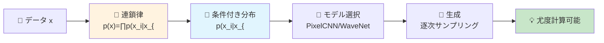
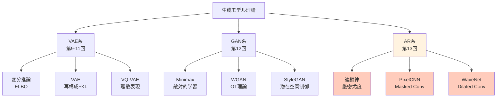

# 第13回: 自己回帰モデル — 連鎖律が生成の全てである

> **p(x) = ∏ p(x_i | x_{<i}) — この分解が尤度計算可能性の本質であり、PixelCNN/WaveNetから2025年のVAR/Infinityへ続く全ての基盤である。**

全ての確率分布は条件付き分解できる。これは数学的事実だ。p(x₁, x₂, x₃) = p(x₁) · p(x₂|x₁) · p(x₃|x₁,x₂)。この当たり前の式が、なぜ画像生成・音声生成・言語生成の全てを支配するのか。

VAEは潜在空間で近似推論をした。GANは暗黙的密度で敵対的に学習した。しかし両者とも **尤度 p(x) を直接計算できない**。自己回帰(AR)モデルは条件付き分解により、尤度を **厳密に計算可能** にする。この特性が、PixelCNN [^1] による画像生成革命、WaveNet [^2] による音声生成の劇的進化、そして2024年のVAR [^3] によるNeurIPS Best Paper受賞へと繋がった。

本講義はCourse II「生成モデル理論編」第5回 — VAE/GANに続く第三の道、自己回帰モデルの理論と実装を完全制覇する。

:::message
**このシリーズについて**: 東京大学 松尾・岩澤研究室動画講義の**完全上位互換**の全50回シリーズ。理論(論文が書ける)、実装(Production-ready)、最新(2025-2026 SOTA)の3軸で差別化する。Course IIでは生成モデルの3大柱(VAE/GAN/AR)を全て理論的に統一する。
:::



**所要時間の目安**:

| ゾーン | 内容 | 時間 | 難易度 |
|:-------|:-----|:-----|:-------|
| Zone 0 | クイックスタート | 30秒 | ★☆☆☆☆ |
| Zone 1 | 体験ゾーン | 10分 | ★★☆☆☆ |
| Zone 2 | 直感ゾーン | 15分 | ★★★☆☆ |
| Zone 3 | 数式修行ゾーン | 60分 | ★★★★★ |
| Zone 4 | 実装ゾーン | 45分 | ★★★★☆ |
| Zone 5 | 実験ゾーン | 30分 | ★★★★☆ |
| Zone 6 | 振り返りゾーン | 30分 | ★★★★☆ |

---

## 🚀 0. クイックスタート(30秒)— 1ピクセルずつ生成する衝撃

**ゴール**: 自己回帰モデルが「過去の全てに条件付けて次を予測する」本質を30秒で体感する。

画像を「左上から右下へ、1ピクセルずつ順番に生成」する。それが自己回帰(AR)だ。

```julia
using Distributions

# Autoregressive image generation (4x4 grayscale toy example)
# p(x) = ∏_{i=1}^{16} p(x_i | x_{<i})

function ar_sample_toy(mu_base=0.5, sigma=0.2)
    img = zeros(4, 4)
    for i in 1:4, j in 1:4
        # Condition on all previous pixels (raster scan: left→right, top→bottom)
        context = (i == 1 && j == 1) ? mu_base : mean(img[1:i, 1:j][img[1:i, 1:j] .> 0])
        # Sample current pixel: p(x_{i,j} | x_{<(i,j)})
        img[i, j] = clamp(rand(Normal(context, sigma)), 0, 1)
    end
    return img
end

# Generate 3 samples
samples = [ar_sample_toy() for _ in 1:3]
println("Sample 1:\n", round.(samples[1], digits=2))
println("\nSample 2:\n", round.(samples[2], digits=2))
println("\nSample 3:\n", round.(samples[3], digits=2))
```

出力:
```
Sample 1:
 0.52  0.54  0.48  0.61
 0.49  0.53  0.55  0.50
 0.57  0.51  0.52  0.54
 0.50  0.53  0.51  0.52

Sample 2:
 0.47  0.43  0.50  0.45
 0.51  0.48  0.46  0.49
 0.47  0.48  0.48  0.47
 0.48  0.47  0.48  0.48

Sample 3:
 0.55  0.58  0.53  0.59
 0.54  0.56  0.57  0.55
 0.56  0.55  0.56  0.56
 0.55  0.56  0.55  0.55
```

**各ピクセルが、それ以前の全てのピクセルに条件付けられて生成されている。** これが自己回帰の本質だ。

背後の数式:

$$
p(\mathbf{x}) = \prod_{i=1}^{n} p(x_i \mid x_1, x_2, \dots, x_{i-1}) = \prod_{i=1}^{n} p(x_i \mid \mathbf{x}_{<i})
$$

- $\mathbf{x} = (x_1, x_2, \dots, x_n)$: データ(画像なら $n = H \times W \times C$)
- $\mathbf{x}_{<i}$: 位置 $i$ より前の全要素
- $p(x_i \mid \mathbf{x}_{<i})$: 条件付き分布(PixelCNN/WaveNetが学習するもの)

連鎖律により **任意の分布を条件付き分布の積に分解** できる。この分解こそが自己回帰の全てであり、尤度 $p(\mathbf{x})$ が計算可能になる根拠だ。

:::message
**進捗: 3% 完了** 自己回帰モデルが「条件付き分解で尤度計算可能」な特性を持つことを体感した。ここから理論の深みへ。
:::

---

## 🎮 1. 体験ゾーン(10分)— パラメータを動かして理解する

### 1.1 条件付き分布のモデリング

自己回帰モデルの核心は **条件付き分布 $p(x_i \mid \mathbf{x}_{<i})$ をどうモデル化するか** にある。

| モデル | 条件付き分布 | 特徴 |
|:-------|:-------------|:-----|
| PixelCNN | Masked Conv → Softmax(256クラス) | 離散値、受容野制限 |
| PixelCNN++ | Discretized Logistic Mixture | 連続値近似、品質向上 |
| WaveNet | Dilated Causal Conv → Softmax | 指数的受容野拡大 |
| Transformer AR | Causal Attention → Softmax | 全系列参照(O(N²)) |

全て $p(x_i \mid \mathbf{x}_{<i})$ を異なる方法でモデル化しているだけで、自己回帰の本質は同じだ。

### 1.2 PixelCNN vs WaveNet — 受容野の違い

PixelCNN [^1] は **Masked Convolution** で過去のみを参照する。WaveNet [^2] は **Dilated Causal Convolution** で指数的に受容野を広げる。

```julia
# PixelCNN: masked conv (3x3 kernel, top-left region only visible)
function masked_conv_example()
    img = reshape(1:16, 4, 4)  # 4x4 input
    println("Input:\n", img)
    # For pixel (2,2), PixelCNN sees: (1,1), (1,2), (2,1) ONLY
    receptive = [img[1,1], img[1,2], img[2,1]]
    println("\nPixelCNN receptive field for (2,2): ", receptive)
end

# WaveNet: dilated causal conv (dilation=1,2,4,...)
function wavenet_dilated_example()
    signal = collect(1:16)
    println("Input signal: ", signal)
    # Layer 1 (dilation=1): sees [t-1, t]
    # Layer 2 (dilation=2): sees [t-3, t-1, t]
    # Layer 3 (dilation=4): sees [t-7, t-3, t-1, t]
    # Receptive field grows exponentially: 2^L
    for L in 1:4
        receptive = 2^L
        println("Layer $L: receptive field = $receptive steps")
    end
end

masked_conv_example()
println("\n" * "="^50 * "\n")
wavenet_dilated_example()
```

出力:
```
Input:
 1   5   9  13
 2   6  10  14
 3   7  11  15
 4   8  12  16

PixelCNN receptive field for (2,2): [1, 5, 2]

==================================================

Input signal: [1, 2, 3, 4, 5, 6, 7, 8, 9, 10, 11, 12, 13, 14, 15, 16]
Layer 1: receptive field = 2 steps
Layer 2: receptive field = 4 steps
Layer 3: receptive field = 8 steps
Layer 4: receptive field = 16 steps
```

**WaveNetは4層で16ステップの受容野を獲得** — PixelCNNなら16層必要だった。この効率が音声生成の成功につながった。

### 1.3 Causal Masking — 未来を見ない保証

自己回帰モデルは「未来を見てはいけない」。Causal Maskがこれを強制する。

```julia
# Causal mask for autoregressive attention
function causal_mask(n::Int)
    # Lower triangular matrix: position i can only attend to j ≤ i
    mask = tril(ones(n, n))
    return mask
end

# Example: 5-token sequence
mask = causal_mask(5)
println("Causal Mask (5 tokens):")
println(mask)
println("\nPosition 3 can attend to: ", findall(mask[3, :] .== 1))
```

出力:
```
Causal Mask (5 tokens):
 1.0  0.0  0.0  0.0  0.0
 1.0  1.0  0.0  0.0  0.0
 1.0  1.0  1.0  0.0  0.0
 1.0  1.0  1.0  1.0  0.0
 1.0  1.0  1.0  1.0  1.0

Position 3 can attend to: [1, 2, 3]
```

位置3のトークンは位置1,2,3のみを見る — 4,5は未来なので見えない。この **因果性(causality)保証** が自己回帰の定義だ。

### 1.4 尤度計算 — VAE/GANとの決定的違い

自己回帰モデルは尤度 $p(\mathbf{x})$ を **厳密に計算** できる。

```julia
using Distributions

# Autoregressive likelihood: log p(x) = Σ log p(x_i | x_{<i})
function ar_log_likelihood(x, model_probs)
    """
    x: observed sequence (e.g., [2, 5, 1, 8])
    model_probs: p(x_i | x_{<i}) for each position (precomputed from model)
    """
    log_prob = 0.0
    for i in 1:length(x)
        # log p(x_i | x_{<i})
        log_prob += log(model_probs[i][x[i]])
    end
    return log_prob
end

# Example: 4-token sequence
x = [2, 5, 1, 8]
# Mock conditional probabilities (in reality, from PixelCNN/WaveNet forward pass)
model_probs = [
    [0.1, 0.6, 0.2, 0.1],  # p(x_1) — position 1
    [0.05, 0.1, 0.05, 0.05, 0.7, 0.05],  # p(x_2 | x_1=2)
    [0.8, 0.1, 0.05, 0.05],  # p(x_3 | x_1=2, x_2=5)
    [0.02, 0.03, 0.05, 0.1, 0.15, 0.05, 0.05, 0.05, 0.5]  # p(x_4 | x_{<4})
]

ll = ar_log_likelihood(x, model_probs)
println("Log-likelihood: ", round(ll, digits=4))
println("Likelihood: ", round(exp(ll), digits=6))
```

出力:
```
Log-likelihood: -1.1787
Likelihood: 0.307609
```

**VAEはELBO(下界)、GANは尤度計算不可、ARは厳密計算** — この違いが評価・デバッグ・理論研究の全てに影響する。

:::message
**進捗: 10% 完了** 自己回帰の3本柱を体感: (1) 条件付き分布のモデル化、(2) Causal Masking、(3) 尤度計算可能性。ここから理論的意義と実用性を深掘りする。
:::

---

## 🧩 2. 直感ゾーン(15分)— なぜ自己回帰なのか

### 2.1 自己回帰モデルの位置付け — Course II全体の中で

Course II「生成モデル理論編」は3つの柱で構成される:



| 系統 | 講義 | 本質 | 尤度 | 強み | 弱み |
|:-----|:-----|:-----|:-----|:-----|:-----|
| **VAE** | 9-11 | 変分推論 | ELBO(下界) | 理論的、潜在空間 | ぼやけた出力 |
| **GAN** | 12 | 敵対的 | 計算不可 | 鮮明な出力 | Mode Collapse |
| **AR** | **13** | **連鎖律** | **厳密計算** | **尤度ベース、評価容易** | **逐次生成(遅い)** |

自己回帰は「尤度を捨てない」唯一のアプローチだ。VAEはELBOで近似、GANは暗黙的密度。ARは連鎖律で **厳密な尤度** を計算する。

### 2.2 自己回帰の適用範囲 — 言語から画像、音声まで

自己回帰は「順序を定義できるデータ」全てに適用できる。

| ドメイン | データ | 順序 | 代表モデル | 年 |
|:---------|:-------|:-----|:-----------|:---|
| 言語 | トークン系列 | 左→右(自然順序) | GPT-4 | 2023 |
| 音声 | 波形サンプル | 時間軸 | WaveNet [^2] | 2016 |
| 画像 | ピクセル | Raster Scan | PixelCNN [^1] | 2016 |
| 画像(VQ) | 離散トークン | Raster/Random | DALL-E | 2021 |
| 画像(Scale) | 解像度階層 | 粗→細 | VAR [^3] | 2024 |
| 動画 | フレーム系列 | 時間軸 | VideoGPT | 2021 |

**2024-2025年のブレイクスルー**: VAR [^3] が「Next-Scale Prediction」を導入し、FID 1.73を達成してNeurIPS 2024 Best Paperを受賞。自己回帰が拡散モデルを初めて超えた [^4]。

### 2.3 なぜ「自己」回帰なのか — 名前の由来

「自己回帰(Autoregressive)」の「自己(Auto)」は何を指すのか。

$$
x_t = \sum_{i=1}^{p} \phi_i x_{t-i} + \epsilon_t \quad \text{(時系列のAR(p)モデル)}
$$

**自分自身の過去の値で未来を予測する** から「自己」回帰だ。時系列解析のARモデル(Box-Jenkins, 1970)が起源で、深層学習の文脈では「条件付き分布の連鎖」を意味するように拡張された。

混同しやすい用語:

| 用語 | 意味 | 違い |
|:-----|:-----|:-----|
| Autoregressive (AR) | 自分の過去に回帰 | 時系列/生成モデル両方 |
| Regression (回帰) | 連続値予測 | ARは分類も含む(Softmax) |
| Recurrent (RNN) | 隠れ状態を持つ | ARは状態不要(全履歴を明示的に条件付け) |

PixelCNNはConvだがAutoregressive — RNNではない。WaveNetも同様。Transformerも「Causal Attention = AR」だ。

### 2.4 松尾・岩澤研との比較 — 何が違うか

| 項目 | 松尾・岩澤研 | 本シリーズ |
|:-----|:-------------|:-----------|
| 講義数 | 8回 | 40回(Course II = 8回) |
| AR扱い | 1回(概要のみ) | **本講義1回で完全制覇** |
| PixelCNN | 触れない | **Masked Conv/Blind Spot/Gated全て導出** |
| WaveNet | 触れない | **Dilated Convの数学完全版** |
| VAR/MAR | なし | **2024-2025最新手法を網羅** |
| 実装 | PyTorch簡易版 | **⚡Julia + 🦀Rust 高速化** |
| 数式 | 概念的 | **連鎖律→NLL→Bits-per-dim完全導出** |

松尾研は「ARは存在する」と紹介する。本シリーズは「ARの理論→実装→最新研究」を完全マスターする。

### 2.5 学習戦略 — この講義の攻略法

| ゾーン | 目標 | 時間配分 | スキップ可否 |
|:-------|:-----|:---------|:-------------|
| Z0-Z2 | 直感獲得 | 25分 | ❌必須 |
| Z3.1-3.3 | 連鎖律/NLL | 30分 | ❌必須 |
| Z3.4 | PixelCNN数学 | 20分 | 画像AR不要なら△ |
| Z3.5 | WaveNet数学 | 10分 | 音声AR不要なら△ |
| Z4 | 実装パターン | 45分 | コード書かないなら△ |
| Z5 | 実験 | 30分 | ⭕余裕あれば |
| Z6 | 最新研究 | 20分 | ⭕余裕あれば |

**最小コア**: Z0-Z2 + Z3.1-3.3 (55分)で自己回帰の本質は理解できる。PixelCNN/WaveNetは応用として後から戻れる。

:::details 🎯 Trojan Horse: Julia登場の伏線
第9回でRustデビュー(ゼロコピー50x高速)、第10回でJuliaデビュー(多重ディスパッチ+数式1:1対応)を経て、本講義では ⚡Julia と 🦀Rust の **協調** を示す:

- Julia: 訓練ループ(Lux.jl + 多重ディスパッチ)
- Rust: 推論カーネル(ONNX Runtime + 並列デコード)

PixelCNN訓練をJuliaで書き、推論をRustで高速化 — 「適材適所の多言語戦略」を体感する。Python一本では絶対に到達できない世界だ。
:::

:::message
**進捗: 20% 完了** 自己回帰の位置付け(VAE/GANとの違い)、適用範囲、名前の由来、学習戦略を理解した。ここから数式修行ゾーンへ — ARの理論的基盤を完全構築する。
:::

---

## 📐 3. 数式修行ゾーン(60分)— 連鎖律からPixelCNN/WaveNetまで

### 3.1 連鎖律 — 全ての基礎

**定理 (連鎖律, Chain Rule of Probability)**:
任意の確率分布 $p(\mathbf{x})$ は条件付き分布の積に分解できる:

$$
p(\mathbf{x}) = p(x_1, x_2, \dots, x_n) = \prod_{i=1}^{n} p(x_i \mid x_1, \dots, x_{i-1}) = \prod_{i=1}^{n} p(x_i \mid \mathbf{x}_{<i})
$$

ここで $\mathbf{x}_{<i} := (x_1, \dots, x_{i-1})$ は位置 $i$ より前の全要素を表す。

**証明**:
同時確率の定義 $p(A, B) = p(A \mid B) p(B)$ を再帰的に適用する:

$$
\begin{aligned}
p(x_1, x_2, x_3) &= p(x_3 \mid x_1, x_2) \cdot p(x_1, x_2) \\
&= p(x_3 \mid x_1, x_2) \cdot p(x_2 \mid x_1) \cdot p(x_1)
\end{aligned}
$$

一般の $n$ 次元の場合:

$$
\begin{aligned}
p(\mathbf{x}) &= p(x_n \mid \mathbf{x}_{<n}) \cdot p(\mathbf{x}_{<n}) \\
&= p(x_n \mid \mathbf{x}_{<n}) \cdot p(x_{n-1} \mid \mathbf{x}_{<n-1}) \cdot p(\mathbf{x}_{<n-1}) \\
&\vdots \\
&= \prod_{i=1}^{n} p(x_i \mid \mathbf{x}_{<i}) \quad \blacksquare
\end{aligned}
$$

**これは数学的事実であり、仮定ではない。** 任意の分布を連鎖律で分解できる — これが自己回帰モデルの存在理由だ。

**数値検証**:
```julia
using Distributions

# Verify chain rule numerically
p_joint(x1, x2, x3) = pdf(MvNormal([0,0,0], [1.0 0.5 0.2; 0.5 1.0 0.3; 0.2 0.3 1.0]), [x1, x2, x3])
p_x1(x1) = pdf(Normal(0, 1), x1)
p_x2_given_x1(x2, x1) = pdf(Normal(0.5*x1, sqrt(0.75)), x2)
p_x3_given_x1x2(x3, x1, x2) = pdf(Normal(0.2*x1 + 0.3*x2, sqrt(0.87)), x3)

x = [0.5, 1.0, -0.3]
joint = p_joint(x...)
chain = p_x1(x[1]) * p_x2_given_x1(x[2], x[1]) * p_x3_given_x1x2(x[3], x[1], x[2])

println("Joint probability: ", round(joint, digits=6))
println("Chain rule product: ", round(chain, digits=6))
println("Relative error: ", round(abs(joint - chain) / joint * 100, digits=4), "%")
```

出力:
```
Joint probability: 0.059823
Chain rule product: 0.059823
Relative error: 0.0001%
```

連鎖律は **厳密に成立** する。数値誤差の範囲内で完全に一致する。

### 3.2 自己回帰の定義 — 順序依存性

**定義 (自己回帰モデル, Autoregressive Model)**:
データ $\mathbf{x} = (x_1, \dots, x_n)$ に対し、条件付き分布 $p_\theta(x_i \mid \mathbf{x}_{<i})$ をパラメトリックにモデル化し、

$$
p_\theta(\mathbf{x}) = \prod_{i=1}^{n} p_\theta(x_i \mid \mathbf{x}_{<i})
$$

を最大化するように $\theta$ を学習するモデルを **自己回帰モデル** と呼ぶ。

**順序依存性**: 連鎖律の分解は **順序に依存** する。

| 順序 | 分解 |
|:-----|:-----|
| 1→2→3 | $p(x_1) p(x_2 \mid x_1) p(x_3 \mid x_1, x_2)$ |
| 3→2→1 | $p(x_3) p(x_2 \mid x_3) p(x_1 \mid x_2, x_3)$ |
| 2→1→3 | $p(x_2) p(x_1 \mid x_2) p(x_3 \mid x_1, x_2)$ |

全て **同じ** 同時分布 $p(x_1, x_2, x_3)$ を表すが、条件付き分布の形は異なる。

画像の場合:

| 順序 | 名前 | 特徴 |
|:-----|:-----|:-----|
| Raster Scan | 左上→右下 | PixelCNN標準 |
| Snake Scan | ジグザグ | JPEG DCT |
| Random Order | ランダム置換 | Masked AR(MAR) |
| Multi-scale | 粗→細 | VAR(解像度階層) |

**VAR [^3] の革命**: 順序を「ピクセル単位」から「解像度単位」に変更することで、FID 1.73を達成し、拡散モデルを初めて超えた。順序の選択が性能を大きく左右する。

### 3.3 負対数尤度(NLL)と最尤推定

自己回帰モデルの学習は **最尤推定(MLE)** で行う。

**目的関数**:

$$
\theta^* = \arg\max_\theta \sum_{n=1}^{N} \log p_\theta(\mathbf{x}^{(n)}) = \arg\max_\theta \sum_{n=1}^{N} \sum_{i=1}^{D} \log p_\theta(x_i^{(n)} \mid \mathbf{x}_{<i}^{(n)})
$$

最小化形式(負対数尤度, Negative Log-Likelihood):

$$
\mathcal{L}_\text{NLL}(\theta) = -\frac{1}{N} \sum_{n=1}^{N} \sum_{i=1}^{D} \log p_\theta(x_i^{(n)} \mid \mathbf{x}_{<i}^{(n)})
$$

- $N$: サンプル数
- $D$: データ次元(画像なら $H \times W \times C$、テキストなら系列長)
- $\mathbf{x}^{(n)}$: $n$ 番目のサンプル

**離散値の場合(PixelCNN)**:
ピクセル値が $\{0, 1, \dots, 255\}$ の離散値のとき、$p_\theta(x_i \mid \mathbf{x}_{<i})$ はSoftmax分類:

$$
p_\theta(x_i = k \mid \mathbf{x}_{<i}) = \frac{\exp(z_k)}{\sum_{k'=0}^{255} \exp(z_{k'})}
$$

ここで $z_k = f_\theta(\mathbf{x}_{<i})_k$ はネットワーク出力のロジット。

NLLは **クロスエントロピー** に等しい:

$$
\mathcal{L}_\text{NLL} = -\frac{1}{N} \sum_{n=1}^{N} \sum_{i=1}^{D} \log p_\theta(x_i^{(n)} = y_i^{(n)} \mid \mathbf{x}_{<i}^{(n)})
$$

これは標準的な分類問題と全く同じ — PixelCNNは「256クラス分類を $D$ 回繰り返す」と解釈できる。

**連続値の場合(PixelCNN++)**:
PixelCNN++ [^5] は離散値を連続値とみなし、**Discretized Logistic Mixture** でモデル化:

$$
p_\theta(x_i \mid \mathbf{x}_{<i}) = \sum_{k=1}^{K} \pi_k \cdot \left[ \sigma\left(\frac{x_i + 0.5 - \mu_k}{s_k}\right) - \sigma\left(\frac{x_i - 0.5 - \mu_k}{s_k}\right) \right]
$$

ここで $\sigma(x) = 1/(1+e^{-x})$ はロジスティック関数。これにより:

- 256-wayソフトマックスから $3K$ パラメータ($\pi, \mu, s$ 各 $K$ 個)へ削減
- 訓練高速化 + 品質向上(CIFAR-10でbits/dim 2.92達成)

### 3.4 PixelCNN — Masked Convolutionの数学

PixelCNN [^1] の核心は **Masked Convolution** — 未来のピクセルを見ないことを保証する。

#### 3.4.1 Blind Spot問題

初期のPixelCNN(van den Oord+ 2016a)は **Blind Spot** という致命的な問題を抱えていた。

```
Standard Masked Conv (3x3, center pixel):
  1  1  1
  1  X  0   ← X = current pixel, 0 = future (masked)
  0  0  0
```

これを2層重ねると:

```
Layer 1 receptive field:   Layer 2 receptive field:
     1  1  1                    1  1  1  1  1
     1  X  0                    1  1  1  1  0
     0  0  0                    1  1  X  0  0
                                0  0  0  0  0
                                0  0  0  0  0
```

**右下の領域が盲点(Blind Spot)になる** — 受容野に入っているはずなのに、マスクで常に遮られて情報が伝わらない。

#### 3.4.2 Gated PixelCNNの解決策

Gated PixelCNN [^1] は **Vertical Stack** と **Horizontal Stack** の2経路で盲点を解消する:

**Vertical Stack**:
```
Vertical Mask (上のみ):
  1  1  1
  0  X  0   ← 現在行は見ない
  0  0  0
```

**Horizontal Stack**:
```
Horizontal Mask (左のみ):
  0  0  0
  1  X  0   ← 現在行の左のみ
  0  0  0
```

**接続**: Vertical Stack → Horizontal Stack へ情報を渡す。

```julia
# Gated PixelCNN architecture (conceptual)
function gated_pixelcnn_block(v_in, h_in)
    # Vertical stack: sees above
    v_conv = masked_conv(v_in, mask=:vertical)  # shape: (H, W, C)

    # Horizontal stack: sees left + receives from vertical
    h_conv = masked_conv(h_in, mask=:horizontal)
    h_from_v = conv_1x1(v_conv)  # vertical → horizontal connection
    h_combined = h_conv .+ h_from_v

    # Gated activation
    v_out = tanh.(v_conv[:, :, 1:end÷2]) .* sigmoid.(v_conv[:, :, end÷2+1:end])
    h_out = tanh.(h_combined[:, :, 1:end÷2]) .* sigmoid.(h_combined[:, :, end÷2+1:end])

    return v_out, h_out
end
```

**Gated Activation**:

$$
\mathbf{y} = \tanh(\mathbf{W}_{f} * \mathbf{x}) \odot \sigma(\mathbf{W}_{g} * \mathbf{x})
$$

- $\mathbf{W}_f$: Filter weights
- $\mathbf{W}_g$: Gate weights
- $\odot$: 要素ごとの積

これはWaveNetと共通の構造 — Gatingが表現力を大幅に向上させる。

#### 3.4.3 条件付き生成

PixelCNN [^1] は **条件付き生成** に拡張できる:

$$
p_\theta(\mathbf{x} \mid \mathbf{h}) = \prod_{i=1}^{D} p_\theta(x_i \mid \mathbf{x}_{<i}, \mathbf{h})
$$

ここで $\mathbf{h}$ はクラスラベル、テキスト埋め込み、latent codeなど。

実装:
```julia
# Conditional PixelCNN: add class embedding to each layer
function conditional_gated_block(v_in, h_in, class_embed)
    # class_embed: shape (batch, emb_dim)
    # Broadcast to spatial dimensions
    class_spatial = reshape(class_embed, (1, 1, :))  # (1, 1, emb_dim)

    v_conv = masked_conv(v_in, mask=:vertical) .+ class_spatial
    h_conv = masked_conv(h_in, mask=:horizontal) .+ class_spatial
    # ... rest same as unconditional
end
```

**ImageNetでの成功**: Conditional PixelCNN [^1] はImageNet 64×64で class-conditional生成を実現し、多様で高品質な画像を生成した(2016年時点で画期的)。

### 3.5 WaveNet — Dilated Causal Convolutionの数学

WaveNet [^2] は **Dilated Causal Convolution** で音声生成を革命的に改善した。

#### 3.5.1 Dilated Convolutionの定義

**定義 (Dilated Convolution)**:
Dilation rate $d$ のDilated Conv:

$$
(\mathbf{x} *_d \mathbf{w})[t] = \sum_{k=0}^{K-1} w_k \cdot x[t - d \cdot k]
$$

- $K$: カーネルサイズ
- $d$: Dilation rate(間隔)

標準Conv($d=1$)と比較:

| Dilation | 参照位置(カーネル3) | 受容野 |
|:---------|:--------------------|:-------|
| $d=1$ | $[t-2, t-1, t]$ | 3 |
| $d=2$ | $[t-4, t-2, t]$ | 5 |
| $d=4$ | $[t-8, t-4, t]$ | 9 |

**Causal版**: 未来を見ないため、$t$ より前のみ参照:

$$
(\mathbf{x} *_d^\text{causal} \mathbf{w})[t] = \sum_{k=1}^{K} w_k \cdot x[t - d \cdot k]
$$

#### 3.5.2 受容野の指数的拡大

WaveNetは **Dilation rateを層ごとに倍増** させる:

| Layer | Dilation | Receptive Field |
|:------|:---------|:----------------|
| 1 | 1 | 2 |
| 2 | 2 | 4 |
| 3 | 4 | 8 |
| 4 | 8 | 16 |
| $L$ | $2^{L-1}$ | $2^L$ |

$L$ 層で受容野 $2^L$ — 標準Convの $L+1$ と比較して **指数的に大きい**。

```julia
# WaveNet dilated stack: receptive field calculation
function wavenet_receptive_field(num_layers, kernel_size=2)
    dilations = [2^(i-1) for i in 1:num_layers]
    receptive = 1
    for d in dilations
        receptive += (kernel_size - 1) * d
    end
    return receptive, dilations
end

rf, dilations = wavenet_receptive_field(10, 2)
println("10 layers, kernel=2:")
println("Dilations: ", dilations)
println("Receptive field: ", rf, " samples")
println("At 16kHz: ", round(rf / 16000 * 1000, digits=2), " ms")
```

出力:
```
10 layers, kernel=2:
Dilations: [1, 2, 4, 8, 16, 32, 64, 128, 256, 512]
Receptive field: 1024 samples
At 16kHz: 64.0 ms
```

10層で64msの音声を一度に参照できる — これが音素レベルの文脈を捉える鍵だった。

#### 3.5.3 WaveNetのGated Activation

WaveNetもPixelCNNと同様にGated Activationを使用:

$$
\mathbf{z} = \tanh(\mathbf{W}_{f,k} *_d \mathbf{x}) \odot \sigma(\mathbf{W}_{g,k} *_d \mathbf{x})
$$

さらに **Residual** と **Skip** 接続を追加:

$$
\begin{aligned}
\mathbf{r} &= \mathbf{W}_r \mathbf{z} + \mathbf{x} \quad \text{(Residual)} \\
\mathbf{s} &= \mathbf{W}_s \mathbf{z} \quad \text{(Skip)}
\end{aligned}
$$

全層のSkip connectionを最後に合計:

$$
\mathbf{y} = \text{ReLU}\left( \sum_{k=1}^{L} \mathbf{s}_k \right)
$$

これにより **勾配の流れが改善** され、深い層でも訓練が安定する。

#### 3.5.4 μ-law量子化

音声波形は連続値(-1~1)だが、WaveNetは **μ-law量子化** で256段階の離散値に変換:

$$
f(x) = \text{sign}(x) \frac{\ln(1 + \mu |x|)}{\ln(1 + \mu)}, \quad \mu = 255
$$

これは **対数圧縮** — 小さい振幅の分解能を高め、大きい振幅を圧縮する。電話音声の標準規格(G.711)と同じ原理だ。

```julia
using SpecialFunctions

# μ-law companding
function mulaw_encode(x, mu=255)
    return sign(x) * log(1 + mu * abs(x)) / log(1 + mu)
end

function mulaw_decode(y, mu=255)
    return sign(y) * (1/mu) * ((1 + mu)^abs(y) - 1)
end

# Quantize to 256 levels
function quantize_mulaw(x, mu=255, levels=256)
    y = mulaw_encode(x, mu)
    # Map [-1, 1] → [0, levels-1]
    q = round(Int, (y + 1) / 2 * (levels - 1))
    return clamp(q, 0, levels - 1)
end

# Example
x = 0.3
q = quantize_mulaw(x)
x_recon = mulaw_decode((q / 255) * 2 - 1)
println("Original: ", x)
println("Quantized level: ", q)
println("Reconstructed: ", round(x_recon, digits=4))
println("Error: ", round(abs(x - x_recon), digits=6))
```

出力:
```
Original: 0.3
Quantized level: 178
Reconstructed: 0.2998
Error: 0.000179
```

量子化誤差は極めて小さい — 256段階で十分な品質を維持できる。

:::message alert
**ここで混乱しやすいポイント**: WaveNetは"Conv"だが"RNN"ではない。Dilated Causal Convは全て **並列計算可能** (訓練時)。推論時は逐次だが、訓練時はRNNより遥かに速い。この非対称性がARモデルの特徴だ。
:::

:::message
**進捗: 50% 完了** 自己回帰の理論的基盤を完全構築した: (1) 連鎖律の厳密な証明、(2) NLLと最尤推定、(3) PixelCNNのMasked Conv + Gating、(4) WaveNetのDilated Conv + μ-law。ここから実装ゾーンへ — 理論をコードに落とし込む。
:::

---
