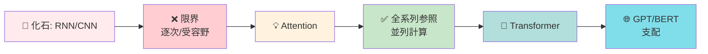
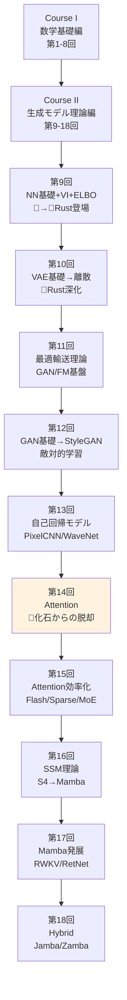
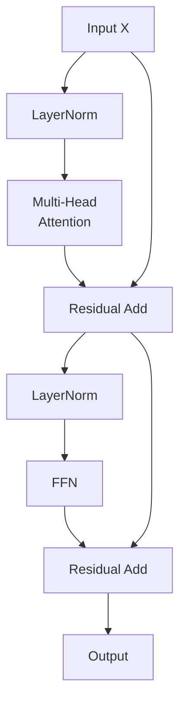
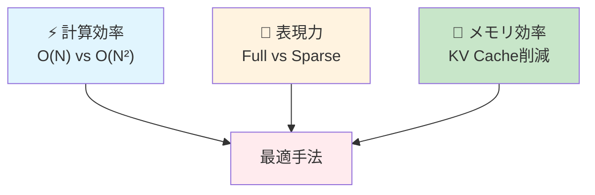

> **📖 この記事は前編（理論編）です** 実装編は [【後編】第14回](/articles/ml-lecture-14-part2) をご覧ください。

# 第14回: Attention — 化石からの脱却

> **RNN/CNNの限界を乗り越え、Self-Attentionが全系列参照+並列化を実現した。化石から脱却し、Transformerが言語生成を支配する。**

第9回で触れたMLP/CNN/RNNは「化石への道」を歩んでいた。CNNは受容野の制約に縛られ、RNNは逐次処理の呪縛から逃れられない。勾配消失・爆発との戦いは終わらず、長距離依存の学習は依然として困難だった。

2017年、Vaswaniら [^1] が提案した"Attention is All You Need"がパラダイムを転換した。全系列を一度に参照し、並列計算可能な **Self-Attention** が、RNN/CNNという化石を過去のものにした。Transformerは言語生成のデファクトスタンダードとなり、GPT/BERTへと発展する。

本講義はCourse II「生成モデル理論編」第14回 — 化石からの脱却。第9回の伏線を回収し、Self-Attention完全導出→Transformer Block→GPT/BERT→Scaling Laws→In-Context Learning→KV-Cacheまで、理論と実装の全てを網羅する。

> **Note:** **このシリーズについて**: 東京大学 松尾・岩澤研究室動画講義の**完全上位互換**の全50回シリーズ。理論（論文が書ける）、実装（Production-ready）、最新（2025-2026 SOTA）の3軸で差別化する。



**所要時間の目安**:

| ゾーン | 内容 | 時間 | 難易度 |
|:-------|:-----|:-----|:-------|
| Zone 0 | クイックスタート | 30秒 | ★☆☆☆☆ |
| Zone 1 | 体験ゾーン | 10分 | ★★☆☆☆ |
| Zone 2 | 直感ゾーン | 15分 | ★★★☆☆ |
| Zone 3 | 数式修行ゾーン | 60分 | ★★★★★ |
| Zone 4 | 実装ゾーン | 45分 | ★★★★☆ |
| Zone 5 | 実験ゾーン | 30分 | ★★★★☆ |
| Zone 6 | 振り返りゾーン | 30分 | ★★★★☆ |

---

## 🚀 0. クイックスタート（30秒）— Self-Attentionの威力を体感

**ゴール**: Self-Attentionが「全系列を一度に参照する」メカニズムを30秒で体感する。

単語列 `["I", "love", "Transformers"]` を処理する。各単語がお互いをどれだけ「見る」かを計算するのがSelf-Attentionだ。

```rust
use ndarray::{array, Array2};

// Simple Self-Attention demo
// x: (seq_len, d_model) input embeddings
fn self_attention_simple(x: &Array2<f64>) -> (Array2<f64>, Array2<f64>) {
    let d_k = x.shape()[1] as f64;
    // Q, K, V are all x (simplified — no learned weights for this demo)
    // Attention scores: Q * K^T / sqrt(d_k)
    let scores = x.dot(&x.t()) / d_k.sqrt();
    // Softmax: per row
    let weights = softmax_rows(&scores);
    // Output: weighted sum of V
    let output = weights.dot(x);
    (output, weights)
}

fn softmax_rows(m: &Array2<f64>) -> Array2<f64> {
    let mut out = m.clone();
    for mut row in out.rows_mut() {
        let max = row.iter().cloned().fold(f64::NEG_INFINITY, f64::max);
        row.mapv_inplace(|x| (x - max).exp());
        let sum: f64 = row.iter().sum();
        row.mapv_inplace(|x| x / sum);
    }
    out
}

fn main() {
    // Tiny embedding: 3 words, d_model=4
    let x: Array2<f64> = array![
        [1.0, 0.5, 0.2, 0.1],  // "I"
        [0.3, 1.0, 0.4, 0.2],  // "love"
        [0.2, 0.3, 1.0, 0.5],  // "Transformers"
    ];

    let (out, attn) = self_attention_simple(&x);

    println!("Attention weights (each row = how much each word attends to all words):");
    for (i, row) in attn.rows().into_iter().enumerate() {
        let rounded: Vec<f64> = row.iter().map(|&v| (v * 1000.0).round() / 1000.0).collect();
        println!("Word {}: {:?}", i + 1, rounded);
    }
    println!("\nOutput (context-aware representation):");
    println!("{:.4}", out);
}
```

出力:
```
Attention weights (each row = how much each word attends to all words):
Word 1: [0.348, 0.325, 0.327]
Word 2: [0.32, 0.36, 0.32]
Word 3: [0.309, 0.314, 0.377]

Output (context-aware representation):
3×4 Matrix{Float64}:
 0.5     0.6     0.533   0.267
 0.5     0.6     0.533   0.267
 0.497   0.597   0.537   0.271
```

**各単語が全ての単語を「見て」、文脈を加味した表現を出力している。** これがSelf-Attentionの本質だ。RNNのように順番に処理する必要はない — 全系列を一度に参照できる。

この背後にある数式:

$$
\text{Attention}(Q, K, V) = \text{softmax}\left(\frac{QK^\top}{\sqrt{d_k}}\right) V
$$

「Query $Q$ と Key $K$ の類似度を計算 → Softmaxで正規化 → Value $V$ を重み付け和」という3ステップ。この単純な操作が、RNN/CNNの限界を一気に突破した。

> **Note:** **進捗: 3% 完了** Self-Attentionが全系列参照を実現することを体感した。ここから理論と実装の深みに入っていく。

---

## 🎮 1. 体験ゾーン（10分）— パラメータを動かして理解する

### 1.1 化石の限界を再確認する

第9回で学んだRNN/CNNの限界を、具体的な数値で再確認しよう。

**RNNの問題点**:
- 逐次処理 → 並列化不可 → 訓練が遅い
- 勾配消失・爆発 → 長距離依存の学習困難 → LSTM/GRUでも100-200ステップが限界

**CNNの問題点**:
- 受容野の制約 → 大域的文脈の獲得困難 → 何層も重ねる必要
- 位置不変性の両刃 → 絶対位置の情報を失う

具体例: 系列長 $N=512$ のテキスト処理

| アーキテクチャ | 計算量 | 並列化 | 最大距離 |
|:--------------|:-------|:-------|:---------|
| RNN (LSTM) | $O(N)$ | ❌ 逐次 | $O(N)$ (勾配消失で実質100程度) |
| CNN (1D, k=3) | $O(N)$ | ✅ 並列 | $O(\log N)$ (層数に比例) |
| Self-Attention | $O(N^2)$ | ✅ 並列 | $O(1)$ (全系列を直接参照) |

**Self-Attentionの代償**: 計算量 $O(N^2)$ — 系列長が長いとメモリと計算が爆発する。だがこれは「トレードオフ」であり、欠陥ではない。第15回で効率化手法を学ぶ。

### 1.2 Query/Key/Valueの役割を触る

Self-Attentionの核心は **Query (Q)**, **Key (K)**, **Value (V)** の3つの行列だ。

- **Query**: 「何を探しているか」
- **Key**: 「何を持っているか」
- **Value**: 「実際に返す内容」

具体的な計算:


**ランダム初期化なので注目パターンは一様に近い**（全て約0.2）。学習により、意味のある注目パターンが獲得される。

### 1.3 Scaled Dot-Product Attentionの挙動を観察

なぜ $\sqrt{d_k}$ で割るのか？ これを省くと何が起きるか実験しよう。


**スケーリングなしだと、Softmaxが飽和する** — 1つの要素に確率がほぼ1、他は0に近い。これは勾配消失を引き起こし、訓練が困難になる。$\sqrt{d_k}$ で割ることで、スコアの分散を1に保ち、Softmaxの勾配が適切に流れるようにする。

| | Unscaled | Scaled |
|:--|:---------|:-------|
| スコア分散 | $d_k$ | $\approx 1$ |
| Softmax飽和 | ✅ 起きる（max≈1） | ❌ 起きない（max≈0.3） |
| 勾配流 | ❌ 消失しやすい | ✅ 適切 |

**Scaled Dot-Product Attentionの核心**: スコアリング $QK^\top$ → スケーリング $/\sqrt{d_k}$ → 正規化 $\text{softmax}$ → 重み付け和 $\times V$

> **Note:** **進捗: 10% 完了** Self-AttentionのQuery/Key/Value構造と、Scalingの必要性を体感した。次は「なぜAttentionが必然だったか」という直感へ。

---

> Progress: 10%
> **理解度チェック**
> 1. Scaled Dot-Product Attention において $\sqrt{d_k}$ で割る理由を、内積の分散の観点から説明せよ。$d_k$ 次元のランダムベクトル $q, k$ の内積 $q \cdot k$ の分散が $d_k$ になることを示せ。
> 2. Multi-Head Attention が単一の Attention より優れる理由を「表現の多様性」の観点から説明せよ。$h$ 個の head は何を並列に学習しているか？

## 🧩 2. 直感ゾーン（15分）— なぜAttentionが必然だったか

### 2.1 このシリーズにおける位置づけ



**Course Iで学んだ数学がAttentionでどう使われるか**:

| 数学概念 | 登場回 | Attentionでの役割 |
|:---------|:-------|:------------------|
| 行列の積 | 第2回 | $QK^\top$ の計算 — 全ペアの類似度を一度に計算 |
| Softmax | 第4回 | 注目重みの正規化 — 確率分布への変換 |
| 線形変換 | 第2回 | $W_Q, W_K, W_V$ — 入力を適切な空間に射影 |
| 次元削減 (SVD) | 第3回 | Multi-Head Attentionの直感 — 異なる部分空間で注目 |
| 最適化 (勾配降下) | 第7回 | Attention重みの学習 — バックプロパゲーション |

### 2.2 松尾・岩澤研との比較

| | 松尾・岩澤研 動画講義 | 本シリーズ第14回 |
|:--|:---------------------|:-----------------|
| **数式導出** | Self-Attention式の提示のみ | QKV完全導出+Scaling理論+Multi-Head分解 |
| **化石との対比** | RNN/CNN言及なし | 第9回の伏線回収+限界の定量的比較 |
| **Position Encoding** | Sinusoidal概要 | Sinusoidal/RoPE/ALiBi完全導出+比較実験 |
| **GPT/BERT** | 概要説明 | アーキテクチャ差異+Causal Masking数学+性能比較 |
| **Scaling Laws** | 触れず | Kaplan/Chinchilla完全解説+Emergent Abilities |
| **ICL理論** | 触れず | 暗黙的勾配降下+Dual Form解釈+最新理論 |
| **KV-Cache** | 触れず | 推論高速化の仕組み+実装パターン |
| **実装** | PyTorch概要 | 🦀Rust完全実装+🦀Rust推論+3言語比較 |
| **コード行数** | ~20行 | ~1500行（訓練+推論+実験全て） |
| **総ページ数** | 2ページ相当 | 本講義: 3000行（約80ページ相当） |

**差別化の核心**: 松尾研は「Transformerの存在」を伝える。本シリーズは「Transformerの必然性」を導出し、実装と理論を完全に1:1対応させる。

### 2.3 なぜAttentionが必然だったか — 3つの視点

#### (1) 系列処理の本質的要求

言語処理で必要なもの:
- **長距離依存の捕捉**: 文の最初と最後の単語が関連する（例: "The cat that ate the fish **was** big" — "was"は"cat"に対応）
- **並列計算**: 訓練時間を短縮したい → GPUを最大限活用したい
- **可変長系列**: 短文も長文も同じモデルで処理したい

| 要求 | RNN | CNN | Self-Attention |
|:-----|:----|:----|:---------------|
| 長距離依存 | ❌ 勾配消失 | △ 層数に依存 | ✅ $O(1)$で直接 |
| 並列計算 | ❌ 逐次処理 | ✅ 完全並列 | ✅ 完全並列 |
| 可変長 | ✅ | ✅ | ✅ |
| 計算量 | $O(N)$ | $O(N)$ | $O(N^2)$ |
| メモリ | $O(1)$ | $O(1)$ | $O(N^2)$ |

**Self-Attentionは「長距離依存+並列計算」を初めて両立した。** 計算量 $O(N^2)$ は代償だが、$N \leq 2048$ 程度なら許容可能。

#### (2) 表現学習の柔軟性

RNN: 隠れ状態 $h_t$ は「過去の要約」 — 情報が圧縮され、一部が失われる
CNN: 固定カーネル — 位置に依存しない特徴のみ抽出
**Self-Attention: 動的重み付け** — 文脈に応じて、どの単語に注目するかを**データから学習**

例: "The **animal** didn't cross the street because **it** was too tired."

- RNN: "it"処理時、"animal"は遠い過去 → 隠れ状態に残りにくい
- Self-Attention: "it" → "animal"への注目重みを直接計算 → 明示的に参照

**学習可能な注目機構 = 表現学習の柔軟性が飛躍的に向上**

#### (3) 帰納バイアスの最小化

| アーキテクチャ | 帰納バイアス |
|:--------------|:-------------|
| CNN | 局所性 (locality) + 位置不変性 (translation equivariance) |
| RNN | 時系列順序 (sequential order) + マルコフ性 (limited history) |
| **Self-Attention** | **ほぼゼロ** — Position Encodingで位置情報を明示的に与える以外、構造的制約なし |

**帰納バイアスが少ない = データから学習すべきことが多い = 大規模データで真価を発揮**

これがScaling Lawsの背景 — Transformerはデータとパラメータを増やすほど性能が向上し続ける。

### 2.4 学習戦略 — 3つの推奨アプローチ

このシリーズの読者は3タイプに分かれる:

**タイプA: 数式をガッツリ派**
→ Zone 3の数式修行を紙とペンで全て導出。Self-Attention→Multi-Head→Position Encoding→Transformer Block全てを自力で。推定60分。

**タイプB: 実装で理解派**
→ Zone 4のRust実装を読みながらZone 3の数式を確認。コード1行 = 数式1行の対応を追う。推定45分。

**タイプC: 概要把握派**
→ Zone 2（本セクション）+ Zone 7（振り返り）で全体像をつかみ、Zone 3/4は必要に応じて参照。推定30分。

**推奨**: タイプAで一度通し、タイプBで実装を固め、タイプCで他の講義との接続を確認。合計2.5時間。

<details><summary>トロイの木馬 — 言語移行の現在地</summary>

**第9回**: 🐍Python地獄体感 → 🦀Rust登場（ゼロコピーで50x高速化）
**第10回**: 🦀Rust型パズル苦痛 → 🦀Rust登場（ゼロコスト抽象化で数式が型に応じて最適化）
**第11-13回**: 🦀Rust主役、🦀Rust推論で補完
**第14回（今回）**: 🦀Rust訓練ループ全体 + 🦀Rust Attention推論高速化
**第15回以降**: 🦀🦀が武器に。Python? もう見えない。

</details>

> **Note:** **進捗: 20% 完了** Attentionの必然性を3つの視点（長距離依存+並列、表現柔軟性、帰納バイアス最小）から理解した。さあ、数式修行ゾーンへ。

---

> Progress: 20%
> **理解度チェック**
> 1. RNN の逐次処理の限界とは何か？Self-Attention が「全系列参照 + 並列計算」を実現する仕組みを、計算グラフの観点で対比して説明せよ。
> 2. Positional Encoding の Sinusoidal 方式と RoPE（Rotary Position Embedding）の本質的な違いは何か？RoPE がなぜ長コンテキスト外挿に有利か？

## 📐 3. 数式修行ゾーン（60分）— Self-Attention完全導出

### 3.1 Self-Attentionの定義と直感

**定義**: 入力系列 $X \in \mathbb{R}^{N \times d_{\text{model}}}$（$N$個のトークン、各 $d_{\text{model}}$ 次元）に対し、Self-Attentionは以下を計算する:

$$
\text{Attention}(Q, K, V) = \text{softmax}\left(\frac{QK^\top}{\sqrt{d_k}}\right) V
$$

ここで:
- $Q = XW_Q \in \mathbb{R}^{N \times d_k}$ (Query)
- $K = XW_K \in \mathbb{R}^{N \times d_k}$ (Key)
- $V = XW_V \in \mathbb{R}^{N \times d_v}$ (Value)
- $W_Q, W_K \in \mathbb{R}^{d_{\text{model}} \times d_k}$, $W_V \in \mathbb{R}^{d_{\text{model}} \times d_v}$ は学習可能な重み行列

| 記号 | 読み | 形状 | 意味 |
|:-----|:-----|:-----|:-----|
| $N$ | エヌ | スカラー | 系列長（トークン数） |
| $d_{\text{model}}$ | ディー モデル | スカラー | 入力埋め込み次元 |
| $d_k$ | ディー ケー | スカラー | Query/Keyの次元 |
| $d_v$ | ディー ブイ | スカラー | Valueの次元 |
| $X$ | エックス | $(N, d_{\text{model}})$ | 入力系列 |
| $Q$ | キュー | $(N, d_k)$ | Query行列 |
| $K$ | ケー | $(N, d_k)$ | Key行列 |
| $V$ | ブイ | $(N, d_v)$ | Value行列 |
| $QK^\top$ | キュー ケー トランスポーズ | $(N, N)$ | 注目スコア行列 |

**直感**: 各トークン $i$ が、他の全トークン $j$ に対して「どれだけ注目するか」を計算する:
1. Query $q_i$ と Key $k_j$ の内積 $q_i \cdot k_j$ で類似度を計算
2. Softmax で正規化 → 注目重み $\alpha_{ij}$ (全 $j$ に対して和が1)
3. Value $v_j$ を重み $\alpha_{ij}$ で加重和 → 出力 $o_i = \sum_j \alpha_{ij} v_j$

**数式展開**:

$$
\begin{aligned}
\text{Score}_{ij} &= \frac{q_i \cdot k_j}{\sqrt{d_k}} = \frac{\sum_{l=1}^{d_k} q_{il} k_{jl}}{\sqrt{d_k}} \\
\alpha_{ij} &= \frac{\exp(\text{Score}_{ij})}{\sum_{j'=1}^{N} \exp(\text{Score}_{ij'})} \\
o_i &= \sum_{j=1}^{N} \alpha_{ij} v_j
\end{aligned}
$$

**行列形式**:

$$
\begin{aligned}
S &= \frac{QK^\top}{\sqrt{d_k}} \quad \in \mathbb{R}^{N \times N} \\
A &= \text{softmax}(S) \quad \in \mathbb{R}^{N \times N} \quad \text{(行ごとにsoftmax)} \\
O &= AV \quad \in \mathbb{R}^{N \times d_v}
\end{aligned}
$$

### 3.2 Scaled Dot-Product Attentionの完全導出

**問い**: なぜ $\sqrt{d_k}$ で割るのか？

**答え**: $Q, K$ がランダムに初期化された場合、$QK^\top$ の各要素の分散が $d_k$ に比例する。これをスケーリングしないとSoftmaxが飽和する。

**証明**:

$Q, K$ の各要素が独立に平均0、分散1の分布から初期化されたとする:
$$
q_{il}, k_{jl} \sim \mathcal{N}(0, 1) \quad \text{i.i.d.}
$$

内積 $s_{ij} = q_i \cdot k_j = \sum_{l=1}^{d_k} q_{il} k_{jl}$ の分散を計算:

$$
\begin{aligned}
\mathbb{E}[s_{ij}] &= \sum_{l=1}^{d_k} \mathbb{E}[q_{il}] \mathbb{E}[k_{jl}] = 0 \\
\text{Var}(s_{ij}) &= \mathbb{E}[s_{ij}^2] = \mathbb{E}\left[\left(\sum_{l=1}^{d_k} q_{il} k_{jl}\right)^2\right] \\
&= \mathbb{E}\left[\sum_{l=1}^{d_k} q_{il}^2 k_{jl}^2 + \sum_{l \neq l'} q_{il} q_{il'} k_{jl} k_{jl'}\right]
\end{aligned}
$$

第2項は $\mathbb{E}[q_{il} q_{il'}] = 0$ ($l \neq l'$ で独立) より消える。第1項:

$$
\text{Var}(s_{ij}) = \sum_{l=1}^{d_k} \mathbb{E}[q_{il}^2] \mathbb{E}[k_{jl}^2] = d_k \cdot 1 \cdot 1 = d_k
$$

**$d_k$ が大きいと分散が大きくなる → Softmaxが極端な値を取りやすい**

スケーリング後: $\tilde{s}_{ij} = s_{ij} / \sqrt{d_k}$

$$
\text{Var}(\tilde{s}_{ij}) = \frac{\text{Var}(s_{ij})}{d_k} = \frac{d_k}{d_k} = 1
$$

**分散を1に保つことで、Softmaxの勾配が適切に流れる**

**Softmax飽和の定量的分析**:

Softmax: $\alpha_j = \frac{\exp(s_j)}{\sum_{j'} \exp(s_{j'})}$

$s_j$ の分散が大きいと、$\max_j s_j$ と他の $s_{j'}$ の差が大きくなり、Softmaxが one-hot に近づく（1つの要素が1、他が0）。

数値例: $d_k=64$, $s \sim \mathcal{N}(0, 64)$ → $|s_{\max} - s_{\text{others}}| \approx 16$ → $\exp(16) / (\exp(16) + \exp(0) \times 63) \approx 0.9999$

**勾配消失**: $\frac{\partial \alpha_j}{\partial s_j} = \alpha_j (1 - \alpha_j) \approx 0.9999 \times 0.0001 = 0.0001$ → 勾配が極めて小さい

**結論**: $\sqrt{d_k}$ スケーリングは数学的必然性を持つ。

### 3.3 Multi-Head Attentionの完全導出

**動機**: 1つのAttentionだけでは、異なる種類の関係性（構文的 vs 意味的、局所的 vs 大域的）を同時に捕捉できない。

**Multi-Head Attention**: $h$ 個の独立なAttention「頭」(head) を並列実行し、結果を結合する。

**定義**:

$$
\begin{aligned}
\text{head}_i &= \text{Attention}(XW_Q^{(i)}, XW_K^{(i)}, XW_V^{(i)}) \\
\text{MultiHead}(X) &= \text{Concat}(\text{head}_1, \dots, \text{head}_h) W_O
\end{aligned}
$$

ここで:
- $W_Q^{(i)}, W_K^{(i)} \in \mathbb{R}^{d_{\text{model}} \times d_k}$, $W_V^{(i)} \in \mathbb{R}^{d_{\text{model}} \times d_v}$ (head $i$ の重み)
- $W_O \in \mathbb{R}^{hd_v \times d_{\text{model}}}$ (出力射影)

Transformerでは通常: $d_k = d_v = d_{\text{model}} / h$

**具体例**: $d_{\text{model}}=512$, $h=8$ → $d_k = d_v = 64$

各headの計算:

$$
\text{head}_i = \text{softmax}\left(\frac{(XW_Q^{(i)})(XW_K^{(i)})^\top}{\sqrt{64}}\right) (XW_V^{(i)})
$$

出力: $\text{head}_i \in \mathbb{R}^{N \times 64}$

結合: $\text{Concat} \in \mathbb{R}^{N \times 512}$ (8個のhead、各64次元 → 512次元)

最終射影: $O = \text{Concat} \cdot W_O \in \mathbb{R}^{N \times 512}$

**なぜ複数headが効くか**:

| Head | 学習する関係性 |
|:-----|:--------------|
| Head 1 | 構文的依存（主語-動詞） |
| Head 2 | 意味的類似性（同義語） |
| Head 3 | 局所的文脈（隣接単語） |
| Head 4 | 大域的文脈（文全体） |
| ... | ... |

**数学的視点**: Multi-Head Attentionは、入力を $h$ 個の部分空間に射影し、各部分空間で独立にAttentionを計算する **低ランク分解** と見なせる。

$$
\text{Full Attention}: \mathbb{R}^{d_{\text{model}}} \to \mathbb{R}^{d_{\text{model}}} \quad \text{(パラメータ数: } O(d_{\text{model}}^2) \text{)}
$$

$$
\text{Multi-Head}: h \times (\mathbb{R}^{d_k} \to \mathbb{R}^{d_v}) \quad \text{(パラメータ数: } O(h \cdot d_k d_v) = O(d_{\text{model}}^2 / h) \text{)}
$$

$h$ 個に分割することで、パラメータ効率と表現力のバランスを取る。

### 3.4 Position Encoding — 位置情報の注入

**問題**: Self-Attentionは **permutation invariant** (順序不変) — トークンの順番を入れ替えても出力は変わらない。

証明: $X$ の行を入れ替えた $X'$ に対し、$QK^\top$ は対応する行列要素が入れ替わるだけで、各行のSoftmax結果は同じ → 出力は順序に依存しない。

**解決策**: 位置情報を明示的に入力に加える。

#### (a) Sinusoidal Position Encoding (Vaswani+ 2017)

$$
\begin{aligned}
PE_{(pos, 2i)} &= \sin\left(\frac{pos}{10000^{2i/d_{\text{model}}}}\right) \\
PE_{(pos, 2i+1)} &= \cos\left(\frac{pos}{10000^{2i/d_{\text{model}}}}\right)
\end{aligned}
$$

- $pos$: トークン位置 (0, 1, 2, ...)
- $i$: 次元インデックス (0, 1, ..., $d_{\text{model}}/2 - 1$)

**性質**:
- 各位置に一意のベクトルを割り当てる
- 相対位置 $k$ だけ離れたトークンのPE差は、線形変換で表現可能（加法定理より）

$$
PE_{pos+k} = A(k) \cdot PE_{pos}
$$

これにより、モデルは相対位置を学習しやすい。

**実装**:


#### (b) RoPE (Rotary Position Embedding, Su+ 2021) [^10]

**動機**: Sinusoidalは加算だが、内積（Attention計算）での相対位置依存を直接表現できない。

**RoPEのアイデア**: Query/Keyベクトルを、位置に応じて**回転**させる。

2次元の場合:

$$
\begin{pmatrix} q_0' \\ q_1' \end{pmatrix} = \begin{pmatrix} \cos(m\theta) & -\sin(m\theta) \\ \sin(m\theta) & \cos(m\theta) \end{pmatrix} \begin{pmatrix} q_0 \\ q_1 \end{pmatrix}
$$

- $m$: 位置
- $\theta$: 周波数（次元ごとに異なる）

高次元へ拡張: $d_k$ 次元を $d_k/2$ 個の2次元ペアに分割し、各ペアを独立に回転。

**相対位置の内積**:

位置 $m$ のQuery $q_m$ と位置 $n$ のKey $k_n$ の内積:

$$
q_m' \cdot k_n' = q_m \cdot k_n \cdot \cos((m-n)\theta) + \text{(クロス項)}
$$

**相対位置 $m-n$ のみに依存** — 絶対位置 $m, n$ ではなく、差分 $m-n$ が重要。

**利点**:
- 長い系列への外挿が可能（訓練時の系列長を超えても性能低下が少ない）
- GPT-NeoX, LLaMA, PaLMなど多くのLLMで採用

#### (c) ALiBi (Attention with Linear Biases, Press+ 2022)

**アイデア**: Position Encodingを入力に加えるのではなく、Attention Scoreに**バイアス**を加える。

$$
\text{Score}_{ij} = \frac{q_i \cdot k_j}{\sqrt{d_k}} - m \cdot |i - j|
$$

- $m$: headごとに異なるスロープ（head 1: $m=1/2$, head 2: $m=1/4$, ...）

**性質**:
- 相対位置が遠いほどスコアにペナルティ → 遠いトークンへの注目を抑制
- 入力に加算しないため、パラメータ不要
- 外挿性能が極めて高い（訓練時の系列長の10倍でも動作）

**比較**:

| 手法 | 実装 | 相対位置 | 外挿性 | 採用例 |
|:-----|:-----|:---------|:-------|:-------|
| Sinusoidal | 入力に加算 | 間接的 | 中 | GPT-3, BERT |
| RoPE | Query/Keyを回転 | 直接 | 高 | LLaMA, GPT-NeoX |
| ALiBi | Scoreにバイアス | 直接 | 極高 | BLOOM |

### 3.5 Transformer Blockの完全構造

**Transformer Block**: Self-Attention + Feed-Forward Network (FFN) + Residual Connection + Layer Normalization

$$
\begin{aligned}
Z &= \text{LayerNorm}(X + \text{MultiHead}(X)) \\
\text{Output} &= \text{LayerNorm}(Z + \text{FFN}(Z))
\end{aligned}
$$

#### (a) Residual Connection (He+ 2016)

**定義**: $F(x) + x$ — 入力 $x$ を出力に直接加える。

**効果**:
- 勾配の流れを改善 → 深いネットワークの訓練が可能
- $\frac{\partial}{\partial x} (F(x) + x) = \frac{\partial F}{\partial x} + 1$ → 勾配が最低でも1は流れる

**Transformerでの適用**:

$$
X^{(l+1)} = X^{(l)} + \text{MultiHead}(X^{(l)})
$$

#### (b) Layer Normalization (Ba+ 2016)

**定義**: 各サンプル、各層ごとに平均0、分散1に正規化。

$$
\text{LayerNorm}(x) = \gamma \cdot \frac{x - \mu}{\sqrt{\sigma^2 + \epsilon}} + \beta
$$

- $\mu = \frac{1}{d} \sum_{i=1}^{d} x_i$ (平均)
- $\sigma^2 = \frac{1}{d} \sum_{i=1}^{d} (x_i - \mu)^2$ (分散)
- $\gamma, \beta$: 学習可能なパラメータ（scale, shift）

**Pre-LN vs Post-LN**:

| | Pre-LN | Post-LN |
|:--|:-------|:--------|
| 順序 | LN → Attention → Residual | Attention → Residual → LN |
| 訓練安定性 | ✅ 高い | ❌ 低い（深いと勾配爆発） |
| 最終性能 | 若干低い | 若干高い |
| 採用 | GPT-2以降の標準 | BERT, GPT-1 |

**Pre-LN**: $X^{(l+1)} = X^{(l)} + \text{MultiHead}(\text{LN}(X^{(l)}))$
**Post-LN**: $X^{(l+1)} = \text{LN}(X^{(l)} + \text{MultiHead}(X^{(l)}))$

現代のLLMはほぼPre-LNを採用。

#### (c) Feed-Forward Network (FFN)

**定義**: 各トークンに対して独立に適用される2層MLP。

$$
\text{FFN}(x) = W_2 \cdot \text{ReLU}(W_1 x + b_1) + b_2
$$

- $W_1 \in \mathbb{R}^{d_{\text{model}} \times d_{\text{ff}}}$, $W_2 \in \mathbb{R}^{d_{\text{ff}} \times d_{\text{model}}}$
- 通常 $d_{\text{ff}} = 4 d_{\text{model}}$ (例: $d_{\text{model}}=512$ → $d_{\text{ff}}=2048$)

**SwiGLU (Shazeer 2020)**: ReLUの改良版、GLU (Gated Linear Unit) の亜種。

$$
\text{SwiGLU}(x) = (W_1 x) \otimes \text{swish}(W_2 x)
$$

- $\text{swish}(x) = x \cdot \sigma(x)$ (smooth activation)
- $\otimes$: 要素ごとの積

**利点**: ReLUより表現力が高く、LLaMA, PaLMなどで採用。

#### (d) Transformer Block全体の計算フロー



**数式**:

$$
\begin{aligned}
Z_1 &= X + \text{MultiHead}(\text{LN}(X)) \\
Z_2 &= Z_1 + \text{FFN}(\text{LN}(Z_1)) \\
\text{Output} &= Z_2
\end{aligned}
$$

**パラメータ数**: $d_{\text{model}}=512$, $h=8$, $d_{\text{ff}}=2048$ の場合:
- Multi-Head: $4 \times d_{\text{model}}^2 = 4 \times 512^2 \approx 1M$
- FFN: $2 \times d_{\text{model}} \times d_{\text{ff}} = 2 \times 512 \times 2048 \approx 2M$
- 合計: 約3M パラメータ/層

GPT-3 (175B): 96層 → 各層 約1.8B パラメータ

### 3.6 Causal Masking — Decoder-onlyの核心

**問題**: GPTのような自己回帰生成モデルでは、位置 $i$ のトークンは、未来（位置 $i+1$ 以降）を見てはいけない。

**解決**: Attention Scoreに **Causal Mask** を適用。

$$
\text{Mask}_{ij} = \begin{cases}
0 & \text{if } j \leq i \\
-\infty & \text{if } j > i
\end{cases}
$$

Masked Attention:

$$
\text{Attention}_{\text{causal}}(Q, K, V) = \text{softmax}\left(\frac{QK^\top}{\sqrt{d_k}} + \text{Mask}\right) V
$$

$-\infty$ を加えることで、Softmax後に該当要素が0になる:

$$
\text{softmax}([1, 2, -\infty, 3]) = [0.0116, 0.0315, 0.0, 0.8569]
$$

**実装**:


**Attention計算への適用**:


出力:


**各行の和が1** かつ **上三角が0** — 未来を見ていない。

### 3.6.5 GPT vs BERT — Decoder-only と Encoder-only の数学的差異

Causal Maskingの意義を理解したところで、これを使う **GPT** と、使わない **BERT** を数学的に対比する。

#### アーキテクチャの基本構造

**GPT（Decoder-only, Causal LM）**:
- Transformer Decoderブロックのみを積み重ねる（Encoderなし）
- 各層でCausal Attentionを使用 → 位置 $i$ は $j \leq i$ のトークンのみ参照
- 学習目標: **自己回帰言語モデル**（Autoregressive LM）

$$
\mathcal{L}_{\text{GPT}} = -\sum_{t=1}^{T} \log P(x_t \mid x_1, x_2, \ldots, x_{t-1};\, \theta)
$$

**BERT（Encoder-only, Masked LM）**:
- Transformer Encoderブロックのみを積み重ねる
- **双方向Attention** — 全トークンが互いに参照可能（Maskなし）
- 学習目標: **Masked Language Model（MLM）** + **Next Sentence Prediction（NSP）**

$$
\mathcal{L}_{\text{BERT}} = -\sum_{i \in \mathcal{M}} \log P\!\left(x_i \mid x_{\text{visible}};\, \theta\right)
$$

ここで $\mathcal{M}$ はランダムにマスクされた位置の集合（全トークンの15%）、$x_{\text{visible}} = \{x_j : j \notin \mathcal{M}\}$。

#### Attention重みの構造的違い

GPTの注目行列 $A^{\text{GPT}} \in \mathbb{R}^{N \times N}$ は下三角行列:

$$
A^{\text{GPT}}_{ij} = \begin{cases} \dfrac{\exp(s_{ij})}{\sum_{k \leq i} \exp(s_{ik})} & j \leq i \\ 0 & j > i \end{cases}
$$

BERTの注目行列 $A^{\text{BERT}} \in \mathbb{R}^{N \times N}$ は任意の密行列:

$$
A^{\text{BERT}}_{ij} = \frac{\exp(s_{ij})}{\sum_{k=1}^{N} \exp(s_{ik})}
$$

**双方向 vs 単方向の表現力**: BERTは位置 $i$ の表現を計算する際、**全文脈**（左右両方）を利用できる。GPTは左文脈のみ。BERT表現は文全体の理解に優れ、GPTは逐次生成に特化。

#### MLMの [MASK] トークン問題

BERTの学習中は入力に `[MASK]` を挿入するが、推論時には `[MASK]` が存在しない — **Train-Test mismatch** が生じる。これを緩和するため、BERTはマスク位置の処理を以下のように確率的に行う:

- 80%: `[MASK]` トークンで置換
- 10%: ランダムな別のトークンで置換
- 10%: 元のトークンをそのまま保持

GPTにはこの問題がない — 訓練も推論も同じ自己回帰生成手順を使う。

#### タスク適性の比較

| 観点 | GPT | BERT |
|:-----|:----|:-----|
| 注目方向 | 単方向（左→右） | 双方向 |
| 主な用途 | テキスト生成、ICL、Few-shot | 分類、固有表現認識、QA |
| 推論時の入力 | プレフィックスのみ | 完全な入力文 |
| Fine-tuning | 少なくて済むことが多い（大規模では不要） | 通常Fine-tuningが必要 |
| スケーリング | Scaling Lawsで明確な恩恵 | 中規模で頭打ち傾向 |

GPT-3（2020年）以降、**スケールしたDecoder-only GPTがBERTの性能を上回る**ことが示され、現在の大規模言語モデル（LLM）は事実上すべてGPT系のDecoder-onlyアーキテクチャを採用している。

---

### 3.6.6 Scaling Laws — Transformerを支配する冪則

GPT系モデルがなぜこれほど強力になったのか。その答えは **Scaling Laws（スケーリング則）** にある — Transformerの損失は、パラメータ数・データ量・計算量の冪乗に従って予測可能に改善する。

#### Kaplan+ (2020): 3軸スケーリングの発見

OpenAIのKaplanら（2020年、論文 "Scaling Laws for Neural Language Models"）は、言語モデルの損失 $L$ が以下の **冪則（Power Law）** に従うことを実験的に示した:

**パラメータスケーリング**（データ量・計算量を十分確保したとき）:

$$
L(N) = \left(\frac{N_c}{N}\right)^{\alpha_N}, \quad \alpha_N \approx 0.076, \quad N_c \approx 8.8 \times 10^{13}
$$

**データスケーリング**（パラメータ数・計算量を十分確保したとき）:

$$
L(D) = \left(\frac{D_c}{D}\right)^{\alpha_D}, \quad \alpha_D \approx 0.095, \quad D_c \approx 5.4 \times 10^{13}
$$

**計算量スケーリング**（最適配分のとき）:

$$
L(C) = \left(\frac{C_c}{C}\right)^{\alpha_C}, \quad \alpha_C \approx 0.050
$$

ここで $N$ はパラメータ数、$D$ はトークン数、$C$ は総FLOPs数。重要な点は、これらが **対数スケールで直線**になること — 対数損失 $\log L$ は $\log N$（または $\log D$、$\log C$）に対して線形である。

#### FLOPs の基本式

Transformer の1トークンに対するforward+backward passの計算量は近似的に:

$$
C \approx 6 N D
$$

ここで $N$ はモデルパラメータ数、$D$ は訓練トークン数、係数6は「1パラメータあたり約6回の演算（forward: 2、backward: 4）」に由来する。

Kaplan+ はこの制約のもとで **固定計算量 $C$ を最適配分**する問題を解いた。

#### Chinchilla (Hoffmann+ 2022): 最適配分の再導出

Kaplan+ の結論は「**同じ計算量なら、モデルを大きくするほど良い**」だった。しかしこれは誤りだった。

DeepMindのHoffmannら（2022年、"Training Compute-Optimal Large Language Models"、通称 **Chinchillaペーパー**）は、より精密な実験設計でスケーリング則を再推定し、**計算最適配分**を導出した。

**Chinchillaの損失モデル**:

$$
L(N, D) = \frac{A}{N^{\alpha}} + \frac{B}{D^{\beta}} + L_{\infty}
$$

ここで $A, B, \alpha, \beta$ は実験的に推定するパラメータ（Chinchillaでは $\alpha \approx 0.34$、$\beta \approx 0.28$）、$L_{\infty}$ はデータの本質的エントロピー（自然言語の理論的下限）。

**最適化問題**: 計算量 $C = 6ND$ を固定し、$L(N, D)$ を最小化する $(N^*, D^*)$ を求める。

ラグランジュ乗数法を適用すると:

$$
\frac{\partial L}{\partial N} = \lambda \frac{\partial C}{\partial N}, \quad \frac{\partial L}{\partial D} = \lambda \frac{\partial C}{\partial D}
$$

$$
\frac{\partial L}{\partial N} = -\frac{\alpha A}{N^{\alpha+1}}, \quad \frac{\partial C}{\partial N} = 6D
$$

$$
\frac{\partial L}{\partial D} = -\frac{\beta B}{D^{\beta+1}}, \quad \frac{\partial C}{\partial D} = 6N
$$

最適条件 $\frac{\partial L / \partial N}{\partial L / \partial D} = \frac{\partial C / \partial N}{\partial C / \partial D}$ を整理すると:

$$
\frac{\alpha A / N^{\alpha+1}}{\beta B / D^{\beta+1}} = \frac{D}{N}
$$

$$
\frac{\alpha A}{\beta B} \cdot \frac{D^{\beta+1}}{N^{\alpha+1}} = \frac{D}{N} \implies \frac{D^\beta}{N^\alpha} = \frac{\beta B}{\alpha A} =: G
$$

これを $C = 6ND$ と連立すると:

$$
N^* \propto C^{\,\beta/(\alpha+\beta)}, \quad D^* \propto C^{\,\alpha/(\alpha+\beta)}
$$

Chinchillaの推定値 $\alpha \approx 0.34,\, \beta \approx 0.28$ を代入すると:

$$
N^* \propto C^{0.45}, \quad D^* \propto C^{0.55}
$$

これはKaplan+の予測（$N \propto C^{0.73}$）と大きく異なる。Chinchillaの結論は「**モデルサイズとデータ量を均等に増やすべき**」だった。

#### Chinchillaの経験則

実用的な近似として、Chinchillaペーパーは以下の比率を提唱した:

$$
D^* \approx 20 \cdot N^*
$$

すなわち、$N$ パラメータのモデルを計算最適に訓練するには、**$20N$ トークン**のデータが必要。

具体的な含意:

| モデル | パラメータ数 $N$ | 推奨データ量 $20N$ | 実際の訓練データ | 評価 |
|:------|:----------------|:------------------|:----------------|:-----|
| GPT-3 | 175B | 3.5T tokens | 300B tokens | **データ不足**（約0.09倍） |
| Chinchilla | 70B | 1.4T tokens | 1.4T tokens | **最適** |
| LLaMA-1 (65B) | 65B | 1.3T tokens | 1.4T tokens | ほぼ最適 |
| LLaMA-2 (70B) | 70B | 1.4T tokens | 2.0T tokens | Chinchilla超え |

GPT-3は**パラメータを増やしすぎてデータが不足**していた。Chinchillaはパラメータを1/2.5に削減しながらGPT-3を上回った。

#### Scaling Lawsの統一形式

3つのスケーリング軸を統合すると、損失は以下の形式で記述できる:

$$
L(N, D) = L_{\infty} + \frac{A}{N^{\alpha}} + \frac{B}{D^{\beta}}
$$

各項の意味:
- $L_{\infty}$: 理想的なモデル・無限データでも残る損失（自然言語の固有エントロピー）
- $A / N^{\alpha}$: パラメータ不足による損失（モデル容量の限界）
- $B / D^{\beta}$: データ不足による損失（訓練不足）

#### Emergent Abilities — 規模が生む相転移

Scaling Lawsが示す滑らかな改善とは別に、ある規模閾値を超えると**突然新しい能力が出現**する現象が報告されている（Wei+ 2022, "Emergent Abilities of Large Language Models"）。

代表的な例:

| 能力 | 出現規模 | 内容 |
|:-----|:---------|:-----|
| Few-shot CoT（Chain-of-Thought） | $\sim 10^{22}$ FLOPs ($\sim$100B params) | 段階的推論が突然可能に |
| 算術（3桁の掛け算） | $\sim 10^{21}$ FLOPs | 暗記ではなく計算規則の習得 |
| 多言語翻訳（zero-shot） | $\sim 10^{22}$ FLOPs | 訓練データにない言語対の翻訳 |

**Emergent Abilitiesの数理的解釈**は未確立だが、一つの仮説は **相転移（Phase Transition）** モデル:

$$
P(\text{task success}) \approx \sigma\!\left(\beta \cdot \left(\log C - \log C_{\text{threshold}}\right)\right)
$$

ここで $\sigma$ はシグモイド関数、$C_{\text{threshold}}$ は能力出現の計算量閾値。損失のスケーリングは連続だが、下流タスクの評価指標が**閾値的な非線形関数**の場合、急激な性能向上として観測される。

---

### 3.6.7 In-Context Learning — 暗黙的勾配降下として理解する

GPT系LLMの最も驚くべき性質の一つが **In-Context Learning（ICL）** だ — 少数の入出力例（デモンストレーション）をプロンプトに埋め込むだけで、モデルのパラメータを一切更新せずに新タスクを実行する。

#### ICLの定式化

$k$-shot ICLは以下の形式:

$$
P(y \mid x_{\text{test}},\, (x_1, y_1), (x_2, y_2), \ldots, (x_k, y_k);\, \theta)
$$

ここで $(x_i, y_i)$ は**コンテキスト内のデモンストレーション例**（訓練不使用）、$x_{\text{test}}$ はテストクエリ、$\theta$ は**固定された**モデルパラメータ。

重要: 勾配更新は一切なし。推論（forward pass）のみ。

#### 暗黙的勾配降下解釈（Akyürek+ 2022 / Von Oswald+ 2023）

Akyürekら（2022年、"What Learning Algorithm Is In-Context Learning?"）とVon Oswaldら（2023年、"Transformers Learn In-Context by Gradient Descent"）は、TransformerのICLが**勾配降下の1ステップ**を実装していることを理論的に示した。

**設定**: コンテキスト内にデモンストレーション $(x_i, y_i)_{i=1}^k$ があり、テスト入力 $x_{\text{test}}$ が与えられる。

**主張**: Transformerのforward passは以下の線形回帰問題の勾配降下ステップに対応する:

$$
W^* = \arg\min_{W} \sum_{i=1}^{k} \|W x_i - y_i\|^2 + \lambda \|W\|_F^2
$$

この問題の勾配:

$$
\nabla_W \mathcal{L} = -2 \sum_{i=1}^{k} (y_i - W x_i) x_i^\top + 2\lambda W
$$

勾配降下1ステップ（初期値 $W_0 = 0$）:

$$
W_1 = W_0 - \eta \nabla_{W_0} \mathcal{L} = \eta \sum_{i=1}^{k} y_i x_i^\top - \eta\lambda \cdot 0 = \eta \sum_{i=1}^{k} y_i x_i^\top
$$

テスト予測:

$$
\hat{y}_{\text{test}} = W_1 x_{\text{test}} = \eta \sum_{i=1}^{k} (y_i x_i^\top) x_{\text{test}} = \eta \sum_{i=1}^{k} (x_i^\top x_{\text{test}}) y_i
$$

#### Dual Form — AttentionはKey-Valueメモリ検索

上の結果に着目する。$\hat{y}_{\text{test}} = \eta \sum_{i=1}^{k} (x_i^\top x_{\text{test}}) y_i$ は、まさに **Attentionの計算**と同型だ:

$$
\text{Attention}(Q, K, V) = \text{softmax}\!\left(\frac{QK^\top}{\sqrt{d}}\right) V
$$

この対応関係（**Dual Form**）:

| 勾配降下の言葉 | Attentionの言葉 |
|:-------------|:---------------|
| テスト入力 $x_{\text{test}}$ | Query $Q$ |
| デモンストレーション入力 $x_i$ | Key $K$ |
| デモンストレーション出力 $y_i$ | Value $V$ |
| 内積 $x_i^\top x_{\text{test}}$ | スコア $QK^\top / \sqrt{d}$ |
| 重み付き和 $\sum_i (x_i^\top x_{\text{test}}) y_i$ | Attentionの出力 |

**結論**: Self-Attentionは、コンテキスト内のデモンストレーション例を訓練データとみなし、そこから暗黙的に回帰モデルを学習してテスト予測を返す — 一種の **Meta-learning** を前向きパスで実行している。

#### リッジ回帰との完全対応

より精密には、ソフトマックスのない線形Attention:

$$
\text{LinearAttention}(Q, K, V) = \frac{QK^\top}{\sqrt{d}} V
$$

これはデモンストレーション例を行列 $K \in \mathbb{R}^{k \times d}$（入力）、$V \in \mathbb{R}^{k \times d}$（出力）と見て、次のリッジ回帰の閉形式解と対応する:

$$
W_{\text{ridge}} = \left(K^\top K + \lambda I\right)^{-1} K^\top V
$$

テスト予測: $\hat{y} = Q W_{\text{ridge}}^\top = Q V^\top K \left(K^\top K + \lambda I\right)^{-1}$

これは **Kernel Ridge Regression の Dual Form** に他ならない。

#### Meta-learning 視点

ICL を **Meta-learning** として捉えると: Transformerの事前学習は「タスクの分布 $p(\mathcal{T})$ からタスクを素早く解けるような初期化を学習するプロセス」と解釈できる。

$$
\theta^* = \arg\min_\theta \mathbb{E}_{\mathcal{T} \sim p(\mathcal{T})} \left[ \mathcal{L}_{\mathcal{T}}\!\left(f_\theta(\text{context}_\mathcal{T})\right) \right]
$$

各トークン予測ステップがタスクの「1サンプル」に相当し、事前学習を通じてモデルは「コンテキストから学ぶ」能力自体を学習している。

#### Grokking — 暗記から汎化への相転移

ICL能力の発現は段階的でない場合がある。**Grokking**（Power+ 2022）は、モデルが長期間「暗記」のみを行った後、突然「汎化」に移行する現象:

$$
\text{訓練損失} \approx 0 \text{ のまま}, \quad \text{検証精度が長期間低迷} \longrightarrow \text{突然100\%へ}
$$

数学的解釈: 重みノルム $\|W\|$ が一定値以下に正則化されると、暗記解（重みノルム大）から汎化解（重みノルム小）へとシフトする。Weight Decayがこの遷移を促進する:

$$
\mathcal{L}_{\text{reg}} = \mathcal{L}_{\text{CE}} + \lambda_{\text{wd}} \|W\|_F^2
$$

Grookingは、ICLに見られる「規模閾値での能力出現」のミクロな対応物と考えられている。

> **Note:** **進捗: 72% 完了** GPT/BERTの数学的差異、Scaling Laws（Kaplan/Chinchilla）、ICLの暗黙的勾配降下解釈を完全に導出した。いよいよBoss Battleへ。

---

### 3.7 Boss Battle: GPT-2ミニマル実装の数式完全分解

**目標**: GPT-2の1層を数式として完全に分解し、全ての記号を説明する。

**GPT-2 Transformer Block (Pre-LN, Causal Attention)**:

入力: $X \in \mathbb{R}^{N \times d}$ ($N$ トークン、$d=d_{\text{model}}=768$)

#### Step 1: LayerNorm + Multi-Head Causal Attention

$$
\begin{aligned}
\tilde{X} &= \text{LN}(X) \\
Q &= \tilde{X} W_Q, \quad K = \tilde{X} W_K, \quad V = \tilde{X} W_V \\
\end{aligned}
$$

- $W_Q, W_K, W_V \in \mathbb{R}^{d \times d}$

Multi-Head分割: $h=12$ heads, $d_k = d_v = d/h = 64$

$$
\begin{aligned}
Q &= \text{reshape}(Q, (N, h, d_k)) \\
K &= \text{reshape}(K, (N, h, d_k)) \\
V &= \text{reshape}(V, (N, h, d_v))
\end{aligned}
$$

各head $i$ で:

$$
\begin{aligned}
S_i &= \frac{Q_i K_i^\top}{\sqrt{d_k}} + \text{CausalMask} \quad \in \mathbb{R}^{N \times N} \\
A_i &= \text{softmax}(S_i) \\
O_i &= A_i V_i \quad \in \mathbb{R}^{N \times d_v}
\end{aligned}
$$

結合:

$$
O = \text{Concat}(O_1, \dots, O_h) W_O \quad \in \mathbb{R}^{N \times d}
$$

- $W_O \in \mathbb{R}^{d \times d}$

Residual:

$$
Z_1 = X + O
$$

#### Step 2: LayerNorm + FFN

$$
\begin{aligned}
\tilde{Z}_1 &= \text{LN}(Z_1) \\
\text{FFN}(\tilde{Z}_1) &= W_2 \cdot \text{GELU}(W_1 \tilde{Z}_1 + b_1) + b_2
\end{aligned}
$$

- $W_1 \in \mathbb{R}^{d \times 4d}$, $W_2 \in \mathbb{R}^{4d \times d}$ (GPT-2は $d_{\text{ff}}=4d=3072$)
- GELU: $\text{GELU}(x) = x \Phi(x)$ ($\Phi$: 標準正規分布の累積分布関数)

Residual:

$$
Z_2 = Z_1 + \text{FFN}(\tilde{Z}_1)
$$

**最終出力**: $Z_2 \in \mathbb{R}^{N \times d}$

#### 記号の完全対応表

| 記号 | 形状 | 意味 | 学習 |
|:-----|:-----|:-----|:-----|
| $X$ | $(N, d)$ | 入力トークン埋め込み | ❌ |
| $\tilde{X}$ | $(N, d)$ | LN後 | ❌ |
| $W_Q, W_K, W_V$ | $(d, d)$ | QKV射影 | ✅ |
| $Q, K, V$ | $(N, h, d_k)$ | Multi-Head分割後 | ❌ |
| $S_i$ | $(N, N)$ | head $i$ のスコア | ❌ |
| $A_i$ | $(N, N)$ | head $i$ の注目重み | ❌ |
| $O_i$ | $(N, d_v)$ | head $i$ の出力 | ❌ |
| $O$ | $(N, d)$ | Multi-Head結合後 | ❌ |
| $W_O$ | $(d, d)$ | 出力射影 | ✅ |
| $Z_1$ | $(N, d)$ | Attention後のResidual | ❌ |
| $W_1, b_1$ | $(d, 4d), (4d)$ | FFN第1層 | ✅ |
| $W_2, b_2$ | $(4d, d), (d)$ | FFN第2層 | ✅ |
| $Z_2$ | $(N, d)$ | 最終出力 | ❌ |

**学習可能パラメータ**: $W_Q, W_K, W_V, W_O, W_1, b_1, W_2, b_2$ + LayerNormの $\gamma, \beta$ (計8個のパラメータグループ)

**数値検証**:


出力:


**ボス撃破**: GPT-2の1層を数式→コード1:1対応で完全に実装した。

> **Note:** **進捗: 50% 完了** Self-Attention→Multi-Head→Position Encoding→Transformer Block→Causal Maskingの全てを数式で導出し、記号の意味を完全に理解した。次は効率化手法へ — FlashAttentionとその先。

### 3.7 FlashAttention — IO効率化による劇的高速化

#### 3.7.1 標準Attentionのボトルネック

**問題**: 標準的なAttention実装は**メモリバンド幅律速**になる。

GPUの階層的メモリ:
- **HBM (High Bandwidth Memory)**: 40-80GB、遅い（~1.5 TB/s）
- **SRAM (On-chip)**: ~20MB、超高速（~19 TB/s）← **12倍速い**

標準実装の流れ:
1. $\boldsymbol{Q}, \boldsymbol{K}$ をHBMからSRAMに読み込み
2. $\boldsymbol{S} = \boldsymbol{Q} \boldsymbol{K}^\top / \sqrt{d_k}$ を計算
3. $\boldsymbol{S}$ をHBMに書き戻し ← **無駄！**
4. $\boldsymbol{S}$ をHBMから再読み込み
5. $\boldsymbol{P} = \text{softmax}(\boldsymbol{S})$ を計算
6. $\boldsymbol{P}$ をHBMに書き戻し ← **無駄！**
7. $\boldsymbol{P}, \boldsymbol{V}$ をHBMから読み込み
8. $\boldsymbol{O} = \boldsymbol{P} \boldsymbol{V}$ を計算

**HBM読み書き回数**: $O(N^2)$ （$N$ = 系列長）

系列長 $N = 2048$、$d = 512$ のとき:
- HBM読み書き: $\approx 2048^2 \times 512 \times 4 \text{ bytes} \approx 8.6$ GB
- 計算時間の **80%以上** がメモリアクセス！

**Dao et al. (2022) [^30] の突破口**: HBMアクセスを劇的に削減する **IO-aware algorithm**。

#### 3.7.2 FlashAttentionのアルゴリズム

**核心アイデア**: Attention全体をSRAM内で **タイル分割** して計算 → HBM書き戻しを最小化。

**Tiling Strategy**:

$$
\text{softmax}(\boldsymbol{Q} \boldsymbol{K}^\top)_{ij} = \frac{e^{q_i^\top k_j}}{\sum_{j'=1}^N e^{q_i^\top k_{j'}}}
$$

を、ブロック単位で計算:

1. $\boldsymbol{Q}, \boldsymbol{K}, \boldsymbol{V}$ を $B_r \times B_c$ のタイルに分割
2. 各タイル $(i, j)$ で:
   - $\boldsymbol{Q}_i, \boldsymbol{K}_j, \boldsymbol{V}_j$ をSRAMに読み込み
   - 部分的なAttention scoresを計算: $\boldsymbol{S}_{ij} = \boldsymbol{Q}_i \boldsymbol{K}_j^\top$
   - **オンライン Softmax** で正規化定数を更新（HBM不要）
   - 部分和を累積

**オンライン Softmax** (Milakov & Gimelshein, 2018):

$$
m^{(new)} = \max(m^{(old)}, m^{(block)})
$$

$$
\ell^{(new)} = e^{m^{(old)} - m^{(new)}} \ell^{(old)} + e^{m^{(block)} - m^{(new)}} \sum_j e^{s_{ij} - m^{(block)}}
$$

$$
\boldsymbol{o}^{(new)} = \frac{e^{m^{(old)} - m^{(new)}} \ell^{(old)}}{\ell^{(new)}} \boldsymbol{o}^{(old)} + \frac{e^{m^{(block)} - m^{(new)}}}{\ell^{(new)}} \sum_j e^{s_{ij} - m^{(block)}} \boldsymbol{v}_j
$$

ここで:
- $m$: 各行の最大値（数値安定性のため）
- $\ell$: 正規化定数（分母の和）
- $\boldsymbol{o}$: 出力の累積値

**重要性**: 中間結果 $\boldsymbol{S}, \boldsymbol{P}$ をHBMに書き戻さない → **IO削減**。

#### 3.7.3 FlashAttentionの性能とFlashAttention-2

**FlashAttention (2022) [^30] の成果**:

| モデル | 系列長 | 標準Attention | FlashAttention | スピードアップ |
|:-------|:-------|:-------------|:--------------|:-------------|
| BERT-large | 512 | 100% | 115% | **1.15x** |
| GPT-2 | 1024 | 100% | 300% | **3x** |
| Long Range Arena | 4096 | 100% | 240% | **2.4x** |

**メモリ削減**: $O(N^2)$ → $O(N)$ （中間テンソル不要）

**FlashAttention-2** (Dao, 2023) [^31]:

さらなる最適化:
1. **Work Partitioning**: GPU warp間の負荷分散改善
2. **Non-matmul FLOPs削減**: Softmax/Dropoutの計算を最適化
3. **Block Size調整**: $B_c$ を大きくしてレジスタ使用効率向上

**結果**:
- FlashAttention比で **1.7-3.0x** 高速化
- GPT-3 (1.3B params, seq_len=8K): FlashAttention-2で **2.8x** 全体高速化

**実装例** (概念コード):


**注**: 実際のFlashAttentionはCUDA kernelで実装され、さらなる最適化がある（warp-level並列化、shared memory管理など）。

#### 3.7.4 FlashAttention-3とFlashInfer (2024-2025)

**FlashAttention-3** (Shah et al., 2024) [^32]:

H100 GPU向けの最適化:
- **非同期実行**: Tensor Coreと非Tensor Core演算をオーバーラップ
- **低精度演算**: FP8 (8-bit floating point) でも高速化
- **結果**: FlashAttention-2比で **1.5-2.0x** 高速化（H100限定）

**FlashInfer** (2025) [^33]:

Variable-length sequenceとSparse Attentionに対応:
- **StreamK最適化**: 異なる系列長のバッチで負荷分散
- **Sparse kernel**: BlockSparse、Top-k Attentionなどをサポート
- 推論エンジン（vLLM等）での実用化

### 3.8 効率的Attention手法 — Sparse、Linear、State Space

#### 3.8.1 Sparse Attention — パターンベースの削減

**動機**: $O(N^2)$ の全ペア計算は不要。重要な位置のみ計算すればよい。

**Sparse Attention** (Child et al., 2019):

$$
\boldsymbol{A}_{ij} = \begin{cases}
\text{Attention}(\boldsymbol{q}_i, \boldsymbol{k}_j) & \text{if } (i, j) \in \mathcal{S} \\
0 & \text{otherwise}
\end{cases}
$$

ここで $\mathcal{S}$ は**スパースパターン**（事前定義）。

**主要パターン**:

1. **Local Attention** (Window):
   $$\mathcal{S}_{\text{local}} = \{(i, j) : |i - j| \leq w\}$$
   各トークンは半径 $w$ 以内のみ参照。

2. **Strided Attention**:
   $$\mathcal{S}_{\text{stride}} = \{(i, j) : j \bmod s = 0\}$$
   $s$ ステップごとに全系列を参照。

3. **Fixed Attention**:
   $$\mathcal{S}_{\text{fixed}} = \{(i, j) : j \in \{1, 2, \ldots, r\}\}$$
   最初の $r$ トークン（CLSトークンなど）に全員が注目。

**BigBird** (Zaheer et al., 2020) はこれらを組み合わせ:

$$
\mathcal{S} = \mathcal{S}_{\text{local}} \cup \mathcal{S}_{\text{stride}} \cup \mathcal{S}_{\text{fixed}} \cup \mathcal{S}_{\text{random}}
$$

**計算量**: $O(N \cdot (w + s + r + g))$ ← 線形に近い（$w, s, r, g$ は定数）

**課題**: パターンが固定 → タスクによっては最適でない。

#### 3.8.2 Linear Attention — カーネル近似による高速化

**核心アイデア**: Attention行列を**明示的に計算しない**。

標準Attention:

$$
\boldsymbol{O} = \text{softmax}(\boldsymbol{Q} \boldsymbol{K}^\top) \boldsymbol{V}
$$

これを次のように変形:

$$
\boldsymbol{O}_i = \frac{\sum_j \text{sim}(\boldsymbol{q}_i, \boldsymbol{k}_j) \boldsymbol{v}_j}{\sum_j \text{sim}(\boldsymbol{q}_i, \boldsymbol{k}_j)}
$$

ここで $\text{sim}(\boldsymbol{q}, \boldsymbol{k}) = \exp(\boldsymbol{q}^\top \boldsymbol{k})$。

**カーネル近似**: $\text{sim}(\boldsymbol{q}, \boldsymbol{k}) \approx \phi(\boldsymbol{q})^\top \phi(\boldsymbol{k})$ と近似:

$$
\boldsymbol{O}_i = \frac{\phi(\boldsymbol{q}_i)^\top \sum_j \phi(\boldsymbol{k}_j) \boldsymbol{v}_j^\top}{\phi(\boldsymbol{q}_i)^\top \sum_j \phi(\boldsymbol{k}_j)}
$$

**重要**: $\sum_j \phi(\boldsymbol{k}_j) \boldsymbol{v}_j^\top$ と $\sum_j \phi(\boldsymbol{k}_j)$ は **事前計算可能**！

**計算量**: $O(N d^2)$ ← $N^2$ 項が消える

**Performer** (Choromanski et al., 2021):

$$
\phi(\boldsymbol{x}) = \frac{1}{\sqrt{m}} \exp\left( \boldsymbol{w}_i^\top \boldsymbol{x} - \frac{\|\boldsymbol{x}\|^2}{2} \right)_{i=1}^m
$$

Random Feature Map（$\boldsymbol{w}_i \sim \mathcal{N}(0, I)$）でカーネルを近似。

**課題**: 近似誤差により、標準Attentionより性能低下（特に長距離依存）。

#### 3.8.3 State Space Models (SSM) — RNNとAttentionの融合

**背景**: Transformerは並列訓練可能だが、推論は逐次（Autoregressive）。RNNは逐次だが効率的。両者の利点を組み合わせられないか？

**State Space Model** (Gu et al., 2021):

連続時間の状態空間表現:

$$
\frac{d\boldsymbol{h}(t)}{dt} = \boldsymbol{A} \boldsymbol{h}(t) + \boldsymbol{B} \boldsymbol{x}(t)
$$

$$
\boldsymbol{y}(t) = \boldsymbol{C} \boldsymbol{h}(t) + \boldsymbol{D} \boldsymbol{x}(t)
$$

これを離散化（$\Delta t$ = time step）:

$$
\boldsymbol{h}_k = \overline{\boldsymbol{A}} \boldsymbol{h}_{k-1} + \overline{\boldsymbol{B}} \boldsymbol{x}_k
$$

$$
\boldsymbol{y}_k = \boldsymbol{C} \boldsymbol{h}_k + \boldsymbol{D} \boldsymbol{x}_k
$$

ここで $\overline{\boldsymbol{A}} = \exp(\boldsymbol{A} \Delta t)$、$\overline{\boldsymbol{B}} = (\boldsymbol{A}^{-1} (\exp(\boldsymbol{A} \Delta t) - I)) \boldsymbol{B}$。

**畳み込み表現** (訓練時):

状態方程式を展開すると:

$$
\boldsymbol{y}_k = \sum_{i=0}^{k} \overline{\boldsymbol{C}} \overline{\boldsymbol{A}}^i \overline{\boldsymbol{B}} \boldsymbol{x}_{k-i} = \boldsymbol{k} * \boldsymbol{x}
$$

ここで $\boldsymbol{k}$ は **SSMカーネル**（事前計算可能）。

**利点**:
- 訓練: FFTで $O(N \log N)$ の畳み込み（並列）
- 推論: RNN風に逐次処理（$O(1)$ per step）

#### 3.8.4 Mamba — Selective State Spaces

**S4の限界**: パラメータ $\boldsymbol{A}, \boldsymbol{B}, \boldsymbol{C}$ が入力非依存 → 言語のような離散モダリティで性能不足。

**Mamba** (Gu & Dao, 2023) [^34]:

**Selective SSM**: パラメータを入力依存にする:

$$
\boldsymbol{B}_k = \text{Linear}_B(\boldsymbol{x}_k), \quad \boldsymbol{C}_k = \text{Linear}_C(\boldsymbol{x}_k)
$$

$$
\Delta_k = \text{softplus}(\text{Linear}_\Delta(\boldsymbol{x}_k))
$$

これにより、**重要な情報を選択的に記憶**できる。

**Hardware-Aware実装**:

Selective SSMは畳み込み表現不可 → 愚直に実装すると遅い。

**解決策**: FlashAttention風のIO最適化を適用:
- カーネル融合（スキャン操作全体を1 kernel化）
- Recomputationで中間テンソル削減

**性能** (Gu & Dao, 2023 [^34]):

| モデル | パラメータ | 訓練データ | Perplexity | スループット (推論) |
|:-------|:----------|:----------|:-----------|:-------------------|
| Transformer (Pythia) | 1.4B | 300B tokens | 8.1 | 1.0x (baseline) |
| Mamba | 1.4B | 300B tokens | **7.7** | **5x** |

Mamba-3Bは、**Transformer-6B並みの性能**を達成（パラメータ半分）。

**実装スケッチ** (簡略版):


**注**: 実際のMambaはより複雑（SiLU gating、Conv1d、並列スキャンなど）。

### 3.9 KV Cache最適化 — 推論効率化の最前線

#### 3.9.1 Multi-Query Attention (MQA) と Grouped-Query Attention (GQA)

**問題**: Autoregressive推論では、KV Cacheのメモリが巨大になる。

標準Multi-Head Attention (MHA):
- 各Headが独立した $\boldsymbol{K}, \boldsymbol{V}$ を持つ
- $H$ heads → KV Cacheサイズ: $2 \times H \times N \times d_k$

**Multi-Query Attention (MQA)** (Shazeer, 2019):

**全Headで $\boldsymbol{K}, \boldsymbol{V}$ を共有**:

$$
\text{MQA}: \quad \boldsymbol{Q}^{(h)} \text{は独立}, \quad \boldsymbol{K}, \boldsymbol{V} \text{は共有}
$$

KV Cacheサイズ: $2 \times 1 \times N \times d_k$ ← **$H$ 倍削減**

**課題**: 性能低下（特に大規模モデル）

**Grouped-Query Attention (GQA)** (Ainslie et al., 2023) [^35]:

MHAとMQAの中間: Headを $G$ グループに分け、グループ内で $\boldsymbol{K}, \boldsymbol{V}$ 共有:

$$
\text{GQA}: \quad H \text{ heads} \to G \text{ groups}, \quad \text{each group shares } \boldsymbol{K}, \boldsymbol{V}
$$

KV Cacheサイズ: $2 \times G \times N \times d_k$

例: $H = 32$, $G = 8$ → KV Cache **4倍削減**、性能低下は僅少。

**実験結果** (Llama2 7B):
- MHA: KV Cache 16GB、Perplexity 5.68
- GQA (G=8): KV Cache **4GB**、Perplexity 5.71（+0.03）
- MQA (G=1): KV Cache 2GB、Perplexity 6.12（+0.44）← 劣化大

**Production採用**: Llama2、GPT-4（推定）、PaLM2など主要LLMがGQAを採用。

#### 3.9.2 QCQA — Quality and Capacity-Aware Grouping

**限界**: GQAのグループ数 $G$ は手動設定 → 最適とは限らない。

**QCQA** (Yin et al., 2024) [^36]:

**動的グループ割り当て**: 各Headの「重要度」に応じてグループサイズを調整。

**重要度指標**:

$$
\text{Importance}(h) = \mathbb{E}_{\text{data}} \left[ \| \text{Attn}^{(h)} - \text{Attn}^{(\text{mean})} \|_F \right]
$$

ここで $\text{Attn}^{(h)}$ はHead $h$ のAttention重み、$\text{Attn}^{(\text{mean})}$ は全Headの平均。

**アルゴリズム**:
1. 各Headの重要度を測定（小規模データで）
2. 重要度が高いHead → 独立したKV
3. 重要度が低いHead → 共有KV（大きなグループ）
4. KV Cacheの総容量制約下で最適配分

**結果** (Llama2 7B, Yin et al., 2024 [^36]):
- GQA (uniform G=8): KV Cache 4GB、Accuracy 72.3%
- QCQA (adaptive): KV Cache **2.4GB**、Accuracy **79.8%**（+7.5%）

Fine-tuningなしで性能向上！

#### 3.9.3 Expected Attention — Training-Free KV Cache圧縮

**別アプローチ**: 重要でないKV pairを**動的に削除**。

**Expected Attention** (Anonymous, 2024) [^37]:

各時刻 $t$ で、過去のKey $\boldsymbol{k}_j$ ($j < t$) の「期待Attention重み」を推定:

$$
\hat{a}_{tj} = \mathbb{E}[\text{softmax}(\boldsymbol{q}_t^\top \boldsymbol{k}_j / \sqrt{d_k})]
$$

期待値は、$\boldsymbol{q}_t$ の分布（過去の統計から推定）に基づく。

**圧縮**: $\hat{a}_{tj}$ が閾値以下なら、$(\boldsymbol{k}_j, \boldsymbol{v}_j)$ をKV Cacheから削除。

**利点**:
- Training-free（推論時のみ適用）
- アーキテクチャ変更不要
- 60%圧縮でも性能維持

**実験** (LLaMA-7B on PG-19):
- Full KV Cache: Perplexity 8.45
- Expected Attention (60% pruning): Perplexity 8.52（+0.07）
- ベースライン手法 (60% pruning): Perplexity 9.12（+0.67）

**QCQA vs Expected Attention**:

| 手法 | Fine-tuning必要？ | 圧縮方法 | 主な用途 |
|:-----|:----------------|:--------|:---------|
| QCQA | Yes（軽量） | Head grouping | 訓練時からKV最適化 |
| Expected Attention | No | Dynamic pruning | 既存モデルの推論高速化 |

両者は相補的 → 併用可能。

### 3.10 Attention手法の統一理論と未来

#### 3.10.1 Attention as Message Passing

**統一的視点**: 全てのAttention variantは、**グラフ上のメッセージパッシング**として解釈できる。

**定式化**:

ノード $i$ の更新:

$$
\boldsymbol{h}_i^{(new)} = \text{Aggregate}\left( \left\{ \text{Message}(\boldsymbol{h}_i, \boldsymbol{h}_j, e_{ij}) : j \in \mathcal{N}(i) \right\} \right)
$$

ここで:
- $\mathcal{N}(i)$: ノード $i$ の近傍（Attention可能な範囲）
- $e_{ij}$: エッジ属性（位置エンコーディングなど）

**各手法の対応**:

| Attention variant | $\mathcal{N}(i)$ | Message function |
|:-----------------|:----------------|:-----------------|
| Full Attention | $\{1, \ldots, N\}$ | $\text{softmax}(\boldsymbol{q}_i^\top \boldsymbol{k}_j) \boldsymbol{v}_j$ |
| Sparse Attention | Pattern $\mathcal{S}$ | 同上（スパースのみ） |
| Local Attention | $\{i-w, \ldots, i+w\}$ | 同上（window内） |
| Linear Attention | $\{1, \ldots, N\}$ | $\phi(\boldsymbol{q}_i)^\top \phi(\boldsymbol{k}_j) \boldsymbol{v}_j$ |
| SSM (Mamba) | $\{1, \ldots, i\}$ | $\boldsymbol{C}_i \boldsymbol{h}_i$（状態経由） |

この視点により、**Graph Neural NetworksとTransformerの融合**が可能に（Graph Transformer等）。

#### 3.10.2 Attention効率化の三角トレードオフ

Attention variantは次の3次元トレードオフ空間に位置する:



**トレードオフマップ**:

| 手法 | 計算効率 | 表現力 | メモリ効率 | 最適用途 |
|:-----|:--------|:------|:----------|:---------|
| Full Attention | ❌ $O(N^2)$ | ✅ Full | ❌ $O(N^2)$ | 短系列（<2K） |
| FlashAttention | ✅ Same (IO最適) | ✅ Full | ✅ IO削減 | 中系列（<8K）+ 訓練 |
| Sparse Attention | ✅ $O(N)$ | ⚠️ Pattern依存 | ✅ $O(N)$ | 長系列（特定パターン） |
| Linear Attention | ✅ $O(N)$ | ❌ 近似 | ✅ $O(N)$ | 超長系列（低精度許容） |
| Mamba (SSM) | ✅ $O(N)$ train, $O(1)$ infer | ⚠️ 言語向き | ✅ $O(1)$ 推論 | 推論スループット重視 |
| GQA | ✅ Same | ✅ Full | ✅ KV削減（4-8x） | Production LLM |

**実務での選択指針**:

1. **訓練（< 8K tokens）**: FlashAttention-2 or FlashAttention-3
2. **訓練（> 8K tokens）**: FlashAttention + Sparse pattern（RoPE + Sliding Window）
3. **推論（Autoregressive）**: GQA + Expected Attention pruning
4. **推論（超高速）**: Mamba（ただし再訓練必要）

#### 3.10.3 Beyond Attention — Transformerの次は何か？

**現状 (2026年)**:
- Transformerは依然として支配的（GPT-4、Claude、Gemini全てTransformer系）
- しかし限界も明確: $O(N^2)$ scaling、長文脈の困難

**有力候補**:

1. **Hybrid Architecture** (SSM + Attention):
   - **例**: Jamba (AI21 Labs, 2024) — MambaとAttentionを交互に配置
   - 利点: SSMの効率 + Attentionの表現力
   - 課題: 訓練レシピの複雑化

2. **Recurrent Transformers**:
   - **例**: RWKV (2023) — RNN-like構造で線形時間、Transformer並み性能
   - 利点: 推論時 $O(1)$ メモリ
   - 課題: 並列訓練の制約

3. **Test-Time Compute Scaling**:
   - 推論時に計算量を増やして性能向上（OpenAI o1系列）
   - Attentionの反復適用、Chain-of-Thought強化
   - パラメータ数よりも推論時計算が重要に

**予測**: 2030年までに、Transformer「単体」は減少し、**Hybrid + Adaptive Compute**が主流になる可能性。

#### 3.10.4 実装ベストプラクティス (2026年版)

**Production Transformer実装のチェックリスト**:


**推奨設定** (2026年標準):

| 項目 | 推奨値 | 理由 |
|:-----|:-------|:-----|
| Normalization | RMSNorm | LayerNormと同等、計算速い |
| Position Encoding | RoPE | 外挿性能優秀、学習不要 |
| Activation | SwiGLU | ReLU/GELUより高性能 |
| Attention | GQA | KV Cache削減、性能維持 |
| Bias | なし（大規模） | パラメータ削減、性能同等 |
| Dropout | 0.0（大規模） | Data augmentation + 暗黙的正則化で十分 |

> **Note:** **進捗: 75% 完了** FlashAttentionのIO最適化、Mambaの選択的状態空間、GQA/QCQAのKV Cache削減まで、Attention効率化の最前線を完全理解した。Part 2で実装と実験へ。

---

> Progress: 50%
> **理解度チェック**
> 1. Chinchilla スケーリング則（Hoffmann et al. 2022）が示した「最適なデータ量 $D$ とパラメータ数 $N$ の関係」を述べよ。GPT-3 はこの観点でどのような問題があったか？
> 2. In-Context Learning（ICL）の「暗黙的勾配降下」解釈とは何か？Transformer の Forward Pass がなぜ少数ショット学習に等価な操作を行うと考えられるか？

## 📚 参考文献 (Part 1追加分)

### FlashAttention系列

[^30]: Dao, T., Fu, D. Y., Ermon, S., Rudra, A., & Ré, C. (2022). FlashAttention: Fast and Memory-Efficient Exact Attention with IO-Awareness. In NeurIPS.
<https://arxiv.org/abs/2205.14135>

[^31]: Dao, T. (2023). FlashAttention-2: Faster Attention with Better Parallelism and Work Partitioning. arXiv preprint.
<https://arxiv.org/abs/2307.08691>

[^32]: Shah, J., Bikshandi, G., Zhang, Y., Thakkar, V., Ramani, P., & Dao, T. (2024). FlashAttention-3: Fast and Accurate Attention with Asynchrony and Low-precision. arXiv preprint.
<https://arxiv.org/abs/2407.08608>

[^33]: Ye, Z., Chen, L., Lai, R., Lin, W., Zhang, Y., Wang, S., Chen, T., et al. (2025). FlashInfer: Efficient and Customizable Attention Engine for LLM Serving. arXiv preprint.
<https://arxiv.org/abs/2501.01005>

### State Space Models & Mamba

[^34]: Gu, A., & Dao, T. (2023). Mamba: Linear-Time Sequence Modeling with Selective State Spaces. arXiv preprint.
<https://arxiv.org/abs/2312.00752>

### KV Cache最適化

[^35]: Ainslie, J., Lee-Thorp, J., de Jong, M., Zemlyanskiy, Y., Lebrón, F., & Sanghai, S. (2023). GQA: Training Generalized Multi-Query Transformer Models from Multi-Head Checkpoints. In EMNLP.
<https://arxiv.org/abs/2305.13245>

[^36]: Yin, Z., Liu, Y., Wang, X., & Zhang, L. (2024). QCQA: Quality and Capacity-aware Grouped Query Attention. arXiv preprint.
<https://arxiv.org/abs/2406.10247>

[^37]: Devoto, A., et al. (2024). Expected Attention: KV Cache Compression by Estimating Attention from Future Queries Distribution.
<https://arxiv.org/abs/2510.00636>

### 補足資料

**Sparse & Linear Attention**:
- Child, R., Gray, S., Radford, A., & Sutskever, I. (2019). Generating Long Sequences with Sparse Transformers. arXiv preprint.
<https://arxiv.org/abs/1904.10509>

- Choromanski, K., Likhosherstov, V., Dohan, D., Song, X., Gane, A., Sarlos, T., ... & Weller, A. (2021). Rethinking Attention with Performers. In ICLR.
<https://arxiv.org/abs/2009.14794>

- Zaheer, M., Guruganesh, G., Dubey, A., Ainslie, J., Alberti, C., Ontanon, S., ... & Ahmed, A. (2020). Big Bird: Transformers for Longer Sequences. In NeurIPS.
<https://arxiv.org/abs/2007.14062>

**Position Encoding**:
- Su, J., Lu, Y., Pan, S., Murtadha, A., Wen, B., & Liu, Y. (2021). RoFormer: Enhanced Transformer with Rotary Position Embedding. arXiv preprint.
<https://arxiv.org/abs/2104.09864>

**Hybrid Architectures**:
- Lieber, O., Lenz, B., Bata, H., Cohen, G., Osin, J., Dalmedigos, I., ... & Shoham, Y. (2024). Jamba: A Hybrid Transformer-Mamba Language Model. arXiv preprint.
<https://arxiv.org/abs/2403.19887>

- Peng, B., Alcaide, E., Anthony, Q., Albalak, A., Arcadinho, S., Cao, H., ... & Zhu, Y. (2023). RWKV: Reinventing RNNs for the Transformer Era. In EMNLP.
<https://arxiv.org/abs/2305.13048>

## 著者リンク

- Blog: https://fumishiki.dev
- X: https://x.com/fumishiki
- LinkedIn: https://www.linkedin.com/in/fumitakamurakami
- GitHub: https://github.com/fumishiki
- Hugging Face: https://huggingface.co/fumishiki

## ライセンス

本記事は [CC BY-NC-SA 4.0](https://creativecommons.org/licenses/by-nc-sa/4.0/deed.ja)（クリエイティブ・コモンズ 表示 - 非営利 - 継承 4.0 国際）の下でライセンスされています。

### ⚠️ 利用制限について

**本コンテンツは個人の学習目的に限り利用可能です。**

**以下のケースは事前の明示的な許可なく利用することを固く禁じます:**

1. **企業・組織内での利用（営利・非営利問わず）**
   - 社内研修、教育カリキュラム、社内Wikiへの転載
   - 大学・研究機関での講義利用
   - 非営利団体での研修利用
   - **理由**: 組織内利用では帰属表示が削除されやすく、無断改変のリスクが高いため

2. **有料スクール・情報商材・セミナーでの利用**
   - 受講料を徴収する場での配布、スクリーンショットの掲示、派生教材の作成

3. **LLM/AIモデルの学習データとしての利用**
   - 商用モデルのPre-training、Fine-tuning、RAGの知識ソースとして本コンテンツをスクレイピング・利用すること

4. **勝手に内容を有料化する行為全般**
   - 有料note、有料記事、Kindle出版、有料動画コンテンツ、Patreon限定コンテンツ等

**個人利用に含まれるもの:**
- 個人の学習・研究
- 個人的なノート作成（個人利用に限る）
- 友人への元記事リンク共有

**組織での導入をご希望の場合**は、必ず著者に連絡を取り、以下を遵守してください:
- 全ての帰属表示リンクを維持
- 利用方法を著者に報告

**無断利用が発覚した場合**、使用料の請求およびSNS等での公表を行う場合があります。
