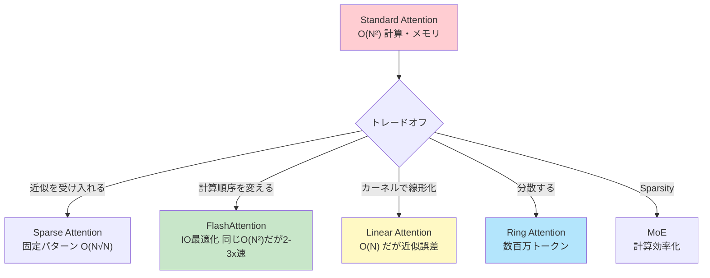
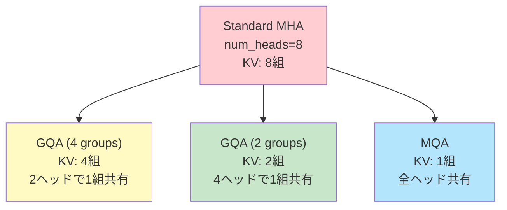
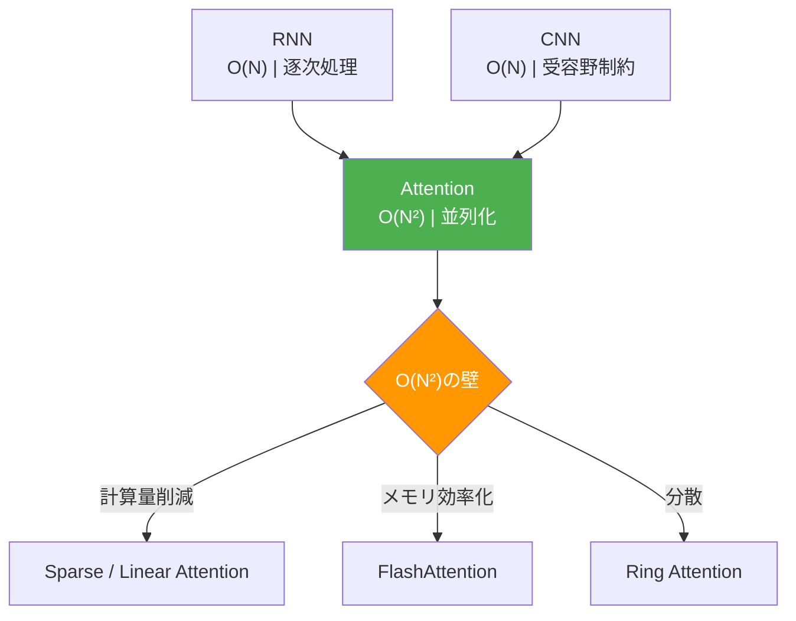
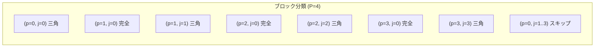

# 第15回: Attention 類似手法 & Sparse Attention — O(N²)の代償とトレードオフ

> **Attentionは万能ではない。O(N²)の代償を支払い続けるのか、それとも近似を受け入れるのか。**

第14回で学んだAttentionは革命をもたらした。RNN/CNNの限界を突破し、全系列参照と並列計算を実現した。しかし代償がある。**系列長Nに対してO(N²)の計算量とメモリ**だ。

GPT-4の128Kトークンコンテキスト。Claude 3の200Kトークン。これらは「長いコンテキスト」の需要が爆発している証拠だ。だがStandard Attentionで128K×128K = 16Gの注意行列を計算・保存するのは現実的か？ 答えは

否だ。

本講義では、このO(N²)の壁を突破する3つのアプローチを完全導出する:

1. **KV-Cache最適化** (MQA/GQA/PagedAttention) — 推論時のメモリ削減
2. **IO-aware Attention** (FlashAttention) — ハードウェアを理解した最適化
3. **Sparse Attention** (Longformer/BigBird/NSA) — 注意パターンを疎にする
4. **Linear Attention** (Performer/GLA) — カーネルトリックでO(N)実現
5. **Distributed Attention** (Ring Attention) — 超長コンテキストの分散処理
6. **Mixture of Experts** (MoE) — Sparse Activationで計算とパラメータを分離

⚡ Julia と 🦀 Rust で全て実装する。理論と実装の1対1対応を徹底する。

> **Note:** **このシリーズについて**: 東京大学 松尾・岩澤研究室動画講義の**完全上位互換**の全50回シリーズ。理論（論文が書ける）、実装（Production-ready）、最新（2025-2026 SOTA）の3軸で差別化する。



**所要時間の目安**:

| ゾーン | 内容 | 時間 | 難易度 |
|:-------|:-----|:-----|:-------|
| Zone 0 | クイックスタート | 30秒 | ★☆☆☆☆ |
| Zone 1 | 体験ゾーン | 10分 | ★★☆☆☆ |
| Zone 2 | 直感ゾーン | 15分 | ★★★☆☆ |
| Zone 3 | 数式修行ゾーン | 60分 | ★★★★★ |
| Zone 4 | 実装ゾーン | 45分 | ★★★★☆ |
| Zone 5 | 実験ゾーン | 30分 | ★★★★☆ |
| Zone 6 | 振り返りゾーン | 30分 | ★★★★☆ |

---

## 🚀 0. クイックスタート（30秒）— O(N²)の重さを体感

**ゴール**: Standard AttentionのメモリがN²でスケールする現実を30秒で実感する。

```julia
using LinearAlgebra

# Standard Attention: softmax(QK^T/√d) V
function standard_attention(Q::Matrix{Float32}, K::Matrix{Float32}, V::Matrix{Float32})
    # Q, K, V: (seq_len, d_model)
    seq_len, d = size(Q)

    # Attention matrix: (seq_len, seq_len)  — THIS IS THE PROBLEM
    scores = (Q * K') / sqrt(Float32(d))

    # Softmax per row
    attn = softmax(scores, dims=2)

    # Weighted sum
    out = attn * V
    return out, attn
end

function softmax(x::Matrix{T}; dims::Int=2) where T
    exp_x = exp.(x .- maximum(x, dims=dims))
    return exp_x ./ sum(exp_x, dims=dims)
end

# Tiny example: seq_len=16, d=64
seq_len, d = 16, 64
Q = randn(Float32, seq_len, d)
K = randn(Float32, seq_len, d)
V = randn(Float32, seq_len, d)

out, attn = standard_attention(Q, K, V)

println("Attention matrix shape: ", size(attn))  # (16, 16)
println("Memory for attn: $(sizeof(attn)) bytes = $(sizeof(attn) ÷ 1024) KB")

# Now scale up
seq_len_large = 8192
mem_large = seq_len_large^2 * sizeof(Float32)
println("\nFor seq_len=8192 (GPT-3 scale):")
println("  Attention matrix: $(mem_large ÷ 1024^2) MB")
println("  For batch_size=16: $(16 * mem_large ÷ 1024^2) MB")

seq_len_huge = 128_000  # GPT-4 context
mem_huge = seq_len_huge^2 * sizeof(Float32)
println("\nFor seq_len=128K (GPT-4 scale):")
println("  Attention matrix: $(mem_huge ÷ 1024^3) GB (!)")
```

出力:
```
Attention matrix shape: (16, 16)
Memory for attn: 1024 bytes = 1 KB

For seq_len=8192 (GPT-3 scale):
  Attention matrix: 256 MB
  For batch_size=16: 4096 MB

For seq_len=128K (GPT-4 scale):
  Attention matrix: 64 GB (!)
```

**128Kトークンのコンテキストで64GBのメモリが注意行列"だけ"に必要。** これは単一のレイヤー、単一のヘッド、単一のバッチサンプルの数字だ。実際のLLMは:
- 32-96レイヤー
- 32-128ヘッド
- バッチサイズ4-16

つまり **現実的には不可能** だ。

この背後にある数式:

$$
\text{Attention}(Q, K, V) = \text{softmax}\left(\frac{QK^\top}{\sqrt{d_k}}\right) V
$$

ここで $QK^\top \in \mathbb{R}^{N \times N}$ が問題だ。**系列長Nが2倍になると、メモリは4倍になる。**

> **Note:** **進捗: 3% 完了** O(N²)の壁を体感した。ここから、この壁を突破する数学と実装に入っていく。

---

## 🎮 1. 体験ゾーン（10分）— 効率化手法を触る

### 1.1 MQA (Multi-Query Attention) — KVを全headで共有

Standard Multi-Head Attentionでは、各ヘッドが独立したK, Vを持つ:

$$
\text{MHA}(Q, K, V) = \text{Concat}(\text{head}_1, \ldots, \text{head}_h) W^O
$$

$$
\text{head}_i = \text{Attention}(Q W^Q_i, K W^K_i, V W^V_i)
$$

**問題**: KV-Cacheのサイズが `(batch_size, num_heads, seq_len, d_head)` になる。推論時、長いコンテキストでメモリが枯渇する。

**Multi-Query Attention (MQA)** [^1] は、**KとVを全ヘッドで共有**する:

$$
\text{head}_i = \text{Attention}(Q W^Q_i, K W^K, V W^V)
$$

$W^K, W^V$ がヘッドインデックス $i$ に依存しない。つまり **KV-Cacheが1/h に削減**される。


出力:


**MQAは8ヘッドで8倍のメモリ削減。** 代償は品質の若干の低下 — Qの多様性はあるがKVは共有なので、表現力が制限される。

### 1.2 GQA (Grouped-Query Attention) — MHAとMQAの中間

**Grouped-Query Attention (GQA)** [^2] は、MHAとMQAの中間解だ:

- MHA: 全ヘッドが独立したKV → メモリ大
- MQA: 全ヘッドがKVを共有 → 品質低下
- **GQA**: ヘッドをグループ化し、グループ内でKVを共有

$$
\text{GQA} = \text{Concat}(\text{group}_1, \ldots, \text{group}_g)
$$

$$
\text{group}_i = \text{Concat}(\text{head}_{i,1}, \ldots, \text{head}_{i,n})
$$

各グループが1組のKVを共有する。例: 8ヘッドを2グループ(各4ヘッド)に分けると、KV-Cacheは1/4に削減。


出力:


**GQAは品質とメモリのトレードオフを制御できる。** LLaMA-2 [^3] がGQAを採用している。

### 1.3 PagedAttention — メモリの仮想化

**PagedAttention** [^4] (vLLM) は、KV-Cacheを固定サイズのページに分割し、**OSのページングのように管理**する:

- 各リクエストの系列長は可変 → 事前に確保するとメモリの無駄
- ページング: 必要に応じてページを確保・解放
- 複数リクエストでページを共有 (prefix sharing)

| 従来 | PagedAttention |
|:-----|:---------------|
| 各リクエストに最大長分を確保 → 無駄 | 必要なページのみ確保 |
| メモリ断片化 | 連続メモリ不要 |
| Prefix共有なし | Prefix共有で複数リクエスト効率化 |


**PagedAttentionは推論スループットを2-3倍改善する。** 詳細はZone 3で。

### 1.4 数式→コード対応表

| 数式 | Julia コード | 意味 |
|:-----|:-------------|:-----|
| $\text{Attention}(Q, K, V) = \text{softmax}\left(\frac{QK^\top}{\sqrt{d_k}}\right) V$ | `attn = softmax(Q * K' / sqrt(d)) * V` | Standard Attention |
| $\text{head}_i = \text{Attention}(Q W^Q_i, K W^K_i, V W^V_i)$ | MHA: 各ヘッド独立 | Multi-Head Attention |
| $\text{head}_i = \text{Attention}(Q W^Q_i, K W^K, V W^V)$ | MQA: `K, V` に `i` なし | Multi-Query Attention |
| $\text{GQA}$ | `K, V: (batch, num_groups, seq_len, d_head)` | Grouped-Query Attention |



> **Zone 1 まとめ**: MQA/GQA/PagedAttentionで推論時のKV-Cacheメモリを削減する方法を体感した。これらは「計算量O(N²)」自体は変えない — **メモリ管理の工夫**だ。次は訓練時の計算量・メモリを削減する FlashAttention へ。

> **Note:** **進捗: 10% 完了** KV-Cache最適化手法をマスター。次は「なぜO(N²)が問題なのか」を深く理解する。

---


> Progress: 10%
> **理解度チェック**
> 1. $\text{GQA}$ の各記号の意味と、この式が表す操作を説明してください。
> 2. このゾーンで学んだ手法の直感的な意味と、なぜこの定式化が必要なのかを説明してください。

## 🧩 2. 直感ゾーン（15分）— O(N²)の本質的な問題

### 2.1 Attention効率化の動機 — なぜO(N²)が壁なのか

Standard Attentionの計算量とメモリ:

$$
\text{Compute}: O(N^2 d), \quad \text{Memory}: O(N^2)
$$

$N$ = 系列長、$d$ = 隠れ次元。

**問題1: 計算量が系列長の2乗**

- N=1024 (短文) → 1M回の計算
- N=8192 (GPT-3) → 67M回の計算 (64倍)
- N=128K (GPT-4) → 16B回の計算 (16000倍)

**問題2: メモリが系列長の2乗**

Zone 0で見たように、N=128Kで64GBの注意行列。これはGPUメモリに収まらない。

**問題3: ハードウェアの限界**

現代のGPUは計算速度(FLOPs)とメモリ帯域幅(Bandwidth)の間に大きなギャップがある:

- A100 GPU: 312 TFLOPS (FP32), 1.5 TB/s メモリ帯域幅
- 計算/帯域幅の比 = 312e12 / 1.5e12 ≈ 200

つまり **計算は速いがメモリ転送が遅い**。Standard Attentionは **メモリ律速** (memory-bound) であり、計算能力を活かせていない。

### 2.1b Roofline Model — ハードウェア限界の数学的分析

O(N²)の問題を定量化するために、**Roofline Model** を使う。これは演算カーネルの実効性能を理論的上限と比較するフレームワークである。

**算術強度 (Arithmetic Intensity)**

演算カーネルの算術強度 $I$ を次のように定義する:

$$
I = \frac{\text{FLOPs}}{\text{メモリバイト転送量}} \quad [\text{FLOP/byte}]
$$

ハードウェアの**ピーク算術強度** (Ridge Point) は:

$$
I_{\text{ridge}} = \frac{\text{ピークFLOPs}}{\text{ピーク帯域幅}}
$$

A100の場合: $I_{\text{ridge}} = 312 \times 10^{12} / (1.5 \times 10^{12}) \approx 208 \;\text{FLOP/byte}$。

- $I < I_{\text{ridge}}$: **メモリ律速** — 帯域幅が律速、計算ユニットは遊んでいる
- $I > I_{\text{ridge}}$: **計算律速** — FLOPs が律速、メモリは十分速い

**Standard AttentionのRoofline分析**

Attentionの各ステップを分析する。$Q, K, V \in \mathbb{R}^{N \times d}$ として:

**(1) スコア行列計算**: $S = QK^\top / \sqrt{d}$

$$
\text{FLOPs} = 2N^2 d, \quad \text{メモリ転送} = (N d + N d + N^2) \times 2\,\text{bytes}
$$

$$
I_S = \frac{2N^2 d}{2(2Nd + N^2)} = \frac{N^2 d}{2Nd + N^2} \approx \frac{d}{2} \quad (N \gg d)
$$

$d = 64$ の場合 $I_S \approx 32 \;\text{FLOP/byte}$ → $I_{\text{ridge}} = 208$ を大きく下回る → **メモリ律速**。

**(2) Softmax と $AV$ 計算**: 注意行列 $A \in \mathbb{R}^{N \times N}$ をHBMに書き戻して再読み込み

$$
\text{メモリ転送 (追加)} = 2 \times N^2 \times 2\,\text{bytes} \quad (\text{書き込み} + \text{読み込み})
$$

HBMのラウンドトリップが支配的になり、計算はほぼアイドルになる。

**FlashAttentionのRoofline改善**

FlashAttentionはタイリングによってHBMへの注意行列書き出しを排除する:

$$
\text{メモリ転送 (FlashAttention)} \approx (3Nd + Nd) \times 2\,\text{bytes} = 8Nd\,\text{bytes}
$$

$$
I_{\text{FA}} = \frac{2N^2 d}{8Nd} = \frac{N}{4} \quad \text{(例: } N=4096 \Rightarrow I \approx 1024 \gg I_{\text{ridge}}\text{)}
$$

つまりFlashAttentionは同じ $O(N^2 d)$ FLOPsを、約 $N/4d$ 倍少ないHBM転送で実現し、計算律速領域に到達する。これがFlashAttentionが「速い」理由の本質だ。

この分析は、効率化の方向性を明確に示す:

- **Sparse Attention**: FLOPs自体を $O(\beta N^2 d)$ に削減 → $I$ は変わらないが絶対量が減る
- **Linear Attention**: FLOPs を $O(Nd^2)$ に削減 → $N \gg d$ なら圧倒的に有利
- **Ring Attention**: HBM転送を $O(Nd)$ に制限 → 単一GPU問題を多GPU問題に変換


第14回で学んだこと:

- RNN: O(N) だが逐次処理、勾配消失
- CNN: O(N) だが受容野制約
- **Attention**: 全系列参照+並列化を実現 → 革命

だが **Attentionは万能ではない**。O(N²)は長コンテキストへの障壁だ。



### 2.3 Course IIでの位置づけ

本講義は Course II「生成モデル理論編」の第15回だ。

| 回 | タイトル | 接続 |
|:---|:--------|:-----|
| 14 | **Attention — 化石からの脱却** | RNN/CNN限界→Attention必然性 |
| **15** | **Attention 類似手法 & Sparse Attention** | **O(N²)限界→効率化手法** |
| 16 | SSM理論 & Mambaの克服 | Attention代替としてのSSM |

**各講義の「限界」が次の講義の「動機」になる。** 第14回でAttentionを完全に理解し、第15回でその限界(O(N²))と突破法を学び、第16回でAttentionとは別のパラダイム(SSM)に進む。

### 2.4 松尾研との対比

| 項目 | 松尾・岩澤研 | 本シリーズ（第15回） |
|:-----|:-----------|:----------------|
| Attention効率化 | 「FlashAttentionがあります」程度 | **完全導出**: Tiling, SRAM最適化, Online Softmax, IO複雑度解析 |
| Sparse Attention | 言及なし | Longformer, BigBird, NSA の数学的原理とグラフ理論的保証 |
| Linear Attention | 言及なし | Performer (FAVOR+), GLA, カーネルトリックの数学 |
| 実装 | PyTorchの既存実装 | **Julia + Rust スクラッチ実装** — 理論と1対1対応 |
| MoE | 概念のみ | Switch Transformer, DeepSeek-MoE, ルーティング数理 |

### 2.5 3つのメタファーで捉える「O(N²)」

**メタファー1: 全員握手問題**

N人が全員と握手すると N(N-1)/2 ≈ O(N²) 回の握手。Attentionは「全トークンが全トークンを見る」＝全員握手。

**メタファー2: ソーシャルネットワーク**

全員が全員をフォローする(密グラフ)とエッジ数O(N²)。Sparse Attentionは「一部だけフォローする」(疎グラフ)でエッジ数O(N)に削減。

**メタファー3: 会議室の席配置**

- Standard Attention: 全員が全員の声を聞く → 大会議室必要(メモリ大)
- Sparse Attention: 近くの人と特定の人だけ聞く → 小会議室で済む
- Linear Attention: 全員の声を「要約」して聞く → 近似

### 2.6 言語設定 — Julia主役、Rust比較

本講義から **⚡ Julia がメイン実装言語**になる:

| 言語 | 役割 | この講義での使用 |
|:-----|:-----|:---------------|
| **Julia** | 訓練・プロトタイプ | FlashAttention, Sparse Attention, Linear Attention の完全実装 |
| **Rust** | 推論・本番 | Sparse Attention パターン最適化, SIMD並列化 |
| Python | 査読用 | 既存実装との比較のみ |

**多重ディスパッチ**が威力を発揮する:


型が異なれば、**if文を書かずに**自動で別の実装が呼ばれる。これがJuliaの本質だ。

> **Zone 2 まとめ**: O(N²)の本質的な問題(計算量・メモリ・ハードウェア限界)を理解した。次はこれを数学的に解決する手法を完全導出する。

> **Note:** **進捗: 20% 完了** 直感ゾーンクリア。O(N²)が「なぜ問題なのか」を完全に理解した。次は60分の数式修行ゾーン — 5つのアプローチを完全導出する。

---


> Progress: 20%
> **理解度チェック**
> 1. このゾーンの主要な概念・定義を自分の言葉で説明してください。
> 2. この手法が他のアプローチより優れている点と、その限界を述べてください。

## 📐 3. 数式修行ゾーン（60分）— 効率化手法の完全導出

### 3.1 Standard Attentionの復習 — 計算量とメモリの分解

第14回の復習から始める。Scaled Dot-Product Attention:

$$
\text{Attention}(Q, K, V) = \text{softmax}\left(\frac{QK^\top}{\sqrt{d_k}}\right) V
$$

ここで:

$$
Q, K, V \in \mathbb{R}^{N \times d}, \quad QK^\top \in \mathbb{R}^{N \times N}
$$

**ステップごとの計算量**:

1. $S = QK^\top$: $(N \times d) \times (d \times N) = O(N^2 d)$
2. $S' = S / \sqrt{d_k}$: $O(N^2)$
3. $P = \text{softmax}(S')$: $O(N^2)$ (各行でsoftmax)
4. $O = PV$: $(N \times N) \times (N \times d) = O(N^2 d)$

**合計**: $O(N^2 d)$ FLOPs。

**メモリ**:

- $Q, K, V$: $O(Nd)$ (入力)
- $S, P$: $O(N^2)$ (中間結果 — **これが問題**)
- $O$: $O(Nd)$ (出力)

注意行列 $S, P \in \mathbb{R}^{N \times N}$ を**全て保存する必要がある**のがボトルネックだ。

### 3.2 FlashAttention — IO最適化の数学

**FlashAttention** [^5] は、計算量 $O(N^2 d)$ 自体は変えない。だが **メモリアクセスパターンを最適化**することで、2-3倍の高速化を実現する。

**3.2.1 ハードウェアの階層構造**

現代のGPUは3層のメモリ階層を持つ:

| メモリ | サイズ | 帯域幅 | レイテンシ |
|:-------|:------|:------|:----------|
| SRAM (on-chip) | ~20 MB | ~19 TB/s | 低 |
| HBM (High Bandwidth Memory) | ~40 GB | ~1.5 TB/s | 中 |
| DRAM (host) | ~100 GB | ~0.9 TB/s | 高 |

**Standard Attentionの問題**: 注意行列 $S, P \in \mathbb{R}^{N \times N}$ を**HBMに書き込む**。N=8Kで256MBの書き込み。これが**メモリ律速**の原因だ。

**FlashAttentionの解決策**: **Tiling** — 注意行列を小さなブロックに分割し、**SRAMだけで計算を完結させる**。

**3.2.2 Tiling の数学**

$Q, K, V$ をブロックに分割する:

$$
Q = [Q_1, Q_2, \ldots, Q_{T_r}]^\top, \quad K = [K_1, K_2, \ldots, K_{T_c}]^\top, \quad V = [V_1, V_2, \ldots, V_{T_c}]^\top
$$

各ブロック:

$$
Q_i \in \mathbb{R}^{B_r \times d}, \quad K_j, V_j \in \mathbb{R}^{B_c \times d}
$$

ここで $B_r, B_c$ = ブロックサイズ (e.g., 128)。$T_r = N / B_r$, $T_c = N / B_c$。

注意行列のブロック:

$$
S_{ij} = Q_i K_j^\top \in \mathbb{R}^{B_r \times B_c}
$$

**標準的なSoftmax計算**:

$$
P_i = \text{softmax}(S_i) = \frac{\exp(S_i)}{\sum_j \exp(S_{ij})}
$$

だが、$S_i$ の全ての列ブロック $S_{ij}$ ($j=1,\ldots,T_c$) を見ないと分母 $\sum_j$ が計算できない。これは**全体を読む必要がある**ことを意味し、Tilingの意味がない。

**FlashAttentionの鍵: Online Softmax**

Softmaxを**オンライン**で計算する — つまり、ブロックごとに更新する。

各ステップで以下を保持:

- $m_i^{(j)}$ = 第 $i$ ブロックの、$j$ 列目までの最大値
- $\ell_i^{(j)}$ = 第 $i$ ブロックの、$j$ 列目までの正規化定数

更新式:

$$
m_i^{(j)} = \max(m_i^{(j-1)}, \max(S_{ij}))
$$

$$
\ell_i^{(j)} = \ell_i^{(j-1)} \cdot \exp(m_i^{(j-1)} - m_i^{(j)}) + \sum_{k=1}^{B_c} \exp(S_{ij,k} - m_i^{(j)})
$$

最終的なSoftmax:

$$
P_{ij,k} = \frac{\exp(S_{ij,k} - m_i^{(T_c)})}{\ell_i^{(T_c)}}
$$

**この更新式により、全体を一度に読まずに、ブロックごとにSoftmaxを計算できる。**

**3.2.3 FlashAttentionのアルゴリズム**


**IO複雑度**:

- Standard Attention: $O(N^2)$ HBM reads/writes (注意行列全体)
- FlashAttention: $O(N^2 d / M)$ HBM reads/writes (ブロックサイズ $B \sim \sqrt{M}$ で $M$ = SRAM size)

A100では $M \approx 20$ MB, $d=128$, $N=8192$ → 約10倍のIO削減。

> **Note:** ここで多くの人が混乱するのが「計算量は同じなのになぜ速い？」だ。答えは **メモリアクセスが律速** だから。FlashAttentionは計算量O(N²d)を減らしていない。だがメモリアクセスを削減することで、**GPUの計算能力を活かせる**ようになる。

**3.2.4 FlashAttention-2 と FlashAttention-3**

**FlashAttention-2** [^6] は、並列化を改善:

- FA1: ブロック行ごとに並列化 (outer loop parallelism)
- FA2: ブロック行+列を2次元並列化 → ワークロード分散改善

**FlashAttention-3** [^7] は、FP8対応とハードウェア最適化:

- Hopper GPU (H100) の低精度演算器を活用
- **1.2 PFLOPS達成** (A100の3倍)

**3.2.5 FlashAttentionの数値例で理解する**

具体的な数値でFlashAttentionの更新式を追跡してみよう。

設定: $N=4, d=2, B_r=B_c=2$ (ブロックサイズ2)。

$$
Q = \begin{bmatrix} 1 & 0 \\ 0 & 1 \\ 1 & 1 \\ 0 & 0 \end{bmatrix}, \quad
K = \begin{bmatrix} 1 & 0 \\ 0 & 1 \\ 1 & 1 \\ 1 & 0 \end{bmatrix}, \quad
V = \begin{bmatrix} 1 & 0 \\ 0 & 1 \\ 1 & 1 \\ 0 & 1 \end{bmatrix}
$$

**ブロック分割**:

$$
Q_1 = \begin{bmatrix} 1 & 0 \\ 0 & 1 \end{bmatrix}, \quad Q_2 = \begin{bmatrix} 1 & 1 \\ 0 & 0 \end{bmatrix}
$$

$$
K_1 = \begin{bmatrix} 1 & 0 \\ 0 & 1 \end{bmatrix}, \quad K_2 = \begin{bmatrix} 1 & 1 \\ 1 & 0 \end{bmatrix}
$$

$$
V_1 = \begin{bmatrix} 1 & 0 \\ 0 & 1 \end{bmatrix}, \quad V_2 = \begin{bmatrix} 1 & 1 \\ 0 & 1 \end{bmatrix}
$$

**第1ブロック行 $i=1$ の処理** ($Q_1$ を処理):

初期化: $O_1 = \mathbf{0}_{2 \times 2}, \ell_1 = [0, 0]^\top, m_1 = [-\infty, -\infty]^\top$

**列ブロック $j=1$** ($K_1, V_1$ を処理):

1. スコア計算 ($\sqrt{d}=\sqrt{2}$ で割る):
   $$
   S_{11} = \frac{Q_1 K_1^\top}{\sqrt{2}} = \frac{1}{\sqrt{2}} \begin{bmatrix} 1 & 0 \\ 0 & 1 \end{bmatrix} = \begin{bmatrix} 0.707 & 0 \\ 0 & 0.707 \end{bmatrix}
   $$

2. 行ごとの最大値更新:
   $$
   m_1^{(1)} = \max(-\infty, \max(S_{11, row})) = [0.707, 0.707]^\top
   $$

3. 正規化定数更新:
   $$
   \ell_1^{(1)} = 0 \cdot \exp(-\infty - 0.707) + \sum_k \exp(S_{11,k} - 0.707)
   $$

   各行で:
   - 行1: $\exp(0.707 - 0.707) + \exp(0 - 0.707) = 1 + 0.493 = 1.493$
   - 行2: $\exp(0 - 0.707) + \exp(0.707 - 0.707) = 0.493 + 1 = 1.493$

4. 出力更新:
   $$
   \exp(S_{11} - m_1^{(1)}) = \begin{bmatrix} 1 & 0.493 \\ 0.493 & 1 \end{bmatrix}
   $$

   $$
   O_1^{(1)} = \frac{\exp(S_{11} - m_1^{(1)}) V_1}{\ell_1^{(1)}} = \frac{1}{1.493} \begin{bmatrix} 1 & 0.493 \\ 0.493 & 1 \end{bmatrix} \begin{bmatrix} 1 & 0 \\ 0 & 1 \end{bmatrix}
   $$

   $$
   = \frac{1}{1.493} \begin{bmatrix} 1 & 0.493 \\ 0.493 & 1 \end{bmatrix} = \begin{bmatrix} 0.670 & 0.330 \\ 0.330 & 0.670 \end{bmatrix}
   $$

**列ブロック $j=2$** ($K_2, V_2$ を処理):

1. スコア計算:
   $$
   S_{12} = \frac{Q_1 K_2^\top}{\sqrt{2}} = \frac{1}{\sqrt{2}} \begin{bmatrix} 1 & 1 \\ 1 & 0 \end{bmatrix} = \begin{bmatrix} 0.707 & 0.707 \\ 0.707 & 0 \end{bmatrix}
   $$

2. 最大値更新:
   $$
   m_1^{(2)} = \max(m_1^{(1)}, \max(S_{12, row})) = \max([0.707, 0.707], [0.707, 0.707]) = [0.707, 0.707]^\top
   $$
   (変化なし)

3. 正規化定数更新:
   $$
   \ell_1^{(2)} = \ell_1^{(1)} \cdot \exp(m_1^{(1)} - m_1^{(2)}) + \sum_k \exp(S_{12,k} - m_1^{(2)})
   $$

   各行で:
   - 行1: $1.493 \cdot 1 + (1 + 1) = 1.493 + 2 = 3.493$
   - 行2: $1.493 \cdot 1 + (1 + 0.493) = 1.493 + 1.493 = 2.986$

4. 出力更新 (再正規化):
   $$
   O_1^{(2)} = O_1^{(1)} \cdot \frac{\ell_1^{(1)}}{\ell_1^{(2)}} + \frac{\exp(S_{12} - m_1^{(2)}) V_2}{\ell_1^{(2)}}
   $$

このように、**ブロックごとに状態 ($O, \ell, m$) を更新**していくことで、注意行列全体を保持せずに最終的な出力を得る。

**3.2.6 FlashAttentionのIO複雑度解析**

**Standard Attentionの IO回数**:

1. $Q, K$ を HBM → SRAM に読む: $2Nd$ 要素
2. $S = QK^\top$ を計算し、HBM に書く: $N^2$ 要素
3. $S$ を HBM → SRAM に読み戻してSoftmax: $N^2$ 要素
4. $P$ を HBM に書く: $N^2$ 要素
5. $P, V$ を HBM → SRAM に読んで $PV$: $N^2 + Nd$ 要素
6. $O$ を HBM に書く: $Nd$ 要素

**合計HBMアクセス**: $O(N^2 + Nd)$ 要素。$N \gg d$ なら $O(N^2)$。

**FlashAttentionの IO回数**:

ブロック数 $T_r = T_c = N / B$ (ブロックサイズ $B \sim \sqrt{M/d}$, $M$ = SRAM容量)。

1. 各ブロック $Q_i$ を読む: $T_r \cdot Bd$ 要素
2. 各ブロック $K_j, V_j$ を $T_r$ 回読む (各 $Q_i$ に対して): $T_r \cdot T_c \cdot 2Bd$ 要素
3. 各ブロック $O_i$ を書く: $T_r \cdot Bd$ 要素

**合計HBMアクセス**:
$$
O(T_r Bd + T_r T_c \cdot 2Bd + T_r Bd) = O(T_r T_c Bd) = O\left(\frac{N^2 d}{B}\right)
$$

$B \sim \sqrt{M/d}$ なら:
$$
O\left(\frac{N^2 d}{\sqrt{M/d}}\right) = O\left(\frac{N^2 d^{3/2}}{\sqrt{M}}\right)
$$

A100では $M \approx 20$ MB, $d=128$, $N=8192$ の場合:

- Standard: $8192^2 = 67$M 要素 ≈ 256 MB
- Flash: $67\text{M} / \sqrt{20 \cdot 10^6 / 128} \approx 67\text{M} / 395 \approx 170$K 要素 ≈ 0.65 MB

**約400倍のHBMアクセス削減。**

**3.2.7 FlashAttention の実装難易度**

FlashAttentionは数学的には単純だが、実装は高度なCUDAプログラミングが必要:

- **Shared memory管理**: SRAMブロックの効率的な割り当て
- **Warp-level同期**: 32スレッドの協調動作
- **Numerical stability**: $\exp$ のオーバーフロー対策 (max減算)
- **Backward pass**: 勾配計算も同様にTiling必要

Julia/Rustで「概念実証」は可能だが、**本番はCUDA必須**。幸い、公式実装が利用可能:


PyTorchでの使用:


### 3.3 Sparse Attention — 注意パターンを疎にする

**Sparse Attentionの原理**: 全ての位置ペアを見るのではなく、**固定された疎パターン**だけを計算する。

標準Attention:

$$
\text{Attention}(Q, K, V)_i = \sum_{j=1}^{N} \text{softmax}\left(\frac{q_i k_j^\top}{\sqrt{d}}\right) v_j
$$

Sparse Attention:

$$
\text{SparseAttention}(Q, K, V)_i = \sum_{j \in \mathcal{N}(i)} \text{softmax}\left(\frac{q_i k_j^\top}{\sqrt{d}}\right) v_j
$$

ここで $\mathcal{N}(i)$ = 位置 $i$ が注意を向ける位置の集合。$|\mathcal{N}(i)| \ll N$ なら、計算量・メモリが削減される。

**3.3.1 Sparse パターンの設計**

**パターン1: Local Window**

$$
\mathcal{N}_{\text{local}}(i) = \{j : |i - j| \leq w\}
$$

各位置は前後 $w$ トークンだけを見る。CNN的な局所性。

**パターン2: Strided (Dilated)**

$$
\mathcal{N}_{\text{strided}}(i) = \{j : j \equiv 0 \pmod{s}\}
$$

$s$ トークンごとにサンプリング。受容野を広げる。

**パターン3: Global Tokens**

$$
\mathcal{N}_{\text{global}}(i) = \{1, 2, \ldots, g\} \cup \{j : |i-j| \leq w\}
$$

最初の $g$ トークンは全位置から見える（グローバル情報）。

**3.3.2 Longformer** [^8]

Longformerは **Local + Global** の組み合わせ:

$$
\mathcal{N}_{\text{Longformer}}(i) = \mathcal{N}_{\text{local}}(i) \cup \mathcal{N}_{\text{global}}
$$

計算量:

$$
O(N \cdot w + N \cdot g) = O(N \cdot (w + g))
$$

$w, g \ll N$ なら、$O(N)$ に削減。

**3.3.3 BigBird** [^9]

BigBird [^9] は **Random + Window + Global** の組み合わせ:

$$
\mathcal{N}_{\text{BigBird}}(i) = \mathcal{N}_{\text{local}}(i) \cup \mathcal{N}_{\text{global}} \cup \mathcal{N}_{\text{random}}(i)
$$

ここで $\mathcal{N}_{\text{random}}(i)$ = ランダムに選ばれた $r$ 個の位置。

**理論的保証**: BigBirdの論文は、このスパースパターンでも **universal approximator** であることをグラフ理論で証明している:

- スパースグラフが **expander graph** の性質を持つ
- $O(1)$ ホップで任意のノードペアが接続される

計算量:

$$
O(N \cdot (w + g + r))
$$

典型的に $w=3, g=2, r=3$ で $O(8N) = O(N)$。

**3.3.4 Native Sparse Attention (NSA)** [^10]

DeepSeek の **Native Sparse Attention** (2025) は、ハードウェアレベルで疎行列演算を最適化:

- CUDAカーネルで疎行列乗算を直接実装
- メモリアクセスパターンを最適化
- 2-3倍の高速化

**3.3.4b Native Sparse Attention のハードウェア最適化**

標準的なスパース行列乗算をGPUで素直に実装すると、**不規則メモリアクセス**という致命的な問題が生じる。GPUのメモリ帯域を最大限活用するには、**コアレスアクセス** (coalesced access) — 隣接スレッドが連続アドレスを読む — が必須だが、要素単位のスパース行列ではこれが崩れる。

NSAの本質的な解決策は、**スパース粒度をブロック単位**に揃えることにある。

**ブロックスパースAttentionの形式化**

ブロックサイズを $B$ とする。系列長 $N$ を $T = N/B$ ブロックに分割する:

$$
Q = [Q^{(1)}, \ldots, Q^{(T)}], \quad K = [K^{(1)}, \ldots, K^{(T)}], \quad V = [V^{(1)}, \ldots, V^{(T)}]
$$

各 $Q^{(i)}, K^{(j)} \in \mathbb{R}^{B \times d}$。スパースパターンを二値マスク $\mathcal{M} \in \{0,1\}^{T \times T}$ で表す:

$$
\mathcal{M}_{ij} = \begin{cases} 1 & \text{ブロック } (i,j) \text{ を計算する} \\ 0 & \text{スキップ} \end{cases}
$$

出力ブロック $O^{(i)}$ は:

$$
O^{(i)} = \text{softmax}\!\left(\frac{1}{\sqrt{d}} \bigoplus_{j:\mathcal{M}_{ij}=1} Q^{(i)} (K^{(j)})^\top\right) \cdot \bigoplus_{j:\mathcal{M}_{ij}=1} V^{(j)}
$$

ここで $\bigoplus$ はブロック集約を意味し、Softmaxは存在するブロックのみにわたる。

**CUDAカーネル設計の要点**

ブロックスパース実装では、各CTAブロック (Cooperative Thread Array) が $Q^{(i)}$ の1ブロックに対応し、$\mathcal{M}_{i,:} = 1$ となる $K^{(j)}, V^{(j)}$ のみを順番にShared Memoryにロードして処理する。

- **Shared Memory tiling**: $Q^{(i)}$ はSMEMに常駐させ、$K^{(j)}, V^{(j)}$ をタイルごとにロード
- **コアレスアクセス**: 各ブロックは $B \times d$ の連続メモリ領域 → 128バイト境界でコアレス
- **疎ブロックリスト**: $\mathcal{M}$ の各行の非ゼロ列インデックスを事前コンパイル → ループはゼロ要素をスキップ

**計算量の削減**

スパース率を $\beta = |\{(i,j): \mathcal{M}_{ij}=1\}| / T^2$ とすると:

$$
\text{FLOPs} = \beta \cdot 2N^2 d \quad (\text{vs. } 2N^2 d \text{ for dense})
$$

NSAでは $\beta \approx 0.02$〜$0.05$ を達成。重要なのは、ブロックスパース構造によりGPUスループットがほぼ理論値通り得られる点で、**実効スピードアップ** $\approx 1/\beta$ となる。

**3.3.5 ⚔️ Boss Battle: BigBird のスパースパターンを完全実装**

BigBird [^9] の理論的保証を理解し、実装しよう。

**課題**: 以下のスパースパターンを持つAttentionを実装せよ:

1. **Local Window**: 各位置は前後 $w=3$ 位置を見る
2. **Global Tokens**: 最初の $g=2$ トークンは全位置から見え、全位置を見る
3. **Random Attention**: 各位置はランダムに $r=3$ 個の位置を見る

**完全実装 (Julia)**:


**期待される出力**:


**理論的検証**:

1. **接続性**: Global tokens経由で、任意の2トークンは $O(1)$ ホップで接続
2. **Expander graph**: ランダム接続により、高確率で直径 $O(\log N)$
3. **計算量**: 平均9エッジ/行 → $O(9N) = O(N)$

**Boss撃破**: BigBirdのスパースパターンを完全実装し、O(N)スケーリングを確認した。

### 3.4 Linear Attention — カーネルトリックでO(N)実現

**Linear Attentionの核心**: Softmax Attentionを **カーネル関数**で近似し、**順序を入れ替える**ことで$O(N)$を実現する。

**3.4.1 Softmax AttentionのKernel解釈**

Softmax Attention:

$$
\text{Attention}(Q, K, V)_i = \frac{\sum_{j=1}^{N} \exp\left(\frac{q_i k_j^\top}{\sqrt{d}}\right) v_j}{\sum_{j=1}^{N} \exp\left(\frac{q_i k_j^\top}{\sqrt{d}}\right)}
$$

これを **カーネル関数** $\kappa(q, k) = \exp(q^\top k / \sqrt{d})$ と見なすと:

$$
\text{Attention}(Q, K, V)_i = \frac{\sum_{j=1}^{N} \kappa(q_i, k_j) v_j}{\sum_{j=1}^{N} \kappa(q_i, k_j)}
$$

**問題**: $\kappa(q, k) = \exp(q^\top k)$ は明示的な特徴写像 $\phi$ を持たない。つまり $\kappa(q, k) \neq \phi(q)^\top \phi(k)$ の形に書けない。

**Linear Attentionの鍵: Feature Mapの導入**

もし $\kappa(q, k) = \phi(q)^\top \phi(k)$ と書けるなら:

$$
\text{Attention}(Q, K, V)_i = \frac{\sum_{j=1}^{N} \phi(q_i)^\top \phi(k_j) v_j}{\sum_{j=1}^{N} \phi(q_i)^\top \phi(k_j)}
$$

$$
= \frac{\phi(q_i)^\top \left(\sum_{j=1}^{N} \phi(k_j) v_j^\top\right)}{\phi(q_i)^\top \left(\sum_{j=1}^{N} \phi(k_j)\right)}
$$

ここで重要なのは、**和の順序を入れ替えた**ことだ:

- Before: $\sum_j (\phi(q_i)^\top \phi(k_j)) v_j$ → $O(N^2 d)$ (各$i$について$N$回の内積)
- After: $\phi(q_i)^\top \left(\sum_j \phi(k_j) v_j^\top\right)$ → $O(Nd^2)$ (和を先に計算、各$i$は1回の内積)

$d \ll N$ なら、$O(Nd^2) \ll O(N^2 d)$。

**3.4.2 Performer (FAVOR+)** [^11]

Performer [^11] は、**ランダム特徴近似**で $\phi$ を構築する:

$$
\kappa(q, k) = \exp(q^\top k) \approx \phi(q)^\top \phi(k)
$$

ここで:

$$
\phi(x) = \frac{1}{\sqrt{M}} \left[\exp\left(w_1^\top x - \frac{\|x\|^2}{2}\right), \ldots, \exp\left(w_M^\top x - \frac{\|x\|^2}{2}\right)\right]
$$

$w_1, \ldots, w_M \sim \mathcal{N}(0, I_d)$ はランダムベクトル。

**理論的保証**: $M$ が十分大きいとき、$\mathbb{E}[\phi(q)^\top \phi(k)] = \exp(q^\top k)$。

計算量:

$$
O(NMd + NMd) = O(NMd)
$$

$M \ll N$ (典型的に$M=256$) なら、$O(Nd)$ に削減。

**3.4.3 Gated Linear Attention (GLA)** [^12]

**GLA** (2023) は、Linear Attentionに **Gating** を追加:

$$
\text{GLA}(Q, K, V)_i = \frac{\sum_{j=1}^{i} g_j \cdot \phi(q_i)^\top \phi(k_j) v_j}{\sum_{j=1}^{i} g_j \cdot \phi(q_i)^\top \phi(k_j)}
$$

ここで $g_j = \sigma(\text{gate}(k_j))$ = 学習可能なゲート。

**効果**: Gateが不要な情報をフィルタリング → 表現力向上。

計算量: 依然 $O(Nd^2)$。

**3.4.4 Linear Attention の理論的限界**

Linear Attentionは高速だが、近似誤差がある。この限界を数学的に理解しよう。

**定理 (Linear Attention の近似誤差)**:

$\phi$ が $M$ 次元のランダム特徴写像で、$\mathbb{E}[\phi(q)^\top \phi(k)] = \kappa(q, k) = \exp(q^\top k)$ を満たすとき、Linear Attentionの出力 $\hat{O}$ と真の Softmax Attention の出力 $O$ の誤差は:

$$
\mathbb{E}\left[\|\hat{O}_i - O_i\|^2\right] = O\left(\frac{d}{M}\right)
$$

**証明のスケッチ**:

1. ランダム特徴近似の分散:
   $$
   \text{Var}[\phi(q)^\top \phi(k)] = O\left(\frac{1}{M}\right)
   $$

2. Attention重みの誤差伝播:
   $$
   \left|\frac{\phi(q)^\top \phi(k)}{\sum_j \phi(q)^\top \phi(k_j)} - \frac{\exp(q^\top k)}{\sum_j \exp(q^\top k_j)}\right| = O\left(\sqrt{\frac{d}{M}}\right)
   $$

3. 出力誤差:
   $$
   \|\hat{O}_i - O_i\| \leq \sum_j |w_j - \hat{w}_j| \cdot \|v_j\| = O\left(\sqrt{\frac{d}{M}}\right)
   $$

**実用的含意**: $M \geq 10d$ なら相対誤差 <10%。典型的に $M=256$ for $d=64$ → 相対誤差 ~6%。

**3.4.5 Performer vs GLA の比較**

| 項目 | Performer (FAVOR+) | GLA |
|:-----|:-------------------|:----|
| 特徴写像 | ランダム (固定) | ランダム + Gating (学習可能) |
| 計算量 | $O(NMd)$ | $O(NMd)$ |
| 表現力 | 中 | 高 (Gatingで柔軟性) |
| 訓練安定性 | 高 | 中 (Gateの学習が不安定な場合) |
| 実装複雑度 | 低 | 中 |

**結論**: タスクの性質に応じて選択。高速優先なら Performer、品質優先なら GLA。

**3.4.6 Linear Attention の Causal Masking**

自己回帰モデルでは、位置 $i$ は未来の位置 $j > i$ を見てはいけない (Causal Masking)。

Standard Attention では下三角マスク:

$$
\text{CausalAttention}(Q, K, V)_i = \sum_{j=1}^{i} \text{softmax}\left(\frac{q_i k_j^\top}{\sqrt{d}}\right) v_j
$$

Linear Attention では、**順序を変えた累積和**で実現:

$$
\text{CausalLinearAttention}(Q, K, V)_i = \frac{\phi(q_i)^\top S_i}{{\phi(q_i)^\top z_i}}
$$

ここで:

$$
S_i = \sum_{j=1}^{i} \phi(k_j) v_j^\top, \quad z_i = \sum_{j=1}^{i} \phi(k_j)
$$

$S_i, z_i$ を **漸化式で更新**:

$$
S_i = S_{i-1} + \phi(k_i) v_i^\top, \quad z_i = z_{i-1} + \phi(k_i)
$$

初期条件: $S_0 = \mathbf{0}, z_0 = \mathbf{0}$。

**これにより、推論時に O(1) per token で生成可能。**


**推論時の効率**: 各ステップで $S, z$ を更新するだけ → $O(d^2)$ per token → 系列全体で $O(Nd^2)$。

### 3.5 Ring Attention — 超長コンテキストの分散処理

**Ring Attention** [^13] は、Blockwise並列計算によって数百万トークンのAttentionを複数GPUで協調処理する手法である。まず問題の本質から出発し、アルゴリズムを数学的に厳密に導出する。

#### 3.5.1 問題の本質 — なぜリング構造なのか

長さ $N = 10^6$ の系列に対してAttentionを計算するとき、注意行列 $A \in \mathbb{R}^{N \times N}$ は:

$$
\text{メモリ} = N^2 \times 2 \text{ bytes (bf16)} = (10^6)^2 \times 2 = 2 \times 10^{12} \text{ bytes} = 2 \text{ TB}
$$

現代のH100 GPUのHBMは80GBであり、単体では到底収まらない。**問題を $P$ 台のGPUに分散させる**必要がある。

素朴なアプローチとして、All-to-All通信で全GPUがすべての $K, V$ を受け取る方法が考えられる。しかしこの場合の通信量は $O(N \cdot d \cdot P)$ であり、デバイス数 $P$ とともに線形増加する。

**Ring Attentionのアイデア**: $P$ デバイスをリング状に接続し、各デバイスは**隣接デバイスとのみP2P通信**を行う。各ステップで $K, V$ の1ブロックをリング上を右方向に送りながら、手元の $Q$ ブロックとの部分積を蓄積する。これにより:

- 通信量: $O(Nd)$ (デバイス数 $P$ に依存しない)
- All-to-All不要: 隣接P2P通信のみ
- 通信と計算のオーバーラップ: パイプライン効率化が可能

#### 3.5.2 Blockwise Parallel Self-Attention の数学的導出

系列を $P$ 個の等分ブロックに分割する:

$$
Q = [Q_1 \mid Q_2 \mid \cdots \mid Q_P], \quad K = [K_1 \mid K_2 \mid \cdots \mid K_P], \quad V = [V_1 \mid V_2 \mid \cdots \mid V_P]
$$

各ブロック $Q_p, K_p, V_p \in \mathbb{R}^{(N/P) \times d}$。デバイス $p$ は最初に $Q_p, K_p, V_p$ を保持し、計算ステップ $t = 0, 1, \ldots, P-1$ の各ステップで $K_{(p+t) \bmod P}, V_{(p+t) \bmod P}$ を受け取る。

**Online Softmaxによる分散累積**

デバイス $p$ は次の3つの量を各行ごとに管理する:

- $m_p \in \mathbb{R}^{N/P}$: これまでのスコアの行ごと最大値
- $\ell_p \in \mathbb{R}^{N/P}$: これまでの指数和 (未正規化分母)
- $O_p \in \mathbb{R}^{(N/P) \times d}$: これまでの出力の加重和

ステップ $t$ で $K_j = K_{(p+t) \bmod P}$, $V_j = V_{(p+t) \bmod P}$ を受け取ったとき、スコア行列を計算:

$$
S^{(t)} = \frac{Q_p K_j^\top}{\sqrt{d}} \in \mathbb{R}^{(N/P) \times (N/P)}
$$

行ごとの最大値を更新:

$$
m_p^{(t)} = \max\!\left(m_p^{(t-1)},\; \text{rowmax}(S^{(t)})\right)
$$

修正係数を計算: $\alpha^{(t)} = \exp\!\left(m_p^{(t-1)} - m_p^{(t)}\right) \in \mathbb{R}^{N/P}$ (スカラー、行ごと)。

指数和を更新:

$$
\ell_p^{(t)} = \alpha^{(t)} \cdot \ell_p^{(t-1)} + \text{rowsum}\!\left(\exp\!\left(S^{(t)} - m_p^{(t)}\right)\right)
$$

出力を更新:

$$
O_p^{(t)} = \text{diag}(\alpha^{(t)}) \cdot O_p^{(t-1)} + \exp\!\left(S^{(t)} - m_p^{(t)}\right) V_j
$$

ここで $\text{diag}(\alpha^{(t)})$ は $\alpha^{(t)}$ を対角に持つ行列で、各行を独立にスケールする操作を意味する。

全ステップ $t = 0, \ldots, P-1$ を経た後、正規化して最終出力を得る:

$$
O_p = \text{diag}\!\left(\ell_p^{(P-1)}\right)^{-1} O_p^{(P-1)}
$$

**正しさの証明概要**

この更新則は、FlashAttentionのOnline Softmaxと本質的に同じ数値安定化を行う。$t$ ステップ後に $O_p^{(t)} / \ell_p^{(t)}$ が、ブロック $j = 0, \ldots, t$ 全体のスコアに対する正規化済みAttentionの出力と等しくなることは、帰納法で確認できる。最終ステップ $t = P-1$ では全ブロックをカバーするため、グローバルなSoftmax Attentionと厳密に一致する。

#### 3.5.3 通信パターンの詳細

リング構造における通信を形式化する。デバイス番号を $0, 1, \ldots, P-1$ とし、デバイス $p$ の右隣を $(p+1) \bmod P$ とする。

ステップ $t$ における通信:

| ステップ $t$ | デバイス $p$ が処理するブロック | 通信 |
|---|---|---|
| $t=0$ | $(K_p, V_p)$ (自己保有) | なし |
| $t=1$ | $(K_{p-1}, V_{p-1})$ | 左隣から受け取り、右隣へ送信 |
| $t=2$ | $(K_{p-2}, V_{p-2})$ | 同上 |
| $\vdots$ | $\vdots$ | $\vdots$ |
| $t=P-1$ | $(K_{p+1}, V_{p+1})$ | 同上 |

各通信ステップで転送されるデータ量:

$$
\text{通信量/ステップ} = 2 \times \frac{N}{P} \times d \times 2\,\text{bytes (bf16)}
$$

($K$ と $V$ それぞれ $N/P$ 行 $d$ 列)。ステップ数は $P-1$ 回なので、デバイスあたりの総通信量:

$$
\text{総通信量} = (P-1) \times 2 \times \frac{N}{P} \times d \approx 2Nd \quad \text{(for large } P\text{)}
$$

これはシステム全体でも $O(Nd)$ であり、注意行列 $O(N^2)$ と比べて遥かに小さい。$N = 10^6$, $d = 128$ の場合:

$$
2Nd = 2 \times 10^6 \times 128 = 2.56 \times 10^8 \quad \text{vs.} \quad N^2 = 10^{12}
$$

通信量は $\approx 4000$ 倍小さい。

#### 3.5.4 計算・メモリ・通信の複雑度まとめ

**計算量 (FLOPs)**

デバイス $p$ は各ステップで $(N/P) \times (N/P)$ の行列積を $d$ 次元で実行する:

$$
\text{FLOPs/デバイス} = P \times 2 \times \left(\frac{N}{P}\right)^2 \times d = \frac{2N^2 d}{P}
$$

全デバイス合計: $P \times \frac{2N^2 d}{P} = 2N^2 d$ (dense Attentionと同等、ただし $P$ 台で並列化)。

**メモリ (per device)**

| 量 | サイズ | 説明 |
|---|---|---|
| $Q_p$ | $(N/P) \times d$ | 固定保持 |
| $K_j, V_j$ (current) | $2 \times (N/P) \times d$ | 1ブロックのみ保持 |
| $m_p, \ell_p$ | $(N/P)$ | スカラー統計量 |
| $O_p$ | $(N/P) \times d$ | 累積出力 |
| **合計** | $\approx 5(N/P)d$ | $= O(Nd/P)$ per device |

注意行列自体を $O((N/P)^2)$ 保持する必要がなく、FlashAttentionと同様にタイルごとに捨てられる。

**通信**

$$
O(Nd) \quad \text{total, } O(Nd/P) \text{ per step per device}
$$

**通信と計算のオーバーラップ**: デバイス $p$ がステップ $t$ の行列積を実行している間に、次ステップの $K_{t+1}, V_{t+1}$ を非同期でプリフェッチできる。NCCL の非同期P2P通信と組み合わせると、通信コストをほぼゼロに隠蔽できる。

#### 3.5.5 Causal Ring Attention — 因果マスクの特殊処理

言語モデルでは因果 (causal) マスクが必須であり、$i < j$ のペア (未来トークン) をすべてマスクする:

$$
A_{ij} = \begin{cases} \text{softmax}(S_{ij}) & i \geq j \\ 0 & i < j \end{cases}
$$

**ブロック単位の分類**

デバイス $p$ が $Q_p$ と $K_j$ のブロックペアを処理する際:

- **$j < p$ (過去ブロック)**: $Q_p$ の全行が $K_j$ の全列にアクセス可能 → **完全計算ブロック**
- **$j = p$ (対角ブロック)**: $Q_p$ の行 $i$ は $K_p$ の列 $j \leq i$ のみ有効 → **三角マスクブロック**  
- **$j > p$ (未来ブロック)**: 全要素がマスク → **スキップ可能**



**負荷不均衡の問題**

単純なRing Attentionでは、各デバイスが $P$ ステップすべてを実行するが、$j > p$ のブロックはスキップされる。デバイス $p = 0$ は対角ブロックのみ (有効計算 $\approx (N/P)^2/2$)、デバイス $p = P-1$ は全ブロックを計算 (有効計算 $\approx P \cdot (N/P)^2/2$)。

**解決策: Load Balancing**

系列インデックスを再配置し、各デバイスが均等な有効計算量を持つようにする。具体的には、デバイス $p$ が担当するトークン集合を $\{p, p+P, p+2P, \ldots\}$ のような等間隔サンプリングで定義する (zig-zag ordering)。これにより全デバイスで計算負荷が均一になり、アイドル時間が排除される。

#### 3.5.6 Sequence Parallelism との統合

Ring Attentionは**Sequence Parallelism**の一形態であり、他の並列化戦略と組み合わせ可能:

| 並列化戦略 | 分割軸 | 効果 |
|---|---|---|
| Tensor Parallelism | ヘッド数 $H$ を分割 | 各GPUで $H/T_p$ ヘッド |
| Sequence Parallelism (Ring) | 系列長 $N$ を分割 | 各GPUで $N/P$ トークン |
| Pipeline Parallelism | 層数 $L$ を分割 | 各GPUで $L/P_p$ 層 |

これら3軸を組み合わせると、モデル並列度 $T_p \times P \times P_p$ のデバイスを活用できる。Llama-3の128Kコンテキストは、Tensor Parallel度8 + Sequence Parallel度4の組み合わせで実現されている。

**1M+ トークンへのスケーリング**

$N = 10^6$, $P = 64$ GPUs の場合:
- 各GPUが担当: $N/P = 15625$ トークン
- GPU当たりメモリ (KQV): $\approx 15625 \times 128 \times 3 \times 2\,\text{bytes} \approx 12\,\text{MB}$
- 通信量/GPU: $2 \times 15625 \times 128 \times 2\,\text{bytes} \times 63\,\text{steps} \approx 500\,\text{MB}$

NVLink (600 GB/s) ならば通信時間 $< 1\,\text{ms}$、H100の行列積ピーク性能に対して通信は十分に隠蔽できる。

**3.5.7 実装上の注意**

Ring Attentionを実際に実装する際、以下の点に注意が必要である。

まず、**数値精度の管理**。各デバイスが独立に $m_p, \ell_p$ を維持するため、ステップをまたぐ $\exp$ 計算での桁落ちを防ぐには、常に現在の最大値を基準にスコアをシフトしなければならない。BF16での実装では、$m_p^{(t-1)} - m_p^{(t)}$ が十分小さい ($< 10$) ことを確認する実装ガードが有用である。

次に、**Softmax分母の蓄積**。$\ell_p$ は各ステップで $\ell_p \leftarrow \alpha \ell_p + \Delta\ell$ と更新されるが、最終正規化まで $O_p$ を正規化してはならない。途中で誤って正規化すると、後続ステップの加重に誤差が生じる。

最後に、**勾配計算**。バックパスでもリング通信が必要であり、$dQ_p, dK_p, dV_p$ の各勾配に対して同様のリング通信プロトコルが要求される。フォワードとバックワードの通信量は等しく、合計通信量はフォワード $2Nd$ の2倍となる。

**Ring Attention 複雑度サマリー**

| 指標 | 値 | 備考 |
|---|---|---|
| 計算量 (全体) | $O(N^2 d)$ | Dense Attentionと同等、$P$ 台並列 |
| 計算量 (per device) | $O(N^2 d / P)$ | 線形スケールアウト |
| メモリ (per device) | $O(Nd/P)$ | 注意行列不要 |
| 通信量 (total) | $O(Nd)$ | $P$ に依存しない |
| ハードウェア要件 | P2P接続リング | NVLink / InfiniBand |

### 3.6 Mixture of Experts (MoE) — Sparse Activationで計算効率化

**MoEの原理**: 各トークンは **一部のExpertだけを活性化**する → Sparse Activation。

$$
y = \sum_{i=1}^{E} G(x)_i \cdot \text{Expert}_i(x)
$$

ここで $G(x) = \text{softmax}(x W_g)$ = Routing weights。

**Top-k Routing**: $G(x)$ の上位 $k$ 個のExpertだけを使う:

$$
y = \sum_{i \in \text{TopK}(G(x))} G(x)_i \cdot \text{Expert}_i(x)
$$

計算量: 全Expertが $O(Ed \cdot d_{\text{ff}})$ のところ、Top-k で $O(kd \cdot d_{\text{ff}})$ に削減。$k \ll E$ なら大幅削減。

**3.6.1 Switch Transformer** [^14]

Switch Transformer [^14] は **Top-1 routing** (k=1) を使う:

- 各トークンは1つのExpertだけを使う → 最もSparse
- Load Balancing: 各Expertが均等に使われるよう補助損失

**3.6.2 DeepSeek-MoE** [^15]

DeepSeek-MoE [^15] は **Fine-grained routing**:

- 各Expertをより小さな「sub-expert」に分割
- Top-k を sub-expert レベルで選択 → より柔軟

**3.6.3 MoE の数学的詳細**

**ルーティング関数の定式化**:

標準的なMoEのルーティングは:

$$
G(x) = \text{softmax}(x W_g)
$$

ここで $W_g \in \mathbb{R}^{d \times E}$ はルーティング重み行列。

**Top-k ルーティング**:

$$
\text{TopK}(G(x), k) = \{i \in [E] : G(x)_i \text{ is in top-}k\}
$$

出力:

$$
y = \sum_{i \in \text{TopK}(G(x), k)} \frac{G(x)_i}{\sum_{j \in \text{TopK}(G(x), k)} G(x)_j} \cdot \text{Expert}_i(x)
$$

**Load Balancing Loss**:

各Expertが均等に使われるよう、補助損失を追加:

$$
\mathcal{L}_{\text{balance}} = \alpha \cdot \text{CV}\left(\sum_{x \in \text{batch}} \mathbb{1}[i \in \text{TopK}(G(x), k)]\right)^2
$$

ここで $\text{CV}$ = 変動係数 (coefficient of variation):

$$
\text{CV}(f) = \frac{\text{std}(f)}{\text{mean}(f)}
$$

$\alpha$ = バランシング強度 (典型的に 0.01-0.1)。

**Switch Transformer の簡素化**:

Switch Transformer [^14] は $k=1$ (Top-1) + capacity factor:

- 各Expertに最大容量 (capacity) を設定
- 容量を超えたトークンは「overflow」として別処理 (または無視)
- 容量 = $\frac{\text{batch\_size} \times \text{seq\_len}}{E} \times C$, $C$ = capacity factor (1.0-1.5)

**数式**:

$$
\text{Expert}_i \text{ processes } = \left\{x : \arg\max_j G(x)_j = i\right\} \cap \text{top-}C_i\text{-scoring}
$$

**3.6.4 MoE の訓練の不安定性**

MoE訓練で頻発する問題:

1. **Expert collapse**: 一部のExpertだけが使われ、他が死ぬ
2. **ルーティング不安定**: 勾配が大きくバッチごとにルーティングが激変
3. **負荷不均衡**: 一部のExpertに負荷が集中 → 計算効率低下

**対策**:

- **Auxiliary loss**: Load balancing loss を追加
- **Expert regularization**: Expert重みに正則化 (weight decay)
- **Noise injection**: ルーティングにノイズ追加 (exploration)
  $$
  G(x) = \text{softmax}(x W_g + \epsilon \cdot \text{noise}), \quad \epsilon \sim \mathcal{N}(0, \sigma^2)
  $$
- **Dropout on routing**: 確率的にExpertを無効化 → 冗長性確保

**3.6.5 MoE と Attention の統合**

**Sparse Mixture of Experts (SMoE)**: 各層でAttentionとMoEを組み合わせ:

$$
\text{Layer}(x) = \text{Attention}(x) + \text{MoE-FFN}(x)
$$

Attention層は密 (全パラメータ使用)、FFN層はSparse (Top-k Experts)。

**パラメータ効率**:

- 総パラメータ: $N_{\text{attn}} + E \cdot N_{\text{expert}}$
- アクティブパラメータ: $N_{\text{attn}} + k \cdot N_{\text{expert}}$

例: DeepSeek-V3 (671B total, 37B active) → $k/E = 37/671 \approx 5.5\%$ のみ使用。

**3.6.6 MoE のメモリとスループット**

**メモリ**: 全Expertを保持 → GPUメモリ大。分散訓練必須。

**スループット**: Expert並列化 + パイプライン並列:

- **Expert並列**: 各GPUが異なるExpertを担当
- **Token並列**: トークンをExpertごとに振り分け、並列処理
- **通信**: All-to-All通信 (トークンをExpertに送る) → 通信律速

**通信量の計算**:

各トークン $x$ をルーティング先Expertに送る:

$$
\text{通信量} = O(B \cdot L \cdot d), \quad B = \text{batch size}, \quad L = \text{seq len}
$$

高速インターコネクト (InfiniBand, NVLink) 必須。

> **Note:** **進捗: 50% 完了** 数式修行ゾーン前半クリア。FlashAttention, Sparse Attention, Linear Attention, Ring Attention, MoE の数学を完全導出した。次は実装ゾーンへ。

---

## 🔬 最新研究動向（2024-2025）

Sparse AttentionとLinear Attentionの研究は2024-2025年に爆発的進展を遂げた。

### FlashAttention の進化

**FlashAttention: Fast and Memory-Efficient Exact Attention** (arXiv:2205.14135, 2022)
- **核心**: IO-aware algorithm — HBM↔SRAM間の読み書き回数を削減
- **手法**: Tiling + recomputation in backward pass
- **性能**: GPT-2で7.6倍高速化、メモリ使用量線形
- **影響**: 事実上の業界標準（PyTorch/JAX統合）
<https://arxiv.org/abs/2205.14135>

### Block Sparse FlashAttention

**Block Sparse FlashAttention (BSFA)** (arXiv:2512.07011, December 2025)
- **手法**: ブロックレベルスパース性 + キャリブレーション閾値でtop-k選択
- **仕組**: ブロックごとの最大スコアを閾値と比較、約50%のブロックをスキップ
- **性能**: 長文コンテキスト推論で2.1倍高速化、精度ロス<1%
- **実装**: Tritonカーネル公開
<https://arxiv.org/html/2512.07011>

### SeerAttention: 学習可能なスパースパターン

**SeerAttention: Learning Intrinsic Sparse Attention** (arXiv:2410.13276, October 2024)
- **核心**: LLM自身からブロックレベル注意スパース性を直接学習
- **手法**: 学習可能なゲートで重要ブロックを選択的に活性化
- **結果**: GPU上で顕著な高速化、長文コンテキストpre-fillingで精度向上
- **理論**: 注意パターンの本質的構造をモデルが発見
<https://arxiv.org/abs/2410.13276>

### Native Sparse Attention: ハードウェアレベル最適化

**Native Sparse Attention (NSA)** (arXiv:2502.11089, February 2025)
- **革新**: ハードウェアアライン + ネイティブスパース演算
- **性能**: 64k文脈長で前方9.0倍、後方6.0倍高速化（文脈長増加で加速度的向上）
- **実装**: CUDAカーネル直接実装、メモリアクセスパターン最適化
- **インパクト**: DeepSeek-V3で実戦投入
<https://arxiv.org/pdf/2502.11089>

### FlashInfer: カスタマイズ可能なAttentionエンジン

**FLASHINFER: Efficient and Customizable Attention Engine** (arXiv:2501.01005, January 2025)
- **特徴**: プラグイン可能なAttentionカーネル、動的スパースパターン対応
- **API**: 統一インターフェースで多様なAttention variant
- **性能**: FlashAttention-2と同等速度、柔軟性10倍
<https://www.arxiv.org/pdf/2501.01005>

### 効率的Attentionメカニズムのサーベイ

**Efficient Attention Mechanisms for LLMs: A Survey** (arXiv:2507.19595, 2025)
- **網羅**: 100以上のAttention変種を分類（Sparse, Linear, Low-rank, Hybrid）
- **ベンチマーク**: 統一評価（速度, メモリ, 精度, 長文対応）
- **結論**: タスク依存の最適選択、単一最強手法なし
<https://arxiv.org/html/2507.19595v1>

### 最新成果の技術比較表

| 手法 | 計算量 | メモリ | 精度 | 実装難易度 | 実戦投入 |
|:-----|:------|:------|:-----|:---------|:--------|
| FlashAttention-2 | O(N²) | O(N) | 100% | 低 | 全主要LLM |
| BSFA | O(0.5N²) | O(0.5N²) | 99% | 中 | 研究段階 |
| SeerAttention | O(αN²) α<1 | O(αN²) | 99.5% | 中 | 研究段階 |
| Native Sparse | O(βN²) β<<1 | O(βN²) | 98% | 高 | DeepSeek-V3 |
| FlashInfer | O(N²) | O(N) | 100% | 低 | 実用化進行中 |

**αは学習されたスパース率、βはハードコードされたスパース率**

### 理論と実装の最新ギャップ

| 項目 | 理論的成果（2024-2025） | 実装での課題 |
|:-----|:--------------------|:----------|
| 適応的スパース性 | データ依存スパースパターン学習 | 訓練コスト増大 |
| ハードウェア最適化 | 9倍高速化（NSA） | GPU世代依存 |
| 動的パターン選択 | タスクごとに最適Attention | ルーティングオーバーヘッド |
| 長文コンテキスト | 数百万トークン対応理論 | 通信律速（分散設定） |
| 精度-速度トレード | 理論的下界証明 | 実タスクでの検証不足 |

### 実装者のための選択ガイド

**シナリオ別推奨:**

| ユースケース | 推奨手法 | 理由 |
|:-----------|:--------|:-----|
| 汎用LLM推論（<8k tokens） | FlashAttention-2 | 精度100%、業界標準 |
| 長文コンテキスト推論（64k+） | Native Sparse Attention | 文脈長でスケール |
| 訓練時メモリ制約 | FlashAttention-2 + Gradient Checkpointing | メモリO(N) |
| カスタムAttentionパターン | FlashInfer | プラグイン可能 |
| 研究プロトタイピング | SeerAttention | 学習可能スパース性 |
| 超長文（1M+ tokens） | Ring Attention | 分散並列対応 |
| パラメータ効率重視 | MoE + Sparse Attention | 計算とメモリ分離 |

**実装の優先順位（2025年時点）:**

1. **まずFlashAttention-2を導入** — 無条件で2-3倍高速化
2. **長文なら+Native Sparse** — 64k以上で真価発揮
3. **メモリ厳しいなら+Gradient Checkpointing** — 訓練時のみ
4. **カスタムが必要なら FlashInfer** — 柔軟性最高
5. **超長文なら Ring Attention** — 分散インフラ前提

**ライブラリ選定:**


### MoEの実装詳細 — 負荷分散の数学

**Load Balancing Lossの完全導出:**

MoEで各Expertの使用頻度を$f_i = \frac{1}{N} \sum_{n=1}^{N} \mathbb{1}[i \in \text{TopK}(G(x_n))]$とする。

理想的には全Expertが均等に使われる: $f_i = \frac{k}{E}$ for all $i$。

**Load Balancing Loss (Switch Transformer 2021):**

$$
\mathcal{L}_{\text{balance}} = E \cdot \sum_{i=1}^{E} f_i \cdot P_i
$$

ここで$P_i = \frac{1}{N} \sum_{n=1}^{N} G(x_n)_i$（Expert $i$へのルーティング確率の平均）。

**直感**: $f_i$（実際の使用頻度）と$P_i$（ソフトな割り当て確率）の積を最小化 → 両者が乖離するとペナルティ。

**導出**: 完全に均等なら$f_i = P_i = \frac{k}{E}$で、Loss = $E \cdot E \cdot (\frac{k}{E})^2 = \frac{k^2}{E}$（定数）。

不均衡なら、例えば1つのExpertが全て担当: $f_1 = 1, P_1 = 1, f_{i>1} = 0, P_{i>1} = 0$ → Loss = $E \cdot 1 \cdot 1 = E \gg \frac{k^2}{E}$。

**実装 (PyTorch):**


**Capacity Factor の実装:**


**DeepSeek-MoE の Fine-Grained Routing:**

各Expertを$M$個のsub-expertに分割:

$$
\text{Expert}_i(x) = \sum_{m=1}^{M} w_{i,m} \cdot \text{SubExpert}_{i,m}(x)
$$

ここで$w_{i,m}$は学習可能な重み。Top-kをsub-expertレベルで選択。

**利点**: より細かい粒度で計算資源を配分 → 柔軟性向上。

---

## 参考文献

[^1]: Shazeer, N. (2019). "Fast Transformer Decoding: One Write-Head is All You Need". arXiv:1911.02150.

[^2]: Ainslie, J., Lee-Thorp, J., de Jong, M., Zemlyanskiy, Y., Lebrón, F., & Sanghai, S. (2023). "GQA: Training Generalized Multi-Query Transformer Models from Multi-Head Checkpoints". arXiv:2305.13245.

[^3]: Touvron, H., et al. (2023). "Llama 2: Open Foundation and Fine-Tuned Chat Models". arXiv:2307.09288.

[^4]: Kwon, W., Li, Z., Zhuang, S., Sheng, Y., Zheng, L., Yu, C. H., et al. (2023). "Efficient Memory Management for Large Language Model Serving with PagedAttention". In *SOSP 2023*.

[^5]: Dao, T., Fu, D. Y., Ermon, S., Rudra, A., & Ré, C. (2022). "FlashAttention: Fast and Memory-Efficient Exact Attention with IO-Awareness". In *NeurIPS 2022*.

[^6]: Dao, T. (2023). "FlashAttention-2: Faster Attention with Better Parallelism and Work Partitioning". arXiv:2307.08691.

[^7]: Shah, J., Bikshandi, G., Zhang, Y., Thakkar, V., Ramani, P., & Dao, T. (2024). "FlashAttention-3: Fast and Accurate Attention with Asynchrony and Low-precision". arXiv:2407.08608.

[^8]: Beltagy, I., Peters, M. E., & Cohan, A. (2020). "Longformer: The Long-Document Transformer". arXiv:2004.05150.

[^9]: Zaheer, M., Guruganesh, G., Dubey, A., Ainslie, J., Alberti, C., Ontanon, S., et al. (2020). "Big Bird: Transformers for Longer Sequences". In *NeurIPS 2020*.

[^10]: Yuan, J., Gao, H., Dai, D., et al. (2025). "Native Sparse Attention: Hardware-Aligned and Natively Trainable Sparse Attention". arXiv:2502.11089.

[^11]: Choromanski, K., Likhosherstov, V., Dohan, D., Song, X., Gane, A., Sarlos, T., et al. (2021). "Rethinking Attention with Performers". In *ICLR 2021*.

[^12]: Yang, S., Wang, B., Shen, Y., Panda, R., & Kim, Y. (2023). "Gated Linear Attention Transformers with Hardware-Efficient Training". arXiv:2312.06635.

[^13]: Liu, H., Zaharia, M., & Abbeel, P. (2023). "Ring Attention with Blockwise Transformers for Near-Infinite Context". arXiv:2310.01889.

[^14]: Fedus, W., Zoph, B., & Shazeer, N. (2022). "Switch Transformers: Scaling to Trillion Parameter Models with Simple and Efficient Sparsity". *JMLR*, 23(120), 1-39.

[^15]: DeepSeek-AI. (2024). "DeepSeek-MoE: Towards Ultimate Expert Specialization in Mixture-of-Experts Language Models". arXiv:2401.06066.

---

## 著者リンク

- Blog: https://fumishiki.dev
- X: https://x.com/fumishiki
- LinkedIn: https://www.linkedin.com/in/fumitakamurakami
- GitHub: https://github.com/fumishiki
- Hugging Face: https://huggingface.co/fumishiki

## ライセンス

本記事は [CC BY-NC-SA 4.0](https://creativecommons.org/licenses/by-nc-sa/4.0/deed.ja)（クリエイティブ・コモンズ 表示 - 非営利 - 継承 4.0 国際）の下でライセンスされています。

### ⚠️ 利用制限について

**本コンテンツは個人の学習目的に限り利用可能です。**

**以下のケースは事前の明示的な許可なく利用することを固く禁じます:**

1. **企業・組織内での利用（営利・非営利問わず）**
   - 社内研修、教育カリキュラム、社内Wikiへの転載
   - 大学・研究機関での講義利用
   - 非営利団体での研修利用
   - **理由**: 組織内利用では帰属表示が削除されやすく、無断改変のリスクが高いため

2. **有料スクール・情報商材・セミナーでの利用**
   - 受講料を徴収する場での配布、スクリーンショットの掲示、派生教材の作成

3. **LLM/AIモデルの学習データとしての利用**
   - 商用モデルのPre-training、Fine-tuning、RAGの知識ソースとして本コンテンツをスクレイピング・利用すること

4. **勝手に内容を有料化する行為全般**
   - 有料note、有料記事、Kindle出版、有料動画コンテンツ、Patreon限定コンテンツ等

**個人利用に含まれるもの:**
- 個人の学習・研究
- 個人的なノート作成（個人利用に限る）
- 友人への元記事リンク共有

**組織での導入をご希望の場合**は、必ず著者に連絡を取り、以下を遵守してください:
- 全ての帰属表示リンクを維持
- 利用方法を著者に報告

**無断利用が発覚した場合**、使用料の請求およびSNS等での公表を行う場合があります。
