# 第15回: Attention 類似手法 & Sparse Attention — O(N²)の代償とトレードオフ

> **Attentionは万能ではない。O(N²)の代償を支払い続けるのか、それとも近似を受け入れるのか。**

第14回で学んだAttentionは革命をもたらした。RNN/CNNの限界を突破し、全系列参照と並列計算を実現した。しかし代償がある。**系列長Nに対してO(N²)の計算量とメモリ**だ。

GPT-4の128Kトークンコンテキスト。Claude 3の200Kトークン。これらは「長いコンテキスト」の需要が爆発している証拠だ。だがStandard Attentionで128K×128K = 16Gの注意行列を計算・保存するのは現実的か？ 答えは

否だ。

本講義では、このO(N²)の壁を突破する3つのアプローチを完全導出する:

1. **KV-Cache最適化** (MQA/GQA/PagedAttention) — 推論時のメモリ削減
2. **IO-aware Attention** (FlashAttention) — ハードウェアを理解した最適化
3. **Sparse Attention** (Longformer/BigBird/NSA) — 注意パターンを疎にする
4. **Linear Attention** (Performer/GLA) — カーネルトリックでO(N)実現
5. **Distributed Attention** (Ring Attention) — 超長コンテキストの分散処理
6. **Mixture of Experts** (MoE) — Sparse Activationで計算とパラメータを分離

⚡ Julia と 🦀 Rust で全て実装する。理論と実装の1対1対応を徹底する。

:::message
**このシリーズについて**: 東京大学 松尾・岩澤研究室動画講義の**完全上位互換**の全50回シリーズ。理論（論文が書ける）、実装（Production-ready）、最新（2025-2026 SOTA）の3軸で差別化する。
:::



```mermaid
graph TD
    A["Standard Attention<br/>O(N²) 計算・メモリ"] --> B{"トレードオフ"}
    B -->|"近似を受け入れる"| C["Sparse Attention<br/>固定パターン O(N√N)"]
    B -->|"計算順序を変える"| D["FlashAttention<br/>IO最適化 同じO(N²)だが2-3x速"]
    B -->|"カーネルで線形化"| E["Linear Attention<br/>O(N) だが近似誤差"]
    B -->|"分散する"| F["Ring Attention<br/>数百万トークン"]
    B -->|"Sparsity"| G["MoE<br/>計算効率化"]

    style A fill:#ffcdd2
    style D fill:#c8e6c9
    style E fill:#fff9c4
    style F fill:#b3e5fc
```

**所要時間の目安**:

| ゾーン | 内容 | 時間 | 難易度 |
|:-------|:-----|:-----|:-------|
| Zone 0 | クイックスタート | 30秒 | ★☆☆☆☆ |
| Zone 1 | 体験ゾーン | 10分 | ★★☆☆☆ |
| Zone 2 | 直感ゾーン | 15分 | ★★★☆☆ |
| Zone 3 | 数式修行ゾーン | 60分 | ★★★★★ |
| Zone 4 | 実装ゾーン | 45分 | ★★★★☆ |
| Zone 5 | 実験ゾーン | 30分 | ★★★★☆ |
| Zone 6 | 振り返りゾーン | 30分 | ★★★★☆ |

---

## 🚀 0. クイックスタート（30秒）— O(N²)の重さを体感

**ゴール**: Standard AttentionのメモリがN²でスケールする現実を30秒で実感する。

```julia
using LinearAlgebra

# Standard Attention: softmax(QK^T/√d) V
function standard_attention(Q::Matrix{Float32}, K::Matrix{Float32}, V::Matrix{Float32})
    # Q, K, V: (seq_len, d_model)
    seq_len, d = size(Q)

    # Attention matrix: (seq_len, seq_len)  — THIS IS THE PROBLEM
    scores = (Q * K') / sqrt(Float32(d))

    # Softmax per row
    attn = softmax(scores, dims=2)

    # Weighted sum
    out = attn * V
    return out, attn
end

function softmax(x::Matrix{T}, ; dims::Int=2) where T
    exp_x = exp.(x .- maximum(x, dims=dims))
    return exp_x ./ sum(exp_x, dims=dims)
end

# Tiny example: seq_len=16, d=64
seq_len, d = 16, 64
Q = randn(Float32, seq_len, d)
K = randn(Float32, seq_len, d)
V = randn(Float32, seq_len, d)

out, attn = standard_attention(Q, K, V)

println("Attention matrix shape: ", size(attn))  # (16, 16)
println("Memory for attn: $(sizeof(attn)) bytes = $(sizeof(attn) ÷ 1024) KB")

# Now scale up
seq_len_large = 8192
mem_large = seq_len_large^2 * sizeof(Float32)
println("\nFor seq_len=8192 (GPT-3 scale):")
println("  Attention matrix: $(mem_large ÷ 1024^2) MB")
println("  For batch_size=16: $(16 * mem_large ÷ 1024^2) MB")

seq_len_huge = 128_000  # GPT-4 context
mem_huge = seq_len_huge^2 * sizeof(Float32)
println("\nFor seq_len=128K (GPT-4 scale):")
println("  Attention matrix: $(mem_huge ÷ 1024^3) GB (!)")
```

出力:
```
Attention matrix shape: (16, 16)
Memory for attn: 1024 bytes = 1 KB

For seq_len=8192 (GPT-3 scale):
  Attention matrix: 256 MB
  For batch_size=16: 4096 MB

For seq_len=128K (GPT-4 scale):
  Attention matrix: 64 GB (!)
```

**128Kトークンのコンテキストで64GBのメモリが注意行列"だけ"に必要。** これは単一のレイヤー、単一のヘッド、単一のバッチサンプルの数字だ。実際のLLMは:
- 32-96レイヤー
- 32-128ヘッド
- バッチサイズ4-16

つまり **現実的には不可能** だ。

この背後にある数式:

$$
\text{Attention}(Q, K, V) = \text{softmax}\left(\frac{QK^\top}{\sqrt{d_k}}\right) V
$$

ここで $QK^\top \in \mathbb{R}^{N \times N}$ が問題だ。**系列長Nが2倍になると、メモリは4倍になる。**

:::message
**進捗: 3% 完了** O(N²)の壁を体感した。ここから、この壁を突破する数学と実装に入っていく。
:::

---

## 🎮 1. 体験ゾーン（10分）— 効率化手法を触る

### 1.1 MQA (Multi-Query Attention) — KVを全headで共有

Standard Multi-Head Attentionでは、各ヘッドが独立したK, Vを持つ:

$$
\text{MHA}(Q, K, V) = \text{Concat}(\text{head}_1, \ldots, \text{head}_h) W^O
$$

$$
\text{head}_i = \text{Attention}(Q W^Q_i, K W^K_i, V W^V_i)
$$

**問題**: KV-Cacheのサイズが `(batch_size, num_heads, seq_len, d_head)` になる。推論時、長いコンテキストでメモリが枯渇する。

**Multi-Query Attention (MQA)** [^1] は、**KとVを全ヘッドで共有**する:

$$
\text{head}_i = \text{Attention}(Q W^Q_i, K W^K, V W^V)
$$

$W^K, W^V$ がヘッドインデックス $i$ に依存しない。つまり **KV-Cacheが1/h に削減**される。

```julia
using LinearAlgebra

function multi_head_attention(Q::Array{Float32,3}, K::Array{Float32,3}, V::Array{Float32,3}, num_heads::Int)
    # Q, K, V: (batch, seq_len, d_model)
    batch_size, seq_len, d_model = size(Q)
    d_head = d_model ÷ num_heads

    # Reshape: (batch, seq_len, num_heads, d_head) -> (batch, num_heads, seq_len, d_head)
    Q_heads = reshape(Q, batch_size, seq_len, num_heads, d_head)
    Q_heads = permutedims(Q_heads, (1, 3, 2, 4))

    K_heads = reshape(K, batch_size, seq_len, num_heads, d_head)
    K_heads = permutedims(K_heads, (1, 3, 2, 4))

    V_heads = reshape(V, batch_size, seq_len, num_heads, d_head)
    V_heads = permutedims(V_heads, (1, 3, 2, 4))

    # Attention per head: scores = Q @ K^T / sqrt(d_head)
    # (batch, num_heads, seq_len, d_head) @ (batch, num_heads, d_head, seq_len) -> (batch, num_heads, seq_len, seq_len)
    scores = batched_matmul(Q_heads, permutedims(K_heads, (1, 2, 4, 3))) / sqrt(Float32(d_head))
    attn_weights = softmax_4d(scores)

    # (batch, num_heads, seq_len, seq_len) @ (batch, num_heads, seq_len, d_head) -> (batch, num_heads, seq_len, d_head)
    out_heads = batched_matmul(attn_weights, V_heads)

    # Reshape back: (batch, seq_len, d_model)
    out_heads = permutedims(out_heads, (1, 3, 2, 4))
    out = reshape(out_heads, batch_size, seq_len, d_model)

    return out
end

function multi_query_attention(Q::Array{Float32,3}, K::Array{Float32,2}, V::Array{Float32,2}, num_heads::Int)
    # Q: (batch, seq_len, d_model)
    # K, V: (batch, seq_len, d_head) — SHARED across heads
    batch_size, seq_len, d_model = size(Q)
    d_head = d_model ÷ num_heads

    # Q heads: (batch, num_heads, seq_len, d_head)
    Q_heads = reshape(Q, batch_size, seq_len, num_heads, d_head)
    Q_heads = permutedims(Q_heads, (1, 3, 2, 4))

    # K, V expand: (batch, seq_len, d_head) -> (batch, 1, seq_len, d_head) (broadcast)
    K_expanded = reshape(K, batch_size, 1, seq_len, d_head)
    V_expanded = reshape(V, batch_size, 1, seq_len, d_head)

    # Attention: (batch, num_heads, seq_len, d_head) @ (batch, 1, d_head, seq_len) -> (batch, num_heads, seq_len, seq_len)
    scores = batched_matmul(Q_heads, permutedims(K_expanded, (1, 2, 4, 3))) / sqrt(Float32(d_head))
    attn_weights = softmax_4d(scores)

    # (batch, num_heads, seq_len, seq_len) @ (batch, 1, seq_len, d_head) -> (batch, num_heads, seq_len, d_head)
    out_heads = batched_matmul(attn_weights, V_expanded)

    # Reshape: (batch, seq_len, d_model)
    out_heads = permutedims(out_heads, (1, 3, 2, 4))
    out = reshape(out_heads, batch_size, seq_len, d_model)

    return out
end

function batched_matmul(A::Array{T,4}, B::Array{T,4}) where T
    # A: (batch, heads, M, K), B: (batch, heads, K, N) -> C: (batch, heads, M, N)
    batch, heads, M, K = size(A)
    _, _, _, N = size(B)
    C = zeros(T, batch, heads, M, N)
    for b in 1:batch, h in 1:heads
        C[b, h, :, :] = A[b, h, :, :] * B[b, h, :, :]
    end
    return C
end

function softmax_4d(x::Array{T,4}) where T
    # Apply softmax along last dimension
    exp_x = exp.(x .- maximum(x, dims=4))
    return exp_x ./ sum(exp_x, dims=4)
end

# Benchmark
batch_size, seq_len, d_model, num_heads = 2, 512, 512, 8
d_head = d_model ÷ num_heads

Q_mha = randn(Float32, batch_size, seq_len, d_model)
K_mha = randn(Float32, batch_size, seq_len, d_model)
V_mha = randn(Float32, batch_size, seq_len, d_model)

Q_mqa = randn(Float32, batch_size, seq_len, d_model)
K_mqa = randn(Float32, batch_size, seq_len, d_head)  # SHARED
V_mqa = randn(Float32, batch_size, seq_len, d_head)  # SHARED

println("MHA KV-Cache size: ", sizeof(K_mha) + sizeof(V_mha), " bytes")
println("MQA KV-Cache size: ", sizeof(K_mqa) + sizeof(V_mqa), " bytes")
println("Memory reduction: ", (sizeof(K_mha) + sizeof(V_mha)) / (sizeof(K_mqa) + sizeof(V_mqa)), "x")
```

出力:
```
MHA KV-Cache size: 2097152 bytes
MQA KV-Cache size: 262144 bytes
Memory reduction: 8.0x
```

**MQAは8ヘッドで8倍のメモリ削減。** 代償は品質の若干の低下 — Qの多様性はあるがKVは共有なので、表現力が制限される。

### 1.2 GQA (Grouped-Query Attention) — MHAとMQAの中間

**Grouped-Query Attention (GQA)** [^2] は、MHAとMQAの中間解だ:

- MHA: 全ヘッドが独立したKV → メモリ大
- MQA: 全ヘッドがKVを共有 → 品質低下
- **GQA**: ヘッドをグループ化し、グループ内でKVを共有

$$
\text{GQA} = \text{Concat}(\text{group}_1, \ldots, \text{group}_g)
$$

$$
\text{group}_i = \text{Concat}(\text{head}_{i,1}, \ldots, \text{head}_{i,n})
$$

各グループが1組のKVを共有する。例: 8ヘッドを2グループ(各4ヘッド)に分けると、KV-Cacheは1/4に削減。

```julia
# GQA: num_heads=8, num_groups=2 → each group has 4 heads sharing KV
function grouped_query_attention(Q::Array{Float32,3}, K::Array{Float32,4}, V::Array{Float32,4}, num_heads::Int, num_groups::Int)
    # Q: (batch, seq_len, d_model)
    # K, V: (batch, num_groups, seq_len, d_head)
    batch_size, seq_len, d_model = size(Q)
    d_head = d_model ÷ num_heads
    heads_per_group = num_heads ÷ num_groups

    # Q: (batch, num_heads, seq_len, d_head)
    Q_heads = reshape(Q, batch_size, seq_len, num_heads, d_head)
    Q_heads = permutedims(Q_heads, (1, 3, 2, 4))

    # Expand K, V from (batch, num_groups, seq_len, d_head) to (batch, num_heads, seq_len, d_head)
    K_expanded = repeat(K, inner=(1, heads_per_group, 1, 1))
    V_expanded = repeat(V, inner=(1, heads_per_group, 1, 1))

    # Standard MHA from here
    scores = batched_matmul(Q_heads, permutedims(K_expanded, (1, 2, 4, 3))) / sqrt(Float32(d_head))
    attn_weights = softmax_4d(scores)
    out_heads = batched_matmul(attn_weights, V_expanded)

    out_heads = permutedims(out_heads, (1, 3, 2, 4))
    out = reshape(out_heads, batch_size, seq_len, d_model)

    return out
end

# Benchmark
num_groups = 2
K_gqa = randn(Float32, batch_size, num_groups, seq_len, d_head)
V_gqa = randn(Float32, batch_size, num_groups, seq_len, d_head)

println("GQA (2 groups) KV-Cache size: ", sizeof(K_gqa) + sizeof(V_gqa), " bytes")
println("Memory reduction from MHA: ", (sizeof(K_mha) + sizeof(V_mha)) / (sizeof(K_gqa) + sizeof(V_gqa)), "x")
```

出力:
```
GQA (2 groups) KV-Cache size: 524288 bytes
Memory reduction from MHA: 4.0x
```

**GQAは品質とメモリのトレードオフを制御できる。** LLaMA-2 [^3] がGQAを採用している。

### 1.3 PagedAttention — メモリの仮想化

**PagedAttention** [^4] (vLLM) は、KV-Cacheを固定サイズのページに分割し、**OSのページングのように管理**する:

- 各リクエストの系列長は可変 → 事前に確保するとメモリの無駄
- ページング: 必要に応じてページを確保・解放
- 複数リクエストでページを共有 (prefix sharing)

| 従来 | PagedAttention |
|:-----|:---------------|
| 各リクエストに最大長分を確保 → 無駄 | 必要なページのみ確保 |
| メモリ断片化 | 連続メモリ不要 |
| Prefix共有なし | Prefix共有で複数リクエスト効率化 |

```julia
# Simplified PagedAttention concept (actual vLLM is CUDA-optimized)
struct PagedKVCache
    pages::Dict{Int, Matrix{Float32}}  # page_id -> (page_size, d_head)
    page_size::Int
    next_page_id::Ref{Int}
end

function PagedKVCache(page_size::Int, d_head::Int)
    return PagedKVCache(Dict{Int, Matrix{Float32}}(), page_size, Ref(1))
end

function allocate_page!(cache::PagedKVCache, d_head::Int)
    page_id = cache.next_page_id[]
    cache.pages[page_id] = zeros(Float32, cache.page_size, d_head)
    cache.next_page_id[] += 1
    return page_id
end

function get_kv_for_sequence(cache::PagedKVCache, page_ids::Vector{Int})
    # Concatenate pages for a sequence
    return vcat([cache.pages[pid] for pid in page_ids]...)
end

# Example
cache = PagedKVCache(128, 64)  # page_size=128 tokens, d_head=64
seq1_pages = [allocate_page!(cache, 64), allocate_page!(cache, 64)]  # 256 tokens
seq2_pages = [allocate_page!(cache, 64)]  # 128 tokens

println("Allocated pages: ", length(cache.pages))
println("Sequence 1 uses pages: ", seq1_pages)
println("Sequence 2 uses pages: ", seq2_pages)
```

**PagedAttentionは推論スループットを2-3倍改善する。** 詳細はZone 3で。

### 1.4 数式→コード対応表

| 数式 | Julia コード | 意味 |
|:-----|:-------------|:-----|
| $\text{Attention}(Q, K, V) = \text{softmax}\left(\frac{QK^\top}{\sqrt{d_k}}\right) V$ | `attn = softmax(Q * K' / sqrt(d)) * V` | Standard Attention |
| $\text{head}_i = \text{Attention}(Q W^Q_i, K W^K_i, V W^V_i)$ | MHA: 各ヘッド独立 | Multi-Head Attention |
| $\text{head}_i = \text{Attention}(Q W^Q_i, K W^K, V W^V)$ | MQA: `K, V` に `i` なし | Multi-Query Attention |
| $\text{GQA}$ | `K, V: (batch, num_groups, seq_len, d_head)` | Grouped-Query Attention |

```mermaid
graph TD
    A["Standard MHA<br/>num_heads=8<br/>KV: 8組"] --> B["GQA (4 groups)<br/>KV: 4組<br/>2ヘッドで1組共有"]
    A --> C["GQA (2 groups)<br/>KV: 2組<br/>4ヘッドで1組共有"]
    A --> D["MQA<br/>KV: 1組<br/>全ヘッド共有"]

    style A fill:#ffcdd2
    style B fill:#fff9c4
    style C fill:#c8e6c9
    style D fill:#b3e5fc
```



> **Zone 1 まとめ**: MQA/GQA/PagedAttentionで推論時のKV-Cacheメモリを削減する方法を体感した。これらは「計算量O(N²)」自体は変えない — **メモリ管理の工夫**だ。次は訓練時の計算量・メモリを削減する FlashAttention へ。

:::message
**進捗: 10% 完了** KV-Cache最適化手法をマスター。次は「なぜO(N²)が問題なのか」を深く理解する。
:::

---

## 🧩 2. 直感ゾーン（15分）— O(N²)の本質的な問題

### 2.1 Attention効率化の動機 — なぜO(N²)が壁なのか

Standard Attentionの計算量とメモリ:

$$
\text{Compute}: O(N^2 d), \quad \text{Memory}: O(N^2)
$$

$N$ = 系列長、$d$ = 隠れ次元。

**問題1: 計算量が系列長の2乗**

- N=1024 (短文) → 1M回の計算
- N=8192 (GPT-3) → 67M回の計算 (64倍)
- N=128K (GPT-4) → 16B回の計算 (16000倍)

**問題2: メモリが系列長の2乗**

Zone 0で見たように、N=128Kで64GBの注意行列。これはGPUメモリに収まらない。

**問題3: ハードウェアの限界**

現代のGPUは計算速度(FLOPs)とメモリ帯域幅(Bandwidth)の間に大きなギャップがある:

- A100 GPU: 312 TFLOPS (FP32), 1.5 TB/s メモリ帯域幅
- 計算/帯域幅の比 = 312e12 / 1.5e12 ≈ 200

つまり **計算は速いがメモリ転送が遅い**。Standard Attentionは **メモリ律速** (memory-bound) であり、計算能力を活かせていない。

### 2.2 第14回からの接続 — Attentionは必然だったが完璧ではない

第14回で学んだこと:

- RNN: O(N) だが逐次処理、勾配消失
- CNN: O(N) だが受容野制約
- **Attention**: 全系列参照+並列化を実現 → 革命

だが **Attentionは万能ではない**。O(N²)は長コンテキストへの障壁だ。

```mermaid
graph TD
    A["RNN<br/>O(N) | 逐次処理"] --> D["Attention<br/>O(N²) | 並列化"]
    B["CNN<br/>O(N) | 受容野制約"] --> D
    D --> E{"O(N²)の壁"}
    E -->|"計算量削減"| F["Sparse / Linear Attention"]
    E -->|"メモリ効率化"| G["FlashAttention"]
    E -->|"分散"| H["Ring Attention"]

    style D fill:#4caf50,color:#fff
    style E fill:#ff9800,color:#fff
```



### 2.3 Course IIでの位置づけ

本講義は Course II「生成モデル理論編」の第15回だ。

| 回 | タイトル | 接続 |
|:---|:--------|:-----|
| 14 | **Attention — 化石からの脱却** | RNN/CNN限界→Attention必然性 |
| **15** | **Attention 類似手法 & Sparse Attention** | **O(N²)限界→効率化手法** |
| 16 | SSM理論 & Mambaの克服 | Attention代替としてのSSM |

**各講義の「限界」が次の講義の「動機」になる。** 第14回でAttentionを完全に理解し、第15回でその限界(O(N²))と突破法を学び、第16回でAttentionとは別のパラダイム(SSM)に進む。

### 2.4 松尾研との対比

| 項目 | 松尾・岩澤研 | 本シリーズ（第15回） |
|:-----|:-----------|:----------------|
| Attention効率化 | 「FlashAttentionがあります」程度 | **完全導出**: Tiling, SRAM最適化, Online Softmax, IO複雑度解析 |
| Sparse Attention | 言及なし | Longformer, BigBird, NSA の数学的原理とグラフ理論的保証 |
| Linear Attention | 言及なし | Performer (FAVOR+), GLA, カーネルトリックの数学 |
| 実装 | PyTorchの既存実装 | **Julia + Rust スクラッチ実装** — 理論と1対1対応 |
| MoE | 概念のみ | Switch Transformer, DeepSeek-MoE, ルーティング数理 |

### 2.5 3つのメタファーで捉える「O(N²)」

**メタファー1: 全員握手問題**

N人が全員と握手すると N(N-1)/2 ≈ O(N²) 回の握手。Attentionは「全トークンが全トークンを見る」＝全員握手。

**メタファー2: ソーシャルネットワーク**

全員が全員をフォローする(密グラフ)とエッジ数O(N²)。Sparse Attentionは「一部だけフォローする」(疎グラフ)でエッジ数O(N)に削減。

**メタファー3: 会議室の席配置**

- Standard Attention: 全員が全員の声を聞く → 大会議室必要(メモリ大)
- Sparse Attention: 近くの人と特定の人だけ聞く → 小会議室で済む
- Linear Attention: 全員の声を「要約」して聞く → 近似

### 2.6 言語設定 — Julia主役、Rust比較

本講義から **⚡ Julia がメイン実装言語**になる:

| 言語 | 役割 | この講義での使用 |
|:-----|:-----|:---------------|
| **Julia** | 訓練・プロトタイプ | FlashAttention, Sparse Attention, Linear Attention の完全実装 |
| **Rust** | 推論・本番 | Sparse Attention パターン最適化, SIMD並列化 |
| Python | 査読用 | 既存実装との比較のみ |

**多重ディスパッチ**が威力を発揮する:

```julia
# 同じ関数名で、型に応じて自動で最適実装が選ばれる
attention(q::Matrix, k::Matrix, v::Matrix) = standard_attention(q, k, v)
attention(q::Matrix, k::Matrix, v::Matrix, mask::SparseMask) = sparse_attention(q, k, v, mask)
attention(q::Matrix, k::Matrix, v::Matrix, ::LinearAttentionType) = linear_attention(q, k, v)
```

型が異なれば、**if文を書かずに**自動で別の実装が呼ばれる。これがJuliaの本質だ。

> **Zone 2 まとめ**: O(N²)の本質的な問題(計算量・メモリ・ハードウェア限界)を理解した。次はこれを数学的に解決する手法を完全導出する。

:::message
**進捗: 20% 完了** 直感ゾーンクリア。O(N²)が「なぜ問題なのか」を完全に理解した。次は60分の数式修行ゾーン — 5つのアプローチを完全導出する。
:::

---

## 📐 3. 数式修行ゾーン（60分）— 効率化手法の完全導出

### 3.1 Standard Attentionの復習 — 計算量とメモリの分解

第14回の復習から始める。Scaled Dot-Product Attention:

$$
\text{Attention}(Q, K, V) = \text{softmax}\left(\frac{QK^\top}{\sqrt{d_k}}\right) V
$$

ここで:

$$
Q, K, V \in \mathbb{R}^{N \times d}, \quad QK^\top \in \mathbb{R}^{N \times N}
$$

**ステップごとの計算量**:

1. $S = QK^\top$: $(N \times d) \times (d \times N) = O(N^2 d)$
2. $S' = S / \sqrt{d_k}$: $O(N^2)$
3. $P = \text{softmax}(S')$: $O(N^2)$ (各行でsoftmax)
4. $O = PV$: $(N \times N) \times (N \times d) = O(N^2 d)$

**合計**: $O(N^2 d)$ FLOPs。

**メモリ**:

- $Q, K, V$: $O(Nd)$ (入力)
- $S, P$: $O(N^2)$ (中間結果 — **これが問題**)
- $O$: $O(Nd)$ (出力)

注意行列 $S, P \in \mathbb{R}^{N \times N}$ を**全て保存する必要がある**のがボトルネックだ。

### 3.2 FlashAttention — IO最適化の数学

**FlashAttention** [^5] は、計算量 $O(N^2 d)$ 自体は変えない。だが **メモリアクセスパターンを最適化**することで、2-3倍の高速化を実現する。

**3.2.1 ハードウェアの階層構造**

現代のGPUは3層のメモリ階層を持つ:

| メモリ | サイズ | 帯域幅 | レイテンシ |
|:-------|:------|:------|:----------|
| SRAM (on-chip) | ~20 MB | ~19 TB/s | 低 |
| HBM (High Bandwidth Memory) | ~40 GB | ~1.5 TB/s | 中 |
| DRAM (host) | ~100 GB | ~0.9 TB/s | 高 |

**Standard Attentionの問題**: 注意行列 $S, P \in \mathbb{R}^{N \times N}$ を**HBMに書き込む**。N=8Kで256MBの書き込み。これが**メモリ律速**の原因だ。

**FlashAttentionの解決策**: **Tiling** — 注意行列を小さなブロックに分割し、**SRAMだけで計算を完結させる**。

**3.2.2 Tiling の数学**

$Q, K, V$ をブロックに分割する:

$$
Q = [Q_1, Q_2, \ldots, Q_{T_r}]^\top, \quad K = [K_1, K_2, \ldots, K_{T_c}]^\top, \quad V = [V_1, V_2, \ldots, V_{T_c}]^\top
$$

各ブロック:

$$
Q_i \in \mathbb{R}^{B_r \times d}, \quad K_j, V_j \in \mathbb{R}^{B_c \times d}
$$

ここで $B_r, B_c$ = ブロックサイズ (e.g., 128)。$T_r = N / B_r$, $T_c = N / B_c$。

注意行列のブロック:

$$
S_{ij} = Q_i K_j^\top \in \mathbb{R}^{B_r \times B_c}
$$

**標準的なSoftmax計算**:

$$
P_i = \text{softmax}(S_i) = \frac{\exp(S_i)}{\sum_j \exp(S_{ij})}
$$

だが、$S_i$ の全ての列ブロック $S_{ij}$ ($j=1,\ldots,T_c$) を見ないと分母 $\sum_j$ が計算できない。これは**全体を読む必要がある**ことを意味し、Tilingの意味がない。

**FlashAttentionの鍵: Online Softmax**

Softmaxを**オンライン**で計算する — つまり、ブロックごとに更新する。

各ステップで以下を保持:

- $m_i^{(j)}$ = 第 $i$ ブロックの、$j$ 列目までの最大値
- $\ell_i^{(j)}$ = 第 $i$ ブロックの、$j$ 列目までの正規化定数

更新式:

$$
m_i^{(j)} = \max(m_i^{(j-1)}, \max(S_{ij}))
$$

$$
\ell_i^{(j)} = \ell_i^{(j-1)} \cdot \exp(m_i^{(j-1)} - m_i^{(j)}) + \sum_{k=1}^{B_c} \exp(S_{ij,k} - m_i^{(j)})
$$

最終的なSoftmax:

$$
P_{ij,k} = \frac{\exp(S_{ij,k} - m_i^{(T_c)})}{\ell_i^{(T_c)}}
$$

**この更新式により、全体を一度に読まずに、ブロックごとにSoftmaxを計算できる。**

**3.2.3 FlashAttentionのアルゴリズム**

```
Input: Q, K, V in HBM
Output: O in HBM

Initialize: O = 0 (size N × d), ℓ = 0 (size N), m = -∞ (size N)

For i = 1 to T_r (rows):
    Load Q_i from HBM to SRAM
    Initialize: O_i = 0, ℓ_i = 0, m_i = -∞

    For j = 1 to T_c (columns):
        Load K_j, V_j from HBM to SRAM

        # Compute S_ij in SRAM
        S_ij = Q_i @ K_j^T / sqrt(d)

        # Update max
        m_i_new = max(m_i, rowmax(S_ij))

        # Update normalization constant ℓ
        ℓ_i_new = ℓ_i * exp(m_i - m_i_new) + rowsum(exp(S_ij - m_i_new))

        # Update output O_i
        O_i = O_i * (ℓ_i / ℓ_i_new) * exp(m_i - m_i_new) + (exp(S_ij - m_i_new) @ V_j) / ℓ_i_new

        # Update state
        ℓ_i = ℓ_i_new
        m_i = m_i_new

    # Write O_i back to HBM
    Store O_i to HBM
```

**IO複雑度**:

- Standard Attention: $O(N^2)$ HBM reads/writes (注意行列全体)
- FlashAttention: $O(N^2 d / M)$ HBM reads/writes (ブロックサイズ $B \sim \sqrt{M}$ で $M$ = SRAM size)

A100では $M \approx 20$ MB, $d=128$, $N=8192$ → 約10倍のIO削減。

:::message
ここで多くの人が混乱するのが「計算量は同じなのになぜ速い？」だ。答えは **メモリアクセスが律速** だから。FlashAttentionは計算量O(N²d)を減らしていない。だがメモリアクセスを削減することで、**GPUの計算能力を活かせる**ようになる。
:::

**3.2.4 FlashAttention-2 と FlashAttention-3**

**FlashAttention-2** [^6] は、並列化を改善:

- FA1: ブロック行ごとに並列化 (outer loop parallelism)
- FA2: ブロック行+列を2次元並列化 → ワークロード分散改善

**FlashAttention-3** [^7] は、FP8対応とハードウェア最適化:

- Hopper GPU (H100) の低精度演算器を活用
- **1.2 PFLOPS達成** (A100の3倍)

**3.2.5 FlashAttentionの数値例で理解する**

具体的な数値でFlashAttentionの更新式を追跡してみよう。

設定: $N=4, d=2, B_r=B_c=2$ (ブロックサイズ2)。

$$
Q = \begin{bmatrix} 1 & 0 \\ 0 & 1 \\ 1 & 1 \\ 0 & 0 \end{bmatrix}, \quad
K = \begin{bmatrix} 1 & 0 \\ 0 & 1 \\ 1 & 1 \\ 1 & 0 \end{bmatrix}, \quad
V = \begin{bmatrix} 1 & 0 \\ 0 & 1 \\ 1 & 1 \\ 0 & 1 \end{bmatrix}
$$

**ブロック分割**:

$$
Q_1 = \begin{bmatrix} 1 & 0 \\ 0 & 1 \end{bmatrix}, \quad Q_2 = \begin{bmatrix} 1 & 1 \\ 0 & 0 \end{bmatrix}
$$

$$
K_1 = \begin{bmatrix} 1 & 0 \\ 0 & 1 \end{bmatrix}, \quad K_2 = \begin{bmatrix} 1 & 1 \\ 1 & 0 \end{bmatrix}
$$

$$
V_1 = \begin{bmatrix} 1 & 0 \\ 0 & 1 \end{bmatrix}, \quad V_2 = \begin{bmatrix} 1 & 1 \\ 0 & 1 \end{bmatrix}
$$

**第1ブロック行 $i=1$ の処理** ($Q_1$ を処理):

初期化: $O_1 = \mathbf{0}_{2 \times 2}, \ell_1 = [0, 0]^\top, m_1 = [-\infty, -\infty]^\top$

**列ブロック $j=1$** ($K_1, V_1$ を処理):

1. スコア計算 ($\sqrt{d}=\sqrt{2}$ で割る):
   $$
   S_{11} = \frac{Q_1 K_1^\top}{\sqrt{2}} = \frac{1}{\sqrt{2}} \begin{bmatrix} 1 & 0 \\ 0 & 1 \end{bmatrix} = \begin{bmatrix} 0.707 & 0 \\ 0 & 0.707 \end{bmatrix}
   $$

2. 行ごとの最大値更新:
   $$
   m_1^{(1)} = \max(-\infty, \max(S_{11, row})) = [0.707, 0.707]^\top
   $$

3. 正規化定数更新:
   $$
   \ell_1^{(1)} = 0 \cdot \exp(-\infty - 0.707) + \sum_k \exp(S_{11,k} - 0.707)
   $$

   各行で:
   - 行1: $\exp(0.707 - 0.707) + \exp(0 - 0.707) = 1 + 0.493 = 1.493$
   - 行2: $\exp(0 - 0.707) + \exp(0.707 - 0.707) = 0.493 + 1 = 1.493$

4. 出力更新:
   $$
   \exp(S_{11} - m_1^{(1)}) = \begin{bmatrix} 1 & 0.493 \\ 0.493 & 1 \end{bmatrix}
   $$

   $$
   O_1^{(1)} = \frac{\exp(S_{11} - m_1^{(1)}) V_1}{\ell_1^{(1)}} = \frac{1}{1.493} \begin{bmatrix} 1 & 0.493 \\ 0.493 & 1 \end{bmatrix} \begin{bmatrix} 1 & 0 \\ 0 & 1 \end{bmatrix}
   $$

   $$
   = \frac{1}{1.493} \begin{bmatrix} 1 & 0.493 \\ 0.493 & 1 \end{bmatrix} = \begin{bmatrix} 0.670 & 0.330 \\ 0.330 & 0.670 \end{bmatrix}
   $$

**列ブロック $j=2$** ($K_2, V_2$ を処理):

1. スコア計算:
   $$
   S_{12} = \frac{Q_1 K_2^\top}{\sqrt{2}} = \frac{1}{\sqrt{2}} \begin{bmatrix} 1 & 1 \\ 1 & 0 \end{bmatrix} = \begin{bmatrix} 0.707 & 0.707 \\ 0.707 & 0 \end{bmatrix}
   $$

2. 最大値更新:
   $$
   m_1^{(2)} = \max(m_1^{(1)}, \max(S_{12, row})) = \max([0.707, 0.707], [0.707, 0.707]) = [0.707, 0.707]^\top
   $$
   (変化なし)

3. 正規化定数更新:
   $$
   \ell_1^{(2)} = \ell_1^{(1)} \cdot \exp(m_1^{(1)} - m_1^{(2)}) + \sum_k \exp(S_{12,k} - m_1^{(2)})
   $$

   各行で:
   - 行1: $1.493 \cdot 1 + (1 + 1) = 1.493 + 2 = 3.493$
   - 行2: $1.493 \cdot 1 + (1 + 0.493) = 1.493 + 1.493 = 2.986$

4. 出力更新 (再正規化):
   $$
   O_1^{(2)} = O_1^{(1)} \cdot \frac{\ell_1^{(1)}}{\ell_1^{(2)}} + \frac{\exp(S_{12} - m_1^{(2)}) V_2}{\ell_1^{(2)}}
   $$

このように、**ブロックごとに状態 ($O, \ell, m$) を更新**していくことで、注意行列全体を保持せずに最終的な出力を得る。

**3.2.6 FlashAttentionのIO複雑度解析**

**Standard Attentionの IO回数**:

1. $Q, K$ を HBM → SRAM に読む: $2Nd$ 要素
2. $S = QK^\top$ を計算し、HBM に書く: $N^2$ 要素
3. $S$ を HBM → SRAM に読み戻してSoftmax: $N^2$ 要素
4. $P$ を HBM に書く: $N^2$ 要素
5. $P, V$ を HBM → SRAM に読んで $PV$: $N^2 + Nd$ 要素
6. $O$ を HBM に書く: $Nd$ 要素

**合計HBMアクセス**: $O(N^2 + Nd)$ 要素。$N \gg d$ なら $O(N^2)$。

**FlashAttentionの IO回数**:

ブロック数 $T_r = T_c = N / B$ (ブロックサイズ $B \sim \sqrt{M/d}$, $M$ = SRAM容量)。

1. 各ブロック $Q_i$ を読む: $T_r \cdot Bd$ 要素
2. 各ブロック $K_j, V_j$ を $T_r$ 回読む (各 $Q_i$ に対して): $T_r \cdot T_c \cdot 2Bd$ 要素
3. 各ブロック $O_i$ を書く: $T_r \cdot Bd$ 要素

**合計HBMアクセス**:
$$
O(T_r Bd + T_r T_c \cdot 2Bd + T_r Bd) = O(T_r T_c Bd) = O\left(\frac{N^2 d}{B}\right)
$$

$B \sim \sqrt{M/d}$ なら:
$$
O\left(\frac{N^2 d}{\sqrt{M/d}}\right) = O\left(\frac{N^2 d^{3/2}}{\sqrt{M}}\right)
$$

A100では $M \approx 20$ MB, $d=128$, $N=8192$ の場合:

- Standard: $8192^2 = 67$M 要素 ≈ 256 MB
- Flash: $67\text{M} / \sqrt{20 \cdot 10^6 / 128} \approx 67\text{M} / 395 \approx 170$K 要素 ≈ 0.65 MB

**約400倍のHBMアクセス削減。**

**3.2.7 FlashAttention の実装難易度**

FlashAttentionは数学的には単純だが、実装は高度なCUDAプログラミングが必要:

- **Shared memory管理**: SRAMブロックの効率的な割り当て
- **Warp-level同期**: 32スレッドの協調動作
- **Numerical stability**: $\exp$ のオーバーフロー対策 (max減算)
- **Backward pass**: 勾配計算も同様にTiling必要

Julia/Rustで「概念実証」は可能だが、**本番はCUDA必須**。幸い、公式実装が利用可能:

```bash
pip install flash-attn --no-build-isolation
```

PyTorchでの使用:

```python
import torch
from flash_attn import flash_attn_func

# Q, K, V: (batch, seqlen, nheads, headdim)
out = flash_attn_func(q, k, v, causal=False)
```

### 3.3 Sparse Attention — 注意パターンを疎にする

**Sparse Attentionの原理**: 全ての位置ペアを見るのではなく、**固定された疎パターン**だけを計算する。

標準Attention:

$$
\text{Attention}(Q, K, V)_i = \sum_{j=1}^{N} \text{softmax}\left(\frac{q_i k_j^\top}{\sqrt{d}}\right) v_j
$$

Sparse Attention:

$$
\text{SparseAttention}(Q, K, V)_i = \sum_{j \in \mathcal{N}(i)} \text{softmax}\left(\frac{q_i k_j^\top}{\sqrt{d}}\right) v_j
$$

ここで $\mathcal{N}(i)$ = 位置 $i$ が注意を向ける位置の集合。$|\mathcal{N}(i)| \ll N$ なら、計算量・メモリが削減される。

**3.3.1 Sparse パターンの設計**

**パターン1: Local Window**

$$
\mathcal{N}_{\text{local}}(i) = \{j : |i - j| \leq w\}
$$

各位置は前後 $w$ トークンだけを見る。CNN的な局所性。

**パターン2: Strided (Dilated)**

$$
\mathcal{N}_{\text{strided}}(i) = \{j : j \equiv 0 \pmod{s}\}
$$

$s$ トークンごとにサンプリング。受容野を広げる。

**パターン3: Global Tokens**

$$
\mathcal{N}_{\text{global}}(i) = \{1, 2, \ldots, g\} \cup \{j : |i-j| \leq w\}
$$

最初の $g$ トークンは全位置から見える（グローバル情報）。

**3.3.2 Longformer** [^8]

Longformerは **Local + Global** の組み合わせ:

$$
\mathcal{N}_{\text{Longformer}}(i) = \mathcal{N}_{\text{local}}(i) \cup \mathcal{N}_{\text{global}}
$$

計算量:

$$
O(N \cdot w + N \cdot g) = O(N \cdot (w + g))
$$

$w, g \ll N$ なら、$O(N)$ に削減。

**3.3.3 BigBird** [^9]

BigBird [^9] は **Random + Window + Global** の組み合わせ:

$$
\mathcal{N}_{\text{BigBird}}(i) = \mathcal{N}_{\text{local}}(i) \cup \mathcal{N}_{\text{global}} \cup \mathcal{N}_{\text{random}}(i)
$$

ここで $\mathcal{N}_{\text{random}}(i)$ = ランダムに選ばれた $r$ 個の位置。

**理論的保証**: BigBirdの論文は、このスパースパターンでも **universal approximator** であることをグラフ理論で証明している:

- スパースグラフが **expander graph** の性質を持つ
- $O(1)$ ホップで任意のノードペアが接続される

計算量:

$$
O(N \cdot (w + g + r))
$$

典型的に $w=3, g=2, r=3$ で $O(8N) = O(N)$。

**3.3.4 Native Sparse Attention (NSA)** [^10]

DeepSeek の **Native Sparse Attention** (2025) は、ハードウェアレベルで疎行列演算を最適化:

- CUDAカーネルで疎行列乗算を直接実装
- メモリアクセスパターンを最適化
- 2-3倍の高速化

**3.3.5 ⚔️ Boss Battle: BigBird のスパースパターンを完全実装**

BigBird [^9] の理論的保証を理解し、実装しよう。

**課題**: 以下のスパースパターンを持つAttentionを実装せよ:

1. **Local Window**: 各位置は前後 $w=3$ 位置を見る
2. **Global Tokens**: 最初の $g=2$ トークンは全位置から見え、全位置を見る
3. **Random Attention**: 各位置はランダムに $r=3$ 個の位置を見る

**完全実装 (Julia)**:

```julia
using SparseArrays
using Random

"""
BigBird Sparse Attention Pattern

Parameters:
- window_size: local window radius (w)
- num_global: number of global tokens (g)
- num_random: number of random connections (r)
"""
function bigbird_attention(Q::Matrix{T}, K::Matrix{T}, V::Matrix{T};
                           window_size::Int=3,
                           num_global::Int=2,
                           num_random::Int=3,
                           seed::Int=42) where T
    N, d = size(Q)
    sqrt_d = sqrt(T(d))

    # Build sparse adjacency: mask[i, j] = 1 if i attends to j
    Random.seed!(seed)

    I_idx = Int[]
    J_idx = Int[]

    for i in 1:N
        # 1. Local window
        for j in max(1, i - window_size):min(N, i + window_size)
            push!(I_idx, i)
            push!(J_idx, j)
        end

        # 2. Global tokens
        for g in 1:num_global
            if g != i
                push!(I_idx, i)
                push!(J_idx, g)
            end
        end

        # If i is a global token, attend to all
        if i <= num_global
            for j in 1:N
                if j != i && !((i, j) in zip(I_idx, J_idx))
                    push!(I_idx, i)
                    push!(J_idx, j)
                end
            end
        end

        # 3. Random connections
        candidates = setdiff(1:N, [i])
        # Exclude already connected
        already_connected = [j for (ii, j) in zip(I_idx, J_idx) if ii == i]
        candidates = setdiff(candidates, already_connected)

        if length(candidates) >= num_random
            random_targets = Random.shuffle(candidates)[1:num_random]
            for j in random_targets
                push!(I_idx, i)
                push!(J_idx, j)
            end
        else
            # If not enough candidates, connect to all remaining
            for j in candidates
                push!(I_idx, i)
                push!(J_idx, j)
            end
        end
    end

    # Remove duplicates
    pairs = unique(zip(I_idx, J_idx))
    I_idx = [p[1] for p in pairs]
    J_idx = [p[2] for p in pairs]

    # Compute sparse scores
    scores = zeros(T, length(I_idx))
    for (idx, (i, j)) in enumerate(zip(I_idx, J_idx))
        scores[idx] = dot(Q[i, :], K[j, :]) / sqrt_d
    end

    # Build sparse matrix
    S_sparse = sparse(I_idx, J_idx, scores, N, N)

    # Softmax per row (sparse)
    O = zeros(T, N, d)
    for i in 1:N
        row_indices = findall(!iszero, S_sparse[i, :])
        if isempty(row_indices)
            continue
        end

        row_scores = [S_sparse[i, j] for j in row_indices]
        row_scores_exp = exp.(row_scores .- maximum(row_scores))
        row_attn = row_scores_exp ./ sum(row_scores_exp)

        # Weighted sum
        for (idx, j) in enumerate(row_indices)
            O[i, :] .+= row_attn[idx] .* V[j, :]
        end
    end

    return O, S_sparse
end

# Test
N, d = 64, 32
Q = randn(Float32, N, d)
K = randn(Float32, N, d)
V = randn(Float32, N, d)

O_bigbird, S_sparse = bigbird_attention(Q, K, V, window_size=3, num_global=2, num_random=3)

# Analyze sparsity
nnz_per_row = [count(!iszero, S_sparse[i, :]) for i in 1:N]
println("BigBird sparsity analysis:")
println("  Total possible edges: ", N^2)
println("  Actual edges: ", nnz(S_sparse))
println("  Sparsity: ", round(100 * (1 - nnz(S_sparse) / N^2), digits=2), "%")
println("  Avg edges per row: ", round(mean(nnz_per_row), digits=2))
println("  Max edges per row: ", maximum(nnz_per_row), " (global tokens)")
println("  Min edges per row: ", minimum(nnz_per_row), " (edge tokens)")
```

**期待される出力**:

```
BigBird sparsity analysis:
  Total possible edges: 4096
  Actual edges: 576
  Sparsity: 85.94%
  Avg edges per row: 9.0
  Max edges per row: 64 (global tokens)
  Min edges per row: 7 (edge tokens)
```

**理論的検証**:

1. **接続性**: Global tokens経由で、任意の2トークンは $O(1)$ ホップで接続
2. **Expander graph**: ランダム接続により、高確率で直径 $O(\log N)$
3. **計算量**: 平均9エッジ/行 → $O(9N) = O(N)$

**Boss撃破**: BigBirdのスパースパターンを完全実装し、O(N)スケーリングを確認した。

### 3.4 Linear Attention — カーネルトリックでO(N)実現

**Linear Attentionの核心**: Softmax Attentionを **カーネル関数**で近似し、**順序を入れ替える**ことで$O(N)$を実現する。

**3.4.1 Softmax AttentionのKernel解釈**

Softmax Attention:

$$
\text{Attention}(Q, K, V)_i = \frac{\sum_{j=1}^{N} \exp\left(\frac{q_i k_j^\top}{\sqrt{d}}\right) v_j}{\sum_{j=1}^{N} \exp\left(\frac{q_i k_j^\top}{\sqrt{d}}\right)}
$$

これを **カーネル関数** $\kappa(q, k) = \exp(q^\top k / \sqrt{d})$ と見なすと:

$$
\text{Attention}(Q, K, V)_i = \frac{\sum_{j=1}^{N} \kappa(q_i, k_j) v_j}{\sum_{j=1}^{N} \kappa(q_i, k_j)}
$$

**問題**: $\kappa(q, k) = \exp(q^\top k)$ は明示的な特徴写像 $\phi$ を持たない。つまり $\kappa(q, k) \neq \phi(q)^\top \phi(k)$ の形に書けない。

**Linear Attentionの鍵: Feature Mapの導入**

もし $\kappa(q, k) = \phi(q)^\top \phi(k)$ と書けるなら:

$$
\text{Attention}(Q, K, V)_i = \frac{\sum_{j=1}^{N} \phi(q_i)^\top \phi(k_j) v_j}{\sum_{j=1}^{N} \phi(q_i)^\top \phi(k_j)}
$$

$$
= \frac{\phi(q_i)^\top \left(\sum_{j=1}^{N} \phi(k_j) v_j^\top\right)}{\phi(q_i)^\top \left(\sum_{j=1}^{N} \phi(k_j)\right)}
$$

ここで重要なのは、**和の順序を入れ替えた**ことだ:

- Before: $\sum_j (\phi(q_i)^\top \phi(k_j)) v_j$ → $O(N^2 d)$ (各$i$について$N$回の内積)
- After: $\phi(q_i)^\top \left(\sum_j \phi(k_j) v_j^\top\right)$ → $O(Nd^2)$ (和を先に計算、各$i$は1回の内積)

$d \ll N$ なら、$O(Nd^2) \ll O(N^2 d)$。

**3.4.2 Performer (FAVOR+)** [^11]

Performer [^11] は、**ランダム特徴近似**で $\phi$ を構築する:

$$
\kappa(q, k) = \exp(q^\top k) \approx \phi(q)^\top \phi(k)
$$

ここで:

$$
\phi(x) = \frac{1}{\sqrt{M}} \left[\exp\left(w_1^\top x - \frac{\|x\|^2}{2}\right), \ldots, \exp\left(w_M^\top x - \frac{\|x\|^2}{2}\right)\right]
$$

$w_1, \ldots, w_M \sim \mathcal{N}(0, I_d)$ はランダムベクトル。

**理論的保証**: $M$ が十分大きいとき、$\mathbb{E}[\phi(q)^\top \phi(k)] = \exp(q^\top k)$。

計算量:

$$
O(NMd + NMd) = O(NMd)
$$

$M \ll N$ (典型的に$M=256$) なら、$O(Nd)$ に削減。

**3.4.3 Gated Linear Attention (GLA)** [^12]

**GLA** (2023) は、Linear Attentionに **Gating** を追加:

$$
\text{GLA}(Q, K, V)_i = \frac{\sum_{j=1}^{i} g_j \cdot \phi(q_i)^\top \phi(k_j) v_j}{\sum_{j=1}^{i} g_j \cdot \phi(q_i)^\top \phi(k_j)}
$$

ここで $g_j = \sigma(\text{gate}(k_j))$ = 学習可能なゲート。

**効果**: Gateが不要な情報をフィルタリング → 表現力向上。

計算量: 依然 $O(Nd^2)$。

**3.4.4 Linear Attention の理論的限界**

Linear Attentionは高速だが、近似誤差がある。この限界を数学的に理解しよう。

**定理 (Linear Attention の近似誤差)**:

$\phi$ が $M$ 次元のランダム特徴写像で、$\mathbb{E}[\phi(q)^\top \phi(k)] = \kappa(q, k) = \exp(q^\top k)$ を満たすとき、Linear Attentionの出力 $\hat{O}$ と真の Softmax Attention の出力 $O$ の誤差は:

$$
\mathbb{E}\left[\|\hat{O}_i - O_i\|^2\right] = O\left(\frac{d}{M}\right)
$$

**証明のスケッチ**:

1. ランダム特徴近似の分散:
   $$
   \text{Var}[\phi(q)^\top \phi(k)] = O\left(\frac{1}{M}\right)
   $$

2. Attention重みの誤差伝播:
   $$
   \left|\frac{\phi(q)^\top \phi(k)}{\sum_j \phi(q)^\top \phi(k_j)} - \frac{\exp(q^\top k)}{\sum_j \exp(q^\top k_j)}\right| = O\left(\sqrt{\frac{d}{M}}\right)
   $$

3. 出力誤差:
   $$
   \|\hat{O}_i - O_i\| \leq \sum_j |w_j - \hat{w}_j| \cdot \|v_j\| = O\left(\sqrt{\frac{d}{M}}\right)
   $$

**実用的含意**: $M \geq 10d$ なら相対誤差 <10%。典型的に $M=256$ for $d=64$ → 相対誤差 ~6%。

**3.4.5 Performer vs GLA の比較**

| 項目 | Performer (FAVOR+) | GLA |
|:-----|:-------------------|:----|
| 特徴写像 | ランダム (固定) | ランダム + Gating (学習可能) |
| 計算量 | $O(NMd)$ | $O(NMd)$ |
| 表現力 | 中 | 高 (Gatingで柔軟性) |
| 訓練安定性 | 高 | 中 (Gateの学習が不安定な場合) |
| 実装複雑度 | 低 | 中 |

**結論**: タスクの性質に応じて選択。高速優先なら Performer、品質優先なら GLA。

**3.4.6 Linear Attention の Causal Masking**

自己回帰モデルでは、位置 $i$ は未来の位置 $j > i$ を見てはいけない (Causal Masking)。

Standard Attention では下三角マスク:

$$
\text{CausalAttention}(Q, K, V)_i = \sum_{j=1}^{i} \text{softmax}\left(\frac{q_i k_j^\top}{\sqrt{d}}\right) v_j
$$

Linear Attention では、**順序を変えた累積和**で実現:

$$
\text{CausalLinearAttention}(Q, K, V)_i = \frac{\phi(q_i)^\top S_i}{{\phi(q_i)^\top z_i}}
$$

ここで:

$$
S_i = \sum_{j=1}^{i} \phi(k_j) v_j^\top, \quad z_i = \sum_{j=1}^{i} \phi(k_j)
$$

$S_i, z_i$ を **漸化式で更新**:

$$
S_i = S_{i-1} + \phi(k_i) v_i^\top, \quad z_i = z_{i-1} + \phi(k_i)
$$

初期条件: $S_0 = \mathbf{0}, z_0 = \mathbf{0}$。

**これにより、推論時に O(1) per token で生成可能。**

```julia
function causal_linear_attention(Q::Matrix{T}, K::Matrix{T}, V::Matrix{T}) where T
    N, d = size(Q)

    # Feature maps
    ϕ_Q = max.(Q, zero(T)) .+ T(1)
    ϕ_K = max.(K, zero(T)) .+ T(1)

    # Initialize cumulative states
    S = zeros(T, d, d)  # (d, d) matrix
    z = zeros(T, d)      # (d,) vector

    O = zeros(T, N, d)

    for i in 1:N
        # Update cumulative states
        S += ϕ_K[i, :] * V[i, :]'
        z += ϕ_K[i, :]

        # Compute output for position i
        numerator = ϕ_Q[i, :]' * S
        denominator = ϕ_Q[i, :]' * z
        O[i, :] = numerator[:] ./ (denominator + T(1e-6))
    end

    return O
end
```

**推論時の効率**: 各ステップで $S, z$ を更新するだけ → $O(d^2)$ per token → 系列全体で $O(Nd^2)$。

### 3.5 Ring Attention — 超長コンテキストの分散処理

**Ring Attention** [^13] は、**Blockwise並列**で数百万トークンを扱う:

- 系列を $P$ 個のブロックに分割
- 各デバイスが1ブロックを担当
- リング状に通信しながらAttentionを計算

計算量: 各デバイスで $O((N/P)^2 d)$ → 全体で $O(N^2 d / P)$。

メモリ: 各デバイスで $O((N/P)^2)$ → 全GPUで $O(N^2 / P)$。

**通信量**: $O(N d)$ (K, V のブロックをリング状に転送)。

### 3.6 Mixture of Experts (MoE) — Sparse Activationで計算効率化

**MoEの原理**: 各トークンは **一部のExpertだけを活性化**する → Sparse Activation。

$$
y = \sum_{i=1}^{E} G(x)_i \cdot \text{Expert}_i(x)
$$

ここで $G(x) = \text{softmax}(x W_g)$ = Routing weights。

**Top-k Routing**: $G(x)$ の上位 $k$ 個のExpertだけを使う:

$$
y = \sum_{i \in \text{TopK}(G(x))} G(x)_i \cdot \text{Expert}_i(x)
$$

計算量: 全Expertが $O(Ed \cdot d_{\text{ff}})$ のところ、Top-k で $O(kd \cdot d_{\text{ff}})$ に削減。$k \ll E$ なら大幅削減。

**3.6.1 Switch Transformer** [^14]

Switch Transformer [^14] は **Top-1 routing** (k=1) を使う:

- 各トークンは1つのExpertだけを使う → 最もSparse
- Load Balancing: 各Expertが均等に使われるよう補助損失

**3.6.2 DeepSeek-MoE** [^15]

DeepSeek-MoE [^15] は **Fine-grained routing**:

- 各Expertをさらに小さな「sub-expert」に分割
- Top-k を sub-expert レベルで選択 → より柔軟

**3.6.3 MoE の数学的詳細**

**ルーティング関数の定式化**:

標準的なMoEのルーティングは:

$$
G(x) = \text{softmax}(x W_g)
$$

ここで $W_g \in \mathbb{R}^{d \times E}$ はルーティング重み行列。

**Top-k ルーティング**:

$$
\text{TopK}(G(x), k) = \{i \in [E] : G(x)_i \text{ is in top-}k\}
$$

出力:

$$
y = \sum_{i \in \text{TopK}(G(x), k)} \frac{G(x)_i}{\sum_{j \in \text{TopK}(G(x), k)} G(x)_j} \cdot \text{Expert}_i(x)
$$

**Load Balancing Loss**:

各Expertが均等に使われるよう、補助損失を追加:

$$
\mathcal{L}_{\text{balance}} = \alpha \cdot \text{CV}\left(\sum_{x \in \text{batch}} \mathbb{1}[i \in \text{TopK}(G(x), k)]\right)^2
$$

ここで $\text{CV}$ = 変動係数 (coefficient of variation):

$$
\text{CV}(f) = \frac{\text{std}(f)}{\text{mean}(f)}
$$

$\alpha$ = バランシング強度 (典型的に 0.01-0.1)。

**Switch Transformer の簡素化**:

Switch Transformer [^14] は $k=1$ (Top-1) + capacity factor:

- 各Expertに最大容量 (capacity) を設定
- 容量を超えたトークンは「overflow」として別処理 (または無視)
- 容量 = $\frac{\text{batch\_size} \times \text{seq\_len}}{E} \times C$, $C$ = capacity factor (1.0-1.5)

**数式**:

$$
\text{Expert}_i \text{ processes } = \left\{x : \arg\max_j G(x)_j = i\right\} \cap \text{top-}C_i\text{-scoring}
$$

**3.6.4 MoE の訓練の不安定性**

MoE訓練で頻発する問題:

1. **Expert collapse**: 一部のExpertだけが使われ、他が死ぬ
2. **ルーティング不安定**: 勾配が大きくバッチごとにルーティングが激変
3. **負荷不均衡**: 一部のExpertに負荷が集中 → 計算効率低下

**対策**:

- **Auxiliary loss**: Load balancing loss を追加
- **Expert regularization**: Expert重みに正則化 (weight decay)
- **Noise injection**: ルーティングにノイズ追加 (exploration)
  $$
  G(x) = \text{softmax}(x W_g + \epsilon \cdot \text{noise}), \quad \epsilon \sim \mathcal{N}(0, \sigma^2)
  $$
- **Dropout on routing**: 確率的にExpertを無効化 → 冗長性確保

**3.6.5 MoE と Attention の統合**

**Sparse Mixture of Experts (SMoE)**: 各層でAttentionとMoEを組み合わせ:

$$
\text{Layer}(x) = \text{Attention}(x) + \text{MoE-FFN}(x)
$$

Attention層は密 (全パラメータ使用)、FFN層はSparse (Top-k Experts)。

**パラメータ効率**:

- 総パラメータ: $N_{\text{attn}} + E \cdot N_{\text{expert}}$
- アクティブパラメータ: $N_{\text{attn}} + k \cdot N_{\text{expert}}$

例: DeepSeek-V3 (671B total, 37B active) → $k/E = 37/671 \approx 5.5\%$ のみ使用。

**3.6.6 MoE のメモリとスループット**

**メモリ**: 全Expertを保持 → GPUメモリ大。分散訓練必須。

**スループット**: Expert並列化 + パイプライン並列:

- **Expert並列**: 各GPUが異なるExpertを担当
- **Token並列**: トークンをExpertごとに振り分け、並列処理
- **通信**: All-to-All通信 (トークンをExpertに送る) → 通信律速

**通信量の計算**:

各トークン $x$ をルーティング先Expertに送る:

$$
\text{通信量} = O(B \cdot L \cdot d), \quad B = \text{batch size}, \quad L = \text{seq len}
$$

高速インターコネクト (InfiniBand, NVLink) 必須。

:::message
**進捗: 50% 完了** 数式修行ゾーン前半クリア。FlashAttention, Sparse Attention, Linear Attention, Ring Attention, MoE の数学を完全導出した。次は実装ゾーンへ。
:::

---

## 🔬 最新研究動向（2024-2025）

Sparse AttentionとLinear Attentionの研究は2024-2025年に爆発的進展を遂げた。

### FlashAttention の進化

**FlashAttention: Fast and Memory-Efficient Exact Attention** (arXiv:2205.14135, 2022)
- **核心**: IO-aware algorithm — HBM↔SRAM間の読み書き回数を削減
- **手法**: Tiling + recomputation in backward pass
- **性能**: GPT-2で7.6倍高速化、メモリ使用量線形
- **影響**: 事実上の業界標準（PyTorch/JAX統合）
@[card](https://arxiv.org/abs/2205.14135)

### Block Sparse FlashAttention

**Block Sparse FlashAttention (BSFA)** (arXiv:2512.07011, December 2025)
- **手法**: ブロックレベルスパース性 + キャリブレーション閾値でtop-k選択
- **仕組**: ブロックごとの最大スコアを閾値と比較、約50%のブロックをスキップ
- **性能**: 長文コンテキスト推論で2.1倍高速化、精度ロス<1%
- **実装**: Tritonカーネル公開
@[card](https://arxiv.org/html/2512.07011)

### SeerAttention: 学習可能なスパースパターン

**SeerAttention: Learning Intrinsic Sparse Attention** (arXiv:2410.13276, October 2024)
- **核心**: LLM自身からブロックレベル注意スパース性を直接学習
- **手法**: 学習可能なゲートで重要ブロックを選択的に活性化
- **結果**: GPU上で顕著な高速化、長文コンテキストpre-fillingで精度向上
- **理論**: 注意パターンの本質的構造をモデルが発見
@[card](https://arxiv.org/abs/2410.13276)

### Native Sparse Attention: ハードウェアレベル最適化

**Native Sparse Attention (NSA)** (arXiv:2502.11089, February 2025)
- **革新**: ハードウェアアライン + ネイティブスパース演算
- **性能**: 64k文脈長で前方9.0倍、後方6.0倍高速化（文脈長増加で加速度的向上）
- **実装**: CUDAカーネル直接実装、メモリアクセスパターン最適化
- **インパクト**: DeepSeek-V3で実戦投入
@[card](https://arxiv.org/pdf/2502.11089)

### FlashInfer: カスタマイズ可能なAttentionエンジン

**FLASHINFER: Efficient and Customizable Attention Engine** (arXiv:2501.01005, January 2025)
- **特徴**: プラグイン可能なAttentionカーネル、動的スパースパターン対応
- **API**: 統一インターフェースで多様なAttention variant
- **性能**: FlashAttention-2と同等速度、柔軟性10倍
@[card](https://www.arxiv.org/pdf/2501.01005)

### 効率的Attentionメカニズムのサーベイ

**Efficient Attention Mechanisms for LLMs: A Survey** (arXiv:2507.19595, 2025)
- **網羅**: 100以上のAttention変種を分類（Sparse, Linear, Low-rank, Hybrid）
- **ベンチマーク**: 統一評価（速度, メモリ, 精度, 長文対応）
- **結論**: タスク依存の最適選択、単一最強手法なし
@[card](https://arxiv.org/html/2507.19595v1)

### 最新成果の技術比較表

| 手法 | 計算量 | メモリ | 精度 | 実装難易度 | 実戦投入 |
|:-----|:------|:------|:-----|:---------|:--------|
| FlashAttention-2 | O(N²) | O(N) | 100% | 低 | 全主要LLM |
| BSFA | O(0.5N²) | O(0.5N²) | 99% | 中 | 研究段階 |
| SeerAttention | O(αN²) α<1 | O(αN²) | 99.5% | 中 | 研究段階 |
| Native Sparse | O(βN²) β<<1 | O(βN²) | 98% | 高 | DeepSeek-V3 |
| FlashInfer | O(N²) | O(N) | 100% | 低 | 実用化進行中 |

**αは学習されたスパース率、βはハードコードされたスパース率**

### 理論と実装の最新ギャップ

| 項目 | 理論的成果（2024-2025） | 実装での課題 |
|:-----|:--------------------|:----------|
| 適応的スパース性 | データ依存スパースパターン学習 | 訓練コスト増大 |
| ハードウェア最適化 | 9倍高速化（NSA） | GPU世代依存 |
| 動的パターン選択 | タスクごとに最適Attention | ルーティングオーバーヘッド |
| 長文コンテキスト | 数百万トークン対応理論 | 通信律速（分散設定） |
| 精度-速度トレード | 理論的下界証明 | 実タスクでの検証不足 |

### 実装者のための選択ガイド

**シナリオ別推奨:**

| ユースケース | 推奨手法 | 理由 |
|:-----------|:--------|:-----|
| 汎用LLM推論（<8k tokens） | FlashAttention-2 | 精度100%、業界標準 |
| 長文コンテキスト推論（64k+） | Native Sparse Attention | 文脈長でスケール |
| 訓練時メモリ制約 | FlashAttention-2 + Gradient Checkpointing | メモリO(N) |
| カスタムAttentionパターン | FlashInfer | プラグイン可能 |
| 研究プロトタイピング | SeerAttention | 学習可能スパース性 |
| 超長文（1M+ tokens） | Ring Attention | 分散並列対応 |
| パラメータ効率重視 | MoE + Sparse Attention | 計算とメモリ分離 |

**実装の優先順位（2025年時点）:**

1. **まずFlashAttention-2を導入** — 無条件で2-3倍高速化
2. **長文なら+Native Sparse** — 64k以上で真価発揮
3. **メモリ厳しいなら+Gradient Checkpointing** — 訓練時のみ
4. **カスタムが必要なら FlashInfer** — 柔軟性最高
5. **超長文なら Ring Attention** — 分散インフラ前提

**ライブラリ選定:**

```python
# PyTorch: FlashAttention-2 統合（torch >= 2.0）
import torch.nn.functional as F
out = F.scaled_dot_product_attention(q, k, v, is_causal=True)  # 自動でFlash選択

# Triton: カスタムカーネル
import triton
# Block Sparse FlashAttention のTriton実装が公開中

# JAX: Pallas でFlashAttention
from jax.experimental import pallas
# FlashAttention-2 equivalent on TPU

# Rust: burn/candle
use candle_nn::ops::flash_attn;
let out = flash_attn(&q, &k, &v, scale, is_causal)?;
```

### MoEの実装詳細 — 負荷分散の数学

**Load Balancing Lossの完全導出:**

MoEで各Expertの使用頻度を$f_i = \frac{1}{N} \sum_{n=1}^{N} \mathbb{1}[i \in \text{TopK}(G(x_n))]$とする。

理想的には全Expertが均等に使われる: $f_i = \frac{k}{E}$ for all $i$。

**Load Balancing Loss (Switch Transformer 2021):**

$$
\mathcal{L}_{\text{balance}} = E \cdot \sum_{i=1}^{E} f_i \cdot P_i
$$

ここで$P_i = \frac{1}{N} \sum_{n=1}^{N} G(x_n)_i$（Expert $i$へのルーティング確率の平均）。

**直感**: $f_i$（実際の使用頻度）と$P_i$（ソフトな割り当て確率）の積を最小化 → 両者が乖離するとペナルティ。

**導出**: 完全に均等なら$f_i = P_i = \frac{k}{E}$で、Loss = $E \cdot E \cdot (\frac{k}{E})^2 = \frac{k^2}{E}$（定数）。

不均衡なら、例えば1つのExpertが全て担当: $f_1 = 1, P_1 = 1, f_{i>1} = 0, P_{i>1} = 0$ → Loss = $E \cdot 1 \cdot 1 = E \gg \frac{k^2}{E}$。

**実装 (PyTorch):**

```python
def load_balancing_loss(gate_logits, expert_indices, num_experts):
    """
    Args:
        gate_logits: (batch_size, seq_len, num_experts) — ルーティングロジット
        expert_indices: (batch_size, seq_len, top_k) — 選ばれたExpertのインデックス
        num_experts: int
    Returns:
        loss: float — Load balancing loss
    """
    # f_i: 実際の使用頻度
    expert_mask = torch.zeros_like(gate_logits)
    expert_mask.scatter_(-1, expert_indices, 1.0)
    f = expert_mask.mean(dim=[0, 1])  # (num_experts,)

    # P_i: ソフトな割り当て確率
    gate_probs = F.softmax(gate_logits, dim=-1)
    P = gate_probs.mean(dim=[0, 1])  # (num_experts,)

    # Loss = E * sum(f_i * P_i)
    loss = num_experts * torch.sum(f * P)
    return loss

# Training
for batch in dataloader:
    logits, gate_logits, expert_indices = model(batch)
    task_loss = F.cross_entropy(logits, labels)
    balance_loss = load_balancing_loss(gate_logits, expert_indices, num_experts)
    total_loss = task_loss + alpha * balance_loss  # alpha = 0.01
    total_loss.backward()
```

**Capacity Factor の実装:**

```python
def top_k_gating_with_capacity(gate_logits, k=2, capacity_factor=1.25):
    """Top-k routing with capacity constraint (Switch Transformer)"""
    batch_size, seq_len, num_experts = gate_logits.shape
    capacity = int((batch_size * seq_len / num_experts) * capacity_factor)

    # Top-k selection
    gate_probs = F.softmax(gate_logits, dim=-1)
    top_k_probs, top_k_indices = torch.topk(gate_probs, k, dim=-1)

    # Capacity enforcement
    expert_counts = torch.zeros(num_experts, device=gate_logits.device)
    expert_mask = torch.zeros_like(gate_logits)

    for i in range(batch_size * seq_len):
        for j in range(k):
            expert_id = top_k_indices.view(-1, k)[i, j]
            if expert_counts[expert_id] < capacity:
                expert_mask.view(-1, num_experts)[i, expert_id] = 1.0
                expert_counts[expert_id] += 1
            # else: overflow, token dropped

    return expert_mask, top_k_probs, top_k_indices
```

**DeepSeek-MoE の Fine-Grained Routing:**

各Expertを$M$個のsub-expertに分割:

$$
\text{Expert}_i(x) = \sum_{m=1}^{M} w_{i,m} \cdot \text{SubExpert}_{i,m}(x)
$$

ここで$w_{i,m}$は学習可能な重み。Top-kをsub-expertレベルで選択。

**利点**: より細かい粒度で計算資源を配分 → 柔軟性向上。

---

---

## ライセンス

本記事は [CC BY-NC-SA 4.0](https://creativecommons.org/licenses/by-nc-sa/4.0/deed.ja)（クリエイティブ・コモンズ 表示 - 非営利 - 継承 4.0 国際）の下でライセンスされています。

### ⚠️ 利用制限について

**本コンテンツは個人の学習目的に限り利用可能です。**

**以下のケースは事前の明示的な許可なく利用することを固く禁じます:**

1. **企業・組織内での利用（営利・非営利問わず）**
   - 社内研修、教育カリキュラム、社内Wikiへの転載
   - 大学・研究機関での講義利用
   - 非営利団体での研修利用
   - **理由**: 組織内利用では帰属表示が削除されやすく、無断改変のリスクが高いため

2. **有料スクール・情報商材・セミナーでの利用**
   - 受講料を徴収する場での配布、スクリーンショットの掲示、派生教材の作成

3. **LLM/AIモデルの学習データとしての利用**
   - 商用モデルのPre-training、Fine-tuning、RAGの知識ソースとして本コンテンツをスクレイピング・利用すること

4. **勝手に内容を有料化する行為全般**
   - 有料note、有料記事、Kindle出版、有料動画コンテンツ、Patreon限定コンテンツ等

**個人利用に含まれるもの:**
- 個人の学習・研究
- 個人的なノート作成（個人利用に限る）
- 友人への元記事リンク共有

**組織での導入をご希望の場合**は、必ず著者に連絡を取り、以下を遵守してください:
- 全ての帰属表示リンクを維持
- 利用方法を著者に報告

**無断利用が発覚した場合**、使用料の請求およびSNS等での公表を行う場合があります。
