# 第18回: Attention × Mamba ハイブリッド — 最強は存在しない、組み合わせこそが答え

> **AttentionだけでもSSMだけでも足りない。相補的な強みを組み合わせるハイブリッドアーキテクチャが、2024-2025年のLLMを再定義している。**

Attentionは全系列を見渡す力を持つ。だが $O(N^2)$ の計算量が長コンテキストで破綻する。SSM(State Space Model)は $O(N)$ で効率的に長距離記憶を保持できる。だがAttentionのような動的な重み付けが苦手だ。

では、**両方使えばいいのでは？**

この単純な発想が、2024年にJamba [^1], Zamba [^2], Griffin [^3], StripedHyenaといったハイブリッドアーキテクチャを生んだ。AttentionとSSMを同じモデル内で交互に配置し、タスクに応じて使い分ける。結果、純粋なTransformerやMambaを超える性能と効率を実現した。

本講義はCourse II「生成モデル理論編」の最終回 — 第9回から始まった変分推論・VAE・OT・GAN・自己回帰・Attention・SSMの旅のフィナーレだ。そしてCourse III「実践編」への橋渡しでもある。

> **Note:** **このシリーズについて**: 東京大学 松尾・岩澤研究室動画講義の**完全上位互換**の全50回シリーズ。理論（論文が書ける）、実装（Production-ready）、最新（2024-2026 SOTA）の3軸で差別化する。



```mermaid
graph LR
    A["🔷 Attention<br/>全系列参照<br/>O(N²)"] --> C["🔀 Hybrid<br/>Layer交互配置"]
    B["🔶 SSM<br/>効率的記憶<br/>O(N)"] --> C
    C --> D["🎯 相補的強み<br/>性能 & 効率"]
    D --> E["🚀 Jamba/Zamba/Griffin"]
    style A fill:#e3f2fd
    style B fill:#fff3e0
    style C fill:#f3e5f5
    style E fill:#c8e6c9
```

**所要時間の目安**:

| ゾーン | 内容 | 時間 | 難易度 |
|:-------|:-----|:-----|:-------|
| Zone 0 | クイックスタート | 30秒 | ★☆☆☆☆ |
| Zone 1 | 体験ゾーン | 10分 | ★★☆☆☆ |
| Zone 2 | 直感ゾーン | 15分 | ★★★☆☆ |
| Zone 3 | 数式修行ゾーン | 60分 | ★★★★★ |
| Zone 4 | 実装ゾーン | 45分 | ★★★★☆ |
| Zone 5 | 実験ゾーン | 30分 | ★★★★☆ |
| Zone 6 | 振り返りゾーン | 30分 | ★★★★☆ |

---

## 🚀 0. クイックスタート（30秒）— AttentionとSSMを交互に

**ゴール**: ハイブリッドアーキテクチャの威力を30秒で体感する。

Jamba [^1] スタイルのハイブリッドブロックを3行で動かす。

```rust
use ndarray::{Array2, ArrayView2, Axis};

// Hybrid block: Mamba (SSM) → Attention → MLP
// Input: sequence x ∈ ℝ^(seq_len × d_model)
fn hybrid_block(
    x: ArrayView2<f64>,
    w_ssm: ArrayView2<f64>,
    w_attn: ArrayView2<f64>,
) -> Array2<f64> {
    // SSM layer: x_ssm = x · W_ssm (simplified; full SSM has Δ, B, C params)
    let x_ssm = x.dot(&w_ssm);

    // Attention: softmax(QK^T / √d), row-wise
    let d_k = x_ssm.ncols() as f64;
    let scores = x_ssm.dot(&x_ssm.t()) / d_k.sqrt(); // QK^T / √d
    let attn = softmax_rows(&scores);

    // MLP layer: relu(attn · x_ssm · W_attn)
    relu(&attn.dot(&x_ssm).dot(&w_attn))
}

fn softmax_rows(x: &Array2<f64>) -> Array2<f64> {
    // Numerically stable: subtract row-max before exp
    let max = x.fold_axis(Axis(1), f64::NEG_INFINITY, |&a, &b| a.max(b));
    let shifted = x - &max.insert_axis(Axis(1));
    let exp = shifted.mapv(f64::exp);
    let sum = exp.sum_axis(Axis(1)).insert_axis(Axis(1));
    exp / sum
}

fn relu(x: &Array2<f64>) -> Array2<f64> {
    x.mapv(|v| v.max(0.0))
}

fn main() {
    // Test: 4 tokens, 8-dim embeddings (use rand crate for random init in practice)
    let x    = Array2::<f64>::zeros((4, 8));
    let w_ssm  = Array2::<f64>::zeros((8, 8));
    let w_attn = Array2::<f64>::zeros((8, 8));

    let out = hybrid_block(x.view(), w_ssm.view(), w_attn.view());
    println!("Input shape: {:?}, Output shape: {:?}", x.shape(), out.shape());
    println!("Hybrid block combines SSM efficiency + Attention expressivity");
}
```

出力:
```
Input shape: (4, 8), Output shape: (4, 8)
Hybrid block combines SSM efficiency + Attention expressivity
```

**3行のコードでSSM→Attention→MLPのハイブリッドブロックを動かした。** これがJamba [^1] の基本構造だ。実際のJambaは:

- 8層ごとに1層のAttention (SSM:Attention = 7:1)
- 2層ごとにMixture-of-Experts (MoE)
- 256K context window、52B total params (12B active)

この背後にある理論:

$$
\begin{aligned}
\text{Pure Attention:} \quad & O(N^2) \text{ compute, } O(N^2) \text{ memory} \\
\text{Pure SSM:} \quad & O(N) \text{ compute, } O(1) \text{ memory (inference)} \\
\text{Hybrid (7 SSM + 1 Attn):} \quad & O(N) \text{ average, } \text{Attention power preserved}
\end{aligned}
$$

Attentionの全系列参照能力を保ちながら、計算量をSSMで削減する。これがハイブリッドの哲学だ。

> **Note:** **進捗: 3% 完了** ハイブリッドブロックの構造を体感した。ここから4つの主要アーキテクチャ(Jamba/Zamba/Griffin/StripedHyena)を触っていく。

---

## 🎮 1. 体験ゾーン（10分）— 4つのハイブリッドを比較する

### 1.1 主要ハイブリッドアーキテクチャの設計思想

2024-2025年に登場した4つの代表的ハイブリッドを見ていこう。

| アーキテクチャ | 組織 | 戦略 | 特徴 | 論文/リリース |
|:--------------|:-----|:-----|:-----|:-------------|
| **Jamba** | AI21 Labs | SSM + Attention + MoE を layer 交互配置 | 8層に1層Attention、2層ごとにMoE。256K context | [arXiv:2403.19887](https://arxiv.org/abs/2403.19887) [^1] |
| **Zamba** | Zyphra | Mamba + Shared Attention | 6 Mamba層ごとに1つの**共有Attention**。パラメータ削減 | [arXiv:2405.16712](https://arxiv.org/abs/2405.16712) [^2] |
| **Griffin** | Google DeepMind | Gated Linear Recurrences + Local Attention | Hawk(RNN) + Griffin(Local Attn)。RecurrentGemmaへ | [arXiv:2402.19427](https://arxiv.org/abs/2402.19427) [^3] |
| **StripedHyena** | Together AI | Hyena (gated conv) + Attention | 音声・長系列特化。10-50%高速 | [Together AI Blog](https://www.together.ai/blog/stripedhyena-7b) [^5] |

それぞれの設計パターンを式で表そう。

#### 1.1.1 Jamba: Layer Alternation (交互配置)

$$
\begin{aligned}
\mathbf{h}_1 &= \text{Mamba}(\mathbf{x}) \quad \text{(SSM layer)} \\
\mathbf{h}_2 &= \text{Mamba}(\mathbf{h}_1 + \text{MLP}(\mathbf{h}_1)) \\
&\vdots \quad \text{(7 Mamba layers)} \\
\mathbf{h}_8 &= \text{Mamba}(\mathbf{h}_7) \\
\mathbf{h}_9 &= \text{Attention}(\mathbf{h}_8) \quad \text{(1 Attention layer every 8 layers)} \\
\mathbf{h}_{10} &= \text{MoE}(\mathbf{h}_9) \quad \text{(MoE every 2 layers)}
\end{aligned}
$$

**比率**: SSM:Attention = 7:1。計算量の大部分はSSM($O(N)$)、Attentionは8層に1回だけ挿入。


#### 1.1.2 Zamba: Shared Attention (共有Attention)

Zambaの革新は「**複数のSSM層で1つのAttention層を共有**」する点だ [^2]。

$$
\begin{aligned}
\mathbf{h}_1 &= \text{Mamba}_1(\mathbf{x}) \\
&\vdots \quad \text{(6 Mamba layers)} \\
\mathbf{h}_6 &= \text{Mamba}_6(\mathbf{h}_5) \\
\mathbf{h}_7 &= \mathbf{h}_6 + \text{Attention}_\text{shared}(\mathbf{h}_6) \quad \text{(shared, reused)}
\end{aligned}
$$

**利点**: Attention層のパラメータを共有 → パラメータ数削減 → 7Bモデルで高性能。

| メトリクス | Zamba 7B | Llama-2 7B | Mamba 7B |
|:----------|:---------|:-----------|:---------|
| Parameters | 7B | 7B | 7B |
| Memory (inference) | **低** (shared attn) | 高 | 低 |
| Long context | **強** | 弱 | 強 |
| Associative recall | **強** (attn補完) | 中 | 弱 |


#### 1.1.3 Griffin: Local Attention + Gated Linear Recurrences

Google DeepMindのGriffin [^3] は「**Local Attention + Gated Linear Recurrences**」を組み合わせる。

$$
\begin{aligned}
\text{Hawk (RNN):} \quad & \mathbf{h}_t = \text{RG}(\mathbf{h}_{t-1}, \mathbf{x}_t) \quad \text{(Recurrent Gating)} \\
\text{Griffin (Hybrid):} \quad & \mathbf{h}_t = \text{RG}(\mathbf{h}_{t-1}, \mathbf{x}_t) + \text{LocalAttn}(\mathbf{x}_{t-w:t+w})
\end{aligned}
$$

**Local Attention**: 近傍 $\pm w$ トークンのみ参照 → $O(N \cdot w)$ ($w \ll N$)。

| モデル | Gated Recurrence | Attention | 性能 (Llama-2比) |
|:-------|:----------------|:----------|:-----------------|
| Hawk | ✅ | ❌ | Mamba超 |
| Griffin | ✅ | ✅ (Local) | Llama-2匹敵（6倍少ないトークンで） |


#### 1.1.4 StripedHyena: Hyena + Attention

Together AIのStripedHyena [^5] は「**Hyena operator (gated convolution) + Attention**」を組み合わせる。

$$
\begin{aligned}
\text{Hyena:} \quad & \mathbf{y} = \text{Conv}_\text{gated}(\mathbf{x}) \quad \text{(long convolution with gating)} \\
\text{StripedHyena:} \quad & \mathbf{y} = \alpha \cdot \text{Hyena}(\mathbf{x}) + (1-\alpha) \cdot \text{Attention}(\mathbf{x})
\end{aligned}
$$

**特化領域**: 音声・長系列。32K-131K系列で10-50%高速、メモリ50%削減。

| Sequence Length | FlashAttention-2 | StripedHyena | Speedup |
|:----------------|:-----------------|:-------------|:--------|
| 32K | 100% | **110%** | 1.10x |
| 64K | 100% | **120%** | 1.20x |
| 131K | 100% | **150%** | 1.50x |


### 1.2 性能比較マトリクス

4つのハイブリッドの特性を整理しよう。

| 軸 | Jamba | Zamba | Griffin | StripedHyena |
|:---|:------|:------|:--------|:-------------|
| **設計パターン** | Layer交互 (7 SSM : 1 Attn) | Shared Attention (6 SSM : 1 shared Attn) | Local Attention + Recurrence | Weighted Mix (Hyena + Attn) |
| **計算量** | $O(N)$ average | $O(N)$ (shared saves params) | $O(N \cdot w)$ (local) | $O(N \log N)$ (FFT conv) |
| **メモリ (inference)** | 中 | **低** (shared attn) | 低 | **低** (50%削減) |
| **Long context** | **強** (256K) | 強 (長系列得意) | 中 (local制約) | **強** (131K+) |
| **Associative recall** | 強 (Attn 1/8) | **強** (shared attn) | 中 | 中 |
| **訓練効率** | MoE 16 experts | 高 (param sharing) | 高 (6x少ないトークン) | **高** (10-20%高速) |
| **推論速度** | 高 (SSM dominant) | 高 | **高** (低latency) | **高** (1.5x @ 131K) |
| **スケーラビリティ** | 52B total (12B active) | 7B compact | 14B max | 7B |
| **適用領域** | 汎用LLM | 汎用LLM (device制約) | 汎用LLM | 音声・長系列特化 |

```mermaid
graph TD
    A[Hybrid Design Space] --> B[Layer Alternation<br/>Jamba 7:1]
    A --> C[Shared Attention<br/>Zamba 6:1 shared]
    A --> D[Local Attention<br/>Griffin window-based]
    A --> E[Weighted Mix<br/>StripedHyena α-blend]

    B --> F[Trade-off:<br/>Compute vs Expressivity]
    C --> F
    D --> F
    E --> F

    F --> G[No Universal Winner<br/>Task-dependent]

    style A fill:#f3e5f5
    style G fill:#ffebee
```



**重要な洞察**: どれが"最強"かではなく、**タスクに応じて使い分ける**のが本質だ。

> **Note:** **進捗: 10% 完了** 4つのハイブリッドアーキテクチャの設計思想と性能トレードオフを体感した。次はなぜハイブリッドが必要なのか、理論的動機を掘り下げる。

---


> Progress: 10%
> **理解度チェック**
> 1. $O(N)$ の各記号の意味と、この式が表す操作を説明してください。
> 2. このゾーンで学んだ手法の直感的な意味と、なぜこの定式化が必要なのかを説明してください。

## 🧩 2. 直感ゾーン（15分）— なぜハイブリッドなのか？

### 2.1 単独アーキテクチャの限界

第14-17回で学んだAttentionとSSMを振り返ろう。それぞれ強みと限界がある。

#### 2.1.1 Attentionの強みと限界

**強み**:
- **全系列参照**: 任意の位置間の関係を直接モデル化 ($Q_i K_j^\top$)
- **動的重み付け**: 入力に応じて注意の分布が変わる
- **Few-shot / In-Context Learning**: 少数例から汎化 (第14回で学んだEmergent Abilities)
- **推論タスク**: Chain-of-Thought reasoning、複雑な論理

**限界**:
- **$O(N^2)$ 計算量**: 系列長が2倍になると計算量4倍
- **$O(N^2)$ メモリ**: KV-Cache が長コンテキストで爆発
- **長距離依存の減衰**: Attentionは距離に依存しないが、実際にはsoftmaxの性質上、遠い位置への注意は弱くなる

$$
\text{Attention}(Q, K, V) = \text{softmax}\left(\frac{QK^\top}{\sqrt{d_k}}\right) V \quad \in O(N^2 d)
$$

#### 2.1.2 SSMの強みと限界

**強み**:
- **$O(N)$ 計算量**: 線形時間で処理 (第16回のMamba)
- **$O(1)$ メモリ (inference)**: 状態ベクトル $\mathbf{h}_t \in \mathbb{R}^d$ のみ保持
- **長距離記憶**: HiPPO行列で記憶を圧縮 (第16回のS4/Mamba理論)
- **高速推論**: 再帰形態で逐次生成

**限界**:
- **Associative Recall弱い**: "Key-Value" 型の検索が苦手 (Phonebook taskで証明 [^6])
- **In-Context Learning劣る**: Few-shotで性能低下
- **固定的な記憶圧縮**: Selective SSMで改善したが、Attentionほど柔軟ではない

$$
\begin{aligned}
\mathbf{h}_t &= \mathbf{A} \mathbf{h}_{t-1} + \mathbf{B} \mathbf{x}_t \\
\mathbf{y}_t &= \mathbf{C} \mathbf{h}_t + \mathbf{D} \mathbf{x}_t
\end{aligned}
\quad \text{(state evolution: } O(N) \text{)}
$$

### 2.2 相補的な特性 → ハイブリッドの動機

AttentionとSSMは**相補的**だ。

| タスク特性 | Attention有利 | SSM有利 |
|:----------|:-------------|:--------|
| **全系列参照が必要** | ✅ | ❌ |
| **動的重み付け** | ✅ | ❌ |
| **Few-shot learning** | ✅ | ❌ |
| **Associative recall** | ✅ | ❌ |
| **長系列処理** | ❌ ($O(N^2)$) | ✅ ($O(N)$) |
| **メモリ効率** | ❌ | ✅ |
| **逐次生成速度** | ❌ (KV-Cache) | ✅ (状態更新のみ) |
| **訓練並列化** | ✅ | ✅ (convolution形態) |

```mermaid
graph LR
    A["📊 Task Requirements"] --> B{全系列参照<br/>vs<br/>長系列効率}
    B -->|全系列参照重視| C["🔷 Attention<br/>ICL, Reasoning"]
    B -->|長系列効率重視| D["🔶 SSM<br/>Memory, Speed"]
    B -->|両方必要| E["🔀 Hybrid<br/>Best of Both"]

    E --> F["Jamba/Zamba/Griffin<br/>相補的に配置"]

    style A fill:#e1f5fe
    style E fill:#f3e5f5
    style F fill:#c8e6c9
```



**ハイブリッドの哲学**:
- **Attentionで補う**: SSMの弱点(associative recall, ICL)をAttention層が補完
- **SSMで効率化**: 計算量の大部分をSSM($O(N)$)で処理し、Attentionは必要最小限
- **Layer配置最適化**: どの層をAttention/SSMにするか → 設計空間探索 (Section 3.3)

### 2.3 Course IIの全体像 — 10回の旅路

第18回はCourse II「生成モデル理論編」(第9-18回) の最終回だ。全10回の旅路を俯瞰しよう。

```mermaid
graph TD
    L9["第9回<br/>変分推論 & ELBO"] --> L10["第10回<br/>VAE & 離散表現"]
    L10 --> L11["第11回<br/>最適輸送理論"]
    L11 --> L12["第12回<br/>GAN完全版"]
    L12 --> L13["第13回<br/>自己回帰モデル"]
    L13 --> L14["第14回<br/>Attention基礎"]
    L14 --> L15["第15回<br/>Attention効率化"]
    L15 --> L16["第16回<br/>SSM & Mamba"]
    L16 --> L17["第17回<br/>Mamba発展"]
    L17 --> L18["第18回<br/>Hybrid<br/>(今ここ)"]

    L9 -.Course Iの数学.-> Math["線形代数<br/>確率論<br/>測度論<br/>最適化"]

    L18 --> C3["Course III<br/>実践編<br/>Train→Deploy"]

    style L18 fill:#ffeb3b
    style C3 fill:#c8e6c9
```



**Course II到達点**:
- **理論的統合**: ELBO/OT/Nash均衡/Attention=SSM双対性 — 全てが"同じもの"の異なる視点
- **実装力**: Rust/Rustで数式→コード1:1対応
- **最新研究**: 2024-2026のSOTA (R3GAN, VAR, Mamba-2, Jamba) を理解

### 2.4 松尾・岩澤研究室との比較

| 観点 | 松尾研 | 本シリーズ (Course II完了時点) |
|:-----|:-------|:------------------------------|
| **変分推論** | ELBO導出のみ | VI完全版 (CAVI/SVI/SVGD/情報ボトルネック) |
| **VAE** | 基本VAE | VAE + Disentanglement + VQ/FSQ離散表現 |
| **GAN** | DCGAN, WGAN-GP | GAN完全版 (WGAN/f-GAN/R3GAN/StyleGAN) |
| **最適輸送** | 触れない | OT完全理論 + Sinkhorn + Neural OT |
| **自己回帰** | 触れない | AR完全版 (PixelCNN/WaveNet/Decoding戦略) |
| **Attention** | Transformer概要 | Attention基礎 + 効率化 (Flash/Sparse/Linear/MoE) |
| **SSM** | 触れない | S4→Mamba→Mamba-2完全版 + HiPPO理論 |
| **Hybrid** | 触れない | **本講義 (Jamba/Zamba/Griffin/StripedHyena)** |
| **実装** | PyTorchデモ | Rust訓練 + Rust推論 (Production-ready) |
| **最新性** | 2023年まで | **2024-2026 SOTA** |

**差別化の本質**: 松尾研が「手法の紹介」にとどまるのに対し、本シリーズは「論文が書ける理論的深さ + Production実装 + 最新研究」の3軸を貫く。

> **⚠️ Warning:** **ここが踏ん張りどころ**: Course IIの理論はここで完結する。Zone 3の数式修行で、ハイブリッド設計の数学的基盤を完全理解する。Course IIIでは理論を「動くシステム」に変える実践編が待っている。

### 2.5 学習戦略 — Course II修了 → Course III準備

**Course II修了チェックリスト**:
- [ ] ELBO導出を3通りの方法で説明できる (第9回)
- [ ] VAEの潜在空間補間を実装できる (第10回)
- [ ] Wasserstein距離とKL divergenceの違いを説明できる (第11回)
- [ ] GAN訓練のNash均衡を図示できる (第12回)
- [ ] 自己回帰の連鎖律分解を書ける (第13回)
- [ ] Attentionの $O(N^2)$ 計算量を導出できる (第14回)
- [ ] FlashAttentionのTiling戦略を説明できる (第15回)
- [ ] MambaのSelective SSMを実装できる (第16回)
- [ ] Attention=SSM双対性 (SSD) を証明できる (第17回)
- [ ] Jamba/Zamba/Griffinの設計パターンを比較できる (第18回 — 本講義)

**Course III予告** (第19-24回: 実践編):
- 第19回: Elixir登場 — 分散推論・耐障害性 (🔮初登場)
- 第20回: 訓練パイプライン設計 (データローダ/分散訓練)
- 第21回: 評価指標 & ベンチマーク (FID/LPIPS/Perplexity)
- 第22回: デプロイ戦略 (ONNX/TensorRT/量子化)
- 第23回: MLOps (Monitoring/Logging/A/Bテスト)
- 第24回: Course III総まとめ + プロダクション事例

**学習時間配分** (本講義):
- Zone 0-2 (導入): 30分 → ハイブリッドの動機理解
- Zone 3 (数式): 60分 → **踏ん張りどころ** (設計パターン数学)
- Zone 4-5 (実装): 75分 → Rust/Rustで手を動かす
- Zone 6-7 (発展): 30分 → Course II振り返り + Course III準備

> **Note:** **進捗: 20% 完了** ハイブリッドの動機、Course II全体像、学習戦略を理解した。次はZone 3の数式修行 — ハイブリッド設計の理論的基盤を構築する。

---


> Progress: 20%
> **理解度チェック**
> 1. $O(N)$ の各記号の意味と、この式が表す操作を説明してください。
> 2. このゾーンで学んだ手法の直感的な意味と、なぜこの定式化が必要なのかを説明してください。

## 📐 3. 数式修行ゾーン（60分）— ハイブリッド設計の理論

### 3.1 ハイブリッドアーキテクチャの数学的定式化

#### 3.1.1 純粋なTransformer/SSMの定式化

まず比較のため、純粋なTransformerとSSMを定式化しよう。

**Pure Transformer Block**:

$$
\begin{aligned}
\mathbf{z} &= \text{LayerNorm}(\mathbf{x}) \\
\mathbf{a} &= \text{MultiHeadAttention}(\mathbf{z}) = \text{Concat}(\text{head}_1, \ldots, \text{head}_h) W^O \\
\text{head}_i &= \text{softmax}\left(\frac{Q_i K_i^\top}{\sqrt{d_k}}\right) V_i \\
\mathbf{x}' &= \mathbf{x} + \mathbf{a} \quad \text{(residual connection)} \\
\mathbf{x}'' &= \mathbf{x}' + \text{FFN}(\text{LayerNorm}(\mathbf{x}'))
\end{aligned}
$$

**計算量**:
- Attention: $O(N^2 d)$ (sequence length $N$, hidden dim $d$)
- FFN: $O(N d^2)$
- Total per layer: $O(N^2 d + N d^2)$ → dominated by $O(N^2 d)$ for long sequences

**Pure SSM Block** (Mamba-style):

$$
\begin{aligned}
\mathbf{z} &= \text{LayerNorm}(\mathbf{x}) \\
\Delta_t, \mathbf{B}_t, \mathbf{C}_t &= \text{Linear}_\Delta(\mathbf{z}_t), \text{Linear}_B(\mathbf{z}_t), \text{Linear}_C(\mathbf{z}_t) \quad \text{(input-dependent)} \\
\mathbf{h}_t &= \bar{\mathbf{A}} \mathbf{h}_{t-1} + \bar{\mathbf{B}}_t \mathbf{z}_t \quad \text{(discretized SSM)} \\
\mathbf{y}_t &= \mathbf{C}_t \mathbf{h}_t \\
\mathbf{x}' &= \mathbf{x} + \mathbf{y} \quad \text{(residual)} \\
\mathbf{x}'' &= \mathbf{x}' + \text{FFN}(\text{LayerNorm}(\mathbf{x}'))
\end{aligned}
$$

**計算量**:
- SSM (with hardware-aware scan): $O(N d)$
- FFN: $O(N d^2)$
- Total per layer: $O(N d + N d^2)$ → dominated by $O(N d^2)$ (FFN), not $O(N^2)$

#### 3.1.2 Hybrid Block の一般的定式化

ハイブリッドブロックは「Attention層とSSM層をどう組み合わせるか」で定義される。

**General Hybrid Layer**:

$$
\mathbf{x}_{l+1} = \begin{cases}
\mathbf{x}_l + \text{Attention}(\mathbf{x}_l) + \text{FFN}(\mathbf{x}_l) & \text{if } l \in \mathcal{L}_\text{attn} \\
\mathbf{x}_l + \text{SSM}(\mathbf{x}_l) + \text{FFN}(\mathbf{x}_l) & \text{if } l \in \mathcal{L}_\text{ssm}
\end{cases}
$$

ここで $\mathcal{L}_\text{attn}, \mathcal{L}_\text{ssm}$ は Attention層/SSM層のインデックス集合。

**設計パラメータ**:
- **Layer比率** $r = |\mathcal{L}_\text{attn}| / (|\mathcal{L}_\text{attn}| + |\mathcal{L}_\text{ssm}|)$
- **配置パターン**: 交互 / ブロック単位 / ランダム
- **Shared weights**: Attention層の重み共有 (Zambaスタイル)

#### 3.1.3 計算量解析

$L$ 層のハイブリッドモデルで、Attention層が $L_a$ 層、SSM層が $L_s$ 層 ($L = L_a + L_s$)。

$$
\begin{aligned}
\text{Total compute} &= L_a \cdot O(N^2 d) + L_s \cdot O(N d) + L \cdot O(N d^2) \\
&= O(L_a N^2 d + L_s N d + L N d^2)
\end{aligned}
$$

**Attention比率** $r = L_a / L$ のとき:

$$
\text{Compute} = O(r L N^2 d + (1-r) L N d + L N d^2)
$$

**Jamba の場合** ($r = 1/8$):

$$
\text{Compute} = O\left(\frac{L}{8} N^2 d + \frac{7L}{8} N d + L N d^2\right) \approx O(L N^2 d / 8) \quad \text{(for large } N \text{)}
$$

→ 純粋なTransformerの $1/8$ の Attention計算量 (残り $7/8$ はSSM)。


出力 (概算):


**洞察**: Jamba/ZambaはTransformerの $1/4 \sim 1/5$ の計算量で、Attentionの表現力を保持。

#### 3.1.4 メモリ使用量の詳細解析

計算量だけでなく、**メモリ使用量**も重要な設計指標だ。

**Pure Transformer のメモリ**:

推論時、KV-Cache を保持する必要がある:

$$
\begin{aligned}
\text{Memory}_\text{Transformer} &= 2 \cdot L \cdot N \cdot d \quad \text{(K, V両方)} \\
&= O(L N d)
\end{aligned}
$$

例: $L=24$, $N=8192$, $d=2048$ → Memory = $2 \times 24 \times 8192 \times 2048 \times 4\text{ bytes} = 3.2\text{ GB}$

**Pure SSM のメモリ**:

状態ベクトル $\mathbf{h} \in \mathbb{R}^d$ のみ:

$$
\text{Memory}_\text{SSM} = L \cdot d = O(L d)
$$

例: $L=24$, $d=2048$ → Memory = $24 \times 2048 \times 4\text{ bytes} = 196\text{ KB}$

**Hybrid のメモリ**:

Attention層のみKV-Cache:

$$
\text{Memory}_\text{Hybrid} = 2 \cdot L_\text{attn} \cdot N \cdot d + L_\text{ssm} \cdot d
$$

Jamba ($L_\text{attn}=3$, $L_\text{ssm}=21$):

$$
\text{Memory}_\text{Jamba} = 2 \times 3 \times 8192 \times 2048 \times 4 + 21 \times 2048 \times 4 = 402\text{ MB}
$$

**比較表**:

| Model | Compute (GFLOPs) | Memory (推論) | Memory比 |
|:------|:----------------|:-------------|:---------|
| Pure Transformer | 824.6 | 3.2 GB | 1.00x |
| Jamba (1/8 attn) | 194.1 | 402 MB | 0.12x |
| Pure SSM | 108.5 | 196 KB | 0.00006x |

**洞察**: Jambaはメモリを **12%** に削減。SSMは極めて省メモリ (1万分の1以下)。


出力:


#### 3.1.5 バッチ処理時の並列性

Hybrid設計は**バッチ処理の並列性**にも影響する。

**Attention**: 全トークンを並列処理可能 → GPU utilization 高

$$
\text{Attention}(\mathbf{X}) = \text{softmax}\left(\frac{QK^\top}{\sqrt{d_k}}\right) V \quad \text{(全て行列演算)}
$$

**SSM**: 再帰形態では逐次処理 → 並列化困難

$$
\mathbf{h}_t = \mathbf{A} \mathbf{h}_{t-1} + \mathbf{B} \mathbf{x}_t \quad \text{(} t \text{ に依存)}
$$

ただし、**訓練時**はconvolution形態でFFT並列化可能 (第16回Mamba参照)。

**Hybrid のトレードオフ**:

| Phase | Pure Transformer | Pure SSM | Hybrid |
|:------|:----------------|:---------|:-------|
| **訓練** | 高並列 (Attn) | 高並列 (Conv形態) | 高並列 |
| **推論** | 低並列 (KV逐次追加) | 低並列 (再帰) | 中並列 |
| **バッチ推論** | 高並列 | 中並列 | 高並列 (Attn層で並列) |

**最適化戦略**:

1. **訓練**: Attention/SSM両方とも並列化可能 → GPU活用
2. **単一推論**: SSM優位 (状態更新のみ、$O(1)$)
3. **バッチ推論**: Hybrid有利 (Attention層でバッチ並列、SSM層で効率)

### 3.2 設計パターンの分類学

#### 3.2.1 Pattern 1: Layer Alternation (層交互配置)

**定義**: Attention層とSSM層を規則的に交互配置。

$$
\mathcal{L}_\text{attn} = \{l \mid l \bmod k = 0\}, \quad k \in \mathbb{Z}^+
$$

例: Jamba ($k=8$) → 8層ごとに1層Attention。

**利点**:
- シンプルな設計
- 各層の役割が明確
- ハイパーパラメータ少ない ($k$ のみ)

**欠点**:
- 固定パターン → タスクに応じた柔軟性低い

#### 3.2.2 Pattern 2: Shared Attention (共有Attention)

**定義**: 複数のSSM層で1つのAttention層を共有。

$$
\mathbf{a}_{\text{shared}} = \text{Attention}(\mathbf{x}; \theta_{\text{shared}}) \quad \text{(same } \theta \text{ for multiple layers)}
$$

Zambaの場合: 6 SSM層ごとに共有Attention。

**利点**:
- パラメータ数削減 (Attention層の重み共有)
- メモリ効率向上

**欠点**:
- 層ごとの特化が難しい (同じAttentionを使い回す)

**パラメータ削減率**:

$$
\text{Param reduction} = \frac{(k-1) \cdot |\theta_{\text{attn}}|}{k \cdot |\theta_{\text{ssm}}| + |\theta_{\text{attn}}|}
$$

Zamba ($k=6$): Attention層を $1/6$ に削減 → 全体で約10-15%のパラメータ削減。

**詳細計算**:

Attention層のパラメータ (single-head, 簡略版):

$$
|\theta_{\text{attn}}| = 4 \cdot d^2 \quad \text{(}W^Q, W^K, W^V, W^O\text{)}
$$

SSM層のパラメータ:

$$
|\theta_{\text{ssm}}| = 3 \cdot d^2 \quad \text{(}A, B, C\text{)}
$$

Pure Transformer (24層):

$$
\text{Total params} = 24 \times 4d^2 = 96d^2
$$

Zamba (22 SSM + 2 Shared Attention):

$$
\begin{aligned}
\text{Total params} &= 22 \times 3d^2 + 2 \times 4d^2 \\
&= 66d^2 + 8d^2 = 74d^2
\end{aligned}
$$

削減率:

$$
\text{Reduction} = \frac{96d^2 - 74d^2}{96d^2} = \frac{22}{96} \approx 23\%
$$


出力:


**洞察**: Shared Attentionは独立Attention (Jamba) より10%削減。Pure SSMが最小だが、性能とのトレードオフ。

#### 3.2.3 Pattern 3: Local + Global (局所+大域)

**定義**: Local Attention (近傍のみ) + SSMの大域的文脈。

$$
\begin{aligned}
\text{Local Attention:} \quad & \text{Attend only to } [i - w, i + w] \\
\text{SSM:} \quad & \text{Capture global context via state } \mathbf{h}_t
\end{aligned}
$$

Griffin/RecurrentGemmaの戦略。

**Local Attention の計算量**:

$$
O(N \cdot w \cdot d) \quad \text{(window size } w \ll N \text{)}
$$

**利点**:
- $w$ を小さくすれば $O(N)$ に近づく
- Local: 細部捕捉、SSM: 大域的文脈

**欠点**:
- ウィンドウ外の依存関係を直接捕捉できない

#### 3.2.4 Pattern 4: Weighted Combination (重み付き結合)

**定義**: AttentionとSSMの出力を重み付き和。

$$
\mathbf{y} = \alpha \cdot \text{SSM}(\mathbf{x}) + (1 - \alpha) \cdot \text{Attention}(\mathbf{x}), \quad \alpha \in [0, 1]
$$

StripedHyenaの戦略 (Hyena = gated convolution)。

**利点**:
- 連続的なトレードオフ調整
- タスクに応じて $\alpha$ を学習可能

**欠点**:
- 両方を計算 → 計算量は削減されない (並列実行は可能)

### 3.3 設計空間探索 (Design Space Exploration)

#### 3.3.1 探索すべきハイパーパラメータ

ハイブリッドアーキテクチャの設計空間は広大だ。

| ハイパーパラメータ | 選択肢 | Jambaの設定 | Zambaの設定 |
|:------------------|:------|:-----------|:-----------|
| Layer比率 $r$ | $[0, 1]$ | $1/8 = 0.125$ | $1/12 \approx 0.083$ |
| 配置パターン | Alternation / Block / Random | Alternation (every 8) | Block (6 SSM + 1 shared Attn) |
| Shared weights | Yes / No | No | Yes (Attn shared) |
| Local window $w$ | $[0, N]$ | N/A (global) | N/A |
| MoE統合 | Yes / No | Yes (every 2 layers) | No |
| Head数 (Attn) | $[1, \infty)$ | 32 | 24 |
| State dim (SSM) | $[16, 256]$ | 16 (Mamba default) | 16 |

**探索方法**:
1. **Grid Search**: 組み合わせを列挙 (計算量大)
2. **Random Search**: ランダムサンプリング (効率的)
3. **Neural Architecture Search (NAS)**: 自動探索 (高コスト)
4. **Ablation Study**: 1つずつ変更して効果測定

#### 3.3.2 Jamba の設計決定の理論的根拠

Jambaの設計 [^1] は empirical study に基づく:

**実験結果** (8B scale):
- Pure Mamba: 標準LMタスクで competitive、**だが** associative recall (Phonebook task) で大幅劣化
- Mamba-2-Hybrid (7-8% Attention): Phonebook task 解決 + Transformer超え

**結論**: 8層に1層Attention ($r=1/8$) で十分 → Jambaの設計に採用。

$$
\begin{aligned}
\text{Performance} &\approx f(r) \quad \text{where } f \text{ is task-dependent} \\
\text{Jamba:} \quad & r = 1/8 \text{ balances compute vs expressivity}
\end{aligned}
$$


出力 (概算):


**洞察**: $r=0.125$ (Jamba) で Recall性能が70%回復、コストは Pure Transformerの20%。**Pareto最適に近い**。

### 3.4 ⚔️ Boss Battle: Hybrid Attention-SSM Block の完全理解

**Challenge**: JambaスタイルのHybrid Blockを数式→コード→実行まで完全再現せよ。

#### Step 1: 数式定義

Jamba Hybrid Block (簡略版):

$$
\begin{aligned}
\text{Input:} \quad & \mathbf{x} \in \mathbb{R}^{N \times d} \\
\text{SSM Layer (if } l \notin \mathcal{L}_\text{attn}\text{):} \\
\mathbf{z} &= \text{LayerNorm}(\mathbf{x}) \\
\mathbf{h}_t &= \bar{\mathbf{A}} \mathbf{h}_{t-1} + \bar{\mathbf{B}}_t \mathbf{z}_t \quad \text{(Mamba recurrence)} \\
\mathbf{y} &= \mathbf{C} \mathbf{h} \\
\mathbf{x}' &= \mathbf{x} + \mathbf{y} \\
\text{Attention Layer (if } l \in \mathcal{L}_\text{attn}\text{):} \\
\mathbf{z} &= \text{LayerNorm}(\mathbf{x}) \\
Q, K, V &= \mathbf{z} W^Q, \mathbf{z} W^K, \mathbf{z} W^V \\
\text{Attn}(\mathbf{z}) &= \text{softmax}\left(\frac{QK^\top}{\sqrt{d_k}}\right) V \\
\mathbf{x}' &= \mathbf{x} + \text{Attn}(\mathbf{z}) \\
\text{FFN (always):} \\
\mathbf{x}'' &= \mathbf{x}' + \text{FFN}(\text{LayerNorm}(\mathbf{x}'))
\end{aligned}
$$

#### Step 2: Rustコード実装


出力:


#### Step 3: 検証

**検証項目**:
1. **Layer比率**: 16層中2層がAttention ($2/16 = 1/8$) ✅
2. **Residual connection**: $\mathbf{x}'' = \mathbf{x}' + \text{residual}$ ✅
3. **LayerNorm**: 各sub-layer前に適用 ✅
4. **計算量**: SSM層は $O(N d^2)$、Attention層は $O(N^2 d)$ ✅

**追加検証: 数値安定性**


出力:


**追加検証: 勾配フロー**

LayerNormとResidual connectionが勾配消失を防ぐことを確認。


出力:


**Boss Battle完了** — Jamba-style Hybrid Blockの完全実装・検証を達成した。

### 3.10 最新のHybrid SSM Architectures (2024-2025)

2024年から2025年にかけて、ハイブリッドアーキテクチャの研究が加速している。Jamba以降、Zamba、Griffin、Samba、StripedHyenaなど多様なアプローチが登場し、SSMとAttentionの統合に関する理論的理解が深まった[@lieber2024jamba][@waleffe2024empirical]。

### 3.10.1 Zamba: Shared Attention + Hybrid SSM

Zamba [^2] はJambaと異なるアプローチでHybridSSMを実装する。**Shared Attention** を採用し、複数のMamba層に1つのAttention層を共有することでパラメータ効率を最大化する。

**Zambaのアーキテクチャ数学的定式化**:

$L$ 層のZambaで、6 Mamba層ごとに1つの共有Attention層を挿入:

$$
\mathcal{L}_\text{shared\_attn} = \{6, 12, 18, \ldots\}, \quad |\mathcal{L}_\text{shared\_attn}| = L / 6
$$

共有Attention層のパラメータ $\theta_\text{attn}$ は全ての $l \in \mathcal{L}_\text{shared\_attn}$ で同じ:

$$
\text{Attn}_l(x; \theta_\text{attn}) = \text{softmax}\!\left(\frac{x W^Q_\text{shared} \cdot (x W^K_\text{shared})^\top}{\sqrt{d_k}}\right) x W^V_\text{shared} \quad \forall l \in \mathcal{L}_\text{shared\_attn}
$$

**パラメータ削減の計算**:

Jamba方式 (独立Attention) vs Zamba方式 (共有Attention) の比較:

$$
\Delta\text{Params} = \left(\frac{L}{8} - 1\right) \times |\theta_\text{attn}| \quad \text{(Jamba} \to \text{Zamba)}
$$

24層モデル ($L=24$)、Attention層パラメータ $|\theta_\text{attn}| = 4d^2$:
- Jamba: $3$ Attention層 → $12d^2$ パラメータ
- Zamba: $4$ Attention位置だが全て共有 → $4d^2$ パラメータ

削減: $\frac{12d^2 - 4d^2}{12d^2} = 67\%$ のAttentionパラメータ削減。

**共有Attentionのトレードオフ**:

共有Attentionの欠点は「層ごとの特化」が失われること。各層で異なる注意パターンを学習できるJambaと異なり、Zambaの全Attention層は**同じ注意パターン**を使う。これは:

$$
\text{Zamba Attn layer } l: \quad P_l(i,j) = \text{softmax}(q_i^l k_j^l / \sqrt{d})_{ij}
$$

では Zamba では $q^l = x_l W^Q_\text{shared}$ で全層共通 → 層ごとに $x_l$ が変化するので注意パターンは異なるが、**変換行列が共有**される点でJambaより柔軟性は低い。

**計算量比較:**

| Model | Parameters | Active Params | FLOPs (per token) | Memory |
|-------|-----------|---------------|-------------------|--------|
| Dense Jamba | 7B | 7B | ~14 GFLOPs | 14 GB |
| Zamba (Shared Attn) | 7B | 7B | ~10 GFLOPs | 10 GB |
| GPT-3 Dense | 7B | 7B | ~28 GFLOPs | 14 GB |

Zambaは**Shared Attention**により、Jambaより効率的なパラメータ使用を実現する。

### 3.10.2 Griffin: Gated Linear RNN + Local Attention

GoogleのGriffinは**Hawk (gated linear RNN)** と**local attention**を組み合わせたアーキテクチャである [^3]。Mambaのselective SSMの代わりに、より単純なgated linear RNNを使用する。

**Hawkの完全定式化**:

Hawkの状態更新則は次の2ステップからなる:

**Step 1 — Gated Linear Recurrence**:

$$
\begin{aligned}
r_t &= \sigma(W_r x_t + b_r) \quad \in (0, 1)^d \quad \text{(recurrence gate)} \\
i_t &= \sigma(W_i x_t + b_i) \quad \in (0, 1)^d \quad \text{(input gate)} \\
a_t &= \text{diag}(r_t)^{1/\Delta} \quad \in (0, 1)^d \quad \text{(decay coefficient)}
\end{aligned}
$$

ここで $\Delta > 0$ は時間スケール定数 (実装上は $\Delta = 8$ などの固定値)。$a_t$ は $r_t$ を $1/\Delta$ 乗することで適切な減衰率に調整する。

**Step 2 — State Update**:

$$
h_t = a_t \odot h_{t-1} + \sqrt{1 - a_t^2} \odot (i_t \odot x_t)
$$

この式の直感: $a_t$ が大きい → 過去の状態 $h_{t-1}$ を強く保持。$\sqrt{1 - a_t^2}$ は $\|h_t\|_2 = \|h_{t-1}\|_2 = 1$ を保つ正規化項 — **単位ノルム保存の設計**だ。

**Step 3 — Output Projection**:

$$
y_t = \text{LayerNorm}(h_t) \cdot W_o + b_o
$$

LayerNormを挟むことで、長系列でも活性化が発散しない数値安定性を確保する。

**MambaとHawkの比較**:

| 特性 | Mamba (Selective SSM) | Hawk (Gated Linear RNN) |
|:-----|:---------------------|:------------------------|
| 状態更新 | $h_t = \bar{A}_t h_{t-1} + \bar{B}_t u_t$ | $h_t = a_t \odot h_{t-1} + \sqrt{1-a_t^2} \odot (i_t \odot x_t)$ |
| ゲート数 | 1 ($\Delta_t$) | 2 ($r_t, i_t$) |
| 状態次元 | $\mathbb{R}^{d \cdot N}$ ($N$: state dim) | $\mathbb{R}^d$ |
| 正規化 | なし (HiPPO初期化で安定) | $\sqrt{1 - a_t^2}$ で単位ノルム保存 |
| パラメータ | $\Delta, B, C, A$ 全て入力依存 | $r, i$ のみ入力依存、$A$ は固定対角 |
| 理論的基盤 | HiPPO + 連続時間ODE | LSTM/GRUの線形化 |

**Griffin のアーキテクチャ**:

GriffinはHawkブロックとLocal Attentionブロックを**交互**に配置する (比率 1:1):

$$
x_{l+1} = \begin{cases}
x_l + \text{Hawk}_l(x_l) + \text{MLP}_l(x_l) & l \text{ は奇数層} \\
x_l + \text{LocalAttn}_l(x_l) + \text{MLP}_l(x_l) & l \text{ は偶数層}
\end{cases}
$$

Local Attentionのウィンドウサイズ $w = 1024$ (典型値) を使えば、系列長 $N$ に対して $O(Nw) = O(N)$ の計算量で局所的な依存性を精密に捉えられる。Hawkが大域的な記憶を、Local Attentionが局所的な文脈を担う**分業構造**だ。

**RecurrentGemmaとの関係**:

GriffinのアーキテクチャはGoogle DeepMindの**RecurrentGemma** [^3] として製品化された。Gemmaの語彙・トークナイザーを流用しつつ、コアアーキテクチャをGriffinに置き換えることで、同規模のTransformerに比べ推論時のメモリを大幅削減 ($O(Nd)$ → $O(d)$) を実現している。

**Griffinの特徴**:

- **Simplicity**: Mambaのselective SSMより単純な実装
- **Efficiency**: Local attentionでO(N²)を回避
- **Trade-off**: 長期依存性の捕捉能力はMambaよりやや劣る

### 3.10.3 Jamba vs Zamba vs Griffin: 体系的比較

3つのハイブリッドアーキテクチャを定量的に比較する[@waleffe2024empirical]:


出力:


**Key Findings:**

1. **Throughput**: Zamba > Griffin > Jamba (sparse activationの効果)
2. **Memory**: Zamba (8 GB) < Griffin (14 GB) < Jamba (28 GB)
3. **Quality**: Jamba ≈ Zamba > Griffin (full attentionの有無)

### 3.10.4 StripedHyena: Grouped Convolution + Attention

StripedHyenaはTogether AIが開発した**Hyena convolution**とAttentionを交互に配置するアーキテクチャだ。Hyenaは長距離畳み込みを陰的微分方程式で実現し、FFTにより $O(N \log N)$ で計算する。

**Hyena演算子の数学的定義**:

長さ $N$ の系列 $u \in \mathbb{R}^N$ に対して、Hyena演算子はフィルタ $h \in \mathbb{R}^N$ との畳み込み:

$$
(h * u)_t = \sum_{s=0}^{t} h_{t-s} \cdot u_s \quad \text{(因果畳み込み)}
$$

ただし単純な線形畳み込みではなく、各層でフィルタ $h$ が**パラメータ化された陰的微分方程式**から生成される:

$$
h_t = \text{MLP}_\theta(\text{PositionalEncoding}(t))
$$

これにより固定フィルタではなく**学習可能な長距離フィルタ**が実現する。

**StripedHyenaの層構成**:

$l$ 番目の層:

$$
x_{l+1} = \begin{cases}
x_l + \text{Hyena}_l(x_l) & l \bmod 4 \neq 0 \quad \text{(75%の層)} \\
x_l + \text{Attention}_l(x_l) & l \bmod 4 = 0 \quad \text{(25%の層)}
\end{cases}
$$

**計算量比較**:

| 演算 | 計算量 | 備考 |
|:----|:------|:-----|
| Hyena convolution | $O(N \log N)$ | FFTで高速化 |
| Full Attention | $O(N^2 d)$ | KV-Cacheあり |
| StripedHyena (3:1 Hyena:Attn) | $O(N \log N + N^2 d / 4)$ | Attentionを25%に削減 |

**StripedHyenaの利点:**

- **Subquadratic**: $O(N \log N)$ complexity via FFT
- **Hardware-efficient**: Grouped convolution は GPU並列化に適している
- **Long-range**: Implicit convolution で長期依存性を捕捉
- **音声特化**: 音声のような長系列 ($N > 10^5$) で特に有効 (MambaよりFFTの利点を活かしやすい)

### 3.10.5 Hybrid SSM の理論的統合

最近の研究により、SSM、Linear Attention、Gated RNNが**統一的なフレームワーク**で理解できることが明らかになった。

**統一定式化:**

すべてのハイブリッドアーキテクチャは次の形式で表現できる:

$$
\begin{aligned}
h_t &= f_{\text{recurrent}}(h_{t-1}, x_t) \\
y_t &= g_{\text{attention}}(h_t, \{h_\tau\}_{\tau=1}^t)
\end{aligned}
$$

ここで:
- $f_{\text{recurrent}}$: SSM, Linear RNN, Gated RNN, Convolution のいずれか
- $g_{\text{attention}}$: Full Attention, Local Attention, None のいずれか

この統一定式化により、各モデルは「再帰的状態更新の選択」と「Attentionの参照範囲の選択」という2軸で分類できる。

**統一行列表現**:

任意のハイブリッドモデルの出力 $\mathbf{Y} \in \mathbb{R}^{N \times d}$ は次の行列演算として表現できる:

$$
\mathbf{Y} = (M_\text{recurrent} + M_\text{attention}) \mathbf{X}
$$

ここで $M_\text{recurrent} \in \mathbb{R}^{N \times N}$ は再帰的状態遷移を表す下三角Toeplitz行列（SSM/RNNの場合）、$M_\text{attention} \in \mathbb{R}^{N \times N}$ はAttention行列（Noneの場合はゼロ行列）。

**Pure Mamba** の場合: $M_\text{attention} = 0$、$M_\text{recurrent}$ はSemi-Separable行列（第17回）。

**Pure Transformer** の場合: $M_\text{recurrent} = 0$、$M_\text{attention} = \text{softmax}(QK^\top / \sqrt{d}) \cdot \mathbf{1}$。

**Hybrid** の場合: 両方が非ゼロ → **二つの情報経路の重畳**。

この分解の重要性: $M_\text{recurrent}$ は位置に依存した固定的な重み (「何ステップ前か」で決まる) を、$M_\text{attention}$ は内容に依存した動的な重み (「どれだけ関連するか」で決まる) を表す。ハイブリッドとはこの二つの情報経路を組み合わせることだ。

**各モデルの位置づけ:**

| Model | $f_{\text{recurrent}}$ | $g_{\text{attention}}$ | Mix Ratio |
|-------|------------------------|------------------------|-----------|
| Pure Mamba | Selective SSM | None | 0.0 |
| Jamba | Mamba SSM | Full Attention (sparse) | 0.125 |
| Zamba | Mamba SSM + MoE | Full Attention (sparse) | 0.125 |
| Griffin | Hawk RNN | Local Attention | 0.5 |
| StripedHyena | Grouped Conv | Full Attention | 0.25 |
| Pure Transformer | None | Full Attention | 1.0 |

### 3.10.6 ハイブリッドアーキテクチャの勾配フロー解析

ハイブリッドアーキテクチャを効率的に**訓練**するために、勾配フローの数学的構造を理解することが重要だ。

**純粋RNNの勾配消失問題 (復習)**:

損失 $\mathcal{L}$ のパラメータ $W$ への勾配は連鎖律で:

$$
\frac{\partial \mathcal{L}}{\partial W} = \sum_{t=1}^{N} \frac{\partial \mathcal{L}}{\partial h_t} \frac{\partial h_t}{\partial W}
$$

$\frac{\partial \mathcal{L}}{\partial h_t} = \frac{\partial \mathcal{L}}{\partial h_N} \prod_{k=t+1}^{N} \frac{\partial h_k}{\partial h_{k-1}}$

この積項が問題。$\frac{\partial h_k}{\partial h_{k-1}} = A$ (固定重み) なら $\|A^{N-t}\|$ が指数的に0か∞に発散する。

**Hybrid での勾配フロー**:

$L$ 層のハイブリッドモデルで、層 $l$ がAttentionかSSMかの選択 $\tau_l \in \{\text{Attn, SSM}\}$:

$$
\frac{\partial \mathcal{L}}{\partial x_0} = \prod_{l=1}^{L} J_l, \quad J_l = \frac{\partial x_l}{\partial x_{l-1}}
$$

**Attention層のJacobian** $J_l^\text{Attn}$:

$$
J_l^\text{Attn} = I + \frac{\partial \text{Attn}_l}{\partial x_{l-1}} + \frac{\partial \text{FFN}_l}{\partial x_{l-1}}
$$

Residual connectionにより対角成分が $1$ — これが勾配消失を防ぐ。Attentionの $\frac{\partial \text{Attn}}{\partial x}$ は全系列への依存を持つため、遠い時刻への勾配を**直接**伝搬できる。

**SSM層のJacobian** $J_l^\text{SSM}$:

$$
J_l^\text{SSM} = I + \frac{\partial \text{SSM}_l}{\partial x_{l-1}} + \frac{\partial \text{FFN}_l}{\partial x_{l-1}}
$$

$\frac{\partial \text{SSM}}{\partial x}$ はMambaのSelective机構により入力依存の減衰行列 $\bar{A}_t$ を通じて伝搬する。Selective機構が $\bar{A}_t \approx I$ を選ぶことで、情報保持と勾配保存が同時に達成される。

**Hybrid の利点**:

$$
\prod_{l=1}^{L} J_l = J_L^\text{Attn} \cdot J_{L-1}^\text{SSM} \cdots J_2^\text{SSM} \cdot J_1^\text{Attn}
$$

Attention層が「勾配ハイウェイ」として機能する。距離 $k$ 離れたトークン間の勾配は、途中にAttention層があればその層を通じてショートカット伝搬できる。$r = 1/8$ で8層ごとにAttention → 最大7層のSSMを跨いだ後にAttentionで勾配が「リフレッシュ」される。

**数値的安定性の条件**:

ハイブリッドモデルが訓練安定であるための十分条件 [^4]:

$$
\|J_l^\text{SSM}\|_\text{spec} \leq 1 + \epsilon, \quad \|J_l^\text{Attn}\|_\text{spec} \leq 1 + \epsilon \quad \text{for all } l
$$

これはLayerNormとResidual connectionが正しく実装されていれば自然に満たされる。Selective SSMでは $\bar{A}_t$ の固有値が単位円内 (HiPPO初期化) であることが重要。

**実装上の最適化テクニック**:

**1. メモリ効率化: Gradient Checkpointing**

$L$ 層のモデルでnaiveに逆伝搬すると全中間活性化 $\{x_l\}_{l=1}^L$ を保持するため $O(L \cdot N \cdot d)$ のメモリが必要。Gradient Checkpointingは $O(\sqrt{L})$ 層ごとに活性化を保存し、残りを順伝搬で再計算する:

$$
\text{Memory: } O(L N d) \to O(\sqrt{L} \cdot N d), \quad \text{Compute: } O(L) \to O(L + \sqrt{L} \cdot L / \sqrt{L}) = O(L)
$$

つまり計算量は変わらずメモリを $O(\sqrt{L})$ 倍削減できる。Hybrid モデルでは特にAttention層の $O(N^2)$ 活性化をCheckpointすることが効果的だ。

**2. 並列化: Pipeline Parallelism の数学**

$L$ 層を $P$ ステージに分割 ($L/P$ 層ずつ) し、各ステージを別GPUに配置:

$$
\text{Throughput} = \frac{B \cdot N}{T_\text{forward} + T_\text{backward}} \to \frac{B \cdot N}{(T_\text{forward} + T_\text{backward}) / P + T_\text{bubble}}
$$

ただし $T_\text{bubble} = (P-1) \cdot T_\text{microbatch}$ はパイプラインバブル。$P$ が大きすぎるとバブルが支配的になる。Hybrid モデルでは各ステージの計算時間を均等にするため、Attention層の多いステージ ($O(N^2)$) とSSM層のみのステージ ($O(N)$) でステージサイズを調整する必要がある。

**3. 数値安定性: Mixed Precision の落とし穴**

FP16/BF16での訓練で問題になるのは、SSMの状態 $h_t$ が累積誤差を蓄積することだ:

$$
h_t = \bar{A}_t h_{t-1} + \bar{B}_t x_t
$$

$N$ ステップ後の誤差: $\epsilon_N \leq \|\bar{A}\|^N \epsilon_0 + \sum_{k=0}^{N-1} \|\bar{A}\|^k \delta_k$

ここで $\delta_k$ はFP16の丸め誤差 ($\approx 10^{-3}$)。$\|\bar{A}\| < 1$ (安定系) でも $N = 4096$ なら誤差が数%蓄積する。**解決策**: 状態 $h_t$ はFP32で保持し、入出力のみFP16を使う「mixed state precision」が標準的な対処法だ。

### 3.10.7 Long-Context における性能のトレードオフ理論

Hybrid モデルの長コンテキスト性能を**理論的**に分析する。

**Needles-in-a-Haystack (NIAH) タスクの理論解析**:

長さ $N$ のコンテキストの中に1つの「针」(重要な情報) が埋め込まれ、それを参照して回答するタスク。

**Attention の場合**: 针の位置 $p$ に対して、query $q$ と needle $k_p$ の内積 $q \cdot k_p$ が最大になれば正解できる。系列長 $N$ に依存せず**原理的に完全解決**可能:

$$
\text{Attn score}(q, k_p) = \frac{q \cdot k_p}{\sqrt{d}} - \text{LSE}(q \cdot K / \sqrt{d})
$$

ただし、位置 $p$ が $N$ に近い場合は注意行列が大きく ($O(N^2)$ メモリ)、実装上はFlashAttentionが必須。

**SSM の場合**: 针 $k_p$ は状態 $h_p$ に書き込まれ、時刻 $t > p$ に指数減衰 $\bar{A}^{t-p}$ で薄まる:

$$
h_t = \bar{A}^{t-p} h_p + \cdots, \quad \|h_t - h_p\|_2 \approx \|\bar{A}\|^{t-p} \|h_p\|
$$

位置 $p$ が遠いほど針の情報は薄まる → **NIAH で位置依存の性能劣化**が起きる。Mambaの実証実験 [^4] でもこれが確認されている。

**Hybrid の優位性**: Attention層が8層ごとに「記憶をリフレッシュ」する。針が最後のAttention層の前にあれば、Attentionが直接参照できる。針がAttention層より前の場合のみSSMの記憶に頼る必要がある:

$$
\text{有効なSSMの記憶長} \approx \frac{N}{r} \quad (r = \text{Attention比率})
$$

$r = 1/8$ なら SSMは $N/8$ 長さの記憶を保持すれば十分 — 純粋SSMが $N$ 全体を記憶しなければならないのと大きく異なる。

**期待される実験結果:**

- **Jamba/Zamba**: 長いコンテキストでも高精度 (sparse attentionのNIAH解決効果)
- **Griffin**: 中程度の精度 (local attentionは $w$ ウィンドウ外の針を参照できない)
- **Transformer**: 短いコンテキストでは最高精度、長いと計算不可能

**Boss Battle完了** — Jamba-style Hybrid Blockの完全実装・検証を達成した。

> **Note:** **進捗: 50% 完了** ハイブリッドアーキテクチャの数学的定式化、設計パターン分類、計算量解析、Boss Battleを完了した。次はZone 4の実装ゾーン — Rust/Rustで実用的なハイブリッドモデルを構築する。

---

## 3.11 "最強は存在しない" — No Free Lunch定理のハイブリッドへの適用

### 3.11.1 No Free Lunch 定理の厳密な陳述

**定理 (Wolpert & Macready, 1997)**: 任意のアルゴリズム $a_1, a_2$ に対して、全ての最適化問題 $f$ を一様分布でサンプリングしたとき、期待性能は等しい:

$$
\sum_f P(d_m^y \mid f, m, a_1) = \sum_f P(d_m^y \mid f, m, a_2)
$$

ここで $d_m^y$ は $m$ 回の評価後の出力系列。

この定理は「タスクに無関係な事前知識なしには、万能なアルゴリズムは存在しない」という根本的事実を述べる。

### 3.11.2 シーケンスモデルへの適用

LLM/生成モデルの文脈でNo Free Lunchを解釈する。

「タスク」= シーケンスモデリングタスク (言語モデリング / 時系列予測 / 画像生成 / DNA配列解析 など)

**定式化**: タスク分布 $\mathcal{T}$ 上でのアーキテクチャ $\mathcal{A}$ の期待損失:

$$
\mathbb{E}_{T \sim \mathcal{T}}[\mathcal{L}(\mathcal{A}, T)] = \text{const} \quad \text{(任意の} \mathcal{A} \text{に対して)}
$$

ただし $\mathcal{T}$ が**一様分布**の場合のみ。現実のタスク分布は一様ではないため、特定のアーキテクチャが優位になる — だがその優位性は**タスク分布の選択**に依存する。

**実践的含意**:

Attentionが優れるタスク群 $\mathcal{T}_\text{Attn}$:
- Associative recall: "A→B, C→D, ... E→?" ($O(N)$個のKV pairを全参照)
- In-context learning: 新しいパターンを即座に記憶
- Few-shot reasoning: 例示から規則を学習

SSMが優れるタスク群 $\mathcal{T}_\text{SSM}$:
- Long-range streaming: 逐次入力の効率的処理 ($O(1)$メモリ)
- Periodic pattern: 時系列の周期成分抽出
- Biological sequence: DNA/タンパク質の長距離相互作用

**Hybrid の position**: $\mathcal{T} = \mathcal{T}_\text{Attn} \cup \mathcal{T}_\text{SSM}$ に対して、

$$
\mathbb{E}_{T \sim \mathcal{T}}[\mathcal{L}(\text{Hybrid}, T)] < \mathbb{E}_{T \sim \mathcal{T}}[\mathcal{L}(\text{Attn only}, T)] = \mathbb{E}_{T \sim \mathcal{T}}[\mathcal{L}(\text{SSM only}, T)]
$$

現実のLLMタスク分布は $\mathcal{T}_\text{Attn}$ と $\mathcal{T}_\text{SSM}$ の両方を含む → Hybridが期待値で優位。

### 3.11.3 タスク適性の定量化

**指標 1: Effective Context Length**

タスク $T$ を解くために必要な「有効な文脈長」$k_T$:

$$
k_T = \arg\min_k \left[ \mathcal{L}(\mathcal{A}[N=k], T) \leq \mathcal{L}(\mathcal{A}[N=\infty], T) + \epsilon \right]
$$

$k_T$ が小さいタスク (局所的文脈で解ける) → SSM有利  
$k_T$ が大きいタスク (遠い文脈が必要) → Attention有利

**実測値** (Waleffe et al. 2024 [^4]):

| Task | Effective $k_T$ | Best Arch |
|:-----|:---------------|:----------|
| Next-token prediction (LM) | $\leq 1024$ | SSM ≈ Attn |
| Associative Recall (Phonebook) | $= N$ (全系列) | Attn >> SSM |
| Summarization | $1024 \leq k_T \leq N$ | Hybrid |
| Code generation | $\leq 2048$ | SSM ≈ Attn |
| Multi-hop reasoning | $= N$ | Attn > SSM |

**指標 2: Content-based vs Position-based**

タスクが「何の情報か」(content) と「どこにあるか」(position) のどちらに依存するか:

$$
r_T = \frac{\text{Content依存度}}{\text{Position依存度}} = \frac{I(y; \text{content}(x))}{I(y; \text{position}(x))}
$$

$r_T \gg 1$: Content-dominant → Attention有利 (全系列から関連する内容を検索)  
$r_T \ll 1$: Position-dominant → SSM有利 (位置的パターンを再帰で捉える)  
$r_T \approx 1$: 両方必要 → Hybrid最適

### 3.11.4 Pareto最適フロンティアとしてのHybrid

**2目的最適化の定式化**:

$$
\min_\mathcal{A} \bigl( \mathcal{L}(\mathcal{A}, \mathcal{T}),\; \text{Compute}(\mathcal{A}, N) \bigr)
$$

「性能」と「計算コスト」の2軸でPareto最適フロンティアを考える。

純粋Transformer: 高性能・高コスト (frontier の右上)  
純粋SSM: 低コスト・低性能 (frontier の左下)  
**Hybrid**: Pareto最適曲線上の中間 (frontier の上に位置)

```mermaid
graph LR
    A["Pure Transformer<br/>高性能・O(N²)"] -->|Pareto frontier| B["Hybrid<br/>中性能・O(N)~"]
    B -->|Pareto frontier| C["Pure SSM<br/>低コスト・O(1)メモリ"]
    D["❌ Dominated<br/>低性能・高コスト"] -.->|支配される| A
    style A fill:#e3f2fd
    style B fill:#c8e6c9
    style C fill:#fff3e0
    style D fill:#ffcdd2
```



**実証**: Waleffe et al. (2024) [^4] は8Bスケールで、Mamba-2-Hybrid (7-8% Attention) が:
- LMタスクで純粋Transformer**と同等**の性能
- 推論速度が純粋Transformerの**2-3倍**
- KV-Cacheメモリが純粋Transformerの**12%**

Pareto改善 — 同じ性能でコストを削減、またはコストを固定して性能向上。これが2024年のLLM界でHybridが注目された理由だ。

### 3.11.5 設計哲学: 「最強」を探さない

No Free Lunchが示す本質: **汎用的な最強アーキテクチャは存在しない**。あるのは「この問題設定に最適なアーキテクチャ」だけだ。

実践的な設計指針:

1. **タスク分析先行**: アーキテクチャを選ぶ前に $k_T$ と $r_T$ を測定せよ
2. **コスト制約明確化**: 推論コスト、メモリ、レイテンシの制約を先に決めよ
3. **Hybrid比率を連続変数として扱う**: $r \in [0,1]$ を固定値ではなくアブレーションで最適化せよ
4. **タスク多様性に比例してAttentionを増やす**: 多目的・汎用モデルほど $r$ を大きくする
5. **ドメイン特化なら純粋SSMも有効**: 生物情報学、センサーデータなど逐次・長系列特化タスクでは $r=0$ が最適なこともある

Course IIを通じて学んできた全アーキテクチャ — ELBO、OT、GAN、自己回帰、Attention、SSM — それぞれが特定の問題に対して最適化されている。Hybrid設計はその総合だ。「最強」を求めるより、「何が得意で何が苦手か」を理解し組み合わせる知性こそが、2020年代の深層学習エンジニアに求められる。

> **Note:** **理解度チェック**
>
> 1. No Free Lunch定理が「タスク分布が一様の場合のみ成立する」という条件は、LLMの実際のユースケースでどう解釈すべきか？
> 2. Hybrid比率 $r = 1/8$ が「Pareto最適に近い」という主張は、どのタスク分布を仮定しているか？この仮定が崩れる具体的な応用例を挙げよ。

> Progress: 50%

---

## 3.12 MoE × Hybrid SSM: Jamba設計の数学的原理

### 3.12.1 Mixture-of-Experts の定式化

Jamba [^1] がハイブリッドSSMにMixture-of-Experts (MoE) を統合した理由を数学から理解する。

**MoEの基本構造**:

$E$ 個のエキスパート $\{f_1, \ldots, f_E\}$ と、各トークンを上位 $K$ エキスパートにルーティングするゲートネットワーク $G$:

$$
\text{MoE}(x) = \sum_{i \in \text{Top-}K(G(x))} G_i(x) \cdot f_i(x)
$$

ここで $G(x) = \text{softmax}(x W_g)$、$\text{Top-}K$ は上位 $K$ 個のインデックスを選択する。$K=2$, $E=8$ が典型的設定。

**疎性による計算削減**:

各トークンが $K/E$ の割合のエキスパートのみ計算するため:

$$
\text{Active FLOPs} = \frac{K}{E} \times \text{Dense FLOPs}
$$

Jamba ($K=2$, $E=16$): Active FLOPs = Dense FLOPsの $1/8$。同パラメータ数のDenseモデルと比べて推論が大幅に高速になる。

### 3.12.2 Jamba のレイヤー構成

JambaはL層のモデルで、以下の3種のレイヤーを配置する:

$$
\text{Layer}_l = \begin{cases}
\text{Mamba Block} & l \notin \mathcal{L}_\text{attn},\; l \notin \mathcal{L}_\text{moe} \\
\text{Mamba Block + MoE FFN} & l \notin \mathcal{L}_\text{attn},\; l \in \mathcal{L}_\text{moe} \\
\text{Attention Block + MoE FFN} & l \in \mathcal{L}_\text{attn}
\end{cases}
$$

$\mathcal{L}_\text{attn}$: 8層ごとにAttention ($r = 1/8$)  
$\mathcal{L}_\text{moe}$: 2層ごとにMoE FFN ($K=2$, $E=16$)

**全体の計算量**:

$$
\text{Compute}_\text{Jamba} = \underbrace{\frac{L}{8} \cdot O(N^2 d)}_{\text{Attention}} + \underbrace{\frac{7L}{8} \cdot O(N d)}_{\text{Mamba}} + \underbrace{\frac{L}{2} \cdot \frac{2}{16} \cdot O(N d^2)}_{\text{MoE FFN}} + \underbrace{\frac{L}{2} \cdot O(N d^2)}_{\text{Dense FFN}}
$$

**パラメータ効率**:

MoEは「パラメータは多いが、推論時のFLOPsは少ない」という特性を持つ。Jamba 52B (total params) のactive paramsは12B — Llama-13Bと同程度の推論コストで、はるかに大きなモデル容量を実現する。

$$
\text{Parameter Efficiency} = \frac{\text{Total Params}}{\text{Active Params}} = \frac{52\text{B}}{12\text{B}} \approx 4.3\times
$$

同等の推論コストで4.3倍のモデル容量 → 知識の蓄積量が増え、perplexityが改善する。

### 3.12.3 Load Balancing: MoEのロードバランシング問題

MoEの実装で最大の落とし穴が**Routing Collapse** — 全トークンが同じエキスパートに集中する現象。

$$
P(\text{collapse}) \propto \exp\!\left(\frac{\max_i G_i(x) - \bar{G}(x)}{\tau}\right)
$$

解決策: **Auxiliary Load Balancing Loss**

$$
\mathcal{L}_\text{aux} = \alpha \cdot E \cdot \sum_{i=1}^{E} f_i \cdot P_i
$$

ここで $f_i$ はエキスパート $i$ が処理したトークンの割合、$P_i = \frac{1}{N} \sum_t G_i(x_t)$ はルーティング確率の平均。$f_i \approx P_i \approx 1/E$ になるよう促す。

$\alpha = 10^{-2}$ がJamba論文の設定。このペナルティにより全エキスパートに均等に負荷が分散し、モデル容量を最大限活用できる。

---

## 3.13 Hybrid Architectures のスケーリング則

### 3.13.1 Chinchilla則のHybridへの拡張

OpenAIのChinchilla論文 (Hoffmann et al. 2022) が示したスケーリング則:

$$
\mathcal{L}(N, D) = \frac{A}{N^\alpha} + \frac{B}{D^\beta} + \mathcal{L}_\infty
$$

ここで $N$: モデルパラメータ数、$D$: 訓練トークン数。$\alpha \approx 0.34$, $\beta \approx 0.28$ (Transformerの実測値)。

**HybridモデルへのChinchilla則の適用**:

Hybridモデルでは、効果的なパラメータ数が異なる解釈を持つ。Mamba層はAttention層と同じパラメータ数でも、**有効な表現力**が異なるため:

$$
\mathcal{L}_\text{Hybrid}(N, D, r) = \frac{A(r)}{N^{\alpha(r)}} + \frac{B}{D^\beta} + \mathcal{L}_\infty
$$

ここで $r$ はAttention比率。$A(r)$ と $\alpha(r)$ は $r$ に依存する係数。

**実測傾向 (Waleffe et al. 2024 [^4])**:

- $r = 0$ (Pure SSM): $\alpha \approx 0.28$ (Transformerより小さい = スケーリングがやや劣る)
- $r = 0.08$ (Hybrid 1/12): $\alpha \approx 0.33$ (Transformerに近い)
- $r = 1$ (Pure Transformer): $\alpha \approx 0.34$

**解釈**: Hybridのスケーリング指数はAttention比率 $r$ とともに単調増加する。$r = 0.08$ ですでにTransformerの95%のスケーリング効率を達成 — これがHybridが「小さなAttention比率で十分」という理論的根拠だ。

### 3.13.2 Context Length Scaling

系列長 $N$ に対するスケーリングも重要な設計指標だ。

**PPL (Perplexity) の系列長依存性**:

$$
\text{PPL}(N) = \exp\!\left(-\frac{1}{N} \sum_{t=1}^{N} \log P(x_t | x_{1:t-1})\right)
$$

長い系列ほど $P(x_t | x_{1:t-1})$ の予測が難しくなるため、$\text{PPL}(N)$ は理想的には単調減少 (より多くの文脈 → より低いperplexity)。

**Hybridのcontext scaling**:

Pure Mambaは $N > 10K$ あたりから「コンテキストの利用効率」が低下することが知られている — 遠い記憶が指数減衰で薄まるため。Hybrid (Jamba) ではAttention層が定期的に「長距離参照」を提供するため、$N = 256K$ まで perplexityが改善し続ける。

$$
\frac{d\,\text{PPL}}{d\,N} \bigg|_{N=N^*} = \begin{cases}
< 0 \text{ (改善中)} & \text{Jamba/Transformer} \\
\approx 0 \text{ (頭打ち)} & \text{Pure Mamba} \quad (N^* \approx 10K)
\end{cases}
$$

**Effective Context Length**:

各アーキテクチャの「有効な文脈長」$N_\text{eff}$ (これ以上増やしてもperplexityが改善しない上限):

| Model | $N_\text{eff}$ | 制限要因 |
|:------|:-------------|:--------|
| Pure Transformer (FP16) | $N_\text{max} \approx 32K$ (OOM) | KV-Cache OOM |
| Pure Mamba | $\approx 8K\text{-}32K$ | 指数減衰による記憶限界 |
| Jamba (1/8 Attn) | $> 256K$ | 実用的上限なし |
| Griffin (1/2 Attn) | $\approx 128K$ | Local Attentionウィンドウ |

---

## 3.14 Course II 理論統合 — 10回の旅路の帰着点

### 3.14.1 ELBO から Hybrid SSM への統一的視点

Course II (第9-18回) で学んだ全理論を振り返り、**統一的な視点**で整理する。

**共通テーマ: 情報の圧縮と表現**

全ての生成モデルは「データの情報をどう圧縮し、どう表現するか」という問いに答えている:

| 手法 | 情報圧縮の方法 | 表現空間 |
|:-----|:-------------|:--------|
| VI / ELBO (第9回) | KL最小化で近似分布を学習 | 変分パラメータ空間 |
| VAE (第10回) | エンコーダで潜在変数に圧縮 | 潜在空間 $z \in \mathbb{R}^d$ |
| OT (第11回) | Wasserstein距離で分布を輸送 | 測度空間 |
| GAN (第12回) | Nash均衡で生成分布を学習 | 生成器の出力空間 |
| 自己回帰 (第13回) | 連鎖律で確率を分解 | 語彙空間 |
| Attention (第14-15回) | 注意行列で情報を選択 | $\mathbb{R}^{N \times d}$ |
| SSM (第16-17回) | 状態ベクトルで時系列を圧縮 | 状態空間 $h \in \mathbb{R}^d$ |
| Hybrid (第18回) | 両方の圧縮戦略を組み合わせ | 複合表現空間 |

**数学的統一**: 全手法は次の変分原理の特殊ケースとして見られる:

$$
\min_{q \in \mathcal{Q}} \mathcal{F}(q, p) \quad \text{(情報量の最小化)}
$$

VAEでは $\mathcal{F} = \text{ELBO}$、GANでは $\mathcal{F} = \text{Jensen-Shannon divergence}$、SSMでは $\mathcal{F}$ は状態空間の「近似誤差」、Hybridではそれらの組み合わせ。

### 3.14.2 「Attention = SSM 双対性」の含意

第17回のSSD定理 (Dao & Gu 2024) が示した最重要結論:

$$
\text{Causal Attention行列} \equiv \text{Semi-Separable SSM行列}
$$

これが示すのは**表現の双対性**だ。同じ入出力関係を、Attention (明示的な行列) としても、SSM (再帰的状態遷移) としても表現できる。

**実用的含意**:
1. **アーキテクチャ選択 = 実装の選択**: 表現力は等価なので、選択基準は「速度」「メモリ」「ハードウェア最適化」
2. **ハイブリッドの理論的正当性**: AttentionとSSMが「同じもの」なら、混ぜることは一貫した数学的操作
3. **モデル圧縮**: TrainedTransformerをSSMに蒸留 (第17回Samba論文) が理論的に可能

### 3.14.3 Course IIIへの橋渡し

Course IIIで直面する実践的課題への理論的準備:

**訓練安定性** (第20回予告): LayerNorm + Residual + HiPPO初期化の組み合わせが保証する収束条件は、本講義の勾配フロー解析 (3.10.6) で学んだ。

**評価指標** (第21回予告): Perplexityの系列長依存性 (3.13.2) は、長コンテキストモデルの評価設計に直結する。

**デプロイ** (第22回予告): Pure SSMの $O(1)$ 推論メモリ vs Hybrid の $O(L_\text{attn} \cdot N \cdot d)$ KV-Cache は、モデル量子化・最適化の目標設定に影響する。

**No Free Lunch の実践** (3.11): 「どのモデルを選ぶか」ではなく「どのタスク分布に対してデプロイするか」を先に決める — これがCourse IIIの設計思想の核心だ。

> **Note:** **理解度チェック**
>
> 1. Jamba の MoE ($E=16$, $K=2$) が Active Params を $1/8$ に削減する数学的根拠を示せ。
> 2. Hybrid モデルのスケーリング指数 $\alpha(r)$ が Attention 比率 $r$ とともに増加する理由を情報理論的に説明せよ。
> 3. SSD 双対性が示す「Attention = SSM」という等価性は、有限の状態次元 $d < \infty$ の場合でも厳密に成立するか？

---

## 参考文献

[^1]: Lieber, O., et al. (2024). Jamba: A Hybrid Transformer-Mamba Language Model. *arXiv:2403.19887*.
<https://arxiv.org/abs/2403.19887>

[^2]: Glorioso, P., et al. (2024). Zamba: A Compact 7B SSM Hybrid Model. *arXiv:2405.16712*.
<https://arxiv.org/abs/2405.16712>

[^3]: De, S., et al. (2024). Griffin: Mixing Gated Linear Recurrences with Local Attention for Efficient Language Models. *arXiv:2402.19427*.
<https://arxiv.org/abs/2402.19427>

[^4]: Waleffe, R., et al. (2024). An Empirical Study of Mamba-based Language Models. *arXiv:2406.07887*.
<https://arxiv.org/abs/2406.07887>

[^5]: Gu, A., & Dao, T. (2023). Mamba: Linear-Time Sequence Modeling with Selective State Spaces. *arXiv:2312.00752*.
<https://arxiv.org/abs/2312.00752>

[^6]: Dao, T., & Gu, A. (2024). Transformers are SSMs: Generalized Models and Efficient Algorithms Through Structured State Space Duality. *arXiv:2405.21060*.
<https://arxiv.org/abs/2405.21060>

---

## 著者リンク

- Blog: https://fumishiki.dev
- X: https://x.com/fumishiki
- LinkedIn: https://www.linkedin.com/in/fumitakamurakami
- GitHub: https://github.com/fumishiki
- Hugging Face: https://huggingface.co/fumishiki

## ライセンス

本記事は [CC BY-NC-SA 4.0](https://creativecommons.org/licenses/by-nc-sa/4.0/deed.ja)（クリエイティブ・コモンズ 表示 - 非営利 - 継承 4.0 国際）の下でライセンスされています。

### ⚠️ 利用制限について

**本コンテンツは個人の学習目的に限り利用可能です。**

**以下のケースは事前の明示的な許可なく利用することを固く禁じます:**

1. **企業・組織内での利用（営利・非営利問わず）**
   - 社内研修、教育カリキュラム、社内Wikiへの転載
   - 大学・研究機関での講義利用
   - 非営利団体での研修利用
   - **理由**: 組織内利用では帰属表示が削除されやすく、無断改変のリスクが高いため

2. **有料スクール・情報商材・セミナーでの利用**
   - 受講料を徴収する場での配布、スクリーンショットの掲示、派生教材の作成

3. **LLM/AIモデルの学習データとしての利用**
   - 商用モデルのPre-training、Fine-tuning、RAGの知識ソースとして本コンテンツをスクレイピング・利用すること

4. **勝手に内容を有料化する行為全般**
   - 有料note、有料記事、Kindle出版、有料動画コンテンツ、Patreon限定コンテンツ等

**個人利用に含まれるもの:**
- 個人の学習・研究
- 個人的なノート作成（個人利用に限る）
- 友人への元記事リンク共有

**組織での導入をご希望の場合**は、必ず著者に連絡を取り、以下を遵守してください:
- 全ての帰属表示リンクを維持
- 利用方法を著者に報告

**無断利用が発覚した場合**、使用料の請求およびSNS等での公表を行う場合があります。
