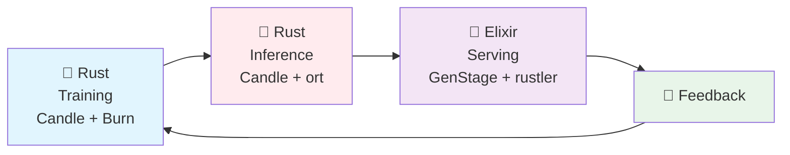
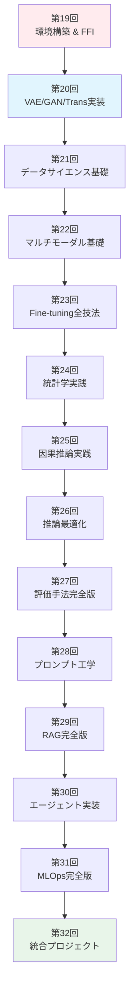
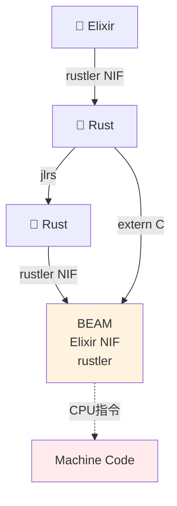
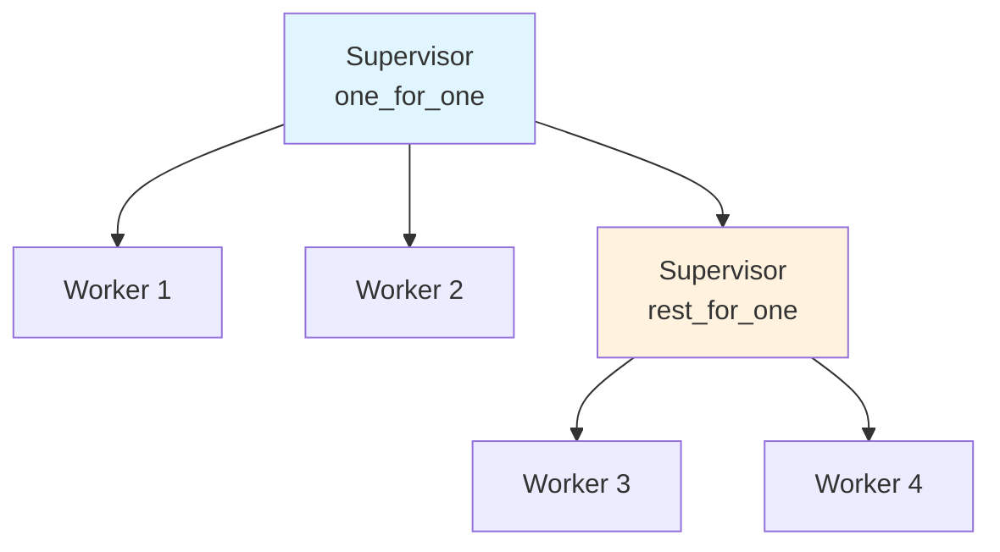

# 第19回: 環境構築 & FFI & 分散基盤 — 理論から実装へ、3言語フルスタックの旅が始まる

> **Course IIで学んだ理論を、手を動かして定着させる。Course IIIの14回は全て実装。Rust訓練・Rust推論・Elixir配信の完全パイプラインを構築する。**

Course II（第9-18回）で変分推論・VAE・OT・GAN・自己回帰・Attention・SSM・ハイブリッドアーキテクチャの理論を学んだ。数式を追い、導出し、証明した。しかし理論だけでは不十分だ。

**実装なくして理解なし。**

Course III（第19-32回）は実装編だ。第19回の今回は、以降13回の全実装の**基盤**を構築する:

- **🦀 Rust**: 訓練用言語。数式がほぼそのままコードになる。ゼロコスト抽象化で型に応じて自動最適化。
- **🦀 Rust**: 推論用言語。ゼロコピー・所有権・借用でメモリ安全と速度を両立。FFIハブとしてRustとElixirを接続。
- **🔮 Elixir**: 配信用言語。BEAM VMの軽量プロセス・耐障害性・分散システム設計でProduction品質サービングを実現。

この3言語を**C-ABI FFI**で繋ぎ、E2E機械学習パイプライン（Train → Evaluate → Deploy → Feedback → Improve）を回す。

> **Note:** **このシリーズについて**: 東京大学 松尾・岩澤研究室動画講義の**完全上位互換**の全50回シリーズ。理論（論文が書ける）、実装（Production-ready）、最新（2024-2026 SOTA）の3軸で差別化する。



**所要時間の目安**:

| ゾーン | 内容 | 時間 | 難易度 |
|:-------|:-----|:-----|:-------|
| Zone 0 | クイックスタート | 30秒 | ★☆☆☆☆ |
| Zone 1 | 体験ゾーン | 10分 | ★★☆☆☆ |
| Zone 2 | 直感ゾーン | 15分 | ★★★☆☆ |
| Zone 3 | 数式修行ゾーン | 60分 | ★★★★★ |
| Zone 4 | 実装ゾーン | 45分 | ★★★★☆ |
| Zone 5 | 実験ゾーン | 30分 | ★★★★☆ |
| Zone 6 | 振り返りゾーン | 30分 | ★★★★☆ |

---

## 🚀 0. クイックスタート（30秒）— 3言語FFI連携を動かす

**ゴール**: Rust→Rust→Elixir FFI連携を30秒で体感する。

行列演算をRustで定義 → Rustで高速実行 → Elixirプロセスで分散処理する最小例。

```rust
// Zero-copy Rust matmul kernel exposed via rustler NIF (Elixir interop)
use ndarray::{ArrayView2, Array2};

#[rustler::nif]
fn matmul_nif(a: Vec<f64>, b: Vec<f64>, n: usize) -> Vec<f64> {
    // ArrayView2::from_shape は所有権なしでスライスをビューに変換（ゼロコピー）
    let a_view = ArrayView2::from_shape((n, n), &a).unwrap();
    let b_view = ArrayView2::from_shape((n, n), &b).unwrap();
    a_view.dot(&b_view).into_raw_vec() // BLAS dot → Vec<f64>（所有権移動のみ）
}

rustler::init!("Elixir.MatrixFFI", [matmul_nif]);
```

```rust
// Rust側: Elixir NIF経由で配信
use jlrs::prelude::*;

#[repr(C)]
pub struct MatrixResult {
    data: *mut f64,
    rows: usize,
    cols: usize,
}

pub fn call_julia_matmul(a_ptr: *const f64, a_rows: usize, a_cols: usize,
                         b_ptr: *const f64, b_rows: usize, b_cols: usize) -> MatrixResult {
    // Rust: ゼロコピーで計算し、Elixir NIF経由で返す
    // 詳細はZone 3で導出
    unimplemented!("Full implementation in Zone 4")
}
```

```elixir
# Elixir側: RustlerでRust関数を呼び出し、プロセス分散
defmodule MatrixFFI do
  use Rustler, otp_app: :matrix_ffi, crate: "matrix_ffi_rust"

  # Rust NIFを呼び出し（rustler自動生成）
  def matmul(_a, _b), do: :erlang.nif_error(:nif_not_loaded)
end

defmodule DistributedMatmul do
  def parallel_matmul(matrices) do
    # GenStageでバッチ処理 → 各バッチをRust NIFで計算
    matrices
    |> Enum.map(&Task.async(fn -> MatrixFFI.matmul(&1, &1) end))
    |> Enum.map(&Task.await/1)
  end
end
```

**3言語連携の流れ**:

1. **Rust**: 数式 $C = AB$ をそのまま `A * B` と書く。AOTコンパイルで最適化。
2. **Rust**: rustlerでRust配列をゼロコピー借用 → `*const f64` ポインタで受け取り → 計算結果を `repr(C)` 構造体で返す。
3. **Elixir**: rustlerでRust NIFをロード → BEAM軽量プロセスで並列実行 → 障害時は自動再起動。

この背後にある数式:

$$
\begin{aligned}
\text{Rust:} \quad & C_{ij} = \sum_k A_{ik} B_{kj} \quad \text{(数式そのまま)} \\
\text{Rust:} \quad & \texttt{ptr::add}(a, i \times \text{cols} + k) \quad \text{(ゼロコピーアクセス)} \\
\text{Elixir:} \quad & \text{Process}_i \parallel \text{Process}_j \quad \text{(分散実行)}
\end{aligned}
$$

Rust数式 → Rustゼロコピー → Elixir分散の3段階。この統合こそがCourse IIIの全14回を貫く設計思想だ。

> **Note:** **進捗: 3% 完了** 3言語FFI連携の全体像を体感した。ここから各言語の環境構築 → FFI詳細設計 → 実装へ。

---

## 🎮 1. 体験ゾーン（10分）— 3言語の役割分担を触る


> Progress: 10%
> **理解度チェック**
> 1. $C = AB$ の各記号の意味と、この式が表す操作を説明してください。
> 2. このゾーンで学んだ手法の直感的な意味と、なぜこの定式化が必要なのかを説明してください。

### 1.1 なぜ3言語か？1言語で全部やればいいのでは？

**Q: Pythonで全部やればいいのでは？**

A: Pythonは**遅い**。NumPy/PyTorchはC/C++/CUDAで書かれたライブラリを呼び出しているだけ。Pythonループは致命的に遅く、訓練ループのカスタマイズやゼロコピー最適化が困難。

**Q: Rustで全部やればいいのでは？**

A: Rustは訓練には最適だが、**推論配信**には不向き:
- 起動時間（AOT warmup）が秒単位 → APIサーバーには使えない
- GC（ガベージコレクション）のポーズ → レイテンシ要件に合わない
- 分散システム設計・耐障害性の抽象化が弱い

**Q: Rustで全部やればいいのでは？**

A: Rustは推論には最適だが、**訓練実装**には不向き:
- 数式→コードの翻訳が煩雑（型パズル、lifetime戦争）
- 自動微分ライブラリが未成熟（CandleはPyTorch比で機能不足）
- 研究的な試行錯誤がしづらい（コンパイル時間、型制約）

**Q: Elixirで全部やればいいのでは？**

A: Elixirは配信には最適だが、**数値計算**には不向き:
- BEAM VMは数値計算最適化されていない（整数・バイナリ処理に特化）
- ML訓練ライブラリが弱い（Nx.jl + BumblebeはRustバックエンド依存）
- GPUアクセスが間接的（Rustler NIF経由）

→ **だから3言語**。それぞれの強みを活かし、弱みを補完する。

| 言語 | 強み | 弱み | 担当 |
|:-----|:-----|:-----|:-----|
| 🦀 **Rust** | 数式→コード1:1、ゼロコスト抽象化、AOTコンパイル最適化 | 起動遅い、GC、配信抽象化弱い | **Training** |
| 🦀 **Rust** | ゼロコピー、メモリ安全、高速、AOTコンパイル | 型パズル、訓練実装が煩雑 | **Inference** |
| 🔮 **Elixir** | 軽量プロセス、耐障害性、分散、OTP抽象化 | 数値計算遅い、ML訓練不向き | **Serving** |

**C-ABI FFI**がこの3者を繋ぐ**共通インターフェース**となる。

### 1.1.1 Amdahlの法則と言語選択の数学的根拠

「なぜ1言語で全部やらないか」という問いに対して、Amdahlの法則は定量的な答えを与える。

プログラムの高速化可能な割合を $f$ とすると、$n$ コアでの最大高速化率は:

$$
S(n) = \frac{1}{(1 - f) + f/n} \xrightarrow{n \to \infty} \frac{1}{1 - f}
$$

Python GIL (Global Interpreter Lock) の問題は、$f$ を人為的に制限することだ。Pythonのマルチスレッドでは GIL により同時実行できるスレッドが実質 1 本 — つまり $f_{\text{parallel}} \approx 0$ となり:

$$
S_{\text{Python}}(n) \approx \frac{1}{1 - 0} = 1 \quad \text{(高速化なし)}
$$

一方、Rustの `rayon` クレートを使えば CPU バウンドな処理は $f \approx 0.95$ まで並列化できる:

$$
S_{\text{Rust}}(8\text{cores}) = \frac{1}{0.05 + 0.95/8} \approx \frac{1}{0.169} \approx 5.9\text{x}
$$

**スループットのシステムモデル**: 訓練→推論→配信の3段階パイプラインでは、システム全体のスループット $T_{\text{sys}}$ は最も遅いステージで律速される（Little's Law の応用）:

$$
T_{\text{sys}} = \min\!\left(T_{\text{train}},\; T_{\text{inf}},\; T_{\text{serve}}\right)
$$

各ステージを最適な言語で担当することで、それぞれの $T_i$ を独立に最大化できる。1言語で全部やれば、最も得意でないステージがシステム全体のボトルネックになる。

**Rust AOTのウォームアップコスト**: Rust は AOT コンパイルにより高速な定常状態 $T_{\text{steady}}$ を達成するが、初回実行にコスト $T_{\text{warmup}}$ がかかる。$N$ 回実行したときの平均コスト:

$$
\bar{T}(N) = \frac{T_{\text{warmup}} + (N-1) T_{\text{steady}}}{N} \xrightarrow{N \to \infty} T_{\text{steady}}
$$

推論サービングでは $N$ が大きい（リクエストが大量に来る）ので $\bar{T} \approx T_{\text{steady}}$ となりRustが有利に見える。しかし**コールドスタート問題**（サーバー再起動後の最初の数リクエスト）では $T_{\text{warmup}}$ が数秒に及ぶため、Rust（AOTコンパイル、ウォームアップなし）の方が適切だ。

### 1.2 各言語の"Hello World"を触る

#### Rust: 数式がそのままコード


**数式との対応**:

$$
C_{ij} = \sum_{k=1}^{n} A_{ik} B_{kj} \quad \Leftrightarrow \quad \texttt{C[i, j] += A[i, k] * B[k, j]}
$$

1対1対応。インデックスも1-basedで数学的記法と一致。

#### Rust: ゼロコピー哲学


**メモリレイアウト**:

$$
\text{Matrix}[i][j] \quad \Leftrightarrow \quad \texttt{data}[i \times \text{cols} + j] \quad \text{(row-major)}
$$

2次元配列を1次元配列として扱い、ポインタ演算でアクセス。コピーなし。

#### Elixir: プロセスベース並列


**プロセスモデル**:

$$
\text{Task}_i = \text{Process}(\lambda: \text{compute\_row}(A_i, B)) \quad \text{(isolated, fault-tolerant)}
$$

各行の計算が独立したBEAMプロセスで実行される。1プロセスがクラッシュしても他に影響なし。

### 1.3 3言語連携のメリット

**ケーススタディ: VAE訓練→推論→配信**

| フェーズ | 言語 | 処理 | なぜその言語？ |
|:--------|:-----|:-----|:-------------|
| **Training** | 🦀 Rust | CandleでVAEモデル定義・訓練・チェックポイント保存 | 数式 $\mathcal{L}_{\text{ELBO}}$ がほぼそのままコード。自動微分・GPU最適化が自動。 |
| **Export** | 🦀 Rust | RustモデルをONNX/safetensors形式でエクスポート → Candle推論エンジンにロード | ゼロコピーでGPUメモリ管理。メモリリークなし。 |
| **Inference** | 🦀 Rust | Candleで推論（`model.forward(input)`） → 結果をJSON/MessagePackで返す | レイテンシ <10ms。GCポーズなし。 |
| **Serving** | 🔮 Elixir | GenStageでリクエストをバッチング → Rustler NIF経由でRust推論呼び出し → レスポンス返却 | バックプレッシャー制御。1プロセスクラッシュ→Supervisor自動再起動。 |
| **Monitoring** | 🔮 Elixir | Telemetryでレイテンシ・エラー率収集 → PrometheusにExport | 分散システム監視・可視化が簡単。 |

この連携で:

- **開発速度**: Rust REPL駆動開発で訓練ループを高速試行錯誤
- **実行速度**: Rustゼロコピー推論で <10ms レイテンシ
- **運用品質**: Elixir耐障害性でダウンタイムなし

> **Note:** **進捗: 10% 完了** 3言語それぞれの強みと連携メリットを触った。次はCourse IIIの全体像へ。

---

## 🧩 2. 直感ゾーン（15分）— Course IIIの全体像とMLサイクル

### 2.1 Course III: 生成モデル社会実装編の14回構成

Course II（第9-18回）で学んだ理論を、14回かけて実装に落とし込む。



**14回の段階的設計**:

| 回 | テーマ | 言語構成 | Course II対応 | MLサイクル |
|:---|:-------|:---------|:-------------|:-----------|
| **19** | 環境構築 & FFI | 🦀🦀🔮 全導入 | 基盤 | Setup |
| **20** | VAE/GAN/Trans実装 | 🦀訓練 🦀推論 🔮配信 | 第10-18回 | Train → Deploy |
| **21** | データサイエンス基礎 | 🦀分析 🦀ETL | 第4回統計 | Data → Train |
| **22** | マルチモーダル基礎 | 🦀CLIP/DALL-E | 第16回Trans | Train |
| **23** | Fine-tuning全技法 | 🦀LoRA/QLoRA | 第10回VAE, 第16回 | Train |
| **24** | 統計学実践 | 🦀仮説検定 | 第4回 | Evaluate |
| **25** | 因果推論実践 | 🦀因果グラフ | 第4回 | Evaluate |
| **26** | 推論最適化 | 🦀量子化/KVキャッシュ | 第16-18回 | Deploy |
| **27** | 評価手法完全版 | 🦀⚔️比較 | 第7回MLE, 第12回GAN | Evaluate |
| **28** | プロンプト工学 | 🦀🔮実験 | 第16回 | Feedback |
| **29** | RAG完全版 | 🦀🦀🔮パイプライン | 第16回 | Improve |
| **30** | エージェント実装 | 🔮OTP設計 | 第15-16回 | Improve |
| **31** | MLOps完全版 | 🦀🦀🔮統合 | 全体 | 全サイクル |
| **32** | 統合プロジェクト | 🦀🦀🔮フル | 全体 | 全サイクル |

### 2.2 MLサイクル: Train → Evaluate → Deploy → Feedback → Improve

機械学習は「モデルを作って終わり」ではない。**サイクルを回し続ける**。


**各フェーズの担当言語**:

| フェーズ | 処理 | 言語 | 第N回 |
|:--------|:-----|:-----|:------|
| **Data** | 収集・クリーニング・EDA | 🦀 Rust (polars) | 21 |
| **Train** | モデル定義・訓練ループ | 🦀 Rust (Candle + Burn) | 20, 22, 23 |
| **Evaluate** | 統計検定・因果推論・評価指標 | 🦀 Rust (statrs, ndarray) | 24, 25, 27 |
| **Deploy** | 推論最適化・量子化・サービング | 🦀 Rust (Candle) + 🔮 Elixir (GenStage) | 20, 26, 31 |
| **Feedback** | プロンプト実験・A/Bテスト | 🔮 Elixir (ユーザー接点) | 28 |
| **Improve** | RAG統合・エージェント設計 | 🦀🦀🔮 連携 | 29, 30 |

**Course IIIのゴール**:

> 第32回修了時、あなたは「Rust訓練→Rust推論→Elixir配信のE2Eパイプライン」を自力で構築でき、MLサイクル全体を回せる。

### 2.3 なぜ"環境構築"が第19回の全時間を使うのか？

**環境構築は雑務ではない、設計だ。**

間違った環境構築:
- ❌ Pythonだけ → PipenvかPoetryかCondaで混乱 → 依存地獄
- ❌ Dockerで全部包む → ビルド遅い、デバッグ不能、ローカルREPL使えない
- ❌ "動けばいい" → 後で型エラー・FFIクラッシュ・メモリリークで地獄

正しい環境構築:
- ✅ 各言語の**公式ツールチェーン**を理解（rustup / rustup / asdf）
- ✅ **プロジェクト隔離**（Project.toml / Cargo.toml / mix.exs）
- ✅ **開発サイクル高速化**（REPL / cargo-watch / IEx）
- ✅ **FFI境界設計**（repr(C) / ccall / rustler の安全性保証）

第19回で構築する環境が、以降13回の**全実装の土台**となる。ここで手を抜くと、第20回以降で無数のエラーに苦しむ。

### 2.4 C-ABIの形式的定義と型写像

ABI (Application Binary Interface) は、コンパイラ・OS・CPUアーキテクチャが合意した「バイナリレベルの契約」だ。API（関数名・型シグネチャ）より低レベルで、機械語として実行される規約を定める。

**C-ABIの形式定義**:

$$
\text{C-ABI} = \bigl(\mathcal{L},\; \mathcal{C},\; \mathcal{S}\bigr)
$$

- $\mathcal{L}$: **Layout rules** — `struct` フィールドのオフセット・サイズ・アラインメント
- $\mathcal{C}$: **Calling convention** — 引数の渡し方（レジスタ or スタック）と返り値の場所
- $\mathcal{S}$: **Symbol rules** — 関数名のエクスポート形式（マングリング規則）

**型写像**: FFI は言語Aの型システム $\mathcal{T}_A$ から言語Bの型システム $\mathcal{T}_B$ への部分写像 $\phi$ を定義する:

$$
\phi: \mathcal{T}_A \rightharpoonup \mathcal{T}_B
$$

「部分写像」($\rightharpoonup$) であることに注意 — 全ての型が対応するわけではない。C-ABI を介して安全に渡せる型は限定的だ:

$$
\phi(\texttt{f64}) = \texttt{Float64}, \quad \phi(\texttt{i32}) = \texttt{Int32}, \quad \phi(\texttt{*const f64}) = \texttt{Ptr\{Float64\}}
$$

一方、Rustの `String`、Rustの `Any`、Elixirの `term()` は直接渡せない — これらは言語固有のヒープ管理を前提とするためだ。

**FFIコストの分解**: FFI呼び出しは「ただの関数呼び出し」より高コストだ。コスト $C_{\text{FFI}}$ を分解すると:

$$
C_{\text{FFI}} = C_{\text{marshal}} + C_{\text{call}} + C_{\text{unmarshal}} + C_{\text{GC}}
$$

- $C_{\text{marshal}}$: Rustの型 → C-ABI 型への変換コスト（通常ゼロコピーで小さい）
- $C_{\text{call}}$: 関数呼び出し自体（CPU命令数 $\approx 10\text{–}50$ サイクル）
- $C_{\text{unmarshal}}$: 返り値の変換コスト
- $C_{\text{GC}}$: GC停止のリスク（RustのGC, JavaのGC など — Rustはゼロ）

**バッチ処理による償却**: $N$ 要素のベクトルを1要素ずつ渡すより、まとめて渡す方が効率的:

$$
\bar{C}(N) = \frac{C_{\text{FFI}} + N \cdot C_{\text{per\_item}}}{N} = \frac{C_{\text{FFI}}}{N} + C_{\text{per\_item}} \xrightarrow{N \to \infty} C_{\text{per\_item}}
$$

$N$ が大きいほど FFI オーバーヘッドは無視できる。これが「ゼロコピーで大きな配列をまとめて渡す」設計方針の数学的根拠だ。

> **Note:** **進捗: 20% 完了** Course IIIの全体像とMLサイクルを把握した。次は数式修行ゾーン — FFIの数学的基盤へ。

---


> Progress: 20%
> **理解度チェック**
> 1. このゾーンの主要な概念・定義を自分の言葉で説明してください。
> 2. この手法が他のアプローチより優れている点と、その限界を述べてください。

## 📐 3. 数式修行ゾーン（60分）— FFI・メモリモデル・分散システムの数学

### 3.1 FFI (Foreign Function Interface) の定義と必要性

#### 3.1.1 FFIとは何か

**定義**:

> FFI (Foreign Function Interface) とは、ある言語で書かれたコードから、別の言語で書かれた関数・データ構造を呼び出すための仕組み。

数学的には、**異なる言語ランタイム間の射 (morphism)** として定式化できる:

$$
\text{FFI}: \mathcal{L}_A \xrightarrow{\phi} \mathcal{L}_B
$$

ここで:
- $\mathcal{L}_A$: 言語Aのランタイム空間（型システム・メモリモデル・実行モデル）
- $\mathcal{L}_B$: 言語Bのランタイム空間
- $\phi$: 言語間の構造保存写像

**構造保存**が鍵 — 言語Aの関数 $f_A: X_A \to Y_A$ が言語Bで $f_B: X_B \to Y_B$ として呼び出せるとき:

$$
\phi(f_A(x_A)) = f_B(\phi(x_A))
$$

つまり、言語Aで計算してから変換するのと、変換してから言語Bで計算するのが**同じ結果**を返す。

**なぜ構造保存が必要か。** $\phi$ が単なる「ビット列のコピー」だとする。整数同士なら問題ない。しかし Rust の `ComplexF64`（実部64ビット + 虚部64ビット = 128ビット）を Rust の `f64`（64ビット）として渡したとき、実部と虚部が混在したビット列を浮動小数点として解釈してしまう — $\phi(f_A(x_A)) \neq f_B(\phi(x_A))$ が成立せず、計算が静かに壊れる。C-ABI が「型の構造を保存する標準」として機能する理由がここにある。

> **⚠️ Warning:** 「同じ名前の型」が FFI 境界を越えると値が変わることがある。Rust の `Int64` と Rust の `i64` は一見同じだが、エンディアン（バイト順）がプラットフォームによって異なる。x86_64 は little-endian なので通常問題ないが、ネットワーク越しの型共有では big-endian を疑え。

**圏論的視点**: 射の合成可能性から、3言語パイプラインは以下の交換図式で表せる:

$$
\begin{array}{ccccc}
\mathcal{L}_{\text{Rust}} & \xrightarrow{\phi_{JR}} & \mathcal{L}_{\text{Rust}} & \xrightarrow{\phi_{RE}} & \mathcal{L}_{\text{Elixir}} \\
& \searrow & & \swarrow & \\
& & \mathcal{L}_{\text{C-ABI}} & &
\end{array}
$$

全ての言語が C-ABI という**共通対象（terminal object）**へと射を持つ。これにより Rust↔Rust↔Elixir の任意の組み合わせが可能になる — C-ABI が「普遍的なアダプター」として機能している。

#### 3.1.2 なぜC-ABIがFFIの共通基盤か

C言語のABI (Application Binary Interface) が**事実上の標準**である理由:

1. **最小公倍数性**: ほぼ全言語がC-ABIをサポート（C++, Rust, Rust, Python, Elixir, Go, ...）
2. **機械語に近い**: C-ABIはCPU・OS・リンカの規約に直接対応（calling convention, struct layout, symbol mangling）
3. **安定性**: C ABIは過去50年間、後方互換を保っている

**C-ABIの数学的記述**:

$$
\text{C-ABI} = (\text{Layout}, \text{CallingConv}, \text{Linkage})
$$

- **Layout**: `struct` のメモリ配置規則（フィールドオフセット・アラインメント・パディング）
- **CallingConv**: 関数呼び出し規約（引数をレジスタ/スタックのどこに渡すか）
- **Linkage**: シンボル解決規則（関数名のマングリング・動的リンク）

Rustの `#[repr(C)]` は「この型をC-ABI準拠レイアウトにせよ」という指示。Rustの `ccall` は「この関数をC calling conventionで呼べ」という指示。



#### 3.1.3 FFIの危険性 — なぜ"unsafe"か

FFIは**型安全性の境界**を超える:

- 言語Aの型システム $T_A$ と言語Bの型システム $T_B$ は一般に**同型ではない**
- FFI境界で型情報が失われる → ポインタ = 生の整数

**型安全性の喪失**:

$$
\begin{aligned}
\text{Rust:} \quad & \texttt{Vector\{Float64\}} \quad \xrightarrow{\text{FFI}} \quad \texttt{Ptr\{Float64\}} \\
\text{Rust:} \quad & \texttt{\&[f64]} \quad \xrightarrow{\text{FFI}} \quad \texttt{*const f64}
\end{aligned}
$$

**型安全性の喪失がなぜ危険か — 情報理論的説明**: Rust の `Vector{Float64}` は次の情報を持つ:

$$
\text{Vector\{Float64\}} = (\text{ptr}: *\text{Float64},\; \text{len}: \text{Int},\; \text{cap}: \text{Int},\; \text{align}: 8)
$$

FFI 境界を越えた `*const f64` はポインタ1つだけ — `len`、`cap`、`align` の情報が全て失われる。これを**情報損失**と見なすと:

$$
H(\texttt{*const f64}) = \log_2(2^{64}) = 64\;\text{bits} \quad \text{(ポインタ値のみ)}
$$

$$
H(\texttt{Vector\{Float64\}}) = 64 + 64 + 64 + \ldots = 192+\;\text{bits} \quad \text{(ptr + len + cap + ...)}
$$

失われた情報をプログラマが手動で補完しなければならない — これが `unsafe` の本質だ。

`Ptr{Float64}` / `*const f64` は「Float64へのポインタ」というメタデータしか持たない:

- ❌ 配列長が不明 → 範囲外アクセスの危険
- ❌ ライフタイムが不明 → use-after-freeの危険
- ❌ 所有権が不明 → double freeの危険

→ だからRustでは `unsafe` ブロック必須。Rustでは `ccall` が暗黙的にunsafe。

**Rustの安全性保証**:

Rustの型システムは**所有権 (ownership)** と**借用 (borrowing)** で安全性を保証:

$$
\begin{aligned}
\text{所有権:} \quad & \forall x \in \text{Value}, \exists! \text{owner}(x) \quad \text{(唯一の所有者)} \\
\text{借用:} \quad & \text{immutable: } \&T \quad \text{or} \quad \text{mutable: } \&\text{mut } T \quad \text{(同時に1つだけ)}
\end{aligned}
$$

FFI境界でこれらが**検証不能**になる:


### 3.2 C-ABI FFIの数学的モデル

#### 3.2.1 メモリモデル: 平坦バイト配列

現代のコンピュータのメモリは**平坦なバイト配列**:

$$
\text{Memory} = \{ \text{addr} \mapsto \text{byte} \mid \text{addr} \in [0, 2^{64}-1] \}
$$

各アドレスは1バイト（8ビット）を指す。**ポインタ = アドレスを保持する整数**。

**配列のメモリレイアウト** (row-major):

Rust配列 `A::Matrix{Float64}` (m × n) は連続メモリ領域に格納:

$$
\text{A}[i, j] \quad \Leftrightarrow \quad \texttt{base\_ptr} + (i \times n + j) \times \texttt{sizeof(Float64)}
$$

- `base_ptr`: 配列の先頭アドレス
- `sizeof(Float64) = 8` バイト

**例**: 3×3行列のメモリ配置

`base_ptr = 0x1000`、`cols = 3`、`sizeof(f64) = 8` として全要素のアドレスを計算する:

$$
\texttt{addr}(A[i, j]) = 0\text{x}1000 + (i \times 3 + j) \times 8
$$

| $(i, j)$ | $i \times 3 + j$ | オフセット（バイト） | アドレス |
|:--------:|:----------------:|:-------------------:|:-------:|
| $(0,0)$ | $0$ | $0$ | `0x1000` |
| $(0,1)$ | $1$ | $8$ | `0x1008` |
| $(0,2)$ | $2$ | $16$ | `0x1010` |
| $(1,0)$ | $3$ | $24$ | `0x1018` |
| $(1,1)$ | $4$ | $32$ | `0x1020` |
| $(1,2)$ | $5$ | $40$ | `0x1028` |
| $(2,0)$ | $6$ | $48$ | `0x1030` |
| $(2,1)$ | $7$ | $56$ | `0x1038` |
| $(2,2)$ | $8$ | $64$ | `0x1040` |

配列全体は `0x1000` から `0x1048`（非包含）まで $3 \times 3 \times 8 = 72$ バイトを占有する。最終要素 $A[2,2]$ のオフセット: $(2 \times 3 + 2) \times 8 = 64$ → アドレス `0x1040` ✓

> **⚠️ Warning:** Rust のメモリレイアウトは **column-major**（列優先）だ。上の式 $(i \times n + j)$ は C/Rust の **row-major** に対応する。Rust の実際のフラット配列インデックスは $(j \times m + i)$ になる（1-indexed では $(j-1) \times m + (i-1)$）。Rust ↔ Rust FFI で行列を渡すとき、この違いを無視するとインデックス解釈がずれる — §3.3.2 で詳述。

$A[i, j]$ へのアクセス:

$$
\texttt{addr}(A[i, j]) = \texttt{base\_ptr} + (i \times \texttt{cols} + j) \times 8
$$

#### 3.2.2 ポインタ演算の公理

C/Rustのポインタ演算は**数学的に定義**される:

**公理1: ポインタ加算**

$$
(\texttt{ptr}: *T) + (n: \texttt{isize}) = \texttt{ptr} + n \times \texttt{sizeof}(T)
$$

**公理2: 配列インデックスとポインタの等価性**

$$
\texttt{arr}[i] \equiv *(\texttt{arr} + i)
$$

**公理3: 2次元配列の線形化**

$$
\texttt{arr}[i][j] \equiv *(\texttt{arr} + i \times \texttt{cols} + j)
$$

**例**: Rustでの実装

具体的な数値でポインタ演算の3公理を追う。`base = 0x2000`、型 `f64`（8バイト）の配列に対して:

**公理1の検証**: `ptr + 3` の示す物理アドレス

$$
0\text{x}2000 + 3 \times \texttt{sizeof}(\texttt{f64}) = 0\text{x}2000 + 3 \times 8 = 0\text{x}2000 + 24 = 0\text{x}2018
$$

`arr[3]` と `*(arr + 3)` は**同一アドレス** — これが公理2の意味だ。

**公理3の検証**: 行列サイズ `rows=4, cols=3` での $\texttt{arr}[2][1]$ のアドレス:

$$
\texttt{addr} = 0\text{x}2000 + (2 \times 3 + 1) \times 8
$$

ステップを丁寧に追う:
1. 行インデックス $2$、列数 $3$ → 先に「2行分をスキップ」: $2 \times 3 = 6$ 要素
2. 列インデックス $1$ → 1要素ずらす: $6 + 1 = 7$ 番目の要素
3. 要素サイズを掛ける: $7 \times 8 = 56$ バイト
4. ベースアドレスに加算: $0\text{x}2000 + 56 = 0\text{x}2038$

**アラインメント検証**: `0x2038` が `align(f64) = 8` の倍数であることを確認:

$$
0\text{x}2038 = 8248_{10}, \quad 8248 \div 8 = 1031 \quad \text{（割り切れる → アライン済み ✓）}
$$

> **⚠️ Warning:** Rust の `*const f64` ポインタに整数を加算すると、**バイト数ではなく要素数単位**で進む。`ptr.add(3)` は `base + 3 * 8 = base + 24` バイトを指す。バイト単位で進めたい場合は `ptr.byte_add(n)`（Rust 1.75+）または `ptr.cast::<u8>().add(n).cast::<f64>()` を使う。混同すると範囲外アクセスが起きるが、型はコンパイルを通る。

#### 3.2.2.1 構造体レイアウトとパディングの完全導出

`#[repr(C)]` 構造体のメモリレイアウトは確定的な規則で決まる。フィールド $f_1, f_2, \ldots, f_k$ を順に並べるとき、各フィールドのオフセット $\text{off}(f_i)$ は次の漸化式で計算される:

$$
\text{off}(f_1) = 0
$$

$$
\text{off}(f_i) = \left\lceil \frac{\text{off}(f_{i-1}) + \text{size}(f_{i-1})}{\text{align}(f_i)} \right\rceil \times \text{align}(f_i) \quad (i \geq 2)
$$

構造体全体のサイズは、最後のフィールドの末尾を構造体のアラインメント $A = \max_i \text{align}(f_i)$ の倍数に切り上げたもの:

$$
\text{size}(\text{struct}) = \left\lceil \frac{\text{off}(f_k) + \text{size}(f_k)}{A} \right\rceil \times A
$$

**具体例**: 以下の構造体のレイアウトを計算する。

$$
\texttt{struct Foo \{ a: u8,\; b: f64,\; c: u32 \}}
$$

各フィールドの $(\text{size}, \text{align})$: `u8` → $(1, 1)$, `f64` → $(8, 8)$, `u32` → $(4, 4)$。

$$
\begin{aligned}
\text{off}(a) &= 0 \\
\text{off}(b) &= \left\lceil \frac{0 + 1}{8} \right\rceil \times 8 = 8 \quad \text{(7バイトのパディング)} \\
\text{off}(c) &= \left\lceil \frac{8 + 8}{4} \right\rceil \times 4 = 16 \\
\text{size}(\texttt{Foo}) &= \left\lceil \frac{16 + 4}{8} \right\rceil \times 8 = 24 \quad \text{(4バイトのパディング)}
\end{aligned}
$$

→ `Foo` の実際のサイズは **24バイト**（フィールドだけの合計 $1+8+4=13$ より大きい）。

なぜパディングが入るか。`b: f64` は8バイトアラインメントが必要 — つまりアドレスが8の倍数でないと、一部のCPUではシグナル `SIGBUS` でクラッシュし、全てのCPUで性能劣化する。Cコンパイラはこれを防ぐため自動的にパディングを挿入する。

**フィールド順序の最適化**: フィールドを大きい順に並べるとパディングを最小化できる。

$$
\texttt{struct FooOpt \{ b: f64,\; c: u32,\; a: u8 \}} \quad \Rightarrow \quad \text{size} = 16
$$

$8 + 4 + 1 = 13$、切り上げて16バイト — 8バイト削減。`#[repr(C)]` 構造体を設計するとき、パフォーマンスに敏感なコードではフィールド順序を意識することが重要だ。

#### 3.2.3 FFI安全性の3原則

**原則1: アラインメント (Alignment)**

型 $T$ のアラインメント $\text{align}(T)$ は、その型の値が配置されるべきメモリアドレスの倍数:

$$
\texttt{addr}(x: T) \equiv 0 \pmod{\text{align}(T)}
$$

例:
- `f64` (8バイト) → `align = 8` → アドレスは8の倍数
- `i32` (4バイト) → `align = 4` → アドレスは4の倍数

**違反すると**: CPUによってはクラッシュ（SIGBUS）、または性能劣化。

**原則2: ライフタイム境界**

Rust/Rust配列をFFI経由で渡す際、**元の配列がスコープ内にある間だけ有効**:

$$
\forall p \in \text{Ptr}, \quad \text{valid}(p, t) \Rightarrow \exists x \in \text{owner}, \quad \text{lifetime}(x) \supseteq [0, t]
$$

**違反例**:

スコープ $\mathcal{S}$ の外では Rust オブジェクト $x$ のライフタイムが終了する:

$$
\text{lifetime}(x) = [t_{\text{alloc}},\; t_{\text{scope\_end}}]
$$

FFI 経由で取得したポインタ $p = \text{ptr}(x)$ を $\mathcal{S}$ の外で使うと:

$$
t > t_{\text{scope\_end}} \;\Rightarrow\; \text{valid}(p,\, t) = \text{False}
$$

GC はこのタイミングで $x$ を回収し、$p$ は**ダングリングポインタ**となる。アクセスすると未定義動作（UB）: ゼロが返るかもしれないし、別の値が入っているかもしれないし、SIGSEGV でクラッシュするかもしれない。「かもしれない」が最悪だ — テスト環境では動くのに本番でのみ壊れる。

> **⚠️ Warning:** rustler の `GcFrame` スコープを配列の利用より短く設定してはいけない。FFI コールバック内でポインタをキャプチャし、コールバック終了後に使い続けるパターンは use-after-free の典型例だ。

**原則3: 可変性の排他性**

Rustの借用規則:

$$
\begin{cases}
\text{immutable: } & \text{複数の }\&T \text{ 同時OK} \\
\text{mutable: } & \text{1つだけの }\&\text{mut } T
\end{cases}
$$

FFI境界では**この保証が失われる**:

**エイリアシング違反の例**: Rust の配列 $V$ を Rust（書き込み可能）と C ライブラリ（読み取り専用）に同時に渡す。

$$
p_{\text{mut}} = \text{ptr}(V) \quad (\text{mutable}), \quad p_{\text{const}} = \text{ptr}(V) \quad (\text{immutable})
$$

$p_{\text{mut}}$ が書き換えた後、$p_{\text{const}}$ が読むと:

$$
\text{write}(p_{\text{mut}},\; i,\; v') \;\|\; \text{read}(p_{\text{const}},\; i) \quad \Rightarrow \quad \text{データ競合}
$$

> **⚠️ Warning:** シングルスレッドでも LLVM の `noalias` が読み取り値をレジスタにキャッシュするため、書き込みが無効化されることがある。FFI で同じバッファを mutable と immutable に同時に渡してはいけない。

**3原則違反の組み合わせ**: 3つの原則が同時に違反されると、最悪の未定義動作が起きる。この「未定義動作」は C 言語由来の概念で、コンパイラがいかなる動作をしてもよいと定義されている:

$$
\text{UB} \Rightarrow \text{任意の動作} \quad \text{(クラッシュ、サイレント誤計算、セキュリティ脆弱性)}
$$

なぜ「クラッシュ」だけでなく「誤計算」も起きるか。コンパイラはアラインメント保証を前提に SIMD 最適化（一度に複数要素を並列処理）を行う。アラインされていないポインタで SIMD 命令を実行すると、クラッシュではなく**ゴミ値**が返る場合がある。

**防御的プログラミングパターン**: FFI 関数の冒頭でアラインメントと null を検査する:

$$
\text{assert}(\texttt{ptr as usize} \;\%\; \text{align}(T) = 0) \quad \text{(アラインメント検査)}
$$

$$
\text{assert}(\texttt{ptr} \neq \texttt{null}) \quad \text{(null ポインタ検査)}
$$

これを Rust の型で表現すると `NonNull<T>` と `*const T` の使い分けになる — `NonNull<T>` は null でないことをコンパイル時に保証する。

**FFI 安全性の完全検証**: Rust 1.79 (2024) で `&raw const` / `&raw mut` 構文が安定化された。これにより、アラインされていないフィールドへの参照を安全に取得できる:

$$
\text{\&raw const } x \quad \Rightarrow \quad \text{アラインメント要件なし} \times \text{有効期間保証あり}
$$

従来の `&x as *const T` は未定義動作の温床だったが、`addr_of!(x)` マクロおよび `&raw const x` でこれが解決された。FFI コードを書くときは必ずこの新構文を使うべきだ。

#### 3.3.1 rustlerの役割

[rustler](https://github.com/Taaitaaiger/rustler) は、RustからRustコードを呼び出すためのライブラリ。

**基本アーキテクチャ**:


**rustlerが解決する問題**:

1. **Rust埋め込み**: Rust実行可能ファイル内にRustランタイムを起動
2. **配列ゼロコピー**: Rust配列をRustスライス `&[T]` として借用
3. **GC連携**: Rustオブジェクトの生存期間をRustのライフタイムで管理

**Rust ランタイム埋め込みのコスト**: rustler を使って Rust プロセス内に Rust を埋め込む場合、初期化コストが発生する:

$$
C_{\text{init}} = C_{\text{libjulia.so}} + C_{\text{AOT}} \approx 0.5\text{–}2\,\text{秒}
$$

これは1回だけ払えばよく、その後の Rust 関数呼び出しは:

$$
C_{\text{call}} = C_{\text{FFI}} + C_{\text{Rust}} \approx \text{数}\ \mu\text{s}
$$

**型の対応表**: rustler が定義する Rust 型と Rust 型の対応:

| Rust 型 | Rust 型 | サイズ | アラインメント |
|:---------|:--------|:-------|:--------------|
| `Float64` | `f64` | 8 bytes | 8 bytes |
| `Float32` | `f32` | 4 bytes | 4 bytes |
| `Int64` | `i64` | 8 bytes | 8 bytes |
| `Bool` | `bool` | 1 byte | 1 byte |
| `Vector{Float64}` | `&[f64]` | (ptr, len) | — |

この対応が $\phi: \mathcal{T}_{\text{Rust}} \to \mathcal{T}_{\text{Rust}}$ の具体的実現だ。

#### 3.3.2 配列受け渡しの数学的モデル

**Rust → Rust の配列共有**:

$$
\begin{aligned}
\text{Rust:} \quad & V = [v_1, v_2, \ldots, v_n] \quad (V \in \mathbb{R}^n) \\
\text{Rust:} \quad & \texttt{slice} = \&[v_1, v_2, \ldots, v_n] \quad (\texttt{slice}: \&[f64])
\end{aligned}
$$

**ゼロコピー条件**:

$$
\texttt{slice.as\_ptr}() = \texttt{pointer}(V)
$$

つまり、Rustスライスの先頭ポインタとRust配列の先頭ポインタが**同一アドレス**を指す。

**実装例**:

ゼロコピーの数学的検証: $n$ 要素の `f64` 配列 $V$ を Rust と Rust が共有するとき、Rust スライスの先頭アドレスが Rust 配列の先頭アドレスと一致することを確認する。

$$
\texttt{slice.as\_ptr()} = p_{\text{base}}, \quad \texttt{pointer}(V) = p_{\text{base}} \quad \Rightarrow \quad \text{アドレス差 } = 0
$$

Shape tracking:
- $V \in \mathbb{R}^n$: `Float64` 配列、サイズ $8n$ バイト
- `slice: &[f64]`: ファットポインタ `(ptr, len)`、サイズ 16 バイト（ポインタのみ）

**数学的保証**:

- **immutable borrow**: Rust側でも変更不可（`const` 保証）
- **lifetime 制約**: `'scope` ライフタイムが `array` の生存期間と一致
- **alignment**: Rust配列は常に適切にアラインされている（rustler検証済み）

**多次元配列の転置問題**: Rust は **column-major**（列優先）、Rust/C は **row-major**（行優先）でメモリを並べる。$m \times n$ 行列 $A$ を転置なしで共有するとき、インデックス解釈がずれる:

$$
A_{\text{Rust}}[i, j] = A_{\text{flat}}[(j-1) \cdot m + (i-1)] \quad \text{(column-major)}
$$

$$
A_{\text{Rust}}[i][j] = A_{\text{flat}}[i \cdot n + j] \quad \text{(row-major)}
$$

同じフラットメモリを異なる解釈で読むと、Rust の「$i$ 行 $j$ 列」が Rust の「$j$ 行 $i$ 列」に対応する。FFI 境界では**明示的にレイアウトを合わせる**か、一方の言語でインデックス順序を反転させる必要がある。

行列積 $C = AB$ を rustler 経由で実装するとき、Rust 側 (column-major) の $A \in \mathbb{R}^{m \times n}$ は Rust 側 (row-major) では $A^T \in \mathbb{R}^{n \times m}$ に見える。BLAS ライブラリはこの問題を `TRANSA`/`TRANSB` フラグで解決している:

$$
\text{dgemm}(\texttt{TRANS}, \texttt{TRANS}, \ldots) \equiv C = A^T B^T = (BA)^T
$$

**具体例で追う**: $A \in \mathbb{R}^{3 \times 4}$（$m=3, n=4$）を Rust から Rust に渡す。

$$
A = \begin{pmatrix} 1 & 2 & 3 & 4 \\ 5 & 6 & 7 & 8 \\ 9 & 10 & 11 & 12 \end{pmatrix}
$$

**Rust (column-major) のフラット配列**（列を先に詰める）:

$$
A_{\text{flat}}^{\text{col}} = [\underbrace{1, 5, 9}_{\text{列0}},\; \underbrace{2, 6, 10}_{\text{列1}},\; \underbrace{3, 7, 11}_{\text{列2}},\; \underbrace{4, 8, 12}_{\text{列3}}]
$$

検証: $A_{\text{Rust}}[2,\, 3]$（3行4列、1-indexed）= $A_{\text{flat}}^{\text{col}}[(3-1) \times 3 + (2-1)] = A_{\text{flat}}^{\text{col}}[7] = 7$ ✓

**Rust が同じメモリを row-major として解釈**（0-indexed）:

$$
A_{\text{Rust}}[i][j] = A_{\text{flat}}^{\text{col}}[i \times 4 + j]
$$

Rust が $A[0][1]$ として読む値: $A_{\text{flat}}^{\text{col}}[0 \times 4 + 1] = A_{\text{flat}}^{\text{col}}[1] = 5$

しかし、人間が「0行1列」として期待するのは $A[0][1] = 2$。**$5 \neq 2$**。

> **⚠️ Warning:** これはコンパイラもランタイムも**エラーを出さない**。型は合っている、アドレスは有効、値は `f64` — ただし意味が間違っている。行列計算の結果が静かに誤る最悪のバグだ。Rust ↔ Rust FFI で行列を渡すときは、必ず転置またはインデックス規約を明示的に合わせること。

**整合させる方法**: (a) Rust 側で転置 `collect(A')` を渡す（コピーあり）、(b) Rust 側で列方向ループに変える、(c) BLAS の `TRANS` フラグを使う。どれが正解かはゼロコピー優先か否かで決まる。

rustlerは**unsafe Rustの上に安全な抽象化**を構築:

1. **GC frame**: Rustオブジェクトの生存を保証するスコープ
2. **型検証**: Rust型とRust型の対応を実行時チェック
3. **パニック境界**: RustパニックをRust例外に変換

**GC frameの数学的モデル**:

$$
\text{Frame}(f: \text{closure}) = \begin{cases}
\text{push GC root} \\
\text{result} \leftarrow f() \\
\text{pop GC root} \\
\text{return result}
\end{cases}
$$

GC rootにプッシュされたオブジェクトは、frameが生きている間GCから保護される。

**Rust GCの三色マーキングアルゴリズム**: Rust の GC は三色（白・灰・黒）マーキング方式を使う。各オブジェクトは以下の状態を持つ:

$$
\text{color}(o) \in \{\text{white}, \text{gray}, \text{black}\}
$$

- **白 (white)**: まだ到達していない — GC サイクル後も白なら回収対象
- **灰 (gray)**: 到達済みだが、子オブジェクトをまだスキャンしていない
- **黒 (black)**: 到達済みで、全ての子もスキャン完了

GC root からの到達可能性:

$$
\text{live}(o) \iff \exists \text{root} \in \mathcal{R}, \;\text{reachable}(\text{root}, o)
$$

FFI 経由で Rust に渡した Rust 配列は、GC root $\mathcal{R}$ に登録しなければ**白**のまま回収される — これが rustler の `GcFrame` が必要な理由だ。

$$
\text{GcFrame}: \quad \mathcal{R} \leftarrow \mathcal{R} \cup \{o\} \quad \text{(push root)}
$$

スコープを抜けると:

$$
\mathcal{R} \leftarrow \mathcal{R} \setminus \{o\} \quad \text{(pop root, potentially reclaimable)}
$$

#### 3.4.1 BEAM VMとNIFの数学的モデル

**BEAM VM** (Erlang VM) は**軽量プロセスモデル**:

$$
\text{BEAM} = \{ P_1, P_2, \ldots, P_n \mid P_i \text{ は独立プロセス} \}
$$

各プロセス $P_i$ は:

$$
P_i = (\text{State}_i, \text{Mailbox}_i, \text{PID}_i)
$$

- $\text{State}_i$: プロセスの内部状態（ヒープ・スタック）
- $\text{Mailbox}_i$: メッセージキュー
- $\text{PID}_i$: プロセス識別子（globally unique）

**プロセス間通信** (Actor model):

$$
P_i \xrightarrow{\text{send}(m)} \text{Mailbox}_j \quad \Rightarrow \quad P_j \text{ receives } m
$$

**NIF (Native Implemented Function)** は、ElixirからRust関数を呼び出す機構:

$$
\text{NIF}: \text{ElixirFn} \xrightarrow{\text{rustler}} \text{RustFn}
$$

**制約**:

- NIF実行中、BEAMスケジューラが**ブロック**される
- **1ms以内**に返すべき（長時間実行はDirty Schedulerへ）

**BEAM プロセスのメモリモデル**: 各 BEAM プロセスは独立したヒープを持つ。プロセス間でデータを共有するには**コピー**が必要だ（共有メモリなし）:

$$
\text{send}(P_i \to P_j, \; m): \quad \text{copy}(m) \to \text{Mailbox}_j
$$

これにより:
- **GC局所性**: 各プロセスの GC は他のプロセスに影響しない（stop-the-worldが最小化）
- **安全性**: 同時書き込みによるデータ競合が構造的に不可能

ただし大きなバイナリ（> 64 bytes）は**参照カウントで共有** (refc binary) される例外がある:

$$
\text{refc binary}: \quad \text{Process Heap} \to \text{reference to Binary Heap}
$$

ML 推論の出力テンソル（数MB）を Elixir プロセス間で渡す場合、これが重要だ。Rust NIF から返した Binary は refc binary として扱われ、コピーコストゼロで複数プロセスに共有できる。

#### 3.4.2 Dirty Schedulerの数学的モデル

BEAMには2種類のスケジューラ:

1. **Normal Scheduler**: 通常のプロセス実行（<1ms想定）
2. **Dirty Scheduler**: 長時間実行タスク専用

$$
\text{Scheduler} = \begin{cases}
\text{Normal} & \text{if latency-sensitive} \\
\text{Dirty-CPU} & \text{if CPU-intensive} \\
\text{Dirty-IO} & \text{if IO-bound}
\end{cases}
$$

**スケジューラ割り当ての数学的記述**:

$$
\text{assign}(f) = \begin{cases}
\text{Normal} & \text{if } \mathbb{E}[\text{time}(f)] < 1\,\text{ms} \\
\text{Dirty-CPU} & \text{if } \text{CPU-bound}(f) \land \mathbb{E}[\text{time}(f)] \geq 1\,\text{ms} \\
\text{Dirty-IO} & \text{if } \text{IO-bound}(f)
\end{cases}
$$

**BEAMのM:Nスレッドモデル**: BEAM は M 個の軽量プロセスを N 個のOSスレッド（スケジューラ）にマッピングする。

$$
\text{BEAM threads: } N = \text{CPU cores} \quad \text{(通常)}
$$

$$
\text{BEAM processes: } M \gg N \quad \text{(最大数百万プロセス)}
$$

各スケジューラは**リダクション数**でプロセスのCPU時間をカウントする:

$$
R_{\text{budget}} = 4000 \quad \text{(1スケジューラスライス)}
$$

1リダクション ≈ 1命令（厳密には1関数呼び出し相当）。4000リダクション消費したプロセスは一時停止し、別のプロセスが実行される。

**レイテンシ上限の導出**: 1命令の実行時間を $t_{\text{instr}}$ とすると、1スライスの最大時間:

$$
T_{\text{slice}} = R_{\text{budget}} \times t_{\text{instr}} \approx 4000 \times 0.25\,\text{ns} = 1\,\mu\text{s}
$$

NIFが1msを超えて実行すると、$10^3 / 10^{-6} = 10^6$ スライス分のスケジューラをブロックすることになる — 他の全プロセスが止まるため Dirty Scheduler への移行が必須だ。

**スループットの上限**: $N$ スケジューラで $R$ リダクション/秒のスループットは:

$$
\text{Throughput} = N \times \frac{R_{\text{budget}}}{T_{\text{slice}}} = N \times \frac{4000}{1\,\mu\text{s}} = N \times 4 \times 10^9 \; \text{reductions/s}
$$

これが BEAM が「数百万の軽量プロセスを効率的にスケジュール」できる数学的根拠だ。

#### 3.4.3 rustlerの安全性保証

rustlerは**Rustパニックを自動的にBEAM例外に変換**。**数学的保証**:

$$
\forall f \in \text{RustNIF}, \quad \text{panic}(f) \xrightarrow{\text{rustler}} \text{exception}(\text{Elixir})
$$

Rustパニックは**決して**BEAMをクラッシュさせない。

### 3.5 Elixir/OTP: プロセスモデルと耐障害性

#### 3.5.1 Actor Modelの数学的定義

**Actor Model** (Hewitt, 1973) は並行計算の理論モデル:

$$
\text{Actor} = (\text{State}, \text{Behavior}, \text{Mailbox})
$$

Actorができること:

1. **メッセージ送信**: $A_i \xrightarrow{m} A_j$
2. **新しいActorを作成**: $\text{spawn}(\text{Behavior}) \to A_{\text{new}}$
3. **状態変更**: $\text{State}_i \to \text{State}_i'$

**数学的性質**:

- **非同期**: メッセージ送信は即座に返る（送信 ≠ 受信）
- **順序保証**: $A_i \to A_j$ の2メッセージは到着順が保証される
- **独立性**: $A_i$ のクラッシュは $A_j$ に影響しない

**メッセージパッシングの通信複雑度**: $n$ 個の Actor が互いに通信するとき、共有メモリモデルでは競合状態（race condition）を避けるためのロックが $O(n^2)$ 個必要になる。Actor モデルではロック不要で、通信チャネル数は $O(n^2)$ だがそれぞれ独立:

$$
\text{ロック数（共有メモリ）} = \binom{n}{2} = O(n^2), \quad \text{ロック数（Actor）} = 0
$$

これが BEAM が数百万プロセスをデッドロックなしに動かせる根本理由だ。

**Actor Model の形式意味論**: Denotational Semantics の観点から、Actor $A$ の振る舞いは受信関数 $\beta$ として定義される:

$$
\beta: \text{Message} \to \text{Behavior}
$$

$\text{Behavior}$ は「次に送るメッセージのリスト」と「新しく生成するActorのリスト」と「次の $\beta$」の3つ組:

$$
\text{Behavior} = (\text{Messages}, \text{NewActors}, \text{NextBehavior})
$$

この再帰的定義により、Actor は無限の計算ステップを表現できる — GenServer の `loop` がその具体的実現だ。

#### 3.5.2 GenServerの状態遷移

**GenServer** は、Actorパターンの標準実装:

$$
\text{GenServer} = (\text{State}, \text{handle\_call}, \text{handle\_cast})
$$

**状態遷移の数学的記述**:

$$
\begin{aligned}
\text{handle\_call}(m, s) &: \text{Message} \times \text{State} \to (\text{Reply}, \text{State}') \\
\text{handle\_cast}(m, s) &: \text{Message} \times \text{State} \to \text{State}'
\end{aligned}
$$

**例**: カウンターGenServer

**状態遷移図**:

$$
\begin{aligned}
s_0 &= 0 \quad (\text{初期状態}) \\
s_1 &= \text{handle\_cast}(\{:increment, 5\}, s_0) = 5 \\
(r, s_2) &= \text{handle\_call}(:get, s_1) = (5, 5) \\
s_3 &= \text{handle\_cast}(\{:increment, 3\}, s_2) = 8
\end{aligned}
$$

**GenServer の合成可能性**: 複数の GenServer は独立したプロセスとして動作し、メッセージパッシングで協調する。これを **プロセス代数 (Process Algebra)** の観点から記述できる。

CSP (Communicating Sequential Processes) の記法では、2 つのプロセス $P$ と $Q$ の並行合成:

$$
P \| Q \quad \text{(並行実行、互いに独立)}
$$

$$
P \xrightarrow{!m} Q \quad \text{(P が Q にメッセージ m を送信)}
$$

$$
P \xrightarrow{?m} Q \quad \text{(P が Q からメッセージ m を受信)}
$$

GenServer は本質的に $P = \text{loop}(s: \text{State})$ 形式の無限ループプロセスで、メッセージを受け取るたびに状態を更新する:

$$
\text{server}(s) = \text{receive}(m) \to \text{server}(f(m, s))
$$

このパターンは**末尾再帰**（tail recursion）になっており、Elixir/Erlang コンパイラはこれを**定数スタック**で実行する — スタックオーバーフローは起きない。

#### 3.5.3 Supervisorと"Let It Crash"哲学

**Supervisor** は、子プロセスを監視し、クラッシュ時に再起動する:

$$
\text{Supervisor} = (\text{Children}, \text{Strategy}, \text{MaxRestarts})
$$

**監視ツリー** (Supervision Tree):



**再起動戦略**:

| Strategy | 動作 | 数式 |
|:---------|:-----|:-----|
| `one_for_one` | クラッシュした子のみ再起動 | $\text{crash}(C_i) \Rightarrow \text{restart}(C_i)$ |
| `one_for_all` | 全子を再起動 | $\text{crash}(C_i) \Rightarrow \forall j, \text{restart}(C_j)$ |
| `rest_for_one` | $i$ 以降の子を再起動 | $\text{crash}(C_i) \Rightarrow \forall j \geq i, \text{restart}(C_j)$ |

**"Let It Crash"の数学的正当性**:

従来のエラーハンドリング:

$$
\text{try } f(x) \text{ catch } e \Rightarrow \text{handle}(e)
$$

問題: $\text{handle}(e)$ が**全ての $e$ をカバーできない** → 未知のエラーでクラッシュ。

**Let It Crash**:

$$
\text{crash}(P_i) \xrightarrow{\text{Supervisor}} \text{restart}(P_i) \text{ with clean state}
$$

利点:

1. **単純性**: エラーハンドリングコード不要
2. **正しさ**: 既知の初期状態から再開
3. **隔離性**: クラッシュが他プロセスに伝播しない

**エラーハンドリングの複雑度比較**: 防御的プログラミング（全エラーを事前処理）では、エラー種別 $E$ が増えるほどハンドラ数が線形増加する:

$$
|\text{handlers}| = O(|E|), \quad |E| \to \infty \text{ as software ages}
$$

「未知のエラー」は必ず存在する — バグ、ハードウェア障害、タイムアウト。Let It Crash は既知でも未知でも同じ戦略（再起動）なので $|E|$ に依存しない:

$$
|\text{handlers}_{\text{Let It Crash}}| = O(1)
$$

**数学的保証** (Erlang/OTP):

$$
\begin{aligned}
\Pr[\text{系全体ダウン}] &= \Pr[\text{Supervisor tree全滅}] \\
&= \prod_{i=1}^{n} \Pr[\text{restart失敗}_i] \\
&\approx 0 \quad (\text{if designed properly})
\end{aligned}
$$

**Production Case Study**: WhatsAppは20億ユーザーをErlang/OTPで処理。サーバー1台あたり200万同時接続。99.999% uptime達成（年間5分ダウンタイム）[^whatsapp_otp].

これにより、**Restart Intensity Limiting**（無限再起動ループ防止）が機能する:

$$
\text{if } \frac{\text{restarts}}{\text{time}} > \frac{\text{max\_restarts}}{\text{max\_seconds}} \Rightarrow \text{Supervisor terminates}
$$

#### 3.5.4 GenStageとバックプレッシャー

**GenStage** は、需要駆動型ストリーム処理:

$$
\text{Producer} \xrightarrow{\text{demand}} \text{Consumer} \xrightarrow{\text{events}} \text{Consumer}
$$

**バックプレッシャーの数学的モデル**:

$$
\begin{aligned}
\text{Producer:} \quad & \text{send\_events}(\min(\text{demand}, \text{available})) \\
\text{Consumer:} \quad & \text{demand} \leftarrow \text{demand} - |\text{events}| + \text{process}(\text{events})
\end{aligned}
$$

**Key Patterns**:

1. **max_demand/min_demand**: Consumerの処理キャパシティを制御
2. **Batching**: 複数eventをまとめて処理（Rust NIF呼び出しコスト削減）
3. **Error handling**: Consumer crashでもProducerは影響受けない（Supervisor再起動）

**Performance Characteristics**:

$$
\text{Throughput} = \min\left(\text{Producer Rate}, \frac{\text{Consumer Capacity}}{\text{Processing Time}}\right)
$$

Backpressureにより、Consumerが遅い場合、Producerが自動的に減速 → メモリオーバーフロー防止。

**数学的性質**:

- **需要駆動**: $\text{flow} = \min(\text{producer\_rate}, \text{consumer\_rate})$
- **バックプレッシャー**: Consumer遅い → Producer自動的に減速
- **障害隔離**: Consumer crash → Supervisor restart → demand再開

#### 3.5.5 分散システムの信頼性モデル

**システム可用性の計算**: コンポーネント $i$ の可用性（稼働率）を $A_i$ とする。直列接続（全コンポーネントが必要）では:

$$
A_{\text{serial}} = \prod_{i=1}^{n} A_i
$$

$n = 5$, $A_i = 0.999$（各99.9%可用性）ならば:

$$
A_{\text{serial}} = 0.999^5 \approx 0.995 \quad \text{(99.5%)}
$$

**並列冗長化**（少なくとも1つ動けばOK）では:

$$
A_{\text{parallel}} = 1 - \prod_{i=1}^{n} (1 - A_i)
$$

$n = 3$, $A_i = 0.99$ ならば:

$$
A_{\text{parallel}} = 1 - (1-0.99)^3 = 1 - 10^{-6} = 0.999999 \quad \text{(99.9999\%, "Six 9s")}
$$

OTP の Supervisor Tree は事実上この並列冗長化を自動的に実現する — クラッシュしたワーカーを即座に再起動することで、常に稼働しているプロセスを確保する。

**Restart Intensity の数学的定義**: Supervisor が無限再起動ループに入らないよう、`max_restarts / max_seconds` で再起動頻度の上限を設ける:

$$
\lambda_{\text{restart}} = \frac{N_{\text{restart}}}{T_{\text{window}}} \leq \frac{R_{\text{max}}}{T_{\text{max}}}
$$

例: `max_restarts: 3, max_seconds: 5` ならば $\lambda_{\text{max}} = 3/5 = 0.6$ 回/秒。この閾値を超えると Supervisor 自体が終了し、親 Supervisor に問題を委ねる（"escalation"）。

**稼働率と年間ダウンタイムの対応**:

$$
\text{Downtime per year} = (1 - A) \times 365 \times 24 \times 3600 \;\text{秒}
$$

| 可用性 | 年間ダウンタイム | 呼称 |
|:-------|:----------------|:-----|
| 99% | 87.6 時間 | Two 9s |
| 99.9% | 8.76 時間 | Three 9s |
| 99.99% | 52.6 分 | Four 9s |
| 99.999% | 5.26 分 | Five 9s |
| 99.9999% | 31.5 秒 | Six 9s |

OTP で設計された正しい Supervisor Tree は Five 9s (99.999%) を達成できる。WhatsApp が 20 億ユーザーを少数のエンジニアで運用できた理由がここにある。

**Little's Law とキュー理論**: ML 推論サービングでの平均レイテンシ $L$ と平均スループット $\lambda$（リクエスト/秒）と平均キュー長 $N$ の間には:

$$
N = \lambda \times L \quad \text{(Little's Law)}
$$

Consumer の処理時間 $L = 10\,\text{ms}$, $\lambda = 100\,\text{req/s}$ なら $N = 1.0$ — キューに平均1リクエストが滞留。Consumer を2倍に増やせば $L = 5\,\text{ms}$, $N = 0.5$ に半減する。

### 3.6 Boss Battle: C-ABI FFI完全実装の設計

#### 目標

**Rust行列積カーネル → Rustゼロコピー実行 → Elixirプロセス分散**の完全パイプラインを設計する。

#### ステップ1: Rust側の定義

行列積カーネル $C = A \cdot B$（$A \in \mathbb{R}^{m \times n}$, $B \in \mathbb{R}^{n \times p}$, $C \in \mathbb{R}^{m \times p}$）の C-ABI インターフェース契約を数学的に定義する。

**関数シグネチャの型写像**:

$$
f: \underbrace{(*\text{f64},\; *\text{f64},\; *\text{mut f64})}_{A,\, B,\, C},\; \underbrace{\text{usize},\; \text{usize},\; \text{usize}}_{m,\; n,\; p} \;\to\; ()
$$

Rust 側の型写像: $\texttt{Ptr\{Float64\}} \leftrightarrow *\text{const f64}$, $\texttt{Csize\_t} \leftrightarrow \texttt{usize}$ (64-bit)。

**事前条件** (Hoare triple の $P$):

$$
P \equiv \text{valid}(A,\; m \times n) \;\land\; \text{valid}(B,\; n \times p) \;\land\; \text{valid}(C,\; m \times p) \;\land\; \text{aligned}(A, 8) \;\land\; \text{aligned}(B, 8) \;\land\; \text{aligned}(C, 8)
$$

**事後条件** (Hoare triple の $Q$):

$$
Q \equiv \forall i \in [0, m),\; \forall j \in [0, p),\quad C[i \times p + j] = \sum_{k=0}^{n-1} A[i \times n + k] \cdot B[k \times p + j]
$$

Shape tracking: $A$ は $8mn$ バイト、$B$ は $8np$ バイト、$C$ は $8mp$ バイト。

#### ステップ2: Rust FFI境界の設計

Rust 側の FFI boundary で検証すべき不変式 (invariants):

**アドレス有効性と非 null**:

$$
\text{inv}_1: A \neq \text{null} \;\land\; B \neq \text{null} \;\land\; C \neq \text{null}
$$

**アラインメント**:

$$
\text{inv}_2: A \bmod 8 = 0 \;\land\; B \bmod 8 = 0 \;\land\; C \bmod 8 = 0
$$

**非エイリアシング**（入出力バッファが重複しない）:

$$
\text{inv}_3: [A,\; A + 8mn) \cap [C,\; C + 8mp) = \emptyset \;\land\; [B,\; B + 8np) \cap [C,\; C + 8mp) = \emptyset
$$

**数式との対応**:

$$
\begin{aligned}
\text{Rust:} \quad & C = A \times B \\
\text{Rust:} \quad & \texttt{c[i * p + j]} = \sum_{k=0}^{n-1} \texttt{a[i * n + k]} \times \texttt{b[k * p + j]}
\end{aligned}
$$

**行列積の計算量分析**: $A \in \mathbb{R}^{m \times n}$, $B \in \mathbb{R}^{n \times p}$ の積 $C = AB$ の計算量は:

$$
\text{FLOPs}(C = AB) = 2mnp - mp \approx 2mnp \quad (m, n, p \gg 1)
$$

各 $C_{ij}$ の計算に $n$ 回の乗算と $n-1$ 回の加算 = $2n-1 \approx 2n$ FLOP。$m \times p$ 要素で合計 $2mnp$ FLOP。

**BLAS ライブラリとの比較**: ナイーブな3重ループ実装は理論ピーク性能の数%しか出ない。OpenBLAS や MKL は次の最適化で100倍以上高速:

1. **Block tiling**: $L1$ キャッシュに収まるブロック（例: $32 \times 32$）を切り出して処理
2. **SIMD**: AVX-512 なら一命令で8個の `f64` を並列乗算 → 8倍スループット
3. **Loop unrolling**: ループオーバーヘッド削減

実用的な行列積スループット上限:

$$
\text{Peak GFLOPs} = \text{cores} \times \text{clock GHz} \times \text{SIMD width} \times 2 \quad \text{(FMA)}
$$

Apple M3 (8 cores, 4 GHz, 512-bit SVE): $8 \times 4 \times 8 \times 2 = 512\;\text{GFLOPs}$。Rust + `ndarray` の行列積はこの数十%を達成できる。

#### ステップ3: Elixir NIFの実装

Actor モデルとしての Elixir FFI 設計: 行列積リクエストを処理するシステムの形式的記述。

各 NIF ワーカーは独立した Actor $\mathcal{A}_i$:

$$
\mathcal{A}_i = \bigl(\underbrace{(m_i, n_i, p_i, A_i, B_i)}_{\text{State}},\; \underbrace{\texttt{matmul\_nif}}_{\text{Behavior}},\; \underbrace{\text{Mailbox}_i}_{\text{Queue}}\bigr)
$$

リクエスト $r_k = (A_k, B_k, m_k, n_k, p_k)$ が Mailbox に届くと:

$$
\text{handle}(r_k,\; \mathcal{A}_i) \;\mapsto\; \text{send}(C_k,\; \text{caller}) \;\land\; \mathcal{A}_i \text{ が次のリクエストへ}
$$

**スループット上限**: $N$ ワーカーが独立に動作し、各行列積に $T_{\text{compute}}$ かかるとき:

$$
\text{Throughput}_{\text{max}} = \frac{N}{T_{\text{compute}}}
$$

$N=8$ コア、$T_{\text{compute}} = 1\,\text{ms}$（$512 \times 512$ 行列）なら最大 $8000$ リクエスト/秒。$512^3$ 行列積の FLOPs $\approx 2.68 \times 10^8$、512 GFLOPs のハードウェアでは $T \approx 0.52\,\text{ms} < 1\,\text{ms}$ → Normal Scheduler で処理可能。

#### ステップ4: 統合テスト

**数学的検証**: パイプライン全体の正確性を確認するための最小数値例。

$m=2, n=2, p=2$ の最小ケース:

$$
A = \begin{pmatrix} 1 & 2 \\ 3 & 4 \end{pmatrix}, \quad B = \begin{pmatrix} 5 & 6 \\ 7 & 8 \end{pmatrix}
$$

期待値 $C = A \cdot B$ を手計算:

$$
C[0][0] = 1 \times 5 + 2 \times 7 = 5 + 14 = 19
$$

$$
C[0][1] = 1 \times 6 + 2 \times 8 = 6 + 16 = 22
$$

$$
C[1][0] = 3 \times 5 + 4 \times 7 = 15 + 28 = 43
$$

$$
C[1][1] = 3 \times 6 + 4 \times 8 = 18 + 32 = 50
$$

$$
C = \begin{pmatrix} 19 & 22 \\ 43 & 50 \end{pmatrix}
$$

FFI パイプラインが返す $C_{\text{FFI}}$ との差分で正確性を検証:

$$
\| C - C_{\text{FFI}} \|_\infty < \epsilon, \quad \epsilon = 10^{-10} \quad \text{(f64 精度で十分)}
$$

転置バグの検出: `TRANS` フラグなしで Rust の column-major 行列を row-major として解釈すると $C[0][0] = 1 \times 5 + 3 \times 7 = 26 \neq 19$ となる — この不一致が転置バグのシグナルだ。

3言語FFI連携の完全設計を導出した:

1. **Rust**: 数式定義（高レベル抽象化）
2. **Rust**: ゼロコピー実装（メモリ安全）
3. **Elixir**: プロセス分散（耐障害性）

#### 3.6.1 FFI安全性の形式検証

FFI境界での安全性は、**形式手法**で検証可能。RustのOwnership型システムは、**Separation Logic**の実装と見なせる [^ffi_sep_logic].

**Separation Logic**:

$$
\{P\} \, C \, \{Q\}
$$

$P$: 事前条件（precondition）、$C$: プログラム、$Q$: 事後条件（postcondition）。

**Ownership rule**:

$$
\{x \mapsto v\} \, \text{drop}(x) \, \{\text{emp}\}
$$

$x \mapsto v$: $x$ が値 $v$ を所有、$\text{emp}$: 空ヒープ。

FFI境界では、この保証が**失われる** → unsafe必須。

**Recent Research** (2024-2025):

FFI安全性の検証ツールが進化している [^ffi_verify_tools]。

RustBelt [Promising Semantics] はRust型システムの形式的証明をCoqで与えた。Gillian-C + Gillian-Rust統合により、C-Rust FFI境界の**自動検証**が可能に。

#### 3.6.2 C-ABI呼び出し規約の詳細

C-ABIは、関数呼び出し時の**レジスタ割り当て**・**スタックレイアウト**を規定 [^c_abi_doc].

**System V AMD64 ABI** (Linux/macOS x86_64):

整数引数: `RDI, RSI, RDX, RCX, R8, R9` → 7個目以降はスタック
浮動小数点: `XMM0-XMM7` → 9個目以降はスタック
戻り値: 整数は `RAX`、浮動小数点は `XMM0`

**構造体渡し**:

- サイズ ≤ 16 bytes → レジスタ（RDI/RSI or XMM0/XMM1）
- サイズ > 16 bytes → **ポインタ**渡し（呼び出し側がスタックにコピー）

**ARM64 (Apple Silicon) ABI**:

整数引数: `X0-X7`、浮動小数点: `V0-V7`。構造体渡しは **NEON レジスタ** 活用（最大128 bytes）。

**スタックフレームの構造**: 関数 $f$ が呼び出されるとき、スタックポインタ SP が下方に伸び、呼び出し規約に従ったスタックフレームが形成される:

$$
\text{SP}_{\text{new}} = \text{SP}_{\text{old}} - \text{frame\_size}
$$

フレームには: 戻り先アドレス、保存レジスタ、ローカル変数が格納される。FFI 呼び出し時もこの構造は同じで、C-ABI が言語間の合意点となる。

**呼び出しコストの定量化**: 関数呼び出しのサイクル数は引数の渡し方で変わる:

$$
C_{\text{call}} = C_{\text{reg}} + k \times C_{\text{stack}}, \quad C_{\text{reg}} \approx 3\text{ cycles},\; C_{\text{stack}} \approx 10\text{ cycles/arg}
$$

引数が6個以内（全てレジスタ渡し）なら、FFI オーバーヘッドはほぼゼロだ。Pointer + length の2引数で配列全体を渡すのが最適パターン:

$$
\text{FFI}(\text{ptr}: *\text{const f64},\; n: \text{usize}) \quad \Rightarrow \quad 2\;\text{reg args}, \; O(1)\;\text{call cost}
$$

#### 3.6.3 Production FFI Best Practices

最新の2024-2025研究では、FFI境界のベストプラクティスが確立されている [^ffi_best_practices].

**ABI Stability**: Rust 1.71+では `C-unwind` ABIが導入され、Rust panicやC++例外がFFI境界を越える際の動作が定義された。

**Cross-Language Unwinding**: FFI境界で例外やpanicが発生する場合、適切な `-unwind` suffix付きABI文字列を使用する必要がある。

#### 3.6.4 実践的なメモリ管理パターン

FFI境界での**所有権管理**パターン [^ffi_ownership]:

**所有権管理パターン**: (1) **Rust allocates, Rust frees** — Rust がバッファを確保・解放し、Rust はポインタのみ受け取る。(2) **Caller allocates, Rust fills** — Rust GC が自動的にメモリ管理するため Rust 側での解放が不要。

### 3.7 FFIコスト分析と最適化理論

FFI は「ただの関数呼び出し」ではない。言語境界を跨ぐことには定量的なコストが伴い、設計によってこのコストを最小化できる。

#### 3.7.1 キャッシュ効率とメモリアクセスパターン

FFI で大規模データを扱うとき、CPU キャッシュの効率が支配的な性能要因になる。L1/L2/L3 キャッシュのアクセス時間:

$$
t_{\text{L1}} \approx 1\,\text{ns}, \quad t_{\text{L2}} \approx 4\,\text{ns}, \quad t_{\text{L3}} \approx 40\,\text{ns}, \quad t_{\text{RAM}} \approx 100\,\text{ns}
$$

**キャッシュライン**: CPU は 64 バイト単位でキャッシュに読み込む。配列を**ストライドアクセス**すると、1 要素につき 1 キャッシュミスが発生する:

$$
\text{miss rate}_{\text{stride}} = \frac{1}{\text{stride} / \text{sizeof}(T)}
$$

`f64` 配列を stride=8 でアクセスすると、8要素ごとに1ミス → `1/1 = 100%` ミス率（全てキャッシュミス）。stride=1（シーケンシャル）では `1/8 = 12.5%` ミス率。

**列指向 vs 行指向**: $m \times n$ 行列 $A$ を Rust（column-major）と Rust（row-major）で相互運用するとき、インデックス変換が必要:

$$
A_{\text{Rust}}[i, j] = A_{\text{flat}}[(j-1) \times m + (i-1)] \quad \text{(column-major, 1-indexed)}
$$

$$
A_{\text{Rust}}[i][j] = A_{\text{flat}}[i \times n + j] \quad \text{(row-major, 0-indexed)}
$$

転置なしに相互運用する場合、片方で列方向ループを使う必要があり、それがキャッシュ非効率を招く。**解決策**: FFI 境界では常に片方のメモリ順序に合わせ、もう片方でインデックスを調整する。

#### 3.7.2 ゼロコピーの形式定義

**コピーセマンティクス**（コスト $O(n)$）vs **参照セマンティクス**（コスト $O(1)$）。ゼロコピー FFI は参照セマンティクスを FFI 境界越しに実現する:

$$
\text{ZeroCopy}(\text{src}, \text{dst}) \iff \text{addr}(\text{src}) = \text{addr}(\text{dst}) \land \text{lifetime}(\text{src}) \supseteq \text{lifetime}(\text{dst})
$$

rustler がこの保証を Rust の型システムで実現する:

$$
\texttt{\&'scope [f64]} \quad \Rightarrow \quad \text{addr は Rust 配列と同一} \land \text{lifetime は 'scope 以内}
$$

**コピーコストの定量比較**: $n = 10^6$ 個の `f64`（8 MB）を Rust から Rust に渡す2通りのアプローチ。

**コピーあり (value semantics)**:
1. Rust 側で 8 MB の新バッファを確保: $\approx 1\,\mu\text{s}$
2. `memcpy` で 8 MB 転送（DDR5: 50 GB/s 基準）: $\dfrac{8 \times 10^6}{50 \times 10^9} = 160\,\mu\text{s}$
3. 処理後に解放: $\approx 1\,\mu\text{s}$

$$
T_{\text{copy}} \approx 162\,\mu\text{s}
$$

**ゼロコピー (reference semantics)**:
1. ポインタ + 長さ（計16バイト）をレジスタで渡す: $\approx 1\,\text{ns}$

$$
T_{\text{zero-copy}} \approx 1\,\text{ns}
$$

スピードアップ比:

$$
\frac{T_{\text{copy}}}{T_{\text{zero-copy}}} = \frac{162 \times 10^3\,\text{ns}}{1\,\text{ns}} = 1.62 \times 10^5 \approx 10^5 \text{倍}
$$

> **⚠️ Warning:** ゼロコピーが成立するのは「Rust 配列が GC に回収されない間だけ」だ。rustler の `GcFrame` なしにポインタを長期保持すると、Rust GC が配列を移動または回収し、Rust 側はダングリングポインタを参照する。**GcFrame のスコープを配列の利用範囲より絶対に短くしてはいけない**。

#### 3.7.3 Separation Logic によるFFI正確性の保証

Rustの所有権型システムは **Separation Logic** の計算論的実現と見なせる。Separation Logic の分離合接 $P * Q$ は「$P$ と $Q$ が**互いに素なヒープ領域**を扱う」ことを意味する:

$$
\{P_1 * P_2\}\; C_1 \| C_2 \;\{Q_1 * Q_2\}
$$

並行に実行される $C_1$, $C_2$ が互いのメモリを干渉しないなら、各事後条件 $Q_1$, $Q_2$ が独立に成立する。Rust の借用規則はこれをコンパイル時に検査する:

$$
\text{Frame rule:} \quad \frac{\{P\}\; C \;\{Q\}}{\{P * R\}\; C \;\{Q * R\}} \quad \text{(C が R の領域に触れない)}
$$

FFI 境界でこのフレーム規則が**検証不能**になる — だから `unsafe` が必要であり、プログラマが手動で不変条件を保証しなければならない。

#### 3.7.4 3言語パイプラインの性能収束定理

3言語パイプライン全体のスループット $\Lambda$ は、各ステージのスループット $\lambda_i$ の最小値（ボトルネック）によって決まる。Little's Law と Burke's Theorem を組み合わせると:

**開放型ジャクソンネットワーク** (Open Jackson Network) として3ステージを定式化:

$$
\lambda_1 \xrightarrow{\text{Rust訓練}} \lambda_2 \xrightarrow{\text{Rust推論}} \lambda_3 \xrightarrow{\text{Elixir配信}} \text{クライアント}
$$

各ステージが独立した M/M/1 キュー（ポアソン到着、指数サービス時間）として振る舞う場合、定常状態での平均レイテンシ:

$$
\mathbb{E}[L_i] = \frac{1}{\mu_i - \lambda} \quad \text{(ステージ } i \text{ の平均滞留時間)}
$$

ここで $\mu_i$ はステージ $i$ のサービスレート、$\lambda$ は到着レート。全体のレイテンシ:

$$
\mathbb{E}[L_{\text{total}}] = \sum_{i=1}^{3} \mathbb{E}[L_i] = \sum_{i=1}^{3} \frac{1}{\mu_i - \lambda}
$$

**安定条件**: $\lambda < \mu_i$ が全 $i$ で成立する必要がある。どれか1ステージでも飽和すると（$\lambda \to \mu_i$）、$\mathbb{E}[L_i] \to \infty$ — キューが無限に成長する。

**最適化方針**: ボトルネックステージを特定し、そのステージのみスケールアウト（$\mu_i$ を増加）することが効率的だ。不必要なステージを増強しても全体スループットは改善しない — Amdahl の法則の分散システム版だ。GenStage のバックプレッシャーは、$\lambda$ を $\min_i \mu_i$ 以下に自動制御することで安定性を保証する。

> **Note:** **進捗: 50% 完了** FFIの数学的基盤と実装設計、最新の安全性検証手法と production best practices を修得した。次は実装ゾーン — 環境構築と実際のコードへ。

---

## 参考文献

[^whatsapp_otp]: WhatsApp Engineering: Erlang/OTP powers 2 billion users with minimal downtime through supervisor trees and let-it-crash philosophy.

[^ffi_sep_logic]: Reynolds, J. C. (2002). "Separation Logic: A Logic for Shared Mutable Data Structures". *LICS 2002*.

[^ffi_verify_tools]: [FFI - The Rustonomicon](https://doc.rust-lang.org/nomicon/ffi.html), [Effective Rust: Control what crosses FFI boundaries](https://effective-rust.com/ffi.html)

[^c_abi_doc]: [FFI Pattern in Rust](https://softwarepatternslexicon.com/rust/integration-with-other-systems/the-foreign-function-interface-ffi-pattern/)

[^ffi_best_practices]: [How to Implement FFI in Rust](https://oneuptime.com/blog/post/2026-02-01-rust-ffi-foreign-function-interface/view), [Rust FFI Interoperability](https://codezup.com/rust-ffi-interoperability/)

[^ffi_ownership]: [Using Rust's Foreign Function Interface](https://codezup.com/rust-ffi-interoperability/)

---

## 著者リンク

- Blog: https://fumishiki.dev
- X: https://x.com/fumishiki
- LinkedIn: https://www.linkedin.com/in/fumitakamurakami
- GitHub: https://github.com/fumishiki
- Hugging Face: https://huggingface.co/fumishiki

## ライセンス

本記事は [CC BY-NC-SA 4.0](https://creativecommons.org/licenses/by-nc-sa/4.0/deed.ja)（クリエイティブ・コモンズ 表示 - 非営利 - 継承 4.0 国際）の下でライセンスされています。

### ⚠️ 利用制限について

**本コンテンツは個人の学習目的に限り利用可能です。**

**以下のケースは事前の明示的な許可なく利用することを固く禁じます:**

1. **企業・組織内での利用（営利・非営利問わず）**
   - 社内研修、教育カリキュラム、社内Wikiへの転載
   - 大学・研究機関での講義利用
   - 非営利団体での研修利用
   - **理由**: 組織内利用では帰属表示が削除されやすく、無断改変のリスクが高いため

2. **有料スクール・情報商材・セミナーでの利用**
   - 受講料を徴収する場での配布、スクリーンショットの掲示、派生教材の作成

3. **LLM/AIモデルの学習データとしての利用**
   - 商用モデルのPre-training、Fine-tuning、RAGの知識ソースとして本コンテンツをスクレイピング・利用すること

4. **勝手に内容を有料化する行為全般**
   - 有料note、有料記事、Kindle出版、有料動画コンテンツ、Patreon限定コンテンツ等

**個人利用に含まれるもの:**
- 個人の学習・研究
- 個人的なノート作成（個人利用に限る）
- 友人への元記事リンク共有

**組織での導入をご希望の場合**は、必ず著者に連絡を取り、以下を遵守してください:
- 全ての帰属表示リンクを維持
- 利用方法を著者に報告

**無断利用が発覚した場合**、使用料の請求およびSNS等での公表を行う場合があります。
