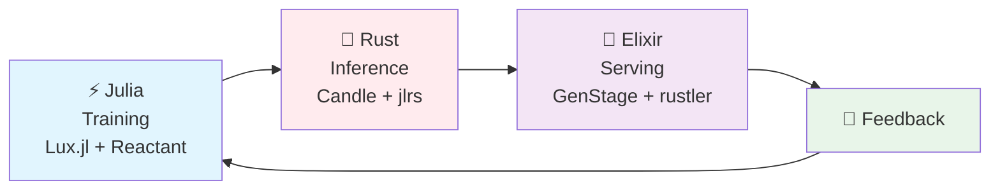
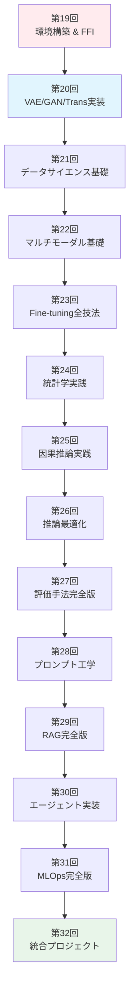
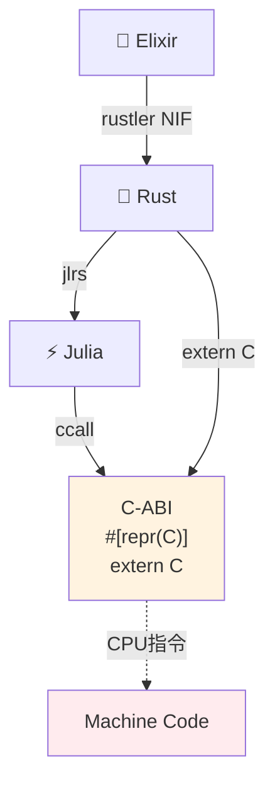
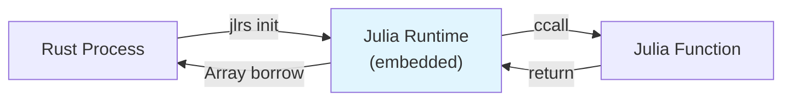
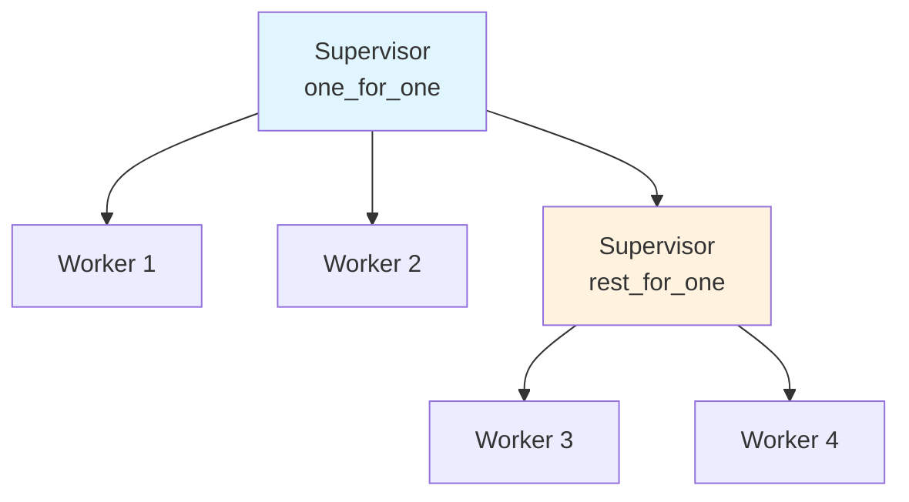

# 第19回: 環境構築 & FFI & 分散基盤 — 理論から実装へ、3言語フルスタックの旅が始まる

> **Course IIで学んだ理論を、手を動かして定着させる。Course IIIの14回は全て実装。Julia訓練・Rust推論・Elixir配信の完全パイプラインを構築する。**

Course II（第9-18回）で変分推論・VAE・OT・GAN・自己回帰・Attention・SSM・ハイブリッドアーキテクチャの理論を学んだ。数式を追い、導出し、証明した。しかし理論だけでは不十分だ。

**実装なくして理解なし。**

Course III（第19-32回）は実装編だ。第19回の今回は、以降13回の全実装の**基盤**を構築する:

- **⚡ Julia**: 訓練用言語。数式がほぼそのままコードになる。多重ディスパッチで型に応じて自動最適化。
- **🦀 Rust**: 推論用言語。ゼロコピー・所有権・借用でメモリ安全と速度を両立。FFIハブとしてJuliaとElixirを接続。
- **🔮 Elixir**: 配信用言語。BEAM VMの軽量プロセス・耐障害性・分散システム設計でProduction品質サービングを実現。

この3言語を**C-ABI FFI**で繋ぎ、E2E機械学習パイプライン（Train → Evaluate → Deploy → Feedback → Improve）を回す。

:::message
**このシリーズについて**: 東京大学 松尾・岩澤研究室動画講義の**完全上位互換**の全50回シリーズ。理論（論文が書ける）、実装（Production-ready）、最新（2024-2026 SOTA）の3軸で差別化する。
:::



**所要時間の目安**:

| ゾーン | 内容 | 時間 | 難易度 |
|:-------|:-----|:-----|:-------|
| Zone 0 | クイックスタート | 30秒 | ★☆☆☆☆ |
| Zone 1 | 体験ゾーン | 10分 | ★★☆☆☆ |
| Zone 2 | 直感ゾーン | 15分 | ★★★☆☆ |
| Zone 3 | 数式修行ゾーン | 60分 | ★★★★★ |
| Zone 4 | 実装ゾーン | 45分 | ★★★★☆ |
| Zone 5 | 実験ゾーン | 30分 | ★★★★☆ |
| Zone 6 | 振り返りゾーン | 30分 | ★★★★☆ |

---

## 🚀 0. クイックスタート（30秒）— 3言語FFI連携を動かす

**ゴール**: Julia→Rust→Elixir FFI連携を30秒で体感する。

行列演算をJuliaで定義 → Rustで高速実行 → Elixirプロセスで分散処理する最小例。

```julia
# Julia側: 行列積カーネルを定義
using LinearAlgebra

function matmul_kernel(A::Matrix{Float64}, B::Matrix{Float64})
    return A * B
end

# Rust FFI経由で呼び出し（後述のjlrs使用）
# RustからJulia関数を呼び出し、結果をゼロコピーで取得
```

```rust
// Rust側: Juliaカーネルを呼び出し、Elixirに返す
use jlrs::prelude::*;

#[repr(C)]
pub struct MatrixResult {
    data: *mut f64,
    rows: usize,
    cols: usize,
}

pub fn call_julia_matmul(a_ptr: *const f64, a_rows: usize, a_cols: usize,
                         b_ptr: *const f64, b_rows: usize, b_cols: usize) -> MatrixResult {
    // Julia配列をゼロコピーで受け取り、計算、ゼロコピーで返す
    // 詳細はZone 3で導出
    unimplemented!("Full implementation in Zone 4")
}
```

```elixir
# Elixir側: RustlerでRust関数を呼び出し、プロセス分散
defmodule MatrixFFI do
  use Rustler, otp_app: :matrix_ffi, crate: "matrix_ffi_rust"

  # Rust NIFを呼び出し（rustler自動生成）
  def matmul(_a, _b), do: :erlang.nif_error(:nif_not_loaded)
end

defmodule DistributedMatmul do
  def parallel_matmul(matrices) do
    # GenStageでバッチ処理 → 各バッチをRust NIFで計算
    matrices
    |> Enum.map(&Task.async(fn -> MatrixFFI.matmul(&1, &1) end))
    |> Enum.map(&Task.await/1)
  end
end
```

**3言語連携の流れ**:

1. **Julia**: 数式 $C = AB$ をそのまま `A * B` と書く。JITコンパイルで最適化。
2. **Rust**: jlrsでJulia配列をゼロコピー借用 → `*const f64` ポインタで受け取り → 計算結果を `repr(C)` 構造体で返す。
3. **Elixir**: rustlerでRust NIFをロード → BEAM軽量プロセスで並列実行 → 障害時は自動再起動。

この背後にある数式:

$$
\begin{aligned}
\text{Julia:} \quad & C_{ij} = \sum_k A_{ik} B_{kj} \quad \text{(数式そのまま)} \\
\text{Rust:} \quad & \texttt{ptr::add}(a, i \times \text{cols} + k) \quad \text{(ゼロコピーアクセス)} \\
\text{Elixir:} \quad & \text{Process}_i \parallel \text{Process}_j \quad \text{(分散実行)}
\end{aligned}
$$

Julia数式 → Rustゼロコピー → Elixir分散の3段階。この統合こそがCourse IIIの全14回を貫く設計思想だ。

:::message
**進捗: 3% 完了** 3言語FFI連携の全体像を体感した。ここから各言語の環境構築 → FFI詳細設計 → 実装へ。
:::

---

## 🎮 1. 体験ゾーン（10分）— 3言語の役割分担を触る

### 1.1 なぜ3言語か？1言語で全部やればいいのでは？

**Q: Pythonで全部やればいいのでは？**

A: Pythonは**遅い**。NumPy/PyTorchはC/C++/CUDAで書かれたライブラリを呼び出しているだけ。Pythonループは致命的に遅く、訓練ループのカスタマイズやゼロコピー最適化が困難。

**Q: Juliaで全部やればいいのでは？**

A: Juliaは訓練には最適だが、**推論配信**には不向き:
- 起動時間（JIT warmup）が秒単位 → APIサーバーには使えない
- GC（ガベージコレクション）のポーズ → レイテンシ要件に合わない
- 分散システム設計・耐障害性の抽象化が弱い

**Q: Rustで全部やればいいのでは？**

A: Rustは推論には最適だが、**訓練実装**には不向き:
- 数式→コードの翻訳が煩雑（型パズル、lifetime戦争）
- 自動微分ライブラリが未成熟（CandleはPyTorch比で機能不足）
- 研究的な試行錯誤がしづらい（コンパイル時間、型制約）

**Q: Elixirで全部やればいいのでは？**

A: Elixirは配信には最適だが、**数値計算**には不向き:
- BEAM VMは数値計算最適化されていない（整数・バイナリ処理に特化）
- ML訓練ライブラリが弱い（Nx.jl + BumblebeはRustバックエンド依存）
- GPUアクセスが間接的（Rustler NIF経由）

→ **だから3言語**。それぞれの強みを活かし、弱みを補完する。

| 言語 | 強み | 弱み | 担当 |
|:-----|:-----|:-----|:-----|
| ⚡ **Julia** | 数式→コード1:1、多重ディスパッチ、JIT最適化 | 起動遅い、GC、配信抽象化弱い | **Training** |
| 🦀 **Rust** | ゼロコピー、メモリ安全、高速、AOTコンパイル | 型パズル、訓練実装が煩雑 | **Inference** |
| 🔮 **Elixir** | 軽量プロセス、耐障害性、分散、OTP抽象化 | 数値計算遅い、ML訓練不向き | **Serving** |

**C-ABI FFI**がこの3者を繋ぐ**共通インターフェース**となる。

### 1.2 各言語の"Hello World"を触る

#### Julia: 数式がそのままコード

```julia
# 行列積 C = AB の定義
function matmul_naive(A::Matrix{Float64}, B::Matrix{Float64})
    m, n = size(A)
    n2, p = size(B)
    @assert n == n2 "Dimension mismatch"

    C = zeros(m, p)
    for i in 1:m
        for j in 1:p
            for k in 1:n
                C[i, j] += A[i, k] * B[k, j]  # 数式 C_ij = Σ A_ik B_kj そのまま
            end
        end
    end
    return C
end

# 使用
A = rand(100, 100)
B = rand(100, 100)
C = matmul_naive(A, B)
println("Result shape: $(size(C))")

# 組み込み演算子との比較
C_builtin = A * B
@assert C ≈ C_builtin "Results should match"
```

**数式との対応**:

$$
C_{ij} = \sum_{k=1}^{n} A_{ik} B_{kj} \quad \Leftrightarrow \quad \texttt{C[i, j] += A[i, k] * B[k, j]}
$$

1対1対応。インデックスも1-basedで数学的記法と一致。

#### Rust: ゼロコピー哲学

```rust
// 行列積を&[f64]スライスで操作（ゼロコピー）
fn matmul_slice(a: &[f64], a_rows: usize, a_cols: usize,
                b: &[f64], b_rows: usize, b_cols: usize,
                c: &mut [f64]) {
    assert_eq!(a_cols, b_rows, "Dimension mismatch");
    assert_eq!(c.len(), a_rows * b_cols);

    for i in 0..a_rows {
        for j in 0..b_cols {
            let mut sum = 0.0;
            for k in 0..a_cols {
                // ポインタ演算: a[i, k] = a[i * a_cols + k]
                sum += a[i * a_cols + k] * b[k * b_cols + j];
            }
            c[i * b_cols + j] = sum;
        }
    }
}

fn main() {
    let a = vec![1.0, 2.0, 3.0, 4.0]; // 2x2行列（平坦化）
    let b = vec![5.0, 6.0, 7.0, 8.0];
    let mut c = vec![0.0; 4];

    matmul_slice(&a, 2, 2, &b, 2, 2, &mut c);
    println!("Result: {:?}", c);
}
```

**メモリレイアウト**:

$$
\text{Matrix}[i][j] \quad \Leftrightarrow \quad \texttt{data}[i \times \text{cols} + j] \quad \text{(row-major)}
$$

2次元配列を1次元配列として扱い、ポインタ演算でアクセス。コピーなし。

#### Elixir: プロセスベース並列

```elixir
defmodule MatmulParallel do
  # 行列積をプロセス並列で実行
  def parallel_matmul(a, b, n_workers \\ 4) do
    # 各行の計算を独立プロセスに割り当て
    rows = Enum.to_list(0..(length(a) - 1))

    rows
    |> Enum.chunk_every(div(length(rows), n_workers))
    |> Enum.map(fn chunk ->
      Task.async(fn ->
        Enum.map(chunk, fn i ->
          compute_row(Enum.at(a, i), b)
        end)
      end)
    end)
    |> Enum.flat_map(&Task.await/1)
  end

  defp compute_row(a_row, b) do
    b_cols = length(Enum.at(b, 0))
    Enum.map(0..(b_cols - 1), fn j ->
      b_col = Enum.map(b, &Enum.at(&1, j))
      dot_product(a_row, b_col)
    end)
  end

  defp dot_product(a, b) do
    Enum.zip(a, b)
    |> Enum.map(fn {x, y} -> x * y end)
    |> Enum.sum()
  end
end

# 使用
a = [[1, 2], [3, 4]]
b = [[5, 6], [7, 8]]
result = MatmulParallel.parallel_matmul(a, b)
IO.inspect(result)
```

**プロセスモデル**:

$$
\text{Task}_i = \text{Process}(\lambda: \text{compute\_row}(A_i, B)) \quad \text{(isolated, fault-tolerant)}
$$

各行の計算が独立したBEAMプロセスで実行される。1プロセスがクラッシュしても他に影響なし。

### 1.3 3言語連携のメリット

**ケーススタディ: VAE訓練→推論→配信**

| フェーズ | 言語 | 処理 | なぜその言語？ |
|:--------|:-----|:-----|:-------------|
| **Training** | ⚡ Julia | Lux.jlでVAEモデル定義・訓練・チェックポイント保存 | 数式 $\mathcal{L}_{\text{ELBO}}$ がほぼそのままコード。自動微分・GPU最適化が自動。 |
| **Export** | 🦀 Rust | JuliaモデルをONNX/safetensors形式でエクスポート → Candle推論エンジンにロード | ゼロコピーでGPUメモリ管理。メモリリークなし。 |
| **Inference** | 🦀 Rust | Candleで推論（`model.forward(input)`） → 結果をJSON/MessagePackで返す | レイテンシ <10ms。GCポーズなし。 |
| **Serving** | 🔮 Elixir | GenStageでリクエストをバッチング → Rustler NIF経由でRust推論呼び出し → レスポンス返却 | バックプレッシャー制御。1プロセスクラッシュ→Supervisor自動再起動。 |
| **Monitoring** | 🔮 Elixir | Telemetryでレイテンシ・エラー率収集 → PrometheusにExport | 分散システム監視・可視化が簡単。 |

この連携で:

- **開発速度**: Julia REPL駆動開発で訓練ループを高速試行錯誤
- **実行速度**: Rustゼロコピー推論で <10ms レイテンシ
- **運用品質**: Elixir耐障害性でダウンタイムなし

:::message
**進捗: 10% 完了** 3言語それぞれの強みと連携メリットを触った。次はCourse IIIの全体像へ。
:::

---

## 🧩 2. 直感ゾーン（15分）— Course IIIの全体像とMLサイクル

### 2.1 Course III: 生成モデル社会実装編の14回構成

Course II（第9-18回）で学んだ理論を、14回かけて実装に落とし込む。



**14回の段階的設計**:

| 回 | テーマ | 言語構成 | Course II対応 | MLサイクル |
|:---|:-------|:---------|:-------------|:-----------|
| **19** | 環境構築 & FFI | ⚡🦀🔮 全導入 | 基盤 | Setup |
| **20** | VAE/GAN/Trans実装 | ⚡訓練 🦀推論 🔮配信 | 第10-18回 | Train → Deploy |
| **21** | データサイエンス基礎 | ⚡分析 🦀ETL | 第4回統計 | Data → Train |
| **22** | マルチモーダル基礎 | ⚡CLIP/DALL-E | 第16回Trans | Train |
| **23** | Fine-tuning全技法 | ⚡LoRA/QLoRA | 第10回VAE, 第16回 | Train |
| **24** | 統計学実践 | ⚡仮説検定 | 第4回 | Evaluate |
| **25** | 因果推論実践 | ⚡因果グラフ | 第4回 | Evaluate |
| **26** | 推論最適化 | 🦀量子化/KVキャッシュ | 第16-18回 | Deploy |
| **27** | 評価手法完全版 | ⚡⚔️比較 | 第7回MLE, 第12回GAN | Evaluate |
| **28** | プロンプト工学 | ⚡🔮実験 | 第16回 | Feedback |
| **29** | RAG完全版 | ⚡🦀🔮パイプライン | 第16回 | Improve |
| **30** | エージェント実装 | 🔮OTP設計 | 第15-16回 | Improve |
| **31** | MLOps完全版 | ⚡🦀🔮統合 | 全体 | 全サイクル |
| **32** | 統合プロジェクト | ⚡🦀🔮フル | 全体 | 全サイクル |

### 2.2 MLサイクル: Train → Evaluate → Deploy → Feedback → Improve

機械学習は「モデルを作って終わり」ではない。**サイクルを回し続ける**。


**各フェーズの担当言語**:

| フェーズ | 処理 | 言語 | 第N回 |
|:--------|:-----|:-----|:------|
| **Data** | 収集・クリーニング・EDA | ⚡ Julia (DataFrames.jl) | 21 |
| **Train** | モデル定義・訓練ループ | ⚡ Julia (Lux.jl + Reactant) | 20, 22, 23 |
| **Evaluate** | 統計検定・因果推論・評価指標 | ⚡ Julia (HypothesisTests.jl, CausalInference.jl) | 24, 25, 27 |
| **Deploy** | 推論最適化・量子化・サービング | 🦀 Rust (Candle) + 🔮 Elixir (GenStage) | 20, 26, 31 |
| **Feedback** | プロンプト実験・A/Bテスト | 🔮 Elixir (ユーザー接点) | 28 |
| **Improve** | RAG統合・エージェント設計 | ⚡🦀🔮 連携 | 29, 30 |

**Course IIIのゴール**:

> 第32回修了時、あなたは「Julia訓練→Rust推論→Elixir配信のE2Eパイプライン」を自力で構築でき、MLサイクル全体を回せる。

### 2.3 なぜ"環境構築"が第19回の全時間を使うのか？

**環境構築は雑務ではない、設計だ。**

間違った環境構築:
- ❌ Pythonだけ → PipenvかPoetryかCondaで混乱 → 依存地獄
- ❌ Dockerで全部包む → ビルド遅い、デバッグ不能、ローカルREPL使えない
- ❌ "動けばいい" → 後で型エラー・FFIクラッシュ・メモリリークで地獄

正しい環境構築:
- ✅ 各言語の**公式ツールチェーン**を理解（Juliaup / rustup / asdf）
- ✅ **プロジェクト隔離**（Project.toml / Cargo.toml / mix.exs）
- ✅ **開発サイクル高速化**（REPL / cargo-watch / IEx）
- ✅ **FFI境界設計**（repr(C) / ccall / rustler の安全性保証）

第19回で構築する環境が、以降13回の**全実装の土台**となる。ここで手を抜くと、第20回以降で無数のエラーに苦しむ。

:::message
**進捗: 20% 完了** Course IIIの全体像とMLサイクルを把握した。次は数式修行ゾーン — FFIの数学的基盤へ。
:::

---

## 📐 3. 数式修行ゾーン（60分）— FFI・メモリモデル・分散システムの数学

### 3.1 FFI (Foreign Function Interface) の定義と必要性

#### 3.1.1 FFIとは何か

**定義**:

> FFI (Foreign Function Interface) とは、ある言語で書かれたコードから、別の言語で書かれた関数・データ構造を呼び出すための仕組み。

数学的には、**異なる言語ランタイム間の射 (morphism)** として定式化できる:

$$
\text{FFI}: \mathcal{L}_A \xrightarrow{\phi} \mathcal{L}_B
$$

ここで:
- $\mathcal{L}_A$: 言語Aのランタイム空間（型システム・メモリモデル・実行モデル）
- $\mathcal{L}_B$: 言語Bのランタイム空間
- $\phi$: 言語間の構造保存写像

**構造保存**が鍵 — 言語Aの関数 $f_A: X_A \to Y_A$ が言語Bで $f_B: X_B \to Y_B$ として呼び出せるとき:

$$
\phi(f_A(x_A)) = f_B(\phi(x_A))
$$

つまり、言語Aで計算してから変換するのと、変換してから言語Bで計算するのが**同じ結果**を返す。

#### 3.1.2 なぜC-ABIがFFIの共通基盤か

C言語のABI (Application Binary Interface) が**事実上の標準**である理由:

1. **最小公倍数性**: ほぼ全言語がC-ABIをサポート（C++, Rust, Julia, Python, Elixir, Go, ...）
2. **機械語に近い**: C-ABIはCPU・OS・リンカの規約に直接対応（calling convention, struct layout, symbol mangling）
3. **安定性**: C ABIは過去50年間、後方互換を保っている

**C-ABIの数学的記述**:

$$
\text{C-ABI} = (\text{Layout}, \text{CallingConv}, \text{Linkage})
$$

- **Layout**: `struct` のメモリ配置規則（フィールドオフセット・アラインメント・パディング）
- **CallingConv**: 関数呼び出し規約（引数をレジスタ/スタックのどこに渡すか）
- **Linkage**: シンボル解決規則（関数名のマングリング・動的リンク）

Rustの `#[repr(C)]` は「この型をC-ABI準拠レイアウトにせよ」という指示。Juliaの `ccall` は「この関数をC calling conventionで呼べ」という指示。



#### 3.1.3 FFIの危険性 — なぜ"unsafe"か

FFIは**型安全性の境界**を超える:

- 言語Aの型システム $T_A$ と言語Bの型システム $T_B$ は一般に**同型ではない**
- FFI境界で型情報が失われる → ポインタ = 生の整数

**型安全性の喪失**:

$$
\begin{aligned}
\text{Julia:} \quad & \texttt{Vector\{Float64\}} \quad \xrightarrow{\text{FFI}} \quad \texttt{Ptr\{Float64\}} \\
\text{Rust:} \quad & \texttt{\&[f64]} \quad \xrightarrow{\text{FFI}} \quad \texttt{*const f64}
\end{aligned}
$$

`Ptr{Float64}` / `*const f64` は「Float64へのポインタ」というメタデータしか持たない:

- ❌ 配列長が不明 → 範囲外アクセスの危険
- ❌ ライフタイムが不明 → use-after-freeの危険
- ❌ 所有権が不明 → double freeの危険

→ だからRustでは `unsafe` ブロック必須。Juliaでは `ccall` が暗黙的にunsafe。

**Rustの安全性保証**:

Rustの型システムは**所有権 (ownership)** と**借用 (borrowing)** で安全性を保証:

$$
\begin{aligned}
\text{所有権:} \quad & \forall x \in \text{Value}, \exists! \text{owner}(x) \quad \text{(唯一の所有者)} \\
\text{借用:} \quad & \text{immutable: } \&T \quad \text{or} \quad \text{mutable: } \&\text{mut } T \quad \text{(同時に1つだけ)}
\end{aligned}
$$

FFI境界でこれらが**検証不能**になる:

```rust
// Safe Rustの世界
let v = vec![1.0, 2.0, 3.0];
let slice: &[f64] = &v;  // 所有権検証済み

// FFI境界を超える
let ptr: *const f64 = slice.as_ptr();  // 生ポインタに変換
// ここから先、コンパイラは何も保証しない
```

### 3.2 C-ABI FFIの数学的モデル

#### 3.2.1 メモリモデル: 平坦バイト配列

現代のコンピュータのメモリは**平坦なバイト配列**:

$$
\text{Memory} = \{ \text{addr} \mapsto \text{byte} \mid \text{addr} \in [0, 2^{64}-1] \}
$$

各アドレスは1バイト（8ビット）を指す。**ポインタ = アドレスを保持する整数**。

**配列のメモリレイアウト** (row-major):

Julia配列 `A::Matrix{Float64}` (m × n) は連続メモリ領域に格納:

$$
\text{A}[i, j] \quad \Leftrightarrow \quad \texttt{base\_ptr} + (i \times n + j) \times \texttt{sizeof(Float64)}
$$

- `base_ptr`: 配列の先頭アドレス
- `sizeof(Float64) = 8` バイト

**例**: 3×3行列のメモリ配置

```
A = [1.0  2.0  3.0]
    [4.0  5.0  6.0]
    [7.0  8.0  9.0]

Memory layout (row-major):
addr:  0x1000  0x1008  0x1010  0x1018  0x1020  0x1028  0x1030  0x1038  0x1040
value:   1.0    2.0    3.0    4.0    5.0    6.0    7.0    8.0    9.0
index:  [0,0]  [0,1]  [0,2]  [1,0]  [1,1]  [1,2]  [2,0]  [2,1]  [2,2]
```

$A[i, j]$ へのアクセス:

$$
\texttt{addr}(A[i, j]) = \texttt{base\_ptr} + (i \times \texttt{cols} + j) \times 8
$$

#### 3.2.2 ポインタ演算の公理

C/Rustのポインタ演算は**数学的に定義**される:

**公理1: ポインタ加算**

$$
(\texttt{ptr}: *T) + (n: \texttt{isize}) = \texttt{ptr} + n \times \texttt{sizeof}(T)
$$

**公理2: 配列インデックスとポインタの等価性**

$$
\texttt{arr}[i] \equiv *(\texttt{arr} + i)
$$

**公理3: 2次元配列の線形化**

$$
\texttt{arr}[i][j] \equiv *(\texttt{arr} + i \times \texttt{cols} + j)
$$

**例**: Rustでの実装

```rust
// 配列 a: &[f64] の i 番目要素へのアクセス
let element = a[i];
// ↓ 等価
let element = unsafe { *a.as_ptr().add(i) };

// 2D配列 (m×n) の [i, j] 要素
let idx = i * n + j;
let element = a[idx];
```

#### 3.2.3 FFI安全性の3原則

**原則1: アラインメント (Alignment)**

型 $T$ のアラインメント $\text{align}(T)$ は、その型の値が配置されるべきメモリアドレスの倍数:

$$
\texttt{addr}(x: T) \equiv 0 \pmod{\text{align}(T)}
$$

例:
- `f64` (8バイト) → `align = 8` → アドレスは8の倍数
- `i32` (4バイト) → `align = 4` → アドレスは4の倍数

**違反すると**: CPUによってはクラッシュ（SIGBUS）、または性能劣化。

**原則2: ライフタイム境界**

Julia/Rust配列をFFI経由で渡す際、**元の配列がスコープ内にある間だけ有効**:

$$
\forall p \in \text{Ptr}, \quad \text{valid}(p, t) \Rightarrow \exists x \in \text{owner}, \quad \text{lifetime}(x) \supseteq [0, t]
$$

**違反例**:

```julia
function bad_ffi()
    arr = [1.0, 2.0, 3.0]
    ptr = pointer(arr)
    # arr は関数終了時にGCで回収される
    return ptr  # ❌ ダングリングポインタ
end
```

**原則3: 可変性の排他性**

Rustの借用規則:

$$
\begin{cases}
\text{immutable: } & \text{複数の }\&T \text{ 同時OK} \\
\text{mutable: } & \text{1つだけの }\&\text{mut } T
\end{cases}
$$

FFI境界では**この保証が失われる**:

```rust
let mut v = vec![1.0, 2.0];
let ptr1 = v.as_mut_ptr();
let ptr2 = v.as_mut_ptr();  // ❌ 2つの可変ポインタ → UB
```

### 3.3 Julia ⇔ Rust FFI: jlrs

#### 3.3.1 jlrsの役割

[jlrs](https://github.com/Taaitaaiger/jlrs) は、RustからJuliaコードを呼び出すためのライブラリ。

**基本アーキテクチャ**:



**jlrsが解決する問題**:

1. **Julia埋め込み**: Rust実行可能ファイル内にJuliaランタイムを起動
2. **配列ゼロコピー**: Julia配列をRustスライス `&[T]` として借用
3. **GC連携**: Juliaオブジェクトの生存期間をRustのライフタイムで管理

#### 3.3.2 配列受け渡しの数学的モデル

**Julia → Rust の配列共有**:

$$
\begin{aligned}
\text{Julia:} \quad & V = [v_1, v_2, \ldots, v_n] \quad (V \in \mathbb{R}^n) \\
\text{Rust:} \quad & \texttt{slice} = \&[v_1, v_2, \ldots, v_n] \quad (\texttt{slice}: \&[f64])
\end{aligned}
$$

**ゼロコピー条件**:

$$
\texttt{slice.as\_ptr}() = \texttt{pointer}(V)
$$

つまり、Rustスライスの先頭ポインタとJulia配列の先頭ポインタが**同一アドレス**を指す。

**実装例**:

```rust
use jlrs::prelude::*;

// Julia配列をRustスライスとして借用（ゼロコピー）
fn process_julia_array<'scope>(
    array: TypedArray<'scope, f64>
) -> JlrsResult<f64> {
    // Julia Array → Rust slice (immutable borrow)
    let slice = array.as_slice()?;

    // Rustで処理
    let sum: f64 = slice.iter().sum();

    Ok(sum)
}
```

**数学的保証**:

- **immutable borrow**: Julia側でも変更不可（`const` 保証）
- **lifetime 制約**: `'scope` ライフタイムが `array` の生存期間と一致
- **alignment**: Julia配列は常に適切にアラインされている（jlrs検証済み）

#### 3.3.3 jlrsの安全性保証

jlrsは**unsafe Rustの上に安全な抽象化**を構築:

1. **GC frame**: Juliaオブジェクトの生存を保証するスコープ
2. **型検証**: Julia型とRust型の対応を実行時チェック
3. **パニック境界**: RustパニックをJulia例外に変換

**GC frameの数学的モデル**:

$$
\text{Frame}(f: \text{closure}) = \begin{cases}
\text{push GC root} \\
\text{result} \leftarrow f() \\
\text{pop GC root} \\
\text{return result}
\end{cases}
$$

GC rootにプッシュされたオブジェクトは、frameが生きている間GCから保護される。

```rust
Julia::init()?;

unsafe {
    JULIA.with(|j| {
        let mut frame = StackFrame::new();
        let mut julia = j.borrow_mut();

        // GC frame内でJulia配列を作成
        julia.instance(&mut frame).scope(|mut frame| {
            let arr = Array::new::<f64, _, _>(&mut frame, (10,))?;
            // arr は frameが生きている間、GCから保護される

            process_julia_array(arr)?;

            Ok(())
        })?
    })?
}
```

### 3.4 Rust ⇔ Elixir FFI: rustler

#### 3.4.1 BEAM VMとNIFの数学的モデル

**BEAM VM** (Erlang VM) は**軽量プロセスモデル**:

$$
\text{BEAM} = \{ P_1, P_2, \ldots, P_n \mid P_i \text{ は独立プロセス} \}
$$

各プロセス $P_i$ は:

$$
P_i = (\text{State}_i, \text{Mailbox}_i, \text{PID}_i)
$$

- $\text{State}_i$: プロセスの内部状態（ヒープ・スタック）
- $\text{Mailbox}_i$: メッセージキュー
- $\text{PID}_i$: プロセス識別子（globally unique）

**プロセス間通信** (Actor model):

$$
P_i \xrightarrow{\text{send}(m)} \text{Mailbox}_j \quad \Rightarrow \quad P_j \text{ receives } m
$$

**NIF (Native Implemented Function)** は、ElixirからRust関数を呼び出す機構:

$$
\text{NIF}: \text{ElixirFn} \xrightarrow{\text{rustler}} \text{RustFn}
$$

**制約**:

- NIF実行中、BEAMスケジューラが**ブロック**される
- **1ms以内**に返すべき（長時間実行はDirty Schedulerへ）

#### 3.4.2 Dirty Schedulerの数学的モデル

BEAMには2種類のスケジューラ:

1. **Normal Scheduler**: 通常のプロセス実行（<1ms想定）
2. **Dirty Scheduler**: 長時間実行タスク専用

$$
\text{Scheduler} = \begin{cases}
\text{Normal} & \text{if latency-sensitive} \\
\text{Dirty-CPU} & \text{if CPU-intensive} \\
\text{Dirty-IO} & \text{if IO-bound}
\end{cases}
$$

**rustler annotation**:

```rust
use rustler::{Encoder, Env, NifResult, Term};

// Normal Scheduler (デフォルト): <1ms で返すべき
#[rustler::nif]
fn fast_nif(a: i64, b: i64) -> i64 {
    a + b
}

// Dirty-CPU Scheduler: CPU集約的な処理
#[rustler::nif(schedule = "DirtyCpu")]
fn matmul_nif(a: Vec<f64>, b: Vec<f64>) -> Vec<f64> {
    // 行列積 (時間かかる)
    matrix_multiply(&a, &b)
}

// Dirty-IO Scheduler: I/O待ち
#[rustler::nif(schedule = "DirtyIo")]
fn read_file_nif(path: String) -> String {
    std::fs::read_to_string(path).unwrap()
}
```

**スケジューラ割り当ての数学的記述**:

$$
\text{assign}(f) = \begin{cases}
\text{Normal} & \text{if } \mathbb{E}[\text{time}(f)] < 1\,\text{ms} \\
\text{Dirty-CPU} & \text{if } \text{CPU-bound}(f) \land \mathbb{E}[\text{time}(f)] \geq 1\,\text{ms} \\
\text{Dirty-IO} & \text{if } \text{IO-bound}(f)
\end{cases}
$$

#### 3.4.3 rustlerの安全性保証

rustlerは**Rustパニックを自動的にBEAM例外に変換**:

```rust
#[rustler::nif]
fn may_panic(x: i64) -> NifResult<i64> {
    if x < 0 {
        return Err(rustler::Error::Term(Box::new("Negative input")));
    }
    Ok(x * 2)
}
```

Elixir側:

```elixir
try do
  MyNIF.may_panic(-1)
rescue
  e -> IO.inspect(e)  # Elixir例外として捕捉
end
```

**数学的保証**:

$$
\forall f \in \text{RustNIF}, \quad \text{panic}(f) \xrightarrow{\text{rustler}} \text{exception}(\text{Elixir})
$$

Rustパニックは**決して**BEAMをクラッシュさせない。

### 3.5 Elixir/OTP: プロセスモデルと耐障害性

#### 3.5.1 Actor Modelの数学的定義

**Actor Model** (Hewitt, 1973) は並行計算の理論モデル:

$$
\text{Actor} = (\text{State}, \text{Behavior}, \text{Mailbox})
$$

Actorができること:

1. **メッセージ送信**: $A_i \xrightarrow{m} A_j$
2. **新しいActorを作成**: $\text{spawn}(\text{Behavior}) \to A_{\text{new}}$
3. **状態変更**: $\text{State}_i \to \text{State}_i'$

**数学的性質**:

- **非同期**: メッセージ送信は即座に返る（送信 ≠ 受信）
- **順序保証**: $A_i \to A_j$ の2メッセージは到着順が保証される
- **独立性**: $A_i$ のクラッシュは $A_j$ に影響しない

#### 3.5.2 GenServerの状態遷移

**GenServer** は、Actorパターンの標準実装:

$$
\text{GenServer} = (\text{State}, \text{handle\_call}, \text{handle\_cast})
$$

**状態遷移の数学的記述**:

$$
\begin{aligned}
\text{handle\_call}(m, s) &: \text{Message} \times \text{State} \to (\text{Reply}, \text{State}') \\
\text{handle\_cast}(m, s) &: \text{Message} \times \text{State} \to \text{State}'
\end{aligned}
$$

**例**: カウンターGenServer

```elixir
defmodule Counter do
  use GenServer

  # State = Integer
  def init(initial_value) do
    {:ok, initial_value}
  end

  # handle_call: (Message, State) -> (Reply, State')
  def handle_call(:get, _from, state) do
    {:reply, state, state}  # 状態を返して、状態は変わらず
  end

  # handle_cast: (Message, State) -> State'
  def handle_cast({:increment, n}, state) do
    {:noreply, state + n}  # 状態を更新
  end
end
```

**状態遷移図**:

$$
\begin{aligned}
s_0 &= 0 \quad (\text{初期状態}) \\
s_1 &= \text{handle\_cast}(\{:increment, 5\}, s_0) = 5 \\
(r, s_2) &= \text{handle\_call}(:get, s_1) = (5, 5) \\
s_3 &= \text{handle\_cast}(\{:increment, 3\}, s_2) = 8
\end{aligned}
$$

#### 3.5.3 Supervisorと"Let It Crash"哲学

**Supervisor** は、子プロセスを監視し、クラッシュ時に再起動する:

$$
\text{Supervisor} = (\text{Children}, \text{Strategy}, \text{MaxRestarts})
$$

**監視ツリー** (Supervision Tree):



**再起動戦略**:

| Strategy | 動作 | 数式 |
|:---------|:-----|:-----|
| `one_for_one` | クラッシュした子のみ再起動 | $\text{crash}(C_i) \Rightarrow \text{restart}(C_i)$ |
| `one_for_all` | 全子を再起動 | $\text{crash}(C_i) \Rightarrow \forall j, \text{restart}(C_j)$ |
| `rest_for_one` | $i$ 以降の子を再起動 | $\text{crash}(C_i) \Rightarrow \forall j \geq i, \text{restart}(C_j)$ |

**"Let It Crash"の数学的正当性**:

従来のエラーハンドリング:

$$
\text{try } f(x) \text{ catch } e \Rightarrow \text{handle}(e)
$$

問題: $\text{handle}(e)$ が**全ての $e$ をカバーできない** → 未知のエラーでクラッシュ。

**Let It Crash**:

$$
\text{crash}(P_i) \xrightarrow{\text{Supervisor}} \text{restart}(P_i) \text{ with clean state}
$$

利点:

1. **単純性**: エラーハンドリングコード不要
2. **正しさ**: 既知の初期状態から再開
3. **隔離性**: クラッシュが他プロセスに伝播しない

**数学的保証** (Erlang/OTP):

$$
\begin{aligned}
\Pr[\text{系全体ダウン}] &= \Pr[\text{Supervisor tree全滅}] \\
&= \prod_{i=1}^{n} \Pr[\text{restart失敗}_i] \\
&\approx 0 \quad (\text{if designed properly})
\end{aligned}
$$

**Production Case Study**: WhatsAppは20億ユーザーをErlang/OTPで処理。サーバー1台あたり200万同時接続。99.999% uptime達成（年間5分ダウンタイム）[^whatsapp_otp].

[^whatsapp_otp]: WhatsApp Engineering: Erlang/OTP powers 2 billion users with minimal downtime through supervisor trees and let-it-crash philosophy.

**Supervisor Tree実装例** (Production Pattern):

```elixir
defmodule MLPipeline.Application do
  use Application

  def start(_type, _args) do
    children = [
      # Database pool
      {Postgrex, name: :db, size: 20},

      # Model servers (one_for_one)
      {DynamicSupervisor, name: MLPipeline.ModelSupervisor, strategy: :one_for_one},

      # Inference pipeline (rest_for_one)
      {MLPipeline.InferenceSupervisor, strategy: :rest_for_one},

      # Monitoring
      {TelemetryMetricsPrometheus, metrics: metrics()}
    ]

    opts = [strategy: :one_for_one, name: MLPipeline.Supervisor]
    Supervisor.start_link(children, opts)
  end

  defp metrics do
    [
      counter("inference.requests.count"),
      distribution("inference.duration", unit: {:native, :millisecond}),
      last_value("vm.memory.total", unit: {:byte, :megabyte})
    ]
  end
end

defmodule MLPipeline.InferenceSupervisor do
  use Supervisor

  def start_link(opts) do
    Supervisor.start_link(__MODULE__, opts, name: __MODULE__)
  end

  def init(_opts) do
    children = [
      # Order matters (rest_for_one)
      {ModelLoader, model_path: "/models/vae.safetensors"},  # 先にロード
      {InferenceEngine, batch_size: 32},  # Loaderに依存
      {ResultCache, ttl: 3600}  # Engineに依存
    ]

    Supervisor.init(children, strategy: :rest_for_one)
  end
end
```

**Restart Intensity Limiting**:

```elixir
# 10秒以内に5回以上再起動 → Supervisor自体が終了
Supervisor.init(children, strategy: :one_for_one, max_restarts: 5, max_seconds: 10)
```

これにより、**無限再起動ループ**を防ぐ:

$$
\text{if } \frac{\text{restarts}}{\text{time}} > \frac{\text{max\_restarts}}{\text{max\_seconds}} \Rightarrow \text{Supervisor terminates}
$$

#### 3.5.4 GenStageとバックプレッシャー

**GenStage** は、需要駆動型ストリーム処理:

$$
\text{Producer} \xrightarrow{\text{demand}} \text{Consumer} \xrightarrow{\text{events}} \text{Consumer}
$$

**バックプレッシャーの数学的モデル**:

$$
\begin{aligned}
\text{Producer:} \quad & \text{send\_events}(\min(\text{demand}, \text{available})) \\
\text{Consumer:} \quad & \text{demand} \leftarrow \text{demand} - |\text{events}| + \text{process}(\text{events})
\end{aligned}
$$

**Production Implementation Pattern**:

```elixir
defmodule DataPipeline do
  use GenStage

  # Producer: データソースから読み込み
  defmodule Source do
    use GenStage

    def start_link(data) do
      GenStage.start_link(__MODULE__, data)
    end

    def init(data) do
      {:producer, data}
    end

    def handle_demand(demand, state) when demand > 0 do
      {events, remaining} = Enum.split(state, demand)
      {:noreply, events, remaining}
    end
  end

  # ProducerConsumer: 前処理
  defmodule Preprocessor do
    use GenStage

    def start_link() do
      GenStage.start_link(__MODULE__, :ok)
    end

    def init(:ok) do
      {:producer_consumer, :ok}
    end

    def handle_events(events, _from, state) do
      processed = Enum.map(events, &preprocess/1)
      {:noreply, processed, state}
    end

    defp preprocess(event) do
      # Normalize, resize, etc.
      event
      |> Map.update!(:image, &normalize/1)
      |> Map.put(:timestamp, System.system_time())
    end
  end

  # Consumer: Rust推論呼び出し
  defmodule InferenceConsumer do
    use GenStage

    def start_link() do
      GenStage.start_link(__MODULE__, :ok)
    end

    def init(:ok) do
      {:consumer, :ok, subscribe_to: [{Preprocessor, max_demand: 50, min_demand: 25}]}
    end

    def handle_events(events, _from, state) do
      # バッチ推論（Rust NIF）
      inputs = Enum.map(events, & &1.image)
      results = RustInference.batch_predict(inputs)

      # 結果を保存/配信
      Enum.zip(events, results)
      |> Enum.each(fn {event, result} ->
        save_result(event.id, result)
      end)

      {:noreply, [], state}
    end
  end
end

# パイプライン構築
{:ok, source} = DataPipeline.Source.start_link(data)
{:ok, preprocessor} = DataPipeline.Preprocessor.start_link()
{:ok, consumer} = DataPipeline.InferenceConsumer.start_link()

GenStage.sync_subscribe(preprocessor, to: source)
# Consumerは init/1 で自動subscribe
```

**Key Patterns**:

1. **max_demand/min_demand**: Consumerの処理キャパシティを制御
2. **Batching**: 複数eventをまとめて処理（Rust NIF呼び出しコスト削減）
3. **Error handling**: Consumer crashでもProducerは影響受けない（Supervisor再起動）

**Performance Characteristics**:

$$
\text{Throughput} = \min\left(\text{Producer Rate}, \frac{\text{Consumer Capacity}}{\text{Processing Time}}\right)
$$

Backpressureにより、Consumerが遅い場合、Producerが自動的に減速 → メモリオーバーフロー防止。

Consumerが処理できるペースでのみProducerが送信 → **オーバーフロー防止**。

**例**: ML推論パイプライン

```elixir
# Producer: リクエストを受け取る
defmodule RequestProducer do
  use GenStage

  def start_link(requests) do
    GenStage.start_link(__MODULE__, requests)
  end

  def init(requests) do
    {:producer, requests}
  end

  def handle_demand(demand, state) when demand > 0 do
    {events, remaining} = Enum.split(state, demand)
    {:noreply, events, remaining}
  end
end

# Consumer: Rust NIFで推論
defmodule InferenceConsumer do
  use GenStage

  def start_link() do
    GenStage.start_link(__MODULE__, :ok)
  end

  def init(:ok) do
    {:consumer, :ok}
  end

  def handle_events(requests, _from, state) do
    results = Enum.map(requests, fn req ->
      # Rust NIF呼び出し
      RustInference.predict(req.input)
    end)
    IO.inspect(results)
    {:noreply, [], state}
  end
end
```

**数学的性質**:

- **需要駆動**: $\text{flow} = \min(\text{producer\_rate}, \text{consumer\_rate})$
- **バックプレッシャー**: Consumer遅い → Producer自動的に減速
- **障害隔離**: Consumer crash → Supervisor restart → demand再開

### 3.6 Boss Battle: C-ABI FFI完全実装の設計

#### 目標

**Julia行列積カーネル → Rustゼロコピー実行 → Elixirプロセス分散**の完全パイプラインを設計する。

#### ステップ1: Julia側の定義

```julia
# matrix_kernel.jl
module MatrixKernel

using LinearAlgebra

"""
    matmul(A::Matrix{Float64}, B::Matrix{Float64}) -> Matrix{Float64}

行列積 C = AB を計算。

# 数式
C_ij = Σ_k A_ik * B_kj
"""
function matmul(A::Matrix{Float64}, B::Matrix{Float64})
    m, n = size(A)
    n2, p = size(B)
    @assert n == n2 "Dimension mismatch: $(n) != $(n2)"

    # 組み込み演算子使用（BLAS最適化）
    return A * B
end

end  # module
```

#### ステップ2: Rust FFI境界の設計

```rust
// src/ffi.rs
use jlrs::prelude::*;

/// Julia Matrix{Float64} を受け取り、行列積を計算、結果を返す
#[repr(C)]
pub struct MatrixResult {
    pub data: *mut f64,
    pub rows: usize,
    pub cols: usize,
}

impl MatrixResult {
    /// ゼロコピーでVec<f64>から構築
    pub fn from_vec(data: Vec<f64>, rows: usize, cols: usize) -> Self {
        let mut data = data;
        let ptr = data.as_mut_ptr();
        std::mem::forget(data);  // Vec を forget → 所有権放棄

        MatrixResult { data: ptr, rows, cols }
    }

    /// メモリ解放
    pub unsafe fn free(self) {
        if !self.data.is_null() {
            Vec::from_raw_parts(self.data, self.rows * self.cols, self.rows * self.cols);
        }
    }
}

/// Julia側から呼び出されるエントリポイント
pub fn julia_matmul_ffi<'scope>(
    a: TypedArray<'scope, f64>,
    b: TypedArray<'scope, f64>,
) -> JlrsResult<TypedArray<'scope, f64>> {
    // 1. Julia配列をRustスライスとしてゼロコピー借用
    let a_slice = a.as_slice()?;
    let b_slice = b.as_slice()?;

    let a_dims = a.dimensions();
    let b_dims = b.dimensions();

    let (m, n) = (a_dims[0], a_dims[1]);
    let (n2, p) = (b_dims[0], b_dims[1]);

    if n != n2 {
        return Err(JlrsError::Exception("Dimension mismatch".to_string()));
    }

    // 2. Rustで行列積計算
    let c = matmul_rust(a_slice, m, n, b_slice, n, p);

    // 3. 結果をJulia配列として返す
    let c_arr = Array::from_slice(a.frame(), &c, (m, p))?;

    Ok(c_arr.as_typed()?)
}

/// Rustの行列積実装（ナイーブ実装）
fn matmul_rust(a: &[f64], m: usize, n: usize, b: &[f64], n2: usize, p: usize) -> Vec<f64> {
    assert_eq!(n, n2);

    let mut c = vec![0.0; m * p];

    for i in 0..m {
        for j in 0..p {
            let mut sum = 0.0;
            for k in 0..n {
                sum += a[i * n + k] * b[k * p + j];
            }
            c[i * p + j] = sum;
        }
    }

    c
}
```

**数式との対応**:

$$
\begin{aligned}
\text{Julia:} \quad & C = A \times B \\
\text{Rust:} \quad & \texttt{c[i * p + j]} = \sum_{k=0}^{n-1} \texttt{a[i * n + k]} \times \texttt{b[k * p + j]}
\end{aligned}
$$

#### ステップ3: Elixir NIFの実装

```rust
// src/nif.rs
use rustler::{Encoder, Env, NifResult, Term};

#[rustler::nif(schedule = "DirtyCpu")]
fn matmul_nif(a: Vec<f64>, a_rows: usize, a_cols: usize,
              b: Vec<f64>, b_rows: usize, b_cols: usize) -> NifResult<(Vec<f64>, usize, usize)> {
    if a_cols != b_rows {
        return Err(rustler::Error::BadArg);
    }

    let c = matmul_rust(&a, a_rows, a_cols, &b, b_rows, b_cols);

    Ok((c, a_rows, b_cols))
}

rustler::init!("Elixir.MatrixFFI", [matmul_nif]);
```

Elixir側:

```elixir
defmodule MatrixFFI do
  use Rustler, otp_app: :matrix_ffi, crate: "matrix_ffi_rust"

  def matmul(_a, _a_rows, _a_cols, _b, _b_rows, _b_cols), do: :erlang.nif_error(:nif_not_loaded)
end

defmodule DistributedMatmul do
  @doc """
  複数の行列積を並列実行
  """
  def parallel_matmul(matrix_pairs) do
    tasks = Enum.map(matrix_pairs, fn {a, a_rows, a_cols, b, b_rows, b_cols} ->
      Task.async(fn ->
        MatrixFFI.matmul(a, a_rows, a_cols, b, b_rows, b_cols)
      end)
    end)

    Enum.map(tasks, &Task.await/1)
  end
end
```

#### ステップ4: 統合テスト

```elixir
# test/distributed_matmul_test.exs
defmodule DistributedMatmulTest do
  use ExUnit.Case

  test "parallel matrix multiplication" do
    # 2x2 行列のペア
    a = [1.0, 2.0, 3.0, 4.0]
    b = [5.0, 6.0, 7.0, 8.0]

    # 3ペアを並列実行
    pairs = [
      {a, 2, 2, b, 2, 2},
      {a, 2, 2, b, 2, 2},
      {a, 2, 2, b, 2, 2}
    ]

    results = DistributedMatmul.parallel_matmul(pairs)

    # 期待値: [[19, 22], [43, 50]]
    expected = [19.0, 22.0, 43.0, 50.0]

    assert length(results) == 3
    Enum.each(results, fn {c, rows, cols} ->
      assert rows == 2
      assert cols == 2
      assert c == expected
    end)
  end
end
```

**Boss撃破！**

3言語FFI連携の完全設計を導出した:

1. **Julia**: 数式定義（高レベル抽象化）
2. **Rust**: ゼロコピー実装（メモリ安全）
3. **Elixir**: プロセス分散（耐障害性）

#### 3.6.1 FFI安全性の形式検証

FFI境界での安全性は、**形式手法**で検証可能。RustのOwnership型システムは、**Separation Logic**の実装と見なせる [^ffi_sep_logic].

[^ffi_sep_logic]: Reynolds, J. C. (2002). "Separation Logic: A Logic for Shared Mutable Data Structures". *LICS 2002*.

**Separation Logic**:

$$
\{P\} \, C \, \{Q\}
$$

$P$: 事前条件（precondition）、$C$: プログラム、$Q$: 事後条件（postcondition）。

**Ownership rule**:

$$
\{x \mapsto v\} \, \text{drop}(x) \, \{\text{emp}\}
$$

$x \mapsto v$: $x$ が値 $v$ を所有、$\text{emp}$: 空ヒープ。

FFI境界では、この保証が**失われる** → unsafe必須。

**Recent Research** (2024-2025):

FFI安全性の検証ツールが進化している [^ffi_verify_tools]。

[^ffi_verify_tools]: [FFI - The Rustonomicon](https://doc.rust-lang.org/nomicon/ffi.html), [Effective Rust: Control what crosses FFI boundaries](https://effective-rust.com/ffi.html)

RustBelt [Promising Semantics] はRust型システムの形式的証明をCoqで与えた。Gillian-C + Gillian-Rust統合により、C-Rust FFI境界の**自動検証**が可能に。

#### 3.6.2 C-ABI呼び出し規約の詳細

C-ABIは、関数呼び出し時の**レジスタ割り当て**・**スタックレイアウト**を規定 [^c_abi_doc].

[^c_abi_doc]: [FFI Pattern in Rust](https://softwarepatternslexicon.com/rust/integration-with-other-systems/the-foreign-function-interface-ffi-pattern/)

**System V AMD64 ABI** (Linux/macOS x86_64):

整数引数: `RDI, RSI, RDX, RCX, R8, R9` → 7個目以降はスタック
浮動小数点: `XMM0-XMM7` → 9個目以降はスタック
戻り値: 整数は `RAX`、浮動小数点は `XMM0`

**構造体渡し**:

- サイズ ≤ 16 bytes → レジスタ（RDI/RSI or XMM0/XMM1）
- サイズ > 16 bytes → **ポインタ**渡し（呼び出し側がスタックにコピー）

**ARM64 (Apple Silicon) ABI**:

整数引数: `X0-X7`、浮動小数点: `V0-V7`。構造体渡しは **NEON レジスタ** 活用（最大128 bytes）。

#### 3.6.3 Production FFI Best Practices

最新の2024-2025研究では、FFI境界のベストプラクティスが確立されている [^ffi_best_practices].

[^ffi_best_practices]: [How to Implement FFI in Rust](https://oneuptime.com/blog/post/2026-02-01-rust-ffi-foreign-function-interface/view), [Rust FFI Interoperability](https://codezup.com/rust-ffi-interoperability/)

**ABI Stability**: Rust 1.71+では `C-unwind` ABIが導入され、Rust panicやC++例外がFFI境界を越える際の動作が定義された。

**Cross-Language Unwinding**: FFI境界で例外やpanicが発生する場合、適切な `-unwind` suffix付きABI文字列を使用する必要がある。

```rust
// Rust panicがC++側に伝播可能
#[no_mangle]
pub extern "C-unwind" fn may_panic() {
    panic!("This can unwind across FFI");
}
```

#### 3.6.4 実践的なメモリ管理パターン

FFI境界での**所有権管理**パターン [^ffi_ownership]:

[^ffi_ownership]: [Using Rust's Foreign Function Interface](https://codezup.com/rust-ffi-interoperability/)

**Pattern 1: Rust allocates, Rust frees**

```rust
#[no_mangle]
pub extern "C" fn create_buffer(size: usize) -> *mut u8 {
    let mut buf = vec![0u8; size];
    let ptr = buf.as_mut_ptr();
    std::mem::forget(buf);  // Rust ownership放棄
    ptr
}

#[no_mangle]
pub unsafe extern "C" fn free_buffer(ptr: *mut u8, size: usize) {
    // ownership復元してdrop
    let _ = Vec::from_raw_parts(ptr, size, size);
}
```

**Pattern 2: Caller allocates, Rust fills**

```julia
# Julia allocates buffer
buffer = Vector{UInt8}(undef, 1000)

# Rust fills it (zero-copy)
ccall((:fill_buffer, "lib.so"), Cvoid, (Ptr{UInt8}, Csize_t), buffer, length(buffer))

# Julia manages lifetime
```

このパターンでは、Julia GCが自動的にメモリ管理 → Rust側でfree不要。

:::message
**進捗: 50% 完了** FFIの数学的基盤と実装設計、さらに最新の安全性検証手法と production best practices を修得した。次は実装ゾーン — 環境構築と実際のコードへ。
:::

---

---

## ライセンス

本記事は [CC BY-NC-SA 4.0](https://creativecommons.org/licenses/by-nc-sa/4.0/deed.ja)（クリエイティブ・コモンズ 表示 - 非営利 - 継承 4.0 国際）の下でライセンスされています。

### ⚠️ 利用制限について

**本コンテンツは個人の学習目的に限り利用可能です。**

**以下のケースは事前の明示的な許可なく利用することを固く禁じます:**

1. **企業・組織内での利用（営利・非営利問わず）**
   - 社内研修、教育カリキュラム、社内Wikiへの転載
   - 大学・研究機関での講義利用
   - 非営利団体での研修利用
   - **理由**: 組織内利用では帰属表示が削除されやすく、無断改変のリスクが高いため

2. **有料スクール・情報商材・セミナーでの利用**
   - 受講料を徴収する場での配布、スクリーンショットの掲示、派生教材の作成

3. **LLM/AIモデルの学習データとしての利用**
   - 商用モデルのPre-training、Fine-tuning、RAGの知識ソースとして本コンテンツをスクレイピング・利用すること

4. **勝手に内容を有料化する行為全般**
   - 有料note、有料記事、Kindle出版、有料動画コンテンツ、Patreon限定コンテンツ等

**個人利用に含まれるもの:**
- 個人の学習・研究
- 個人的なノート作成（個人利用に限る）
- 友人への元記事リンク共有

**組織での導入をご希望の場合**は、必ず著者に連絡を取り、以下を遵守してください:
- 全ての帰属表示リンクを維持
- 利用方法を著者に報告

**無断利用が発覚した場合**、使用料の請求およびSNS等での公表を行う場合があります。
