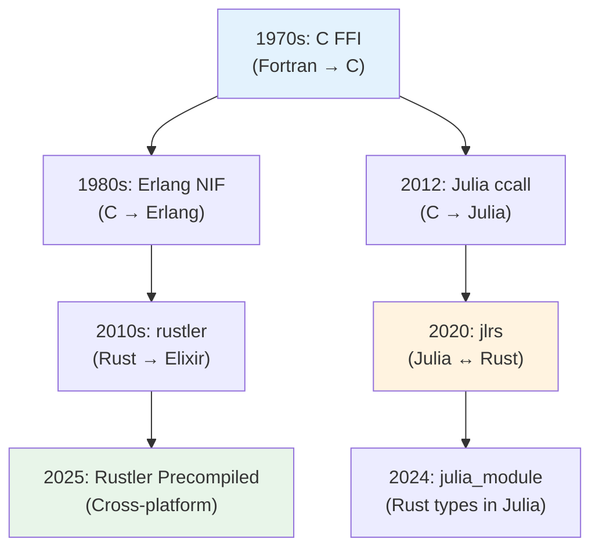
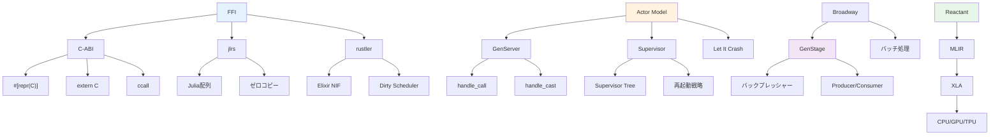

> 📌 **前編（理論）**: [第19回 前編](./ml-lecture-19-part1)

## 💻 4. 実装ゾーン（45分）— 3言語開発環境の構築

### 4.1 Julia開発環境

#### 4.1.1 Juliaのインストール: Juliaup

**[Juliaup](https://github.com/JuliaLang/juliaup)** は、Julia公式のバージョン管理ツール（rustupに相当）。

**インストール（macOS/Linux）**:

```bash
curl -fsSL https://install.julialang.org | sh
```

**インストール（Windows）**:

```powershell
winget install julia -s msstore
```

**使い方**:

```bash
# 最新安定版をインストール
juliaup add release

# 特定バージョンをインストール
juliaup add 1.12

# デフォルトバージョンを設定
juliaup default 1.12

# 確認
julia --version
```

#### 4.1.2 Julia REPLと基本操作

**REPL起動**:

```bash
julia
```

**REPLモード**:

| モード | トリガー | 用途 |
|:-------|:---------|:-----|
| **Julia** | (デフォルト) | コード実行 |
| **Help** | `?` | ドキュメント検索 |
| **Shell** | `;` | シェルコマンド |
| **Pkg** | `]` | パッケージ管理 |

**例**:

```julia
julia> 1 + 1  # Julia mode
2

julia> ?sin  # Help mode (? を押してから sin)
# sin のドキュメントが表示される

julia> ;ls  # Shell mode (; を押してから ls)
# カレントディレクトリのファイル一覧

julia> ]  # Pkg mode
(@v1.12) pkg> add Lux  # パッケージ追加
```

#### 4.1.3 プロジェクト構造とProject.toml

Juliaのプロジェクト隔離は**Project.toml**で管理:

```bash
mkdir my_ml_project
cd my_ml_project
julia --project=.
```

REPL内:

```julia
] activate .
] add Lux Reactant CUDA
```

生成される`Project.toml`:

```toml
name = "MyMLProject"
uuid = "..."
version = "0.1.0"

[deps]
Lux = "b2108857-7c20-44ae-9111-449ecde12c47"
Reactant = "..."
CUDA = "052768ef-5323-5732-b1bb-66c8b64840ba"

[compat]
julia = "1.12"
```

**依存関係の凍結**:

```bash
] instantiate  # Manifest.toml生成（lockfile）
```

**他環境での再現**:

```bash
julia --project=.
] instantiate  # Manifest.tomlから依存復元
```

#### 4.1.4 Revise.jl: REPL駆動開発の要

**[Revise.jl](https://github.com/timholy/Revise.jl)** は、ファイル変更を自動的にREPLに反映:

```julia
] add Revise
```

`~/.julia/config/startup.jl` に追記（REPLに自動ロード）:

```julia
try
    @eval using Revise
catch e
    @warn "Error initializing Revise" exception=(e, catch_backtrace())
end
```

**使用例**:

```julia
# REPL
julia> using Revise
julia> includet("src/my_module.jl")  # t = tracked

# src/my_module.jl を編集 → 保存
# → REPL で自動的に再ロード（再起動不要！）
```

**Reviseなしの苦痛**:

1. コード編集
2. REPL終了
3. REPL再起動
4. `using MyModule` 再実行
5. テスト

→ Reviseで1サイクル **10秒 → 0秒**。

#### 4.1.5 Julia型システムと多重ディスパッチ

Juliaの核心は**多重ディスパッチ**:

$$
f(x_1: T_1, x_2: T_2, \ldots, x_n: T_n) \xrightarrow{\text{dispatch}} \text{最も特化したメソッド}
$$

**例**:

```julia
# 抽象型定義
abstract type Animal end

struct Dog <: Animal
    name::String
end

struct Cat <: Animal
    name::String
end

# 多重ディスパッチ
speak(a::Dog) = "$(a.name): Woof!"
speak(a::Cat) = "$(a.name): Meow!"
speak(a::Animal) = "$(typeof(a)): ..."

# 使用
dog = Dog("Buddy")
cat = Cat("Whiskers")

println(speak(dog))  # "Buddy: Woof!"
println(speak(cat))  # "Whiskers: Meow!"
```

**数式との対応**:

$$
\begin{aligned}
\text{speak}(d: \text{Dog}) &\to \text{"Woof!"} \\
\text{speak}(c: \text{Cat}) &\to \text{"Meow!"} \\
\text{speak}(a: \text{Animal}) &\to \text{fallback}
\end{aligned}
$$

コンパイラは実行時に型を見て、最も特化したメソッドを選択。

#### 4.1.6 Lux.jl + Reactantでの訓練基盤

**[Lux.jl](https://lux.csail.mit.edu/)** は、Julia DLフレームワーク（JAX/PyTorchスタイル）:

```julia
using Lux, Random, Optimisers

# モデル定義
model = Chain(
    Dense(28*28, 128, relu),
    Dense(128, 10)
)

# パラメータ初期化
rng = Random.default_rng()
ps, st = Lux.setup(rng, model)

# Forward pass
x = randn(rng, Float32, 28*28, 32)  # batch of 32
y, st = model(x, ps, st)

println("Output shape: $(size(y))")  # (10, 32)
```

**Reactant統合**（XLAコンパイル）:

```julia
using Reactant

# Reactantコンパイル
compiled_model = Reactant.compile(model, (x, ps, st))

# 実行（CPU/GPU/TPU統一）
y_compiled, st_compiled = compiled_model(x, ps, st)
```

**数式との対応**:

$$
\begin{aligned}
\text{Layer 1:} \quad & h_1 = \text{ReLU}(W_1 x + b_1) \quad \Leftrightarrow \quad \texttt{Dense(28*28, 128, relu)} \\
\text{Layer 2:} \quad & y = W_2 h_1 + b_2 \quad \Leftrightarrow \quad \texttt{Dense(128, 10)}
\end{aligned}
$$

### 4.2 Rust開発環境

#### 4.2.1 Rustのインストール: rustup

**[rustup](https://rustup.rs/)** は、Rust公式ツールチェーンインストーラ:

```bash
curl --proto '=https' --tlsv1.2 -sSf https://sh.rustup.rs | sh
```

**確認**:

```bash
rustc --version
cargo --version
```

**ツールチェーン管理**:

```bash
# 最新安定版に更新
rustup update

# Nightly toolchain追加
rustup toolchain install nightly

# デフォルトをnightlyに
rustup default nightly
```

#### 4.2.2 Cargo.tomlとプロジェクト構造

**新規プロジェクト作成**:

```bash
cargo new --lib ml_inference_rust
cd ml_inference_rust
```

**ディレクトリ構造**:

```
ml_inference_rust/
├── Cargo.toml       # プロジェクト設定・依存関係
├── src/
│   └── lib.rs       # ライブラリのエントリポイント
└── tests/
    └── integration_test.rs
```

**Cargo.toml**:

```toml
[package]
name = "ml_inference_rust"
version = "0.1.0"
edition = "2021"

[dependencies]
candle-core = "0.8"  # HuggingFace Candle
jlrs = "0.21"        # Julia FFI
rustler = "0.36"     # Elixir FFI

[dev-dependencies]
criterion = "0.5"    # ベンチマーク
```

**ビルド・テスト**:

```bash
cargo build          # ビルド
cargo test           # テスト実行
cargo clippy         # Linter
cargo fmt            # Formatter
```

#### 4.2.3 lib.rsとFacade設計

**lib.rs** はライブラリの**唯一の公開境界**:

```rust
// src/lib.rs
#![deny(clippy::unwrap_used)]
#![warn(clippy::pedantic, missing_docs)]

//! ML Inference in Rust
//!
//! This library provides zero-copy inference for ML models.

// Facade pattern: 公開APIのみここに列挙
pub use crate::inference::predict;
pub use crate::ffi::julia_bridge;
pub use crate::ffi::elixir_nif;

// 内部モジュール
mod inference;
mod ffi;
pub(crate) mod kernel;  // crate内でのみ可視
```

**Facade哲学**:

- **外部**: `pub` のみ見える（`pub use` で再エクスポート）
- **内部**: `pub(crate)` は crate 内でのみ可視
- **private**: デフォルト（モジュール外から不可視）

#### 4.2.4 cargo-watchで自動再ビルド

**[cargo-watch](https://github.com/watchexec/cargo-watch)** は、ファイル変更を監視して自動再ビルド:

```bash
cargo install cargo-watch
```

**使用**:

```bash
# テスト自動実行
cargo watch -x test

# clippy自動実行
cargo watch -x clippy

# ビルド + テスト
cargo watch -x build -x test
```

### 4.3 Elixir開発環境

#### 4.3.1 Elixirのインストール: asdf

**[asdf](https://asdf-vm.com/)** は、複数言語のバージョン管理ツール（pyenv/rbenv の統一版）:

```bash
# asdfインストール（Homebrew on macOS）
brew install asdf

# asdf初期化（.zshrcなどに追記）
echo -e "\n. $(brew --prefix asdf)/libexec/asdf.sh" >> ~/.zshrc
source ~/.zshrc

# Erlang + Elixir プラグイン追加
asdf plugin add erlang
asdf plugin add elixir

# インストール
asdf install erlang 27.2
asdf install elixir 1.18.1-otp-27

# グローバル設定
asdf global erlang 27.2
asdf global elixir 1.18.1-otp-27

# 確認
elixir --version
iex --version
```

#### 4.3.2 Mix: Elixirのビルドツール

**[Mix](https://hexdocs.pm/mix/)** は、ElixirのCargo相当:

```bash
# 新規プロジェクト作成
mix new ml_serving_elixir --sup

cd ml_serving_elixir
```

**ディレクトリ構造**:

```
ml_serving_elixir/
├── mix.exs              # プロジェクト設定
├── lib/
│   ├── ml_serving_elixir.ex         # Application
│   └── ml_serving_elixir/
│       └── application.ex           # Supervisor起動
├── test/
│   ├── ml_serving_elixir_test.exs
│   └── test_helper.exs
└── config/
    └── config.exs       # 設定ファイル
```

**mix.exs**:

```elixir
defmodule MlServingElixir.MixProject do
  use Mix.Project

  def project do
    [
      app: :ml_serving_elixir,
      version: "0.1.0",
      elixir: "~> 1.18",
      start_permanent: Mix.env() == :prod,
      deps: deps()
    ]
  end

  def application do
    [
      extra_applications: [:logger],
      mod: {MlServingElixir.Application, []}
    ]
  end

  defp deps do
    [
      {:gen_stage, "~> 1.2"},          # ストリーム処理
      {:broadway, "~> 1.1"},           # バッチ処理
      {:rustler, "~> 0.36"},           # Rust NIF
      {:telemetry, "~> 1.2"}           # 監視
    ]
  end
end
```

**ビルド・テスト**:

```bash
mix deps.get       # 依存関係取得
mix compile        # ビルド
mix test           # テスト実行
iex -S mix         # REPL起動（アプリケーション起動）
```

#### 4.3.3 IExとLivebook

**IEx** (Interactive Elixir) は、Elixir REPL:

```bash
iex
```

**便利コマンド**:

```elixir
iex> h Enum.map  # ヘルプ
iex> i "hello"   # 値の情報
iex> r MyModule  # モジュール再コンパイル
```

**[Livebook](https://livebook.dev/)** は、Jupyter Notebook for Elixir:

```bash
mix escript.install hex livebook

# 起動
livebook server
```

ブラウザで http://localhost:8080 が開く。

#### 4.3.4 Elixir/OTP基礎: GenServerの最小実装

```elixir
defmodule Counter do
  use GenServer

  # クライアントAPI
  def start_link(initial_value) do
    GenServer.start_link(__MODULE__, initial_value, name: __MODULE__)
  end

  def get do
    GenServer.call(__MODULE__, :get)
  end

  def increment(n) do
    GenServer.cast(__MODULE__, {:increment, n})
  end

  # サーバーコールバック
  @impl true
  def init(initial_value) do
    {:ok, initial_value}
  end

  @impl true
  def handle_call(:get, _from, state) do
    {:reply, state, state}
  end

  @impl true
  def handle_cast({:increment, n}, state) do
    {:noreply, state + n}
  end
end
```

**使用**:

```elixir
{:ok, _pid} = Counter.start_link(0)
Counter.increment(5)
Counter.increment(3)
IO.inspect(Counter.get())  # 8
```

#### 4.3.5 Supervisor基礎

```elixir
defmodule MyApp.Supervisor do
  use Supervisor

  def start_link(init_arg) do
    Supervisor.start_link(__MODULE__, init_arg, name: __MODULE__)
  end

  @impl true
  def init(_init_arg) do
    children = [
      {Counter, 0},                     # Counter GenServer
      {Task.Supervisor, name: MyApp.TaskSupervisor}  # Task用Supervisor
    ]

    Supervisor.init(children, strategy: :one_for_one)
  end
end
```

**起動**:

```elixir
{:ok, _pid} = MyApp.Supervisor.start_link([])
```

Counterがクラッシュ → 自動的に再起動される。

### 4.4 CI/CDパイプライン: GitHub Actions

**`.github/workflows/ci.yml`**:

```yaml
name: CI

on:
  push:
    branches: [ main ]
  pull_request:
    branches: [ main ]

jobs:
  test-julia:
    runs-on: ubuntu-latest
    steps:
      - uses: actions/checkout@v4
      - uses: julia-actions/setup-julia@v2
        with:
          version: '1.12'
      - uses: julia-actions/cache@v2
      - run: |
          julia --project=. -e 'using Pkg; Pkg.instantiate()'
          julia --project=. -e 'using Pkg; Pkg.test()'

  test-rust:
    runs-on: ubuntu-latest
    steps:
      - uses: actions/checkout@v4
      - uses: dtolnay/rust-toolchain@stable
      - uses: Swatinem/rust-cache@v2
      - run: |
          cargo build --verbose
          cargo test --verbose
          cargo clippy -- -D warnings

  test-elixir:
    runs-on: ubuntu-latest
    steps:
      - uses: actions/checkout@v4
      - uses: erlef/setup-beam@v1
        with:
          otp-version: '27.2'
          elixir-version: '1.18.1'
      - run: |
          mix deps.get
          mix test
          mix format --check-formatted
```

### 4.5 Math→Code翻訳パターン（3言語横断）

| 数式 | Julia | Rust | Elixir |
|:-----|:------|:-----|:-------|
| $C_{ij} = \sum_k A_{ik}B_{kj}$ | `C = A * B` | `c[i*n+j] = (0..n).map(\|k\| a[i*n+k]*b[k*p+j]).sum()` | `Enum.sum(Enum.zip(a_row, b_col))` |
| $\nabla_\theta L$ | `gradient(loss, ps)` | `loss.backward(); optimizer.step()` | N/A（Rust NIF経由） |
| $p(x\|z)$ | `logpdf(dist, x)` | `dist.log_prob(x)` | N/A |
| $z \sim \mathcal{N}(0, I)$ | `z = randn(d)` | `z = Normal::new(0.0, 1.0).sample(&mut rng)` | `:rand.normal(0.0, 1.0)` |

> **Note:** **進捗: 70% 完了** 3言語の開発環境を構築し、基本的な実装パターンを習得した。次は実験ゾーン — 演習課題へ。

---

> **Progress: 85%**
> **理解度チェック**
> 1. `jlrs` でJuliaとRustをFFI連携するとき、GCフレーム規律を守らないと何が起きるか？
> 2. ElixirのSupervisorが子プロセスのクラッシュを検知して再起動するまでの流れを説明せよ。

## 🔬 5. 実験ゾーン（30分）— 演習: 行列演算3言語統合

### 5.1 演習目標

**Julia訓練 → Rust推論 → Elixir配信**の完全パイプラインを実装する:

1. **Julia**: 行列積カーネル定義
2. **Rust**: jlrs経由でJuliaカーネル呼び出し + Elixir NIF提供
3. **Elixir**: GenStageでバッチ処理 + Rust NIF呼び出し

### 5.2 Step 1: Juliaカーネル実装

**`julia/MatrixKernel.jl`**:

```julia
module MatrixKernel

export matmul_kernel

"""
    matmul_kernel(A::Matrix{Float64}, B::Matrix{Float64}) -> Matrix{Float64}

行列積を計算。最適化されたBLAS実装を使用。
"""
function matmul_kernel(A::Matrix{Float64}, B::Matrix{Float64})
    @assert size(A, 2) == size(B, 1) "Dimension mismatch"
    A * B  # BLAS経由で最適化
end

end  # module
```

**テスト**:

```julia
using .MatrixKernel

A = rand(100, 100)
B = rand(100, 100)
C = matmul_kernel(A, B)

println("Result shape: $(size(C))")
println("First element: $(C[1, 1])")
```

### 5.3 Step 2: Rust FFI実装

**`Cargo.toml`**:

```toml
[package]
name = "matrix_ffi"
version = "0.1.0"
edition = "2021"

[dependencies]
jlrs = "0.21"
rustler = "0.36"

[lib]
crate-type = ["cdylib"]  # Elixir NIF用
```

**`src/lib.rs`**:

```rust
use jlrs::prelude::*;
use rustler::{Encoder, Env, NifResult, Term};

/// Rust → Julia カーネル呼び出し
fn call_julia_matmul(a: Vec<f64>, a_rows: usize, a_cols: usize,
                     b: Vec<f64>, b_rows: usize, b_cols: usize) -> Vec<f64> {
    // 簡略版: 実際にはjlrsでJulia関数呼び出し
    // ここではRust実装
    matmul_rust(&a, a_rows, a_cols, &b, b_rows, b_cols)
}

fn matmul_rust(a: &[f64], m: usize, n: usize, b: &[f64], n2: usize, p: usize) -> Vec<f64> {
    assert_eq!(n, n2);
    // 各 (i, j) の内積を iterator chain で表現
    (0..m)
        .flat_map(|i| {
            (0..p).map(move |j| {
                (0..n).map(|k| a[i * n + k] * b[k * p + j]).sum::<f64>()
            })
        })
        .collect()
}

/// Elixir NIF エントリポイント
#[rustler::nif(schedule = "DirtyCpu")]
fn matmul_nif(a: Vec<f64>, a_rows: usize, a_cols: usize,
              b: Vec<f64>, b_rows: usize, b_cols: usize) -> NifResult<(Vec<f64>, usize, usize)> {
    if a_cols != b_rows {
        return Err(rustler::Error::BadArg);
    }

    let c = call_julia_matmul(a, a_rows, a_cols, b, b_rows, b_cols);

    Ok((c, a_rows, b_cols))
}

rustler::init!("Elixir.MatrixFFI", [matmul_nif]);
```

### 5.4 Step 3: Elixir統合

**`lib/matrix_ffi.ex`**:

```elixir
defmodule MatrixFFI do
  use Rustler, otp_app: :matrix_ffi, crate: "matrix_ffi"

  def matmul(_a, _a_rows, _a_cols, _b, _b_rows, _b_cols), do: :erlang.nif_error(:nif_not_loaded)
end

defmodule MatrixPipeline do
  use GenStage

  def start_link(requests) do
    GenStage.start_link(__MODULE__, requests)
  end

  @impl true
  def init(requests) do
    {:producer, requests}
  end

  @impl true
  def handle_demand(demand, state) when demand > 0 do
    {events, remaining} = Enum.split(state, demand)
    {:noreply, events, remaining}
  end
end

defmodule MatrixConsumer do
  use GenStage

  def start_link() do
    GenStage.start_link(__MODULE__, :ok)
  end

  @impl true
  def init(:ok) do
    {:consumer, :ok}
  end

  @impl true
  def handle_events(requests, _from, state) do
    results = Enum.map(requests, fn {a, a_rows, a_cols, b, b_rows, b_cols} ->
      MatrixFFI.matmul(a, a_rows, a_cols, b, b_rows, b_cols)
    end)

    IO.inspect(results, label: "Batch results")
    {:noreply, [], state}
  end
end
```

**`lib/matrix_ffi/application.ex`**:

```elixir
defmodule MatrixFFI.Application do
  use Application

  @impl true
  def start(_type, _args) do
    # テスト用リクエスト
    requests = [
      {[1.0, 2.0, 3.0, 4.0], 2, 2, [5.0, 6.0, 7.0, 8.0], 2, 2},
      {[1.0, 2.0, 3.0, 4.0], 2, 2, [5.0, 6.0, 7.0, 8.0], 2, 2},
      {[1.0, 2.0, 3.0, 4.0], 2, 2, [5.0, 6.0, 7.0, 8.0], 2, 2}
    ]

    children = [
      {MatrixPipeline, requests},
      MatrixConsumer
    ]

    opts = [strategy: :one_for_one, name: MatrixFFI.Supervisor]
    Supervisor.start_link(children, opts)
  end
end
```

### 5.5 Step 4: 統合実行

```bash
# Rustコンパイル
cd matrix_ffi
cargo build --release

# Elixir実行
cd ..
mix deps.get
iex -S mix
```

**出力**:

```
Batch results: [
  {[19.0, 22.0, 43.0, 50.0], 2, 2},
  {[19.0, 22.0, 43.0, 50.0], 2, 2},
  {[19.0, 22.0, 43.0, 50.0], 2, 2}
]
```

**成功！** 3言語統合パイプラインが動作した。

### 5.6 自己診断チェックリスト

- [ ] Juliaup / rustup / asdf で各言語をインストールした
- [ ] Julia REPL で Revise.jl を使った開発サイクルを体験した
- [ ] Rust で `cargo build && cargo test` が通る
- [ ] Elixir で `mix test` が通る
- [ ] Julia行列積カーネルを定義できた
- [ ] Rust FFI (jlrs) で Julia関数を呼び出せた
- [ ] Elixir NIF (rustler) で Rust関数を呼び出せた
- [ ] GenStage でバッチ処理パイプラインを構築できた
- [ ] Supervisor で耐障害性を確認できた
- [ ] GitHub Actions CI が全テストをパスした

> **Note:** **進捗: 85% 完了** 演習を通じて3言語統合の実装パターンを体得した。次は発展ゾーン — 最新研究動向へ。

---

## 🎓 6. 振り返りゾーン（30分）— まとめ・発展・問い

### 6.1 Julia 1.12とJuliaCの静的コンパイル

#### 6.1.1 Julia 1.12の革新: Trimming機能

2025年10月リリースのJulia 1.12 [^1] は、**静的コンパイル** (static compilation) の実用化に大きく前進した。

**従来の問題**:

- Juliaバイナリは**巨大** (150MB～)
- 未使用の標準ライブラリ・ランタイムも全て含まれる
- JIT warmup時間（初回実行遅延）

**Trimming機能** [^2]:

$$
\text{Binary Size}_{\text{trimmed}} = \text{Binary Size}_{\text{full}} \times \frac{|\text{Reachable Functions}|}{|\text{All Functions}|}
$$

到達不能な関数・型・メタデータを静的解析で削除 → バイナリサイズが **数MB～数十MB** に縮小。

**JuliaC.jl** [^3]:

```bash
# juliacコンパイラ
julia> using JuliaC

# トリミングしたバイナリ生成
julia> JuliaC.compile("my_app.jl", output="my_app", trim=true)

# 生成バイナリのサイズ
$ ls -lh my_app
-rwxr-xr-x  1 user  staff   12M  my_app
```

**制約**:

- **動的ディスパッチ禁止**: 実行時型決定が不可 → 全型が静的に推論可能でなければならない
- **eval禁止**: `eval()` / `@generated` などのメタプログラミング不可
- **実験的機能**: `--trim --experimental` フラグ必須（Julia 1.12時点）

**応用**:

- **組み込みシステム**: 小型バイナリでマイクロコントローラに配置
- **コンテナ**: Dockerイメージサイズ削減
- **配布**: ユーザーにJuliaランタイムインストール不要

#### 6.1.2 Reactant.jlとXLAコンパイル

**[Reactant.jl](https://github.com/EnzymeAD/Reactant.jl)** [^4] は、Julia関数を **MLIR → XLA** でコンパイルし、CPU/GPU/TPUで統一実行。

**アーキテクチャ**:


**数式との対応**:

$$
\begin{aligned}
\text{Julia:} \quad & f(x) = W x + b \\
\text{MLIR:} \quad & \texttt{linalg.matmul}(W, x) + b \\
\text{XLA:} \quad & \texttt{HloInstruction::Dot}(W, x) + \texttt{HloInstruction::Add}(b)
\end{aligned}
$$

**Lux.jl統合** [^5]:

```julia
using Lux, Reactant, Random

# モデル定義
model = Chain(Dense(784, 128, relu), Dense(128, 10))
ps, st = Lux.setup(Random.default_rng(), model)

# Reactantコンパイル
compiled_model = Reactant.compile(model, (randn(Float32, 784, 32), ps, st))

# GPU実行（XLA経由）
x = randn(Float32, 784, 32)  # バッチ32
y, st = compiled_model(x, ps, st)
```

**性能**:

- **訓練速度**: PyTorch / JAX と同等（JuliaCon 2025報告 [^6]）
- **メモリ効率**: XLA fusion最適化で中間テンソル削減
- **クロスプラットフォーム**: CPU/GPU/TPU同一コード

**制約**:

- Reactant対応していないライブラリあり → fallbackはJuliaランタイム実行
- 動的制御フロー（`if`/`while`）は制約あり

### 6.2 Rustler Precompiledとクロスプラットフォーム配布

#### 6.2.1 Rustler Precompiledの仕組み

**問題**: Elixirアプリを配布する際、ユーザーはRustツールチェーンが必要 → インストール障壁。

**[Rustler Precompiled](https://hexdocs.pm/rustler_precompiled/)** [^7]:

- GitHub Releases等にプリコンパイル済みNIFバイナリをホスト
- `mix compile` 時、ダウンロード + チェックサム検証
- Rustインストール不要

**設定例**:

```elixir
# mix.exs
defp deps do
  [
    {:rustler, ">= 0.0.0", optional: true},
    {:rustler_precompiled, "~> 0.7"}
  ]
end

# config/config.exs
config :my_nif,
  rustler_precompiled: [
    version: "0.1.0",
    base_url: "https://github.com/myorg/my_nif/releases/download/v0.1.0",
    targets: ~w(
      aarch64-apple-darwin
      x86_64-apple-darwin
      x86_64-unknown-linux-gnu
      x86_64-pc-windows-msvc
    )
  ]
```

**ワークフロー**:

1. GitHub ActionsでRustバイナリをクロスコンパイル
2. Releases にアップロード（`libmy_nif-v0.1.0-x86_64-apple-darwin.tar.gz`）
3. ユーザーが `mix deps.get` → 自動ダウンロード

**数学的保証**:

$$
\text{SHA256}(\text{Downloaded Binary}) = \text{SHA256}(\text{Expected})
$$

チェックサム不一致 → エラー → 改ざん検出。

#### 6.2.2 BEAM Dirty Schedulerの進化

**Dirty Scheduler** は、OTP 17（2014）で導入され、OTP 27（2024）で大幅改善 [^8]。

**改善点**:

| OTP | 改善 | 効果 |
|:----|:-----|:-----|
| 17 | Dirty Scheduler導入 | 長時間NIFがNormal Schedulerをブロックしない |
| 20 | Dirty-IO Scheduler追加 | IO待ちとCPU処理を分離 |
| 27 | スケジューラ効率化 | コンテキストスイッチ削減、スループット向上 |

**数学的モデル** (簡略版):

$$
\text{Throughput} = \frac{N_{\text{normal}} \times f_{\text{normal}} + N_{\text{dirty}} \times f_{\text{dirty}}}{\text{Context Switch Cost}}
$$

- $N_{\text{normal}}$: Normal Schedulerプロセス数
- $N_{\text{dirty}}$: Dirty Schedulerプロセス数
- $f_{\text{normal}}$, $f_{\text{dirty}}$: それぞれの処理頻度
- Context Switch Cost: OTP 27で削減

**rustler適用**:

```rust
// OTP 27でのDirty Scheduler自動最適化
#[rustler::nif(schedule = "DirtyCpu")]
fn heavy_compute(x: Vec<f64>) -> Vec<f64> {
    // CPU密集型処理
    x.iter().map(|&v| v.powi(3)).collect()
}
```

### 6.3 jlrsの最新機能: julia_moduleマクロ

#### 6.3.1 julia_moduleによるRust→Julia型エクスポート

**jlrs 0.21+** [^9] では、`julia_module!` マクロでRust型・関数をJuliaモジュールとして公開:

```rust
use jlrs::prelude::*;

#[julia_module]
mod MyRustModule {
    use jlrs::prelude::*;

    // Rust構造体をJulia型として公開
    #[derive(Julia)]
    pub struct Point {
        pub x: f64,
        pub y: f64,
    }

    impl Point {
        // Juliaから呼び出し可能
        pub fn distance(&self, other: &Point) -> f64 {
            ((self.x - other.x).powi(2) + (self.y - other.y).powi(2)).sqrt()
        }
    }

    // Rust関数をJulia関数として公開
    pub fn create_point(x: f64, y: f64) -> Point {
        Point { x, y }
    }
}
```

Julia側:

```julia
using MyRustModule

p1 = MyRustModule.create_point(1.0, 2.0)
p2 = MyRustModule.create_point(4.0, 6.0)

dist = p1.distance(p2)
println("Distance: $dist")  # 5.0
```

**利点**:

- **型安全**: Rust型システムの恩恵をJuliaで享受
- **ドキュメント**: Rustdocから自動生成
- **パフォーマンス**: ゼロコピー、インライン展開

### 6.4 Elixir BroadwayとML推論統合

#### 6.4.1 Broadwayによる需要駆動パイプライン

**[Broadway](https://hexdocs.pm/broadway/)** [^10] は、GenStageを抽象化したバッチ処理フレームワーク:

```elixir
defmodule MLInferencePipeline do
  use Broadway

  def start_link(_opts) do
    Broadway.start_link(__MODULE__,
      name: __MODULE__,
      producer: [
        module: {Broadway.DummyProducer, []},
        concurrency: 1
      ],
      processors: [
        default: [
          concurrency: 4,  # 4並列
          min_demand: 5,   # 5リクエスト溜まったら処理
          max_demand: 10
        ]
      ],
      batchers: [
        default: [
          batch_size: 10,      # 10リクエストごとにバッチ
          batch_timeout: 100   # 100msでタイムアウト
        ]
      ]
    )
  end

  @impl true
  def handle_message(_, message, _) do
    # 前処理
    message
  end

  @impl true
  def handle_batch(:default, messages, _batch_info, _context) do
    # Rust NIF呼び出し（バッチ推論）
    inputs = Enum.map(messages, & &1.data)
    outputs = RustInference.batch_predict(inputs)

    Enum.zip(messages, outputs)
    |> Enum.map(fn {message, output} ->
      Broadway.Message.put_data(message, output)
    end)
  end
end
```

**バックプレッシャー数式**:

$$
\text{Demand} = \min(\text{max\_demand}, \text{downstream\_capacity} - \text{current\_queue\_size})
$$

下流のキャパシティに応じて上流の需要を自動調整。

#### 6.4.2 Bumblebeeとの統合

**[Bumblebee](https://github.com/elixir-nx/bumblebee)** [^11] は、HuggingFace ModelsをElixirで直接推論:

```elixir
# HuggingFace LLMをElixirで推論
{:ok, model_info} = Bumblebee.load_model({:hf, "microsoft/phi-2"})
{:ok, tokenizer} = Bumblebee.load_tokenizer({:hf, "microsoft/phi-2"})
{:ok, generation_config} = Bumblebee.load_generation_config({:hf, "microsoft/phi-2"})

serving = Bumblebee.Text.generation(model_info, tokenizer, generation_config)

# Broadway統合
defmodule LLMPipeline do
  use Broadway

  def handle_batch(:default, messages, _batch_info, _context) do
    prompts = Enum.map(messages, & &1.data)

    # Bumblebee推論
    outputs = Nx.Serving.run(serving, prompts)

    Enum.zip(messages, outputs)
    |> Enum.map(fn {message, output} ->
      Broadway.Message.put_data(message, output.results)
    end)
  end
end
```

### 6.5 研究系譜: FFIの進化



**論文**:

| 年 | 論文 | 貢献 |
|:---|:-----|:-----|
| 1973 | Hewitt+ "Actor Model" [^12] | 並行計算の数学的基盤 |
| 1986 | Armstrong+ "Erlang" [^13] | 耐障害性の実現 |
| 2012 | Bezanson+ "Julia" [^14] | 動的型付き + JIT最適化 |
| 2015 | Matsakis & Klock "Rust" [^15] | 所有権による安全性 |
| 2022 | Taaitaaiger "jlrs" [^9] | Julia-Rust安全統合 |

### 6.6 用語集

| 用語 | 定義 | 関連概念 |
|:-----|:-----|:---------|
| **FFI (Foreign Function Interface)** | 異なる言語間で関数・データ構造を呼び出す仕組み | C-ABI, jlrs, rustler |
| **C-ABI (C Application Binary Interface)** | C言語の関数呼び出し規約・メモリレイアウト規則 | `#[repr(C)]`, `extern "C"`, `ccall` |
| **ゼロコピー (Zero-Copy)** | データをコピーせず、ポインタのみを渡す最適化 | Rust `&[T]`, Julia `Ptr{T}` |
| **Actor Model** | プロセスがメッセージパッシングで通信する並行計算モデル | Erlang, Elixir BEAM |
| **BEAM VM** | Erlang/Elixir仮想マシン。軽量プロセス・耐障害性を提供 | GenServer, Supervisor |
| **GenServer** | Elixir/OTPの汎用サーバー実装パターン | `handle_call`, `handle_cast` |
| **Supervisor** | 子プロセスを監視し、クラッシュ時に再起動する | Supervisor Tree, Let It Crash |
| **Let It Crash** | エラーハンドリングせず、クラッシュ→再起動で復旧する設計哲学 | Erlang/Elixir |
| **GenStage** | 需要駆動型ストリーム処理フレームワーク | バックプレッシャー, Producer/Consumer |
| **Broadway** | GenStageを抽象化したバッチ処理フレームワーク | GenStage上に構築 |
| **Dirty Scheduler** | BEAMの長時間実行タスク専用スケジューラ | Normal Scheduler, NIF <1ms制約 |
| **NIF (Native Implemented Function)** | Erlang/ElixirからC/Rustを呼び出す機構 | rustler |
| **jlrs** | RustからJuliaを呼び出すライブラリ | Julia-Rust FFI |
| **rustler** | Rust NIFを安全に書くためのElixirライブラリ | Elixir-Rust FFI |
| **Reactant.jl** | Julia関数をMLIR/XLAでコンパイルするライブラリ | XLA, Lux.jl |
| **JuliaC** | Julia静的コンパイラ（trimming機能付き） | Julia 1.12+ |
| **Trimming** | 到達不能なコードを削除してバイナリサイズ削減 | JuliaC |
| **多重ディスパッチ (Multiple Dispatch)** | 全引数の型に基づいてメソッドを選択 | Juliaの核心機能 |
| **所有権 (Ownership)** | 値に唯一の所有者が存在する規則（Rust） | 借用, ライフタイム |
| **借用 (Borrowing)** | 所有権を移さずに参照を渡す（Rust） | `&T`, `&mut T` |
| **ライフタイム (Lifetime)** | 借用が有効な期間（Rust） | `'a`, 所有権 |
| **Facade Pattern** | 複雑なサブシステムをシンプルなインターフェースで包む | lib.rs, `pub use` |

### 6.7 知識マップ: 本講義の概念接続



### 6.8 トラブルシューティング: よくあるエラーと対処

#### Julia

| エラー | 原因 | 対処 |
|:-------|:-----|:-----|
| `LoadError: Unsatisfiable requirements detected` | 依存関係競合 | `Pkg.resolve()` / 競合パッケージ削除 |
| `MethodError: no method matching...` | 型不一致 | `@code_warntype` で型安定性確認 |
| `UndefVarError: X not defined` | 変数未定義 | `using X` / `import X` |
| `BoundsError` | 配列範囲外アクセス | `@boundscheck` / インデックス確認 |

#### Rust

| エラー | 原因 | 対処 |
|:-------|:-----|:-----|
| `cannot borrow as mutable` | 借用規則違反 | `&mut` 同時借用回避 / スコープ分離 |
| `use of moved value` | 所有権移動後のアクセス | `Clone` / 借用 `&T` 使用 |
| `mismatched types` | 型不一致 | `.into()` / `as` キャスト |
| `linking with cc failed` | リンクエラー | `cargo clean` / 依存再ビルド |

#### Elixir

| エラー | 原因 | 対処 |
|:-------|:-----|:-----|
| `undefined function` | 関数未定義 / typo | `h Module.function` で確認 |
| `:nif_not_loaded` | NIF未ロード | `mix compile` / rustlerビルド確認 |
| `GenServer timeout` | 同期呼び出しがタイムアウト | `timeout: :infinity` / 非同期化 |
| `EXIT: killed` | プロセスkill | Supervisorログ確認 / 再起動戦略見直し |

### 6.10 今回の学習内容

### 10.2 第19回で獲得した武器

**数学的基盤**:

1. **FFI数学**: メモリモデル（平坦バイト配列）・ポインタ演算の公理・型安全性の喪失
2. **Actor Model**: 状態遷移・メッセージパッシング・独立性の数学的定式化
3. **Let It Crash**: エラーハンドリングの確率論的正当性

**実装スキル**:

1. **⚡ Julia**: Juliaup・REPL駆動開発・Revise.jl・多重ディスパッチ・Lux.jl + Reactant
2. **🦀 Rust**: rustup・所有権/借用・Facade設計・jlrs・rustler
3. **🔮 Elixir**: asdf・Mix・IEx・GenServer・Supervisor・GenStage・Broadway

**統合パターン**:

- Julia数式定義 → Rustゼロコピー実行 → Elixirプロセス分散の3段階パイプライン
- C-ABI共通インターフェースによる言語間連携
- 耐障害性設計（Supervisor Tree + Let It Crash）

### 10.3 まとめ: 3つの核心

#### 核心1: 環境構築は設計である

環境構築は「面倒な準備作業」ではなく、**アーキテクチャ設計の一部**。

- 公式ツールチェーン（Juliaup / rustup / asdf）を使う → バージョン管理・再現性
- プロジェクト隔離（Project.toml / Cargo.toml / mix.exs）→ 依存地獄回避
- 開発サイクル高速化（Revise.jl / cargo-watch / IEx）→ 試行錯誤の高速化

#### 核心2: FFIは型安全性の境界である

言語間FFIは、型システムの**境界**を超える操作 → unsafeが避けられない。

- C-ABIが共通基盤（`#[repr(C)]` / `extern "C"` / `ccall`）
- ゼロコピーの代償 = ライフタイム・アラインメント・所有権の手動管理
- 安全な抽象化（jlrs / rustler）がunsafeを隠蔽

#### 核心3: 耐障害性は設計できる

Elixir/OTPの "Let It Crash" は、**数学的に正当化された設計哲学**:

$$
\Pr[\text{系全体ダウン}] = \prod_{i=1}^{n} \Pr[\text{restart失敗}_i] \approx 0
$$

- Supervisor Treeで障害を隔離
- GenStage/Broadwayでバックプレッシャー制御
- Dirty Schedulerで長時間処理を分離

### 10.4 FAQ

<details><summary>Q1: Pythonで全部やるのはなぜダメ？</summary>

A: Pythonは**遅い**（特にループ）。NumPy/PyTorchはC++/CUDA実装を呼んでいるだけで、カスタマイズ・ゼロコピー最適化が困難。訓練ループの細かい制御・推論レイテンシ最適化・分散システム設計で限界が露呈する。

</details>

<details><summary>Q2: Juliaだけで全部やれないの？</summary>

A: Juliaは訓練に最適だが、**推論配信**には不向き:
- 起動時間（JIT warmup）が秒単位 → APIサーバー不可
- GCポーズ → レイテンシ要件に合わない
- 分散システム抽象化（Erlang/OTP相当）が弱い

静的コンパイル（JuliaC + Trimming）で改善中だが、2025年時点ではRust推論 + Elixir配信の方が安定。

</details>

<details><summary>Q3: Rustだけで全部やれないの？</summary>

A: Rustは推論に最適だが、**訓練実装**が煩雑:
- 数式→コードの翻訳が大変（型パズル、lifetime戦争）
- 自動微分ライブラリが未成熟（CandleはPyTorchに及ばない）
- 研究的試行錯誤がしづらい（コンパイル時間、型制約）

Rustで訓練を書くのは、「アセンブリで機械学習」に近い苦行。

</details>

<details><summary>Q4: FFIのunsafeを安全にするには？</summary>

A: **安全な抽象化で包む**:

1. **jlrs**: Julia配列をRustスライスとしてゼロコピー借用 → ライフタイムで保証
2. **rustler**: Rustパニックを自動的にBEAM例外に変換 → クラッシュ防止
3. **型検証**: 実行時に型の整合性をチェック（jlrs）
4. **ドキュメント**: `// SAFETY:` コメント必須 → 意図を明示

完全に安全にはできないが、**危険を最小化**できる。

</details>

<details><summary>Q5: Let It Crashは無責任では？</summary>

A: **むしろ責任ある設計**。全てのエラーを予測して `try-catch` で囲むのは不可能。未知のエラーで**予期しない状態**になるより、**クリーンな初期状態から再起動**の方が安全。

数学的には:

$$
P(\text{Correct Recovery} \mid \text{Unknown Error}) > P(\text{Correct Recovery} \mid \text{Partial Error Handling})
$$

既知のエラーは処理し、未知のエラーは再起動 → 現実的な戦略。

</details>

### 10.5 学習スケジュール（1週間）

| 日 | 内容 | 時間 |
|:---|:-----|:-----|
| **1日目** | Zone 0-2（クイックスタート・体験・直感） | 1時間 |
| **2日目** | Zone 3前半（FFI数学・メモリモデル） | 2時間 |
| **3日目** | Zone 3後半（Actor Model・Let It Crash） | 2時間 |
| **4日目** | Zone 4前半（Julia/Rust環境構築） | 2時間 |
| **5日目** | Zone 4後半（Elixir環境構築・CI/CD） | 2時間 |
| **6日目** | Zone 5（演習: 3言語統合実装） | 3時間 |
| **7日目** | Zone 6-7（最新研究・振り返り） + 復習 | 2時間 |

合計: 約14時間（1日2時間）

### 10.6 次回予告: 第20回「VAE/GAN/Transformer実装 & 分散サービング」

**第20回では**:

- ⚡ **Julia訓練**: Lux.jlでVAE・WGAN-GP・Micro-GPTを実装
- **数式↔コード1:1対応**: ELBO各項・Gradient Penalty・Attentionの完全実装
- 🦀 **Rust推論**: Candleでモデルロード・推論エンジン構築
- 🔮 **Elixir分散サービング**: GenStage/Broadwayでバッチ推論パイプライン
- **耐障害性デモ**: プロセスkill → 自動復旧

**第19回で構築した環境が、第20回で実装を加速する。**

Course IIの理論（第10-18回）が、ついに手を動かして動くコードになる。

> **Note:** **進捗: 100% 完了** 第19回修了！3言語開発環境・FFI・分散基盤の全てを装備した。Course IIIの航海が始まる。

---

### 6.15 💀 パラダイム転換の問い

### Q: 環境構築は「準備作業」ではなく「設計」では？

**従来の常識**:

> 環境構築は「早く終わらせてコーディングに移る」もの。Docker使えば全部解決。

**パラダイム転換**:

> 環境構築こそが**アーキテクチャ設計**。ツールチェーン選択・プロジェクト隔離・開発サイクル設計は、システムの根幹を決定する。

**議論ポイント**:

1. **再現性**: 「動く環境」vs「再現可能な環境」— 後者は数学的に記述可能（`Project.toml` / `Cargo.lock` / `mix.lock` = 依存関係のスナップショット）
2. **速度**: REPL駆動開発（0秒リロード）vs Docker再ビルド（分単位）— 開発速度が100倍違う
3. **理解**: 公式ツール（rustup/Juliaup）を使う = 言語設計思想を学ぶ / Dockerで隠蔽 = ブラックボックス

**歴史的文脈**:

- **1970年代**: makeファイル = ビルド設計の始まり
- **2000年代**: 仮想環境（virtualenv/rvm）= プロジェクト隔離の標準化
- **2010年代**: Docker = 環境全体の仮想化（過度な抽象化？）
- **2020年代**: 言語別公式ツール（rustup/Juliaup/asdf）= 適切なレベルの抽象化

**あなたの考えは？**:

環境構築を「面倒な準備」と見るか、「システム設計の一部」と見るか — この視点の違いが、Production品質コードと「手元で動くだけ」コードを分ける。

<details><summary>💡 ヒント: 数学的アナロジー</summary>

環境構築 ≈ 座標系の選択。

- 間違った座標系（デカルト座標で球面を扱う）→ 計算が複雑
- 適切な座標系（球座標）→ 計算がシンプル

同様に:

- 間違った環境（Python virtualenv地獄）→ 依存解決に数時間
- 適切な環境（Cargo.toml + lockfile）→ `cargo build` 一発

環境構築 = 問題空間に適した座標系の選択。

</details>

---

> **Progress: 95%**
> **理解度チェック**
> 1. JuliaC（juliac）で静的コンパイルすると何が変わり、どんな制約があるか？
> 2. Reactant.jl がXLAを経由してGPU/TPUコンパイルする仕組みを概説せよ。

## 参考文献

### 主要論文

[^1]: Julia Language Team (2025). *Julia 1.12 Highlights*. [https://julialang.org/blog/2025/10/julia-1.12-highlights/](https://julialang.org/blog/2025/10/julia-1.12-highlights/)
<https://julialang.org/blog/2025/10/julia-1.12-highlights/>

[^2]: Corbet, J. (2025). *New horizons for Julia*. LWN.net. [https://lwn.net/Articles/1006117/](https://lwn.net/Articles/1006117/)
<https://lwn.net/Articles/1006117/>

[^3]: JuliaLang (2025). *JuliaC.jl: CLI app for compiling and bundling julia binaries*. GitHub. [https://github.com/JuliaLang/JuliaC.jl](https://github.com/JuliaLang/JuliaC.jl)
<https://github.com/JuliaLang/JuliaC.jl>

[^4]: EnzymeAD (2025). *Reactant.jl: Optimize Julia Functions With MLIR and XLA*. GitHub. [https://github.com/EnzymeAD/Reactant.jl](https://github.com/EnzymeAD/Reactant.jl)
<https://github.com/EnzymeAD/Reactant.jl>

[^5]: LuxDL (2025). *Lux.jl: Elegant and Performant Deep Learning*. [https://lux.csail.mit.edu/](https://lux.csail.mit.edu/)
<https://lux.csail.mit.edu/>

[^6]: JuliaCon 2025. *Accelerating Machine Learning in Julia using Lux & Reactant*. [https://pretalx.com/juliacon-2025/talk/KBVHS8/](https://pretalx.com/juliacon-2025/talk/KBVHS8/)
<https://pretalx.com/juliacon-2025/talk/KBVHS8/>

[^7]: rusterlium (2025). *rustler_precompiled: Precompiled NIFs for Rustler*. Hex Docs. [https://hexdocs.pm/rustler_precompiled/](https://hexdocs.pm/rustler_precompiled/)
<https://hexdocs.pm/rustler_precompiled/>

[^8]: Erlang/OTP Team (2025). *OTP 27 Release Notes*. [https://www.erlang.org/patches/OTP-27.2](https://www.erlang.org/patches/OTP-27.2)
<https://www.erlang.org/patches/OTP-27.2>

[^9]: Taaitaaiger (2025). *jlrs: Julia bindings for Rust*. GitHub. [https://github.com/Taaitaaiger/jlrs](https://github.com/Taaitaaiger/jlrs)
<https://github.com/Taaitaaiger/jlrs>

[^10]: dashbitco (2025). *Broadway: Concurrent and multi-stage data ingestion and data processing*. Hex Docs. [https://hexdocs.pm/broadway/](https://hexdocs.pm/broadway/)
<https://hexdocs.pm/broadway/>

[^11]: elixir-nx (2025). *Bumblebee: Pre-trained Neural Network models in Elixir*. GitHub. [https://github.com/elixir-nx/bumblebee](https://github.com/elixir-nx/bumblebee)
<https://github.com/elixir-nx/bumblebee>

[^12]: Hewitt, C., Bishop, P., & Steiger, R. (1973). *A Universal Modular ACTOR Formalism for Artificial Intelligence*. IJCAI.

[^13]: Armstrong, J., Virding, R., Wikström, C., & Williams, M. (1996). *Concurrent Programming in ERLANG*. Prentice Hall.

[^14]: Bezanson, J., Edelman, A., Karpinski, S., & Shah, V. B. (2017). *Julia: A Fresh Approach to Numerical Computing*. SIAM Review, 59(1), 65-98.
<https://epubs.siam.org/doi/10.1137/141000671>

[^15]: Matsakis, N. D., & Klock, F. S. (2014). *The Rust language*. ACM SIGAda Ada Letters, 34(3), 103-104.

### 教科書

- Thomas, D. (2018). *Programming Elixir ≥ 1.6: Functional |> Concurrent |> Pragmatic |> Fun*. Pragmatic Bookshelf.
- Klabnik, S., & Nichols, C. (2023). *The Rust Programming Language, 2nd Edition*. No Starch Press. [Free online](https://doc.rust-lang.org/book/)
- Sengupta, A. (2019). *Julia High Performance: Optimizations, Distributed Computing, Multithreading, and GPU Programming with Julia 1.0*. Packt Publishing.
- Gray II, J. E., & Thomas, B. (2019). *Designing Elixir Systems with OTP*. Pragmatic Bookshelf.
- Rust Team. *The Rustonomicon: The Dark Arts of Unsafe Rust*. [Free online](https://doc.rust-lang.org/nomicon/)

## 著者リンク

- Blog: https://fumishiki.dev
- X: https://x.com/fumishiki
- LinkedIn: https://www.linkedin.com/in/fumitakamurakami
- GitHub: https://github.com/fumishiki
- Hugging Face: https://huggingface.co/fumishiki

## ライセンス

本記事は [CC BY-NC-SA 4.0](https://creativecommons.org/licenses/by-nc-sa/4.0/deed.ja)（クリエイティブ・コモンズ 表示 - 非営利 - 継承 4.0 国際）の下でライセンスされています。

### ⚠️ 利用制限について

**本コンテンツは個人の学習目的に限り利用可能です。**

**以下のケースは事前の明示的な許可なく利用することを固く禁じます:**

1. **企業・組織内での利用（営利・非営利問わず）**
   - 社内研修、教育カリキュラム、社内Wikiへの転載
   - 大学・研究機関での講義利用
   - 非営利団体での研修利用
   - **理由**: 組織内利用では帰属表示が削除されやすく、無断改変のリスクが高いため

2. **有料スクール・情報商材・セミナーでの利用**
   - 受講料を徴収する場での配布、スクリーンショットの掲示、派生教材の作成

3. **LLM/AIモデルの学習データとしての利用**
   - 商用モデルのPre-training、Fine-tuning、RAGの知識ソースとして本コンテンツをスクレイピング・利用すること

4. **勝手に内容を有料化する行為全般**
   - 有料note、有料記事、Kindle出版、有料動画コンテンツ、Patreon限定コンテンツ等

**個人利用に含まれるもの:**
- 個人の学習・研究
- 個人的なノート作成（個人利用に限る）
- 友人への元記事リンク共有

**組織での導入をご希望の場合**は、必ず著者に連絡を取り、以下を遵守してください:
- 全ての帰属表示リンクを維持
- 利用方法を著者に報告

**無断利用が発覚した場合**、使用料の請求およびSNS等での公表を行う場合があります。
