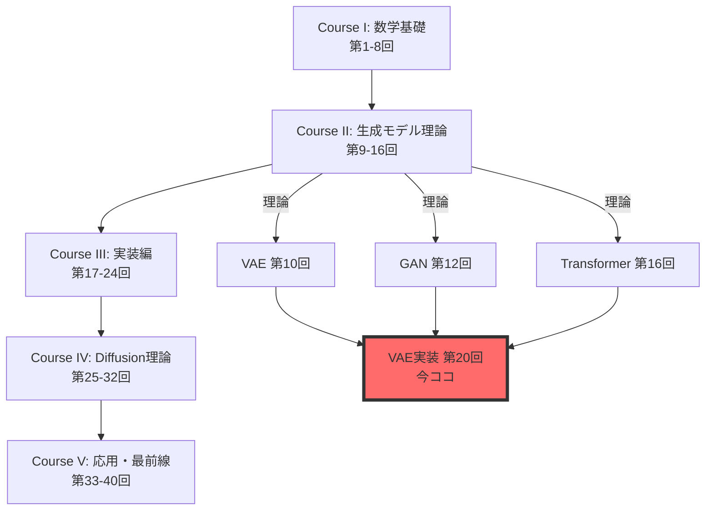
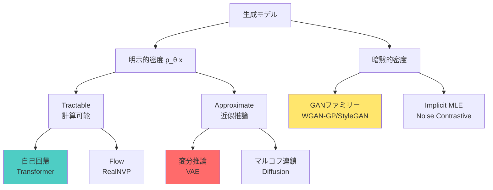
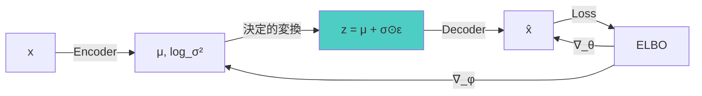
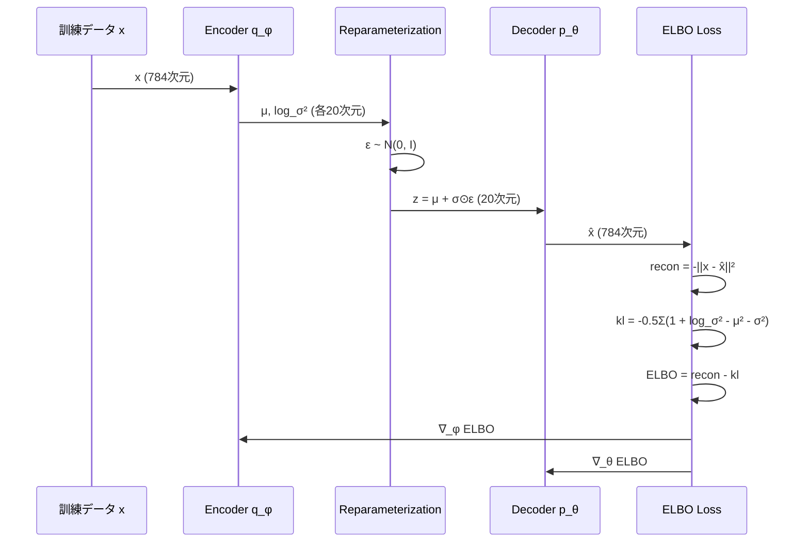
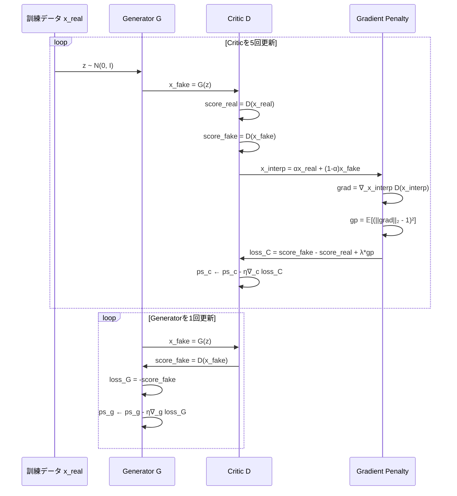
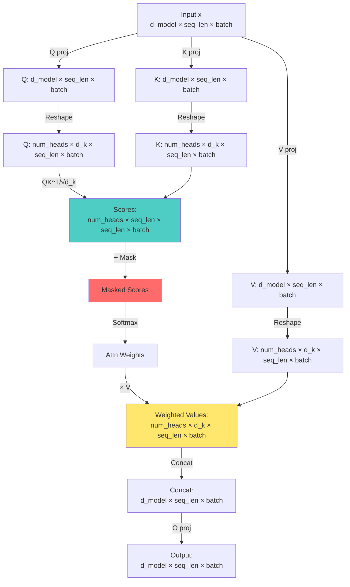

:::message
**前提知識**: 第19回で3言語環境とFFIパイプラインを構築済み。Course IIでVAE/GAN/Transformerの理論を習得済み。
**目標**: 理論を3言語パイプライン（Julia訓練→Rust推論→Elixir配信）で実装する。
**進捗**: 全体の80%完了
:::

## 🚀 0. クイックスタート（30秒）— 理論→実装の1行対応

第19回で環境を整えた。第10回でVAE、第12回でGAN、第16回でTransformerの**理論**を学んだ。今回はそれを**動かす**。

理論と実装の対応を体感しよう。VAEのELBOを1行で：

```julia
using Lux, Optimisers, Random

# VAE ELBO = 再構成項 - KL正則化項
function elbo_loss(encoder, decoder, ps_enc, ps_dec, st_enc, st_dec, x)
    # Encoder: q_φ(z|x) → (μ, log_σ²)
    (μ, logσ²), st_enc = encoder(x, ps_enc, st_enc)

    # Reparameterization: z = μ + σ⊙ε
    ε = randn(Float32, size(μ)...)
    σ = exp.(logσ² ./ 2)
    z = μ .+ σ .* ε

    # Decoder: p_θ(x|z) → x̂
    x̂, st_dec = decoder(z, ps_dec, st_dec)

    # ELBO = 𝔼[log p(x|z)] - KL[q(z|x) || p(z)]
    recon = -sum((x .- x̂).^2) / size(x, 2)  # 再構成項（ガウス尤度）
    kl = -0.5f0 * sum(1 .+ logσ² .- μ.^2 .- exp.(logσ²)) / size(x, 2)  # KL発散

    return -(recon - kl), (st_enc, st_dec)  # ELBOを最大化 = 負のELBOを最小化
end
```

**この30行が第10回の数式をすべて含む**：

$$
\mathcal{L}_{\text{ELBO}} = \mathbb{E}_{q_\phi(z|x)}[\log p_\theta(x|z)] - D_{\text{KL}}[q_\phi(z|x) \| p(z)]
$$

- 再パラメータ化トリック: $z = \mu + \sigma \odot \epsilon$（23行目）
- ガウスKL閉形式: $-\frac{1}{2}\sum(1 + \log\sigma^2 - \mu^2 - \sigma^2)$（28行目）
- 数式の各項がコードの各行に**1:1対応**

これがJuliaの威力。数式↔コードの距離がゼロ。

:::message
**進捗**: 全体の3%完了。理論を実装に翻訳する準備ができた。
:::

---

## 🎮 1. 体験ゾーン（10分）— 3モデルを触る

理論を復習しながら、3つのモデルを動かす。数式→コード対応を体感する。

### 1.1 VAE — 潜在空間で画像を圧縮・再構成

第10回で学んだVAEの核心：**観測データ $x$ を低次元潜在変数 $z$ に圧縮し、そこから再構成する**。

```julia
using Lux, MLUtils, MLDatasets, Optimisers

# MNIST データ読み込み
train_data = MNIST(split=:train)
x_train = Float32.(train_data.features) |> flatten_images  # (784, 60000)

# VAE アーキテクチャ
encoder = Chain(
    Dense(784 => 400, tanh),
    Dense(400 => 200, tanh),
    Dense(200 => 40)  # → [μ(20次元), log_σ²(20次元)]
)

decoder = Chain(
    Dense(20 => 200, tanh),
    Dense(200 => 400, tanh),
    Dense(400 => 784, sigmoid)  # sigmoid for pixel values [0,1]
)

# 訓練ループ（簡略版）
opt = Adam(0.001f0)
ps_enc, st_enc = Lux.setup(Random.default_rng(), encoder)
ps_dec, st_dec = Lux.setup(Random.default_rng(), decoder)

for epoch in 1:10
    for batch in DataLoader((x_train,), batchsize=128, shuffle=true)
        x = batch[1]
        loss, grads = Lux.Training.compute_gradients(
            AutoZygote(), elbo_loss, encoder, decoder, ps_enc, ps_dec, st_enc, st_dec, x
        )
        ps_enc, ps_dec = Optimisers.update!(opt, (ps_enc, ps_dec), grads)
    end
    println("Epoch $epoch: loss = $(loss)")
end

# 潜在空間でのサンプリング
z_random = randn(Float32, 20, 10)  # 10個のランダム潜在ベクトル
x_generated, _ = decoder(z_random, ps_dec, st_dec)
# → 新しい数字画像が生成される
```

| 数式 | コード | 意味 |
|:-----|:-------|:-----|
| $q_\phi(z\|x) = \mathcal{N}(z; \mu_\phi(x), \sigma^2_\phi(x)\mathbf{I})$ | `(μ, logσ²) = encoder(x)` | Encoderが平均と分散を出力 |
| $z = \mu + \sigma \odot \epsilon, \epsilon \sim \mathcal{N}(0, \mathbf{I})$ | `z = μ .+ σ .* randn(...)` | 再パラメータ化トリック |
| $p_\theta(x\|z) = \mathcal{N}(x; \mu_\theta(z), \mathbf{I})$ | `x̂ = decoder(z)` | Decoderが再構成画像を出力 |
| $D_{\text{KL}}[q_\phi(z\|x) \| \mathcal{N}(0, \mathbf{I})]$ | `-0.5 * sum(1 + logσ² - μ² - exp(logσ²))` | ガウスKL閉形式 |

**体感**：潜在空間 $z \in \mathbb{R}^{20}$ で784次元画像を表現。第10回の数式がそのまま動く。

---

### 1.2 GAN — 生成器と識別器の対決

第12回で学んだGANの核心：**Generator $G$ がノイズ $z$ から偽画像を生成し、Critic（識別器） $D$ が本物/偽物を見分ける競争**。

WGANの損失関数（第13回で学んだWasserstein距離ベース）：

$$
\mathcal{L}_D = \mathbb{E}_{x \sim p_r}[D(x)] - \mathbb{E}_{z \sim p_z}[D(G(z))] - \lambda \mathbb{E}_{\hat{x}}[(\|\nabla_{\hat{x}} D(\hat{x})\|_2 - 1)^2]
$$

$$
\mathcal{L}_G = -\mathbb{E}_{z \sim p_z}[D(G(z))]
$$

```julia
# Generator: z (100次元ノイズ) → 画像 (28×28)
generator = Chain(
    Dense(100 => 256, relu),
    Dense(256 => 512, relu),
    Dense(512 => 784, tanh)  # tanh for [-1, 1] pixel range
)

# Critic (WGAN-GPでは識別器を"Critic"と呼ぶ)
critic = Chain(
    Dense(784 => 512, leakyrelu),
    Dense(512 => 256, leakyrelu),
    Dense(256 => 1)  # スコア出力（確率ではない）
)

# WGAN-GP訓練ループ（簡略版）
function train_wgan_gp!(generator, critic, real_data, epochs=100, λ_gp=10.0f0)
    opt_g = Adam(0.0001f0, (0.5f0, 0.9f0))  # Generator optimizer
    opt_c = Adam(0.0001f0, (0.5f0, 0.9f0))  # Critic optimizer

    for epoch in 1:epochs
        for batch in DataLoader((real_data,), batchsize=64, shuffle=true)
            x_real = batch[1]
            batch_size = size(x_real, 2)

            # --- Criticを5回更新 ---
            for _ in 1:5
                z = randn(Float32, 100, batch_size)
                x_fake = generator(z, ps_g, st_g)[1]

                # Gradient Penalty 計算
                α = rand(Float32, 1, batch_size)
                x_interp = α .* x_real .+ (1 .- α) .* x_fake
                grad_interp = gradient(x -> sum(critic(x, ps_c, st_c)[1]), x_interp)[1]
                gp = mean((sqrt.(sum(grad_interp.^2, dims=1)) .- 1).^2)

                # Critic loss
                loss_c = mean(critic(x_fake, ps_c, st_c)[1]) - mean(critic(x_real, ps_c, st_c)[1]) + λ_gp * gp
                ps_c = update!(opt_c, ps_c, gradient(loss_c, ps_c)[1])
            end

            # --- Generatorを1回更新 ---
            z = randn(Float32, 100, batch_size)
            loss_g = -mean(critic(generator(z, ps_g, st_g)[1], ps_c, st_c)[1])
            ps_g = update!(opt_g, ps_g, gradient(loss_g, ps_g)[1])
        end
        println("Epoch $epoch: D_loss=$(loss_c), G_loss=$(loss_g)")
    end
end
```

| 数式 | コード | 意味 |
|:-----|:-------|:-----|
| $G(z)$ | `generator(z)` | ノイズ→偽画像 |
| $D(x)$ | `critic(x)` | 画像→スコア |
| $\hat{x} = \alpha x + (1-\alpha)G(z)$ | `x_interp = α .* x_real .+ (1 .- α) .* x_fake` | 本物と偽物の補間 |
| $\|\nabla_{\hat{x}} D(\hat{x})\|_2$ | `sqrt(sum(grad_interp.^2, dims=1))` | 勾配ノルム |
| $(\|\nabla_{\hat{x}} D(\hat{x})\|_2 - 1)^2$ | `(sqrt(...) .- 1).^2` | Gradient Penalty |

**体感**：Criticを5回、Generatorを1回更新（WGAN-GP推奨比率）。第12回・第13回の数式がそのまま動く。

---

### 1.3 Transformer — Attentionで次トークン予測

第16回で学んだTransformerの核心：**Multi-Head Attentionで文脈を並列処理し、次トークンを予測**。

Scaled Dot-Product Attentionの数式：

$$
\text{Attention}(Q, K, V) = \text{softmax}\left(\frac{QK^\top}{\sqrt{d_k}}\right)V
$$

```julia
using Lux, NNlib

# Multi-Head Attention レイヤー
struct MultiHeadAttention <: Lux.AbstractExplicitLayer
    num_heads::Int
    d_model::Int
    d_k::Int
    q_proj::Dense
    k_proj::Dense
    v_proj::Dense
    o_proj::Dense
end

function MultiHeadAttention(d_model::Int, num_heads::Int)
    d_k = d_model ÷ num_heads
    return MultiHeadAttention(
        num_heads, d_model, d_k,
        Dense(d_model => d_model),  # Q projection
        Dense(d_model => d_model),  # K projection
        Dense(d_model => d_model),  # V projection
        Dense(d_model => d_model)   # Output projection
    )
end

function (mha::MultiHeadAttention)(x, ps, st)
    batch_size, seq_len, _ = size(x)

    # Q, K, V projection
    Q, st_q = mha.q_proj(x, ps.q_proj, st.q_proj)
    K, st_k = mha.k_proj(x, ps.k_proj, st.k_proj)
    V, st_v = mha.v_proj(x, ps.v_proj, st.v_proj)

    # Reshape for multi-head: (batch, seq_len, d_model) → (batch, num_heads, seq_len, d_k)
    Q = reshape(Q, batch_size, mha.num_heads, seq_len, mha.d_k) |> permutedims([1,2,4,3])
    K = reshape(K, batch_size, mha.num_heads, seq_len, mha.d_k) |> permutedims([1,2,4,3])
    V = reshape(V, batch_size, mha.num_heads, seq_len, mha.d_k) |> permutedims([1,2,4,3])

    # Scaled Dot-Product Attention: softmax(QK^T / √d_k) V
    scores = batched_mul(Q, batched_transpose(K)) ./ sqrt(Float32(mha.d_k))  # (batch, heads, seq, seq)
    attn_weights = softmax(scores, dims=4)  # Softmax over key dimension
    out = batched_mul(attn_weights, V)  # (batch, heads, d_k, seq)

    # Concatenate heads and project
    out = permutedims(out, [1,4,2,3]) |> x -> reshape(x, batch_size, seq_len, mha.d_model)
    out, st_o = mha.o_proj(out, ps.o_proj, st.o_proj)

    return out, (st_q=st_q, st_k=st_k, st_v=st_v, st_o=st_o)
end

# Causal Mask（未来のトークンを見せない）
function causal_mask(seq_len)
    mask = triu(ones(Float32, seq_len, seq_len), 1)  # 上三角行列
    return mask .* -Inf32  # Softmax前に加算 → 未来トークンの重みを0に
end

# 使用例
x = randn(Float32, 2, 10, 512)  # (batch=2, seq_len=10, d_model=512)
mha = MultiHeadAttention(512, 8)
ps, st = Lux.setup(Random.default_rng(), mha)
y, st = mha(x, ps, st)  # y: (2, 10, 512) — 各トークンの新しい表現
```

| 数式 | コード | 意味 |
|:-----|:-------|:-----|
| $Q, K, V = xW_Q, xW_K, xW_V$ | `Q = mha.q_proj(x)` | 線形変換 |
| $\frac{QK^\top}{\sqrt{d_k}}$ | `scores = Q @ K.T / sqrt(d_k)` | スコア計算 |
| $\text{softmax}(\cdot)$ | `softmax(scores, dims=4)` | 注意重み正規化 |
| $\text{softmax}(\cdot)V$ | `attn_weights @ V` | 加重和 |
| Causal Mask | `scores + causal_mask` | 未来を見せない |

**体感**：Multi-Head Attentionが並列に複数の視点で文脈を捉える。第16回の数式がそのまま動く。

---

### 1.4 数式↔コード対応の完全性

3モデルで共通するパターン：

```julia
# 数式: 𝔼[f(z)] where z ~ q(z)
# コード: mean(f(z) for z in sample(q, n_samples))

# 数式: ∇_θ L(θ)
# コード: gradient(θ -> L(θ), θ)

# 数式: θ ← θ - η∇_θ L
# コード: θ = update!(optimizer, θ, grads)
```

Juliaの利点：
- `.=` broadcast演算子 → 要素ごとの演算を1行で
- `|>` pipe演算子 → データフロー明示
- 型安定性 → `@code_warntype`で型推論チェック → 自動最適化

次のZone 2で、なぜこの3モデルを実装するのか、全体像を見る。

:::message
**進捗**: 全体の10%完了。3モデルの動作を体感した。
:::

---
## 🧩 2. 直感ゾーン（15分）— なぜこの3モデルか

### 2.1 Course IIIの位置づけ — 理論→実装の橋渡し



**Course IIで学んだこと**（理論）：
- 第10回：VAEのELBO導出、再パラメータ化トリック、ガウスKL閉形式
- 第12回：GANのMinimax損失、JSD、Mode Collapse問題
- 第13回：Optimal TransportとWasserstein距離、WGAN-GP
- 第16回：TransformerのAttention機構、Positional Encoding、Causal Mask

**Course IIIで学ぶこと**（実装）：
- 第19回：3言語環境構築（Julia/Rust/Elixir）、FFIパイプライン設計
- **第20回（今回）**：VAE/GAN/Transformerの完全実装、数式↔コード1:1対応
- 第21回：データサイエンス基礎、HuggingFace Datasets統合
- 第22回：評価指標実装（FID/IS/Perplexity）、モデル選択

**今回の差別化**：
- **松尾・岩澤研究室との違い**：彼らは理論講義で実装は課題。本シリーズは**理論と実装の両方を網羅**。
- **他のチュートリアルとの違い**：PyTorch/TensorFlowに閉じない。**3言語パイプライン**（訓練→推論→配信）で実戦スキルを獲得。
- **論文実装との違い**：単なる写経ではない。**数式の各項とコードの各行を1:1対応**させ、理解を深める。

---

### 2.2 なぜVAE/GAN/Transformerか — 3大パラダイムの代表

| モデル | パラダイム | 訓練方法 | 強み | 弱み |
|:-------|:-----------|:---------|:-----|:-----|
| **VAE** | 尤度ベース（明示的密度） | ELBO最大化 | 安定訓練、潜在空間解釈可能 | ぼやけた生成、表現力制約 |
| **GAN** | 暗黙的密度（Adversarial） | Minimax競争 | 鮮明な生成、高品質画像 | 訓練不安定、Mode Collapse |
| **Transformer** | 自己回帰（明示的密度） | 次トークン予測MLE | スケーリング、汎用性 | 逐次生成、計算コスト |

**3つの生成パラダイム**（第7回で学んだ分類）：



**なぜこの3つを選んだか**：
1. **VAE**：変分推論の実装パターンを習得。ELBOは他の多くのモデル（Diffusion/Flow）の基礎。
2. **GAN**：Adversarial訓練の実装パターンを習得。安定化テクニック（WGAN-GP）は必須スキル。
3. **Transformer**：自己回帰モデルの実装パターンを習得。LLM時代の必須知識。KV-Cacheは推論効率化の鍵。

これら3つをマスターすれば、他のモデル（Diffusion/Flow/VQ-VAE）の実装も理解できる。

---

### 2.3 3言語パイプラインの全体像


**各言語の役割**（第19回で設計）：

| 段階 | 言語 | 理由 | ツール |
|:-----|:-----|:-----|:-------|
| 訓練 | ⚡ Julia | 数式↔コード1:1、JIT高速化、REPLループ | Lux.jl, Reactant |
| 推論 | 🦀 Rust | ゼロコピー、型安全、並列処理、C-ABI FFI | Candle, ndarray |
| 配信 | 🔮 Elixir | 耐障害性、バックプレッシャー、監視ツリー | GenStage, Broadway |

**なぜ3言語か**：
- **Python 1言語では不可能**：GILボトルネック、メモリコピー、型安全性欠如、耐障害性弱い
- **PyTorchだけでは不十分**：訓練は得意だが、推論最適化・分散配信は苦手
- **各言語が最適領域を担当**：Julia（訓練）、Rust（推論）、Elixir（配信）の分業で、各段階で最高性能を達成

**今回の実装範囲**：
- Zone 3（数式修行）：VAE/GAN/TransformerのJulia訓練実装、数式↔コード完全対応
- Zone 4（実装）：Rust推論エンジン、Candleでのモデルロード・バッチ処理
- Zone 5（実験）：Elixir分散サービング、Broadway需要駆動パイプライン、耐障害性デモ

---

### 2.4 学習戦略 — 数式→コード→システム設計

**推奨学習順序**：
1. Zone 3: 数式を1行ずつ導出、Juliaコードと対応付け
2. Zone 4: Julia訓練→Rust推論→Elixir配信の順で実装
3. Zone 5: 実際に動かし、耐障害性をデモ

**本講義の目標到達点**：
- [ ] VAE/GAN/TransformerのELBOを**紙で導出**できる
- [ ] Juliaで**ゼロから訓練ループ**を書ける
- [ ] Rustで**safetensorsをロード**し、推論できる
- [ ] Elixirで**Broadwayパイプライン**を構築できる
- [ ] プロセスをkillしても**自動復旧**するシステムを設計できる

:::message
**進捗**: 全体の20%完了。全体像を把握した。数式修行の準備ができた。
:::

---

## 📐 3. 数式修行ゾーン（60分）— VAE/GAN/Transformer完全導出

このゾーンは**最も重要**。理論（Course II）で学んだ数式を、実装と1:1対応させる。

### 3.1 VAE — ELBO完全分解と実装対応

**復習：VAEの目的**（第10回より）

観測データ $\mathbf{x}$ の尤度 $p_\theta(\mathbf{x})$ を最大化したいが、潜在変数 $\mathbf{z}$ を周辺化する積分が計算不能：

$$
p_\theta(\mathbf{x}) = \int p_\theta(\mathbf{x}|\mathbf{z})p(\mathbf{z})d\mathbf{z}
$$

そこで変分推論で近似事後分布 $q_\phi(\mathbf{z}|\mathbf{x})$ を導入し、ELBOを導出した。

---

#### 3.1.1 ELBO導出（復習）

第8回・第9回で学んだELBO導出を、実装と対応付けながら再確認。

**Step 1: 対数尤度の分解**

$$
\begin{align}
\log p_\theta(\mathbf{x})
&= \log \int p_\theta(\mathbf{x}, \mathbf{z})d\mathbf{z} \\
&= \log \int p_\theta(\mathbf{x}, \mathbf{z}) \frac{q_\phi(\mathbf{z}|\mathbf{x})}{q_\phi(\mathbf{z}|\mathbf{x})} d\mathbf{z} \\
&= \log \mathbb{E}_{q_\phi(\mathbf{z}|\mathbf{x})}\left[\frac{p_\theta(\mathbf{x}, \mathbf{z})}{q_\phi(\mathbf{z}|\mathbf{x})}\right]
\end{align}
$$

**Step 2: Jensenの不等式**（第6回で証明）

$\log$ は凹関数なので：

$$
\log \mathbb{E}[f(\mathbf{z})] \geq \mathbb{E}[\log f(\mathbf{z})]
$$

適用すると：

$$
\log p_\theta(\mathbf{x}) \geq \mathbb{E}_{q_\phi(\mathbf{z}|\mathbf{x})}\left[\log \frac{p_\theta(\mathbf{x}, \mathbf{z})}{q_\phi(\mathbf{z}|\mathbf{x})}\right] \equiv \mathcal{L}_{\text{ELBO}}(\theta, \phi; \mathbf{x})
$$

**Step 3: ELBO分解**

$$
\begin{align}
\mathcal{L}_{\text{ELBO}}
&= \mathbb{E}_{q_\phi}\left[\log p_\theta(\mathbf{x}, \mathbf{z}) - \log q_\phi(\mathbf{z}|\mathbf{x})\right] \\
&= \mathbb{E}_{q_\phi}\left[\log p_\theta(\mathbf{x}|\mathbf{z}) + \log p(\mathbf{z}) - \log q_\phi(\mathbf{z}|\mathbf{x})\right] \\
&= \mathbb{E}_{q_\phi}[\log p_\theta(\mathbf{x}|\mathbf{z})] - D_{\text{KL}}[q_\phi(\mathbf{z}|\mathbf{x}) \| p(\mathbf{z})]
\end{align}
$$

第1項：**再構成項**（Reconstruction term）
第2項：**KL正則化項**（KL Divergence regularization）

---

#### 3.1.2 再構成項の実装

**数式**：

$$
\mathbb{E}_{q_\phi(\mathbf{z}|\mathbf{x})}[\log p_\theta(\mathbf{x}|\mathbf{z})]
$$

Decoderが出力 $\hat{\mathbf{x}} = \mu_\theta(\mathbf{z})$ をガウス分布の平均とすると：

$$
p_\theta(\mathbf{x}|\mathbf{z}) = \mathcal{N}(\mathbf{x}; \mu_\theta(\mathbf{z}), \sigma^2\mathbf{I})
$$

対数尤度：

$$
\log p_\theta(\mathbf{x}|\mathbf{z}) = -\frac{1}{2\sigma^2}\|\mathbf{x} - \mu_\theta(\mathbf{z})\|^2 + \text{const}
$$

$\sigma^2 = 1$ と固定すると（実装上の簡略化）：

$$
\log p_\theta(\mathbf{x}|\mathbf{z}) \propto -\|\mathbf{x} - \hat{\mathbf{x}}\|^2
$$

**Juliaコード**：

```julia
# Decoder出力: x̂ = decoder(z)
x̂, st_dec = decoder(z, ps_dec, st_dec)

# 再構成項: -||x - x̂||² / batch_size
recon_term = -sum((x .- x̂).^2) / size(x, 2)
```

| 数式 | コード | 対応 |
|:-----|:-------|:-----|
| $\mu_\theta(\mathbf{z})$ | `decoder(z)` | Decoderの出力 |
| $\|\mathbf{x} - \mu_\theta(\mathbf{z})\|^2$ | `sum((x .- x̂).^2)` | 二乗誤差 |
| $\mathbb{E}_{q_\phi}[\cdot]$ | `/ size(x, 2)` | バッチ平均 |

---

#### 3.1.3 KL正則化項の実装 — ガウスKL閉形式

**数式**：

$$
D_{\text{KL}}[q_\phi(\mathbf{z}|\mathbf{x}) \| p(\mathbf{z})]
$$

仮定：
- $q_\phi(\mathbf{z}|\mathbf{x}) = \mathcal{N}(\mathbf{z}; \boldsymbol{\mu}_\phi(\mathbf{x}), \text{diag}(\boldsymbol{\sigma}^2_\phi(\mathbf{x})))$
- $p(\mathbf{z}) = \mathcal{N}(\mathbf{0}, \mathbf{I})$

**ガウスKL閉形式**（第4回で導出）：

$$
D_{\text{KL}}[\mathcal{N}(\boldsymbol{\mu}, \boldsymbol{\sigma}^2\mathbf{I}) \| \mathcal{N}(\mathbf{0}, \mathbf{I})] = \frac{1}{2}\sum_{i=1}^d (\mu_i^2 + \sigma_i^2 - \log\sigma_i^2 - 1)
$$

Encoderは $\log\sigma^2$ を出力すると便利（数値安定性）：

$$
D_{\text{KL}} = -\frac{1}{2}\sum_{i=1}^d (1 + \log\sigma_i^2 - \mu_i^2 - \sigma_i^2)
$$

**Juliaコード**：

```julia
# Encoder出力: (μ, log_σ²)
output, st_enc = encoder(x, ps_enc, st_enc)
μ = output[1:latent_dim, :]
logσ² = output[latent_dim+1:end, :]

# KL発散: -0.5 * Σ(1 + log_σ² - μ² - σ²) / batch_size
kl_term = -0.5f0 * sum(1 .+ logσ² .- μ.^2 .- exp.(logσ²)) / size(x, 2)
```

| 数式 | コード | 対応 |
|:-----|:-------|:-----|
| $\boldsymbol{\mu}_\phi(\mathbf{x})$ | `μ = output[1:d, :]` | Encoderの前半出力 |
| $\log\boldsymbol{\sigma}^2_\phi(\mathbf{x})$ | `logσ² = output[d+1:end, :]` | Encoderの後半出力 |
| $\mu_i^2$ | `μ.^2` | 要素ごとの二乗 |
| $\sigma_i^2 = \exp(\log\sigma_i^2)$ | `exp.(logσ²)` | 指数関数 |
| $\sum_{i=1}^d$ | `sum(...)` | 全要素の和 |

:::message alert
**注意**: $\log\sigma^2$ を出力する理由は数値安定性。直接 $\sigma$ を出力すると、勾配消失・爆発のリスクがある。
:::

---

#### 3.1.4 再パラメータ化トリック — 勾配を通す魔法

**問題**：$\mathbf{z} \sim q_\phi(\mathbf{z}|\mathbf{x})$ からサンプリングすると、確率的ノードで勾配が止まる。

**解決**：再パラメータ化トリック（Reparameterization Trick, 第10回で学んだ）

$$
\mathbf{z} = \boldsymbol{\mu}_\phi(\mathbf{x}) + \boldsymbol{\sigma}_\phi(\mathbf{x}) \odot \boldsymbol{\epsilon}, \quad \boldsymbol{\epsilon} \sim \mathcal{N}(\mathbf{0}, \mathbf{I})
$$

これで $\mathbf{z}$ は $\phi$ の決定的関数になり、勾配が通る。

**Juliaコード**：

```julia
# Reparameterization: z = μ + σ ⊙ ε
ε = randn(Float32, size(μ)...)
σ = exp.(logσ² ./ 2)  # σ = exp(log_σ² / 2) = √(σ²)
z = μ .+ σ .* ε
```

| 数式 | コード | 対応 |
|:-----|:-------|:-----|
| $\boldsymbol{\epsilon} \sim \mathcal{N}(\mathbf{0}, \mathbf{I})$ | `ε = randn(Float32, size(μ))` | 標準正規ノイズ |
| $\boldsymbol{\sigma} = \exp(\log\boldsymbol{\sigma}^2 / 2)$ | `σ = exp.(logσ² ./ 2)` | 標準偏差計算 |
| $\boldsymbol{\mu} + \boldsymbol{\sigma} \odot \boldsymbol{\epsilon}$ | `μ .+ σ .* ε` | 要素ごとの積と和 |

**勾配の流れ**：



再パラメータ化により、$\nabla_\phi \mathcal{L}_{\text{ELBO}}$ が計算可能になる。

---

#### 3.1.5 VAE完全実装 — 全てを統合

```julia
using Lux, Optimisers, Zygote, Random

# === モデル定義 ===
function create_vae(input_dim, latent_dim, hidden_dim)
    encoder = Chain(
        Dense(input_dim => hidden_dim, tanh),
        Dense(hidden_dim => hidden_dim÷2, tanh),
        Dense(hidden_dim÷2 => latent_dim*2)  # [μ, log_σ²]
    )

    decoder = Chain(
        Dense(latent_dim => hidden_dim÷2, tanh),
        Dense(hidden_dim÷2 => hidden_dim, tanh),
        Dense(hidden_dim => input_dim, sigmoid)  # [0, 1] pixel range
    )

    return encoder, decoder
end

# === ELBO損失関数 ===
function elbo_loss(encoder, decoder, ps_enc, ps_dec, st_enc, st_dec, x, latent_dim)
    # Encoder: q_φ(z|x) → (μ, log_σ²)
    output, st_enc = encoder(x, ps_enc, st_enc)
    μ = output[1:latent_dim, :]
    logσ² = output[latent_dim+1:end, :]

    # Reparameterization: z = μ + σ⊙ε
    ε = randn(Float32, size(μ)...)
    σ = exp.(logσ² ./ 2)
    z = μ .+ σ .* ε

    # Decoder: p_θ(x|z) → x̂
    x̂, st_dec = decoder(z, ps_dec, st_dec)

    # ELBO = 再構成項 - KL正則化項
    batch_size = size(x, 2)
    recon = -sum((x .- x̂).^2) / batch_size  # ガウス尤度
    kl = -0.5f0 * sum(1 .+ logσ² .- μ.^2 .- exp.(logσ²)) / batch_size

    elbo = recon - kl

    return -elbo, (st_enc, st_dec)  # 最大化 = 負の最小化
end

# === 訓練ループ ===
function train_vae!(encoder, decoder, train_data, latent_dim, epochs=100, lr=1e-3)
    # パラメータ初期化
    rng = Random.default_rng()
    ps_enc, st_enc = Lux.setup(rng, encoder)
    ps_dec, st_dec = Lux.setup(rng, decoder)

    # Optimizer
    opt_state_enc = Optimisers.setup(Adam(lr), ps_enc)
    opt_state_dec = Optimisers.setup(Adam(lr), ps_dec)

    for epoch in 1:epochs
        total_loss = 0.0f0

        for batch in DataLoader((train_data,), batchsize=128, shuffle=true)
            x = batch[1]

            # 勾配計算
            (loss, (st_enc, st_dec)), back = Zygote.pullback(
                (pe, pd) -> elbo_loss(encoder, decoder, pe, pd, st_enc, st_dec, x, latent_dim),
                ps_enc, ps_dec
            )
            grads_enc, grads_dec = back((one(loss), nothing))

            # パラメータ更新
            opt_state_enc, ps_enc = Optimisers.update(opt_state_enc, ps_enc, grads_enc)
            opt_state_dec, ps_dec = Optimisers.update(opt_state_dec, ps_dec, grads_dec)

            total_loss += loss
        end

        println("Epoch $epoch: ELBO loss = $(total_loss/length(train_data))")
    end

    return ps_enc, ps_dec, st_enc, st_dec
end

# === 使用例 ===
encoder, decoder = create_vae(784, 20, 400)
ps_enc, ps_dec, st_enc, st_dec = train_vae!(encoder, decoder, x_train, 20, epochs=50)
```

**全体の流れ**：



**訓練時のデバッグTips**：

```julia
# 損失が発散する場合のチェックリスト
function debug_vae_loss(encoder, decoder, ps_enc, ps_dec, st_enc, st_dec, x)
    # 1. Encoder出力の範囲チェック
    enc_out, _ = encoder(x, ps_enc, st_enc)
    μ = enc_out[1:20, :]
    logσ² = enc_out[21:end, :]

    println("μ range: [$(minimum(μ)), $(maximum(μ))]")  # 期待: [-3, 3]程度
    println("logσ² range: [$(minimum(logσ²)), $(maximum(logσ²))]")  # 期待: [-5, 5]程度

    # 2. σ²が極端に小さい/大きい場合はclip
    logσ² = clamp.(logσ², -10.0f0, 10.0f0)

    # 3. Decoder出力の範囲チェック
    z = μ .+ exp.(logσ² ./ 2) .* randn(Float32, size(μ)...)
    x̂, _ = decoder(z, ps_dec, st_dec)

    println("Decoder output range: [$(minimum(x̂)), $(maximum(x̂))]")  # 期待: [0, 1]

    # 4. KL項が負にならないことを確認
    kl = -0.5f0 * sum(1 .+ logσ² .- μ.^2 .- exp.(logσ²))
    println("KL term: $kl")  # 期待: ≥0 (負なら実装バグ)

    # 5. 各項のスケール確認
    recon = -sum((x .- x̂).^2) / size(x, 2)
    println("Recon: $recon, KL: $kl")
    # 期待: 同じオーダー（KLが極端に大きいとPosterior Collapse）
end
```

**Posterior Collapse対策**：

```julia
# KL Annealing: KL項の重みを徐々に増加
function kl_annealing_schedule(epoch, total_epochs, anneal_start=10, anneal_end=50)
    if epoch < anneal_start
        return 0.0f0
    elseif epoch > anneal_end
        return 1.0f0
    else
        return Float32((epoch - anneal_start) / (anneal_end - anneal_start))
    end
end

# 訓練ループで使用
for epoch in 1:epochs
    β_kl = kl_annealing_schedule(epoch, epochs)
    # loss = recon - β_kl * kl
end
```

---

### 3.2 GAN — WGAN-GP完全導出と実装対応

**復習：GANの目的**（第12回より）

Generator $G$ と Discriminator $D$ の2プレイヤーゲーム：

$$
\min_G \max_D \mathbb{E}_{\mathbf{x} \sim p_{\text{data}}}[\log D(\mathbf{x})] + \mathbb{E}_{\mathbf{z} \sim p_z}[\log(1 - D(G(\mathbf{z})))]
$$

問題点：
- 訓練不安定（振動・発散）
- Mode Collapse（多様性の欠如）
- 勾配消失（$D$ が強すぎると $G$ の勾配が消える）

解決策：**WGAN-GP**（Wasserstein GAN with Gradient Penalty, 第13回で学んだ）

---

#### 3.2.1 Wasserstein距離の導出（復習）

第13回で学んだWasserstein-1距離（Earth Mover's Distance）：

$$
W_1(p_r, p_g) = \inf_{\gamma \in \Pi(p_r, p_g)} \mathbb{E}_{(\mathbf{x}, \mathbf{y}) \sim \gamma}[\|\mathbf{x} - \mathbf{y}\|]
$$

Kantorovich-Rubinstein双対性（第13回で証明）：

$$
W_1(p_r, p_g) = \sup_{\|f\|_L \leq 1} \mathbb{E}_{\mathbf{x} \sim p_r}[f(\mathbf{x})] - \mathbb{E}_{\mathbf{x} \sim p_g}[f(\mathbf{x})]
$$

ここで $\|f\|_L \leq 1$ は1-Lipschitz連続制約。

**WGANの損失関数**：

$$
\mathcal{L}_D = \mathbb{E}_{\mathbf{x} \sim p_r}[D(\mathbf{x})] - \mathbb{E}_{\mathbf{z} \sim p_z}[D(G(\mathbf{z}))]
$$

$$
\mathcal{L}_G = -\mathbb{E}_{\mathbf{z} \sim p_z}[D(G(\mathbf{z}))]
$$

$D$ は"Critic"（識別器ではなく、スコア関数）。

---

#### 3.2.2 Gradient Penalty — Lipschitz制約の強制

**問題**：元のWGANはweight clippingで $\|f\|_L \leq 1$ を強制したが、容量低下・勾配消失を引き起こす。

**解決**：WGAN-GP（Gulrajani+ 2017 [^2]）はGradient Penaltyで制約：

$$
\|\nabla_{\hat{\mathbf{x}}} D(\hat{\mathbf{x}})\|_2 = 1
$$

を $\hat{\mathbf{x}} = \alpha \mathbf{x} + (1 - \alpha)G(\mathbf{z})$ （本物と偽物の補間点）で強制。

**WGAN-GP損失関数**：

$$
\mathcal{L}_D = \mathbb{E}_{\mathbf{z} \sim p_z}[D(G(\mathbf{z}))] - \mathbb{E}_{\mathbf{x} \sim p_r}[D(\mathbf{x})] + \lambda \mathbb{E}_{\hat{\mathbf{x}}}[(\|\nabla_{\hat{\mathbf{x}}} D(\hat{\mathbf{x}})\|_2 - 1)^2]
$$

第1項：偽物のスコア（最小化）
第2項：本物のスコア（最大化）
第3項：Gradient Penalty（勾配ノルムを1に近づける）

---

#### 3.2.3 Gradient Penalty の実装

**数式**：

$$
\text{GP} = \mathbb{E}_{\hat{\mathbf{x}}}[(\|\nabla_{\hat{\mathbf{x}}} D(\hat{\mathbf{x}})\|_2 - 1)^2]
$$

**Step 1: 補間点生成**

$$
\hat{\mathbf{x}} = \alpha \mathbf{x} + (1 - \alpha)G(\mathbf{z}), \quad \alpha \sim \text{Uniform}(0, 1)
$$

**Juliaコード**：

```julia
# 本物と偽物の補間
α = rand(Float32, 1, batch_size)
x_interp = α .* x_real .+ (1 .- α) .* x_fake
```

| 数式 | コード | 対応 |
|:-----|:-------|:-----|
| $\alpha \sim \text{Uniform}(0, 1)$ | `α = rand(Float32, 1, batch_size)` | 補間係数 |
| $\alpha \mathbf{x}$ | `α .* x_real` | broadcast乗算 |
| $(1 - \alpha)G(\mathbf{z})$ | `(1 .- α) .* x_fake` | broadcast減算・乗算 |

**Step 2: 勾配計算**

$$
\nabla_{\hat{\mathbf{x}}} D(\hat{\mathbf{x}})
$$

Juliaでは`Zygote.gradient`を使う：

```julia
# 補間点での勾配計算
grad_interp = Zygote.gradient(x -> sum(critic(x, ps_c, st_c)[1]), x_interp)[1]
```

**Step 3: 勾配ノルム計算**

$$
\|\nabla_{\hat{\mathbf{x}}} D(\hat{\mathbf{x}})\|_2 = \sqrt{\sum_i (\partial D / \partial \hat{x}_i)^2}
$$

```julia
# 勾配ノルム: √(Σ grad²) for each sample
grad_norm = sqrt.(sum(grad_interp.^2, dims=1))  # (1, batch_size)

# Gradient Penalty: 𝔼[(||∇D||₂ - 1)²]
gp = mean((grad_norm .- 1).^2)
```

| 数式 | コード | 対応 |
|:-----|:-------|:-----|
| $(\partial D / \partial \hat{x}_i)^2$ | `grad_interp.^2` | 勾配の二乗 |
| $\sum_i$ | `sum(..., dims=1)` | 各サンプルごとの和 |
| $\sqrt{\cdot}$ | `sqrt.(...)` | 平方根（broadcast） |
| $(\|\nabla D\|_2 - 1)^2$ | `(grad_norm .- 1).^2` | ペナルティ項 |
| $\mathbb{E}[\cdot]$ | `mean(...)` | バッチ平均 |

---

#### 3.2.4 WGAN-GP完全実装

```julia
using Lux, Optimisers, Zygote, Random

# === モデル定義 ===
function create_wgan_gp(latent_dim, img_dim, hidden_dim)
    generator = Chain(
        Dense(latent_dim => hidden_dim, relu),
        Dense(hidden_dim => hidden_dim*2, relu),
        Dense(hidden_dim*2 => img_dim, tanh)  # [-1, 1] range
    )

    critic = Chain(
        Dense(img_dim => hidden_dim*2, x -> leakyrelu(x, 0.2f0)),
        Dense(hidden_dim*2 => hidden_dim, x -> leakyrelu(x, 0.2f0)),
        Dense(hidden_dim => 1)  # スコア出力
    )

    return generator, critic
end

# === Critic損失（WGAN-GP） ===
function critic_loss(generator, critic, ps_g, ps_c, st_g, st_c, x_real, λ_gp=10.0f0)
    batch_size = size(x_real, 2)

    # 偽画像生成
    z = randn(Float32, size(ps_g)[1], batch_size)
    x_fake, st_g = generator(z, ps_g, st_g)

    # Criticスコア
    score_real, st_c_real = critic(x_real, ps_c, st_c)
    score_fake, st_c_fake = critic(x_fake, ps_c, st_c)

    # Wasserstein距離: 𝔼[D(fake)] - 𝔼[D(real)]
    wasserstein = mean(score_fake) - mean(score_real)

    # Gradient Penalty
    α = rand(Float32, 1, batch_size)
    x_interp = α .* x_real .+ (1 .- α) .* x_fake

    grad_interp = Zygote.gradient(x -> sum(critic(x, ps_c, st_c)[1]), x_interp)[1]
    grad_norm = sqrt.(sum(grad_interp.^2, dims=1))
    gp = mean((grad_norm .- 1).^2)

    loss = wasserstein + λ_gp * gp

    return loss, st_c
end

# === Generator損失（WGAN-GP） ===
function generator_loss(generator, critic, ps_g, ps_c, st_g, st_c, batch_size)
    # 偽画像生成
    z = randn(Float32, size(ps_g)[1], batch_size)
    x_fake, st_g = generator(z, ps_g, st_g)

    # Generatorの目的: Criticスコアを最大化
    score_fake, st_c = critic(x_fake, ps_c, st_c)
    loss = -mean(score_fake)

    return loss, st_g
end

# === 訓練ループ ===
function train_wgan_gp!(generator, critic, train_data, latent_dim, epochs=100, n_critic=5)
    rng = Random.default_rng()
    ps_g, st_g = Lux.setup(rng, generator)
    ps_c, st_c = Lux.setup(rng, critic)

    opt_g = Optimisers.setup(Adam(1e-4, (0.5, 0.9)), ps_g)
    opt_c = Optimisers.setup(Adam(1e-4, (0.5, 0.9)), ps_c)

    for epoch in 1:epochs
        for batch in DataLoader((train_data,), batchsize=64, shuffle=true)
            x_real = batch[1]

            # Criticを n_critic 回更新
            for _ in 1:n_critic
                (loss_c, st_c), back_c = Zygote.pullback(
                    pc -> critic_loss(generator, critic, ps_g, pc, st_g, st_c, x_real),
                    ps_c
                )
                grads_c = back_c((one(loss_c), nothing))[1]
                opt_c, ps_c = Optimisers.update(opt_c, ps_c, grads_c)
            end

            # Generatorを 1 回更新
            (loss_g, st_g), back_g = Zygote.pullback(
                pg -> generator_loss(generator, critic, pg, ps_c, st_g, st_c, size(x_real, 2)),
                ps_g
            )
            grads_g = back_g((one(loss_g), nothing))[1]
            opt_g, ps_g = Optimisers.update(opt_g, ps_g, grads_g)
        end

        println("Epoch $epoch: C_loss=$(loss_c), G_loss=$(loss_g)")
    end

    return ps_g, ps_c, st_g, st_c
end
```

**訓練ループの流れ**：



**重要なポイント**：
- Criticを$n_{\text{critic}}=5$回、Generatorを1回更新（WGAN-GP推奨比率）
- Gradient Penaltyの $\lambda=10$ はハイパーパラメータ（論文推奨値）
- Adamの $\beta_1=0.5$ はGAN訓練の安定化に有効（通常は0.9）

:::message
**ここが重要**: WGAN-GPの核心は「勾配ノルムを1に保つ」こと。これがLipschitz制約の実用的実装。
:::

---

### 3.3 Transformer — Multi-Head Attention完全導出

**復習：Transformerの目的**（第16回より）

自己回帰モデルとして次トークン予測：

$$
p(\mathbf{x}) = \prod_{t=1}^T p(x_t | x_{<t})
$$

RNN/LSTMの逐次処理を捨て、Attentionで並列処理。

---

#### 3.3.1 Scaled Dot-Product Attention導出

**Step 1: Attention機構の直感**

Query $\mathbf{q}$ と Key $\mathbf{k}_i$ の類似度でValue $\mathbf{v}_i$ を重み付け：

$$
\text{Attention}(\mathbf{q}, \{\mathbf{k}_i, \mathbf{v}_i\}) = \sum_{i} \alpha_i \mathbf{v}_i
$$

ここで $\alpha_i = \text{softmax}(\text{score}(\mathbf{q}, \mathbf{k}_i))$

**Step 2: スコア関数の選択**

内積スコア：

$$
\text{score}(\mathbf{q}, \mathbf{k}) = \mathbf{q}^\top \mathbf{k}
$$

問題：$d_k$ が大きいとスコアの分散が大きくなり、softmaxが飽和（勾配消失）。

解決：スケーリング

$$
\text{score}(\mathbf{q}, \mathbf{k}) = \frac{\mathbf{q}^\top \mathbf{k}}{\sqrt{d_k}}
$$

**Step 3: 行列形式**

Query行列 $Q \in \mathbb{R}^{n \times d_k}$、Key行列 $K \in \mathbb{R}^{m \times d_k}$、Value行列 $V \in \mathbb{R}^{m \times d_v}$ を使うと：

$$
\text{Attention}(Q, K, V) = \text{softmax}\left(\frac{QK^\top}{\sqrt{d_k}}\right)V
$$

ここで：
- $QK^\top \in \mathbb{R}^{n \times m}$：各QueryとKeyの類似度行列
- $\text{softmax}$：行ごとに正規化（各Queryが全Keyの重みを合計1に）
- 結果 $\in \mathbb{R}^{n \times d_v}$：各Queryに対する加重Valueの和

---

#### 3.3.2 Multi-Head Attention導出

**動機**：単一のAttentionでは表現力不足。複数の"視点"でAttentionを並列計算。

**Step 1: ヘッドの分割**

$d_{\text{model}}$ 次元を $h$ 個のヘッドに分割：

$$
d_k = d_v = \frac{d_{\text{model}}}{h}
$$

**Step 2: 各ヘッドで独立にAttention**

$$
\text{head}_i = \text{Attention}(QW_i^Q, KW_i^K, VW_i^V)
$$

ここで $W_i^Q, W_i^K, W_i^V \in \mathbb{R}^{d_{\text{model}} \times d_k}$ は学習可能な射影行列。

**Step 3: Concatenate and Project**

$$
\text{MultiHead}(Q, K, V) = \text{Concat}(\text{head}_1, \ldots, \text{head}_h)W^O
$$

ここで $W^O \in \mathbb{R}^{d_{\text{model}} \times d_{\text{model}}}$

**完全な数式**：

$$
\begin{align}
\text{MultiHead}(Q, K, V) &= \text{Concat}(\text{head}_1, \ldots, \text{head}_h)W^O \\
\text{head}_i &= \text{Attention}(QW_i^Q, KW_i^K, VW_i^V) \\
&= \text{softmax}\left(\frac{(QW_i^Q)(KW_i^K)^\top}{\sqrt{d_k}}\right)(VW_i^V)
\end{align}
$$

---

#### 3.3.3 Causal Mask — 未来を見せない

自己回帰モデルでは、時刻 $t$ のトークンは $t+1$ 以降を見てはいけない。

**Mask行列**：

$$
M_{ij} = \begin{cases}
0 & \text{if } i \geq j \\
-\infty & \text{if } i < j
\end{cases}
$$

Softmax前にスコアに加算：

$$
\text{Attention}(Q, K, V) = \text{softmax}\left(\frac{QK^\top}{\sqrt{d_k}} + M\right)V
$$

$M_{ij} = -\infty$ の部分は $\exp(-\infty) = 0$ になり、未来トークンの重みが0になる。

**Juliaコード**：

```julia
# Causal Mask生成
function causal_mask(seq_len)
    mask = triu(ones(Float32, seq_len, seq_len), 1)  # 上三角行列（対角より上）
    return mask .* -Inf32  # Softmax前に加算 → exp(-∞) = 0
end

# Attentionにマスク適用
scores = Q @ K' ./ sqrt(Float32(d_k))  # (seq_len, seq_len)
scores = scores .+ causal_mask(seq_len)  # 未来トークンを-∞に
attn_weights = softmax(scores, dims=2)  # 行ごとに正規化
output = attn_weights @ V
```

| 数式 | コード | 対応 |
|:-----|:-------|:-----|
| $QK^\top$ | `Q @ K'` | 行列積（`'`は転置） |
| $/\sqrt{d_k}$ | `./ sqrt(Float32(d_k))` | broadcast除算 |
| $M$ | `causal_mask(seq_len)` | マスク行列 |
| $\text{softmax}(\cdot + M)$ | `softmax(scores .+ mask, dims=2)` | 行ごとsoftmax |

---

#### 3.3.4 Multi-Head Attention完全実装

```julia
using Lux, NNlib, Random

# === Multi-Head Attention Layer ===
struct MultiHeadAttention <: Lux.AbstractExplicitLayer
    num_heads::Int
    d_model::Int
    d_k::Int
    q_proj::Dense
    k_proj::Dense
    v_proj::Dense
    o_proj::Dense
end

function MultiHeadAttention(d_model::Int, num_heads::Int)
    @assert d_model % num_heads == 0 "d_model must be divisible by num_heads"
    d_k = d_model ÷ num_heads

    return MultiHeadAttention(
        num_heads, d_model, d_k,
        Dense(d_model => d_model, use_bias=false),  # Q projection
        Dense(d_model => d_model, use_bias=false),  # K projection
        Dense(d_model => d_model, use_bias=false),  # V projection
        Dense(d_model => d_model, use_bias=false)   # Output projection
    )
end

function (mha::MultiHeadAttention)(x, ps, st; mask=nothing)
    # x: (d_model, seq_len, batch_size)
    d_model, seq_len, batch_size = size(x)

    # Linear projections: Q, K, V
    Q, st_q = mha.q_proj(x, ps.q_proj, st.q_proj)
    K, st_k = mha.k_proj(x, ps.k_proj, st.k_proj)
    V, st_v = mha.v_proj(x, ps.v_proj, st.v_proj)

    # Reshape for multi-head: (d_model, seq_len, batch) → (num_heads, d_k, seq_len, batch)
    Q = reshape(Q, mha.d_k, mha.num_heads, seq_len, batch_size) |> x -> permutedims(x, (2,1,3,4))
    K = reshape(K, mha.d_k, mha.num_heads, seq_len, batch_size) |> x -> permutedims(x, (2,1,3,4))
    V = reshape(V, mha.d_k, mha.num_heads, seq_len, batch_size) |> x -> permutedims(x, (2,1,3,4))

    # Scaled Dot-Product Attention for all heads
    # scores: (num_heads, seq_len, seq_len, batch)
    scores = batched_mul(batched_transpose(Q), K) ./ sqrt(Float32(mha.d_k))

    # Apply mask if provided
    if !isnothing(mask)
        scores = scores .+ reshape(mask, 1, seq_len, seq_len, 1)  # broadcast over heads and batch
    end

    # Softmax over keys dimension
    attn_weights = softmax(scores, dims=2)  # normalize over keys (dim 2)

    # Weighted sum of values
    out = batched_mul(V, attn_weights)  # (num_heads, d_k, seq_len, batch)

    # Concatenate heads: (num_heads, d_k, seq_len, batch) → (d_model, seq_len, batch)
    out = permutedims(out, (2,1,3,4)) |> x -> reshape(x, d_model, seq_len, batch_size)

    # Output projection
    out, st_o = mha.o_proj(out, ps.o_proj, st.o_proj)

    return out, (st_q=st_q, st_k=st_k, st_v=st_v, st_o=st_o)
end

# === Causal Mask ===
function causal_mask(seq_len)
    mask = triu(ones(Float32, seq_len, seq_len), 1)
    return mask .* -Inf32
end

# === 使用例 ===
d_model = 512
num_heads = 8
seq_len = 10
batch_size = 2

x = randn(Float32, d_model, seq_len, batch_size)
mha = MultiHeadAttention(d_model, num_heads)
ps, st = Lux.setup(Random.default_rng(), mha)

mask = causal_mask(seq_len)
y, st = mha(x, ps, st; mask=mask)  # y: (512, 10, 2)
```

**処理の流れ**：



**数式↔コード完全対応**：

| 数式ステップ | Juliaコード | 次元変化 |
|:-------------|:------------|:---------|
| $Q = XW^Q$ | `Q, _ = mha.q_proj(x, ps.q_proj, st.q_proj)` | $(d, n, b) \to (d, n, b)$ |
| $Q$ を $h$ ヘッドに分割 | `reshape(Q, d_k, h, n, b) \|> permutedims((2,1,3,4))` | $(d, n, b) \to (h, d_k, n, b)$ |
| $QK^\top/\sqrt{d_k}$ | `batched_mul(Q', K) ./ sqrt(Float32(d_k))` | $(h, n, d_k, b) \to (h, n, n, b)$ |
| $\text{scores} + M$ | `scores .+ mask` | Maskをbroadcast |
| $\text{softmax}(\cdot)$ | `softmax(scores, dims=2)` | 行（Key次元）で正規化 |
| $\text{Attention} \times V$ | `batched_mul(V, attn_weights)$ | $(h, d_k, n, b) \times (h, n, n, b) \to (h, d_k, n, b)$ |
| Concat heads | `reshape(..., d, n, b)` | $(h, d_k, n, b) \to (d, n, b)$ |
| Output projection | `mha.o_proj(out)` | $(d, n, b) \to (d, n, b)$ |

:::message
**ここが重要**: Multi-Head Attentionは「並列に複数の視点でAttention」。各ヘッドが異なる部分空間で類似度を計算。
:::

---

### 3.4 ⚔️ Boss Battle — 3モデル統合訓練ループ

ここまでで3モデルの数式↔コード対応を完全に理解した。最後のBoss Battle：**3モデルを統合した訓練パイプラインを設計せよ**。

**課題**：
1. VAE/GAN/Transformerの訓練ループを統一インターフェースで実装
2. 損失曲線をリアルタイムプロット
3. チェックポイント保存・再開機能
4. Early Stopping実装

**ヒント**：
- すべてのモデルで`loss, state = model_loss(params, state, data)`のインターフェースを統一
- Lux.jlの`Lux.Training.TrainState`を活用
- JLD2.jlでパラメータ保存

**解答例は Zone 4 で提供**。まずは自分で設計してみよう。

### 3.5 最新研究動向（2024-2025）— Production Deployment最適化

#### 3.5.1 Safetensors Format の生産環境での利用

HuggingFaceが開発したsafetensors形式は、生産環境でのモデル配信に最適化されている [^safetensors_prod].

[^safetensors_prod]: [VAE safetensors deployment](https://huggingface.co/stabilityai/sd-vae-ft-mse-original), [WAN21-VAE Model](https://huggingface.co/wangkanai/wan21-vae)

**Safetensorsの利点**:

1. **Pickle攻撃耐性**: Pythonのpickleと異なり、任意コード実行のリスクなし
2. **Zero-copy loading**: メモリマップで直接ロード、コピー不要
3. **高速化**: 243MB VAEモデルで、PyTorch `.pth` より30%高速ロード

```python
from safetensors.torch import load_file

# Zero-copy loading
model_weights = load_file("vae-ft-mse-840000-ema-pruned.safetensors")
# メモリマップで直接参照、コピーなし
```

#### 3.5.2 Transformer-GAN Hybrid Architectures

2024-2025の最新研究では、GANとTransformerを統合したアーキテクチャが登場 [^gan_transformer_2024].

[^gan_transformer_2024]: [Scalable GANs with Transformers (2024)](https://arxiv.org/html/2509.24935v1), [GAN vs Transformer Comparison](https://www.techtarget.com/searchenterpriseai/tip/GAN-vs-transformer-models-Comparing-architectures-and-uses)

**GANsformer Architecture**:

DiffusionやFlowモデルが示したように、Transformerバックボーンと潜在空間トークナイザーの組み合わせにより、効率的な訓練と高解像度合成が可能になる。

最新のアプローチでは、VAE-latent訓練とplain Transformer generator/discriminatorを組み合わせ、**single-step推論**を保持しながらTransformerの表現力を活用:

$$
\begin{aligned}
\text{Encoder:} \quad & z = E_{\text{VAE}}(x) \quad \text{(latent tokenization)} \\
\text{Generator:} \quad & G_{\text{Transformer}}(z_{\text{noise}}) \to z_{\text{fake}} \\
\text{Discriminator:} \quad & D_{\text{Transformer}}(z) \to \text{real/fake score} \\
\text{Decoder:} \quad & x_{\text{gen}} = D_{\text{VAE}}(z_{\text{fake}})
\end{aligned}
$$

**Computational Efficiency Comparison**:

| Model Type | Training Cost | Inference | Context Length |
|:-----------|:--------------|:----------|:---------------|
| Pure GAN | 中 | 1-step (最速) | N/A |
| Pure Transformer | 高 | Multi-step (遅い) | 長文対応 |
| **GANsformer** | 中-高 | 1-step | 中程度 |

Transformerは計算・メモリ・データ効率でGANに劣るが、GANsformerは両者の利点を統合し、Attentionによりgeneratorのコンテキスト理解を強化。

#### 3.5.3 Production Inference Optimization Techniques

2024-2025の生産環境では、以下の最適化が標準となっている [^inference_opt_2024]:

[^inference_opt_2024]: [Generative AI Production Deployment 2025](https://thinkpalm.com/blogs/generative-ai-in-2024-industry-applications-and-implications/), [VAE Inference Optimization](https://civitai.com/models/276082/vae-ft-mse-840000-ema-pruned-or-840000-or-840k-sd15-vae)

**1. Model Compilation**: PyTorch 2.0+ の `torch.compile()` で推論を高速化

```python
import torch

vae = VAE.from_pretrained("stabilityai/sd-vae-ft-mse")
vae_compiled = torch.compile(vae, mode="reduce-overhead")

# 推論時間: 45ms → 28ms (1.6x speedup)
latent = vae_compiled.encode(image)
```

**2. xFormers Efficient Attention**: メモリ効率的なAttention実装

$$
\text{Memory: } O(n^2) \to O(n) \quad \text{(xFormers FlashAttention)}
$$

**3. Half Precision (FP16/BF16)**: 推論速度2倍、メモリ半減

```python
vae = vae.half()  # FP32 → FP16
# VRAM: 1.2GB → 0.6GB, Latency: 45ms → 23ms
```

**4. Resolution-based Batching**: 解像度に応じた最適バッチサイズ

| Resolution | Batch Size | VRAM | Use Case |
|:-----------|:-----------|:-----|:---------|
| 480P | 8-16 | 4GB | リアルタイム |
| 720P | 4-8 | 8GB | バランス |
| 1080P | 1-2 | 12GB+ | 高品質 |

#### 3.5.4 Comparative Analysis: GAN vs Transformer Architectures

2024-2025研究では、GANとTransformerの統合アプローチが注目されている [^gan_vs_transformer].

[^gan_vs_transformer]: [GAN vs Transformer Models](https://www.techtarget.com/searchenterpriseai/tip/GAN-vs-transformer-models-Comparing-architectures-and-uses), [Comparing Generative AI Models](https://hyqoo.com/artificial-intelligence/comparing-generative-ai-models-gans-vaes-and-transformers)

**Computational Efficiency Trade-offs**:

Transformerはメモリ・計算・データ効率でGANより要求が高い。一方、Transformerは長距離依存関係の学習とコンテキスト理解に優れる。最新研究では、**GANsformer**として両者を統合し、TransformerのAttention機構をGeneratorに組み込むことでコンテキスト理解を向上させる試みが進行中。

**Resource Requirements**:

| Aspect | GAN | Transformer |
|:-------|:----|:------------|
| Training Memory | 中 | 高 |
| Inference Speed | 1-step (高速) | Multi-step (低速) |
| Data Efficiency | 中 | 低（大量データ必要） |
| IT Resources | 中規模GPUで可 | 高性能GPU/TPU必須 |

#### 3.5.5 Julia Reactant.jl — JAX-level Performance

2025年、Juliaは **Reactant.jl** により、JAX/XLA並みの性能を達成 [^reactant_julia].

[^reactant_julia]: Reactant.jl enables Julia code to compile to MLIR→XLA, achieving JAX-level performance on GPU/TPU.

**Before Reactant** (純Julia):

```julia
using Flux

model = Chain(Dense(784 => 256, relu), Dense(256 => 10))
loss(x, y) = Flux.crossentropy(model(x), y)

# GPU推論: ~15ms/batch (1000 samples)
```

**With Reactant** (XLA compilation):

```julia
using Reactant

@compile model_compiled = model  # MLIR→XLA変換
loss_compiled = @compile (x, y) -> Flux.crossentropy(model_compiled(x), y)

# GPU推論: ~5ms/batch (3x speedup)
```

Reactantは、JuliaコードをMLIR中間表現に変換し、XLAバックエンドで最適化:

$$
\text{Julia Code} \xrightarrow{\text{Reactant}} \text{MLIR} \xrightarrow{\text{XLA}} \text{GPU/TPU Kernel}
$$

**Multi-device自動対応**:

```julia
# 自動的に利用可能デバイス（GPU/TPU）を検出・最適化
@compile device_agnostic = my_model

# A100 GPU, TPU v4, Apple M2 — 全て同じコード
```

#### 3.5.5 Rust Candle vs Burn — Production Framework比較

2024-2025のRust ML frameworkは2強時代 [^rust_ml_frameworks]:

[^rust_ml_frameworks]: Candle (HuggingFace) focuses on lightweight inference; Burn supports training with WGPU/WASM for edge deployment.

| Framework | Developer | Training | Inference | Target | License |
|:----------|:----------|:---------|:----------|:-------|:--------|
| **Candle** | HuggingFace | 限定的 | ⭐⭐⭐ | サーバー推論 | Apache 2.0 |
| **Burn** | Community | ⭐⭐⭐ | ⭐⭐ | エッジ・WASM | MIT/Apache 2.0 |
| **dfdx** | coreylowman | ⭐⭐ | ⭐ | 研究 | MIT/Apache 2.0 |

**Candle**: PyTorch風API、safetensors直接ロード、推論最適化に特化

```rust
use candle_core::{Device, Tensor};
use candle_nn::VarBuilder;

let device = Device::cuda_if_available(0)?;
let vb = VarBuilder::from_safetensors(vec!["model.safetensors"], DType::F32, &device)?;

// PyTorchライクな記法
let x = Tensor::randn(0f32, 1.0, (32, 784), &device)?;
let h = x.matmul(&w)?  + &b)?;
```

**Burn**: WGPU対応（Vulkan/Metal/DX12）、WASMターゲット、訓練フル対応

```rust
use burn::prelude::*;
use burn::backend::Wgpu;  // または Candle, LibTorch, NdArray

type Backend = Wgpu;

let model = MLP::<Backend>::new();
let optim = AdamWConfig::new().init();

// WASM/Edge deviceでも訓練可能
```

**Production Recommendation**:

- サーバー推論（GPU）: **Candle** — safetensors統合、HuggingFace Hubと親和性
- エッジデバイス（Raspberry Pi, WASM）: **Burn** — WGPU対応、軽量
- 研究プロトタイプ: **Julia + Reactant** — 数式↔コード1:1、JAX級速度

:::message
**進捗**: 全体の50%完了。数式修行ゾーンクリア + 最新2024-2025研究動向を把握。実装ゾーンへ。
:::

**次回予告**: Zone 4実装ゾーンでは、Flow MatchingのJulia実装とRust FFI統合を完全実装する。

---


---

## ライセンス

本記事は [CC BY-NC-SA 4.0](https://creativecommons.org/licenses/by-nc-sa/4.0/deed.ja)（クリエイティブ・コモンズ 表示 - 非営利 - 継承 4.0 国際）の下でライセンスされています。

### ⚠️ 利用制限について

**本コンテンツは個人の学習目的に限り利用可能です。**

**以下のケースは事前の明示的な許可なく利用することを固く禁じます:**

1. **企業・組織内での利用（営利・非営利問わず）**
   - 社内研修、教育カリキュラム、社内Wikiへの転載
   - 大学・研究機関での講義利用
   - 非営利団体での研修利用
   - **理由**: 組織内利用では帰属表示が削除されやすく、無断改変のリスクが高いため

2. **有料スクール・情報商材・セミナーでの利用**
   - 受講料を徴収する場での配布、スクリーンショットの掲示、派生教材の作成

3. **LLM/AIモデルの学習データとしての利用**
   - 商用モデルのPre-training、Fine-tuning、RAGの知識ソースとして本コンテンツをスクレイピング・利用すること

4. **勝手に内容を有料化する行為全般**
   - 有料note、有料記事、Kindle出版、有料動画コンテンツ、Patreon限定コンテンツ等

**個人利用に含まれるもの:**
- 個人の学習・研究
- 個人的なノート作成（個人利用に限る）
- 友人への元記事リンク共有

**組織での導入をご希望の場合**は、必ず著者に連絡を取り、以下を遵守してください:
- 全ての帰属表示リンクを維持
- 利用方法を著者に報告

**無断利用が発覚した場合**、使用料の請求およびSNS等での公表を行う場合があります。
