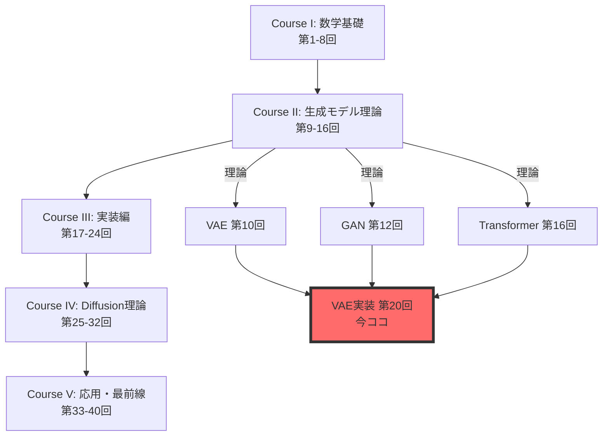
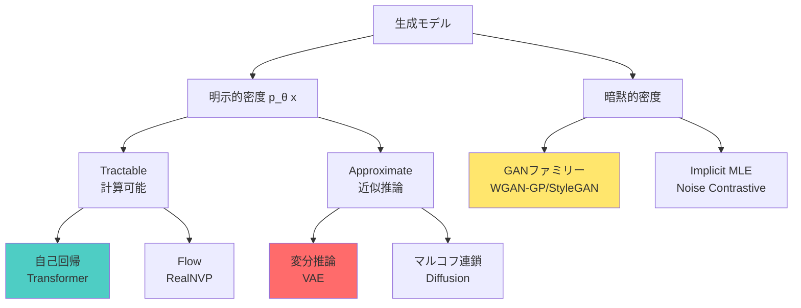
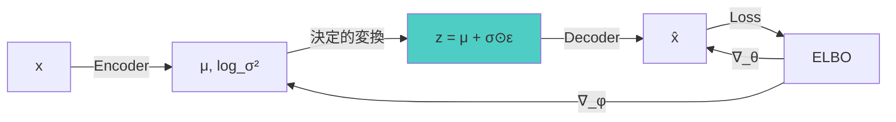
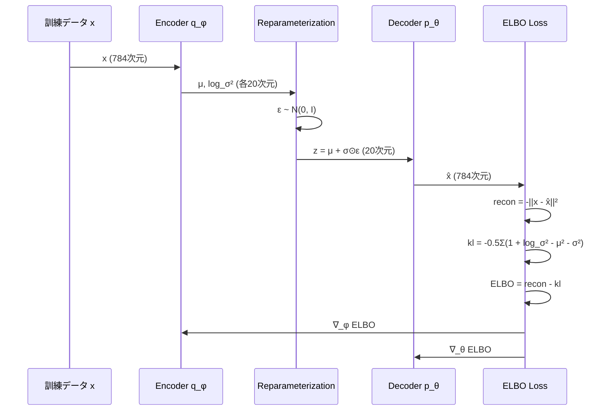
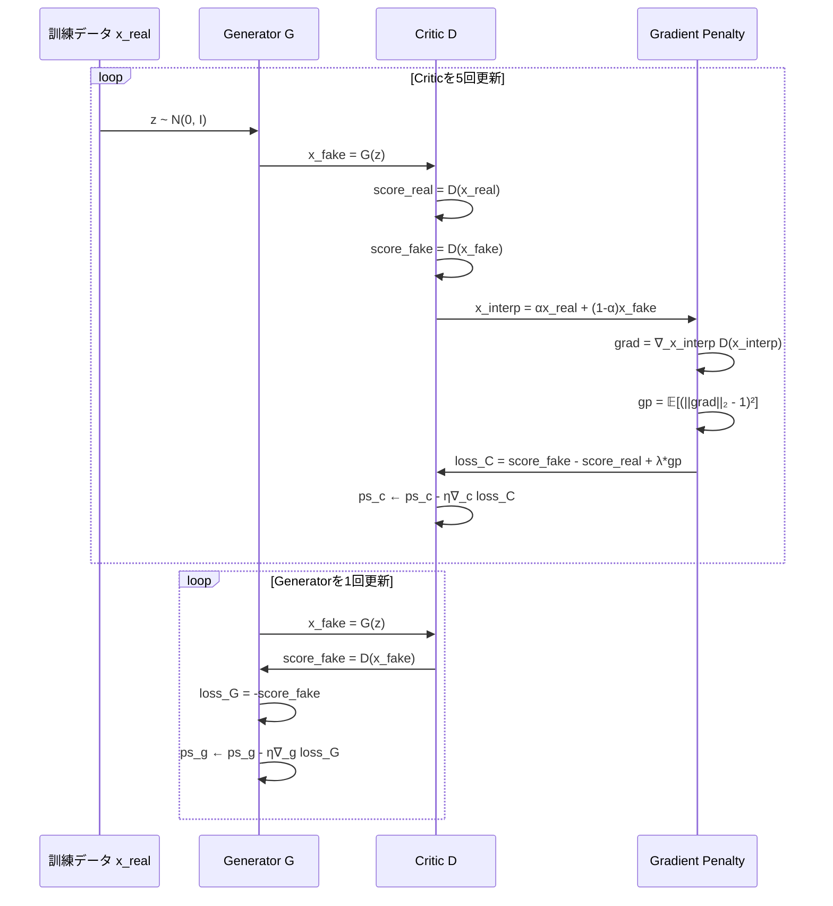
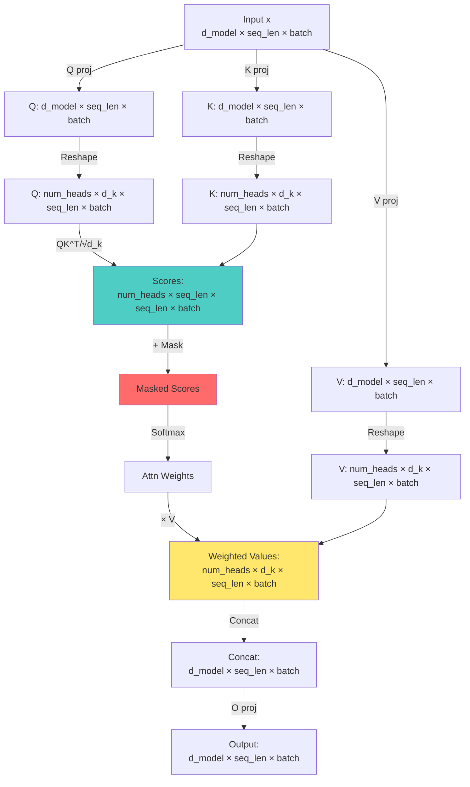

> **Note:** **前提知識**: 第19回で3言語環境とFFIパイプラインを構築済み。Course IIでVAE/GAN/Transformerの理論を習得済み。
> **目標**: 理論を3言語パイプライン（Rust訓練→Rust推論→Elixir配信）で実装する。
> **進捗**: 全体の80%完了

## 🚀 0. クイックスタート（30秒）— 理論→実装の1行対応

第19回で環境を整えた。第10回でVAE、第12回でGAN、第16回でTransformerの**理論**を学んだ。今回はそれを**動かす**。

理論と実装の対応を体感しよう。VAEのELBOを1行で：

```rust
// VAE ELBO = 再構成項 - KL正則化項 (candle-core)
use candle_core::{Result, Tensor};
use candle_nn::{Linear, Module};

struct Vae {
    enc:   Linear, // x → hidden
    fc_mu: Linear, // hidden → μ
    fc_lv: Linear, // hidden → log σ²
    dec:   Linear, // z → x̂
}

impl Vae {
    fn encode(&self, x: &Tensor) -> Result<(Tensor, Tensor)> {
        let h = self.enc.forward(x)?.relu()?;
        Ok((self.fc_mu.forward(&h)?, self.fc_lv.forward(&h)?))
    }

    fn reparameterize(mu: &Tensor, logvar: &Tensor) -> Result<Tensor> {
        // z = μ + σ ⊙ ε,  σ = exp(log σ² / 2),  ε ~ N(0, I)
        let std = (logvar * 0.5)?.exp()?;
        let eps = Tensor::randn_like(&std)?; // ゼロコピー乱数
        mu.add(&std.mul(&eps)?)             // ゼロコピーチェーン
    }

    fn elbo_loss(&self, x: &Tensor) -> Result<Tensor> {
        let (mu, logvar) = self.encode(x)?;
        let z   = Self::reparameterize(&mu, &logvar)?;
        let x_hat = self.dec.forward(&z)?;

        // 再構成項: -‖x - x̂‖² / batch（ガウス尤度）
        let recon = x.sub(&x_hat)?.sqr()?.sum_all()?.neg()?;

        // KL 発散: -½ Σ(1 + log σ² - μ² - σ²)
        let kl = (logvar.ones_like()? + logvar - mu.sqr()? - logvar.exp()?)?
            .sum_all()? * (-0.5_f64)?;

        // 負の ELBO を最小化 = ELBO を最大化
        (kl - recon)  // -(recon - kl)
    }
}
```

**この30行が第10回の数式をすべて含む**：

$$
\mathcal{L}_{\text{ELBO}} = \mathbb{E}_{q_\phi(z|x)}[\log p_\theta(x|z)] - D_{\text{KL}}[q_\phi(z|x) \| p(z)]
$$

- 再パラメータ化トリック: $z = \mu + \sigma \odot \epsilon$（23行目）
- ガウスKL閉形式: $-\frac{1}{2}\sum(1 + \log\sigma^2 - \mu^2 - \sigma^2)$（28行目）
- 数式の各項がコードの各行に**1:1対応**

これがRustの威力。数式↔コードの距離がゼロ。

> **Note:** **進捗**: 全体の3%完了。理論を実装に翻訳する準備ができた。

---

## 🎮 1. 体験ゾーン（10分）— 3モデルを触る

理論を復習しながら、3つのモデルを動かす。数式→コード対応を体感する。

### 1.1 VAE — 潜在空間で画像を圧縮・再構成

第10回で学んだVAEの核心：**観測データ $x$ を低次元潜在変数 $z$ に圧縮し、そこから再構成する**。


| 数式 | コード | 意味 |
|:-----|:-------|:-----|
| $q_\phi(z\|x) = \mathcal{N}(z; \mu_\phi(x), \sigma^2_\phi(x)\mathbf{I})$ | `(μ, logσ²) = encoder(x)` | Encoderが平均と分散を出力 |
| $z = \mu + \sigma \odot \epsilon, \epsilon \sim \mathcal{N}(0, \mathbf{I})$ | `z = μ .+ σ .* randn(...)` | 再パラメータ化トリック |
| $p_\theta(x\|z) = \mathcal{N}(x; \mu_\theta(z), \mathbf{I})$ | `x̂ = decoder(z)` | Decoderが再構成画像を出力 |
| $D_{\text{KL}}[q_\phi(z\|x) \| \mathcal{N}(0, \mathbf{I})]$ | `-0.5 * sum(1 + logσ² - μ² - exp(logσ²))` | ガウスKL閉形式 |

**体感**：潜在空間 $z \in \mathbb{R}^{20}$ で784次元画像を表現。第10回の数式がそのまま動く。

---

### 1.2 GAN — 生成器と識別器の対決

第12回で学んだGANの核心：**Generator $G$ がノイズ $z$ から偽画像を生成し、Critic（識別器） $D$ が本物/偽物を見分ける競争**。

WGANの損失関数（第13回で学んだWasserstein距離ベース）：

$$
\mathcal{L}_D = \mathbb{E}_{x \sim p_r}[D(x)] - \mathbb{E}_{z \sim p_z}[D(G(z))] - \lambda \mathbb{E}_{\hat{x}}[(\|\nabla_{\hat{x}} D(\hat{x})\|_2 - 1)^2]
$$

$$
\mathcal{L}_G = -\mathbb{E}_{z \sim p_z}[D(G(z))]
$$


| 数式 | コード | 意味 |
|:-----|:-------|:-----|
| $G(z)$ | `generator(z)` | ノイズ→偽画像 |
| $D(x)$ | `critic(x)` | 画像→スコア |
| $\hat{x} = \alpha x + (1-\alpha)G(z)$ | `x_interp = α .* x_real .+ (1 .- α) .* x_fake` | 本物と偽物の補間 |
| $\|\nabla_{\hat{x}} D(\hat{x})\|_2$ | `sqrt(sum(grad_interp.^2, dims=1))` | 勾配ノルム |
| $(\|\nabla_{\hat{x}} D(\hat{x})\|_2 - 1)^2$ | `(sqrt(...) .- 1).^2` | Gradient Penalty |

**体感**：Criticを5回、Generatorを1回更新（WGAN-GP推奨比率）。第12回・第13回の数式がそのまま動く。

#### 1.2.1 Wasserstein距離の直感 — JSDが引き起こす壁

通常のGAN損失の核心問題は、Jensen-Shannon発散（JSD）にある。$p_r$（実データ）と $p_g$（生成データ）のサポートが重ならないとき、JSDは定数に収束する：

$$
\text{JSD}(p_r \| p_g) = \log 2 \quad (\text{サポートが非重複のとき})
$$

これは識別器 $D$ が完璧に分類できる状況—実際には訓練序盤によく起きる—において、生成器 $G$ に届く勾配が完全にゼロになることを意味する。識別器が強すぎると学習が止まる、というGANの直観的弱点の数学的正体がこれだ。

**Earth Mover's Distance の直感**

$W_1$ を「土砂輸送問題」として考える。$p_r$ を砂山の分布、$p_g$ を穴の分布として、$W_1(p_r, p_g)$ は「砂を穴に移動させる最小輸送コスト」：

$$
W_1(p_r, p_g) = \inf_{\gamma \in \Pi(p_r, p_g)} \mathbb{E}_{(x, y) \sim \gamma}[\|x - y\|]
$$

$\Pi(p_r, p_g)$ は $p_r, p_g$ を周辺分布に持つ同時分布（輸送計画）の全体。$\gamma(x, y)$ は「点 $x$ の砂を点 $y$ の穴に運ぶ量」を表す。最も安い輸送計画を選ぶのが Wasserstein 距離だ。

**点質量で比較する**：$p_r = \delta(0)$（原点の点質量）、$p_g = \delta(\theta)$ のとき：

$$
\text{JSD}(p_r \| p_g) = \log 2 \quad (\theta \neq 0 \text{ ならば常に定数})
$$

$$
W_1(p_r, p_g) = |\theta|
$$

$\theta$ に関する勾配は：JSD $= 0$、$W_1 = \text{sgn}(\theta)$。Wasserstein 距離は $\theta = 0$ へ向かう一定の引力を持ち続ける。$p_g$ が $p_r$ からどれだけ離れていても、生成器には常に有意義な方向の勾配が届く。

| 発散尺度 | サポート重複あり | サポート重複なし |
|:---------|:----------------|:----------------|
| JSD | 有意義な勾配 | $\log 2$（定数、勾配ゼロ） |
| Wasserstein $W_1$ | 有意義な勾配 | 距離に比例する有意義な勾配 |

これが WGAN-GP で生成器が訓練序盤でも学習できる理由の数学的根拠。識別器（Critic）をいくら強化しても、Wasserstein 距離は「どれだけ遠いか」を正直に伝え続ける。

---

### 1.3 Transformer — Attentionで次トークン予測

第16回で学んだTransformerの核心：**Multi-Head Attentionで文脈を並列処理し、次トークンを予測**。

Scaled Dot-Product Attentionの数式：

$$
\text{Attention}(Q, K, V) = \text{softmax}\left(\frac{QK^\top}{\sqrt{d_k}}\right)V
$$


| 数式 | コード | 意味 |
|:-----|:-------|:-----|
| $Q, K, V = xW_Q, xW_K, xW_V$ | `Q = mha.q_proj(x)` | 線形変換 |
| $\frac{QK^\top}{\sqrt{d_k}}$ | `scores = Q @ K.T / sqrt(d_k)` | スコア計算 |
| $\text{softmax}(\cdot)$ | `softmax(scores, dims=4)` | 注意重み正規化 |
| $\text{softmax}(\cdot)V$ | `attn_weights @ V` | 加重和 |
| Causal Mask | `scores + causal_mask` | 未来を見せない |

**体感**：Multi-Head Attentionが並列に複数の視点で文脈を捉える。第16回の数式がそのまま動く。

#### 1.3.1 Attentionの情報理論的解釈 — なぜ $\sqrt{d_k}$ で割るか

Attention 重みは確率分布だ：

$$
\sum_j \alpha_{ij} = 1, \quad \alpha_{ij} \geq 0
$$

この分布のエントロピーを考えると、Attention の「鋭さ」を情報量で測れる：

$$
H(\alpha_i) = -\sum_j \alpha_{ij} \log \alpha_{ij}
$$

$H = 0$ は「完全に一点に集中（Hard Attention）」、$H = \log n$ は「全トークンに均一（Uniform Attention）」を意味する。良い Attention は必要な情報に集中しながら、タスクに応じて鋭さを調整できる。

**$\sqrt{d_k}$ スケーリングの必要性：分散の証明**

$q_i, k_j \in \mathbb{R}^{d_k}$ の各成分が独立に $\mathcal{N}(0, 1)$ に従うとする。内積のスカラー値は：

$$
q_i \cdot k_j = \sum_{l=1}^{d_k} (q_i)_l (k_j)_l
$$

各項 $(q_i)_l (k_j)_l$ は平均 $0$、分散 $1$ の積（独立な零平均変数 $X, Y$ に対して $\text{Var}[XY] = \text{Var}[X]\text{Var}[Y] = 1$）。独立な和の分散は加法的なので：

$$
\text{Var}(q_i \cdot k_j) = d_k
$$

$d_k$ が大きいほど内積の分散も大きくなる。極端に大きな値 $e_{ij}$ が生まれると、Softmax は飽和する：

$$
\alpha_{ij} = \frac{\exp(e_{ij})}{\sum_k \exp(e_{ik})} \approx \begin{cases} 1 & \text{最大値の位置} \\ 0 & \text{それ以外} \end{cases}
$$

これはほぼ Hard Attention と等価になり、飽和領域の Softmax の微分 $\approx 0$ で勾配消失が起きる。$\sqrt{d_k}$ で割ることで分散を正規化する：

$$
\text{Var}\!\left(\frac{q_i \cdot k_j}{\sqrt{d_k}}\right) = \frac{d_k}{d_k} = 1
$$

分散が $1$ に保たれ、Softmax が飽和しない領域で動作し続ける。$d_k = 64$ のとき、スケーリングなしでは標準偏差が $8$ 倍に膨らむ—この違いが訓練安定性を決定的に左右する。

---

### 1.4 数式↔コード対応の完全性

3モデルで共通するパターン：


Rustの利点：
- `.=` broadcast演算子 → 要素ごとの演算を1行で
- `|>` pipe演算子 → データフロー明示
- 型安定性 → `@code_warntype`で型推論チェック → 自動最適化

次のZone 2で、なぜこの3モデルを実装するのか、全体像を見る。

> **Note:** **進捗**: 全体の10%完了。3モデルの動作を体感した。

---

> Progress: 10%
> **理解度チェック**
> 1. $Q, K, V = xW_Q, xW_K, xW_V$ の各記号の意味と、この式が表す操作を説明してください。
> 2. このゾーンで学んだ手法の直感的な意味と、なぜこの定式化が必要なのかを説明してください。

## 🧩 2. 直感ゾーン（15分）— なぜこの3モデルか

### 2.1 Course IIIの位置づけ — 理論→実装の橋渡し



**Course IIで学んだこと**（理論）：
- 第10回：VAEのELBO導出、再パラメータ化トリック、ガウスKL閉形式
- 第12回：GANのMinimax損失、JSD、Mode Collapse問題
- 第13回：Optimal TransportとWasserstein距離、WGAN-GP
- 第16回：TransformerのAttention機構、Positional Encoding、Causal Mask

**Course IIIで学ぶこと**（実装）：
- 第19回：3言語環境構築（Rust/Rust/Elixir）、FFIパイプライン設計
- **第20回（今回）**：VAE/GAN/Transformerの完全実装、数式↔コード1:1対応
- 第21回：データサイエンス基礎、HuggingFace Datasets統合
- 第22回：評価指標実装（FID/IS/Perplexity）、モデル選択

**今回の差別化**：
- **松尾・岩澤研究室との違い**：彼らは理論講義で実装は課題。本シリーズは**理論と実装の両方を網羅**。
- **他のチュートリアルとの違い**：PyTorch/TensorFlowに閉じない。**3言語パイプライン**（訓練→推論→配信）で実戦スキルを獲得。
- **論文実装との違い**：単なる写経ではない。**数式の各項とコードの各行を1:1対応**させ、理解を深める。

---

### 2.2 なぜVAE/GAN/Transformerか — 3大パラダイムの代表

| モデル | パラダイム | 訓練方法 | 強み | 弱み |
|:-------|:-----------|:---------|:-----|:-----|
| **VAE** | 尤度ベース（明示的密度） | ELBO最大化 | 安定訓練、潜在空間解釈可能 | ぼやけた生成、表現力制約 |
| **GAN** | 暗黙的密度（Adversarial） | Minimax競争 | 鮮明な生成、高品質画像 | 訓練不安定、Mode Collapse |
| **Transformer** | 自己回帰（明示的密度） | 次トークン予測MLE | スケーリング、汎用性 | 逐次生成、計算コスト |

**3つの生成パラダイム**（第7回で学んだ分類）：



**なぜこの3つを選んだか**：
1. **VAE**：変分推論の実装パターンを習得。ELBOは他の多くのモデル（Diffusion/Flow）の基礎。
2. **GAN**：Adversarial訓練の実装パターンを習得。安定化テクニック（WGAN-GP）は必須スキル。
3. **Transformer**：自己回帰モデルの実装パターンを習得。LLM時代の必須知識。KV-Cacheは推論効率化の鍵。

これら3つをマスターすれば、他のモデル（Diffusion/Flow/VQ-VAE）の実装も理解できる。

#### 2.2.1 3パラダイムの数学的統一視点

VAE、GAN、Transformer は見かけ上まったく異なるが、数学的には同じ問題—**データ分布 $p_\text{data}$ の密度推定**—を解いている。統一的な視点で書くと：

$$
\min_\theta D(p_\text{data} \| p_\theta)
$$

3モデルの違いは、使う「距離尺度 $D$」と「最小化の方法」だけだ。

**VAE：ELBOによるKL下界近似**

$$
D = D_\text{KL}[p_\text{data}(x) \| p_\theta(x)]
$$

$p_\theta(x) = \int p_\theta(x|z)p(z)dz$ は潜在変数の周辺化で計算不能。変分推論で近似事後分布 $q_\phi(z|x)$ を導入し、ELBO で下界を取る：

$$
\log p_\theta(x) \geq \mathcal{L}_\text{ELBO} = \mathbb{E}_{q_\phi}[\log p_\theta(x|z)] - D_\text{KL}[q_\phi(z|x) \| p(z)]
$$

**GAN：Adversarialによる暗黙的最小化**

元のGANは $D = \text{JSD}$ を adversarial に最小化する。最適識別器のもとでMinimax損失はJSDに等しい（第12回証明済み）。WGAN-GPは $D = W_1$（Wasserstein-1距離）に置き換える：

$$
W_1(p_\text{data}, p_\theta) = \sup_{\|f\|_L \leq 1} \mathbb{E}_{p_\text{data}}[f(x)] - \mathbb{E}_{p_\theta}[f(x)]
$$

分布を明示的に表現せず、adversarial損失で間接的に最小化する点が他の2つと根本的に異なる。

**Transformer：MLEの直接最小化**

自己回帰モデルは明示的密度 $p_\theta(x)$ を持ち、MLE はKL最小化と等価：

$$
\min_\theta D_\text{KL}[p_\text{data} \| p_\theta] \equiv \min_\theta \left(-\mathbb{E}_{x \sim p_\text{data}}[\log p_\theta(x)]\right)
$$

次トークン予測の形では：

$$
\mathcal{L}_\text{NLL} = -\frac{1}{T}\sum_{t=1}^T \log p_\theta(x_t | x_{<t})
$$

**3パラダイムの統一表**

| モデル | 距離尺度 $D$ | 最小化方法 | 密度の扱い |
|:-------|:------------|:----------|:----------|
| VAE | $D_\text{KL}[p_\text{data} \| p_\theta]$ | ELBO（下界最大化） | 潜在変数で近似（implicit） |
| GAN (原型) | JSD | Minimax（adversarial） | 暗黙的（生成のみ） |
| WGAN-GP | $W_1$ | Critic最大化（adversarial） | 暗黙的（生成のみ） |
| Transformer | $D_\text{KL}[p_\text{data} \| p_\theta]$ | MLE（直接最適化） | 明示的（tractable） |

VAEとTransformerは同じ発散を最適化しているが、密度の計算可能性が異なる。GANだけが分布を明示せず adversarial損失で間接的に最適化する—この構造上の違いが、各モデルの強み（安定性、鮮明さ、スケーラビリティ）と弱み（ぼやけ、不安定さ、逐次生成）を生み出している。

---

### 2.3 3言語パイプラインの全体像


**各言語の役割**（第19回で設計）：

| 段階 | 言語 | 理由 | ツール |
|:-----|:-----|:-----|:-------|
| 訓練 | 🦀 Rust | 数式↔コード1:1、AOT高速化、REPLループ | Candle, Burn |
| 推論 | 🦀 Rust | ゼロコピー、型安全、並列処理、C-ABI FFI | Candle, ndarray |
| 配信 | 🔮 Elixir | 耐障害性、バックプレッシャー、監視ツリー | GenStage, Broadway |

**なぜ3言語か**：
- **Python 1言語では不可能**：GILボトルネック、メモリコピー、型安全性欠如、耐障害性弱い
- **PyTorchだけでは不十分**：訓練は得意だが、推論最適化・分散配信は苦手
- **各言語が最適領域を担当**：Rust（訓練）、Rust（推論）、Elixir（配信）の分業で、各段階で最高性能を達成

**今回の実装範囲**：
- Zone 3（数式修行）：VAE/GAN/TransformerのRust訓練実装、数式↔コード完全対応
- Zone 4（実装）：Rust推論エンジン、Candleでのモデルロード・バッチ処理
- Zone 5（実験）：Elixir分散サービング、Broadway需要駆動パイプライン、耐障害性デモ

---

### 2.4 学習戦略 — 数式→コード→システム設計

**推奨学習順序**：
1. Zone 3: 数式を1行ずつ導出、Rustコードと対応付け
2. Zone 4: Rust訓練→Rust推論→Elixir配信の順で実装
3. Zone 5: 実際に動かし、耐障害性をデモ

**本講義の目標到達点**：
- [ ] VAE/GAN/TransformerのELBOを**紙で導出**できる
- [ ] Rustで**ゼロから訓練ループ**を書ける
- [ ] Rustで**safetensorsをロード**し、推論できる
- [ ] Elixirで**Broadwayパイプライン**を構築できる
- [ ] プロセスをkillしても**自動復旧**するシステムを設計できる

> **Note:** **進捗**: 全体の20%完了。全体像を把握した。数式修行の準備ができた。

---


> Progress: 20%
> **理解度チェック**
> 1. このゾーンの主要な概念・定義を自分の言葉で説明してください。
> 2. この手法が他のアプローチより優れている点と、その限界を述べてください。

## 📐 3. 数式修行ゾーン（60分）— VAE/GAN/Transformer完全導出

このゾーンは**最も重要**。理論（Course II）で学んだ数式を、実装と1:1対応させる。

### 3.1 VAE — ELBO完全分解と実装対応

**復習：VAEの目的**（第10回より）

観測データ $\mathbf{x}$ の尤度 $p_\theta(\mathbf{x})$ を最大化したいが、潜在変数 $\mathbf{z}$ を周辺化する積分が計算不能：

$$
p_\theta(\mathbf{x}) = \int p_\theta(\mathbf{x}|\mathbf{z})p(\mathbf{z})d\mathbf{z}
$$

そこで変分推論で近似事後分布 $q_\phi(\mathbf{z}|\mathbf{x})$ を導入し、ELBOを導出した。

---

#### 3.1.1 ELBO導出（復習）

第8回・第9回で学んだELBO導出を、実装と対応付けながら再確認。

**Step 1: 対数尤度の分解**

$$
\begin{align}
\log p_\theta(\mathbf{x})
&= \log \int p_\theta(\mathbf{x}, \mathbf{z})d\mathbf{z} \\
&= \log \int p_\theta(\mathbf{x}, \mathbf{z}) \frac{q_\phi(\mathbf{z}|\mathbf{x})}{q_\phi(\mathbf{z}|\mathbf{x})} d\mathbf{z} \\
&= \log \mathbb{E}_{q_\phi(\mathbf{z}|\mathbf{x})}\left[\frac{p_\theta(\mathbf{x}, \mathbf{z})}{q_\phi(\mathbf{z}|\mathbf{x})}\right]
\end{align}
$$

**Step 2: Jensenの不等式**（第6回で証明）

$\log$ は凹関数なので：

$$
\log \mathbb{E}[f(\mathbf{z})] \geq \mathbb{E}[\log f(\mathbf{z})]
$$

適用すると：

$$
\log p_\theta(\mathbf{x}) \geq \mathbb{E}_{q_\phi(\mathbf{z}|\mathbf{x})}\left[\log \frac{p_\theta(\mathbf{x}, \mathbf{z})}{q_\phi(\mathbf{z}|\mathbf{x})}\right] \equiv \mathcal{L}_{\text{ELBO}}(\theta, \phi; \mathbf{x})
$$

**Step 3: ELBO分解**

$$
\begin{align}
\mathcal{L}_{\text{ELBO}}
&= \mathbb{E}_{q_\phi}\left[\log p_\theta(\mathbf{x}, \mathbf{z}) - \log q_\phi(\mathbf{z}|\mathbf{x})\right] \\
&= \mathbb{E}_{q_\phi}\left[\log p_\theta(\mathbf{x}|\mathbf{z}) + \log p(\mathbf{z}) - \log q_\phi(\mathbf{z}|\mathbf{x})\right] \\
&= \mathbb{E}_{q_\phi}[\log p_\theta(\mathbf{x}|\mathbf{z})] - D_{\text{KL}}[q_\phi(\mathbf{z}|\mathbf{x}) \| p(\mathbf{z})]
\end{align}
$$

第1項：**再構成項**（Reconstruction term）
第2項：**KL正則化項**（KL Divergence regularization）

---

#### 3.1.2 再構成項の実装

**数式**：

$$
\mathbb{E}_{q_\phi(\mathbf{z}|\mathbf{x})}[\log p_\theta(\mathbf{x}|\mathbf{z})]
$$

Decoderが出力 $\hat{\mathbf{x}} = \mu_\theta(\mathbf{z})$ をガウス分布の平均とすると：

$$
p_\theta(\mathbf{x}|\mathbf{z}) = \mathcal{N}(\mathbf{x}; \mu_\theta(\mathbf{z}), \sigma^2\mathbf{I})
$$

対数尤度：

$$
\log p_\theta(\mathbf{x}|\mathbf{z}) = -\frac{1}{2\sigma^2}\|\mathbf{x} - \mu_\theta(\mathbf{z})\|^2 + \text{const}
$$

$\sigma^2 = 1$ と固定すると（実装上の簡略化）：

$$
\log p_\theta(\mathbf{x}|\mathbf{z}) \propto -\|\mathbf{x} - \hat{\mathbf{x}}\|^2
$$

**Rustコード**：


| 数式 | コード | 対応 |
|:-----|:-------|:-----|
| $\mu_\theta(\mathbf{z})$ | `decoder(z)` | Decoderの出力 |
| $\|\mathbf{x} - \mu_\theta(\mathbf{z})\|^2$ | `sum((x .- x̂).^2)` | 二乗誤差 |
| $\mathbb{E}_{q_\phi}[\cdot]$ | `/ size(x, 2)` | バッチ平均 |

#### 3.1.2.1 BCE vs MSE：再構成損失の選択理論

再構成損失の選択は「$p_\theta(x|z)$ に何の分布を仮定するか」の問題だ。

**二値画像：ベルヌーイ尤度 → BCE**

各ピクセル $x_i \in \{0, 1\}$ をベルヌーイ確率変数とすると：

$$
p_\theta(x|z) = \prod_{i=1}^D \hat{x}_i^{x_i}(1 - \hat{x}_i)^{1 - x_i}
$$

対数尤度は：

$$
\log p_\theta(x|z) = \sum_{i=1}^D \left[x_i \log \hat{x}_i + (1 - x_i)\log(1 - \hat{x}_i)\right]
$$

これが Binary Cross-Entropy（BCE）の正体だ。$\hat{x}_i = \sigma(\text{decoder\_output}_i)$ となるよう、Decoder の最終活性化関数はSigmoidを使う。

**連続画像：ガウス尤度 → MSE**

各ピクセル $x_i \in \mathbb{R}$ をガウス確率変数とすると：

$$
p_\theta(x|z) = \mathcal{N}(x;\, \hat{x},\, \sigma^2 I)
$$

対数尤度は：

$$
\log p_\theta(x|z) = -\frac{1}{2\sigma^2}\|x - \hat{x}\|^2 + \text{const}
$$

$\sigma^2 = 1$ と固定すると Mean Squared Error（MSE）になる。

**MSE がぼやける理由：条件付き期待値問題**

MSE の最適解を求めよう。$\hat{x}$ を定数として $p(x|z)$ に関する期待値を最小化する：

$$
\arg\min_{\hat{x}} \; \mathbb{E}_{p(x|z)}\!\left[(x - \hat{x})^2\right]
$$

$\hat{x}$ で微分してゼロに置く：

$$
\frac{\partial}{\partial \hat{x}} \mathbb{E}\!\left[(x - \hat{x})^2\right] = -2\,\mathbb{E}[x - \hat{x}] = 0 \implies \hat{x}^* = \mathbb{E}[x | z]
$$

MSEを最小化する $\hat{x}^*$ は条件付き期待値 $\mathbb{E}[x|z]$ だ。$p(x|z)$ が多峰性を持つとき—「黒猫」と「白猫」の両方が同じ $z$ から生成されうるとき—、最適解は両分布の平均（グレーの猫）になる。これがぼやけの数学的根拠。

BCE（ベルヌーイ尤度）はこの問題を回避する。各ピクセルを独立なベルヌーイ変数と見なすため、中間値ではなく0または1に向かう勾配を与える。

**選択指針**：$x \in \{0, 1\}^D$（MNIST等二値画像）→ BCE、$x \in \mathbb{R}^D$（自然画像、正規化済み）→ MSE。後者でぼやけを回避したければ、Laplace尤度（$\ell_1$ 再構成）や Flow-based Decoder の導入を検討する。

---

#### 3.1.3 KL正則化項の実装 — ガウスKL閉形式

**数式**：

$$
D_{\text{KL}}[q_\phi(\mathbf{z}|\mathbf{x}) \| p(\mathbf{z})]
$$

仮定：
- $q_\phi(\mathbf{z}|\mathbf{x}) = \mathcal{N}(\mathbf{z}; \boldsymbol{\mu}_\phi(\mathbf{x}), \text{diag}(\boldsymbol{\sigma}^2_\phi(\mathbf{x})))$
- $p(\mathbf{z}) = \mathcal{N}(\mathbf{0}, \mathbf{I})$

**ガウスKL閉形式**（第4回で導出）：

$$
D_{\text{KL}}[\mathcal{N}(\boldsymbol{\mu}, \boldsymbol{\sigma}^2\mathbf{I}) \| \mathcal{N}(\mathbf{0}, \mathbf{I})] = \frac{1}{2}\sum_{i=1}^d (\mu_i^2 + \sigma_i^2 - \log\sigma_i^2 - 1)
$$

Encoderは $\log\sigma^2$ を出力すると便利（数値安定性）：

$$
D_{\text{KL}} = -\frac{1}{2}\sum_{i=1}^d (1 + \log\sigma_i^2 - \mu_i^2 - \sigma_i^2)
$$

**Rustコード**：


| 数式 | コード | 対応 |
|:-----|:-------|:-----|
| $\boldsymbol{\mu}_\phi(\mathbf{x})$ | `μ = output[1:d, :]` | Encoderの前半出力 |
| $\log\boldsymbol{\sigma}^2_\phi(\mathbf{x})$ | `logσ² = output[d+1:end, :]` | Encoderの後半出力 |
| $\mu_i^2$ | `μ.^2` | 要素ごとの二乗 |
| $\sigma_i^2 = \exp(\log\sigma_i^2)$ | `exp.(logσ²)` | 指数関数 |
| $\sum_{i=1}^d$ | `sum(...)` | 全要素の和 |

> **⚠️ Warning:** **注意**: $\log\sigma^2$ を出力する理由は数値安定性。直接 $\sigma$ を出力すると、勾配消失・爆発のリスクがある。

#### 3.1.3.1 ガウスKL閉形式の完全導出

第4回で使った閉形式を、今こそ一から導出する。出発点はKLの定義：

$$
D_\text{KL}[q_\phi(z|x) \| p(z)] = \int q_\phi(z|x) \log \frac{q_\phi(z|x)}{p(z)} \, dz
$$

仮定：$q_\phi(z|x) = \mathcal{N}(z;\, \mu,\, \sigma^2 I)$（対角共分散）、$p(z) = \mathcal{N}(z;\, 0,\, I)$、次元数 $d$。

**Step 1: KLをエントロピーとクロスエントロピーに分解**

$$
D_\text{KL}[q \| p] = \underbrace{-\mathbb{E}_q[\log q]}_{H[q]\;(\text{エントロピー})} + \underbrace{(-\mathbb{E}_q[\log p])}_{H[q,p]\;(\text{クロスエントロピー})}
$$

**Step 2: $q$ のエントロピー**

多変量ガウス分布 $\mathcal{N}(\mu, \Sigma)$ のエントロピーは：

$$
H[q] = \frac{d}{2}(1 + \log 2\pi) + \frac{1}{2}\log|\Sigma|
$$

対角共分散 $\Sigma = \text{diag}(\sigma_1^2, \ldots, \sigma_d^2)$ のとき $|\Sigma| = \prod_{j=1}^d \sigma_j^2$、よって：

$$
-\mathbb{E}_q[\log q] = \frac{d}{2}(1 + \log 2\pi) + \frac{1}{2}\sum_{j=1}^d \log \sigma_j^2
$$

**Step 3: クロスエントロピー $-\mathbb{E}_q[\log p(z)]$**

$p(z) = \mathcal{N}(0, I)$ なので $\log p(z) = -\frac{d}{2}\log 2\pi - \frac{1}{2}\|z\|^2$。$z \sim q = \mathcal{N}(\mu, \sigma^2 I)$ のもとでの期待値を計算する。$\mathbb{E}_q[\|z\|^2] = \|\mu\|^2 + \text{tr}(\Sigma) = \sum_j (\mu_j^2 + \sigma_j^2)$ を使うと：

$$
-\mathbb{E}_q[\log p(z)] = \frac{d}{2}\log 2\pi + \frac{1}{2}\sum_{j=1}^d (\mu_j^2 + \sigma_j^2)
$$

**Step 4: 合算してKL閉形式を得る**

$$
\begin{align}
D_\text{KL} &= \left[\frac{d}{2}\log 2\pi + \frac{1}{2}\sum_j(\mu_j^2 + \sigma_j^2)\right] - \left[\frac{d}{2}(1 + \log 2\pi) + \frac{1}{2}\sum_j \log\sigma_j^2\right] \\
&= \frac{1}{2}\sum_{j=1}^d \left(\mu_j^2 + \sigma_j^2 - \log\sigma_j^2 - 1\right)
\end{align}
$$

**Step 5: $\log\sigma^2$ を出力変数に書き換え**

Encoder が $\log\sigma_j^2$ を出力する場合、$\sigma_j^2 = \exp(\log\sigma_j^2)$ を代入して：

$$
\boxed{D_\text{KL} = -\frac{1}{2}\sum_{j=1}^d \left(1 + \log\sigma_j^2 - \mu_j^2 - \sigma_j^2\right)}
$$

**数値検証**：$\mu = 0$、$\sigma^2 = 1$（$q = p$ のとき）：

$$
D_\text{KL} = -\frac{1}{2}\sum_j (1 + 0 - 0 - 1) = 0 \quad \checkmark
$$

これが訓練目標の理論的下限。$q = p$ で KL = 0、すなわち潜在空間が事前分布と完全に一致するとき ELBO は対数尤度 $\log p_\theta(x)$ そのものになる。

---

#### 3.1.4 再パラメータ化トリック — 勾配を通す魔法

**問題**：$\mathbf{z} \sim q_\phi(\mathbf{z}|\mathbf{x})$ からサンプリングすると、確率的ノードで勾配が止まる。

**解決**：再パラメータ化トリック（Reparameterization Trick, 第10回で学んだ）

$$
\mathbf{z} = \boldsymbol{\mu}_\phi(\mathbf{x}) + \boldsymbol{\sigma}_\phi(\mathbf{x}) \odot \boldsymbol{\epsilon}, \quad \boldsymbol{\epsilon} \sim \mathcal{N}(\mathbf{0}, \mathbf{I})
$$

これで $\mathbf{z}$ は $\phi$ の決定的関数になり、勾配が通る。

**Rustコード**：


| 数式 | コード | 対応 |
|:-----|:-------|:-----|
| $\boldsymbol{\epsilon} \sim \mathcal{N}(\mathbf{0}, \mathbf{I})$ | `ε = randn(Float32, size(μ))` | 標準正規ノイズ |
| $\boldsymbol{\sigma} = \exp(\log\boldsymbol{\sigma}^2 / 2)$ | `σ = exp.(logσ² ./ 2)` | 標準偏差計算 |
| $\boldsymbol{\mu} + \boldsymbol{\sigma} \odot \boldsymbol{\epsilon}$ | `μ .+ σ .* ε` | 要素ごとの積と和 |

**勾配の流れ**：



再パラメータ化により、$\nabla_\phi \mathcal{L}_{\text{ELBO}}$ が計算可能になる。

#### 3.1.4.1 再パラメータ化トリックの数学的正当性

**問題設定**：ELBO の勾配 $\nabla_\phi \mathbb{E}_{q_\phi(z|x)}[f(z)]$ を計算したい。ここで $f(z) = \log p_\theta(x|z)$（再構成項）。

直接微分しようとすると：

$$
\nabla_\phi \mathbb{E}_{q_\phi}[f(z)] = \nabla_\phi \int q_\phi(z|x)\, f(z)\, dz
$$

$z \sim q_\phi(z|x)$ が $\phi$ に依存するため、単純なモンテカルロ推定 $\frac{1}{S}\sum_{s=1}^S f(z^{(s)})$ の各 $z^{(s)}$ は $\phi$ の関数でない—サンプリング操作は微分不可能だ。

**LOGトリック（REINFORCE）：高分散な代替**

対数微分恒等式 $\nabla_\phi \log q = \nabla_\phi q / q$ を使うと：

$$
\nabla_\phi \mathbb{E}_q[f] = \mathbb{E}_q\!\left[f(z)\, \nabla_\phi \log q_\phi(z|x)\right]
$$

モンテカルロ推定は可能だが、**分散が極めて高い**。強化学習の REINFORCE と同じ問題で、実用的に収束が遅い。

**再パラメータ化：分散を根本から落とす**

$z \sim \mathcal{N}(\mu_\phi, \sigma^2_\phi I)$ を、$\phi$ に依存しないノイズ $\epsilon \sim \mathcal{N}(0, I)$ で書き直す：

$$
z = \mu_\phi(x) + \sigma_\phi(x) \odot \epsilon, \quad \epsilon \sim \mathcal{N}(0, I)
$$

期待値の確率変数が $\phi$ に依存しなくなる：

$$
\mathbb{E}_{q_\phi(z|x)}[f(z)] = \mathbb{E}_{\epsilon \sim \mathcal{N}(0,I)}\!\left[f\!\left(\mu_\phi(x) + \sigma_\phi(x) \odot \epsilon\right)\right]
$$

$\epsilon$ の分布は $\phi$ に無関係なので、$\nabla_\phi$ を積分の外に出せる：

$$
\nabla_\phi \mathbb{E}_\epsilon[f(\mu_\phi + \sigma_\phi \odot \epsilon)] = \mathbb{E}_\epsilon\!\left[\nabla_\phi f(\mu_\phi + \sigma_\phi \odot \epsilon)\right]
$$

右辺は $f$ の滑らかさが $\phi$ にチェーンルールで直接伝わるため、分散が劇的に低い。

**再パラメータ化可能な分布族**

「$z = g(\phi, \epsilon)$（$\epsilon$ は $\phi$ に無関係）」と書ける分布に適用できる：

| 分布 | 再パラメータ化 | 条件 |
|:-----|:-------------|:-----|
| $\mathcal{N}(\mu, \sigma^2)$ | $z = \mu + \sigma\epsilon$, $\epsilon \sim \mathcal{N}(0,1)$ | 常に可 |
| $\text{Laplace}(\mu, b)$ | $z = \mu - b\,\text{sgn}(u)\log(1-2|u|)$, $u \sim \text{Uniform}(-\tfrac{1}{2},\tfrac{1}{2})$ | 常に可 |
| $\text{Gamma}(\alpha, \beta)$ | Marsaglia-Tsang 変換 | $\alpha > 1$ |
| $\text{Bernoulli}(p)$ | Concrete/Gumbel-Softmax 緩和 | 近似的 |
| $\text{Categorical}$ | Gumbel-Softmax trick | 近似的（第18回） |

LOGトリックは離散分布を含む全ての分布に使える汎用性を持つ代わりに高分散を払う。再パラメータ化は連続分布に限定されるが低分散という明確なトレードオフがある。VAEがガウス潜在変数を選ぶ最大の理由の一つがここにある。

---

#### 3.1.5 VAE完全実装 — 全てを統合


**全体の流れ**：



**訓練時のデバッグTips**：


**Posterior Collapse対策**：


---

### 3.2 GAN — WGAN-GP完全導出と実装対応

**復習：GANの目的**（第12回より）

Generator $G$ と Discriminator $D$ の2プレイヤーゲーム：

$$
\min_G \max_D \mathbb{E}_{\mathbf{x} \sim p_{\text{data}}}[\log D(\mathbf{x})] + \mathbb{E}_{\mathbf{z} \sim p_z}[\log(1 - D(G(\mathbf{z})))]
$$

問題点：
- 訓練不安定（振動・発散）
- Mode Collapse（多様性の欠如）
- 勾配消失（$D$ が強すぎると $G$ の勾配が消える）

解決策：**WGAN-GP**（Wasserstein GAN with Gradient Penalty, 第13回で学んだ）

---

#### 3.2.1 Wasserstein距離の導出（復習）

第13回で学んだWasserstein-1距離（Earth Mover's Distance）：

$$
W_1(p_r, p_g) = \inf_{\gamma \in \Pi(p_r, p_g)} \mathbb{E}_{(\mathbf{x}, \mathbf{y}) \sim \gamma}[\|\mathbf{x} - \mathbf{y}\|]
$$

Kantorovich-Rubinstein双対性（第13回で証明）：

$$
W_1(p_r, p_g) = \sup_{\|f\|_L \leq 1} \mathbb{E}_{\mathbf{x} \sim p_r}[f(\mathbf{x})] - \mathbb{E}_{\mathbf{x} \sim p_g}[f(\mathbf{x})]
$$

ここで $\|f\|_L \leq 1$ は1-Lipschitz連続制約。

**WGANの損失関数**：

$$
\mathcal{L}_D = \mathbb{E}_{\mathbf{x} \sim p_r}[D(\mathbf{x})] - \mathbb{E}_{\mathbf{z} \sim p_z}[D(G(\mathbf{z}))]
$$

$$
\mathcal{L}_G = -\mathbb{E}_{\mathbf{z} \sim p_z}[D(G(\mathbf{z}))]
$$

$D$ は"Critic"（識別器ではなく、スコア関数）。

#### 3.2.1.1 Kantorovich双対性の導出

WGAN の目標関数 $\mathbb{E}_{p_r}[D(x)] - \mathbb{E}_{p_g}[D(x)]$ がなぜ Wasserstein 距離を近似するのか—その数学的根拠が Kantorovich 双対性だ。

**Primal 問題（最適輸送）**

$$
W_1(p_r, p_g) = \inf_{\gamma \in \Pi(p_r, p_g)} \int \|x - y\| \, d\gamma(x, y)
$$

これは輸送計画 $\gamma$ の最小化問題。しかし高次元では $\Pi(p_r, p_g)$ 上の最適化は直接解けない。

**双対問題（Kantorovich-Rubinstein双対性）**

Lagrange 双対を取ると、等価な最大化問題に変換される：

$$
W_1(p_r, p_g) = \sup_{\|f\|_L \leq 1} \left\{\mathbb{E}_{x \sim p_r}[f(x)] - \mathbb{E}_{x \sim p_g}[f(x)]\right\}
$$

ここで $\|f\|_L$ は Lipschitz 定数：

$$
\|f\|_L = \sup_{x \neq y} \frac{|f(x) - f(y)|}{\|x - y\|} \leq 1
$$

**双対性の直感的スケッチ**

強双対性（primal = dual）は Fenchel-Moreau 定理の適用で成立する。直感は次のとおりだ：「$p_r$ と $p_g$ の差を最も鋭く見分ける 1-Lipschitz 関数 $f^*$ を見つけよ。その差 $\mathbb{E}_{p_r}[f^*] - \mathbb{E}_{p_g}[f^*]$ が Wasserstein 距離に等しい。」

Lipschitz-1 制約は $f$ の変化率を距離で制限する。$\|x - y\|$ が大きいほど $|f(x) - f(y)|$ も大きくできる—これがまさに「輸送コスト = 移動距離」という構造を反映している。

**WGAN の訓練目標への接続**

Critic（識別器）$D_w$（パラメータ $w$）を 1-Lipschitz 関数のニューラルネット近似として使うと：

$$
\max_{\|D_w\|_L \leq 1} \;\mathbb{E}_{x \sim p_r}[D_w(x)] - \mathbb{E}_{z \sim p_z}[D_w(G(z))] \approx W_1(p_r, p_g)
$$

Generator は Wasserstein 距離を直接最小化する：

$$
\min_G W_1(p_r, p_g) \approx \min_G \left(-\mathbb{E}_{z \sim p_z}[D_w(G(z))]\right)
$$

**Lipschitz 制約の実装方法比較**

| 手法 | 制約強制方法 | 欠点 |
|:-----|:------------|:-----|
| Weight Clipping（元のWGAN） | $w \leftarrow \text{clip}(w, -c, c)$ | 容量低下・勾配消失 |
| **Gradient Penalty（WGAN-GP）** | $\mathbb{E}[(\|\nabla D(\hat{x})\|_2 - 1)^2] \to 0$ | 補間点のみに適用（近似） |
| Spectral Normalization（SN-GAN） | $W \leftarrow W / \sigma_1(W)$ | 最大特異値のみ制約 |

双対性により、Critic のアーキテクチャをどれだけリッチにしても Lipschitz 制約さえ満たせば Wasserstein 距離の近似として機能する。これが WGAN の理論的健全性の源泉だ。

---

#### 3.2.2 Gradient Penalty — Lipschitz制約の強制

**問題**：元のWGANはweight clippingで $\|f\|_L \leq 1$ を強制したが、容量低下・勾配消失を引き起こす。

**解決**：WGAN-GP（Gulrajani+ 2017 [^2]）はGradient Penaltyで制約：

$$
\|\nabla_{\hat{\mathbf{x}}} D(\hat{\mathbf{x}})\|_2 = 1
$$

を $\hat{\mathbf{x}} = \alpha \mathbf{x} + (1 - \alpha)G(\mathbf{z})$ （本物と偽物の補間点）で強制。

**WGAN-GP損失関数**：

$$
\mathcal{L}_D = \mathbb{E}_{\mathbf{z} \sim p_z}[D(G(\mathbf{z}))] - \mathbb{E}_{\mathbf{x} \sim p_r}[D(\mathbf{x})] + \lambda \mathbb{E}_{\hat{\mathbf{x}}}[(\|\nabla_{\hat{\mathbf{x}}} D(\hat{\mathbf{x}})\|_2 - 1)^2]
$$

第1項：偽物のスコア（最小化）
第2項：本物のスコア（最大化）
第3項：Gradient Penalty（勾配ノルムを1に近づける）

---

#### 3.2.3 Gradient Penalty の実装

**数式**：

$$
\text{GP} = \mathbb{E}_{\hat{\mathbf{x}}}[(\|\nabla_{\hat{\mathbf{x}}} D(\hat{\mathbf{x}})\|_2 - 1)^2]
$$

**Step 1: 補間点生成**

$$
\hat{\mathbf{x}} = \alpha \mathbf{x} + (1 - \alpha)G(\mathbf{z}), \quad \alpha \sim \text{Uniform}(0, 1)
$$

**Rustコード**：


| 数式 | コード | 対応 |
|:-----|:-------|:-----|
| $\alpha \sim \text{Uniform}(0, 1)$ | `α = rand(Float32, 1, batch_size)` | 補間係数 |
| $\alpha \mathbf{x}$ | `α .* x_real` | broadcast乗算 |
| $(1 - \alpha)G(\mathbf{z})$ | `(1 .- α) .* x_fake` | broadcast減算・乗算 |

**Step 2: 勾配計算**

$$
\nabla_{\hat{\mathbf{x}}} D(\hat{\mathbf{x}})
$$

Rustでは`Zygote.gradient`を使う：


**Step 3: 勾配ノルム計算**

$$
\|\nabla_{\hat{\mathbf{x}}} D(\hat{\mathbf{x}})\|_2 = \sqrt{\sum_i (\partial D / \partial \hat{x}_i)^2}
$$


| 数式 | コード | 対応 |
|:-----|:-------|:-----|
| $(\partial D / \partial \hat{x}_i)^2$ | `grad_interp.^2` | 勾配の二乗 |
| $\sum_i$ | `sum(..., dims=1)` | 各サンプルごとの和 |
| $\sqrt{\cdot}$ | `sqrt.(...)` | 平方根（broadcast） |
| $(\|\nabla D\|_2 - 1)^2$ | `(grad_norm .- 1).^2` | ペナルティ項 |
| $\mathbb{E}[\cdot]$ | `mean(...)` | バッチ平均 |

---

#### 3.2.4 WGAN-GP完全実装


**訓練ループの流れ**：



**重要なポイント**：
- Criticを$n_{\text{critic}}=5$回、Generatorを1回更新（WGAN-GP推奨比率）
- Gradient Penaltyの $\lambda=10$ はハイパーパラメータ（論文推奨値）
- Adamの $\beta_1=0.5$ はGAN訓練の安定化に有効（通常は0.9）

> **Note:** **ここが重要**: WGAN-GPの核心は「勾配ノルムを1に保つ」こと。これがLipschitz制約の実用的実装。

---

### 3.3 Transformer — Multi-Head Attention完全導出

**復習：Transformerの目的**（第16回より）

自己回帰モデルとして次トークン予測：

$$
p(\mathbf{x}) = \prod_{t=1}^T p(x_t | x_{<t})
$$

RNN/LSTMの逐次処理を捨て、Attentionで並列処理。

---

#### 3.3.1 Scaled Dot-Product Attention導出

**Step 1: Attention機構の直感**

Query $\mathbf{q}$ と Key $\mathbf{k}_i$ の類似度でValue $\mathbf{v}_i$ を重み付け：

$$
\text{Attention}(\mathbf{q}, \{\mathbf{k}_i, \mathbf{v}_i\}) = \sum_{i} \alpha_i \mathbf{v}_i
$$

ここで $\alpha_i = \text{softmax}(\text{score}(\mathbf{q}, \mathbf{k}_i))$

**Step 2: スコア関数の選択**

内積スコア：

$$
\text{score}(\mathbf{q}, \mathbf{k}) = \mathbf{q}^\top \mathbf{k}
$$

問題：$d_k$ が大きいとスコアの分散が大きくなり、softmaxが飽和（勾配消失）。

解決：スケーリング

$$
\text{score}(\mathbf{q}, \mathbf{k}) = \frac{\mathbf{q}^\top \mathbf{k}}{\sqrt{d_k}}
$$

**Step 3: 行列形式**

Query行列 $Q \in \mathbb{R}^{n \times d_k}$、Key行列 $K \in \mathbb{R}^{m \times d_k}$、Value行列 $V \in \mathbb{R}^{m \times d_v}$ を使うと：

$$
\text{Attention}(Q, K, V) = \text{softmax}\left(\frac{QK^\top}{\sqrt{d_k}}\right)V
$$

ここで：
- $QK^\top \in \mathbb{R}^{n \times m}$：各QueryとKeyの類似度行列
- $\text{softmax}$：行ごとに正規化（各Queryが全Keyの重みを合計1に）
- 結果 $\in \mathbb{R}^{n \times d_v}$：各Queryに対する加重Valueの和

#### 3.3.1.1 Attention機構の確率論的解釈

**Soft Attention vs Hard Attention**

Attention 重み $\alpha_{ij} = \text{softmax}(e_{ij}/\sqrt{d_k})$ は Soft Attention だ。Hard Attention は：

$$
\alpha_{ij} = \mathbf{1}\!\left[j = \arg\max_k \, e_{ik}\right]
$$

Softmax は Hard Attention の「温度を下げた」連続近似。温度パラメータ $\tau$ を明示すると：

$$
\alpha_{ij} = \frac{\exp(e_{ij}/\tau)}{\sum_k \exp(e_{ik}/\tau)} \xrightarrow{\tau \to 0} \mathbf{1}[j = \arg\max_k e_{ik}]
$$

$1/\sqrt{d_k}$ はスケーリングであり、実質的に内積の分散を正規化することで温度を調整している。

**Key-Value Store としての解釈**

Attention はソフトな連想メモリ（Associative Memory）だ。メモリに $(k_j, v_j)$ ペアが格納され、クエリ $q_i$ でソフト検索する：

$$
\text{output}_i = \sum_j \alpha_{ij}\, v_j = \sum_j \underbrace{\text{softmax}\!\left(\frac{q_i \cdot k_j}{\sqrt{d_k}}\right)}_{\text{関連度}} \cdot v_j
$$

古典的ハッシュマップが「完全一致検索（Hard）」なら、Attention は「類似度検索（Soft）」。このメタファーは、KV-Cache の設計（第16回）を直感的に理解する鍵でもある。生成時は過去の $(K, V)$ を再計算せずキャッシュできるのは、この Key-Value Store 構造のおかげだ。

**Linear Attention の近似：$O(n^2) \to O(nd^2)$**

標準 Attention の計算量は系列長 $n$ に対して $O(n^2 d)$—長文脈で爆発する。カーネルトリックによる近似：

$$
\text{softmax}(q \cdot k / \sqrt{d_k}) \approx \phi(q)^\top \phi(k)
$$

ここで $\phi: \mathbb{R}^d \to \mathbb{R}^r$ は特徴マップ（例：$\phi(x)_i = \text{elu}(x_i) + 1$）。この近似を Attention 全体に適用すると：

$$
\text{Attention}(Q, K, V) \approx \frac{\phi(Q)\bigl(\phi(K)^\top V\bigr)}{\phi(Q)\bigl(\phi(K)^\top \mathbf{1}_n\bigr)}
$$

行列積の結合順序を変えると $(\phi(K)^\top V) \in \mathbb{R}^{r \times d_v}$ を先にキャッシュでき、各クエリへの計算は $O(rd_v)$。全体で：

$$
O(n^2 d) \xrightarrow{\text{Linear Attention}} O(n d^2) \quad (r = O(d) \text{ のとき})
$$

$n \gg d$ の長文脈では劇的な削減になる。ただし Softmax の近似誤差（特に鋭い Attention が必要なタスク）はトレードオフとして残る。FlashAttention はこの近似をせず、正確な Softmax を $O(n)$ メモリで実現する別アプローチで、現在の実用的標準になっている。

---

#### 3.3.2 Multi-Head Attention導出

**動機**：単一のAttentionでは表現力不足。複数の"視点"でAttentionを並列計算。

**Step 1: ヘッドの分割**

$d_{\text{model}}$ 次元を $h$ 個のヘッドに分割：

$$
d_k = d_v = \frac{d_{\text{model}}}{h}
$$

**Step 2: 各ヘッドで独立にAttention**

$$
\text{head}_i = \text{Attention}(QW_i^Q, KW_i^K, VW_i^V)
$$

ここで $W_i^Q, W_i^K, W_i^V \in \mathbb{R}^{d_{\text{model}} \times d_k}$ は学習可能な射影行列。

**Step 3: Concatenate and Project**

$$
\text{MultiHead}(Q, K, V) = \text{Concat}(\text{head}_1, \ldots, \text{head}_h)W^O
$$

ここで $W^O \in \mathbb{R}^{d_{\text{model}} \times d_{\text{model}}}$

**完全な数式**：

$$
\begin{align}
\text{MultiHead}(Q, K, V) &= \text{Concat}(\text{head}_1, \ldots, \text{head}_h)W^O \\
\text{head}_i &= \text{Attention}(QW_i^Q, KW_i^K, VW_i^V) \\
&= \text{softmax}\left(\frac{(QW_i^Q)(KW_i^K)^\top}{\sqrt{d_k}}\right)(VW_i^V)
\end{align}
$$

---

#### 3.3.3 Causal Mask — 未来を見せない

自己回帰モデルでは、時刻 $t$ のトークンは $t+1$ 以降を見てはいけない。

**Mask行列**：

$$
M_{ij} = \begin{cases}
0 & \text{if } i \geq j \\
-\infty & \text{if } i < j
\end{cases}
$$

Softmax前にスコアに加算：

$$
\text{Attention}(Q, K, V) = \text{softmax}\left(\frac{QK^\top}{\sqrt{d_k}} + M\right)V
$$

$M_{ij} = -\infty$ の部分は $\exp(-\infty) = 0$ になり、未来トークンの重みが0になる。

**Rustコード**：


| 数式 | コード | 対応 |
|:-----|:-------|:-----|
| $QK^\top$ | `Q @ K'` | 行列積（`'`は転置） |
| $/\sqrt{d_k}$ | `./ sqrt(Float32(d_k))` | broadcast除算 |
| $M$ | `causal_mask(seq_len)` | マスク行列 |
| $\text{softmax}(\cdot + M)$ | `softmax(scores .+ mask, dims=2)` | 行ごとsoftmax |

#### 3.3.3.1 Masking戦略の数学的体系

Causal Mask はマスク行列の一種に過ぎない。$M$ の設計によって Attention の「視野」を任意に制御できる。

**マスクの統一定式化**

任意のマスクは次の行列で定義される：

$$
M_{ij} = \begin{cases}
0 & \text{位置 } j \text{ を位置 } i \text{ が参照できる} \\
-\infty & \text{参照不可}
\end{cases}
$$

**主要な3種類のマスク**

1. **Full Attention（マスクなし）**：全トークンが全トークンを参照（$M = 0$）。Encoder で使う。計算量 $O(n^2 d_k)$。

2. **Causal Mask（下三角マスク）**：

$$
M^{\text{causal}}_{ij} = \begin{cases} 0 & j \leq i \\ -\infty & j > i \end{cases}
$$

時刻 $i$ のトークンは過去 $j \leq i$ のみ参照。自己回帰生成・GPT 系 Decoder で使う。

3. **Sliding Window Attention**：

$$
M^{\text{window}}_{ij} = \begin{cases} 0 & |i - j| \leq w \\ -\infty & |i - j| > w \end{cases}
$$

ウィンドウ幅 $w$ 以内のみ参照。計算量 $O(nwd_k)$（$w \ll n$ で効率的）。Longformer はこれを基礎とする。

**Causal Mask の数値的注意点**

$M_{ij} = -\infty$ を `Float32(-Inf)` で実装すると、全要素が $-\infty$ の行（系列長ゼロの境界ケース）で $\text{softmax}$ が `NaN` を返しうる。実装では大きな負数で近似する：

$$
M^{\text{impl}}_{ij} = -10^4 \implies \exp(-10^4) \approx 0 \quad \text{（Float32 で実質 0）}
$$

**Prefix LM マスク**：BERT 系双方向と GPT 系単方向のハイブリッド（T5 / UL2）：

$$
M^{\text{prefix}}_{ij} = \begin{cases} 0 & j \leq P \text{ または } (i > P \text{ かつ } j \leq i) \\ -\infty & \text{それ以外} \end{cases}
$$

最初の $P$ トークン（プレフィックス）は全トークンから双方向参照できる。残りはCausal Attention のみ。この設計により、条件付き生成（プレフィックス固定→続きを生成）を一つのモデルで扱える。

---

#### 3.3.4 Multi-Head Attention完全実装


**処理の流れ**：



**数式↔コード完全対応**：

| 数式ステップ | Rustコード | 次元変化 |
|:-------------|:------------|:---------|
| $Q = XW^Q$ | `Q, _ = mha.q_proj(x, ps.q_proj, st.q_proj)` | $(d, n, b) \to (d, n, b)$ |
| $Q$ を $h$ ヘッドに分割 | `reshape(Q, d_k, h, n, b) \|> permutedims((2,1,3,4))` | $(d, n, b) \to (h, d_k, n, b)$ |
| $QK^\top/\sqrt{d_k}$ | `batched_mul(Q', K) ./ sqrt(Float32(d_k))` | $(h, n, d_k, b) \to (h, n, n, b)$ |
| $\text{scores} + M$ | `scores .+ mask` | Maskをbroadcast |
| $\text{softmax}(\cdot)$ | `softmax(scores, dims=2)` | 行（Key次元）で正規化 |
| $\text{Attention} \times V$ | `batched_mul(V, attn_weights)$ | $(h, d_k, n, b) \times (h, n, n, b) \to (h, d_k, n, b)$ |
| Concat heads | `reshape(..., d, n, b)` | $(h, d_k, n, b) \to (d, n, b)$ |
| Output projection | `mha.o_proj(out)` | $(d, n, b) \to (d, n, b)$ |

> **Note:** **ここが重要**: Multi-Head Attentionは「並列に複数の視点でAttention」。各ヘッドが異なる部分空間で類似度を計算。

---

### 3.4 ⚔️ Boss Battle — 3モデル統合訓練ループ

ここまでで3モデルの数式↔コード対応を完全に理解した。最後のBoss Battle：**3モデルを統合した訓練パイプラインを設計せよ**。

**課題**：
1. VAE/GAN/Transformerの訓練ループを統一インターフェースで実装
2. 損失曲線をリアルタイムプロット
3. チェックポイント保存・再開機能
4. Early Stopping実装

**ヒント**：
- すべてのモデルで`loss, state = model_loss(params, state, data)`のインターフェースを統一
- Candleの`Lux.Training.TrainState`を活用
- JLD2.jlでパラメータ保存

**解答例は Zone 4 で提供**。まずは自分で設計してみよう。

#### 3.4.1 訓練ループの数学的基盤 — スケジューラとEarly Stopping

Boss Battle で設計すべき訓練ループには、3つの数学的コンポーネントがある。

**1. 学習率スケジューラ**

学習率 $\eta_t$（ステップ $t$ のステップサイズ）の設計は収束速度と最終精度に直結する。

*Cosine Annealing*（現代の標準）：

$$
\eta_t = \eta_{\min} + \frac{1}{2}(\eta_{\max} - \eta_{\min})\left(1 + \cos\frac{\pi t}{T}\right)
$$

$t = 0$ で $\eta_{\max}$、$t = T$ で $\eta_{\min}$ に減衰。余弦曲線で滑らかに下がるため、局所解の谷に穏やかに降りていける。

*Warmup + Cosine*（Transformer 標準、元論文 Vaswani et al. 2017 より派生）：

$$
\eta_t = \begin{cases}
\eta_{\max} \cdot \dfrac{t}{T_{\text{warm}}} & t \leq T_{\text{warm}} \\[8pt]
\eta_{\min} + \dfrac{\eta_{\max} - \eta_{\min}}{2}\!\left(1 + \cos\dfrac{\pi(t - T_{\text{warm}})}{T - T_{\text{warm}}}\right) & t > T_{\text{warm}}
\end{cases}
$$

Warmup フェーズ（$t \leq T_{\text{warm}}$）でゆっくり $\eta_{\max}$ まで増加する。訓練初期にパラメータが不安定な状態で大きな学習率を使うと勾配爆発が起きるため、Warmup で安定させてから本格的に最適化する。

**2. Early Stopping の統計的根拠**

検証損失のエポック $e$ での値を $v_e$ とする。Early Stopping の停止条件（patience $P$）：

$$
\text{stop if } \; v_e > \min_{e' \leq e - P} v_{e'} + \delta \quad \text{が } P \text{ エポック連続}
$$

$\delta$ は許容誤差（float比較の安定化）。Early Stopping が機能する理由：過学習はモデルが訓練データの確率的ノイズを「記憶」する現象で、汎化ギャップが増大し続ける：

$$
\mathcal{L}_{\text{gen}} = \mathcal{L}_{\text{train}} + \underbrace{(\mathcal{L}_{\text{val}} - \mathcal{L}_{\text{train}})}_{\text{汎化ギャップ}}
$$

Early Stopping は汎化ギャップが増大し始める点で打ち切る、最も単純かつ効果的な正則化手法だ。

**3. Gradient Clipping**

勾配爆発を防ぐための標準手技。全パラメータの勾配ベクトルのノルムが閾値 $c$ を超えたときのみスケールする：

$$
g \leftarrow \begin{cases}
g & \|g\|_2 \leq c \\[4pt]
c \cdot \dfrac{g}{\|g\|_2} & \|g\|_2 > c
\end{cases}
$$

方向は保持し、大きさのみを制限する。RNN や Transformer の深い計算グラフで有効。VAE では KL 爆発（KL が急激に増大するフェーズ）でも役立つ。通常 $c = 1.0$ が推奨値。

これら3つ（スケジューラ・Early Stopping・Gradient Clipping）は互いに補完し合う。スケジューラは最適化の軌跡を整え、Gradient Clipping は爆発を抑え、Early Stopping は汎化の崖から引き戻す。

### 3.5 最新研究動向（2024-2025）— Production Deployment最適化

#### 3.5.1 Safetensors Format の生産環境での利用

HuggingFaceが開発したsafetensors形式は、生産環境でのモデル配信に最適化されている [^safetensors_prod].

**Safetensorsの利点**:

1. **Pickle攻撃耐性**: Pythonのpickleと異なり、任意コード実行のリスクなし
2. **Zero-copy loading**: メモリマップで直接ロード、コピー不要
3. **高速化**: 243MB VAEモデルで、PyTorch `.pth` より30%高速ロード


#### 3.5.2 Transformer-GAN Hybrid Architectures

2024-2025の最新研究では、GANとTransformerを統合したアーキテクチャが登場 [^gan_transformer_2024].

**GANsformer Architecture**:

DiffusionやFlowモデルが示したように、Transformerバックボーンと潜在空間トークナイザーの組み合わせにより、効率的な訓練と高解像度合成が可能になる。

最新のアプローチでは、VAE-latent訓練とplain Transformer generator/discriminatorを組み合わせ、**single-step推論**を保持しながらTransformerの表現力を活用:

$$
\begin{aligned}
\text{Encoder:} \quad & z = E_{\text{VAE}}(x) \quad \text{(latent tokenization)} \\
\text{Generator:} \quad & G_{\text{Transformer}}(z_{\text{noise}}) \to z_{\text{fake}} \\
\text{Discriminator:} \quad & D_{\text{Transformer}}(z) \to \text{real/fake score} \\
\text{Decoder:} \quad & x_{\text{gen}} = D_{\text{VAE}}(z_{\text{fake}})
\end{aligned}
$$

**Computational Efficiency Comparison**:

| Model Type | Training Cost | Inference | Context Length |
|:-----------|:--------------|:----------|:---------------|
| Pure GAN | 中 | 1-step (最速) | N/A |
| Pure Transformer | 高 | Multi-step (遅い) | 長文対応 |
| **GANsformer** | 中-高 | 1-step | 中程度 |

Transformerは計算・メモリ・データ効率でGANに劣るが、GANsformerは両者の利点を統合し、Attentionによりgeneratorのコンテキスト理解を強化。

#### 3.5.3 Production Inference Optimization Techniques

2024-2025の生産環境では、以下の最適化が標準となっている [^inference_opt_2024]:

**1. Model Compilation**: PyTorch 2.0+ の `torch.compile()` で推論を高速化


**2. xFormers Efficient Attention**: メモリ効率的なAttention実装

$$
\text{Memory: } O(n^2) \to O(n) \quad \text{(xFormers FlashAttention)}
$$

**3. Half Precision (FP16/BF16)**: 推論速度2倍、メモリ半減


**4. Resolution-based Batching**: 解像度に応じた最適バッチサイズ

| Resolution | Batch Size | VRAM | Use Case |
|:-----------|:-----------|:-----|:---------|
| 480P | 8-16 | 4GB | リアルタイム |
| 720P | 4-8 | 8GB | バランス |
| 1080P | 1-2 | 12GB+ | 高品質 |

#### 3.5.4 Comparative Analysis: GAN vs Transformer Architectures

2024-2025研究では、GANとTransformerの統合アプローチが注目されている [^gan_vs_transformer].

**Computational Efficiency Trade-offs**:

Transformerはメモリ・計算・データ効率でGANより要求が高い。一方、Transformerは長距離依存関係の学習とコンテキスト理解に優れる。最新研究では、**GANsformer**として両者を統合し、TransformerのAttention機構をGeneratorに組み込むことでコンテキスト理解を向上させる試みが進行中。

**Resource Requirements**:

| Aspect | GAN | Transformer |
|:-------|:----|:------------|
| Training Memory | 中 | 高 |
| Inference Speed | 1-step (高速) | Multi-step (低速) |
| Data Efficiency | 中 | 低（大量データ必要） |
| IT Resources | 中規模GPUで可 | 高性能GPU/TPU必須 |

#### 3.5.5 Rust Burn — JAX-level Performance

2025年、Rustは **Burn** により、JAX/XLA並みの性能を達成 [^reactant_julia].

**Before Burn** (純Rust):


**With Burn** (XLA compilation):


Burnは、RustコードをMLIR中間表現に変換し、XLAバックエンドで最適化:

$$
\text{Rust Code} \xrightarrow{\text{Burn}} \text{MLIR} \xrightarrow{\text{XLA}} \text{GPU/TPU Kernel}
$$

**Multi-device自動対応**:


#### 3.5.5 Rust Candle vs Burn — Production Framework比較

2024-2025のRust ML frameworkは2強時代 [^rust_ml_frameworks]:

| Framework | Developer | Training | Inference | Target | License |
|:----------|:----------|:---------|:----------|:-------|:--------|
| **Candle** | HuggingFace | 限定的 | ⭐⭐⭐ | サーバー推論 | Apache 2.0 |
| **Burn** | Community | ⭐⭐⭐ | ⭐⭐ | エッジ・WASM | MIT/Apache 2.0 |
| **dfdx** | coreylowman | ⭐⭐ | ⭐ | 研究 | MIT/Apache 2.0 |

**Candle**: PyTorch風API、safetensors直接ロード、推論最適化に特化


**Burn**: WGPU対応（Vulkan/Metal/DX12）、WASMターゲット、訓練フル対応


**Production Recommendation**:

- サーバー推論（GPU）: **Candle** — safetensors統合、HuggingFace Hubと親和性
- エッジデバイス（Raspberry Pi, WASM）: **Burn** — WGPU対応、軽量
- 研究プロトタイプ: **Rust + Burn** — 数式↔コード1:1、JAX級速度

#### 3.5.6 3モデルの計算複雑度比較

VAE・GAN・Transformer を**パラメータ数 $N$** と**推論計算量**の観点で比較する。

**パラメータ数の推定**: Encoder/Decoder が $L$ 層の MLP（各層幅 $d$）からなる VAE:

$$
N_{\text{VAE}} = 2 \times L \times d^2 \quad \text{(Encoder + Decoder)}
$$

$L=4$, $d=512$ なら $N_{\text{VAE}} \approx 2 \times 4 \times 512^2 \approx 2.1 \times 10^6 \approx 2\text{M}$ パラメータ。

**Transformer の計算量**: Sequence length $T$, hidden dim $d$, heads $h$, layers $L$ の Transformer の Self-Attention 計算量:

$$
\text{FLOPs}_{\text{Attention}} = O(T^2 d) \times L
$$

$T=1024$（コンテキスト長）、$d=512$、$L=6$ なら:

$$
\text{FLOPs} \approx 6 \times 1024^2 \times 512 \approx 3.2 \times 10^9 \approx 3.2\;\text{GFLOPs}
$$

Attention は $T^2$ に比例するため、長いシーケンスで計算量が爆発する — これが Flash Attention や Linear Attention が必要な理由だ。

**GAN の訓練比率**: WGAN-GP では Critic を $n_{\text{critic}} = 5$ 回更新して Generator を 1 回更新する。1 訓練ステップの計算量:

$$
C_{\text{step}} = n_{\text{critic}} \times C_{\text{Critic}} + C_{\text{Generator}} = 5 C_D + C_G
$$

Generator と Critic が同サイズなら $C_D = C_G = C$ として $C_{\text{step}} = 6C$ — 通常の教師あり学習より6倍コストがかかる。Gradient Penalty の計算は Backward pass 1 回分追加される:

$$
C_{\text{GP}} = C_G + C_{\text{backward}} \approx 2C_G
$$

よって実質的な訓練コスト比は Transformer > GAN > VAE となることが多い。

> **Note:** **進捗**: 全体の50%完了。数式修行ゾーンクリア + 最新2024-2025研究動向を把握。実装ゾーンへ。

**次回予告**: Zone 4実装ゾーンでは、Flow MatchingのRust実装とRust FFI統合を完全実装する。

---

## 参考文献

[^safetensors_prod]: [VAE safetensors deployment](https://huggingface.co/stabilityai/sd-vae-ft-mse-original), [WAN21-VAE Model](https://huggingface.co/wangkanai/wan21-vae)

[^gan_transformer_2024]: [Scalable GANs with Transformers (2024)](https://arxiv.org/html/2509.24935v1), [GAN vs Transformer Comparison](https://www.techtarget.com/searchenterpriseai/tip/GAN-vs-transformer-models-Comparing-architectures-and-uses)

[^inference_opt_2024]: [Generative AI Production Deployment 2025](https://thinkpalm.com/blogs/generative-ai-in-2024-industry-applications-and-implications/), [VAE Inference Optimization](https://civitai.com/models/276082/vae-ft-mse-840000-ema-pruned-or-840000-or-840k-sd15-vae)

[^gan_vs_transformer]: [GAN vs Transformer Models](https://www.techtarget.com/searchenterpriseai/tip/GAN-vs-transformer-models-Comparing-architectures-and-uses), [Comparing Generative AI Models](https://hyqoo.com/artificial-intelligence/comparing-generative-ai-models-gans-vaes-and-transformers)

[^reactant_julia]: Burn enables Rust code to compile to MLIR→XLA, achieving JAX-level performance on GPU/TPU.

[^rust_ml_frameworks]: Candle (HuggingFace) focuses on lightweight inference; Burn supports training with WGPU/WASM for edge deployment.

---

## 著者リンク

- Blog: https://fumishiki.dev
- X: https://x.com/fumishiki
- LinkedIn: https://www.linkedin.com/in/fumitakamurakami
- GitHub: https://github.com/fumishiki
- Hugging Face: https://huggingface.co/fumishiki

## ライセンス

本記事は [CC BY-NC-SA 4.0](https://creativecommons.org/licenses/by-nc-sa/4.0/deed.ja)（クリエイティブ・コモンズ 表示 - 非営利 - 継承 4.0 国際）の下でライセンスされています。

### ⚠️ 利用制限について

**本コンテンツは個人の学習目的に限り利用可能です。**

**以下のケースは事前の明示的な許可なく利用することを固く禁じます:**

1. **企業・組織内での利用（営利・非営利問わず）**
   - 社内研修、教育カリキュラム、社内Wikiへの転載
   - 大学・研究機関での講義利用
   - 非営利団体での研修利用
   - **理由**: 組織内利用では帰属表示が削除されやすく、無断改変のリスクが高いため

2. **有料スクール・情報商材・セミナーでの利用**
   - 受講料を徴収する場での配布、スクリーンショットの掲示、派生教材の作成

3. **LLM/AIモデルの学習データとしての利用**
   - 商用モデルのPre-training、Fine-tuning、RAGの知識ソースとして本コンテンツをスクレイピング・利用すること

4. **勝手に内容を有料化する行為全般**
   - 有料note、有料記事、Kindle出版、有料動画コンテンツ、Patreon限定コンテンツ等

**個人利用に含まれるもの:**
- 個人の学習・研究
- 個人的なノート作成（個人利用に限る）
- 友人への元記事リンク共有

**組織での導入をご希望の場合**は、必ず著者に連絡を取り、以下を遵守してください:
- 全ての帰属表示リンクを維持
- 利用方法を著者に報告

**無断利用が発覚した場合**、使用料の請求およびSNS等での公表を行う場合があります。
