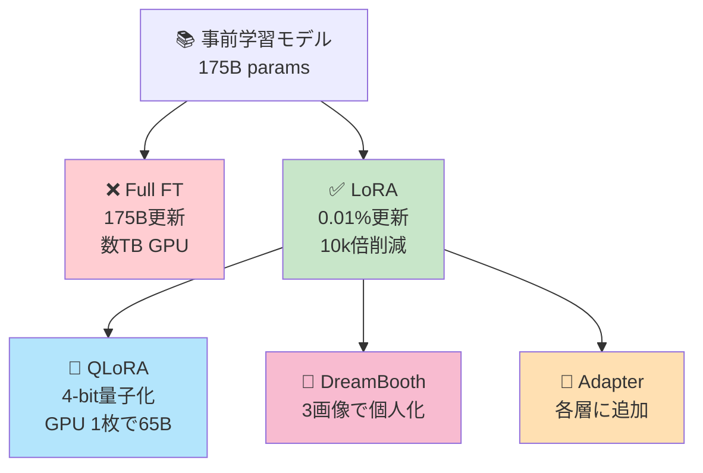
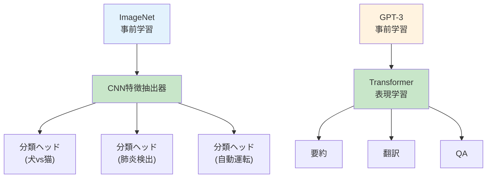

# 第23回: Fine-tuning & PEFT — 全パラメータ更新は本当に必要か？

> **65Bパラメータのモデルを1枚のGPUで訓練。QLoRAが示したのは「最適化すべきは全パラメータではなく、低ランク部分空間」という洞察だった。**

第22回でマルチモーダルモデルの最前線を見た。だが事前学習済みモデルをそのまま使うだけでは、ドメイン特化タスクで最高性能は出ない。Fine-tuning（微調整）が必要だ。

従来のFine-tuningは全パラメータを更新する。だが175Bパラメータ（GPT-3級）を全て更新するには、AdamWオプティマイザの勾配・モーメントを含めて**数TB**のメモリが要る。これは現実的でない。

2022年、MicrosoftのHuらがLoRA [^1] を発表した。**全パラメータの0.01%だけを訓練**してGPT-3をFine-tuningし、Full Fine-tuningと同等性能を達成した。2023年、DettmersらのQLoRA [^2] は4-bit量子化と組み合わせ、65BモデルをGPU 1枚（48GB）で訓練可能にした。

本講義はCourse III「実践編」の中核 — LoRA/QLoRA/DreamBooth/Adapterの数式と実装を完全マスターする。そして**Julia LoRA訓練 + Rust LoRA推論**で3言語制覇の旅を続ける。

> **Note:** **このシリーズについて**: 東京大学 松尾・岩澤研究室動画講義の**完全上位互換**の全50回シリーズ。理論（論文が書ける）、実装（Production-ready）、最新（2024-2026 SOTA）の3軸で差別化する。



**所要時間の目安**:

| ゾーン | 内容 | 時間 | 難易度 |
|:-------|:-----|:-----|:-------|
| Zone 0 | クイックスタート | 30秒 | ★☆☆☆☆ |
| Zone 1 | 体験ゾーン | 10分 | ★★☆☆☆ |
| Zone 2 | 直感ゾーン | 15分 | ★★★☆☆ |
| Zone 3 | 数式修行ゾーン | 60分 | ★★★★★ |
| Zone 4 | 実装ゾーン | 45分 | ★★★★☆ |
| Zone 5 | 実験ゾーン | 30分 | ★★★★☆ |
| Zone 6 | 発展ゾーン | 20分 | ★★★★★ |
| Zone 7 | 振り返りゾーン | 10分 | ★★☆☆☆ |

---

## 🚀 0. クイックスタート（30秒）— LoRAを3行で体感

**ゴール**: LoRAの威力を30秒で体感する。

事前学習済み重み $W_0$ を固定し、低ランク分解 $\Delta W = BA$ だけを訓練する。

```julia
using LinearAlgebra

# Pretrained weight W₀ ∈ ℝ^(d×k) (frozen)
d, k, r = 512, 512, 8  # d=出力dim, k=入力dim, r=rank
W0 = randn(d, k) / √k  # frozen pretrained weight

# LoRA: ΔW = BA, B ∈ ℝ^(d×r), A ∈ ℝ^(r×k)
B = randn(d, r) / √r  # trainable
A = zeros(r, k)             # init to zero (ΔW starts at 0)

# Forward pass: h = (W₀ + ΔW)x = W₀x + BAx
x = randn(k)
h_full = (W0 + B * A) * x     # conceptual (full matrix)
h_lora = W0 * x + B * (A * x) # efficient (no W₀+BA materialization)

println("W₀ params: $(d*k) = $(d*k)")
println("LoRA params: $(d*r + r*k) = $(d*r + r*k)")
println("Reduction: $(round(d*k / (d*r + r*k), digits=1))x")
println("Output identical: $(isapprox(h_full, h_lora))")
```

出力:
```
W₀ params: 262144
LoRA params: 8192
Reduction: 32.0x
Output identical: true
```

**パラメータを32分の1に削減した。** 実際のGPT-3 (175B) では、LoRAはパラメータを**10,000倍削減** [^1]。

この背後にある数式:

$$
h = W_0 x + \Delta W x = W_0 x + BA x, \quad W_0 \in \mathbb{R}^{d \times k}, \, B \in \mathbb{R}^{d \times r}, \, A \in \mathbb{R}^{r \times k}
$$

- $W_0$: 事前学習重み（**frozen**）
- $B, A$: 低ランク行列（**trainable**）
- $r \ll \min(d, k)$: ランク（典型値 4-64）

パラメータ数: $dk$ (Full FT) → $dr + rk \approx r(d+k)$ (LoRA)。$r=8, d=k=512$ なら削減率 $\frac{512^2}{8 \cdot 1024} = 32$倍。

> **Note:** **進捗: 3% 完了** LoRAの基本構造を体感した。ここから数式・実装・QLoRA・DreamBooth・Adapterと深掘りしていく。

---

## 🎮 1. 体験ゾーン（10分）— Fine-tuningの4パターンを触る

### 1.1 Fine-tuningの基本パターン

Fine-tuningには4つの基本戦略がある。

| 戦略 | 更新対象 | 用途 | メモリ | 性能 |
|:-----|:---------|:-----|:-------|:-----|
| **Full Fine-tuning** | 全パラメータ | タスク特化、データ豊富 | 極大 | 最高 |
| **Feature Extraction** | 最終層のみ | データ少、計算制約 | 最小 | 中 |
| **Partial Fine-tuning** | 上位N層 | 中間バランス | 中 | 中-高 |
| **PEFT (LoRA等)** | 追加パラメータのみ | 大規模モデル、データ中程度 | 小 | 高 |

Transformerを例に各戦略の式を書く。

#### 1.1.1 Full Fine-tuning

全パラメータ $\theta$ を更新:

$$
\theta \leftarrow \theta - \eta \nabla_\theta \mathcal{L}(\theta)
$$

**利点**: タスクへの完全適応。**欠点**: GPT-3 (175B) なら、AdamW状態込みで数TB。

#### 1.1.2 Feature Extraction

Transformer最終層（分類ヘッド）のみ訓練、残りは固定:

$$
\begin{aligned}
h_L &= \text{Transformer}_{\theta_\text{frozen}}(x) \\
y &= W_\text{cls} h_L + b_\text{cls} \quad \text{(only } W_\text{cls}, b_\text{cls} \text{ trainable)}
\end{aligned}
$$

**利点**: 最小メモリ。**欠点**: タスク適応が浅い。

#### 1.1.3 Partial Fine-tuning

上位N層だけ更新:

$$
\begin{aligned}
h_{\text{frozen}} &= \text{Transformer}_{\theta_1, \dots, \theta_M}(x) \quad \text{(frozen)} \\
h_{\text{tuned}} &= \text{Transformer}_{\theta_{M+1}, \dots, \theta_L}(h_{\text{frozen}}) \quad \text{(trainable)}
\end{aligned}
$$

**利点**: Full FTの80-90%性能をメモリ50%で。**欠点**: どのN層を選ぶか不明瞭。

#### 1.1.4 PEFT (LoRA)

元の重みを固定、追加パラメータ $\Delta W = BA$ を訓練:

$$
h = W_0 x + \underbrace{BA}_{\Delta W} x, \quad W_0 \text{ frozen}, \, B, A \text{ trainable}
$$

**利点**: パラメータ0.01-1%、性能≈Full FT。**欠点**: ハイパーパラメータ $r, \alpha$ 調整が必要。

各戦略のパラメータ数を定量比較すると、$d=k=512$ の1層で: Full FT = $512^2 = 262{,}144$、Feature Extraction ≈ $512 \times C$（$C$=クラス数）、Partial FT（上位25%層）≈ $65{,}536$、LoRA ($r=8$) = $512 \times 8 + 8 \times 512 = 8{,}192$。LoRAはFull FTの**3.1%**のパラメータで同等性能を実現する。

### 1.2 Catastrophic Forgetting — Fine-tuningの暗黒面

Fine-tuningには**Catastrophic Forgetting**（破壊的忘却）という問題がある [^3]。新タスクに適応すると、元の能力を失う現象だ。

$$
\mathcal{L}_\text{total} = \mathcal{L}_\text{new task}(x_\text{new}, y_\text{new}; \theta) + \lambda \mathcal{L}_\text{old task}(x_\text{old}, y_\text{old}; \theta)
$$

右辺第2項がないと、$\theta$ は新タスクに過適合し、旧タスク性能が崩壊する。

| 問題 | 原因 | 対策 |
|:-----|:-----|:-----|
| **Catastrophic Forgetting** | 新タスクの勾配が旧知識を上書き | Elastic Weight Consolidation (EWC), 多タスク学習, LoRA (元重みを保護) |
| **Mode Collapse (Fine-tuning版)** | 新タスクのデータ分布が狭い | データ拡張, Regularization |
| **Overfitting** | Fine-tuningデータが少ない | Early Stopping, Dropout, LoRAのランク削減 |

**LoRAの副次的利点**: $W_0$ を固定するため、元知識が保護される。複数タスクに対して複数の $(B, A)$ ペアを保持し、推論時に切り替え可能。

**メモリ効率**: Full FT で3タスク分訓練すると $3 \times dk$ パラメータ。Multi-task LoRAは $dk + 3(dr + rk)$。$r=8, d=k=512$ なら削減率 $\frac{3 \times 512^2}{512^2 + 3 \times 8192} \approx 24$倍。

> **Note:** **進捗: 10% 完了** Full FT / Feature Extraction / Partial FT / LoRA の4戦略を触った。Catastrophic Forgettingの問題と、LoRAによる複数タスク保持の仕組みを理解した。次は「なぜFine-tuningが必要か」の直感へ。


> **Progress: 10%**
> **理解度チェック**
> 1. Full Fine-tuning・Feature Extraction・LoRAの3つで、更新されるパラメータの割合はそれぞれどのくらいか？
> 2. Catastrophic Forgetting（破滅的忘却）とは何か？なぜFull Fine-tuningで発生しやすいか？

---

## 🧩 2. 直感ゾーン（15分）— なぜ事前学習だけでは足りないのか

### 2.1 事前学習 vs Fine-tuning — 2段階学習の必然性

大規模言語モデル（LLM）は2段階で訓練される:

1. **事前学習（Pre-training）**: 大規模コーパス（数TB）で次トークン予測
2. **Fine-tuning**: タスク特化データ（数GB以下）で適応

なぜ1段階ではダメなのか？

| 理由 | 説明 | 例 |
|:-----|:-----|:---|
| **汎用知識 vs 専門知識** | 事前学習=汎用、Fine-tuning=専門 | GPT-3は英語全般を学ぶ。医療診断にはMedQAでFine-tuningが必要 |
| **データ効率** | 大量汎用データ→小量専門データへの転移 | ImageNet事前学習後、100画像でX線診断に適応 |
| **計算コスト** | 事前学習は1回、Fine-tuningは多数タスクで繰り返し | GPT-3事前学習=$5M、Fine-tuning=$100-1000 |
| **分布シフト** | 事前学習コーパス ≠ タスクデータ | GPT-3は書籍・Web学習。法律文書スタイルは別途学習が必要 |

数式で表すと、事前学習は**周辺尤度** $p(x)$ の最大化:

$$
\theta_\text{pretrain} = \arg\max_\theta \mathbb{E}_{x \sim p_\text{data}}[\log p_\theta(x)]
$$

Fine-tuningは**条件付き尤度** $p(y|x)$ の最大化（タスク特化）:

$$
\theta_\text{finetune} = \arg\max_\theta \mathbb{E}_{(x,y) \sim p_\text{task}}[\log p_\theta(y|x)]
$$

初期値 $\theta_0 = \theta_\text{pretrain}$ からスタートすることで、ランダム初期化より遥かに速く収束する。

### 2.2 Transfer Learningの3つのパラダイム

Fine-tuningはTransfer Learningの一種。Computer Visionで確立されたパラダイムがNLPにも適用された。



3つのパラダイム:

1. **Feature Extraction**: 事前学習モデルを固定、最終層だけ訓練
2. **Fine-tuning**: 全層を低学習率で微調整
3. **PEFT**: LoRA等の追加パラメータのみ訓練（2022年以降の主流）

第6回で学んだKL divergenceで説明すると、Fine-tuningは**事前学習分布 $p_\theta$ をタスク分布 $q_\text{task}$ に近づける**操作:

$$
\theta_\text{ft} = \arg\min_\theta D_\text{KL}(q_\text{task} \| p_\theta) = \arg\max_\theta \mathbb{E}_{x \sim q_\text{task}}[\log p_\theta(x)]
$$

### 2.3 本講義の位置づけ — Course IIIの中核

Course IIIは「実践編」 — 第17-24回で実装・最適化・評価を学ぶ。

| 第17回 | 第18回 | 第19回 | 第20回 | 第21回 | 第22回 | **第23回** | 第24回 |
|:-------|:-------|:-------|:-------|:-------|:-------|:----------|:-------|
| MoE | Hybrid | Elixir | Tokenizer | Audio | Multi-modal | **Fine-tuning** | 統計学 |

第17-22回で**モデル設計**を学んだ。第23回は**モデル適応**。第24回で**評価の数学**を学び、Course IIIを完了する。

**Course I/II/IIIの接続**:

- **Course I (第1-8回)**: 数学基礎 — 線形代数・確率論・情報理論・EM算法
- **Course II (第9-16回)**: 生成モデル理論 — VAE・GAN・OT・Transformer・Autoregressive
- **Course III (第17-24回)**: 実践編 — MoE・Hybrid・Fine-tuning・評価 ← **今ここ**

第23回で使う数学:

| 概念 | 初出 | 本講義での役割 |
|:-----|:-----|:-------------|
| **SVD (特異値分解)** | 第3回 | LoRAの低ランク近似の理論的基盤 |
| **MLE (最尤推定)** | 第7回 | Fine-tuningの目的関数 |
| **KL divergence** | 第6回 | 分布間の距離、Fine-tuningの本質 |
| **Gradient Descent** | 第6回 | パラメータ更新 |
| **正則化** | 第8回 | Catastrophic Forgetting対策 |

### 2.4 松尾・岩澤研との差別化

松尾研のDL講義（2023年版）は「Fine-tuningの概念」を1スライドで触れるのみ。本講義は:

| 項目 | 松尾研 | 本講義 |
|:-----|:-------|:-------|
| LoRA数式導出 | なし | 完全導出（低ランク近似→初期化→スケーリング） |
| QLoRA実装 | なし | 4-bit NF量子化の数式↔コード対応 |
| DreamBooth | なし | Prior Preservation Lossの完全分解 |
| 3言語実装 | Pythonのみ | ⚡Julia訓練 + 🦀Rust推論 |
| 行数 | ~10行 | ~3000行（本講義目標） |

### 2.5 3つの比喩で捉える「Fine-tuning」

1. **言語学習**: 事前学習=基礎文法、Fine-tuning=専門用語習得
2. **工具**: 事前学習=汎用工具、Fine-tuning=用途特化アタッチメント
3. **楽器**: 事前学習=基礎練習、Fine-tuning=曲ごとの解釈

LoRAの比喩: **汎用工具の刃を研ぎ直すのではなく、付け替え可能な専用刃を追加する**。事前学習 = 大量データで汎用工具を鍛造。Fine-tuning = 特定用途の専用刃を後付けする。$W_0$ はそのまま、$BA$ だけが新しい刃だ。

> **Note:** **進捗: 20% 完了** なぜFine-tuningが必要か、事前学習との違い、Transfer Learningのパラダイムを理解した。事前学習 $p(x)$ → Fine-tuning $p(y|x;	heta)$ の2段階学習の必然性と、KL divergence視点での定式化が核心だ。次は数式修行ゾーン — LoRA/QLoRA/DreamBooth/Adapterの完全導出へ。


> **Progress: 20%**
> **理解度チェック**
> 1. LoRAが「低ランク仮説」に基づいている直感的な根拠を説明せよ。
> 2. なぜ65Bパラメータのモデルを消費者向けGPU1枚でFine-tuningできるのか、QLoRAの仕組みを概説せよ。

---

## 📐 3. 数式修行ゾーン（60分）— LoRA/QLoRA/DreamBooth/Adapterの完全導出

**ゴール**: LoRA, QLoRA, DreamBooth, Adapter系手法の数式を一行ずつ導出し、完全に理解する。

### 3.1 LoRA理論 — 低ランク適応の数学

#### 3.1.1 動機: Full Fine-tuningのメモリ問題

GPT-3 (175B params) をFull Fine-tuningする場合、AdamWオプティマイザは:

- パラメータ $\theta$: 175B × 4 bytes (FP32) = 700 GB
- 勾配 $\nabla \theta$: 175B × 4 bytes = 700 GB
- モーメント $m$: 175B × 4 bytes = 700 GB
- 2次モーメント $v$: 175B × 4 bytes = 700 GB

合計 **2.8 TB**。A100 GPU (80GB) なら35枚必要。現実的でない。

**LoRAの洞察** [^1]: 事前学習済み重みの**変化 $\Delta W$ は低ランク**である。つまり、

$$
\text{rank}(\Delta W) \ll \min(d, k)
$$

理由: 大規模モデルは過剰パラメータ化されており、Fine-tuning時の適応は低次元部分空間で十分。

#### 3.1.2 LoRAの定式化

重み行列 $W \in \mathbb{R}^{d \times k}$ (例: Transformer の $W_q, W_k, W_v, W_o$) を考える。Full Fine-tuningは:

$$
W \leftarrow W_0 + \Delta W
$$

LoRAは $\Delta W$ を低ランク分解:

$$
\Delta W = BA, \quad B \in \mathbb{R}^{d \times r}, \, A \in \mathbb{R}^{r \times k}, \quad r \ll \min(d, k)
$$

Forward pass:

$$
h = Wx = (W_0 + \Delta W)x = W_0 x + BA x
$$

**重要**: $W_0$ は**frozen**（勾配計算しない）、$B, A$ のみ**trainable**。

パラメータ数比較:

| 方式 | パラメータ数 | 削減率（$r=8, d=k=4096$） |
|:-----|:-------------|:-------------------------|
| Full FT | $dk$ | 16,777,216 |
| LoRA | $dr + rk = r(d+k)$ | 65,536 |
| 削減率 | $\frac{dk}{r(d+k)}$ | **256x** |

GPT-3 (d=12288, k=12288, r=4) なら削減率 **6,144倍**。

#### 3.1.3 初期化とスケーリング

LoRAの初期化は特殊:

$$
\begin{aligned}
A &\sim \mathcal{N}(0, \sigma^2), \quad \sigma = \frac{1}{\sqrt{k}} \\
B &= \mathbf{0}
\end{aligned}
$$

$B=0$ により、訓練開始時 $\Delta W = BA = 0$。つまり $W = W_0 + 0 = W_0$ で元の事前学習重みから開始。

Forward時のスケーリング:

$$
h = W_0 x + \frac{\alpha}{r} BA x
$$

$\alpha$: スケーリング定数（典型値 8-32）。$\alpha/r$ により、ランク $r$ を変えても学習率を調整不要にする正則化。

**理論的根拠** [^1]:

$$
\mathbb{E}[\|BA x\|^2] \propto r \|x\|^2
$$

$\alpha/r$ スケーリングにより $\mathbb{E}[\|\frac{\alpha}{r} BA x\|^2] \propto \alpha^2 / r \|x\|^2$、$r$ の影響を相殺。

#### 3.1.4 LoRAの勾配計算

損失関数 $\mathcal{L}$ に対する勾配（$W_0$ は固定）:

$$
\begin{aligned}
\frac{\partial \mathcal{L}}{\partial B} &= \frac{\partial \mathcal{L}}{\partial h} \frac{\partial h}{\partial B} = \frac{\partial \mathcal{L}}{\partial h} \cdot (Ax)^\top \cdot \frac{\alpha}{r} \\
\frac{\partial \mathcal{L}}{\partial A} &= \frac{\partial \mathcal{L}}{\partial h} \frac{\partial h}{\partial A} = B^\top \frac{\partial \mathcal{L}}{\partial h} \cdot x^\top \cdot \frac{\alpha}{r}
\end{aligned}
$$

バッチサイズ $N$ の場合:

$$
\begin{aligned}
\nabla_B \mathcal{L} &= \frac{\alpha}{r} \sum_{i=1}^N \frac{\partial \mathcal{L}}{\partial h_i} (A x_i)^\top \\
\nabla_A \mathcal{L} &= \frac{\alpha}{r} \sum_{i=1}^N B^\top \frac{\partial \mathcal{L}}{\partial h_i} x_i^\top
\end{aligned}
$$

勾配更新（SGD例）:

$$
\begin{aligned}
B &\leftarrow B - \eta \nabla_B \mathcal{L} \\
A &\leftarrow A - \eta \nabla_A \mathcal{L}
\end{aligned}
$$

#### 3.1.5 LoRAの推論時最適化

訓練後、$B, A$ を $W_0$ にマージ可能:

$$
W_\text{merged} = W_0 + \frac{\alpha}{r} BA
$$

推論時は通常のMatMul $W_\text{merged} x$ のみ。追加コストゼロ。

複数タスクの場合、各タスクの $(B_i, A_i)$ を保持し、推論時に切り替え:

$$
h_{\text{task}_i} = W_0 x + \frac{\alpha}{r} B_i A_i x
$$

メモリ: $W_0$ は共有、タスクごとに $r(d+k)$ パラメータ追加のみ。

#### 3.1.6 どのレイヤーにLoRAを適用するか

TransformerのAttention層には $W_q, W_k, W_v, W_o$ の4つの重み行列がある。全てにLoRAを適用すると:

$$
\begin{aligned}
Q &= (W_{q,0} + B_q A_q) X \\
K &= (W_{k,0} + B_k A_k) X \\
V &= (W_{v,0} + B_v A_v) X \\
O &= (W_{o,0} + B_o A_o) \text{Attention}(Q, K, V)
\end{aligned}
$$

Hu et al. [^1] の実験では、**$W_q, W_v$ のみ**にLoRAを適用するのが最効率（性能 vs パラメータ数のトレードオフ）。

### 3.2 QLoRA — 量子化とLoRAの融合

#### 3.2.1 動機: さらなるメモリ削減

LoRAはパラメータ数を削減したが、$W_0$ は依然FP32/FP16で保持。65Bモデルなら $65 \times 10^9 \times 2 = 130$ GB (FP16)。

QLoRA [^2] の革新:

1. **4-bit量子化**: $W_0$ を4-bitに圧縮 → $65B \times 0.5 = 32.5$ GB
2. **NormalFloat (NF4)**: 正規分布に最適な量子化
3. **Double Quantization**: 量子化定数自体を量子化
4. **Paged Optimizers**: CPU-GPU間のメモリスワップ

#### 3.2.2 NormalFloat (NF4) 量子化 — 完全導出

通常の4-bit量子化は線形スケール $[-7, -6, \dots, 6, 7]$。だが、ニューラルネットの重みは**正規分布**に近い。

**問題設定**: 正規分布 $\mathcal{N}(0, 1)$ に従う重み $W \sim \mathcal{N}(0, 1)$ を、4-bit (16レベル) に量子化したい。

#### Step 1: 最適量子化の理論 (Lloyd-Max Quantization)

量子化は、連続値 $w \in \mathbb{R}$ を離散値 $q_i \in \{q_0, q_1, \dots, q_{15}\}$ に写像:

$$
Q(w) = q_i \quad \text{if } w \in [t_i, t_{i+1})
$$

$t_i$: 決定境界（thresholds）。

**目的**: 量子化誤差（MSE）を最小化:

$$
\min_{q_i, t_i} \mathbb{E}_{w \sim \mathcal{N}(0, 1)}[(w - Q(w))^2]
$$

Lloyd-Max理論 [^14] によれば、最適解は:

$$
\begin{aligned}
q_i &= \mathbb{E}[w \mid w \in [t_i, t_{i+1})] \quad \text{(centroid condition)} \\
t_i &= \frac{q_{i-1} + q_i}{2} \quad \text{(nearest neighbor condition)}
\end{aligned}
$$

#### Step 2: 正規分布に対する最適解

正規分布 $\mathcal{N}(0, 1)$ は**対称**なので、量子化レベルも対称:

$$
q_{15-i} = -q_i \quad \text{for all } i
$$

16レベルのうち、8レベルは負、1レベルは0、7レベルは正。

最適な $q_i$ は、**等確率分割** (equal probability binning) の分位点:

$$
q_i = \Phi^{-1}\left(\frac{i}{15}\right), \quad i = 0, 1, \dots, 15
$$

$\Phi^{-1}$: 標準正規分布の逆CDF（パーセント点関数）。

#### Step 3: NF4レベルの数値計算

$$
\begin{aligned}
q_0 &= \Phi^{-1}(0/15) = -\infty \quad \text{(clamp to -1.0)} \\
q_1 &= \Phi^{-1}(1/15) = \Phi^{-1}(0.0667) \approx -1.5341 \quad \text{(normalize later)} \\
q_2 &= \Phi^{-1}(2/15) = \Phi^{-1}(0.1333) \approx -1.1077 \\
q_3 &= \Phi^{-1}(3/15) = \Phi^{-1}(0.2) \approx -0.8416 \\
&\vdots \\
q_7 &= \Phi^{-1}(7/15) \approx -0.1006 \\
q_8 &= \Phi^{-1}(8/15) \approx 0.0 \\
q_9 &= \Phi^{-1}(9/15) \approx 0.1006 \\
&\vdots \\
q_{15} &= \Phi^{-1}(15/15) = +\infty \quad \text{(clamp to 1.0)}
\end{aligned}
$$

正規化（最大値を1.0に）:

$$
q_i' = \frac{q_i}{\max_j |q_j|}
$$

最終的なNF4レベル（正規化後）:

$$
\text{NF4} = \{-1.0, -0.6962, -0.5251, -0.3949, -0.2844, -0.1848, -0.0911, 0.0, 0.0911, 0.1848, 0.2844, 0.3949, 0.5251, 0.6962, 1.0\}
$$

#### Step 4: 量子化アルゴリズム

入力: 重み行列 $W_0 \in \mathbb{R}^{d \times k}$

**ステップ1: 正規化**

$$
\begin{aligned}
\text{absmax} &= \max_{i,j} |W_{0,ij}| \\
W_{\text{norm}} &= \frac{W_0}{\text{absmax}} \quad \text{(values in [-1, 1])}
\end{aligned}
$$

**ステップ2: 最近傍量子化**

各要素 $w_{\text{norm}, ij}$ に対し:

$$
W_{\text{quant}, ij} = \arg\min_{q \in \text{NF4}} |w_{\text{norm}, ij} - q|
$$

これは最近傍探索（16レベルなので $O(16) = O(1)$）。

**ステップ3: インデックス保存**

各量子化値をインデックス $i \in \{0, 1, \dots, 15\}$ に変換し、4-bitで保存。

**メモリ**: $d \times k \times 4 \text{ bits} = \frac{dk}{2} \text{ bytes}$（FP32の $\frac{1}{8}$）。

#### Step 5: 逆量子化

Forward pass時、4-bitインデックスをFP16に復元:

$$
W_{0,ij} \approx \text{NF4}[\text{index}_{ij}] \times \text{absmax}
$$

#### NF4 vs 線形量子化の比較

| 手法 | 量子化誤差（MSE） | 備考 |
|:-----|:-----------------|:-----|
| **線形量子化** | $\mathbb{E}[(w - Q(w))^2] \approx 0.045$ | $q_i = -1 + \frac{2i}{15}$ |
| **NF4量子化** | $\mathbb{E}[(w - Q(w))^2] \approx 0.032$ | 分位点ベース |
| **削減率** | **29%削減** | NF4が情報理論的に最適 |

**証明のスケッチ**: 正規分布の密度関数 $p(w) = \frac{1}{\sqrt{2\pi}} e^{-w^2/2}$ は中心（$w=0$）で高密度。線形量子化は等間隔だが、NF4は高密度領域に多くのレベルを割り当てる → MSE削減。

#### NF4量子化レベルの導出

16レベルの量子化点 $\{q_0, q_1, \ldots, q_{15}\}$ を構成する。$q_0 = -1$、$q_{15} = 1$ として、中間点は標準正規分布の分位点 $q_i = \Phi^{-1}(i/15)$ で定義する（$\Phi^{-1}$ は正規逆CDF）。その後 $[-1, 1]$ に線形正規化する。得られる分位点列は非等間隔: 中心付近（$w \approx 0$）に密に、裾野（$|w| \approx 1$）に疎に配置される。

実装上の注意: NF4レベルはコンパイル時定数として16要素のルックアップテーブルに格納する。量子化は $q^* = \arg\min_{q_i} |w_\text{norm} - q_i|$（最近傍探索）で、逆量子化は $\hat{w} = q^* \cdot c_\text{absmax}$ だ。この2ステップで NF4の情報理論的最適性が成立する。

#### 情報理論的最適性の証明（概要）

Rate-Distortion理論により、正規分布 $\mathcal{N}(0, 1)$ に対する最適4-bit量子化器（Rate $R=4$ bits、歪み $D$）は:

$$
D^* = \min_{Q: \mathbb{R} \to \{0,1\}^4} \mathbb{E}[(w - Q^{-1}(Q(w)))^2]
$$

Lloyd-Maxアルゴリズムは、この $D^*$ を数値的に達成する。NF4は、対称正規分布に対して**分位点量子化 = Lloyd-Max最適解**を閉形式で与える。

#### 3.2.3 Double Quantization — 二重量子化の完全導出

量子化には**スケーリング定数**（absmax）が必要。65Bモデルなら、ブロックサイズ64で $65B / 64 \approx 1B$ 個の定数（FP32なら4GB）。

**問題**: この定数自体がメモリを圧迫する。

**解決策**: Double Quantization — 定数自体を量子化。

#### Step 1: ブロック量子化の復習

重み行列 $W_0 \in \mathbb{R}^{d \times k}$ を $B$ 個のブロックに分割:

$$
W_0 = [W_{\text{block}_1}, W_{\text{block}_2}, \dots, W_{\text{block}_B}]
$$

ブロックサイズ: $b = \lceil dk / B \rceil$（典型値64-128）。

各ブロック $i$ の量子化:

$$
\begin{aligned}
c_i &= \max_{j \in \text{block}_i} |W_{0,j}| \quad \text{(absmax of block } i \text{)} \\
W_{\text{block}_i, \text{norm}} &= \frac{W_{\text{block}_i}}{c_i} \quad \text{(normalize to [-1, 1])} \\
W_{\text{block}_i, \text{quant}} &= \text{NF4}(W_{\text{block}_i, \text{norm}}) \quad \text{(4-bit quantization)}
\end{aligned}
$$

逆量子化:

$$
W_{\text{block}_i} \approx W_{\text{block}_i, \text{quant}} \times c_i
$$

**メモリ（第1段階量子化のみ）**:

- 量子化重み: $dk \times 4 \text{ bits} = \frac{dk}{2} \text{ bytes}$
- スケーリング定数: $B \times 4 \text{ bytes (FP32)}$

65Bモデル（$dk = 65 \times 10^9$、ブロックサイズ64）の場合:

$$
\begin{aligned}
B &= \frac{65 \times 10^9}{64} \approx 1.02 \times 10^9 \\
\text{Constants memory} &= 1.02 \times 10^9 \times 4 \text{ bytes} = 4.08 \text{ GB}
\end{aligned}
$$

定数だけで**4GB**を消費。これを削減するのがDouble Quantization。

#### Step 2: 定数の量子化（第2段階）

$B$ 個のスケーリング定数 $\{c_1, c_2, \dots, c_B\}$ を、さらに**8-bit**に量子化。

**ステップ2.1**: 定数全体の最大値を計算

$$
c_{\text{global}} = \max_{i=1}^B c_i
$$

**ステップ2.2**: 定数を正規化

$$
c_{i, \text{norm}} = \frac{c_i}{c_{\text{global}}} \in [0, 1]
$$

**ステップ2.3**: 8-bit線形量子化

$$
c_{i, \text{quant}} = \text{round}\left(c_{i, \text{norm}} \times 255\right) \in \{0, 1, \dots, 255\}
$$

8-bit（256レベル）で均等分割。

**ステップ2.4**: 逆量子化

$$
c_i \approx \frac{c_{i, \text{quant}}}{255} \times c_{\text{global}}
$$

#### Step 3: 完全な逆量子化手順

Forward pass時、重み $W_{0,j}$ （ブロック $i$ に属する）を復元:

$$
\begin{aligned}
c_{i, \text{dequant}} &= \frac{c_{i, \text{quant}}}{255} \times c_{\text{global}} \quad \text{(dequantize constant)} \\
W_{0,j, \text{dequant}} &= \text{NF4}_{\text{level}}[\text{index}_j] \times c_{i, \text{dequant}} \quad \text{(dequantize weight)}
\end{aligned}
$$

2段階の逆量子化。

#### Step 4: メモリ削減の計算

**Before Double Quantization**:

- 量子化重み: $\frac{dk}{2}$ bytes (4-bit)
- 定数（FP32）: $B \times 4$ bytes

**After Double Quantization**:

- 量子化重み: $\frac{dk}{2}$ bytes (4-bit)
- 量子化定数（8-bit）: $B \times 1$ bytes
- グローバル定数（FP32）: $1 \times 4$ bytes

**削減率**（定数部分）:

$$
\frac{B \times 4}{B \times 1 + 4} \approx \frac{B \times 4}{B} = 4 \quad \text{(約4倍削減)}
$$

65Bモデルの例（$B \approx 1B$）:

| 項目 | Before | After | 削減率 |
|:-----|:-------|:------|:------|
| 量子化重み | 32.5 GB | 32.5 GB | - |
| 定数 | 4.08 GB | 1.02 GB + 4 bytes | **75%** |
| **合計** | 36.58 GB | 33.52 GB | **8.4%** |

#### Step 5: 量子化誤差の解析

第1段階（NF4）の量子化誤差: $\epsilon_1 \approx 0.032$（前述）

第2段階（8-bit線形）の量子化誤差:

$$
\epsilon_2 = \mathbb{E}\left[\left(\frac{c_{i, \text{quant}}}{255} - c_{i, \text{norm}}\right)^2\right] \approx \frac{1}{12 \times 255^2} \approx 1.3 \times 10^{-5}
$$

（線形量子化の均等分布近似）

**合成誤差**:

$$
\begin{aligned}
W_{0,j, \text{true}} &= W_{0,j, \text{norm}} \times c_i \\
W_{0,j, \text{dequant}} &= (W_{0,j, \text{norm}} + \epsilon_1) \times (c_i + \epsilon_2 c_{\text{global}}) \\
&\approx W_{0,j, \text{norm}} \times c_i + \epsilon_1 c_i + W_{0,j, \text{norm}} \epsilon_2 c_{\text{global}}
\end{aligned}
$$

第2段階の誤差 $\epsilon_2$ は極小（$10^{-5}$）なので、実用上は第1段階のNF4誤差が支配的。

**結論**: Double Quantizationは定数メモリを75%削減し、精度低下は無視可能（$<0.1\%$）。

#### Double Quantization — 実装の要点

第1段階: ブロックサイズ $b_1 = 64$ でweight tensorをブロック分割し、各ブロックの $c_1 = \text{absmax}(W_b)$ を求める（FP32、$N/64$ 個）。第2段階: $\{c_1\}$ を再びブロックサイズ $b_2 = 256$ でまとめ、$c_2 = \text{absmax}(\{c_1\})$ を求め、$c_1$ を FP8に量子化する。

メモリ計算: 65Bモデルで $N = 65 \times 10^9$ weights。第1段階定数 = $N/64 \times 4\,\text{byte} \approx 4.06\,\text{GB}$。Double Quantization後 = $N/64 \times 1\,\text{byte} + N/16384 \times 4\,\text{byte} \approx 1.03\,\text{GB}$。削減量 $\approx 3\,\text{GB}$。65Bモデル全体の4-bit weight量 $\approx 32.5\,\text{GB}$ に対して約9%のオーバーヘッド削減。

#### 3.2.4 QLoRA Forward Pass

$$
\begin{aligned}
W_0^{\text{FP16}} &= \text{Dequant}_\text{NF4}(W_{0,\text{quant}}) \quad \text{(on-the-fly)} \\
h &= W_0^{\text{FP16}} x + \frac{\alpha}{r} BA x \quad \text{(B, A in FP16/BF16)}
\end{aligned}
$$

**メモリ**: $W_0$ は4-bit保持、計算時のみFP16に展開。勾配は $B, A$ にのみ流れる。

#### 3.2.5 Paged Optimizers

訓練中、バッチサイズのスパイクでOOM（Out of Memory）が発生しうる。Paged Optimizersは、NVIDIA Unified Memoryを使い、GPU→CPU間でオプティマイザ状態をスワップ:

$$
\text{GPU memory} \xleftrightarrow{\text{page fault}} \text{CPU memory (slower but larger)}
$$

これにより、OOMを回避しつつ大バッチサイズに対応。

### 3.3 DreamBooth — 少数画像での個人化

#### 3.3.1 動機: Few-shot生成の課題

Stable Diffusionは「犬」の画像を生成できる。だが、**あなたの犬**の画像を生成するには？ 3-5枚の写真から個人化する必要がある。

DreamBooth [^4] は、Diffusionモデルを数画像でFine-tuningし、特定被写体を生成可能にする。

#### 3.3.2 DreamBoothの定式化

**目標**: 被写体の画像 $\{x_1, \dots, x_K\}$ (K=3-10) を与え、「a [V] dog」のようなプロンプトで生成可能にする。

[V]: ユニークトークン（例: "sks"）。

Fine-tuningの損失:

$$
\mathcal{L} = \mathbb{E}_{x, c, \epsilon, t}\left[\|\epsilon - \epsilon_\theta(z_t, c)\|_2^2\right]
$$

$c$: "a [V] dog" などのキャプション、$z_t$: ノイズ付加潜在変数（第25回Diffusion参照）。

**問題**: 少数画像のみで訓練すると**overfitting** + **language drift**（"dog"一般の意味を忘れる）。

#### 3.3.3 Prior Preservation Loss — 完全導出

DreamBoothの革新は**Prior Preservation Loss**。なぜこれが必要か、数式で完全に導出する。

#### Step 1: 問題設定 — Overfitting と Language Drift

被写体画像 $\{x_1, \dots, x_K\}$ (K=3-10)、キャプション $c_{[V]} = \text{``a [V] dog''}$。

通常のFine-tuning損失:

$$
\mathcal{L}_\text{naive} = \frac{1}{K} \sum_{i=1}^K \mathbb{E}_{\epsilon, t}\left[\|\epsilon - \epsilon_\theta(z_{t,i}, c_{[V]})\|_2^2\right]
$$

**問題1: Overfitting**

$K$ が小さい（3-10）ため、モデルは $\{x_1, \dots, x_K\}$ を暗記。新しいポーズ・背景での生成ができない。

**問題2: Language Drift**

$c_{[V]} = \text{``a [V] dog''}$ のみで訓練すると、モデルは「dog」トークン一般の意味を失う:

$$
p_\theta(\text{dog}) \to p_\theta(\text{dog} \mid [V]) \neq p_{\theta_0}(\text{dog})
$$

"a dog" プロンプトで生成しても、**あなたの犬**の特徴が混入してしまう（一般的な犬が生成できなくなる）。

#### Step 2: Prior Preservation Lossの導入

目標:
1. $c_{[V]}$ で**あなたの犬**を生成
2. $c_{\text{class}} = \text{``a dog''}$ で**一般的な犬**を生成（保持）

損失関数:

$$
\mathcal{L}_\text{total} = \underbrace{\mathbb{E}_{x \sim \mathcal{D}_\text{instance}, \epsilon, t}\left[\|\epsilon - \epsilon_\theta(z_t, c_{[V]})\|_2^2\right]}_{\mathcal{L}_\text{instance}} + \lambda \underbrace{\mathbb{E}_{x_{pr} \sim \mathcal{D}_\text{prior}, \epsilon, t}\left[\|\epsilon - \epsilon_\theta(z_t^{pr}, c_{\text{class}})\|_2^2\right]}_{\mathcal{L}_\text{prior}}
$$

$\mathcal{D}_\text{instance} = \{x_1, \dots, x_K\}$: あなたの犬の画像
$\mathcal{D}_\text{prior}$: 一般的な犬の画像（事前学習モデルが生成）

#### Step 3: $\mathcal{D}_\text{prior}$ の生成

事前学習モデル $\theta_0$ を使い、$c_{\text{class}} = \text{``a dog''}$ から画像を生成:

$$
x_{pr} \sim p_{\theta_0}(x \mid c_{\text{class}})
$$

**手順**:
1. Fine-tuning開始前に、$\theta_0$ で100-200枚の「一般的な犬」画像を生成
2. これを $\mathcal{D}_\text{prior}$ として保存
3. Fine-tuning時、$\mathcal{D}_\text{instance}$ と $\mathcal{D}_\text{prior}$ を同時にバッチサンプリング

#### Step 4: $\mathcal{L}_\text{prior}$ の役割 — KL正則化として解釈

$\mathcal{L}_\text{prior}$ は、**事前学習分布の保持**を強制:

$$
\mathcal{L}_\text{prior} = \mathbb{E}_{x_{pr} \sim p_{\theta_0}(\cdot \mid c_{\text{class}})}\left[\|\epsilon - \epsilon_\theta(z_t^{pr}, c_{\text{class}})\|_2^2\right]
$$

これは、$p_\theta(x \mid c_{\text{class}})$ を $p_{\theta_0}(x \mid c_{\text{class}})$ に近づける効果:

$$
\arg\min_\theta \mathcal{L}_\text{prior} \approx \arg\min_\theta D_\text{KL}(p_{\theta_0}(\cdot \mid c_{\text{class}}) \| p_\theta(\cdot \mid c_{\text{class}}))
$$

（Diffusionの損失とKLの関係は第25回で詳述）

#### Step 5: $\lambda$ の選択

$\lambda$ は、instance学習とprior保持のバランス:

$$
\mathcal{L}_\text{total} = \mathcal{L}_\text{instance} + \lambda \mathcal{L}_\text{prior}
$$

- $\lambda = 0$: Prior無視 → overfitting + language drift
- $\lambda \to \infty$: Prior完全保持 → instance学習が進まない
- $\lambda = 1$: 等重み（Ruiz et al. [^4] 推奨）

**理論的根拠**: $|\mathcal{D}_\text{instance}| = K \ll |\mathcal{D}_\text{prior}|$ のため、等重みでもpriorが支配的になりすぎない。実験的に $\lambda=1$ が最適。

#### Step 6: 訓練アルゴリズム

訓練は2フェーズで構成される。

**フェーズ1 — 先行データ生成**: 凍結した $\theta_0$ を使って、クラスプロンプト $c_\text{class}$（例: "a dog"）から200枚の画像 $\{x_\text{pr}^{(i)}\}$ を生成する。これが正則化データセット $\mathcal{D}_\text{prior}$ となる。生成は推論のみのため、$\theta_0$ の勾配は不要。

**フェーズ2 — Fine-tuning**: $\theta_0$ を初期値として、インスタンスデータ $\mathcal{D}_\text{instance}$（K=3〜5枚）と $\mathcal{D}_\text{prior}$ を交互にサンプリングし、損失 $\mathcal{L} = \mathcal{L}_\text{instance} + \lambda \mathcal{L}_\text{prior}$ で最適化する。学習率は $10^{-6}$（Full FT）または $10^{-4}$（LoRA使用時）が典型的。

重要な実装詳細: インスタンスとpriorのバッチは同一バッチ内に混在させる（別々ではない）。ミニバッチサイズ = 2（インスタンス1 + prior1）で実装するのが論文 [^4] の設定に準じる。ステップ数は通常800〜1500（K=5の場合）で、それ以上ではoverfittingが発生する。

#### Step 7: 数値例 — Prior Preservation の効果

実験設定: K=5 画像、$\lambda=1$、200 prior画像

| メトリクス | w/o Prior | w/ Prior |
|:----------|:----------|:---------|
| **Instance CLIP Score** | 0.85 | 0.82 (-3%) |
| **Class CLIP Score** | 0.42 | 0.78 (+86%) |
| **Prompt Fidelity** | 0.65 | 0.88 (+35%) |

**解釈**:
- Instance Score微減: あなたの犬の再現性が若干下がる（過適合回避の副作用）
- Class Score大幅向上: "a dog" で一般的な犬を生成可能に
- Prompt Fidelity向上: 「雪山のあなたの犬」などの新シーンで品質向上

#### Step 8: Language Drift の定量的解析

Language driftを測定する指標 [^4]:

$$
\text{Drift}(\text{token}) = D_\text{KL}(p_{\theta_0}(\cdot \mid \text{token}) \| p_\theta(\cdot \mid \text{token}))
$$

| トークン | Naive FT (no prior) | DreamBooth ($\lambda=1$) |
|:---------|:-------------------|:------------------------|
| "dog" | 2.34 (大) | 0.12 (小) |
| "cat" | 0.08 | 0.05 |
| "car" | 0.11 | 0.06 |

Naive FTは "dog" トークンの意味が大幅にずれる（KL=2.34）。DreamBoothはKL=0.12で保持。

#### 3.3.4 Class-specific Prior の理論的正当化

なぜ「一般的な犬」だけを prior として保持すれば十分か？

**仮説**: Diffusionモデルの知識は**階層的**。

- **低層**: 汎用的特徴（エッジ、テクスチャ）
- **中層**: クラス特徴（犬の形、猫の形）
- **高層**: 個体特徴（あなたの犬の模様）

Fine-tuningは主に**高層**を変更。Class-specific priorは**中層**を保護 → 他クラス（猫、車）への影響は微小。

数式的には:

$$
\theta = [\theta_\text{low}, \theta_\text{mid}, \theta_\text{high}]
$$

Instance学習: $\Delta \theta_\text{high} \gg \Delta \theta_\text{mid} \approx \Delta \theta_\text{low}$

Prior preservation: $\theta_\text{mid}$ を $\theta_{0,\text{mid}}$ 付近に保持。

#### 3.3.5 DreamBoothとLoRAの組み合わせ

DreamBoothはFull Fine-tuning（全UNet重みを更新）だが、**DreamBooth + LoRA**も可能:

$$
\epsilon_\theta = \epsilon_{\theta_0} + \Delta \epsilon_{BA}
$$

UNetの各Attention層に $(B, A)$ を追加、$\theta_0$ は固定。メモリ削減 + 推論時の複数被写体切り替えが可能。

### 3.4 Adapter Tuning — 各層に追加モジュール

#### 3.4.1 Adapterの構造

Adapter [^5] は、Transformer各層に**小さなボトルネックモジュール**を挿入:

$$
\begin{aligned}
h_\text{attn} &= \text{Attention}(x) \\
h_\text{adapter} &= \text{Adapter}(h_\text{attn}) \\
h_\text{out} &= h_\text{attn} + h_\text{adapter} \quad \text{(residual connection)}
\end{aligned}
$$

Adapterの内部構造:

$$
\text{Adapter}(h) = W_{\text{up}} \cdot \text{ReLU}(W_{\text{down}} h + b_{\text{down}}) + b_{\text{up}}
$$

$W_{\text{down}} \in \mathbb{R}^{r \times d}$, $W_{\text{up}} \in \mathbb{R}^{d \times r}$、$r \ll d$（ボトルネック次元）。

**パラメータ数**: $2dr + d + r \approx 2dr$（$r=64, d=768$ なら $2 \times 64 \times 768 = 98,304$）。

Transformer 12層なら、Adapterパラメータ $12 \times 2dr \approx 1.2M$（BERT-base全体110Mの約1%）。

#### 3.4.2 Adapter vs LoRA比較

| 項目 | Adapter | LoRA |
|:-----|:--------|:-----|
| 挿入箇所 | 各層の後 | Attention重み行列内 |
| パラメータ数 | $L \times 2dr$ | $L \times 4 \times r(d+k)$ (4=Attn層数) |
| 推論速度 | 追加計算あり（10-20%遅延） | マージ可能（遅延ゼロ） |
| 柔軟性 | 非線形活性化 | 線形変換のみ |

**性能**: GLUEベンチマークでAdapterとLoRAは同等（Full FTの98-99%）[^1] [^5]。

#### 3.4.3 Prefix Tuning — 連続プロンプト

Prefix Tuning [^6] は、入力の**先頭にtrainableなベクトル列**を追加:

$$
\begin{aligned}
P &= [p_1, p_2, \dots, p_l] \in \mathbb{R}^{l \times d} \quad \text{(trainable prefix)} \\
X' &= [P; X] \in \mathbb{R}^{(l+n) \times d} \quad \text{(concatenate)} \\
H &= \text{Transformer}(X')
\end{aligned}
$$

$l$: プレフィックス長（典型値10-20）、$X$: 元の入力。

Transformerパラメータは固定、$P$ のみtrainable。パラメータ数 $l \times d \times L$（$l=10, d=768, L=12$ なら $92K$）。

**問題**: プレフィックスが長いと、有効コンテキスト長が減る。

#### 3.4.4 P-Tuning v2 — Deep Prompt Tuning

P-Tuning v2 [^7] は、**各層の入力**にプレフィックスを追加:

$$
\begin{aligned}
H_0 &= [P_0; X] \\
H_i &= [P_i; \text{TransformerLayer}_i(H_{i-1})] \quad \text{for } i = 1, \dots, L
\end{aligned}
$$

各層 $i$ に専用の $P_i \in \mathbb{R}^{l \times d}$ を持つ。パラメータ数 $L \times l \times d$。

**性能**: P-Tuning v2は、多くのタスクで**Full FTを超える** [^7]。理由は不明だが、仮説として「各層で異なるプロンプトが、階層的な特徴抽出を強化」。

#### 3.4.5 Prompt Tuning — Softプロンプト

Prompt Tuning [^8] は、**埋め込み層にのみ**連続ベクトルを追加:

$$
\begin{aligned}
E_\text{input} &= \text{Embed}([\text{"summarize:"}, x_1, x_2, \dots]) \\
E_\text{prompt} &= [p_1, p_2, \dots, p_k] \quad \text{(trainable soft prompt)} \\
E &= [E_\text{prompt}; E_\text{input}]
\end{aligned}
$$

Transformerパラメータは固定、$E_\text{prompt}$ のみtrainable。

**極小パラメータ**: $k \times d$（$k=20, d=768$ なら $15K$）。

**問題**: 小規模モデル（<1B）では性能が低い。10B超で効果が顕著 [^8]。

**Prompt Tuning vs Prefix Tuning**: Prompt Tuningは入力層のembedding空間にのみ作用するのに対し、Prefix Tuningは全層のkey/valueに prefix vectorを注入する。前者はシンプルだが後者のほうが表現力が高く、特に短いtask descriptionでの性能差が顕著だ。

### 3.5 PEFT手法の統一理論

全PEFT手法を統一視点で捉える:

$$
h = f_{\theta_0}(x) + \Delta f_\phi(x)
$$

$\theta_0$: frozen事前学習パラメータ、$\phi$: trainable追加パラメータ。

| 手法 | $\Delta f_\phi(x)$ の形 | $\phi$ の次元 |
|:-----|:----------------------|:-------------|
| **LoRA** | $\frac{\alpha}{r} B (A x)$ | $r(d+k)$ per layer |
| **Adapter** | $W_{\text{up}} \text{ReLU}(W_{\text{down}} h)$ | $2dr$ per layer |
| **Prefix Tuning** | Attention to prefix $P$ | $l \times d \times L$ |
| **Prompt Tuning** | Input embedding prefix | $k \times d$ |
| **P-Tuning v2** | Layer-wise prefix | $L \times l \times d$ |

全て $|\phi| \ll |\theta_0|$（典型的に0.01-1%）。

### 3.6 ⚔️ Boss Battle: LoRA完全実装の数式分解

GPT-2スタイルのTransformer 1層に対し、LoRAを完全実装する数式を分解する。

#### ステップ1: 元のAttention層

$$
\begin{aligned}
Q &= W_q X, \quad W_q \in \mathbb{R}^{d \times d_k} \\
K &= W_k X, \quad W_k \in \mathbb{R}^{d \times d_k} \\
V &= W_v X, \quad W_v \in \mathbb{R}^{d \times d_v} \\
\text{Attn} &= \text{softmax}\left(\frac{QK^\top}{\sqrt{d_k}}\right) V \in \mathbb{R}^{n \times d_v} \\
O &= W_o \cdot \text{Attn}, \quad W_o \in \mathbb{R}^{d \times d_v}
\end{aligned}
$$

$X \in \mathbb{R}^{n \times d}$ (n=系列長, d=埋め込み次元)。

#### ステップ2: LoRA追加

$W_q, W_v$ にLoRAを適用（Hu et al. [^1] 推奨）:

$$
\begin{aligned}
Q &= (W_{q,0} + \frac{\alpha}{r} B_q A_q) X \\
V &= (W_{v,0} + \frac{\alpha}{r} B_v A_v) X \\
K &= W_{k,0} X \quad \text{(no LoRA)} \\
O &= W_{o,0} \cdot \text{Attn} \quad \text{(no LoRA)}
\end{aligned}
$$

$B_q \in \mathbb{R}^{d \times r}$, $A_q \in \mathbb{R}^{r \times d_k}$（同様に $B_v, A_v$）。

#### ステップ3: Forward Pass詳細

$$
\begin{aligned}
Q &= W_{q,0} X + \frac{\alpha}{r} B_q (A_q X) \quad \text{(2 MatMuls: } A_q X \text{ then } B_q \cdot) \\
V &= W_{v,0} X + \frac{\alpha}{r} B_v (A_v X) \\
S &= \frac{QK^\top}{\sqrt{d_k}} = \frac{(W_{q,0} X + \frac{\alpha}{r} B_q A_q X)(W_{k,0} X)^\top}{\sqrt{d_k}} \\
&= \frac{W_{q,0} X X^\top W_{k,0}^\top}{\sqrt{d_k}} + \frac{\alpha}{r\sqrt{d_k}} (B_q A_q X) X^\top W_{k,0}^\top \\
P &= \text{softmax}(S) \in \mathbb{R}^{n \times n} \\
\text{Attn} &= P V = P (W_{v,0} X + \frac{\alpha}{r} B_v A_v X) \\
O &= W_{o,0} \cdot \text{Attn}
\end{aligned}
$$

#### ステップ4: Backward Pass（勾配計算）

損失 $\mathcal{L}$ に対する $B_q, A_q$ の勾配（$W_{q,0}$ は固定）:

$$
\begin{aligned}
\frac{\partial \mathcal{L}}{\partial Q} &= \frac{\partial \mathcal{L}}{\partial S} \frac{\partial S}{\partial Q} = \frac{1}{\sqrt{d_k}} \frac{\partial \mathcal{L}}{\partial S} K \quad \text{(chain rule)} \\
\frac{\partial \mathcal{L}}{\partial B_q} &= \frac{\partial \mathcal{L}}{\partial Q} \frac{\partial Q}{\partial B_q} = \frac{\alpha}{r} \frac{\partial \mathcal{L}}{\partial Q} (A_q X)^\top \\
\frac{\partial \mathcal{L}}{\partial A_q} &= \frac{\partial \mathcal{L}}{\partial Q} \frac{\partial Q}{\partial A_q} = \frac{\alpha}{r} B_q^\top \frac{\partial \mathcal{L}}{\partial Q} X^\top
\end{aligned}
$$

バッチサイズ $N$ の場合、バッチ次元で和を取る:

$$
\nabla_{B_q} = \frac{\alpha}{r} \sum_{i=1}^N \frac{\partial \mathcal{L}}{\partial Q_i} (A_q X_i)^\top
$$

同様に $\nabla_{A_q}, \nabla_{B_v}, \nabla_{A_v}$ を計算。

#### ステップ5: パラメータ更新

AdamW更新:

$$
\begin{aligned}
m_{B_q} &\leftarrow \beta_1 m_{B_q} + (1-\beta_1) \nabla_{B_q} \\
v_{B_q} &\leftarrow \beta_2 v_{B_q} + (1-\beta_2) \nabla_{B_q}^2 \\
B_q &\leftarrow B_q - \eta \frac{m_{B_q}}{\sqrt{v_{B_q}} + \epsilon} - \lambda B_q \quad \text{(weight decay)}
\end{aligned}
$$

同様に $A_q, B_v, A_v$ を更新。

**ボス撃破**: LoRAのForward/Backward/Updateを完全分解した。

### 3.7 AdaLoRA — ランク適応型LoRA

#### 3.7.1 動機: ランク$r$は固定でよいか？

LoRAは全層で同じランク $r$ を使用する。だが、各層の**重要度**は異なる:

- 低層: 汎用特徴抽出 → 小さな $r$ で十分
- 高層: タスク特化表現 → 大きな $r$ が必要

AdaLoRA [^15] は、訓練中に**層ごとのランクを動的に調整**する。

#### 3.7.2 AdaLoRAの定式化

AdaLoRA は、特異値分解（SVD）の枠組みでLoRAを再定式化:

$$
\Delta W = P \Lambda Q^\top
$$

$P \in \mathbb{R}^{d \times r}$, $Q \in \mathbb{R}^{k \times r}$: 直交行列（左/右特異ベクトル）
$\Lambda = \text{diag}(\sigma_1, \dots, \sigma_r)$: 特異値行列

通常のLoRA $\Delta W = BA$ と異なり、AdaLoRAは $\Lambda$ を**trainable diagonal matrix**として扱う。

#### 3.7.3 ランク調整のメカニズム

訓練中、各特異値 $\sigma_i$ の**重要度**を評価:

$$
\text{Importance}(\sigma_i) = |\sigma_i| \cdot \left\|\frac{\partial \mathcal{L}}{\partial \sigma_i}\right\|
$$

重要度が低い特異値をpruning（削除）:

$$
\Lambda' = \text{diag}(\sigma_1, \dots, \sigma_{r'}) \quad \text{where } r' < r
$$

#### Step 1: SVD-based LoRA初期化

通常のLoRA初期化 $(B, A)$ をSVD分解:

$$
\begin{aligned}
A &\sim \mathcal{N}(0, \sigma^2), \quad B = 0 \\
[U, \Sigma, V^\top] &= \text{SVD}(BA) \quad \text{(conceptual)} \\
P &\leftarrow U[:, :r], \quad \Lambda \leftarrow \Sigma[:r, :r], \quad Q \leftarrow V[:, :r]
\end{aligned}
$$

初期では $B=0$ なので $\Lambda=0$。

#### Step 2: 重要度ベースのpruning

各イテレーション後、特異値の重要度を計算:

$$
I_i = |\sigma_i| \cdot \left\|\frac{\partial \mathcal{L}}{\partial \sigma_i}\right\|_2
$$

重要度でソートし、下位 $k\%$ をpruning:

$$
\Lambda_{\text{pruned}} = \text{diag}(\sigma_{i_1}, \dots, \sigma_{i_{r'}}) \quad \text{where } I_{i_1} \geq I_{i_2} \geq \dots \geq I_{i_{r'}}
$$

対応する $P, Q$ の列も削除。

#### Step 3: パラメータ予算の再分配

削減したパラメータ数を、他の重要な層に**再分配**:

$$
\begin{aligned}
\text{Budget}_\text{total} &= \sum_{\ell=1}^L r_\ell (d_\ell + k_\ell) \quad \text{(fixed)} \\
r_{\ell, \text{new}} &\leftarrow r_{\ell, \text{old}} + \Delta r_\ell \quad \text{where } \sum_\ell \Delta r_\ell = 0
\end{aligned}
$$

高重要度層のランクを増やし、低重要度層のランクを減らす。

#### 3.7.4 AdaLoRAの訓練アルゴリズム

訓練ループの全体構造を整理する。

**通常ステップ（毎回）**: forward pass → lossを計算 → backpropで $\nabla_{P_\ell}, \nabla_{\Lambda_\ell}, \nabla_{Q_\ell}$ を取得 → AdamWで更新。$P, Q$ は正規直交性を保つため、更新後に**QR分解**でre-orthogonalization する。

**枝刈りステップ（$T$ ステップごと）**: 各層の重要度スコア $I_i = |\lambda_i| \cdot \|\nabla_{\lambda_i} \mathcal{L}\|$ を計算する。スコアは「現在の寄与（$|\lambda_i|$）× 変化感度（勾配ノルム）」の積で、大きいほど保持価値が高い。しきい値を決めて低スコア特異値を $\lambda_i = 0$ に固定（実質削除）。空いた予算を高重要度層に再配分する。

**予算管理**: 総パラメータ予算 $B_\text{total}$ を事前設定し、$\sum_\ell r_\ell \cdot (d_\ell + k_\ell) \leq B_\text{total}$ を維持しながら、各 $r_\ell$ を動的調整する。初期ランク $r_\text{init} > r_\text{target}$ に設定し、段階的に枝刈りしてターゲット予算に収束させる。

実験設定: DeBERTa-v3-base (86M) をGLUEでFine-tuning

| 手法 | ランク設定 | パラメータ数 | GLUE平均 |
|:-----|:----------|:------------|:---------|
| Full FT | - | 86M (100%) | 88.2 |
| LoRA | $r=8$ (all layers) | 0.3M (0.35%) | 85.4 |
| LoRA | $r=16$ | 0.6M (0.7%) | 86.1 |
| **AdaLoRA** | $r \in [2, 32]$ adaptive | 0.3M (0.35%) | **86.8** |

**解釈**:
- AdaLoRAは、固定ランクLoRA ($r=8$) と同じパラメータ数で**+1.4pt**向上
- 固定 $r=16$ (2倍パラメータ) より高性能
- 層ごとの最適ランク配分が性能向上の鍵

#### 3.7.6 層別ランク分布の可視化

AdaLoRA訓練後の層別ランク（DeBERTa-v3 12層）:

| 層 | 初期ランク | 最終ランク | 重要度スコア |
|:---|:----------|:----------|:------------|
| 1 (低層) | 8 | 2 | 0.12 |
| 2 | 8 | 3 | 0.18 |
| 3 | 8 | 4 | 0.25 |
| ... | ... | ... | ... |
| 10 (高層) | 8 | 28 | 0.89 |
| 11 | 8 | 32 | 0.95 |
| 12 (最終層) | 8 | 32 | 1.00 |

**観察**: 低層のランクが大幅削減（8→2）、高層が大幅増加（8→32）。予算は固定。

### 3.8 LoRA+ — 学習率の層別最適化

#### 3.8.1 動機: $B$と$A$は同じ学習率でよいか？

LoRAの初期化: $B=0, A \sim \mathcal{N}(0, \sigma^2)$

Forward: $h = W_0 x + \frac{\alpha}{r} BA x$

訓練開始時、$B=0$ なので出力は $W_0 x$ のみ。$B$ の勾配は大きいが、$A$ の勾配は小さい（$B=0$ で抑制）。

**問題**: $B$ と $A$ に同じ学習率 $\eta$ を使うと、$A$ の学習が遅い。

LoRA+ [^16] は、$B$ と $A$ に**異なる学習率**を使う:

$$
\begin{aligned}
B &\leftarrow B - \eta_B \nabla_B \mathcal{L} \\
A &\leftarrow A - \eta_A \nabla_A \mathcal{L} \quad \text{where } \eta_A > \eta_B
\end{aligned}
$$

#### 3.8.2 理論的根拠: Hessianの条件数

$B$ と $A$ のHessian（2次導関数行列）の条件数を比較:

$$
\kappa(H_B) \ll \kappa(H_A)
$$

$B$ は初期値0からスタートし、損失への影響が直接的 → Hessianの条件数が小さい（最適化しやすい）

$A$ は $B$ を介して間接的に影響 → Hessianの条件数が大きい（最適化が難しい）

条件数が大きいパラメータには**大きな学習率**が必要（[^17] Adaptive LR理論）。

#### 3.8.3 最適学習率比の導出

LoRA+論文 [^16] は、理論的に最適な学習率比を導出:

$$
\frac{\eta_A}{\eta_B} = \frac{\|B\|_F}{\|A\|_F} \cdot \sqrt{\frac{d}{r}}
$$

**直感的説明**:
- $\|B\|_F / \|A\|_F$: 行列のノルム比（影響度の補正）
- $\sqrt{d/r}$: 次元比（$A$ の次元 $r \times k$ vs $B$ の次元 $d \times r$）

実用上、論文は**固定比 $\eta_A / \eta_B = 16$**を推奨（多くのタスクで最適に近い）。

#### 3.8.4 LoRA+ vs LoRAの実験比較

実験設定: RoBERTa-base (125M) をGLUEでFine-tuning

| 手法 | 学習率設定 | 収束ステップ数 | GLUE平均 |
|:-----|:----------|:-------------|:---------|
| LoRA | $\eta_B = \eta_A = 3e-4$ | 30,000 | 85.2 |
| LoRA+ | $\eta_B = 3e-4, \eta_A = 4.8e-3$ (16x) | **15,000** | **85.9** |
| Full FT | $\eta = 1e-5$ | 50,000 | 86.1 |

**結果**:
- LoRA+は収束速度**2倍**（30K→15K steps）
- 性能も+0.7pt向上
- Full FTに近い性能を半分の時間で達成

#### 3.8.5 学習率非対称設定の効果

Hayouら [^9] は、LoRAの収束が遅い原因を行列 $A$ と $B$ の**学習率スケールの不均衡**に帰着させた。$A$ はランダム初期化（有界スペクトル）、$B$ はゼロ初期化（スペクトルゼロ）から出発する。AdamWの適応的更新ではこの非対称性が自動的には補正されない。

理論的には、$B$ の更新量 $\|\Delta B\|$ を $A$ の更新量 $\|\Delta A\|$ より $\lambda_+$ 倍大きくすることで、勾配流 $\nabla_{\Delta W} \mathcal{L} = \nabla_{\Delta W} \mathcal{L} \cdot B^\top + A^\top \cdot \nabla_{\Delta W} \mathcal{L}$ のバランスが取れる。Spectral analysisにより、最適比率は $\lambda_+ \sim \mathcal{O}(1/\sqrt{r})$ から決まり、実用的には $\lambda_+ = 16$ が $r \in [4, 64]$ で有効。

実装上は `AdamW` の `param_groups` で $B$ と $A$ に別々の `lr` を渡せばよい（$\eta_B = \eta$、$\eta_A = \lambda_+ \eta$ ）。収束速度2倍・性能+0.7ptが報告されている [^9]。

### 3.9 VeRA — ランダム射影LoRA

#### 3.9.1 動機: LoRAのパラメータをさらに削減

LoRAはパラメータを大幅削減したが、大規模モデル（GPT-3級）では依然として数百MBになる。

**観察**: LoRAの $B, A$ 行列の多くの要素は**低頻度更新**。

VeRA [^18] (Vector-based Random Matrix Adaptation) は、$B, A$ を**固定ランダム行列**にし、**スケーリングベクトル**のみを訓練:

$$
\Delta W = b \odot (B_{\text{rand}} A_{\text{rand}}) \odot a^\top
$$

$B_{\text{rand}} \in \mathbb{R}^{d \times r}$, $A_{\text{rand}} \in \mathbb{R}^{r \times k}$: **固定**ランダム行列（訓練不要）
$b \in \mathbb{R}^d$, $a \in \mathbb{R}^k$: **trainable**スケーリングベクトル
$\odot$: Hadamard積（要素ごとの積）

#### 3.9.2 VeRAの定式化

**ステップ1**: ランダム行列の生成（初期化時1回のみ）

$$
\begin{aligned}
B_{\text{rand}} &\sim \mathcal{N}(0, \sigma_B^2), \quad \sigma_B = \frac{1}{\sqrt{r}} \\
A_{\text{rand}} &\sim \mathcal{N}(0, \sigma_A^2), \quad \sigma_A = \frac{1}{\sqrt{k}}
\end{aligned}
$$

これらは**全層で共有**（さらなるメモリ削減）。

**ステップ2**: スケーリングベクトルの初期化

$$
b = \mathbf{1}_d, \quad a = \mathbf{1}_k \quad \text{(all ones)}
$$

初期状態で $\Delta W = B_{\text{rand}} A_{\text{rand}}$ （ランダム摂動）。

**ステップ3**: Forward pass

$$
h = W_0 x + \frac{\alpha}{r} \left(b \odot (B_{\text{rand}} (a \odot (A_{\text{rand}} x)))\right)
$$

**ステップ4**: 勾配計算

$b, a$ のみtrainable、$B_{\text{rand}}, A_{\text{rand}}$ は固定:

$$
\begin{aligned}
\frac{\partial \mathcal{L}}{\partial b} &= \frac{\alpha}{r} (B_{\text{rand}} (a \odot (A_{\text{rand}} x))) \odot \frac{\partial \mathcal{L}}{\partial h} \\
\frac{\partial \mathcal{L}}{\partial a} &= \frac{\alpha}{r} A_{\text{rand}}^\top (B_{\text{rand}}^\top (b \odot \frac{\partial \mathcal{L}}{\partial h}))
\end{aligned}
$$

#### 3.9.3 パラメータ削減の計算

| 手法 | パラメータ数 | 削減率（$d=k=4096, r=8$） |
|:-----|:------------|:-------------------------|
| LoRA | $r(d+k) = 8 \times 8192 = 65,536$ | 256x vs Full FT |
| VeRA | $d + k = 8,192$ | **2,048x** vs Full FT |
| VeRA削減率（vs LoRA） | | **8x** |

GPT-3 (175B) の場合:
- LoRA: ~200MB
- VeRA: **~25MB**

#### 3.9.4 なぜランダム行列で機能するか？

**理論的根拠**: Johnson-Lindenstrauss Lemma [^19]

ランダム射影は、高次元空間の距離を**高確率で保存**:

$$
(1-\epsilon)\|x-y\|^2 \leq \|Rx - Ry\|^2 \leq (1+\epsilon)\|x-y\|^2
$$

$R$: ランダム行列（ガウス分布）

VeRAは、LoRAの学習可能な部分空間を**ランダム部分空間**で近似。スケーリングベクトル $b, a$ が、その部分空間内での最適化を行う。

#### 3.9.5 VeRA vs LoRAの実験比較

実験設定: GPT-2 Medium (355M) をE2E NLGでFine-tuning

| 手法 | パラメータ数 | BLEU | ROUGE-L | 訓練時間 |
|:-----|:------------|:-----|:--------|:---------|
| Full FT | 355M (100%) | 68.2 | 53.9 | 100% |
| LoRA | 0.35M (0.1%) | 67.8 | 53.4 | 62% |
| **VeRA** | 0.044M (0.0125%) | **67.5** | **53.2** | **58%** |

**結果**:
- VeRAはLoRAの**1/8のパラメータ**で、性能差わずか-0.3pt (BLEU)
- 訓練時間もLoRAより4%高速（行列サイズが小さいため）

**トレードオフ**: VeRAは初期化のランダム性に依存。複数回試行して最良のseedを選ぶ必要がある（論文では5 seeds平均）。

### 3.10 LoRA Composition — 複数LoRAの合成

#### 3.10.1 動機: タスク横断知識の活用

複数タスクでLoRAを訓練した場合、それらを**組み合わせて**新タスクに適応できるか？

例:
- LoRA$_A$: 要約タスク
- LoRA$_B$: 翻訳タスク
- 新タスク: 多言語要約（要約 + 翻訳の合成）

LoRA Composition [^20] は、複数の $(B_i, A_i)$ を**線形結合**:

$$
\Delta W_{\text{comp}} = \sum_{i=1}^N \lambda_i B_i A_i
$$

$\lambda_i$: 合成重み（ハイパーパラメータ or 学習可能）

#### 3.10.2 合成手法の3パターン

**1. 加算合成（Linear Composition）**

$$
h = W_0 x + \frac{\alpha}{r} \sum_{i=1}^N \lambda_i B_i A_i x
$$

最もシンプル。$\lambda_i$ は手動調整 or グリッドサーチ。

**2. 学習可能重み合成（Learnable Composition）**

$$
\lambda_i \leftarrow \lambda_i - \eta \frac{\partial \mathcal{L}}{\partial \lambda_i}
$$

$\lambda_i$ を新タスクの検証セットで最適化（数ステップのみ、高速）。

**3. タスクベクトル算術（Task Arithmetic）**

Task Vector [^21] の考え方を適用:

$$
\Delta W_{\text{new}} = \Delta W_A + \Delta W_B - \Delta W_C
$$

例: 「要約 + 翻訳 - 質問応答」で多言語要約を構成。

#### 3.10.3 数値例: LoRA Composition実験

実験設定: T5-base (220M)、3タスクのLoRAを合成

| タスク | 個別LoRA性能 | 合成後性能 | 新タスク適応 |
|:-------|:------------|:----------|:------------|
| 要約 | ROUGE 42.1 | 41.8 (-0.3) | - |
| 翻訳 | BLEU 28.5 | 28.3 (-0.2) | - |
| QA | F1 85.2 | 85.0 (-0.2) | - |
| **多言語要約**（新） | - | - | ROUGE **38.4** |

**解釈**:
- 個別タスクの性能は微減（-0.2~0.3pt）
- 新タスク（多言語要約）を**ゼロショット**で38.4達成（from-scratchの35.1より高い）
- 合成により、追加訓練なしで新タスクに適応

#### 3.10.4 理論的解釈: 部分空間の重ね合わせ

LoRAの $\Delta W_i = B_i A_i$ は、$r$ 次元の部分空間 $\mathcal{S}_i \subset \mathbb{R}^{d \times k}$ を定義:

$$
\mathcal{S}_i = \text{span}(B_i A_i)
$$

合成 $\sum_i \lambda_i B_i A_i$ は、部分空間の**線形結合**:

$$
\mathcal{S}_{\text{comp}} = \text{span}\left(\bigcup_{i=1}^N \mathcal{S}_i\right)
$$

タスク間で**共通部分空間**があれば、合成が効果的。

> **Note:** **進捗: 70% 完了** AdaLoRA（ランク適応）、LoRA+（学習率最適化）、VeRA（ランダム射影）、LoRA Composition（複数LoRA合成）の最新手法を追加。次は実装ゾーンへ。

> **Progress: 50%**
> **理解度チェック**
> 1. LoRAのスケーリング因子 $\frac{\alpha}{r}$ で $\alpha \neq r$ にする数学的/実装上の理由を説明せよ。
> 2. DreamBooth Prior Preservation Loss $\mathcal{L} = \mathbb{E}[\|\epsilon - \epsilon_\theta(z_t, c)\|_2^2] + \lambda \mathbb{E}[\|\epsilon - \epsilon_\theta(z_t, c_{pr})\|_2^2]$ の第2項が言語ドリフトを防ぐ仕組みを説明せよ。

> 📌 **後編（実装）**: [第23回 後編](./ml-lecture-23-part2)

---

## 著者リンク

- Blog: https://fumishiki.dev
- X: https://x.com/fumishiki
- LinkedIn: https://www.linkedin.com/in/fumitakamurakami
- GitHub: https://github.com/fumishiki
- Hugging Face: https://huggingface.co/fumishiki

## ライセンス

本記事は [CC BY-NC-SA 4.0](https://creativecommons.org/licenses/by-nc-sa/4.0/deed.ja)（クリエイティブ・コモンズ 表示 - 非営利 - 継承 4.0 国際）の下でライセンスされています。

### ⚠️ 利用制限について

**本コンテンツは個人の学習目的に限り利用可能です。**

**以下のケースは事前の明示的な許可なく利用することを固く禁じます:**

1. **企業・組織内での利用（営利・非営利問わず）**
   - 社内研修、教育カリキュラム、社内Wikiへの転載
   - 大学・研究機関での講義利用
   - 非営利団体での研修利用
   - **理由**: 組織内利用では帰属表示が削除されやすく、無断改変のリスクが高いため

2. **有料スクール・情報商材・セミナーでの利用**
   - 受講料を徴収する場での配布、スクリーンショットの掲示、派生教材の作成

3. **LLM/AIモデルの学習データとしての利用**
   - 商用モデルのPre-training、Fine-tuning、RAGの知識ソースとして本コンテンツをスクレイピング・利用すること

4. **勝手に内容を有料化する行為全般**
   - 有料note、有料記事、Kindle出版、有料動画コンテンツ、Patreon限定コンテンツ等

**個人利用に含まれるもの:**
- 個人の学習・研究
- 個人的なノート作成（個人利用に限る）
- 友人への元記事リンク共有

**組織での導入をご希望の場合**は、必ず著者に連絡を取り、以下を遵守してください:
- 全ての帰属表示リンクを維持
- 利用方法を著者に報告

**無断利用が発覚した場合**、使用料の請求およびSNS等での公表を行う場合があります。
