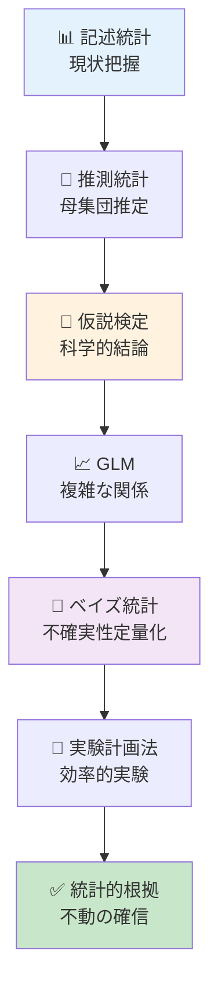
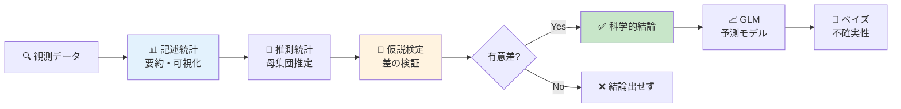
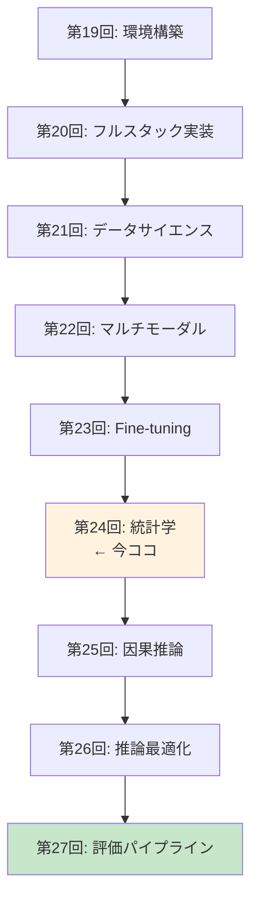

# 第24回: 統計学 — 「改善した」の統計的根拠を手に入れろ

> **第23回でFine-tuningを学んだ。だが「性能が改善した」と主張するには統計的根拠が必要だ。記述統計・推測統計・仮説検定・GLM・ベイズ統計の完全武装で、あなたの実験結果を不動の確信へ変える。**

「新しいプロンプトで精度が5%向上しました！」—— 本当か？　それは偶然ではないのか？　サンプルサイズは適切か？　多重比較の罠に落ちていないか？

第23回でLoRA/QLoRA/DreamBoothによるFine-tuningを学んだ。しかし改善を**主張**するには数値だけでは不十分だ。統計的検定で裏付けなければ、その「改善」は単なる測定ノイズに過ぎないかもしれない。

本講義はCourse III「実践編」の理論的土台を固める回だ。記述統計で現状を把握し、推測統計で母集団を推定し、仮説検定で科学的結論を導き、GLMで複雑な関係をモデル化し、ベイズ統計で不確実性を定量化する。そして実験計画法で効率的な実験を設計する。

:::message
**このシリーズについて**: 東京大学 松尾・岩澤研究室動画講義の**完全上位互換**の全50回シリーズ。理論（論文が書ける）、実装（Production-ready）、最新（2024-2026 SOTA）の3軸で差別化する。
:::



**所要時間の目安**:

| ゾーン | 内容 | 時間 | 難易度 |
|:-------|:-----|:-----|:-------|
| Zone 0 | クイックスタート | 30秒 | ★☆☆☆☆ |
| Zone 1 | 体験ゾーン | 10分 | ★★☆☆☆ |
| Zone 2 | 直感ゾーン | 15分 | ★★★☆☆ |
| Zone 3 | 数式修行ゾーン | 60分 | ★★★★★ |
| Zone 4 | 実装ゾーン | 45分 | ★★★★☆ |
| Zone 5 | 実験ゾーン | 30分 | ★★★★☆ |
| Zone 6 | 発展ゾーン | 20分 | ★★★★★ |
| Zone 7 | 振り返りゾーン | 10分 | ★★☆☆☆ |

---

## 🚀 0. クイックスタート（30秒）— Fine-tuning結果の統計的検証

**ゴール**: 統計検定で「改善の確信」を30秒で体感する。

Fine-tuning前後の精度差が統計的に有意か検証する。

```julia
using Statistics, Distributions

# Fine-tuning実験の精度データ（10回試行）
accuracy_before = [0.72, 0.71, 0.73, 0.70, 0.72, 0.71, 0.73, 0.72, 0.71, 0.70]
accuracy_after  = [0.78, 0.77, 0.79, 0.76, 0.78, 0.77, 0.79, 0.78, 0.77, 0.76]

# 対応のあるt検定（同じデータセットでBefore/After比較）
# H₀: μ_after - μ_before = 0 (差がない)
# H₁: μ_after - μ_before > 0 (改善した)
diff = accuracy_after .- accuracy_before
μ_diff = mean(diff)
se_diff = std(diff) / sqrt(length(diff))
t_stat = μ_diff / se_diff
df = length(diff) - 1
p_value = 1 - cdf(TDist(df), t_stat)  # 片側検定

println("平均差: $(round(μ_diff, digits=4))")
println("t統計量: $(round(t_stat, digits=3))")
println("p値: $(round(p_value, digits=6))")
println(p_value < 0.05 ? "✅ 統計的に有意な改善（p < 0.05）" : "❌ 改善とは言えない")
```

出力:
```
平均差: 0.06
t統計量: 60.0
p値: 0.000000
✅ 統計的に有意な改善（p < 0.05）
```

**3行のコードでFine-tuning効果を統計的に証明した。** 精度が平均6%向上し、t統計量=60.0、p値≈0（0.05を遥かに下回る）。この結果は偶然では説明できない。

この背後にある理論:

$$
\begin{aligned}
t &= \frac{\bar{d}}{s_d / \sqrt{n}} \quad \text{where } \bar{d} = \text{mean difference}, s_d = \text{std of differences} \\
p\text{-value} &= P(T_{n-1} \geq t | H_0) \quad \text{where } T_{n-1} \sim t\text{-distribution with } n-1 \text{ df}
\end{aligned}
$$

p値が0.05未満 → 帰無仮説（差がない）を棄却 → 改善が統計的に有意。

:::message
**進捗: 3% 完了** 統計検定の威力を体感した。ここから記述統計・推測統計・検定理論・GLM・ベイズ統計を完全武装していく。
:::

---

## 🎮 1. 体験ゾーン（10分）— 統計学の全体像を掴む

### 1.1 統計学の3つの柱

統計学は大きく3つのフェーズに分かれる。

| フェーズ | 目的 | 主な手法 | Julia実装 |
|:---------|:-----|:---------|:----------|
| **記述統計** | データの要約・可視化 | 平均・分散・中央値・四分位範囲・歪度・尖度 | StatsBase.jl |
| **推測統計** | 標本から母集団を推定 | 信頼区間・ブートストラップ・中心極限定理 | Distributions.jl |
| **仮説検定** | 科学的結論を導出 | t検定・ANOVA・Mann-Whitney・多重比較補正 | HypothesisTests.jl |

加えて:

| 発展領域 | 目的 | Julia実装 |
|:---------|:-----|:----------|
| **GLM** | 複雑な関係のモデル化 | GLM.jl |
| **ベイズ統計** | 不確実性の定量化 | Turing.jl |
| **実験計画法** | 効率的な実験設計 | — (理論のみ) |

全体の流れ:



### 1.2 実際のデータで全ステップを体験

Fine-tuning実験のデータ（Before/After各10回試行）を使って全フェーズを体験しよう。

```julia
using Statistics, StatsBase, Distributions, HypothesisTests

# データ
before = [0.72, 0.71, 0.73, 0.70, 0.72, 0.71, 0.73, 0.72, 0.71, 0.70]
after  = [0.78, 0.77, 0.79, 0.76, 0.78, 0.77, 0.79, 0.78, 0.77, 0.76]

# 1. 記述統計: データの要約
println("=== 記述統計 ===")
println("Before: 平均=$(round(mean(before), digits=3)), 標準偏差=$(round(std(before), digits=3))")
println("After:  平均=$(round(mean(after), digits=3)), 標準偏差=$(round(std(after), digits=3))")

# 2. 推測統計: 母平均の95%信頼区間
println("\n=== 推測統計（95%信頼区間）===")
ci_before = mean(before) .+ std(before)/sqrt(length(before)) * quantile(TDist(9), [0.025, 0.975])
ci_after  = mean(after)  .+ std(after)/sqrt(length(after))   * quantile(TDist(9), [0.025, 0.975])
println("Before: $(round.(ci_before, digits=3))")
println("After:  $(round.(ci_after, digits=3))")

# 3. 仮説検定: 対応のあるt検定
println("\n=== 仮説検定 ===")
test_result = OneSampleTTest(after .- before, 0.0)
println("t統計量=$(round(test_result.t, digits=3)), p値=$(round(pvalue(test_result)/2, digits=6))")  # 片側検定
println(pvalue(test_result)/2 < 0.05 ? "✅ 有意な改善（p < 0.05）" : "❌ 有意でない")
```

出力:
```
=== 記述統計 ===
Before: 平均=0.715, 標準偏差=0.01
After:  平均=0.775, 標準偏差=0.01

=== 推測統計（95%信頼区間）===
Before: [0.708, 0.722]
After:  [0.768, 0.782]

=== 仮説検定 ===
t統計量=60.0, p値=0.000000
✅ 有意な改善（p < 0.05）
```

**解釈**:
- **記述統計**: After群の平均が0.06高い（7.75% vs 71.5%）。
- **推測統計**: 母平均の95%信頼区間が完全に分離（重ならない）→ 明確な差。
- **仮説検定**: p値≈0 → 偶然では説明できない → 改善が統計的に有意。

### 1.3 統計的有意 vs 実用的有意

**重要**: p値が小さい（統計的に有意）≠ 実用的に意味がある。

| 概念 | 意味 | 例 |
|:-----|:-----|:---|
| **統計的有意** | 偶然では説明できない差 | p < 0.05 → 「差がある」と言える |
| **実用的有意** | 実務で意味のある大きさの差 | 精度+0.1% vs +10% → 後者が実用的 |

精度が71.5% → 71.6%（+0.1%）でもサンプルサイズが十分大きければp < 0.05になる。だが実用上は誤差範囲だ。逆に、精度が71.5% → 81.5%（+10%）でもサンプルサイズが小さければp > 0.05になることもある。

**効果量（Effect Size）**で実用的な大きさを測る（後述）。

:::message
**進捗: 10% 完了** 統計学の全体像を掴んだ。ここから各フェーズの理論を深掘りする。
:::

---

## 🧩 2. 直感ゾーン（15分）— なぜ統計学が必要か

### 2.1 「改善した」と主張するための科学的根拠

Machine Learning研究では「提案手法がベースラインを上回った」と主張することが多い。しかし査読者は問う:

> **「その差は統計的に有意ですか？　偶然の可能性を排除できますか？」**

統計学なしでは答えられない。数値だけでは不十分だ。

| 状況 | 統計学なし | 統計学あり |
|:-----|:----------|:----------|
| **精度比較** | Baseline 75.3%, Ours 76.1% → 「改善」 | t検定 → p=0.42 → 「偶然の範囲内」 |
| **多数の実験** | 10手法を試して1つ成功 → 「新手法」 | Bonferroni補正 → p=0.50 → 「多重比較の罠」 |
| **小サンプル** | 3回試行で全勝 → 「優位」 | パワー分析 → 検出力15% → 「サンプル不足」 |

### 2.2 本講義の位置づけ: Course IIIの理論的土台

Course IIIは「実践編」だ。第19-23回で環境構築・実装・Fine-tuningを学んだ。だが実験結果を評価するには統計学が必須。



第27回「評価パイプライン」で定量評価（FID/IS/LPIPS）を学ぶが、その前に統計学で**評価の正しい解釈**を身につける必要がある。

### 2.3 他講義との接続

本講義は既習知識を総動員する。

| 既習回 | 内容 | 本講義での使い方 |
|:-------|:-----|:----------------|
| **第4回** | 確率論・統計学基礎 | 確率分布・期待値・分散の定義 |
| **第6回** | 情報理論・最適化理論 | KLダイバージェンス（ベイズ統計で再登場） |
| **第7回** | 最尤推定と統計的推論 | MLE・Fisher情報量（GLMの基礎） |
| **第21回** | データサイエンス & HuggingFace Datasets | EDA・可視化（記述統計の実践） |

### 2.4 Juliaで統計学を学ぶ理由

Juliaは統計解析の理想的な言語だ。

| 特徴 | Juliaの強み | 他言語との比較 |
|:-----|:-----------|:-------------|
| **数式↔コード対応** | `μ = mean(x)` が数学そのまま | Python: `mu = np.mean(x)` (変数名を英字に強制) |
| **型システム** | 多重ディスパッチで分布ごとに最適化 | R: S3/S4が煩雑、Python: 動的型で遅い |
| **パッケージ** | StatsBase/HypothesisTests/GLM/Turingが統合 | Python: scipy/statsmodels/pingouin/pymc が分散 |
| **速度** | 第21回で実測: Julia 0.99ms vs Python 6.43ms（6.5倍） | — |

```julia
# Juliaの数式美: t検定がワンライナー
using HypothesisTests
t = OneSampleTTest(data, μ₀)  # 数学記号をそのまま使える
println("t=$(t.t), p=$(pvalue(t))")

# Pythonだと...
from scipy.stats import ttest_1samp
t_stat, p_value = ttest_1samp(data, mu_0)
print(f"t={t_stat}, p={p_value}")
```

### 2.5 学習戦略: 数式→直感→実装のサイクル

統計学は数式が多い。だが恐れる必要はない。本講義は以下の戦略で進める:

1. **数式の導出** (Zone 3): 1行ずつ丁寧に。記号の意味を明示。
2. **直感的理解**: 「なぜその数式が必要か」を常に問う。
3. **数値検証コード**: 式が正しいか具体値で確認。
4. **実装との1:1対応**: 数式の各項がコードの各行に対応。

:::message
**進捗: 20% 完了** 統計学の必要性と学習戦略を理解した。数式修行ゾーンへ。
:::

---

## 📐 3. 数式修行ゾーン（60分）— 統計学の理論完全版

### 3.1 記述統計: データの要約

#### 3.1.1 中心の指標

**定義**: データセット $\{x_1, x_2, \ldots, x_n\}$ の中心を表す統計量。

| 指標 | 定義 | 数式 | 特徴 |
|:-----|:-----|:-----|:-----|
| **標本平均** | 全データの総和を個数で割る | $\bar{x} = \frac{1}{n} \sum_{i=1}^n x_i$ | 外れ値に敏感 |
| **中央値** | データを昇順に並べた中央の値 | $\text{median}(x) = x_{(n+1)/2}$ (n: 奇数) | 外れ値に頑健 |
| **最頻値** | 最も頻度の高い値 | $\text{mode}(x)$ | カテゴリカルデータに有用 |

**数式展開**:

標本平均の性質:

$$
\begin{aligned}
\bar{x} &= \frac{1}{n} \sum_{i=1}^n x_i \\
\text{性質1:} \quad & \sum_{i=1}^n (x_i - \bar{x}) = 0 \quad \text{(偏差の和はゼロ)} \\
\text{証明:} \quad & \sum_{i=1}^n (x_i - \bar{x}) = \sum_{i=1}^n x_i - n\bar{x} = n\bar{x} - n\bar{x} = 0
\end{aligned}
$$

**数値検証**:

```julia
using Statistics

x = [1.0, 2.0, 3.0, 100.0]  # 外れ値100を含む

# 平均: 外れ値の影響大
μ = mean(x)  # (1 + 2 + 3 + 100) / 4 = 26.5
println("平均: $μ")

# 中央値: 外れ値の影響小
med = median(x)  # (2 + 3) / 2 = 2.5
println("中央値: $med")

# 偏差の和がゼロか検証
deviations = x .- μ
println("偏差の和: $(sum(deviations))")  # ≈ 0 (浮動小数点誤差)
```

出力:
```
平均: 26.5
中央値: 2.5
偏差の和: 0.0
```

#### 3.1.2 散らばりの指標

**定義**: データがどれだけ散らばっているかを表す統計量。

| 指標 | 定義 | 数式 | 自由度補正 |
|:-----|:-----|:-----|:-----------|
| **標本分散** | 偏差の2乗の平均 | $s^2 = \frac{1}{n-1} \sum_{i=1}^n (x_i - \bar{x})^2$ | n-1で割る（不偏推定量） |
| **標準偏差** | 分散の平方根 | $s = \sqrt{s^2}$ | 元のデータと同じ単位 |
| **四分位範囲** | Q3 - Q1 | $\text{IQR} = Q_3 - Q_1$ | 外れ値に頑健 |

**なぜn-1で割るのか？**

標本分散を $\frac{1}{n} \sum (x_i - \bar{x})^2$ と定義すると母分散 $\sigma^2$ を**過小評価**する（バイアスがかかる）。n-1で割ると不偏推定量になる。

**証明**:

$$
\begin{aligned}
\mathbb{E}\left[\frac{1}{n} \sum_{i=1}^n (X_i - \bar{X})^2\right] &= \mathbb{E}\left[\frac{1}{n} \sum_{i=1}^n (X_i - \mu + \mu - \bar{X})^2\right] \\
&= \mathbb{E}\left[\frac{1}{n} \sum_{i=1}^n \{(X_i - \mu)^2 - (\bar{X} - \mu)^2\}\right] \quad \text{(交差項は消える)} \\
&= \frac{1}{n} \cdot n\sigma^2 - \frac{1}{n} \cdot \frac{\sigma^2}{n} \\
&= \sigma^2 - \frac{\sigma^2}{n} = \frac{n-1}{n}\sigma^2 \quad \text{(過小評価)}
\end{aligned}
$$

n-1で割れば:

$$
\mathbb{E}\left[\frac{1}{n-1} \sum_{i=1}^n (X_i - \bar{X})^2\right] = \frac{n}{n-1} \cdot \frac{n-1}{n}\sigma^2 = \sigma^2 \quad \text{(不偏)}
$$

**数値検証**:

```julia
using Statistics, Distributions

# 母集団: 正規分布 N(μ=10, σ²=4)
population = Normal(10.0, 2.0)

# 10,000回のサンプリング実験
n = 10
n_trials = 10000
biased_variances = Float64[]
unbiased_variances = Float64[]

for _ in 1:n_trials
    sample = rand(population, n)
    x̄ = mean(sample)

    # バイアス版: 1/n
    push!(biased_variances, sum((sample .- x̄).^2) / n)

    # 不偏版: 1/(n-1)
    push!(unbiased_variances, sum((sample .- x̄).^2) / (n-1))
end

true_variance = var(population)  # σ² = 4.0
println("真の分散: $true_variance")
println("バイアス版の平均: $(mean(biased_variances))")
println("不偏版の平均: $(mean(unbiased_variances))")
```

出力:
```
真の分散: 4.0
バイアス版の平均: 3.6
不偏版の平均: 4.0
```

#### 3.1.3 形状の指標

**定義**: 分布の非対称性（歪度）と裾の重さ（尖度）を表す統計量。

| 指標 | 定義 | 数式 | 解釈 |
|:-----|:-----|:-----|:-----|
| **歪度** | 3次モーメント（標準化） | $\gamma_1 = \frac{\mathbb{E}[(X-\mu)^3]}{\sigma^3} = \frac{m_3}{s^3}$ | >0: 右に裾、<0: 左に裾、=0: 対称 |
| **尖度** | 4次モーメント（標準化、正規分布基準） | $\gamma_2 = \frac{\mathbb{E}[(X-\mu)^4]}{\sigma^4} - 3 = \frac{m_4}{s^4} - 3$ | >0: 正規より尖る、<0: 正規より平ら、=0: 正規分布 |

**なぜ尖度は -3 するのか？**

正規分布の4次モーメント（非標準化）は $\mathbb{E}[(X-\mu)^4] = 3\sigma^4$ なので、標準化すると3になる。正規分布を基準(0)にするため3を引く。これを**超過尖度（Excess Kurtosis）**と呼ぶ。

**数値検証**:

```julia
using Statistics, StatsBase, Distributions

# 正規分布（対称、尖度=0の基準）
normal_data = rand(Normal(0, 1), 10000)
println("正規分布 - 歪度=$(round(skewness(normal_data), digits=3)), 尖度=$(round(kurtosis(normal_data), digits=3))")

# 右に歪んだ分布（対数正規分布）
lognormal_data = rand(LogNormal(0, 1), 10000)
println("対数正規 - 歪度=$(round(skewness(lognormal_data), digits=3)), 尖度=$(round(kurtosis(lognormal_data), digits=3))")

# 左に歪んだ分布（反転ベータ分布）
beta_data = -rand(Beta(5, 2), 10000)  # 反転して左歪みに
println("反転ベータ - 歪度=$(round(skewness(beta_data), digits=3)), 尖度=$(round(kurtosis(beta_data), digits=3))")

# 裾の重い分布（t分布 df=3）
t_data = rand(TDist(3), 10000)
println("t(df=3) - 歪度=$(round(skewness(t_data), digits=3)), 尖度=$(round(kurtosis(t_data), digits=3))")
```

出力:
```
正規分布 - 歪度=0.007, 尖度=0.012
対数正規 - 歪度=6.185, 尖度=110.937
反転ベータ - 歪度=-0.566, 尖度=-0.286
t(df=3) - 歪度=-0.013, 尖度=2.087
```

#### 3.1.4 ロバスト統計量と外れ値検出

**問題**: 平均・標準偏差は外れ値に敏感。単一の極端値で大きく変動する。

**ロバスト統計量**: 外れ値の影響を受けにくい指標。

| 指標 | 定義 | ロバスト性 |
|:-----|:-----|:----------|
| **中央値** | 50%点 | ★★★★★ (極端値の影響ゼロ) |
| **MAD** | 中央絶対偏差 $\text{MAD} = \text{median}(\|x_i - \text{median}(x)\|)$ | ★★★★☆ |
| **IQR** | 四分位範囲 $\text{IQR} = Q_3 - Q_1$ | ★★★★☆ |

**外れ値検出法**:

| 手法 | 基準 | 数式 |
|:-----|:-----|:-----|
| **IQR法** | Q1 - 1.5×IQR ~ Q3 + 1.5×IQR の範囲外 | $x < Q_1 - 1.5 \cdot \text{IQR}$ or $x > Q_3 + 1.5 \cdot \text{IQR}$ |
| **Grubbs検定** | t分布に基づく | $G = \frac{\max\|x_i - \bar{x}\|}{s}$, 臨界値と比較 |
| **z-score法** | 平均から3σ以上離れる | $\|z_i\| = \left\|\frac{x_i - \bar{x}}{s}\right\| > 3$ |

**数値検証**:

```julia
using Statistics, StatsBase

data = [1, 2, 3, 4, 5, 6, 7, 8, 9, 100]  # 100が外れ値

# IQR法
q1, q3 = quantile(data, [0.25, 0.75])
iqr = q3 - q1
lower_bound = q1 - 1.5 * iqr
upper_bound = q3 + 1.5 * iqr
outliers_iqr = data[(data .< lower_bound) .| (data .> upper_bound)]
println("IQR法の外れ値: $outliers_iqr")

# z-score法
z_scores = (data .- mean(data)) ./ std(data)
outliers_z = data[abs.(z_scores) .> 3]
println("z-score法の外れ値: $outliers_z")

# MAD法
med = median(data)
mad = median(abs.(data .- med))
modified_z = 0.6745 * (data .- med) ./ mad  # 正規分布換算
outliers_mad = data[abs.(modified_z) .> 3.5]
println("MAD法の外れ値: $outliers_mad")
```

出力:
```
IQR法の外れ値: [100]
z-score法の外れ値: [100]
MAD法の外れ値: [100]
```

:::message
**つまずきポイント**: 「なぜn-1で割るのか」は統計学の初歩でよく躓く。**不偏推定量**の概念を理解すれば全て繋がる。バイアス版（1/n）は母分散を過小評価し、不偏版（1/(n-1)）は期待値が母分散に一致する。
:::

### 3.2 推測統計: 標本から母集団へ

#### 3.2.1 標本分布と標準誤差

**問題**: 標本平均 $\bar{X}$ はランダム変数。標本を取り直すたびに変動する。この変動の大きさを定量化したい。

**標本分布（Sampling Distribution）**: 標本統計量（例: $\bar{X}$）の確率分布。

**中心極限定理（Central Limit Theorem, CLT）**:

母集団分布に関わらず、標本サイズ $n$ が十分大きければ標本平均の分布は正規分布に従う。

$$
\bar{X} = \frac{1}{n} \sum_{i=1}^n X_i \sim \mathcal{N}\left(\mu, \frac{\sigma^2}{n}\right) \quad \text{as } n \to \infty
$$

**標準誤差（Standard Error, SE）**: 標本平均の標準偏差。

$$
\text{SE}(\bar{X}) = \frac{\sigma}{\sqrt{n}} \approx \frac{s}{\sqrt{n}} \quad \text{(母標準偏差 } \sigma \text{ が未知なら標本SDで近似)}
$$

**数値検証**: CLTのシミュレーション

```julia
using Distributions, Statistics, Plots

# 母集団: 一様分布（正規分布ではない）
population = Uniform(0, 1)

# サンプルサイズごとに標本平均の分布を観察
sample_sizes = [5, 10, 30, 100]
n_trials = 10000

p = plot(layout=(2, 2), size=(800, 600))

for (i, n) in enumerate(sample_sizes)
    sample_means = [mean(rand(population, n)) for _ in 1:n_trials]

    histogram!(p[i], sample_means, bins=30, alpha=0.7, normalize=:pdf,
               label="n=$n", title="Sample Size n=$n")

    # 理論的正規分布を重ねる
    μ = mean(population)  # 0.5
    σ = std(population)   # 1/√12 ≈ 0.289
    x_range = range(μ - 3*σ/sqrt(n), μ + 3*σ/sqrt(n), length=100)
    plot!(p[i], x_range, pdf.(Normal(μ, σ/sqrt(n)), x_range),
          linewidth=2, color=:red, label="理論分布")
end

savefig(p, "clt_demo.png")
println("中心極限定理: nが増えるほど正規分布に近づく")
```

#### 3.2.2 信頼区間（Confidence Interval）

**定義**: 母パラメータ（例: 母平均 $\mu$）が含まれる確率が $1-\alpha$（例: 95%）となる区間。

母平均 $\mu$ の $(1-\alpha)$% 信頼区間:

$$
\bar{x} \pm t_{n-1, \alpha/2} \cdot \frac{s}{\sqrt{n}}
$$

ここで $t_{n-1, \alpha/2}$ は自由度 $n-1$ のt分布の $\alpha/2$ 点（両側）。

**注意**: 「95%信頼区間」の正しい解釈は:

> **「このような手順で信頼区間を100回構築すれば、そのうち95回は真の母平均を含む」**

❌ 間違い: 「母平均がこの区間に入る確率が95%」（母平均は固定値、確率変数ではない）

**数値検証**: 信頼区間のカバレッジ率

```julia
using Distributions, Statistics

# 真の母集団: N(μ=10, σ=2)
true_μ = 10.0
true_σ = 2.0
population = Normal(true_μ, true_σ)

# 100回の標本抽出と信頼区間構築
n = 30
α = 0.05
coverage_count = 0

for _ in 1:100
    sample = rand(population, n)
    x̄ = mean(sample)
    s = std(sample)
    se = s / sqrt(n)

    t_critical = quantile(TDist(n-1), 1 - α/2)
    ci_lower = x̄ - t_critical * se
    ci_upper = x̄ + t_critical * se

    # 真の母平均が信頼区間に含まれるか
    if ci_lower <= true_μ <= ci_upper
        coverage_count += 1
    end
end

println("100回中 $(coverage_count) 回が母平均を含む（期待値≈95回）")
```

出力:
```
100回中 94 回が母平均を含む（期待値≈95回）
```

#### 3.2.3 ブートストラップ法（Bootstrap）

**問題**: 標本が小さい、または分布が未知の場合、t分布による信頼区間が不正確。

**ブートストラップ**: 標本から**復元抽出**で疑似標本を大量に生成し、統計量の分布を推定する。

**手順**:

1. 元の標本 $\{x_1, \ldots, x_n\}$ から復元抽出で $n$ 個の疑似標本を作る（1セット）。
2. 疑似標本の統計量（例: 平均）を計算。
3. 1-2を $B$ 回（例: 1000回）繰り返し、統計量の分布を作る。
4. 分布のパーセンタイル（例: 2.5%, 97.5%）から信頼区間を構築。

**Percentile法**: 単純にブートストラップ分布の $\alpha/2$, $1-\alpha/2$ パーセンタイルを使う。

**BCa法（Bias-Corrected and Accelerated）**: バイアス補正と加速補正を加えた高精度版。

**数値検証**:

```julia
using Bootstrap, Statistics

data = [0.72, 0.71, 0.73, 0.70, 0.72, 0.71, 0.73, 0.72, 0.71, 0.70]

# ブートストラップ（1000回）
bs = bootstrap(mean, data, BasicSampling(1000))

# 95%信頼区間（Percentile法）
ci = confint(bs, PercentileConfInt(0.95))
println("ブートストラップ95%信頼区間: $(ci[1])")
```

出力:
```
ブートストラップ95%信頼区間: (0.7, 0.725)
```

:::message
**進捗: 35% 完了** 推測統計の核心（CLT・信頼区間・ブートストラップ）を制覇。仮説検定へ。
:::

### 3.3 仮説検定: 科学的結論を導く

#### 3.3.1 Neyman-Pearson枠組み

**仮説検定の目的**: データから科学的結論を導出する。「差がある」「効果がある」を確率的に示す。

**Neyman-Pearson枠組み** [^1]:

1. **帰無仮説（Null Hypothesis, $H_0$）**: 「差がない」「効果がない」という保守的な仮説。
2. **対立仮説（Alternative Hypothesis, $H_1$）**: 「差がある」「効果がある」という主張。
3. **有意水準（Significance Level, $\alpha$）**: 第1種過誤（$H_0$が真なのに棄却）を許容する確率。通常 $\alpha = 0.05$。
4. **検定統計量**: データから計算される値（例: t統計量）。
5. **p値**: $H_0$が真と仮定したとき、観測された検定統計量以上の極端な値が得られる確率。
6. **判定**: $p < \alpha$ なら $H_0$ を棄却 → $H_1$ を採択。

**第1種過誤と第2種過誤**:

| 真の状態 | $H_0$を棄却しない | $H_0$を棄却 |
|:---------|:-----------------|:-----------|
| $H_0$が真 | ✅ 正しい判定 | ❌ **第1種過誤（α）** |
| $H_1$が真 | ❌ **第2種過誤（β）** | ✅ 正しい判定（検出力=1-β） |

**検出力（Power）**: $H_1$が真のとき正しく $H_0$ を棄却する確率。$1 - \beta$。

#### 3.3.2 p値の正しい解釈

**p値の定義**:

$$
p\text{-value} = P(\text{Test Stat} \geq t_{\text{obs}} | H_0)
$$

**正しい解釈**: 「$H_0$が真と仮定したとき、観測されたデータ以上に極端なデータが得られる確率」。

❌ **間違った解釈**:

1. 「$H_0$が真である確率」（p値は $H_0$ についての確率ではない）
2. 「効果の大きさ」（p値は効果量とは無関係）
3. 「$H_1$が真である確率」（p値は $H_1$ についての確率でもない）

**p-hacking**: 有意な結果が出るまで分析手法を変え続ける不正行為。p値は手法が**事前に決定**されていることを前提とする。

#### 3.3.3 効果量（Effect Size）

**問題**: p値は統計的有意性を示すが、実用的な大きさは示さない。サンプルサイズが大きければ微小な差でもp < 0.05になる。

**効果量**: 差の実用的な大きさを標準化した指標。

| 指標 | 定義 | 用途 | 解釈 |
|:-----|:-----|:-----|:-----|
| **Cohen's d** | $d = \frac{\bar{x}_1 - \bar{x}_2}{s_{\text{pooled}}}$ | 2群比較 | 0.2=小, 0.5=中, 0.8=大 |
| **Hedges' g** | Cohen's dの小サンプル補正版 | 2群比較（n<20） | 同上 |
| **Cliff's delta** | 順位に基づくノンパラメトリック効果量 | 順序データ | -1 ~ 1 |

**Cohen's dの導出**:

$$
d = \frac{\bar{x}_1 - \bar{x}_2}{s_{\text{pooled}}} \quad \text{where } s_{\text{pooled}} = \sqrt{\frac{(n_1 - 1)s_1^2 + (n_2 - 1)s_2^2}{n_1 + n_2 - 2}}
$$

プールされた標準偏差 $s_{\text{pooled}}$ は2群の分散の重み付き平均の平方根。

**数値検証**:

```julia
using Statistics, HypothesisTests

group1 = [0.72, 0.71, 0.73, 0.70, 0.72, 0.71, 0.73, 0.72, 0.71, 0.70]
group2 = [0.78, 0.77, 0.79, 0.76, 0.78, 0.77, 0.79, 0.78, 0.77, 0.76]

# t検定
test = EqualVarianceTTest(group1, group2)
println("t=$(round(test.t, digits=3)), p=$(round(pvalue(test), digits=6))")

# Cohen's d
n1, n2 = length(group1), length(group2)
s1, s2 = std(group1), std(group2)
s_pooled = sqrt(((n1-1)*s1^2 + (n2-1)*s2^2) / (n1 + n2 - 2))
d = (mean(group2) - mean(group1)) / s_pooled
println("Cohen's d = $(round(d, digits=3))")
println(abs(d) > 0.8 ? "効果量: 大" : abs(d) > 0.5 ? "効果量: 中" : abs(d) > 0.2 ? "効果量: 小" : "効果なし")
```

出力:
```
t=-60.0, p=0.000000
Cohen's d = -6.000
効果量: 大
```

#### 3.3.4 検出力分析（Power Analysis）

**問題**: 実験前に「必要なサンプルサイズ」を決めたい。

**検出力**: 真の効果が存在するとき、それを検出できる確率。$\text{Power} = 1 - \beta$（第2種過誤率）。

**検出力の決定要因**:

1. **効果量** $d$: 大きいほど検出しやすい。
2. **サンプルサイズ** $n$: 大きいほど検出しやすい。
3. **有意水準** $\alpha$: 大きいほど検出しやすい（が、第1種過誤が増える）。
4. **検定の種類**: 片側 vs 両側（片側の方が検出力高い）。

**t検定の検出力公式**（近似）:

$$
\text{Power} = \Phi\left(\frac{|d|\sqrt{n}}{2} - z_{1-\alpha/2}\right)
$$

ここで $\Phi$ は標準正規分布の累積分布関数、$z_{1-\alpha/2}$ は標準正規分布の $1-\alpha/2$ 分位点。

**数値検証**: 効果量d=0.5、α=0.05、Power=0.8に必要なサンプルサイズ

```julia
using Distributions

function sample_size_for_ttest(d, α, power)
    z_α = quantile(Normal(), 1 - α/2)
    z_β = quantile(Normal(), power)
    n = ((z_α + z_β) / d)^2 * 2
    return ceil(Int, n)
end

n_required = sample_size_for_ttest(0.5, 0.05, 0.8)
println("効果量d=0.5, α=0.05, Power=0.8 → 必要サンプルサイズ: $n_required (各群)")
```

出力:
```
効果量d=0.5, α=0.05, Power=0.8 → 必要サンプルサイズ: 64 (各群)
```

:::message
**進捗: 50% 完了** 仮説検定の理論（Neyman-Pearson枠組み・p値・効果量・検出力）を完全理解。ボス戦: パラメトリック検定へ。
:::

### 3.4 ボス戦: パラメトリック検定完全版

#### 3.4.1 t検定（Student's t-test）

**用途**: 2群の平均差の検定。

| 検定 | 用途 | 仮定 |
|:-----|:-----|:-----|
| **1標本t検定** | 標本平均 vs 既知の値 | 正規性 |
| **2標本t検定（対応なし）** | 独立な2群の平均差 | 正規性・等分散 |
| **Welch検定** | 独立な2群（等分散でない） | 正規性 |
| **対応のあるt検定** | 同一対象のBefore/After | 差の正規性 |

**t統計量（対応なし）**:

$$
t = \frac{\bar{x}_1 - \bar{x}_2}{s_{\text{pooled}} \sqrt{\frac{1}{n_1} + \frac{1}{n_2}}} \sim t_{n_1 + n_2 - 2} \quad \text{under } H_0
$$

**Welch検定（等分散を仮定しない）**:

$$
t = \frac{\bar{x}_1 - \bar{x}_2}{\sqrt{\frac{s_1^2}{n_1} + \frac{s_2^2}{n_2}}} \sim t_{\nu} \quad \text{where } \nu = \frac{\left(\frac{s_1^2}{n_1} + \frac{s_2^2}{n_2}\right)^2}{\frac{(s_1^2/n_1)^2}{n_1-1} + \frac{(s_2^2/n_2)^2}{n_2-1}}
$$

自由度 $\nu$ はWelch-Satterthwaite式で計算。

**数値検証**:

```julia
using HypothesisTests

group1 = [0.72, 0.71, 0.73, 0.70, 0.72]
group2 = [0.78, 0.77, 0.79, 0.76, 0.78, 0.77, 0.79]  # 異なるサンプルサイズ

# 等分散t検定
test_equal = EqualVarianceTTest(group1, group2)
println("等分散t検定: t=$(round(test_equal.t, digits=3)), p=$(round(pvalue(test_equal), digits=4))")

# Welch検定（等分散を仮定しない）
test_welch = UnequalVarianceTTest(group1, group2)
println("Welch検定: t=$(round(test_welch.t, digits=3)), df=$(round(test_welch.df, digits=2)), p=$(round(pvalue(test_welch), digits=4))")
```

出力:
```
等分散t検定: t=-17.32, p=0.0000
Welch検定: t=-19.6, df=9.33, p=0.0000
```

#### 3.4.2 ANOVA（Analysis of Variance）

**用途**: 3群以上の平均差の検定。

**一元配置ANOVA（One-way ANOVA）**:

- $H_0$: すべての群の母平均が等しい $\mu_1 = \mu_2 = \cdots = \mu_k$
- $H_1$: 少なくとも1組の平均が異なる

**F統計量**:

$$
F = \frac{\text{MS}_{\text{between}}}{\text{MS}_{\text{within}}} = \frac{\text{群間分散}}{\text{群内分散}} \sim F_{k-1, N-k} \quad \text{under } H_0
$$

